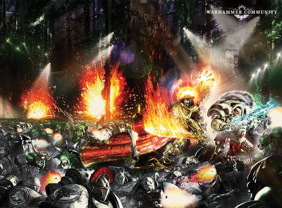

# 0757 大远征早期 戈罗之战 Battle of Gorro

精校状态：中文行文已逐段精校，部分术语仍为暂定

分类：时间线

原文来源：https://www.bilibili.com/opus/1057106973286203393

原作者：帝国神选罐头

原文时间：2025年04月18日 16:34

[返回分类目录](目录.md) · [全书目录](../../目录.md)

<!-- A0757-B0001 -->
**英文原文**

The Battle of Gorro was a battle of the early Great Crusade.

<!-- /A0757-B0001 -->

<!-- A0757-B0002 -->

原译文

戈罗之战是大远征早期的一场战役。

**校订译文**

戈罗之战是大远征早期的一场战役。

<!-- /A0757-B0002 -->

<!-- A0757-B0003 图片 -->

<!-- A0757-B0004 -->

原译文

The Emperor and Horus fight together during the Battle of Gorro 在戈罗战役中，帝皇和荷鲁斯并肩作战

**校订译文**

The Emperor and Horus fight together during the Battle of Gorro 在戈罗战役中，帝皇和荷鲁斯并肩作战

<!-- /A0757-B0004 -->

<!-- A0757-B0005 -->
## Overview 概述

<!-- /A0757-B0005 -->

<!-- A0757-B0006 -->
**英文原文**

Waged in the Telon Reach, against an Ork Empire described as a "satrapy" of that of Ullanor. 1,000 warships led by the Emperor in the Imperator Somnium and a younger Horus in the Vengeful Spirit swept aside the Ork orbital defences and fleet before descending on the Mekboyz-dominated "scrapworld" of Gorro. The Justaerin and Custodian Guard accompanied the Emperor and Horus as they led the assault on the planet. Using his supreme psychic might, the Emperor teleported across the battlefield and slew dozens of Orks with each strike.

<!-- /A0757-B0006 -->

<!-- A0757-B0007 -->

原译文

在泰隆河段与被称为乌兰诺“总督辖地”的欧克帝国交战。由皇帝率领的帝皇幻梦号和年轻的荷鲁斯率领的复仇之魂号和1000艘战舰横扫了欧克轨道防御和舰队，然后降落在由技师小子主导的戈罗“碎片世界”。加斯塔林和禁军陪同帝皇和荷鲁斯领导了对星球的进攻。利用他至高无上的灵能力量，帝皇在战场上传送，每次打击都杀死了数十只兽人。

**校订译文**

战斗发生于泰隆疆域，对手是一个被称作乌兰诺“总督辖区”的欧克帝国。帝皇乘帝皇幻梦号、年轻的荷鲁斯乘复仇之魂号，共率一千艘战舰扫平敌军舰队与轨道防御，随后进攻由技师小子主导的“废料世界”戈罗。加斯塔林与帝国禁军伴随两位统帅降下地面，发动突击。帝皇凭借无上灵能在战场间传送，每一次攻击都能斩杀数十名欧克蛮人。

**校注：** Telon Reach 为宇宙地域，改泰隆疆域，原泰隆河段误套水域含义；Mekboyz 仍作技师小子，与官译完整单位Mek蛮人技师分开。

<!-- /A0757-B0007 -->

<!-- A0757-B0008 -->
**英文原文**

However despite this imposing assault, the Orks of Garro proved larger than normal and were heavily augmented by Mekboyz Bionics. At the height of the battle, the Warboss of Gorro led an attack that separated the Emperor from his forces. The Warboss tackled the Emperor, and was nearly throttling him until Horus arrived and cut off one of the huge Greenskin's arms. Having repaid the debt to the Emperor owed since the Siege of Reillis, the Emperor and Horus finished off the Warboss before leading their forces to victory.

<!-- /A0757-B0008 -->

<!-- A0757-B0009 -->

原译文

然而，尽管遭到了这场猛烈的攻击，戈罗的欧克还是比平时更大，并得到了技师小子仿生的大力增援。在战斗最激烈的时候，戈罗的战争头目发动了一场进攻，将帝皇与他的部队分开。战争头目抓住了帝皇，几乎要掐死他，直到荷鲁斯赶到并切断了巨大的绿皮的一只手臂。在偿还了莱利斯围城以来欠帝皇的救命之恩后，帝皇和荷鲁斯在带领他们的部队取得胜利之前完成了解决战争头目的任务。

**校订译文**

尽管攻势猛烈，戈罗的欧克蛮人却格外庞大，还广泛接受了技师小子的义体强化。战斗最激烈时，当地战争头目发动突击，将帝皇与部队隔开。他扑倒帝皇，几乎将其扼死，直到荷鲁斯赶到，斩断这头巨大绿皮的一条手臂。荷鲁斯终于偿还了莱利斯围攻战时的救命之恩，随后与帝皇合力杀死战争头目，率军赢得胜利。

**校注：** 本段英文Garro与前文Gorro明显拼写不一致，按同一场战斗的世界名统一中文戈罗，英文原样保留。Bionics 为义体强化，不是仿生增援。

<!-- /A0757-B0009 -->

本篇核心术语与暂定项

以下列出本篇出现的英文原形及核心术语表用词。同形词可能指不同对象，具体词义以本篇正文和校注为准；单复数、别名和仅见于图注的名称可能尚未列入。完整候选见[术语表](../../术语表/双语术语候选.csv)。

| 英文 | 采用中文 | 状态 |
| --- | --- | --- |
| Orks | 欧克蛮人 | 官方已核对 |
| Emperor | 帝皇 | 官方已核对 |
| Great Crusade | 大远征 | 暂定·官方待核 |
| Horus | 荷鲁斯 | 暂定·官方待核 |
| Vengeful Spirit | 复仇之魂号 | 暂定·官方待核 |
| Bionics | 仿生改造／仿生部件（依语境） | 语境定译·官方待核 |
| Custodian Guard | 禁军卫队 | 官方已核对 |
| Justaerin | 加斯塔林 | 暂定·官方待核 |
| Gorro | 戈罗 | 暂定·官方待核 |
| Ullanor | 乌兰诺 | 暂定·官方待核 |
| Warboss | 战争头目 | 官方已核对 |
| Mekboyz | 技师小子 | 暂定·官方待核 |
| Reillis | 莱利斯 | 暂定·官方待核 |
| Siege of Reillis | 莱利斯围攻战 | 暂定·官方待核 |
| Telon Reach | 泰隆疆域 | 暂定·官方待核 |
| Imperator Somnium | 帝皇幻梦号 | 暂定·官方待核 |

