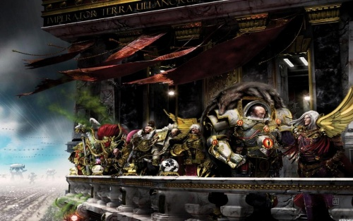

# 0764 000.M31 乌兰诺远征 Ullanor Crusade

精校状态：中文行文已逐段精校，部分术语仍为暂定

分类：时间线

原文来源：https://www.bilibili.com/opus/1057804836765958153

原作者：帝国神选罐头

原文时间：2025年04月20日 13:43

[返回分类目录](目录.md) · [全书目录](../../目录.md)

<!-- A0764-B0001 -->
**英文原文**

The high point of the Great Crusade. The culmination of decades of war. The beginning of the end, we used to think. But we did not realise what that meant, how true those words would be. Such hope, such greatness, was the height from which we fell. Here we built the tallest pinnacle before the deepest drop. If only the orks knew what ruin they wrought here.

<!-- /A0764-B0001 -->

<!-- A0764-B0002 -->

原译文

大远征的巅峰时刻。数十年战争的最终成果。我们曾经以为，那是终结的开端。但我们当时并没有意识到这意味着什么，也没有想到那些话会有多么正确。如此满怀希望，如此伟大辉煌，而这正是我们坠落的高度。我们在此处搭建起了最高的巅峰，紧接着便是最深的坠落。要是那些兽人知道他们在此处造成了怎样的毁灭就好了。

**校订译文**

“那是大远征的巅峰，数十年战争的最终成果。我们曾以为，那意味着终局已经开始。可我们并不明白这句话的含义，更不知道它会以何种方式应验。那样的希望，那样的辉煌——我们后来正是从这样的高度坠落。我们在此登上最高峰，随后跌入最深渊。真不知那些欧克蛮人若知道自己在这里酿成了怎样的毁灭，又会作何感想。”

<!-- /A0764-B0002 -->

<!-- A0764-B0003 -->
**英文原文**

- The Primarch Vulkan, M32.

<!-- /A0764-B0003 -->

<!-- A0764-B0004 -->

原译文

—原体沃坎，M32

**校订译文**

—原体沃坎，M32

<!-- /A0764-B0004 -->

<!-- A0764-B0005 图片 -->

<!-- A0764-B0006 -->

原译文

The Ullanor Triumph 乌兰诺的胜利

**校订译文**

The Ullanor Triumph 乌兰诺凯旋式

<!-- /A0764-B0006 -->

<!-- A0764-B0007 -->
**英文原文**

Conflict:Great Crusade

<!-- /A0764-B0007 -->

<!-- A0764-B0008 -->

原译文

冲突：大远征

**校订译文**

冲突：大远征

<!-- /A0764-B0008 -->

<!-- A0764-B0009 -->
**英文原文**

Date:000.M31

<!-- /A0764-B0009 -->

<!-- A0764-B0010 -->

原译文

日期：000.M31

**校订译文**

日期：000.M31

<!-- /A0764-B0010 -->

<!-- A0764-B0011 -->
**英文原文**

Location:Ullanor Sector

<!-- /A0764-B0011 -->

<!-- A0764-B0012 -->

原译文

地点：乌兰诺星区

**校订译文**

地点：乌兰诺星区

<!-- /A0764-B0012 -->

<!-- A0764-B0013 -->
**英文原文**

Outcome:Decisive Imperial Victory

<!-- /A0764-B0013 -->

<!-- A0764-B0014 -->

原译文

结果：决定性的帝国胜利

**校订译文**

结果：决定性的帝国胜利

<!-- /A0764-B0014 -->

<!-- A0764-B0015 -->
### Combatants 交战双方

原题：Combatants 作战人员

<!-- /A0764-B0015 -->

<!-- A0764-B0016 -->
### Imperium 帝国

<!-- /A0764-B0016 -->

<!-- A0764-B0017 -->
**英文原文**

Commanders：Emperor of Mankind，Primarch Horus Lupercal，Primarch Roboute Guilliman，Primarch Jaghatai Khan，First Captain Ezekyle Abaddon

<!-- /A0764-B0017 -->

<!-- A0764-B0018 -->

原译文

指挥官：人类帝皇，原体荷鲁斯·卢佩卡尔，原体罗伯特·基里曼，原体察合台可汗，第一连长以泽凯尔·阿巴顿

**校订译文**

指挥官：人类帝皇、原体荷鲁斯·卢佩卡尔、原体罗保特·基里曼、原体察合台可汗、第一连长以泽凯尔·阿巴顿。

<!-- /A0764-B0018 -->

<!-- A0764-B0019 -->
**英文原文**

Strength：100,000 Space Marines from the Luna Wolves, Ultramarines, and White Scars；8 million Imperial Army troops；100 Legio Mortis Titans；600 Imperial Armada warships

<!-- /A0764-B0019 -->

<!-- A0764-B0020 -->

原译文

力量：十万影月苍狼，极限战士，白色伤疤星际战士；八百万帝国陆军部队，一百个死颅军团泰坦；一百艘帝国战舰舰队

**校订译文**

兵力：影月苍狼、极限战士和白疤共十万名星际战士；八百万名帝国军士兵；死亡军团的一百台泰坦；帝国无敌舰队的六百艘战舰。

**校注：** 英文为 600 艘战舰，原译误成一百艘；Legio Mortis 依既定译名为死亡军团，不是死颅军团。

<!-- /A0764-B0020 -->

<!-- A0764-B0021 -->
**英文原文**

Casualties：Unknown

<!-- /A0764-B0021 -->

<!-- A0764-B0022 -->

原译文

伤亡：未知

**校订译文**

伤亡：未知

<!-- /A0764-B0022 -->

<!-- A0764-B0023 -->
### Orks 欧克蛮人

原题：Orks 欧克

<!-- /A0764-B0023 -->

<!-- A0764-B0024 -->
**英文原文**

Commanders:Warboss Urrlak Urruk(KIA)

<!-- /A0764-B0024 -->

<!-- A0764-B0025 -->

原译文

指挥官：战争头目乌尔拉克·乌鲁克

**校订译文**

指挥官：战争头目乌尔拉克·乌尔格（阵亡）。

**校注：** 信息栏英文 Urrlak Urruk 与正文 Urlakk Urg 拼写不同，语境指同一欧克首领；中文统一正文既定乌尔拉克·乌尔格，保留英文异文。

<!-- /A0764-B0025 -->

<!-- A0764-B0026 -->
**英文原文**

Strength:Millions of Orks

<!-- /A0764-B0026 -->

<!-- A0764-B0027 -->

原译文

力量：数百万欧克

**校订译文**

兵力：数百万欧克蛮人。

<!-- /A0764-B0027 -->

<!-- A0764-B0028 -->
**英文原文**

Casualties:Complete eradication

<!-- /A0764-B0028 -->

<!-- A0764-B0029 -->

原译文

伤亡：彻底根除

**校订译文**

伤亡：彻底根除

<!-- /A0764-B0029 -->

<!-- A0764-B0030 -->
**英文原文**

The Ullanor Crusade was a vast assault upon the powerful empire of Ork Overlord Urlakk Urg during the Great Crusade in 000.M31. It is remembered as Horus's greatest victory while he was still loyal to the Emperor and the act that earned him the title of Warmaster. It was the last battle of the Crusade where the Emperor personally led his forces.

<!-- /A0764-B0030 -->

<!-- A0764-B0031 -->

原译文

乌兰诺远征是在000.M31的大远征期间中对欧克霸主乌尔拉克·乌尔格强大帝国的一次大规模进攻。这是荷鲁斯在忠于帝皇时取得的最大胜利，也是他获得战帅称号的行动。这是大远征的最后一场战役，帝皇亲自率领军队。

**校订译文**

乌兰诺远征发生于大远征期间的 000.M31，是帝国对欧克霸主乌尔拉克·乌尔格的强大帝国发动的大规模攻势。它是荷鲁斯忠于帝皇期间最辉煌的胜利，也为他赢得了战帅头衔。这还是帝皇最后一次亲自率军参加大远征的战斗。

**校注：** 原文指帝皇最后一次亲自领军的大远征战役，不是大远征的最后一战。

<!-- /A0764-B0031 -->

<!-- A0764-B0032 -->
## Assault on Ullanor 突击乌兰诺

<!-- /A0764-B0032 -->

<!-- A0764-B0033 -->
**英文原文**

While the Ultramarines and White Scars Space Marine Legions, supported by newly-raised Imperial Army regiments, were tasked to retake the outlying planets of the Ullanor system, the Luna Wolves under Horus had their fleet drove straight for the central world. The force was massive: one hundred thousand Space Marines, eight million Imperial Army troops, and hundreds of spacecraft.

<!-- /A0764-B0033 -->

<!-- A0764-B0034 -->

原译文

在新组建的帝国陆军兵团的支持下，极限战士和白色伤疤星际战士的任务是夺回乌兰诺星系的外围行星，而荷鲁斯领导的影月苍狼则让他们的舰队直接驶向中心世界。这支部队规模庞大：10万名星际战士、800万名帝国陆军士兵和数百艘太空飞船。

**校订译文**

极限战士和白疤在新组建的帝国军各团支援下，负责夺回乌兰诺星系外围的行星；荷鲁斯麾下的影月苍狼舰队则直扑核心世界。帝国投入的总兵力极为庞大，包括十万名星际战士、八百万名帝国军士兵和数百艘舰船。

<!-- /A0764-B0034 -->

<!-- A0764-B0035 -->
**英文原文**

Employing his favoured tactic of a direct strike at the enemy command structure, Horus unleashed his Legion. Drop pods crashed to the ground all around Urg's fortress-palace. Heavy shuttles deployed Land Raiders and Predators and armoured Space Marines advanced on the defences. Then, as hundreds of orks rushed to join the battle on the perimeter walls, Horus and a Terminator detachment teleported directly to the foot of the great central tower. As the Luna Wolves blasted away the guards, mobs from the walls raced back to protect Urg. Horus took ten of his Terminators up the tower, leaving the rest to hold back the orks.

<!-- /A0764-B0035 -->

<!-- A0764-B0036 -->

原译文

荷鲁斯采用了他最喜欢的直接打击敌方指挥结构的战术，释放了他的军团。空投舱坠毁在乌尔格堡垒宫殿周围的地面上。重型穿梭机部署了兰德掠袭者者和掠食者，星际战士装甲在防御工事上前进。然后，当数百名欧克冲向围墙参加战斗时，荷鲁斯和一支终结者分队直接传送到了巨大的中央塔脚下。当影月苍狼炸飞守卫时，墙上的暴徒们纷纷跑回来保护乌尔格。荷鲁斯带着他的十个终结者上了塔，剩下的人则挡住了欧克。

**校订译文**

荷鲁斯采用自己最擅长的战术，命令军团直接打击敌方指挥中枢。空降舱纷纷砸落在乌尔格的堡垒宫殿周围，重型穿梭机运下兰德掠袭者和掠食者，身披装甲的星际战士向防御工事推进。数百名欧克蛮人赶往外围城墙参战之际，荷鲁斯率一支终结者分队直接传送到中央巨塔脚下。影月苍狼以火力扫清守卫，城墙上的欧克蛮人又急忙回援乌尔格。荷鲁斯带十名终结者登塔，将其余人留在下方阻击敌军。

<!-- /A0764-B0036 -->

<!-- A0764-B0037 -->
**英文原文**

At the pinnacle of the tower, they found Urg in a grand chamber accompanied by forty of the biggest orks in his empire. Horus charged straight toward the warlord, slicing through muscled green bodies with his lightning claws. The Terminators with him similarly crashed into combat. Slowly, they hacked a path through the mob until Horus faced Urg himself. The enormous Overlord was simply no match for the Primarch's skill and unnatural power. Horus crippled his enemy, hefted Urg's broken body out onto the roof, and threw him screaming from the battlements to fall far below, amongst the horde of orks still assaulting the lower levels.

<!-- /A0764-B0037 -->

<!-- A0764-B0038 -->

原译文

在塔的顶端，他们在一个宏伟的房间里找到了乌尔格，他的帝国里有四十件最大的作品。荷鲁斯直冲向军阀，用他的闪电爪切开肌肉发达的绿色身体。终结者也和他一起投入了战斗。慢慢地，他们在暴徒中开辟了一条路，直到荷鲁斯亲自面对乌尔格。巨大的霸主根本无法与原体的技能和非自然的力量相匹敌。荷鲁斯瘫痪了他的敌人，把乌尔格破碎的身体抬到屋顶上，把他从城垛上尖叫着扔到下面，在仍在袭击较低楼层的成群欧克中。

**校订译文**

在塔顶的宏伟厅堂内，他们找到了乌尔格，以及他帝国中最壮硕的四十名欧克蛮人。荷鲁斯径直冲向敌方军阀，闪电爪撕开一具具肌肉虬结的绿色躯体；终结者也随他杀入战团。他们逐渐砍出一条血路，终于让荷鲁斯得以直面乌尔格。庞大的欧克霸主根本敌不过原体的战斗技艺和超凡力量。荷鲁斯将其打得失去反抗能力，提起那具残破的躯体来到屋顶，再从城垛上扔了下去。乌尔格一路惨叫，坠入仍在进攻塔楼下层的欧克大军之中。

**校注：** forty of the biggest orks 是四十名最壮硕的欧克蛮人，纠正原稿“四十件最大的作品”。

<!-- /A0764-B0038 -->

<!-- A0764-B0039 -->
**英文原文**

The sudden demise of their mighty leader sent a panic through the Greenskin forces, which fell back from the Terminators into the advancing Luna Wolves and were slaughtered. Back in the Overlord's chamber. Horus found his First Captain Ezekyle Abaddon standing alone and gore-drenched amongst the crushed and broken bodies of the Justaerin and the orks. As word of his death spread, the Overlord's empire fragmented. The Imperial forces retook control of the quadrant within a year. Naturally, the Luna Wolves claimed to have liberated substantially more worlds than their allies.

<!-- /A0764-B0039 -->

<!-- A0764-B0040 -->

原译文

他们强大的领袖的突然死亡给绿皮部队带来了恐慌，绿皮部队从终结者撤退到前进的影月苍狼中，并被屠杀。回到霸主的房间。荷鲁斯发现他的第一连长以泽凯尔·阿巴顿独自站着，在被碾碎、肢体残破的加斯塔林成员和兽人尸体之间，浸满了鲜血。随着它去世的消息传开，霸主的帝国四分五裂。帝国军队在一年内重新控制了该象限。当然，影月苍狼声称解放的世界比他们的盟友多得多。

**校订译文**

强大领袖的骤然死亡令绿皮大军陷入恐慌。他们退避终结者，却撞上不断推进的影月苍狼，遭到屠杀。荷鲁斯返回霸主的厅堂，发现第一连长以泽凯尔·阿巴顿浑身浴血，独自站在加斯塔林和欧克蛮人残破的尸体之间。随着乌尔格的死讯传开，他的帝国四分五裂。帝国军队在一年内重新控制了这一象限。影月苍狼自然宣称，自己解放的世界远比盟友多。

<!-- /A0764-B0040 -->

<!-- A0764-B0041 -->
## The Ullanor Triumph 乌兰诺凯旋式

原题：The Ullanor Triumph 乌兰诺的胜利

<!-- /A0764-B0041 -->

<!-- A0764-B0042 -->
**英文原文**

Not long after what had become perhaps the greatest victory of the Crusade, the Emperor of Mankind declared that a great Triumph on Ullanor would be held to recognize the glory of the Crusade.

<!-- /A0764-B0042 -->

<!-- A0764-B0043 -->

原译文

在大远征取得可能是最伟大的胜利后不久，人类帝皇宣布将在乌兰诺举行一场伟大的胜利，以表彰远征的荣耀。

**校订译文**

这场战役或许是大远征最辉煌的胜利。战后不久，人类帝皇宣布将在乌兰诺举行盛大的凯旋式，彰显大远征的荣耀。

<!-- /A0764-B0043 -->

<!-- A0764-B0044 -->
**英文原文**

Preparation for the Triumph took a considerable effort, with the Adeptus Mechanicus utilizing massive geoformer engines and millions of Servitors, prisoner-slaves, and Thralls to flatten an entire continent and lay down a massive mirror-smooth granite path that was 5 kilometers wide and 500 kilometers long. Serving as the Triumph's primary parade ground, it was decorated along its entire length with Ork skulls slain in the battle. At the end of the path, a citadel was constructed upon a mountaintop that held the Emperor, Horus, Sanguinius, Mortarion, Magnus, Angron, Jaghatai Khan, Lorgar, Rogal Dorn, Fulgrim, Malcador, and Constantin Valdor as well as many other members of the Council of Terra and Imperial nobility. The citadel was guarded by a sizable Custodes and Sisters of Silence detachment and two gold-plated Warlord Class Titans.

<!-- /A0764-B0044 -->

<!-- A0764-B0045 -->

原译文

胜利的准备工作付出了相当大的努力，机械神教们利用巨大的地型建模引擎和数百万的机仆、囚犯奴隶和奴工夷平了整个大陆，并铺设了一条5公里宽、500公里长的巨大镜面光滑的花岗岩路径。作为凯旋的主要阅兵场，它的整个路径都装饰着在战斗中被杀死的欧克头骨。在这条路的尽头，一座城堡建在山顶上，里面住着帝皇、荷鲁斯、圣吉列斯、莫塔里安、马格努斯、安格隆、察合台可汗、珞珈、罗格·多恩、福格瑞姆、马卡多和康斯坦丁·瓦尔多，以及泰拉议会和帝国贵族的许多其他成员。城堡由一支规模可观的禁军与寂静修女分队和两名镀金的军阀级泰坦守卫。

**校订译文**

凯旋式的筹备工程浩大。机械修会动用巨型地形改造引擎，以及数以百万计的机仆、囚奴和奴工，将整片大陆夷平，铺设了一条宽五公里、长五百公里、表面光滑如镜的花岗岩大道。大道是主要阅兵场，沿途摆满了此战斩获的欧克头骨。尽头的山巅上建起一座堡垒，供帝皇、荷鲁斯、圣吉列斯、莫塔里安、马格努斯、安格隆、察合台可汗、珞珈、罗格·多恩、福格瑞姆、马卡多、康斯坦丁·瓦尔多，以及众多泰拉议会成员和帝国贵族观礼。大批禁军和寂静修女，以及两台镀金的战将级泰坦守卫着堡垒。

<!-- /A0764-B0045 -->

<!-- A0764-B0046 -->
**英文原文**

During the Triumph eight million Imperial Army soldiers and thousands of armored vehicles marched along the Granite path in parade formation. After them came hundreds of Titans from the Collegia Titanica. Then came fourteen Space Marine Legions from the Luna Wolves, Blood Angels, Death Guard, Thousand Sons, World Eaters, White Scars, Word Bearers, Imperial Fists, Emperor's Children, Raven Guard, Salamanders, Ultramarines, Iron Hands, and Dark Angels. Thousands of Imperial Armada aircraft clouded the sky, and Horus was presented as the grand finale of the Triumph. Shocking all present, the Emperor then announced Horus as Warmaster of the Great Crusade and that the Luna Wolves would now be known as the Sons of Horus. He also announced his retirement from the Great Crusade, expecting that the Imperial forces would obey Horus's commands from then on as if they were his own.

<!-- /A0764-B0046 -->

<!-- A0764-B0047 -->

原译文

在胜利期间，800万帝国陆军士兵和数千辆装甲载具以游行队伍的形式沿着花岗岩路行进。在他们之后，来自泰坦修会的数百辆泰坦出现了。随后，来自影月苍狼、圣血天使、死亡守卫、千子、吞世者、白色伤疤、怀言者、帝国之拳、帝皇之子、暗鸦守卫、火蜥蜴、极限战士、钢铁之手和黑暗天使的14支星际战士军团出现了。数千架帝国舰队飞船笼罩着天空，荷鲁斯成为了胜利的压轴。令在场的所有人震惊的是，帝皇随后宣布荷鲁斯为大远征的战帅，而影月苍狼现在将被称为荷鲁斯之子。他还宣布退出大远征，期望帝国军队从那时起服从荷鲁斯的命令，就像他是自己一样。

**校订译文**

凯旋式上，八百万名帝国军士兵和数千辆装甲载具列队沿花岗岩大道行进，随后是泰坦修会的数百台泰坦。再之后，十四支星际战士军团的队伍依次登场：影月苍狼、圣血天使、死亡守卫、千子、吞世者、白疤、怀言者、帝国之拳、帝皇之子、暗鸦守卫、火蜥蜴、极限战士、钢铁之手和黑暗天使。帝国无敌舰队的数千架飞行器遮蔽天空，荷鲁斯则作为压轴人物出场。随后，帝皇宣布荷鲁斯出任大远征战帅，影月苍狼从此更名为荷鲁斯之子，令在场众人震惊。他还宣布自己将退出大远征，要求帝国部队此后服从荷鲁斯的命令，如同服从他本人一样。

**校注：** 影月苍狼更名的具体时点在其他记载中可能不同；此处忠实保留本篇英文所述的凯旋式宣布说。

<!-- /A0764-B0047 -->

<!-- A0764-B0048 -->
## Aftermath 后果

<!-- /A0764-B0048 -->

<!-- A0764-B0049 -->
**英文原文**

After the Ullanor Crusade, the Imperium believed that the ork race had been broken and could not present a credible threat again. Though scattered groups of orks would periodically attack the Imperium's frontier, they were regarded as little more than troublesome pests. This complacency would be suddenly and terribly reversed in M32, when the War of the Beast brought the orks to Terra itself and decimated the Imperium's entire military.

<!-- /A0764-B0049 -->

<!-- A0764-B0050 -->

原译文

乌兰诺远征东征后，帝国认为欧克种族已经破裂，不能再构成可信的威胁。尽管分散的欧克会定期攻击帝国的边境，但它们被视为麻烦的害虫。这种自满情绪在M32中突然发生了可怕的逆转，当时野兽战争将欧克带到了泰拉，并摧毁了帝国的整个军队。

**校订译文**

乌兰诺远征之后，帝国相信欧克一族已遭重创，再也无法构成重大威胁。虽然零散的欧克群体仍会不时袭击边疆，帝国却只把他们视为恼人的害虫。这种自满在 M32 遭到突然而惨痛的打击：野兽战争中，欧克大军兵临泰拉，帝国整个军事体系都蒙受了沉重损失。

<!-- /A0764-B0050 -->

<!-- A0764-B0051 -->
**英文原文**

Several high-ranking orks of The Beast's Waaagh! incorporated scavenged pieces of Luna Wolves "Crusade" pattern power armour into their own, both for protection and as marks of status.

<!-- /A0764-B0051 -->

<!-- A0764-B0052 -->

原译文

野兽的Waaagh！的几个高级欧克将影月苍狼“远征”型的动力盔甲中的碎片拾荒整合到自己的盔甲中，既作为保护，也作为地位的标志。

**校订译文**

野兽的 Waaagh! 大军中，有几名欧克高层将捡来的影月苍狼“远征型”动力甲碎片嵌入自己的护甲，既增强防护，也彰显地位。

<!-- /A0764-B0052 -->

<!-- A0764-B0053 -->
**英文原文**

The Beast made Ullanor his capital, converting the entire planet into a massive battlestation before Ork power on the world was eventually smashed once more.

<!-- /A0764-B0053 -->

<!-- A0764-B0054 -->

原译文

野兽将乌兰诺作为他的首都，在世界上的欧克力量最终再次被摧毁之前，将整个星球变成了一个巨大的战斗地带。

**校订译文**

野兽以乌兰诺为首都，将整个星球改造成一座巨型战斗要塞。最终，帝国再次击溃了盘踞在此的欧克势力。

<!-- /A0764-B0054 -->

<!-- A0764-B0055 -->
## Trivia 琐事

<!-- /A0764-B0055 -->

<!-- A0764-B0056 -->
**英文原文**

The Triumph of Ullanor resembles the great Roman Triumph of Julius Caesar following his rise to absolute power and the defeat of his rivals. Like Caesar's, the Triumph at Ullanor represented the peak of the Emperor's power and glory shortly before catastrophe beset his empire. For Caesar this was his assassination and the civil wars that followed. For the Emperor, this would be the Horus Heresy and his internment to the Golden Throne.

<!-- /A0764-B0056 -->

<!-- A0764-B0057 -->

原译文

乌兰诺的胜利类似于尤里乌斯·凯撒在崛起为绝对权力并击败对手后的伟大罗马胜利。与恺撒的胜利一样，乌兰诺的胜利代表了帝皇在灾难困扰他的帝国之前不久的力量和荣耀的顶峰。对凯撒来说，这是对他的暗杀和随后的内战。对于帝皇来说，这将是荷鲁斯叛乱和他被禁锢在黄金王座上。

**校订译文**

乌兰诺凯旋式让人联想到尤利乌斯·凯撒击败对手、掌握绝对权力后举行的罗马凯旋式。两者都象征着统治者权力与荣耀的顶峰，却又紧接着灾难。凯撒随后遭到刺杀，内战随之爆发；帝皇则迎来了荷鲁斯之乱，并最终被禁锢在黄金王座上。

**校注：** 本段为英文资料作者的历史类比，保留为类比，不作为两个历史事件严格一一对应的论证。

<!-- /A0764-B0057 -->

本篇核心术语与暂定项

以下列出本篇出现的英文原形及核心术语表用词。同形词可能指不同对象，具体词义以本篇正文和校注为准；单复数、别名和仅见于图注的名称可能尚未列入。完整候选见[术语表](../../术语表/双语术语候选.csv)。

| 英文 | 采用中文 | 状态 |
| --- | --- | --- |
| Space Marines | 星际战士 | 官方已核对 |
| Blood Angels | 圣血天使 | 官方已核对 |
| Dark Angels | 黑暗天使 | 官方已核对 |
| Adeptus Mechanicus | 机械修会 | 官方已核对 |
| Imperial Army | 帝国军 | 暂定·官方待核 |
| Death Guard | 死亡守卫 | 官方已核对 |
| Thousand Sons | 千子 | 官方已核对 |
| World Eaters | 吞世者 | 官方已核对 |
| Orks | 欧克蛮人 | 官方已核对 |
| Terminator | 终结者 | 官方已核对 |
| Roboute Guilliman | 罗保特·基里曼 | 官方已核对 |
| Ultramarines | 极限战士 | 官方已核对 |
| Horus Heresy | 荷鲁斯之乱 | 官方已核对 |
| Imperium | 帝国 | 暂定·简称 |
| Waaagh! | Waaagh! | 暂定·保留原文 |
| Imperial Fists | 帝国之拳 | 暂定 |
| Emperor of Mankind | 人类帝皇 | 暂定 |
| Emperor | 帝皇 | 官方已核对 |
| Primarch | 原体 | 官方已核对 |
| Word Bearers | 怀言者 | 暂定·官方待核 |
| Emperor's Children | 帝皇之子 | 官方已核对 |
| Great Crusade | 大远征 | 暂定·官方待核 |
| Mortarion | 莫塔里安 | 官方已核对 |
| Terra | 泰拉 | 暂定·官方待核 |
| Luna Wolves | 影月苍狼 | 暂定·官方待核 |
| Horus | 荷鲁斯 | 暂定·官方待核 |
| Sons of Horus | 荷鲁斯之子 | 暂定·官方待核 |
| Iron Hands | 钢铁之手 | 暂定·官方待核 |
| Fulgrim | 福格瑞姆 | 官方已核对 |
| Collegia Titanica | 泰坦修会 | 暂定·官方待核 |
| Sisters of Silence | 寂静修女 | 暂定·官方待核 |
| Golden Throne | 黄金王座 | 暂定·官方待核 |
| Sector | 星区 | 暂定·官方待核 |
| Vulkan | 沃坎 | 暂定·官方待核 |
| Salamanders | 火蜥蜴 | 暂定·官方待核 |
| Luna | 月球 | 暂定·官方待核 |
| Horus Lupercal | 荷鲁斯·卢佩卡尔 | 暂定·官方待核 |
| Lupercal | 卢佩卡尔 | 暂定·官方待核 |
| Justaerin | 加斯塔林 | 暂定·官方待核 |
| Urlakk Urg | 乌尔拉克·乌尔格 | 暂定·官方待核 |
| Ullanor | 乌兰诺 | 暂定·官方待核 |
| White Scars | 白疤 | 官方已核 |
| Raven Guard | 暗鸦守卫 | 官方已核 |
| Scars | 伤疤 | 暂定·官方待核 |
| First Captain | 第一连长 | 暂定·官方待核 |
| Ezekyle Abaddon | 以泽凯尔·阿巴顿 | 暂定·官方待核 |
| Power Armour | 动力盔甲 | 暂定·官方待核 |
| Space Marine | 星际战士 | 暂定·官方待核 |
| Captain | 连长 | 暂定·官方待核 |
| Terminators | 终结者 | 暂定·官方待核 |
| Constantin Valdor | 康斯坦丁·瓦尔多 | 暂定·官方待核 |
| Predators | 掠食者 | 暂定·官方待核 |
| Land Raiders | 兰德掠袭者 | 暂定·官方待核 |
| Overlord | 霸主 | 官方已核对 |
| Lorgar | 珞珈 | 暂定·官方待核 |
| Absolute | 绝对号 | 暂定·官方待核 |
| Jaghatai Khan | 察合台可汗 | 暂定·官方待核 |
| Horde | 部落 | 暂定·官方待核 |
| Warboss | 战争头目 | 官方已核对 |
| Mob | 战群（欧克组织） | 暂定·官方待核 |
| The Beast | 野兽 | 暂定·官方待核 |
| Angron | 安格隆 | 官方已核对 |
| Wrought | 锻造秘库 | 暂定·官方待核 |
| System | 星系（恒星系统） | 暂定·官方待核 |
| Legio Mortis | 死亡军团 | 暂定·官方待核 |

