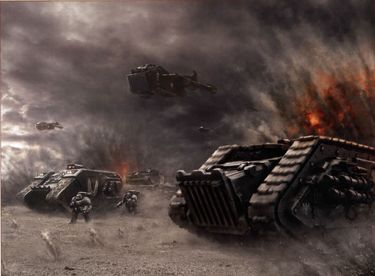

# 0765 000.M31 四十二之门之战 Battle of Gate Forty-Two

精校状态：中文行文已逐段精校，部分术语仍为暂定

分类：时间线

原文来源：https://www.bilibili.com/opus/1184264294799245312

原作者：帝国神选罐头

原文时间：2026年03月27日 08:30

[返回分类目录](目录.md) · [全书目录](../../目录.md)

<!-- A0765-B0001 -->
**英文原文**

The Battle of Gate Forty-Two was a battle of the Great Crusade.

<!-- /A0765-B0001 -->

<!-- A0765-B0002 -->

原译文

四十二之门之战是大远征的一场战役。

**校订译文**

四十二之门之战是大远征的一场战役。

<!-- /A0765-B0002 -->

<!-- A0765-B0003 图片 -->

<!-- A0765-B0004 -->

原译文

The Raven Guard advances during the Battle of Gate Forty-Two 暗鸦守卫在四十二之门之战中进军

**校订译文**

The Raven Guard advances during the Battle of Gate Forty-Two 暗鸦守卫在四十二之门之战中进军

<!-- /A0765-B0004 -->

<!-- A0765-B0005 -->
**英文原文**

Conflict:Great Crusade

<!-- /A0765-B0005 -->

<!-- A0765-B0006 -->

原译文

冲突：大远征

**校订译文**

冲突：大远征

<!-- /A0765-B0006 -->

<!-- A0765-B0007 -->
**英文原文**

Date:000.M31

<!-- /A0765-B0007 -->

<!-- A0765-B0008 -->

原译文

日期：000.M31

**校订译文**

日期：000.M31

<!-- /A0765-B0008 -->

<!-- A0765-B0009 -->
**英文原文**

Location:Akum-Sothos Cluster

<!-- /A0765-B0009 -->

<!-- A0765-B0010 -->

原译文

地点：阿库姆-索托斯星群

**校订译文**

地点：阿库姆-索托斯星群

<!-- /A0765-B0010 -->

<!-- A0765-B0011 -->
**英文原文**

Outcome:Pyrrhic Imperial victory

<!-- /A0765-B0011 -->

<!-- A0765-B0012 -->

原译文

结果：帝国惨胜

**校订译文**

结果：帝国惨胜

<!-- /A0765-B0012 -->

<!-- A0765-B0013 -->
**英文原文**

Combatants:Imperium/Unsighted Kings

<!-- /A0765-B0013 -->

<!-- A0765-B0014 -->

原译文

作战方：帝国/目盲王者

**校订译文**

作战方：帝国/目盲王者

<!-- /A0765-B0014 -->

<!-- A0765-B0015 -->
**英文原文**

Commanders:Warmaster Horus, Primarch Leman Russ, Primarch Perturabo, Primarch Corax

<!-- /A0765-B0015 -->

<!-- A0765-B0016 -->

原译文

指挥官：战帅荷鲁斯，原体黎曼·鲁斯，原体佩图拉博，原体科拉克斯

**校订译文**

指挥官：战帅荷鲁斯，原体黎曼·鲁斯，原体佩图拉博，原体科拉克斯

<!-- /A0765-B0016 -->

<!-- A0765-B0017 -->
**英文原文**

Strength:Luna Wolves, Space Wolves, Iron Warriors, Raven Guard/Large amounts of parasitic hosts

<!-- /A0765-B0017 -->

<!-- A0765-B0018 -->

原译文

力量：影月苍狼，太空野狼，钢铁勇士，暗鸦守卫/大量寄生宿主

**校订译文**

力量：影月苍狼，太空野狼，钢铁勇士，暗鸦守卫/大量寄生宿主

<!-- /A0765-B0018 -->

<!-- A0765-B0019 -->
**英文原文**

Casualties:Heavy, Terran members of the Raven Guard endure significant losses/Annihilated

<!-- /A0765-B0019 -->

<!-- A0765-B0020 -->

原译文

伤亡：重，暗鸦守卫的泰拉裔成员遭受重大损失/被歼灭

**校订译文**

损失：帝国伤亡惨重，暗鸦守卫的泰拉裔成员损失尤为严重／敌军全灭。

<!-- /A0765-B0020 -->

<!-- A0765-B0021 -->
## Overview 概述

<!-- /A0765-B0021 -->

<!-- A0765-B0022 -->
**英文原文**

The Akum-Sothos Cluster had been brought to compliance by the Luna Wolves in the opening years of the Great Crusade, but its people had since fallen to mass psychosis and violently revolted against the authority of Terra. It was determined that a Xenos parasite that matured within the eye sockets of its host had been behind the riots. The parasites gained rudimentary control of their hosts as they matured and formed what amounted to an alien gestalt cabal of primary hosts dubbed the 'Unsighted Kings'. Newly ascended Warmaster Horus refused to see a cluster of worlds he himself had once conquered slip from the Imperium's grasp, so he vowed to retake the Cluster no matter the cost.

<!-- /A0765-B0022 -->

<!-- A0765-B0023 -->

原译文

在大远征的最初几年，阿库姆-索托斯星群被影月苍狼征服，但此后其人民陷入了大规模的精神错乱，并暴力反抗泰拉的权威。经确定，骚乱的幕后黑手是一种在宿主眼眶内成熟的异型寄生虫。随着寄生虫的成熟，它们对宿主获得了基本的控制，并形成了一个被称为“目盲王者”的原生寄主的异型格式塔阴谋团。新升任的战帅荷鲁斯拒绝看到他自己曾经征服过的星群世界从帝国手中溜走，所以他发誓不惜一切代价夺回这星群。

**校订译文**

大远征初期，影月苍狼曾迫使阿库姆-索托斯星群归顺。但后来，当地居民陷入大规模精神错乱，暴力反抗泰拉的统治。调查确认，祸首是一种在宿主眼窝内发育成熟的异形寄生虫。它们随着成熟，逐渐获得对宿主的初步控制；其中主要宿主组成了一个异形集体意识集团，被称为“目盲王者”。新任战帅荷鲁斯不愿眼看自己亲手征服的诸世界脱离帝国，发誓不惜代价夺回整个星群。

**校注：** primary hosts 为主要宿主，非原生寄主；gestalt 指集体意识，不译成意义不明的格式塔阴谋团。

<!-- /A0765-B0023 -->

<!-- A0765-B0024 -->
**英文原文**

The Warmaster planned to launch a rapid blitzkrieg strike by the Luna Wolves, Space Wolves, Iron Warriors, and Raven Guard that would converge on the heavily fortified lair of the Unsighted Kings before a final overwhelming assault was launched across the entire Cluster.

<!-- /A0765-B0024 -->

<!-- A0765-B0025 -->

原译文

战帅计划由影月苍狼、太空野狼、钢铁勇士和暗鸦守卫发动一场快速的闪电战，在对整个星群发动最后一次压倒性的进攻之前，这些闪电战将集中在未被发现的目盲王者的坚固藏身处。

**校订译文**

战帅计划让影月苍狼、太空野狼、钢铁勇士和暗鸦守卫发动闪电攻势，迅速向目盲王者防御森严的巢穴集中，继而对整个星群发动压倒性的最后进攻。

<!-- /A0765-B0025 -->

<!-- A0765-B0026 -->
**英文原文**

After conquering the outer worlds of the Cluster in a matter of weeks, Horus called a council of his brother Primarchs. He called for the Raven Guard to make a frontal assault on the guns of the defenders of Gate Forty-Two. Their primarch, Corax argued against this waste of resources and squandering of his warriors' lives, countering with his own strategy. He proposed that his Legion draw off enemy forces in a series of feints, allowing the three other Legions to overwhelm the defenders who remained at the Gate. However Perturabo suggested that Corax was simply seeking to avoid battle, labeling him a coward. The two nearly came to blows; only the intervention of Leman Russ prevented bloodshed. However, the Space Wolves Primarch told Corax to heed Horus' plan, as he had been the one whom the Emperor himself had put above any of his brothers. Reluctantly, Corax conceded. He committed many of his Terran-dominated companies to the frontal assault, in particular those whose Captains appeared the most willing to support Horus' strategy. Corax had long maintained disfavor with his Terran officers, mostly due to their use of brutal terror tactics before his arrival.

<!-- /A0765-B0026 -->

<!-- A0765-B0027 -->

原译文

在几周内征服了星群的外部世界后，荷鲁斯召集了他的兄弟原体组成的议会。他呼吁暗鸦守卫正面攻击四十二之门守军的枪炮。他们的原体科拉克斯反对这种浪费资源和浪费战士生命的行为，并以自己的策略进行反击。他提议他的军团通过一系列佯攻来吸引敌军，让其他三个军团压倒留在门户的守军。然而，佩图拉博认为科拉克斯只是为了避免战斗，并称他为懦夫。两人差点发生冲突；只有黎曼·鲁斯的干预才阻止了流血事件的发生。然而，太空野狼原体告诉科拉克斯要听从荷鲁斯的计划，因为他是帝皇放在任何兄弟之上的人。科拉克斯不情愿地让步了。他让他的许多泰拉裔主导的连队进行正面攻击，特别是那些连长似乎最愿意支持荷鲁斯的战略的连队。科拉克斯长期以来一直不喜欢他的泰拉裔军官，主要是因为他们在他到来之前使用了残酷的恐怖战术。

**校订译文**

数周内征服外围诸世界后，荷鲁斯召集兄弟原体开会，要求暗鸦守卫迎着守军炮火，正面强攻四十二之门。科拉克斯反对这样浪费资源、白白牺牲战士，并提出替代方案：由暗鸦守卫连续佯攻，将敌军引开，让另外三支军团压倒留守关口的部队。佩图拉博却指责他只想逃避战斗，骂他是懦夫。两人几乎动手，幸而黎曼·鲁斯介入，才避免流血。然而，鲁斯同样要求科拉克斯服从荷鲁斯，因为帝皇亲自赋予了战帅高于所有兄弟的权威。科拉克斯勉强让步，将许多以泰拉裔战士为主的连队投入正面强攻，尤其是那些连长最支持荷鲁斯方案的连队。他一向不喜欢这些泰拉裔军官，主要因为他们在他归来之前惯用残酷的恐怖战术。

<!-- /A0765-B0027 -->

<!-- A0765-B0028 -->
**英文原文**

The following assault was hailed as the Legion's darkest hour, a grim honour that saw entire Assault companies decimated in the face of heavy enemy defenses. Corax himself led the bloody attack that saw Gate Forty-Two finally taken. The Luna Wolves, Space Wolves, and Iron Warriors moved into the Unsighted Kings fortress soon after. Bitterly for Corax, the glory of slaying the Unsighted Kings themselves went to Horus and his Luna Wolves. But despite the victory thousands of Raven Guard, most of them Terran-born, had lost their lives.

<!-- /A0765-B0028 -->

<!-- A0765-B0029 -->

原译文

接下来的袭击被誉为军团最黑暗的时刻，这是一种残忍的荣誉，在敌人的严密防御下，整个突击连队都被摧毁了。科拉克斯亲自领导了血腥的袭击，最终占领了四十二之门。不久之后，影月苍狼、太空野狼和钢铁勇士进入了“目盲王者”的堡垒。对科拉克斯来说，杀死目盲王者的荣耀归于荷鲁斯和他的影月苍狼。尽管取得了胜利，但仍有数千名暗鸦守卫成员丧生，其中大多数是泰拉裔。

**校订译文**

接下来的强攻被称为军团最黑暗的时刻；这一惨烈的称号背后，是整支突击连在严密敌军防御前遭受重创。科拉克斯亲自领军血战，终于攻克四十二之门。影月苍狼、太空野狼和钢铁勇士很快跟进，进入目盲王者的堡垒。让科拉克斯愤恨的是，亲手击杀目盲王者的荣耀归了荷鲁斯及其影月苍狼。胜利虽已到手，数千名暗鸦守卫却已战死，其中大多出身泰拉。

<!-- /A0765-B0029 -->

<!-- A0765-B0030 -->
## Aftermath 余波

<!-- /A0765-B0030 -->

<!-- A0765-B0031 -->
**英文原文**

The effects of the battle were far-reaching for the Raven Guard. Its numbers were sorely depleted: the Legion now numbered only 80,000 Marines after the battle. Corax removed his forces from Horus' command, bitterly swearing to never serve alongside the Warmaster again.

<!-- /A0765-B0031 -->

<!-- A0765-B0032 -->

原译文

这场战役对暗鸦守卫的影响是深远的。它的人数严重减少：战斗结束后，军团现在只有8万名星际战士。科拉克斯将他的部队从荷鲁斯的指挥下移开，痛苦地发誓再也不与战帅并肩作战。

**校订译文**

此战对暗鸦守卫影响深远。军团遭到严重削弱，战后只剩八万名星际战士。科拉克斯带部队脱离荷鲁斯的指挥，愤然发誓再也不与战帅并肩作战。

<!-- /A0765-B0032 -->

<!-- A0765-B0033 -->
**英文原文**

Another effect of the battle was that the Terran-born officers of the Raven Guard had largely been killed. Many of these officers had served under Horus at one point and some suspected their loyalties to their true Primarch was lacking. Thus the battle allowed Corax to consolidate his power over the Raven Guard and erased the Luna Wolves' influence over the Legion.

<!-- /A0765-B0033 -->

<!-- A0765-B0034 -->

原译文

这场战斗的另一个影响是，暗鸦守卫的泰拉裔军官大多被杀。这些军官中的许多人曾一度在荷鲁斯手下服役，一些人怀疑他们对真正的原体缺乏忠诚。因此，这场战斗使科拉克斯巩固了他对暗鸦守卫的权力，并消除了影月苍狼对军团的影响。

**校订译文**

另一个后果是，暗鸦守卫的泰拉裔军官大多阵亡。他们中许多人曾在荷鲁斯麾下服役，有人因此怀疑，他们对自己真正的原体不够忠诚。此战使科拉克斯巩固了对军团的控制，也消除了影月苍狼在军团中的影响。

<!-- /A0765-B0034 -->

本篇核心术语与暂定项

以下列出本篇出现的英文原形及核心术语表用词。同形词可能指不同对象，具体词义以本篇正文和校注为准；单复数、别名和仅见于图注的名称可能尚未列入。完整候选见[术语表](../../术语表/双语术语候选.csv)。

| 英文 | 采用中文 | 状态 |
| --- | --- | --- |
| Space Wolves | 太空野狼 | 官方已核对 |
| Imperium | 帝国 | 暂定·简称 |
| Emperor | 帝皇 | 官方已核对 |
| Primarch | 原体 | 官方已核对 |
| Iron Warriors | 钢铁勇士 | 暂定·官方待核 |
| Great Crusade | 大远征 | 暂定·官方待核 |
| Compliance | 归顺；纳入帝国统治 | 暂定·官方待核 |
| Terra | 泰拉 | 暂定·官方待核 |
| Luna Wolves | 影月苍狼 | 暂定·官方待核 |
| Horus | 荷鲁斯 | 暂定·官方待核 |
| Cabal | 密教 | 暂定·官方待核 |
| Luna | 月球 | 暂定·官方待核 |
| Raven Guard | 暗鸦守卫 | 官方已核 |
| Brother | 修士 | 暂定·官方待核 |
| Host | 天军 | 暂定·官方待核 |
| Xenos | 异形 | 暂定·官方待核 |
| Akum-Sothos Cluster | 阿库姆-索托斯星群 | 暂定·官方待核 |
| Unsighted Kings | 目盲王者 | 暂定·官方待核 |
| Heed | 希德 | 暂定·官方待核 |

