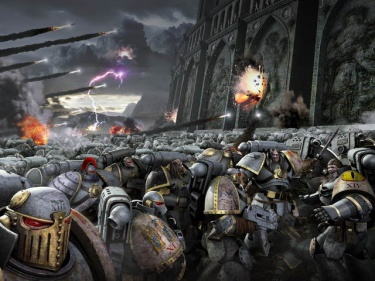
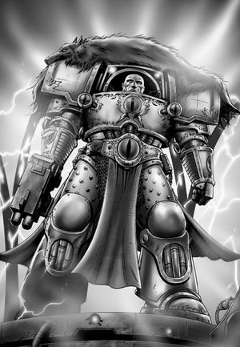

# 0766 001.M31 63-19之战 Battle of Sixty-Three Nineteen

精校状态：中文行文已逐段精校，部分术语仍为暂定

分类：时间线

原文来源：https://www.bilibili.com/opus/1182793612072583176

原作者：帝国神选罐头

原文时间：2026年03月23日 09:23

[返回分类目录](目录.md) · [全书目录](../../目录.md)

<!-- A0766-B0001 -->

原译文

I was there, the day Horus slew the Emperor.- Garviel Loken. 荷鲁斯杀死皇帝的那天，我就在那里。- 加维尔·洛肯。

**校订译文**

I was there, the day Horus slew the Emperor.- Garviel Loken. “荷鲁斯杀死皇帝的那天，我就在那里。”——加维尔·洛肯。

<!-- /A0766-B0001 -->

<!-- A0766-B0002 -->
**英文原文**

The Battle of Sixty-Three Nineteen was a compliance action that took place in the 203rd year of the Great Crusade. It saw the world codified as Sixty-Three Nineteen (63-19) brought into the bosom of the Imperium and is chiefly known for its ironic juxtaposition to the last battle of the Horus Heresy.

<!-- /A0766-B0002 -->

<!-- A0766-B0003 -->

原译文

63-19之战是发生在大远征第203年的一次征服行动。它见证了世界被编纂为63-19（63-19），被带入帝国的怀抱，并以其与荷鲁斯叛乱的最后一场战斗的讽刺并置而闻名。

**校订译文**

六十三—十九之战发生于大远征第二百零三年，是一次迫使星球归顺的军事行动。代号为六十三—十九（63-19）的世界由此被纳入帝国。此战尤为著名，是因为它与荷鲁斯之乱的最后一战构成了充满讽刺意味的对照。

<!-- /A0766-B0003 -->

<!-- A0766-B0004 图片 -->

<!-- A0766-B0005 -->

原译文

The Luna Wolves assault the "Imperial Palace" 影月苍狼突击“帝国宫殿”

**校订译文**

The Luna Wolves assault the "Imperial Palace" 影月苍狼突击“帝国宫殿”

<!-- /A0766-B0005 -->

<!-- A0766-B0006 -->
**英文原文**

Conflict:The Great Crusade

<!-- /A0766-B0006 -->

<!-- A0766-B0007 -->

原译文

冲突：大远征

**校订译文**

冲突：大远征

<!-- /A0766-B0007 -->

<!-- A0766-B0008 -->
**英文原文**

Date:001.M31

<!-- /A0766-B0008 -->

<!-- A0766-B0009 -->

原译文

日期：001.M31

**校订译文**

日期：001.M31

<!-- /A0766-B0009 -->

<!-- A0766-B0010 -->
**英文原文**

Location:"Terra" (63-19)

<!-- /A0766-B0010 -->

<!-- A0766-B0011 -->

原译文

地点：“泰拉”(63-19)

**校订译文**

地点：“泰拉”(六十三—十九)

<!-- /A0766-B0011 -->

<!-- A0766-B0012 -->
**英文原文**

Outcome:Imperial victory

<!-- /A0766-B0012 -->

<!-- A0766-B0013 -->

原译文

结果：帝国胜利

**校订译文**

结果：帝国胜利

<!-- /A0766-B0013 -->

<!-- A0766-B0014 -->
**英文原文**

Combatants:Imperium of Man/"The Empire of Man"

<!-- /A0766-B0014 -->

<!-- A0766-B0015 -->

原译文

作战方：人类帝国/“人类帝国”

**校订译文**

作战方：人类帝国/“人类帝国”

<!-- /A0766-B0015 -->

<!-- A0766-B0016 -->
**英文原文**

Commanders:Horus Lupercal, First Captain Ezekyle Abaddon, Captain Tarik Torgaddon, Captain Horus Aximand, Captain Garviel Loken/"The Emperor of Mankind" (KIA)

<!-- /A0766-B0016 -->

<!-- A0766-B0017 -->

原译文

指挥官：荷鲁斯·卢佩卡尔，第一连长以泽凯尔·阿巴顿，连长塔里克·托加顿，连长荷鲁斯·阿西曼德，连长加维尔·洛肯/“人类皇帝”

**校订译文**

指挥官：荷鲁斯·卢佩卡尔、第一连长以泽凯尔·阿巴顿、连长塔里克·托加顿、连长荷鲁斯·阿西曼德、连长加维尔·洛肯／“人类皇帝”（阵亡）。

<!-- /A0766-B0017 -->

<!-- A0766-B0018 -->
**英文原文**

Strength:63rd Expeditionary Fleet: Four Luna Wolves Companies, Six Legio Mortis Titans/600 warships, Infantry, tanks, ordnance, robotic gun-platforms, The Invisibles

<!-- /A0766-B0018 -->

<!-- A0766-B0019 -->

原译文

力量：第63远征舰队：四个影月苍狼连队、六架死亡军团泰坦/600艘战舰、步兵、坦克、军械、机兵炮台、无形者

**校订译文**

兵力：第 63 远征舰队，包括四个影月苍狼连及死亡军团的六台泰坦／六百艘战舰、步兵、坦克、重型火炮、自动化炮台及无形者。

<!-- /A0766-B0019 -->

<!-- A0766-B0020 -->
**英文原文**

Casualties:Unknown/The Emperor of Mankind slain by Horus, Presumably severe other casualties, rumours of surviving Invisibles

<!-- /A0766-B0020 -->

<!-- A0766-B0021 -->

原译文

伤亡：未知/人类皇帝被荷鲁斯杀害，可能还有其他严重伤亡，关于无形者幸存的传言

**校订译文**

损失：帝国方面不详／自称“人类皇帝”的统治者被荷鲁斯杀死，其余部队推测亦伤亡惨重；传闻仍有无形者生还。

<!-- /A0766-B0021 -->

<!-- A0766-B0022 -->
## Prelude 序曲

<!-- /A0766-B0022 -->

<!-- A0766-B0023 -->
**英文原文**

The 63rd Expeditionary Fleet entered the system of 63-19 by accident, forced to reroute by a warp-storm into a system of nine planets orbiting a yellow sun. A human civilisation on the third planet contact the fleet in the name of "the Emperor of Mankind," the predestined ruler of all scattered humanity. He invited the members of the 63rd Expedition Fleet to treat and pay fealty to him.

<!-- /A0766-B0023 -->

<!-- A0766-B0024 -->

原译文

第63远征舰队意外进入63-19星系，在一场亚空间风暴的作用下被迫改道，进入一个围绕黄色太阳运行的九星系统。第三颗行星上的一个人类文明以“人类皇帝”的名义与舰队联系，他是所有分散的人类的命中注定的统治者。他邀请第63远征舰队的成员来保护他并向他效忠。

**校订译文**

第 63 远征舰队因亚空间风暴被迫改道，偶然进入 六十三—十九 星系。这个星系由九颗环绕黄色恒星运行的行星组成。第三颗行星上的人类文明以“人类皇帝”的名义与舰队联络，宣称此人命中注定要统治散居各地的全体人类，并邀请远征舰队的代表前来会谈、宣誓效忠。

**校注：** to treat 在外交语境中意为会谈、协商，不是保护。

<!-- /A0766-B0024 -->

<!-- A0766-B0025 -->
**英文原文**

Accordingly, the Warmaster Horus, commander of the 63rd Fleet, sent his favoured subordinate Captain Hastur Sejanus and a glory squad to entreat with the supposed Emperor of Mankind. Negotiations proceeded until Sejanus suggested that there might be another Emperor. The Emperor's elite guard, the Invisibles, promptly attacked and killed them all.

<!-- /A0766-B0025 -->

<!-- A0766-B0026 -->

原译文

因此，第63舰队指挥官战帅荷鲁斯派遣他最宠爱的下属哈斯塔·塞扬努斯连长和一支荣誉小队去恳求这位所谓的人类皇帝。谈判一直进行到塞扬努斯暗示可能会有另一个皇帝。皇帝的精锐卫队，无形者，迅速攻击并杀死了他们所有人。

**校订译文**

第 63 远征舰队指挥官、战帅荷鲁斯于是派出深受自己器重的哈斯塔·赛詹努斯连长，率一支荣誉小队与这位自称“人类皇帝”的统治者谈判。会谈本来一直在进行，直到赛詹努斯提出，或许还存在另一位皇帝。对方的精锐卫队“无形者”立刻袭击使团，将他们全部杀死。

<!-- /A0766-B0026 -->

<!-- A0766-B0027 -->
**英文原文**

Despite his intense grief at Sejanus's death, Horus authorised a second attempted negotiation under his equerry Maloghurst and a speartip to present a message: open hand and clenched fist. 63-19's defenders shot down Maloghurst's ship and sent up a fleet of six hundred warships. Ezekyle Abaddon broke obscurement to make a final plea to the Emperor; a salvo was his reply. Horus gave the order to begin the battle.

<!-- /A0766-B0027 -->

<!-- A0766-B0028 -->

原译文

尽管他对塞扬努斯的死感到非常悲痛，但荷鲁斯还是授权他的侍从官马洛赫斯特进行第二次尝试谈判，并用矛尖传达了一个信息：张开手和握紧拳。63-19的守军击落了马洛赫斯特的舰船，并派出了600艘战舰组成的舰队。以泽凯尔·阿巴顿打破了朦胧，向皇帝做了最后的请求；他的回答是齐射。荷鲁斯下令开始战斗。

**校订译文**

赛詹努斯之死令荷鲁斯悲痛万分，但他仍批准由侍从官马洛赫斯特进行第二轮交涉，同时派出一支矛尖突击部队，以“伸出的手与握紧的拳头”表明既可和谈、亦可开战。六十三—十九 的守军却击落了马洛赫斯特的座舰，派出六百艘战舰迎战。以泽凯尔·阿巴顿解除隐蔽，最后一次向那位皇帝发出呼吁，得到的回应却是一轮齐射。荷鲁斯随即下令开战。

<!-- /A0766-B0028 -->

<!-- A0766-B0029 -->
## Battle 战斗

<!-- /A0766-B0029 -->

<!-- A0766-B0030 -->
**英文原文**

The 63rd Fleet engaged that of 63-19 and ultimately prevailed. Intense weapons fire and exploding starships occurred with frequency above the ground battle.

<!-- /A0766-B0030 -->

<!-- A0766-B0031 -->

原译文

第63舰队与63-19舰队交战，最终获胜。激烈的武器射击和星际飞船爆炸在地面战斗上空频繁发生。

**校订译文**

第 63 远征舰队与 六十三—十九 的舰队交战，并最终取胜。与此同时，地面战场上空不断闪现猛烈的炮火与舰船爆炸的火光。

<!-- /A0766-B0031 -->

<!-- A0766-B0032 -->
**英文原文**

As was customary for the Luna Wolves, the companies drew lots to decide which would participate in the ground battle. The four chosen were the I, II, V and X companies, under the commands of Captains Abaddon, Torgaddon, Aximand, and Loken, respectively, with First Captain Abaddon in overall command. Coincidentally, this roster mirrored that of the future Mournival Council, reconstituted by Loken's initiation after the battle.

<!-- /A0766-B0032 -->

<!-- A0766-B0033 -->

原译文

按照影月苍狼的惯例，这些连队抽签决定谁将参加地面战斗。被选中的四个连队是第一、第二、第五和第十连队，分别由连长阿巴顿、托加顿、阿西曼德和洛肯指挥，由第一连长阿巴顿全面指挥。巧合的是，这个名册反映了未来的四王议会的名册，该议会在战斗结束后由洛肯发起重组。

**校订译文**

按照影月苍狼的惯例，各连抽签决定由谁参加地面战斗。第一、第二、第五和第十连中签，分别由阿巴顿、托加顿、阿西曼德和洛肯指挥，第一连长阿巴顿统领全军。巧合的是，战后洛肯加入四王议会，这四人也恰好组成了重组后的议会。

**校注：** Loken’s initiation 指洛肯加入议会，纠正原译“洛肯发起重组”。

<!-- /A0766-B0033 -->

<!-- A0766-B0034 -->
**英文原文**

A half-dozen Titans provided ground support, engaging the defensive batteries of 63-19's capital, while assault craft provided close-air support. This combination of firepower allowed the waves of Luna Wolves to close and penetrate the capital's defences. Abaddon tasked 5th Company to take the Regency and 2nd the lower town while 1st and 10th Companies assaulted the Imperial Palace. 10th Company was the first company to breach the Palace, Captain Loken's 1st Squad under Sergeant Jubal gaining a gated stairway. Loken supervised the entry of his leading company elements before pushing inwards himself. Having gained entry to the Palace before his First Captain, Abaddon challenged Loken to reach the false Emperor before him as well.

<!-- /A0766-B0034 -->

<!-- A0766-B0035 -->

原译文

六架泰坦提供了地面支援，与63-19首都的防御炮台交战，而突击艇提供了近距离空中支援。这种火力组合使影月苍狼的浪潮能够接近并穿透首都的防御。阿巴顿命令第五连队占领摄政区，第二连队占领下城，而第一连队和第十连队则袭击了帝国宫殿。第十连队是第一个突破宫殿的连队，朱巴尔军士率领的洛肯连长的第一小队占据了一个带门的楼梯。洛肯在向内推进之前，监督了领导连队成员的进入。在第一连长之前进入宫殿后，阿巴顿向洛肯发出挑战，要先于他找到假皇帝。

**校订译文**

六台泰坦提供地面火力，与 六十三—十九 首都的防御炮台交战，突击艇则实施近距离空中支援。在联合火力掩护下，一波波影月苍狼逼近并突破首都防线。阿巴顿命第五连攻占摄政区，第二连进攻下城区，第一和第十连则突击皇宫。第十连率先突破：洛肯麾下由朱巴尔军士带领的第一小队夺取了一处设有门关的阶梯入口。洛肯组织连队先头部队进入，随后亲自向宫内推进。得知他比自己更早攻入皇宫，阿巴顿向洛肯下战书，要看他能否也抢先找到那位冒牌皇帝。

<!-- /A0766-B0035 -->

<!-- A0766-B0036 -->
**英文原文**

Loken soon caught up with his 2nd squad under Sergeant Nero Vipus. An automated sentry had the squad pinned at an intersection and had inflicted some casualties. Loken distracted it with a flare and disabled it before leading the squad onwards and straight into an Invisibles ambush.

<!-- /A0766-B0036 -->

<!-- A0766-B0037 -->

原译文

洛肯很快就赶上了尼禄·维普斯军士率领的第二小队。一个自动哨兵将小队困在十字路口，造成了一些人员伤亡。洛肯用一个信号弹分散了它的注意力，并使其失效，然后带领小队继续前进，直接进入了无形者的伏击。

**校订译文**

洛肯很快追上尼禄·维普斯军士率领的第二小队。他们被一台自动哨兵压制在交叉路口，已出现伤亡。洛肯用信号弹吸引哨兵的注意，趁机将其摧毁，随即率队继续前进，却一头撞进无形者的伏击圈。

<!-- /A0766-B0037 -->

<!-- A0766-B0038 图片 -->

<!-- A0766-B0039 -->

原译文

Horus arrives on 63-19 荷鲁斯抵达63-19

**校订译文**

Horus arrives on 63-19 荷鲁斯抵达六十三—十九

<!-- /A0766-B0039 -->

<!-- A0766-B0040 -->
**英文原文**

The stealth-armoured elite warriors of the false Emperor inflicted several casualties on 2nd squad and wounded Sergeant Vipus before the endurance and heavier firepower of the Astartes prevailed. After pushing onwards some distance ahead of his men, Loken - apparently only by good fortune - found himself reaching the personage of the false Emperor before his First Captain, although only shortly ahead of Captain Kalus Ekaddon's Catulan Reaver Squad. The false Emperor then offered to surrender, but only to the overall commander of the Imperial forces, not to either of the subordinate Captains. Ekaddon had this request transmitted to the fleet and the inhabitants of the throne room settled into an uneasy watchfulness.

<!-- /A0766-B0040 -->

<!-- A0766-B0041 -->

原译文

假皇帝的隐形装甲精英战士在阿斯塔特的耐力和更重的火力占上风之前，在第二小队造成了几人伤亡，并击伤了维普斯军士。在向前推进了一段距离后，洛肯 — 显然是幸运的 — 发现自己比第一连长更早地接触到了假皇帝，尽管只比卡卢斯·埃卡顿连长的卡图兰掠夺者小队领先了不久。假皇帝随后提出投降，但只向帝国部队的总指挥官投降，而不是向任何下级连长投降。埃卡顿将这一请求转交给了舰队，王座厅的居民陷入了不安的警惕之中。

**校订译文**

身穿隐形装甲的精锐卫士给第二小队造成数人伤亡，维普斯军士也受了伤；最终，阿斯塔特凭借坚韧的体魄与更强火力击败了他们。洛肯独自先行，领先部下一段距离，似乎纯凭好运，比第一连长更早见到了那位冒牌皇帝；卡鲁斯·埃卡顿连长的卡图兰掠夺者小队只晚到片刻。对方表示愿意投降，却只肯向帝国军队的最高指挥官投降，不接受这些下级连长受降。埃卡顿将请求传回舰队，王座厅内众人随即陷入紧张而警惕的等待。

<!-- /A0766-B0041 -->

<!-- A0766-B0042 -->
**英文原文**

Loken realised that the situation was a trap for the Warmaster. Ekaddon killed the impersonator Emperor with a single bolt when he tried to impede Loken's movement toward the throne. The true Emperor, hidden beneath a field like those of the Invisibles, activated a gravitic weapon that blew out the contents of the throne room, including the Catulan Reavers. Ekaddon and Loken managed to find handholds to save themselves. Horus teleported into the chamber, assessed the situation, and fired a single shot from his storm bolter into the throne, killing the Emperor instantly and ending the weapon's effect.

<!-- /A0766-B0042 -->

<!-- A0766-B0043 -->

原译文

洛肯意识到，这种情况对战帅来说是一个陷阱。埃卡顿试图阻止洛肯走向王座时，用一枪杀死了皇帝扮演者。真正的皇帝，隐藏在像无形者一样的立场下，激活了一种重力武器，炸毁了王座厅的内容，包括卡图兰掠夺者。埃卡顿和洛肯设法找到了自救的方法。荷鲁斯传送到房间里，评估了情况，从他的风暴爆矢枪向王座开了一枪，立即杀死了皇帝，结束了武器的效果。

**校订译文**

洛肯意识到，这是针对战帅的陷阱。冒充皇帝的替身企图阻止他接近王座，埃卡顿便用一发爆矢将替身击毙。真正的本地皇帝藏在与无形者类似的隐形力场下，此时启动了一件重力武器，将王座厅中的人和物——包括卡图兰掠夺者——尽数向外掀飞。埃卡顿和洛肯抓住固定物，才保住性命。荷鲁斯传送入厅，迅速看清局势，用风暴爆矢枪向王座开了一枪，当场杀死那位皇帝，也终止了武器的效果。

**校注：** 原稿将开枪者、阻拦者关系颠倒。依英文，是冒牌皇帝的替身阻止洛肯，埃卡顿将其击毙；真正的本地统治者另藏于隐形力场中。重力武器将人、物掀出厅外，并非单纯炸毁。

<!-- /A0766-B0043 -->

<!-- A0766-B0044 -->
## Aftermath 余波

<!-- /A0766-B0044 -->

<!-- A0766-B0045 -->
**英文原文**

Main resistance to the Imperial attackers collapsed almost overnight after the death of the false Emperor, although some elements of his military continued to fight, waging guerrilla war from several areas of 63-19 and on three other worlds in the system. These were expunged by the Byzant Janizars Imperial Army regiment over some months, with the Luna Wolves 10th Company eliminating the last holdouts in the Whisperhead Mountains. Governorship of the world was given to General Rakris of the Byzant Janizars. Adapting the cities and infrastructure of the world to Imperial standards was given over to Peeter Egon Momus. Three months after the battle for the High City, the remembrancers joined the fleet directly from Terra. Rogal Dorn and two companies of Imperial Fists that had been travelling with 63rd Fleet but did not participate in the annexation attended the Emperor's state funeral. The inhabitants of 63-19 resisted assimilation for some time after their subjugation.

<!-- /A0766-B0045 -->

<!-- A0766-B0046 -->

原译文

伪皇帝死亡后，对帝国袭击者的主要抵抗几乎在一夜之间就崩溃了，尽管他的军队的一些成员继续战斗，从63-19的几个地区和星系中的其他三个世界发动游击战争。这些被拜占庭禁卫军帝国军队兵团在几个月内清除，影月苍狼第十连队消灭了低语之首山脉的最后一批抵抗者。拜占庭禁卫军的拉克里斯将军获得了世界总督的职位。彼得·埃贡·莫穆斯负责将世界各地的城市和基础设施调整到帝国标准。高城之战三个月后，记述者直接从泰拉加入了舰队。罗格·多恩和两个帝国之拳连队参加了皇帝的国葬，他们与第63舰队一起航行，但没有参加吞并。63-19的居民在被征服后一段时间内抵制同化。

**校订译文**

那位皇帝死后，抵抗帝国入侵的主力几乎一夜之间便瓦解了。但仍有残军在 六十三—十九 的部分地区，以及星系内另外三个世界开展游击战。帝国军的拜占庭禁卫军团在数月内将其逐步清除，影月苍狼第十连则消灭了低语之首山脉中的最后一批守敌。拜占庭禁卫军的拉克里斯将军获任星球总督，彼得·埃贡·莫穆斯负责按帝国标准改造城市及基础设施。高城之战三个月后，记述者从泰拉抵达，加入舰队。一直随第 63 远征舰队同行、但未参与征服行动的罗格·多恩及两个帝国之拳连，出席了本地皇帝的国葬。征服之后的一段时间里，六十三—十九 的居民仍然抵制帝国的同化。

<!-- /A0766-B0046 -->

<!-- A0766-B0047 -->
**英文原文**

No record of 63-19 exists after this date, and it is unknown whether it exists as a world of the Imperium in M41.

<!-- /A0766-B0047 -->

<!-- A0766-B0048 -->

原译文

在此日期之后，没有63-19的记录，也不知道它是否作为M41中的帝国世界存在。

**校订译文**

此后便再无关于 六十三—十九 的记录，无法确定它在 M41 是否仍是帝国治下的世界。

<!-- /A0766-B0048 -->

<!-- A0766-B0049 -->
### Consequences 后果

<!-- /A0766-B0049 -->

<!-- A0766-B0050 -->
**英文原文**

Hastur Sejanus's death created a vacancy in the Mournival, filled by Garviel Loken.

<!-- /A0766-B0050 -->

<!-- A0766-B0051 -->

原译文

哈斯塔·塞扬努斯的牺牲在四王议会创造了一个空缺，由加维尔·洛肯填补。

**校订译文**

哈斯塔·赛詹努斯之死使四王议会空出一席，后来由加维尔·洛肯接任。

<!-- /A0766-B0051 -->

<!-- A0766-B0052 -->
**英文原文**

Sejanus's death created an emotional chink in Horus's armour, exploited later by First Chaplain Erebus of the Word Bearers Legion on Davin.

<!-- /A0766-B0052 -->

<!-- A0766-B0053 -->

原译文

塞扬努斯的死在荷鲁斯的盔甲上造成了一个情感上的裂痕，后来在戴文被怀言者军团的第一牧师艾瑞巴斯利用。

**校订译文**

赛詹努斯之死在荷鲁斯心中留下了一处弱点，后来被怀言者首席教士艾瑞巴斯在戴文加以利用。

<!-- /A0766-B0053 -->

<!-- A0766-B0054 -->
**英文原文**

Maloghurst was discovered alive, rescued by a farming family outside the city of Kaentz. While he was eventually able to return to his duties, his severe wounds had gone untreated for so long that they left permanent scars and distortion of his limbs and body, making his epithet "the Twisted" darkly suitable.

<!-- /A0766-B0054 -->

<!-- A0766-B0055 -->

原译文

马洛赫斯特被发现还活着，被肯茨城外的一个农民家庭救出。虽然他最终能够重返工作岗位，但他的重伤已经长时间没有得到治疗，留下了永久性的疤痕以及四肢和身体的扭曲，这使得他的绰号“扭曲者”非常合适。

**校订译文**

马洛赫斯特后来被发现仍然活着，是坎茨城外的一户农家救了他。他最终得以恢复职务，但重伤长时间未经治疗，留下永久伤疤，并使躯干与四肢畸变。他“扭曲者”的绰号由此获得了阴郁而贴切的新含义。

<!-- /A0766-B0055 -->

本篇核心术语与暂定项

以下列出本篇出现的英文原形及核心术语表用词。同形词可能指不同对象，具体词义以本篇正文和校注为准；单复数、别名和仅见于图注的名称可能尚未列入。完整候选见[术语表](../../术语表/双语术语候选.csv)。

| 英文 | 采用中文 | 状态 |
| --- | --- | --- |
| Imperial Army | 帝国军 | 暂定·官方待核 |
| Horus Heresy | 荷鲁斯之乱 | 官方已核对 |
| Warp | 亚空间 | 官方已核对 |
| Imperium of Man | 人类帝国 | 官方已核对 |
| Imperium | 帝国 | 暂定·简称 |
| Imperial Fists | 帝国之拳 | 暂定 |
| Emperor of Mankind | 人类帝皇 | 暂定 |
| Emperor | 帝皇 | 官方已核对 |
| Word Bearers | 怀言者 | 暂定·官方待核 |
| The Order | 秩序 | 暂定·官方待核 |
| Great Crusade | 大远征 | 暂定·官方待核 |
| Compliance | 归顺；纳入帝国统治 | 暂定·官方待核 |
| Terra | 泰拉 | 暂定·官方待核 |
| Luna Wolves | 影月苍狼 | 暂定·官方待核 |
| Horus | 荷鲁斯 | 暂定·官方待核 |
| Erebus | 艾瑞巴斯 | 暂定·官方待核 |
| Garviel Loken | 加维尔·洛肯 | 暂定·官方待核 |
| Endurance | 坚韧 | 暂定·官方待核 |
| Davin | 戴文 | 暂定·官方待核 |
| Luna | 月球 | 暂定·官方待核 |
| Chaplain | 教士 | 官方已核对 |
| Horus Lupercal | 荷鲁斯·卢佩卡尔 | 暂定·官方待核 |
| Lupercal | 卢佩卡尔 | 暂定·官方待核 |
| Mournival | 四王议会 | 暂定·官方待核 |
| Catulan Reaver Squad | 卡图兰掠夺者小队 | 暂定·官方待核 |
| Speartip | 矛尖 | 暂定·官方待核 |
| Kalus Ekaddon | 卡鲁斯·埃卡顿 | 暂定·官方待核 |
| Horus Aximand | 荷鲁斯·阿西曼德 | 暂定·官方待核 |
| Tarik Torgaddon | 塔里克·托加顿 | 暂定·官方待核 |
| Maloghurst | 马洛赫斯特 | 暂定·官方待核 |
| Scars | 伤疤 | 暂定·官方待核 |
| First Captain | 第一连长 | 暂定·官方待核 |
| Ezekyle Abaddon | 以泽凯尔·阿巴顿 | 暂定·官方待核 |
| Hastur Sejanus | 哈斯塔·赛詹努斯 | 暂定·官方待核 |
| Captain | 连长 | 暂定·官方待核 |
| Sergeant | 军士 | 暂定·官方待核 |
| Equerry | 近侍 | 暂定·官方待核 |
| Grief | 格里夫 | 暂定·官方待核 |
| Reavers | 劫掠者 | 官方已核对 |
| Fealty | 忠诚 | 暂定·官方待核 |
| The Weapon | 武器 | 暂定·官方待核 |
| Invisibles | 无形者 | 暂定·官方待核 |
| Whisperhead Mountains | 低语之首山脉 | 暂定·官方待核 |
| First Chaplain | 首席教士 | 暂定·官方待核 |
| Gun | 甘 | 暂定·官方待核 |
| System | 星系（恒星系统） | 暂定·官方待核 |
| Battle of Sixty-Three Nineteen | 六十三—十九之战 | 暂定·官方待核 |
| Legio Mortis | 死亡军团 | 暂定·官方待核 |
| Sixty-Three Nineteen | 六十三—十九 | 暂定·官方待核 |
| High City | 高城 | 暂定·官方待核 |
| Regency | 摄政区 | 暂定·官方待核 |
| Rakris | 拉克里斯 | 暂定·官方待核 |
| Peeter Egon Momus | 彼得·埃贡·莫穆斯 | 暂定·官方待核 |
| Kaentz | 坎茨 | 暂定·官方待核 |
| Nero Vipus | 尼禄·维普斯 | 暂定·官方待核 |
| Byzant Janizars | 拜占庭禁卫军 | 暂定·官方待核 |
| Bolt | 爆矢 | 暂定·官方待核 |
| Bolter | 爆矢枪 | 暂定·官方待核 |
| Storm bolter | 风暴爆矢枪 | 官方已核对 |

