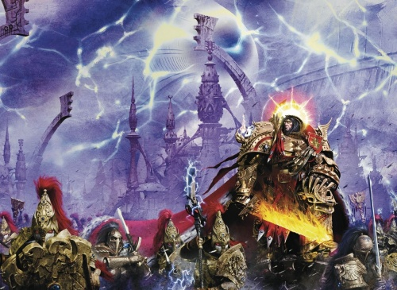

# 0768 004-014.M31 网道战争 War in the Webway

精校状态：中文行文已逐段精校，部分术语仍为暂定

分类：时间线

原文来源：https://www.bilibili.com/opus/1058591588882579461

原作者：帝国神选罐头

原文时间：编辑于 2025年06月01日 17:51

[返回分类目录](目录.md) · [全书目录](../../目录.md)

<!-- A0768-B0001 -->
**英文原文**

The War Within the Webway, also called the War in the Webway, was a hidden engagement during the Horus Heresy.

<!-- /A0768-B0001 -->

<!-- A0768-B0002 -->

原译文

网道内部战争，也称为网道战争，是荷鲁斯叛乱时期的一场秘密交战。

**校订译文**

网道战争，也称网道内部战争，是荷鲁斯之乱期间一场不为外界所知的战事。

<!-- /A0768-B0002 -->

<!-- A0768-B0003 图片 -->

<!-- A0768-B0004 -->

原译文

The Emperor leads forces inside the Webway 帝皇在网道内领导部队

**校订译文**

The Emperor leads forces inside the Webway 帝皇在网道内领导部队

<!-- /A0768-B0004 -->

<!-- A0768-B0005 -->
**英文原文**

Conflict:Horus Heresy

<!-- /A0768-B0005 -->

<!-- A0768-B0006 -->

原译文

冲突：荷鲁斯叛乱

**校订译文**

冲突：荷鲁斯之乱。

<!-- /A0768-B0006 -->

<!-- A0768-B0007 -->
**英文原文**

Date:004-014.M31

<!-- /A0768-B0007 -->

<!-- A0768-B0008 -->

原译文

日期：004-014.M31

**校订译文**

日期：004-014.M31

<!-- /A0768-B0008 -->

<!-- A0768-B0009 -->
**英文原文**

Location:Imperial Palace/Webway

<!-- /A0768-B0009 -->

<!-- A0768-B0010 -->

原译文

地点：帝国皇宫/网道

**校订译文**

地点：帝国皇宫/网道

<!-- /A0768-B0010 -->

<!-- A0768-B0011 -->
**英文原文**

Outcome:Stalemate. Imperial retreat, Webway portal sealed. End of the Imperial Webway Project

<!-- /A0768-B0011 -->

<!-- A0768-B0012 -->

原译文

结果：僵局。帝国撤退，网道门户被封锁。帝国网道项目结束

**校订译文**

结果：僵局。帝国撤退，网道门户被封锁。帝国网道项目结束

<!-- /A0768-B0012 -->

<!-- A0768-B0013 -->
**英文原文**

Combatants:Imperium/Forces of Chaos

<!-- /A0768-B0013 -->

<!-- A0768-B0014 -->

原译文

作战人员：帝国/混沌部队

**校订译文**

交战双方：帝国／混沌大军。

<!-- /A0768-B0014 -->

<!-- A0768-B0015 -->
**英文原文**

Commanders:Emperor of Mankind,Jenetia Krole,Ra Endymion (MIA),Kadai (KIA),Jasac (KIA),Helios (KIA),The Archimandrite (KIA),Vulkan (WIA)/Drach'nyen (sealed),Magnus (banished)

<!-- /A0768-B0015 -->

<!-- A0768-B0016 -->

原译文

指挥官：人类帝皇，珍提亚·科勒，拉·恩底弥翁（MIA），卡代（KIA），贾萨克（KIA），赫利俄斯（KIA），技术牧首（KIA），沃坎（WIA）/德拉科’尼恩（封印），马格努斯（放逐）

**校订译文**

指挥官：人类帝皇、珍提亚·科勒、拉·恩底弥翁（失踪）、卡代（阵亡）、贾萨克（阵亡）、赫利俄斯（阵亡）、技术牧首（阵亡）、沃坎（负伤）／德拉科尼恩（被封印）、马格努斯（被放逐）。

<!-- /A0768-B0016 -->

<!-- A0768-B0017 -->
**英文原文**

Strength:Legio Custodes,Silent Sisterhood,3 Legio Ignatum Titans,Ordo Sinister,House Vyridion,Mechanicum forces,Dominion Zephon/Daemon Hordes,Sons of Horus,Word Bearers,World Eaters,Emperor's Children,Legio Audax

<!-- /A0768-B0017 -->

<!-- A0768-B0018 -->

原译文

实力：禁军军团，寂静修女会，3架烈焰军团泰坦，噩兆修会，维利迪翁骑士家族，机械教部队，统御者泽丰/恶魔部落，荷鲁斯之子，怀言者，吞世者，帝皇之子，莽勇泰坦军团

**校订译文**

兵力：禁军军团、寂静修女会、烈焰军团的三台泰坦、噩兆修会、维里迪恩家族、机械教部队及统御者泽丰／恶魔大军、荷鲁斯之子、怀言者、吞世者、帝皇之子及莽勇军团。

<!-- /A0768-B0018 -->

<!-- A0768-B0019 -->
**英文原文**

Casualties:Significant, including:~9,000 Custodes,3 Legio Ignatum Titans/Massive

<!-- /A0768-B0019 -->

<!-- A0768-B0020 -->

原译文

伤亡人数：重大，包括：约9000名禁军，3架烈焰军团泰坦/大规模

**校订译文**

损失：帝国伤亡惨重，包括约九千名禁军和烈焰军团的三台泰坦／混沌方面损失极大。

<!-- /A0768-B0020 -->

<!-- A0768-B0021 -->
## Overview 概述

<!-- /A0768-B0021 -->

<!-- A0768-B0022 -->
**英文原文**

Following the attempt of Magnus the Red to warn the Emperor of Horus's treachery, catastrophe struck Terra. Magnus's psychic warning breached the wards the Emperor had placed around the Imperial Palace, causing the Golden Throne, a device intended to allow human travel within the Webway, to malfunction. As the Golden Throne broke down, the Webway Portal deep within the Imperial Palace became breached. Floods of daemons rushed through this breach, and the Emperor despatched the Custodes and Sisters of Silence to hold the line and prevent Terra from being overrun. As the Custodes and Silent Sisterhood fought back immense Daemonic hordes, the Emperor sat upon the Golden Throne in a desperate attempt to stabilise the Webway Portal. Even the Emperor's psychic might was tested in this endeavour, and He became visibly exerted. The war within the Webway consumed the Emperor's attention, leaving the waging of the simultaneous defense against the Horus Heresy to Malcador, Rogal Dorn and Constantine Valdor. Malcador was the only one allowed to regularly visit with the Emperor.

<!-- /A0768-B0022 -->

<!-- A0768-B0023 -->

原译文

在赤红之马格努斯试图警告帝皇荷鲁斯的背叛之后，泰拉遭受了灾难。马格努斯的灵能警告突破了帝皇在皇宫周围设置的防护，导致旨在允许人类在网道内航行的装置黄金王座发生故障。随着黄金王座的崩溃，皇宫深处的网道门户被攻破。大量的恶魔冲过这个缺口，帝皇派遣了禁军和寂静修女来守住防线，防止泰拉被淹没。当禁军和寂静修女击退了庞大的恶魔大军时，帝皇坐在黄金王座上，绝望地试图稳定网道门户。甚至帝皇的灵能力量也在这项努力中受到了考验，他明显地发挥了作用。网道内部的战争消耗了帝皇的注意力，将同时防御荷鲁斯叛乱的任务留给了马卡多、罗格·多恩和康斯坦丁·瓦尔多。马卡多是唯一一个被允许定期拜访帝皇的人。

**校订译文**

红魔马格努斯试图以灵能向帝皇警告荷鲁斯的背叛，却给泰拉带来灾难。他传递警告时冲破了帝皇在皇宫周围布设的防护，致使原本用于让人类进入网道的黄金王座发生故障。王座失灵后，皇宫深处的网道入口遭到突破，恶魔如潮水般涌入。帝皇派出禁军和寂静修女固守防线，阻止泰拉沦陷；自己则坐上黄金王座，竭力稳定网道入口。即使以他的灵能之强，也承受着严峻考验，明显显露出吃力之态。网道战事占去了帝皇的全部精力，抵御荷鲁斯之乱的任务只能交给马卡多、罗格·多恩与康斯坦丁·瓦尔多。只有马卡多获准定期觐见帝皇。

**校注：** visibly exerted 意为明显显得吃力，原稿“明显地发挥了作用”误译。

<!-- /A0768-B0023 -->

<!-- A0768-B0024 -->
**英文原文**

Soon enough, the war within the Webway fell into a pattern. The Custodians established a series of blockades across the tunnels within the Webway. Behind these defended areas, the Mechanicum workers were repairing the damaged sections of tunnel and sealing the rifts to prevent more daemons from getting inside the Webway. In front of the blockades, the Custodians and Sisters launched lightning-fast counter-attacks to keep the daemonic horde off-balance and prevent them massing in strength. Slowly, but surely, the Imperial forces were pushing the blockades forward as the pressure from the daemonic attacks waned. Nevertheless, some daemon assaults did manage to break through the Imperial defences and on those rare occasions the attackers wreaked havoc on the Imperial workers. More than once the daemonic entities were able to fight their way to the warp-gate of the Golden Throne. Desperate fighting ensued as the Custodians and Sisters doubled their efforts to throw back the daemons and prevent them surging through the warp-gate and into the Imperial Dungeon beyond.

<!-- /A0768-B0024 -->

<!-- A0768-B0025 -->

原译文

很快，网道内部的战争就陷入了一种模式。禁军在网道内的隧道内建立了一系列封锁。在这些防御区后面，机械教工人正在修复受损的隧道部分，并密封裂缝，以防止更多的恶魔进入网道。在封锁线前，禁军和修女们发动了闪电般的反击，以保持恶魔部落的平衡，防止他们集结。随着恶魔袭击的压力减弱，帝国军队正在缓慢但坚定地推进封锁。然而，一些恶魔的攻击确实突破了帝国的防御，在极少数情况下，攻击者对帝国工人造成了严重破坏。恶魔实体不止一次能够战斗到黄金王座的亚空间门。随着禁军和修女们加倍努力击退恶魔，防止他们冲进亚空间门，进入远处的帝国地牢，绝望的战斗随之而来。

**校订译文**

网道内的战斗很快形成了固定模式：禁军在各条隧道中构筑层层封锁线，机械教工人在后方修复受损隧道、封堵裂隙，阻止更多恶魔进入。禁军与寂静修女则从防线前方发起迅猛反击，打乱恶魔的部署，阻止它们集结力量。随着敌军攻势减弱，帝国得以缓慢而稳步地向前推进防线。然而，恶魔偶尔仍会突破防御，在后方工人中大肆杀戮，甚至不止一次杀到黄金王座的亚空间门户前。禁军和修女们不得不拼死将其击退，防止恶魔越过入口，涌进另一侧的帝国地牢。

**校注：** keep ... off-balance 是打乱敌军部署，原译“保持恶魔部落的平衡”意思相反。

<!-- /A0768-B0025 -->

<!-- A0768-B0026 -->
**英文原文**

As the war raged on, new troops appeared amongst the hordes of daemons attacking the Imperial forces. The powers of Chaos sent foully corrupted Chaos Space Marines, Titans and other war machines into the Webway to try and force a victory. Mighty Greater Daemons including Bloodthirsters joined the battle as well. The sanctity of the Imperial Palace, the fate of the Imperium and the very life of the Emperor depended on the Custodian Guard and the Sisters of Silence. If they couldn't defeat the daemonic horde and its corrupted allies then Humanity was surely doomed.

<!-- /A0768-B0026 -->

<!-- A0768-B0027 -->

原译文

随着战争的持续，新的军队出现在攻击帝国军队的恶魔大军中。混沌的力量派遣了肮脏腐化的混沌星际战士、泰坦和其他战争机械进入网道，试图取得胜利。包括嗜血狂魔在内的强大的大魔也加入了战斗。皇宫的神圣、帝国的命运和帝皇的生命都取决于禁军和寂静修女。如果他们不能打败恶魔部落及其腐化的盟友，那么人类肯定注定要灭亡。

**校订译文**

随着战事延续，攻击帝国的恶魔大军中又出现了新的部队。混沌诸神将深受腐化的混沌星际战士、泰坦及其他战争机器派进网道，企图强行取得胜利。包括嗜血狂魔在内的强大大魔也加入战斗。皇宫的安危、帝国的命运，乃至帝皇本人的生命，都系于禁军与寂静修女之手。他们若无法击败恶魔及其腐化的盟军，人类便注定灭亡。

<!-- /A0768-B0027 -->

<!-- A0768-B0028 -->
**英文原文**

The war within the Webway was waged for the next five years. Imperial forces were centred around the abandoned Eldar city of Calastar, known as the Impossible City, defending the Webway tunnels constructed by the Mechanicum and held together by the Emperor upon the Golden Throne. The Custodes were reduced by 90% and the Sisters suffered greatly as well. Two of the three commanding Custodes Tribunes were killed, leaving Ra Endymion as the primary Imperial officer. The Impossible City itself soon came under threat as a formidable new foe, Drach'nyen, appeared among the Daemonic hordes. Faced with this, the Custodes Diocletian Coros was charged with securing reinforcements from Terra. Due to the secrecy of the project, the scarce resources available because of the ongoing Heresy, the maddening effect of Chaos, and the questionable loyalty of the Legiones Astartes only the doomed prisoners of House Vyridion, the crippled Blood Angel Dominion Zephon, and Mechanicum Servitors and Skitarii were provided. A Mechanicum Dominus known as The Archimandrite was charged with leading them in the final defense of Calastar. Meanwhile, the Emperor charged the Sisters of Silence with the Unspoken Sanction, and the Black Ships worked at a hurried pace to gather Psykers across the Galaxy.

<!-- /A0768-B0028 -->

<!-- A0768-B0029 -->

原译文

在接下来的五年里，网道内部的战争一直在进行。帝国军队集中在被遗弃的灵族城市卡拉斯塔周围，被称为“不可能之城”，保卫由机械教建造并由帝皇在黄金王座上聚集在一起的网道隧道。禁军减少了90%，修女们也遭受了巨大的损害。三名指挥官中的两名被杀，留下拉·恩底弥翁担任帝国的主要军官。不可能之城本身很快就受到了威胁，因为一个强大的新敌人德拉科’尼恩出现在了恶魔部落中。面对这种情况，禁军戴克里先·克罗斯负责从泰拉获得增援。由于该项目的保密性，由于持续的叛乱、混沌的疯狂影响以及阿斯塔特军团成员的可疑忠诚而导致的可用资源稀缺，只提供了维利迪翁家族的死囚、残废的圣血天使多米尼恩·泽丰以及机械教机仆和护教军。一位被称为技术牧首的机械教统御贤者负责带领他们进行卡拉斯塔的最后防御。与此同时，帝皇向寂静修女们发出了沉默法案，黑船们匆匆忙忙地在银河系各地集结了灵能者。

**校订译文**

网道战争又持续了五年。帝国部队以废弃的灵族城市卡拉斯塔——又称“不可能之城”——为核心，守卫机械教建造、由黄金王座上的帝皇维持稳固的网道隧道。禁军兵力损失了九成，寂静修女同样伤亡惨重。三名负责指挥的禁军护民官有两人阵亡，拉·恩底弥翁成为帝国方面的主要指挥官。不久，强敌德拉科尼恩现身恶魔大军，不可能之城本身也岌岌可危。禁军戴克里先·科罗斯奉命前往泰拉征调援军。然而，计划高度保密，叛乱令资源匮乏，混沌又会使参战者陷入疯狂，阿斯塔特军团的忠诚也难以确信。最终，增援仅有维里迪恩家族的死囚、身残的圣血天使统御者泽丰，以及机械教的机仆和护教军。一名被称为“技术牧首”的机械教统御贤者负责率领他们参加卡拉斯塔最后的防御。与此同时，帝皇命寂静修女执行“沉默法案”，黑船开始加紧从银河各地搜集灵能者。

**校注：** 依英文 Custodes Tribunes 及已核官译补足“禁军护民官”；统御者泽丰是职衔加姓名，不将 Dominion 音译作人名。五年时长及本篇十年日期范围均按源文保留。

<!-- /A0768-B0029 -->

<!-- A0768-B0030 -->
**英文原文**

In the siege of Calastar, the Custodes-led forces held back countless Chaotic hordes but the walls of the city were shattered by Warhound Titans of the Legio Audax. Brutal fighting for Calastar raged for weeks on end, the Custodes and Sisters not having a moment's rest. As Daemonic, Traitor Legionnaire and Chaos Titan hordes swarmed into Calastar, The Archimandrite ordered a general retreat of her forces. They intended to abandon to the Custodes and Sisters and instead secure the Webway route to Mars and reclaim their sacred homeland. This desperate treachery did not save The Archimandrite who was possessed by Drach'nyen, her gigantic mechanical form being used to attack the retreating Imperials. Calastar fell and the Chaos forces drove the Imperials all the way back to the Webway Gate leading to Terra itself.

<!-- /A0768-B0030 -->

<!-- A0768-B0031 -->

原译文

在卡拉斯塔围城中，禁军率领的部队击退了无数混沌的部落，但城市的城墙被莽勇军团的战犬泰坦摧毁。卡拉斯塔的残酷战斗持续了数周，禁军和修女们没有片刻的休息。随着恶魔、叛徒军团和混沌泰坦大军涌入卡拉斯塔，技术牧首命令她的部队全面撤退。他们打算放弃禁军和修女们，转而确保通往火星的网道路线，夺回他们神圣的家园。这种绝望的背叛并没有拯救被德拉科附身的技术牧首，她巨大的机械形态被用来攻击撤退的帝国。卡拉斯塔陷落，混沌势力一路将帝国军赶回通往泰拉的网道门。

**校订译文**

卡拉斯塔围城战中，禁军率部挡住了无数混沌大军，却未能阻止莽勇军团的战犬级泰坦摧毁城墙。残酷的争夺持续了数周，禁军和修女们片刻不得休息。当恶魔、叛徒军团战士及混沌泰坦涌入城内，技术牧首下令其部队全线撤退。他们打算抛下禁军和寂静修女，改为夺取通往火星的网道路线，收复自己的神圣家园。然而，这场绝望的背叛并未救她一命：德拉科尼恩附身于她，操纵她庞大的机械躯体攻击撤退中的帝国部队。卡拉斯塔陷落，混沌大军一路将守军逼退到直通泰拉的网道入口前。

<!-- /A0768-B0031 -->

<!-- A0768-B0032 -->
**英文原文**

It was at this moment that the Unspoken Sanction was completed on Terra. A thousand captured Psykers were sacrificed to power the Golden Throne without the Emperor. Free from His prison for a single day, He plunged into the Webway and appeared as a burning dawn before the Chaos hordes. The Emperor blazed with a golden psychic fire that he channelled into the very structure of the webway, and the Emperor plunged into the Daemon's ranks, reaping a terrible toll wherever He fought. The exhausted Custodes were reinvigorated by their master, fighting by their side. The Emperor summoned an army of loyal Imperial dead including Ferrus Manus that took the form of blazing avatars to fight the Daemons. Drach'nyen itself soon appeared, proclaiming itself the Emperor's end. However, the Master of Mankind was able to seal him into Custodian Ra Endymion, who was then ordered to run into the depths of the Webway.

<!-- /A0768-B0032 -->

<!-- A0768-B0033 -->

原译文

就在这一刻，在泰拉上完成了沉默法案。一千名捕获的灵能者被牺牲，在没有帝皇的情况下启动了黄金王座。从监狱上解放了一天，他跳入了网道，在混沌大军面前出现了一个燃烧的黎明。帝皇点燃了一股金色的灵能之火，他将其引导到了网道的结构中，帝皇一头扎进了恶魔的队伍，无论他在哪里战斗，都会造成可怕的损失。疲惫的禁军被他们的主人鼓舞了，在他身边战斗。帝皇召集了一支由忠诚的帝国死者组成的军队，其中包括以燃烧的化身形式出现的费鲁斯·马努斯，与恶魔作战。德拉科很快就出现了，宣称自己是帝皇的终结。然而，人类之主将他封印到禁军拉·恩底弥翁身上，然后他被命令跑进网道的深处。

**校订译文**

此时，泰拉上的沉默法案终于执行到位。一千名被捕获的灵能者遭到献祭，代替帝皇为黄金王座供能。暂获一日自由的帝皇冲入网道，在混沌大军面前宛如燃烧的黎明。他周身燃起金色灵能烈焰，将火焰灌入网道本身的结构，继而杀入恶魔阵中，所到之处敌军死伤惨重。疲惫不堪的禁军见主人亲自并肩作战，重新振作起来。帝皇还召来忠于帝国的亡者大军，以烈焰化身与恶魔交战，其中包括费鲁斯·马努斯。德拉科尼恩很快现身，宣称自己就是帝皇的终结。但人类之主最终将它封入禁军拉·恩底弥翁体内，命令后者向网道深处奔逃。

**校注：** 费鲁斯·马努斯的烈焰化身是本篇英文明确叙述，照译保留，不据其他诠释推定亡者是否以独立灵魂复活。

<!-- /A0768-B0033 -->

<!-- A0768-B0034 -->
**英文原文**

The Emperor's actions gave the surviving Imperials enough time to evacuate the Webway, and as Chaos forces closed on the portal once more the Master of Mankind mounted the Golden Throne and sealed the gate. The gate would remain closed to the daemons for as long as the Emperor was able to power it from His throne atop the golden portal. Only the mightiest of psykers had power enough to do this and even then most would be exhausted and die in a short time. Only the Emperor had the might to keep the gate closed permanently and for Him the effort got harder as the Daemonic forces gathered about Him. For as long as the daemonic horde threatened to breach the portal, the Golden Throne would be His prison. In the last stage of the Siege of Terra in 014.M31, such a breach became increasingly likely as Magnus used his powers to assail the gate. In a desparate gamble, the Emperor and Malcador temporarily opened the Webway Gate to allow Vulkan to enter it, while Custodes and Sisters of Silence held back the daemonic hordes. The operation succeeded, as Vulkan was able to traverse the Webway, eventually discovering Magnus in the ruins of Calastar. There, the two Primarchs battled for timeless eons, with Vulkan dying and reviving countless times before finally defeating and banishing his brother. Despite his terrible wounds and nearly-destroyed mind, Vulkan also managed to return to the Imperial Palace after the duel.

<!-- /A0768-B0034 -->

<!-- A0768-B0035 -->

原译文

帝皇的行动给了幸存的帝国战士足够的时间撤离网道，随着混沌势力再次关闭门户，人类之主登上了黄金王座并封锁了大门。只要帝皇能够从金色大门上的宝座上为大门供能，大门就会对恶魔关闭。只有最强大的灵能者才有足够的力量做到这一点，即使如此，大多数人也会在短时间内筋疲力尽并死亡。只有帝皇有力量永久关闭大门，对他来说，随着恶魔的力量聚集在他周围，这一努力变得更加困难。只要恶魔部落威胁要攻破大门，黄金王座就会成为他的监狱。在014.M31的泰拉围城战的最后阶段，随着马格努斯利用他的力量攻击大门，这种突破的可能性越来越大。在一场绝望的赌博中，帝皇和马卡多暂时打开了网道门，让沃坎进入，而禁军和寂静修女则阻止了恶魔部落。这次行动成功了，因为沃坎能够穿越网道，最终在卡拉斯塔的废墟中发现了马格努斯。在那里，两位原体进行了永恒的斗争，沃坎死了无数次又复活了无数次，最终击败并驱逐了他的兄弟。尽管沃坎身受重伤，精神几近崩溃，但决斗后他还是设法回到了皇宫。

**校订译文**

帝皇为幸存者撤出网道争取了足够时间。混沌大军再次逼近入口时，他重返黄金王座，将门户封闭。只要他还能在金色入口上方的王座上持续供能，恶魔便无法通过。只有最强大的灵能者才有力量完成这项任务，即便如此，大多也会很快耗尽生命。唯有帝皇能长久维持封印，而随着恶魔不断聚集，他承受的压力也越来越大。只要恶魔仍威胁着入口，黄金王座就是他的牢笼。014.M31，泰拉围城战进入最后阶段，马格努斯以灵能猛攻门户，使其被突破的危险与日俱增。帝皇与马卡多遂孤注一掷，暂时开启入口，让沃坎进入，同时由禁军和寂静修女挡住恶魔。这次行动获得成功：沃坎穿过网道，最终在卡拉斯塔废墟找到马格努斯。两位原体在失去时间尺度的漫长岁月中交战，沃坎无数次死去又复生，终于击败并放逐了自己的兄弟。尽管身受重创、心智几乎毁灭，他仍在战后返回了皇宫。

**校注：** closed on the portal 是逼近入口，不是关闭门户。

<!-- /A0768-B0035 -->

<!-- A0768-B0036 -->
**英文原文**

When the Emperor decided to confront Horus aboard the Vengeful Spirit, Malcador was left to maintain the Golden Throne and keep the portal closed in His place. After the injured body of the Emperor was brought back to the Golden Throne, the immense effort exerted by Malcador in keeping the portal shut had reduced him to mere dust. As the Emperor was placed back onto the Golden Throne, His body has allowed the portal to remain closed for the last 10,000 years. Should the Emperor die, the Imperial Palace would be breached and Terra itself would be overrun by Daemons.

<!-- /A0768-B0036 -->

<!-- A0768-B0037 -->

原译文

当帝皇决定跳帮复仇之魂号与荷鲁斯对峙时，马卡多被留下来维护黄金王座，并保持门户关闭。在帝皇受伤的尸体被带回黄金王座后，马卡多为关闭大门所做的巨大努力使他化为尘土。当帝皇被放回黄金王座时，他的身体使门户在过去的10000年里一直保持关闭。如果帝皇死了，皇宫将被攻破，泰拉本身将被恶魔占领。

**校订译文**

帝皇决定登上复仇之魂号直面荷鲁斯时，留下马卡多代替自己维持黄金王座，保持入口封闭。等到重伤的帝皇被送回，马卡多已因承担这项任务而耗尽力量，化为尘埃。帝皇重新被安置在黄金王座上，此后一万年间，他一直维持着门户的封闭。倘若帝皇死去，皇宫就会被突破，泰拉也将被恶魔淹没。

**校注：** injured body 是重伤的身体，不能译为“受伤的尸体”。

<!-- /A0768-B0037 -->

本篇核心术语与暂定项

以下列出本篇出现的英文原形及核心术语表用词。同形词可能指不同对象，具体词义以本篇正文和校注为准；单复数、别名和仅见于图注的名称可能尚未列入。完整候选见[术语表](../../术语表/双语术语候选.csv)。

| 英文 | 采用中文 | 状态 |
| --- | --- | --- |
| Space Marines | 星际战士 | 官方已核对 |
| Chaos Space Marines | 混沌星际战士 | 官方已核对 |
| World Eaters | 吞世者 | 官方已核对 |
| Eldar | 灵族 | 暂定·语境区分 |
| Horus Heresy | 荷鲁斯之乱 | 官方已核对 |
| Warp | 亚空间 | 官方已核对 |
| Imperium | 帝国 | 暂定·简称 |
| Mechanicum | 机械教 | 暂定·历史称谓 |
| Webway | 网道 | 暂定 |
| Emperor of Mankind | 人类帝皇 | 暂定 |
| Emperor | 帝皇 | 官方已核对 |
| Word Bearers | 怀言者 | 暂定·官方待核 |
| Emperor's Children | 帝皇之子 | 官方已核对 |
| Ferrus Manus | 费鲁斯·马努斯 | 暂定·官方待核 |
| Terra | 泰拉 | 暂定·官方待核 |
| Horus | 荷鲁斯 | 暂定·官方待核 |
| Vengeful Spirit | 复仇之魂号 | 暂定·官方待核 |
| Sons of Horus | 荷鲁斯之子 | 暂定·官方待核 |
| Skitarii | 护教军 | 暂定·官方待核 |
| Sisters of Silence | 寂静修女 | 暂定·官方待核 |
| Magnus the Red | 红魔马格努斯 | 官方已核对 |
| Golden Throne | 黄金王座 | 暂定·官方待核 |
| Legiones Astartes | 阿斯塔特军团 | 暂定·官方待核 |
| Vulkan | 沃坎 | 暂定·官方待核 |
| Mars | 火星 | 暂定·官方待核 |
| Titan | 泰坦 | 暂定·官方待核 |
| Ordo Sinister | 噩兆修会 | 暂定·官方待核 |
| Jenetia Krole | 珍提亚·科勒 | 暂定·官方待核 |
| Webway Project | 网道计划 | 暂定·官方待核 |
| Master | 导师（审判庭职衔）／舰务官（舰员职务） | 语境定译·官方待核 |
| Custodian Guard | 禁军卫队 | 官方已核对 |
| Diocletian Coros | 戴克里先·科罗斯 | 暂定·官方待核 |
| Zephon | 泽丰 | 暂定·官方待核 |
| Brother | 修士 | 暂定·官方待核 |
| Powers | 能天使 | 暂定·官方待核 |
| Dominion | 主天使 | 暂定·官方待核 |
| Horde | 部落 | 暂定·官方待核 |
| Legio Audax | 莽勇军团 | 暂定·官方待核 |
| Ra Endymion | 拉·恩底弥翁 | 暂定·官方待核 |
| House Vyridion | 维里迪恩家族 | 暂定·官方待核 |
| Archimandrite | 技术牧首 | 暂定·官方待核 |
| Calastar | 卡拉斯塔 | 暂定·官方待核 |
| Dominion Zephon | 统御者泽丰 | 暂定·官方待核 |
| Legio Ignatum | 烈焰军团 | 暂定·官方待核 |
| Unspoken Sanction | 沉默法案 | 暂定·官方待核 |
| Helios | 赫利俄斯 | 暂定·官方待核 |
| Jasac | 贾萨克 | 暂定·官方待核 |
| Imperial Dungeon | 帝国地牢 | 暂定·官方待核 |

