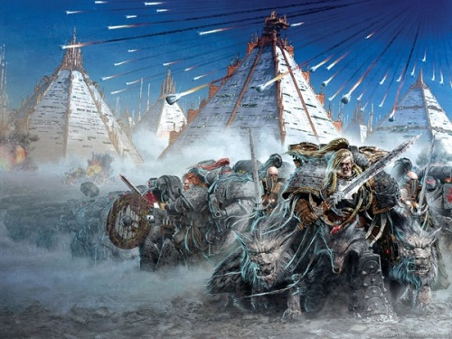
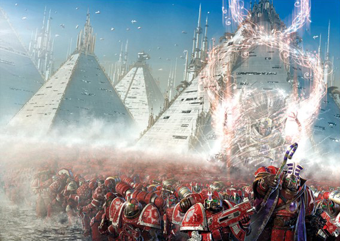
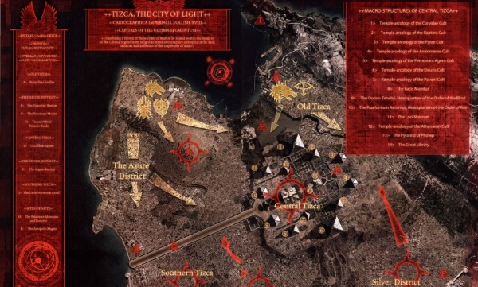
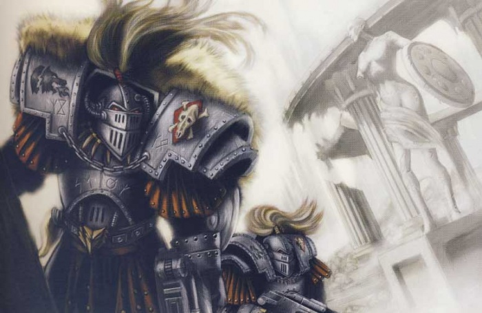
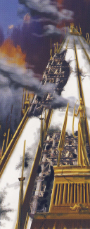
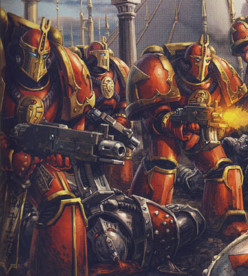
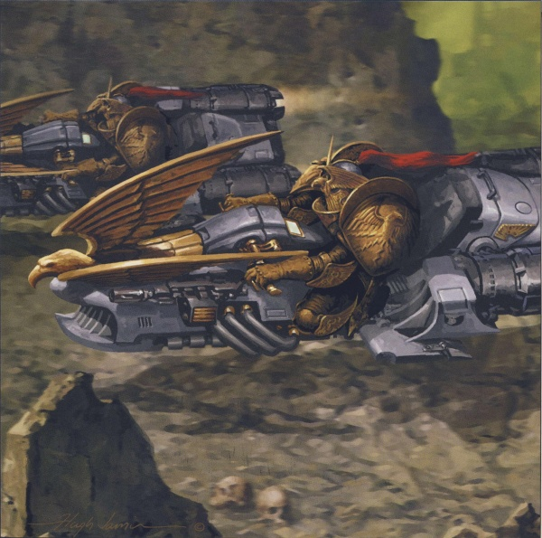
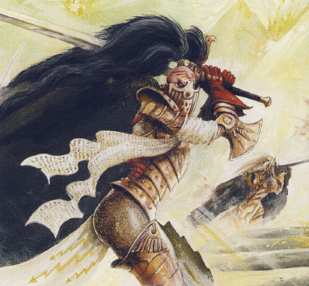
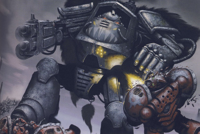
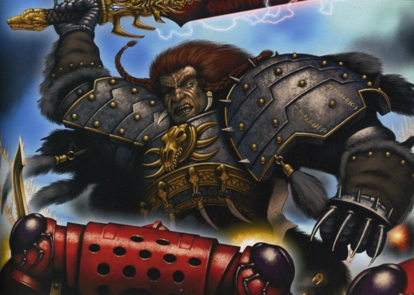

# 0769 734.004.M31 普罗斯佩罗之焚 The Burning of Prospero

精校状态：中文行文已逐段精校，部分术语仍为暂定

分类：时间线

原文来源：https://www.bilibili.com/opus/1058165205990637570

原作者：帝国神选罐头

原文时间：编辑于 2025年06月24日 20:20

[返回分类目录](目录.md) · [全书目录](../../目录.md)

<!-- A0769-B0001 -->
**英文原文**

History will say that they unleashed the Wolves of Russ on us, but history will be wrong. They unleashed something far worse.

<!-- /A0769-B0001 -->

<!-- A0769-B0002 -->

原译文

历史会记载说是他们向我们放出了黎曼·鲁斯麾下的野狼，但历史的记载会是错的。他们放出的东西远比那可怕得多。

**校订译文**

历史会记载说是他们向我们放出了黎曼·鲁斯麾下的野狼，但历史的记载会是错的。他们放出的东西远比那可怕得多。

<!-- /A0769-B0002 -->

<!-- A0769-B0003 -->
**英文原文**

— Ahzek Ahriman, date unknown

<!-- /A0769-B0003 -->

<!-- A0769-B0004 -->

原译文

— 阿扎克·阿里曼，日期未知

**校订译文**

— 阿扎克·阿里曼，日期未知

<!-- /A0769-B0004 -->

<!-- A0769-B0005 -->
**英文原文**

The Burning of Prospero, also known as the Desolation of Prospero or Battle of Prospero, is the name of the full-scale invasion and planetary devastation of Prospero, homeworld of the Thousand Sons, by Imperial forces that mainly included the Space Wolves Legion, the Adeptus Custodes, and the Sisters of Silence.

<!-- /A0769-B0005 -->

<!-- A0769-B0006 -->

原译文

普罗斯佩罗之焚，也被称为普罗斯佩罗之寂或普洛斯彼罗之战，是帝国军队对普罗斯佩罗的全面入侵和对行星的破坏的名称，普罗斯佩罗是千子的家园世界，帝国军队主要包括太空野狼军团、禁军和寂静修女。

**校订译文**

普罗斯佩罗之焚，又称普罗斯佩罗之寂或普罗斯佩罗之战，指帝国部队全面入侵并毁灭千子母星普罗斯佩罗的战役。参战的帝国主力包括太空野狼军团、禁军与寂静修女。

<!-- /A0769-B0006 -->

<!-- A0769-B0007 图片 -->

<!-- A0769-B0008 -->

原译文

Leman Russ and the Wolves of Fenris march on Tizca 黎曼·鲁斯和芬里斯之狼在提兹卡行进

**校订译文**

Leman Russ and the Wolves of Fenris march on Tizca 黎曼·鲁斯和芬里斯之狼在提兹卡行进

<!-- /A0769-B0008 -->

<!-- A0769-B0009 -->
**英文原文**

Conflict:The Great Crusade

<!-- /A0769-B0009 -->

<!-- A0769-B0010 -->

原译文

冲突：大远征

**校订译文**

冲突：大远征

<!-- /A0769-B0010 -->

<!-- A0769-B0011 -->
**英文原文**

Date:734004.M31

<!-- /A0769-B0011 -->

<!-- A0769-B0012 -->

原译文

日期：734.004.M31

**校订译文**

日期：734.004.M31

<!-- /A0769-B0012 -->

<!-- A0769-B0013 -->
**英文原文**

Location:Prospero

<!-- /A0769-B0013 -->

<!-- A0769-B0014 -->

原译文

地点：普罗斯佩罗

**校订译文**

地点：普罗斯佩罗

<!-- /A0769-B0014 -->

<!-- A0769-B0015 -->
**英文原文**

Outcome:Destruction of Prospero; surviving Thousand Sons teleported to the Planet of Sorcerers

<!-- /A0769-B0015 -->

<!-- A0769-B0016 -->

原译文

结果：普罗斯佩罗被摧毁；幸存的千子传送到巫师星球

**校订译文**

结果：普罗斯佩罗被毁；幸存千子被传送至巫师之星。

<!-- /A0769-B0016 -->

<!-- A0769-B0017 -->
**英文原文**

Combatants:Imperium/Thousand Sons

<!-- /A0769-B0017 -->

<!-- A0769-B0018 -->

原译文

作战人员：帝国/千子

**校订译文**

作战人员：帝国/千子

<!-- /A0769-B0018 -->

<!-- A0769-B0019 -->
**英文原文**

Commanders:Primarch Leman Russ,Captain-General Constantin Valdor, Commander Jenetia Krole,Geigor Fell-Hand/Primarch Magnus the Red (de jure), First Captain Ahzek Ahriman (de facto)

<!-- /A0769-B0019 -->

<!-- A0769-B0020 -->

原译文

指挥官：原体黎曼·鲁斯、将军康斯坦丁·瓦尔多、指挥官珍提亚·科勒、戈果·邪手/原体赤红之马格努斯（法律上）、第一连长阿扎克·阿里曼（事实上）

**校订译文**

指挥官：原体黎曼·鲁斯、禁军元帅康斯坦丁·瓦尔多、指挥官珍提亚·科勒、戈果·邪手／原体红魔马格努斯（名义上）、第一连长阿扎克·阿里曼（实际指挥）。

<!-- /A0769-B0020 -->

<!-- A0769-B0021 -->
**英文原文**

Strength:See Order of Battle/See Order of Battle

<!-- /A0769-B0021 -->

<!-- A0769-B0022 -->

原译文

实力：见战斗序列/见战斗序列

**校订译文**

实力：见战斗序列/见战斗序列

<!-- /A0769-B0022 -->

<!-- A0769-B0023 -->
**英文原文**

Casualties:49,000 combined total casualties,25,000 Space Wolves killed, with several thousand more missing,23,000 Imperial Army killed,Several Custodes and Sisters of Silence casualties/90% of the Thousand Sons Legion forces,30 million civilians and Prosperine Spireguard

<!-- /A0769-B0023 -->

<!-- A0769-B0024 -->

原译文

伤亡人数：总计49000人，25000名太空野狼被杀，数千人失踪，23000名帝国军队被杀，几名禁军和寂静修女伤亡/千子军团90%的部队，3000万平民和普罗斯佩罗尖塔守卫

**校订译文**

损失：帝国各军合计约四万九千人伤亡，其中太空野狼阵亡两万五千人，另有数千人失踪；帝国军阵亡两万三千人，禁军与寂静修女亦有伤亡／千子军团损失九成兵力，另有三千万平民与普罗斯佩罗尖塔守卫死亡。

**校注：** 英文总伤亡四万九千与随后分项阵亡、失踪人数不能严密吻合；按原文保留，不替作者调整统计。

<!-- /A0769-B0024 -->

<!-- A0769-B0025 -->
## Prelude 序曲

<!-- /A0769-B0025 -->

<!-- A0769-B0026 -->
**英文原文**

At the Council of Nikea the Emperor had personally declared that the deployment of Librarians and the use of psychic powers by any and all members of the Legiones Astartes was from that point on forbidden. He further threatened that any who transgressed against this announcement would be declared his enemy and suffer extreme retributive punishment. This judgement rested heavily on the shoulders of the Thousand Sons Space Marine Legion and their Primarch, Magnus the Red, who not only possessed and advocated the use of psychic powers themselves, but had felt personally unfairly judged and rejected by the Emperor at the Council, perceiving the whole affair as more of a rigged "Trial of Magnus" than anything else.

<!-- /A0769-B0026 -->

<!-- A0769-B0027 -->

原译文

在尼凯亚会议上，帝皇亲自宣布，从那时起，阿斯塔特军团的任何和所有成员都禁止部署智库和使用灵能力量。他还威胁说，任何违反这一宣告的人都将被宣布为敌人，并受到极端的报复性惩罚。这一判决在很大程度上落在了千子星际战士军团及其原体赤红之马格努斯的肩上，他们不仅自己拥有并主张使用灵能力量，而且在会议上感到帝皇对他们个人的不公平评判和拒绝，认为整件事更像是一场被操纵的“马格努斯的审判”。

**校订译文**

尼凯亚会议上，帝皇亲自宣布：从此禁止阿斯塔特军团设置智库，所有军团成员亦不得使用灵能。任何违令者都将被视为帝皇之敌，受到极其严厉的惩罚。判决尤其重创了千子军团及其原体红魔马格努斯。他们不仅具备灵能，还一贯倡导使用它；如今却觉得帝皇在会议上对自己作出了不公正的裁决，否定了他们。在他们看来，整场会议更像是预先操纵好的“马格努斯审判”。

<!-- /A0769-B0027 -->

<!-- A0769-B0028 -->
**英文原文**

Essentially withdrawing from the Great Crusade because of the ruling of Nikea, the majority of the Thousand Sons gathered on their homeworld of Prospero. During the Council of Nikea, Magnus received a prophetic vision that his brother and the Emperor's favoured son, Horus, would rebel against the rule of their father and burn the Imperium in a galactic civil war. Magnus, assured of his own personal psychic might, believed he could stop this event from happening using his knowledge and powers, and soon after returning to Prospero he set such events in motion. He first attempted to psychically guard Horus from malign interference; when this failed, he decided that he had to immediately warn the Emperor of what had transpired. To a colossus of such psychic power and personal vanity as Magnus, using a succession of intermediaries as communicators (the normal method of galactic communication) seemed too slow and unlikely to be convincing enough; Magnus was, after all, about to tell the Emperor that his favourite son and chief lieutenant aimed to overthrow him. So, to Magnus, the most obvious thing to do was to use his abilities to appear directly to the Emperor, not only allowing the essential truth of his news to be communicated, but also showing his father how skilled he was and how right he was to advocate the use of the complex psychic techniques that (to Magnus) lesser minds referred to as sorcery. Magnus therefore undertook a great psychic journey, transmitting his astral self into the very Warp, breaching a conduit of the Eldar Webway (unknowingly allowing daemons to enter behind him), and finally forcing open and passing through the very gate of the nascent Imperial Webway itself, appearing in astral form in the Imperial Dungeon. This action, which Magnus believed would vindicate him in the eyes of the Emperor, had damned him. By using psychic techniques, he had betrayed the wishes of the Emperor, and his very actions betrayed the Emperor's hopes. Not only had Magnus's breaching of the Webway and the Imperial Gate to it irrevocably damaged the technology, killed thousands in related accidents and psychic flashpoints, and left the Imperial Palace open to warp intrusion, but his choice to and manner of doing so had forever removed him from the Emperor's plan to crown Magnus himself upon the Golden Throne, to act as guardian and guide to humanity as they moved into the Webway. As the Emperor turned to regard Magnus sadly, the Primarch of the Thousand Sons achieved horrified understanding of this doom in an instant, and vanished. Other accounts state that the Emperor became enraged at the ruination of his Great Work and ignored Magnus's warning, instead banishing him from his sight.

<!-- /A0769-B0028 -->

<!-- A0769-B0029 -->

原译文

由于尼凯亚的判决，千子基本上退出了大远征，大多数人聚集在他们的家园普罗斯佩罗。在尼凯亚会议期间，马格努斯收到了一个预言幻象，即他的兄弟和帝皇宠爱的儿子荷鲁斯将反抗父亲的统治，并在银河内战中烧毁帝国。马格努斯相信自己的灵能能力，相信他可以利用自己的知识和力量阻止这一事件的发生，回到普罗斯佩罗后不久，他就启动了这样的事件。他首先试图在心理上保护荷鲁斯免受恶意干扰；当这一切失败时，他决定必须立即警告帝皇所发生的事情。对于像马格努斯这样具有灵能力量和个人虚荣心的巨人来说，使用一系列中介作为沟通者（银河系沟通的正常方法）似乎太慢了，也不太可能令人信服；毕竟，马格努斯正要告诉帝皇，他最宠爱的儿子兼首席副官打算推翻他。因此，对马格努斯来说，最明显的做法是利用自己的能力直接向帝皇显现，不仅允许传达他消息的基本真相，而且向他的父亲展示他有多么熟练，他提倡使用复杂的灵能技术是多么正确，（对马格努斯来说）那些不那么聪明的人称之为巫术。因此，马格努斯进行了一次伟大的灵能之旅，将他的星光体传递到亚空间中，打破了灵族网道的通道（不知不觉地让恶魔进入他身后），最后强行打开并穿过新生的帝国网道本身的大门，以星光体的形式出现在帝国地牢中。马格努斯认为，这一行动将在帝皇的眼中为他辩护，但帝皇却诅咒了他。通过使用灵能技术，他背叛了帝皇的意愿，他的行为也背叛了帝皇。马格努斯对网道和通往网道的帝国之门的破坏不仅不可逆转地破坏了技术，在相关事故和灵能爆发中杀死了数千人，并使皇宫暴露在亚空间的入侵之下，而且他的选择和方式永远使他脱离了帝皇为马格努斯加冕黄金王座的计划，在他们进入网道时充当人类的守护者和向导。当帝皇转过身来悲伤地看着马格努斯时，千子之主在一瞬间对这一厄运产生了震惊的理解，然后消失了。其他说法称，帝皇对他的伟大作品的毁灭感到愤怒，无视马格努斯的警告，而是将他从视线中驱逐出去。

**校订译文**

受尼凯亚判决影响，千子基本退出大远征，主力回到母星普罗斯佩罗。会议期间，马格努斯曾看见预言：他的兄弟、帝皇最宠爱的儿子荷鲁斯将背叛父亲，以一场银河内战焚毁帝国。马格努斯深信自己的灵能力量，相信凭借知识和能力便能阻止灾难，回到普罗斯佩罗后不久就开始行动。他首先试图通过灵能保护荷鲁斯，隔绝恶意力量的干涉；失败后，他认定必须立即将发生的一切告知帝皇。对于灵能与自负同样强大的马格努斯而言，采用银河常规通信方式、让消息经由一层层中继传递，既太慢，也缺乏说服力——他毕竟是要告诉父亲，最受宠的儿子和首席副手正打算推翻他。于是马格努斯认为，最理所当然的办法就是直接以灵能显现在帝皇面前，既传达真相，也向父亲证明自己的本领，以及自己提倡复杂灵能技法的正确性。在他看来，只有见识浅薄之辈才会将这些技法称作巫术。他展开了一场宏大的灵能远行，将星光体投入亚空间，突破一条灵族网道通路，浑然不觉地让恶魔尾随而入；最后强行打开并穿过初建的帝国网道入口，以星光体出现在帝国地牢。他原以为这能在帝皇面前证明自己，却恰恰因此走向毁灭。他动用灵能，违背了帝皇的禁令；其后果更摧毁了帝皇的希望。网道及帝国入口遭破坏，相关技术受到不可挽回的损伤，事故和灵能爆发夺走数千人的生命，皇宫也暴露于亚空间入侵之下。帝皇原打算让马格努斯坐上黄金王座，在人类进入网道时充当守护者与向导；而马格努斯的选择及做法，让这一安排再无实现的可能。帝皇悲伤地望向他时，千子原体刹那间明白了自己造成的灾难，惊骇之下消失了。另一些记载则称，帝皇因伟业被毁而震怒，无视马格努斯的警告，将他从眼前驱逐。

**校注：** had damned him 表示他的行动使自己陷入毁灭，并非帝皇施加了诅咒；psychically guard 也不是心理安慰，而是灵能保护。

<!-- /A0769-B0029 -->

<!-- A0769-B0030 -->
**英文原文**

Back on Prospero, Magnus realised how easily and fully he had been manipulated by a great power of the Warp in this series of affairs. Devastated by his foolishness and hubris, and how completely he and his legion had been played and doomed, he decided that the only proper thing to do, the only way to retain some honour and possibly even vindication, was to passively await the punishment meted out by his father. That punishment was not long in coming; the Emperor ordered Leman Russ to lead a fleet and bring Magnus back in chains.

<!-- /A0769-B0030 -->

<!-- A0769-B0031 -->

原译文

回到普罗斯佩罗，马格努斯意识到在这一系列事件中，他是多么容易和充分地被亚空间的强大力量操纵。由于他的愚蠢和傲慢，以及他和他的军团是多么彻底地被玩弄和注定失败，他决定，唯一正确的做法，唯一能保留一些荣誉甚至可能被平反的方法，就是被动地等待父亲的惩罚。惩罚来得不远；帝皇命令黎曼·鲁斯率领一支舰队，用铁链将马格努斯带回。

**校订译文**

返回普罗斯佩罗后，马格努斯意识到，自己在这一连串事件中竟如此轻易、彻底地受到了亚空间某种强大力量的操纵。愚蠢与傲慢造成的后果，以及自己和军团被玩弄、被引向毁灭的事实，使他彻底崩溃。他认为，唯一正确、还能保留些许荣誉甚至获得谅解的做法，就是不作抵抗地等待父亲降下惩罚。惩罚很快到来：帝皇命黎曼·鲁斯率舰队前往，将马格努斯锁上镣铐带回。

<!-- /A0769-B0031 -->

<!-- A0769-B0032 -->
## The Veil 面纱

<!-- /A0769-B0032 -->

<!-- A0769-B0033 -->
**英文原文**

In order for his legion to receive "their" (his) punishment without being tempted to fight back and therefore ruin "their" (his) last chance at redemption, Magnus went to great lengths to keep the knowledge of the impending Imperial attack from them, in actuality reducing their chances of success (either in terms of fighting back or of accepting the incoming punishment) from the outset. He threw up a psychic cocoon around the entire world, blocking astropathic communication and preventing the precogs of the Corvidae from foreseeing the future. The fleet elements of the Thousand Sons were ordered into four battle-groups and to head off into various parts of the galaxy, carrying sealed orders. Not long after this, the Imperial battlefleet arrived at Beta-Garmon. Made up of ships from the Space Wolves, the Adeptus Custodes, and the Sisters of Silence, the grey, gold, and black fleet numbered in the hundreds of vessels.

<!-- /A0769-B0033 -->

<!-- A0769-B0034 -->

原译文

为了让他的军团在不受反击诱惑的情况下接受“他们的”（他的）惩罚，从而毁掉“他们的”（他的）最后救赎机会，马格努斯竭尽全力让他们不知道即将到来的帝国进攻，实际上从一开始就降低了他们成功的机会（无论是反击还是接受即将到来的惩罚）。他在全世界竖起了一个灵能茧，阻断了星语的交流，阻止了黑鸦学派的预知未来。千子的舰队被命令分成四个战斗小组，携带密封的命令前往银河系的各个地区。不久之后，帝国战列舰队抵达贝塔·加蒙。这支灰色、金色和黑色的舰队由来自太空野狼、禁军和寂静修女的战舰组成，共有数百艘船只。

**校订译文**

为了让军团接受所谓“他们的”——实际上是他自己的——惩罚，避免战士们因反抗而毁掉最后的救赎机会，马格努斯竭力向他们隐瞒帝国即将来袭的消息。结果，无论他们最终选择抵抗还是接受惩罚，成功应对的机会都从一开始就被削弱了。他以灵能屏障包围整个世界，阻断星语通信，也让黑鸦学派的预言者无法窥见未来。千子舰队被分成四个战斗群，携密封命令驶往银河各处。不久，帝国讨伐舰队抵达贝塔·加蒙。数百艘太空野狼、禁军与寂静修女的舰船，组成了灰、金、黑三色交织的大军。

**校注：** 修正首句否定关系：马格努斯隐瞒来袭是为了防止反抗毁掉救赎机会，不是为了毁掉机会。

<!-- /A0769-B0034 -->

<!-- A0769-B0035 图片 -->

<!-- A0769-B0036 -->

原译文

Magnus and his Thousand Sons assembled upon Prospero 马格努斯和他的千子们聚集在普罗斯佩罗

**校订译文**

Magnus and his Thousand Sons assembled upon Prospero 马格努斯和他的千子们聚集在普罗斯佩罗

<!-- /A0769-B0036 -->

<!-- A0769-B0037 -->
**英文原文**

News of this sanction fleet, meanwhile, had previously reached the ears of the now-corrupted Horus himself. Sensing an opportunity, the Warmaster contacted Leman Russ. Speaking with his brother, he was able to convince him that "to return Magnus to Terra would be a waste of time and effort", despite Leman's specific orders. Horus confirmed to his traitorous council of war that he believed this interjection of his into the Emperor's own decree would result in Magnus never leaving Prospero alive. To aid in this endeavour, Horus sent 5,000 Sons of Horus legionnaires as well as 12 Titans of the Legio Mortis. At the time, Horus apparently viewed this as the best course of action where Magnus the Red was concerned, in order to retain the element of surprise when he finally made his first move in open rebellion.

<!-- /A0769-B0037 -->

<!-- A0769-B0038 -->

原译文

与此同时，这个制裁舰队的消息此前已经传到了现在腐化的荷鲁斯本人的耳朵里。战帅感觉到了一个机会，联系了黎曼·鲁斯。尽管黎曼下达了具体的命令，但他与兄弟交谈后，说服了他“将马格努斯送回泰拉将是浪费时间和精力”。荷鲁斯向他的叛徒战争议会证实，他相信将他插入帝皇的命令将导致马格努斯永远不会活着离开普罗斯佩罗。为了协助这项工作，荷鲁斯派遣了5000名荷鲁斯之子军团士兵和12名死亡军团泰坦。当时，荷鲁斯显然认为这是针对赤红之马格努斯的最佳行动方案，以便在他最终采取公开叛乱的第一步时保留惊喜的元素。

**校订译文**

讨伐舰队出动的消息，早已传入堕落的荷鲁斯耳中。战帅看到了机会，联络黎曼·鲁斯，尽管鲁斯接到的原令十分明确，他仍说服兄弟相信：“将马格努斯带回泰拉只是浪费时间和精力。”荷鲁斯后来向自己的叛军军事会议表示，他相信这番对帝皇命令的干预会让马格努斯再也无法活着离开普罗斯佩罗。为促成此事，他派出五千名荷鲁斯之子和死亡军团的十二台泰坦。当时，荷鲁斯显然认为，这样处理红魔马格努斯最为有利，能够让自己正式举旗叛乱时仍保有出其不意的优势。

**校注：** specific orders 是鲁斯收到的帝皇命令，不是鲁斯下达的命令；element of surprise 译突然袭击优势，非惊喜。

<!-- /A0769-B0038 -->

<!-- A0769-B0039 -->
**英文原文**

Before committing his forces to the attack, Leman Russ still attempted to communicate with his brother, Magnus. Believing that Kasper Ansbach Hawser was a Hidden One of the Thousand Sons, Russ attempted to speak to Magnus through him, declaring his fleet's approach and making a request to send away the civilians and surrender. As Hawser was not a Hidden One, but actually a pawn of Chaos designed to appear as one, the message was never received. Without attempting normal communication via vox, Leman Russ ordered the attack.

<!-- /A0769-B0039 -->

<!-- A0769-B0040 -->

原译文

在将部队投入攻击之前，黎曼·鲁斯仍然试图与他的兄弟马格努斯沟通。鲁斯相信卡斯佩尔·安斯巴赫·豪瑟尔是千子的隐藏者，他试图通过他与马格努斯交谈，宣布他的舰队正在靠近，并要求送走平民并投降。由于豪瑟尔不是一个隐藏者，而是一个旨在作为一个整体出现的混沌的棋子，所以这个信息从未被收到。没有尝试通过音阵进行正常通信，黎曼·鲁斯下令发动袭击。

**校订译文**

发动进攻前，鲁斯仍尝试与马格努斯联系。他误以为卡斯佩尔·安斯巴赫·豪瑟尔是千子的“隐者”，便试图借此人向马格努斯传话，告知舰队正在逼近，要求疏散平民并投降。但豪瑟尔其实只是混沌刻意布置成隐者模样的一枚棋子，消息根本没有送达。鲁斯未再尝试常规音阵通信，便下令进攻。

**校注：** Hidden One 沿第58篇隐者；豪瑟尔被混沌伪装成该身份，不是“作为一个整体出现”。

<!-- /A0769-B0040 -->

<!-- A0769-B0041 -->
## The Burning 燃烧

<!-- /A0769-B0041 -->

<!-- A0769-B0042 -->
**英文原文**

With no fleet in orbit and under sudden attack without explanation or warning, Prospero had to rely on its orbital defence batteries as first-line protection. These stations lasted but mere moments, with torpedo-spreads aimed at them released from the Imperial vessels. Survivors of these torpedo attacks were obliterated by long-range gunfire as the fleets closed in. Imperial interdiction vessels drew up alongside and boarded all civilian traffic in the system, including taking the vessel Cypria Selene, aboard which they found Mahavastu Kallimakus, the Scribe of Magnus, a valuable capture. Taking up orbit themselves, the Space Wolves' vessels commenced saturation orbital strikes upon the entire planet. Magma Bombs, directed energy-weapons, mass drivers, and even ballistic cannons were unleashed upon the surface of Prospero, in an assault that literally changed the surface of the world forever: mountains were levelled, valleys filled with their rubble; the seas were boiled away, flashed into steam; the very bedrock of Prospero was pounded and heated into new shapes, like metal upon the anvil; boiling hot winds swept across the world, bringing with them the smell of heated metals and oils.

<!-- /A0769-B0042 -->

<!-- A0769-B0043 -->

原译文

由于轨道上没有舰队，并且在没有解释或警告的情况下遭到突然攻击，普罗斯佩罗不得不依靠其轨道防御阵列作为一线保护。这些阵列只持续了片刻，帝国战舰向它们发射了鱼雷。当舰队逼近时，这些鱼雷袭击的幸存者被远程炮火摧毁。帝国阻截船停靠在该星系的所有民用交通线上，包括捕获塞普里亚・塞勒涅号战舰，他们在船上发现了马格努斯的记述者马哈瓦斯图·卡里马库斯，这是一次宝贵的捕获。太空野狼的战舰自行进入轨道，开始对整个星球进行饱和轨道轰炸。岩浆炸弹、定向能武器、质量加速器，甚至弹道火炮都被发射到普罗斯佩罗的表面，这场袭击彻底改变了世界的表面：山脉被夷为平地，山谷被瓦砾填满；海水沸腾了，变成了蒸汽；普罗斯佩罗的基岩被捣碎并加热成新的形状，就像铁砧上的金属；沸腾的热风席卷了世界各地，带来了被加热的金属和油的味道。

**校订译文**

轨道上没有己方舰队，又在毫无解释或预警的情况下突遭攻击，普罗斯佩罗只能依赖轨道防御炮台抵挡第一波攻势。帝国舰船齐射的鱼雷瞬间摧毁了大部分防御站；舰队逼近时，远程炮火又消灭了残存设施。帝国拦截舰同时逐一靠近、登临星系内的民用船只，其中包括塞普里亚·塞勒涅号。他们在船上抓获了马格努斯的书记官马哈瓦斯图·卡利马库斯，这是一名价值极高的俘虏。太空野狼舰船进入轨道后，开始对整个星球实施饱和轰炸。岩浆炸弹、定向能武器、质量加速炮乃至常规火炮，悉数倾泻到地表，永远改变了这个世界的面貌：山脉被夷平，碎石填满山谷；海洋沸腾，转瞬化为蒸汽；星球基岩如砧上金属一般，在重击与高温下重新塑形；灼热狂风席卷全球，夹带着金属和油脂受热后的气味。

**校注：** Scribe 是书记官，并非记述者 Remembrancer；民船未因被舰队俘获而改称战舰。

<!-- /A0769-B0043 -->

<!-- A0769-B0044 图片 -->

<!-- A0769-B0045 -->

原译文

The Imperial invasion of Tizca 帝国入侵提兹卡

**校订译文**

The Imperial invasion of Tizca 帝国入侵提兹卡

<!-- /A0769-B0045 -->

<!-- A0769-B0046 -->
**英文原文**

This bombardment was so sudden and so strong that moments after it began, only one population centre still survived on Prospero: a standing unit of Thousand Sons from the Raptora Cult kept a telekinetic shield generated over the city of Tizca. This shield, as hard and impenetrable as those generating it could mentally conceive, proved completely proof against the fearsome orbital bombardment directed at Tizca, even though sympathetic damage to the kine-shield killed several members of the cult maintaining the shield.

<!-- /A0769-B0046 -->

<!-- A0769-B0047 -->

原译文

这次轰炸是如此突然和强烈，以至于在开始后不久，普罗斯佩罗上只有一个人口中心幸存下来：猎鹰学派的千子常备部队在提兹卡市上空保留了一个念力盾。这个护盾，就像那些制造它的人在头脑中想象的那样坚硬和难以穿透，被证明完全证明可以抵御针对提兹卡的可怕的轨道轰炸，尽管对动能护盾造成的连带损害导致了维持该护盾的学派中的数名成员丧生。

**校订译文**

轰炸骤然而猛烈，开始后不久，普罗斯佩罗便只剩一处人口聚居地幸存：猎鹰学派的一支常驻千子部队撑起念动力护盾，笼罩着提兹卡全城。护盾如维持者意念中所能想象的那样坚固，完全挡住了可怖的轨道轰炸。但承受攻击所产生的灵能反噬，仍杀死了数名维持护盾的学派成员。

<!-- /A0769-B0047 -->

<!-- A0769-B0048 -->
**英文原文**

The Space Wolves continued the bombardment of Tizca for some time, perhaps hoping to overload the mysterious shield preventing them from obliterating the city. The time this tactic created allowed the commanders of the Thousand Sons to confer and learn what was happening from Magnus the Red himself. Magnus implored his Legion to give up any notion of defence and accept their deaths with honour. Perceiving the truth of the matter, that Magnus had seriously transgressed against the Emperor's decree and behaved in such a way that the Imperial forces considered the Thousand Sons to be compromised and traitors, Chief Librarian Ahzek Ahriman realised that the legion was damned if they did and damned if they didn't. He therefore resolved to ignore Magnus's wish (in a minor reflection of Magnus's own attitude towards the Emperor's wishes) and lead the Thousand Sons in defence of Tizca and the lives of all within. The senior captains of the legion assented to his command; the Thousand Sons did not intend to perish without a fight.

<!-- /A0769-B0048 -->

<!-- A0769-B0049 -->

原译文

太空野狼继续轰炸提兹卡一段时间，也许是希望让神秘的护盾过载，防止阻止他们毁灭这座城市。这一战术创造的时间让千子的指挥官们能够与赤红之马格努斯商议并了解发生了什么。马格努斯恳求他的军团放弃任何防御的想法，光荣地接受他们的死亡。首席智库阿扎克·阿里曼意识到事情的真相，即马格努斯严重违反了帝皇的法令，其行为方式使帝国军队认为千子的妥协和叛乱，他意识到，如果他们这样做，军团就会被诅咒，如果他们不这样做，他们也会被诅咒。因此，他决定无视马格努斯的意愿（这只是马格努斯自己对帝皇意愿的态度的一个小小的反映），带领千子保卫提兹卡和内部所有人的生命。军团的高级连长们同意了他的命令；千子不想不战而亡。

**校订译文**

太空野狼继续轰炸提兹卡，或许希望令那层妨碍他们毁城的神秘护盾过载。这段时间给了千子指挥官集会的机会，也让他们从马格努斯本人那里得知真相。原体恳求军团放弃抵抗，带着荣誉接受死亡。首席智库阿扎克·阿里曼明白：马格努斯严重违抗帝皇敕令，使帝国将整个千子军团视为已受腐化的叛徒。他也明白，战与不战，军团都已难逃厄运。于是他决定违背马格努斯的意愿，率千子守卫提兹卡及城中所有生命。这在某种程度上，恰是马格努斯违背帝皇意愿的缩影。高级连长们接受了阿里曼的指挥：千子不愿不战而亡。

<!-- /A0769-B0049 -->

<!-- A0769-B0050 -->
## The Wolves Unleashed 群狼出笼

原题：The Wolves Unleashed 野狼释放

<!-- /A0769-B0050 -->

<!-- A0769-B0051 -->
**英文原文**

Stymied by the city-wide kine-shield, Leman Russ, Primarch of the Space Wolves and long mistrustful of the Thousand Sons, led his legion to landfall. Landing in assault-boats on the eastern side of Tizca, their numbers were so great that onlookers on the ground confused their landing craft with grit particles cast adrift on the winds. Only when they grew closer was the terrifying truth unveiled: the Space Wolves and their allies were landing in such force that Tizca was sure to be annihilated.

<!-- /A0769-B0051 -->

<!-- A0769-B0052 -->

原译文

由于受到全城市范围内的动能盾牌的阻碍，太空野狼原体黎曼·鲁斯长期不信任千子，带领他的军团登陆。他们登上提兹卡东侧的突击艇，人数如此之多，以至于地面上的旁观者将他们的登陆艇与随风漂流的沙粒混淆了。只有当他们越来越近时，可怕的真相才浮出水面：太空野狼和他们的盟友以如此强大的力量登陆，提兹卡肯定会被摧毁。

**校订译文**

覆盖全城的念动力护盾挡住了炮火，早已不信任千子的太空野狼原体黎曼·鲁斯遂亲率军团登陆。突击艇从提兹卡东侧降下，数量之多，让地面的人们远看还以为那是风中飘散的沙尘。待它们逼近，可怕的真相才显现出来：太空野狼及其盟军正在大举登陆，兵力之庞大，仿佛注定要将提兹卡彻底毁灭。

<!-- /A0769-B0052 -->

<!-- A0769-B0053 图片 -->

<!-- A0769-B0054 -->

原译文

Wolf Guard advance 前进的野狼卫队

**校订译文**

Wolf Guard advance 前进的野狼卫队

<!-- /A0769-B0054 -->

<!-- A0769-B0055 -->
**英文原文**

The Thousand Sons, in their pride and arrogance, had assumed that Tizca would never face close-in air attack, and so there were no anti-aircraft guns to threaten the landers or Stormbirds that pummelled the ground defences. Leman Russ himself was the first attacker to set foot on Prospero, leading hundreds of Astartes into the systematic destruction of Tizca's coastline. In an extension of this attack, Thunderhawk gunships blasted clear landing zones further into the eastern part of the city, dropping hundreds of Space Wolf assault elements into the midst of the assembling citizen militia. While some Thunderhawks were struck from the sky by accurate defensive fire, the overwhelming majority of Space Wolves landed with no problems, immediately striking out at all around them. As these infantry waves linked up, the areas behind them, burned and flattened, were clear for armour units to be air-landed. Predators, Land Raiders, Vindicators and Whirlwinds were deployed, the first three types of vehicle assigned to methodically blast buildings into rubble and gun down all inhabitants that they saw. The Whirlwind artillery batteries were first assigned to strike symbolic targets, such as the statue of Magnus atop the Acropolis Magna, before being loosed in indiscriminate fire missions into areas of the city as yet untouched by the fighting. Loaded with incendiaries, they made sure the City of Light burned.

<!-- /A0769-B0055 -->

<!-- A0769-B0056 -->

原译文

千子骄傲自大地认为，提兹卡永远不会面临近距离空袭，因此没有高射炮威胁摧毁地面防御的登陆艇或风暴鸟。黎曼·鲁斯本人是第一个踏上普罗斯佩罗的袭击者，带领数百名阿斯塔特有计划地摧毁了提兹卡的海岸线。在这次袭击的延伸中，雷鹰炮艇在城市东部进一步轰炸了清晰的着陆区，将数百名太空野狼突击队员投入了正在集结的公民民兵中。虽然一些雷鹰被精确的防御火力从空中击中，但绝大多数太空野狼都顺利着陆，并立即向周围发起攻击。随着这些步兵部队的集结，他们身后的地区被烧毁并夷为平地，装甲部队可以进行空中降落。掠食者、兰德掠袭者、维护者和旋风被部署，前三种类型的车辆被指派有条不紊地将建筑物炸成瓦砾，并枪杀他们看到的所有居民。旋风炮兵组最初被分配用于打击象征性目标，如马格纳卫城顶部的马格努斯雕像，然后在不分青红皂白的射击任务中被释放到尚未受到战斗影响的城市地区。他们装满了燃烧弹，确保光之城被烧毁。

**校订译文**

千子骄傲自负，认为提兹卡绝不会遭到近距离空袭，因此没有部署高射炮，无法有效威胁登陆艇，以及不断轰击地面防线的风暴鸟。鲁斯第一个踏上普罗斯佩罗，率数百名阿斯塔特有计划地摧毁提兹卡海岸。雷鹰炮艇随后深入城市东部，以炮火扫清着陆区，将数百名太空野狼突击战士投入尚在集结的市民民兵之间。少数雷鹰被精准的防御火力击落，但绝大部分部队顺利登陆，随即攻击四周。各波步兵会合后，他们身后被焚毁夷平的地带便成了装甲部队的空运卸载场。掠食者、兰德掠袭者、维护者战车和旋风炮车陆续部署。前三种载具有条不紊地将建筑轰成废墟，射杀一切映入眼帘的居民；旋风炮兵连先攻击象征性目标，例如马格纳卫城顶部的马格努斯雕像，随后向尚未卷入战斗的城区无差别开火。燃烧弹倾泻而下，光之城终于燃烧起来。

<!-- /A0769-B0056 -->

<!-- A0769-B0057 -->
**英文原文**

Land Speeder crews continued the general devastation, flashing through the city indiscriminately gunning down civilians. In direct response to these hunting packs of Land Speeders, the Prospero Skyguard mobilised their own speeders, disc-shaped craft armed with melta-weapons and missiles, and vicious low-level dogfights broke out as a result. Emboldened by this visible sign of resistance, the Tizca militia and citizenry rose up to attack the invaders in whatever ways they could. Behind these random groups and pockets of resistance, the Prospero Spireguard moved into battle, assigned positions by officers of the Corvidae. The 15th Prosperine Assault Infantry took up positions in a line between the Pyrae Pyramid and the Skelmis Tholus. Their commander, Captain Sokhem Vithara, made the Kretis Gallery, the oldest museum and art gallery on Prospero, his headquarters. The Prospero Assault Pioneers dug themselves out of their collapsed barracks and prepared to sell their lives dearly. The Palatine Guard assembled at the edge of the Space Wolves' deployment zone, their commander, Katon Aphea, positioning them with a notable tactical brilliance.

<!-- /A0769-B0057 -->

<!-- A0769-B0058 -->

原译文

兰德速攻艇的乘员继续进行全面的破坏，在城市中不分青红皂白地枪杀平民。作为对这些兰德掠袭者狩猎队的直接回应，普罗斯佩罗天空守卫动员了自己的速攻艇，这是一艘装有热熔武器和导弹的圆盘形飞行器，结果爆发了恶性的低空混战。在这一明显的抵抗迹象的鼓舞下，提兹卡民兵和公民武装起来以任何方式攻击入侵者。在这些随机的团体和零星的抵抗背后，普罗斯佩罗尖塔守卫进入了战斗，由黑鸦学派的军官分配了位置。第15普罗斯佩罗突击步兵团在火凤学派金字塔和斯凯尔米斯穹顶之间的一条线上占据了阵地。他们的指挥官索科姆·维塔拉连长将普罗斯佩罗最古老的博物馆和美术馆波形刃画廊作为他的总部。普罗斯佩罗突击先锋队从倒塌的营房中被挖了出来，准备以高昂的代价献出自己的生命。禁卫兵团在太空野狼部署区的边缘集结，他们的指挥官卡同·阿斐亚以显著的战术才华将他们定位。

**校订译文**

兰德速攻艇继续四处破坏，穿梭街巷，无差别射杀平民。普罗斯佩罗天空守卫遂出动自己的圆盘形速攻飞行器，以热熔武器和导弹迎击这些猎杀群，双方爆发了激烈的低空空战。看到有人抵抗，提兹卡的民兵和市民受到鼓舞，纷纷以一切可用手段攻击入侵者。在零星抵抗点后方，普罗斯佩罗尖塔守卫奉黑鸦学派军官之命进入各处阵地。第十五普罗斯佩罗突击步兵团沿火凤学派金字塔至斯凯尔米斯穹顶一线布防，指挥官索科姆·维塔拉上尉将克雷提斯画廊——普罗斯佩罗最古老的博物馆与美术馆——设为指挥部。普罗斯佩罗突击先锋队从坍塌的营房中自行挖出通路，准备奋战到底，让敌人为每条生命付出代价。禁卫兵团则在太空野狼登陆区边缘集结，指挥官卡同·阿斐亚以出色的战术才干安排了阵位。

**校注：** Kretis 为画廊专名，原“波形刃”疑按相似普通词误译，暂音译克雷提斯。spend/sell lives dearly 在此意为拼死抵抗、让敌付出代价。

<!-- /A0769-B0058 -->

<!-- A0769-B0059 图片 -->

<!-- A0769-B0060 -->

原译文

Tizca aflame 燃烧的提兹卡

**校订译文**

Tizca aflame 燃烧的提兹卡

<!-- /A0769-B0060 -->

<!-- A0769-B0061 -->
**英文原文**

Leman Russ and the Space Wolves hit Aphea's line next and overran it within minutes. Tizca was burning.

<!-- /A0769-B0061 -->

<!-- A0769-B0062 -->

原译文

黎曼·鲁斯和太空野狼接下来攻击了阿斐亚的防线，并在几分钟内将其突破。提兹卡正在燃烧。

**校订译文**

黎曼·鲁斯和太空野狼接下来攻击了阿斐亚的防线，并在几分钟内将其突破。提兹卡正在燃烧。

<!-- /A0769-B0062 -->

<!-- A0769-B0063 -->
## Fire in the Streets 街道交火

<!-- /A0769-B0063 -->

<!-- A0769-B0064 -->
**英文原文**

It was at this point that the Thousand Sons marines made their presence known, their captains acting in accordance with their hastily-made defence plans. Ahriman led the Scarab Occult in to reinforce the 15th Assault Infantry. Although the Spireguard unit had some success with using the narrow streets of Tizca to their advantage, the were but mortal soldiery, and the Scarab Occult arrived just after the Wolves managed to break through. As Ahriman formed up his gun-line in front of the charging Wolves, he peered down the length of his bolter and found the precognitive thread that would guide his shot into detonating the helm of one of the Space Wolves. The significance of this moment made him hesitate, with the result that the charging Space Wolves opened fire first, smashing several of the Sekhmet to the ground. This action broke Ahriman's hesitation, and he pulled the trigger, killing his first Space Wolf mere moments before the rest of his elite company opened fire, knocking the Space Wolves back. The stunned Wolves were then struck by the various psychic powers employed by non-Corvidae members of the 1st Fellowship, with the survivors either variously being telekinetically mauled to death or burned alive. Not a single Space Wolf from this attack lived, and with clashes like this repeated everywhere the Space Wolves met the Thousand Sons, the first defensive line was formed.

<!-- /A0769-B0064 -->

<!-- A0769-B0065 -->

原译文

正是在这一点上，千子星际战士才表明了他们的存在，他们的连长按照他们匆忙制定的防御计划行事。阿里曼率领斯圣甲虫密会增援第15突击步兵团。尽管尖塔守卫部队在利用提兹卡狭窄的街道上取得了一些成功，但他们只是凡人，而圣甲虫密会在野狼设法突破后才到达。当阿里曼在冲锋的野狼面前排好枪线时，他向下看了看他的爆矢枪，发现了一条预知线，这条线将引导他的子弹击碎一名太空野狼的头盔。这一刻的重要性让他犹豫不决，结果冲锋的太空野狼首先开火，将几名圣甲虫击倒在地上。这一行动打破了阿里曼的犹豫，他扣动了扳机，在他的精英连队其他成员开火前不久杀死了第一名太空野狼，将太空野狼击退。震惊的野狼随后被第一学会的非黑鸦学派成员所使用的各种灵能力量所打击，幸存者要么被念动力袭击致死，要么被活活烧死。这次袭击中没有一名太空野狼幸存下来，随着这样的冲突在太空野狼与千子相遇的地方反复发生，第一道防线形成了。

**校订译文**

千子战士终于投入战斗，各连长依照仓促拟定的防御计划行动。阿里曼率圣甲虫密会增援第十五突击步兵团。尖塔守卫借提兹卡狭窄的街巷顽强作战，却终究只是凡人；圣甲虫密会赶到时，太空野狼刚刚突破其防线。阿里曼在迎面冲来的敌人前排开射击阵列，沿爆矢枪瞄准，窥见一缕未来：这一枪将击碎一名太空野狼的头盔。亲手向兄弟开火的意义令他迟疑片刻，冲来的太空野狼却抢先射击，将数名塞赫麦特战士打倒。他终于扣下扳机，杀死了自己此战的第一个太空野狼。精锐连队紧随其后开火，将敌军打退。尚未回神的太空野狼又遭到第一学会中其他学派成员的灵能打击；幸存者或被念动力撕碎，或遭烈焰焚身。这股进攻部队无人生还。类似交锋在双方接触的各处反复发生，千子的第一道防线终于成形。

<!-- /A0769-B0065 -->

<!-- A0769-B0066 图片 -->

<!-- A0769-B0067 -->

原译文

The Thousand Sons counter-attack 千子反击

**校订译文**

The Thousand Sons counter-attack 千子反击

<!-- /A0769-B0067 -->

<!-- A0769-B0068 -->
**英文原文**

The counter-attack strategy of the Thousand Sons soon made itself clear. Long thought dormant, the Titan Canis Vertex, positioned in front of the Pyrae Pyramid like some grandiose statue, blossomed into life. Enthroned in a crystal projecting chamber at the peak of the the Pyrame Pyramid, Captain Khalophis, Magister Templi of the Pyrae and the Lord of Hellfire used his powers to inhabit the Titan, taking control over its form. Stepping down from its pedestal, Canis Vertex began to walk once more. With the Athaneans and the Corvidae able to intercept and discern the Space Wolves' battle-plans, Khalophis was able to determine where the Space Wolves were over-extending themselves. He guided Canis Vertex across the Old City area of Tizca, his pyrokinetic powers boosted by his Tutelary holding open a direct connection to the Warp. As a result of this, while the Titan's weapons worked, Khalophis was able to cause more destruction amidst the Wolves by simply bombarding them with Titan-fist sized balls of pure warpfire. The Wolves responded by directing aerial strikes against the Titan from speeders and gunships, but Khalophis was able to keep an aetherically-charged fireshield around the Titan, incinerating all munitions, dissipating energy-weapons, and melting the pilots of the attack craft into their seats if they flew too close. Canis Vertex was apparently unstoppable and the line was holding.

<!-- /A0769-B0068 -->

<!-- A0769-B0069 -->

原译文

千子的反攻战略很快就明确了。长期被认为处于休眠状态的泰坦犬之顶点，像一尊宏伟的雕像一样位于火凤学派金字塔前，绽放出生命。坐在皮拉姆金字塔顶端的水晶投影里，卡洛菲斯连长、火凤学派的圣堂讲师和地狱火之主利用自己的力量驾驶泰坦，控制着它的形体。犬之顶点从基座上走下来，再次开始行走。由于阿萨西恩和黑鸦学派能够拦截和辨别太空野狼的作战计划，卡洛菲斯能够确定太空野狼在哪里过度扩张。他带领犬之顶点穿过提兹卡老城区，他的守护灵打开了与亚空间的直接连接，从而增强了他的控火能力。因此，当泰坦的武器发挥作用时，卡洛菲斯能够通过用泰坦拳头大小的纯净魔焰球轰炸野狼，在野狼中造成更多的破坏。野狼的回应是从速攻艇和炮艇上对泰坦进行空中打击，但卡洛菲斯能够在泰坦周围保持一个充满以太的火焰盾，焚烧所有弹药，消散能量武器，并在攻击艇飞行员飞得太近时将他们熔化在座位上。犬之顶点显然势不可挡，战线稳定住了。

**校订译文**

千子的反击策略很快显露出来。火凤学派金字塔前，那台长期被当作宏伟雕像、仿佛早已沉寂的泰坦犬之顶点号重新苏醒。卡洛菲斯连长——火凤学派的圣堂讲师、地狱火之主——端坐于金字塔顶端的水晶投影室，以灵能将意识投入泰坦，接管了它的躯体。犬之顶点号走下基座，再度迈步。天枭与黑鸦学派能截取、洞悉太空野狼的作战计划，卡洛菲斯因而知道敌军在哪些地方推进过深。他驾驶泰坦穿过提兹卡旧城区，自己的守护灵则维持着一条直通亚空间的连接，不断增强他的控火能力。除泰坦本身的武器外，他还用大如泰坦巨拳的纯粹亚空间火球轰击敌军，造成更大破坏。太空野狼调来速攻艇和炮艇空袭，但卡洛菲斯始终在泰坦周围维持以太烈焰护盾：弹药被焚毁，能量武器的攻击被消散，飞得太近的驾驶员甚至连同座椅一起熔化。犬之顶点号似乎无可阻挡，防线得以坚守。

**校注：** Athaneans 为天枭学派成员，按既定 Athanaeans 统一，不再音译阿萨西恩；Pyrame Pyramid 据同段上下文统一火凤学派金字塔，保留英文拼写异文。

<!-- /A0769-B0069 -->

<!-- A0769-B0070 -->
## The Emperor's Hands 帝皇之手

<!-- /A0769-B0070 -->

<!-- A0769-B0071 -->
**英文原文**

It was at this time that the first reports of non-Space Wolf attackers being present in the Imperial forces began to flash up and down the Thousand Sons' line. The Adeptus Custodes were the first to be seen, making daring hit-and-run attacks from the backs of their powerful jetbikes. While their presence was unsettling, members of the Thousand Sons swiftly discovered that, despite their formidable reputation, Custodes died just as easily as anyone else, particularly when struck by psychic energies. The officers of the legion settled into their defensive perimeters, with Ahriman holding the east, Phosis T'Kar and Hathor Maat the west, Phael Toron defending the port, and the Athaneans holding the centre. The Thousand Sons then concentrated on bringing in surviving Spireguard units and moving civilians through their lines to the safest place left on Prospero: the Pyramid of Photep, southernmost of the central pyramids.

<!-- /A0769-B0071 -->

<!-- A0769-B0072 -->

原译文

正是在这个时候，关于帝国军队中存在非太空野狼袭击者的第一份报告开始在千子战线上来回传递。禁军是第一个被看到的，他们从强大的喷气式摩托上进行了大胆的跑打攻击。虽然他们的存在令人不安，但千子的成员很快发现，尽管他们名声显赫，但禁军和其他人一样容易死亡，尤其是在受到灵能能量的攻击时。军团的军官们驻扎在他们的防御范围内，阿里曼控制着东部，弗西斯·塔'卡和哈索尔·玛特控制着西部，费尔·托伦保卫着港口，阿萨西恩控制着中心。然后，千子集中力量引进幸存的尖塔守卫部队，并将平民通过他们的防线转移到普罗斯佩罗上最安全的地方：中央金字塔最南端的光芒金字塔。

**校订译文**

这时，千子阵线上开始传出消息：帝国进攻者并不只有太空野狼。最先被发现的是禁军，他们驾驭强劲的喷气摩托，实施大胆的快速突袭。禁军的出现固然令人不安，但千子很快发现，这些声名赫赫的战士同样会死，尤其难以抵挡灵能攻击。军团指挥官各守防区：阿里曼驻守东侧，弗西斯·塔’卡和哈索尔·玛特守西侧，费尔·托伦守卫港口，天枭学派坐镇中央。随后，千子集中力量收拢幸存的尖塔守卫，让平民穿过防线，撤入普罗斯佩罗最后的安全之地——中央金字塔群最南端的光芒金字塔。

**校注：** Pyramid of Photep 暂沿现稿“光芒金字塔”，不是同名旗舰“万丈光芒号”。

<!-- /A0769-B0072 -->

<!-- A0769-B0073 图片 -->

<!-- A0769-B0074 -->

原译文

The Adeptus Custodes 禁军

**校订译文**

The Adeptus Custodes 禁军

<!-- /A0769-B0074 -->

<!-- A0769-B0075 -->
**英文原文**

This lull, or brief silencing of the battle-lines, was followed up by a more literal silencing of the Thousand Sons. Hard on the heels of the Adeptus Custodes came the Sisters of Silence, sliding into the defensive line in small groups or as individuals, their bizarre nature immediately dampening or nullifying the psychic powers of the defenders. While again, many members of the legion were able to overcome these supposed elite troops of the Emperor in personal combat, the disruptive effects of the Sisters were considerable, especially as Leman Russ ordered his own legion to move in alongside the Sisters to take advantage of the confusion. The Thousand Sons wavered, falling back some small distance and losing unit cohesion...until the tactic of concentrating on the Sisters themselves resulted in enough of the Null-Maidens perishing that the Sons were able to again access their psychic powers. Phosis T'Kar, Hathor Maat and Captain Auramagma then formed up a counter-attacking force and pushed a fighting wedge into the Space Wolves' own line, while the rest of their legion's forces restabilised. This wedge achieved success for a limited time, until a terrifying howl was heard around the battlefield; Leman Russ had arrived at where the fighting was thickest. Despite their so-far demonstrated superiority over the Space Wolves, the Thousand Sons fared poorly against the Russ and his retinue, dying in the scores to his own assault.

<!-- /A0769-B0075 -->

<!-- A0769-B0076 -->

原译文

这种平静，或短暂的战线沉默，之后是更字面意义上的千子沉默。紧随禁军之后的是寂静修女，她们以小队或个人的形式冲入防线，她们的奇异本性立即削弱或抵消了防御者的灵能力量。虽然军团的许多成员能够在个人战斗中战胜这些所谓的帝皇精锐部队，但修女的破坏性影响是相当大的，尤其是当黎曼·鲁斯命令自己的军团与修女并肩作战以利用混乱时。千子动摇了，后退了一小段距离，失去了单位凝聚力...直到专注于修女的策略导致足够多的虚无之女死亡，使得千子能够再次获得他们的灵能力量。随后，弗西斯·塔'卡、哈索尔·玛特和奥瑞玛玛连长组成了一支反击部队，将一个战斗楔子推入太空野狼自己的防线，而他们军团的其他部队则重新稳定下来。这个楔子在有限的时间内取得了成功，直到战场上响起可怕的嚎叫；黎曼·鲁斯已经到达了战斗最激烈的地方。尽管他们迄今为止表现出了对太空野狼的优势，但千子在与鲁斯及其随从的对抗中表现不佳，在他的攻击中丧生。

**校订译文**

战线短暂沉寂之后，千子又遭遇了更直接的“寂静”。紧随禁军而来的寂静修女，以小组或单人渗入防线，其特殊体质立刻削弱、甚至彻底压制守军的灵能。千子中仍有许多人能在肉搏中击败这些帝皇精锐，但修女造成的干扰极为严重。鲁斯更命本军团与她们协同行动，趁乱进攻。千子阵脚动摇，略向后退，部队间也失去了配合。直到他们转而集中攻击修女，杀死足够多的虚无之女，才重新获得使用灵能的空间。弗西斯·塔’卡、哈索尔·玛特和奥拉玛玛连长随即组织反击，以楔形攻势突入太空野狼阵线，为其他部队稳住阵脚。这一反攻起初奏效，随后一声恐怖的长嚎响彻战场：鲁斯来到了战况最激烈之处。千子此前面对太空野狼尚能占优，此刻却难敌原体及其随从，成群战士倒在鲁斯的亲自攻击之下。

<!-- /A0769-B0076 -->

<!-- A0769-B0077 -->
**英文原文**

In that confused, armoured press, a place of bladed murder and where thoughts could slay, the senior Thousand Sons on the spot realised they had to eliminate Leman Russ then and there, or the day was lost. Auramagma was the first to strike, swathing himself in a shield of pure warpflame and engaging the Russ from mid-distance with concentrated lances of aetheric energy. This attack momentarily staggered the Wolf King, and the watching Sons cheered as the Space Wolves' Primarch disappeared in an explosion of light...then were silenced as that explosion seemed to reflect from the Wolf King as if mirrored, the full intensity of the attack returning to its source. His powers somehow seemingly nullified, Auramagma suffered the horror of losing his immunity to warpflame, his soul being incinerated by unquenchable fire. Screaming, the torch of an Astartes ran from the conflict, the crowded warriors parting to let the damned pass.

<!-- /A0769-B0077 -->

<!-- A0769-B0078 -->

原译文

在那混乱的，武装的压迫中，一个充满杀戮的地方，一个思想可以杀人的地方，年长的千子当场意识到他们必须当场消灭黎曼·鲁斯，否则就大势已去。奥瑞玛玛是第一个发动攻击的人，他把自己裹在纯粹魔焰的护盾里，用集中的以太能量长矛从远处与鲁斯交战。这次攻击瞬间让狼王措手不及，当太空野狼的原体在一场光爆中消失时，观看的千子欢呼起来...然后，他们沉默了，因为爆炸似乎从狼王身上反射出来，仿佛是镜像，攻击的全部强度都回到了源头。他的力量似乎被剥夺了，奥瑞玛玛遭受了失去对魔焰免疫力的恐惧，他的灵魂被无法熄灭的火焰焚烧。尖叫着，阿斯塔特的火炬从冲突中跑了出来，拥挤的战士们分开让被诅咒者过去。

**校订译文**

在这片装甲相撞、刀锋与意念都能杀人的混战中，千子的高级战士意识到，必须当场杀死鲁斯，否则败局已定。奥拉玛玛率先出手，以纯粹的亚空间烈焰护体，从中距离向狼王射出凝聚的以太能量长矛。攻击一度使鲁斯踉跄；当原体淹没在爆发的强光中时，千子发出欢呼。但欢呼很快沉寂：光芒竟像撞上镜面一般，从狼王身上反射回来，全部威力返还其源头。奥拉玛玛的力量似乎以某种方式遭到压制，他失去了对亚空间烈焰的免疫，连灵魂也被无法熄灭的火焰灼烧。化作人形火炬的阿斯塔特尖叫着逃离战团，拥挤的战士纷纷让开，让这个注定毁灭的人穿过。

<!-- /A0769-B0078 -->

<!-- A0769-B0079 -->
**英文原文**

As the Thousand Sons' counter-attack lost momentum before the Russ and this horrific sight, T'Kar ordered Hathor Maat to pull them back and reform their portion of the line further in. As Maat complied with this order, T'Kar elected to remain behind, drawing all the strength from the warp he possibly could, directing his Tutelary to engorge him with it. His powers phenomenally boosted, T'Kar burst through the ranks of the Space Wolves like a telekinetic missile, smashing aside or crushing underneath all that got in his way. Rearing up before the Russ, T'Kar's assault faced one last hurdle; the Emperor's own bodyguard, Constantin Valdor, stepped between the Thousand Son and the Primarch, calmly raising his weapon and naming his opponent as Monster. At this declaration, Phosis T'Kar realised that his over-use of his powers and warp-connection had resulted flesh-change; he now appeared as a hideous, mutated beast, instead of a proud warrior-scholar. Sadly, he lowered his defences and allowed Valdor to slay him.

<!-- /A0769-B0079 -->

<!-- A0769-B0080 -->

原译文

当千子的反击在势头渐失，眼前还呈现出鲁斯这可怕的景象时，塔’卡命令哈索尔·玛特将他们拉回，并进一步改造他们的防线。当玛特遵守这一命令时，塔’卡选择留下来，尽可能地从亚空间中汲取力量，指挥他的侍从将其充满。他的力量惊人地增强，塔’卡像遥控导弹一样冲破了太空野狼的队伍，击穿或粉碎了所有阻挡他的东西。在鲁斯面前，塔’卡的进攻面临着最后一个障碍；帝皇护卫康斯坦丁·瓦尔多站在千子和原体之间，平静地举起武器，称对手为怪物。在这一声明中，弗西斯·塔'卡意识到，他过度使用自己的力量和亚空间连接导致了肉体的变异；他现在看起来像一只丑陋的变异野兽，而不是一个骄傲的战士学者。可悲的是，他降低了防御，让瓦尔多杀死了他。

**校订译文**

鲁斯的到来与眼前惨状使千子的反攻失去势头。塔’卡命哈索尔·玛特率部后撤，在更深处重组防线，自己则留下来，命守护灵把尽可能多的亚空间力量灌入体内。力量暴涨的塔’卡如一枚念动力导弹般冲穿太空野狼阵列，挡路者皆被撞飞或碾碎。他冲到鲁斯面前时，最后一道障碍挡住了去路：帝皇亲卫康斯坦丁·瓦尔多挺身站在他与原体之间，平静举起武器，称他为“怪物”。听到这个词，弗西斯·塔’卡才意识到，自己过度动用灵能、连通亚空间，已引发血肉异变。他不再是骄傲的战士学者，而是一头丑陋的变异野兽。悲哀之下，他撤去防御，任由瓦尔多将自己杀死。

**校注：** telekinetic missile 是以念动力疾冲的比喻，不是遥控导弹。血肉异变与主动放弃抵抗均照原文保留。

<!-- /A0769-B0080 -->

<!-- A0769-B0081 图片 -->

<!-- A0769-B0082 -->

原译文

The Sisters of Silence 寂静修女

**校订译文**

The Sisters of Silence 寂静修女

<!-- /A0769-B0082 -->

<!-- A0769-B0083 -->
**英文原文**

The Space Wolves were able to capitalise on the direct pressure exerted by their primarch, as well as land combined Wolves/Custodes/Sisters disruption teams behind the Thousand Sons' lines. One of these teams, led by the Rune Priest Othere Wyrdmake, entered the Pyramid of the Corvidae and began to systematically burn all the texts within. Interrogating the mortally wounded Librarian Ankhu Anen, Wyrdmake learned where and when he could find and confront Ahzek Ahriman. Ahriman was at this time repeatedly trying to convince Magnus to come to the aid of his legion. The Primarch repeatedly refused.

<!-- /A0769-B0083 -->

<!-- A0769-B0084 -->

原译文

太空野狼能够利用他们的原体施加的直接压力，以及千子战线后面的战地结合的野狼/禁军/修女破坏团队。其中一支由符文牧师奥特雷·命运塑造者带领的队伍进入了黑鸦学派的金字塔，并开始系统地烧毁里面的所有文本。通过询问受重伤的智库安库·埃南，命运塑造者了解到他可以在何时何地找到并对抗阿扎克·阿里曼。此时，阿里曼一再试图说服马格努斯前来帮助他的军团。原体一再拒绝。

**校订译文**

太空野狼利用原体在正面施加的压力，又将由本军团、禁军和寂静修女混编的破袭队投送到千子后方。符文牧师奥瑟瑞·命造率其中一队进入黑鸦学派金字塔，有计划地焚烧馆内全部典籍。他审问了身受致命伤的智库安库·埃南，得知何时何地能找到阿扎克·阿里曼并与之交锋。此时阿里曼仍在反复恳求马格努斯出手救援军团，原体却一再拒绝。

<!-- /A0769-B0084 -->

<!-- A0769-B0085 -->
## The Power of the Warp 亚空间之力

<!-- /A0769-B0085 -->

<!-- A0769-B0086 -->
**英文原文**

The fight for Tizca's port proved to be almost as bloody and relentless as that surrounding Leman Russ, with Phael Toron's 7th Fellowship struggling to hold back repeated assaults by the Space Wolves. Despite their outstanding accuracy, with a notable kill-count coming from headshots on helmetless Space Wolves, Toron (a conservative in thought) finally allowed his Fellowship to go powers-free in the face of a concentrated assault by around six hundred Space Wolves. His men instantly made an impact with their wild demonstrations of psychic power, but that impact was then itself diluted by a pinpoint Dreadnought assault. Toron, staring down the barrels of the Dreadnought's weapons responded by frantically linking with the warp, flooding himself with power, somehow opening up to all manner of psychic skill, not just that of his own Cult discipline. Levitating over the battlefield, striking out with bio-electric powers, the Captain of the 7th disassembled the first Dreadnought, before overriding the minds of the next two and turning them upon each other. As the 7th poured after him, Toron made his way into the Space Wolf lines, laughing hysterically at his sudden, invincible power. Shells from Predator tanks bounced off his shielded-form, while he simply crushed them in return. However, with a sudden start, he realised he could no longer properly control his powers, nor shut off his link to the Warp. His tutelary refused to respond to his commands, instead gleefully flooding him with power beyond his ability to control. With sudden comprehension that their Tutelaries were not loyal pets or assistants, but something far more malicious, Toron overloaded with warp energy and exploded.

<!-- /A0769-B0086 -->

<!-- A0769-B0087 -->

原译文

事实证明，争夺提兹卡港口的战斗几乎和围绕黎曼·鲁斯的战斗一样血腥无情，费尔·托伦的第七学会努力阻止太空野狼的反复攻击。尽管他们的准确度非常高，而且对无头盔太空野狼的头部射击也带来了显著的死亡人数，但托伦（一个保守派）最终允许他的学会在大约六百名太空野狼的集中攻击下自由行动。他的部下立即通过疯狂的灵能力量展示产生了影响，但这种影响随后被无畏的精确攻击冲淡了。托伦凝视着无畏武器的枪管，疯狂地与亚空间连接，让自己充满力量，不知怎么地，他接受了各种各样的灵能技能，而不仅仅是他自己的学派训练。第七连长在战场上空盘旋，用生物电能出击，拆解了第一艘无畏，然后压倒了接下来两艘无畏的思想，将它们互相攻击。当第七学会在他身后涌出时，托隆突入了太空野狼，对他突然不可战胜的力量歇斯底里地大笑。掠食者坦克的炮弹从他的防护上弹开，而他只是简单地将其击碎作为回报。然而，突然开始，他意识到自己无法再正确控制自己的力量，也无法切断与亚空间的联系。他的守护灵拒绝回应他的命令，而是兴高采烈地用他无法控制的力量淹没了他。突然意识到他们的守护者不是忠诚的宠物或助手，而是更恶毒的东西，托伦超负荷地释放了亚空间能量并爆炸了。

**校订译文**

提兹卡港口的战斗几乎与鲁斯周围一样血腥而持久，费尔·托伦率第七学会苦挡太空野狼的反复猛攻。千子枪法出众，尤其擅长击毙不戴头盔的敌人，但面对约六百名太空野狼的集中进攻，一向保守的托伦终于允许部下放手使用灵能。狂放的灵能攻击立刻扭转局势，却又被精准投送的无畏突击所打断。面对无畏的枪口，托伦疯狂连通亚空间，让力量灌满全身；他竟突然掌握了各种灵能技法，而不再局限于自己的学派。他悬浮在战场上空，发出生物电攻击，拆毁第一台无畏，又控制另外两台无畏的心智，令其自相残杀。第七学会跟随他突入敌阵，他为突如其来、似乎无敌的力量歇斯底里地大笑。掠食者坦克的炮弹被他的护盾弹开，他随即将那些坦克压碎。但他猛然发现，自己再也无法驾驭力量，也无法切断与亚空间的连接。守护灵拒绝听令，反而兴高采烈地继续灌入超出他承受极限的力量。他终于明白，这些守护灵绝非忠诚的宠物或助手，而是恶毒得多的存在。随即，过载的亚空间能量令托伦爆体而亡。

**校注：** go powers-free 指解除灵能使用限制，非允许自由行动；Dreadnought 为无畏机甲，量词用台。

<!-- /A0769-B0087 -->

<!-- A0769-B0088 图片 -->

<!-- A0769-B0089 -->

原译文

Space Wolves Dreadnought assaults 太空野狼无畏突击

**校订译文**

Space Wolves Dreadnought assaults 太空野狼无畏突击

<!-- /A0769-B0089 -->

<!-- A0769-B0090 -->
**英文原文**

This explosion shot a column of warp-flame vertically up into the sky, visible from all quarters of Tizca, and rocked the city with the force of a warp-core explosion. All nearby to Phael Toron were incinerated, with several sympathetic deaths occurring amongst the Thousand Sons as the explosion emitted waves of power that, when combined with their own super-charged powers, tipped them over the edge. Many others underwent forced flesh-changes as their powers grew beyond them, resulting in their horrified fellows being forced to put them down, or goad them into attacking the Space Wolves on suicide runs. Striding majestically through the Space Wolves' lines, Canis Vertex was caught on the edge of the miniature sun that marked Toron's death. Psychically linked to the Titan, Captain Khalophis struggled to disconnect himself from it before he perished either in the explosion or feedback. It was here than he too, learned that the Tutelaries were not benign entities, when his own wrested control of the Titan from him. Unfortunately it could not prevent Vertex being struck by Toron's death energies, fusing the Titan in place and toppling it. Back in the Pyrae Pyramid, Khalophis realised his tutelary had no interest in saving or protecting him any longer, and the death of the Titan fed back to him through their link, immolating him on the spot.

<!-- /A0769-B0090 -->

<!-- A0769-B0091 -->

原译文

这次爆炸将一道亚空间火焰垂直射向天空，从提兹卡的各个角落都能看到，并以亚空间核心爆炸的力量震撼了这座城市。费尔·托伦附近的所有人都被焚烧，千子发生了几起同情的死亡事件，因为爆炸释放出的能量波，当与他们自己的超充能量结合时，将他们推向了边缘。随着他们的力量超越他们，许多其他人经历了被迫的肉体畸变，导致他们惊恐的同伴被迫将他们放下，或怂恿他们自杀式袭击太空野狼。犬之顶点威严地穿过太空野狼的防线，被困在标志着托隆死亡的微型太阳边缘。卡洛菲斯连长与泰坦有着灵能上的联系，在爆炸或反馈中丧生之前，他一直在努力与泰坦断开联系。正是在这里，当他自己从他手中夺取了泰坦的控制权时，他也了解到守护灵不是善良的实体。不幸的是，它无法阻止犬之顶点被托伦死亡的能量击中，在当地将泰坦融化并使其倒下。回到皮拉姆金字塔，卡洛菲斯意识到他的守护灵不再有兴趣拯救或保护他，泰坦的死亡通过他们的联系反馈给了他，当场将他杀死。

**校订译文**

爆炸喷出一道直冲天际的亚空间火柱，提兹卡每个角落都清晰可见，其威力如亚空间核心爆炸一般撼动全城。费尔·托伦附近的人全部被焚尽；能量冲击还与一些千子原已暴涨的灵能共振，将他们推过极限，造成连锁死亡。另一些人则因力量失控而被迫发生血肉异变，惊恐的同伴只得将他们杀死，或驱使他们向太空野狼发动自杀式进攻。原本威风凛凛地横穿敌阵的犬之顶点号，也被托伦死亡形成的微型太阳波及。卡洛菲斯急于断开与泰坦的灵能连接，免得死于爆炸或反噬，却发现自己的守护灵夺走了泰坦的控制权。他也终于明白，这些存在并不善良。守护灵同样无法阻止托伦的死亡能量击中犬之顶点号，使其原地熔毁、轰然倾倒。身在火凤学派金字塔内的卡洛菲斯明白，守护灵已不再打算救他。泰坦毁灭的冲击沿灵能连接反噬而来，将他当场焚灭。

**校注：** sympathetic deaths 指能量共振／反噬导致的连锁死亡，不是同情死亡；put them down 是杀死失控变异者，不是把他们放下。

<!-- /A0769-B0091 -->

<!-- A0769-B0092 -->
**英文原文**

Khalophis's own death released another warpfire explosion taking out the majority of the Pyrae Temple, while Canis Vertex collapsed on top of the Pyramid of the Corvidae. These triple explosions decimated the Thousand Sons in the area, tearing the heart out of their defensive lines and their will to fight, as well as eliminating what seemed like their one chance at victory. Ahriman resignedly gave the order for all Prosperine defenders to fall back, shrinking and tightening the defensive line. As they assembled in Ocullum Square, Ahriman realised just how costly the battle had been for his legion, as their numbers were now drastically reduced. He took comfort from the fact that the survivors included nearly all of the older and more experienced marines, including Sobek and Hathor Maat, as he set up the new defensive perimeter.

<!-- /A0769-B0092 -->

<!-- A0769-B0093 -->

原译文

卡洛菲斯的死亡引发了另一场魔焰爆炸，摧毁了皮拉姆圣殿的大部分，而犬之顶点则倒塌在黑鸦学派金字塔的顶部。这三重爆炸摧毁了该地区的千子，撕裂了他们的防线和战斗意志，并消除了他们似乎唯一的胜利机会。阿里曼无奈地命令所有普罗斯佩罗的防御者撤退，缩小并收紧防线。当他们聚集在奥库伦广场时，阿里曼意识到这场战斗对他的军团来说代价有多大，因为他们的人数现在急剧减少。当他建立新的防线时，幸存者几乎包括了所有年纪较大、经验丰富的星际战士，包括索贝克和哈索尔·玛特，这让他感到安慰。

**校订译文**

卡洛菲斯之死又引发一次亚空间烈焰爆炸，摧毁了火凤圣殿的大半；犬之顶点号则倒向黑鸦学派金字塔。这三次连锁爆炸重创了附近千子，摧毁防线的核心与守军的斗志，也葬送了他们看似仅存的胜机。阿里曼无奈下令全体守军后撤，收缩防线。部队在奥库伦广场重新集结时，急剧减少的人数让他看清了此战的惨重代价。唯一的慰藉是，几乎所有年长、经验丰富的战士都还活着，其中包括索贝克和哈索尔·玛特。他随即着手组织新防线。

<!-- /A0769-B0093 -->

<!-- A0769-B0094 -->
**英文原文**

This line was to encompass the park bordering the Great Library (now destroyed by air and artillery attacks), and run from the Athanean Temple to that of the Pavoni, once again protecting the Pyramid of Photep, lair of Magnus and where Ahriman was directing all the civilians. Setting up a gunline anchored on the surviving Scarab Occult, Ahriman expected to drive off several attacks from the Space Wolves before having to pull back. This expectation was quickly dashed at the sight of Leman Russ himself leading six thousand Astartes and Custodes in a direct assault on the outnumbered Thousand Sons' position. Ahriman realised that he only had one real tactic available to him, and so entreating Maat and Sobek to hold the line, he released his astral form, and sought his own hunter, Othere Wyrdmake. The two psykers duelled in the aetheric plane, above the materium battle below them, with Ahriman eventually emerging victorious. Mindlinking with Wyrdmake, Ahriman dumped all he knew of the tragic reasons behind the battle into the Rune Priest's mind, in an effort to make him understand that the whole fight was the result of mistakes, misunderstandings, and manipulation. Prepared to release Wyrdmake, so that the Rune Priest could bring this knowledge to his superiors and perhaps stop the battle, Ahriman paused for a moment to look over the battlefield and saw Leman Russ and the Space Wolves slaughtering his legion and destroying everything around them. Realising that no matter what he did, his and his fellows' fates were sealed, Ahriman discarded his original plan and spitefully tossed Wyrdmake's captured soul to waiting void-predators of the Warp before returning to his own body, prepared to live with the consequences of his actions and die fighting.

<!-- /A0769-B0094 -->

<!-- A0769-B0095 -->

原译文

这条战线包围了与大图书馆（现已被空袭和炮击摧毁）接壤的公园，并从阿萨西恩神殿延伸到亮羽学派神殿，再次保护了马格努斯的独居处和光芒金字塔和阿里曼指挥所有平民的地点。阿里曼通过幸存的圣甲虫密会设置了一条防线，他希望在不得不撤退之前击退太空野狼的几次袭击。当黎曼·鲁斯亲自率领六千名阿斯塔特和禁军直接攻击寡不敌众的千子阵地时，这一期望很快破灭了。阿里曼意识到他只有一种真正的战术可供选择，于是恳求玛特和索贝克守住防线，他释放了自己的星光体，并寻找自己的猎手奥特雷·命运塑造者。两个灵能者在以太位面决斗，在他们下面的物质界之上战斗，阿里曼最终获胜。阿里曼与命运塑造者建立了精神联结，将他所知道的战斗背后的悲剧原因抛到符文牧师的脑海中，试图让他明白整个战斗都是错误、误解和操纵的结果。阿里曼准备释放命运塑造者，以便符文牧师能够将这一知识带给他的上级，并可能停止战斗，他停顿了一会儿，看了看战场，看到黎曼·鲁斯和太空野狼屠杀了他的军团，摧毁了他们周围的一切。意识到无论他做什么，他和他的同伴的命运都是注定的，阿里曼放弃了最初的计划，恶意地将捕获的命运塑造者的灵魂扔给等待的亚空间虚空掠食者，然后回到自己的身体，准备承受自己行为的后果并战斗至死。

**校订译文**

新防线包围着大图书馆旁的公园，从天枭圣殿延伸至亮羽圣殿。图书馆此时已被空袭与炮击摧毁，防线则继续保护光芒金字塔——马格努斯的居所，也是阿里曼安排全体平民避难的地方。他以幸存的圣甲虫密会为骨干排开射击阵列，希望至少再击退几轮进攻后才后撤。然而，鲁斯亲率六千名阿斯塔特与禁军，径直冲向兵力远少于他们的千子阵地，粉碎了这一希望。阿里曼意识到，自己只剩一个可行办法。他嘱咐玛特与索贝克守住防线，随即星光体出窍，寻找追猎自己的奥瑟瑞·命造。两人在下方物质战场之上的以太界决斗，阿里曼最终获胜。他联通命造的心智，将所知的整场悲剧的来龙去脉全部灌入对方脑海，想让这位符文牧师明白，战争源于错误、误解和操纵。他原打算放走命造，让其向上级说明真相，或许还能终止战事。但他低头望见鲁斯与太空野狼仍在屠杀军团、毁灭周遭一切，终于明白，无论自己做什么，众人的命运都已注定。阿里曼放弃原计划，满怀怨恨地将俘获的灵魂抛给亚空间中等候的虚空猎食者，然后返回肉身，准备承担后果，战斗至死。

<!-- /A0769-B0095 -->

<!-- A0769-B0096 图片 -->

<!-- A0769-B0097 -->

原译文

Leman Russ attacking Astartes of the Thousand Sons 黎曼·鲁斯攻击千子阿斯塔特

**校订译文**

Leman Russ attacking Astartes of the Thousand Sons 黎曼·鲁斯攻击千子阿斯塔特

<!-- /A0769-B0097 -->

<!-- A0769-B0098 -->
## Duel of Kings 双王决斗

原题：Duel of Kings 君王的决定

**校注：** Duel 为决斗，非决定。

<!-- /A0769-B0098 -->

<!-- A0769-B0099 -->
**英文原文**

Do you remember what you said to me, brother? Do you remember what you said to me as we fought before the Pyramid of Photep? Do you remember the words you used? I do. As I recall, your face was tortured. Imagine that - the Master of the Wolves, his ferocity twisted into grief. And yet you still carried out your duty. You always did what was asked of you. So loyal. So tenacious. Truly you were the attack dog of the Emperor. You took no pleasure in what you did. I knew that then, and I know it now. But all things change, my brother.

<!-- /A0769-B0099 -->

<!-- A0769-B0100 -->

原译文

你还记得你对我说过的话吗，兄弟？你还记得我们在光芒金字塔前战斗时你对我说的话吗？你还记得你当时说的那些话吗？我记得。在我的记忆中，你的脸上满是痛苦。想想看 — 狼群之主，他的凶猛扭曲成了悲痛。然而你还是履行了你的职责。你总是做别人要求你做的事。如此忠诚。如此坚韧不拔。你真真切切就是帝皇的斗犬。你对你所做的事情毫无愉悦之感。那时我就明白这一点，现在我依然明白。但一切都在改变，我的兄弟。

**校订译文**

你还记得你对我说过的话吗，兄弟？你还记得我们在光芒金字塔前战斗时你对我说的话吗？你还记得你当时说的那些话吗？我记得。在我的记忆中，你的脸上满是痛苦。想想看 — 狼群之主，他的凶猛扭曲成了悲痛。然而你还是履行了你的职责。你总是做别人要求你做的事。如此忠诚。如此坚韧不拔。你真真切切就是帝皇的斗犬。你对你所做的事情毫无愉悦之感。那时我就明白这一点，现在我依然明白。但一切都在改变，我的兄弟。

<!-- /A0769-B0100 -->

<!-- A0769-B0101 -->
**英文原文**

-Magnus the Red, to a statue of Leman Russ, during the Battle of the Fang, M32

<!-- /A0769-B0101 -->

<!-- A0769-B0102 -->

原译文

-赤红之马格努斯，在黎曼·鲁斯的雕像面前，长牙之战期间，M32

**校订译文**

——红魔马格努斯，M32，长牙之战期间，对黎曼·鲁斯的雕像所言。

<!-- /A0769-B0102 -->

<!-- A0769-B0103 -->
**英文原文**

Ahriman pulled everyone back further, to the final line in front of the Pyramid of Photep. Briefly having won time to assess his forces, the Chief Librarian realised barely 1,500 Sons still lived, and the Pyramid was crammed full with the surviving citizenry, last survivors of a lineage of scholars that descended from Old Night. With the narrower perimeter and such heavy cover, the Sons were able to briefly hold off the resurgent Space Wolves before the Wolves unleashed their terror troops, figures that the Thousand Sons at first thought were giant wolves, and then realised were part-armoured marines. The Wulfen burst into the Thousand Sons' lines, causing havoc and many deaths. With the approaching howl of Leman Russ himself echoing in their ears, Ahriman and all the others prepared to meet their deaths.

<!-- /A0769-B0103 -->

<!-- A0769-B0104 -->

原译文

阿里曼把所有人拉得更远，拉到了光芒金字塔前的最后一个战线。在短暂地赢得时间评估他的部队后，首席智库意识到只有1500名千子还活着，金字塔里挤满了幸存的公民，他们是从旧夜传承下来的学者的最后幸存者。凭借更窄的边界和如此沉重的掩护，千子能够在野狼释放恐怖的部队之前短暂地阻止恢复的太空野狼，千子起初认为这些身形是巨狼，然后意识到它们是半武装星际战士。狼人冲入千子防线，造成混乱，多人死亡。随着黎曼·鲁斯的嚎叫声在他们耳边回荡，阿里曼和其他所有人都准备迎接他们的死亡。

**校订译文**

阿里曼再次率众后撤，退至光芒金字塔前的最后防线。他终于有片刻清点兵力，发现幸存千子已不足一千五百人。金字塔内挤满了平民，他们是一支自旧夜时代传承至今的学者群体最后的后裔。凭借收缩的防区与坚固掩体，千子暂时挡住了重新涌来的太空野狼。但敌军随即放出恐怖的突击部队：千子起先以为那是一群巨狼，随后才认出，那是仍残留部分装甲的星际战士。狼人冲破防线，制造混乱，杀死许多守军。鲁斯的长嚎越来越近，阿里曼与众人都已准备赴死。

<!-- /A0769-B0104 -->

<!-- A0769-B0105 -->
**英文原文**

This however, would not come to pass. For Magnus, watching all the while, finally decided to enter the battle. No longer able to watch the slaughter of his children and destruction of his works, Magnus descended from the Pyramid of Photep with lighting, fire and rain, slaying the Wulfen explosively and driving the Space Wolves back with the ferocity of the deluge, spearing them with telekinetically flung shards of glass, slaying them with one baleful gaze of his eye, and detonating their armoured vehicles with bolts of energy from his staff. From where Magnus descended, the sky split asunder, the very essence of the Warp leaking into realspace. Hundreds of eyes gazed down from this crack in space/time, driving any who gazed back at them insane. As the Space Wolves pulled back before Magnus's overwhelming display of power, only Leman Russ and his two wolf companions, (presumably Freki and Geri) stood unmoved. As Magnus made to confront the Wolf King on the causeway before his pyramid, he slowed time enough to issue his last order to Ahzek Ahriman, that his Chief Librarian and most gifted student retreat inside the Pyramid and report to Amon, his Equerry, in order to receive guardianship of the Book of Magnus. Magnus had foreseen that Ahriman would survive the day, but believed himself destined to fall. With that, the Crimson King engaged Leman Russ in personal combat.

<!-- /A0769-B0105 -->

<!-- A0769-B0106 -->

原译文

然而，这并没有成为现实。马格努斯一直在观望，最终决定参战。马格努斯再也无法看着他的子嗣被屠杀，他的作品被摧毁，他带着光、火和雨从光芒金字塔下来，用爆炸杀死了狼人，用凶猛的洪水把太空野狼赶了回去，用遥控投掷的琉璃破片刺穿了他们，用他恶毒的眼神杀死了他们，并用他的权杖的能量引爆了他们的装甲车。在马格努斯下降的地方，天空裂开了，亚空间的本质渗入了现实空间。数百只眼睛从这条时空裂缝中往下看，让任何望向它们的人都发疯了。当太空野狼在马格努斯压倒性的力量面前撤退时，只有黎曼·鲁斯和他的两个狼伙伴（可能是弗雷基和盖里）无动于衷。当马格努斯在金字塔前的堤道上与狼王对峙时，他放慢了脚步，向阿扎克·阿里曼发出了最后一个命令，要求他的首席智库和最有天赋的学生撤退到金字塔内，向他的侍从官阿蒙报告，以获得马格努斯之书的保护。马格努斯预见到阿里曼会挺过这一天，但他相信自己注定会倒下。于此，深红之王与黎曼·鲁斯进行了决斗。

**校订译文**

然而，终局并未就此降临。一直旁观的马格努斯终于决定参战。他再也无法忍受子嗣遭屠杀、自己的心血被毁，遂裹挟雷电、火焰与暴雨走下光芒金字塔。他将狼人轰碎，以狂烈洪流逼退太空野狼，用念动力射出的玻璃碎片贯穿敌人，以独眼中一道凶光夺走生命，又从权杖射出能量束引爆装甲载具。在他降临之处，天空裂开，亚空间的本质泄入现实。数百只眼睛从时空裂隙中俯视，所有与其对视的人都陷入疯狂。太空野狼在这压倒性的力量面前撤退，唯有鲁斯和两头伴狼——推测是弗雷基与盖里——巍然不动。马格努斯走向金字塔前的堤道，准备迎战狼王，同时放慢时间，向阿里曼下达最后一道命令：让这位首席智库、最有天赋的学生退入金字塔，向侍从官阿蒙报到，接下守护《马格努斯之书》的职责。他已预见阿里曼能够活下来，却相信自己必将倒下。随后，深红之王与鲁斯展开决斗。

**校注：** slowed time 是以灵能减缓时间，非放慢脚步；receive guardianship of the Book 是接管守护书籍的职责，不是接受书籍保护。

<!-- /A0769-B0106 -->

<!-- A0769-B0107 -->
**英文原文**

Magnus generated a lighting cage around them, so that no allies could disturb them, before blasting his brother with such energy. Apparently immune to such attacks, Russ closed with the Red Cyclops, striking enough blows on him that his breastplate cracked open. Staggering back, Magnus hit Russ with a blast of balefire that cracked his own armour and set light to his hair. Separated back out to weapons' length, frostblade met golden axe, as the two combatants duelled with each other. To all those watching, lit by lightning, drenched by bloody rain and each impact echoing with the thunder, the two kings seemed to swell with power and become as if giants.

<!-- /A0769-B0107 -->

<!-- A0769-B0108 -->

原译文

马格努斯在他们周围制造了一个照明笼，这样就没有盟友可以打扰他们，然后用这种能量轰炸他的兄弟。显然，鲁斯对这种攻击免疫，他靠近红色独眼巨人，对他进行了足够的攻击，以至于他的胸甲裂开了。马格努斯摇摇晃晃地后退，用一团灾焰击中了鲁斯，打碎了他的盔甲，照亮了他的头发。两人拉开了一段能挥舞武器的距离，霜刃与黄金战斧交击，两名斗士彼此展开了决斗。对于所有观看的人来说，伴随闪电照亮，血雨淋湿，每次撞击都伴随着雷声，两位王者似乎都充满了力量，变得像巨人一样。

**校订译文**

马格努斯在两人周围布下闪电牢笼，阻止任何一方的援军介入，随后以同样的能量轰击兄弟。鲁斯似乎不受影响，逼近这位赤红独眼巨人，接连重击，打裂其胸甲。马格努斯踉跄后退，以一团灾焰反击，击裂鲁斯的护甲，点燃他的头发。两人重新拉开到足以挥舞武器的距离，霜刃与金斧交击。在旁观者眼中，他们沐浴闪电与血雨，每一次撞击都伴随雷鸣，力量不断膨胀，仿佛化作了巨人。

**校注：** lighting 按上下文明显指 lightning，改闪电牢笼；set light to his hair 是点燃头发，而非照亮。

<!-- /A0769-B0108 -->

<!-- A0769-B0109 -->
**英文原文**

At this time, in the nearby ruined halls of one of the cult pyramids, the Space Wolf Skjald Kaspar Ansbach Hawser found himself confronting his own personal daemon, an agent of the entity that had crafted his life for the very purpose of helping create the current events. After a tense stand-off, the daemon attempted to slay Hawser, but Hawser was saved by the intervention of several Space Wolves and a detachment of Sisters of Silence.

<!-- /A0769-B0109 -->

<!-- A0769-B0110 -->

原译文

此时，在附近一座学派金字塔的废墟大厅里，太空野狼吟游诗人卡斯佩尔·安斯巴赫·豪瑟尔发现自己面对着自己的恶魔，这是一个为帮助创造时事而精心设计自己生活的实体的代理人。在紧张的对峙之后，恶魔试图杀死豪瑟尔，但豪瑟尔在几位太空野狼和一队寂静修女的干预下获救。

**校订译文**

与此同时，在附近一座学派金字塔的残破大厅中，太空野狼吟游诗人卡斯佩尔·安斯巴赫·豪瑟尔，正面对那个一直纠缠自己的恶魔。它所侍奉的存在曾精心操纵豪瑟尔的一生，目的正是促成眼前的灾难。紧张对峙后，恶魔试图杀死他，数名太空野狼与一队寂静修女及时介入，将他救下。

<!-- /A0769-B0110 -->

<!-- A0769-B0111 -->
**英文原文**

Back at the central battle, the rallied Adeptus Custodes and Space Wolves forces sought to circumvent the duel and enter the Pyramid, crashing across the moat in their eagerness. Magnus spotted this and with one gesture turned the moat to bubbling acid, slaying or wounding all those caught within it. Shadowy hands formed out of pools of standing water on the ground, reaching for those who returned to the moat or stayed on the edge, the wounded dragged down into the dark. As the warpstorm in the sky continued to manifest, the earth shook and split, and it seemed as if Prospero and all upon her were damned.

<!-- /A0769-B0111 -->

<!-- A0769-B0112 -->

原译文

回到中央战场，集结起来的禁军和太空野狼部队试图绕过决斗，进入金字塔，急切地冲过护城河。马格努斯发现了这一点，用一个手势把护城河变成了冒着气泡的酸液，杀死或伤害了所有被困在里面的人。从地上的积水中形成了一双黑手，伸手去抓那些回到护城河或留在边缘的人，受伤的人被拖到了黑暗中。随着天空中的亚空间风暴继续显现，大地震动并裂开，普罗斯佩罗和她身上的一切似乎都被诅咒了。

**校订译文**

中央战场上，重新集结的禁军与太空野狼试图绕过决斗，急切地冲过护城河，攻入金字塔。马格努斯见状，挥手将河水化为冒泡的强酸，陷在其中的人非死即伤。地面积水中又凝出一只只暗影之手，抓向退回河内或停留岸边的战士，将伤者拖入黑暗。天空中的亚空间风暴不断显现，大地震颤开裂，普罗斯佩罗及其上的一切仿佛都已注定毁灭。

<!-- /A0769-B0112 -->

<!-- A0769-B0113 -->
**英文原文**

In the centre of it all, Magnus and the Russ continued to fight, Magnus battering the Wolf King with fists wreathed in lightning and fire. One of Magnus's mighty fists clove into Russ's chestplate above his heart, the attempted death-punch shattering it and sending ceramite shards deep into his body. Russ grabbed the offending arm and snapped it like a branch. Magnus speared his brother with a blade of pure thought formed around his other hand. As Magnus held his brother transfixed and prepared to finish him off, the two wolf companions of the Primarch leaped at the legs of the Crimson King, sinking their jaws into his flesh. Staggering back, Magnus dissipated the thought-blade, slamming his fist into the head of the black-furred wolf, bursting apart its skull and dropping it to the ground. Roaring in frustrated anger and pain, he grabbed the white-furred wolf with a thought and flung it far over the heads of the watching Space Wolves before turning back to his brother. The two wounded primarchs returned to their wrestling match, somehow levitating over the causeway. Now distracted by the combat, Magnus was unable to prevent a second wave of Wulfen from dashing through the moat, supported by groups of Space Wolves using shards of the pyramid and the stocks of their bolters to make improvised canoes.

<!-- /A0769-B0113 -->

<!-- A0769-B0114 -->

原译文

在这一切的中心，马格努斯和鲁斯继续战斗，马格努斯用闪电和火焰缠绕的拳头殴打狼王。马格努斯的一个动力拳在鲁斯的心脏上方刺入了胸膛，试图用致命的一击将其粉碎，并将陶钢碎片深深地刺入了他的身体。鲁斯抓住了突刺的手臂，像树枝一样折断了它。马格努斯用另一只手上形成的纯净思想之刃刺穿了他的兄弟。当马格努斯把他的兄弟震惊，准备干掉他时，原体的两个狼伙伴跳到深红之王的腿上，用他们的下颌刺进他的肉里。马格纳斯摇摇晃晃地后退，驱散了思想之刃，用拳头猛击黑毛野狼的脑袋，打碎了它的头骨，把它摔在了地上。他沮丧地愤怒和痛苦地咆哮着，通过思想抓住白毛野狼，把它远远地扔到观看决斗的太空野狼的头上，然后转身回到他的兄弟身边。两位受伤的原体又回到了格斗比赛中，不知怎么地在堤道上漂浮着。现在被战斗分散了注意力，马格努斯无法阻止第二波狼人冲进护城河，在一群太空野狼的支持下，他们使用金字塔的碎片和爆矢枪的枪托制作简易独木舟。

**校订译文**

混乱中心，马格努斯与鲁斯仍在搏杀。马格努斯挥动缠绕雷火的双拳，一记重拳击碎狼王心脏上方的胸甲，将陶钢碎片深深嵌入体内。鲁斯抓住这条手臂，像折断树枝般将其折断。马格努斯又在另一只手上凝出纯粹的意念之刃，刺穿兄弟，将其钉住，正欲下杀手，两头伴狼却猛扑过来，咬入他的双腿。马格努斯踉跄后退，意念之刃随之消散。他一拳打碎黑狼的头骨，将其击倒，又在痛苦与愤怒的咆哮中，以念动力抓起白狼，远远抛过围观的太空野狼头顶，再次转向兄弟。两名负伤的原体继续扭打，不知不觉间悬浮到堤道上方。马格努斯的注意力被决斗牵制，无法阻止第二波狼人涉过护城河；太空野狼以金字塔碎片和爆矢枪枪托制成简易小舟，渡河支援。

**校注：** mighty fist 为强有力的拳头，源文并未说动力拳装备；transfixed 指被意念之刃刺穿钉住，非震惊。

<!-- /A0769-B0114 -->

<!-- A0769-B0115 -->
**英文原文**

As Ahriman tried to concentrate enough to direct a force to fight off these approaching threats, a roar of agony from above, followed by a second, separate, louder one directed all attention upwards. Magnus had struck Leman Russ with a particuarly concentrated sorcerous attack, wounding the Wolf King again, but causing him to lash out randomly with his blade in response. The tip of the blade swept across Magnus's remaining eye. In the instant after Magnus reeled from this blow, all the extraordinary pyrotechnic effects surrounding the duel vanished, including the impression that both combatants were giants. leaving all to see two brothers standing staggered and in pain upon a simple causeway. Grievously hurt, Magnus called on regenerative magic to heal his arm and eye, but Leman Russ grabbed him, lifted him high, and broke his back across his knee. The sound echoed like a gunshot in the heart of every watching Thousand Son. As Magnus fell to the ground and the sky wept oily tears for his fall, Magnus mind-linked with Ahriman and revealed his last gift. As Russ brought his frostblade Mjalnar down in a fatal arc, Magnus used Ahriman as a conduit to enact the last part of a great master-spell he had prepared. With those words of power, Magnus and all the Thousand Sons instantly vanished from the surface of Prospero. Mjalnar smote the ground where Magnus had lain. Russ heard Magnus' final words as he vanished:

<!-- /A0769-B0115 -->

<!-- A0769-B0116 -->

原译文

当阿里曼试图集中精力指挥部队击退这些逼近的威胁时，一声痛苦的咆哮从上方传来，接着是另一声单独的、更响亮的咆哮，将所有的注意力都导向了上方。马格努斯用一种特别集中的魔法攻击袭击了黎曼·鲁斯，再次伤害了狼王，但导致他随机用刀刃回击。刀刃的尖端扫过马格努斯剩下的眼睛。在马格努斯从这一打击中挣扎出来的瞬间，围绕决斗的所有非凡的烟火效果都消失了，包括两名战斗人员都是巨人的印象。大家只能看到两兄弟步履蹒跚、痛苦地站在一条简单的堤道上。马格纳斯伤得很重，他吟唱恢复魔法来治愈他的手臂和眼睛，但黎曼·鲁斯抓住了他，把他抬得很高，在膝盖上摔断了背。这声音像枪声一样在每个观看的千子的心中回响。当马格努斯倒在地上，天空为他的倒下流下了似油的泪水时，马格努斯的思绪与阿里曼联系在一起，并透露了他的最后一份礼物。当鲁斯以一个致命的弧线将他的霜刃妙尔尼尔带下来时，马格努斯利用阿里曼作为管道来实施他准备的伟大大师咒语的最后一部分。伴随着这些充满力量的话语，马格努斯和所有千子立刻从普罗斯佩罗的表面消失了。妙尔尼尔击中了马格努斯躺着的地方。当马格努斯消失时，鲁斯听到了他的最后一句话：

**校订译文**

阿里曼努力集中精神，指挥部队抵挡逼近的敌人。忽然，上方传来一声痛吼，紧接着又是一声更响、来自另一人的惨叫，所有人都抬头望去。马格努斯刚以高度凝聚的巫术重创鲁斯，却逼得狼王胡乱挥刃反击，刃尖划过他仅存的眼睛。马格努斯因这一击踉跄之际，决斗周围所有超凡的雷火异象都消散了，连两人化为巨人的景象也不复存在。众人只看见两个痛苦蹒跚的兄弟，站在一条平凡的堤道上。马格努斯伤势沉重，正召唤再生法术修复手臂和眼睛，鲁斯却将他抓起，高高举过头顶，再用膝盖折断他的脊背。断裂声如枪响，震进每个目睹此景的千子心中。马格努斯倒地，天空为他落下油状泪雨；他则通过心灵联结向阿里曼揭示了最后的赠礼。鲁斯挥动霜刃米亚尔纳，划出致命一击，马格努斯却以阿里曼为媒介，完成预先准备的一道庞大法术。随着咒言吐出，他与所有千子瞬间从普罗斯佩罗消失。米亚尔纳只劈中了他刚才躺着的地面。消失前，鲁斯听见他的最后一句话：

**校注：** Mjalnar 沿第646篇米亚尔纳，不套用 Mjölnir 的妙尔尼尔译名。

<!-- /A0769-B0116 -->

<!-- A0769-B0117 -->
**英文原文**

'You are a sword in the wrong hands, my brother. You have severed an innocent neck, and it will plague you forever.' ~ Magnus the Red

<!-- /A0769-B0117 -->

<!-- A0769-B0118 -->

原译文

“你就像是被交到了错误之人手中的利刃，我的兄弟。你斩断了一条无辜的性命，而这件事将会永远折磨着你。”~赤红之马格努斯

**校订译文**

“你是落在错误之人手中的利刃，我的兄弟。你斩断了一条无辜的性命，而这件事将永远折磨你。”——红魔马格努斯。

<!-- /A0769-B0118 -->

<!-- A0769-B0119 -->
**英文原文**

The Space Wolves had won, but the Thousand Sons had escaped execution.

<!-- /A0769-B0119 -->

<!-- A0769-B0120 -->

原译文

太空野狼赢了，但千子逃脱了处刑。

**校订译文**

太空野狼赢了，但千子逃脱了处刑。

<!-- /A0769-B0120 -->

<!-- A0769-B0121 -->
## Aftermath 余波

<!-- /A0769-B0121 -->

<!-- A0769-B0122 -->
**英文原文**

The effects of the Burning of Prospero were far-reaching. Magnus himself managed to transport 1,242 surviving Thousand Sons to the Planet of the Sorcerers (the sum of the digits in 1,242 happens to be 9, the holy number of Tzeentch), where they would later join Horus in the Siege of Terra. Magnus became a being of aetheric energy and servant to Tzeentch, but was shattered in the process.

<!-- /A0769-B0122 -->

<!-- A0769-B0123 -->

原译文

普罗斯佩罗之焚的影响是深远的。马格努斯亲自设法将1242名幸存的千子运到了巫师星球（1242中的数字之和恰好是9，即奸奇的圣数），他们后来将在那里与荷鲁斯一起围攻泰拉。马格努斯成为了一个具有以太能量的存在，并成为了奸奇的仆人，但在这个过程中被击碎了。

**校订译文**

普罗斯佩罗之焚影响深远。马格努斯将一千二百四十二名幸存千子传送到了巫师之星。这个数字各位数相加恰为九，是奸奇的圣数。千子后来加入荷鲁斯一方，参与围攻泰拉。马格努斯则化作以太能量构成的存在，成为奸奇的仆从，但自身也在这一过程中破碎。

**校注：** where 从句涉及后续参战，中文拆开以免误成在巫师之星围攻泰拉。

<!-- /A0769-B0123 -->

<!-- A0769-B0124 -->
**英文原文**

Meanwhile, on Prospero, the Space Wolves slew all remaining Prosperine inhabitants regardless of civilian status and destroyed the entire surface of the planet, though at least one underground structure remained intact. Some members of the Thousand Sons who were away from the world at the time of its destruction would return to find it a dead world, as was the case with Menes Kalliston and his forces. Upon their withdrawal from Prospero, the Space Wolves were beset by the Alpha Legion and nearly destroyed at the Alaxxes Nebula.

<!-- /A0769-B0124 -->

<!-- A0769-B0125 -->

原译文

与此同时，在普罗斯佩罗，太空野狼杀死了所有剩余的普罗斯佩罗居民，无论其平民身份如何，并摧毁了整个星球的表面，尽管至少有一个地下结构完好无损。千子的一些成员在世界毁灭时离开了世界，他们回来后发现世界已经成为了死亡世界，就像梅内斯·卡利斯顿和他的部队一样。从普罗斯佩罗撤退后，太空野狼被阿尔法军团包围，在阿拉克斯星云几乎被摧毁。

**校订译文**

与此同时，太空野狼杀死了普罗斯佩罗上所有留下的居民，不分军民，摧毁整个星球的地表；不过，至少仍有一处地下建筑完好无损。当时不在母星上的部分千子后来返回，只见到一个死寂世界，梅内斯·卡利斯顿及其部队便是其中一例。太空野狼撤离后，又遭阿尔法军团围攻，险些在阿拉克斯星云全军覆没。

**校注：** dead world 此处指已毁灭、无生机的死寂世界，区别危险生态的 Death World 死亡世界。

<!-- /A0769-B0125 -->

<!-- A0769-B0126 -->
**英文原文**

Later during the Heresy, traitor and loyalist forces would clash upon Prospero's surface once more.

<!-- /A0769-B0126 -->

<!-- A0769-B0127 -->

原译文

后来在叛乱时期，叛徒和忠诚派势力将再次在普罗斯佩罗的表面发生冲突。

**校订译文**

此后在荷鲁斯之乱期间，忠诚派与叛军还曾在普罗斯佩罗地表再次交战。

<!-- /A0769-B0127 -->

<!-- A0769-B0128 -->
## Order of Battle 战斗序列

<!-- /A0769-B0128 -->

<!-- A0769-B0129 -->
### Prospero 普罗斯佩罗

<!-- /A0769-B0129 -->

<!-- A0769-B0130 -->
### Thousand Sons 千子

<!-- /A0769-B0130 -->

<!-- A0769-B0131 -->

原译文

10,000 to 62,000 Total 共10000到62000

**校订译文**

10,000 to 62,000 Total 共10000到62000

<!-- /A0769-B0131 -->

<!-- A0769-B0132 -->

原译文

Fellowships 学会

**校订译文**

Fellowships 学会

<!-- /A0769-B0132 -->

<!-- A0769-B0133 -->

原译文

1st: 9,000 Space Marines 第一：9000名星际战士

**校订译文**

1st: 9,000 Space Marines 第一：9000名星际战士

<!-- /A0769-B0133 -->

<!-- A0769-B0134 -->

原译文

2nd: 7,800 Space Marines 第二：7800名星际战士

**校订译文**

2nd: 7,800 Space Marines 第二：7800名星际战士

<!-- /A0769-B0134 -->

<!-- A0769-B0135 -->

原译文

3rd: 8,200 Space Marines 第三：8200名星际战士

**校订译文**

3rd: 8,200 Space Marines 第三：8200名星际战士

<!-- /A0769-B0135 -->

<!-- A0769-B0136 -->

原译文

4th: 200 Space Marines 第四：200名星际战士

**校订译文**

4th: 200 Space Marines 第四：200名星际战士

<!-- /A0769-B0136 -->

<!-- A0769-B0137 -->

原译文

5th: 6,200 Space Marines 第五：6200名星际战士

**校订译文**

5th: 6,200 Space Marines 第五：6200名星际战士

<!-- /A0769-B0137 -->

<!-- A0769-B0138 -->

原译文

6th: 4,000 Space Marines 第六：4000名星际战士

**校订译文**

6th: 4,000 Space Marines 第六：4000名星际战士

<!-- /A0769-B0138 -->

<!-- A0769-B0139 -->

原译文

7th: 7,200 Space Marines 第七：7200名星际战士

**校订译文**

7th: 7,200 Space Marines 第七：7200名星际战士

<!-- /A0769-B0139 -->

<!-- A0769-B0140 -->

原译文

8th: 8,400 Space Marines 第八：8400名星际战士

**校订译文**

8th: 8,400 Space Marines 第八：8400名星际战士

<!-- /A0769-B0140 -->

<!-- A0769-B0141 -->

原译文

9th: 7,900 Space Marines 第九：7900名星际战士

**校订译文**

9th: 7,900 Space Marines 第九：7900名星际战士

<!-- /A0769-B0141 -->

<!-- A0769-B0142 -->

原译文

Red Orders 深红教团

**校订译文**

Red Orders 红色教团

<!-- /A0769-B0142 -->

<!-- A0769-B0143 -->
**英文原文**

Order of the Jackal — 604 Space Marines

<!-- /A0769-B0143 -->

<!-- A0769-B0144 -->

原译文

豺狼教团 — 604名星际战士

**校订译文**

豺狼教团 — 604名星际战士

<!-- /A0769-B0144 -->

<!-- A0769-B0145 -->
**英文原文**

Order of Ruin — 1,900 Space Marines and 800 Battle-Automata

<!-- /A0769-B0145 -->

<!-- A0769-B0146 -->

原译文

毁灭教团 — 1900名星际战士和800个自动机兵

**校订译文**

毁灭教团——一千九百名星际战士及八百台自动机兵。

<!-- /A0769-B0146 -->

<!-- A0769-B0147 -->
**英文原文**

Prospero Spireguard — 85,000 Troopers

<!-- /A0769-B0147 -->

<!-- A0769-B0148 -->

原译文

普罗斯佩罗尖塔守卫 — 85000士兵

**校订译文**

普罗斯佩罗尖塔守卫——八万五千名士兵。

<!-- /A0769-B0148 -->

<!-- A0769-B0149 -->
**英文原文**

Prospero Citizen Militia — Totaling millions of men and women but poorly trained, led, and equipped.

<!-- /A0769-B0149 -->

<!-- A0769-B0150 -->

原译文

普罗斯佩罗公民民兵 — 共有数百万男女，但训练、领导力和装备都很差。

**校订译文**

普罗斯佩罗市民民兵——总计数百万男女，但训练不足，指挥和装备均很差。

<!-- /A0769-B0150 -->

<!-- A0769-B0151 -->
**英文原文**

1st Helikon Legion and Magdan FreeKorps

<!-- /A0769-B0151 -->

<!-- A0769-B0152 -->

原译文

第1赫利孔军团和马丹自由军团

**校订译文**

第1赫利孔军团和马丹自由军团

<!-- /A0769-B0152 -->

<!-- A0769-B0153 -->
**英文原文**

Zhao-Arkhad Taghmata — 8,000 warriors and automata

<!-- /A0769-B0153 -->

<!-- A0769-B0154 -->

原译文

赵-阿尔克哈德禁卫军 — 8000战士和自动机兵

**校订译文**

赵-阿尔克哈德禁卫军——战士与自动机兵共八千。

<!-- /A0769-B0154 -->

<!-- A0769-B0155 -->
**英文原文**

Legio Xestobiax — 12 Titans

<!-- /A0769-B0155 -->

<!-- A0769-B0156 -->

原译文

报丧军团 — 12架泰坦

**校订译文**

报丧军团 — 12架泰坦

<!-- /A0769-B0156 -->

<!-- A0769-B0157 -->
**英文原文**

The abandoned Warlord Titan Canis Vertex

<!-- /A0769-B0157 -->

<!-- A0769-B0158 -->

原译文

被遗弃的军阀泰坦犬之顶点

**校订译文**

废置的战将级泰坦犬之顶点号。

<!-- /A0769-B0158 -->

<!-- A0769-B0159 -->
### Notable Personnel 著名人物

<!-- /A0769-B0159 -->

<!-- A0769-B0160 -->

原译文

Magnus 马格努斯

**校订译文**

Magnus 马格努斯

<!-- /A0769-B0160 -->

<!-- A0769-B0161 -->
**英文原文**

Ahzek Ahriman — 1st Fellowship Captain

<!-- /A0769-B0161 -->

<!-- A0769-B0162 -->

原译文

阿扎克·阿里曼 — 第一学会连长

**校订译文**

阿扎克·阿里曼 — 第一学会连长

<!-- /A0769-B0162 -->

<!-- A0769-B0163 -->
**英文原文**

Phosis T'Kar — 2nd Fellowship Captain (d)

<!-- /A0769-B0163 -->

<!-- A0769-B0164 -->

原译文

弗西斯·塔'卡 — 第二学会连长（死亡）

**校订译文**

弗西斯·塔'卡 — 第二学会连长（死亡）

<!-- /A0769-B0164 -->

<!-- A0769-B0165 -->
**英文原文**

Hathor Maat — 3rd Fellowship Captain

<!-- /A0769-B0165 -->

<!-- A0769-B0166 -->

原译文

哈索尔·玛特 — 第三学会连长

**校订译文**

哈索尔·玛特 — 第三学会连长

<!-- /A0769-B0166 -->

<!-- A0769-B0167 -->
**英文原文**

Khalophis — 6th Fellowship Captain (d)

<!-- /A0769-B0167 -->

<!-- A0769-B0168 -->

原译文

卡洛菲斯 — 第六学会连长（死亡）

**校订译文**

卡洛菲斯 — 第六学会连长（死亡）

<!-- /A0769-B0168 -->

<!-- A0769-B0169 -->
**英文原文**

Phael Toron — 7th Fellowship Captain (d)

<!-- /A0769-B0169 -->

<!-- A0769-B0170 -->

原译文

费尔·托伦 — 第七学会连长（死亡）

**校订译文**

费尔·托伦 — 第七学会连长（死亡）

<!-- /A0769-B0170 -->

<!-- A0769-B0171 -->
**英文原文**

Auramagma — 8th Fellowship Captain (d)

<!-- /A0769-B0171 -->

<!-- A0769-B0172 -->

原译文

奥瑞玛玛 — 第八学会连长（死亡）

**校订译文**

奥拉玛玛——第八学会连长（阵亡）。

<!-- /A0769-B0172 -->

<!-- A0769-B0173 -->
**英文原文**

Amon — 9th Fellowship Captain

<!-- /A0769-B0173 -->

<!-- A0769-B0174 -->

原译文

阿蒙 — 第九学会连长

**校订译文**

阿蒙 — 第九学会连长

<!-- /A0769-B0174 -->

<!-- A0769-B0175 -->
**英文原文**

Anku Anen — Guardian of the Great Library (d)

<!-- /A0769-B0175 -->

<!-- A0769-B0176 -->

原译文

安库·埃南 — 大图书馆守护者（死亡）

**校订译文**

安库·埃南 — 大图书馆守护者（死亡）

<!-- /A0769-B0176 -->

<!-- A0769-B0177 -->
**英文原文**

Sobek — Practicus to Ahriman

<!-- /A0769-B0177 -->

<!-- A0769-B0178 -->

原译文

索贝克 — 阿里曼的实践者

**校订译文**

索贝克——阿里曼麾下的实修者。

**校注：** Practicus 暂译实修者，按训练／师承语境处理；非泛称某个正在实践的人，具体阶位含义待核。

<!-- /A0769-B0178 -->

<!-- A0769-B0179 -->

原译文

Prospero Spireguard 普罗斯佩罗尖塔守卫

**校订译文**

Prospero Spireguard 普罗斯佩罗尖塔守卫

<!-- /A0769-B0179 -->

<!-- A0769-B0180 -->
**英文原文**

Lucretia Elunnirai — Commander of the Prospero Spireguard

<!-- /A0769-B0180 -->

<!-- A0769-B0181 -->

原译文

卢克丽霞·埃伦尼赖 — 普罗斯佩罗尖塔守卫的指挥官

**校订译文**

卢克丽霞·埃伦尼赖 — 普罗斯佩罗尖塔守卫的指挥官

<!-- /A0769-B0181 -->

<!-- A0769-B0182 -->
**英文原文**

Sokhem Vithara — Captain, 15th Assault Infantry

<!-- /A0769-B0182 -->

<!-- A0769-B0183 -->

原译文

索科姆·维塔拉 — 连长，第十五突击步兵团

**校订译文**

索科姆·维塔拉——第十五突击步兵团上尉。

<!-- /A0769-B0183 -->

<!-- A0769-B0184 -->

原译文

Mechanicum 机械教

**校订译文**

Mechanicum 机械教

<!-- /A0769-B0184 -->

<!-- A0769-B0185 -->
**英文原文**

Magos Tacitus Proctor — Zhao-Arkhad

<!-- /A0769-B0185 -->

<!-- A0769-B0186 -->

原译文

塔西佗·普罗克特贤者 — 赵-阿尔克哈德

**校订译文**

塔西佗·普罗克特贤者 — 赵-阿尔克哈德

<!-- /A0769-B0186 -->

<!-- A0769-B0187 -->
**英文原文**

Princeps Calvar Ibranum of the Legio Xestobiax

<!-- /A0769-B0187 -->

<!-- A0769-B0188 -->

原译文

报丧军团的首席卡尔瓦尔·伊布拉努姆

**校订译文**

报丧军团的首席卡尔瓦尔·伊布拉努姆

<!-- /A0769-B0188 -->

<!-- A0769-B0189 -->
### Non-Prospero 非普罗斯佩罗

<!-- /A0769-B0189 -->

<!-- A0769-B0190 -->
### Forces Involved 涉及的部队

<!-- /A0769-B0190 -->

<!-- A0769-B0191 -->
**英文原文**

Space Wolves: 73,200 Total

<!-- /A0769-B0191 -->

<!-- A0769-B0192 -->

原译文

太空野狼：共73200

**校订译文**

太空野狼：共73200

<!-- /A0769-B0192 -->

<!-- A0769-B0193 -->
**英文原文**

1st Great Company The Breakers of Rings — 3,000, primarily Terminators

<!-- /A0769-B0193 -->

<!-- A0769-B0194 -->

原译文

第一大连破戒者 — 3000人，主要是终结者

**校订译文**

第一大连破戒者 — 3000人，主要是终结者

<!-- /A0769-B0194 -->

<!-- A0769-B0195 -->
**英文原文**

2nd Great Company The Thread Cutters — 800, primarily Veterans plus 60 Dreadnoughts

<!-- /A0769-B0195 -->

<!-- A0769-B0196 -->

原译文

第二大连脉络切割者 — 800人，主要是老兵加上60名无畏舰

**校订译文**

第二大连“脉络切割者”——八百人，以老兵为主，另有六十台无畏。

**校注：** Dreadnought 此处为无畏机甲，不是无畏舰。

<!-- /A0769-B0196 -->

<!-- A0769-B0197 -->
**英文原文**

3rd Great Company The Eagle's Keepers — 9,800, primarily Assault Infantry and support armor

<!-- /A0769-B0197 -->

<!-- A0769-B0198 -->

原译文

第三大连雄鹰守护者 — 9800人，主要是突击步兵和装甲支援

**校订译文**

第三大连雄鹰守护者 — 9800人，主要是突击步兵和装甲支援

<!-- /A0769-B0198 -->

<!-- A0769-B0199 -->
**英文原文**

4th Great Company The Blood-worm's Masters — 8,600 primarily heavy Breacher infantry and self-propelled artillery

<!-- /A0769-B0199 -->

<!-- A0769-B0200 -->

原译文

第四大连血虫之主 — 8600人，主要是重型破坏者步兵和自行火炮

**校订译文**

第四大连“血虫之主”——八千六百人，主要为重装突破步兵及自行火炮。

<!-- /A0769-B0200 -->

<!-- A0769-B0201 -->
**英文原文**

5th Great Company The Blood-ice Storm — 10,000, primarily mixed infantry and light support armor

<!-- /A0769-B0201 -->

<!-- A0769-B0202 -->

原译文

第五大连血冰风暴 — 10000人，主要是混合步兵和轻型支援装甲

**校订译文**

第五大连血冰风暴 — 10000人，主要是混合步兵和轻型支援装甲

<!-- /A0769-B0202 -->

<!-- A0769-B0203 -->
**英文原文**

7th Great Company The Wight-Flame's Wielders — 5,200, primarily Destroyers and immolation units

<!-- /A0769-B0203 -->

<!-- A0769-B0204 -->

原译文

第七大连魂火挥舞者 — 5200人，主要是毁灭者和献祭部队

**校订译文**

第七大连“魂火挥舞者”——五千二百人，主要为毁灭者及焚烧部队。

**校注：** immolation units 指焚烧作战单位，不是供献祭的部队。

<!-- /A0769-B0204 -->

<!-- A0769-B0205 -->
**英文原文**

8th Great Company The Slaughter-fire Heralds — 9,500, primarily Reconnaissance and infiltration marines

<!-- /A0769-B0205 -->

<!-- A0769-B0206 -->

原译文

第八大连屠火先驱 — 9500人，主要是侦查和渗透战士

**校订译文**

第八大连屠火先驱 — 9500人，主要是侦查和渗透战士

<!-- /A0769-B0206 -->

<!-- A0769-B0207 -->
**英文原文**

9th Great Company The Serpents of the Battle-Moon — 7,800, primarily infantry support and heavy weapons Rapier units

<!-- /A0769-B0207 -->

<!-- A0769-B0208 -->

原译文

第九大连战月之蛇 — 7800人，主要是步兵支援和重型武器细剑部队

**校订译文**

第九大连战月之蛇 — 7800人，主要是步兵支援和重型武器细剑部队

<!-- /A0769-B0208 -->

<!-- A0769-B0209 -->
**英文原文**

11th Great Company The Sea-flame's bearers — 9,200, primarily Veterans drawn from Terra

<!-- /A0769-B0209 -->

<!-- A0769-B0210 -->

原译文

第十一大连海焰承载者 — 9200人，主要是来自泰拉的老兵

**校订译文**

第十一大连海焰承载者 — 9200人，主要是来自泰拉的老兵

<!-- /A0769-B0210 -->

<!-- A0769-B0211 -->
**英文原文**

12th Great Company The Shield-gnawers — 8,700, primarily close assault infantry and assault vehicles

<!-- /A0769-B0211 -->

<!-- A0769-B0212 -->

原译文

第十二大连盾牌啃咬者 — 8700人，主要是近身突击步兵和突击载具

**校订译文**

第十二大连盾牌啃咬者 — 8700人，主要是近身突击步兵和突击载具

<!-- /A0769-B0212 -->

<!-- A0769-B0213 -->
**英文原文**

13th Great Company The Corpse Renders — 600, primarily light assault infantry

<!-- /A0769-B0213 -->

<!-- A0769-B0214 -->

原译文

第十三大连碎尸者 — 600人，主要是轻型突击步兵

**校订译文**

第十三大连碎尸者 — 600人，主要是轻型突击步兵

<!-- /A0769-B0214 -->

<!-- A0769-B0215 -->

原译文

5,000 Sons of Horus 5000名荷鲁斯之子

**校订译文**

5,000 Sons of Horus 5000名荷鲁斯之子

<!-- /A0769-B0215 -->

<!-- A0769-B0216 -->
**英文原文**

91 Sodalities of the Legio Custodes totaling 982 warriors

<!-- /A0769-B0216 -->

<!-- A0769-B0217 -->

原译文

91个禁军伙友团共982名战士

**校订译文**

91个禁军伙友团共982名战士

<!-- /A0769-B0217 -->

<!-- A0769-B0218 -->
**英文原文**

3 Vigils of the Sisters of Silence totaling 3,000 Sisters

<!-- /A0769-B0218 -->

<!-- A0769-B0219 -->

原译文

3个寂静修女守夜人队共3000修女

**校订译文**

寂静修女会的三个警戒团，共三千名修女。

<!-- /A0769-B0219 -->

<!-- A0769-B0220 -->
**英文原文**

Imperial Army: 43,600 total

<!-- /A0769-B0220 -->

<!-- A0769-B0221 -->

原译文

帝国陆军：共43600

**校订译文**

帝国军：总计四万三千六百人。

<!-- /A0769-B0221 -->

<!-- A0769-B0222 -->
**英文原文**

The 19th Cthonian Headhunters Regiment totaling 9,000 assault troopers

<!-- /A0769-B0222 -->

<!-- A0769-B0223 -->

原译文

第19科索尼亚猎头者兵团共9000名突击队员

**校订译文**

第十九科索尼亚猎颅者团，共九千名突击兵。

<!-- /A0769-B0223 -->

<!-- A0769-B0224 -->
**英文原文**

The 3rd Ydranian Seekers Regiment totaling 4,000 Light Infantry

<!-- /A0769-B0224 -->

<!-- A0769-B0225 -->

原译文

第3伊德拉尼亚探索者兵团共4000轻步兵

**校订译文**

第3伊德拉尼亚探索者兵团共4000轻步兵

<!-- /A0769-B0225 -->

<!-- A0769-B0226 -->
**英文原文**

The 73rd & 75th Echelons of the Host of Brass — 16,000 Heavy Infantry

<!-- /A0769-B0226 -->

<!-- A0769-B0227 -->

原译文

第73和75黄铜之主梯队 — 16000重型步兵

**校订译文**

黄铜大军第七十三及第七十五梯队——一万六千名重步兵。

**校注：** Host 为军队，不是领主，原黄铜之主误译。

<!-- /A0769-B0227 -->

<!-- A0769-B0228 -->
**英文原文**

The 3rd Terranic Auxilia totaling 5,000 Terran troopers

<!-- /A0769-B0228 -->

<!-- A0769-B0229 -->

原译文

第3泰拉辅助军共5000名泰拉士兵

**校订译文**

第3泰拉辅助军共5000名泰拉士兵

<!-- /A0769-B0229 -->

<!-- A0769-B0230 -->
**英文原文**

9th Solar Auxilia Cohort totaling 4,000 troopers

<!-- /A0769-B0230 -->

<!-- A0769-B0231 -->

原译文

第9太阳辅助军共4000名士兵

**校订译文**

太阳辅助军第九大队，共四千名士兵。

<!-- /A0769-B0231 -->

<!-- A0769-B0232 -->
**英文原文**

The 10th & 42nd Sarcosan Voltigeurs totaling 3,000 troopers

<!-- /A0769-B0232 -->

<!-- A0769-B0233 -->

原译文

第10和第42生化轻步兵团共3000名士兵

**校订译文**

第十及第四十二萨科萨轻步兵团，共三千名士兵。

<!-- /A0769-B0233 -->

<!-- A0769-B0234 -->
**英文原文**

600 Exo-guard drawn from the Tyrian, Siris, Asag, Rabisu, Asakku, Kur, Edimmu, Siduri, and Atra Cohorts

<!-- /A0769-B0234 -->

<!-- A0769-B0235 -->

原译文

600名来自提利安、西里斯、阿萨格、拉比苏、阿萨库、库尔、埃迪姆姆、西杜里和阿特拉等部落的外族卫队

**校订译文**

来自提利安、西里斯、阿萨格、拉比苏、阿萨库、库尔、埃迪姆姆、西杜里和阿特拉各大队的六百名外卫。

**校注：** Exo-guard 未说明属于异形种族；暂译外卫，不擅加“外族”。Cohorts 是军事大队而非部落。

<!-- /A0769-B0235 -->

<!-- A0769-B0236 -->
**英文原文**

The Charonid Sentinels third fane totaling 2,000 troops

<!-- /A0769-B0236 -->

<!-- A0769-B0237 -->

原译文

卡戎哨兵第三军团共2000名士兵

**校订译文**

卡戎尼德哨兵第三圣堂，共两千人。

**校注：** fane 暂沿宗教色彩译圣堂，作为该军的特有编制称呼，不擅改军团层级。

<!-- /A0769-B0237 -->

<!-- A0769-B0238 -->

原译文

Mechanicum 机械教

**校订译文**

Mechanicum 机械教

<!-- /A0769-B0238 -->

<!-- A0769-B0239 -->
**英文原文**

Small numbers of Taghmata elements from Ekriss, Norne and Ifrem Taghma

<!-- /A0769-B0239 -->

<!-- A0769-B0240 -->

原译文

少量来自埃克里斯、诺恩和伊夫雷姆·塔赫马的机神禁卫成员

**校订译文**

来自埃克里斯、诺恩及伊夫雷姆禁卫军的少量分遣部队。

**校注：** Taghma 是编制词，不是伊夫雷姆的人名姓氏；此处为三方禁卫军分遣队。

<!-- /A0769-B0240 -->

<!-- A0769-B0241 -->
**英文原文**

The Chamber Occidentalis of the Ordo Sinister totaling five Warlord Psi-Titans

<!-- /A0769-B0241 -->

<!-- A0769-B0242 -->

原译文

噩兆修会的西部分会共有五名军阀灵能泰坦

**校订译文**

噩兆修会西部分会，共五台战将级灵能泰坦。

<!-- /A0769-B0242 -->

<!-- A0769-B0243 -->
**英文原文**

Ordo Sinister Secutarii totaling 1,000 troops

<!-- /A0769-B0243 -->

<!-- A0769-B0244 -->

原译文

噩兆修会泰坦禁卫共1000人

**校订译文**

噩兆修会泰坦禁卫共1000人

<!-- /A0769-B0244 -->

<!-- A0769-B0245 -->
**英文原文**

12 Titans of the Legio Mortis

<!-- /A0769-B0245 -->

<!-- A0769-B0246 -->

原译文

死亡军团的12架泰坦

**校订译文**

死亡军团的十二台泰坦。

<!-- /A0769-B0246 -->

<!-- A0769-B0247 -->
### Notable Space Wolves Personnel 著名太空野狼人物

<!-- /A0769-B0247 -->

<!-- A0769-B0248 -->

原译文

Leman Russ 黎曼·鲁斯

**校订译文**

Leman Russ 黎曼·鲁斯

<!-- /A0769-B0248 -->

<!-- A0769-B0249 -->
**英文原文**

Othere Wyrdmake — Rune Priest of the 5th Company

<!-- /A0769-B0249 -->

<!-- A0769-B0250 -->

原译文

奥特雷·命运塑造者 — 第五连队的符文牧师

**校订译文**

奥瑟瑞·命造——第五大连符文牧师。

<!-- /A0769-B0250 -->

<!-- A0769-B0251 -->
**英文原文**

Aun Helwintr — Rune Priest of the 3rd Company

<!-- /A0769-B0251 -->

<!-- A0769-B0252 -->

原译文

奥恩·冥冬 — 第三连队的符文牧师

**校订译文**

奥恩·冥冬——第三大连符文牧师。

<!-- /A0769-B0252 -->

<!-- A0769-B0253 -->
**英文原文**

Jormungndr — Astartes, 3rd Company

<!-- /A0769-B0253 -->

<!-- A0769-B0254 -->

原译文

耶梦加得 — 阿斯塔特，第三连队

**校订译文**

耶梦加得——第三大连阿斯塔特。

<!-- /A0769-B0254 -->

<!-- A0769-B0255 -->
**英文原文**

Bjorn — Astartes, 3rd Company

<!-- /A0769-B0255 -->

<!-- A0769-B0256 -->

原译文

比约恩 — 阿斯塔特，第三连队

**校订译文**

比约恩——第三大连阿斯塔特。

<!-- /A0769-B0256 -->

<!-- A0769-B0257 -->
**英文原文**

Godsmote — Astartes, 3rd Company

<!-- /A0769-B0257 -->

<!-- A0769-B0258 -->

原译文

神击 — 阿斯塔特，第三连队

**校订译文**

神击——第三大连阿斯塔特。

<!-- /A0769-B0258 -->

<!-- A0769-B0259 -->
**英文原文**

Kasper Ansbach Hawser — Skjald of 3rd Company

<!-- /A0769-B0259 -->

<!-- A0769-B0260 -->

原译文

卡斯佩尔·安斯巴赫·豪瑟尔 — 第三连队的吟游诗人

**校订译文**

卡斯佩尔·安斯巴赫·豪瑟尔——第三大连吟游诗人。

<!-- /A0769-B0260 -->

<!-- A0769-B0261 -->
### Notable Adeptus Custodes Personnel 著名禁军人物

<!-- /A0769-B0261 -->

<!-- A0769-B0262 -->

原译文

Constantin Valdor 康斯坦丁·瓦尔多

**校订译文**

Constantin Valdor 康斯坦丁·瓦尔多

<!-- /A0769-B0262 -->

<!-- A0769-B0263 -->

原译文

Amon Tauromachian 阿蒙·塔罗马奇

**校订译文**

Amon Tauromachian 阿蒙·塔罗马奇

<!-- /A0769-B0263 -->

<!-- A0769-B0264 -->
### Notable Sisters of Silence Personnel 著名寂静修女人物

<!-- /A0769-B0264 -->

<!-- A0769-B0265 -->
**英文原文**

Jenetia Krole — Senior Vigil-Commander

<!-- /A0769-B0265 -->

<!-- A0769-B0266 -->

原译文

珍提亚·科勒 — 高级守夜人指挥官

**校订译文**

珍提亚·科勒——高级警戒团指挥官。

<!-- /A0769-B0266 -->

<!-- A0769-B0267 -->
### Notable Mechanicum Personnel 著名机械教人物

<!-- /A0769-B0267 -->

<!-- A0769-B0268 -->
**英文原文**

Thrane Esmark — Princeps of Chamber Occidentalis of the Ordo Sinister

<!-- /A0769-B0268 -->

<!-- A0769-B0269 -->

原译文

特拉内·埃斯马克 — 噩兆修会西部分会首席

**校订译文**

特拉内·埃斯马克 — 噩兆修会西部分会首席

<!-- /A0769-B0269 -->

<!-- A0769-B0270 -->
**英文原文**

Maldis Drane — Princeps of the Legio Mortis

<!-- /A0769-B0270 -->

<!-- A0769-B0271 -->

原译文

马尔蒂斯·德雷恩 — 死亡军团首席

**校订译文**

马尔蒂斯·德雷恩 — 死亡军团首席

<!-- /A0769-B0271 -->

<!-- A0769-B0272 -->
### Other Notable Personnel 其他著名人物

<!-- /A0769-B0272 -->

<!-- A0769-B0273 -->
**英文原文**

Overseer Boros Kurn — Commander of the 16th Independent Assault Battalion, Sons of Horus and emissary to the Warmaster

<!-- /A0769-B0273 -->

<!-- A0769-B0274 -->

原译文

督查博罗斯·库恩 — 荷鲁斯之子第16独立突击营指挥官，战帅使者

**校订译文**

督察博洛斯·科恩——荷鲁斯之子第十六独立突击营指挥官、战帅使节。

<!-- /A0769-B0274 -->

<!-- A0769-B0275 -->
## Canon Conflict 设定记载冲突

原题：Canon Conflict 准则冲突

**校注：** canon 为作品设定正典／官方记载，并非行为准则。

<!-- /A0769-B0275 -->

<!-- A0769-B0276 -->
**英文原文**

The number of Thousand Sons involved in the battle has been inconsistently depicted. Originally in the novel A Thousand Sons, it was made clear that the Thousand Sons were around 10,000 strong and only around a thousand survived the battle. Subsequent novels and campaign books have largely ignored this figure, depicting the Thousand Sons initial forces and survivors as several times larger.

<!-- /A0769-B0276 -->

<!-- A0769-B0277 -->

原译文

参与这场战斗的千子人数描述不一致。最初在小说《千子》中，明确指出千子大约有一万人，只有大约一千人在战斗中幸存下来。后来的小说和战役书在很大程度上忽略了这一数字，将千子最初的部队和幸存者描绘成几倍大。

**校订译文**

各资料对参战千子人数的记述并不一致。小说《千子》最初明确写道，军团约有一万人，战后仅剩约一千人。后续小说及战役书却大多没有沿用这一数字，而将其战前兵力与战后幸存人数都写成了原来的数倍。

<!-- /A0769-B0277 -->

本篇核心术语与暂定项

以下列出本篇出现的英文原形及核心术语表用词。同形词可能指不同对象，具体词义以本篇正文和校注为准；单复数、别名和仅见于图注的名称可能尚未列入。完整候选见[术语表](../../术语表/双语术语候选.csv)。

| 英文 | 采用中文 | 状态 |
| --- | --- | --- |
| Space Marines | 星际战士 | 官方已核对 |
| Space Wolves | 太空野狼 | 官方已核对 |
| Adeptus Custodes | 帝皇禁军 | 官方已核对 |
| Imperial Army | 帝国军 | 暂定·官方待核 |
| Thousand Sons | 千子 | 官方已核对 |
| Eldar | 灵族 | 暂定·语境区分 |
| Librarian | 智库员 | 官方已核对 |
| Warp | 亚空间 | 官方已核对 |
| Imperium | 帝国 | 暂定·简称 |
| Webway | 网道 | 暂定 |
| Tzeentch | 奸奇 | 官方已核对 |
| History | 历史 | 编辑用语已统一 |
| Emperor | 帝皇 | 官方已核对 |
| Primarch | 原体 | 官方已核对 |
| Planet of Sorcerers | 巫师之星 | 暂定·官方待核 |
| The Order | 秩序 | 暂定·官方待核 |
| Great Crusade | 大远征 | 暂定·官方待核 |
| Terra | 泰拉 | 暂定·官方待核 |
| Murder | 谋杀 | 暂定·官方待核 |
| Horus | 荷鲁斯 | 暂定·官方待核 |
| Sons of Horus | 荷鲁斯之子 | 暂定·官方待核 |
| Sisters of Silence | 寂静修女 | 暂定·官方待核 |
| Magnus the Red | 红魔马格努斯 | 官方已核对 |
| Golden Throne | 黄金王座 | 暂定·官方待核 |
| Legiones Astartes | 阿斯塔特军团 | 暂定·官方待核 |
| Solar Auxilia | 太阳辅助军 | 暂定·官方待核 |
| Old Night | 旧夜 | 暂定·官方待核 |
| Titan | 泰坦 | 暂定·官方待核 |
| Ordo Sinister | 噩兆修会 | 暂定·官方待核 |
| Jenetia Krole | 珍提亚·科勒 | 暂定·官方待核 |
| Clear | 清明 | 暂定·官方待核 |
| Othere Wyrdmake | 奥瑟瑞·命造 | 暂定·官方待核 |
| Aun Helwintr | 奥恩·冥冬 | 暂定·官方待核 |
| Chief Librarian | 首席智库员 | 暂定·官方待核 |
| Master | 导师（审判庭职衔）／舰务官（舰员职务） | 语境定译·官方待核 |
| Palatine | 宫廷官 | 官方已核对 |
| Whirlwind | 旋风战车 | 官方已核对 |
| Sarcosan Voltigeurs | 萨科萨轻步兵团 | 暂定·官方待核 |
| Princeps | 首席 | 暂定·官方待核 |
| Vigil | 警戒团（静默修女编制）／警戒堡（红蝎空间站）／守夜星（行星） | 语境定译·官方待核 |
| Captain-General | 禁军元帅 | 暂定·官方待核 |
| Companions | 近侍 | 暂定·官方待核 |
| Order of the Jackal | 豺狼教团 | 暂定·官方待核 |
| Fates | 命运者 | 暂定·官方待核 |
| Lash | 鞭笞号 | 暂定·官方待核 |
| Space Marine Legion | 星际战士军团 | 暂定·官方待核 |
| Lieutenant | 副官 | 暂定·官方待核 |
| Alpha Legion | 阿尔法军团 | 暂定·官方待核 |
| Cthonian Headhunters | 科索尼亚猎颅者 | 暂定·官方待核 |
| Prosperine Spireguard | 普罗斯佩罗尖塔守卫 | 暂定·官方待核 |
| First Captain | 第一连长 | 暂定·官方待核 |
| Ahzek Ahriman | 阿扎克·阿里曼 | 暂定·官方待核 |
| Phosis T'Kar | 弗西斯·塔'卡 | 暂定·官方待核 |
| Hathor Maat | 哈索尔·玛特 | 暂定·官方待核 |
| Menes Kalliston | 梅内斯·卡利斯顿 | 暂定·官方待核 |
| Khalophis | 卡洛菲斯 | 暂定·官方待核 |
| Amon | 阿蒙 | 暂定·官方待核 |
| Overseer | 监督者 | 暂定·官方待核 |
| Space Marine | 星际战士 | 暂定·官方待核 |
| Captain | 连长 | 暂定·官方待核 |
| Terminators | 终结者 | 暂定·官方待核 |
| Brother | 修士 | 暂定·官方待核 |
| Constantin Valdor | 康斯坦丁·瓦尔多 | 暂定·官方待核 |
| Destroyers | 毁灭者 | 暂定·官方待核 |
| Land Speeders | 兰德速攻艇 | 暂定·官方待核 |
| Predators | 掠食者 | 暂定·官方待核 |
| Whirlwinds | 旋风 | 暂定·官方待核 |
| Vindicators | 维护者 | 暂定·官方待核 |
| Land Raiders | 兰德掠袭者 | 暂定·官方待核 |
| Invaders | 侵略者 | 暂定·官方待核 |
| Landing Craft | 登陆艇 | 暂定·官方待核 |
| Torpedo | 鱼雷 | 暂定·官方待核 |
| Magma Bombs | 熔岩炸弹 | 暂定·官方待核 |
| Equerry | 近侍 | 暂定·官方待核 |
| Mortal | 凡人 | 暂定·官方待核 |
| Cohort | 大队 | 暂定·官方待核 |
| Grief | 格里夫 | 暂定·官方待核 |
| Powers | 能天使 | 暂定·官方待核 |
| Alaxxes Nebula | 阿拉克斯星云 | 暂定·官方待核 |
| Host | 天军 | 暂定·官方待核 |
| Book of Magnus | 《马格努斯之书》 | 暂定·官方待核 |
| Seekers | 寻觅者 | 官方已核对 |
| Wulfen | 狼人 | 官方已核对 |
| flesh-change | 血肉异变 | 暂定·官方待核 |
| Spireguard | 尖塔守卫 | 暂定·官方待核 |
| Battle of the Fang | 长牙之战 | 暂定·官方待核 |
| Boros Kurn | 博洛斯·科恩 | 暂定·官方待核 |
| Charonid Sentinels | 卡戎尼德哨兵 | 暂定·官方待核 |
| Dreadnought | 无畏机甲 | 暂定·官方待核 |
| Photep | 万丈光芒号 | 暂定·官方待核 |
| Order of Ruin | 毁灭教团 | 暂定·官方待核 |
| Magister Templi | 圣堂讲师 | 暂定·官方待核 |
| Canis Vertex | 犬之顶点号 | 暂定·官方待核 |
| Raptora | 猎鹰学派 | 暂定·官方待核 |
| Pavoni | 亮羽学派 | 暂定·官方待核 |
| Pyrae | 火凤学派 | 暂定·官方待核 |
| Phael Toron | 费尔·托伦 | 暂定·官方待核 |
| Auramagma | 奥拉玛玛 | 暂定·官方待核 |
| Ankhu Anen | 安库·埃南 | 暂定·官方待核 |
| The Book of Magnus | 马格努斯之书 | 暂定·官方待核 |
| Scarab Occult | 圣甲虫密会 | 暂定·官方待核 |
| Sekhmet | 塞赫麦特 | 暂定·官方待核 |
| The Anvil | 铁砧星堡 | 暂定·官方待核 |
| Hubris | 傲慢星 | 暂定·官方待核 |
| Warlord Titan | 战将级泰坦 | 官方已核对 |
| Freki | 弗雷基 | 暂定·官方待核 |
| Geri | 盖里 | 暂定·官方待核 |
| Hidden One | 隐者 | 暂定·官方待核 |
| Mjalnar | 米亚尔纳 | 暂定·官方待核 |
| skjald | 吟游诗人 | 暂定·官方待核 |
| Arkhad | 阿尔哈德 | 暂定·官方待核 |
| Ferocity | 凶猛 | 暂定·官方待核 |
| Gun | 甘 | 暂定·官方待核 |
| The Dark | 《黑暗》 | 暂定·官方待核 |
| The Blood | 鲜血 | 暂定·官方待核 |
| System | 星系（恒星系统） | 暂定·官方待核 |
| Dead World | 死寂世界 | 暂定·官方待核 |
| Clove | 丁香星 | 暂定·官方待核 |
| Deluge | 德鲁格 | 暂定·官方待核 |
| Legio Mortis | 死亡军团 | 暂定·官方待核 |
| Beta | 贝塔号 | 暂定·官方待核 |
| Geigor Fell-Hand | 戈果·邪手 | 暂定·官方待核 |
| Kasper Ansbach Hawser | 卡斯佩尔·安斯巴赫·豪瑟尔 | 暂定·官方待核 |
| Cypria Selene | 塞普里亚·塞勒涅号 | 暂定·官方待核 |
| Mahavastu Kallimakus | 马哈瓦斯图·卡利马库斯 | 暂定·官方待核 |
| Acropolis Magna | 马格纳卫城 | 暂定·官方待核 |
| Prospero Skyguard | 普罗斯佩罗天空守卫 | 暂定·官方待核 |
| Skelmis Tholus | 斯凯尔米斯穹顶 | 暂定·官方待核 |
| Sokhem Vithara | 索科姆·维塔拉 | 暂定·官方待核 |
| Kretis Gallery | 克雷提斯画廊 | 暂定·官方待核 |
| Prospero Assault Pioneers | 普罗斯佩罗突击先锋队 | 暂定·官方待核 |
| Palatine Guard | 禁卫兵团 | 暂定·官方待核 |
| Katon Aphea | 卡同·阿斐亚 | 暂定·官方待核 |
| Pyramid of Photep | 光芒金字塔 | 暂定·官方待核 |
| Tutelary | 守护灵 | 暂定·官方待核 |
| Ocullum Square | 奥库伦广场 | 暂定·官方待核 |
| Sobek | 索贝克 | 暂定·官方待核 |
| Helikon Legion | 赫利孔军团 | 暂定·官方待核 |
| Magdan FreeKorps | 马丹自由军团 | 暂定·官方待核 |
| Zhao-Arkhad | 赵-阿尔克哈德 | 暂定·官方待核 |
| Legio Xestobiax | 报丧军团 | 暂定·官方待核 |
| Practicus | 实修者 | 暂定·官方待核 |
| Lucretia Elunnirai | 卢克丽霞·埃伦尼赖 | 暂定·官方待核 |
| Tacitus Proctor | 塔西佗·普罗克特 | 暂定·官方待核 |
| Calvar Ibranum | 卡尔瓦尔·伊布拉努姆 | 暂定·官方待核 |
| The Breakers of Rings | 破戒者 | 暂定·官方待核 |
| The Thread Cutters | 脉络切割者 | 暂定·官方待核 |
| The Blood-ice Storm | 血冰风暴 | 暂定·官方待核 |
| The Slaughter-fire Heralds | 屠火先驱 | 暂定·官方待核 |
| The Serpents of the Battle-Moon | 战月之蛇 | 暂定·官方待核 |
| The Shield-gnawers | 盾牌啃咬者 | 暂定·官方待核 |
| The Corpse Renders | 碎尸者 | 暂定·官方待核 |
| Ydranian Seekers | 伊德拉尼亚探索者 | 暂定·官方待核 |
| Host of Brass | 黄铜大军 | 暂定·官方待核 |
| Exo-guard | 外卫 | 暂定·官方待核 |
| Ekriss | 埃克里斯 | 暂定·官方待核 |
| Norne | 诺恩 | 暂定·官方待核 |
| Ifrem | 伊夫雷姆 | 暂定·官方待核 |
| Chamber Occidentalis | 西部分会 | 暂定·官方待核 |
| Jormungndr | 耶梦加得 | 暂定·官方待核 |
| Godsmote | 神击 | 暂定·官方待核 |
| Thrane Esmark | 特拉内·埃斯马克 | 暂定·官方待核 |
| Maldis Drane | 马尔蒂斯·德雷恩 | 暂定·官方待核 |
| Bolter | 爆矢枪 | 暂定·官方待核 |
| Colossus | 巨像号 | 暂定·官方待核 |
| Tizca | 提兹卡 | 暂定·官方待核 |
| The Desolation of Prospero | 普罗斯佩罗荒原 | 暂定·官方待核 |
| Imperial Dungeon | 帝国地牢 | 暂定·官方待核 |

