# 0770 005.M31-010.M31 荷鲁斯之乱（上） Horus Heresy

精校状态：中文行文已逐段精校，部分术语仍为暂定

分类：时间线

原文来源：https://www.bilibili.com/opus/985455824921952264

原作者：帝国神选罐头

原文时间：编辑于 2025年05月09日 20:32

[返回分类目录](目录.md) · [全书目录](../../目录.md)

原篇名：005.M31-010.M31 荷鲁斯叛乱(上) Horus Heresy

<!-- A0770-B0001 -->
**英文原文**

I am Horus, forged of the Oldest Gods, I am he who gave way to Khaos. I am that great destroyer of all. I am he who did what seemed good to him, And set doom in the palace of my will. Mine is the fate of those who move along this serpentine path— Prophecy from the Book of Atum

<!-- /A0770-B0001 -->

<!-- A0770-B0002 -->

原译文

我是荷鲁斯，由最古老的众神铸造而成，我是那个让步于混沌的人。我是一切的毁灭者。我是那个做了他认为好的事，把厄运放在我意志的宫殿里的人。我的命运就是那些沿着这条蜿蜒的道路前进的人的命运。——《阿图姆之书》中的预言

**校订译文**

“我是荷鲁斯，由最古老的众神铸成；我是向混沌让步之人，是毁灭万物的伟大毁灭者。我依自己认定的善而行，将厄运安置在意志的宫殿之中。凡沿这条蜿蜒之路前行者，都将走向我的命运。”——《阿图姆之书》中的预言。

<!-- /A0770-B0002 -->

<!-- A0770-B0003 -->
**英文原文**

The Horus Heresy, also known as the Age of Darkness, was the first and most devastating galaxy-spanning civil war in Imperial history. Occurring in early M31 and lasting several years, it divided and nearly destroyed the fledgling Imperium of Man. It marked the end of the Great Crusade and the encasing of the Emperor of Mankind into the Golden Throne.

<!-- /A0770-B0003 -->

<!-- A0770-B0004 -->

原译文

荷鲁斯叛乱，也被称为黑暗时代，是帝国历史上第一场也是最具毁灭性的跨星系内战。它发生在M31早期，持续了许多年，分裂并几乎摧毁了羽翼未丰的人类帝国。它标志着大远征的结束以及人类帝皇登上黄金王座。

**校订译文**

荷鲁斯之乱，又称黑暗时代，是帝国历史上第一场、也是破坏最为惨烈的银河规模内战。战争爆发于 M31 初期，持续数年，将初生的人类帝国撕裂，并几乎将其毁灭。它终结了大远征，也使人类帝皇最终被安置在黄金王座之中。

**校注：** 本篇标题标上篇时间范围至 010.M31，信息栏及概述则覆盖全场战争至 014.M31；不擅自合并为同一范围。

<!-- /A0770-B0004 -->

<!-- A0770-B0005 图片 -->
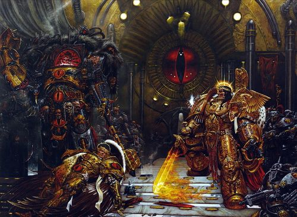

<!-- A0770-B0006 -->

原译文

The Emperor confronts Horus aboard the Vengeful Spirit 帝皇在复仇之魂号上与荷鲁斯对峙

**校订译文**

The Emperor confronts Horus aboard the Vengeful Spirit 帝皇在复仇之魂号上与荷鲁斯对峙

<!-- /A0770-B0006 -->

<!-- A0770-B0007 -->
**英文原文**

Date:005.M31 — 014.M31

<!-- /A0770-B0007 -->

<!-- A0770-B0008 -->

原译文

日期：05.M31-014.M31

**校订译文**

日期：005.M31—014.M31。

<!-- /A0770-B0008 -->

<!-- A0770-B0009 -->
**英文原文**

Location:Imperium

<!-- /A0770-B0009 -->

<!-- A0770-B0010 -->

原译文

地点：帝国

**校订译文**

地点：帝国

<!-- /A0770-B0010 -->

<!-- A0770-B0011 -->
**英文原文**

Battles:Battles of the Horus Heresy

<!-- /A0770-B0011 -->

<!-- A0770-B0012 -->

原译文

战役：荷鲁斯叛乱之战

**校订译文**

战役：荷鲁斯之乱期间的各场战役。

<!-- /A0770-B0012 -->

<!-- A0770-B0013 -->
**英文原文**

Outcome:Pyrrhic Loyalist victory,Emperor interred to the Golden Throne,Beginning of the Great Scouring

<!-- /A0770-B0013 -->

<!-- A0770-B0014 -->

原译文

结果：忠诚派取得了惨痛的胜利，帝皇被安葬在黄金王座上，大清洗开始了

**校订译文**

结果：忠诚派惨胜；帝皇被安置于黄金王座；大清洗开始。

**校注：** interred 在黄金王座语境中不直接译为死亡后安葬，改为安置。

<!-- /A0770-B0014 -->

<!-- A0770-B0015 -->
**英文原文**

Combatants:Loyalists/Traitors

<!-- /A0770-B0015 -->

<!-- A0770-B0016 -->

原译文

战斗方：忠诚派/叛乱派

**校订译文**

战斗方：忠诚派/叛乱派

<!-- /A0770-B0016 -->

<!-- A0770-B0017 -->
**英文原文**

Commanders:Emperor of Mankind (WIA)，Malcador†，Rogal Dorn，Lion El'Jonson，Jaghatai Khan，Leman Russ，Sanguinius†，Ferrus Manus†，Roboute Guilliman，Vulkan，Corvus Corax，Constantin Valdor，Zagreus Kane，Jenetia Krole，Adreen\[26\]，Simion Pentasian\[26\]，Nemo Zhi-Meng\[26\]，Cohran Hursula\[26\]，Harr Rantal\[26\]，Paternova\[27\]/Horus Lupercal†,Fulgrim,Perturabo,Konrad Curze,Angron,Mortarion,Magnus,Lorgar Aurelian,Alpharius† / Omegon,Kelbor-Hal

<!-- /A0770-B0017 -->

<!-- A0770-B0018 -->

原译文

指挥官：人类帝皇（WIA）、马卡多†、罗格·多恩、莱恩·艾尔庄森，察合台可汗、黎曼·鲁斯、圣吉列斯†、费鲁斯·马努斯†、罗伯特·基里曼、沃坎、科沃斯·科拉克斯、康斯坦丁·瓦尔多、扎格列欧斯·凯恩、珍妮塔·科勒、阿德里安、西米恩·彭塔西安、尼莫·志明、科兰·赫苏拉、哈尔·兰塔尔、长老/荷鲁斯·卢佩卡尔†、福格瑞姆、佩图拉博、康拉德·科兹，安格隆、莫塔里安、马格努斯、洛迦·奥瑞利安、阿尔法瑞斯†/欧米茄、凯尔伯-哈尔

**校订译文**

指挥官：人类帝皇（负伤）、马卡多†、罗格·多恩、莱昂·艾尔’庄森、察合台可汗、黎曼·鲁斯、圣吉列斯†、费鲁斯·马努斯†、罗保特·基里曼、沃坎、科沃斯·科拉克斯、康斯坦丁·瓦尔多、扎格列欧斯·凯恩、珍提亚·科勒、阿德林、西蒙·彭塔西安、尼莫·志明、科赫兰·赫苏拉、哈尔·兰塔尔、最高族长／荷鲁斯·卢佩卡尔†、福格瑞姆、佩图拉博、康拉德·科兹、安格隆、莫塔里安、马格努斯、珞珈·奥瑞利安、阿尔法瑞斯†／欧米伽、凯尔博·哈尔。（† 表示阵亡。）

<!-- /A0770-B0018 -->

<!-- A0770-B0019 -->
**英文原文**

Strength:Dark Angels,White Scars,Space Wolves,Imperial Fists,Blood Angels,Iron Hands,Ultramarines,Salamanders,Raven Guard,Loyalist Imperial Army,Adeptus Mechanicus,Custodian Guard,Sisters of Silence/Emperor's Children,Iron Warriors,Night Lords,World Eaters,Death Guard,Thousand Sons,Sons of Horus,Word Bearers. Alpha Legion,Traitor Imperial Army,Dark Mechanicum,Daemons,The Lost and the Damned

<!-- /A0770-B0019 -->

<!-- A0770-B0020 -->

原译文

势力：黑暗天使、白色疤痕、太空野狼、帝国之拳、圣血天使、钢铁之手、极限战士、火蜥蜴、暗鸦守卫、忠诚派帝国军队、机械神教、禁军、寂静修女/帝皇之子、钢铁勇士、午夜领主、吞世者、死亡守卫、千子、荷鲁斯之子、怀言者，阿尔法军团、叛乱派帝国军队、黑暗机械教、恶魔、迷失者与诅咒者

**校订译文**

参战力量：黑暗天使、白疤、太空野狼、帝国之拳、圣血天使、钢铁之手、极限战士、火蜥蜴、暗鸦守卫、忠诚派帝国军、机械修会、禁军及寂静修女／帝皇之子、钢铁勇士、午夜领主、吞世者、死亡守卫、千子、荷鲁斯之子、怀言者、阿尔法军团、叛乱帝国军、黑暗机械教、恶魔，以及迷失者与诅咒者。

<!-- /A0770-B0020 -->

<!-- A0770-B0021 -->
**英文原文**

Casualties:Massive, Emperor forced to ascend to the Golden Throne,Sanguinius KIA,Ferrus Manus KIA,Malcador KIA/Massive, Traitors banished to the Eye of Terror,Horus Lupercal KIA,Alpharius KIA

<!-- /A0770-B0021 -->

<!-- A0770-B0022 -->

原译文

伤亡：大规模，帝皇被迫登上黄金王座，圣吉列斯 KIA，费鲁斯·马努斯 KIA，马卡多 KIA/大规模，叛徒被驱逐到恐怖之眼，荷鲁斯·卢佩卡尔 KIA，阿尔法瑞斯 KIA

**校订译文**

损失：双方均极为惨重。忠诚派方面，帝皇被迫依赖黄金王座，圣吉列斯、费鲁斯·马努斯及马卡多阵亡；叛军被逐入恐怖之眼，荷鲁斯·卢佩卡尔及阿尔法瑞斯阵亡。

<!-- /A0770-B0022 -->

<!-- A0770-B0023 -->
## Preliminary Causes 初始原因

<!-- /A0770-B0023 -->

<!-- A0770-B0024 -->
**英文原文**

Though the Heresy was ignited by the product of a conspiracy by the forces of Chaos, there were precipitating factors that helped push many of the Legio Astartes towards rebellion. The first was the Emperor's return to and seclusion on Terra, working on a secret project that he refused to share with any of his Primarchs, including his most favored son Horus, whom he had named Warmaster. This apparent abandonment of the Great Crusade, for something he would not even share with his sons bred mistrust, resentment, and disappointment towards the Emperor amongst many of the Primarchs.

<!-- /A0770-B0024 -->

<!-- A0770-B0025 -->

原译文

尽管叛乱是由混沌势力阴谋的产物点燃的，但也有一些促成因素促使许多阿斯塔特军团走向叛乱。第一个是帝皇回到泰拉并隐居，从事一个秘密项目，他拒绝与任何一位原体分享，包括他最宠爱的儿子荷鲁斯，他称荷鲁斯为战帅。这种对大远征的明显放弃，以及他甚至不愿与儿子们分享事情，在许多原体中引发了对帝皇的不信任、怨恨和失望。

**校订译文**

混沌势力的阴谋点燃了叛乱，但在此之前，已有多种因素推动阿斯塔特军团走向反叛。首先，帝皇返回泰拉，闭门从事一项秘密计划，拒绝向任何原体透露详情，连最受宠、获任战帅的荷鲁斯也不例外。许多原体觉得，他为了一个连儿子们都不肯告知的目标抛下了大远征，由此滋生对父亲的不信任、怨恨与失望。

<!-- /A0770-B0025 -->

<!-- A0770-B0026 -->
**英文原文**

Another contributing factor was the formation of an administrative body known as the Council of Terra. Many of the Primarchs viewed these human bureaucrats as usurping their rightful place as rulers of the Imperium they had fought so hard to create. Worse still, the Primarchs were denied a place on the Council and the notion of an Imperium dominated by human bureaucrats, not the sons of the Emperor and their Astartes Legions, became a cause of concern for many of the Primarchs.

<!-- /A0770-B0026 -->

<!-- A0770-B0027 -->

原译文

另一个促成因素是成立了一个名为泰拉议会的行政机构。许多原体认为这些人类官僚篡夺了他们作为帝国统治者的合法地位，他们为建立帝国付出了巨大的努力。更糟糕的是，原体们被剥夺了在议会中的席位，由人类官僚而不是帝皇及其阿斯塔特军团的子嗣主导的帝国的概念成为许多原体们关注的问题。

**校订译文**

另一个因素是泰拉议会这一行政机构的成立。许多原体认为，帝国是自己浴血缔造的，统治权理应属于自己，凡人官僚却正在夺走这一地位。原体还被排除在议会之外，更使他们不满。想到未来帝国将由凡人官僚，而非帝皇的子嗣及其阿斯塔特军团主导，许多原体都深感忧虑。

<!-- /A0770-B0027 -->

<!-- A0770-B0028 -->
**英文原文**

In addition, the Emperor's disciplining of Lorgar and the Word Bearers was a contributing factor to the Heresy and the event which set it directly into motion. After Lorgar and the entire Legion were publicly humiliated, scolded, and forced to kneel in front of the Emperor for spreading their belief that the ruler of mankind was a divine being, the pious Word Bearers felt betrayed and desperately sought any power in the universe to worship. This eventually led Lorgar and his Legionaries to the Eye of Terror, where they pledged themselves to the forces of Chaos and began to conspire against the Emperor. Thus the Word Bearers had secretly become the first Chaos Space Marines. Secretly planning to make war on the Emperor, the Word Bearers quietly established Warrior Lodges with their Chaplains throughout the rest of the Astartes Legions. Though harmless at first glance, many of these lodges would become hotbeds of support for Horus' rebellion in the war to come.

<!-- /A0770-B0028 -->

<!-- A0770-B0029 -->

原译文

此外，帝皇对珞珈和怀言者的惩戒是叛乱及其直接引发事件的一个促成因素。在珞珈和整个军团因传播人类统治者是神圣存在的信仰而被公开羞辱、责骂并被迫跪在帝皇面前之后，虔诚的怀言者感到被背叛，拼命寻求宇宙中任何信仰的力量。这最终导致珞珈和他的军团来到恐惧之眼，在那里他们向混沌势力宣誓，并开始密谋对抗帝皇。因此，怀言者秘密成为了第一批混沌星际战士。秘密计划对皇帝发动战争，怀言者悄悄地与他们的牧师在阿斯塔特军团的其他地方建立了战士结社。虽然乍一看是无害的，但这些结社中的许多人将成为未来战争中支持荷鲁斯叛乱的温床。

**校订译文**

帝皇对珞珈和怀言者的惩戒，也是叛乱的重要成因，并直接启动了后来的阴谋。因宣扬人类之主具有神性，珞珈及整个军团遭到公开羞辱、斥责，被迫跪在帝皇面前。虔诚的怀言者深感遭到背叛，绝望地在宇宙中寻找其他值得崇拜的力量。这最终将他们引向恐怖之眼。他们在那里向混沌效忠，开始密谋反抗帝皇，秘密成为了第一批混沌星际战士。为了备战，怀言者通过自己的教士，在其他阿斯塔特军团中悄悄建立战士结社。这些组织表面无害，其中许多后来却成为支持荷鲁斯之乱的温床。

<!-- /A0770-B0029 -->

<!-- A0770-B0030 -->
**英文原文**

According to First Lord of the Imperium Malcador the Sigillite, the Heresy's causes may have been deliberately put into motion by both himself and the Emperor. According to Malcador, both deliberately agitated the Primarchs and turned them against one another, with the resulting war purging certain unmanageable Primarchs and their respective Space Marine Legions just as they had the earlier Thunder Warriors. This would lead humanity, not bio-engineered superhumans, as the rulers of the galaxy. However, the Ruinious Powers intervened before their plan could be fully formulated, leading to disaster in the Horus Heresy. This account may be either a partial or total lie, as Malcador himself seems to keep its validity ambiguous.

<!-- /A0770-B0030 -->

<!-- A0770-B0031 -->

原译文

根据帝国的第一领主掌印者马卡多的说法，叛乱的原因可能是他自己和帝皇故意推动的。据马卡多称，两人都故意激怒了原体，并使他们相互对立，由此引发的战争清除了某些无法控制的原体及其各自的星际战士，就像他们清除了早期的雷霆战士一样。这将导致人类，而不是生物工程超人，成为银河系的统治者。然而，毁灭力量在他们的计划完全制定之前就进行了干预，导致了荷鲁斯叛乱的灾难。这个说法可能部分或全部是谎言，因为马卡多本人似乎对其有效性持模棱两可的态度。

**校订译文**

按照帝国第一领主、掌印者马卡多的一种说法，导致叛乱的因素可能正是他与帝皇刻意制造的。两人有意激化原体的情绪，让他们彼此敌对，打算借战争清除难以驾驭的原体及其军团，如同此前清除雷霆战士一般。如此一来，银河的统治者将是人类，而非基因改造的超人。但计划尚未完全成形，毁灭诸力便已介入，最终酿成荷鲁斯之乱。这一说法可能半真半假，也可能全是谎言；马卡多本人似乎也刻意不让其真实性明朗。

**校注：** 帝皇与马卡多策动原体内战是本篇明示真伪存疑的说法，保留其不确定性，未作设定事实认证。

<!-- /A0770-B0031 -->

<!-- A0770-B0032 -->
## Horus's Corruption 荷鲁斯的堕落

<!-- /A0770-B0032 -->

<!-- A0770-B0033 -->
**英文原文**

However, the Horus Heresy truly began after Warmaster Horus was wounded by the possessed Eugen Temba wielding the stolen Anathame on the moon of Davin, a place that was cursed by the foul Chaos God Nurgle. The wound caused by the blade refused to heal, despite Horus's super-enhanced immune system or the efforts of the Sons of Horus's best apothecaries. The Mournival took Horus to the Davinite Serpent Lodge, which they were told could heal him. Erebus and the Word Bearers had orchestrated the battle on Davin, unknown to all involved.

<!-- /A0770-B0033 -->

<!-- A0770-B0034 -->

原译文

然而，在战帅荷鲁斯被被附身的欧根·坦巴伤害后，荷鲁斯叛乱真正开始了。欧根·坦巴在戴文的卫星上挥舞着偷来的诅咒之刃，这个地方被肮脏的混沌之神纳垢诅咒。尽管荷鲁斯拥有超强的免疫系统和荷鲁斯之子最好的药剂师的努力，但剑刃造成的伤口仍无法愈合。四王议会把荷鲁斯带到达文暗夜毒蛇结社，他们被告知可以治愈他。艾瑞巴斯和怀言者策划了在戴文的战斗，所有参与者都不知道。

**校订译文**

荷鲁斯之乱真正的转折点，出现在战帅于戴文卫星负伤之时。那里已遭污秽的混沌之神纳垢诅咒，被附身的欧根·坦巴持偷来的诅咒之刃击伤荷鲁斯。任凭战帅的超常免疫系统，以及军团最优秀药剂师的努力，伤口始终无法愈合。四王议会听说当地的蛇之结社能够治好他，便将他送去。所有当事人都未察觉，戴文之战本就是艾瑞巴斯与怀言者策划的圈套。

<!-- /A0770-B0034 -->

<!-- A0770-B0035 -->
**英文原文**

During the rituals, Horus's spirit was transferred into the Warp where Erebus, disguised as the Warmaster's closest friend Hastur Sejanus, showed him a terrible vision of the very future which his actions would bring about - the Imperium as a repressive, violent, and superstitious regime where the Emperor and some of the Primarchs (but not Horus) were worshiped as divine beings by the fanatical and ignorant masses of humanity. The Chaos Gods portrayed themselves as the victims of the Emperor's psychic might who had no interest themselves in controlling the material world. Horus, already having grown jealous and deeply resentful of his perceived poor treatment at the hands of his father, the Emperor, and was one of many afraid of the concept of a peace where all for which that they had fought was given to weak willed men whilst his legions were cast aside and left as peacekeepers. Horus therefore proved all too willing to accept the Ruinous Powers' false visions of an Emperor determined to make himself a god at Horus's expense.

<!-- /A0770-B0035 -->

<!-- A0770-B0036 -->

原译文

在仪式中，荷鲁斯的灵魂被转移到亚空间，在那里，艾瑞巴斯伪装成战帅最亲密的朋友哈斯塔·塞詹努斯，向他展示了他行动将带来的可怕未来景象——帝国是一个专制、暴力和迷信的政权，帝皇和一些原体（但不是荷鲁斯）被狂热和无知的人类大众视为神圣的存在。混沌之神将自己描绘成帝皇灵能力量的受害者，他们对控制现实世界毫无兴趣。荷鲁斯已经开始嫉妒，并对他父亲帝皇对他的恶劣待遇深感不满，他是许多害怕和平概念的人之一，在这种和平概念中，他们为之奋斗的一切都交给了意志薄弱的人，而他的军团则被抛弃并留作维和人员。因此，荷鲁斯用事实证明他非常愿意去接受毁灭力量关于帝皇决心以荷鲁斯为代价成为神的假象。

**校订译文**

仪式中，荷鲁斯的灵魂进入亚空间。艾瑞巴斯化身为他最亲密的朋友哈斯塔·赛詹努斯，向他展示了一个可怕未来——恰恰是他的行动最终会促成的未来：帝国成为压迫、暴力与迷信的政权，狂热而无知的人类将帝皇及部分原体奉为神明，却没有荷鲁斯的位置。混沌诸神声称，自己只是帝皇灵能力量的受害者，对掌控物质世界毫无兴趣。荷鲁斯本就因自己眼中父亲的不公待遇而嫉妒、怨恨，也同许多原体一样害怕战后和平：他们浴血争来的一切会交给意志软弱的凡人，军团却被抛在一旁，仅剩维持秩序的用途。因此，他轻易接受了毁灭诸力编造的解释，相信帝皇准备牺牲自己来换取成神。

<!-- /A0770-B0036 -->

<!-- A0770-B0037 -->
**英文原文**

But there was one thing no one had counted on: Horus's brother Magnus the Red, Primarch of the Thousand Sons, had continued to study the forbidden arts of sorcery, and was not about to let his brother fall to the powers of the Warp. The cyclopean giant appeared within Horus's vision, revealing the chaplain's identity and begging Horus not to give in to the temptations of Chaos. Unfortunately, Horus had decided that if anyone deserved to be worshipped as a god it was he, and not the Emperor. He accepted the offer of the Chaos Gods to join their cause and in return they healed his wound and granted him the powers of the Warp. The Chaos Gods' pact with Horus was simple: "Give us the Emperor and we will give you the galaxy."

<!-- /A0770-B0037 -->

<!-- A0770-B0038 -->

原译文

但有一件事是没有人曾指望的：荷鲁斯的兄弟、千子原体马格努斯继续研究被禁止的巫术，他不会让他的兄弟堕入亚空间的力量中。独眼巨人出现在荷鲁斯的视野中，揭示了牧师的身份，并恳求荷鲁斯不要屈服于混沌的诱惑。不幸的是，荷鲁斯已经决定，如果有人值得被崇拜为神，那就是他，而不是帝皇。他接受了混沌之神的提议，加入了他们的事业，作为回报，祂们治愈了他的伤口，并授予他亚空间的力量。混沌之神与荷鲁斯的约定很简单：“给我们帝皇，我们就给你银河系。”

**校订译文**

但有一件事出乎所有人意料：千子原体红魔马格努斯一直在研究被禁的巫术，也不愿眼看兄弟堕入亚空间诸力之手。他以独眼巨人的形态出现在荷鲁斯的幻象中，揭穿艾瑞巴斯的身份，恳求战帅抵抗混沌诱惑。然而，荷鲁斯已认定，若有谁配被奉为神明，那应当是自己，而不是帝皇。他接受混沌诸神的提议，加入其阵营；作为回报，诸神治愈伤口，赐予亚空间力量。双方的契约很简单：“把帝皇交给我们，我们就把银河交给你。”

<!-- /A0770-B0038 -->

<!-- A0770-B0039 -->
## Swaying the Legions 拉拢军团

原题：Swaying the Legions 摇摆的军团

<!-- /A0770-B0039 -->

<!-- A0770-B0040 -->
**英文原文**

Renouncing his oath to the Emperor, Horus led his Legion into worship of the myriad Chaos Gods. Horus's genius was revealed as he converted half of the Legions, along with many regiments of the Imperial Army and several Titan Legions to his cause, revealing the Emperor to be as Horus saw him - a man undeserving of the praise and recognition of the human race.

<!-- /A0770-B0040 -->

<!-- A0770-B0041 -->

原译文

荷鲁斯放弃了对帝皇的誓言，带领他的军团崇拜混沌诸神。荷鲁斯的天赋将一半的军团，以及帝国军队的许多团和几个泰坦军团归附到他的事业中，这表明帝皇是荷鲁斯眼中的样子——一个不值得人类赞扬和认可的人。

**校订译文**

荷鲁斯背弃对帝皇的誓言，率军团崇拜混沌诸神。他展现出过人的游说本领，将半数军团、许多帝国军团级部队及数支泰坦军团拉入阵营。他向他们宣扬自己眼中的帝皇：一个根本不配获得人类赞颂与认可的人。

<!-- /A0770-B0041 -->

<!-- A0770-B0042 -->
**英文原文**

Angron of the World Eaters, Fulgrim of the Emperor's Children and Mortarion of the Death Guard were the first Primarchs to side with the Warmaster. Horus found it easy exploit the Primarchs' flaws - Angron's frenzied love of violence was a match for Khorne; Fulgrim was corrupted by a daemon weapon of Slaanesh and its promise of unending perfection; Mortarion, already a close friend of his brother, was too easily persuaded, having been turned long before the Heresy through the efforts of his first captain Calas Typhon. Erebus had already vouched for the support of Lorgar and the Word Bearers, and Horus's plans came together with these legions at his side.

<!-- /A0770-B0042 -->

<!-- A0770-B0043 -->

原译文

吞世者的安格隆、帝皇之子的福格瑞姆和死亡守卫的莫塔里安是第一批站在战帅一边的原体。荷鲁斯发现很容易利用原体的缺点——安格隆对暴力的疯狂热爱与恐虐不相上下；福格瑞姆被色孽的恶魔武器及其无休止的完美承诺所腐蚀；莫塔里安已经是他兄弟中的密友，他太容易被说服了，因为在叛乱之前很久，通过他的一连长卡拉斯·泰丰斯的努力，他就已经被说服了。艾瑞巴斯已经为珞珈和怀言者的支持做了担保，荷鲁斯的计划与这些军团一起出现在他这一边。

**校订译文**

吞世者的安格隆、帝皇之子的福格瑞姆和死亡守卫的莫塔里安，最先公开站到战帅一方。荷鲁斯很容易便抓住了他们的弱点：安格隆对暴力的狂热正合恐虐心意；福格瑞姆已被色孽的恶魔武器，以及无尽完美的承诺腐化；莫塔里安原本就是荷鲁斯的密友，又早在叛乱之前便受到第一连长卡拉斯·提丰的影响，因而格外容易说服。艾瑞巴斯早已保证珞珈和怀言者会支持他，这些军团的加入让荷鲁斯的计划逐渐成形。

**校注：** 本段称莫塔里安早在叛乱前便被提丰影响而转向；其他篇目对实际腐化时点有不同层次的叙述，此处不将政治倒戈与完全变异混为一事。

<!-- /A0770-B0043 -->

<!-- A0770-B0044 -->
**英文原文**

Of the other eventual traitors, Konrad Curze was due to face disciplinary action from the Emperor for his excessive bloodshed on Nostramo; Alpharius chose to join Horus after an ancient cabal of aliens revealed a prophecy to him that Horus's victory would cause the downfall of the Chaos powers; and Perturabo's cold nature and bitterness towards Rogal Dorn made him an easy target for corruption. Even with so many legions on his side, Horus was still aware that some of his brothers would never join him. Three of the most loyal Primarchs, Lion El'Jonson of the Dark Angels, Sanguinius of the Blood Angels, and Roboute Guilliman of the Ultramarines, were sent on missions far from Terra. The Blood Angels were sent to the daemon-infested Signus Cluster and the Ultramarines to Calth, where Kor Phaeron later attacked the loyalists with a large force of Word Bearers and millions of Chaos cultists. Unbeknownst to the Lion, a rebellion was soon to occur on his homeworld of Caliban while the bulk of his legion was bogged down battling the Gordian League.

<!-- /A0770-B0044 -->

<!-- A0770-B0045 -->

原译文

在其他叛徒中，康拉德·柯兹因在诺斯特拉莫上的过度流血事件而将面临帝皇的处分；在一个古老的异形阴谋集团向他透露了一个预言，即荷鲁斯的胜利将导致混沌势力的垮台后，阿尔法瑞斯选择加入荷鲁斯；佩图拉博的冷酷本性和对罗格·多恩的怨恨使他很容易成为腐败的目标。即使有这么多军团在他身边，荷鲁斯仍然意识到他的一些兄弟永远不会加入他。三位最忠诚的领主，黑暗天使的莱恩·艾尔庄森、圣血天使的圣吉列斯和极限战士的罗伯特·基里曼，被派往远离泰拉的地方执行任务。圣血天使被派往恶魔出没的西格纳斯星群，而极限战士则被派往考斯，在那里，科尔·法伦后来用一支庞大的怀言者部队和数百万混沌崇拜者攻击了忠诚者。莱恩不知道的是，他的家园卡利班很快就发生了叛乱，而他的大部分军团都陷入了与戈迪亚联盟的战斗中。

**校订译文**

其他最终叛变者中，康拉德·科兹因在诺斯特拉莫大开杀戒，即将受到帝皇惩戒；阿尔法瑞斯则从一个古老的异形集团那里得到预言：若荷鲁斯获胜，混沌诸力反而会走向覆灭，于是选择加入战帅。佩图拉博性情冷酷，又怨恨罗格·多恩，也容易被拉拢。但荷鲁斯知道，仍有些兄弟绝不会与自己同行。他将最忠诚的三位原体派往远离泰拉之处：黑暗天使的莱昂·艾尔’庄森、圣血天使的圣吉列斯，以及极限战士的罗保特·基里曼。圣血天使被派往恶魔盘踞的西格纳斯星群；极限战士前往考斯，随后遭科尔·法伦率大量怀言者与数百万混沌教徒袭击。莱昂的军团主力则陷于戈尔迪安联盟战事，浑然不知自己的母星卡利班也即将发生叛乱。

<!-- /A0770-B0045 -->

<!-- A0770-B0046 -->
**英文原文**

The Imperial Fists and White Scars were too close to Terra to be contacted without raising suspicion, though Horus believed (mistakenly) that Jaghatai Khan would ultimately take his side. Shortly before the Dropsite Massacre, Horus also ordered Fulgrim to turn Ferrus Manus to their cause, but the Phoenix underestimated the Gorgon's loyalty and barely escaped alive. Fulgrim promised he would deliver Manus's head to Horus in recompense.

<!-- /A0770-B0046 -->

<!-- A0770-B0047 -->

原译文

帝国之拳和白色伤疤离泰拉太近，无法在不引起泰拉怀疑的情况下联系到，尽管荷鲁斯（错误地）相信察合台可汗最终会站在他的一边。在登陆点大屠杀发生前不久，荷鲁斯还命令福格瑞姆将费鲁斯·马努斯劝向他们的事业，但凤凰低估了戈尔贡的忠诚，几乎没能活着逃脱。福格瑞姆承诺他会把马努斯的头交给荷鲁斯作为补偿。

**校订译文**

帝国之拳与白疤离泰拉太近，贸然接触容易引起怀疑。不过，荷鲁斯仍错误地相信察合台可汗最终会支持自己。登陆点大屠杀前不久，他还命福格瑞姆劝降费鲁斯·马努斯。然而，凤凰低估了戈尔贡的忠诚，险些未能活着脱身。福格瑞姆承诺，将以马努斯的首级向荷鲁斯补偿这次失败。

<!-- /A0770-B0047 -->

<!-- A0770-B0048 -->
**英文原文**

The remaining Legions - the Raven Guard, Salamanders, Iron Hands and Space Wolves - remained staunchly loyal to the Emperor, though all but the Wolves would pay dearly for it in the battles to come. Beyond the Legions, Horus had already swayed Adept Regulus with promises of the STCs recovered during the war with the Auretian Technocracy, delivering Adeptus Mechanicus support to the Warmaster's forces, and had corrupted a large portion of the Imperial Army and Navy.

<!-- /A0770-B0048 -->

<!-- A0770-B0049 -->

原译文

剩下的军团——暗鸦守卫、火蜥蜴、钢铁之手和太空野狼——仍然坚定地忠于帝皇，尽管除了太空野狼之外，所有人都会在未来的战斗中为此付出高昂的代价。在军团之外，荷鲁斯已经用在与奥瑞提亚科技联盟的战争中恢复的STC为承诺动摇了技术神甫雷古勒斯，为战帅的部队提供了机械神教的支持，并腐蚀了很大一部分的帝国陆军和海军。

**校订译文**

暗鸦守卫、火蜥蜴、钢铁之手与太空野狼仍坚定效忠帝皇。除太空野狼外，这几支军团都将在接下来的战斗中付出极其惨重的代价。军团之外，荷鲁斯已承诺将奥瑞提安技术联盟战争中夺得的 STC 交给技术专家雷古勒斯，以此换取其支持，为战帅争取到机械修会力量；他还拉拢了帝国军及海军中的很大一部分。

<!-- /A0770-B0049 -->

<!-- A0770-B0050 -->
## Burning of Prospero (004.M31) 普罗斯佩罗之焚

<!-- /A0770-B0050 -->

<!-- A0770-B0051 -->
**英文原文**

Magnus, however, had yet to be dealt with. The Primarch was aware of his brother's fall and attempted to warn the Emperor of the impending betrayal. However, knowing that he would have to find a means of quickly warning the Emperor, Magnus decided to use his sorcery to deliver the message as an act of both desperation and vindication. The message penetrated the psychic defences of the Imperial Palace on Terra, shattering all the psychic wards the Emperor had placed on the Palace and destroying his secret project: a physical gate by which the Emperor intended to invade the Webway and take battle to the Eldar.

<!-- /A0770-B0051 -->

<!-- A0770-B0052 -->

原译文

然而，马格努斯尚未得到处理。原体意识到他兄弟的堕落，并试图警告皇帝即将发生的背叛。然而，他知道必须找到一种快速警告帝皇的方法，马格努斯决定用他的灵能巫术来传达这一信息，作为一场关于绝望和辩护的行动。这条信息穿透了泰拉上皇宫的灵能防御，摧毁了帝皇在皇宫中设置的所有灵能防护，并摧毁了他的秘密项目：皇帝打算入侵网道并与艾达灵族作战的物理门户。

**校订译文**

马格努斯的问题仍须处理。这位原体已经察觉荷鲁斯堕落，企图向帝皇警告迫近的背叛。他认为必须尽快传信，遂决定动用巫术；这既是情急之举，也想借此证明自己。灵能讯息穿透泰拉皇宫的防御，击碎帝皇布置的全部护盾，摧毁其秘密工程：一座实体入口。按照本篇的说法，帝皇原拟利用这座入口进入网道，向灵族开战。

**校注：** 本段英文将网道计划目的写为入侵网道、对灵族作战，与本书其他篇关于人类迁移和摆脱亚空间的叙述不同。保留该版本并注明，不据常识暗改英文的说法。

<!-- /A0770-B0052 -->

<!-- A0770-B0053 图片 -->

<!-- A0770-B0054 -->

原译文

Leman Russ and the Wolves of Fenris march on Tizca 黎曼·罗斯和芬里斯之狼在提兹卡行军

**校订译文**

Leman Russ and the Wolves of Fenris march on Tizca 黎曼·鲁斯与芬里斯之狼向提兹卡进军

<!-- /A0770-B0054 -->

<!-- A0770-B0055 -->
**英文原文**

Magnus's brute force assault on the wards allowed the Warp and its myriad inhabitants to invade Terra. In the City of Sight, the tremendous rush of raw psychic energy obliterated the Choir Primus and shattered nearly every whisperstone. Millions died as their minds were burned out or daemons tore them apart. Warp storms consumed entire settlements. Shockwaves flattened structures around the world. Having already outlawed the Primarch's use of sorcery and refusing to believe that Horus, his most beloved and trusted son, would betray him, the Emperor instead perceived the traitor to be Magnus and his Legion. The Emperor ordered the Primarch Leman Russ to mobilise his Space Wolves Legion and take Magnus into custody; Horus, however, persuaded Russ that Magnus was a threat and should not return to Terra alive. The Wolves of Fenris descended upon Prospero, destroying all in their path. Magnus, betrayed, defeated and forsaken by his beloved father, retreated into the Warp and pledged himself to Tzeentch. The Thousand Sons had never planned to join Horus, but the trap that the Changer of Ways had laid for the Red Sorcerer's legion led them to the Warmaster's side regardless. Meanwhile the catastrophe on Terra forced the Emperor to deal with a new crisis that consumed most of his attention. He led the Custodes and Sisters of Silence to deal with this, while he left management of the rebellion to Malcador and Rogal Dorn.

<!-- /A0770-B0055 -->

<!-- A0770-B0056 -->

原译文

马格努斯对区域的蛮力攻击使亚空间及无数其生物入侵了泰拉。在视界之城，原始的灵能能量的巨大冲击摧毁了唱诗班领袖，几乎粉碎了每一块低语石。数百万人死于他们的思想被烧毁或恶魔将他们撕裂。亚空间风暴吞噬了整个定居点。冲击波夷平了世界各地的建筑。由于已经禁止了原体使用灵能巫术，并拒绝相信他最心爱和最信任的儿子荷鲁斯会背叛他，帝皇反而认为叛徒是马格努斯和他的军团。帝皇命令原体黎曼·鲁斯动员他的太空野狼军团，将马格努斯拘留；然而，荷鲁斯说服了鲁斯，马格努斯是一个威胁，不应该活着回到泰拉。芬里斯之狼袭击了普罗斯佩罗，摧毁了沿途的一切。马格努斯被他深爱的父亲背叛、击败和抛弃，撤退到亚空间，并向奸奇宣誓。千子从来没有打算加入荷鲁斯，但万变之主为红魔的军团设置的陷阱让他们不顾一切地站在了战帅一边。与此同时，泰拉上的灾难迫使帝皇应对一场新的危机，这场危机消耗了他大部分的注意力。他带领禁军和寂静修女来处理这件事，而他将叛乱的管理权交给了马卡多和罗格·多恩。

**校订译文**

马格努斯强行突破防护，使亚空间及其中无数存在侵入泰拉。视界之城内，狂暴的原始灵能洪流摧毁了首席唱诗班，击碎几乎所有低语石。数百万人或心智焚毁，或被恶魔撕碎；亚空间风暴吞没整片聚居地，冲击波夷平各地建筑。帝皇早已禁止原体施展巫术，又不肯相信自己最宠爱、最信任的荷鲁斯会背叛，因而将马格努斯及其军团视为叛徒。他命鲁斯动员太空野狼，逮捕马格努斯；荷鲁斯却劝鲁斯相信，此人威胁巨大，决不能活着返回泰拉。芬里斯之狼降临普罗斯佩罗，摧毁沿途一切。马格努斯遭背叛、击败，又被深爱的父亲抛弃，最终退入亚空间，向奸奇效忠。千子从未打算加入荷鲁斯，但万变之主为这个军团布下的陷阱，仍将他们推向战帅。泰拉上的灾难则让帝皇不得不集中精力处理另一场危机，调遣禁军与寂静修女应战，将平叛事务留给马卡多和罗格·多恩。

**校注：** Choir Primus 为组织名，暂译首席唱诗班，原唱诗班领袖把部队误成人。

<!-- /A0770-B0056 -->

<!-- A0770-B0057 -->
## Open Rebellion 叛乱开始

<!-- /A0770-B0057 -->

<!-- A0770-B0058 -->
## Battle of Isstvan III (005-006.M31) 伊斯塔万三号战役

<!-- /A0770-B0058 -->

<!-- A0770-B0059 -->
**英文原文**

The first sign that Horus and his Legion had turned to Chaos was made evident when Horus virus bombed the rebel world of Isstvan III. The Planetary Governor of Isstvan III had declared his independence from the Imperium and the Council of Terra charged Horus with retaking that world. This order merely furthered Horus's plans. Although the four Legions under his direct command had turned traitor, there were still some loyalist elements within the Sons of Horus, World Eaters, Emperor's Children, and Death Guard; many of these were Terran Space Marines who had been recruited before being reunited with their Primarchs. Horus, under the guise of his orders, amassed his troops in the Isstvan System.

<!-- /A0770-B0059 -->

<!-- A0770-B0060 -->

原译文

当荷鲁斯病毒轰炸叛乱世界伊斯塔万三号时，荷鲁斯和他的军团转向混沌的第一个迹象就很明显了。伊斯塔万III的行星总督宣布他从帝国独立，泰拉议会要求荷鲁斯夺回那个世界。这一命令只是进一步推进了荷鲁斯的计划。虽然他直接指挥的四个军团已经叛变，但荷鲁斯之子、吞世者、帝皇之子和死亡守卫内部仍有一些忠诚分子；其中许多人是在与原体团聚之前被招募的泰拉裔星际战士。荷鲁斯打着指令的幌子，在伊斯塔万星系中集结了军队。

**校订译文**

荷鲁斯对叛乱世界伊斯塔万三号实施病毒轰炸，是他与军团倒向混沌的第一个明确迹象。该星球总督宣布脱离帝国，泰拉议会遂命战帅将其收复，正好为荷鲁斯的计划提供了借口。他直接指挥的荷鲁斯之子、吞世者、帝皇之子和死亡守卫虽然已整体叛变，内部却仍有忠诚派，其中许多是在原体归来前招募的泰拉裔战士。荷鲁斯以执行命令为名，将军队集中到伊斯塔万星系。

<!-- /A0770-B0060 -->

<!-- A0770-B0061 图片 -->
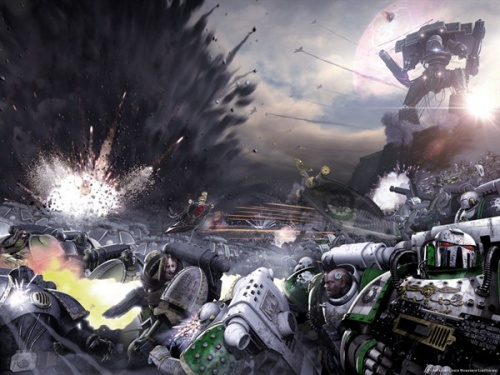

<!-- A0770-B0062 -->

原译文

The Luna Wolves battle the traitorous Death Guard in the Battle of Isstvan III 影月苍狼在伊斯塔万三号战役中与叛徒死亡守卫作战

**校订译文**

The Luna Wolves battle the traitorous Death Guard in the Battle of Isstvan III 影月苍狼在伊斯塔万三号战役中与叛徒死亡守卫作战

<!-- /A0770-B0062 -->

<!-- A0770-B0063 -->
**英文原文**

Horus had a plan by which he would destroy all loyalist elements of the Legions at his command. After a lengthy bombardment, Horus dispatched all Loyalist Marines down to the planet, ostensibly to bringing it back into the Imperium. At the moment of victory, however, the loyalist marines were betrayed: with a cold snarl of "Let the galaxy burn!, Horus ordered his ships to open fire on Istvann III and virus bombs began to rain down on the planet. However, some marines loyal to the Emperor had remained on board their ships, and as Isstvan III died, these soldiers fought desperately to warn their brethren on the surface. Their sacrifice saved many marines, as they were able to take shelter before the virus bombs struck. The population of Isstvan III received no such protection. Twelve billion people died almost immediately. The psychic shock of so many simultaneous deaths shrieked through the Warp, alerting the Emperor that something was terribly wrong and informing the Chaos Gods that Horus was now theirs. A contingent of loyalists led by Captain Garro of the Death Guard escaped the fleet orbiting Isstvan III aboard the damaged Eisenstein, fleeing to Terra to warn the Emperor.

<!-- /A0770-B0063 -->

<!-- A0770-B0064 -->

原译文

荷鲁斯有一个计划，他将摧毁他指挥下的军团的所有忠诚分子。经过长时间的轰炸，荷鲁斯派遣所有忠诚的星际战士前往该星球，表面上是为了将其带回帝国。然而，在胜利的那一刻，忠诚的星际战士被背叛了：荷鲁斯冷冷地咆哮着“让银河系燃烧吧！”，命令他的船只向伊斯塔万三号开火，病毒炸弹开始在这个星球上倾泻而下。然而，一些忠于帝皇的星际战士仍然留在他们的船上，随着伊斯塔万三号的死亡，这些士兵拼命地战斗以警告他们在地面上的兄弟。他们的牺牲拯救了许多星际战士，使得他们能够在病毒炸弹袭击前躲避。伊斯塔万III的人口没有得到这样的保护。120亿人几乎立即死亡。如此多同时死亡的精神冲击在亚空间引发了剧烈震荡，提醒帝皇有些事情非常不对劲。混沌诸神通告荷鲁斯现在是他们的了。由死亡守卫连长伽罗率领的一支忠诚派队伍乘坐受损的爱森斯坦号逃离了围绕伊斯塔万三号的舰队，逃往泰拉警告帝皇。

**校订译文**

荷鲁斯打算借此清除自己麾下全部忠诚派。经过长时间轰炸，他将这些战士悉数派往地面，名义上是夺回星球。就在胜利将至之际，背叛发生了。他冷冷咆哮：“让银河燃烧！”随即命舰队开火，病毒炸弹如雨落下。但仍有忠于帝皇的战士留在舰上，拼死向地面兄弟发出警告。他们的牺牲让许多人及时躲入掩体。平民却没有这样的保护，一百二十亿人几乎同时死去。如此巨量的死亡引发灵能冲击，尖啸传遍亚空间，既让帝皇察觉惊天变故，也向混沌诸神宣告：荷鲁斯如今已属于它们。死亡守卫的伽罗连长率一批忠诚派登上受损的爱森斯坦号，逃出轨道舰队，赶往泰拉报信。

**校注：** informing the Chaos Gods 的主语仍是大规模死亡的灵能冲击，原译误成混沌诸神主动发布通告。

<!-- /A0770-B0064 -->

<!-- A0770-B0065 -->
**英文原文**

Angron, realising that the virus bombs had not been fully effective against the loyalist marines, flew into a rage and hurled himself at the planet with fifty companies of World Eaters. Horus was furious at Angron for delaying his plans, yet reluctantly reinforced him with troops from the Sons of Horus, the Death Guard, and the Emperor's Children. On Isstvan III, the remaining Loyalists under the command of Saul Tarvitz fought bravely against their own traitorous battle-brothers, but their cause was doomed. Soon only a few hundred of them remained until, finally, Horus grew unable to tolerate the delay, forced Angron to withdraw his forces, and ordered a systematic orbital bombardment that killed Isstvan III's last brave survivors.

<!-- /A0770-B0065 -->

<!-- A0770-B0066 -->

原译文

安格隆意识到病毒炸弹对忠诚的星际战士没有完全生效，勃然大怒，带着五十个吞世者连队冲向星球。荷鲁斯对安格隆拖延他的计划感到愤怒，但不情愿地用荷鲁斯之子、死亡卫队和帝皇之子的军队增援了他。在伊斯塔万三号战役中，索尔·塔维茨指挥下剩余的忠诚派勇敢地与自己的叛徒战斗兄弟作战，但他们的事业注定要失败。很快，他们只剩下几百人，最后，荷鲁斯无法容忍这种拖延，迫使安格隆撤军，并下令进行系统的轨道轰炸，杀死了伊斯塔万三号最后的勇敢幸存者们。

**校订译文**

得知病毒炸弹未能杀死所有忠诚派，安格隆勃然大怒，率五十个吞世者连亲自杀向地面。荷鲁斯恼恨他拖延计划，却只得派荷鲁斯之子、死亡守卫与帝皇之子增援。索尔·塔维兹率幸存忠诚派奋勇抵抗昔日兄弟，却终究无望取胜。最终只剩数百人时，荷鲁斯已无法再容忍拖延，强令安格隆撤军，再有计划地实施轨道轰炸，消灭了地面最后的幸存守军。

<!-- /A0770-B0066 -->

<!-- A0770-B0067 -->
## Flight of the Eisenstein 爱森斯坦号的逃脱

<!-- /A0770-B0067 -->

<!-- A0770-B0068 -->
**英文原文**

The seventy Loyalists led by Captain Garro commandeered the Imperial frigate Eisenstein and evading the forces of Horus, were able to escape from the Isstvan system into the Immaterium. The Eisenstein was badly damaged during its escape from Isstvan III; all its astropaths were dead and its lone navigator was mortally wounded. However, Garro managed to attract the attention of passing loyalist ships by setting the vessel's warp engines to self-destruct and ejecting them from the ship. Rogal Dorn's Imperial Fists Legion had been becalmed in the Warp with its fleet for some time and his navigators sensed the detonation of the Eisenstein's Warp drives. Making an immediate course for the location of the ship's beacon, Dorn met with Garro, who explained to him all that had happened with the traitor legions.

<!-- /A0770-B0068 -->

<!-- A0770-B0069 -->

原译文

伽罗连长率领的70名忠诚派占领了帝国护卫舰爱森斯坦号，避开了荷鲁斯的部队，得以逃离伊斯塔万星系，进入亚空间。爱森斯坦号在逃离伊斯塔万三号时严重受损；它的所有星语者都死了，唯一的导航者也受了致命伤。然而，伽罗通过将船只的亚空间引擎设置为自毁并将其从船上弹出，成功吸引了过往忠诚船只的注意。罗格·多恩的帝国之拳军团及其舰队已经在亚空间停滞了一段时间，他的导航者感觉到爱森斯坦号的亚空间引擎爆炸了。多恩立即前往船上信标的位置，会见了伽罗，伽罗向他解释了叛徒军团发生的一切。

**校订译文**

伽罗率七十名忠诚派夺取帝国护卫舰爱森斯坦号，避开荷鲁斯军队，逃离伊斯塔万星系进入亚空间。舰船在突围时重创，所有星语者阵亡，唯一的导航员也身受致命伤。伽罗将亚空间引擎设为自毁，再将其抛出舰外，借爆炸引来附近忠诚派舰船的注意。多恩的帝国之拳舰队此前困于亚空间一段时日，导航员察觉到引擎爆炸，舰队随即驶向爱森斯坦号的信标。多恩接见伽罗，听他讲述叛变军团的所作所为。

<!-- /A0770-B0069 -->

<!-- A0770-B0070 图片 -->
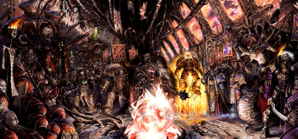

<!-- A0770-B0071 -->

原译文

The Court of Horus at the height of the Heresy. From left to right: Erebus, Kelbor-Hal, Maloghurst, Abaddon, Horus, Red Angel, Ahriman, Ingethel, Fulgrim 叛乱巅峰时期的荷鲁斯议会。从左到右：艾瑞巴斯、卡尔博·哈尔、马洛赫斯特、阿巴顿、荷鲁斯、红天使、阿里曼、英格泰尔、福格瑞姆

**校订译文**

The Court of Horus at the height of the Heresy. From left to right: Erebus, Kelbor-Hal, Maloghurst, Abaddon, Horus, Red Angel, Ahriman, Ingethel, Fulgrim 荷鲁斯之乱高潮时期的战帅宫廷。从左至右：艾瑞巴斯、凯尔博·哈尔、马洛赫斯特、阿巴顿、荷鲁斯、红天使、阿里曼、英格泰尔、福格瑞姆。

<!-- /A0770-B0071 -->

<!-- A0770-B0072 -->
**英文原文**

The remaining crew of the Eisenstein, now aboard Primarch Dorn's fortress-monastery Phalanx, was able to reach Terra (after Dorn's fleet destroyed the Eisenstein to ensure no Chaos taint remained), allowing the loyal marines to report the extent of the atrocities that had occurred in the Isstvan system. It was said in later millennia that without this warning, the Imperium would have faced even greater difficulties in responding to Horus's next moves although his warning may have enabled Horus to enact the drop site massacre.

<!-- /A0770-B0072 -->

<!-- A0770-B0073 -->

原译文

爱森斯坦号的剩余船员，现在在原体多恩的堡垒修道院山阵号上，能够到达泰拉（在多恩的舰队摧毁爱森斯坦以确保没有混沌的污染留下之后），使忠诚的星际战士能够报告伊斯塔万星系中发生的残暴行为的程度。在后来的几千年里，有人说，如果没有这个警告，帝国在回应荷鲁斯的下一步行动时将面临更大的困难，尽管他的警告可能使荷鲁斯能够实施登陆点大屠杀。

**校订译文**

为杜绝混沌污染残留，多恩的舰队摧毁了爱森斯坦号。幸存船员转乘他的要塞修道院山阵号抵达泰拉，向帝皇报告伊斯塔万星系暴行的规模。后世有人认为，若无这次报信，帝国将更难应对荷鲁斯的下一步行动；但这份警告，也可能间接为荷鲁斯策划登陆点大屠杀提供了条件。

<!-- /A0770-B0073 -->

<!-- A0770-B0074 -->
**英文原文**

The fate of these seventy marines is ultimately unknown. Some believe they continued to fight for the Emperor until death claimed them, while others maintain that they were treated as if they were their traitorous brethren, either imprisoned and left to rot or executed. Others believe that Captain Garro, shocked by the terrible betrayal, became an apothecary, vowing never to kill again. Others believe some of these men formed the nucleus of the elite Space Marines Chapter later known as the Grey Knights, for Malcador the Sigillite had presented eight of the survivors to the Emperor before his departure. These men were gifted psykers, came from the ranks of the Legions that had turned traitor, and yet maintained both an unbreakable faith in the Emperor and talent for resisting the temptations of Chaos.

<!-- /A0770-B0074 -->

<!-- A0770-B0075 -->

原译文

这70名星际战士的最终命运是未知的。一些人认为，他们继续为帝皇而战，直到死亡夺去了他们的生命，而另一些人则认为，他们被当作叛徒对待，要么被监禁、任其腐烂，要么被处决。其他人则认为，伽罗连长被这场可怕的背叛震惊了，成为了一名药剂师，发誓再也不杀人。其他人认为，这些人中的一些人组成了后来被称为灰骑士的精英星际战士的核心，因为掌印者马卡多在帝皇离开前向他介绍了八名幸存者。这些人是有天赋的灵能者，来自叛变的军团，但他们对帝皇有着牢不可破的信仰，也有抵抗混沌诱惑的天赋。

**校订译文**

这七十名战士的最终命运，在此记述中仍无定论。有人认为他们一直为帝皇战斗至死；有人说他们被与叛徒一视同仁，或被长期监禁，或遭处决；也有人相信伽罗因背叛而深受震动，改任药剂师，发誓不再杀人。还有一种说法认为，其中部分人组成了日后灰骑士战团的核心：马卡多曾在帝皇出发前，将八名幸存者带到他面前。他们都是天资卓越的灵能者，出身叛变军团，却仍对帝皇坚信不移，并有抵挡混沌诱惑的能力。

**校注：** 此处并列伽罗及七十人命运的旧版本传言，与人物专篇的明确后续有出入；所有说法按原文作为传言保留，不认定为已核结局。

<!-- /A0770-B0075 -->

<!-- A0770-B0076 -->
## Signus Campaign (004-006.M31) 西格纳斯之战

<!-- /A0770-B0076 -->

<!-- A0770-B0077 -->
**英文原文**

At the Signus Cluster Sanguinius and the Blood Angels narrowly avoided corruption at the hands of Daemonic forces under Kyriss the Perverse and Ka'Bandha.

<!-- /A0770-B0077 -->

<!-- A0770-B0078 -->

原译文

在西格纳斯星群，圣吉列斯和圣血天使勉强避免了扭曲者凯瑞斯和卡班哈领导的恶魔势力的腐蚀。

**校订译文**

在西格纳斯星群，圣吉列斯与圣血天使险些被悖逆者凯瑞斯和卡’班哈麾下的恶魔腐化，最终才得以脱险。

<!-- /A0770-B0078 -->

<!-- A0770-B0079 图片 -->
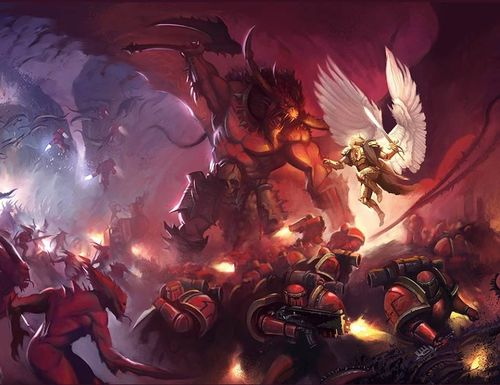

<!-- A0770-B0080 -->

原译文

Sanguinius and Ka'Bandha battle on Signus Prime 圣吉列斯和卡班哈在西格纳斯主星战斗

**校订译文**

Sanguinius and Ka'Bandha battle on Signus Prime 圣吉列斯与卡’班哈在西格纳斯主星交战

<!-- /A0770-B0080 -->

<!-- A0770-B0081 -->
## Schism of Mars (005-006.M31) 火星大分裂

<!-- /A0770-B0081 -->

<!-- A0770-B0082 -->
**英文原文**

On Mars, the Warmaster's allies (Dark Mechanicum), led by the Fabricator-General Kelbor-Hal, begin the Schism of Mars with the unleashed of a Chaos scrapcode, from the forbidden Vaults of Moravec, against the different forges of the planet. With this action the civil war of the Adeptus Mechanicus begins.

<!-- /A0770-B0082 -->

<!-- A0770-B0083 -->

原译文

在火星上，战帅的盟友（黑暗机械教）在铸造将军卡尔博·哈尔的领导下，开始了火星的分裂，从被禁止的莫拉维克地窖释放了一个混沌废码，对抗星球上的其他铸造车间。随着这一行动，机械神教的内战开始了。

**校订译文**

火星上，战帅的黑暗机械教盟军在铸造将军凯尔博·哈尔率领下发动叛乱。他们从被禁的莫拉维克秘库释放混沌废码，攻击各处铸造设施。火星大分裂由此开始，机械修会也陷入内战。

<!-- /A0770-B0083 -->

<!-- A0770-B0084 图片 -->
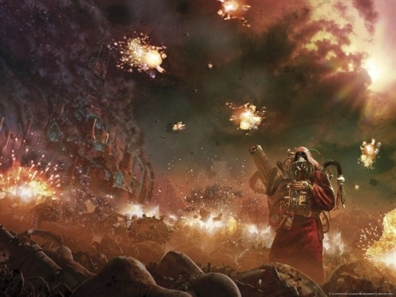

<!-- A0770-B0085 -->

原译文

Battlefield Mars 火星战场

**校订译文**

Battlefield Mars 火星战场

<!-- /A0770-B0085 -->

<!-- A0770-B0086 -->
**英文原文**

The damage of the scrapcode causes the devastation of the majority of the installations and disrupts the planet's communications. Within the confusion, the Dark Mechanicum begins the conquest of the planet. However, they discovered that some Forges remain relatively intact due to his more advance security system. The traitor forces begin the assault against the pockets of resistance with the immediate siege of one of these Forges, leaded by Ipluvien Maximal. Owerhelmed after resisting for some time, the Tech-Priest detonated the reactors of his own forge to deny the victory of the traitors. In a brief time all Mars became a bloody battlefield where the devastation of the battles costs a great damage of the industrial infrastructure and the repository of knowledge of the planet.

<!-- /A0770-B0086 -->

<!-- A0770-B0087 -->

原译文

废码造成的伤害导致大多数设施遭到破坏，并扰乱了星球的通信。在混乱中，黑暗机械教开始征服这个星球。然而，他们发现，由于更先进的安全系统，一些铸造车间仍然相对完好。叛徒部队开始攻击零星的抵抗之一，即立即围攻由伊普鲁维恩·马克西姆领导的铸造车间。在抵抗了一段时间后，这位技术神甫引爆了自己铸造车间的反应堆，以否定叛徒的胜利。在很短的时间内，整个火星都变成了一个血腥的战场，战争的破坏导致了工业基础设施和星球知识库的巨大破坏。

**校订译文**

废码摧毁了大量设施，扰乱整个星球的通信，黑暗机械教趁乱展开征服。但部分铸造设施凭借更先进的安全系统，仍相对完好。叛军立即围攻其中由伊普露维恩·马克西姆掌管的一座。抵抗一段时间后，这位技术祭司已无力支撑，遂引爆自家反应堆，不让设施落入敌手。很快，整个火星变成血腥战场，工业基础设施与知识储库都遭到严重摧残。

<!-- /A0770-B0087 -->

<!-- A0770-B0088 -->
**英文原文**

Another of the main forges that resisted the scrapcode's attack was the Magma City, leaded by Koriel Zeth, a loyal member of the Mechanicum. Kelbor-Hal to justify his attack against the forge, declares Koriel an heretic for her denial of the Machine God cult. After resisting the first attacks, She was owerhelmed by the traitors and, such as Maximal, she decided to detonate her own forge to deny its use by the traitors.

<!-- /A0770-B0088 -->

<!-- A0770-B0089 -->

原译文

抵抗废码攻击的另一个主要铸造车间是由机械神教的忠诚派科利尔•泽西领导的马格马城。卡尔博·哈尔为了证明他对铸造车间的攻击是正当的，宣布科利尔为异端，因为她否认万机神崇拜。在抵抗了第一次袭击后，她被叛徒制服，与马克西姆一样，她决定引爆自己的铸造车间，以阻止叛徒使用。

**校订译文**

另一座顶住废码攻击的大型铸造设施，是忠诚的机械教成员科瑞尔·泽斯掌管的岩浆城。凯尔博·哈尔以她否认万机神崇拜为由，宣布其为异端，为自己的进攻寻找借口。她挡住最初的攻势后，仍被优势叛军压倒，最终如马克西姆一样引爆自己的铸造设施，拒绝将其留给敌人。

<!-- /A0770-B0089 -->

<!-- A0770-B0090 -->
**英文原文**

After this combats, the loyal forces were reinforced with four companies of the Imperial Fists Legion and imperial army auxiliar, leaded by Captains Sigismund and Camba-Diaz. However, due to the great numbers of the Dark Mechanicum forces, it was impossibile to turn the tide of the battle. After acknowledge the situation, Sigismund orders the loyal forces to take all munitions, armors and equipment possible with them before evacuate the remaining loyal forces from the planet.

<!-- /A0770-B0090 -->

<!-- A0770-B0091 -->

原译文

这场战斗之后，忠诚部队得到了由西吉斯蒙德连长和坎巴·迪亚兹连长领导的帝国之拳军团的四个连队的增援以及帝国陆军部队的辅助。然而，由于黑暗机械教庞大的部队规模，扭转战局是不可能的。在确认情况后，西吉斯蒙德命令忠诚部队在将剩余的忠诚部队撤离星球之前，尽可能的携带弹药、盔甲和装备。

**校订译文**

此后，西吉斯蒙德和坎巴·迪亚兹连长率四个帝国之拳连及帝国军辅助部队抵达增援。但黑暗机械教兵力过于庞大，已经无法扭转战局。确认形势后，西吉斯蒙德命忠诚派尽可能带走弹药、护甲及其他装备，随后撤离火星。

<!-- /A0770-B0091 -->

<!-- A0770-B0092 -->
**英文原文**

The conquest of Mars by the Warmaster's allies was a devastate loss for the loyalist forces. Nevertheless, Rogal Dorn, Primarch of the Imperial Fists, orders a blockade of the Planet to contain the traitors. The blockade would resist until the arrive of the Warmaster's forces for the Siege of Terra in 014.M31.

<!-- /A0770-B0092 -->

<!-- A0770-B0093 -->

原译文

战帅的盟友征服火星对忠诚派军队来说是一个毁灭性的损失。然而，帝国之拳原体罗格·多恩下令封锁星球，以遏制叛徒。封锁一直持续到014.M31战帅的部队围攻泰拉为止。

**校订译文**

火星落入战帅盟军之手，是忠诚派遭受的一次毁灭性打击。罗格·多恩随即下令封锁星球，遏制叛军。这道封锁一直维持到 014.M31，荷鲁斯大军抵达并开始围攻泰拉。

<!-- /A0770-B0093 -->

<!-- A0770-B0094 -->
## Drop Site Massacre (006.M31) 登陆点大屠杀

<!-- /A0770-B0094 -->

<!-- A0770-B0095 -->
**英文原文**

After ridding himself of all suspected loyalist members within the three Legions under his direct command, Horus chose Isstvan V as his command post and prepared a trap for his former brothers and their Legions.

<!-- /A0770-B0095 -->

<!-- A0770-B0096 -->

原译文

在清除了他直接指挥的三个军团中所有疑似效忠者成员后，荷鲁斯选择了伊斯塔万五号作为他的指挥所，并为他的前兄弟和他们的军团准备了一个陷阱。

**校订译文**

清除直属军团中被怀疑仍忠于帝皇的成员后，荷鲁斯选定伊斯塔万五号作为指挥基地，为昔日兄弟及其军团设下陷阱。

**校注：** 英文此处 three Legions 与本篇此前明确列出的四支直属军团矛盾；中文用“直属军团”避免重复显著计数笔误，原文保留供核。

<!-- /A0770-B0096 -->

<!-- A0770-B0097 图片 -->

<!-- A0770-B0098 -->

原译文

The Drop Site Massacre 登陆点大屠杀

**校订译文**

The Drop Site Massacre 登陆点大屠杀

<!-- /A0770-B0098 -->

<!-- A0770-B0099 -->
**英文原文**

Agonizing over the betrayal of his most beloved son, the Emperor ordered the deployment of seven full Space Marine Legions against him. Their orders were to take Horus and the Primarchs allied with him into custody and bring them back to Terra to explain their actions. Unbeknownst to the Emperor, four of the Primarchs and their Legions chosen for this task had already turned against him, forming a "fifth column" which would strike against the loyalists at the most decisive moment.

<!-- /A0770-B0099 -->

<!-- A0770-B0100 -->

原译文

由于对他最心爱的儿子的背叛感到痛苦，帝皇下令部署七支完整的星际战士军团来对付他。他们的命令是拘留荷鲁斯和与他结盟的首领，并将他们带回泰拉解释他们的行为。帝皇不知道的是，被选中执行这项任务的四名原体及其军团已经转而反对他，组成了一支“第五纵队”，将在最关键的时刻打击忠诚派。

**校订译文**

最心爱的儿子背叛，令帝皇痛苦万分。他调遣七支完整的星际战士军团前去镇压，命其拘捕荷鲁斯及结盟原体，带回泰拉说明行为。帝皇却不知道，其中四位原体及其军团早已叛变；这支潜伏的“第五纵队”，将在最关键的时刻反戈。

<!-- /A0770-B0100 -->

<!-- A0770-B0101 -->
**英文原文**

The initial naval operations seemed to go well for the loyalists. The Imperial Navy gained orbit over Isstvan V and the Legions proceeded with their planetary deployment. Under the overall command of Ferrus Manus, three whole Legions took part in the first wave of landings; the Salamanders lead by Vulkan, the Raven Guard under Corax, and Manus's own Iron Hands. Horus had foreknowledge of the location of the loyalist drop site and his forces mauled the Legions during their landings, keeping them pinned down and unable to advance.

<!-- /A0770-B0101 -->

<!-- A0770-B0102 -->

原译文

最初的海军行动似乎对忠诚派来说进展顺利。帝国海军在伊斯塔万五号上空进入轨道，军团继续进行行星部署。在费鲁斯·马努斯的全面指挥下，三个军团参加了第一波登陆；由沃坎领导的火蜥蜴、科拉克斯领导的暗鸦守卫和马努斯自己的钢铁之手。荷鲁斯预先知道忠诚派登录点的位置，他的部队在军团登陆时对其进行了猛烈攻击，使其无法前进。

**校订译文**

最初的太空作战似乎进展顺利，帝国海军进入伊斯塔万五号轨道，各军团开始部署。在费鲁斯·马努斯总指挥下，沃坎的火蜥蜴、科拉克斯的暗鸦守卫与钢铁之手参加第一波登陆。荷鲁斯预知其登陆位置，命部队猛烈攻击，将忠诚派压制在登陆场，难以前进。

<!-- /A0770-B0102 -->

<!-- A0770-B0103 -->
**英文原文**

Ferrus Manus engaged Fulgrim in personal combat, only to die at his hands while the Emperor's Children butchered the Iron Hands. The loyalists retreated towards the apparent safety of their brothers in the second wave, hoping to gain reinforcement; what happened next took them completely by surprise. The four Legions of the second wave - The Night Lords of Konrad Curze, the Iron Warriors of Perturabo, the Word Bearers of Lorgar, and the Alpha Legion of Alpharius — already seduced to the cause of Horus, opened fire on their unsuspecting brothers, slaughtering them wholesale. This orgy of carnage would later become widely known as the Istvaan V Drop Site Massacre. A phrase attributed to the Warmaster himself can easily summarise the entire battle: "When the traitor's hand strikes, it strikes with the strength of a Legion." After the battle, Fulgrim presented the head of Ferrus Manus to Horus as a trophy.

<!-- /A0770-B0103 -->

<!-- A0770-B0104 -->

原译文

费鲁斯·马努斯与福格瑞姆进行了决斗，结果在帝皇之子屠杀钢铁之手时死于他的手中。在第二波中，忠诚派撤退到他们兄弟指示的表面上安全的地方，希望获得增援；接下来发生的事情让他们完全措手不及。第二波的四个军团——康拉德·柯兹的午夜领主、佩图拉博的钢铁勇士、珞珈的怀言者和阿尔法军团——已经被荷鲁斯的思想所诱惑，向他们毫无戒心的兄弟开火，大规模屠杀他们。这场大屠杀后来被广泛称为伊斯塔万V号登陆点大屠杀。战帅本人的一句话可以很容易地概括整个战斗：“当叛徒之手发动攻击时，它会以一整个军团的力量发动攻击。”战斗结束后，福格瑞姆将马努斯的头作为战利品赠送给荷鲁斯。

**校订译文**

费鲁斯·马努斯与福格瑞姆决斗，最终死于其手；与此同时，帝皇之子屠杀着钢铁之手。忠诚派向第二波登陆的兄弟部队撤退，以为能获得安全与增援，却遭遇了完全意料之外的背叛。康拉德·科兹的午夜领主、佩图拉博的钢铁勇士、珞珈的怀言者，以及阿尔法瑞斯的阿尔法军团，早已投向荷鲁斯，此刻向毫无戒心的兄弟开火，大肆屠戮。这便是后来闻名的伊斯塔万五号登陆点大屠杀。据传，战帅的一句话概括了这场战斗：“叛徒之手一旦落下，便挟着整支军团的力量。”战后，福格瑞姆将费鲁斯·马努斯的首级献给荷鲁斯。

<!-- /A0770-B0104 -->

<!-- A0770-B0105 -->
**英文原文**

Only a small number of loyalist Space Marines, bearing the gene-seed of their fallen brothers and carrying the critically wounded Corax, managed to escape. They fled back to the Raven Guard's homeworld, Deliverance, to tend to their wounds and alert the Emperor. In a single stroke Horus had crippled three Legions, killed one Primarch in battle, left another severely wounded, and a third (Vulkan, who survived due to being a Perpetual) was captured and imprisoned by his brother Konrad Curze. It was disastrous news for the Emperor and the Imperium.

<!-- /A0770-B0105 -->

<!-- A0770-B0106 -->

原译文

只有少数忠诚的星际战士携带着他们死去兄弟的基因种子，并携带着重伤的科拉克斯，设法逃脱。他们逃回暗鸦守卫的家园拯救星，照料他们的伤口并警告帝皇。荷鲁斯一举击溃了三支军团，在战斗中杀死了一名原体，另一名重伤，第三名（沃坎，由于是永生者，他幸存下来）被他的兄弟康拉德·科兹俘虏并监禁。这对帝皇和帝国来说是个灾难性的消息。

**校订译文**

只有少数忠诚派带着阵亡兄弟的基因种子与重伤的科拉克斯逃出生天。他们返回暗鸦守卫母星拯救星，休整疗伤，并向帝皇示警。荷鲁斯一举重创三支军团，杀死一名原体，重伤另一名；第三名沃坎凭永生者之身幸存，却被康拉德·科兹俘虏囚禁。这对帝皇与帝国都是灾难性的消息。

<!-- /A0770-B0106 -->

<!-- A0770-B0107 -->
## The Rebellion Spreads 叛乱的蔓延

<!-- /A0770-B0107 -->

<!-- A0770-B0108 -->
**英文原文**

After the victory at Isstvan V, Horus' rebellion spread like wildfire across the greater Imperium. Traitor forces conducted their own "Dark Compliances" of once-loyal worlds, giving them the choice of submission or destruction in a twisted mimicry of the Compliances Great Crusade. Nowhere was this more evident than the swathe of the northern Imperium Horus carved out for himself dubbed the Dark Empire.

<!-- /A0770-B0108 -->

<!-- A0770-B0109 -->

原译文

在伊斯塔万五号的胜利之后，荷鲁斯的叛乱像野火般蔓延到整个帝国。叛徒部队对曾经忠诚的世界进行了自己的“黑暗服从”，让他们可以选择屈服或毁灭，这是对大远征的服从的扭曲模仿。没有什么比荷鲁斯为自己开辟的被称为黑暗帝国的帝国北部更明显的了。

**校订译文**

伊斯塔万五号获胜后，荷鲁斯的叛乱如野火席卷帝国。叛军对昔日忠诚的世界实施“黑暗平定”，逼其在臣服与毁灭之间选择，扭曲地模仿着大远征的征服方式。最鲜明的例子，是荷鲁斯在帝国北部割据的广阔领土——黑暗帝国。

<!-- /A0770-B0109 -->

<!-- A0770-B0110 图片 -->
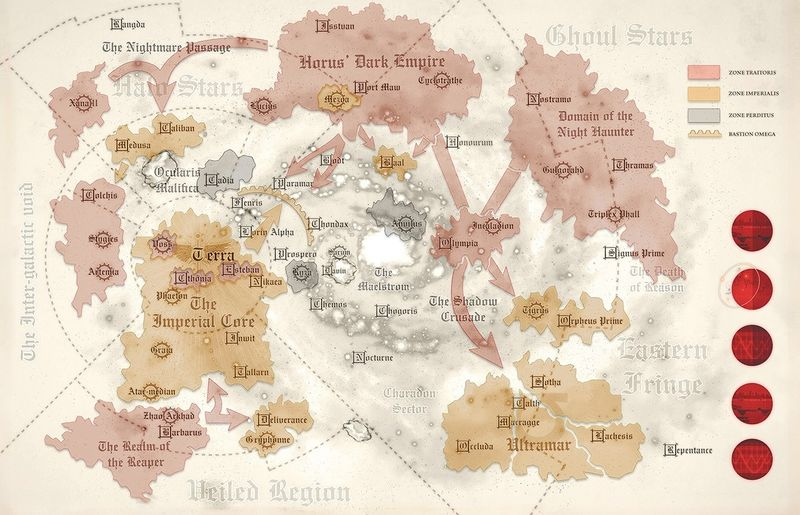

<!-- A0770-B0111 -->

原译文

Horus' Rebellion spreads across the Imperium 荷鲁斯的叛乱蔓延到整个帝国

**校订译文**

Horus' Rebellion spreads across the Imperium 荷鲁斯的叛乱蔓延到整个帝国

<!-- /A0770-B0111 -->

<!-- A0770-B0112 -->
## The Sundered and the Blackshields 破碎军团与黑盾

<!-- /A0770-B0112 -->

<!-- A0770-B0113 -->
**英文原文**

As chaos erupted across the Galaxy, many new ad-hoc armies and brotherhoods spawned. The Shattered Legions was a term attributed to a broad range of Astartes formations, but most notably the Raven Guard, Salamanders, and Raven Guard following the Drop Site Massacre which regrouped for their own bitter war of vengeance against the Traitors.

<!-- /A0770-B0113 -->

<!-- A0770-B0114 -->

原译文

随着银河系的混沌爆发，许多新的特别军队和兄弟会应运而生。“破碎军团”一词被归因于阿斯塔特各种各样的编队，但最著名的是暗鸦守卫和火蜥蜴，“登陆点大屠杀”后的暗鸦守卫们重新集结起来，展开了对叛徒的激烈复仇战争。

**校订译文**

银河陷入战乱，各类临时拼组的军队与兄弟会纷纷出现。“破碎军团”泛指许多阿斯塔特残部编成的队伍，其中最著名的是登陆点大屠杀后重新集结的钢铁之手、火蜥蜴与暗鸦守卫，他们对叛军展开了残酷的复仇战争。

**校注：** 英文 Raven Guard, Salamanders, and Raven Guard 重复列出暗鸦守卫；依同篇登陆点大屠杀所列三军团及破碎军团专篇，第一项改钢铁之手并保留此注。

<!-- /A0770-B0114 -->

<!-- A0770-B0115 -->
**英文原文**

As both loyalist and traitor armies were cutoff behind enemy lines or without support for extended periods, they found themselves acting alone. The brutal realities of the war caused some to break and act to their own desires. Some resurrected ancient resentments against their former brethren, others pursued petty vengeance for percieved slights of honor. Others became consumed by the forces they had unleashed, shredding reason and honor and taking up the mantle of reaver. Individual warriors up all the way to entire Legion contingents became swept up in this madness, which were eventually given the umbrella title of Blackshield. Many of these warriors were broken in both mind and spirit, driven to their new title by desperation. Some Blackshield formations consisted of both loyalists and traitors, disregarding the greater galactic turmoil to pursue their own angles.

<!-- /A0770-B0115 -->

<!-- A0770-B0116 -->

原译文

由于忠诚派和叛徒军队都被切断在敌后或长时间没有支援，他们发现自己是独自行动的。战争的残酷现实导致一些人违背了自己的意愿。一些人复兴了对他们前兄弟的古老怨恨，另一些人则致力于察觉到的对荣誉的轻视而进行报复。其他人则被他们释放的力量所吞噬，粉碎了理性和荣誉，披上了掠夺者的外衣。从单个战士到整个军团分队，都被这场疯狂所席卷，最终被授予了黑盾的保护性称号。这些战士中的许多人在思想和精神上都崩溃了，在被绝望驱使中获得了新的头衔。一些黑盾编队由忠诚者和叛徒共同组成，无视巨大的银河系动荡去追求自己的利益。

**校订译文**

无论忠诚派还是叛军，都有部队被隔绝在敌后，或长期得不到支援，只能独自求生。残酷的战争使一些人精神崩溃，转而只依自己的欲望行事：有人重拾对昔日兄弟的旧怨，有人为自认为受损的荣誉寻求狭隘报复，还有人被自己释放的力量吞噬，抛弃理性与荣誉，沦为劫掠者。从个别战士到整支军团分遣队，都可能陷入这种疯狂，并被统称为“黑盾”。许多黑盾早已身心破碎，是绝望将他们推上这条道路。有些队伍甚至混合了忠诚派与叛军，不再理会银河大局，只追逐自己的目标。

**校注：** act to their own desires 是按自身欲望行事，原译“违背自己的意愿”相反；umbrella title 是统称，不是保护性称号。

<!-- /A0770-B0116 -->

<!-- A0770-B0117 -->
## Wars For Paramar (006-011.M31) 帕拉马尔之战

<!-- /A0770-B0117 -->

<!-- A0770-B0118 -->
**英文原文**

After the victory of the Drop Site Massacre, Horus orders his forces to capture the world of Paramar V for its strategic position. The world, laid on the northern edge of Segmentum Solar, was a staging area for Expeditionary Fleets during the Great Crusade and its conquest was a first step of the Warmaster’s campaign against Terra.

<!-- /A0770-B0118 -->

<!-- A0770-B0119 -->

原译文

在登陆点大屠杀胜利后，荷鲁斯命令他的部队为了其战略地位占领帕拉马尔五号世界。世界位于太阳星域的北部边缘，是大远征期间远征舰队的集结地，对它的征服是战帅对抗泰拉的战役的第一步。

**校订译文**

登陆点大屠杀后，荷鲁斯下令攻占战略要地帕拉马尔五号。该世界位于太阳星域北缘，大远征时曾是远征舰队的集结地；夺取它，是战帅进攻泰拉的第一步。

<!-- /A0770-B0119 -->

<!-- A0770-B0120 -->
**英文原文**

The forces of the Warmaster, consisted in elements of the Alpha Legion, Legio Fureans and Dark Mechanicum, launch an invasion of the planet. After an initial bloody combat, the traitors seized most of the planet with the conquest of the Landing Zone Secundus. However, the loyalists defenders, formed from the loyal 77th Grand Company of the Iron Warriors, Legio Gryphonicus and Mechanicum forces, make a stubborn defence on the primary spaceport and take heavy losses to Legio Fureans. The defence of the loyalist lasts until the second attack of the Alpha Legion, who turns the tide of the battle and conquers the last bastion of the loyalist, securing the planet for Horus.

<!-- /A0770-B0120 -->

<!-- A0770-B0121 -->

原译文

由阿尔法军团、狂热者军团和黑暗机械教组成的战帅部队对星球发动了入侵。经过最初的血腥战斗，叛徒占领了塞昆杜登陆区以及星球的大部分地区。然而，由忠诚的钢铁勇士第77大连、狮鹫军团和机械神教部队组成的忠诚守军在主要太空港进行了顽强的防御，并给狂热者军团带来了重大损失。忠诚者的防御一直持续到阿尔法军团的第二次进攻，阿尔法军团扭转了战斗的局面，征服了忠诚者的最后一个堡垒，为荷鲁斯获得了星球。

**校订译文**

阿尔法军团、愤怒者军团与黑暗机械教分遣部队入侵该星球。激战后，叛军夺取塞昆杜斯登陆区，控制了地表大部分地区。然而，仍忠于帝皇的钢铁勇士第七十七大连、狮鹫军团及机械教部队在主要太空港顽强坚守，给愤怒者军团造成重创。直到阿尔法军团发起第二轮攻势，最后堡垒才告失守，星球最终落入荷鲁斯之手。

**校注：** take heavy losses to 语法不规范；依攻防上下文及原译，按使愤怒者军团遭受重创处理，具体伤亡归属可结合专篇复核。

<!-- /A0770-B0121 -->

<!-- A0770-B0122 -->
## Manachean War (006-008.M31) 玛纳基安战争

原题：Manachean War (006-008.M31) 马纳切之战

<!-- /A0770-B0122 -->

<!-- A0770-B0123 -->
**英文原文**

During the Manachean War, Horus himself led forces to conquer the Coronid Deeps.

<!-- /A0770-B0123 -->

<!-- A0770-B0124 -->

原译文

在马纳切之战期间，荷鲁斯亲自率领军队征服了王冠深渊。

**校订译文**

玛纳基安战争期间，荷鲁斯亲率部队征服科罗尼德深渊。

<!-- /A0770-B0124 -->

<!-- A0770-B0125 -->
## The Siege of Cthonia (006-014.M31) 科索尼亚围城

<!-- /A0770-B0125 -->

<!-- A0770-B0126 -->
**英文原文**

Faced with Horus' treachery, Rogal Dorn dispatches an Imperial Fists fleet to besiege the nearby world of Cthonia, homeworld of the Sons of Horus. The brutal siege lasts all the way until the final phase of the Heresy.

<!-- /A0770-B0126 -->

<!-- A0770-B0127 -->

原译文

面对荷鲁斯的背叛，罗格·多恩派遣了一支帝国之拳舰队围攻附近的科索尼亚世界，荷鲁斯之子的家园世界。残酷的围攻一直持续到叛乱的最后阶段。

**校订译文**

面对荷鲁斯的背叛，罗格·多恩派帝国之拳舰队围攻邻近的科索尼亚——荷鲁斯之子的母星。惨烈的围城一直持续到荷鲁斯之乱的最后阶段。

<!-- /A0770-B0127 -->

<!-- A0770-B0128 -->
## Battle of Phall (007.M31) 法尔之战

<!-- /A0770-B0128 -->

<!-- A0770-B0129 -->
**英文原文**

Following the news of the traitor victory at Isstvan V, Rogal Dorn dispatched a large Imperial Fists "retribution fleet" to bring them to heel. However, they were assailed by a large Iron Warriors fleet in the Phall System.

<!-- /A0770-B0129 -->

<!-- A0770-B0130 -->

原译文

在叛徒在伊斯塔万五号获胜的消息传出后，罗格·多恩派遣了一支庞大的帝国之拳“天罚舰队”来制服他们。然而，他们遭到了法尔星系中一支大型钢铁勇士舰队的攻击。

**校订译文**

叛军在伊斯塔万五号获胜的消息传来后，罗格·多恩派出庞大的帝国之拳惩戒舰队，企图将其制服。舰队却在法尔星系遭到钢铁勇士大舰队袭击。

**校注：** 此处概述把惩戒舰队派出置于伊斯塔万五号战败后；法尔专篇对命令与航行有更详细时间顺序，保留本篇原文叙述并标记待对版本。

<!-- /A0770-B0130 -->

<!-- A0770-B0131 图片 -->
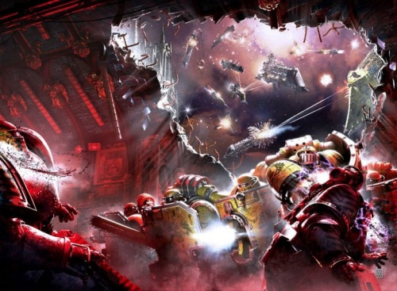

<!-- A0770-B0132 -->

原译文

The Imperial Fists and the Iron Warriors in battle over the Phall system 帝国之拳与钢铁勇士在法尔星系战斗

**校订译文**

The Imperial Fists and the Iron Warriors in battle over the Phall system 帝国之拳与钢铁勇士在法尔星系战斗

<!-- /A0770-B0132 -->

<!-- A0770-B0133 -->
## Battle of the Alaxxes Nebula (007.M31) 阿拉克斯星云之战

<!-- /A0770-B0133 -->

<!-- A0770-B0134 -->
**英文原文**

As the Space Wolves reel from the fighting on Prospero, they are ambushed by the Alpha Legion within the Alaxxes Nebula. Taking heavy losses, the Space Wolves are able to hold off the traitors until Dark Angels reinforcements arrive.

<!-- /A0770-B0134 -->

<!-- A0770-B0135 -->

原译文

当太空野狼从普罗斯佩罗的战斗中脱离出来时，他们在阿拉克斯星云内遭到了阿尔法军团的伏击。在遭受重大损失后，太空野狼抵挡住了叛徒，直到黑暗天使的增援部队到达。

**校订译文**

太空野狼尚未从普罗斯佩罗之战的损失中恢复，便在阿拉克斯星云遭阿尔法军团伏击。他们伤亡惨重，仍勉力坚守，直到黑暗天使援军抵达。

<!-- /A0770-B0135 -->

<!-- A0770-B0136 -->
## First Siege of Hydra Cordatus (~007.M31) 第一次海德拉之心围城

<!-- /A0770-B0136 -->

<!-- A0770-B0137 -->
**英文原文**

At the First Siege of Hydra Cordatus, Perturabo led the Iron Warriors against the Imperial Fists.

<!-- /A0770-B0137 -->

<!-- A0770-B0138 -->

原译文

在第一次海德拉之心围城时，佩图拉博带领钢铁勇士对抗帝国之拳。

**校订译文**

在第一次海德拉之心围城时，佩图拉博带领钢铁勇士对抗帝国之拳。

<!-- /A0770-B0138 -->

<!-- A0770-B0139 -->
## Furious Abyss and Battle of Calth (007.M31) 狂怒深渊号与考斯之战

原题：Furious Abyss and Battle of Calth (007.M31) 深渊狂怒与考斯之战

<!-- /A0770-B0139 -->

<!-- A0770-B0140 -->
**英文原文**

During the developments at Prospero, Horus's rebellion would be further strengthened by Magnus the Red and his Legion, the Thousand Sons, now servants of Tzeentch. With nine Legions and much of the Adeptus Mechanicus behind him, Horus quickly struck towards Terra after gaining the powers of the Emperor after the Battle of Molech.

<!-- /A0770-B0140 -->

<!-- A0770-B0141 -->

原译文

在普罗斯佩罗的事态发展中，马格纳斯和他的千子军团现在是奸奇的仆人，进一步加强了荷鲁斯的叛乱。在九个军团和大部分机械神教的支持下，荷鲁斯在摩洛战役后获得了帝皇的力量，迅速向泰拉发起进攻。

**校订译文**

普罗斯佩罗事变使马格努斯及千子成为奸奇仆从，进一步壮大了荷鲁斯阵营。有九支军团和大批机械修会力量支持，战帅又在摩洛之战后取得与帝皇相关的强大力量，遂迅速进军泰拉。

**校注：** 英文 gaining the powers of the Emperor 未交代力量来源机制，中文不据此补写直接从帝皇本人夺取。

<!-- /A0770-B0141 -->

<!-- A0770-B0142 图片 -->
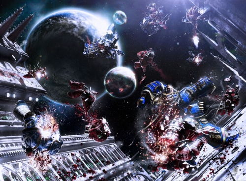

<!-- A0770-B0143 -->

原译文

Roboute Guilliman takes the battle to the void above Calth 罗伯特·基里曼在考斯之上的虚空中战斗

**校订译文**

Roboute Guilliman takes the battle to the void above Calth 罗保特·基里曼将战火引向考斯上空的虚空

<!-- /A0770-B0143 -->

<!-- A0770-B0144 -->
**英文原文**

Meanwhile in Ultramar, the Word Bearers under Lorgar launched a devastating surprise attack against the Ultramarines as the gigantic Battleship Furious Abyss attempted to attack Macragge. While the Ultramarines took grievous losses at Calth, the Furious Abyss was destroyed and the Legion survived. Roboute Guilliman would now have to contend with the Shadow Crusade of the Word Bearers and World Eaters.

<!-- /A0770-B0144 -->

<!-- A0770-B0145 -->

原译文

与此同时，在奥特拉马，珞珈领导下的怀言者对极限战士发动了毁灭性的突然袭击，巨大的深渊狂怒号战舰试图攻击马库拉格。当极限战士在考斯遭受严重损失时，深渊狂怒号被摧毁，军团幸存下来。罗伯特·基里曼现在必须与暗影远征的怀言者和吞世者作战。

**校订译文**

与此同时，在奥特拉玛，珞珈麾下的怀言者突袭极限战士，巨型战列舰狂怒深渊号则试图攻击马库拉格。极限战士在考斯损失惨重，但狂怒深渊号被毁，军团得以幸存。罗保特·基里曼随后又须面对怀言者与吞世者发起的暗影远征。

<!-- /A0770-B0145 -->

<!-- A0770-B0146 -->
## Thramas Crusade (007-010.M31) 萨拉马斯远征

<!-- /A0770-B0146 -->

<!-- A0770-B0147 -->
**英文原文**

To hold up The Lion, Horus dispatched the Night Lords to rampage throughout the Imperium to draw the attention of his Dark Angels in the Thramas Crusade.

<!-- /A0770-B0147 -->

<!-- A0770-B0148 -->

原译文

为了抓住莱恩，荷鲁斯派遣午夜领主在帝国各地横冲直撞，以引起在萨拉马斯远征中的黑暗天使的注意。

**校订译文**

为了牵制莱昂，荷鲁斯派午夜领主在帝国各地肆虐，将黑暗天使拖入萨拉马斯远征。

**校注：** hold up 意为拖延、牵制莱昂，不是抓获。

<!-- /A0770-B0148 -->

<!-- A0770-B0149 -->
## Shadow Crusade and Crusade of Iron (007-009.M31) 暗影远征与钢铁远征

<!-- /A0770-B0149 -->

<!-- A0770-B0150 -->
**英文原文**

The Ultramarines were still reeling from their battle with the Word Bearers at the Battle of Calth but subsequently faced the combined forces of Lorgar and Angron in the Shadow Crusade as they rampaged throughout Ultramar. Meanwhile, Loyalist Titan Legions launched a punitive counterattack in what became known as the Crusade of Iron.

<!-- /A0770-B0150 -->

<!-- A0770-B0151 -->

原译文

极限战士在考斯之战中仍在与怀言者的战斗中挣扎，随后在暗影远征中面对珞珈和安格隆的联合部队，他们在整个奥特拉玛肆虐。与此同时，忠诚的泰坦军团发动了一场惩罚性的反击，即所谓的钢铁远征。

**校订译文**

极限战士尚未从考斯之战的重创中恢复，又在暗影远征中遭遇珞珈与安格隆的联军；后者横行奥特拉玛，四处蹂躏。与此同时，忠诚派泰坦军团发起惩戒性反攻，这便是钢铁远征。

<!-- /A0770-B0151 -->

<!-- A0770-B0152 图片 -->
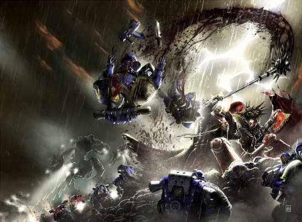

<!-- A0770-B0153 -->

原译文

Lorgar and Angron with their legions fight against the Ultramarines during the Shadow Crusade 在暗影远征期间，珞珈和安格隆率领他们的军团与极限战士作战

**校订译文**

Lorgar and Angron with their legions fight against the Ultramarines during the Shadow Crusade 在暗影远征期间，珞珈和安格隆率领他们的军团与极限战士作战

<!-- /A0770-B0153 -->

<!-- A0770-B0154 -->
## The Khan's Decision (007.M31) 可汗的决定

<!-- /A0770-B0154 -->

<!-- A0770-B0155 -->
**英文原文**

To occupy the bulk of remaining loyalist forces, Horus commanded the Alpha Legion to bog down the Space Wolves and to jam the communications of the White Scars, who were unaware of the Heresy, fighting in a long campaign against the orks of the Chondax System. For this purpose the Alpha Legion uses a strange pylon, located on the Tenebrae 9-50 Installation in the Octiss System, to manipulate the Warp and the communications of the Vth Legion. However, the plan failed when Omegon dispatched a small team, leaded by Sheed Ranko, to neutralise the device. This action let the White Scars to recover their communications with the rest of the Imperium and discover the news of the Heresy.

<!-- /A0770-B0155 -->

<!-- A0770-B0156 -->

原译文

为了解决剩余的大部分忠诚部队，荷鲁斯命令阿尔法军团困住太空野狼，并堵塞白色疤痕的通信，白色疤痕不知道叛乱，与欧克蛮人在洪达克斯星系进行了漫长的战斗。为此，阿尔法军团使用了一个位于欧克提斯星系的 熄灯礼拜9-50 上的奇异电缆塔来操纵第五军团的亚空间和通信。然而，欧米伽派遣了一个由谢德·兰科领导的小队来使设备失效。这一行动让白色疤痕恢复了与帝国其他成员的联系，并发现了叛乱的消息。

**校订译文**

为牵制其余忠诚派主力，荷鲁斯命阿尔法军团拖住太空野狼，并干扰白疤的通信。白疤当时仍在香德克斯星系与欧克蛮人长期作战，对叛乱毫不知情。阿尔法军团利用奥克提斯星系黑暗 9-50 设施中的一座奇异高塔，操纵亚空间，阻断第五军团通信。欧米伽却派谢德·兰科率小队摧毁该装置，使计划失败。白疤终于恢复与帝国其他地区的联系，得知荷鲁斯之乱已经爆发。

**校注：** Tenebrae 9-50 与 Octiss 依第917篇已定黑暗9-50及奥克提斯；pylon 暂译高塔，原文未称电缆设施。

<!-- /A0770-B0156 -->

<!-- A0770-B0157 图片 -->
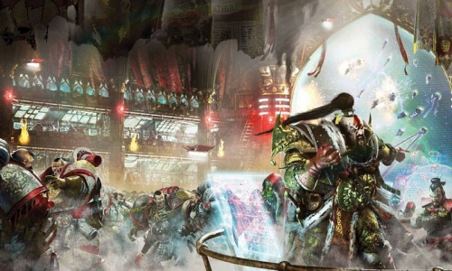

<!-- A0770-B0158 -->

原译文

Jaghatai Khan and the White Scars Legion 察合台可汗和白色疤痕军团

**校订译文**

Jaghatai Khan and the White Scars Legion 察合台可汗与白疤军团

<!-- /A0770-B0158 -->

<!-- A0770-B0159 -->
**英文原文**

After discovering the news, the Khan initially refused to throw his lot in with either side. Instead, he sought to undercover the truth for himself at Prospero. Upon discovering the ruin the Khan was still conflicted, leading to an attempted coup by Horus sympathsizers in his own Legion as well as an attempt by Mortarion to actively recruit him. Ultimately the Khan rejected the Traitor's offer and made to join the loyalist war effort. The White Scars would go on to wage a guerrilla behind Horus' lines for the next several years, taking grievous losses.

<!-- /A0770-B0159 -->

<!-- A0770-B0160 -->

原译文

在得知这一消息后，可汗最初拒绝与加入任何一方。相反，他试图在普罗斯佩罗为自己而私下寻找真相。在发现废墟后，可汗仍然处于思想冲突之中，导致他自己的军团中的荷鲁斯同情者试图发动政变，以及莫塔里安也积极试图招募他。最终，可汗拒绝了叛徒的提议，并加入了忠诚派的战争势力中。在接下来的几年里，白疤游击队继续在荷鲁斯的防线后面发动游击战，并且遭受了严重损失。

**校订译文**

得知消息后，可汗起初拒绝选边，决定亲赴普罗斯佩罗查明真相。即使看见废墟，他仍未立即作出决定。军团内部的荷鲁斯支持者趁机图谋政变，莫塔里安也亲自前来拉拢。最终，可汗拒绝叛军，决定投入忠诚派阵营。此后数年，白疤在荷鲁斯后方开展游击战，付出了惨重代价。

<!-- /A0770-B0160 -->

<!-- A0770-B0161 -->
## Capture of the Perfect Fortress (008.M31) 攻破完美堡垒

<!-- /A0770-B0161 -->

<!-- A0770-B0162 -->
**英文原文**

An impregnable fortress created by Primarchs Perturabo and Fulgrim comes under futile attack by an Imperial Army cohort, who are run down and butchered by the Emperor’s Children. The defenders then turn to find the Raven Guard under Corax occupying their vacated fortress, who swiftly turn the powerful defensive weapons on their careless former brothers.

<!-- /A0770-B0162 -->

<!-- A0770-B0163 -->

原译文

由佩图拉博和福格瑞姆创建的坚不可摧的堡垒遭到一批帝国军队的无效攻击，他们被帝皇之子击败并屠杀。防御者们随后发现，科拉克斯手下的暗鸦守卫占领了他们空虚的堡垒，他们迅速将强大的防御武器转向了他们粗心的前兄弟。

**校订译文**

一支帝国军大队进攻佩图拉博与福格瑞姆修筑的坚固堡垒，却无功而返，遭帝皇之子追击屠杀。守军回头时才发现，科拉克斯率暗鸦守卫占据了他们倾巢而出的堡垒，并立即将威力强大的防御武器转向这些疏忽的昔日兄弟。

<!-- /A0770-B0163 -->

<!-- A0770-B0164 -->
## Mezoan Campaign (008.M31) 梅佐安战役

原题：Mezoan Campaign (008.M31) 梅佐安之战

<!-- /A0770-B0164 -->

<!-- A0770-B0165 -->
**英文原文**

The Mezoan Campaign saw Mechanicum and a hybrid Alpha Legion-Iron Warriors force clash over control of the vital Forge World of Mezoa.

<!-- /A0770-B0165 -->

<!-- A0770-B0166 -->

原译文

在梅佐安之战中，机械神教和阿尔法军团与钢铁勇士的混合军团为争夺重要的梅佐亚锻造世界的控制权而发生冲突。

**校订译文**

梅佐安战役中，机械教部队与阿尔法军团、钢铁勇士组成的混合部队，为争夺战略要地梅佐亚铸造世界展开战斗。

<!-- /A0770-B0166 -->

<!-- A0770-B0167 -->
## The Siege of Baal (008-013.M31) 巴尔围城

<!-- /A0770-B0167 -->

<!-- A0770-B0168 -->
**英文原文**

Baal, homeworld of the Blood Angels, has become a refuge for many loyalists fleeing Horus' forces. Seeing this safe haven as a threat, the world is attacked by a combined force of Sons of Horus, Emperor's Children, and Dark Mechanicum. After years of siege, the traitor assault is repulsed with heavy losses on both sides.

<!-- /A0770-B0168 -->

<!-- A0770-B0169 -->

原译文

巴尔，圣血天使的家园世界，已经成为许多逃离荷鲁斯军队的忠诚者的避难所。将这个安全港视为威胁，该世界受到荷鲁斯之子、帝皇之子和黑暗机械教的联合攻击。经过多年的围攻，叛徒的进攻被击退，双方损失惨重。

**校订译文**

圣血天使母星巴尔成了许多逃离荷鲁斯军队的忠诚派的避难所。叛军将其视为威胁，派荷鲁斯之子、帝皇之子与黑暗机械教联军进攻。围城持续多年，双方损失惨重，叛军最终被击退。

<!-- /A0770-B0169 -->

<!-- A0770-B0170 -->
## The Battle of Vanaheim (008-009.M31) 瓦纳海姆之战

<!-- /A0770-B0170 -->

<!-- A0770-B0171 -->
**英文原文**

The Iron Warriors under Perturabo launch a daring void assault against the orbital hives of Vanaheim, seizing them from the Mechanicum. Subsequent loyalist counterattacks end in failure.

<!-- /A0770-B0171 -->

<!-- A0770-B0172 -->

原译文

佩图拉博率领的钢铁勇士对瓦纳海姆的轨道防御发动了大胆的虚空突袭，从机械神教手中夺取了它们。随后的忠诚派反击以失败告终。

**校订译文**

佩图拉博率钢铁勇士大胆突袭瓦纳海姆的轨道巢都，从机械教手中将其夺取。忠诚派随后反攻，均告失败。

**校注：** orbital hives 是轨道巢都，不是泛称轨道防御设施。

<!-- /A0770-B0172 -->

<!-- A0770-B0173 -->
## The Path of Heaven 天堂之路

<!-- /A0770-B0173 -->

<!-- A0770-B0174 -->
**英文原文**

After the discovery of the Dark Glass and the subsequent Battle of Catallus, the White Scars managed to return to Terra to defend the capital world with their force.

<!-- /A0770-B0174 -->

<!-- A0770-B0175 -->

原译文

在发现黑色琉璃和随后的卡塔洛斯之战之后，白色疤痕设法回到泰拉，用他们的力量保卫首都世界。

**校订译文**

发现黑暗琉璃，并经历卡塔鲁斯之战后，白疤终于返回泰拉，参加首都的防御。

<!-- /A0770-B0175 -->

<!-- A0770-B0176 图片 -->
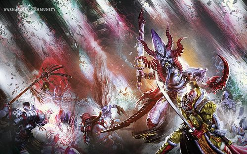

<!-- A0770-B0177 -->

原译文

Jaghatai Khan and the White Scars Legion fight against Slaanesh daemons on their way to Terra 察合台可汗和白色疤痕军团在前往泰拉的路上与色孽恶魔作战

**校订译文**

Jaghatai Khan and the White Scars Legion fight against Slaanesh daemons on their way to Terra 察合台可汗与白疤军团在前往泰拉途中迎战色孽恶魔

<!-- /A0770-B0177 -->

<!-- A0770-B0178 -->
## The Breaking of Anvillus (009.M31) 安维鲁斯分裂之战

原题：The Breaking of Anvillus (009.M31) 安维鲁斯的破裂

<!-- /A0770-B0178 -->

<!-- A0770-B0179 -->
**英文原文**

The vital Forge World of Anvillus falls into devastating civil war that sees both sides largely destroyed.

<!-- /A0770-B0179 -->

<!-- A0770-B0180 -->

原译文

至关重要的安维鲁斯铸造世界陷入了毁灭性的内战，双方都遭到了严重破坏。

**校订译文**

重要铸造世界安维鲁斯爆发毁灭性内战，双方都遭到近乎毁灭的打击。

<!-- /A0770-B0180 -->

<!-- A0770-B0181 -->
## Battle of Molech (009.M31) 摩洛之战

<!-- /A0770-B0181 -->

<!-- A0770-B0182 -->
**英文原文**

Following the Battle of Dwell and a failed assassination attempt on Horus by Shadrak Meduson, the traitor Warmaster regained memories sealed by the Emperor regarding the world of Molech. Horus speculated that great power lay on Molech, and wished to claim it in order to usurp his father. In the subsequent battle, Horus gained access to a Warp gate and gained radical new psychic abilities.

<!-- /A0770-B0182 -->

<!-- A0770-B0183 -->

原译文

在德维尔之战和沙德拉克·梅杜森对荷鲁斯的暗杀企图失败后，叛徒战帅恢复了帝皇对摩洛世界的记忆。荷鲁斯推测，摩洛拥有巨大的力量，并希望夺取它以篡夺他的父亲。在随后的战斗中，荷鲁斯获得了亚空间门户的使用权，并获得了全新的灵能能力。

**校订译文**

德威尔之战中，沙德拉克·梅杜森刺杀荷鲁斯未遂。此后，战帅恢复了自己关于摩洛的记忆——那些记忆曾被帝皇封印。他推测那里藏有伟大力量，决定夺取，以便推翻父亲。随后的战役中，他进入一道亚空间门户，获得了全新而惊人的灵能。

**校注：** 被封印的是荷鲁斯自身关于摩洛的记忆，而非帝皇的记忆。

<!-- /A0770-B0183 -->

<!-- A0770-B0184 -->
## The Formation of Imperium Secundus (009-011.M31) 第二帝国的建立

<!-- /A0770-B0184 -->

<!-- A0770-B0185 -->
**英文原文**

Despite the traitor defeat on Calth, Erebus was successful in creating the Ruinstorm which threw the Astronomican into disarray and rendered navigation and communication difficult. The Blood Angels and Dark Angels under their respective Primarch's sought Terra, but were unable to navigate the Ruinstorm and instead locked onto the Pharos beacon, ending up in the Realm of Ultramar instead. As a result, Roboute Guilliman feared the Imperium lost and created a second empire, Imperium Secundus, as a contingency with Sanguinius as its Imperator Regis and Lion El'Jonson as its Lord Protector. Early tests for Imperium Secundus came from both the Battle of Sotha and the unleashing of Konrad Curze on Macragge.

<!-- /A0770-B0185 -->

<!-- A0770-B0186 -->

原译文

尽管叛徒在考斯战败，艾瑞巴斯还是成功地制造了毁灭风暴，使星炬陷入混乱，使导航和通信变得困难。圣血天使和黑暗天使在各自原体的带领下寻找泰拉，但无法横渡毁灭风暴，而是锁定在法洛斯灯塔上，最终进入了奥特拉玛星域。因此，罗伯特·基里曼担心帝国会失败，并创建了第二帝国，第二帝国作为一种应急措施，由圣吉列斯担任其摄政，莱恩·艾尔庄森担任其护国公。第二帝国的早期考验来自索萨之战和康拉德·科兹在马库拉格的发泄。

**校订译文**

叛军虽在考斯失利，艾瑞巴斯却成功制造毁灭风暴，扰乱星炬的指引，使航行与通信变得困难。圣血天使与黑暗天使本想由各自原体率领返回泰拉，却无法穿越风暴，只得锁定法洛斯信标，最终抵达奥特拉玛领地。罗保特·基里曼担心帝国已覆灭，遂以建立第二帝国作为应变之策，由圣吉列斯担任雷吉斯帝皇，莱昂·艾尔’庄森担任护国领主。索萨之战，以及康拉德·科兹在马库拉格掀起的混乱，构成了第二帝国早期的重大考验。

**校注：** Imperator Regis 沿第38篇雷吉斯帝皇，圣吉列斯此处非摄政；Realm of Ultramar 是领地，不自加星域行政级别。

<!-- /A0770-B0186 -->

<!-- A0770-B0187 图片 -->
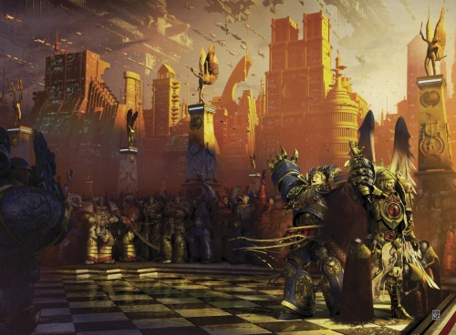

<!-- A0770-B0188 -->

原译文

Roboute Guilliman proclaims Sanguinius as Imperator Regis of Imperium Secundus 罗伯特·基里曼宣布圣吉列斯为第二帝国帝国的摄政

**校订译文**

Roboute Guilliman proclaims Sanguinius as Imperator Regis of Imperium Secundus 罗保特·基里曼宣布圣吉列斯出任第二帝国的雷吉斯帝皇

<!-- /A0770-B0188 -->

<!-- A0770-B0189 -->
## The Siege of Inwit (009-013.M31) 因威特围城

<!-- /A0770-B0189 -->

<!-- A0770-B0190 -->
**英文原文**

Dozens of Traitor fleets assail the Inwit Cluster, seeking to capture the Homeworld of the Imperial Fists. The bloody siege continues until Horus repositions forces for the attack on Terra.

<!-- /A0770-B0190 -->

<!-- A0770-B0191 -->

原译文

数十支叛徒舰队袭击了因威特星群，试图占领帝国之拳的家园世界。血腥的围攻一直持续到荷鲁斯重新部署部队进攻泰拉。

**校订译文**

数十支叛徒舰队袭击了因威特星群，试图占领帝国之拳的家园世界。血腥的围攻一直持续到荷鲁斯重新部署部队进攻泰拉。

<!-- /A0770-B0191 -->

<!-- A0770-B0192 -->
## The Battle of Tallarn (010-012.M31) 塔兰之战

<!-- /A0770-B0192 -->

<!-- A0770-B0193 -->
**英文原文**

Perturabo invaded the world of Tallarn, beginning one of the largest armored conflicts in galactic history.

<!-- /A0770-B0193 -->

<!-- A0770-B0194 -->

原译文

佩图拉博入侵了塔兰世界，开始了银河系历史上最大的装甲冲突之一。

**校订译文**

佩图拉博入侵了塔兰世界，开始了银河系历史上最大的装甲冲突之一。

<!-- /A0770-B0194 -->

<!-- A0770-B0195 图片 -->
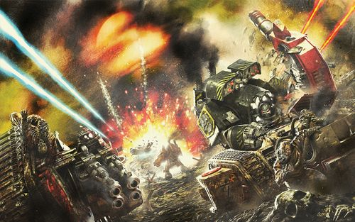

<!-- A0770-B0196 -->

原译文

The Battle of Tallarn 塔兰之战

**校订译文**

The Battle of Tallarn 塔兰之战

<!-- /A0770-B0196 -->

<!-- A0770-B0197 -->
## Nocturne and the Journey of Vulkan (~010.M31) 夜曲星与沃坎的旅程

<!-- /A0770-B0197 -->

<!-- A0770-B0198 -->
**英文原文**

Following the apparent death of a maddened Vulkan on Macragge, the Primarch is brought back to their homeworld of Nocturne by his sons. After fending off a Death Guard invasion, Vulkan is apparently resurrected and begins his pilgramage to Terra through the Webway.

<!-- /A0770-B0198 -->

<!-- A0770-B0199 -->

原译文

在马库拉格上一个明显疯狂的沃坎死亡后，原体被他的儿子们带回了他们的家园世界夜曲星。在抵御了死亡守卫的入侵后，沃坎显然复活了，并开始通过网道向泰拉出发。

**校订译文**

精神失常的沃坎在马库拉格看似死去后，子嗣们将他带回母星夜曲星。他们抵御了死亡守卫的入侵，沃坎随后似乎复活，并开始穿越网道，踏上前往泰拉的朝圣之旅。

<!-- /A0770-B0199 -->

<!-- A0770-B0200 -->
## The Cataclysm of Iron (012-015.M31) 钢铁之灾

<!-- /A0770-B0200 -->

<!-- A0770-B0201 -->
**英文原文**

A concentrated string of Forge Worlds known as the Belt of Iron is wracked by fighting between the Loyalist and Dark Mechanicums. Not even the intervention of the Dark Angels can bring a quick end to the war, which continues beyond the Heresy itself.

<!-- /A0770-B0201 -->

<!-- A0770-B0202 -->

原译文

一系列被称为“铁带”的铸造世界被忠诚派和黑暗机械教之间的战斗所摧毁。即使是黑暗天使的干预也无法迅速结束这场战争，这场战争将持续到叛乱之外。

**校订译文**

密集分布、合称“铁带”的一系列铸造世界，陷入忠诚机械教与黑暗机械教的大战。即使黑暗天使介入，也未能让战争迅速结束；战火一直延续到荷鲁斯之乱结束之后。

<!-- /A0770-B0202 -->

本篇核心术语与暂定项

以下列出本篇出现的英文原形及核心术语表用词。同形词可能指不同对象，具体词义以本篇正文和校注为准；单复数、别名和仅见于图注的名称可能尚未列入。完整候选见[术语表](../../术语表/双语术语候选.csv)。

| 英文 | 采用中文 | 状态 |
| --- | --- | --- |
| Space Marines | 星际战士 | 官方已核对 |
| Blood Angels | 圣血天使 | 官方已核对 |
| Dark Angels | 黑暗天使 | 官方已核对 |
| Grey Knights | 灰骑士 | 官方已核对 |
| Space Wolves | 太空野狼 | 官方已核对 |
| Adeptus Mechanicus | 机械修会 | 官方已核对 |
| Imperial Army | 帝国军 | 暂定·官方待核 |
| Chaos Space Marines | 混沌星际战士 | 官方已核对 |
| Death Guard | 死亡守卫 | 官方已核对 |
| Thousand Sons | 千子 | 官方已核对 |
| World Eaters | 吞世者 | 官方已核对 |
| Eldar | 灵族 | 暂定·语境区分 |
| Orks | 欧克蛮人 | 官方已核对 |
| Roboute Guilliman | 罗保特·基里曼 | 官方已核对 |
| Ultramar | 奥特拉玛 | 官方已核对 |
| Ultramarines | 极限战士 | 官方已核对 |
| Horus Heresy | 荷鲁斯之乱 | 官方已核对 |
| Astronomican | 星炬 | 暂定 |
| Navigator | 导航员 | 官方已核对 |
| Warp | 亚空间 | 官方已核对 |
| Imperium of Man | 人类帝国 | 官方已核对 |
| Imperium | 帝国 | 暂定·简称 |
| Imperial Navy | 帝国海军 | 暂定 |
| Mechanicum | 机械教 | 暂定·历史称谓 |
| Tech-Priest | 技术祭司 | 官方已核对 |
| Dark Mechanicum | 黑暗机械教 | 暂定·官方待核 |
| Webway | 网道 | 暂定 |
| The Lost and the Damned | 迷失者与被诅咒者 | 暂定 |
| Sorcerer | 巫师 | 官方已核对 |
| Khorne | 恐虐 | 官方已核对 |
| Tzeentch | 奸奇 | 官方已核对 |
| Nurgle | 纳垢 | 官方已核对 |
| History | 历史 | 编辑用语已统一 |
| Equipment | 装备 | 编辑用语已统一 |
| Eye of Terror | 恐惧之眼 | 官方已核对 |
| Imperial Fists | 帝国之拳 | 暂定 |
| Phalanx | 山阵号 | 暂定 |
| Emperor of Mankind | 人类帝皇 | 暂定 |
| Emperor | 帝皇 | 官方已核对 |
| Primarch | 原体 | 官方已核对 |
| Forge World | 铸造世界 | 暂定·官方待核 |
| Word Bearers | 怀言者 | 暂定·官方待核 |
| Emperor's Children | 帝皇之子 | 官方已核对 |
| Slaanesh | 色孽 | 官方已核对 |
| Iron Warriors | 钢铁勇士 | 暂定·官方待核 |
| Night Lords | 午夜领主 | 暂定·官方待核 |
| Great Crusade | 大远征 | 暂定·官方待核 |
| Mortarion | 莫塔里安 | 官方已核对 |
| Ferrus Manus | 费鲁斯·马努斯 | 暂定·官方待核 |
| Terra | 泰拉 | 暂定·官方待核 |
| Horus | 荷鲁斯 | 暂定·官方待核 |
| Erebus | 艾瑞巴斯 | 暂定·官方待核 |
| Anathame | 诅咒之刃 | 暂定·官方待核 |
| Auretian Technocracy | 奥瑞提安技术联盟 | 暂定·官方待核 |
| Sons of Horus | 荷鲁斯之子 | 暂定·官方待核 |
| Gordian League | 戈尔迪安联盟 | 暂定·官方待核 |
| Lion El'Jonson | 莱昂·艾尔’庄森 | 官方已核对 |
| Isstvan III | 伊斯塔万三号 | 暂定·官方待核 |
| Iron Hands | 钢铁之手 | 暂定·官方待核 |
| Fulgrim | 福格瑞姆 | 官方已核对 |
| Sisters of Silence | 寂静修女 | 暂定·官方待核 |
| Magnus the Red | 红魔马格努斯 | 官方已核对 |
| Navigators | 导航员 | 官方已核对 |
| Golden Throne | 黄金王座 | 暂定·官方待核 |
| Thunder Warriors | 雷霆战士 | 暂定·官方待核 |
| Segmentum Solar | 太阳星域 | 暂定·官方待核 |
| Segmentum | 星域 | 暂定·官方待核 |
| Machine God | 万机神 | 暂定·官方待核 |
| Perpetual | 永生者 | 暂定·官方待核 |
| Cabal | 密教 | 暂定·官方待核 |
| Malcador the Sigillite | 掌印者马卡多 | 暂定·官方待核 |
| Vulkan | 沃坎 | 暂定·官方待核 |
| Protector | 守护者 | 暂定·官方待核 |
| Salamanders | 火蜥蜴 | 暂定·官方待核 |
| Konrad Curze | 康拉德·科兹 | 暂定·官方待核 |
| Thramas Crusade | 萨拉玛斯远征 | 暂定·官方待核 |
| Nostramo | 诺斯特拉莫 | 暂定·官方待核 |
| Mars | 火星 | 暂定·官方待核 |
| Mezoa | 梅佐亚 | 暂定·官方待核 |
| Tallarn | 塔兰 | 暂定·官方待核 |
| Caliban | 卡利班 | 暂定·官方待核 |
| Calth | 考斯 | 暂定·官方待核 |
| Fenris | 芬里斯 | 暂定·官方待核 |
| Baal | 巴尔 | 暂定·官方待核 |
| Nocturne | 夜曲星 | 暂定·官方待核 |
| Davin | 戴文 | 暂定·官方待核 |
| Molech | 摩洛 | 暂定·官方待核 |
| Deliverance | 拯救星 | 暂定·官方待核 |
| Cthonia | 科索尼亚 | 暂定·官方待核 |
| Macragge | 马库拉格 | 暂定·官方待核 |
| Sotha | 索萨 | 暂定·官方待核 |
| Titan | 泰坦 | 暂定·官方待核 |
| Jenetia Krole | 珍提亚·科勒 | 暂定·官方待核 |
| Imperium Secundus | 第二帝国 | 暂定·官方待核 |
| Imperator Regis | 雷吉斯帝皇 | 暂定·官方待核 |
| Lord Protector | 护国领主 | 暂定·官方待核 |
| Pharos | 灯塔 | 暂定·官方待核 |
| Tech | 技术语 | 暂定·官方待核 |
| Paternova | 最高族长 | 暂定·官方待核 |
| Dark Glass | 黑暗琉璃 | 暂定·官方待核 |
| Chaplain | 教士 | 官方已核对 |
| Apothecary | 药剂师 | 官方已核对 |
| Ancient | 旗手 | 官方已核对 |
| Adept | 帝国任职者（广义）／文吏（行政语境） | 语境定译·官方待核 |
| Fabricator-General | 铸造将军 | 暂定·官方待核 |
| Custodian Guard | 禁军卫队 | 官方已核对 |
| Zagreus Kane | 扎格列欧斯·凯恩 | 暂定·官方待核 |
| Horus Lupercal | 荷鲁斯·卢佩卡尔 | 暂定·官方待核 |
| Lupercal | 卢佩卡尔 | 暂定·官方待核 |
| Mournival | 四王议会 | 暂定·官方待核 |
| Serpent Lodge | 蛇之结社 | 暂定·官方待核 |
| Shadrak Meduson | 沙德拉克·梅杜森 | 暂定·官方待核 |
| Eugen Temba | 欧根·坦巴 | 暂定·官方待核 |
| White Scars | 白疤 | 官方已核 |
| Alpha Legion | 阿尔法军团 | 暂定·官方待核 |
| Raven Guard | 暗鸦守卫 | 官方已核 |
| The Sigillite | 掌印者 | 暂定·官方待核 |
| The Primarchs | 原体 | 暂定·官方待核 |
| Scars | 伤疤 | 暂定·官方待核 |
| Warrior Lodges | 战士结社 | 暂定·官方待核 |
| Shattered Legions | 破碎军团 | 暂定·官方待核 |
| The Mezoan Campaign | 梅佐安战役 | 暂定·官方待核 |
| Isstvan | 伊斯塔万 | 暂定·官方待核 |
| First Captain | 第一连长 | 暂定·官方待核 |
| Sigismund | 西吉斯蒙德 | 暂定·官方待核 |
| Calas Typhon | 卡拉斯·提丰 | 暂定·官方待核 |
| Hastur Sejanus | 哈斯塔·赛詹努斯 | 暂定·官方待核 |
| Kor Phaeron | 科尔·法伦 | 暂定·官方待核 |
| Destroyer | 毁灭者 | 暂定·官方待核 |
| Space Marine | 星际战士 | 暂定·官方待核 |
| Chapter | 战团 | 暂定·官方待核 |
| Fortress-monastery | 要塞修道院 | 暂定·官方待核 |
| Captain | 连长 | 暂定·官方待核 |
| Brother | 修士 | 暂定·官方待核 |
| Constantin Valdor | 康斯坦丁·瓦尔多 | 暂定·官方待核 |
| Gene-seed | 基因种子 | 暂定·官方待核 |
| Cohort | 大队 | 暂定·官方待核 |
| Lorgar | 珞珈 | 暂定·官方待核 |
| Lorgar Aurelian | 珞珈·奥瑞利安 | 暂定·官方待核 |
| Shadow Crusade | 暗影远征 | 暂定·官方待核 |
| Bitter War | 苦难战争 | 暂定·官方待核 |
| Furious Abyss | 狂怒深渊号 | 暂定·官方待核 |
| Powers | 能天使 | 暂定·官方待核 |
| Alpharius | 阿尔法瑞斯 | 暂定·官方待核 |
| Omegon | 欧米伽 | 暂定·官方待核 |
| Chondax | 香德克斯 | 暂定·官方待核 |
| Alaxxes Nebula | 阿拉克斯星云 | 暂定·官方待核 |
| Sheed Ranko | 谢德·兰科 | 暂定·官方待核 |
| Ruinous Powers | 毁灭诸力 | 暂定·官方待核 |
| Jaghatai Khan | 察合台可汗 | 暂定·官方待核 |
| Kelbor-Hal | 凯尔博·哈尔 | 暂定·官方待核 |
| Scrapcode | 废码 | 暂定·官方待核 |
| Saul Tarvitz | 索尔·塔维兹 | 暂定·官方待核 |
| Primus | 领军 | 官方已核对 |
| Angron | 安格隆 | 官方已核对 |
| Phaeron | 法皇 | 暂定·官方待核 |
| Paramar V | 帕拉马尔五号 | 暂定·官方待核 |
| Legio Fureans | 愤怒者军团 | 暂定·官方待核 |
| Legio Gryphonicus | 狮鹫军团 | 暂定·官方待核 |
| Manachean War | 玛纳基安战争 | 暂定·官方待核 |
| Coronid Deeps | 科罗尼德深渊 | 暂定·官方待核 |
| Vengeance | 复仇号 | 暂定·官方待核 |
| Battle of Calth | 考斯之战 | 暂定·官方待核 |
| Great Scouring | 大清洗 | 暂定·官方待核 |
| Chaplains | 教士 | 暂定·官方待核 |
| Realm of Ultramar | 奥特拉玛领地 | 暂定·官方待核 |
| Corvus Corax | 科沃斯·科拉克斯 | 暂定·官方待核 |
| Harr Rantal | 哈尔·兰塔尔 | 暂定·官方待核 |
| Adreen | 阿德林 | 暂定·官方待核 |
| Crusade of Iron | 钢铁远征 | 暂定·官方待核 |
| Hydra Cordatus | 海德拉之心 | 暂定·官方待核 |
| Cohran Hursula | 科赫兰·赫苏拉 | 暂定·官方待核 |
| Ipluvien Maximal | 伊普露维恩·马克西姆 | 暂定·官方待核 |
| Koriel Zeth | 科瑞尔·泽斯 | 暂定·官方待核 |
| Magma City | 岩浆城 | 暂定·官方待核 |
| Regulus | 雷古勒斯 | 暂定·官方待核 |
| Simion Pentasian | 西蒙·彭塔西安 | 暂定·官方待核 |
| Nemo Zhi-Meng | 尼莫·志明 | 暂定·官方待核 |
| City of Sight | 视界之城 | 暂定·官方待核 |
| Dwell | 德威尔 | 暂定·官方待核 |
| Anvillus | 安维鲁斯 | 暂定·官方待核 |
| Catallus | 卡塔鲁斯 | 暂定·官方待核 |
| Inwit Cluster | 因维特星群 | 暂定·官方待核 |
| Retribution Fleet | 惩戒舰队 | 暂定·官方待核 |
| The Dark | 《黑暗》 | 暂定·官方待核 |
| The Blood | 鲜血 | 暂定·官方待核 |
| Ruinstorm | 毁灭风暴 | 暂定·官方待核 |
| Signus Cluster | 西格纳斯星群 | 暂定·官方待核 |
| System | 星系（恒星系统） | 暂定·官方待核 |
| Vanaheim | 瓦纳海姆 | 暂定·官方待核 |
| Belt of Iron | 铁带 | 暂定·官方待核 |
| Kyriss the Perverse | 悖逆者凯瑞斯 | 暂定·官方待核 |
| Kyriss | 凯瑞斯 | 暂定·官方待核 |
| Chondax System | 香德克斯星系 | 暂定·官方待核 |
| Tenebrae 9-50 | 黑暗9-50 | 暂定·官方待核 |
| Octiss System | 奥克提斯星系 | 暂定·官方待核 |
| Daemon Weapon | 恶魔武器 | 暂定·官方待核 |
| Corruption | 腐败 | 暂定·官方待核 |
| Book of Atum | 阿图姆之书 | 暂定·官方待核 |
| Choir Primus | 首席唱诗班 | 暂定·官方待核 |
| Dark Compliances | 黑暗平定 | 暂定·官方待核 |
| Landing Zone Secundus | 塞昆杜斯登陆区 | 暂定·官方待核 |
| Vaults of Moravec | 莫拉维克秘库 | 暂定·官方待核 |
| Fabricator | 铸造师 | 暂定·待核官方 |
| Eisenstein | 艾森斯坦号 | 暂定·官方待核 |
| The Seventy | 七十人 | 暂定·官方待核 |
| Titan Legions | 泰坦军团 | 暂定·官方待核 |
| Gorgon | 戈尔贡 | 暂定·官方待核 |
| The City of Sight | 视界之城 | 暂定·官方待核 |

