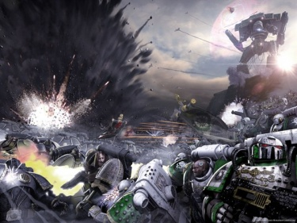

# 0771 005.M31 伊斯塔万三号之战 Battle of Isstvan III

精校状态：中文行文已逐段精校，部分术语仍为暂定

分类：时间线

原文来源：https://www.bilibili.com/opus/1179063501695483928

原作者：帝国神选罐头

原文时间：2026年03月13日 08:08

[返回分类目录](目录.md) · [全书目录](../../目录.md)

<!-- A0771-B0001 -->

原译文

"Order the guns to fire! Let the galaxy burn!" - Warmaster Horus Lupercal “令枪炮开火！让银河燃烧！” -战帅荷鲁斯·卢佩卡尔

**校订译文**

"Order the guns to fire! Let the galaxy burn!" - Warmaster Horus Lupercal “令枪炮开火！让银河燃烧！” -战帅荷鲁斯·卢佩卡尔

<!-- /A0771-B0001 -->

<!-- A0771-B0002 -->
**英文原文**

The Battle of Isstvan III (also referred to as the Isstvan III Atrocity) was the start of the Horus Heresy and was fought between the Adeptus Astartes loyal to the Emperor of Mankind and those traitors that swore fealty to Warmaster Horus.

<!-- /A0771-B0002 -->

<!-- A0771-B0003 -->

原译文

伊斯塔万三号之战（也称为伊斯塔万三号暴行）是荷鲁斯叛乱的开始，是忠于人类帝皇的阿斯塔特和那些宣誓效忠战帅荷鲁斯的叛徒之间的战斗。

**校订译文**

伊斯塔万三号之战，又称伊斯塔万三号暴行，揭开了荷鲁斯之乱的序幕。交战双方是忠于人类帝皇的阿斯塔特，与宣誓效忠战帅荷鲁斯的叛军。

<!-- /A0771-B0003 -->

<!-- A0771-B0004 图片 -->

<!-- A0771-B0005 -->

原译文

The Luna Wolves battle the traitorous Death Guard 影月苍狼与叛徒死亡守卫作战

**校订译文**

The Luna Wolves battle the traitorous Death Guard 影月苍狼与叛徒死亡守卫作战

<!-- /A0771-B0005 -->

<!-- A0771-B0006 -->
**英文原文**

Conflict:Horus Heresy

<!-- /A0771-B0006 -->

<!-- A0771-B0007 -->

原译文

冲突：荷鲁斯叛乱

**校订译文**

冲突：荷鲁斯之乱。

<!-- /A0771-B0007 -->

<!-- A0771-B0008 -->
**英文原文**

Date:005.M31

<!-- /A0771-B0008 -->

<!-- A0771-B0009 -->

原译文

日期：005.M31

**校订译文**

日期：005.M31

<!-- /A0771-B0009 -->

<!-- A0771-B0010 -->
**英文原文**

Location:Isstvan III

<!-- /A0771-B0010 -->

<!-- A0771-B0011 -->

原译文

地点：伊斯塔万三号

**校订译文**

地点：伊斯塔万三号

<!-- /A0771-B0011 -->

<!-- A0771-B0012 -->
**英文原文**

Outcome:Pyrrhic Traitor victory

<!-- /A0771-B0012 -->

<!-- A0771-B0013 -->

原译文

结果：叛徒惨胜

**校订译文**

结果：叛徒惨胜

<!-- /A0771-B0013 -->

<!-- A0771-B0014 -->
**英文原文**

Combatants:Traitors/Loyalists/Isstvanian Rebels

<!-- /A0771-B0014 -->

<!-- A0771-B0015 -->

原译文

作战方：叛徒/忠诚派/伊斯塔万叛军

**校订译文**

作战方：叛徒/忠诚派/伊斯塔万叛军

<!-- /A0771-B0015 -->

<!-- A0771-B0016 -->
**英文原文**

Commanders:Warmaster Horus Lupercal, First Captain Ezekyle Abaddon, Captain Horus Aximand, Primarch Angron, Captain Kharn (WIA), Primarch Mortarion, First Captain Calas Typhon, Master of Ordnance Durak Rask (KIA), Lord Commander Eidolon, Chaplain Charmosion (KIA), Princeps Esau Turnet/Captain Garviel Loken (WIA/MIA), Captain Tarik Torgaddon (KIA), Captain Saul Tarvitz (KIA), Lord Commander Abdemon (KIA), Captain Lucius (defected), Rylanor (MIA), Captain Ehrlen (KIA), Shabran Darr (KIA), Captain Ullis Temeter (KIA), Lieutenant Crysos Morturg, Magos Calleb Decima/Imperial Commander Vardus Praal (KIA)

<!-- /A0771-B0016 -->

<!-- A0771-B0017 -->

原译文

指挥官：战帅荷鲁斯·卢佩卡尔，第一连长以泽凯尔·阿巴顿，连长荷鲁斯·阿西曼德，原体安格隆，连长卡恩(WIA)，原体莫塔里安，第一连长卡拉斯·提丰，军械之主杜拉克·拉斯克(KIA)，领主指挥官艾多隆，牧师查莫西恩(KIA)，首席埃索·特纳/连长加维尔·洛肯(WIA/MIA)，连长塔里克·托加顿(KIA)，连长索尔·塔维兹(KIA)，领主指挥官阿布德蒙(KIA)，连长卢修斯(叛变)，瑞兰诺(MIA)，连长埃尔伦(KIA)，沙布兰·达尔(KIA)，连长乌利斯·特梅特(KIA)，副官克瑞索斯·莫特格，贤者卡莱布·德西玛/帝国指挥官瓦杜斯·普拉尔(KIA)

**校订译文**

指挥官：战帅荷鲁斯·卢佩卡尔、第一连长以泽凯尔·阿巴顿、连长荷鲁斯·阿西曼德、原体安格隆、连长卡恩（负伤）、原体莫塔里安、第一连长卡拉斯·提丰、军械之主杜拉克·拉斯克（阵亡）、领主指挥官艾多隆、教士查莫西安（阵亡）、首席埃索·特纳／连长加维尔·洛肯（负伤、失踪）、连长塔里克·托加顿（阵亡）、连长索尔·塔维兹（阵亡）、领主指挥官阿布德蒙（阵亡）、连长卢修斯（倒戈）、瑞兰诺（失踪）、连长埃尔伦（阵亡）、沙巴兰·达尔（阵亡）、连长乌利斯·特梅特（阵亡）、副官克瑞索斯·莫特格、贤者卡莱布·德西玛／帝国指挥官瓦杜斯·普拉尔（阵亡）。

**校注：** 信息栏 Charmosion 与正文 Charmosian 拼写不同，均指艾多隆麾下同一教士，中文统一查莫西安。

<!-- /A0771-B0017 -->

<!-- A0771-B0018 -->
**英文原文**

Strength:Sons of Horus, World Eaters traitors, Death Guard traitors, Emperor's Children traitors, Legio Mortis, Legio Audax, Legio Vulpa/~100,000 Adeptus Astartes loyalists from the: Luna Wolves, Around 37,500 World Eaters, 1/3 of the Death Guard, Around 30,000 Emperor's Children, Ordo Reductor/Millions of rebel soldiers, Warsingers

<!-- /A0771-B0018 -->

<!-- A0771-B0019 -->

原译文

力量：荷鲁斯之子、吞世者叛徒、死亡守卫叛徒、帝皇之子叛徒、死亡军团、莽勇军团、鬼狐军团/约100000名忠诚派阿斯塔特来自：影月苍狼、约37500名吞世者、1/3的死亡守卫、约30000名帝皇之子、源还修会/数百万叛军、战争歌者

**校订译文**

兵力：荷鲁斯之子、吞世者叛军、死亡守卫叛军、帝皇之子叛军、死亡军团、莽勇军团及鬼狐军团／约十万名忠诚派阿斯塔特，来自影月苍狼、约三万七千五百名吞世者、约三分之一死亡守卫及约三万名帝皇之子，另有源还修会／数百万伊斯塔万叛军及战争歌者。

<!-- /A0771-B0019 -->

<!-- A0771-B0020 -->
**英文原文**

Losses/Survivors:High/Nearly all Loyalist Marines/8 billion Isstvanians

<!-- /A0771-B0020 -->

<!-- A0771-B0021 -->

原译文

损失/幸存者：高/几乎所有忠诚星际战士/80亿伊斯塔万人

**校订译文**

损失／幸存者：荷鲁斯一方损失惨重／忠诚派星际战士几乎全灭／八十亿伊斯塔万人死亡。

**校注：** 英文表头 Losses/Survivors 含混，结合正文按损失理解；本篇八十亿人口损失与770篇一百二十亿属于英文记载差异，未擅自统一。

<!-- /A0771-B0021 -->

<!-- A0771-B0022 -->
## Overview 概述

<!-- /A0771-B0022 -->

<!-- A0771-B0023 -->
### The Isstvan Conspiracy 伊斯塔万密谋

<!-- /A0771-B0023 -->

<!-- A0771-B0024 -->
**英文原文**

Over a year before the battle, Warmaster Horus Lupercal had fallen on the moon of Davin thanks to a conspiracy by the Word Bearers. He immediately set about constructing a plan to overthrow the Emperor. Still posing as the loyal Warmaster of the Throne of Terra, Horus weaved a web of deceit and betrayal in preparation for open rebellion. This included sending Primarchs deemed likely to remain loyal such as Lion El'Jonson, Roboute Guilliman, and Sanguinius to the fringes of the Imperium to ensure they could not interfere with what was about to transpire. Meanwhile, he assembled those Legions whose Primarchs he had managed to turn to his cause: Fulgrim and the Emperor's Children, Angron and the World Eaters, and Mortarion of the Death Guard, planning to use the coming battle as a way to purge this force of remaining loyalist elements.

<!-- /A0771-B0024 -->

<!-- A0771-B0025 -->

原译文

在战斗前一年多，由于怀言者的阴谋，战帅荷鲁斯·卢佩卡尔在戴文的卫星上堕落了。他立即着手制定推翻帝皇的计划。荷鲁斯仍然假扮成泰拉王座的忠诚战帅，编织了一张欺骗和背叛的网，为公开叛乱做准备。这包括派遣被认为可能保持忠诚的原体，如莱昂·艾尔庄森、罗伯特·基里曼和圣吉列斯到帝国的边疆，以确保他们无法干涉即将发生的事情。与此同时，他召集了那些他设法将其原体转向他的事业的军团：福格瑞姆和帝皇之子，安格隆和吞世者，以及死亡守卫的莫塔里安，计划利用即将到来的战斗来清除这支部队中剩余的忠诚派成员。

**校订译文**

战役爆发一年多前，怀言者的阴谋使荷鲁斯在戴文卫星堕落。他立即着手策划推翻帝皇，同时仍扮演泰拉王座忠诚战帅的角色，以重重欺骗为公开反叛作准备。他将莱昂·艾尔’庄森、罗保特·基里曼和圣吉列斯等很可能保持忠诚的原体派往帝国边缘，确保他们无力干涉。与此同时，他召集已经拉拢的兄弟及其军团：福格瑞姆与帝皇之子、安格隆与吞世者、莫塔里安与死亡守卫，并准备借即将到来的战役清除其中残存的忠诚派。

<!-- /A0771-B0025 -->

<!-- A0771-B0026 -->
**英文原文**

So it was that some 200,000 Astartes assembled in the Isstvan System, ostensibly to counter an anti-Imperial rebellion on Isstvan III. The Death Guard Legion had received a distress signal from Isstvan III which stated that the colony had turned away from the Imperial Truth and that the former governor, Vardus Praal, was leading the rebellion. The assembled Imperial expedition was tasked with eliminating this threat. While Mortarion and Angron were able to rendezvous with Horus at Isstvan III, Fulgrim was dispatched to potentially turn Ferrus Manus to the traitor cause and the Emperor's Children at Isstvan were commanded by Lord Commander Eidolon.

<!-- /A0771-B0026 -->

<!-- A0771-B0027 -->

原译文

因此，大约20万阿斯塔特聚集在伊斯塔万星系中，表面上是为了对抗伊斯塔万三号的反帝国叛乱。死亡守卫军团收到了伊斯塔万三号的求救信号，该信号表示殖民地已经背离了帝国真理，前总督瓦杜斯·普拉尔正在领导叛乱。帝国远征队的任务是消除这一威胁。当莫塔里安和安格隆在伊斯塔万三号与荷鲁斯会合时，福格瑞姆被派遣将费鲁斯·马努斯变成叛徒，伊斯塔万的帝皇之子由领主指挥官艾多隆指挥。

**校订译文**

约二十万名阿斯塔特由此集结于伊斯塔万星系，名义上是镇压伊斯塔万三号的反帝国叛乱。死亡守卫收到求救信号，得知当地背离帝国真理，前总督瓦杜斯·普拉尔正率众叛乱。远征军奉命消除这一威胁。莫塔里安与安格隆前往会合荷鲁斯，福格瑞姆则被派去尝试劝降费鲁斯·马努斯，留在伊斯塔万的帝皇之子由领主指挥官艾多隆指挥。

<!-- /A0771-B0027 -->

<!-- A0771-B0028 -->
### War against the Isstvanians 对抗伊斯塔万人的战争

<!-- /A0771-B0028 -->

<!-- A0771-B0029 -->
**英文原文**

Initial skirmishes were fought on the outer system world of Isstvan Extremis where the Emperor's Children and Death Guard had managed to eliminate the enemy outpost. With the enemy forces blinded, Warmaster Horus brought about the Legions to hammer the rebel forces.

<!-- /A0771-B0029 -->

<!-- A0771-B0030 -->

原译文

最初的小规模冲突发生在伊斯塔万极端的外星系世界，在那里，帝皇之子和死亡守卫设法消灭了敌人的前哨。在敌军失明的情况下，战帅荷鲁斯召集军团打击叛军。

**校订译文**

最初的交锋发生在星系外围的伊斯塔万极端星。帝皇之子与死亡守卫摧毁了当地敌军前哨，切断其预警耳目，荷鲁斯随即调集军团重击叛军。

**校注：** Isstvan Extremis 为星系外围世界的专名，原伊斯塔万极端误作普通形容词；暂音译。

<!-- /A0771-B0030 -->

<!-- A0771-B0031 -->
**英文原文**

However, Isstvan III would be no easy conquest. The world was heavily defended against any outside incursion, and the rebels possessed powerful Psyker-warriors dubbed Warsingers. So it was that a massive Drop Pod assault was launched onto Isstvan III's surface. Four primary targets were chosen for this attack at Isstvan's capital dubbed the Choral City. The Emperor's Children would land at the Precentor Palace where the traitorous governor was believed to be, the World Eaters at the central plaza, and the Death Guard at the outer bunker network. The final and most difficult target would fall to the Sons of Horus, which would land east of the city at a vast ancient complex dubbed the Siren Hold. It was here that the most Warsingers were believed to be based.

<!-- /A0771-B0031 -->

<!-- A0771-B0032 -->

原译文

然而，征服伊斯塔万三号绝非易事。世界对任何外来入侵都进行了严密的防御，叛军拥有强大的被称为战争歌者的灵能者战士。因此，对伊斯塔万三号的表面发动了大规模的空投舱攻击。在被称为圣歌城的伊斯塔万首都，这次袭击选择了四个主要目标。帝皇之子将降落在据信是叛徒总督的领唱宫殿，吞世者将降落在中央广场，死亡守卫将降落在外地堡网络。最后也是最困难的目标落在荷鲁斯之子身上，他们将降落在城市以东一个名为塞壬之握的巨大古代建筑群中。据信，大多数战争歌者都驻扎在这里。

**校订译文**

但伊斯塔万三号并非易取之地。该世界对外防御严密，还拥有被称为战争歌者的强大灵能战士。帝国于是向地面发动大规模空降舱突击，将首都圣歌城的四处地点定为主要目标：帝皇之子进攻据称叛乱总督所在的领唱者宫殿，吞世者夺取中央广场，死亡守卫攻击外围地堡网络。最困难的目标交给荷鲁斯之子——城市东侧一座庞大的古代建筑群塞壬堡，据信多数战争歌者就驻扎在那里。

**校注：** Siren Hold 暂译塞壬堡，hold 在此为堡垒／要塞，原塞壬之握误解字义；首次保留原别名于此注。

<!-- /A0771-B0032 -->

<!-- A0771-B0033 -->
**英文原文**

The first wave of Drop Pods fell upon the Choral City like hammer blows, landing after a brief but intense orbital bombardment. The first to land were the World Eaters at the city surrounding Precentor's Palace, who smashed into the central plaza and killed everything in their path. While quickly capturing the plaza, the battle for the Precentor Palace would prove far more difficult due to its heavy defenses which had been designed by Imperial military architects. It was here that the Emperor's Children next landed, using Dreadnoughts and Melta Gun-armed infantry to burst into the palace and fight their way through each level. Meanwhile, the Death Guard managed to quickly overrun the western fortification line against half-insane mutated Imperial Army rebels. Led personally by Mortarion, the Death Guard quickly silenced the rebels Basilisk guns and Malcador heavy tanks before pushing through the trench and bunker networks. These assets were given heavy air support alongside a compliment of the Legio Mortis. Due to incorrectly mapped locations, many of the drop pods that crashed at Choral City slammed into the city's towers which caused a delay in reinforcements as they were pinned in inaccessible locations. The Titan Dies Irae was also present at the planet and made use of its mighty weapons to eliminate heavy enemy positions.

<!-- /A0771-B0033 -->

<!-- A0771-B0034 -->

原译文

第一波空投舱像锤子一样落在圣歌城上，在短暂但强烈的轨道轰炸后着陆。第一批登陆的是城市领唱宫殿周围的吞世者，他们冲进中央广场，杀死了他们路上的一切。在迅速占领广场的同时，由于帝国军事建筑师设计的重型防御，争夺领唱宫殿的战斗变得更加困难。正是在这里，帝皇之子随后登陆，使用无畏和配备热熔枪的步兵冲进宫殿，在每层中奋力前行。与此同时，死亡守卫设法迅速越过西部防线，对抗半疯狂的变异帝国军队叛军。在莫塔里安的亲自领导下，死亡守卫迅速压制了叛军的石化蜥蜴火炮和马卡多重型坦克，然后穿过战壕和掩体网络。这些优点在死亡军团的赞扬下得到了强有力的空中支援。由于位置绘制不正确，许多在圣歌城坠毁的空投舱撞上了该城的塔楼，导致增援部队被困在无法进入的地方，从而延误了增援。泰坦震怒之日号也出现在这个行星上，并利用其强大的武器消灭了敌人的重型阵地。

**校订译文**

短促而猛烈的轨道轰炸后，第一波空降舱如重锤砸入圣歌城。吞世者率先在领唱者宫殿周边城区登陆，杀入中央广场，扫灭沿途一切。他们很快拿下广场，但帝国军事建筑师设计的宫殿防御远比预想坚固。随后登陆的帝皇之子以无畏机甲和装备热熔枪的步兵突入宫内，逐层争夺。西侧，死亡守卫迅速突破由半疯的变异帝国军叛兵据守的防线。在莫塔里安亲自率领下，他们压制石化蜥蜴火炮及马卡多重型坦克，穿过战壕与地堡网络。强大的空中火力及死亡军团泰坦提供了支援。但地图标注有误，不少空降舱撞上城市高塔，将部队困在难以抵达的位置，延误了增援。泰坦神怒之日号也投入地面战斗，以巨炮摧毁敌军坚固阵地。

**校注：** 原文 compliment 疑为 complement，意为配属的死亡军团兵力，不是赞扬。

<!-- /A0771-B0034 -->

<!-- A0771-B0035 -->
**英文原文**

At the Siren Hold, the Sons of Horus landed in a labyrinth of lesser shrines, arches, and walkways. The Sons of Horus were quickly scattered amidst this ocean-like edifice and came under heavy fire. A more dangerous threat to the invading Astartes were the Warsingers which managed to kill dozens of Space Marines each with their sonic songs. It was at this point in the battle that an enormous scream erupted across the Choral City and beyond, driving the people of Isstvan III into uncontrolled hatred and madness and driving them to resist the Imperials by any means necessary. All four Space Marline Legions now had to contend with waves of frenzied civilians in addition to the standard rebel troops.

<!-- /A0771-B0035 -->

<!-- A0771-B0036 -->

原译文

在塞壬之握，荷鲁斯之子在一个由较小的神龛、拱门和走道组成的迷宫中登陆。荷鲁斯之子很快就分散在这座海洋般的建筑中，遭到猛烈的炮火袭击。对入侵的阿斯塔特来说，更危险的威胁是战争歌者，他们用自己的声乐杀死了数十名星际战士。就在战斗的这一点上，一声巨大的尖啸爆发穿越圣歌城，直至更远的地方，将伊斯塔万三号的人推向无法控制的仇恨和疯狂，并驱使他们以任何必要的手段抵抗帝国。除了普通的叛军部队外，所有四个星际战士军团现在都不得不应对疯狂的平民浪潮。

**校订译文**

荷鲁斯之子降落在塞壬堡的重重小神殿、拱门与走廊之间，很快分散于这片汪洋般的建筑迷宫，遭到猛烈射击。更危险的是战争歌者，每一名都能用音波歌声杀死数十名星际战士。这时，一声巨响般的尖啸传遍圣歌城及周边地区，将居民推入无法遏制的仇恨与疯狂，驱使他们不惜一切反抗帝国。四支军团不仅要对付正规叛军，还须迎战一波波狂乱平民。

<!-- /A0771-B0036 -->

<!-- A0771-B0037 -->
**英文原文**

At the Precentor Palace, the Emperor's Children advanced room by room at significant cost thanks to the presence of many Warsingers. There were also large numbers of a previously unencountered type of rebel elite. These warriors were surgically modified and mutilated, clad in black vitrified armour, and wielding strange weapons that spat killing blasts of sound or darts of liquid metal. However they eventually were able to fight their way to the throneroom, where Captain Lucius slew the heavily augmented Vardus Praal personally. Simultaneously deep within the Siren's Hold Tomb Spires the Sons of Horus under the command of Garviel Loken fought into a strange corpse-filled shrine and slew many Warsingers before destroying the complex. These two acts managed to dispel the strange cacophony that held sway over the Choral City, and within hours the rebellion was smashed. Quickly securing their remaining objectives, the victorious Space Marines celebrated their hard-won victory, unaware that disaster was about to strike.

<!-- /A0771-B0037 -->

<!-- A0771-B0038 -->

原译文

在领唱宫殿，由于许多战争歌者的存在，帝皇之子以高昂的代价一个房间一个房间地前进。也有大量以前未被征服的叛军精英。这些战士经过手术改造和毁坏，身穿黑色陶瓷盔甲，挥舞着奇怪的武器，吐出致命爆破的声音或液态金属飞镖。然而，他们最终能够战斗到王座厅，在那里，连长卢修斯亲自杀死了增援的瓦杜斯·普拉尔。同时，在塞壬之握的坟墓尖塔深处，加维尔·洛肯指挥的荷鲁斯之子进入了一个充满尸体的奇怪神庙，在摧毁这个建筑群之前许多战士被杀死。这两项行动成功地驱散了笼罩圣歌城的奇怪的杂音，几小时内叛乱就被粉碎了。胜利的星际战士迅速确保了剩余的目标，庆祝了他们来之不易的胜利，却没有意识到灾难即将到来。

**校订译文**

领唱者宫殿内，大量战争歌者使帝皇之子每夺取一个房间都要付出惨重代价。守军还包括许多从未见过的精锐：他们经过外科改造与肢体残毁，身披黑色玻璃化装甲，手持能够喷射致命音波或液态金属飞镖的奇异武器。帝皇之子最终杀入王座厅，卢修斯亲手斩杀了经过大量身体强化的瓦杜斯·普拉尔。同一时刻，洛肯率荷鲁斯之子攻入塞壬堡墓塔深处一座堆满尸体的诡异神殿，杀死众多战争歌者，摧毁了整个建筑群。两处目标的陷落终止了笼罩全城的可怕声浪，数小时内叛乱便被粉碎。星际战士迅速拿下剩余目标，庆祝来之不易的胜利，全然不知灾难将至。

**校注：** augmented 指身体强化而非得到增援；slu[e] many Warsingers 是荷鲁斯之子杀死战争歌者，原译改成己方许多战士死亡。

<!-- /A0771-B0038 -->

<!-- A0771-B0039 -->
### Betrayal 背叛

<!-- /A0771-B0039 -->

<!-- A0771-B0040 -->
**英文原文**

With those squads and their leaders that were known to be completely loyal to the Emperor on the planet, the Warmaster finally decided to initiate his plan. All communication with the orbiting fleet ceased and the Titans of the Legio Mortis went silent as they sealed themselves against biological threats. The warships Vengeful Spirit, Firebird, Andronius, Killing Star, Indomitable Will, Gauntlet of Spite, Warchild, Eisenstein, and Conqueror all lowered into low orbit and launched salvos of Virus Bombs upon Isstvan III's surface. The assembled Remembrancer Order was present on the Vengeful Spirit while this happened. After Horus declared his intentions of overthrowing the Emperor, his Astartes went about exterminating the Remembrancers.

<!-- /A0771-B0040 -->

<!-- A0771-B0041 -->

原译文

由于在这个行星上的这些小队及其领导人完全忠于帝皇，战帅最终决定启动他的计划。与轨道舰队的所有通信都停止了，死亡军团的泰坦沉默了，因为他们封锁了自己以抵御生物威胁。复仇之魂号、火鸟号、安德罗尼乌斯号、杀戮星辰号、不屈意志号、恶意臂铠号、战争之子号、爱森斯坦号和征服者号等战舰都降到了低轨，并向伊斯塔万三号的表面发射了病毒炸弹。当这件事发生时，聚集在一起的记述者出现在复仇之魂号上。在荷鲁斯宣布推翻帝皇的意图后，他的阿斯塔特开始消灭记述者。

**校订译文**

所有已知忠于帝皇的小队及其指挥官都已身在地面，战帅终于启动计划。轨道舰队切断通信，死亡军团泰坦停止行动，封闭机体以抵御生物武器。复仇之魂号、火鸟号、安德罗尼乌斯号、杀戮星辰号、不屈意志号、恶意臂铠号、战争之子号、爱森斯坦号和征服者号降入低轨，向伊斯塔万三号齐射病毒炸弹。此时记述者群体已被召集到复仇之魂号上。荷鲁斯宣布推翻帝皇的意图后，麾下阿斯塔特便开始将他们灭口。

<!-- /A0771-B0041 -->

<!-- A0771-B0042 -->
**英文原文**

Each virus bomb contained thousands of submunitions, each of which contained deadly Life-Eater Virus. These sub-warheads detonated in the lower atmosphere and rapidly spreading the phage across the surface. The Life-Eater was one of the most insidious and terrible weapons forged by Mankind, and every piece of organic matter it encountered rotted into liquid refuse within seconds. Billions of Isstvanians died in agony alongside all of the planets flora and fauna. Even the oceans turned into a greenish sludge as all organic matter within rotted away. But the destruction was not over yet. The Life-Eater was intentionally designed so that the miasma caused by its victims transformed into a highly flammable gaseous sludge. At Horus' command, a single Lance strike was launched from orbit, detonating this toxic stew and engulfing the planet in a tsunami-like firestorm. The resulting inferno engulfed the entire surface of Isstvan III, incinerating its now-empty cities. All that remained of Isstvan III in the afterlife was a dark dead planet.

<!-- /A0771-B0042 -->

<!-- A0771-B0043 -->

原译文

每枚病毒炸弹都包含数千枚子弹药，每枚子弹药都含有致命的生命吞噬病毒。这些子弹头在低层大气中引爆，并迅速将噬菌体传播到整个地表。生命吞噬是人类制造的最阴险、最可怕的武器之一，它遇到的每一块有机物都会在几秒钟内腐烂成液态垃圾。数十亿伊斯塔万人与所有行星上的动植物一起在痛苦中死去。甚至海洋也变成了绿色的淤泥，因为里面的所有有机物都腐烂了。但破坏还没有结束。生命吞噬是故意设计的，这样受害者形成的瘴气就会转化为高度易燃的气态污泥。在荷鲁斯的指挥下，一个光矛从轨道上发动了一次打击，引爆了这个有毒炖锅，并在海啸般的火焰风暴中吞噬了行星。由此产生的炼狱吞噬了伊斯塔万三号的整个表面，焚烧了现在空无一人的城市。伊斯塔万三号在来世剩下的只有一颗黑暗死亡行星。

**校订译文**

每枚病毒炸弹都携带数千枚子弹药，装有致命的噬生病毒。弹头在低层大气引爆，迅速将病毒撒遍地表。这是人类最阴险可怖的武器之一，接触到的有机物几秒内就会腐烂成液态废物。数十亿伊斯塔万人与全星球动植物一同痛苦死去，海中有机物尽数腐烂，连海洋都变成绿色污浆。灾难还未结束：噬生病毒经过刻意设计，会令尸体腐败释放大量易燃气体。荷鲁斯一声令下，轨道上的单次光矛打击点燃了这团毒雾，火焰风暴如海啸吞没星球。地表与已无人居住的城市尽数焚毁，只留下一个黑暗的死寂世界。

**校注：** 本段 afterlife 疑为 aftermath 笔误，按轰炸后的结果译，不扩写死后世界。phage 沿前文病毒处理，不据本词推定其只感染细菌。

<!-- /A0771-B0043 -->

<!-- A0771-B0044 -->
**英文原文**

Meanwhile in orbit, many vessels fell into anarchy as loyalist elements resisted the unfolding treachery. The Torpedo-monitor Ducroix turned its guns upon the traitor armada before being torn apart by retaliatory fire. The Heavy Cruiser Sunstone was the site of an intense battle between loyalist and traitors who fought each other on every deck, eventually suffering a reactor meltdown and exploding. The Mechanicum Ordo Reductor War Galley Xerxes 9-7-7 refused an order to surrender to Horus and was shot down onto Isstvan III's surface. Surprisingly, elements within the vessel survived the crash and fought alongside the loyalists under Magos Reductor Calleb Decima.

<!-- /A0771-B0044 -->

<!-- A0771-B0045 -->

原译文

与此同时，在轨道上，由于忠诚者正在抵抗展开的背叛，许多战舰陷入了混沌状态。鱼雷监视者杜克鲁瓦在被反击火力撕裂之前，将炮口对准了叛徒舰队。重型巡洋舰日石号是忠诚者和叛徒之间激烈战斗的地点，他们在每一层甲板上相互战斗，最终导致反应堆熔毁和爆炸。机械教源还修会战争舰薛西斯9-7-7拒绝向荷鲁斯投降的命令，被击落在伊斯塔万三号的表面。令人惊讶的是，船上的人员在坠落事件中幸存下来，并与源还贤者卡莱布·德西玛领导下的忠诚者并肩作战。

**校订译文**

轨道上，残存忠诚派奋起抵抗，许多舰船陷入混乱。鱼雷浅水重炮舰杜克鲁瓦号向叛军舰队开火，随即被反击撕碎。重型巡洋舰日石号上，双方逐层甲板争夺，最终导致反应堆熔毁，整舰爆炸。源还修会战斗桨舰薛西斯 9-7-7 号拒绝服从向荷鲁斯投降的命令，被击落到伊斯塔万三号地表。出人意料的是，部分舰上部队幸存，在源还贤者卡莱布·德西玛率领下加入忠诚派战斗。

**校注：** Torpedo-monitor 暂依舰种译鱼雷浅水重炮舰，war galley 为带历史舰种色彩的专称；均非字面监视者。

<!-- /A0771-B0045 -->

<!-- A0771-B0046 -->
**英文原文**

But even before the first Virus Bombs had been launched, Horus' plan had already begun to unravel. Unknown to him, several loyalist officers within the armada had learned of the treachery and managed to warn the Space Marines on the surface. Chief among these were Nathaniel Garro of the Death Guard and Saul Tarvitz of the Emperor's Children. Warned of the impending disaster, some 90,000 the Sons of Horus, World Eaters, Death Guard, and Emperor's Children on the surface managed to seal themselves away inside the remaining bunker and catacomb networks on Isstvan III. Thanks to the warnings given by Garro and Tarvitz, some 2/3rds managed to survive the bombardment, though most of the accompanying Imperial Army, Mechanicum troops, and Administratum functionaries were not so lucky. Meanwhile, Garro was able to wrest control of the Eisenstein with his loyalist Death Guard and escape the Isstvan System for a perilous journey to Terra to warn of the treachery.

<!-- /A0771-B0046 -->

<!-- A0771-B0047 -->

原译文

但即使在第一枚病毒炸弹发射之前，荷鲁斯的计划已经开始瓦解。他不知道的是，舰队中的几名忠诚派军官已经得知了这次背叛，并设法警告了地表上的星际战士。其中最主要的是死亡守卫的纳撒尼尔·伽罗和帝皇之子的索尔·塔维茨。在收到即将发生的灾难的警告后，地面上约有90000名荷鲁斯之子、吞世者、死亡守卫和帝皇之子设法将自己封锁在伊斯塔万三号剩余的掩体和地下墓穴网络内。由于伽罗和塔维茨的警告，约2/3的人在轰炸中幸存下来，尽管大多数随行的帝国军队、机械教部队和内务部官员都没有那么幸运。与此同时，伽罗能够和他的忠诚派死亡守卫夺取爱森斯坦号的控制权，并逃离伊斯塔万星系，前往泰拉进行危险的旅程，以警告背叛。

**校订译文**

事实上，第一枚病毒炸弹尚未发射，荷鲁斯的计划便已出现裂缝。几名忠诚军官察觉背叛，设法向地面报信，其中最重要的是死亡守卫的纳撒尼尔·伽罗与帝皇之子的索尔·塔维兹。收到警告后，约九万名荷鲁斯之子、吞世者、死亡守卫及帝皇之子战士躲入残存地堡和地下墓穴，封闭避难。多亏两人的示警，约三分之二的人熬过轰炸；大多数随军帝国军、机械教部队和内政部官员却没能幸免。与此同时，伽罗与忠诚的死亡守卫夺取爱森斯坦号，逃出伊斯塔万星系，踏上赶往泰拉报信的险途。

**校注：** 英文先称九万人避难、后称三分之二生还，分母未交代清晰，保留原统计，不自行计算幸存总数。

<!-- /A0771-B0047 -->

<!-- A0771-B0048 -->
**英文原文**

While most of the Astartes had survived in their shelters, a shock fell over them. Never before had such a terrible betrayal befallen the Legiones Astartes, and worse still their own Primarchs had disowned them. This shock soon turned into righteous defiance, and the remaining survivors pledged to fight to the last and not go down silently. But before Horus could formulate a new plan, the maddened Angron unexpectedly descended from the Conqueror to Isstvan III with 50 companies of frenzied World Eaters, intent on massacring the loyalists. The recklessness and insubordination infuriated Horus, who no longer could simply annihilate Isstvan from orbit without eliminating a key commander for his coming wider rebellion.

<!-- /A0771-B0048 -->

<!-- A0771-B0049 -->

原译文

虽然大多数阿斯塔特都在避难所幸存下来，但他们还是受到了震撼。阿斯塔特军团从未遭受过如此可怕的背叛，更糟糕的是，他们自己的原体已经与他们断绝了关系。这一震惊很快变成了正义的反抗，剩下的幸存者承诺战斗到最后，不会沉默倒下。但在荷鲁斯制定新计划之前，愤怒的安格隆出人意料地从征服者号上带着50个疯狂的吞世者连队来到伊斯塔万三号，意图屠杀忠诚者。这种鲁莽和不服从激怒了荷鲁斯，他再也不能仅仅从轨道上消灭伊斯塔万，而不除掉其即将发起的更大规模叛乱的关键指挥官。

**校订译文**

多数阿斯塔特虽躲过轰炸，却被这场背叛深深震撼。军团从未遭受过如此惨祸，而抛弃他们的竟是自己的原体。震惊很快转化为义愤，幸存者发誓抵抗到底，决不无声地死去。荷鲁斯尚未来得及另拟计划，狂怒的安格隆便从征服者号降下，率五十个吞世者连冲向地表，要亲手屠杀忠诚派。这种鲁莽抗命令荷鲁斯大怒：他已无法再直接从轨道毁灭星球，因为那也会杀死未来叛乱的一位关键统帅。

<!-- /A0771-B0049 -->

<!-- A0771-B0050 -->
### Last Stand 背水一战

<!-- /A0771-B0050 -->

<!-- A0771-B0051 -->
**英文原文**

Seeing that they were betrayed, Captains Garviel Loken and Tarik Torgaddon of the Sons declared to the surviving Astartes of the XVI Legion that they were once again the Luna Wolves and marched to Praal's stronghold, where they dug in with the surviving members of the Emperor's Children under Saul Tarvitz and Lord Commander Abdemon and combated against the traitor forces. The loyalist World Eaters fell under the command of Captain Ehrlen and Centurion Shabran Darr while the Death Guard survivors were led by Crysos Morturg. The loyalists pledged to make their traitorous brothers pay for every inch of ground.

<!-- /A0771-B0051 -->

<!-- A0771-B0052 -->

原译文

看到他们被背叛了，荷鲁斯之子的加维尔·洛肯和塔里克·托加顿连长向幸存的第十六军团的阿斯塔特宣布，他们再次成为影月苍狼，并行军到普拉尔的据点，在那里他们与索尔·塔维兹和领主指挥官阿布德蒙领导的帝皇之子的幸存成员一起固守，并与叛徒部队作战。忠诚派吞世者由连长埃尔伦和百夫长沙布兰·达尔指挥，而死亡守卫幸存者由克瑞索斯·莫特格领导。忠诚者发誓让他们的叛徒兄弟为每一寸土地付出代价。

**校订译文**

认清背叛后，洛肯与托加顿向第十六军团幸存者宣布：他们从此恢复影月苍狼之名。他们转进普拉尔的堡垒，与塔维兹和领主指挥官阿布德蒙率领的帝皇之子一同固守。忠诚的吞世者由埃尔伦连长与百夫长沙巴兰·达尔指挥，死亡守卫幸存者则追随克瑞索斯·莫特格。守军发誓，每丢一寸土地，都要让叛徒兄弟付出代价。

<!-- /A0771-B0052 -->

<!-- A0771-B0053 -->
**英文原文**

The first ground combat between loyalist and traitor saw Angron and his berserkers charge headlong into a bunker complex defended by some 2,000 loyal World Eaters under Ehrlen. Both sides succumbed to their Butcher's Nails and the battle soon erupted into a chaotic melee. During the fighting, Ehrlen was overcome by dozens of his former brothers and torn apart. Nearby in the remains of the Choral City plaza, 7,000 World Eaters butchered one another in a frenzy of violence. But Angron was an avatar of carnage, and the Primarch's presence allowed the Traitors to emerge victorious at unexpectedly heavy cost. Perhaps surprisingly, Angron seemed pleased with the contest that had erupted and is said to have yelled "It is well done!" before moving on in search of new foes to butcher.

<!-- /A0771-B0053 -->

<!-- A0771-B0054 -->

原译文

忠诚派和叛徒之间的第一次地面战斗中，安格隆和他的狂战士一头冲进了埃尔伦手下约2000名忠诚派吞世者防守的掩体。双方都屈服于屠夫之钉，战斗很快爆发为混乱的混战。在战斗中，埃尔伦被他的几十个前兄弟击败，四分五裂。在圣歌城广场的废墟附近，7000名吞世者在疯狂的暴力中互相残杀。但安格隆是大屠杀的化身，原体的出现让叛徒以出乎意料的巨大代价取得了胜利。也许令人惊讶的是，安格隆似乎对已经爆发的战斗感到满意，据说在继续寻找新的敌人进行屠杀之前，他大喊“做得好！”。

**校订译文**

忠诚派与叛军的首次地面交锋中，安格隆与狂战士直冲埃尔伦率约两千名忠诚吞世者据守的地堡。双方都在屠夫之钉的驱使下陷入疯狂，战斗迅速变成混乱肉搏。埃尔伦被数十名昔日兄弟围住，撕成碎片。附近的圣歌城广场废墟中，七千名吞世者同样狂乱地互相屠杀。安格隆宛如杀戮的化身，最终助叛军获胜，但代价远超预期。他似乎反而满意于这一场激斗，据说还高喊“干得好！”，随后继续寻找下一个猎物。

<!-- /A0771-B0054 -->

<!-- A0771-B0055 -->
**英文原文**

With destroying Isstvan from orbit no longer an option and knowing Angron needed support against the surviving loyalists, Horus had no choice but to launch his armies back upon the surface of Isstvan III for a protracted struggle. The Emperor's Children under Eidolon were the next to deploy, landing near the scorched remains of the Precentor Palace and meeting fierce resistance from Tarvitz's loyalist Emperor's Children. Instead of finding confused survivors, the traitors encountered skilled and determined resistance and were forced to retreat, leaving dozens of damaged or destroyed vehicles in their wake. The rechristened Luna Wolves under Loken and Torgaddon launched a series of successful hit-and-run ambushes that decimated their traitorous brothers. The traitors next tried to use their air superiority to their advantage, but gunships and aircraft were vulnerable to ground fire and many loyalists would simply wait in hiding for them to pass on. Remaining loyalists were present even in the traitor fleet, as demonstrated when the Sons of Horus Strike Cruiser Minotaur was destroyed when a Storm Eagle unleashed its payload inside its hangar bay, its crew broadcasting "avenge the blood of Terra!" before choosing suicide over treachery. While Horus had succeeded in the initial phase of his plan to separate his traitorous Legions from their loyalist elements, the entire campaign soon spiraled into a disaster.

<!-- /A0771-B0055 -->

<!-- A0771-B0056 -->

原译文

由于从轨道上摧毁伊斯塔万不再是一种选择，并且知道安格隆需要支援来对抗幸存的忠诚者，荷鲁斯别无选择，只能将他的军队重新发射到伊斯塔万三号的表面进行长期战斗。下一个部署的是艾多隆领导下的帝皇之子，他们降落在P领唱宫殿烧焦的废墟附近，并遭到了塔维兹忠诚派帝皇之子的激烈抵抗。叛徒没有找到混乱的幸存者，而是遇到了熟练而坚定的抵抗，被迫撤退，留下数十辆受损或被毁的载具。洛肯和托加顿领导的更名为影月苍狼发动了一系列成功的跑打伏击，摧毁了他们的叛徒兄弟。叛徒接下来试图利用他们的空中优势，但炮艇和飞行器很容易受到地面火力的攻击，许多忠诚者只是躲着等待他们离开。即使在叛徒舰队中，也有剩余的忠诚者，正如风暴鹰在其机库隔间内释放有效载荷时摧毁了荷鲁斯之子打击巡洋舰米诺陶号所证明的那样，其机组人员在选择自杀而非背叛之前广播了“为泰拉之血复仇！”。虽然荷鲁斯在计划的最初阶段成功地将他的叛徒军团与他们的忠诚者分开，但整个战役很快就演变成了一场灾难。

**校订译文**

轨道灭绝已不可行，安格隆又需要增援，荷鲁斯只能将军队再次投入地面，打一场持久战。艾多隆率帝皇之子在焦黑的领唱者宫殿附近登陆，遭塔维兹的忠诚派顽强抵抗。他们预想中的惊慌残兵，实际却是技艺娴熟、意志坚定的守军，叛军只得后撤，丢下数十辆损毁载具。洛肯与托加顿的影月苍狼则以灵活的突袭伏击重创昔日兄弟。叛军试图依靠制空权，炮艇与飞机却受到地面火力威胁，许多忠诚派也会潜伏不动，等敌机飞过。舰队中同样还有忠诚者：一架风暴鹰在荷鲁斯之子打击巡洋舰米诺陶号的机库中引爆携带的弹药，毁掉了整艘舰。机组在赴死前广播：“为泰拉流下的鲜血复仇！”他们宁肯自毁，也不愿背叛。荷鲁斯虽成功分离出军团内部的忠诚派，整场战役却迅速滑向灾难。

<!-- /A0771-B0056 -->

<!-- A0771-B0057 -->
**英文原文**

In the ensuing months of bitter fighting, the defenders made the traitors pay for every piece of ground gained. Eidolon launched multiple attacks upon the Precentor Palace but each time was beaten back by Tarvitz and his Emperor's Children. The Venerable Dreadnought Rylanor fought alongside Tarvitz, gaining infamy in the battles. Many times Rylanor was thought destroyed, only to always rise again and reap carnage upon the enemy. In one engagement, Eidolon was forced to scurry away after the loss of his Chaplain Charmosian. Meanwhile, Loken and Torgaddon continued their strategy of mobile defence, proving too elusive to encircle and pin down. Roving bands of loyal World Eaters continued to harry the traitors, and to the northwest the loyal Death Guard stubbornly fought on in an intact bunker network.

<!-- /A0771-B0057 -->

<!-- A0771-B0058 -->

原译文

在随后几个月的激烈战斗中，守军让叛徒为取得的每一块土地付出代价。艾多隆对领唱宫殿发动了多次袭击，但每次都被塔维兹和他的帝皇之子击退。神圣无畏瑞兰诺与塔维兹并肩作战，在战斗中声名鹊起。很多时候，瑞兰诺被认为已经被摧毁，但总是会再次起身，对敌人进行屠杀。在一次交战中，艾多隆在失去牧师查莫西安后被迫匆匆离去。与此同时，洛肯和托加顿继续他们的机动防御战略，事实证明他们太难以捉摸了，无法包围和牵制。忠诚派吞世者的漫游小队继续骚扰叛徒，在西北部，忠诚派死亡守卫在一个完整的掩体网络中顽强地战斗。

**校订译文**

随后数月，守军为每一寸阵地顽强作战。艾多隆屡攻领唱者宫殿，每次都被塔维兹及其战士击退。神圣无畏机甲瑞兰诺与他们并肩奋战，威名远播。他多次被误以为已遭摧毁，却总能重新站起，继续屠戮敌军。一次交战中，艾多隆的教士查莫西安阵亡，他本人也被迫仓皇撤走。洛肯和托加顿继续机动防御，使敌军难以包围或钉死他们；忠诚吞世者的小股部队四处袭扰，西北方的死亡守卫则固守尚且完整的地堡网络。

<!-- /A0771-B0058 -->

<!-- A0771-B0059 -->
**英文原文**

However despite the determined and skillful loyalist resistance, their foes were too many and too well-supported by heavy armour, air power, and Titans of the Legio Mortis. It was only a matter of time before they were dwindled down to nothing by sheer attrition. The defending loyalists were well aware of this reality and had no delusions of surviving the coming struggle, but this did nothing to shake their determination to resist their foes. The only benefit that the loyalist could take advantage of was the eruption of violent storms across Isstvan III that were brought on by its destruction. These storms served to further delay the traitor advance. By two months into the conflict some 10,000 loyalists were believed dead, but they had inflicted twice that upon the traitors.

<!-- /A0771-B0059 -->

<!-- A0771-B0060 -->

原译文

然而，尽管有坚定而熟练的忠诚者抵抗，他们的敌人还是太多了，而且得到了重型装甲、空中力量和死亡军团的泰坦的有力支援。他们完全被消耗殆尽只是时间问题。防守的忠诚者很清楚这一现实，并没有妄想在即将到来的战斗中幸存下来，但这并没有动摇他们抵抗敌人的决心。忠诚者可以利用的唯一好处是，伊斯塔万三号被摧毁后，爆发了猛烈的风暴。这些风暴进一步拖延了叛徒的前进。到冲突发生两个月时，据信约有1万名忠诚者死亡，但他们对叛徒造成了两倍的伤害。

**校订译文**

但敌人数量太多，重装甲、航空兵及死亡军团泰坦支援又过于强大。即使抵抗再坚决、战术再高明，守军被消耗殆尽也只是时间问题。他们对此心知肚明，从不奢望生还，却依然决不动摇。唯一能借助的，是星球遭毁灭后爆发的剧烈风暴，它们继续迟滞着叛军。战斗两个月时，据信约一万名忠诚派已阵亡，却让敌人付出了两倍死亡人数的代价。

<!-- /A0771-B0060 -->

<!-- A0771-B0061 -->
**英文原文**

The first cracks in the loyalist defense came from the Death Guard in the northwest of the Choral City, who were faced with the most desperate situation as both Angron and Mortarion each advanced on their position. Already hammered by the vicious frontal assault of the World Eaters, Mortarion landed his great relic assault ship Omen and used its turrets to sweep the ground clear of trenches and pillboxes. In their wake came heavy Spartans, Fellblades and Typhon tanks with Mortarion personally leading them. One by one, the loyalist defensive bastions were subdued.

<!-- /A0771-B0061 -->

<!-- A0771-B0062 -->

原译文

忠诚派防御的第一道裂缝来自圣歌城西北部的死亡守卫，他们面临着最绝望的局面，因为安格隆和莫塔里安都在各自的阵地上前进。阵地已经受到了吞世者的猛烈正面攻击，莫塔里安登上了他的大遗物突击舰预兆号，利用其炮塔扫清了地面上的战壕和碉堡。紧随其后的是重型斯巴达、残暴刃和提丰坦克，莫塔里安亲自率领他们。忠诚派的防御堡垒一个接一个地被征服。

**校订译文**

防线首先在圣歌城西北的死亡守卫阵地出现裂口。安格隆与莫塔里安从各自方向逼近，令守军陷入绝境。吞世者的正面猛攻尚未停歇，莫塔里安又将巨大的古代突击舰预兆号降到地面，用炮塔扫平战壕与碉堡。随后，他亲自率重型斯巴达、残暴刃与提丰坦克推进，逐一攻破忠诚派据点。

**校注：** landed his ship 指将舰船降落，不是登上舰船；两位原体正逼近同一忠诚派阵地。

<!-- /A0771-B0062 -->

<!-- A0771-B0063 -->
### Endgame 终局

<!-- /A0771-B0063 -->

<!-- A0771-B0064 -->
**英文原文**

Nearly two months into the fight, the last of the great storms began to wane and the loyalist situation rapidly worsened. Tarvitz and his Emperor's Children still held the Precentor's Palace and the Luna Wolves still held the Siren's Hold, but in the northwest the loyal Death Guard were finally smashed by Mortarion and Angron's onslaught. In a confusing battle dubbed the "Veil of Grief", the legendary discipline of the Death Guard broke down as some surviving loyal elements within Mortarion's own armies turned their guns upon their traitorous brothers or the World Eaters. Traitor and Loyalist became lost in the maelstrom, with Death Guard Marshal Durak Rask being killed by Crysos Morturg. Mortarion himself is said to have been wounded in the battle, burned by plasma fire from one of his own Predator tanks before he and his Deathshroud hacked it to pieces. The respite the confusion brought allowed some of the surviving loyal Death Guard to withdraw. In the aftermath a spiteful Mortarion used the waning storms to land massive amounts of reinforcements and poured heavy armour and Titans into the area, annihilating what resistance they still encountered. The loyalist Death Guard did not give up however, and withdrew to subterranean bunker and catacomb networks to continue to fight on. Mortarion had expected this however, and brought in Vortex charges and Hades Breaching Drills to clear out these remaining bastions.

<!-- /A0771-B0064 -->

<!-- A0771-B0065 -->

原译文

战斗进行近两个月后，最后一场大风暴开始减弱，忠诚派的情况迅速恶化。塔维茨和他的帝皇之子仍然控制着领唱宫殿，影月苍狼仍然控制着塞壬之握，但在西北部，忠诚派死亡守卫最终被莫塔里安和安格隆的猛攻摧毁了。在一场被称为“悲伤帷幕”的混乱战斗中，死亡守卫的传奇纪律崩溃了，因为莫塔里安自己军队中一些幸存的忠诚者将枪口对准了他们的叛徒兄弟或吞世者。叛徒和忠诚者在大漩涡中迷失了方向，死亡守卫元帅杜拉克·拉斯克被克瑞索斯·莫特格杀死。据说莫塔里安本人在战斗中受伤，在他和他的死亡寿衣将其砍成碎片之前，被自己的一辆掠食者坦克的等离子火焰烧伤。混乱带来的喘息让一些幸存的忠诚派死亡守卫得以撤退。之后，恶毒的莫塔里安利用逐渐减弱的风暴降落了大量的增援部队，并向该地区倾泻了重型装甲和泰坦，消灭了他们仍然遇到的抵抗。然而，忠诚派死亡守卫并没有放弃，而是撤退到地下掩体和地下墓穴网络中继续战斗。然而，莫塔里安预料到了这一点，并引入了涡旋突击者和哈迪斯突破钻来清除这些剩余的堡垒。

**校订译文**

激战近两个月，最后的巨型风暴逐渐减弱，守军形势急转直下。塔维兹仍守领唱者宫殿，影月苍狼仍守塞壬堡，西北方死亡守卫却终于被两位原体的猛攻击溃。随后爆发了一场被称为“悲伤帷幕”的混战：莫塔里安自己部队中潜藏的忠诚者向叛徒兄弟或吞世者开火，死亡守卫素以严明著称的纪律彻底崩溃。敌我难分之际，死亡守卫元帅杜拉克·拉斯克被克瑞索斯·莫特格杀死。据说莫塔里安也遭自己麾下一辆掠食者的等离子火力灼伤，随后与死亡寿衣卫队一起将坦克砍碎。混乱给部分忠诚死亡守卫创造了撤退机会。莫塔里安怀着怨恨，利用风暴减弱之机送下大批增援，将重装甲与泰坦投入该区域，碾碎沿途抵抗。忠诚派仍退入地下地堡和墓穴继续作战；但莫塔里安早有预料，调来涡旋爆破装药与哈迪斯突破钻，清除这些最后据点。

**校注：** Vortex charges 是涡旋爆破装药，不是突击者。

<!-- /A0771-B0065 -->

<!-- A0771-B0066 -->
**英文原文**

Meanwhile at the Choral City, Horus unleashed Abaddon and his elite Justaerin to the southwest. Backed by heavy armour, airpower, newly christened Dark Mechanicum troops, and Titans, they flushed out and wiped out what resistance was encountered. Shockingly, the traitorous Sons of Horus were accompanied by the witch-priests of Davin's Serpent Lodge, who used the power of the Warp to unleashed a sickening shroud across the battlefield.

<!-- /A0771-B0066 -->

<!-- A0771-B0067 -->

原译文

与此同时，在圣歌城，荷鲁斯将阿巴顿和他的精英加斯塔林释放到西南部。在重型装甲、空中力量、新命名的黑暗机械教部队和泰坦的支援下，他们冲出并消灭了遇到的抵抗。令人震惊的是，背叛的荷鲁斯之子由戴文的蛇窟的巫师祭司陪同，他们利用亚空间的力量在战场上释放了令人厌恶的覆盖。

**校订译文**

圣歌城西南方，荷鲁斯投入阿巴顿及精锐加斯塔林。在重装甲、航空兵、新近形成的黑暗机械教部队与泰坦支援下，他们将守军逐一逼出藏身处并消灭。更令人震骇的是，戴文蛇之结社的巫祭也随荷鲁斯之子而来，以亚空间力量在战场铺开令人作呕的帷幕。

<!-- /A0771-B0067 -->

<!-- A0771-B0068 -->
**英文原文**

Eidolon launched another assault on the Precentor's Palace, this time backed up by freshly landed Titans of the Legio Mortis and Legio Audax. Formerly loyalist Captain Lucius had grown to despise Saul Tarvitz and wanted to rejoin his Legion. Using a slain Chaplain's helmet communicator, he contacted Lord Commander Eidolon and arranged for the betrayal of his comrades. Lucius himself had slain all the defenders at that part of the encampment promising Eidolon not only glory by defeating the loyalists but giving him the head of Saul Tarvitz. Despite his boast, Lucius was defeated when Tarvitz had reinforcements, forcing Lucius to flee back to the Emperor's Children Legion. Meanwhile, the traitor Titans combined their fire on part of the structures wall, finally blowing a hole in the structure and allowing them to advance inside for the first time. The first into the breach however was not the traitorous Emperor's Children however, but Angron and his World Eaters who massacred any remaining loyalists encountered inside.

<!-- /A0771-B0068 -->

<!-- A0771-B0069 -->

原译文

艾多隆对领唱宫殿发动了另一次进攻，这次得到了新登陆的死亡军团和莽勇军团泰坦的支援。前忠诚者连长卢修斯已经开始鄙视索尔·塔维茨，并想重新加入他的军团。他使用被杀牧师的头盔通讯器联系了领主指挥官艾多隆，并布置背叛他的战友。卢修斯亲自杀死了营地那一部分的所有守军，他不仅保证通过击败忠诚者获得荣耀，还要将索尔·塔维茨的头颅交给艾多隆。尽管他自夸，但当塔维茨得到增援时，卢修斯被击败了，迫使卢修斯逃回了帝皇之子军团。与此同时，叛徒泰坦将火力对准了部分建筑墙壁，最终在建筑上炸出了一个洞，让他们第一次进入内部。然而，第一个闯入的并不是叛徒帝皇之子，而是安格隆和他的吞世者，他们屠杀了里面遇到的任何剩余的忠诚者。

**校订译文**

艾多隆再次进攻领唱者宫殿，这次得到新登陆的死亡军团与莽勇军团泰坦支援。原先站在忠诚派一边的卢修斯越来越鄙视塔维兹，想重归军团。他用一名阵亡教士头盔中的通信器联络艾多隆，约定出卖战友。卢修斯亲手杀死自己负责区段的守军，承诺不仅送上战胜忠诚派的荣耀，还要献出塔维兹的首级。但塔维兹得到援兵，将他击败，迫使他逃回叛军阵营。与此同时，泰坦集中火力轰开宫墙，终于创造了突入内部的缺口。率先冲入的却不是帝皇之子，而是安格隆与吞世者，他们屠杀了沿途遇到的一切忠诚守军。

<!-- /A0771-B0069 -->

<!-- A0771-B0070 -->
**英文原文**

To the northwest at the Siren's Hold, Abaddon's Justaerin came into contact with Loken and Torgaddon's Luna Wolves after landing via Caestus Assault Rams. Backed by gunships and heavy armour, Abaddon's Terminator elite were finally able to break their way into the Siren's Hold. Hopelessly outnumbered and outgunned, the Luna Wolves fought to the last but the Siren Hold fell within the hour. Despite a valiant final battle against Abaddon and Horus Aximand, Torgaddon was slain and Loken was buried under rubble from a Titan's blast. The traitors unleashed Phosphex into the lower catacombs, burning those who remained below alive as Davinite Priests used their dark arts to identify any living who remained. By now, the war had devolved into a hunt for the small pockets of remaining loyalists who were all eliminated to a man.

<!-- /A0771-B0070 -->

<!-- A0771-B0071 -->

原译文

在西北部的塞壬之握，阿巴顿的加斯塔林在通过拳套突击艇登陆后与洛肯和托加顿的影月苍狼接触。在炮艇和重型装甲的支援下，阿巴顿的终结者精英终于能够闯入塞壬之握。影月苍狼在寡不敌众的情况下毫无希望地战斗到最后，但塞壬之握在一小时内就沦陷了。尽管与阿巴顿和荷鲁斯·阿西曼德进行了英勇的最后一战，但托加顿被杀，洛肯被埋在泰坦爆炸的瓦砾下。叛徒将磷释放到地下墓穴中，将那些留在地下的人活活烧死，因为戴文祭司用他们的黑暗技艺来识别任何活着的人。到目前为止，这场战争已经演变为对剩下的一小部分忠诚者的追捕，全部被消灭，无一幸免。

**校订译文**

西北方塞壬堡，阿巴顿的加斯塔林乘拳套突击撞击艇登陆，与洛肯和托加顿的影月苍狼交战。在炮艇与重装甲支援下，精锐终结者终于杀入堡内。影月苍狼在兵力与火力上都处绝对劣势，虽拼死战至最后，堡垒仍在一小时内失守。洛肯和托加顿奋勇迎战阿巴顿与荷鲁斯·阿西曼德，最终托加顿阵亡，洛肯被泰坦炮击掀起的瓦砾掩埋。戴文祭司用黑暗法术寻找地下幸存者，叛军则将磷化燃剂灌入墓穴，把残存守军活活烧死。战争至此变成对零星忠诚派的搜捕，他们被逐一消灭。

**校注：** 原文此段声称全部消灭，紧接下一段却明确列幸存者；中文保留大规模清剿叙述，由下段限定实际仍有极少数幸存者。

<!-- /A0771-B0071 -->

<!-- A0771-B0072 -->
**英文原文**

There were ultimately only handful of loyalist survivors, such as Loken, Morturg and Decima, and Rylanor, who unknown to all sides remained hidden on the planet for millennia after.

<!-- /A0771-B0072 -->

<!-- A0771-B0073 -->

原译文

最终只有少数忠诚派幸存者，如洛肯、莫特格和德西玛，以及瑞兰诺，他们在之后的数千年里一直隐藏在这个行星上。

**校订译文**

最终仍有极少数人幸存，例如洛肯、莫特格、德西玛，以及瑞兰诺。其中瑞兰诺在此后数千年里一直秘密藏身于这颗星球，双方都不知情。

**校注：** 后置定语 who...remained hidden 只修饰瑞兰诺；原译误成洛肯等所有人均在此藏身数千年。

<!-- /A0771-B0073 -->

<!-- A0771-B0074 -->
### Aftermath 余波

<!-- /A0771-B0074 -->

<!-- A0771-B0075 -->
**英文原文**

While victorious, the battle had proven far more costly and time-consuming than Horus could have envisioned. Moreover, by this point Fulgrim had finally returned with troubling news. Ferrus Manus had refused to join their cause and it was only a matter of time before their treachery was discovered by Terra. Horus finally withdrew his forces from Isstvan III, leaving an utterly dead world behind. He immediately set about for the next phase of his reformulated plan, regaining the initiative with an even greater act of treachery at Isstvan V.

<!-- /A0771-B0075 -->

<!-- A0771-B0076 -->

原译文

虽然取得了胜利，但事实证明，这场战斗的成本和耗时远远超出了荷鲁斯的想象。此外，此时福格瑞姆终于带着麻烦的消息回来了。费鲁斯·马努斯拒绝加入他们的事业，他们的背叛被泰拉发现只是时间问题。荷鲁斯最终从伊斯塔万三号撤军，留下了一个完全死亡的世界。他立即着手重新制定计划的下一阶段，在伊斯塔万五号采取了更大的背叛行动，重新获得了主动权。

**校订译文**

虽然最终获胜，这场战役付出的时间与代价都远超荷鲁斯预料。福格瑞姆此时也终于回来，带来了坏消息：费鲁斯·马努斯拒绝倒戈，泰拉得知叛乱只是时间问题。战帅最终撤离伊斯塔万三号，只留下彻底死寂的世界。他立刻开始执行调整后的下一步计划，打算在伊斯塔万五号以更惊人的背叛重新夺回主动。

<!-- /A0771-B0076 -->

本篇核心术语与暂定项

以下列出本篇出现的英文原形及核心术语表用词。同形词可能指不同对象，具体词义以本篇正文和校注为准；单复数、别名和仅见于图注的名称可能尚未列入。完整候选见[术语表](../../术语表/双语术语候选.csv)。

| 英文 | 采用中文 | 状态 |
| --- | --- | --- |
| Space Marines | 星际战士 | 官方已核对 |
| Adeptus Astartes | 阿斯塔特修会 | 官方已核对 |
| Imperial Army | 帝国军 | 暂定·官方待核 |
| Death Guard | 死亡守卫 | 官方已核对 |
| World Eaters | 吞世者 | 官方已核对 |
| Psyker | 灵能者 | 官方已核对 |
| Terminator | 终结者 | 官方已核对 |
| Roboute Guilliman | 罗保特·基里曼 | 官方已核对 |
| Horus Heresy | 荷鲁斯之乱 | 官方已核对 |
| Warp | 亚空间 | 官方已核对 |
| Imperium | 帝国 | 暂定·简称 |
| Mechanicum | 机械教 | 暂定·历史称谓 |
| Dark Mechanicum | 黑暗机械教 | 暂定·官方待核 |
| Administratum | 内政部 | 暂定 |
| Maelstrom | 大漩涡 | 官方已核对 |
| Emperor of Mankind | 人类帝皇 | 暂定 |
| Emperor | 帝皇 | 官方已核对 |
| Primarch | 原体 | 官方已核对 |
| Word Bearers | 怀言者 | 暂定·官方待核 |
| Emperor's Children | 帝皇之子 | 官方已核对 |
| Mortarion | 莫塔里安 | 官方已核对 |
| Ferrus Manus | 费鲁斯·马努斯 | 暂定·官方待核 |
| Terra | 泰拉 | 暂定·官方待核 |
| Luna Wolves | 影月苍狼 | 暂定·官方待核 |
| Horus | 荷鲁斯 | 暂定·官方待核 |
| Garviel Loken | 加维尔·洛肯 | 暂定·官方待核 |
| Vengeful Spirit | 复仇之魂号 | 暂定·官方待核 |
| Sons of Horus | 荷鲁斯之子 | 暂定·官方待核 |
| Lion El'Jonson | 莱昂·艾尔’庄森 | 官方已核对 |
| Isstvan III | 伊斯塔万三号 | 暂定·官方待核 |
| Fulgrim | 福格瑞姆 | 官方已核对 |
| Ordo Reductor | 源还修会 | 暂定·官方待核 |
| Legiones Astartes | 阿斯塔特军团 | 暂定·官方待核 |
| Lucius | 卢修斯 | 暂定·官方待核 |
| Davin | 戴文 | 暂定·官方待核 |
| Luna | 月球 | 暂定·官方待核 |
| Titan | 泰坦 | 暂定·官方待核 |
| Imperial Truth | 帝国真理 | 暂定·官方待核 |
| Clear | 清明 | 暂定·官方待核 |
| Crash | 崩溃 | 暂定·官方待核 |
| Master | 导师（审判庭职衔）／舰务官（舰员职务） | 语境定译·官方待核 |
| Chaplain | 教士 | 官方已核对 |
| Ancient | 旗手 | 官方已核对 |
| Drop Pod | 空降舱 | 官方已核·中英对照 |
| Veil | 韦尔 | 暂定·官方待核 |
| Princeps | 首席 | 暂定·官方待核 |
| Lance | 骑士矛阵 | 暂定·官方待核 |
| Horus Lupercal | 荷鲁斯·卢佩卡尔 | 暂定·官方待核 |
| Lupercal | 卢佩卡尔 | 暂定·官方待核 |
| Justaerin | 加斯塔林 | 暂定·官方待核 |
| Serpent Lodge | 蛇之结社 | 暂定·官方待核 |
| Horus Aximand | 荷鲁斯·阿西曼德 | 暂定·官方待核 |
| Tarik Torgaddon | 塔里克·托加顿 | 暂定·官方待核 |
| Lord Commander | 领主指挥官 | 暂定·官方待核 |
| Lieutenant | 副官 | 暂定·官方待核 |
| Crysos Morturg | 克瑞索斯·莫特格 | 暂定·官方待核 |
| Isstvan | 伊斯塔万 | 暂定·官方待核 |
| Nathaniel Garro | 纳撒尼尔·伽罗 | 暂定·官方待核 |
| First Captain | 第一连长 | 暂定·官方待核 |
| Eidolon | 艾多隆 | 暂定·官方待核 |
| Calas Typhon | 卡拉斯·提丰 | 暂定·官方待核 |
| Durak Rask | 杜拉克·拉斯克 | 暂定·官方待核 |
| Ezekyle Abaddon | 以泽凯尔·阿巴顿 | 暂定·官方待核 |
| Shabran Darr | 沙巴兰·达尔 | 暂定·官方待核 |
| Captain | 连长 | 暂定·官方待核 |
| Strike Cruiser | 打击巡洋舰 | 暂定·官方待核 |
| Torpedo | 鱼雷 | 暂定·官方待核 |
| Virus Bomb | 病毒炸弹 | 暂定·官方待核 |
| Monitor | 监视者 | 暂定·官方待核 |
| Grief | 格里夫 | 暂定·官方待核 |
| Initiate | 正式成员 | 暂定·官方待核 |
| Venerable Dreadnought | 神圣无畏机甲 | 官方词根参考·通称待核 |
| Reductor | 基因提取器 | 暂定·官方待核 |
| Saul Tarvitz | 索尔·塔维兹 | 暂定·官方待核 |
| Rylanor | 瑞拉诺 | 暂定·官方待核 |
| Legio Audax | 莽勇军团 | 暂定·官方待核 |
| Marshal | 元帅 | 官方已核对 |
| Angron | 安格隆 | 官方已核对 |
| Dreadnought | 无畏机甲 | 暂定·官方待核 |
| Butcher | 屠夫号 | 暂定·官方待核 |
| Xerxes | 薛西斯 | 暂定·官方待核 |
| Fealty | 忠诚 | 暂定·官方待核 |
| Legio Vulpa | 鬼狐军团 | 暂定·官方待核 |
| Life-Eater Virus | 噬生病毒 | 暂定·官方待核 |
| Gun | 甘 | 暂定·官方待核 |
| The Blood | 鲜血 | 暂定·官方待核 |
| Dies Irae | 神怒之日号 | 暂定·官方待核 |
| System | 星系（恒星系统） | 暂定·官方待核 |
| Dead World | 死寂世界 | 暂定·官方待核 |
| Shroud | 裹尸布 | 暂定·官方待核 |
| The Waning | 大衰落 | 暂定·官方待核 |
| Legio Mortis | 死亡军团 | 暂定·官方待核 |
| Defiance | 反抗号 | 暂定·官方待核 |
| Phosphex | 磷化燃剂 | 暂定·官方待核 |
| Isstvan Extremis | 伊斯塔万极端星 | 暂定·官方待核 |
| Vardus | 瓦杜斯 | 暂定·官方待核 |
| Esau Turnet | 埃索·特纳 | 暂定·官方待核 |
| Abdemon | 阿布德蒙 | 暂定·官方待核 |
| Ehrlen | 埃尔伦 | 暂定·官方待核 |
| Ullis Temeter | 乌利斯·特梅特 | 暂定·官方待核 |
| Calleb Decima | 卡莱布·德西玛 | 暂定·官方待核 |
| Vardus Praal | 瓦杜斯·普拉尔 | 暂定·官方待核 |
| Warsingers | 战争歌者 | 暂定·官方待核 |
| Choral City | 圣歌城 | 暂定·官方待核 |
| Firebird | 火鸟号 | 暂定·官方待核 |
| Andronius | 安德罗尼乌斯号 | 暂定·官方待核 |
| Killing Star | 杀戮星辰号 | 暂定·官方待核 |
| Indomitable Will | 不屈意志号 | 暂定·官方待核 |
| Gauntlet of Spite | 恶意臂铠号 | 暂定·官方待核 |
| Warchild | 战争之子号 | 暂定·官方待核 |
| Ducroix | 杜克鲁瓦号 | 暂定·官方待核 |
| Sunstone | 日石号 | 暂定·官方待核 |
| Xerxes 9-7-7 | 薛西斯9-7-7号 | 暂定·官方待核 |
| Omen | 预兆号 | 暂定·官方待核 |
| Veil of Grief | 悲伤帷幕 | 暂定·官方待核 |
| Melta Gun | 热熔枪 | 暂定·官方待核 |
| Eisenstein | 艾森斯坦号 | 暂定·官方待核 |
| The Loss | 失落 | 暂定·官方待核 |

