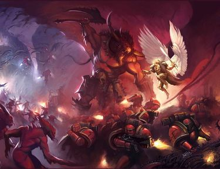
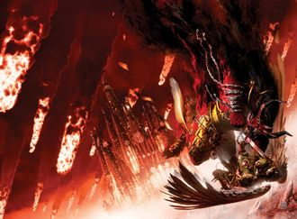
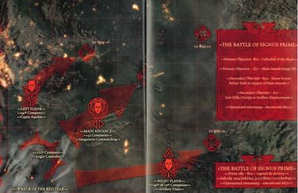

# 0772 005-006.M31 西格纳斯战役 Signus Campaign

精校状态：中文行文已逐段精校，部分术语仍为暂定

分类：时间线

原文来源：https://www.bilibili.com/opus/1196146695441743969

原作者：帝国神选罐头

原文时间：2026年04月28日 09:00

[返回分类目录](目录.md) · [全书目录](../../目录.md)

<!-- A0772-B0001 -->
**英文原文**

The Signus Campaign was a major battle of the Horus Heresy which saw the Blood Angels besieged by the Daemonic hordes of the Bloodthirster Ka'Bandha.

<!-- /A0772-B0001 -->

<!-- A0772-B0002 -->

原译文

西格纳斯战役是荷鲁斯叛乱的一场重大战役，圣血天使被嗜血狂魔卡'班哈的恶魔部落围困。

**校订译文**

西格纳斯战役是荷鲁斯之乱中的一场重大战役，圣血天使在此遭到嗜血狂魔卡’班哈麾下恶魔大军的围攻。

<!-- /A0772-B0002 -->

<!-- A0772-B0003 图片 -->

<!-- A0772-B0004 -->

原译文

Sanguinius and Ka'Bandha battle on Signus Prime 圣吉列斯和卡'班哈在西格纳斯一号上战斗

**校订译文**

Sanguinius and Ka'Bandha battle on Signus Prime 圣吉列斯与卡’班哈在西格纳斯主星交战

<!-- /A0772-B0004 -->

<!-- A0772-B0005 -->
**英文原文**

Conflict:Horus Heresy

<!-- /A0772-B0005 -->

<!-- A0772-B0006 -->

原译文

冲突：荷鲁斯叛乱

**校订译文**

冲突：荷鲁斯之乱。

<!-- /A0772-B0006 -->

<!-- A0772-B0007 -->
**英文原文**

Date:005-006.M31

<!-- /A0772-B0007 -->

<!-- A0772-B0008 -->

原译文

日期：005-006.M31

**校订译文**

日期：005-006.M31

<!-- /A0772-B0008 -->

<!-- A0772-B0009 -->
**英文原文**

Location:Signus Cluster

<!-- /A0772-B0009 -->

<!-- A0772-B0010 -->

原译文

地点：西格纳斯星群

**校订译文**

地点：西格纳斯星群

<!-- /A0772-B0010 -->

<!-- A0772-B0011 -->
**英文原文**

Outcome:Loyalist victory

<!-- /A0772-B0011 -->

<!-- A0772-B0012 -->

原译文

结果：忠诚派胜利

**校订译文**

结果：忠诚派胜利

<!-- /A0772-B0012 -->

<!-- A0772-B0013 -->
**英文原文**

Combatants:Imperium/Forces of Chaos

<!-- /A0772-B0013 -->

<!-- A0772-B0014 -->

原译文

作战方：帝国/混沌部队

**校订译文**

作战方：帝国/混沌部队

<!-- /A0772-B0014 -->

<!-- A0772-B0015 -->
**英文原文**

Commanders:Primarch Sanguinius, First Captain Raldoron, Guard Commander Azkaellon, High Warden Dahka Berus, Captain Nassir Amit, Warden Yason Annellus (KIA), Adjutant Mkani Kano, Apothecary Meros, Admiral Athene DuCade (KIA), Thegn Helik Redknife (KIA), Captain Nakir, Captain Maulgrehn, Captain Jerick Halbeth (KIA), Captain Betric Sizal (KIA), Centurion Aster Crohne, Barbiel, Archmagos Erane Shurol, Custodian Debeeran Kalimakon (WIA)/Bloodthirster Ka'Bandha, Keeper of Secrets Kyriss, Dark Apostle Tanus Kreed (KIA), Centurion Ygethddon

<!-- /A0772-B0015 -->

<!-- A0772-B0016 -->

原译文

指挥官：原体圣吉列斯，第一连长拉多隆，卫队指挥官阿兹凯隆，至高守望者达卡·贝鲁斯，连长纳西尔·阿密特，守望者雅森·安内卢斯(KIA)，副官姆卡尼·卡诺，药剂师梅洛斯，海军上将雅典娜·杜卡德(KIA)，贵族赫尔利克·红刀(KIA)，连长纳基尔，连长莫尔格伦，连长杰里克·哈尔贝斯(KIA)，连长贝特里克·西扎尔(KIA)，百夫长阿斯特·克罗恩，巴比尔，大贤者埃兰·舒罗尔，禁军德比兰·卡利马孔(WIA)/嗜血狂魔卡'班哈，守密者凯瑞斯，黑暗使徒塔努斯·克里德(KIA)，百夫长伊格瑟顿

**校订译文**

指挥官：原体圣吉列斯、第一连长拉多隆、卫队指挥官阿兹卡隆、至高守望者达卡·贝鲁斯、连长纳西尔·阿米特、守望者雅森·安内卢斯（阵亡）、副官姆卡尼·卡诺、药剂师梅洛斯、海军上将雅典娜·杜卡德（阵亡）、领主赫尔利克·红刀（阵亡）、连长纳基尔、连长莫尔格伦、连长杰里克·哈尔贝斯（阵亡）、连长贝特里克·西扎尔（阵亡）、百夫长阿斯特·克罗恩、巴比尔、大贤者埃兰·舒罗尔、禁军德比兰·卡利马孔（负伤）／嗜血狂魔卡’班哈、守密者凯瑞斯、黑暗使徒塔努斯·克里德（阵亡）、百夫长伊格瑟顿。

**校注：** Thegn 为太空野狼职衔，沿第189篇统一领主，区别姓名。

<!-- /A0772-B0016 -->

<!-- A0772-B0017 -->
**英文原文**

Strength:Blood Angels Legion (~120,000 Astartes and 387 Ships), Imperial Armada, 45 Space Wolves, 36 Custodians, 2 Narthex Cull Imperial Army Regiments, 38 Legio Cybernetica Maniples/Daemonic Hordes, Cultists, 3,420 Word Bearers, Task Force Ygethddon (elements of the Sons of Horus, Night Lords and World Eaters)

<!-- /A0772-B0017 -->

<!-- A0772-B0018 -->

原译文

力量：圣血天使军团（约120000名阿斯塔特和387艘舰船），帝国无敌舰队，45名太空野狼，36名禁军，两个捕杀前廊帝国军队兵团，38个智控军团支队/恶魔部落。邪教徒。3420名怀言者，伊格瑟顿特遣部队（荷鲁斯之子、午夜领主和吞世者的成员）

**校订译文**

兵力：圣血天使军团（约十二万名阿斯塔特、三百八十七艘舰船）、帝国无敌舰队、四十五名太空野狼、三十六名禁军、两个纳尔特克斯清剿军团，以及智控军团的三十八个支队／恶魔大军、混沌教徒、三千四百二十名怀言者，以及伊格瑟顿特遣队（包含荷鲁斯之子、午夜领主和吞世者的分遣部队）。

**校注：** Narthex Cull 是帝国军部队专名，暂译纳尔特克斯清剿军；原捕杀前廊按词典硬译，无法清楚辨识军队身份。

<!-- /A0772-B0018 -->

<!-- A0772-B0019 -->
**英文原文**

Casualties:IX legion rendered combat infective: At least 10,000 Blood Angels killed, 88,000 Blood Angels heavily wounded, All Chapter Serfs, All Civilians, All Space Wolves, Nearly all Custodes/All within Signus Cluster killed or sent back to the Warp, Unknown casualties amongst Task Force Ygethddon

<!-- /A0772-B0019 -->

<!-- A0772-B0020 -->

原译文

伤亡：第九军团处于对抗传染：至少10000名圣血天使死亡，88000名圣血天使重伤，所有战团侍从，所有平民，所有太空野狼，几乎所有的禁军/所有在西格纳斯星群内的人都被杀死或送回亚空间，伊格瑟顿特遣部队伤亡人数不详

**校订译文**

损失：第九军团失去战斗力，至少一万名圣血天使阵亡，八万八千人重伤；全部战团农奴、平民及太空野狼死亡，禁军几乎全灭／西格纳斯星群内敌军被杀死或逐回亚空间；伊格瑟顿特遣队损失不详。

**校注：** 英文 combat infective 疑为 combat ineffective，结合重大伤亡表按失去战斗力处理；原对抗传染不成立。

<!-- /A0772-B0020 -->

<!-- A0772-B0021 -->
## Prelude 序曲

<!-- /A0772-B0021 -->

<!-- A0772-B0022 -->
**英文原文**

In an effort to divide the loyalist forces, Horus had dispatched those Legions who could not be swayed to his cause to the furthest reaches of Imperial Space, setting traps for them in the hopes that they would either be destroyed or too bogged down to assist the Emperor until it was too late. However, Horus, with the advice of Erebus, decided that he could use the Blood Angels Gene-seed flaw known as the Red Thirst to his advantage, and have Sanguinius and his Legion fall to Khorne. In truth, however, there was much discord between the Chaos forces on the overall strategy. The Ruinous Powers, the Keeper of Secrets Kyriss, and Word Bearers First Chaplain Erebus wished to convert Sanguinius to their banner while Horus, the Bloodthirster Ka'Bandha, and the Dark Apostle Tanus Kreed saw the Primarch as too steadfast. Instead, they wanted Sanguinius dead and the corrupted Blood Angels brought under the Warmaster's banner. In addition, Horus saw Sanguinius as a potential rival within his own ranks.

<!-- /A0772-B0022 -->

<!-- A0772-B0023 -->

原译文

为了分裂忠诚者军队，荷鲁斯派遣了那些无法动摇的军团前往帝国空域的最远端，为他们设下陷阱，希望他们要么被摧毁，要么陷入困境，无法协助帝皇，直到为时已晚。然而，荷鲁斯在艾瑞巴斯的建议下，决定利用被称为“血渴”的圣血天使基因种子缺陷来为自己谋利，并让圣吉列斯和他的军团堕入恐虐。然而，事实上，混沌部队在总体战略上存在很多分歧。毁灭力量、守密者凯瑞斯和怀言者第一牧师艾瑞巴斯希望将圣吉列斯皈依到他们的旗帜下，而嗜血狂魔卡'班哈和黑暗使徒塔努斯·克里德则认为原体过于坚定。相反，他们希望圣吉列斯死，并将被腐化的圣血天使带到战帅的旗帜下。此外，荷鲁斯将圣吉列斯视为自己在队伍中的潜在对手。

**校订译文**

为分散忠诚派兵力，荷鲁斯将无法拉拢的军团派往帝国疆域最远端，并设下陷阱，企图将他们消灭，或至少拖住他们，使其来不及援助帝皇。听从艾瑞巴斯建议后，他又打算利用圣血天使的基因种子缺陷“血渴”，让圣吉列斯及军团堕向恐虐。但混沌一方对具体目标并不一致：毁灭诸力、守密者凯瑞斯与怀言者首席教士艾瑞巴斯希望拉拢原体；荷鲁斯、卡’班哈和黑暗使徒塔努斯·克里德却认为圣吉列斯过于忠贞，主张杀死他，再将腐化的军团收入战帅麾下。荷鲁斯还担心，这位兄弟一旦加入，会成为自己阵营中的竞争者。

**校注：** 原译漏掉主张杀死圣吉列斯者中的荷鲁斯，此处补足。首句与随后计划内部分歧均按源文保留。

<!-- /A0772-B0023 -->

<!-- A0772-B0024 图片 -->

<!-- A0772-B0025 -->

原译文

Sanguinius vs. Ka'Bandha 圣吉列斯对决卡班哈

**校订译文**

Sanguinius vs. Ka'Bandha 圣吉列斯对决卡’班哈

<!-- /A0772-B0025 -->

<!-- A0772-B0026 -->
**英文原文**

Horus dispatched a Word Bearers detachment under the Word Bearers Chaplain Tanus Kreed to inform the Blood Angels that they had been tasked by the Warmaster with the cleansing of the Signus Cluster, which Horus claimed to be under the control of xenos tyrants known as the Nephilim. Sanguinius had no reason to doubt his brother Primarch and was unaware of the treachery of the Isstvan System, and so it was that he and his walked blindly into the snare set for them. Horus further tempted Sanguinius by stating that the Nephilim may have technology that could cure the Red Thirst. Accompanying the Blood Angels were a small force of Imperial Army and Legio Cybernetica as well as a contingent of Space Wolves. In addition, 3,420 Word Bearers under Tanus Kreed's command were present aboard the Cruiser Dark Page. Meanwhile, the Signus System was overrun after Horus sent the Serpent Lodge Priest Bruja to unleash a vast Daemonic horde by serving as a vessel for the Keeper of Secrets Kyriss the Perverse to enter the Materium.

<!-- /A0772-B0026 -->

<!-- A0772-B0027 -->

原译文

荷鲁斯派遣了一支由怀言者牧师塔努斯·克里德率领的怀言者分谴队，通知圣血天使，他们已被战帅指派清理西格纳斯星群，荷鲁斯声称该星群受被称为拿非利的异型暴君的控制。圣吉列斯没有理由怀疑他的兄弟原体，也不知道伊斯塔万星系的背叛，所以他和他的人盲目地走进了为他们设置的陷阱。荷鲁斯进一步诱惑了圣吉列斯，他说拿非利可能有治疗血渴的技术。伴随着圣血天使的是帝国军队和智控军团的一支小部队，以及一支太空野狼特遣队。此外，塔努斯·克里德指挥的3420名怀言者出现在巡洋舰黑暗之页号上。与此同时，在荷鲁斯派遣蛇屋牧师布鲁贾作为守密者悖逆者凯瑞斯进入物质界的容器，释放了一个庞大的恶魔部落后，西格纳斯星系被攻破。

**校订译文**

荷鲁斯派教士塔努斯·克里德率怀言者分遣队，向圣血天使传达清剿西格纳斯星群的命令。他声称那里受拿非利异形暴君统治，还暗示对方拥有治愈血渴的技术。圣吉列斯既无理由怀疑兄弟，也不知道伊斯塔万的背叛，便率军团踏入圈套。随军还有少量帝国军、智控军团，以及一支太空野狼部队。克里德麾下三千四百二十名怀言者则乘巡洋舰黑暗之页号同行。此前，荷鲁斯已派蛇之结社祭司布鲁贾前往西格纳斯，让其充当守密者悖逆者凯瑞斯进入物质界的容器。庞大的恶魔军势由此被释放，整个星系已经沦陷。

<!-- /A0772-B0027 -->

<!-- A0772-B0028 -->
## The Blooding of Signus 西格纳斯的流血

<!-- /A0772-B0028 -->

<!-- A0772-B0029 -->
**英文原文**

Upon arrival in Signus, the Blood Angels witnessed strange cosmic phenomena. A shadowy membrane covered the entire system to bar their escape, while the planet Phoros fractured into daemonic runes. On Holst, the Blood Angels sent forces to search for human survivors but were beset by creatures of wreckage as derelict hulls in orbit swarmed their fleet and the corrupted world was subjected to Exterminatus. Sanguinius ordered additional expeditions to the inner Signus worlds of Scoltrum and Ta-loc. On Scoltrum, the Blood Angels found vast fires but little signs of life outside of the wreck of the System Defense Frigate Stark Dagger. The Blood Angels 24th Company under Captain Nakir and Cybernetica robots under Archmagos Domina Shroul were sent to investigate and for the first time in the battle encountered Daemons directly. The Imperials conducted a fighting withdrawal. On Ta-loc, the 11th and 94th Companies under Maulgrehn were trapped by Daemonic forces once they ventured underground, causing a desperate fighting retreat that took eight hours. Upon both of these engagements, Sanguinius ordered localized orbital bombardment against their foes but these achieved little.

<!-- /A0772-B0029 -->

<!-- A0772-B0030 -->

原译文

抵达西格纳斯后，圣血天使目睹了奇怪的宇宙现象。一层阴影膜覆盖了整个星系，阻止他们逃离，而弗罗斯行星则分裂成恶魔符文。在霍尔斯特，圣血天使派部队搜寻人类幸存者，但被残骸生物包围，因为轨道上的废弃船体挤满了他们的舰队，腐化的世界遭受了灭绝令。圣吉列斯下令对斯科特鲁姆和塔-洛克的西格纳斯内部世界进行额外的探索。在斯科特鲁姆上，圣血天使在星系防御护卫舰锋利匕首号的残骸外发现了大火，但几乎没有生命迹象。纳基尔连长领导的圣血天使第24连队和统御大贤者舒罗尔领导的智控机兵被派去调查，并在战斗中首次直接遇到了恶魔。帝国进行了战斗撤退。在塔-洛克，莫尔格伦领导的第11和第94连队一冒险进入地下，就被恶魔部队困住，导致了长达8小时的绝望战斗撤退。在这两次交战中，圣吉列斯都下令对敌人进行局部轨道轰炸，但收效甚微。

**校订译文**

抵达西格纳斯后，圣血天使目睹诡异的宇宙现象：一层暗影薄膜笼罩整个星系，封死退路，弗罗斯行星则碎裂排列成恶魔符文。在霍尔斯特，部队寻找人类幸存者时遭残骸构成的怪物围攻，轨道上的废弃船壳也成群扑向舰队，帝国最终对这个腐化世界执行灭绝令。圣吉列斯又派人探索内侧世界斯科特鲁姆与塔-洛克。斯科特鲁姆遍地大火，除星系防御护卫舰锋利匕首号的残骸处外，几乎没有生命迹象。纳基尔率第二十四连，连同大贤者舒罗尔麾下的智控机兵前去调查，首次直接遭遇恶魔，只得边战边退。塔-洛克上，莫尔格伦率第十一及第九十四连进入地下，随即被恶魔困住，经过八小时苦战才撤出。圣吉列斯分别命轨道火力定点轰击两处敌军，却几乎毫无效果。

**校注：** 信息栏 Erane Shurol 与正文 Domina Shroul 疑同一女性机械教大贤者，统一姓名舒罗尔；Domina 未据此等同 Dominus 的统御头衔。

<!-- /A0772-B0030 -->

<!-- A0772-B0031 图片 -->

<!-- A0772-B0032 -->

原译文

The Battle on Signus Prime 西格纳斯一号上的战斗

**校订译文**

The Battle on Signus Prime 西格纳斯主星之战

<!-- /A0772-B0032 -->

<!-- A0772-B0033 -->
**英文原文**

The real crisis, however, began at Signus Prime, where the raw power of the warp was unleashed upon the fleet. Many of the non-space marine crew went mad from exposure, and the Blood Angels were forced to detain them while many more went insane and began killing each other. The Chronometers of the fleet read the insane date of 666666666.M31. In the midst of this, the Keeper of Secrets Kyriss the Perverse sent an image of itself directly into the chamber of Sanguinius, daring the Primarch to attack. The Lord of the Blood Angels rose to the challenge. The Blood Angels fleet was soon assailed by an armada of corpse-vessels, creating a pitched engagement where the Imperials took heavy losses. Shortly after the Imperial Army Admiral Athene DuCade joined those who lost their sanity, and plunged the Blood Angels flagship Red Tear into the planet. Sanguinius steered the Red Tear into a rough emergency landing, and unleashed the fury of his Legion upon Signus Prime, personally leading his elite companies in an assault on Kyriss's palace known as the Cathedral of the Mark. As the Blood Angels were beset by vast Daemonic legions, treacherous Word Bearers, and human Chaos Cultists, Chapter Master Raldoron and Apothecary Meros led the assault on the Cathedral. The Cathedral could not be targeted by the orbiting Heavy Cruiser Scarlet Liberty, its sensors and targeting arrays jamming whenever it attempted to lock onto the position.

<!-- /A0772-B0033 -->

<!-- A0772-B0034 -->

原译文

然而，真正的危机始于西格纳斯一号，亚空间的原始力量被释放到舰队上。许多非星际战士船员因暴露而发疯，圣血天使被迫拘留他们，而更多的人则发疯并开始互相残杀。舰队的计时器显示疯狂的日期为666666.666.M31。在此过程中，守密者悖逆者凯瑞斯将自己的形象直接发送到圣吉列斯的房间里，大胆地攻击原体。圣血天使之主奋起迎接挑战。圣血天使舰队很快遭到一支死尸舰队的袭击，引发了一场激烈的交战，帝国遭受了重大损失。不久之后，帝国军队海军上将雅典娜·杜卡德加入了那些失去理智的人，并将圣血天使旗舰红泪号投入了行星。圣吉列斯带领红泪号进行了艰难的紧急降落，并向西格纳斯一号释放了他的军团之怒，亲自带领他的精英连队袭击了凯瑞斯的宫殿，即标记大教堂。当圣血天使被庞大的恶魔军团、背叛的怀言者和人类混沌邪教徒包围时，战团长拉多隆和药剂师梅洛斯领导了对大教堂的袭击。大教堂无法被轨道上的重型巡洋舰猩红自由号瞄准，每当它试图锁定位置时，它的传感器和瞄准阵列都会被干扰。

**校订译文**

真正的危机发生在西格纳斯主星。原始亚空间力量袭向舰队，许多凡人船员因此疯狂。圣血天使被迫将其拘禁，但更多人仍不断失控，开始自相残杀。舰队计时器甚至显示出荒诞的日期：666666666.M31。此时，悖逆者凯瑞斯将影像投进圣吉列斯的房间，挑衅原体前来进攻，圣血天使之主接受了挑战。一支尸骸舰队随即袭来，双方激战，帝国损失惨重。不久，帝国军海军上将雅典娜·杜卡德也陷入疯狂，驾驶旗舰红泪号冲向星球。圣吉列斯接手操纵，勉强让战舰迫降，随即率精锐连队向凯瑞斯的宫殿——印记大教堂——发动进攻。恶魔军团、叛变怀言者与人类混沌教徒四面围攻，拉多隆战团长和药剂师梅洛斯则引领对教堂的突击。轨道上的重型巡洋舰猩红自由号无法提供定点支援：每当瞄准教堂，传感器与目标锁定阵列就会受到干扰。

**校注：** daring the Primarch to attack 是挑衅原体进攻，非凯瑞斯立即攻击。原文异常日期九个6原样保留，中文不擅改格式。

<!-- /A0772-B0034 -->

<!-- A0772-B0035 -->
**英文原文**

As Sanguinius and his forces neared the palace of Kyriss the Perverse, a massive daemon the colour of dried blood rose to meet him. Its name was Ka'Bandha, Greater Daemon of Khorne. Ka'Bandha attempted to coerce Sanguinius to the cause of Khorne, but the Lord of the Blood Angels could not be swayed, and attacked the Bloodthirster. He dealt the daemon a vicious wound, but was in turn cast to the ground, his legs crushed by the coils of the beast's whip. As he watched, helpless, Ka'Bandha slaughtered his way through the Blood Angels, killing over 500 of them as he summoned a swarm of malignant energy generated from the device known as the Ragefire, which corrupted the planet. The massive psychic trauma knocked Sanguinius into unconsciousness, and unlocked something dark within the members of his Legion.

<!-- /A0772-B0035 -->

<!-- A0772-B0036 -->

原译文

当圣吉列斯和他的部队接近悖逆者凯瑞斯的宫殿时，一个巨大的干血颜色的恶魔向他走来。它的名字叫卡'班哈，恐虐大魔。卡'班哈试图强迫圣吉列斯加入恐虐的事业，但圣血天使之主无法动摇，并袭击了嗜血狂魔。他狠狠地击伤了恶魔，但又被击倒在了地上，他的腿被野兽的鞭子打得粉碎。当他无助地看着卡'班哈屠杀圣血天使，杀死了500多人，同时他召唤了一股由被称为怒焰的装置产生的恶性能量，这股能量破坏了行星。巨大的灵能创伤使圣吉列斯陷入昏迷，并解锁了他军团成员内心的黑暗。

**校订译文**

接近凯瑞斯宫殿时，一头浑身暗如凝血的巨魔迎向圣吉列斯：恐虐大魔卡’班哈。它试图迫使原体投向恐虐，却无法动摇他。圣吉列斯主动攻击，重创嗜血狂魔，却随即被摔倒，双腿遭长鞭缠住压碎。他只能眼看恶魔屠杀子嗣。卡’班哈从腐化星球的装置“愤怒之火”中引出恶毒能量，一举杀死五百多名圣血天使。巨大的灵能创伤令圣吉列斯昏迷，也释放了军团成员心中潜藏的黑暗。

<!-- /A0772-B0036 -->

<!-- A0772-B0037 -->
## Angel's Fury 天使之怒

<!-- /A0772-B0037 -->

<!-- A0772-B0038 -->
**英文原文**

With the fall of their Lord and the butchering of their brethren, the Blood Angels were consumed by a dark rage that drove them into the daemonic horde with a berserker's fury known as the Red Thirst. In their rage, Blood Angels led by Nassir Amit massacred the Space Wolves attached to the Blood Angels Expeditionary Fleet as well as remaining Human Cultists and Word Bearers. A few members of the chapter such as a group of former Librarians led by Mkani Kano were able to resist the Red Thirst and reawakened Sanguinius by using a method forbidden by the Council of Nikea. Sanguinius recovered and, despite his injuries, met Ka'Bandha for a second round of combat, this time succeeding in banishing the Daemon back to the Warp.

<!-- /A0772-B0038 -->

<!-- A0772-B0039 -->

原译文

随着他们的领主的倒下和他们兄弟的被屠杀，圣血天使被一种黑暗的愤怒所吞噬，这种愤怒驱使他们以一种被称为血渴的狂暴的愤怒进入了恶魔部落。在他们的愤怒中，由纳西尔·阿密特领导的圣血天使屠杀了附属于圣血天使远征舰队的太空野狼，以及剩下的人类邪教徒和怀言者。战团的一些成员，如姆卡尼·卡诺领导的一群前智库，能够抵抗血渴，并通过使用尼凯亚议会禁止的方法重新唤醒了圣吉列斯。圣吉列斯康复了，尽管受了伤，他还是与卡'班哈进行了第二轮战斗，这次成功地将恶魔放逐回了亚空间。

**校订译文**

原体倒下，兄弟横死，圣血天使陷入血渴，以狂战士般的怒火杀进恶魔大军。纳西尔·阿米特率领的战士不但屠杀残余人类教徒与怀言者，也杀光了配属远征舰队的太空野狼。只有少数人抵抗住了血渴，其中包括姆卡尼·卡诺率领的前智库。他们动用尼凯亚会议明令禁止的技法，重新唤醒圣吉列斯。原体恢复意识后，带伤再战卡’班哈，终于将其逐回亚空间。

**校注：** 本篇明确写 Red Thirst，按血渴照译；不因描写愤怒而擅自换成黑怒。

<!-- /A0772-B0039 -->

<!-- A0772-B0040 -->
**英文原文**

Meanwhile, Signus Prime was utterly purged by the rampaging Blood Angels, but it was only after every daemon and cultist had been slain that the Blood Angels regained their senses. But Kyriss the Perverse still hoped to turn Sanguinius and offered him a deal: if the Primarch would give himself fully to the Ragefire, he would ensure that the Legion would be cured of the Red Thirst at last. Sanguinius, deciding to accept the sacrifice for the sake of his sons, was about to step into the Ragefire before Meros beat him to it. Kyriss was banished back to the Warp in failure while Meros was transformed into the Red Angel.

<!-- /A0772-B0040 -->

<!-- A0772-B0041 -->

原译文

与此同时，西格纳斯一号被狂暴的圣血天使彻底清除，但只有在每个恶魔和邪教徒都被杀死后，圣血天使才恢复了理智。但悖逆者凯瑞斯仍然希望让圣吉列斯屈服，并向他提出了一个协议：如果原体将自己完全交给怒焰，他将确保军团最终治愈血渴。圣吉列斯决定为了他的子嗣接受牺牲，在梅洛斯抢先一步之前，他正要踏入怒焰。凯瑞斯在失败中被驱逐回亚空间，而梅洛斯则被变成了红天使。

**校订译文**

狂暴的圣血天使将西格纳斯主星彻底清剿，直到恶魔与教徒全部被杀，他们才恢复理智。但凯瑞斯仍未放弃，向圣吉列斯提出交易：只要原体完全投入愤怒之火，它就保证治好军团的血渴。圣吉列斯愿为子嗣牺牲，正要迈入其中，梅洛斯却抢先一步。计划失败的凯瑞斯被放逐回亚空间，梅洛斯则化为红天使。

**校注：** 原文前称所有恶魔已被杀，后仍有凯瑞斯提出交易，叙述范围有含混；保留原文顺序，不自行添加其复活情节。

<!-- /A0772-B0041 -->

<!-- A0772-B0042 -->
**英文原文**

The immutable wrath of the Blood Angels had left a shadow across the minds of the survivors who were able to raise the Red Tear and leave the planet. Signus Prime became forever a place of darkness in their memories.

<!-- /A0772-B0042 -->

<!-- A0772-B0043 -->

原译文

圣血天使永恒的愤怒在幸存者的脑海中留下了阴影，他们能够升起红泪号离开这个行星。西格纳斯一号在他们的记忆中永远是一个黑暗的地方。

**校订译文**

这场难以遏制的狂怒在幸存者心中留下长久阴影。他们终于使红泪号重新升空，离开星球，但西格纳斯主星从此成为记忆中永远黑暗的地方。

<!-- /A0772-B0043 -->

<!-- A0772-B0044 -->
**英文原文**

The Blood Angels then had to contend with the Traitor forces of Task Force Ygethddon, which had been charged with keeping them imprisoned within the Signus Cluster. The Legion ultimately escaped, however, though the Task Force's interdiction of the Cluster later succeeded in destroying several other Loyalist Legionary forces.

<!-- /A0772-B0044 -->

<!-- A0772-B0045 -->

原译文

然后，圣血天使不得不与伊格瑟顿特遣部队的叛徒部队作战，该部队被命令将他们囚禁在西格纳斯星群内。然而，军团最终逃脱了，尽管特遣部队对星群的封锁后来成功摧毁了其他几支忠诚派军团部队。

**校订译文**

圣血天使随后还须突破伊格瑟顿特遣队的封锁。该叛军部队奉命将他们困在西格纳斯星群，军团最终仍成功脱身；不过，这道封锁后来又摧毁了其他数支忠诚军团的分遣部队。

<!-- /A0772-B0045 -->

<!-- A0772-B0046 -->
## Aftermath 余波

<!-- /A0772-B0046 -->

<!-- A0772-B0047 -->
**英文原文**

The aftermath of the battle saw great fury from Horus, who for the first time tasted true defeat. Unlike at Isstvan III and Isstvan V where he had emerged victorious, and unlike at Calth where the Word Bearers still had achieved their ultimate objective despite a tactical loss, at Signus Prime nothing had been achieved. The Blood Angels had overcome all set before them and Sanguinius remained true to the Emperor. In his rage, Erebus chastised Horus for the plan's failure and the enraged Warmaster flayed the skin off his face with his own hands.

<!-- /A0772-B0047 -->

<!-- A0772-B0048 -->

原译文

这场战役的余波让荷鲁斯怒不可遏，他第一次尝到了真正的失败。与伊斯塔万三号和伊斯塔万五号不同，在那里他取得了胜利，也与考斯不同，在考斯，尽管战术上失败了，但怀言者仍然实现了他们的最终目标，而在西格纳斯一号，什么都没有实现。圣血天使已经克服了他们面前的一切，圣吉列斯仍然忠于帝皇。艾瑞巴斯愤怒地斥责荷鲁斯计划的失败，愤怒的战帅用自己的手剥掉了他脸上的皮肤。

**校订译文**

战役结果令荷鲁斯震怒，这是他第一次尝到彻底失败的滋味。伊斯塔万三号与五号至少赢了，考斯虽战术失利，怀言者也完成了最终目标；西格纳斯却一无所获。圣血天使克服所有陷阱，圣吉列斯仍忠于帝皇。艾瑞巴斯怒斥荷鲁斯，指责他导致计划失败；盛怒的战帅则亲手剥下了他的面皮。

<!-- /A0772-B0048 -->

本篇核心术语与暂定项

以下列出本篇出现的英文原形及核心术语表用词。同形词可能指不同对象，具体词义以本篇正文和校注为准；单复数、别名和仅见于图注的名称可能尚未列入。完整候选见[术语表](../../术语表/双语术语候选.csv)。

| 英文 | 采用中文 | 状态 |
| --- | --- | --- |
| Blood Angels | 圣血天使 | 官方已核对 |
| Space Wolves | 太空野狼 | 官方已核对 |
| Imperial Army | 帝国军 | 暂定·官方待核 |
| World Eaters | 吞世者 | 官方已核对 |
| Horus Heresy | 荷鲁斯之乱 | 官方已核对 |
| Warp | 亚空间 | 官方已核对 |
| Imperium | 帝国 | 暂定·简称 |
| Legio Cybernetica | 智控军团 | 暂定 |
| Khorne | 恐虐 | 官方已核对 |
| Emperor | 帝皇 | 官方已核对 |
| Primarch | 原体 | 官方已核对 |
| Word Bearers | 怀言者 | 暂定·官方待核 |
| Dark Apostle | 黑暗使徒 | 官方已核对 |
| Night Lords | 午夜领主 | 暂定·官方待核 |
| Horus | 荷鲁斯 | 暂定·官方待核 |
| Erebus | 艾瑞巴斯 | 暂定·官方待核 |
| Sons of Horus | 荷鲁斯之子 | 暂定·官方待核 |
| Isstvan III | 伊斯塔万三号 | 暂定·官方待核 |
| Calth | 考斯 | 暂定·官方待核 |
| Master | 导师（审判庭职衔）／舰务官（舰员职务） | 语境定译·官方待核 |
| Chaplain | 教士 | 官方已核对 |
| Apothecary | 药剂师 | 官方已核对 |
| Archmagos Domina | 统御大贤者 | 暂定·官方待核 |
| Serpent Lodge | 蛇之结社 | 暂定·官方待核 |
| Isstvan | 伊斯塔万 | 暂定·官方待核 |
| First Captain | 第一连长 | 暂定·官方待核 |
| Raldoron | 拉多隆 | 暂定·官方待核 |
| Azkaellon | 阿兹卡隆 | 暂定·官方待核 |
| Dahka Berus | 达卡·贝鲁斯 | 暂定·官方待核 |
| Thegn | 领主 | 暂定·官方待核 |
| Aster Crohne | 阿斯特·克罗恩 | 暂定·官方待核 |
| Space Marine | 星际战士 | 暂定·官方待核 |
| Chapter | 战团 | 暂定·官方待核 |
| Chapter Master | 战团长 | 暂定·官方待核 |
| Captain | 连长 | 暂定·官方待核 |
| Brother | 修士 | 暂定·官方待核 |
| Gene-seed | 基因种子 | 暂定·官方待核 |
| Chapter serfs | 战团农奴 | 暂定·官方待核 |
| Cathedral of the Mark | 印记大教堂 | 暂定·官方待核 |
| Powers | 能天使 | 暂定·官方待核 |
| Xenos | 异形 | 暂定·官方待核 |
| Nassir Amit | 纳西尔·阿米特 | 暂定·官方待核 |
| Keeper of Secrets | 守密者 | 官方已核对 |
| Bloodthirster | 嗜血狂魔 | 官方已核对 |
| Ruinous Powers | 毁灭诸力 | 暂定·官方待核 |
| Horde | 部落 | 暂定·官方待核 |
| The Beast | 野兽 | 暂定·官方待核 |
| Red Tear | 红泪号 | 暂定·官方待核 |
| Barbiel | 巴比尔 | 暂定·官方待核 |
| First Chaplain | 首席教士 | 暂定·官方待核 |
| The Dark | 《黑暗》 | 暂定·官方待核 |
| The Blood | 鲜血 | 暂定·官方待核 |
| Ragefire | 愤怒之火 | 暂定·官方待核 |
| Signus Cluster | 西格纳斯星群 | 暂定·官方待核 |
| System | 星系（恒星系统） | 暂定·官方待核 |
| Kyriss the Perverse | 悖逆者凯瑞斯 | 暂定·官方待核 |
| Kyriss | 凯瑞斯 | 暂定·官方待核 |
| Meros | 梅洛斯 | 暂定·官方待核 |
| Yason Annellus | 雅森·安内卢斯 | 暂定·官方待核 |
| Mkani Kano | 姆卡尼·卡诺 | 暂定·官方待核 |
| Athene DuCade | 雅典娜·杜卡德 | 暂定·官方待核 |
| Helik Redknife | 赫尔利克·红刀 | 暂定·官方待核 |
| Nakir | 纳基尔 | 暂定·官方待核 |
| Maulgrehn | 莫尔格伦 | 暂定·官方待核 |
| Jerick Halbeth | 杰里克·哈尔贝斯 | 暂定·官方待核 |
| Betric Sizal | 贝特里克·西扎尔 | 暂定·官方待核 |
| Debeeran Kalimakon | 德比兰·卡利马孔 | 暂定·官方待核 |
| Tanus Kreed | 塔努斯·克里德 | 暂定·官方待核 |
| Ygethddon | 伊格瑟顿 | 暂定·官方待核 |
| Narthex Cull | 纳尔特克斯清剿军 | 暂定·官方待核 |
| Dark Page | 黑暗之页号 | 暂定·官方待核 |
| Bruja | 布鲁贾 | 暂定·官方待核 |
| Holst | 霍尔斯特 | 暂定·官方待核 |
| Scoltrum | 斯科特鲁姆 | 暂定·官方待核 |
| Ta-Loc | 塔-洛克 | 暂定·官方待核 |
| Stark Dagger | 锋利匕首号 | 暂定·官方待核 |
| Scarlet Liberty | 猩红自由号 | 暂定·官方待核 |
| Signus Prime | 西格纳斯主星 | 暂定·官方待核 |

