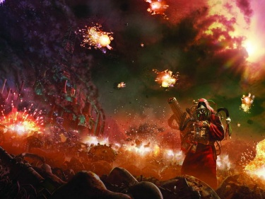

# 0773 005-006.M31 火星大分裂 Schism of Mars

精校状态：中文行文已逐段精校，部分术语仍为暂定

分类：时间线

原文来源：https://www.bilibili.com/opus/1196654412159778835

原作者：帝国神选罐头

原文时间：2026年04月29日 17:50

[返回分类目录](目录.md) · [全书目录](../../目录.md)

原篇名：005-006.M31 火星分裂 Schism of Mars

<!-- A0773-B0001 -->
**英文原文**

The Schism of Mars is the name given to the civil war that erupted on Mars during the early stages of the Horus Heresy. The schism involved all Martian forces, civil and military, from lowly menial through Knight and Titan orders right up to the most senior Mechanicum personnel, as well as drawing in Space Marines and units of the Imperial Army.

<!-- /A0773-B0001 -->

<!-- A0773-B0002 -->

原译文

火星分裂是指荷鲁斯叛乱早期在火星上爆发的内战。分裂涉及所有火星部队，无论是平民还是军事，从卑微的仆人到骑士和泰坦修会，再到最高级的机械教人员，以及星际战士和帝国军队的单位。

**校订译文**

火星大分裂是荷鲁斯之乱初期在火星爆发的内战。它席卷火星全部军民，从最卑微的杂役，到骑士家族、泰坦军团，直至机械教最高层，无不卷入其中；星际战士与帝国军也参与了战斗。

<!-- /A0773-B0002 -->

<!-- A0773-B0003 图片 -->

<!-- A0773-B0004 -->

原译文

Battlefield Mars 火星战场

**校订译文**

Battlefield Mars 火星战场

<!-- /A0773-B0004 -->

<!-- A0773-B0005 -->
**英文原文**

Conflict:Horus Heresy

<!-- /A0773-B0005 -->

<!-- A0773-B0006 -->

原译文

冲突：荷鲁斯叛乱

**校订译文**

冲突：荷鲁斯之乱。

<!-- /A0773-B0006 -->

<!-- A0773-B0007 -->
**英文原文**

Date:005-006.M31

<!-- /A0773-B0007 -->

<!-- A0773-B0008 -->

原译文

日期：005-006.M31

**校订译文**

日期：005-006.M31

<!-- /A0773-B0008 -->

<!-- A0773-B0009 -->
**英文原文**

Location:Mars

<!-- /A0773-B0009 -->

<!-- A0773-B0010 -->

原译文

地点：火星

**校订译文**

地点：火星

<!-- /A0773-B0010 -->

<!-- A0773-B0011 -->
**英文原文**

Outcome:Traitor victory, Mars blockaded from 006-015.M31

<!-- /A0773-B0011 -->

<!-- A0773-B0012 -->

原译文

结果：叛徒胜利，火星在006-015.M31期间被封锁

**校订译文**

结果：叛徒胜利，火星在006-015.M31期间被封锁

<!-- /A0773-B0012 -->

<!-- A0773-B0013 -->
**英文原文**

Combatants:Martian Mechanicum, Imperium/New Mechanicum

<!-- /A0773-B0013 -->

<!-- A0773-B0014 -->

原译文

作战方：火星机械教，帝国/新机械教

**校订译文**

作战方：火星机械教，帝国/新机械教

<!-- /A0773-B0014 -->

<!-- A0773-B0015 -->
**英文原文**

Commanders:Fabricator-Locum Kane, Adept Koriel Zeth (KIA), Adept Ipluvien Maximal (KIA), First Captain Sigismund, Captain Camba-Diaz, Marshal Serban Oachar, Legate-Marshal Mera Devallis, Princeps Indias Cavalerio (KIA), Lord Commander Taymon Verticorda (KIA), Shield Captain Morvae Arcas/Fabricator-General Kelbor-Hal, Adept Urtzi Malevolus, Adept Lukas Chrom, Adept Regulus, Ambassador Melgator (KIA), Princeps Camulos (KIA)

<!-- /A0773-B0015 -->

<!-- A0773-B0016 -->

原译文

指挥官：铸造代理凯恩，专家科瑞尔·泽斯(KIA)，专家伊普露维恩·马克西姆(KIA)，第一连长西吉斯蒙德，连长坎巴-迪亚兹，元帅塞尔班·奥查尔，使节元帅梅拉·德瓦利斯，首席印迪亚斯·卡瓦莱里奥(KIA)，领主指挥官泰蒙·维蒂科达(KIA)，盾卫连长莫尔维·阿卡斯/铸造将军凯尔博-哈尔，专家乌尔齐·马勒沃卢斯，专家卢卡斯·克罗姆，专家雷古勒斯，大使梅尔加托(KIA)，首席卡姆洛斯(KIA)

**校订译文**

指挥官：铸造代理凯恩、技术专家科瑞尔·泽斯（阵亡）、技术专家伊普露维恩·马克西姆（阵亡）、第一连长西吉斯蒙德、连长坎巴·迪亚兹、元帅塞尔班·奥查尔、使节元帅梅拉·德瓦利斯、首席印迪亚斯·卡瓦莱里奥（阵亡）、领主指挥官泰蒙·维蒂科达（阵亡）、盾卫连长莫尔维·阿卡斯／铸造将军凯尔博·哈尔、技术专家乌尔齐·马勒沃尔斯、技术专家卢卡斯·克罗姆、技术专家雷古勒斯、大使梅尔加托（阵亡）、首席卡姆洛斯（阵亡）。

<!-- /A0773-B0016 -->

<!-- A0773-B0017 -->
**英文原文**

Strength:Mechanicum Protectors, Skitarii, Various Titan Legions (Legio Tempestus, Deathbolts, and others), Knights of Taranis, Imperial Fists (4 Companies), Saturnyne Rams (13 Companies), Jovian Grenadiers (4 Regiments), Crimson Nova, 32 Custodian Guard/Mutated Protectors, Mutated Traitor Skitarii, Servitors, Various Titan Legions (Legio Mortis, Death Stalkers, Legio Magna, Burning Stars, and others), Various non-standard war machines (Ordinati and others), Robots, The Kaban Machine (KIA), Alpha Legion elements, Traitorous Iron Hands

<!-- /A0773-B0017 -->

<!-- A0773-B0018 -->

原译文

力量：机械教保护者，护教军，多个泰坦军团（暴风军团，死亡闪电和其他），塔兰尼斯骑士，帝国之拳（四个连队），土星公羊（13个连队），木星掷弹兵（四个兵团），深红新星，32名禁军/变异保护者，变异叛徒护教军，机仆，多个泰坦军团（死亡军团，死亡追猎者，宏伟军团，燃烧群星和其他），许多非标准战争机械（将军炮和其他），机兵，卡班机械(KIA)，阿尔法军团成员，叛徒钢铁之手

**校订译文**

兵力：机械教卫士、护教军、多支泰坦军团（包括暴风军团、死亡闪电等）、塔兰尼斯骑士、四个帝国之拳连、十三个土星公羊连、四个木星掷弹兵团、深红新星及三十二名禁军／变异机械教卫士、叛乱变异护教军、机仆、多支泰坦军团（包括死亡军团、死亡追猎者军团、宏伟军团、燃烧群星等）、将军炮等非标准战争机器、机兵、卡班机械（被毁）、阿尔法军团分遣队及叛变钢铁之手。

<!-- /A0773-B0018 -->

<!-- A0773-B0019 -->
**英文原文**

Casualties:Significant; field abandoned/Significant

<!-- /A0773-B0019 -->

<!-- A0773-B0020 -->

原译文

伤亡：重大；场地被放弃/重大

**校订译文**

损失：忠诚派伤亡惨重，最终放弃战场／叛军伤亡惨重。

<!-- /A0773-B0020 -->

<!-- A0773-B0021 -->
## History 历史

<!-- /A0773-B0021 -->

<!-- A0773-B0022 -->
## Prelude 序曲

<!-- /A0773-B0022 -->

<!-- A0773-B0023 -->
**英文原文**

The Martian Schism originated in a climate of discontent; relations between various Magi were in a condition of tension, with outbreaks of violence and espionage leading to even the Titan Legions being suspected of secretly taking sides in potential hostilities. For years, factions on Mars had bitterly argued over the nature of the Omnissiah, with many believing the Emperor to be its avatar. However a large faction led by Fabricator-General Kelbor-Hal maintained the Emperor a false idol and the manifestation of the Omnissiah had yet to arrive. More importantly, Kelbor-Hal harbored great resentment to Emperor for his conversion of Mars into an arms factory for the Great Crusade and his ban on certain types of technological research (such as artificial intelligence). Into this situation came Regulus, Mechanicum representative to Warmaster Horus. By this point in history, the Warmaster had already settled upon his course of rebellion and had secretly gained the tentative support of the Mechanicum through Regulus and his connection to Kelbor-Hal, the Fabricator-General. Regulus' visit to Mars at this juncture was to demonstrate the commitment of Horus to the alliance with the Mechanicum and the advantages to siding with the Warmaster against Imperial rule. As a result of the information provided by Horus and carried by Regulus, Kelbor-Hal was able to open a long-sequestered area of Mars known as the Vaults of Moravec.

<!-- /A0773-B0023 -->

<!-- A0773-B0024 -->

原译文

火星分裂起源于不满的气氛；各个贤者之间的关系处于紧张状态，暴力和间谍活动的爆发甚至导致泰坦军团被怀疑在潜在的敌对行动中秘密站队。多年来，火星上的派系一直在激烈争论欧姆尼赛亚的性质，许多人认为帝皇是它的化身。然而，由铸造将军凯尔博-哈尔领导的一个大派系认为帝皇是一个虚假的偶像，欧姆尼赛亚的显现尚未到来。更重要的是，凯尔博-哈尔对帝皇将火星转变为大远征的兵工厂以及禁止某些类型的技术研究（如人工智能）感到非常不满。战帅荷鲁斯的机械教代表雷古勒斯也加入了这一行列。在历史上的这一时刻，战帅已经决定了他的叛乱路线，并通过雷古勒斯和他与铸造将军凯尔博·哈尔的关系，秘密地获得了机械教的初步支持。雷古勒斯在这个时刻访问火星，是为了证明荷鲁斯对与机械教结盟的承诺，以及支持战帅对抗帝国统治的优势。由于荷鲁斯提供并由雷古勒斯携带的信息，凯尔博-哈尔得以在火星上开辟一个长期隔离的区域，称为莫拉维克密库。

**校订译文**

火星大分裂酝酿于日益加剧的不满之中。贤者之间关系紧张，暴力与间谍活动频发，连泰坦军团都被怀疑正在暗中选边，准备应对潜在战争。多年来，各派围绕欧姆尼赛亚的本质激烈争论：许多人相信帝皇正是其化身，铸造将军凯尔博·哈尔率领的大派系却视帝皇为虚假偶像，认为欧姆尼赛亚仍未降临。凯尔博·哈尔尤其憎恨帝皇将火星变成大远征的兵工厂，并禁止人工智能等领域的研究。在这种局面下，机械教驻战帅荷鲁斯处的代表雷古勒斯返回火星。荷鲁斯此时已决意叛乱，通过雷古勒斯与凯尔博·哈尔的关系，秘密取得机械教的初步支持。此次来访，就是要证明战帅结盟的诚意，以及支持他反抗帝国统治的好处。雷古勒斯带来荷鲁斯提供的信息，使凯尔博·哈尔得以开启封存已久的莫拉维克秘库。

**校注：** Vaults of Moravec 沿本线770莫拉维克秘库；不再在秘／密字间漂移。

<!-- /A0773-B0024 -->

<!-- A0773-B0025 -->
**英文原文**

The Vaults of Moravec were a repository of forbidden knowledge, ordered sealed by the Emperor himself. It soon became clear that the information and industry stored within the Vaults were corrupted by the influence of Chaos. With the opening of the Vaults, this corruption spread across Mars in a peculiarly literal way; as scrapcode. This viral information infection managed to penetrate systems and facilities all across the Martian industrial landscape, causing literal chaos wherever it struck. As a result of the scrapcode infestation, communication across and off-planet was severely disrupted and many essential industries sabotaged. A period of general confusion followed, which the Fabricator-General and his allies used to marshal their forces, intent on making sure the whole of Mars was firmly under their rule. This proved to be somewhat more troublesome than they had anticipated. Several areas of Mars remained relatively uninfected by scrapcode, insulated against the assault by their early adoption of a new, far more secure information network; the noosphere. Three of these areas were the Forges of Koriel Zeth, Ipluvien Maximal, and Fabricator-Locum Kane, who would go on to become the leaders of those resisting sublimation into Kelbor-Hal's new Dark Mechanicum.

<!-- /A0773-B0025 -->

<!-- A0773-B0026 -->

原译文

莫拉维克密库是一个被禁止的知识库，由帝皇亲自下令密封。很快，人们就清楚了，存储在密库中的信息和工业受到了混沌的影响。随着密库的开放，这种腐化以一种特别字面的方式在火星上蔓延；作为废码。这种病毒性的信息感染设法渗透到整个火星工业全景的系统和设施中，在任何地方都造成了混乱。由于废码泛滥，行星内外的通信严重中断，许多重要工业遭到破坏。随后是一段普遍的混乱时期，铸造将军和他的盟友利用这段时间来组织他们的部队，意图确保整个火星都牢牢地处于他们的统治之下。事实证明，这比他们预期的要麻烦得多。火星上的几个地区仍然相对没有受到废码的感染，通过早期采用一个新的、更安全的信息网络：智能圈，它们得以免受攻击。其中三个地区是科瑞尔·泽斯、伊普露维恩·马克西姆和铸造代理凯恩的铸造厂，他们将继续成为那些抵抗纯化为凯尔博-哈尔新的黑暗机械教的领导人。

**校订译文**

莫拉维克秘库储存着禁忌知识，曾由帝皇亲自下令封闭。很快，人们发现其中的数据与技术设施已受混沌污染。封印解除后，这种腐化以“废码”的形式直接蔓延到火星各地。病毒般的信息感染侵入工业系统与设施，所到之处一片混乱；星球内外通信严重中断，许多关键工业系统瘫痪。铸造将军与盟友趁乱集结军队，准备将整个火星牢牢控制在手中。但事情并不如他们预想顺利。一些地区较早采用了安全性高得多的新型信息网络“思维空间”，因此避过大部分废码感染。科瑞尔·泽斯、伊普露维恩·马克西姆与铸造代理凯恩的铸造设施就在其中。三人后来成为抵抗领袖，拒绝被凯尔博·哈尔新建的黑暗机械教吞并。

**校注：** sublimation into 此处指被新派系吸纳吞并，不是纯化。Noosphere 依第451篇思维空间统一。

<!-- /A0773-B0026 -->

<!-- A0773-B0027 -->
## The Death of Innocence 纯真之死

原题：The Death of Innocence 无罪之死

**校注：** Death of Innocence 暂译纯真之死，比原无罪之死更符合信任与无知终结的事件语境；非官方译名。

<!-- /A0773-B0027 -->

<!-- A0773-B0028 -->
**英文原文**

While the opening shots had already been fired when the Kaban Machine of Lukas Chrom destroyed a reactor complex belonging to loyalist Adept Ipluvien Maximal, it still took a short while before open civil war began. Requiring at least a pretense to march to war, Kelbor-Hal and his allies attempted to provoke those unwilling to join them, employing various acts of sabotage, assassination and outright aggression - as when the Dark Mechanicum-aligned Legio Mortis attempted to goad Legio Tempestus into opening fire first by entering Tempestus territory and refusing to answer hails.

<!-- /A0773-B0028 -->

<!-- A0773-B0029 -->

原译文

虽然卢卡斯·克罗姆的卡班机械摧毁了属于忠诚者专家伊普露维恩·马克西姆的反应堆建筑群时，已经打响了第一枪，但内战爆发前还花了很短的时间。凯尔博-哈尔和他的盟友至少需要一个借口才能发展战争，他们试图挑衅那些不愿意加入他们的人，采取各种破坏、暗杀和公然侵略行为 — 就像与黑暗机械教结盟的死亡军团试图通过进入暴风军团的领地并拒绝回应招呼来刺激暴风军团首先开火一样。

**校订译文**

卢卡斯·克罗姆的卡班机械摧毁忠诚技术专家伊普露维恩·马克西姆的一座反应堆群，实际上已经打响战争第一枪；但公开内战又过了一阵才爆发。凯尔博·哈尔及盟友仍需要一个表面借口，便以破坏、暗杀和直接侵袭等方式，挑衅不肯加入他们的派系。例如，支持黑暗机械教的死亡军团闯入暴风军团领地，拒绝回应呼叫，企图逼对方率先开火。

<!-- /A0773-B0029 -->

<!-- A0773-B0030 -->
**英文原文**

Eventually the pretence Kelbor-Hal required was given to him by Koriel Zeth, Mistress of the Magma City, when she declared non-belief in the Machine God (while this was her belief, she was still loyal to Terra). The Dark Mechanicum went to war against the Magma City, bringing war to Mars as those pledged to Kelbor-Hal and Horus attacked those pledged to Terra and the Emperor. The Magna Legion assaulted the Noachis region and reduced its libraries and forges to slag. North in the Arabian region, High Magos Ahotep's forge-city in the Cassini crater was struck by a hundred nuclear missiles launched from traitor silos. Along the Lunae Palus and Arcadia regions, the Death Stalkers assaulted the fortress of Maxen Vledig's Deathbolts. Caught by surprise, the Deathbolts lost 19 Titans in the first hour and withdrew to Mare Boreum where they were quickly besieged. At the Athabasca Valles the Legio Ignatum and Burning Stars fought to a stalemate in bloody close-ranged combat. Kelbor-Hal himself soon unleashed his twisted Skitarii and Combat Servitors on the Forges of Ipluvien Maximal. Maximal was able to repel the first wave of attackers, but within hours he was totally besieged by Ordinatus engines. At the Herschel impact basin of the Mare Tyrrhenum, 900,000 Skitarii and Protectors clashed in a bloody melee that continued until nearly all were dead.

<!-- /A0773-B0030 -->

<!-- A0773-B0031 -->

原译文

最终，凯尔博-哈尔所要求的伪装是由岩浆城的女主人科瑞尔·泽斯给他的，当时她宣布不信仰万机神（虽然这是她的信仰，但她仍然忠于泰拉）。黑暗机械教与岩浆城开战，将战争带到了火星，因为那些向凯尔博-哈尔和荷鲁斯宣誓的人攻击了那些向泰拉和帝皇宣誓的人。宏伟军团袭击了诺亚奇斯地区，并将其图书馆和铸造厂夷为平地。在阿拉比安地区的北部，卡西尼陨石坑中的至高 贤者阿霍特普的铸造城市被从叛徒发射井发射的100枚核导弹击中。沿着月沼和阿卡迪亚地区，死亡追猎者袭击了马克森·弗莱迪格的死亡闪电堡垒。令人惊讶的是，死亡闪电在第一个小时内损失了19架泰坦，并撤退到北极海，在那里他们很快被围困。在阿萨巴斯卡山谷，烈焰军团和燃烧群星在血腥的近距离战斗中陷入僵局。凯尔博-哈尔自己很快就在伊普露维恩·马克西姆的锻造厂释放了他扭曲的护教军和战斗机仆。马克西姆成功击退了第一波袭击者，但在数小时内，他被将军炮引擎完全包围。在第勒尼安海的赫歇尔撞击盆地，900000 护教军和保护者发生了血腥的混战，一直持续到几乎所有人都死了。

**校订译文**

凯尔博·哈尔终于等到了借口。岩浆城女主人科瑞尔·泽斯公开宣称自己不信万机神——尽管如此，她依然效忠泰拉。黑暗机械教遂向岩浆城开战，效忠凯尔博·哈尔与荷鲁斯者，也开始全面攻击帝皇与泰拉的支持者。宏伟军团突袭诺亚奇斯地区，将图书馆和铸造设施化为熔渣。北方阿拉比安地区，至高贤者阿霍特普位于卡西尼陨石坑的铸造城，遭叛军一百枚核导弹轰击。在月沼和阿卡迪亚一带，死亡追猎者军团攻击马克森·弗莱迪格麾下死亡闪电的堡垒。后者猝不及防，一小时便损失十九台泰坦，被迫退往北极海，随即遭到围困。阿萨巴斯卡谷地，烈焰军团与燃烧群星血腥近战，陷入僵局。凯尔博·哈尔又亲自将扭曲的护教军与战斗机仆投入马克西姆的铸造设施。马克西姆击退第一波攻势，却在数小时内被将军炮彻底围住。第勒尼安海的赫歇尔撞击盆地，九十万名护教军与机械教卫士陷入混战，直到几乎全部死去。

<!-- /A0773-B0031 -->

<!-- A0773-B0032 -->
**英文原文**

The single greatest loss of life of the war took place at the Ismenius Lacus forge-city after Dark Mechanicum forces unleashed Virus Bombs, killing 14 million within minutes. The apocalyptic conflict was not limited to the surface of Mars, and high above in the planet's orbital shipyards traitor ships exchanged fire with their loyalist counterparts after forcing Battlefleet Solar to withdraw. The Mechanicum Glorian was destroyed by Dark Mechanicum Frigates and crashed into the Basilica of the Blessed Algorithm on Mars itself. The crash annihilated millions of square kilometres and killed billions across the planet.

<!-- /A0773-B0032 -->

<!-- A0773-B0033 -->

原译文

战争中最大的一次生命损失发生在伊斯墨尼俄斯湖铸造城市，当时黑暗机械教部队发射了病毒炸弹，在几分钟内造成1400万人死亡。这场启示录冲突不仅限于火星表面，在迫使太阳战斗舰队撤退后，在火星轨道船厂的高空，叛徒船只与忠诚的对手交火。机械荣光号被黑暗机械教护卫舰摧毁，并撞上了火星上的受祝算法大教堂。这次坠毁事件摧毁了行星上数百万平方公里的土地，造成数十亿人死亡。

**校订译文**

伊斯墨尼俄斯湖铸造城遭黑暗机械教投下病毒炸弹，数分钟内一千四百万人死亡，被记为此战最大的一次生命损失。末日般的战争也蔓延至轨道：叛军舰船迫使太阳战斗舰队撤离后，在造船厂间与忠诚派对射。机械荣光号被黑暗机械教护卫舰击毁，坠入地面的受祝算法大教堂，毁灭数百万平方公里区域，并导致全星球数十亿人死亡。

**校注：** 英文前称一千四百万人为最大单次损失，后又称机械荣光号坠落造成数十亿死亡，明显矛盾；两项原始叙述保留，不能自行改数字。

<!-- /A0773-B0033 -->

<!-- A0773-B0034 -->
**英文原文**

While conflict erupted all over the red planet, the Magma City soon became the focal point for the resistance, with both Legio Tempestus and the Knights of Taranis coming to Zeth's aid. Holding against the chaotic power of the Dark Mechanicum was a difficult business and soon not only Zeth's forge, but those of Maximal and even Kane found themselves becoming effectively surrounded by enemies and besieged. A vicious battle erupted at Magma City, led by the Legio Mortis and the Imperator Titan Aquila Ignis. However the Legio attack on Magma City was blunted when lava overran the traitor ranks, and most of the Titans of the Legio Mortis (including the Aquila Ignis) were destroyed by the Legio Tempestus. But despite the victory at Magma City, the situation remained dire for the outnumbered and outgunned loyalist forces across the planet.

<!-- /A0773-B0034 -->

<!-- A0773-B0035 -->

原译文

当红色行星上爆发冲突时，岩浆城很快成为抵抗的焦点，暴风军团和塔兰尼斯的骑士都来帮助泽斯。对抗黑暗机械教的混沌力量是一项艰巨的任务，很快不仅泽斯的铸造厂，马克西姆甚至凯恩的铸造厂都发现自己被敌人包围并被围困。一场由死亡军团和帝皇泰坦天鹰烈焰号领导的恶性战斗在岩浆城爆发。然而，当熔岩淹没叛徒队伍时，军团对岩浆城的攻击被削弱了，死亡军团的大多数泰坦（包括天鹰烈焰号）被暴风军团摧毁。但是，尽管在岩浆城取得了胜利，但对于全球寡不敌众、火力不足的忠诚派部队来说，形势仍然严峻。

**校订译文**

战火席卷红色行星，岩浆城很快成为抵抗的核心，暴风军团与塔兰尼斯骑士均前来支援泽斯。但黑暗机械教势大，泽斯、马克西姆乃至凯恩的铸造设施都逐渐陷入重围。死亡军团与帝皇级泰坦天鹰烈焰号向岩浆城发动猛攻。熔岩却淹没了叛军阵列，削弱其攻势，暴风军团趁机摧毁了包括天鹰烈焰号在内的大多数敌方泰坦。然而，这场局部胜利仍无法改变全局：火星各地的忠诚派在兵力和火力上都处于劣势。

<!-- /A0773-B0035 -->

<!-- A0773-B0036 -->
## Dorn Intervenes 多恩介入

<!-- /A0773-B0036 -->

<!-- A0773-B0037 -->
**英文原文**

Twin beacons of hope for those still loyal to the Terran-Martian alliance appeared when two Imperial assault forces made up of Imperial Fists Astartes and Imperial Army formations drawn from the Solar levies under the commands of Captains Sigismund and Camba-Diaz arrived on Mars, intending to secure the two main forge-complexes which supplied Astartes arms and equipment, that of Kane and that of Lukas Chrom. The expedition also included a small force of 32 Custodes under Shield Captain Morvae Arcas. The incoming Imperial force faced no resistance from Mars' orbital defences due to the ruin and chaos befalling the Red Planet.

<!-- /A0773-B0037 -->

<!-- A0773-B0038 -->

原译文

当两支由帝国之拳阿斯塔特和帝国军队编队组成的帝国突击部队在西吉斯蒙德连长和坎巴-迪亚兹连长的指挥下从太阳征收中抽调而来，抵达火星，意图保护为阿斯塔特提供武器和装备的两个主要铸造厂，即凯恩和卢卡斯·克罗姆的铸造厂时，那些仍然忠于泰拉-火星联盟的人的希望之光出现了。远征队还包括一支由32名禁军组成的小队，由盾卫队长莫尔维·阿卡斯领导。由于这颗红色行星的毁灭和混乱，即将到来的帝国部队没有受到火星轨道防御的抵抗。

**校订译文**

两支帝国突击部队抵达火星，为仍坚守泰拉—火星联盟的人们带来希望。西吉斯蒙德与坎巴·迪亚兹分别率帝国之拳，以及从太阳星系征召的帝国军部队，打算控制两座为阿斯塔特提供武器装备的主要铸造城：凯恩的铸造城与卢卡斯·克罗姆的铸造城。盾卫连长莫尔维·阿卡斯还率三十二名禁军随行。火星已陷入毁灭与混乱，轨道防御未能拦阻这支援军。

**校注：** Solar levies 指太阳星系征召部队，不是税收或征收费。

<!-- /A0773-B0038 -->

<!-- A0773-B0039 -->
**英文原文**

Sigismund's first action was to launch a landing operation at Fabricator-Locum Kane's Forge-City of Mondus Occulum with two companies of mostly Terminators. Camba-Diaz made his own landing shortly after at Mondus Gamma, coming under immediate fire from Lukas Chrom's forces, taking heavy losses to traitor anti-aircraft fire. Camba-Diaz diverted to Solis Planum as the Saturnyne Rams landed at the ruined Forge of Ipluvien Maximal.

<!-- /A0773-B0039 -->

<!-- A0773-B0040 -->

原译文

西吉斯蒙德的第一个行动是与两家主要由终结者组成的连队在世界之眼的铸造代理凯恩的铸造城市发起登陆行动。不久后，坎巴-迪亚兹在蒙杜斯·伽马登陆，立即遭到卢卡斯·克罗姆的部队的火力袭击，在叛徒的防空火力下遭受了重大损失。当土星公羊在伊普露维恩·马克西姆的铸造厂废墟降落时，坎巴-迪亚兹转向索利斯高原。

**校订译文**

西吉斯蒙德率两个以终结者为主的连，首先登陆铸造代理凯恩的蒙杜斯·奥库勒姆。不久，坎巴·迪亚兹在蒙杜斯·伽马展开登陆，却立刻遭克罗姆的防空火力重创，被迫改降索利斯高原；土星公羊则降落在马克西姆铸造设施的废墟中。

**校注：** Mondus Occulum 依较早386译蒙杜斯·奥库勒姆；612异拼 Occulam 原译世界之眼，已提交主审统一。

<!-- /A0773-B0040 -->

<!-- A0773-B0041 -->
**英文原文**

As Sigismund was welcomed into Mondus Occulum by Kane, Camba Diaz returned to the fight on the opposite side of the Noctis Labyrinth at Mondus Gamma. Launching an assault led by Breacher Squads to advance to the walls, the Imperial Fists then unleashed heavy weapons to silence Mondus Gamma's anti-aircraft guns. Mere moments after these guns had been silenced, an enormous Drop Pod wave landed across Mondus Gamma, disgorging a full company's worth of warriors which pushed aside defending Tech-Thralls and Automata. The cramped wall interiors gave the Space Marines an advantage over even larger Thanatar and Domitar robots, and after the loyalists captured the automata command rely with a Vindicator assault these constructs were removed as a threat. Within the span of a few short hours, Camba Diaz had seized control of the eastern districts of Mondus Gamma and the Traitor Mechanicum was sent reeling. To reinforce his position, the Imperial Fists captain landed in Jovian Grenadiers.

<!-- /A0773-B0041 -->

<!-- A0773-B0042 -->

原译文

当西吉斯蒙德受到凯恩的欢迎进入世界之眼时，坎巴-迪亚兹回到了蒙杜斯·伽玛的诺克提斯迷宫对面的战场。帝国之拳在破坏者小队的带领下发动了一场进攻，向城墙推进，然后释放了重型武器，压制了蒙杜斯·加玛的防空炮。就在这些炮被压制后不久，一个巨大的空投舱波次落在了蒙杜斯·伽玛上，吐出了整个连队的战士，他们把防守的技术奴工和自动机兵推到了一边。狭窄的墙壁内部给了星际战士比更大的死灭和支配者机兵更大的优势，在忠诚者用维护者攻击夺取了自动机兵指挥部后，这些构造体作为威胁被拆除。在短短几个小时内，坎巴-迪亚兹就控制了蒙杜斯·伽玛东部地区，叛徒机械教被击溃。为了巩固自己的位置，帝国之拳连长降落在木星掷弹兵中。

**校订译文**

凯恩在蒙杜斯·奥库勒姆迎接西吉斯蒙德的同时，坎巴·迪亚兹返回诺克提斯迷宫另一侧的蒙杜斯·伽马战场。他以突破小队前出接近城墙，再用重武器压制防空炮。炮声刚停，大批空降舱便落入城中，整整一个连的战士涌出，击退技术奴工与自动机兵。城墙内部狭窄的通道，反而让星际战士面对更庞大的死灭级与支配者级机兵时占据优势。维护者战车协助夺取自动机兵的指挥中继设施后，这些机器也失去威胁。数小时内，迪亚兹控制了东部城区，将叛乱机械教打得阵脚大乱，并调木星掷弹兵登陆巩固战果。

**校注：** command rely 疑为 command relay，中继设施控制自动机兵，并非指挥部人员；“调来木星掷弹兵”纠正原主语错位。

<!-- /A0773-B0042 -->

<!-- A0773-B0043 -->
**英文原文**

At Mondus Occulum, Sigismund held a war council with Kane as the outer reaches of the Forge-City were under attack by the Traitors. Sigismund himself then sallied forth to the outer refineries at a host of a hundred Space Marines as well as allied Tech-Thralls, but this attack was foiled in the face of Alpha Legion troops equipped with Nemesis Bolters. The full treachery of the Alpha Legion at Isstvan V had not yet transpired, compounding their confusion. Incensed that fellow Space Marines would take up arms against the Emperor, Sigismund led a furious charge that may have seen him slain by Alpha Legion snipers had allied Thallax not arrived. Pinned between two foes, the Alpha Legion was forced to withdraw. By this point, Kane had largely finished mobilizing the bulk of his army within Mondus Occulum.

<!-- /A0773-B0043 -->

<!-- A0773-B0044 -->

原译文

在世界之眼，西吉斯蒙德与凯恩举行了一次战争会议，因为铸造城市的外围正受到叛徒的袭击。西吉斯蒙德本人随后率领一百名星际战士和盟友技术奴工前往外围炼油厂，但这次袭击在配备复仇女神爆矢枪的阿尔法军团部队面前被挫败。阿尔法军团在伊斯塔万五号的全面背叛尚未发生，这加剧了他们的困惑。西吉斯蒙德对星际战士战友会拿起武器对抗帝皇感到愤怒，他领导了一场愤怒的冲锋，如果盟友奴工没有到达，他可能会被阿尔法军团狙击手杀死。阿尔法军团被夹在两个敌人之间，被迫撤退。到目前为止，凯恩已经基本完成了在世界之眼的大部分军队的动员。

**校订译文**

蒙杜斯·奥库勒姆外围遭敌军攻击，西吉斯蒙德与凯恩召开军事会议后，率一百名星际战士及盟军技术奴工出击，赶往外侧炼制设施。配备复仇女神爆矢枪的阿尔法军团阻击了他们。伊斯塔万五号尚未发生，阿尔法军团的全面叛变还未暴露，这一遭遇令忠诚派更加困惑。西吉斯蒙德怒于同胞竟向帝皇举兵，亲率猛冲；若非死隶战兵及时赶到，他很可能已被敌方狙击手杀死。阿尔法军团遭两面夹击，被迫撤退。此时，凯恩也基本完成了城内主力的动员。

**校注：** Thallax 依核心死隶战兵，非一般奴工；阿尔法军团此时暴露的范围依本篇保留。

<!-- /A0773-B0044 -->

<!-- A0773-B0045 -->
**英文原文**

Meanwhile at Mondus Gamma, Camba-Diaz had made progress but had lost some 10% of his troops. He would not continue to try and advance until reinforcements in the form of 40,000 Jovian Grenadiers had fully landed. However their large landing craft were vulnerable to nearby traitor guns, forcing them to land outside its walls and march to their destination. The Space Marines would have to hold alone until they arrived, and to disrupt enemy movements in the meantime Camba Diaz deployed Seeker Squads. Taking up Mastodon transports that had once belonged to the Sons of Horus, Camba Diaz and 50 Seekers were able to slaughter enemy Tech-Thralls at Transit-Junction 993G. They then held their position for half an hour against a counterattack by Castellax and Vorax robots. In the ensuing battle, Diaz himself was wounded by a Plasma Mortar. But they had bought enough time to rig the highway with Melta Bombs, destroying the transit-junction and crippling enemy armour. However some 24 Imperial Fists, including a Centurion, had been forced to sacrifice themselves in this action. Shortly after, Camba Diaz's force was assailed by a new breed of corrupted robots fuelled by warp sorcery and artificial intelligence. Nearly succumbing to an ambush by these new intelligent foes, Camba Diaz led the surviving Imperial Fists in a breakout with heavy losses. By the time he made it back to his holdings in the eastern district, he had only 50 troops remaining.

<!-- /A0773-B0045 -->

<!-- A0773-B0046 -->

原译文

与此同时，在蒙杜斯·伽马，坎巴-迪亚兹取得了进展，但损失了约10%的部队。在40000名木星掷弹兵的增援部队完全登陆之前，他不会继续尝试前进。然而，他们的大型登陆艇很容易受到附近叛徒炮火的攻击，迫使他们降落在城墙外并向目的地前进。星际战士不得不独自行动，直到他们到达，同时坎巴-迪亚兹部署了追踪者小队，以扰乱敌人的行动。坎巴-迪亚兹和50名追踪者乘坐曾经属于荷鲁斯之子的乳齿象运输车，在993G交通枢纽屠杀了敌人的技术奴工。随后，他们坚守阵地半小时，以抵御堡星和贪婪机兵的反击。在随后的战斗中，迪亚兹本人被等离子臼炮炸伤。但他们已经争取到了足够的时间，用热熔炸弹在高速公路上架设，摧毁了交通枢纽，摧毁了敌人的装甲。然而，在这次行动中，包括一名百夫长在内的约24名帝国之拳被迫牺牲自己。不久之后，坎巴-迪亚兹的部队遭到了由亚空间巫术和人工智能驱动的新型腐化机器人的攻击。坎巴-迪亚兹差点被这些新的聪明敌人伏击，他带领幸存的帝国之拳突围，损失惨重。当他回到东部地区时，他只剩下50名士兵。

**校订译文**

蒙杜斯·伽马方面，迪亚兹虽有进展，部队却已损失一成。他决定等四万名木星掷弹兵全部登陆后再继续进攻。但大型登陆艇易受附近叛军炮火攻击，只能降在城外，部队须步行赶来。在此之前，星际战士只能独守。为扰乱敌军调动，迪亚兹出动追踪者小队，亲率五十名战士乘原属荷鲁斯之子的乳齿象运输车，袭击 993G 交通枢纽，杀死守卫的技术奴工。随后，他们抵抗堡星级和沃拉克斯级机兵反扑半小时，迪亚兹本人也被等离子臼炮炸伤。争取来的时间足够在公路上布置热熔炸弹，摧毁枢纽，重创敌方装甲部队。但包括一名百夫长在内的二十四名帝国之拳为此牺牲。不久，部队又遭亚空间巫术与人工智能驱动的新型腐化机兵伏击，几乎覆没。迪亚兹率幸存者苦战突围，回到东部阵地时，只剩五十名战士。

<!-- /A0773-B0046 -->

<!-- A0773-B0047 -->
**英文原文**

Had it not been for the Jovian Grenadiers, the Imperial Fists would certainly have perished against the new mechanical monstrosities unleashed by Chrom. But thousands of unaugmented Humans rushed to the defence of their allies, allowing the combined loyalist force to resist the attack with heavy casualties. A bloody stalemate soon broke out in Mundus Gamma. Diaz realized they could never capture the city, and only now hoped to retrieve key assets before evacuating.

<!-- /A0773-B0047 -->

<!-- A0773-B0048 -->

原译文

如果不是木星掷弹兵，帝国之拳肯定会在克罗姆释放的新机械怪物面前灭亡。但数千名未经增强的人类冲向盟友的防御，使联合的忠诚部队能够抵抗袭击，伴随重大伤亡。蒙杜斯·伽马很快爆发了血腥的僵局。迪亚兹意识到他们永远无法占领这座城市，现在才希望在撤离前取回关键资产。

**校订译文**

若非木星掷弹兵赶到，帝国之拳必然死于克罗姆新放出的机械怪物之手。成千上万未经强化的凡人奋勇救援盟军，双方联合抵住进攻，却付出惨痛伤亡。蒙杜斯·伽马陷入血腥僵局。迪亚兹明白已不可能拿下全城，只求撤离前尽量带走关键物资与技术。

<!-- /A0773-B0048 -->

<!-- A0773-B0049 -->
**英文原文**

At Mondus Occulum, Kane's Taghmata army had now fully roused for war as Traitor Mechanicum thralls launched waves of suicidal attacks against the city walls. During the entire battle the Forges of Mondus Occulum never ceased, bringing further munitions and weapons to the Legiones Astartes. Sigismund, attempting to hunt the Alpha Legion, arrived in the western edge of the city defences to find it in chaos as Traitor Tech-Thralls and Vorax Robots made a major push. Massively outnumbered, Sigismund and his Marines inflicted grievous losses upon the foe but were overcome by sheer numbers. The Alpha Legion meanwhile had used the battle as cover to infiltrate into the city interior. Pinned down, the Imperial Fists were forced to finally abandon the western defensive perimeter once traitor Titans of the Legio Mortis arrived.

<!-- /A0773-B0049 -->

<!-- A0773-B0050 -->

原译文

在世界之眼，凯恩的禁卫军队现在已经完全发动了战争，因为叛徒机械教的奴工对城墙发动了一波自杀式袭击。在整个战斗中，世界之眼铸造厂从未停止过，为阿斯塔特军团带来了更多的弹药和武器。西吉斯蒙德试图追捕阿尔法军团，抵达城市防御的西部边缘，发现它处于混乱之中，叛徒技术奴工和贪婪机兵进行了大力推进。西吉斯蒙德和他的战士寡不敌众，给敌人造成了重大损失，但被绝对数量所击败。与此同时，阿尔法军团利用这场战斗作为掩护，渗透到城市内部。一旦死亡军团的叛徒泰坦到达，帝国之拳就将最终被迫放弃西部防御边缘。

**校订译文**

蒙杜斯·奥库勒姆内，凯恩的禁卫军已全面动员，叛乱机械教奴工则一波波自杀式冲向城墙。整个战斗期间，铸造设施始终不停运转，为阿斯塔特提供更多武器与弹药。西吉斯蒙德追击阿尔法军团，赶到西部防区，却见技术奴工与沃拉克斯级机兵大举进攻，局势一片混乱。他与部下给敌军造成惨重损失，终究仍被数量优势压倒；阿尔法军团趁掩护潜入城市内部。死亡军团泰坦随后到来，帝国之拳被火力压制，最终只得放弃西部防线。

<!-- /A0773-B0050 -->

<!-- A0773-B0051 -->
## Imperial Evacuation 帝国撤离

<!-- /A0773-B0051 -->

<!-- A0773-B0052 -->
**英文原文**

Faced with the firepower of incoming Titans, Sigismund was forced to withdraw as Kane loaded state-of-the-art wargear (including Mk.VII Armour) onto waiting shuttles. The warriors waged a delaying action as Mondus Occulum was razed around them. The loyalists managed to lay a number of ambushes, taking down smaller Titans and accompanying Knights and Automata. Kane and his accompanying Magi were quickly evacuated to Terra and without guidance, the last remaining loyal Automata threw themselves forward in a suicidal assault as Sigismund and the Imperial Fists withdrew. The Imperial Fists First Captain personally oversaw the destruction of Mondus Occulum's data-fane to ensure Mk.VII Armour templates did not fall into enemy hands. However this was too late, for the Alpha Legion had already acquired the plans. The commanding Alpha Legion Praetor mockingly revealed such to Sigismund over the Vox. As the last loyalists fled Mondus Occulum the city was razed to the ground by the Legio Mortis.

<!-- /A0773-B0052 -->

<!-- A0773-B0053 -->

原译文

面对即将到来的泰坦的火力，西吉斯蒙德被迫撤退，凯恩将最先进的战争装备（包括Mk.VII盔甲）装载到等待的穿梭机上。当世界之眼在他们周围被夷为平地时，战士采取了拖延行动。忠诚者成功地进行了多次伏击，击败了较小的泰坦和随行的骑士和自动机兵。凯恩和他的随行贤者很快被撤离到泰拉，在没有指引的情况下，最后剩下的忠诚自动机兵在西吉斯蒙德和帝国之拳撤退时发起了自杀式袭击。帝国之拳第一连长亲自监督了世界之眼数据神殿的毁灭，以确保Mk.VII盔甲模板不会落入敌人手中。然而，这已经太晚了，因为阿尔法军团已经获得了这些计划。阿尔法军团指挥官嘲讽地向西吉斯蒙德透露了这一点。当最后的忠诚者逃离世界之眼时，这座城市被死亡军团夷为平地。

**校订译文**

泰坦逼近，西吉斯蒙德被迫撤退；凯恩则将包括 Mk.VII 护甲在内的尖端装备装上等候的穿梭机。城市在四周化为废墟，战士们仍拼力迟滞敌军，通过伏击摧毁若干小型泰坦、骑士与自动机兵。凯恩及随行贤者迅速撤往泰拉，失去指挥的忠诚自动机兵最后发起自杀式冲锋，掩护帝国之拳后退。西吉斯蒙德亲自监督炸毁数据神殿，力图不让 Mk.VII 护甲模板落入敌手。但为时已晚：阿尔法军团早已窃得设计，其执政官通过音阵嘲讽地告知了他。最后的忠诚派撤走后，死亡军团将蒙杜斯·奥库勒姆彻底夷平。

<!-- /A0773-B0053 -->

<!-- A0773-B0054 -->
**英文原文**

Meanwhile at Mondus Gamma, a similar situation was unfolding as Camba Diaz sought to secure what technology he could before evacuating. Faced with a difficult choice, Camba Diaz ultimately chose the most strategically rational choice. He ordered his Imperial Fists withdraw as the Jovian Grenadiers stay behind to cover them, dooming them to slaughter but allowing the Imperials to escape with their best warriors and technological assets. The Jovian Grenadiers made no plea for their lives as Traitor robots and tech-thralls fell upon them, but rather played an ancient funeral dirge from Jupiter over their own Vox. Just as Camba Diaz was about to board his shuttle, he noticed that the Custodians under Shield-Captain Arcas had teleported to the battlefield. The Custodians were able to hold back the traitors long enough for the Solar Auxilia to withdraw. The surviving Custodes were able to teleport back to their own ships once their deed was done.

<!-- /A0773-B0054 -->

<!-- A0773-B0055 -->

原译文

与此同时，在蒙杜斯·伽马，类似的情况正在发生，因为坎巴-迪亚兹试图在撤离前获得他所能获得的技术。面对艰难的选择，坎巴-迪亚兹最终选择了最具战略理性的选择。他命令他的帝国之拳撤退，木星掷弹兵留下来掩护他们，他们注定要被屠杀，但允许帝国带着他们最好的战士和技术资产逃跑。当叛徒机兵和技术奴工袭击他们时，木星掷弹兵没有为自己的生命辩护，而是在他们自己的音阵上演奏了一首来自木星的古老葬礼挽歌。就在坎巴-迪亚兹准备登上他的穿梭机时，他注意到盾卫连长阿卡斯手下的禁军已经传送到战场。禁军能够阻止叛徒足够长的时间，让太阳辅助军撤退。一旦他们的行动完成，幸存的禁军就能够传送回自己的船上。

**校订译文**

蒙杜斯·伽马也面临同样局面。迪亚兹尽力收集可带走的技术，随后作出残酷的战略选择：让帝国之拳撤离，留下木星掷弹兵殿后，牺牲凡人部队以保全最强战士与技术资源。面对涌来的叛军机兵和奴工，掷弹兵没有求饶，只在音阵中播放木星古老的葬礼挽歌。就在迪亚兹即将登机时，盾卫连长阿卡斯率禁军传送到战场。他们挡住叛军，为太阳辅助军撤退争取了足够时间，随后幸存禁军也传送返回自己的舰船。

**校注：** 原文前称留下凡人军注定遭屠，后又说禁军掩护太阳辅助军撤退。按先决策、后禁军干预的顺序保留，不将前句当作最终全灭结局。

<!-- /A0773-B0055 -->

<!-- A0773-B0056 -->
**英文原文**

The other leaders of the resistance, as well as that part of Legio Tempestus on Mars and nearly all of the Knights of Taranis, eventually died fighting the pernicious and relentless assaults of the Dark Mechanicum, leaving all of Mars effectively under the influence of Horus.

<!-- /A0773-B0056 -->

<!-- A0773-B0057 -->

原译文

抵抗的其他领导人，以及火星上暴风军团的一部分和几乎所有的塔兰尼斯骑士，最终在黑暗机械教的恶毒和无情的攻击中牺牲，使整个火星实际上都受到荷鲁斯的影响。

**校订译文**

其他抵抗领袖、驻火星的暴风军团部队，以及几乎全部塔兰尼斯骑士，最终都死于黑暗机械教持续不断的攻势。火星由此基本落入荷鲁斯势力范围。

<!-- /A0773-B0057 -->

<!-- A0773-B0058 -->
**英文原文**

While the Imperial expedition to Mars had suffered grievous losses and were forced to flee back to Terra, they managed to take with them a number of useful technological artefacts and experts. Foremost amongst these was the template for Mk.VII Power Armour as well as the core surviving loyalist Mechanicum leadership under Kane.

<!-- /A0773-B0058 -->

<!-- A0773-B0059 -->

原译文

虽然帝国对火星的远征队遭受了严重损失，被迫逃回泰拉，但他们设法带走了一些有用的技术造物和专家。其中最重要的是Mk.VII动力盔甲的模板，以及凯恩领导下幸存的核心忠诚机械教领导层。

**校订译文**

帝国援军虽损失惨重，被迫退回泰拉，却成功带走了一批重要技术造物和专家。最关键的成果，是 Mk.VII 动力甲模板，以及以凯恩为首的忠诚机械教核心领导层。

<!-- /A0773-B0059 -->

<!-- A0773-B0060 -->
**英文原文**

In the aftermath of the Imperial evacuation, Imperial forces from Terra blockaded the planet, leading to several attempts by the Traitors of Mars to breakout. Prioritizing the defence of Terra, Dorn lacked the forces for the costly campaign to reclaim Mars. Thus was the containment of Mars was overseen by Imperial Fists commander Efried.

<!-- /A0773-B0060 -->

<!-- A0773-B0061 -->

原译文

帝国撤离后，来自泰拉的帝国部队封锁了这颗行星，导致火星叛徒多次试图突破。多恩将防御泰拉作为优先事项，缺乏夺回火星这场代价高昂的战役的力量。因此，对火星的控制是由帝国之拳指挥官埃弗里德监督的。

**校订译文**

撤离后，泰拉的帝国军队封锁火星，叛军数次尝试突围。多恩以保卫泰拉为先，无力再发动代价高昂的收复战，遂由帝国之拳指挥官埃弗里德负责围堵火星。

<!-- /A0773-B0061 -->

<!-- A0773-B0062 -->
## Raid on Phobos 突袭火卫一

<!-- /A0773-B0062 -->

<!-- A0773-B0063 -->
**英文原文**

Shortly after the opening salvoes of the war, loyalist Skitarii raided the Mechanicum tech-vaults on Mars' moon of Phobos, ensuring that the precious artifacts within would not fall into the hands of the traitors.

<!-- /A0773-B0063 -->

<!-- A0773-B0064 -->

原译文

战争打响后不久，忠诚派护教军突袭了火星卫星火卫一上的机械教技术秘库，确保里面的珍贵造物不会落入叛徒手中。

**校订译文**

战争打响后不久，忠诚派护教军突袭了火星卫星火卫一上的机械教技术秘库，确保里面的珍贵造物不会落入叛徒手中。

<!-- /A0773-B0064 -->

<!-- A0773-B0065 -->
**英文原文**

Though Phobos' automated defenses were able to swiftly destroy most of the incoming Loyalist ships, Skitarii of Conclave Incursus-Lambda-Psi managed to land some 3,000 Battle-Pilgryms onto its surface. Swiftly brushing aside enemy Tech-Thralls, they then attempted to both advance and consolidate their beachhead, coming under swift assault from Servitors and Automata. Within only a few minutes, they were able to capture Auxiliary Gate 14 and access the subterranean vaults of Phobos. Moving directly towards the central vault, destroying everything they came across along the way to deny it to the Traitors. Soon enough they came across Vault 19-C, a kilometer below the surface, but here they came against enemy Skitarii from Conclave Vigilus-Alpha-Omega. The loyalist Skitarii demanded their traitorous kin step aside, in the name of rightful Fabricator-General Zagreus Kane. The Traitors dismissed this, proclaiming Kelbor-Hal as still the true Fabricator-General. At an impasse, battle erupted after only 8.2 seconds of debate as Skitarii fought Skitarii for the first time in history.

<!-- /A0773-B0065 -->

<!-- A0773-B0066 -->

原译文

尽管火卫一的自动防御能够迅速摧毁大多数即将到来的忠诚派船只，但秘会护教军突击-λ-ψ设法将约3000名战斗朝圣者降落在其表面。他们迅速击退了敌人的技术奴工，然后试图推进和巩固他们的滩头阵地，受到机仆和自动机兵的迅速攻击。在短短几分钟内，他们就占领了辅助之门14，并进入了火卫一的地下秘库。直接向中央秘库移动，摧毁他们一路上遇到的一切，以阻止叛徒进入。很快，他们遇到了地下一公里处的19-C密库，但在这里，他们从秘会护教军警戒 -α-ω对抗敌人。忠诚派护教军要求他们的叛徒亲裔以合法的铸造将军扎格瑞斯·凯恩的名义下台。叛徒对此不屑一顾，宣称凯尔博·哈尔仍然是真正的铸造将军。在陷入僵局的情况下，仅经过8.2秒的辩论这场战斗就爆发了，作为护教军在历史上第一次与护教军作战。

**校订译文**

火卫一自动防御迅速击毁大部分来袭忠诚派舰船，但突击-λ-ψ 秘会仍将约三千名战斗朝圣者投到地表。他们扫清技术奴工，在机仆和自动机兵猛攻下，一边推进，一边巩固登陆场。几分钟内，部队夺取十四号辅助门，进入地下秘库，径直向中央储库前进，并销毁沿途物资，不让其资敌。地下一公里的 19-C 秘库前，他们遭遇警戒-α-ω 秘会的叛乱护教军。忠诚派以合法铸造将军扎格列欧斯·凯恩之名，要求同袍让路；叛军却坚持凯尔博·哈尔才是真正的铸造将军。双方仅争论了 8.2 秒，就因无法妥协而开火；按此记述，这是护教军首次与护教军交战。

**校注：** step aside 是让路，不是要求同袍下台；首次护教军相互开火为本段作者所称，与全篇此前泛指护教军混战的叙述存在时间／措辞含混。

<!-- /A0773-B0066 -->

<!-- A0773-B0067 -->
**英文原文**

The Traitors had the superior numbers, and so immediately rushed against the Loyalists in a headlong assault. In vicious close-quarters combat, the warriors of Incursus were eventually reduced to a small pocket fighting against a sea of foes. As Incursus fought to the last breath, they were offered no terms of surrender and wiped out by the Traitors, who even executed their wounded.

<!-- /A0773-B0067 -->

<!-- A0773-B0068 -->

原译文

叛徒的人数较多，因此立即对忠诚者发起猛攻。在激烈的近距离战斗中，突击的战士最终被压缩到一个小口袋，与敌人的海洋作战。当突击战斗到最后一刻时，他们没有得到任何投降条件，被叛徒消灭了，叛徒甚至处决了他们的伤员。

**校订译文**

人数占优的叛军立刻猛冲。残酷近战后，突击秘会仅剩一小块抵抗阵地，被敌海包围。他们战至最后，叛军不给任何投降机会，将其全部消灭，连伤员也一并处决。

<!-- /A0773-B0068 -->

<!-- A0773-B0069 -->
**英文原文**

However, the loyalists had merely used their primary force as a distraction. As the loyal Skitarii gave their lives, a smaller stealth force infiltrated the vault via an ancient tertiary entrance. Inside they retrieved what they had been ordered to retrieve: The Sarcophagus of the First Fabricator-General. After acquiring the relic they retreated back to their ships and fled Phobos for Terra to present Kane with their prize.

<!-- /A0773-B0069 -->

<!-- A0773-B0070 -->

原译文

然而，忠诚者只是利用他们的主要部队分散注意力。当忠诚的护教军献出生命时，一支规模较小的隐形部队通过一个古老的第三入口潜入了秘库。在里面，他们取回了他们被命令取回的东西：第一位铸造将军的石棺。在获得遗物后，他们撤退回船上，逃离火卫一，前往泰拉，向凯恩提交他们的 奖品。

**校订译文**

但忠诚派主力实际上只是诱饵。当他们舍命死战，一支小型潜行队从古老的第三入口进入秘库，取走真正的目标——首任铸造将军的石棺。取得圣物后，他们返回舰船，离开火卫一前往泰拉，将其交给凯恩。

<!-- /A0773-B0070 -->

<!-- A0773-B0071 -->
## The Battle for Vault Tharsis Deca-Nine 塔尔西斯十九号密库争夺战

原题：The Battle for Vault Tharsis Deca-Nine 塔尔西斯19号秘库之战

<!-- /A0773-B0071 -->

<!-- A0773-B0072 -->
**英文原文**

As the opening shots of the Schism of Mars were unleashed, two Imperial Fists Thunderhawk under Camba Diaz attempted to land at Vault Tharsis Deca-Nine, intent on denying the Traitors the relics within. However, they were met with a hail of traitor anti-aircraft fire and shot down over Icaria Planum, near the Noctis Labyrinth. Meanwhile, 600 Traitor Skitarii of Conclave Speculor-Gamma-Mu and a Bonepicker Host under a Skitarii Marshal Speculor/4/19/Σ/Tharsis advanced towards Vault with orders from Kelbor-Hal to secure the relics for themselves. They were met by defending loyalist Automata and a vicious battle began as the Bonepickers were quickly annihilated.

<!-- /A0773-B0072 -->

<!-- A0773-B0073 -->

原译文

当火星分裂的开场被释放时，坎巴-迪亚兹率领的两架帝国之拳雷鹰试图降落在塔尔西斯19号密库，意图夺取内部的叛徒遗物。然而，他们遭到了叛徒防空火力的袭击，并在诺克提斯迷宫附近的伊卡里亚平原上空被击落。与此同时，秘会护教军观察者-γ-μ的600名叛徒护教军和护教军元帅观察者/4/19/∑/塔尔西斯手下的拾骨者天军在凯尔博-哈尔的命令下向秘库前进，为自己保护遗物。他们遇到了忠诚派自动机兵守军，一场激烈的战斗开始了，拾骨者很快就被消灭了。

**校订译文**

火星大分裂刚爆发，坎巴·迪亚兹麾下两架帝国之拳雷鹰便尝试降落塔尔西斯十九号密库，防止其中圣物落入叛军之手，却被防空炮火击落在诺克提斯迷宫附近的伊卡里亚平原。与此同时，观察者-γ-μ 秘会的六百名护教军，以及一支拾骨者部队，在元帅观察者/4/19/Σ/塔尔西斯率领下奉凯尔博·哈尔之命夺取秘库。忠诚自动机兵迎战，激战迅速将拾骨者全歼。

**校注：** deny the Traitors the relics 指不让叛徒得到圣物，原译误为夺取叛徒自身的遗物。Σ 保留原文希腊字母，不以数学求和符号∑混写。

<!-- /A0773-B0073 -->

<!-- A0773-B0074 -->
**英文原文**

Traitor Karacnos tanks were able to destroy many of the Castellax Class Robots, allowing the Skitarii to continue their advance and reached the vault portal. However as they used their code-engrams to unseal the vault, Marshal Speculor/4/19/Σ/Tharsis was immediately killed by a Vigilator as the surviving Imperial Fists arrived, plunging into the Traitor Skitarii with Assault Squads. A group of Traitor Skitarii immediately spent their lives to hold off the Imperial Fists as the rest of their forces withdrew. As the Imperial Fists fortified the entrance of the vault to defend it for themselves, the Skitarii surprisingly held back from an immediately counterattack. Instead, they immediately appointed a new Marshal, Speculor/4/11/Θ/Tharsis and sought to regroup and prepare.

<!-- /A0773-B0074 -->

<!-- A0773-B0075 -->

原译文

叛徒卡拉克诺斯坦克能够摧毁许多堡星级机兵，使护教军能够继续前进并到达秘库入口。然而，当他们用他们的编码忆痕打开秘库时，元帅观察者/4/19/∑/塔尔西斯在幸存的帝国之拳到达时立即被一名警戒者杀死，突击小队冲入叛徒护教军。当其他部队撤退时，一群叛徒护教军立即消耗了他们的生命来抵挡帝国之拳。当帝国之拳加强了秘库的入口以保卫自己时，护教军出人意料地阻止了立刻反击。相反，他们立即任命了一位新的元帅，观察者/4/11/Θ/塔尔西斯，并试图重新集结和准备。

**校订译文**

叛军卡拉克诺斯坦克摧毁了许多堡星级机兵，使护教军得以逼近入口。但他们刚用编码印痕解开封锁，幸存帝国之拳便赶到，一名军团警戒者当场击毙元帅，突击小队随即杀入敌阵。一部分叛乱护教军以死阻挡星际战士，掩护其余部队撤退。帝国之拳加固入口，准备坚守；护教军却没有立刻反击，而是先任命新元帅观察者/4/11/Θ/塔尔西斯，重新整队备战。

<!-- /A0773-B0075 -->

<!-- A0773-B0076 -->
**英文原文**

The new Marshal then launched the remaining 400 Skitarii of their Conclave towards the Imperial Fists barricades, running into a heavy of Heavy Bolter fire. The defending Imperial Fists were commanded by Vigilator Talar, who alongside a force of Reconnaissance Marines reaped a heavy toll on the Skitarii with their Sniper Rifles. However their enhanced endurance and sheer numbers allowed them to weather the hail of incoming fire and get close enough to the Imperial Fists to unleash their Voltlock Arquebus' before engaging them in vicious close-quarters combat. Using the bulk of their force to pin down the Imperial Fists, Marshal Speculor/4/11/Θ/Tharsis took her vanguard and targeted the Astartes snipers, which proved far easier prey. The Marshal personally slew Vigilator Talar as the Imperial Fists Snipers were massacred. The Skitarii then immediately withdrew, their task completed.

<!-- /A0773-B0076 -->

<!-- A0773-B0077 -->

原译文

新元帅随后将他们秘会的剩余400名护教军推向帝国之拳路障，遭遇了猛烈的重型爆矢枪火力。帝国之拳防御由警戒者塔拉尔指挥，他与侦查战士一起用狙击步枪对护教军造成了沉重打击。然而，他们增强的耐力和庞大的数量使他们能够抵御来袭的火力，并足够接近帝国之拳，在与他们进行残酷的近距离战斗之前发射他们的伏特锁火铳。元帅观察者/4/11/Θ/塔尔西斯用他们的大部分部队牵制了帝国之拳，她率领先锋，瞄准了阿斯塔特狙击手，事实证明，他们更容易成为猎物。元帅亲自杀死了警戒者塔拉尔，帝国之拳狙击手被屠杀。护教军随后立即撤退，他们的任务完成了。

**校订译文**

新元帅率秘会剩余四百名护教军进攻，迎头撞上猛烈的重爆矢火力。守军由军团警戒者塔拉尔指挥，他与侦察战士以狙击步枪造成大量杀伤。但强化耐力与人数优势使护教军顶住弹雨，靠近后先用伏特锁火铳齐射，再进入残酷肉搏。新元帅用主力钉住帝国之拳，亲率先锋攻击较易得手的狙击阵位。她亲手杀死塔拉尔，狙击手也遭屠戮。达成这一阶段目标后，护教军立即撤退。

<!-- /A0773-B0077 -->

<!-- A0773-B0078 -->
**英文原文**

With their supporting fire lost, the Imperial Fists then withdrew to the Vault gatehouse to make their final stand as the Skitarii regrouped and advanced once more. Using their injured in the first wave to absorb the loyalist fire, the Imperial Fists blew through most of their ammunition to destroy this fodder. The remaining loyal Astartes were then slaughtered in vicious melee combat as Marshal Speculor/4/11/Θ/Tharsis finally secured the relic they had been ordered to retrieve: a glistening metallic hexagonal device. However as the Skitarii began to withdraw, they were caught in a massive blast of explosives the Imperial Fists had set to detonate before their demise. The blast was such that it collapsed the entire Vault around the Skitarii, denying Kelbor-Hal his prize.

<!-- /A0773-B0078 -->

<!-- A0773-B0079 -->

原译文

随着支援火力的丧失，帝国之拳随后撤退到秘库门房，在护教军重新集结并再次前进时进行最后的抵抗。利用他们在第一波中的伤员来吸收忠诚者的火力，帝国之拳用尽了大部分弹药来摧毁这些饵料。剩下的忠诚者阿斯塔特随后在残酷的近战中被屠杀，因为元帅观察者/4/11/Θ/塔尔西斯最终获得了他们被命令取回的遗物：一个闪闪发光的金属六角装置。然而，当护教军开始撤退时，他们被帝国之拳在死亡前引爆的巨大爆炸物所包围。爆炸摧毁了护教军周围的整个秘库，剥夺了凯尔博-哈尔的奖品。

**校订译文**

失去支援火力，帝国之拳退守秘库门楼，准备最后抵抗。护教军再次整队推进，将伤员置于第一波充当炮灰，消耗守军大部分弹药。余下阿斯塔特随后死于近战。新元帅终于拿到目标：一件闪亮的六角金属装置。然而，护教军撤离时，帝国之拳临死前设好的炸药突然爆炸。整座秘库坍塌，将叛军埋入其中，也让凯尔博·哈尔未能得到圣物。

**校注：** 将伤员放在首波的是护教军，不是帝国之拳。炸药为忠诚派死前设置、撤离时引爆，原稿误写他们已在死亡前引爆。

<!-- /A0773-B0079 -->

<!-- A0773-B0080 -->
## The Perditum Incursion 迷失入侵

<!-- /A0773-B0080 -->

<!-- A0773-B0081 -->
**英文原文**

Conflict:Horus Heresy

<!-- /A0773-B0081 -->

<!-- A0773-B0082 -->

原译文

冲突：荷鲁斯叛乱

**校订译文**

冲突：荷鲁斯之乱。

<!-- /A0773-B0082 -->

<!-- A0773-B0083 -->
**英文原文**

Date:007.M31

<!-- /A0773-B0083 -->

<!-- A0773-B0084 -->

原译文

日期：007.M31

**校订译文**

日期：007.M31

<!-- /A0773-B0084 -->

<!-- A0773-B0085 -->
**英文原文**

Location:Mars

<!-- /A0773-B0085 -->

<!-- A0773-B0086 -->

原译文

地点：火星

**校订译文**

地点：火星

<!-- /A0773-B0086 -->

<!-- A0773-B0087 -->
**英文原文**

Outcome:Loyalist withdrawal

<!-- /A0773-B0087 -->

<!-- A0773-B0088 -->

原译文

结果：忠诚派撤退

**校订译文**

结果：忠诚派撤退

<!-- /A0773-B0088 -->

<!-- A0773-B0089 -->
**英文原文**

Combatants:Imperium/New Mechanicum

<!-- /A0773-B0089 -->

<!-- A0773-B0090 -->

原译文

作战方：帝国/新机械教

**校订译文**

作战方：帝国/新机械教

<!-- /A0773-B0090 -->

<!-- A0773-B0091 -->
**英文原文**

Commanders:Primarch Corvus Corax, Commander Agapito Nev, Moritat-Prime Kaedes Nex, Shield Captain Morvae Arcas, First Ordinal Theta Gao (MIA)/Lukas Chrom (WIA)

<!-- /A0773-B0091 -->

<!-- A0773-B0092 -->

原译文

指挥官：原体科沃斯·科拉克斯，指挥官阿加皮托·涅夫，暗杀精英首席凯德斯·奈克斯，盾卫连长莫尔维·阿卡斯，第一序数-θ-高(MIA)/卢卡斯·克罗姆(WIA)

**校订译文**

指挥官：原体科沃斯·科拉克斯、指挥官阿加皮托·涅夫、暗杀精英首席凯德斯·奈克斯、盾卫连长莫尔维·阿卡斯、第一序列官 θ·高（失踪）／卢卡斯·克罗姆（负伤）。

**校注：** Ordinal 暂译序列官，作为护教军职衔；Theta Gao 为姓名／代码 θ·高，不将完整职衔按数学第一序数硬译。

<!-- /A0773-B0092 -->

<!-- A0773-B0093 -->
**英文原文**

Strength:900 Raven Guard, 96 Custodes, 340 Skitarii/Many thousands of Tech-Thralls, Mutants, Cyborgs, Daemon Engines, and Automata

<!-- /A0773-B0093 -->

<!-- A0773-B0094 -->

原译文

力量：900暗鸦守卫，96名禁军，340名护教军/数千技术奴工，变种人，半机械人，恶魔引擎和自动机兵

**校订译文**

兵力：九百名暗鸦守卫、九十六名禁军、三百四十名护教军／数以千计的技术奴工、变种人、半机械人、恶魔引擎及自动机兵。

<!-- /A0773-B0094 -->

<!-- A0773-B0095 -->
**英文原文**

Casualties:Hundreds of Raven Guard, Dozens of Custodes, Nearly all Skitarii/Significant

<!-- /A0773-B0095 -->

<!-- A0773-B0096 -->

原译文

伤亡：数百名暗鸦守卫，数十名禁军，几乎所有护教军/重大

**校订译文**

伤亡：数百名暗鸦守卫，数十名禁军，几乎所有护教军/重大

<!-- /A0773-B0096 -->

<!-- A0773-B0097 -->
**英文原文**

By 007.M31, Mars was completely under traitor control and Kelbor-Hal's new regime conducted purges against suspected remaining loyalist elements. Amongst those imprisoned by the traitors was the famed gene-wright Kephram Unguor. Unguor was said to have been forced to work on some new dark project which included genetic samples from fallen Custodian Guard. When an intelligence report detailing this was given to Malcador the Sigillite and Constantin Valdor, the two feared that this may lead to a bioweapon targeting the Emperor's guardians. As such, they immediately ordered an operation be launched to retrieve or eliminate Unguor, who was behind held at the Martian Perditum Incendor complex.

<!-- /A0773-B0097 -->

<!-- A0773-B0098 -->

原译文

到007.M31，火星完全处于叛徒的控制之下，凯尔博·哈尔的新政权对疑似剩余的忠诚者进行了清洗。在那些被叛徒监禁的人中，有著名的基因工匠凯夫拉姆·昂戈尔。据说昂戈尔被迫从事一些新的黑暗项目，其中包括来自牺牲的禁军卫队的基因样本。当一份详细说明这一点的情报报告交给掌印者马卡多和康斯坦丁·瓦尔多时，两人担心这可能会导致针对帝皇的禁军的生物武器。因此，他们立即下令采取行动，营救或消灭被关押在火星迷失燃烧建筑群的昂戈尔。

**校订译文**

007.M31，火星已被叛军完全控制，凯尔博·哈尔的新政权不断清洗疑似忠诚派。著名基因工匠凯夫拉姆·昂戈尔也遭囚禁。据称，他被迫参与一项黑暗工程，研究材料包括阵亡禁军的基因样本。马卡多与瓦尔多收到情报后，担心敌人正在制造专门针对帝皇亲卫的生物武器，遂立即下令将昂戈尔救出或灭口。他被关在火星的迷失燃烧设施内。

<!-- /A0773-B0098 -->

<!-- A0773-B0099 -->
**英文原文**

It was at this same time that the Battle Barge Avenger arrived in the Sol System, carrying Corax and surviving Raven Guard from the Drop Site Massacre. After meeting with the Emperor personally and retrieving His genetic lore to build new warriors, Corax and his forces boarded the Avenger once more and set a course for Deliverance. However before leaving, Malcador was able to convince Corax to first lend aid to the coming covert operation on Mars. Thus when the Avenger and accompanying Custodes cruiser Sojourn left Terra and reached Deimos ostensibly for refit before departing, they quietly launched their own wave of over 100 Drop Pods and Kharybdis Assault Claws towards the Ring of Iron, the orbital construction and defense yard which encompassed the Red Planet. Cautious for further losses and betrayal, Corax did not commit himself or the majority of his remaining Legion to a direct invasion of Mars. Instead, he would oversee a more subtle operation.

<!-- /A0773-B0099 -->

<!-- A0773-B0100 -->

原译文

就在同一时间，战斗驳船复仇者号抵达了太阳系，载着科拉克斯和从登陆点大屠杀中幸存下来的暗鸦守卫。在亲自与帝皇会面并取回他的基因知识来制造新的战士后，科拉克斯和他的部队再次登上复仇者号，为拯救星设定了方向。然而，在离开之前，马卡多说服科拉克斯首先为即将到来的火星秘密行动提供援助。因此，当复仇者号和随行禁军巡洋舰旅居号离开泰拉并在出发前表面上到达火卫二进行改装时，他们悄悄地向铁环发射了100多个空投舱和卡律布狄斯突击爪，铁环是环绕这颗红色行星的轨道结构和防御场。出于对进一步损失和背叛的谨慎，科拉克斯没有将自己或他剩下的大部分军团直接入侵火星。相反，他将监督一项更微妙的行动。

**校订译文**

同一时期，战斗驳船复仇者号载着科拉克斯及登陆点大屠杀幸存者抵达太阳系。原体亲见帝皇，取得用于重建军团的基因知识后，准备返回拯救星。临行前，马卡多说服他先协助火星秘密行动。复仇者号与随行禁军巡洋舰旅居号遂以离境前整修为名前往迪莫斯，悄悄向环绕火星的轨道建造与防御设施“铁环”投射一百余个空降舱和卡律布狄斯突击爪。科拉克斯警惕再次遭受重创或背叛，不愿发动公开的大规模入侵，而选择亲自统筹更隐蔽的行动。

**校注：** 前文称科拉克斯不愿本人及军团主力直接入侵，后文又明确由他率秘密队伍入内；按公开全面入侵与小规模隐蔽行动的差别处理，保留后文亲自参战。 Deimos 沿全书统一名迪莫斯，原稿作火卫二。

<!-- /A0773-B0100 -->

<!-- A0773-B0101 -->
**英文原文**

With the Ring of Iron devastated by the opening salvoes of the Schism of Mars, the Raven Guard were able to land on a broken fragment unnoticed and relatively unopposed. Only swarms of dormant Scyllax Guardian robots responded, and these were quickly swept aside by the Space Marines. The Raven Guard troops were amongst the most bloodied veterans remaining and included Mor Deythan, Seeker Squads, and Assault Squads. These were led by a vengeful Corax personally, who easily decimated what little resistance was encountered. The Raven Guard and a second Custodian strikeforce under Shield Captain Arcas rendezvoused at one of the fragments colossal planetward docking arms. The two forces set about laying a series of Melta Bombs and seismic charges. The Imperials set off their charges and the detached docking arm fell into Mars' gravity well.

<!-- /A0773-B0101 -->

<!-- A0773-B0102 -->

原译文

随着铁环被火星分裂的开场齐射摧毁，暗鸦守卫能够在一块破碎的碎片上着陆，而没有人注意到，也相对无阻挠。只有成群休眠的斯库拉卫士机兵做出了反应，这些机兵很快被星际战士清除。暗鸦守卫部队是残余的最血腥的老兵，包括摩尔戴斯、追踪者小队和突击小队。这些行动是由一个心存报复的科拉克斯亲自领导的，他轻易地摧毁了所遇到的微弱抵抗。暗鸦守卫和盾卫队长阿卡斯率领的第二支禁军打击部队在其中一个巨大的行星对接臂旁会合。这两支部队开始部署一系列热熔炸弹和地震炸弹。帝国开始冲锋，分离的对接臂落入火星的重力井中。

**校订译文**

铁环在内战初期已遭重创，暗鸦守卫得以悄无声息地登上一块断裂残段，几乎未受阻拦。只有成群休眠的斯库拉卫士机兵被唤醒应战，旋即遭星际战士扫灭。参战者都是身经惨战的老兵，包括摩尔戴斯、追踪者和突击小队。复仇心切的科拉克斯亲自领军，轻易消灭零星抵抗。暗鸦守卫随后与阿卡斯率领的禁军突击队，在残段上一根朝向行星的巨大对接臂处会合。他们布置热熔炸弹与地震装药，将连接点炸断，使整根对接臂坠入火星引力井。

**校注：** set off their charges 是引爆装药，原译“开始冲锋”误认 charge 词义。

<!-- /A0773-B0102 -->

<!-- A0773-B0103 -->
**英文原文**

The docking arm fell through Mars' thin atmosphere, colliding just south of the Solis Planum. It spread a cloud of destruction and debris as it hit, but such impacts had become common in the aftermath of the devastation of the Ring of Iron during the Schism and was not seen as suspicious by the Traitor Mechanicum. However unknown to the traitors, Imperial forces had safely secured themselves within and had successfully infiltrated the Red Planet unnoticed. Once secure on Mars' surface, the combined Raven Guard and Custodes host began a day-long march northwards. As they moved, they fought off attacks by feral technological horrors and cy-carnivora that plagued Mars. The ensuing fight was won, but with the loss of 24 Space Marines and 2 Custodians. After collecting gene-seed from the dead, the loyalists continued upon their path. Along the way they managed to rendezvous with remaining loyal Mechanicum resistance cells on the surface under Skitarii Ordinal Theta Gao before continuing to the Perditum Incendor.

<!-- /A0773-B0103 -->

<!-- A0773-B0104 -->

原译文

对接臂穿过火星稀薄的大气层，在索利斯平原以南相撞。它在撞击时散布了一片破坏和碎片云，但这种影响在分裂期间铁环被破坏后变得很常见，叛徒机械教并不认为这是可疑的。然而叛徒不知道，帝国部队安全地保护了自己，并在不知不觉中成功渗透了这颗红色行星。一旦安全抵达火星表面，暗鸦守卫和禁军天军的联合就开始了为期一天的向北行军。当他们移动时，他们击退了困扰火星的野蛮技术恐怖和半机械食肉动物的攻击。随后的战斗取得了胜利，但损失了24名星际战士和2名禁军。从死者身上收集基因种子后，忠诚者继续他们的道路。一路上，他们设法在继续前往迷失燃烧之前，在护教军序数-θ-高的带领下与地表上剩下的忠诚机械教抵抗组织会合。

**校订译文**

对接臂穿过稀薄大气，撞落在索利斯高原南方，扬起毁灭性的碎屑云。铁环被毁后，这类坠落已司空见惯，叛军并未生疑。他们不知道，帝国部队早已在对接臂内部固定好自身，借撞击掩护秘密登陆。暗鸦守卫与禁军随后向北行军一天，途中击退游荡火星的失控科技怪物与半机械食肉兽，却损失二十四名星际战士、两名禁军。他们收集阵亡阿斯塔特的基因种子后继续前进，途中与序列官 θ·高率领的忠诚机械教地下抵抗者会合，随后转向迷失燃烧设施。

**校注：** collecting gene-seed 按阿斯塔特语境限定，禁军不因此被擅加回收基因种子设定。

<!-- /A0773-B0104 -->

<!-- A0773-B0105 -->
**英文原文**

Much of the subsequent journey took place beneath Mars' labyrinthine ruins and dune-cities, with the accompanying Skitarii navigating the course. After a weeks march in the darkness, the loyalists finally reached the gargantuan cleft within which the Perditum Incendor nestled. Emerging back upon Mars' surface, they began their assault on the prison-fortress. Raven Guard Commander Agapito Nev and the "Talons" Tactical Squads alongside 24 Custodians struck from the west at one of the three primary bridges into the complex. Corax and his Assault Squads launched a jump-pack assault on the western path. The loyalist Skitarii moved through the centre, and was the first to come under fire from defending Rotor Cannon turrets along the walls. Hiding behind the armoured forms of accompanying automata, the Skitarii then used Castellax robots to tear down the armoured blast doors ahead of them. Meanwhile, Agapito Nev was able to disable enemy turrets by destroying their targeting and power systems and move on to engage enemy Tech-Thralls.

<!-- /A0773-B0105 -->

<!-- A0773-B0106 -->

原译文

随后的大部分旅程都发生在火星迷宫般的废墟和沙丘城市之下，由随行的护教军领航。在黑暗中行进了数周后，忠诚者终于到达了迷失燃烧所在的巨大裂隙。他们重新出现在火星表面，开始向监狱堡垒发起进攻。暗鸦守卫指挥官阿加皮托·涅夫和“利爪”战术小队以及24名禁军从西面袭击了进入该建筑群的三座主要桥梁之一。科拉克斯和他的突击小队在西部小路上发动了一次跳跃背包袭击。忠诚派护教军穿过中心，是第一个受到沿墙防御旋转炮炮塔火力的。躲在装甲形态的随行自动机兵后面，护教军随后使用堡星机兵拆除了他们面前的装甲防爆门。与此同时，阿加皮托·涅夫能够通过摧毁敌方炮塔的瞄准和动力系统来使其失效，并继续与敌方技术奴工交战。

**校订译文**

接下来的路大多穿行于迷宫般的废墟和沙丘城市地下，由护教军带路。在黑暗中行军一周后，众人终于抵达设施所在的巨大裂谷，再次回到地表，进攻这座监狱堡垒。阿加皮托·涅夫率“利爪”战术小队及二十四名禁军，从西侧攻击三座主桥之一；科拉克斯与突击小队则用跳跃背包进攻西路。护教军由中央推进，最先承受城墙转管炮塔的射击。他们借随行自动机兵的装甲掩护前进，再让堡星级机兵撕开防爆门。与此同时，涅夫摧毁炮塔的瞄准与供能系统，继而与守卫的技术奴工交战。

**校注：** a weeks march 应为 a week’s march，一周行军，原译数周。

<!-- /A0773-B0106 -->

<!-- A0773-B0107 -->
**英文原文**

For his own assault, Corax descended hundreds of meters into the control bastion of the complex dubbed the Hypocastum. Moving through a contrail of smoke emitted from the Hypocastum's power generators, they were able to land undetected. They then used breaching charges to move into the interior, easily overcoming what meagre prison defences were set before them and encountering far less resistance than anticipated. In their wake came the two other loyalist assault groups, which by now had reached the Hypocastum. Within the lower levels of the complex, Corax found abandoned laboratories and empty jail cells filled with decomposing dead. When they reached the central chamber they found the remaining prisoners piled in a nightmarish display complete with alchemical and occult runes etched in the blood of the executed. Among the dead was the body of Genetor Kephram Unguor. Realizing they had fallen into an ambush, the loyalist Vox network was overloaded with a technological assault as twisted Automata and Daemon Engines rose up from their hiding places around the Perditum Incendor. Corax and his own assault group were beset by massive Brass Scorpions.

<!-- /A0773-B0107 -->

<!-- A0773-B0108 -->

原译文

为了自己的攻击，科拉克斯下降了数百米，进入了被称为虚像城塞的建筑群的控制堡垒。他们穿过虚像城塞的发电机发出的烟雾轨迹，能够不被发现地降落。然后，他们利用打开缺口突击进入内部，轻松克服了他们面前薄弱的监狱防御，遇到的阻力比预期的要小得多。紧随其后的是另外两个效忠派攻击小队，他们现在已经到达了虚像城塞。在建筑群的较低层级，科拉克斯发现了废弃的实验室和空荡荡的牢房，里面装满了腐烂的尸体。当他们到达中央房间时，他们发现剩下的囚犯被堆叠在一起，场面如梦魇般惨烈，用被处决者的血液蚀刻的炼金术和神秘符文。死者中有基因士凯夫拉姆·昂戈尔的尸体。意识到自己陷入了伏击，忠诚派音阵网络被技术攻击超载，扭曲的自动机兵和恶魔引擎从迷失燃烧周围他们的躲藏地点出现。科拉克斯和他自己的突击小队被巨大的黄铜蝎包围。

**校订译文**

科拉克斯率部下降数百米，借发电机烟流掩护，秘密降落在设施的控制堡垒“虚像城塞”。部队用爆破装药打开入口，轻易扫清薄弱守卫，抵抗远小于预期；另外两支突击队也随后赶到。底层尽是废弃实验室与空无活人的牢房，里面却堆着腐尸。中央厅堂内，余下囚犯的尸体被摆成梦魇般的图案，死者鲜血绘出炼金与秘术符文。基因士凯夫拉姆·昂戈尔也在其中。忠诚派刚意识到中伏，音阵网络便遭技术攻击而过载，腐化自动机兵与恶魔引擎纷纷从设施各处现身，科拉克斯的队伍也被巨型黄铜蝎包围。

**校注：** 空荡牢房与满是死尸是原文措辞，译为空无活人以明确；不改变发现尸体的事实。

<!-- /A0773-B0108 -->

<!-- A0773-B0109 -->
**英文原文**

Among the enemy host now assailing the loyalists were Blood Slaughterers and Decimators alongside corrupted Automata. They fell like a tidal wave upon the loyalists, who quickly withdrew in good order to the entrance of the Perditum Incendor's transit bridge in order to create a chokepoint. The loyalist Skitarii attempted a breakout, but were forced back when their own Automata were infected by Scrap Code and turned upon their allies. It was then that a trio of Ordinatus Aktaeus siege engines arrived under Lukas Chrom, delivering the bulk of the Traitor host. The Custodians accompanying Nev's forces sacrificed themselves to buy enough time for the Raven Guard to retreat back over the bridge and detonate melta charges, preventing the traitors from pursuing them. Meanwhile, the loyalist Skitarii under Gao similarly destroyed their own transit bridge, while the third was destroyed by an unknown faction that the loyalists were not aware of but later revealed to be forces loyal to Kaedes Nex.

<!-- /A0773-B0109 -->

<!-- A0773-B0110 -->

原译文

现在攻击忠诚者的敌人包括鲜血屠杀者和屠戮者，以及腐化自动机兵。他们像潮水般涌向忠诚派，他们迅速有序地撤退到迷失燃烧的过渡桥入口处，以制造一个阻塞点。忠诚派护教军试图突围，但当他们自己的自动机兵被废码感染并转向他们的盟友时，他们被迫撤退。就在那时，三辆阿克特乌斯将军炮攻城引擎在卢卡斯·克罗姆的指挥下抵达，运送了大部分叛徒宿主。陪同涅夫部队的禁军牺牲了自己，为暗鸦守卫争取了足够的时间撤退到桥上并引爆热熔炸弹，防止叛徒追捕他们。与此同时，高领导下的忠诚派护教军同样摧毁了他们自己的过渡桥，而第三座桥被一个未知的派系摧毁，忠诚派不知道这个派系，但后来透露是忠于凯德斯·奈克斯的部队。

**校订译文**

鲜血屠杀者、屠戮者与腐化自动机兵如潮水般扑来。忠诚派有序退到通行桥入口，借狭窄地形阻敌。护教军尝试突围，却因自家机兵感染废码、转而攻击友军而被逼回。克罗姆随后带着三台阿克特乌斯将军炮攻城引擎抵达，将叛军主力送进战场。涅夫队伍中的禁军舍命殿后，掩护暗鸦守卫退过桥梁，再引爆热熔装药，截断追兵。高麾下护教军也炸毁自己的通行桥；第三座桥则被一支身份不明的部队摧毁，事后才知那是凯德斯·奈克斯的人。

<!-- /A0773-B0110 -->

<!-- A0773-B0111 -->
**英文原文**

Corax and Shield Captain Arcas debated what action to take, with the latter demanding they bring down the Penitentiary Tower to bury both sides while the former refused to subject his sons to a meaningless death. It was then that Lukas Chrom entered the battle alongside hundreds of technological horrors. The presence of Chrom immediately broke the debate between Corax and Arcas, and the Raven Guard Primarch threw himself at the traitor overlord. But faced with such overwhelming numbers of formidable robots, daemon engines, and cyborgs, even Corax and the Custodes could not reach Chrom. A gruelling stalemate broke out, but soon enough the superior quality of the loyalist troops took their toll upon the traitors. Chrom had overextended his best troops, and was set upon by Shield Captain Arcas. Chrom activated a Warp Portal to flee, but was badly wounded by Arcas before escaping. Much of the traitor automata lost cohesion after this, but the Daemon Engines were not slowed.

<!-- /A0773-B0111 -->

<!-- A0773-B0112 -->

原译文

科拉克斯和盾卫连长阿卡斯就采取什么行动进行了辩论，后者要求他们拆除监狱塔来埋葬双方，而前者则拒绝让他的子嗣遭受无意义的死亡。就在那时，卢卡斯·克罗姆与数百个技术恐怖一起加入了这场战斗。克罗姆的出现立即打破了科拉克斯和阿卡斯之间的争论，暗鸦守卫原体向叛徒霸主扑去。但面对如此庞大的机兵、恶魔引擎和半机械人，即使是科拉克斯和禁军也无法到达克罗姆处。一场艰苦的僵局爆发了，但很快，忠诚派部队的更高质量就对叛徒造成了损失。克罗姆最好的部队拖得太长，并被盾卫连长阿卡斯攻击。克罗姆激活了一个亚空间传送门逃跑，但在逃跑前被阿卡斯重伤。在此之后，大部分叛徒自动机兵失去了凝聚力，但恶魔引擎并没有减速。

**校订译文**

科拉克斯与阿卡斯争论对策。盾卫连长主张推倒监狱高塔，将敌我一同掩埋；原体却不愿让子嗣作无谓牺牲。这时，克罗姆带数百头科技怪物加入战斗，争论就此中断，科拉克斯径直扑向叛军领袖。但敌方机兵、恶魔引擎与半机械人数量庞大、战力强悍，连原体与禁军也一时无法接近克罗姆。苦战陷入僵局，忠诚派凭精锐素质逐渐重创敌人。克罗姆将最佳部队推进过深，自己反被阿卡斯突袭。他开启亚空间门户逃走，却在离开前遭盾卫连长重伤。大批叛军机兵随之失去协调，恶魔引擎的攻势却丝毫未减。

<!-- /A0773-B0112 -->

<!-- A0773-B0113 -->
**英文原文**

With Chrom having fled, the loyalists were able to cut apart much of the remaining enemy forces and regrouped at a cost of over 100 Raven Guard and dozens of Custodes. However the traitors were not defeated, and a fresh wave of Daemon Engines were still incoming over the Hypocastum's cliff face. It was then that Kaedes Nex arrived, having revealed he had covertly traveled to Mars on his own accord and was here to aid his Primarch. He offered Corax escape through the same hidden tunnels he had used to enter the Hypocastum. The surviving Raven Guard and Custodes fled through this corridor as Gao's loyal Skitarii detonated the Perditum Incendor's plasma reactors, bringing the entire prison-compound down upon itself. After several days beneath Mars, the loyalists were led by Nex to his own hidden evacuation craft. The loyalists used these to escape back into orbit and dock with the Sojourn.

<!-- /A0773-B0113 -->

<!-- A0773-B0114 -->

原译文

随着克罗姆的逃离，忠诚者能够分割大部分剩余的敌军，并以100多名暗鸦守卫和数十名禁军的代价重新集结。然而，叛徒并没有被击败，新一波的恶魔引擎仍在从虚像城塞的悬崖上袭来。就在那时，凯德斯·奈克斯到达了，他透露自己自愿秘密前往火星，并在这里帮助他的原体。他让科拉克斯通过他进入虚像城塞时使用的隐藏隧道逃跑。幸存的暗鸦守卫和禁军通过这条通道逃跑，因为高的忠诚护教军引爆了迷失燃烧的等离子体反应堆，将整个监狱建筑群夷为平地。在火星下方呆了几天后，忠诚者被奈克斯带到了他自己的隐蔽撤离飞船上。忠诚者利用这些逃回轨道，与旅居号对接。

**校订译文**

克罗姆逃走后，忠诚派终于击溃大部分残敌，重新集结，但已付出一百多名暗鸦守卫及数十名禁军的代价。新一波恶魔引擎仍不断攀上虚像城塞的崖壁。这时，凯德斯·奈克斯现身，说明自己早已私自潜入火星，专为支援原体而来。他带众人退入自己此前使用的隐秘隧道；高麾下护教军则引爆等离子反应堆，让整个监狱设施坍塌。幸存暗鸦守卫与禁军在地下跋涉数日，终于由奈克斯带到秘密藏匿的撤离飞行器处，返回轨道，与旅居号会合。

<!-- /A0773-B0114 -->

<!-- A0773-B0115 -->
**英文原文**

In the aftermath of the battle, a vengeful Chrom led a brutal purge of surviving loyalist Mechanicum cells on Mars somehow taken from Gao's deceased Skitarii. While he had failed to eliminate Corax or the Custodes, Chrom nonetheless was hailed for scoring a great victory amongst the larger Dark Mechanicum. For the loyalists, the ambush made the forces of the Emperor more suspicious of their own intelligence networks.

<!-- /A0773-B0115 -->

<!-- A0773-B0116 -->

原译文

战斗结束后，心存报复的克罗姆领导了一场残酷的对幸存忠诚派机械教组织的清洗，以某种方式从高的牺牲护教军之手。虽然他未能消灭科拉克斯或禁军，但克罗姆仍因在更大的黑暗机械教中取得巨大胜利而受到欢迎。对于忠诚者来说，伏击使帝皇的部队更加怀疑他们自己的情报网络。

**校订译文**

战后，怀恨在心的克罗姆以某种方式从高麾下阵亡护教军处取得线索，对火星残存的忠诚机械教地下组织展开血腥清洗。虽然未能杀死科拉克斯或歼灭禁军，他仍在黑暗机械教内部被吹捧为大胜功臣。忠诚派则因这次伏击，对自身情报网络更加不信任。

**校注：** 英文句法残缺，按获得阵亡护教军所掌握抵抗组织情报的上下文暂作恢复；具体提取手段未说明，保持不明。

<!-- /A0773-B0116 -->

<!-- A0773-B0117 -->
## The Arca Silentus 寂静方舟

<!-- /A0773-B0117 -->

<!-- A0773-B0118 -->
**英文原文**

Conflict:Horus Heresy

<!-- /A0773-B0118 -->

<!-- A0773-B0119 -->

原译文

冲突：荷鲁斯叛乱

**校订译文**

冲突：荷鲁斯之乱。

<!-- /A0773-B0119 -->

<!-- A0773-B0120 -->
**英文原文**

Date:013.M31

<!-- /A0773-B0120 -->

<!-- A0773-B0121 -->

原译文

日期：013.M31

**校订译文**

日期：013.M31

<!-- /A0773-B0121 -->

<!-- A0773-B0122 -->
**英文原文**

Location:Mars/Oort Cloud

<!-- /A0773-B0122 -->

<!-- A0773-B0123 -->

原译文

地点：火星/奥尔特云

**校订译文**

地点：火星/奥尔特云

<!-- /A0773-B0123 -->

<!-- A0773-B0124 -->
**英文原文**

Outcome:Loyalist victory, nearly all loyalists slain or missing

<!-- /A0773-B0124 -->

<!-- A0773-B0125 -->

原译文

结果：忠诚派胜利，几乎所有的忠诚派都被杀害或失踪

**校订译文**

结果：忠诚派胜利，几乎所有的忠诚派都被杀害或失踪

<!-- /A0773-B0125 -->

<!-- A0773-B0126 -->
**英文原文**

Combatants:Imperium/New Mechanicum

<!-- /A0773-B0126 -->

<!-- A0773-B0127 -->

原译文

作战方：帝国/新机械教

**校订译文**

作战方：帝国/新机械教

<!-- /A0773-B0127 -->

<!-- A0773-B0128 -->
**英文原文**

Commanders:Centurion Aster Crohne (MIA), Shield Captain Sola Morvae Arcas (MIA)/Lukas Chrom

<!-- /A0773-B0128 -->

<!-- A0773-B0129 -->

原译文

指挥官：百夫长阿斯特·克罗恩(MIA)，太阳盾卫连长莫尔维·阿卡斯(MIA)/卢卡斯·克罗姆

**校订译文**

指挥官：百夫长阿斯特·克罗恩（失踪）、太阳盾卫连长莫尔维·阿卡斯（失踪）／卢卡斯·克罗姆。

**校注：** Sola 为本段额外职衔限定，暂沿原译太阳；不把完整称谓标作已核官译。

<!-- /A0773-B0129 -->

<!-- A0773-B0130 -->
**英文原文**

Strength:Blood Angels 94th Company, 200 Custodes, Loyalist Skitarii cells, Custodes Cruiser Sojourn, 2 Dark Angels Destroyers, Capita Aquilae Battle-Automata/Many thousands of Tech-Thralls, Mutants, Cyborgs, Daemon Engines, and Automata, Arca Silentus

<!-- /A0773-B0130 -->

<!-- A0773-B0131 -->

原译文

力量：圣血天使第94连队，200名禁军，忠诚派护教军小组，禁军巡洋舰旅居号，两艘黑暗天使驱逐舰，天鹰之首战斗自动机兵/数千技术奴工，变种人，半机械人。恶魔引擎，自动机兵，寂静方舟

**校订译文**

兵力：圣血天使第九十四连、二百名禁军、忠诚护教军抵抗小组、禁军巡洋舰旅居号、两艘黑暗天使驱逐舰及天鹰之首自动机兵／数以千计的技术奴工、变种人、半机械人、恶魔引擎、自动机兵，以及寂静方舟。

<!-- /A0773-B0131 -->

<!-- A0773-B0132 -->
**英文原文**

Casualties:All dead or missing, 36 Dark Angels and 19 Custodes later recovered/Unknown

<!-- /A0773-B0132 -->

<!-- A0773-B0133 -->

原译文

伤亡：全部死亡或失踪，36名黑暗天使和19名禁军后来被找到/未知

**校订译文**

伤亡：全部死亡或失踪，36名黑暗天使和19名禁军后来被找到/未知

<!-- /A0773-B0133 -->

<!-- A0773-B0134 -->
**英文原文**

By 013.M31, the Battle of Beta-Garmon had been won by the Traitors and Horus was preparing to assault Terra directly. Dorn feared that blockaded Mars would be a tumour within his defensive network in the Sol System that the traitors could exploit. His fears were seemingly confirmed, when a beacon on Mars activated to connect Scrap Code to distant control stations within the Oort Cloud. Fearing that the loyalist defensive network would be disrupted by this device, Dorn ordered its destruction paramount before the arrival of Horus' fleet. With the Emperor Himself having forbidden Exterminatus due to Mars' technological and industrial value, Dorn's only option was a surgical raid to destroy the Traitor beacon.

<!-- /A0773-B0134 -->

<!-- A0773-B0135 -->

原译文

到013.M31，贝塔·伽蒙之战被叛徒获胜，荷鲁斯正准备直接进攻泰拉。多恩担心被封锁的火星会成为他在太阳系防御网络中的一个肿瘤，叛徒可以利用它。当火星上的一个信标被激活，将废码连接到奥尔特云中的远程控制站时，他的担忧似乎得到了证实。由于担心忠诚派的防御网络会被这个装置破坏，多恩下令在荷鲁斯舰队到来之前将其摧毁。由于火星的技术和工业价值，帝皇本人禁止了灭绝令，多恩唯一的选择就是发动外科手术突袭，摧毁叛徒信标。

**校订译文**

013.M31，叛军已赢得贝塔·加蒙之战，荷鲁斯正准备直攻泰拉。多恩担心，被封锁的火星会成为太阳系防御中的一处毒瘤，为敌所用。这一忧虑很快似乎得到证实：火星上的信标启动，向奥尔特云的远程控制站传输废码。多恩担心防御网络因此崩溃，下令务必在荷鲁斯舰队抵达前摧毁它。帝皇因火星的技术与工业价值禁止执行灭绝令，他只能选择精确突袭。

<!-- /A0773-B0135 -->

<!-- A0773-B0136 -->
**英文原文**

Sanguinius, by now on Terra with his Legion, was the one who proposed a solution. Offering up the Blood Angels 94th Company under Aster Crohne for the operation, the unit had long stood outside their Primarch's favour due to it being composed entirely of Terrans and Inductii save for a single Baalite warrior. The Custodian Guard also offered up the cruiser Sojourn once more under the command of Shield Captain Morvae Arcas. The highly advanced vessel moved all the way to the edge of the Sol System in a span of hours via precise Warp jump. They arrived as close to the point of the scrap-code transmission as they could, coming under fire from corrupted attack satellites that made up the Oort Cloud's defences. The Custodes targeted the satellite cluster's command and production station, the Arca Silentus.

<!-- /A0773-B0136 -->

<!-- A0773-B0137 -->

原译文

圣吉列斯现在和他的军团在泰拉上，是提出解决方案的人。为这次行动提供了阿斯特·克罗恩领导的圣血天使第94连队，该部队长期以来一直不受其原体的青睐，因为除了一名巴尔裔战士外，它完全由泰拉裔和速征军组成。禁军卫队在盾卫连长莫尔维·阿卡斯的指挥下再次提供了巡洋舰旅居号。这艘高度先进的舰船通过精确的亚空间跳跃，在几个小时内一路移动到了太阳系的边缘。他们到达并尽可能靠近废码传输点，受到构成奥尔特云防御的损坏攻击卫星的攻击。禁军的目标是卫星群的指挥和生产空间站寂静方舟。

**校订译文**

已率军抵达泰拉的圣吉列斯提出方案，派阿斯特·克罗恩的第九十四连执行任务。除一名巴尔裔外，该连全由泰拉裔及速征军战士组成，长期不受原体青睐。禁军也再次派出阿卡斯指挥的旅居号。先进的巡洋舰凭借精确亚空间跳跃，在数小时内抵达太阳系边缘，尽量接近废码传输点，却遭到奥尔特云中被腐化的攻击卫星射击。禁军遂将目标锁定为卫星群的指挥与生产站——寂静方舟。

<!-- /A0773-B0137 -->

<!-- A0773-B0138 -->
**英文原文**

The Custodes knew disabling or destroying the Arca Silentus was paramount to their mission, and with the Sojourn's guns useless against such a massive edifice opted for a boarding operation. 200 Custodes were transported via teleportation deep into the station, where they discovered it a heavily corrupted fusion of flesh and machine. The Custodes fought through waves of corrupted automata to reach their target, with only a single Custodian falling while hundreds of the heretical machines were destroyed. However as soon as these foes were destroyed did the Ars Silentus automated production systems unload another wave of robotic warriors, this time even larger and crueler than the prior one with flame and melta weapons that could melt the armour of the Custodes. By now the Ars Silentus had blasted the Sojourn into two. Not even Chaos Decimators could best the Custodes when they worked together in groups, and the battle was waged for hours. As they moved deep into the interior of the corrupted station, many of the Custodes became separated and could not reestablish contact with one another due to the scrap-code interference.

<!-- /A0773-B0138 -->

<!-- A0773-B0139 -->

原译文

禁军知道禁用或摧毁寂静方舟对他们的任务至关重要，由于旅居号的炮对如此巨大的建筑毫无用处，他们选择了跳帮行动。200名禁军通过传送被转移到空间站深处，在那里他们发现了一个严重腐化的血肉和机器的融合体。禁军穿过一波又一波的腐化自动机兵来达到他们的目标，只有一名禁军倒下，而数百台异端机器被摧毁。然而，这些敌人一被摧毁，寂静方舟的自动化生产系统就会卸载另一波机兵战士，这一次比之前的火焰和热熔武器更大、更残酷，这些武器可以熔化禁军的盔甲。此时，寂静方舟已经把旅居号炸成了两半。当他们分组合作时，即使是混沌屠戮者也无法击败禁军，这场战斗持续了几个小时。当他们深入到被破坏的空间站内部时，许多禁军因废码干扰而分开，无法重新建立联系。

**校订译文**

旅居号舰炮无力摧毁如此庞大的设施，禁军决定登舰，二百人传送到空间站深处，发现这里已成为血肉与机械融合的腐化怪物。他们杀穿一波波自动机兵，摧毁数百台异端机器，最初仅损失一人。但自动生产系统随即放出更庞大、更残酷的新一波战斗机兵，其火焰与热熔武器足以熔穿禁军护甲。此时，寂静方舟已将旅居号轰成两截。禁军小组协战，连混沌屠戮者也无法击败他们，战斗持续数小时。然而，随着队伍深入，许多人逐渐失散，废码干扰又使他们无法恢复联系。

**校注：** Ars Silentus、Arca Silentia 与 Arca Silentus 为同一空间站在本文中的异拼，中文统一寂静方舟。

<!-- /A0773-B0139 -->

<!-- A0773-B0140 -->
**英文原文**

As the Custodes battled on the Arca Silentus, the Blood Angels 94th Company alongside allied loyalist Automata under Magos Domina Erane Shurol was launched from the Lion's Gate Spaceport towards Mars. After moving past the loyalist blockade, their dropships soon fell victim to Traitor Scrap-Code and were forced to make an emergency landing in the Martian desert some distance from the beacon revealed to be under the control of Lukas Chrom. The loyalist raiding part was immediately set upon by waves of twisted machines, Daemon Engines, and corrupted cyborgs, and a brutal melee broke out.

<!-- /A0773-B0140 -->

<!-- A0773-B0141 -->

原译文

当守护者在寂静方舟上作战时，圣血天使第94连队与统御贤者埃兰·舒罗尔领导的盟军忠诚派自动机兵一起从狮门太空港向火星发射。在越过忠诚派的封锁后，他们的空降舰很快成为叛徒废码的受害者，并被迫在距离卢卡斯·克罗姆控制的信标一定距离的火星沙漠中紧急降落。忠诚派的突袭部分立即被扭曲的机器、恶魔引擎和腐化的半机械人袭击，并爆发了一场残酷的混战。

**校订译文**

禁军在寂静方舟内作战时，圣血天使第九十四连与贤者埃兰·舒罗尔麾下的忠诚自动机兵，从狮门太空港启程前往火星。他们越过己方封锁线后，登陆舰遭叛军废码侵扰，只得迫降在距离克罗姆信标尚远的沙漠中。突袭部队随即遭成群扭曲机械、恶魔引擎和腐化半机械人攻击，爆发惨烈肉搏。

<!-- /A0773-B0141 -->

<!-- A0773-B0142 -->
**英文原文**

The loyalists were quickly pinned in place due to the sheer number of foes set against them, but the bulk of Archmagos Shurol's automata allowed them to endure the enemy waves. The loyalists were beset by scrap-code through the battle, effecting their Machine Spirits even in devices such as Bolters. Crohne realized they could not hold this position indefinitely, and ordered a breakout attempt. The automata threw themselves forward at the foe as the Space Marines sought to push on to their target, sacrificing 50 of his own warriors to hold back the foes coming at their back.

<!-- /A0773-B0142 -->

<!-- A0773-B0143 -->

原译文

由于对抗他们的敌人数量庞大，忠诚派很快就被锁定在位，但大贤者舒罗尔的大部分自动机兵使他们能够承受敌人的攻击。忠诚派在战斗中被废码所困扰，甚至在爆矢枪等装置中也影响了他们的机魂。克罗恩意识到他们不能无限期地保持在这个位置，并下令尝试突破。当星际战士试图向目标推进时，自动机兵向敌人扑去，牺牲了50名自己的战士来阻挡敌人的进攻。

**校订译文**

敌军数量悬殊，忠诚派很快被压制原地，幸赖舒罗尔庞大的机兵部队才抵住攻势。废码不断侵扰机魂，连爆矢枪都受到影响。克罗恩知道无法久守，遂命突围。自动机兵猛冲敌阵，星际战士趁机向目标前进；他又留下五十名战士阻挡后方追兵，牺牲他们来争取时间。

**校注：** 牺牲五十人殿后是克罗恩对星际战士的部署，不是自动机兵牺牲自己的五十名战士。

<!-- /A0773-B0143 -->

<!-- A0773-B0144 -->
**英文原文**

Having sacrificed so many of his warriors, the Blood Angels had scant progress as more enemies appeared to harry them. However just as they were about to be overrun by a fresh wave of mechanical foes, loyalist Martian Skitarii guerrillas appeared to aid the 94th Company. This bought the Blood Angels precious time to continue towards their objective, but all hope seemed lost when a traitor Titan heavily corrupted by the Ruinous Powers appeared over the horizon. The loyalist Skitarii again came to the rescue of the Blood Angels, using a hidden Ordinatus engine placed nearby to fire upon the God-Machine. After two shots, the Titan's head was destroyed and it fell to the ground. The majority of Chrom's host fled after witnessing the destruction of the Titan. After the battle, the Blood Angels continued towards their objective while the Skitarii resistance fighters pursued the fleeing enemy.

<!-- /A0773-B0144 -->

<!-- A0773-B0145 -->

原译文

圣血天使牺牲了许多战士，随着更多的敌人出现，他们几乎没有取得任何进展。然而，就在他们即将被新一波的机械敌人占领之际，忠诚派火星护教军游击队似乎援助了第94连队。这为圣血天使争取了宝贵的时间来继续实现他们的目标，但当一个被毁灭力量严重腐化的叛徒泰坦出现在地平线上时，所有的希望似乎都破灭了。忠诚派护教军再次前来营救圣血天使，使用附近隐藏的将军炮引擎向神之机械开火。两发之后，泰坦的头被摧毁，掉到了地上。克罗姆的大部分天军在目睹泰坦毁灭后逃离了。战斗结束后，圣血天使继续朝着他们的目标前进，而护教军抵抗战士则追击逃跑的敌人。

**校订译文**

付出如此多生命，圣血天使却进展甚微，更多敌人不断赶来。就在新一波机械怪物即将将他们淹没时，火星忠诚护教军游击队现身支援，争取到宝贵时间。但一台深受毁灭诸力腐化的叛军泰坦又从地平线出现，希望仿佛再度破灭。护教军再次出手，以附近隐藏的将军炮射击，连续两发摧毁泰坦头部，使其倒地。克罗姆大部分部队见状逃散，圣血天使继续赶往信标，护教军则追击溃敌。

<!-- /A0773-B0145 -->

<!-- A0773-B0146 -->
**英文原文**

For their part, Archmagos Shurol's badly damaged Cybernetica host took up positions around the fallen Titan to make a final stand against the enemy to cover the Blood Angels as they finished their mission. After a nights march, the Blood Angels finally came upon Lukas Chrom's stronghold and the source of the Scrap-Code beacon. However the entire complex was defended by a sea of Daemon Engines and Robots of all sizes and types, and with only a scant hundred warriors the Blood Angels mission seemed hopeless. This did not deter Crohne, and he ordered a charge into the enemy ranks.

<!-- /A0773-B0146 -->

<!-- A0773-B0147 -->

原译文

就他们而言，大贤者舒罗尔严重受损的智控天军在倒下的泰坦周围占据了位置，在完成任务时对敌人进行最后的抵抗，掩护圣血天使。经过一个晚上的行军，圣血天使终于来到了卢卡斯·克罗姆的据点和废码信标的来源。然而，整个建筑群都被各种规模和类型的恶魔引擎和机兵所保卫，只有不到一百名战士，圣血天使的任务似乎毫无希望。这并没有阻止克罗恩，他命令向敌军发起冲锋。

**校订译文**

严重受损的舒罗尔机兵部队在倒下的泰坦周围布防，准备死守，掩护圣血天使完成任务。经过一夜行军，克罗恩终于抵达克罗姆的据点和废码信标源头。整片设施却由无数大小不同的恶魔引擎与机兵守卫，而圣血天使只剩寥寥百人。任务似乎已无希望，克罗恩仍命令全军冲锋。

<!-- /A0773-B0147 -->

<!-- A0773-B0148 -->
**英文原文**

Meanwhile back in space, the Custodes continued to battle deep within the Arca Silentia. They eventually came to the forge at the heart of the station that birthed the enemy automata in endless streams. Arcas' detachment of Hetaeron Guard immediately turned to hold back the foe as Arcas and his men planted melta bombs on the heart. But even after the forge-heart blew apart, the Arca Silentus did not die. Warp energy coalesced and a new heart was born in its place, immediately vomiting forth a stream of pure Daemons. It was just then that the Custodes were saved by two Destroyers from the Dark Angels, which had been independently tracking the scrap-code beacon of the Arca Silentus themselves. As the Custodes made one last final charge against the enemy, the Dark Angels vessels engaged the kill-satellites around the station. Realizing their meagre weapons were not enough to destroy the ever-mutating Arca Silentus, one of the destroyers was torn apart from an organic arm which spawned from the station.

<!-- /A0773-B0148 -->

<!-- A0773-B0149 -->

原译文

与此同时，回到太空后，禁军继续在寂静方舟深处作战。他们最终来到空间站中心的铸造厂，那里源源不断地生产着敌人的自动机兵。当阿卡斯和他的部下在心脏上放置了热熔炸弹时，阿卡斯的伙友卫队分遣队立即转身阻止敌人。但即使在铸造厂的心脏被炸开之后，寂静方舟也没有死去。亚空间能量凝聚在一起，一颗新的心脏在它的位置诞生，立即吐出一连串纯粹的恶魔。就在那时，禁军被黑暗天使的两艘驱逐舰手中救了出来，黑暗天使一直在独立追踪寂静方舟的废码信标。当禁军对敌人进行最后一次冲锋时，黑暗天使的战舰与空间站周围的杀戮卫星交战。意识到他们少量的武器不足以摧毁不断变异的寂静方舟，其中一艘驱逐舰被从空间站长出的有机手臂撕裂。

**校订译文**

太空中，禁军继续深入寂静方舟，终于抵达源源不断生产机兵的核心铸造设施。阿卡斯的伴卫卫队转身阻挡敌军，他与部下则在核心放置热熔炸弹。然而，铸造之心被炸碎后，空间站并未毁灭；亚空间能量重新凝成一颗心脏，直接喷涌出恶魔。这时，两艘独立追踪信标而来的黑暗天使驱逐舰抵达，为禁军带来援助。禁军再次向敌人冲锋，驱逐舰则攻击空间站周围的杀戮卫星。但舰炮不足以摧毁不断变异的寂静方舟，其中一舰反被站体伸出的血肉巨臂撕碎。

<!-- /A0773-B0149 -->

<!-- A0773-B0150 -->
**英文原文**

The death of the destroyer would not be in vain however, as the surviving Dark Angel vessel was able to plunge deep into the station through the damage it had caused to unleash a salvo of Torpedoes at the heart, where the Custodes beacon was strongest. After initiating an emergency teleportation, the badly damaged Dark Angels destroyer pulled away as the warp rift at the heart of the Arca Silentus ruptured, destroying it. The grievously wounded Dark Angels ship then drifted throughout the Oort Cloud, none aware of its sacrifice. Later in 022.M31 after the Heresy had been won, the vessel was recovered by Imperials who discovered 36 Dark Angels and 19 Custodes in stasis aboard.

<!-- /A0773-B0150 -->

<!-- A0773-B0151 -->

原译文

然而，驱逐舰的死亡不会是徒劳的，因为幸存的黑暗天使战舰能够通过它造成的破坏深入空间站，在中心发射一轮鱼雷，那里是禁军信标最强的地方。在启动紧急传送后，严重受损的黑暗天使驱逐舰随着寂静方舟中心的亚空间裂隙破裂而驶离，将其摧毁。重伤的黑暗天使舰船随后在奥尔特云中漂流，没有人意识到它的牺牲。022.M31晚些时候，叛乱获胜后，帝国找到了这艘战舰，并在船上发现了36名黑暗天使和19名处于静滞状态的禁军。

**校订译文**

这艘驱逐舰没有白白牺牲。幸存舰利用它造成的缺口，深入空间站，向禁军信标最强的核心齐射鱼雷。在紧急传送回人员后，重创的驱逐舰撤离；寂静方舟核心的亚空间裂隙随即崩裂，将空间站摧毁。残舰之后在奥尔特云中漂流，无人知晓它的牺牲。直到战后的 022.M31，帝国才将其寻回，发现舰上仍有三十六名黑暗天使和十九名禁军处于静滞状态。

**校注：** 原文 36 Dark Angels and 19 Custodes in stasis 修饰两组幸存者，均处于静滞，并非只指禁军。

<!-- /A0773-B0151 -->

<!-- A0773-B0152 -->
**英文原文**

Back on Mars, Crohne continued his desperate struggle as his Inductii charged into the enemy to buy time for the veterans of the 94th to complete their objective. The only Baalite member of the 94th, Leviathan Dreadnought Hammonah, fought most viciously of all as Crohne pressed towards the beacon. A Brass Scorpion now appeared and charged into the Blood Angels' ranks, snatching up Crohne with one of its claws. But before Aster Crohne could meet his end and be fully crushed, Hammonah seized the claw and tore it from its socket. Another Leviathan Dreadnought appeared, unloading Cyclonic Melta Lances into the face of the Daemon Engine which finally died. A badly wounded Crohne continued on, but was beset by two more gigantic Brass Scorpions. However the Blood Angels were saved from certain doom by the destruction of the Arca Silentus, which caused a huge feedback surge in Scrap-Code across the traitor constructs. Every Blood Angel able to move now broke into a run towards the beacon.

<!-- /A0773-B0152 -->

<!-- A0773-B0153 -->

原译文

回到火星，克罗恩继续他的绝望挣扎，他的速征军冲锋在敌人身上，为第94连队的老兵争取时间来完成他们的目标。第94连队中唯一的巴尔裔成员，利维坦无畏哈莫纳，在克罗恩向信标逼近时，进行了最激烈的战斗。一只黄铜蝎出现了，冲进了圣血天使的队伍，用它的一只爪子抓住了克罗恩。但在阿斯特·克罗恩走到尽头并被完全粉碎之前，哈莫纳抓住了爪子，把它从关节上撕了下来。另一艘利维坦无畏出现了，将旋风热熔光矛放到了最终死亡的恶魔引擎面前。重伤的克罗恩继续前进，但又被两个巨大的黄铜蝎包围了。然而，圣血天使被毁灭的寂静方舟从某种厄运中拯救出来，这导致叛徒构造体中的废码出现了巨大的反馈激增。现在，每一个能够移动的圣血天使都向信标跑去。

**校订译文**

火星上，克罗恩仍在苦战。速征军冲入敌阵，为第九十四连老兵完成任务争取时间。连队唯一的巴尔裔——利维坦无畏机甲哈莫纳——战斗最为凶猛。一头黄铜蝎突入阵中，用巨钳抓起克罗恩，正欲将其压碎，哈莫纳及时撕断钳臂。另一台利维坦无畏接着向恶魔引擎面部倾泻旋风热熔光矛火力，将其击毁。克罗恩重伤仍继续前进，又遭两头巨型黄铜蝎包围。危急时刻，寂静方舟毁灭的反噬引发废码巨浪，席卷叛军机体，救下了圣血天使。所有还能动的战士，立刻冲向信标。

<!-- /A0773-B0153 -->

<!-- A0773-B0154 -->
**英文原文**

Crohne, now only with one hand, confronted Lukas Chrom himself. He found his command throne empty save for a cohort of Thallax. As he battled these foes, Crohne noticed that the scrap code surge was abating and the enemy walkers were now regaining cohesion. The battle would have ended there save for Hammonah, who tore a plasma reactor from one of the mechanical creatures before him. He then threw it at the scrap code beacon's own generator, causing a catastrophic meltdown that took the entire structure with it. Hammonah died in the process, but his sacrifice had finally allowed the Blood Angels to achieve their objective. The remaining Blood Angels prepared to fight to the end against what foes remained, trapped on traitor-occupied Mars.

<!-- /A0773-B0154 -->

<!-- A0773-B0155 -->

原译文

克罗恩现在只有一只手，他亲自面对卢卡斯·克罗姆。他发现他的指挥王座空荡荡的，只剩下一个死隶大队。当他与这些敌人作战时，克罗恩注意到废码激增正在减弱，敌人的步行者现在正在恢复凝聚力。如果不是哈莫纳，这场战斗早就结束了，他从面前的一个机械生物身上撕下了一个等离子体反应堆。然后，他把它扔到废码信标自己的发生器上，造成了灾难性的熔毁，整个建筑也随之倒塌。哈莫纳在这个过程中牺牲了，但他的牺牲最终让圣血天使实现了他们的目标。剩下的圣血天使准备与被困在叛徒占领的火星上的敌人战斗到底。

**校订译文**

只剩一只手的克罗恩终于杀到克罗姆指挥座前，打算与其决战，却发现王座已空，只有一队死隶战兵留守。他一面厮杀，一面察觉废码冲击正在消退，敌方步行机重新恢复协调。若非哈莫纳，众人便将到此为止：无畏从一头机械怪物体内撕出等离子反应堆，掷向信标发电设施，引发灾难性熔毁，摧毁整片建筑。哈莫纳为此牺牲，却终于使任务完成。被困敌占火星的剩余圣血天使，则准备与残敌战至最后。

**校注：** 首句称“面对克罗姆”，下句却说王座已空；译为打算与之决战，以呈现抵达后发现人已离开的顺序。

<!-- /A0773-B0155 -->

<!-- A0773-B0156 -->
## Aftermath 余波

<!-- /A0773-B0156 -->

<!-- A0773-B0157 -->
**英文原文**

The traitor victory at Mars was both a significant and symbolic blow for the Imperium, and it forced acting loyalist commander Rogal Dorn to enact a naval blockade of the world for the rest of the war overseen by the Imperial Fists and Imperialis Armada. As Dorn was focusing on building up the defences of Terra, he did not have the resources to reclaim Mars for the time being, though several raids were conducted as part of the Shadow Wars. There were several violent breakout attempts by the Martian traitors, though the Imperial blockade would be lifted until the Solar War. With the traitorous Fabricator-General Kelbor-Hal and his inner circle trapped on the Red Planet, Hal's Disciples rose in influence in Horus' court.

<!-- /A0773-B0157 -->

<!-- A0773-B0158 -->

原译文

叛徒在火星的胜利对帝国来说是一个重大而具有象征意义的打击，它迫使代理忠诚派指挥官罗格·多恩在帝国之拳和帝国无敌舰队的监督下，在战争的剩余时间里对世界实施海军封锁。由于多恩正专注于建立泰拉的防御，他暂时没有资源夺回火星，尽管作为暗影战争的一部分进行了几次突袭。尽管帝国的封锁将被解除，直到太阳战争爆发，但火星叛徒还是进行了几次暴力突破。随着叛徒铸造将军凯尔博·哈尔和他的核心集团被困在红色行星上，哈尔的门徒在荷鲁斯的王庭中的影响力越来越大。

**校订译文**

叛军夺取火星，对帝国既是重大损失，也是象征性重创。代行忠诚派军事指挥职责的多恩，只能让帝国之拳与帝国无敌舰队在其余战事期间维持太空封锁。他必须集中资源保卫泰拉，暂时无力收复火星，仅在暗影战争中组织若干突袭。火星叛军数次强行突围，但帝国封锁直到太阳战争才被打破。凯尔博·哈尔及其核心集团被困火星期间，哈尔门徒在荷鲁斯宫廷中的影响反而不断上升。

**校注：** 原文 would be lifted until 疑漏 not，结合一直封锁及太阳战争背景，译到太阳战争才被打破；海上封锁在此为太空舰队封锁，非海洋作战。

<!-- /A0773-B0158 -->

<!-- A0773-B0159 -->
**英文原文**

Ultimately, Mars would not be reclaimed for the Imperium until after the Battle of Terra.

<!-- /A0773-B0159 -->

<!-- A0773-B0160 -->

原译文

最终，火星要到泰拉之战后才能被帝国夺回。

**校订译文**

直到泰拉之战结束后，帝国才最终收复火星。

<!-- /A0773-B0160 -->

本篇核心术语与暂定项

以下列出本篇出现的英文原形及核心术语表用词。同形词可能指不同对象，具体词义以本篇正文和校注为准；单复数、别名和仅见于图注的名称可能尚未列入。完整候选见[术语表](../../术语表/双语术语候选.csv)。

| 英文 | 采用中文 | 状态 |
| --- | --- | --- |
| Space Marines | 星际战士 | 官方已核对 |
| Blood Angels | 圣血天使 | 官方已核对 |
| Dark Angels | 黑暗天使 | 官方已核对 |
| Imperial Army | 帝国军 | 暂定·官方待核 |
| Horus Heresy | 荷鲁斯之乱 | 官方已核对 |
| Warp | 亚空间 | 官方已核对 |
| Imperium | 帝国 | 暂定·简称 |
| Mechanicum | 机械教 | 暂定·历史称谓 |
| Dark Mechanicum | 黑暗机械教 | 暂定·官方待核 |
| Daemon Engine | 恶魔引擎 | 暂定 |
| Warp Jump | 亚空间跳跃 | 暂定 |
| Teleportation | 传送 | 暂定 |
| History | 历史 | 编辑用语已统一 |
| Equipment | 装备 | 编辑用语已统一 |
| Imperial Fists | 帝国之拳 | 暂定 |
| Emperor | 帝皇 | 官方已核对 |
| Primarch | 原体 | 官方已核对 |
| Battle Barge | 战斗驳船 | 暂定·官方待核 |
| Great Crusade | 大远征 | 暂定·官方待核 |
| Terra | 泰拉 | 暂定·官方待核 |
| Horus | 荷鲁斯 | 暂定·官方待核 |
| Sons of Horus | 荷鲁斯之子 | 暂定·官方待核 |
| Iron Hands | 钢铁之手 | 暂定·官方待核 |
| Scyllax Guardian | 斯库拉卫士 | 暂定·官方待核 |
| Mor Deythan | 摩尔戴斯 | 暂定·官方待核 |
| Skitarii | 护教军 | 暂定·官方待核 |
| Legiones Astartes | 阿斯塔特军团 | 暂定·官方待核 |
| Solar Auxilia | 太阳辅助军 | 暂定·官方待核 |
| Imperialis Armada | 帝国无敌舰队 | 暂定·官方待核 |
| Machine God | 万机神 | 暂定·官方待核 |
| Omnissiah | 欧姆尼赛亚 | 暂定·官方待核 |
| Malcador the Sigillite | 掌印者马卡多 | 暂定·官方待核 |
| Endurance | 坚韧 | 暂定·官方待核 |
| Genetor | 基因士 | 暂定·官方待核 |
| Mars | 火星 | 暂定·官方待核 |
| Jupiter | 木星 | 暂定·官方待核 |
| Deimos | 迪莫斯 | 暂定·官方待核 |
| Phobos | 火卫一 | 暂定·官方待核 |
| Deliverance | 拯救星 | 暂定·官方待核 |
| Titan | 泰坦 | 暂定·官方待核 |
| Vigilus | 警戒星 | 暂定·官方待核 |
| Tech | 技术语 | 暂定·官方待核 |
| Aquila | 天鹰 | 暂定·官方待核 |
| Clear | 清明 | 暂定·官方待核 |
| Crash | 崩溃 | 暂定·官方待核 |
| Mission | 教团／传教机构 | 暂定 |
| Ancient | 旗手 | 官方已核对 |
| Drop Pod | 空降舱 | 官方已核·中英对照 |
| Vindicator | 维护者战车 | 官方已核对 |
| Adept | 帝国任职者（广义）／文吏（行政语境） | 语境定译·官方待核 |
| Fabricator-General | 铸造将军 | 暂定·官方待核 |
| Custodian Guard | 禁军卫队 | 官方已核对 |
| Shield-Captain | 盾卫连长 | 官方已核对 |
| Skitarii Marshal | 护教军元帅 | 官方已核对 |
| Zagreus Kane | 扎格列欧斯·凯恩 | 暂定·官方待核 |
| Ordinatus | 百机战争机器 | 暂定·官方待核 |
| Thallax | 死隶战兵 | 暂定·官方待核 |
| Princeps | 首席 | 暂定·官方待核 |
| Hetaeron Guard | 伴卫卫队 | 暂定·官方待核 |
| Lord Commander | 领主指挥官 | 暂定·官方待核 |
| Alpha Legion | 阿尔法军团 | 暂定·官方待核 |
| Raven Guard | 暗鸦守卫 | 官方已核 |
| The Sigillite | 掌印者 | 暂定·官方待核 |
| The Battle of Beta-Garmon | 贝塔-伽蒙之战 | 暂定·官方待核 |
| Agapito Nev | 阿加皮托·涅夫 | 暂定·官方待核 |
| Kaedes Nex | 凯德斯·奈克斯 | 暂定·官方待核 |
| Sol | 太阳系 | 暂定·官方待核 |
| Isstvan | 伊斯塔万 | 暂定·官方待核 |
| First Captain | 第一连长 | 暂定·官方待核 |
| Praetor | 执政官 | 暂定·官方待核 |
| Sigismund | 西吉斯蒙德 | 暂定·官方待核 |
| Aster Crohne | 阿斯特·克罗恩 | 暂定·官方待核 |
| Moritat | 暗杀精英 | 暂定·官方待核 |
| Seeker | 追踪者 | 暂定·官方待核 |
| Power Armour | 动力盔甲 | 暂定·官方待核 |
| Destroyer | 毁灭者 | 暂定·官方待核 |
| Captain | 连长 | 暂定·官方待核 |
| Terminators | 终结者 | 暂定·官方待核 |
| Vanguard | 先锋 | 暂定·官方待核 |
| Constantin Valdor | 康斯坦丁·瓦尔多 | 暂定·官方待核 |
| Nemesis | 复仇女神 | 暂定·官方待核 |
| Destroyers | 毁灭者 | 暂定·官方待核 |
| Tactical Squads | 战术小队 | 暂定·官方待核 |
| Assault Squads | 突击小队 | 暂定·官方待核 |
| Overlord | 霸主 | 官方已核对 |
| Gene-seed | 基因种子 | 暂定·官方待核 |
| Landing Craft | 登陆艇 | 暂定·官方待核 |
| Cohort | 大队 | 暂定·官方待核 |
| Powers | 能天使 | 暂定·官方待核 |
| Host | 天军 | 暂定·官方待核 |
| Seekers | 寻觅者 | 官方已核对 |
| Ruinous Powers | 毁灭诸力 | 暂定·官方待核 |
| New Mechanicum | 新机械教 | 暂定·官方待核 |
| Kaban Machine | 卡班机械 | 暂定·官方待核 |
| Kelbor-Hal | 凯尔博·哈尔 | 暂定·官方待核 |
| Imperialis | 帝国徽记 | 暂定·官方待核 |
| Scrapcode | 废码 | 暂定·官方待核 |
| Mondus Occulum | 蒙杜斯·奥库勒姆 | 暂定·官方待核 |
| Mondus Gamma | 蒙杜斯·伽马 | 暂定·官方待核 |
| Noosphere | 思维空间 | 暂定·官方待核 |
| Rotor Cannon | 转管炮 | 暂定·官方待核 |
| Marshal | 元帅 | 官方已核对 |
| Silentia | 西伦提亚 | 暂定·官方待核 |
| Incursus | 侵袭 | 暂定·官方待核 |
| Inductii | 速征军 | 暂定·官方待核 |
| Legio Magna | 宏伟军团 | 暂定·官方待核 |
| Dreadnought | 无畏机甲 | 暂定·官方待核 |
| Corvus Corax | 科沃斯·科拉克斯 | 暂定·官方待核 |
| Ignis | 伊格尼斯 | 暂定·官方待核 |
| Aquilae | 天鹰学派 | 暂定·官方待核 |
| Arcadia | 阿卡迪亚 | 暂定·官方待核 |
| Death Stalkers | 死亡追猎者军团 | 暂定·官方待核 |
| The Ring | 圆环 | 暂定·官方待核 |
| Legio Ignatum | 烈焰军团 | 暂定·官方待核 |
| Ipluvien Maximal | 伊普露维恩·马克西姆 | 暂定·官方待核 |
| Koriel Zeth | 科瑞尔·泽斯 | 暂定·官方待核 |
| Magma City | 岩浆城 | 暂定·官方待核 |
| Urtzi Malevolus | 乌尔齐·马勒沃尔斯 | 暂定·官方待核 |
| Lukas Chrom | 卢卡斯·克罗姆 | 暂定·官方待核 |
| Melgator | 梅尔加托 | 暂定·官方待核 |
| Regulus | 雷古勒斯 | 暂定·官方待核 |
| The Dark | 《黑暗》 | 暂定·官方待核 |
| The Blood | 鲜血 | 暂定·官方待核 |
| Magos Domina | 统御贤者 | 暂定·官方待核 |
| System | 星系（恒星系统） | 暂定·官方待核 |
| Kin | 炉裔 | 暂定·官方待核 |
| Ordinati | 百机战争机器 | 暂定·官方待核 |
| Tech-Thralls | 技术奴工 | 暂定·官方待核 |
| Long March | 长征 | 暂定·官方待核 |
| War Council | 战争议会 | 暂定·官方待核 |
| Legio Mortis | 死亡军团 | 暂定·官方待核 |
| Vault Tharsis Deca-Nine | 塔尔西斯十九号密库 | 暂定·官方待核 |
| Avenger | 复仇者号 | 暂定·官方待核 |
| Corruption | 腐败 | 暂定·官方待核 |
| Beta | 贝塔号 | 暂定·官方待核 |
| Vaults of Moravec | 莫拉维克秘库 | 暂定·官方待核 |
| Serban Oachar | 塞尔班·奥查尔 | 暂定·官方待核 |
| Mera Devallis | 梅拉·德瓦利斯 | 暂定·官方待核 |
| Indias Cavalerio | 印迪亚斯·卡瓦莱里奥 | 暂定·官方待核 |
| Taymon Verticorda | 泰蒙·维蒂科达 | 暂定·官方待核 |
| Morvae Arcas | 莫尔维·阿卡斯 | 暂定·官方待核 |
| Camulos | 卡姆洛斯 | 暂定·官方待核 |
| Deathbolts | 死亡闪电 | 暂定·官方待核 |
| Burning Stars | 燃烧群星 | 暂定·官方待核 |
| Saturnyne Rams | 土星公羊 | 暂定·官方待核 |
| Jovian Grenadiers | 木星掷弹兵 | 暂定·官方待核 |
| Crimson Nova | 深红新星 | 暂定·官方待核 |
| Ahotep | 阿霍特普 | 暂定·官方待核 |
| Maxen Vledig | 马克森·弗莱迪格 | 暂定·官方待核 |
| Mechanicum Glorian | 机械荣光号 | 暂定·官方待核 |
| Basilica of the Blessed Algorithm | 受祝算法大教堂 | 暂定·官方待核 |
| Aquila Ignis | 天鹰烈焰号 | 暂定·官方待核 |
| Noctis Labyrinth | 诺克提斯迷宫 | 暂定·官方待核 |
| Efried | 埃弗里德 | 暂定·官方待核 |
| Conclave Incursus-Lambda-Psi | 突击-λ-ψ秘会 | 暂定·官方待核 |
| Conclave Vigilus-Alpha-Omega | 警戒-α-ω秘会 | 暂定·官方待核 |
| Conclave Speculor-Gamma-Mu | 观察者-γ-μ秘会 | 暂定·官方待核 |
| Karacnos | 卡拉克诺斯 | 暂定·官方待核 |
| Bonepickers | 拾骨者 | 暂定·官方待核 |
| Talar | 塔拉尔 | 暂定·官方待核 |
| Voltlock Arquebus | 伏特锁火铳 | 暂定·官方待核 |
| Theta Gao | θ·高 | 暂定·官方待核 |
| Kephram Unguor | 凯夫拉姆·昂戈尔 | 暂定·官方待核 |
| Perditum Incendor | 迷失燃烧 | 暂定·官方待核 |
| Sojourn | 旅居号 | 暂定·官方待核 |
| Ring of Iron | 铁环 | 暂定·官方待核 |
| Hypocastum | 虚像城塞 | 暂定·官方待核 |
| Ordinatus Aktaeus | 阿克特乌斯将军炮 | 暂定·官方待核 |
| Arca Silentus | 寂静方舟 | 暂定·官方待核 |
| Capita Aquilae Battle-Automata | 天鹰之首自动机兵 | 暂定·官方待核 |
| Hammonah | 哈莫纳 | 暂定·官方待核 |
| Fabricator | 铸造师 | 暂定·待核官方 |
| claw | 利爪分队 | 暂定·官方待核 |
| Bolter | 爆矢枪 | 暂定·官方待核 |
| Heavy bolter | 重型爆矢枪 | 官方已核对 |
| Melta Weapons | 热熔武器 | 暂定·官方待核 |
| Titan Legions | 泰坦军团 | 暂定·官方待核 |
| The Loss | 失落 | 暂定·官方待核 |
| Sol System | 太阳系 | 暂定·官方待核 |
| Lion's Gate Spaceport | 狮门太空港 | 暂定·官方待核 |
| Lion's Gate | 狮门 | 暂定·官方待核 |
| The Vaults of Moravec | 莫拉维克秘库 | 暂定·官方待核 |
| The Ring of Iron | 钢铁之环 | 暂定·官方待核 |

