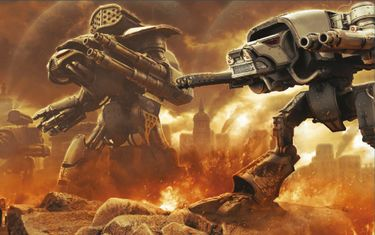

# 0774 005-010.M31/010-015.M31 铁灾 Cataclysm of Iron

精校状态：中文行文已逐段精校，部分术语仍为暂定

分类：时间线

原文来源：https://www.bilibili.com/opus/1205014226642403331

原作者：帝国神选罐头

原文时间：编辑于 2026年05月22日 06:37

[返回分类目录](目录.md) · [全书目录](../../目录.md)

<!-- A0774-B0001 -->
**英文原文**

The Cataclysm of Iron was a campaign of the Horus Heresy fought from 010 to 013.M31.

<!-- /A0774-B0001 -->

<!-- A0774-B0002 -->

原译文

铁灾是荷鲁斯叛乱从010到013.M31的一场战役。

**校订译文**

铁灾是荷鲁斯之乱期间的一场战役，发生于 010—013.M31。

**校注：** 原文导言记010—013.M31，资料栏与正文又记005—010初期、010—015主要阶段；保留各处日期，不擅自归并。

<!-- /A0774-B0002 -->

<!-- A0774-B0003 -->
**英文原文**

The battles took place in the "Belt of Iron", a region of Segmentum Tempestus and Segmentum Pacificus home to numerous lesser Forge Worlds. Many of these worlds declared for the Dark Mechanicum upon the outbreak of the Schism of Mars. Sporadic fighting between loyalist and traitor Mechanicum elements in this region erupted into full-scale war in 010.M31, pitching the traitor Forge Worlds of Incunabula, Urdesh, Valia-Maximal, and Kalibrax against the loyalist worlds of Graia, Arl'yeth, and Atar-Median. The worlds of Arachnus and Jerulas Station meanwhile both fell into their own civil wars. In the subsequent devastating fighting, many nearby worlds were swallowed up in the destruction.

<!-- /A0774-B0003 -->

<!-- A0774-B0004 -->

原译文

战斗发生在“铁带”，这是一个由暴风星域和太平星域组成的地区，是许多较小的铸造世界的所在地。许多这样的世界在火星分裂爆发时宣布为黑暗机械教。010.M31，该地区的忠诚派和叛徒机械教成员之间的零星战斗爆发为全面战争，叛徒铸造世界因库纳布拉、乌尔德什、瓦利亚-马克西马尔和卡利布拉克斯与忠诚派世界格拉亚、阿尔'耶斯和阿塔尔-梅迪安交战。与此同时，阿拉克努斯世界和杰鲁拉斯站都陷入了内战。在随后的毁灭性战斗中，许多附近的世界被毁灭吞噬。

**校订译文**

战斗发生在“铁带”，这片区域横跨暴风星域和太平星域的部分地区，分布着众多较小的铸造世界。火星大分裂爆发后，其中许多世界宣布加入黑暗机械教。010.M31，当地机械教忠诚派与叛徒之间的零星战斗升级为全面战争：叛徒一方的因库纳布拉、乌尔德什、瓦利亚-马克西马尔和卡利布拉克斯，与忠诚派的格拉亚、阿尔'利斯和阿塔尔中星相互交战。与此同时，阿拉克纳斯和杰鲁拉斯站各自陷入内战。随后的战斗极具破坏性，许多邻近世界也被卷入毁灭之中。

<!-- /A0774-B0004 -->

<!-- A0774-B0005 图片 -->

<!-- A0774-B0006 -->

原译文

Titans battle in the Cataclysm of Iron 铁灾中的泰坦战斗

**校订译文**

Titans battle in the Cataclysm of Iron 铁灾中的泰坦战斗

<!-- /A0774-B0006 -->

<!-- A0774-B0007 -->
**英文原文**

Conflict:Horus Heresy

<!-- /A0774-B0007 -->

<!-- A0774-B0008 -->

原译文

冲突：荷鲁斯叛乱

**校订译文**

冲突：荷鲁斯之乱

<!-- /A0774-B0008 -->

<!-- A0774-B0009 -->
**英文原文**

Date:005-010.M31 (Initial Phase), 010-015.M31 (Main Phase)

<!-- /A0774-B0009 -->

<!-- A0774-B0010 -->

原译文

日期：005-010.M31 (初始阶段), 010-015.M31 (主要阶段)

**校订译文**

日期：005—010.M31（初始阶段）；010—015.M31（主要阶段）

<!-- /A0774-B0010 -->

<!-- A0774-B0011 -->
**英文原文**

Location:Belt of Iron

<!-- /A0774-B0011 -->

<!-- A0774-B0012 -->

原译文

地点：铁带

**校订译文**

地点：铁带

<!-- /A0774-B0012 -->

<!-- A0774-B0013 -->
**英文原文**

Outcome:Loyalist Victory

<!-- /A0774-B0013 -->

<!-- A0774-B0014 -->

原译文

结果：忠诚派胜利

**校订译文**

结果：忠诚派胜利

<!-- /A0774-B0014 -->

<!-- A0774-B0015 -->
**英文原文**

Combatants:Imperium/Dark Mechanicum

<!-- /A0774-B0015 -->

<!-- A0774-B0016 -->

原译文

作战方：帝国/黑暗机械教

**校订译文**

作战方：帝国/黑暗机械教

<!-- /A0774-B0016 -->

<!-- A0774-B0017 -->
**英文原文**

Commanders:Magos Dominus Xixos, Princeps Maxima Millicent Nuvarss, Sub-Princeps Jandolla Altreax, Princeps Maxima Procolus/Magos Dominus Hieroneyum (KIA)

<!-- /A0774-B0017 -->

<!-- A0774-B0018 -->

原译文

指挥官：统御贤者西索斯，首席马克西玛·米利森特·努瓦尔斯，次席詹多拉·阿尔特雷克斯，首席马克西玛·普罗克勒斯/统御贤者海洛尼姆

**校订译文**

指挥官：统御贤者西索斯、最高首席米利森特·努瓦尔斯、次席詹多拉·阿尔特雷克斯、最高首席普罗克勒斯／统御贤者海洛尼姆（阵亡）

**校注：** Princeps Maxima是职衔，暂译最高首席，不能把Maxima当作米利森特或普罗克勒斯的名字。补回海洛尼姆KIA阵亡。

<!-- /A0774-B0018 -->

<!-- A0774-B0019 -->
**英文原文**

Strength:Legio Astraman, Legio Atarus, Legio Ignatum, Venator Loyalists, House Col'Khak, House Moritain, Taghmata/Legio Laniaskara, Legio Kulisaetai, Legio Tritonis, Legio Damicium, Legio Venator Traitors, House Gotrith, House Vextrix, Taghmata, Iron Warriors elements

<!-- /A0774-B0019 -->

<!-- A0774-B0020 -->

原译文

力量：旅星者军团，炎纹军团，烈焰军团，猎手军团忠诚派，科尔'哈克家族，莫里坦家族，禁卫/撕裂者军团，库利塞泰军团，三辰军团，诅咒军团，猎手军团叛徒，戈特里奇家族，维特瑞克斯家族，禁卫，钢铁勇士成员

**校订译文**

兵力：旅星者军团、炎纹军团、烈焰军团、猎手军团忠诚派、科尔’哈克家族、莫里坦家族、禁卫军／撕裂者军团、库利塞泰军团、三辰军团、诅咒军团、猎手军团叛徒、戈特里奇家族、维特瑞克斯家族、禁卫军、部分钢铁勇士部队

<!-- /A0774-B0020 -->

<!-- A0774-B0021 -->
**英文原文**

Casualties:Massive, Billions of civilians/Massive

<!-- /A0774-B0021 -->

<!-- A0774-B0022 -->

原译文

伤亡：巨大，数十亿平民/巨大

**校订译文**

伤亡：惨重，另有数十亿平民死亡／惨重

<!-- /A0774-B0022 -->

<!-- A0774-B0023 -->
## Overview 概述

<!-- /A0774-B0023 -->

<!-- A0774-B0024 -->
## Initial Actions 初始行动

<!-- /A0774-B0024 -->

<!-- A0774-B0025 -->
**英文原文**

The war's initial phase was in 005-010.M31. During this time Graia and Atar-Median declared loyalty for the Emperor while Valia-Maximal sided with Horus. The rivalry between Valia-Maximal and Graia were brought to the fore and both sides launched probing assaults against the other which saw Valia-Maximal unleash ancient forbidden weaponry upon its foe which permanently affected its surface. For every world that proved eager to side with Graia and Atar-Median in return for the favour of the larger Forge World, there were those who offered only empty words in response and time would show that their allegiance had been bought by the Fabricator-General of Mars. Urdesh managed to supply traitor cells in Segmentum Solar while Kalibrax reinforced the empty world of Findari Spoil, an action which was detected by Graia. In 010.M31 all communication with Jerulas Station ceased while Arachnus closed its borders as they argued amongst themselves. Upon Pioro III, 14 Titans were felled as the clashes between Legio Laniaskara and Legio Astraman escalated and of the millions caught in the crossfire, few survived. In amongst this tension and turmoil a single Iron Warriors fleet entered the Findari Spoil, its presence unnoticed by all bar Atar-Median, who looked upon it with dread.

<!-- /A0774-B0025 -->

<!-- A0774-B0026 -->

原译文

战争的初始阶段是在005-010.M31。在此期间，格拉亚和阿塔尔-梅迪安宣布效忠帝皇，而瓦利亚-马克西马尔则站在荷鲁斯一边。瓦利亚-马克西马尔和格拉亚之间的竞争凸显出来，双方都对对方发动了试探性攻击，瓦利亚-马克西马尔向敌人释放了古代禁忌武器，这永久地影响了它的地表。对于每一个渴望站在格拉亚和阿塔尔-梅迪安一边以换取更大的铸造世界青睐的世界，都有一些人只提供了空话作为回应，时间会证明他们的忠诚已经被火星铸造将军收买了。乌尔德什设法在太阳星域提供叛徒电池，而卡利布拉克斯则加强了芬达瑞废墟空洞世界，这一行动被格拉亚发现。010.M31，与杰鲁拉斯站的所有通信都停止了，而阿拉克努斯在他们之间争论时关闭了边境。在皮奥罗三号上，随着撕裂者军团和旅星者军团之间的冲突升级，14架泰坦倒下，在数百万陷入交火的人中，很少有人幸存下来。在这场紧张和动荡中，一支钢铁勇士舰队进入了芬达瑞废墟，除了阿塔尔-梅迪安，其他人都没有注意到它的存在，它恐惧地看着它。

**校订译文**

战争的初始阶段为 005—010.M31。格拉亚和阿塔尔中星宣布效忠帝皇，瓦利亚-马克西马尔则倒向荷鲁斯。瓦利亚-马克西马尔与格拉亚的宿怨随之激化，双方相互发动试探性进攻；瓦利亚-马克西马尔还动用了古老的禁忌武器，在敌方世界的地表留下永久创伤。有些世界急于支持格拉亚和阿塔尔中星，以换取这些大型铸造世界的青睐；另一些则只以空话敷衍，后来事实证明，它们早已被火星铸造将军收买。乌尔德什向太阳星域的叛徒地下组织输送物资；卡利布拉克斯则增援了无人世界芬达瑞废墟，后者的行动被格拉亚发现。010.M31，与杰鲁拉斯站的一切通信中断，阿拉克纳斯也因内部争执而关闭边境。在皮奥罗三号，撕裂者军团与旅星者军团的冲突不断升级，十四台泰坦被击毁，数百万被卷入交火的人几乎无一幸存。在这片紧张与混乱中，一支钢铁勇士舰队进入芬达瑞废墟。唯有阿塔尔中星注意到了它的到来，并深感不安。

**校注：** cells指叛徒地下组织，非电池；the empty world为无人世界，非空心行星。

<!-- /A0774-B0026 -->

<!-- A0774-B0027 -->
**英文原文**

In 215010.M31 in what is now seen as the first blow of the Cataclysm of Iron, the arrival of the Iron Warriors prompted Atar-Median to assemble its forces to war and fall upon the Findari Spoil. The loyalists judged that their plans to seize the Findari Spoil would succeed only if they were accelerated. Having set themselves on the path to war, Atar-Median passed on knowledge of both their findings and plans to attack to those worlds, such as Graia, deemed trustworthy, as well as making attempts to alert Terra of their findings, before the forces of Atar-Median marched to war. The traitors reinforced the Findari Spoil heavily with forces from the Legio Kulisaetai as well as new orbital defence platforms. The forces of Atar-Median were commanded by Princeps Maxima Millicent Nuvarss, who divided their fleet into two task forces. The first, consisting of Taghmata forces supported by House Col'Khak, formed the vanguard of the invasion, breaking from the Warp close to the system's outer defences. Weathering heavy fire, they quickly boarded the first ring of defences and eradicated all within. As this battle raged, the second fleet transitioned into the system and headed directly for the planet. The loss off the outer defenses left only minor orbital batteries to repel the loyalist fleet and with little effort the loyalists seized control of the exo-sphere.

<!-- /A0774-B0027 -->

<!-- A0774-B0028 -->

原译文

215010.M31，钢铁勇士的到来促使阿塔尔-梅迪安集结部队作战，并降落芬达瑞废墟，这被视为铁灾的第一击。忠诚派认为，只有加快步伐，他们夺取芬达瑞废墟的计划才能成功。在踏上战争之路后，阿塔尔-梅迪安将他们的发现和攻击计划的知识传授给了那些被认为值得信赖的世界，如格拉亚，并试图在阿塔尔-梅迪安的部队进军战争之前，向泰拉发出他们的发现的警报。叛徒用来自库利塞泰军团的部队以及新的轨道防御平台大力加强了芬达瑞废墟。阿塔尔-梅迪安的部队由马克西玛·米利森特·努瓦尔斯首席指挥，他将舰队分为两个特遣部队。第一支由禁卫部队组成，由科尔'哈克家族支援，形成了入侵的先锋，从靠近星系外部防御的亚空间突破。经受住猛烈的炮火，他们迅速登上了第一圈防御工事，并彻底消灭了里面的一切。随着这场战斗的激烈进行，第二支舰队过渡到星系中，直接驶向行星。外部防御的损失只剩下少量的轨道炮台来击退忠诚派的舰队，忠诚派几乎不费吹灰之力就控制了外层。

**校订译文**

215.010.M31，钢铁勇士的到来促使阿塔尔中星集结军队，进攻芬达瑞废墟。这一行动后来被视为铁灾正式打响的第一击。忠诚派判断，只有加快行动，夺取芬达瑞废墟的计划才可能成功。决定开战后，阿塔尔中星向格拉亚等可信赖的世界通报了发现的情况和进攻计划，也在出兵前尝试向泰拉示警。叛徒已调来库利塞泰军团的部队，并新建轨道防御平台，大幅加强芬达瑞废墟的防守。最高首席米利森特·努瓦尔斯指挥阿塔尔中星的军队，将舰队分为两支特遣部队。由禁卫军组成、科尔’哈克家族支援的第一支部队担任先锋，在接近星系外围防线的位置脱离亚空间。他们顶住猛烈炮火，迅速登上第一圈防御设施，将其中的敌人尽数消灭。交战之际，第二支舰队跃入星系，直扑行星。外围防线失守后，叛徒只剩少量轨道炮台抵挡忠诚派舰队；忠诚派轻易便控制了行星外大气层周边空间。

**校注：** 原文215010等日期缺分隔，中文统一写215.010.M31；下文同类日期亦如此，不另改日期数值。

<!-- /A0774-B0028 -->

<!-- A0774-B0029 -->
**英文原文**

The Legio Atarus were unleashed upon the planet, intent on seizing control of the Gatekeeper Fortress. The Legio landers disgorged their cargo on the outskirts of the fortress, seeking to catch the traitors unaware. The Firebrands managed to quickly overwhelm the outer defences but once they ventured into the cavernous center of the fortress engaged in brutal combat with enemy engines. Atarus eventually emerged victorious after destroying six enemy engines at a cost of 8 damaged. In addition, Atarus managed to capture 4 enemy engines in stasis. In the aftermath of their victory they moved to secure their hold upon the rest of the planet, hunting down the remaining enemy with Col'Khak Knights.

<!-- /A0774-B0029 -->

<!-- A0774-B0030 -->

原译文

炎纹军团被释放到行星上，意图夺取守门人要塞的控制权。军团登陆舰在要塞郊区卸下货物，试图在不知不觉中抓住叛徒。火印设法迅速压倒了外部防御，但一旦他们冒险进入堡垒的洞穴中心，就与敌人的引擎进行了残酷的战斗。炎纹最终取得了胜利，摧毁了6台敌方引擎，造成8台受损。此外，炎纹在静滞状态下成功捕获了4台敌方引擎。胜利后，他们采取行动，与科尔'哈克骑士一起追捕剩下的敌人，以确保对行星其他地区的控制。

**校订译文**

炎纹军团随后降临行星，目标是夺取守门人要塞。军团登陆舰在要塞外围卸下泰坦，试图打敌人一个措手不及。火印军团迅速突破外围防线，却在深入要塞洞窟般的庞大内部空间后，与敌方泰坦陷入惨烈近战。炎纹军团最终获胜，以己方八台泰坦受损为代价，摧毁了六台敌方泰坦，另缴获四台处于静滞状态的敌方泰坦。此后，他们与科尔’哈克家族的骑士一同追剿残敌，巩固对行星其余地区的控制。

**校注：** at a cost of 8 damaged是己方八台受损，非敌方另八台受损。Firebrands为Legio Atarus别称火印军团；两者同一军团。

<!-- /A0774-B0030 -->

<!-- A0774-B0031 -->
**英文原文**

From 302010-552010.M31 the invasion of the Ny'Drinah Sub-Sector was waged. It began several hundred vessels from Urdesh and Kalibrax emerged from the Warp in the Paradonal'ny system and obliterated its defences with minimal losses. The traitors were able to swiftly conquer the sub-sector. Having secured a base of operations, the Traitors moved to seize their next targets. The core of their force consisted of Titans drawn from both Legio Damicium and Legio Kulisaetai, which fielded between 20-70 Titans. Notably, the Traitor assault coincided with the commencement of the negotiation cycle during which the next decade of industrial supply was allocated amongst worlds within the Belt of Iron. This timing was no doubt meant to exploit laws which ensured that only a token force from each petitioning Forge World was allowed entry to the sub-sector, lest accusations of external pressure influencing the negotiations be levied against the process. In accordance with such an edict, less than 10 Loyalist Titans, consisting of a mixture of Legio Atarus, Venator and Astraman engines, stood within the sub-sector when the Traitors began their invasion. Facing a Traitor force capable of assaulting several worlds at once, the Loyalist Titans were quick to accept their weakness and redeployed to the Xiloci'ny system, mustering to defend the subsector's capital world and await relief. In the weeks following the fall of the Paradonal'ny system, the Traitors secured their hold upon the sub-sector, seizing control of 4 more systems before moving on the Hive World of Xiloci II. Here, the Traitor advance stalled, their Titan Legions contested by the considerable defences of the hive cities and large numbers of loyalist Titans. In an effort to break the stalemate, those worlds captured by the Traitors were turned towards fuelling the conquest of Xiloci II; the flow of supplies from conquered mining worlds was funnelled inwards while those population centres deemed "non-essential" to the war effort were processed into vast legions of mindless warriors. By 552010.M31, only the Xiloci'ny and Uridoci'ny systems remained in loyalist hands.

<!-- /A0774-B0031 -->

<!-- A0774-B0032 -->

原译文

302010-552010.M31，对尼'德里纳分区发动了入侵。它从乌尔德什开始建造数百艘战舰，卡利布拉克斯从帕拉多纳尔'尼星系的亚空间出现，并以最小的损失摧毁了防御。叛徒迅速征服了该分区。在获得行动基地后，叛徒开始夺取下一个目标。他们部队的核心由来自诅咒军团和库利塞泰军团的泰坦组成，他们派出了20-70架泰坦。值得注意的是，叛徒袭击恰逢谈判周期的开始，在此期间，下一个十年的工业供应在铁带内的世界之间分配。毫无疑问，这一时机是为了利用法律，确保每个请求的铸造世界只允许象征性的部队进入该分区，以免对谈判过程施加外部压力的指控。根据这样的法令，当叛徒开始入侵时，不到10架由炎纹军团、猎手军团和旅星者军团的引擎混合而成的忠诚派泰坦站在分区内。面对一支能够同时攻击多个世界的叛徒部队，忠诚派泰坦们很快接受了自己的虚弱，重新部署到西洛奇'尼星系，集结起来保卫该分区的首都世界，等待救援。在帕拉多纳尔'尼星系崩溃后的几周内，叛徒控制了该分区，在进入西洛奇二号巢都世界之前，又控制了4个星系。在这里，叛徒的推进停滞不前，他们的泰坦军团受到巢都城市的强大防御和大量忠诚派泰坦的争夺。为了打破僵局，叛徒占领的那些世界转而助长了对西洛奇二号的征服；被征服的矿业世界的补给流被向内输送，而那些被认为对战争“非必须”的人口中心则被加工成庞大的机械战士军团。到552010.M31，只有西洛奇'尼和乌里多奇'尼星系仍掌握在忠诚派手中。

**校订译文**

302.010—552.010.M31，叛徒入侵尼’德里纳次星区。来自乌尔德什和卡利布拉克斯的数百艘舰船在帕拉多纳尔’尼星系脱离亚空间，以极小代价摧毁当地防御，迅速扩大对次星区的控制。取得行动基地后，叛徒继续进攻其他目标。其主力由诅咒军团和库利塞泰军团的泰坦组成，投入的泰坦约有二十至七十台。此次进攻恰逢新一轮谈判开始，各世界正商议如何分配铁带未来十年的工业供给。叛徒显然利用了谈判期间的限制：为避免外部武力干预谈判，各个提出需求的铸造世界只获准派少量象征性部队进入次星区。因此，入侵开始时，当地来自炎纹、猎手和旅星者军团的忠诚派泰坦合计不足十台。面对能够同时进攻多个世界的敌军，忠诚派很快认清兵力劣势，撤往西洛奇’尼星系，集结保卫次星区首府世界，等待救援。帕拉多纳尔’尼星系陷落后数周内，叛徒又夺取四个星系，继而进攻巢都世界西洛奇二号。在那里，巢都的坚固防御和大批忠诚派泰坦挡住了叛徒军团，令其攻势陷入停顿。为打破僵局，叛徒让已占领的世界全力支持西洛奇二号的战事：矿业世界的物资源源运往前线，被认为对战争“无关紧要”的聚居地居民则被加工成庞大的无意识战士军团。至 552.010.M31，只有西洛奇’尼和乌里多奇’尼两星系仍由忠诚派控制。

**校注：** 原文20—70未明确两军团合计或分别数目，保留区间不外推。原文先称迅速征服次星区，又述尚有多个星系未陷，中文按后续行动写扩大控制。mindless warriors只表无意识战士，不能无据加“机械”。

<!-- /A0774-B0032 -->

<!-- A0774-B0033 -->
**英文原文**

In 706010.M31 the Devastation of Yanazar IV began. The first sign of relief for the defenders of the Ny'Drinah sub-sector was seen when a probing fleet from Atar-Median entered the Yanazar'ny system intent upon securing a beachhead within the region. With them came two maniples of Legio Venator Titans dispatched from Arachnus. The first target of the Loyalists was the mining world of Yanazar IV, a frigid planet garrisoned by a detachment of Legio Laniaskara Titans. Under the cover of an orbital bombardment, the Iron Spiders under Sub-Princeps Jandolla Altreax descended to the surface and marched upon the entrenched Impalers who guarded the sole strip of mining quarries that had survived. During the battle that followed the Iron Spiders were alerted of a Traitor fleet having entered the system and moved to engage the Loyalist fleet. Outnumbered in orbit, the Loyalist fleet was quickly driven off and had to abandon their allies. The initial assault by the Iron Spiders was successful, with the Loyalists regaining control of the quarries before finding themselves trapped upon the planet and faced with a new wave of landers in the form of the Legio Damicium.

<!-- /A0774-B0033 -->

<!-- A0774-B0034 -->

原译文

706010.M31，亚纳扎尔四号的毁灭开始了。当一支来自阿塔尔-梅迪安的探查舰队进入亚纳扎尔'尼星系，意图在该地区建立滩头阵地时，尼'德里纳分区的守军看到了第一个解脱的迹象。与他们同行的是从阿拉克努斯派遣的两个猎手军团泰坦支队。忠诚派的第一个目标是亚纳扎尔四号的矿业世界，这是一个由撕裂者军团泰坦分队驻守的寒冷行星。在轨道轰炸的掩护下，詹多拉·阿尔特雷克斯次席率领的铁蜘蛛降落到地表，向守卫着唯一幸存的矿业矿场的根深蒂固的穿刺者行进。在随后的战斗中，铁蜘蛛收到了叛徒舰队进入星系并与忠诚派舰队交战的警报。在轨道上人数众多，忠诚派舰队很快被赶走，不得不放弃盟友。铁蜘蛛的最初攻击是成功的，忠诚派重新控制了矿场，然后发现自己被困在这个行星上，并面临着以诅咒军团形式出现的新一波着陆舰。

**校订译文**

706.010.M31，亚纳扎尔四号毁灭之战开始。阿塔尔中星的一支试探舰队进入亚纳扎尔’尼星系，准备建立立足点，尼’德里纳次星区的守军由此看到了救援的希望。随舰队而来的，还有阿拉克纳斯派出的两个猎手军团泰坦支队。忠诚派首先进攻矿业世界亚纳扎尔四号；这颗寒冷行星由一支撕裂者军团泰坦分遣队驻守。在轨道轰炸掩护下，次席詹多拉·阿尔特雷克斯率铁蜘蛛军团登陆，向据守阵地的穿刺者军团进发，后者守卫着仅存的一片采矿场。交战期间，铁蜘蛛军团得知叛徒舰队已经进入星系，并攻击忠诚派舰队。忠诚派舰队在轨道上寡不敌众，很快被逐走，只能抛下地面盟军。铁蜘蛛军团最初进展顺利，夺回了采矿场，却随即发现自己被困在行星上；新一波登陆舰正载着诅咒军团前来。

**校注：** Iron Spiders为猎手军团别称铁蜘蛛；Impalers为撕裂者军团别称穿刺者。Outnumbered指忠诚派寡不敌众。

<!-- /A0774-B0034 -->

<!-- A0774-B0035 -->
## Turning Point 转折点

<!-- /A0774-B0035 -->

<!-- A0774-B0036 -->
**英文原文**

In 874010.M31 a turning point took place. The main Loyalist force, dispatched from Graia with two Demi-Legios of Morning Star Titans and commanded by Magos Dominus Xixos moved towards the Uridoci'ny system as their first target. On Uridoci VI a month-long conflict between Legio Astraman and Legio Kulisaetai brought the world’s industry to ruin, with 8 titans destroyed and 13 others badly damaged. Elsewhere, the populace of Uridoci II was reduced to less than 1/10th of the number held before the war, slaughtered in a mass campaign of butchery led by House Gotrith who built monuments of corpses dedicated to the Warmaster. The few survivors of the world were spared a similar fate by House Moritain, who swore to defend the last loyalist outposts on the planet and engaged House Gotrith amongst the ruined cities of Uridoci II, driving them from the world. The departure of House Gotrith was marked by the emergence of a plague amongst the survivors that left 300,000 dead and forced the complete quarantine of the entire planet, condemning it to a slow death. When it was deemed that the plague had run its course, a sect of Mechanicum Genetors descended to the surface to find a world devoid of human life, along with an extensive catalogue of names listing every individual whose life was claimed by House Gotrith and the subsequent disease, diligently recorded by the Scions of House Moritain even as they too succumbed to illness. The final blow for the Traitors came upon the agri-world of Uridoci III. Against the small garrison of Gatekeepers, Graia sent a force of Morning Stars. The traitors refused to meet the Loyalists in open battle, instead detonating hundreds of nuclear warheads across the surface resulting in catastrophic climate change and the death of the world's entire population. In an act of demoralization propaganda, the death of Uridoci III was broadcast across the region as a warning to any who stood against the Warmaster. In response, numerous worlds surrendered to the Traitors out of fear. Adversely, rebellion broke out in the Paradonal fleet anchorage, culminating in the destruction of a Legio Damicium coffin ship housing 4 Warlord Titans.

<!-- /A0774-B0036 -->

<!-- A0774-B0037 -->

原译文

874010.M31，发生了一个转折点。主要的忠诚派部队从格拉亚出发，带着两个晨星半军团的泰坦，由统御贤者西索斯指挥，向乌里多奇'尼星系移动，作为他们的第一个目标。在乌里多奇六号上，旅星者军团和库利塞泰军团之间长达一个月的冲突使世界的工业毁灭，8架泰坦被摧毁，13架严重受损。在其他地方，乌里多奇二号的人口减少到战前人数的不到十分之一，在戈特里奇家族领导的大规模屠杀运动中被屠杀，戈特里奇家族建造了献给战帅的尸体纪念碑。世界上为数不多的幸存者幸免于莫里坦家族的类似命运，莫里坦家族发誓要保卫行星上最后一个忠诚派前哨，并与戈特里奇家族交战，将他们赶出乌里多奇二号的废墟城市。戈特里奇家族的离开标志着幸存者中出现了瘟疫，造成30万人死亡，迫使整个行星完全隔离，使其缓慢死亡。当人们认为瘟疫已经结束时，一个机械教派的基因士来到地表，发现了一个没有人类生命的世界，以及一个广泛的名字目录，列出了每个被戈特里奇家族夺去生命的人以及随后的疾病，莫里坦家族的后裔认真记录了这些人，即使他们也死于疾病。对叛徒的最后一击是乌里多奇三号农业世界。面对守门人的小规模驻军，格拉亚派出了一支晨星部队。叛徒拒绝在公开战斗中与忠诚派会面，而是在地表引爆了数百枚核弹头，导致灾难性的气候变化和全世界人口的死亡。作为一种令士气低落的宣传行为，乌里多奇三号的死亡在整个地区广播，作为对任何对抗战帅的人的警告。作为回应，许多世界出于恐惧向叛徒投降。相反，在帕拉多纳舰队锚地爆发了叛乱，最终摧毁了一艘容纳4名军阀泰坦的诅咒军团棺材舰。

**校订译文**

874.010.M31，战局出现转折。统御贤者西索斯率领从格拉亚出发的忠诚派主力，以乌里多奇’尼星系为首个目标；这支部队包括两个晨星半军团。在乌里多奇六号，旅星者军团与库利塞泰军团激战一月，摧毁了当地工业，八台泰坦被击毁，另有十三台严重受损。乌里多奇二号则遭戈特里奇家族大肆屠杀，人口锐减至战前的十分之一以下；凶手还以尸体堆砌献给战帅的纪念碑。莫里坦家族宣誓保卫行星上最后的忠诚派据点，在废墟城市中迎战戈特里奇家族，将其逐出行星，使少数幸存者免遭同样的屠戮。然而，戈特里奇家族离去之际，幸存者中又爆发瘟疫，造成三十万人死亡，迫使整颗行星接受全面隔离，缓慢走向死亡。待瘟疫被认为已经平息后，一支机械教基因士派系降落地表，发现这里已无人存活，只留下详尽的死者名录，记录着所有死于戈特里奇家族及随后瘟疫之手的人。这份名录由莫里坦家族的骑士后裔尽职编录，直到他们自己也病倒身亡。叛徒在当地遭受的最后一击发生于农业世界乌里多奇三号：格拉亚派出晨星军团的部队，进攻少量守门人军团驻军。叛徒拒绝正面交战，转而在各地引爆数百枚核弹头，造成灾难性的气候变化，杀死行星全部居民。叛徒将乌里多奇三号的毁灭向整个地区广播，企图打击士气，警告所有敢于对抗战帅的人。许多世界因此恐惧投降；但帕拉多纳舰队锚地却爆发了反抗叛徒的起义，最终摧毁一艘载有四台战将级泰坦的诅咒军团棺柩运输舰。

**校注：** House Moritain是拯救幸存者的莫里坦家族，原译施受颠倒。原文最后一击后接叛徒自毁与威吓成效，叙述评价不一致，保留事件。Morning Stars为旅星者军团别称晨星；Gatekeepers为库利塞泰军团别称守门人。

<!-- /A0774-B0037 -->

<!-- A0774-B0038 -->
**英文原文**

In 924010.M31 the Relief of Xiloci II was launched. The damage caused to the Paradonal fleet anchorage to the Traitors saw a vast reduction in their ability, causing numerous delays to the deployment of Traitor reinforcements across the Belt of Iron. In turn, this led the Traitors to divert forces from the siege of Xiloci II to reinforce other systems. When this news reached Magos Dominus Xixos, a force was sent to Xiloci II. Three detachments of Legio Astraman Titans, numbering a total of 25 total, landed upon Xiloci II. In response, the Traitors moved their forces to secure their siege lines, creating fortifications around unconquered hives. In doing so, the Traitors sacrificed their momentum, forming isolated pockets of resistance which the Loyalists could attack at their time of choosing. Capitalizing on this, Legio Astraman led a campaign of methodical conquest, forming three prongs that assailed hive cities in close proximity to prevent the Traitor positions from reinforcing one another. The resulting conquest saw minimal losses for Legio Astraman, with the Morning Stars relying upon maniples consisting largely of Reavers and Warlords. After 3 months of fighting the Traitors were ousted from most of Xiloci II, now holding only a handful of hives after the evacuation of the Legio Kulisaetai. The last resistance to Loyalists was dealt with after an assault upon the hive city of Tartunrus Spyre under Xixos himself from the Warlord Titan Grace of Wrath. Unwilling to expend time and lives upon another siege, the hive's fate was sealed when the guns of Astraman turned upon the mountain around which the city was constructed, burying it beneath an avalanche. With the world secured, the Knights of House Col'Khak were tasked with rooting out any remaining resistance while Xixos committed his forces to regaining control of the remaining worlds within the Xiloci'ny system.

<!-- /A0774-B0038 -->

<!-- A0774-B0039 -->

原译文

924010.M31，西洛奇II号救援发动。帕拉多纳舰队锚地对叛徒造成的破坏使他们的能力大幅下降，导致叛徒增援部队在铁带上的部署多次延误。反过来，这导致叛徒将部队从西洛奇二号的围困中转移出来，以加强其他星系。当这个消息传到统御贤者西索斯时，一支部队被派往西洛奇二号。旅星者军团泰坦的三支分遣队，共计25架，登陆了西洛奇二号。作为回应，叛徒调动了他们的部队来保护他们的围攻战线，在未被征服的巢都周围建造了防御工事。在这样做的过程中，叛徒牺牲了他们的推进力，形成了孤立的抵抗区，忠诚派可以在他们选择的时间攻击这些抵抗区。利用这一点，旅星者军团领导了一场有条不紊的征服战役，形成了三个方面，攻击了附近的巢都城市，以防止叛徒阵地相互加强。由此产生的征服使旅星者军团损失最小，晨星依靠的是主要由掠夺者和军阀组成的支队。经过3个月的战斗，叛徒被驱逐出西洛奇二号的大部分地区，在库利塞泰军团撤离后，现在只剩下少数几个巢都。对忠诚派的最后一次抵抗是在军阀泰坦愤怒优雅号对西索斯本人领导的巢都城市塔尔图鲁斯·斯派尔发动袭击后进行的。由于不愿在另一次围攻中花费时间和生命，当旅星者的炮火转向城市周围的山，将其埋在山崩之下时，巢都的命运就注定了。在世界安全的情况下，科尔'哈克家族的骑士的任务是铲除任何剩余的抵抗力量，而西索斯则承诺他的部队将重新控制西洛奇'尼星系内的剩余世界。

**校订译文**

924.010.M31，西洛奇二号解围战开始。帕拉多纳舰队锚地遭到破坏后，叛徒的调度能力大幅下降，增援铁带各处的行动频频延误。他们被迫从围攻西洛奇二号的部队中抽调兵力，支援其他星系。西索斯获悉后立即派出援军：旅星者军团三个分遣队、共二十五台泰坦登陆西洛奇二号。叛徒随即收拢部队，巩固围城战线，在尚未攻克的巢都周围修筑工事。然而，这使他们丧失进攻势头，变成一处处孤立的据点，任由忠诚派选择时机攻击。旅星者军团趁机兵分三路，同时进攻彼此邻近的巢都，阻止叛徒相互增援，以有条不紊的攻势逐步收复失地。晨星军团主要依靠掠夺者级和战将级泰坦组成的支队作战，自身损失极小。经过三个月战斗，叛徒被逐出西洛奇二号的大部分地区；库利塞泰军团撤离后，他们只剩少数巢都。西索斯亲自在战将级泰坦“愤怒优雅号”上指挥进攻塔尔图鲁斯·斯派尔巢都，解决最后的抵抗。他不愿再为围城付出时间和生命，遂命旅星者军团炮击城市依山而建的那座山体，以山崩将整座巢都掩埋。行星收复后，科尔’哈克家族的骑士负责清剿残敌，西索斯则率主力转战西洛奇’尼星系其余世界。

**校注：** 西索斯在愤怒优雅号上指挥进攻，并非该泰坦攻击西索斯本人。

<!-- /A0774-B0039 -->

<!-- A0774-B0040 -->
## Loyalist Offensive 忠诚派攻势

<!-- /A0774-B0040 -->

<!-- A0774-B0041 -->
**英文原文**

By 182011.M31 the war had now decidedly turned against the Traitors. Matters were further complicated with the arrival of fleets from both Atar-Median and Arachnus who committed many of their most veteran Princeps from the Great Crusade to the campaign. Neither Urdesh nor Kalibrax could hope to match the might of the these Forge Worlds and the forces of Valia-Maximal found much of their strength engaged within the eastern Belt of Iron. The Traitors moved to secure aid from lesser Forge Worlds, dispatching emissary fleets to worlds such as Lux Incunabula, Gantrin, and Jerulas Station. At Jerulas Station, the Dark Mechanicum hoped to find an ally would serve as fertile ground for the rapid expansion of its industry. Jerulas Station and its people held great disdain for the Imperium and were kept in order solely thanks to the strength of the garrison stationed upon the Forge World. Both the Ruinstorm and the Cataclysm of Iron severed communications across the Belt of Iron and neither Loyalist or Traitor had maintained contact with Jerulas Station for over 3 years. The last known message from the world was in 942008.M31 in a distress call from the Imperial garrison reporting widespread rebellion as well as the presence of entities of unknown origin. It was not until 011.M31 that the fate of Jerulas Station was discovered. A fleet from Urdesh to broker a treaty with the world found a dead planet. Pictures taken from salvaged Traitor ships show towering, featureless edifices of metal placed where productive forge-fanes once stood and the remains of countless space vessels in orbit. The perpetrators were revealed mere moments after a Urdeshi landed on the world. The edifices upon the surface burst into life and the appearance of dozens of ship signals amongst debris in Jerulas Station’s orbit and metallic vessels of unknown design powered up and unleashed beams of energy upon the fleet. The fleet lost 2/3rds of its force before fleeing and abandoning the research teams on the surface.

<!-- /A0774-B0041 -->

<!-- A0774-B0042 -->

原译文

182011.M31，战争已经明显转向对叛徒不利。随着阿塔尔-梅迪安和阿拉克努斯的舰队的到来，事情变得更加复杂，他们将大远征中许多最资深的首席投入了这场战役。乌尔德什和卡利布拉克斯都不可能与这些铸造世界的力量相匹敌，瓦利亚-马克西马尔的部队在铁带东部内发现了他们的大部分力量。叛徒开始从较小的铸造世界获得援助，派遣使者舰队前往起源之光、甘特林和杰鲁拉斯站等世界。在杰鲁拉斯站，黑暗机械教希望找到一个盟友，为其工业的快速扩张提供肥沃的土壤。杰鲁拉斯站及其人民对帝国极为蔑视，完全归功于驻扎在铸造世界的驻军的力量。毁灭风暴的诞生和铁灾都切断了整个铁带的通信，忠诚派和叛徒都没有与杰鲁拉斯站保持联系超过3年。世界上最后一个已知的消息是在942008.M31，帝国驻军发出求救信号，报告了广泛的叛乱以及未知来源的实体的存在。直到011.M31，杰鲁拉斯站的命运才被发现。一支来自乌尔德什的舰队在与世界签订条约时发现了一颗死亡行星。从打捞上来的叛徒船上拍摄的照片显示，高耸的、毫无特色的金属建筑被放置在曾经有生产锻造神殿的地方，无数太空战舰的残骸在轨道上。一个乌尔德什降落在世界上后不久，肇事者就被揭露了。地表上的建筑突然出现，杰鲁拉斯站轨道上的碎片中出现了数十个船只信号，未知设计的金属战舰对舰队充能并释放了能量束。舰队在逃离并放弃地表上的研究小队之前，损失了2/3的部队。

**校订译文**

182.011.M31，战局已明显对叛徒不利。阿塔尔中星与阿拉克纳斯的舰队接踵而至，带来许多大远征时期久经沙场的泰坦首席，使叛徒的处境雪上加霜。乌尔德什和卡利布拉克斯无力匹敌这些铸造世界，而瓦利亚-马克西马尔的大部分兵力又被牵制在铁带东部。叛徒只得向较小的铸造世界求援，派使节舰队前往起源之光、甘特林和杰鲁拉斯站。黑暗机械教希望争取杰鲁拉斯站为盟友，利用其条件迅速扩张工业。当地居民对帝国极为敌视，原本全靠帝国驻军的武力维持秩序。毁灭风暴和铁灾切断了铁带各地的通信，忠诚派与叛徒都已三年多未与杰鲁拉斯站联络。其最后一条已知消息发于 942.008.M31：帝国驻军求救，报告大规模叛乱和来历不明的实体。直到 011.M31，一支前去缔约的乌尔德什舰队才发现，这里已经是一颗死寂行星。从打捞的叛徒舰船中取得的影像显示，昔日繁忙的铸造神殿已被高耸、表面平滑无饰的金属建筑取代，轨道上遍布舰船残骸。乌尔德什人员刚一登陆，袭击者便现身了：地表建筑骤然启动，轨道残骸中同时出现数十个舰船信号，形制陌生的金属舰船启动动力，向舰队射出能量束。乌尔德什舰队损失三分之二，仓皇逃离，抛弃了地表的研究小队。

**校注：** 原文a Urdeshi语法不全，仅译乌尔德什人员，不凭设定补定种族或具体兵种。死寂行星是状态描述，非Death World死亡世界分类。

<!-- /A0774-B0042 -->

<!-- A0774-B0043 -->
**英文原文**

By 218011.M31 Arachnus found itself in turmoil. Two warring sects fought a political battle that would determine the allegiance of the world. Those that had spent decades serving in the Great Crusade held great respect for the Imperium, while others claimed the unfolding conflict served as the perfect backdrop against which Arachnus could regain independence. This disagreement appeared settled following repeated expressions of concern from the wider Imperium, interlaced with implicit threats that demanded the Forge World resume shipments of aid and supplies to loyalist worlds. In answer, the rulers of Arachnus dispatched several fleets, and several dozen Legio Venator Titans to aid the Loyalist push into the Ny’Drinah sub-sector. Distribution of forces outside the borders Arachnus largely consisted of those who refused to support the idea of independence, placing them far from the Forge World. The first reports of conflict upon Arachnus came in late 010.M31 from the principal Legio stronghold upon the Forge World. Having committed many of the dissenting elements of Legio Venator to far-flung conflicts, the Titans of Arachnus eliminated those who still resisted rebellion before purging the Forge World of other dissidents. In what would come to be known as ‘Trident’s Purge’, conflict engulfed Arachnus and its two moons, Iktomia and Nizkara that saw the death toll at several million and 37 Titans. Following 3 days of fighting the traitors of Arachnus controlled the world and Iktomia, though battles still raged upon the surface of Nizkara. In a message to all within the Belt of Iron, Arachnus pronounced itself as an independent state. In recognition of this new state of affairs, the traitorous faction of Legio Venator was renamed Legio Tritonis in homage to the three celestial bodies of Arachnus and its two moons. Others knew them by another name, calling them ‘Dark Tide’ for the widespread destruction they brought down upon any who opposed them.

<!-- /A0774-B0043 -->

<!-- A0774-B0044 -->

原译文

到218011.M31，阿拉克努斯发现自己陷入了混乱。两个交战的教派进行了一场政治斗争，这场斗争将决定世界的忠诚。那些在大远征中服役数十年的人对帝国怀有极大的敬意，而另一些人则声称，正在展开的冲突是阿拉克努斯重获独立的完美背景。在更广泛的帝国一再表达关切之后，这一分歧似乎得到了解决，其中夹杂着要求铸造世界恢复向忠诚派世界运送援助和物资的隐含威胁。作为回应，阿拉克努斯的统治者派遣了几支舰队和几十架猎手军团泰坦，以协助忠诚派推进尼'德里纳分区。阿拉克努斯境外的部队分布主要由那些拒绝支持独立思想的人组成，他们远离铸造世界。关于阿拉克努斯冲突的第一份报告是在010.M31底从铸造世界的主要军团据点传来的。在将猎手军团的许多异见成员投入到遥远的冲突中之后，阿拉克努斯的泰坦在清除铸造世界的其他异见者之前，消灭了那些仍然抵抗叛乱的人。在后来被称为“三叉戟清洗”的行动中，冲突吞噬了阿拉克努斯及其两颗卫星伊克托米亚和尼兹卡拉，造成数百万人死亡，37架泰坦。经过3天的战斗，阿拉克努斯的叛徒控制了世界和伊托米亚，尽管尼兹卡拉地表仍在激烈战斗。在向铁带内所有人发出的信息中，阿拉克努斯宣布自己是一个独立的国家。为了承认这种新的事态，猎手军团的叛徒派系更名为三辰军团，以向阿拉克努斯及其两个卫星的三个天体致敬。其他人则用另一个名字称呼他们，称他们为“暗潮”，因为他们给任何对抗他们的人带来了广泛的破坏。

**校订译文**

至 218.011.M31，阿拉克纳斯陷入动乱。两派之间的政治斗争将决定这个世界的归属：在大远征中服役数十年者十分敬重帝国，另一派则认为，眼下的战争正是阿拉克纳斯恢复独立的良机。帝国各方一再表示关切，并暗含威胁，要求阿拉克纳斯恢复向忠诚派世界输送援助与物资，这场分歧才看似得到解决。统治者随即派出数支舰队及数十台猎手军团泰坦，支援忠诚派进攻尼’德里纳次星区。然而，调往境外的主要是反对独立者，这样便将他们支开，远离铸造世界。有关阿拉克纳斯爆发冲突的首批报告，早在 010.M31 年底就已从当地军团主要据点传出。猎手军团中的许多反对者被派往遥远战场后，留守的叛乱派泰坦先消灭仍然反对叛变的同僚，再清洗其他异议者。这场后称“三叉戟清洗”的战事席卷阿拉克纳斯及两颗卫星伊克托米亚和尼兹卡拉，造成数百万人死亡、三十七台泰坦损失。激战三天后，叛徒控制了阿拉克纳斯和伊克托米亚，尼兹卡拉则仍在交战。阿拉克纳斯向整个铁带宣布独立；猎手军团的叛徒派系也更名为三辰军团，以呼应阿拉克纳斯及两颗卫星这三个天体。他们还因给反对者带来广泛毁灭而被称作“暗潮”。

**校注：** 本段开头218.011.M31，后又称首批报告来自010.M31年底，保留原文先后；未把两日期强改一致。

<!-- /A0774-B0044 -->

<!-- A0774-B0045 -->
**英文原文**

From 441011-642013.M31 the Siege of Graia unfolded. Sporadic conflict between Graia and Valia-Maximal had escalated into all-out war. The advantage lay firmly with Valia-Maximal, for a significant portion of Graia’s forces were committed both to the conquest of the Ny'Drinah sub-sector and the escalating conflict at Beta-Garmon. During the Great Crusade Graia denied petitions by Valia-Maximal demanding reparations for the damage their forces inflicted upon their world. In a desire to claim vengeance for such losses, Valia-Maximal unleashed its forces upon three star systems near Graia, conquering them in swift succession. In response, Graia swiftly dispatched forces while recalling those committed elsewhere. This swift response was motivated by reports that Magos Dominus-Alpha Hieroneyum, the overall traitor commander, was on the frontlines of the campaign. As the Loyalist fleets scoured the three systems for any lingering Traitors, messages from Graia arrived that revealed the Traitors' true plan: the enemy had moved directly upon the Forge World itself. To counter Graia's orbital defines network, Valia-Maximal refitted several of its battleships with heavily modified Nova cannons to outrange Graia's orbital stations. As the battle raged in orbit, a strike force of Legio Laniaskara Titans was unleashed upon the Forge World itself, securing a wide swathe of territory in short order. Attempts to land additional ground forces failed and in time, the Traitor fleet retreated from the system leaving over 30 Legio Laniaskara Titans deployed upon the planet.

<!-- /A0774-B0045 -->

<!-- A0774-B0046 -->

原译文

441011-642013.M31，格拉亚围城展开。格拉亚和瓦利亚-马克西马尔之间的零星冲突升级为全面战争。优势在于瓦利亚-马克西马尔，因为格拉亚的大部分部队都致力于征服尼'德里纳分区和贝塔·伽蒙不断升级的冲突。在大远征期间，格拉亚拒绝了瓦利亚-马克西马尔的请求，要求赔偿他们的部队对世界造成的损失。为了对这样的损失进行报复，瓦利亚-马克西马尔向格拉亚附近的三个星系发动了进攻，迅速连续征服了它们。作为回应，格拉亚迅速派遣部队，同时召回在其他地方的精英。这一迅速反应的动机是有报告称，叛徒总指挥官阿尔法统御贤者海洛尼姆站在战役的前线。当忠诚派舰队在三个星系中搜寻任何挥之不去的叛徒时，来自格拉亚的信息揭示了叛徒的真实计划：敌人已经直接向铸造世界本身移动。为了对抗格拉亚的轨道防御网络，瓦利亚-马克西马尔用经过大量改装的新星炮改装了几艘战列舰，以超出格拉亚轨道站的射程。随着战斗在轨道上激烈进行，一支由撕裂者军团泰坦组成的打击部队被释放到铸造世界本身，在短时间内取得了大片领土。试图降落更多地面部队的尝试失败了，随着时间的推移，叛徒舰队从该星系中撤退，留下30多架撕裂者军团泰坦部署在行星上。

**校订译文**

441.011—642.013.M31，格拉亚围城战持续进行。格拉亚与瓦利亚-马克西马尔的零星冲突已升级为全面战争。格拉亚的大量兵力正投入尼’德里纳次星区的收复行动和日益激烈的贝塔·伽蒙战事，因而瓦利亚-马克西马尔占据明显优势。大远征期间，瓦利亚-马克西马尔曾要求格拉亚赔偿其部队造成的破坏，却遭拒绝。为了复仇，瓦利亚-马克西马尔迅速攻占格拉亚附近三个星系。格拉亚立即出兵，同时召回部署各处的部队；它之所以如此迅速反应，是因为情报称叛徒总指挥官、阿尔法统御贤者海洛尼姆正在前线。当忠诚派舰队搜剿这三个星系中的残敌时，格拉亚传来消息，揭露了叛徒的真正计划：敌军已直扑铸造世界本身。瓦利亚-马克西马尔为数艘战列舰换装经过大幅改造的新星炮，凭借超出格拉亚轨道空间站的射程对付其防御网络。轨道激战之际，撕裂者军团的一支泰坦突击部队登陆，迅速夺取大片地域。不过，叛徒未能让更多地面部队登陆，舰队最终撤离星系，将三十多台撕裂者军团泰坦留在行星上。

<!-- /A0774-B0046 -->

<!-- A0774-B0047 -->
**英文原文**

In 049012.M31 the Conquest of Ny'Drinah was launched. Following the loss of Arachnus to Legio Tritonis, the Iron Spiders were insistent to retake their world and several unsuccessful assaults were made. It quickly became apparent that their efforts would achieve little without aid from their allies, all of which viewed the securing of the Ny'Drinah sub-sector as a target of higher priority. Princeps Maxima Procolus of the Legio Venator desired aid in his efforts to secure his homeworld and committed the Legion's full strength to the sub-sector. The 60 Titans brought by Legio Venator quickly turned the tide, with a series of rapid assaults driving out Legio Damicium from the Yanazar'ny system. Similarly, the Loyalists assailed the Paradonal'ny system with 50 Titans of both Legio Atarus and Legio Venator and besieged the Paradonal Fleet Anchorage. The subsequent siege 18 Titans fell and the Traitors turned their guns upon the orbital tether itself, severing the link between the fleet anchorage and the planet. The resulting debris fell upon their position, claiming the life of Magos Dominus Xixos and 9 Loyalist Titans along with the few remaining Traitor Titans while causing catastrophic damage to the planet itself. This final act of spite left the Loyalists in control of a ravaged sub-sector which saw a 64% decrease in population and 76% decrease in industrial output. Though no longer capable of supplying the Loyalist Forge Worlds as it once had, the sub-sector still proved strategically viable. Importantly, victory within the subsector also served to shore up the morale of the Loyalists.

<!-- /A0774-B0047 -->

<!-- A0774-B0048 -->

原译文

049012.M31，发动了对尼'德里纳的征服。在阿拉克努斯输给了三辰军团后，铁蜘蛛坚持要夺回他们的世界，并进行了几次不成功的攻击。很快，很明显，如果没有盟友的援助，他们的努力将收效甚微，所有盟友都将确保尼'德里纳分区的安全视为更高优先级的目标。猎手军团的马克西玛·普罗克勒斯首席希望得到帮助，以保护他的家园世界，并将军团的全部力量投入到该分区。猎手军团带来的60架泰坦迅速扭转了局势，一系列快速攻击将诅咒军团赶出了亚纳扎尔'尼星系。同样，忠诚派用50架来自炎纹军团和猎手军团的泰坦攻击了帕拉多纳星系，并围攻了帕拉多纳舰队锚地。随后的围攻中，18架泰坦倒下了，叛徒将炮火对准了轨道系绳本身，切断了舰队锚地和行星之间的联系。由此产生的碎片落在了他们的位置上，夺去了统御贤者西索斯和9架忠诚派泰坦以及仅存的少数叛徒泰坦的生命，同时对行星本身造成了灾难性的破坏。这一最后的恶意行为使忠诚派控制了一个饱受蹂躏的分区，该分区的人口减少了64%，工业产出减少了76%。虽然不再能够像以前那样为忠诚派铸造世界提供补给，但该分区仍然被证明在战略上是可行的。重要的是，分区内的胜利也有助于提振忠诚派的士气。

**校订译文**

049.012.M31，收复尼’德里纳次星区的战役展开。阿拉克纳斯落入三辰军团之手后，铁蜘蛛军团一心夺回家园，却数次进攻失败。他们很快意识到，若无盟军援助，难以有所成就，而各盟友都把确保尼’德里纳次星区的控制权视为首要任务。猎手军团最高首席普罗克勒斯为了争取日后收复母星所需的支援，将军团全部兵力投入次星区。六十台猎手军团泰坦迅速扭转局势，以一连串急攻将诅咒军团逐出亚纳扎尔’尼星系。忠诚派还以炎纹和猎手两军团合计五十台泰坦进攻帕拉多纳尔’尼星系，围攻帕拉多纳舰队锚地。围城中十八台泰坦被击毁，叛徒随后炮击锚地的轨道缆索，切断其与行星之间的连接。坠落残骸砸向战场，杀死西索斯，摧毁九台忠诚派泰坦和仅存的少数叛徒泰坦，并对行星造成灾难性破坏。这最后的报复使忠诚派接收的次星区满目疮痍：人口减少百分之六十四，工业产出下降百分之七十六。它虽已无法像从前那样供应忠诚派铸造世界，仍然具有战略价值；收复次星区也提振了忠诚派士气。

**校注：** 十八台、其后九台的统计是否重叠原文未说明，分别保留。

<!-- /A0774-B0048 -->

<!-- A0774-B0049 -->
## Traitor Collapse 叛徒崩溃

<!-- /A0774-B0049 -->

<!-- A0774-B0050 -->
**英文原文**

From 091012-417012.M31 the Cataclysm of Iron entered a new phase following the ousting of Traitor forces from the Ny'Drinah sub-sector. Forced back, the Traitors began to reinforce their own holdings in anticipation of Loyalist incursions while unleashing small fleets across the Belt of Iron in an effort to fragment and delay the Loyalists. These fleets embarked upon a scorched earth campaign and often targeted those worlds who had recently sided with Graia and Atar-Median. These fleets were equipped with weapons to render worlds uninhabitable. Of the dozens of atrocities committed by such fleets, amongst the most notable was the destruction of the Aultarun system and the second invasion of the Findari Spoil.

<!-- /A0774-B0050 -->

<!-- A0774-B0051 -->

原译文

091012-417012.M31，铁灾进入了一个新的阶段，此前叛徒部队被驱逐出尼'德里纳分区。被迫撤退后，叛徒开始加强自己的控制，以应对忠诚派的入侵，同时在铁带上释放小型舰队，试图分裂和拖延忠诚派。这些舰队开始了一场焦土战役，经常针对那些最近站在格拉亚和阿塔尔-梅迪安一边的世界。这些舰队配备了武器，使世界无法居住。在这些舰队犯下的数十起暴行中，最引人注目的是摧毁了奥塔伦星系和第二次入侵芬达瑞废墟。

**校订译文**

091.012—417.012.M31，叛徒被逐出尼’德里纳次星区后，铁灾进入新阶段。叛徒退守并加固自身领地，准备应对忠诚派进攻，同时向铁带各地派出小型舰队，分散和拖延敌军。这些舰队配备足以使世界无法居住的武器，实施焦土行动，尤其针对近期投向格拉亚与阿塔尔中星的世界。在数十起暴行中，最著名的是奥塔伦星系的毁灭和对芬达瑞废墟的第二次入侵。

<!-- /A0774-B0051 -->

<!-- A0774-B0052 -->
**英文原文**

In the Aultarun system, Legio Kulisaetai Titans embarked upon a campaign of wanton slaughter, preying upon the billions of refugees. Their actions served to unleash a strange ritual similar to the one that had befallen Calth. In Aultarun, the system's sun expanded and devastated the surrounding planets. Those worlds not devoured by the star or scoured clean by radiation were consumed by a warp rift brought into being through the sacrifice of billions. The resulting tear in reality became known as ‘Refugee's Wail’. At Findari Spoil a different method of death was brought down upon the Loyalists. An assault was launched by House Vextrix that caused much confusion to the loyalists due to its small size. The actions of the Traitor forces also stood at odds with conventional invasion tactics, with roaming groups of House Vextrix Knights moving from location to location. To understand the logic behind the Traitor forces, an order was issued to capture an enemy Tech-Priest in order to extract the purpose behind the invasion. After several weeks of running battles, during which House Vextrix managed to destroy 3 Firebrands Titans, the warriors of House Col'Khak achieved their goal, capturing a Tech-Priest left behind as the Traitors enacted a hasty evacuation of the planet. The interrogation saw the Tech-Priest driven mad by a corrupted code infesting their algorithms and Cyclonic warheads were detonated beneath Findari Prime, shattering the world and killing tens of thousands of Atar-Median warriors and a decad of Titans.

<!-- /A0774-B0052 -->

<!-- A0774-B0053 -->

原译文

在奥塔伦星系中，库利塞泰军团泰坦开始了一场肆意屠杀的运动，折磨了数十亿难民。他们的行为引发了一种奇怪的仪式，类似于降临在考斯上的仪式。在奥塔伦，该星系的太阳膨胀并摧毁了周围的行星。那些没有被恒星吞噬或被辐射冲刷干净的世界，被数十亿人牺牲而形成的亚空间裂隙吞噬了。由此产生的撕裂在现实中被称为“难民之嚎”。在芬达瑞废墟，一种不同的死亡方式被强加给了忠诚派。维特瑞克斯家族发动了一次袭击，由于其规模较小，给忠诚派造成了很大的混乱。叛徒部队的行动也与传统的入侵战术相悖，维特瑞克斯家族骑士四处游荡。为了理解叛徒部队背后的逻辑，发布了一项命令，抓捕一名敌方技术神甫，以获得入侵背后的目的。经过几周的连续战斗，维特瑞克斯家族设法摧毁了3架火印泰坦，科尔'哈克家族的战士们实现了他们的目标，抓获了叛徒匆忙撤离行星时留下的一名技术神甫。在审讯中，技术神甫被感染他们算法的腐化代码逼疯了，旋风弹头在芬达瑞一号地下引爆，摧毁了世界，杀死了数万名阿塔尔-梅迪安战士和数十架泰坦。

**校订译文**

在奥塔伦星系，库利塞泰军团的泰坦肆意屠杀数十亿难民，以此发动了类似考斯事件中出现过的诡异仪式。星系恒星膨胀，摧毁周围行星；未被恒星吞噬、也未遭辐射灭绝的世界，又被献祭数十亿生命所打开的亚空间裂隙吞没。这道现实裂口被称为“难民之嚎”。芬达瑞废墟则遭到另一种毁灭。维特瑞克斯家族以一支规模极小的部队进攻，令忠诚派困惑；其骑士各处游走，行动也不符合常规入侵战术。忠诚派遂下令俘虏一名敌方技术祭司，查明进攻目的。经过数周追逐交战——其间维特瑞克斯家族摧毁了三台火印军团泰坦——科尔’哈克家族终于在叛徒仓促撤离时，抓住一名被留下的技术祭司。审讯中，这名祭司被侵入其算法的腐化代码逼疯；随后，埋于芬达瑞主星地下的旋风弹头引爆，炸碎整个世界，杀死数万阿塔尔中星战士，摧毁十台泰坦。

**校注：** decad为十个组成的一组，原译数十错误；这里十台泰坦。

<!-- /A0774-B0053 -->

<!-- A0774-B0054 -->
**英文原文**

By 386012.M31 The destruction wrought by the Traitors led to widespread famine. To replenish their food, both sides moved to redeploy a portion of their forces to secure any agri-world capable of continued production. It was this cause that led both Legio Atarus and Legio Laniaskara to Malhanr. In the ensuing battle the two sides caused irreversible damage to the planet's ecosystem, rendering it unable to produce food. The situation on Malhanr became ever more complicated when a xenos raiding fleet laid waste to both the Imperial and Traitor fleets orbiting the planet, stranding both forces upon the ruined agri-world. The war upon Malhanr continued regardless, with both sides resorting to guerrilla tactics as the Firebrands and Impalers sought the total destruction of each other, their conflict interspersed with clashes against xenos raiders. It is only years later that the fate of those who fought on the surface of Malhanr was revealed, when Imperium landing parties descended upon the planet and were greeted by a single battered Firebrand Reaver named Fire of Resolve, badly damaged but with 7 enemy titan kill-marks.

<!-- /A0774-B0054 -->

<!-- A0774-B0055 -->

原译文

386012.M31，叛徒造成的破坏导致了大范围的饥荒。为了补充粮食，双方都重新部署了一部分部队，以确保任何能够继续生产的农业世界。正是这个原因导致了炎纹军团和撕裂者军团来到马尔汉。在随后的战斗中，双方对行星的生态系统造成了不可逆转的破坏，使其无法生产粮食。当一支异型突袭舰队摧毁了环绕行星的帝国舰队和叛徒舰队，将这两支部队困在毁灭的农业世界时，马尔汉的情况变得更加复杂。尽管如此，对马尔汉的战争仍在继续，双方都采取了游击战术，因为火印和穿刺者试图彻底摧毁对方，他们的冲突中穿插着与异型袭击者的冲突。几年后，当帝国登陆队降落在马尔汉行星上时，那些在马尔汉表面作战的人的命运才被揭示出来，他们受到了一架名为决心之火号的破旧火印掠夺者的迎接，这架火印掠夺者严重受损，但有7个敌方泰坦的杀戮标记。

**校订译文**

至 386.012.M31，叛徒造成的破坏已引发大范围饥荒。双方为补充粮食，都抽调部分兵力争夺仍能生产的农业世界，炎纹军团与撕裂者军团也因此来到马尔汉。随后的战斗不可逆地破坏了行星生态，使其无法再产粮。一支异形劫掠舰队又摧毁了轨道上的帝国与叛徒舰队，将双方地面部队困在荒废的农业世界上。战争仍未停止：火印军团和穿刺者军团改用游击战，力求彻底消灭对方，同时还不时与异形劫掠者交战。直到数年后，帝国登陆队重返马尔汉，才得知此处部队的结局——迎接他们的只有一台伤痕累累的火印军团掠夺者级泰坦“决心之火号”，机体严重受损，却刻有七个击毁敌方泰坦的战绩标记。

<!-- /A0774-B0055 -->

<!-- A0774-B0056 -->
**英文原文**

From 149012-856012.M31 the Censure of Urdesh was launched. The assault upon Urdesh was launched after messages from Terra itself had reached Graia calling for the censure of the planet for its efforts in ferrying supplies to the Segmentum Solar. The force dispatched by Graia in answer to these calls included over 40 Morning Stars Titans and 60 Knights of House Moritain. Moreover Terra dispatching an octad of Legio Ignatum engines under false flag by agents of Malcador the Sigillite to reach their destination. The arrival of Graia’s fleet caused no alarm upon Urdesh, its people celebrating the apparent arrival of allies to help in the conquest of the region. The Loyalist landing craft descended upon the world. Having inadvertently invited their foe onto their world, the ruling caste of Urdesh gathered to greet the representatives of the Warmaster, flanked by a small guard of Legio Damicium. Soon enough the Morning Stars Titans wiped out the senior Urdesh leadership with a single salvo upon landing. Across the Forge World, similar scenes played out and in quick succession a series of landing zones had been secured by the Loyalists, allowing further reinforcements to be ferried to the surface. The complete subjugation of Urdesh proved far more troublesome. The resistance faced by the Loyalists was uncoordinated but vicious. The opening months of war saw the battered Legio Damicium punish the Loyalists and hold back the numerically superior Legio Astraman. Within the Ferrum Bastion, a vast abandoned quarry long exhausted of ore, a pack of Unbroken Lords Warhounds utilized its tunnels to ambush Loyalists forcing weeks of delay as Legio Astraman hunted them down. At the Siege of Draunheim, a month-long assault upon the Forge-City, 7 Legio Astraman Titans were destroyed by the handful of Legio Damicium Warlords and the Imperator Titan Gloria Victoria. The forces of Graia paid for each step, the invasion slowly advancing until after six months the reinforcements from Terra arrived. The Legio Ignatum forces were given command of the battlefield and they guided the remainder of the campaign. The traitors made their last stand at the Forge City of Urdessec proved to be the location of the Traitors’ last stand with 11 Legio Damicium gathered. Against thrice their number the Unbroken Lords held their ground, each claiming at least one foe before the city of Urdessec was reduced to rubble. As censure for their crimes against the Imperium, the largest Forge cities of Urdesh were laid waste by massed Titan fire. Soon after the destruction at Urdessec, the Titans of Legio Astraman departed for Graia. By order of Malcador, the Legio Ignatum was left to stand guard over Urdesh and its holdings.

<!-- /A0774-B0056 -->

<!-- A0774-B0057 -->

原译文

149012-856012.M31，乌尔德什谴责发动。对乌尔德什的攻击是在泰拉本身发出的信息到达格拉亚后发起的，该信息呼吁谴责行星为向太阳星域运送物资所做的努力。格拉亚为响应这些号召而派遣的部队包括40多架晨星泰坦和60架莫里坦家族的骑士。此外，泰拉派遣了十八架烈焰军团引擎，由掌印者马卡多的特工在伪旗下到达目的地。格拉亚舰队的到来没有引起乌尔德什的恐慌，乌尔德什人民庆祝盟友的明显到来，以帮助征服该地区。忠诚派的登陆艇降落在世界各地。无意中邀请了他们的敌人进入他们的世界，乌尔德什统治阶级聚集在一起，在诅咒军团的一支小型守卫的陪同下，迎接战帅的代表。很快，晨星泰坦在着陆时一次齐射就消灭了乌尔德什高级领导。在铸造世界各地，类似的场景上演了，忠诚派迅速占领了一系列着陆区，使更多的增援部队能够被运送到地面。事实证明，完全征服乌尔德什要麻烦得多。忠诚派面临的抵抗是不协调的，但却是恶毒的。在战争的最初几个月里，遭受重创的诅咒军团惩罚了忠诚派，并遏制了数量上占优势的旅星者军团。在铁堡，一个长期耗尽矿石的巨大废弃矿场，一队不灭领主战犬利用其隧道伏击忠诚派部队，迫使旅星者军团追捕他们数周。在为期一个月的对铸造城市的突袭中，德劳恩海姆围城中，7架旅星者军团泰坦被少数诅咒军团军阀和帝皇泰坦荣耀胜利号摧毁。格拉亚的部队为每一步付出了代价，入侵缓慢推进，直到六个月后来自泰拉的增援部队到达。烈焰军团部队被授予战场指挥权，并指导了战役的剩余部分。叛徒在乌尔德塞克铸造城市进行了最后的抵抗，事实证明，11架诅咒军团成员聚集在这里，是叛徒最后的抵抗地点。面对三倍于他们的人数，不灭领主坚守阵地，在乌尔德塞克城被夷为平地之前，每个不灭领主都至少有一个敌人。作为对他们对抗帝国的罪行的谴责，乌尔德什最大的铸造城市被泰坦之火夷为平地。在乌尔德塞克被摧毁后不久，旅星者军团的泰坦就出发前往格拉亚。根据马卡多的命令，烈焰军团被留下来守卫乌尔德什及其领地。

**校订译文**

149.012—856.012.M31，乌尔德什惩戒战展开。泰拉来讯，要求格拉亚惩罚乌尔德什向太阳星域输送物资、支援叛军的行为。格拉亚派出四十多台晨星军团泰坦和六十台莫里坦家族骑士；泰拉也派出八台烈焰军团泰坦，由掌印者马卡多的特工以虚假旗号掩护其抵达。格拉亚舰队的到来没有引起警觉，乌尔德什居民误以为盟军前来帮助征服当地，反而热烈庆祝。统治阶层在少量诅咒军团护卫陪同下，齐聚迎接“战帅的代表”，却不知自己已将敌人请入家门。晨星军团泰坦刚一登陆，便以一轮齐射消灭了乌尔德什高层。类似情形在各处上演，忠诚派迅速控制多个登陆区，运入更多增援。然而，彻底征服乌尔德什远比登陆困难。叛徒的抵抗虽缺乏协调，却十分凶猛；开战头几个月，受创的诅咒军团仍给予忠诚派沉重打击，挡住数量占优的旅星者军团。在铁堡——一座矿藏早已耗尽的巨型废弃采石场——数台不灭领主军团的战犬级泰坦利用坑道设伏，旅星者军团花了数周才将其肃清。在持续一个月的德劳恩海姆围城战中，少数诅咒军团战将级泰坦和帝皇级泰坦“荣耀胜利号”摧毁了七台旅星者军团泰坦。格拉亚每前进一步都要付出代价，直到六个月后泰拉援军抵达。烈焰军团接掌战场指挥权，主导余下攻势。叛徒最终在乌尔德塞克铸造城集结十一台诅咒军团泰坦，作殊死抵抗。面对三倍于己的敌军，不灭领主军团坚守阵地，每台泰坦至少击毁一台敌机，才随城市一道覆灭。作为对叛国罪行的惩罚，乌尔德什最大的铸造城市被泰坦集中炮火夷平。乌尔德塞克毁灭后不久，旅星者军团返回格拉亚；奉马卡多之命，烈焰军团留守乌尔德什及其属地。

**校注：** octad为八个，原译十八错误。Unbroken Lords是不灭领主、诅咒军团的别称。原文仅说向太阳星域运输物资；其支援叛军的归属由本篇前文明确。

<!-- /A0774-B0057 -->

<!-- A0774-B0058 -->
## Final Actions 最终行动

<!-- /A0774-B0058 -->

<!-- A0774-B0059 -->
**英文原文**

From 14013-015.M31 the war saw a reckoning for the Traitors. The Legio Tridontis surrendered while others were deemed too far gone and were crushed by the Legio Venator and Legio Atarus as the two Legions marched on Arachnus. Kalibrax retreated inwards, abandoning its allies and fortifying itself. Their worlds soon rose up and cast down their traitorous banners. They soon organised a punitive fleet of mismatched assets that fell upon Kalibrax. Millions died against the superior defences of the Forge World yet their numbers were able to allow them to seize control of the planet's orbit. This flotilla was soon able to set up a blockade. At Arachnus, the Loyalists overran the world's two moons. On Nizkara the loyalists found many allies still holding out who were relieved by the Legio Atarus. On Iktomia the Legio Venator brought down bitter vengeance. The loyalists then turned onto Arachnus proper, turning the guns of the moons onto the Forge World below. Those of the Legio Venator who had held out on Nizkara were given the honour of being the first to land upon the surface of Arachnus. However, resistance was stubborn and true conquests was not achieved until defeat for the traitors at the Siege of Terra. All of these acts brought an end to the Cataclysm of Iron, though pockets of traitor resistance remained. However, the Belt of Iron was not free of war due to Graia's conflict with Valia-Maximal, which still laid siege to the former. It was only with the death of Hieroneyum and his Ordinatus Valia by sacrifice of the Warhound Titans Forge Beast, Faithful Sire, and Venator Ultima upon the world of Nalindeer that the tide of the campaign turned.

<!-- /A0774-B0059 -->

<!-- A0774-B0060 -->

原译文

14013-015.031，战争对叛徒进行了清算。三辰军团投降了，而其他军团则被认为已经走得太远，在两个军团向阿拉克努斯进军时被猎手军团和炎纹军团击溃。卡利布拉克斯向内撤退，抛弃盟友，加强自身实力。他们的世界很快站起来，放下了他们的叛徒旗帜。他们很快组织了一支由配合不当资产组成的惩罚舰队，袭击了卡利布拉克斯。数百万人在铸造世界的卓越防御下丧生，但他们的数量使他们能够控制行星的轨道。这支舰队很快就能够建立封锁。在阿拉克努斯，忠诚派占领了世界上的两个卫星。在尼兹卡拉，忠诚派发现许多盟友仍在坚持，他们被炎纹军团解放了。在伊克托米亚，猎手军团带来了痛苦的复仇。忠诚派随后转向阿拉克努斯本土，将卫星的炮火转向下面的铸造世界。那些在尼兹卡拉坚持下来的猎手军团成员有幸成为第一个降落在阿拉克努斯表面的人。然而，抵抗是顽固的，真正的征服直到在泰拉围城中叛徒被击败才实现。所有这些行为都结束了铁灾，尽管仍有一些叛徒抵抗。然而，由于格拉亚与瓦利亚-马克西马尔的冲突，铁带并没有免于战争，后者仍然围攻前者。只有当海洛尼姆和他的将军炮瓦利亚号死于战犬泰坦铸造野兽号、忠诚陛下号和极限猎手号在纳林德尔世界的牺牲时，战役的潮向才发生了转变。

**校订译文**

013—015.M31 前后，叛徒迎来清算。三辰军团中的一部分投降，其余被认为已无可挽回者，在猎手军团与炎纹军团进军阿拉克纳斯时遭到击溃。卡利布拉克斯则抛弃盟友，收缩兵力，加固本土防御。其属地世界很快起义，推翻叛徒统治，拼凑各式舰船组成惩戒舰队，进攻卡利布拉克斯。尽管数百万人死于铸造世界的强大防御，他们仍凭数量优势取得轨道控制权，建立封锁。忠诚派在阿拉克纳斯夺回两颗卫星；尼兹卡拉仍有众多盟友坚守，终于得到炎纹军团解围，猎手军团则在伊克托米亚展开猛烈复仇。随后，他们将卫星武器转向阿拉克纳斯本土。此前坚守尼兹卡拉的猎手军团成员获准率先登陆母星，以示荣誉。但敌人抵抗顽强，直到叛徒在泰拉围城中败北，阿拉克纳斯才被彻底收复。这些行动使铁灾走向结束，零星叛军据点却仍未肃清。格拉亚与瓦利亚-马克西马尔的战争也让铁带无法恢复和平，后者仍在围攻前者。直到纳林德尔战场上，战犬级泰坦“铸造野兽号”“忠诚陛下号”和“极限猎手号”牺牲自身，摧毁海洛尼姆及其百机战争机器“瓦利亚号”，战局才终于扭转。

**校注：** 英文日期14013-015.M31格式残缺，暂按上下文标013—015.M31前后，原数串保留在英文供核。Legio Tridontis与前文Tritonis拼写不一，按同一军团处理；“投降”后紧接“其他人顽抗”语境，暂理解为军团部分投降，不扩成其他未具名军团。Ordinatus沿核心百机战争机器，非将军炮。

<!-- /A0774-B0060 -->

<!-- A0774-B0061 -->
**英文原文**

Following the traitor fracturing at the Siege of Graia, the loyalist attempted to move onto the 'Blood Iron Worlds', heavily fortified traitor bastions around Valia-Maximal. 16 attempts were made to capture these worlds with only one success at Eristara that saw 11 Morning Stars engines and 250,000 Taghmata dead. For nearly a year, Graia assailed Valia-Maximal and threw millions into a meat grinder until the Forge World was bled dry and the Traitor flees withdrew back to their home. The loyalists advanced, finding 10 empty worlds. Even stranger was the fate of Valia-Maximal itself, which was found stripped of industry and abandoned. encountered only the hollowed-out shells of Legio Astraman Titans that had fallen in the preceding years of war, each one posed as if in great pain and kept standing by intricate scaffolding constructed in patterns that drove many who viewed them to the edge of madness. The reason for the traitor evacuation was never discovered.

<!-- /A0774-B0061 -->

<!-- A0774-B0062 -->

原译文

在格拉亚围城中叛徒分裂后，忠诚派试图进入“血铁世界”，这是瓦利亚-马克西马尔周围戒备森严的叛徒堡垒。他们进行了16次尝试来攻占这些世界，但只在艾瑞斯塔有一次成功，导致11台晨星引擎和25万禁卫死亡。在将近一年的时间里，格拉亚攻击了瓦利亚-马克西马尔，并将数百万人投入绞肉机，直到铸造世界被榨干，叛徒逃跑并撤回了家。忠诚派前进，发现了10个空洞世界。更奇怪的是瓦利亚-马克西马尔本身的命运，它被剥夺了工业并被遗弃了。只遇到了前几年战争中倒下的旅星者军团泰坦的空壳，每架都摆出痛苦的姿势，站在错综复杂的脚手架旁，其构造的图案让许多看到它们的人几近疯狂。叛徒撤退的原因从未被发现。

**校订译文**

格拉亚围城战中的叛军瓦解后，忠诚派转攻“血铁世界”——环绕瓦利亚-马克西马尔、戒备森严的叛军堡垒群。他们先后发起十六次进攻，仅在艾瑞斯塔取得一次胜利，却付出十一台晨星军团泰坦和二十五万禁卫军阵亡的代价。近一年间，格拉亚不断进攻瓦利亚-马克西马尔，将数百万人投入绞肉机般的战场，直到铸造世界精疲力竭，叛徒舰队撤回本土。忠诚派继续推进，却发现十个空无一人的世界。瓦利亚-马克西马尔的情形更为诡异：工业设施被全部搬走，整个世界遭到遗弃，唯余历年战事中倒下的旅星者军团泰坦的空壳。它们都被摆成痛苦不堪的姿态，靠精巧的支架维持直立；支架构成的图案令许多目击者濒临疯狂。叛徒为何撤离，始终无人知晓。

**校注：** 原文the Forge World was bled dry的确切指代不够清楚，保持铸造世界，未强指某一方；flees疑为fleets笔误，依上下文译舰队。支架用于支撑泰坦，不是泰坦站在支架旁。

<!-- /A0774-B0062 -->

本篇核心术语与暂定项

以下列出本篇出现的英文原形及核心术语表用词。同形词可能指不同对象，具体词义以本篇正文和校注为准；单复数、别名和仅见于图注的名称可能尚未列入。完整候选见[术语表](../../术语表/双语术语候选.csv)。

| 英文 | 采用中文 | 状态 |
| --- | --- | --- |
| Horus Heresy | 荷鲁斯之乱 | 官方已核对 |
| Warp | 亚空间 | 官方已核对 |
| Imperium | 帝国 | 暂定·简称 |
| Mechanicum | 机械教 | 暂定·历史称谓 |
| Tech-Priest | 技术祭司 | 官方已核对 |
| Dark Mechanicum | 黑暗机械教 | 暂定·官方待核 |
| Emperor | 帝皇 | 官方已核对 |
| Hive World | 巢都世界 | 暂定·官方待核 |
| Agri-World | 农业世界 | 暂定·官方待核 |
| Forge World | 铸造世界 | 暂定·官方待核 |
| Unbroken | 不屈者 | 暂定·官方待核 |
| Iron Warriors | 钢铁勇士 | 暂定·官方待核 |
| Great Crusade | 大远征 | 暂定·官方待核 |
| Terra | 泰拉 | 暂定·官方待核 |
| Horus | 荷鲁斯 | 暂定·官方待核 |
| Segmentum Solar | 太阳星域 | 暂定·官方待核 |
| Segmentum Pacificus | 太平星域 | 暂定·官方待核 |
| Segmentum Tempestus | 暴风星域 | 暂定·官方待核 |
| Segmentum | 星域 | 暂定·官方待核 |
| Sector | 星区 | 暂定·官方待核 |
| Subsector | 次星区 | 暂定·官方待核 |
| Malcador the Sigillite | 掌印者马卡多 | 暂定·官方待核 |
| Mars | 火星 | 暂定·官方待核 |
| Graia | 格莱亚 | 暂定·官方待核 |
| Calth | 考斯 | 暂定·官方待核 |
| Titan | 泰坦 | 暂定·官方待核 |
| Mining Worlds | 矿业世界 | 暂定·官方待核 |
| Tech | 技术语 | 暂定·官方待核 |
| Ancient | 旗手 | 官方已核对 |
| Fabricator-General | 铸造将军 | 暂定·官方待核 |
| Magos Dominus | 统御贤者 | 暂定·官方待核 |
| Ordinatus | 百机战争机器 | 暂定·官方待核 |
| Princeps | 首席 | 暂定·官方待核 |
| The Sigillite | 掌印者 | 暂定·官方待核 |
| Veteran | 老兵 | 暂定·官方待核 |
| Vanguard | 先锋 | 暂定·官方待核 |
| Landing Craft | 登陆艇 | 暂定·官方待核 |
| Firebrand | 火焰烙印号（舰船）／纵火者（福格瑞姆的枪械） | 语境定译·官方待核 |
| Xenos | 异形 | 暂定·官方待核 |
| Principal | 首席（史洛斯职衔） | 暂定·官方待核 |
| Reavers | 劫掠者 | 官方已核对 |
| Greet | 格利特 | 暂定·官方待核 |
| Legio Astraman | 旅星者军团 | 暂定·官方待核 |
| Vengeance | 复仇号 | 暂定·官方待核 |
| Trident | 三叉戟号 | 暂定·官方待核 |
| Legio Atarus | 炎纹军团 | 暂定·官方待核 |
| Firebrands | 火印军团 | 暂定·官方待核 |
| Legio Ignatum | 烈焰军团 | 暂定·官方待核 |
| Wrought | 锻造秘库 | 暂定·官方待核 |
| Warlord Titan | 战将级泰坦 | 官方已核对 |
| Sphere | 防御圈 | 暂定·官方待核 |
| The Dark | 《黑暗》 | 暂定·官方待核 |
| Ruinstorm | 毁灭风暴 | 暂定·官方待核 |
| System | 星系（恒星系统） | 暂定·官方待核 |
| Hive City | 巢都城市 | 暂定·官方待核 |
| Legio Tritonis | 三辰军团 | 暂定·官方待核 |
| Arachnus | 阿拉克纳斯 | 暂定·官方待核 |
| Arl'yeth | 阿尔'利斯 | 暂定·官方待核 |
| Atar-Median | 阿塔尔中星 | 暂定·官方待核 |
| Iktomia | 伊克托米亚 | 暂定·官方待核 |
| Jerulas Station | 杰鲁拉斯站 | 暂定·官方待核 |
| Kalibrax | 卡利布拉克斯 | 暂定·官方待核 |
| Urdesh | 乌尔迪什 | 暂定·官方待核 |
| Mining World | 矿业世界 | 暂定·官方待核 |
| Belt of Iron | 铁带 | 暂定·官方待核 |
| Cataclysm of Iron | 铁灾 | 暂定·官方待核 |
| Legio Kulisaetai | 库利塞泰军团 | 暂定·官方待核 |
| Valia-Maximal | 瓦利亚-马克西马尔 | 暂定·官方待核 |
| Beta | 贝塔号 | 暂定·官方待核 |
| Princeps Maxima | 最高首席 | 暂定·官方待核 |
| Millicent Nuvarss | 米利森特·努瓦尔斯 | 暂定·官方待核 |
| Jandolla Altreax | 詹多拉·阿尔特雷克斯 | 暂定·官方待核 |
| Procolus | 普罗克勒斯 | 暂定·官方待核 |
| Xixos | 西索斯 | 暂定·官方待核 |
| Hieroneyum | 海洛尼姆 | 暂定·官方待核 |
| Legio Venator | 猎手军团 | 暂定·官方待核 |
| Legio Laniaskara | 撕裂者军团 | 暂定·官方待核 |
| Legio Damicium | 诅咒军团 | 暂定·官方待核 |
| Morning Stars | 晨星军团 | 暂定·官方待核 |
| Iron Spiders | 铁蜘蛛军团 | 暂定·官方待核 |
| Impalers | 穿刺者军团 | 暂定·官方待核 |
| Gatekeepers | 守门人军团 | 暂定·官方待核 |
| Unbroken Lords | 不灭领主军团 | 暂定·官方待核 |
| House Col'Khak | 科尔’哈克家族 | 暂定·官方待核 |
| House Moritain | 莫里坦家族 | 暂定·官方待核 |
| House Gotrith | 戈特里奇家族 | 暂定·官方待核 |
| House Vextrix | 维特瑞克斯家族 | 暂定·官方待核 |
| Incunabula | 因库纳布拉 | 暂定·官方待核 |
| Lux Incunabula | 起源之光 | 暂定·官方待核 |
| Findari Spoil | 芬达瑞废墟 | 暂定·官方待核 |
| Pioro III | 皮奥罗三号 | 暂定·官方待核 |
| Ny'Drinah Sub-Sector | 尼’德里纳次星区 | 暂定·官方待核 |
| Paradonal'ny | 帕拉多纳尔’尼 | 暂定·官方待核 |
| Xiloci'ny | 西洛奇’尼 | 暂定·官方待核 |
| Uridoci'ny | 乌里多奇’尼 | 暂定·官方待核 |
| Yanazar'ny | 亚纳扎尔’尼 | 暂定·官方待核 |
| Grace of Wrath | 愤怒优雅号 | 暂定·官方待核 |
| Tartunrus Spyre | 塔尔图鲁斯·斯派尔 | 暂定·官方待核 |
| Gantrin | 甘特林 | 暂定·官方待核 |
| Nizkara | 尼兹卡拉 | 暂定·官方待核 |
| Dark Tide | 暗潮 | 暂定·官方待核 |
| Aultarun | 奥塔伦 | 暂定·官方待核 |
| Refugee's Wail | 难民之嚎 | 暂定·官方待核 |
| Malhanr | 马尔汉 | 暂定·官方待核 |
| Fire of Resolve | 决心之火号 | 暂定·官方待核 |
| Censure of Urdesh | 乌尔德什惩戒战 | 暂定·官方待核 |
| Ferrum Bastion | 铁堡 | 暂定·官方待核 |
| Draunheim | 德劳恩海姆 | 暂定·官方待核 |
| Gloria Victoria | 荣耀胜利号 | 暂定·官方待核 |
| Urdessec | 乌尔德塞克 | 暂定·官方待核 |
| Forge Beast | 铸造野兽号 | 暂定·官方待核 |
| Faithful Sire | 忠诚陛下号 | 暂定·官方待核 |
| Venator Ultima | 极限猎手号 | 暂定·官方待核 |
| Nalindeer | 纳林德尔 | 暂定·官方待核 |
| Blood Iron Worlds | 血铁世界 | 暂定·官方待核 |
| Eristara | 艾瑞斯塔 | 暂定·官方待核 |
| Ferrum | 钢铁号 | 暂定·官方待核 |
| Fabricator | 铸造师 | 暂定·待核官方 |
| Hollowed | 空心者 | 暂定·官方待核 |
| Scorched Earth | 焦土 | 暂定·官方待核 |
| Titan Legions | 泰坦军团 | 暂定·官方待核 |
| The Loss | 失落 | 暂定·官方待核 |
| Jerulas | 杰拉鲁斯 | 暂定·官方待核 |

