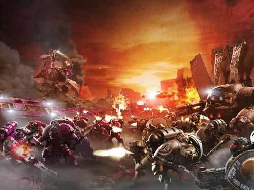
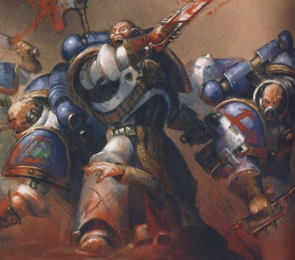
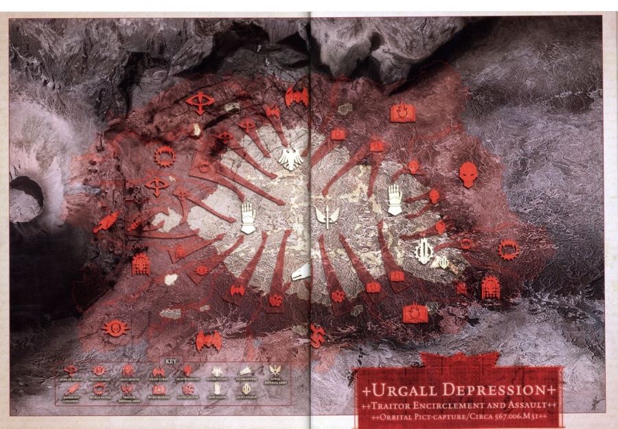
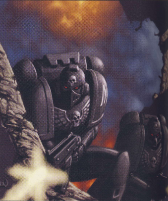

# 0775 006.M31 登陆点大屠杀 Drop Site Massacre

精校状态：中文行文已逐段精校，部分术语仍为暂定

分类：时间线

原文来源：https://www.bilibili.com/opus/1058591911001980930

原作者：帝国神选罐头

原文时间：编辑于 2025年07月28日 09:05

[返回分类目录](目录.md) · [全书目录](../../目录.md)

<!-- A0775-B0001 -->
**英文原文**

The Drop Site Massacre is the most commonly used term for the Battle of Isstvan V, one of the first open military conflicts between the traitor forces of the Warmaster Horus and the loyalist forces of the Emperor. Occurring at the outset of the Horus Heresy it is considered a rubicon moment in Imperial history, as it marked the moment where the traitor legions were irrevocably committed to galactic civil war. The effects and aftermaths of the battle - particularly amongst the Legiones Astartes - would still be echoing ten thousand years later.

<!-- /A0775-B0001 -->

<!-- A0775-B0002 -->

原译文

登陆点大屠杀是伊斯塔万五号之战最常用的术语，这是战帅荷鲁斯的叛徒部队和帝皇的忠诚部队之间最早的公开军事冲突之一。它发生在荷鲁斯叛乱开始时，被认为是帝国历史上的一个卢比孔时刻，因为它标志着叛徒军团不可逆转地致力于银河内战的时刻。这场战役的影响和后果，尤其是在阿斯塔特军团中，在一万年后仍会回荡。

**校订译文**

“登陆点大屠杀”是伊斯塔万五号之战最常用的称呼，也是战帅荷鲁斯的叛军与帝皇忠诚派之间最早公开爆发的军事冲突之一。这场战役发生于荷鲁斯之乱初期，被视为帝国历史上一个无法回头的转折点：从此，叛变军团彻底投入银河内战，再无退路。其影响和余波，尤其对阿斯塔特军团而言，直到一万年后仍未消散。

**校注：** rubicon moment借用越过卢比孔河典故，译为无法回头的转折点，避免不作解释的音译。

<!-- /A0775-B0002 -->

<!-- A0775-B0003 图片 -->

<!-- A0775-B0004 -->

原译文

The Emperor's Children battle the Iron Hands during the Drop Site Massacre 在登陆点大屠杀中，帝皇之子与钢铁之手作战

**校订译文**

The Emperor's Children battle the Iron Hands during the Drop Site Massacre 在登陆点大屠杀中，帝皇之子与钢铁之手作战

<!-- /A0775-B0004 -->

<!-- A0775-B0005 -->
**英文原文**

Conflict:Horus Heresy

<!-- /A0775-B0005 -->

<!-- A0775-B0006 -->

原译文

冲突：荷鲁斯叛乱

**校订译文**

冲突：荷鲁斯之乱

<!-- /A0775-B0006 -->

<!-- A0775-B0007 -->
**英文原文**

Date:006.M31

<!-- /A0775-B0007 -->

<!-- A0775-B0008 -->

原译文

日期：006.M31

**校订译文**

日期：006.M31

<!-- /A0775-B0008 -->

<!-- A0775-B0009 -->
**英文原文**

Location:Isstvan V

<!-- /A0775-B0009 -->

<!-- A0775-B0010 -->

原译文

地点：伊斯塔万五号

**校订译文**

地点：伊斯塔万五号

<!-- /A0775-B0010 -->

<!-- A0775-B0011 -->
**英文原文**

Outcome:Traitor forces victory

<!-- /A0775-B0011 -->

<!-- A0775-B0012 -->

原译文

结果：叛徒势力获胜

**校订译文**

结果：叛徒势力获胜

<!-- /A0775-B0012 -->

<!-- A0775-B0013 -->
**英文原文**

Combatants:Imperium/Traitors

<!-- /A0775-B0013 -->

<!-- A0775-B0014 -->

原译文

作战人员：帝国/叛徒

**校订译文**

交战方：帝国／叛徒

<!-- /A0775-B0014 -->

<!-- A0775-B0015 -->
**英文原文**

Commanders:Primarch Ferrus Manus (KIA),First Captain Gabriel Santar (KIA),Primarch Corvus Corax,Commander Agapito Nev,Primarch Vulkan(MIA),Pyre Captain Artellus Numeon/Warmaster Horus Lupercal,First Captain Ezekyle Abaddon,Captain Horus Aximand,Primarch Fulgrim,First Captain Julius Kaesoron,Captain Marius Vairosean,Lord Commander Eidolon,Captain Lucius,Primarch Angron,Captain Kharn,Primarch Mortarion,First Captain Calas Typhon,Primarch Lorgar Aurelian,First Captain Kor Phaeron,First Chaplain Erebus,Chapter Master Argel Tal,Primarch Konrad Curze,First Captain Jago Sevatarion,Primarch Perturabo,Warsmith Forrix,Warsmith Harkor,Warsmith Golg,Primarch Alpharius Omegon,Lord Commander Fayle

<!-- /A0775-B0015 -->

<!-- A0775-B0016 -->

原译文

指挥官：原体费鲁斯·马努斯（KIA），第一连长加百列·桑塔尔（KIA），原体科沃斯·科拉克斯，指挥官阿加皮托 涅夫，原体沃坎（MIA），火龙连长阿泰勒斯·努梅昂/战帅荷鲁斯·卢佩卡尔，第一连长以泽凯尔·阿巴顿，连长荷鲁斯·阿西曼德，原体福格瑞姆，第一连长尤里乌斯·卡索隆，连长马吕斯·瓦伊罗西恩，领主指挥官艾多隆，连长卢修斯，原体安格隆，连长卡恩，原体莫塔里安，第一连长卡拉斯·泰丰斯，原体珞珈·奥瑞利安，第一连长科尔·法伦，第一牧师艾瑞巴斯，战团长安格尔·塔尔，原体康拉德·科兹，第一连长亚戈·赛维塔里昂，原体佩图拉博，战争铁匠弗里克斯，战争铁匠哈科尔，战争铁匠戈尔格，原体阿尔法瑞斯·欧米伽，领主指挥官法伊尔

**校订译文**

指挥官：原体费鲁斯·马努斯（阵亡）、第一连长加百列·桑塔尔（阵亡）、原体科沃斯·科拉克斯、指挥官阿加皮托·涅夫、原体沃坎（失踪）、烈焰连长阿泰勒斯·努梅昂／战帅荷鲁斯·卢佩卡尔、第一连长以泽凯尔·阿巴顿、连长荷鲁斯·阿西曼德、原体福格瑞姆、第一连长尤利乌斯·凯索伦、连长马吕斯·瓦伊罗西恩、领主指挥官艾多隆、连长卢修斯、原体安格隆、连长卡恩、原体莫塔里安、第一连长卡拉斯·提丰、原体珞珈·奥瑞利安、第一连长科尔·法伦、首席教士艾瑞巴斯、战团长安格尔·塔尔、原体康拉德·科兹、第一连长亚戈·赛维塔里昂、原体佩图拉博、战争铁匠弗里克斯、战争铁匠哈克、战争铁匠高尔、原体阿尔法瑞斯·欧米伽、领主指挥官法伊尔

**校注：** Pyre Captain依Pyre Guard烈焰守卫词根暂译烈焰连长，不与Firedrakes火龙混为同名单位；卡拉斯·提丰是Typhon，不提前替换成Typhus提丰斯。Golg/Forrix按既有全名中的姓氏。

<!-- /A0775-B0016 -->

<!-- A0775-B0017 -->
**英文原文**

Strength:2/3 of the Iron Hands,80,000 Raven Guard,83,000 Salamanders,Imperial Army armoured units, Legio Atarus,House Col'Khak/Sons of Horus,Emperor's Children,World Eaters,Death Guard,Word Bearers,Night Lords,Iron Warriors,Alpha Legion,Legio Mortis,Millions of Traitor Army personnel

<!-- /A0775-B0017 -->

<!-- A0775-B0018 -->

原译文

实力：2/3的钢铁之手、80000名暗鸦守卫、83000名火蜥蜴、帝国陆军装甲部队、炎纹军团、科尔’哈克家族/荷鲁斯之子、帝皇之子、吞世者、死亡守卫、怀言者、午夜领主、钢铁勇士、阿尔法军团、死亡军团、数百万叛徒陆军人员

**校订译文**

兵力：钢铁之手军团的三分之二、八万名暗鸦守卫、八万三千名火蜥蜴、帝国军装甲部队、炎纹军团、科尔’哈克家族／荷鲁斯之子、帝皇之子、吞世者、死亡守卫、怀言者、午夜领主、钢铁勇士、阿尔法军团、死亡军团、数百万叛军人员

<!-- /A0775-B0018 -->

<!-- A0775-B0019 -->
**英文原文**

Casualties:Ferrus Manus killed,Tens of thousands of Iron Hands slain,Only 3,000 Raven Guard survivors,98% of Salamanders lost,Over 200,000 Legionnaires Killed,Presumably near-total Army losses/Unknown; presumably moderate

<!-- /A0775-B0019 -->

<!-- A0775-B0020 -->

原译文

伤亡情况：费鲁斯·马努斯被杀，数万名钢铁之手被杀，只有3000名暗鸦守卫存者，98%的火蜥蜴被杀，20多万名军团士兵被杀，估计接近陆军总损失/未知；大概是中等的

**校订译文**

伤亡：费鲁斯·马努斯阵亡，数万名钢铁之手阵亡，暗鸦守卫仅三千人幸存，火蜥蜴损失百分之九十八，军团战士合计阵亡逾二十万，帝国军推测几乎全军覆没／不详，推测损失中等

**校注：** 资料栏逾二十万与下文早期小说七万总参战数不一致，属本篇明述的版本差异，未擅改。原文98% lost只说损失，不硬改为全部阵亡。

<!-- /A0775-B0020 -->

<!-- A0775-B0021 -->
## Prelude 序曲

<!-- /A0775-B0021 -->

<!-- A0775-B0022 -->
**英文原文**

Up until shortly before the battle of Isstvan V, Horus' rebellion was largely going according to plan. The first significant check to his scheme was met when Ferrus Manus, Primarch of the Iron Hands refused to join the rebellion, despite the entreaties of his close brother, Fulgrim. Manus' refusal forced Fulgrim and his small contingent of Emperor's Children marines to violently escape the rendezvous, a surprise action that inflicted considerable damage upon the Iron Hands' space fleet. Horus, accepting that Fulgrim could sway Ferrus Manus, had factored in the Gorgon's appearance on his side as part of his plans. This news - late in arriving as Fulgrim suffered delays caused by the warp while traveling from the meeting place to the Istvaan system - irritated the Warmaster as it meant Horus' forces would suffer additional and unplanned-for casualties, as well as those inflicted by the then-ongoing and also unexpectedly protracted Battle of Isstvan III. Horus subsequently ordered Fulgrim and his portion of Emperor's Children not assigned to Isstvan III to proceed to Isstvan V and create a fortifed position there.

<!-- /A0775-B0022 -->

<!-- A0775-B0023 -->

原译文

直到伊斯塔万五号之战前不久，荷鲁斯的叛乱基本上都是按计划进行的。钢铁之手原体费鲁斯·马努斯拒绝加入叛乱，尽管他的亲密兄弟福格瑞姆恳求他，这是对他的计划的第一次重大抑制。马努斯的拒绝迫使福格瑞姆和他的一小队帝皇之子星际战士暴力逃离了会合点，这一意外行动对钢铁之手的太空舰队造成了相当大的破坏。荷鲁斯承认福格瑞姆可以动摇费鲁斯·马努斯，并将戈尔贡出现在他身边作为计划的一部分。这一消息来得晚，因为福格瑞姆在从会面地点前往伊斯塔万星系的途中因亚空间而延误，这激怒了战帅，因为这意味着荷鲁斯的部队将遭受额外的、计划外的伤亡，以及当时正在进行的、出乎意料地旷日持久的伊斯塔万三号之战造成的伤亡。荷鲁斯随后命令福格瑞姆和他那部分没有分配给伊斯塔万三号的帝皇之子前往伊斯塔万五号，并在那里建立一个坚固的阵地。

**校订译文**

直到伊斯塔万五号之战前夕，荷鲁斯的叛乱大体按计划进行。第一次重大挫折来自钢铁之手原体费鲁斯·马努斯：尽管亲密兄弟福格瑞姆极力劝说，他仍拒绝加入叛乱。福格瑞姆和随行的少量帝皇之子只得以武力逃离会面地点，并趁钢铁之手猝不及防，重创了对方舰队。荷鲁斯本以为福格瑞姆能说服费鲁斯，早已将戈尔贡参战列入计划。然而，福格瑞姆从会面地点前往伊斯塔万星系时遭遇亚空间延误，消息迟迟才传到战帅耳中，令他十分恼火：伊斯塔万三号之战已出乎意料地久拖不决，现在他的部队又要承受计划外的额外伤亡。荷鲁斯随即命令福格瑞姆率未参与伊斯塔万三号战事的帝皇之子前往伊斯塔万五号，构筑坚固阵地。

<!-- /A0775-B0023 -->

<!-- A0775-B0024 -->
**英文原文**

Fulgrim chose a ruined pre-Imperial fortress and defensive wall emplacement on the lip of the Urgall Plateau as the basis for his fortification. With the aid of Dark Mechanicum elements attached to Horus' forces he swiftly created a vast network of trenches, bulwarks and redoubts around this wall and fortress, emplacing anti-aircraft batteries and surface-to-orbit missile silos all along and behind the perimeter. The fortress itself he partially rebuilt, reinforcing it and even installing a protective void shield system. This would serve as Horus' command post in the battle to come.

<!-- /A0775-B0024 -->

<!-- A0775-B0025 -->

原译文

福格瑞姆选择了一个被毁坏的前帝国堡垒和位于乌尔高尔高原边缘的防御墙作为他的防御工事的基础。在荷鲁斯部队的黑暗机械教的帮助下，他迅速在这堵墙和堡垒周围建立了一个庞大的战壕、堡垒和掩体网络，在周边和后方部署了防空炮阵列和地对轨道导弹发射井。他部分重建了堡垒本身，加固了它，甚至安装了一个保护性的虚空盾系统。这将成为荷鲁斯在未来战斗中的指挥所。

**校订译文**

福格瑞姆选择乌尔高尔高原边缘一处建于帝国成立之前的堡垒废墟和防御墙，作为设防基础。在荷鲁斯麾下黑暗机械教部队的协助下，他迅速围绕城墙和堡垒建起庞大的战壕、壁垒及据点网络，沿防线及其后方设置防空炮阵列和地对轨道导弹发射井。他还重建、加固了部分堡垒，安装虚空盾系统，使其成为荷鲁斯在即将到来的战役中的指挥所。

<!-- /A0775-B0025 -->

<!-- A0775-B0026 -->
**英文原文**

Meanwhile, once news of the rebellion reached Terra, Rogal Dorn, the Primarch of the Imperial Fists, was placed in command of the Imperial military by Malcador the Sigillite. He transmitted the order for a strike force of no less than seven entire Legions - the Iron Hands, the Salamanders, the Raven Guard, the Word Bearers, the Night Lords, the Iron Warriors and the Alpha Legion - to travel to the Isstvan system and destroy the traitor forces. Unable to move his entire legion to Istvaan on time (due to the damage to his fleet inflicted by Fulgrim during his escape from their disastrous meeting), Ferrus Manus elected to travel in the largely undamaged vessel Ferrum, along with his entire Terminator elite, the Morlocks.

<!-- /A0775-B0026 -->

<!-- A0775-B0027 -->

原译文

与此同时，叛乱的消息一传到泰拉，帝国之拳的原体罗格·多恩就被掌印者马卡多任命为帝国军队的指挥官。他下达了命令，要求一支不少于七个完整军团的打击部队 — 钢铁之手、火蜥蜴、暗鸦守卫、怀言者、午夜领主、钢铁勇士和阿尔法军团 — 前往伊斯塔万星系，摧毁叛徒部队。由于福格瑞姆在逃离灾难性的会面时对他的舰队造成了破坏，费鲁斯·马努斯无法按时将他的整个军团转移到伊斯塔万，他选择与他的整个终结者精英莫洛克一道乘坐基本完好无损的船只钢铁号。

**校订译文**

叛乱消息传到泰拉后，掌印者马卡多任命帝国之拳原体罗格·多恩统率帝国军事力量。多恩下令，调集不少于七个完整军团——钢铁之手、火蜥蜴、暗鸦守卫、怀言者、午夜领主、钢铁勇士和阿尔法军团——组成打击部队，前往伊斯塔万星系消灭叛军。福格瑞姆逃离会面时重创了钢铁之手舰队，费鲁斯·马努斯无法及时带上整个军团，只能乘坐基本完好的钢铁号，率全部莫洛克精锐终结者先行。

<!-- /A0775-B0027 -->

<!-- A0775-B0028 -->
**英文原文**

At the conclusion of events on Istvaan III, Horus moved his forces to Istvaan V, taking up position in Fulgrim's defensive work. Horus' forces at this time included the majority of his own Sons of Horus legion, as well as those of the Emperor's Children, Death Guard and World Eaters legions. Alongside these Astartes units he also commanded millions of traitor Imperial Army forces under Lord Commander Fayle and Titans of Legio Mortis. One account of Horus' order of battle at Istvaan V puts his Astartes troop strength at around 30,000 (accounts on the numbers of combatants conflict; see notes at bottom of the page).

<!-- /A0775-B0028 -->

<!-- A0775-B0029 -->

原译文

伊斯塔万三号之战结束后，荷鲁斯将他的部队转移到伊斯塔万五号，在福格瑞姆的防御工作中占据一席之地。荷鲁斯此时的部队包括他自己的荷鲁斯之子军团的大部分，以及帝皇之子、死亡守卫和吞世者军团的大部分。除了这些阿斯塔特部队，他还指挥着领主指挥官法伊尔的数百万叛徒帝国军队和死亡军团的泰坦。关于荷鲁斯在伊斯塔万五号的战斗数据，有一种说法认为阿斯塔特部队兵力约为30000人（关于冲突战斗人员人数的说法；见本页底部的注释）。

**校订译文**

伊斯塔万三号战事结束后，荷鲁斯将部队转移到伊斯塔万五号，进驻福格瑞姆修筑的防线。此时，他麾下包括荷鲁斯之子军团主力，以及帝皇之子、死亡守卫和吞世者各军团的大部分兵力。此外，还有领主指挥官法伊尔统率的数百万叛变帝国军，以及死亡军团的泰坦。一种记述称，荷鲁斯在伊斯塔万五号部署了约三万名阿斯塔特；不同资料的参战人数互相冲突，详见本篇末尾注释。

<!-- /A0775-B0029 -->

<!-- A0775-B0030 -->
## Battle 战斗

<!-- /A0775-B0030 -->

<!-- A0775-B0031 -->
### Preparations 备战

<!-- /A0775-B0031 -->

<!-- A0775-B0032 -->
**英文原文**

The fleets of the Salamanders and Raven Guard arrived at Isstvan V first, finding local space apparently deserted. Achieving orbital superiority uncontested, they undertook observation and reconnaissance missions, able to map out the traitor's position accurately and realising it required a full-scale ground assault to destroy it. The Iron Hands contingent arrived next and the three Primarchs hesitated, both as their orders apparently stipulated that the seven Legions should attack together and because they realised that they could not ensure victory without additional support. Upon learning that the four remaining Legions were mere hours away from translating in-system, Ferrus Manus convinced his brothers Corax and Vulkan to attack immediately, secure in the knowledge that they would receive reinforcements in the field from the inbound Legions. The plan was swiftly decided; Corax was to secure the right flank of the battlefield, Vulkan the left and Ferrus Manus would push through the centre of the enemy line.

<!-- /A0775-B0032 -->

<!-- A0775-B0033 -->

原译文

火蜥蜴和暗鸦守卫的舰队首先抵达伊斯塔万五号，发现当地似乎空无一人。为了获得无可争议的轨道优势，他们进行了观察和侦察任务，能够准确地绘制出叛徒的位置，并意识到需要全面的地面进攻才能摧毁它。钢铁之手特遣队紧随其后，三位原体犹豫不决，因为他们的命令显然规定七个军团应该一起进攻，而且他们意识到，如果没有额外的支援，他们无法确保胜利。得知剩下的四个军团距离星系路程只有几个小时的时间，费鲁斯·马努斯说服他的兄弟科拉克斯和沃坎立即进攻，因为他们知道他们将在战场上得到来自到达军团的增援。计划很快就决定了；科拉克斯负责保护战场的右翼，沃坎负责左翼，而费鲁斯·马努斯则负责推进敌方战线的中心。

**校订译文**

火蜥蜴和暗鸦守卫舰队首先抵达伊斯塔万五号，发现周边太空似乎空无一物。他们没有遭遇抵抗便取得轨道控制权，随即展开观测侦察，准确绘出叛徒阵地，并判断只有全面地面进攻才能将其摧毁。钢铁之手分遣队随后抵达，三位原体却一时犹豫：命令似乎要求七个军团共同进攻，而他们也清楚，缺乏支援就无法确保取胜。得知其余四个军团数小时后便能跃入星系，费鲁斯说服科拉克斯和沃坎立刻进攻，相信即将抵达的军团能及时在战场上增援。三人迅速拟定计划：科拉克斯负责右翼，沃坎负责左翼，费鲁斯突破敌军中央战线。

<!-- /A0775-B0033 -->

<!-- A0775-B0034 -->
**英文原文**

Upon the surface, the traitor Astartes assembled in line formation in front of the defensive wall, with Army artillery and other long-ranged support units kept to the rear. A notable exception to this was the Imperator Titan of Legio Mortis, the Dies Irae, which took up position near to the Astartes, intent on performing a close-support role.

<!-- /A0775-B0034 -->

<!-- A0775-B0035 -->

原译文

表面上，叛徒阿斯塔特在防御墙前排成一行，陆军炮兵和其他远程支援部队留在后方。一个明显的例外是死亡军团的帝皇泰坦，神怒之日，它占据了靠近阿斯塔特的位置，意图发挥密切的支援作用。

**校订译文**

行星地表上，叛徒阿斯塔特在防御墙前排成战列，帝国军炮兵和其他远程支援单位留在后方。死亡军团的帝皇级泰坦“神怒之日号”是个例外，它靠近阿斯塔特阵列，准备提供近距离火力支援。

<!-- /A0775-B0035 -->

<!-- A0775-B0036 -->
### The First Wave 第一波

<!-- /A0775-B0036 -->

<!-- A0775-B0037 -->
**英文原文**

The loyalists commenced the attack by initiating a short orbital barrage all along the length of the traitor line. This proved almost totally ineffective due to the strength of the defensive system (as indeed the loyalists had earlier realised) but succeeded in throwing off the anti-air platforms long enough for an immediate massed drop pod assault to hit the Urgall Plateau directly in front of the traitor position. One account places the total amount of loyalist marines hitting the dirt in this assault as over 40,000 (See Notes). In one of the first pods to land, Ferrus Manus led his elite Iron Hands units directly into an incoming storm of gunfire. Dies Irae opened up, eliminating hundreds of loyalist marines in these first moments. Under cover of this mammoth weight of fire a unit of around a hundred traitor marines - made up of units from the Death Guard and Sons of Horus - sallied out to close and engage with Ferrus Manus' advance unit, but were quickly decimated and forced to retreat in the face of the primarch's rage. At roughly the same time the lead element of the Salamanders under Vulkan hit their portion of the enemy line. The traitors responded with a pinpoint artillery strike directly upon Vulkan's position... which barely fazed the Salamanders primarch, although it did slay several of his Firedrakes. With two primarchs penetrating the traitor defences and shrugging off everything thrown at them, the initial stage of the battle is considered to be tilted in the loyalists' favour.

<!-- /A0775-B0037 -->

<!-- A0775-B0038 -->

原译文

忠诚派开始进攻时，沿着叛徒战线发动了一次短暂的轨道轰炸。事实证明，由于防御系统的强大（正如忠诚派早些时候所意识到的那样），这几乎完全无效，但成功地将防空平台抛下足够长的时间，以便立即进行大规模的空投舱攻击，直接击中叛徒阵地正前方的乌尔高尔高原。有一种说法认为，在这次袭击中，忠诚派的星际战士总人数超过40000人（见注释）。在第一批降落的空投舱中，费鲁斯·马努斯带领他的精锐钢铁之手部队直接进入了即将到来的枪林弹雨。神怒之日开火了，在最初的时刻消灭了数百名忠诚的星际战士。在这巨大火力的掩护下，一支由死亡守卫和荷鲁斯之子组成的约一百名叛徒星际战士组成的部队冲出去接近并与费鲁斯·马努斯的先遣部队交战，但很快就被摧毁，并在原体的愤怒面前被迫撤退。大约在同一时间，沃坎率领的火蜥蜴的主力部队袭击了他们的敌区。叛徒直接对沃坎的阵地进行了精确的炮击...这几乎没有让火蜥蜴原体感到不安，尽管它确实杀死了他的几位火龙。由于两位原体突破了叛徒的防线，对所有投射的东西都不屑一顾，这场战斗的初始阶段被认为对忠诚派有利。

**校订译文**

忠诚派首先沿叛徒整条战线实施短促的轨道轰炸。正如他们事先所料，强大的防御系统令轰炸几乎未能造成破坏，但防空平台暂时受到压制，为紧随其后的大规模空降舱突击争取了时间；空降舱直接落在乌尔高尔高原、叛徒阵地正前方。按一种记述，首批落地的忠诚派星际战士超过四万人，人数问题见篇末注释。费鲁斯·马努斯乘首批空降舱降下，率钢铁之手精锐迎着枪林弹雨冲锋。神怒之日号立即开火，转眼便杀死数百名忠诚派战士。约一百名死亡守卫和荷鲁斯之子趁猛烈火力掩护，出击阻挡费鲁斯的前锋，却在愤怒原体面前伤亡惨重，被迫退却。几乎同时，沃坎率火蜥蜴先头部队撞上敌军防线。叛徒精准炮击沃坎所在的位置，杀死数名火龙战士，却几乎未能撼动原体本人。两位原体强行突破防线，顶住敌人的重重打击，使战役初期的天平倾向忠诚派。

<!-- /A0775-B0038 -->

<!-- A0775-B0039 -->
**英文原文**

Further improving the loyalist situation, the support elements of the loyalists' first wave chose this time to land on the planet. Touching down in a pre-arranged landing zone at the other side of the Urgall Plateau from the traitor position, further loyalist Astartes forces moved out from their Thunderhawk and Stormbird transporters, while heavy landers beachd Imperial armour units (including Super Heavy Tanks) and artillery. With casualties taken into account, it's now reckoned about 60,000 Astartes are engaged in the battle.

<!-- /A0775-B0039 -->

<!-- A0775-B0040 -->

原译文

为了进一步改善忠诚派的情况，忠诚派第一波支援者这次选择登陆行球。在乌尔高尔高原另一侧与叛徒阵地相距的预先安排的着陆区着陆后，进一步的忠诚派阿斯塔特部队从他们的雷鹰和风暴鸟运输机上撤下，而重型登陆艇则将帝国装甲部队（包括超重型坦克）和火炮放下。考虑到伤亡人数，现在估计约有60000名阿斯塔特参与了这场战斗。

**校订译文**

第一波进攻中的支援部队此时也开始登陆，进一步改善了忠诚派的处境。他们在乌尔高尔高原另一侧、远离叛徒阵地的预定登陆区降下。更多阿斯塔特从雷鹰和风暴鸟运输机中出舱，重型登陆艇则运来帝国军装甲部队——包括超重型坦克——以及火炮。扣除已发生的伤亡后，据估算，此时战场上的阿斯塔特约为六万人。

**校注：** 六万人这句话未明说仅忠诚派还是双方，中文同样只称战场上的阿斯塔特，不自行叠加人数。

<!-- /A0775-B0040 -->

<!-- A0775-B0041 图片 -->

<!-- A0775-B0042 -->

原译文

World Eaters attack 吞世者攻击

**校订译文**

World Eaters attack 吞世者攻击

<!-- /A0775-B0042 -->

<!-- A0775-B0043 -->
**英文原文**

The traitor line bent like a bow under the weight of this attack, with Ferrus Manus' spearhead pushing in the furthest. At this point of wavering strength on the part of the defenders, Corax and the Raven Guard made their move, slicing into the traitor flank with a massed jump pack assault. However, this tactic was met with a riposte organised by Angron, primarch of the World Eaters, who had secreted many units of his legion in ambush positions, apparently for just this eventuality. His brutal warriors managed to slay many Raven Guard, halting the advance of the black-armoured Astartes. The loyalist push as a whole slowly ground to a halt at this point, as Mortarion stiffened the resolve of his Death Guard and Ezekyle Abaddon and Horus Aximand moved amongst the Sons of Horus, inspiring them by slaying any Imperial who got within their reach. Ferrus Manus' own constant forward movement finally ended when his Iron Hands ran directly into the waiting formations of Emperor's Children Noise Marines, who devastated the attacking Morlocks with their sonic weaponry.

<!-- /A0775-B0043 -->

<!-- A0775-B0044 -->

原译文

叛徒队伍在这次攻击的重压下像弓一样弯曲，费鲁斯·马努斯的矛头伸得最远。在守军力量动摇的这一时刻，科拉克斯和暗鸦守卫采取了行动，用大规模的跳跃背包攻击切入叛徒侧翼。然而，这一战术遭到了吞世者原体安格隆组织的反击，安格隆将他的军团的许多单位藏匿在伏击位置，显然是为了这种可能性。他残暴的战士们设法杀死了许多暗鸦守卫，阻止了黑甲阿斯塔特的前进。在这一点上，忠诚派的整体攻势慢慢停止，因为莫塔里安坚定了他的死亡守卫的决心，以泽凯尔·阿巴顿和荷鲁斯·阿西曼德在荷鲁斯之子中移动，通过杀死任何触手可及的帝国战士来激励他们。费鲁斯·马努斯的持续前进终于结束了，他的钢铁之手直接跑进了等待的帝皇之子噪音战士编队，他们用声波武器摧毁了进攻的莫洛克。

**校订译文**

在如此猛烈的进攻下，叛徒战线弯曲如弓，费鲁斯率领的锋头推进最深。守军出现动摇时，科拉克斯和暗鸦守卫发动大规模跳跃背包突击，切入敌军侧翼。但安格隆似乎早有准备，将许多吞世者埋伏在附近，立即组织反击。他麾下的残暴战士杀死大量暗鸦守卫，阻住黑甲阿斯塔特的攻势。与此同时，莫塔里安稳住死亡守卫的军心，以泽凯尔·阿巴顿和荷鲁斯·阿西曼德穿行于荷鲁斯之子的阵列间，斩杀一切近身的帝国战士，以身示范鼓舞部队。忠诚派的整体推进遂逐渐停滞。费鲁斯也终于受阻：钢铁之手撞上严阵以待的帝皇之子噪音战士，突进的莫洛克遭声波武器重创。

<!-- /A0775-B0044 -->

<!-- A0775-B0045 -->
**英文原文**

This halt in forward movement for the Imperials did not last too long; heavy armour brigades fought their way across the plateau to arrive behind the Iron Hands, their heavy weaponry scattering the Noise Marines and freeing up the Terminators to continue their advance. Changing target, the massed Imperial armour units then concentrated their firepower on the ravening Dies Irae, stripping its voids and forcing it to cease firing upon infantry and switch to retaliatory tank-busting. Around this time of fragmentary combats, First Captain Julius Kaesoron of the Emperor's Children met First Captain Gabriel Santar of the Iron Hands in single combat, with Kaesoron emerging triumphant.

<!-- /A0775-B0045 -->

<!-- A0775-B0046 -->

原译文

帝国的前进的停顿并没有持续太久；重型装甲旅奋力穿过高原，到达钢铁之手后方，他们的重型武器驱散了噪音战士，释放了终结者继续前进。帝国装甲部队改变了目标，然后将火力集中在凶猛的神怒之日上，过载其虚空盾，迫使其停止向步兵开火，转而进行报复性坦克摧毁。大约在这场零星的战斗中，帝皇之子的第一连长尤里乌斯·卡索隆在一场战斗中遇到了钢铁之手的第一连长加百列·桑塔尔，卡索隆取得了胜利。

**校订译文**

这次停顿并未持续太久。重型装甲旅奋战穿过高原，抵达钢铁之手后方，以重火力打散噪音战士，让终结者得以继续推进。随后，帝国军装甲部队调转炮口，集中攻击肆虐的神怒之日号，击破其虚空盾，迫使它停止屠戮步兵，转而还击坦克。在各处混战中，帝皇之子第一连长尤利乌斯·凯索伦与钢铁之手第一连长加百列·桑塔尔展开单挑，凯索伦最终获胜。

<!-- /A0775-B0046 -->

<!-- A0775-B0047 -->
### The Second Wave 第二波

<!-- /A0775-B0047 -->

<!-- A0775-B0048 -->
**英文原文**

With combat seeming about to enter a disorganised phase, the loyalists were once again bolstered with reinforcements. It was at this time, about three hours after the beginning of the battle, that the second-wave Legions arrived. The Word Bearers, Iron Warriors, Night Lords and Alpha Legion executed successful combat landings into the already-established imperial drop zone, immediately fortifying it and securing the flanks of the plateau itself, with the Night Lords and Alpha Legion taking the flanks, the Iron Warriors the high ground behind the drop zone and the Word Bearers forming up on the newly erected defensive wall. The sight of this massive force - more than doubling the Imperial presence on Istvaan V in one stroke - appeared to force a general fighting retreat on the part of the traitorous forces, with even Angron, Mortarion and the Dies Irae seen pulling back from combat.

<!-- /A0775-B0048 -->

<!-- A0775-B0049 -->

原译文

随着战斗似乎即将进入混乱阶段，忠诚派再次得到增援。就在这个时候，在战斗开始大约三个小时后，第二波军团到达了。怀言者、钢铁勇士、午夜领主和阿尔法军团成功地在已经建立的帝国空投区进行了战斗登陆，立即加强了防御，确保了高原本身的侧翼，午夜领主和阿尔法军团占据了侧翼，钢铁勇士占据了空投区后的高地，怀言者在新建立的防御墙上集结。看到这支庞大的部队—帝国在伊斯塔万五号的存在一举增加了一倍多—似乎迫使叛徒部队进行全面的战斗撤退，甚至安格隆、莫塔里安和神怒之日看起来也退出了战斗。

**校订译文**

战斗眼看就要陷入混乱，忠诚派却再次迎来了“援军”。开战约三小时后，第二波军团抵达：怀言者、钢铁勇士、午夜领主和阿尔法军团成功降落在已经建立的帝国登陆区，立即构筑防御，控制高原两翼。午夜领主和阿尔法军团占据侧翼，钢铁勇士登上登陆区后方高地，怀言者则沿新筑防御墙列阵。这支庞大部队令伊斯塔万五号的帝国兵力骤增至原来的两倍以上；叛徒似乎因此被迫全面边打边退，连安格隆、莫塔里安和神怒之日号都开始脱离战斗。

<!-- /A0775-B0049 -->

<!-- A0775-B0050 -->
**英文原文**

Just at this moment, Ferrus Manus located Fulgrim's command position in the centre of the traitor line and ordered his Morlocks to assault it, despite Corax's urgings to fall back. Corax believed that the battered first-wave Legions should take advantage of the lull in fighting to resupply in the drop zone encampment and return with the fresh second wave, and in fact both the Raven Guard and the Salamanders took this course of action. When Ferrus Manus refused to follow them, his two brothers apparently chose to leave him unsupported rather than reinforce his sudden forward push.

<!-- /A0775-B0050 -->

<!-- A0775-B0051 -->

原译文

就在这一刻，费鲁斯·马努斯将福格瑞姆的指挥位置定位在叛徒战线的中心，并命令他的莫洛克攻击它，尽管科拉克斯敦促他撤退。科拉克斯认为，遭受重创的第一波军团应该利用战斗的间歇，在空投区营地进行补给，并带着新的第二波军团返回，事实上，暗鸦守卫和火蜥蜴都采取了这一行动。当费鲁斯·马努斯拒绝跟随他们时，他的两个兄弟显然选择让他不受支持，而不是加强他突然的向前推进。

**校订译文**

就在这时，费鲁斯发现了位于敌军中央的福格瑞姆指挥阵地，不顾科拉克斯劝他撤回，命令莫洛克立即进攻。科拉克斯认为，受创严重的第一波军团应趁战斗间歇返回登陆区补给，然后再随兵力完整的第二波部队投入战场；暗鸦守卫与火蜥蜴也确实如此行动。费鲁斯拒绝同行，两位兄弟便继续撤退，没有增援他突然发起的突进。

<!-- /A0775-B0051 -->

<!-- A0775-B0052 -->
**英文原文**

The heavy Terminator elite of the Iron Hands struck the Emperor's Children command redoubt hard, engaging in battle with the significantly outnumbered Phoenix Guard. In their stead, Ferrus Manus confronted Fulgrim, choosing to duel him with words rather than weapons. At the other side of the battlefield, the Salamanders and Raven Guard, low on ammunition and having suffered heavy casualties, got to within a hundred metres of the landing zone fortifications when vox-contact with the second wave abruptly went dead. A single flare was fired from Horus' command post: a signal to the second wave legions, now revealed as traitors, to open fire. This first salvo decimated the unsuspecting Raven Guard and Salamanders.

<!-- /A0775-B0052 -->

<!-- A0775-B0053 -->

原译文

钢铁之手的重型终结者精英猛烈袭击了帝皇之子的指挥堡垒，与明显寡不敌众的凤凰卫队交战。代替他们，费鲁斯·马努斯与福格瑞姆对峙，选择用言语而不是武器与他决斗。在战场的另一边，火蜥蜴和暗鸦守卫弹药不足，伤亡惨重，当与第二波的音阵接触突然停止时，他们到达了距离登陆区防御工事不到一百米的地方。荷鲁斯的指挥所只发射了一枚信号弹：这是向第二波军团发出的开火信号，现在被揭露为叛徒。第一次齐射摧毁了毫无戒备的暗鸦守卫和火蜥蜴。

**校订译文**

钢铁之手的重装终结者精锐猛烈攻击帝皇之子指挥据点，与人数远少于己的凤凰卫队激战。与此同时，费鲁斯与福格瑞姆正面对峙，却先以言语交锋，没有立刻动武。战场另一侧，弹药匮乏、伤亡惨重的火蜥蜴和暗鸦守卫已来到距登陆区工事不足百米处，与第二波军团的通讯突然全部中断。荷鲁斯指挥所升起一枚信号弹，第二波军团随即奉命开火，暴露了叛徒身份。第一轮齐射便令毫无防备的暗鸦守卫和火蜥蜴遭受惨重损失。

<!-- /A0775-B0053 -->

<!-- A0775-B0054 -->
### Massacre 大屠杀

<!-- /A0775-B0054 -->

<!-- A0775-B0055 -->
**英文原文**

Holding an immediate conference, Corax and Vulkan found themselves disagreeing over what to do; Vulkan advocated making their way to their own dropships and digging in to resist an attack, while Corax insisted that they should take whatever means possible to immediately evacuate the area. Unable to agree a unified plan, Corax - realising the battle was lost - turned from his brother and ordered his legion to retreat by any means necessary.

<!-- /A0775-B0055 -->

<!-- A0775-B0056 -->

原译文

科拉克斯和沃坎立即举行了一次会议，发现他们对该怎么办意见不一；沃坎主张前往自己的空降舰并挖掘以抵抗袭击，而科拉克斯坚持认为他们应该采取一切可能的手段立即撤离该地区。由于无法就统一计划达成一致，科拉克斯意识到战斗已经失败，于是转身离开了他的兄弟，命令他的军团以任何必要的方式撤退。

**校订译文**

科拉克斯与沃坎立即商议应对，却意见相左。沃坎主张退至己方登陆舰附近，就地构筑阵地抵抗；科拉克斯则坚持不惜一切手段立刻撤离。这场战斗已经失败，两人又无法达成统一计划，科拉克斯遂与兄弟分头行动，命令自己的军团设法撤退。

<!-- /A0775-B0056 -->

<!-- A0775-B0057 图片 -->

<!-- A0775-B0058 -->

原译文

The encirclement of Loyalist forces at the Urgall Depression 在乌尔高尔洼地对忠诚派军队的包围

**校订译文**

The encirclement of Loyalist forces at the Urgall Depression 在乌尔高尔洼地对忠诚派军队的包围

<!-- /A0775-B0058 -->

<!-- A0775-B0059 -->
**英文原文**

On the other side of the battlefield, the supposedly retreating traitor legions about-faced and threw themselves at the Iron Hands, apparently slaughtering them to the last marine. In the midst of this carnage, Fulgrim and Ferrus Manus, once the closest of brothers, dueled to the death. After a titanic conflict Fulgrim emerged the victor, and beheaded Ferrus Manus. Immediately afterwards, the horrified Primarch of the Emperor's Children, seeking oblivion for his sin, gave in to daemonic possession, for a time effectively ceasing to exist as an independent entity.

<!-- /A0775-B0059 -->

<!-- A0775-B0060 -->

原译文

在战场的另一边，本应撤退的叛徒军团转过身来，扑向钢铁之手，显然将他们屠杀到最后一名战士。在这场大屠杀中，曾经最亲密的兄弟福格瑞姆和费鲁斯·马鲁斯死斗。在一场激烈的冲突后，福格瑞姆成为胜利者，并斩首了费鲁斯·马努斯。紧接着，这位吓坏了的帝皇之子的原体，为自己的罪行祈求遗忘，屈服于恶魔的占有，在一段时间内有效地停止了作为一个独立实体的存在。

**校订译文**

战场另一侧，佯装撤退的叛变军团突然转身，扑向钢铁之手，几乎将眼前的战士屠戮殆尽。在这场浩劫中，昔日最亲密的兄弟福格瑞姆与费鲁斯·马努斯展开殊死决斗。激战之后，福格瑞姆取胜，斩下费鲁斯的头颅。帝皇之子原体旋即惊骇于自己的罪行，渴望泯灭自我，遂任由恶魔附身，一度失去作为独立意识的存在。

**校注：** 原文“似乎杀至最后一人”与后文仍有钢铁之手获救不能作为全军绝灭事实，中文限于眼前战场、保留近乎全灭。恶魔附身叙述是所给底稿版本，未凭记忆改写其后发展。

<!-- /A0775-B0060 -->

<!-- A0775-B0061 -->
**英文原文**

The general advance of the traitors included the newly revealed second wave forces, with Lorgar, Kor Phaeron and Erebus of the Word Bearers in the vanguard. Due to the positioning of the legions, the Word Bearers primarily found themselves facing Raven Guard marines, and it was in the midst of this fighting that the hardest hitting units of both legions would meet in brutal combat. The Gal Vorbak - the Word Bearers' elite Possessed formation - leapt upon Corax, attempting to swarm him in close combat. The Primarch of the Raven Guard proved so formidable a warrior however, that even Astartes enhanced by daemonic possession were no match for him and he slew them freely. In an attempt to stop this slaughter of his favoured sons, Lorgar used his normally stunted and weak psychic powers to charge through the throng of warriors, arriving just in time to prevent the deaths of such Gal Vorbak as Argel Tal. Corax and Lorgar then dueled, with Corax swiftly gaining the upper hand over the less warlike Lorgar and preparing to execute him. Lorgar was only saved from death by the sudden intervention of Konrad Curze, the Night Haunter, who threw himself at his Raven Guard brother. Fresh to the battle and a lethal warrior, Curze proved superior to the tired and wounded Corax and drove him off.

<!-- /A0775-B0061 -->

<!-- A0775-B0062 -->

原译文

叛徒的总体推进包括新暴露的第二波部队，其中怀言者的珞珈、科尔·法伦和艾瑞巴斯是先锋。由于军团的定位，怀言者发现自己主要面对的是暗鸦守卫，正是在这场战斗中，两个军团中攻击最重的部队将在残酷的战斗中相遇。受祝之子—怀言者的精英附魔编队—跳到科拉克斯身上，试图在近距离战斗中包围他。然而，暗鸦守卫的原体被证明是一位如此强大的战士，即使是被恶魔附身的阿斯塔特也无法与他匹敌，他自由地杀死了他们。为了阻止这场对他宠爱的子嗣的屠杀，珞珈利用他通常发育迟缓和虚弱的灵能力量，在战士们中冲锋，及时赶到，阻止了像安格尔·塔尔这样的受祝之子的死亡。科拉克斯和珞珈随后决斗，科拉克斯迅速战胜了不那么尚武的珞珈，并准备处决他。珞珈是在午夜幽魂康拉德·柯兹的突然干预下才幸免于难的，他扑向了他的暗鸦守卫兄弟。刚参加战斗的科兹是一名致命的战士，他表现得比疲惫受伤的科拉克斯更出色，并把他驱逐了。

**校订译文**

刚刚暴露身份的第二波军团也加入全面进攻，怀言者的珞珈、科尔·法伦和艾瑞巴斯走在前列。双方部署的位置使怀言者主要与暗鸦守卫交战，两军团最强悍的突击部队因此短兵相接。怀言者精锐附魔部队“受祝之子”扑向科拉克斯，试图在近战中围杀他。但暗鸦守卫原体强大得惊人，即使得到恶魔附身强化的阿斯塔特也不是他的对手，被他接连斩杀。为救下心爱的子嗣，珞珈动用了自己平时发展有限、较为薄弱的灵能力量，冲过人群，及时阻止科拉克斯杀死安格尔·塔尔等受祝之子。两位原体随即决斗，科拉克斯很快压制了不擅征战的珞珈，准备将其处决。午夜幽魂康拉德·科兹突然介入，扑向暗鸦守卫原体，才使珞珈免于一死。科兹刚投入战斗，体力充沛且身手致命，压倒并逼退了疲惫负伤的科拉克斯。

<!-- /A0775-B0062 -->

<!-- A0775-B0063 -->
**英文原文**

It was at this point in the battle that the day could truly be called a massacre. Massively outnumbered, the Raven Guard and Salamanders were dying, but dying slowly. Until that is, the return to the field of Mortarion, Angron and the Dies Irae, who caused tens of thousands of deaths. Fulgrim - now secretly possessed by a daemon - quit the field completely, leaving the Emperor's Children to be commanded by Eidolon and Lucius. Finally, Horus himself entered the slaughter, leading his own Terminator elite; the Justaerin of Captain Falkus Kibre. At the climax of the massacre the Iron Warriors launched a tactical nuclear missile at Vulkan's position, annihilating those Salamanders with him and ending Vulkan's participation in the battle.

<!-- /A0775-B0063 -->

<!-- A0775-B0064 -->

原译文

正是在战斗的这一点上，这一天才真正被称为大屠杀。由于人数众多，暗鸦守卫和火蜥蜴正在死亡，但死亡速度很慢。在此之前，莫塔里安、安格隆和神怒之日重返战场，他们造成了数万人死亡。福格瑞姆现在被一个恶魔秘密占有，完全退出了战场，留下帝皇之子们由艾多隆和卢修斯指挥。最后，荷鲁斯自己也加入了屠杀，带领自己的终结者精英；连长法库斯·凯博的加斯塔林。在大屠杀的高潮，钢铁勇士向沃坎的阵地发射了一枚战术核导弹，消灭了与他一起的火蜥蜴，结束了沃坎在战斗中的参与。

**校订译文**

至此，战斗才真正化为一边倒的大屠杀。暗鸦守卫与火蜥蜴在数量上远逊敌军，虽然不断伤亡，仍顽强抵抗；直到莫塔里安、安格隆和神怒之日号重返战场，又夺去数万生命。已被恶魔秘密附身的福格瑞姆彻底离开，将帝皇之子交给艾多隆和卢修斯指挥。最后，荷鲁斯也亲自投入屠杀，率领法库斯·凯博连长麾下的加斯塔林精锐终结者参战。屠杀达到顶点时，钢铁勇士向沃坎所在位置发射战术核导弹，歼灭其身边的火蜥蜴，也使沃坎退出了此战。

<!-- /A0775-B0064 -->

<!-- A0775-B0065 -->
**英文原文**

The hopes of Imperial retreat were largely quashed when the Iron Warriors turned their guns on the first wave dropships, destroying them; in addition, the orbital battle between the fleets of the various Legions resulted in the almost total destruction of the surprised loyalist vessels. Despite this, small pockets of Raven Guard and Salamanders manged to break out of the massacre site, boarding whatever vessels they could find and taking off. More Raven Guard than Salamanders escaped, although the Salamanders did manage to take some surviving Iron Hands marines away with them. Corax managed to get aboard a Thunderhawk, but it was shot down almost immediately, crashing outside the Urgall Plateau.. Meanwhile, regenerating from his wounds due to being a Perpetual (a fact unknown to the traitors), Vulkan ended up a prisoner to Konrad Curze aboard the Nightfall, Curze's flagship.

<!-- /A0775-B0065 -->

<!-- A0775-B0066 -->

原译文

当钢铁勇士向第一波空降舰开火并摧毁它们时，帝国撤退的希望在很大程度上破灭了；此外，各军团舰队之间的轨道战导致惊讶的忠诚派战舰几乎完全被摧毁。尽管如此，一小群暗鸦守卫和火蜥蜴还是设法逃离了大屠杀现场，登上他们能找到的任何舰船并起飞。逃脱的暗鸦守卫比火蜥蜴还多，尽管火蜥蜴确实设法带走了一些幸存的钢铁之手战士。科拉克斯设法登上了一架雷鹰，但它几乎立即被击落，坠毁在乌尔高尔高原外...与此同时，由于是永生者（叛徒们不知道这一事实），沃坎从伤口中恢复过来，最终在科兹的旗舰夜幕将临号上被康拉德·科兹俘虏。

**校订译文**

钢铁勇士炮击并摧毁第一波部队的登陆舰，使帝国军的撤退希望几近破灭；轨道上，各军团舰队相互交战，猝不及防的忠诚派舰船几乎全军覆没。尽管如此，少数暗鸦守卫和火蜥蜴仍冲出屠杀区，登上能找到的舰船逃离。暗鸦守卫逃出的数量较多，火蜥蜴则带走了一些幸存的钢铁之手。科拉克斯登上一架雷鹰，却几乎立刻遭击落，坠毁于乌尔高尔高原之外。沃坎拥有叛徒尚不知晓的永生者体质，正从伤势中再生，却最终沦为康拉德·科兹的囚徒，被关在其旗舰夜幕降临号上。

<!-- /A0775-B0066 -->

<!-- A0775-B0067 -->
**英文原文**

Among those small groups of loyalists who escaped the trap were Cadmus Tyro, commanding a mixed group of survivors on the ship Sisypheum, and Artellus Numeon, leading a force of Salamanders aboard the Fire Ark.

<!-- /A0775-B0067 -->

<!-- A0775-B0068 -->

原译文

在那些逃脱陷阱的忠诚者小团体中，有卡德摩斯·泰罗，他指挥着西西弗姆号上的一群混合幸存者，还有阿泰勒斯·努梅昂，他带领着烈焰方舟号上的一支火蜥蜴部队。

**校订译文**

逃出陷阱的忠诚派中，包括卡德摩斯·泰罗率领的一支混编幸存者部队，他们乘坐西西弗姆号脱离；阿泰勒斯·努梅昂则率一支火蜥蜴部队乘火焰方舟号逃走。

<!-- /A0775-B0068 -->

<!-- A0775-B0069 -->
### The Raven's Flight 暗鸦的逃离

原题：The Raven's Flight 渡鸦之旅

**校注：** Flight在逃离战场的语境中指逃脱，沿181既定暗鸦的逃离；篇末同名作品统一。

<!-- /A0775-B0069 -->

<!-- A0775-B0070 -->
**英文原文**

Corax survived the crash and quickly managed to regroup his Raven Guard survivors, where much to his dismay he discovered that the casualty estimate for his entire legion was between 75 and 90 percent. He assembled these survivors (numbering four thousand; see Notes) atop a highlands hill, but a roving Iron Warriors armour column threatened to unmask his position. Electing to destroy them, he swiftly organized an ambush with his surviving tactical and assault units and wiped it out, before moving his hiding place.

<!-- /A0775-B0070 -->

<!-- A0775-B0071 -->

原译文

科拉克斯在坠机事件中幸存下来，并迅速设法重新组织了他的暗鸦守卫幸存者，在那里，令他沮丧的是，他发现整个军团的伤亡估计在75%到90%之间。他在一座高地山顶召集了这些幸存者（共四千人；见注释），但一支四处游荡的钢铁勇士装甲纵队威胁要掀开他的阵地。他选择摧毁他们，迅速组织了一次伏击，并消灭了幸存的战术和突击部队，然后转移了藏身之处。

**校订译文**

科拉克斯在坠机中幸存，很快重整暗鸦守卫残部，却痛心地得知，军团伤亡估计达到百分之七十五至九十。他将四千名幸存者集结在高地上的一座山丘——人数差异见篇末注释——但一支巡游的钢铁勇士装甲纵队可能暴露他们的位置。科拉克斯决定将其消灭，迅速组织幸存的战术和突击部队设伏，歼灭纵队后再转移藏身处。

**校注：** 科拉克斯用幸存的战术与突击部队伏击敌装甲纵队，并非消灭自己的幸存部队；原译施受颠倒。

<!-- /A0775-B0071 -->

<!-- A0775-B0072 图片 -->

<!-- A0775-B0073 -->

原译文

Raven Guard embattled 处境艰难的暗鸦守卫

**校订译文**

Raven Guard embattled 处境艰难的暗鸦守卫

<!-- /A0775-B0073 -->

<!-- A0775-B0074 -->
**英文原文**

Thirty days after the drop-assault, the hiding Raven Guard had heard no word from either the Salamanders or Iron Hands and felt that their future looked bleak. Corax ordered that his men should move to an area known as the Lurgan Ridge and dig in there, whilst he undertook a solo reconnaissance mission of the drop site. Even though it was still being used by traitor units, Corax was able to completely escape detection by using his 'invisibility' or psi-clouding power. While recon may have been his stated purpose for this dangerous mission, Corax spent most of his time on the Urgall searching for the corpses of his brothers. He did not find them.

<!-- /A0775-B0074 -->

<!-- A0775-B0075 -->

原译文

在空降突击30天后，躲藏的暗鸦守卫没有听到火蜥蜴或钢铁之手的任何消息，觉得他们的未来看起来很黯淡。科拉克斯命令他的部下移动到一个名为鲁甘山岭的地区并在那里挖掘，同时他独自对空投地点进行了侦察任务。尽管它仍被叛徒部队使用，但科拉克斯能够通过使用他的“隐形”或灵能云能力完全逃脱探测。虽然侦察可能是他这次危险任务的既定目的，但科拉克斯大部分时间都在乌尔高尔上寻找他兄弟的尸体。他没有找到他们。

**校订译文**

空降突击三十天后，躲藏中的暗鸦守卫仍未收到火蜥蜴或钢铁之手的任何消息，前景一片黯淡。科拉克斯命部下前往鲁甘山岭构筑阵地，自己则独自返回登陆点侦察。叛徒仍在使用那里，但他凭借“隐形”——即以灵能力量蒙蔽感知——完全避开了侦测。名义上这是一次危险的侦察行动，实际上，他在乌尔高尔的大部分时间都用来寻找兄弟们的遗体。然而，他什么也没有找到。

**校注：** psi-clouding是灵能蒙蔽感知，非名为灵能云的物质；dig in指构筑阵地，不只挖掘。

<!-- /A0775-B0075 -->

<!-- A0775-B0076 -->
**英文原文**

Ninety-eight days after the massacre, the Raven Guard were pinned down by their hunters; Angron and his World Eaters. The World Eaters force (massively outnumbering the three thousand surviving Raven Guard) hit them with a Whirlwind artillery bombardment, but before they were able to follow this up and close in for the kill they came under concentrated orbital bombardment and air-to-surface missile strikes from suddenly appearing Raven Guard dropships. These dropships, under the command of Imperial Army Praefactor Marcus Valerius and part of a mission led by Raven Guard Commander Branne, quickly managed to evacuate the Raven Guard survivors in the brief window they fought for themselves, allowing Corax to finally leave Istvaan V, but with only three thousand of the eighty thousands marines he initially landed with. Unknown to either Horus or Corax, Alpharius had allowed the Raven Guard's escape as part of his own plans regarding the Legion.

<!-- /A0775-B0076 -->

<!-- A0775-B0077 -->

原译文

大屠杀发生98天后，暗鸦守卫被猎手制服；安格隆和他的吞世者。吞世者部队（人数远远超过幸存的三千名暗鸦守卫）用旋风火炮轰炸了他们，但在他们能够跟进并接近杀戮之前，他们遭到了突然出现的暗鸦守卫空降舰的集中轨道轰炸和空对地导弹袭击。这些空降舰在帝国陆军兵团长马库斯·瓦莱里乌斯的指挥下，以及暗鸦守卫指挥官布兰领导的部队的一部分下，在他们为自己而战的短暂窗口内迅速撤离了暗鸦守卫幸存者，使科拉克斯最终离开了伊斯塔万五号，但最初降落的8万名战士中只剩下3000人。荷鲁斯和科拉克斯都不知道，阿尔法瑞斯允许暗鸦守卫逃跑，这是他自己关于军团计划的一部分。

**校订译文**

大屠杀九十八天后，追猎者安格隆及其吞世者将暗鸦守卫压制在阵地上。吞世者兵力远超仅存的三千名暗鸦守卫，以旋风火炮轰击他们。然而，敌人还未来得及逼近歼灭残部，突然出现的暗鸦守卫登陆舰便配合集中轨道轰炸，发动空对地导弹攻击。这些登陆舰由帝国军兵团长马库斯·瓦莱里乌斯指挥，是暗鸦守卫指挥官布兰尼率领的救援行动的一部分。他们利用奋战赢得的短暂空隙，迅速撤出幸存者，使科拉克斯终于离开伊斯塔万五号——但最初随他登陆的八万人仅余三千。荷鲁斯与科拉克斯都不知道，阿尔法瑞斯为实施针对暗鸦守卫的计划，有意放走了他们。

**校注：** pinned down指被压制，非已被制服俘获。轨道轰炸与登陆舰导弹火力原句合写，中文不说登陆舰本身同时处于轨道与大气层。

<!-- /A0775-B0077 -->

<!-- A0775-B0078 -->
## Notes 注释

<!-- /A0775-B0078 -->

<!-- A0775-B0079 -->
### Astartes Numbers 星际战士数量

<!-- /A0775-B0079 -->

<!-- A0775-B0080 -->
**英文原文**

The main sources for the Drop Site Massacre contradict the numbers of Astartes present at the battle. Fulgrim by Graham McNeill gives 30,000 marines for the traitor legions total and 40,000 marines for the first wave loyalist total, resulting in total involvement of 70,000 Astartes from 7 legions before the second wave drops.

<!-- /A0775-B0080 -->

<!-- A0775-B0081 -->

原译文

空投点大屠杀的主要来源与参加战斗的阿斯塔特人数相矛盾。格雷厄姆·麦克尼尔笔下的福格瑞姆为叛徒军团总共提供了3万名战士，为第一波忠诚派总共提供了4万名战士，在第二波空投之前，共有7个军团的7万名阿斯塔特参与其中。

**校订译文**

关于登陆点大屠杀，主要资料对参战阿斯塔特人数的记载彼此矛盾。格雷厄姆·麦克尼尔的小说《福格瑞姆》记叛徒军团合计三万人，第一波忠诚派四万人，即第二波登陆前，七个军团共投入七万名阿斯塔特。

<!-- /A0775-B0081 -->

<!-- A0775-B0082 -->
**英文原文**

On the other hand, Raven's Flight by Gav Thorpe states that the number of Raven Guard present was 80,000, meaning that in one source the number of marines in one legion alone is more than the total initial number of combatants in the other. In Deliverance Lost by Gav Thorpe, Corax states that he left Istvaan with 5,000 warriors and confirms that at least 75,00 Raven Guard died on Istvaan which proves Corax started with at least 80,000 warriors. This figure was indicative of Black Library's decision to retroactively (and drastically) increase the size of the Space Marine legions.

<!-- /A0775-B0082 -->

<!-- A0775-B0083 -->

原译文

另一方面，加夫·索普的《渡鸦之旅》指出，暗鸦守卫的人数为80000人，这意味着在一个来源中，仅一个军团的星际战士人数就超过了另一个军团最初的战斗人员总数。在加夫·索普的《救赎之失》中，科拉克斯表示，他带着5000名战士离开了伊斯塔万，并证实至少有75000名暗鸦守卫在伊斯塔万死亡，这证明科拉克斯最初至少有80000名战士。这一数字表明，黑色图书馆决定追溯（并大幅）增加星际战士的规模。

**校订译文**

加夫·索普的《暗鸦的逃离》却记暗鸦守卫有八万人。也就是说，该资料中仅一个军团的人数，就超过另一资料记载的初期参战总人数。在同一作者的《拯救星陷落》中，科拉克斯说自己带着五千名战士离开伊斯塔万，并确认至少七万五千名暗鸦守卫死在那里，因此最初兵力至少有八万。这反映了黑色图书馆后来追溯修订设定、大幅扩大星际战士军团规模的决定。

**校注：** 英文75,00明显少一位，依同句五千幸存、初始八万校为七万五千；五千与前文三千分别保留并提示来源不同。扩大的是军团编制人数，不是星际战士体型。

<!-- /A0775-B0083 -->

<!-- A0775-B0084 -->
**英文原文**

Given that both later books in the series and the new Forge World Horus Heresy rulebooks give larger legion numbers, the numbers presented in the earlier novel Fulgrim should no longer be considered canon.

<!-- /A0775-B0084 -->

<!-- A0775-B0085 -->

原译文

鉴于该系列后来的书和新的FW荷鲁斯叛乱规则书都给出了更大的军团数量，早期小说《福格瑞姆》中给出的数字不应再被视为标准。

**校订译文**

由于系列后续作品和新版 Forge World《荷鲁斯之乱》规则书都采用更大的军团规模，本文认为，早期小说《福格瑞姆》所列人数已不宜继续作为正典依据。

**校注：** 原文关于canon的结论为底稿作者的资料判断，中文以本文认为标明；本次未将此断言伪装成新查官方结论。

<!-- /A0775-B0085 -->

本篇核心术语与暂定项

以下列出本篇出现的英文原形及核心术语表用词。同形词可能指不同对象，具体词义以本篇正文和校注为准；单复数、别名和仅见于图注的名称可能尚未列入。完整候选见[术语表](../../术语表/双语术语候选.csv)。

| 英文 | 采用中文 | 状态 |
| --- | --- | --- |
| Imperial Army | 帝国军 | 暂定·官方待核 |
| Death Guard | 死亡守卫 | 官方已核对 |
| World Eaters | 吞世者 | 官方已核对 |
| Terminator | 终结者 | 官方已核对 |
| Horus Heresy | 荷鲁斯之乱 | 官方已核对 |
| Warp | 亚空间 | 官方已核对 |
| Imperium | 帝国 | 暂定·简称 |
| Mechanicum | 机械教 | 暂定·历史称谓 |
| Dark Mechanicum | 黑暗机械教 | 暂定·官方待核 |
| History | 历史 | 编辑用语已统一 |
| Notes | 注释 | 编辑用语已统一 |
| Imperial Fists | 帝国之拳 | 暂定 |
| Emperor | 帝皇 | 官方已核对 |
| Primarch | 原体 | 官方已核对 |
| Forge World | 铸造世界 | 暂定·官方待核 |
| Word Bearers | 怀言者 | 暂定·官方待核 |
| Emperor's Children | 帝皇之子 | 官方已核对 |
| Iron Warriors | 钢铁勇士 | 暂定·官方待核 |
| Night Lords | 午夜领主 | 暂定·官方待核 |
| The Order | 秩序 | 暂定·官方待核 |
| Mortarion | 莫塔里安 | 官方已核对 |
| Ferrus Manus | 费鲁斯·马努斯 | 暂定·官方待核 |
| Terra | 泰拉 | 暂定·官方待核 |
| Horus | 荷鲁斯 | 暂定·官方待核 |
| Erebus | 艾瑞巴斯 | 暂定·官方待核 |
| Sons of Horus | 荷鲁斯之子 | 暂定·官方待核 |
| Isstvan III | 伊斯塔万三号 | 暂定·官方待核 |
| Iron Hands | 钢铁之手 | 暂定·官方待核 |
| Fulgrim | 福格瑞姆 | 官方已核对 |
| Legiones Astartes | 阿斯塔特军团 | 暂定·官方待核 |
| Perpetual | 永生者 | 暂定·官方待核 |
| Malcador the Sigillite | 掌印者马卡多 | 暂定·官方待核 |
| Vulkan | 沃坎 | 暂定·官方待核 |
| Salamanders | 火蜥蜴 | 暂定·官方待核 |
| Konrad Curze | 康拉德·科兹 | 暂定·官方待核 |
| Lucius | 卢修斯 | 暂定·官方待核 |
| Deliverance | 拯救星 | 暂定·官方待核 |
| Titan | 泰坦 | 暂定·官方待核 |
| Warsmith | 战争铁匠 | 暂定·官方待核 |
| Crash | 崩溃 | 暂定·官方待核 |
| Master | 导师（审判庭职衔）／舰务官（舰员职务） | 语境定译·官方待核 |
| Mission | 教团／传教机构 | 暂定 |
| Argel Tal | 阿格尔·塔尔 | 暂定·官方待核 |
| Chaplain | 教士 | 官方已核对 |
| Drop Pod | 空降舱 | 官方已核·中英对照 |
| Whirlwind | 旋风战车 | 官方已核对 |
| Horus Lupercal | 荷鲁斯·卢佩卡尔 | 暂定·官方待核 |
| Lupercal | 卢佩卡尔 | 暂定·官方待核 |
| Justaerin | 加斯塔林 | 暂定·官方待核 |
| Falkus Kibre | 法库斯·凯博 | 暂定·官方待核 |
| Horus Aximand | 荷鲁斯·阿西曼德 | 暂定·官方待核 |
| Lord Commander | 领主指挥官 | 暂定·官方待核 |
| Alpha Legion | 阿尔法军团 | 暂定·官方待核 |
| Raven Guard | 暗鸦守卫 | 官方已核 |
| Deliverance Lost | 拯救星陷落 | 暂定·官方待核 |
| The Sigillite | 掌印者 | 暂定·官方待核 |
| Cadmus Tyro | 卡德摩斯·泰罗 | 暂定·官方待核 |
| Agapito Nev | 阿加皮托·涅夫 | 暂定·官方待核 |
| Gal | 加尔 | 暂定·官方待核 |
| Artellus Numeon | 阿泰勒斯·努梅昂 | 暂定·官方待核 |
| Isstvan | 伊斯塔万 | 暂定·官方待核 |
| First Captain | 第一连长 | 暂定·官方待核 |
| Gabriel Santar | 加百列·桑塔尔 | 暂定·官方待核 |
| Eidolon | 艾多隆 | 暂定·官方待核 |
| Julius Kaesoron | 尤利乌斯·凯索伦 | 暂定·官方待核 |
| Harkor | 哈克 | 暂定·官方待核 |
| Jago Sevatarion | 雅戈·赛维塔里昂 | 暂定·官方待核 |
| Calas Typhon | 卡拉斯·提丰 | 暂定·官方待核 |
| Ezekyle Abaddon | 以泽凯尔·阿巴顿 | 暂定·官方待核 |
| Kor Phaeron | 科尔·法伦 | 暂定·官方待核 |
| Space Marine | 星际战士 | 暂定·官方待核 |
| Chapter | 战团 | 暂定·官方待核 |
| Chapter Master | 战团长 | 暂定·官方待核 |
| Captain | 连长 | 暂定·官方待核 |
| Terminators | 终结者 | 暂定·官方待核 |
| Brother | 修士 | 暂定·官方待核 |
| Vanguard | 先锋 | 暂定·官方待核 |
| Stormbird | 风暴鸟 | 暂定·官方待核 |
| Lorgar | 珞珈 | 暂定·官方待核 |
| Lorgar Aurelian | 珞珈·奥瑞利安 | 暂定·官方待核 |
| Gal Vorbak | 受祝之子 | 暂定·官方待核 |
| Powers | 能天使 | 暂定·官方待核 |
| Alpharius | 阿尔法瑞斯 | 暂定·官方待核 |
| Omegon | 欧米伽 | 暂定·官方待核 |
| Alpharius Omegon | 阿尔法瑞斯·欧米伽 | 暂定·官方待核 |
| Favoured Sons | 受宠之子 | 暂定·官方待核 |
| Nightfall | 夜幕降临号 | 暂定·官方待核 |
| Angron | 安格隆 | 官方已核对 |
| Gav Thorpe | 加夫·索普 | 暂定·官方待核 |
| Phaeron | 法皇 | 暂定·官方待核 |
| Sisypheum | 西西弗姆号 | 暂定·官方待核 |
| Morlocks | 莫洛克 | 暂定·官方待核 |
| Cadmus | 卡德摩斯 | 暂定·官方待核 |
| Firedrakes | 火龙 | 暂定·官方待核 |
| Corvus Corax | 科沃斯·科拉克斯 | 暂定·官方待核 |
| Legio Atarus | 炎纹军团 | 暂定·官方待核 |
| First Chaplain | 首席教士 | 暂定·官方待核 |
| Marcus Valerius | 马库斯·瓦莱里乌斯 | 暂定·官方待核 |
| Dies Irae | 神怒之日号 | 暂定·官方待核 |
| System | 星系（恒星系统） | 暂定·官方待核 |
| Legio Mortis | 死亡军团 | 暂定·官方待核 |
| Fire Ark | 火焰方舟号 | 暂定·官方待核 |
| House Col'Khak | 科尔’哈克家族 | 暂定·官方待核 |
| Pyre Captain | 烈焰连长 | 暂定·官方待核 |
| Marius Vairosean | 马吕斯·瓦伊罗西恩 | 暂定·官方待核 |
| Fayle | 法伊尔 | 暂定·官方待核 |
| Ferrum | 钢铁号 | 暂定·官方待核 |
| Urgall Plateau | 乌尔高尔高原 | 暂定·官方待核 |
| Lurgan Ridge | 鲁甘山岭 | 暂定·官方待核 |
| Phoenix Guard | 凤凰卫队 | 暂定·官方待核 |
| Raven's Flight | 暗鸦的逃离 | 暂定·官方待核 |
| Graham McNeill | 格雷厄姆·麦克尼尔 | 暂定·官方待核 |
| Jump Pack | 跳跃背包 | 暂定·官方待核 |
| Black Library | 黑图书馆 | 暂定·官方待核 |
| Imperial Armour | 帝国装甲 | 暂定·官方待核 |
| Gorgon | 戈尔贡 | 暂定·官方待核 |

