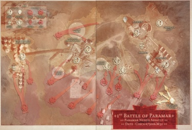

# 0776 673.006.M31 帕拉马尔五号入侵 Invasion of Paramar V

精校状态：中文行文已逐段精校，部分术语仍为暂定

分类：时间线

原文来源：https://www.bilibili.com/opus/1198440762042220544

原作者：帝国神选罐头

原文时间：2026年05月04日 13:22

[返回分类目录](目录.md) · [全书目录](../../目录.md)

<!-- A0776-B0001 -->

原译文

"Battles are won by the application of superior force; wars are won by the application of superior resources." -The Principia Belicosa, Imperial Commentaries “运用部队优势赢得战斗；运用资源优势赢得战争。”-《军团组织法典》，帝国评述

**校订译文**

"Battles are won by the application of superior force; wars are won by the application of superior resources." -The Principia Belicosa, Imperial Commentaries “运用部队优势赢得战斗；运用资源优势赢得战争。”-《军团组织法典》，帝国评述

<!-- /A0776-B0001 -->

<!-- A0776-B0002 -->
**英文原文**

The Invasion of Paramar V, also known as the First Battle of Paramar, was a battle fought during the Horus Heresy.

<!-- /A0776-B0002 -->

<!-- A0776-B0003 -->

原译文

帕拉马尔五号入侵，也被称为第一次帕拉马尔之战，是荷鲁斯异端叛乱的一场战斗。

**校订译文**

帕拉马尔五号入侵，又称第一次帕拉马尔之战，是荷鲁斯之乱期间的一场战役。

<!-- /A0776-B0003 -->

<!-- A0776-B0004 图片 -->

<!-- A0776-B0005 -->

原译文

The traitor assault on the Paramar Nexus Spaceport 叛徒袭击帕拉马尔枢纽太空港

**校订译文**

The traitor assault on the Paramar Nexus Spaceport 叛徒袭击帕拉马尔枢纽太空港

<!-- /A0776-B0005 -->

<!-- A0776-B0006 -->
**英文原文**

Conflict:Horus Heresy

<!-- /A0776-B0006 -->

<!-- A0776-B0007 -->

原译文

冲突：荷鲁斯叛乱

**校订译文**

所属冲突：荷鲁斯之乱。

<!-- /A0776-B0007 -->

<!-- A0776-B0008 -->
**英文原文**

Date:673006.M31

<!-- /A0776-B0008 -->

<!-- A0776-B0009 -->

原译文

日期：673006.M31

**校订译文**

日期：673006.M31

**校注：** 原文日期为帝国纪年格式673006.M31，本稿保留；篇名673.006.M31是同一数值的分隔写法，不将673误作年号。

<!-- /A0776-B0009 -->

<!-- A0776-B0010 -->
**英文原文**

Location:Paramar V

<!-- /A0776-B0010 -->

<!-- A0776-B0011 -->

原译文

地点：帕拉马尔五号

**校订译文**

地点：帕拉马尔五号

<!-- /A0776-B0011 -->

<!-- A0776-B0012 -->
**英文原文**

Outcome:Traitor victory

<!-- /A0776-B0012 -->

<!-- A0776-B0013 -->

原译文

结果：叛徒胜利

**校订译文**

结果：叛徒胜利

<!-- /A0776-B0013 -->

<!-- A0776-B0014 -->
**英文原文**

Combatants:Traitor Legions/Imperium

<!-- /A0776-B0014 -->

<!-- A0776-B0015 -->

原译文

作战方：叛徒军团/帝国

**校订译文**

作战方：叛徒军团/帝国

<!-- /A0776-B0015 -->

<!-- A0776-B0016 -->
**英文原文**

Commanders:Harrowmaster Armillus Dynat, Archmagos Inar Satarael, Blood Princeps Nistru/Castellan-Archmagos Suyria Nihhon, Princeps-Master Chartain Baldur, Warsmith Kyr Vhalen

<!-- /A0776-B0016 -->

<!-- A0776-B0017 -->

原译文

指挥官：折磨大师阿尔米勒斯·戴纳特，大贤者伊纳尔·萨塔瑞尔，鲜血首席尼斯特鲁/堡主大贤者苏伊瑞亚·尼洪，首席大师沙尔坦·巴尔杜尔，战争铁匠凯尔·瓦伦

**校订译文**

指挥官：叛军——折磨大师阿尔梅琉斯·迪纳特、大贤者伊纳尔·萨塔拉埃尔、鲜血首席尼斯特鲁；忠诚派——堡主大贤者苏伊瑞亚·尼洪、首席大师沙尔坦·巴尔杜尔、战争铁匠凯尔·瓦伦。

<!-- /A0776-B0017 -->

<!-- A0776-B0018 -->
**英文原文**

Strength:18,000+ Alpha Legion, Spartoí operatives, Fureans Sub-Legio (8-10 maniples), 4 Thallax Cohorts, 3 Cybernetica Cohorts, 3 Knight Houses/2,800 Loyalist Iron Warriors, 5,000 Skitarii & Adsecularis, Gryphonicus Demi-Legio, 1 Secutor Regiment, 1 Cybernetica Cohort, 2 Knight Houses

<!-- /A0776-B0018 -->

<!-- A0776-B0019 -->

原译文

力量：18000余名阿尔法军团，龙牙密探，愤怒者分军团（8-10个大队），四个死隶大队，三个智控大队，三个骑士家族/2800名忠诚派钢铁勇士，5000名护教军和世俗者，狮鹫半军团，一个追击士兵团，一个智控大队。两个骑士家族

**校订译文**

兵力：叛军——18,000余名阿尔法军团战士、龙牙密探、愤怒者军团的一支分军团（8至10个大队）、4个死隶战兵大队、3个智控大队、3个骑士家族；忠诚派——2,800名忠诚派钢铁勇士、5,000名护教军与世俗者、狮鹫军团的半支军团、1个追击士团、1个智控大队、2个骑士家族。

**校注：** Sub-Legio与Demi-Legio分别为分军团与半军团，不把两者混同；兵力表以叛军/忠诚派分列，纠正句点误断导致骑士家族归属不清。

<!-- /A0776-B0019 -->

<!-- A0776-B0020 -->
**英文原文**

Casualties:Heavy/Heavy

<!-- /A0776-B0020 -->

<!-- A0776-B0021 -->

原译文

伤亡：重大/重大

**校订译文**

伤亡：双方均伤亡惨重。

<!-- /A0776-B0021 -->

<!-- A0776-B0022 -->
## Overview 概述

<!-- /A0776-B0022 -->

<!-- A0776-B0023 -->
**英文原文**

Paramar V was a strategically important world to Horus Lupercal. It laid on the northern edge of Segmentum Solar and was a staging area for Expeditionary Fleets. It was positioned in almost direct conjunction between the Isstvan system and Terra.

<!-- /A0776-B0023 -->

<!-- A0776-B0024 -->

原译文

帕拉马尔五号对荷鲁斯·卢佩卡尔来说是一个具有重要战略意义的世界。它位于太阳星域的北侧边缘，是远征舰队的集结地。它几乎直接位于伊斯塔万星系和泰拉之间。

**校订译文**

帕拉马尔五号对荷鲁斯·卢佩卡尔具有重要战略意义。它位于太阳星域北部边缘，是远征舰队的集结地，位置几乎正处于伊斯塔万星系与泰拉之间的直线上。

<!-- /A0776-B0024 -->

<!-- A0776-B0025 -->
**英文原文**

Horus launched his attack in the opening days of the Heresy after the Dropsite Massacre. The Alpha Legion led the initial assault, followed by the traitorous Legio Fureans and Dark Mechanicum Cybernetica, Knight, Thallax, and Skitarii forces. The defenders of the loyalist Paramar Nexus Mechanicum consisted of 77th Grand Battalion of Iron Warriors still loyal to the Emperor as well as the Legio Gryphonicus and Mechanicus troops of the Taghmata Paramar.

<!-- /A0776-B0025 -->

<!-- A0776-B0026 -->

原译文

在登陆点大屠杀之后，荷鲁斯在叛乱开始的几天发动了攻击。阿尔法军团领导了最初的进攻，随后是叛徒愤怒者军团和黑暗机械教智控军团、骑士、死隶和护教军部队。忠诚派帕拉马尔枢纽机械教的守军由仍然忠于帝皇的钢铁勇士第77大营以及帕拉马尔禁卫的狮鹫军团和机械教部队组成。

**校订译文**

荷鲁斯在叛乱初期、登陆点大屠杀后发动了进攻。阿尔法军团担任先锋，随后跟进的是叛变的愤怒者泰坦军团，以及黑暗机械教的智控机兵、骑士、死隶战兵和护教军部队。帕拉马尔枢纽机械教的忠诚派守军，包括仍效忠帝皇的钢铁勇士第77大营、狮鹫泰坦军团，以及帕拉马尔禁卫军的机械修会部队。

**校注：** 原英文在同一段混用Mechanicum与Mechanicus，中文按各自词形保留机械教/机械修会，不无据统一时代称呼。

<!-- /A0776-B0026 -->

<!-- A0776-B0027 -->
**英文原文**

The initial assault of the Alpha Legion and traitor Titans seized most of the planet, but only after bloody battles at Landing Zone Secundus. But when the Traitor Legio Fureans entered the planets primary Spaceport at Paramar Nexus, they were shocked to find the Titans of the loyalist Legio Gryphonicus waiting for them backed up by loyalist Iron Warriors and Mechanicum. A vicious battle erupted that saw the Traitor Titans initially pushed back, but a swift counterattack by the Alpha Legion helped turn the tide. The loyalists were pushed back, until they only held onto the base of Terminus. In a final combined assault, the planet fell to the forces of Horus. However traitor-allied Titan forces from the Legio Fureans took heavier losses than expected at the hands of the loyalist Iron Warriors and Legio Gryphonicus.

<!-- /A0776-B0027 -->

<!-- A0776-B0028 -->

原译文

阿尔法军团和叛徒泰坦的最初进攻占领了行星的大部分地区，但这是在第二登陆区的血腥战斗之后。但是当叛徒愤怒者军团进入帕拉马尔枢纽的行星主太空港时，他们震惊地发现忠诚派狮鹫军团的泰坦在忠诚派钢铁勇士和机械教的支援下等待他们。一场激烈的战斗爆发了，叛徒泰坦最初被击退，但阿尔法军团的迅速反击帮助扭转了局势。忠诚派被击退，直到他们只守住了终点站的基地。在最后的联合进攻中，这颗行星落入了荷鲁斯的部队手中。然而，来自愤怒者军团的叛徒盟友泰坦部队在忠诚派钢铁勇士和狮鹫军团手中遭受了比预期更大的损失。

**校订译文**

阿尔法军团与叛军泰坦在第二登陆区经历血战后，才夺取了行星大部分地区。然而，愤怒者军团进入行星主要太空港帕拉马尔枢纽时，却惊见狮鹫军团的忠诚派泰坦严阵以待，背后还有忠诚派钢铁勇士与机械教部队支援。激战随即爆发，叛军泰坦起初被迫后退，直到阿尔法军团迅速反击，才扭转战局。忠诚派节节败退，最后仅能守住终点站基地。叛军最终发动联合总攻，使帕拉马尔五号落入荷鲁斯之手。不过，忠诚派钢铁勇士与狮鹫军团给予愤怒者泰坦的损失，远超叛军预期。

<!-- /A0776-B0028 -->

<!-- A0776-B0029 -->
## Aftermath 余波

<!-- /A0776-B0029 -->

<!-- A0776-B0030 -->
**英文原文**

Two more battles were fought over Paramar V during the Heresy. The Second Battle of Paramar took place two years later and saw a massive loyalist counter-invasion. However again the traitors were victorious. Eight years after that however during The Scouring, the Imperium would finally retake Paramar V after the catastrophic Third Battle of Paramar.

<!-- /A0776-B0030 -->

<!-- A0776-B0031 -->

原译文

叛乱期间，又发生了两场争夺帕拉马尔五号的战斗。两年后，第二次帕拉马尔之战爆发，忠诚派发动了大规模的反击。然而，叛徒再次取得了胜利。八年后，在大清洗期间，帝国最终在灾难性的第三次帕拉马尔之战后夺回了帕拉马尔五号。

**校订译文**

此后，帕拉马尔五号又经历两次争夺。两年后，忠诚派大举反攻，爆发第二次帕拉马尔之战，但仍以叛军获胜告终。再过八年，大清洗期间的第三次帕拉马尔之战造成毁灭性损失，帝国才终于夺回该世界。

**校注：** 原文首句概称后两战均在叛乱期间，却又明言第三战发生于大清洗。本稿改用“此后”衔接，保留两年后、再八年后及大清洗的具体时间关系。

<!-- /A0776-B0031 -->

本篇核心术语与暂定项

以下列出本篇出现的英文原形及核心术语表用词。同形词可能指不同对象，具体词义以本篇正文和校注为准；单复数、别名和仅见于图注的名称可能尚未列入。完整候选见[术语表](../../术语表/双语术语候选.csv)。

| 英文 | 采用中文 | 状态 |
| --- | --- | --- |
| Horus Heresy | 荷鲁斯之乱 | 官方已核对 |
| Imperium | 帝国 | 暂定·简称 |
| Mechanicum | 机械教 | 暂定·历史称谓 |
| Dark Mechanicum | 黑暗机械教 | 暂定·官方待核 |
| Emperor | 帝皇 | 官方已核对 |
| Iron Warriors | 钢铁勇士 | 暂定·官方待核 |
| Terra | 泰拉 | 暂定·官方待核 |
| Horus | 荷鲁斯 | 暂定·官方待核 |
| Skitarii | 护教军 | 暂定·官方待核 |
| Segmentum Solar | 太阳星域 | 暂定·官方待核 |
| Segmentum | 星域 | 暂定·官方待核 |
| Titan | 泰坦 | 暂定·官方待核 |
| Warsmith | 战争铁匠 | 暂定·官方待核 |
| Master | 导师（审判庭职衔）／舰务官（舰员职务） | 语境定译·官方待核 |
| Inar Satarael | 伊纳尔·萨塔拉埃尔 | 暂定·官方待核 |
| Thallax | 死隶战兵 | 暂定·官方待核 |
| Princeps | 首席 | 暂定·官方待核 |
| Horus Lupercal | 荷鲁斯·卢佩卡尔 | 暂定·官方待核 |
| Lupercal | 卢佩卡尔 | 暂定·官方待核 |
| Alpha Legion | 阿尔法军团 | 暂定·官方待核 |
| Isstvan | 伊斯塔万 | 暂定·官方待核 |
| Kyr Vhalen | 凯尔·瓦伦 | 暂定·官方待核 |
| Armillus Dynat | 阿尔梅琉斯·迪纳特 | 暂定·官方待核 |
| Castellan | 堡主 | 官方已核对 |
| Cohort | 大队 | 暂定·官方待核 |
| Harrowmaster | 折磨大师 | 暂定·官方待核 |
| Paramar V | 帕拉马尔五号 | 暂定·官方待核 |
| Paramar Nexus | 帕拉马尔枢纽 | 暂定·官方待核 |
| Blood Princeps Nistru | 鲜血首席尼斯特鲁 | 暂定·官方待核 |
| Castellan-Archmagos Suyria Nihhon | 堡主大贤者苏伊瑞亚·尼洪 | 暂定·官方待核 |
| Princeps-Master Chartain Baldur | 首席大师沙尔坦·巴尔杜尔 | 暂定·官方待核 |
| Legio Fureans | 愤怒者军团 | 暂定·官方待核 |
| Legio Gryphonicus | 狮鹫军团 | 暂定·官方待核 |
| Spartoí | 龙牙密探 | 暂定·官方待核 |
| Taghmata Paramar | 帕拉马尔禁卫军 | 暂定·官方待核 |
| Terminus | 终点站 | 暂定·官方待核 |
| Adsecularis | 世俗者 | 暂定·官方待核 |
| System | 星系（恒星系统） | 暂定·官方待核 |
| Landing Zone Secundus | 塞昆杜斯登陆区 | 暂定·官方待核 |
| Skitarii Forces | 护教军部队 | 暂定·官方待核 |

