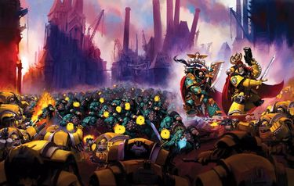
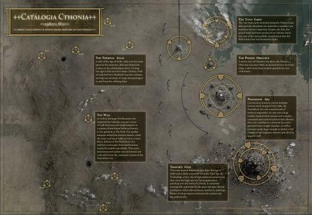
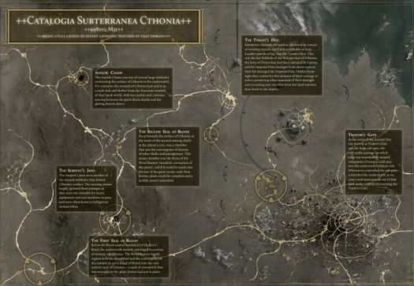
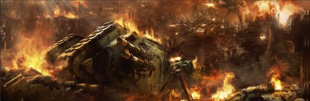

# 0777 006.M31/006-013.M31/013-014.M31 科索尼亚围城 Siege of Cthonia

精校状态：中文行文已逐段精校，部分术语仍为暂定

分类：时间线

原文来源：https://www.bilibili.com/opus/1199207100174041127

原作者：帝国神选罐头

原文时间：2026年05月06日 14:56

[返回分类目录](目录.md) · [全书目录](../../目录.md)

<!-- A0777-B0001 -->
**英文原文**

The Siege of Cthonia was a three-stage battle of the Horus Heresy. In the so-called "First Siege", Cthonia was largely conquered by an Imperial Fists-led force in 006.M31. However, Sons of Horus guerrillas remained active in the planet's vast underground caverns, waging a guerrilla campaign over the next years. After this period of contested Imperial rule, a large Sons of Horus-led splinter fleet launched its own invasion to retake their Homeworld in 013.M31, starting the "Second Siege". This conflict culminated when the Dark Angels destroyed Cthonia in 014.M31, killing most of the local traitors as well as loyalists.

<!-- /A0777-B0001 -->

<!-- A0777-B0002 -->

原译文

科索尼亚围城是荷鲁斯叛乱的一场分为三个阶段的战斗。在所谓的“第一次围攻”中，科索尼亚在006.M31被帝国之拳领导的部队征服。然而，荷鲁斯之子游击队仍然活跃在行星巨大的地下洞穴中，在接下来的几年里发动了一场游击战。在这段有争议的帝国统治时期之后，一支由荷鲁斯之子领导的分裂舰队于013.M31发动了自己的入侵，夺回了他们的家园世界，开始了“第二次围攻”。当黑暗天使于014.M31摧毁科索尼亚时，这场冲突达到了高潮，杀死了大多数当地叛徒和忠诚者。

**校订译文**

科索尼亚围城是荷鲁斯之乱期间一场分为三个阶段的战役。在所谓“第一次围攻”中，帝国之拳率领的部队于006.M31征服了科索尼亚的大部分地区。然而，荷鲁斯之子残部仍活跃于行星庞大的地下洞窟，在此后数年中持续游击抵抗。帝国的统治始终未能稳固；013.M31，一支由荷鲁斯之子率领、从主力中分出的庞大舰队再次入侵，试图夺回母星，拉开“第二次围攻”的序幕。014.M31，黑暗天使最终摧毁科索尼亚，当地大多数叛军与忠诚派都随之毁灭。

**校注：** splinter fleet 指从主力分出的舰队，不必然是内部叛乱形成的分裂派；此处相对于荷鲁斯主军。

<!-- /A0777-B0002 -->

<!-- A0777-B0003 图片 -->

<!-- A0777-B0004 -->

原译文

Sons of Horus and Imperial Fists battle on Cthonia 荷鲁斯之子与帝国之拳在科索尼亚上战斗

**校订译文**

Sons of Horus and Imperial Fists battle on Cthonia 荷鲁斯之子与帝国之拳在科索尼亚上战斗

<!-- /A0777-B0004 -->

<!-- A0777-B0005 -->
**英文原文**

Conflict:Horus Heresy

<!-- /A0777-B0005 -->

<!-- A0777-B0006 -->

原译文

冲突：荷鲁斯叛乱

**校订译文**

所属冲突：荷鲁斯之乱。

<!-- /A0777-B0006 -->

<!-- A0777-B0007 -->
**英文原文**

Date:006.M31 (First Siege), 006-013.M31 (guerrilla campaign), 013-014.M31 (Second Siege)

<!-- /A0777-B0007 -->

<!-- A0777-B0008 -->

原译文

日期：006.M31（第一次围攻），006-013.M31（游击战役），013-014.M31（第二次围攻）

**校订译文**

日期：006.M31（第一次围攻），006-013.M31（游击战役），013-014.M31（第二次围攻）

<!-- /A0777-B0008 -->

<!-- A0777-B0009 -->
**英文原文**

Location:Cthonia

<!-- /A0777-B0009 -->

<!-- A0777-B0010 -->

原译文

地点：科索尼亚

**校订译文**

地点：科索尼亚

<!-- /A0777-B0010 -->

<!-- A0777-B0011 -->
**英文原文**

Outcome:Imperial victory

<!-- /A0777-B0011 -->

<!-- A0777-B0012 -->

原译文

结果：帝国胜利

**校订译文**

结果：帝国胜利

<!-- /A0777-B0012 -->

<!-- A0777-B0013 -->
**英文原文**

Combatants:Loyalists (Imperial Fists-led faction)/Traitors/Loyalists (Dark Angels)

<!-- /A0777-B0013 -->

<!-- A0777-B0014 -->

原译文

作战方：忠诚派（帝国之拳领导派系）/叛徒/忠诚派（黑暗天使）

**校订译文**

作战方：忠诚派（帝国之拳领导派系）/叛徒/忠诚派（黑暗天使）

<!-- /A0777-B0014 -->

<!-- A0777-B0015 -->
**英文原文**

Commanders:Lord Castellan Evander Garrius, Consul-Captain Imran Adarus, Archmagos Arkai Nomus, Shade-Captain Syban Nethkal, Magister Sul Kontep (KIA), Vigil-Commander Ambriel Malineux, Lord Marshal Sember Atriox/Captain Vheren Ashurhaddon, Captain Zedak Mordakar, Archmagos Draykavac, Archmagos Ferrok Trahn,"Incursus", Chieftain Ithan Ryaeve, Chieftain Kovarny (KIA), Centurion Boros Kurn, Dark Apostle Ul-Buus/Eskaton Marduk Sedras, Lieutenant Annael

<!-- /A0777-B0015 -->

<!-- A0777-B0016 -->

原译文

指挥官：领主堡主埃文德·加里乌斯，领事连长伊姆兰·阿达鲁斯，大贤者阿尔凯·诺穆斯，阴影连长赛班·内斯卡尔，魔学士苏尔·孔特普(KIA)，警戒指挥官安布丽尔·马利纽克斯，领主元帅森伯·阿崔奥克斯/连长维伦·阿舒尔哈顿，连长泽达克·莫达卡，大贤者德拉卡瓦克，大贤者费罗克·特拉恩，“侵袭”，头目伊桑·莱亚维，头目科瓦尼(KIA)，百夫长博洛斯·科恩，黑暗使徒乌尔-布斯/终灭者马尔杜克·塞德拉斯，副官安纳尔

**校订译文**

指挥官：帝国之拳领导的忠诚派——堡主领主伊万德·加里乌斯、领事连长伊姆兰·阿达鲁斯、大贤者阿尔凯·诺穆斯、阴影连长赛班·内斯卡尔、魔学士苏尔·孔泰普（阵亡）、警戒团指挥官安布丽尔·马利纽克斯、领主元帅森伯·阿崔奥克斯；叛军——维伦·阿舒哈顿连长、泽达克·莫达卡连长、大贤者德拉卡瓦克、大贤者费罗克·特拉恩、“侵袭”、头目伊桑·莱亚维、头目科瓦尼（阵亡）、百夫长博洛斯·科恩、黑暗使徒乌尔·布斯；黑暗天使——终灭者玛杜克·赛德拉斯、副官安奈尔。

**校注：** 三方依原作战方次序分列；Vigil为静默修女警戒团语境。玛杜克·赛德拉斯沿本书326/386，区别怀言者同名单独名Marduk。

<!-- /A0777-B0016 -->

<!-- A0777-B0017 -->
**英文原文**

Losses/Survivors:Mostly destroyed/Mostly destroyed/Moderate

<!-- /A0777-B0017 -->

<!-- A0777-B0018 -->

原译文

损失/幸存者：大部分毁灭/大部分毁灭/中等

**校订译文**

损失／幸存情况：帝国之拳一方大部被毁；叛军大部被毁；黑暗天使损失中等。

**校注：** 英文表头混合Losses/Survivors，而值为Mostly destroyed/Mostly destroyed/Moderate；按正文理解为三方损失描述，未推定具体幸存比例。

<!-- /A0777-B0018 -->

<!-- A0777-B0019 -->
## History 历史

<!-- /A0777-B0019 -->

<!-- A0777-B0020 -->
## First Siege 第一次围攻

<!-- /A0777-B0020 -->

<!-- A0777-B0021 -->
**英文原文**

When Horus rose in rebellion in 005.M31, his Legion's Homeworld Cthonia was left rather isolated within Imperial space. Even though the Sons of Horus Primarch had prepared his rebellion for years, he had invested little energy in reinforcing or fortifying Cthonia. Evidently, he regarded the planet as unimportant to his wider military efforts. Accordingly, only two Sons of Horus chapters and one Word Bearers company were stationed on the planet, left alone to face the loyalists wrath.

<!-- /A0777-B0021 -->

<!-- A0777-B0022 -->

原译文

当荷鲁斯在005.M31掀起叛乱时，他的军团的家园世界科索尼亚在帝国空域内相当孤立。尽管荷鲁斯之子原体已经为他的叛乱做了多年的准备，但他几乎没有投入任何精力来加强或巩固科索尼亚。显然，他认为行星对他更广泛的军事努力不重要。因此，只有两个荷鲁斯之子战团和一个怀言者连队驻扎在这个行星上，独自面对忠诚派的愤怒。

**校订译文**

005.M31荷鲁斯之乱时，军团母星科索尼亚孤悬帝国疆域内部。尽管原体已为叛乱筹备多年，却很少投入资源增援或加固科索尼亚，显然认为它对整体军事部署无足轻重。因此，星球上只留下两个荷鲁斯之子战团级单位与一个怀言者连队，独自面对忠诚派的报复。

<!-- /A0777-B0022 -->

<!-- A0777-B0023 -->
**英文原文**

Despite Cthonia's small garrison, the Imperium could not afford to leave Cthonia be, as it could possibly act as a Traitor forward base for strikes into the nearby Sol System. Imperial Fists Primarch and loyalist chief defensive commander Rogal Dorn consequently assembled a strong force to capture Horus' homeworld, consisting of the Imperial Fists' 9th and 14th Battalions, the Space Wolves 13th Great Company, three Adeptus Custodes sodalities, and Mechanicum Taghmata. Led by Lord Castellan Evander Garrius, this contingent invaded in 006.M31, beginning the First Siege of Cthonia.

<!-- /A0777-B0023 -->

<!-- A0777-B0024 -->

原译文

尽管科索尼亚的驻军人数很少，但帝国无法不管科索尼亚，因为它可能会成为叛徒前沿基地，对附近的太阳系发动袭击。帝国之拳原体和忠诚派首席防御指挥官罗格·多恩因此组建了一支强大的部队来占领荷鲁斯的家园世界，其中包括帝国之拳的第9和第14营、太空野狼第13大连、三个禁军修会伙友团和机神禁卫。在领主堡主埃文德·加里乌斯的带领下，这支队伍于006.M31入侵，开始了对科索尼亚的第一次围攻。

**校订译文**

驻军虽少，帝国却不能放任科索尼亚不管：它可能成为叛军前进基地，威胁邻近的太阳系。帝国之拳原体、忠诚派防御总指挥罗格·多恩遂集结强兵，准备夺取荷鲁斯的母星。部队包括帝国之拳第九、第十四营、太空野狼第十三大连、三个帝皇禁军友伴会，以及机械教禁卫军。006.M31，堡主领主伊万德·加里乌斯率军入侵，第一次科索尼亚围攻战开始。

<!-- /A0777-B0024 -->

<!-- A0777-B0025 -->
**英文原文**

Vastly outmatched, the Traitors did not contest the invasion force in the void around Cthonia, allowing the Imperials to land unopposed. Instead, the Traitor garrison focused on defending Cthonia's main settlement, the Hive Lupercal's Gate, as well as the Terminal Atlas. First blood was spilled when the Loyalist vanguard, consisting of the 13th Great Company overran the Sons of Horus defending the outer areas of Lupercal's Gate. They were followed by the Imperial Fists who advanced into the vast spire of the capital settlement. Spearheaded by Garrius and his 456th Company, the Loyalists broke through the main gateway and eventually into the former throne room of Primarch Horus. However, this attack was carried out with unwarranted speed due to Garrius' eagerness to humble his former allies, costing the Imperial Fists much more troops as would have been neccessary. The Sons of Horus, meanwhile, already fought a guerrilla campaign, using the dense hive city to cover their counter-attacks as well their gradual retreat.

<!-- /A0777-B0025 -->

<!-- A0777-B0026 -->

原译文

实力悬殊，叛徒在没有在科索尼亚周围的虚空中与入侵部队对抗，从而使帝国能够在没有抵抗的情况下登陆。相反，叛徒驻军专注于保卫科索尼亚的主要定居点 — 巢都牧狼神之门和阿特拉斯航空站。当由第13大连组成的忠诚派先锋肆虐保卫牧狼神之门外围地区的荷鲁斯之子时，第一滴血洒了出来。紧随其后的是帝国之拳，他们挺进了首都定居点的巨大尖塔。在加里乌斯和他的第456连队的带领下，忠诚派突破了主门，最终进入了原体荷鲁斯的前王座厅。然而，由于加里乌斯急于贬低他的前盟友，这次袭击以不合理的速度进行，帝国之拳在必要时损失了更多的部队。与此同时，荷鲁斯之子已经准备打一场游击战，利用密集的巢都城市来掩护他们的反击和逐步撤退。

**校订译文**

由于实力悬殊，叛军没有在科索尼亚周边虚空迎战，帝国部队得以顺利登陆。守军将兵力集中在主要聚居地牧狼神之门巢都与阿特拉斯航空站。第十三大连担任先锋，率先击溃守卫巢都外围的荷鲁斯之子，双方由此开始流血交战。帝国之拳随后跟进，攻向首都巨大的巢塔。加里乌斯亲率第456连突破正门，最终闯入荷鲁斯昔日的王座厅。但他急于羞辱过去的盟友，进攻操之过急，导致帝国之拳承受了本可避免的伤亡。荷鲁斯之子则已转入游击战，利用密集的巢都建筑掩护反击与逐步撤退。

**校注：**  阿特拉斯航空站与971篇 Terminal Atlas为同一设施；其性质为连接地表和轨道平台的太空电梯，译名沿用既有名称。

<!-- /A0777-B0026 -->

<!-- A0777-B0027 -->
**英文原文**

Eventually, the Loyalists realized that the Traitors were not focused on holding Lupercal's Gate, but sabotaging key systems to render the planet's industry, infrastructure, and orbital defenses useless for the Imperium. Though Garrius' force hurried to stop the saboteurs, the Traitors successfully crippled many systems and eventually retreated into Cthonia's underground caverns from where they could continue their resistance. Overall, the First Siege was a rather hollow victory for the Imperium, and Dorn was upset at the unneccessary losses and failures of this battle. A number of Sons of Horus commanders were captured in the First Siege. They were subsequently brought to Terra and publicly executed.

<!-- /A0777-B0027 -->

<!-- A0777-B0028 -->

原译文

最终，忠诚派意识到，叛徒的重点不是守住牧狼神之门，而是破坏关键系统，使行星的工业、基础设施和轨道防御对帝国毫无用处。尽管加里乌斯的部队急于阻止破坏者，但叛徒成功地瘫痪了许多系统，最终撤退到科索尼亚的地下洞穴，在那里他们可以继续抵抗。总的来说，第一次围攻对帝国来说是一场相当空洞的胜利，多恩对这场战斗中不必要的损失和失败感到沮丧。许多荷鲁斯之子指挥官在第一次围攻中被俘。他们随后被带到泰拉并被公开处决。

**校订译文**

忠诚派终于意识到，叛军并不打算死守牧狼神之门，而是在破坏关键系统，使帝国即使占领行星，也无法利用其工业、基础设施与轨道防御。加里乌斯虽急忙阻止，许多设施仍被瘫痪。叛军随后撤入地下洞穴，继续抵抗。总体而言，第一次围攻只是帝国一场徒具表象的胜利，多恩对不必要的损失与作战失误十分不满。战中被俘的多名荷鲁斯之子指挥官，随后被押往泰拉公开处决。

<!-- /A0777-B0028 -->

<!-- A0777-B0029 图片 -->

<!-- A0777-B0030 -->

原译文

Map of the Siege of Cthonia 科索尼亚围城地图

**校订译文**

Map of the Siege of Cthonia 科索尼亚围城地图

<!-- /A0777-B0030 -->

<!-- A0777-B0031 -->
## Cthonia under Imperial control 帝国控制下的科索尼亚

<!-- /A0777-B0031 -->

<!-- A0777-B0032 -->
**英文原文**

After conquering Cthonia, Rogal Dorn ordered the entire planet to be reformed according to Loyalist doctrine. This included renaming Lupercal's Gate to "Traitor's Gate" and removing all traces of the Sons of Horus from the planet, stripping its resources for the war effort, devoting its population to work in factories to provide Imperial materiel, and mass recruiting locals into the ranks of the Imperial Fists. This task was given to Garrius who was appointed the planet's de facto ruler by Dorn; most understood this to be censure and punishment for his previous failures.

<!-- /A0777-B0032 -->

<!-- A0777-B0033 -->

原译文

征服科索尼亚后，罗格·多恩命令整个行星按照忠诚派信条进行改造。这包括将牧狼神之门更名为“叛徒之门”，并从行星上清除荷鲁斯之子的所有痕迹，剥夺其用于战争的资源，将其人口投入工厂工作以提供帝国物资，以及大规模招募当地人加入帝国之拳。这项任务交给了加里乌斯，他被多恩任命为行星事实上的统治者；大多数人认为这是对他之前失败的谴责和惩罚。

**校订译文**

占领科索尼亚后，多恩下令依照忠诚派的理念重塑整个世界：将牧狼神之门改名“叛徒之门”，抹去荷鲁斯之子的一切痕迹，榨取资源支援战争，将居民投入工厂生产帝国军需，并从当地大规模征募帝国之拳新兵。他任命加里乌斯为行星的实际统治者，负责执行这些任务；多数人都明白，这也是对其先前失误的责罚。

<!-- /A0777-B0033 -->

<!-- A0777-B0034 -->
**英文原文**

Before long, the Imperium also relocated most of the invasion force from Cthonia to other war zones. This left Garrius with a small garrison, centered around his 456th Company. In addition, he was provided some Imperial Army units and some of the new Imperial Fists recruits from Cthonia's population (though most would be sent off-world). The occupation was further supported by the Graian Mechanicum under Archmagos Arkai Nomus who used Cthonia to repair damaged Titans. Despite his unfavourable position, Garrius set about transforming Cthonia into a loyalist stronghold. He ordered the relocation of the planet's population from its caverns into the surface settlements, leaving the underground to the traitor guerrillas. He then began rebuilding the planet's industry and Space Marine recruitment process, largely succeeding in this despite constant guerrilla attacks.

<!-- /A0777-B0034 -->

<!-- A0777-B0035 -->

原译文

不久之后，帝国也将大部分入侵部队从科索尼亚转移到其他战区。这让加里乌斯留下了一个以第456连队为中心的小型驻军。此外，他还获得了一些帝国军队单位和一些来自科索尼亚的人口的新帝国之拳新兵（尽管大多数人将被送出世界）。这一占领得到了大贤者阿尔凯·诺穆斯领导的格拉亚机械教的进一步支持，他们使用科索尼亚修复受损的泰坦。尽管处境不利，加里乌斯还是着手将科索尼亚改造成一个忠诚派据点。他下令将行星上的人口从洞穴转移到地表定居点，将地下留给叛徒游击队。然后，他开始重建行星的工业和星际战士的招募过程，尽管游击队不断发动袭击，但基本上取得了成功。

**校订译文**

不久，帝国将大部分入侵部队调往其他战区，加里乌斯只剩以第456连为核心的少量驻军。帝国另拨给他一些帝国军部队，以及一部分科索尼亚出身的新帝国之拳战士；大多数当地新兵仍被送往外星战场。大贤者阿尔凯·诺穆斯率格莱亚机械教支援占领军，并利用科索尼亚维修受损泰坦。尽管形势不利，加里乌斯仍着手将其改造成忠诚派要塞。他将居民从地下洞窟迁往地表聚居地，把地下留给叛军游击队，再着手恢复工业与星际战士征募体系。虽然袭击不断，这些工作仍大体取得成功。

<!-- /A0777-B0035 -->

<!-- A0777-B0036 -->
**英文原文**

Despite their efforts to purge the remaining traitor presence on Cthonia, however, the loyalists remained largely ignorant that the remnants of the initial Sons of Horus garrison were reorganising and rebuilding their strength. Deep inside Cthonia's caverns, at a underground bastion nicknamed "Tyrant's Den" close to the planet's cold core, the traitors rallied under Centurion Boros Kurn. Though they were too weak in numbers and equipment to pose a serious threat to Garrius, Kurn ordered his forces to mass recruit locals as ad hoc Inductii Space Marines, build secret underground bases, and scout the loyalist positions. Over time, the Sons of Horus guerrillas grew to several thousand members (albeit many instable and mutated Inductii), waiting for an opportunity to remerge from the darkness.

<!-- /A0777-B0036 -->

<!-- A0777-B0037 -->

原译文

尽管他们努力清除科索尼亚上剩余的叛徒，但忠诚派在很大程度上仍然不知道最初的荷鲁斯之子驻军的残余正在重组和重建他们的力量。在科索尼亚的洞穴深处，在靠近行星冷核的一个绰号为“暴君之穴”的地下堡垒里，叛徒在百夫长博洛斯·科恩的带领下集会。尽管他们的人数和装备太弱，无法对加里乌斯构成严重威胁，但科恩命令他的部队大规模招募当地人作为特设的速征军星际战士，建造秘密地下基地，并侦察忠诚者的阵地。随着时间的推移，荷鲁斯之子游击队发展到数千名成员（尽管有许多不稳定和变异的速征军），等待着从黑暗中恢复过来的机会。

**校订译文**

忠诚派不断清剿残敌，却大多没有察觉最初驻守科索尼亚的荷鲁斯之子正在恢复实力。行星洞窟深处、靠近冰冷地核的“暴君之穴”堡垒中，残兵在百夫长博洛斯·科恩麾下重新集结。人数与装备虽不足以严重威胁加里乌斯，科恩仍下令大量征募居民，将其快速改造成速征军星际战士，同时建造秘密地下基地、侦察忠诚派阵地。游击队逐渐扩充至数千人，其中许多是状态不稳定、身体发生变异的速征军战士。他们等待着再次从黑暗中现身的时机。

<!-- /A0777-B0037 -->

<!-- A0777-B0038 -->
**英文原文**

In 007.M31, as the Ruinstorm was first created, Cthonia became cut off from the rest of Segmentum Solar for a limited time. The Sons of Horus guerrillas, supported by Word Bearers elements, exploited the following unrest by launching a major attack on the Imperials from their caverns. The assault was repulsed by Garrius' forces under great cost. Garrius subsequently requested reinforcements from Dorn. The Primarch could only spare few troops, and thus sent loyalist Fifth Fellowship of the Thousand Sons to join the garrison. This contingent led by Sul Kontep were survivors of the Burning of Prospero who had thrown themselves at the Emperor's mercy. They had been offered a chance at redemption by serving the Imperium in the war against Horus, though they were overseen by a cadre of Sisters of Silence led by Ambriel Malineux. Garrius trusted these twice-traitors little, stationed them at Pharos Obscurus, a lumen tower far away from the other Imperials. From there, the Thousand Sons were ordered to hunt for Traitors in the underground caverns.

<!-- /A0777-B0038 -->

<!-- A0777-B0039 -->

原译文

007.M31年，毁灭风暴首次形成时，科索尼亚在有限的时间内与太阳星域的其他部分隔绝。荷鲁斯之子游击队在怀言者成员的支持下，利用了随后的动乱，从他们的洞穴对帝国发动了大规模袭击。加里乌斯的部队以巨大的代价击退了这次进攻。加里乌斯随后请求多恩增援。原体只能腾出少量兵力，于是派遣了忠诚派千子第五学会加入驻军。由苏尔·孔特普领导的这支队伍是普罗斯佩罗之焚的幸存者，他们任由帝皇处置。他们在与荷鲁斯的战争中为帝国服役，获得了救赎的机会，尽管他们受到安布丽尔·马利纽克斯领导的寂静修女的监督。加里乌斯很少信任这个两次叛徒，把他们驻扎在朦胧灯塔，一座远离其他帝国部队的流明塔。从那里，千子奉命在地下洞穴中追捕叛徒。

**校订译文**

007.M31，毁灭风暴初现，科索尼亚一度与太阳星域其他地区失联。荷鲁斯之子游击队趁乱，在怀言者支援下从洞窟发动大举进攻。加里乌斯付出惨重代价才将其击退，随后向多恩请求增援。原体只能抽调少量兵力，于是派忠诚派千子第五学会加入驻军。这支由苏尔·孔泰普领导的部队是普罗斯佩罗之焚的幸存者，已向帝皇乞求宽恕。他们获准通过在战争中效忠帝国、对抗荷鲁斯来赎罪，但须接受安布丽尔·马利纽克斯率领的静默修女骨干连监督。加里乌斯不信任这些在他眼中“两度背叛”的人，将其安置在远离其他帝国部队的朦胧灯塔。这座流明塔成为他们深入地下、追猎叛军的基地。

**校注：** Fifth Fellowship 沿原稿第五学会；此处千子虽被加里乌斯称为两度背叛者，仍属本战忠诚派，译文明确该评价主体。

<!-- /A0777-B0039 -->

<!-- A0777-B0040 -->
**英文原文**

Over the next years, Garrius' garrison was reinforced by Loyalist survivors from the battles of Tallarn and Beta-Garmon, as well as various Shattered Legion warbands. These used Cthonia to strike into Traitor-held space in the galactic south. However, one group of alleged Salamanders (arriving in 011.M31) was soon revealed to be an Alpha Legion team in disguise. Though the Imperials drove of the Alpha Legion agents, the latter succeeded in delivering supplies and other reinforcements of the traitor guerrillas under the surface. From 012.M31, a growing number of scattered loyalist warbands arrived at Cthonia, fleeing the Passage of the Angels. As the conflict dragged on, the Imperial Fists recruited more and more Space Marines from Cthonia, resulting in the ironic situation that by the Second Siege at least a third of the Imperial Fists garrison were natives whereas the Sons of Horus relief troops had been largely recruited from other planets and were foreigners.

<!-- /A0777-B0040 -->

<!-- A0777-B0041 -->

原译文

在接下来的几年里，加里乌斯的驻军得到了来自塔兰和贝塔·伽蒙之战的忠诚派幸存者以及许多破碎军团战帮的增援。这些人利用科索尼亚攻击了银河系南部的叛徒控制空域。然而，一队所谓的火蜥蜴（于011.M31抵达）很快被揭露为伪装的阿尔法军团。尽管帝国部队赶走了阿尔法军团特工，但后者成功地在地下运送了叛徒游击队的补给和其他增援。从012.M31开始，越来越多的分散忠诚派战帮抵达科索尼亚，逃离天使通道。随着冲突的持续，帝国之拳从科索尼亚招募了越来越多的星际战士，导致了一种具有讽刺意味的情况，即到第二次围攻时，至少有三分之一的帝国之拳驻军是当地人，而荷鲁斯之子解围部队主要是从其他行星招募的，而且是外来人。

**校订译文**

随后数年，加里乌斯陆续得到塔兰与贝塔·伽蒙之战忠诚派幸存者，以及各支破碎军团战帮的增援。他们以科索尼亚为基地，打击银河南部的叛军控制区。011.M31抵达的一支所谓火蜥蜴部队，很快被揭穿是阿尔法军团伪装。帝国军虽将其赶走，这些特工却已为地下游击队送去补给与其他增援。012.M31起，逃离“天使前进”战役的零散忠诚派战帮也越来越多地抵达科索尼亚。战争拖延期间，帝国之拳不断在当地征兵，出现了讽刺的局面：第二次围攻时，至少三分之一的帝国之拳驻军是科索尼亚人，而前来“解放”母星的荷鲁斯之子，却大多征自其他世界。

**校注：** Passage of the Angels 为战役名，沿第804篇标题天使前进，原天使通道容易误作地理通道。

<!-- /A0777-B0041 -->

<!-- A0777-B0042 -->
## Second Siege 第二次围攻

<!-- /A0777-B0042 -->

<!-- A0777-B0043 -->
### Ashurhaddon assembles his force 阿舒哈顿集结兵力

原题：Ashurhaddon assembles his force 阿舒尔哈顿集结了他的部队

<!-- /A0777-B0043 -->

<!-- A0777-B0044 -->
**英文原文**

The Second Siege of Cthonia resulted from divisions within the Sons of Horus Legion. A large section of the Legion, led by Captain Vheren Ashurhaddon, had begun to resent the growing corruption in their midst. This faction believed the Sons of Horus to be on a path to ruination, seeing possible salvation in re-embracing the old ways and honour of their homeworld Cthonia. As their warnings and calls for reform were ignored by Horus and his inner circle, Ashurhaddon's followers organised into a warrior society dubbed the "True Sons of Cthonia". This society grew increasingly large, attracting not just veterans longing for days gone, but also newly recruited Inductii who hoped they could find an identity in the traditions of a homeworld they had never seen. Either way, the "True Sons" considered the Imperial occupation as a great dishonour to the Legion and wanted to liberate it.

<!-- /A0777-B0044 -->

<!-- A0777-B0045 -->

原译文

科索尼亚的第二次围攻是由荷鲁斯军团内部的分裂造成的。在维伦·阿舒尔哈顿连长的领导下，军团的大部分成员已经开始憎恨他们中间日益严重的腐化。这一派系认为荷鲁斯之子正在走向毁灭，他们看到了重新拥抱家园世界科索尼亚的旧路和荣誉可能带来的救赎。由于荷鲁斯和他的核心圈子忽视了他们的警告和改正呼吁，阿舒尔哈顿的追随者组织成了一个被称为“科索尼亚的真实之子”的战士协会。这个协会越来越大，不仅吸引了渴望逝去日子的老兵，还吸引了新招募的速征军，他们希望在从未见过的家园世界的传统中找到自己的身份。无论如何，“真实之子”都认为帝国的占领是对军团的极大耻辱，并希望解放它。

**校订译文**

第二次科索尼亚围攻源于荷鲁斯之子内部的分歧。维伦·阿舒哈顿连长率领的一大批战士，开始憎恶军团中日益蔓延的腐化。他们认为军团正走向毁灭，唯有重新尊奉母星的传统与荣誉，或许才能获得救赎。荷鲁斯及其核心圈子不理会他们的警告与改革呼声，于是阿舒哈顿的追随者组成“科索尼亚真子”战士结社。组织日益壮大，既吸引了怀念昔日的老兵，也吸引新征入伍的速征军战士——后者希望从自己从未见过的母星传统中寻找归属。真子们都将帝国占领视为军团的奇耻大辱，决意收复母星。

<!-- /A0777-B0045 -->

<!-- A0777-B0046 图片 -->

<!-- A0777-B0047 -->

原译文

Map of the subterranean battles of the Siege of Cthonia 科索尼亚围城地下战斗地图

**校订译文**

Map of the subterranean battles of the Siege of Cthonia 科索尼亚围城地下战斗地图

<!-- /A0777-B0047 -->

<!-- A0777-B0048 -->
**英文原文**

The opportunity for Ashurhaddon's faction arrived in 013.M31, as the Solar War came to an end and Horus began to plan an invasion of Terra itself. At this point, the Primarch finally allowed the "True Sons" to attempt a reconquest of Cthonia. Later scholars assumed Horus had sanctioned the attack as he could spare the strength of the "True Sons" and thought the retaking of his homeworld might be a potent symbolic victory; he was leading such a mighty host at this point, while the loyalists in the Sol System had already been severely weakened, that Ashurhaddon's troops would not be missed at Terra. Reportedly, only Alpharius warned Horus that the operation was strategically unsound, but the Alpha Legion Primarch's words were ignored.

<!-- /A0777-B0048 -->

<!-- A0777-B0049 -->

原译文

013.M31，随着太阳战争的结束，荷鲁斯开始计划入侵泰拉，阿舒尔哈顿派系的机会到来了。在这一点上，原体最终允许“真实之子”试图重新征服科索尼亚。后来的学者认为荷鲁斯批准了这次袭击，因为他可以抽出“真实之子”的力量，并认为夺回他的家园世界可能是一场强有力的象征性胜利；此时，他正率领着如此强大的军队，而太阳系中的忠诚派已经被严重削弱，阿舒尔哈顿的部队在泰拉不会被错过。据报告，只有阿尔法瑞斯警告荷鲁斯，这次行动在战略上是靠不住的，但阿尔法军团原体的话被忽视了。

**校订译文**

013.M31，太阳战争接近尾声，荷鲁斯开始筹划进攻泰拉，阿舒哈顿一派终于等到机会。原体准许科索尼亚真子尝试收复母星。后世学者推测，他之所以批准，是因为当时自身大军已足够强盛，太阳系忠诚派又遭重创，攻打泰拉并不缺阿舒哈顿这支兵力；反之，收复母星却可能带来巨大的象征性胜利。据说只有阿尔法瑞斯警告荷鲁斯，这一行动在战略上并不明智，但他的意见未被采纳。

**校注：** 阿尔法瑞斯在此时发表意见的说法按原文保留，不凭其他段落生死记载擅改为欧梅冈；would not be missed指攻泰拉不缺这支兵力，不是无人思念。

<!-- /A0777-B0049 -->

<!-- A0777-B0050 -->
**英文原文**

Thus, the "True Sons" began to assemble in the Beta-Garmon System. At this point, they numbered about 20,000 Space Marines and a significant fleet, led by Ashurhaddon's flagship Tomb of Gold. Despite their eagerness to start their offensive, however, the "True Sons" took care and time for preparations, placing great value on pragmatism due to their devotion to Cthonian tradition. Accordingly, Ashurhaddon contacted various other traitor factions which might join their campaign, such as various Imperial Army units of the Cthonian Headhunters and a Dark Mechanicum force loyal to the Forge World Voss. The latter had long held the rights to extract Cthonia's resources and was thus willing to support the "True Sons", finding further value in the chance to humble the forces of Graia that were backing Garrius' garrison.

<!-- /A0777-B0050 -->

<!-- A0777-B0051 -->

原译文

因此，“真实之子”开始在贝塔-伽蒙星系中集结。在这一点上，他们有大约2万名星际战士和一支由阿舒尔哈顿的旗舰黄金之墓号领导的重要舰队。然而，尽管他们渴望开始进攻，但“真实之子”还是精心准备，并投入了大量时间，由于他们对科索尼亚传统的忠诚，他们非常重视实用主义。因此，阿舒尔哈顿联系了其他可能加入他们战役的叛徒派系，如科索尼亚猎头者的各个帝国军队单位和忠于铸造世界沃斯的黑暗机械教部队。后者长期以来一直拥有开采科索尼亚资源的权利，因此愿意支持“真实之子”，在削弱支持加里乌斯驻军的格拉亚部队的机会中，发现了更多的价值。

**校订译文**

科索尼亚真子遂在贝塔·伽蒙星系集结，拥有约两万名星际战士，以及由阿舒哈顿的旗舰黄金之墓号率领的强大舰队。他们虽急于进攻，却仍花时间周密准备：尊奉科索尼亚传统，也意味着重视务实。阿舒哈顿因此联络了多支可能参战的叛军，包括科索尼亚猎颅者的各支帝国军单位，以及效忠沃斯铸造世界的黑暗机械教。沃斯长期享有开采科索尼亚资源的权利，愿意支持收复行动；能趁机打击支援加里乌斯的格莱亚势力，更是额外的好处。

<!-- /A0777-B0051 -->

<!-- A0777-B0052 -->
**英文原文**

The "True Sons" were also joined by more enigmatic groups such as a strong Word Bearers force led by Zedak Mordakar of the Flayed Hand and an Alpha Legion unit. Many "True Sons" initially argued against allowing the Word Bearers join their campaign, seeing them as the origin of their own Legion's corruption. However, Mordakar and his men appeared cordial and diplomatic, and Ashurhaddon reminded his followers that the Cthonian way was to judge a warrior by their actions. Thus, the Word Bearers (counting thousands of Space Marines) were included in his force. Ultimately, Ashurhaddon's assumption on the honour of Mordakar's contingent proved to be naive; the Word Bearers were secretly acting on Erebus' orders and planning to bring doom to Cthonia. Last of all, the Alpha Legion contingent on scout cruiser Sigma 9-14 just showed up and linked up with the "True Sons" fleet. This group, led by a warrior only known as "Incursus", ignored most attempts at contact; Ashurhaddon ultimately tolerated the Alpha Legion presence, deeming it too much trouble to remove them from his invasion force.

<!-- /A0777-B0052 -->

<!-- A0777-B0053 -->

原译文

“真实之子”还加入了更神秘的团体，如由剥皮之手的泽达克·莫达卡领导的强大的怀言者部队和阿尔法军团单位。许多“真实之子”最初反对允许怀言者加入他们的战役，认为他们是自己军团腐化的根源。然而，莫达卡和他的部下表现得亲切而圆滑，阿舒尔哈顿提醒他的追随者，科索尼亚的方式是通过他们的行为来判断一个战士。因此，怀言者（包括数千名星际战士）被纳入他的部队。最终，阿舒尔哈顿对莫达卡分遣队荣誉的假设被证明是幼稚的；怀言者秘密执行艾瑞巴斯的命令，计划给科索尼亚带来毁灭。最后，侦察巡洋舰西格玛9-14上的阿尔法军团分遣队刚刚出现，并与“真实之子”舰队会合。该队伍由一名仅被称为“侵袭”的战士领导，对大多数接触尝试置若罔闻；阿舒尔哈顿最终容忍了阿尔法军团的存在，认为将他们从他的入侵部队中移除太麻烦了。

**校订译文**

更神秘的援军也加入进来，包括剥皮之手的泽达克·莫达卡率领的大批怀言者，以及一支阿尔法军团部队。许多真子起初反对怀言者参战，认为他们正是军团腐化的根源。但莫达卡与其部下表现得友善、善于交涉，阿舒哈顿也提醒众人，科索尼亚传统主张以行动评判战士。于是，数千名怀言者被纳入联军。事实却证明，他对这些人荣誉感的信任过于天真：他们正秘密执行艾瑞巴斯的命令，企图毁灭科索尼亚。最后，乘侦察巡洋舰西格玛9-14号而来的阿尔法军团径自加入舰队。其首领仅以“侵袭”之名示人，对多数联络不予回应。阿舒哈顿最终容忍了他们，因为要将其逐出远征军实在太过麻烦。

<!-- /A0777-B0053 -->

<!-- A0777-B0054 -->
### Void battle and first landing 虚空战和第一次登陆

<!-- /A0777-B0054 -->

<!-- A0777-B0055 -->
**英文原文**

The "True Sons" invasion force initially allowed the traitor main fleet of Horus, heading to begin the Siege of Terra, to enter the Warp first. Afterward, Ashurhaddon's forces began their own journey at about 759013.M31. With the aid of Mordakar's Word Bearers, the "True Sons" managed to cross the Warp rather quickly, though their fleet's cohesion suffered and consequently entered the Cthonia System piecemeal. The first traitor ship to arrive was the Sigma 9-14 which was immediately attacked by two loyalist patrol light frigates, the Blade of Midnight and Shadow-eye of the garrison's Raven Guard contingent. The Alpha Legion ship masterfully avoided the destruction for four minutes, when the rest of Ashurhaddon's advance elements began arriving. Confronted with an entire fleet, the Shadow-eye sacrificed itself to hold the traitors long enough so that the Blade of Midnight could escape.

<!-- /A0777-B0055 -->

<!-- A0777-B0056 -->

原译文

“真实之子”入侵部队最初允许前往开始泰拉围城的荷鲁斯叛徒主舰队首先进入亚空间。之后，阿舒尔哈顿的部队在大约759013.M31开始了自己的旅程。在莫达卡的怀言者的帮助下，“真实之子”设法很快穿越了亚空间，尽管他们的舰队的凝聚受到了影响，因此零碎地进入了科索尼亚星系。第一艘到达的叛徒船只是西格玛9-14，它立即遭到两艘忠诚派巡逻轻型护卫舰的袭击，即守军暗鸦守卫分遣队的午夜之刃号和暗影之眼号。阿尔法军团舰船巧妙地避开了持续四分钟的破坏，这时阿舒尔哈顿的其他先遣分队开始抵达。面对整支舰队，暗影之眼号牺牲了自己，将叛徒滞留了足够长的时间，使午夜之刃号得以逃脱。

**校订译文**

科索尼亚真子先让荷鲁斯的叛军主舰队进入亚空间，前往围攻泰拉，然后才在约759013.M31启航。在莫达卡的怀言者协助下，真子舰队很快穿越亚空间，但队形失散，只能陆续抵达科索尼亚星系。最先到达的西格玛9-14号，立刻遭到暗鸦守卫驻军的两艘巡逻轻型护卫舰——午夜之刃号与暗影之眼号——攻击。它巧妙周旋了四分钟，未被击毁，阿舒哈顿其余先遣舰只也开始抵达。面对整支舰队，暗影之眼号牺牲自己拖住叛军，让午夜之刃号逃走报信。

<!-- /A0777-B0056 -->

<!-- A0777-B0057 -->
**英文原文**

After this initial clash, the main void battle began. Once assembled in full, the traitor fleet outnumbered the loyalist fleet defending Cthonia 3-to-1: Ashurhaddon commanded 5 capital ships, 50 ships of the line, and over 300 destroyers and corvettes, whereas Garrius' naval contingent included fewer than 100 destroyers and picket ships, 23 ships of ther line, and three capital ships (namely the Imperial Fists Gloriana Class Battleship Burden of Duty, the Iron Hands Golgotha Class Factory Ship Grendel, and the Fortuna Class Trade-Barque Warp-spite). Knowning his force was outmatched but forewarned by the Blade of Midnight, Garrius resolved to size some advantage by striking first. Accordingly, he ordered his fleet to go on the offensive. Spearheaded by the Grendel, whose crew of fanatical Iron Hands had vowed to die rather than cede ground to the traitors, the loyalist fleet broke into the traitor fleet which was still in disorder after exiting the Warp. This furious assault momentarily threatened to inflict heavy losses on the traitors, especially as the Grendel was close to fire up the Dark Mechanicum transport ships carrying Ashurhaddon's Titan contingent. However, the Imperials were stopped by the unexpected arrival of a new force; a fleet loyal to Cyclothrathe led by Archmagos Draykavac left the Warp and fell upon the loyalists, crippling the Grendel. Further reinforced, the traitors crushed the loyalist fleet, with only about a dozen Imperial cruisers breaking through to escape into deep space, eventually hiding in the system's asteriod fields.

<!-- /A0777-B0057 -->

<!-- A0777-B0058 -->

原译文

在这场最初的冲突之后，主要的虚空战开始了。一旦全部集结，叛徒舰队的数量就以3比1的比例超过了保卫科索尼亚的忠诚派舰队：阿舒尔哈顿指挥了5艘主力舰、50艘战列舰和300多艘驱逐舰和护卫舰，而加里乌斯的海军分遣队包括不到100艘驱逐舰和警戒哨舰、23艘战列舰以及3艘主力舰（即帝国之拳荣光女王级战列舰职责重担号、钢铁之手各各他级工厂舰格伦德尔号和命运女神级贸易驳船亚空间恶意号）。加里乌斯知道他的部队已经被击败，但受到了午夜之刃号的预先警告，他决定率先出击，以获得一些优势。因此，他命令他的舰队进攻。在格伦德尔号的带领下，忠诚派舰队闯入了叛徒舰队，格伦德尔号狂热的钢铁之手船员发誓要战死，而不是向叛徒投降，叛徒舰队在离开亚空间后仍处于混乱状态。这场猛烈的攻击随时可能给叛徒造成重大损失，尤其是当格伦德尔号接近发射载有阿舒尔哈顿泰坦分遣队的黑暗机械教运输舰时。然而，帝国被一支新部队的意外到来所阻止；由大贤者德拉卡瓦克领导的忠于赛克洛斯拉斯的舰队离开了亚空间，向忠诚派发起进攻，摧毁了格伦德尔号。进一步加强后，叛徒粉碎了忠诚派舰队，只有大约十几艘帝国巡洋舰突破并逃入深空，最终躲在该星系的小行星区。

**校订译文**

初次交锋后，虚空主战开始。叛军全部集结时，舰艇数量为忠诚派三倍：阿舒哈顿指挥5艘大型主力舰、50艘主战舰，以及300余艘驱逐舰和轻护卫舰；加里乌斯则有不到100艘驱逐舰与警戒舰、23艘主战舰，以及3艘大型主力舰——帝国之拳的荣光女王级战列舰职责重担号、钢铁之手的各各他级工厂舰格伦德尔号，以及命运女神级贸易驳船亚空间恶意号。午夜之刃号提前送来的警报，使加里乌斯得以在劣势中争取先机。他命舰队主动进攻，由格伦德尔号率先冲入尚未从亚空间航行中恢复队形的敌军。舰上的钢铁之手狂热地发誓，宁愿战死也不向叛徒退让。猛烈突击一度可能重创敌军，格伦德尔号甚至即将向搭载阿舒哈顿泰坦部队的黑暗机械教运输舰开火。此时，大贤者德拉卡瓦克率一支效忠赛克洛特拉特的舰队突然从亚空间出现，袭击忠诚派，将格伦德尔号打成重伤。叛军获得新援后击溃帝国舰队，仅约十余艘巡洋舰成功突围，逃入深空，最终躲进星系的小行星带。

**校注：** outmatched 指实力不敌，并非已经战败；crippling 指重创而非确证摧毁。ships of the line 与本段capital ships并列，暂分主战舰与大型主力舰，不全部译成战列舰。

<!-- /A0777-B0058 -->

<!-- A0777-B0059 -->
**英文原文**

Once the traitors arrived in Cthonia's orbit, however, they discovered that Garrius had ordered the crippling of the planet's orbital plate, thus forcing the invaders to attempt a direct landing onto the heavily defended surface instead of using the more convenient orbital ladder. This caused heavy disputes in the leading council of the traitors. Ashurhaddon argued for a well-prepared landing in force further away from Cthonia's population centers and the loyalists' guns. However, a group of more hot-headed officers, most importantly Chieftain Ithan Ryaeve, clamoured for an immediate assault - this group mainly consisted of Inductii who felt they had to prove their worth by quickly overcoming Garrius' defenses and thus restore Cthonia's honour. The discussion was decided by Mordakar of the Word Bearers who sided with Ryaeve, but also offered that his troops could lead the attack if the Sons of Horus were wishing to avoid heavy losses. This suggestion implied that his Legion was cowardly, forcing Ashurhaddon to sanction an immediate attack to maintain the honour of the "True Sons". Unbeknownst to him, this was the first part of Mordakar's plan - to spill as much blood as possible (regardless of origin) at certain areas of Cthonia for an upcoming Chaos ritual.

<!-- /A0777-B0059 -->

<!-- A0777-B0060 -->

原译文

然而，一旦叛徒到达科索尼亚的轨道，他们发现加里乌斯下令摧毁该行星的轨道平台，从而迫使入侵者尝试直接降落在防御严密的地表，而不是使用更方便的轨道梯。这在叛徒领导议会中引起了激烈的争论。阿舒尔哈顿主张在远离科索尼亚人口中心和忠诚派炮火的地方部署准备充分的部队。然而，一群鲁莽的军官，最重要的是头目伊桑·莱亚维，要求立即发动进攻 — 这群人主要由速征军组成，他们觉得必须通过迅速解决加里乌斯的防御来证明自己的价值，从而恢复科索尼亚的荣誉。这场讨论是由支持莱亚维的怀言者莫达卡决定的，但他也提出，如果荷鲁斯之子希望避免重大损失，他的部队可以领导这次袭击。这一建议暗示他的军团是懦弱的，迫使阿舒尔哈顿批准立即发动袭击，以维护“真实之子”的荣誉。在他不知情的情况下，这是莫达卡计划的第一部分 — 为即将到来的混沌仪式在科索尼亚的某些地区尽可能多地流血（无论来源如何）。

**校订译文**

叛军抵达行星轨道后，发现加里乌斯已下令瘫痪轨道平台。他们无法利用便捷的轨道升降梯，只能直接强降防御严密的地表。这在叛军指挥层引发争执：阿舒哈顿主张周密准备，在远离人口密集区与忠诚派炮火的地点大规模登陆；伊桑·莱亚维等急躁军官却要求立即进攻。这一派以速征军战士为主，渴望迅速击破加里乌斯的防线，以证明自身价值、恢复母星荣誉。怀言者莫达卡支持莱亚维，还声称如果荷鲁斯之子怕损失太大，他可以率自己的部队打头阵。这番暗指荷鲁斯之子怯懦的挑衅，迫使阿舒哈顿为维护真子的荣誉，批准立即强攻。他不知道，这正是莫达卡计划的第一步：为即将举行的混沌仪式，在科索尼亚指定地点尽可能多地洒下鲜血，无论鲜血来自哪一方。

**校注：** 莫达卡的话暗指荷鲁斯之子怯懦，不是自称怀言者怯懦。orbital plate 仅受破坏瘫痪，未断言全毁。

<!-- /A0777-B0060 -->

<!-- A0777-B0061 -->
**英文原文**

Either way, the "True Sons" now had to commit their forces. To make the best out of the situation, Ashurhaddon opted for a two-stage attack between two loyalist bastions, namely Terminal Atlas and Pharos Obscurus. This area was covered by the Imperial Fists' heavy orbital guns, but these weapons would not be able to stop a mass landing by smaller targets. Accordingly, the traitor commander would first deploy Ryaeve's 68th Chapter via Drop Pods into this zone; after these troops had secured their landing area, the veteran 5th Chapter would follow in Thunderhawks to extend the traitor-held territory and strike at the nearby Praesidium Arx, a stronghold where Garrius had put his command post. If everything went according to plan, the traitors would probably suffered heavy losses, but also cripple the entire loyalist defensive network in one fell swoop.

<!-- /A0777-B0061 -->

<!-- A0777-B0062 -->

原译文

无论哪种方式，“真实之子”现在都必须投入他们的部队。为了最大限度地利用这种情况，阿舒尔哈顿选择在两个忠诚派堡垒之间进行两段攻击，即阿特拉斯航空站和朦胧灯塔。该区域被帝国之拳的重型轨道炮覆盖，但这些武器无法阻止较小目标的大规模登陆。因此，叛徒指挥官将首先通过空投舱将莱亚维的第68战团部署到这个区域；在这些部队占领了他们的登陆区后，经验丰富的第五战团将跟随雷鹰，扩大叛徒控制的领土，并袭击附近的守卫堡垒，这是加里乌斯设立指挥部的据点。如果一切按计划进行，叛徒可能会遭受重大损失，但也会一举削弱整个忠诚派的防御网络。

**校订译文**

科索尼亚真子不得不投入战斗。阿舒哈顿决定在阿特拉斯航空站与朦胧灯塔之间展开两阶段进攻，尽量挽回局面。这里虽有帝国之拳重型轨道炮覆盖，却无法阻止大量小目标登陆。他计划先以空降舱投送莱亚维的第68战团，稳固登陆区后，再由老兵第五战团乘雷鹰跟进，扩大占领区，进攻附近加里乌斯指挥部所在的守卫堡垒。若计划成功，叛军即使承受重创，也能一举瘫痪忠诚派整个防御网络。

<!-- /A0777-B0062 -->

<!-- A0777-B0063 -->
**英文原文**

However, the operation derailed once the first wave under Ryaeve had broken through the air defenses and was landing on the ground. As the Drop Pods neared the ground, they set off powerful grav-mines, inflicting catastrophic losses on the 68th Chapter. In truth, Garrius had set up a trap in the area, expecting a traitor landing there and setting up a killing field. Even as Ryaeve's men were butchered by the mines, Raven Guard Deliverers were teleported into their midst to inflict further damage. Even though the 68th Chapter's situation appeared hopeless, Ryaeve managed to rally his troops and organised localized counter-attacks on the Deliverers. For a moment, it appeared as if his force could overcome the loyalists and break out of the minefield, only for the Raven Guard's second wave to arrive - and among these was Kaedes Nex, an "infamous assain" who shot Ryaeve and thereby threw the 68th Chapter back into confusion. The initial landing party was only saved by the arrival of the 5th Chapter which was able to evacuate the 68th Chapter's survivors, including a badly wounded Ryaeve.

<!-- /A0777-B0063 -->

<!-- A0777-B0064 -->

原译文

然而，一旦莱亚维领导的第一波突破防空并降落在地面上，行动就脱轨了。当空投舱接近地面时，它们引爆了强大的重力地雷，在第68战团造成了灾难性的损失。事实上，加里乌斯在该地区设下了一个陷阱，认为叛徒会降落在那里并建立一个杀戮区。即使莱亚维的人被地雷屠杀，暗鸦守卫的拯救者也被传送到他们中间，造成进一步的伤害。尽管第68战团的情况似乎没有希望，但莱亚维设法召集了他的部队，并组织了对拯救者的局部反击。有一瞬间，他的部队似乎可以战胜忠诚派并突破雷区，直到暗鸦守卫的第二波到达 — 其中包括凯迪斯·奈克斯，一个“著名的刺客”，他枪击了莱亚维，从而使第68战团重新陷入混乱。最初的登陆队只有在第五战团到达后才得以幸存，第五战团能够撤离第68战团的幸存者，其中包括重伤的莱亚维。

**校订译文**

莱亚维的首波部队刚突破防空、开始着陆，计划便出了差错。空降舱接近地面时触发强力重力地雷，第68战团顿时遭受灾难性损失。加里乌斯早已预判叛军会在此登陆，将整片区域布置为杀戮陷阱。地雷收割战士时，暗鸦守卫拯救者又传送到他们中间，进一步扩大战果。莱亚维仍奋力收拢残部，对拯救者组织局部反击，一度似乎有望击退忠诚派、冲出雷区。但暗鸦守卫第二波援军随即抵达，其中便有恶名昭彰的刺客凯德斯·奈克斯。他开枪击倒莱亚维，使第68战团再次陷入混乱。最终，第五战团赶到，撤出了首波部队的幸存者，包括身受重伤的莱亚维。

**校注：** infamous 是恶名昭彰，原译著名遗漏贬义；shot 仅击中，后文明确莱亚维仍活着。

<!-- /A0777-B0064 -->

<!-- A0777-B0065 -->
### Second landing and battle of Shaitan's Bowl 第二次登陆和撒旦之碗之战

<!-- /A0777-B0065 -->

<!-- A0777-B0066 -->
**英文原文**

The second landing of the "True Sons", this time following Ashurhaddon's original plan, went much better than the first and allowed the traitors to entrench themselves on Cthonia's surface. This time, the "True Sons" conducted an organised mass deployment in the wastelands west of the Vorhek mountains; shielded by his navy and largely outside the reach of Garrius' guns, the first waves of Ashurhaddon's force were able to descend in good order. The Imperial leadership was divided as to how to react to the second landing; Lord-Commander Sember Atriox of the Imperial Army and Archmagos Nomus pleaded for an immediate counter-attack, whereas Captain Syban Nethkal of the Raven Guard and Consul-Captain Imran Adarus of the Imperial Fists advocated a defensive approach. Garrius took the side of the aggressive officers, and the counter-attack went ahead. Garrius believed that the fall of Cthonia would allow for the Warmaster's assault on Terra to be reinforced with thousands of new Sons of Horus Legionaries, and thus refused to give any ground to the invaders.

<!-- /A0777-B0066 -->

<!-- A0777-B0067 -->

原译文

“真实之子”的第二次登陆，这次是按照阿舒尔哈顿的最初计划，比第一次登陆要好得多，让叛徒在科索尼亚的表面站稳了脚跟。这一次，“真实之子”在沃赫克山脉以西的荒地进行了有组织的大规模部署；在他的海军的掩护下，阿舒尔哈顿的第一波部队能够有序降落，而且基本上不在加里乌斯的炮火的射程之内。帝国领导层对如何应对第二次登陆存在分歧；帝国军队领主指挥官森伯·阿崔奥克斯和大贤者诺穆斯恳求立即反击，而暗鸦守卫的赛班·内斯卡尔连长和帝国之拳的伊姆兰·阿达鲁斯领事连长则主张采取防御措施。加里乌斯站在侵略性的军官一边，反击继续进行。加里乌斯认为，科索尼亚的陷落将使战帅对泰拉的进攻得到数千名新的荷鲁斯之子军团士兵的增援，因此拒绝向入侵者让步。

**校订译文**

第二次登陆终于依照阿舒哈顿原先的方案进行，远比首次成功，使叛军在科索尼亚地表站稳脚跟。真子们在沃赫克山脉西侧荒地组织大规模投送，既受舰队掩护，又大体处于加里乌斯炮火射程之外，首波部队得以有序着陆。忠诚派高层却对如何应对产生分歧：帝国军领主指挥官森伯·阿崔奥克斯与大贤者诺穆斯力主立即反击，暗鸦守卫连长赛班·内斯卡尔与帝国之拳领事连长伊姆兰·阿达鲁斯则主张固守。加里乌斯支持进攻派，批准反击。他认为，一旦科索尼亚失陷，就会有数千名新荷鲁斯之子前去支援战帅攻打泰拉，因此寸土不让。

<!-- /A0777-B0067 -->

<!-- A0777-B0068 -->
**英文原文**

The loyalists' first wave of the counter-attack consisted of a large numbers of aircraft, Land Speeders, Sabre Strike Tanks, and mechanised infantry. They were followed by a slower second wave, consisting of heavier tanks as well as Imperial Knights and Titans. The first wave arrived at the traitor landing zone within half a day, and indeed disrupted the traitors, though suffered heavy losses at the hands of Ashurhaddon's own aircraft contingents. By noon, the traitors had succeeded in deploying 500,000 infantry and about 1,000 armoured vehicles, though the traitors had not yet been able to land their own titans. Within the following night, Garrius' second wave approached the traitors, forcing Ashurhaddon to hastily mobilize a defense in the region before the landing area, lest the Imperials break into his newly constructed camp. The following battle erupted at a salt-flat called "Shaitan's Bowl".

<!-- /A0777-B0068 -->

<!-- A0777-B0069 -->

原译文

忠诚派的第一波反击由大量飞机、兰德速攻艇、军刀攻击坦克和机械化步兵组成。紧随其后的是第二波较慢的攻击，由更重的坦克以及帝国骑士和泰坦组成。第一波在半天内抵达叛徒登陆区，确实扰乱了叛徒，尽管在阿舒尔哈顿自己的飞机分遣队手中遭受了重大损失。到中午，叛徒已经成功部署了50万步兵和约1000辆装甲载具，尽管叛徒还没有能够让自己的泰坦登陆。第二天晚上，加里乌斯的第二波部队接近叛徒，迫使阿舒尔哈顿在登陆区之前迅速动员该地区的防御，以免帝国闯入他新建的营地。接下来的战斗在一个名为“撒旦之碗”的盐滩爆发。

**校订译文**

忠诚派第一波反击由大量飞行器、兰德速攻艇、军刀突击坦克与机械化步兵组成；第二波则行动较慢，包括重型坦克、帝国骑士与泰坦。先锋在半日内抵达叛军登陆区，确实打乱了敌军部署，却也在阿舒哈顿的航空部队打击下损失惨重。到中午，叛军已投送五十万名步兵与约一千辆装甲载具，泰坦尚未登陆。当夜，加里乌斯的第二波部队逼近，阿舒哈顿不得不仓促在登陆区前方组织防御，避免新营地被突破。双方遂在“撒旦之碗”盐滩交战。

**校注：** within the following night 指紧接着的夜间，并非又过一天的第二晚。

<!-- /A0777-B0069 -->

<!-- A0777-B0070 -->
**英文原文**

The engagement at Shaitan's Bowl began unusually with Consul-Captain Adarus, placed in command of the counter-attack, broadcasting a message to the traitors. In it, he declared that he had once fought alongside the Sons of Horus' 19th Chapter, knowning them as honourable warriors, and stated that "in memory of old oaths I offer one last salute before I must destroy them". In response, the 19th Chapter's lead tank raised its own gun in silent greeting. For a moment, there was silence between the armies, before someone - possibly Mordakar's Word Bearers who had identified the grounds as yet another ritual site - opened fire. The resulting battle was catastrophic and furious, as if "reminded once more of the betrayal at the heart of the Horus Heresy, both sides had gone mad and sought only death". Fighting lasted into the next day, when the first Loyalist Titans of Legio Astraman entered the fight. At first, the Loyalist Titans pushed back the traitors who only stopped their advance by sending Ordinatus engines which were soon overwhelmed as well. However, the Ordinatus engines had bought enough time for the newly landed Titans of Legio Ulricon, Legio Andrastus, and Legio Magna to fully deploy and respond to the loyalist counter-attack. Now, the Legio Astraman contingent was outnumbered 2-to-1 by Traitor Titans, and the battle of Shaitan's Bowl was decided. As it became clear that the loyalists were outgunned, they retreated, but were threatened to be overwhelmed. In response, the Legio Astraman Titans sacrificed themselves as a rearguard to allow the remaining loyalists to leave the battlefield. Overall, both sides had suffered terribly at Shaitan's Bowl, but the Imperials had failed in reducing the traitors' landing zone as well as lost most of their Titans.

<!-- /A0777-B0070 -->

<!-- A0777-B0071 -->

原译文

撒旦之碗的交战开始于领事连长阿达鲁斯，他负责指挥反击，向叛徒广播了一条信息。在其中，他宣称自己曾与荷鲁斯之子第19战团并肩作战，称他们为光荣的战士，并表示“为了纪念古老的誓言，我在必须摧毁他们之前献上最后一个敬礼”。作为回应，第19战团的领导坦克举起了自己的炮，无声地问候。军队之间沉默了一会儿，然后有人 — 可能是莫达卡的怀言者，他将这片土地确定为另一个仪式场所 — 开火了。由此引发的战斗是灾难性的、激烈的，仿佛“再次提醒我们荷鲁斯叛乱的核心背叛，双方都疯了，只寻求死亡”。战斗持续到第二天，当第一批忠诚派旅星者军团泰坦加入战斗时。起初，忠诚派泰坦击退了叛徒，他们只是通过派遣将军炮引擎来阻止他们的前进，这些引擎很快也被淹没了。然而，将军炮引擎为新登陆的狼权军团、安德拉斯图斯军团和宏伟军团泰坦争取了足够的时间，以充分部署和应对忠诚派的反击。现在，旅星者军团在数量上以2比1被叛徒泰坦所压倒，撒旦之碗之战就此结束。很明显，忠诚派被击败了，他们撤退了，但受到了被压倒的威胁。作为回应，旅星者军团泰坦牺牲了自己作为后卫，让剩下的忠诚派离开战场。总的来说，双方在撒旦之碗都遭受了巨大的损失，但帝国未能削减叛徒的登陆区，也失去了大部分泰坦。

**校订译文**

撒旦之碗一战以不同寻常的方式开始。负责反击的领事连长阿达鲁斯向叛军广播，声称自己曾与荷鲁斯之子第十九战团并肩作战，知道他们本是荣誉之士：“为纪念昔日誓言，在我必须消灭他们之前，献上最后一礼。”第十九战团的先导坦克抬起炮管，无言致意。两军短暂沉默后，不知谁先开了火；或许正是已认定这里是另一处仪式场地的怀言者。随后的战斗惨烈至极，仿佛双方再次想起了荷鲁斯之乱最根本的背叛，陷入疯狂，一心求死。战斗持续到次日，忠诚派旅星者军团的首批泰坦终于赶到，迫使叛军后退。敌军投入百机战争机器阻挡，虽很快同样不支，却争取到足够时间，让刚登陆的狼权军团、安德拉斯图斯军团与宏伟军团泰坦展开队形，迎击反攻。叛军泰坦数量此时为旅星者的两倍，战局遂定。忠诚派火力不敌，被迫撤退，又险遭追兵歼灭。旅星者泰坦舍身殿后，才让其余部队脱离战场。双方损失都极其惨重，但帝国未能压缩叛军登陆区，还赔上了大部分泰坦。

<!-- /A0777-B0071 -->

<!-- A0777-B0072 -->
### Raiding war and butchery at Bastion Aleph-prime 阿列夫一号堡垒的突袭战争与屠杀

<!-- /A0777-B0072 -->

<!-- A0777-B0073 -->
**英文原文**

The defeat at Shaitan's Bowl threw the loyalists into disarray, as not all traitors had confronted Garrius' offensive. The remanants of the 5th and 68th Chapters under Chieftain Ryaeve had relocated to the wastes beyond the Atrakaan Peninsula to reorganise after their heavy losses during the intial landing attempt. As Adarus had led the majority of the loyalist garrison on the offensive, Ryaeve's two thousand Space Marines had exploited this to fly their Thunderhawks alongside the coast to outflank and surprise the weakened loyalist defenses. The Sons of Horus thus fell upon the small garrison of the strategically important Terminal Atlas, consisting of 100 Imperial Fists and a cohort of Necromundan Solar Auxilia. Though the loyalists put up a dogged defense, they were decimated by the traitors; yet, before they could be overwhelmed, Terminal Atlas' defenders were reinforced by a contingent of Sul Kontep's Thousand Sons. Combined, the garrison and Kontep's troops held of the Sons of Horus long enough for further Imperial Fists to arrive, forcing Ryaeve to retreat.

<!-- /A0777-B0073 -->

<!-- A0777-B0074 -->

原译文

撒旦之碗的失败使忠诚派陷入混乱，因为并非所有叛徒都曾面对加里乌斯的进攻。头目莱亚维领导下的第5和第68战团的残余在首次登陆尝试中遭受重大损失后，已重新安置到阿特拉坎半岛以外的荒地进行重组。由于阿达鲁斯领导了大多数忠诚派驻军的进攻，莱亚维的2000名星际战士利用这一点，沿着海岸飞行他们的雷鹰，以侧翼包围和突袭被削弱的忠诚派防御。荷鲁斯之子因此袭击了具有战略重要性的阿特拉斯航空站的小规模驻军，该驻军由100名帝国之拳和一队涅克罗蒙达太阳辅助军组成。尽管忠诚派顽强地防御，但他们还是被叛徒摧毁了；然而，在他们被压倒之前，阿特拉斯航空站的守军得到了苏尔·孔特普的千子的增援。驻军和孔特普的部队联合起来，控制了荷鲁斯之子足够长的时间，让更多的帝国之拳到达，迫使莱亚维撤退。

**校订译文**

撒旦之碗的败局使忠诚派陷入混乱，偏偏部分叛军根本没有参加正面会战。首次登陆受创后，莱亚维已率第五与第68战团残部转至阿特拉坎半岛外侧荒地重整。趁阿达鲁斯带走大多数守军，他率两千名星际战士搭乘雷鹰沿海岸迂回，袭击空虚的侧翼防线。他们扑向战略要地阿特拉斯航空站，那里只有一百名帝国之拳与一个涅克罗蒙达太阳辅助军大队。守军顽强抵抗，却仍伤亡惨重；覆灭前，苏尔·孔泰普率千子赶到。他们联手挡住荷鲁斯之子，直至更多帝国之拳来援，终于迫使莱亚维撤退。

<!-- /A0777-B0074 -->

<!-- A0777-B0075 -->
**英文原文**

Despite the successful defense of Terminal Atlas, Garrius was furious that his fortifications had been outflanked at all and angrily ordered all his defenses to be further strengthened. Meanwhile, the Thousand Sons had gained new respect among most loyalist defenders of Cthonia, even if Garrius continued to mistrust them. Either way, the war for the planet subsequently entered a stalemate, as both sides were exhausted by their heavy losses in the last clashes. Ashurhaddon limited himself to probing attacks organised by his mobile forces and Alpha Legion allies, while reorganising his main force and attempting to find a way to overcome the heavy Imperial defenses. In particular, the Imperial Fists had built "The Wall", a series of connected bunkers, outposts, and fortresses that shielded the Praesidium Arx and Traitor's Gate Hive. Garrius countered the traitor raids by deploying Nethkal's adaptable Raven Guard and the remaining Iron Hands armoured contingents. At the same time, the Thousand Sons and Sisters of Silence were ordered to continue their underground patrols.

<!-- /A0777-B0075 -->

<!-- A0777-B0076 -->

原译文

尽管阿特拉斯航空站防御成功，加里乌斯对他的防御工事被包抄感到愤怒，并愤怒地命令进一步加强所有防御。与此同时，千子在科索尼亚大多数忠诚派守军中获得了新的尊重，即使加里乌斯继续不信任他们。无论哪种方式，争夺行星的战争随后都陷入了僵局，因为双方都因上次冲突中的重大损失而筋疲力尽。阿舒尔哈顿仅限于探究他的机动部队和阿尔法军团盟友组织的袭击，同时重组他的主力部队，试图找到一种方法来解决帝国的重重防御。特别是，帝国之拳建造了“城墙”，这是一系列相互连接的掩体、前哨和堡垒，为守卫堡垒和叛徒之门巢都提供了掩护。加里乌斯通过部署内斯卡尔适应性强的暗鸦守卫和剩余的钢铁之手装甲分遣队来反击叛徒的袭击。与此同时，千子和寂静修女被命令继续他们的地下巡逻。

**校订译文**

阿特拉斯航空站虽守住了，加里乌斯仍为防线遭敌军绕过而震怒，下令进一步加固所有阵地。多数科索尼亚忠诚派因此战对千子刮目相看，但加里乌斯仍不信任他们。双方都因此前重创而疲惫，战争暂陷僵局。阿舒哈顿一面重整主力、寻找突破办法，一面仅令机动部队与阿尔法军团盟军展开试探性袭击。帝国之拳已筑成一条称为“城墙”的连贯防线，以掩体、前哨与要塞守护守卫堡垒及叛徒之门巢都。加里乌斯派内斯卡尔指挥灵活的暗鸦守卫，与残余钢铁之手装甲部队应对突袭；千子和静默修女则继续深入地下巡逻。

<!-- /A0777-B0076 -->

<!-- A0777-B0077 -->
**英文原文**

The next phase of the siege was thus marked by a raiding war aboveground, while both sides prepared for a major clash at The Wall. To some degree, this raiding conflict devolved into a private war between the Alpha Legion and Raven Guard as the two sides tried to outdo each other in guerrilla warfare, ambushes, and strikes at logistical targets. In particular, Alpha Legion leader "Incursus" and Raven Guard assassin Kaedes Nex began to outright hunt for each other, clashing during murderous skirmishes at outpost Phi-19 and the "Serpent Jaws" with neither side gaining the upper hand. The outriders and tanks of the Imperial Fists' 19th Company and Sons of Horus' 5th Chapter also repeatedly battled for the outlying outposts of The Wall.

<!-- /A0777-B0077 -->

<!-- A0777-B0078 -->

原译文

因此，围攻的下一阶段以地面突袭战争为标志，双方都在为在城墙发生的重大冲突做准备。在某种程度上，这场突袭冲突演变成了阿尔法军团和暗鸦守卫之间的私人战争，双方试图在游击战、伏击和对后勤目标的打击中超越对方。特别是，阿尔法军团领导人“侵袭”和暗鸦守卫刺客凯迪斯·奈克斯开始直接狩猎对方，在前哨φ-19和“蛇颚”的血腥小规模冲突中发生冲突，双方都没有占上风。帝国之拳第19连队和荷鲁斯之子第5战团的先遣者和坦克也多次为城墙的外围前哨而战。

**校订译文**

围攻接下来进入地表袭扰阶段，双方都在准备围绕城墙展开主战。在一定程度上，这变成了阿尔法军团与暗鸦守卫之间的私人战争：他们在游击、伏击与破坏后勤方面相互较量。阿尔法军团首领“侵袭”与暗鸦守卫刺客凯德斯·奈克斯更开始彼此猎杀，在φ-19前哨与“蛇颚”等地的血战中多次交手，谁也未能占据上风。帝国之拳第十九连与荷鲁斯之子第五战团的先遣骑兵和坦克，也不断争夺城墙外围的前哨。

<!-- /A0777-B0078 -->

<!-- A0777-B0079 -->
**英文原文**

Meanhile, Ashurhaddon's forces had made contact with the remnants of Cthonia's original garrison under Boros Kurn, and began to coordinate with them to turn the underground war in their favour. In particular, Archmagos Draykavac sent hordes of twisted Vorax Class Robot into the caves under the Yedig Expanse; these machines succeeded in driven back the underground Loyalist garrisons, but also butchered thousands of Cthonian civilians. Though Ashurhaddon was disturbed by this butchery, he assumed that it was neccessary to further his homeworld's reconquest. Either way, the underground offensive and the Alpha Legion raids revealed that The Wall may had a vulnerable section in its center; Ashurhaddon moved to exploit this by coordinating a quick assault on six Imperial outposts (Phi-19, 21, 36 and Theta-03, 07, 09) to eliminate the Loyalists' forward reconnaissance. Afterward, he sent a major armoured contingent backed by Dark Mechanicum troops to strike The Wall's central fortress, Bastion Aleph-prime. Unbeknownst to most traitors, this location was yet another seal in Mordakar's occult nexus; thus, the Word Bearers eagerly assisted in this attack. The Traitors seemingly succeeded in surprising the fortress, manned by just 500 Imperial Fists and Charonid Sentinels under Consul-Captain Adarus, and furiously assaulted it. The Traitors's first wave, mainly consisting of robots and possessed Word Bearers, suffered heavy losses in their attempt to breach the fortress despite having the moment of surprise, as the Imperial Fists had set up excellent defenses including massive minefields and phosphex bombs.

<!-- /A0777-B0079 -->

<!-- A0777-B0080 -->

原译文

与此同时，阿舒尔哈顿的部队与博洛斯·科恩领导的科索尼亚最初驻军的残余势力取得了联系，并开始与他们协调，使地下战争对他们有利。特别是，大贤者德拉卡瓦克派遣了成群扭曲的贪婪级机兵进入耶迪格扩区下的洞穴；这些机器成功地击退了地下的忠诚派驻军，但也屠杀了数千名科索尼亚平民。尽管阿舒尔哈顿对这场屠杀感到不安，但他认为有必要进一步夺回他的家园世界。无论哪种方式，地下进攻和阿尔法军团的突袭都表明，城墙的中心可能有一个脆弱的部分；阿舒尔哈顿通过协调对六个帝国前哨（φ-19、21、36和θ-03、07、09）的快速进攻来利用这一点，以消除忠诚派的前沿侦察。随后，他派遣了一支由黑暗机械教部队支持的大型装甲分遣队，前往城墙的中心堡垒 — 阿列夫一号堡垒。大多数叛徒都不知道，这个地方是莫达克神秘枢纽中的另一个印记；因此，怀言者急切地协助了这次攻击。叛徒似乎成功地突袭了这座只有领事连长阿达鲁斯率领的500名帝国之拳和科索尼亚哨兵的堡垒，并对其进行了猛烈的攻击。叛徒的第一波主要由机兵和附魔怀言者组成，尽管有出其不意的时刻，但他们在试图突破堡垒时遭受了重大损失，因为帝国之拳已经建立了包括大规模雷区和磷化炸弹在内的出色防御。

**校订译文**

阿舒哈顿同时联络上博洛斯·科恩指挥的原驻军残部，协调地下攻势。大贤者德拉卡瓦克向耶迪格扩区下方洞穴投入成群扭曲的沃拉克斯级机兵，击退忠诚派驻军，也屠杀了数千名平民。阿舒哈顿虽感不安，却认为这是收复母星的必要代价。地下进攻与阿尔法军团的袭扰发现，城墙中央可能存在弱点。他先协调突袭六座帝国前哨——φ-19、φ-21、φ-36及θ-03、θ-07、θ-09——拔除前沿侦察力量，再派大批装甲部队与黑暗机械教进攻中央的阿列夫一号堡垒。大多数叛军并不知道，这里也是莫达卡神秘仪式网络中的一处封印，怀言者因此格外积极。堡内仅由阿达鲁斯领事连长率五百名帝国之拳与卡戎尼德哨兵驻守，叛军似乎打了他们一个措手不及。然而，帝国之拳已布置严密防御，包括大范围雷区与磷化武器炸弹；以机兵和恶魔附体的怀言者为主的首波敌军，在破城时仍蒙受重创。

**校注：** Charonid Sentinels 暂译卡戎哨兵，与Cthonian不同，原科索尼亚哨兵混淆专名。500数值原文对并列守军的覆盖范围不够明确，译文不额外给出总兵力。

<!-- /A0777-B0080 -->

<!-- A0777-B0081 -->
**英文原文**

"See how well the sons of Cthonia fight in yellow, when you are dead and forgotten they will all make fine Imperial Fists."

<!-- /A0777-B0081 -->

<!-- A0777-B0082 -->

原译文

"They will never be yours." “看看科索尼亚之子穿着黄色盔甲打得有多好，当你死了，被遗忘的时候，他们都会成为很好的帝国之拳。” “他们永远不会是你的。” Exchange between Evander Garrius and Vheren Ashurhaddon during their duel in Bastion Aleph-prime 埃文德·加里乌斯和维伦·阿舒尔哈顿在阿列夫一号堡垒决斗时的交流

**校订译文**

"They will never be yours." “看看科索尼亚的儿子们披上黄甲，作战何等出色。等你死去、被世人遗忘时，他们都会成为优秀的帝国之拳。” “他们永远不会属于你。” Exchange between Evander Garrius and Vheren Ashurhaddon during their duel in Bastion Aleph-prime 伊万德·加里乌斯与维伦·阿舒哈顿在阿列夫一号堡垒决斗时的对话。

<!-- /A0777-B0082 -->

<!-- A0777-B0083 -->
**英文原文**

Once the Imperial defenders' ammunition had been largely spent in breaking traitors' first wave, the Sons of Horus surged forward. Led by Chieftain Ryaeve, they managed to breach Aleph-prime's bunkers and pushed into its corridors, overwhelming the loyalists and forcing Adarus to order a retreat. The Wall's outer defense had been broken, and Ashurhaddon ordered a mass offensive to exploit the breakthrough. Even as he attempted to coordinate his troops, however, the Word Bearers and many Sons of Horus rushed forward in such a maddened frenzy that they lost any cohesion. This forward contingents fell upon Adarus' retreating troops on the plains behind Aleph-prime, only for the loyalists to trigger a series of pre-prepared mines. To Ashurhaddon's horror, the loyalists had prepred a large ambush, and even as the mines bloodied the traitors' forward contingents, hidden tunnels opened. From these, large numbers of Imperial Fists emerged and fell upon the traitors. Even Ashurhaddon himself came under attack, as he had set up a makeshift headquarters in the ruins of Aleph-prime, only for loyalists under Garrius to emerge from vaults beneath the bastion. The two chief commanders even engaged in a private duel.

<!-- /A0777-B0083 -->

<!-- A0777-B0084 -->

原译文

一旦帝国守军的弹药大部分用于粉碎叛徒的第一波浪潮，荷鲁斯之子就向前冲去。在头目莱亚维的带领下，他们设法突破了阿列夫一号的掩体，并推进了走廊，压倒了忠诚者，迫使阿达鲁斯下令撤退。城墙的外部防御已经被打破，阿舒尔哈顿下令发动大规模进攻以利用这一突破。然而，就在他试图协调部队时，怀言者和许多荷鲁斯之子疯狂地向前冲去，失去了任何凝聚。这支分遣队在阿列夫一号后的平原上袭击了阿达鲁斯撤退的部队，结果忠诚者引爆了一系列预先准备好的地雷。令阿舒尔哈顿惊恐的是，忠诚派已经预先准备了一次大规模伏击，即使地雷使叛徒的前方分遣队流血，隐藏的地道也打开了。由此，大量帝国之拳出现并落在叛徒上。就连阿舒尔哈顿本人也受到了攻击，因为他在阿列夫一号的废墟中建立了一个临时总部，只有加里乌斯领导下的忠诚派才能从堡垒下的秘库中出来。两位首席指挥官甚至进行了个人决斗。

**校订译文**

守军为击退第一波进攻耗掉大部分弹药后，荷鲁斯之子随即猛攻。莱亚维率部突破阿列夫一号的掩体，杀入走廊，压垮防线，迫使阿达鲁斯下令撤退。城墙外围已被攻破，阿舒哈顿命全军扩大战果。但他尚在协调部队，怀言者与大批荷鲁斯之子便狂乱地向前冲去，彻底失去队形。他们在堡垒后方平原追击阿达鲁斯的撤军，却踩进忠诚派预先布设的雷区。阿舒哈顿惊觉这是一场大型伏击：地雷炸翻前锋时，隐蔽地道纷纷打开，大批帝国之拳涌出，扑向叛军。他自己也未能幸免——刚在阿列夫一号废墟中设立临时指挥部，加里乌斯就带兵从堡垒下方的地下库室杀出，两位统帅亲自展开决斗。

<!-- /A0777-B0084 -->

<!-- A0777-B0085 -->
**英文原文**

Complete disaster was avoided by the traitors thanks to Ashurhaddon's planning. Though the traitor commander had not expected an ambush or deception of this scale, he had assumed that the Imperials might have some hidden defenses in place. Thus, he had held strong forces including Mordakar's personal troops in reserve; these contingents now moved forward to rescue their comrades. However, the forces under Mordakar's personal leadership advanced slowly; they would not have arrived in time to save Ashurhaddon himself. The traitor leader was instead rescued by Dark Mechanicum Thallax under Draykavac. As Garrius was forced to fall back, Ashurhaddon ordered all traitors still on the plains behind Aleph-prime to retreat. In contrast to the earlier chaotic offensive, this retreat was carried out methodically, with Ryaeve skillfully commanding a rearguard composed of Sons of Horus and Cthonian Headhunters Solar Auxilia. Seeing little chance to escape, Ryaeve and his comrades organised a last stand, impressing even the Imperial Fists with their determination. Adarus, remembering once more the long-gone greatness of the Luna Wolves in this moment, stepped forward and challenged Ryaeve to a duel. Fighting stopped to allow for this clash to take place; yet the duel was anticlimactic, with Adarus easily parrying Ryaeve's hate-filled attacks and heavily wounding him with just one swordstroke. Despite his victory, however, the Imperial Fists Consul-Captain spared the chieftain and his few remaining followers, merely rebuking Ryaeve to finally live up to the legacy of the Luna Wolves he once called his oath-brothers.

<!-- /A0777-B0085 -->

<!-- A0777-B0086 -->

原译文

由于阿舒尔哈顿的计划，叛徒避免了完全的灾难。虽然叛徒指挥官没有预料到如此规模的伏击或欺骗，但他认为帝国可能有一些隐藏的防御措施。因此，他拥有强大的部队，包括莫达卡的预备私人部队；这些部队现在向前走去营救他们的战友。然而，在莫达卡个人领导下的部队进展缓慢；他们不会及时赶到营救阿舒尔哈顿本人。这位叛徒领袖反而被德拉卡瓦克手下的黑暗机械教死隶救出。当加里乌斯被迫撤退时，阿舒尔哈顿命令所有仍在阿列夫一号后平原上的叛徒撤退。与早期混乱的进攻相反，这次撤退是有条不紊地进行的，莱亚维熟练地指挥着由荷鲁斯之子和科索尼亚猎头者太阳辅助军组成的后卫。看到逃跑的机会很小，莱亚维和他的战友组织了最后一次抵抗，他们的决心甚至给帝国之拳留下了深刻印象。阿达鲁斯再次想起了影月苍狼在这一刻早已逝去的伟大，他走上前去，挑战莱亚维进行决斗。战斗停止为了让这场交锋发生；然而，这场决斗却令人失望，阿达鲁斯轻而易举地击退了莱亚维充满仇恨的攻击，仅用一拳就让他重伤。然而，尽管他取得了胜利，帝国之拳领事连长还是放过了头目和他剩下的少数追随者，只是斥责莱亚维最终没有辜负他曾经称之为誓言兄弟的影月苍狼的遗产。

**校订译文**

阿舒哈顿事先的谨慎使叛军逃过彻底败亡。他虽未料到如此大规模的伏击，却早已预防忠诚派暗藏防御，将包括莫达卡直属部队在内的大批兵力留作预备队。援军遂上前营救，但莫达卡亲率的部队行动迟缓，来不及救下阿舒哈顿本人；最终赶到的是德拉卡瓦克麾下的黑暗机械教死隶战兵。他们迫使加里乌斯退走，阿舒哈顿随即命阿列夫一号后方平原上的叛军撤退。这次撤退井然有序，莱亚维熟练指挥由荷鲁斯之子与科索尼亚猎颅者太阳辅助军组成的殿后部队。见脱身希望渺茫，莱亚维与同伴准备死战到底，决心令帝国之拳也为之动容。阿达鲁斯忆起昔日影月苍狼的伟大，亲自上前挑战莱亚维，两军暂时停火。但决斗远没有预想中激烈：阿达鲁斯轻易格开对方满怀仇恨的攻击，一剑便将其重创。他却饶过莱亚维与寥寥几名残兵，只告诫这名头目应真正无愧于影月苍狼的传承——那些战士，曾是他立誓相交的兄弟。

**校注：** swordstroke 指剑击，原“一拳”错误。末句是劝莱亚维今后配得上影月苍狼的传承，不是斥责他已经没有辜负。

<!-- /A0777-B0086 -->

<!-- A0777-B0087 -->
**英文原文**

After this point, both traitors as well as loyalists retreated from the battlefield. Garrius had never intended to hold the outer sections of The Wall, instead planning a major ambush from the start. Accordingly, he was furious that any traitors had escaped the slaughter on the plains, punishing Adarus for allowing the traitor rearguard to retreat in honour. Garrius subsequently organised his forces along The Wall's inner section, while the traitors rallied their forces and planned their next moves.

<!-- /A0777-B0087 -->

<!-- A0777-B0088 -->

原译文

在此之后，叛徒和忠诚派都从战场上撤退了。加里乌斯从未打算守住城墙的外围，而是从一开始就计划了一次重大伏击。因此，他对任何叛徒都逃脱了平原上的屠杀感到愤怒，惩罚阿达鲁斯允许叛徒后卫光荣撤退。加里乌斯随后沿着城墙内部组织了他的部队，而叛徒则集结了他们的部队并计划了下一步行动。

**校订译文**

此后双方都退出战场。加里乌斯从一开始就没打算死守城墙外段，而是布置大规模伏击，因此对仍有叛军逃出平原屠场极为愤怒。他惩罚阿达鲁斯，责其放任敌军殿后部队体面退走。随后，忠诚派转守城墙内段，叛军则重新集结，筹划下一步行动。

<!-- /A0777-B0088 -->

<!-- A0777-B0089 -->
### War for the core territories 核心领土战争

<!-- /A0777-B0089 -->

<!-- A0777-B0090 -->
**英文原文**

The siege's main phase ultimately became focused around the Traitor's Gate Hive. Cthonia's vast subterranean networks and gang culture made the fighting grueling and brutal, with repeated attacks by both sides often achieving little. The Imperial Fists found themselves trapped between the Sons of Horus both above and below, causing their advance to falter. Besides their Astartes warriors, the Sons of Horus employed unaugmented Human chain gangs as well as newly inducted hastily produced Initiates as cannon fodder. To try and break the stalemate, Ashurhaddon used Chieftain Kovarny's Heathens Reaver Attack Squad to kill Garrius, who was located within the Traitor's Gate. His death would then topple the Imperium's resistance and allow the Sons of Horus to finally advance their invasion into the Hive. However due to fighting together during the Great Crusade, Kovarny considered Garrius to be his Brother and instead secretly sought to save the Imperial Fist by converting him to the Traitor's cause. Garrius would refuse to do so, though, and ultimately killed Kovarny before his remaining forces escaped from the Chieftain's pursuing Reaver Squad.

<!-- /A0777-B0090 -->

<!-- A0777-B0091 -->

原译文

围攻的主要阶段最终集中在叛徒之门巢都周围。科索尼亚庞大的地下网络和帮派文化使战斗变得艰苦而残酷，双方的反复攻击往往收效甚微。帝国之拳发现自己被困在荷鲁斯之子的上下之间，导致他们的前进步履蹒跚。除了他们的阿斯塔特战士外，荷鲁斯之子还雇佣了非正规的人链帮派以及新加入的匆忙制造的新进者作为炮灰。为了打破僵局，阿舒尔哈顿使用头目科瓦尼的异教徒掠夺者攻击小队准备杀死位于叛徒之门内的加里乌斯。他的死将颠覆帝国的抵抗，并允许荷鲁斯之子最终推进他们对巢都的入侵。然而，由于在大远征期间并肩作战，科瓦尼认为加里乌斯是他的兄弟，而是秘密地试图通过将他转化为叛徒来拯救帝国之拳。然而，加里乌斯拒绝这样做，最终在他的残余部队从头目率领的追击小队手中逃脱之前杀死了科瓦尼。

**校订译文**

围攻的主要战事最终集中到叛徒之门巢都。科索尼亚庞大的地下网络与帮派文化令战斗格外艰苦残酷，双方反复进攻却收效甚微。帝国之拳遭地表与地下的荷鲁斯之子夹击，推进受阻。除阿斯塔特外，叛军还驱使未经改造的人类锁链苦役队，以及仓促完成改造的新兵充当炮灰。阿舒哈顿为打破僵局，派科瓦尼头目的“异教徒”掠夺者攻击小队潜入巢都，刺杀加里乌斯，期望以其死亡瓦解帝国抵抗，打开进城道路。但科瓦尼因大远征时的并肩经历，仍视加里乌斯为兄弟，暗中企图将他劝入叛军，以此救下他。加里乌斯拒绝倒戈，最终杀死科瓦尼，再率残部逃出其掠夺者小队的追击。

**校注：** unaugmented Humans 为未改造人类，不是非正规军；chain gangs 为锁链束缚的苦役队，非人链帮派。

<!-- /A0777-B0091 -->

<!-- A0777-B0092 -->
**英文原文**

After months of heavy fighting, Garrius' force was hard-pressed and close to being overrun by the traitors. However, he and his troops still clung to a number of bastions and were engaged in counter-attacks. In fact, having become aware that the Word Bearers were attempting some kind of ritual near the planet's core, Sul Kontep's loyalist Thousand Sons and Vigil-Commander Malineux's Sisters of Silence launched an underground offensive. Their combined force first encountered what remained of Boros Kurn's troops. These former Sons of Horus Inductii had been horribly mutated by the Word Bearers under Mordakar, turning them into mindless monsters that were now flooding upwards to join the battle on the surface. Fighting through these hordes, Kontep realized that the Word Bearers' ritual was designed to somehow influence the Siege of Terra. With the sanction of the Sisters of Silence, the Thousand Sons proceeded to unleash their full psychic might to break through the traitors and stop the ritual. Albeit they suffered massive losses, Kotep and his followers succeeded, killing Mordakar and shattering his ritual site. This, however, opened a Warp Rift, causing hordes of Daemons to pour into the caverns of Cthonia. While the surviving Thousand Sons and Sisters of Silence were able to retreat upwards, the Daemons butchered all remaining Sons of Horus in the Tyrant's Den before also joining the battle on the surface.

<!-- /A0777-B0092 -->

<!-- A0777-B0093 -->

原译文

经过数月的激烈战斗，加里乌斯的部队受到重创，几乎被叛徒肆虐。然而，他和他的部队仍然坚守着一些堡垒，并进行了反击。事实上，在意识到怀言者试图在行星核心附近进行某种仪式后，苏尔·孔特普的忠诚派千子和警戒指挥官马利纽克斯的寂静修女发起了一场地下攻势。他们的联合部队首先遇到了剩下的博洛斯·科恩的部队。这些前荷鲁斯之子速征军被莫达卡手下的怀言者可怕地变异了，把他们变成了无脑的怪物，现在正向上涌入，加入地表的战斗。通过与这些群体的战斗，孔特普意识到怀言者的仪式旨在以某种方式影响泰拉围城。在寂静修女的批准下，千子开始释放他们全部的灵能力量，突破叛徒，停止仪式。尽管他们遭受了巨大的损失，但孔特普和他的追随者成功了，杀死了莫达卡，摧毁了他的仪式场地。然而，这打开了一个亚空间裂隙，导致成群的恶魔涌入科索尼亚的洞穴。虽然幸存的千子和寂静修女能够向上撤退，但恶魔在科索尼亚的洞穴中屠杀了所有剩余的荷鲁斯之子，然后也加入了地面上的战斗。

**校订译文**

数月血战后，加里乌斯的驻军濒临崩溃，却仍据守若干堡垒，不断反击。发现怀言者正在地核附近举行某种仪式后，苏尔·孔泰普率忠诚派千子，与马利纽克斯警戒团指挥官率领的静默修女共同向地下进攻。他们首先遭遇博洛斯·科恩的残部：这些昔日荷鲁斯之子速征军，已被莫达卡的怀言者扭曲成失去理智的怪物，正向上涌去，准备加入地表混战。孔特普杀穿怪群后，意识到仪式意在影响泰拉围攻战。在静默修女准许下，千子释放全部灵能力量，突破叛军，试图阻止仪式。他们付出惨重代价，终于杀死莫达卡、摧毁仪式场地，却也由此撕开亚空间裂隙，让恶魔蜂拥进入洞窟。幸存千子与静默修女向上撤离，恶魔则先将暴君之穴中剩余的荷鲁斯之子尽数屠尽，再涌向地表。

**校注：** 原文Kotep与Kontep为同一人物拼写差异，统一孔特普。恶魔先杀光的是Tyrant’s Den内的残余荷鲁斯之子，不是科索尼亚所有洞窟中的人。

<!-- /A0777-B0093 -->

<!-- A0777-B0094 -->
**英文原文**

As they fell upon Cthonia's surface, the Inductii mutants and Daemons first broke through at loyalist-dominated positions, meaning that Garrius' remaining force -most importantly at Traitor's Gate- felt the brunt of their wrath. As Ashurhaddon's troops advanced, however, hoping to exploit the anarchy to their advantage, the Chaos creatures also attacked them. As a result, almost all order broke down in the pandemonium of the multi-sided fighting. Many veterans on both sides, including Garrius and Ashurhaddon, refused to budge even under these conditions. They still focused on killing each other and achieving by-then meaningless strategic objectives instead of addressing the threat posed by the Daemonic hordes. Ashurhaddon led his main force to breach Traitor's Gate, capturing his Primarch's throne room, only for Garrius and his elite Huscarls to follow to retake this old seat of power. Not all were so stubborn, however; some loyalists and traitors, facing the horros of the Warp, opted to unite their strength against a common foe instead of perishing in fratricidal violence.

<!-- /A0777-B0094 -->

<!-- A0777-B0095 -->

原译文

当他们到达科索尼亚的表面时，速征军变种人和恶魔首先突破了忠诚派主导的阵地，这意味着加里乌斯的剩余部队 — 最重要的是在叛徒之门 — 感受到了他们愤怒的冲击。然而，随着阿舒尔哈顿的部队前进，希望利用混乱为自己谋利，混沌生物也攻击了他们。结果，几乎所有的秩序都在多方战斗的混乱中崩溃了。双方的许多老兵，包括加里乌斯和阿舒尔哈顿，即使在这种情况下也拒绝让步。他们仍然专注于互相残杀，实现当时毫无意义的战略目标，而不是解决恶魔部落构成的威胁。阿舒尔哈顿带领他的主力突破叛徒之门，占领了他的原体的王座厅，只有加里乌斯和他的精英胡斯卡尔跟随，夺回了这个旧的权力宝座。然而，并非所有人都如此固执；一些忠诚者和叛徒，面对亚空间的恐怖，选择团结力量对抗共同的敌人，而不是死于自相残杀的暴力。

**校订译文**

变异速征军与恶魔涌上地表时，首先突破忠诚派阵地，加里乌斯的残部，尤其是叛徒之门守军，首当其冲。阿舒哈顿试图趁乱推进，却也遭混沌怪物攻击。多方混战令秩序几乎荡然无存，但双方许多老兵，包括加里乌斯和阿舒哈顿，仍不肯退让，执意彼此厮杀、争夺早已失去意义的战略目标，无视恶魔大军的威胁。阿舒哈顿率主力攻破叛徒之门，夺回原体王座厅，加里乌斯随即又率精锐胡斯卡尔亲卫反扑，争夺这座旧日权力中心。不过，并非人人都如此固执：一些忠诚派与叛军面对亚空间恐怖，选择联手抵御共同之敌，不愿死于同袍相残。

<!-- /A0777-B0095 -->

<!-- A0777-B0096 -->
**英文原文**

Just as Cthonia fell into madness, a new force entered the battle: A large Dark Angels fleet arrived in the system, just after the end of the Siege of Terra. This force was led by Eskaton Marduk Sedras and mainly consisted of Dreadwing elements; it had come, allegedly on the orders of Lion El'Jonson, to bring destruction to all traitor worlds, and this included Cthonia. The Dark Angels easily overwhelmed the traitor fleet in Cthonia's orbit, though allowed its defeated remnants to flee. This opportunity was exploited by the remaining fleet of Garrius' garrison which returned to fall upn the retreating traitor ships. The Dark Angels ignored this space battle, instead broadcasting a message to those fighting on Cthonia itself.

<!-- /A0777-B0096 -->

<!-- A0777-B0097 -->

原译文

就在科索尼亚陷入疯狂之际，一支新的部队加入了战斗：一支庞大的黑暗天使舰队在泰拉围城结束后抵达了星系。这支部队由终灭者马尔杜克·塞德拉斯领导，主要由恐翼成员组成；据说，他是奉莱昂·艾尔庄森的命令而来的，要摧毁所有叛徒世界，其中包括科索尼亚。黑暗天使轻易地击败了科索尼亚轨道上的叛徒舰队，尽管允许其被击败的残余逃跑。加里乌斯驻军的剩余舰队利用了这一机会，返回后追击撤退的叛徒船只。黑暗天使忽略了这场太空战，而是向在科索尼亚战斗的人广播了一条信息。

**校订译文**

科索尼亚陷入疯狂之际，新的力量抵达：泰拉围攻战刚结束，一支强大的黑暗天使舰队便进入星系。舰队由终灭者玛杜克·赛德拉斯统率，以恐翼为主，据称奉莱昂·艾尔’庄森之命，毁灭一切叛军世界，科索尼亚也在其中。黑暗天使轻易击溃轨道上的叛军舰队，却任败兵逃走。加里乌斯残存舰队趁机重新现身，追杀撤退的叛军。黑暗天使不再理会这场太空战，转向行星上所有交战者广播。

**校注：** 源文将黑暗天使抵达放在泰拉围攻结束之后；本稿依此保留，不凭战役常识改回围攻期间。

<!-- /A0777-B0097 -->

<!-- A0777-B0098 -->

原译文

"We are judgement come at last. We offer one chance only, cease all conflict and leave the planet. Stand against us and die or flee and bear witness to the rewards of treachery. We are the death of worlds and this is the Eskaton."- Broadcast by Eskaton Marduk Sedras of the Dark Angels Dreadwing “我们是最后到来的审判。我们只提供一次机会，停止所有冲突，离开这个行星。站在我们对面的，要么死去，要么逃跑，见证背叛的回报。我们是世界的死亡，这就是终末。” -由黑暗天使恐翼的终灭者马尔杜克·塞德拉斯广播

**校订译文**

"We are judgement come at last. We offer one chance only, cease all conflict and leave the planet. Stand against us and die or flee and bear witness to the rewards of treachery. We are the death of worlds and this is the Eskaton."- Broadcast by Eskaton Marduk Sedras of the Dark Angels Dreadwing “我们就是终于降临的审判。只给你们一次机会：停止交战，离开行星。阻挡我们，唯有一死；逃离此地，便去见证背叛的下场。我们带来诸世界的死亡，此即终末。”——黑暗天使恐翼终灭者玛杜克·赛德拉斯的广播

**校注：** Stand against us and die / flee and bear witness 是两种选择，原译把死与逃都挂在抵抗者之后，现纠正逻辑。

<!-- /A0777-B0098 -->

<!-- A0777-B0099 -->
**英文原文**

The Dark Angels ordered all on the planet to either flee or die; this would be their first and final ultimatum. Unsurprisingly, the infighting forces on Cthonia neither could nor would heed this order. Ashurhaddon was unwilling to surrender his homeworld, Garrius would not abandon the planet entrusted to him by Rogal Dorn himself, and most others -combatants and civilians alike- were simply trapped amid the carnage with no way out. Unheeding of loyalist calls for aid, the Dark Angels then began their invasion. On their way down, the new arrivals further clarified their position by indiscriminately shooting down any aircraft within reach, both those of Sons of Horus as well as Raven Guard. The main Dark Angels force made planetfall at the landing zone of the True Sons, where they killed everyone, be they Space Marines, Cthonian Headhunters, wounded, or slave crews. Afterward, the Dreadwing destroyed the local traitor shuttles.

<!-- /A0777-B0099 -->

<!-- A0777-B0100 -->

原译文

黑暗天使命令行星上的所有人要么逃跑，要么死亡；这将是他们的第一个也是最后一个通牒。不出所料，科索尼亚的内斗部队既不能也不愿听从这一命令。阿舒尔哈顿不愿放弃他的家园世界，加里乌斯不会放弃罗格·多恩亲自托付给他的行星，而大多数其他人 — 无论是战斗人员还是平民 — 都只是被困在大屠杀中，没有出路。黑暗天使无视忠诚者的援助呼吁，开始了他们的入侵。在降落途中，新来者通过无差别地击落任何范围内的飞机，包括荷鲁斯之子和暗鸦守卫的，进一步澄清了他们的立场。主要的黑暗天使部队在真实之子的着陆区进行了行星空降，在那里他们杀死了所有人，无论是星际战士、科索尼亚猎头者、伤员还是奴隶船员。之后，恐翼摧毁了当地的叛徒穿梭机。

**校订译文**

黑暗天使命令行星上所有人逃离，否则便死；这是第一次，也是最后一次通牒。科索尼亚的交战者既不愿、也未必能够服从：阿舒哈顿不肯放弃母星，加里乌斯不肯抛下多恩亲手托付的世界，其余大多数军民则被困在屠场，无路可逃。黑暗天使无视忠诚派求援，开始登陆，并在下降途中击落射程内一切飞行器，不分荷鲁斯之子或暗鸦守卫，鲜明表明了立场。主力降落在科索尼亚真子的登陆场，将星际战士、科索尼亚猎颅者、伤员与奴隶机组尽数杀死。随后，恐翼摧毁了当地叛军穿梭机。

<!-- /A0777-B0100 -->

<!-- A0777-B0101 -->
**英文原文**

Then, the Dark Angels turned to capture the Terminal Atlas. To do so, they first turned their capital ship's guns on the battlefield in front of it. There, traitors and loyalists were still locked in fierce combat. Uncaring, the Dark Angels launched an orbital bombardment that devastated both forces, notably destroying the Titans of both Traitor Legios as well as the loyalist Legio Osedax. Furious at this betrayal, Garrius ordered his orbital defenses to target the Dark Angels fleet, but most had been crippled during the siege and the remainder could do little. Their path cleared, the Dark Angels invasion force pushed forward, entering the Terimal Atlas. There, fighting still raged between the followers of Ashurhaddon and Garrius, allowing the Dark Angels to easily break through. Led by Eskaton Serdas himself, Deathwing Marines massacred the local Sons of Horus and Dark Mechanicum troops before forcing the Imperial Fists to retreat, "killing them only where they must". Just as they were securing Terminal Atlas, however, Serdas' men found themselves beset by the Daemonic hordes. They furiously fought to keep the area secure as they set up planet-destroying weaponry. Attempts by loyalist Imperial Army and Imperial Fists to seek aid from Serdas' force were answered with death, as the Dark Angels defended Terimal Atlas from both Daemons and loyalists alike.

<!-- /A0777-B0101 -->

<!-- A0777-B0102 -->

原译文

然后，黑暗天使转身夺取了阿特拉斯航空站。为了做到这一点，他们首先将主力舰的炮口对准了它面前的战场。在那里，叛徒和忠诚派仍然处于激烈的战斗中。黑暗天使毫不留情地发动了一次轨道轰炸，摧毁了这两支部队，特别是摧毁了叛徒军团和忠诚派食骨军团的泰坦。加里乌斯对这种背叛感到愤怒，他命令他的轨道防御以黑暗天使舰队为目标，但大多数在围攻期间已经瘫痪，其余的几乎无能为力。他们的道路畅通了，黑暗天使的入侵部队向前推进，进入了阿特拉斯航空站。在那里，阿舒尔哈顿和加里乌斯的追随者之间的战斗仍然激烈，让黑暗天使很容易突破。在终灭者塞尔达斯本人的领导下，死翼战士屠杀了当地的荷鲁斯之子和黑暗机械教部队，然后迫使帝国之拳撤退，“只在必须的地方杀死他们”。然而，就在他们保护阿特拉斯航空站的时候，塞尔达斯的人员发现自己被恶魔部落包围了。他们设置了摧毁行星的武器，为保持该地区的安全而激烈战斗。忠诚派帝国军队和帝国之拳试图向塞尔达斯的部队寻求援助，但得到了死亡的回应，因为黑暗天使保护阿特拉斯航空站免受恶魔和忠诚者的攻击。

**校订译文**

黑暗天使接着进攻阿特拉斯航空站，先令主力舰炮击站前战场。叛军与忠诚派仍在那里血战，第一军团却毫不在意，轨道轰炸重创两军，摧毁了叛军泰坦及忠诚派食骨军团的泰坦。加里乌斯震怒，下令轨道防御炮还击黑暗天使舰队；但多数火炮早在围攻中瘫痪，残余武器也收效甚微。道路被扫清后，黑暗天使挺进航空站。阿舒哈顿与加里乌斯的部队仍纠缠厮杀，使新来者轻易突破。赛德拉斯亲率死翼屠杀荷鲁斯之子与黑暗机械教，再将帝国之拳驱退，仅在必要时杀死后者。刚控制航空站，恶魔群又围攻而来。黑暗天使一面拼死守住区域，一面部署毁灭行星的武器。帝国军与帝国之拳曾试图求援，却只得到死亡的回应：赛德拉斯的部队同时抵御恶魔和忠诚派，拒绝任何人进入航空站。

**校注：** 原文此段反复写Serdas，而此前为Sedras，按同一玛杜克·赛德拉斯处理。此段明确为Deathwing，译死翼；不因主力是恐翼而擅改。

<!-- /A0777-B0102 -->

<!-- A0777-B0103 图片 -->

<!-- A0777-B0104 -->

原译文

The Sons of Horus battle across Cthonia 荷鲁斯之子在科索尼亚作战

**校订译文**

The Sons of Horus battle across Cthonia 荷鲁斯之子在科索尼亚作战

<!-- /A0777-B0104 -->

<!-- A0777-B0105 -->
**英文原文**

Finally, Dark Angels commander Annael decided to quickly set off Vortex Bombs on Cthonia rather than give Garrius' troops one last warning to evacuate. However, Brother Karael disobeyed orders to warn the Fists to evacuate, causing a vicious Sons of Horus counterattack to fall on their position as a result. Whereas the Dark Angels retreated in largely good order, the surviving loyalists of Garrius' garrison attempted to flee as well as they could. Similarily, many traitors also realized that the planet was dying and sought to escape. In a few cases, the foes of previous months directly aided each other, with Consul-Captain Adarus of the Imperial Fists even giving his life to save Chieftain Ryaeve's troops from a Daemon ambush and thus allow them to escape Cthonia.

<!-- /A0777-B0105 -->

<!-- A0777-B0106 -->

原译文

最后，黑暗天使指挥官安纳尔决定迅速在科索尼亚引爆漩涡炸弹，而不是给加里乌斯的部队最后一次撤离警告。然而，卡拉埃尔兄弟不服从命令，警告帝国之拳撤离，导致荷鲁斯之子的猛烈反击落在了他们的阵地上。尽管黑暗天使基本上是有序撤退的，但加里乌斯驻军中幸存的忠诚派却试图尽可能地逃跑。同样，许多叛徒也意识到行星正在死亡，并试图逃跑。在少数情况下，前几个月的敌人直接相互帮助，帝国之拳的领事连长阿达鲁斯甚至献出了自己的生命，将头目莱亚维的部队从恶魔的伏击中拯救出来，从而让他们逃离科索尼亚。

**校订译文**

最后，黑暗天使指挥官安奈尔决定立即引爆科索尼亚上的涡旋炸弹，不再给加里乌斯的部队最后一次撤离警告。卡拉埃尔兄弟却抗命，通知帝国之拳逃离，结果让本方阵地遭到荷鲁斯之子的猛烈反击。黑暗天使大体有序撤退，加里乌斯驻军的幸存者则竭尽所能逃生。许多叛军也明白行星即将毁灭，开始撤离。少数昔日之敌甚至直接互相援救：帝国之拳领事连长阿达鲁斯为保护莱亚维部队免遭恶魔伏击而牺牲，让他们得以逃出科索尼亚。

**校注：** Karael抗命发出警告，而非遵命或拒绝警告；具体战场因果照原文保留。

<!-- /A0777-B0106 -->

<!-- A0777-B0107 -->
## Order of battle of the First Siege 第一次围攻的参战序列

原题：Order of battle of the First Siege 第一次围攻之战的组织

<!-- /A0777-B0107 -->

<!-- A0777-B0108 -->
## Imperial 帝国

<!-- /A0777-B0108 -->

<!-- A0777-B0109 -->

原译文

Imperial Fists 帝国之拳

**校订译文**

Imperial Fists 帝国之拳

<!-- /A0777-B0109 -->

<!-- A0777-B0110 -->

原译文

9th Battalion 第九营

**校订译文**

9th Battalion 第九营

<!-- /A0777-B0110 -->

<!-- A0777-B0111 -->

原译文

14th Battalion 第14营

**校订译文**

14th Battalion 第14营

<!-- /A0777-B0111 -->

<!-- A0777-B0112 -->

原译文

456th Company 第456连队

**校订译文**

456th Company 第456连队

<!-- /A0777-B0112 -->

<!-- A0777-B0113 -->

原译文

Space Wolves 太空野狼

**校订译文**

Space Wolves 太空野狼

<!-- /A0777-B0113 -->

<!-- A0777-B0114 -->

原译文

13th Great Company 第13大连

**校订译文**

13th Great Company 第13大连

<!-- /A0777-B0114 -->

<!-- A0777-B0115 -->
**英文原文**

Adeptus Custodes - three sodalities

<!-- /A0777-B0115 -->

<!-- A0777-B0116 -->

原译文

禁军修会 - 三个伙友团

**校订译文**

帝皇禁军——三个友伴会。

<!-- /A0777-B0116 -->

<!-- A0777-B0117 -->

原译文

Loyalist Mechanicum Taghmata 忠诚派机神禁卫

**校订译文**

Loyalist Mechanicum Taghmata 忠诚派机械教禁卫军

<!-- /A0777-B0117 -->

<!-- A0777-B0118 -->
## Traitor 叛徒

<!-- /A0777-B0118 -->

<!-- A0777-B0119 -->
**英文原文**

Sons of Horus garrison - two chapters

<!-- /A0777-B0119 -->

<!-- A0777-B0120 -->

原译文

荷鲁斯之子驻军 - 两个战团

**校订译文**

荷鲁斯之子驻军 - 两个战团

<!-- /A0777-B0120 -->

<!-- A0777-B0121 -->
**英文原文**

Word Bearers - one company

<!-- /A0777-B0121 -->

<!-- A0777-B0122 -->

原译文

怀言者 - 一个连队

**校订译文**

怀言者 - 一个连队

<!-- /A0777-B0122 -->

<!-- A0777-B0123 -->
## Order of battle of the Second Siege 第二次围攻的参战序列

原题：Order of battle of the Second Siege 第二次围攻之战组织

<!-- /A0777-B0123 -->

<!-- A0777-B0124 -->
## Imperial garrison 帝国驻军

<!-- /A0777-B0124 -->

<!-- A0777-B0125 -->
**英文原文**

Imperial Fists - c. 10,000 regulars and c. 5,000 Inductii, led by Evander Garrius

<!-- /A0777-B0125 -->

<!-- A0777-B0126 -->

原译文

帝国之拳 - 约10000名正规军和约5000名速征军，由埃文德·加里乌斯领导

**校订译文**

帝国之拳——约10,000名常规战士与5,000名速征军战士，由伊万德·加里乌斯统率。

<!-- /A0777-B0126 -->

<!-- A0777-B0127 -->

原译文

5th Company elements 第五连队成员

**校订译文**

5th Company elements 第五连队成员

<!-- /A0777-B0127 -->

<!-- A0777-B0128 -->

原译文

18th Company elements 第18连队成员

**校订译文**

18th Company elements 第18连队成员

<!-- /A0777-B0128 -->

<!-- A0777-B0129 -->

原译文

19th Company elements 第19连队成员

**校订译文**

19th Company elements 第19连队成员

<!-- /A0777-B0129 -->

<!-- A0777-B0130 -->

原译文

212th Company elements 第212连队成员

**校订译文**

212th Company elements 第212连队成员

<!-- /A0777-B0130 -->

<!-- A0777-B0131 -->

原译文

456th Company elements 第456连队成员

**校订译文**

456th Company elements 第456连队成员

<!-- /A0777-B0131 -->

<!-- A0777-B0132 -->

原译文

532nd Company elements 第532连队成员

**校订译文**

532nd Company elements 第532连队成员

<!-- /A0777-B0132 -->

<!-- A0777-B0133 -->
**英文原文**

Shattered Legion warbands - c. 1,500, led by Syban Nethkal

<!-- /A0777-B0133 -->

<!-- A0777-B0134 -->

原译文

破碎军团战帮 - 约1500人，由赛班·内斯卡尔领导

**校订译文**

破碎军团战帮 - 约1500人，由赛班·内斯卡尔领导

<!-- /A0777-B0134 -->

<!-- A0777-B0135 -->

原译文

Raven Guard contingent 暗鸦守卫分遣队

**校订译文**

Raven Guard contingent 暗鸦守卫分遣队

<!-- /A0777-B0135 -->

<!-- A0777-B0136 -->

原译文

Iron Hands contingent 钢铁之手分遣队

**校订译文**

Iron Hands contingent 钢铁之手分遣队

<!-- /A0777-B0136 -->

<!-- A0777-B0137 -->
**英文原文**

Loyalist Thousand Sons Fifth Fellowship - c. 3,000, led by Sul Kontep

<!-- /A0777-B0137 -->

<!-- A0777-B0138 -->

原译文

忠诚派千子第五学会 - 约3000人，由苏尔·孔特普领导

**校订译文**

忠诚派千子第五学会 - 约3000人，由苏尔·孔泰普领导

**校注：** 此处第五学会列约3,000人，与其他时点的千子学会常规规模可能不一致；按本战序列保留。

<!-- /A0777-B0138 -->

<!-- A0777-B0139 -->

原译文

Loyalist Mechanicum 忠诚派机械教

**校订译文**

Loyalist Mechanicum 忠诚派机械教

<!-- /A0777-B0139 -->

<!-- A0777-B0140 -->
**英文原文**

Graia Taghmata - c. 150,000 infantry, 500 armoured vehicles, led by Archmagos Arkai Nomus

<!-- /A0777-B0140 -->

<!-- A0777-B0141 -->

原译文

格拉亚禁卫 - 约15万步兵，500辆装甲载具，由大贤者阿尔凯·诺穆斯领导

**校订译文**

格莱亚禁卫军——约150,000名步兵、500辆装甲载具，由大贤者阿尔凯·诺穆斯统率。

<!-- /A0777-B0141 -->

<!-- A0777-B0142 -->
**英文原文**

Legio Astraman - 18 Titans

<!-- /A0777-B0142 -->

<!-- A0777-B0143 -->

原译文

旅星者军团 - 18架泰坦

**校订译文**

旅星者军团 - 18架泰坦

<!-- /A0777-B0143 -->

<!-- A0777-B0144 -->
**英文原文**

Legio Osedax - 5 Titans

<!-- /A0777-B0144 -->

<!-- A0777-B0145 -->

原译文

食骨军团 - 五架泰坦

**校订译文**

食骨军团 - 五架泰坦

<!-- /A0777-B0145 -->

<!-- A0777-B0146 -->
**英文原文**

Imperial Knight (mostly House Vyronii) - c. 60 Knights

<!-- /A0777-B0146 -->

<!-- A0777-B0147 -->

原译文

帝国骑士（大多维罗尼家族）- 约60架骑士

**校订译文**

帝国骑士（大多维罗尼家族）- 约60架骑士

<!-- /A0777-B0147 -->

<!-- A0777-B0148 -->
**英文原文**

Secutarii - c. 6,000

<!-- /A0777-B0148 -->

<!-- A0777-B0149 -->

原译文

泰坦禁卫 - 约6000人

**校订译文**

泰坦禁卫 - 约6000人

<!-- /A0777-B0149 -->

<!-- A0777-B0150 -->
**英文原文**

Loyalist Imperial Army - c. 400,000 infantry and 1,500 armoured vehicles, led by Sember Atriox

<!-- /A0777-B0150 -->

<!-- A0777-B0151 -->

原译文

忠诚派帝国军队 - 约40万步兵和1500辆装甲载具，由森伯·阿崔奥克斯领导

**校订译文**

忠诚派帝国军——约400,000名步兵、1,500辆装甲载具，由森伯·阿崔奥克斯统率。

<!-- /A0777-B0151 -->

<!-- A0777-B0152 -->
**英文原文**

14th Terran Cohort ("Dragoon Guards")

<!-- /A0777-B0152 -->

<!-- A0777-B0153 -->

原译文

第14泰拉大队（“龙卫”）

**校订译文**

第14泰拉大队（“龙卫”）

<!-- /A0777-B0153 -->

<!-- A0777-B0154 -->

原译文

Tallarn Armoured Auxilia 塔兰装甲辅助军

**校订译文**

Tallarn Armoured Auxilia 塔兰装甲辅助军

<!-- /A0777-B0154 -->

<!-- A0777-B0155 -->

原译文

9th Jovian Rams 第九木星公羊

**校订译文**

9th Jovian Rams 第九木星公羊

<!-- /A0777-B0155 -->

<!-- A0777-B0156 -->

原译文

3rd Necromundan Cohort 第三涅克罗蒙达大队

**校订译文**

3rd Necromundan Cohort 第三涅克罗蒙达大队

<!-- /A0777-B0156 -->

<!-- A0777-B0157 -->

原译文

77th Necromundan Cohort 第77涅克罗蒙达大队

**校订译文**

77th Necromundan Cohort 第77涅克罗蒙达大队

<!-- /A0777-B0157 -->

<!-- A0777-B0158 -->

原译文

142nd Necromundan Cohort 第142涅克罗蒙达大队

**校订译文**

142nd Necromundan Cohort 第142涅克罗蒙达大队

<!-- /A0777-B0158 -->

<!-- A0777-B0159 -->
**英文原文**

Olmec Legions - three "jaguar cohorts"

<!-- /A0777-B0159 -->

<!-- A0777-B0160 -->

原译文

奥尔梅克军团 - 三个“美洲豹大队”

**校订译文**

奥尔梅克军团 - 三个“美洲豹大队”

<!-- /A0777-B0160 -->

<!-- A0777-B0161 -->

原译文

19th Taraskan Pioneers 第19塔拉斯坎先驱者

**校订译文**

19th Taraskan Pioneers 第19塔拉斯坎先驱者

<!-- /A0777-B0161 -->

<!-- A0777-B0162 -->
**英文原文**

Charonid Sentinels (3rd Fane)

<!-- /A0777-B0162 -->

<!-- A0777-B0163 -->

原译文

卡戎尼德哨兵（第三神殿）

**校订译文**

卡戎尼德哨兵（第三神殿）。

**校注：** 与B0080为同一Charonid Sentinels，以本表原稿较完整音译“卡戎尼德哨兵”统一，区别科索尼亚猎颅者。

<!-- /A0777-B0163 -->

<!-- A0777-B0164 -->

原译文

Loyalist Imperialis Armada 忠诚派帝国无敌舰队

**校订译文**

Loyalist Imperialis Armada 忠诚派帝国舰队

**校注：** Imperialis Armada 泛指帝国舰队，不含“无敌”义；与现实西班牙无敌舰队专名分开。

<!-- /A0777-B0164 -->

<!-- A0777-B0165 -->
**英文原文**

Sisters of Silence - c. 2,500, led by Ambriel Malineux

<!-- /A0777-B0165 -->

<!-- A0777-B0166 -->

原译文

寂静修女 - 约2500人，由安布丽尔·马利纽克斯领导

**校订译文**

静默修女——约2,500人，由安布丽尔·马利纽克斯统率。

<!-- /A0777-B0166 -->

<!-- A0777-B0167 -->
**英文原文**

Onyx Hounds - full cadre

<!-- /A0777-B0167 -->

<!-- A0777-B0168 -->

原译文

玛瑙猎犬 - 整个核心队

**校订译文**

玛瑙猎犬——完整一个骨干连。

<!-- /A0777-B0168 -->

<!-- A0777-B0169 -->

原译文

Snow Leopards elements 雪豹成员

**校订译文**

Snow Leopards elements 雪豹部队的一部分

<!-- /A0777-B0169 -->

<!-- A0777-B0170 -->

原译文

Silver Hawks elements 银鹰成员

**校订译文**

Silver Hawks elements 银鹰部队的一部分

<!-- /A0777-B0170 -->

<!-- A0777-B0171 -->

原译文

Loyalist Cthonian irregulars 忠诚派科索尼亚非正规军

**校订译文**

Loyalist Cthonian irregulars 忠诚派科索尼亚非正规军

<!-- /A0777-B0171 -->

<!-- A0777-B0172 -->
**英文原文**

Indentured Cthonian milia - c. 100,000

<!-- /A0777-B0172 -->

<!-- A0777-B0173 -->

原译文

契约科索尼亚民兵 - 约10万

**校订译文**

受契约束缚的科索尼亚民兵——约十万人。

<!-- /A0777-B0173 -->

<!-- A0777-B0174 -->

原译文

Loyalist gangs 忠诚派帮派

**校订译文**

Loyalist gangs 忠诚派帮派

<!-- /A0777-B0174 -->

<!-- A0777-B0175 -->
**英文原文**

Rogue Trader Lifeguard of Marcela Karilanden - c. 3,000

<!-- /A0777-B0175 -->

<!-- A0777-B0176 -->

原译文

行商浪人玛塞拉·卡里兰登的生命守卫 - 约3000人

**校订译文**

行商浪人玛塞拉·卡里兰登的贴身卫队——约三千人。

<!-- /A0777-B0176 -->

<!-- A0777-B0177 -->
**英文原文**

Fleet elements: 26 Ships of the Line and ~100 escorts including the:

<!-- /A0777-B0177 -->

<!-- A0777-B0178 -->

原译文

舰队成员：26艘战列舰和约100艘护卫舰包括：

**校订译文**

舰队兵力：26艘主战舰与约100艘护航舰，包括：

**校注：** 本表26艘ships of the line可能将前述3艘大型主力舰计入，而前文另列23艘；保留原数字与分类，不擅增减。

<!-- /A0777-B0178 -->

<!-- A0777-B0179 -->
**英文原文**

Burden of Duty - Imperial Fists Gloriana Class Battleship

<!-- /A0777-B0179 -->

<!-- A0777-B0180 -->

原译文

职责重担号 - 帝国之拳荣光女王级战列舰

**校订译文**

职责重担号 - 帝国之拳荣光女王级战列舰

<!-- /A0777-B0180 -->

<!-- A0777-B0181 -->
**英文原文**

Grendel - Iron Hands Golgotha Class Warship

<!-- /A0777-B0181 -->

<!-- A0777-B0182 -->

原译文

格伦德尔号 - 钢铁之手各各他级战舰

**校订译文**

格伦德尔号 - 钢铁之手各各他级战舰

<!-- /A0777-B0182 -->

<!-- A0777-B0183 -->
**英文原文**

Warp-Spite - Gortuna Class Trade Barque

<!-- /A0777-B0183 -->

<!-- A0777-B0184 -->

原译文

亚空间恶意号 - 命运女神级贸易驳船

**校订译文**

亚空间恶意号 - 命运女神级贸易驳船

**校注：** Gortuna为本篇前文Fortuna的异拼，按同一命运女神级贸易驳船处理。

<!-- /A0777-B0184 -->

<!-- A0777-B0185 -->
**英文原文**

Blade of Midnight - Raven Guard Frigate

<!-- /A0777-B0185 -->

<!-- A0777-B0186 -->

原译文

午夜之刃号 - 暗鸦守卫护卫舰

**校订译文**

午夜之刃号 - 暗鸦守卫护卫舰

<!-- /A0777-B0186 -->

<!-- A0777-B0187 -->
**英文原文**

Shadow-Eye - Raven Guard Frigate

<!-- /A0777-B0187 -->

<!-- A0777-B0188 -->

原译文

暗影之眼 - 暗鸦守卫护卫舰

**校订译文**

暗影之眼号——暗鸦守卫护卫舰。

<!-- /A0777-B0188 -->

<!-- A0777-B0189 -->
## Traitor 叛徒

<!-- /A0777-B0189 -->

<!-- A0777-B0190 -->

原译文

Sons of Horus 荷鲁斯之子

**校订译文**

Sons of Horus 荷鲁斯之子

<!-- /A0777-B0190 -->

<!-- A0777-B0191 -->
**英文原文**

Remnants of the initial garrison - "a few thousand" veterans, thousands of unstable Inductii, led by Boros Kurn

<!-- /A0777-B0191 -->

<!-- A0777-B0192 -->

原译文

最初驻军的残余 — “几千”名老兵，数千名不稳定的速征军，由博洛斯·科恩领导

**校订译文**

最初驻军的残余 — “几千”名老兵，数千名不稳定的速征军，由博洛斯·科恩领导

<!-- /A0777-B0192 -->

<!-- A0777-B0193 -->
**英文原文**

Relief forces (True Sons of Cthonia) - 20,000 infantry and 400 armoured vehicles, led by Vheren Ashurhaddon

<!-- /A0777-B0193 -->

<!-- A0777-B0194 -->

原译文

解围部队（科索尼亚的真实之子）- 2万名步兵和400辆装甲载具，由维伦·阿舒尔哈顿领导

**校订译文**

解围部队（科索尼亚真子）——20,000名步兵、400辆装甲载具，由维伦·阿舒哈顿统率。

<!-- /A0777-B0194 -->

<!-- A0777-B0195 -->

原译文

5th Chapter 第五战团

**校订译文**

5th Chapter 第五战团

<!-- /A0777-B0195 -->

<!-- A0777-B0196 -->

原译文

19th Chapter 第19战团

**校订译文**

19th Chapter 第19战团

<!-- /A0777-B0196 -->

<!-- A0777-B0197 -->

原译文

20th Chapter 第20战团

**校订译文**

20th Chapter 第20战团

<!-- /A0777-B0197 -->

<!-- A0777-B0198 -->

原译文

23rd Chapter 第23战团

**校订译文**

23rd Chapter 第23战团

<!-- /A0777-B0198 -->

<!-- A0777-B0199 -->

原译文

34th Chapter 第34战团

**校订译文**

34th Chapter 第34战团

<!-- /A0777-B0199 -->

<!-- A0777-B0200 -->

原译文

68th Chapter 第68战团

**校订译文**

68th Chapter 第68战团

<!-- /A0777-B0200 -->

<!-- A0777-B0201 -->

原译文

Heathens Reaver Squad 异教徒掠夺者小队

**校订译文**

Heathens Reaver Squad 异教徒掠夺者小队

<!-- /A0777-B0201 -->

<!-- A0777-B0202 -->

原译文

Word Bearers elements 怀言者成员

**校订译文**

Word Bearers elements 怀言者成员

<!-- /A0777-B0202 -->

<!-- A0777-B0203 -->

原译文

Remnants of initial garrison 最初驻军的残余

**校订译文**

Remnants of initial garrison 最初驻军的残余

<!-- /A0777-B0203 -->

<!-- A0777-B0204 -->
**英文原文**

Elements of Flayed Hand Chapter - 4,000 regulars, c. 8,000 "debased", led by Zedak Mordakar

<!-- /A0777-B0204 -->

<!-- A0777-B0205 -->

原译文

剥皮之手战团成员 - 4000名正规军，约8000名“堕落者”，由泽达克·莫达卡领导

**校订译文**

剥皮之手战团的部分兵力——4,000名常规战士、约8,000名“堕落者”，由泽达克·莫达卡统率。

<!-- /A0777-B0205 -->

<!-- A0777-B0206 -->
**英文原文**

Alpha Legion elements - c. 2,000, led by a warrior known as "Incursus"

<!-- /A0777-B0206 -->

<!-- A0777-B0207 -->

原译文

阿尔法军团成员 - 约2000人，由一位名为“侵袭”的战士领导

**校订译文**

阿尔法军团成员 - 约2000人，由一位名为“侵袭”的战士领导

<!-- /A0777-B0207 -->

<!-- A0777-B0208 -->

原译文

Dark Mechanicum 黑暗机械教

**校订译文**

Dark Mechanicum 黑暗机械教

<!-- /A0777-B0208 -->

<!-- A0777-B0209 -->
**英文原文**

Cyclothrathe Taghmata - c. 5,000 infantry, 1,000 armoured vehicles (incl. 3 Ordinatus) led by Draykavac

<!-- /A0777-B0209 -->

<!-- A0777-B0210 -->

原译文

赛克洛斯拉斯禁卫 - 约5000名步兵，1000辆装甲载具（包括3辆将军炮），由德拉卡瓦克领导

**校订译文**

赛克洛特拉特禁卫军——约5,000名步兵、1,000辆装甲载具，其中包括3台百机战争机器，由德拉卡瓦克统率。

<!-- /A0777-B0210 -->

<!-- A0777-B0211 -->
**英文原文**

Voss Taghmata - c. 10,000, led by Ferrok Trahn

<!-- /A0777-B0211 -->

<!-- A0777-B0212 -->

原译文

沃斯禁卫 - 约1万人，由费罗克·特拉恩领导

**校订译文**

沃斯禁卫军——约10,000人，由费罗克·特拉恩统率。

<!-- /A0777-B0212 -->

<!-- A0777-B0213 -->
**英文原文**

Legio Ulricon - 21 Titans

<!-- /A0777-B0213 -->

<!-- A0777-B0214 -->

原译文

狼权军团 - 21架泰坦

**校订译文**

狼权军团 - 21架泰坦

<!-- /A0777-B0214 -->

<!-- A0777-B0215 -->
**英文原文**

Legio Andrastus - 12 Titans

<!-- /A0777-B0215 -->

<!-- A0777-B0216 -->

原译文

安德拉斯图斯军团 - 12架泰坦

**校订译文**

安德拉斯图斯军团 - 12架泰坦

<!-- /A0777-B0216 -->

<!-- A0777-B0217 -->
**英文原文**

Legio Magna - 8 Titans

<!-- /A0777-B0217 -->

<!-- A0777-B0218 -->

原译文

宏伟军团 - 8架泰坦

**校订译文**

宏伟军团 - 8架泰坦

<!-- /A0777-B0218 -->

<!-- A0777-B0219 -->
**英文原文**

Chaos Knights (mostly House Atrax) - c. 80 Knights

<!-- /A0777-B0219 -->

<!-- A0777-B0220 -->

原译文

混沌骑士（大多阿特拉克斯家族）- 约80架骑士

**校订译文**

混沌骑士（大多阿特拉克斯家族）- 约80架骑士

<!-- /A0777-B0220 -->

<!-- A0777-B0221 -->
**英文原文**

Traitor Imperial Army and militia - over 800,000 infantry and 500 armoured vehicles

<!-- /A0777-B0221 -->

<!-- A0777-B0222 -->

原译文

叛徒帝国军队和民兵 - 80多万步兵和500辆装甲载具

**校订译文**

叛变帝国军与民兵——逾800,000名步兵、500辆装甲载具。

<!-- /A0777-B0222 -->

<!-- A0777-B0223 -->

原译文

132nd Cthonian Headhunters 第132科索尼亚猎头者

**校订译文**

132nd Cthonian Headhunters 第132科索尼亚猎颅者团

<!-- /A0777-B0223 -->

<!-- A0777-B0224 -->

原译文

139th Cthonian Headhunters 第139科索尼亚猎头者

**校订译文**

139th Cthonian Headhunters 第139科索尼亚猎颅者团

<!-- /A0777-B0224 -->

<!-- A0777-B0225 -->

原译文

143rd Cthonian Headhunters 第143科索尼亚猎头者

**校订译文**

143rd Cthonian Headhunters 第143科索尼亚猎颅者团

<!-- /A0777-B0225 -->

<!-- A0777-B0226 -->

原译文

145th Cthonian Headhunters 第145科索尼亚猎头者

**校订译文**

145th Cthonian Headhunters 第145科索尼亚猎颅者团

<!-- /A0777-B0226 -->

<!-- A0777-B0227 -->

原译文

6th Ydranian Seekers 第六伊德拉尼亚追踪者

**校订译文**

6th Ydranian Seekers 第六伊德拉尼亚追踪者

<!-- /A0777-B0227 -->

<!-- A0777-B0228 -->
**英文原文**

Dark Cull - 4 regiments

<!-- /A0777-B0228 -->

<!-- A0777-B0229 -->

原译文

黑暗剔除 - 四个兵团

**校订译文**

黑暗剔除 - 四个兵团

<!-- /A0777-B0229 -->

<!-- A0777-B0230 -->

原译文

Cetechists of the New Dawn 新黎明提问者

**校订译文**

Cetechists of the New Dawn 新黎明教理师

**校注：** Cetechists 疑为Catechists误拼，按宗教团体语境暂译新黎明教理师；原新黎明提问者仅保留对照，英文不改。

<!-- /A0777-B0230 -->

<!-- A0777-B0231 -->

原译文

Traitor Imperialis Armada 叛徒帝国无敌舰队

**校订译文**

Traitor Imperialis Armada 叛军帝国舰队

<!-- /A0777-B0231 -->

<!-- A0777-B0232 -->

原译文

Traitor Cthonian gangs 叛徒科索尼亚帮派

**校订译文**

Traitor Cthonian gangs 叛徒科索尼亚帮派

<!-- /A0777-B0232 -->

<!-- A0777-B0233 -->
**英文原文**

Fleet Elements: 5 capital ships, 50 ships of the line, and 300 destroyers and corvettes.

<!-- /A0777-B0233 -->

<!-- A0777-B0234 -->

原译文

舰队成员：五艘主力舰，50艘战列舰和300艘驱逐舰和护卫舰

**校订译文**

舰队兵力：5艘大型主力舰、50艘主战舰、300艘驱逐舰与轻护卫舰。

<!-- /A0777-B0234 -->

<!-- A0777-B0235 -->
## Dark Angels 黑暗天使

<!-- /A0777-B0235 -->

<!-- A0777-B0236 -->
**英文原文**

Dark Angels force led by Marduk Sedras

<!-- /A0777-B0236 -->

<!-- A0777-B0237 -->

原译文

马尔杜克·塞德拉斯领导的黑暗天使部队

**校订译文**

玛杜克·赛德拉斯统率的黑暗天使部队。

<!-- /A0777-B0237 -->

<!-- A0777-B0238 -->

原译文

Dreadwing 恐翼

**校订译文**

Dreadwing 恐翼

<!-- /A0777-B0238 -->

<!-- A0777-B0239 -->
**英文原文**

Order of the Shattered Sceptre (23rd Order of the Dark Angels)

<!-- /A0777-B0239 -->

<!-- A0777-B0240 -->

原译文

破碎权杖骑士团（黑暗天使第23骑士团）

**校订译文**

破碎权杖骑士团（黑暗天使第23骑士团）

<!-- /A0777-B0240 -->

<!-- A0777-B0241 -->

原译文

Deathwing 死翼

**校订译文**

Deathwing 死翼

<!-- /A0777-B0241 -->

本篇核心术语与暂定项

以下列出本篇出现的英文原形及核心术语表用词。同形词可能指不同对象，具体词义以本篇正文和校注为准；单复数、别名和仅见于图注的名称可能尚未列入。完整候选见[术语表](../../术语表/双语术语候选.csv)。

| 英文 | 采用中文 | 状态 |
| --- | --- | --- |
| Space Marines | 星际战士 | 官方已核对 |
| Dark Angels | 黑暗天使 | 官方已核对 |
| Space Wolves | 太空野狼 | 官方已核对 |
| Adeptus Custodes | 帝皇禁军 | 官方已核对 |
| Imperial Army | 帝国军 | 暂定·官方待核 |
| Thousand Sons | 千子 | 官方已核对 |
| Horus Heresy | 荷鲁斯之乱 | 官方已核对 |
| Warp | 亚空间 | 官方已核对 |
| Imperium | 帝国 | 暂定·简称 |
| Mechanicum | 机械教 | 暂定·历史称谓 |
| Dark Mechanicum | 黑暗机械教 | 暂定·官方待核 |
| Equipment | 装备 | 编辑用语已统一 |
| Rogue Trader | 行商浪人 | 暂定 |
| Imperial Fists | 帝国之拳 | 暂定 |
| Emperor | 帝皇 | 官方已核对 |
| Primarch | 原体 | 官方已核对 |
| Forge World | 铸造世界 | 暂定·官方待核 |
| Word Bearers | 怀言者 | 暂定·官方待核 |
| Dark Apostle | 黑暗使徒 | 官方已核对 |
| Great Crusade | 大远征 | 暂定·官方待核 |
| Terra | 泰拉 | 暂定·官方待核 |
| Luna Wolves | 影月苍狼 | 暂定·官方待核 |
| Horus | 荷鲁斯 | 暂定·官方待核 |
| Erebus | 艾瑞巴斯 | 暂定·官方待核 |
| Sons of Horus | 荷鲁斯之子 | 暂定·官方待核 |
| Lion El'Jonson | 莱昂·艾尔’庄森 | 官方已核对 |
| Iron Hands | 钢铁之手 | 暂定·官方待核 |
| Sisters of Silence | 寂静修女 | 暂定·官方待核 |
| Solar Auxilia | 太阳辅助军 | 暂定·官方待核 |
| Segmentum Solar | 太阳星域 | 暂定·官方待核 |
| Segmentum | 星域 | 暂定·官方待核 |
| Salamanders | 火蜥蜴 | 暂定·官方待核 |
| Graia | 格莱亚 | 暂定·官方待核 |
| Tallarn | 塔兰 | 暂定·官方待核 |
| Luna | 月球 | 暂定·官方待核 |
| Cthonia | 科索尼亚 | 暂定·官方待核 |
| Obscurus | 朦胧星 | 暂定·官方待核 |
| Titan | 泰坦 | 暂定·官方待核 |
| Pharos | 灯塔 | 暂定·官方待核 |
| Clear | 清明 | 暂定·官方待核 |
| Marduk | 马尔杜克 | 暂定·官方待核 |
| Ordinatus | 百机战争机器 | 暂定·官方待核 |
| Thallax | 死隶战兵 | 暂定·官方待核 |
| Vigil | 警戒团（静默修女编制）／警戒堡（红蝎空间站）／守夜星（行星） | 语境定译·官方待核 |
| Cadre | 骨干连（寂静修女）／核心队（钛族） | 语境定译·钛族词根参考 |
| Lord Marshal | 领主元帅 | 暂定·官方待核 |
| Lupercal | 卢佩卡尔 | 暂定·官方待核 |
| Reaver Attack Squad | 掠夺者攻击小队 | 暂定·官方待核 |
| True Sons | 真子 | 暂定·官方待核 |
| True Sons of Cthonia | 科索尼亚真子 | 暂定·官方待核 |
| Tomb of Gold | 黄金之墓号 | 暂定·官方待核 |
| Vheren Ashurhaddon | 维伦·阿舒哈顿 | 暂定·官方待核 |
| Lieutenant | 副官 | 暂定·官方待核 |
| Alpha Legion | 阿尔法军团 | 暂定·官方待核 |
| Raven Guard | 暗鸦守卫 | 官方已核 |
| Atrax | 阿特拉斯 | 暂定·官方待核 |
| Syban Nethkal | 赛班·内斯卡尔 | 暂定·官方待核 |
| Kaedes Nex | 凯德斯·奈克斯 | 暂定·官方待核 |
| Sol | 太阳系 | 暂定·官方待核 |
| Cthonian Headhunters | 科索尼亚猎颅者 | 暂定·官方待核 |
| Consul | 领事 | 暂定·官方待核 |
| Dreadwing | 恐翼 | 暂定·官方待核 |
| Space Marine | 星际战士 | 暂定·官方待核 |
| Chapter | 战团 | 暂定·官方待核 |
| Captain | 连长 | 暂定·官方待核 |
| Veteran | 老兵 | 暂定·官方待核 |
| Brother | 修士 | 暂定·官方待核 |
| Scout | 侦察兵 | 暂定·官方待核 |
| Vanguard | 先锋 | 暂定·官方待核 |
| Destroyers | 毁灭者 | 暂定·官方待核 |
| Land Speeders | 兰德速攻艇 | 暂定·官方待核 |
| Invaders | 侵略者 | 暂定·官方待核 |
| Remnants | 残骸 | 暂定·官方待核 |
| Gloriana Class Battleship | 荣光女王级战列舰 | 暂定·官方待核 |
| Golgotha Class Warship | 各各他级战舰 | 暂定·官方待核 |
| Castellan | 堡主 | 官方已核对 |
| Cohort | 大队 | 暂定·官方待核 |
| Initiates | 进阶者 | 官方已核 |
| Alpharius | 阿尔法瑞斯 | 暂定·官方待核 |
| Host | 天军 | 暂定·官方待核 |
| Annael | 安奈尔 | 暂定·官方待核 |
| Cyclothrathe | 赛克洛特拉特 | 暂定·官方待核 |
| Marshal | 元帅 | 官方已核对 |
| Sul Kontep | 苏尔·孔泰普 | 暂定·官方待核 |
| Evander Garrius | 伊万德·加里乌斯 | 暂定·官方待核 |
| Marduk Sedras | 玛杜克·赛德拉斯 | 暂定·官方待核 |
| Imran Adarus | 伊姆兰·阿达鲁斯 | 暂定·官方待核 |
| Arkai Nomus | 阿尔凯·诺穆斯 | 暂定·官方待核 |
| Ambriel Malineux | 安布丽尔·马利纽克斯 | 暂定·官方待核 |
| Sember Atriox | 森伯·阿崔奥克斯 | 暂定·官方待核 |
| Zedak Mordakar | 泽达克·莫达卡 | 暂定·官方待核 |
| Draykavac | 德拉卡瓦克 | 暂定·官方待核 |
| Ferrok Trahn | 费罗克·特拉恩 | 暂定·官方待核 |
| Incursus | 侵袭 | 暂定·官方待核 |
| Ithan Ryaeve | 伊桑·莱亚维 | 暂定·官方待核 |
| Boros Kurn | 博洛斯·科恩 | 暂定·官方待核 |
| Inductii | 速征军 | 暂定·官方待核 |
| Passage of the Angels | 天使前进 | 暂定·官方待核 |
| Pharos Obscurus | 朦胧灯塔 | 暂定·官方待核 |
| Terminal Atlas | 阿特拉斯航空站 | 暂定·官方待核 |
| Charonid Sentinels | 卡戎尼德哨兵 | 暂定·官方待核 |
| Praesidium Arx | 守卫堡垒 | 暂定·官方待核 |
| Shaitan's Bowl | 撒旦之碗 | 暂定·官方待核 |
| Bastion Aleph-prime | 阿列夫一号堡垒 | 暂定·官方待核 |
| Vorax Class Robot | 沃拉克斯级机兵 | 暂定·官方待核 |
| Burden of Duty | 职责重担号 | 暂定·官方待核 |
| Grendel | 格伦德尔号 | 暂定·官方待核 |
| Warp-spite | 亚空间恶意号 | 暂定·官方待核 |
| Onyx Hounds | 玛瑙猎犬 | 暂定·官方待核 |
| Legio Astraman | 旅星者军团 | 暂定·官方待核 |
| Legio Osedax | 食骨军团 | 暂定·官方待核 |
| Legio Ulricon | 狼权军团 | 暂定·官方待核 |
| Legio Andrastus | 安德拉斯图斯军团 | 暂定·官方待核 |
| Legio Magna | 宏伟军团 | 暂定·官方待核 |
| Deliverers | 拯救者 | 暂定·官方待核 |
| Lord Castellan | 堡主领主 | 暂定·官方待核 |
| Gun | 甘 | 暂定·官方待核 |
| Mercy | 仁慈 | 暂定·官方待核 |
| The Dark | 《黑暗》 | 暂定·官方待核 |
| Ruinstorm | 毁灭风暴 | 暂定·官方待核 |
| System | 星系（恒星系统） | 暂定·官方待核 |
| Hive City | 巢都城市 | 暂定·官方待核 |
| Voss | 沃斯 | 暂定·官方待核 |
| Corruption | 腐败 | 暂定·官方待核 |
| Phosphex | 磷化燃剂 | 暂定·官方待核 |
| Beta | 贝塔号 | 暂定·官方待核 |
| Olmec | 奥尔梅克 | 暂定·官方待核 |
| Factory Ship | 工厂舰 | 暂定·官方待核 |
| The Wastes | 大荒地 | 暂定·官方待核 |
| Heed | 希德 | 暂定·官方待核 |
| Sol System | 太阳系 | 暂定·官方待核 |
| Yedig Expanse | 耶迪格大平原 | 暂定·官方待核 |
| Vorhek Mountains | 沃尔赫克山脉 | 暂定·官方待核 |

