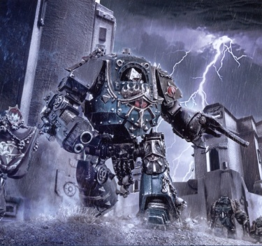
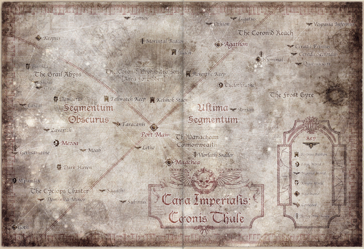

# 0778 006-008.M31 玛纳基安战争 Manachean War

精校状态：中文行文已逐段精校，部分术语仍为暂定

分类：时间线

原文来源：https://www.bilibili.com/opus/1198853736028438553

原作者：帝国神选罐头

原文时间：2026年05月05日 16:04

[返回分类目录](目录.md) · [全书目录](../../目录.md)

<!-- A0778-B0001 -->
**英文原文**

The Manachean War was a campaign of the Horus Heresy waged between 006 and 008.M31. Led personally by Warmaster Horus himself initially, the traitor lord sought to conquer the valuable industrial sectors of the Coronid Deeps.

<!-- /A0778-B0001 -->

<!-- A0778-B0002 -->

原译文

马纳基安战争是在006至008.M31之间发动的一场荷鲁斯叛乱的战役。最初，在战帅荷鲁斯本人的亲自领导下，这位叛徒领主试图征服科罗尼德深渊的重要工业星区。

**校订译文**

玛纳基安战争是荷鲁斯之乱期间于006—008.M31展开的一场战役。战帅荷鲁斯起初亲自统军，意图征服科罗尼德深渊那些具有重要价值的工业星区。

<!-- /A0778-B0002 -->

<!-- A0778-B0003 图片 -->

<!-- A0778-B0004 -->

原译文

Sons of Horus forces during the capture of Port Maw 攻占巨口港期间的荷鲁斯之子部队

**校订译文**

Sons of Horus forces during the capture of Port Maw 攻占巨口港期间的荷鲁斯之子部队

<!-- /A0778-B0004 -->

<!-- A0778-B0005 -->
**英文原文**

Conflict:Horus Heresy

<!-- /A0778-B0005 -->

<!-- A0778-B0006 -->

原译文

冲突：荷鲁斯叛乱

**校订译文**

冲突：荷鲁斯之乱

<!-- /A0778-B0006 -->

<!-- A0778-B0007 -->
**英文原文**

Date:006-008.M31

<!-- /A0778-B0007 -->

<!-- A0778-B0008 -->

原译文

日期：006-008.M31

**校订译文**

日期：006-008.M31

<!-- /A0778-B0008 -->

<!-- A0778-B0009 -->
**英文原文**

Location:Coronid Deeps

<!-- /A0778-B0009 -->

<!-- A0778-B0010 -->

原译文

地点：科罗尼德深渊

**校订译文**

地点：科罗尼德深渊

<!-- /A0778-B0010 -->

<!-- A0778-B0011 -->
**英文原文**

Outcome:Stalemate

<!-- /A0778-B0011 -->

<!-- A0778-B0012 -->

原译文

结果：胶着

**校订译文**

结果：胶着

<!-- /A0778-B0012 -->

<!-- A0778-B0013 -->
**英文原文**

Combatants:Imperium/Traitors

<!-- /A0778-B0013 -->

<!-- A0778-B0014 -->

原译文

作战方：帝国/叛徒

**校订译文**

作战方：帝国/叛徒

<!-- /A0778-B0014 -->

<!-- A0778-B0015 -->
**英文原文**

Commanders:Grand Admiral Ospheus LaBray, Lord Marshal Ireton MaSade, Governor Malthus Grange, Governor Pryamus Beket, Iron Father Autek Mor/Warmaster Horus Lupercal, Primarch Mortarion, Archmagos Draykavac, First Captain Ezekyle Abaddon, Taloc Thorne, Autilon Skorr

<!-- /A0778-B0015 -->

<!-- A0778-B0016 -->

原译文

指挥官：海军元帅奥菲斯·拉布雷，领主元帅艾尔顿·马萨德，总督马尔萨斯·格兰奇，总督普里亚穆斯·贝克特，铁父奥特克·莫尔/战帅荷鲁斯·卢佩卡尔，原体莫塔里安，大贤者德拉卡瓦克，第一连长以泽凯尔·阿巴顿，塔洛克·索恩，奥蒂隆·斯科尔

**校订译文**

指挥官：海军元帅奥菲斯·拉布雷、领主元帅艾尔顿·马萨德、总督马尔萨斯·格兰奇、总督普里亚穆斯·贝克特、钢铁圣父奥特克·莫尔／战帅荷鲁斯·卢佩卡尔、原体莫塔里安、大贤者德拉卡瓦克、第一连长以泽凯尔·阿巴顿、塔洛克·索恩、奥帝隆·斯考尔

<!-- /A0778-B0016 -->

<!-- A0778-B0017 -->
**英文原文**

Strength:3,800,000 Solar Auxilia troops, Imperial Army troops, Imperial Armada ships, Knights, Loyalist Adeptus Mechanicus, Iron Hands, Raven Guard, Imperial Fists, Blood Angels, Salamanders, Death Eagles/Sons of Horus, Death Guard, Night Lords, Alpha Legion, Iron Warriors, Dark Mechanicum, Knights

<!-- /A0778-B0017 -->

<!-- A0778-B0018 -->

原译文

力量：3800000名太阳辅助军部队，帝国军队部队，帝国无敌舰队舰船，骑士，忠诚派机械神教，钢铁之手，暗鸦守卫，帝国之拳，圣血天使，火蜥蜴，死亡之鹰/荷鲁斯之子，死亡守卫，午夜领主，阿尔法军团，钢铁勇士，黑暗机械教，骑士

**校订译文**

兵力：380万名太阳辅助军、帝国军部队、帝国舰队舰船、骑士、忠诚派机械修会、钢铁之手、暗鸦守卫、帝国之拳、圣血天使、火蜥蜴、死亡之鹰／荷鲁斯之子、死亡守卫、午夜领主、阿尔法军团、钢铁勇士、黑暗机械教、骑士

<!-- /A0778-B0018 -->

<!-- A0778-B0019 -->
**英文原文**

Casualties:Unknown, heavy/Unknown, heavy

<!-- /A0778-B0019 -->

<!-- A0778-B0020 -->

原译文

伤亡：未知，重大/未知，重大

**校订译文**

伤亡：具体不详，损失惨重／具体不详，损失惨重

<!-- /A0778-B0020 -->

<!-- A0778-B0021 -->
## The Cyclops Cluster 独眼巨人星群

<!-- /A0778-B0021 -->

<!-- A0778-B0022 -->
**英文原文**

The attack on the Coronid Deeps would begin at the Cyclops Cluster, first taking the world of Gethsamaine followed by Dark Mechanicus ambassadors convincing the Forge World of M'Pandex to join Horus' cause. However on the Forge World of Mezoa the ruling Tech-priests judged the traitor Mechanicum ambassadors to be Hereteks, forcing Horus to blockade the planet.

<!-- /A0778-B0022 -->

<!-- A0778-B0023 -->

原译文

对科罗尼德深渊的攻击将从独眼巨人星群开始，首先占领客西马尼世界，然后是黑暗机械教大使说服姆'潘德克斯铸造世界加入荷鲁斯的事业。然而，在梅佐亚铸造世界，执政技术神甫判定叛徒机械教大使是技术异端，迫使荷鲁斯封锁了这个行星。

**校订译文**

对科罗尼德深渊的进攻从独眼巨人星群打响。进攻方首先夺取了客西马尼世界，随后黑暗机械修会的使者说服姆’潘德克斯铸造世界投效荷鲁斯。然而，梅佐亚铸造世界的统治者——技术祭司们——认定叛变机械教的使者是技术异端，荷鲁斯只得封锁该行星。

**校注：** 英文此处为 Dark Mechanicus，后文为 Mechanicum，分别按机械修会／机械教处理；时代用语差异保留，不擅改英文。

<!-- /A0778-B0023 -->

<!-- A0778-B0024 图片 -->

<!-- A0778-B0025 -->

原译文

Map of the Coronid Deeps 科罗尼德深渊地图

**校订译文**

Map of the Coronid Deeps 科罗尼德深渊地图

<!-- /A0778-B0025 -->

<!-- A0778-B0026 -->
**英文原文**

Letting Mezoa sit and rot in its isolation, the Warmaster began with the next stage of his plan. He dispatched the Death Guard led by Mortarion across the Cyclops cluster, where they captured the worlds of Lascal and Dominica Minor with the help of the Traitor Knights of House Makabius. At Lascal, the Death Guard massacred the local Loyalist defenders, including Iron Hands remnants belonging to Clan Felg.

<!-- /A0778-B0026 -->

<!-- A0778-B0027 -->

原译文

让梅佐亚在孤立中坐以待毙，战帅开始了他的下一阶段计划。他派遣莫塔里安率领的死亡守卫穿过独眼巨人星群，在马卡比乌斯家族的叛徒骑士的帮助下，他们占领了拉斯卡尔和多米尼加次星世界。在拉斯卡尔，死亡守卫屠杀了当地的忠诚派守军，包括属于费尔格氏族的钢铁之手残余。

**校订译文**

战帅将梅佐亚留在孤立中自生自灭，继而着手执行下一阶段的计划。他派莫塔里安率死亡守卫横扫独眼巨人星群。在马卡比乌斯家族的叛变骑士协助下，他们夺取了拉斯卡尔和多米尼加次星。在拉斯卡尔，死亡守卫屠杀了当地忠诚派守军，其中包括钢铁之手费尔格氏族的残部。

<!-- /A0778-B0027 -->

<!-- A0778-B0028 -->
## The Manachean Commonwealth 玛纳基安联邦

<!-- /A0778-B0028 -->

<!-- A0778-B0029 -->
**英文原文**

Horus next plan would be a strike on the Manachean Commonwealth, a loyalist independent dominion within the Coronid Deeps to the galactic east of the Cyclops Cluster. This area was not left unguarded. In the early stages of the Horus Heresy, the Commmonwealth would be one of the earliest prepared regions of Imperial space for the coming of war. Following news of the attrocity at Isstvan and word of Horus' betrayal reaching Terra itself, Port Maw was used as a layover and resupply station for the fleets which would be deployed to the ill-fated punitive mission to Isstvan V. When word of its disastrous outcome reached the leaders of the Coronid deeps, they at first scoffed and suppressed such reports. Only when the first battered ships of the loyalist survivors trickled in did the weight of what was to come dawn upon them. Messages calling for reinforcement and aid to Terra were lost to warp storms and static, and so the worlds of the Commonwealth could only prepare for the coming onslaught. The Commonwealth could call upon regiments kept to the standards of the Solar Auxilia pattern, thanks to its high technological and industrial basis allowing for such troops to be supplied and maintained, while the massive War Fleet of the Port Maw Armada would provide for its defense in the void.

<!-- /A0778-B0029 -->

<!-- A0778-B0030 -->

原译文

荷鲁斯的下一个计划是袭击玛纳基安联邦，这是独眼巨人星群以东的科罗尼德深渊内的一个忠诚派独立领地。这个地区并非无人守卫。在荷鲁斯叛乱的早期阶段，联邦是帝国最早为战争做好准备的地区之一。在伊斯塔万发生暴行的消息和荷鲁斯背叛的消息传到泰拉之后，巨口港被用作舰队的中转站和补给站，这些舰队将被部署到伊斯塔万五号的命运多舛的惩罚任务中。当其灾难性结果的消息传到科罗尼德深渊的领导人那里时，他们起初嘲笑并压制了这些报告。只有当忠诚派幸存者的第一艘破旧船只缓缓驶来时，他们才意识到即将到来的重任。呼吁泰拉增援和援助的信息因亚空间风暴和静电而丢失，因此联邦的世界只能为即将到来的袭击做好准备。联邦可以保持太阳辅助军模式的标准兵团，这要归功于其高科技和工业基础，允许提供和维护这些部队，而庞大的巨口港无敌舰队将在虚空中为其提供防御。

**校订译文**

荷鲁斯接下来打算进攻玛纳基安联邦。这是科罗尼德深渊内一片效忠帝国的独立领地，位于独眼巨人星群的银河东侧。这里早已设下防备：荷鲁斯之乱初期，联邦是帝国境内最早为战争做好准备的地区之一。伊斯塔万暴行与荷鲁斯叛变的消息传至泰拉后，奉命前往伊斯塔万五号执行讨伐任务的舰队曾在巨口港中转、补给，却即将踏上一条不归路。当讨伐惨败的消息传到科罗尼德深渊的统治者耳中时，他们起初嗤之以鼻，还压下了这些报告。直到忠诚派幸存者那些伤痕累累的舰船陆续驶入，他们才意识到即将面临多大的灾难。向泰拉求援的讯息淹没在亚空间风暴和通信杂音之中，联邦各世界只能自行备战，迎接来袭之敌。凭借发达的技术与工业基础，联邦能够供养和维持按太阳辅助军标准装备的兵团；巨口港舰队庞大的作战舰艇群则负责虚空防御。

<!-- /A0778-B0030 -->

<!-- A0778-B0031 -->
### Prelude to Port Maw 巨口港序曲

<!-- /A0778-B0031 -->

<!-- A0778-B0032 -->
**英文原文**

Horus had not been unprepared. Traitor Agents were already embedded throughout the Coronid Deeps. By the time of the Isstvan III atrocity, Horus had already used his influence as Warmaster to have elements of Port Maw's Armada scattered on deep patrols in space, chasing flimsy reports of pirates or xenos activity, or reinforcing distant warzones and conflicts even where they were not called for. By 006.M31, when the fires of rebellion were finally made clear, efforts by Port Maw to recall their fleet were greatly disrupted. The upsurge in warp turbulence so infamously associated with the Horus Heresy would make itself felt, and the fleets sent chasing after mist and shadows now found the threats very real and dire. Xenos raiders, piracy, attacks unknown warships and all manner of calamities assaulted their fleets. The Rogue Trader Rom Jhuttlander, who had served as pathfinder to Horus 63rd expeditionary force, would launch raids from the Coronid Prohibited Zone, which Port Maw had been forbidden to enter by ancient decree. Soon the Warmaster's emissaries themselves would arrive, demanding dark compliance. Many deep range patrols simply did not return.

<!-- /A0778-B0032 -->

<!-- A0778-B0033 -->

原译文

荷鲁斯并非毫无准备。叛徒特工已经渗透到整个科罗尼德深渊。在伊斯塔万三号暴行发生时，荷鲁斯已经利用他作为战帅的影响力，让巨口港的无敌舰队成员分散在深渊的空域中进行巡逻，追捕海盗或异型活动的不足信的报告，或加强遥远的战区和冲突，即使在不需要的地方也是如此。到006.M31，当叛乱的火焰最终被明确时，巨口港召回舰队的努力受到了极大的干扰。与荷鲁斯叛乱有关的亚空间湍流的激增会让人感觉到，被派去追逐迷雾和阴影的舰队现在发现，威胁非常真实和可怕。异型袭击者、海盗、未知战舰的袭击以及各种灾难袭击了他们的舰队。行商浪人罗姆·朱特兰德曾是荷鲁斯第63远征部队的探路者，他将从古代法令禁止进入的科罗尼德禁区发动袭击。很快，战帅的特使也会到达，要求服从黑暗。许多深渊范围的巡逻队根本没有回来。

**校订译文**

荷鲁斯同样早有准备，叛军特工已渗透科罗尼德深渊各处。伊斯塔万三号暴行发生时，他已经利用战帅的职权，将巨口港舰队的一部分舰船调往遥远空域巡逻，追查那些缺乏根据的海盗或异形活动报告，或让它们驰援遥远的战区，甚至有些地区根本不需要增援。到006.M31，叛乱的态势终于明朗，巨口港却难以召回自己的舰队。荷鲁斯之乱期间恶名昭彰的亚空间动荡开始加剧；那些原本奉命追逐捕风捉影之事的舰队，此时遇到的却是真实而严峻的威胁。异形劫掠者、海盗、不明战舰和种种灾祸接连袭来。曾为荷鲁斯第63远征舰队担任向导的行商浪人罗姆·朱特兰德，从科罗尼德禁区出动袭击；依据古老法令，巨口港的舰船不得进入该区。很快，战帅的使者也亲自现身，要求各舰归顺叛军。许多远航巡逻舰队就此一去不返。

<!-- /A0778-B0033 -->

<!-- A0778-B0034 -->
**英文原文**

Worse still, an unexpected appearance of the Ork Space Hulk Red Polyphemus in the region forced an entire battle group from Port Maw to be diverted to deal with the threat. Such a sudden attack by Orks that had seemingly been suppressed in the region for over 30 years would, in hind-sight, appear to be more than mere coincidence. Normally the fleet would call upon Legiones Astartes support to board and put an end to the space hulk, but deprived of this they were forced to commit to the dangerous task of bombarding and destroying the space hulk, all while Solar Auxilia forces kept greenskin counter attacks and invasions of nearby worlds by the Orks. Port Maw's battlegroup finally fragmented the Space Hulk in 007.M31, but taking a heavy toll in attrition throughout that time. By then, word had come that the Death Guard had arrived to mount an attack towards the Manachean Commonwealth itself, and forces from the surrounding region were called to muster at Port Maw.

<!-- /A0778-B0034 -->

<!-- A0778-B0035 -->

原译文

更糟糕的是，该地区突然出现的欧克太空废船红色波吕斐摩斯号迫使整个战斗群从巨口港转移以应对威胁。欧克的这种突然袭击似乎在该地区被压制了30多年，事后看来，这似乎不仅仅是巧合。通常情况下，舰队会请求阿斯塔特军团的跳帮支援并终结太空废船，但被剥夺了这一点，他们被迫承担轰炸和摧毁太空废船的危险任务，而太阳辅助军部队则一直在抵御绿皮的反击和对附近世界的入侵。巨口港的战斗群最终在007.M31击溃了太空废船，但在这段时间内造成了严重的人员伤亡。到那时，有消息称，死亡守卫已经抵达，准备对玛纳基安联邦发动袭击，周边地区的部队被召集到巨口港。

**校订译文**

更糟糕的是，欧克太空废船红色波吕斐摩斯号突然出现在该地区，迫使巨口港调走整个战斗群应付这一威胁。此地的欧克似乎已被压制了三十多年，此刻却突然发动袭击；事后回想，这很难说只是巧合。通常，舰队会请求阿斯塔特军团支援，登上并消灭太空废船。如今没有这种支援，他们只能冒险以舰炮轰击、摧毁它；与此同时，太阳辅助军还得抵挡绿皮反扑，阻止欧克入侵附近世界。巨口港战斗群终于在007.M31将废船轰碎，却也在这段时间里遭受了严重损耗。此时传来消息：死亡守卫已经抵达，即将进攻玛纳基安联邦本土。周边地区的部队随即奉命向巨口港集结。

**校注：** 英文 kept greenskin counter attacks 一句缺少完整谓语，结合前后文按抵挡反扑、阻止入侵理解；太空废船被 fragmented 是轰碎，并非一般意义击退。

<!-- /A0778-B0035 -->

<!-- A0778-B0036 -->
### Treachery at Port Maw 巨口港的背叛

<!-- /A0778-B0036 -->

<!-- A0778-B0037 -->
**英文原文**

The artificial planetoid of Port Maw was normally home to the War Fleet of Port Maw Armada, which included a score of battleships, dozens of squadrons of cruisers, countless hundreds of escort craft, and thousands of servitor-drone tenders, provision ships, troop transports and orbital lighters. These would soon be joined by reinforcing fleets from the rest of the Coronid Deeps, warships of the distant Agathean Domain, pirate-killers from the Cerada Nebula, and three huge War Arks from Forgeworld Cyclothrate. In addition to this, a great wave of refugee ships, mercantile ships fleeing systems under threat and ragged survivors of the battles in the Cyclops Cluster, and even a handful of survivors from the void battles at Istvaan V, though the Astartes vessels would not remain long. Many such ships were barely operational, while others had to be scuttled or set to drift lest their perilous state of disrepair pose a threat. Such numbers of vessels would be impossible for the normal human mind to bear, so coordination of the assembling armada was channeled through Port Maw's Mechanicum Astra Control Panopticon - a powerful broadcast tower ten kilometers high on Port Maw's southern pole. Cogitators would calculate ship movement data across the fleet and automate the control helms of the vast number of ships to prevent collisions. Though this automated control could always be overridden manually, anticipating a vulnerability, Port Maw's leaders had strengthened the encryption and defenses multiple times throughout the war. Deemed impregnable, the leaders of Port Maw could not anticipate the fatal flaw in the system which would be the betrayal of Archmagos-Astral Leit Mercuric, cyber-Ordinator of Port Maw, who had secretly sworn to Horus, as well as several of her acolytes and officers of the Imperialis Armada, all of whom were corrupted when they had served alongside the Word Bearers in the past.

<!-- /A0778-B0037 -->

<!-- A0778-B0038 -->

原译文

巨口港的人造小行星通常是巨口港无敌舰队的战争舰队的所在地，其中包括数十艘战列舰、数十个巡洋舰中队、无数艘护卫舰和数千艘侍从无人机、补给舰、部队运输舰和轨道驳船。很快，来自科罗尼德深渊其他地方的增援舰队、遥远的阿加西安领域的战舰、塞拉达星云的海盗杀手和赛克洛思瑞特铸造世界的三艘巨大的战争方舟也将加入其中。除此之外，还有一波逃亡者舰船、逃离受威胁星系的商船和独眼巨人星群的战斗中精疲力竭的幸存者，甚至还有伊斯塔万五号虚空战中的少数幸存者，尽管阿斯塔特战舰不会停留太久。许多此类舰船几乎无法使用，而其他舰船则不得不被凿沉或漂流，以免其危险的失修状态构成威胁。如此多的战舰是正常人类无法承受的，因此组装舰队的协调是通过巨口港的星界控制全景监控进行的，这是一个位于巨口港南极十公里高的强大广播塔。沉思者将计算整个舰队的舰船移动数据，并自动控制大量舰船的控制舵，以防止碰撞。尽管这种自动控制可以经常手动覆盖，但预计会出现漏洞，巨口港的领导人在整个战争期间多次加强了加密和防御。巨口港的领导人认为坚不可摧，他们无法预料到该系统中的致命缺陷，即背叛的秘密宣誓效忠荷鲁斯的巨口港网络协调员星界大贤者莱特·墨丘利克，以及她的几名助手和帝国无敌舰队的军官，他们都是在过去与怀言者并肩作战时腐化的。

**校订译文**

巨口港是一颗人造小行星，平时驻扎着巨口港舰队的作战舰艇群，包括约二十艘战列舰、数十个巡洋舰中队、数以百计的护航舰，以及数千艘机仆无人补给艇、补给舰、运兵船和轨道驳船。很快，科罗尼德深渊其他地区的增援舰队也将加入：遥远的阿加西安领地派来了战舰，塞拉达星云派来了剿匪舰艇，赛克洛特拉特铸造世界则派来了三艘巨型战争方舟。此外，大批难民船、逃离受威胁星系的商船、独眼巨人星群战斗中逃出的残破舰船，乃至少数从伊斯塔万五号虚空战中幸存的舰船，也纷纷涌入；不过，阿斯塔特的舰船并未久留。许多船只勉强还能运作，另一些则因损坏严重、可能危及周围舰船，不得不被自行毁弃或放任漂离。舰船数量之多，已超出普通人脑的调度能力，因此，集结舰队的协调工作交由巨口港机械教的星界控制全景监控塔处理。这座位于巨口港南极、十公里高的巨型发射塔，利用沉思者计算全舰队的航行数据，并自动操纵大量舰船的航向控制装置，以免发生碰撞。这种自动控制随时可以由人工接管，但巨口港的统治者仍考虑到它可能遭人利用，在战争期间多次加强加密与防护。他们以为系统固若金汤，却未能预见真正致命的漏洞：巨口港的网络协调员、星界大贤者莱特·墨丘利克已经秘密向荷鲁斯宣誓效忠。她的数名侍僧以及一些帝国舰队军官也参与其中；这些人都曾在与怀言者并肩作战时遭到腐化。

**校注：** a score 为二十；原译“数十”失准。servitor-drone tenders 为机仆无人补给艇，不是侍从无人机。Cyclothrate 与全书 Cyclothrathe 同一铸造世界，统一赛克洛特拉特。

<!-- /A0778-B0038 -->

<!-- A0778-B0039 -->
**英文原文**

When the war finally arrived to Port Maw, the betrayal was put into motion. The Control Panopticon sent powerful signals and data-djinn to all the ships that had been so reliant upon. Vox-circuits burnt out, auguries were filled with static, auspex scanners shut down as systems failed as ships were suddenly blinded. Moving ships diverted or suddenly accelerated, crashing into each other, their wreckage flying into the paths of others. The crews of many, unbraced and unprepared for sudden impacts, were hurled against the walls of their vessels into a bloody pulp. Ship bridges were flooded with scrapcode. Over a hundred lesser vessels were overridden entirely, their ships venting their crew into the void, while the Machine Spirits of the larger vessels fought against the attack. At this same time, turncoat ships within the Port Maw fleet were left unaffected and began to fire upon their former allies, sowing terror and confusion, and causing many loyalist ships to surrender to traitor demands.

<!-- /A0778-B0039 -->

<!-- A0778-B0040 -->

原译文

当战争最终到达巨口港时，背叛开始了。控制全景监控向所有依赖的船只发送了强大的信号和数据精灵。音阵线路烧坏了，鸟卜仪充满了静电，由于船只突然失明，系统发生故障，鸟卜扫描仪关闭。移动的船只转向或突然加速，相互碰撞，残骸飞入其他船只的航线。许多船员没有受到保护，也没有对突然的撞击做好准备，他们被抛到船壁上，变成了血浆。舰桥被废码淹没。一百多艘较小的战舰被完全超控，他们的船只将船员排入虚空，而较大战舰的机魂则与袭击作斗争。与此同时，巨口港舰队内的叛徒舰船不受影响，开始向其前盟友开火，播下恐怖和混乱的种子，导致许多忠诚派船只向叛徒的要求投降。

**校订译文**

战火终于烧到巨口港时，叛变计划随之启动。控制全景监控塔向所有仰赖它的舰船发送强力信号和数据精灵。音阵线路被烧毁，鸟卜仪充斥杂音，探测扫描仪停止工作；系统接连失灵，使舰船骤然失去了耳目。航行中的舰船突然转向或加速，彼此撞击，飞散的残骸又闯入其他舰船的航路。许多毫无防备、未作固定的船员在突如其来的撞击中被甩向舱壁，撞成血肉模糊的一团。废码涌入舰桥，一百多艘小型舰船被彻底夺取控制，舰上船员被排放到虚空中；大型舰船的机魂则奋力抵抗入侵。与此同时，巨口港舰队中的叛舰丝毫未受影响，开始向昔日盟友开火。恐惧与混乱迅速蔓延，许多忠诚派舰船被迫接受叛军要求，宣布投降。

<!-- /A0778-B0040 -->

<!-- A0778-B0041 -->
**英文原文**

The Provost-Marshals of Port Maw, having thwarted a mutiny in their own ranks, gathered elite armoured Veletari troops of the 905th Lethe Cohort to storm the Control Panopticon, which failed to respond to communications and was now clearly the source of the malevolent signals. They fought their way past frenzied servitors, servo skulls, giant mechanical spiders, hulking traitor Tech Priests as heavily armoured as Terminators, and Castellan Class Automatons. Only a single Veletari soldier managed to survive, making his way to the control dais of the Panopticon and destroying it even as his helmet was being crushed by steel claws - ending the malignant signals.

<!-- /A0778-B0041 -->

<!-- A0778-B0042 -->

原译文

巨口港的宪兵元帅在挫败了自己队伍中的叛乱后，召集了第905勒忒大队的精英装甲维莱塔里部队，突袭了控制全景监控，该控制区未能对通信做出回应，现在显然是恶意信号的来源。他们奋力穿过疯狂的机仆、伺服颅骨、巨大的机械蜘蛛、像终结者一样全副武装的庞大叛徒技术神甫和堡主级机兵。只有一名维莱塔里士兵幸存下来，他前往全景监控的控制台并摧毁了它，即使他的头盔被钢爪压碎 — 终结了恶性信号。

**校订译文**

巨口港的宪兵长官们先挫败了内部的兵变，随后集结第905勒忒大队的迅捷精锐装甲步兵，强攻控制全景监控塔。该塔已不回应通信，而且显然正是恶意信号的来源。突击部队一路迎战狂乱的机仆、伺服颅骨、巨型机械蜘蛛、身形庞大且披挂着终结者级别重甲的叛变技术祭司，以及堡主级机兵。最终只有一名迅捷步兵活着抵达监控塔的控制台。他在钢爪压碎头盔之际摧毁了控制台，终止了恶意信号。

**校注：** 源文 Veletari 为 Veletaris 异拼，沿全书第83篇迅捷战斗分队词根；最后一人抵达控制台时仍存活，不代表其在钢爪攻击后生还。Castellan Class 保留英文，不以现行 Kastelan 单位官译替换。

<!-- /A0778-B0042 -->

<!-- A0778-B0043 -->
**英文原文**

With the malignant signal from the Panopticon halted, order began to reassert itself as battle lines were now properly drawn between traitor and loyalist. Grand Admiral Ospheus LaBray thwarted a mutiny on Port Maw's flagship - the Triumph of Reason, a large command ship designed to direct an entire Segmentum fleet as needed. He ordered the Dictatus Class Ram-Battleship Kurga to destroy the now silent Panopticon tower. The Kurga smashed into the tower with its piercing ram claws fired melta-tipped harpoons spears into the tower, then burned its engines hard ripping the panopticon tower off its base and sending it adrift into the void.

<!-- /A0778-B0043 -->

<!-- A0778-B0044 -->

原译文

随着来自全景监控的恶性信号停止，秩序开始重新确立，叛徒和忠诚者之间的战线现在已经正确划定。海军元帅奥菲斯·拉布雷挫败了巨口港的旗舰理性胜利号的兵变，这是一艘大型指挥舰，旨在根据需要指挥整个星域舰队。他命令独裁者级冲撞战列舰库尔加号摧毁现在沉默的全景监控塔。库尔加号用其尖锐的冲撞爪猛烈撞击塔楼，并发射装有热熔尖端的叉矛刺入塔楼，然后猛烈燃烧引擎，将全景监控塔从基座上扯下，让它漂浮在虚空中。

**校订译文**

随着监控塔的恶意信号中断，局面逐渐恢复秩序，忠诚派与叛军之间终于形成了清晰的战线。海军元帅奥菲斯·拉布雷平息了巨口港旗舰理性凯旋号上的兵变。这是一艘大型指挥舰，必要时足以指挥整个星域的舰队。他命令独裁者级冲撞战列舰库尔加号摧毁已然沉寂的监控塔。库尔加号以穿刺撞爪撞入塔身，又射出热熔尖头的鱼叉矛，牢牢钉住塔体。随后，它全力发动引擎，将整座监控塔从基座上扯下，拖入虚空，任其漂流。

<!-- /A0778-B0044 -->

<!-- A0778-B0045 -->
**英文原文**

Meanwhile, far out into void, the rest of the reinforcement ships of assembling Port Maw Armada also had to deal with the Panopticon signal and mutiny among their own vessels, while others such as a squadron of cruisers from Agathon, stayed out of the fight, confused as to the battle that had no clear cause nor side to choose. At this time, one of the three Cyclothrate War-Arks, the Arithmetic of Violence, having thus far remained quietly out of the fight, unleashed a massive volley of void torpedos that devastated the Agatheans, now revealing the Cyclothratine Mechanicum fleet's true colours.

<!-- /A0778-B0045 -->

<!-- A0778-B0046 -->

原译文

与此同时，在遥远的虚空中，聚集巨口港无敌舰队的其他增援舰也不得不处理全景监控信号和自己战舰之间的兵变，而阿伽松的一个巡洋舰中队等其他船只则没有参与战斗，对这场没有明确原因也没有选择一侧的战斗感到困惑。此时，三个赛克洛思瑞特战争方舟中的一个，暴力运算号，迄今为止一直悄悄地退出战斗，释放了大量的虚空鱼雷，摧毁了阿加西安的舰船，现在揭示了赛克洛思瑞特机械教舰队的真实面貌。

**校订译文**

与此同时，在远处的虚空中，正在向巨口港集结的其他增援舰船也不得不应付监控塔信号的攻击与舰上的兵变。一些舰船——例如来自阿伽松的一个巡洋舰中队——则始终没有参战，因为它们既不明白为何开战，也无法判断该站在哪一边。就在这时，三艘赛克洛特拉特战争方舟之一、此前一直静观其变的暴力运算号，突然齐射大量虚空鱼雷，重创了阿加西安舰船。赛克洛特拉特机械教舰队终于露出了真面目。

<!-- /A0778-B0046 -->

<!-- A0778-B0047 -->
### Attack on Manachea 对玛纳基安的袭击

<!-- /A0778-B0047 -->

<!-- A0778-B0048 -->
**英文原文**

The Sons of Horus began their assault on Manachea. Striking at Hive Ilium on Manachea Vysidae, Horus' forces under Abaddon defeated the shocked but tenacious Imperial Army resistance. After capturing the Palace of Light, the Manachea Commonwealth folded to the traitors. It was then that Horus, the Death Guard, and the majority of the traitor forces left the region to conduct campaigns elsewhere, leaving a smaller garrison led by Taloc Thorne to oversee the Commonwealth's subordination. Meanwhile, the Iron Hands ship Red Talon of Clan Morragul under Autek Mor had arrived in the system, exacting vicious retribution on traitors and their collaborators wherever they could be found, striking at Gethsamaine Colonus in the Grail Abyss. In a murderous fury, Mor's troops used nuclear weapons to depopulate Gethsamaine.

<!-- /A0778-B0048 -->

<!-- A0778-B0049 -->

原译文

荷鲁斯之子开始攻击玛纳基安。阿巴顿率领的荷鲁斯的部队袭击了玛纳基安·维西德的伊利姆巢都，击败了震惊但顽强的帝国军队抵抗。占领光之宫殿后，玛纳基安联邦向叛徒屈服。就在那时，荷鲁斯、死亡守卫和大多数叛徒部队离开了该地区，前往其他地方开展战役，留下了一个由塔洛克·索恩领导的较小规模的驻军来监督联邦的从属。与此同时，奥特克·莫尔领导的莫拉格氏族的钢铁之手舰船红爪号已经抵达该星系，对叛徒及其合作者进行了恶毒的报复，无论他们在哪里被发现，都对圣杯深渊的客西马尼·科洛诺斯发动了袭击。在一种凶残的愤怒中，莫尔的部队使用核武器来减少客西马尼的人口。

**校订译文**

荷鲁斯之子开始进攻玛纳基安。阿巴顿率军袭击玛纳基安·维西德的伊利姆巢都，击溃了虽猝不及防、却仍顽强抵抗的帝国军。光之宫殿陷落后，玛纳基安联邦向叛军屈服。此后，荷鲁斯、死亡守卫以及大部分叛军离开该地区，转赴其他战场，只留下塔洛克·索恩率领的少量驻军，监督联邦服从新统治。与此同时，钢铁之手莫拉古尔氏族的红爪号已在奥特克·莫尔率领下抵达该星系。他们四处搜寻叛徒与合作者，施以残酷报复，并袭击了圣杯深渊中的客西马尼·科洛诺斯。莫尔的部队杀红了眼，用核武器灭绝了客西马尼的人口。

**校注：** depopulate 在此为核武灭绝人口，不能弱化成普通人口减少。Morragul 与全书同氏族统一莫拉古。

<!-- /A0778-B0049 -->

<!-- A0778-B0050 -->
**英文原文**

While the ruling traitor Magos under Draykavac was still busy mopping up the last remnants of resistance in his newly-conquered sectors, a loyalist reinforcement fleet from the nearby Agathean Domain arrived under Lord Marshal Ireton MaSade. MaSade struck at the recently captured world of Numinal, creating a vicious conflict where his Solar Auxilia battled traitor Mechanicum forces. Knights, used by both sides, proved the decisive factor in the battle. The loyalists held firm and slowly began to overwhelm the traitor forces, and aided by local rebellions and small amounts of Imperial Fists and Raven Guard were able to win the day. Numinal had fallen to the loyalists.

<!-- /A0778-B0050 -->

<!-- A0778-B0051 -->

原译文

当德拉卡瓦克领导下的执政叛徒现在仍在忙于扫荡其新征服星区的最后残余抵抗时，来自附近阿加西安领域的忠诚派增援舰队在领主元帅艾尔顿·马萨德的指挥下抵达。马萨德袭击了最近被占领的努米纳尔世界，引发了一场残酷冲突，他的太阳辅助军与叛徒机械教部队作战。双方都使用的骑士是这场战斗的决定性因素。忠诚派坚守阵地，慢慢开始压倒叛徒部队，在当地叛乱和少量帝国之拳和暗鸦守卫的帮助下，他们赢得了胜利。努米纳尔已经落入忠诚派之手。

**校订译文**

德拉卡瓦克麾下掌权的叛变贤者仍忙于肃清新占星区中的最后抵抗时，一支来自附近阿加西安领地的忠诚派增援舰队，在领主元帅艾尔顿·马萨德指挥下抵达。马萨德进攻了不久前落入敌手的努米纳尔世界，他的太阳辅助军与叛变机械教部队展开激战。双方投入的骑士成为决定战局的关键。忠诚派稳住阵脚，逐步压倒叛军，随后在当地起义者以及少量帝国之拳和暗鸦守卫战士的协助下取得胜利，将努米纳尔夺回。

<!-- /A0778-B0051 -->

<!-- A0778-B0052 -->
**英文原文**

But despite the liberation of Numinal, much of the region still lay in traitor hands. Stalemate ensued, and the Manachean Commonwealth was devastated in a series of attacks and counterattacks. At Lethe and Revorthe Keep, the loyalist Death Eagles Blackshields clashed with the Emperor's Children.

<!-- /A0778-B0052 -->

<!-- A0778-B0053 -->

原译文

但尽管努米纳尔解放了，该地区的大部分仍然掌握在叛徒手中。随后发生了胶着，玛纳基安联邦在一系列袭击和反击中遭到破坏。在勒忒和雷沃斯要塞，忠诚派死亡之鹰黑盾与帝皇之子发生了冲突。

**校订译文**

然而，尽管努米纳尔得到解放，该地区大部分领土仍在叛军手中。双方陷入僵持，玛纳基安联邦在一轮轮攻防战中遭受重创。在勒忒和雷沃斯要塞，忠诚派黑盾部队死亡之鹰与帝皇之子展开交战。

<!-- /A0778-B0053 -->

<!-- A0778-B0054 -->
### The Siege of Epsilon-Stranivar IX ε-斯特拉尼瓦尔九号围城战

原题：The Siege of Epsilon-Stranivar IX ε-斯特拉尼瓦尔九号围攻

<!-- /A0778-B0054 -->

<!-- A0778-B0055 -->
**英文原文**

Epsilon-Stranivar IX, known during the Great Crusade of Fortress Stranivar, was a world found at the edge of the Coronid Deeps. By the time of the later stages of the Coronid Deeps campaign, the world had served as the last loyalist stronghold of Horus' flank, garrisoned by a force of small force of Imperial Fists, Raven Guard, Iron Hands, Salamanders, and Blood Angels. Refusing to yield, the traitors were faced with no other option but a major assault. But while the loyalists were united in a common cause, the traitors were divided among their own agendas.

<!-- /A0778-B0055 -->

<!-- A0778-B0056 -->

原译文

ε-斯特拉尼瓦尔九号，在大远征期间因斯特拉尼瓦尔要塞尔为人所知，是在科罗尼德深渊边缘发现的一个世界。在科罗尼德深渊战役的后期阶段，世界已经成为荷鲁斯侧翼的最后一个忠诚派据点，由帝国之拳、暗鸦守卫、钢铁之手、火蜥蜴和圣血天使组成的小型部队驻守。拒绝屈服，叛徒除了发动大规模进攻，别无选择。但是，当忠诚派团结在一个共同的事业中时，叛徒却各自为政。

**校订译文**

ε-斯特拉尼瓦尔九号位于科罗尼德深渊边缘，大远征时期称为斯特拉尼瓦尔要塞。科罗尼德深渊战役进入后期时，它已成为荷鲁斯侧翼最后一处忠诚派据点，由少量帝国之拳、暗鸦守卫、钢铁之手、火蜥蜴和圣血天使驻守。守军拒不投降，叛军只能大举强攻。忠诚派为共同目标团结作战，叛军却因各怀打算而分歧重重。

<!-- /A0778-B0056 -->

<!-- A0778-B0057 -->
**英文原文**

Thus a force of Iron Warriors of the 114th Grand Battalion, Alpha Legion companies, and a Death Guard host began their poorly coordinated push. Time and time again the Alpha Legion allowed the Iron Warriors to attack unsupported into guns and dug-in loyalist positions while using the confusion for their own pin-point raids. During the climatic battle of the campaign, the Siege of Vharna, the Traitor Host broke on the Loyalist lines. The 114th Grand Battalion was effectively abandoned by the Alpha Legion and Death Guard, left to act as a sacrificial rearguard. Of the 6,000 Iron Warriors who took to the field, less than a third would leave alive. The highest-ranked surviving Iron Warrior, Nârik Dreygur, swore that his fallen brothers would be avenged.

<!-- /A0778-B0057 -->

<!-- A0778-B0058 -->

原译文

因此，第114大营的钢铁勇士、阿尔法军团连队和一个死亡守卫天军开始了他们协调不力的推进。阿尔法军团一次又一次地允许钢铁勇士在没有支援的情况下使用枪炮进行攻击，并在忠诚派的阵地上固守，同时利用混乱进行自己的定点突袭。在战役的气候战，瓦尔纳围城中，叛徒天军突袭了忠诚派的防线。第114大营实际上被阿尔法军团和死亡守卫抛弃，留下来充当牺牲的后卫。在6000名钢铁勇士中，只有不到三分之一的人能活着离开。现存等级最高的钢铁勇士纳里克·德雷格发誓要为他牺牲的兄弟报仇。

**校订译文**

钢铁勇士第114大营、数个阿尔法军团连队和一支死亡守卫大军，就这样展开了配合拙劣的攻势。阿尔法军团一次又一次任由钢铁勇士在缺乏支援的情况下，迎着忠诚派炮火进攻设防坚固的阵地，自己却利用混乱实施精准突袭。在决定战役走向的瓦尔纳围城战中，叛军的攻势在忠诚派防线上碰得粉碎。第114大营实际上遭到了阿尔法军团和死亡守卫的抛弃，只能充当注定牺牲的后卫。参战的六千名钢铁勇士中，不足三分之一生还。幸存者中军衔最高的纳里克·德雷格尔发誓，要为阵亡的兄弟复仇。

**校注：** climatic 系 climactic 语境笔误，译为决定战局；broke on the Loyalist lines 指攻势受挫崩溃，不是突破防线。host 在此为一般大军，非暗黑天使专门编制天军。

<!-- /A0778-B0058 -->

<!-- A0778-B0059 -->
**英文原文**

However, the loyalist victory was short-lived as less than a year later the Sons of Horus launched a renewed attack that captured the planet.

<!-- /A0778-B0059 -->

<!-- A0778-B0060 -->

原译文

然而，忠诚派的胜利是短暂的，因为不到一年后，荷鲁斯之子发动了新的进攻，占领了行星。

**校订译文**

然而，忠诚派的胜利并未维持多久。不到一年后，荷鲁斯之子再次发起进攻，夺取了这颗行星。

<!-- /A0778-B0060 -->

本篇核心术语与暂定项

以下列出本篇出现的英文原形及核心术语表用词。同形词可能指不同对象，具体词义以本篇正文和校注为准；单复数、别名和仅见于图注的名称可能尚未列入。完整候选见[术语表](../../术语表/双语术语候选.csv)。

| 英文 | 采用中文 | 状态 |
| --- | --- | --- |
| Blood Angels | 圣血天使 | 官方已核对 |
| Adeptus Mechanicus | 机械修会 | 官方已核对 |
| Imperial Army | 帝国军 | 暂定·官方待核 |
| Death Guard | 死亡守卫 | 官方已核对 |
| Orks | 欧克蛮人 | 官方已核对 |
| Horus Heresy | 荷鲁斯之乱 | 官方已核对 |
| Warp | 亚空间 | 官方已核对 |
| Imperium | 帝国 | 暂定·简称 |
| Mechanicum | 机械教 | 暂定·历史称谓 |
| Dark Mechanicum | 黑暗机械教 | 暂定·官方待核 |
| Servitor | 机仆 | 暂定 |
| Rogue Trader | 行商浪人 | 暂定 |
| Imperial Fists | 帝国之拳 | 暂定 |
| Emperor | 帝皇 | 官方已核对 |
| Primarch | 原体 | 官方已核对 |
| Forge World | 铸造世界 | 暂定·官方待核 |
| Word Bearers | 怀言者 | 暂定·官方待核 |
| Emperor's Children | 帝皇之子 | 官方已核对 |
| Iron Warriors | 钢铁勇士 | 暂定·官方待核 |
| Night Lords | 午夜领主 | 暂定·官方待核 |
| Great Crusade | 大远征 | 暂定·官方待核 |
| Mortarion | 莫塔里安 | 官方已核对 |
| Compliance | 归顺；纳入帝国统治 | 暂定·官方待核 |
| Terra | 泰拉 | 暂定·官方待核 |
| Horus | 荷鲁斯 | 暂定·官方待核 |
| Sons of Horus | 荷鲁斯之子 | 暂定·官方待核 |
| Isstvan III | 伊斯塔万三号 | 暂定·官方待核 |
| Iron Hands | 钢铁之手 | 暂定·官方待核 |
| Legiones Astartes | 阿斯塔特军团 | 暂定·官方待核 |
| Solar Auxilia | 太阳辅助军 | 暂定·官方待核 |
| Imperialis Armada | 帝国无敌舰队 | 暂定·官方待核 |
| Segmentum | 星域 | 暂定·官方待核 |
| Salamanders | 火蜥蜴 | 暂定·官方待核 |
| Port Maw | 巨口港 | 暂定·官方待核 |
| Mezoa | 梅佐亚 | 暂定·官方待核 |
| Tech | 技术语 | 暂定·官方待核 |
| Clear | 清明 | 暂定·官方待核 |
| Mission | 教团／传教机构 | 暂定 |
| Iron Father | 钢铁圣父 | 暂定·官方待核 |
| Ancient | 旗手 | 官方已核对 |
| Lord Marshal | 领主元帅 | 暂定·官方待核 |
| Horus Lupercal | 荷鲁斯·卢佩卡尔 | 暂定·官方待核 |
| Lupercal | 卢佩卡尔 | 暂定·官方待核 |
| Triumph of Reason | 理性凯旋号 | 暂定·官方待核 |
| Alpha Legion | 阿尔法军团 | 暂定·官方待核 |
| Raven Guard | 暗鸦守卫 | 官方已核 |
| Autek Mor | 奥特克·莫尔 | 暂定·官方待核 |
| Blackshields | 黑盾 | 暂定·官方待核 |
| Death Eagles | 死亡天鹰 | 暂定·官方待核 |
| Isstvan | 伊斯塔万 | 暂定·官方待核 |
| First Captain | 第一连长 | 暂定·官方待核 |
| Ezekyle Abaddon | 以泽凯尔·阿巴顿 | 暂定·官方待核 |
| Autilon Skorr | 奥帝隆·斯考尔 | 暂定·官方待核 |
| Pathfinder | 探路者 | 暂定·官方待核 |
| Nârik Dreygur | 纳里克·德雷格尔 | 暂定·官方待核 |
| Captain | 连长 | 暂定·官方待核 |
| Terminators | 终结者 | 暂定·官方待核 |
| Remnants | 残骸 | 暂定·官方待核 |
| Castellan | 堡主 | 官方已核对 |
| Cohort | 大队 | 暂定·官方待核 |
| Dominion | 主天使 | 暂定·官方待核 |
| Host | 天军 | 暂定·官方待核 |
| Dark Mechanicus | 黑暗机械教 | 暂定·官方待核 |
| Xenos | 异形 | 暂定·官方待核 |
| Clan Morragul | 莫拉古尔氏族 | 暂定·官方待核 |
| Imperialis | 帝国徽记 | 暂定·官方待核 |
| Scrapcode | 废码 | 暂定·官方待核 |
| Dark Compliance | 黑暗平定 | 暂定·官方待核 |
| Marshal | 元帅 | 官方已核对 |
| Draykavac | 德拉卡瓦克 | 暂定·官方待核 |
| Manachean War | 玛纳基安战争 | 暂定·官方待核 |
| Manachean Commonwealth | 玛纳基安联邦 | 暂定·官方待核 |
| Coronid Deeps | 科罗尼德深渊 | 暂定·官方待核 |
| Cyclops Cluster | 独眼巨人星群 | 暂定·官方待核 |
| Ospheus LaBray | 奥菲斯·拉布雷 | 暂定·官方待核 |
| Ireton MaSade | 艾尔顿·马萨德 | 暂定·官方待核 |
| Leit Mercuric | 莱特·墨丘利克 | 暂定·官方待核 |
| Archmagos-Astral | 星界大贤者 | 暂定·官方待核 |
| Astra Control Panopticon | 星界控制全景监控塔 | 暂定·官方待核 |
| Red Polyphemus | 红色波吕斐摩斯号 | 暂定·官方待核 |
| Kurga | 库尔加号 | 暂定·官方待核 |
| Arithmetic of Violence | 暴力运算号 | 暂定·官方待核 |
| Agathean Domain | 阿加西安领地 | 暂定·官方待核 |
| Numinal | 努米纳尔 | 暂定·官方待核 |
| Epsilon-Stranivar IX | ε-斯特拉尼瓦尔九号 | 暂定·官方待核 |
| Taloc Thorne | 塔洛克·索恩 | 暂定·官方待核 |
| Gethsamaine | 客西马尼 | 暂定·官方待核 |
| Clan Felg | 费尔格氏族 | 暂定·官方待核 |
| Red Talon | 红爪号 | 暂定·官方待核 |
| Bear | 熊 | 暂定·官方待核 |
| System | 星系（恒星系统） | 暂定·官方待核 |
| Manachea | 玛纳基亚 | 暂定·官方待核 |
| M'Pandex | 姆'潘德克斯 | 暂定·官方待核 |
| Manachea Vysidae | 玛纳基亚·维西德 | 暂定·官方待核 |
| Auspex | 鸟卜仪 | 暂定·官方待核 |
| Grand Admiral | 海军元帅 | 暂定·沿778同人职衔 |

