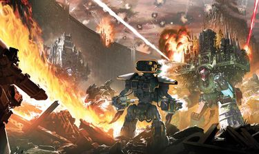
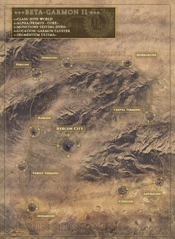
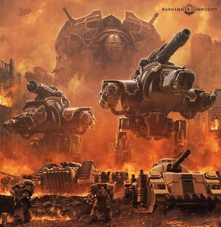
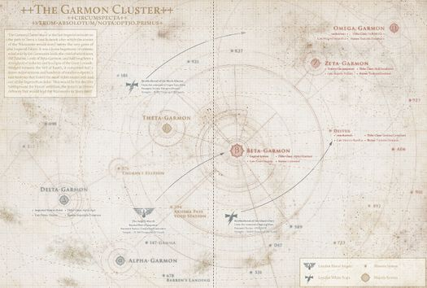

# 0779 006-011.M31/012-013.M31 贝塔-伽蒙之战 Battle of Beta-Garmon

精校状态：中文行文已逐段精校，部分术语仍为暂定

分类：时间线

原文来源：https://www.bilibili.com/opus/1205806484950089809

原作者：帝国神选罐头

原文时间：2026年05月24日 09:45

[返回分类目录](目录.md) · [全书目录](../../目录.md)

<!-- A0779-B0001 -->
**英文原文**

The Battle of Beta-Garmon, also known as the Great Slaughter of Beta-Garmon, Titandeath, and the Beta-Garmon Campaign, was a major battle of the Horus Heresy.

<!-- /A0779-B0001 -->

<!-- A0779-B0002 -->

原译文

贝塔-伽蒙之战，也称为贝塔-伽蒙大屠杀、泰坦之死和贝塔-伽蒙战役，是荷鲁斯叛乱的一场重大战役。

**校订译文**

贝塔-伽蒙之战，又称贝塔-伽蒙大屠杀、泰坦之死或贝塔-伽蒙战役，是荷鲁斯之乱期间的一场重大战役。

<!-- /A0779-B0002 -->

<!-- A0779-B0003 图片 -->

<!-- A0779-B0004 -->

原译文

Titans battle in the Beta-Garmon campaign 泰坦在贝塔-伽蒙战役中的战斗

**校订译文**

Titans battle in the Beta-Garmon campaign 泰坦在贝塔-伽蒙战役中的战斗

<!-- /A0779-B0004 -->

<!-- A0779-B0005 -->
**英文原文**

Conflict:Horus Heresy

<!-- /A0779-B0005 -->

<!-- A0779-B0006 -->

原译文

冲突：荷鲁斯叛乱

**校订译文**

冲突：荷鲁斯之乱

<!-- /A0779-B0006 -->

<!-- A0779-B0007 -->
**英文原文**

Date:006-011.M31 (First Phase), 012-013.M31 (Second Phase)

<!-- /A0779-B0007 -->

<!-- A0779-B0008 -->

原译文

日期：006-011.M31 (第一阶段), 012-013.M31 (第二阶段)

**校订译文**

日期：006—011.M31（第一阶段）、012—013.M31（第二阶段）

<!-- /A0779-B0008 -->

<!-- A0779-B0009 -->
**英文原文**

Location:Beta-Garmon Star Cluster

<!-- /A0779-B0009 -->

<!-- A0779-B0010 -->

原译文

地点：贝塔-伽蒙星群

**校订译文**

地点：贝塔-伽蒙星群

<!-- /A0779-B0010 -->

<!-- A0779-B0011 -->
**英文原文**

Outcome:Traitor victory

<!-- /A0779-B0011 -->

<!-- A0779-B0012 -->

原译文

结果：叛徒胜利

**校订译文**

结果：叛军胜利

<!-- /A0779-B0012 -->

<!-- A0779-B0013 -->
**英文原文**

Combatants:Traitor Legions/Imperium

<!-- /A0779-B0013 -->

<!-- A0779-B0014 -->

原译文

作战方：叛徒军团/帝国

**校订译文**

作战方：叛徒军团/帝国

<!-- /A0779-B0014 -->

<!-- A0779-B0015 -->
**英文原文**

Commanders:Warmaster Horus Lupercal (WIA), Captain Horus Aximand, Captain Falkus Kibre, Captain Vheren Ashurhaddon, Dark Apostle Vorrjuk Kraal, Warsmith Xyrokles‎ (KIA), Praetor Koleg-Tal, Magos Ardim Protos, Princeps Terent Harrtek/Primarch Sanguinius, Primarch Jaghatai Khan, First Captain Raldoron, Guard Commander Azkaellon, Captain Nassir Amit, Centurion Aradiel, Ishigu Khan, Nugen Tarya Khan, Shadrak Meduson, Princeps Mohana Mankata VI (KIA), Lord General Bollivar, Vice-Caesari Marcus Valerius, Endryd Haar

<!-- /A0779-B0015 -->

<!-- A0779-B0016 -->

原译文

指挥官：战帅荷鲁斯·卢佩卡尔(WIA)，连长荷鲁斯·阿西曼德，连长法库斯·凯博，连长维伦·阿舒尔哈顿，黑暗使徒沃留克·克拉尔，战争铁匠西罗克勒斯(KIA)，执政官科莱格-塔尔，贤者阿尔迪姆·普罗托斯，首席特伦特·哈瑞泰克/原体圣吉列斯，原体察合台可汗，第一连长拉多隆，卫队指挥官阿兹凯隆，沙德拉克·梅杜森，首席莫哈纳·曼卡塔六世(KIA)，领主将军博利瓦尔，副凯撒马库斯·瓦勒里乌斯，恩德里德·哈尔

**校订译文**

指挥官：战帅荷鲁斯·卢佩卡尔（负伤）、连长荷鲁斯·阿西曼德、连长法库斯·凯博、连长维伦·阿舒哈顿、黑暗使徒沃留克·克拉尔、战争铁匠西罗克勒斯（阵亡）、执政官科莱格-塔尔、贤者阿尔迪姆·普罗托斯、首席特伦特·哈瑞泰克／原体圣吉列斯、原体察合台可汗、第一连长拉多隆、卫队指挥官阿兹凯隆、连长纳西尔·阿米特、百夫长阿拉迪尔、石古可汗、努根·塔里亚可汗、沙德拉克·梅杜森、首席莫哈纳·曼卡塔六世（阵亡）、领主将军博利瓦尔、副凯撒马库斯·瓦勒里乌斯、恩德里德·哈尔

**校注：** 补回原译漏掉的 Nassir Amit、Aradiel、Ishigu Khan、Nugen Tarya Khan 四名指挥官；Ishigu 暂译石古，Nugen Tarya 暂译努根·塔里亚。

<!-- /A0779-B0016 -->

<!-- A0779-B0017 -->
**英文原文**

Casualties:Massive/Massive, billions of civilians

<!-- /A0779-B0017 -->

<!-- A0779-B0018 -->

原译文

伤亡：大量/大量。数十亿平民

**校订译文**

伤亡：极为惨重／极为惨重，另有数十亿平民伤亡

<!-- /A0779-B0018 -->

<!-- A0779-B0019 -->
## History 历史

<!-- /A0779-B0019 -->

<!-- A0779-B0020 -->
### First Phase 第一阶段

<!-- /A0779-B0020 -->

<!-- A0779-B0021 -->
**英文原文**

The first phase of the war began on 634006.M31 shortly after the Drop Site Massacre, when Alpha Legion Cruisers entered the strategically important Beta-Garmon Star Cluster. A campaign of assassination and sabotage by the Alpha Legion paved the way for the Emperor's Children who sought to win the favour of Fulgrim by bringing Beta-Garmon II to heel. Meanwhile, elements of the Legio Mortis' Reaper Maniple swept away the loyalist Imperial Army Nemesis Brigade defending Nyrcon City. Nyrcon and the orbiting Star Fort The Anvil were taken and the Cluster was declared for Horus. Many of the star cluster's planets fell into civil war between traitor and loyalist factions.

<!-- /A0779-B0021 -->

<!-- A0779-B0022 -->

原译文

战争的第一阶段始于634006.M31，就在登陆点大屠杀发生后不久，阿尔法军团巡洋舰进入了具有重要战略意义的贝塔-伽蒙星群。阿尔法军团的暗杀和破坏行动为帝皇之子铺平了道路，他们试图通过让贝塔-伽蒙二号屈服来赢得福格瑞姆的青睐。与此同时，死亡军团的收割者支队成员横扫了保卫尼康城的忠诚派帝国军队复仇女神旅。尼康和轨道星堡铁砧号被占领，星群被宣称为荷鲁斯。该星群的许多行星都陷入了叛徒和忠诚派之间的内战。

**校订译文**

战争的第一阶段始于634006.M31。登陆点大屠杀发生后不久，阿尔法军团的巡洋舰进入了战略地位重要的贝塔-伽蒙星群。阿尔法军团通过一系列暗杀与破坏行动，为帝皇之子铺平了道路；后者企图征服贝塔-伽蒙二号，以博取福格瑞姆的青睐。与此同时，死亡军团收割者支队的一部分泰坦击溃了保卫尼尔康城的忠诚派帝国军复仇女神旅。尼尔康城及其轨道上的铁砧星堡相继失守，星群随即宣布效忠荷鲁斯。许多行星陷入忠诚派与叛军之间的内战。

<!-- /A0779-B0022 -->

<!-- A0779-B0023 图片 -->

<!-- A0779-B0024 -->

原译文

Beta-Garmon II 贝塔-伽蒙二号

**校订译文**

Beta-Garmon II 贝塔-伽蒙二号

<!-- /A0779-B0024 -->

<!-- A0779-B0025 -->
**英文原文**

Between 376007-779010.M31 traitor forces bombarded the rest of the Cluster with countless attacks as the worlds fought amongst themselves. They were sometimes aided by both the Legiones Astartes and Collegia Titanica elements of both sides. Events such as the Great Starvation, the Soul Plague of Theta-Garmon V, and the Rain of Plasma all unfolded during these years of strife.

<!-- /A0779-B0025 -->

<!-- A0779-B0026 -->

原译文

376007-779010.M31之间，叛徒部队对星群的其他部分进行了无数次攻击，当世界相互争斗时。他们有时会得到双方阿斯塔特军团和泰坦修会的帮助。大饥荒、西塔-伽蒙五号的灵魂瘟疫和等离子雨等事件都是在这些年的冲突中发生的。

**校订译文**

在376007—779010.M31期间，叛军对星群其余地区发动了无数次进攻，各世界之间也相互交战。忠诚派与叛军双方有时还会得到各自阵营的阿斯塔特军团和泰坦修会部队支援。大饥荒、西塔-伽蒙五号的灵魂瘟疫，以及等离子雨等灾祸，都发生在这些战乱岁月中。

**校注：** 英文 They 指代不够明确；结合 worlds fought amongst themselves 及 both sides，译为交战双方获各自军团支援，而非叛军获得敌我双方支援。

<!-- /A0779-B0026 -->

<!-- A0779-B0027 -->
**英文原文**

In 521007.M31 many loyalist elements including Space Marines and Titan assets became trapped in the Cluster due to the advent of the Ruinstorm. These trapped forces lent their strength to loyalist forces against a steady supply of traitor reinforcements.

<!-- /A0779-B0027 -->

<!-- A0779-B0028 -->

原译文

521007.M31，由于毁灭风暴的出现，许多忠诚派成员，包括星际战士和泰坦资产，被困在星群中。这些被困的部队为忠诚派部队提供了力量，以对抗源源不断的叛徒增援。

**校订译文**

521007.M31，毁灭风暴降临，许多忠诚派部队——包括星际战士和泰坦——被困在星群内。他们加入当地忠诚派，抵抗源源不断获得增援的叛军。

<!-- /A0779-B0028 -->

<!-- A0779-B0029 -->
**英文原文**

In 780010.M31, Rogal Dorn ordered a sizable detachment of Imperial Fists and Salamanders to engage the Emperor's Children garrison at Nyrcon City on Beta-Garmon II, while Solar Auxilia Regiments supported by the newly raised Garmonite-Theta Battalions lay siege to the equatorial fortress cities of the rest of the world. On Beta-Garmon III, the Warp Runners sent their Verdis Maniple against the Legio Mortis maniple defending Caldera Primus. Months of fighting saw thousands dead and dozens of Titans lost, though for now the traitors' hold on Beta-Garmon II and III was broken.

<!-- /A0779-B0029 -->

<!-- A0779-B0030 -->

原译文

780010.M31，罗格·多恩命令一支规模可观的帝国之拳和火蜥蜴分队在贝塔-伽蒙二号上与尼康城的帝皇之子驻军交战，而由新成立的加蒙尼特-西塔营支援的太阳辅助军兵团则围攻世界其他地区的赤道要塞城市。在贝塔-伽蒙三号上，亚空间跑者派他们的威尔第支队对抗保卫卡尔德拉一号的死亡军团支队。数月的战斗导致数千人死亡，数十架泰坦损失，尽管目前叛徒对贝塔-伽蒙二号和三号的控制已经被打破。

**校订译文**

780010.M31，罗格·多恩命令一支由帝国之拳与火蜥蜴组成、规模可观的分遣队，进攻贝塔-伽蒙二号尼尔康城的帝皇之子驻军。与此同时，太阳辅助军各团在新组建的伽蒙-西塔营支援下，围攻该世界赤道沿线的其他要塞城市。在贝塔-伽蒙三号，亚空间跑者派出威尔第支队，迎战守卫卡尔德拉一号的死亡军团支队。几个月的战斗造成数千人死亡、数十台泰坦损失，最终暂时打破了叛军对贝塔-伽蒙二号和三号的控制。

<!-- /A0779-B0030 -->

<!-- A0779-B0031 -->
**英文原文**

In 138012.M31, the Ruinstorm finally began to fade due to the Second Battle of Davin. This allowed for a steady stream of loyalist reinforcements to begin to muster in the Cluster. The intensity of the fighting increased, with traitor forces finding themselves reinforcements by regiments and vessels from nearby star systems while many more Imperial troops turned traitor in hopes of sparing themselves from the rumoured imminent arrival of Horus himself. On Beta-Garmon III, the Warp Runners Warlord Titan Gloria Rega brutally put down a traitor uprising among Caldera Primus's citizenry.

<!-- /A0779-B0031 -->

<!-- A0779-B0032 -->

原译文

138012.M31，由于第二次戴文之战，毁灭风暴终于开始消退。这使得忠诚派增援部队开始在星群中集结。战斗的激烈程度增加了，叛徒部队发现自己得到了附近星系的兵团和战舰的增援，而更多的帝国军队则变成了叛徒，希望能躲过荷鲁斯本人即将到来的传言。在贝塔-伽蒙三号上，亚空间跑者军阀泰坦荣光君主号残酷地镇压了卡尔德拉一号平民中的叛徒叛乱。

**校订译文**

138012.M31，第二次戴文之战促使毁灭风暴终于开始消退，忠诚派增援得以源源不断地在星群中集结。战斗愈发激烈：叛军获得附近星系的兵团与舰船增援，更多帝国部队则因听闻荷鲁斯本人即将到来的传言而叛变，希望借此保全自己。在贝塔-伽蒙三号，亚空间跑者的战将级泰坦荣光君主号，残酷镇压了卡尔德拉一号居民发动的叛乱。

<!-- /A0779-B0032 -->

<!-- A0779-B0033 -->
**英文原文**

In 277012.M31, raider vanguard fleets acting as the harbingers of Horus's armada began to arrive in the Star Cluster. Largely ignoring Beta-Garmon II and III, they instead targeted the outlaying worlds of the cluster, forcing Imperial commanders to divide their forces and diminish their defenses of the core worlds.

<!-- /A0779-B0033 -->

<!-- A0779-B0034 -->

原译文

277012.M31，作为荷鲁斯舰队的先驱，突袭先锋舰队开始抵达星群。他们在很大程度上忽视了贝塔-伽蒙二号和三号，而是将目标对准了星群中的边远世界，迫使帝国指挥官分裂部队，削弱对核心世界的防御。

**校订译文**

277012.M31，担任荷鲁斯大舰队先导的突袭先锋舰队开始抵达星群。它们大体绕过了贝塔-伽蒙二号和三号，转而袭击星群外围的世界，迫使帝国指挥官分兵应对，从而削弱核心世界的防御。

<!-- /A0779-B0034 -->

<!-- A0779-B0035 -->
### Second Phase 第二阶段

<!-- /A0779-B0035 -->

<!-- A0779-B0036 -->
**英文原文**

The second, far larger phase of the battle was waged towards the end of the Heresy in 012.M31 in preparation for Horus's advance on Terra. As a result of its crucial position, holding the Beta-Garmon Cluster was vital for the Traitors if they intended to supply the attack on Terra with resources from Horus's Dark Empire in the northern Galaxy. With the Ruinstorm abating, commander of loyalist forces on Terra Rogal Dorn decided to muster the majority of his non-Astartes strength to Beta-Garmon to hold the traitor advance until such a time when Roboute Guilliman and Lion El'Jonson could arrive from the rear and crush them. Titans made up the primary strength of the Imperial force, as Dorn feared that their mass use on Terra could destroy the planet forever. Thus a massive armada consisting of tens of thousands of vessels, including hundreds of Collegia Titanica Titan transports, were mustered to the strategically important worlds of Beta-Garmon. Many Imperial Fists joined the loyalist forces, and were confronted by a massive traitor armada led by Horus himself. The subsequent battle became one of the largest of the Heresy. The scale was such that it encompassed multiple theatres such as the Titandeath and Sea of Fire campaigns, both massive engagements in their own right.

<!-- /A0779-B0036 -->

<!-- A0779-B0037 -->

原译文

第二个更大的战斗阶段是在012.M31叛乱接近尾声时进行的，为荷鲁斯在泰拉上的推进做准备。由于其关键地位，如果叛徒打算从银河系北的荷鲁斯黑暗帝国为泰拉的攻击提供资源，那么拥有贝塔-伽蒙星群对他们来说至关重要。随着毁灭风暴的减弱，泰拉上的忠诚派部队指挥官罗格·多恩决定将他的大部分非阿斯塔特力量集中到贝塔-伽蒙，以阻止叛徒前进，直到罗伯特·基里曼和莱昂·艾尔庄森能够从后方到达并粉碎他们。泰坦是帝国部队的主要力量，因为多恩担心它们在泰拉上的大规模使用可能会永远摧毁行星。因此，一支由数万艘战舰组成的庞大舰队，包括数百艘泰坦修会泰坦运输舰，被召集到具有重要战略意义的贝塔-伽蒙行星。许多帝国之拳加入了忠诚派部队，并遭遇了荷鲁斯本人领导的庞大叛徒舰队。随后的战斗成为叛乱最大的战斗之一。规模如此之大，以至于它涵盖了多个战场，如泰坦之死和火海战役，这两个本身都是大规模交战。

**校订译文**

战役的第二阶段规模远胜于前，于叛乱接近尾声的012.M31展开，为荷鲁斯进军泰拉作准备。贝塔-伽蒙星群地处战略要冲；叛军若要利用荷鲁斯在银河北部建立的黑暗帝国，为进攻泰拉提供资源，就必须控制这里。随着毁灭风暴消退，泰拉忠诚派总指挥罗格·多恩决定将麾下大部分非阿斯塔特兵力集结至贝塔-伽蒙，阻滞叛军推进，直到罗保特·基里曼与莱昂·艾尔’庄森从敌军后方赶到，将其粉碎。泰坦构成了帝国兵力的主干，因为多恩担心，若将大批泰坦投入泰拉战场，可能永远毁掉这颗行星。于是，一支由数万艘舰船组成的庞大舰队，包括数百艘泰坦修会运输舰，在贝塔-伽蒙各战略世界集结。许多帝国之拳战士也加入忠诚派部队，共同迎战荷鲁斯亲率的巨型叛军舰队。随之爆发的战役成为荷鲁斯之乱中规模最大的会战之一，涵盖了多个战场，其中“泰坦之死”和“火海”即使单独来看，也都是规模庞大的战役。

<!-- /A0779-B0037 -->

<!-- A0779-B0038 -->
**英文原文**

In 403012.M31 Horus unleashed upon Beta-Garmon II's Nyrcon City a massive offensive led by the Legio Mortis, Tiger Eyes, and Death Stalkers while his fleet unleashed an orbital bombardment. Meanwhile, hundreds of traitor Imperial Army Regiments attacked Hive cities across the planet. In what became known as the Second Battle of Nyrcon, the traitor Titans broke through a 100km-deep defensive line manned by the PanCrypta Dust Clans, Solar Auxilia, and Nemesis Brigade. The Warp Runners led the loyalist defenses but ultimately fell, opening the way for the Traitors to flood into the city. With the city under their control, the traitors swiftly conquered the rest of Beta-Garmon II. While Beta-Garmon II fell, Beta-Garmon III under the Nova Guard managed to stay in loyalist hands despite a siege from Sons of Horus and Iron Warriors siege battalions. Meanwhile Horus launched a series of attacks across the outer systems. The Loyalists simply hurled their remaining resources at the enemy while they arrived, creating chaotic bloodbaths. The heavily damaged Warp Runners and Nova Guard managed to hold the line on Alpha-Garmon IX around the last remaining Mechanicum citadels against the God Breakers.

<!-- /A0779-B0038 -->

<!-- A0779-B0039 -->

原译文

403012.M31，荷鲁斯在贝塔-伽蒙二号的尼康城发动了由死亡军团、虎眼和死亡追猎者领导的大规模进攻，同时他的舰队发动了轨道轰炸。与此同时，数百个叛徒帝国军队兵团袭击了行星各地的巢都城市。在后来被称为第二次尼康之战的战斗中，叛徒泰坦突破了由泛密尘埃氏族、太阳辅助军和复仇女神旅守卫的100公里深的防线。亚空间跑者领导了忠诚派的防御，但最终失败了，为叛徒涌入城市开辟了道路。随着这座城市被他们控制，叛徒迅速征服了贝塔·伽蒙二号的其余地区。贝塔-伽蒙二号陷落时，新星守卫的贝塔-伽蒙三号尽管遭到荷鲁斯之子和钢铁勇士攻城营的围攻，仍设法留在忠诚派手中。与此同时，荷鲁斯对外部星系发动了一系列攻击。忠诚派只是在敌人到达时将剩余的资源投向敌人，造成了混乱的大屠杀。严重受损的亚空间跑者和新星卫队设法在阿尔法-伽蒙九号上守住了最后剩下的机械教城堡周围的防线，对抗破神者。

**校订译文**

403012.M31，荷鲁斯向贝塔-伽蒙二号的尼尔康城发动大举进攻，死亡军团、虎眼军团和死亡追猎者军团担任主攻，他的舰队则实施轨道轰炸。与此同时，数百个叛变帝国军兵团袭击了行星各地的巢都。在后来被称为第二次尼尔康之战的交锋中，叛军泰坦突破了由泛隐尘埃氏族、太阳辅助军和复仇女神旅构筑、纵深达一百公里的防线。亚空间跑者领导忠诚派抵抗，却最终败退，使叛军得以涌入城内。控制尼尔康城后，叛军迅速征服了贝塔-伽蒙二号其余地区。尽管二号行星陷落，三号行星仍在新星守卫的防御下保住了忠诚派阵地，顶住了荷鲁斯之子与钢铁勇士攻城营的围攻。与此同时，荷鲁斯在外围星系接连发动攻势。忠诚派每逢敌军来袭，便将剩余兵力投入战斗，酿成了一场场混乱的血战。损失惨重的亚空间跑者与新星守卫，在阿尔法-伽蒙九号最后几座机械教堡垒周围稳住防线，抵抗破神者军团。

<!-- /A0779-B0039 -->

<!-- A0779-B0040 -->
**英文原文**

In 705012.M31 Horus issued a special directive, unleashing a maniple of Legio Mortis to Omega-Garmon. There they found Firebrands Warhound Titans among the ruins of the planet. Few records survive of what happened next, with the surviving Firebrands Princeps taking a vow of silence as to what transpired. In 919012.M31 the first great battles of the Sea of Fire campaign began as both fleets clashed in the void between Beta-Garmon II and III.

<!-- /A0779-B0040 -->

<!-- A0779-B0041 -->

原译文

705012.M31，荷鲁斯发布了一项特别指令，向欧米伽-伽蒙释放了大量死亡军团。在那里，他们在行星的废墟中发现了火印战犬泰坦。关于接下来发生的事情，几乎没有记录留存下来，幸存的火印首席发誓对发生的事情保持沉默。919012.M31，火海战役的第一场大战开始了，两支舰队在贝塔-伽蒙二号和三号之间的虚空中发生了冲突。

**校订译文**

705012.M31，荷鲁斯发布特别指令，派死亡军团的一个支队前往欧米伽-伽蒙。它们在行星废墟中发现了火印军团的战犬级泰坦。此后发生的事情鲜有记录留存，幸存的火印军团首席们也立誓绝口不提。919012.M31，双方舰队在贝塔-伽蒙二号与三号之间的虚空交战，火海战役的首批大规模战斗就此打响。

**校注：** a maniple 为一个泰坦支队，不是“大量死亡军团”。Firebrands 火印为军团别称，Legio Atarus 炎纹为正式名称，保留原稿区分。

<!-- /A0779-B0041 -->

<!-- A0779-B0042 图片 -->

<!-- A0779-B0043 -->

原译文

Death Guard and Traitor Titan Forces 死亡守卫和叛徒泰坦部队

**校订译文**

Death Guard and Traitor Titan Forces 死亡守卫和叛徒泰坦部队

<!-- /A0779-B0043 -->

<!-- A0779-B0044 -->
**英文原文**

At Theta-Garmon V, also known as Iridium, the Legio Solaria led an offensive by dropping onto surrounding orbital platforms, capturing them from the Legio Fureans. On Beta-Garmon III the other half of the Solaria alongside Knights of House Procon Vi, the Legio Defensor, and Fasadian Heavy Infantry Imperial Army engaged in a bitter stalemate against traitor Imperial Army, who used weight of numbers to overwhelm loyalist engines. Thanks to the technology of the Dark Mechanicum, many of the traitor troops were enslaved captured loyalists forced to fight for the Warmaster via neuroslave implant technology. So many ships were destroyed in orbit around Beta-Garmon III that the debris fields would periodically rain down on the planet and strike loyalist and traitor forces alike. The Iron Warriors landed upon Beta-Garmon III and established siege battalions which knocked out Titans from a range, though these were eventually destroyed. Eventually the Dark Mechanicum triggered a solar event to bombard the gas giant to blind the loyalist Titans and their sensors. The Tiger Eyes attack the loyalists who fight to the bitter end.

<!-- /A0779-B0044 -->

<!-- A0779-B0045 -->

原译文

在西塔-伽蒙五号，也被称为铱星，日晷军团领导了一场进攻，降落到周围的轨道平台上，从愤怒者军团手中夺取了它们。在贝塔-伽蒙三号上，日晷的另一半与普罗孔·维家族的骑士、防御者军团和法萨迪亚重步兵帝国军队一起，与叛徒帝国军队陷入了激烈的僵局，后者利用数字的重量压倒了忠诚派引擎。多亏了黑暗机械教的技术，许多叛徒部队被奴役，被俘的忠诚派被迫通过神经奴隶植入技术为战帅而战。如此多的舰船在贝塔-伽蒙三号轨道上被摧毁，以至于碎片场会定期降落在行星上，并袭击忠诚派和叛徒部队。钢铁勇士在贝塔-伽蒙三号登陆，并建立了攻城营，将泰坦从范围内击倒，尽管这些最终被摧毁。最终，黑暗机械教装置触发了一次太阳事件，轰炸了这颗气态巨星，使忠诚派泰坦及其传感器失明。虎眼攻击那些战斗到底的忠诚派。

**校订译文**

在又称铱星的西塔-伽蒙五号，日晷军团率先发起进攻，空降到周围的轨道平台，将它们从愤怒者军团手中夺取。在贝塔-伽蒙三号，日晷军团的另一半兵力与普罗康·维家族骑士、防御者军团、帝国军法萨迪安重步兵并肩作战，与叛变帝国军陷入惨烈的僵持。叛军依靠数量优势压垮忠诚派泰坦；凭借黑暗机械教的技术，他们之中有许多人其实是被俘后遭奴役的忠诚派，通过神经奴役植入物被强迫为战帅效命。贝塔-伽蒙三号轨道上被击毁的舰船如此之多，残骸不时成片坠向行星，让忠诚派与叛军一同遭殃。钢铁勇士在三号行星登陆，部署攻城营，从远距离击毁泰坦，不过这些攻城营最终也被消灭。最后，黑暗机械教引发了一次恒星活动，冲击这颗气态巨行星，使忠诚派泰坦及其传感器失去探测能力。虎眼军团随即发起进攻，忠诚派则奋战到底。

**校注：** gas giant 气态巨行星为所给英文原文用语；同一行星又有地面重步兵等战斗描写，设定疑点保留，不擅改世界类型。

<!-- /A0779-B0045 -->

<!-- A0779-B0046 -->
**英文原文**

After months of vicious fighting, it became clear that the traitors were slowly advancing. Due to issues with Warp travel around the Beta-Garmon cluster, the loyalist forces were arriving piecemeal and could not form a united front. This was compounded by the proud nature of the Collegia Titanica, with many of its leading Princeps refusing to subordinate themselves to another commander. At any given time in the first half of the Beta-Garmon theatre, there were at least 3 different Imperial commanders claiming supreme authority. By comparison, the traitors were united through fanaticism, fear, and the unquestioned authority of Horus. However, in 084013.M31 the situation for the loyalists changed when the Red Tear and a combined Blood Angels and White Scars fleet arrived. Though a month late due to difficult warp travel, Sanguinius and Jaghatai Khan both immediately set about reforming the war effort. Sanguinius quickly took supreme command, while the Khan engaged in hit-and-run strikes across the Beta-Garmon Cluster. The Dark Sentry entered the Beta-Garmon System shortly after, and Imperial forces landed on the planet to deny it to the enemy. Traitors landed as well, and both sides use the planet's strange nature and terrain to their advantage. Jaghatai Khan also led his White Scars to the Epsilon-Garmon System, where they destroyed an Iron Warriors garrison under Xyrokles to clear a potential path for the Ultramarines to Terra. A Blood Angels strike force under Centurion Aradiel attacked the Beta-Garmon Cluster's outlying world of 147-Gamma Minoris-Garmon, where they defeated a garrison of Death Guard and Emperor's Children under Praetor Koleg-Tal, albeit with heavy losses.

<!-- /A0779-B0046 -->

<!-- A0779-B0047 -->

原译文

经过几个月的激烈战斗，很明显叛徒正在慢慢前进。由于贝塔·伽蒙星群周围的亚空间航行问题，忠诚派部队零散抵达，无法形成统一战线。泰坦修会的骄傲本性使情况更加复杂，其许多领导首席拒绝服从另一位指挥官。在贝塔-伽蒙战场的前半部分，任何时候都至少有3名不同的帝国指挥官声称拥有最高权力。相比之下，叛徒通过狂热、恐惧和荷鲁斯无可置疑的权威团结在一起。然而，在084013.M31，当红泪号和圣血天使与白色伤疤联合舰队抵达时，忠诚派的处境发生了变化。尽管由于亚空间航行的困难而晚了一个月，但圣吉列斯和察合台可汗都立即着手改革战争努力。圣吉列斯很快就掌握了最高指挥权，而可汗则在贝塔-伽蒙星群进行了跑打袭击。不久之后，黑暗哨兵进入了贝塔-伽蒙星系，帝国部队降落在行星上，阻止敌人。叛徒也登陆了，双方都利用了这个行星奇怪的自然和地形。察合台可汗还带领他的白色伤疤前往埃普西隆-伽蒙星系，在那里他们摧毁了西罗克勒斯手下的钢铁战士驻军，为极限战士前往泰拉扫清了潜在的道路。百夫长阿拉迪尔率领的圣血天使打击部队袭击了贝塔-伽蒙星群的147-伽马次-伽蒙外围世界，在那里他们击败了科莱格-塔尔执政官领导的死亡守卫和帝皇之子的驻军，尽管损失惨重。

**校订译文**

数月血战之后，叛军正缓缓推进的局面已十分明显。贝塔-伽蒙星群附近的亚空间航行困难，使忠诚派援军只能零散抵达，无法建立统一战线。泰坦修会的自负又加剧了问题：许多首席领袖拒绝接受他人指挥。在贝塔-伽蒙战事的前半程，任何时候都至少有三位帝国指挥官自称拥有最高指挥权。相比之下，叛军则在狂热、恐惧以及荷鲁斯不容置疑的权威之下保持一致。然而，084013.M31，红泪号与圣血天使、白疤联合舰队抵达，忠诚派的处境由此改变。虽然亚空间航行的困难使他们迟到了一个月，圣吉列斯和察合台可汗仍立即着手整顿战局。圣吉列斯迅速接掌最高指挥权，可汗则率军在整个贝塔-伽蒙星群展开打了就走的袭击。不久后，黑暗哨兵进入贝塔-伽蒙星系，帝国部队登陆这颗行星，以免它落入敌手。叛军也随即登陆，双方都利用其奇异的环境与地形作战。察合台可汗还率白疤前往埃普西隆-伽蒙星系，消灭西罗克勒斯指挥的钢铁勇士驻军，为极限战士打通一条可能通往泰拉的道路。百夫长阿拉迪尔率领的圣血天使打击部队，则进攻星群外围的147-伽马次-伽蒙世界，以惨重伤亡为代价，击败了执政官科莱格-塔尔指挥的死亡守卫和帝皇之子驻军。

<!-- /A0779-B0047 -->

<!-- A0779-B0048 -->
**英文原文**

On the system capital of Beta-Garmon II, Sanguinius led a force of Blood Angels and nearly 30 Titan Legions to capture the planet from Horus's forces. Despite fierce orbital bombardment from the loyalists, most of the traitor forces remained intact thanks to heavily entrenched positions, debris fields, and Void Shields. At Nyrcon City they were met by an equally massive traitor force, and over a thousand titans fought on the irradiated fields of Beta-Garmon II in what became known as the Titandeath. During the height of the battle Sanguinius and the Sanguinary Guard dropped from the sky via Stormbird, boarding the traitor Imperator Titan Axis Mundi and destroying it from the inside. The fighting was bitter, and five times did the loyalist Titans fling themselves before the traitor defenses around Nyrcon City. Meanwhile, Azkaellon led an assault on Beta-Garmon II's orbiting Starfort known as The Anvil. Aboard, the Blood Angels discovered only small ravenous bands of Sons of Horus and Lost and the Damned rabble. Realizing that they had been played, Akzaellon and his men narrowly evacuated The Anvil as it detonated. The resulting debris showered across the surface of Beta-Garmon II, annihilating both sides.

<!-- /A0779-B0048 -->

<!-- A0779-B0049 -->

原译文

在贝塔·伽蒙二号的星系首都，圣吉列斯率领一支圣血天使部队和近30支泰坦军团从荷鲁斯的部队手中夺取了这颗行星。尽管忠诚派进行了猛烈的轨道轰炸，但由于根深蒂固的阵地、碎片场和虚空盾，大多数叛徒部队仍然完好无损。在尼康城，他们遇到了同样庞大的叛徒部队，一千多架泰坦在贝塔-伽蒙二号的辐射场上作战，这就是所谓的泰坦之死。在战斗最激烈的时候，圣吉列斯和圣血卫队通过风暴鸟从天而降，登上叛徒帝皇泰坦世界轴心号并从内部将其摧毁。战斗非常激烈，忠诚派泰坦五次向尼康城周围的叛徒防御工事猛攻。与此同时，阿兹凯隆领导了对贝塔-伽蒙二号的轨道星堡铁砧号的攻击。在其上，圣血天使只发现了荷鲁斯之子、迷失者和被诅咒者组成的虚弱小队。意识到他们被耍了，阿兹凯隆和他的人在铁砧号爆炸时勉强撤离。由此产生的碎片倾泻在贝塔-伽蒙二号的表面，摧毁了两边。

**校订译文**

在星系首府贝塔-伽蒙二号，圣吉列斯率领圣血天使和近三十个泰坦军团，试图从荷鲁斯手中夺回行星。虽然忠诚派进行了猛烈的轨道轰炸，但凭借深固的阵地、残骸地带与虚空盾，大多数叛军仍然保存完好。在尼尔康城，忠诚派遭遇了同样庞大的叛军部队。一千多台泰坦在贝塔-伽蒙二号遭辐射污染的平原上交锋，这场大战后来被称为“泰坦之死”。战斗最激烈时，圣吉列斯与圣血守卫乘风暴鸟从天而降，登上叛军的帝皇级泰坦世界轴心号，将其从内部摧毁。双方鏖战不休，忠诚派泰坦先后五次向尼尔康城周围的叛军防线发起猛攻。与此同时，阿兹凯隆率军突袭贝塔-伽蒙二号轨道上的铁砧星堡。圣血天使登上星堡后，只发现了几小股凶残的荷鲁斯之子，以及一群迷失者与受诅者乌合之众。阿兹凯隆意识到中了圈套，带领部下在星堡爆炸之际险险撤离。爆炸残骸如雨般落向行星地表，给双方部队都带来了毁灭性打击。

**校注：** to capture 为夺取行星的目的，不代表已成功夺取；ravenous 指凶残贪噬，不是虚弱。annihilating both sides 按双方均遭毁灭性打击处理，后文仍有幸存者。

<!-- /A0779-B0049 -->

<!-- A0779-B0050 图片 -->

<!-- A0779-B0051 -->

原译文

Advance of the Reprisal Fleet in 013.M31 013.M31报复舰队的推进

**校订译文**

Advance of the Reprisal Fleet in 013.M31 013.M31报复舰队的推进

<!-- /A0779-B0051 -->

<!-- A0779-B0052 -->
**英文原文**

It soon became apparent that the assault on Beta-Garmon II had been a feint, and the traitors' real intent was taking the now-lightly defended Beta-Garmon III and the Astropathic choir which served as the loyalist communications center known as the Carthega Telepathica. The traitors detonated a Vortex Bomb in the upper atmosphere, creating a caustic storm around Caldera Primus. Without the constant toxic storm assailing it, the Hive's ancient Void Shields fell dormant. Now defenseless, at Caldera Primus Horus himself emerged at the front of a massive army of Sons of Horus and 100 titans of the Legio Mortis, the Warmaster's favoured Titan Legion which until this point had been held in reserve. Alongside these forces stood eight daemonically possessed Warlord Titans of the Legio Vulpa as well as forces of the God Breakers. The predominately Legio Solaria, Nova Guard, Warp Runners, Firebrands, Knight, and Imperial Army defenders were quickly overwhelmed by Horus's force. The titans of the Legio Mortis managed to topple the Carthega Telepathica, sending the massive edifice on top of the loyalists and decimating them and securing a traitor victory. While inspecting his field of victory upon Beta-Garmon III, the wound Horus had suffered from Leman Russ reopened, causing him to collapse and be whisked away by his desperate subordinates Horus Aximand and Falkus Kibre. The Warmaster was rushed back to the Vengeful Spirit.

<!-- /A0779-B0052 -->

<!-- A0779-B0053 -->

原译文

很快，很明显，对贝塔-伽蒙二号的袭击是一次佯攻，叛徒的真正意图是夺取现在防守薄弱的贝塔·伽蒙三号和作为忠诚派通信中心的星语唱诗班，即星语圣所。叛徒在高层大气中引爆了一枚漩涡炸弹，在卡尔德拉一号周围引发了一场腐蚀风暴。没有持续的有毒风暴袭击它，巢都古老的虚空盾就休眠了。现在毫无防备，在卡尔德拉一号，荷鲁斯本人出现在一支由荷鲁斯之子和死亡军团的100架泰坦组成的庞大军队的前方，死亡军团是战帅最喜欢的泰坦军团，在此之前一直被保留。在这些部队旁边，站着八个被恶魔附身的鬼狐军团的军阀泰坦，以及破神者的部队。以日晷军团、新星卫队、亚空间跑者、火印、骑士和帝国军队守军为主的部队很快被荷鲁斯的部队压倒。死亡军团的泰坦设法推倒了星语圣所，将这座巨大的建筑推到了忠诚派的身上，摧毁了他们，并确保了叛徒的胜利。在检查他在贝塔-伽蒙三号的胜利战场时，荷鲁斯被黎曼·鲁斯所伤的伤口重新打开，导致他昏倒，被他绝望的下属荷鲁斯·阿西曼德和法库斯·凯博迅速带走。战帅被带回复仇之魂号。

**校订译文**

很快，忠诚派便明白，对贝塔-伽蒙二号的进攻原来是佯攻。叛军真正的目标，是夺取如今防守薄弱的贝塔-伽蒙三号，以及设于当地、名为星语圣所的星语合唱团——忠诚派的通信中心。叛军在高层大气引爆一枚漩涡炸弹，在卡尔德拉一号周围引发了一场腐蚀性风暴。巢都古老的虚空盾在失去持续有毒风暴的冲击后，转入休眠。防御随之失效，荷鲁斯本人在卡尔德拉一号率大军现身，麾下有荷鲁斯之子，以及死亡军团的一百台泰坦。死亡军团是战帅最宠信的泰坦军团，此前一直作为预备队待命。与它们一同投入战斗的，还有鬼狐军团八台被恶魔附身的战将级泰坦，以及破神者军团的部队。以日晷军团、新星守卫、亚空间跑者、火印军团、骑士和帝国军为主的守军，很快就被荷鲁斯的大军压倒。死亡军团的泰坦推倒星语圣所，庞大的建筑砸向忠诚派，造成惨重伤亡，为叛军锁定了胜局。荷鲁斯在巡视贝塔-伽蒙三号的战场时，先前被黎曼·鲁斯击伤的伤口重新崩裂，令他倒地不起。惊慌的荷鲁斯·阿西曼德与法库斯·凯博赶忙将战帅带走，紧急送回复仇之魂号。

**校注：** 英文先称漩涡炸弹创造腐蚀性风暴，随即称虚空盾因失去持续有毒风暴而休眠，因果衔接存在缺失或矛盾；忠实保留，待核原始出处，不自行补造风暴机制。

<!-- /A0779-B0053 -->

<!-- A0779-B0054 -->
**英文原文**

Meanwhile on Beta-Garmon II, Sanguinius and the Khan realized that with most of their forces now destroyed and Beta-Garmon III as well as the Carthega Telepathica in enemy hands, Dorn's gambit to buy time had reached its limit. They abandoned the Beta-Garmon warzone with any surviving loyalists that could be found.

<!-- /A0779-B0054 -->

<!-- A0779-B0055 -->

原译文

与此同时，在贝塔-伽蒙二号上，圣吉列斯和可汗意识到，随着他们的大部分部队现在被摧毁，贝塔-伽蒙三号以及星语圣所落入敌人手中，多恩争取时间的策略已经达到了极限。他们放弃了贝塔-伽蒙战区，留下了所有幸存的忠诚派。

**校订译文**

与此同时，在贝塔-伽蒙二号，圣吉列斯与可汗意识到：己方大部分兵力已经损失，三号行星和星语圣所也已落入敌手，多恩借此争取时间的计划已无法继续。他们带上所有还能找到的忠诚派幸存者，撤出了贝塔-伽蒙战区。

**校注：** with any surviving loyalists that could be found 为带上所有能找到的幸存者一同撤离；原译“留下了所有幸存的忠诚派”把行动含义完全颠倒。

<!-- /A0779-B0055 -->

<!-- A0779-B0056 -->
### Aftermath 余波

<!-- /A0779-B0056 -->

<!-- A0779-B0057 -->
**英文原文**

Ultimately, Horus's victory at Beta-Garmon allowed him free access to the Sol System, which in turn culminated in the Siege of Terra. However he only did so at great cost to both sides. The casualties of the Beta-Garmon campaign were so great that they exceeded the last five years of the entire Great Crusade. Following the conclusion of the Beta-Garmon campaign, the Warmaster and his allies spread across the Segmentum Solar as they lay siege to systems of strategic value.

<!-- /A0779-B0057 -->

<!-- A0779-B0058 -->

原译文

最终，荷鲁斯在贝塔-伽蒙的胜利使他能够自由进入太阳系，这反过来又导致了泰拉围城。然而，他这样做只会让双方付出巨大的代价。贝塔-伽蒙战役的伤亡惨重，超过了整个大远征的最后五年。贝塔-加蒙战役结束后，战帅和他的盟友在太阳星域散布，围攻具有战略价值的星系。

**校订译文**

荷鲁斯在贝塔-伽蒙的胜利，最终为他打开了通往太阳系的道路，并由此引向泰拉围城。但这场胜利让双方都付出了极为惨重的代价：贝塔-伽蒙战役的伤亡总数，超过了整个大远征最后五年的伤亡。战役结束后，战帅及其盟友分兵进入太阳星域，围攻具有战略价值的各个星系。

<!-- /A0779-B0058 -->

<!-- A0779-B0059 -->
## Order of Battle 参战序列

原题：Order of Battle 战斗组织

<!-- /A0779-B0059 -->

<!-- A0779-B0060 -->
### Imperial 帝国

<!-- /A0779-B0060 -->

<!-- A0779-B0061 -->
**英文原文**

At least 27 Titan Legions including the:

<!-- /A0779-B0061 -->

<!-- A0779-B0062 -->

原译文

至少27个泰坦军团包括：

**校订译文**

至少27个泰坦军团，其中包括：

<!-- /A0779-B0062 -->

<!-- A0779-B0063 -->

原译文

Legio Gryphonicus 狮鹫军团

**校订译文**

Legio Gryphonicus 狮鹫军团

<!-- /A0779-B0063 -->

<!-- A0779-B0064 -->

原译文

Legio Osedax 食骨军团

**校订译文**

Legio Osedax 食骨军团

<!-- /A0779-B0064 -->

<!-- A0779-B0065 -->

原译文

Legio Solaria 日晷军团

**校订译文**

Legio Solaria 日晷军团

<!-- /A0779-B0065 -->

<!-- A0779-B0066 -->

原译文

Legio Astorum 星象军团

**校订译文**

Legio Astorum 星象军团

<!-- /A0779-B0066 -->

<!-- A0779-B0067 -->

原译文

Legio Atarus 炎纹军团

**校订译文**

Legio Atarus 炎纹军团

<!-- /A0779-B0067 -->

<!-- A0779-B0068 -->

原译文

Legio Defensor 防御者军团

**校订译文**

Legio Defensor 防御者军团

<!-- /A0779-B0068 -->

<!-- A0779-B0069 -->
**英文原文**

Knight Houses:

<!-- /A0779-B0069 -->

<!-- A0779-B0070 -->

原译文

骑士家族：

**校订译文**

骑士家族：

<!-- /A0779-B0070 -->

<!-- A0779-B0071 -->

原译文

House Arakon 阿拉肯家族

**校订译文**

House Arakon 阿拉肯家族

<!-- /A0779-B0071 -->

<!-- A0779-B0072 -->

原译文

House Beaumaris 博马里斯家族

**校订译文**

House Beaumaris 博马里斯家族

<!-- /A0779-B0072 -->

<!-- A0779-B0073 -->

原译文

House Cadmus 卡德摩斯家族

**校订译文**

House Cadmus 卡德摩斯家族

<!-- /A0779-B0073 -->

<!-- A0779-B0074 -->

原译文

House Col'Khak 科尔'哈克家族

**校订译文**

House Col'Khak 科尔'哈克家族

<!-- /A0779-B0074 -->

<!-- A0779-B0075 -->

原译文

House Coldshroud 冷覆家族

**校订译文**

House Coldshroud 冷覆家族

<!-- /A0779-B0075 -->

<!-- A0779-B0076 -->

原译文

House Fvaber 法贝尔家族

**校订译文**

House Fvaber 法贝尔家族

<!-- /A0779-B0076 -->

<!-- A0779-B0077 -->

原译文

House Hawkwood 鹰木家族

**校订译文**

House Hawkwood 鹰木家族

<!-- /A0779-B0077 -->

<!-- A0779-B0078 -->

原译文

House Hermetika 赫尔墨提卡家族

**校订译文**

House Hermetika 赫尔墨提卡家族

<!-- /A0779-B0078 -->

<!-- A0779-B0079 -->

原译文

House Hyperion 亥伯龙家族

**校订译文**

House Hyperion 亥伯龙家族

<!-- /A0779-B0079 -->

<!-- A0779-B0080 -->

原译文

House Klaze 克拉泽家族

**校订译文**

House Klaze 克拉泽家族

<!-- /A0779-B0080 -->

<!-- A0779-B0081 -->

原译文

House Lakar 拉卡尔家族

**校订译文**

House Lakar 拉卡尔家族

<!-- /A0779-B0081 -->

<!-- A0779-B0082 -->

原译文

House Megron 梅格伦家族

**校订译文**

House Megron 梅格伦家族

<!-- /A0779-B0082 -->

<!-- A0779-B0083 -->

原译文

House Moritain 莫里坦家族

**校订译文**

House Moritain 莫里坦家族

<!-- /A0779-B0083 -->

<!-- A0779-B0084 -->

原译文

House Mortimer 莫蒂默家族

**校订译文**

House Mortimer 莫蒂默家族

<!-- /A0779-B0084 -->

<!-- A0779-B0085 -->

原译文

House Orhlacc 奥拉克家族

**校订译文**

House Orhlacc 奥拉克家族

<!-- /A0779-B0085 -->

<!-- A0779-B0086 -->

原译文

House Sterlund 斯特隆德家族

**校订译文**

House Sterlund 斯特隆德家族

<!-- /A0779-B0086 -->

<!-- A0779-B0087 -->

原译文

House Terryn 泰林家族

**校订译文**

House Terryn 泰林家族

<!-- /A0779-B0087 -->

<!-- A0779-B0088 -->

原译文

House Procon Vi 普罗康·维家族

**校订译文**

House Procon Vi 普罗康·维家族

<!-- /A0779-B0088 -->

<!-- A0779-B0089 -->

原译文

House Vornherr 沃恩赫尔家族

**校订译文**

House Vornherr 沃恩赫尔家族

<!-- /A0779-B0089 -->

<!-- A0779-B0090 -->

原译文

House Vyronii 维罗尼家族

**校订译文**

House Vyronii 维罗尼家族

<!-- /A0779-B0090 -->

<!-- A0779-B0091 -->

原译文

Mechanicum 机械教

**校订译文**

Mechanicum 机械教

<!-- /A0779-B0091 -->

<!-- A0779-B0092 -->

原译文

Skitarii Legions 护教军团

**校订译文**

Skitarii Legions 护教军团

<!-- /A0779-B0092 -->

<!-- A0779-B0093 -->

原译文

Ordo Reductor Forces 源还修会部队

**校订译文**

Ordo Reductor Forces 源还修会部队

<!-- /A0779-B0093 -->

<!-- A0779-B0094 -->

原译文

Imperial Army 帝国军队

**校订译文**

Imperial Army 帝国军

<!-- /A0779-B0094 -->

<!-- A0779-B0095 -->

原译文

Solar Auxilia 太阳辅助军

**校订译文**

Solar Auxilia 太阳辅助军

<!-- /A0779-B0095 -->

<!-- A0779-B0096 -->

原译文

Saturnyne Rams 土星公羊

**校订译文**

Saturnyne Rams 土星公羊

<!-- /A0779-B0096 -->

<!-- A0779-B0097 -->
**英文原文**

Star Reavers (87th Cohort)

<!-- /A0779-B0097 -->

<!-- A0779-B0098 -->

原译文

群星掠夺者（第87大队）

**校订译文**

群星掠夺者（第87大队）

<!-- /A0779-B0098 -->

<!-- A0779-B0099 -->
**英文原文**

Inwit Phalangites (102nd Cohort)

<!-- /A0779-B0099 -->

<!-- A0779-B0100 -->

原译文

因维特方阵军（第102大队）

**校订译文**

因维特方阵军（第102大队）

<!-- /A0779-B0100 -->

<!-- A0779-B0101 -->
**英文原文**

Elements of the 104th, 345th, 400th, 983rd Cohorts

<!-- /A0779-B0101 -->

<!-- A0779-B0102 -->

原译文

第104,345,400,983大队的成员

**校订译文**

第104、第345、第400、第983大队的部分兵力

<!-- /A0779-B0102 -->

<!-- A0779-B0103 -->

原译文

Garmonite-Theta Battalions 伽蒙-西塔营

**校订译文**

Garmonite-Theta Battalions 伽蒙-西塔营

<!-- /A0779-B0103 -->

<!-- A0779-B0104 -->

原译文

Nemesis Brigade 复仇女神旅

**校订译文**

Nemesis Brigade 复仇女神旅

<!-- /A0779-B0104 -->

<!-- A0779-B0105 -->

原译文

Therion Cohort 圣兽大队

**校订译文**

Therion Cohort 圣兽大队

<!-- /A0779-B0105 -->

<!-- A0779-B0106 -->

原译文

PanCrypta Dust Clans 泛隐尘埃氏族

**校订译文**

PanCrypta Dust Clans 泛隐尘埃氏族

<!-- /A0779-B0106 -->

<!-- A0779-B0107 -->

原译文

Fasadian Heavy Infantry 法萨迪安重步兵

**校订译文**

Fasadian Heavy Infantry 法萨迪安重步兵

<!-- /A0779-B0107 -->

<!-- A0779-B0108 -->
**英文原文**

Thousands of Imperialis Armada vessels

<!-- /A0779-B0108 -->

<!-- A0779-B0109 -->

原译文

数千艘帝国无敌舰队战舰

**校订译文**

数千艘帝国舰队舰船

<!-- /A0779-B0109 -->

<!-- A0779-B0110 -->

原译文

Legiones Astartes 阿斯塔特军团

**校订译文**

Legiones Astartes 阿斯塔特军团

<!-- /A0779-B0110 -->

<!-- A0779-B0111 -->
**英文原文**

Blood Angels - c. 37,000 regular Space Marines and 7,000 Inductii

<!-- /A0779-B0111 -->

<!-- A0779-B0112 -->

原译文

圣血天使 - 约37000名星际战士正规军和7000名速征军

**校订译文**

圣血天使：约37,000名常规星际战士和7,000名速征军战士

<!-- /A0779-B0112 -->

<!-- A0779-B0113 -->

原译文

Strike Force Argent Spear 银白之矛打击部队

**校订译文**

Strike Force Argent Spear 银白之矛打击部队

<!-- /A0779-B0113 -->

<!-- A0779-B0114 -->
**英文原文**

White Scars - c. 25,000 Space Marines

<!-- /A0779-B0114 -->

<!-- A0779-B0115 -->

原译文

白色疤痕 - 约25000名星际战士

**校订译文**

白疤：约25,000名星际战士

<!-- /A0779-B0115 -->

<!-- A0779-B0116 -->

原译文

Brotherhood of the Black Khetan 黑色凯坦兄弟会

**校订译文**

Brotherhood of the Black Khetan 黑色凯坦兄弟会

<!-- /A0779-B0116 -->

<!-- A0779-B0117 -->

原译文

Imperial Fists elements 帝国之拳成员

**校订译文**

Imperial Fists elements 帝国之拳部分兵力

<!-- /A0779-B0117 -->

<!-- A0779-B0118 -->
**英文原文**

The Shattered Legions - c. 3,000-12,000 Space Marines

<!-- /A0779-B0118 -->

<!-- A0779-B0119 -->

原译文

破碎军团 - 约3000到12000名星际战士

**校订译文**

破碎军团 - 约3000到12000名星际战士

<!-- /A0779-B0119 -->

<!-- A0779-B0120 -->

原译文

Salamanders elements 火蜥蜴成员

**校订译文**

Salamanders elements 火蜥蜴部分兵力

<!-- /A0779-B0120 -->

<!-- A0779-B0121 -->

原译文

Iron Hands elements 钢铁之手成员

**校订译文**

Iron Hands elements 钢铁之手部分兵力

<!-- /A0779-B0121 -->

<!-- A0779-B0122 -->

原译文

Raven Guard elements 暗鸦守卫成员

**校订译文**

Raven Guard elements 暗鸦守卫部分兵力

<!-- /A0779-B0122 -->

<!-- A0779-B0123 -->

原译文

Loyalist-aligned Blackshields 忠诚派黑盾

**校订译文**

Loyalist-aligned Blackshields 忠诚派黑盾

<!-- /A0779-B0123 -->

<!-- A0779-B0124 -->

原译文

Disciples of the Flames 火焰门徒

**校订译文**

Disciples of the Flames 火焰门徒

<!-- /A0779-B0124 -->

<!-- A0779-B0125 -->
**英文原文**

Fangs of the Emperor - c. 1,000-2,000 Space Marines

<!-- /A0779-B0125 -->

<!-- A0779-B0126 -->

原译文

帝皇之牙 - 约1000到2000名星际战士

**校订译文**

帝皇之牙 - 约1000到2000名星际战士

<!-- /A0779-B0126 -->

<!-- A0779-B0127 -->

原译文

Gerasene Host 杰拉森天军

**校订译文**

Gerasene Host 杰拉森天军

<!-- /A0779-B0127 -->

<!-- A0779-B0128 -->

原译文

True Flame 真实之焰

**校订译文**

True Flame 真实之焰

<!-- /A0779-B0128 -->

<!-- A0779-B0129 -->
### Traitor 叛徒

<!-- /A0779-B0129 -->

<!-- A0779-B0130 -->
**英文原文**

Traitor Titan Legions – Dozens of Legions Including:

<!-- /A0779-B0130 -->

<!-- A0779-B0131 -->

原译文

叛徒泰坦军团 - 数十个军团包括

**校订译文**

叛军泰坦军团：数十个军团，其中包括：

<!-- /A0779-B0131 -->

<!-- A0779-B0132 -->

原译文

Legio Mortis 死亡军团

**校订译文**

Legio Mortis 死亡军团

<!-- /A0779-B0132 -->

<!-- A0779-B0133 -->

原译文

Legio Vulpa 鬼狐军团

**校订译文**

Legio Vulpa 鬼狐军团

<!-- /A0779-B0133 -->

<!-- A0779-B0134 -->

原译文

Legio Krytos 奎托斯军团

**校订译文**

Legio Krytos 奎托斯军团

<!-- /A0779-B0134 -->

<!-- A0779-B0135 -->

原译文

Legio Fureans 愤怒者军团

**校订译文**

Legio Fureans 愤怒者军团

<!-- /A0779-B0135 -->

<!-- A0779-B0136 -->

原译文

Legio Vulturum 秃鹫军团

**校订译文**

Legio Vulturum 秃鹫军团

<!-- /A0779-B0136 -->

<!-- A0779-B0137 -->

原译文

Legio Magna 宏伟军团

**校订译文**

Legio Magna 宏伟军团

<!-- /A0779-B0137 -->

<!-- A0779-B0138 -->

原译文

Legio Suturvora 苏图沃拉军团

**校订译文**

Legio Suturvora 苏图沃拉军团

<!-- /A0779-B0138 -->

<!-- A0779-B0139 -->

原译文

Renegade Knight Houses 变节骑士家族

**校订译文**

Renegade Knight Houses 变节骑士家族

<!-- /A0779-B0139 -->

<!-- A0779-B0140 -->

原译文

House Ærthegn 厄塞恩家族

**校订译文**

House Ærthegn 厄塞恩家族

<!-- /A0779-B0140 -->

<!-- A0779-B0141 -->

原译文

House Atrax 阿特拉克斯家族

**校订译文**

House Atrax 阿特拉克斯家族

<!-- /A0779-B0141 -->

<!-- A0779-B0142 -->

原译文

House Caesarean 凯撒利安家族

**校订译文**

House Caesarean 凯撒利安家族

<!-- /A0779-B0142 -->

<!-- A0779-B0143 -->

原译文

House Devine 德维纳家族

**校订译文**

House Devine 德维纳家族

<!-- /A0779-B0143 -->

<!-- A0779-B0144 -->

原译文

House Gotrith 戈特里奇家族

**校订译文**

House Gotrith 戈特里奇家族

<!-- /A0779-B0144 -->

<!-- A0779-B0145 -->

原译文

House Hyboras 海伯拉斯家族

**校订译文**

House Hyboras 海伯拉斯家族

<!-- /A0779-B0145 -->

<!-- A0779-B0146 -->

原译文

House Ioeden 伊欧登家族

**校订译文**

House Ioeden 伊欧登家族

<!-- /A0779-B0146 -->

<!-- A0779-B0147 -->

原译文

House Kepsydra 凯普西德拉家族

**校订译文**

House Kepsydra 凯普西德拉家族

<!-- /A0779-B0147 -->

<!-- A0779-B0148 -->

原译文

House Malinax 马林纳克斯家族

**校订译文**

House Malinax 马林纳克斯家族

<!-- /A0779-B0148 -->

<!-- A0779-B0149 -->

原译文

House Makabius 马卡比乌斯家族

**校订译文**

House Makabius 马卡比乌斯家族

<!-- /A0779-B0149 -->

<!-- A0779-B0150 -->

原译文

House Morbidia 莫尔比迪亚家族

**校订译文**

House Morbidia 莫尔比迪亚家族

<!-- /A0779-B0150 -->

<!-- A0779-B0151 -->

原译文

House Mordred 莫德雷德家族

**校订译文**

House Mordred 莫德雷德家族

<!-- /A0779-B0151 -->

<!-- A0779-B0152 -->

原译文

House Niagma 尼亚格玛家族

**校订译文**

House Niagma 尼亚格玛家族

<!-- /A0779-B0152 -->

<!-- A0779-B0153 -->

原译文

House Oroborn 奥罗伯恩家族

**校订译文**

House Oroborn 奥罗伯恩家族

<!-- /A0779-B0153 -->

<!-- A0779-B0154 -->

原译文

House Perdaxia 佩尔达西亚家族

**校订译文**

House Perdaxia 佩尔达西亚家族

<!-- /A0779-B0154 -->

<!-- A0779-B0155 -->

原译文

House Rajha 拉杰哈家族

**校订译文**

House Rajha 拉杰哈家族

<!-- /A0779-B0155 -->

<!-- A0779-B0156 -->

原译文

House Turbidos 图比多斯家族

**校订译文**

House Turbidos 图比多斯家族

<!-- /A0779-B0156 -->

<!-- A0779-B0157 -->

原译文

House Vextrix 维克特瑞克斯家族

**校订译文**

House Vextrix 维克特瑞克斯家族

<!-- /A0779-B0157 -->

<!-- A0779-B0158 -->

原译文

House Vyridion 维瑞迪昂家族

**校订译文**

House Vyridion 维瑞迪昂家族

<!-- /A0779-B0158 -->

<!-- A0779-B0159 -->

原译文

House Xerathon 泽拉松记载

**校订译文**

House Xerathon 泽拉松家族

<!-- /A0779-B0159 -->

<!-- A0779-B0160 -->

原译文

Dark Mechanicum Skitarii 黑暗机械教护教军

**校订译文**

Dark Mechanicum Skitarii 黑暗机械教护教军

<!-- /A0779-B0160 -->

<!-- A0779-B0161 -->
**英文原文**

Traitor Imperial Army – Hundreds of Regiments & thousands of Warships

<!-- /A0779-B0161 -->

<!-- A0779-B0162 -->

原译文

叛徒帝国军队 - 数百个兵团和数千艘战舰

**校订译文**

叛变帝国军：数百个兵团与数千艘战舰

<!-- /A0779-B0162 -->

<!-- A0779-B0163 -->

原译文

Solar Auxilia 太阳辅助军

**校订译文**

Solar Auxilia 太阳辅助军

<!-- /A0779-B0163 -->

<!-- A0779-B0164 -->

原译文

Bleak Marcher 暗淡行军者

**校订译文**

Bleak Marcher 暗淡行军者

<!-- /A0779-B0164 -->

<!-- A0779-B0165 -->

原译文

Cthonian Headhunters 科索尼亚猎头者

**校订译文**

Cthonian Headhunters 科索尼亚猎头者

<!-- /A0779-B0165 -->

<!-- A0779-B0166 -->

原译文

Arkadian Janissaries 阿卡迪亚禁卫军

**校订译文**

Arkadian Janissaries 阿卡迪亚禁卫军

<!-- /A0779-B0166 -->

<!-- A0779-B0167 -->

原译文

Legiones Astartes 阿斯塔特军团

**校订译文**

Legiones Astartes 阿斯塔特军团

<!-- /A0779-B0167 -->

<!-- A0779-B0168 -->
**英文原文**

Sons of Horus - Bulk of Legion

<!-- /A0779-B0168 -->

<!-- A0779-B0169 -->

原译文

荷鲁斯之子 - 大量军团

**校订译文**

荷鲁斯之子：军团主力

<!-- /A0779-B0169 -->

<!-- A0779-B0170 -->

原译文

Alpha Legion elements 阿尔法军团成员

**校订译文**

Alpha Legion elements 阿尔法军团部分兵力

<!-- /A0779-B0170 -->

<!-- A0779-B0171 -->

原译文

Death Guard elements 死亡守卫成员

**校订译文**

Death Guard elements 死亡守卫部分兵力

<!-- /A0779-B0171 -->

<!-- A0779-B0172 -->

原译文

Iron Warriors elements 钢铁勇士成员

**校订译文**

Iron Warriors elements 钢铁勇士部分兵力

<!-- /A0779-B0172 -->

<!-- A0779-B0173 -->

原译文

Word Bearers elements 怀言者成员

**校订译文**

Word Bearers elements 怀言者部分兵力

<!-- /A0779-B0173 -->

<!-- A0779-B0174 -->

原译文

World Eaters elements 吞世者成员

**校订译文**

World Eaters elements 吞世者部分兵力

<!-- /A0779-B0174 -->

<!-- A0779-B0175 -->

原译文

49th Chapter 第49战团

**校订译文**

49th Chapter 第49战团

<!-- /A0779-B0175 -->

<!-- A0779-B0176 -->

原译文

Emperor's Children elements 帝皇之子成员

**校订译文**

Emperor's Children elements 帝皇之子部分兵力

<!-- /A0779-B0176 -->

本篇核心术语与暂定项

以下列出本篇出现的英文原形及核心术语表用词。同形词可能指不同对象，具体词义以本篇正文和校注为准；单复数、别名和仅见于图注的名称可能尚未列入。完整候选见[术语表](../../术语表/双语术语候选.csv)。

| 英文 | 采用中文 | 状态 |
| --- | --- | --- |
| Space Marines | 星际战士 | 官方已核对 |
| Blood Angels | 圣血天使 | 官方已核对 |
| Imperial Army | 帝国军 | 暂定·官方待核 |
| Death Guard | 死亡守卫 | 官方已核对 |
| Roboute Guilliman | 罗保特·基里曼 | 官方已核对 |
| Ultramarines | 极限战士 | 官方已核对 |
| Horus Heresy | 荷鲁斯之乱 | 官方已核对 |
| Warp | 亚空间 | 官方已核对 |
| Imperium | 帝国 | 暂定·简称 |
| Mechanicum | 机械教 | 暂定·历史称谓 |
| Dark Mechanicum | 黑暗机械教 | 暂定·官方待核 |
| Sanguinary | 圣血学派 | 暂定·学派语境 |
| Imperial Fists | 帝国之拳 | 暂定 |
| Emperor | 帝皇 | 官方已核对 |
| Primarch | 原体 | 官方已核对 |
| Dark Apostle | 黑暗使徒 | 官方已核对 |
| Emperor's Children | 帝皇之子 | 官方已核对 |
| Iron Warriors | 钢铁勇士 | 暂定·官方待核 |
| Great Crusade | 大远征 | 暂定·官方待核 |
| Terra | 泰拉 | 暂定·官方待核 |
| Horus | 荷鲁斯 | 暂定·官方待核 |
| Vengeful Spirit | 复仇之魂号 | 暂定·官方待核 |
| Sons of Horus | 荷鲁斯之子 | 暂定·官方待核 |
| Lion El'Jonson | 莱昂·艾尔’庄森 | 官方已核对 |
| Fulgrim | 福格瑞姆 | 官方已核对 |
| Collegia Titanica | 泰坦修会 | 暂定·官方待核 |
| Legiones Astartes | 阿斯塔特军团 | 暂定·官方待核 |
| Solar Auxilia | 太阳辅助军 | 暂定·官方待核 |
| Imperialis Armada | 帝国无敌舰队 | 暂定·官方待核 |
| Segmentum Solar | 太阳星域 | 暂定·官方待核 |
| Segmentum | 星域 | 暂定·官方待核 |
| Salamanders | 火蜥蜴 | 暂定·官方待核 |
| Caldera | 卡尔德拉 | 暂定·官方待核 |
| Davin | 戴文 | 暂定·官方待核 |
| Titan | 泰坦 | 暂定·官方待核 |
| Warsmith | 战争铁匠 | 暂定·官方待核 |
| Clear | 清明 | 暂定·官方待核 |
| Ancient | 旗手 | 官方已核对 |
| Sanguinary Guard | 圣血守卫 | 官方已核对 |
| Princeps | 首席 | 暂定·官方待核 |
| House Procon Vi | 普罗孔·维家族 | 暂定·官方待核 |
| Astropathic Choir | 星语唱诗团 | 暂定·官方待核 |
| Horus Lupercal | 荷鲁斯·卢佩卡尔 | 暂定·官方待核 |
| Lupercal | 卢佩卡尔 | 暂定·官方待核 |
| Falkus Kibre | 法库斯·凯博 | 暂定·官方待核 |
| Horus Aximand | 荷鲁斯·阿西曼德 | 暂定·官方待核 |
| Vheren Ashurhaddon | 维伦·阿舒哈顿 | 暂定·官方待核 |
| Shadrak Meduson | 沙德拉克·梅杜森 | 暂定·官方待核 |
| White Scars | 白疤 | 官方已核 |
| Alpha Legion | 阿尔法军团 | 暂定·官方待核 |
| Scars | 伤疤 | 暂定·官方待核 |
| Shattered Legions | 破碎军团 | 暂定·官方待核 |
| The Battle of Beta-Garmon | 贝塔-伽蒙之战 | 暂定·官方待核 |
| Fangs of the Emperor | 帝皇獠牙 | 暂定·官方待核 |
| Endryd Haar | 恩德里德·哈尔 | 暂定·官方待核 |
| Sol | 太阳系 | 暂定·官方待核 |
| Inwit Phalangites | 因维特方阵兵 | 暂定·官方待核 |
| First Captain | 第一连长 | 暂定·官方待核 |
| Praetor | 执政官 | 暂定·官方待核 |
| Raldoron | 拉多隆 | 暂定·官方待核 |
| Azkaellon | 阿兹卡隆 | 暂定·官方待核 |
| Captain | 连长 | 暂定·官方待核 |
| Vanguard | 先锋 | 暂定·官方待核 |
| Nemesis | 复仇女神 | 暂定·官方待核 |
| Harbingers | 凶兆 | 暂定·官方待核 |
| Stormbird | 风暴鸟 | 暂定·官方待核 |
| Cohort | 大队 | 暂定·官方待核 |
| Nassir Amit | 纳西尔·阿米特 | 暂定·官方待核 |
| Jaghatai Khan | 察合台可汗 | 暂定·官方待核 |
| Reavers | 劫掠者 | 官方已核对 |
| Raider | 掠袭者飞艇 | 官方已核对 |
| Imperialis | 帝国徽记 | 暂定·官方待核 |
| Primus | 领军 | 官方已核对 |
| Legio Fureans | 愤怒者军团 | 暂定·官方待核 |
| Inductii | 速征军 | 暂定·官方待核 |
| Red Tear | 红泪号 | 暂定·官方待核 |
| Protos | 普鲁托斯 | 暂定·官方待核 |
| Dark Sentry | 黑暗哨兵号（打击巡洋舰）／黑暗哨兵（游荡行星） | 语境定译·官方待核 |
| Reaper | 收割者号 | 暂定·官方待核 |
| Subordinates | 属役 | 暂定·官方待核 |
| Ishigu Khan | 石古可汗 | 暂定·官方待核 |
| Nugen Tarya Khan | 努根·塔里亚可汗 | 暂定·官方待核 |
| Mohana Mankata VI | 莫哈纳·曼卡塔六世 | 暂定·官方待核 |
| Aradiel | 阿拉迪尔 | 暂定·官方待核 |
| Nyrcon City | 尼尔康城 | 暂定·官方待核 |
| Carthega Telepathica | 星语圣所 | 暂定·官方待核 |
| Legio Solaria | 日晷军团 | 暂定·官方待核 |
| Warp Runners | 亚空间跑者 | 暂定·官方待核 |
| Firebrands | 火印军团 | 暂定·官方待核 |
| Legio Defensor | 防御者军团 | 暂定·官方待核 |
| Legio Vulpa | 鬼狐军团 | 暂定·官方待核 |
| Nova Guard | 新星守卫 | 暂定·官方待核 |
| God Breakers | 破神者军团 | 暂定·官方待核 |
| Tiger Eyes | 虎眼军团 | 暂定·官方待核 |
| Death Stalkers | 死亡追猎者军团 | 暂定·官方待核 |
| The Anvil | 铁砧星堡 | 暂定·官方待核 |
| Axis Mundi | 世界轴心号 | 暂定·官方待核 |
| Titandeath | 泰坦之死 | 暂定·官方待核 |
| Sea of Fire | 火海战役 | 暂定·官方待核 |
| Warlord Titan | 战将级泰坦 | 官方已核对 |
| The Dark | 《黑暗》 | 暂定·官方待核 |
| The Blood | 鲜血 | 暂定·官方待核 |
| Marcus Valerius | 马库斯·瓦莱里乌斯 | 暂定·官方待核 |
| Lent | 伦特 | 暂定·官方待核 |
| Ruinstorm | 毁灭风暴 | 暂定·官方待核 |
| System | 星系（恒星系统） | 暂定·官方待核 |
| Beta-Garmon III | 贝塔-伽蒙三号 | 暂定·官方待核 |
| Legio Mortis | 死亡军团 | 暂定·官方待核 |
| Beta | 贝塔号 | 暂定·官方待核 |
| Titan Legions | 泰坦军团 | 暂定·官方待核 |
| Beta-Garmon Star Cluster | 贝塔-伽蒙星群 | 暂定·官方待核 |
| Iridium | 铱星 | 暂定·官方待核 |
| 147-Gamma Minoris-Garmon | 147-小伽马-伽蒙 | 暂定·官方待核 |
| Beta-Garmon II | 贝塔-伽蒙二号 | 暂定·官方待核 |
| Sol System | 太阳系 | 暂定·官方待核 |

