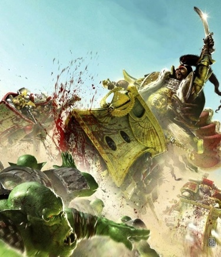

# 0780 007.M31 香德克斯战役 Chondax Campaign

精校状态：中文行文已逐段精校，部分术语仍为暂定

分类：时间线

原文来源：https://www.bilibili.com/opus/1186512022977642517

原作者：帝国神选罐头

原文时间：2026年04月02日 09:52

[返回分类目录](目录.md) · [全书目录](../../目录.md)

原篇名：007.M31 康达克斯战役 Chondax Campaign

<!-- A0780-B0001 -->
**英文原文**

The Chondax Campaign was a campaign in 007.M31 by the White Scars Space Marines during the Great Crusade and Horus Heresy.

<!-- /A0780-B0001 -->

<!-- A0780-B0002 -->

原译文

康达克斯战役是007.M31大远征和荷鲁斯叛乱期间由白色伤疤星际战士发起的一场战役。

**校订译文**

香德克斯战役是白疤星际战士在大远征与荷鲁斯之乱交替时期，于007.M31参与的一场战役。

**校注：** 概述称007.M31，信息表为001—007.M31，正文又称首战后再战七年；源文年代口径不一，均保留，不据此推定新的起止年。Chondax 沿核心第561篇定名香德克斯，旧康达克斯保留原译对照。

<!-- /A0780-B0002 -->

<!-- A0780-B0003 图片 -->

<!-- A0780-B0004 -->

原译文

Jaghatai Khan battles Orks during the Chondax Campaign 察合台可汗在康达克斯战役中与欧克作战

**校订译文**

Jaghatai Khan battles Orks during the Chondax Campaign 察合台可汗在香德克斯战役中与欧克作战

<!-- /A0780-B0004 -->

<!-- A0780-B0005 -->
**英文原文**

Conflict:Great Crusade/Horus Heresy

<!-- /A0780-B0005 -->

<!-- A0780-B0006 -->

原译文

冲突：大远征/荷鲁斯叛乱

**校订译文**

冲突：大远征／荷鲁斯之乱

<!-- /A0780-B0006 -->

<!-- A0780-B0007 -->
**英文原文**

Date:001-007.M31

<!-- /A0780-B0007 -->

<!-- A0780-B0008 -->

原译文

日期：001-007.M31

**校订译文**

日期：001-007.M31

<!-- /A0780-B0008 -->

<!-- A0780-B0009 -->
**英文原文**

Location:Chondax System

<!-- /A0780-B0009 -->

<!-- A0780-B0010 -->

原译文

地点：康达克斯星系

**校订译文**

地点：香德克斯星系

<!-- /A0780-B0010 -->

<!-- A0780-B0011 -->
**英文原文**

Outcome:Ork infestation largely cleared, Imperials escape Alpha Legion blockade

<!-- /A0780-B0011 -->

<!-- A0780-B0012 -->

原译文

结果：欧克侵扰基本清除，帝国逃离阿尔法军团封锁

**校订译文**

结果：欧克势力基本肃清，帝国部队突破阿尔法军团封锁

<!-- /A0780-B0012 -->

<!-- A0780-B0013 -->
**英文原文**

Combatants:Imperium/Orks/Traitors (Later)

<!-- /A0780-B0013 -->

<!-- A0780-B0014 -->

原译文

作战方：帝国/欧克/叛徒（后来）

**校订译文**

作战方：帝国/欧克/叛徒（后来）

<!-- /A0780-B0014 -->

<!-- A0780-B0015 -->
**英文原文**

Commanders:Primarch Jaghatai Khan, Krenak Noyan-Khan, Asudai Noyan-Khan, Hasik Noyan-Khan, Jemulan Noyan-Khan, Nogai Noyan-Khan (KIA), Sangjar Noyan-Khan, Gansukh Noyan-Khan, Orbaatar Noyan-Khan, Ulkanor Khan (KIA), Tsolmon Khan, Sengur Khan, Knight-Centura Calistis Merovin (WIA)/Warboss Urlakk Urruk/Unknown, primary commander listed as pseudonym "Desidero", Praetor Siridor Vhen

<!-- /A0780-B0015 -->

<!-- A0780-B0016 -->

原译文

指挥官：原体察合台可汗，克雷纳克诺扬汗，阿苏代诺扬汗，哈西克诺扬汗，杰穆兰诺扬汗，诺盖诺扬汗(KIA)，桑贾尔诺扬汗，甘苏赫诺扬汗，奥尔巴塔尔诺扬汗，乌尔卡诺可汗(KIA)，朝勒蒙可汗，森古尔可汗，百人骑士卡利斯提斯·梅罗文(KIA)/战争头目乌拉克·乌鲁克/未知，主要指挥官化名“德西德罗”，执政官西里多尔·维恩

**校订译文**

指挥官：原体察合台可汗、克雷纳克诺扬汗、阿苏代诺扬汗、哈西克诺扬汗、哲穆兰诺扬汗、诺盖诺扬汗（阵亡）、桑贾尔诺扬汗、甘苏赫诺扬汗、奥尔巴塔尔诺扬汗、乌尔卡诺可汗（阵亡）、朝勒蒙可汗、森古尔可汗、百骑长卡利斯提斯·梅罗文（负伤）／战争头目乌拉克·乌鲁克／不详，主要指挥官使用化名“德西德罗”、执政官希瑞多·维恩

**校注：** Calistis Merovin 英文明确WIA（负伤），原译错误标为KIA（阵亡），已修。

<!-- /A0780-B0016 -->

<!-- A0780-B0017 -->
**英文原文**

Strength: 67,600 White Scars, 472 light capital ships, 600 lesser strike craft and destroyers, 10,000 Imperial Army, 21 Capital Ships, 7 Macro-Ark transport barges, 30 deep range scout craft and Destroyers, 4,000 Solar Auxilia, 63 Sisters of Silence, 1 light cruiser/Waaagh!/30,000 Alpha Legion, 600 Capital Ships, 100 Destroyers, 1,000 smaller strike craft

<!-- /A0780-B0017 -->

<!-- A0780-B0018 -->

原译文

力量：67600名白色疤痕，472艘轻型主力舰，600艘小型打击舰和驱逐舰，10000帝国军队，21艘主力舰，7艘宏方舟运输驳船，30艘远程侦察舰和驱逐舰，4000太阳辅助军，63名寂静修女，一艘轻型巡洋舰/Waaagh！/30000名阿尔法军团，600艘主力舰，100艘驱逐舰，1000艘小型打击舰

**校订译文**

兵力：67,600名白疤、472艘轻型主力舰、600艘较小的打击舰与驱逐舰；10,000名帝国军、21艘主力舰、7艘宏方舟运输驳船、30艘远程侦察舰与驱逐舰；4,000名太阳辅助军；63名静默修女、1艘轻型巡洋舰／一支Waaagh!大军／30,000名阿尔法军团战士、600艘主力舰、100艘驱逐舰、1,000艘较小的打击舰

<!-- /A0780-B0018 -->

<!-- A0780-B0019 -->
**英文原文**

Losses/Survivors:At least 6,000 White Scars killed or seriously wounded/Millions

<!-- /A0780-B0019 -->

<!-- A0780-B0020 -->

原译文

损失/幸存者：至少6000名白色疤痕死亡或重伤/百万

**校订译文**

损失／幸存者：至少6,000名白疤阵亡或重伤／数百万

**校注：** 英文行标题把Losses与Survivors并列，斜线后“Millions”未明确指欧克伤亡还是幸存者；保持数量与歧义，不擅补阵营。

<!-- /A0780-B0020 -->

<!-- A0780-B0021 -->
## Overview 概述

<!-- /A0780-B0021 -->

<!-- A0780-B0022 -->
## Fighting the Orks 对抗欧克

原题：Fighting the Orks 战欧克

<!-- /A0780-B0022 -->

<!-- A0780-B0023 -->
**英文原文**

The battle was initially waged against Orks led by Warboss Urlakk Urruk, a former follower of Ullanor Warboss Urlakk Urg. In truth, the entire campaign was orchestrated by the treacherous Warmaster Horus to keep the White Scars far away from the Imperium's core while he enacted his Rebellion. Horus did not wish to destroy the White Scars, viewing them as future allies. Instead, he sought to distract them at Chondax while his initial plans unfolded. The Chondax System was infested with Orks, and its layout meant that it would take a lifetime of bloody fighting to clear them all. However The Khan did not complain, and instead dutifully set about the task of clearing the region of space from Greenskin infestation. Unknown to the White Scars, Chondax was also home to many hidden Alpha Legion assets who were ordered by Horus to keep the Scars busy there for as long as possible.

<!-- /A0780-B0023 -->

<!-- A0780-B0024 -->

原译文

这场战斗最初是由乌兰诺战争头目乌拉克·乌尔格的前追随者乌拉克·乌鲁克领导的欧克发起的。事实上，整个战役都是由背叛的战帅荷鲁斯精心策划的，目的是在他发动叛乱的同时，让白色疤痕远离帝国的核心。荷鲁斯不想摧毁白色疤痕，认为他们是未来的盟友。相反，在他最初的计划展开时，他试图在康达克斯分散他们的注意力。康达克斯星系中充满了欧克，其布局意味着需要一生的血腥战斗才能将它们全部清除。然而，可汗并没有抱怨，而是尽职尽责地着手清理该地区的绿皮侵扰。康达克斯也是许多隐藏的阿尔法军团的所在地，这些人按荷鲁斯的命令让白色疤痕尽可能长时间地在那里忙碌。

**校订译文**

这场战役最初的作战目标，是战争头目乌拉克·乌鲁克率领的欧克。他曾追随乌兰诺的战争头目乌拉克·乌尔格。实际上，整个战役都是叛变的战帅荷鲁斯精心安排的，目的是在自己发动叛乱时，让白疤远离帝国核心。荷鲁斯视白疤为潜在盟友，并不打算消灭他们，而是想在最初的计划展开期间，用香德克斯的战事牵制其精力。欧克盘踞整个香德克斯星系，而当地的分布格局意味着，要将它们彻底肃清，恐怕得血战一生。可汗却毫无怨言，尽职地着手清除这片星域中的绿皮。白疤并不知道，香德克斯还潜藏着大量阿尔法军团的人员和资源，他们奉荷鲁斯之命，要将白疤尽可能长久地拖在那里。

**校注：** was waged against Orks 表示帝国对欧克作战，不表示战役由欧克首先发起。

<!-- /A0780-B0024 -->

<!-- A0780-B0025 -->
**英文原文**

The battle in Chondax began when the Imperial vessel swept aside Ork fleet assets in the area, losing the Imperialis Armada Light Cruiser Forsworn to Greenskin boarders over Chondax Prime. The Scars subsequently made planetfall on Chondax Prime, targeting the Ork Fortress known as Black-Blight with the Legion's Kharash Terminator elite. The Kharash conducted devastating but surprisingly swift hit-and-run attacks on Greenskin defensive positions. Meanwhile, accompanying Imperial Army siege units of the Charonid Sentinels were tasked with breaching the Fortress Walls. After a six hour battle the Orks broke and retreated into the forests of Chondax. Despite this early victory, the campaign to root out the Orks would last seven more years and see heavy Imperial losses. Notable battles of the campaign include the battle on Shaln, where Nogai Noyan-Khan led a successful eradication effort with Reconnaissance Marines and Burkhut's Claws Veterans.

<!-- /A0780-B0025 -->

<!-- A0780-B0026 -->

原译文

当帝国战舰横扫该地区的欧克舰队时，康达克斯的战斗开始了，帝国无敌舰队轻型巡洋舰背誓者号在康达克斯一号上空输给了绿皮跳帮者。随后，白色疤痕在康达克斯一号上降落，与军团的哈拉什终结者精英一起瞄准了被称为黑色枯萎的欧克要塞。哈拉什对绿皮的防御阵地进行了毁灭性的但令人惊讶的快速攻击。与此同时，伴随着帝国军队的卡戎尼德哨兵攻城部队的任务是突破要塞城墙。经过六个小时的战斗，欧克被击溃，撤退到康达克斯的森林里。尽管取得了这场早期胜利，但铲除欧克的战役将再持续七年，帝国将遭受重大损失。这场战役中值得注意的战役包括夏恩之战，诺盖诺扬汗在那里与侦查战士和布尔胡特之爪老兵一起领导了一场成功的根除行动。

**校订译文**

帝国舰船开始扫荡当地欧克舰队时，香德克斯的战斗随之打响。在香德克斯主星上空，帝国舰队的轻型巡洋舰背誓者号遭绿皮跳帮而损失。随后，白疤在主星登陆，派出军团的哈拉什终结者精锐，进攻名为黑色枯萎的欧克要塞。哈拉什以惊人的速度发动打了就走的袭击，给绿皮阵地造成毁灭性打击。随军的帝国军卡戎尼德哨兵攻城部队，则负责攻破要塞城墙。六小时后，欧克溃败，退入香德克斯的森林。尽管首战告捷，肃清欧克的战事仍将持续七年，令帝国遭受重大损失。其中一场重要战斗发生于夏恩，诺盖诺扬汗率领侦察星际战士与布尔胡特之爪老兵，成功完成了清剿行动。

<!-- /A0780-B0026 -->

<!-- A0780-B0027 -->
**英文原文**

Though victorious, Nogai himself fell to a Alpha Legion Headhunter ambush orchestrated to appear as if conducted by Orks. Another significant became known as the Phemus Massacre broke out when on the White Scars assaulting the gas giant Phemus were ambushed by Alpha Legion forces based on the planet. Taken by complete surprise, the Scars were massacred and the Alpha Legion triggered volcanic landslides to hide the evidence of the battle.

<!-- /A0780-B0027 -->

<!-- A0780-B0028 -->

原译文

虽然取得了胜利，但诺盖本人却遭到了阿尔法军团猎头者的伏击，这次伏击似乎是由欧克指挥的。另一个重要事件被称为菲摩斯大屠杀，发生在袭击气体巨星菲摩斯的白色伤疤上，当时他们遭到了基于该行星的阿尔法军团的伏击。完全出乎意料的是，白色疤痕被屠杀，阿尔法军团引发火山崩塌，以掩盖战斗的证据。

**校订译文**

虽然赢得了战斗，诺盖本人却死于阿尔法军团猎头者的伏击；这次伏击被刻意伪装成欧克所为。另一场重要事件后来被称为菲摩斯大屠杀：白疤进攻气态巨行星菲摩斯时，遭到驻扎于该星球的阿尔法军团伏击。他们完全措手不及，惨遭屠杀。阿尔法军团随后引发火山滑坡，掩埋战斗留下的证据。

**校注：** 诺盖是阵亡，不只是遭遇伏击；阿尔法军团伪装袭击为欧克所为，并非欧克指挥伏击。源文气态巨行星与火山滑坡并存，地理疑点待核。

<!-- /A0780-B0028 -->

<!-- A0780-B0029 -->
## Escape 逃离

<!-- /A0780-B0029 -->

<!-- A0780-B0030 -->
**英文原文**

The White Scars had received little to no communications from the wider Imperium during the campaign, but this changed after the destruction of Tenebrae Station which allowed Jaghatai Khan to finally receive some garbled Astropathic communications. The Khan called his forces back to Chondax Prime, triggering a wave of sudden Alpha Legion assaults across the System. Alpha Legion vessels targeted lone White Scars ships and Alpha Legionaries wearing the colors of the Scars attacked their allies throughout the region.

<!-- /A0780-B0030 -->

<!-- A0780-B0031 -->

原译文

在战役期间，白色疤痕几乎没有收到来自更广泛帝国的通信，但在泰内布里空间站被摧毁后，情况发生了变化，这使得察合台可汗最终收到了一些混乱的星域通信。可汗将他的部队召回了康达克斯一号，在整个星系中引发了一波突然的阿尔法军团袭击。阿尔法军团战舰瞄准了单独的白色伤疤舰船，穿着白色伤疤颜色的阿尔法军团在整个地区袭击了他们的盟友。

**校订译文**

战役期间，白疤几乎收不到帝国其他地区的通信。泰内布里空间站被摧毁后，情况才有所改变，察合台可汗终于收到了一些混乱不清的星语讯息。他召回部队，命其向香德克斯主星集结，随即引发阿尔法军团在整个星系内的一连串突袭。阿尔法军团舰船袭击落单的白疤舰船，披挂白疤涂装的阿尔法军团战士则在各处攻击白疤的盟友。

<!-- /A0780-B0031 -->

<!-- A0780-B0032 -->
**英文原文**

Only Chondax Prime escaped Alpha Legion attack, drawing the Scars and their allies to this location. Instead Chondax Prime and the White Scars high command were assailed by disinformation: stating that Leman Russ had turned renegade and was igniting a civil war on Prospero. The messages included direct summons from Horus himself, giving credence to the tale. Simultaneously however, the Scars received messages from Rogal Dorn that stated Horus had turned against the Emperor on Isstvan III. As the Khan was wracked with what decision to make, the Alpha Legion fleet arrived over Chondax Prime. After a tense standoff with the Alpha Legion, Jaghatai Khan took control of his fleet from the Swordstorm and skillfully executed a formation known as The Chisel which smashed a wedge in the Alpha Legion fleet and allowed their escape. Multiple Alpha Legion ships were destroyed during the brief but intense battle in space.

<!-- /A0780-B0032 -->

<!-- A0780-B0033 -->

原译文

只有康达克斯一号逃脱了阿尔法军团的攻击，将白色疤痕和他们的盟友吸引到了这个地方。相反，康达克斯一号和白色疤痕高级指挥部受到了虚假信息的攻击：称黎曼·鲁斯已经叛变，并正在普罗斯佩罗引发内战。这些信息包括荷鲁斯本人的直接召唤，为这个故事提供了可信度。然而，与此同时，白色疤痕收到了罗格·多恩的消息，称荷鲁斯在伊斯塔万三号背叛了帝皇。当可汗对做出的决定感到困惑时，阿尔法军团舰队抵达了康达克斯一号。在与阿尔法军团紧张对峙后，察合台可汗从剑刃风暴号中控制他的舰队，并巧妙地执行了一个名为凿子的编队，该编队粉碎了阿尔法军团舰队的一个楔子，使他们得以逃脱。在短暂但激烈的太空战斗中，多艘阿尔法军团舰船被摧毁。

**校订译文**

只有香德克斯主星未遭阿尔法军团袭击，白疤及其盟军因此被吸引到这里。然而，主星与白疤高层指挥部受到的却是虚假情报的冲击：消息称黎曼·鲁斯已经叛变，正在普罗斯佩罗掀起内战。荷鲁斯本人还直接下令召见可汗，使这些说法显得更加可信。与此同时，白疤又收到了罗格·多恩的讯息，称荷鲁斯已在伊斯塔万三号背叛帝皇。可汗正在艰难抉择之际，阿尔法军团舰队抵达主星上空。双方紧张对峙后，察合台可汗在剑刃风暴号上亲自指挥舰队，巧妙展开名为“凿阵”的阵型，像楔子一样凿穿阿尔法军团舰阵，开出逃生通路。短暂而激烈的虚空交锋中，多艘阿尔法军团舰船被摧毁。

<!-- /A0780-B0033 -->

<!-- A0780-B0034 -->
**英文原文**

The battle over Chondax was not the only one in this final phase. On Herkon, 10,000 White Scars embarked upon their transports while holding back an Alpha Legion armoured assault. So few Frigates were left in orbit that the Scars had to draw lots to determine to go on, with most instead desiring to stay and take the fight to the enemy. In the jungles of Epihelikon, the confident Alpha Legion expected no resistance but were instead assailed by the Saturnyne Rams and White Scars. The Imperials were able to steal a number of craft from the Alpha Legion and escape. On Phemus IV, the Alpha Legion's hidden base was revealed to be the repudiated lair of Alpharius himself. The White Scars under Ulkanor Khan led a Keshig attack on the base, suspecting its beacon was important to the Alpha Legion's plans. Ulkanor attempted to engage in a duel with Alpha Legion Praetor Siridor Vhen, who instead had his men gun down the brave White Scar. On Byfrust, Tsolmon Khan's forces as well as the Sisters of Silence under Calistis Merovin were overwhelmed by a massive Alpha Legion assault and fought to the last. They decided to not die on the defensive and instead launched a massive Jetbike and Keshig assault into the Alpha Legion ranks, laughing all the way. The Alpha Legion Consul Striga was forced to unleash Sorcery upon the Scars to stem the tide, but were countered by the Sisters of Silence. However the Scars and their allies victory proved short-lived as the Alpha Legion Cruiser Phi-Hekator emerged over Byfrust to devastate the Imperials.

<!-- /A0780-B0034 -->

<!-- A0780-B0035 -->

原译文

在这个最后阶段，康达克斯的战斗并不是唯一的一场。在赫尔孔，10000名白色疤痕登上了他们的运输车，同时阻止了阿尔法军团的装甲突击。轨道上剩下的护卫舰太少了，白色疤痕不得不抽签决定谁继续前进，大多数人都希望留下来与敌人战斗。在埃庇希利孔的丛林中，自信的阿尔法军团没有预料到任何抵抗，而是遭到了土星公羊和白色疤痕的袭击。帝国能够从阿尔法军团偷走一些舰船并逃脱。在菲摩斯四号，阿尔法军团的隐藏基地被揭露为阿尔法瑞斯本人被遗弃的藏身处。乌尔卡诺可汗领导的白色疤痕对基地发动了怯薛攻击，怀疑其信标对阿尔法军团的计划很重要。乌尔卡诺试图与阿尔法军团执政官西里多尔·维恩决斗，后者却让他的手下射杀了勇敢的白色伤疤。在拜弗拉斯特，朝勒蒙可汗的部队以及卡利斯提斯·梅罗文领导下的寂静修女被阿尔法军团的大规模袭击所淹没，并战斗到最后。他们决定不在防守中死去，而是向阿尔法军团发起了一场大规模的喷气摩托和怯薛突击，一路大笑。阿尔法军团领事斯特里加被迫对白色疤痕释放巫术以阻止浪潮，但遭到了寂静修女的反击。然而，当阿尔法军团巡洋舰菲·赫卡托号出现在拜弗拉斯特上空摧毁帝国时，白色疤痕及其盟友的胜利被证明是短暂的。

**校订译文**

这一最后阶段的战斗并不只发生在香德克斯主星上空。在赫尔孔，一万名白疤一边抵挡阿尔法军团的装甲攻势，一边登上运输舰。轨道上剩余的护卫舰太少，他们不得不抽签决定谁撤离，因为大多数人宁愿留下迎战。在埃庇希利孔的丛林中，自信满满的阿尔法军团本以为不会遇到抵抗，却遭土星公羊和白疤袭击。帝国部队夺取了若干阿尔法军团飞行器，乘机逃脱。在菲摩斯四号，阿尔法军团的一处秘密基地据称曾是阿尔法瑞斯本人的巢穴。乌尔卡诺可汗怀疑基地的信标关系到阿尔法军团的计划，于是率白疤怯薛发动突袭。他试图与阿尔法军团执政官希瑞多·维恩决斗，对方却命令部下开枪，将这位勇敢的白疤战士杀死。在拜弗拉斯特，朝勒蒙可汗的部队与卡利斯提斯·梅罗文指挥的静默修女，被阿尔法军团的大规模进攻压垮，仍奋战至最后。他们不愿困守而死，遂发动喷气摩托与怯薛的大举冲锋，一路大笑着杀入阿尔法军团阵中。阿尔法军团领事斯特里加被迫施展巫术阻挡攻势，却受到静默修女压制。然而，白疤及其盟友的胜利十分短暂：阿尔法军团巡洋舰菲·赫卡托号出现在拜弗拉斯特上空，对帝国部队展开毁灭性攻击。

**校注：** repudiated lair 在此语境不通，疑为 reputed lair（据传的巢穴）笔误，暂按后者译为据称；原译遗弃无相应英文依据。transports 在轨道撤离上下文中为运输舰，而非运输车。

<!-- /A0780-B0035 -->

<!-- A0780-B0036 -->
**英文原文**

Due to the extreme speed of the White Scars ships, they were quickly able to outrun their enemy once they had broken through the blockade. The Khan's fleet arrived at outlying systems of Chondax long enough to rescue any stranded forces while also delivering brutal vengeance upon the Alpha Legion. On Phemus, the Khan confronted and slew the Alpha Legion commander Siridor Vhen, who before his death stated that he had saved the Scars from the terrors that now gripped the Galaxy. The Khan later encountered the crippled cruiser Hawkstar, which carried the last survivors of Tsolmon Khan's forces and exacted a vengeful bombardment of Phemus IV.

<!-- /A0780-B0036 -->

<!-- A0780-B0037 -->

原译文

由于白色疤痕舰船的极高速度，一旦突破封锁，他们很快就能摆脱敌人。可汗的舰队抵达康达克斯外围星系的时间足够长，可以营救任何被困的部队，同时对阿尔法军团进行残酷的复仇。在菲摩斯，可汗与阿尔法军团指挥官西里多尔·维恩对峙并杀死了他，后者在死亡前表示，他已经将白色疤痕从现在笼罩银河系的恐怖中拯救出来。可汗后来遇到了瘫痪的巡洋舰鹰星号，该巡洋舰载有朝勒蒙可汗部队的最后幸存者，并对菲摩斯四号进行了报复性轰炸。

**校订译文**

白疤舰船航速极快，一旦突破封锁，很快便甩开了敌军。可汗的舰队在香德克斯外围星系停留，营救受困部队，并向阿尔法军团施以猛烈报复。在菲摩斯，可汗与希瑞多·维恩交战，将其斩杀。维恩临死前声称，他已经让白疤免于遭受如今笼罩银河的恐怖。此后，可汗遇到了严重受损的巡洋舰鹰星号，舰上载着朝勒蒙可汗部队最后的幸存者；他随后对菲摩斯四号实施了报复性轰炸。

**校注：** 末句英文and exacted的主语衔接有歧义，结合主句The Khan与复仇行动译作可汗实施轰炸；鹰星号载幸存者的事实不变。

<!-- /A0780-B0037 -->

<!-- A0780-B0038 -->
**英文原文**

Once the White Scars fleet led by the Swordstorm escaped into the Warp, The Khan stated his determination to discover the truth of this mayhem for himself and set course for Prospero, ignoring the Space Wolves plea for aid as they were beset by enemy forces in the Alaxxes Nebula.

<!-- /A0780-B0038 -->

<!-- A0780-B0039 -->

原译文

剑刃风暴号率领的白色疤痕舰队逃入亚空间，可汗表示他决心为自己发现这场混乱的真相，并设定航向为普罗斯佩罗，无视太空野狼在阿拉克斯星云被敌军围困时的援助请求。

**校订译文**

剑刃风暴号率领白疤舰队逃入亚空间后，可汗宣布要亲自查明这场混乱的真相，并转向普罗斯佩罗。他没有回应太空野狼的求援；后者当时正在阿拉克斯星云遭敌军围攻。

<!-- /A0780-B0039 -->

<!-- A0780-B0040 -->
**英文原文**

Later Mortarion remarks that something foul had taken place at Chondax, as the original plan by Horus was for the Alpha Legion to recruit the White Scars. Instead, either under orders from Alpharius or Omegon, they took overtly hostile actions, avoided any attempt at communication, and kept the White Scars occupied until they could receive a message from Rogal Dorn warning them of the Heresy. Indeed, the only reason this message could be delivered was because Omegon had dispatched his Effrit Stealth Squad to destroy a Pylon blocking White Scars communications. It seems that the Alpha Legion, or at least elements of it, wished for the Scars to remain true to the Emperor.

<!-- /A0780-B0040 -->

<!-- A0780-B0041 -->

原译文

后来莫塔里安评论说，康达克斯发生了一些恶劣的事情，因为荷鲁斯最初的计划是让阿尔法军团招募白色伤疤。相反，无论是在阿尔法瑞斯还是欧米伽的命令下，他们都采取了公然的敌对行动，避免任何沟通尝试，并一直令白色伤疤忙碌，直到他们收到罗格·多恩警告他们叛乱的信息。事实上，之所以能传递这条信息，唯一的原因是欧米伽派遣了他的伊夫利特隐形小队摧毁了一个封锁白色疤痕通信的方尖碑。看来阿尔法军团，或者至少是其中的一些人，希望白色疤痕对帝皇保持忠诚。

**校订译文**

莫塔里安后来指出，香德克斯的事态大有蹊跷。荷鲁斯原本打算让阿尔法军团拉拢白疤，然而他们却在阿尔法瑞斯或欧米伽的命令下，采取了公然敌对的行动，拒绝一切沟通，并将白疤拖在那里，直到后者收到罗格·多恩关于叛乱的警告。事实上，这条讯息之所以能够送达，完全是因为欧米伽派出了自己的埃弗里特潜行小队，摧毁一座阻断白疤通信的方尖碑。看来，阿尔法军团——至少其中一部分人——希望白疤继续效忠帝皇。

<!-- /A0780-B0041 -->

<!-- A0780-B0042 -->
**英文原文**

Some scattered groups of White Scars survivors were discovered ten years after the Heresy, having waged a solitary war against the Alpha Legion until they withdrew from the System.

<!-- /A0780-B0042 -->

<!-- A0780-B0043 -->

原译文

叛乱十年后，发现了一些分散的白色疤痕幸存者群，他们与阿尔法军团进行了一场单独的战争，直到他们退出星系。

**校订译文**

荷鲁斯之乱结束十年后，人们仍发现了数股分散的白疤幸存者。他们曾孤军对抗阿尔法军团，直到对方撤出该星系。

**校注：** 末句they撤离的指代按交战对象阿尔法军团理解；若后续补原始出处需复核。

<!-- /A0780-B0043 -->

本篇核心术语与暂定项

以下列出本篇出现的英文原形及核心术语表用词。同形词可能指不同对象，具体词义以本篇正文和校注为准；单复数、别名和仅见于图注的名称可能尚未列入。完整候选见[术语表](../../术语表/双语术语候选.csv)。

| 英文 | 采用中文 | 状态 |
| --- | --- | --- |
| Space Marines | 星际战士 | 官方已核对 |
| Space Wolves | 太空野狼 | 官方已核对 |
| Imperial Army | 帝国军 | 暂定·官方待核 |
| Orks | 欧克蛮人 | 官方已核对 |
| Terminator | 终结者 | 官方已核对 |
| Horus Heresy | 荷鲁斯之乱 | 官方已核对 |
| Warp | 亚空间 | 官方已核对 |
| Imperium | 帝国 | 暂定·简称 |
| Waaagh! | Waaagh! | 暂定·保留原文 |
| Emperor | 帝皇 | 官方已核对 |
| Primarch | 原体 | 官方已核对 |
| Great Crusade | 大远征 | 暂定·官方待核 |
| Mortarion | 莫塔里安 | 官方已核对 |
| Horus | 荷鲁斯 | 暂定·官方待核 |
| Isstvan III | 伊斯塔万三号 | 暂定·官方待核 |
| Sisters of Silence | 寂静修女 | 暂定·官方待核 |
| Solar Auxilia | 太阳辅助军 | 暂定·官方待核 |
| Imperialis Armada | 帝国无敌舰队 | 暂定·官方待核 |
| Clear | 清明 | 暂定·官方待核 |
| Knight-Centura | 百骑长 | 官方已核对 |
| Urlakk Urg | 乌尔拉克·乌尔格 | 暂定·官方待核 |
| Ullanor | 乌兰诺 | 暂定·官方待核 |
| White Scars | 白疤 | 官方已核 |
| Alpha Legion | 阿尔法军团 | 暂定·官方待核 |
| Scars | 伤疤 | 暂定·官方待核 |
| Isstvan | 伊斯塔万 | 暂定·官方待核 |
| Praetor | 执政官 | 暂定·官方待核 |
| Hasik Noyan-Khan | 哈西克诺扬汗 | 暂定·官方待核 |
| Jemulan Noyan-Khan | 哲穆兰诺扬汗 | 暂定·官方待核 |
| Consul | 领事 | 暂定·官方待核 |
| Scout | 侦察兵 | 暂定·官方待核 |
| Destroyers | 毁灭者 | 暂定·官方待核 |
| Alpharius | 阿尔法瑞斯 | 暂定·官方待核 |
| Omegon | 欧米伽 | 暂定·官方待核 |
| Effrit Stealth Squad | 埃弗里特潜行小队 | 暂定·官方待核 |
| Chondax | 香德克斯 | 暂定·官方待核 |
| Alaxxes Nebula | 阿拉克斯星云 | 暂定·官方待核 |
| Siridor Vhen | 希瑞多·维恩 | 暂定·官方待核 |
| Jaghatai Khan | 察合台可汗 | 暂定·官方待核 |
| Noyan-Khan | 诺扬汗 | 暂定·官方待核 |
| Warboss | 战争头目 | 官方已核对 |
| Imperialis | 帝国徽记 | 暂定·官方待核 |
| Charonid Sentinels | 卡戎尼德哨兵 | 暂定·官方待核 |
| Vengeance | 复仇号 | 暂定·官方待核 |
| Chondax Campaign | 香德克斯战役 | 暂定·官方待核 |
| Calistis Merovin | 卡利斯提斯·梅罗文 | 暂定·官方待核 |
| Nogai Noyan-Khan | 诺盖诺扬汗 | 暂定·官方待核 |
| Tsolmon Khan | 朝勒蒙可汗 | 暂定·官方待核 |
| Ulkanor Khan | 乌尔卡诺可汗 | 暂定·官方待核 |
| Phemus | 菲摩斯 | 暂定·官方待核 |
| Kharash | 哈拉什 | 暂定·官方待核 |
| Swordstorm | 剑刃风暴号 | 暂定·官方待核 |
| Hawkstar | 鹰星号 | 暂定·官方待核 |
| The Chisel | 凿阵 | 暂定·官方待核 |
| Gun | 甘 | 暂定·官方待核 |
| System | 星系（恒星系统） | 暂定·官方待核 |
| Chondax System | 香德克斯星系 | 暂定·官方待核 |
| Chondax Prime | 香德克斯主星 | 暂定·官方待核 |
| Saturnyne Rams | 土星公羊 | 暂定·官方待核 |
| Jetbike | 喷气摩托 | 暂定·官方待核 |

