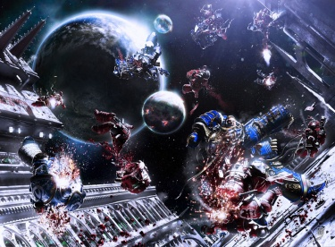
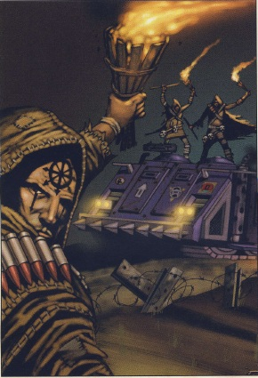
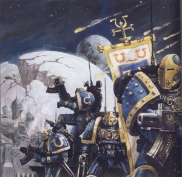
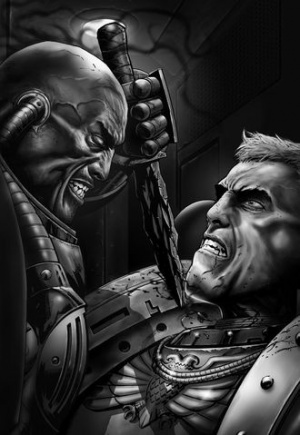
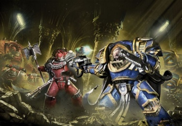

# 0781 007.M31 考斯之战 Battle of Calth

精校状态：中文行文已逐段精校，部分术语仍为暂定

分类：时间线

原文来源：https://www.bilibili.com/opus/1192471745376813059

原作者：帝国神选罐头

原文时间：2026年04月18日 11:19

[返回分类目录](目录.md) · [全书目录](../../目录.md)

<!-- A0781-B0001 -->

原译文

"Victory is a fickle mistress, failure a haphazard executioner; for those with the courage to preserve will not abide their dictates."- Attributed to Tetrarch Eikos Lamiad, from the dedication of the "Defence of Bathor" monument, Calth Holophusikon “胜利是一位反复无常的女士，失败是一位随意的行刑者；因为那些有勇气保护的人不会遵守他们的决定。”- 归于英杰艾科斯·拉米亚德，来自“巴瑟防御战”纪念碑的落成典礼，考斯全息影像

**校订译文**

"Victory is a fickle mistress, failure a haphazard executioner; for those with the courage to preserve will not abide their dictates."- Attributed to Tetrarch Eikos Lamiad, from the dedication of the "Defence of Bathor" monument, Calth Holophusikon “胜利是反复无常的情妇，失败是任意施刑的刽子手；勇于坚持之人，不会任由它们摆布。”——据传出自四方领主艾科斯·拉米亚德，载于考斯全息馆“巴瑟保卫战”纪念碑献词

**校注：** 英文preserve在此疑为persevere（坚持）笔误，按完整格言语义译；Holophusikon暂按机构名称译考斯全息馆，原全息影像误作媒介，具体建筑性质待核。完整英文引文及署名保留。

<!-- /A0781-B0001 -->

<!-- A0781-B0002 -->
**英文原文**

The Battle of Calth was a major battle of the Horus Heresy, in which the Word Bearers Traitor Legion attempted to exterminate the Ultramarines Legion, on the orders of Warmaster Horus, who anticipated that Guilliman, the Ultramarines' Primarch, would not join his rebellion against the Emperor.

<!-- /A0781-B0002 -->

<!-- A0781-B0003 -->

原译文

考斯之战是荷鲁斯叛乱的一场重大战斗，在这场战斗中，怀言者叛徒军团试图根据战帅荷鲁斯的命令消灭极限战士军团，战帅荷鲁斯预计极限战士军团的原体基里曼不会加入他对帝皇的叛乱。

**校订译文**

考斯之战是荷鲁斯之乱期间的一场重大战役。战帅荷鲁斯料定极限战士原体基里曼不会参与反叛帝皇，于是命令怀言者叛军军团消灭极限战士军团。

<!-- /A0781-B0003 -->

<!-- A0781-B0004 图片 -->

<!-- A0781-B0005 -->

原译文

Roboute Guilliman takes the battle to the void above Calth 罗伯特·基里曼在考斯之上的虚空战斗

**校订译文**

Roboute Guilliman takes the battle to the void above Calth 罗保特·基里曼在考斯上空的虚空中迎战

<!-- /A0781-B0005 -->

<!-- A0781-B0006 -->
**英文原文**

Conflict:Horus Heresy

<!-- /A0781-B0006 -->

<!-- A0781-B0007 -->

原译文

冲突：荷鲁斯叛乱

**校订译文**

冲突：荷鲁斯之乱

<!-- /A0781-B0007 -->

<!-- A0781-B0008 -->
**英文原文**

Date:007.M31; Underground War continues until 014.M31

<!-- /A0781-B0008 -->

<!-- A0781-B0009 -->

原译文

日期：007.M31；地下战争持续到014.M31

**校订译文**

日期：007.M31；地下战争持续到014.M31

<!-- /A0781-B0009 -->

<!-- A0781-B0010 -->
**英文原文**

Location:Calth, Veridian System, Ultramar

<!-- /A0781-B0010 -->

<!-- A0781-B0011 -->

原译文

地点：考斯，维里迪安星系，奥特拉玛

**校订译文**

地点：考斯，维里迪安星系，奥特拉玛

<!-- /A0781-B0011 -->

<!-- A0781-B0012 -->
**英文原文**

Outcome:Pyrrhic Loyalist Victory - Traitor forces destroyed, Ruinstorm created

<!-- /A0781-B0012 -->

<!-- A0781-B0013 -->

原译文

结果：忠诚派惨胜 — 叛徒部队被摧毁，毁灭风暴被创造

**校订译文**

结果：忠诚派惨胜——叛军部队被摧毁，毁灭风暴形成

<!-- /A0781-B0013 -->

<!-- A0781-B0014 -->
**英文原文**

Combatants:Traitors/Imperium

<!-- /A0781-B0014 -->

<!-- A0781-B0015 -->

原译文

作战方：叛徒/帝国

**校订译文**

作战方：叛徒/帝国

<!-- /A0781-B0015 -->

<!-- A0781-B0016 -->
**英文原文**

Commanders:First Captain Kor Phaeron (WIA), Force Commander Foedrall Fell (KIA), First Chaplain Erebus, Force Commander Hol Beloth (KIA), Force Commander Morpal Cxir (KIA), Dark Apostle Maloq Kartho, Captain Sorot Tchure (WIA), Dark Apostle Kurtha Sedd (KIA), Dark Apostle Zardu Layak/Primarch Roboute Guilliman, Tetrarch Eikos Lamiad, Tetrarch Tauro Nicodemus, First Master Marius Gage, Captain Remus Ventanus, Chapter Master Klord Empion, Captain Saur Damocles, Captain Steloc Aethon, Captain Erikon Gaius, Captain Teus Sullus, Captain Lyros Sydance, Captain Aurian, Captain Honorius Luciel (KIA), Sergeant Aeonid Thiel, Sergeant Anchise, Master Arook Serotid (KIA), Colonel Sparzi, Magos Cronn Barbarel

<!-- /A0781-B0016 -->

<!-- A0781-B0017 -->

原译文

指挥官：第一连长科尔·法伦(WIA)，部队指挥官弗德拉尔·费尔(KIA)，第一牧师艾瑞巴斯，部队指挥官霍尔·贝洛斯(KIA)，部队指挥官莫帕尔·西尔(KIA)，黑暗使徒马洛克·卡托，连长索罗特·丘尔(WIA)，黑暗使徒库尔塔·塞德(KIA)，黑暗使徒扎度·拉亚克/原体罗伯特·基里曼，英杰艾科斯·拉米亚德，英杰陶罗·尼科迪默斯，第一大师马吕斯·盖奇，连长雷穆斯·文塔努斯，战团长克洛德·恩庇安，连长索尔·达摩克利斯，连长斯特洛克·艾森，连长埃里孔·盖乌斯，连长特乌斯·苏鲁斯，连长莱罗斯·赛丹斯，连长奥瑞安，连长霍诺留斯·卢西尔(KIA)，军士埃奥尼德·希尔，军士安喀塞斯，大师阿鲁克·塞罗蒂德(KIA)，团长斯帕尔齐，贤者科隆·巴巴瑞尔

**校订译文**

指挥官：第一连长科尔·法伦（负伤）、部队指挥官弗德拉尔·费尔（阵亡）、第一教士艾瑞巴斯、部队指挥官霍尔·贝洛斯（阵亡）、部队指挥官莫帕尔·西尔（阵亡）、黑暗使徒马洛克·卡尔托、连长索罗特·丘尔（负伤）、黑暗使徒库尔塔·塞德（阵亡）、黑暗使徒扎度·拉亚克／原体罗保特·基里曼、四方领主艾科斯·拉米亚德、四方领主陶罗·尼科迪默斯、第一大师马吕斯·盖奇、连长雷穆斯·文坦努斯、战团长克洛德·恩庇安、连长索尔·达摩克利斯、连长斯特洛克·艾森、连长埃里孔·盖乌斯、连长特乌斯·苏鲁斯、连长莱罗斯·赛丹斯、连长奥瑞安、连长霍诺留斯·卢西尔（阵亡）、军士伊奥尼德·希尔、军士安喀塞斯、大师阿鲁克·塞罗蒂德（阵亡）、上校斯帕尔齐、贤者科隆·巴巴瑞尔

<!-- /A0781-B0017 -->

<!-- A0781-B0018 -->
**英文原文**

Strength:More than 50,000 Word Bearers, Countless Daemons, ~500,000 Cultists, Legio Suturvora, ~130 Titans, Bulk of Word Bearers fleet/185,923 Ultramarines, \>~1 million Auxilia and Army, Skitarii Cohorts, ~118 Titans, Bulk of Ultramarines fleet

<!-- /A0781-B0018 -->

<!-- A0781-B0019 -->

原译文

力量：超过50000名怀言者，无数恶魔，约500000邪教徒，苏图沃拉军团，约130架泰坦，大量怀言者舰队/185923名星际战士，约超过一百万辅助军和帝国军队，护教军大队，约118架泰坦，大量极限战士舰队

**校订译文**

兵力：超过50,000名怀言者、无数恶魔、约500,000名邪教徒、苏图沃拉军团、约130台泰坦、怀言者舰队主力／185,923名极限战士、约一百余万辅助军与帝国军、护教军各大队、约118台泰坦、极限战士舰队主力

<!-- /A0781-B0019 -->

<!-- A0781-B0020 -->
**英文原文**

Casualties:20,000 Astartes killed in the initial battle, remainder persecute, the underground war over the next decade, More than 65 titans destroyed, All cultists killed, Half of Word Bearer fleet destroyed, Flagships Infidus Imperator and Destiny's Hand destroyed/119,422 Astartes killed, 28,392 Astartes crippled, 100 Titans destroyed, 4/5th of fleet destroyed, At least 500,000 Army & Mechanicum casualties

<!-- /A0781-B0020 -->

<!-- A0781-B0021 -->

原译文

伤亡：20000名阿斯塔特在最初的战斗中丧生，其余在未来十年的地下战争中骚扰，超过65架泰坦被摧毁，所有邪教徒被杀，一半的怀言者舰队被摧毁，旗舰伪帝号和命运之手号被摧毁/119422名阿斯塔特被杀，28392名阿斯塔特重伤，100架泰坦被摧毁，4/5的舰队被毁灭，至少50万帝国军队和机械教伤亡

**校订译文**

伤亡：20,000名阿斯塔特在最初的战斗中阵亡，其余人员在此后十年间继续地下战争；超过65台泰坦被摧毁，邪教徒全部死亡，怀言者舰队损失一半，旗舰伪帝号与命运之手号被摧毁／119,422名阿斯塔特阵亡、28,392名阿斯塔特重伤致残，100台泰坦被摧毁，舰队损失五分之四，帝国军与机械教至少伤亡50万人

**校注：** persecute疑为prosecute（继续进行战争）误写，不译骚扰；伤亡表称此后十年，日期栏至014.M31约七年，源内时间差异待核。

<!-- /A0781-B0021 -->

<!-- A0781-B0022 -->
## Early Events 早期事件

<!-- /A0781-B0022 -->

<!-- A0781-B0023 -->
**英文原文**

During the Great Crusade, approximately forty years before the Heresy, the Emperor of Mankind rebuked the Word Bearers and their primarch, Lorgar Aurelian, for fostering idolatrous worship of the Emperor, and for violent atrocities against those who were slow to adopt their beliefs. As an object lesson, the Emperor ordered Guilliman and the Ultramarines to raze the city of Monarchia, the Word Bearers' proudest achievement, to the ground. He then forced Lorgar and his entire Legion to kneel in the city's ashes before him, Guilliman, and Malcador the Sigillite. These events sent Lorgar down a dark path that would eventually lead him to swear allegiance to Warmaster Horus Lupercal and the Gods of Chaos, and set the entire Word Bearers Legion in a vendetta against the Ultramarines. While Lorgar undoubtedly was motivated against the Ultramarines on a personal level, he had earlier been told by Fateweaver that killing Guilliman would ultimately doom the Traitors cause.

<!-- /A0781-B0023 -->

<!-- A0781-B0024 -->

原译文

在大远征期间，大约在叛乱之前四十年，人类帝皇批评怀言者及其原体珞珈·奥瑞利安，因为他们助长了对帝皇的盲目崇拜，并对那些迟迟不接受自己信仰的人实施了强烈暴行。作为一个客观的教训，帝皇命令基里曼和极限战士将摩纳齐亚城夷为平地，这是怀言者最自豪的成就。然后，他强迫珞珈和他的整个军团在城市的灰烬中跪在他、基里曼和掌印者马卡多面前。这些事件使珞珈走上了一条黑暗的道路，最终导致他宣誓效忠战帅荷鲁斯·卢佩卡尔和混沌诸神，并让整个怀言者军团对极限战士展开复仇。虽然珞珈无疑是在个人层面上反对极限战士的，但织命者早些时候告诉他，杀死基里曼最终将毁灭叛徒事业。

**校订译文**

在大远征时期、距荷鲁斯之乱约四十年前，人类帝皇斥责了怀言者及其原体珞珈·奥瑞利安：他们宣扬对帝皇的偶像崇拜，并残暴迫害那些迟迟不肯接受其信仰的人。为了给他们一个切实的教训，帝皇命令基里曼与极限战士，将怀言者最引以为傲的成就——摩纳齐亚城——夷为平地。随后，他迫使珞珈及整个军团跪在城市灰烬中，面对自己、基里曼与掌印者马卡多。这一切使珞珈踏上黑暗之路，最终向战帅荷鲁斯·卢佩卡尔和混沌诸神宣誓效忠，也让整个怀言者军团誓向极限战士复仇。珞珈对极限战士无疑怀有私怨，但织命者此前曾告诫他：杀死基里曼，最终会让叛军的大业走向毁灭。

<!-- /A0781-B0024 -->

<!-- A0781-B0025 -->
**英文原文**

After the massacres of loyalist forces at Isstvan III and V, and having gained the allegiance of Lorgar and the other Traitor Primarchs, Horus believed that the Ultramarines - the largest of all the Space Marine Legions - were the last and only significant obstacle to his total victory over the Emperor.

<!-- /A0781-B0025 -->

<!-- A0781-B0026 -->

原译文

在伊斯塔万三号和五号的忠诚派部队遭到屠杀后，荷鲁斯获得了珞珈和其他叛徒原体的忠诚，他认为，极限战士 — 所有星际战士军团中最大的一支 — 是他彻底战胜帝皇的最后也是唯一的重大障碍。

**校订译文**

在伊斯塔万三号和五号的忠诚派部队遭到屠杀后，荷鲁斯获得了珞珈和其他叛徒原体的忠诚，他认为，极限战士 — 所有星际战士军团中最大的一支 — 是他彻底战胜帝皇的最后也是唯一的重大障碍。

<!-- /A0781-B0026 -->

<!-- A0781-B0027 -->
## The Battle 战斗

<!-- /A0781-B0027 -->

<!-- A0781-B0028 -->
## The Setting 背景

<!-- /A0781-B0028 -->

<!-- A0781-B0029 -->
**英文原文**

Horus ordered Guilliman to gather the majority of his Legion at Calth, one of the many planets in the Ultramar Coalition. The ostensible reason for this order was an anticipated incursion by Orks in the Veridian System. As if the muster of the Ultramarines was not enough, Horus ordered that the Word Bearers would go into battle alongside the Ultramarines.

<!-- /A0781-B0029 -->

<!-- A0781-B0030 -->

原译文

荷鲁斯命令基里曼将他的大部分军团聚集在考斯，这是奥特拉玛联合体中的众多行星之一。这一命令的表面原因是欧克在维里迪安星系中的预期入侵。好像极限战士的聚集还不够，荷鲁斯命令怀言者将与极限战士并肩作战。

**校订译文**

荷鲁斯命令基里曼将军团主力集结到奥特拉玛联合体众多世界之一的考斯，名义上是为应对欧克预计将对维里迪安星系发动的入侵。除了调集极限战士，他还命令怀言者与其并肩作战。

<!-- /A0781-B0030 -->

<!-- A0781-B0031 -->
**英文原文**

Some of the more cynical Ultramarines, including Guilliman himself, guessed that the operation was more a political exercise than a real war: Horus, the newly-appointed Warmaster, wanted to demonstrate his authority by issuing an order to the largest of all the Space Marine Legions, and give the recently-disfavored Word Bearers a chance to gain some reflected glory by fighting alongside the Ultramarines.

<!-- /A0781-B0031 -->

<!-- A0781-B0032 -->

原译文

包括基里曼本人在内的一些怀疑的极限战士猜测，这次行动与其说是一场真正的战争，不如说是一次政治演习：新任命的战帅荷鲁斯希望通过向所有星际战士军团中最大的一支发出命令来展示他的权威，并让最近不受欢迎的怀言者有机会通过与极限战士并肩作战来获得一些荣耀。

**校订译文**

包括基里曼本人在内，一些较为多疑的极限战士猜测，这次行动更像是在做政治姿态：新任战帅荷鲁斯要向规模最大的星际战士军团发号施令，以彰显权威，同时也给近期失宠的怀言者一个机会，让他们随极限战士出征，沾得几分荣光。

<!-- /A0781-B0032 -->

<!-- A0781-B0033 -->
**英文原文**

Guilliman was ignorant of Horus' treachery, and obeyed his brother's order without question, mustering twenty of the Legion's twenty-two chapters at Calth.

<!-- /A0781-B0033 -->

<!-- A0781-B0034 -->

原译文

基里曼对荷鲁斯的背叛一无所知，毫无疑问地服从了他兄弟的命令，在考斯召集了军团的二十二个战团中的二十个。

**校订译文**

基里曼对荷鲁斯的叛变毫不知情，未加质疑便遵从兄弟的命令，将军团二十二个战团中的二十个召集至考斯。

**校注：** 本段称军团共22战团，后文参战序列却列有第23战团，源内编制差异保留。

<!-- /A0781-B0034 -->

<!-- A0781-B0035 -->
## Opening Moves 战前布局

原题：Opening Moves 开幕

<!-- /A0781-B0035 -->

<!-- A0781-B0036 -->
**英文原文**

Later analyses of the Battle would criticize that there were plenty of signs warning of the Word Bearers' intentions, but the Ultramarines, for all their martial prowess, failed to notice them. The Ultramarines were simply unprepared for the novelty of fighting against a brother Legion, especially one that based its strategy on manipulating the forces of the Empyrean. Lorgar took full advantage of this blindness.

<!-- /A0781-B0036 -->

<!-- A0781-B0037 -->

原译文

后来对这场战斗的分析会批评说，有很多迹象警告了怀言者的意图，但极限战士，尽管他们的军事实力很强，却没有注意到他们。极限战士根本没有准备好与兄弟军团的新奇战斗，尤其是一个以操纵帝国军队为战略基础的军团。珞珈充分利用了这种缺失。

**校订译文**

后世对这场战役的分析指出，怀言者的意图早有诸多征兆，但极限战士虽然骁勇善战，却未能察觉。他们根本没有准备好迎战一个兄弟军团，更没有料到对方会以操纵亚空间力量为战略基础。珞珈充分利用了这种盲点。

**校注：** Empyrean为亚空间，原译“帝国军队”完全误读。

<!-- /A0781-B0037 -->

<!-- A0781-B0038 -->
**英文原文**

Approximately one hundred thirty-six hours before Mark Zero, (the official start of the Battle, by the Ultramarines' reckoning), the Word Bearers boarded the fleet tender Campanile and massacred its crew in the outlying reaches of the Veridian system.

<!-- /A0781-B0038 -->

<!-- A0781-B0039 -->

原译文

在零点标记（根据极限战士的计算，这是战斗的正式开始）前大约136个小时，怀言者登上了舰队补给舰钟楼号，并在维里迪安星系的偏远地区屠杀了船员。

**校订译文**

在零点标记——极限战士认定的战役正式起点——前约一百三十六小时，怀言者在维里迪安星系外围登上舰队补给舰钟楼号，屠杀了船员。

<!-- /A0781-B0039 -->

<!-- A0781-B0040 -->
**英文原文**

The Word Bearers began to arrive in-system at around Mark -1.24.00, docking their fleet with Calth's orbital shipyards and deploying ground forces – including Legionnaires, human auxiliaries, and Titans – to the surface of Calth, presumably to await embarkation alongside the Ultramarines.

<!-- /A0781-B0040 -->

<!-- A0781-B0041 -->

原译文

在标记-1.24.00左右，怀言者开始进入星系，将他们的舰队与考斯的轨道造船厂对接，并将地面部队（包括军团士兵、人类辅助军和泰坦）部署到考斯表面，大概是为了等待与极限战士一起登船。

**校订译文**

约在标记-1.24.00，怀言者开始进入星系，将舰队停靠在考斯的轨道船坞，并把军团战士、人类辅助军与泰坦部署到行星地表，表面上是在等待与极限战士共同登舰出征。

<!-- /A0781-B0041 -->

<!-- A0781-B0042 -->
**英文原文**

Sixty hours before Mark Zero, the Word Bearers and their cultist soldiers commenced the first of their Chaos rituals, which would cause havoc across the planet. The Ultramarines picked up the sounds of chanting over the vox, but dismissed them as solar flare distortion. Likewise, nearly all of the Ultramarines' lapsed psykers, who had been redeployed to ordinary tactical places after the Emperor's Decree at the Council of Nikaea, began experiencing headaches. Since the Emperor had forbidden the use of their psychic abilities, they dismissed the sensations as fatigue, and did not mention them to their superiors, or even to each other.

<!-- /A0781-B0042 -->

<!-- A0781-B0043 -->

原译文

在零点标记之前的60小时，怀言者和他们的邪教徒士兵开始了他们的第一次混沌仪式，这将在整个行星上造成严重破坏。极限战士在音阵上听到了吟唱的声音，但将其视为太阳耀斑的扭曲而不予理会。同样，几乎所有在尼凯亚会议上根据帝皇的法令被重新部署到普通战术位置的极限战士失效灵能者都开始感到头痛。由于帝皇禁止使用他们的灵能能力，他们将这种感觉视为疲劳，也没有向上级甚至彼此提及。

**校订译文**

零点标记前六十小时，怀言者及其邪教徒士兵开始举行第一场混沌仪式，准备将灾难散布到整颗行星。极限战士通过音阵听到了吟唱声，却以为那只是恒星耀斑造成的信号失真，没有在意。同样，几乎所有因尼凯亚会议上帝皇颁布的法令而停用灵能、转入普通战术岗位的极限战士灵能者，都开始感到头痛。但既然帝皇已经禁止他们使用灵能，他们便将其归咎于疲劳，既不向上级报告，也不彼此交流。

<!-- /A0781-B0043 -->

<!-- A0781-B0044 -->
**英文原文**

At around Mark -16.44.00, Magos Uhl Kehal Hesst noticed a foreign scrapcode infesting the cogitators controlling Calth's orbital defence network. The source of this scrapcode was a Chaos ritual being conducted in secret at the camp of the Word Bearers' auxiliaries, The Brotherhood of the Knife. This ritually-produced scrapcode, known as the Octed, was finally implanted at Mark -7.55.09.

<!-- /A0781-B0044 -->

<!-- A0781-B0045 -->

原译文

大约在标记-16.44.00，贤者乌尔·凯哈尔·赫斯特注意到一个陌生的废码感染了控制考斯轨道防御网络的沉思者。这个废码的来源是在怀言者的辅助军刀锋兄弟会的营地秘密进行的混沌仪式。这个仪式上产生的废码，被称为八芒，最终在标记-7.55.09被植入。

**校订译文**

约在标记-16.44.00，贤者乌尔·凯哈尔·赫斯特发现，控制考斯轨道防御网络的沉思者遭到了外来废码感染。这些废码源于怀言者辅助军“刀锋兄弟会”营地中秘密举行的混沌仪式。仪式产生的废码名为“八芒”，于标记-7.55.09完成植入。

**校注：** 先发现废码、后称完成植入，按原文时间顺序保留，未将检测时间后移。

<!-- /A0781-B0045 -->

<!-- A0781-B0046 -->
**英文原文**

Approximately one hour before Mark Zero, First Chaplain Erebus arrived by teleport on the Satric Plateau, north of Numinus City, to commence a dark ritual.

<!-- /A0781-B0046 -->

<!-- A0781-B0047 -->

原译文

在零点标记之前大约一小时，第一牧师艾瑞巴斯通过传送抵达纽米纳斯城以北的萨特里克高原，开始了一场黑暗的仪式。

**校订译文**

零点标记前约一小时，第一教士艾瑞巴斯传送到纽米纳斯城以北的萨特里克高原，开始举行一场黑暗仪式。

<!-- /A0781-B0047 -->

<!-- A0781-B0048 -->
## Assault 攻击

<!-- /A0781-B0048 -->

<!-- A0781-B0049 -->
**英文原文**

Twenty minutes before Mark Zero, the Campanile, which had bypassed Calth's outer defence grid, accelerated to full sub-light velocity. At the same time, Sorot Tchure, a Captain of the Word Bearers who had boarded the Ultramarines' cruiser Samothrace, opened fire on Captain Honorius Luciel and his entourage, killing them outright. Luciel and his seventeen men were regarded by many as the first "official" casualties of the Battle of Calth.

<!-- /A0781-B0049 -->

<!-- A0781-B0050 -->

原译文

在零点标记前20分钟，绕过考斯外部防御网的钟楼号加速到亚光速。与此同时，登上极限战士巡洋舰萨莫色雷斯号的怀言者连长索罗特·丘尔向霍诺留斯·卢西尔连长及其随行人员开火，将他们彻底杀害。卢西尔和他的17名部下被许多人视为考斯之战中第一批“官方”伤亡。

**校订译文**

零点标记前二十分钟，钟楼号绕过考斯外围防御网，加速至最高亚光速航速。与此同时，已登上极限战士巡洋舰萨莫色雷斯号的怀言者连长索罗特·丘尔，向霍诺留斯·卢西尔连长及其随从开火，将他们当场杀死。许多人将卢西尔及其十七名部下视为考斯之战中第一批“正式”阵亡者。

<!-- /A0781-B0050 -->

<!-- A0781-B0051 -->
**英文原文**

The Campanile streaked into Calth's primary shipyard like an enormous missile, annihilating numerous warships and killing thousands in less than two seconds. The impact unleashed a massive electromagnetic pulse that disabled the majority of the remaining ships and, in conjunction with the scrapcode attack, also disabled Calth's weapons grid. Ten seconds after the Campanile's murderous journey, the Word Bearers' fleet opened fire on the Ultramarines' disabled ships, destroying them at will. Enormous pieces of the destroyed ships and space stations fell to Calth's surface, causing devastating explosions and tsunamis. Believing they were under attack, the Ultramarines and their Army auxiliaries naturally sought to link up with their counterparts from the Word Bearers, and were massacred as their once-brothers opened fire on them. The Ultramarines of the 111th and 112th Companies were among the first to be slaughtered.

<!-- /A0781-B0051 -->

<!-- A0781-B0052 -->

原译文

钟楼号像一枚巨大的导弹一样冲进了考斯的主要造船厂，在不到两秒钟的时间里摧毁了许多战舰，杀死了数千人。这次撞击释放了一个巨大的电磁脉冲，使大多数剩余的舰船失效，并与废码攻击相结合，也使考斯的武器系统网络失效。在钟楼号的杀戮之旅结束10秒后，怀言者的舰队向极限战士的失能舰船开火，随意摧毁了它们。被摧毁的舰船和空间站的巨大碎片掉到了考斯的表面，造成了毁灭性的爆炸和海啸。由于相信自己受到了攻击，极限战士和他们的辅助军自然地试图与怀言者的同行建立联系，并在他们曾经的兄弟向他们开火时被屠杀。第111和第112连队的极限战士是首批被屠杀的人之一。

**校订译文**

钟楼号如同一枚巨型导弹撞入考斯的主要船坞，在不到两秒内摧毁多艘战舰，杀死数千人。撞击释放出强烈电磁脉冲，令大多数幸存舰船瘫痪，并与废码攻击共同使考斯的武器网络失灵。钟楼号撞击十秒后，怀言者舰队便向无法运作的极限战士舰船开火，肆意将其摧毁。舰船与空间站的巨型残骸坠向地表，引发毁灭性的爆炸和海啸。极限战士及其帝国军辅助部队意识到遭受攻击，自然而然地试图同怀言者一方的对应部队会合，却迎来了昔日兄弟的枪口，惨遭屠杀。第111连与第112连的极限战士，是最先遇难的部队之一。

<!-- /A0781-B0052 -->

<!-- A0781-B0053 -->
**英文原文**

From the bridge of the disabled flagship Macragge's Honour, Guilliman swiftly deduced that the Word Bearers were opening fire on them, but attributed it to mistake on Lorgar's part. He transmitted urgent pleas for cease-fire, but when Lorgar refused to stop after a direct lithocast communication, Guilliman reluctantly authorized his forces to defend themselves, officially commencing the Battle of Calth at Mark Zero.

<!-- /A0781-B0053 -->

<!-- A0781-B0054 -->

原译文

基里曼从失能的旗舰马库拉格之耀号的舰桥上迅速推断出，怀言者正在向他们开火，但将其归因于珞珈的错误。他发出了停火的紧急呼吁，但当珞珈在直接的石铸沟通后拒绝停止时，基里曼不情愿地授权他的部队自卫，正式开始了在零点标记的考斯之战。

**校订译文**

在已瘫痪的旗舰马库拉格之耀号舰桥上，基里曼迅速判断出，向己方开火的是怀言者，却仍以为这是珞珈一方的失误。他急切要求停火，但即使进行了直接的立像通信，珞珈仍拒绝停止攻击。基里曼终于不情愿地授权部队自卫，考斯之战由此在零点标记正式开始。

**校注：** lithocast为设定中的立像通信技术，暂译；原石铸沟通为字面误译。

<!-- /A0781-B0054 -->

<!-- A0781-B0055 -->
## Prosecution 战事推进

原题：Prosecution 进行

<!-- /A0781-B0055 -->

<!-- A0781-B0056 -->
**英文原文**

Tchure and his elite warriors slaughtered the remainder of the Samothrace crew, and, at their signal, Kor Phaeron teleported onto the ship, which they then docked with Calth's primary orbital defence platform. The Word Bearers' fleet, unchallenged, moved into low orbit above Calth's southern hemisphere, and began bombarding it, causing millions of casualties, both Ultramarine and civilian alike.

<!-- /A0781-B0056 -->

<!-- A0781-B0057 -->

原译文

丘尔和他的精英战士屠杀了萨莫色雷斯号船员的残余，在他们的信号下，科尔·法伦传送到船上，然后他们与考斯的主要轨道防御平台对接。怀言者的舰队没有受到挑战，进入了考斯南半球上空的低轨，并开始轰炸它，造成数百万人伤亡，包括极限战士和平民。

**校订译文**

丘尔及其精锐战士杀死了萨莫色雷斯号的其余船员，随后发出信号，让科尔·法伦传送上舰，并将舰船与考斯主要轨道防御平台对接。怀言者舰队畅通无阻地驶入考斯南半球上空的低轨道，开始轰炸地表。极限战士与平民均遭波及，总伤亡人数以百万计。

<!-- /A0781-B0057 -->

<!-- A0781-B0058 -->
**英文原文**

At approximately Mark 1.38.00, Guilliman, who was sifting innumerable pieces of data in an attempt to understand the reasons for the Word Bearers' actions, received notice of the Campanile boarding. Concluding that Lorgar had planned the whole attack, Guilliman rescinded his appeals for cease-fire and instead transmitted his vow to kill his former brother and his entire Legion. Where Guilliman's prior hails had been ignored, it amused Lorgar to respond to this one, explaining with relish that his Legion and others had joined the banner of Warmaster Horus Lupercal in rebellion against the Emperor, already massacred Loyalist forces at Isstvan III and V, and, with the Ultramarines destroyed, there would be no force left that could stop Horus from overthrowing the Emperor. Guilliman barely had time to absorb this shock before Lorgar spoke an incantation, summoning a swarm of daemons that smashed into the Honour bridge, venting it to space. After this, Lorgar left command of the Calth operation to Kor Phaeron, and took the rest of the Word Bearers' force deeper into Ultramar. At Mark 4.55.00, Kor Phaeron and his men had completed the taking over of Calth's weapons grid, and opened fire on the surrounding planets and planetoids in the Veridian system, beginning with the manufactoria asteroid Veridia Forge.

<!-- /A0781-B0058 -->

<!-- A0781-B0059 -->

原译文

大约在标记1.38.00，基里曼正在筛选无数数据，试图了解怀言者行为的原因，收到了钟楼号登机的通知。基里曼得出结论，珞珈策划了整个袭击，他撤销了停火呼吁，转而宣读了杀死他前兄弟和整个军团的誓言。在基里曼之前的呼吁被忽视的地方，珞珈对这一呼吁的回应很有趣，他津津有味地解释说，他的军团和其他人加入了战帅荷鲁斯·卢佩卡尔的旗帜，反抗帝皇，已经在伊斯塔万三号和五号屠杀了忠诚派部队，而且，随着极限战士的被摧毁，将没有任何力量可以阻止荷鲁斯推翻帝皇。基里曼几乎没有时间吸收这种震惊，珞珈就念了一句咒语，召唤出一群恶魔，砸向马库拉格之耀的舰桥，将其发射到太空中。在此之后，珞珈将考斯行动的指挥权交给了科尔·法伦，并将怀言者的其余部队带到了奥特拉玛的深处。在标记4.55.00，科尔·法伦和他的部下完成了对考斯武器网格的接管，并从制造厂小行星维瑞迪亚熔炉开始，向维里迪安星系中周围的行星和小行星开火。

**校订译文**

约在标记1.38.00，基里曼正从海量数据中寻找怀言者发动袭击的原因，这时获悉钟楼号曾被登舰夺取。他由此断定，整个袭击早已由珞珈策划，遂不再要求停火，而是向对方发出誓言：必将诛灭这位昔日兄弟及其整个军团。珞珈此前无视了所有呼叫，此刻却觉得有趣，欣然回应。他津津乐道地解释说，自己的军团与其他军团已投入战帅荷鲁斯·卢佩卡尔麾下，反抗帝皇，并在伊斯塔万三号和五号屠杀了忠诚派。一旦消灭极限战士，就再也没有力量能阻止荷鲁斯推翻帝皇。基里曼还未来得及消化这一惊人消息，珞珈便念出咒语，召来一群恶魔撞入马库拉格之耀号舰桥，使舰桥破裂、内部暴露于太空。随后，珞珈将考斯行动的指挥权交给科尔·法伦，率怀言者的其余部队深入奥特拉玛。标记4.55.00，科尔·法伦及其部下彻底接管考斯的武器网络，开始炮击维里迪安星系周围的行星与小行星，首个目标是工业小行星维瑞迪亚熔炉。

**校注：** Campanile boarding指钟楼号曾遭敌方登舰夺取，不是登机通知；venting it to space指舰桥破裂失压，不是将整座舰桥发射出去。

<!-- /A0781-B0059 -->

<!-- A0781-B0060 -->
## Engagement 交战

<!-- /A0781-B0060 -->

<!-- A0781-B0061 -->
**英文原文**

The Word Bearers had achieved complete surprise, and managed to slaughter half or more of the loyalist muster before the latter could begin to react, but had reckoned without the intractable fighting spirit of the Ultramarines.

<!-- /A0781-B0061 -->

<!-- A0781-B0062 -->

原译文

怀言者取得了完全的出乎意料，并在忠诚者开始反应之前，设法屠杀了一半或更多的忠诚者，但他们没有考虑到极限战士的顽强战斗精神。

**校订译文**

怀言者打了敌人一个彻底的措手不及，在忠诚派来得及反应之前，就杀死了集结兵力的一半乃至更多。然而，他们低估了极限战士顽强不屈的战斗意志。

<!-- /A0781-B0062 -->

<!-- A0781-B0063 图片 -->

<!-- A0781-B0064 -->

原译文

Word Bearers Cultists battle the Ultramarines 怀言者邪教徒与极限战士战斗

**校订译文**

Word Bearers Cultists battle the Ultramarines 怀言者邪教徒与极限战士战斗

<!-- /A0781-B0064 -->

<!-- A0781-B0065 -->
**英文原文**

Captain Remus Ventanus of the 4th Company had escaped the Word Bearers' surprise attack on the Northern Continent by the slimmest of margins, and, while escaping the pursuing Word Bearers, linked up with a group of Skitarii who had been guarding Numinus City's defence cogitators. By good fortune, they were equipped with back-up vox-casters on a separate network, that allowed Ventanus to establish contact with another Captain of the 4th, Lyros Sydance. They coordinated a rendezvous at Leptius Numinus, a former Governor's palace on the Plains of Dera.

<!-- /A0781-B0065 -->

<!-- A0781-B0066 -->

原译文

第四连队的雷穆斯·文塔努斯连长以微弱的优势逃脱了怀言者对北方大陆的突然袭击，并且在逃离追捕的怀言者的同时，与一群守卫纽米纳斯城防御的沉思者的护教军会合。幸运的是，他们在一个单独的网络上配备了备用的音阵发射器，这使得文塔努斯能够与第四战团的另一位连长莱罗斯·赛丹斯建立联系。他们在德拉平原上的前总督宫殿莱普提乌斯·努米努斯协调了一次会面。

**校订译文**

第四连连长雷穆斯·文坦努斯险之又险地逃过了怀言者在北方大陆的突袭。他在躲避追兵时，与一队负责守卫纽米纳斯城防御沉思者的护教军会合。幸运的是，这支部队配备了使用独立网络的备用通讯器，使文坦努斯得以联系上第四部队的另一位连长莱罗斯·赛丹斯。两人约定，在德拉平原上的前总督宫殿莱普提乌斯·努米努斯会合。

**校注：** 首句明确4th Company（第四连），后句仅写another Captain of the 4th（第四的另一位连长），编制指代不全；原译擅补第四战团，现暂写第四部队，待核。

<!-- /A0781-B0066 -->

<!-- A0781-B0067 -->
**英文原文**

Entrenching themselves at the palace, Ventanus and his men came under attack by the Word Bearers; when informed, Kor Phaeron at first considered it a diversion from the force's primary mission, but the ferocity of the Ultramarines' resistance led him to reconsider and re-task the force's commander, Morpal Cxir, to exterminate them. Fortunately, the palace was equipped with a functioning data-engine, which Magos Hesst's deputy, Meer Edv Tawren was able to activate and use to re-establish auspexes and communications. The Word Bearers attacked in overwhelming numbers, but were held back, until they were ambushed from behind and defeated by the approach of Captain Sydance's force.

<!-- /A0781-B0067 -->

<!-- A0781-B0068 -->

原译文

文塔努斯和他的部下在宫殿里固守，遭到了怀言者的袭击；接到通知后，科尔·法伦起初认为这是对部队主要任务的转移视线，但极限战士的顽强抵抗促使他重新考虑并重新指派部队指挥官莫帕尔·西尔消灭他们。幸运的是，宫殿配备了一个功能正常的数据引擎，贤者赫斯特的副手米尔·埃德夫·塔乌伦能够激活并使用该引擎重启鸟卜仪和通信。怀言者以压倒性的数量进攻，但被击退，直到他们被从后面伏击并被赛丹斯连长的部队击败。

**校订译文**

文坦努斯及其部下在宫殿构筑防御，遭到怀言者进攻。科尔·法伦接报后，起初认为追击他们会分散兵力，妨碍主要任务；但极限战士的激烈抵抗让他改变了主意，转而命令部队指挥官莫帕尔·西尔将其消灭。幸运的是，宫内有一台仍能运作的数据引擎，赫斯特贤者的副手米尔·埃德夫·陶伦将其启动，恢复了探测与通信。怀言者虽以压倒性的兵力猛攻，却始终被挡在宫外；随后，赛丹斯连长率援军从后方突袭，将他们击败。

<!-- /A0781-B0068 -->

<!-- A0781-B0069 -->
**英文原文**

At Mark 11.06.00, vox contact between the disparate units of Ultramarines all over the planet was finally restored.

<!-- /A0781-B0069 -->

<!-- A0781-B0070 -->

原译文

在标记11.06.00，行星各地的极限战士不同单位之间的音阵联系终于恢复。

**校订译文**

标记11.06.00，散布于行星各处的极限战士部队终于恢复了音阵联系。

<!-- /A0781-B0070 -->

<!-- A0781-B0071 -->
**英文原文**

Aboard the Macragge's Honour, First Master Marius Gage was maimed and nearly killed by the daemons overrunning the ship, but was saved by Sergeant Aeonid Thiel, leading an ad hoc party of Ultramarines to cleanse the ship. Thiel had been marked for censure for preparing theoretical combat scenarios that involved Space Marines fighting other Space Marines; this, ironically, made him most able to adapt to the bizarre tactical situation now confronting the Ultramarines. With Gage's approval, he led his party to eliminate the remaining daemons from the ship. At Mark 11:40.00, Thiel and his men cleared the way to the Honour auxiliary bridge, allowing Gage to re-take control of the ship, just in time to communicate with Ventanus on the surface.

<!-- /A0781-B0071 -->

<!-- A0781-B0072 -->

原译文

在马库拉格之耀号上，第一大师马吕斯·盖奇被泛滥舰船的恶魔重伤并差点被杀，但被埃奥尼德·希尔军士救了出来，他带领一支特遣的极限战士小队清理舰船。希尔因准备涉及星际战士与其他星际战士作战的理论战斗场景而受到谴责；具有讽刺意味的是，这使他最能适应极限战士现在面临的奇怪战术形势。在盖奇的批准下，他带领他的小队从船上清除了剩下的恶魔。在标记11:40.00，希尔和他的部下清理了通往马库拉格之耀辅舰桥的道路，让盖奇重新控制了这艘船，及时与地表上的文塔努斯进行了沟通。

**校订译文**

在马库拉格之耀号上，第一大师马吕斯·盖奇被肆虐舰内的恶魔重创，险些丧命，幸而得到伊奥尼德·希尔军士救援。希尔当时正率领一支临时拼凑的极限战士队伍肃清舰内敌人。他此前因推演星际战士与星际战士交战的战术而面临惩处；讽刺的是，这恰恰使他最能适应眼前这场匪夷所思的战斗。在盖奇批准下，希尔率队清除余下的恶魔。标记11:40.00，他和部下打通了前往辅助舰桥的道路，让盖奇重新掌握舰船，并及时与地表的文坦努斯取得联系。

<!-- /A0781-B0072 -->

<!-- A0781-B0073 -->
**英文原文**

By the time Gage was able to see a near-complete picture, the odds were grim: half or more of the Ultramarines' muster had been destroyed (as many as one hundred thousand Legionnaires or more), the fleet had been reduced to a fifth of its original strength, and the survivors planetside had been reduced to roughly thirty thousand Legionnaires and two hundred thousand Army regulars and Mechanicum soldiers, split into roughly seventy disparate groups around the planet; in every respect, they were grossly outnumbered by the Word Bearers. As Magos Tawren reflected, any other force than the Ultramarines would have conceded defeat already.

<!-- /A0781-B0073 -->

<!-- A0781-B0074 -->

原译文

当盖奇能够看到一幅近乎完整的画面时，情况已经很严峻：极限战士的一半或更多兵力已被摧毁（多达十万名军团士兵或更多），舰队已减少到其原始兵力的五分之一，行星上的幸存者已减少到大约三万名军团士兵和二十万名军队正规军和机械教士兵，分为大约七十个不同的小队；在各方面，他们的人数都远远不及怀言者。正如贤者陶伦所反映的那样，除了极限战士之外，任何其他部队都已经承认失败了。

**校订译文**

盖奇终于拼凑出较为完整的战况时，局面已极其严峻：集结的极限战士至少损失了一半，阵亡军团战士达十万乃至更多；舰队仅剩原规模的五分之一；地面幸存者约有三万名军团战士，以及合计二十万名帝国军正规军和机械教士兵，散成约七十支部队，分布于行星各地。他们在各方面都远远少于怀言者一方。陶伦贤者心想，换成极限战士以外的任何部队，恐怕早就认输了。

**校注：** 七十组兵力规模远大于战术小队，按部队译。约二十万是帝国军与机械教士兵合计，不分别计数。

<!-- /A0781-B0074 -->

<!-- A0781-B0075 图片 -->

<!-- A0781-B0076 -->

原译文

Ultramarines battle on ruined Calth 极限战士在考斯的废墟上战斗

**校订译文**

Ultramarines battle on ruined Calth 极限战士在考斯的废墟上战斗

<!-- /A0781-B0076 -->

<!-- A0781-B0077 -->
**英文原文**

The fleet's only saving grace was that the Word Bearers were refraining from destroying the largest capital ships, instead using boarding parties to capture them intact. Gage mobilised void-parties to repel these boarders, led by Thiel. It was during this desperate fight, when the Ultramarines were outnumbered eight to one, that Guilliman reappeared. He had been missing for hours after the destruction of the Honour's bridge, but his enhanced physiology allowed him to survive the near-vacuum outside the ship. Guilliman slew several Word Bearers with his bare hands before Thiel persuaded him to re-board the ship.

<!-- /A0781-B0077 -->

<!-- A0781-B0078 -->

原译文

舰队唯一的幸事是，怀言者没有摧毁最大的主力舰，而是使用跳帮队完整地捕获它们。盖奇动员了由希尔领导的虚空队来击退这些跳帮者。正是在这场绝望的战斗中，当极限战士面临以一对八的压倒性数量时，基里曼再次出现。在马库拉格之耀号的舰桥被毁后，他已经失踪了几个小时，但他增强的生理机能使他能够在船外近乎真空的环境中生存下来。基里曼在希尔说服他重新登船之前，徒手杀死了几名怀言者。

**校订译文**

舰队唯一值得庆幸的是，怀言者想夺取最大的主力舰，因此没有直接将其摧毁，而是派出跳帮队，试图完好地占领它们。盖奇组织了由希尔指挥的虚空作战队伍，抵挡登舰之敌。就在这场绝望的战斗中，极限战士面对八倍于己的敌人，基里曼重新出现了。自旗舰舰桥被毁，他已失踪数小时；原体强大的生理机能让他得以在舰外近乎真空的环境中存活。基里曼徒手杀死数名怀言者后，希尔才说服他返回舰内。

<!-- /A0781-B0078 -->

<!-- A0781-B0079 -->
**英文原文**

On the surface, havoc entered Leptius Numinus in the form of the daemon Samus, who had "entered" the compound in the body of the captured Commander Cxir. Ventanus only managed to slay it by the slimmest of margins. In coordination with Erebus on the surface, who had nearly completed his ritual, Kor Phaeron turned the orbital platform's weapons onto the Veridian sun itself.

<!-- /A0781-B0079 -->

<!-- A0781-B0080 -->

原译文

在地表，浩劫以恶魔萨姆斯的形式进入了莱普提乌斯·努米努斯，萨姆斯“进入”了被俘指挥官西尔的体内。文塔努斯只能以微弱的优势杀死它。科尔·法伦与地表上的艾瑞巴斯协调，后者几乎完成了他的仪式，将轨道平台的武器转向了维里迪安的太阳本身。

**校订译文**

在地表，恶魔萨姆斯借被俘指挥官西尔的躯体进入莱普提乌斯·努米努斯，骤然现身，掀起浩劫。文坦努斯险些丧命，才勉强将其杀死。与此同时，科尔·法伦与地表上几乎完成仪式的艾瑞巴斯配合，将轨道平台的武器指向维里迪安恒星本身。

**校注：** 恶魔借被俘者身体进入宫殿，不是进入宫殿后才附身；因果关系已调整。

<!-- /A0781-B0080 -->

<!-- A0781-B0081 -->
## Endgame 终局

<!-- /A0781-B0081 -->

<!-- A0781-B0082 -->
**英文原文**

Magos Tawren discovered that, during the last moments of his life, Magos Hesst had formulated a code which would allow her to purge the Word Bearers' scrapcode. However, the data-engine at Leptius Numinus was not powerful enough to re-take control of Calth's defence grid. That task was left to the Ultramarines in orbit.

<!-- /A0781-B0082 -->

<!-- A0781-B0083 -->

原译文

贤者陶伦发现，在他生命的最后时刻，贤者赫斯特准备了一个编码，可以让她清除怀言者的废码。然而，莱普提乌斯·努米努斯的数据引擎不够强大，无法重新控制考斯的防御网格。这项任务留给了轨道上的极限战士。

**校订译文**

陶伦贤者发现，赫斯特贤者临终前已编写出一段代码，能让她清除怀言者的废码。然而，莱普提乌斯·努米努斯的数据引擎能力不足，无法夺回考斯防御网络的控制权，这一步只能交给轨道上的极限战士完成。

<!-- /A0781-B0083 -->

<!-- A0781-B0084 -->
**英文原文**

Guilliman assembled a force of fifty Ultramarines to teleport aboard the platform. While they were assaulting the main control center, Kor Phaeron was able to stun Guilliman with powers granted by the Warp. While Guilliman was temporarily helpless, Phaeron bent over him with a ritual knife. He could have killed the primarch, but was intoxicated with the idea of converting Guilliman to Chaos, just as Erebus had converted Horus. This was a fatal mistake; although his flesh was pierced, Guilliman was resistant to the dark influence of Phaeron's blade, and tore Phaeron's primary heart from his chest with his massive armour claw. This was not enough to kill Phaeron, but was enough to drive him and his elite guard from the platform. Sergeant Thiel swiftly destroyed the platform's data systems, breaking the Word Bearers' control of the defence grid.

<!-- /A0781-B0084 -->

<!-- A0781-B0085 -->

原译文

基里曼组建了一支由五十名极限战士组成的部队，在平台上进行远程传送。当他们袭击主控制中心时，科尔·法伦能够用亚空间授予的力量眩晕基里曼。当基里曼暂时失能时，法伦用一把仪式之刃俯身在他身上。他本可以杀死原体，但却陶醉于将基里曼转化为混沌的想法，就像艾瑞巴斯转化了荷鲁斯一样。这是一个致命的错误；尽管他的血肉被刺穿了，但基里曼抵抗了法伦刀刃的黑暗影响，并用他巨大的盔甲爪将法伦的主心脏从胸膛上撕了下来。这不足以杀死法伦，但足以将他和他的精英卫队赶出平台。希尔军士迅速摧毁了平台的数据系统，打破了怀言者对防御网格的控制。

**校订译文**

基里曼集结五十名极限战士，传送登上轨道平台。他们突击主控制中心时，科尔·法伦以亚空间赐予的力量震慑基里曼，使其暂时失去反抗能力。法伦俯身逼近，手持仪式匕首。他本可以杀死原体，却沉迷于一个念头：像艾瑞巴斯腐化荷鲁斯那样，将基里曼引向混沌。这成了决定胜负的致命错误。虽然刀刃刺入血肉，基里曼却抵抗住了其中的黑暗力量，并以巨大的装甲利爪撕开法伦胸膛，扯出了他的主心脏。这一击没有杀死法伦，却迫使他与精锐卫队逃离平台。希尔军士随即摧毁平台的数据系统，切断了怀言者对防御网络的控制。

**校注：** a fatal mistake是导致失败的严重错误，不代表科尔·法伦当场死亡；下句明确其生还。

<!-- /A0781-B0085 -->

<!-- A0781-B0086 图片 -->

<!-- A0781-B0087 -->

原译文

Kor Phaeron attempts to corrupt Guilliman with his anathame dagger 科尔·法伦试图用他的诅咒匕首腐化基里曼

**校订译文**

Kor Phaeron attempts to corrupt Guilliman with his anathame dagger 科尔·法伦试图用他的诅咒匕首腐化基里曼

<!-- /A0781-B0087 -->

<!-- A0781-B0088 -->
**英文原文**

While part of his force stayed behind to guard the vital data-engine, Ventanus led the majority to link up with an armoured element from the 4th Company to lead a counter-attack on the Word Bearers, led by Hol Beloth and Foedral Fell. Grossly outnumbered, they received unexpected support from the remnants of the 111th and 112th Companies under Sergeant Anchise, the 19th Company under Captain Aethon, Titans under Tetrarch Tauro Nicodemus, and another relief force led by Tetrarch Eikos Lamiad and the Dreadnought, Telemechrus. Under normal circumstances, this would have merely delayed the Ultramarines' ultimate defeat, but the actions aboard the orbital platform allowed Magos Tawren to input the code and re-take control of the orbital weapons systems. She immediately opened fire on the Word Bearers on the ground, and their fleet in orbit, exacting a swift revenge on both. The Macragge's Honour likewise joined the fray, opening fire on the suddenly wrong-footed Word Bearer vessels.

<!-- /A0781-B0088 -->

<!-- A0781-B0089 -->

原译文

虽然他的一部分部队留下来守卫重要的数据引擎，但文塔努斯带领大多数部队与第四连队的一名装甲成员会合，对霍尔·贝洛斯和弗德拉尔·费尔领导的怀言者发起反击。他们的人数远远超过了其他人，他们得到了安喀塞斯军士领导的第111和第112连队、埃松连长领导的第19连队、英杰陶罗·尼科迪默斯领导的泰坦，以及由英杰艾科斯·拉米亚德和无畏特勒梅克鲁斯领导的另一支救援部队的意外支持。在正常情况下，这只会推迟极限战士的最终失败，但轨道平台上的行动使贤者陶伦能够输入编码并重新控制轨道武器系统。她立即向地面上的怀言者和他们在轨道上的舰队开火，对两者进行了迅速的报复。马库拉格之耀号也加入了战斗，向突然措手不及的怀言者战舰开火。

**校订译文**

文坦努斯留下部分兵力守卫至关重要的数据引擎，亲率大部队与第四连的一支装甲分队会合，反击霍尔·贝洛斯和弗德拉尔·费尔指挥的怀言者。虽然寡不敌众，他们却意外得到多路援军：安喀塞斯军士率领的第111连与第112连残部、艾森连长率领的第19连、四方领主陶罗·尼科迪默斯指挥的泰坦，以及四方领主艾科斯·拉米亚德和无畏机甲特勒梅克鲁斯率领的另一支解围部队。通常，即使这些援军到来，也只能推迟极限战士败亡的时刻。但轨道平台上的行动已为陶伦贤者创造条件，她输入代码，夺回了轨道武器系统。她立即将炮火倾泻到地面上的怀言者与轨道上的叛军舰队，迅速向两者复仇。马库拉格之耀号也加入战斗，向骤然陷入被动的怀言者舰船开火。

**校注：** an armoured element是一支装甲分队，不是一名装甲成员；Grossly outnumbered是寡不敌众，原译数量优势完全相反。Aethon沿列表同人斯特洛克·艾森。

<!-- /A0781-B0089 -->

<!-- A0781-B0090 -->
**英文原文**

Phaeron and the survivors of his party teleported to the Word Bearers' flagship Infidus Imperator, which began to retreat out of system. Guilliman furiously ordered Gage to pursue in the Macragge's Honour, leading to one of the most infamous naval duels in Imperial history. Although the Ultramarines had prevented the Veridian sun from going nova, the star was irreversibly poisoned and changed, and began to bombard Calth with lethal radiation. Guilliman was forced to order as complete an evacuation of the system as was possible, in the short time they had left, while Ventanus led the surviving ground forces into Calth's gargantuan cavern system, knowing it would be months, or years, before the fleet could return to extract them. At Mark 23:43.00, the remnants of the Ultramarines' fleet translated out of system, signaling the end of that phase of the Battle of Calth, and, as the surviving Word Bearers followed the loyalist survivors into the caverns, began the phase known as the Underground War.

<!-- /A0781-B0090 -->

<!-- A0781-B0091 -->

原译文

法伦和他的小队的幸存者被传送到了怀言者的旗舰伪帝号，该旗舰开始退出星系。基里曼愤怒地命令盖奇令马库拉格之耀号追击，导致了帝国历史上最著名的海军决斗之一。尽管极限战士阻止了维里迪安的太阳变成超新星，但这颗恒星被不可逆转地毒害和改变，并开始用致命的辐射轰击考斯。基里曼被迫在他们剩下的短时间内命令尽可能完全撤离该星系，而文塔努斯则带领幸存的地面部队进入考斯巨大的洞穴系统，因为他知道舰队可能需要几个月或几年的时间才能回来带走他们。在标记23:43.00，极限战士舰队的残余部队脱离了星系，标志着考斯之战这一阶段的结束，当幸存的怀言者跟随忠诚派幸存者进入洞穴时，开始了被称为地下战争的阶段。

**校订译文**

科尔·法伦及其随从中的幸存者传送回怀言者旗舰伪帝号，开始撤离星系。怒不可遏的基里曼命令盖奇驾驶马库拉格之耀号追击，引发了帝国历史上最恶名昭彰的舰船对决之一。尽管极限战士阻止了维里迪安恒星爆发为新星，它仍遭到不可逆的污染和改变，开始向考斯倾泻致命辐射。剩余时间已十分有限，基里曼只能命令部队尽可能全面地撤离星系。文坦努斯则率幸存地面部队进入考斯巨大的洞穴系统；他知道，舰队可能要数月乃至数年才能回来接应。标记23:43.00，极限战士残存舰队跃迁离开星系，考斯之战的这一阶段至此结束。幸存的怀言者紧随忠诚派进入洞穴，新的阶段——地下战争——随之开始。

**校注：** 英文为nova（新星），非supernova（超新星）；按英文保留。

<!-- /A0781-B0091 -->

<!-- A0781-B0092 -->
**英文原文**

On the Satric Plateau, Erebus had completed his dark ritual, and, believing the Ultramarines finished as a threat to Horus, cut a hole in the materium and escaped the planet's death with the host of daemons he had summoned. He was, however, followed in short order by Oll Persson, a retired soldier of the Imperial Army who had, guided by John Grammaticus, led a small force of human survivors to the Plateau. The outcome of his actions is as yet unknown.

<!-- /A0781-B0092 -->

<!-- A0781-B0093 -->

原译文

在萨特里克高原上，艾瑞巴斯完成了他的黑暗仪式，他相信极限战士已经失去了对荷鲁斯的威胁，于是在物质界开了一个洞，带着他召唤的大量恶魔逃离了行星的死亡。然而，紧随其后的是帝国军队退役士兵欧尔·佩松，他在约翰·格拉马迪库斯的指引下，带领一小队人类幸存者前往高原。他的行为结果尚不清楚。

**校订译文**

在萨特里克高原，艾瑞巴斯完成了黑暗仪式。他认为极限战士已不再足以威胁荷鲁斯，遂在物质界划开一道裂口，带着召来的恶魔大军逃离了行星的末日。不久后，帝国军退役士兵欧尔·佩松也循其后而去。他在约翰·格拉马迪库斯指引下，带着一小队人类幸存者抵达高原。原文撰写时，他此举的后果尚未揭晓。

**校注：** 原文as yet unknown为写作时的信息状态，不当作现今仍无答案。

<!-- /A0781-B0093 -->

<!-- A0781-B0094 -->
## A Secret Mission 秘密任务

<!-- /A0781-B0094 -->

<!-- A0781-B0095 -->
**英文原文**

While the remnants of the Ultramarines and the Imperial Army were making their exodus to the caves, to escape the poisoning of Calth's atmosphere, the 21st Company, under Captain Erikon Gaius, were dug in at one of the railway tunnels leading to Numinus City. In the midst of their defence from the attacking Word Bearers, Nathaniel Garro, former Battle-Captain of the now-Traitor Death Guard, arrived on a secret mission from Malcador the Sigillite, to recruit Tylos Rubio, a former Codicier of the Legion. At first, Rubio refused to abandon his brothers, but was left with no choice when, in the face of the Word Bearers' next, overwhelming assault, he unleashed his dormant psyker abilities, saving his company but making him an outcast for disobeying the Decree of Nikaea. He and Garro left the planet in Garro's Stormbird.

<!-- /A0781-B0095 -->

<!-- A0781-B0096 -->

原译文

当极限战士和帝国军队的残余人员逃往洞穴时，为了躲避考斯大气的毒害，埃里克·盖乌斯连长领导的第21连队在通往纽米纳斯城的一条铁路隧道中挖掘。在他们防御攻击的怀言者的过程中，现在的叛徒死亡守卫的前战斗连长纳撒尼尔·伽罗通过掌印者马卡多秘密抵达，招募前军团编修员蒂洛斯·鲁比奥。起初，卢比奥拒绝抛弃他的兄弟们，但在面对怀言者的下一次压倒性攻击时，他别无选择，他释放了自己潜在的灵能者能力，拯救了他的连队，但因违反了尼凯亚法令而被抛弃。他和伽罗通过伽罗的风暴鸟离开了这个行星。

**校订译文**

极限战士与帝国军残部为躲避考斯大气中的致命污染而撤入洞穴时，埃里孔·盖乌斯连长率第21连，在通往纽米纳斯城的一条铁路隧道中构筑防御。他们抵挡怀言者进攻期间，纳撒尼尔·伽罗奉掌印者马卡多之命抵达，执行秘密任务。伽罗曾任如今已叛变的死亡守卫军团的战斗连长，此行是来招募军团前典记员泰洛斯·鲁比奥。鲁比奥起初不肯离开兄弟，但当怀言者再次发起压倒性进攻时，他动用了被禁用已久的灵能，救下整个连队，却也因违反尼凯亚法令而遭排斥，最终别无选择。他与伽罗乘后者的风暴鸟离开了行星。

**校注：** Codicier为典记员，原编修员对应Lexicanium，不合此处；dug in为构筑防御，并非只在隧道挖掘。

<!-- /A0781-B0096 -->

<!-- A0781-B0097 -->
## The Battle for Ithraca 伊萨卡之战

<!-- /A0781-B0097 -->

<!-- A0781-B0098 -->
**英文原文**

The city of Ithraca was the staging point for two Titan Legions assigned to the Veridian undertaking, the Legio Praesagius (the "True Messengers") and the Fire Masters. As the Titans were boarding their ships, the Fire Masters turned on their allies and opened fire, at the same time that the Word Bearers fleet in orbit launched orbital bombardment. Many of the Messengers' Titans were destroyed in the surprise attack, but quick thinking by the remaining commanders pulled the survivors into the streets of Ithraca, forcing the Fire Masters to extend their line and pursue.

<!-- /A0781-B0098 -->

<!-- A0781-B0099 -->

原译文

伊萨卡城是两个泰坦军团的集结点，这两个军团被分配到维里迪安任务中，即预兆（“真言信使”）和火焰之主军团。当泰坦登上他们的舰船时，火焰之主向他们的盟友开火，与此同时，轨道上的怀言者舰队发动了轨道轰炸。许多信使的泰坦在突袭中被摧毁，但剩余指挥官的快速反应将幸存者拉到了伊萨卡的街道上，迫使火焰之主延长了他们的战线并进行追击。

**校订译文**

伊萨卡城是参加维里迪安行动的两个泰坦军团的集结地：预兆军团，别称“真言信使”，以及火焰之主军团。泰坦正登舰时，火焰之主突然背叛盟友，向其开火；轨道上的怀言者舰队同时开始轰炸。真言信使的许多泰坦在突袭中被毁，但余下的指挥官反应迅速，将幸存者带入伊萨卡街巷，迫使火焰之主拉长阵线追击。

<!-- /A0781-B0099 -->

<!-- A0781-B0100 -->
**英文原文**

The center of the battle soon revolved around the wreck of the heavy transport ship Arutan, which had crashed in the middle of the city after being struck by orbital fire. The Arutan had the majority of the True Messengers' Titans aboard, and loyalist forces fought to open her cargo doors and unleash them into the fight, while the traitor forces fought just as ferociously to prevent this. The loyalist cordon protecting the ship was close to collapsing, when the doors were finally opened, bolstering their line and allowing them to counterattack the Fire Masters. The ultimate outcome of the battle is not known.

<!-- /A0781-B0100 -->

<!-- A0781-B0101 -->

原译文

战斗的中心很快围绕着重型运输舰阿尔坦号的残骸展开，这艘船在被轨道炮火击中后坠毁在城市中心。阿尔坦号上有大多数真言信使的泰坦，忠诚派部队奋力打开货舱门，将其投入战斗，而叛徒部队也同样凶猛地阻止了这一点。当门终于打开时，保护舰船的忠诚者封锁线几乎要崩溃了，这加强了他们的防线，使他们能够反击火焰之主。这场战斗的最终结果尚不清楚。

**校订译文**

战斗很快集中到重型运输舰阿尔坦号的残骸周围。这艘舰船遭轨道炮火击中，坠毁于城市中央，船上载着真言信使军团的大多数泰坦。忠诚派奋力打开货舱门，试图让它们参战；叛军则同样拼命阻止。就在守卫舰船的忠诚派防线濒临崩溃时，舱门终于打开，增援泰坦涌出，稳住阵线，并使忠诚派得以反攻火焰之主。这场战斗的最终结果，原文尚无记载。

<!-- /A0781-B0101 -->

<!-- A0781-B0102 -->
## The Destruction of the Furious Abyss 狂怒深渊号的毁灭

<!-- /A0781-B0102 -->

<!-- A0781-B0103 -->
**英文原文**

While Lorgar had concentrated his Legion's offensive on Calth, a separate assault on the Ultramarines' homeworld of Macragge had been prepared. A massive battleship known as the Furious Abyss had been secretly constructed on a Jovian moon called Thule, under the auspices of Kelbor-Hal. It was equipped with cyclonic torpedoes and viral bombs, ready to kill the world and its moon, Formaska. Fortunately, however, it was intercepted in space by an ad hoc force led by Ultramarines Captain Lysimachus Cestus and destroyed, though at the cost of their own lives.

<!-- /A0781-B0103 -->

<!-- A0781-B0104 -->

原译文

当珞珈将他的军团的进攻集中在考斯时，已经准备好对极限战士的家园世界马库拉格发动单独的进攻。一艘名为狂怒深渊号的大型战列舰在凯尔博·哈尔的主持下，在名为图勒的木星卫星上秘密建造。它配备了旋风鱼雷和病毒炸弹，准备杀死世界及其卫星弗尔马斯卡。然而，幸运的是，它在太空中被由极限战士连长吕西马库斯·塞斯图斯领导的一支特别部队拦截并摧毁，尽管这是以他们自己的生命为代价的。

**校订译文**

珞珈将军团攻势集中于考斯之际，针对极限战士母星马库拉格的另一场袭击也已准备就绪。在凯尔博·哈尔主持下，一艘名为狂怒深渊号的巨型战列舰，已在木星卫星图勒上秘密建成。它装备旋风鱼雷与病毒炸弹，准备毁灭马库拉格及其卫星弗尔马斯卡。幸运的是，极限战士连长吕西马库斯·塞斯图斯率领一支临时集结的部队，在虚空中将它截住并摧毁，代价却是他们自己的生命。

<!-- /A0781-B0104 -->

<!-- A0781-B0105 -->
## Aftermath 余波

<!-- /A0781-B0105 -->

<!-- A0781-B0106 -->
**英文原文**

More than one-half of the Ultramarines' muster (at least one hundred thousand Ultramarines, and thousands more soldiers) died during the Battle of Calth, and many more likely perished during the years of fighting in the Underground War that saw the scattered remains of the Word Bearers flee beneath the catacombs of Calth. However, the Word Bearers ultimately failed to eradicate the XIII Legion, and Guilliman lost little time in embarking his remaining forces to Terra, to intervene in Horus's planned overthrow of the Emperor. This was to prove decisive to the outcome of the Horus Heresy; although the Ultramarines were unable to reach Terra in time to take part in the battle, word of their approach reached Horus, forcing him to gamble by allowing the Emperor to teleport aboard Horus's ship.

<!-- /A0781-B0106 -->

<!-- A0781-B0107 -->

原译文

极限战士的一半以上（至少10万名极限战士和数千名士兵）在考斯之战中死亡，更有可能在地下战争的几年中牺牲，当时，散布在地下的怀言者残余在考斯地下洞穴下逃亡。然而，怀言者最终未能消灭第十三军团，基里曼几乎没有时间将剩余的部队派往泰拉，干预荷鲁斯推翻帝皇的计划。这对荷鲁斯叛乱的结局具有决定性意义；尽管极限战士未能及时到达泰拉参加战斗，但他们接近的消息传到了荷鲁斯，迫使他冒险让帝皇跳帮荷鲁斯的舰船。

**校订译文**

考斯之战夺去了极限战士集结兵力半数以上的生命，至少包括十万名极限战士及数千名其他士兵。怀言者残部逃入考斯地下墓穴后，延续数年的地下战争很可能又造成了更多死亡。然而，怀言者终究未能消灭第十三军团。基里曼随即着手将残存兵力送往泰拉，阻止荷鲁斯推翻帝皇。这最终对荷鲁斯之乱的结局产生了决定性影响：极限战士虽然未能及时抵达泰拉参战，但他们正在逼近的消息传到荷鲁斯耳中，迫使他孤注一掷，放任帝皇传送登上自己的旗舰。

**校注：** lost little time是立即着手，不是几乎没有时间。此段将后续赴泰拉行动压缩叙述，跨篇时间细节不擅补写。

<!-- /A0781-B0107 -->

<!-- A0781-B0108 图片 -->

<!-- A0781-B0109 -->

原译文

The Word Bearers and Ultramarines battle in the Underground War beneath Calth's surface 在考斯地表下的地下战争中，怀言者和极限战士战斗

**校订译文**

The Word Bearers and Ultramarines battle in the Underground War beneath Calth's surface 在考斯地表下的地下战争中，怀言者和极限战士战斗

<!-- /A0781-B0109 -->

<!-- A0781-B0110 -->
**英文原文**

Erebus cared little for the military objectives of the Battle; he and his acolytes intended the destruction of Calth to be an offering to their dark gods, and, even as the Ultramarines regained the initiative, reckoned that the ritual had been a complete success. At the climax of the ritual, Erebus had summoned several of the most powerful daemons which would take part in the Traitor Legions' assault on the Imperial Palace, and more importantly succeeded in summoning the massive Warp Storm known as the Ruinstorm that would effectively split the Imperium in two. Meanwhile, Lorgar himself remarked that seeing the stoic Guilliman lose his temper made the whole undertaking worthwhile for him.

<!-- /A0781-B0110 -->

<!-- A0781-B0111 -->

原译文

艾瑞巴斯对战斗的军事目标漠不关心；他和他的追随者们打算将考斯的毁灭作为献给他们黑暗之神的祭品，而且，即使极限战士重新获得了主动权，他们也认为这一仪式取得了圆满成功。在仪式的高潮，艾瑞巴斯召唤了几位最强大的恶魔，他们将参与叛徒军团对帝国皇宫的攻击，更重要的是，他们成功地召唤了被称为毁灭风暴的大规模亚空间风暴，这将有效地将帝国一分为二。与此同时，珞珈本人表示，看到坚忍的基里曼发怒，整个事业对他来说都是值得的。

**校订译文**

艾瑞巴斯并不在意战役的军事目标。他与侍僧们要把考斯的毁灭献给黑暗诸神，因此即使极限战士重夺主动，他们仍认定仪式已大获成功。仪式达到高潮时，艾瑞巴斯召来了数名极其强大的恶魔，它们后来将参与叛军军团对帝国皇宫的进攻。更重要的是，他成功引发了规模庞大的亚空间风暴——毁灭风暴，将帝国实际上一分为二。珞珈则表示，光是看见一向坚忍的基里曼失态发怒，就足以让这一切显得值得。

<!-- /A0781-B0111 -->

<!-- A0781-B0112 -->
**英文原文**

At some point during or after the Battle of Calth Argel Tal would remark to Khârn that there was another purpose to Calth. Lorgar and Argel Tal chose each Word Bearer that was sent to Calth based on their competence, specifically those who allowed their hatred of the Ultramarines to cloud their judgements and become unreliable. They were judged to be expendable to the Legion and sent on a mission it was expected very few, if any, would return from. Thus Calth served as a third purge for the ranks of the Word Bearers, removing those that were loyal but incompetent and ultimately a detriment to the Legion. Millions of civilians died in the Word Bearers' cataclysmic attack, which permanently stripped away Calth's atmosphere and poisoned the Veridian sun's radiation, making it impossible for any life to survive aboveground without shelter. Thereafter, Calth's entire population occupied the vast cavern cities, with the exception of a few heavily shielded starports and surface cities.

<!-- /A0781-B0112 -->

<!-- A0781-B0113 -->

原译文

在考斯之战期间或之后的某个时刻，安格尔·塔尔会对凯恩说，考斯还有另一个目的。珞珈和安格尔·塔尔根据他们的能力，特别是那些允许他们对极限战士的仇恨影响他们的判断并变得不可靠的人，选择了每一个被派往考斯的怀言者。他们被认为是军团的消耗品，并被派去执行一项任务，预计很少有人会回来。因此，考斯成为了怀言者队伍的第三次清洗，清除了那些忠诚但无能的人，最终对军团造成损害。数百万平民在怀言者的灾难性袭击中丧生，这场袭击永久性地剥夺了考斯的大气层，使维里迪安的太阳辐射恶化，使任何生命都不可能在没有庇护所的情况下在地面上生存。此后，考斯的全部人口占领了广阔的洞穴城市，除了一些屏蔽严密的星港和地表城市。

**校订译文**

考斯之战期间或之后的某个时刻，阿格尔·塔尔曾向卡恩透露，考斯行动另有目的。珞珈与阿格尔·塔尔逐一考量被派往考斯的怀言者，挑出的正是那些任由对极限战士的仇恨蒙蔽判断、因而变得不可靠的人。他们被视为军团可以牺牲的成员，领到了一项预期至多只有极少数人能够生还的任务。因此，考斯成了怀言者内部的第三次清洗，除去了那些虽忠诚却无能、终将危害军团的人。怀言者灾难性的攻击还造成数百万平民死亡，永久剥离了考斯的大气层，并让维里迪安恒星的辐射变得致命。任何生命都无法在毫无遮蔽的地表存活。此后，除了少数受到强力护盾保护的星港和地表城市，考斯居民全都迁入庞大的地下洞窟城市。

**校注：** 清洗对象是忠诚而失去可靠判断的成员；原译末句误成清洗行为本身损害军团。Khârn统一卡恩。

<!-- /A0781-B0113 -->

<!-- A0781-B0114 -->
**英文原文**

During the Great Scouring, the Ultramarines, led by Captain Ventanus, presided over the destruction of the Word Bearers homeworld of Colchis. In 999.M41, ten thousand years after the Heresy, Hol Beloth's Dark Apostle, Maloq Kartho, would revisit Ultramar as the Daemon Prince M'kar, though he was unable to set foot on Calth, declaring the world "anathema" to him.

<!-- /A0781-B0114 -->

<!-- A0781-B0115 -->

原译文

在大清洗期间，由文塔努斯连长领导的极限战士主持了科尔基斯世界的毁灭。999.M41，叛乱一万年后，霍尔·贝洛斯的黑暗使徒马洛克·卡托将以恶魔王子姆'卡的身份再次来到奥特拉玛，尽管他无法踏上考斯，断言世界对他来说是“诅咒”。

**校订译文**

大清洗期间，雷穆斯·文坦努斯连长率极限战士主持摧毁了怀言者母星科尔基斯。999.M41，距荷鲁斯之乱一万年后，霍尔·贝洛斯麾下的黑暗使徒马洛克·卡尔托以恶魔亲王姆’卡尔的身份重返奥特拉玛，却无法踏上考斯。他宣称，这个世界是自己的“天敌”。

**校注：** anathema在此指考斯克制、排斥该恶魔亲王；不是普通诅咒，也不是同形匕首专名。

<!-- /A0781-B0115 -->

<!-- A0781-B0116 -->
**英文原文**

According to the official Ultramarines reckoning, the Battle of Calth has not yet ended; the Mark of Calth continued running after Guilliman's withdrawal from the system, and will continue to run as long as Lorgar or a single member of his Legion lives.

<!-- /A0781-B0116 -->

<!-- A0781-B0117 -->

原译文

根据极限战士的官方计算，考斯之战尚未结束；基里曼退出星系后，考斯标记继续运行，只要珞珈或其军团的一名成员还活着，它就会继续运行。

**校订译文**

依极限战士的正式记录，考斯之战至今仍未结束。基里曼撤出星系后，考斯战事计时仍在继续；只要珞珈或其军团中还有一人活着，它就不会停止。

<!-- /A0781-B0117 -->

<!-- A0781-B0118 -->
## Forces 部队

<!-- /A0781-B0118 -->

<!-- A0781-B0119 -->
## Imperium 帝国

<!-- /A0781-B0119 -->

<!-- A0781-B0120 -->
### Ultramarines 极限战士

<!-- /A0781-B0120 -->

<!-- A0781-B0121 -->
**英文原文**

Majority of the Legion, totalling 185,923 Astartes:

<!-- /A0781-B0121 -->

<!-- A0781-B0122 -->

原译文

军团大部分，共计185923名阿斯塔特：

**校订译文**

军团大部分，共计185923名阿斯塔特：

<!-- /A0781-B0122 -->

<!-- A0781-B0123 -->

原译文

1st Chapter 第一战团

**校订译文**

1st Chapter 第一战团

<!-- /A0781-B0123 -->

<!-- A0781-B0124 -->

原译文

4th Company 第四连队

**校订译文**

4th Company 第四连队

<!-- /A0781-B0124 -->

<!-- A0781-B0125 -->

原译文

6th Company 第六连队

**校订译文**

6th Company 第六连队

<!-- /A0781-B0125 -->

<!-- A0781-B0126 -->

原译文

2nd Chapter 第二战团

**校订译文**

2nd Chapter 第二战团

<!-- /A0781-B0126 -->

<!-- A0781-B0127 -->

原译文

3rd Chapter 第三战团

**校订译文**

3rd Chapter 第三战团

<!-- /A0781-B0127 -->

<!-- A0781-B0128 -->

原译文

4th Chapter 第四战团

**校订译文**

4th Chapter 第四战团

<!-- /A0781-B0128 -->

<!-- A0781-B0129 -->

原译文

5th Chapter 第五战团

**校订译文**

5th Chapter 第五战团

<!-- /A0781-B0129 -->

<!-- A0781-B0130 -->

原译文

6th Chapter 第六战团

**校订译文**

6th Chapter 第六战团

<!-- /A0781-B0130 -->

<!-- A0781-B0131 -->

原译文

8th Chapter 第八战团

**校订译文**

8th Chapter 第八战团

<!-- /A0781-B0131 -->

<!-- A0781-B0132 -->

原译文

9th Chapter 第九战团

**校订译文**

9th Chapter 第九战团

<!-- /A0781-B0132 -->

<!-- A0781-B0133 -->

原译文

11th Chapter 第11战团

**校订译文**

11th Chapter 第11战团

<!-- /A0781-B0133 -->

<!-- A0781-B0134 -->

原译文

111th Company 第111连队

**校订译文**

111th Company 第111连队

<!-- /A0781-B0134 -->

<!-- A0781-B0135 -->

原译文

112th Company 第112连队

**校订译文**

112th Company 第112连队

<!-- /A0781-B0135 -->

<!-- A0781-B0136 -->

原译文

12th Chapter 第12战团

**校订译文**

12th Chapter 第12战团

<!-- /A0781-B0136 -->

<!-- A0781-B0137 -->

原译文

13th Chapter 第13战团

**校订译文**

13th Chapter 第13战团

<!-- /A0781-B0137 -->

<!-- A0781-B0138 -->

原译文

14th Chapter 第14战团

**校订译文**

14th Chapter 第14战团

<!-- /A0781-B0138 -->

<!-- A0781-B0139 -->

原译文

15th Chapter 第15战团

**校订译文**

15th Chapter 第15战团

<!-- /A0781-B0139 -->

<!-- A0781-B0140 -->

原译文

16th Chapter 第16战团

**校订译文**

16th Chapter 第16战团

<!-- /A0781-B0140 -->

<!-- A0781-B0141 -->

原译文

17th Chapter 第17战团

**校订译文**

17th Chapter 第17战团

<!-- /A0781-B0141 -->

<!-- A0781-B0142 -->

原译文

18th Chapter 第18战团

**校订译文**

18th Chapter 第18战团

<!-- /A0781-B0142 -->

<!-- A0781-B0143 -->

原译文

20th Chapter 第20战团

**校订译文**

20th Chapter 第20战团

<!-- /A0781-B0143 -->

<!-- A0781-B0144 -->

原译文

21st Chapter 第21战团

**校订译文**

21st Chapter 第21战团

<!-- /A0781-B0144 -->

<!-- A0781-B0145 -->

原译文

22nd Chapter 第22战团

**校订译文**

22nd Chapter 第22战团

<!-- /A0781-B0145 -->

<!-- A0781-B0146 -->

原译文

23rd Chapter 第23战团

**校订译文**

23rd Chapter 第23战团

<!-- /A0781-B0146 -->

<!-- A0781-B0147 -->
### Loyalist Mechanicum 忠诚派机械教

<!-- /A0781-B0147 -->

<!-- A0781-B0148 -->
**英文原文**

Legio Praesagius and elements of the Legio Oberon Titan Legions, containing around 118 Titans

<!-- /A0781-B0148 -->

<!-- A0781-B0149 -->

原译文

预兆军团和仙王军团泰坦军团的成员，包含约118架泰坦

**校订译文**

预兆军团与仙王军团的部分兵力，合计约118台泰坦

<!-- /A0781-B0149 -->

<!-- A0781-B0150 -->
**英文原文**

House Vornherr - most of the Knight House

<!-- /A0781-B0150 -->

<!-- A0781-B0151 -->

原译文

沃恩赫尔家族 - 骑士家族的大部分

**校订译文**

沃恩赫尔家族：家族大部分骑士

<!-- /A0781-B0151 -->

<!-- A0781-B0152 -->

原译文

House Tyrinth 提林斯家族

**校订译文**

House Tyrinth 提林斯家族

<!-- /A0781-B0152 -->

<!-- A0781-B0153 -->
**英文原文**

35,000 Mechanicum personnel and Automata

<!-- /A0781-B0153 -->

<!-- A0781-B0154 -->

原译文

35000名机械教人员和自动机兵

**校订译文**

35,000名机械教人员及机兵

<!-- /A0781-B0154 -->

<!-- A0781-B0155 -->
### Imperial Army 帝国军

原题：Imperial Army 帝国军队

<!-- /A0781-B0155 -->

<!-- A0781-B0156 -->
**英文原文**

1 Million Imperial Army, Ultramar Auxilia, Calth High Guard, Calth Wardens and Calth Irregulars militia.

<!-- /A0781-B0156 -->

<!-- A0781-B0157 -->

原译文

100万帝国军队、奥特拉玛辅助军、考斯至高守卫、考斯守望者和考斯非正规民兵。

**校订译文**

共计一百万名帝国军、奥特拉玛辅助军、考斯至高守卫、考斯守望者及考斯非正规民兵

<!-- /A0781-B0157 -->

<!-- A0781-B0158 -->

原译文

Calth 5th Infantry Regiment 考斯第五步兵团

**校订译文**

Calth 5th Infantry Regiment 考斯第五步兵团

<!-- /A0781-B0158 -->

<!-- A0781-B0159 -->

原译文

Numinus 61st 纽米纳斯第61团

**校订译文**

Numinus 61st 纽米纳斯第61团

<!-- /A0781-B0159 -->

<!-- A0781-B0160 -->
## Traitors 叛徒

<!-- /A0781-B0160 -->

<!-- A0781-B0161 -->
### Word Bearers 怀言者

<!-- /A0781-B0161 -->

<!-- A0781-B0162 -->
**英文原文**

Majority of Legion, totalling roughly 50,000 Astartes

<!-- /A0781-B0162 -->

<!-- A0781-B0163 -->

原译文

大部分军团，总计约50000阿斯塔特

**校订译文**

军团主力，约50,000名阿斯塔特

**校注：** 兵力表称majority of Legion，前文又称珞珈带军团其余兵力深入奥特拉玛；沿原表，不据外部记忆重算军团总数。

<!-- /A0781-B0163 -->

<!-- A0781-B0164 -->

原译文

Asps of the Sacred Sands 圣沙角蝰

**校订译文**

Asps of the Sacred Sands 圣沙角蝰

<!-- /A0781-B0164 -->

<!-- A0781-B0165 -->

原译文

Black Comet 黑色彗星

**校订译文**

Black Comet 黑色彗星

<!-- /A0781-B0165 -->

<!-- A0781-B0166 -->

原译文

Exalted Gate 崇高之门

**校订译文**

Exalted Gate 崇高之门

<!-- /A0781-B0166 -->

<!-- A0781-B0167 -->

原译文

Flayed Hand 剥皮之手

**校订译文**

Flayed Hand 剥皮之手

<!-- /A0781-B0167 -->

<!-- A0781-B0168 -->

原译文

Graven Star 雕刻之星

**校订译文**

Graven Star 雕刻之星

<!-- /A0781-B0168 -->

<!-- A0781-B0169 -->

原译文

Inscribed 铭刻

**校订译文**

Inscribed 铭刻

<!-- /A0781-B0169 -->

<!-- A0781-B0170 -->

原译文

Osseous Throne 骸骨王座

**校订译文**

Osseous Throne 骸骨王座

<!-- /A0781-B0170 -->

<!-- A0781-B0171 -->

原译文

Third Hand 第三只手

**校订译文**

Third Hand 第三只手

<!-- /A0781-B0171 -->

<!-- A0781-B0172 -->

原译文

Tri-fold Crown 三折王冠

**校订译文**

Tri-fold Crown 三折王冠

<!-- /A0781-B0172 -->

<!-- A0781-B0173 -->

原译文

Twisting Rune 扭曲符文

**校订译文**

Twisting Rune 扭曲符文

<!-- /A0781-B0173 -->

<!-- A0781-B0174 -->

原译文

Unspeaking 不言者

**校订译文**

Unspeaking 不言者

<!-- /A0781-B0174 -->

<!-- A0781-B0175 -->

原译文

Weeping Hand 哭泣之手

**校订译文**

Weeping Hand 哭泣之手

<!-- /A0781-B0175 -->

<!-- A0781-B0176 -->
### Dark Mechanicum 黑暗机械教

<!-- /A0781-B0176 -->

<!-- A0781-B0177 -->
**英文原文**

Legio Suturvora, with roughly 130 Titans

<!-- /A0781-B0177 -->

<!-- A0781-B0178 -->

原译文

苏图沃拉军团，大约有130架泰坦

**校订译文**

苏图沃拉军团，约130台泰坦

<!-- /A0781-B0178 -->

<!-- A0781-B0179 -->
### Lost and the Damned 迷失者与受诅者

原题：Lost and the Damned 迷失者和被诅咒者

<!-- /A0781-B0179 -->

<!-- A0781-B0180 -->
**英文原文**

Roughly 500,000 Cultists from the Recursive Kin and the Ring, Brotherhood of the Knife, and Mandari

<!-- /A0781-B0180 -->

<!-- A0781-B0181 -->

原译文

大约有50万名来自循环亲裔和戒指、刀锋兄弟会和曼达里的邪教徒

**校订译文**

约500,000名邪教徒，来自循环亲裔、圆环、刀锋兄弟会及曼达里等团体

<!-- /A0781-B0181 -->

<!-- A0781-B0182 -->
**英文原文**

Traitor Imperial Army, including 199th Thorion Yeomanry

<!-- /A0781-B0182 -->

<!-- A0781-B0183 -->

原译文

叛徒帝国军队，包括第199索里昂自由民团

**校订译文**

叛变帝国军，包括第199索里昂自由民团

<!-- /A0781-B0183 -->

<!-- A0781-B0184 -->
## Trivia 琐事

<!-- /A0781-B0184 -->

<!-- A0781-B0185 -->
## Conflicting sources 来源冲突

<!-- /A0781-B0185 -->

<!-- A0781-B0186 -->
**英文原文**

According to the novel Know No Fear, the Battle of Calth concludes just short of twenty-four hours after Mark Zero, while the ground forces are evacuating the surface to escape the poisoned sun's radiation; however, according to Garro: Oath of Moment, the 21st Company has been dug in "for days" following the initial Word Bearer Assault.

<!-- /A0781-B0186 -->

<!-- A0781-B0187 -->

原译文

根据小说《无所畏惧》，考斯之战在零点标记后不到24小时就结束了，而地面部队正在撤离地表以躲避有毒的太阳辐射；然而，据《伽罗：片刻之誓》，在最初的怀言者袭击事件发生后，第21连队已经坚 守了“好几天”。

**校订译文**

根据小说《无所畏惧》，考斯之战的这一阶段在零点标记后不足二十四小时便告结束，地面部队此时正撤离地表，以躲避受污染恒星的辐射。然而，《伽罗：誓言时刻》却写道，怀言者首次进攻之后，第21连已经坚守了“数日”。

**校注：** Oath of Moment沿本书既定誓言时刻词义译，原片刻之誓系逐字误读；两个来源的时长冲突明确保留。

<!-- /A0781-B0187 -->

本篇核心术语与暂定项

以下列出本篇出现的英文原形及核心术语表用词。同形词可能指不同对象，具体词义以本篇正文和校注为准；单复数、别名和仅见于图注的名称可能尚未列入。完整候选见[术语表](../../术语表/双语术语候选.csv)。

| 英文 | 采用中文 | 状态 |
| --- | --- | --- |
| Space Marines | 星际战士 | 官方已核对 |
| Imperial Army | 帝国军 | 暂定·官方待核 |
| Death Guard | 死亡守卫 | 官方已核对 |
| Orks | 欧克蛮人 | 官方已核对 |
| Psyker | 灵能者 | 官方已核对 |
| Roboute Guilliman | 罗保特·基里曼 | 官方已核对 |
| Ultramar | 奥特拉玛 | 官方已核对 |
| Ultramarines | 极限战士 | 官方已核对 |
| Horus Heresy | 荷鲁斯之乱 | 官方已核对 |
| Warp | 亚空间 | 官方已核对 |
| Imperium | 帝国 | 暂定·简称 |
| Mechanicum | 机械教 | 暂定·历史称谓 |
| History | 历史 | 编辑用语已统一 |
| Emperor of Mankind | 人类帝皇 | 暂定 |
| Emperor | 帝皇 | 官方已核对 |
| Primarch | 原体 | 官方已核对 |
| Word Bearers | 怀言者 | 暂定·官方待核 |
| Dark Apostle | 黑暗使徒 | 官方已核对 |
| Daemon Prince | 恶魔亲王 | 官方已核对 |
| Great Crusade | 大远征 | 暂定·官方待核 |
| Terra | 泰拉 | 暂定·官方待核 |
| Horus | 荷鲁斯 | 暂定·官方待核 |
| Erebus | 艾瑞巴斯 | 暂定·官方待核 |
| The Brotherhood | 兄弟会 | 暂定·官方待核 |
| Isstvan III | 伊斯塔万三号 | 暂定·官方待核 |
| Skitarii | 护教军 | 暂定·官方待核 |
| John Grammaticus | 约翰·格拉马迪库斯 | 暂定·官方待核 |
| Oll Persson | 欧尔·佩松 | 暂定·官方待核 |
| Malcador the Sigillite | 掌印者马卡多 | 暂定·官方待核 |
| Brotherhood | 兄弟会 | 暂定·官方待核 |
| Deeper | 深人 | 暂定·官方待核 |
| Calth | 考斯 | 暂定·官方待核 |
| Macragge | 马库拉格 | 暂定·官方待核 |
| Titan | 泰坦 | 暂定·官方待核 |
| Council of Nikaea | 尼凯亚会议 | 暂定·官方待核 |
| Codicier | 典记员 | 暂定·官方待核 |
| Tylos Rubio | 泰洛斯·鲁比奥 | 暂定·官方待核 |
| Master | 导师（审判庭职衔）／舰务官（舰员职务） | 语境定译·官方待核 |
| Mission | 教团／传教机构 | 暂定 |
| Argel Tal | 阿格尔·塔尔 | 暂定·官方待核 |
| Chaplain | 教士 | 官方已核对 |
| First Master | 首席舰务官（舰员职务）／第一大师（极限战士职衔） | 语境定译·官方待核 |
| Horus Lupercal | 荷鲁斯·卢佩卡尔 | 暂定·官方待核 |
| Lupercal | 卢佩卡尔 | 暂定·官方待核 |
| The Sigillite | 掌印者 | 暂定·官方待核 |
| Isstvan | 伊斯塔万 | 暂定·官方待核 |
| Nathaniel Garro | 纳撒尼尔·伽罗 | 暂定·官方待核 |
| First Captain | 第一连长 | 暂定·官方待核 |
| Marius Gage | 马吕斯·盖奇 | 暂定·官方待核 |
| Khârn | 卡恩 | 暂定·官方待核 |
| Kor Phaeron | 科尔·法伦 | 暂定·官方待核 |
| Zardu Layak | 扎度·拉亚克 | 暂定·官方待核 |
| Space Marine | 星际战士 | 暂定·官方待核 |
| Chapter | 战团 | 暂定·官方待核 |
| Chapter Master | 战团长 | 暂定·官方待核 |
| Captain | 连长 | 暂定·官方待核 |
| Sergeant | 军士 | 暂定·官方待核 |
| Brother | 修士 | 暂定·官方待核 |
| Remnants | 残骸 | 暂定·官方待核 |
| Stormbird | 风暴鸟 | 暂定·官方待核 |
| Lorgar | 珞珈 | 暂定·官方待核 |
| Lorgar Aurelian | 珞珈·奥瑞利安 | 暂定·官方待核 |
| Colchis | 科尔基斯 | 暂定·官方待核 |
| Monarchia | 摩纳齐亚 | 暂定·官方待核 |
| Infidus Imperator | 伪帝号 | 暂定·官方待核 |
| Destiny's Hand | 命运之手号 | 暂定·官方待核 |
| Furious Abyss | 狂怒深渊号 | 暂定·官方待核 |
| Maloq Kartho | 马洛克·卡尔托 | 暂定·官方待核 |
| Powers | 能天使 | 暂定·官方待核 |
| Aeonid Thiel | 伊奥尼德·希尔 | 暂定·官方待核 |
| Exodus | 伊克索底斯 | 暂定·官方待核 |
| Host | 天军 | 暂定·官方待核 |
| Remus Ventanus | 雷穆斯·文坦努斯 | 暂定·官方待核 |
| Tetrarch | 四方领主 | 暂定·官方待核 |
| Kelbor-Hal | 凯尔博·哈尔 | 暂定·官方待核 |
| Scrapcode | 废码 | 暂定·官方待核 |
| Intractable | 难解号 | 暂定·官方待核 |
| Phaeron | 法皇 | 暂定·官方待核 |
| Dreadnought | 无畏机甲 | 暂定·官方待核 |
| Cestus | 塞斯图斯号 | 暂定·官方待核 |
| Battle of Calth | 考斯之战 | 暂定·官方待核 |
| Great Scouring | 大清洗 | 暂定·官方待核 |
| Macragge's Honour | 马库拉格之耀号 | 暂定·官方待核 |
| Lysimachus Cestus | 里斯马卡斯·赛斯图斯 | 暂定·官方待核 |
| Veridian System | 维里迪亚星系 | 暂定·官方待核 |
| Thule | 图勒 | 暂定·官方待核 |
| Eikos Lamiad | 艾科斯·拉米亚德 | 暂定·官方待核 |
| Tauro Nicodemus | 陶罗·尼科迪默斯 | 暂定·官方待核 |
| Steloc Aethon | 斯特洛克·艾森 | 暂定·官方待核 |
| Erikon Gaius | 埃里孔·盖乌斯 | 暂定·官方待核 |
| Lyros Sydance | 莱罗斯·赛丹斯 | 暂定·官方待核 |
| Meer Edv Tawren | 米尔·埃德夫·陶伦 | 暂定·官方待核 |
| Uhl Kehal Hesst | 乌尔·凯哈尔·赫斯特 | 暂定·官方待核 |
| Morpal Cxir | 莫帕尔·西尔 | 暂定·官方待核 |
| Foedrall Fell | 弗德拉尔·费尔 | 暂定·官方待核 |
| Hol Beloth | 霍尔·贝洛斯 | 暂定·官方待核 |
| Sorot Tchure | 索罗特·丘尔 | 暂定·官方待核 |
| Honorius Luciel | 霍诺留斯·卢西尔 | 暂定·官方待核 |
| Kurtha Sedd | 库尔塔·塞德 | 暂定·官方待核 |
| Telemechrus | 特勒梅克鲁斯 | 暂定·官方待核 |
| Campanile | 钟楼号 | 暂定·官方待核 |
| Leptius Numinus | 莱普提乌斯·努米努斯 | 暂定·官方待核 |
| lithocast | 立像通信 | 暂定·官方待核 |
| The Mark of Calth | 考斯战事计时 | 暂定·官方待核 |
| Recursive Kin | 循环亲裔 | 暂定·官方待核 |
| The Ring | 圆环 | 暂定·官方待核 |
| Legio Praesagius | 预兆军团 | 暂定·官方待核 |
| True Messengers | 真言信使 | 暂定·官方待核 |
| Legio Oberon | 仙王军团 | 暂定·官方待核 |
| First Chaplain | 首席教士 | 暂定·官方待核 |
| Samothrace | 萨莫色雷斯号 | 暂定·官方待核 |
| Ferocity | 凶猛 | 暂定·官方待核 |
| The Dark | 《黑暗》 | 暂定·官方待核 |
| Zero | 零世界 | 暂定·官方待核 |
| Warp Storm | 亚空间风暴 | 暂定·官方待核 |
| Ruinstorm | 毁灭风暴 | 暂定·官方待核 |
| System | 星系（恒星系统） | 暂定·官方待核 |
| Kin | 炉裔 | 暂定·官方待核 |
| Knight House | 骑士家族 | 暂定·官方待核 |
| claw | 利爪分队 | 暂定·官方待核 |
| Ithraca | 伊萨卡 | 暂定·官方待核 |
| Numinus City | 纽米纳斯城 | 暂定·官方待核 |
| Titan Legions | 泰坦军团 | 暂定·官方待核 |
| Nikaea | 尼凯亚 | 暂定·官方待核 |

