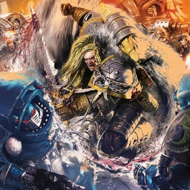

# 0783 007.M31 阿拉克斯星云之战 Battle of the Alaxxes Nebula

精校状态：中文行文已逐段精校，部分术语仍为暂定

分类：时间线

原文来源：https://www.bilibili.com/opus/1199964526274936834

原作者：帝国神选罐头

原文时间：2026年05月08日 15:55

[返回分类目录](目录.md) · [全书目录](../../目录.md)

原篇名：007.M31 阿拉克西斯星云之战 Battle of the Alaxxes Nebula

<!-- A0783-B0001 -->
**英文原文**

The Battle of the Alaxxes Nebula was a battle during the Horus Heresy.

<!-- /A0783-B0001 -->

<!-- A0783-B0002 -->

原译文

阿拉克西斯星云之战是荷鲁斯叛乱时期的一场战斗。

**校订译文**

阿拉克斯星云之战是荷鲁斯之乱期间的一场战斗。

<!-- /A0783-B0002 -->

<!-- A0783-B0003 图片 -->

<!-- A0783-B0004 -->

原译文

Leman Russ leads his Legion into battle against the Alpha Legion 黎曼·鲁斯带领他的军团与阿尔法军团作战

**校订译文**

Leman Russ leads his Legion into battle against the Alpha Legion 黎曼·鲁斯带领他的军团与阿尔法军团作战

<!-- /A0783-B0004 -->

<!-- A0783-B0005 -->
**英文原文**

Conflict:Horus Heresy

<!-- /A0783-B0005 -->

<!-- A0783-B0006 -->

原译文

冲突：荷鲁斯叛乱

**校订译文**

冲突：荷鲁斯之乱

<!-- /A0783-B0006 -->

<!-- A0783-B0007 -->
**英文原文**

Date:007.M31

<!-- /A0783-B0007 -->

<!-- A0783-B0008 -->

原译文

日期：007.M31

**校订译文**

日期：007.M31

<!-- /A0783-B0008 -->

<!-- A0783-B0009 -->
**英文原文**

Location:Alaxxes Nebula

<!-- /A0783-B0009 -->

<!-- A0783-B0010 -->

原译文

地点：阿拉克西斯星云

**校订译文**

地点：阿拉克斯星云

<!-- /A0783-B0010 -->

<!-- A0783-B0011 -->
**英文原文**

Outcome:Strategic Imperial Victory, Space Wolves escape

<!-- /A0783-B0011 -->

<!-- A0783-B0012 -->

原译文

结果：帝国战略胜利，太空野狼逃离

**校订译文**

结果：帝国取得战略胜利，太空野狼成功脱身

<!-- /A0783-B0012 -->

<!-- A0783-B0013 -->
**英文原文**

Combatants:Imperium/Traitors

<!-- /A0783-B0013 -->

<!-- A0783-B0014 -->

原译文

作战方：帝国/叛徒

**校订译文**

作战方：帝国/叛徒

<!-- /A0783-B0014 -->

<!-- A0783-B0015 -->
**英文原文**

Commanders:Leman Russ, Bjorn, Gunnar Gunnhilt (KIA), Ogvai Ogvai Helmschrot, Hemtal (KIA), Hvarl Red-Blade, Althalos/Alpharius

<!-- /A0783-B0015 -->

<!-- A0783-B0016 -->

原译文

指挥官：黎曼·鲁斯，比约恩，加纳·甘希尔特(KIA)，奥格瓦伊·残盔，海姆达尔(KIA)，哈瓦尔·红刃，阿尔萨洛斯/阿尔法瑞斯

**校订译文**

指挥官：黎曼·鲁斯、比约恩、加纳·甘希尔特（阵亡）、奥格瓦伊·残盔、海姆达尔（阵亡）、哈瓦尔·红刃、阿尔萨洛斯／阿尔法瑞斯

**校注：** 英文Ogvai重复两次，中文只保留一次；同名首领Gunn为Gunnar简称。

<!-- /A0783-B0016 -->

<!-- A0783-B0017 -->
**英文原文**

Strength:Bulk of Space Wolves Legion, Dark Angels contingent/Bulk of Alpha Legion

<!-- /A0783-B0017 -->

<!-- A0783-B0018 -->

原译文

力量：太空野狼军团的大部分、黑暗天使分遣队/阿尔法军团的大部分

**校订译文**

兵力：太空野狼军团主力、黑暗天使分遣队／阿尔法军团主力

<!-- /A0783-B0018 -->

<!-- A0783-B0019 -->
**英文原文**

Casualties:Unknown, presumably heavy/Unknown

<!-- /A0783-B0019 -->

<!-- A0783-B0020 -->

原译文

伤亡：未知，可能很重/未知

**校订译文**

伤亡：不详，推测损失惨重／不详

<!-- /A0783-B0020 -->

<!-- A0783-B0021 -->
## Overview 概述

<!-- /A0783-B0021 -->

<!-- A0783-B0022 -->
**英文原文**

While the Space Wolves were still licking their wounds following unexpectedly heavy losses in the Burning of Prospero, the loyalist Legion was ambushed by a sizable Alpha Legion force. The Space Wolves were sent reeling from the attack. Leman Russ organised an immediate retreat, fleeing to the Alaxxes Nebula. The Alpha Legion was able to pursue the Wolves to the Nebula, and the Sons of Russ found themselves completely surrounded and under siege. Russ sent out a distress signal to his nearby brother Primarch Jaghatai Khan of the White Scars, still mostly unaware of the Heresy. After receiving a message from Horus that Russ was in fact the traitor, the Great Khan was skeptical as to who he should side with, particularly after he hears of the Space Wolves razing of Prospero. Jaghatai Khan decided to not aid Russ, instead setting course for Prospero to find out the truth of this civil war for himself.

<!-- /A0783-B0022 -->

<!-- A0783-B0023 -->

原译文

当太空野狼在普罗斯佩罗之焚的意外重大损失后仍在舔舐伤口时，忠诚派军团遭到了相当大的阿尔法军团的伏击。太空野狼在袭击中步履蹒跚。黎曼·鲁斯立即组织了撤退，逃到了阿拉克西斯星云。阿尔法军团能够追击野狼到星云，而鲁斯之子发现自己完全被包围和围困。鲁斯向他附近的兄弟白色伤疤原体察合台可汗发出了求救信号，他仍然对叛乱一无所知。在收到荷鲁斯的消息，说鲁斯实际上是叛徒后，大汗怀疑他应该站在谁一边，尤其是在他听说太空野狼夷平普罗斯佩罗之后。察合台可汗决定不帮助鲁斯，而是前往普罗斯佩罗自己找出这场内战的真相。

**校订译文**

普罗斯佩罗之焚给太空野狼造成了出乎意料的惨重伤亡。他们尚未恢复元气，便遭到一支庞大的阿尔法军团部队伏击，阵脚大乱。黎曼·鲁斯立即组织撤退，进入阿拉克斯星云。然而，阿尔法军团一路追来，将鲁斯之子彻底包围、困住。鲁斯向附近的兄弟原体、白疤的察合台可汗求援。可汗当时对叛乱仍知之甚少，又收到荷鲁斯发来的讯息，称鲁斯才是叛徒。尤其是在听说太空野狼摧毁普罗斯佩罗之后，他更无法确定应当支持哪一方。最终，察合台可汗决定不援助鲁斯，而是亲赴普罗斯佩罗，查明这场内战的真相。

**校注：** 仍不了解叛乱的是求援对象察合台可汗；原译他指代容易误落在鲁斯。

<!-- /A0783-B0023 -->

<!-- A0783-B0024 -->
**英文原文**

Realizing his situation was now hopeless, Russ consigned himself to defeat and locked himself in his private chambers aboard the Hrafnkel. During a conversation with Bjorn Russ came to terms with his past as the Emperor's "Executioner", realizing it had done nothing but brought ruin upon the Space Wolves. First Captain Gunnar Gunnhilt was forced to take command of the Legion, leading a desperate breakout attempt that saw the Wolves facing certain destruction. However at the climax of the battle Russ reappeared at the command, moved by the words of Bjorn and pledging to forge his own path from now on and not simply live as the Emperor's Executioner. Reinvigorated, First Captain Gunn sacrificed himself along with his ship Ragnarok in an attempt to destroy the Alpha Legion Battleship Delta and allow for the Wolves' escape. However though the Delta was destroyed, the Alpha Legion were still able to catch up with the fleeing Space Wolves fleet.

<!-- /A0783-B0024 -->

<!-- A0783-B0025 -->

原译文

意识到自己的处境已经无望，鲁斯屈服于失败，把自己锁在赫拉芬克尔号上的私人房间里。在与比约恩的谈话中，鲁斯接受了自己作为帝皇的“刽子手”的过去，意识到这只会给太空野狼带来毁灭。第一连长加纳·甘希尔特被迫接管军团的指挥权，领导了一场绝望的突围尝试，野狼面临着注定的毁灭。然而，在战斗的高潮，鲁斯再次出现在指挥部，被比约恩的话所感动，并承诺从现在开始开辟自己的道路，而不仅仅是作为帝皇的刽子手生活。重新振作后，第一连长加纳和他的船诸神黄昏号一起牺牲了自己，试图摧毁阿尔法军团战列舰德尔塔号，让野狼逃脱。然而，尽管德尔塔号被摧毁，阿尔法军团仍然能够追赶上逃跑的太空野狼舰队。

**校订译文**

鲁斯眼见局面无望，认定败局已定，将自己关进赫拉芬克尔号的私人舱室。与比约恩交谈时，他重新审视了自己作为帝皇“刽子手”的过往，意识到这一身份只给太空野狼带来了毁灭。第一连长加纳·甘希尔特被迫接过军团指挥权，率军绝望突围，野狼却似乎仍难逃覆灭。然而，战斗最激烈时，受到比约恩劝说的鲁斯重新返回指挥岗位，誓言从此走自己的道路，不再只做帝皇的刽子手。士气由此重振。第一连长加纳牺牲自己和诸神黄昏号，试图摧毁阿尔法军团战列舰德尔塔号，为野狼打开逃生通路。虽然德尔塔号被毁，阿尔法军团仍追上了撤退的太空野狼舰队。

<!-- /A0783-B0025 -->

<!-- A0783-B0026 -->
**英文原文**

A vicious final battle erupted which saw Leman Russ seemingly battle Alpharius himself disguised as a standard Alpha Legion Terminator. However rescue for the Wolves came from an unexpected source. A Dark Angels Star Fort Chimaera ostensibly loyal to Luther arrived, having heard Russ' distress signal and determining the Wolves were the true loyalists. With the help of the Dark Angels, the loyalists were able to force the Alpha Legion to withdraw. Victorious, it is revealed that the Dark Angels contingent under Captain Ormand was completely unaware of the events of the Heresy or the crisis erupting on Caliban. Russ informed Ormand and the Dark Angels Chapter Master Althalos the sad news of the Heresy, in exchange for men and material. After hearing the news, the Dark Angels commanders led their forces back towards Caliban while Russ decided to set course of Terra.

<!-- /A0783-B0026 -->

<!-- A0783-B0027 -->

原译文

一场激烈的最后一战爆发了，黎曼·鲁斯似乎与伪装成标准阿尔法军团终结者的阿尔法瑞斯本人作战。然而，野狼的救援来自一个意想不到的来源。一位表面上忠于卢瑟的黑暗天使星堡奇美拉号抵达，他听到了鲁斯的求救信号，并确定野狼是真正的忠诚者。在黑暗天使的帮助下，忠诚者能够迫使阿尔法军团撤退。胜利后，据透露，奥曼德连长率领的黑暗天使分遣队完全不知道叛乱事件或卡利班爆发的危机。鲁斯向奥曼德和黑暗天使战团长阿尔萨洛斯通报了叛乱的悲惨消息，以换取人员和物资。听到这个消息后，黑暗天使指挥官带领他们的部队回到卡利班，而鲁斯决定设定特拉的航向。

**校订译文**

最后一场恶战随即爆发。黎曼·鲁斯似乎亲自迎战了阿尔法瑞斯，后者伪装成一名普通阿尔法军团终结者。就在此时，野狼获得了意想不到的援助：表面上效忠卢瑟的黑暗天使星堡奇美拉号闻讯赶到，其指挥官收到了鲁斯的求救信号，并判断太空野狼才是真正的忠诚派。在黑暗天使协助下，忠诚派迫使阿尔法军团撤退。胜利后，鲁斯才得知，奥曼德连长率领的这支黑暗天使分遣队对叛乱、乃至卡利班发生的危机都一无所知。他向奥曼德和战团长阿尔萨洛斯讲述了叛乱的噩耗，并获得人员与物资补充。得知消息后，黑暗天使指挥官率军返回卡利班，鲁斯则决定驶向泰拉。

**校注：** 英文in exchange for men and material直作以消息换补给，因果略显简化；正文保持告知消息并获得补充的事件关系，不拟造交易条件。

<!-- /A0783-B0027 -->

本篇核心术语与暂定项

以下列出本篇出现的英文原形及核心术语表用词。同形词可能指不同对象，具体词义以本篇正文和校注为准；单复数、别名和仅见于图注的名称可能尚未列入。完整候选见[术语表](../../术语表/双语术语候选.csv)。

| 英文 | 采用中文 | 状态 |
| --- | --- | --- |
| Dark Angels | 黑暗天使 | 官方已核对 |
| Space Wolves | 太空野狼 | 官方已核对 |
| Terminator | 终结者 | 官方已核对 |
| Horus Heresy | 荷鲁斯之乱 | 官方已核对 |
| Imperium | 帝国 | 暂定·简称 |
| Emperor | 帝皇 | 官方已核对 |
| Primarch | 原体 | 官方已核对 |
| Terra | 泰拉 | 暂定·官方待核 |
| Horus | 荷鲁斯 | 暂定·官方待核 |
| Caliban | 卡利班 | 暂定·官方待核 |
| Master | 导师（审判庭职衔）／舰务官（舰员职务） | 语境定译·官方待核 |
| White Scars | 白疤 | 官方已核 |
| Alpha Legion | 阿尔法军团 | 暂定·官方待核 |
| Scars | 伤疤 | 暂定·官方待核 |
| First Captain | 第一连长 | 暂定·官方待核 |
| Gunnar Gunnhilt | 加纳·甘希尔特 | 暂定·官方待核 |
| Chapter | 战团 | 暂定·官方待核 |
| Chapter Master | 战团长 | 暂定·官方待核 |
| Captain | 连长 | 暂定·官方待核 |
| Brother | 修士 | 暂定·官方待核 |
| Alpharius | 阿尔法瑞斯 | 暂定·官方待核 |
| Alaxxes Nebula | 阿拉克斯星云 | 暂定·官方待核 |
| Jaghatai Khan | 察合台可汗 | 暂定·官方待核 |
| Hrafnkel | 赫拉芬克尔号 | 暂定·官方待核 |
| Althalos | 阿尔萨洛斯 | 暂定·官方待核 |
| Ormand | 奥曼德 | 暂定·官方待核 |
| The Great Khan | 大汗 | 暂定·官方待核 |
| The Dark | 《黑暗》 | 暂定·官方待核 |
| Ogvai Ogvai Helmschrot | 奥格瓦伊·残盔 | 暂定·官方待核 |

