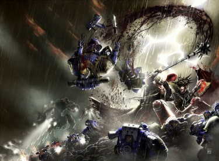

# 0784 007-008.M31 暗影远征 Shadow Crusade

精校状态：中文行文已逐段精校，部分术语仍为暂定

分类：时间线

原文来源：https://www.bilibili.com/opus/1201336755440058390

原作者：帝国神选罐头

原文时间：2026年05月12日 08:40

[返回分类目录](目录.md) · [全书目录](../../目录.md)

<!-- A0784-B0001 -->
**英文原文**

The Shadow Crusade was a campaign of the Horus Heresy. Making up the second theater of the Eastern Fringe campaign of the Heresy alongside the Calth Front, it was a campaign by the Word Bearers and World Eaters against the 500 worlds of Ultramar.

<!-- /A0784-B0001 -->

<!-- A0784-B0002 -->

原译文

暗影远征是荷鲁斯叛乱的一场战役。这是叛乱的东部边缘战役的第二个战场，与考斯前线一起，是怀言者和吞世者对抗奥特拉玛500世界的战役。

**校订译文**

暗影远征是荷鲁斯之乱期间，怀言者与吞世者进攻奥特拉玛五百世界的一场战役。它构成了叛乱中银河东部边缘战役的第二战区，与考斯战线并行。

<!-- /A0784-B0002 -->

<!-- A0784-B0003 图片 -->

<!-- A0784-B0004 -->

原译文

Angron and Lorgar battle Ultramarines in the Shadow Crusade 安格隆和珞珈在暗影远征中与极限战士作战

**校订译文**

Angron and Lorgar battle Ultramarines in the Shadow Crusade 安格隆和珞珈在暗影远征中与极限战士作战

<!-- /A0784-B0004 -->

<!-- A0784-B0005 -->
**英文原文**

Conflict:Horus Heresy

<!-- /A0784-B0005 -->

<!-- A0784-B0006 -->

原译文

冲突：荷鲁斯叛乱

**校订译文**

冲突：荷鲁斯之乱

<!-- /A0784-B0006 -->

<!-- A0784-B0007 -->
**英文原文**

Date:007-008.M31 (Main Phase, conflict rages throughout the entire Heresy)

<!-- /A0784-B0007 -->

<!-- A0784-B0008 -->

原译文

日期：007-008.M31（主阶段，冲突在整个叛乱中扩散）

**校订译文**

日期：007—008.M31（主要阶段；冲突延续至荷鲁斯之乱全程）

<!-- /A0784-B0008 -->

<!-- A0784-B0009 -->
**英文原文**

Location:Ultramar, Nuceria

<!-- /A0784-B0009 -->

<!-- A0784-B0010 -->

原译文

地点：奥特拉玛，努凯里亚

**校订译文**

地点：奥特拉玛，努凯里亚

<!-- /A0784-B0010 -->

<!-- A0784-B0011 -->
**英文原文**

Outcome:Strategic Traitor Victory, Ruinstorm created, Ultramar isolated, Tactical Loyalist Victory, Ultramar mostly defended

<!-- /A0784-B0011 -->

<!-- A0784-B0012 -->

原译文

结果：战略上叛徒胜利，毁灭风暴被创造，奥特拉玛被孤立，实际忠诚派胜利，奥特拉玛大部分被防御

**校订译文**

结果：叛军取得战略胜利，毁灭风暴形成，奥特拉玛被隔绝；忠诚派取得战术胜利，守住了奥特拉玛大部分地区

<!-- /A0784-B0012 -->

<!-- A0784-B0013 -->
**英文原文**

Combatants:Traitors/Imperium

<!-- /A0784-B0013 -->

<!-- A0784-B0014 -->

原译文

作战方：叛徒/帝国

**校订译文**

作战方：叛徒/帝国

<!-- /A0784-B0014 -->

<!-- A0784-B0015 -->
**英文原文**

Commanders:Primarch Lorgar, Primarch Angron, Vel-Kheredar, Erebus, Kharn, Argel Tal (KIA), Vorias (KIA), Centurion Delvarus, Princeps Venric Solostine (KIA)/Primarch Roboute Guilliman, Primarch Lion El'Jonson (Later), Orfeo Cassandar(KIA), Princeps Maxamillien Delantry (KIA)

<!-- /A0784-B0015 -->

<!-- A0784-B0016 -->

原译文

指挥官：原体珞珈，原体安格隆，维尔-赫雷达尔，艾瑞巴斯，卡恩，安格尔·塔尔(KIA)，沃里亚斯(KIA)，百夫长德尔瓦鲁斯，首席文里克·索洛斯汀(KIA)/原体罗伯特·基里曼，原体莱昂·艾尔庄森(后期)，奥尔菲欧·卡桑达尔(KIA)，首席马克西米利安·德兰特里(KIA)

**校订译文**

指挥官：原体珞珈、原体安格隆、维尔-赫雷达尔、艾瑞巴斯、卡恩、阿格尔·塔尔（阵亡）、沃里亚斯（阵亡）、百夫长德尔瓦鲁斯、首席文里克·索洛斯汀（阵亡）／原体罗保特·基里曼、原体莱昂·艾尔’庄森（后期）、奥尔菲欧·卡桑达尔（阵亡）、首席马克西米利安·德兰特里（阵亡）

<!-- /A0784-B0016 -->

<!-- A0784-B0017 -->
**英文原文**

Strength:100,000 Word Bearers, 150,000 World Eaters, Legio Audax, Legio Suturvora, Legio Mordaxis, Two Furious Abyss class Battleships, Night Lords elements/Ultramarines, Dark Angels (Later), Ultramar Auxilia, Legio Lysanda, Legio Oberon, Legio Praesagius

<!-- /A0784-B0017 -->

<!-- A0784-B0018 -->

原译文

力量：10万怀言者，15万吞世者，莽勇军团，苏图沃拉军团，噬心军团，两艘狂怒深渊级战列舰，午夜领主成员/极限战士，黑暗天使(后期)，奥特拉玛辅助军，莱山达军团，奥伯龙军团，厄兆军团

**校订译文**

兵力：100,000名怀言者、150,000名吞世者、莽勇军团、苏图沃拉军团、噬心军团、两艘狂怒深渊级战列舰、午夜领主部分兵力／极限战士、黑暗天使（后期）、奥特拉玛辅助军、莱山达军团、仙王军团、预兆军团

<!-- /A0784-B0018 -->

<!-- A0784-B0019 -->
**英文原文**

Casualties:At least 50,000 Word Bearers, Tens of thousands of World Eaters, Fidelitas Lex/Heavy losses for the Ultramarines, ~100 worlds ruined

<!-- /A0784-B0019 -->

<!-- A0784-B0020 -->

原译文

伤亡：至少5万名怀言者，数万名吞世者，信仰之律号/极限战士损失重大，约100个世界被毁

**校订译文**

伤亡：至少50,000名怀言者、数万名吞世者，以及信仰之律号／极限战士损失惨重，约一百个世界遭到毁坏

<!-- /A0784-B0020 -->

<!-- A0784-B0021 -->
## Overview 概述

<!-- /A0784-B0021 -->

<!-- A0784-B0022 -->
**英文原文**

During the Word Bearers offensive against the Ultramarines in the Battle of Calth, Lorgar led another contingent of Word Bearers in conjunction with Angron and his World Eaters targeting the rest of Ultramar. The ultimate goal of Lorgar was to create a massive Warp storm known as the Ruinstorm, which would create an impenetrable veil around Ultramar and the eastern half of the Galaxy, cutting off the largest of the Emperor's Legions from Terra. The Ruinstorm had first been summoned by Erebus during the Battle of Calth, but to mature it fully Lorgar needed to unleash a campaign of bloodshed and misery.

<!-- /A0784-B0022 -->

<!-- A0784-B0023 -->

原译文

在考斯之战中，在怀言者对极限战士的进攻中，珞珈带领另一支怀言者分遣队与安格隆和他的怀言者一起瞄准奥特拉玛的其他地区。珞珈的最终目标是制造一场被称为毁灭风暴的巨大亚空间风暴，这将在奥特拉玛和银河系东半部周围制造一道无法穿透的帷幕，将帝皇最大的军团与泰拉隔绝。毁灭风暴最初是由艾瑞巴斯在考斯之战中召唤的，但为了使其完全成熟，珞珈需要发动一场流血和痛苦的战役。

**校订译文**

怀言者在考斯之战中进攻极限战士时，珞珈率另一支怀言者部队，与安格隆及其吞世者联合，攻击奥特拉玛其余地区。珞珈的最终目标是壮大名为毁灭风暴的巨型亚空间风暴，让奥特拉玛与银河东半部笼罩在无法穿透的帷幕中，将帝皇规模最大的军团与泰拉隔绝。艾瑞巴斯已在考斯之战中初步召来毁灭风暴，但要让它完全成形，珞珈还需要一场充满杀戮与苦难的远征。

**校注：** 安格隆所率为吞世者，原译误为怀言者。

<!-- /A0784-B0023 -->

<!-- A0784-B0024 -->
**英文原文**

The Word Bearers and World Eaters launched a far bloodier and reckless offensive on their way across the eastern Galaxy, rampaging across the 500 worlds of Ultramar. Initially the two legions were on tense terms, as Angron delayed the advance by insisting on the butchering of entire worlds of little strategic value. The tensions between Angron and Lorgar boiled over to a standoff that was only interrupted by an attack by Dark Eldar.

<!-- /A0784-B0024 -->

<!-- A0784-B0025 -->

原译文

怀言者和吞世者在穿越银河系东部的途中发动了一场更加血腥和鲁莽的进攻，在奥特拉玛500世界肆虐。起初，这两个军团关系紧张，因为安格隆坚持屠杀整个战略价值不大的世界，从而推迟了进攻。安格隆和珞珈之间的紧张关系演变成对峙，直到黑暗灵族的袭击才中断。

**校订译文**

怀言者与吞世者横扫银河东部，在奥特拉玛五百世界肆虐，展开了更为血腥而不计后果的攻势。起初，两军团关系紧张，因为安格隆执意屠灭一些战略价值不大的世界，拖慢了推进。两位原体之间的矛盾最终升级为正面对峙，直到黑暗灵族来袭，才被迫中断。

<!-- /A0784-B0025 -->

<!-- A0784-B0026 -->
**英文原文**

One of the most pitched of the campaign was the Battle of Armatura, where the traitor fleet led by two gigantic Furious Abyss-class battleships smashed through massive Ultramarine defenses. During the butchery Lorgar realized that Angron's fury was consuming him as the Butcher's Nails could not handle a Primarch's brain. Lorgar, wishing Angron be elevated to serve the Dark Gods, decided to journey to his homeworld of Nuceria to find the secrets of the Butcher's Nails. While Lorgar led a small force to Angron's world, the rest of the traitor fleet splintered into many small parties which brought destruction upon every Ultramar world they encountered. Talassar and Percepton are other worlds that are known to have been attacked by the traitors.

<!-- /A0784-B0026 -->

<!-- A0784-B0027 -->

原译文

这场战役中最激烈的战斗之一是阿马图拉之战，在那里，由两艘巨大的狂怒深渊级战列舰率领的叛徒舰队冲破了巨大的极限战士防御。在屠杀过程中，珞珈意识到安格隆的愤怒正在吞噬他，因为屠夫之钉无法处理一个原体的大脑。珞珈希望安格隆能升格为黑暗诸神服务，于是决定前往他的家园世界努凯里亚，寻找屠夫之钉的秘密。当珞珈率领一支小部队前往安格隆的世界时，其余的叛徒舰队分裂成许多小分队，给他们遇到的每个奥特拉玛世界带来了毁灭。塔拉萨和洞察星是已知被叛徒袭击的其他世界。

**校订译文**

远征中最激烈的战斗之一是阿玛图拉之战。叛军舰队以两艘巨型狂怒深渊级战列舰为前锋，突破了极限战士的强大防御。杀戮之中，珞珈意识到，屠夫之钉无法适应原体的大脑，安格隆正被自身狂怒逐渐吞噬。珞珈希望让安格隆升格，为黑暗诸神效力，于是决定前往他的母星努凯里亚，寻找屠夫之钉的秘密。珞珈率少量兵力前往努凯里亚，其余叛军舰队则分成许多小队，摧毁沿途遇到的每一个奥特拉玛世界。塔拉萨与洞察星，也是已知遭到袭击的世界。

<!-- /A0784-B0027 -->

<!-- A0784-B0028 -->
**英文原文**

When the two Primarchs arrived at Nuceria however they discovered that the slave-lords of the world had massacred Angron's comrades and told the population that he had fled during their last stand. Infuriated, Angron ordered that the World Eaters and Word Bearers purge Nuceria of its population. During the ensuing battle, the Ultramarines led by Guilliman arrived, determined to exact vengeance on the traitors for the Battle of Calth. The three immensely powerful but vastly outnumbered traitor Battleships (Conqueror, Fidelitas Lex, and Trisagion) faced a rag-tag Ultramarines fleet of 40 smaller vessels. The ensuing battle in space was nearly even, in large part thanks to the vast power of the Trisagion. However due to their numbers Ultramarines vessels were able to move past the traitor blockade and land forces on Nuceria. They also managed to bring down the Fidelias Lex, losing twelve ships in the process.

<!-- /A0784-B0028 -->

<!-- A0784-B0029 -->

原译文

然而，当两位原体抵达努凯里亚时，他们发现世界上的奴隶主屠杀了安格隆的同伴，并告诉民众，他在最后一次抵抗时逃跑了。愤怒的安格隆命令吞世者和怀言者清除努凯里亚的人口。在随后的战斗中，由基里曼率领的极限战士抵达，决心为考斯之战向叛徒报仇。三艘强大但寡不敌众的叛徒战列舰（征服者号、信仰之律号和三圣颂号）面对着一支由40艘小型战舰组成的混杂的极限战士舰队。随后在太空中的战斗几乎势均力敌，这在很大程度上要归功于三圣颂号的巨大力量。然而，由于他们的数量，极限战士的战舰能够越过叛徒封锁和努凯里亚的部队。他们还设法击落了信仰之律号，在此过程中损失了12艘舰船。

**校订译文**

两位原体抵达努凯里亚后发现，当地奴隶主不仅屠杀了安格隆昔日的同伴，还宣称他在最后一战时临阵逃脱。安格隆怒不可遏，命令吞世者与怀言者屠尽努凯里亚居民。战斗期间，基里曼率极限战士赶到，决心为考斯复仇。征服者号、信仰之律号与三圣颂号这三艘威力惊人、数量却处于绝对劣势的叛军战列舰，迎战一支由四十艘较小舰船拼凑而成的极限战士舰队。凭借三圣颂号的强大火力，双方在虚空中战得近乎势均力敌。然而，极限战士依靠数量优势，突破叛军封锁，将部队送上努凯里亚。他们还以损失十二艘舰船为代价，击沉了信仰之律号。

**校注：** land forces on Nuceria为将部队登陆努凯里亚，原译漏掉登陆行动；Fidelias Lex为Fidelitas Lex异拼。

<!-- /A0784-B0029 -->

<!-- A0784-B0030 -->
**英文原文**

On the ground, loyalist and traitor astartes and Titans began to engage each other in pitched combat. Lorgar went on to duel Guilliman himself during the battle, and the two were largely evenly matched. However Angron then arrived, and defeated the Primarch in a furious rage. But while Guilliman managed to escape thanks to an intervention by nearby Ultramarines, this was precisely what Lorgar had wanted and the Word Bearers Primarch began a Khornate ritual. Using Angron's rage as a conduit, Lorgar channeled the power of Khorne and surged the Red Angel with the powers of Chaos. Angron was transformed into a hulking, even more bloodthirsty avatar of violence and rage that had overcome the debilitating effects of the Butcher's Nails. With his brother empowered and the Ruinstorm now at its crescendo, the traitor fleet withdrew.

<!-- /A0784-B0030 -->

<!-- A0784-B0031 -->

原译文

在地面上，忠诚派和叛徒阿斯塔特和泰坦开始进行激战。珞珈在战斗中亲自与基里曼决斗，两人基本势均力敌。然而，安格隆随后到达，并在愤怒中击败了原体。但是，尽管基里曼在附近的极限战士的干预下设法逃脱，但这正是珞珈想要的，怀言者原体开始了恐虐仪式。珞珈以安格隆的愤怒为渠道，引导恐虐的力量，用混沌的力量增强红天使。安格隆变成了一个庞大的、更嗜血的暴力和愤怒的化身，克服了屠夫之钉的衰弱影响。随着他的兄弟获得力量，毁灭风暴现在达到高潮，叛徒舰队撤退了。

**校订译文**

在地面，双方阿斯塔特与泰坦展开激战。珞珈亲自与基里曼交锋，两人大体势均力敌。随后安格隆赶来，在狂怒中击败了基里曼。附近的极限战士及时介入，让自己的原体得以脱身；而战斗激起的狂怒，恰恰为珞珈的计划创造了条件。怀言者原体开始举行恐虐仪式，以安格隆的愤怒为通道，引来恐虐之力，让混沌力量灌注红天使全身。安格隆化为体形庞大、更加嗜血的暴力与狂怒化身，超越了屠夫之钉对肉身造成的衰败。兄弟获得力量，毁灭风暴也达到顶峰，叛军舰队随即撤离。

**校注：** 原句this指代较松，结合后句Using Angron’s rage按狂怒推动升格仪式处理；未把基里曼逃走说成仪式必须条件。

<!-- /A0784-B0031 -->

<!-- A0784-B0032 -->
**英文原文**

Thanks to the mass carnage and pain unleashed, the Word Bearers were successful in strengthening the Ruinstorm, creating havoc across Ultima Segmentum and effectively dividing the Imperium in half. Those loyalist legions now isolated from Terra; not only the Ultramarines but also Dark Angels and Blood Angels, were forced to muster at Macragge where Guilliman eventually formed Imperium Secundus. The Dark Angels continued to purge traitor forces from Ultramar during the hunt for Konrad Curze, most notably during the Battle of Zepath.

<!-- /A0784-B0032 -->

<!-- A0784-B0033 -->

原译文

由于大规模的屠杀和痛苦的释放，怀言者成功地加强了毁灭风暴，在极限星域造成了严重破坏，并有效地将帝国一分为二。那些忠诚派军团现在与泰拉隔绝了；不仅是极限战士，还有黑暗天使和圣血天使，被迫在马库拉格集结，基里曼最终在那里建立了第二帝国。在追捕康拉德·科兹的过程中，黑暗天使继续从奥特拉玛清除叛徒部队，尤其是在泽帕斯之战中。

**校订译文**

大规模杀戮与痛苦让怀言者成功壮大毁灭风暴，在极限星域掀起浩劫，将帝国实际上一分为二。与泰拉隔绝的忠诚派军团，不仅包括极限战士，还有黑暗天使与圣血天使，被迫在马库拉格集结。基里曼最终在那里建立了第二帝国。此后，黑暗天使在追捕康拉德·科兹的过程中继续肃清奥特拉玛的叛军，泽帕斯之战是其中最著名的战斗之一。

<!-- /A0784-B0033 -->

<!-- A0784-B0034 -->
**英文原文**

Even after Terra became the focus of the war and the Primarchs left to wage battle elsewhere, fighting continued to rage in Ultramar from remnants of the Shadow Crusade. These included the Butcher Fleets of the World Eaters and the Argolian Massacres of the Word Bearers.

<!-- /A0784-B0034 -->

<!-- A0784-B0035 -->

原译文

即使在泰拉成为战争的焦点，原体离开去其他地方作战之后，由于暗影远征的残余，奥特拉玛的战斗仍在继续。其中包括吞世者的屠夫舰队和怀言者的阿尔戈利安大屠杀。

**校订译文**

即使泰拉成为战争中心、原体们也已转战他处，暗影远征的残余部队仍在奥特拉玛延续战火。其中包括吞世者的屠夫舰队，以及怀言者实施的阿尔戈利安大屠杀。

<!-- /A0784-B0035 -->

<!-- A0784-B0036 -->
## Notable Battles of the Shadow Crusade 暗影远征的重要战斗

原题：Notable Battles of the Shadow Crusade 著名暗影远征战斗

<!-- /A0784-B0036 -->

<!-- A0784-B0037 -->

原译文

The Battle of Armatura 阿玛图拉之战

**校订译文**

The Battle of Armatura 阿玛图拉之战

<!-- /A0784-B0037 -->

<!-- A0784-B0038 -->

原译文

The purging of Nuceria 努凯里亚清洗

**校订译文**

The purging of Nuceria 努凯里亚清洗

<!-- /A0784-B0038 -->

<!-- A0784-B0039 -->

原译文

The Percepton Campaign 洞察战役

**校订译文**

The Percepton Campaign 洞察战役

<!-- /A0784-B0039 -->

<!-- A0784-B0040 -->

原译文

The Battle of Zepath 泽帕斯之战

**校订译文**

The Battle of Zepath 泽帕斯之战

<!-- /A0784-B0040 -->

<!-- A0784-B0041 -->

原译文

The Crusade of Iron 钢铁远征

**校订译文**

The Crusade of Iron 钢铁远征

<!-- /A0784-B0041 -->

<!-- A0784-B0042 -->

原译文

Betrayal at Ithraca 伊萨卡背叛

**校订译文**

Betrayal at Ithraca 伊萨卡背叛

<!-- /A0784-B0042 -->

<!-- A0784-B0043 -->

原译文

Defence of the Three Planets 三星防御

**校订译文**

Defence of the Three Planets 三星保卫战

<!-- /A0784-B0043 -->

<!-- A0784-B0044 -->

原译文

Defence of Tyros 泰罗斯防御

**校订译文**

Defence of Tyros 泰罗斯保卫战

<!-- /A0784-B0044 -->

<!-- A0784-B0045 -->

原译文

Doom of Bormina 博尔米纳毁灭

**校订译文**

Doom of Bormina 博尔米纳毁灭

<!-- /A0784-B0045 -->

<!-- A0784-B0046 -->

原译文

Purging of Haverlund 哈弗伦德清洗

**校订译文**

Purging of Haverlund 哈弗伦德清洗

<!-- /A0784-B0046 -->

<!-- A0784-B0047 -->

原译文

Battle of Anuari 安努阿里之战

**校订译文**

Battle of Anuari 安努阿里之战

<!-- /A0784-B0047 -->

<!-- A0784-B0048 -->

原译文

Argolian Massacres 阿尔戈利安大屠杀

**校订译文**

Argolian Massacres 阿尔戈利安大屠杀

<!-- /A0784-B0048 -->

本篇核心术语与暂定项

以下列出本篇出现的英文原形及核心术语表用词。同形词可能指不同对象，具体词义以本篇正文和校注为准；单复数、别名和仅见于图注的名称可能尚未列入。完整候选见[术语表](../../术语表/双语术语候选.csv)。

| 英文 | 采用中文 | 状态 |
| --- | --- | --- |
| Blood Angels | 圣血天使 | 官方已核对 |
| Dark Angels | 黑暗天使 | 官方已核对 |
| World Eaters | 吞世者 | 官方已核对 |
| Eldar | 灵族 | 暂定·语境区分 |
| Dark Eldar | 黑暗灵族 | 暂定·旧称对应 |
| Roboute Guilliman | 罗保特·基里曼 | 官方已核对 |
| Ultramar | 奥特拉玛 | 官方已核对 |
| Ultramarines | 极限战士 | 官方已核对 |
| Horus Heresy | 荷鲁斯之乱 | 官方已核对 |
| Warp | 亚空间 | 官方已核对 |
| Imperium | 帝国 | 暂定·简称 |
| Khorne | 恐虐 | 官方已核对 |
| Emperor | 帝皇 | 官方已核对 |
| Primarch | 原体 | 官方已核对 |
| Word Bearers | 怀言者 | 暂定·官方待核 |
| Night Lords | 午夜领主 | 暂定·官方待核 |
| Terra | 泰拉 | 暂定·官方待核 |
| Horus | 荷鲁斯 | 暂定·官方待核 |
| Erebus | 艾瑞巴斯 | 暂定·官方待核 |
| Lion El'Jonson | 莱昂·艾尔’庄森 | 官方已核对 |
| Ultima Segmentum | 极限星域 | 暂定·官方待核 |
| Segmentum | 星域 | 暂定·官方待核 |
| Eastern Fringe | 东部边缘 | 暂定·官方待核 |
| Konrad Curze | 康拉德·科兹 | 暂定·官方待核 |
| Nuceria | 努凯里亚 | 暂定·官方待核 |
| Calth | 考斯 | 暂定·官方待核 |
| Macragge | 马库拉格 | 暂定·官方待核 |
| Imperium Secundus | 第二帝国 | 暂定·官方待核 |
| Argel Tal | 阿格尔·塔尔 | 暂定·官方待核 |
| Veil | 韦尔 | 暂定·官方待核 |
| Princeps | 首席 | 暂定·官方待核 |
| The Primarchs | 原体 | 暂定·官方待核 |
| Orfeo Cassandar | 奥费欧·卡桑达尔 | 暂定·官方待核 |
| Delvarus | 德尔瓦鲁斯 | 暂定·官方待核 |
| Brother | 修士 | 暂定·官方待核 |
| Remnants | 残骸 | 暂定·官方待核 |
| Orfeo | 奥尔菲奥 | 暂定·官方待核 |
| Lorgar | 珞珈 | 暂定·官方待核 |
| Shadow Crusade | 暗影远征 | 暂定·官方待核 |
| Fidelitas Lex | 信仰之律号 | 暂定·官方待核 |
| Furious Abyss | 狂怒深渊号 | 暂定·官方待核 |
| Trisagion | 三圣颂号 | 暂定·官方待核 |
| Powers | 能天使 | 暂定·官方待核 |
| Legio Audax | 莽勇军团 | 暂定·官方待核 |
| Angron | 安格隆 | 官方已核对 |
| Butcher | 屠夫号 | 暂定·官方待核 |
| Vengeance | 复仇号 | 暂定·官方待核 |
| Battle of Calth | 考斯之战 | 暂定·官方待核 |
| Talassar | 塔拉萨 | 暂定·官方待核 |
| Armatura | 阿玛图拉 | 暂定·官方待核 |
| Legio Praesagius | 预兆军团 | 暂定·官方待核 |
| Legio Oberon | 仙王军团 | 暂定·官方待核 |
| Legio Mordaxis | 噬心军团 | 暂定·官方待核 |
| Legio Lysanda | 莱山达军团 | 暂定·官方待核 |
| The Dark | 《黑暗》 | 暂定·官方待核 |
| Warp Storm | 亚空间风暴 | 暂定·官方待核 |
| Ruinstorm | 毁灭风暴 | 暂定·官方待核 |

