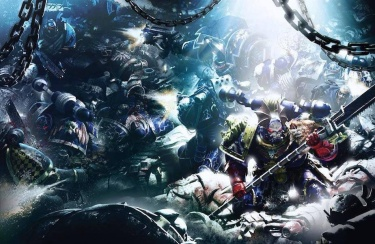
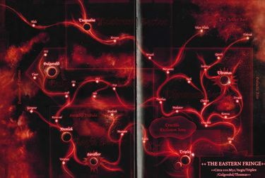
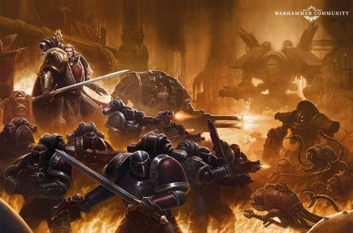

# 0785 007-009.M31 萨拉玛斯远征 Thramas Crusade

精校状态：中文行文已逐段精校，部分术语仍为暂定

分类：时间线

原文来源：https://www.bilibili.com/opus/1201426524509569029

原作者：帝国神选罐头

原文时间：2026年05月12日 14:28

[返回分类目录](目录.md) · [全书目录](../../目录.md)

<!-- A0785-B0001 -->
**英文原文**

The Thramas Crusade was a campaign of the Horus Heresy. Waged for 3 years far from Terra in Ultima Segmentum, the Night Lords went on a rampage of terror and mayhem against worlds loyal to the Imperium.

<!-- /A0785-B0001 -->

<!-- A0785-B0002 -->

原译文

萨拉玛斯远征是荷鲁斯叛乱的一场战役。在远离泰拉的极限星域进行了三年，午夜领主对忠于帝国的世界进行了恐怖和混乱的暴行。

**校订译文**

萨拉玛斯远征是荷鲁斯之乱期间的一场战役。午夜领主在远离泰拉的极限星域肆虐三年，将恐怖、混乱与屠杀带到那些效忠帝国的世界。

<!-- /A0785-B0002 -->

<!-- A0785-B0003 -->
**英文原文**

Though often simply referred to as the Thramas Crusade, the war was in fact a campaign for most of the Eastern Fringe and eventually expanded far outside of the Thramas Sector.

<!-- /A0785-B0003 -->

<!-- A0785-B0004 -->

原译文

虽然通常被简单地称为萨拉玛斯远征，但这场战争实际上是一场针对东部边缘大部分地区的战役，并最终扩展到萨拉玛斯星区以外。

**校订译文**

这场战争虽然通常简称为萨拉玛斯远征，实际却波及银河东部边缘的大部分地区，最终远远超出了萨拉玛斯星区的范围。

<!-- /A0785-B0004 -->

<!-- A0785-B0005 图片 -->

<!-- A0785-B0006 -->

原译文

Night Lords First Captain Sevatar leads an attack against the Dark Angels 午夜领主第一连长赛维塔率领对黑暗天使的进攻

**校订译文**

Night Lords First Captain Sevatar leads an attack against the Dark Angels 午夜领主第一连长赛维塔率领对黑暗天使的进攻

<!-- /A0785-B0006 -->

<!-- A0785-B0007 -->
**英文原文**

Conflict:Horus Heresy

<!-- /A0785-B0007 -->

<!-- A0785-B0008 -->

原译文

冲突：荷鲁斯叛乱

**校订译文**

冲突：荷鲁斯之乱

<!-- /A0785-B0008 -->

<!-- A0785-B0009 -->
**英文原文**

Date:007-009.M31

<!-- /A0785-B0009 -->

<!-- A0785-B0010 -->

原译文

日期：007-009.M31

**校订译文**

日期：007-009.M31

<!-- /A0785-B0010 -->

<!-- A0785-B0011 -->
**英文原文**

Location:Eastern Fringe

<!-- /A0785-B0011 -->

<!-- A0785-B0012 -->

原译文

地点：东部边缘

**校订译文**

地点：东部边缘

<!-- /A0785-B0012 -->

<!-- A0785-B0013 -->
**英文原文**

Outcome:Loyalist victory

<!-- /A0785-B0013 -->

<!-- A0785-B0014 -->

原译文

结果：忠诚派胜利

**校订译文**

结果：忠诚派胜利

<!-- /A0785-B0014 -->

<!-- A0785-B0015 -->
**英文原文**

Combatants:Traitor Legions/Imperium of Man

<!-- /A0785-B0015 -->

<!-- A0785-B0016 -->

原译文

作战方：叛徒军团/人类帝国

**校订译文**

作战方：叛徒军团/人类帝国

<!-- /A0785-B0016 -->

<!-- A0785-B0017 -->
**英文原文**

Commanders:Primarch Konrad Curze (MIA), Kyroptera:First Captain Jago Sevatarion (POW), Alastor Rushal (POW), Captain Var Jahan (POW or KIA), Captain Malithos Kuln (Purged), Captain Ithillion (KIA), Captain Jexad (KIA), Captain Shoma (KIA), Captain Cel Herec (Purged), Captain Kheron Ophion, Captain Naraka, Captain Krukesh, Captain Tovac Tor; Lord Commander Shang, Praetor Nakrid Thole (KIA), Commander Anrek Barbatos (KIA), Witch of Thramas (KIA), Zhenjin Khan (Defects)/Primarch Lion El'Jonson, Master Alajos (KIA), Paladin Corswain, Eskaton Marduk Sedras, Bujir Khan, Zhenjin Khan (KIA), Regent Mayvin Khelen, Captain-General Arcturus Morhde

<!-- /A0785-B0017 -->

<!-- A0785-B0018 -->

原译文

指挥官：原体康拉德·科兹(MIA)，夜蝠议会：第一连长贾戈·塞维塔里昂(POW)，阿拉斯托·拉什尔(POW)，连长瓦尔·贾罕(POW or KIA)，连长马利索斯·库恩(被清除)，连长伊希尔利昂(KIA)，连长杰克萨德(KIA)，连长肖马(KIA)，连长塞尔·赫雷克(被清除)，连长赫伦·奥菲昂，连长那落迦，连长克鲁克什，连长托瓦克·托尔；领主指挥官尚，执政官纳克里德·托勒(KIA)，指挥官安瑞克·巴巴托斯(KIA)。萨拉玛斯巫师(KIA)，真金可汗(叛变)/原体莱昂·艾尔庄森，导师阿拉乔斯(KIA)，圣骑士考斯韦恩，终灭者马尔杜克·塞德拉斯，布吉尔可汗，真金可汗(KIA)，摄政梅文·克伦，总指挥官阿克图勒斯·莫德

**校订译文**

指挥官：原体康拉德·科兹（失踪）；夜蝠议会成员：第一连长雅戈·赛维塔里昂（被俘）、阿拉斯托·拉什尔（被俘）、连长瓦尔·贾罕（被俘或阵亡）、连长马利索斯·库恩（遭清洗）、连长伊希尔利昂（阵亡）、连长杰克萨德（阵亡）、连长肖马（阵亡）、连长塞尔·赫雷克（遭清洗）、连长赫伦·奥菲昂、连长那落迦、连长克鲁克什、连长托瓦克·托尔；领主指挥官尚、执政官纳克雷德·索尔（阵亡）、指挥官安瑞克·巴巴托斯（阵亡）、萨拉玛斯女巫（阵亡）、真金可汗（转投敌方）／原体莱昂·艾尔’庄森、导师阿拉霍斯（阵亡）、圣骑士考斯韦恩、终灭者玛杜克·赛德拉斯、布吉尔可汗、真金可汗（阵亡）、摄政梅文·克伦、总指挥官阿克图勒斯·莫德

**校注：** Witch后文明确she，译女巫；真金可汗先投叛军、后转回忠诚派，Defects在叛军一栏指后一次变更阵营。

<!-- /A0785-B0018 -->

<!-- A0785-B0019 -->
**英文原文**

Strength:More than 100,000 Night Lords, 200 capital ships, 600 escort and smaller ships, 3,000 White Scars (defects), Traitor Taghmata, Legio Ulricon, Legio Victorum Traitors, Legio Phasma, Lost and the Damned, Ulan Huda/70,000 Dark Angels, 300 capital ships, 600 smaller ships, Small White Scars contingent, Small Ultramarine contingent, Thramassi Nightwatch, Loyalist Taghmata, Legio Solaria, Legio Victorum Loyalists, Legio Adamantus, Legio Atrox, Legio Saevus

<!-- /A0785-B0019 -->

<!-- A0785-B0020 -->

原译文

力量：超10万名午夜领主、200艘主力舰、600艘护卫舰和小型舰船、3000名白色伤疤（叛变）、叛徒禁卫、狼权军团、胜利者军团叛徒、幻影军团、迷失者与被诅咒者、乌兰·胡达/7万名黑暗天使、300艘主力舰和600艘小型舰船、小型白色伤疤分遣队、小型极限战士分遣队、萨拉玛斯守夜、忠诚派禁卫，日晷军团、胜利者军团忠诚者、坚毅军团、残暴军团、野蛮军团

**校订译文**

兵力：超过100,000名午夜领主、200艘主力舰、600艘护航舰及其他小型舰船、3,000名白疤（转投敌方）、叛变机械教禁卫军、狼权军团、胜利者军团叛军、幻影军团、迷失者与受诅者、乌兰·胡达／70,000名黑暗天使、300艘主力舰、600艘小型舰船、少量白疤与极限战士分遣队、萨拉玛斯守夜军、忠诚派机械教禁卫军、日晷军团、胜利者军团忠诚派、坚毅军团、残暴军团、野蛮军团

<!-- /A0785-B0020 -->

<!-- A0785-B0021 -->
**英文原文**

Casualties:Konrad Curze goes missing, First Captain Sevatar captured, Over 60,000 Night Lords lost, Majority of Night Lords fleet Destroyed or captured by the Dark Angels, Legio Ulricon destroyed, Ulan Huda crippled/No more than 10,000 Dark Angels slain, Heavy allied losses, Brotherhood of the Shattered Shield destroyed, billions of civilians massacred

<!-- /A0785-B0021 -->

<!-- A0785-B0022 -->

原译文

伤亡：康拉德·科兹失踪，第一连长赛维塔被俘，超过6万名午夜领主失踪，大多数午夜领主舰队被黑暗天使摧毁或俘虏，狼权军团被摧毁，乌兰·胡达瘫痪/不超过一万名黑暗天使被杀，盟友损失惨重，碎盾兄弟会被摧毁，数十亿平民被屠杀

**校订译文**

伤亡：康拉德·科兹失踪，第一连长赛维塔被俘，午夜领主损失超过60,000人，军团舰队大部分被黑暗天使摧毁或俘获，狼权军团覆灭，乌兰·胡达遭重创／黑暗天使阵亡不超过10,000人，盟军损失惨重，碎盾兄弟会覆灭，数十亿平民遭屠杀

**校注：** lost在此为总体兵力损失，不等于六万人全部失踪。

<!-- /A0785-B0022 -->

<!-- A0785-B0023 图片 -->

<!-- A0785-B0024 -->

原译文

Thramas Crusade area of operations 萨拉玛斯远征行动地区

**校订译文**

Thramas Crusade area of operations 萨拉玛斯远征行动地区

<!-- /A0785-B0024 -->

<!-- A0785-B0025 -->
## Overview 概述

<!-- /A0785-B0025 -->

<!-- A0785-B0026 -->
## Subduing Triplex 征服三重星区

原题：Subduing Triplex 三重征服

<!-- /A0785-B0026 -->

<!-- A0785-B0027 -->
**英文原文**

In a bid to distract the Dark Angels from his push on Terra, Warmaster Horus dispatched Konrad Curze and the Night Lords to the Eastern Fringes of the Imperium, where they undertook a campaign of terror and genocide. The loyalist Imperial forces in the region led by the trio of Forge Worlds at Triplex were ill-placed to oppose the Night Lords' rampage. The Night Lords objective was not one of simply slaughter or mere distraction and included a number of immediate concerns such as the capture of the Triplex, which supplied weaponry to Rogal Dorn's forces. They also intended to find a new homeworld on the Eastern Fringe after destroying their former hold of Nostramo. After mustering their fleet at the ruins of Nostramo the Night Lords embarked for Thramas.

<!-- /A0785-B0027 -->

<!-- A0785-B0028 -->

原译文

分散黑暗天使为了他对泰拉的进攻，战帅荷鲁斯派遣康拉德·科兹和午夜领主前往帝国的东部边缘，在那里他们发动了一场恐怖和大屠杀战役。由三重的三个铸造世界领导的该地区的忠诚派帝国部队在对抗午夜领主的肆虐方面处于不利地位。午夜领主的目标不仅仅是屠杀或分散注意力，还包括一些迫在眉睫的问题，例如夺取向罗格·多恩的部队提供武器的三重。他们还打算在摧毁之前占据的诺斯特拉莫后，在东部边缘寻找一个新的家园世界。在诺斯特拉莫的废墟处召集舰队后，午夜领主启程前往萨拉玛斯。

**校订译文**

为牵制黑暗天使、掩护自己进军泰拉，战帅荷鲁斯将康拉德·科兹和午夜领主派往帝国东部边缘，展开恐怖行动与灭绝屠杀。当地忠诚派帝国部队以三重星区的三座铸造世界为首，却无力有效阻挡午夜领主。午夜领主的任务并不只是屠杀和牵制敌军，还包括夺取向罗格·多恩供给武器的三重星区等紧迫目标。他们此前已摧毁母星诺斯特拉莫，因此也想在东部边缘寻得新的家园。舰队在诺斯特拉莫废墟集结后，午夜领主便驶向萨拉玛斯。

<!-- /A0785-B0028 -->

<!-- A0785-B0029 -->
**英文原文**

The Night Lords first struck at a region of Thramas known as the Tithe Road, a chain of planets that linked the Nostramo Sector to Thramas. This region had long been known to the Night Lords and their terrors, having had to pay them tribute which included Initiates in exchange for protection for many years. Their first stop was Tsagualsa, where the Night Lords demanded the entire populace was to be recruited as thralls to the Legion. The world refused the outrageous demand, and the Night Lords fell upon the world in an engagement which was little more than slaughter. The surviving populace was herded into flaying pits, with only a few hundred were sent off on a vessel to spread word of what they had witnessed. Afterwards, the Night Lords set about erecting a new citadel for Konrad Curze. The Night Lords soon set out small warbands to neighboring worlds, and herds of refugees in the Thramas Sector and Gulgorahd Protectorate spread tales of terror and bloodshed. Facing little resistance, the Night Lords under brutal commanders such as Nakrid Thole easily became the masters of nearly half of the Thramas Sector.

<!-- /A0785-B0029 -->

<!-- A0785-B0030 -->

原译文

午夜领主首先袭击了萨拉玛斯的一个地区，即什一税路，这是一条将诺斯特拉莫星区与萨拉玛斯连接起来的行星链。这个地区早就为午夜领主和他们的恐怖所知，他们不得不向他们进贡，其中包括以多年保护为条件，招募新进者。他们的第一站是查古尔萨，午夜领主要求全体民众被招募为军团的奴工。世界拒绝了这一无耻的要求，午夜领主在一场只不过是屠杀的交战中向世界袭来。幸存的民众被赶到燃烧的坑里，只有几百人被送上战舰，传播他们所目睹的事情。之后，午夜领主开始为康拉德·科兹建造一座新城堡。午夜领主很快向邻近的世界派出了小型战帮，萨拉玛斯星区和古尔戈拉德保护地的难民群散布了恐怖和流血的故事。面对很少的抵抗，纳克里德·托勒等残暴指挥官领导下的午夜领主很容易成为萨拉玛斯星区近一半地区的主人。

**校订译文**

午夜领主首先袭击萨拉玛斯地区的什一税路——一条连接诺斯特拉莫星区与萨拉玛斯的行星链。当地早已见识过午夜领主的恐怖，多年来一直向他们进贡，包括提供新兵，以换取保护。军团的第一站是查古尔萨。他们要求将全体居民征为军团奴仆，遭到拒绝后，便向这个世界发动了与屠杀无异的进攻。幸存居民被赶进剥皮坑，只有数百人被送上舰船，让他们向外界传播亲眼所见的惨状。随后，午夜领主开始为康拉德·科兹建造新的堡垒，并派小股战帮进攻邻近世界。大批难民将恐怖与杀戮的消息传遍萨拉玛斯星区和古尔戈拉德保护地。在纳克雷德·索尔等残酷指挥官率领下，午夜领主几乎未遇多少抵抗，就控制了萨拉玛斯星区近半疆域。

**校注：** flaying pits为剥皮坑，非燃烧坑；Initiates为征募入军团的新兵，不套用黑色圣堂新进者职衔。

<!-- /A0785-B0030 -->

<!-- A0785-B0031 -->
**英文原文**

As bands of Night Lords slaughtered their way across Thramas, those who still remembered their duty such as Sevatar continued the drive on the Triplex Sector. Emerging over the Triplex System with a flotilla holding four full Chapters, the Night Lords first fell upon the small and already-ruined world of Thule. Many of the Magi of Triplex sided with the Warmaster, leaving only a few maniples of the Legio Victorum and loyalist Taghmata to resist. On the world of Nehren Sevatar and the Atramentar struck, teleporting into the heart of the underground fortress powering the worlds orbital cannons. With the cannons disabled, traitor elements of the Legio Victorum landed and annihilated their vastly outnumbered former brethren. Meanwhile, Sevatar was able to capture the Archmagos of Thule. After the victory the remaining loyalist Magi on Galatia and Phall surrendered and offered their services to the Warmaster. When Konrad Curze later arrived he took the surrendered Archmagos of Thule and tortured him aboard the Nightfall after finding his petty praise and flattery annoying.

<!-- /A0785-B0031 -->

<!-- A0785-B0032 -->

原译文

当一帮午夜领主屠杀他们穿越萨拉玛斯的道路时，那些仍然记得自己职责的人，如赛维塔，继续在三重星区前进。午夜领主以一支拥有四个完整战团的船队出现在三重星系之上，他们首先袭击了已经毁灭的小型图勒世界。三重的许多圣贤士站在战帅一边，离开只有少数胜利军团和忠诚派禁卫抵抗。在内伦世界上，赛维塔和黑甲卫攻击，传送到地下堡垒的中心，为世界轨道炮提供动力。当炮被禁用，胜利军团的叛徒成员登陆并歼灭了他们人数远远超过的前兄弟。与此同时，赛维塔成功攻俘获图勒的大贤者。胜利后，加拉提亚和法尔上剩下的忠诚派圣贤士投降，并向战帅提供服务。当康拉德·科兹后来到达时，他带着投降的图勒大贤者，在夜幕降临号上折磨他，因为他发现他的琐碎赞美和奉承很烦人。

**校订译文**

午夜领主各战帮在萨拉玛斯大肆屠杀时，赛维塔等仍记得任务的指挥官继续向三重星区推进。他们率搭载四个完整战团的舰队进入三重星系，首先进攻了早已残破的小世界图勒。三重星区的许多贤者投效战帅，仅余胜利者军团的少量支队和忠诚派机械教禁卫军抵抗。在内伦，赛维塔与黑甲卫传送进地下堡垒，直取为行星轨道炮供能的核心。轨道炮失效后，胜利者军团叛军登陆，将数量远少于自己的昔日同袍歼灭。与此同时，赛维塔俘获了图勒的大贤者。此战之后，加拉提亚和法尔残存的忠诚派贤者投降，愿为战帅效力。康拉德·科兹随后到来，却嫌图勒大贤者的奉承和吹捧烦人，将这位降者带到夜幕降临号上严刑折磨。

**校注：** vastly outnumbered指忠诚派人数大劣势，原译颠倒。Taghmata为机械教军队，非帝皇禁军。

<!-- /A0785-B0032 -->

<!-- A0785-B0033 -->
## Defiance at Thramas 萨拉玛斯的反抗

<!-- /A0785-B0033 -->

<!-- A0785-B0034 -->
**英文原文**

The Night Lords continued their slaughter on the Eastern Fringe, with discipline breaking down in several places as the Night Haunter secluded himself at Triplex. Most notable was on Sheol III, where two newer Chapters of Night Lords known as the Dark Eyes and Boneless battling one another. Many Night Lords commanders abandoned greater strategic objectives, instead forming warbands and taking to the stars to act independently. Other more veteran commanders such as Nakrid Thole sought to exploit the terror of the Night Lords actions to seize the last keystones of the region: the Forge World of Gulgorahd and the Hive World of Thramas. Thole moved on Thramas with little more than a Chapter and three Cruisers hoping to accept the surrender of the planets. However he instead found a formidable array of orbital defenses, fortified Hive cities defended by the Thramassi Nightwatch Imperial Army, and several smaller Expeditionary Fleets in dry-dock under the command of Regent Mayvin Khelen. Khelen refused surrender when a battered Frigate from Gulgorahd emerged over Thramas and blasted a message refusing to yield to the traitors. The small Forge World had refused the Night Lords call to surrender and was now seeking to inspire its allies.

<!-- /A0785-B0034 -->

<!-- A0785-B0035 -->

原译文

午夜领主继续在东部边缘进行屠杀，随着午夜幽魂在三重隐居，几个地方的纪律被打破。最引人注目的是冥府三号，其中午夜领主的两个较新战团被称为黑眼和无骨的相互争斗。许多午夜领主指挥官放弃了更大的战略目标，而是组建了战帮，前往群星独立行动。其他更资深的指挥官，如纳克里德·托勒，试图利用午夜领主行动的恐怖来夺取该地区的最后一块基石：古尔戈拉德铸造世界和萨拉玛斯巢都世界。托勒只带了一个战团和三艘希望接受行星投降的巡洋舰就向萨拉玛斯进发。然而，他反而发现了一系列强大的轨道防御系统，由萨拉玛希守夜帝国军队防守的加强巢都城市，以及摄政梅文·克伦指挥的干船坞中的几个较小的远征舰队。赫伦拒绝投降，当一艘来自古尔戈拉德的破旧护卫舰出现在萨拉玛斯上空，发布了一条信息，拒绝向叛徒屈服。小铸造世界拒绝了午夜领主的要求投降，现在正寻求激励其盟友。

**校订译文**

午夜领主继续屠戮银河东部边缘，午夜幽魂却闭居三重星区，使多处部队纪律崩溃。最显著的例子发生在冥府三号：黑眼与无骨这两个较新组建的午夜领主战团彼此开战。许多指挥官抛弃整体战略，组建战帮，独自在群星间行动。纳克雷德·索尔等资深指挥官则希望利用恐怖攻势，夺取当地最后的关键据点：古尔戈拉德铸造世界与萨拉玛斯巢都世界。索尔只带着略多于一个战团的兵力和三艘巡洋舰，就前往萨拉玛斯，打算接受投降。然而，等待他的是强大的轨道防御、由帝国军萨拉玛斯守夜军驻守的坚固巢都，以及摄政梅文·克伦麾下停泊于干船坞的数支小型远征舰队。一艘伤痕累累的古尔戈拉德护卫舰出现在萨拉玛斯上空，高声广播拒绝向叛军屈服的宣言，克伦也因此拒绝投降。这座小型铸造世界已回绝午夜领主的招降，现在希望激励盟友继续抵抗。

<!-- /A0785-B0035 -->

<!-- A0785-B0036 -->
**英文原文**

The Night Lords under Thole nonetheless landed upon Thramas, expecting to accept its surrender. Instead they found glares of hatred from the planet's Regent and ruling Senate. Most shockingly, the Captain-General of the Nightwatch, Arcturus Morhde, drew his pistol and fired directly into Thole's face. The senate room erupted into combat immediately as across the planet the loyalist Imperial Army rose up in resistance. They were not alone, for mobs of citizens seeking vengeance against the Night Lords also rose up against them. Overwhelmed by sheer numbers, the Night Lords were forced to retreat and a badly wounded Thole returned to orbit. The small Night Lords flotilla was simultaneously under assault from Thramas' orbital defenses and docked warships. However some like the Visigoth Class Battlecruiser Crimson Tyrant instead chose to come to the aid of the traitors. The Night Lords chose to not contest control of orbit, instead launching a salvo of biological weapons onto the surface of Thramas out of spite before departing and abandoning their allies. What followed were a series of uprisings and guerrilla actions by the Nightwatch across the region that pressed the other warbands of Night Lords. Total war gripped the sector as the Night Lords unleashed vicious punitive actions, but their superior combat ability was overwhelmed by the number of foes against them. At Qetesh Prime and Crucible the Night Lords used waves of slave-fodder to try and weaken the Nightwatch defenses, while Thramas itself endured constant raids by the now hideously scarred Thole.

<!-- /A0785-B0036 -->

<!-- A0785-B0037 -->

原译文

尽管如此，托勒率领的午夜领主还是登陆了萨拉玛斯，希望接受它的投降。但相反，他们发现了来自行星摄政和执政参议院的仇恨目光。最令人震惊的是，守夜总指挥官阿克图勒斯·莫德拔出手枪，直接朝托勒的脸开了枪。当忠诚派帝国军队在全球范围内奋起抵抗时，参议院立即爆发了战斗。他们并不孤单，因为寻求报复午夜领主的公民群体也起来反抗他们。由于人数过多，午夜领主被迫撤退，重伤的托勒返回轨道。午夜领主的小型舰队同时受到萨拉玛斯轨道防御和停靠战舰的攻击。然而，像西哥特级战列巡洋舰深红暴君号这样的一些人却选择帮助叛徒。午夜领主选择不争夺轨道控制权，而是在离开并抛弃盟友之前，出于怨恨向萨拉玛斯表面发射了一系列生物武器。随后，守夜在该地区发动了一系列叛乱和游击行动，对午夜领主的其他战帮造成了压力。随着午夜领主发动恶毒的惩罚行动，全面战争席卷了整个星区，但他们优越的战斗能力被敌人的数量所压倒。在克提什一号和熔炉星，午夜领主使用了一波又一波的奴隶来试图削弱守夜的防御，而萨拉玛斯本身则遭受了现在伤痕累累的托勒的不断袭击。

**校订译文**

索尔仍率午夜领主在萨拉玛斯登陆，指望受降，却只看到行星摄政与执政参议院充满仇恨的目光。更令他们震惊的是，守夜军总指挥官阿克图勒斯·莫德拔出手枪，直接朝索尔面部射击。议事厅顷刻爆发战斗，忠诚派帝国军也在全球奋起反抗，渴望向午夜领主复仇的居民随之加入。面对压倒性人数，午夜领主被迫撤退，索尔身负重伤返回轨道。其小型舰队同时遭到萨拉玛斯轨道防御与港内舰船攻击，不过，西哥特级战列巡洋舰深红暴君号等少数舰船选择支援叛军。午夜领主无意争夺轨道控制权，出于报复向地表齐射生物武器，随即抛下盟友撤离。此后，守夜军在整个地区发动一连串起义与游击战，给其他午夜领主战帮施加压力。午夜领主以残酷讨伐回应，全面战争席卷星区；然而，他们卓越的战斗力仍被敌人的数量压倒。在克提什主星与熔炉星，午夜领主驱赶一波波奴隶炮灰冲击守夜军防线；萨拉玛斯本土则不断遭到满身骇人伤疤的索尔袭击。

<!-- /A0785-B0037 -->

<!-- A0785-B0038 -->
**英文原文**

For a short bittersweet moment, it seemed as if the defenders of Thramas might be able to resist the Night Lords. That all changed with the reappearance of Konrad Curze, who returned from Triplex and immediately organised a vicious counterattack with the full force of his Legion as well as the traitor Titans of the Legio Victorum and Legio Phasma. Sheol III fell within a week, with the defenders' committing planetary suicide via Phosphex charges instead of facing what awaited them at the hands of the Night Lords. On Yaelis the Night Haunter himself descended, overwhelming the urban defenses of its Hives. In some of the largest Titan battles of the entire Crusade the Legio Victorum and Legio Phasma engaged with Gulgorahd's Legio Adamantus, Legio Atrox, and Legio Saevus at Bastions 011 and 009. Hundreds of Titans fought and died in the battles but the traitors emerged victorious despite the suicidal tenacity of the Legio Adamantus.

<!-- /A0785-B0038 -->

<!-- A0785-B0039 -->

原译文

在短暂的苦乐参半的时刻，萨拉玛斯的守军似乎能够抵抗午夜领主。随着康拉德·科兹的再次出现，这一切都发生了变化，他从三重回来，立即组织了一场猛烈的反击，动用了他的军团以及胜利军团和幻影军团的叛徒泰坦的全部部队。冥府三号在一周内沦陷，防御者通过磷化破坏者自杀，而不是面对午夜领主手中等待他们的事情。在雅伊利斯，午夜幽魂自己降临，压倒了其巢都的城市防御。在整个远征中一些最大的泰坦战斗中，胜利军团和幻影军团在011和009堡垒与古尔戈拉德的坚毅军团、残暴军团和野蛮军团交战。数百名泰坦在战斗中战斗并倒下，但叛徒取得了胜利，尽管坚毅军团有着自杀式般的顽强。

**校订译文**

有那么一小段苦乐交织的时光，萨拉玛斯守军似乎真能挡住午夜领主。然而，康拉德·科兹从三重星区归来，立即调集军团全力，并带上胜利者军团和幻影军团的叛军泰坦，发动猛烈反攻，彻底改变了局面。冥府三号在一周内失守，守军选择引爆磷化炸药，让整颗行星同归于尽，也不肯落入午夜领主手中。在雅伊利斯，午夜幽魂亲自降临，击垮巢都防御。在011号与009号堡垒，胜利者军团、幻影军团与古尔戈拉德的坚毅军团、残暴军团、野蛮军团交战，爆发了整场远征中规模最大的泰坦大战之一。数百台泰坦鏖战倒下，尽管坚毅军团以近乎自毁的顽强奋战，叛军仍赢得了胜利。

**校注：** Phosphex charges指磷化炸药，原译磷化破坏者误作单位。

<!-- /A0785-B0039 -->

<!-- A0785-B0040 -->
**英文原文**

Outraged by the defiance against them, the Night Lords cast aside the goal set to them by Horus to leave Thramas intact and instead committed themselves to annihilation and torment of whatever survivors may remain. On Kenrac the local Imperialis Militia chose to slaughter their own populace than let it suffer at the hands of the Night Lords. On Crucible the Nightwatch commander Mordhe found his Solar Auxilia vastly under-strength due to constant Night Lords raids. He instead was forced to conscript and arm every citizen capable of holding a weapon. Surprisingly, Bastion 19 was able to hold out for six months until only a handful of Knights remained to resist the traitors.

<!-- /A0785-B0040 -->

<!-- A0785-B0041 -->

原译文

对他们的反抗感到愤怒，午夜领主放弃了荷鲁斯为他们设定的目标，即保持萨拉玛斯的完整，而是致力于消灭和折磨任何幸存者。在肯拉克，当地的帝国民兵选择屠杀自己的民众，而不是让他们在午夜领主的手中受苦。在熔炉星，守夜指挥官莫尔德发现，由于午夜领主的不断突袭，他的太阳辅助军部队力量严重不足。他被迫征召并武装每一个有能力持有武器的公民。令人惊讶的是，19堡垒能够坚持六个月，直到只剩下少数骑士来抵抗叛徒。

**校订译文**

午夜领主因遭遇反抗而暴怒，将荷鲁斯要求保全萨拉玛斯的命令抛诸脑后，一心只想消灭和折磨所有幸存者。在肯拉克，当地帝国民兵宁肯杀死自己的居民，也不愿让他们落入午夜领主手中受苦。在熔炉星，守夜军指挥官莫德麾下的太阳辅助军因不断遭袭而严重减员，只能征召并武装每一个拿得动武器的居民。出人意料的是，19号堡垒竟坚持了六个月，到最后只剩少数骑士仍在抵抗叛军。

<!-- /A0785-B0041 -->

<!-- A0785-B0042 -->
## The Lion's Vengeance 莱昂的复仇

<!-- /A0785-B0042 -->

<!-- A0785-B0043 -->
**英文原文**

By 008.M31, it seemed as if the Thramas Crusade was all but won. The traitors were advancing, resistance was collapsing, and Triplex's vast industrial capacity was now churning out Titans for the Warmaster. At Triplex Galatia however 18 capital ships and 100 Escorts and smaller vessels bearing the icon of a Winged Sword arrived in orbit and reduced the defending fleet to rubble. After sweeping aside the traitor Mechanicum vessels the Dark Angels ships next engaged a squadron of Night Lords Heavy Cruisers and Frigates at extreme range. The Dark Angels used pinpoint accurate lance fire to disable the Night Lords ship Shadow of Justice before boarding it with the Dreadwing and Lion El'Jonson himself. The Lion was able to capture the commanding Night Lord and dragged him to the depths of the Invincible Reason to experience his own tortures. The interrogators of the Firewing were able to extract information from the captive's mind, discovering that the 100 remaining small enemy vessels in orbit did not intend to immediately contest them. This was to be their undoing, for 100 Dark Angels capital ships soon arrived over Triplex and annihilated all in their path.

<!-- /A0785-B0043 -->

<!-- A0785-B0044 -->

原译文

到008.M31，萨拉玛斯远征似乎几乎获胜。叛徒正在前进，抵抗正在崩溃，三重庞大的工业能力现在正在为战帅生产泰坦。然而，在三重加拉提亚，18艘主力舰和100艘护卫舰以及带有翼剑图标的小型战舰进入轨道，将防御舰队化为瓦砾。在扫清叛徒机械教战舰后，黑暗天使舰船接下来在极限范围内与午夜领主重型巡洋舰和护卫舰中队交战。黑暗天使使用精确的光矛射击使午夜领主舰船正义之影号残废，然后恐翼和莱昂·艾尔庄森本人一起跳帮。莱昂成功俘获了指挥的午夜领主，并将他拖入无敌理性号的深处，体验自己的折磨。炎翼的审讯者能够从俘虏的脑海中提取信息，发现轨道上剩下的100艘小型敌方战舰并不打算立即与他们对抗。这将是他们的毁灭，因为100艘黑暗天使主力舰很快抵达三重上空，并歼灭了他们所有的敌人。

**校订译文**

到008.M31，萨拉玛斯远征似乎已将以叛军胜利告终：叛军节节推进，抵抗不断崩溃，三重星区庞大的工业体系也正源源不断为战帅生产泰坦。然而，在三重加拉提亚，十八艘主力舰与合计一百艘护航舰和其他小型舰船驶入轨道。它们披挂翼剑徽记，将防御舰队轰成残骸。扫清叛变机械教舰船后，黑暗天使在极远距离迎战午夜领主的重型巡洋舰与护卫舰中队，以精准光矛炮击瘫痪正义之影号，随后由莱昂·艾尔’庄森亲率恐翼跳帮。莱昂俘获了敌方指挥官，将其拖进无敌理性号深处接受酷刑。炎翼审讯者从俘虏脑中提取情报，得知轨道上余下的一百艘小型敌舰无意立即交战。这一迟疑断送了它们：很快，一百艘黑暗天使主力舰抵达三重上空，消灭沿途所有敌人。

**校注：** 18 capital ships and 100 Escorts and smaller vessels为18艘主力舰另加合计100艘护航及小型舰，不是100艘护航舰外另有若干小舰。

<!-- /A0785-B0044 -->

<!-- A0785-B0045 -->
**英文原文**

As the defending Mechanicum gun-barges died the Night Lords abandoned their allies and instead mounted a concentrated attack on the Dark Angels Battleship Undying Will before disappearing into the Warp. The Magi of Galatia hoped to hold out until reinforcements arrived, but these hopes were dashed when the Deathwing launched a mass assault upon Galatia. The Deathwing was able to hold a beachhead within the Forge Halls of Galatia against the attacking cohorts of Thallax, sacrificing their lives to allow their brethren to land. The Dark Angels' second wave consisted of Dreadwing and the Order of the Shattered Spectre under Eskaton Marduk Sedras. Leading Interemptors and Naufragia Terminators, Sedras drew out the Mechanicum forces and forced them to commit themselves to battle. Against Automata of unknown and corrupted design alongside Harpax artificia, the Dark Angels faced stiff resistance. Lion El'Jonson enacted the Ikaros Contingency, allowing for the ancient Excindio Robots to be unleashed from the Invincible Reason. The 12 immense Excindio that were unleashed swept all opposition aside. In the depths of the Forge-Fanges a massive multi-legged horror of brass and steel confronted the Lion and his Excindio, who bested it in a battle that no mortal could have survived. After the fight 7 Excindio remained. After their victory the Dark Angels used Phosphex to purge the surviving Galatian Magi in hiding. Only the orbiting shipyards were left intact by the loyalists. The Lion next struck at Phall, the largest and most heavily defended of the Triplex worlds. However many of the traitors instead chose to flee, leaving only a small group of renegades and secret loyalists behind. Thus by the time the Dark Angels arrived they found Phall already in civil war. The loyalist Mechanicum elements eventually prevailed and gave the planet over to the Dark Angels.

<!-- /A0785-B0045 -->

<!-- A0785-B0046 -->

原译文

当防御的机械教火炮驳船被毁时，午夜领主放弃了他们的盟友，转而对黑暗天使战列舰不朽意志号发动了集中攻击，然后消失在亚空间中。加拉提亚的圣贤士希望坚持到援军到达，但当死翼对加拉提亚发动大规模进攻时，这些希望破灭了。死翼能够在加拉提亚的铸造大厅内守住滩头阵地，对抗死隶的进攻大队，牺牲他们的生命，让他们的兄弟登陆。黑暗天使的第二波浪潮由恐翼和终灭者马尔杜克·塞德拉斯领导的破碎幽灵骑士团组成。塞德拉斯领导屠灭者和海难终结者，他引出了机械教部队，迫使他们投入战斗。面对未知和腐化设计的机兵以及掠夺造物，黑暗天使面临着顽强的抵抗。莱昂·艾尔庄森通过了伊卡洛斯应急协议，允许古代灭绝者机兵从无敌理性号中释放出来。释放的12个巨大的灭绝者将所有对抗都清扫一空。在獠牙铸造厂的深处，一场由黄铜和钢铁组成的巨大多足恐怖遭遇了莱昂和他的灭绝者，他们在一场凡人无法幸存的战斗中击败了它。战斗结束后，灭绝者残余7个。胜利后，黑暗天使使用磷化来清除隐藏的幸存的加拉提亚圣贤士。只有轨道船厂被忠诚者完好无损保存。莱昂接下来袭击了三重星系中最大、防御最严密的法尔。然而，许多叛徒选择逃跑，只留下一小群叛徒和秘密忠诚者。因此，当黑暗天使到达时，他们发现法尔已经处于内战之中。忠诚派机械教成员最终获胜，并将行星交给了黑暗天使。

**校订译文**

机械教的防御炮艇相继毁灭，午夜领主便抛弃盟友，集中攻击黑暗天使战列舰不朽意志号，随后逃入亚空间。加拉提亚贤者盼望坚持到援军抵达，但死翼的大举进攻粉碎了希望。面对死隶战兵各大队猛攻，死翼以牺牲为代价守住铸造大厅内的登陆阵地，为兄弟部队争取登岸时间。第二波黑暗天使由恐翼，以及终灭者玛杜克·赛德拉斯率领的破碎幽灵骑士团组成。赛德拉斯带领屠灭者与纳夫拉基亚终结者，将机械教部队引出，迫使它们全面应战。敌军投入来历不明、设计遭腐化的机兵与掠夺者造物，抵抗十分顽强。莱昂启动伊卡洛斯应急预案，从无敌理性号释放古老的灭绝者机兵。十二台庞然巨物横扫一切抵抗。在獠牙铸造厂深处，一头由黄铜和钢铁构成的多足巨怪迎战莱昂及其灭绝者。他们在一场凡人绝无可能生还的战斗中将其击败，战后仅余七台灭绝者。黑暗天使随后用磷化武器清除藏匿的加拉提亚贤者，只保留了轨道船坞。莱昂接着进攻法尔——三重诸世界中最大、防御最严密的一颗。但许多叛军已先行逃跑，只留下少量变节者和隐瞒立场的忠诚派。黑暗天使抵达时，法尔已经爆发内战；忠诚派机械教最终取胜，将行星交予黑暗天使。

**校注：** Naufragia沿第326篇纳夫拉基亚，不将专名意译为海难；Excindio沿核心较早词条灭绝者，和毁灭者小队等名称分开。

<!-- /A0785-B0046 -->

<!-- A0785-B0047 -->
**英文原文**

Following the fall of Triplex the Lion next moved on Sheol III and Yaelis. The Night Lords and their slave armies were too few to defeat the Dark Angels but also did not flee, instead throwing their fodder at the Lion while the Night Lords themselves conducted harrying and delaying actions. The subjugation of these two worlds thus took two months alone. Nonetheless, hope managed to return to Thramas and loyalist Army regiments in hiding managed to rejoin the Night Lords. At Crucible the Dark Angels relieved the siege to find Captain-General Mordhe and a few battered survivors still holding. However the majority of the Sector still remained in traitor hands, and to counter this The Lion unleashed a second front of reinforcements to move through the Aegis Sector, only to find themselves bogged down by traitors at Memlock and the vast expanse of the Heraclid Nebula. The fighting now spanned across four different Sectors and the battle grinded into stalemate. The Dark Angels were not large enough to force a breakthrough without abandoning the worlds they liberated, while the Night Lords were spread too thin to push back their loyalist brethren. As the Night Haunter fell into mania Sevatar and Anrek Barbatos sought to mitigate his often contradictory orders, holding back the Dark Angels through constant guerrilla and harrying actions. Seeking to turn the tide, Sevatar and Barbatos also enacted secret agreements the Night Haunter had made with debased factions throughout the Eastern Fringe known as the Midnight Treaties. Small scout craft were dispatched, winning new allies such as the debased Warriors of Tohruk, Predator-Forge of Ulan Huda, the traitor White Scars Brotherhood of the Shattered Shield, cannibal legions of Glabro, battle-Psykers of Thex, and dozens more abominations and aberrations.

<!-- /A0785-B0047 -->

<!-- A0785-B0048 -->

原译文

在三重陷落后，莱昂接下来向冥府三号和雅伊利斯移动。午夜领主和他们的奴隶军队人数太少，无法击败黑暗天使，但他们也没有逃跑，而是向莱昂扔料，午夜领主自己实施了烦扰和拖延的行动。因此，征服这两个世界花了两个月的时间。尽管如此，希望还是设法回到了萨拉玛斯，躲藏的忠诚派军队兵团设法重新加入了午夜领主。在熔炉星，黑暗天使解除了围困，发现总指挥官莫德和少许受重创的幸存者仍在坚守。然而，该区域的大部分仍然掌握在叛徒手中，为了应对这种情况，莱昂释放了第二支增援部队，穿过神盾星区，却发现自己在梅姆洛克和赫拉克利德星云的广阔区域被叛徒困住了。战斗现在跨越了四个不同的星区，战斗陷入僵局。黑暗天使的部队规模不足以在不放弃他们解放的世界的情况下实现突破，而午夜领主过于分散，无法击退他们的忠诚派兄弟。当午夜幽魂陷入躁狂时，赛维塔和安瑞克·巴巴托斯试图缓和他经常矛盾的命令，通过不断的游击和烦扰的行动来阻止黑暗天使。为了扭转局势，赛维塔和巴巴托斯还通过了午夜幽魂与整个东部边缘的堕落派系达成的秘密协议，即《午夜条约》。派遣了小型侦察机，赢得了新的盟友，如托赫鲁克的堕落战士、乌兰·胡达的掠食者铸造厂、白色伤疤叛徒的碎盾兄弟会、格拉布罗的食人军团、忒克斯的战斗灵能者，以及数十种其他可憎之物和异常。

**校订译文**

三重星区陷落后，莱昂进攻冥府三号与雅伊利斯。午夜领主及其奴隶军数量不足以击败黑暗天使，却也没有逃走，而是驱使炮灰抵挡莱昂，自己展开骚扰与迟滞行动。因此，仅收复这两个世界就花费了两个月。尽管如此，萨拉玛斯仍重新看到了希望，隐藏起来的忠诚派帝国军各团也再度现身。在熔炉星，黑暗天使解除围困，发现总指挥官莫德与少数伤痕累累的幸存者仍在坚守。然而，星区大部分地区仍在叛军手中。为此，莱昂增派援军，穿过神盾星区开辟第二战线，却在梅姆洛克与广阔的赫拉克利德星云遭叛军拖住。战火已蔓延四个星区，双方陷入僵局：黑暗天使无力在守住已解放世界的同时集中足够兵力突破，午夜领主则分散得太广，无法击退忠诚派。午夜幽魂陷入狂乱，赛维塔与安瑞克·巴巴托斯尽力缓解他前后矛盾的命令造成的影响，不断以游击与骚扰拖住黑暗天使。他们还开始执行午夜幽魂与东部边缘各堕落派系秘密缔结的“午夜条约”，试图扭转战局。派出的轻型侦察舰为他们争得了许多新盟友，包括托赫鲁克的堕落战士、乌兰·胡达掠食铸造世界、白疤叛变部队碎盾兄弟会、格拉布罗的食人军团、忒克斯的战斗灵能者，以及数十种其他可憎怪物与畸变之物。

**校注：** 原文称躲藏的忠诚派帝国军rejoin the Night Lords（重新加入午夜领主），与上下文解放及忠诚立场明显矛盾，疑误写Nightwatch。正文仅保留重新现身，不将加入哪个组织武断改定；待核原始来源。

<!-- /A0785-B0048 -->

<!-- A0785-B0049 图片 -->

<!-- A0785-B0050 -->

原译文

Lion El'Jonson and the Dark Angels during the Thramas Crusade 莱昂·艾尔庄森和黑暗天使在萨拉玛斯远征期间

**校订译文**

Lion El'Jonson and the Dark Angels during the Thramas Crusade 萨拉玛斯远征中的莱昂·艾尔’庄森与黑暗天使

<!-- /A0785-B0050 -->

<!-- A0785-B0051 -->
## Traitor Counterattack 叛徒反击

<!-- /A0785-B0051 -->

<!-- A0785-B0052 -->
**英文原文**

Faced with these reinforcements, the Night Lords struck at Crucible and several other worlds with wanton cruelty. With enemy ships observing in orbit the Dark Angels threw their lesser allies against the foe to disguise their true strength and drain the supplies of their foes. At Yrrdek the Night Lords cleared Dark Angels minefields with their conscript militias. On Chenro IX the Night Lords overseers wagered on how long it would take the Dark Angels to slaughter the crude conscript armour sent against them while they countered enemy gun emplacements. However on Sedrrice the White Scars Brotherhood of the Shattered Shield acted chivalrously, allowing the decimated loyalists to retreat with their wounded. With the preparations complete the Night Haunter himself once again appeared, summoning all the disparate elements of the Night Lords to his side and mustering some 100,000 Legionaries. The only Night Lords commander to not answer the muster was Nakrid Thole, his hatred fixed upon Thramas alone. Thole was finally able to break Thramas with the arrival of the predator-world of Ulan Huda.

<!-- /A0785-B0052 -->

<!-- A0785-B0053 -->

原译文

面对这些增援，午夜领主肆意残忍地袭击了熔炉星和其他几个世界。随着敌方舰船在轨道上观察，黑暗天使将他们的次级盟友抛向敌人，以伪装他们的真实力量并耗尽敌人的补给。在伊尔迪克，午夜领主与他们的征召民兵一起清理了黑暗天使雷区。在陈罗九号上，午夜领主的监督者打赌，黑暗天使在反击敌人的炮位时，需要多长时间才能杀死被派来对付他们的简陋征召兵装甲。然而，在赛德里斯，白色疤痕的碎盾兄弟会表现得很英勇，允许被摧毁的忠诚派带着伤员撤退。随着准备工作的完成，午夜幽魂本人再次出现，召集了午夜领主的所有不同成员到他身边，并召集了大约10万名军团士兵。唯一没有响应号召的午夜领主指挥官是纳克里德·托勒，他的仇恨只集中在萨拉玛斯。随着乌兰·胡达世界的掠食者的到来，托勒终于能够击破萨拉玛斯。

**校订译文**

得到这些援军后，午夜领主残暴地进攻熔炉星及其他数个世界。敌舰在轨道上监视，黑暗天使便将实力较弱的盟军投入战斗，以掩藏自身真实兵力，并消耗敌军补给。在伊尔迪克，午夜领主驱赶征召民兵替自己踩开黑暗天使的雷区。在陈罗九号，他们派出装备简陋装甲载具的征召部队，自己则攻击敌方炮位；午夜领主督战者甚至打赌，这些征召兵会在多久后被黑暗天使杀光。然而，在赛德里斯，白疤碎盾兄弟会仍表现出骑士风范，准许遭受重创的忠诚派带着伤员撤走。准备就绪后，午夜幽魂再次现身，将分散的午夜领主召至身边，集结约十万名军团战士。只有纳克雷德·索尔拒绝响应，他仍将全部仇恨倾注在萨拉玛斯。直到乌兰·胡达这颗掠食世界抵达，索尔才终于攻破萨拉玛斯。

**校注：** 开头Faced with these reinforcements与前文新盟友逻辑不合，按获得增援理解。清雷为驱赶征召民兵作炮灰，不是军团与民兵共同排雷。

<!-- /A0785-B0053 -->

<!-- A0785-B0054 -->
**英文原文**

In the final days of 008.M31 Curze launched his attack across half a dozen worlds. These were no raids but full-scale assaults of the Legiones Astartes. Three Night Lords chapters landed on Chenro, using data from previous attacks to precisely target Dark Angels defenses. The single defending Dark Angels Chapter was overwhelmed and forced to call orbital strikes on their own position to keep the traitors at bay. At Sedrrice, the Night Lords Battleship Tenebrous Will and its escorts drove off the Dark Angels fleet in orbit and enacted sustained bombardment, flattening all identified defenses. The Night Lords landed in the aftermath, viciously treating the survivors in a manner that disturbed their White Scars allies. After the badly wounded surviving Dark Angels commander was slain in single combat by a Night Lords Praetor only the intervention of the White Scars saved the loyalists from the skinning pits. The Night Lords quickly claimed 4 worlds, moving on to new targets without consolidating their holdings. The Night Lords second wave targeted Crucible with six Chapters, a sub-Legio of the Legio Victorum, and 50,000 conscripts. Defending was a Dark Angels armada including two Gloriana Class Battleships.

<!-- /A0785-B0054 -->

<!-- A0785-B0055 -->

原译文

在008.M31的最后几天，科兹在六个世界发动了攻击。这些不是突袭，而是阿斯塔特军团的全面攻击。三个午夜领主战团登陆陈罗，利用之前攻击的数据精确瞄准黑暗天使的防御。唯一防守的黑暗天使战团被压倒，被迫对自己的位置发动轨道打击，以阻止叛徒。在赛德里斯，午夜领主战列舰黑暗意志号及其护卫舰驱逐了轨道上的黑暗天使舰队，并实施了持续轰炸，摧毁了所有已确定的防御。午夜领主在事件发生后登陆，以一种扰乱他们的白色疤痕盟友的方式恶毒地对待幸存者。在重伤的幸存黑暗天使指挥官在一场战斗中被午夜领主执政官杀死后，只有白色伤疤的干预才将忠诚者从剥皮坑中拯救出来。午夜领主迅速占领了4个世界，在没有巩固其控制权的情况下转向了新的目标。午夜领主的第二波攻击目标是拥有六个战团的熔炉星、胜利军团的一个子军团和50000名征召兵。防守的是一支黑暗天使舰队，其中包括两艘荣光女王级战列舰。

**校订译文**

008.M31的最后几天，科兹向六个世界同时发动进攻。这一次是阿斯塔特军团的全面攻势，而非小股袭扰。三个午夜领主战团在陈罗登陆，利用先前袭击收集的数据精准打击黑暗天使防线。唯一驻守的黑暗天使战团被压垮，只能呼叫轨道火力轰击自身阵地，阻止叛军逼近。在赛德里斯，午夜领主战列舰黑暗意志号及其护航舰驱逐了轨道上的黑暗天使舰队，并持续轰炸，夷平所有已探明的防御设施。午夜领主随后登陆，残忍虐待幸存者，连白疤盟友也感到不安。重伤的黑暗天使指挥官在决斗中被一名午夜领主执政官杀死后，若非白疤干预，幸存忠诚派也会被送进剥皮坑。午夜领主迅速夺取四个世界，尚未巩固占领便转攻新目标。第二波攻势指向熔炉星，投入了六个战团、胜利者军团的一支子军团，以及五万名征召兵；守方黑暗天使舰队中则有两艘荣光女王级战列舰。

**校注：** 六个战团、泰坦子军团和五万征召兵属于进攻兵力，不是熔炉星本来拥有的驻军。

<!-- /A0785-B0055 -->

<!-- A0785-B0056 -->
**英文原文**

As the fleets battled in orbit the Night Lords began a combat drop on Crucible itself. The traitors threw their allied militia against the heavy and well-constructed Dark Angels defensive line while the Night Lords and allied Titans landed and consolidated their beachhead. However it was at this moment that Konrad Curze broke from the main body, forcing Sevatar and his Atramentar to follow him and foiling the plan to divide the Dark Angels line. Curze caused mass carnage in his rampage but failed to secure a bridgehead as planned. Under the swords of the Deathwing the loyalists were able to make a ordered withdrawal while Ordinatus engines targeted the traitor Titans. Meanwhile Night Lords commanders celebrated their apparent victory and began to bicker with one another over glories and captives. It was at this moment that Lion El'Jonson appeared and unleashed his Excindio once more, this time upon Curze himself. The 7 monstrosities could not defeat Curze, but did hold him at bay and allowing The Lion and Deathwing Companions to fall upon the disorganised Night Lords commanders. The Dark Angels and allied Nightwatch immediately abandoned their defenses and surged forward in attack. For a brief moment the battle hung in the balance, but at this moment the White Scars suddenly turned against their Night Lords allies. Overwhelmed, Curze had to be dragged from the battlefield as he screamed for The Lion to face him in battle.

<!-- /A0785-B0056 -->

<!-- A0785-B0057 -->

原译文

当舰队在轨道上作战时，午夜领主开始对熔炉星本身进行战斗。叛徒将他们的盟友民兵投入到重型且结构良好的黑暗天使防线上，而午夜领主和盟友泰坦则登陆并巩固了他们的滩头阵地。然而，就在这一刻，康拉德·科兹从主体中脱出，迫使塞维塔和他的黑甲卫跟随他，挫败了分裂黑暗天使防线的计划。科兹在肆虐中造成了大规模屠杀，但未能按计划占领立足点。在死翼之剑下，忠诚派能够有序撤退，而将军炮引擎则瞄准了叛徒泰坦。与此同时，午夜领主的指挥官庆祝他们明显的胜利，并开始为荣耀和俘虏而争吵。就在这时，莱昂·艾尔庄森出现了，再次释放了他的灭绝者，这次是在科兹本人身上。这7个怪物无法击败科兹，但确实把他挡在了海湾里，让莱昂和死翼伴卫袭击了混乱的午夜领主指挥官。黑暗天使和盟友守夜立即放弃了防御，向前猛攻。战斗暂时悬而未决，但就在这一刻，白色伤疤突然转向对抗他们的午夜领主盟友。由于应接不暇，科兹不得不被从战场上拖下来，他尖叫着让莱昂在战斗中面对他。

**校订译文**

双方舰队在轨道交战之际，午夜领主开始向熔炉星实施战斗空降。叛军驱使盟军民兵冲击黑暗天使厚重坚固的防线，掩护午夜领主与泰坦盟军登陆、巩固阵地。就在此时，康拉德·科兹突然脱离主力，赛维塔和黑甲卫只能跟随，原本分割黑暗天使防线的计划因此落空。科兹一路大开杀戒，却未能按计划建立桥头堡。在死翼持剑掩护下，忠诚派有序撤退，百机战争机器则向叛军泰坦开火。午夜领主指挥官以为胜券在握，开始争抢荣誉与俘虏。莱昂·艾尔’庄森就在这时现身，再次释放灭绝者，这一次让它们直扑科兹。七台怪物无法击败原体，却成功将其牵制，让莱昂和死翼伴卫得以袭杀乱作一团的午夜领主指挥官。黑暗天使与守夜军盟友立即冲出工事，转守为攻。胜负一度悬而未决，白疤却在此刻突然倒戈，攻击午夜领主。科兹陷入败局，被部下强行拖离战场，仍高声叫喊，要求莱昂与自己决斗。

**校注：** hold him at bay意为牵制，原译挡在海湾里错误。Ordinatus沿本稿百机战争机器，非将军炮。

<!-- /A0785-B0057 -->

<!-- A0785-B0058 -->
**英文原文**

The retreat from Crucible cost the Night Lords dearly with the Legions forces there losing 3/4th of their 12,000 Legionaries in a panicked retreats, the vengeful Dark Angels at their heels. The Dark Angels were able to launch a counterattack at Yrrdek, sending three new companies to the surface and forcing the Night Lords to retreat. Loyalist allies from Tigrus opened a new front, attacking the world of Verstun while the main force of Dark Angels attacked deep into the Thramas Sector. The Night Haunter returned to his citadel at Tsagualsa where he once again fell into a morose fugue. Meanwhile the Lion and Corswain gathered 1,000 Deathwing veterans alongside surviving White Scars and struck at Thramas. After a difficult Warp journey in which multiple ships were lost, they arrived over Thramas to find it nearly destroyed by Ulan Huda.

<!-- /A0785-B0058 -->

<!-- A0785-B0059 -->

原译文

从熔炉星撤退让午夜领主付出了沉重的代价，那里的军团在恐慌的撤退中失去了12000名军团士兵中的四分之三，复仇的黑暗天使紧随其后。黑暗天使能够在伊尔迪克发动反击，派遣三个新连队前往地表，迫使午夜领主撤退。底格里斯的忠诚派盟友开辟了一条新战线，攻击了维尔斯顿世界，而黑暗天使的主力则深入到了萨拉玛斯星区。午夜幽魂回到了他在查古尔萨的城堡，在那里他再次陷入了一种阴郁的神游中。与此同时，莱昂和考斯韦恩集结了1000名死翼老兵以及幸存的白色伤疤，并袭击了萨拉玛斯。在一次艰难的亚空间之旅中，多艘舰船失踪，他们抵达萨拉玛斯，发现它几乎被乌兰·胡达摧毁。

**校订译文**

从熔炉星撤退，让午夜领主付出了惨重代价。驻留当地的一万二千名军团战士，在黑暗天使紧追不舍的复仇攻势下仓皇撤走，损失了四分之三。黑暗天使随后在伊尔迪克反击，将三个新连队送上地表，迫使午夜领主撤退。来自底格里斯的忠诚派盟军进攻维尔斯顿，开辟新战线，黑暗天使主力则深入萨拉玛斯星区。午夜幽魂退回查古尔萨的堡垒，再次陷入阴郁恍惚之中。与此同时，莱昂与考斯韦恩集结一千名死翼老兵及幸存白疤，进军萨拉玛斯。艰难的亚空间航行使他们损失了多艘舰船；抵达后，他们发现行星已几乎被乌兰·胡达摧毁。

<!-- /A0785-B0059 -->

<!-- A0785-B0060 -->
**英文原文**

The Invincible Reason immediately plunged into the fray, ripping open a hole in the traitor lines and charging towards Ulan Huda and launching a boarding assault as the Dark Angels escorts engaged the fleet of Nakrid Thole. Fighting through hideous flesh-drones and lacrymosan thralls, the loyalists fought to the center of the moon and confronted its lord, a Dark Magos known as the "Witch of Thramas". Consisting of organs held in a huge metal shell, she drove her thralls towards the Night Lords before personally leading Errax Automata against The Lion. It was then that Zhenjin Khan discovered a series of generators deep beneath the surface of the moon and sent a message to the Dark Angels to evacuate. As the Dark Angels withdrew the White Scars destroyed the generators, disabling Ulan Huda at the cost of their own lives as payment for their earlier treachery. Amid the destruction The Lion found that not even his Dreadnoughts could bring down the Witch of Thramas. It took The Lion's own sword to finally bring the creature down. The Lion left for his flagship as the grievously wounded moon fled into the Warp.

<!-- /A0785-B0060 -->

<!-- A0785-B0061 -->

原译文

无敌理性号立即投入战斗，在叛徒防线上撕开一个洞，冲向乌兰·胡达，并在黑暗天使护卫舰与纳克里德·托勒的舰队交战时发动跳帮攻击。忠诚派通过可怕的血肉无人机和泪之奴工进行战斗，战斗到了卫星的中心，并与被称为萨拉玛斯巫师的黑暗贤者对峙。由一个巨大的金属外壳中的器官组成，她将她的奴工推向午夜领主，然后亲自领导埃拉克斯机兵对抗莱昂。就在那时，真金可汗在卫星表面深处发现了一系列发生器，并向黑暗天使发出了撤离的信息。随着黑暗天使的撤退，白色伤疤摧毁了发生器，以自己的生命为代价瘫痪乌兰·胡达，作为他们早期背叛的代价。在毁灭中，狮子发现，即使是他的无畏也无法打倒萨拉玛斯巫师。最终还是莱昂用剑才将那生物击倒。当受重伤的卫星逃入亚空间时，莱昂前往他的旗舰。

**校订译文**

无敌理性号立即冲入战团，撕开叛军舰阵，逼近乌兰·胡达并发起跳帮，黑暗天使护航舰则迎战纳克雷德·索尔的舰队。忠诚派杀穿骇人的血肉无人机和泪之奴仆，一直打到这颗卫星中心，面对其主人——被称为“萨拉玛斯女巫”的黑暗贤者。她由包藏在巨大金属外壳内的一团器官构成，驱使奴仆冲向午夜领主，随后亲自率埃拉克斯机兵迎战莱昂。此时，真金可汗发现了深埋于卫星内部的一组发生器，立即向黑暗天使发出撤离警报。黑暗天使退走时，白疤摧毁发生器，牺牲自己使乌兰·胡达瘫痪，以此偿还先前背叛的罪。毁灭降临之际，莱昂发现连麾下无畏机甲也杀不死萨拉玛斯女巫，最终只能亲自挥剑，将怪物斩倒。受到重创的卫星逃入亚空间，莱昂则返回旗舰。

**校注：** 英文明确将女巫奴仆攻击对象写为Night Lords，与双方阵营及随后迎战莱昂矛盾；正文保留该对象，列为英文待核，不擅改为黑暗天使。

<!-- /A0785-B0061 -->

<!-- A0785-B0062 -->
## Duel at Tsagualsa 查古尔萨的决斗

<!-- /A0785-B0062 -->

<!-- A0785-B0063 -->
**英文原文**

Despite their victory at Thramas the Night Lords still controlled wide swathes of the region and the Night Lords were able to retake Yaelis. Both sides were approaching exhaustion and much of the Eastern Fringe was now in ruins. On Tsagualsa Curze summoned his most loyal commanders and issued forth a challenge to The Lion himself to come and face him. The Lion accepted and arrived at the world with a squadron of swift ships, unmolested by Night Lords forces they met along the way. Bringing their Honour Guards (Corswain and Alajos of the Dark Angels and Sevatar and Sheng of the Night Lords) to the planet, the meeting between the two primarchs was very conversational, with Curze hinting that he had foreseen the Destruction of Caliban and the Fallen. The situation was peaceful until Curze slandered Lion El'Jonson and in return he struck Konrad a "dishonourable blow" and it proceeded into an all-out fight. Konrad was strangling Jonson and would have killed him had Corswain not run his sword through Konrad's spine while Alajos called for reinforcements and was then decapitated by Sevatar. Eventually reinforcements arrived for both legions and both Primarchs were dragged away from each other by their men while they were too weak to fight back. Thunderhawks then extracted the Dark Angels and both Primarchs.

<!-- /A0785-B0063 -->

<!-- A0785-B0064 -->

原译文

尽管他们在萨拉玛斯取得了胜利，但午夜领主仍然控制着该地区的大片地区，午夜领主能够夺回雅伊利斯。双方都快筋疲力尽了，东部边缘的大部分现在都成了废墟。在查古尔萨，科兹召集了他最忠诚的指挥官，并向莱昂本人发出挑战，让他来面对他。莱昂接受了邀请，带着一中队快船来到了这个世界，没有受到一路上他们遇到的午夜领主部队的干扰。带着他们的荣誉卫队（黑暗天使的考斯韦恩和阿拉约什以及午夜领主的赛维塔和沈）来到这个行星，两位原体之间的会面非常健谈，科兹暗示他已经预见到了卡利班的毁灭和堕天使。局势一直很平静，直到科兹诋毁莱昂·艾尔庄森，作为回应，他对康拉德进行了“不光彩的打击”，并展开了全力以赴的战斗。康拉德正在扼杀庄森，如果考斯韦恩没有用剑刺穿康拉德的脊椎，他就会杀了他，而阿拉约什则呼唤增援，然后被塞维塔斩首。最终，两个军团都得到了增援，两位原体都被他们的部下拖走了，因为他们太虚弱了，无法反击。雷鹰随后带走了黑暗天使和两位原体。

**校订译文**

黑暗天使虽在萨拉玛斯获胜，午夜领主仍控制大片地区，并夺回了雅伊利斯。双方都已接近筋疲力尽，银河东部边缘也大半沦为废墟。在查古尔萨，科兹召集最忠诚的指挥官，向莱昂发出挑战，要求当面相见。莱昂应邀率一支高速舰船中队抵达，沿途午夜领主部队并未阻拦。两位原体各自带着荣誉卫队登上行星：黑暗天使一方是考斯韦恩与阿拉霍斯，午夜领主一方是赛维塔与尚。会面起初以交谈为主，科兹暗示自己预见了卡利班毁灭和堕天使的出现。直到科兹出言诋毁莱昂·艾尔’庄森，局面才突然恶化；莱昂回以一次“不光彩的打击”，双方随即全面交手。科兹扼住莱昂咽喉，若非考斯韦恩一剑刺穿他的脊柱，莱昂恐怕会被杀死。阿拉霍斯呼叫援军，随后遭赛维塔斩首。两军增援终于抵达，双方部下将已无力反抗的原体强行分开。此后，雷鹰将黑暗天使和两位原体撤出战场。

**校注：** 末句称雷鹰撤走Dark Angels and both Primarchs，未说明归属各军还是同乘；保持原文对象，不补“两原体都被黑暗天使带走”。Sheng沿前文Shang同一近侍统一尚，待核拼写。

<!-- /A0785-B0064 -->

<!-- A0785-B0065 -->
**英文原文**

In the aftermath of the battle at Tsagualsa the Night Lords scattered as the loyalists ranks swelled from newly raised Nightwatch regiments on Thramas. At Memlock a disciplined force of Night Lords under Anrek Barbatos defended against the Dark Angels and Nightwatch for seven weeks, falling only when The Lion himself arrived with 1,000 elite. It is said that Anrek died bravely, scratching The Lion's armour before falling. However most of the Night Lords instead chose to withdraw and enact scorched earth policies, looting and burning all in their retreat's route. To counter this The Lion enacted a grim policy of his own, sending small squadrons of ships to burn any planet that was in danger of being looted by the retreating Night Lords. However it was this moment that The Lion gathered 30,000 of his warriors and mysteriously retreated, allowing the Night Lords to make limited gains.

<!-- /A0785-B0065 -->

<!-- A0785-B0066 -->

原译文

查古尔萨之战结束后，随着忠诚派队伍从萨拉玛斯新组建的守夜兵团中壮大，午夜领主四散奔逃。在梅姆洛克，安瑞克·巴巴托斯率领的一支训练有素的午夜领主部队抵御了黑暗天使和守夜七周，直到莱昂本人带着1000名精英抵达时才倒下。据说安瑞克死得很英勇，在倒下前抓伤了莱昂的盔甲。然而，大多数午夜领主却选择撤退并制定焦土政策，在撤退的途中进行抢劫和焚烧。为了应对这种情况，莱昂颁布了自己的严厉政策，派遣小型舰船中队烧毁任何有被撤退的午夜领主掠夺危险的行星。然而，就在这一刻，莱昂召集了3万名战士，神秘地撤退了，让午夜领主获得了有限的收益。

**校订译文**

查古尔萨之战后，萨拉玛斯新组建的守夜军各团壮大了忠诚派，午夜领主则分散撤离。在梅姆洛克，安瑞克·巴巴托斯率纪律严明的部队，抵挡黑暗天使与守夜军长达七周，直到莱昂亲率一千名精锐到来，才告败亡。据说安瑞克英勇战死，倒下前还划伤了莱昂的装甲。大多数午夜领主则选择撤退，实施焦土政策，一路劫掠焚烧。莱昂也以冷酷政策回应：派出小型舰船中队，提前焚毁可能遭撤退午夜领主劫掠的行星。就在这时，他却突然召集三万名战士，神秘地撤离战区，使午夜领主得以局部反扑。

<!-- /A0785-B0066 -->

<!-- A0785-B0067 -->
**英文原文**

Such was the case at Thramas, where Thole once again launched an attack with 10,000 of his men. While initially capturing most of the world save the Regent's palace, Dark Angels reinforcements led by Marduk Sedras arrived and unleashed a vicious and indiscriminate orbital Phosphex bombardment. Thole was among the few survivors and died in battle against Sedras and his Dreadwing. Shortly after The Lion returned to Thramas, having just come from Perditus.

<!-- /A0785-B0067 -->

<!-- A0785-B0068 -->

原译文

萨拉玛斯的情况就是这样，托勒再次率领1万名部下发动进攻。在最初他们占领了除摄政宫殿之外的大部分地区的同时，由马尔杜克·塞德拉斯率领的黑暗天使增援部队抵达，并发动了一场残酷而随意的轨道磷化轰炸。托勒是为数不多的幸存者之一，在与塞德拉斯及其恐翼的战斗中牺牲。莱昂刚从佩迪图斯回来，不久就回到了萨拉玛斯。

**校订译文**

萨拉玛斯便是其中一例。索尔再次率一万名部下进攻，起初夺取了除摄政宫殿外的大部分地区。随后，玛杜克·赛德拉斯率黑暗天使援军抵达，发动猛烈且不分敌我的轨道磷化轰炸。索尔是少数幸存者之一，却最终死于同赛德拉斯及恐翼的战斗。不久后，莱昂也从佩迪图斯返回萨拉玛斯。

<!-- /A0785-B0068 -->

<!-- A0785-B0069 -->
## The Decisive Moment 决定性时刻

<!-- /A0785-B0069 -->

<!-- A0785-B0070 -->
**英文原文**

At Perditus The Lion had acquired a ancient artifact that gave him the key to victory. Gathering the might of his Legion about him and leaving the wider war to the Nightwatch, The Lion waited and gathered data for the right moment to strike. The second stage of his plan was to provide the lords of Gulgorahd with the location of the remnants of the traitor Legio Victorium, deliberately provoking them to attack their hated foe. This created a hasty assault by the Magi of Gulgorahd which created a sudden gap in the loyalist lines, something The Lion knew that the Night Lords couldn't resist.

<!-- /A0785-B0070 -->

<!-- A0785-B0071 -->

原译文

在佩迪图斯，莱昂获得了一件古老的造物，这给了他胜利的钥匙。莱昂聚集了他的军团的力量，把更广泛的战争留给了守夜，等待并收集数据，等待合适的时机发动攻击。他的计划的第二阶段是向古尔戈拉德的领主提供叛徒胜利军团残余的位置，故意挑衅他们攻击他们憎恨的敌人。这造成了古尔戈拉德的圣贤士的仓促攻击，在效忠派队伍中造成了突然的缺口，莱昂知道午夜领主无法抗拒。

**校订译文**

莱昂在佩迪图斯获得了一件古老神器，掌握了取胜的关键。他集结军团主力，将其余战区交给守夜军，自己则搜集情报，等待最佳出击时机。计划的第二步，是向古尔戈拉德统治者透露胜利者军团叛军残部的位置，故意诱使他们进攻宿敌。古尔戈拉德贤者果然仓促出兵，使忠诚派阵线突然出现缺口。莱昂知道，午夜领主绝不会放过这个机会。

<!-- /A0785-B0071 -->

<!-- A0785-B0072 -->
**英文原文**

At Sheol IX, the decisive battle of the war was waged. The Night Lords fleet poured into the gap left by the sudden movement of the Gulgorahd forces, who themselves were to be expended in a foolish and futile assault without Dark Angels support. Meanwhile some 300 Dark Angels capital ships mustered were able to utilize the Tuchulcha to suddenly appear amidst the smaller Night Lords fleet. The 200 Night Lords capital ships and their 600 supporting and smaller vessels were caught completely unprepared and decimated, with many of their ships still in anchor at Sheol IX. In a cold and dispassionate slaughter the Dark Angels used their relic ships to launch pinpoint accurate fire at a long range, wiping out what Night Lords vessels couldn't flee. Those ships that couldn't flee threw themselves at the Dark Angels, dividing themselves into smaller formations to try and avoid their massed fire. The Dark Angels line split but did not break, and of the 100 traitor vessels that made the charge only 50 reached the Dark Angels lines, choosing to instead flee the System rather than try a futile close-range last stand. The Dark Angels did not pursue, instead choosing to close in on the ships that still remained above Sheol IX. Among these was the flagship of the Night Lords fleet, the Nightfall.

<!-- /A0785-B0072 -->

<!-- A0785-B0073 -->

原译文

在冥府九号，战争的决定性战斗打响了。午夜领主舰队涌入了古尔戈拉德部队突然移动留下的缺口，他们自己将在没有黑暗天使支援的情况下进行愚蠢而徒劳的攻击。与此同时，集结的约300艘黑暗天使主力舰能够利用图丘查突然出现在较小的午夜领主舰队中。200艘午夜领主主力舰及其600艘支援舰和小型战舰完全措手不及，被摧毁，其中许多舰船仍停泊在冥府九号。在一场冷漠而无情的屠杀中，黑暗天使利用他们的遗物舰在远距离进行精确射击，消灭了无法逃离的午夜领主战舰。那些无法逃离的舰船向黑暗天使扑去，分成更小的编队，试图避开他们密集的火力。黑暗天使战线分裂但没有破裂，在100艘发起冲锋的叛徒战舰中，只有50艘到达了黑暗天使战线，选择逃离星系，而不是尝试徒劳的近距离最后一搏。黑暗天使没有追击，而是选择靠近仍留在冥府九号上方的舰船。其中包括午夜领主舰队的旗舰夜幕降临号。

**校订译文**

战争的决战在冥府九号展开。古尔戈拉德部队骤然移动留下缺口，午夜领主舰队立即涌入；而失去黑暗天使支援的古尔戈拉德军，则注定在这场鲁莽徒劳的进攻中被消耗殆尽。与此同时，约三百艘黑暗天使主力舰借助图丘查，突然出现在规模较小的午夜领主舰队之中。两百艘午夜领主主力舰及六百艘支援舰和其他小型舰船完全措手不及，损失惨重，其中许多仍停泊在冥府九号。黑暗天使凭借古老遗存舰船，在远距离实施精准炮击，冷酷地屠灭未能逃走的敌舰。无法直接脱身的午夜领主舰船向黑暗天使阵线猛冲，分散成小编队，以躲避集中火力。黑暗天使舰阵虽然分开，却并未崩溃。一百艘冲锋叛舰中，只有五十艘冲到敌阵；它们选择逃出星系，而非留下作徒劳的近距离死战。黑暗天使没有追击，转而逼近仍留在冥府九号上空的舰船，其中就有午夜领主旗舰夜幕降临号。

**校注：** 被牺牲于无支援攻势的是古尔戈拉德部队，不是午夜领主。decimated是损失惨重，非全舰队尽毁。

<!-- /A0785-B0073 -->

<!-- A0785-B0074 -->
**英文原文**

The battle that followed was mostly chaotic and the two fleets began to intermingle. Konrad Curze was revealed to be on the surface of Sheol IX and the Dark Angels launched a landing assault against his fortress there. For two hours the traitors held their ground but at a cost of 25% of their entire Legion. On Sheol IX Lion El'Jonson was able to meet Curze in combat once more, this time badly wounding the Night Haunter and rendering him into a comatose state. Meanwhile, the Dark Angels Firewing launched a boarding assault upon the Nightfall. However it was then that the Night Lords vessel Feral Heart detonated their own reactors, creating a massive explosion that created a gap in the Dark Angels lines. The Nightfall and a small amount of surviving Night Lords ships were able to escape through this gap and enter the Warp.

<!-- /A0785-B0074 -->

<!-- A0785-B0075 -->

原译文

随后的战斗基本上是混乱的，两支舰队开始交织在一起。康拉德·科兹被发现在冥府九号的表面，黑暗天使对他的堡垒发动了登陆攻击。叛徒坚守阵地两个小时，但付出了整个军团25%的代价。在冥府九号，莱昂·艾尔庄森再次在战斗中遇到了科兹，这次重伤了午夜幽魂，使他陷入昏迷状态。与此同时，黑暗天使炎翼对夜幕降临号发动了跳帮袭击。然而，就在那时，午夜领主战舰野性之心号引爆了自己的反应堆，造成了一场巨大的爆炸，在黑暗天使战线中造成了一个缺口。夜幕降临号和少数幸存的午夜领主舰船能够通过这个缺口逃脱并进入亚空间。

**校订译文**

随后，两支舰队混战在一起，局势一片混乱。黑暗天使查明康拉德·科兹身处冥府九号地表，便向他的堡垒发动登陆突击。叛军抵抗了两个小时，代价却是整个军团四分之一的兵力。莱昂在这里再次与科兹交锋，将午夜幽魂重创至昏迷。与此同时，炎翼登上夜幕降临号发动突袭。午夜领主舰船野性之心号却引爆自身反应堆，巨大的爆炸在黑暗天使阵线中撕出缺口。夜幕降临号与少数幸存舰船借此脱身，逃入亚空间。

<!-- /A0785-B0075 -->

<!-- A0785-B0076 -->
**英文原文**

Though the Night Lords managed to escape the attack, their Primarch was rendered comatose from his wounds and it fell to Sevatar to take command of his breaking Legion, organising their regrouping in the second Kyroptera until Curze's recovery. Debates between Night Lords captains arose over what should be done, which resulted in Sevatar purging several rivals such as Captains Malithos Kuln and Cel Herec. In de facto command of the Legion, Sevatar gathered his remaining forces at the star Qetesh but were once again beset upon by the Dark Angels. Sevatar led a desperate counterattack that included boarding operations by the Atramentar against Dark Angels fleet. Just as the Night Lords counteroffensive was about to fail, a recovered Curze appeared once more into the fray and met the Lion aboard the Dark Angels ship Invincible Reason. After a brief duel, Curze was able to use the distraction to organise a retreat and fled the battle with his forces. However some of his warriors, Sevatar included, were left behind aboard the Dark Angels ship and captured. Curze himself was also left on the Invincible Reason, though he managed to successfully evade capture on the ship.

<!-- /A0785-B0076 -->

<!-- A0785-B0077 -->

原译文

尽管午夜领主设法逃脱了袭击，但他们的原体因伤势昏迷，由塞维塔指挥他的破裂军团，组织他们在第二夜蝠议会重新集结，直到科兹康复。午夜领主连长之间就应该做什么展开了争论，导致赛维塔清除了几个竞争对手，如连长马利索斯·库尔恩和塞尔·赫雷克。在军团实际指挥下，赛维塔将剩余的部队聚集在克提什行星，但再次被黑暗天使围困。赛维塔领导了一场绝望的反击，其中包括黑甲卫对黑暗天使舰队的跳帮行动。就在午夜领主的反攻即将失败之际，康复的科兹再次出现在战斗中，并在黑暗天使舰船无敌理性号上遇到了莱昂。经过短暂的决斗，科兹能够利用分心组织撤退，并与他的部队逃离了战斗。然而，他的一些战士，包括赛维塔，被留在黑暗天使舰船上并被俘。科兹本人也被留在了无敌理性号上，尽管他设法成功逃脱了船上的抓捕。

**校订译文**

午夜领主虽然逃过一劫，原体却因重伤昏迷，赛维塔只能接管濒临分崩离析的军团，组建第二届夜蝠议会，整顿残兵，等待科兹苏醒。各连长对下一步行动争论不休，赛维塔因此清洗了马利索斯·库恩和塞尔·赫雷克等竞争者。作为实际统帅，他将余部集结在克提什恒星附近，却再次遭黑暗天使进攻。赛维塔率军绝望反击，派黑甲卫跳帮敌方舰队。反攻眼看就要失败，恢复过来的科兹重返战场，在无敌理性号上再度迎战莱昂。短暂决斗后，科兹利用这一牵制组织撤退；原文称他与部队逃离战斗，但随后又记载，他本人也留在无敌理性号上。赛维塔等被留下的战士遭到俘虏，科兹则躲过了舰内的搜捕。

**校注：** 英文连续声称科兹与部队逃离、本人留在无敌理性号，两句直接冲突；正文明确这是来源矛盾，未据记忆删除其中一说。star Qetesh为恒星，原译行星。

<!-- /A0785-B0077 -->

<!-- A0785-B0078 -->
## Aftermath 余波

<!-- /A0785-B0078 -->

<!-- A0785-B0079 -->
**英文原文**

Following this clash, the Night Lords legion scattered into various raiding parties. These groups would pillage and terrorize the Imperium for the remainder of the war, though at least some would join up with Horus in his drive on Terra.

<!-- /A0785-B0079 -->

<!-- A0785-B0080 -->

原译文

在这场冲突之后，午夜领主军团分散为各个突袭队。这些团体将在战争的剩余时间里掠夺和威胁帝国，尽管至少有一些人会与荷鲁斯一起在泰拉上作战。

**校订译文**

这一战后，午夜领主军团分裂成许多劫掠队，在战争余下的岁月里掠夺帝国、散布恐怖。至少有部分部队最终与荷鲁斯会合，参与其进军泰拉的行动。

<!-- /A0785-B0080 -->

<!-- A0785-B0081 -->
**英文原文**

The Thramas Sector and its adjoining regions were devastated in the war, leaving The Lion in a melancholic state and considering the campaign neither a victory or defeat. Pledging to save the Imperium, The Lion next made for Ultramar, where there were rumours of World Eaters and Word Bearers besetting the realm of Roboute Guilliman. This eventually led to The Lion's entanglement in Imperium Secundus.

<!-- /A0785-B0081 -->

<!-- A0785-B0082 -->

原译文

萨拉玛斯星区及其邻近地区在战争中遭到破坏，使莱昂陷入忧郁状态，认为这场战役既不是胜利也不是失败。莱昂立誓拯救帝国，随后前往奥特拉玛，那里有传言称吞世者和怀言者正在困扰罗伯特·基里曼的王国。这最终导致了莱昂与第二帝国的纠缠。

**校订译文**

萨拉玛斯星区及周边地区在战火中毁坏殆尽，莱昂因此陷入忧郁，觉得这场远征谈不上胜利，也算不上失败。他誓要拯救帝国，随后前往奥特拉玛，那里传来吞世者与怀言者正在进攻罗保特·基里曼领地的消息。这最终让他卷入第二帝国的事务。

<!-- /A0785-B0082 -->

<!-- A0785-B0083 -->
**英文原文**

Note 1:The figure of losses for the Night Lords legion found within the casualties list is gathered from statistics given from multiple major battles fought within the Thramas Crusade, including the battles of Memlock (1,000), Thramas (10,000), Crucible (9,000) and Sheol (40,000+), then combined to produce a final figure of 60,000+ casualties.

<!-- /A0785-B0083 -->

<!-- A0785-B0084 -->

原译文

注释1：在伤亡名单中发现的午夜领主军团的损失数字是从萨拉玛斯远征中的多场主要战役的统计数据中收集的，包括梅姆洛克之战（1000人）、萨拉玛斯之战（10000人）、熔炉星之战（9000人）和冥府之战（40000+人），然后加起来得出最终伤亡人数为60000+人。

**校订译文**

注1：伤亡表中的午夜领主损失数，由萨拉玛斯远征数场主要战斗的数据相加得出：梅姆洛克1,000人、萨拉玛斯10,000人、熔炉星9,000人，以及冥府40,000余人，合计超过60,000人。

<!-- /A0785-B0084 -->

本篇核心术语与暂定项

以下列出本篇出现的英文原形及核心术语表用词。同形词可能指不同对象，具体词义以本篇正文和校注为准；单复数、别名和仅见于图注的名称可能尚未列入。完整候选见[术语表](../../术语表/双语术语候选.csv)。

| 英文 | 采用中文 | 状态 |
| --- | --- | --- |
| Dark Angels | 黑暗天使 | 官方已核对 |
| Imperial Army | 帝国军 | 暂定·官方待核 |
| World Eaters | 吞世者 | 官方已核对 |
| Roboute Guilliman | 罗保特·基里曼 | 官方已核对 |
| Ultramar | 奥特拉玛 | 官方已核对 |
| Horus Heresy | 荷鲁斯之乱 | 官方已核对 |
| Warp | 亚空间 | 官方已核对 |
| Imperium of Man | 人类帝国 | 官方已核对 |
| Imperium | 帝国 | 暂定·简称 |
| Mechanicum | 机械教 | 暂定·历史称谓 |
| Primarch | 原体 | 官方已核对 |
| Hive World | 巢都世界 | 暂定·官方待核 |
| Forge World | 铸造世界 | 暂定·官方待核 |
| Word Bearers | 怀言者 | 暂定·官方待核 |
| Night Lords | 午夜领主 | 暂定·官方待核 |
| The Order | 秩序 | 暂定·官方待核 |
| Terra | 泰拉 | 暂定·官方待核 |
| Horus | 荷鲁斯 | 暂定·官方待核 |
| Lion El'Jonson | 莱昂·艾尔’庄森 | 官方已核对 |
| Harpax | 掠夺者 | 暂定·官方待核 |
| Errax | 埃拉克斯 | 暂定·官方待核 |
| Excindio | 灭绝者 | 暂定·官方待核 |
| Legiones Astartes | 阿斯塔特军团 | 暂定·官方待核 |
| Solar Auxilia | 太阳辅助军 | 暂定·官方待核 |
| Imperialis Militia | 帝国民兵 | 暂定·官方待核 |
| Ultima Segmentum | 极限星域 | 暂定·官方待核 |
| Segmentum | 星域 | 暂定·官方待核 |
| Sector | 星区 | 暂定·官方待核 |
| Eastern Fringe | 东部边缘 | 暂定·官方待核 |
| Brotherhood | 兄弟会 | 暂定·官方待核 |
| Warriors of Tohruk | 托鲁克战士 | 暂定·官方待核 |
| Konrad Curze | 康拉德·科兹 | 暂定·官方待核 |
| Thramas Crusade | 萨拉玛斯远征 | 暂定·官方待核 |
| Nostramo | 诺斯特拉莫 | 暂定·官方待核 |
| Caliban | 卡利班 | 暂定·官方待核 |
| Titan | 泰坦 | 暂定·官方待核 |
| Imperium Secundus | 第二帝国 | 暂定·官方待核 |
| Master | 导师（审判庭职衔）／舰务官（舰员职务） | 语境定译·官方待核 |
| Marduk | 马尔杜克 | 暂定·官方待核 |
| Ancient | 旗手 | 官方已核对 |
| Ordinatus | 百机战争机器 | 暂定·官方待核 |
| Thallax | 死隶战兵 | 暂定·官方待核 |
| Lance | 骑士矛阵 | 暂定·官方待核 |
| Captain-General | 禁军元帅 | 暂定·官方待核 |
| Companions | 近侍 | 暂定·官方待核 |
| Lord Commander | 领主指挥官 | 暂定·官方待核 |
| White Scars | 白疤 | 官方已核 |
| Scars | 伤疤 | 暂定·官方待核 |
| First Captain | 第一连长 | 暂定·官方待核 |
| Praetor | 执政官 | 暂定·官方待核 |
| Corswain | 考斯韦恩 | 暂定·官方待核 |
| Jago Sevatarion | 雅戈·赛维塔里昂 | 暂定·官方待核 |
| Shang | 尚 | 暂定·官方待核 |
| Nakrid Thole | 纳克雷德·索尔 | 暂定·官方待核 |
| Dreadwing | 恐翼 | 暂定·官方待核 |
| Chapter | 战团 | 暂定·官方待核 |
| Captain | 连长 | 暂定·官方待核 |
| Veteran | 老兵 | 暂定·官方待核 |
| Terminators | 终结者 | 暂定·官方待核 |
| Scout | 侦察兵 | 暂定·官方待核 |
| Remnants | 残骸 | 暂定·官方待核 |
| Mortal | 凡人 | 暂定·官方待核 |
| Initiates | 进阶者 | 官方已核 |
| Imperialis | 帝国徽记 | 暂定·官方待核 |
| Nightfall | 夜幕降临号 | 暂定·官方待核 |
| Kyroptera | 夜蝠议会 | 暂定·官方待核 |
| Krukesh | 克鲁克什 | 暂定·官方待核 |
| Marduk Sedras | 玛杜克·赛德拉斯 | 暂定·官方待核 |
| Legio Ulricon | 狼权军团 | 暂定·官方待核 |
| Vengeance | 复仇号 | 暂定·官方待核 |
| Thule | 图勒 | 暂定·官方待核 |
| Tuchulcha | 图丘查 | 暂定·官方待核 |
| Alajos | 阿拉霍斯 | 暂定·官方待核 |
| The Key | 钥匙 | 暂定·官方待核 |
| Legio Solaria | 日晷军团 | 暂定·官方待核 |
| Triplex | 三重星区 | 暂定·官方待核 |
| Thramassi Nightwatch | 萨拉玛斯守夜军 | 暂定·官方待核 |
| Mayvin Khelen | 梅文·克伦 | 暂定·官方待核 |
| Arcturus Morhde | 阿克图勒斯·莫德 | 暂定·官方待核 |
| Witch of Thramas | 萨拉玛斯女巫 | 暂定·官方待核 |
| Ulan Huda | 乌兰·胡达 | 暂定·官方待核 |
| Predator-Forge | 掠食铸造世界 | 暂定·官方待核 |
| Zhenjin Khan | 真金可汗 | 暂定·官方待核 |
| Sevatar | 赛维塔 | 暂定·官方待核 |
| Anrek Barbatos | 安瑞克·巴巴托斯 | 暂定·官方待核 |
| Legio Victorum | 胜利者军团 | 暂定·官方待核 |
| Legio Phasma | 幻影军团 | 暂定·官方待核 |
| Legio Adamantus | 坚毅军团 | 暂定·官方待核 |
| Legio Atrox | 残暴军团 | 暂定·官方待核 |
| Legio Saevus | 野蛮军团 | 暂定·官方待核 |
| Tithe Road | 什一税路 | 暂定·官方待核 |
| Gulgorahd | 古尔戈拉德 | 暂定·官方待核 |
| Tsagualsa | 查古尔萨 | 暂定·官方待核 |
| Crucible | 熔炉星 | 暂定·官方待核 |
| Invincible Reason | 无敌理性号 | 暂定·官方待核 |
| Undying Will | 不朽意志号 | 暂定·官方待核 |
| Tenebrous Will | 黑暗意志号 | 暂定·官方待核 |
| Feral Heart | 野性之心号 | 暂定·官方待核 |
| Brotherhood of the Shattered Shield | 碎盾兄弟会 | 暂定·官方待核 |
| Gun | 甘 | 暂定·官方待核 |
| The Dark | 《黑暗》 | 暂定·官方待核 |
| The Aegis | 神盾 | 暂定·官方待核 |
| System | 星系（恒星系统） | 暂定·官方待核 |
| Galatia | 加拉提亚 | 暂定·官方待核 |
| Tigrus | 泰格鲁斯 | 暂定·官方待核 |
| Defiance | 反抗号 | 暂定·官方待核 |
| Phosphex | 磷化燃剂 | 暂定·官方待核 |
| Aegis Sector | 神盾星区 | 暂定·官方待核 |
| Gulgorahd Protectorate | 古尔戈拉德保护领 | 暂定·官方待核 |
| Thramas Sector | 萨拉玛斯星区 | 暂定·官方待核 |
| Scorched Earth | 焦土 | 暂定·官方待核 |

