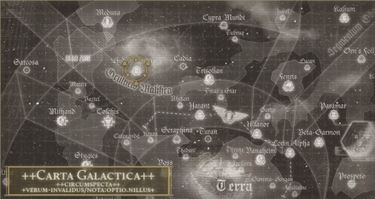
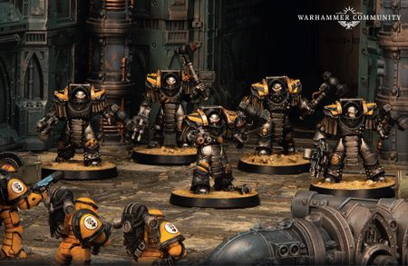

# 0786 ~007.M31 第一次海德拉之心围城 First Siege of Hydra Cordatus

精校状态：中文行文已逐段精校，部分术语仍为暂定

分类：时间线

原文来源：https://www.bilibili.com/opus/1200651072496992340

原作者：帝国神选罐头

原文时间：2026年05月10日 12:19

[返回分类目录](目录.md) · [全书目录](../../目录.md)

<!-- A0786-B0001 -->
**英文原文**

The First Siege of Hydra Cordatus was a battle during the Horus Heresy.

<!-- /A0786-B0001 -->

<!-- A0786-B0002 -->

原译文

第一次海德拉之心围城是荷鲁斯叛乱时期的一场战斗。

**校订译文**

第一次海德拉之心围城战是荷鲁斯之乱期间的一场战斗。

<!-- /A0786-B0002 -->

<!-- A0786-B0003 图片 -->

<!-- A0786-B0004 -->

原译文

Location of Hydra Cordatus 海德拉之心的地点

**校订译文**

Location of Hydra Cordatus 海德拉之心的地点

<!-- /A0786-B0004 -->

<!-- A0786-B0005 -->
**英文原文**

Conflict:Horus Heresy

<!-- /A0786-B0005 -->

<!-- A0786-B0006 -->

原译文

冲突：荷鲁斯叛乱

**校订译文**

冲突：荷鲁斯之乱

<!-- /A0786-B0006 -->

<!-- A0786-B0007 -->
**英文原文**

Date:~007.M31

<!-- /A0786-B0007 -->

<!-- A0786-B0008 -->

原译文

日期：~007.M31

**校订译文**

日期：约007.M31

<!-- /A0786-B0008 -->

<!-- A0786-B0009 -->
**英文原文**

Location:Hydra Cordatus

<!-- /A0786-B0009 -->

<!-- A0786-B0010 -->

原译文

地点：海德拉之心

**校订译文**

地点：海德拉之心

<!-- /A0786-B0010 -->

<!-- A0786-B0011 -->
**英文原文**

Outcome:Traitor victory

<!-- /A0786-B0011 -->

<!-- A0786-B0012 -->

原译文

结果：叛徒胜利

**校订译文**

结果：叛徒胜利

<!-- /A0786-B0012 -->

<!-- A0786-B0013 -->
**英文原文**

Combatants:Traitors/Imperium

<!-- /A0786-B0013 -->

<!-- A0786-B0014 -->

原译文

作战方：叛徒/帝国

**校订译文**

作战方：叛徒/帝国

<!-- /A0786-B0014 -->

<!-- A0786-B0015 -->
**英文原文**

Commanders:Primarch Perturabo, Warsmith Forrix, Warsmith Harkor, Warsmith Soltarn Vull Bronn, Warsmith Barban Falk, Warsmith Toramino, Lieutenant Kroeger, Siege Captain Ascari Valkar (KIA)/Captain Felix Cassander (POW)

<!-- /A0786-B0015 -->

<!-- A0786-B0016 -->

原译文

指挥官：原体佩图拉博，战争铁匠弗里克斯，战争铁匠哈科尔，战争铁匠索尔坦·武尔·布朗，战争铁匠巴尔班·福尔克，战争铁匠托拉米诺，副官克罗格尔，攻城连长阿斯卡里·瓦尔卡(KIA)/连长菲利克斯·卡桑德尔(POW)

**校订译文**

指挥官：原体佩图拉博、战争铁匠弗里克斯、战争铁匠哈克、战争铁匠索尔塔恩·沃·布隆、战争铁匠巴尔本·法尔克、战争铁匠托拉米诺、副官克罗格、攻城连长阿斯卡里·瓦尔卡（阵亡）／连长菲利克斯·卡桑德尔（被俘）

**校注：** Lieutenant暂沿本稿副官；不按现代陆军中尉机械套用阿斯塔特军团职衔。

<!-- /A0786-B0016 -->

<!-- A0786-B0017 -->
**英文原文**

Strength:Iron Warriors/200 Imperial Fists, Thousands of Human auxiliaries, Mechanicum forces

<!-- /A0786-B0017 -->

<!-- A0786-B0018 -->

原译文

力量：钢铁勇士/200名帝国之拳，数千人类辅助军，机械教部队

**校订译文**

兵力：钢铁勇士／200名帝国之拳、数千名人类辅助军、机械教部队

<!-- /A0786-B0018 -->

<!-- A0786-B0019 -->
**英文原文**

Casualties:Heavy/All killed or captured

<!-- /A0786-B0019 -->

<!-- A0786-B0020 -->

原译文

伤亡：重大/全部死亡或被俘

**校订译文**

伤亡：损失惨重／全部阵亡或被俘

<!-- /A0786-B0020 -->

<!-- A0786-B0021 -->
## Overview 概述

<!-- /A0786-B0021 -->

<!-- A0786-B0022 -->
**英文原文**

The assault on the world of Hydra Cordatus was undertaken by the Iron Warriors led personally by Perturabo, who was targeting the world's small Imperial Fists garrison. Due to the fierce rivalry and mutual hatred between both Legions, tensions ran high. The primary target for the Iron Warriors was the world's Cadmean Citadel.

<!-- /A0786-B0022 -->

<!-- A0786-B0023 -->

原译文

对海德拉之心世界的攻击是由佩图拉博亲自领导的钢铁勇士进行的，他们的目标是世界上规模较小的帝国之拳驻军。由于两个军团之间的激烈竞争和相互仇恨，紧张局势升级。钢铁勇士的主要目标是世界上的卡德摩斯城堡。

**校订译文**

佩图拉博亲率钢铁勇士进攻海德拉之心，目标是当地为数不多的帝国之拳驻军。两军团素来竞争激烈、彼此仇恨，这场对决因此格外紧张。钢铁勇士的首要目标是行星上的卡德摩斯城堡。

<!-- /A0786-B0023 -->

<!-- A0786-B0024 -->
**英文原文**

After a fierce orbital bombardment by Magma Bombs, the Iron Warriors landed but found the defences of the Citadel formidable. As a result, the Iron Warriors were bogged down into a 3 month siege. Inside the citadel, tens of thousands of normal humans as well as women and children were being provided shelter by the Imperial Fists. Nonetheless after 3 months Perturabo had enough, and led a final charge that saw the Primarch kill the remaining Imperial Fists and break the defenders. Most of the Imperial Fists were massacred while the human refugees were all butchered or enslaved. Hydra Cordatus became a barren wasteland.

<!-- /A0786-B0024 -->

<!-- A0786-B0025 -->

原译文

在岩浆炸弹的猛烈轨道轰炸后，钢铁勇士登陆，但发现城堡的防御非常强大。结果，钢铁勇士陷入了长达3个月的围攻。在城堡内，数万名普通人以及妇女和儿童被帝国之拳提供庇护。尽管如此，3个月后，佩图拉博受够了，并领导了最后一次冲锋，看到原体杀死了剩下的帝国之拳，击溃了守军。大多数帝国之拳被屠杀，而人类难民则被屠杀或奴役。海德拉之心变成了一片贫瘠的荒地。

**校订译文**

钢铁勇士先以熔岩炸弹实施猛烈轨道轰炸，随后登陆，却发现城堡防御异常坚固，被拖入长达三个月的围攻。帝国之拳在堡内庇护着数万名普通人，其中包括妇女与儿童。三个月后，佩图拉博终于失去耐心，亲率最后的冲锋，杀死残存的帝国之拳，击溃守军。大多数帝国之拳惨遭屠杀，人类难民则全部被杀或沦为奴隶。海德拉之心就此化作荒芜废土。

**校注：** 概述称原体杀死剩余帝国之拳，伤亡表同时称有俘虏，具体卡桑德尔标被俘；保留原文概述口径，不补全员阵亡结论。

<!-- /A0786-B0025 -->

<!-- A0786-B0026 -->
## History 历史

<!-- /A0786-B0026 -->

<!-- A0786-B0027 -->
**英文原文**

No one knew who built the Cadmean Citadel, and the fortress had the ability to automatically repair damage that was inflicted to its structure by pouring liquid silicates that would fill any wounds. The wall had other defences, including the ability to form spikes that would pierce any invaders, or it could open gaps and entomb an attacker. Beneath the wall were gravity generators that slowed anyone would who attempt to climb, but their range was limited to only a few meters. The Mechanicum performed extensive research on the facility but could not understand how it worked. The fortress was not invincible; it could be damaged to an extent in a short period of time that made it irreparable, overwhelming its mechanics. Neither the material nor the technology came from Hydra Cordatus istelf.

<!-- /A0786-B0027 -->

<!-- A0786-B0028 -->

原译文

没有人知道谁建造了卡德摩斯城堡，这座城堡有能力通过倾倒液态硅酸盐来自动修复对其结构造成的损坏，这些硅酸盐可以填充任何缺口。城墙还有其他防御措施，包括能够形成刺穿任何入侵者的尖刺，或者可以打开缝隙并埋葬攻击者。墙下是重力发生器，可以减缓任何试图攀爬的人的速度，但它们的射程仅限于几米。机械教对该设施进行了广泛的研究，但无法理解其工作原理。这座堡垒并非不可战胜；它可能在短时间内受到一定程度的损坏，使其无法修复，使其机械性能不堪重负。无论是材料还是技术都不是来自九头蛇。

**校订译文**

无人知道卡德摩斯城堡由谁建造。堡垒能够释放液态硅酸盐，填补受创部位，自动修复结构损伤。城墙还能生出尖刺贯穿入侵者，或张开裂隙，将来袭者封死在墙内。墙下的重力发生器可拖慢攀爬者，但作用范围只有数米。机械教曾深入研究这座设施，却始终无法理解其原理。不过，城堡并非坚不可摧：只要在短时间内造成足够严重的破坏，超过其机械系统的承受能力，损伤便无法修复。它使用的材料与技术，都并非源自海德拉之心本土。

<!-- /A0786-B0028 -->

<!-- A0786-B0029 -->
**英文原文**

The Imperial Fists brought the world to compliance during the Great Crusade, and Rogal Dorn made the place a capital so that the people would have an ordered government. They elected Endric Cadmus as their planetary governor, and iterators and remembrancers were spread to promote the Imperial Truth. Captain Felix Cassander of the 42nd Company and two hundred legionaries were stationed on the planet as the legion departed to continue their conquest. Eventually, Dorn ordered all Imperial Fists to return to Terra, but the death of Cassander's navigator made that impossible. Before a replacement could be found, he received word that Horus had turned traitor.

<!-- /A0786-B0029 -->

<!-- A0786-B0030 -->

原译文

帝国之拳在大远征期间使世界平定，罗格·多恩将该地定为首都，以便人民有一个有序的政府。他们选举恩德里克·卡德摩斯为他们的行星总督，并传播了宣讲者和记述者来宣传帝国真理。第42连队的菲利克斯·卡桑德尔连长和200名军团士兵驻扎在这个行星上，军团离开继续他们的征服。最终，多恩命令所有帝国之拳返回泰拉，但卡桑德尔的导航者的死亡使这一切变得不可能。在找到替代者之前，他收到了荷鲁斯已经叛变的消息。

**校订译文**

大远征期间，帝国之拳使该世界归顺帝国。罗格·多恩将城堡所在地定为首府，为居民建立有序的政府。居民选出恩德里克·卡德摩斯担任行星总督，宣讲师与记述者则前往各地传播帝国真理。军团继续远征后，第42连连长菲利克斯·卡桑德尔与两百名军团战士留下驻守。后来，多恩命令全体帝国之拳返回泰拉，但卡桑德尔麾下的导航员已死，使舰队无法成行。还没找到替代人选，荷鲁斯叛变的消息便传来了。

<!-- /A0786-B0030 -->

<!-- A0786-B0031 -->
## Arrival 到达

<!-- /A0786-B0031 -->

<!-- A0786-B0032 -->
**英文原文**

The Iron Warriors began their invasion by bombing the valley and surrounding areas, destroying the land, before landing legionaries, guns, and other equipment for a large scale siege. The Imperial Fists gave nicknames to the four commanders of the Iron Warriors based on their actions: Scrapper (Triarch Harkor, who led assaults), Digger (dug fortifications to bring in artillery), Malingerer (used artillery from afar), and Voyeur (Triarch and First Captain Forrix, who watched from the valley centre).

<!-- /A0786-B0032 -->

<!-- A0786-B0033 -->

原译文

钢铁勇士开始入侵，轰炸山谷和周边地区，摧毁土地，然后登陆军团士兵、枪炮和其他装备进行大规模围攻。帝国之拳根据他们的行动给钢铁勇士的四位指挥官起了绰号：刮刀（领导进攻的三叉戟哈科尔）、挖掘机（挖掘防御工事以引入火炮）、诈病者（从远处使用火炮）和窥视者（三叉戟和第一连长弗里克斯，从山谷中心观察）。

**校订译文**

钢铁勇士先轰炸山谷及周边地区，摧毁地表，再将军团战士、火炮和其他攻城装备送下地面。帝国之拳根据敌方四名指挥官的行动，为他们起了绰号：“斗殴者”，即负责突击的三叉戟成员哈克；“挖土人”，负责掘进工事、将火炮向前推进；“诈病者”，只在远处使用炮兵；以及“窥视者”，即留在山谷中央观察战况的三叉戟成员、第一连长弗里克斯。

**校注：** Scrapper按好斗者语义译斗殴者，不是刮刀；Digger为人的绰号挖土人，不是机械挖掘机。Triarch为钢铁勇士三叉戟成员，非太空死灵三圣。

<!-- /A0786-B0033 -->

<!-- A0786-B0034 -->
**英文原文**

Over the course of three months, 3/4ths of the Imperial Fists were killed, including Techmarine Scanion, and thousands of the Imperial soldiers were killed. The Iron Warriors were making a slow advance towards the fortress, building trenches and defensive emplacements for their guns. During this time, Perturabo spoke to very few of the Iron Warriors, preferring to speak through the "Stonewrought" (Soltarn Vull Bronn). Vull Bronn was of the 45th Grand Battalion, and his ability to understand stone brought him into the favour of the primarch even though he was not a captain.

<!-- /A0786-B0034 -->

<!-- A0786-B0035 -->

原译文

在三个月的时间里，包括技术军士斯坎农在内的3/4的帝国之拳被杀，数千名帝国士兵被杀。钢铁勇士正在缓慢地向堡垒前进，为他们的枪炮建造战壕和防御阵地。在此期间，佩图拉博很少与钢铁勇士交谈，他更喜欢通过“石头精炼”（索尔坦·武尔·布朗）说话。武尔·布朗是第45大营的一员，尽管他不是连长，但他对石头的理解能力使他受到了原体的青睐。

**校订译文**

三个月间，帝国之拳损失了四分之三的战士，包括科技战士斯坎农，另有数千名帝国士兵阵亡。钢铁勇士挖掘战壕、修筑防护炮位，缓缓逼近堡垒。佩图拉博很少亲自与部下交谈，更愿意让“石铸者”索尔塔恩·沃·布隆代为传话。沃·布隆隶属第45大营，虽然并非连长，却凭借对岩石的深刻理解赢得了原体青睐。

<!-- /A0786-B0035 -->

<!-- A0786-B0036 -->
## Battle for the Cadmean Citadel 卡德摩斯城堡之战

<!-- /A0786-B0036 -->

<!-- A0786-B0037 -->
**英文原文**

With the Iron Warriors' 33rd Grand Battalion at his command, Iron Warriors Siege Captain Ascari Valkar attacked the Cadmean Citadel, alongside the Tyranthikos. Despite the efforts of the Imperial Fists' 42nd Company, Mechanicum and the Chalchidean Grenadiers Solar Auxilia, the Iron Warriors succeeded in breaching the Citadel's outer gates. However they were then attacked by an Imperial Fists Forge Lord, who commanded five maniples of Castellax Robots. Their firepower took a toll on the Battalion and the Iron Warriors would have been pushed back had the Tyranthikos not charged into the robots. This allowed the Iron Warriors to regain their footing, but the battle then entered a bloody stalemate. Both sides began taking serious losses, but Valkar called for more reinforcements to defeat the Imperial Fists. However, with two thirds of the 33rd Grand Battalion dead or grievously wounded, Galan Dion and the Tyranthikos could see that the Siege Captain had failed. In order to save what was left of their combined forces, the Veteran decided to remove Valkar from command. Valkar saw them coming, though, and the Siege Captain was able to keep them at bay with his power sword. Dion was finally able to disarm him by shoving Valkar to the ground and this allowed the Tyranthikos to bring the Siege Captain to their waiting Primarch. Valkar was given no chance to account for his failure and, on Perturabo's order, the Domitar Robots of the Iron Circle turned the Siege Captain into bloody pieces.

<!-- /A0786-B0037 -->

<!-- A0786-B0038 -->

原译文

在钢铁勇士第33大营的指挥下，钢铁勇士攻城连长阿斯卡里·瓦尔卡与僭主一起袭击了卡德摩斯城堡。尽管帝国之拳第42连队、机械教和卡尔西迪安掷弹兵太阳辅助军付出了努力，但钢铁勇士还是成功突破了城堡的外门。然而，他们随后遭到了一位帝国之拳铸造领主的袭击，他指挥着五个堡星机兵队。他们的火力对营队造成了损失，如果僭主没有冲入机兵，钢铁勇士就会被击退。这让钢铁勇士重新站稳了脚跟，但战斗随后陷入了血腥的僵局。双方都开始遭受严重损失，但瓦尔卡呼叫增援以击败帝国之拳。然而，由于第33大营三分之二的士兵死亡或严重受伤，加兰·迪翁和僭主看到攻城连长失败了。为了拯救剩下的联合部队，老兵决定解除瓦尔卡的指挥权。不过，瓦尔卡看到他们来了，攻城连长用他的动力剑把他们挡在了分隔间里。迪翁最终将瓦尔卡推倒在地，解除了他的武装，这使得僭主能够将攻城连长带到他们等待的原体面前。瓦尔卡没有机会解释他的失败，在佩图拉博的命令下，铁环的支配者机兵将攻城连长变成了血肉模糊的碎片。

**校订译文**

钢铁勇士攻城连长阿斯卡里·瓦尔卡指挥第33大营，与提兰提科斯卫队一起进攻卡德摩斯城堡。帝国之拳第42连、机械教部队和太阳辅助军卡尔西迪安掷弹兵奋力抵抗，仍未能阻止敌军突破外门。然而，一名帝国之拳铸造领主随即率五个支队的堡星机兵反击，猛烈火力给第33大营造成重创。若非提兰提科斯卫队冲入机兵阵中，钢铁勇士几乎就要被击退。他们虽重稳阵脚，战斗却陷入血腥僵持，双方损失不断扩大。瓦尔卡继续要求增援，决意击败帝国之拳，但第33大营已有三分之二阵亡或重伤，加兰·迪翁与提兰提科斯卫队都看出，这位攻城连长已经失败。为了保住两支部队的残存力量，老兵迪翁决定解除其指挥权。瓦尔卡发觉众人逼近，挥动动力剑阻挡，最终仍被迪翁推倒、缴械。提兰提科斯卫队将他押到等待中的佩图拉博面前。原体没有给他任何解释的机会，直接下令铁环的支配者机兵将其撕成血肉碎块。

**校注：** 第33大营由瓦尔卡指挥，原译“在第33大营指挥下”把施受颠倒。keep them at bay指抵挡众人，不是挡在分隔间里。

<!-- /A0786-B0038 -->

<!-- A0786-B0039 图片 -->

<!-- A0786-B0040 -->

原译文

Dominators attack the Imperial Fists position 统御者攻击帝国之拳阵地

**校订译文**

Dominators attack the Imperial Fists position 统御者攻击帝国之拳阵地

<!-- /A0786-B0040 -->

<!-- A0786-B0041 -->
## Final Attack 最终攻击

<!-- /A0786-B0041 -->

<!-- A0786-B0042 -->
**英文原文**

Forrix admired the structure of the Cadmean Citadel and how the Imperial Fists transformed the area to turn them into liberators and not conquers, which the Iron Warriors would never bother to do. He turned to Warsmith Barban Falk, who was angered by the sentiment because of the disastrous results that took place at the Battle of Phall. They moved on to discuss the final attack on the western approaches, and Falk favoured relying on more legionaries than extra siege batteries. Forrix questioned an assault, noting that mines could be emplaced, but Falk said that the "Stonewrought" (Soltarn Vull Bronn), speaking for the primarch, assured that there would be none in that region. They were interrupted by the sound of an assault taking place on the north by Harkor's warriors.

<!-- /A0786-B0042 -->

<!-- A0786-B0043 -->

原译文

弗里克斯欣赏卡德摩斯城堡的结构，以及帝国之拳是如何转变这个地区，使其成为解放者而非征服者，而钢铁勇士永远不会费心去做这件事。他转向了战争铁匠巴尔班·福尔克，他对这种情绪感到愤怒，因为法尔之战发生了灾难性的结果。他们继续讨论了对西进路线的最后一次攻击，福尔克赞成依靠更多的军团士兵而不是额外的攻城炮。弗里克斯对袭击表示质疑，并指出可能布设地雷，但福尔克表示，代表原体的“石头精炼”（索尔坦·武尔·布朗）保证该地区不会有地雷。他们被哈科尔的战士在北方发动进攻的声音打断了。

**校订译文**

弗里克斯赞赏卡德摩斯城堡的构造，也钦佩帝国之拳改造当地、使自己成为解放者而非征服者的做法——钢铁勇士从不会费心这样做。他向战争铁匠巴尔本·法尔克提起此事，对方却因法尔之战的惨败，对这种赞许十分恼怒。两人转而讨论从西侧通路发起的最终进攻。法尔克倾向于增加军团战士，而非额外投入攻城炮组；弗里克斯则担心进攻路线可能埋有地雷。法尔克答道，代原体传话的“石铸者”索尔塔恩·沃·布隆已保证，该区域没有地雷。此时，北面传来哈克部队发起攻击的声响，打断了谈话。

**校注：** Forrix赞扬的是帝国之拳成为解放者，不是把地区改造成解放者。

<!-- /A0786-B0043 -->

<!-- A0786-B0044 -->
**英文原文**

By the moment of the final attack, Cassander only had 51 legionaries, and there were over 13,000 remaining citizens in the fortress who would easily be slaughtered if the defences were breached. Cassander was realistic and knew that a last stand would not be glorious. He stood on the northern side of the fortress with Locris and Kastor, noting that the pace of the Iron Warriors dramatically increased. They believed that it was Scrapper and not Digger, who was attacking: the Iron Warriors were trying to climb up the mountain to the wall, moving ahead of their guns on walker platforms, and they were motivated by great hate.

<!-- /A0786-B0044 -->

<!-- A0786-B0045 -->

原译文

到最终攻击的那一刻，卡桑德尔只有51名军团士兵，堡垒里还有13000多名平民，如果防御被突破，他们很容易被屠杀。卡桑德尔很现实，他知道最后的抵抗不会是荣耀的。他与洛克里斯和卡斯托一起站在堡垒的北侧，指出钢铁勇士的步伐急剧加快。他们认为是刮刀而不是挖掘机在进攻：钢铁勇士正试图爬上山到城墙上，走在他们步行者平台的枪炮前面，他们受到极大的仇恨驱使。

**校订译文**

最终进攻开始时，卡桑德尔手下只剩五十一名军团战士，堡内却还有一万三千余名居民。一旦防线失守，他们便会遭到屠杀。卡桑德尔对此十分清醒，知道最后的抵抗不会是什么光荣壮举。他与洛克里斯、卡斯托站在堡垒北侧，发现钢铁勇士突然加快了推进速度，判断这是“斗殴者”而非“挖土人”在进攻：敌军战士在刻骨仇恨驱使下，冲到步行炮台前面，攀山逼近城墙。

<!-- /A0786-B0045 -->

<!-- A0786-B0046 -->
**英文原文**

Locris pulled a trigger and detonated mines in the slope that destroyed a 300 meter section that crashed down on the Iron Warriors. Cassander then had Symeon, Esdras, and Phyros redeploy to the north to defend against the remaining assault force. Iron Warriors Lieutenant Kroeger pushed on through the gravity trap and quickly forced himself up the wall, climbing with only a few of the toughest legionaries while the 300 others of Harkor's 23rd Grand Battalion set up weapon emplacements or took cover. Servitor weapon emplacements blasted the Iron Warriors as Imperial Fists shot down the wall. The Iron Warriors were forced to stop their fire to avoid hitting their own troops. Khamer, Ulgolan, Purdox, Straba, Vannuk and many other Iron Warriors were killed in the attempt. This enraged Kroeger further, and he managed to reach the top with two others, Vortrax and Ushtor.

<!-- /A0786-B0046 -->

<!-- A0786-B0047 -->

原译文

洛克里斯扣动扳机，引爆了斜坡上的地雷，摧毁了一个300米长的路段，该路段坠落在钢铁勇士之上。卡桑德尔随后让西梅昂、埃斯德拉斯和费罗斯重新部署到北部，以防御剩余的突击部队。钢铁勇士副官克罗格穿过重力陷阱，迅速爬上了墙，只和几个最强壮的军团士兵一起攀爬，而哈科尔的第23大营的其他300人则设置了武器阵地或掩护。当帝国之拳向下射击城墙时，机仆的武器阵地轰炸了钢铁勇士。钢铁勇士被迫停止射击，以避免击中自己的部队。卡梅尔、乌尔戈兰、普多克斯、斯特拉巴、瓦努克和许多其他钢铁勇士在袭击中丧生。这进一步激怒了克罗格，他和另外两个人沃特拉克斯和乌绍尔一起登上了顶部。

**校订译文**

洛克里斯按下引爆装置，炸毁斜坡上一段三百米长的山体，使其崩塌，压向钢铁勇士。卡桑德尔随即将西梅昂、埃斯德拉斯与费罗斯调往北侧，抵挡残存突击部队。钢铁勇士副官克罗格强行穿过重力陷阱，带着少数最坚韧的战士迅速攀墙，哈克第23大营的另外三百人则构筑武器阵地或寻找掩护。机仆炮位轰击钢铁勇士，帝国之拳也从城头向下射击；钢铁勇士的支援火力却不得不停下，以免误伤攀墙的同袍。卡梅尔、乌尔戈兰、普多克斯、斯特拉巴、瓦努克等人接连战死。这令克罗格更加狂怒，最终，他与沃特拉克斯、乌绍尔三人登上了城头。

<!-- /A0786-B0047 -->

<!-- A0786-B0048 -->
**英文原文**

Surprising the Imperial Fists, Kroeger managed to hit Cassander in the head but did not kill him. Vortrax was soon killed as were Imperial Fists, and two more Iron Warriors reached the top. Cassander charged the two new Iron Warriors and killed them before challenging Kroeger, who was now alone, but Kroeger instead shot him twice in the chest. Before Kroeger could kill another Imperial Fist, over 20 other Imperial Fists arrived and blasted him in his side, hitting him multiple times before he could take cover. His arm was damaged and his bolter destroyed. Before he could bleed out, a stormbird hovered above the top of the fortress, killing many with its engine wash as Perturabo landed with the Iron Circle.

<!-- /A0786-B0048 -->

<!-- A0786-B0049 -->

原译文

令帝国之拳惊讶的是，克罗格设法击中了卡桑德尔的头部，但没有杀死他。沃特拉克斯很快被杀，帝国之拳也是如此，又有两名钢铁勇士登上了顶部。卡桑德尔在挑战独自一人的克罗格之前，冲向了两名新的钢铁勇士并杀死了他们，但克罗格却向他胸部开了两枪。在克罗格能够杀死另一名帝国之拳之前，20多名其他帝国之拳来到他身边，在他能够躲藏之前，对他进行了多次打击。他的手臂受伤，他的爆矢枪被摧毁。在他的血流尽之前，一只风暴鸟在堡垒的顶部盘旋，当佩图拉博带着铁环降落时，它的引擎喷流杀死了许多人。

**校订译文**

克罗格猝然杀到，击中卡桑德尔头部，却未能将其杀死。沃特拉克斯很快阵亡，数名帝国之拳也倒下，另有两名钢铁勇士登上城头。卡桑德尔冲向这两名新敌，将其杀死，随后向已孤身一人的克罗格挑战；后者却直接朝他胸口开了两枪。克罗格尚未来得及再杀一人，二十余名帝国之拳援军就赶到，从侧面向他开火。他还没躲入掩体，便接连中弹，手臂受伤，爆矢枪也被打碎。就在他失血濒死时，一架风暴鸟悬停在堡垒上空，引擎喷流杀死了许多人。佩图拉博与铁环卫队随即降临。

<!-- /A0786-B0049 -->

<!-- A0786-B0050 -->
**英文原文**

Perturabo made short work of the defenders. The Imperial Fists immediately turned to attack the primarch, but he made slaughtered them easily. After killing them, the primarch then smashed Forgebreaker into the stone rampart. Perturabo then went to Kroeger, who was barely alive, and commanded the legionary to remove his helmet. The primarch then said that he remembered Kroeger then asked where his warsmith was, to which Kroeger said he was "with the guns". Perturabo remarked on Kroeger surviving the attack alone, ignoring his fellows who died at the top, then examined Kroeger with his immaterium senses. Harkor appeared via thunderhawk along with others, including Forrix, Falk, and Toramino of the Stor-Bezashk They approached the primarch cautiously, wary of his rage, and knelt before him.

<!-- /A0786-B0050 -->

<!-- A0786-B0051 -->

原译文

佩图拉博对守军进行了短暂的攻击。帝国之拳立即转向攻击原体，但他轻而易举地杀死了他们。在杀死他们之后，原体随后将破炉者砸向石墙。随后，佩图拉博找到了奄奄一息的克罗格，并命令军团士兵摘下他的头盔。然后，原体说他记得克罗格，然后问他的战争铁匠在哪里，克罗格说他“拿着枪”。佩图拉博说克罗格独自一人在攻击中幸存下来，忽视了他在顶部死去的同伴，然后用他非物质界的感觉检查了克罗格。哈科尔和其他人一起通过雷鹰出现，包括弗里克斯、福尔克和破城宿卫的托拉米诺。他们小心翼翼地接近了原体，警惕他的愤怒，跪在他面前。

**校订译文**

佩图拉博迅速解决了守军。帝国之拳立即转向攻击原体，却被他轻易屠尽。他随后将破炉者砸向石砌城垛，再走到奄奄一息的克罗格面前，命令他摘下头盔。佩图拉博说自己记得他，并问他的战争铁匠在哪里。克罗格回答：“在炮兵那边。”原体称赞他独自从进攻中活了下来，却无视了其他登上城头后战死的同袍，随后以亚空间感知审视克罗格。哈克乘雷鹰抵达，同行的还有弗里克斯、法尔克与破城宿卫的托拉米诺。他们惧怕原体的怒火，小心上前，跪在他面前。

**校注：** with the guns意为待在炮兵阵地，非手持枪械；immaterium senses明确来自所给英文，保留亚空间感知并待核设定。

<!-- /A0786-B0051 -->

<!-- A0786-B0052 -->
## Aftermath 余波

<!-- /A0786-B0052 -->

<!-- A0786-B0053 -->
**英文原文**

Harkor believed that he would be honoured for finally breaking the fortress. Instead, the primarch was oddly silent, unsettling the warsmiths, until he spoke, asking if he was clear in his orders. Before Harkor could respond, Perturabo grabbed his throat and lifted him with ease. The primarch expressed his anger at not being obeyed, but Harkor tried to say that he saw an opportunity and tried to take it. Perturabo responded that victory was not from Harkor. Instead, he turned to Kroeger and pointed out that he alone survived the assault, the others wasted as Harkor hid in protection. Instead of killing Harkor, Perturabo ripped off Harkor's armour with ease, deeming him unfit to wear the armour and labeling him as rust.

<!-- /A0786-B0053 -->

<!-- A0786-B0054 -->

原译文

哈科尔相信，他将为最终破坏堡垒而感到荣誉。相反，原体奇怪地沉默着，让战争铁匠感到不安，直到他开口，问他是否清楚自己的命令。哈科尔还没来得及回答，佩图拉博就掐住他的喉咙，轻松地把他抬了起来。原体对没有得到服从表示愤怒，但哈科尔试图说他看到了一个机会，并试图抓住它。佩图拉博回应说，胜利不是来自哈科尔。相反，他转向克罗格，指出只有他一个人在攻击中幸存下来，其他人被浪费了，而哈科尔则躲了起来寻求保护。佩图拉博没有杀死哈科尔，而是轻而易举地撕下了哈科尔的盔甲，认为他不适合穿盔甲，并将他标记为铁锈。

**校订译文**

哈克以为自己终于攻破堡垒，将获嘉奖。原体却异常沉默，让众战争铁匠愈发不安。终于，佩图拉博开口问：自己的命令是否说得够清楚？哈克还没回答，便被原体掐住喉咙，轻易提了起来。佩图拉博怒斥他抗命，哈克辩称自己看见了机会，只想趁势行动。原体却说，胜利并不属于他，而属于克罗格：其他战士白白死去，只有克罗格活着冲上城头，哈克却躲在安全处。佩图拉博没有杀他，而是轻易撕掉他的装甲，斥责他不配披甲，只是军团中的锈蚀。

<!-- /A0786-B0054 -->

<!-- A0786-B0055 -->
**英文原文**

Harkor was stripped of his status as a triarch, of which Forrix was glad because he never supported Harkor in the position. He was returned to the status of normal legionary of the 23rd Grand Battalion and was dismissed. Perturabo then stated he needed to find two replacements, Erasmus Golg having died at Phall, and both Falk and Toramino stood and said they were ready to serve. The primarch asked Forrix for his recommendation. Forrix thought of suitable candidates that were no longer there, Dargron died at Phall and Varrek was sent to an unknown location, but stated that Falk and Toramino would be good. The primarch said he would normally agree, but today was different; he chose Falk and Kroeger instead. Perturabo also elevated Kroeger to commander of the 23rd Grand Battalion.

<!-- /A0786-B0055 -->

<!-- A0786-B0056 -->

原译文

哈科尔被剥夺了三叉戟的地位，弗里克斯对此感到高兴，因为他从未支持过哈科尔的职位。他被恢复为第23大营的普通军团士兵，并被解职。佩图拉博随后表示，他需要找到两名替补，伊拉斯谟·高尔在法尔牺牲，福尔克和托拉米诺都站了起来，表示他们已经准备好服役。原体向弗里克斯征求意见。弗里克斯想到了不再存在的合适人选，达格隆在法尔牺牲，瓦雷克被送往未知地点，但表示福尔克和托拉米诺会很好。原体说他通常会同意，但今天不一样了；他选择了福尔克和克罗格。佩图拉博还将克罗格提升为第23大营的指挥官。

**校订译文**

哈克被罢免了三叉戟成员的职务，弗里克斯对此暗自高兴，因为他从未赞成让哈克担任这一职位。哈克被贬回第23大营普通战士，随即遭到斥退。佩图拉博说，伊拉斯谟·高尔已在法尔阵亡，因此现在需要补上两个空缺。法尔克与托拉米诺起身表示愿意效劳，原体却先征询弗里克斯。弗里克斯想到几位已无法任职的合适人选：达格隆战死于法尔，瓦雷克被调往不明去处。他最终表示，法尔克与托拉米诺都可以。佩图拉博回答，平时或许会赞同，但今天不同；他选中了法尔克与克罗格，并任命后者指挥第23大营。

<!-- /A0786-B0056 -->

本篇核心术语与暂定项

以下列出本篇出现的英文原形及核心术语表用词。同形词可能指不同对象，具体词义以本篇正文和校注为准；单复数、别名和仅见于图注的名称可能尚未列入。完整候选见[术语表](../../术语表/双语术语候选.csv)。

| 英文 | 采用中文 | 状态 |
| --- | --- | --- |
| Horus Heresy | 荷鲁斯之乱 | 官方已核对 |
| Navigator | 导航员 | 官方已核对 |
| Imperium | 帝国 | 暂定·简称 |
| Mechanicum | 机械教 | 暂定·历史称谓 |
| Servitor | 机仆 | 暂定 |
| Equipment | 装备 | 编辑用语已统一 |
| Imperial Fists | 帝国之拳 | 暂定 |
| Techmarine | 科技战士 | 官方已核对 |
| Primarch | 原体 | 官方已核对 |
| Iron Warriors | 钢铁勇士 | 暂定·官方待核 |
| Great Crusade | 大远征 | 暂定·官方待核 |
| Compliance | 归顺；纳入帝国统治 | 暂定·官方待核 |
| Terra | 泰拉 | 暂定·官方待核 |
| Horus | 荷鲁斯 | 暂定·官方待核 |
| Solar Auxilia | 太阳辅助军 | 暂定·官方待核 |
| Warsmith | 战争铁匠 | 暂定·官方待核 |
| Imperial Truth | 帝国真理 | 暂定·官方待核 |
| Clear | 清明 | 暂定·官方待核 |
| Tyranthikos | 提兰提科斯卫队 | 暂定·官方待核 |
| Lieutenant | 副官 | 暂定·官方待核 |
| First Captain | 第一连长 | 暂定·官方待核 |
| Soltarn Vull Bronn | 索尔塔恩·沃·布隆 | 暂定·官方待核 |
| Barban Falk | 巴尔本·法尔克 | 暂定·官方待核 |
| Kroeger | 克罗格 | 暂定·官方待核 |
| Toramino | 托拉米诺 | 暂定·官方待核 |
| Harkor | 哈克 | 暂定·官方待核 |
| Forge Lord | 铸炉之主 | 暂定·官方待核 |
| Captain | 连长 | 暂定·官方待核 |
| Veteran | 老兵 | 暂定·官方待核 |
| Invaders | 侵略者 | 暂定·官方待核 |
| Liberators | 解放者 | 暂定·官方待核 |
| Stormbird | 风暴鸟 | 暂定·官方待核 |
| Magma Bombs | 熔岩炸弹 | 暂定·官方待核 |
| Triarch | 三圣（太空死灵统治议会）／三叉戟成员（钢铁勇士职衔） | 语境定译·官方待核 |
| Kastor | 卡斯托 | 暂定·官方待核 |
| Cadmus | 卡德摩斯 | 暂定·官方待核 |
| Hydra Cordatus | 海德拉之心 | 暂定·官方待核 |
| Cadmean Citadel | 卡德摩斯城堡 | 暂定·官方待核 |
| Felix Cassander | 菲利克斯·卡桑德尔 | 暂定·官方待核 |
| Ascari Valkar | 阿斯卡里·瓦尔卡 | 暂定·官方待核 |
| Galan Dion | 加兰·迪翁 | 暂定·官方待核 |
| Stonewrought | 石铸者 | 暂定·官方待核 |
| Scrapper | 斗殴者 | 暂定·官方待核 |
| Digger | 挖土人 | 暂定·官方待核 |
| Malingerer | 诈病者 | 暂定·官方待核 |
| Voyeur | 窥视者 | 暂定·官方待核 |
| Stor-Bezashk | 破城宿卫 | 暂定·官方待核 |
| Forgebreaker | 破炉者 | 暂定·官方待核 |
| Rampart | 壁垒 | 暂定·官方待核 |
| Erasmus Golg | 伊拉斯谟·高尔 | 暂定·官方待核 |
| Varrek | 瓦雷克 | 暂定·官方待核 |
| Iron Circle | 铁环 | 暂定·官方待核 |
| Bolter | 爆矢枪 | 暂定·官方待核 |

