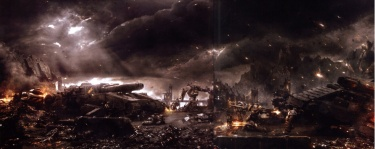

# 0789 008.M31 梅佐安战役 Mezoan Campaign

精校状态：中文行文已逐段精校，部分术语仍为暂定

分类：时间线

原文来源：https://www.bilibili.com/opus/1202822973003661317

原作者：帝国神选罐头

原文时间：2026年05月16日 08:47

[返回分类目录](目录.md) · [全书目录](../../目录.md)

<!-- A0789-B0001 -->
**英文原文**

The Mezoan Campaign was a battle of the Horus Heresy.

<!-- /A0789-B0001 -->

<!-- A0789-B0002 -->

原译文

梅佐安战役是荷鲁斯叛乱的一场战斗。

**校订译文**

梅佐安战役是荷鲁斯之乱期间的一场战斗。

<!-- /A0789-B0002 -->

<!-- A0789-B0003 图片 -->

<!-- A0789-B0004 -->

原译文

The Iron Warriors battle on Mezoa 钢铁勇士在梅佐亚战斗

**校订译文**

The Iron Warriors battle on Mezoa 钢铁勇士在梅佐亚战斗

<!-- /A0789-B0004 -->

<!-- A0789-B0005 -->
**英文原文**

Conflict:Horus Heresy

<!-- /A0789-B0005 -->

<!-- A0789-B0006 -->

原译文

冲突：荷鲁斯叛乱

**校订译文**

冲突：荷鲁斯之乱

<!-- /A0789-B0006 -->

<!-- A0789-B0007 -->
**英文原文**

Date:008.M31

<!-- /A0789-B0007 -->

<!-- A0789-B0008 -->

原译文

日期：008.M31

**校订译文**

日期：008.M31

<!-- /A0789-B0008 -->

<!-- A0789-B0009 -->
**英文原文**

Location:Mezoa

<!-- /A0789-B0009 -->

<!-- A0789-B0010 -->

原译文

地点：梅佐亚

**校订译文**

地点：梅佐亚

<!-- /A0789-B0010 -->

<!-- A0789-B0011 -->
**英文原文**

Outcome:Loyalist victory

<!-- /A0789-B0011 -->

<!-- A0789-B0012 -->

原译文

结果：忠诚派胜利

**校订译文**

结果：忠诚派胜利

<!-- /A0789-B0012 -->

<!-- A0789-B0013 -->
**英文原文**

Combatants:Imperium/Traitor Legions

<!-- /A0789-B0013 -->

<!-- A0789-B0014 -->

原译文

作战方：帝国/叛徒军团

**校订译文**

作战方：帝国/叛徒军团

<!-- /A0789-B0014 -->

<!-- A0789-B0015 -->
**英文原文**

Commanders:Mezoan Magi, Lord Commander Cassian Dracos, Lieutenant-Chaplain Xiaphas Jurr/Autilon Skorr (WIA), Nârik Dreygur (Defects)

<!-- /A0789-B0015 -->

<!-- A0789-B0016 -->

原译文

指挥官：梅佐亚贤者，领主指挥官卡西安·德拉科斯，副官牧师夏法斯·尤尔/奥蒂隆·斯科尔(WIA)，纳里克·德雷格(背叛)

**校订译文**

指挥官：梅佐亚贤者、领主指挥官卡西安·德拉科斯、副官教士夏法斯·尤尔／奥帝隆·斯考尔（负伤）、纳里克·德雷格尔（转投忠诚派）

<!-- /A0789-B0016 -->

<!-- A0789-B0017 -->
**英文原文**

Strength:12,000 troops total: Skitarii, Adsecularis, Cybernetica, Thallax, Disciples of the Flames, 48 Imperial Fists, 891st Lethe Cohort Solar Auxilia, House Hermetika/12 Capital Ships, 9,000 Iron Warriors/Alpha Legion Astartes, 20,000 Traitor Imperial Army, Dark Mechanicus, Traitor Iron Hands Blackshields

<!-- /A0789-B0017 -->

<!-- A0789-B0018 -->

原译文

力量：共12000部队：护教军，世俗者，智控军团，奴工，死隶，火焰门徒，48名帝国之拳，第891勒忒大队太阳辅助军，赫尔墨提卡家族/12艘主力舰，9000钢铁勇士/阿尔法军团阿斯塔特，20000名叛徒帝国军队，黑暗机械教，叛徒钢铁之手黑盾

**校订译文**

兵力：共计12,000，包括护教军、世俗者、智控部队、死隶战兵、火焰门徒、48名帝国之拳、太阳辅助军第891勒忒大队，以及赫尔墨提卡家族／12艘主力舰、合计9,000名钢铁勇士与阿尔法军团阿斯塔特、20,000名叛变帝国军、黑暗机械修会、叛变的钢铁之手黑盾

**校注：** 原译在Cybernetica与Thallax之间多出奴工，英文未单列该项，已去除；Adsecularis暂留世俗者；Dark Mechanicus按所给英文译黑暗机械修会。

<!-- /A0789-B0018 -->

<!-- A0789-B0019 -->
**英文原文**

Casualties:Heavy/Heavy, only 3,000 survivors

<!-- /A0789-B0019 -->

<!-- A0789-B0020 -->

原译文

伤亡：重大/重大，只有3000幸存者

**校订译文**

伤亡：惨重／惨重，仅3,000人生还

<!-- /A0789-B0020 -->

<!-- A0789-B0021 -->
## Background 背景

<!-- /A0789-B0021 -->

<!-- A0789-B0022 -->
**英文原文**

During the Scourging of the Cyclops Cluster in the final months of 006.M31, Horus sent his emissary Regulus to the forge worlds of Mezoa and M'Pandex. Under the authority of both Horus and Fabricator-General Kelbor-Hal, Regulus demanded their fealty to Mars. While M'Pandex accepted Regulus, Mezoa refused.

<!-- /A0789-B0022 -->

<!-- A0789-B0023 -->

原译文

在006.M31的最后几个月里，独眼巨人星群鞭挞期间，荷鲁斯派遣他的使者雷古勒斯前往梅佐亚和姆'潘德克斯铸造世界。在荷鲁斯和铸造将军凯尔博·哈尔的授权下，雷古勒斯要求他们效忠火星。虽然姆'潘德克斯接受了雷古勒斯，但梅佐亚拒绝了。

**校订译文**

006.M31最后几个月，独眼巨人星群遭到蹂躏。荷鲁斯派使者雷古勒斯前往梅佐亚与姆’潘德克斯铸造世界，代表自己和铸造将军凯尔博·哈尔，要求两地向火星效忠。姆’潘德克斯接受了要求，梅佐亚则拒绝服从。

<!-- /A0789-B0023 -->

<!-- A0789-B0024 -->
**英文原文**

The forces of Horus and Regulus swifty retaliated with a blockade of Mezoa which was in full effect by the end of the year. Mezoa was prevented access to raw materials and could not provide aid to other loyalists.

<!-- /A0789-B0024 -->

<!-- A0789-B0025 -->

原译文

荷鲁斯和雷古勒斯的部队迅速对梅佐亚进行了报复，封锁于年底全面生效。梅佐亚无法获得原材料，也无法向其他忠诚者提供援助。

**校订译文**

荷鲁斯与雷古勒斯迅速报复，封锁梅佐亚，并在该年年底形成完整封锁。梅佐亚从此无法获取原材料，也不能援助其他忠诚派。

<!-- /A0789-B0025 -->

<!-- A0789-B0026 -->
## Overview 概述

<!-- /A0789-B0026 -->

<!-- A0789-B0027 -->
**英文原文**

Shortly after his capture of Port Maw in the Battle of the Coronid Deeps, Warmaster Horus became determined to destroy the defiant Forge World of Mezoa. Two previous attempts had earlier been defeated by the loyalist Magos of the planet. Horus wished not only to make an example of Mezoa, he also sought to secure his rear as part of the push to Terra. Ultimately, it fell to the Iron Warriors 114th Grand Battalion of Nârik Dreygur and the 78th Chapter of the Alpha Legion under Autilon Skorr to undertake the operation. Resentment against the Alpha Legion by the Iron Warriors due to their behavior during the Siege of Epsilon-Stranivar IX hindered traitor cooperation and saw them compete over resources and prestige.

<!-- /A0789-B0027 -->

<!-- A0789-B0028 -->

原译文

在科罗尼德深渊之战中占领巨口港后不久，战帅荷鲁斯决心摧毁挑衅的梅佐亚铸造世界。之前的两次尝试早些时候被这个行星的忠诚派贤者击败。荷鲁斯不仅希望以梅佐亚为实例，他还试图保护自己的后方，作为向泰拉推进的一部分。最终，它落在了纳里克·德雷格的钢铁勇士第114大营和奥蒂隆·斯科尔领导的阿尔法军团第78战团的手中。由于钢铁勇士在围攻ε-斯特拉尼瓦尔九号期间的行为，他们对阿尔法军团的怨恨阻碍了叛徒的合作，并看到他们争夺资源和声望。

**校订译文**

在科罗尼德深渊之战中夺取巨口港后不久，荷鲁斯便决心摧毁顽抗的梅佐亚铸造世界。此前两次进攻都已被当地忠诚派贤者挫败。他既想杀一儆百，也要为进军泰拉稳固后方。任务最终交给纳里克·德雷格尔的钢铁勇士第114大营，以及奥帝隆·斯考尔率领的阿尔法军团第78战团。阿尔法军团在ε-斯特拉尼瓦尔九号围城战中的作为，让钢铁勇士怀恨在心。两军合作因此处处受阻，还彼此争夺资源与荣誉。

**校注：** 引发怨恨的是阿尔法军团此前弃盟行为，原译把行为主体误放成钢铁勇士。

<!-- /A0789-B0028 -->

<!-- A0789-B0029 -->
**英文原文**

A few short days before the traitor assault began, the Salamanders Cruiser Ebon Drake arrived at Mezoa. The ship carried the Disciples of the Flames, a mixed loyalist force commanded by Cassian Dracos. The first phase of the battle saw traitor and loyalist forces engage in a massive 9 hour void duel that resulted in heavy losses for both sides. Despite the Traitor tactical superiority, they were hampered by the fractured nature of their own force. In the end however the traitors emerged victorious, and began full-scale invasion of the world. At this same time, the Disciples of the Flames under Dracos met with the triumvirate norn-regents of Mezoa, working out the details of an alliance.

<!-- /A0789-B0029 -->

<!-- A0789-B0030 -->

原译文

叛徒袭击开始前几天，火蜥蜴巡洋舰黑檀龙兽号抵达梅佐亚。这艘舰船搭载了火焰门徒，这是一支由卡西安·德拉科斯指挥的混合忠诚派部队。在战斗的第一阶段，叛徒和忠诚派部队进行了长达9小时的大规模虚空决斗，导致双方损失惨重。尽管叛徒在战术上具有优势，但他们受到自身部队分裂的阻碍。然而，最终叛徒取得了胜利，开始了对世界的全面入侵。与此同时，德拉科斯手下的火焰门徒会见了梅佐亚的三位诺恩摄政，制定了联盟的细节。

**校订译文**

叛军进攻前数日，火蜥蜴巡洋舰黑檀龙兽号抵达梅佐亚，舰上搭载着卡西安·德拉科斯指挥的忠诚派混编部队——火焰门徒。战役首先在虚空打响，双方大规模交锋九个小时，均损失惨重。叛军虽然在战术上占优，却受到内部不和的拖累，最终仍取得胜利，开始全面入侵行星。与此同时，德拉科斯率火焰门徒会见梅佐亚的三位诺恩摄政，商定结盟细节。

<!-- /A0789-B0030 -->

<!-- A0789-B0031 -->
**英文原文**

The first wave of the traitor invasion consisted of an aerial landing by the Iron Warriors. Mezoa sent up vast projectiles of bedrock and magma from its furnaces, acting as air defenses which took a toll on the traitors. However they could not maintain this as a constant bombardment, allowing the Iron Warriors to launch a second wave that secured a foothold. The Iron Warriors were then informed by their Alpha Legion allies that they would be met with fleet fire if they attempted any retreat, leaving the only way forward. A vicious loyalist counterattack was met by the Iron Warriors, who fought with a ferocity resembling the World Eaters. Nârik Dreygur himself slew the Imperial Fists Champion Valtus Moran, tearing apart his corpse and causing a loyalist retreat. Thanks to the Iron Warriors sacrifice, the traitors had secured a landing zone.

<!-- /A0789-B0031 -->

<!-- A0789-B0032 -->

原译文

叛徒入侵的第一波是钢铁勇士的空中登陆。梅佐亚从熔炉中发射出巨大的基岩和岩浆炮弹，作为防空，对叛徒造成了损失。然而，他们无法保持这种持续的轰炸，使钢铁勇士能够发动第二波攻势，从而站稳脚跟。钢铁勇士随后被他们的阿尔法军团盟友告知，如果他们试图撤退，他们将遭到舰队火力的打击，留下唯一的前进道路。钢铁勇士遭到了忠诚派的猛烈反击，他们以类似于吞世者的凶猛战斗。纳里克·德雷格亲自杀死了帝国之拳冠军瓦尔图斯·莫兰，撕裂了他的尸体，导致忠诚派撤退。多亏了钢铁勇士的牺牲，叛徒才占领了一个登陆区。

**校订译文**

叛军的第一波进攻，由钢铁勇士实施空中登陆。梅佐亚将巨大的岩块与岩浆从熔炉中喷射上天，充当防空火力，给叛军造成损失。但这种火力无法持续，钢铁勇士随第二波攻势建立了立足点。阿尔法军团盟友随即警告他们：任何撤退都会招来己方舰队炮击，他们只能向前。面对忠诚派的猛烈反击，钢铁勇士爆发出几乎与吞世者无异的凶暴。纳里克·德雷格尔亲自斩杀帝国之拳冠军瓦尔图斯·莫兰，将其尸体撕碎，迫使忠诚派撤退。钢铁勇士用牺牲为叛军保住了登陆区。

<!-- /A0789-B0032 -->

<!-- A0789-B0033 -->
**英文原文**

Using landed Stormbirds Void Shield generators to create a canopy of protection from loyalist artillery, the traitors unloaded heavy equipment onto Mezoa. Besides Iron Warriors and Alpha Legion forces, the invasion force also included Space Marines of more obscure origin, including traitorous Iron Hands. The Traitors then used their advantage in numbers to make a major drive on Mezoa's Forges, and Autilon Skorr drove his massed Auxilia into a breach while the Iron Warriors were committed wherever the enemy was strongest. For their part, the loyalists used Battle Automata and Solar Auxilia to hold the line while the Disciples of the Flames conducted spoiling raids. But the traitors kept advancing, forcing the Tech-Priests of Mezoa to collapse entire regions of the planet's crust to bury enemy lines and hinder progress. Elsewhere, they used suicidal charges of Tech-Thralls to draw the enemy into the open before obliterating both sides with blasts of magma. For the next 9 days, Skorr led a bloody siege of Mezoa. However Skorr was not content to wage an extended siege, but rather the ambitious commander wanted to join the Siege of Terra to join in the glory. As a result, he rushed his attack.

<!-- /A0789-B0033 -->

<!-- A0789-B0034 -->

原译文

叛徒使用登陆的风暴鸟虚空盾发生器来制造一个保护罩，以抵御忠诚者的炮火，将重型装备卸载到梅佐亚上。除了钢铁勇士和阿尔法军团部队外，入侵部队还包括起源更不为人知的星际战士，包括叛徒钢铁之手。然后，叛徒利用他们在人数上的优势对梅佐亚的铸造厂进行了大规模的进攻，奥蒂隆·斯科尔将他的大批辅助军进军了缺口，而钢铁勇士则被派往敌人最强大的地方。就忠诚派而言，他们使用战斗机兵和太阳辅助军来守住防线，而火焰门徒则进行了破坏性袭击。但叛徒继续前进，迫使梅佐亚的技术神甫摧毁行星地壳的整个区域，埋葬敌人的防线，阻碍进展。在其他地方，他们使用技术奴工的自杀性冲锋将敌人拖入开阔地带，然后用岩浆爆炸摧毁双方。在接下来的9天里，斯科尔领导了对梅佐亚的血腥围攻。然而，斯科尔并不满足于发动长期围攻，这位野心勃勃的指挥官想加入泰拉围城，共同分享荣耀。因此，他迅速发起了进攻。

**校订译文**

叛军利用已着陆风暴鸟上的虚空盾发生器，撑起抵挡忠诚派炮火的屏障，随后卸下重型装备。入侵者除钢铁勇士和阿尔法军团外，还有来历不甚明确的星际战士，其中包括叛变的钢铁之手。他们凭借人数优势大举进攻梅佐亚铸造厂，斯考尔驱使大批辅助军攻入缺口，钢铁勇士则被派往敌人防守最强的地方。忠诚派以战斗机兵和太阳辅助军稳守防线，由火焰门徒出击扰乱敌军部署。然而，叛军仍不断推进，梅佐亚技术祭司只能让整片地壳崩塌，掩埋敌军阵线，阻滞攻势。在其他地区，他们驱使技术奴工自杀冲锋，将敌人引到开阔地，再以喷涌岩浆将双方一并消灭。此后九天，斯考尔持续发动血腥围攻。但野心勃勃的他不甘困在长期围城中，一心想赶赴泰拉分享胜利荣誉，因此仓促加快了进攻。

<!-- /A0789-B0034 -->

<!-- A0789-B0035 -->
**英文原文**

Thus despite the protests of Dreygur the remains of the Iron Warriors 114th Grand Battalion were committed to a massive frontal assault on the defenses of Tertial-05, one of the key loyalist defense bastions around the main Forge spire. Despite heavy casualties, the Iron Warriors heavy infantry maintained a steady advance until a massed loyalist assault ground it to a halt. Despite not being able to survive without Alpha Legion reinforcements, no aid came to the Iron Warriors as XXth Legion Headhunter teams under Skorr himself were already waging their own attack on the forge spire. Battling Battle Automata and 50 Disciples and slaying one of the 3 Norn-Regents. With the death of one of their triads, chaos erupted across Mezoa as war robots went haywire and Skitarii and Thallax cohorts found themselves leaderless. It was at this moment that Dracos entered the fray, leading a charge of Disciples and 1,000 Battle-Automata on the Iron Warriors lines. Dracos reminded Dreygur that the path of honour remained, reminding the commander of the treachery his Alpha Legion allies had inflicted upon him. Convinced to defect, Dreygur's forces were added to Dracos' unstoppable wave. Skorr's remaining forces were overwhelmned and forced into a retreat all the way to his landing zone, and even this soon fell. The traitors fled Mezoa in disgrace.

<!-- /A0789-B0035 -->

<!-- A0789-B0036 -->

原译文

因此，尽管德雷格提出抗议，钢铁勇士第114大营的残余仍致力于对第三-05的防御进行大规模正面攻击，第三-06是主铸造厂尖塔周围的主要忠诚派防御堡垒之一。尽管伤亡惨重，钢铁勇士重步兵仍保持稳步推进，直到一场大规模的忠诚派袭击使其停止。尽管在没有阿尔法军团增援的情况下无法生存，但钢铁勇士没有得到任何援助，因为斯科尔本人领导的第二十军团猎头者小队已经在对铸造厂尖塔发动自己的攻击。与战斗机兵和50名门徒作战，杀死了3名诺恩摄政中的一名。随着一名三人执政成员的死亡，梅佐亚爆发了混乱，战争机兵失控，护教军和死隶大队发现自己没有领导。就在这一刻，德拉科斯加入了战斗，率领门徒和1000架战斗机兵在钢铁勇士战线上冲锋。德拉科斯提醒德雷格，荣誉之路仍然存在，提醒指挥官他的阿尔法军团盟友对他的背叛。德雷格的部队被说服叛变，加入了德拉科斯不可阻挡的浪潮。斯科尔的剩余部队被压倒，被迫一路撤退到他的着陆区，甚至很快就沦陷了。叛徒耻辱地逃离了梅佐亚。

**校订译文**

尽管德雷格尔提出抗议，第114大营残部仍被投入正面强攻，目标是主铸造尖塔周围的关键忠诚派堡垒之一——第三-05。钢铁勇士重步兵承受惨重伤亡，仍稳步推进，直到被忠诚派集群反击阻停。他们若得不到阿尔法军团增援便难以生还，却始终无人相助，因为斯考尔已经亲率第二十军团猎头者小队，另行突袭铸造尖塔。他们迎战机兵与五十名火焰门徒，杀死了三位诺恩摄政之一。一名执政者之死让梅佐亚陷入混乱，战争机兵失控，护教军与死隶战兵各大队失去指挥。德拉科斯就在此时投入战斗，率火焰门徒与一千台战斗机兵冲向钢铁勇士阵线。他提醒德雷格尔，阿尔法军团盟友曾怎样背叛他，而如今荣誉之路仍未断绝。德雷格尔终于被说服，率军转投忠诚派，加入德拉科斯势不可挡的攻势。斯考尔余部被击溃，一路退至登陆区，连最后据点也很快失守。叛军最终狼狈逃离梅佐亚。

**校注：** 原译前后第三-05／第三-06不一；英文只有Tertial-05，统一第三-05。

<!-- /A0789-B0036 -->

<!-- A0789-B0037 -->
**英文原文**

In the aftermath of the battle, Skorr was badly wounded, having lost an arm to Xiaphas Jurr. Meanwhile, Dreygur and his Iron Warriors joined the Disciples of the Flames; Dreygur became a close confidant of Dracos. While little saw significance in the victory, it indeed slowed Horus' advance on Terra.

<!-- /A0789-B0037 -->

<!-- A0789-B0038 -->

原译文

战斗结束后，斯科尔受了重伤，一只手臂被夏法斯·朱尔夺走。与此同时，德雷格和他的钢铁勇士加入了火焰门徒；德雷格成了德拉科斯的密友。虽然胜利的意义不大，但它确实减缓了荷鲁斯在泰拉上的前进。

**校订译文**

战后，斯考尔身负重伤，被夏法斯·尤尔斩去一臂。德雷格尔与麾下钢铁勇士则加入火焰门徒，他本人也成为德拉科斯的亲信。虽然当时少有人看出这场胜利的意义，它确实拖慢了荷鲁斯进军泰拉的步伐。

**校注：** little saw significance为少有人看出意义，并非胜利本身意义不大。

<!-- /A0789-B0038 -->

本篇核心术语与暂定项

以下列出本篇出现的英文原形及核心术语表用词。同形词可能指不同对象，具体词义以本篇正文和校注为准；单复数、别名和仅见于图注的名称可能尚未列入。完整候选见[术语表](../../术语表/双语术语候选.csv)。

| 英文 | 采用中文 | 状态 |
| --- | --- | --- |
| Space Marines | 星际战士 | 官方已核对 |
| Imperial Army | 帝国军 | 暂定·官方待核 |
| World Eaters | 吞世者 | 官方已核对 |
| Horus Heresy | 荷鲁斯之乱 | 官方已核对 |
| Imperium | 帝国 | 暂定·简称 |
| Equipment | 装备 | 编辑用语已统一 |
| Imperial Fists | 帝国之拳 | 暂定 |
| Forge World | 铸造世界 | 暂定·官方待核 |
| Iron Warriors | 钢铁勇士 | 暂定·官方待核 |
| Terra | 泰拉 | 暂定·官方待核 |
| Horus | 荷鲁斯 | 暂定·官方待核 |
| Iron Hands | 钢铁之手 | 暂定·官方待核 |
| Skitarii | 护教军 | 暂定·官方待核 |
| Solar Auxilia | 太阳辅助军 | 暂定·官方待核 |
| Salamanders | 火蜥蜴 | 暂定·官方待核 |
| Port Maw | 巨口港 | 暂定·官方待核 |
| Mars | 火星 | 暂定·官方待核 |
| Mezoa | 梅佐亚 | 暂定·官方待核 |
| Tech | 技术语 | 暂定·官方待核 |
| Chaplain | 教士 | 官方已核对 |
| Fabricator-General | 铸造将军 | 暂定·官方待核 |
| Thallax | 死隶战兵 | 暂定·官方待核 |
| Lord Commander | 领主指挥官 | 暂定·官方待核 |
| Lieutenant | 副官 | 暂定·官方待核 |
| Alpha Legion | 阿尔法军团 | 暂定·官方待核 |
| The Mezoan Campaign | 梅佐安战役 | 暂定·官方待核 |
| Blackshields | 黑盾 | 暂定·官方待核 |
| Disciples of the Flames | 火焰门徒 | 暂定·官方待核 |
| Autilon Skorr | 奥帝隆·斯考尔 | 暂定·官方待核 |
| Champion | 冠军 | 暂定·官方待核 |
| Nârik Dreygur | 纳里克·德雷格尔 | 暂定·官方待核 |
| Chapter | 战团 | 暂定·官方待核 |
| Cohort | 大队 | 暂定·官方待核 |
| Dark Mechanicus | 黑暗机械教 | 暂定·官方待核 |
| Kelbor-Hal | 凯尔博·哈尔 | 暂定·官方待核 |
| Coronid Deeps | 科罗尼德深渊 | 暂定·官方待核 |
| Cyclops Cluster | 独眼巨人星群 | 暂定·官方待核 |
| Epsilon-Stranivar IX | ε-斯特拉尼瓦尔九号 | 暂定·官方待核 |
| Cassian | 卡西安 | 暂定·官方待核 |
| Fealty | 忠诚 | 暂定·官方待核 |
| The Key | 钥匙 | 暂定·官方待核 |
| Regulus | 雷古勒斯 | 暂定·官方待核 |
| Cassian Dracos | 卡西安·德拉科斯 | 暂定·官方待核 |
| Xiaphas Jurr | 夏法斯·尤尔 | 暂定·官方待核 |
| Ebon Drake | 黑檀龙兽号 | 暂定·官方待核 |
| Adsecularis | 世俗者 | 暂定·官方待核 |
| Valtus Moran | 瓦尔图斯·莫兰 | 暂定·官方待核 |
| Ferocity | 凶猛 | 暂定·官方待核 |
| Tech-Thralls | 技术奴工 | 暂定·官方待核 |
| M'Pandex | 姆'潘德克斯 | 暂定·官方待核 |
| Fabricator | 铸造师 | 暂定·待核官方 |

