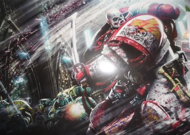

# 0790 008.M31 德威尔之战 Battle of Dwell

精校状态：中文行文已逐段精校，部分术语仍为暂定

分类：时间线

原文来源：https://www.bilibili.com/opus/1203938565024645122

原作者：帝国神选罐头

原文时间：2026年05月19日 08:56

[返回分类目录](目录.md) · [全书目录](../../目录.md)

原篇名：008.M31 德维尔之战 Battle of Dwell

<!-- A0790-B0001 -->
**英文原文**

The Battle of Dwell was a battle during the Horus Heresy.

<!-- /A0790-B0001 -->

<!-- A0790-B0002 -->

原译文

德维尔之战是荷鲁斯叛乱时期的一场战斗。

**校订译文**

德威尔之战是荷鲁斯之乱期间的一场战斗。

<!-- /A0790-B0002 -->

<!-- A0790-B0003 图片 -->

<!-- A0790-B0004 -->

原译文

Hibou Khan battles the Sons of Horus during the Battle of Dwell 希布可汗在德维尔之战中与荷鲁斯之子作战

**校订译文**

Hibou Khan battles the Sons of Horus during the Battle of Dwell 希布可汗在德威尔之战中迎战荷鲁斯之子

<!-- /A0790-B0004 -->

<!-- A0790-B0005 -->
**英文原文**

Conflict:Horus Heresy

<!-- /A0790-B0005 -->

<!-- A0790-B0006 -->

原译文

冲突：荷鲁斯叛乱

**校订译文**

冲突：荷鲁斯之乱

<!-- /A0790-B0006 -->

<!-- A0790-B0007 -->
**英文原文**

Date:008.M31

<!-- /A0790-B0007 -->

<!-- A0790-B0008 -->

原译文

日期：008.M31

**校订译文**

日期：008.M31

<!-- /A0790-B0008 -->

<!-- A0790-B0009 -->
**英文原文**

Location:Dwell

<!-- /A0790-B0009 -->

<!-- A0790-B0010 -->

原译文

地点：德维尔

**校订译文**

地点：德威尔

<!-- /A0790-B0010 -->

<!-- A0790-B0011 -->
**英文原文**

Outcome:Traitor victory

<!-- /A0790-B0011 -->

<!-- A0790-B0012 -->

原译文

结果：叛徒胜利

**校订译文**

结果：叛徒胜利

<!-- /A0790-B0012 -->

<!-- A0790-B0013 -->
**英文原文**

Combatants:Imperium/Traitor Legions

<!-- /A0790-B0013 -->

<!-- A0790-B0014 -->

原译文

作战方：帝国/叛徒军团

**校订译文**

作战方：帝国/叛徒军团

<!-- /A0790-B0014 -->

<!-- A0790-B0015 -->
**英文原文**

Commanders:Captain Shadrak Meduson, Sergeant Bion Henricos (KIA), Hibou Khan/Warmaster Horus Lupercal, Captain Horus Aximand (WIA)

<!-- /A0790-B0015 -->

<!-- A0790-B0016 -->

原译文

指挥官：连长沙德拉克·梅杜森，军士比昂·亨利科斯(KIA)，希布可汗/战帅荷鲁斯·卢佩卡尔，连长荷鲁斯·阿西曼德

**校订译文**

指挥官：连长沙德拉克·梅杜森、军士拜昂·亨利科斯（阵亡）、希布可汗／战帅荷鲁斯·卢佩卡尔、连长荷鲁斯·阿西曼德（负伤）

<!-- /A0790-B0016 -->

<!-- A0790-B0017 -->
**英文原文**

Strength:58 Imperial Army Battalions totaling 8 million troops, Iron Hands force, White Scars force, Salamanders force, Loyalist Mechanicus forces/Sons of Horus taskforce

<!-- /A0790-B0017 -->

<!-- A0790-B0018 -->

原译文

力量：58个帝国军队营总共800万部队，钢铁之手部队，白色疤痕部队，火蜥蜴部队，忠诚派机械教部队/荷鲁斯之子特遣部队

**校订译文**

兵力：58个帝国军营、共计八百万兵力，钢铁之手、白疤、火蜥蜴及忠诚派机械修会部队／荷鲁斯之子特遣部队

**校注：** 英文明确58 battalions共eight million troops，编制规模明显异常；保持两个数值，不擅改营级或兵力。表Mechanicus而正文Mechanicum的时代用语差异也保留。

<!-- /A0790-B0018 -->

<!-- A0790-B0019 -->
**英文原文**

Casualties:Nearly all Imperial army destroyed, moderate Astartes losses/Moderate, Horus Aximand wounded

<!-- /A0790-B0019 -->

<!-- A0790-B0020 -->

原译文

伤亡：几乎所有帝国军队都被摧毁，阿斯塔特中等损失/中等，荷鲁斯·阿希曼德受伤

**校订译文**

伤亡：帝国军几乎全军覆没，阿斯塔特损失中等／损失中等，荷鲁斯·阿西曼德负伤

<!-- /A0790-B0020 -->

<!-- A0790-B0021 -->
## Overview 概述

<!-- /A0790-B0021 -->

<!-- A0790-B0022 -->
**英文原文**

In the aftermath of the Drop Site Massacre, Iron Hands commander Shadrak Meduson led a series of reprisal raids against the Sons of Horus in revenge for the treachery of Horus. Eventually, Shadrak was even able to marshal together a significant contingent of loyalist troops on Dwell which included 58 Imperial Army battalions, small Salamanders and White Scars assets, and Mechanicum forces. When Horus was able to identify Meduson's base of operations he had his Legion launch an immediate attack.

<!-- /A0790-B0022 -->

<!-- A0790-B0023 -->

原译文

在登陆点大屠杀之后，钢铁之手指挥官沙德拉克·梅杜森领导了一系列针对荷鲁斯之子的报复性袭击，以报复荷鲁斯的背叛。最终，沙德拉克甚至能够在德维尔召集一支不可忽略的忠诚派部队，其中包括58个帝国军队营、小型火蜥蜴和白色疤痕部队以及机械教部队。当荷鲁斯能够确定梅杜森的行动基地时，他让他的军团立即发动攻击。

**校订译文**

登陆点大屠杀后，钢铁之手指挥官沙德拉克·梅杜森连续袭击荷鲁斯之子，为荷鲁斯的背叛复仇。他最终在德威尔集结起可观的忠诚派兵力，包括58个帝国军营、少量火蜥蜴与白疤，以及机械教部队。荷鲁斯查明其行动基地后，立即命令军团进攻。

<!-- /A0790-B0023 -->

<!-- A0790-B0024 -->
**英文原文**

After brushing aside the Imperial Army troops in a landing assault, the traitor Astartes were shocked to discover hidden Astartes teams throughout the loyalist defensive line on Dwell. During the fight, Sons of Horus commander Horus Aximand was gravely wounded in the face. The Sons of Horus eventually prevailed due to superior numbers of Astartes, but the loyalist forces proved a far tougher nut to crack than they had anticipated.

<!-- /A0790-B0024 -->

<!-- A0790-B0025 -->

原译文

在一次登陆突击中击退帝国军队后，叛徒阿斯塔特震惊地发现，在德维尔的忠诚派防线上，隐藏着阿斯塔特小队。在战斗中，荷鲁斯之子指挥官荷鲁斯·阿希曼德面部受重伤。由于阿斯塔特人数众多，荷鲁斯之子最终获胜，但事实证明，忠诚派部队比他们预期的要顽强得多。

**校订译文**

叛军阿斯塔特登陆后轻易击溃帝国军，却惊讶地发现，德威尔的忠诚派防线各处竟隐藏着阿斯塔特小队。荷鲁斯之子指挥官荷鲁斯·阿西曼德在交战中面部遭重创。凭借星际战士的数量优势，荷鲁斯之子最终取胜，但忠诚派远比他们预料的更难对付。

<!-- /A0790-B0025 -->

<!-- A0790-B0026 -->
**英文原文**

After the battle Horus met with Fulgrim and Mortarion, and remaining Iron Hands under Shadrak had nearly assassinated the Warmaster with Fire Raptors before escaping. Five days later the traitor forces left Dwell, the planet a smoking ruin.

<!-- /A0790-B0026 -->

<!-- A0790-B0027 -->

原译文

战斗结束后，荷鲁斯会见了福格瑞姆和莫塔里安，沙德拉克手下残余的钢铁之手在逃离前几乎用火隼刺杀了战帅。五天后，叛徒部队离开了德维尔，这个行星变成了一片冒烟的废墟。

**校订译文**

战后，荷鲁斯与福格瑞姆、莫塔里安会面。沙德拉克麾下残存的钢铁之手出动火猛禽炮艇，几乎成功刺杀战帅，随后脱身。五天后，叛军离开德威尔，留下仍在冒烟的废墟。

<!-- /A0790-B0027 -->

本篇核心术语与暂定项

以下列出本篇出现的英文原形及核心术语表用词。同形词可能指不同对象，具体词义以本篇正文和校注为准；单复数、别名和仅见于图注的名称可能尚未列入。完整候选见[术语表](../../术语表/双语术语候选.csv)。

| 英文 | 采用中文 | 状态 |
| --- | --- | --- |
| Imperial Army | 帝国军 | 暂定·官方待核 |
| Horus Heresy | 荷鲁斯之乱 | 官方已核对 |
| Imperium | 帝国 | 暂定·简称 |
| Mechanicum | 机械教 | 暂定·历史称谓 |
| Mortarion | 莫塔里安 | 官方已核对 |
| Horus | 荷鲁斯 | 暂定·官方待核 |
| Sons of Horus | 荷鲁斯之子 | 暂定·官方待核 |
| Iron Hands | 钢铁之手 | 暂定·官方待核 |
| Fulgrim | 福格瑞姆 | 官方已核对 |
| Salamanders | 火蜥蜴 | 暂定·官方待核 |
| Horus Lupercal | 荷鲁斯·卢佩卡尔 | 暂定·官方待核 |
| Lupercal | 卢佩卡尔 | 暂定·官方待核 |
| Horus Aximand | 荷鲁斯·阿西曼德 | 暂定·官方待核 |
| Shadrak Meduson | 沙德拉克·梅杜森 | 暂定·官方待核 |
| White Scars | 白疤 | 官方已核 |
| Scars | 伤疤 | 暂定·官方待核 |
| Bion Henricos | 拜昂·亨利科斯 | 暂定·官方待核 |
| Captain | 连长 | 暂定·官方待核 |
| Sergeant | 军士 | 暂定·官方待核 |
| Raptors | 猛禽 | 暂定·官方待核 |
| Marshal | 元帅 | 官方已核对 |
| Dwell | 德威尔 | 暂定·官方待核 |

