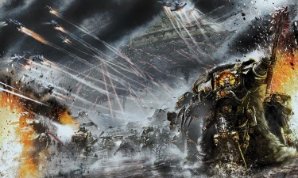

# 0793 009.M31 摩洛之战 Battle of Molech

精校状态：中文行文已逐段精校，部分术语仍为暂定

分类：时间线

原文来源：https://www.bilibili.com/opus/1201043984700407808

原作者：帝国神选罐头

原文时间：2026年05月11日 13:44

[返回分类目录](目录.md) · [全书目录](../../目录.md)

<!-- A0793-B0001 -->
**英文原文**

The Battle of Molech was a major confrontation during the Horus Heresy. Waged on the seemingly insignificant world of Molech, it saw Warmaster Horus attempt to gain radical new powers.

<!-- /A0793-B0001 -->

<!-- A0793-B0002 -->

原译文

摩洛之战是荷鲁斯叛乱时期的一场重大冲突。在看似微不足道的摩洛世界上，战帅荷鲁斯试图获得激进的新力量。

**校订译文**

摩洛之战是荷鲁斯之乱期间的一场重大交锋。战帅荷鲁斯进攻看似不起眼的摩洛世界，试图在那里取得足以改变自身的全新力量。

<!-- /A0793-B0002 -->

<!-- A0793-B0003 图片 -->

<!-- A0793-B0004 -->

原译文

Horus leads forces in the Battle for Molech 荷鲁斯率领军队参加摩洛之战

**校订译文**

Horus leads forces in the Battle for Molech 荷鲁斯率领军队参加摩洛之战

<!-- /A0793-B0004 -->

<!-- A0793-B0005 -->
**英文原文**

Conflict:Horus Heresy

<!-- /A0793-B0005 -->

<!-- A0793-B0006 -->

原译文

冲突：荷鲁斯叛乱

**校订译文**

冲突：荷鲁斯之乱

<!-- /A0793-B0006 -->

<!-- A0793-B0007 -->
**英文原文**

Date:009.M31

<!-- /A0793-B0007 -->

<!-- A0793-B0008 -->

原译文

日期：009.M31

**校订译文**

日期：009.M31

<!-- /A0793-B0008 -->

<!-- A0793-B0009 -->
**英文原文**

Location:Molech

<!-- /A0793-B0009 -->

<!-- A0793-B0010 -->

原译文

地点：摩洛

**校订译文**

地点：摩洛

<!-- /A0793-B0010 -->

<!-- A0793-B0011 -->
**英文原文**

Outcome:Traitor victory

<!-- /A0793-B0011 -->

<!-- A0793-B0012 -->

原译文

结果：叛徒胜利

**校订译文**

结果：叛徒胜利

<!-- /A0793-B0012 -->

<!-- A0793-B0013 -->
**英文原文**

Combatants:Traitor Legions/Imperium

<!-- /A0793-B0013 -->

<!-- A0793-B0014 -->

原译文

结果：叛徒军团/帝国

**校订译文**

交战方：叛军军团／帝国

<!-- /A0793-B0014 -->

<!-- A0793-B0015 -->
**英文原文**

Commanders:Warmaster Horus Lupercal, Primarch Mortarion, First Captain Ezekyle Abaddon, Captain Horus Aximand, Captain Falkus Kibre, Captain Kalus Ekaddon, Sergeant Grael Noctua (KIA), Captain Ignatius Grulgor, Captain Caipha Morarg, Red Angel/Imperial Commander Raeven Devine (KIA), Balmorn Donar (KIA), Albard Devine (Defects), Lord Admiral Brython Semper (KIA), Lord General Tyana Kourion (KIA), Marshal Edoraki Hakon (KIA), Legate Castor Alcade (KIA), Captain Vitus Salicar, Magos Bellona Modwen

<!-- /A0793-B0015 -->

<!-- A0793-B0016 -->

原译文

指挥官：战帅荷鲁斯·卢佩卡尔，原体莫塔里安，第一连长以泽凯尔·阿巴顿，连长荷鲁斯·阿西曼德，连长法库斯·凯博，连长卡卢斯·埃卡顿，军士格拉尔·诺克图阿(KIA)，连长伊格纳修斯·格鲁戈尔，连长凯法·莫拉格，红天使/帝国指挥官雷文·德维纳(KIA)，巴尔莫·多纳(KIA)，阿尔巴德·德维纳(叛变)，领主海军上将布莱森·森珀(KIA)，领主将军提亚纳·库里昂(KIA)，元帅埃多拉基·哈康(KIA)，使节卡斯托·阿尔卡德(KIA)，连长维图斯·萨利卡，贤者贝罗纳·莫德文

**校订译文**

指挥官：战帅荷鲁斯·卢佩卡尔、原体莫塔里安、第一连长以泽凯尔·阿巴顿、连长荷鲁斯·阿西曼德、连长法库斯·凯博、连长卡鲁斯·埃卡顿、军士格拉艾·诺克图阿（阵亡）、连长伊格纳修斯·格鲁戈尔、连长凯法·莫拉格、红天使／帝国指挥官雷文·德维纳（阵亡）、巴尔莫·多纳（阵亡）、阿尔巴德·德维纳（叛变）、领主海军上将布莱森·森珀（阵亡）、领主将军提亚纳·库里昂（阵亡）、元帅埃多拉基·哈康（阵亡）、军团使节卡斯托·阿尔卡德（阵亡）、连长维图斯·萨利卡、贤者贝罗纳·莫德文

<!-- /A0793-B0016 -->

<!-- A0793-B0017 -->
**英文原文**

Casualties:Unknown/Only 100 survivors

<!-- /A0793-B0017 -->

<!-- A0793-B0018 -->

原译文

伤亡：未知/只有100名幸存者

**校订译文**

伤亡：未知/只有100名幸存者

**校注：** 信息表仅100幸存者，正文为one in a hundred（百分之一）；两者不一致，保留源文并待核。

<!-- /A0793-B0018 -->

<!-- A0793-B0019 -->
## Overview 概述

<!-- /A0793-B0019 -->

<!-- A0793-B0020 -->
**英文原文**

Molech was one of the planets that the Warmaster Horus assaulted during his drive towards Terra. Horus became alerted to the planets significance when he regained a memory erased by the Emperor, that of Molech having a gateway to the Warp that his Father had used to obtain power. Desiring such power for himself, Horus set a course to Molech. The Knight World was a major seat of Imperial power as the Emperor had left behind substantial forces to protect its unknown Warp Gate. A detachment of Blood Angels and Ultramarines, Three Titan Legions over a hundred Imperial Army regiments, an Imperial Armada Battlefleet of sixty ships, and Knight Houses stood ready to face the Warmaster's onslaught, which included the Sons of Horus and Death Guard Legions.

<!-- /A0793-B0020 -->

<!-- A0793-B0021 -->

原译文

摩洛是战帅荷鲁斯在驶向泰拉时攻击的行星之一。当荷鲁斯恢复了被帝皇抹去的记忆时，他开始意识到行星的重要性，那就是摩洛有一个通往亚空间的门户，他的父亲曾用这个门户获得力量。荷鲁斯渴望拥有这样的力量，于是向摩洛设定航线。骑士世界是帝国力量的主要所在地，因为帝皇留下了大量部队来保护其未知的亚空间门。一支由圣血天使和极限战士组成的分遣队、三个泰坦军团，超过一百个帝国军队兵团、一支由60艘舰船组成的帝国无敌舰队战斗舰队和骑士家族随时准备面对战帅的猛攻，其中包括荷鲁斯之子和死亡守卫军团。

**校订译文**

摩洛是荷鲁斯进军泰拉途中攻击的行星之一。他恢复了一段被帝皇抹去的记忆，从而意识到这个世界的意义：这里存在通往亚空间的门户，父亲曾借它获得力量。荷鲁斯渴望同样的力量，遂转向摩洛。帝皇为保护这座鲜为人知的亚空间之门，留下了大量兵力，使这颗骑士世界成为帝国的重要据点。圣血天使与极限战士分遣队、三个泰坦军团、一百多个帝国军兵团、六十艘帝国舰队舰船，以及骑士家族，都严阵以待，迎击由荷鲁斯之子和死亡守卫等组成的战帅大军。

<!-- /A0793-B0021 -->

<!-- A0793-B0022 -->
**英文原文**

After smashing aside the world's defending Battlefleet by capturing Molech's Orbital Defense Platforms and using them to fire on loyalist ships, Horus launched a full-scale invasion of Molech. Cities were obliterated under orbital bombardments or the wreckage of Battlefleet Molech being redirected into the atmosphere, creating global tsunamis. After disabling Molech's air defenses the Warmaster launched his initial ground assault. Horus himself landed at the island of Damesk, walking the Fulgurine Path that was said to have been the same route as the Emperor when he first set foot upon Molech. Horus led a massive amphibious landing from Damesk to the beaches of Avadon, defeating House Devine-led resistance in a bloody battle for both sides. However during the battle Horus was badly wounded by a Knight piloted by Raeven Devine, saved only thanks to the intervention of the Ruinous Powers. Refugees swarmed from Avadon, desperate to avoid the traitor forces. The loyalist Legio Fortidus sacrificed itself to buy enough times for the refugees to flee.

<!-- /A0793-B0022 -->

<!-- A0793-B0023 -->

原译文

荷鲁斯占领了摩洛的轨道防御平台，并用它们向忠诚派舰船开火，摧毁了世界上的防御舰队，随后对摩洛发动了全面入侵。城市在轨道轰炸下被摧毁，或者摩洛战斗舰队的残骸被重新导向大气层，造成全球海啸。在摧毁了摩洛的防空系统后，战帅发动了首次地面进攻。荷鲁斯本人登上了达姆斯克岛，沿着雷击之路行走，据说这条路线与帝皇第一次踏上摩洛时的路线相同。荷鲁斯率领一支庞大的登陆部队从达姆斯克登陆阿瓦顿海滩，在双方的血腥战斗中击败了由德维纳家族领导的抵抗。然而，在战斗中，荷鲁斯被雷文·德维纳驾驶的一架骑士重伤，多亏了毁灭力量的干预才得以幸存。逃亡者从阿瓦顿蜂拥而至，拼命躲避叛徒部队。忠诚派坚垒军团牺牲了自己，为逃亡者逃离争取了足够的时间。

**校订译文**

荷鲁斯夺取摩洛的轨道防御平台，用其炮火摧毁忠诚派防御舰队，随即全面入侵行星。城市遭轨道轰炸摧毁，摩洛舰队残骸也被引导坠入大气，引发遍及全球的海啸。压制防空系统后，战帅开始地面攻势。他亲自登陆达姆斯克岛，沿雷击之路行进，据说帝皇初次踏上摩洛时也走过这条路。随后，荷鲁斯率大军从达姆斯克渡海登陆阿瓦顿海滩，经过双方损失惨重的血战，击败德维纳家族率领的守军。但他本人也被雷文·德维纳驾驶的骑士重创，幸得毁灭诸力干预才保住性命。阿瓦顿难民成群逃亡，竭力躲避叛军；忠诚派坚垒军团则牺牲自己，为他们争取脱身时间。

<!-- /A0793-B0023 -->

<!-- A0793-B0024 -->
**英文原文**

With Avadon cleared, the rest of the traitor armies followed in their wake. These consisted not only of the Sons of Horus and Death Guard but also four Titan Legion's. Mortarion himself landed at Ophir and advanced towards Molech's capital of Lupercalia. The traitors also fielded Daemonic allies. The Daemonically resurrected Ignatius Grulgor was unleashed upon Molech, destroying thousands of kilometers of previously impassable forest with Life Eater Virus fused within him. Beasts fleeing Grulgor smashed into the lines of loyalist forces along the primary loyalist defensive network, the Perceptor Line, giving cover for traitor forces to advance. After overunning the Perceptor Line the traitors next targeted Molech's Western Marches, overunning jungle and farmland flooded from tsunami's caused by the destruction of Battlefleet Molech. The loyalists led by House Indra and House Kaushik managed to offer some resistance at the plateau city of Leosta, but were ultimately overwhelmed by Traitor Titans led by the Legio Crucius, Legio Vulpa, and Legio Vulcanum. Meanwhile, the Death Guard overran the city of Imperratum.

<!-- /A0793-B0024 -->

<!-- A0793-B0025 -->

原译文

阿瓦顿被清空后，其余的叛徒军队紧随其后。这些人不仅包括荷鲁斯之子和死亡守卫，还包括四个泰坦军团。莫塔里安本人在俄斐登陆，并向摩洛的首都卢佩卡利亚前进。叛徒还派出了恶魔盟友。恶魔般复活的伊格内修斯·格鲁戈尔被释放到摩洛上，摧毁了数千公里以前无法通行的森林，生命吞噬者病毒在他体内融合。逃离格鲁戈尔的野兽沿着主要的忠诚派防御网络 - 感知者之线冲入忠诚派部队的防线，为叛徒部队的前进提供掩护。在越过感知者之线后，叛徒接下来瞄准了摩洛的西部进军，越过了摩洛战斗舰队被摧毁造成的海啸淹没的丛林和农田。由因陀罗家族和考希克家族领导的忠诚者设法在高原城市莱奥斯塔进行了一些抵抗，但最终被克鲁修斯军团、鬼狐军团和火神军团领导的叛徒泰坦击败。与此同时，死亡守卫占领了天命城。

**校订译文**

阿瓦顿抵抗被肃清后，叛军后续兵力跟进，包括荷鲁斯之子、死亡守卫，以及四个泰坦军团。莫塔里安亲自在俄斐登陆，向首府卢佩卡利亚推进。叛军还投入恶魔盟友：借恶魔力量复活的伊格纳修斯·格鲁戈尔被释放到行星上，以融合在体内的噬生病毒摧毁绵延数千公里、原本难以穿越的森林。逃避格鲁戈尔的兽群冲撞忠诚派主要防御体系——感知者防线，掩护叛军向前。防线被突破后，叛军转攻摩洛西部边境，横扫被舰队残骸所引发海啸淹没的丛林与农田。因陀罗家族和考希克家族率忠诚派在高原城市莱奥斯塔抵抗，最终仍被克鲁修斯军团、鬼狐军团和火神军团率领的叛军泰坦击溃。死亡守卫也攻占了天命城。

**校注：** Western Marches是西部边境地带，不是向西进军；Legio Crucius此段列于叛军，后文及参战序列却列于忠诚派，源内阵营冲突待核。

<!-- /A0793-B0025 -->

<!-- A0793-B0026 -->
**英文原文**

Soon even House Devine's Dawn Citadel had fallen. The Space Marines fought valiantly, but were annihilated by the sheer number of traitor Astartes. The Blood Angels garrison on the planet was overwhelmed by an assault led by the Red Angel, who unleashed the Red Thirst in many Battle-Brothers. Soon only a small force of Ultramarines remained and they were forced to wage a guerrilla war. It was only thanks to the efforts of the Imperator Titan Paragon of Terra that a total Imperial rout was avoided. It was at this point that the Death Guard and Sons of Horus linked up, with Horus greeting Mortarion in preparation for a final push on Lupercalia. However, he still had a final card left to play before doing so.

<!-- /A0793-B0026 -->

<!-- A0793-B0027 -->

原译文

不久，就连德维纳家族的黎明城堡也倒塌了。星际战士英勇作战，但被大量叛徒阿斯塔特歼灭。圣血天使在行星上的驻军被红天使领导的一次袭击所淹没，红天使在许多战斗兄弟中释放了血渴。很快，只剩下一小部分极限战士，他们被迫发动游击战。正是由于帝皇泰坦泰拉典范号的努力，才避免了帝国的全面溃败。就在这一点上，死亡守卫和荷鲁斯之子联合起来，荷鲁斯迎接莫塔里安，准备对卢佩卡利亚进行最后的进攻。然而，在这样做之前，他还有最后一张牌要打。

**校订译文**

不久，连德维纳家族的黎明城堡也告失陷。驻守星际战士英勇作战，却被数量远占优势的叛军阿斯塔特歼灭。红天使率军压垮了圣血天使驻军，并激发许多战斗兄弟的血渴。最后，只剩少量极限战士被迫转入游击战。若非帝皇级泰坦泰拉典范号奋力支撑，帝国军势必全面溃败。此时，死亡守卫与荷鲁斯之子会师，荷鲁斯与莫塔里安会合，准备向卢佩卡利亚发起最后攻势。但在出手之前，战帅还有一张底牌。

**校注：** 此处Red Angel是进攻圣血天使并激发血渴的个体；不因同名就擅自补成安格隆。

<!-- /A0793-B0027 -->

<!-- A0793-B0028 -->
**英文原文**

Over the following months, the insidious whispers of Slaanesh spread through the fatigued ranks of House Devine. This effort was strengthened by the Daemonic powers of Fulgrim, who had been assigned corrupting Devine by Horus himself. Devine's officers had become lethargic and interested only in their sports, using their mighty machines to hunt down the wild animals of Molech. Soon, they began to meet in secret cabals, committing depraved rites and ceremonies within the heart of the Loyalist camp. The Knights of House Devine betrayed the Loyalists when Horus launched a massive ground offensive against the loyalist forces centered around the city of Lupercalia. Horus used the captured Star Fort Var Zerba to launch a devastating orbital bombardment on the Iron Fist Mountains, annihilating the impenetrable fortress-keeps of the Legio Crucius. Meanwhile, the traitors of Devine destroyed the Paragon of Terra and the Loyalists found themselves trapped between the advancing enemy forces and the Renegade Knights attacking from behind. This allowed the Forces of Chaos to punch through the Imperial lines, blocking any routes of escape. Of the entire Imperial host only one in a hundred survived the campaign aboard the refugee ship Molech's Enlightenment. Horus deliberately let the ship go so they could spread word of the terror he would bring to all followers of the Emperor.

<!-- /A0793-B0028 -->

<!-- A0793-B0029 -->

原译文

在接下来的几个月里，色孽的阴险低语在疲惫的德维纳家族中传播开来。这一努力得到了福格瑞姆的恶魔力量的加强，他被荷鲁斯亲自指派来腐化德维纳。德维纳的军官变得慵懒，只对他们的运动感兴趣，用他们强大的机械狩猎摩洛的野生动物。很快，他们开始在秘密阴谋团中会面，在忠诚派营地的中心进行堕落的仪式和典仪。当荷鲁斯对以卢佩卡利亚市为中心的忠诚派部队发动大规模地面进攻时，德维纳家族的骑士背叛了忠诚派。荷鲁斯利用缴获的星堡瓦·泽巴号对铁拳山脉发动了毁灭性的轨道轰炸，摧毁了克鲁修斯军团坚不可摧的要塞。与此同时，德维纳的叛徒摧毁了泰拉典范号，忠诚派发现自己被困在前进的敌军和从后面进攻的叛徒骑士之间。这使得混沌部队能够突破帝国防线，封锁任何逃跑路线。在整个帝国天军中，只有百分之一的人在难民船摩洛启蒙号上幸存下来。荷鲁斯故意让船离开，这样他们就可以向帝皇的所有追随者传播他将带来的恐怖。

**校订译文**

接下来几个月，色孽的阴险低语在疲惫的德维纳家族中蔓延。荷鲁斯亲命福格瑞姆腐化该家族，后者的恶魔力量又助长了这种侵蚀。家族军官日益慵懒，只沉迷游猎，驾驭强大的骑士机甲追逐摩洛野兽。不久，他们组成秘密团体，在忠诚派营地深处举行堕落仪式。荷鲁斯向卢佩卡利亚周边守军发动大规模地面攻势时，德维纳家族骑士终于公开叛变。战帅利用缴获的瓦·泽巴星堡，向铁拳山脉实施毁灭性轨道轰炸，摧毁克鲁修斯军团固若金汤的堡垒。同时，德维纳叛军摧毁泰拉典范号，让忠诚派陷入前方敌军与后方变节骑士的夹击。混沌大军就此冲破帝国防线，截断逃生路线。整个帝国大军中，只有百分之一的人乘难民船摩洛启蒙号幸存。荷鲁斯故意放它离去，让幸存者向所有效忠帝皇的人传播他将带来的恐怖。

**校注：** host此处为一般大军，不是暗黑天使的专门编制天军。数字百分之一不得与表头100人互相替代。

<!-- /A0793-B0029 -->

<!-- A0793-B0030 -->
**英文原文**

Ultimately Horus' attempt to gain the powers of the Emperor was apparently successful, he stepped through the gate and emerged saying he had gotten exactly what he wanted. Molech was left to the Death Guard and Emperor's Children in the aftermath of his victory. After the battle aboard of his flagship the Vengeful Spirit, a battle between the Sons of Horus and several escaped captives of the Knights-Errant broke out. Horus confronted Garviel Loken once more, but after Horus killed Iacton Qruze the Knights-Errant managed to escaped aboard the stealthship, the Tarnhelm.

<!-- /A0793-B0030 -->

<!-- A0793-B0031 -->

原译文

最终，荷鲁斯试图获得帝皇的力量显然是成功的，他穿过大门，出来说他得到了他想要的东西。在他获胜后，摩洛被留给了死亡守卫和帝皇之子。在他的旗舰复仇之魂号上的战斗结束后，荷鲁斯之子和几名逃脱的游侠骑士俘虏之间爆发了一场战斗。荷鲁斯再次与加维尔·洛肯对峙，但在荷鲁斯杀死伊阿克顿·克鲁兹后，游侠骑士设法登上了隐形舰隐匿之盔号。

**校订译文**

荷鲁斯谋求帝皇般力量的尝试，最终似乎成功了。他穿过门户，归来后声称已如愿以偿。战后，摩洛交由死亡守卫与帝皇之子控制。随后，旗舰复仇之魂号上又爆发了荷鲁斯之子与数名逃出囚禁的游侠骑士之间的战斗。荷鲁斯再度面对加维尔·洛肯，并杀死亚克顿·克鲁兹；但游侠骑士最终仍登上隐形舰塔恩海姆号，成功逃脱。

**校注：** 源文After the battle aboard of his flagship断句混乱，按摩洛战后、旗舰上另发生交战理解，避免原译形成“舰上战斗结束之后又爆发”的无据循环。

<!-- /A0793-B0031 -->

<!-- A0793-B0032 -->
## Order of Battle 参战序列

原题：Order of Battle 战斗组织

<!-- /A0793-B0032 -->

<!-- A0793-B0033 -->
## Imperial 帝国

<!-- /A0793-B0033 -->

<!-- A0793-B0034 -->
**英文原文**

Imperial Army — 100 Army Regiments, PDF Divisions, and Militia totaling 58 million troops. Commanded by Lord General Tyana Kourion

<!-- /A0793-B0034 -->

<!-- A0793-B0035 -->

原译文

帝国军队 — 100个军队兵团、行星防御部队师和民兵，共计5800万。由领主将军提亚纳·库里昂指挥

**校订译文**

帝国军：一百个兵团、若干行星防御部队师及民兵，合计5,800万人，由领主将军提亚纳·库里昂指挥

<!-- /A0793-B0035 -->

<!-- A0793-B0036 -->
**英文原文**

The Northern Oceanic Theatre was commanded by Marshal Eodraki Hakon

<!-- /A0793-B0036 -->

<!-- A0793-B0037 -->

原译文

北方海洋战场由元帅埃欧德拉基·哈康指挥

**校订译文**

北部海洋战区，由元帅埃多拉基·哈康指挥

**校注：** Edoraki/Eodraki源文异拼，同一元帅统一埃多拉基。

<!-- /A0793-B0037 -->

<!-- A0793-B0038 -->
**英文原文**

The Kushite Eastings were commanded by Commander Abdi Kheda

<!-- /A0793-B0038 -->

<!-- A0793-B0039 -->

原译文

库希特东部由指挥官阿卜迪·赫达指挥

**校订译文**

库希特东部由指挥官阿卜迪·赫达指挥

<!-- /A0793-B0039 -->

<!-- A0793-B0040 -->
**英文原文**

The Western Marches were commanded by Colonel Oskur van Valkenberg

<!-- /A0793-B0040 -->

<!-- A0793-B0041 -->

原译文

西部进军由团长奥斯库尔·范·瓦尔肯贝格指挥

**校订译文**

西部边境，由上校奥斯库尔·范·瓦尔肯贝格指挥

<!-- /A0793-B0041 -->

<!-- A0793-B0042 -->
**英文原文**

The Southern Steppes were commanded by Captain Corwen Mallbek

<!-- /A0793-B0042 -->

<!-- A0793-B0043 -->

原译文

南部草原由连长科尔文·马尔贝克指挥

**校订译文**

南部草原由连长科尔文·马尔贝克指挥

<!-- /A0793-B0043 -->

<!-- A0793-B0044 -->
**英文原文**

Known Regiments in these forces included the Molech Firescions, Arcadii Volunteers, Belgar Devsmires, Forlorn Spartaks, Kapikulu Iron Brigade, and Karnatic Lancers

<!-- /A0793-B0044 -->

<!-- A0793-B0045 -->

原译文

这些部队中已知的兵团包括摩洛火裔、阿卡迪义勇军、贝尔加·德夫斯迈尔斯、孤寂斯巴达克斯、卡皮库鲁铁旅和卡纳提克枪骑兵

**校订译文**

这些部队中已知的兵团包括摩洛火裔、阿卡迪义勇军、贝尔加·德夫斯迈尔斯、孤寂斯巴达克斯、卡皮库鲁铁旅和卡纳提克枪骑兵

<!-- /A0793-B0045 -->

<!-- A0793-B0046 -->
**英文原文**

Battlefleet Molech — 60 Ships, including 8 Battleship, supported by at least 4 Orbital Defense Platforms. Commanded by Lord Admiral Brython Semper

<!-- /A0793-B0046 -->

<!-- A0793-B0047 -->

原译文

摩洛战斗舰队 — 60艘舰船，包括八艘战列舰，由至少四个轨道防御平台支援。由领主海军上将布莱森·森珀领导

**校订译文**

摩洛战斗舰队 — 60艘舰船，包括八艘战列舰，由至少四个轨道防御平台支援。由领主海军上将布莱森·森珀领导

<!-- /A0793-B0047 -->

<!-- A0793-B0048 -->
**英文原文**

Space Marine — 500 Battle-Brothers

<!-- /A0793-B0048 -->

<!-- A0793-B0049 -->

原译文

星际战士 — 500名战斗兄弟

**校订译文**

星际战士 — 500名战斗兄弟

<!-- /A0793-B0049 -->

<!-- A0793-B0050 -->
**英文原文**

Ultramarines — 3 Companies under Legate Castor Alcade

<!-- /A0793-B0050 -->

<!-- A0793-B0051 -->

原译文

极限战士 — 使节卡斯托·阿尔卡德手下的三个连队

**校订译文**

极限战士：军团使节卡斯托·阿尔卡德麾下三个连队

<!-- /A0793-B0051 -->

<!-- A0793-B0052 -->
**英文原文**

Blood Angels — 100 Battle-Brothers known as the Bloodsworn under Captain Vitus Salicar

<!-- /A0793-B0052 -->

<!-- A0793-B0053 -->

原译文

圣血天使 — 在连长维图斯·萨利卡的带领下，100名战斗兄弟组成了血誓

**校订译文**

圣血天使：连长维图斯·萨利卡麾下一百名战斗兄弟，合称“血誓者”

<!-- /A0793-B0053 -->

<!-- A0793-B0054 -->
**英文原文**

Mechanicum Forces - Under the Command of Magos Bellona Modwen

<!-- /A0793-B0054 -->

<!-- A0793-B0055 -->

原译文

机械教部队 - 在贤者贝罗纳·莫德文的指挥下

**校订译文**

机械教部队 - 在贤者贝罗纳·莫德文的指挥下

<!-- /A0793-B0055 -->

<!-- A0793-B0056 -->
**英文原文**

Legio Crucius — Under Princeps Etana Kalonice

<!-- /A0793-B0056 -->

<!-- A0793-B0057 -->

原译文

克鲁修斯军团 — 在首席埃塔纳·卡洛尼斯的领导下

**校订译文**

克鲁修斯军团 — 在首席埃塔纳·卡洛尼斯的领导下

<!-- /A0793-B0057 -->

<!-- A0793-B0058 -->
**英文原文**

Legio Fortidus — Under Princeps Uta-Dagon and Utu-Lerna

<!-- /A0793-B0058 -->

<!-- A0793-B0059 -->

原译文

坚垒军团 —在首席乌塔-达贡和乌图-勒尔纳的领导下

**校订译文**

坚垒军团 —在首席乌塔-达贡和乌图-勒尔纳的领导下

<!-- /A0793-B0059 -->

<!-- A0793-B0060 -->
**英文原文**

Legio Gryphonicus — Under Princeps Opinicus

<!-- /A0793-B0060 -->

<!-- A0793-B0061 -->

原译文

狮鹫军团 — 在首席奥皮尼库斯的领导下

**校订译文**

狮鹫军团 — 在首席奥皮尼库斯的领导下

<!-- /A0793-B0061 -->

<!-- A0793-B0062 -->

原译文

Thallax Cohorts 死隶大队

**校订译文**

Thallax Cohorts 死隶战兵各大队

<!-- /A0793-B0062 -->

<!-- A0793-B0063 -->

原译文

Skitarii Regiments 护教军兵团

**校订译文**

Skitarii Regiments 护教军兵团

<!-- /A0793-B0063 -->

<!-- A0793-B0064 -->
**英文原文**

Knight Houses — Under the commander of Imperial Commander Cyprian Devine

<!-- /A0793-B0064 -->

<!-- A0793-B0065 -->

原译文

骑士家族 — 在帝国指挥官西普里安·德维纳的指挥下

**校订译文**

骑士家族 — 在帝国指挥官西普里安·德维纳的指挥下

<!-- /A0793-B0065 -->

<!-- A0793-B0066 -->

原译文

House Devine 德维纳家族

**校订译文**

House Devine 德维纳家族

<!-- /A0793-B0066 -->

<!-- A0793-B0067 -->

原译文

House Donar 多纳尔家族

**校订译文**

House Donar 多纳尔家族

<!-- /A0793-B0067 -->

<!-- A0793-B0068 -->

原译文

House Indra 因陀罗家族

**校订译文**

House Indra 因陀罗家族

<!-- /A0793-B0068 -->

<!-- A0793-B0069 -->

原译文

House Kaska 卡斯卡家族

**校订译文**

House Kaska 卡斯卡家族

<!-- /A0793-B0069 -->

<!-- A0793-B0070 -->

原译文

House Kaushik 考希克家族

**校订译文**

House Kaushik 考希克家族

<!-- /A0793-B0070 -->

<!-- A0793-B0071 -->

原译文

House Mamaragon 玛玛拉贡家族

**校订译文**

House Mamaragon 玛玛拉贡家族

<!-- /A0793-B0071 -->

<!-- A0793-B0072 -->

原译文

House Nurthen 纳森家族

**校订译文**

House Nurthen 纳森家族

<!-- /A0793-B0072 -->

<!-- A0793-B0073 -->

原译文

House Tazkhar 塔兹卡尔家族

**校订译文**

House Tazkhar 塔兹卡尔家族

<!-- /A0793-B0073 -->

<!-- A0793-B0074 -->
### Traitor 叛徒

<!-- /A0793-B0074 -->

<!-- A0793-B0075 -->
**英文原文**

Sons of Horus — Bulk of Legion

<!-- /A0793-B0075 -->

<!-- A0793-B0076 -->

原译文

荷鲁斯之子 — 军团的大部分

**校订译文**

荷鲁斯之子：军团主力

<!-- /A0793-B0076 -->

<!-- A0793-B0077 -->
**英文原文**

Death Guard — Bulk of Legion

<!-- /A0793-B0077 -->

<!-- A0793-B0078 -->

原译文

死亡军团 — 军团的大部队

**校订译文**

死亡守卫：军团主力

**校注：** Death Guard为死亡守卫军团，原死亡军团会与下行Legio Mortis泰坦军团混淆。

<!-- /A0793-B0078 -->

<!-- A0793-B0079 -->

原译文

Traitor Titan Legions 叛徒泰坦军团

**校订译文**

Traitor Titan Legions 叛徒泰坦军团

<!-- /A0793-B0079 -->

<!-- A0793-B0080 -->

原译文

Legio Mortis 死亡军团

**校订译文**

Legio Mortis 死亡军团

<!-- /A0793-B0080 -->

<!-- A0793-B0081 -->

原译文

Legio Vulcanum 火神军团

**校订译文**

Legio Vulcanum 火神军团

<!-- /A0793-B0081 -->

<!-- A0793-B0082 -->

原译文

Legio Vulpa 鬼狐军团

**校订译文**

Legio Vulpa 鬼狐军团

<!-- /A0793-B0082 -->

<!-- A0793-B0083 -->

原译文

Legio Interfector 杀戮者军团

**校订译文**

Legio Interfector 杀戮者军团

<!-- /A0793-B0083 -->

<!-- A0793-B0084 -->
**英文原文**

Traitor Imperial Army under Holst Lithonan

<!-- /A0793-B0084 -->

<!-- A0793-B0085 -->

原译文

霍尔斯特·利索南领导的叛徒帝国军队

**校订译文**

霍尔斯特·利索南指挥的叛变帝国军

<!-- /A0793-B0085 -->

<!-- A0793-B0086 -->
**英文原文**

Dark Mechanicum — corrupted Skitarii and war engines

<!-- /A0793-B0086 -->

<!-- A0793-B0087 -->

原译文

黑暗机械教 — 腐化护教军和战争引擎

**校订译文**

黑暗机械教：遭腐化的护教军与战争机器

<!-- /A0793-B0087 -->

<!-- A0793-B0088 -->
**英文原文**

House Devine (Defects later in the battle)

<!-- /A0793-B0088 -->

<!-- A0793-B0089 -->

原译文

德维纳家族（战斗后期叛变）

**校订译文**

德维纳家族（战斗后期叛变）

<!-- /A0793-B0089 -->

本篇核心术语与暂定项

以下列出本篇出现的英文原形及核心术语表用词。同形词可能指不同对象，具体词义以本篇正文和校注为准；单复数、别名和仅见于图注的名称可能尚未列入。完整候选见[术语表](../../术语表/双语术语候选.csv)。

| 英文 | 采用中文 | 状态 |
| --- | --- | --- |
| Space Marines | 星际战士 | 官方已核对 |
| Blood Angels | 圣血天使 | 官方已核对 |
| Imperial Army | 帝国军 | 暂定·官方待核 |
| Death Guard | 死亡守卫 | 官方已核对 |
| Ultramarines | 极限战士 | 官方已核对 |
| Horus Heresy | 荷鲁斯之乱 | 官方已核对 |
| Warp | 亚空间 | 官方已核对 |
| Imperium | 帝国 | 暂定·简称 |
| Mechanicum | 机械教 | 暂定·历史称谓 |
| Dark Mechanicum | 黑暗机械教 | 暂定·官方待核 |
| Emperor | 帝皇 | 官方已核对 |
| Primarch | 原体 | 官方已核对 |
| Emperor's Children | 帝皇之子 | 官方已核对 |
| Slaanesh | 色孽 | 官方已核对 |
| Mortarion | 莫塔里安 | 官方已核对 |
| Terra | 泰拉 | 暂定·官方待核 |
| Horus | 荷鲁斯 | 暂定·官方待核 |
| Garviel Loken | 加维尔·洛肯 | 暂定·官方待核 |
| Vengeful Spirit | 复仇之魂号 | 暂定·官方待核 |
| Sons of Horus | 荷鲁斯之子 | 暂定·官方待核 |
| Fulgrim | 福格瑞姆 | 官方已核对 |
| Skitarii | 护教军 | 暂定·官方待核 |
| Molech | 摩洛 | 暂定·官方待核 |
| Titan | 泰坦 | 暂定·官方待核 |
| Castor | 卡斯托 | 暂定·官方待核 |
| Princeps | 首席 | 暂定·官方待核 |
| Horus Lupercal | 荷鲁斯·卢佩卡尔 | 暂定·官方待核 |
| Lupercal | 卢佩卡尔 | 暂定·官方待核 |
| Falkus Kibre | 法库斯·凯博 | 暂定·官方待核 |
| Kalus Ekaddon | 卡鲁斯·埃卡顿 | 暂定·官方待核 |
| Horus Aximand | 荷鲁斯·阿西曼德 | 暂定·官方待核 |
| Iacton Qruze | 亚克顿·克鲁兹 | 暂定·官方待核 |
| Knights-Errant | 游侠骑士 | 暂定·官方待核 |
| First Captain | 第一连长 | 暂定·官方待核 |
| Caipha Morarg | 凯法·莫拉格 | 暂定·官方待核 |
| Ezekyle Abaddon | 以泽凯尔·阿巴顿 | 暂定·官方待核 |
| Grael Noctua | 格拉艾·诺克图阿 | 暂定·官方待核 |
| Space Marine | 星际战士 | 暂定·官方待核 |
| Captain | 连长 | 暂定·官方待核 |
| Sergeant | 军士 | 暂定·官方待核 |
| Powers | 能天使 | 暂定·官方待核 |
| Host | 天军 | 暂定·官方待核 |
| Ruinous Powers | 毁灭诸力 | 暂定·官方待核 |
| Marshal | 元帅 | 官方已核对 |
| Legio Gryphonicus | 狮鹫军团 | 暂定·官方待核 |
| Ignatius | 伊格纳修斯 | 暂定·官方待核 |
| Castor Alcade | 卡斯托·阿尔卡德 | 暂定·官方待核 |
| Legio Vulpa | 鬼狐军团 | 暂定·官方待核 |
| Tarnhelm | 塔恩海姆号 | 暂定·官方待核 |
| Raeven Devine | 雷文·德维纳 | 暂定·官方待核 |
| Albard Devine | 阿尔巴德·德维纳 | 暂定·官方待核 |
| Brython Semper | 布莱森·森珀 | 暂定·官方待核 |
| Tyana Kourion | 提亚纳·库里昂 | 暂定·官方待核 |
| Edoraki Hakon | 埃多拉基·哈康 | 暂定·官方待核 |
| Ignatius Grulgor | 伊格纳修斯·格鲁戈尔 | 暂定·官方待核 |
| Western Marches | 西部边境 | 暂定·官方待核 |
| Paragon of Terra | 泰拉典范号 | 暂定·官方待核 |
| Bloodsworn | 血誓者 | 暂定·官方待核 |
| The Blood | 鲜血 | 暂定·官方待核 |
| Bellona | 贝罗纳 | 暂定·官方待核 |
| Knight World | 骑士世界 | 暂定·官方待核 |
| Legio Crucius | 十字军团 | 暂定·官方待核 |
| Holst | 霍尔斯特 | 暂定·官方待核 |
| Lupercalia | 卢佩卡利亚 | 暂定·官方待核 |
| House Devine | 德维纳家族 | 暂定·官方待核 |
| Titan Legions | 泰坦军团 | 暂定·官方待核 |

