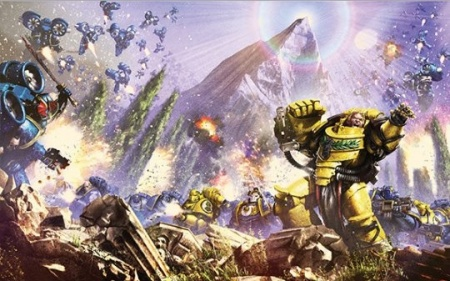

# 0796 ~009.M31 索萨之战 Battle of Sotha

精校状态：中文行文已逐段精校，部分术语仍为暂定

分类：时间线

原文来源：https://www.bilibili.com/opus/1204390060525355015

原作者：帝国神选罐头

原文时间：2026年05月20日 14:08

[返回分类目录](目录.md) · [全书目录](../../目录.md)

<!-- A0796-B0001 -->
**英文原文**

The Battle of Sotha was a minor battle of the Horus Heresy, in which the forces of the Night Lords Traitor Legion attempted to assume control of the Pharos beacon on the planet Sotha. As the Pharos beacon was the key instrument in maintaining the cohesion of Imperium Secundus, the battle on the periphery of Ultima Segmentum turned into a strategically important struggle for the future of Imperium Secundus.

<!-- /A0796-B0001 -->

<!-- A0796-B0002 -->

原译文

索萨之战是荷鲁斯叛乱的一场小规模战斗，午夜领主叛徒军团的部队试图控制索萨行星上的灯塔信标。由于灯塔信标是维持第二帝国凝聚力的关键工具，因此，在极限星域外围的战斗变成了对第二帝国未来具有重要战略意义的斗争。

**校订译文**

索萨之战是荷鲁斯之乱期间的一场小规模战役，午夜领主企图夺取索萨行星上的灯塔信标。灯塔是维持第二帝国联系与统一的关键设施，因此，这场发生在极限星域边缘的战斗，最终成为关系到第二帝国未来的战略争夺。

<!-- /A0796-B0002 -->

<!-- A0796-B0003 图片 -->

<!-- A0796-B0004 -->

原译文

Alexis Polux leads the fight against Night Lords 亚历克西斯·泼鲁克斯领导对抗午夜领主的战斗

**校订译文**

Alexis Polux leads the fight against Night Lords 亚历克西斯·泼鲁克斯领导对抗午夜领主的战斗

<!-- /A0796-B0004 -->

<!-- A0796-B0005 -->
**英文原文**

Conflict:Horus Heresy

<!-- /A0796-B0005 -->

<!-- A0796-B0006 -->

原译文

冲突：荷鲁斯叛乱

**校订译文**

冲突：荷鲁斯之乱

<!-- /A0796-B0006 -->

<!-- A0796-B0007 -->
**英文原文**

Date:~009.M31

<!-- /A0796-B0007 -->

<!-- A0796-B0008 -->

原译文

日期：~009.M31

**校订译文**

日期：约009.M31

<!-- /A0796-B0008 -->

<!-- A0796-B0009 -->
**英文原文**

Location:Sotha

<!-- /A0796-B0009 -->

<!-- A0796-B0010 -->

原译文

地点：索萨

**校订译文**

地点：索萨

<!-- /A0796-B0010 -->

<!-- A0796-B0011 -->
**英文原文**

Outcome:Loyalist Victory

<!-- /A0796-B0011 -->

<!-- A0796-B0012 -->

原译文

结果：忠诚派胜利

**校订译文**

结果：忠诚派胜利

<!-- /A0796-B0012 -->

<!-- A0796-B0013 -->
**英文原文**

Combatants:Night Lords/Imperium Secundus

<!-- /A0796-B0013 -->

<!-- A0796-B0014 -->

原译文

作战方：午夜领主/第二帝国

**校订译文**

作战方：午夜领主/第二帝国

<!-- /A0796-B0014 -->

<!-- A0796-B0015 -->
**英文原文**

Commanders:Lord Krukesh the Pale (KIA), Captain Gendor Skraivok, Claw Master Zaar Siakaar (KIA)/Captain Adallus (KIA), Captain Lucretius Corvo, Centurion Vieron Ekarr (KIA), Captain Alexis Polux, Warsmith Barabas Dantioch (KIA)

<!-- /A0796-B0015 -->

<!-- A0796-B0016 -->

原译文

指挥官：领主苍白者克鲁克什(KIA)，连长詹多·斯卡莱沃克，利爪之主扎尔·西亚卡尔(KIA)/连长阿达卢斯(KIA)，连长卢克莱修·科尔沃，百夫长维伦·埃卡尔(KIA)，连长亚历克西斯·泼鲁克斯，战争铁匠巴拉巴斯·丹提欧克(KIA)

**校订译文**

指挥官：领主苍白者克鲁克什（阵亡）、连长詹多·斯卡莱沃克、利爪之主扎尔·西亚卡尔（阵亡）／连长阿达卢斯（阵亡）、连长卢克莱修斯·科沃、百夫长维伦·埃卡尔（阵亡）、连长亚历克西斯·泼鲁克斯、战争铁匠巴拉巴斯·丹提欧克（阵亡）

**校注：** 克鲁克什在表中标KIA阵亡，58段却称其与斯卡莱沃克成功逃离，来源冲突保持并待核。

<!-- /A0796-B0016 -->

<!-- A0796-B0017 -->
**英文原文**

Strength:20,000 Night Lords/3,000 Ultramarines, 500 Dark Angels, 50 Imperial Fists, Shattered Legion Legionaries, Thallax maniple, 2 Thanatar Battle-Automata, Ultramar Auxilia

<!-- /A0796-B0017 -->

<!-- A0796-B0018 -->

原译文

力量：两万名午夜领主/三千名极限战士，五百名黑暗天使，五十名帝国之拳，破碎军团士兵，死隶支队，两架死灭自动机兵，奥特拉玛辅助军

**校订译文**

兵力：20,000名午夜领主／3,000名极限战士、500名黑暗天使、50名帝国之拳、破碎军团战士、一个死隶战兵支队、两台死灭级战斗机兵、奥特拉玛辅助军

**校注：** 表黑暗天使500人，后文仅半连；极限战士3000人与援军两个半连等口径亦未交代是否合计其他部队，不重算。

<!-- /A0796-B0018 -->

<!-- A0796-B0019 -->
**英文原文**

Casualties:Almost all Night Lords killed or fled, Invasion fleet mostly destroyed, Nightfall escapes/947 Ultramarines killed, All Dark Angels killed

<!-- /A0796-B0019 -->

<!-- A0796-B0020 -->

原译文

伤亡：几乎所有的午夜领主都被杀或逃跑了，入侵舰队大多被摧毁，夜幕降临号逃离/947名极限战士被杀，所有黑暗天使被杀

**校订译文**

伤亡：午夜领主几乎全部阵亡或逃散，入侵舰队大部被毁，夜幕降临号脱逃／947名极限战士阵亡，黑暗天使全部阵亡

<!-- /A0796-B0020 -->

<!-- A0796-B0021 -->
## Early Events 早期事件

<!-- /A0796-B0021 -->

<!-- A0796-B0022 -->
**英文原文**

The planet Sotha was discovered by exploration fleets from Ultramar during the Great Crusade. After its discovery, it was planned to colonize it but these plans were put on hold; instead, a small agri-colony was established together with a survey expedition of archaeologists and xenoculturists. One company of the Ultramarines Legion, the 199th, was assigned permanently to Sotha as a protective detail.

<!-- /A0796-B0022 -->

<!-- A0796-B0023 -->

原译文

索萨行星是在大远征期间由奥特拉玛的探索队发现的。发现后，计划将其殖民，但这些计划被搁置；相反，一个小型农业殖民地与考古学家和异型文化学家的调查探险队一起建立起来。极限战士军团的一个连队，即第199连队，被永久分配到索萨作为保护部队。

**校订译文**

大远征期间，来自奥特拉玛的探索舰队发现了索萨。原定殖民计划后来暂缓，只建立了一处小型农业殖民地，并派来由考古学家与异形文化研究者组成的考察队。极限战士第199连则被派驻当地，长期负责保护工作。

<!-- /A0796-B0023 -->

<!-- A0796-B0024 -->
**英文原文**

After the start of Horus Heresy, Primarch Roboute Guilliman himself assigned the loyalist Warsmith Barabas Dantioch of the Iron Warriors to direct and oversee exploration of the Pharos beacon machine in order to use it to benefit Ultramar and Imperium Secundus. Later, Captain Alexis Polux of the Imperial Fists volunteered to help Dantioch, for despite their respective Legions' animosity they developed a strong comradeship.

<!-- /A0796-B0024 -->

<!-- A0796-B0025 -->

原译文

在荷鲁斯叛乱开始后，原体罗伯特·基里曼亲自指派钢铁勇士的忠诚者战争铁匠巴拉巴斯·丹提欧克指导和监督对灯塔信标机器的探索，以便用它来有利于奥特拉玛和第二帝国。后来，帝国之拳的亚历克西斯·泼鲁克斯连长自愿帮助丹提欧克，因为尽管他们各自的军团互相都怀有敌意，但他们建立了深厚的战友情谊。

**校订译文**

荷鲁斯之乱爆发后，罗保特·基里曼亲自任命忠诚派钢铁勇士战争铁匠巴拉巴斯·丹提欧克，主持并监督灯塔机械的探索工作，希望将其用于奥特拉玛与第二帝国。帝国之拳连长亚历克西斯·泼鲁克斯随后自愿协助。尽管两个军团彼此敌视，两人却结下了深厚战谊。

<!-- /A0796-B0025 -->

<!-- A0796-B0026 -->
**英文原文**

Unbeknownst to Dantioch, Polux, or 199th company's commander, Captain Adallus, a blind spot near a local Mandeville Point was designated as the rendezvous for Night Lords fleet elements during the Thramas Crusade. After their fleet was scattered following their defeat by the Dark Angels, several vessels (including the Umber Prince, Dominus Noctem and Shadow Blow) used this rendezvous point to regroup and repair battle damage. At the time of the Pharos' activation, only Umber Prince under command of Claw-master Gendor Skraivok of the 45th Company remained on station, but some time later a Night Lords fleet translated into the Sothan System. This fleet was commanded by Captain Krukesh of 103rd Company, a member of the Kyroptera. Witnessing the activation of the beacon, Krukesh decided to invade the system in order to secure it and determine its function.

<!-- /A0796-B0026 -->

<!-- A0796-B0027 -->

原译文

丹提欧克、泼鲁克斯或第199连队指挥官阿达卢斯连长不知道，在萨拉玛斯远征期间，当地曼德维尔角附近的一个盲点被指定为午夜领主舰队成员的集合地。在他们的舰队被黑暗天使击败后分散后，几艘战舰（包括红棕王子号、夜之主号和暗影之击号）使用这个会合点重新集结并修复战斗损伤。在灯塔被激活时，只有第45连队的利爪之主詹多·斯卡莱沃克指挥的红棕王子号留在了空间站，但过了一段时间，一支午夜领主舰队被传送到了索萨星系。这支舰队由夜蝠议会的成员，第103连队的克鲁克什连长指挥。目睹了信标的激活，克鲁克什决定入侵该星系，以确保其安全并确定其功能。

**校订译文**

丹提欧克、泼鲁克斯和第199连连长阿达卢斯都不知道，萨拉玛斯远征期间，当地一处曼德维尔点附近的探测盲区，已被午夜领主指定为舰队会合地。遭黑暗天使击败、舰队离散后，红棕王子号、夜之主号、暗影之击号等舰船曾在此重新集结、修复损伤。灯塔启动时，只有第45连利爪之主詹多·斯卡莱沃克指挥的红棕王子号仍留在该处。不久，一支午夜领主舰队跃迁进入索萨星系，由夜蝠议会成员、第103连连长克鲁克什指挥。他目睹信标启动，决定入侵星系，夺取设施并查明其功能。

**校注：** on station指留在指定位置，不代表停泊于空间站；secure在此是夺取控制，而非确保设施安全。

<!-- /A0796-B0027 -->

<!-- A0796-B0028 -->
## The Battle 战斗

<!-- /A0796-B0028 -->

<!-- A0796-B0029 -->
### Infiltration 渗透

<!-- /A0796-B0029 -->

<!-- A0796-B0030 -->
**英文原文**

The Night Lords' invasion of the Sothan System consisted of two main phases. In the first phase, the wreckage of strike cruiser Nycton was sent on a collision course with Sotha. The drifting wreck was intercepted by the Venom-class destroyer Probity commanded by Sergeant Lethicus and, after a short investigation, it was destroyed by repeated torpedo strikes. Following this, Lethicus decided to inform system command about the interception and ordered Probity to set a course for Relay Station Seven. However, aboard this station, there was a force of thirty-two Night Lords legionaries under Skraivok's command that had boarded two weeks prior. A short but intense close-quarters fight erupted when Lethicus began to suspect there was an enemy presence aboard the vox-relay station and led fifteen warriors of his squad in a counter-attack against the Night Lords. However, he was ambushed and Skraivok's troops, even after sustaining significant losses, captured the Probity.

<!-- /A0796-B0030 -->

<!-- A0796-B0031 -->

原译文

午夜领主对索萨星系的入侵主要分为两个阶段。在第一阶段，打击巡洋舰尼克顿号的残骸与索萨相撞。漂流的残骸被莱提克斯军士指挥的毒液级驱逐舰正直号拦截，经过短暂调查，它被反复的鱼雷袭击摧毁。随后，莱提克斯决定将拦截情况通知星系指挥部，并命令正直号为中继站七设定航向。然而，在这个空间站上，有一支由32名午夜领主军团士兵组成的部队在斯卡莱沃克的指挥下，两周前就登上了。当莱提克斯开始怀疑音阵中继站上有敌人时，爆发了一场短暂但激烈的近距离战斗，并带领他的小队的十五名战士对午夜领主进行了反击。然而，他遭到伏击，斯卡莱沃克的部队即使在遭受重大损失后，也占领了正直号。

**校订译文**

午夜领主的入侵分为两个主要阶段。首先，他们将打击巡洋舰尼克顿号残骸送上撞向索萨的航线。莱提克斯军士指挥毒液级驱逐舰正直号拦截，经过简短调查，用连续鱼雷攻击将其摧毁。莱提克斯随后决定向星系指挥部报告，命令舰船驶向七号中继站。然而，斯卡莱沃克麾下三十二名午夜领主早在两周前就已占领该站。莱提克斯察觉音阵中继站可能有敌人，率小队中的十五名战士反击，双方展开短促激烈的近战。他最终遭到伏击，斯卡莱沃克的部队虽损失不小，仍夺取了正直号。

**校注：** 残骸被送上碰撞航线，却在途中被摧毁，原译已与索萨相撞不符。

<!-- /A0796-B0031 -->

<!-- A0796-B0032 -->
### Battle of Aegida Platform 神盾轨道站之战

原题：Battle of Aegida Platform 艾吉达平台之战

**校注：**  Aegida Platform 与第 450、1029 篇所述为同一轨道站，统一“神盾轨道站”；原稿别名“艾吉达平台／艾吉达轨道平台”留在对照。相应 Aegida Company 统一“神盾连”。

<!-- /A0796-B0032 -->

<!-- A0796-B0033 -->
**英文原文**

The second phase of the invasion consisted of the use of the captured destroyer to neutralize Ultramarine forces aboard an orbital station called Aegida Platform. Probity approached the station; after vox contact was established one of its crew members, under torture, was forced to mislead Captain Adallus into allowing Probity to dock. Once a boarding force, again under the command of Skraivok, gained entry to Aegida Platform, the presence of the Night Lords fleet was revealed. Skraivok managed to quickly overwhelm the defences aboard the orbital station, captured Adallus, and killed or captured half of the 199th Company. Only the 55th Neophyte Scout Squad of 199th Company's Scout Cohort managed to escape using a Thunderhawk gunship, landing on Sotha where they started to harass Night Lords forces.

<!-- /A0796-B0033 -->

<!-- A0796-B0034 -->

原译文

入侵的第二阶段包括使用缴获的驱逐舰来压制一个名为艾吉达平台的轨道站上的极限战士。正直号接近空间站；在音阵建立联系后，其一名船员在遭受酷刑的情况下，被迫误导阿达卢斯连长，让正直号对接。一旦一支由斯卡莱沃克指挥的跳帮部队进入艾吉达平台，午夜领主舰队的存在就被揭露了。斯卡莱沃克设法迅速压倒轨道站上的防御，俘获了阿达卢斯，并杀死或俘获了第199连队的半数。只有第199连队侦察大队的第55新进者侦察小队设法使用雷鹰炮艇逃离，降落在索萨，在那里他们开始骚扰午夜领主部队。

**校订译文**

第二阶段，午夜领主利用缴获的驱逐舰，消灭神盾轨道站上的极限战士。正直号接近空间站并建立音阵联系后，一名船员在酷刑逼迫下欺骗阿达卢斯，骗得靠泊许可。斯卡莱沃克率跳帮部队进入平台，午夜领主舰队才显露踪迹。他迅速压垮站内防御，俘虏阿达卢斯，将第199连一半的战士杀死或生擒。只有该连侦察大队的第55新兵侦察小队乘雷鹰逃走，降落索萨地表，随后不断袭扰午夜领主。

**校注：** Neophyte Scout为尚未正式入团的新兵侦察员，非黑色圣堂专有新进者。

<!-- /A0796-B0034 -->

<!-- A0796-B0035 -->
### Planetary Assault and Fight for Planetary Supremacy 登陆与行星控制权之争

原题：Planetary Assault and Fight for Planetary Supremacy 行星突击和行星霸权之战

<!-- /A0796-B0035 -->

<!-- A0796-B0036 -->
**英文原文**

While the battle raged aboard Aegida Platform, the remaining forces under Krukesh's command performed a combat landing on Sotha without much opposition: the Night Lords deployed the majority of 20,000 legionaries from at least seven companies with siege tanks and support vehicles. This force quickly overran the 199th Company's planetside castellum and killed all but approximately a hundred Ultramarines. Their second target was the city of Sothopolis, where the Night Lords massacred much of the city's population, capturing some civilians and subjecting them to torture. Some of the city's inhabitants were evacuated into the safety of Mount Pharos by soldiers of the Sothan First Auxilia.

<!-- /A0796-B0036 -->

<!-- A0796-B0037 -->

原译文

当战斗在艾吉达平台上激烈进行时，克鲁克什指挥下的剩余部队在索萨进行了战斗登陆，没有遭到太多对抗：午夜领主部署了至少7个连队的2万名军团士兵中的大多数，他们配备了攻城坦克和支援载具。这支部队迅速占领了第199连队的行星边缘城堡，杀死了除了大约一百名极限战士之外的所有人。他们的第二个目标是索托波利斯城，午夜领主在那里屠杀了城市的大部分人口，俘虏了一些平民并对他们施以酷刑。索萨第一辅助军的士兵将城市的一些居民疏散到法罗斯山的安全地带。

**校订译文**

神盾轨道站激战之际，克鲁克什率余部在索萨实施战斗登陆，几乎未遇阻力。午夜领主投入来自至少七个连队、总数两万人的大部分兵力，并配备攻城坦克与支援载具。他们迅速夺取第199连的地面堡垒，驻守极限战士仅约一百人生还。随后，他们进攻索托波利斯城，屠杀大部分居民，又将部分平民俘虏施虐。索萨第一辅助军则掩护一些居民撤往安全的法罗斯山。

**校注：** planetside castellum是地表堡垒，非行星边缘的城堡。

<!-- /A0796-B0037 -->

<!-- A0796-B0038 -->
**英文原文**

After this, at least seven Night Lord companies (7th, 19th, 23rd, 45th, 89th, 103rd and 104th) launched an all-out attack on Mount Pharos. The Pharos facility's defences were designed by Dantioch himself and commanded by Captain Polux, who had at his disposal 120 legionaries comprised of survivors of 199th Company and members of his own Imperial Fists Lightkeepers. The defenders used several blind cave ploys to lure the Night Lords into launching assaults on well defended positions, inflicting heavy losses, while the Sothan First Auxilia units and Aegida Company's Scouts conducted reconnaissance patrols and launched ambushes from more concealed positions higher on the slopes of the mountain.

<!-- /A0796-B0038 -->

<!-- A0796-B0039 -->

原译文

此后，至少有七个午夜领主连队（第7、19、23、45、89、103和104）对法罗斯山发动了全面进攻。灯塔设施的防御由丹提欧克亲自设计，由泼鲁克斯连长指挥，他手下有120名军团士兵，其中包括第199连队的幸存者和他自己的帝国之拳灯塔守护者。守军使用了几种盲穴战术，诱使午夜领主对防守严密的阵地发动袭击，造成重大损失，而索萨第一辅助军和艾吉达连队的侦察兵则进行了侦察巡逻，并从山坡上更隐蔽的阵地发动伏击。

**校订译文**

接下来，午夜领主至少七个连——第7、19、23、45、89、103和104连——全面进攻法罗斯山。灯塔设施防御由丹提欧克亲自设计，泼鲁克斯指挥，手下共有一百二十名军团战士，由第199连幸存者与自己的帝国之拳灯塔守护者组成。守军设置数处假洞穴入口，诱使午夜领主攻击设防严密的阵地，给其造成重创。索萨第一辅助军与神盾连侦察兵则执行侦察巡逻，并从山坡更高处的隐蔽阵地伏击敌军。

**校注：** blind cave ploys暂按以死路／假入口洞穴设伏译，不将blind理解为视觉致盲术。

<!-- /A0796-B0039 -->

<!-- A0796-B0040 -->
**英文原文**

Due to heavy anti-aircraft fire from Mount Pharos's fortification, Emperor's Watch, and the interference of Pharos's beam, an aerial or teleport assault on the Pharos facility was impossible. However, a daemon, using the body of Librarian Berenon of the Night Lords's 45th Company, managed to strike a deal with Skraivok. In exchange for possession of Skraivok's body, the daemon revealed a means to gain a teleport lock inside Mount Pharos, breaking the stalemate.

<!-- /A0796-B0040 -->

<!-- A0796-B0041 -->

原译文

由于法罗斯山防御工事的猛烈防空火力、帝皇之视以及灯塔光束的干扰，对灯塔设施的空中或远程传送攻击是不可能的。然而，一个恶魔利用午夜领主第45连队智库贝雷农的尸体，设法与斯卡莱沃克达成了协议。作为占据斯卡莱沃克身体的交换，恶魔透露了一种在法罗斯山获得传送锁的方法，打破了僵局。

**校订译文**

法罗斯山堡垒“帝皇之视”的强大防空火力，加上灯塔光束干扰，使敌人无法空袭或传送进入设施。然而，一个借用第45连智库员贝雷农身体的恶魔，与斯卡莱沃克达成交易：以占有后者肉身为代价，恶魔透露了如何在山体内部建立传送定位，从而打破僵局。

**校注：** Emperor’s Watch是防空堡垒专名，与前面的fortification同位，不是第三项独立因素；using the body未明确尸体，中文不擅定其已死。

<!-- /A0796-B0041 -->

<!-- A0796-B0042 -->
**英文原文**

Without revealing the source of his information, Skraivok shared this knowledge with Krukesh, who decided to lead an immediate teleportation assault accompanied by his company's Terminator Claw. Simultaneously, Skraivok rejoined the ground assault that finally succeeded in gaining access inside the Mount Pharos facility, capturing both Dantioch and Polux in the process.

<!-- /A0796-B0042 -->

<!-- A0796-B0043 -->

原译文

在不透露信息来源的情况下，斯卡莱沃克与克鲁克什分享了这一知识，克鲁克什决定在他的连队的终结者之爪的陪同下立即发起传送攻击。与此同时，斯卡莱沃克重新加入了地面进攻，最终成功进入了法罗斯山设施，在此过程中抓获了丹提欧克和泼鲁克斯。

**校订译文**

斯卡莱沃克隐瞒情报来源，将方法告知克鲁克什。后者决定亲率本连的终结者利爪小队，立即发动传送突击。与此同时，斯卡莱沃克重返地面攻势，终于攻入法罗斯山设施，并在过程中俘获丹提欧克与泼鲁克斯。

<!-- /A0796-B0043 -->

<!-- A0796-B0044 -->
### Defence of Sothopolis 索托波利斯的防御

<!-- /A0796-B0044 -->

<!-- A0796-B0045 -->
**英文原文**

The Night Lords also struck at Sotha's main city of Sothopolis. The initial attack was led by the Claw Master Zaar Siakaar, whose forces overwhelmed the Aegida Company. Centurion Vieron Ekarr then found himself to be the last Ultramarine officer left in the city and he rallied any surviving Ultramarines to his side. The Centurion sought to give those who escaped as much time as he could to reach the Legion's Castellum and made his stand in front of a statue of the Ultramarines' Primarch Guilliman. The Ultramarines' disciplined shieldwall, along with the Deredeo Dreadnoughts Menarrio and Argan, met the brawling and murderess attacks of the Night Lords. Once the his forces superior numbers had weakened the Ultramarines enough, though, Claw Master Siakaar decided it was time for him to strike and claim an easy victory. He ordered his Spartan to crash through the Ultramarines, where it killed both the Loyalists and his own forces, who Siakaar considered to be expendable. The Claw Master's attack created an opening that allowed the Night Lords to pour past the Ultramarines' shieldwall and they began to overwhelm the Loyalists. One of Siakaar's Atramentar then attacked Centurion Ekarr and as they duelled, the Claw Master stabbed the Ultramarine from behind with his Lightning Claws. The attack destroyed Ekarr's hearts, which then allowed the Atramentar to behead the Centurion with his Nostraman Chainglaive. The now leaderless Ultramarines were all killed soon afterwards.

<!-- /A0796-B0045 -->

<!-- A0796-B0046 -->

原译文

午夜领主也袭击了索萨的主要城市索托波利斯。最初的攻击是由利爪之主扎尔·西亚卡尔领导的，他的部队压倒了艾吉达连队。百夫长维伦·埃卡尔发现自己是城市最后一名极限战士军官，他召集了所有幸存的极限战士站在他一边。百夫长试图给那些逃跑的人尽可能多的时间到达军团的城堡，并站在极限战士军团原体基里曼的雕像前。极限战士纪律严明的盾墙，以及德雷都无畏门纳里奥和阿尔甘，遭到了午夜领主的打斗和谋杀袭击。然而，一旦他的部队优势人数足够削弱了极限战士，利爪之主西亚卡尔决定是时候发动攻击，并宣布轻松获胜了。他命令他的斯巴达冲进极限战士，在那里杀死了忠诚派和他自己的部队，西亚卡尔认为这些部队是可以牺牲的。利爪之主的攻击创造了一个机会，让午夜领主越过极限战士的盾墙，开始压倒忠诚派。西亚卡尔的一名黑甲卫随后袭击了百夫长埃卡尔，当他们决斗时，利爪之主用他的闪电爪从后面刺伤了极限战士。这次袭击摧毁了埃卡尔的心脏，这使得黑甲卫能够用他的诺斯特拉莫链锯长刀斩首百夫长。不久之后，现在没有领导的极限战士都被杀了。

**校订译文**

午夜领主也袭击索萨主城索托波利斯。利爪之主扎尔·西亚卡尔率军打垮神盾连，维伦·埃卡尔百夫长发现自己已是城内最后一名极限战士军官，便将所有幸存者集结到身边。他想尽可能为撤退者争取时间，让他们抵达军团堡垒，于是在基里曼雕像前列阵死守。极限战士组成严整盾墙，与德雷都型无畏机甲门纳里奥和阿尔甘一起，迎击午夜领主的凶残冲杀。等到己方数量优势已充分消磨守军，西亚卡尔才准备出手，轻取胜利。他命令斯巴达突击坦克撞入极限战士阵线，连同被他视为炮灰的己方战士一起碾杀。缺口被打开，午夜领主涌过盾墙，压倒忠诚派。一名黑甲卫与埃卡尔决斗时，西亚卡尔从背后以闪电爪刺入，摧毁百夫长的两颗心脏，黑甲卫随即用诺斯特拉莫链锯长刀将其斩首。失去指挥的极限战士很快全部阵亡。

<!-- /A0796-B0046 -->

<!-- A0796-B0047 -->
### Relief Force and Conclusion of Battle 救援部队与战斗结束

<!-- /A0796-B0047 -->

<!-- A0796-B0048 -->
**英文原文**

Once Guilliman was made aware of the situation via Pharos' communication beam, he ordered Dantioch to contact Captain Lucretius Corvo, the hero of Astagar and commander of 90th 'Nova' Company, who was nearby in the Beremin system with two and a half Ultramarines companies and a Dark Angels demi-company, to move with his forces to Sotha. Per Guilliman's orders, he was to launch diversionary attacks to slow down the Night Lords' advance, to buy more time to Mount Pharos' defenders, and also to allow a larger relief force under Guilliman's personal command to arrive. Corvo and his squadron left the Beremin system immediately after receiving his orders and set a course for the Sothan System using the Pharos beam to guide his course through the Ruinstorm. When Pharos was captured by Night Lords' final assault, Corvo's squadron experienced a sudden drop of speed and he ordered immediate activation of their warp drive to enact emergency translation into realspace. All of his vessels were damaged by the emergency re-entry into realspace and one ship, Spear of Hermia, was destroyed after her reactor detonated. However, the squadron was only nine hours from Sotha.

<!-- /A0796-B0048 -->

<!-- A0796-B0049 -->

原译文

一旦基里曼通过灯塔的通信光束得知情况，他命令丹提欧克联系阿斯塔加的英雄、第90“新星”连队的指挥官卢克莱修·科尔沃连长，他与两个半极限战士连队和一个黑暗天使半连队在贝雷明星系附近，与他的部队一起前往索萨。根据基里曼的命令，他将发动转移注意力的攻击，以减缓午夜领主的前进，为法罗斯山的守军争取更多时间，并允许基里曼亲自指挥的更大的救援部队到达。科尔沃和他的中队在接到命令后立即离开了贝雷明星系，并使用灯塔光束为索萨星系设定了航向，以引导他穿过毁灭风暴。当灯塔被午夜领主的最后一次进攻占领时，科尔沃的中队突然减速，他命令立即启动亚空间驱动，紧急转换到现实空间。他的所有战舰都因紧急重返现实空间而受损，一艘名为赫米亚之矛号的船只在反应堆爆炸后被毁。然而，该中队距离索萨有9个小时的路程。

**校订译文**

基里曼通过灯塔通信光束得知战况后，命丹提欧克联系阿斯塔加英雄、第90“新星”连连长卢克莱修斯·科沃。科沃正在附近贝雷明星系，麾下有两个半极限战士连及半个黑暗天使连，奉命立即驰援索萨。他需要发起牵制攻势，拖慢午夜领主推进，为法罗斯山守军争取时间，也等待基里曼亲率更大规模援军抵达。科沃与舰船中队接令后立即出发，依靠灯塔光束指引穿越毁灭风暴。午夜领主最终夺取灯塔时，科沃舰队突然失速，他只能命令启动亚空间引擎，紧急跃迁回现实空间。仓促脱离使所有舰船受损，赫米亚之矛号更因反应堆爆炸而毁灭。但此时，舰队距离索萨只剩九小时航程。

<!-- /A0796-B0049 -->

<!-- A0796-B0050 -->
**英文原文**

Corvo ordered his ships to launch a salvo of torpedoes and missiles. Thanks to having translated out of the immaterium with high residual velocity, this caught the Night Lords fleet by surprise. Several Night Lords vessels were damaged and others were provoked into pursuing the Ultramarines vessels. This created a window of opportunity for Corvo's flagship, the Glorius Nova, and for the Dark Angels vessel the Watcher. While Watcher engaged the remaining Night Lords ships and was destroyed in the process, Corvo led a strike force of a hundred and twenty-six of his legionaries to relieve Mount Pharos. On Sotha's surface, Corvo's strike force linked up with the Sothan First Auxilia soldiers and the 55th Scouts of 199th Company. The Scouts led the strike force into the caverns under Mount Pharos while the Sothan First Auxilia engaged a Night Lords pursuit force, delaying them at the cost of their own lives.

<!-- /A0796-B0050 -->

<!-- A0796-B0051 -->

原译文

科尔沃命令他的舰只发射一系列鱼雷和导弹。由于以高残余速度从非物质界转移出来，这让午夜领主舰队大吃一惊。几艘午夜领主战舰受损，其他战舰则被挑衅追击极限战士战舰。这为科尔沃的旗舰光荣新星号和黑暗天使战舰守望者号创造了一个机会窗口。当守望者号与剩余的午夜领主舰船交战并在此过程中被摧毁时，科尔沃率领126名军团成员组成的打击部队解救了法罗斯山。在索萨的表面上，科尔沃的打击部队与索萨第一辅助军和第199连队的第55侦察兵联合起来。侦察兵带领打击部队进入了法罗斯山下的洞穴，而索萨第一辅助军则与午夜领主追击部队交战，以牺牲自己的生命为代价拖延了他们的行动。

**校订译文**

科沃命舰队齐射鱼雷与导弹。由于从亚空间脱离后仍保有极高速度，这次攻击令午夜领主猝不及防。数艘敌舰受损，另一些被激怒而追击极限战士舰船，为旗舰光荣新星号与黑暗天使舰船守望者号创造了机会。守望者号缠住剩余敌舰，最终被毁，科沃则率一百二十六名军团战士前去解救法罗斯山。登陆后，他们与索萨第一辅助军和第199连的第55侦察小队会合。侦察兵带领援军进入山下洞穴，第一辅助军则迎战午夜领主追兵，以生命阻挡敌人。

<!-- /A0796-B0051 -->

<!-- A0796-B0052 -->
**英文原文**

Not knowing that the relief force was only a few hours from rescuing him, Dantioch located the Gloriana-class battleship Nightfall, the flagship of the Night Lords legion, after being tortured and blackmailed by threats against Polux. Krukesh, knowing that his forces above the planet were hopelessly outgunned by Ultramarines vessels, decided to use Pharos and transport himself and Skraivok aboard the Nightfall. Dantioch used this opportunity to overload the Pharos beacon, killing most of the Night Lords legionaries in Primary Location Alpha and disabled the majority of shipboard systems and power armour on the planet and in orbit above it. Thus he turned the tide against the traitors and enabled an Ultramarines victory with the sacrifice of his life.

<!-- /A0796-B0052 -->

<!-- A0796-B0053 -->

原译文

丹提欧克不知道救援部队距离营救他只有几个小时的时间，在受到对泼鲁克斯的威胁的折磨和勒索后，他找到了午夜领主军团的旗舰荣光女王级战列舰夜幕降临号。克鲁克什知道他在行星上空的部队已经无可救药地被极限战士的战舰所击败，决定使用灯塔，并将自己和斯卡莱沃克传送到夜幕降临号上。丹提欧克利用这个机会使灯塔信标过载，杀死了阿尔法主要位置的大多数午夜领主军团士兵，并禁用了行星上和其上方轨道上的大多数舰载系统和动力盔甲。因此，他扭转了对抗叛徒的局面，牺牲了自己的生命，使极限战士取得了胜利。

**校订译文**

丹提欧克不知道援军再过几小时就能赶到。他在酷刑折磨、以及敌人以泼鲁克斯性命相胁之下，锁定了午夜领主旗舰——荣光女王级战列舰夜幕降临号。克鲁克什意识到轨道上的己方舰队火力远不及极限战士，便决定利用灯塔，将自己和斯卡莱沃克传送上旗舰。丹提欧克抓住机会，使灯塔信标过载，杀死阿尔法主位点内大多数午夜领主，并令地表与轨道上的大量舰载系统和动力甲瘫痪。他以生命扭转战局，为极限战士赢得胜利。

**校注：** hopelessly outgunned是火力悬殊，不等于敌舰已经全部败亡。Primary Location Alpha暂译阿尔法主位点。

<!-- /A0796-B0053 -->

<!-- A0796-B0054 -->
## Aftermath 余波

<!-- /A0796-B0054 -->

<!-- A0796-B0055 -->
**英文原文**

The last light of Pharos' beacon enabled Guilliman's relief force to translate directly into the Sothan System. This fleet reinforced Corvo's forces and hunted down the last of the Night Lords vessels in the system. Guilliman himself posthumously awarded Dantioch the title of "Hero of the Imperium," inducted the neophytes who survived the battle into the Ultramarines legion, and promoting their leader to the rank of Reconnaissance Squad Sergeant. Under Polux's guidance, the Pharos beacon was partially restored and Guilliman announced the construction of a larger fortress to guard Mount Pharos. The 199th Aegida Company was awarded an emblem of two crossed scythes, which would eventually form their basis to become the Scythes of the Emperor chapter after the implementation of the Codex Astartes.

<!-- /A0796-B0055 -->

<!-- A0796-B0056 -->

原译文

灯塔的信标的最后一盏灯使基里曼的救援部队能够直接转移到索萨星系。这支舰队加强了科尔沃的部队，并追捕了星系中最后一艘午夜领主的战舰。基里曼本人于丹提欧克死后授予其“帝国英雄”的称号，将战斗中幸存下来的新进者引入了极限战士军团，并将他们的领袖提升为侦查小队军士。在泼鲁克斯的指导下，灯塔信标部分恢复，基里曼宣布建造一座更大的堡垒来守卫法罗斯山。第199艾吉达连队获得了两把交叉镰刀的徽章，在《阿斯塔特圣典》实施后，这两把镰刀最终成为帝皇之镰战团的基础。

**校订译文**

灯塔信标最后的光芒，使基里曼援军得以直接跃迁进入索萨星系。这支舰队增援科沃，并追剿星系内剩余的午夜领主舰船。基里曼追授丹提欧克“帝国英雄”称号，将幸存新兵正式纳入极限战士军团，并晋升他们的领袖为侦察小队军士。在泼鲁克斯主持下，灯塔部分恢复运作，基里曼又宣布建造更大的堡垒，守护法罗斯山。第199神盾连获赐两柄交叉镰刀的徽记，后来《阿斯塔特圣典》实施，该连成为帝皇之镰战团的基础。

**校注：** 两柄镰刀是徽记，成为战团组织基础的是第199连，并非两把实体镰刀。

<!-- /A0796-B0056 -->

<!-- A0796-B0057 -->
**英文原文**

However, Krukesh and Skraivok were successfully transported to the Nightfall, which then fled the Sothan System.

<!-- /A0796-B0057 -->

<!-- A0796-B0058 -->

原译文

然而，克鲁克什和斯卡莱沃克被成功传送到夜幕降临号，然后逃离了索萨星系。

**校订译文**

然而，克鲁克什与斯卡莱沃克成功传送至夜幕降临号，随后随舰逃离索萨星系。

<!-- /A0796-B0058 -->

<!-- A0796-B0059 -->
**英文原文**

Unknown to all involved, the Battle of Sotha would have grave consequences for the galaxy, as the overloading of the Pharos alerted the Tyranids, then drifting in the intergalactic void, to the galaxy. Ten thousand years later, Sotha would later be invaded by a splinter of Hive Fleet Kraken, resulting in the destruction of the world and the near-annihilation of the Scythes of the Emperor Space Marine Chapter, which had made Sotha its homeworld.

<!-- /A0796-B0059 -->

<!-- A0796-B0060 -->

原译文

所有参与者都不知道，索萨之战将对银河系产生严重后果，因为灯塔的超载提醒了当时在宇宙间虚空中漂流到银河系的泰伦虫族。一万年后，索萨后来被克拉肯虫巢舰队的一个碎片入侵，导致世界毁灭，使家园世界为索萨的帝皇之镰星际战士战团几乎被消灭。

**校订译文**

所有参战者都不知道，索萨之战将给银河带来深远灾难：灯塔过载让当时漂流于星系间虚空的泰伦虫族，察觉到了银河的存在。一万年后，克拉肯虫巢舰队的一支分支入侵索萨，毁灭了世界，也几乎消灭了以此为母星的帝皇之镰战团。

**校注：** intergalactic为星系之间的虚空，非笼统宇宙间；灯塔信号吸引虫族注意银河，不表示当时已漂入银河。

<!-- /A0796-B0060 -->

本篇核心术语与暂定项

以下列出本篇出现的英文原形及核心术语表用词。同形词可能指不同对象，具体词义以本篇正文和校注为准；单复数、别名和仅见于图注的名称可能尚未列入。完整候选见[术语表](../../术语表/双语术语候选.csv)。

| 英文 | 采用中文 | 状态 |
| --- | --- | --- |
| Dark Angels | 黑暗天使 | 官方已核对 |
| Tyranids | 泰伦虫族 | 官方已核对 |
| Librarian | 智库员 | 官方已核对 |
| Terminator | 终结者 | 官方已核对 |
| Roboute Guilliman | 罗保特·基里曼 | 官方已核对 |
| Ultramar | 奥特拉玛 | 官方已核对 |
| Ultramarines | 极限战士 | 官方已核对 |
| Horus Heresy | 荷鲁斯之乱 | 官方已核对 |
| Warp | 亚空间 | 官方已核对 |
| Imperium | 帝国 | 暂定·简称 |
| Warp Drive | 亚空间驱动装置 | 暂定 |
| Mandeville Point | 曼德维尔点 | 暂定 |
| Teleportation | 传送 | 暂定 |
| Imperial Fists | 帝国之拳 | 暂定 |
| Emperor | 帝皇 | 官方已核对 |
| Primarch | 原体 | 官方已核对 |
| Iron Warriors | 钢铁勇士 | 暂定·官方待核 |
| Night Lords | 午夜领主 | 暂定·官方待核 |
| Great Crusade | 大远征 | 暂定·官方待核 |
| Horus | 荷鲁斯 | 暂定·官方待核 |
| Ultima Segmentum | 极限星域 | 暂定·官方待核 |
| Segmentum | 星域 | 暂定·官方待核 |
| Thramas Crusade | 萨拉玛斯远征 | 暂定·官方待核 |
| Sotha | 索萨 | 暂定·官方待核 |
| Imperium Secundus | 第二帝国 | 暂定·官方待核 |
| Barabas Dantioch | 巴拉巴斯·丹提欧克 | 暂定·官方待核 |
| Warsmith | 战争铁匠 | 暂定·官方待核 |
| Pharos | 灯塔 | 暂定·官方待核 |
| Alexis Polux | 亚历克西斯·泼鲁克斯 | 暂定·官方待核 |
| Crash | 崩溃 | 暂定·官方待核 |
| Master | 导师（审判庭职衔）／舰务官（舰员职务） | 语境定译·官方待核 |
| Neophyte | 新进者 | 暂定 |
| Scout Squad | 侦察小队 | 官方已核对 |
| Thallax | 死隶战兵 | 暂定·官方待核 |
| Power Armour | 动力盔甲 | 暂定·官方待核 |
| Destroyer | 毁灭者 | 暂定·官方待核 |
| Reconnaissance Squad | 侦察小队 | 暂定·官方待核 |
| Space Marine | 星际战士 | 暂定·官方待核 |
| Chapter | 战团 | 暂定·官方待核 |
| Captain | 连长 | 暂定·官方待核 |
| Sergeant | 军士 | 暂定·官方待核 |
| Scout | 侦察兵 | 暂定·官方待核 |
| Codex Astartes | 阿斯塔特圣典 | 暂定·官方待核 |
| Scythes of the Emperor | 帝皇之镰 | 暂定·官方待核 |
| Strike Cruiser | 打击巡洋舰 | 暂定·官方待核 |
| Thunderhawk Gunship | 雷鹰炮艇 | 暂定·官方待核 |
| Torpedo | 鱼雷 | 暂定·官方待核 |
| Cohort | 大队 | 暂定·官方待核 |
| Venom | 毒液飞艇 | 官方已核对 |
| Gendor Skraivok | 詹多·斯卡莱沃克 | 暂定·官方待核 |
| Nightfall | 夜幕降临号 | 暂定·官方待核 |
| Kyroptera | 夜蝠议会 | 暂定·官方待核 |
| Krukesh | 克鲁克什 | 暂定·官方待核 |
| Aegida Company | 神盾连 | 暂定·官方待核 |
| Mount Pharos | 法罗斯山 | 暂定·官方待核 |
| Lucretius Corvo | 卢克莱修斯·科沃 | 暂定·官方待核 |
| Argan | 阿尔甘 | 暂定·官方待核 |
| Aegida | 神盾 | 暂定·官方待核 |
| The Key | 钥匙 | 暂定·官方待核 |
| Adallus | 阿达卢斯 | 暂定·官方待核 |
| Vieron Ekarr | 维伦·埃卡尔 | 暂定·官方待核 |
| Zaar Siakaar | 扎尔·西亚卡尔 | 暂定·官方待核 |
| Lethicus | 莱提克斯 | 暂定·官方待核 |
| Probity | 正直号 | 暂定·官方待核 |
| Umber Prince | 红棕王子号 | 暂定·官方待核 |
| Dominus Noctem | 夜之主号 | 暂定·官方待核 |
| Shadow Blow | 暗影之击号 | 暂定·官方待核 |
| Nycton | 尼克顿号 | 暂定·官方待核 |
| Aegida Platform | 神盾轨道站 | 暂定·官方待核 |
| Sothopolis | 索托波利斯 | 暂定·官方待核 |
| Glorius Nova | 光荣新星号 | 暂定·官方待核 |
| The Dark | 《黑暗》 | 暂定·官方待核 |
| Ruinstorm | 毁灭风暴 | 暂定·官方待核 |
| System | 星系（恒星系统） | 暂定·官方待核 |
| The Periphery | 边陲 | 暂定·官方待核 |
| claw | 利爪分队 | 暂定·官方待核 |
| Nostraman Chainglaive | 诺斯特拉莫链锯长刀 | 暂定·官方待核 |
| Kraken | 克拉肯 | 暂定·官方待核 |

