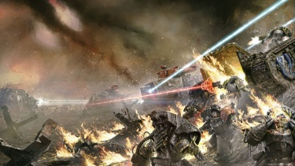
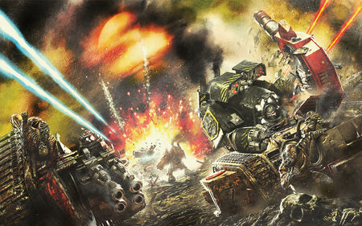
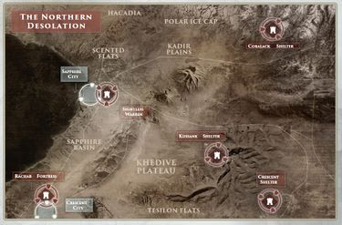
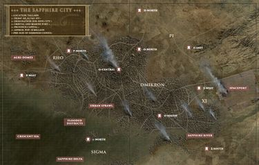
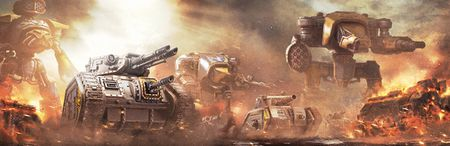

# 0797 010-011.M31 塔兰之战 Battle of Tallarn

精校状态：中文行文已逐段精校，部分术语仍为暂定

分类：时间线

原文来源：https://www.bilibili.com/opus/1204665054419484676

原作者：帝国神选罐头

原文时间：2026年05月21日 07:55

[返回分类目录](目录.md) · [全书目录](../../目录.md)

<!-- A0797-B0001 -->
**英文原文**

The Battle of Tallarn was a major conflict of the Horus Heresy, which saw the desolation of the Imperial world of Tallarn, and the birth of the famed Tallarn Desert Raiders regiments of the Imperial Guard. It was one of several planets that came under attack by the Iron Warriors after they had joined Horus in his rebellion against the Emperor.

<!-- /A0797-B0001 -->

<!-- A0797-B0002 -->

原译文

塔兰之战是荷鲁斯叛乱的一场重大冲突，它见证了帝国世界塔兰的荒芜，以及著名的帝国卫队塔兰沙漠突袭者兵团的诞生。这是钢铁勇士在加入荷鲁斯对抗帝皇的叛乱后受到攻击的几个行星之一。

**校订译文**

塔兰之战是荷鲁斯之乱期间的一场重大冲突。这场战役使帝国世界塔兰化为荒原，也催生了帝国卫队著名的塔兰沙漠突袭者兵团。钢铁勇士加入荷鲁斯反抗帝皇的叛乱后，袭击了多颗行星，塔兰便是其中之一。

**校注：** 末句施受关系译反：遭钢铁勇士袭击的是塔兰等行星，而非钢铁勇士。

<!-- /A0797-B0002 -->

<!-- A0797-B0003 -->
**英文原文**

After being abandoned by their Emperor's Children allies within the Eye of Terror, the Iron Warriors managed to leave, but the events of their escape dramatically altered the perceptions of their navigators. Once arriving at Tallarn, Perturabo was made aware of the Black Oculus hidden beneath the planet, and he immediately drew up plans to invade and secure the Cursus.

<!-- /A0797-B0003 -->

<!-- A0797-B0004 -->

原译文

在恐惧之眼被他们的帝皇之子盟友抛弃后，钢铁勇士设法离开了，但他们逃离的事件极大地改变了他们的导航者的看法。抵达塔兰后，佩图拉博意识到隐藏在行星下面的黑色之眼，他立即制定了入侵和保护驰道的计划。

**校订译文**

在恐惧之眼内遭帝皇之子盟友抛弃后，钢铁勇士设法逃了出来，但逃离过程中的遭遇极大地改变了导航员们的感知。抵达塔兰后，佩图拉博得知了深藏在这颗行星地下的黑暗之眼，随即制定计划，准备入侵塔兰并夺取驰道。

**校注：** perceptions 指导航员的感知；secure 在夺取遗迹的军事语境中译为夺取。Black Oculus 沿全书定译“黑暗之眼”。

<!-- /A0797-B0004 -->

<!-- A0797-B0005 图片 -->

<!-- A0797-B0006 -->

原译文

Iron Warriors battle the Imperial Army on Tallarn 钢铁勇士在塔兰与帝国军队作战

**校订译文**

Iron Warriors battle the Imperial Army on Tallarn 钢铁勇士在塔兰与帝国军作战

<!-- /A0797-B0006 -->

<!-- A0797-B0007 -->
**英文原文**

Initially, Perturabo destroyed all orbital and surface defense installations before virus bombing the surface, and he believed that he had obliterated the defenders. However, many tank regiments were hidden in shelters beneath the surface scattered across the planet, and they ventured into the poisonous world to attack those Iron Warriors who had landed. This led to a protracted battle that initially went in the Iron Warriors' favour until loyalist reinforcements arrived. Eventually, the Iron Warriors were able to capture, with the secret aid of the Alpha Legion agents, the shelter beneath the Sapphire City and use it as a secure staging ground upon the surface.

<!-- /A0797-B0007 -->

<!-- A0797-B0008 -->

原译文

最初，佩图拉博在病毒轰炸地表之前摧毁了所有轨道和地表防御设施，他认为自己已经消灭了守军。然而，许多坦克兵团隐藏在散布在行星各地的地表下的避难所里，他们冒险进入有毒的世界，攻击那些降落的钢铁勇士。这导致了一场旷日持久的战斗，最初对钢铁勇士有利，直到忠诚派增援部队到达。最终，在阿尔法军团特工的秘密协助下，钢铁勇士占领了蓝宝石城下方的避难所，并将其用作地表上的安全集结地。

**校订译文**

佩图拉博先摧毁了所有轨道与地表防御设施，随后对地表实施病毒轰炸，并以为守军已被消灭。然而，许多坦克兵团藏身于遍布全球的地下避难所，随后冒险进入剧毒笼罩的地表，攻击登陆的钢铁勇士。这引发了一场持久战；忠诚派援军到来之前，战局起初有利于钢铁勇士。最终，钢铁勇士在阿尔法军团特工的秘密协助下，夺取了蓝宝石城下方的避难所，将其作为在塔兰安全集结部队的基地。

<!-- /A0797-B0008 -->

<!-- A0797-B0009 -->
**英文原文**

The Iron Warriors flooded the planet with troops and tanks, and their expected easy victory instead turned into a protracted war at a great cost to both sides of the conflict. Through the actions of the emissary of the Warmaster Argonis, the Alpha Legion agents, and Imperial Infocyte agent Iaeo, the Iron Warriors search for the Black Oculus was exposed, and they were forced to withdraw from the planet. Although the planet's surface was destroyed and many resources were lost in the defense, the battle was regarded as an important Imperial victory during the Horus Heresy.

<!-- /A0797-B0009 -->

<!-- A0797-B0010 -->

原译文

钢铁勇士用军队和坦克淹没了这个行星，他们预期的轻松胜利反而变成了一场旷日持久的战争，冲突双方都付出了巨大的代价。通过战帅的使者阿尔戈尼斯、阿尔法军团特工和帝国信息细胞特工伊亚欧的行动，钢铁勇士对黑色之眼的搜寻被揭露，他们被迫退出这个行星。尽管行星表面被摧毁，许多资源在防御中损失，但这场战斗被视为荷鲁斯叛乱时期帝国的重要胜利。

**校订译文**

钢铁勇士向塔兰投入了大批军队与坦克，原以为唾手可得的胜利却演变为一场持久战，双方都付出了惨重代价。随着战帅特使阿尔戈尼斯、阿尔法军团特工，以及帝国的信息分析员伊亚欧各自展开行动，钢铁勇士搜寻黑暗之眼的企图遭到揭露，最终被迫撤离。尽管行星地表遭到毁灭，防御战也耗费了大量资源，塔兰之战仍被视为帝国在荷鲁斯之乱期间取得的一场重要胜利。

**校注：** Infocyte 是人员职衔，不是生物学上的细胞；结合后文瓦努斯分支的情报活动暂译“信息分析员”，官方中文待核。

<!-- /A0797-B0010 -->

<!-- A0797-B0011 -->
**英文原文**

Conflict:Horus Heresy

<!-- /A0797-B0011 -->

<!-- A0797-B0012 -->

原译文

冲突：荷鲁斯叛乱

**校订译文**

冲突：荷鲁斯之乱

<!-- /A0797-B0012 -->

<!-- A0797-B0013 -->
**英文原文**

Date:010-011.M31

<!-- /A0797-B0013 -->

<!-- A0797-B0014 -->

原译文

日期：010-011.M31

**校订译文**

日期：010-011.M31

<!-- /A0797-B0014 -->

<!-- A0797-B0015 -->
**英文原文**

Location:Tallarn

<!-- /A0797-B0015 -->

<!-- A0797-B0016 -->

原译文

地点：塔兰

**校订译文**

地点：塔兰

<!-- /A0797-B0016 -->

<!-- A0797-B0017 -->
**英文原文**

Outcome:Loyalist Victory

<!-- /A0797-B0017 -->

<!-- A0797-B0018 -->

原译文

结果：忠诚派胜利

**校订译文**

结果：忠诚派胜利

<!-- /A0797-B0018 -->

<!-- A0797-B0019 -->
**英文原文**

Combatants:Traitor Legions/Imperium

<!-- /A0797-B0019 -->

<!-- A0797-B0020 -->

原译文

作战方：叛徒军团/帝国

**校订译文**

作战方：叛徒军团/帝国

<!-- /A0797-B0020 -->

<!-- A0797-B0021 -->
**英文原文**

Commanders:Primarch Perturabo, Warsmith Kydomor Forrix, Warsmith Koparnos, Warsmith Cyrus Strux, Commander Garsenn (KIA), Emissary Kinor Argonis/Governor Dellasarius(KIA), Governor Susada Syn, General Gorn, Admiral Phoroc, Marshal Lycus (KIA), Commander Menoetius (KIA), Kalikgol, Siridar Count Mesucon, Princeps Yasue Koenen, Princeps Kowley, Marshal Jasira Sannoval

<!-- /A0797-B0021 -->

<!-- A0797-B0022 -->

原译文

指挥官：原体佩图拉博，战争铁匠凯德摩尔·弗里克斯，战争铁匠科帕诺斯，战争铁匠居鲁士·斯特鲁克斯，指挥官加尔森(KIA)，特使基诺·阿尔戈尼斯/总督德拉萨留斯(KIA)，总督苏萨达·辛，将军戈恩，海军上将弗洛克，元帅吕科斯(KIA)，指挥官墨诺提俄斯(KIA)，卡利高尔，西瑞达尔伯爵梅苏康，首席亚苏埃·科南，首席科利，元帅贾西拉·桑诺瓦尔

**校订译文**

指挥官：叛徒方——原体佩图拉博，战争铁匠凯德摩尔·弗里克斯，战争铁匠科帕诺斯，战争铁匠居鲁士·斯特鲁克斯，指挥官加尔森（阵亡），特使基诺·阿尔戈尼斯；忠诚派——总督德拉萨留斯（阵亡），总督苏萨达·辛，戈恩将军，弗洛克海军上将，吕科斯元帅（阵亡），指挥官墨诺提俄斯（阵亡），卡利高尔，西瑞达尔伯爵梅苏康，泰坦首席亚苏埃·科南，泰坦首席科利，贾西拉·桑诺瓦尔元帅。

**校注：** 此处英文写 Kinor Argonis，核心及其他篇写 Kenor Argonis；按同一人物统一中文“基诺·阿尔戈尼斯”，保留英文拼写差异。Princeps 在此为泰坦首席。

<!-- /A0797-B0022 -->

<!-- A0797-B0023 -->
**英文原文**

Strength:Large portion of the Iron Warriors, Alpha Legion elements, Thousand Sons elements, Legio Krytos, Legio Mortis, House Caesarean, Traitor Imperial Army:Selucid Thorakite, Galibed Oathsworn; Dark Mechanicum Taghmata Omnissiah/Over 100 Imperial Army Regiments, Sapphirine Ghosts, Ithak-Nur, 71st Solar Auxilia Cohort, Tallarn Reborn, Dark Angels, ~7,000 Imperial Fists, ~2,000 Iron Hands, ~ Several thousand Space Wolves, ~4,000 White Scars, Ultramarines, Legio Astorum, Legio Gryphonicus, House Megron, Freeblade Knights, Taghmata Omnissiah

<!-- /A0797-B0023 -->

<!-- A0797-B0024 -->

原译文

力量：大部分钢铁勇士、阿尔法军团成员、千子成员、奎托斯军团、死亡军团、凯撒利安家族、叛徒帝国军队：塞琉古胸甲兵、加里贝德誓约者；黑暗机械教机神禁卫/100多个帝国军队兵团：蓝宝石幽灵、伊萨克-努尔、第71太阳辅助军大队、塔兰重生；黑暗天使、约7000名帝国之拳、约2000名钢铁之手、约数千名太空野狼、约4000名白色疤痕、极限战士、星象军团、狮鹫军团、梅格伦家族、自由之刃骑士、机神禁卫

**校订译文**

兵力：叛徒方——钢铁勇士的大部分兵力，阿尔法军团与千子的部分部队，奎托斯军团，死亡军团，凯撒利安家族，叛变的帝国军部队（塞琉古胸甲兵、加里贝德誓约者），黑暗机械教的机神禁卫军；忠诚派——100 多个帝国军兵团，蓝宝石幽灵，伊萨克-努尔，第 71 太阳辅助军大队，塔兰重生，黑暗天使，约 7,000 名帝国之拳，约 2,000 名钢铁之手，数千名太空野狼，约 4,000 名白疤，极限战士，星象军团，狮鹫军团，梅格伦家族，自由之刃骑士，机神禁卫军。

<!-- /A0797-B0024 -->

<!-- A0797-B0025 -->
**英文原文**

Casualties:Very Heavy/Very Heavy

<!-- /A0797-B0025 -->

<!-- A0797-B0026 -->

原译文

伤亡：非常重/非常重

**校订译文**

伤亡：双方均极为惨重

<!-- /A0797-B0026 -->

<!-- A0797-B0027 -->
## History 历史

<!-- /A0797-B0027 -->

<!-- A0797-B0028 -->
## Prelude 序曲

<!-- /A0797-B0028 -->

<!-- A0797-B0029 -->
**英文原文**

Following Fulgrim's ascension to daemonhood, the Emperor's Children abandoned the Iron Warriors upon the crone world Iydris within the Eye of Terror. Perturabo knew that a black hole would claim the planet, so he led his surviving men back to their ships. Once in orbit aboard the Iron Blood, he watched the end of the planet; it turned from pristine to black, and all structures were ruined by earthquakes. The planet was previously able to resist the power of the warp, but Fulgrim's actions made that impossible to continue. Although most capital ships were able to escape the black hole, smaller vessels were not. However, even the larger vessels were being dragged towards the black hole, and the navigators were unable to find the path that first brought them to the planet.

<!-- /A0797-B0029 -->

<!-- A0797-B0030 -->

原译文

在福格瑞姆升格为恶魔王子后，帝皇之眼在恐惧之眼内抛弃了钢铁勇士，前往老妪世界伊德里斯。佩图拉博知道一个黑洞会夺走这颗行星，所以他带领幸存的人回到了他们的船上。一在轨道登上铁血号，他就看到了行星的终结；它从原始变成了黑色，所有的建筑都被地震摧毁了。这个行星以前能够抵抗亚空间的力量，但福格瑞姆的行动使这种情况无法继续下去。尽管大多数主力舰都能逃离黑洞，但较小的战舰却不能。然而，即使是更大的战舰也被拖向黑洞，导航者无法找到最初将他们带到行星的路径。

**校订译文**

福格瑞姆升魔后，帝皇之子将钢铁勇士抛弃在恐惧之眼内的老妪世界伊德瑞斯。佩图拉博知道，一个黑洞即将吞噬这颗行星，于是带领幸存部下返回舰队。他在轨道上的铁血号内目睹了行星的末日：原本完好的世界变得漆黑，所有建筑都在地震中化为废墟。此前，这颗行星尚能抵御亚空间的力量，福格瑞姆的所作所为却使这种抵抗无法持续。大部分主力舰虽然能够逃离黑洞，小型舰船却无法脱身。然而，就连大型舰船也开始被拖向黑洞，导航员们更是无法找到来时的航路。

**校注：** 修正 Emperor’s Children 被误作帝皇之眼、将“被弃于伊德瑞斯”错读成“前往伊德瑞斯”，以及 pristine 的误译。英文先说多数主力舰能够逃离，随后又说大型舰被拖向黑洞，叙述有张力，保留两句，不擅自删改。

<!-- /A0797-B0030 -->

<!-- A0797-B0031 -->
**英文原文**

Perturabo watched the destruction, coming to terms with the new fact that he could trust no one but Horus and all the others would betray them. Forrix requested orders from his primarch, and Perturabo responded that they would only move forward, not back; as Fulgrim had revealed that they would eventually met again, the Iron Warriors would survive the journey. Although the Iron Warriors were able to escape the Eye of Terror, the events of their escape dramatically altered the perceptions of their navigators, including that of the Navigator Prime of the Iron Blood. The singularity, a black star, revealed to them the chaos gods and altered the physics within the ships, causing panic and necessitated that the navigators be placed into an artificial sleep. The Iron Warriors emerged into the hole, and by sheer luck or fate would emerge in the Tallarn System.

<!-- /A0797-B0031 -->

<!-- A0797-B0032 -->

原译文

佩图拉博看着毁灭，接受了一个新的事实，即除了荷鲁斯，他不能相信任何人，其他人都会背叛他们。弗里克斯请求他的原体下达命令，佩图拉博回应说，他们只会前进，不会后退；正如福格瑞姆所透露的那样，他们最终会再次见面，钢铁勇士将在旅途中幸存下来。尽管钢铁勇士能够逃脱恐惧之眼，但他们的逃脱事件极大地改变了他们的导航者的看法，包括铁血号导航者的看法。奇点，一颗黑星，向他们揭示了混沌诸神，改变了船内的物理规则，引起了恐慌，并迫使导航者进入人工休眠状态。钢铁勇士出现在洞里，完全靠运气或命运，他们将出现在塔兰星系中。

**校订译文**

佩图拉博注视着毁灭景象，认定自己除了荷鲁斯以外谁也不能相信，其他人都会背叛他们。弗里克斯向原体请示命令，佩图拉博回答：他们只会前进，绝不后退。福格瑞姆既然曾透露他们终将重逢，就意味着钢铁勇士必能熬过这段旅程。钢铁勇士最终逃出了恐惧之眼，但逃离时的遭遇极大地改变了导航员们的感知，铁血号的首席导航员也不例外。那个形如黑色恒星的奇点让他们窥见了混沌诸神，还改变了舰内的物理规律，引发恐慌，迫使众人将导航员置于人工休眠之中。钢铁勇士穿入黑洞，随后不知是凭借运气还是命运的安排，出现在了塔兰星系。

**校注：** 英文 emerged into the hole 表达不顺，按穿入黑洞的上下文处理；其后出现于塔兰的结果照录。佩图拉博对他人的判断属于人物认知。

<!-- /A0797-B0032 -->

<!-- A0797-B0033 -->
**英文原文**

Meanwhile on unsuspecting Tallarn, billions of citizens lived in relative peace. The world had once been a key hub of the Great Crusade. Though it now was largely a backwater, the massive infrastructure to sustain the Crusade still existed. This included vast underground armouries, factories, and vehicle storage as well as a complex network of subterranean shelters and bunkers.

<!-- /A0797-B0033 -->

<!-- A0797-B0034 -->

原译文

与此同时，在毫无戒心的塔兰，数十亿公民生活在相对和平的环境中。世界曾经是大远征的关键中心。虽然现在它基本上是一片死水，但维持远征的大规模基础设施仍然存在。这包括巨大的地下军械库、工厂和载具仓库，以及复杂的地下避难所和掩体网络。

**校订译文**

与此同时，塔兰对此一无所知，数十亿居民仍过着相对安宁的生活。这颗行星曾是大远征的重要枢纽，如今虽已沦为偏远之地，支撑远征的大规模基础设施却依然存在，包括庞大的地下军械库、工厂与载具仓库，以及由避难所和地堡组成的复杂地下网络。

<!-- /A0797-B0034 -->

<!-- A0797-B0035 -->
## The Death of Tallarn 塔兰之死

<!-- /A0797-B0035 -->

<!-- A0797-B0036 -->
**英文原文**

The Battle for Tallarn began in 32610.M31 when an Iron Warriors fleet of over a thousand spaceships screamed out of the Warp well past the Mandeville Point and dangerously close to Tallarn’s neighboring gas giant Marad. This was only made possible due to the dark powers behind the traitor escape from the Eye of Terror. The close translation to realspace nonetheless caused mass chaos and accidents amongst the Traitor fleet, though some of these mishaps were from Iron Warriors commanders using the opportunity to settle old vendettas with each other. Order was quickly restored when Perturabo’s flagship, the Iron Blood appeared, though itself quickly tore through the Purity of Fire. Due to the close proximity of their jump, Tallarn had little warning or time to prepare for what was about to befall them.

<!-- /A0797-B0036 -->

<!-- A0797-B0037 -->

原译文

塔兰之战始于32610.M31，当时一支由1000多艘宇宙飞船组成的钢铁勇士舰队从亚空间通道中呼啸而出，远远越过曼德维尔点，危险地靠近塔兰邻近的气态巨星马拉德。这之所以成为可能，是因为叛徒背后的黑暗力量逃离了恐惧之眼。尽管如此，与现实空间的近距离转移在叛徒舰队中造成了大规模的混乱和事故，尽管其中一些事故是钢铁勇士指挥官利用这个机会解决彼此之间的旧仇。当佩图拉博的旗舰铁血号出现时，秩序很快恢复了，尽管它本身很快就撕裂了火焰纯净号。由于他们的跳跃距离很近，塔兰几乎没有任何预警或时间来为即将发生的事情做好准备。

**校订译文**

塔兰之战始于 32610.M31。一支由一千多艘舰船组成的钢铁勇士舰队呼啸着冲出亚空间，跃出位置远在曼德维尔点以内，危险地贴近塔兰邻近的气态巨行星马拉德。这种跃迁之所以可能，完全是因为帮助叛徒逃离恐惧之眼的黑暗力量。不过，如此近距离地转入现实空间，仍使叛军舰队陷入大规模混乱，事故接连发生；其中一些其实是钢铁勇士的指挥官借机清算彼此的旧怨。佩图拉博的旗舰铁血号出现后，秩序迅速恢复，尽管它自己刚一现身便撞穿了火焰纯净号。敌舰跃出的地点实在太近，塔兰几乎来不及收到预警，更无暇为灾难做好准备。

**校注：** 日期 32610.M31 按英文原样保留，格式疑似缺损，未猜补。原译将“帮助叛徒逃离恐惧之眼的黑暗力量”误读成黑暗力量自己逃离，已修正。

<!-- /A0797-B0037 -->

<!-- A0797-B0038 图片 -->

<!-- A0797-B0039 -->

原译文

Battle of Tallarn 塔兰之战

**校订译文**

Battle of Tallarn 塔兰之战

<!-- /A0797-B0039 -->

<!-- A0797-B0040 -->
**英文原文**

The first shot came from the Hammerfall, a nova shell that destroyed the northern orbital defense station above the plains of Kadir and the northern capital city of Ormas. The remainder of the orbital defense network was able to destroy some Iron Warrior ships before they were obliterated. An Imperial Fist strike vessel Light of Inwit attempted to flee the planet after being unable to warn Marshal Lycus on the surface of the attack, but was destroyed. The same fate befell any surface weapon installations the Iron Warriors discovered.

<!-- /A0797-B0040 -->

<!-- A0797-B0041 -->

原译文

第一枪来自落锤，这是一枚新星炮弹，摧毁了卡迪尔平原和北部首都奥尔马斯城上方的北部轨道防御站。轨道防御网络的其余部分能够在被摧毁前将一些钢铁勇士舰船摧毁。一艘帝国之拳打击舰因维特之光号在无法在攻击地表上警告吕科斯元帅后，试图逃离行星，但被摧毁。钢铁勇士发现的任何地面武器设施都遭遇了同样的命运。

**校订译文**

落锤号打响了第一炮：一枚新星炮弹摧毁了卡迪尔平原与北方首府奥尔马斯城上空的北部轨道防御站。其余轨道防御设施在覆灭前击毁了几艘钢铁勇士舰船。帝国之拳的打击舰因维特之光号未能向地表的吕科斯元帅发出遇袭警报，试图逃离行星，也被击毁。凡是被钢铁勇士发现的地表武器设施，都遭到了同样的毁灭。

<!-- /A0797-B0041 -->

<!-- A0797-B0042 -->
**英文原文**

With its orbital defenses long having since been neglected, Tallarn stood little change of fighting off the Iron Warriors assault. Its paltry few patrol ships and defense stations were quickly torn apart by the opening shots of the Iron Warriors vanguard flotillas. Only the 71st “Cinder Born” Solar Auxilia cohort aboard Tallarn’s equatorial defense stations were able to offer the attackers any real challenge. As the Iron Warriors fleet took positions above Tallarn, emergency broadcasts were sent to the planet’s population to make for the world’s many underground shelters. However, this was too little too late, and the majority of the billions of Tallarn could not hope to be protected in the insufficient existing shelter network anyway.

<!-- /A0797-B0042 -->

<!-- A0797-B0043 -->

原译文

由于其轨道防御长期以来一直被忽视，塔兰在击退钢铁勇士的进攻方面几乎没有变化。它微不足道的巡逻舰和防御空间站很快就被钢铁勇士先锋舰队的开火射击撕裂了。只有塔兰赤道防御空间站上的第71“炉渣裔”太阳辅助军大队能够为袭击者提供任何真正的挑战。当钢铁勇士舰队在塔兰上空就位时，紧急广播被向行星上的人口发送，为世界上许多地下避难所做准备。然而，这太少太晚了，无论如何，数十亿塔兰人中的大多数人都不奢望在现有的不足的避难所网络中得到保护。

**校订译文**

塔兰的轨道防御年久失修，几乎不可能抵挡钢铁勇士的进攻。为数寥寥的巡逻舰与防御站，很快就在钢铁勇士先锋舰队的首轮炮火中支离破碎。只有驻守赤道防御站的第 71“炉渣裔”太阳辅助军大队，对进攻者构成了真正的威胁。钢铁勇士舰队在塔兰上空展开时，紧急广播催促居民赶往各地地下避难所。然而，警报来得太迟，应对措施也远远不足；何况避难所的容量本就有限，数十亿塔兰人中的大多数根本无处藏身。

**校注：** 英文 stood little change 疑为 stood little chance，按上下文译为几无抵挡的可能，而非几乎没有变化。

<!-- /A0797-B0043 -->

<!-- A0797-B0044 -->
**英文原文**

At a single command by Perturabo, the Iron Warriors fleet over Tallarn loosed thousands of Virus Bombs. Within seconds of the first airborne detonations, all organic life on Tallarn began to be consumed by the Life-Eater Virus. Most of Tallarn’s population died in its crowded streets and highways attempting to reach shelter. Ten million people died in ten minutes, and the entire surface population was dead within the hour. As billions died in agony Tallarn’s once luscious jungles and savannahs dissolved into seething rot and its oceans were transformed into foetid decomposing sludge. Within the hour, Tallarn’s entire biosphere was dead and replaced with a dead landscape doused with banks of caustic fog. Unlike the virus bomb unleashed on Isstvan III, the miasma was not flammable. Instead, it was designed by the Iron Warriors Lyssatra to poison the planet for thousands of years to come.

<!-- /A0797-B0044 -->

<!-- A0797-B0045 -->

原译文

在佩图拉博的一次指挥下，塔兰上空的钢铁勇士舰队发射了数千枚病毒炸弹。在第一次空中爆炸后的几秒钟内，塔兰上的所有有机生命都开始被生命吞噬者病毒吞噬。塔兰的大部分人口在试图前往避难所的拥挤街道和高速公路上死亡。一千万人在十分钟内死亡，整个地表人口在一小时内死亡。随着数十亿人在痛苦中死去，塔兰曾经郁郁葱葱的丛林和热带稀树草原变成了沸腾的腐烂物，海洋变成了腐烂的淤泥。在一个小时内，塔兰的整个生物圈都死亡了，取而代之的是一片被腐蚀性雾气笼罩的死亡景观。与伊斯塔万三号上释放的病毒炸弹不同，瘴气不易燃。相反，它是由钢铁勇士莱萨特拉设计的，目的是在未来数千年内毒害行星。

**校订译文**

佩图拉博一声令下，塔兰上空的钢铁勇士舰队投下了数千枚病毒炸弹。第一批炸弹在空中引爆后仅数秒，噬生病毒便开始吞噬塔兰的一切有机生命。大多数居民死在通往避难所的街道和公路上，那里早已拥挤不堪。十分钟内便有一千万人丧生，一小时之内，地表人口尽数灭绝。数十亿人在痛苦中死去，曾经繁茂的丛林和稀树草原化为翻涌的腐败物，海洋变成恶臭的腐烂泥浆。不到一小时，塔兰的整个生物圈便已死亡，只剩一片笼罩在层层腐蚀性雾气中的死地。与伊斯塔万三号使用的病毒炸弹不同，这种瘴气无法燃烧。钢铁勇士的莱萨特拉设计这种病毒，正是为了让它在此后数千年间持续荼毒这颗行星。

**校注：** Life-Eater Virus 暂统一“噬生病毒”；原译生命吞噬者病毒保留于对照。Lyssatra 暂沿“莱萨特拉”，英文未在本处交代其具体性质，译文不补作个人姓名或具体军阶。

<!-- /A0797-B0045 -->

<!-- A0797-B0046 -->
**英文原文**

While the vast majority of Tallarn died, nearly a billion people had managed to reach its underground shelter network. This included a strength equaling dozens of Imperial Army Regiments as well as Governor-Militant Dellasarius, who maintained order the best they could amidst the packed crowds of increasingly desperate, dirty, and hungry survivors. Inside their shelters they found a vast arsenal of weapons, vehicles, and supplies originally intended for the Great Crusade, and set about training the survivors for resistance. After 7 weeks the Imperials conducted their first reconnaissance mission to determine the situation on the surface. Yet when the Iron Warriors launched their attack, the resistance they encountered was fierce and unrelenting. The few survivors emerged and refused to concede the planet.

<!-- /A0797-B0046 -->

<!-- A0797-B0047 -->

原译文

虽然塔兰的绝大多数人都死了，但近10亿人设法到达了其地下避难所网络。其中包括相当于数十个帝国军队兵团和军务总督德拉萨留斯的兵力，他们在越来越绝望、肮脏和饥饿的幸存者拥挤的人群中尽其所能维持秩序。在他们的避难所里，他们发现了一个庞大的武器库，载具和最初用于大远征的物资，并开始训练幸存者进行抵抗。7周后，帝国人进行了第一次侦察任务，以确定地表的情况。然而，当钢铁勇士发起进攻时，他们遇到的抵抗是激烈而无情的。少数幸存者出现了，拒绝让步这个行星。

**校订译文**

虽然塔兰绝大多数居民都已死亡，仍有近十亿人成功进入地下避难所网络，其中包括总兵力相当于数十个帝国军兵团的部队，以及军务总督德拉萨留斯。他们竭力维持秩序，而挤在一起的幸存者正变得越来越绝望、饥饿，卫生状况也日益恶化。在避难所内，他们发现了原为大远征储备的大量武器、载具与物资，随即开始训练幸存者，为抵抗做准备。七周后，帝国部队首次派出侦察队，查明地表状况。钢铁勇士随后发起进攻时，遭到了凶猛而顽强的抵抗。这些劫后余生者走出避难所，拒绝交出自己的世界。

**校注：** 原文 dozens of Regiments 与总督并列作为幸存者，原译将总督也纳入“相当于……的兵力”造成病句。

<!-- /A0797-B0047 -->

<!-- A0797-B0048 -->
**英文原文**

Meanwhile the Iron Warriors also set about occupying the rest of the Tallarn System. Larankon was used as an anchorage for the Iron Warriors fleet. Kizurra was the site of a massive slave labor mining operation. The docks at Marad were annihilated and its infrastructure seized by the Selucid Thorakite. Lastly, Pilgrim’s Rest Astropathic choir was destroyed to prevent the loyalists for sending out requests for help.

<!-- /A0797-B0048 -->

<!-- A0797-B0049 -->

原译文

与此同时，钢铁勇士也开始占领塔兰星系的其余部分。拉兰孔被用作钢铁勇士舰队的锚地。基祖拉是一个大规模的奴隶劳动采矿作业的地点。马拉德的码头被摧毁，其基础设施被塞琉古胸甲兵占领。最后，朝圣者之休星语唱诗班被摧毁，以防止忠诚派发出求助请求。

**校订译文**

与此同时，钢铁勇士开始占领塔兰星系的其他地区。拉兰孔被用作舰队锚地，基祖拉则成了大规模役使奴工开矿的据点。马拉德的船坞遭到摧毁，其余基础设施被塞琉古胸甲兵夺取。最后，朝圣者之休的星语合唱团也被消灭，以阻止忠诚派向外求援。

<!-- /A0797-B0049 -->

<!-- A0797-B0050 -->
## Defence 防御

<!-- /A0797-B0050 -->

<!-- A0797-B0051 -->
**英文原文**

Seeking the Black Oculus buried on the planet, Perturabo then gave orders to his Legion. The majority of the Iron Warriors would remain in orbit to recover and repair from the events on Iydris while specific hosts probed Tallarn in search of surviving enemy defenses and the location of the Black Oculus which he codenamed the “Cursus”. Withdrawing into his workshop aboard the Iron Blood, Perturabo ordered that he would not be disturbed until the Crusus was discovered and appointed Forrix as acting commander in his stead. The remaining Iron Warriors commanders rushed to the surface, knowing that to fail their Primarch was death. Such was the devastation to Tallarn and the lingering effect of the life eater virus that even Terminators could only withstand open air for a brief period. As a result, the Iron Warriors utilized biological warfare-sealed armoured vehicles deployed from gunships. The focus of their landings took place at Crescent Province, which held the core of Tallarn’s shelter network at the Khedive Plateau. It soon gained a new name: The Northern Desolation.

<!-- /A0797-B0051 -->

<!-- A0797-B0052 -->

原译文

为了寻找埋在行星上的黑色之眼，佩图拉博随后向他的军团下达了命令。大多数钢铁勇士将留在轨道上，从伊德里斯事件中恢复和修复，而特定的天军则探测塔兰，寻找幸存的敌人防御和他代号为“驰道”的黑色之眼的位置。在铁血号上撤回到他的工作室后，佩图拉博命令在发现驰道之前不要打扰他，并任命弗里克斯代替他担任代理指挥官。剩下的钢铁勇士指挥官冲向地表，他们知道，辜负他们的原体就是死亡。这就是对塔兰的破坏和生命吞噬者病毒的挥之不去的影响，即使是终结者也只能在短时间内承受露天环境。因此，钢铁勇士使用了从炮艇上部署的生物战密封装甲载具。他们的登陆重点发生在新月行省，该行省是塔兰在赫迪夫高原避难所网络的核心。它很快就有了一个新名字：北方荒原。

**校订译文**

为找到埋藏在塔兰地下的黑暗之眼，佩图拉博向军团下达了命令：钢铁勇士的主力留在轨道上，休整并修复在伊德瑞斯遭受的损伤；指定的部队则搜索地表，探查尚存的敌军防御设施，并寻找被他代称为“驰道”的黑暗之眼。佩图拉博退入铁血号上的工坊，指定弗里克斯代行指挥，并命令众人在找到驰道前不得打扰自己。其余指挥官急忙奔赴地表，因为他们知道，辜负原体就意味着死亡。塔兰的毁灭如此彻底，噬生病毒的余毒又如此顽固，就连终结者也只能在室外环境中短暂停留。因此，钢铁勇士使用具备生物战密封防护的装甲载具，由炮艇投放。他们主要在新月行省登陆；塔兰地下避难所网络的核心，便位于该省的赫迪夫高原。不久，这里便有了一个新的名字：北方荒原。

**校注：** hosts 在此是钢铁勇士的部队，不是黑暗天使专门编制“天军”。原文一次将 Cursus 写作 Crusus，中文统一，英文不改。

<!-- /A0797-B0052 -->

<!-- A0797-B0053 图片 -->

<!-- A0797-B0054 -->

原译文

The Northern Desolation 北方荒原

**校订译文**

The Northern Desolation 北方荒原

<!-- /A0797-B0054 -->

<!-- A0797-B0055 -->
**英文原文**

Many tank regiments were kept in mostly-empty underground shelters, including one beneath the Sapphire City that had over ten complexes beneath it. One of those complex housed two regiments, the Jurnian 701st and the Chalcisorian 1002nd Mechanised, and gear from old campaigns. They were mostly left alone for three years without orders even though they heard that the Horus Heresy was taking place, and they kept busy practicing and drilling. After the bombs hit, tanks began to perform reconnaissance missions on the surface, risking the poisonous atmosphere.

<!-- /A0797-B0055 -->

<!-- A0797-B0056 -->

原译文

许多坦克兵团被关在大多空荡荡的地下掩体中，包括蓝宝石城下的一个掩体，其下有十多个建筑群。其中一个建筑群容纳了两个兵团，即朱尼安第701兵团和卡尔基索里安第1002机械化兵团，以及旧战役的装备。尽管他们听说荷鲁斯叛乱正在发生，但他们大多在没有命令的情况下独自呆了三年，他们一直忙于练习和操练。炸弹袭击后，坦克开始在地表执行侦察任务，冒着有毒大气的风险。

**校订译文**

许多坦克兵团驻扎在大多空置的地下避难所内，蓝宝石城下方的设施便是其中之一，包含十余处地下建筑群。朱尼安第 701 兵团与卡尔基索里安第 1002 机械化兵团驻扎在其中一处，身边堆放着历次战役留下的装备。尽管听说荷鲁斯之乱已经爆发，他们却有三年几乎无人过问，也接不到命令，只能不断练习、操演。轰炸过后，坦克部队开始冒着剧毒大气的危险，到地表执行侦察任务。

<!-- /A0797-B0056 -->

<!-- A0797-B0057 -->
**英文原文**

Alpha Legion operative Jalen regularly met with Akil Sulan, commander over much of the Sapphire City, and after one such meeting an important dataslate was stolen from Sulan's person immediately before the Iron Warrior's attack. After the attack, Akil became a scout for the Imperial forces, and on one such mission his unit ran into some of the first Iron Warrior tanks among the ruins of the Sapphire City, destroying the traitors. The Iron Warriors spent weeks on the surface following the bombardment; as they believed there were no survivors, they were taken by surprise when they started suffering losses. This provoked the Iron Warriors to send more equipment to the surface, and many of those in the shelters said that it would be best to hide in place and wait until the Iron Warriors left.

<!-- /A0797-B0057 -->

<!-- A0797-B0058 -->

原译文

阿尔法军团密探杰伦定期会见蓝宝石城大部分地区的指挥官阿基尔·苏兰，在一次这样的会面后，钢铁勇士袭击前，苏兰的一份重要数据被盗。袭击发生后，阿基尔成为帝国军队的侦察兵，在一次这样的任务中，他的部队在蓝宝石城的废墟中遇到了一些第一批钢铁勇士坦克，摧毁了叛徒。轰炸后，钢铁勇士在地表上待了数周；由于他们认为没有幸存者，当他们开始遭受损失时，他们感到惊讶。这促使钢铁勇士向地表派遣了更多的装备，许多在避难所的人表示，最好躲在原地，等到钢铁勇士离开。

**校订译文**

阿尔法军团密探杰伦定期与阿基尔·苏兰会面，后者负责指挥蓝宝石城大部分地区的驻军。一次会面结束后，就在钢铁勇士来袭之前，苏兰身上的一块重要数据板被盗。袭击之后，阿基尔成为帝国部队的一名侦察兵。在一次任务中，他的部队于蓝宝石城废墟遭遇了最早登陆的钢铁勇士坦克，并将其击毁。钢铁勇士在轰炸后的数周里一直在地表活动，自以为已无人生还，因而对突如其来的损失毫无准备。他们随即向地表投入更多装备。避难所内的许多人则认为，最明智的做法是继续藏好，等钢铁勇士自行离去。

<!-- /A0797-B0058 -->

<!-- A0797-B0059 -->
**英文原文**

Soon after, the Tallarn natives spread the idea of "Ithak-ja": vengeance, the call to volunteer in defence of their planet. They were taught how to use the Imperial tanks, and they filled the ranks of the defenders' army. This allowed the Imperials to last until others came to their aid.

<!-- /A0797-B0059 -->

<!-- A0797-B0060 -->

原译文

不久之后，塔兰当地人传播了“伊塔克-贾”的想法：复仇，号召志愿者保卫他们的行星。他们被教导如何使用帝国坦克，并充实了守军的队伍。这使得帝国人能够持续下去，直到其他人来帮助他们。

**校订译文**

不久，塔兰人之间传开了“伊塔克-贾”的呼声，意为“复仇”，号召人们自愿参战，保卫自己的世界。志愿者接受操纵帝国坦克的训练，补入守军队伍，使帝国部队得以坚持到外援到来。

<!-- /A0797-B0060 -->

<!-- A0797-B0061 -->
**英文原文**

Iron Warriors commander Garsenn was appointed to oversee the subjugation of the Northern Desolation and discovering the Cursus. For the next two months, patrol sections trawled through the devastated ruins of Tallarn probing for Perturabo’s prize and encountering virtually no resistance. The tense situation and competition between Iron Warriors caused several inter-legion engagements as the Northern Desolation was divided up by territorial beasts. Eight weeks after the viral bombardment, the Iron Warriors began to detect augur and vox signals emanating from a handful of Tallarn’s dead cities.

<!-- /A0797-B0061 -->

<!-- A0797-B0062 -->

原译文

钢铁勇士指挥官加尔森被任命为监督北方荒原的征服和发现驰道。在接下来的两个月里，巡逻队在塔兰被毁的废墟中搜寻，寻找佩图拉博的战利品，几乎没有遇到任何抵抗。紧张的局势和钢铁勇士之间的竞争导致了几次军团间的交战，因为北方荒原被地域野兽分割。在病毒轰炸八周后，钢铁勇士开始探测到从塔兰的几个死城发出的占卜和音阵信号。

**校订译文**

钢铁勇士指挥官加尔森奉命征服北方荒原，并找到驰道。接下来的两个月里，各巡逻分队在满目疮痍的废墟中搜寻佩图拉博觊觎之物，几乎没有遇到抵抗。钢铁勇士各部之间关系紧张，争夺激烈；各路军头如同争地盘的猛兽，将北方荒原割据瓜分，甚至发生了数次内部交火。病毒轰炸八周后，钢铁勇士开始在几座死城探测到探测仪和音阵的信号。

**校注：** 英文 inter-legion 字面为军团之间，但上下文明确是钢铁勇士内部的地盘争夺，暂按内部冲突译，保留此原文疑点。territorial beasts 为比喻，不是某种野兽单位。

<!-- /A0797-B0062 -->

<!-- A0797-B0063 -->
**英文原文**

The response saw Garsenn’s own 32nd Armour Echelon consisting of Predator and Kratos tanks move in towards the Sapphire City, at first easily sweeping past sparse amounts of Imperial Army Aurox APC’s and Aethon walkers. However, it was then that the Iron Warriors fell into an ambush by Solar Auxilia “Tallarn Reborn” Leman Russ Vanquishers, Executionerss, and Annihilators. Of the 6 Iron Warriors patrol sections that entered the kill-zone, all but one were badly mauled and forced to retreat. As they retreated, they fell into another ambush of Tarantula batteries that had been erected in their rear. Garsenn himself met his end when his own command vehicle was destroyed by in an attack by Valdors, Malcadors, and the Stormblade ‘’Ignifera’’ under 71st Solar Auxilia Cohort Marshal Jasira Sannoval. Rather than die at the hands of the enemy he ordered nearby Iron Warriors artillery batteries to unleash an indiscriminate bombardment, killing himself as well as his attackers. By the time the engagement was over 1,000 Traitor vehicles had been destroyed in 2 hours. The loyalists had taken equal losses, but this was overshadowed by the fact that they had bloodied the nose of their executioners.

<!-- /A0797-B0063 -->

<!-- A0797-B0064 -->

原译文

作为回应，加尔森自己的第32装甲梯队由掠食者和奎托斯坦克组成，向蓝宝石城前进，起初很容易扫过帝国军队少量的野牛装甲运兵车和埃松步行者。然而，就在那时，钢铁勇士遭到了太阳辅助军“塔兰重生”黎曼鲁斯征服者、刽子手和歼灭者的伏击。在进入杀戮区的6个钢铁勇士巡逻队中，除了一个外，其余都受到了严重打击，被迫撤退。当他们撤退时，他们又陷入了在后方竖起的狼蛛炮台的伏击中。加尔森自己的指挥载具在第71太阳辅助军大队元帅贾西拉·桑诺瓦尔的瓦尔多、马卡多和风暴刃“携火者号”的袭击中被摧毁，从而结束了自己的生命。他没有死在敌人手中，而是命令附近的钢铁勇士火炮阵列进行狂轰滥炸，杀死自己和袭击者。到交战结束时，已有1000多辆叛徒载具在2小时内被摧毁。忠诚者也遭受了同样的损失，但他们让刽子手的鼻子流血的事实掩盖了这一点。

**校订译文**

加尔森随即派出自己的第 32 装甲梯队，驾驶掠食者与奎托斯坦克向蓝宝石城推进。起初，他们轻易扫除了帝国军少量野牛装甲运兵车与埃松步行机的阻挡，随后却落入太阳辅助军“塔兰重生”部队的伏击圈，遭到黎曼鲁斯胜利者、处决者与歼灭者坦克的攻击。进入杀伤区的六支钢铁勇士巡逻分队中，五支遭到重创，被迫撤退；撤退途中，又撞上了忠诚派预先布设在其后方的狼蛛炮台。第 71 太阳辅助军大队的贾西拉·桑诺瓦尔元帅指挥瓦尔多、马卡多坦克，以及风暴刃“携火者号”，击毁了加尔森的指挥车。加尔森不愿死在敌人手中，便命令附近的钢铁勇士炮兵不分敌我地轰击，将自己和攻击者一同炸死。交战结束时，叛军已在两小时内损失了一千辆载具。忠诚派也付出了相当的代价，但他们终于让屠戮同胞的敌人尝到了苦头，这份胜利的意义压过了惨痛的损失。

**校注：** Vanquisher、Executioner 依据 GW09/GW10 第 8 页完整车型官译使用“胜利者、处决者”；Annihilator 暂沿歼灭者。英文 Executionerss 有拼写重复。原文说共一千辆，而非一千多辆；末句 bloodied the nose 为使敌人吃苦头的比喻。

<!-- /A0797-B0064 -->

<!-- A0797-B0065 -->
**英文原文**

61 days after the arrival of the Iron Warriors two survivors from the underground shelters named Kulok and Gatt encountered the Astropath Halakime. Believed to be the last living Astropath in the entire System, when Governor Dellasarius heard of this he desperately dispatched a force to retrieve the Psyker. Solar Auxilia alongside the last survivor of the ‘’Light of Inwit’’ Lyscus were able to reach the group and dispatch a message for reinforcements just as Iron Warriors Terminators arrived to murder all within their bunker. The first reinforcement came from the Lesson of Ages, which the Iron Warriors thought was a trade or transport ship. The ship repeatedly broadcast "traitor-death" as it drove straight into the Iron Warrior fleet. Soon after, the Lament of Caliban, Beastslayer, and many others arrived for the purpose of waging war upon the Iron Warriors.

<!-- /A0797-B0065 -->

<!-- A0797-B0066 -->

原译文

在钢铁勇士抵达61天后，来自地下避难所的两名幸存者库洛克和加特遇到了星语者哈拉基姆。被认为是整个星系中最后一个活着的星语者，当德拉萨留斯总督听说这件事时，他绝望地派遣了一支部队去找回灵能者。太阳辅助军“因维特之光”的最后一名幸存者吕库斯一起能够到达该小组并发出增援信息，就像钢铁勇士终结者到达并在他们的掩体内杀死所有人一样。第一个增援来自时代教训号，钢铁勇士认为这是一艘贸易或运输舰。当这艘船直接驶入钢铁勇士舰队时，它反复播放“叛徒之死”。不久之后，卡利班挽歌号、野兽杀手号和其他许多来到这里，目的是对钢铁勇士发动战争。

**校订译文**

钢铁勇士抵达后的第 61 天，地下避难所的两名幸存者库洛克和加特遇到了星语者哈拉基姆。据认为，他是整个星系最后一位活着的星语者。德拉萨留斯总督得知消息，立即派兵设法接回他。太阳辅助军与因维特之光号最后的幸存者吕库斯赶到了他们身边，成功发出求援信息；紧接着，钢铁勇士终结者便杀入地堡，将其中所有人屠戮殆尽。最先前来增援的是时代教训号。钢铁勇士起初以为它是商船或运输舰，却见它径直冲向己方舰队，反复广播着“叛徒去死”。不久，卡利班挽歌号、野兽杀手号等众多舰船相继抵达，投入对钢铁勇士的战争。

**校注：** 太阳辅助军是部队，因维特之光号才是舰船。此处 Lyscus 与前文 Marshal Lycus 拼写、职衔不同，暂保留“吕库斯／吕科斯”，不擅自认定为同一人。

<!-- /A0797-B0066 -->

<!-- A0797-B0067 -->
**英文原文**

While Imperial reinforcements came in sufficient numbers to deny the Iron Warriors a swift victory, they were made up of different units and legion strike forces, hampering the loyalist war effort. Admiral Phoroc seized control over the north and supplied the Cobalack shelter while Legio Gryphonicus landed on the Khedive Plains. Eventually, thousands of tanks filled the vast shelters, including the one beneath the Sapphire City, which even housed thousands of members of the White Scars.

<!-- /A0797-B0067 -->

<!-- A0797-B0068 -->

原译文

虽然帝国增援部队的人数足以阻止钢铁勇士迅速取得胜利，但他们由不同的部队和军团打击部队组成，阻碍了忠诚派的战争努力。弗洛克海军上将控制了北部，并在狮鹫军团登陆赫迪夫平原时为科巴莱克避难所提供了供给。最终，数千辆坦克填满了巨大的避难所，包括蓝宝石城下面的避难所，那里甚至收容了数千名白色伤疤成员。

**校订译文**

帝国援军数量足以阻止钢铁勇士速胜，却来自许多不同部队与军团打击群，协同困难，拖累了忠诚派的作战。弗洛克海军上将夺取北方控制权，为科巴莱克避难所输送补给；狮鹫军团则在赫迪夫平原登陆。最终，数千辆坦克进驻庞大的地下避难所，蓝宝石城下方也不例外，那里还驻入了数千名白疤战士。

<!-- /A0797-B0068 -->

<!-- A0797-B0069 -->
**英文原文**

Meanwhile, the Iron Warriors landed a fresh wave of reinforcements on Tallarn in the form of Dark Mechanicum Legio Cybernetica and Selucid Thorakite Traitor Imperial Army. These fell into more loyalist ambushes, but as losses mounted the defenders of Tallarn grew increasingly desperate. To try and weed out loyalist defenders the Iron Warriors reduced Tallarn’s dead cities and above-ground fortresses with air, artillery, and orbital bombardment. The Iron Warriors deployed more sophisticated tanks in the form of Land Raiders and Spartans to disgorge Terminators and trap pockets of resistance. As days turned into weeks, it became clear that the loyalists were doomed without reinforcement as the Tallarn defenders were pushed back to their shelters. However while most on Tallarn thought no reprieve would come, 93 days after the Iron Warriors arrival the first loyalist reinforcements arrived in the Tallarn System in the form of.

<!-- /A0797-B0069 -->

<!-- A0797-B0070 -->

原译文

与此同时，钢铁勇士以黑暗机械教智控军团和塞琉古胸甲军叛徒帝国军队的形态在塔兰登陆了新一轮的增援部队。这些部队陷入了更为忠诚者的伏击，但随着损失的增加，塔兰的守军变得越来越绝望。为了消灭忠诚派守军，钢铁勇士用空中、火炮和轨道轰炸摧毁了塔兰的死城和地面堡垒。钢铁勇士部署了更先进的坦克，如兰德掠袭者和斯巴达，以倾泻终结者并诱捕抵抗力量。随着时间从几天变成几周，很明显，如果没有增援，忠诚派注定要失败，因为塔兰的守军被推回了他们的避难所。然而，尽管塔兰的大多数人认为不会有延缓，但在钢铁勇士抵达93天后，第一批忠诚派增援部队以某种形式抵达了塔兰星系。

**校订译文**

与此同时，钢铁勇士又将一批援军送上塔兰，包括黑暗机械教的智控军团，以及叛变的帝国军部队塞琉古胸甲兵。这些部队也屡遭忠诚派伏击，但守军自身的损失同样不断攀升，处境日益绝望。钢铁勇士为拔除抵抗据点，以空袭、炮击和轨道轰炸摧毁死城与地表堡垒，并投入更加精良的兰德掠袭者战车和斯巴达突击坦克，运送终结者围歼各处抵抗力量。几天过去，又拖成数周，塔兰守军被不断压回避难所；没有援军，他们败局已定。然而，就在大多数人都以为再无转机时，钢铁勇士抵达后的第 93 天，第一批忠诚派援军进入塔兰星系。

**校注：** 英文末尾止于 in the form of，缺少后接成分，译文只保留完整信息，并在此标注缺文。本段称第 93 天首次增援，与前文第 61 天求援后援军抵达的叙述衔接不清，暂不改日期。

<!-- /A0797-B0070 -->

<!-- A0797-B0071 -->
**英文原文**

Upon arriving in the shelter beneath the Sapphire City, Akil was taken by force to meet with Jalen and other Alpha Legion agents. Akil threatened Jalen, but Jalen revealed that they had nothing to do with the Iron Warriors attack. Instead, they planned to take the planet without bloodshed. Jalen made Akil a bargain: he would protect Akil's daughters, who he said still lived, and, in return, Akil would allow infiltrators to pass behind the imperial lines. The Imperials soon left the shelter in force to meet the Iron Warrior attack in the city above, which resulted in a massive battle with many casualties on both sides. Eventually, the actions of Akil and at least eight others who survived the battle, and others who did not, allowed Iron Warrior tanks to slip behind the defenders' lines and end the battle. After the Iron Warriors took the shelter and established a base on the surface, Alpha Legion assets discussed among themselves the certainty that Horus would send an emissary to intervene.

<!-- /A0797-B0071 -->

<!-- A0797-B0072 -->

原译文

抵达蓝宝石城下方的避难所后，阿基尔被强行带走，与杰伦和其他阿尔法军团特工会面。阿基尔威胁杰伦，但杰伦透露，他们与钢铁勇士的进攻无关。相反，他们计划在不流血的情况下占领行星。杰伦与阿基尔达成协议：他将保护阿基尔的女儿，他说她们还活着，作为回报，阿基尔将允许渗透者越过帝国防线。帝国人很快离开了避难所，以应对钢铁勇士在上述城市的袭击，这导致了一场大规模的战斗，双方都有许多伤亡。最终，阿基尔和至少八名在战斗中幸存下来的其他人，以及其他没有幸存下来的人的行动，让钢铁勇士坦克滑到了守军的后方，结束了战斗。在钢铁勇士占领了避难所并在地表建立了基地后，阿尔法军团的人相互讨论了荷鲁斯会派使者介入的必然性。

**校订译文**

阿基尔来到蓝宝石城地下避难所后，被强行带去与杰伦及其他阿尔法军团特工会面。他出言威胁杰伦，对方却声称阿尔法军团与钢铁勇士的袭击无关，他们原本打算不流血便拿下行星。杰伦提出交易：阿基尔的女儿们据称仍然活着，只要他放渗透者穿过帝国防线，杰伦便会保护她们。帝国部队很快大举离开避难所，迎战进攻上方城市的钢铁勇士，双方由此展开伤亡惨重的大战。阿基尔与至少八名活下来的同谋，以及一些未能幸存的人，在这场战斗中的行动最终使钢铁勇士坦克得以绕至守军后方，结束了战斗。钢铁勇士夺取避难所、建立地表基地后，阿尔法军团特工在私下讨论时认定，荷鲁斯一定会派特使前来干预。

<!-- /A0797-B0072 -->

<!-- A0797-B0073 -->
## Fall of the Sapphire City 蓝宝石城的陷落

<!-- /A0797-B0073 -->

<!-- A0797-B0074 -->
**英文原文**

Loyalist vessels began to pour into the Tallarn System gradually, approaching at hundreds of different vectors and drawn from many different hosts. They all attempted to run the Iron Warriors blockade and deliver reinforcements. While they endured heavy losses, many more were able to evade traitor patrols and unload fresh troops and supplies. In the Northern Desolation, Marshal Sannoval was able to rendezvous with 6 Freeblade Knights and their Armiger vassals. Dubbed the "Empyrean Coursers", they cut apart an Iron Warriors Predator convoy as they announced their arrival. Soon elements of the Legio Gryphonicus landed at the Khedive Plateau under Princeps Yasue Koenen arrived alongside White Scars under. Using these fresh reinforcements as a spearhead, Solar Auxilia in the Northern Desolation were able to launch a fresh counterattack that began to force the Iron Warriors to withdraw. Several maniples of the Legio Astorum, led by Princeps Kowley, also arrived at Tallarn to aid their old Legio Gryphonicus allies.

<!-- /A0797-B0074 -->

<!-- A0797-B0075 -->

原译文

忠诚派战舰开始逐渐涌入塔兰星系，以数百种不同的载体接近，并从许多不同的天军中抽出。他们都试图突破钢铁勇士的封锁并提供增援。虽然他们遭受了重大损失，但更多的人能够躲避叛徒巡逻，卸下新的部队和物资。在北方荒原中，桑诺瓦尔元帅能够与6名自由之刃骑士及其侍从附庸会合。他们被称为“至高天信使”，在宣布抵达时，他们切断了一支钢铁勇士掠食者车队。不久，狮鹫军团的一些成员在亚苏埃·科南首席的带领下降落在赫迪夫高原，与白色疤痕一起抵达。利用这些新的增援部队作为先锋，北方荒原中的太阳辅助军能够发动新的反击，开始迫使钢铁勇士撤退。由科利首席率领的星象军团的几个支队也抵达塔兰，帮助他们的老狮鹫军团盟友。

**校订译文**

来自不同部队的忠诚派舰船陆续涌入塔兰星系，从数百条不同航线接近，试图突破钢铁勇士的封锁，运来增援。尽管损失惨重，仍有更多舰船避开叛军巡逻，卸下生力军与补给。在北方荒原，桑诺瓦尔元帅与六位自由之刃骑士及其侍从骑士附庸会合。这支被称为“至高天驰骋者”的队伍摧毁了一支钢铁勇士掠食者坦克车队，宣告自己的到来。不久，亚苏埃·科南首席率领的狮鹫军团部分兵力与白疤一同抵达赫迪夫高原。太阳辅助军以这些援军为先锋，发起新一轮反攻，迫使北方荒原上的钢铁勇士开始后撤。科利首席也率领星象军团的几个支队赶到塔兰，援助狮鹫军团的老盟友。

**校注：** vectors 指接近航线或方向，hosts 指不同部队。Empyrean Coursers 暂译“至高天驰骋者”，Courser 并非信使。英文 White Scars under 后缺少指挥官姓名，译文不擅自补名。

<!-- /A0797-B0075 -->

<!-- A0797-B0076 图片 -->

<!-- A0797-B0077 -->

原译文

The Battle for the Sapphire City 蓝宝石城之战

**校订译文**

The Battle for the Sapphire City 蓝宝石城之战

<!-- /A0797-B0077 -->

<!-- A0797-B0078 -->
**英文原文**

It was then that Perturabo emerged from his seclusion with declaration that the Crusus was in the Northern Desolation. He organised a new effort to take the region, and at 596010.M31 the Iron Warriors fleet divided itself into a score of spherical formations. Sweeping aside whatever loyalist ships were present in low orbit, they unleashed a vicious orbital bombardment then landed Iron Warriors forces directly upon the Sapphire City including Titans of the Legio Krytos. Under Warsmith Cyrus Strux, nearly 21,000 Iron Warriors, 1.1 million auxiliaries, 56,000 Taghmata Omnissiah, 63 Knights, and 24 Titans took part in the massive assault. Facing them were 2 million Imperial Army troops, 780,000 Solar Auxilia, 4,000 White Scars, 2,000 Iron Hands, 7,000 Imperial Fists, 37,000 Taghmata Omnissiah, 98 Knights, and 9 Titans. Unlike the Iron Warriors, the loyalists fell under a variety of commanders and this would hamper their efforts.

<!-- /A0797-B0078 -->

<!-- A0797-B0079 -->

原译文

就在那时，佩图拉博从隐居中走出来，宣布驰道在北方荒原。他组织了一次新的行动来占领该地区，在596010.M31时，钢铁勇士舰队将自己分成了20个球形编队。他们扫除了低轨上所有忠诚派船只，发动了一场恶毒的轨道轰炸，然后让钢铁勇士部队直接降落在蓝宝石城，包括奎托斯军团的泰坦。在战争铁匠居鲁士·斯特鲁克斯的指挥下，近21000名钢铁勇士、110万名辅助军、56000名机神禁卫、63架骑士和24架泰坦参加了这次大规模进攻。面对他们的是200万帝国军队、78万太阳辅助军、4000名白色伤疤、2000名钢铁之手、7000名帝国之拳、37000名机神禁卫、98架骑士和9架泰坦。与钢铁勇士不同，忠诚派受到各个指挥官的指挥，这将阻碍他们的努力。

**校订译文**

这时，佩图拉博结束闭门独处，宣布驰道就在北方荒原，并组织新一轮行动夺取该地区。596010.M31，钢铁勇士舰队分为二十个球形编队，扫清低轨道上的忠诚派舰船，实施猛烈的轨道轰炸，再将地面部队直接投送至蓝宝石城，其中包括奎托斯军团的泰坦。战争铁匠居鲁士·斯特鲁克斯指挥近 21,000 名钢铁勇士、110 万辅助兵、56,000 名机神禁卫军、63 台骑士及 24 台泰坦，展开大规模进攻。抵抗他们的是 200 万帝国军士兵、78 万太阳辅助军、4,000 名白疤、2,000 名钢铁之手、7,000 名帝国之拳、37,000 名机神禁卫军，以及 98 台骑士和 9 台泰坦。与指挥统一的钢铁勇士不同，忠诚派分属众多指挥官，作战因此受到掣肘。

**校注：** 日期 596010.M31 沿英文保留，与前文 32610.M31 格式不同，待查原始出处。

<!-- /A0797-B0079 -->

<!-- A0797-B0080 -->
**英文原文**

As soon as the Iron Warriors bombardment ceased, the loyalists emerged from their shelters to take defensive positions. However, communication was difficult and haphazard, and in the face of the Legio Krytos’ Titan assault order amongst the loyalist regular Army troops broke down. In the Titans wake came Traitor Solar Auxilia of the Galibed Oathsworn, which traded blows with their loyalist cousins. Despite the mass use of Super-Heavy tanks, the traitors were beaten back by the Sapphire Ghosts Solar Auxilia regiment but were then immediately set upon by Iron Warriors Sicaran tanks and Dreadnoughts. The Sapphire Ghosts sacrificed themselves, but were able to buy enough time for loyalist tanks to organise and arrive. The White Scars then launched a large Assault Marine and gunship attack as tens of thousands of new loyalist tanks surged from their shelters and established a 40 km-long defensive line. What followed was a massive tank and artillery battle in the northern districts of the Sapphire City.

<!-- /A0797-B0080 -->

<!-- A0797-B0081 -->

原译文

钢铁勇士的轰炸一停止，忠诚派就从掩体中出来，占据防御阵地。然而，沟通既困难又无序，面对奎托斯军团的泰坦突击命令，忠诚派正规军部队崩溃了。泰坦们身后，是加里贝德誓言者的叛徒太阳辅助军，他们与忠诚派表亲们展开了激战。尽管大量使用了超重型坦克，叛徒还是被蓝宝石幽灵太阳辅助军兵团击退，但随后立即被钢铁勇士西卡然坦克和无畏袭击。蓝宝石幽灵牺牲了自己，但能够为忠诚派坦克的组织和到达争取足够的时间。随后，白色伤疤组织发动了一场大规模的突击战士和炮艇袭击，数万辆新的忠诚派坦克从他们的避难所涌出，建立了一条40公里长的防线。随后，蓝宝石城北部地区爆发了一场大规模的坦克和火炮战。

**校订译文**

钢铁勇士的轰炸一停，忠诚派便冲出避难所，占领防御阵地。然而，通信困难且混乱，面对奎托斯军团泰坦的冲击，忠诚派正规帝国军部队的秩序开始瓦解。叛变的太阳辅助军加里贝德誓约者跟在泰坦后面，与仍然忠诚的昔日同袍交火。叛军虽然投入大量超重型坦克，仍被太阳辅助军的蓝宝石幽灵兵团击退；紧接着，钢铁勇士的西卡然坦克和无畏机甲便扑向蓝宝石幽灵。该兵团以自身覆灭的代价，为忠诚派坦克集结赶到争取了时间。随后，白疤出动突击战士和炮艇，发起大规模攻击，数万辆忠诚派坦克也从避难所涌出，建立起一条长达 40 公里的防线。蓝宝石城北部随即爆发了大规模的坦克与炮兵会战。

**校注：** order 是秩序，为 broke down 的主语，不是泰坦突击命令。英文该句接续含混，但按双方归属，钢铁勇士随后攻击的是蓝宝石幽灵，原译误成叛军攻击叛军。

<!-- /A0797-B0081 -->

<!-- A0797-B0082 -->
**英文原文**

After a huge artillery duel, the Iron Warriors and Traitor Army tanks under Warsmith Strux surged forward. Dividing their forces into several wedges, each Iron Warriors armoured spearthrust struck at a different point in the loyalist line. The central assault consisted of 7 Fellblades commanded by Strux himself. The massed Fellblade attack was able to penetrate the loyalist tank line and reach the Omik-North Shelter as the Legio Krytos and Dark Mechanicum Taghmata led by the Warmaster Titan Typhoeus continued their southwards advance in the face of heavy loyalist tank fire and rapid White Scars light armour “death by a thousand cuts” assaults. Along the whole line a hundred individual battles broke out as the traitors were able to insert forces via Termites into the lowest levels of the Rho-West Shelter and coming into conflict with Marshal Sannoval’s defending 71st Solar Auxilia Cohort. As loyalist units fell back to regroup, they came under fire from their own allies due to mass confusion and many formerly loyal units revealing their true Alpha Legion allegiance. One by one, sections of the loyalist line began to die.

<!-- /A0797-B0082 -->

<!-- A0797-B0083 -->

原译文

在一场巨大的火炮决斗后，由战争铁匠斯特鲁克斯指挥的钢铁勇士和叛徒军队坦克向前冲去。将他们的部队分成几个楔形，每个钢铁勇士的装甲矛头都击中了忠诚派阵线的不同地点。中央突击队由斯特鲁克斯亲自指挥的7辆残暴刃组成。面对忠诚派坦克的猛烈火力和白色疤痕轻甲的快速“千切斩死”攻击，战帅泰坦提丰号领导的奎托斯军团和黑暗机械教禁军继续向南推进，残暴刃的大规模攻击能够穿透忠诚派坦克战线，到达奥米克-北掩体。全战线爆发了100场单独的战斗，因为叛徒能够通过白蚁将部队插入罗-西避难所的最底层，并与桑诺瓦尔元帅的第71太阳辅助军大队发生冲突。随着忠诚派部队撤退重新集结，由于大规模混乱，他们受到了自己盟友的攻击，许多以前忠诚的单位暴露了他们真正的阿尔法军团忠诚。一个接一个，忠诚派战线的一部分开始消亡。

**校订译文**

一轮猛烈的炮兵对射之后，战争铁匠斯特鲁克斯率领钢铁勇士与叛变帝国军的坦克向前猛攻。他将兵力编成数个楔形，每个装甲突击矛头分别攻击忠诚派防线的不同位置。中央攻势由斯特鲁克斯亲自指挥的七辆残暴刃坦克领衔，集中突击突破了忠诚派坦克防线，直抵奥米克-北避难所。与此同时，在战帅级泰坦堤丰厄斯号的带领下，奎托斯军团与黑暗机械教禁卫军继续向南推进，顶住忠诚派坦克的猛烈火力，以及白疤轻型装甲部队疾速穿插、逐步放血的袭扰。整条战线上爆发了上百场局部交战；叛军还用白蚁掘进运输机将部队送入罗-西避难所最底层，与桑诺瓦尔元帅的第 71 太阳辅助军大队激战。忠诚派各部后撤重整时，混乱导致友军误击，还有许多原本看似忠诚的部队暴露出对阿尔法军团的真正效忠。忠诚派防线就这样一段接一段地瓦解。

**校注：** Typhoeus 暂译“堤丰厄斯”，区别 Typhus 人名“提丰”；Fellblade 暂沿“残暴刃”，官方中文待核。death by a thousand cuts 为渐次消耗的比喻。Taghmata 不译为帝皇禁军。

<!-- /A0797-B0083 -->

<!-- A0797-B0084 -->
**英文原文**

As the loyalist central line collapsed, traitor forces poured through the gap as Titans guns of the Legio Krytos silenced whatever resistance remained in the south. The Iron Warriors used Spartans and Mastodons to ferry troops across Tallarn’s putrid seabed, delivering troops to the southern districts of the Sapphire City and destroying the few loyalist super-heavy tanks left resisting the Legio Krytos. The traitors now fell upon the remaining shelters and loyalist bastions all over the city in conjunction with subterranean assaults. Deep underground, desperate battles erupted as ad hoc militia troops attempted to fend off Iron Warriors Breacher assaults. Soon enough only the Omikron-South Shelter was not on the verge of falling due to the skillful defense by the 71st Cohort both above and below ground. Marshal Sannoval dispatched an order for any remaining loyalist contingents to retreat to the Sigma-South, Pi-East, and Xi-South shelters. The 71st Cohort would wage a delaying action to allow for the loyalists to flee to these shelters. As the 71st left their shelter to commit to this act, they rigged their to explode with unused ammunition.

<!-- /A0797-B0084 -->

<!-- A0797-B0085 -->

原译文

随着忠诚派中心战线的崩溃，叛徒部队涌入缺口，因为奎托斯军团的泰坦炮压制了南方剩下的抵抗。钢铁勇士利用斯巴达和乳齿象在塔兰腐烂的海底运送部队，将部队运送到蓝宝石城的南部地区，摧毁了抵抗奎托斯军团的少数忠诚派超重型坦克。叛徒现在与地下袭击一起，袭击了整个城市剩下的避难所和忠诚派堡垒。当特设民兵部队试图抵御钢铁勇士破坏者的袭击时，地下深处爆发了绝望的战斗。很快，由于第71大队在地上和地下的巧妙防御，只有奥密克戎-南避难所没有濒临倒塌。桑诺瓦尔元帅下令所有剩余的忠诚派特遣队撤退到西格玛-南、菲-西和希-南避难所。第71大队将采取拖延行动，让忠诚派逃往这些避难所。当第71大队离开他们的避难所承诺采取这一行动时，他们操纵他们未使用的弹药爆炸。

**校订译文**

忠诚派中央防线崩溃后，叛军从缺口涌入，奎托斯军团泰坦的炮火则逐一压灭南方尚存的抵抗。钢铁勇士利用斯巴达和乳齿象装甲运兵车穿越塔兰腐败的海床，将部队送入蓝宝石城南部，摧毁仍在抵抗奎托斯军团的少数忠诚派超重型坦克。叛军配合地下突袭，开始围攻全城剩余的避难所与堡垒。临时拼凑的民兵在地下深处拼死迎战钢铁勇士攻坚战士。很快，只有第 71 大队凭借地上、地下的周密防御，保住了奥密克戎-南避难所，使其尚未濒临陷落。桑诺瓦尔元帅命令剩余忠诚派部队撤往西格玛-南、派-东与克西-南避难所，由第 71 大队执行迟滞作战，为他们争取撤离时间。该大队离开原有避难所执行任务时，用未消耗的弹药布置了爆破陷阱。

**校注：** Breacher 为攻坚战士，不是破坏者。Pi-East 原译菲-西，同时误译字母与方向，改为派-东；Xi-South 统一克西-南。英文末句 rigged their to explode 缺名词，依前后文理解为在弃守的避难所布置爆破陷阱。

<!-- /A0797-B0085 -->

<!-- A0797-B0086 -->
**英文原文**

By now, the entirety of the southern city was in the hands of the Legio Krytos while in the north loyalists were beginning to regroup thanks to aid of White Scars armour. Outside of these few forces, no other major loyalist formations successfully escaped the city proper. Warsmith Strux had taken the Sapphire City as loyalists withdrew back to their remaining shelters a thousand kilometers east, escorted by White Scars Predators and Sabres. As the Traitor Selucid Thorakites pursued, they were met by Imperial Fists and Legio Gryphonicus Titans and pushed back. Loyalist Titans alongside Iron Hands armour from the Rachab Fortress were able to repulse a Traitor pursuit attack by House Caesarean. Meanwhile, a massive traitor assault on the less significant city of Rogsburg resulted in an Imperial defeat, with the Legio Astorum and Space Wolves defending it suffering significant losses.

<!-- /A0797-B0086 -->

<!-- A0797-B0087 -->

原译文

到目前为止，整个南部城市都在奎托斯军团手中，而在北部，由于白色伤疤装甲的帮助，忠诚派开始重新集结。除了这几支部队，没有其他主要的忠诚派部队成功逃离了这座城市。战争铁匠斯特鲁克斯已经占领了蓝宝石城，因为忠诚派在白色疤痕掠食者和军刀的护送下撤退到以东1000公里的剩余避难所。当叛徒塞琉古胸甲军追击时，他们遭到了帝国之拳和狮鹫军团泰坦的反击。来自拉查布要塞的忠诚派泰坦与钢铁之手装甲一起击退了凯撒利安家族的叛徒追击攻击。与此同时，对不太重要的城市罗格斯堡的大规模叛徒袭击导致了帝国的失败，星象军团和太空野狼为保卫它遭受了重大损失。

**校订译文**

此时，蓝宝石城南部已尽入奎托斯军团之手。北方的忠诚派借助白疤装甲部队的掩护开始重整，除了这少数部队，其余主要忠诚派编队都未能成功逃出城区。斯特鲁克斯已夺下蓝宝石城，幸存守军在白疤掠食者与军刀突击坦克的护送下，撤往东面一千公里外仍由己方控制的避难所。追击的塞琉古胸甲兵遭帝国之拳与狮鹫军团泰坦迎头击退。拉查布要塞的忠诚派泰坦和钢铁之手装甲部队，也击退了凯撒利安家族的追兵。与此同时，叛军大举进攻战略价值较低的罗格斯堡，击败帝国守军；负责防守的星象军团与太空野狼损失惨重。

<!-- /A0797-B0087 -->

<!-- A0797-B0088 -->
## World Death 世界死亡

<!-- /A0797-B0088 -->

<!-- A0797-B0089 -->
**英文原文**

As the traitors consolidated their prize in the Sapphire City, the loyalists regrouped at the Sapphire Basin, Khedive Plateau, and Kadir Plains around the Rachab Fortress. Their trek was difficult and many vehicles, troops, and supplies were left behind in the toxic wasteland. Worse still, rust-mist had now developed from Tallarn’s ruined landscape which threatened to consume all vehicles caught within it. Tallarn’s sun had begun to come out once more, but this did little to improve the loyalist situation as the Iron Warriors organised reconnaissance groups to search out the remaining enemy.

<!-- /A0797-B0089 -->

<!-- A0797-B0090 -->

原译文

随着叛徒在蓝宝石城巩固他们的战利品，忠诚派在拉查布要塞周围的蓝宝石盆地、赫迪夫高原和卡迪尔平原重新集结。他们的跋涉很艰难，许多载具、部队和物资被留在有毒的荒地上。更糟糕的是，铁锈雾现在已经从塔兰的废墟中发展出来，有可能吞噬其中所有的载具。塔兰的太阳已经开始再次升起，但这并没有改善忠诚派的处境，因为钢铁勇士组织了侦查小组来搜寻剩下的敌人。

**校订译文**

叛军巩固蓝宝石城的占领后，忠诚派在拉查布要塞周边的蓝宝石盆地、赫迪夫高原与卡迪尔平原重新集结。撤退途中艰险重重，大量载具、士兵与物资被遗留在剧毒荒原上。更糟的是，塔兰残破的地表开始生成锈蚀雾，足以吞噬陷入其中的载具。阳光虽已重新透出阴霾，忠诚派的处境却几乎没有改善：钢铁勇士正在组织侦察队，搜寻尚存的敌军。

<!-- /A0797-B0090 -->

<!-- A0797-B0091 -->
**英文原文**

197 days, 10 hours, and 17 minutes into the battle, 3 recon squads of the Imperial Fists (Command Squad Gamus, Theophon and Arcad) infiltrated the macro-transporter Eagle's Talon and caused it to crash during a major battle taking place on the southern continent. The battle, if won by either side, would have allowed for a decisive victory for the whole battle, and the macro-transport would have brought reinforcements for the Iron Warrior's forces. The ship's destruction caused a blast over three hundred kilometres in diameter, with winds over 100 km an hour, and spread nuclear fallout across an already destroyed world. All of the Imperial Fists were lost. Six days later, the winds died enough to allow daylight to begin returning. Warsmith Koparnos of the Iron Warriors managed to survive the blast in his Rhino but had to find new shelter due to the poisons on the surface infiltrating his systems. Venturing out, he managed to work his way to the Warlord Titan Ostentio Contritio, enter it, and restart the systems. After tricking the paralyzed Imperial princeps, he managed to bind her to the titan and rig a new system of controls before he ventured out to battle any other survivors of the blast.

<!-- /A0797-B0091 -->

<!-- A0797-B0092 -->

原译文

战斗进行了197天10小时17分钟后，帝国之拳的3个侦察小队（加姆斯，西奥丰和阿卡迪指挥组）渗透到大型运输机鹰之爪号中，并在南部大陆发生的一场重大战斗中导致其坠毁。这场战斗，如果任何一方获胜，都将为整个战斗带来决定性的胜利，宏运输舰将为钢铁勇士的部队带来增援。这艘船的毁灭造成了直径超过300公里的爆炸，风速超过每小时100公里，并在已经被摧毁的世界上传播了核辐射。所有的帝国之拳都损失了。六天后，风力减弱，阳光开始恢复。钢铁勇士的战争铁匠科帕诺斯设法在犀牛的爆炸中幸存下来，但由于地表的毒素渗透到他的系统中，他不得不找到新的避难所。冒险离开后，他设法找到了军阀泰坦展示忏悔号，进入并重新启动了系统。在欺骗了瘫痪的帝国首席后，他设法将她束缚在泰坦上，并设置了一套新的控制系统，然后才冒险去与爆炸中的其他幸存者战斗。

**校订译文**

战役开始后第 197 天 10 小时 17 分，帝国之拳的三个侦察小队——加姆斯指挥小队、西奥丰小队与阿卡迪小队——潜入巨型运输舰鹰之爪号，使其在南部大陆一场重大战斗期间坠毁。这场交战无论哪一方取胜，都有可能决定整场战役的结果，而鹰之爪号原本正要为钢铁勇士送去援军。舰船毁灭引发的爆炸范围直径超过 300 公里，狂风时速超过 100 公里，并将核沉降物洒向这个早已毁坏的世界。参与行动的帝国之拳无一生还。六天之后，风势才减弱到足以让日光重返地表。钢铁勇士战争铁匠科帕诺斯躲在犀牛运兵车内，侥幸熬过爆炸，但地表毒素正渗入防护系统，他必须另寻庇护。科帕诺斯冒险离开，辗转来到战将级泰坦展示忏悔号，进入其中并重启系统。他欺骗了那位已经瘫痪的帝国泰坦女首席，将她束缚在泰坦上，再改装出一套控制系统，随后驾驶泰坦出击，攻击其他爆炸幸存者。

**校注：** 原文 command squad 只明确修饰 Gamus；其余按小队列出。科帕诺斯是躲在犀牛内熬过运输舰爆炸，而不是从犀牛自身爆炸中生还。Warlord Titan 用官方“战将级泰坦”。

<!-- /A0797-B0092 -->

<!-- A0797-B0093 -->
## Emissary of Horus Arrives 荷鲁斯使者的到来

<!-- /A0797-B0093 -->

<!-- A0797-B0094 -->
**英文原文**

The Sons of Horus emissary, Argonis, was dispatched by Maloghurst on behalf of Horus, and he travelled on the storm eagle Sickle Blade. He was accompanied by Prophesius the astropath and Sota-Nul of the Dark Mechanicum, and he sought audience with Perturabo on the Iron Blood to demand why he invaded Tallarn. Perturabo, after revealing his irritation, stated that Tallarn was a valuable route to Terra. Argonis was dismissed, but he did not trust the primarch's word and contacted the Alpha Legion to investigate. After 12 days, the Alpha Legion agent and psyker, Jalen, posed as a serf and met with Argonis. Jalen stated that he did not know why the Iron Warriors were present at Tallarn, but he admitted that the Alpha Legion was on the planet before they arrived. Argonis leaves for the Sightless Warren, not trusting the Alpha Legion forces. During this time, Imperial Infocyte agent Iaeo, of Clade Vanus, follows Argonis and the Alpha Legion agents, interfering when she can to set Horus's forces against each other.

<!-- /A0797-B0094 -->

<!-- A0797-B0095 -->

原译文

荷鲁斯之子的使者阿尔戈尼斯被马洛格赫斯特派去代表荷鲁斯，他乘坐风暴鹰镰刃号航行。伴随着他的是星语者的普罗菲修斯和黑暗机械教的索塔-努尔，他在铁血号上寻求与佩图拉博的会面，以询问他为什么入侵塔兰。佩图拉博在展示自己的愤怒后表示，塔兰是通往泰拉的宝贵路线。阿尔戈尼斯被解职，但他不相信原体的话，并联系了阿尔法军团进行调查。12天后，阿尔法军团特工和灵能者杰伦假扮成侍从，会见了阿尔戈尼斯。杰伦表示，他不知道钢铁勇士为什么会出现在塔兰，但他承认阿尔法军团在他们到达之前就已经在这个行星上了。阿尔戈尼斯前往无眼沃伦，不相信阿尔法军团的部队。在此期间，瓦努斯分支的帝国信息细胞特工伊亚欧跟随阿尔戈尼斯和阿尔法军团特工，在可能的情况下进行干预，让荷鲁斯的部队相互对抗。

**校订译文**

马洛赫斯特代表荷鲁斯派遣荷鲁斯之子特使阿尔戈尼斯前来。阿尔戈尼斯乘风暴鹰镰刃号抵达，同行者是星语者普罗菲修斯与黑暗机械教的索塔·努尔。他登上铁血号，要求佩图拉博解释入侵塔兰的理由。佩图拉博明显不耐烦，只说塔兰是通往泰拉的重要通道，随后便将特使打发走。阿尔戈尼斯不信这番说辞，联系阿尔法军团展开调查。十二天后，阿尔法军团特工兼灵能者杰伦伪装成仆役与他会面，声称自己也不知道钢铁勇士为何来到塔兰，但承认阿尔法军团早在钢铁勇士之前便已抵达。阿尔戈尼斯同样不信任阿尔法军团，于是前往无眼巢穴。在此期间，帝国瓦努斯分支的信息分析员伊亚欧一直跟踪阿尔戈尼斯与阿尔法军团特工，伺机介入，挑动荷鲁斯麾下各部互相争斗。

**校注：** dismissed 在会面语境表示打发离开，不是解职；Warren 在此为地下巢穴，原无眼沃伦改作暂定“无眼巢穴”，并非舰名。

<!-- /A0797-B0095 -->

<!-- A0797-B0096 -->
**英文原文**

The Imperial forces tried to assault the Iron Warrior stronghold, the Sightless Warren, three times. The Sightless Warren was once the shelter beneath the Sapphire City, but it was transformed with a network of tunnels that connected it with other shelters that the Iron Warriors captured. It was massive in size and extended to the Crescent Ocean. The third assault failed like the others, with orbital bombardments unable to penetrate the shelter. The Iron Warriors tried to destroy the crushed Imperial assault force, but the Imperial grand cruiser Memloch sacrificed itself to fend off orbital attacks. Following the attack, Imperial forces experienced more setbacks: 400 war machines were inexplicably lost from Cobalack Shelter, the Cassildian Mountains bunker fell due to atmospheric contamination, and the newly arrived Legio Krytos was able to land Titans and Knights from House Caesarean onto the southern hemisphere.

<!-- /A0797-B0096 -->

<!-- A0797-B0097 -->

原译文

帝国部队三次试图袭击钢牙勇士的据点，无眼沃伦。无眼沃伦曾经是蓝宝石城下的避难所，但它被一个隧道网络改造了，这个隧道网络将它与钢铁勇士占领的其他避难所连接起来。它体积庞大，一直延伸到新月洋。第三次攻击和其他攻击一样失败了，轨道轰炸无法穿透掩体。钢铁勇士试图摧毁被击溃的帝国突击部队，但帝国大型巡洋舰梅洛克号为了抵御轨道攻击而牺牲了自己。袭击发生后，帝国部队遭遇了更多挫折：400台战争引擎莫名其妙地从科巴莱克避难所丢失，卡西尔迪安山脉地堡因大气污染而倒塌，新抵达的奎托斯军团能够将泰坦和凯撒利安家族的骑士降落到南半球。

**校订译文**

帝国部队曾三次进攻钢铁勇士的据点无眼巢穴。这里原是蓝宝石城下方的避难所，经改造后由庞大的隧道网络与其他被钢铁勇士占领的避难所相连，一直延伸至新月洋。第三次进攻与前两次一样失败了，连轨道轰炸也无法击穿它的防护。钢铁勇士试图歼灭已被击溃的帝国突击部队，帝国大巡洋舰梅洛克号却牺牲自身，挡住来自轨道的攻击，掩护友军。此后，帝国部队接连受挫：科巴莱克避难所莫名损失了四百台战争机器，卡西尔迪安山脉地堡因大气污染而陷落，新抵达的奎托斯军团又将泰坦与凯撒利安家族的骑士送上南半球。

**校注：** 修正钢牙勇士为钢铁勇士。bunker fell 指地堡陷落，不是建筑坍塌。此处再称奎托斯军团“新抵达”，与前文已多次参战的叙述重复，保留原文。

<!-- /A0797-B0097 -->

<!-- A0797-B0098 -->
**英文原文**

When the battle turned into a protracted conflict, both the Traitors and the Imperium poured war material to their respective allies on Tallarn, neither willing to admit defeat. The Imperial Fists and Iron Hands dispatched forces to the planet, and their Predators proved instrumental in combating traitor tanks. Over a million armoured vehicles fought across the desert, which stands as the largest tank confrontation in Imperial history. The Tallarns learned quickly that they could not match the Traitor Marines in open combat, so they became proficient at hit-and-run strikes and flanking maneuvers, eventually wearing down the Iron Warriors and routing them from the planet. An Imperial counter-attack, led mostly by recent Ultramarine reinforcements from space, targeted Rogsburg and succeeded in retaking the city. However this was only after several attacks and after the Legio Mortis and a contingent of traitor Thousand Sons had inflicted heavy losses on the loyalists.

<!-- /A0797-B0098 -->

<!-- A0797-B0099 -->

原译文

当这场战斗演变成一场旷日持久的冲突时，叛徒和帝国都向各自在塔兰的盟友倾倒了战争物资，双方都不愿意承认失败。帝国之拳和钢铁之手向行星派遣了部队，他们的掠食者在打击叛徒坦克方面发挥了重要作用。超过一百万辆装甲载具在沙漠中作战，这是帝国历史上最大的坦克对抗。塔兰人很快意识到，在公开战斗中，他们无法与叛徒战士匹敌，因此他们精通了跑打攻击和侧翼机动，最终击败了钢铁勇士，并将他们从行星上赶走。帝国的反击主要是由最近从太空增援的极限战士领导的，目标是罗格斯堡，并成功夺回了这座城市。然而，这是在几次袭击之后，在死亡军团和叛徒千子的特遣队给忠诚派造成重大损失之后。

**校订译文**

战事陷入长期消耗后，叛军与帝国都不肯认输，不断向塔兰的己方盟军输送军需。帝国之拳与钢铁之手派兵增援，其掠食者坦克在对抗叛军装甲部队时发挥了关键作用。超过一百万辆装甲载具在沙漠中厮杀，构成了帝国历史上规模最大的坦克会战。塔兰人很快意识到，自己无法在正面交战中匹敌叛变的星际战士，于是逐渐精通打了就跑的突袭与侧翼包抄，最终拖垮钢铁勇士，将其逐出行星。帝国还发起了针对罗格斯堡的反攻，主要由新近从太空抵达的极限战士援军领衔，最终夺回该城。不过，他们是在多次进攻之后才取得成功，死亡军团与一支叛变千子部队已给忠诚派造成惨重损失。

**校注：** 本段为战役概述，将撤军归于消耗与战术；后文详述荷鲁斯命令撤军及遗迹争夺。两种叙述层次一并保留，不删去后文政治因素。

<!-- /A0797-B0099 -->

<!-- A0797-B0100 -->
## Golden Fleet Arrives 黄金舰队到达

<!-- /A0797-B0100 -->

<!-- A0797-B0101 -->
**英文原文**

Following the failed third assault on the Sightless Warren, a massive storm covered the land and began to change everything. The Tallarn named the new land "Yathan," which means "land of lost pilgrims." After the change, the Golden Fleet arrived, being led by the Eagle Claw. The fleet was led by Rogue Trader Sangrea and once travelled ahead of the Great Crusade. It was made up of mercenaries and ships gained through conquest, including the Sacristan Geneo-het warriors, Knights of House Klaze and 300 Ultramarines. The fleet arrived back in Tallarn 10 years after it left the planet to explore the Morai Veil. Once entering the system the Golden Fleet sent word to the Iron Warrior ships that they were allies to Horus before taking them by surprise. Upon reaching the planet, the Golden Fleet refused any messages from the Imperials and instead launched attacks on any attempt to land supplies and troops upon the surface. Battlecruisers with nova cannons were brought forward, running down fueling ships and set the sky on fire with their attack, an act that would later be known as "The Inferno Tide." With that, the Golden fleet left, leaving the planet free from orbital interference.

<!-- /A0797-B0101 -->

<!-- A0797-B0102 -->

原译文

在对无眼沃伦号的第三次袭击失败后，一场巨大的风暴席卷了这片土地，开始改变一切。塔兰人将这片新土地命名为“亚森”，意思是“迷失朝圣者之地”。改变后，由鹰爪号率领的黄金舰队抵达。舰队由行商浪人桑格利亚率领，曾在大远征之前航行。它由雇佣兵和通过征服获得的舰船组成，包括圣物管理者吉内奥-赫特战士、克拉泽家族骑士和300名极限战士。舰队在离开行星探索莫莱帷幕10年后返回塔兰。一进入星系，黄金舰队就向钢铁勇士舰队发出消息，称他们是荷鲁斯的盟友，然后突袭了他们。到达行星后，黄金舰队拒绝了帝国人的任何信息，而是对任何将补给和部队降落在地表的企图发动了攻击。配备新星炮的战列巡洋舰被提出，击落燃料舰，并用它们的攻击点燃天空，这一行为后来被称为“炼狱潮”。随后，黄金舰队离开了，使行星免受轨道干扰。

**校订译文**

第三次进攻无眼巢穴失败后，一场巨大的风暴笼罩大地，开始改变这里的一切。塔兰人将面貌一新的土地称为“亚森”，意为“迷失朝圣者之地”。随后，黄金舰队以鹰爪号为前导抵达。舰队由行商浪人桑格利亚统率，曾在大远征主力前方开路，麾下集合了雇佣兵与征服得来的舰船，包括圣物保管者吉内奥-赫特战士、克拉泽家族骑士，以及三百名极限战士。他们离开塔兰探索莫莱帷幕十年后，终于重返这里。黄金舰队刚进入星系，便向钢铁勇士声称自己是荷鲁斯的盟友，随即出其不意地袭击对方。抵达行星后，他们又拒绝接收帝国部队的任何消息，转而攻击一切试图向地表输送部队与物资的舰船。装有新星炮的战列巡洋舰被调到前方，追击供油船，用炮火点燃天空。这场袭击后来被称为“炼狱潮”。随后黄金舰队离去，使地表暂时摆脱了来自轨道的干预。

**校注：** ahead of the Great Crusade 指在远征主力前方开路，不是发生在大远征之前。Sacristan Geneo-het warriors 的构词与身份未在所给英文中说明，Sacristan 暂沿核心“圣物保管者”，其余沿音译，待核；不擅补为骑士技师部队。黄金舰队拒收帝国消息且拦截一切地表运输，依原文保留。

<!-- /A0797-B0102 -->

<!-- A0797-B0103 -->
**英文原文**

Perturabo sent the Contemptor Dreadnought Hrend with the corrupted navigator Hes-Thal and a strike force to search for the Black Occulus on the surface of the planet. At the same time, Argonis was getting nowhere in the Sightless Warren, and he called upon Volk, Iron Warrior Commander of Core Reach One, the Sightless Warren, who he served with before at Carmeline and Reddus Cluster. The interview was cut short without any new information being retrieved when the surface above the shelter began to be bombarded in preparation for an attack. Argonis broke from the Iron Warrior's guards and made his way to the data stacks of the shelter where Sota-Nul discovered the name Black Oculus. The group made their way to a new location Sota-Nul found, and Argonis was forced to kill an Iron Warrior. At their destination, they found many bound and sedated navigators. Reviving one, she explained their transformation within the Eye of Terror and the gateway of the Black Oculus. Upon leaving the chamber, alarms went off and the group was soon captured and imprisoned.

<!-- /A0797-B0103 -->

<!-- A0797-B0104 -->

原译文

佩图拉博派遣了蔑视者无畏赫伦德和腐化导航者赫斯·塔尔以及一支打击部队，在行星表面寻找黑色之眼。与此同时，阿尔戈尼斯在无眼沃伦上毫无进展，他拜访了无眼沃伦的核心领域一的钢铁勇士指挥官沃尔克，他之前曾在卡梅林和雷德斯星群与他一起服役。当避难所上方的地表开始受到轰炸以准备袭击时，会谈被缩短，没有取回任何新信息。阿尔戈尼斯从钢铁勇士的守卫中挣脱出来，前往避难所的数据堆栈，索塔-努尔在那里发现了黑色之眼这个名字。这群人前往索塔·努尔发现的一个新地点，阿尔戈尼斯被迫杀死了一名钢铁勇士。在他们的目的地，他们发现了许多束缚和被镇静的导航者。她唤醒了一个，解释了他们在恐惧之眼和黑眼之门内的转变。离开房间后，警报响起，这群人很快被抓获并监禁。

**校订译文**

佩图拉博派出蔑视者无畏机甲赫伦德，令其带领一支打击部队，在腐化导航员赫斯·塔尔的协助下搜寻地表的黑暗之眼。与此同时，阿尔戈尼斯在无眼巢穴的调查毫无进展，便拜访了当地核心区一号的钢铁勇士指挥官沃尔克，两人曾在卡梅林与雷德斯星群并肩作战。他们尚未谈出任何新线索，避难所上方的地表便遭到为进攻开路的轰炸，会面被迫中止。阿尔戈尼斯摆脱钢铁勇士守卫，来到避难所的数据存储区，索塔·努尔在其中查到了“黑暗之眼”这个名字。他们又前往索塔·努尔找到的另一处地点，途中阿尔戈尼斯被迫杀死一名钢铁勇士。抵达后，他们发现许多导航员被束缚起来，并注射了镇静剂。一行人唤醒其中一位女导航员，她解释了他们在恐惧之眼内经历的变化，以及黑暗之眼传送门的情况。众人离开房间时警报响起，很快便被捕入狱。

**校注：** 是被唤醒的女导航员解释自身经历，原译代词连接使说话人被误指为索塔-努尔。Black Occulus 为本段英文拼写变体，中文仍统一黑暗之眼。

<!-- /A0797-B0104 -->

<!-- A0797-B0105 -->
## Final Assault 最后突击

<!-- /A0797-B0105 -->

<!-- A0797-B0106 -->
**英文原文**

Governor Militant Dellasarius kept the forces united and pushed them to attack. Forces on both sides continued to pour into the system, and the battle was ultimately a stalemate. His strategy the "the depth of cutting edge," the belief that one great attack could overwhelm the Iron Warriors and drive them from the planet. However, Dellasarius was killed right after the Inferno Tide ceased; after traveling with a convoy from the Rachab to the Crescent Shelter, an assassin fired on his baneblade from one of the company's Vanquishers as they approached the Khedive Plaines. The forces were fractured until General Gorn seized command and said that their only strategy to victory is to attack. Eventually, the Imperial forces launched an all out strike at the Khedive Plains, drawing Iron Warriors out of the Sightless Warrens for an all out battle. The battle began with a fight in space, with Iron Warrior positions above the Sightless Warren smashed by long-range torpedo strikes and followed by a massive attack by Strike Force Indomitable. This gave them time to launch a strike on the service before a counter attack could be made.

<!-- /A0797-B0106 -->

<!-- A0797-B0107 -->

原译文

军务总督德拉萨留斯保持了部队的团结，并推动他们进攻。双方的部队继续涌入该星系，战斗最终陷入僵局。他的策略是“切刃深度”，即相信一次大的攻击可以压倒钢铁勇士，将他们赶出行星。然而，德拉萨留斯在炼狱潮停止后被杀；在与车队从拉查布前往新月避难所后，当该连队的一辆征服者接近赫迪夫平原时，一名刺客向他的毒刃开枪。部队四分五裂，直到戈恩将军夺取了指挥权，并表示他们取得胜利的唯一策略是进攻。最终，帝国部队对赫迪夫平原发动了全面打击，将钢铁勇士从无眼沃伦中拉出来，进行全面战斗。这场战斗始于太空中的一场战斗，钢铁勇士在无眼沃伦上方的阵地被远程鱼雷袭击摧毁，随后是不屈打击部队的大规模攻击。这给了他们在对方发起反击之前对服务站发起攻击的时间。

**校订译文**

军务总督德拉萨留斯竭力维持各部团结，不断推动进攻。双方援军持续涌入星系，战局却始终僵持不下。他将自己的战略称为“锋刃的纵深”，认为一次大规模突击便足以压垮钢铁勇士，将其逐出行星。然而，“炼狱潮”刚刚结束，他便遇刺身亡：从拉查布前往新月避难所的车队接近赫迪夫平原时，刺客从同行坦克连的一辆胜利者坦克上，向总督乘坐的毒刃开火。各部随即陷入分裂，直到戈恩将军接过指挥权，宣布唯一的取胜之道仍是进攻。帝国部队最终向赫迪夫平原发动全面攻势，将钢铁勇士引出无眼巢穴，展开决战。战斗先从太空打响：远程鱼雷击碎了无眼巢穴上方的钢铁勇士阵地，随后不屈打击部队发动大规模攻击。这为忠诚派争得了时间，使他们能在敌方反击前向地表出击。

**校注：** the depth of cutting edge 暂译“锋刃的纵深”，保留其作为战略称谓的地位，具体出处待核。刺客从坦克向总督的坦克开火，不是泛指持枪射击。末句 service 疑为 surface 的笔误，按本段太空战为地表攻击创造机会的语境译为地表。

<!-- /A0797-B0107 -->

<!-- A0797-B0108 图片 -->

<!-- A0797-B0109 -->

原译文

Loyalist forces advance on Tallarn 忠诚派部队在塔兰上推进

**校订译文**

Loyalist forces advance on Tallarn 忠诚派部队在塔兰上推进

<!-- /A0797-B0109 -->

<!-- A0797-B0110 -->
**英文原文**

It was revealed by the work of Alpha Legion spies, including their operative Jalen, that Perturabo invaded Tallarn in search of the Black Oculus to gain some unknown advantage over his brothers. In space, the Alpha Legion freed Horus's emissary, Argonis, in order to force Perturabo to stop his pursuit of power. Argonis killed the Alpha Legion operatives because they were keeping secrets then demanded audience with Perturabo aboard the Iron Blood. At the same time Hrend discovered that the Black Oculus was a portal that would allow the Iron Warriors to make a pact with daemons and gain power. Perturabo had told the dreadnought that the portal was also called the Cursus of Alganar, and that it existed long before humanity. Asking what the object would do, Hrend was told that it would transform the Iron Warriors and grant them power to destroy any who oppose them. Hrend found the location gate, but he was joined by Alpha Legionares, of which Hrend and his fellows were able to kill but left only Hrend barely surviving. He ordered his servitors to kill his navigator, and used them as a dig team, tunneling to the Black Oculus and meeting with a daemon at the gate.

<!-- /A0797-B0110 -->

<!-- A0797-B0111 -->

原译文

阿尔法军团间谍，包括他们的特工杰伦的工作表明，佩图拉博入侵塔兰是为了寻找黑色之眼，以获得一些对他兄弟未知的优势。在太空中，阿尔法军团释放了荷鲁斯的使者阿尔戈尼斯，以迫使佩图拉博停止追求力量。阿尔戈尼斯杀死了阿尔法军团的特工，因为他们保守秘密，然后要求在铁血号上会见佩图拉博。与此同时，赫伦德发现黑色之眼是一个门户，可以让钢铁勇士与恶魔达成协议并获得力量。佩图拉博告诉无畏，这个门户也被称为阿尔加纳尔驰道，它早在人类出现之前就存在了。当问到这个物体会做什么时，赫伦德被告知，它会改变钢铁勇士，并赋予他们摧毁任何对抗他们的人的力量。赫伦德找到了位置门，但阿尔法军团士兵也加入了他，赫伦德和他的同伴能够杀死阿尔法军团士兵，但只留下赫伦德勉强幸存。他命令他的机仆杀死他的导航者，并利用他们作为挖掘小队，挖掘通往黑色之眼的隧道，并在门口与一个恶魔会面。

**校订译文**

杰伦等阿尔法军团间谍的调查揭露了佩图拉博的目的：入侵塔兰、寻找黑暗之眼，从而以某种尚不明了的方式取得超越兄弟们的优势。在太空中，阿尔法军团释放荷鲁斯特使阿尔戈尼斯，企图借他迫使佩图拉博放弃追逐这股力量。阿尔戈尼斯却因这些特工仍在隐瞒秘密而将他们杀死，随后要求登上铁血号面见佩图拉博。与此同时，赫伦德发现黑暗之眼是一座传送门，能够让钢铁勇士与恶魔立约，获得力量。佩图拉博曾告诉他，这座门也叫阿尔加纳尔驰道，早在人类出现之前便已存在。赫伦德询问它的作用时，得到的回答是：它会改变钢铁勇士，赐予他们摧毁一切敌人的力量。赫伦德找到传送门所在，却遭遇阿尔法军团战士。他与同伴将对方全部杀死，己方战斗人员却只剩他勉强活了下来。他命令机仆杀死自己的导航员，再让机仆挖掘隧道，直达黑暗之眼，并在门前与一个恶魔相见。

**校注：** Cursus of Alganar 沿原有暂译“阿尔加纳尔驰道”，不可将 Cursus 当作 curse 译为诅咒。原文 joined by 在此随后发生交火，并非加入友军。赫伦德为战斗人员唯一幸存者，后文仍有机仆，译文保留两项信息。

<!-- /A0797-B0111 -->

<!-- A0797-B0112 -->
**英文原文**

Once Argonis was admitted to the primarch's presence, Argonis fruitlessly demanded that the Iron Warriors abandon their campaign before being forced to released the bindings upon the altered astropath Prophesius, a metatron. Once unbound, warp smoke filtered out of the astropath's body and manifested as Horus, who threatened and chastised the wayward Iron Warriors. Horus ordered Perturabo to kneel before him then withdraw from the Tallarn campaign. Hrend failed in his mission; he did not give into the daemon's temptation. Instead, he set himself to self-destruct, and the Black Oculus was buried from sight. Iaeo used the last of her strength to ensure that no transmissions from the location made their way to others to protect the site from discovery.

<!-- /A0797-B0112 -->

<!-- A0797-B0113 -->

原译文

一旦阿尔戈尼斯被允许进入原体的附近，阿尔戈尼斯就徒劳地要求钢铁勇士放弃他们的战役，然后被迫解除对变形后的星语者普罗菲修斯（一个梅塔特隆）的束缚。一旦解除束缚，亚空间烟雾就会从星语者的身体中滤出，显现为荷鲁斯，他威胁并惩罚了任性的钢铁勇士。荷鲁斯命令佩图拉博跪在他面前，然后退出塔兰战役。赫伦德的任务失败了；他没有屈服于恶魔的诱惑。相反，他让自己自毁，黑色之眼被埋葬在视线之外。伊亚欧使用了她最后的力量来确保没有来自该位置的传输传递给其他人，以保护该位置不被发现。

**校订译文**

阿尔戈尼斯获准面见佩图拉博后，要求钢铁勇士放弃塔兰战役，却毫无结果，只得解开星语者普罗菲修斯身上的束缚。这位星语者经过改造，是一个“梅塔特隆”。束缚解除后，亚空间烟雾从他体内逸出，凝成荷鲁斯的形象，威胁并斥责擅自行事的钢铁勇士。荷鲁斯命令佩图拉博向自己跪下，随后撤出塔兰。赫伦德也未能完成原定任务：他拒绝屈服于恶魔的诱惑，反而启动自毁，将黑暗之眼重新掩埋。伊亚欧则耗尽最后的力量，阻止来自该地点的任何信息外传，确保它不会再被发现。

**校注：** metatron 暂沿“梅塔特隆”，本篇只明确其为经改变的星语者及承载荷鲁斯显形的媒介，具体职衔性质待核。chastised 为斥责，并非已施以惩罚。

<!-- /A0797-B0113 -->

<!-- A0797-B0114 -->
## Aftermath 余波

<!-- /A0797-B0114 -->

<!-- A0797-B0115 -->
**英文原文**

Following the conflict, designated Governor-Militant Susada Syn travelled across the planet in the last Titan. He was accompanied by Kalikgol of the White Scars and General Gorn. When the poisonous clouds pulled back, they were able to witness a massive amount of destroyed tanks and machinery of all kinds strewn across the Khedive, left from the final battle that took place. For their part, the Iron Warriors experienced heavy losses and Perturabo was forced to enact a mass recruitment program to replace their casualties.

<!-- /A0797-B0115 -->

<!-- A0797-B0116 -->

原译文

冲突结束后，被指定为军务总督的苏萨达·辛乘坐最后一架泰坦穿过了行星。陪同他的是白色伤疤的卡利高尔和戈恩将军。当毒云退去时，他们目睹了最后一场战斗留下的大量被毁的坦克和各种机械散落在赫迪夫上。就钢铁勇士而言，他们经历了重大损失，佩图拉博被迫实施大规模招募计划来替换伤亡人员。

**校订译文**

战事结束后，新任军务总督苏萨达·辛与白疤的卡利高尔、戈恩将军一同乘坐最后一台泰坦，巡视这颗行星。毒云退去时，他们看见赫迪夫遍布坦克与各类机械的残骸，都是最后决战留下的遗迹。钢铁勇士同样损失惨重，佩图拉博被迫推行大规模征募，以补充兵员。

<!-- /A0797-B0116 -->

<!-- A0797-B0117 -->
**英文原文**

The Battle left a lasting impression on Imperial history; Tallarn has remained a barren desert since the time of the Heresy, and its people have remained hardy and pragmatic. The Imperial Guard Regiments recruited from Tallarn are known as the Desert Raiders, and are masters of desert warfare and lightning-strike raids, as well as some of the finest tank experts in the Guard.

<!-- /A0797-B0117 -->

<!-- A0797-B0118 -->

原译文

这场战役给帝国历史留下了深刻的印象；自叛乱时代以来，塔兰一直是一片贫瘠的沙漠，其人民一直保持着坚韧和务实。从塔兰招募的帝国卫队兵团被称为沙漠突袭者，是沙漠战争和雷击袭击的大师，也是卫队中一些最优秀的坦克专家。

**校订译文**

这场战役在帝国历史上留下了长久的印记。自叛乱时代起，塔兰就一直是贫瘠的沙漠世界，其人民也始终坚韧、务实。从这里征募的帝国卫队兵团被称为“沙漠突袭者”，擅长沙漠作战与闪电突袭，其中也有帝国卫队最出色的一批坦克专家。

<!-- /A0797-B0118 -->

<!-- A0797-B0119 -->
**英文原文**

The size of the tank confrontation was not rivalled in Imperial history until 876.M41, when the Imperial Guard confronted the traitorous Adamant Fury Titan Legion.

<!-- /A0797-B0119 -->

<!-- A0797-B0120 -->

原译文

坦克对抗的规模在帝国历史上是无与伦比的，直到876.M41，帝国卫队与叛徒坚定愤怒泰坦军团对峙。

**校订译文**

此战的坦克会战规模在帝国历史上长期无出其右，直到 876.M41，帝国卫队与叛变的坚定愤怒泰坦军团交战，才出现足以与之相比的战斗。

**校注：** Adamant Fury 为泰坦军团名称，暂沿原稿坚定愤怒，官方中文待核。

<!-- /A0797-B0120 -->

本篇核心术语与暂定项

以下列出本篇出现的英文原形及核心术语表用词。同形词可能指不同对象，具体词义以本篇正文和校注为准；单复数、别名和仅见于图注的名称可能尚未列入。完整候选见[术语表](../../术语表/双语术语候选.csv)。

| 英文 | 采用中文 | 状态 |
| --- | --- | --- |
| Dark Angels | 黑暗天使 | 官方已核对 |
| Space Wolves | 太空野狼 | 官方已核对 |
| Imperial Guard | 帝国卫队 | 暂定·语境区分 |
| Imperial Army | 帝国军 | 暂定·官方待核 |
| Thousand Sons | 千子 | 官方已核对 |
| Psyker | 灵能者 | 官方已核对 |
| Astropath | 星语者 | 官方已核对 |
| Ultramarines | 极限战士 | 官方已核对 |
| Horus Heresy | 荷鲁斯之乱 | 官方已核对 |
| Navigator | 导航员 | 官方已核对 |
| Warp | 亚空间 | 官方已核对 |
| Imperium | 帝国 | 暂定·简称 |
| Mechanicum | 机械教 | 暂定·历史称谓 |
| Legio Cybernetica | 智控军团 | 暂定 |
| Dark Mechanicum | 黑暗机械教 | 暂定·官方待核 |
| Mandeville Point | 曼德维尔点 | 暂定 |
| History | 历史 | 编辑用语已统一 |
| Equipment | 装备 | 编辑用语已统一 |
| Eye of Terror | 恐惧之眼 | 官方已核对 |
| Rogue Trader | 行商浪人 | 暂定 |
| Imperial Fists | 帝国之拳 | 暂定 |
| Emperor | 帝皇 | 官方已核对 |
| Primarch | 原体 | 官方已核对 |
| Emperor's Children | 帝皇之子 | 官方已核对 |
| Iron Warriors | 钢铁勇士 | 暂定·官方待核 |
| Great Crusade | 大远征 | 暂定·官方待核 |
| Terra | 泰拉 | 暂定·官方待核 |
| Murder | 谋杀 | 暂定·官方待核 |
| Horus | 荷鲁斯 | 暂定·官方待核 |
| Sons of Horus | 荷鲁斯之子 | 暂定·官方待核 |
| Isstvan III | 伊斯塔万三号 | 暂定·官方待核 |
| Iron Hands | 钢铁之手 | 暂定·官方待核 |
| Fulgrim | 福格瑞姆 | 官方已核对 |
| Navigators | 导航员 | 官方已核对 |
| Solar Auxilia | 太阳辅助军 | 暂定·官方待核 |
| Taghmata Omnissiah | 机神禁卫军 | 暂定·官方待核 |
| Omnissiah | 欧姆尼赛亚 | 暂定·官方待核 |
| Tallarn | 塔兰 | 暂定·官方待核 |
| Caliban | 卡利班 | 暂定·官方待核 |
| Titan | 泰坦 | 暂定·官方待核 |
| Warsmith | 战争铁匠 | 暂定·官方待核 |
| Clear | 清明 | 暂定·官方待核 |
| Crash | 崩溃 | 暂定·官方待核 |
| Mission | 教团／传教机构 | 暂定 |
| Command Squad | 指挥小队 | 暂定·官方待核 |
| Rhino | 犀牛战车 | 官方已核对 |
| Veil | 韦尔 | 暂定·官方待核 |
| Aurox | 野牛 | 暂定·官方待核 |
| Princeps | 首席 | 暂定·官方待核 |
| Sacristan | 圣物保管者（骑士职务）／萨克里斯坦（世界） | 语境定译·官方待核 |
| Astropathic Choir | 星语唱诗团 | 暂定·官方待核 |
| Maloghurst | 马洛赫斯特 | 暂定·官方待核 |
| White Scars | 白疤 | 官方已核 |
| Alpha Legion | 阿尔法军团 | 暂定·官方待核 |
| Scars | 伤疤 | 暂定·官方待核 |
| Isstvan | 伊斯塔万 | 暂定·官方待核 |
| Selucid Thorakites | 塞琉古胸甲兵 | 暂定·官方待核 |
| Kydomor Forrix | 凯德摩尔·弗里克斯 | 暂定·官方待核 |
| Terminators | 终结者 | 暂定·官方待核 |
| Scout | 侦察兵 | 暂定·官方待核 |
| Vanguard | 先锋 | 暂定·官方待核 |
| Executioners | 处刑者 | 语境定译·官方待核 |
| Predators | 掠食者 | 暂定·官方待核 |
| Land Raiders | 兰德掠袭者 | 暂定·官方待核 |
| metatron | 梅塔特隆 | 暂定·官方待核 |
| Reborn | 复生者（战团）／重生者（死神军自称） | 语境定译·官方待核 |
| Torpedo | 鱼雷 | 暂定·官方待核 |
| Virus Bomb | 病毒炸弹 | 暂定·官方待核 |
| Cohort | 大队 | 暂定·官方待核 |
| Powers | 能天使 | 暂定·官方待核 |
| Operative | 特工 | 暂定·官方待核 |
| Baneblade | 毒刃 | 官方已核对 |
| Echelon | 梯队 | 暂定·官方待核 |
| Iydris | 伊德瑞斯 | 暂定·官方待核 |
| Black Oculus | 黑暗之眼 | 暂定·官方待核 |
| Cursus of Alganar | 阿尔加纳尔驰道 | 暂定·官方待核 |
| Marshal | 元帅 | 官方已核对 |
| Legio Gryphonicus | 狮鹫军团 | 暂定·官方待核 |
| Dreadnought | 无畏机甲 | 暂定·官方待核 |
| Vengeance | 复仇号 | 暂定·官方待核 |
| Gorn | 戈恩 | 暂定·官方待核 |
| Assault Marine | 突击战士 | 暂定·官方待核 |
| Unrelenting | 无情号 | 暂定·官方待核 |
| Legio Astorum | 星象军团 | 暂定·官方待核 |
| Sota-Nul | 索塔·努尔 | 暂定·官方待核 |
| Warlord Titan | 战将级泰坦 | 官方已核对 |
| Argonis | 阿尔戈尼斯 | 暂定·官方待核 |
| Iron Blood | 铁血（芬里斯部落）／铁血号（舰船） | 语境定译·官方待核 |
| Light of Inwit | 因维特之光号 | 暂定·官方待核 |
| Pilgrim’s Rest | 朝圣者之休 | 暂定·官方待核 |
| Infocyte | 信息分析员 | 暂定·官方待核 |
| Life-Eater Virus | 噬生病毒 | 暂定·官方待核 |
| Sightless Warren | 无眼巢穴 | 暂定·官方待核 |
| Empyrean Coursers | 至高天驰骋者 | 暂定·官方待核 |
| Typhoeus | 堤丰厄斯号 | 暂定·官方待核 |
| the depth of cutting edge | 锋刃的纵深 | 暂定·官方待核 |
| Iaeo | 伊亚欧 | 暂定·官方待核 |
| Hrend | 赫伦德 | 暂定·官方待核 |
| Hes-Thal | 赫斯·塔尔 | 暂定·官方待核 |
| Pi-East | 派-东 | 暂定·官方待核 |
| Xi-South | 克西-南 | 暂定·官方待核 |
| Adamant Fury | 坚定愤怒 | 暂定·官方待核 |
| The Dark | 《黑暗》 | 暂定·官方待核 |
| Cyrus | 赛勒斯 | 暂定·官方待核 |
| System | 星系（恒星系统） | 暂定·官方待核 |
| Het | 赫特 | 暂定·官方待核 |
| Krytos | 克瑞托斯 | 暂定·官方待核 |
| Volk | 沃克 | 暂定·官方待核 |
| Legio Mortis | 死亡军团 | 暂定·官方待核 |
| Tallarn Desert Raiders | 塔兰沙漠突袭者 | 暂定·官方待核 |
| The Altered | 变化者 | 暂定·官方待核 |
| claw | 利爪分队 | 暂定·官方待核 |
| Lament | 哀悼 | 暂定·官方待核 |
| Tallarn System | 塔兰星系 | 暂定·官方待核 |
| Jalen | 杰伦 | 暂定·官方待核 |
| Crescent Province | 新月行省 | 暂定·官方待核 |
| Khedive Plateau | 赫迪夫高原 | 暂定·官方待核 |
| Legio Krytos | 柯伊托斯军团 | 暂定·官方待核 |
| Fellblade | 残暴刃 | 暂定·官方待核 |
| Stormblade | 风暴刃 | 暂定·官方待核 |

