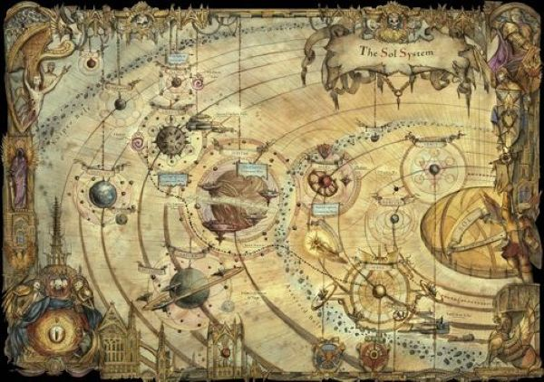

# 0798 010-014.M31 太阳战争 Solar War

精校状态：中文行文已逐段精校，部分术语仍为暂定

分类：时间线

原文来源：https://www.bilibili.com/opus/1062998311249641494

原作者：帝国神选罐头

原文时间：2025年05月04日 13:36

[返回分类目录](目录.md) · [全书目录](../../目录.md)

<!-- A0798-B0001 -->
**英文原文**

The Solar War refers to a series of battles fought in the Sol System from 010-014.M31 during the closing stages of the Horus Heresy. The war saw Horus begin his drive on Terra, capital of the Imperium.

<!-- /A0798-B0001 -->

<!-- A0798-B0002 -->

原译文

太阳战争是指在010-014.M31，太阳系中发生的一系列战斗。是荷鲁斯叛乱的最后阶段。战争中，荷鲁斯开始在帝国的首都泰拉发动进攻。

**校订译文**

太阳战争是荷鲁斯之乱末期于 010—014.M31 在太阳系爆发的一系列战斗。荷鲁斯在这场战争中开始向帝国首都泰拉推进。

<!-- /A0798-B0002 -->

<!-- A0798-B0003 图片 -->

<!-- A0798-B0004 -->

原译文

Organization of Imperial Defenses in the Sol System 太阳系中的帝国防御组织

**校订译文**

Organization of Imperial Defenses in the Sol System 太阳系帝国防御部署

<!-- /A0798-B0004 -->

<!-- A0798-B0005 -->
**英文原文**

Conflict:Horus Heresy

<!-- /A0798-B0005 -->

<!-- A0798-B0006 -->

原译文

冲突：荷鲁斯叛乱

**校订译文**

冲突：荷鲁斯之乱

<!-- /A0798-B0006 -->

<!-- A0798-B0007 -->
**英文原文**

Date:010-014.M31

<!-- /A0798-B0007 -->

<!-- A0798-B0008 -->

原译文

日期：010-014.M31

**校订译文**

日期：010-014.M31

<!-- /A0798-B0008 -->

<!-- A0798-B0009 -->
**英文原文**

Location:Sol System

<!-- /A0798-B0009 -->

<!-- A0798-B0010 -->

原译文

地点：太阳系

**校订译文**

地点：太阳系

<!-- /A0798-B0010 -->

<!-- A0798-B0011 -->
**英文原文**

Outcome:Traitor Victory

<!-- /A0798-B0011 -->

<!-- A0798-B0012 -->

原译文

结果：叛徒胜利

**校订译文**

结果：叛徒胜利

<!-- /A0798-B0012 -->

<!-- A0798-B0013 -->
**英文原文**

Combatants:Imperium/Traitor Legions

<!-- /A0798-B0013 -->

<!-- A0798-B0014 -->

原译文

作战人员：帝国/叛徒军团

**校订译文**

交战方：帝国／叛徒军团

<!-- /A0798-B0014 -->

<!-- A0798-B0015 -->
**英文原文**

Commanders:Initially:Primarch Rogal Dorn,First Captain Sigismund,Captain Halbrecht,Captain Efried,Captain Camba-Diaz,Captain Archamus (KIA),Captain Kestros,Captain Fafnir Rann,Lieutenant Boreas (KIA),Admiral Niora Su-Kassen,General Niborran,General Kaze,Magos Kazzim-Aleph-1,Final Phase brought:Primarch Jaghatai Khan,Primarch Sanguinius,Captain Jubal Khan (KIA)/Initially:Primarch Alpharius (KIA),Harrowmaster Kel Silonius,First Captain Ingo Pech,Captain Mathias Herzog,Final Phase:Warmaster Horus Lupercal,Primarch Perturabo,Primarch Angron,Primarch Fulgrim,First Captain Ezekyle Abaddon,Captain Horus Aximand,Chief Librarian Ahzek Ahriman,Master Ignis,First Captain Forrix,Dark Apostle Zardu Layak,Warsmith Soltarn Vull Bronn,Dark Apostle The Unspeaking,Ambassador Sota-Nul,Samus

<!-- /A0798-B0015 -->

<!-- A0798-B0016 -->

原译文

指挥官：最初：原体罗格·多恩，第一连长西吉斯蒙德，连长哈尔布雷希特，连长埃弗里德，连长坎巴·迪亚兹，连长阿坎姆斯 (KIA)，连长凯斯特罗斯，连长法夫尼尔·兰恩，副官波瑞亚斯 (KIA)，海军上将尼奥拉·苏-卡珊，将军尼博兰，将军卡兹，贤者卡齐姆-阿尔法-1，最终阶段到来：原体察合台可汗，原体圣吉列斯，连长朱巴可汗（KIA）/最初：原体阿尔法瑞斯（KIA），折磨之主凯尔·西洛尼乌斯，第一连长英格.派奇，连长玛希亚斯·赫佐格，最终阶段：战帅荷鲁斯·卢佩卡尔，原体佩图拉博，原体安格隆，原体福格瑞姆，第一连长以泽凯尔·阿巴顿，连长荷鲁斯·阿西曼德，首席智库阿扎克·阿里曼，伊格尼斯大师，第一连长弗里克斯，黑暗使徒扎度·拉亚克，战争铁匠索尔塔恩·沃·布隆，黑暗使徒无言者，使节索塔-努尔，萨姆斯

**校订译文**

指挥官：帝国初期——原体罗格·多恩，第一连长西吉斯蒙德，连长哈尔布雷希特，连长埃弗里德，连长坎巴·迪亚兹，连长阿坎姆斯（阵亡），连长凯斯特罗斯，连长法夫尼尔·兰恩，副官波瑞亚斯（阵亡），海军上将尼奥拉·苏·卡森，尼博兰将军，卡兹将军，贤者卡齐姆-阿列夫-1；最终阶段加入——原体察合台可汗，原体圣吉列斯，连长朱巴可汗（阵亡）。叛徒初期——原体阿尔法瑞斯（阵亡），折磨大师凯尔·西洛尼乌斯，第一连长英戈·佩奇，连长马蒂亚斯·赫尔佐格；最终阶段——战帅荷鲁斯·卢佩卡尔，原体佩图拉博，原体安格隆，原体福格瑞姆，第一连长以泽凯尔·阿巴顿，连长荷鲁斯·阿西曼德，首席智库员阿扎克·阿里曼，伊格尼斯大师，第一连长弗里克斯，黑暗使徒扎度·拉亚克，战争铁匠索尔塔恩·沃·布隆，黑暗使徒无言者，使节索塔·努尔，萨姆斯。

<!-- /A0798-B0016 -->

<!-- A0798-B0017 -->
**英文原文**

Strength:Initially:Imperial Fists,Imperial Army,Loyalist Mechanicum,Final Phase brought:Blood Angels,White Scars,Several thousand warships total/Initially:Alpha Legion,Operatives,Dark Mechanicum,Final Phase:Sons of Horus,Iron Warriors,Thousand Sons,Word Bearers,World Eaters,Emperor's Children,Night Lords elements,Dark Mechanicum,Misc. Traitor Marine warbands,Traitor Imperial Army,Lost and the Damned,Daemons,Tens of thousands of warships total

<!-- /A0798-B0017 -->

<!-- A0798-B0018 -->

原译文

实力：最初：帝国之拳、帝国陆军、忠诚机械教，最后阶段到来：圣血天使、白色伤疤、总共数千艘战舰/最初：阿尔法军团、特工、黑暗机械教，最终阶段：荷鲁斯之子、钢铁勇士、千子、怀言者、吞世者、帝皇之子、午夜领主成员、黑暗机械教、杂项。叛徒星际战士、叛徒帝国陆军、迷失者与被诅咒者、恶魔、数万艘战舰

**校订译文**

兵力：帝国初期——帝国之拳、帝国军、忠诚派机械教；最终阶段加入——圣血天使、白疤；战舰总数达数千艘。叛徒初期——阿尔法军团、潜伏特工、黑暗机械教；最终阶段——荷鲁斯之子、钢铁勇士、千子、怀言者、吞世者、帝皇之子、部分午夜领主、黑暗机械教、其他叛变星际战士战帮、叛变帝国军、迷失者与被诅咒者、恶魔；战舰总数达数万艘。

<!-- /A0798-B0018 -->

<!-- A0798-B0019 -->
**英文原文**

Casualties:Massive, billions of civilians alone/Massive

<!-- /A0798-B0019 -->

<!-- A0798-B0020 -->

原译文

伤亡人数：大规模，数十亿平民/大规模

**校订译文**

伤亡：帝国——极为惨重，仅平民便有数十亿；叛徒——极为惨重。

<!-- /A0798-B0020 -->

<!-- A0798-B0021 -->
## Overview 概述

<!-- /A0798-B0021 -->

<!-- A0798-B0022 -->
### Imperial Preparations 帝国准备

<!-- /A0798-B0022 -->

<!-- A0798-B0023 -->
**英文原文**

With the Emperor preoccupied with the War Within the Webway and Malcador the Sigillite waging the Shadow Wars, it was left with Imperial Fists Primarch Rogal Dorn to oversee the defences of both Terra and the greater Sol System. The defences of the Imperial Palace were significantly strengthened, and much of its aesthetic was destroyed in favour of strategic defensibility. Following the Schism of Mars, Kelbor-Hal's Dark Mechanicus was victorious in claiming the Red Planet, but an Imperial blockade trapped the traitors on their own world.

<!-- /A0798-B0023 -->

<!-- A0798-B0024 -->

原译文

由于帝皇忙于网道战争和掌印者马卡多发动的阴影战争，帝国之拳原体罗格·多恩负责监督泰拉和更大的太阳系的防御。皇宫的防御得到了显著加强，其大部分美学被摧毁，转而支持战略防御。在火星分裂之后，凯尔博·哈尔的黑暗机械教在宣称这颗红色星球时取得了胜利，但帝国的封锁将叛徒困在了他们自己的世界里。

**校订译文**

帝皇忙于网道战争，掌印者马卡多则在进行阴影战争，因此泰拉及整个太阳系的防御重任落到了帝国之拳原体罗格·多恩肩上。皇宫的防御得到大幅强化，许多精美建筑和装饰被拆毁，为军事防御让路。火星分裂后，凯尔博·哈尔麾下的黑暗机械修会夺取了这颗红色行星，但帝国舰队的封锁将叛徒困在其本土。

**校注：** 此处英文用 Dark Mechanicus，按本稿区分译“黑暗机械修会”；后文 Dark Mechanicum 仍为黑暗机械教，不擅自更换英文时代用语。首句分别是帝皇忙于网道战争、马卡多忙于阴影战争。

<!-- /A0798-B0024 -->

<!-- A0798-B0025 -->
**英文原文**

As Horus' forces inched closer to Terra, Dorn organized the defenses of the Sol System into a series of Spheres. Each consisted of not only Imperial Fists forces, but also loyalist Imperial Army and Mechanicum. By the closing phase of the battle Dorn held back most of his Astartes forces on Terra in preparation for the siege.

<!-- /A0798-B0025 -->

<!-- A0798-B0026 -->

原译文

随着荷鲁斯的部队逐渐接近泰拉，多恩将太阳系的防御组织成了一系列层。每支部队不仅包括帝国之拳部队，还包括忠诚的帝国陆军和机械教。在战斗的最后阶段，多恩在泰拉上唤回了他的大部分阿斯塔特部队，为围城做准备。

**校订译文**

随着荷鲁斯的军队逐步逼近泰拉，多恩将太阳系划分为一系列防御圈。各圈的守军除帝国之拳外，还包括忠诚派帝国军与机械教部队。战争进入最后阶段时，多恩将大部分阿斯塔特兵力留在泰拉，准备迎接围攻。

**校注：** Sphere 为太阳系分层防区，统一“防御圈”，区别钛族扩张的同形词。held back 指留置兵力，并不一定表示从前线召回。

<!-- /A0798-B0026 -->

<!-- A0798-B0027 -->
**英文原文**

The First Sphere was the outermost defensive zone from Pluto to Neptune. It was commanded by First Captain Sigismund at Pluto.

<!-- /A0798-B0027 -->

<!-- A0798-B0028 -->

原译文

第一层是从冥王星到海王星的最外层防御区。它是由冥王星的第一连长西吉斯蒙德指挥的。

**校订译文**

第一防御圈是最外层防区，从冥王星延伸至海王星，由驻冥王星的第一连长西吉斯蒙德指挥。

<!-- /A0798-B0028 -->

<!-- A0798-B0029 -->
**英文原文**

The Second Sphere oversaw Uranus. It was commanded by Fleet Master Halbrecht

<!-- /A0798-B0029 -->

<!-- A0798-B0030 -->

原译文

第二层监督天王星。它由舰队司令哈尔布雷希特指挥

**校订译文**

第二防御圈负责天王星，由舰队司令哈尔布雷希特指挥。

<!-- /A0798-B0030 -->

<!-- A0798-B0031 -->
**英文原文**

The Third Sphere oversaw the Jupiter region. It was commanded by Seneschal Efried.

<!-- /A0798-B0031 -->

<!-- A0798-B0032 -->

原译文

第三层负责监督木星区域。它是由埃弗里德总管指挥的。

**校订译文**

第三防御圈负责木星区域，由总管埃弗里德指挥。

<!-- /A0798-B0032 -->

<!-- A0798-B0033 -->
**英文原文**

The Fourth Sphere was commanded by Siege Master Camba Diaz and oversaw the blockade of traitor-occupied Mars This sphere was the largest of the four outer layers of defense, surpassed only by the Terran sphere.

<!-- /A0798-B0033 -->

<!-- A0798-B0034 -->

原译文

第四层由攻城大师坎巴·迪亚兹指挥，负责监督对叛徒占领的火星的封锁。这个层是四个外层防御中最大的，仅次于泰拉层。

**校订译文**

第四防御圈由攻城大师坎巴·迪亚兹指挥，负责封锁被叛徒占据的火星。它是四个外围防御圈中规模最大的一个，仅次于泰拉防御圈。

<!-- /A0798-B0034 -->

<!-- A0798-B0035 -->
**英文原文**

The Fifth Sphere was Terra and Luna, overseen by Primarch Rogal Dorn himself.

<!-- /A0798-B0035 -->

<!-- A0798-B0036 -->

原译文

第五层是泰拉和月球，由原体罗格·多恩亲自监督。

**校订译文**

第五防御圈包括泰拉与月球，由原体罗格·多恩亲自统辖。

<!-- /A0798-B0036 -->

<!-- A0798-B0037 -->
### Initial War 战争初期

原题：Initial War 第一次战争

<!-- /A0798-B0037 -->

<!-- A0798-B0038 -->
**英文原文**

For the next several years, the loyalists would counter traitor-instigated uprisings and attempted breakouts by the Dark Mechanicus on Mars.

<!-- /A0798-B0038 -->

<!-- A0798-B0039 -->

原译文

在接下来的几年里，忠诚派将对抗叛徒煽动的叛乱和黑暗机械教在火星上的突破企图。

**校订译文**

接下来的数年里，忠诚派不断镇压叛徒煽动的暴乱，阻止火星上的黑暗机械修会突破封锁。

<!-- /A0798-B0039 -->

<!-- A0798-B0040 -->
**英文原文**

The Alpha Legion announced its entry into the Solar War by exploding the freighter Primigenia over Terra, killing millions by raining debris. This was accompanied by Alpha Legion organized uprisings at Terra's Damocles Starport and Triton. All of this culminated in the first major battle of the Solar War, the Battle of Pluto. The battle saw the Alpha Legion drive on Pluto, linchpin of the loyalist monitoring of the Sol System. During the battle, a fleet of over 200 Alpha Legion warships assaulted the planet, but after Alpharius himself was seemingly killed by Rogal Dorn the traitors retreated. For several years after, the Imperials continually dealt with attempts by the Dark Mechanicum to break out of their cage around Mars as well as Alpha Legion attacks and Cultist activity.

<!-- /A0798-B0040 -->

<!-- A0798-B0041 -->

原译文

阿尔法军团宣布加入太阳战争，在泰拉上空引爆了货船初诞号，数百万人被倾盆大雨般的碎片炸死。与此同时，阿尔法军团在泰拉的达摩克利斯星港和海卫一组织了叛乱。所有这一切都在太阳战争的第一场主要战斗中达到了高潮，冥王星之战。在这场战斗中，阿尔法军团向冥王星进发，冥王星是忠诚者监控太阳系的关键。在战斗中，一支由200多艘阿尔法军团战舰组成的舰队袭击了这个星球，但在阿尔法瑞斯本人似乎被罗格·多恩杀死后，叛徒们撤退了。几年后，帝国军不断应对黑暗机械教试图突破火星周围围困的企图，以及阿尔法军团的攻击和邪教活动。

**校订译文**

阿尔法军团在泰拉上空引爆货船初诞号，以此宣告加入太阳战争；如雨坠落的残骸造成数百万人死亡。与此同时，他们还在泰拉的达摩克利斯星港与海卫一策动叛乱。这一系列行动最终引发太阳战争的首场大战——冥王星之战。冥王星是忠诚派监视太阳系的重要支点，阿尔法军团出动两百多艘战舰进攻，但阿尔法瑞斯本人似乎被罗格·多恩杀死后，叛军便撤走了。此后数年，帝国持续应对火星黑暗机械教的突围、阿尔法军团的袭击，以及邪教徒活动。

<!-- /A0798-B0041 -->

<!-- A0798-B0042 -->
### Final Phase 最后阶段

<!-- /A0798-B0042 -->

<!-- A0798-B0043 -->
**英文原文**

In 013.M31 Horus won the massive Battle of Beta-Garmon, giving him access to the strategically important route to Terra. It was now certain that Horus would reach the Throneworld, and Dorn increased his defences with newly arrived Blood Angels and White Scars forces. Dorn and his mostly Human command staff moved their daily headquarters from the Phalanx to the Bhab Bastion of the Imperial Palace. In preparation for Horus' arrival, the Dark Mechanicum on Mars accelerated their breakout attempts and lobbed constant fire from the surface from Mars at a blockade overseen by Captain Camba Diaz. As Horus arrived, Dorn's strategy revolved around holding back and bloodying the traitors as much as possible in the hopes of Roboute Guilliman's inbound reinforcements. The Lord of the Imperial Fists knew his own forces were too meagre to hold back the full might of the traitors, but victory would be assured should they wedge Horus' armada between the forces of Terra and Ultramar. Equally, Horus sought to capture Sol and Terra as quickly as possible before Guilliman could arrive at his rear. To save his Astartes for Terra's defence, Dorn withdrew most large space marine contingents to the Throneworld and relied heavily on Legiones Astartes ships crewed mainly by Humans or Imperial Army vessels for the greater Solar System's defenses.

<!-- /A0798-B0043 -->

<!-- A0798-B0044 -->

原译文

013.M31荷鲁斯赢得了贝塔·伽蒙之战，这使他能够进入通往泰拉的战略要道。现在可以确定荷鲁斯会到达王座世界，多恩用新来的圣血天使和白色疤痕部队加强了防御。多恩和他的大部分泰拉指挥人员将他们的日常指挥部从山阵号转移到了皇宫的巴布堡垒。为了准备荷鲁斯的到来，火星上的黑暗机械教加速了他们的突破尝试，并从火星表面向坎巴·迪亚兹连长监督的封锁区不断开火。随着荷鲁斯的到来，多恩的战略围绕着尽可能多地遏制和让叛徒流血，以期得到罗伯特·基里曼的增援。帝国之拳领主知道他自己的力量太弱，无法阻止叛徒的全部力量，但如果他们把荷鲁斯的舰队夹在泰拉和奥特拉玛的部队之间，胜利是有保证的。同样，荷鲁斯试图在基里曼到达后方之前尽快占领太阳系和泰拉。为了拯救他的阿斯塔特军团士兵用于泰拉的防御，多恩将大多数大型星际战士特遣队撤回了王座世界，并严重依赖主要由人类或帝国陆军船只组成的阿斯塔特军团舰队来防御更大的太阳系。

**校订译文**

013.M31，荷鲁斯在规模浩大的贝塔·伽蒙之战中获胜，打开了通往泰拉的战略要道。他抵达王座世界已成定局，多恩于是利用新来的圣血天使与白疤援军加强防御，并将自己及以普通人类为主的参谋班子的日常指挥部，从山阵号迁至皇宫的巴布堡垒。火星黑暗机械教为迎接荷鲁斯，加紧突围，不断从地表向坎巴·迪亚兹连长负责的封锁舰队开火。面对即将到来的荷鲁斯，多恩的战略是尽可能迟滞敌军、消耗其兵力，争取撑到罗保特·基里曼的援军抵达。他清楚，现有兵力不足以挡住叛军全部力量，但若能让泰拉与奥特拉玛的军队夹击荷鲁斯舰队，便有望确保胜利。荷鲁斯也同样力求在基里曼从后方赶到前，尽快拿下太阳系与泰拉。为了将阿斯塔特兵力保存到泰拉保卫战，多恩把大多数成建制的星际战士部队撤回王座世界；太阳系其余地区的防御，则主要依靠由普通人类舰员操纵的阿斯塔特军团舰船，以及帝国军舰船。

**校注：** mostly Human 修饰指挥人员的普通人类身份，不是泰拉籍贯。末句两项并列为“主要由人类舰员操纵的军团舰船”和“帝国军舰船”，原译误把船只当成舰员。

<!-- /A0798-B0044 -->

<!-- A0798-B0045 -->
**英文原文**

The traitor armada finally arrived at Sol on 0000014.M31, the first day of the first month (Primus). As expected by the loyalists the traitors made their initial assaults on the two Warp gates into the system that allowed for the bypassing of Mandeville Points: the Khthonic Gate at Pluto and the Elysian Gate at Uranus. Near-simultaneously, a Sons of Horus armada under Horus Aximand struck at Pluto while an Iron Warriors fleet under Perturabo assaulted the defenses of Uranus, both engaging the Imperial Fists and Imperial Armada defence fleets under Sigismund and Halbrecht respectively. At the same time, an armada of Sons of Horus, Thousand Sons, Word Bearers, and Dark Mechanicum under Ezekyle Abaddon, Ahzek Ahriman, Zardu Layak, and Sota-Nul respectively moved over the galactic disc, bypassing the initial loyalist defenses and striking down into the upper crest of the defensive spheres. The loyalists had foreseen such a ploy and a force of White Scars under Jubal Khan was ready to meet the traitors. Across the Sol System, hundreds of small engagements erupted to make up a naval battle of titanic proportions. Though the loyalists had the advantage of preparations and large amounts of Orbital Defense Platforms and other armored bastions, the traitors had the luxury of overwhelming numbers and Warp-sorcery. In addition, intelligence provided by the Alpha Legion during their earlier attacks proved critical, with Horus having personally been given a map of all loyalist defenses in the Sol System by Alpharius before he departed the traitor war effort at the Ullanor.

<!-- /A0798-B0045 -->

<!-- A0798-B0046 -->

原译文

叛徒舰队最终于0000014.M31抵达太阳系，即第一月（第一）的第一天。正如忠诚者所料，叛徒们对两个亚空间门进行了初步攻击，进入了允许绕过曼德维尔点的系统：冥王星的赫索尼克之门和天王星的极乐世界之门。几乎同时，荷鲁斯·阿西曼德率领的荷鲁斯之子舰队袭击了冥王星，而佩图拉博率领的钢铁勇士舰队袭击了天王星的防御，分别与西吉斯蒙德和哈尔布雷希特率领的帝国之拳和帝国舰队交战。与此同时，以泽凯尔·阿巴顿、阿扎克·阿里曼、扎度·拉亚克和索塔·努尔分别率领的荷鲁斯之子、千子、怀言者和黑暗机械教组成的舰队越过银河系盘面，绕过最初的忠诚者防御，袭击了防御圈的顶部。忠诚者已经预见到了这样的策略，朱巴可汗领导下的一支白色伤疤部队已经准备好迎接叛徒。在整个太阳系中，爆发了数百场小规模的交战，构成了一场规模巨大的海战。虽然忠诚者有准备和大量轨道防御平台和其他装甲堡垒的优势，但叛徒有压倒性的人数和亚空间魔法的奢侈。此外，阿尔法军团在早期袭击中提供的情报被证明是至关重要的，在他离开乌兰诺的叛徒战争之前，阿尔法瑞斯亲自向荷鲁斯提供了太阳系中所有忠诚者防御的地图。

**校订译文**

叛军大舰队终于在 0000014.M31，即第一月（Primus）的第一天抵达太阳系。正如忠诚派预料的那样，叛军首先攻击两座能够绕过曼德维尔点、直接进入星系的亚空间之门：冥王星的赫索尼克之门与天王星的极乐之门。荷鲁斯·阿西曼德率荷鲁斯之子舰队攻向冥王星，佩图拉博率钢铁勇士舰队猛攻天王星，两路几乎同时展开，分别与西吉斯蒙德和哈尔布雷希特麾下的帝国之拳及帝国舰队防御部队交战。另一支由荷鲁斯之子、千子、怀言者和黑暗机械教组成的舰队，分别由以泽凯尔·阿巴顿、阿扎克·阿里曼、扎度·拉亚克与索塔·努尔统率，绕至银河盘面上方，越过忠诚派最初的防线，从防御圈顶部直插而下。忠诚派早已料到这一招，朱巴可汗率领的白疤已准备迎敌。太阳系各处爆发的数百场小规模交战，共同构成一场极其庞大的太空海战。忠诚派准备充分，拥有大量轨道防御平台与装甲堡垒；叛军则拥有压倒性的数量优势，并借助亚空间巫术。此外，阿尔法军团此前袭击获得的情报发挥了关键作用：原文称，阿尔法瑞斯在乌兰诺退出叛军战事之前，亲自将太阳系全部忠诚派防御设施的地图交给了荷鲁斯。

**校注：** 原文称阿尔法瑞斯在乌兰诺向荷鲁斯提供地图，与前文其已在冥王星似乎阵亡存在身份与时序疑点；保留原称，不擅改为欧米冈。日期 0000014.M31 原样保留，月份说明依英文。

<!-- /A0798-B0046 -->

<!-- A0798-B0047 -->
### First Sphere 第一防御圈

原题：First Sphere 第一层

<!-- /A0798-B0047 -->

<!-- A0798-B0048 -->
**英文原文**

At Pluto commanding from the Frigate Lachrymae, Sigismund decimated the initial waves of primarily traitor Imperial Army vessels which arrived through the Khthonic Gate with not only his fleet but also the Moons of the world, which had now been transformed into gigantic gun-fortresses. However as the traitors arrived in ever-increasing numbers the Sons of Horus finally began to appear, using the ships of their allies as shields to begin to fire back. Soon Horus Aximand himself aboard the Battle Barge Throne of the Underworld translated from the Warp, leading a massive push that saw landings on the fortress-moons. Most of the incoming attacks were by savage Newborn Sons of Horus. One by one, the Newborn Astartes boarded the moons and unleashed Scrap Code that either disabled its defenses or turned them to Horus' cause, resulting in the moons beginning to fire on one another. After the moon of Kerberos fell, Sigismund ordered his fleet retreat. The Sons of Horus pursued, walking into the loyalist trap as Sigismund had loyalist Mechanicum Tech-Priests unleash data-jinns into the power reactor complex of the moon. Kerberos exploded, decimating and scattering the pursuing traitor fleet. At this moment, Sigismund had his fleet turn back around and launched a vicious counterattack on the traitors. In an attempt to reverse the situation, Aximand personally led an assault on the Lachrymae to decapitate the loyalist command. In a clash between the Sons of Horus and Sigismund's Templars, Aximand and Sigismund dueled. Horus Aximand slew the Templar Lieutenant Boreas and wounded Sigismund, but the First Captain of the Imperial Fists was able to teleport away aboard the nearby Frigate Persephone, severing one of Aximand's hands as he retreated. Though wounded, Aximand successfully captured the Lachrymae and organized a counterattack that broke the loyalist fleet at Pluto. Sigismund ordered a withdraw towards Terra, informing Rogal Dorn that the First Sphere had fallen after several days of fighting.

<!-- /A0798-B0048 -->

<!-- A0798-B0049 -->

原译文

在冥王星上，西吉斯蒙德从护卫舰泪痕号指挥，摧毁了最初几批主要是叛徒帝国军队的船只，这些船只不仅有他的舰队，还带着世界的卫星，这些船只已经变成了巨大的炮台。然而，随着越来越多的叛徒到来，荷鲁斯之子终于开始出现，他们用盟友的船只作为盾牌开始反击。很快，荷鲁斯·阿西曼德本人登上了从亚空间传送而来的战斗驳船地下王座号，领导了一场大规模的推进，在堡垒卫星上登陆。大多数即将到来的袭击都是野蛮的荷鲁斯新血发动的。新生的阿斯塔特一个接一个地登上了卫星，并释放了废码，要么使其防御失效，要么将其转向荷鲁斯的事业，导致卫星开始相互射击。冥卫四陷落后，西吉斯蒙德命令他的舰队撤退。荷鲁斯之子紧追不舍，步入了忠诚者的陷阱，西吉斯蒙德让忠诚的机械教技术神甫向卫星的动力反应堆复合结构释放数据精灵。冥卫四爆炸了，摧毁并驱散了追捕的叛徒舰队。此时，西吉斯蒙德的舰队掉头，对叛徒发动了猛烈的反击。为了扭转局势，阿西曼德亲自领导了对泪痕号的袭击，斩首了忠诚者的指挥部。在荷鲁斯之子和西吉斯蒙德的圣殿骑士之间的冲突中，阿西曼德和西吉斯蒙德决斗。荷鲁斯·阿西曼德杀死了圣殿骑士副官波瑞亚斯并打伤了西吉斯蒙德，但帝国之拳的第一连长能够通过附近的护卫舰珀尔塞福涅号远程传送，在撤退时切断了阿西曼德的一只手。虽然受伤，但阿西曼德成功俘获了泪痕号，并组织了一次反击，摧毁了冥王星的忠诚舰队。西吉斯蒙德下令向泰拉撤退，通知罗格·多恩，经过几天的战斗，第一层已经沦陷。

**校订译文**

西吉斯蒙德在冥王星战区以护卫舰泪痕号为指挥舰，利用舰队和已改造成巨型炮垒的卫星，重创了最先穿过赫索尼克之门的敌舰；这些船只主要属于叛变的帝国军。随着敌舰越来越多，荷鲁斯之子终于现身，以盟军舰船为盾开始还击。不久，荷鲁斯·阿西曼德乘战斗驳船冥界王座号跃出亚空间，发动大规模推进，并向堡垒卫星登陆。进攻者大多是凶悍的荷鲁斯之子新血。他们逐一登上卫星，释放废码，使防御系统瘫痪，或转而效忠荷鲁斯，导致卫星炮垒互相开火。冥卫四陷落后，西吉斯蒙德命舰队撤退，将紧追不舍的荷鲁斯之子引入陷阱：忠诚派机械教技术祭司奉命将数据精灵释放进卫星的动力反应堆群。冥卫四随即爆炸，追击的叛军舰队被重创、冲散。西吉斯蒙德趁机掉头反击。阿西曼德为扭转局势，亲自突击泪痕号，企图摧毁忠诚派指挥中枢。荷鲁斯之子与西吉斯蒙德的圣殿骑士交战时，两位指挥官展开决斗。阿西曼德杀死圣殿骑士副官波瑞亚斯，打伤西吉斯蒙德，但这位帝国之拳第一连长仍在撤离时斩断了对手的一只手，随后传送至附近的护卫舰珀尔塞福涅号。阿西曼德虽受伤，却夺下了泪痕号，并组织反攻，击溃冥王星的忠诚派舰队。西吉斯蒙德命令向泰拉撤退，向多恩报告：经过数日激战，第一防御圈已经失守。

**校注：** 首句的 not only ... but also 表示西吉斯蒙德同时使用舰队和堡垒卫星迎敌，原译严重错接。Newborn 暂作“新血”，不是血亲后代。Aximand 的斩首行动是目的，并未已杀死忠诚派指挥部。

<!-- /A0798-B0049 -->

<!-- A0798-B0050 -->
### Second Sphere 第二防御圈

原题：Second Sphere 第二层

<!-- /A0798-B0050 -->

<!-- A0798-B0051 -->
**英文原文**

At Uranus, Perturabo himself from the Iron Blood oversaw a massive traitor onslaught of over 4,000 vessels through the Elysian Gate on Halbrecht's Second Sphere Fleet and orbital defenses. Commanding the Battle Barge Monarch of Fire, Halbrecht's fleet took a ranged approach, sniping from the screen of 27 fortress-moons and hundreds of gun-platforms into the arrival points of Iron Warriors vessels with their Nova Cannons. Enormous space-minefields hindered the traitor fleet, boxing them into these killzones. Perturabo rammed three enormous mass-conveyor vessels known as Alekto, Megaera, and Tilphousia into the loyalist fleet of gun-platforms, using them as Fire Ships and wiping out many of the defenders. With the way to the inner core of Uranus' defenses cleared, Perturabo fielded an enormous Space Hulk known as the Daughter of Woe which unleashed hell on the loyalists with its enormous array of weaponry. One by one the remaining defensive bastions of Uranus fell to the Iron Warriors onslaught, with the firepower from the Daughter of Woe devastating the moons Umbriel, Cordelia, and Oberon. As the Iron Warriors closed the distance with the loyalist defensive bastions, they unleashed transports filled with millions of drug-fueled Gangers, Pirates, Mutants, and Cultists into their bowels. The defending forces, mostly Imperial Army and Servitors, fought valiantly but were overwhelmed by sheer numbers. After a delaying maneuver that bought another 36-hours for the loyalists, Halbrecht ordered a retreat towards Terra. He brought with him the majority of the Second Sphere Fleet, saved in order to bloody the traitors in future engagements. The Second Sphere had fallen.

<!-- /A0798-B0051 -->

<!-- A0798-B0052 -->

原译文

在天王星，来自铁血号的佩图拉博亲自监督了4000多艘船只通过极乐世界之门对哈尔布雷希特的第二层舰队和轨道防御系统的大规模叛徒袭击。哈尔布雷希特的舰队指挥着火焰君王号战斗驳船，采取了远程方法，从27个堡垒卫星和数百个炮台的屏障上，用新星炮狙击到钢铁勇士船只的到达点。巨大的太空雷区阻碍了叛徒舰队，将他们围困在这些杀戮区中。佩图拉博将三艘名为阿勒克托、墨纪拉和提西福涅的大型运输船撞向了忠诚者的炮台舰队，将其用作火船，消灭了许多防御者。随着天王星防御核心的清除，佩图拉博派出了一艘被称为“灾难之女”的巨大太空废船，用其庞大的武器阵列向忠诚者释放了地狱。天王星剩下的防御堡垒一个接一个地被钢铁勇士的猛攻摧毁，灾难之女的火力摧毁了卫星天卫二、天卫六和天卫四。当钢铁勇士与忠诚者的防御堡垒拉近距离时，他们释放了装满数百万吸毒的黑帮、海盗、变种人和邪教徒的运输工具。防御部队，主要是帝国陆军和机仆部队，英勇作战，但被庞大的兵力所淹没。经过一次拖延战术，为忠诚者又争取了36个小时，哈尔布雷希特下令向泰拉撤退。他带来了第二层舰队的大部分，为了在未来的战斗中血腥镇压叛徒而保存下来。第二层已经陷落。

**校订译文**

在天王星，佩图拉博坐镇铁血号，指挥四千多艘叛军舰船穿过极乐之门，猛攻哈尔布雷希特的第二防御圈舰队与轨道设施。哈尔布雷希特以战斗驳船火焰君王号为旗舰，采取远距离作战：舰队藏身于二十七颗堡垒卫星与数百座炮台构成的屏障后，以新星炮瞄准钢铁勇士舰船的跃出点。庞大的太空雷区阻碍敌舰机动，将其困在杀伤区中。佩图拉博将阿勒克托号、墨纪拉号与提尔福西亚号三艘巨型运输舰当作火船，撞入忠诚派炮台群，摧毁众多防御设施。通向天王星防御内圈的航道由此打开，他又投入巨型太空废船灾难之女，以庞大的武器阵列向忠诚派倾泻火力。天王星剩余堡垒相继失守，天卫二、天卫六与天卫四也遭灾难之女的炮火毁灭。钢铁勇士逼近防御据点后，将运输艇送入其内部，放出数百万受药物刺激的帮派成员、海盗、变种人与邪教徒。主要由帝国军与机仆组成的守军奋勇作战，最终仍被压倒性的敌人数目淹没。哈尔布雷希特又以一次迟滞行动争得三十六小时，随后命令向泰拉撤退。他保全了第二防御圈舰队的大部分力量，以便在后续交战中继续杀伤叛军。第二防御圈就此陷落。

**校注：** Tilphousia 暂译提尔福西亚号，原提西福涅对应另一名称，未据神话三女神自行替换。二十七颗堡垒卫星为所给科幻设定数量，照录。

<!-- /A0798-B0052 -->

<!-- A0798-B0053 -->
### Third Sphere 第三防御圈

原题：Third Sphere 第三层

<!-- /A0798-B0053 -->

<!-- A0798-B0054 -->
**英文原文**

With the Second Sphere reduced, there were still thousands of pockets of resistance between Uranus, Neptune, Saturn, and outer Jupiter and their accompanying moons and orbitals. To speed up the conquest of Sol, Perturabo unleashed waves of Pirate, Emperor's Children, and Night Lords vessels as well as ships of Traitor Space Marines which had since taken new colors or names. Though Titan had been cloaked in a ritual by Malcador for a future project, the rest of Saturn and Neptune were terrorized by these vicious bands of killers while Perturabo and Forrix led an assault on Jupiter itself, which was defended primarily by Imperial Fists, Imperial Army, and Blood Angels vessels under Captain Efried. In addition, the majority of the Second Sphere Fleet which had been held from the battle at Uranus were finally committed to the battle. Efried and Halbrecht's fleets slowly gave ground to the Iron Warriors in the vast expanse of Jupiter and her moons, eventually being forced to withdraw to Terra once the overall situation in the Sol System collapsed.

<!-- /A0798-B0054 -->

<!-- A0798-B0055 -->

原译文

随着第二层的缩小，天王星、海王星、土星和外木星及其伴随的卫星和轨道之间仍有数千个障碍区。为了加快对太阳系的征服，佩图拉博释放了海盗、帝皇之子和午夜领主的战舰，以及叛徒星际战士的战舰，这些战舰后来换上了新的颜色或名字。尽管泰坦已经被马卡多为未来的项目披上了仪式的外衣，但土星和海王星的其他部分都被这些恶毒的杀手团伙吓坏了，而佩图拉博和弗里克斯则领导了对木星本身的攻击，木星主要由埃弗里德连长率领的帝国之拳、帝国陆军和圣血天使战舰进行防御。此外，在天王星之战中被控制的第二层舰队的大部分最终都投入了战斗。埃弗里德和哈尔布雷希特的舰队在广阔的木星及其卫星上慢慢向钢铁勇士让步，一旦太阳系的整体局势崩溃，最终就会被迫撤退到泰拉。

**校订译文**

第二防御圈被攻陷后，天王星、海王星、土星与木星外围之间，以及各处卫星和轨道设施上，仍有数千处抵抗据点。佩图拉博为加快征服太阳系，放出一波又一波海盗、帝皇之子和午夜领主舰船，还有已经改换涂装或名号的其他叛变星际战士舰船。马卡多已用仪式将泰坦卫星隐藏起来，为一项未来计划做准备，但土星和海王星其余地区都遭到了这些凶徒的蹂躏。佩图拉博与弗里克斯则率军进攻木星。埃弗里德连长统率的守军舰队，主要由帝国之拳、帝国军与圣血天使舰船组成；在天王星之战中保存下来的第二防御圈舰队主力，也终于投入这场战斗。埃弗里德与哈尔布雷希特的舰队在木星及其卫星周围的广阔空域节节后退。随着太阳系整体战局崩溃，他们最终被迫撤往泰拉。

**校注：** reduced 在军事语境为攻陷，pockets of resistance 为抵抗据点。Titan 在土星语境是泰坦卫星，cloaked in a ritual 指由仪式隐藏，原译误作披上仪式外衣。

<!-- /A0798-B0055 -->

<!-- A0798-B0056 -->
### Fourth & Fifth Spheres 第四与第五防御圈

原题：Fourth & Fifth Spheres 第四&第五层

<!-- /A0798-B0056 -->

<!-- A0798-B0057 -->
**英文原文**

Amid the carnage erupting across the outer Sol System, Horus' most important maneuver came above the galactic disc. The combined Sons of Horus, Thousand Sons, Word Bearer, and Dark Mechanicum fleet plunged into the void between Terra and Mars. This force split then split in half, with the larger Dark Mechanicum contingent making for Mars while the Traitor Astartes force moved towards Luna. Along the way to Luna, Abaddon's armada was continually harried by the White Scars under Jubal Khan. However Abaddon and Zardu Layak were eventually able to board the White Scars flagship Lance of Heaven and slay Jubal in combat. At Mars, the large Dark Mechanicum fleet drawn from hundreds of treacherous Forge Worlds plowed into Camba Diaz's blockade fleet. Consisting of large numbers of Imperial Fists, Blood Angels, loyalist Mechanicum, and Imperial Army, this force was the largest of the four outer spheres and a vicious battle erupted over the Red Planet. From the Battle Barge Fortress of Eternity, Camba Diaz had to deal with attacks on both sides of his fleet as Kelbor-Hal's besieged Martian forces launched their own attack in conjunction with the arriving Dark Mechanicum armada. Understanding the time for a counterattack had arrived, Dorn and his command staff moved to the Phalanx, which finally left Terra's orbit and intended to contest the traitors at Luna and then Mars. Jaghatai Khan stated that the traitors had failed, as Horus' main fleet had yet to show itself and the firepower of the Phalanx would blunt this new attack, buying the loyalists enough time for Guilliman's arrival.

<!-- /A0798-B0057 -->

<!-- A0798-B0058 -->

原译文

在外太阳系爆发的大屠杀中，荷鲁斯最重要的动作出现在星系盘上方。荷鲁斯之子、千子、怀言者和黑暗机械教舰队联合潜入了泰拉和火星之间的虚空。这支部队随后分裂成两半，较大的黑暗机械教部队前往火星，而叛徒阿斯塔特部队则向月球移动。在前往月球的途中，阿巴顿的舰队不断受到朱巴可汗领导下的白色伤疤的骚扰。然而，阿巴顿和扎杜·拉亚克最终登上了白色伤疤旗舰“天堂之枪”，并在战斗中杀死了朱巴可汗。在火星上，来自数百个危险的铸造世界的大型黑暗机械教舰队冲入了坎巴·迪亚兹的封锁舰队。这支部队由大量的帝国之拳、圣血天使、忠诚的机械教和帝国军队组成，是四个外层防御中最大的一个，在这颗红色星球上爆发了一场激烈的战斗。从战斗驳船永恒要塞号出发，坎巴·迪亚兹不得不应对他的舰队两侧的攻击，因为凯尔博·哈尔被围困的火星部队与抵达的黑暗机械教舰队一起发动了自己的攻击。知道反击的时间到了，多恩和他的指挥人员转移到了山阵号，山阵号最终离开了泰拉的轨道，打算在月球和火星与叛徒作战。察合台可汗表示，叛徒失败了，因为荷鲁斯的主要舰队尚未出现，山阵号的火力将削弱这次新的攻击，为基里曼的到来为忠诚者争取足够的时间。

**校订译文**

外太阳系血战正酣时，荷鲁斯最关键的一步从银河盘面上方展开。荷鲁斯之子、千子、怀言者与黑暗机械教联合舰队直插泰拉和火星之间的虚空，随后分为两路：规模较大的黑暗机械教部队驶向火星，叛变阿斯塔特舰队则奔赴月球。阿巴顿的舰队途中不断遭朱巴可汗率领的白疤袭扰，但他与扎度·拉亚克最终登上白疤旗舰天堂之枪号，在战斗中杀死朱巴。火星方面，来自数百个叛变铸造世界的黑暗机械教大舰队，猛冲坎巴·迪亚兹的封锁线。守军集结了大量帝国之拳、圣血天使、忠诚派机械教和帝国军舰船，是四个外围防御圈中兵力最强的一支，红色行星上空随即爆发惨烈大战。坎巴·迪亚兹坐镇战斗驳船永恒要塞号，却不得不两面迎敌：被围困的凯尔博·哈尔火星部队，也与赶来的黑暗机械教舰队配合，向外突击。多恩意识到反击时机已到，与参谋们转移至山阵号。这座巨舰终于驶离泰拉轨道，准备先在月球、再在火星迎战叛军。察合台可汗认为敌军已经失败：荷鲁斯主力仍未现身，而山阵号的火力足以挫败这波新攻势，为忠诚派争取到基里曼赶来所需的时间。

**校注：** treacherous Forge Worlds 指叛变铸造世界，不是危险的世界。“叛徒已经失败”属于察合台当时的判断，后文战局变化仍照录。

<!-- /A0798-B0058 -->

<!-- A0798-B0059 图片 -->

<!-- A0798-B0060 -->

原译文

Rogal Dorn battles Samus 罗格·多恩与萨姆斯战斗

**校订译文**

Rogal Dorn battles Samus 罗格·多恩与萨姆斯战斗

<!-- /A0798-B0060 -->

<!-- A0798-B0061 -->
**英文原文**

Meanwhile, Ahzek Ahriman's Thousand Sons force, accompanied by Word Bearers and their cultist-slaves under the Apostle of the Unspeaking, moved on The Comet between Venus and Terra, capturing it from light Servitor defenses and beginning a great sacrificial ritual prepared on the orders of Lorgar years prior. The ritual depended on an absolute timetable, having to be initiated at a precise celestial alignment in the Sol System that had not been seen since the Age of Strife. As Ahriman and the Word Bearers conducted their ritual, Abaddon's remaining Sons of Horus contingent emerged over Luna. The moon's defensive ring sported defenses greater than entire Expeditionary Fleets, and with the Phalanx inbound Abaddon's relatively small fleet seemed doomed to a quick death. However at the exact moment that Ahriman's ritual on The Comet was reaching its crescendo, Abaddon plunged his Battle Barge War Oath into the defensive ring around Luna as he and his warriors teleported aboard the moons surface. The kamikaze attack blew a 20 kilometer long gap into Luna's defensive ring as Ahriman departed The Comet, which became an epicenter for a massive black scar in reality which briefly blocked out the sun itself. From this tear in realspace came tens of thousands of traitor vessels including the full might of the World Eaters, Thousand Sons, and Emperor's Children. Besides conventional warships, this force also included hordes of winged Daemons. At the head of this impossibly vast armada's head was Angron standing atop the battlements of the Conqueror, Fulgrim aboard the Pride of the Emperor, and Horus himself commanding from the Vengeful Spirit. The new arrivals struck towards Luna, annihilating and scattering Battlefleet Solar and the Lunar defensive network. On Luna's surface, a Justaerin and Word Bearers assault under Abaddon and Layak eventually succeeded in securing the coveted Selenar Gene-Seed technology that had been used to create the original Astartes. The presiding Selenar Matriarch, Heliosa-78, ultimately chose to side with Horus than carry out her orders from Dorn to destroy her precious gene-tech before it could fall into traitor hands.

<!-- /A0798-B0061 -->

<!-- A0798-B0062 -->

原译文

与此同时，阿扎克·阿里曼·的千子部队，在使徒无言者的带领下，在怀言者和他们的邪教奴隶的陪同下，在金星和泰拉之间的彗星上移动，将其从光亮的机仆防御中捕获，并开始了多年前根据珞珈的命令准备的伟大祭祀仪式。仪式取决于一个绝对的时间表，必须在自纷争时代以来从未见过的太阳系中精确的天体对齐处启动。当阿里曼和怀言者进行仪式时，阿巴顿剩下的荷鲁斯之子部队出现在月球上空。月球的防御圈比整个远征舰队的防御能力更强，随着山阵号的进入，阿巴顿相对较小的舰队似乎注定要迅速死亡。然而，就在阿里曼在彗星上的仪式达到高潮的那一刻，阿巴顿和他的战士们在月球表面传送时，将他的战斗驳船战争誓言号投入了月球周围的防御圈。当阿里曼离开彗星时，神风特攻队的袭击在月球的防御圈中炸出了20公里长的缺口，彗星实际上成为了一个巨大的黑色裂隙的中心，该裂隙短暂地遮挡了太阳本身。从现实世界的撕裂中，数以万计的叛徒船只出现了，其中包括吞世者、千子和帝皇之子的全部力量。除了常规战舰，这支部队还包括成群的有翼恶魔。这支庞大得不可思议的舰队的首领是站在征服者号城垛上的安格隆、登上帝皇之傲号的福格瑞姆和从复仇之魂号指挥的荷鲁斯本人。新来者向月球进发，消灭并驱散了太阳舰队和月球防御网。在月球表面，阿巴顿和拉亚克率领的加斯塔林和怀言者的进攻最终成功地获得了令人垂涎的赛琳娜基因种子技术，该技术曾被用于制造最初的阿斯塔特。赛琳娜主母赫利奥萨-78最终选择站在荷鲁斯一边，而不是执行多恩的命令，在她珍贵的基因技术落入叛徒手中之前摧毁它。

**校订译文**

与此同时，阿扎克·阿里曼率领的千子部队，在无言者使徒麾下怀言者及其邪教奴隶的陪同下，进攻金星与泰拉之间的“彗星”。他们轻易攻破稀疏的机仆防御，夺下目标，开始一场早在数年前便奉珞珈之命筹备的大规模献祭。仪式的时间分毫不能错，必须在太阳系出现某一精确的天体排列时启动；这种排列自纷争时代以来便未再发生。阿里曼与怀言者施行仪式时，阿巴顿剩余的荷鲁斯之子舰队出现在月球上空。月球防御环的武力胜过整支远征舰队，山阵号又正在赶来，阿巴顿这支规模较小的舰队似乎必将迅速覆灭。然而，就在彗星上的仪式达到高潮的那一刻，阿巴顿将战斗驳船战争誓言号撞向月球防御环，同时率战士传送至月面。这次自杀式撞击炸出一道长二十公里的缺口。阿里曼离开彗星时，现实以那里为中心裂开一道巨大的黑色伤口，甚至短暂遮蔽了太阳。数以万计的叛军舰船从现实裂隙涌出，包括吞世者、千子和帝皇之子的全军。除常规战舰外，还有成群的有翼恶魔。站在征服者号城垛上的安格隆、帝皇之傲号上的福格瑞姆，以及在复仇之魂号亲自指挥的荷鲁斯，统率这支庞大得不可思议的舰队，向月球压来，摧毁、冲散太阳舰队与月球防御网。月面上，阿巴顿与拉亚克率领加斯塔林和怀言者进攻，最终夺得了他们觊觎的赛琳娜基因种子技术——最早一批阿斯塔特正是借助这种技术诞生。掌权的赛琳娜主母赫丽奥萨-78 最终选择投靠荷鲁斯，而没有遵照多恩的命令，在珍贵的基因技术落入叛徒之手前将其毁去。

**校注：** light Servitor defenses 指薄弱、稀疏的守备，不是光亮。无言者使徒统领怀言者与邪教奴隶，并非指挥阿里曼。The Comet 暂沿彗星并加引号作为此处目标名；天体排列与仪式同步关系恢复。kamikaze 为自杀式撞击，不引入历史上的神风特攻队。

<!-- /A0798-B0062 -->

<!-- A0798-B0063 -->
**英文原文**

Dorn attempted to organize a counterattack aboard the Phalanx, but another one of Horus' trump cards took effect. The Remembrancer Mersadie Oliton, who had been brought aboard the battlestation by Garviel Loken due to an urgent need to speak to the Primarch, was revealed to have been unknowingly corrupted by Maloghurst years prior. From a warp-eye placed on her, the Daemon Samus emerged directly into the bowels of the Phalanx. Dorn's own command bridge was assailed by both Daemonic hordes and Samus' madness and in desperation the Primarch unleashed his Librarians which had been interred aboard the station since the Council of Nikaea. Not even the arrival of Sigismund's reinforcements from Pluto could turn the tide. Dorn fought Samus himself, but every time the Daemon died he was reborn by possessing one of the many nearby corpses. To end Samus' rampage, a distraught Oliton threw herself into the Phalanx reactor chamber, with her death closing the portal from which the Daemons were able to manifest. Though the Phalanx was now secure, victory in the Sol System was now impossible. Luna had fallen, Mars was rapidly being relieved, and Horus' armadas were closing in all around them. Dorn ordered that the Imperial Army Admiral Niora Su-Kassen take the Phalanx out into the outer Solar System in order to save it from certain destruction while he returned to Terra aboard Sigismund's Frigate Persephone. The surviving loyalist vessels in Luna's orbit either fled into the void or docked in Terra's atmosphere.

<!-- /A0798-B0063 -->

<!-- A0798-B0064 -->

原译文

多恩试图在山阵号上组织反击，但荷鲁斯的另一张王牌奏效了。由于迫切需要与原体交谈，加维尔·洛肯将纪述者梅赛蒂·奥列顿带上了战斗空间站，据透露，她在几年前被马洛赫斯特不知不觉地腐化了。从放在她身上的亚空间之眼，恶魔萨姆斯直接出现在山阵号的内部。多恩自己的指挥舰桥受到了恶魔部落和萨姆斯疯狂的攻击，在绝望中，原体释放了自尼凯亚会议以来一直在空间站上的智库。即使西吉斯蒙德从冥王星增援，也无法扭转局势。多恩亲自与萨姆斯作战，但每次恶魔死后，他都会通过占据附近许多尸体中的一具而重生。为了结束萨姆斯的暴行，心烦意乱的奥列顿将自己扔进了山阵号的反应堆室，她的死亡关闭了恶魔能够显现的入口。虽然山阵号现在很安全，但在太阳系中取得胜利现在是不可能的。月球已经沦陷了，火星正在迅速被解放，荷鲁斯的舰队正在向他们周围逼近。多恩命令帝国海军上将尼奥拉·苏-卡森将山阵号带到外太阳系，以便在他乘坐西吉斯蒙德的护卫舰珀尔塞福涅号返回泰拉时将其从某些破坏中拯救出来。在月球轨道上幸存的忠诚者战舰要么逃到虚空中，要么停靠在泰拉的大气层中。

**校订译文**

多恩试图在山阵号上组织反攻，荷鲁斯的另一张王牌却在此时生效。纪述者梅萨迪·奥莱顿急于面见原体，由加维尔·洛肯带上了这座战斗空间站；此时才暴露出，她早在数年前便已被马洛赫斯特暗中腐化，自己却毫不知情。恶魔萨姆斯从安置在她身上的亚空间之眼涌出，直接现身于山阵号内部。恶魔大军与萨姆斯引发的疯狂一同席卷多恩的指挥舰桥。危急之下，原体放出了自尼凯亚会议以来一直被禁闭在舰上的智库员。即使西吉斯蒙德率冥王星援军赶到，也无力扭转局势。多恩亲自迎战萨姆斯，但每次将其杀死，恶魔都会附身附近的另一具尸体重生。奥莱顿悲痛欲绝，为终结萨姆斯的肆虐，纵身跃入山阵号反应堆室，以自己的死亡封闭了恶魔显现的门户。山阵号虽然保住了，太阳系战局却已无法挽回：月球失守，火星的封锁正迅速瓦解，荷鲁斯舰队从四面围来。多恩命令帝国军海军上将尼奥拉·苏·卡森将山阵号带往外太阳系，避免它遭到必然的毁灭；自己则乘西吉斯蒙德的护卫舰珀尔塞福涅号返回泰拉。月球轨道上幸存的忠诚派舰船，有的逃入深空，有的退至泰拉大气层内停泊。

**校注：** interred 字面埋葬，但本处指尼凯亚会议后被禁闭的智库员；按可被释放参战的语境处理并保留疑点。certain destruction 为必然毁灭，不是某些破坏。Imperial Army Admiral 依当时编制保留为帝国军海军上将。

<!-- /A0798-B0064 -->

<!-- A0798-B0065 -->
## Aftermath 余波

<!-- /A0798-B0065 -->

<!-- A0798-B0066 -->
**英文原文**

With the Solar System now in his hands, Horus was finally able to strike at the Throneworld itself. After a little over a month of fighting, on the Thirteenth day of Secundus the first orbital strikes from Horus' fleet fell upon Terra. The Siege of Terra had begun.

<!-- /A0798-B0066 -->

<!-- A0798-B0067 -->

原译文

随着太阳系的掌握，荷鲁斯终于能够攻击王座世界本身。经过一个多月的战斗，在第二的第十三天，荷鲁斯舰队的第一次轨道打击落在了泰拉上。对泰拉的围攻已经开始。

**校订译文**

太阳系落入荷鲁斯之手，他终于能够直攻王座世界。经过一个多月的战斗，在第二月（Secundus）第十三日，荷鲁斯舰队的首轮轨道炮火落向泰拉。泰拉围城战由此开始。

<!-- /A0798-B0067 -->

本篇核心术语与暂定项

以下列出本篇出现的英文原形及核心术语表用词。同形词可能指不同对象，具体词义以本篇正文和校注为准；单复数、别名和仅见于图注的名称可能尚未列入。完整候选见[术语表](../../术语表/双语术语候选.csv)。

| 英文 | 采用中文 | 状态 |
| --- | --- | --- |
| Space Marines | 星际战士 | 官方已核对 |
| Blood Angels | 圣血天使 | 官方已核对 |
| Imperial Army | 帝国军 | 暂定·官方待核 |
| Thousand Sons | 千子 | 官方已核对 |
| World Eaters | 吞世者 | 官方已核对 |
| Librarian | 智库员 | 官方已核对 |
| Roboute Guilliman | 罗保特·基里曼 | 官方已核对 |
| Ultramar | 奥特拉玛 | 官方已核对 |
| Horus Heresy | 荷鲁斯之乱 | 官方已核对 |
| Warp | 亚空间 | 官方已核对 |
| Imperium | 帝国 | 暂定·简称 |
| Mechanicum | 机械教 | 暂定·历史称谓 |
| Dark Mechanicum | 黑暗机械教 | 暂定·官方待核 |
| Servitor | 机仆 | 暂定 |
| Webway | 网道 | 暂定 |
| Imperial Fists | 帝国之拳 | 暂定 |
| Phalanx | 山阵号 | 暂定 |
| Emperor | 帝皇 | 官方已核对 |
| Primarch | 原体 | 官方已核对 |
| Battle Barge | 战斗驳船 | 暂定·官方待核 |
| Word Bearers | 怀言者 | 暂定·官方待核 |
| Dark Apostle | 黑暗使徒 | 官方已核对 |
| Emperor's Children | 帝皇之子 | 官方已核对 |
| Iron Warriors | 钢铁勇士 | 暂定·官方待核 |
| Night Lords | 午夜领主 | 暂定·官方待核 |
| Age of Strife | 纷争时代 | 暂定·官方待核 |
| Terra | 泰拉 | 暂定·官方待核 |
| Horus | 荷鲁斯 | 暂定·官方待核 |
| Garviel Loken | 加维尔·洛肯 | 暂定·官方待核 |
| Vengeful Spirit | 复仇之魂号 | 暂定·官方待核 |
| Sons of Horus | 荷鲁斯之子 | 暂定·官方待核 |
| Fulgrim | 福格瑞姆 | 官方已核对 |
| Legiones Astartes | 阿斯塔特军团 | 暂定·官方待核 |
| Malcador the Sigillite | 掌印者马卡多 | 暂定·官方待核 |
| Mars | 火星 | 暂定·官方待核 |
| Jupiter | 木星 | 暂定·官方待核 |
| Luna | 月球 | 暂定·官方待核 |
| Venus | 金星 | 暂定·官方待核 |
| Titan | 泰坦 | 暂定·官方待核 |
| Warsmith | 战争铁匠 | 暂定·官方待核 |
| Tech | 技术语 | 暂定·官方待核 |
| Council of Nikaea | 尼凯亚会议 | 暂定·官方待核 |
| Chief Librarian | 首席智库员 | 暂定·官方待核 |
| Master | 导师（审判庭职衔）／舰务官（舰员职务） | 语境定译·官方待核 |
| Lance | 骑士矛阵 | 暂定·官方待核 |
| Horus Lupercal | 荷鲁斯·卢佩卡尔 | 暂定·官方待核 |
| Lupercal | 卢佩卡尔 | 暂定·官方待核 |
| Justaerin | 加斯塔林 | 暂定·官方待核 |
| Throne of the Underworld | 冥界王座号 | 暂定·官方待核 |
| War Oath | 战争誓言号 | 暂定·官方待核 |
| Horus Aximand | 荷鲁斯·阿西曼德 | 暂定·官方待核 |
| Maloghurst | 马洛赫斯特 | 暂定·官方待核 |
| Ullanor | 乌兰诺 | 暂定·官方待核 |
| Lieutenant | 副官 | 暂定·官方待核 |
| White Scars | 白疤 | 官方已核 |
| Alpha Legion | 阿尔法军团 | 暂定·官方待核 |
| The Sigillite | 掌印者 | 暂定·官方待核 |
| Scars | 伤疤 | 暂定·官方待核 |
| Sol | 太阳系 | 暂定·官方待核 |
| The Phalanx | 山阵号 | 暂定·官方待核 |
| Mathias | 马蒂亚斯 | 暂定·官方待核 |
| First Captain | 第一连长 | 暂定·官方待核 |
| Jubal Khan | 朱巴可汗 | 暂定·官方待核 |
| Sigismund | 西吉斯蒙德 | 暂定·官方待核 |
| Kestros | 凯斯特罗斯 | 暂定·官方待核 |
| Soltarn Vull Bronn | 索尔塔恩·沃·布隆 | 暂定·官方待核 |
| Ahzek Ahriman | 阿扎克·阿里曼 | 暂定·官方待核 |
| Ezekyle Abaddon | 以泽凯尔·阿巴顿 | 暂定·官方待核 |
| Zardu Layak | 扎度·拉亚克 | 暂定·官方待核 |
| Ingo Pech | 英戈·佩奇 | 暂定·官方待核 |
| Space Marine | 星际战士 | 暂定·官方待核 |
| Captain | 连长 | 暂定·官方待核 |
| Reborn | 复生者（战团）／重生者（死神军自称） | 语境定译·官方待核 |
| Gene-seed | 基因种子 | 暂定·官方待核 |
| Lorgar | 珞珈 | 暂定·官方待核 |
| Absolute | 绝对号 | 暂定·官方待核 |
| Alpharius | 阿尔法瑞斯 | 暂定·官方待核 |
| Harrowmaster | 折磨大师 | 暂定·官方待核 |
| Mathias Herzog | 马蒂亚斯·赫尔佐格 | 暂定·官方待核 |
| Dark Mechanicus | 黑暗机械教 | 暂定·官方待核 |
| Jaghatai Khan | 察合台可汗 | 暂定·官方待核 |
| Kelbor-Hal | 凯尔博·哈尔 | 暂定·官方待核 |
| Selenar | 赛琳娜基因教派 | 暂定·官方待核 |
| The Newborn | 新生者 | 暂定·官方待核 |
| Primus | 领军 | 官方已核对 |
| Pech | 佩什 | 暂定·官方待核 |
| Angron | 安格隆 | 官方已核对 |
| Ignis | 伊格尼斯 | 暂定·官方待核 |
| Elysian Gate | 极乐之门 | 暂定·官方待核 |
| Mersadie Oliton | 梅萨迪·奥莱顿 | 暂定·官方待核 |
| Kazzim-Aleph-1 | 卡齐姆-阿列夫-1 | 暂定·官方待核 |
| Niora Su-Kassen | 尼奥拉·苏·卡森 | 暂定·官方待核 |
| Lance of Heaven | 天堂之枪号 | 暂定·官方待核 |
| Heliosa-78 | 赫丽奥萨-78 | 暂定·官方待核 |
| Sota-Nul | 索塔·努尔 | 暂定·官方待核 |
| Iron Blood | 铁血（芬里斯部落）／铁血号（舰船） | 语境定译·官方待核 |
| Heliosa | 赫利俄萨 | 暂定·官方待核 |
| Apostle of the Unspeaking | 无言使徒 | 暂定·官方待核 |
| Sphere | 防御圈 | 暂定·官方待核 |
| Khthonic Gate | 赫索尼克之门 | 暂定·官方待核 |
| Lachrymae | 泪痕号 | 暂定·官方待核 |
| Persephone | 珀尔塞福涅号 | 暂定·官方待核 |
| Tilphousia | 提尔福西亚号 | 暂定·官方待核 |
| Daughter of Woe | 灾难之女 | 暂定·官方待核 |
| The Comet | 彗星 | 暂定·官方待核 |
| Newborn | 新血 | 暂定·官方待核 |
| Boreas | 波瑞亚斯 | 暂定·官方待核 |
| Siege Master | 攻城大师 | 暂定·官方待核 |
| Fortress of Eternity | 永恒堡垒号 | 暂定·官方待核 |
| Gun | 甘 | 暂定·官方待核 |
| The Dark | 《黑暗》 | 暂定·官方待核 |
| Kel Silonius | 凯尔·西罗尼乌斯 | 暂定·官方待核 |
| Monarch of Fire | 火焰君王号 | 暂定·官方待核 |
| System | 星系（恒星系统） | 暂定·官方待核 |
| Woe | 悲哀星 | 暂定·官方待核 |
| Fleet Master | 舰队之主 | 暂定·官方待核 |
| Beta | 贝塔号 | 暂定·官方待核 |
| Efried | 埃弗里德 | 暂定·官方待核 |
| Fafnir Rann | 法夫尼尔·兰恩 | 暂定·官方待核 |
| Nikaea | 尼凯亚 | 暂定·官方待核 |
| Saturn | 土星 | 暂定·官方待核 |
| Sol System | 太阳系 | 暂定·官方待核 |
| The Bhab Bastion | 巴布要塞 | 暂定·官方待核 |

