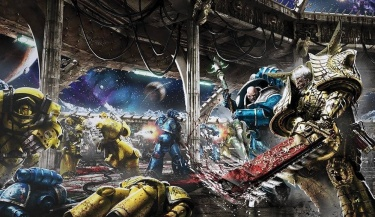
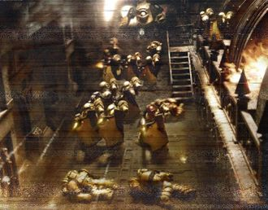
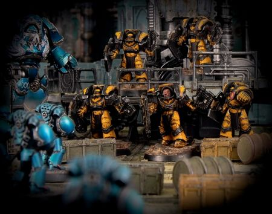
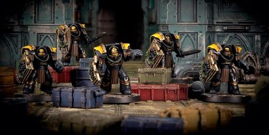

# 0799 ~010.M31 冥王星之战 Battle of Pluto

精校状态：中文行文已逐段精校，部分术语仍为暂定

分类：时间线

原文来源：https://www.bilibili.com/opus/1205065607379156999

原作者：帝国神选罐头

原文时间：2026年05月22日 09:50

[返回分类目录](目录.md) · [全书目录](../../目录.md)

<!-- A0799-B0001 -->
**英文原文**

The Battle of Pluto was a battle during the Horus Heresy. It was the earliest major engagement of the Solar War.

<!-- /A0799-B0001 -->

<!-- A0799-B0002 -->

原译文

冥王星之战是荷鲁斯叛乱时期的一场战斗。这是太阳战争中最早的重大交战。

**校订译文**

冥王星之战是荷鲁斯之乱时期的一场战斗。这是太阳战争中最早的重大交战。

<!-- /A0799-B0002 -->

<!-- A0799-B0003 图片 -->

<!-- A0799-B0004 -->

原译文

Alpharius and Rogal Dorn battle on Hydra 阿尔法瑞斯和罗格·多恩在冥卫三上作战

**校订译文**

Alpharius and Rogal Dorn battle on Hydra 阿尔法瑞斯和罗格·多恩在冥卫三上作战

<!-- /A0799-B0004 -->

<!-- A0799-B0005 -->
**英文原文**

Conflict:Solar War, the Horus Heresy

<!-- /A0799-B0005 -->

<!-- A0799-B0006 -->

原译文

冲突：太阳战争，荷鲁斯叛乱

**校订译文**

冲突：太阳战争，荷鲁斯之乱

<!-- /A0799-B0006 -->

<!-- A0799-B0007 -->
**英文原文**

Date:~010.M31

<!-- /A0799-B0007 -->

<!-- A0799-B0008 -->

原译文

日期：~010.M31

**校订译文**

日期：~010.M31

<!-- /A0799-B0008 -->

<!-- A0799-B0009 -->
**英文原文**

Location:Pluto, Sol System

<!-- /A0799-B0009 -->

<!-- A0799-B0010 -->

原译文

地点：冥王星，太阳系

**校订译文**

地点：冥王星，太阳系

<!-- /A0799-B0010 -->

<!-- A0799-B0011 -->
**英文原文**

Outcome:Loyalist Victory, Alpharius killed, Alpha Legion retreat

<!-- /A0799-B0011 -->

<!-- A0799-B0012 -->

原译文

结果：忠诚派胜利，阿尔法瑞斯被杀，阿尔法军团撤退

**校订译文**

结果：忠诚派胜利，阿尔法瑞斯被杀，阿尔法军团撤退

<!-- /A0799-B0012 -->

<!-- A0799-B0013 -->
**英文原文**

Combatants:Imperium/Traitors

<!-- /A0799-B0013 -->

<!-- A0799-B0014 -->

原译文

作战方：帝国/叛徒

**校订译文**

作战方：帝国/叛徒

<!-- /A0799-B0014 -->

<!-- A0799-B0015 -->
**英文原文**

Commanders:Primarch Rogal Dorn, Captain Archamus (KIA), Captain Sigismund, Captain Koro (KIA), Captain Vendraal (KIA), Centurion Gregorius Skekkir (KIA)/Primarch Alpharius (KIA), Captain Kel Silonius, Captain Ingo Pech, Captain Mathias Herzog, Harrowmaster Indar Vollinus

<!-- /A0799-B0015 -->

<!-- A0799-B0016 -->

原译文

指挥官：原体罗格·多恩，连长阿尔卡穆斯(KIA)，连长西吉斯蒙德，连长科罗(KIA)，舰长文德拉尔(KIA)，百夫长格雷戈里乌斯·谢基尔(KIA)/原体阿尔法瑞斯(KIA)，连长凯尔·西洛尼乌斯，连长英戈·佩奇，连长马蒂亚斯·赫尔佐格，折磨大师因达尔·沃利努斯

**校订译文**

指挥官：帝国——原体罗格·多恩，连长阿坎姆斯（阵亡），连长西吉斯蒙德，连长科罗（阵亡），舰长文德拉尔（阵亡），百夫长格雷戈里乌斯·谢基尔（阵亡）；叛徒——原体阿尔法瑞斯（阵亡），连长凯尔·西洛尼乌斯，连长英戈·佩奇，连长马蒂亚斯·赫尔佐格，折磨大师因达尔·沃利努斯。

<!-- /A0799-B0016 -->

<!-- A0799-B0017 -->
**英文原文**

Strength:Initially: ~30 Imperial Fists ships, Inferallti Hussars Regiments, Black Sentinels; Later:Large Imperial Fists and Imperial Armada fleet led by the Phalanx/~200 Alpha Legion warships

<!-- /A0799-B0017 -->

<!-- A0799-B0018 -->

原译文

力量：最初：约30艘帝国之拳舰船、地狱骠骑兵团、黑色哨兵；后来：由山阵号领导的大型帝国之拳和帝国无敌舰队/约200艘阿尔法军团战舰

**校订译文**

兵力：帝国初期——约三十艘帝国之拳舰船、因费拉尔提骠骑兵团、黑色哨兵；后续增援——以山阵号为首的庞大帝国之拳与帝国舰队联合部队。叛徒——约两百艘阿尔法军团战舰。

**校注：** Inferallti 是专名，暂音译因费拉尔提，不当作 infernal 译为地狱。Hussars 为骠骑兵，区别帝国之拳 Huscarls 胡斯卡尔亲卫。

<!-- /A0799-B0018 -->

<!-- A0799-B0019 -->
**英文原文**

Casualties:Heavy/Unknown but likely heavy

<!-- /A0799-B0019 -->

<!-- A0799-B0020 -->

原译文

伤亡：重大/未知但可能重大

**校订译文**

伤亡：帝国——惨重；叛徒——不详，推测同样惨重。

<!-- /A0799-B0020 -->

<!-- A0799-B0021 -->
## Overview 概述

<!-- /A0799-B0021 -->

<!-- A0799-B0022 -->
**英文原文**

As part of Horus's drive towards Terra, the traitorous Alpha Legion was charged by the Warmaster with plunging the Sol System into chaos in preparation for his arrival. The system was heavily defended by the Imperial Fists Legion led by Rogal Dorn himself, and was on high alert due to the continuing blockade of Mars in the aftermath of the Mechanicum Civil War. Nonetheless the Primarch of the Alpha Legion, Alpharius, set his fleet led by the Battle Barge Alpha on a course for Sol. To infiltrate the Sol System, Alpharius put himself and the entire crew of the fleet into stasis while powering down his ships to minimize heat signature. Thus for the next year the Alpha Legion fleet drifted towards Sol, successfully reaching its outskirts undetected in a way that Warp travel would not have allowed.

<!-- /A0799-B0022 -->

<!-- A0799-B0023 -->

原译文

作为荷鲁斯前往泰拉的一部分，战帅命令叛徒阿尔法军团将太阳系陷入混乱，为他的到来做准备。该星系由罗格·多恩本人领导的帝国之拳军团严密防御，由于机械教内战后对火星的持续封锁，该星系处于高度戒备状态。尽管如此，阿尔法军团的原体阿尔法瑞斯还是让他的舰队在阿尔法号战斗驳船的带领下驶向太阳。为了渗透到太阳系，阿尔法瑞斯让自己和舰队的全体船员进入静滞状态，同时关闭他的船只以尽量减少热信号。因此，在接下来的一年里，阿尔法军团舰队向太阳漂移，成功地以亚空间旅行不允许的方式未被发现地到达了其边缘地带。

**校订译文**

荷鲁斯向泰拉推进期间，命令叛变的阿尔法军团在太阳系制造混乱，为自己的到来铺路。罗格·多恩亲率帝国之拳严密防守太阳系；机械教内战后，对火星的封锁仍在持续，整个星系都处于高度戒备。尽管如此，阿尔法瑞斯仍令舰队以战斗驳船阿尔法号为首，驶向太阳系。为悄然潜入，他让自己与全体舰员进入静滞状态，并关闭舰船系统，将热信号降至最低。接下来的一年里，阿尔法军团舰队就这样漂向太阳系，终于未被察觉地抵达其外围；若使用亚空间航行，就不可能如此隐蔽。

<!-- /A0799-B0023 -->

<!-- A0799-B0024 -->
**英文原文**

Meanwhile, Alpha Legion Operative teams were activated across the Sol System. These sleeper cells had been planted years before the Heresy, and upon activation wreaked a series of devastating but distractionary terrorist acts. A freighter was detonated over Terra, raining death across the world and killing millions. At the Damocles Starport, the Alpha Legion was able to use rebel cells to devastate the facility. A rebellion was also instigated on Triton. Human Operatives led by the Headhunter Kel Silonius infiltrated Terra and activated a cell of Legionaries that had been hidden in stasis on the world many years earlier, coming into conflict with Rogal Dorn and his Huscarls. However all of these acts were distractions for Alpharius' true objective: Pluto, linchpin of the loyalist surveillance network over Sol. As the Imperial Fists led by Archamus attempted to hunt down Alpha Legion cells and intentions, Alpharius' fleet finally reached Terra. The infiltration of the Legion into the System was completed thanks to sabotage by Silonius' team and the cooperation of anti-Imperial scavenger clans led by Sork.

<!-- /A0799-B0024 -->

<!-- A0799-B0025 -->

原译文

与此同时，阿尔法军团行动小组在整个太阳系中被激活。这些休眠舱早在叛乱之前就已经被植入，一旦激活，就会引发一系列毁灭性但令人分心的恐怖主义行为。一艘货船在泰拉上空引爆，在世界各地造成死亡，数百万人死亡。在达摩克利斯星港，阿尔法军团能够利用叛军组织摧毁该设施。海卫一也遭到了叛乱。由猎头者凯尔·西洛尼乌斯领导的人类特工渗透到泰拉并激活了一个多年前隐藏在世界的静滞状态的军团士兵舱，与罗哥多恩和他的胡斯卡尔发生冲突。然而，所有这些行为都干扰了阿尔法瑞斯的真正目标：冥王星，太阳系忠诚派监视网络的关键。当阿尔卡穆斯率领的帝国之拳试图追捕阿尔法军团的组织和意图时，阿尔法瑞斯的舰队终于到达了泰拉。由于西洛尼乌斯小队的破坏和索克领导的反帝国清道夫氏族的合作，军团渗透到星系中的工作得以完成。

**校订译文**

与此同时，散布太阳系各地的阿尔法军团潜伏小组接到命令，开始行动。这些秘密小组早在叛乱爆发数年前便已埋伏下来，如今接连发动破坏性极强的恐怖袭击，用以转移守军注意力。一艘货船在泰拉上空爆炸，残骸洒向地表，夺走数百万人的性命。达摩克利斯星港遭阿尔法军团操纵的叛乱组织重创，海卫一也爆发叛乱。猎头者凯尔·西洛尼乌斯率普通人类特工潜入泰拉，唤醒了多年前便以静滞状态藏匿于此的一组军团战士，与罗格·多恩及胡斯卡尔亲卫交锋。然而，这些行动都是掩护，真正目标是冥王星——忠诚派太阳系监视网络的关键节点。阿坎姆斯率帝国之拳追查潜伏组织、探明其意图之际，原文称阿尔法瑞斯的舰队终于抵达泰拉。西洛尼乌斯小队的破坏，加上索克率领的反帝国拾荒氏族的配合，使阿尔法军团完成了对太阳系的渗透。

**校注：** sleeper cells 为潜伏小组，不是休眠舱；后面军团士兵处才明确采用静滞技术。原文此处称舰队抵达 Terra，后段实际战场为 Pluto，地点有疑点，中文明确标作原文说法，不擅替换。

<!-- /A0799-B0025 -->

<!-- A0799-B0026 -->
**英文原文**

As Dorn was distracted by Alpha Legion machinations across the system, the Legion's fleet of over 200 ships led by the Alpha itself struck at Pluto and its moons Charon, Styx, Nix, Kerberos, and Hydra. As the fleet arrived, further uprisings, this time led by Alpha Legion teams, erupted across the Sol System. Ariel and space platforms above Jupiter and Saturn were overrun. Silonius' Headhunter team was revealed to led by Alpharius himself, he had seemingly switched minds with Silonius before wiping his own memories, only for them to be reactivated at the right time by psychic trigger. The real Silonius was aboard the Alpha, leading the attack alongside Ingo Pech and Mathias Herzog. The Alpha Legion's primary target was Pluto's moon of Hydra, home to a Astropathic monitoring station. If the communications station were to be captured, the rest of Pluto's moons would fall and Terra would be none the wiser. Alpharius led his team on the moon, releasing disabling gas across its filtration stations to try and disable the Astropaths and their Black Sentinels guards. The Primarch would also personally kill Hydra's commander, Captain Koro. Meanwhile, the fortress-moon of Kerberos was captured from Imperial Army troops by Alpha Legionaries, who turned the guns of the stations on the loyalists.

<!-- /A0799-B0026 -->

<!-- A0799-B0027 -->

原译文

由于多恩被阿尔法军团在整个星系中的阴谋分散了注意力，阿尔法军团率领的200多艘舰船袭击了冥王星及其卫星冥卫一(卡戎)、冥卫五(斯提克斯)、冥卫二(尼克斯)、冥卫四(刻耳柏洛斯)和冥卫三(海德拉)。随着舰队的到来，太阳系爆发了进一步的叛乱，这次是由阿尔法军团领导的。天卫一(阿里尔)和木星和土星上方的太空平台被淹没。西洛尼乌斯的猎头者小队被透露是由阿尔法瑞斯本人领导的，他似乎在抹去自己的记忆之前与西洛尼乌斯交换了思维，只是在正确的时间被灵能触发重新激活。真正的西洛尼乌斯在阿尔法号上，与英戈·佩奇和马蒂亚斯·赫尔佐格一起领导了这次袭击。阿尔法军团的主要目标是冥王星的卫星冥卫三，它是一个星语监听站的所在地。如果通信站被占领，冥王星的其他卫星将会陷落，泰拉也将仍旧完全不知晓。阿尔法瑞斯带领他的小队登上卫星，在过滤站释放失能气体，试图失能星语者和他们的黑色哨兵卫兵。原体也亲自杀死了冥卫三的指挥官科罗连长。与此同时，阿尔法军团从帝国军队部队手中夺取了堡垒卫星冥卫四，他们将空间站的炮火对准了忠诚派。

**校订译文**

多恩的注意力被遍布星系的阴谋牵制时，以阿尔法号为首的两百多艘阿尔法军团舰船攻向冥王星及其卫星：冥卫一（卡戎）、冥卫五（斯提克斯）、冥卫二（尼克斯）、冥卫四（刻耳柏洛斯）和冥卫三（海德拉）。舰队抵达的同时，太阳系各处再次爆发由阿尔法军团小队直接领导的叛乱。天卫一（阿里尔）以及木星、土星上空的太空平台相继被攻占。西洛尼乌斯的猎头者小队的真正领袖，此时被揭示为阿尔法瑞斯本人：他似乎先与西洛尼乌斯交换了思维，再抹去自己的记忆，待时机成熟才以灵能触发恢复。真正的西洛尼乌斯则在阿尔法号上，与英戈·佩奇、马蒂亚斯·赫尔佐格共同指挥进攻。军团的主要目标是设有星语监听站的冥卫三。一旦夺取这个通信节点，他们便能攻陷其他冥王星卫星，而泰拉仍蒙在鼓里。阿尔法瑞斯率小队登上冥卫三，通过空气过滤设施释放致失能气体，试图制服星语者及其黑色哨兵守卫。他还亲手杀死驻地指挥官科罗连长。与此同时，阿尔法军团从帝国军手中夺取冥卫四这颗堡垒卫星，将其炮口转向忠诚派。

**校注：** 阿尔法瑞斯与西洛尼乌斯交换思维并抹除记忆的说法，英文以 seemingly 限定，中文保留不确定性。overrun 为攻占，不是水淹。

<!-- /A0799-B0027 -->

<!-- A0799-B0028 图片 -->

<!-- A0799-B0029 -->

原译文

The Imperial Fists defend against the Alpha Legion assault 帝国之拳抵御阿尔法军团的进攻

**校订译文**

The Imperial Fists defend against the Alpha Legion assault 帝国之拳抵御阿尔法军团的进攻

<!-- /A0799-B0029 -->

<!-- A0799-B0030 -->
**英文原文**

The Imperial Fists had just 30 ships led by Sigismund to defend Pluto. Faced with the suddenness of the attack and severely outnumbered, the loyalist fleet was badly mauled. The Alpha Legion used Fire Ships hidden among their own fleet to wreak havoc on the defenders as the captured fortress moon of Kerberos showered Nix, Styx, and Charon with heavy fire. Silonius, aboard the Alpha, split his fleet into three parts. One moved around the Imperial Fists and clawed back into Pluto's orbit, while another served as a distraction to draw the Fists fire. Another led by the Alpha itself swept past Hydra to troop reinforcements including elite Lernaean Terminators. However the Imperial Fists fought on, maintaining a stubborn defense in the face of overwhelming odds.

<!-- /A0799-B0030 -->

<!-- A0799-B0031 -->

原译文

帝国之拳只有30艘由西吉斯蒙德率领的船只来保卫冥王星。面对突如其来的袭击和严重的寡不敌众，忠诚派舰队受到了严重打击。阿尔法军团使用隐藏在自己舰队中的火船对防御者造成严重破坏，因为被占领的堡垒卫星冥卫四向冥卫二、冥卫五和冥卫一发射了猛烈的炮火。西洛尼乌斯在阿尔法号上将他的舰队分为三部分。一个绕着帝国之拳移动，并被抓回冥王星的轨道，而另一个则分散了人们的注意力，吸引了帝国之拳的火力。另一支由阿尔法号率领的队伍横扫冥卫三，增援部队，其中包括精英勒拿终结者。然而，帝国之拳继续战斗，在压倒性的困难面前保持了顽强的防御。

**校订译文**

西吉斯蒙德手中只有三十艘帝国之拳舰船负责保卫冥王星。敌军突袭来得猝不及防，数量又远超己方，忠诚派舰队遭到重创。阿尔法军团将隐藏在舰队内的火船投入战斗，给守军造成严重破坏；被夺取的冥卫四则以重炮轰击冥卫二、冥卫五和冥卫一。西洛尼乌斯在阿尔法号上将舰队分为三路：一路绕过帝国之拳，重新切入冥王星轨道；一路佯攻，吸引守军火力；另一路由阿尔法号亲自带领，驶过冥卫三，向其投送包括精锐勒拿终结者在内的援军。尽管敌势压倒一切，帝国之拳仍坚持战斗，顽强防守。

**校注：** clawed back 为重新奋力切入轨道，不是被抓回去；原文 to troop reinforcements 表达缺损，按向冥卫三投送援军理解。

<!-- /A0799-B0031 -->

<!-- A0799-B0032 图片 -->

<!-- A0799-B0033 -->

原译文

Huscarls slow the Alpha Legion advance 胡斯卡尔减缓了阿尔法军团的前进速度

**校订译文**

Huscarls slow the Alpha Legion advance 胡斯卡尔亲卫迟滞阿尔法军团的推进

<!-- /A0799-B0033 -->

<!-- A0799-B0034 -->
**英文原文**

At that time, the Imperial Fists Cruiser Spear of Verria reached the moon Hydra, having been on a deep void patrol when the Battle began. Its Captain, Vendraal, sought to defend the seized moon and readied his forces to deploy into Hydra. He then charged the Alpha Legion fleet and used the Spear to shield its boarding craft that were racing to the moon. Vendraal's forces successfully reached Hydra, under the command of Centurion Gregorius Skekkir, even as the Spear was being taken apart by the Alpha Legion. The Captain and his skeleton crew then fought on for another 22 minutes, before his Cruiser rammed the Alpha Legion Heavy Cruiser Cockatrice. Once on the moon, Skekkir separated Vendraal's Imperial Fists and sent them to reinforce Hydra's vital points. The Centurion meanwhile would lead a force to the moon's plasma reactor, which was being targeted by the Alpha Legion Harrowmaster Indar Vollinus. They were able to reach the reactor before the Harrowmaster, but their rapid pace came at a heavy cost. Only Skekkir and a dozen Imperial Fists were left to face Vollinus' forces, when the Alpha Legion attacked. Despite being outnumbered, though, the Imperial Fists pushed the Alpha Legion back several times and killed dozens of the traitors. Hours later, though, only Skekkir and three other Imperial Fists still lived. The Alpha Legion's Primarch Alpharius himself then arrived, however, and easily killed the Centurion and the remaining Imperial Fists.

<!-- /A0799-B0034 -->

<!-- A0799-B0035 -->

原译文

当时，帝国之拳巡洋舰维里亚之矛号已经抵达卫星冥卫三，在战斗开始时，它正在进行一次深空巡逻。它的舰长文德拉尔试图保卫被占领的卫星，并准备将部队部署到冥卫三。然后，他向阿尔法军团舰队发起冲锋，并用维里亚之矛号保护其正在飞向卫星的登陆艇。在百夫长格雷戈里乌斯·谢基尔的指挥下，文德拉尔的部队成功抵达冥卫三，尽管维里亚之矛号正被阿尔法军团拆毁。然后，舰长和他的骨干船员又战斗了22分钟，然后他的巡洋舰撞上了阿尔法军团重型巡洋舰鸡蛇号。登上卫星后，谢基尔分散了文德拉尔的帝国之拳，并派他们去增援冥卫三的要害。与此同时，百夫长将率领一支部队前往卫星的等离子反应堆，该反应堆正被阿尔法军团折磨大师因达尔·沃利努斯瞄准。他们能够在折磨大师之前到达反应堆，但他们的快速步伐付出了沉重的代价。当阿尔法军团进攻时，只剩下谢基尔和十几名帝国之拳面对沃利努斯的部队。尽管寡不敌众，但帝国之拳多次击退阿尔法军团，杀死了数十名叛徒。然而，几个小时后，只有谢基尔和其他三名帝国之拳还活着。然而，阿尔法军团的原体阿尔法瑞斯本人随后抵达，轻松杀死了百夫长和剩下的帝国之拳。

**校订译文**

此时，帝国之拳巡洋舰维里亚之矛号抵达冥卫三。战斗爆发时，它原本正在深空巡逻。舰长文德拉尔准备将部队送上卫星，支援防御。他驾舰冲向阿尔法军团舰队，以舰身掩护正疾飞向卫星的登陆艇。尽管维里亚之矛号正被炮火撕碎，百夫长格雷戈里乌斯·谢基尔仍带领部队成功登陆。文德拉尔与留舰维持操纵的最低限度舰员又坚持战斗二十二分钟，随后驾驶巡洋舰撞向阿尔法军团重巡洋舰鸡蛇号。登陆后，谢基尔将部队分派至冥卫三各要害，自己则率一队人赶赴等离子反应堆。阿尔法军团折磨大师因达尔·沃利努斯也正以该处为目标。谢基尔抢先抵达，却为急速推进付出惨重代价；敌人来袭时，只剩他与十二名帝国之拳迎战。守军虽寡不敌众，仍多次击退进攻，杀死数十名叛徒。数小时后，幸存者只剩谢基尔与三名战士。阿尔法瑞斯此时亲自到来，轻易杀死了他们。

**校注：** a dozen 为十二，不是十几；skeleton crew 指维持舰船运作所需的最少舰员，不是骨干人员的资历。

<!-- /A0799-B0035 -->

<!-- A0799-B0036 -->
**英文原文**

Archamus also led a Huscarl contingent on Hydra after correctly discerning the Alpha Legion's true intent. However the Praetorian of Dorn was struck down by Alpharius himself and the battle seemed won for the traitors. It was at this moment that the Phalanx itself arrived over Pluto, leading a massive fleet of Imperial Fists and Imperial Armada reinforcements. The fleet had managed to arrive quickly by slingshotting around the Solar System's competing gravity wells. The Fists fleet was able to pacify Kerberos' guns as Rogal Dorn himself led a landing on Hydra.

<!-- /A0799-B0036 -->

<!-- A0799-B0037 -->

原译文

阿尔卡穆斯在正确识别阿尔法军团的真实意图后，还率领一支胡斯卡尔特遣队前往冥卫三。然而，多恩禁卫被阿尔法瑞斯打倒了，这场战斗似乎是叛徒赢得了胜利。就在这一刻，山阵号本身抵达冥王星上空，率领一支庞大的帝国之拳舰队和帝国无敌舰队增援。舰队通过在太阳系中相互冲突的重力井间弹射飞行，迅速抵达。当罗格·多恩亲自率领部队在冥卫三登陆时，帝国之拳舰队成功平息了冥卫四的炮火。

**校订译文**

阿坎姆斯识破阿尔法军团真正意图后，也率一支胡斯卡尔亲卫部队登上冥卫三。然而，这位多恩亲卫统领被阿尔法瑞斯亲手击倒，胜利似乎已落入叛徒之手。就在此时，山阵号率庞大的帝国之拳与帝国舰队援军抵达冥王星上空。他们利用太阳系各天体引力井的引力弹弓效应迅速赶来。帝国之拳舰队压制了冥卫四的炮火，罗格·多恩则亲率部队登陆冥卫三。

<!-- /A0799-B0037 -->

<!-- A0799-B0038 图片 -->

<!-- A0799-B0039 -->

原译文

The Phalanx Wardens arrive on Pluto 山阵守望者抵达冥王星

**校订译文**

The Phalanx Wardens arrive on Pluto 山阵卫队抵达冥王星

**校注：** 英文图注写 Wardens，相关编制核心标准词为 Phalanx Warder；沿同一图示编制统一中文山阵卫队，保留英文变体。

<!-- /A0799-B0039 -->

<!-- A0799-B0040 -->
**英文原文**

Dorn teleported directly before Alpharius with Archamus at his feet, and the two Primarchs clashed. Alpharius maintained that he was not doing this for Horus, but instead for the future, and urged Dorn to help him in achieving true victory. But the Fists Primarch ignored his brother and brutally assaulted him. Alpharius was about to impale Dorn with his spear, the dying Archamus saw the strike and tried to intervene but reels harmlessly off of the spears haft. Alchamus was unaware that Dorn had seen the strike, the Imperial Fists Primarch outplaying Alpharius by using a move he'd used against a giant Ork decades earlier. Dorn deliberately stepped into the shot and tanked it in his shoulder to pin Alpharius in place. Dorn then grabbed the spear and using Storm's Teeth sliced Alpharius's hands from his wrists before he slashed Alpharius across the chest, stabbed him with his own spear, and finished by cutting through Alpharius's skull with his chainsword. After Alpharius died, Kel Silonius ordered the rest of the Alpha Legion fleet retreat from Pluto. Silonius himself seemed unconcerned with Alpharius' death, stating all in the Legion are one.

<!-- /A0799-B0040 -->

<!-- A0799-B0041 -->

原译文

多恩在阿尔卡穆斯的脚下直接传送到阿尔法瑞斯面前，两位原体发生了冲突。阿尔法瑞斯坚称，他这样做不是为了荷鲁斯，而是为了未来，并敦促多恩帮助他取得真正的胜利。但帝国之拳原体无视他的兄弟，残忍地袭击了他。阿尔法瑞斯正要用长矛刺穿多恩，垂死的阿尔卡穆斯看到了这一击，试图介入，但踉跄的从长矛柄上无害地偏离。阿尔卡穆斯不知道多恩已经看到了这次袭击，帝国之拳原体用他几十年前对付巨型欧克时使用的招式击败了阿尔法瑞斯。多恩故意闯入攻击，把它砸在肩膀上，把阿尔法瑞斯钉在适当的位置。然后，多恩抓起长矛，用风暴之牙从阿尔法瑞斯的手腕上切下他的手，然后砍穿阿尔法瑞斯的胸膛，用他自己的长矛刺穿他，最后用他的链锯剑刺穿阿尔法瑞斯。阿尔法瑞斯死后，凯尔·西洛尼乌斯命令阿尔法军团舰队的其他成员从冥王星撤退。西洛尼乌斯本人似乎对阿尔法瑞斯的死漠不关心，他说军团中的所有人都是一体的。

**校订译文**

多恩直接传送到阿尔法瑞斯面前，阿坎姆斯倒在脚边，两位原体随即交锋。阿尔法瑞斯坚称自己不是为荷鲁斯效力，而是为了未来，并敦促多恩助他取得真正的胜利。多恩不理会兄弟的劝说，只是猛烈进攻。阿尔法瑞斯即将一矛刺中多恩时，奄奄一息的阿坎姆斯试图阻挡，却被矛杆弹开，未能奏效。他不知道，多恩早已看穿这一击，正准备使出数十年前对付巨型欧克时用过的招数。多恩故意迎上矛尖，以肩膀承受攻击，将对手锁在近处。他抓住长矛，用风暴之牙齐腕斩断阿尔法瑞斯的双手，继而划开其胸膛，用对方的长矛刺穿其身体，最后以链锯剑劈开了他的头颅。阿尔法瑞斯死后，凯尔·西洛尼乌斯下令舰队撤离冥王星。他本人似乎对此毫不在意，只说军团所有人本为一体。

**校注：** 首句意为阿坎姆斯倒在两原体交锋之处脚边，原译竟将多恩传送至阿坎姆斯脚下。恢复故意以肩受矛、锁住对手、断腕、伤胸、以矛刺身、链锯劈颅的动作次序；原文末尾明确是 skull，不可漏掉。Alchamus 属同段英文姓名误拼。

<!-- /A0799-B0041 -->

<!-- A0799-B0042 -->
**英文原文**

In the aftermath of the loyalist victory, the Imperial Fists oversaw a massive purge of suspected Alpha Legion assets across the Sol System. Meanwhile, Omegon effectively took on the role of Alpharius.

<!-- /A0799-B0042 -->

<!-- A0799-B0043 -->

原译文

在忠诚派胜利之后，帝国之拳监督了整个太阳系对疑似阿尔法军团资产的大规模清洗。与此同时，欧米伽实际上扮演了阿尔法瑞斯的角色。

**校订译文**

忠诚派获胜后，帝国之拳在整个太阳系展开大规模清洗，肃清疑似阿尔法军团的人员与据点。与此同时，欧米伽实际上接替了阿尔法瑞斯的身份与角色。

<!-- /A0799-B0043 -->

本篇核心术语与暂定项

以下列出本篇出现的英文原形及核心术语表用词。同形词可能指不同对象，具体词义以本篇正文和校注为准；单复数、别名和仅见于图注的名称可能尚未列入。完整候选见[术语表](../../术语表/双语术语候选.csv)。

| 英文 | 采用中文 | 状态 |
| --- | --- | --- |
| Imperial Army | 帝国军 | 暂定·官方待核 |
| Chainsword | 链锯剑 | 官方已核对 |
| Horus Heresy | 荷鲁斯之乱 | 官方已核对 |
| Warp | 亚空间 | 官方已核对 |
| Imperium | 帝国 | 暂定·简称 |
| Mechanicum | 机械教 | 暂定·历史称谓 |
| Imperial Fists | 帝国之拳 | 暂定 |
| Phalanx | 山阵号 | 暂定 |
| Primarch | 原体 | 官方已核对 |
| Battle Barge | 战斗驳船 | 暂定·官方待核 |
| Terra | 泰拉 | 暂定·官方待核 |
| Horus | 荷鲁斯 | 暂定·官方待核 |
| Black Sentinels | 黑色哨兵 | 暂定·官方待核 |
| Mars | 火星 | 暂定·官方待核 |
| Jupiter | 木星 | 暂定·官方待核 |
| Praetorian | 禁卫兵 | 暂定·官方待核 |
| Alpha Legion | 阿尔法军团 | 暂定·官方待核 |
| Sol | 太阳系 | 暂定·官方待核 |
| The Phalanx | 山阵号 | 暂定·官方待核 |
| Mathias | 马蒂亚斯 | 暂定·官方待核 |
| Sigismund | 西吉斯蒙德 | 暂定·官方待核 |
| Ingo Pech | 英戈·佩奇 | 暂定·官方待核 |
| Captain | 连长 | 暂定·官方待核 |
| Terminators | 终结者 | 暂定·官方待核 |
| Brother | 修士 | 暂定·官方待核 |
| Alpharius | 阿尔法瑞斯 | 暂定·官方待核 |
| Omegon | 欧米伽 | 暂定·官方待核 |
| Harrowmaster | 折磨大师 | 暂定·官方待核 |
| Operative | 特工 | 暂定·官方待核 |
| Lernaean | 勒拿终结者 | 暂定·官方待核 |
| Mathias Herzog | 马蒂亚斯·赫尔佐格 | 暂定·官方待核 |
| Pech | 佩什 | 暂定·官方待核 |
| Inferallti Hussars | 因费拉尔提骠骑兵 | 暂定·官方待核 |
| Gregorius Skekkir | 格雷戈里乌斯·谢基尔 | 暂定·官方待核 |
| Indar Vollinus | 因达尔·沃利努斯 | 暂定·官方待核 |
| Spear of Verria | 维里亚之矛号 | 暂定·官方待核 |
| Cockatrice | 鸡蛇号 | 暂定·官方待核 |
| Kel Silonius | 凯尔·西罗尼乌斯 | 暂定·官方待核 |
| System | 星系（恒星系统） | 暂定·官方待核 |
| Styx | 斯提克斯河 | 暂定·官方待核 |
| Saturn | 土星 | 暂定·官方待核 |
| Sol System | 太阳系 | 暂定·官方待核 |

