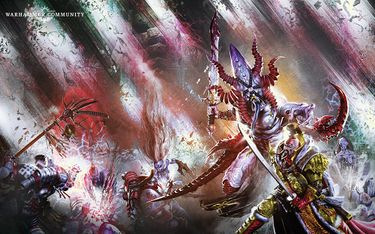

# 0800 011.M41 卡塔鲁斯之战 Battle of Catallus

精校状态：中文行文已逐段精校，部分术语仍为暂定

分类：时间线

原文来源：https://www.bilibili.com/opus/1203623988678361123

原作者：帝国神选罐头

原文时间：2026年05月18日 12:35

[返回分类目录](目录.md) · [全书目录](../../目录.md)

原篇名：011.M41 卡图卢斯之战 Battle of Catallus

<!-- A0800-B0001 -->
**英文原文**

The Battle of Catallus was a battle that occurred during the Horus Heresy.

<!-- /A0800-B0001 -->

<!-- A0800-B0002 -->

原译文

卡图卢斯之战是荷鲁斯叛乱时期发生的一场战斗。

**校订译文**

卡塔鲁斯之战是荷鲁斯之乱期间的一场战斗。

<!-- /A0800-B0002 -->

<!-- A0800-B0003 图片 -->

<!-- A0800-B0004 -->

原译文

Jaghatai Khan battles the Daemons of Manushya-Rakshsasi aboard the Lance of Heaven during the Battle of Catallus 卡图卢斯之战期间，察合台可汗与跳帮天堂之枪号的罗刹女的恶魔作战

**校订译文**

Jaghatai Khan battles the Daemons of Manushya-Rakshsasi aboard the Lance of Heaven during the Battle of Catallus 卡塔鲁斯之战中，察合台可汗在天堂之枪号上迎战玛努沙·拉克莎希麾下的恶魔

**校注：** Manushya-Rakshsasi 依643篇统一玛努沙·拉克莎希；本篇原稿别名“罗刹女”，两者为同一守密者。

<!-- /A0800-B0004 -->

<!-- A0800-B0005 -->
**英文原文**

Conflict:Horus Heresy

<!-- /A0800-B0005 -->

<!-- A0800-B0006 -->

原译文

冲突：荷鲁斯叛乱

**校订译文**

冲突：荷鲁斯之乱

<!-- /A0800-B0006 -->

<!-- A0800-B0007 -->
**英文原文**

Date:011.M41

<!-- /A0800-B0007 -->

<!-- A0800-B0008 -->

原译文

日期：011.M41

**校订译文**

日期：011.M41

**校注：** 英文明确为 011.M41，但全文属于荷鲁斯叛乱时期，纪年存在明显矛盾；保留原文数字待查源，不直接改成 011.M31。

<!-- /A0800-B0008 -->

<!-- A0800-B0009 -->
**英文原文**

Location:Catallus Rift

<!-- /A0800-B0009 -->

<!-- A0800-B0010 -->

原译文

地点：卡图卢斯裂隙

**校订译文**

地点：卡塔鲁斯裂隙

<!-- /A0800-B0010 -->

<!-- A0800-B0011 -->
**英文原文**

Outcome:Loyalist Victory

<!-- /A0800-B0011 -->

<!-- A0800-B0012 -->

原译文

结果：忠诚派胜利

**校订译文**

结果：忠诚派胜利

<!-- /A0800-B0012 -->

<!-- A0800-B0013 -->
**英文原文**

Combatants:Imperium/Traitor Legions

<!-- /A0800-B0013 -->

<!-- A0800-B0014 -->

原译文

作战方：帝国/叛徒军团

**校订译文**

作战方：帝国/叛徒军团

<!-- /A0800-B0014 -->

<!-- A0800-B0015 -->
**英文原文**

Commanders:Primarch Jaghatai Khan, Jubal Khan, Shiban Khan, Torghun Khan/Primarch Mortarion, Lord Commander Primus Eidolon, Marshal Gremus Kalgaro, Consul Delegatus Azael Konenos (KIA), Prefector Ravasch Cario (KIA)

<!-- /A0800-B0015 -->

<!-- A0800-B0016 -->

原译文

作战方：原体察合台可汗，朱巴尔可汗，昔班可汗，托尔浑可汗/原体莫塔里安，首席领主指挥官艾多隆，元帅格雷姆斯·卡尔加罗，领事使节阿扎埃尔·科内诺斯(KIA)，提督拉瓦什·卡里奥(KIA)

**校订译文**

指挥官：忠诚派——原体察合台可汗，朱巴可汗，昔班可汗，托尔浑可汗；叛徒——原体莫塔里安，首席领主指挥官艾多隆，元帅格雷姆斯·卡尔加罗，领事使节阿扎埃尔·科内诺斯（阵亡），提督拉瓦什·卡里奥（阵亡）。

<!-- /A0800-B0016 -->

<!-- A0800-B0017 -->
**英文原文**

Strength:84% of White Scars Legion/Sizable portion of Death Guard, Emperor's Children taskforce, Slaaneshi Daemons

<!-- /A0800-B0017 -->

<!-- A0800-B0018 -->

原译文

力量：84%的白色疤痕军团/相当大规模的死亡守卫，帝皇之子特遣部队，色孽恶魔

**校订译文**

兵力：忠诚派——白疤军团 84% 的兵力；叛徒——死亡守卫的大批部队、帝皇之子特遣部队、色孽恶魔。

<!-- /A0800-B0018 -->

<!-- A0800-B0019 -->
**英文原文**

Casualties:Heavy/Heavy

<!-- /A0800-B0019 -->

<!-- A0800-B0020 -->

原译文

伤亡：重大/重大

**校订译文**

伤亡：双方均惨重。

<!-- /A0800-B0020 -->

<!-- A0800-B0021 -->
## Overview 概述

<!-- /A0800-B0021 -->

<!-- A0800-B0022 -->
**英文原文**

The campaign was a continuation of the attempts by the White Scars to find a passage to Terra. After the Battle of the Kalium Gate, the Scars had managed to discover the location of the elusive Navigator Pieter Helian Achelieux. After a council of war where Jaghatai Khan proclaimed his intent to stand on Terra over fighting to the death against the traitor fleets pursuing them, the White Scars reformed in their entirety and moved on the Catallus Rift.

<!-- /A0800-B0022 -->

<!-- A0800-B0023 -->

原译文

这场战役是白色伤疤试图找到通往泰拉的通道的延续。钾之门之战后，白色疤痕设法找到了难找的导航者彼得·赫利安·阿什利厄的位置。在一次战争会议中，察合台可汗宣布他打算站在泰拉，与追捕他们的叛徒舰队战斗至死，随后白色伤疤彻底改革，向卡图卢斯裂隙前进。

**校订译文**

这场战役延续了白疤寻找通往泰拉道路的行动。卡利乌姆之门之战后，他们终于找到了行踪难觅的导航员彼得·赫利安·阿舍利厄的下落。察合台可汗在军事会议上宣布，他的目标是在泰拉参战，而不是与追击的叛军舰队死战到底。随后，白疤全军重新集结，向卡塔鲁斯裂隙进发。

**校注：** over fighting to the death 表示宁赴泰拉，也不与追兵死战，原译误成同时要在泰拉与追兵战至死。reformed 指重新集结，不是全面改革。Kalium、Catallus 分别依核心卡利乌姆、卡塔鲁斯。

<!-- /A0800-B0023 -->

<!-- A0800-B0024 -->
**英文原文**

At the Warp Rift over Catallus, they discovered that while Achelieux had long since died, his machine Dark Glass endured. While the White Scars explored the Dark Glass, a combined traitor fleet of Death Guard and Emperor's Children led by Mortarion and Eidolon arrived. The Scars sought to block the traitors with suicidal detachments of the Sagyar Mazan and a fleet led by the Kaljian under Shiban Khan. A vicious battle erupted across space as the two fleets dueled to the death. During the battle, a horde of Slaaneshi Daemons led by the Keeper of Secrets Manushya-Rakshsasi were summoned by the Emperor's Children Apothecary Von Kalda. The Daemons possessed the entire crew of the Emperor's Children warship Ravisher then set their sights upon Jaghatai Khan.

<!-- /A0800-B0024 -->

<!-- A0800-B0025 -->

原译文

在卡图卢斯上空的亚空间裂隙处，他们发现，虽然阿什利厄早已死亡，但他的机器黑暗琉璃却经久不衰。当白色伤疤探索黑暗琉璃时，由莫塔里安和艾多隆领导的死亡守卫和帝皇之子组成的联合叛徒舰队到达了。白色疤痕试图通过赎罪小队的自杀性分遣队和昔班可汗领导的卡尔吉安号领导的舰队来阻止叛徒。两支舰队决斗至死，太空中爆发了一场激烈的战斗。在战斗中，由守密者罗刹女率领的一群色孽恶魔被帝皇之子药剂师冯·卡尔达召唤。恶魔占据了帝皇之子战舰迷人者号的全体船员，然后将目光投向了察合台可汗。

**校订译文**

在卡塔鲁斯上空的亚空间裂隙处，白疤发现阿舍利厄虽已死去多年，他的装置黑暗琉璃却仍然存在。他们探索这座装置时，莫塔里安与艾多隆统率的死亡守卫、帝皇之子联合舰队赶来。白疤派出萨加尔·马赞敢死部队，以及昔班可汗以卡尔吉安号为首的舰队，试图阻挡叛军。双方在虚空中殊死交战，帝皇之子药剂师冯·卡尔达召来了由守密者玛努沙·拉克莎希统率的色孽恶魔。恶魔附身帝皇之子战舰迷人者号的全体舰员，随后将目标转向察合台可汗。

**校注：** Manushya-Rakshsasi 依较早643篇统一暂名“玛努沙·拉克莎希”，原稿别名“罗刹女”保留于此；是同一守密者，官方中文待核。Sagyar Mazan 依已校白疤篇统一萨加尔·马赞，并补敢死部队的职能说明。

<!-- /A0800-B0025 -->

<!-- A0800-B0026 -->
**英文原文**

Seeking to settle the score with Mortarion that had begun on Prospero, Jaghatai became determined to charge his flagship, the Swordstorm, into Mortarion's Endurance for a final stand. However inside Dark Glass, Chief Stormseer Targutai Yesugei had failed to prevent an attempt by the Navis Nobilite agent Veil to destroy the device. Discovering the throne at the center of the Dark Glass, Yesugei sacrificed himself to open a portal into the Webway to Terra. Jaghatai, determined to prevent Yesugei's sacrifice from going to waste, instead chose escape over a last stand. The Swordstorm was abandoned, the only warriors left aboard consisting of the Sagyar Mazan led by Torghun Khan.

<!-- /A0800-B0026 -->

<!-- A0800-B0027 -->

原译文

为了解决在普罗斯佩罗开始的与莫塔里安的争端，察合台决心将他的旗舰剑刃风暴号冲进莫塔里安的坚忍号，进行最后一战。然而，在黑暗琉璃内部，首席风暴先知塔里忽台·也速该未能阻止导航者宗族特工韦尔试图摧毁该设备。在黑暗琉璃的中心发现了王座后，也速该牺牲了自己，打开了通往泰拉的网道门户。察合台决心防止也速该的牺牲被浪费，选择逃离而不是最后一战。剑刃风暴号被放弃了，船上唯一剩下的战士是由托尔浑可汗率领的赎罪小队。

**校订译文**

察合台决意了结与莫塔里安始于普罗斯佩罗的恩怨，准备驾驶旗舰剑刃风暴号撞向忍耐号，进行最后一战。然而，黑暗琉璃内部，首席风暴先知塔里忽台·也速该未能阻止导航员家族特工韦尔破坏装置。也速该找到装置中央的王座后，牺牲自身，打开了一道通向泰拉的网道门户。察合台不愿让他的牺牲白费，遂放弃死战，选择撤离。剑刃风暴号被弃守，只有托尔浑可汗率领的萨加尔·马赞战士留在舰上。

**校注：** Navis Nobilite 依核心用导航员家族；Endurance 舰名统一忍耐号。原文说未能阻止破坏企图，随后装置仍能以牺牲启动，两项并存，不擅补毁坏程度。

<!-- /A0800-B0027 -->

<!-- A0800-B0028 -->
**英文原文**

When Mortarion and his forces boarded the Swordstorm, they were ambushed by Torghun's forces who set the vessel to self-destruct as the Khan evacuated to the Lance of Heaven and led the remaining Scars fleet into the Webway portal opened by Yesugei. Mortarion and his Deathshroud managed to massacre Torghun and the Sagyar Mazan and escape the vessel before it was destroyed, but the delay had cost him dearly. The Scars were able to escape with only minimal pursuit, but Manushya-Rakshsasi's Daemons were among them. On the bridge of the Lance of Heaven, the White Scars and their mortal crew held off the Daemons as Revuel Arvida guided the fleet to Terra. The Khan slew Manushya-Rakshsasi, and ultimately Arvida was successful in navigating the fleet. The battered remains of the White Scars emerged over Terra, where they would later prove decisive during Horus' siege of the palace.

<!-- /A0800-B0028 -->

<!-- A0800-B0029 -->

原译文

当莫塔里安和他的部队登上剑刃风暴号时，他们遭到了托尔浑的部队的伏击，托尔浑的部队在可汗撤退到天堂之枪号并带领剩余的白色疤痕舰队进入也速该打开的网道门户时，将船只自毁。莫塔里安和他的死亡寿衣设法屠杀了托尔浑和赎罪小队，并在舰船被摧毁之前逃离了，但延误让他付出了沉重的代价。白色疤痕能够逃脱，仅以最低限度的追捕，但罗刹女的恶魔也在其中。在天堂之枪的舰桥上，白色伤疤和他们的凡人船员挡住了恶魔，雷维尔·阿尔维达带领舰队前往泰拉。可汗杀死了罗刹女，最终阿尔维达成功地导航了舰队。白色疤痕的重创残余在泰拉上空出现，后来在荷鲁斯围攻皇宫期间，白色疤痕在那里起到了决定性的作用。

**校订译文**

莫塔里安率部登上剑刃风暴号时，遭到托尔浑部队伏击，后者还启动了舰船的自毁程序。察合台则转移至天堂之枪号，率白疤余部进入也速该打开的网道门户。莫塔里安与死亡寿衣虽杀死托尔浑及萨加尔·马赞战士，并在舰船爆炸前逃出，却因这一耽搁付出了重大代价：白疤成功脱身，只有极少敌人追上，其中便有玛努沙·拉克莎希的恶魔。雷韦尔·阿维达引导舰队前往泰拉时，白疤与凡人舰员在天堂之枪号舰桥上奋力抵挡恶魔。可汗斩杀玛努沙·拉克莎希，阿维达也最终成功领航。伤痕累累的白疤余部出现在泰拉上空，后来在荷鲁斯围攻皇宫的战斗中发挥了决定性作用。

**校注：** 最初是启动自毁，不是当场已经爆炸；莫塔里安得以在后续爆炸前脱身。with only minimal pursuit 指追上的敌人很少。

<!-- /A0800-B0029 -->

本篇核心术语与暂定项

以下列出本篇出现的英文原形及核心术语表用词。同形词可能指不同对象，具体词义以本篇正文和校注为准；单复数、别名和仅见于图注的名称可能尚未列入。完整候选见[术语表](../../术语表/双语术语候选.csv)。

| 英文 | 采用中文 | 状态 |
| --- | --- | --- |
| Death Guard | 死亡守卫 | 官方已核对 |
| Horus Heresy | 荷鲁斯之乱 | 官方已核对 |
| Navigator | 导航员 | 官方已核对 |
| Warp | 亚空间 | 官方已核对 |
| Imperium | 帝国 | 暂定·简称 |
| Webway | 网道 | 暂定 |
| Emperor | 帝皇 | 官方已核对 |
| Primarch | 原体 | 官方已核对 |
| Navis Nobilite | 导航员家族 | 暂定·官方待核 |
| Emperor's Children | 帝皇之子 | 官方已核对 |
| Mortarion | 莫塔里安 | 官方已核对 |
| Terra | 泰拉 | 暂定·官方待核 |
| Horus | 荷鲁斯 | 暂定·官方待核 |
| Endurance | 坚韧 | 暂定·官方待核 |
| Dark Glass | 黑暗琉璃 | 暂定·官方待核 |
| Targutai Yesugei | 塔里忽台·也速该 | 暂定·官方待核 |
| Apothecary | 药剂师 | 官方已核对 |
| Pieter Helian Achelieux | 彼得·赫利安·阿舍利厄 | 暂定·官方待核 |
| Veil | 韦尔 | 暂定·官方待核 |
| Lance | 骑士矛阵 | 暂定·官方待核 |
| Lord Commander | 领主指挥官 | 暂定·官方待核 |
| White Scars | 白疤 | 官方已核 |
| Scars | 伤疤 | 暂定·官方待核 |
| Revuel Arvida | 雷韦尔·阿维达 | 暂定·官方待核 |
| Jubal Khan | 朱巴可汗 | 暂定·官方待核 |
| Eidolon | 艾多隆 | 暂定·官方待核 |
| Consul | 领事 | 暂定·官方待核 |
| Delegatus | 代表 | 暂定·官方待核 |
| Stormseer | 风暴先知 | 暂定·官方待核 |
| Mortal | 凡人 | 暂定·官方待核 |
| Keeper of Secrets | 守密者 | 官方已核对 |
| Jaghatai Khan | 察合台可汗 | 暂定·官方待核 |
| Kalium Gate | 卡利乌姆之门 | 暂定·官方待核 |
| Shiban Khan | 昔班可汗 | 暂定·官方待核 |
| Torghun Khan | 托尔浑可汗 | 暂定·官方待核 |
| Sagyar Mazan | 萨加尔·马赞 | 暂定·官方待核 |
| Horde | 部落 | 暂定·官方待核 |
| Catallus Rift | 卡塔鲁斯裂隙 | 暂定·官方待核 |
| Primus | 领军 | 官方已核对 |
| Marshal | 元帅 | 官方已核对 |
| Lance of Heaven | 天堂之枪号 | 暂定·官方待核 |
| Swordstorm | 剑刃风暴号 | 暂定·官方待核 |
| Manushya-Rakshsasi | 玛努沙·拉克莎希 | 暂定·官方待核 |
| Catallus | 卡塔鲁斯 | 暂定·官方待核 |
| The Dark | 《黑暗》 | 暂定·官方待核 |

