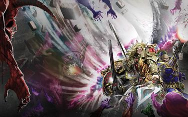

# 0801 ~011.M31 第二次戴文之战 Second Battle of Davin

精校状态：中文行文已逐段精校，部分术语仍为暂定

分类：时间线

原文来源：https://www.bilibili.com/opus/1205388326910033952

原作者：帝国神选罐头

原文时间：2026年05月23日 06:42

[返回分类目录](目录.md) · [全书目录](../../目录.md)

<!-- A0801-B0001 -->
**英文原文**

The Second Battle of Davin was a battle during the Horus Heresy.

<!-- /A0801-B0001 -->

<!-- A0801-B0002 -->

原译文

第二次戴文之战是荷鲁斯叛乱时期的一场战斗。

**校订译文**

第二次戴文之战是荷鲁斯之乱时期的一场战斗。

<!-- /A0801-B0002 -->

<!-- A0801-B0003 图片 -->

<!-- A0801-B0004 -->

原译文

Sanguinius, Roboute Guilliman, and Lion El'Jonson battle Daemons on Davin 圣吉列斯、罗伯特·基里曼和莱昂·艾尔庄森在戴文与恶魔作战

**校订译文**

Sanguinius, Roboute Guilliman, and Lion El'Jonson battle Daemons on Davin 圣吉列斯、罗保特·基里曼与莱昂·艾尔’庄森在戴文迎战恶魔

<!-- /A0801-B0004 -->

<!-- A0801-B0005 -->
**英文原文**

Conflict:Horus Heresy

<!-- /A0801-B0005 -->

<!-- A0801-B0006 -->

原译文

冲突：荷鲁斯叛乱

**校订译文**

冲突：荷鲁斯之乱

<!-- /A0801-B0006 -->

<!-- A0801-B0007 -->
**英文原文**

Date:~011.M31

<!-- /A0801-B0007 -->

<!-- A0801-B0008 -->

原译文

日期：~011.M31

**校订译文**

日期：~011.M31

<!-- /A0801-B0008 -->

<!-- A0801-B0009 -->
**英文原文**

Location:Davin System

<!-- /A0801-B0009 -->

<!-- A0801-B0010 -->

原译文

地点：戴文星系

**校订译文**

地点：戴文星系

<!-- /A0801-B0010 -->

<!-- A0801-B0011 -->
**英文原文**

Outcome:Imperial victory, weakening of the Ruinstorm

<!-- /A0801-B0011 -->

<!-- A0801-B0012 -->

原译文

结果：帝国胜利，毁灭风暴减弱

**校订译文**

结果：帝国胜利，毁灭风暴减弱

<!-- /A0801-B0012 -->

<!-- A0801-B0013 -->
**英文原文**

Combatants:Imperium/Forces of Chaos

<!-- /A0801-B0013 -->

<!-- A0801-B0014 -->

原译文

作战方：帝国/混沌部队

**校订译文**

作战方：帝国/混沌部队

<!-- /A0801-B0014 -->

<!-- A0801-B0015 -->
**英文原文**

Commanders:Primarch Sanguinius, Primarch Roboute Guilliman, Primarch Lion El'Jonson, Captain Khalybus (KIA)/Madail

<!-- /A0801-B0015 -->

<!-- A0801-B0016 -->

原译文

指挥官：原体圣吉列斯，原体罗伯特·基里曼，原体莱昂·艾尔庄森，连长卡利布斯(KIA)/马代尔

**校订译文**

指挥官：帝国——原体圣吉列斯，原体罗保特·基里曼，原体莱昂·艾尔’庄森，连长卡利布斯（阵亡）；混沌——马代尔。

<!-- /A0801-B0016 -->

<!-- A0801-B0017 -->
**英文原文**

Strength:Blood Angels, Ultramarines, Dark Angels, Shattered Legions elements/Vast Daemonic hordes, Daemonship fleet led by the Veritas Ferrum

<!-- /A0801-B0017 -->

<!-- A0801-B0018 -->

原译文

力量：圣血天使、极限战士、黑暗天使、破碎军团成员/庞大的恶魔部落、由钢铁真理号领导的恶魔舰队

**校订译文**

兵力：帝国——圣血天使、极限战士、黑暗天使，以及部分破碎军团部队；混沌——庞大的恶魔军势，以钢铁真理号为首的恶魔舰船舰队。

<!-- /A0801-B0018 -->

<!-- A0801-B0019 -->
**英文原文**

Casualties:Heavy in space, unknown on ground/All Banished

<!-- /A0801-B0019 -->

<!-- A0801-B0020 -->

原译文

伤亡：太空重，地面未知/全部被放逐

**校订译文**

伤亡：帝国——太空战损失惨重，地面伤亡不详；混沌——全部被放逐。

<!-- /A0801-B0020 -->

<!-- A0801-B0021 -->
## Overview 概述

<!-- /A0801-B0021 -->

<!-- A0801-B0022 -->
**英文原文**

Following the dissolution of Imperium Secundus the three Primarch's within Ultramar, Roboute Guilliman, Sanguinius, and Lion El'Jonson, attempted to journey to Terra and aid the Emperor against Horus. However to do so they would have to move their fleets through the Ruinstorm, a feat considered near-impossible. Nonetheless 2/3rds of the Ultramarines, Blood Angels, and Dark Angels departed Ultramar and set course for Terra. After many weeks of ineffectual Warp jumps that even Lion El'Jonson's Tuchulcha had difficulty navigating, The Ultramarines came into possession of several Chaos-corrupted Navigators after the Battle of Anuari. Unlike their loyalist counterparts, traitor Navigators had far less difficulty navigating the Warp and were surprisingly quite eager to lead the loyalist fleet through the Ruinstorm.

<!-- /A0801-B0022 -->

<!-- A0801-B0023 -->

原译文

在第二帝国解散后，奥特拉玛的三位原体，罗伯特·基里曼、圣吉列斯和莱昂·艾尔庄森，试图前往泰拉并协助帝皇对抗荷鲁斯。然而，要做到这一点，他们必须将舰队穿过毁灭风暴，这一壮举被认为几乎是不可能的。尽管如此，三分之二的极限战士、圣血天使和黑暗天使还是离开了奥特拉玛，前往泰拉。在经历了数周无效的亚空间跳跃后，即使是莱昂·艾尔庄森的图丘查也很难导航，在阿努亚里之战后，极限战士拥有了几名混乱腐化的导航者。与他们的忠诚派对应不同，叛徒导航者在亚空间中的导航难度要小得多，而且令人惊讶的是，他们非常渴望带领忠诚派舰队穿过毁灭风暴。

**校订译文**

第二帝国解散后，留在奥特拉玛的罗保特·基里曼、圣吉列斯与莱昂·艾尔’庄森三位原体，试图赶往泰拉，协助帝皇抵抗荷鲁斯。他们必须率舰队穿过毁灭风暴，这被认为几乎不可能做到。尽管如此，极限战士、圣血天使和黑暗天使仍有三分之二的兵力离开奥特拉玛，踏上泰拉航路。数周的亚空间跃迁一无所获，连莱昂的图丘查也难以找到出路。阿努亚里之战后，极限战士俘获了几名遭混沌腐化的导航员。与忠诚派导航员相比，他们在亚空间中领航容易得多，而且出人意料地热切表示，愿意带领忠诚派舰队穿越毁灭风暴。

<!-- /A0801-B0023 -->

<!-- A0801-B0024 -->
**英文原文**

In the Ruinstorm, the loyalist fleet came across a variety of horrors and word of an entity spreading destruction known as the "Pilgrim". During the Battle of Pyrrhan, Sanguinius received a vision and he realized that he needed to go where this struggle had begun, Davin, the world where Horus had fallen. Reluctantly, Guilliman and The Lion agreed to trust in Sanguinius but both had thought they would simply destroy the world upon arriving. At Davin, the loyalist fleet found the entire world surrounded by a shell made of the bones of trillions dubbed the Necrosphere. A bombardment managed to penetrate the sphere and the fleet was soon in orbit above Davin. While over Davin, Sanguinius shocked The Lion by boarding the Invincible Reason and taking the captive Konrad Curze with him. Sanguinius hoped to use Curze's prophetic abilities to determine what he was meant to do upon Davin. Sanguinius then commended a mass landing on the world, and the enraged Lion nearly ordered that Davin be subjected to Exterminatus regardless of Sanguinius' presence on it. At the last minute The Lion relented, and realizing how close he had come to committing a great sin followed Sanguinius onto Davin with his Dark Angels along with Guilliman's forces.

<!-- /A0801-B0024 -->

<!-- A0801-B0025 -->

原译文

在毁灭风暴中，忠诚派舰队遇到了各种恐怖事件，并听说了一个被称为“朝圣者”的实体正在传播破坏。在皮拉罕之战中，圣吉列斯看到了一个幻象，他意识到他需要去这场斗争开始的地方，戴文，荷鲁斯堕落的世界。基里曼和莱昂不情愿地同意信任圣吉列斯，但他们都认为自己一到就会毁灭世界。在戴文，忠诚派舰队发现整个世界都被一个由数万亿块骨头组成的壳包围着，这个壳被称为死灵圈。一次轰炸成功穿透了圈体，舰队很快就进入了戴文上空的轨道。在D戴文上空，圣吉列斯登上无敌理性号并带走了俘虏康拉德·科兹，震惊了莱昂。圣吉列斯希望利用科兹的预言能力来确定他打算对戴文做什么。圣吉列斯随后建议大规模登陆世界，愤怒的莱昂几乎下令戴文接受灭绝令，无论圣吉列斯是否在场。在最后一刻，莱昂让步了，意识到自己已经离犯下大罪有多近，于是跟随圣吉列斯和他的黑暗天使以及基里曼的部队来到戴文上。

**校订译文**

忠诚派舰队在毁灭风暴中经历种种恐怖，还听说了一个散播毁灭、被称为“朝圣者”的存在。皮拉罕之战期间，圣吉列斯得到异象，意识到自己必须前往一切的起点——荷鲁斯堕落的世界戴文。基里曼与莱昂勉强同意信任他，但都打算抵达后直接摧毁那颗行星。舰队来到戴文，发现整个世界被一层由数万亿死者骸骨构成的外壳包裹，称为“死灵圈”。他们以炮击穿透外壳，进入行星轨道。圣吉列斯随后登上无敌理性号，带走被俘的康拉德·科兹，令莱昂震惊不已。他希望借科兹的预知能力弄清自己在戴文应做什么，随后下令大规模登陆。莱昂暴怒，几乎不顾圣吉列斯仍在地面，便要对戴文执行灭绝令。最后一刻，他改变了主意，惊觉自己险些铸成大罪，遂率黑暗天使与基里曼的部队一同跟随圣吉列斯登陆。

**校注：** bones of trillions 指数万亿死者的骨骸，不是数万亿块骨头。commended 疑为 commanded，按发动大规模登陆的上下文处理；删除原译混入的拉丁字母 D。

<!-- /A0801-B0025 -->

<!-- A0801-B0026 -->
**英文原文**

On Davin, a mass Drop Pod assault was conducted but nothing was found and the population was absent. The four Primarch's eventually traveled to the temple where Horus had been subjected to the ritual by Erebus and the Serpent Lodge that had corrupted him. Inside the temple, Sanguinius stood at the altar where Horus had been laid and proclaimed that he would change his destiny. This activated Davin itself, Warp storms roared above and a portal opened up that swallowed up Sanguinius. Guilliman and The Lion desperately tried to penetrate the portal, and the chained Curze broke down as he had not foreseen anything that was transpiring and his worldview that destiny was set in stone was being tested. Above Davin, the orbiting loyalist fleet was assailed by a fleet of Daemonships that appeared from nowhere. All the vessels were Imperial ships previously thought lost in the Warp, but had since become twisted by the powers of Chaos. At the fleet's head was the Veritas Ferrum, which had grown far beyond its original size and was horrifically mutated. The Veritas Ferrum announced its arrival by instantly destroying the Iron Hands Cruiser Sthenelus.

<!-- /A0801-B0026 -->

<!-- A0801-B0027 -->

原译文

在戴文，进行了大规模的空投舱袭击，但没有发现任何东西，人群也不在场。四位原体最终前往神庙，荷鲁斯在那里接受了艾瑞巴斯和腐化他的蛇屋的仪式。在神庙内，圣吉列斯站在荷鲁斯被安置的祭坛前，宣布他将改变自己的命运。这激活了戴文本身，亚空间风暴在上空咆哮，一个入口打开，吞噬了圣吉列斯。基里曼和莱昂拼命地试图穿过门户，被锁链锁住的科兹崩溃了，因为他没有预见到正在发生的任何事情，他的命运早已注定的世界观正在受到考验。在戴文上空，轨道上的忠诚派舰队遭到了不知从哪里出现的恶魔舰队的袭击。所有的战舰都是之前被认为在亚空间中迷失的帝国船只，但后来被混沌的力量扭曲了。舰队之首是钢铁真理号，它已经远远超出了原来的规模，并且发生了可怕的变异。钢铁真理号立即摧毁了钢铁之手巡洋舰斯特涅洛斯号，宣布其抵达。

**校订译文**

大批空降舱降临戴文，部队却一无所获，当地居民也不见踪影。四位原体最终来到那座神庙；荷鲁斯当初正是在这里接受艾瑞巴斯与蛇之结社的仪式而堕落。圣吉列斯站在曾安置荷鲁斯的祭坛前，宣告自己将改变命运。这一举动唤醒了戴文本身：亚空间风暴在天空咆哮，一道门户开启，将圣吉列斯吞没。基里曼与莱昂拼命试图穿过门户，被锁链束缚的科兹则陷入崩溃。他完全未曾预见眼前的变故，“命运早已注定”的信念遭到动摇。与此同时，轨道上的忠诚派舰队遭到一支突然出现的恶魔舰队攻击。这些原本都是被认为迷失在亚空间中的帝国舰船，如今却已被混沌扭曲。领头的钢铁真理号发生了骇人的变异，体积远超从前；它瞬间摧毁钢铁之手巡洋舰斯特涅洛斯号，宣告自己的到来。

<!-- /A0801-B0027 -->

<!-- A0801-B0028 -->
**英文原文**

Inside the portal on Davin, Sanguinius was back on Terra in a beautiful garden at the Imperial Palace. He for the first time was experiencing a vision that was not his death aboard the Vengeful Spirit. He saw Lorgar dead by his hands and the remaining traitor Primarch's brought before him in chains. The Emperor congratulated Sanguinius on his victory and named him the Imperator Regis of the Imperium. With Sanguinius as the Emperor's Regent, he went on to lead a great campaign that purged the Imperium of all corruption and evil and the galaxy was his to rule. Seeing this future and observing the Emperor's mannerisms, he became suspicious as to what was going on. At last, he cut down the image of the Emperor who was revealed to be the Daemon Madail in disguise.

<!-- /A0801-B0028 -->

<!-- A0801-B0029 -->

原译文

在戴文的门户内，圣吉列斯回到了泰拉帝国皇宫里一个美丽的花园里。他第一次看到了一个不是他在复仇之魂上死亡的幻象。他看到珞珈被他亲手杀死，剩下的叛徒原体被锁链带到他面前。帝皇祝贺圣吉列斯的胜利，并任命他为帝国的雷吉斯帝皇。圣吉列斯作为帝皇的摄政，他继续领导了一场伟大的战役，清除了帝国的所有腐化和邪恶，银河系由他统治。看到这个未来，观察到帝皇的举止，他开始怀疑发生了什么。最后，他砍倒了帝皇的形象，这个形象被揭露为伪装的恶魔马代尔。

**校订译文**

圣吉列斯穿过戴文的门户，发现自己回到了泰拉皇宫一座美丽的花园。他第一次看见了不同于自己在复仇之魂号上身亡的未来：珞珈死于他手，其他叛变原体被戴上枷锁押到他面前。帝皇祝贺他的胜利，授予他“雷吉斯帝皇”的名号。作为帝皇摄政，圣吉列斯随后发动宏大战役，清除帝国一切腐化与邪恶，将银河纳入自己的统治。可是，眼前的未来与帝皇的言行举止令他生疑。最终，他一击斩倒了这个帝皇的幻影，揭露出其真身——伪装的恶魔马代尔。

**校注：** Imperator Regis 沿现核心暂译“雷吉斯帝皇”，此为幻象中的封号；原文随即明确其身份为 Emperor’s Regent，中文说明“帝皇摄政”，不把幻象当作实际历史。

<!-- /A0801-B0029 -->

<!-- A0801-B0030 -->
**英文原文**

At the revelation of the presence of Madail, Daemons began to appear across Davin's surface and assaulted the Space Marines guarding Guilliman and The Lion, who were still attempting to breach the portal while Curze despaired at his blindness to the future. In space, the battle was going poorly. Every ship struck down by the Daemonic fleet was reborn as a twisted husk and another of its number. The Veritas Ferrum proved near-invincible, not only blasting vessels with Warp-fire but swallowing them whole in with massive jaws. Guilliman's flagship, the Samothrace, was destroyed when it delivered Cyclonic Torpedoes at point-blank to the Veritas Ferrum. To the horror of the Imperials, the Daemonic ship survived the blast and quickly regenerated. It seemed that the vessel could not be stopped.

<!-- /A0801-B0030 -->

<!-- A0801-B0031 -->

原译文

在发现马代尔的存在后，恶魔开始出现在戴文的表面，并袭击了守卫基里曼和莱昂的战士，他们仍在试图突破门户，而科兹对自己对未来的盲目感到绝望。在太空中，战斗进行得很糟糕。被恶魔舰队击坠的每一艘船都重生为扭曲的外壳和成为同类中的一员。事实证明，钢铁真理号几乎不可战胜，不仅用次元火焰炸毁战舰，还用巨大的下颚将它们整个吞下。基里曼的旗舰萨莫色雷斯号在向钢铁真理号近距离发射旋风鱼雷时被摧毁。令帝国人震惊的是，恶魔舰船在爆炸中幸存下来并迅速再生。战舰似乎无法被停止。

**校订译文**

马代尔的存在暴露后，恶魔开始遍布戴文地表，攻击守护基里曼与莱昂的星际战士。两位原体仍在设法突破门户，科兹则因自己无法预见未来而绝望。太空战局同样恶劣：凡是被恶魔舰队击毁的舰船，都会以扭曲残骸的形式重生，成为敌军的一员。钢铁真理号几乎无可匹敌，既以亚空间烈焰轰毁舰船，又张开巨口将其整个吞下。基里曼的旗舰萨莫色雷斯号在近距离向它发射旋风鱼雷时被毁。令帝国众人惊骇的是，这艘恶魔舰船不仅熬过爆炸，还迅速再生，似乎根本无法阻止。

<!-- /A0801-B0031 -->

<!-- A0801-B0032 -->
**英文原文**

Inside Davin's portal, Sanguinius and Madail engaged in a vicious duel. Madail had unleashed a Daemonic horde through the portal to prevent Guilliman and The Lion breaking through. The host included a massive Soul Grinder, which was destroyed in a combined effort by The Lion and Guilliman. On the other side of the portal, The Angel was eventually pinned by Madail's host of Daemonic troops, and the Preacher of Chaos Undivided announced that Sanguinius would serve or die. Madail dubbed Horus an imperfect vessel, and urged Sanguinius to strike Lupercal down and take up the mantle as Warmaster of Chaos. If he did so, Madail declared, his sons would be spared of the Black Rage. However despite the temptation Sanguinius denied the Daemon and broke free of his captors. Sanguinius and Madail again engaged in a duel, but this time the Daemon was impaled by both the Blade Encarmine and Spear of Telesto. The two wounded warriors wrestled with one another until they were both in the portal, torn between the Materium and Immaterium. On Davin, Guilliman and The Lion saw Sanguinius' upper half sticking through the portal and rushed to his aid, but were blocked by Daemons. The stalemate endured, until Sanguinius' Herald stepped forth and declared that he would take The Angel's place in the portal. Realizing that this was his herald's destiny and that he needed to confront Horus at Terra for the Imperium to endure, Sanguinius solemnly agreed. The Sanguinor charged into Madail, and as he tackled the Daemon back through the portal was transformed into a golden angelic form. The Primarch's and their escorts managed to escape the Temple just as it collapsed.

<!-- /A0801-B0032 -->

<!-- A0801-B0033 -->

原译文

在戴文的门户内，圣吉列斯和马代尔进行了一场激烈的决斗。马代尔已经通过门户释放了一个恶魔部落，以防止基里曼和莱昂突破。天军包括一个巨大的灵魂碾磨者，在莱昂和基里曼的共同努力下被摧毁。在传送门的另一边，天使最终被马代尔的恶魔部队牵制，混沌无分的传教士宣布圣吉列斯要么服从，要么死亡。马代尔称荷鲁斯是一个不完美的容器，并敦促圣吉列斯击败卢佩卡尔，以混沌战帅的身份接过衣钵。马代尔宣称，如果他这样做，他的子嗣将免于黑怒。然而，尽管有诱惑，圣吉列斯还是拒绝了恶魔，并摆脱了他的捕获者。圣吉列斯和马代尔再次决斗，但这次恶魔被染赤之刃和毕功之矛刺穿。两名受伤的战士相互扭打，直到他们都进入了门户，在物质界和非物质界之间撕裂。在戴文上，基里曼和莱昂看到圣吉列斯的上半身从传送门伸了出来，赶紧去帮助他，但被恶魔挡住了。僵局一直持续着，直到圣吉列斯的传令官站出来宣布他将接替天使在传送门中的位置。意识到这是他的传令官的命运，他需要在泰拉与荷鲁斯对抗才能维持帝国，圣吉列斯沉着脸同意了。圣吉列诺冲向马代尔，当他通过入口抓住恶魔时，恶魔变成了一个金色的天使形态。就在神庙倒塌时，原体和他们的护卫设法逃离了神庙。

**校订译文**

戴文门户之内，圣吉列斯与马代尔展开激烈决斗。马代尔放出恶魔大军穿过门户，阻挡基里曼与莱昂，其中一台巨大的磨魂者被两位原体合力摧毁。门户另一侧，圣吉列斯最终被马代尔麾下恶魔制住，这位混沌无分的传道者宣布，他必须臣服，否则便只有死。马代尔称荷鲁斯只是个不完美的容器，劝圣吉列斯杀死卢佩卡尔，接任混沌战帅，并承诺这样便能使他的子嗣免遭黑怒。尽管诱惑巨大，圣吉列斯仍拒绝恶魔，挣脱束缚，再度与马代尔交锋。这次，他用染赤之刃与毕功之矛刺穿了恶魔。两个负伤的对手缠斗不休，最终都陷入门户，被夹在物质界与非物质界之间。戴文这边，基里曼与莱昂看到圣吉列斯的上半身探出门户，急忙上前施救，却被恶魔拦住。僵持之中，圣吉列斯的传令官挺身而出，表示愿意代替天使留在门户里。圣吉列斯意识到，这就是传令官的命运，而自己必须到泰拉迎战荷鲁斯，帝国才有机会延续，于是郑重答应。圣吉列诺冲向马代尔，将恶魔撞回门户另一侧；在这个过程中，圣吉列诺化为金色的天使。原体与护卫们及时逃出神庙，神庙旋即崩塌。

**校注：** 原译末尾误把化为金色天使的主体写成恶魔；英文 transformed 主体为冲向马代尔的 Sanguinor，已恢复。Soul Grinder 采用官方磨魂者，host 为恶魔大军，非黑暗天使天军。

<!-- /A0801-B0033 -->

<!-- A0801-B0034 -->
**英文原文**

However, the defeat of Madail did not stop the Daemonic incursion on Davin. The Veritas Ferrum and its escorts still battered the Imperial fleet and the Space Marines on Davin's surface were under assault from vast hordes of Daemons. The three Primarch's managed to conduct an evacuation from Davin, and once aboard the Red Tear knew that Davin was linked to the materialization of the Veritas. Davin was bombarded with Cyclonic Torpdoes, and with its death the Veritas Ferrum and its Daemonic fleet vanished.

<!-- /A0801-B0034 -->

<!-- A0801-B0035 -->

原译文

然而，马代尔的失败并没有阻止恶魔对戴文的入侵。钢铁真理号及其护卫舰仍在袭击帝国舰队，戴文表面上的星际战士正受到大量恶魔的攻击。三位原体设法从戴文撤离，一旦登上红泪号，就知道戴文与钢铁真理号的物质化有关。戴文被旋风鱼雷轰炸，随着它的死亡，钢铁真理号及其恶魔舰队消失了。

**校订译文**

然而，马代尔落败并未终结戴文的恶魔入侵。钢铁真理号及其护航舰仍在猛攻帝国舰队，地表的星际战士也遭到恶魔大军围攻。三位原体成功组织撤离，登上红泪号后，明白戴文与钢铁真理号在现实中的显现相互关联。他们以旋风鱼雷轰炸戴文；行星毁灭时，钢铁真理号与整支恶魔舰队也随之消失。

<!-- /A0801-B0035 -->

<!-- A0801-B0036 -->
**英文原文**

In the place of where Davin once was, a breach in the Ruinstorm was visible. The path led to Terra, but upon further study it became apparent that somehow Horus had foreseen this route and a large blockade was erected to block them. Guilliman and The Lion agreed to distract the blockade while Sanguinius and the Blood Angels made directly for Terra, for that was their destiny. Sanguinius took Curze with him, stating he would face their fathers justice, though in truth he would put the Night Lords Primarch into a stasis coffin and inject him into space.

<!-- /A0801-B0036 -->

<!-- A0801-B0037 -->

原译文

在戴文曾经所在的地方，可以看到毁灭风暴中的缺口。这条路通往泰拉，但经过进一步研究，很明显荷鲁斯已经预见到了这条路，并竖起了一道巨大的封锁线来封锁他们。基里曼和莱昂同意分散封锁，而圣吉列斯和圣血天使则直接前往泰拉，因为这是他们的命运。圣吉列斯带着科兹，说他将面对他们父亲的正义，尽管事实上他会把午夜领主原体放进一个停滞棺材里，并把他发射到太空中。

**校订译文**

戴文原本所在的位置，出现了毁灭风暴的一道缺口，通向泰拉。但进一步侦察表明，荷鲁斯不知为何早已预见这条航路，布下重兵封锁。基里曼与莱昂同意牵制封锁舰队，让圣吉列斯和圣血天使直奔泰拉，完成他们的命运。圣吉列斯带走科兹，声称要让他接受父亲的审判；实际上，他却将这位午夜领主原体装入静滞棺，抛入太空。

<!-- /A0801-B0037 -->

<!-- A0801-B0038 -->
**英文原文**

The arrival of the Blood Angels to Terra proved instrumental in the upcoming siege, with Sanguinius infamously dying by the hands of Horus aboard the Vengeful Spirit. In addition, the destruction of Davin proved to have a weakening effect on the Ruinstorm, which began to dissipate after the battle.

<!-- /A0801-B0038 -->

<!-- A0801-B0039 -->

原译文

圣血天使抵达泰拉对即将到来的围城起到了重要作用，圣吉列斯在复仇之魂号上被荷鲁斯之手夺去了生命。此外，戴文的毁灭对毁灭风暴产生了削弱作用，毁灭风暴在战斗后开始消散。

**校订译文**

圣血天使抵达泰拉，对即将展开的围城战至关重要；圣吉列斯最终在复仇之魂号上死于荷鲁斯之手，这一事件后来成为帝国历史的惨痛一页。戴文的毁灭还削弱了毁灭风暴，后者在战役结束后开始消散。

<!-- /A0801-B0039 -->

本篇核心术语与暂定项

以下列出本篇出现的英文原形及核心术语表用词。同形词可能指不同对象，具体词义以本篇正文和校注为准；单复数、别名和仅见于图注的名称可能尚未列入。完整候选见[术语表](../../术语表/双语术语候选.csv)。

| 英文 | 采用中文 | 状态 |
| --- | --- | --- |
| Space Marines | 星际战士 | 官方已核对 |
| Blood Angels | 圣血天使 | 官方已核对 |
| Dark Angels | 黑暗天使 | 官方已核对 |
| Roboute Guilliman | 罗保特·基里曼 | 官方已核对 |
| Ultramar | 奥特拉玛 | 官方已核对 |
| Ultramarines | 极限战士 | 官方已核对 |
| Horus Heresy | 荷鲁斯之乱 | 官方已核对 |
| Warp | 亚空间 | 官方已核对 |
| Imperium | 帝国 | 暂定·简称 |
| Emperor | 帝皇 | 官方已核对 |
| Primarch | 原体 | 官方已核对 |
| Imperial Fleet | 帝国舰队 | 暂定 |
| Night Lords | 午夜领主 | 暂定·官方待核 |
| Terra | 泰拉 | 暂定·官方待核 |
| Horus | 荷鲁斯 | 暂定·官方待核 |
| Erebus | 艾瑞巴斯 | 暂定·官方待核 |
| Vengeful Spirit | 复仇之魂号 | 暂定·官方待核 |
| Lion El'Jonson | 莱昂·艾尔’庄森 | 官方已核对 |
| Iron Hands | 钢铁之手 | 暂定·官方待核 |
| Navigators | 导航员 | 官方已核对 |
| Konrad Curze | 康拉德·科兹 | 暂定·官方待核 |
| Davin | 戴文 | 暂定·官方待核 |
| Blank | 空白者 | 暂定·官方待核 |
| Imperium Secundus | 第二帝国 | 暂定·官方待核 |
| Imperator Regis | 雷吉斯帝皇 | 暂定·官方待核 |
| Preacher | 传道士 | 暂定 |
| Drop Pod | 空降舱 | 官方已核·中英对照 |
| Lupercal | 卢佩卡尔 | 暂定·官方待核 |
| Serpent Lodge | 蛇之结社 | 暂定·官方待核 |
| Shattered Legions | 破碎军团 | 暂定·官方待核 |
| Herald | 传令官 | 暂定·官方待核 |
| Captain | 连长 | 暂定·官方待核 |
| The Angel | 天使 | 暂定·官方待核 |
| Reborn | 复生者（战团）／重生者（死神军自称） | 语境定译·官方待核 |
| Lorgar | 珞珈 | 暂定·官方待核 |
| Chaos Undivided | 混沌无分 | 暂定·官方待核 |
| Powers | 能天使 | 暂定·官方待核 |
| The Sanguinor | 圣血者 | 官方已核 |
| Host | 天军 | 暂定·官方待核 |
| Soul Grinder | 磨魂者 | 官方已核对 |
| Horde | 部落 | 暂定·官方待核 |
| Red Tear | 红泪号 | 暂定·官方待核 |
| Spear of Telesto | 毕功之矛 | 暂定·官方待核 |
| Veritas Ferrum | 钢铁真理号 | 暂定·官方待核 |
| Revelation | 启示 | 暂定·官方待核 |
| Tuchulcha | 图丘查 | 暂定·官方待核 |
| Invincible Reason | 无敌理性号 | 暂定·官方待核 |
| Sphere | 防御圈 | 暂定·官方待核 |
| Madail | 马代尔 | 暂定·官方待核 |
| Necrosphere | 死灵圈 | 暂定·官方待核 |
| Blade Encarmine | 染赤之刃 | 暂定·官方待核 |
| Sthenelus | 斯特涅洛斯号 | 暂定·官方待核 |
| Samothrace | 萨莫色雷斯号 | 暂定·官方待核 |
| The Blood | 鲜血 | 暂定·官方待核 |
| Battle of Pyrrhan | 派尔罕之战 | 暂定·官方待核 |
| Ruinstorm | 毁灭风暴 | 暂定·官方待核 |
| System | 星系（恒星系统） | 暂定·官方待核 |
| Corruption | 腐败 | 暂定·官方待核 |
| Ferrum | 钢铁号 | 暂定·官方待核 |

