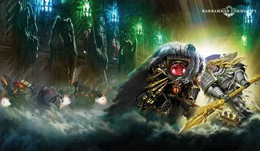
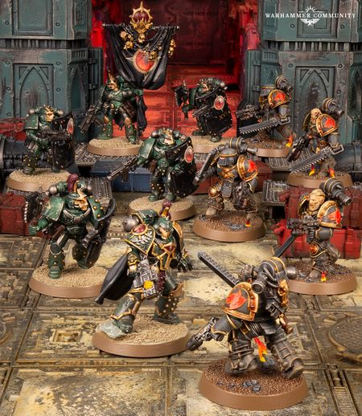

# 0802 012.M31 特里索兰之战 Battle of Trisolian

精校状态：中文行文已逐段精校，部分术语仍为暂定

分类：时间线

原文来源：https://www.bilibili.com/opus/1205402049349419024

原作者：帝国神选罐头

原文时间：2026年05月23日 07:35

[返回分类目录](目录.md) · [全书目录](../../目录.md)

<!-- A0802-B0001 -->
**英文原文**

The Battle of Trisolian was a battle fought during the Horus Heresy.

<!-- /A0802-B0001 -->

<!-- A0802-B0002 -->

原译文

特里索兰之战是荷鲁斯叛乱时期的一场战斗。

**校订译文**

特里索兰之战是荷鲁斯之乱时期的一场战斗。

<!-- /A0802-B0002 -->

<!-- A0802-B0003 图片 -->

<!-- A0802-B0004 -->

原译文

Horus and Leman Russ battle aboard the Vengeful Spirit 荷鲁斯和黎曼·鲁斯在复仇之魂号上作战

**校订译文**

Horus and Leman Russ battle aboard the Vengeful Spirit 荷鲁斯和黎曼·鲁斯在复仇之魂号上作战

<!-- /A0802-B0004 -->

<!-- A0802-B0005 -->
**英文原文**

Conflict:Horus Heresy

<!-- /A0802-B0005 -->

<!-- A0802-B0006 -->

原译文

冲突：荷鲁斯叛乱

**校订译文**

冲突：荷鲁斯之乱

<!-- /A0802-B0006 -->

<!-- A0802-B0007 -->
**英文原文**

Date:012.M31

<!-- /A0802-B0007 -->

<!-- A0802-B0008 -->

原译文

日期：012.M31

**校订译文**

日期：012.M31

<!-- /A0802-B0008 -->

<!-- A0802-B0009 -->
**英文原文**

Location:Trisolian System

<!-- /A0802-B0009 -->

<!-- A0802-B0010 -->

原译文

地点：特里索兰星系

**校订译文**

地点：特里索兰星系

<!-- /A0802-B0010 -->

<!-- A0802-B0011 -->
**英文原文**

Outcome:Space Wolves retreat, Horus wounded by the Spear of Russ

<!-- /A0802-B0011 -->

<!-- A0802-B0012 -->

原译文

结果：太空野狼撤退，荷鲁斯被鲁斯之矛击伤

**校订译文**

结果：太空野狼撤退，荷鲁斯被鲁斯之矛击伤

<!-- /A0802-B0012 -->

<!-- A0802-B0013 -->
**英文原文**

Combatants:Imperium/Traitor Legions

<!-- /A0802-B0013 -->

<!-- A0802-B0014 -->

原译文

作战方：帝国/叛徒军团

**校订译文**

作战方：帝国/叛徒军团

<!-- /A0802-B0014 -->

<!-- A0802-B0015 -->
**英文原文**

Commanders:Primarch Leman Russ (WIA), Bjorn, Knight-Errant Bror Tyrfingr (KIA), Varagyr Grimnir Blackblood, Jarl Ogvai Ogvai Helmschrot, Thegn Geigor Fell-Hand, Belisarius Cawl, Theodulus Pallisar/Warmaster Horus(WIA), First Captain Ezekyle Abaddon, Captain Anhur Hekras, Ambassador Sota-Nul, Magos Domina Hester Aspertia Sigma-Sigma (KIA)

<!-- /A0802-B0015 -->

<!-- A0802-B0016 -->

原译文

指挥官：原体黎曼·鲁斯(WIA)，比约恩，游侠骑士布罗尔·提尔芬格(KIA)，瓦拉吉尔格里姆尼尔·黑血，雅儿奥格瓦伊·奥格瓦伊·残盔，塞恩盖戈尔·断手，贝利撒留·考尔，西奥多勒斯·帕利萨/战帅荷鲁斯(WIA)，第一连长以泽凯尔·阿巴顿，连长安赫尔·赫克拉斯，大使索塔-努尔，统御贤者赫斯特·阿斯佩尔蒂亚·西格玛-西格玛(KIA)

**校订译文**

指挥官：忠诚派——原体黎曼·鲁斯（负伤），比约恩，游侠骑士布罗尔·蒂尔芬格（阵亡），瓦拉吉尔格里姆尼尔·黑血，领主奥格瓦伊·残盔，领主盖戈尔·断手，贝利萨留斯·考尔，西奥多勒斯·帕利萨；叛徒——战帅荷鲁斯（负伤），第一连长以泽凯尔·阿巴顿，连长安赫尔·赫克拉斯，使节索塔·努尔，统御贤者海丝特·阿斯佩蒂亚·西格玛-西格玛（阵亡）。

**校注：** 英文 Ogvai Ogvai 连续重复，中文去重；Jarl、Thegn 此处均以领主表达职衔，保留姓名而不连写为雅儿、塞恩。

<!-- /A0802-B0016 -->

<!-- A0802-B0017 -->
**英文原文**

Strength:~40,000 Space Wolves, 1 Gloriana class Battleship, 3 core capital ships, 36 other warships, Loyalist Mechanicum/~50 capital ships from the Sons of Horus, Word Bearers, Alpha Legion, World Eaters, Night Lords, and Iron Warriors, Traitor Imperial Army, Dark Mechanicum

<!-- /A0802-B0017 -->

<!-- A0802-B0018 -->

原译文

力量：约4万名太空野狼、1艘荣光女王级战列舰、3艘核心主力舰、36艘其他战舰、忠诚派机械教/约50艘来自荷鲁斯之子的主力舰、怀言者、阿尔法军团、吞世者、午夜领主和钢铁勇士、叛徒帝国军队、黑暗机械教

**校订译文**

兵力：忠诚派——约四万名太空野狼、一艘荣光女王级战列舰、三艘核心主力舰、三十六艘其他战舰，以及忠诚派机械教部队；叛徒——来自荷鲁斯之子、怀言者、阿尔法军团、吞世者、午夜领主与钢铁勇士的约五十艘主力舰，以及叛变的帝国军与黑暗机械教部队。

<!-- /A0802-B0018 -->

<!-- A0802-B0019 -->
**英文原文**

Casualties:Extremely heavy, several Great Companies losing 4/5th of their strength, VI legion fleet is shattered/Moderate to heavy

<!-- /A0802-B0019 -->

<!-- A0802-B0020 -->

原译文

伤亡：极其严重，几个大连损失了4/5的力量，第六军团舰队被粉碎/中度至重大

**校订译文**

伤亡：忠诚派——极为惨重，数个大连损失五分之四的兵力，第六军团舰队被打得支离破碎；叛徒——中等至惨重。

<!-- /A0802-B0020 -->

<!-- A0802-B0021 -->
## Overview 概述

<!-- /A0802-B0021 -->

<!-- A0802-B0022 -->
**英文原文**

The battle began as a minor Traitor occupation of the Trisolian System, Mechanicum territory previously affiliated with the Emperor. A small armada of Horus' main fleet, led by the Vengeful Spirit itself, dispatched a force of Night Lords to overrun much of Trisolian A-4. Belisarius Cawl was assigned to support a Thallaxii cohort battling traitors amongst Trisolian A-4's underground agri-fields. Cawl would be saved by the Myrmidon Destructor Theodulus Pallisar and his myrmidon clade against traitors. The myrmidons saved Cawl from the Night Lords and Cawl did his duty to repair one of Pallisar's followers.

<!-- /A0802-B0022 -->

<!-- A0802-B0023 -->

原译文

这场战斗开始于一场小规模的叛徒占领特里索兰星系，该星系是以前隶属于帝皇的机械教领地。荷鲁斯主舰队的一支小舰队，在复仇之魂号的带领下，派遣了一支午夜领主部队，占领了特里索兰A-4的大部分地区。贝利撒留·考尔被指派支援死隶大队，在特里索兰A-4的地下农田中与叛徒作战。辅军精锐毁灭士西奥多勒斯·帕利萨和他的辅军精锐分支将拯救考尔对抗叛徒。辅军精锐从午夜领主手中救出了考尔，考尔尽职尽责地修复了帕利萨的一名追随者。

**校订译文**

战斗最初只是叛军对特里索兰星系的一次小规模占领行动。该星系属于此前效忠帝皇的机械教。荷鲁斯主力舰队分出一支小舰队，由复仇之魂号亲自领衔，派午夜领主夺取特里索兰 A-4 的大片地区。贝利萨留斯·考尔奉命支援一个死隶战兵大队，在当地地下农田与叛军交战。辅军精锐毁灭士西奥多勒斯·帕利萨及其小组从午夜领主手中救下了他，考尔则履行职责，为帕利萨的一名部下进行修复。

<!-- /A0802-B0023 -->

<!-- A0802-B0024 -->
**英文原文**

Though the loyalist Adeptus Mechanicus Thallax and Myrmidon Destructor cohorts were prevailing, the commanding Magos Domina, Hester Aspertia Sigma-Sigma, ordered a surrender and had all her units stand down. Despite protests from her acolyte Cawl, Aspertia calculated that while they were currently winning the battle on Trisolian A-4, they were ultimately doomed and surrendered to the traitors. Many tech-priests or other notable acolytes would be escorted by traitor forces to Aspertia to assess their loyalties. Not long after, Sota-Nul, accompanied by Warmaster Horus himself, arrived in the Heptaligon's main hangar bay to receive the formal surrender of the loyalist Adeptus Mechanicus. All of the Forge World's Tech-Priests of significance were gathered here to hear Horus' warp-tainted speech. Those present were forced to pledge themselves to Horus, and those who did not were executed on the spot.

<!-- /A0802-B0024 -->

<!-- A0802-B0025 -->

原译文

尽管忠诚派机械神教死隶和辅军精锐毁灭士部队占上风，但指挥的统御贤者，赫斯特·阿斯佩尔蒂亚·西格玛-西格玛下令投降，并让她的所有部队撤退。尽管她的助手考尔提出了抗议，阿斯佩尔蒂亚计算出，虽然他们目前正在赢得特里索兰A-4的战斗，但他们最终注定要向叛徒投降。许多技术神甫或其他著名的追随者将在叛徒部队的护送下前往阿斯佩尔蒂亚，以评估他们的忠诚度。不久之后，索塔-努尔在战帅荷鲁斯本人的陪同下抵达了七边的主机库，接受了忠诚派机械神教的正式投降。铸造世界所有重要的技术神甫都聚集在这里，聆听荷鲁斯亚空间污染的演讲。在场的人被迫向荷鲁斯宣誓，没有宣誓的人当场被处决。

**校订译文**

忠诚派机械修会的死隶战兵与辅军精锐毁灭士部队虽占上风，负责指挥的统御贤者海丝特·阿斯佩蒂亚·西格玛-西格玛却下令投降，命全军停止战斗。学徒考尔提出抗议，但阿斯佩蒂亚计算后认为，眼下虽能赢得特里索兰 A-4 的战斗，最终仍必败无疑，遂向叛军屈服。许多技术祭司与重要学徒被叛军押送至她面前，接受忠诚审查。不久，索塔·努尔与荷鲁斯本人来到七边的主机库，接受忠诚派机械修会正式投降。这座铸造世界所有地位重要的技术祭司都聚集于此，聆听荷鲁斯充满亚空间污染的演说。在场者被迫向荷鲁斯宣誓效忠，拒绝者当场遭到处决。

**校注：** stand down 为停止作战，非撤退；她认为最终败局已定，故而主动投降，并非命运注定“要投降”。Magos Domina 暂沿统御贤者，Domina 为女性称谓，此条不冒充 Tech-Priest Dominus 的完整官译。Heptaligon 暂沿原稿“七边”，具体设施性质与官方名称待核。 人名依全书第610篇统一“海丝特·阿斯佩蒂亚·西格玛-西格玛”；原译“赫斯特·阿斯佩尔蒂亚·西格玛-西格玛”保留对照。

<!-- /A0802-B0025 -->

<!-- A0802-B0026 -->
**英文原文**

Meanwhile, Leman Russ had left Terra on a mission to hinder Horus as he drove towards humanity's throneworld. Thanks to the efforts of the Knights-Errant during the Battle of Molech, the Space Wolves could track the location of the Vengeful Spirit at all times thanks to hidden runes aboard the traitor vessel. After a stop at Fenris to conduct an archaic ritual where Russ learned the truth regarding the Spear of Russ and the very nature of his existence, the Wolf King enthusiastically announced his desire to make his move on Horus. As Russ knew victory was hopeless and the best he could hope to do was "wound" Horus, he let the mission be voluntarily among his Wolf Lords. None of the Space Wolves refused to follow their Primarch to the death that awaited.

<!-- /A0802-B0026 -->

<!-- A0802-B0027 -->

原译文

与此同时，黎曼·鲁斯离开泰拉，执行一项任务，在荷鲁斯驶向人类的王座世界时阻止他。多亏了游侠骑士在摩洛之战中的努力，太空野狼可以通过叛徒战舰上隐藏的符文随时追踪复仇之魂号的位置。在芬里斯停留进行了一个古老的仪式后，鲁斯了解了关于鲁斯之矛的真相以及他存在的本质，狼王热情地宣布他想对荷鲁斯采取行动。由于鲁斯知道胜利是无望的，他所能做的最好的事情就是“伤害”荷鲁斯，他将这项任务交给了他的狼主自愿。没有一名太空野狼拒绝跟随他们的原体走向死亡。

**校订译文**

与此同时，黎曼·鲁斯已离开泰拉，准备阻碍荷鲁斯向人类王座世界推进。游侠骑士在摩洛之战中将符文秘密留在叛军旗舰内，使太空野狼能够随时追踪复仇之魂号。鲁斯先在芬里斯停留，进行一项古老仪式，从中得知鲁斯之矛的真相与自身存在的本质。随后，狼王满怀斗志地宣布要向荷鲁斯出击。他知道取胜无望，能做到的最好结果不过是“重创”荷鲁斯，因此允许各位狼主自行决定是否参加。然而，没有一名太空野狼拒绝追随原体，哪怕前方等待他们的是死亡。

<!-- /A0802-B0027 -->

<!-- A0802-B0028 -->
## Space Wolves' Arrival 太空野狼的到达

<!-- /A0802-B0028 -->

<!-- A0802-B0029 -->
**英文原文**

The Space Wolves would arrive in the Trisolian System within a month from the first battle between traitor and loyalist forces. The Vylka Fenryka ships arrived at Trisolian's lesser Mandeville point, hidden by the electromagnetism of the 2 lesser stars on the edges of the system. Their fleet's arrival was unnoticed. Their arrival's Warp signatures too far away to alert the traitor fleet moored around the primary star. They immediately accelerated at full speed directly towards the primary star. Their fleet raced across the tumultuous gulf between the two lesser stars, the ships both bombarded and hidden by the electromagnetic and gravitation strain caused by the two celestial objects. Russ estimated the dangerous route through these straits would reduce the time they're advance would be visible to the traitor fleet by 6 1/2 hours, leaving only 3 hours of visibility before their arrival. Solar flares reaching across the straits destroyed several ships before the Space Vylka Fenryka fleet exited the gravity envelope and were able to observe the traitor forces.

<!-- /A0802-B0029 -->

<!-- A0802-B0030 -->

原译文

太空野狼将在叛徒和忠诚派部队第一次战斗后的一个月内抵达特里索兰星系。芬里斯之狼舰船抵达了特里索兰的次级曼德维尔点，该点被星系边缘两颗较小恒星的电磁所掩盖。他们舰队的到来没有被注意到。他们到达的亚空间信号太远，无法警报停泊在主星周围的叛徒舰队。它们立即全速直接向主星加速。他们的舰队在两颗次级恒星之间的动荡湾中疾驰而过，舰船都被这两颗天体造成的电磁和引力应力所轰炸和隐藏。鲁斯估计，通过这些峡道的危险路线将使向叛徒舰队的前进时间缩短6.5小时，在他们到达之前只剩下3小时的能见度。到达峡道对岸的太阳耀斑摧毁了几艘船只，之后太空芬里斯之狼舰队离开了重力封套，能够观察到叛徒部队。

**校订译文**

忠诚派与叛军首次交战后不到一个月，太空野狼便抵达特里索兰星系。芬里斯之狼的舰船从一处次级曼德维尔点跃出，星系边缘两颗较小恒星的电磁活动掩盖了他们的踪迹；跃迁产生的亚空间信号又距离太远，未能惊动泊在主星附近的叛军舰队。他们立即全速加速，直奔主星，穿越两颗小恒星之间动荡的空域。两天体产生的电磁与引力作用一面冲击舰体，一面掩护舰队。鲁斯估计，这条危险航路能使敌人可探测到他们的时间缩短六个半小时，让叛军只剩三小时预警。在舰队脱离这片引力作用区、得以观察敌军之前，横扫通道的恒星耀斑先摧毁了几艘己方舰船。

**校注：** 减少的是敌人能够发现舰队推进的时间窗口，不是整段航程时长。solar flares 在多恒星星系中为恒星耀斑，不特指地球的太阳。

<!-- /A0802-B0030 -->

<!-- A0802-B0031 -->
**英文原文**

As Horus' escort fleet of around fifty capital ships from various Traitor Legions hung in orbit over Trisolian 4A, the Space Wolves struck. Using the gravity well and solar radiation between two of the Trisolian System's stars, the Space Wolves both hid their presence and accelerated to great speed. They suddenly appeared on top of the traitor fleet, and a vicious duel erupted between the two armadas. All of these battles were but a distraction, as Russ had his flagship Hrafnkel engage the Vengeful Spirit at point blank range. Before the Void Shields of the Vengeful Spirit were even disabled, a massive boarding operation led by Russ personally was launched from the Hrafnkel, consisting of Boarding Torpedoes, gunships, and Assault Boats. The Vengeful Spirits shields dropped thanks to heavy fire from the Hrafnkel just as the boarding force slammed into the vessel, unleashing thousands of Space Wolves into the interior of the vessel. Russ himself landed in a hangar of the Vengeful Spirit aboard his personal Stormbird Hugin.

<!-- /A0802-B0031 -->

<!-- A0802-B0032 -->

原译文

当荷鲁斯的护卫舰队由来自不同叛徒军团的约50艘主力舰组成，悬挂在特里索利兰4A的轨道上时，太空野狼发动了袭击。利用特里索兰星系两颗恒星之间的引力井和太阳辐射，太空野狼隐藏了自己的存在，并加速到了很高的速度。他们突然出现在叛徒舰队的顶端，两支舰队之间爆发了一场激烈的决斗。所有这些战斗都只是分散注意力，因为鲁斯让他的旗舰赫拉芬克尔号在近距离与复仇之魂号交战。在复仇之魂号的虚空盾被禁用之前，由鲁斯亲自领导的大规模跳帮行动从赫拉芬克尔号发射，包括跳帮鱼雷、炮艇和突击艇。当跳帮部队猛烈撞击战舰时，由于赫拉芬克尔号的猛烈射击，复仇之魂号的盾牌落下，数千名太空野狼被释放到战舰内部。鲁斯本人乘坐他的个人风暴鸟福金号降落在复仇之魂号的机库里。

**校订译文**

荷鲁斯的护航舰队由各叛徒军团约五十艘主力舰组成，正停留在特里索兰 4A 上空轨道，太空野狼便在此时发动突袭。他们借两颗恒星间的引力与辐射隐蔽接近、加速航行，突然出现在敌舰近旁，两支舰队立即展开激战。然而，周边交火都是掩护：鲁斯令旗舰赫拉芬克尔号直逼复仇之魂号，进行贴身炮战。敌舰虚空盾尚未失效时，他便亲自率领由跳帮鱼雷、炮艇和突击艇组成的大规模突击队出发。恰在突击队抵舰之际，赫拉芬克尔号的猛烈炮火击溃了敌舰护盾，数千名太空野狼随即杀入舰内。鲁斯乘自己的风暴鸟福金号，降落在复仇之魂号的一座机库中。

**校注：** 本段英文写 Trisolian 4A，前文 A-4，保留次序差异。on top of 表突然逼近敌舰，不是指舰队顶端。

<!-- /A0802-B0032 -->

<!-- A0802-B0033 -->
**英文原文**

A vicious battle in the interior of the vessel erupted, as boarding parties led by Russ, Bjorn, and Bror Tyrfingr swarmed the now-corrupted Vengeful Spirit. Encountering not only traitor Astartes but also Human soldiers, corrupted Skitarii, and Possessed, the Space Wolves managed to fight their way into the heart of the vessel while taking heavy losses. Parts of the corrupted ship responded to their presence, rearranging its halls to separate and confound the Wolves. Meanwhile, thanks to the efforts of Belisarius Cawl, the treacherous Magos Domina Aspertia was eliminated, and her forces reverted back to loyalist command and aided the Space Wolves.

<!-- /A0802-B0033 -->

<!-- A0802-B0034 -->

原译文

在战舰内部爆发了一场激烈的战斗，由鲁斯、比约恩和布罗尔·提尔芬格领导的跳帮队蜂拥而至现已腐化的复仇之魂号。太空野狼不仅遇到了叛徒阿斯塔特，还遇到了人类士兵、腐化的护教军和附魔者，在遭受重大损失的同时，他们设法进入了战舰的中心。这艘腐化的船的一部分对他们的存在做出了回应，重新安置了大厅，以分离和混淆野狼。与此同时，由于贝利撒留·考尔的努力，背信弃义的统御贤者阿斯佩尔蒂亚被消灭，她的部队重新回到了忠诚派的指挥之下，并帮助了太空野狼。

**校订译文**

鲁斯、比约恩与布罗尔·蒂尔芬格率跳帮队冲入已经腐化的复仇之魂号，舰内爆发惨烈厮杀。太空野狼面对的不仅有叛变阿斯塔特，还有普通人类士兵、腐化护教军和附魔战士。他们付出惨重代价，逐步杀向舰船核心。腐化的舰体也对入侵者作出反应，一些走廊与大厅自行重组，将野狼分隔、困惑。与此同时，贝利萨留斯·考尔设法消灭了叛变的统御贤者阿斯佩蒂亚，使她麾下部队重新服从忠诚派指挥，转而帮助太空野狼。

<!-- /A0802-B0034 -->

<!-- A0802-B0035 -->
## Horus and Russ 荷鲁斯和鲁斯

<!-- /A0802-B0035 -->

<!-- A0802-B0036 -->
**英文原文**

At last, Russ and his Wolf Guard were confronted by Horus and his Justaerin. The Warmaster oozed daemonic corruption since the events of Molech, and Russ was disgusted by what had become of his brother. Nonetheless Horus pleaded with Russ to join him and help in his quest to overthrow the Emperor and expose his lies. Surprising none, Russ rejected Horus and the two engaged in a titanic battle. Despite Horus' sorcerous powers, Russ was protected thanks to the Spear of Russ he wielded. It thus came down to a battle of sheer power, one Horus was dominating despite Russ' speed. Horus caught Russ upon his Talon, but Russ broke free of his armour and impaled flesh to plunge the Spear of Russ into the Warmaster's side. However Russ hesitated at the final second to deliver the killing blow, and instead only partially pierced Horus' side. The wound was still devastating, and more importantly the power of the Spear cleansed Horus of the corruption that had befallen him since Molech. For the first time in the battle, Russ saw Horus Lupercal before him, not a creature of Chaos.

<!-- /A0802-B0036 -->

<!-- A0802-B0037 -->

原译文

最后，鲁斯和他的野狼守卫遇到了荷鲁斯和他的加斯塔林。自摩洛事件以来，战帅就渗出了恶魔般的腐化，鲁斯对他兄弟的所作所为感到厌恶。尽管如此，荷鲁斯还是恳求鲁斯加入他的行列，帮助他推翻帝皇，揭露他的谎言。没有人感到惊讶，鲁斯拒绝了荷鲁斯，两人展开了一场激烈的战斗。尽管荷鲁斯拥有魔法般的力量，但由于鲁斯挥舞着鲁斯之矛，他得到了保护。因此，这归结为一场纯粹的力量之战，尽管鲁斯的速度很快，但荷鲁斯还是占据了主导地位。荷鲁斯用爪抓住了鲁斯，但鲁斯挣脱了盔甲，将鲁斯之矛刺入了战帅一侧，刺穿了血肉。然而，在最后一秒，鲁斯犹豫了一下，没有出手，只是部分刺穿了荷鲁斯的身体。伤口仍然是毁灭性的，更重要的是，长矛的力量清除了荷鲁斯自摩洛以来遭受的腐化。在战斗中，鲁斯第一次看到荷鲁斯·卢佩卡尔在他面前，而不是混沌生物。

**校订译文**

鲁斯与野狼守卫终于迎上荷鲁斯及其加斯塔林。摩洛之役后，战帅身上充溢着恶魔腐化，兄弟如今的模样令鲁斯厌恶。荷鲁斯仍劝他加入，共同推翻帝皇、揭穿谎言。鲁斯毫不意外地拒绝了，两人展开惊天动地的决斗。鲁斯之矛护佑狼王，挡住荷鲁斯的巫术，战斗因此变成纯粹的力量较量；鲁斯虽更快，荷鲁斯却始终占据上风。战帅的利爪钩住了鲁斯，但狼王撕脱被钉住的装甲与血肉，挣脱出来，将长矛刺向荷鲁斯腰侧。就在足以致命的最后一瞬，他犹豫了，未将矛尖完全送入。这一击仍造成了可怕伤势；更关键的是，长矛清除了自摩洛以来侵染荷鲁斯的腐化。鲁斯在这场交战中第一次看见，站在自己面前的是荷鲁斯·卢佩卡尔，而非混沌造物。

**校注：** broke free of his armour and impaled flesh 指鲁斯撕脱被利爪刺穿的自身血肉和装甲后挣脱；原译误把后者连至荷鲁斯伤口。最后一瞬是未能刺出完整致命一击，并非全无出手。

<!-- /A0802-B0037 -->

<!-- A0802-B0038 -->
**英文原文**

Despite the effects of the Spear, Horus still remained committed to the Emperor's destruction and rejected Russ' offer to return to Terra and allow the Emperor to heal him. The two Primarch's again came to blows, and this time Russ was badly mauled by Horus' talon. As Horus stood over Russ and was about to deliver the final blow with Worldbreaker, a single Space Wolf rushed to his Primarch's aid and was swatted aside by Horus. Soon more came, and then hundreds, until Horus was swarmed by a desperate mob of Space Wolves piling upon him. The distraction gave Bjorn and Russ' Wolf Guard captain Grimnir Blackblood enough time to drag the barely-conscious Russ away from the battle as Horus massacred those that stood in his path. Meanwhile within the bowels of the Vengeful Spirit, Bror Tyrfingr's squad was wiped out by Abaddon and his Justaerin retinue.

<!-- /A0802-B0038 -->

<!-- A0802-B0039 -->

原译文

尽管受到长矛的影响，荷鲁斯仍然致力于摧毁帝皇，并拒绝了鲁斯返回泰拉并允许帝皇治愈他的提议。两位原体再次发生冲突，这次鲁斯被荷鲁斯的爪子重伤。当荷鲁斯站在鲁斯身边，准备用破世者进行最后一击时，一名太空野狼冲向他的原体，被荷鲁斯打到了一边。很快，更多的人来了，然后是数百人，直到荷鲁斯被一群绝望的太空野狼团团围住。这种分心让比约恩和鲁斯的野狼守卫连长格里姆尼尔·黑血有足够的时间将几乎没有意识的鲁斯从战斗中拖走，因为荷鲁斯屠杀了那些挡在他面前的人。与此同时，在复仇之魂号的内部，布罗尔·提尔芬格的小队被阿巴顿和他的加斯塔林随从消灭了。

**校订译文**

尽管受到长矛净化，荷鲁斯仍决心毁灭帝皇，拒绝了鲁斯提出的返回泰拉、让帝皇治愈自己的建议。两位原体再度交锋，这次鲁斯被战帅的利爪重创。荷鲁斯站在倒地的狼王面前，正要以破世者补上最后一击，一名太空野狼冲来救援，被他挥手打飞。紧接着又有人冲来，继而是数百人，拼命扑上荷鲁斯，将他团团压住。战帅屠戮着挡路的战士，但这片刻阻碍已足够让比约恩与野狼守卫连长格里姆尼尔·黑血拖走几乎失去意识的鲁斯。与此同时，复仇之魂号深处，布罗尔·蒂尔芬格的小队被阿巴顿及其加斯塔林扈从全歼。

<!-- /A0802-B0039 -->

<!-- A0802-B0040 图片 -->

<!-- A0802-B0041 -->

原译文

Sons of Horus Chieftains battle a Space Wolves Jorlund Hunter Pack 荷鲁斯之子首领与太空野狼约伦德猎群作战

**校订译文**

Sons of Horus Chieftains battle a Space Wolves Jorlund Hunter Pack 荷鲁斯之子首领与太空野狼约伦德猎群作战

<!-- /A0802-B0041 -->

<!-- A0802-B0042 -->
## Retreat 撤退

<!-- /A0802-B0042 -->

<!-- A0802-B0043 -->
**英文原文**

With Russ near death, Grimnir Blackblood took command and ordered a general retreat. The Wolves fled the Vengeful Spirit with Horus at their heels, with Bjorn only able to drag Russ back to his Stormbird thanks to the sacrifice of Blackblood himself. Bjorn and Russ made it back to the Hrafnkel, and as the Vengeful Spirit closed in to finish the vessel one of its magazines exploded, crippling the ship and allowing the Space Wolves time to escape. The Space Wolves managed to narrowly escape, but were horrifically mauled and their casualties in many places were below 1/5th of their original strength. The Wolves essentially ceased existing as a Legion as a result of the battle. Their ravaged remnants would choose to retreat to Yarant.

<!-- /A0802-B0043 -->

<!-- A0802-B0044 -->

原译文

随着鲁斯濒临死亡，格里姆尼尔·黑血接管了指挥权并下令全面撤退。野狼在荷鲁斯紧随其后的情况下逃离了复仇之魂号，而比约恩只有在黑血本人的牺牲下才能把鲁斯拖回他的风暴鸟。比约恩和鲁斯回到了赫拉芬克尔号，当复仇之魂号靠近并准备终结战舰时，它的一个弹仓爆炸了，使飞船瘫痪，让太空野狼有时间逃离。太空野狼勉强逃脱，但遭到了可怕的袭击，他们在许多地方的伤亡使其人数不到原来的五分之一。由于这场战斗，野狼基本上不再作为军团存在。他们被蹂躏的残余将选择撤退到雅兰特。

**校订译文**

鲁斯濒死，格里姆尼尔·黑血接过指挥权，下令全军撤退。野狼撤离复仇之魂号，荷鲁斯紧追在后；黑血牺牲自己，比约恩才得以将鲁斯拖回风暴鸟。两人返回赫拉芬克尔号后，复仇之魂号逼近，准备将其彻底摧毁，却有一座弹药库突然爆炸，严重损伤舰体，为太空野狼争得逃生时间。野狼勉强脱身，却已遭到毁灭性打击，许多部队的残存兵力不足原先的五分之一。经此一役，他们实际上已无力再作为完整军团作战，伤痕累累的余部选择撤往雅兰特。

**校注：** 英文 casualties ... below 1/5th 与前述损失五分之四及军团重创不相容，显然把残存兵力写成伤亡，译文按上下文译为残存不足五分之一并记录原文疑点。弹药库爆炸发生在逼近的复仇之魂号，非赫拉芬克尔号。

<!-- /A0802-B0044 -->

<!-- A0802-B0045 -->
**英文原文**

Horus, though victorious, felt hollow from what the spear had done to him and the fact that Russ could have slain him had he not hesitated. He nonetheless ordered his fleet to Beta-Garmon, while dispatching Abaddon to pursue the remaining Wolves. Months after Trisolian, Horus fell into a coma on Beta-Garmon as the wound Russ gave him reopened and the Chaos Gods fought over his doubt-plagued soul. In the end, it took the sacrifice of Maloghurst to restore the Warmaster.

<!-- /A0802-B0045 -->

<!-- A0802-B0046 -->

原译文

荷鲁斯虽然取得了胜利，但他对长矛对他所做的一切感到空虚，而且如果他不犹豫，鲁斯本可以杀了他。尽管如此，他还是命令他的舰队前往贝塔·伽蒙，同时派遣阿巴顿追击剩下的野狼。在特里索兰的几个月后，荷鲁斯在贝塔-伽蒙上陷入昏迷，因为鲁斯给他造成的伤口重新打开，混沌诸神为他饱受怀疑困扰的灵魂而战。最后，马洛赫斯特牺牲了自己，才恢复了战帅。

**校订译文**

荷鲁斯虽然获胜，却因长矛对自身造成的影响而感到内心空洞；他也清楚，若鲁斯当时没有犹豫，自己本会被杀。他仍命舰队驶向贝塔·伽蒙，同时派阿巴顿追击野狼余部。特里索兰之战数月后，鲁斯留下的伤口重新裂开，混沌诸神争夺着战帅饱受怀疑折磨的灵魂，荷鲁斯在贝塔·伽蒙陷入昏迷。最终，马洛赫斯特牺牲自身，才使战帅恢复。

**校注：** 条件句中“没有犹豫”的主体为鲁斯，不是荷鲁斯。

<!-- /A0802-B0046 -->

本篇核心术语与暂定项

以下列出本篇出现的英文原形及核心术语表用词。同形词可能指不同对象，具体词义以本篇正文和校注为准；单复数、别名和仅见于图注的名称可能尚未列入。完整候选见[术语表](../../术语表/双语术语候选.csv)。

| 英文 | 采用中文 | 状态 |
| --- | --- | --- |
| Space Wolves | 太空野狼 | 官方已核对 |
| Adeptus Mechanicus | 机械修会 | 官方已核对 |
| Imperial Army | 帝国军 | 暂定·官方待核 |
| World Eaters | 吞世者 | 官方已核对 |
| Horus Heresy | 荷鲁斯之乱 | 官方已核对 |
| Warp | 亚空间 | 官方已核对 |
| Imperium | 帝国 | 暂定·简称 |
| Mechanicum | 机械教 | 暂定·历史称谓 |
| Dark Mechanicum | 黑暗机械教 | 暂定·官方待核 |
| Mandeville Point | 曼德维尔点 | 暂定 |
| Emperor | 帝皇 | 官方已核对 |
| Primarch | 原体 | 官方已核对 |
| Forge World | 铸造世界 | 暂定·官方待核 |
| Word Bearers | 怀言者 | 暂定·官方待核 |
| Iron Warriors | 钢铁勇士 | 暂定·官方待核 |
| Night Lords | 午夜领主 | 暂定·官方待核 |
| Terra | 泰拉 | 暂定·官方待核 |
| Horus | 荷鲁斯 | 暂定·官方待核 |
| Vengeful Spirit | 复仇之魂号 | 暂定·官方待核 |
| Sons of Horus | 荷鲁斯之子 | 暂定·官方待核 |
| Skitarii | 护教军 | 暂定·官方待核 |
| Fenris | 芬里斯 | 暂定·官方待核 |
| Molech | 摩洛 | 暂定·官方待核 |
| Blank | 空白者 | 暂定·官方待核 |
| Tech | 技术语 | 暂定·官方待核 |
| Mission | 教团／传教机构 | 暂定 |
| Belisarius Cawl | 贝利萨留斯·考尔 | 官方已核对 |
| Thallax | 死隶战兵 | 暂定·官方待核 |
| Horus Lupercal | 荷鲁斯·卢佩卡尔 | 暂定·官方待核 |
| Lupercal | 卢佩卡尔 | 暂定·官方待核 |
| Justaerin | 加斯塔林 | 暂定·官方待核 |
| Maloghurst | 马洛赫斯特 | 暂定·官方待核 |
| Alpha Legion | 阿尔法军团 | 暂定·官方待核 |
| Knights-Errant | 游侠骑士 | 暂定·官方待核 |
| Bror Tyrfingr | 布罗尔·蒂尔芬格 | 暂定·官方待核 |
| First Captain | 第一连长 | 暂定·官方待核 |
| Ezekyle Abaddon | 以泽凯尔·阿巴顿 | 暂定·官方待核 |
| Thegn | 领主 | 暂定·官方待核 |
| Captain | 连长 | 暂定·官方待核 |
| Brother | 修士 | 暂定·官方待核 |
| Remnants | 残骸 | 暂定·官方待核 |
| Gloriana Class Battleship | 荣光女王级战列舰 | 暂定·官方待核 |
| Stormbird | 风暴鸟 | 暂定·官方待核 |
| Cohort | 大队 | 暂定·官方待核 |
| Powers | 能天使 | 暂定·官方待核 |
| Destructor | 破坏者（史洛斯类别） | 暂定·官方待核 |
| Mob | 战群（欧克组织） | 暂定·官方待核 |
| Wolf Guard | 野狼守卫 | 官方词根参考·通称待核 |
| Varagyr | 瓦拉吉尔 | 暂定·官方待核 |
| Strain | 群系 | 暂定·官方待核 |
| Hrafnkel | 赫拉芬克尔号 | 暂定·官方待核 |
| Hester Aspertia Sigma-Sigma | 海丝特·阿斯佩蒂亚·西格玛-西格玛 | 暂定·官方待核 |
| Sota-Nul | 索塔·努尔 | 暂定·官方待核 |
| Grimnir Blackblood | 格里姆尼尔·黑血 | 暂定·官方待核 |
| Trisolian | 特里索兰 | 暂定·官方待核 |
| Theodulus Pallisar | 西奥多勒斯·帕利萨 | 暂定·官方待核 |
| Magos Domina | 统御贤者 | 暂定·官方待核 |
| Myrmidon Destructor | 辅军精锐毁灭士 | 暂定·官方待核 |
| Heptaligon | 七边 | 暂定·官方待核 |
| Hugin | 福金号 | 暂定·官方待核 |
| System | 星系（恒星系统） | 暂定·官方待核 |
| Trisolian A-4 | 特里索兰-A4 | 暂定·官方待核 |
| Worldbreaker | 破世者 | 暂定·官方待核 |
| Corruption | 腐败 | 暂定·官方待核 |
| Spear of Russ | 鲁斯之矛 | 暂定·官方待核 |
| Battle of Trisolian | 特里索兰之战 | 暂定·官方待核 |
| Beta | 贝塔号 | 暂定·官方待核 |
| Geigor Fell-Hand | 戈果·邪手 | 暂定·官方待核 |
| Ogvai Ogvai Helmschrot | 奥格瓦伊·残盔 | 暂定·官方待核 |

