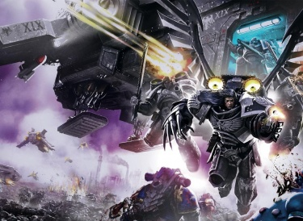

# 0803 012.M31 雅兰特之战 Battle of Yarant

精校状态：中文行文已逐段精校，部分术语仍为暂定

分类：时间线

原文来源：https://www.bilibili.com/opus/1205434115558473765

原作者：帝国神选罐头

原文时间：2026年05月23日 09:40

[返回分类目录](目录.md) · [全书目录](../../目录.md)

<!-- A0803-B0001 -->
**英文原文**

The Battle of Yarant, also known as The Wolf Cull, was a battle of the Horus Heresy.

<!-- /A0803-B0001 -->

<!-- A0803-B0002 -->

原译文

雅兰特之战，也被称为狼屠，是荷鲁斯叛乱的一场战斗。

**校订译文**

雅兰特之战，又称“屠狼之战”，是荷鲁斯之乱期间的一场战役。

<!-- /A0803-B0002 -->

<!-- A0803-B0003 图片 -->

<!-- A0803-B0004 -->

原译文

Corax leads his Raven Guard against traitor forces on Yarant III 科拉克斯带领他的暗鸦守卫在雅兰特三号上对抗叛徒部队

**校订译文**

Corax leads his Raven Guard against traitor forces on Yarant III 科拉克斯带领他的暗鸦守卫在雅兰特三号上对抗叛徒部队

<!-- /A0803-B0004 -->

<!-- A0803-B0005 -->
**英文原文**

Conflict:Horus Heresy

<!-- /A0803-B0005 -->

<!-- A0803-B0006 -->

原译文

冲突：荷鲁斯叛乱

**校订译文**

冲突：荷鲁斯之乱

<!-- /A0803-B0006 -->

<!-- A0803-B0007 -->
**英文原文**

Date:012.M31

<!-- /A0803-B0007 -->

<!-- A0803-B0008 -->

原译文

日期：012.M31

**校订译文**

日期：012.M31

<!-- /A0803-B0008 -->

<!-- A0803-B0009 -->
**英文原文**

Location:Yarant III

<!-- /A0803-B0009 -->

<!-- A0803-B0010 -->

原译文

地点：雅兰特三号

**校订译文**

地点：雅兰特三号

<!-- /A0803-B0010 -->

<!-- A0803-B0011 -->
**英文原文**

Outcome:Indecisive, Space Wolves crippled, Surviving Loyalists escape

<!-- /A0803-B0011 -->

<!-- A0803-B0012 -->

原译文

结果：不明确，太空野狼瘫痪，幸存的忠诚派逃脱

**校订译文**

结果：未分胜负；太空野狼遭重创，幸存忠诚派成功撤离。

<!-- /A0803-B0012 -->

<!-- A0803-B0013 -->
**英文原文**

Combatants:Imperium/Traitor Legions

<!-- /A0803-B0013 -->

<!-- A0803-B0014 -->

原译文

作战方：帝国/叛徒军团

**校订译文**

作战方：帝国/叛徒军团

<!-- /A0803-B0014 -->

<!-- A0803-B0015 -->
**英文原文**

Commanders:Primarch Leman Russ (WIA), Primarch Corvus Corax, Bjorn, Wolf Lord Ogvai Ogvai Helmschrot, Wolf Lord Amlodhi Skarssen, Wolf Lord Sturgard Joriksson, Wolf Lord Oki, Commander Branne Nev, Commander Agapito Nev, Commander Soukhounou/First Captain Ezekyle Abaddon, Lieutenant Commander Nigh Vash Delerax

<!-- /A0803-B0015 -->

<!-- A0803-B0016 -->

原译文

指挥官：原体黎曼·鲁斯(WIA)，原体科沃斯·科拉克斯，比约恩，狼主奥格瓦伊·奥格瓦伊·残盔，狼主阿姆洛迪·斯卡森，狼主斯特加德·约里克松，狼主奥基，指挥官布兰尼·涅夫，指挥官阿加皮托·涅夫，指挥官索胡努/第一连长以泽凯尔·阿巴顿，副指挥官奈伊·瓦什·德莱拉克斯

**校订译文**

指挥官：忠诚派——原体黎曼·鲁斯（负伤），原体科沃斯·科拉克斯，比约恩，狼主奥格瓦伊·残盔，狼主阿姆洛迪·斯卡森，狼主斯特加德·约里克松，狼主奥基，指挥官布兰尼·涅夫，指挥官阿加皮托·涅夫，指挥官索胡努；叛徒——第一连长以泽凯尔·阿巴顿，副指挥官奈伊·瓦什·德莱拉克斯。

**校注：** 英文 Ogvai Ogvai 重复，中文去重；保留原文以便核对。

<!-- /A0803-B0016 -->

<!-- A0803-B0017 -->
**英文原文**

Strength:Bulk of the Space Wolves, Remainder of the Raven Guard, Therion Cohort/Sons of Horus, Alpha Legion, World Eaters, Thousand Sons, Traitor Imperial Army

<!-- /A0803-B0017 -->

<!-- A0803-B0018 -->

原译文

力量：大部分太空野狼、暗鸦守卫的残余、圣兽大队/荷鲁斯之子、阿尔法军团、吞世者、千子、叛徒帝国军队

**校订译文**

兵力：忠诚派——太空野狼主力、暗鸦守卫余部、圣兽大队；叛徒——荷鲁斯之子、阿尔法军团、吞世者、千子，以及叛变帝国军。

<!-- /A0803-B0018 -->

<!-- A0803-B0019 -->
**英文原文**

Casualties:Extreme Space Wolves loses/unknown

<!-- /A0803-B0019 -->

<!-- A0803-B0020 -->

原译文

伤亡：极端太空狼损失/未知

**校订译文**

伤亡：忠诚派——太空野狼损失极为惨重；叛徒——不详。

<!-- /A0803-B0020 -->

<!-- A0803-B0021 -->
## Overview 概述

<!-- /A0803-B0021 -->

<!-- A0803-B0022 -->
**英文原文**

After narrowly avoiding destruction in the Battle of the Alaxxes Nebula Leman Russ and his Space Wolves arrived at Terra. After meeting with Malcador the Sigillite and Rogal Dorn, Leman Russ departed Terra and expressed his desire to take the war to Horus.

<!-- /A0803-B0022 -->

<!-- A0803-B0023 -->

原译文

在阿拉克西斯星云之战中险些被摧毁后，黎曼·鲁斯和他的太空野狼抵达了泰拉。在与掌印者马卡多和罗格·多恩会面后，黎曼·鲁斯离开了泰拉，并表示他希望将战争带给荷鲁斯。

**校订译文**

黎曼·鲁斯与太空野狼在阿拉克斯星云之战中险些覆灭，随后抵达泰拉。与掌印者马卡多、罗格·多恩会面后，鲁斯表明要主动向荷鲁斯开战，继而离开泰拉。

<!-- /A0803-B0023 -->

<!-- A0803-B0024 -->
**英文原文**

Russ then departed Terra with his Space Wolves, but his campaign against Horus soon met with disaster after he was wounded by Horus at the Battle of Trisolian. With the Great Wolf now in a comatose state, Russ' Legion became besieged on Yarant III by a combined traitor force of Sons of Horus, Alpha Legion, World Eaters, and Thousand Sons led by First Captain Abaddon. Abaddon's forces were also accompanied by traitor Imperial Army. Having been driven from orbit by the traitor armada, remnants of the Space Wolves fleet fled to the outer reaches of the Yarant System.

<!-- /A0803-B0024 -->

<!-- A0803-B0025 -->

原译文

随后，鲁斯带着他的太空野狼离开了泰拉，但在特里索兰之战中被荷鲁斯打伤后，他对荷鲁斯的战役很快遭遇了灾难。随着头狼现在处于昏迷状态，鲁斯的军团被第一连长阿巴顿领导的荷鲁斯之子、阿尔法军团、吞世者和千子的联合叛徒部队围困在雅兰特三号。阿巴顿的部队还伴随着叛徒帝国军队。被叛徒舰队赶出轨道后，太空野狼舰队的残余势力逃到了雅兰特星系的外围。

**校订译文**

鲁斯率太空野狼出征，但在特里索兰之战中被荷鲁斯打伤，行动很快以灾难告终。狼王陷入昏迷，军团则被围困在雅兰特三号。第一连长阿巴顿统率荷鲁斯之子、阿尔法军团、吞世者与千子的联合部队，辅以叛变帝国军，展开围攻。太空野狼残存舰队被逐出轨道，退往雅兰特星系外围。

<!-- /A0803-B0025 -->

<!-- A0803-B0026 -->
**英文原文**

Meanwhile, Corvus Corax had assembled the remains of his Raven Guard at the Rosario System and was debating over what actions to take. Some within his Legion wished to go to Terra, while Corax himself wished to remain in Horus' rear and conduct a guerrilla war, believing his legion, still devastated from the Drop Site Massacre, could serve a better purpose in this role. Marcus Valerius had yet another vision, this time of the plight of the Space Wolves, and when it was revealed to Corax, the thought of having been manipulated throughout all these years by mysterious visions broke him. In a fit of rage he demanded to be left alone. He vowed to be no longer be manipulated and to commit suicide and die with a clean slate. When he reemerged, he had all elements of his army he considered outsiders either dispatched to Terra or to Beta-Garmon, until only his Raven Guard remained. He was determined to save the Space Wolves, to die while doing so, and to take the Raptors with him into death.

<!-- /A0803-B0026 -->

<!-- A0803-B0027 -->

原译文

与此同时，科沃斯·科拉克斯已经在罗萨里奥星系收集了他的暗鸦守卫的残余，并正在讨论采取什么行动。他的军团中的一些人希望去泰拉，而科拉克斯本人则希望留在荷鲁斯的后方，进行游击战争，相信他的军团，仍然被登陆点大屠杀摧毁，可以更好地发挥这一作用。马库斯·瓦勒里乌斯还有另一个幻象，这次是太空野狼的困境，当它被透露给科拉克斯时，这些年来一直被神秘的幻象操纵的想法击破了他。他勃然大怒，要求独处。他发誓不再被操纵，自杀并清白地死去。当他重新出现时，他把所有他认为是局外人的军队都派往泰拉或贝塔·伽蒙，直到只剩下他的暗鸦守卫。他下定决心要拯救太空野狼，在这样做的时候死去，并带着猛禽一起走向死亡。

**校订译文**

与此同时，科沃斯·科拉克斯在罗萨里奥星系集结暗鸦守卫余部，商议下一步行动。军团中有人希望赶往泰拉；科拉克斯却主张留在荷鲁斯后方进行游击战。他认为，军团尚未从登陆场大屠杀的重创中恢复，这样更能发挥作用。马库斯·瓦勒里乌斯又看见一道异象，这次指向太空野狼的困境。科拉克斯得知后，想到自己多年来可能一直被神秘异象操纵，终于难以承受，暴怒着命众人退下，让自己独处。他发誓不再受摆布，决意以死作结，清偿一切。重新露面后，他将麾下所有被视作外来者的部队派往泰拉或贝塔·伽蒙，只留下暗鸦守卫。他决定前去拯救太空野狼，并在那里战死，带着猛禽一同走向死亡。

**校注：** Raptors 在此指科拉克斯重建军团时产生的变异猛禽战士，非混沌猛禽或后世同名战团。科拉克斯赴死的想法属于角色当时的绝望心理。

<!-- /A0803-B0027 -->

<!-- A0803-B0028 -->
**英文原文**

After arriving in the Yarant System, Corax was able to link up with scattered remnants of the Space Wolves fleet led by Bjorn. Using surprise and Mor Deythan and Dark Fury squads to eliminate key enemy officers, Corax was able to break the traitor's fleet blockade and reach the besieged Space Wolves final position on Yarant III. There, Corax encountered the wounded Leman Russ, who briefly came out of his comatose state to greet Corax and give the Spear of Russ to Bjorn. The Space Wolves refused to retreat, because they saw it as somehow betraying destiny. With the traitors closing in, Corax ordered his legion save the Raptors escape Yarant while he and Bjorn led a final suicidal charge on the traitor lines.

<!-- /A0803-B0028 -->

<!-- A0803-B0029 -->

原译文

在抵达雅兰特星系后，科拉克斯能够与比约恩领导的太空野狼舰队的分散残余联系起来。通过使用突袭和摩尔戴斯和黑暗狂怒小队消灭关键的敌方军官，科拉克斯能够打破叛徒的舰队封锁，到达雅兰特三号上被围困的太空野狼的最后阵地。在那里，科拉克斯遇到了受伤的黎曼·鲁斯，他短暂地从昏迷状态中出来迎接科拉克斯，并将鲁斯之矛交给比约恩。太空野狼拒绝撤退，因为他们认为这在某种程度上背叛了命运。随着叛徒的逼近，科拉克斯命令他的军团拯救猛禽逃离雅兰特，同时他和比约恩在叛徒战线上进行了最后的自杀式冲锋。

**校订译文**

科拉克斯抵达雅兰特星系后，与比约恩率领的太空野狼残存舰船会合。他利用突袭，派摩尔戴斯与黑暗狂怒小队清除敌方关键军官，打破叛军舰队封锁，抵达野狼在雅兰特三号上最后的阵地。身负重伤的鲁斯短暂苏醒，向科拉克斯致意，并将鲁斯之矛交给比约恩。太空野狼拒绝撤退，认为那等于背弃命运。敌军不断逼近，科拉克斯命令除猛禽以外的军团部队撤离雅兰特，自己则与比约恩率军向叛军防线发起最后的必死冲锋。

**校注：** save 在 legion save the Raptors 中意为“除……之外”，不是拯救。原译错误地让军团带猛禽撤走，与后文猛禽被留作预备队矛盾，已修正。

<!-- /A0803-B0029 -->

<!-- A0803-B0030 -->
**英文原文**

In a final desperate charge, Corax led a portion of his Raven Guard and the Space Wolves against the traitor lines. They pushed deep through their ranks, forcing Abaddon to commit his Sons of Horus reserves. However seeing the Eye of Horus on the traitors banners reminded Corax of the vanity and arrogance of the Warmaster. Horus still lived and still threatened Terra. Corax came to the understanding that it was not his right to choose when he would die as he was a servant of the Emperor, that was the sort of arrogance that had led Horus to betrayal. Changing his mind, Corax was able to convince a reluctant Bjorn to abandon their last stand and instead evacuate Yarant. The mutated Raptors had been held back the whole time as a last reserve and were now denied battle, which drove them into fury and depression.

<!-- /A0803-B0030 -->

<!-- A0803-B0031 -->

原译文

在最后一次绝望的冲锋中，科拉克斯带领他的暗鸦守卫和太空野狼的一部分对抗叛徒。他们深入他们的队伍，迫使阿巴顿投入他的荷鲁斯之子预备队。然而，看到叛徒旗帜上的荷鲁斯之眼，科拉克斯想起了战帅的虚荣和傲慢。荷鲁斯仍然活着，仍然威胁着泰拉。科拉克斯逐渐意识到，作为帝皇之仆，他无权选择何时死去，正是这种傲慢导致了荷鲁斯的背叛。科拉克斯改变了主意，说服了不情愿的比约恩放弃他们的最后一战，而是撤离了雅兰特。变异的猛禽一直被作为最后的后备力量，现在被拒绝战斗，这使他们陷入愤怒和沮丧之中。

**校订译文**

科拉克斯率部分暗鸦守卫与太空野狼拼死突击，深入敌阵，迫使阿巴顿投入荷鲁斯之子预备队。然而，叛军旗帜上的荷鲁斯之眼让他想起战帅的虚荣与傲慢：荷鲁斯仍然活着，仍在威胁泰拉。科拉克斯终于明白，身为帝皇之仆，他无权擅自决定何时赴死；正是这样的傲慢，使荷鲁斯走向背叛。他改变主意，说服不情愿的比约恩放弃死守，撤离雅兰特。变异的猛禽一直被留作最后的预备队，如今又失去参战机会，陷入愤怒与沮丧。

<!-- /A0803-B0031 -->

<!-- A0803-B0032 -->
**英文原文**

After the battle, Leman Russ remained comatose and the Space Wolves Legion had suffered truly catastrophic losses. Corax however parted ways with the Space Wolves, stating that he would continue to resist Horus from the shadows as he marched on Terra.

<!-- /A0803-B0032 -->

<!-- A0803-B0033 -->

原译文

战斗结束后，黎曼·鲁斯仍然处于昏迷状态，太空野狼军团遭受了真正的灾难性损失。然而，科拉克斯与太空野狼分道扬镳，表示他将继续在荷鲁斯向泰拉上行进时从阴影中抵抗他。

**校订译文**

战后，鲁斯仍昏迷不醒，太空野狼军团损失惨重至极。科拉克斯随后与他们分开，表示自己将继续隐于暗处，阻击向泰拉进军的荷鲁斯。

<!-- /A0803-B0033 -->

本篇核心术语与暂定项

以下列出本篇出现的英文原形及核心术语表用词。同形词可能指不同对象，具体词义以本篇正文和校注为准；单复数、别名和仅见于图注的名称可能尚未列入。完整候选见[术语表](../../术语表/双语术语候选.csv)。

| 英文 | 采用中文 | 状态 |
| --- | --- | --- |
| Space Wolves | 太空野狼 | 官方已核对 |
| Imperial Army | 帝国军 | 暂定·官方待核 |
| Thousand Sons | 千子 | 官方已核对 |
| World Eaters | 吞世者 | 官方已核对 |
| Horus Heresy | 荷鲁斯之乱 | 官方已核对 |
| Imperium | 帝国 | 暂定·简称 |
| Emperor | 帝皇 | 官方已核对 |
| Primarch | 原体 | 官方已核对 |
| Terra | 泰拉 | 暂定·官方待核 |
| Horus | 荷鲁斯 | 暂定·官方待核 |
| Sons of Horus | 荷鲁斯之子 | 暂定·官方待核 |
| Mor Deythan | 摩尔戴斯 | 暂定·官方待核 |
| Malcador the Sigillite | 掌印者马卡多 | 暂定·官方待核 |
| Lieutenant Commander | 副指挥官 | 暂定·官方待核 |
| Lieutenant | 副官 | 暂定·官方待核 |
| Alpha Legion | 阿尔法军团 | 暂定·官方待核 |
| Raven Guard | 暗鸦守卫 | 官方已核 |
| The Sigillite | 掌印者 | 暂定·官方待核 |
| Agapito Nev | 阿加皮托·涅夫 | 暂定·官方待核 |
| Branne Nev | 布兰尼·涅夫 | 暂定·官方待核 |
| Soukhounou | 索胡努 | 暂定·官方待核 |
| First Captain | 第一连长 | 暂定·官方待核 |
| Ezekyle Abaddon | 以泽凯尔·阿巴顿 | 暂定·官方待核 |
| Captain | 连长 | 暂定·官方待核 |
| Raptors | 猛禽 | 暂定·官方待核 |
| Remnants | 残骸 | 暂定·官方待核 |
| Cohort | 大队 | 暂定·官方待核 |
| Alaxxes Nebula | 阿拉克斯星云 | 暂定·官方待核 |
| Greet | 格利特 | 暂定·官方待核 |
| Corvus Corax | 科沃斯·科拉克斯 | 暂定·官方待核 |
| Dark Fury | 黑暗狂怒 | 暂定·官方待核 |
| Marcus Valerius | 马库斯·瓦莱里乌斯 | 暂定·官方待核 |
| Therion Cohort | 圣兽大队 | 暂定·官方待核 |
| Trisolian | 特里索兰 | 暂定·官方待核 |
| The Wolf Cull | 屠狼之战 | 暂定·官方待核 |
| System | 星系（恒星系统） | 暂定·官方待核 |
| Therion | 圣兽星 | 暂定·官方待核 |
| Spear of Russ | 鲁斯之矛 | 暂定·官方待核 |
| Battle of Trisolian | 特里索兰之战 | 暂定·官方待核 |
| Beta | 贝塔号 | 暂定·官方待核 |
| Ogvai Ogvai Helmschrot | 奥格瓦伊·残盔 | 暂定·官方待核 |
| Yarant III | 雅兰特三号 | 暂定·官方待核 |

