# 0805 014.M31 泰拉围城 Siege of Terra

精校状态：中文行文已逐段精校，部分术语仍为暂定

分类：时间线

原文来源：https://www.bilibili.com/opus/1061864530045304832

原作者：帝国神选罐头

原文时间：编辑于 2025年07月29日 08:19

[返回分类目录](目录.md) · [全书目录](../../目录.md)

<!-- A0805-B0001 -->
**英文原文**

"He has come to face his father. That is the purpose of this attack."

<!-- /A0805-B0001 -->

<!-- A0805-B0002 -->

原译文

“他来面对他的父亲。这就是这次攻击的目的。”

**校订译文**

“他是来面对父亲的。这才是此次进攻的目的。”

<!-- /A0805-B0002 -->

<!-- A0805-B0003 -->
**英文原文**

--Malcador the Sigillite

<!-- /A0805-B0003 -->

<!-- A0805-B0004 -->

原译文

--掌印者马卡多

**校订译文**

--掌印者马卡多

<!-- /A0805-B0004 -->

<!-- A0805-B0005 -->
**英文原文**

The Siege of Terra was the penultimate battle of the Horus Heresy. Waged on Terra, the homeworld of humanity, the massive engagement between the forces of the Imperium of Man and the forces of Chaos decided not only the fate of Horus Heresy but also that of humanity.

<!-- /A0805-B0005 -->

<!-- A0805-B0006 -->

原译文

泰拉围城是荷鲁斯叛乱的倒数第二场战斗。在人类的家园世界泰拉上，人类帝国和混沌势力之间的大规模交战不仅决定了荷鲁斯叛乱的命运，也决定了人类的命运。

**校订译文**

泰拉围城战是荷鲁斯之乱的倒数第二场战役。人类帝国与混沌大军在人类母星泰拉展开规模浩大的决战，不仅决定了叛乱的结局，也决定了人类的命运。

<!-- /A0805-B0006 -->

<!-- A0805-B0007 图片 -->
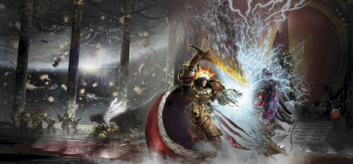

<!-- A0805-B0008 -->

原译文

The Emperor of Mankind battles Warmaster Horus Lupercal aboard the Vengeful Spirit 人类之主在复仇之魂号上与战帅荷鲁斯·卢佩卡尔作战

**校订译文**

The Emperor of Mankind battles Warmaster Horus Lupercal aboard the Vengeful Spirit 人类之主在复仇之魂号上与战帅荷鲁斯·卢佩卡尔作战

<!-- /A0805-B0008 -->

<!-- A0805-B0009 -->
**英文原文**

Conflict:Horus Heresy

<!-- /A0805-B0009 -->

<!-- A0805-B0010 -->

原译文

冲突：荷鲁斯叛乱

**校订译文**

冲突：荷鲁斯之乱

<!-- /A0805-B0010 -->

<!-- A0805-B0011 -->
**英文原文**

Date:014.M31

<!-- /A0805-B0011 -->

<!-- A0805-B0012 -->

原译文

日期：014.M31

**校订译文**

日期：014.M31

<!-- /A0805-B0012 -->

<!-- A0805-B0013 -->
**英文原文**

Location:Terra

<!-- /A0805-B0013 -->

<!-- A0805-B0014 -->

原译文

地点：泰拉

**校订译文**

地点：泰拉

<!-- /A0805-B0014 -->

<!-- A0805-B0015 -->
**英文原文**

Outcome:Pyrrhic Loyalist victory

<!-- /A0805-B0015 -->

<!-- A0805-B0016 -->

原译文

结果：忠诚派惨胜

**校订译文**

结果：忠诚派惨胜

<!-- /A0805-B0016 -->

<!-- A0805-B0017 -->
**英文原文**

Combatants:Imperium of Man/Forces of Chaos

<!-- /A0805-B0017 -->

<!-- A0805-B0018 -->

原译文

作战人员：人类帝国/混沌势力

**校订译文**

交战方：人类帝国／混沌势力

<!-- /A0805-B0018 -->

<!-- A0805-B0019 -->
**英文原文**

Commanders:Emperor of Mankind (WIA),Malcador the Sigillite (KIA),Rogal Dorn,Sanguinius (KIA),Jaghatai Khan (WIA),Vulkan (Hidden),Constantin Valdor,Sigismund,Archamus,Fafnir Rann,Camba Diaz (KIA),Maximus Thane,Fisk Halen,Vorst (KIA),Diamantis (KIA),Sevastin Haeger,Honfler (KIA),Raldoron,Azkaellon,Nassir Amit,Zephon,Bel Sepatus (KIA),Anzarael,Khoradal Furio,Idamas (KIA),Satel Aimery,Emhon Lux (WIA),Qin Fai Noyan-Khan(KIA),Ganzorig Noyan-Khan,Shiban Khan,Jangsai Khan,Naranbaatar,Namahi,Corswain,Bodvar Bjarki,Atok Abidemi,Igen Gargo,Barek Zytos (KIA),Amon Tauromachian,Tsutomu,Zagreus Kane,Cydon (KIA),Esha Ani Mohana,Aurum,Adreen,Saul Niborran (KIA),Konas Burr (KIA),Ilya Ravallion,Katarin Elg (KIA),Sandrine Icaro,Aldana Agathe,Yennu Egwu (defects),Nasuba, Clement Brohn,Diocletian Coros,Jenetia Krole (KIA),Garviel Loken (KIA),Nathaniel Garro (KIA)/Horus Lupercal (KIA),Perturabo (AWOL),Angron (Banished),Magnus the Red (Banished),Fulgrim (AWOL),Mortarion (Banished),Kelbor-Hal,Ezekyle Abaddon,Horus Aximand (KIA),Falkus Kibre (KIA?),Tormageddon (KIA),Tybalt Marr (KIA), Lev Goshen (MIA),Azelas Baraxa,Indras Archeta (KIA),Xhofar Beruddin,Lycas Fyton(KIA),Malabreux,Hellas Sycar,Taras Balt,Vorus Ikari,Selgar Dorgaddon(KIA),Kalintus,Zistrion,Ekron Fal,Erebus,Zardu Layak (KIA),Inzar Taerus (KIA),Typhus,Caipha Morarg,Gremus Kalgaro (KIA),Zadal Crosius,Skulidas Gehrerg (KIA),Khârn (KIA),Shâhka,Ahzek Ahriman,Amon,Ignis,Forrix (AWOL),Kroeger (AWOL),Barban Falk (AWOL),Ormon Gundar (KIA),Bogdan Mortel (KIA),Gendor Skraivok (MIA),Krostovok,Eidolon (AWOL),Cyrius,Fabius (AWOL),Ka'Bandha (Banished),Cor'bax Utterblight,Vassukella,Sota-Nul,Ardim Protos,Axmar Tre,Clain Pent,Illivia Epta,Inar Satarael

<!-- /A0805-B0019 -->

<!-- A0805-B0020 -->

原译文

指挥官：人类帝皇（WIA），掌印者马卡多（KIA），罗格·多恩，圣吉列斯（KIA），察合台可汗（WIA），沃坎（隐藏），康斯坦丁·瓦尔多，西吉斯蒙德，阿坎姆斯，法夫尼尔·兰恩，坎巴·迪亚兹（KIA），马克西姆斯·索恩，弗斯克·哈伦，沃尔斯特（KIA），迪亚曼蒂斯（KIA），塞瓦斯廷·哈格，洪夫莱尔（KIA），拉多隆，阿兹凯隆，纳西尔·阿密特，泽丰，贝尔·塞帕图斯（KIA），安扎瑞尔，霍拉达尔·弗里奥，伊达玛斯（KIA），萨特尔·埃莫里，艾蒙·勒克斯（WIA），秦伐诺扬汗，甘佐里格诺扬汗，昔班可汗，江塞可汗，纳兰巴达，纳马希，考斯韦恩，博德瓦尔·比亚尔基，阿托克·阿比德米，伊根·加戈，巴雷克·兹托斯（KIA），阿蒙·塔罗马奇，茨托穆，扎格列欧斯·凯恩，赛登（KIA），伊莎·阿尼·莫哈娜，奥伦，阿德里安，索尔·尼博兰（KIA），科纳斯·伯尔（KIA），伊利亚.拉瓦利昂，卡塔琳·艾尔格（KIA），桑德琳·伊卡罗，阿尔达娜·阿加西，耶努·埃格武（叛变），纳苏巴，克莱门特·布洛赫，戴克里先·科罗斯，珍提亚·科勒（KIA），加维尔·洛肯（KIA），纳撒尼尔·伽罗（KIA）/荷鲁斯·卢佩卡尔（KIA），佩图拉博（AWOL），安格隆（被放逐），赤红之马格努斯（被放逐），福格瑞姆（AWOL），莫塔里安（被放逐），凯尔博·哈尔，以泽凯尔·阿巴顿，荷鲁斯·阿西曼德（KIA），法库斯·凯博（KIA?），托玛吉顿（KIA），提伯特·玛尔（KIA），李维·高盛（MIA），艾泽拉斯·巴拉夏，因德拉斯·亚克塔（KIA），寇法尔·贝鲁丁，莱卡斯·费顿（KIA），马拉波，赫拉斯·赛卡，塔拉斯·巴尔特，沃鲁斯·莱卡利，瑟尔伽·多迦顿（KIA），卡林图斯，吉斯特里昂，埃克伦·法尔，艾瑞巴斯，扎度·拉亚克（KIA），因扎尔·泰罗斯（KIA），泰丰斯，凯法·莫拉格，格雷姆斯·卡尔伽罗（KIA），扎达尔·克罗修斯，斯库利达斯·盖勒格（KIA），卡恩（KIA），沙赫卡，阿扎克·阿里曼，阿蒙，伊格尼斯，弗里克斯（AWOL），克罗格尔（AWOL），巴尔本·法尔克（AWOL），奥蒙·贡达尔（KIA），博格丹·莫尔泰尔（KIA），詹多·斯卡莱沃克（MIA），克罗斯托沃克，艾多隆（AWOL），西里乌斯，法比乌斯（AWOL），卡’班哈（被放逐），科尔'巴克斯·枯毁，瓦苏凯拉，索塔-努尔，阿迪米·普罗托斯，阿克马尔·特雷，克莱恩·潘特，伊莉维娅·埃普塔，伊尔·萨塔莱尔

**校订译文**

指挥官：忠诚派——人类帝皇（负伤），掌印者马卡多（阵亡），罗格·多恩，圣吉列斯（阵亡），察合台可汗（负伤），沃坎（隐匿），康斯坦丁·瓦尔多，西吉斯蒙德，阿坎姆斯，法夫尼尔·兰恩，坎巴·迪亚兹（阵亡），马克西姆斯·塞恩，弗斯克·哈伦，沃尔斯特（阵亡），迪亚曼蒂斯（阵亡），塞瓦斯廷·哈格，洪夫莱尔（阵亡），拉多隆，阿兹卡隆，纳西尔·阿米特，泽丰，贝尔·塞帕图斯（阵亡），安扎瑞尔，霍拉达尔·弗里奥，伊达玛斯（阵亡），萨特尔·埃莫里，艾蒙·勒克斯（负伤），秦伐诺扬汗（阵亡），甘佐里格诺扬汗，昔班可汗，江塞可汗，纳兰巴达，纳马希，考斯韦恩，博德瓦尔·比亚尔基，阿托克·阿比德米，伊根·加戈，巴雷克·齐托斯（阵亡），阿蒙·塔罗马奇，茨托穆，扎格列欧斯·凯恩，赛登（阵亡），艾莎·阿尼·莫哈娜，奥伦，阿德林，索尔·尼博兰（阵亡），科纳斯·伯尔（阵亡），伊利亚·拉瓦利翁，卡塔琳·艾尔格（阵亡），桑德琳·伊卡罗，阿尔达娜·阿加西，耶努·埃格武（叛变），纳苏巴，克莱门特·布洛恩，戴克里先·科罗斯，珍提亚·科勒（阵亡），加维尔·洛肯（阵亡），纳撒尼尔·伽罗（阵亡）；叛徒方——荷鲁斯·卢佩卡尔（阵亡），佩图拉博（擅自离队），安格隆（被放逐），红魔马格努斯（被放逐），福格瑞姆（擅自离队），莫塔里安（被放逐），凯尔博·哈尔，以泽凯尔·阿巴顿，荷鲁斯·阿西曼德（阵亡），法库斯·凯博（阵亡？），托玛格顿（阵亡），提伯特·玛尔（阵亡），李维·高盛（失踪），阿兹拉斯·巴拉克萨，因德拉斯·亚克塔（阵亡），寇法尔·贝鲁丁，莱卡斯·费顿（阵亡），马拉波，赫拉斯·赛卡，塔拉斯·巴尔特，沃鲁斯·莱卡利，瑟尔伽·多迦顿（阵亡），卡林图斯，吉斯特里昂，埃克伦·法尔，艾瑞巴斯，扎度·拉亚克（阵亡），因扎尔·泰罗斯（阵亡），泰弗斯，凯法·莫拉格，格雷姆斯·卡尔加罗（阵亡），扎达尔·克罗修斯，斯库利达斯·盖勒格（阵亡），卡恩（阵亡），沙赫卡，阿扎克·阿里曼，阿蒙，伊格尼斯，弗里克斯（擅自离队），克罗格（擅自离队），巴尔本·法尔克（擅自离队），奥蒙·贡达尔（阵亡），博格丹·莫尔泰尔（阵亡），詹多·斯卡莱沃克（失踪），克罗斯托沃克，艾多隆（擅自离队），西里乌斯，法比乌斯（擅自离队），卡’班哈（被放逐），科尔'巴克斯·枯毁，瓦苏凯拉，索塔·努尔，阿迪米·普罗托斯，阿克马尔·特雷，克莱恩·潘特，伊莉维娅·埃普塔，伊纳尔·萨塔拉埃尔

**校注：** 人员表缩写译为负伤、阵亡、失踪、擅自离队；KIA? 的不确定性保留。补回原译遗漏的秦伐诺扬汗阵亡标记。阿坎姆斯为同名继任者，非将799篇阵亡者复活；人物细节依后文继续核对。

<!-- /A0805-B0020 -->

<!-- A0805-B0021 -->
**英文原文**

Strength:Imperial Fists,Blood Angels,White Scars,Dark Angels contingent,Imperial Army,Adeptus Mechanicus,Custodian Guard,Sisters of Silence See Order of Battle for full/Sons of Horus,Iron Warriors,World Eaters,Thousand Sons,Emperor's Children,Death Guard,Word Bearers elements,Night Lords elements,Dark Mechanicum,Traitor Imperial Army,The Lost and the Damned,Daemons.

<!-- /A0805-B0021 -->

<!-- A0805-B0022 -->

原译文

实力：帝国之拳，圣血天使，白色疤痕，黑暗天使小分队，帝国陆军，机械神教，禁军，寂静修女等/荷鲁斯之子，钢铁勇士，吞世者，千子，帝皇之子，死亡守卫，怀言者成员，午夜领主成员，黑暗机械教，叛徒帝国陆军，迷失者与被诅咒者，恶魔

**校订译文**

兵力：忠诚派——帝国之拳、圣血天使、白疤、黑暗天使特遣队、帝国军、机械修会、帝皇禁军、寂静修女；完整编制见参战序列。叛徒方——荷鲁斯之子、钢铁勇士、吞世者、千子、帝皇之子、死亡守卫、部分怀言者与午夜领主、黑暗机械教、叛变帝国军、迷失者与被诅咒者，以及恶魔。

<!-- /A0805-B0022 -->

<!-- A0805-B0023 -->
**英文原文**

Casualties:Massive both military and civilian,Sanguinius killed,Emperor interred on Golden Throne/Massive,Horus killed,Mortarion, Angron, and Magnus banished

<!-- /A0805-B0023 -->

<!-- A0805-B0024 -->

原译文

伤亡：大规模的军队和平民，圣吉列斯被杀，帝皇被安葬在黄金王座上/大规模，荷鲁斯被杀，莫塔里安，安格隆和马格努斯被放逐

**校订译文**

伤亡：忠诚派——军民损失极为惨重，圣吉列斯阵亡，帝皇被安置于黄金王座；叛徒方——损失极为惨重，荷鲁斯被杀，莫塔里安、安格隆与马格努斯遭到放逐。

**校注：** interred on Golden Throne 在此表示被安置于维生的黄金王座，不能译成已经死亡后的安葬。

<!-- /A0805-B0024 -->

<!-- A0805-B0025 -->
## Overview 概述

<!-- /A0805-B0025 -->

<!-- A0805-B0026 -->
### Prelude 序曲

<!-- /A0805-B0026 -->

<!-- A0805-B0027 -->
**英文原文**

Following the Drop Site Massacre, the traitorous Warmaster of the Imperium and of the Sons of Horus, Horus, had crippled three Loyalist Space Marine Legions. The Raven Guard and Salamanders were nearly destroyed, while the Iron Hands survived in larger numbers but were left leaderless. The fragmented warbands from these Shattered Legions continued hitting traitor forces during their advance upon Terra but were unable to contribute to the defense of the Throneworld itself. The Ultramarines, Space Wolves, and Dark Angels were either too far away or bogged down in their own campaigns to come for aid. Only the Imperial Fists, Blood Angels, and White Scars Space Marine Legions were in the Sol System in force.

<!-- /A0805-B0027 -->

<!-- A0805-B0028 -->

原译文

在登陆点大屠杀之后，帝国的叛徒战帅和荷鲁斯之子瘫痪了三支忠诚的星际战士。暗鸦守卫和火蜥蜴几乎被摧毁，而钢铁之手则幸存下来，但没有了领袖。来自这些破碎军团的支离破碎的战士在向泰拉推进的过程中继续打击叛徒部队，但无法为保卫王座世界本身做出贡献。极限战士、太空野狼和黑暗天使要么离得太远，要么陷入了自己的行动中，无法前来提供援助。只有帝国之拳、圣血天使和白色伤疤星际战士在太阳系中有部队。

**校订译文**

登陆场大屠杀后，叛变的帝国战帅、荷鲁斯之子原体荷鲁斯重创了三个忠诚派星际战士军团。暗鸦守卫与火蜥蜴几近覆灭，钢铁之手虽有较多幸存者，却失去了领袖。这些破碎军团分散成各支战帮，在叛军向泰拉推进时不断袭击敌人，却无力直接参与王座世界的防御。极限战士、太空野狼与黑暗天使，要么距离太远，要么深陷各自战场，无法及时增援。太阳系中大举部署的星际战士军团，只有帝国之拳、圣血天使与白疤。

**校注：** in force 指大举部署，不是太阳系里完全没有其他军团战士。概述称破碎军团无法参加本土防御，后文仍会列出少数个体或特遣队，不强行抹除区别。

<!-- /A0805-B0028 -->

<!-- A0805-B0029 -->
**英文原文**

Facing them were the armies of Chaos under Warmaster Horus which included nine Legions of Chaos Space Marines, traitorous forces of the Imperial Army, Daemonic hordes, and the Titan Legions of the Dark Mechanicum. Mars, the capital of the Adeptus Mechanicus, had recently fallen to the traitor forces. The situation had become disastrous for the Imperium and the forces of the Emperor. Horus, sensing that he could decisively end the conflict and overthrow the Emperor once and for all, began to move on Terra. Rogal Dorn, of the Imperial Fists, was given overall command of the defenses of humanity's homeworld while the Emperor himself was busy with his own secret project, the Golden Throne. In this endeavor, the Primarch was assisted by hundreds of specialists including: Fourth Master Tacticae Terrestria Julius Gundelfo, Tacticae Osaka, Montesere and Brinlaw, Data-Adjudicator Perez Grist, Imperial Army Colonel Lin-Hu Kway, Junior Administrar Patris Sator Omes, Cogitation Overseer Arnolf Van Halmere, and Rubricator Senioris Hyton Ki.

<!-- /A0805-B0029 -->

<!-- A0805-B0030 -->

原译文

面对他们的是战帅荷鲁斯领导下的混沌军队，其中包括九支混沌星际战士军团、帝国军队的叛徒部队、恶魔部落和黑暗机械教的泰坦军团。机械神教首都火星最近落入了叛徒之手。这种情况对帝国和帝皇的军队来说是灾难性的。荷鲁斯意识到他可以果断地结束冲突，一劳永逸地推翻帝皇，开始在泰拉上行动。帝国之拳的罗格·多恩被赋予了人类家园世界防御的全面指挥权，而帝皇本人正忙于自己的秘密项目—黄金王座。在这项工作中，原体得到了数百名专家的协助，其中包括：第四地面战术大师尤利乌斯·贡德尔福、战术参谋大阪、蒙特塞和布林劳、数据裁决员佩雷斯·格里斯特、帝国陆军上校林胡奎、初级宗主行政官萨托·奥梅斯、逻辑监督员阿诺夫·凡·哈尔米尔和高级抄写员海顿·基。

**校订译文**

他们面对的是荷鲁斯统率的混沌大军，包括九个混沌星际战士军团、叛变帝国军、恶魔军势，以及黑暗机械教的泰坦军团。机械修会首都火星不久前已落入叛军之手，帝国与帝皇部队的处境岌岌可危。荷鲁斯看到了彻底结束战争、推翻帝皇的机会，开始向泰拉推进。帝国之拳原体罗格·多恩受命全面负责母星防御，帝皇则忙于自己的秘密工程——黄金王座。数百名专家协助多恩完成部署，其中包括第四地面战术大师尤利乌斯·贡德尔福，战术参谋大阪、蒙特塞与布林劳，数据裁决员佩雷斯·格里斯特，帝国军上校林胡奎，初级宗主行政官萨托·奥梅斯，运算监督员阿诺夫·凡·哈尔米尔，以及高级抄写员海顿·基。

**校注：** 专家职衔暂沿现稿，Cogitation 明确为运算而非逻辑本身。Osaka 暂沿原稿大阪，是否确为姓名音写待核，不据现实地名改写其身份。

<!-- /A0805-B0030 -->

<!-- A0805-B0031 -->
**英文原文**

In addition to the loyalist Space Marine forces deployed in the Sol System, the loyalists were bolstered by the Custodian Guard, Sisters of Silence, millions of Imperial Army troops as well as various Mechanicum forces such as Titan Legions, Knights, Legio Cybernetica, and Skitarii. Much of Terra's population was forcibly conscripted in the stages before the battle, with millions of terrified Conscripts being handed a Lasgun with virtually no training. Most of these were deployed in the 3-layered trench network around the Walls of the Imperial Palace, with Dorn intending to save his Astartes and Mechanicum troops for the later stages of the battle.

<!-- /A0805-B0031 -->

<!-- A0805-B0032 -->

原译文

除了部署在太阳系中的忠诚派星际战士外，忠诚派还得到了禁军、寂静修女、数百万帝国陆军部队以及各种机械教部队的支持，如泰坦军团、骑士、智控军团和护教军。泰拉的大部分人口在战斗前的阶段被强行征召入伍，数百万惊恐的几乎没有受过训练的征召兵被给予一把激光枪。其中大部分部署在皇宫城墙周围的三层战壕网络中，多恩打算在战斗的后期保存他的阿斯塔特和机械教部队。

**校订译文**

除太阳系中的忠诚派星际战士外，守军还有帝皇禁军、寂静修女、数百万帝国军，以及泰坦军团、骑士、智控军团和护教军等机械教部队。战役前夕，泰拉大量居民被强征入伍，数百万惊恐的新兵几乎未经训练，就被塞来一支激光枪。他们大多被部署在皇宫城墙外的三重战壕中；多恩打算将阿斯塔特与机械教兵力保存到战役后期再投入。

<!-- /A0805-B0032 -->

<!-- A0805-B0033 -->
**英文原文**

Following the Battle of Beta-Garmon, the door to the Sol System was open and Horus finally mustered his forces on Ullanor after years of war. They included the Sons of Horus, World Eaters, Emperor's Children, Thousand Sons, Death Guard, and Iron Warriors under their respective Primarchs. These were bolstered by disparate forces of Night Lords under Captain Gendor Skraivok and 5,000 Word Bearers under Zardu Layak. The Alpha Legion left the Solar warzone after delivering a detailed map of the Sol System's defenses to Horus. During the final phase of the Solar War, Horus' forces captured the Sol System from the loyalists. All that now lay his path to victory was Terra itself. Horus intended to capture Terra before the arrival of Roboute Guilliman from the galactic east, though he deployed Perturabo and the Iron Warriors to fortify the captured Sol System against any who may intrude upon the siege.

<!-- /A0805-B0033 -->

<!-- A0805-B0034 -->

原译文

贝塔·伽蒙战役后，太阳系的大门敞开了，荷鲁斯在多年的战争后终于在乌兰诺集结了他的部队。他们包括各自原体领导下的荷鲁斯之子、吞世者、帝皇之子、千子、死亡守卫和钢铁勇士。得到了詹多·斯卡莱沃克连长领导下的无夜领主和扎度·拉亚克领导下的5000名怀言者的不同力量的支持。阿尔法军团在向荷鲁斯交付了太阳系防御的详细地图后离开了太阳战区。在太阳战争的最后阶段，荷鲁斯的部队从忠诚派手中夺取了太阳系。现在，他通往胜利的道路上只有泰拉本身。荷鲁斯打算在罗伯特·基里曼从银河系东部抵达之前占领泰拉，他通过部署佩图拉博和钢铁勇士来加强被占领的太阳系，以抵御任何可能入侵围城的人。

**校订译文**

贝塔·伽蒙之战打开了太阳系门户。经过多年征战，荷鲁斯终于在乌兰诺集结麾下大军，包括由各自原体统率的荷鲁斯之子、吞世者、帝皇之子、千子、死亡守卫和钢铁勇士，以及詹多·斯卡莱沃克连长麾下零散的午夜领主部队、扎度·拉亚克率领的五千名怀言者。阿尔法军团向荷鲁斯提交详细的太阳系防御地图后，便离开了这一战区。太阳战争的最后阶段，叛军从忠诚派手中夺取太阳系，胜利路上只剩泰拉本身。荷鲁斯打算赶在罗保特·基里曼从银河东部抵达前夺下泰拉，同时部署佩图拉博与钢铁勇士强化太阳系防御，阻止任何援军干扰围城。

<!-- /A0805-B0034 -->

<!-- A0805-B0035 -->
### The Storm Breaks 风暴来袭

<!-- /A0805-B0035 -->

<!-- A0805-B0036 -->
**英文原文**

On the thirteenth day of Secundus, the bombardment of Terra began. From orbit, Horus' ships laid down an unrelenting barrage of missiles and energy beams. The first shell targeted the Sanctum Imperialis, the Emperor's personal quarters, for symbolic reasons, though it did no damage and was quickly intercepted by many point defense systems. A vicious exchange of fire took place as the massive array of anti-ship gun batteries on Terra opened up on the traitor ships. Losses were incurred by both sides, but the traitor fleet in particular took heavy losses in space but endured through sheer weight of numbers. Horus' ultimate objective was the Imperial Palace, seat of the Emperor himself. The orbital bombardment was some of the most intense ever witnessed and shook even the courageous and battle-hardened loyalists Space Marines. However damage to the actual Palace itself was minimal due to a sophisticated multi-layered and self-repairing Void Shield system known as The Aegis as well as the fact that Terra's last orbital plate was placed over the Palace to serve as a shield and gun platform. However, due to a reactor flaw in one of the Aegis' reactors, a small weakness appeared in the Palace network centered around a Bastion outside the Helios Gate. Inside the depths of the Palace itself, the Emperor, attempting to keep the Golden Throne under control, could only brood over the desperate events occurring far above.

<!-- /A0805-B0036 -->

<!-- A0805-B0037 -->

原译文

在第二的第十三日，对泰拉的轰炸开始了。从轨道上，荷鲁斯的飞船无情地发射了导弹和能量束。出于象征性的原因，第一枚炮弹瞄准了帝皇的私人住所帝国圣地，尽管它没有造成任何破坏，并很快被许多点防御系统拦截。当泰拉上的大量反舰炮台向叛徒船只开火时，发生了激烈的交火。双方都遭受了损失，但叛徒舰队在太空中尤其遭受了重大损失，但由于人数众多，他们得以承受。荷鲁斯的最终目标是皇宫，帝皇本人的所在地。轨道轰炸是有史以来最激烈的轰炸之一，甚至动摇了勇敢和久经沙场的忠诚派星际战士。然而，由于一个被称为宙斯盾的复杂的多层和自我修复的虚空盾系统，以及泰拉的最后一个轨道平台被放置在皇宫上方作为盾牌和枪炮平台的事实，对实际皇宫本身的破坏很小。然而，由于宙斯盾反应堆组中的一个反应堆存在缺陷，以日神之门外的堡垒为中心的皇宫网络出现了一个小弱点。在皇宫的深处，帝皇试图控制黄金王座，只能沉思远处发生的绝望事件。

**校订译文**

第二月第十三日，泰拉轰炸开始。荷鲁斯舰船从轨道上持续倾泻导弹与能量束。为了象征意义，第一发炮弹瞄准帝皇私人居所帝国圣所，但迅速被密集的点防御系统拦截，未造成损伤。泰拉庞大的反舰炮群随即还击，双方猛烈交火，各有损失；叛军舰队尤其伤亡惨重，却凭压倒性的数量继续攻击。荷鲁斯的最终目标是帝皇所在的皇宫。这场轨道轰炸的烈度空前，连勇敢而久经沙场的忠诚派星际战士都为之震动。然而，皇宫本体损伤有限：名为“神盾”的复杂虚空盾系统具有多层防护与自我修复能力，泰拉最后一座轨道板块又被移至皇宫上空，兼作屏障和炮台。不过，神盾的一座反应堆存在缺陷，使日神之门外一座堡垒周边出现了局部防御弱点。皇宫深处，帝皇竭力维持黄金王座运转，只能忧思头顶远处发生的绝望战事。

**校注：** The Aegis 暂统一“神盾”，本篇原称宙斯盾；这里专指皇宫多层虚空盾系统，不与灰骑士同名灵能防护混为一物。Sanctum Imperialis 依核心统一帝国圣所。

<!-- /A0805-B0037 -->

<!-- A0805-B0038 图片 -->
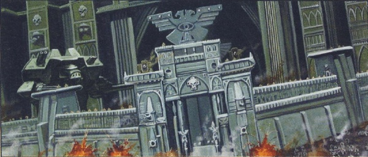

<!-- A0805-B0039 -->

原译文

The siege of the Imperial Palace 帝国皇宫围城

**校订译文**

The siege of the Imperial Palace 帝国皇宫围城

<!-- /A0805-B0039 -->

<!-- A0805-B0040 -->
**英文原文**

The bombardment continued for days as Perturabo probed for weaknesses in the Aegis, discovering the flaw around Bastion-16. The Aegis around this area was weakened enough to allow for slow-moving aircraft to penetrate. Despite the ragings of Angron and the boredom of Fulgrim, Horus would not launch an all-out attack yet. The Emperor's might not only prevented Daemons from manifesting on Terra, but also threatened to destroy the Daemon Primarch's should they set foot upon its soil. Magnus and Zardu Layak surmised a ritual to eliminate the Emperor's barrier by spilling enough blood across Terra. Horus began to increasingly spend his time comatose, his spirit inside the Warp searching for lore as well as weakening the Emperor's spirit, eventually designating First Captain Ezekyle Abaddon as his proxy. After 12 days the bombardments continued, but were matched with the first ground assaults. Thousands of traitor vessels crashed into Terra's surface. Many were destroyed by the Palace defenses, but many more landed and unleashed endless hordes of Traitor Imperial Army, Beastmen, Cultists, and Mutants. These were largely distractionary measures to support the traitors' true objectives as they ravaged the planet, as well as support the traitor aerial attacks on the Palace's anti-ship guns and void shield generators. The loyalists responded with their own aerial defenses, and massive dogfights erupted over the Palace as the conscripts outermost trenches around the walls held against the attacks by the Lost and the Damned. While the Palace held, elsewhere across Terra major population centers fell such as Lundun, Noy Zaylant Hive, Neork, and Braslya.

<!-- /A0805-B0040 -->

<!-- A0805-B0041 -->

原译文

轰炸持续了好几天，佩图拉博探测了宙斯盾的弱点，发现了巴斯蒂安-16周围的缺陷。该区域周围的宙斯盾被削弱到足以让缓慢移动的飞机穿透。尽管安格隆怒不可遏，福格瑞姆也很无聊，荷鲁斯还没有发动全面进攻。帝皇的力量不仅阻止了恶魔在泰拉上显现，还威胁说，如果他们踏上泰拉的土地，就会摧毁恶魔原体。马格努斯和扎杜·拉亚克推测，有一种仪式是通过在泰拉上洒下足够的鲜血来消除帝皇的屏障。荷鲁斯开始越来越多地把时间花在冥想上，他在亚空间中的精神在寻找知识，同时削弱了帝皇的精神，最终指定第一连长以泽凯尔·阿巴顿为他的代理人。12天后，轰炸仍在继续，与第一次地面进攻相照应。数千艘叛徒船只撞上了泰拉的表面。许多人被皇宫的防御摧毁，但更多的人登陆并释放了无尽的叛徒帝国军队、野兽人、邪教徒和变种人。这些主要是分散注意力的措施，以支持叛徒在蹂躏泰拉时的真正目标，以及支持叛徒对宫殿反舰火炮和虚空盾发生器的空袭。忠诚派以自己的防空系统作为回应，在皇宫上空爆发了大规模的混战，征召兵在城墙周围的最外战壕抵御了迷失者和被诅咒者的袭击。当保持皇宫时，泰拉其他主要人口中心如伦敦、诺伊扎兰特巢都、纽克和布拉斯亚都沦陷了。

**校订译文**

轰炸持续数日，佩图拉博不断试探神盾，发现第 16 号堡垒周边的缺陷。那里的护盾已衰弱到足以让低速飞行器穿过。安格隆暴怒，福格瑞姆厌烦，荷鲁斯却仍不肯全面进攻：帝皇的力量不仅阻止恶魔在泰拉显现，恶魔原体一旦踏上地面，也可能遭其摧毁。马格努斯与扎度·拉亚克推演出一种仪式，试图以遍洒泰拉的鲜血消除帝皇屏障。荷鲁斯则越来越长时间地陷入昏睡，灵魂在亚空间中寻找秘识，同时削弱帝皇的精神，最终指定第一连长以泽凯尔·阿巴顿代行指挥。十二天后，轰炸仍未停歇，第一轮地面进攻也同时展开。数千艘叛军舰船直冲泰拉地表；许多被皇宫防御击毁，却有更多成功着陆，放出无穷无尽的叛变帝国军、野兽人、邪教徒与变种人。这些部队四处蹂躏，主要用于转移守军注意，掩护叛军真正目标，并配合空中部队攻击皇宫反舰炮与虚空盾发生器。忠诚派出动空中防御力量，皇宫上空爆发大规模缠斗，城外最前沿战壕中的征召兵则抵挡迷失者与被诅咒者的进攻。皇宫尚在坚守，伦敦、诺伊扎兰特巢都、纽克、布拉斯亚等泰拉主要人口中心却已沦陷。

**校注：** Bastion-16 是第16号堡垒，不是人名巴斯蒂安。comatose 原义昏迷，依荷鲁斯灵魂离体活动的上下文译为昏睡，不擅改成普通冥想。

<!-- /A0805-B0041 -->

<!-- A0805-B0042 -->
**英文原文**

The pattern of orbital attack, landings by traitor rabble, and aerial assault repeated itself for weeks before the Death Guard fleet under the now-corrupted Mortarion arrived at Terra. True to his earlier word to let Mortarion's legion be the first to set foot upon Terra, Horus prepared to use the Death Guard in the first Astartes-led assaults on the Palace. This caused Angron to rage, and to prevent him from destroying his own flagship The Conqueror he was teleported by World Eaters 8th Company Kharn into the ever-shifting labyrinth originally built for Vulkan aboard the Night Lords flagship Nightfall. On the seventh of Quartus the first Death Guard Drop Pods landed on Terra's soil as the Nine Disciples of Kelbor-Hal each beached one of their Ark Mechanicus-class Battleships around the Palace. The Void Shields and bulk of the Ark Mechanicus vessels allowed for the traitors to establish their first real footholds around the Palace, and as the Death Guard unleashed gas and plagues upon the trenches around the walls the Dark Mechanicum set about their work of constructing siege engines. The Death Guard assault on the outermost trenches around the Palace was about to break the Imperial Army defenders until Jaghatai Khan, defying Dorn's orders to remain in the palace, led a Jetbike charge by the White Scars. The Scars pushed past the traitor frontline into their siege camps before the Khan was finally forced from his Jetbike. Jaghatai slew dozens of Death Guard until he was wounded by a Warp-tainted poisoned blade. Ultimately Sanguinius had to sortie out of the Palace with his Sanguinary Guard to rescue Jaghatai, who recovered from his Warp sickness as soon as he began to move closer to the Sanctum Imperialis and the psychic might of the Emperor. The Khan's move was not reckless however, he also gathered valuable intelligence on the siege engines the traitors were constructing. Meanwhile aboard the Vengeful Spirit, Horus finally allowed Perturabo to begin his preparations to clear landing zones around the Palace for their Titans.

<!-- /A0805-B0042 -->

<!-- A0805-B0043 -->

原译文

轨道攻击、叛徒乌合之众登陆和空袭的模式在现在腐化的莫塔里安领导的死亡守卫舰队抵达泰拉之前重复了数周。正如他早些时候所说的，让莫塔里安的军团成为第一个踏上泰拉的人，荷鲁斯准备在阿斯塔特领导的对皇宫的第一次进攻中使用死亡守卫。这引起了安格隆的愤怒，为了防止他摧毁自己的旗舰征服者号，他被吞世者第八连的卡恩传送到最初为沃坎建造的位于午夜领主旗舰夜幕降临号上不断移动的迷宫中。在第四的第七日，第一个死亡守卫空投舱降落在泰拉的土地上，因为凯尔博·哈尔的九名弟子每人在皇宫周围搁浅了一艘机械方舟级战舰。虚空盾和机械方舟的大部分船体允许叛徒在皇宫周围建立他们的第一个真正的立足点，当死亡守卫在城墙周围的战壕上释放气体和瘟疫时，黑暗机械教开始建造攻城引擎。死亡守卫对皇宫周围最外层战壕的袭击即将摧毁帝国军队的防御者，直到察合台可汗无视多恩留在皇宫的命令，率领白色伤疤的喷气式摩托冲锋。在可汗最终被迫离开他的喷气式摩托之前，白色伤疤越过叛徒前线进入了他们的围城营地。察合台杀死了数十名死亡守卫，直到他被一把被亚空间污染的毒刃打伤。最终，圣吉列斯不得不带着他的圣血卫队冲出皇宫去营救察合台，他一开始靠近帝国圣地和帝皇的灵能力量，就从亚空间疾病中康复了。然而，可汗的举动并非鲁莽，他还收集了有关叛徒正在建造的攻城车的宝贵情报。与此同时，在复仇之魂号上，荷鲁斯终于允许佩图拉博开始准备为泰坦清理皇宫周围的着陆区。

**校订译文**

轨道轰炸、叛军杂兵登陆与空袭反复持续数周，已经腐化的莫塔里安才率死亡守卫舰队抵达泰拉。荷鲁斯兑现此前承诺，准备让死亡守卫成为首个登上泰拉、率领阿斯塔特进攻皇宫的军团。安格隆为此狂怒，为防止他毁掉旗舰征服者号，吞世者第八连的卡恩将他传送至午夜领主旗舰夜幕降临号，关进那座最初为沃坎打造、结构不断变换的迷宫。第四月第七日，第一批死亡守卫空降舱降临地面；凯尔博·哈尔的九名弟子也各自驾一艘机械方舟级战列舰，在皇宫周边强行搁浅。凭借庞大舰体与虚空盾，叛军终于建立了稳固的攻城据点。死亡守卫向城外战壕投放毒气和瘟疫，黑暗机械教则开始建造攻城机械。最外围战壕的帝国军眼看就要崩溃，察合台可汗却违抗留守皇宫的命令，率白疤喷气摩托部队冲出。白疤突破敌人前线，直入攻城营地，可汗最终被迫弃车，步战斩杀数十名死亡守卫，却被一把受亚空间污染的毒刃刺伤。圣吉列斯只得带圣血守卫出城救援。察合台一接近帝国圣所、进入帝皇灵能的影响范围，身上的亚空间病害便开始消退。不过，可汗的行动并非毫无谋划，他还搜集了敌军攻城机械的重要情报。与此同时，复仇之魂号上的荷鲁斯终于准许佩图拉博准备清理皇宫附近的泰坦登陆区。

**校注：** 首个踏上泰拉的军团是荷鲁斯给予死亡守卫的承诺，前文已有其他叛军登陆，且特指此阶段的阿斯塔特攻势。Quartus 为第四月，不是序号“第四”的某日。

<!-- /A0805-B0043 -->

<!-- A0805-B0044 图片 -->
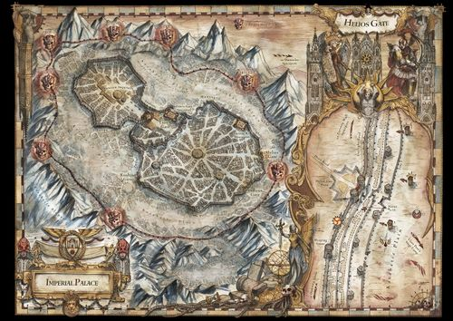

<!-- A0805-B0045 -->

原译文

The Dark Mechanicum siege camps around the Imperial Palace 黑暗机械教在皇宫周围的攻城营地

**校订译文**

The Dark Mechanicum siege camps around the Imperial Palace 黑暗机械教在皇宫周围的攻城营地

<!-- /A0805-B0045 -->

<!-- A0805-B0046 -->
**英文原文**

On the Fifteenth of Quartus, the traitors initiated their dual plan to break The Aegis and allow for the manifestation of Daemons upon Terra. A giant projected face of Zardu Layak appeared on an island of bones which descended from the sky, urging the commoners of Terra to rise up against the Emperor and ensuring them that if they turned to Horus now they would be spared. The Palace guns could not silence the corporeal island, and after his speech concluded it began to rain blood. The blood signaled that the traitors had finally undertaken their ritual to weaken the Emperor's psychic barrier, and the Mechanicum released their Daemon Engines. Eight "Warp-Bane" guns constructed near the sites of the beached Ark Mechanicus vessels opened up on the Aegis Shield around the Palace, sapping it of its energies as the Death Guard deployed massive Towers of Nurgle at the walls. As the Aegis gave way the traitor bombardment finally was able to hit the Palace defenses directly, causing massive devastation and allowing for a Night Lords Raptor assault on the Eternity Wall. The outermost trenches around the Palace Walls were now untenable, but Sanguinius opened up the Helios Gate and led a massive counterattack by the Blood Angels and Imperial Fists as well as Titans of the Legio Solaria. Sanguinius knew victory was impossible, but had his Astartes buy enough time to allow for the Imperial Army conscripts to make it inside the walls and allow for Titans to destroy the incoming Towers of Nurgle. On top of the Eternity Wall itself, Blood Angels First Captain Raldoron bested the acting Night Lords commander Gendor Skraivok and threw him from the Walls. It was in this maelstrom of destruction that Angron himself fell from the sky, having been released from the bowels of the Nightfall. After massacring his way through friend and foe alike to the Eternity Wall Angron bellowed a challenge to Sanguinius, who saluted his fallen brother and stated that while they would battle one day, today was not that day. Angron raged, but could not proceed any further due to the lingering effects of the Emperor.

<!-- /A0805-B0046 -->

<!-- A0805-B0047 -->

原译文

在第四的第十五日，叛徒们开始了他们的双重计划，即打破宙斯盾，允许恶魔在泰拉上显现。扎度·拉亚克的一张巨大的投影脸出现在一个从天而降的骸骨之岛上，敦促泰拉的平民起来反抗帝皇，并确保他们如果现在转向荷鲁斯，他们将幸免于难。皇宫的枪炮无法让这座有形的岛屿安静下来，在他的演讲结束后，它开始下起了血雨。鲜血表明，叛徒们终于开始了削弱帝皇灵能屏障的仪式，黑暗机械教释放了他们的恶魔引擎。在搁浅的机械方舟附近建造的八门“亚空间之灾”火炮在皇宫周围的宙斯盾上开火，当死亡守卫在墙上部署巨大的纳垢之塔时，它的能量被消耗殆尽。随着宙斯盾的屈服，叛徒的轰炸终于能够直接击中皇宫的防御，造成了巨大的破坏，并允许午夜领主猛禽攻击永恒之墙。皇宫城墙周围的最外层战壕现在已经无法维持，但圣吉列斯打开了日神之门，并领导了圣血天使、帝国之拳以及日晷军团的泰坦的大规模反击。圣吉列斯知道胜利是不可能的，但他让他的阿斯塔特部队争取了足够的时间，让帝国军队的征召兵进入城墙，让泰坦摧毁了即将到来的纳垢之塔。在永恒之墙之上，圣血天使第一连长拉多隆击败了临时午夜领主指挥官詹多·斯卡莱沃克，并将他从墙上扔了下来。正是在这场毁灭的漩涡中，安格隆从夜幕降临号的深处被释放出来，从天空坠落。在屠杀了他的朋友和敌人，到达永恒之墙后，安格隆向圣吉列斯发出了挑战，圣吉列斯向他堕落的兄弟致敬，并表示虽然他们总有一天会战斗，但今天不是那一天。安格隆怒不可遏，但由于帝皇挥之不去的影响，他无法再继续下去。

**校订译文**

第四月第十五日，叛军开始同时实施两项计划：击破神盾，让恶魔能够在泰拉显现。一座骸骨之岛从天而降，上方投射出扎度·拉亚克的巨大面孔。他煽动平民反抗帝皇，承诺只要现在投靠荷鲁斯便能免死。皇宫炮火无法让这座岛屿沉寂；演说结束，天空便降下血雨，昭示削弱帝皇灵能屏障的仪式已经展开。机械教释放恶魔引擎，在搁浅机械方舟旁建造的八门“亚空间之灾”炮向神盾开火，消耗护盾能量；死亡守卫则把巨大的纳垢之塔推向城墙。神盾开始崩溃，叛军轰炸终于直接打中皇宫防御设施，造成严重毁坏，午夜领主猛禽也趁机突击永恒之墙。最外围战壕已无法固守，圣吉列斯打开日神之门，率圣血天使、帝国之拳及日晷军团泰坦大举反击。他知道此战无法取胜，只求阿斯塔特争得足够时间，让帝国军征召兵撤入城内，并让泰坦摧毁逼近的纳垢之塔。永恒之墙上，圣血天使第一连长拉多隆击败午夜领主代理指挥官詹多·斯卡莱沃克，将其掷下城墙。就在毁灭席卷战场之际，安格隆从夜幕降临号获释，自天而降，一路不分敌我地屠杀至城下，向圣吉列斯发出挑战。圣吉列斯向堕落的兄弟致意，说他们终有一战，但不是今天。安格隆暴怒，却仍受帝皇尚存的力量所阻，无法再进一步。

**校注：** 原文 corporeal island 为有形岛屿，但其为何不受炮火影响未解释，保留不补作幻象。这里英文仅写 Mechanicum，中文保持机械教。

<!-- /A0805-B0047 -->

<!-- A0805-B0048 -->
### Battle for Lion's Gate Spaceport 狮门太空港之战

<!-- /A0805-B0048 -->

<!-- A0805-B0049 -->
**英文原文**

Though the rest of Terra was in chaos or in Traitor hands, the Palace stood firm. All traitor attacks against the walls failed to achieve a breakthrough, and the Emperor's psychic shield endured strong enough to keep the Daemon Primarch's from the Palace. In order to further the weakened Emperor's barrier, both Horus and Magnus launched psychic attacks against Him. Magnus utilized the gestalt Daemon Shai-Tan in the attacks. At Horus' command Mortarion attacked near the Saturnine Gate turning the previously lavish Palatine Arc into an infected quagmire nicknamed Poxville. Angron fruitlessly rampaged outside of the Helios Gate, and Fulgrim's degenerate hordes launched raids to both the west and north. The Emperor's Children were already beginning to leave the frontline, instead taking prisoners for their own perverse reasons. Of Magnus there was no sign, and not even Malcador could ascertain his true intentions. In this stalemate, Horus placed Perturabo in charge of achieving a major breakthrough. Perturabo surmised that the Lion's Gate Spaceport was both the weakest and strongest points in the Palace's defenses. Taking it would allow the traitors to land badly needed Titans and give the traitors access to both the Inner and Outer Palaces. At the same time however, it was one of the most heavily defended bastions. This did not deter Perturabo, and he shocked his First Captain Forrix by placing Kroeger in charge of the assault on the Spaceport. Perturabo hoped that Koreger's bluntness would shock Dorn, who had planned for a more sophisticated attack.

<!-- /A0805-B0049 -->

<!-- A0805-B0050 -->

原译文

尽管泰拉的其他地区处于混沌或叛徒手中，但皇宫依然屹立不倒。所有叛徒对城墙的攻击都没有取得突破，帝皇的灵能屏障足够强大，可以阻止大魔进入皇宫。为了进一步削弱帝皇的屏障，荷鲁斯和马格努斯都对他发动了灵能攻击。马格努斯在进攻中使用了格式塔恶魔撒丹。在荷鲁斯的指挥下，莫塔里安在土星之门附近发动袭击，将之前奢华的帕拉蒂尼穹顶变成了一个被称为疫病之城的感染泥潭。安格隆在日神之门外横冲直撞，毫无结果，副歌瑞姆的堕落部落向西部和北部发动了袭击。帝皇之子已经开始离开前线，因为他们自己的反常原因而俘虏人。马格努斯没有任何迹象，甚至马卡多也无法确定他的真实意图。在这种僵局中，荷鲁斯让佩图拉博负责实现重大突破。佩图拉博推测，狮门太空港是皇宫防御中最薄弱和最坚固的地方。夺取它将使叛徒能够获得急需的泰坦，并让叛徒进入内外殿。然而，与此同时，它也是防御最严密的堡垒之一。这并没有阻止佩图拉博，他让克罗格尔负责对太空港的袭击，这让他的第一连长弗里克斯感到震惊。佩图拉博希望克罗格尔的直率会让多恩感到震惊，因为多恩已经计划了一次更复杂的攻击。

**校订译文**

泰拉其他地区或陷入混乱，或落入叛军之手，皇宫却依旧坚守。敌军对城墙的攻击始终未能突破，帝皇灵能屏障的余力仍足以阻止恶魔原体进入皇宫。荷鲁斯与马格努斯继续以灵能攻击帝皇，力图削弱屏障；马格努斯还借助了集合体恶魔撒丹。莫塔里安奉荷鲁斯之命进攻土星之门一带，将原本奢华的帕拉蒂尼弧区变成感染肆虐的泥沼，被戏称为“疫病之城”。安格隆在日神之门外徒然暴走，福格瑞姆的堕落大军则袭扰西面与北面。帝皇之子已开始脱离前线，为满足变态欲望而掳掠俘虏。马格努斯本人行踪不明，连马卡多也无法判定他的真正意图。僵局之下，荷鲁斯命佩图拉博负责实现重大突破。佩图拉博判断，狮门太空港既是防御最强点，也是关键弱点：夺下它，便能让叛军急需的泰坦登陆，并打通通往内宫与外宫的道路；但它同时又是守备最严密的堡垒之一。佩图拉博毫不退缩，还出人意料地命克罗格主攻，令第一连长弗里克斯大为震惊。他希望用克罗格直来直去的打法，打乱多恩针对更精巧攻势所做的准备。

**校注：** Daemon Primarchs 指恶魔原体，非大魔。Palatine Arc 暂作帕拉蒂尼弧区，Arc 不等于 dome 穹顶；确切区域名待核。末句是多恩原本准备应对复杂攻势，不是多恩自己策划这次攻击。Koreger 为 Kroeger 英文误拼。

<!-- /A0805-B0050 -->

<!-- A0805-B0051 图片 -->
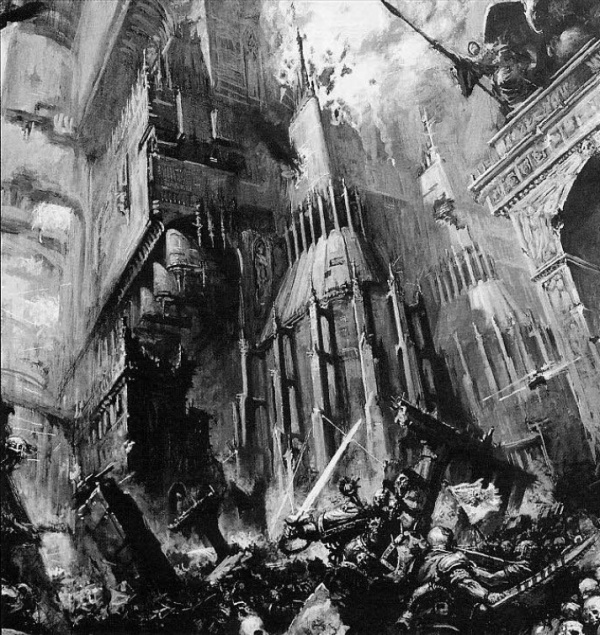

<!-- A0805-B0052 -->

原译文

The Imperial Palace under siege 围攻下的帝国皇宫

**校订译文**

The Imperial Palace under siege 围攻下的帝国皇宫

<!-- /A0805-B0052 -->

<!-- A0805-B0053 -->
**英文原文**

The Imperial Forces at the Lion's Gate Spaceport numbered 18,000 Imperial Fists and nearly 800,000 Imperial Army troops under the command of Fafnir Rann. To break this, the traitors amassed a massive force of their own. 25,000 Iron Warriors, thousands more World Eaters under Kharn, 2,308 Basilisks, 1,500 Manticores, 13 Bombards, 476 Deathstrike Missile Launchers, 495 Medusas, 84 Typhon Heavy Siege Tanks, 7,108 Thunderburst towed guns, 306 Siege Dreadnoughts, and tens of thousands of Astartes tanks representing 80% of the Iron Warriors Legion's Armor. Supporting this were 1.5 million traitor Imperial Army troops and untold numbers of Beastmen, Mutants, and Cultists.

<!-- /A0805-B0053 -->

<!-- A0805-B0054 -->

原译文

狮门太空港的帝国军队在法夫尼尔·兰恩的指挥下拥有18000名帝国之拳和近80万帝国军队。为了打破这一局面，叛徒们聚集了一支庞大的力量。25000名钢铁勇士，还有数千名卡恩手下的吞世者，2308辆石化蜥蜴，1500辆蝎尾狮，13辆臼炮，476辆死亡直击导弹发射器，495辆美杜莎，84辆提丰重型攻城坦克，7108门雷爆牵引火炮，306名攻城无畏，以及数万辆阿斯塔特坦克，占钢铁勇士军团装甲的80%。支援者是150万叛徒帝国军队和无数的野兽人、变种人和邪教徒。

**校订译文**

法夫尼尔·兰恩指挥一万八千名帝国之拳与近八十万帝国军守卫狮门太空港。为击破他们，叛军集结了两万五千名钢铁勇士、卡恩麾下数千名吞世者，以及 2,308 辆石化蜥蜴自行火炮、1,500 辆蝎尾狮导弹车、13 辆臼炮、476 部死亡直击导弹发射装置、495 辆美杜莎、84 辆提丰重型攻城坦克、7,108 门雷爆牵引炮和 306 台攻城无畏机甲。此外，还有数万辆阿斯塔特坦克，约占钢铁勇士军团装甲力量的八成。支援这支大军的是一百五十万叛变帝国军，以及不可计数的野兽人、变种人与邪教徒。

**校注：** 此处 Medusa 为炮车型号，与美杜莎行星分义；Typhon 为重型攻城坦克名，不是死亡守卫人物。数字按英文逐项保留。

<!-- /A0805-B0054 -->

<!-- A0805-B0055 -->
**英文原文**

Despite the apprehensions of Forrix, Kroeger chose not to launch a massive preliminary bombardment and instead launched an immediate attack on the Walls outside the Lion's Gate Spaceport. To the surprise of the traitors the Fists under Fafnir Rann forayed out of the Spaceport and formed a Shield Wall, pressing the Lost and the Damned masses together as Astarted armor moved around on their flanks. The armored encirclement decimated the traitors, wiping out 300,000 troops in under two hours. The traitor attack stalled until the appearance of Angron himself, who managed to turn the tide. However as the Emperor's psychic shield prevented the Daemon Primarch from moving into the Palace Walls, the traitors failed to take the Spaceport. Following the failed attack, Perturabo realized that to take the Walls they must combat the immaterial might of the Emperor, Horus agreed, and gave Perturabo the support of Zardu Layak and Abaddon as well as Typhon. The four moved back down to the Palace Perimeter and enacted a ritual that would summon Cor’bax Utterblight into the minds of the mortal defenders of the Palace, forcing the Emperor's psyche to its limits. Meanwhile at the orders of Kroeger Forrix and 1,000 Iron Warriors infiltrated into the Spaceport, using the earlier attack as a smokescreen to move in and seize the bridges between the Spaceport and Lion's Gate itself. However in truth Kroeger intended to abandon Forrix behind enemy lines, or at the very least simply didn't care enough to lend him support. Shortly after Forrix's infiltration, 3,000 Sons of Horus under Abaddon alongside forces from the World Eaters under Kharn and Iron Warriors under Kroeger and Berossus attacked the upper tiers of the Spaceport.

<!-- /A0805-B0055 -->

<!-- A0805-B0056 -->

原译文

尽管弗里克斯感到担忧，克罗格尔选择不进行大规模的初步轰炸，而是立即对狮门太空港外的城墙发动了攻击。令叛徒们惊讶的是，法夫尼尔·兰恩率领的帝国之拳部队突袭了太空港，形成了一道盾墙，将迷失者和被诅咒者压在一起，而阿斯塔特装甲部队在他们的侧翼移动。装甲包围圈摧毁了叛徒，在两个小时内消灭了30万名士兵。叛徒的攻击一直停滞不前，直到安格隆本人出现，他设法扭转了局势。然而，由于帝皇的灵能屏障阻止了恶魔原体进入皇宫城墙，叛徒未能占领太空港。袭击失败后，佩图拉博意识到，要占领城墙，他们必须对抗帝皇的非物质力量，荷鲁斯同意了，并给予佩图拉博扎杜·拉亚克、阿巴顿和泰丰斯的支援。四人回到皇宫周围，并举行了一项仪式，将科尔'巴克斯·枯毁召唤到皇宫的凡人防御者的脑海中，迫使帝皇的灵能达到极限。与此同时，在克罗格尔和弗里克斯的命令下，1000名钢铁勇士渗透到太空港，利用早些时候的袭击作为烟幕，进入并夺取太空港和狮门之间的桥梁。然而，事实上，克罗格尔打算把弗里克斯抛弃在敌后，或者至少根本不在乎给他支援。弗里克斯渗透后不久，阿巴顿手下的3000名荷鲁斯之子，以及卡恩手下的吞世者和克罗格尔和贝罗索斯手下的钢铁勇士，袭击了太空港的上层。

**校订译文**

弗里克斯虽有疑虑，克罗格仍决定省去大规模火力准备，直接进攻狮门太空港外的城墙。法夫尼尔·兰恩麾下帝国之拳却突然杀出太空港，结成盾墙，将迷失者与被诅咒者挤成一团，同时由阿斯塔特装甲部队从两翼包抄。叛军猝不及防，不到两小时便有三十万人在装甲包围圈中被歼灭。攻势就此受挫，直到安格隆亲自出现才扭转局面。然而，帝皇的灵能屏障阻止恶魔原体越过宫墙，叛军仍未拿下太空港。战后，佩图拉博认定，要突破城墙，必须先对付帝皇在非物质领域的力量。荷鲁斯同意，派扎度·拉亚克、阿巴顿与提丰协助他。四人返回皇宫外围，举行仪式，试图将科尔’巴克斯·枯毁召入凡人守军的意识，迫使帝皇的精神承受极限压力。与此同时，弗里克斯奉克罗格之命，率一千名钢铁勇士借此前进攻掩护潜入太空港，夺取连接港区与狮门的桥梁。克罗格实际上打算把他丢在敌后，或至少根本无意给予足够支援。潜入行动开始不久，阿巴顿率三千名荷鲁斯之子，与卡恩的吞世者、克罗格和贝罗索斯的钢铁勇士一同进攻太空港上层。

**校注：** forayed out of 指兰恩部队从己方太空港出击，不是袭击太空港。Kroeger orders Forrix and 1,000 ... 指克罗格命弗里克斯率部潜入，不是两人共同下令。Typhon 为同一人物旧名提丰，区别 Typhus 当前官译泰弗斯，英文使用何名即保留何名。

<!-- /A0805-B0056 -->

<!-- A0805-B0057 -->
**英文原文**

Dorn agreed to provide Rann with reinforcements under Sigismund to prevent a total traitor victory at the Spaceport. During the defense Rann was wounded by Kroeger but saved by Sigismund, who led a vicious counterattack. It soon became apparent that the Iron Warriors attempt to seize the bridges had been simply a feint. Perturabo used Forrix's men to shield his true intentions, docking the Iron Blood with the Space Port's space elevator facilities and unloading waves of new reinforcements. The defection of the Addaba Free Corps prevented Dorn from sending reinforcements and the situation collapsed for the loyalists. In the ensuing brawl Sigismund battled Kharn, but while the First Captain was the superior warrior the World Eater's Captain was now infused with Khornate strength. Sigismund was bested, but saved by the appearance of Rogal Dorn himself who slapped away Kharn like an insect. Abaddon refused to allow Kharn to die and led a counterattack to save the World Eater, forcing Layak to intervene in order to save the future Warmaster of Chaos from the Primarch's wrath. Layak held off Dorn for a time with his sorcerous power, but was eventually slain. However, as he died he opened a portal to the Warp which allowed the first Daemon's to manifest on Terra. With the situation now hopeless, Dorn ordered a withdrawal as Perturabo himself landed in the Spaceport. The two brothers came face to face, but both refused to waste their time and resources engaging one another in a fruitless duel. Perturabo had taken the First Wall, but there were still many more left to capture before the Sanctum Imperialis. Perturabo was undeterred as he oversaw the landing of the first Traitor Titans from the Legio Fureans upon Terra.

<!-- /A0805-B0057 -->

<!-- A0805-B0058 -->

原译文

多恩同意在西吉斯蒙德的指挥下向兰恩提供增援，以防止叛徒在太空港取得彻底胜利。在防御期间，兰恩被克罗格尔打伤，但被西吉斯蒙德救下，西吉斯蒙德领导了一场猛烈的反击。很快，钢铁勇士们夺取桥梁的企图显然只是一种佯攻。佩图拉博利用弗里克斯的人来掩盖他的真实意图，将铁血号与太空港的太空电梯设施对接，并卸载一波又一波的新增援部队。阿达巴自由军的叛逃使多恩无法派遣增援部队，忠诚派的处境也随之崩溃。在随后的战斗中，西吉斯蒙德与卡恩作战，但当第一连长是更优秀的战士时，吞世者的连长现在被注入了恐虐的力量。西吉斯蒙德被击败，但罗格·多恩本人的出现拯救了他，他像一只扇昆虫一样扇了卡恩一耳光。阿巴顿拒绝让卡恩死去，并领导了一场反击以拯救吞世者，迫使拉亚克进行干预，以拯救未来的混沌战帅免受原体之怒。拉亚克用他的魔法力量挡住了多恩一段时间，但最终被杀了。然而，当他死去时，他打开了一个通往亚空间的门户，让第一个恶魔在泰拉上显现。随着局势的绝望，多恩下令撤军，而佩图拉博本人也降落在了太空港。两兄弟面对面交锋，但都拒绝浪费时间和资源，进行一场徒劳无功的决斗。佩图拉博已经占领了第一道墙，但在帝国圣地之前还有更多的东西要占领。佩图拉博没有被吓倒，因为他监督了第一批来自狂热者军团的叛徒泰坦登陆泰拉。

**校订译文**

多恩同意派西吉斯蒙德增援兰恩，阻止叛军完全夺取太空港。兰恩在防守中被克罗格击伤，西吉斯蒙德救下他，随即组织猛烈反击。但众人很快发现，钢铁勇士夺桥只是佯攻。佩图拉博以弗里克斯的部队掩护真正计划，让铁血号与太空港的太空电梯设施对接，源源不断卸下援军。阿达巴自由军叛变，阻断多恩继续增援的可能，忠诚派形势迅速崩溃。混战中，西吉斯蒙德迎战卡恩；他武艺更胜一筹，卡恩却已得到恐虐之力加持。西吉斯蒙德败下阵来，幸得罗格·多恩亲自赶到，将卡恩如虫豸般挥开。阿巴顿不肯看着卡恩死去，率军反击救援，拉亚克只得介入，保护这位未来的混沌战帅免遭原体杀戮。拉亚克凭巫术一度拖住多恩，最终仍被斩杀，却在死前打开亚空间门户，让第一批恶魔得以在泰拉显现。战局已无挽回余地，多恩下令撤退，佩图拉博则亲自登陆太空港。兄弟两人当面相遇，却都不愿把时间与兵力耗费在无益的决斗上。佩图拉博夺下了第一道城墙，但通往帝国圣所的道路上仍有重重壁垒。他毫不气馁，继续督导第一批叛军泰坦登陆泰拉——它们来自愤怒者军团。

**校注：** 拉亚克救援的“未来混沌战帅”指阿巴顿，非卡恩。两位原体当面相遇后并未决斗，原译“交锋”误导。Legio Fureans 沿本稿776已定愤怒者军团。

<!-- /A0805-B0058 -->

<!-- A0805-B0059 -->
**英文原文**

Meanwhile inside the Inner Palace, Euphrati Keeler's Lectitio Divinitatus continued to gain influence in the throngs of refugees and desperate. However, their faith was a deception by Chaos, which allowed Utterblight to manifest inside the Sanctum Imperialis itself. Thanks to the efforts of Malcador, Sisters of Silence, and Amon Tauromachian total disaster was averted, but the incident combined with the constant immaterial assaults by Horus and Magnus forced the Emperor's psychic shield to reduce to only around the Sanctum Imperialis. With the Emperor weakened, massive amounts of Daemons were summoned on Terra for the first time. Meanwhile, Angron led a horde of World Eaters towards the Eternity Wall. Dorn was not shocked by the fall of the Spaceport, and in fact, was satisfied that he had held it longer than he thought he would. All that mattered to the Primarch was to buy enough time for Guilliman to arrive.

<!-- /A0805-B0059 -->

<!-- A0805-B0060 -->

原译文

与此同时，在内殿内，幼发拉底·琪乐的《圣言录》继续在难民和绝望的人群中获得影响力。然而，他们的信仰是混沌的欺骗，这使得枯毁在帝国圣所内部得以显现。由于马卡多、寂静修女和阿蒙·陶罗玛奇的努力，灾难得以避免，但这一事件与荷鲁斯和马格努斯不断的非物质攻击相结合，迫使帝皇的灵能屏障只能减少到帝国圣地周围。随着帝皇的削弱，大量的恶魔首次被召唤到泰拉上。与此同时，安格隆带领一群吞世者走向永恒之墙。多恩对太空港的倒塌并不感到震惊，事实上，他很满意自己能比想象中坚持更长时间。对原体来说，重要的是为基里曼的到来争取足够的时间。

**校订译文**

与此同时，内宫难民与绝望民众中，尤弗拉蒂·琪乐宣扬的神性论信仰不断扩散。然而，混沌利用这份信仰设下骗局，使枯毁得以直接现身帝国圣所内部。马卡多、寂静修女与阿蒙·塔罗马奇合力避免了全面灾难，但这起事件加上荷鲁斯、马格努斯不断施加的非物质攻击，迫使帝皇将灵能屏障收缩至帝国圣所周边。帝皇衰弱后，大量恶魔首次被召至泰拉。安格隆则率吞世者大军逼近永恒之墙。多恩并未因太空港失守而震惊，反而满意于守军坚持得比预期更久；他最关心的，始终是争取到足够时间，等基里曼赶来。

**校注：** Lectitio Divinitatus 此处为信仰运动，依主审采用神性论信仰，非书名《圣言录》。英文称 faith was a deception，译为混沌利用信仰实施骗局，保留此处因果，不擅删除。后续大量恶魔“首次”出现，与先前零星显现保留规模区别。

<!-- /A0805-B0060 -->

<!-- A0805-B0061 -->
### Defense of the Lion's Gate 狮门防御

<!-- /A0805-B0061 -->

<!-- A0805-B0062 -->
**英文原文**

With Horus still isolating himself aboard the Vengeful Spirit, Perturabo became the general commander of the traitor war effort, maintaining a war council alongside the Mournival, Eidolon, Typhus, Ahriman, and Krostovok. On the 19th day of Quintus, the Traitors unleashed a massive assault with weapons of mass destruction and other high-yield weaponry which utterly annihilated the Magnifican, the northeastern half of the Palace megastructure. The operation was overseen by three Iron Warriors Stor-Bezashk. In the wake of the mass explosions Gastraphetes, Gravitic Ballistas, Manuballistas, Torsion Engines, Graviton Onagers, Trebuchets, and Accelerator Mangonels unleashed a bombardment against the next line of Loyalist defenses. They fired ouslite, chemical, incendiary or tungsten ordnance while others simply recycled the destroyed masonry of the Magnifican, hurling it back at the defenders. The enormous explosions and impacts created a cloud of ash that caused perpetual night on Terra. Though the Magnifican had already largely fallen to the traitors, Perturabo destroyed this section in order to prevent remaining loyalists from using the massive urban sprawl as cover for delaying actions.

<!-- /A0805-B0062 -->

<!-- A0805-B0063 -->

原译文

由于荷鲁斯仍在复仇之魂号上自我隔离，佩图拉博成为了叛徒战争的总指挥，与四王议会、艾多隆、泰丰斯、阿里曼和克罗斯托沃克一起维持了一个战争议会。在第五的第十九日，叛徒们用大规模杀伤性武器和其他高辐射武器发动了一场大规模袭击，彻底摧毁了皇宫巨型结构的东北半部壮丽扩区。这次行动由三名钢铁勇士破城宿卫监督。在大规模爆炸之后，腹弩炮、重力腹弩炮、手持弩机、扭曲引擎、重力投射炮、投射炮和加速投射炮对下一道忠诚派防线发动了轰炸。他们发射了弹药、化学武器、燃烧弹或钨弹，而其他人则简单地回收了被摧毁的壮丽扩区砖石，将其扔回防御者。巨大的爆炸和撞击产生了一团火山灰，在泰拉上造成了永恒的黑夜。尽管壮丽扩区在很大程度上已经落入叛徒之手，但佩图拉博摧毁了这一地区，以防止剩下的忠诚派利用大规模的城市扩张作为拖延行动的掩护。

**校订译文**

荷鲁斯仍将自己封闭在复仇之魂号内，佩图拉博遂成为叛军总指挥，与四王议会、艾多隆、泰弗斯、阿里曼和克罗斯托沃克共同主持军事会议。第五月十九日，叛军动用大规模杀伤性武器和其他高当量武器，彻底摧毁皇宫巨构东北半部的壮丽扩区。三名钢铁勇士破城宿卫负责指挥这次行动。大爆炸之后，腹弩炮、重力弩炮、手弩炮、扭力弩机、重力投石机、抛石机和加速投石机接连轰击下一道忠诚派防线，投射乌斯莱特弹药、化学弹、燃烧弹或钨质弹药。有些器械索性收集壮丽扩区的建筑残骸，再掷向守军。巨大爆炸与撞击扬起漫天灰尘，使泰拉陷入无尽长夜。壮丽扩区虽然大半已由叛军占领，佩图拉博仍将其夷平，免得忠诚派残军利用广阔城区掩护迟滞作战。

**校注：** high-yield 为高当量，非高辐射；ash 为灰尘、灰烬，未必火山灰。ouslite 原译漏掉，暂补乌斯莱特弹药，材料性质与官译待核。各古典攻城器械依词义区分，不将 Torsion 扭力误作扭曲。

<!-- /A0805-B0063 -->

<!-- A0805-B0064 图片 -->
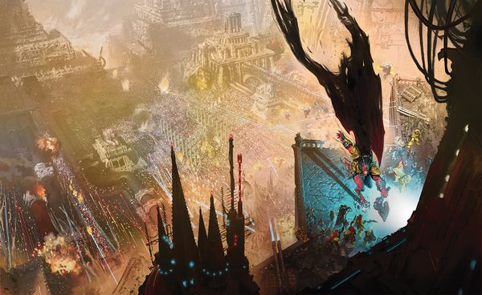

<!-- A0805-B0065 -->

原译文

Angron attacks the Imperial Palace 安格隆攻击帝国皇宫

**校订译文**

Angron attacks the Imperial Palace 安格隆攻击帝国皇宫

<!-- /A0805-B0065 -->

<!-- A0805-B0066 -->
**英文原文**

Following the fall of the Lion's Gate Spaceport on the 11th of Quintus, the loyalist situation had become dire as most of the Sprawling Magnifica was now in traitor hands. Four key areas were now threatened by the traitors: the Colossi Gate, the Eternity Wall Spaceport, the Saturnine Gate, and Gorgon Bar. Perturabo and Abaddon both noticed a minor flaw in the Saturnine Gate, a small crack in its subterranean barrier that laid along a fault line opened by the intense orbital bombardment. If this could be exploited, the entire inner Saturnine Gate complex could be rapidly captured and allow the Sanctum Imperialis to fall in a matter of weeks instead of months. Meanwhile, Rogal Dorn only had enough resources to hold three of these locations, and reluctantly had to abandon a fourth and its defenders to annihilation. Dorn ultimately chose the Eternity Wall Spaceport, as since they did not command the orbit above Terra such a facility was useless to them anyway. In addition, Dorn suspected Perturabo knew of the flaw in the Saturnine Gate and set a trap there to annihilate the traitors as they attempted to exploit it. The four battles erupted near-simultaneously.

<!-- /A0805-B0066 -->

<!-- A0805-B0067 -->

原译文

在第五的第十一日狮门太空港陷落后，忠诚派的处境变得十分严峻，因为大多数壮丽扩区现在都在叛徒手中。四个关键区域现在受到了叛徒的威胁：巨像之门、永恒之墙太空港、土星之门和戈尔贡障碍。佩图拉博和阿巴顿都注意到土星之门的一个小缺陷，这是土星之门地下屏障上的一条小裂缝，沿着强烈的轨道轰击打开的断层延伸。如果能够利用这一点，整个土星之门内部建筑群可以迅速被占领，并使帝国圣地在几周而不是几个月内沦陷。与此同时，罗格·多恩只有足够的资源来控制其中三个地点，并且不得不不情愿地放弃第四个地点及其防御者。多恩最终选择了永恒之墙太空港，因为由于他们没有指挥泰拉上方的轨道，这样的设施对他们来说无论如何都是无用的。此外，多恩怀疑佩图拉博知道土星之门的缺陷，并在那里设下陷阱，消灭试图利用它的叛徒。四场战斗几乎同时爆发。

**校订译文**

第五月十一日狮门太空港陷落后，壮丽扩区的大部分地区落入叛军手中，忠诚派处境愈发严峻。四处要地受到威胁：巨像之门、永恒之墙太空港、土星之门和戈尔贡防线。佩图拉博与阿巴顿都注意到土星之门的一个细微缺陷：猛烈轨道轰炸撕开断层，在地下屏障中留下小小的裂隙。若能从此突入，他们便能迅速夺取土星之门内部建筑群，让帝国圣所在数周而非数月内陷落。多恩的资源只够保住其中三处，不得不牺牲第四处及其守军。他最终选择放弃永恒之墙太空港：既然忠诚派已失去泰拉轨道控制权，太空港对他们也就无用了。此外，多恩怀疑佩图拉博已经发现土星之门的缺口，便在那里设下歼灭陷阱，等叛军来钻。四处战斗几乎同时打响。

**校注：** 本节先前叙述第五月十九日轰炸，此处回述第十一日太空港陷落，按原文保留倒叙。Gorgon Bar 依核心534统一戈尔贡防线。

<!-- /A0805-B0067 -->

<!-- A0805-B0068 -->
**英文原文**

At Gorgon Bar, Blood Angels Primarch Sanguinius and Imperial Fists Captain Fafnir Rann oversaw the defenses against a large Iron Warriors-led assault under Yzar Chroniates, Ormon Gundar, and Bogdan Mortel. During the battle, Sanguinius destroyed a Warlord Titan of the Legio Vulpa by boarding its head and impaling it with the Spear of Telesto. Such was the spectacle that three accompanying traitor Warhound Titans fled from Sanguinius' sight. Thanks to the inspiration provided by Sanguinius, the traitor assault at Gorgon Bar was broken when the defenders drove the Iron Warriors from the towers of the Fourth Circuit Wall. At the Colossi Gate, the defenders were led by Primarch Jaghatai Khan, Blood Angels First Captain Raldoron, Marshal Aldana Agathe, and Custodes Captain-General Constantin Valdor. Not wanting to wage a purely defensive war and wishing to eventually retake the Lion's Gate Spaceport, Jaghatai Khan led a 300-strong Jetbike charge from the Colossi Gate that devastated Death Guard-led forces until at the last moment the White Scars withdrew back to their own lines. Magnus and Ahriman along with a cabal of Sorcerers from the Order of Ruin subsequently launched a psychic assault on the defenders, sapping their will to fight and summoning vast amounts of Daemons including eight gigantic Warhound Titan-sized monsters. However thanks to the defensive storms erected by Jaghatai Khan's Stormseer's led by Naranbaatar, the loyalists were able to hold the line.

<!-- /A0805-B0068 -->

<!-- A0805-B0069 -->

原译文

在戈尔贡障碍，圣血天使原体圣吉列斯和帝国之拳连长法夫尼尔·兰恩监督了对伊扎尔·克罗尼亚泰斯、奥蒙·贡达尔和博格丹·莫尔泰尔领导的大型钢铁战士进攻的防御。在战斗中，圣吉列斯用毕功之矛刺穿了鬼狐军团的一名军阀泰坦。就这样，三名随行的叛徒战犬泰坦从圣吉列斯的视线中逃走了。多亏了圣吉列斯的启发，当防御者将钢铁勇士从第四层城墙的塔楼上赶走时，戈尔贡障碍的叛徒袭击被打破了。在巨像之门，守军由察合台可汗、圣血天使第一连长拉多隆、元帅阿尔达娜·阿加西和禁军总司令康斯坦丁·瓦尔多率领。察合台可汗不想发动一场纯粹的防御战争，希望最终夺回狮门太空港，他从巨像之门率领300多人的喷气式摩托冲锋，摧毁了死亡守卫领导的部队，直到最后一刻白色疤痕撤退回自己的战线。马格努斯和阿里曼以及来自毁灭密会的一群巫师随后对防御者发动了灵能攻击，削弱了他们的战斗意志，并召唤了大量的恶魔，包括八只巨大的战犬泰坦大小的怪物。然而，由于纳兰巴达领导的察合台可汗的风暴先知竖起了防御风暴，忠诚派得以守住防线。

**校订译文**

戈尔贡防线上，圣吉列斯与法夫尼尔·兰恩指挥守军，迎战伊扎尔·克罗尼亚泰斯、奥蒙·贡达尔和博格丹·莫尔泰尔率领的钢铁勇士大军。战斗中，圣吉列斯跃上鬼狐军团一台战将级泰坦的头部，以毕功之矛将其刺穿、摧毁。这一景象骇得随行三台叛军战犬级泰坦逃出他的视野。圣吉列斯极大鼓舞了守军，众人将钢铁勇士赶出第四重环墙的塔楼，击退攻势。巨像之门的守军则由察合台可汗、拉多隆、阿尔达娜·阿加西元帅与禁军元帅康斯坦丁·瓦尔多率领。可汗不愿一味固守，仍想夺回狮门太空港，遂率三百名喷气摩托战士冲出城门，重创以死亡守卫为首的敌军，再于最后关头撤回己方阵地。马格努斯、阿里曼及毁灭密会的一群巫师随后发动灵能攻击，消磨守军斗志，并召来大量恶魔，包括八头体形堪比战犬级泰坦的巨兽。不过，纳兰巴达率领可汗麾下风暴先知筑起防护风暴，使忠诚派得以守住防线。

**校注：** 恢复圣吉列斯登上泰坦头部这一动作；原译将战将级误为军阀、把三百人写成三百多人，均修正。

<!-- /A0805-B0069 -->

<!-- A0805-B0070 -->
**英文原文**

With the tacit approval of Perturabo, Sons of Horus First Captain Abaddon led a massive assault on the Saturnine Gate, hoping to exploit the flaw observed there. At the Saturnine Gate, three Donjon Pattern Siege Engines led the attack, which consisted of the full strength of the Emperor's Children (some 100,000 Space Marines) under Fulgrim himself. Meanwhile, Abaddon himself alongside Horus Aximand, Falkus Kibre, and Tormageddon led a spear-tip assault from Mantolith and Plutona assault drills beneath the Saturnine Gate, hoping to exploit the gap. His forces consisted of not only the elite Justaerin and Reaver Attack Squad but also the 18th and 25th Companies under Tybalt Marr and Lev Goshen. However Dorn was ready for them, and organized a series of kill-teams under Garviel Loken and Nathaniel Garro to ambush the traitors as they emerged from beneath the earth. In addition, Arkhan Land was able to fill the breach with fast-drying sealant, entombing many traitors beneath the walls, including the majority of 25th Company and Goshen. In a series of brutal massacres, the Sons of Horus were beaten back and Aximand, Kibre, and Tormageddon were all slain. Abaddon himself barely escaped with his life after reluctantly ordering a withdrawal. Above, Fulgrim and the Emperor's Children wreaked havoc but the Imperial Fists defenders were able to use their defenses to hold back a force ten times their size. Dorn himself soon arrived, briefly battling Fulgrim before the Phoenician learned the subterranean assault had failed and now fed up with his traitor allies, left the battlefield. However before Fulgrim departed, he summoned his elite guard under Eidolon to kill Dorn. The Primarch alongside Sigismund were able to defeat Fulgrim's assassins as the Emperor's Children retreated after taking 18,000 casualties. Fulgrim and the Emperor's Children had grown bored of the stalemate and set off on a bloody orgy against the people of Terra of such depravity and destruction that ten thousand years later, Terrans are still distrustful of Space Marines.

<!-- /A0805-B0070 -->

<!-- A0805-B0071 -->

原译文

在佩图拉博的默许下，荷鲁斯之子第一连长阿巴顿对土星之门发动了大规模进攻，希望利用那里观察到的漏洞。在土星之门，三台塔楼型攻城引擎领导了这次攻击，其中包括副歌瑞姆本人率领的帝皇之子（约10万名星际战士）的全部兵力。与此同时，阿巴顿本人与荷鲁斯·阿西曼德、法库斯·凯博和托玛吉顿一起，从土星之门下在地幔岩和冥王星突击钻中率领矛尖攻击，希望利用这一缺口。他的部队不仅包括精英的加斯塔林和掠夺者攻击小队，还包括提伯特·玛尔和李维·高盛领导的第18和第25连队。然而，多恩已经为他们做好了准备，并在加维尔·洛肯和纳撒尼尔·伽罗的带领下组织了一系列杀戮小队，在叛徒从地下出现时伏击他们。此外，阿坎·兰德能够用快干密封剂填补缺口，将许多叛徒埋在墙下，包括第25连和高盛的大部分人。在一系列残酷的屠杀中，荷鲁斯之子被击退，阿西曼德、凯博和托玛吉顿全部被杀。阿巴顿本人在不情愿地下令撤军后，几乎没有逃脱。上面，福格瑞姆和帝皇之子造成了严重破坏，但帝国之拳的守军能够利用他们的防御来阻止一支十倍于他们规模的部队。多恩自己很快就到了，在腓尼基人得知地下进攻失败之前，他曾短暂地与福格瑞姆作战，现在厌倦了他的叛徒盟友，离开了战场。然而，在福格瑞姆离开之前，他召集了艾多隆手下的精锐卫队去杀了多恩。随着帝皇之子在伤亡18000人后撤退，原体与西吉斯蒙德一起击败了福格瑞姆的刺客。福格瑞姆和帝皇之子已经厌倦了僵局，开始了一场针对泰拉人民的血腥狂欢，这种堕落和破坏在一万年后，泰拉人仍然不信任星际战士。

**校订译文**

阿巴顿得到佩图拉博默许，向土星之门发动大规模进攻，意图利用地下缺口。地表由三台塔楼型攻城机械开路，福格瑞姆亲率帝皇之子全军——约十万名星际战士——随之猛攻。与此同时，阿巴顿、荷鲁斯·阿西曼德、法库斯·凯博和托玛格顿率矛尖部队，乘地幔岩型与普卢托纳型突击钻从地下逼近。除精锐加斯塔林与掠夺者突击小队外，还有提伯特·玛尔的第 18 连、李维·高盛的第 25 连。多恩早有准备，安排加维尔·洛肯和纳撒尼尔·伽罗率多支杀戮小队，伏击钻出地面的叛军。阿坎·兰德还以快干密封剂灌入裂隙，将大量叛军埋死在城墙下，其中包括高盛及第 25 连大部。接连爆发的血腥伏击击退了荷鲁斯之子，阿西曼德、凯博与托玛格顿全部被杀。阿巴顿勉强下令撤退，才侥幸保住性命。地面上，福格瑞姆与帝皇之子大肆破坏，帝国之拳却凭坚固工事挡住了十倍于己的敌军。多恩随后赶到，与福格瑞姆短暂交锋。绰号“紫庭凤凰”的福格瑞姆得知地下进攻失败，对叛军盟友失去耐心，决定离场；临走前却召来艾多隆麾下精锐卫队，命他们杀死多恩。多恩与西吉斯蒙德联手击败袭击者，帝皇之子则在伤亡一万八千人后撤走。福格瑞姆与军团厌倦了僵持，转而屠戮泰拉民众，展开血腥放纵。暴行如此深重，以至一万年后，泰拉人仍对星际战士抱有戒心。

**校注：** Plutona 为型号名，暂音译普卢托纳，不作冥王星；Mantolith 暂沿地幔岩型，词源解释待核。Kibre 阵亡在本段为明确陈述，而人员表带问号，两处证据力度保留。The Phoenician 为福格瑞姆的绰号，暂沿本处原稿“腓尼基人”并明确人物指向，专门称谓官译待核。 福格瑞姆称号 The Phoenician 按主审第640篇统一紫庭凤凰，原稿别名腓尼基人保留对照。

<!-- /A0805-B0071 -->

<!-- A0805-B0072 -->
**英文原文**

Despite the decisive victory at the Saturnine Gate and the defensive successes in holding Gorgon Bar and Colossi, just as Dorn predicted the Eternity Wall Spaceport was doomed. Defenders in the area were led by Imperial Fists Captain Camba Diaz, White Scars Captain Shiban Khan, High Primary Solar General Saul Niborran, and Sisters of Silence Commander Jenetia Krole. The commanders knew that Dorn had no intent of reinforcing them, but not wishing to abandon their doomed troops did not evacuate. Camba Diaz died slaying scores of traitors on the Pons Solar bridge, refusing to take a step back. Shortly after Angron himself arrived, and in a moment of clarity requested the surrender of Space Port. Niborran and his Imperial Army troopers responded by blasting Angron to pieces with the Port's gun batteries, though the traitor Primarch quickly regenerated. Niborran and his men alongside Krole all fought to the death against a savage World Eaters assault led by Angron, Kharn, and Khornate Titans. Shiban Khan was thought slain in a shuttle crash while trying to help the last Imperial Army troopers under his command evacuate. Meanwhile at the edge of the Sol System, a contingent of 10,000 Dark Angels under Captain-Paladin Corswain arrived to help defend Terra.

<!-- /A0805-B0072 -->

<!-- A0805-B0073 -->

原译文

尽管在土星之门取得了决定性的胜利，并在防守上成功守住了戈尔贡障碍和巨像之门，但正如多恩预测的那样，永恒之墙太空港注定要失败。该地区的防御者由帝国之拳连长坎巴·迪亚兹、白色伤疤连长昔班可汗、至高之主太阳将军索尔·尼伯兰和寂静修女指挥官珍提亚·科勒领导。指挥官们知道多恩无意增援他们，但不想放弃他们注定要失败的部队，所以没有撤离。坎巴·迪亚兹在太阳之桥上杀害了数十名叛徒，拒绝后退一步。安格隆本人抵达后不久，在一个明确的时刻要求太空港投降。尼伯兰和他的帝国陆军士兵用太空港的炮台将安格隆炸成碎片作为回应，尽管叛徒原体很快就重生了。尼伯兰和他的部下与科勒并肩作战，对抗由安格隆、卡恩和恐虐泰坦领导的野蛮的吞世者袭击。昔班可汗在试图帮助他指挥的最后一批帝国军队士兵撤离时，被认为在飞机失事中丧生。与此同时，在太阳系的边缘，一支由圣骑士连长考斯韦恩率领的10000名黑暗天使队伍抵达，帮助保卫泰拉。

**校订译文**

忠诚派虽在土星之门大获全胜，也守住戈尔贡防线与巨像之门，但正如多恩预料的那样，永恒之墙太空港已无可挽救。当地指挥官包括帝国之拳连长坎巴·迪亚兹、白疤连长昔班可汗、至高首席太阳将军索尔·尼博兰，以及寂静修女指挥官珍提亚·科勒。他们知道不会再有援军，却不愿抛下必死的部下，仍留在原地。坎巴·迪亚兹死守太阳之桥，斩杀数十名叛徒，至死不退一步。不久，安格隆亲自赶来，趁片刻清醒要求太空港投降。尼博兰与帝国军士兵以炮台齐射作答，将他轰成碎片，但恶魔原体很快再生。尼博兰、部下与科勒随后迎战安格隆、卡恩以及恐虐泰坦率领的吞世者猛攻，直至全部战死。昔班可汗试图协助最后一批帝国军部下撤离，被认为死于穿梭机坠毁。与此同时，太阳系边缘，圣骑士连长考斯韦恩带来一万名黑暗天使，准备援助泰拉。

**校注：** 原译遗漏坎巴·迪亚兹阵亡，以及尼博兰、科勒等战至死的结局，现已补回。High Primary Solar General 暂译至高首席太阳将军，不套现代职级。昔班此处仅为被认为死亡，保留。

<!-- /A0805-B0073 -->

<!-- A0805-B0074 -->
### Magnus' Infiltration 马格努斯渗透

<!-- /A0805-B0074 -->

<!-- A0805-B0075 -->
**英文原文**

Shortly after the traitor setback at Saturnine, Magnus the Red made his move to recover the lost shard of himself inside the Imperial Palace. Launching all 9,000 Thousand Sons under his command at the Western Hemispheric region of the Palace, the traitors also utilize waves of Beastmen, Battle-Automata, as well as a Capitol Imperialis. In the ensuing furious battle, the Thousand Sons Capitol Imperialis Khasisatra was badly damaged by the Palace Guns, but before it could explode Magnus himself entered the fray and enclosed it in a stasis bubble. Magnus then psychically hurled the Khasisatra into the walls before dissipating the stasis bubble, creating a catastrophic explosion equal to 12 Atomic Weapons that caused a large breach to form in the Western Hemispheric Wall. Ahriman and 200 Thousand Sons then led an assault into the breach, but at the last minute were apparently driven back.

<!-- /A0805-B0075 -->

<!-- A0805-B0076 -->

原译文

叛徒在土星之门遭遇挫折后不久，赤红之马格努斯采取行动，在皇宫内找回自己丢失的碎片。在皇宫的西部地区发动了他指挥下的所有9000名千子，他们还利用了野兽人、自动机兵以及帝国大厦。在随后的激烈战斗中，千子帝国大厦卡西萨特拉被皇宫火炮严重损坏，但在它爆炸之前，马格努斯自己也加入了战斗，并将其封闭在一个停滞的气泡中。然后，马格努斯在停滞气泡消散之前，用灵能将卡西萨特拉扔进了墙壁，造成了相当于12枚原子武器的灾难性爆炸，导致西部城墙形成了一个巨大的缺口。阿里曼和200名千子随后对缺口发起攻击，但在最后一刻显然被击退了。

**校订译文**

叛军在土星之门受挫后不久，红魔马格努斯开始行动，试图夺回藏在皇宫内的自身灵魂碎片。他将麾下全部九千名千子投入皇宫西半部战区，同时出动一波波野兽人、自动机兵和一辆帝国大厦超重型指挥车。激战中，这辆名为卡西萨特拉号的帝国大厦遭皇宫炮火重创。就在它即将爆炸之际，马格努斯出手，将其封入静滞泡，再用灵能掷向城墙，随后解除静滞。爆炸威力相当于十二枚原子武器，在西半部城墙撕开巨大缺口。阿里曼率两百名千子攻入，却似乎在最后关头被击退。

**校注：** Capitol Imperialis 在此是巨型装甲指挥载具，非地面大厦建筑。马格努斯先将静滞载具投向城墙，再解除静滞引爆，恢复动作次序。

<!-- /A0805-B0076 -->

<!-- A0805-B0077 图片 -->
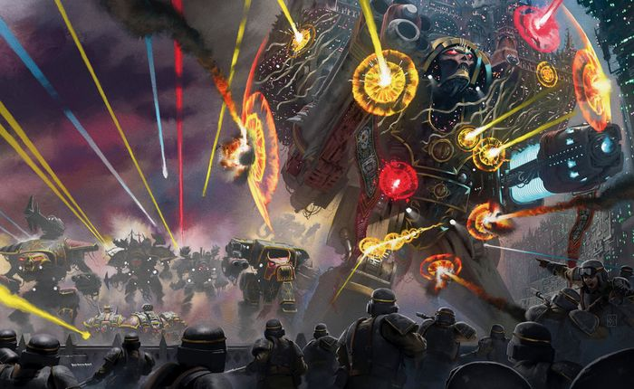

<!-- A0805-B0078 -->

原译文

The Traitor Titan Legion's advance 叛徒泰坦军团的推进

**校订译文**

The Traitor Titan Legion's advance 叛徒泰坦军团的推进

<!-- /A0805-B0078 -->

<!-- A0805-B0079 -->
**英文原文**

In truth, Magnus had just used the attack as a distraction for himself, Ahriman, Amon, Menkaura, and Atrahasis to infiltrate the Palace. Moving through the Great Observatory and then the Hall of Leng, Magnus seemingly slew Malcador in a rage at a subterranean lake after being told his lost shard was now out of his reach. Now intent on killing the Emperor, Magnus and his troops infiltrated into the Imperial Dungeon and came before the Golden Throne. The Emperor offered Magnus a chance to return to the loyalist side, but the Crimson King refused after being told he would have to condemn his Thousand Sons to destruction due to their rampant mutations. Magnus attempted to slay the Emperor but was stopped by Vulkan, and the two Primarchs engaged in a vicious duel that eventually saw the loyalist son prevail thanks to the sacrifice of Igen Gargo. Before Vulkan could deliver the final blow Magnus fully gave himself to Chaos and was expelled from the Palace alongside his sons by the Palace's anti-Daemonic wards. After the incident, Magnus fully gave himself to Horus' cause. Meanwhile, Malcador was resurrected by Alivia Sureka at the cost of her own life.

<!-- /A0805-B0079 -->

<!-- A0805-B0080 -->

原译文

事实上，马格努斯刚刚利用这次袭击分散了他自己、阿里曼、阿蒙、门卡乌拉和阿特拉西斯的注意力，潜入了皇宫。穿过大天文台，然后是寒冷大厅，马格努斯在得知他丢失的碎片现在无法触及后，似乎在一个地下湖上愤怒地杀死了马卡多。现在意图杀死帝皇，马格努斯和他的军队潜入了帝国地牢，来到了黄金王座前。帝皇给马格努斯一个机会回到忠诚的一边，但深红之王在被告知他将不得不宣判他的千子因为他们无约束的突变而被毁灭后拒绝了。马格努斯试图杀死帝皇，但被沃坎阻止，两位原体进行了一场激烈的决斗，最终由于伊根·加戈的牺牲，这位忠诚的子嗣获胜。在沃坎发动最后一击之前，马格努斯将自己完全交给了混沌，并与他的子嗣一起被皇宫的反灵能保护驱逐出皇宫。事件发生后，马格努斯完全献身于荷鲁斯的事业。与此同时，马卡多被阿利维亚·苏雷卡以自己的生命为代价复活。

**校订译文**

事实上，马格努斯只是用这次进攻掩护自己与阿里曼、阿蒙、门卡乌拉、阿特拉哈西斯潜入皇宫。他们穿过大天文台与伦格大厅，来到一座地下湖旁。马格努斯得知失落的灵魂碎片已无法取回，盛怒之下似乎杀死了马卡多。随后，他决意弑父，率部潜入帝国地牢，来到黄金王座前。帝皇提出给他回归忠诚派的机会，却要求舍弃因突变失控而注定毁灭的千子。深红之王拒绝了这一条件，试图杀死帝皇，却被沃坎拦下。两位原体激战，伊根·加戈的牺牲最终使沃坎占据上风。最后一击落下之前，马格努斯彻底投向混沌，随即与子嗣一起，被皇宫排斥恶魔的防护逐出。此后，他全心投入荷鲁斯的事业。与此同时，阿利维亚·苏雷卡牺牲自己的生命，复活了马卡多。

**校注：** Hall of Leng 依主审统一伦格大厅；本篇原名寒冷大厅，Leng 为专名，不表示寒冷。首句是用正面攻击掩护潜入，原译误作分散马格努斯自己等人的注意。anti-Daemonic 为针对恶魔的防护，并非排斥一切灵能。

<!-- /A0805-B0080 -->

<!-- A0805-B0081 -->
### The Palace Besieged 围攻皇宫

<!-- /A0805-B0081 -->

<!-- A0805-B0082 -->
**英文原文**

By the twenty-seventh of Quintus, Horus' forces had captured both the Lion's Gate and Eternity Wall Spaceports. This allowed him to fully land his last and greatest reserves: the Legio Mortis Titan Legion. By this point in the battle, however, acting siege commander Perturabo had become fed up by the state of the traitor armies. Daemons swarmed the ranks of the traitor armies of his brothers and allies had now pledged themselves fully to the Ruinious Powers. Seeing that the war was no longer one of Legion vs. Legion, Perturabo's breaking point came when Horus ordered him to break up his Legion and disperse it amongst the greater traitor armies. Mortarion and the Death Guard would instead take up Perturabo's positions, and the humiliation proved too much for the Lord of Iron to tolerate. Fed up, he ordered his Legion to leave Terra for paths unknown. The Iron Warriors began to evacuate Terra, causing great mayhem in the blockading Traitor fleet. Meanwhile due to the machinations of the Daemon Vassukella, who had infected the Astronomican, waves of madness swept across the loyalist lines and caused many mortal defenders to commit suicide or abandon their posts. Those who abandoned their posts marched towards "Paradise", in truth a horrific dream-farm erected by the Emperor's Children.

<!-- /A0805-B0082 -->

<!-- A0805-B0083 -->

原译文

到第五的第二十七日，荷鲁斯的部队已经占领了狮门和永恒之墙太空港。这使他能够完全登陆他最后一支也是最强大的后备部队：死亡军团。然而，在战斗的这一点上，代理攻城指挥官佩图拉博已经厌倦了叛徒军队的状态。恶魔蜂拥而至他的兄弟和盟友的叛徒军队的行列，现在他们已经向毁灭的力量做出了充分的承诺。看到战争不再是军团与军团之间的战争，当荷鲁斯命令他解散军团并将其分散在更大的叛徒军队中时，佩图拉博的崩溃点到来了。莫塔里安和死亡守卫将取代佩图拉博的职位，事实证明，钢铁之王无法容忍这种羞辱。受够了，他命令他的军团离开泰拉，前往未知的道路。钢铁勇士开始撤离泰拉，在封锁的叛徒舰队中造成了巨大的混乱。与此同时，由于污染了星炬的恶魔瓦苏凯拉的阴谋，疯狂的浪潮席卷了忠诚者的防线，导致许多凡人防御者自杀或放弃岗位。那些放弃岗位的人走向“天堂”，事实上，这是一个由帝皇之子建造的可怕的梦想农场。

**校订译文**

到第五月二十七日，荷鲁斯已经占领狮门与永恒之墙两座太空港，得以让最后也是最强大的预备队——死亡泰坦军团——全部登陆。然而，代理攻城统帅佩图拉博已对叛军状况忍无可忍。兄弟与盟军的部队中恶魔横行，他们都已彻底投入毁灭诸力。战争不再是军团与军团的较量；荷鲁斯又命佩图拉博拆散钢铁勇士，将其分派至各路叛军，并让莫塔里安与死亡守卫接管他的阵地，这终于耗尽了钢铁之主的耐心。他无法容忍如此羞辱，下令全军离开泰拉，去向不明。钢铁勇士的撤离，在封锁泰拉的叛军舰队中引发极大混乱。与此同时，恶魔瓦苏凯拉侵染星炬，掀起席卷忠诚派防线的疯狂浪潮。许多凡人守军自尽或擅离职守，后者走向所谓“天堂”——实际上，那是帝皇之子建造的恐怖梦境农场。

**校注：** 荷鲁斯要求拆分军团并分散编入各军，不是将全部钢铁勇士解散遣返。Ruinious 为 Ruinous 英文拼写误差，中文用毁灭诸力。dream-farm 暂直译梦境农场；原文仅形容其恐怖，并未说明具体运作机制。

<!-- /A0805-B0083 -->

<!-- A0805-B0084 -->
**英文原文**

Despite this setback, Horus remained undeterred. He organized a massive attack by the Legio Mortis, Sons of Horus, Chaos Knights, and Dark Mechanicum war engines against the Mercury-Exultant Kill-zone, a 150km-deep No Man's Land before the Exultant Wall which connects the Inner and Outer Palaces. This massive force was met by some 50 engines of the Legio Ignatum, including the Emperor Titans Imperious Prima, Exemplis, and Magnificum Incendius. This formidable army was aided by not only the shattered remains of other Titan Legions such as the Legio Solaria, Legio Atarus, Legio Defensor, Legio Amaranth, Legio Gryphonicus, and Legio Invigilata but also dozens of Knight Houses and supporting Imperial Army and Secutarii. The Ordo Sinister also finally agreed to enter the fighting, sending a Warlord-Sinister Psi-Titan to the Ignatum's aid. In the ensuing apocalyptic battle, the Traitors first attacked with waves of destroyed Titans that had been resurrected through sorcery. These "zombie" Titans now walked without a living Princeps, and were largely used as cannon fodder by the Traitors due to their ability to absorb enormous amounts of punishment. In their wake came the Legio Mortis and endless swarms of Dark Mechanicum vehicles and Daemon Engines. They were led by the Dies Irae and its bodyguard of 7 Warlord Titans. Despite the devastation wrought upon by the Traitors, thanks to orbital bombardment, new Warmaster Titans, weight of numbers, and madness spread amongst the loyalist mortal crews, the Traitors ultimately prevailed in annihilating the Legio Ignatum and its allies and reaching the Exultant Wall.

<!-- /A0805-B0084 -->

<!-- A0805-B0085 -->

原译文

尽管遭遇了这一挫折，荷鲁斯仍然没有被吓倒。他组织了一场由军团、荷鲁斯之子、混沌骑士和黑暗机械教战争引擎对水星欢欣杀戮区的大规模攻击，这是一个150公里深的无人区，位于连接内外殿的欢欣之墙之前。这支庞大的部队遭到了烈焰军团约50架引擎的攻击，其中包括帝皇泰坦无上专横、典范和滔天烈焰。这支强大的军队不仅得到了其他泰坦军团如日晷军团、炎纹军团、防卫者军团、不凋花军团、狮鹫军团和监戒军团的帮助，还得到了数十个骑士家族和支援的帝国军队和泰坦禁卫的帮助。噩兆修会最终也同意参战，派遣了一名噩兆军阀灵能泰坦帮助烈焰军团。在随后的启示录之战中，叛徒们首先发动了一波又一波的被摧毁的泰坦的攻击，这些泰坦是通过巫术复活的。这些“僵尸”泰坦现在没有活着的驾驶员，由于能够承受巨大的惩罚，它们主要被叛徒用作炮灰。紧随其后的是死亡军团和无尽的黑暗机械教载具和恶魔引擎。他们由神怒之日及其由7名军阀泰坦组成的护卫领导。尽管叛徒造成了巨大的破坏，但由于轨道轰炸、新的战帅泰坦、庞大的数量和疯狂在忠诚的凡人中蔓延，叛徒最终战胜了烈焰军团及其盟友，并到达了欢欣之墙。

**校订译文**

荷鲁斯并未因这一挫折退缩。他集结死亡军团、荷鲁斯之子、混沌骑士与黑暗机械教战争机器，猛攻水星—欢欣杀戮区。这片纵深一百五十公里的无人地带，位于连接内宫与外宫的欢欣之墙前方。烈焰军团约五十台泰坦迎敌，其中包括帝皇级泰坦无上专横号、典范号与宏伟烈焰号。他们得到日晷、炎纹、防卫者、不凋花、狮鹫、监戒等其他泰坦军团的残部，以及数十个骑士家族、帝国军和泰坦禁卫支援。噩兆修会也终于同意参战，派出一台战将-噩兆型灵能泰坦协助烈焰军团。末日般的会战随即爆发。叛军先投入一波波被巫术复活的毁坏泰坦。这些“僵尸”泰坦无需活着的首席驾驭，又极其耐打，主要被当作炮灰消耗守军火力。紧随其后的是死亡军团，以及无穷无尽的黑暗机械教载具与恶魔引擎；神怒之日号和七台战将级泰坦护卫领军推进。战场饱受摧残，叛军最终凭借轨道轰炸、新型战帅级泰坦、数量优势，以及在忠诚派凡人机组间扩散的疯狂，歼灭烈焰军团及其盟军，抵达欢欣之墙。

**校注：** 补回原译漏掉的 Legio Mortis 死亡军团，Magnificum Incendius 依核心612宏伟烈焰号。Warlord 型词根按官方战将级，完整灵能型号暂定战将-噩兆型。原文 despite ... wrought upon by 存在语法缺损，译文保留战场毁伤与叛军胜因，不臆补受害者。annihilating 明言歼灭，但后文仍有烈焰军团守军，保留原文各处，不推定全军绝种。

<!-- /A0805-B0085 -->

<!-- A0805-B0086 -->
**英文原文**

Horus ordered his army to push on and had the attack on the outer walls of the Imperial Palace be spearheaded by the Death's Head Titan Legion. Losing five Titans within minutes to entrenched loyalist defenses, the traitor forces would not relent and kept hammering away at the palace walls. A counterattack against the Chaos horde's flanks by loyalist titans failed, though the White Scars took advantage of the confusion it caused to sweep down at the traitor forces rear columns and wreak havoc. The Siege of the Imperial Palace soon ground on for many days, with the two primary attacks during this time being made by Angron and his World Eaters supported by Daemon Engines in one sector and the Legio Mortis in the other.

<!-- /A0805-B0086 -->

<!-- A0805-B0087 -->

原译文

荷鲁斯命令他的军队继续前进，并让死颅泰坦军团率先进攻皇宫的外墙。在几分钟内失去了五名泰坦，被根深蒂固的忠诚者防御，叛徒部队不会让步，继续不断地轰击宫殿的墙壁。忠诚的泰坦们对混沌部落侧翼的反击失败了，尽管白色疤痕利用这场混乱，扫荡了叛徒部队的后方纵队并造成了严重破坏。 皇宫围城很快就持续了好几天，在此期间的两次主要攻击是由安格隆和他的吞世者发起的，其中一个区域得到了恶魔引擎的支持，另一个区域则得到了死亡军团的支持。

**校订译文**

荷鲁斯命全军继续推进，让死颅泰坦军团担任攻击皇宫外墙的先锋。叛军虽在数分钟内就被坚固的忠诚派阵地击毁五台泰坦，仍不停轰击城墙。忠诚派泰坦攻击混沌大军侧翼的反击失败了，白疤却趁混乱突入敌军后续纵队，大肆破坏。围攻又持续了许多天，这一阶段主要有两路攻势：一路是安格隆与吞世者，在恶魔引擎支援下突击；另一路则由死亡军团进攻。

**校注：** Death’s Head 为本段使用的泰坦军团称呼，沿原稿死颅，与随后 Legio Mortis 并存，未无证据强并。两路进攻分别由吞世者与死亡军团展开，不是都由安格隆发起。

<!-- /A0805-B0087 -->

<!-- A0805-B0088 -->
**英文原文**

Under a vicious combined attack by the World Eaters and Legio Mortis, major breaching attempts were made at the Mercury and Exultant Wall zones. The traitors laid plasma bombs, which when detonated caused a chain reaction that cooked off the ammunition of the wall defenders. The resulting blast was so massive that it easily dwarfed atomic weapons and caused both warring armies to briefly go silent in shock and awe. A 300 meter long section of the wall collapsed, causing a landslide that buried loyalist and traitors alike. Kharn's 8th Assault Company was the first to climb the rubble and move through the gap as Knights and Legio Mortis Titans swarmed behind. The World Eater Skarr-Hei was the first through. The way to the Sanctum Imperialis was now clear and the loyalist defenders seemed doomed, with many seeing the battle now as a suicidal final stand rather than one in which they could emerge victorious.

<!-- /A0805-B0088 -->

<!-- A0805-B0089 -->

原译文

在吞世者和死亡军团的恶意联合攻击下，在水星欢欣杀戮区和欢欣之墙区域进行了重大突破的尝试。叛徒们放置了等离子炸弹，引爆后引起连锁反应，烧尽了城墙守军的弹药。由此产生的爆炸非常巨大，使原子武器也相形见绌，并导致交战双方军队在震惊和敬畏中短暂沉默。一段300米长的城墙坍塌，造成山体滑坡，埋葬了忠诚派和叛徒。当骑士和死亡军团泰坦蜂拥而至时，卡恩的第八突击连队是第一个爬上瓦砾并穿过缺口的人。吞世者斯卡尔-黑是第一个通过的。通往帝国圣地的道路现已明确，忠诚的守军似乎注定要失败，许多人认为这场战斗现在是自杀式的最后决战，而不是他们能够取得胜利的决战。

**校订译文**

吞世者与死亡军团联合猛攻，在水星区和欢欣之墙地带尝试破墙。叛军埋设等离子炸弹，引爆后产生连锁反应，又诱爆了守军弹药。爆炸的威力远超原子武器，震得双方军队都短暂陷入沉寂。三百米长的城墙坍塌，巨量瓦砾倾泻而下，不分敌我地掩埋众人。卡恩的第八突击连率先攀过废墟，穿过缺口，骑士和死亡军团泰坦紧随其后；第一个通过的是吞世者斯卡尔-黑。通往帝国圣所的道路由此打开，守军败局似乎已定。对许多人而言，这已是一场注定赴死的最后抵抗，再无获胜希望。

**校注：** cooked off 为弹药受热诱爆，不是烧尽；landslide 在城墙倒塌语境为大量瓦砾倾塌，并非另有山体。

<!-- /A0805-B0089 -->

<!-- A0805-B0090 图片 -->
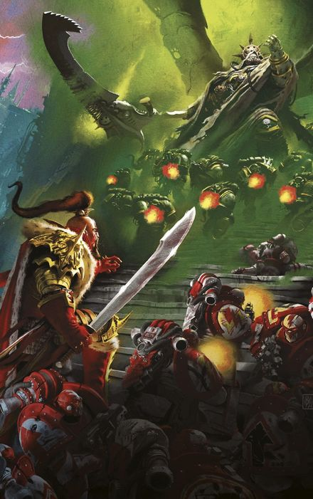

<!-- A0805-B0091 -->

原译文

Jaghatai Khan confronts Mortarion at the Lion's Gate Spaceport 察合台可汗在狮门太空港与莫塔里安对峙

**校订译文**

Jaghatai Khan confronts Mortarion at the Lion's Gate Spaceport 察合台可汗在狮门太空港与莫塔里安对峙

<!-- /A0805-B0091 -->

<!-- A0805-B0092 -->
### Battle for the Astronomican 星炬之战

<!-- /A0805-B0092 -->

<!-- A0805-B0093 -->
**英文原文**

Meanwhile, the force of Dark Angels under Corswain remained in the fringes of the Sol System, rendezvousing with Admiral Niora Su-Kassen and her hidden fleet led by the Phalanx. It was agreed that the Dark Angels should make for Terra to aid the defenders, but they would need something significant in order to break the traitor blockade of the world. Su-Kassen provided the enormous Battle-Carrier Imperator Somnium, the former flagship of the Emperor himself. The ship was largely evacuated of crew and sent plummeting towards the traitor fleet as the Dark Angels vessels hid in its wake. Though torn apart by enemy fire, the mighty Imperator Somnium was able to destroy four World Eaters Heavy Cruisers and an Emperor's Children Battle Barge. Afterwards, the explosion of the Emperor's ship heavily damaged the Terminus Est and the Conqueror battleships.

<!-- /A0805-B0093 -->

<!-- A0805-B0094 -->

原译文

与此同时，考斯韦恩率领的黑暗天使部队仍处于太阳系的边缘，与海军上将尼奥拉·苏-卡森及其由山阵号领导的隐藏舰队会合。大家一致认为，黑暗天使应该去泰拉来帮助防御者，但他们需要一些重要的东西来打破叛徒对世界的封锁。苏-卡森提供了巨大的战斗航母帝皇幻梦号，这是帝皇本人的前旗舰。这艘船大部分船员都被疏散了，随着黑暗天使的船只躲在它的后面，它向叛徒舰队坠落。尽管被敌人的炮火撕裂，强大的帝皇幻梦号还是摧毁了四艘吞世者重型巡洋舰和一艘帝皇之子战斗驳船。之后，帝皇的船的爆炸严重损坏了终焉号和征服者号战列舰。

**校订译文**

与此同时，考斯韦恩的黑暗天使仍在太阳系边缘，与尼奥拉·苏·卡森海军上将及她以山阵号为首的隐蔽舰队会合。众人同意黑暗天使应赶往泰拉增援，但必须付出足够大的代价，才能打破叛军封锁。苏·卡森提供了巨型战斗航母帝皇幻梦号——帝皇昔日的旗舰。大部分舰员撤离后，这艘巨舰直冲敌阵，黑暗天使舰船则隐蔽在其后方。帝皇幻梦号虽被敌军炮火撕裂，仍摧毁了四艘吞世者重巡洋舰与一艘帝皇之子战斗驳船。随后，它的爆炸又重创终焉号与征服者号战列舰。

<!-- /A0805-B0094 -->

<!-- A0805-B0095 -->
**英文原文**

The Dark Angels vessels were able to launch a Drop Pod landing operation to deliver their warriors to Terra, with Corswain's force landing upon the Hollow Mountain. Battling through the Emperor's Children and many warp-spawned horrors inside the Fortress including the Daemon Vassukella, Corswain was able to establish contact with Dorn and announced his intent to attempt and reactivate the Astronomican. Subsequently, Corswain and his Dark Angels found themselves besieged by traitor forces and struggling to hold the Astronomican.

<!-- /A0805-B0095 -->

<!-- A0805-B0096 -->

原译文

黑暗天使的战舰能够发动空投舱登陆行动，将他们的战士运送到泰拉，考斯韦恩的部队降落在空心山脉上。通过与帝皇之子以及堡垒内许多亚空间引发的恐怖，包括恶魔瓦苏凯拉，考斯韦恩能够与多恩建立联系，并宣布他打算尝试并重新激活星炬。随后，考斯韦恩和他的黑暗天使发现自己被叛徒势力围困，并努力控制星炬。

**校订译文**

黑暗天使舰船借机发射空降舱，将考斯韦恩的战士投送至泰拉的空心山脉。他们与堡垒内的帝皇之子及众多亚空间怪物激战，其中包括恶魔瓦苏凯拉。考斯韦恩成功联络多恩，表明自己准备尝试重启星炬。随后，黑暗天使遭叛军围攻，只能拼力守住星炬。

<!-- /A0805-B0096 -->

<!-- A0805-B0097 -->
### Retaking the Lion's Gate Spaceport 夺回狮门太空港

<!-- /A0805-B0097 -->

<!-- A0805-B0098 -->
**英文原文**

The grim outlook of the chance for victory was not shared by the White Scars and their Primarch, Jaghatai Khan, who continued to talk of life after they had won the battle. Not content to simply hide behind walls, the Khan at last decided at this desperate final hour to make his move. He became committed to retaking the Lion's Gate Spaceport, which if captured would allow Guilliman's coming reinforcements to quickly land on Terra as well as slow the flow of traitor forces. Overworked and exhausted and knowing he could not control his brother, Rogal Dorn did not try to stop the Khan. Facing the White Scars were the bulk of the Death Guard under Mortarion, who had taken up Lion's Gate Spaceort as his new headquarters since the departure of Perturabo.

<!-- /A0805-B0098 -->

<!-- A0805-B0099 -->

原译文

白色伤疤及其原体察合台可汗并不认同胜利机会的严峻前景，他们在赢得战斗后继续谈论生活。可汗并不满足于躲在墙后，最终在这绝望的最后时刻决定采取行动。他开始致力于夺回狮门太空港，如果被占领，基里曼即将到来的增援部队将迅速降落在泰拉上，并减缓叛徒势力的流动。罗格·多恩过度劳累，疲惫不堪，知道自己无法控制他的兄弟，他没有试图阻止可汗。面对白色伤疤的是莫塔里安领导下的大部分死亡守卫，自佩图拉博离开以来，莫塔里安将狮门太空港作为他的新总部。

**校订译文**

白疤与察合台可汗并不接受必败的判断，仍在谈论获胜后的生活。可汗不愿只躲在城墙后面，决定在这绝望关头出击，夺回狮门太空港。若能成功，既可让即将到来的基里曼援军迅速登陆，又能减缓叛军增兵。多恩早已精疲力竭，也知道自己无法管束兄弟，便没有阻止。白疤面对的是莫塔里安麾下死亡守卫主力；佩图拉博离开后，莫塔里安已将狮门太空港作为新的指挥部。

**校注：** 谈论的是未来胜利后的生活，原译误为已经取胜之后才谈生活。

<!-- /A0805-B0099 -->

<!-- A0805-B0100 -->
**英文原文**

For the operation to recapture Lion's Gate, the Khan mustered not only nearly the entire White Scars Legion but also the Terran First Armored and the Sky Fortress, the last Orbital Plate on Terra that until now was being used as an airborne carrier and fire support platform. After much careful planning, the Khan struck with an overwhelming push by thousands of Imperial Army tanks protected by White Scars infantry. In their wake came a massive charge of White Scars Jetbikes. Gold Battlefront under Ganzorig Noyan-Khan struck an arrowhead across the northern sections of the space port approaches, while Ebony under Qin Fai Noyan-Khan attacked the southern flank. Jaghatai Khan himself led Amber Battlefront through the center and directly into the thickest enemy defenses. The ensuing fighting was ferocious, even for the standards of the Siege. The Sky Fortress was able to fulfill its mission to provide fire and aerial support for the White Scars until it was shot down, crashing into the Imperial Fleet College and creating a massive explosion. While the White Scars and Imperial Army tanks were able to quickly push to the Lion's Gate Spaceport, inside their advance began to become bogged down by the stubborn defenses of not only the Death Guard, but also their Daemonic and Mutant allies. A war of attrition broke out, one in which the White Scars were ill-suited but the Death Guard excelled at.

<!-- /A0805-B0100 -->

<!-- A0805-B0101 -->

原译文

为了夺回狮门，可汗不仅召集了几乎整个白色伤疤军团，还召集了泰拉第一装甲部队和天空堡垒，这是迄今为止用作航空母舰和火力支援平台的最后一块轨道平台。经过精心策划，可汗发动了数千辆帝国陆军坦克的压倒性攻势，这些坦克由白色伤疤步兵保护。随之而来的是大量的白色疤痕喷气式摩托。甘佐里格诺颜汗率领的黄金前线在太空港入口的北部地区投下了箭头，而秦伐诺颜汗领导的乌木则袭击了南翼。察合台可汗亲自带领琥珀前线穿过中心，直接进入最厚的敌人防御。随后的战斗非常激烈，即使以围城的标准来看也是如此。天空堡垒能够完成其任务，为白色疤痕提供火力和空中支援，直到它被击落，撞向帝国舰队学院并引发大规模爆炸。虽然白色疤痕和帝国陆军坦克能够迅速向狮门太空港推进，但他们的前进开始陷入困境，不仅是死亡守卫，还有他们的恶魔和变种人盟友的顽固防御。一场消耗战爆发了，在这场战争中，白色伤疤并不适应，但死亡守卫表现出色。

**校订译文**

为夺回狮门太空港，可汗集结了几乎整个白疤军团，以及泰拉第一装甲部队和天空堡垒。后者是泰拉最后一座轨道板块，此前一直充当空中母舰与火力支援平台。经过周密筹划，可汗发起强攻：数千辆帝国军坦克在白疤步兵保护下推进，后方跟进大规模喷气摩托冲锋。甘佐里格诺扬汗率黄金战线，以箭头阵形刺入太空港北侧入口；秦伐诺扬汗的乌木战线进攻南翼；可汗亲率琥珀战线从中央突进，直击守备最密集之处。战斗之惨烈，即便在泰拉围城中也属罕见。天空堡垒持续为白疤提供炮火与航空支援，直到被击落，撞上帝国舰队学院，引发巨大爆炸。白疤与帝国军坦克虽迅速抵达太空港，进入港区后却被死亡守卫及其恶魔、变种人盟军的顽强防御拖住。一场消耗战由此展开，这正是白疤不擅长、死亡守卫却最拿手的战法。

**校注：** Battlefront 暂作战线，Gold/Ebony/Amber 为白疤攻势的三路编组代号，不是“投下箭头”的动作。

<!-- /A0805-B0101 -->

<!-- A0805-B0102 -->
**英文原文**

As loyalist casualties mounted, the Khan was able to fight his way into the heart of the Spaceport and confront Mortarion himself. The old enemies exchanged few words before engaging in a final duel. Faced with Mortarion's new Daemonic endurance and strength, the Khan was brutally beaten down and nearly defenseless. However he was able to find a weakness in the Death Lord with his pride. Jaghatai Khan scolded Mortarion for being weak and giving into the powers of the Warp, while he himself had resisted the temptations of Chaos and remained true to the Emperor. Mortarion flew into a rage, which the Khan took advantage of to launch a second wave of dizzying attacks that overwhelmed the Primarch. In the end the badly wounded Jaghatai Khan was impaled on the blade of Mortarion's scythe, but simply pulled his body along its length to get face-to-face with the Death Guard Primarch. The loyalist Primarch decapitated Mortarion, who was banished into the Warp in a massive explosion similar to that of a Vortex Weapon. Later, the Khan's badly wounded body was discovered by Ilya Ravallion and Jangsai Khan.

<!-- /A0805-B0102 -->

<!-- A0805-B0103 -->

原译文

随着忠诚者伤亡人数的增加，可汗得以进入太空港的中心，并亲自对抗莫塔里安。在进行最后的决斗之前，宿敌们几乎没说一句话。面对莫塔里安新的恶魔的耐力和力量，可汗被残酷地击败，几乎毫无防备。然而，他能够找到死亡之主的弱点和他的骄傲。察合台可汗斥责莫塔里安软弱，屈服于亚空间的力量，而他自己则抵制了混沌的诱惑，忠于帝皇。莫塔里安勃然大怒，可汗利用这一点发动了第二波令人眼花缭乱的攻击，压倒了原体。最后，重伤的察合台可汗被莫塔里安镰刀的刀刃刺穿，但他只是沿着镰刀的刃部拉动身体，与死亡守卫原体面对面。忠诚的原体斩首了莫塔里安，他在一场类似于涡旋武器的大规模爆炸中被放逐到亚空间。后来，伊利亚·拉瓦利昂和江塞可汗发现了可汗重伤的尸体。

**校订译文**

忠诚派伤亡不断上升，可汗终于杀到太空港核心，面对莫塔里安。宿敌只交谈几句，便开始最后的决斗。莫塔里安如今拥有恶魔赋予的耐力与力量，将可汗打得几乎无力抵抗。但可汗找到了死亡之主的弱点：骄傲。他斥责莫塔里安软弱，屈服于亚空间，而自己始终抵住混沌诱惑，忠于帝皇。莫塔里安勃然大怒，可汗趁机发起第二轮迅疾攻势，打得对方措手不及。最终，重伤的可汗被镰刃贯穿，却顺着刀刃将自己拉近，直抵死亡守卫原体面前，一刀斩下莫塔里安的头颅。恶魔原体在一场如同涡旋武器引爆的剧烈爆炸中，被放逐回亚空间。后来，伊利亚·拉瓦利翁与江塞可汗找到了察合台重伤的身躯。

**校注：** body 为重伤身躯，并未明确已死亡；后文用 seeming death，再保留这种不确定性。

<!-- /A0805-B0103 -->

<!-- A0805-B0104 -->
**英文原文**

In the aftermath of the Khan's seeming death, the White Scars were thrown into a frenzy and prepared to throw their lives away in a final charge against the Death Guard. The sudden tenacity surprised the Death Guard, who without Mortarion to guide them were forced back. Thanks to the efforts of Ilya Ravallion and Shiban Khan the White Scars decided to remain at Lion's Gate Spaceport and secure it for the loyalists instead of pressing on into certain death. Meanwhile, the surviving Death Guard rallied under Typhus, who had stationed himself just outside the battlezone.

<!-- /A0805-B0104 -->

<!-- A0805-B0105 -->

原译文

在可汗看似死亡之后，白色伤疤被陷入了疯狂之中，准备在对死亡守卫的最后一次猛攻中放弃自己的生命。突然的顽强让死亡守卫感到惊讶，没有莫塔里安的指挥，他们被迫撤退。由于伊利亚·拉瓦利昂和昔班可汗的努力，白色伤疤决定留在狮门太空港，为忠诚者保护它，而不是走向死亡。与此同时，幸存的死亡守卫在泰丰斯手下集结，泰丰斯就驻扎在战区外。

**校订译文**

可汗似已身亡，白疤陷入狂怒，准备向死亡守卫发起最后的冲锋，战至全军覆灭。这股突然爆发的决绝令死亡守卫惊愕；失去莫塔里安指挥，他们被迫后退。伊利亚·拉瓦利翁与昔班可汗竭力劝阻，白疤才决定留在狮门太空港，为忠诚派巩固阵地，不再继续冲向必死之地。死亡守卫幸存者则在驻于战区外的泰弗斯麾下重新集结。

<!-- /A0805-B0105 -->

<!-- A0805-B0106 -->
### Last Stand at the Eternity Gate 永恒之门的最后抵抗

原题：Last Stand at the Eternity Gate 永恒之门的最后一站

<!-- /A0805-B0106 -->

<!-- A0805-B0107 -->
**英文原文**

Despite the retaking of the Lion's Gate Spaceport, the situation continued to degrade for the loyalists and nothing could stop the tide of traitors pouring into the Inner Palace from the parts of the Ultimate Wall broken open by the Legio Mortis. Even the Bhab Bastion, Dorn's command center, became besieged with the Imperial Fists Primarch still inside. By this point the traitor armies have lost much of their cohesion, turning into a barbaric horde that swept forward murdering all in its path. The Emperor's psychic shield was near-breaking point thanks to a constant immaterial assault by the debased form of Magnus in the Webway. To try and stop the Crimson King, Vulkan was dispatched into the Webway to find and kill Magnus before he could succeed. As whoever could fled towards the Sanctum Imperialis Horus himself appeared over the traitor communicatons network for the first time in weeks to give a single order to his forces: the capture of the Eternity Gate at dawn.

<!-- /A0805-B0107 -->

<!-- A0805-B0108 -->

原译文

尽管夺回了狮门太空港，但忠诚者的处境仍在恶化，没有什么能阻止叛徒从军团士兵打开的极限之墙部分涌入内殿。就连帝国之拳原体多恩的指挥中心巴布堡也被围困在里面。到目前为止，叛徒军队已经失去了大部分的凝聚力，变成了一个野蛮的部落，横扫一切。帝皇的灵能屏障接近断裂点，这要归功于网道中堕落的马格努斯不断进行的非物质攻击。为了阻止深红之王，沃坎被派往网道，在马格努斯成功之前找到并杀死他。无论谁能逃向到帝国圣地，荷鲁斯本人都会在几周内首次出现在叛徒的通讯网络上，向他的部队发出一个命令：黎明时分占领永恒之门。

**校订译文**

尽管狮门太空港已被夺回，忠诚派战局仍在恶化。死亡军团击破终极之墙的部分地段，叛军便从缺口源源涌入内宫。连多恩的指挥中心巴布堡垒也遭围困，原体本人仍困在其中。此时叛军已大半失去建制与协同，沦为向前席卷、见人便杀的野蛮大军。网道中，堕落的马格努斯持续施加非物质攻击，将帝皇的灵能屏障逼至崩溃边缘。沃坎奉命进入网道，必须赶在深红之王得手前找到并杀死他。尚能逃走的人纷纷涌向帝国圣所。荷鲁斯则数周以来首次出现在叛军通信网中，只下达了一道命令：黎明时夺取永恒之门。

**校注：** Legio Mortis 是死亡泰坦军团，不是泛指军团士兵。Ultimate Wall 暂译终极之墙，与 Exultant Wall 欢欣之墙分开，原极限之墙仅保留于对照。

<!-- /A0805-B0108 -->

<!-- A0805-B0109 图片 -->
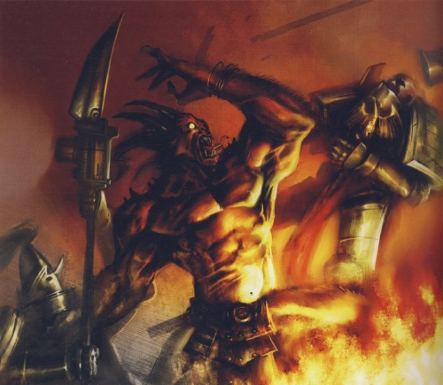

<!-- A0805-B0110 -->

原译文

The Adeptus Custodes battle Daemons at the Imperial Palace禁军在帝国皇宫与恶魔作战

**校订译文**

The Adeptus Custodes battle Daemons at the Imperial Palace 帝皇禁军在皇宫迎战恶魔

<!-- /A0805-B0110 -->

<!-- A0805-B0111 -->
**英文原文**

As a vast taritor horde of traitor Astartes, Imperial Army, Beastmen, Mutants, Daemons, Titans, and other horrors massed on the horizon, only some 70,000 defenders mustered on the Delphic Battlement before the processional to the Eternity Gate. These were mainly Blood Angels and Imperial Army, but Imperial Fists, White Scars, Legio Ignatum, and Mechanicum loyalists were also represented. Corswain offered to send his own forces defending the Astronomican to aid the defenders, but Sanguinius declined their offer, due to the vital nature of the Dark Angels Paladin's mission.

<!-- /A0805-B0111 -->

<!-- A0805-B0112 -->

原译文

当一大群叛徒阿斯塔泰斯、帝国军队、野兽人、变种人、恶魔、泰坦和其他恐怖聚集在地平线上时，在前往永恒之门的大道前，只有大约7万名防御者聚集在德尔菲城垛中。这些人主要是圣血天使和帝国军队，但帝国之拳、白色伤疤、烈焰军团和机械教的忠诚者也有代表。考斯韦恩提出派遣自己保卫星炬的部队以帮助防御者，但圣吉列斯拒绝了他们的提议，因为黑暗天使圣骑士的任务至关重要。

**校订译文**

叛变阿斯塔特、帝国军、野兽人、变种人、恶魔、泰坦及其他恐怖造物，在地平线上集结成庞大军势；永恒之门仪仗大道前的德尔斐城垛上，却只有约七万名守军。他们主要是圣血天使与帝国军，也包括帝国之拳、白疤、烈焰军团及忠诚派机械教。考斯韦恩提出抽调守卫星炬的黑暗天使前来增援，圣吉列斯却拒绝了，因为这位圣骑士肩负的任务同样至关重要。

<!-- /A0805-B0112 -->

<!-- A0805-B0113 -->
**英文原文**

Faced with certain death before the vast traitor horde, Sanguinius nonetheless organized a defense to try and buy precious time. At dawn the traitors erected the mutilated but still-living loyalist prisoners they had nailed to banners, crosses, vehicles, or whatever else they could find to try and break the spirit of the defenders. Next marched forth the Daughter of Torment, a Reaver Titan of the traitorous Legio Mordaxis. In its Power Claw was the tortured form of Blood Angels Captain Idamas. It issued forth Horus' conditions, that any who fled the coming battle would be granted a pardon by Horus, new Emperor of mankind. Sanguinisu responded with a rousing speech to the defenders, stating that he would stand and fight but all others were free to go where they wished. Inspired or perhaps shamed by the Great Angel, it is believed that no loyalists took the opportunity to leave and instead all present pledged themselves to Sanguinius. The Blood Angels Primarch next took to the skies and behead the Daughter of Torment as battle erupted.

<!-- /A0805-B0113 -->

<!-- A0805-B0114 -->

原译文

面对庞大的叛徒大军带来的死亡，圣吉列斯仍然组织了一次防御，试图争取宝贵的时间。黎明时分，叛徒们竖起了残缺不全但仍然活着的忠诚者囚犯，他们把他们钉在横幅、十字架、车辆或任何他们能找到的东西上，试图摧毁守军的精神。接着，叛徒噬心军团的收割者泰坦“折磨之女”走了出来。在它的动力爪中是折磨形式的圣血天使连长伊达马斯。它宣布了荷鲁斯的条件，任何逃离即将到来的战斗的人都将得到新的人类帝皇荷鲁斯的赦免。圣吉列斯对防御者发表了激动人心的演讲，表示他会站起来战斗，但所有其他人都可以自由地去他们想去的地方。受到大天使的启发或可能感到羞愧，据信没有忠诚者借此机会离开，而是所有在场的人都向圣吉列斯宣誓。圣血天使原体随后飞上天空，在战斗爆发时斩首了折磨之女。

**校订译文**

面对庞大叛军带来的必死结局，圣吉列斯仍组织防御，力求多争取一些时间。黎明时，敌人将受尽残害却还活着的忠诚派俘虏，钉在旗帜、十字架、载具及一切可用之物上，高高竖起，企图击垮守军斗志。随后，噬心军团的掠夺者级泰坦折磨之女号走出敌阵，动力爪里攥着惨遭折磨的圣血天使连长伊达玛斯。它宣读荷鲁斯的条件：凡是逃离即将到来之战者，都将获得人类新帝皇荷鲁斯的赦免。圣吉列斯则向守军发表激昂演说，表示自己会留下奋战，其他人可以自由选择去处。据说，众人或被天使鼓舞，或心生羞愧，没有一名忠诚派离开，在场者都向他宣誓。随后，圣吉列斯振翅腾空，在战斗爆发之际斩下折磨之女号的头颅。

**校注：** Reaver Titan 用官方掠夺者级泰坦，原收割者误译。原文 only believed/no loyalists 表示据传无人离开，保留传闻限定。

<!-- /A0805-B0114 -->

<!-- A0805-B0115 图片 -->
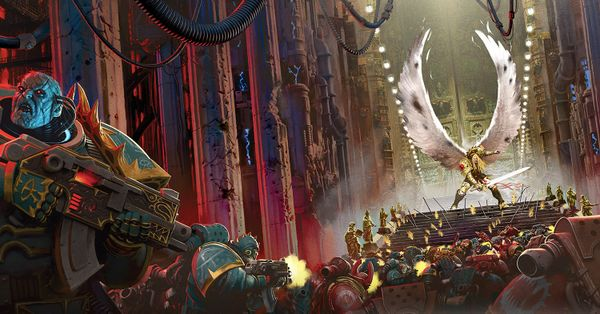

<!-- A0805-B0116 -->

原译文

Sanguinius' stand at the Eternity Gate 圣吉列斯站在永恒之门前

**校订译文**

Sanguinius' stand at the Eternity Gate 圣吉列斯死守永恒之门

<!-- /A0805-B0116 -->

<!-- A0805-B0117 -->
**英文原文**

The battle that followed was immense. The traitor horde surged forward as the guns of the Delphic Battlements opened up. The initial waves were decimated, but through weight of numbers they began to reach the walls. A Khornate Warlord Titan docked with the Delphic wall, vomiting forward World Eaters from its mutated mouth. Chaos erupted in short order as the battle turned into a savage melee. Into this strode the Bloodthirster Ka'Bandha, who had been bested by Sanguinius during the Signus Campaign. Vowing to reap 500 Blood Angels in the presence of their Primarch, the Daemon nearly succeeded before Sanguinius intervened. The two had a dramatic airborne battle that ended when Sanguinius broke the Daemons back with the hilt of his sword. Ka'Bandha plummeted to the earth, consumed by lesser Daemons taking advantage of his weakness.

<!-- /A0805-B0117 -->

<!-- A0805-B0118 -->

原译文

随后的战斗是巨大的。随着德尔菲城垛的枪声响起，叛徒大军向前冲去。最初的波浪被摧毁了，但通过成员的重量，它们开始到达墙壁。一个恐虐军阀泰坦与德尔菲城垛对接，从变异的嘴里向前吐出吞世者。随着战斗演变为激烈的混战，混沌在短时间内爆发了。嗜血狂魔卡’班哈大步走进来，他在西格纳斯战役中被圣吉列斯击败。在圣吉列斯介入之前，恶魔发誓要在他们的原体面前收割500个圣血天使，几乎成功了。两人进行了一场戏剧性的空战，当圣吉列斯用剑柄将恶魔击溃时，这场战役结束了。卡’班哈坠落到地上，被较小的恶魔利用他的虚弱吞噬。

**校订译文**

接下来的战斗规模空前。叛军大举冲锋，德尔斐城垛炮火齐发，最初几波敌人被大量消灭，但后续部队仍凭数量优势冲到墙下。一台恐虐战将级泰坦贴上城墙，从变异巨口中吐出吞世者，战斗迅速化为混乱的贴身厮杀。嗜血狂魔卡’班哈此时踏入战场，誓要当着原体的面收割五百名圣血天使，报复自己在西格纳斯战役中的失败。他几乎就要得逞，圣吉列斯终于出手。双方在空中激战，最终圣吉列斯以剑柄击断恶魔的脊背。卡’班哈坠向地面，被趁其虚弱扑来的低阶恶魔吞噬。

**校注：** weight of numbers 指数量优势，不是成员重量；圣吉列斯明确以剑柄击断恶魔脊背，原译笼统写击溃，漏掉关键动作。

<!-- /A0805-B0118 -->

<!-- A0805-B0119 -->
**英文原文**

With the traitor horde still advancing and Daemons now manifesting even inside the Sanctum Imperialis itself Custodian Tribune Diocletian Coros ordered the Eternity Gate shut. However it was then that Legio Audax Titans intervened, using their Ursus Claws to force one of the doors open. Sanguinius was about to cut these chains when Angron surged from the sky, directed by Horus himself to kill his brother. Already weakened by his fight with Ka'Bandha, Sanguinius fought a desperate battle against Angron but managed to initially hold his own. After a climatic airborne battle, Angron impaled Sanguinius upon his Black Blade. However Sanguinius used the opportunity to rip out Angron's Butchers Nails, causing the Daemon Primarch's head to explode. With Angron banished into the Warp, the World Eaters lost whatever sanity they had and began to cut down their own allies. This combined with the defeat of Magnus in the Webway at the hands of Vulkan broke the traitor advance just short of the Eternity Gate, which managed to finally seal shut as the surviving loyalists fled inside.

<!-- /A0805-B0119 -->

<!-- A0805-B0120 -->

原译文

随着叛徒大军仍在前进，恶魔现在甚至在帝国圣地内部显现禁军保民官戴克里先·科罗斯下令关闭永恒之门。然而，就在那时，莽勇军团泰坦介入，用他们的熊爪强行打开了一扇门。圣吉列斯正要割断这些锁链，这时安格隆在荷鲁斯的指示下从天空中冲了出来，杀向了他的兄弟。圣吉列斯已经被他与卡’班哈的战斗所削弱，他与安格隆进行了一场绝望的战斗，但最初还是成功地守住了自己的阵地。在一场激烈的空战后，安格隆用他的黑刃刺穿了圣吉列斯。然而，圣吉列斯利用这个机会拔出了安格隆的屠夫之钉，导致恶魔原体的头部爆炸。随着安格隆被放逐到亚空间，吞世者失去了所有的理智，开始砍倒自己的盟友。再加上马格努斯在网道被沃坎击败，叛徒在距离永恒之门不远的地方推进，当幸存的忠诚者逃进去时，永恒之门最终被封锁。

**校订译文**

敌军仍在推进，恶魔甚至已现身帝国圣所内部，禁军护民官戴克里先·科罗斯下令关闭永恒之门。莽勇军团泰坦却用熊爪钩住一侧门扉，强行拉住。圣吉列斯正要斩断锁链，安格隆奉荷鲁斯之命从天而降，要取兄弟性命。圣吉列斯与卡’班哈交战后已十分虚弱，仍在这场绝望决斗中勉强支撑。空中大战达到高潮时，安格隆以黑刃贯穿他；圣吉列斯却趁机拔出屠夫之钉，使恶魔原体的头颅炸裂。安格隆被放逐回亚空间，吞世者失去最后一点理智，开始屠戮己方盟军。加上沃坎在网道中击败马格努斯，叛军攻势终于止步于永恒之门前。忠诚派幸存者退入门内，大门总算彻底关闭。

**校注：** 原文 broke the traitor advance 意为阻断叛军攻势，原译却变成继续推进，已修正。Ursus Claws 暂沿熊爪，作为泰坦的钩索武器理解。

<!-- /A0805-B0120 -->

<!-- A0805-B0121 -->
**英文原文**

Just moments after the battle of the Eternity Gate, Shiban Khan and his White Scars managed to reactivate the anti-orbital defenses of the Lion's Gate Spaceport. The traitor armada, hanging in low-orbit, was subjected to a vicious ground-to-orbit bombardment. Word reached the Sol System that Roboute Guilliman was just one week away, with Leman Russ, Corax, and Lion El'Jonson not far behind.

<!-- /A0805-B0121 -->

<!-- A0805-B0122 -->

原译文

在永恒之门之战结束后不久，昔班可汗和他的白色伤疤成功地重新激活了狮门太空港的反轨道防御。悬挂在低空轨道上的叛徒舰队遭到了猛烈的地对空炮击。消息传到了太阳系，罗伯特·基里曼只有一周的时间了，黎曼·鲁斯，科拉克斯和莱昂·艾尔庄森紧随其后。

**校订译文**

永恒之门战斗刚结束不久，昔班可汗与白疤便成功重启狮门太空港的反轨道武器，使低轨道叛军舰队遭到猛烈的地对轨道轰击。同时，太阳系收到消息：罗保特·基里曼距此只剩一周航程，黎曼·鲁斯、科拉克斯与莱昂·艾尔’庄森也已不远。

<!-- /A0805-B0122 -->

<!-- A0805-B0123 -->
**英文原文**

Despite the victory at the Eternity Gate, the situation for the loyalists was still dire and Chaos forces were advancing all fronts. Remaining loyalist officers such as Fafnir Rann, Zephon, Nassir Amit, Maximus Thane, and Namahi led desperate but futile defenses of the last battlements inside the Inner Palace. While nearly all order and discipline had by now broken down amongst the Traitor Astartes, vast Daemonic legions spilled forth as legendary figures such as Be'lakor, Skarbrand, Ulkair, N'Kari, Heartslayer, Drach'nyen, Epidemius, Ku'gath, Madail, Karanak, The Masque, Doombreed, Tallomin, and Skulltaker manifested on Terra's soil. Just hours after the shutting of the Eternity Gate, the Bhab Bastion itself was overrun by Sons of Horus forces under Tarchese Malabreux and Rogal Dorn was forced to retreat into the Sanctum Imperialis. Concepts such as time and space started to break down and mere hours passed as if it were weeks as Terra itself began to slowly be sucked into the Warp, with the Vengeful Spirit as its conduit. All across Terra, traitor armies and maddened souls began to chant the name of the "Dark King". Horus now aspired to become the fifth God of Chaos born from Humanity just as Slaanesh was born from the Eldar.

<!-- /A0805-B0123 -->

<!-- A0805-B0124 -->

原译文

尽管在永恒之门取得了胜利，但忠诚者的处境仍然严峻，混沌势力正在向所有战线推进。法夫尼尔·兰恩、泽丰、纳西尔·阿密特、马克西姆斯·塔恩和纳马希等剩余的忠诚军官领导了对内殿最后一座城垛的绝望但徒劳的防御。虽然叛徒阿斯塔特几乎所有的秩序和纪律都已崩溃，但随着比’拉克、斯卡布兰德、乌凯尔、纳’卡里、屠心者、德拉科’尼恩、埃皮德米乌斯、库’噶斯、马代尔、卡拉纳克、假面、毁灭之种、塔洛明和夺颅者等传奇人物在泰拉的大地上出现，庞大的恶魔军团也纷纷涌现。在永恒之门关闭仅数小时后，巴布堡垒本身就被塔奇斯·马拉波领导的荷鲁斯之子部队占领，罗格·多恩被迫撤退到帝国圣地。时间和空间等概念开始崩溃，仅仅几个小时就过去了仿佛是几周，因为泰拉本身开始慢慢被吸入亚空间，复仇之魂作为其管道。在整个泰拉，叛徒军队和疯狂的灵魂开始高呼“黑暗之王”的名字。荷鲁斯现在渴望成为从人类诞生的第五位混沌之神，就像色孽从灵族出生一样。

**校订译文**

永恒之门虽获胜，忠诚派仍身陷绝境，混沌大军在各条战线上不断前进。法夫尼尔·兰恩、泽丰、纳西尔·阿米特、马克西姆斯·塞恩与纳马希等军官，在内宫最后几处城垛组织绝望却徒劳的防守。叛变阿斯塔特的秩序与纪律几近崩溃，庞大的恶魔军团却源源涌出：比拉克尔、斯卡布兰德、乌凯尔、纳’卡里、屠心者、德拉科尼恩、传疫魔、库噶斯、马代尔、卡拉纳克、假面舞者、毁灭之种、塔洛明与夺颅者等传奇恶魔，纷纷现身泰拉。永恒之门关闭仅数小时，塔奇斯·马拉波率荷鲁斯之子攻陷巴布堡垒，多恩被迫退入帝国圣所。时间与空间的规律开始瓦解，短短数小时仿佛漫长数周；复仇之魂号化为通道，将泰拉缓缓拖入亚空间。整个星球上，叛军与疯狂的灵魂齐声呼喊“黑暗之王”。荷鲁斯此时渴望成为由人类孕育的第五位混沌神，如同色孽诞生于灵族。

**校注：** Be’lakor、Epidemius、The Masque 分别依核心采用比拉克尔、传疫魔、假面舞者。叙述称荷鲁斯渴望成为黑暗之王；后文帝皇险些升格为黑暗之王是另一件事，不将两处主体强并。

<!-- /A0805-B0124 -->

<!-- A0805-B0125 -->
**英文原文**

The Emperor must die ~ Traitor chant in the final stages of the Siege

<!-- /A0805-B0125 -->

<!-- A0805-B0126 -->

原译文

帝皇必须死 ~围城最后阶段的叛徒的呼喊

**校订译文**

“帝皇必须死！”——围城末期叛军的呼喊

<!-- /A0805-B0126 -->

<!-- A0805-B0127 -->
### The Vengeful Spirit 复仇之魂号

原题：The Vengeful Spirit 复仇之魂

<!-- /A0805-B0127 -->

<!-- A0805-B0128 -->
**英文原文**

It was at this moment that Horus finally emerged from Lupercal's Court for the first time since the Siege began, apparently in a half-lucid stupor and imagining himself back on the Great Crusade. Journeying to the bridge of the Vengeful Spirit, he addressed his equerry Kenor Argonis as Maloghurst, saw long-dead Zardu Layak at his side, and stated he would finally finish the war. To the shock of all present, Horus stated that he had apparently lowered the Vengeful Spirit's Void Shields, inviting the Emperor himself to Teleport aboard his flagship. This would allow Horus to slay the Emperor before reinforcements under Guilliman could arrive, which were mere hours away. With their Emperor dead, Guilliman's incoming fleet would lose heart and scatter before the forces of the Warmaster. However, Guilliman's fleet was still having difficulty finding Terra without the Astronomican, which Corswain and his Dark Angels sought to reactivate. To thwart the Dark Angels, Typhus led a massive Death Guard assault upon the Hollow Mountain.

<!-- /A0805-B0128 -->

<!-- A0805-B0129 -->

原译文

就在这一刻，荷鲁斯终于从卢佩卡尔王庭中走出，这是自围城开始以来的第一次，他显然处于半清醒半昏迷的状态，想象自己回到了大远征。在前往复仇之魂号舰桥的途中，他称呼侍从官基诺·阿尔戈尼斯为马洛赫斯特，看到早已死去的扎杜·拉亚克在他身边，并表示他最终会结束战争。令在场所有人震惊的是，荷鲁斯表示，他显然已经降下了复仇之魂号的虚空盾，邀请帝皇亲自登上他的旗舰进行传送。这将使荷鲁斯能够在基里曼率领的援军到达之前杀死帝皇，而基里曼的援军只有几个小时的路程。随着帝皇的死亡，基里曼即将到来的舰队将失去信心，在战帅的部队面前四散。然而，基里曼的舰队在没有星炬的情况下仍然很难找到泰拉，而考斯韦恩和他的黑暗天使试图重新激活它。为了挫败黑暗天使，泰丰斯率领一支庞大的死亡守卫袭击了空心山脉。

**校订译文**

就在此时，荷鲁斯自围城开始以来第一次走出卢佩卡尔王庭，看似半梦半醒，仿佛仍身处大远征。他来到舰桥，将侍从官基诺·阿尔戈尼斯唤作马洛赫斯特，声称看见早已死去的扎度·拉亚克站在身旁，并宣布自己将终结战争。他接下来的一番话令众人震惊：他似乎已主动降下复仇之魂号的虚空盾，邀请帝皇亲自传送上舰。如此，他便能在数小时后基里曼援军到来之前，先杀死帝皇；届时增援舰队会因帝皇之死丧失斗志，在战帅面前溃散。然而，星炬尚未点亮，基里曼仍难以找到泰拉。考斯韦恩与黑暗天使正试图重启它，泰弗斯则率死亡守卫大举进攻空心山脉，阻止这一计划。

**校注：** 帝皇死亡将令基里曼舰队崩溃，是荷鲁斯的作战设想，不是已发生的事实。此处距援军数小时，与此前一周的区别按各叙述节点保留。

<!-- /A0805-B0129 -->

<!-- A0805-B0130 -->
**英文原文**

Upon discovering the shields of the Vengeful Spirit down, Malcador the Sigillite alerted the Emperor, still struggling to keep the Golden Throne and its adjoining Webway Gate stable. Upon learning of the news, the Emperor knew it was time to act and end Horus, even though he was certain it was a trap. Rogal Dorn, Sanguinius, Vulkan, and Valdor were all called to his side for the coming battle, and all objected to the Emperor's plan to personally teleport aboard the Vengeful Spirit. However the Emperor overruled his sons, commanding Valdor and Dorn to come with him while Sanguinius took control of loyalist forces on Terra and Vulkan stay behind to oversee the potential failsafe on the Golden Throne. Sanguinius flatly objected to his fathers request to stay behind, telling the Emperor of his prophetic death at Horus' hands and his intention to defy fate by defeating his traitorous brother instead. This was enough to move the Emperor to change his mind. Four company's were organized for the assault: the Hetaeron Guard led by the Emperor, another Custodes company under Valdor, a mixed force of Sanguinary Guard and Blood Angels 1st Company under Sanguinius and Raldoron, and Huscarls under Dorn and Diamantis. The operation was codenamed Anabasis. Malcador took his place upon the Golden Throne in the Emperor's place, an act that would cost him his life. For that, The Emperor renamed Malcador the Sigillite to Malcador the Hero.

<!-- /A0805-B0130 -->

<!-- A0805-B0131 -->

原译文

在发现复仇之魂号的盾放下后，掌印者马卡多向帝皇发出了警告，他仍在努力维持黄金王座及其相邻的网道门的稳定。得知这个消息后，帝皇知道是时候采取行动结束荷鲁斯了，尽管他确信这是一个陷阱。罗格·多恩、圣吉列斯、沃坎和瓦尔多都被召唤到他身边参加即将到来的战斗，并且都反对帝皇亲自跳帮复仇之魂号进行传送的计划。然而，帝皇推翻了他的儿子的决定，命令瓦尔多和多恩与他一起去，而圣吉列斯控制泰拉上的忠诚部队，沃坎留下来监督黄金王座的潜在故障保护。圣吉列斯断然反对他父亲留下来的要求，告诉帝皇他预言会死于荷鲁斯之手，并打算通过击败他的叛徒兄弟来反抗命运。这足以让帝皇改变主意。组织了四个连队进行袭击：帝皇领导的伙友卫队、瓦尔多领导的另一个禁军连队、圣吉列斯和拉多隆领导的圣血卫队和圣血天使第一连队的混合部队，以及多恩和迪亚曼蒂斯领导的胡斯卡尔。这次行动代号为远征。马卡多代替帝皇登上了黄金王座，这一行为将使他付出生命的代价。为此，帝皇将掌印者马卡多更名为英雄马卡多。

**校订译文**

掌印者马卡多发现复仇之魂号护盾关闭，立即通知仍在竭力维持黄金王座及相连网道门户稳定的帝皇。帝皇知道，即使这无疑是陷阱，也必须行动，终结荷鲁斯。多恩、圣吉列斯、沃坎与瓦尔多被召至他身边，众人一致反对他亲自传送登舰，但帝皇不容置疑，命多恩与瓦尔多随行，圣吉列斯留守指挥泰拉忠诚派，沃坎则看守黄金王座的应急保险装置。圣吉列斯坚决反对留守。他坦言自己预见了死于荷鲁斯之手的命运，却决心击败叛变兄弟，以此抗命。帝皇为之动容，终于改变主意。突击部队分为四个连队：帝皇亲率伴卫卫队，瓦尔多统率另一连禁军，圣吉列斯与拉多隆指挥圣血守卫和圣血天使第一连的混编部队，多恩与迪亚曼蒂斯则率胡斯卡尔亲卫。行动代号为“远征”。马卡多替帝皇坐上黄金王座，明知这将耗尽自己的生命。为表彰这一牺牲，帝皇将“掌印者马卡多”重新尊称为“英雄马卡多”。

**校注：** 潜在保险指黄金王座的应急机制，并非故障本身；Hetaeron Guard、Custodes Companions、Huscarls 分别沿核心伴卫卫队、近侍、胡斯卡尔亲卫。Operation Anabasis 沿核心远征行动。

<!-- /A0805-B0131 -->

<!-- A0805-B0132 -->
**英文原文**

While the Emperor led the assault on the Vengeful Spirit, Archamus was placed in command of the reamining loyalist forces on Terra. Meanwhile at the Astronomican, Corswain and The Lord Cypher waged a battle against a Death Guard assault led by Typhus, who was attempting to stop the reactivation of the Astronomican. If the traitors succeeded, Guilliman's armada would have no way of reaching Terra in time. For the traitors part, upon discovering their flagships shields were down, Abaddon abandoned the war on the surface along with the last few remaining sane Sons of Horus officers to rush to his fathers side.

<!-- /A0805-B0132 -->

<!-- A0805-B0133 -->

原译文

当帝皇领导对复仇之魂号的进攻时，阿坎姆斯被任命为泰拉上不断壮大的忠诚部队的指挥官。与此同时，在星炬，考斯韦恩和塞弗领主与泰丰斯领导的死亡守卫展开了一场战斗，泰丰斯试图阻止星炬的重新激活。如果叛徒得逞，基里曼的舰队将无法及时到达泰拉。对于叛徒来说，在发现他们的旗舰盾被放下后，阿巴顿放弃了星球表面上的战争，连同剩下的几名理智的荷鲁斯之子军官一起冲向他父亲的一边。

**校订译文**

帝皇率军突击复仇之魂号时，阿坎姆斯接管泰拉残余忠诚派部队。星炬处，考斯韦恩与塞弗领主仍在迎战泰弗斯率领的死亡守卫；若敌军阻止星炬重启，基里曼便无法及时赶到。另一边，阿巴顿得知旗舰护盾已关闭，便放弃地表战事，与寥寥几名尚保持理智的荷鲁斯之子军官赶回父亲身边。

**校注：** reamining 为 remaining 的误拼，意为残余部队，不是不断壮大的部队。塞弗领主为职衔，未无依据等同所有时代的同名人物。

<!-- /A0805-B0133 -->

<!-- A0805-B0134 -->
### Operation Anabasis 远征行动

<!-- /A0805-B0134 -->

<!-- A0805-B0135 -->
**英文原文**

Upon teleporting to the Vengeful Spirit, Horus sprung his trap. He had the attackers scattered through the ship as the Warmaster revealed he had deliberately held back the measure of his true strength and clouded his own mind in dementia in order to lure the Emperor in. The Emperor and his Custodes appeared in a seemingly ordinary hangar until Horus used his dark powers to take control of many of the Companions. Blood flowing from their eyes and screaming at the effort to maintain control, dozens of the Emperor's own bodyguards attacked their liegelord. The Emperor slew dozens of Custodes before the madness passed and He was able to cleanse the lingering taint from His companions. The Emperor and his Custodes then found themselves in the midst of Hell, with many of the warriors falling into Daemonic traps until the Emperor unleashed His psychic fire to cleanse it. Meanwhile, Valdor and his Custodes found themselves deep within a dark vault, battling hordes of Daemons and only realizing they were aboard the Vengeful Spirit when the Captain-General stabbed the surface with his Apollonian Spear to confirm their destination. Dorn found himself in an endless sweltering desert for what seemed to him to be centuries, slowly forgetting all but his name and being tempted by Khornate madness. Only Sanguinius and his Blood Angels reached their original destination, Disembarkation Deck 2, and it was here they faced determined resistance from Daemons, Sons of Horus, and Word Bearers.

<!-- /A0805-B0135 -->

<!-- A0805-B0136 -->

原译文

在传送到复仇之魂号后，荷鲁斯抛出了陷阱。他让袭击者分散在船上，因为战帅透露，他故意隐瞒自己的真实力量，并让自己的大脑陷入痴呆，以引诱帝皇进入。帝皇和他的禁军出现在一个看似普通的机库里，直到荷鲁斯用他的黑暗力量控制了许多同伴。数十名帝皇的护卫袭击了他们的领主，鲜血从他们的眼中流出，保持在被控制下尽量高喊。在疯狂过去之前，帝皇杀死了数十名禁军，他能够清除同伴身上挥之不去的腐化。帝皇和他的禁军随后发现自己身处地狱之中，许多战士落入了恶魔的陷阱，直到帝皇释放了他的灵能之火来净化它。与此同时，瓦尔多和他的禁军发现自己深陷在一个黑暗的地窖里，与成群的恶魔作战，直到总司令用日神之矛刺向表面以确认他们的目的地时才意识到他们已经登上了复仇之魂号。多恩发现自己在一片无尽的闷热沙漠中度过了几个世纪，慢慢地忘记了自己的名字，被恐虐的疯狂所诱惑。只有圣吉列斯和他的圣血天使到达了他们最初的目的地，下船二号甲板，正是在这里，他们面临着来自恶魔，荷鲁斯之子和怀言者的坚决抵抗。

**校订译文**

突击队传送上舰，便触发荷鲁斯的陷阱，各部被分散至不同位置。战帅此时揭示，自己一直故意隐藏真正实力，甚至让思维陷入混沌迷乱，以此引诱帝皇。帝皇与禁军最初出现在一座看似普通的机库，荷鲁斯随即以黑暗力量操纵了许多近侍。他们眼中流血，为竭力保持自我控制而惨叫，却仍有数十人被迫向君主挥刃。帝皇杀死数十名禁军，直到疯狂消退，才将残余污染从幸存近侍身上清除。随后，他们如同陷入地狱，许多战士落进恶魔陷阱，帝皇只得释放灵能火焰净化四周。瓦尔多与另一支禁军则困在漆黑深窟，与成群恶魔交战；禁军元帅用日神之矛刺入脚下地表，才确认自己仍身处复仇之魂号。多恩被困于无尽酷热沙漠，仿佛度过了数百年，记忆逐渐消退，除自己的名字外几乎一无所记，还不断受到恐虐疯狂的诱惑。只有圣吉列斯与圣血天使抵达原定的第二登陆甲板，在那里遭到恶魔、荷鲁斯之子与怀言者的顽强阻击。

**校注：** 禁军是在努力维持自身意志、抵抗控制，而非主动维持被控制状态。forgetting all but his name 意为只记得姓名，原译反成忘记名字。数百年属于多恩主观经历。

<!-- /A0805-B0136 -->

<!-- A0805-B0137 图片 -->

<!-- A0805-B0138 -->

原译文

Horus faces Sanguinius 荷鲁斯面对圣吉列斯

**校订译文**

Horus faces Sanguinius 荷鲁斯面对圣吉列斯

<!-- /A0805-B0138 -->

<!-- A0805-B0139 -->
**英文原文**

Swelling with the powers of Chaos, the fully awakened Horus drove the crew of the Vengeful Spirit mad with his mere presence including hardened Space Marines such as his equerry Kenor Argonis. He broke down the barriers of space and time between the surface of Terra and his flagship, causing the two locations to overlap with one another and for time itself to be paused at this single monumental moment, with even the Inevitable City manifesting in his honor. This caused hordes of traitors to bypass the sealed Eternity Gate and spill into the Sanctum Imperialis, with Nassir Amit leading a defense against traitors less than 2km from the Throneroom. Realizing that He had underestimated the true extent of Horus' power, the Emperor became desperate and took in the powers of the Warp for himself. This nearly created a 5th Chaos God dubbed the Dark King, but as He was ascending the Emperor was talked down from the edge of the abyss of corruption by His own friend Ollanius Persson. Returning to His senses and humanity, the Emperor unleashed a massive blast of power He had built up that purged much of Terra and the Vengeful Spirit of its Warp-madness while also freeing Rogal Dorn. The Emperor sent out a message for all loyal followers to join Him as He marched on Horus.

<!-- /A0805-B0139 -->

<!-- A0805-B0140 -->

原译文

完全觉醒的荷鲁斯凭借混沌的力量膨胀，仅仅因为他的存在就让复仇之魂号的船员们发疯，包括他的侍从官基诺·阿尔戈尼斯等久经沙场的星际战士。他打破了泰拉表面和他的旗舰之间的空间和时间障碍，使这两个位置相互重叠，时间本身也在这个具有里程碑意义的时刻停顿下来，甚至不可避免之城也向他致敬。这导致成群的叛徒绕过紧闭的永恒之门，涌入帝国圣地，纳西尔·阿密特在距离王座不到2公里的地方指挥了对叛徒的防御。意识到他低估了荷鲁斯力量的真实程度，帝皇变得绝望，并为自己掌握了亚空间的力量。这几乎创造了一个被称为黑暗之王的第五混沌之神，但当他升格时，帝皇被他自己的朋友欧兰尼奥斯·佩松从腐化的深渊边缘说服了下来。回到他的感官和人性，帝皇释放了他所增进的巨大力量，清除了泰拉和复仇之魂号的大部分亚空间疯狂，同时也释放了罗格·多恩。当他向荷鲁斯进军时，帝皇向所有忠诚的追随者发出了一条信息，让他们加入他的行列。

**校订译文**

荷鲁斯彻底觉醒，混沌之力不断膨胀，仅凭自身存在便令复仇之魂号舰员发狂，连基诺·阿尔戈尼斯这样的老练星际战士也不能幸免。他打破泰拉地表与旗舰之间的时空界限，使两处重叠，时间凝固在这一刻，连必然之城都为他显现。大批叛军因此绕过封闭的永恒之门，涌入帝国圣所。纳西尔·阿米特已在距王座厅不足两公里处组织防御。帝皇意识到自己低估了荷鲁斯的力量，绝境之中开始汲取亚空间之力，险些由此升格为第五位混沌神——黑暗之王。就在升格之际，他的老友欧良尼乌斯·佩松将他从腐化深渊边缘劝了回来。帝皇恢复理智与人性，释放积聚的庞大力量，驱散泰拉及复仇之魂号大片区域的亚空间疯狂，也解放了罗格·多恩。他随即向所有忠诚追随者发出召唤，令众人会合，共同前往荷鲁斯所在之处。

**校注：** Ollanius Persson 依主审采用欧良尼乌斯·佩松，区别欧良尼乌斯·庇乌斯；Inevitable City 沿核心必然之城。

<!-- /A0805-B0140 -->

<!-- A0805-B0141 -->
**英文原文**

Still preparing to face his father, Horus deliberately let Sanguinius reach him within the heavily mutated Lupercal's Court. Planning to turn Sanguinius to Chaos so that they may confront their father together, Horus was genuinely disappointed when his brother refused his offer to join him in ascendency. Instead, the already heavily injured Sanguinius attacked Horus with all his might, displaying ferocious combat ability. Horus still held back his true power, engaging in a purely martial battle with Sanguinius in hopes of breaking him down so he may accept the powers of the Warp. However Sanguinius fought so stubbornly and viciously that Horus grew frustrated and even took several wounds. In the end, Horus was forced to change his plans when he detected that the Emperor was incoming towards his location. Horus finally decided to kill Sanguinius and unleashed his full power, reaching into the 8th dimension to grab Sanguinius and slam him to the ground mid-flight. Horus proceeded to batter his brother with Worldbreaker and impaled him several times with his Talon before the skull of Ferrus Manus. Horus let out a disappointed sigh as his brother died and his body was strung up by Daemons.

<!-- /A0805-B0141 -->

<!-- A0805-B0142 -->

原译文

荷鲁斯仍在准备面对他的父亲，他故意让圣吉列斯在严重变异的卢佩卡尔王庭内找到他。计划将圣吉列斯堕入混沌，以便他们可以一起对抗他们的父亲，当他的兄弟拒绝了他在支配地位加入他时，荷鲁斯真的很失望。相反，已经严重受伤的圣吉列斯全力攻击荷鲁斯，表现出凶猛的战斗能力。荷鲁斯仍然保留着他的真正力量，与圣吉列斯进行了一场纯粹的武斗，希望将他击败，这样他就可以接受亚空间的力量。然而，圣吉列斯的战斗如此顽强和恶毒，以至于荷鲁斯变得沮丧，甚至受了几次伤。最后，当荷鲁斯发现帝皇正朝他的位置走来时，他被迫改变了计划。荷鲁斯最终决定杀死圣吉列斯并释放他的全部力量，进入第八维度抓住圣吉列斯，并在飞行途中将他摔在地上。荷鲁斯开始用破世者殴打他的兄弟，并在费鲁斯·马努斯的头骨前用他的爪刺穿了他几次。当他的兄弟死去，他的尸体被恶魔吊起时，荷鲁斯失望地叹了口气。

**校订译文**

荷鲁斯仍准备迎战父亲，刻意让圣吉列斯来到已严重变异的卢佩卡尔王庭。他原想诱使兄弟投向混沌，与自己一起升格、对抗帝皇，因此圣吉列斯拒绝后，他确实感到失望。身负重伤的天使反而全力进攻，展现出惊人的战技。荷鲁斯仍压制真正力量，只凭武艺应战，希望先将兄弟打垮，迫使他接受亚空间之力。圣吉列斯却顽强凶猛，不仅令荷鲁斯渐渐不耐，还给他留下数处伤口。直到察觉帝皇正向这里接近，战帅才改变计划，决定杀死兄弟。他释放全部力量，探入第八维度，抓住正在飞行的圣吉列斯，将其摔落地面。随后，荷鲁斯以破世者反复重击天使，在费鲁斯·马努斯的头颅前，用利爪数次贯穿他的身体。圣吉列斯死去，尸体被恶魔吊起，荷鲁斯失望地叹了一声。

<!-- /A0805-B0142 -->

<!-- A0805-B0143 -->
**英文原文**

During all this, the battle still raged across the Vengeful Spirit and on Terra. The Blood Angels had been rendered insane with the Black Rage upon sensing the death of their Primarch and experiencing visions of his demise. They soon struck out a both loyalist and traitor, ravaging all in their path. Typhus led a final push against the Astronomican, coming into conflict with not only Corswain, Zahariel, and his Dark Angels but also Sigismund, Euphrati Keeler, and millions of surviving Terran refugees. Abaddon and Erebus led an offensive against Valdor, Dorn, and the surviving Custodes as both sides came under attack from the frenzied Blood Angels under the now-berserk Raldoron. Thanks to the Warp powers of Erebus, Abaddon and his Justaerin were able to badly injure Valdor but he and Dorn were able to escape towards the storm of the Emperor and Horus' battle. However at the Astronomican Keeler and the Dark Angels Librarians were able to utilize a speech being broadcast by Actae that "The Emperor Must Live" to inspire the throngs of millions. The Death Guard and even Typhus himself were driven back as countless of faithful Terrans sacrificed their souls to the Astronomican to reactivate it. With the Astronomican lit, Guilliman's reinforcement fleet of over 3,200 capital ships finally had the precise location of Terra and were only scant hours away. Inside the Sanctum Imperialis, Vulkan prepared to activate the Talisman of Seven Hammers upon hearing traitor forces pounding on the other side of the door into the Throneroom but was convinced to back down upon hearing Actae's message.

<!-- /A0805-B0143 -->

<!-- A0805-B0144 -->

原译文

在这一切之中，这场战斗仍然在复仇之魂号和泰拉上肆虐。圣血天使们在感知到他们的原体的死亡并经历了他的死亡幻象后，被黑怒弄得精神错乱。他们很快就消灭了忠诚者和叛徒，摧毁了他们前进道路上的一切。泰丰斯领导了对星炬的最后一次攻击，不仅与考斯韦恩、扎哈瑞尔和他的黑暗天使发生了冲突，还与西吉斯蒙德、幼发拉底·琪乐和数百万幸存的泰拉难民发生了冲突。阿巴顿和艾瑞巴斯领导了对瓦尔多、多恩和幸存的禁军的进攻，因为双方都受到了现在狂暴的拉多隆手下疯狂的圣血天使的攻击。多亏了艾瑞巴斯的亚空间力量，阿巴顿和他的加斯塔林能够严重伤害瓦尔多，让他和多恩能够逃向帝皇和荷鲁斯战斗的风暴。然而，在星炬上，琪乐和黑暗天使智库能够利用阿克泰正在播放的“帝皇必然活着”的演讲来激励数百万人。死亡守卫甚至泰丰斯本人都被击退了，因为无数忠诚的人类为了重新激活它而向星炬牺牲了自己的灵魂。随着星炬的点燃，基里曼的3200多艘主力舰的增援舰队终于找到了泰拉的精确位置，距离泰拉只有几个小时的路程。在帝国圣所内，沃坎准备在听到叛徒势力冲击王座大厅大门的另一侧时激活七锤护符，但在听到阿克泰的信息后被说服停止。

**校订译文**

与此同时，复仇之魂号与泰拉上的战斗仍在继续。圣血天使感知到原体死亡，亲历其临终异象，随即陷入黑怒，不分忠诚派与叛军，屠戮沿途一切。泰弗斯向星炬发起最后进攻，面对的除了考斯韦恩、扎哈瑞尔与黑暗天使，还有西吉斯蒙德、尤弗拉蒂·琪乐及数百万幸存难民。另一处，阿巴顿与艾瑞巴斯进攻瓦尔多、多恩和禁军余部，交战双方又同时遭到狂暴拉多隆率领的圣血天使攻击。艾瑞巴斯的亚空间力量帮助阿巴顿与加斯塔林重创瓦尔多，但他仍与多恩脱身，奔向帝皇与荷鲁斯交锋形成的风暴。星炬处，琪乐与黑暗天使智库员借阿克泰广播的“帝皇必须活下去”这一呼声，鼓舞数百万民众。无数虔诚信徒将灵魂献给星炬，使其重新点燃，死亡守卫乃至泰弗斯本人都被逼退。基里曼麾下三千二百多艘主力舰终于获得泰拉的精确位置，距离抵达仅剩数小时。帝国圣所内，沃坎听见叛军敲击王座厅大门，正准备启动七锤护身符，却在听到阿克泰的广播后打消念头。

**校注：** 艾瑞巴斯使瓦尔多重伤，与瓦尔多仍成功脱身是转折，原译错误建立因果。The Emperor Must Live 是必须活下去的呼吁，不是已确定活着的陈述。

<!-- /A0805-B0144 -->

<!-- A0805-B0145 图片 -->

<!-- A0805-B0146 -->

原译文

Horus and The Emperor meet for their final battle 荷鲁斯和帝皇进行最后的战斗

**校订译文**

Horus and The Emperor meet for their final battle 荷鲁斯和帝皇进行最后的战斗

<!-- /A0805-B0146 -->

<!-- A0805-B0147 -->
**英文原文**

By the command of the Praetorian, take up your weapons and advance. The Emperor stands alone, at the hour of greatest peril. Take up your weapons and come to His aid. Protect Him as He protects you. You are the shield of humanity! Rise together and stand as one. Stand at His side now, or all is lost. Terra must endure. The Imperium must stand. Horus Lupercal must fall. The Emperor must live.~ Actae's psychic broadcast across Terra.

<!-- /A0805-B0147 -->

<!-- A0805-B0148 -->

原译文

根据禁卫军的命令，拿起武器前进。在最危险的时刻，帝皇独自站着。拿起你的武器来帮助他。保护他，就像他保护你一样。你是人类的盾牌！一起站起来。现在站在他身边，否则一切都完了。泰拉必然忍耐。帝国必然屹立不倒。荷鲁斯·卢佩卡尔必然倒下。帝皇必然活下去。~阿克泰在泰拉上的灵能广播。

**校订译文**

“奉禁卫领主之命，拿起武器，向前进！帝皇在最危急的时刻独自奋战。拿起武器，前去援助他。像他守护你们一样守护他。你们是人类的盾牌！一同奋起，团结如一。此刻就站到他身边，否则一切都将失去。泰拉必须坚持。帝国必须屹立。荷鲁斯·卢佩卡尔必须倒下。帝皇必须活下去。”——阿克泰向整个泰拉发出的灵能广播

**校注：** Praetorian 在皇宫指挥语境指多恩的守护者尊号，不是机械教禁卫兵兵种，也不是整支禁卫军。must 是命令与必须达成的目标，不是对必然结果的预言。

<!-- /A0805-B0148 -->

<!-- A0805-B0149 -->
### Lupercal's Court 卢佩卡尔王庭

<!-- /A0805-B0149 -->

<!-- A0805-B0150 -->
**英文原文**

When the Emperor, accompanied by Caecaltus Dusk, Garviel Loken, and Leetu finally reached Lupercal's Court and found Sanguinius' mauled strung up corpse, the Master of Mankind showed no visible emotion. He simply ordered Sanguinius' corpse be taken down then ignored Lupercal's taunts and proclamations of supremacy, instead addressing the Gods of Chaos observing the battle directly and ordering they stand down. The Emperor stated that the Gods had killed his son, which Horus soon came to understand was a reference to himself as well and not just Sanguinius. Frustrated at being ignored, Horus shot a blast of lightning from his talon and the great duel to decide the fate of humanity finally began. Loken, Leetu, and Caecaltus were quickly thrown aside by the immense power being released.

<!-- /A0805-B0150 -->

<!-- A0805-B0151 -->

原译文

当帝皇在凯卡尔图斯·达斯克、加维尔·洛肯和勒图的陪同下终于到达卢佩卡尔王庭，发现圣吉列斯被撕咬的尸体时，人类之主没有表现出明显的情绪。他只是下令将圣吉列斯的尸体取下，然后无视卢佩卡尔的嘲讽和至高无上的宣言，而是直接向观察战斗的混沌诸神发表讲话，命令他们下场。帝皇说诸神杀死了他的儿子，荷鲁斯很快就明白这也指的是他自己，而不仅仅是圣吉列斯。由于被忽视而感到沮丧，荷鲁斯用爪子射出一道闪电，决定人类命运的伟大决斗终于开始了。洛肯、勒图和凯卡尔图斯很快就被释放的巨大力量抛到了一边。

**校订译文**

帝皇在凯卡尔图斯·达斯克、加维尔·洛肯与勒图陪同下，终于来到卢佩卡尔王庭，看到圣吉列斯惨遭摧残、被吊起的尸身。他没有流露明显情绪，只命人将尸体放下，随即无视荷鲁斯的讥讽与自夸，直接对旁观的混沌诸神下令，要求它们退下。帝皇说，诸神杀死了自己的儿子；荷鲁斯很快明白，这不仅指圣吉列斯，也指自己。被忽略令战帅恼怒，他从利爪射出一道闪电，决定人类命运的决斗终于开始。洛肯、勒图与凯卡尔图斯转瞬便被释放的巨大力量掀飞。

**校注：** stand down 为退下、停止行动，原译“下场”反而有参与交战之意。mauled 指惨遭摧残，不特指撕咬；补回 strung up 吊起。

<!-- /A0805-B0151 -->

<!-- A0805-B0152 -->
**英文原文**

The ensuing titanic battle was fought across both the material and immaterial, across time and space and several dimensions simultaneously as the Chaos Gods watched on with glee and excitement. Fully empowered by The Four, Horus was able to match and then surpass the Emperor's own psychic might. What began as a physical contest of sword and maul escalated into a clash across time as they found themselves assailing one another on Cthonia, ancient Terra, Ullanor, Gorro, and even future Cadia. Horus and the Emperor began to attack one another in their own memories, and finally the battle manifested as a card game with the Imperial Tarot. Horus utilized his own deck he had been preparing for this, with cards whose creation was aided by the Chaos Gods. At the end of the duel the Emperor played his ultimate card, Death, but Horus countered with The Despoiler. The Emperor was defeated in the metaphysical, and in the material realm he was finally overwhelmed by Horus' barrage of attacks and collapsed.

<!-- /A0805-B0152 -->

<!-- A0805-B0153 -->

原译文

随后发生的巨大战斗在物质和非物质、时间和空间以及多个维度上同时进行，混沌诸神高兴而兴奋地看着。在四位的全力支持下，荷鲁斯能够匹配并超越帝皇的灵能力量。随着时间的推移，他们发现自己在科索尼亚、古代泰拉、乌兰诺、戈罗甚至未来的卡迪亚上互相攻击，一场剑术和肉搏的身体竞赛逐渐升级为冲突。荷鲁斯和帝皇在自己的记忆中开始互相攻击，最后这场战斗表现为帝国塔罗的纸牌游戏。荷鲁斯使用了他一直在准备的自己的牌组，这些牌组的创建得到了混沌诸神的帮助。决斗结束时，帝皇打出了他的终极牌 — 死亡，但荷鲁斯用大掠夺者反击。帝皇在形而上学上被打败了，在物质领域，他最终被荷鲁斯的猛烈攻击所压倒并崩溃了。

**校订译文**

战斗同时发生于物质界与非物质界，跨越时间、空间及多个维度，混沌诸神则兴奋地旁观。在四神充分加持下，荷鲁斯的灵能力量先与帝皇相当，继而将其超越。最初的剑锤交锋扩展为贯穿时间的厮杀：双方在科索尼亚、远古泰拉、乌兰诺、戈罗，甚至未来的卡迪亚互相攻击，又深入彼此记忆继续较量。最终，争斗显现为一场帝国塔罗牌局。荷鲁斯用的是专为此刻准备的牌组，混沌诸神也参与了这些牌的创造。帝皇最后打出最强的“死亡”，荷鲁斯却以“大掠夺者”回应。帝皇在超越物质的较量中落败，现实中的身躯也终于承受不住荷鲁斯接连猛攻，轰然倒下。

**校注：** sword and maul 是剑与战锤的武器对抗，不是剑术与肉搏；metaphysical 指超越物质层面的较量，不指在哲学学科中辩论输赢。The Despoiler 在此为塔罗牌名，暂沿大掠夺者，与人物绰号分别记录。

<!-- /A0805-B0153 -->

<!-- A0805-B0154 -->
**英文原文**

Back in the Lupercal's Court, Horus dragged the Emperor towards the 5th throne he had constructed alongside those of the four Chaos Gods. Horus proclaimed that he would punish the Emperor by forcing Him to be his slave. However the Emperor was able to use the opportunity to absorb some of Horus' dark power to launch a vicious counterattack, summoning solid sigils of light in the air and using them as weapons. However, the Emperor had only absorbed a small portion of Horus' power in order to avoid corruption. Thus, Horus was able to overpower the Emperor once more and puncture his throat with a talon of his claw and nail his father back to the throne using his own sigil-blades. Horus then created a crown of red energy and placed it upon the Emperor's head, completing his tableau. It was then that Horus was confronted by the lone Custodian Caecaltus Dusk, who refused to back down in the face of impossible odds and distracted Horus long enough for Leetu to free the Emperor from the throne. Angered, Horus callously incinerated Caecaltus with a blast of dark energy from the great eye upon the chest of his armour. But this was all the time the Emperor needed to take the crown Horus had created for him and ram it through the treacherous Warmaster's skull. Horus quickly regenerated from the attack and struck down the Emperor once more.

<!-- /A0805-B0154 -->

<!-- A0805-B0155 -->

原译文

回到卢佩卡尔王庭，荷鲁斯拖着帝皇走向他与四位混沌之神一起建造的第五个宝座。荷鲁斯宣称，他将通过强迫帝皇成为他的奴隶来惩罚他。然而，帝皇能够利用这个机会吸收荷鲁斯的一些黑暗力量，发动恶毒的反击，在空中召唤出坚固的光标，并将其用作武器。然而，为了避免腐化，帝皇只吸收了荷鲁斯的一小部分力量。因此，荷鲁斯再次制服了帝皇，用爪子刺穿了他的喉咙，用自己的剑刃把父亲钉回了王座。荷鲁斯随后创造了一顶红色能量的王冠，并将其戴在帝皇的头上，完成了他的画面。就在那时，荷鲁斯遇到了唯一的禁军凯卡尔图斯·达斯克，他在不可能的困难面前拒绝退缩，并让荷鲁斯分心了足够长的时间，让勒图将帝皇从王座上解放出来。荷鲁斯怒不可遏，用一只巨大的眼睛对着他的盔甲胸膛，无情地焚烧了凯卡尔图斯。但这正是帝皇需要拿下荷鲁斯为他创造的王冠，并将其穿过奸诈的战帅头骨的时候。荷鲁斯很快从攻击中恢复过来，再次击败了帝皇。

**校订译文**

回到卢佩卡尔王庭，荷鲁斯拖着帝皇，走向四座混沌神王座旁另设的第五座宝座。他宣称，要将帝皇变成奴隶作为惩罚。帝皇却趁机汲取战帅的一部分黑暗力量，召出凝成实体的光之符文，将其化作武器反击。然而，为避免腐化，他只吸收了少许力量，荷鲁斯因而再次占据上风，以一根爪刃刺穿帝皇喉咙，再用帝皇自己的符文刃将他钉回王座。战帅又塑出红色能量王冠，戴在父亲头上，完成这幅羞辱的图景。禁军凯卡尔图斯·达斯克此时独自上前，面对毫无胜算的敌人也不退缩。他拖住荷鲁斯，争得足够时间，让勒图将帝皇从王座上解救下来。荷鲁斯暴怒，胸甲上的巨眼射出黑暗能量，将凯卡尔图斯焚毁。但这片刻已足够：帝皇取下荷鲁斯造出的王冠，将其刺穿叛变战帅的头颅。荷鲁斯迅速再生，再次将帝皇击倒。

**校注：** 第五王座位于四神王座旁，并非荷鲁斯与四神共同施工。solid sigils of light 是凝成实体的发光符文，不是光标；黑暗能量从荷鲁斯胸甲巨眼射出，原译施受方向颠倒。

<!-- /A0805-B0155 -->

<!-- A0805-B0156 图片 -->
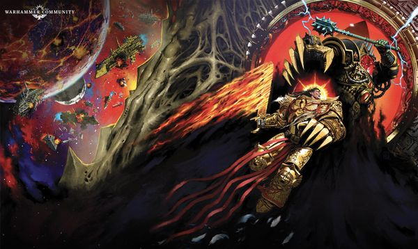

<!-- A0805-B0157 -->

原译文

Horus and the Emperor battle 荷鲁斯与帝皇战斗

**校订译文**

Horus and the Emperor battle 荷鲁斯与帝皇战斗

<!-- /A0805-B0157 -->

<!-- A0805-B0158 -->
**英文原文**

It was then that Ollanius Persson arrived in Lupercal's Court, teleported there alongside John Grammaticus by Actae. John used a single line of Enuncia to briefly blow back the monstrous Warmaster as Ollanius tried to wake the Emperor and give him the Athame blade they had recovered. John was forced to flee but Ollanius stood his ground and unloaded his Lasgun into Horus. Horus contemptuously swiped his talon, reducing Ollanius to red mist but giving the Emperor the time He needed.

<!-- /A0805-B0158 -->

<!-- A0805-B0159 -->

原译文

就在那时，欧兰尼奥斯·佩松到达了卢佩卡尔王庭，与约翰·格拉马迪库斯一起被阿克泰传送到那里。当欧兰尼奥斯试图唤醒帝皇并将他们找到的仪式刃交给他时，约翰用一行暗言短暂地击退了可怕的战帅。约翰被迫逃离，但欧兰尼奥斯坚守阵地，将他的激光枪对准荷鲁斯。荷鲁斯轻蔑地挥了挥爪子，把欧兰尼奥斯变成了红雾，但给了帝皇他所需要的时间。

**校订译文**

此时，阿克泰将欧良尼乌斯·佩松与约翰·格拉马迪库斯传送进卢佩卡尔王庭。约翰说出一句暗言，将可怖的战帅短暂击退；欧良尼乌斯则试图唤醒帝皇，把两人找到的仪式刃交给他。约翰被迫逃开，欧良尼乌斯却坚守原地，以激光枪向荷鲁斯倾泻火力。战帅轻蔑地挥动利爪，将他化为一片血雾，却也让帝皇争得了所需的时间。

**校注：** unloaded his Lasgun 指实际开火，而非仅把枪口对准。欧良尼乌斯·佩松不是后世传说中的欧良尼乌斯·庇乌斯，按本篇英文分开。

<!-- /A0805-B0159 -->

<!-- A0805-B0160 -->
**英文原文**

After killing Ollanius, Horus turned back to the Emperor's body and saw Garviel Loken before him. Loken pleaded with his father to prove that he was always the better man and prove he was not a slave to Chaos as the Emperor had accused. He pointed out that the Emperor had rejected to fully drink from the warp to become the Dark King and that Horus was the one being controlled by the Dark Powers. Loken appealed to Horus' pride, convincing him to briefly shed off his tremendous Warp powers and finish the Emperor as a mere Primarch. Horus, perhaps in his arrogance, agreed to do so since the battle was over anyway. Horus briefly cast off the powers of Chaos and crushed in the Emperor's skull with Worldbreaker as the Chaos Gods and Daemons around them angrily shouted and protested, trying to warn Horus of something. Horus ignored them but was shocked to find that this was simply a ruse by the Emperor. Loken and the Emperor's corpse had both been illusions, and the real Emperor launched one last assault upon Horus.

<!-- /A0805-B0160 -->

<!-- A0805-B0161 -->

原译文

杀死欧兰尼奥斯后，荷鲁斯转身回到帝皇的尸体前，看到了面前的加维尔·洛肯。洛肯恳求他的父亲证明他总是更好的人，并证明他不是帝皇所指责的混乱的奴隶。他指出，帝皇拒绝满饮亚空间之力成为黑暗之王，而荷鲁斯是被黑暗势力控制的人。洛肯唤起了荷鲁斯的骄傲，说服他短暂地摆脱巨大的亚空间力量，把帝皇当作一个纯粹的原体来终结。荷鲁斯，也许是出于傲慢，同意这样做，因为战斗已经结束了。荷鲁斯短暂地摆脱了混沌之力，并与破世者一起粉碎了帝皇的头骨，因为他们周围的混沌诸神和恶魔愤怒地大喊大叫并抗议，试图警告荷鲁斯一些事情。荷鲁斯无视他们，但震惊地发现这只是帝皇的诡计。洛肯和帝皇的尸体都是幻觉，真正的帝皇对荷鲁斯发动了最后一次进攻。

**校订译文**

杀死欧良尼乌斯后，荷鲁斯回身走向倒下的帝皇，却见加维尔·洛肯站在面前。洛肯恳求父亲证明自己始终更胜一筹，证明他并非帝皇所指责的那种混沌奴隶。他指出，帝皇已拒绝尽饮亚空间之力、升为黑暗之王，真正受黑暗力量操纵的反而是荷鲁斯。洛肯以骄傲相激，劝他暂时放下强大的亚空间之力，只凭原体自身的能力杀死帝皇。荷鲁斯或许出于傲慢，认为胜负已分，便答应了。他驱散混沌加持，用破世者砸碎帝皇的头颅，任凭周围诸神与恶魔愤怒叫喊，试图警告他。他没有理会，随即却震惊地发现这只是帝皇设下的诡计：眼前的洛肯与帝皇躯体全是幻象。真正的帝皇向他发动了最后一次攻击。

**校注：** as a mere Primarch 修饰荷鲁斯凭自身原体之力作战，不是把帝皇当作原体。此处“洛肯”是幻象，后段真正洛肯旁观仍保留。

<!-- /A0805-B0161 -->

<!-- A0805-B0162 图片 -->
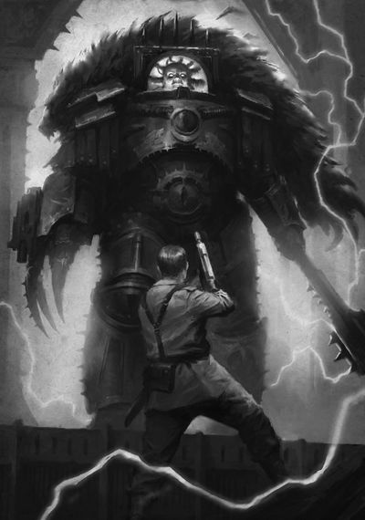

<!-- A0805-B0163 -->

原译文

Ollanius Persson faces down Horus 欧兰尼奥斯·佩松面对荷鲁斯

**校订译文**

Ollanius Persson faces down Horus 欧良尼乌斯·佩松直面荷鲁斯

<!-- /A0805-B0163 -->

<!-- A0805-B0164 -->
**英文原文**

With Horus briefly depowered and the Emperor greatly weakened, the ensuing contest became purely a physical one but the Warmaster was able to gouge out the Emperor's eye, mutilate his arm, crush his spine, and set his hair alight. The Emperor struck back, using the power of the reactivated Astronomican to shine its light directly into Horus' brain. The Warmaster fell into agony as he desperately tried to cloak himself in Warp power once more. However much to Horus' horror, he discovered that the Chaos Gods were now teaching him a lesson of sorts by deliberately denying him their power. Horus came to the realization that he had never been in control, and his Chaos masters were treating him as they would a disobedient slave. The realization combined with the brief absence of Warp corruption over his soul saw the old Horus the Emperor had once loved manifest once more.

<!-- /A0805-B0164 -->

<!-- A0805-B0165 -->

原译文

随着荷鲁斯的短暂失势和帝皇的极大削弱，随后的比赛变成了纯粹的身体对抗，但战帅能够挖出皇帝的眼睛，肢解他的手臂，压碎他的脊椎，并点燃他的头发。帝皇进行了反击，利用重新激活的星炬的力量将光线直接照射到荷鲁斯的大脑中。战帅绝望地试图再次用亚空间力量伪装自己，陷入了痛苦之中。无论荷鲁斯多么害怕，他发现混沌诸神现在故意否认他的力量，给了他一个教训。荷鲁斯意识到他从未控制过局面，他的混沌主人们对待他就像对待一个不听话的奴隶一样。意识到这一点，再加上他灵魂上暂时没有亚空间腐化，帝皇曾经爱过的过去的荷鲁斯再次显现。

**校订译文**

荷鲁斯暂时失去混沌加持，帝皇也已极度衰弱，战斗遂变成纯粹的肉身较量。战帅挖去帝皇一眼，毁伤他的手臂，压断脊柱，点燃头发。帝皇奋起反击，借重燃的星炬之力，将光芒直接照进荷鲁斯脑内。战帅痛苦不堪，急切地试图重新以亚空间之力包裹自己，却惊恐地发现，诸神正故意拒绝赐力，借此教训他。荷鲁斯终于明白，自己从未掌握主动；混沌主人们一直将他视作一个不听话的奴隶。这份醒悟，加上灵魂短暂摆脱腐化，使帝皇曾经深爱的那个荷鲁斯重新显现。

**校注：** depowered 是暂失混沌加持，不是政治失势；cloak himself in Warp power 指用其护身，不是伪装身份。

<!-- /A0805-B0165 -->

<!-- A0805-B0166 -->
**英文原文**

Horus pleaded with the Emperor to kill him before the Chaos Gods could fully reassert control. The Emperor initially hesitated, but granted Horus a mercy and stabbed His son through the chest with the Athame blade Ollanius had given him. The Emperor then channeled all of His might into the blade, obliterating Horus' form and reducing him to a mere skeleton inside charred armour. With the deed done, the Emperor immediately collapsed as the real Garviel Loken watched with horror. Furious and wailing that their pawn was dead, the Chaos Gods instantly retreated back into the shadows. The Warp-madness that had plagued Terra and the Vengeful Spirit went with them and conventional space-time was restored.

<!-- /A0805-B0166 -->

<!-- A0805-B0167 -->

原译文

荷鲁斯恳求帝皇在混沌诸神完全重新控制之前杀了他。帝皇起初犹豫了一下，但宽恕了荷鲁斯，并用欧兰尼奥斯给他的仪式刃刺穿了他的儿子的胸膛。然后，帝皇将所有的力量都投入到刀刃上，抹去了荷鲁斯的身形，把他变成了烧焦盔甲里的骷髅。行动完成后，帝皇立刻崩溃了，真正的加维尔·洛肯惊恐地看着。混沌诸神愤怒地哭喊着他们的棋子已经死了，立刻撤退到阴影中。困扰泰拉和复仇之魂号的亚空间疯狂也随之而去，传统的时空得以恢复。

**校订译文**

荷鲁斯恳求帝皇，赶在混沌诸神彻底夺回控制之前杀死自己。帝皇起初迟疑，终究给了儿子仁慈的解脱，用欧良尼乌斯交来的仪式刃贯穿他的胸膛，将全部力量灌入刀身。荷鲁斯的肉身被摧毁，只剩焦黑盔甲中的一副骨架。事毕，帝皇立刻倒下，真正的洛肯在一旁惊恐地看着。诸神因棋子死亡而愤怒哀号，转瞬退回阴影。侵扰泰拉与复仇之魂号的亚空间疯狂也随之消退，正常时空恢复。

**校注：** granted a mercy 在此为应请求结束痛苦，不直接等同赦免其全部罪行。原文只说毁灭肉身留骨，不擅补灵魂彻底消灭的旧版本描述。

<!-- /A0805-B0167 -->

<!-- A0805-B0168 -->
### Aftermath 余波

<!-- /A0805-B0168 -->

<!-- A0805-B0169 -->
**英文原文**

Shortly after Dorn, Valdor, and a small Custodes escort arrived in Lupercal's court to find Loken and the two corpses. Leetu had also lived through the ordeal, and directed Dorn as to where to find Sanguinius' body and Ferrus Manus' skull. Both alongside the Emperor's body were taken by Dorn and the others as they teleported back into the Imperial Palace. Loken insisted he stay behind to watch over his fathers body, something that later caused him to be killed by Erebus. Back inside the Throneroom, Leetu pointed out a Throne Tarot Card had been discovered by the Emperor's body. Dorn and even Valdor both agreed this was a sign directing them to place the Emperor upon the Golden Throne much more. Malcador's form upon the Throne had since disintegrated into nothingness. The Emperor has spent the last 10,000 years upon the Golden Throne, eternally silent.

<!-- /A0805-B0169 -->

<!-- A0805-B0170 -->

原译文

不久之后，多恩、瓦尔多和一个小禁军护送队抵达卢佩卡尔王庭，找到了洛肯和两具尸体。勒图也经历了这场磨难，并指示多恩在哪里找到圣吉列斯的尸体和费鲁斯·马努斯的头骨。在帝皇的尸体旁边，多恩和其他人被传送回皇宫时带走了。洛肯坚持要留下来照看他父亲的尸体，这后来导致他被艾瑞巴斯杀死。回到王座大厅，勒图指出帝皇的尸体发现了一张王座塔罗牌。多恩甚至瓦尔多都认为这是一个指示他们将帝皇更多地放在黄金王座上的迹象。马卡多在王座上的形象从此瓦解为虚无。帝皇在过去的一万年里一直坐在黄金王座上，永远保持沉默。

**校订译文**

不久，多恩、瓦尔多与少量禁军护卫抵达卢佩卡尔王庭，看见洛肯，以及倒下的帝皇与荷鲁斯。勒图也活了下来，为多恩指出圣吉列斯遗体与费鲁斯·马努斯头颅所在。多恩等人带上这些遗骸和帝皇的身躯，传送回皇宫。洛肯坚持留下守护父亲的遗体，后来因此被艾瑞巴斯杀害。回到王座厅，勒图指出，帝皇身旁曾发现一张“王座”塔罗牌。多恩与瓦尔多都认为，这是指引他们再次将帝皇安置于黄金王座的征兆。此前坐在王座上的马卡多，身躯已消散殆尽。此后一万年，帝皇便一直留在黄金王座上，长久沉默。

**校注：** 原文称 two corpses，随后又写将帝皇置于维生王座，存在措辞张力；中文写倒下的两人，并在此保留原文疑点，不据此裁定帝皇已医学死亡。much more 接在 Golden Throne 后语义残缺，译文不照搬为“更多地放在”，仅保留再次安置王座的完整意义。

<!-- /A0805-B0170 -->

<!-- A0805-B0171 -->
**英文原文**

Immediately upon the death of Horus, the situation on Terra reversed completely. Every Daemon across Terra was sent back into the Warp as the Chaos Gods recoiled. Guilliman's fleet arrived in the Sol System, bringing massive amounts of reinforcements and beginning a vicious counterattack alongside Admiral Niora Su-Kassen and The Phalanx, which emerges with its escorts from hiding within the rings of Saturn to attack the traitors. With their Primarch dead, the Sons of Horus fell into complete disarray and immediately broke, with Abaddon gaining some groups of survivors and fleeing aboard the Vengeful Spirit. Many of the more corrupted traitor Space Marines died where they stood, while others fell into a fugue state. Panic broke out amongst the lesser followers of Chaos. Though massively outnumbered, the small group of loyalist survivors led a spiteful counterattack that chased the Traitors out of the Palace and soon all of Terra. Over the ensuing days the Traitors were completely routed. While it is said that the Sons of Horus were the first to flee the Throneworld, the Death Guard are thought to be the last.

<!-- /A0805-B0171 -->

<!-- A0805-B0172 -->

原译文

荷鲁斯死后，泰拉上的局势立即完全逆转。随着混沌诸神的退缩，泰拉上的每一个恶魔都被送回了亚空间。基里曼的舰队抵达了太阳系，带来了大量的增援部队，并与海军上将尼奥拉·苏-卡珊和山阵号一起开始了猛烈的反击，山阵号带着护卫舰队从土星环内现身，攻击叛徒。随着他们的原体死亡，荷鲁斯之子陷入完全混乱并立即崩溃，阿巴顿集结了一些幸存者，并乘坐复仇之魂号逃离。许多更堕落的叛徒星际战士在他们所站的地方死去，而其他人则陷入了神游状态。混沌的追随者中爆发了恐慌。尽管人数远远超过对手，但一小群忠诚的幸存者领导了一场恶毒的反击，将叛徒赶出了皇宫，很快就赶出了整个泰拉。在接下来的几天里，叛徒们被彻底击败了。虽然据说荷鲁斯之子是第一个逃离王座世界的人，但死亡守卫被认为是最后一个。

**校订译文**

荷鲁斯一死，泰拉局势立即逆转。混沌诸神退缩，所有恶魔被逐回亚空间。基里曼舰队抵达太阳系，带来大批援军；尼奥拉·苏·卡森海军上将也率山阵号与护航舰队，从土星环内的藏身处杀出，双方协同展开猛烈反击。失去原体的荷鲁斯之子彻底混乱，迅速溃散；阿巴顿收拢部分幸存者，乘复仇之魂号逃走。许多腐化较深的叛变星际战士当场死去，另一些陷入恍惚，普通混沌追随者中也蔓延起恐慌。忠诚派幸存者虽然人数远少于敌军，仍满怀复仇怒火发起反攻，将叛军逐出皇宫，继而赶出整个泰拉。接下来的数日里，敌军全线溃败。据说，荷鲁斯之子最先逃离王座世界，死亡守卫则是最后离去的军团。

**校注：** massively outnumbered 指忠诚派人数远少于敌军，原译完全颠倒。

<!-- /A0805-B0172 -->

<!-- A0805-B0173 -->
**英文原文**

The Horus Heresy did not end with the Battle of Terra. The Loyalists still had to drive the remaining rebels from the Imperium, one world at a time. In what became known as the Great Scouring, the traitorous forces of Chaos were eventually driven into the Eye of Terror.

<!-- /A0805-B0173 -->

<!-- A0805-B0174 -->

原译文

荷鲁斯叛乱并没有随着泰拉之战而结束。忠诚派仍然不得不将剩下的叛军赶出帝国，一次一个世界。在后来被称为大清洗的事件中，混沌的叛徒势力最终被驱逐到恐惧之眼。

**校订译文**

泰拉之战并未终结荷鲁斯之乱。忠诚派仍须逐个世界清剿叛军，将其驱逐出帝国。这场后来被称为“大清洗”的战争，最终把混沌叛军赶入恐惧之眼。

<!-- /A0805-B0174 -->

<!-- A0805-B0175 -->
## Order of Battle 战斗序列

<!-- /A0805-B0175 -->

<!-- A0805-B0176 -->
### Imperial 帝国

<!-- /A0805-B0176 -->

<!-- A0805-B0177 -->
**英文原文**

Supreme Commander - Emperor of Mankind

<!-- /A0805-B0177 -->

<!-- A0805-B0178 -->

原译文

最高指挥官 - 人类帝皇

**校订译文**

最高指挥官 - 人类帝皇

<!-- /A0805-B0178 -->

<!-- A0805-B0179 -->
**英文原文**

Lord Praetorian - Rogal Dorn

<!-- /A0805-B0179 -->

<!-- A0805-B0180 -->

原译文

禁卫领主 - 罗格·多恩

**校订译文**

禁卫领主 - 罗格·多恩

<!-- /A0805-B0180 -->

<!-- A0805-B0181 -->
**英文原文**

Imperial Regent - Malcador the Sigilite

<!-- /A0805-B0181 -->

<!-- A0805-B0182 -->

原译文

帝国摄政 - 掌印者马卡多

**校订译文**

帝国摄政 - 掌印者马卡多

<!-- /A0805-B0182 -->

<!-- A0805-B0183 -->

原译文

Legiones Astartes 阿斯塔特军团

**校订译文**

Legiones Astartes 阿斯塔特军团

<!-- /A0805-B0183 -->

<!-- A0805-B0184 -->
**英文原文**

Imperial Fists - commanded by Rogal Dorn

<!-- /A0805-B0184 -->

<!-- A0805-B0185 -->

原译文

帝国之拳 - 由罗格·多恩指挥

**校订译文**

帝国之拳 - 由罗格·多恩指挥

<!-- /A0805-B0185 -->

<!-- A0805-B0186 -->
**英文原文**

Blood Angels - commanded by Sanguinius

<!-- /A0805-B0186 -->

<!-- A0805-B0187 -->

原译文

圣血天使 - 由圣吉列斯指挥

**校订译文**

圣血天使 - 由圣吉列斯指挥

<!-- /A0805-B0187 -->

<!-- A0805-B0188 -->
**英文原文**

White Scars - commanded by Jaghatai Khan

<!-- /A0805-B0188 -->

<!-- A0805-B0189 -->

原译文

白色伤疤 - 由察合台可汗指挥

**校订译文**

白疤——由察合台可汗指挥。

<!-- /A0805-B0189 -->

<!-- A0805-B0190 -->
**英文原文**

10,000 Dark Angels - Commanded by Captain-Paladin Corswain

<!-- /A0805-B0190 -->

<!-- A0805-B0191 -->

原译文

10000黑暗天使 - 由圣骑士连长考斯韦恩指挥

**校订译文**

一万名黑暗天使——由圣骑士连长考斯韦恩指挥。

<!-- /A0805-B0191 -->

<!-- A0805-B0192 -->
**英文原文**

Remnants of the Knights-Errant, The Seventy, Blackshields, and Shattered Legions

<!-- /A0805-B0192 -->

<!-- A0805-B0193 -->

原译文

游侠骑士的残兵、七十勇士、黑盾和破碎军团的残余

**校订译文**

游侠骑士、“七十勇士”、黑盾与破碎军团的残余部队。

<!-- /A0805-B0193 -->

<!-- A0805-B0194 -->
**英文原文**

At least 3 Salamanders - secretly under Vulkan

<!-- /A0805-B0194 -->

<!-- A0805-B0195 -->

原译文

至少三队火蜥蜴 - 秘密在沃坎手下

**校订译文**

至少三名火蜥蜴——秘密听命于沃坎。

**校注：** 3 Salamanders 指至少三名火蜥蜴战士，不是三支小队。

<!-- /A0805-B0195 -->

<!-- A0805-B0196 -->
**英文原文**

Small Space Wolves Force

<!-- /A0805-B0196 -->

<!-- A0805-B0197 -->

原译文

小太空野狼部队

**校订译文**

一支规模较小的太空野狼部队。

<!-- /A0805-B0197 -->

<!-- A0805-B0198 -->
**英文原文**

Imperial Army - several hundred million Troopers and Militia, de jure under Lord Commander Militant Adreen

<!-- /A0805-B0198 -->

<!-- A0805-B0199 -->

原译文

帝国陆军 - 数亿士兵和民兵，法理上在阿德里安军务领主指挥官的管辖下

**校订译文**

帝国军——数亿士兵与民兵，名义上由军务领主指挥官阿德林统辖。

<!-- /A0805-B0199 -->

<!-- A0805-B0200 -->

原译文

Inferallti Hussars 地狱骠骑兵

**校订译文**

Inferallti Hussars 因费拉尔提骠骑兵

<!-- /A0805-B0200 -->

<!-- A0805-B0201 -->

原译文

Qui-Helic Guard 奎-海利克卫队

**校订译文**

Qui-Helic Guard 奎-海利克卫队

<!-- /A0805-B0201 -->

<!-- A0805-B0202 -->

原译文

Cordesh Cavalry 科尔德什骑兵

**校订译文**

Cordesh Cavalry 科尔德什骑兵

<!-- /A0805-B0202 -->

<!-- A0805-B0203 -->

原译文

Kushtun Naganda 库什图·纳甘达

**校订译文**

Kushtun Naganda 库什图·纳甘达

<!-- /A0805-B0203 -->

<!-- A0805-B0204 -->

原译文

Angkorian Dragoons 吴哥龙骑兵

**校订译文**

Angkorian Dragoons 吴哥龙骑兵

<!-- /A0805-B0204 -->

<!-- A0805-B0205 -->

原译文

Antioch Miles Vesperi 安条克千人黄昏

**校订译文**

Antioch Miles Vesperi 安条克暮光军

**校注：** Miles 是战士词根，不能按 mille 误作千；Vesperi 有暮色义，暂作安条克暮光军，军团名官方待核。

<!-- /A0805-B0205 -->

<!-- A0805-B0206 -->

原译文

Golden Hegera 黄金统领

**校订译文**

Golden Hegera 黄金赫格拉

**校注：** Hegera 暂按专名音译赫格拉；原译统领缺少对应依据，暂保留于对照，确切词源待核。

<!-- /A0805-B0206 -->

<!-- A0805-B0207 -->

原译文

Kimmerine Corps Bellum 基墨里涅战争兵团

**校订译文**

Kimmerine Corps Bellum 基墨里涅战争兵团

<!-- /A0805-B0207 -->

<!-- A0805-B0208 -->

原译文

Anzakk Heavy Brigade 安扎克重型旅

**校订译文**

Anzakk Heavy Brigade 安扎克重型旅

<!-- /A0805-B0208 -->

<!-- A0805-B0209 -->

原译文

33rd Pan-Pacific Mobile 泛太平洋第33移动团

**校订译文**

33rd Pan-Pacific Mobile 泛太平洋第 33 机动团

<!-- /A0805-B0209 -->

<!-- A0805-B0210 -->

原译文

First Terran Armoured 第一泰拉装甲团

**校订译文**

First Terran Armoured 泰拉第一装甲部队

<!-- /A0805-B0210 -->

<!-- A0805-B0211 -->

原译文

Fourth Australia Mechanized 澳大利亚机械化第4团

**校订译文**

Fourth Australia Mechanized 澳大利亚机械化第4团

<!-- /A0805-B0211 -->

<!-- A0805-B0212 -->

原译文

3rd Helvet 赫尔维特第3团

**校订译文**

3rd Helvet 赫尔维特第3团

<!-- /A0805-B0212 -->

<!-- A0805-B0213 -->

原译文

105th Tercio Upland Grenadiers 高地掷弹兵第105步兵团

**校订译文**

105th Tercio Upland Grenadiers 高地掷弹兵第105步兵团

<!-- /A0805-B0213 -->

<!-- A0805-B0214 -->

原译文

11th Heavy Janissaries 重型近卫军第11团

**校订译文**

11th Heavy Janissaries 重型近卫军第11团

<!-- /A0805-B0214 -->

<!-- A0805-B0215 -->

原译文

22nd Kantium Hort 坎蒂姆·霍特第22团

**校订译文**

22nd Kantium Hort 坎蒂姆·霍特第22团

<!-- /A0805-B0215 -->

<!-- A0805-B0216 -->

原译文

55th Midlantik 中大西洋第55团

**校订译文**

55th Midlantik 中大西洋第55团

<!-- /A0805-B0216 -->

<!-- A0805-B0217 -->

原译文

77th Europa Max 欧罗巴至高第77团

**校订译文**

77th Europa Max 欧罗巴至高第77团

<!-- /A0805-B0217 -->

<!-- A0805-B0218 -->

原译文

Hort Borograd 霍特·博罗格拉德

**校订译文**

Hort Borograd 霍特·博罗格拉德

<!-- /A0805-B0218 -->

<!-- A0805-B0219 -->

原译文

16th Arctic Hort 北极霍特第16团

**校订译文**

16th Arctic Hort 北极霍特第16团

<!-- /A0805-B0219 -->

<!-- A0805-B0220 -->

原译文

Jadda 12th Armoured 加达第12装甲团

**校订译文**

Jadda 12th Armoured 加达第12装甲团

<!-- /A0805-B0220 -->

<!-- A0805-B0221 -->

原译文

Massian 5th 马西安第5团

**校订译文**

Massian 5th 马西安第5团

<!-- /A0805-B0221 -->

<!-- A0805-B0222 -->
**英文原文**

Addaba Free Corps - Defects

<!-- /A0805-B0222 -->

<!-- A0805-B0223 -->

原译文

阿达巴自由军团 - 叛变

**校订译文**

阿达巴自由军——后叛变。

<!-- /A0805-B0223 -->

<!-- A0805-B0224 -->

原译文

18th Nordafrik Resistance Army 第18诺达弗里克抵抗军

**校订译文**

18th Nordafrik Resistance Army 第18诺达弗里克抵抗军

<!-- /A0805-B0224 -->

<!-- A0805-B0225 -->

原译文

91st Industani 印度斯坦第91团

**校订译文**

91st Industani 印度斯坦第91团

<!-- /A0805-B0225 -->

<!-- A0805-B0226 -->

原译文

12th Helian Rifles 第12赫利安步枪团

**校订译文**

12th Helian Rifles 第12赫利安步枪团

<!-- /A0805-B0226 -->

<!-- A0805-B0227 -->

原译文

403rd Exigency Stratiotes 第403紧急军役团

**校订译文**

403rd Exigency Stratiotes 第403紧急军役团

<!-- /A0805-B0227 -->

<!-- A0805-B0228 -->

原译文

PanCon Fifth 潘科第五团

**校订译文**

PanCon Fifth 潘科第五团

<!-- /A0805-B0228 -->

<!-- A0805-B0229 -->

原译文

Royal Zanzibari Hort 王室桑给巴尔霍特

**校订译文**

Royal Zanzibari Hort 王室桑给巴尔霍特

<!-- /A0805-B0229 -->

<!-- A0805-B0230 -->

原译文

467th Tanzeer Excertus 第467届坦泽尔军团

**校订译文**

467th Tanzeer Excertus 第 467 坦泽尔军团

**校注：** 军事编号 467th 不表示届次，删除第467届中的届。

<!-- /A0805-B0230 -->

<!-- A0805-B0231 -->

原译文

Kovingian Light Ordnancers 科温吉亚轻型军械团

**校订译文**

Kovingian Light Ordnancers 科温吉亚轻型军械团

<!-- /A0805-B0231 -->

<!-- A0805-B0232 -->

原译文

Hiveguard Ischia 伊斯基亚巢都守卫

**校订译文**

Hiveguard Ischia 伊斯基亚巢都守卫

<!-- /A0805-B0232 -->

<!-- A0805-B0233 -->
**英文原文**

Vulkan's Own - Ad Hoc Reserve Regiment

<!-- /A0805-B0233 -->

<!-- A0805-B0234 -->

原译文

沃坎之裔 - 特设预备兵团

**校订译文**

沃坎亲军——临时组建的预备兵团。

**校注：** Vulkan’s Own 是单位归属称谓，译沃坎亲军，不指基因意义上的子嗣；这是临时预备兵团。

<!-- /A0805-B0234 -->

<!-- A0805-B0235 -->
**英文原文**

198th Palace Aerial Defense Squadron 'Bright Hawks'

<!-- /A0805-B0235 -->

<!-- A0805-B0236 -->

原译文

第198皇宫防空中队“光明天鹰”

**校订译文**

第 198 皇宫空中防御中队“光明鹰”。

<!-- /A0805-B0236 -->

<!-- A0805-B0237 -->

原译文

Solar Auxilia 太阳辅助军

**校订译文**

Solar Auxilia 太阳辅助军

<!-- /A0805-B0237 -->

<!-- A0805-B0238 -->

原译文

Chosen of Malcador 马卡多亲选

**校订译文**

Chosen of Malcador 马卡多亲选

<!-- /A0805-B0238 -->

<!-- A0805-B0239 -->
**英文原文**

Imperialis Armada and Astartes Fleet Elements: - Commanded by Admiral Niora Su-Kassen, in hiding at the edges of the Sol System

<!-- /A0805-B0239 -->

<!-- A0805-B0240 -->

原译文

帝国舰队和阿斯塔特舰队成员：由海军上将尼奥拉·苏-卡珊指挥，藏身于太阳系边缘

**校订译文**

帝国舰队与阿斯塔特舰队部分兵力——由尼奥拉·苏·卡森海军上将指挥，隐蔽于太阳系边缘。

<!-- /A0805-B0240 -->

<!-- A0805-B0241 -->

原译文

Phalanx 山阵号

**校订译文**

Phalanx 山阵号

<!-- /A0805-B0241 -->

<!-- A0805-B0242 -->

原译文

Imperator Somnium 帝皇幻梦号

**校订译文**

Imperator Somnium 帝皇幻梦号

<!-- /A0805-B0242 -->

<!-- A0805-B0243 -->

原译文

Red Tear 红泪号

**校订译文**

Red Tear 红泪号

<!-- /A0805-B0243 -->

<!-- A0805-B0244 -->

原译文

Monarch of Fire 火焰君主号

**校订译文**

Monarch of Fire 火焰君王号

**校注：** 与798同一旗舰，沿较早本稿火焰君王号。

<!-- /A0805-B0244 -->

<!-- A0805-B0245 -->
**英文原文**

4 Dark Angels warships including the Wrath's Descent

<!-- /A0805-B0245 -->

<!-- A0805-B0246 -->

原译文

4艘黑暗天使战舰，包括愤怒降临号

**校订译文**

4艘黑暗天使战舰，包括愤怒降临号

<!-- /A0805-B0246 -->

<!-- A0805-B0247 -->
**英文原文**

Adeptus Mechanicus - Commanded de jure by Fabricator-General Zagreus Kane

<!-- /A0805-B0247 -->

<!-- A0805-B0248 -->

原译文

机械神教 - 在法律上由铸造将军扎格列欧斯·凯恩指挥

**校订译文**

机械修会——名义上由铸造将军扎格列欧斯·凯恩指挥。

<!-- /A0805-B0248 -->

<!-- A0805-B0249 -->

原译文

Skitarii 护教军

**校订译文**

Skitarii 护教军

<!-- /A0805-B0249 -->

<!-- A0805-B0250 -->

原译文

Legio Cybernetica 智控军团

**校订译文**

Legio Cybernetica 智控军团

<!-- /A0805-B0250 -->

<!-- A0805-B0251 -->

原译文

Ordo Reductor 源还修会

**校订译文**

Ordo Reductor 源还修会

<!-- /A0805-B0251 -->

<!-- A0805-B0252 -->
**英文原文**

Multiple Titan Legions including the:

<!-- /A0805-B0252 -->

<!-- A0805-B0253 -->

原译文

多个泰坦军团，包括

**校订译文**

多个泰坦军团，包括

<!-- /A0805-B0253 -->

<!-- A0805-B0254 -->
**英文原文**

Legio Ignatum - ~55 Titans

<!-- /A0805-B0254 -->

<!-- A0805-B0255 -->

原译文

烈焰军团 - ~55架泰坦

**校订译文**

烈焰军团——约 55 台泰坦。

<!-- /A0805-B0255 -->

<!-- A0805-B0256 -->

原译文

Legio Solaria 日晷军团

**校订译文**

Legio Solaria 日晷军团

<!-- /A0805-B0256 -->

<!-- A0805-B0257 -->

原译文

Legio Gryphonicus 狮鹫军团

**校订译文**

Legio Gryphonicus 狮鹫军团

<!-- /A0805-B0257 -->

<!-- A0805-B0258 -->

原译文

Legio Amaranth 不凋花军团

**校订译文**

Legio Amaranth 不凋花军团

<!-- /A0805-B0258 -->

<!-- A0805-B0259 -->
**英文原文**

Legio Defensor - Only 3 Titans

<!-- /A0805-B0259 -->

<!-- A0805-B0260 -->

原译文

防卫者军团 - 只有3架泰坦

**校订译文**

防卫者军团——仅三台泰坦。

<!-- /A0805-B0260 -->

<!-- A0805-B0261 -->
**英文原文**

Legio Atarus - Only a single Titan

<!-- /A0805-B0261 -->

<!-- A0805-B0262 -->

原译文

炎纹军团 - 只有一架单独的泰坦

**校订译文**

炎纹军团——仅一台泰坦。

<!-- /A0805-B0262 -->

<!-- A0805-B0263 -->

原译文

Legio Invigilata 监戒军团

**校订译文**

Legio Invigilata 监戒军团

<!-- /A0805-B0263 -->

<!-- A0805-B0264 -->

原译文

Ordo Sinister 噩兆修会

**校订译文**

Ordo Sinister 噩兆修会

<!-- /A0805-B0264 -->

<!-- A0805-B0265 -->
**英文原文**

Many Knight Houses including:

<!-- /A0805-B0265 -->

<!-- A0805-B0266 -->

原译文

许多骑士家族包括：

**校订译文**

许多骑士家族包括：

<!-- /A0805-B0266 -->

<!-- A0805-B0267 -->

原译文

House Taranis 塔兰尼斯家族

**校订译文**

House Taranis 塔兰尼斯家族

<!-- /A0805-B0267 -->

<!-- A0805-B0268 -->

原译文

House Canis 卡尼斯家族

**校订译文**

House Canis 卡尼斯家族

<!-- /A0805-B0268 -->

<!-- A0805-B0269 -->

原译文

House Vyronii 维罗尼家族

**校订译文**

House Vyronii 维罗尼家族

<!-- /A0805-B0269 -->

<!-- A0805-B0270 -->

原译文

House Konor 康诺家族

**校订译文**

House Konor 康诺家族

<!-- /A0805-B0270 -->

<!-- A0805-B0271 -->

原译文

House Tyranus 泰拉努斯家族

**校订译文**

House Tyranus 泰拉努斯家族

<!-- /A0805-B0271 -->

<!-- A0805-B0272 -->

原译文

House Cadmus 卡德穆斯家族

**校订译文**

House Cadmus 卡德穆斯家族

<!-- /A0805-B0272 -->

<!-- A0805-B0273 -->
**英文原文**

Custodian Guard - At least 1,000 commanded by Captain-General Constantin Valdor

<!-- /A0805-B0273 -->

<!-- A0805-B0274 -->

原译文

禁军 - 至少1000人由总司令康斯坦丁·瓦尔多指挥

**校订译文**

帝皇禁军——至少一千人，由禁军元帅康斯坦丁·瓦尔多指挥。

<!-- /A0805-B0274 -->

<!-- A0805-B0275 -->
**英文原文**

Sisters of Silence - Commanded by Knight-Commander Jenetia Krole

<!-- /A0805-B0275 -->

<!-- A0805-B0276 -->

原译文

寂静修女 - 由骑士指挥官珍提亚·科勒指挥

**校订译文**

寂静修女 - 由骑士指挥官珍提亚·科勒指挥

<!-- /A0805-B0276 -->

<!-- A0805-B0277 -->
**英文原文**

Adeptus Arbites - Commanded by Harr Rantal

<!-- /A0805-B0277 -->

<!-- A0805-B0278 -->

原译文

法务部 - 由哈尔·兰塔尔指挥

**校订译文**

法务部 - 由哈尔·兰塔尔指挥

<!-- /A0805-B0278 -->

<!-- A0805-B0279 -->
**英文原文**

Roboute Guilliman's fleet - 3,200 capital ships (arrives at the end of the battle)

<!-- /A0805-B0279 -->

<!-- A0805-B0280 -->

原译文

罗伯特·基里曼的舰队 - 3200艘主力舰（战斗结束时抵达）

**校订译文**

罗保特·基里曼的舰队——3,200 艘主力舰，于战役结束时抵达。

<!-- /A0805-B0280 -->

<!-- A0805-B0281 -->
### Traitor 叛徒

<!-- /A0805-B0281 -->

<!-- A0805-B0282 -->
**英文原文**

Supreme Commander - Warmaster Horus Lupercal

<!-- /A0805-B0282 -->

<!-- A0805-B0283 -->

原译文

最高指挥官 - 战帅荷鲁斯·卢佩卡尔

**校订译文**

最高指挥官 - 战帅荷鲁斯·卢佩卡尔

<!-- /A0805-B0283 -->

<!-- A0805-B0284 -->
**英文原文**

Siegemaster - Perturabo

<!-- /A0805-B0284 -->

<!-- A0805-B0285 -->

原译文

攻城大师 - 佩图拉博

**校订译文**

攻城大师 - 佩图拉博

<!-- /A0805-B0285 -->

<!-- A0805-B0286 -->

原译文

Traitor Astartes 叛徒阿斯塔特

**校订译文**

Traitor Astartes 叛徒阿斯塔特

<!-- /A0805-B0286 -->

<!-- A0805-B0287 -->
**英文原文**

Sons of Horus - Commanded by the Mournival

<!-- /A0805-B0287 -->

<!-- A0805-B0288 -->

原译文

荷鲁斯之子 - 由四王议会指挥

**校订译文**

荷鲁斯之子 - 由四王议会指挥

<!-- /A0805-B0288 -->

<!-- A0805-B0289 -->
**英文原文**

World Eaters - Commanded by the Primarch Angron (de jure) and Kharn (de facto)

<!-- /A0805-B0289 -->

<!-- A0805-B0290 -->

原译文

吞世者 - 由原体安格隆（法律上）和卡恩（事实上）指挥

**校订译文**

吞世者——名义上由原体安格隆指挥，实际由卡恩统率。

<!-- /A0805-B0290 -->

<!-- A0805-B0291 -->
**英文原文**

Death Guard - Commanded by the Primarch Mortarion

<!-- /A0805-B0291 -->

<!-- A0805-B0292 -->

原译文

死亡守卫 - 由原体莫塔里安指挥

**校订译文**

死亡守卫 - 由原体莫塔里安指挥

<!-- /A0805-B0292 -->

<!-- A0805-B0293 -->
**英文原文**

Iron Warriors - Commanded by the Primarch Perturabo and the Trident

<!-- /A0805-B0293 -->

<!-- A0805-B0294 -->

原译文

钢铁勇士 - 由原体佩图拉博和三叉戟指挥

**校订译文**

钢铁勇士 - 由原体佩图拉博和三叉戟指挥

<!-- /A0805-B0294 -->

<!-- A0805-B0295 -->
**英文原文**

100,000 Emperor's Children - Commanded by the Primarch Fulgrim

<!-- /A0805-B0295 -->

<!-- A0805-B0296 -->

原译文

100000帝皇之子 - 由原体福格瑞姆指挥

**校订译文**

十万名帝皇之子——由原体福格瑞姆指挥。

<!-- /A0805-B0296 -->

<!-- A0805-B0297 -->
**英文原文**

9,000 Thousand Sons - Commanded by the Primarch Magnus the Red

<!-- /A0805-B0297 -->

<!-- A0805-B0298 -->

原译文

9000千子 - 由原体赤红之马格努斯指挥

**校订译文**

九千名千子——由原体红魔马格努斯指挥。

<!-- /A0805-B0298 -->

<!-- A0805-B0299 -->
**英文原文**

5,000 Word Bearers of the Unspeaking Chapter - Commanded by Zardu Layak. Unknown numbers of additional Word Bearers seemed to arrive during the battle, such as those of the Osseous Throne led by Inzar Taerus

<!-- /A0805-B0299 -->

<!-- A0805-B0300 -->

原译文

5000怀言者无言者战团 — 由扎杜·拉亚克指挥。在战斗中，似乎有数量不详的额外的怀言者抵达，比如由因扎·塔鲁斯领导的骸骨王座

**校订译文**

五千名怀言者无言者战团战士——由扎度·拉亚克指挥。战斗期间似乎还有数量不明的怀言者加入，包括因扎尔·泰罗斯率领的骸骨王座部队。

<!-- /A0805-B0300 -->

<!-- A0805-B0301 -->
**英文原文**

Night Lords Elements - Commanded by Lord Commander Gendor Skraivok and Krostovok

<!-- /A0805-B0301 -->

<!-- A0805-B0302 -->

原译文

午夜领主成员 - 由领主指挥官詹多·斯卡莱沃克和克罗斯托沃克指挥

**校订译文**

部分午夜领主部队——由领主指挥官詹多·斯卡莱沃克与克罗斯托沃克指挥。

<!-- /A0805-B0302 -->

<!-- A0805-B0303 -->
**英文原文**

Scattered Alpha Legion Elements

<!-- /A0805-B0303 -->

<!-- A0805-B0304 -->

原译文

分散的阿尔法军团成员

**校订译文**

零散的阿尔法军团部队。

<!-- /A0805-B0304 -->

<!-- A0805-B0305 -->
**英文原文**

Traitor Imperial Army: Thousands of Regiments

<!-- /A0805-B0305 -->

<!-- A0805-B0306 -->

原译文

叛徒帝国陆军：千余个兵团

**校订译文**

叛变帝国军——数千个兵团。

**校注：** Thousands 为数千，不是千余；维持英文数量级。

<!-- /A0805-B0306 -->

<!-- A0805-B0307 -->

原译文

Thernian 7th 瑟尼亚第7团

**校订译文**

Thernian 7th 瑟尼亚第7团

<!-- /A0805-B0307 -->

<!-- A0805-B0308 -->

原译文

9th Terran Wardens 泰拉监察者第9团

**校订译文**

9th Terran Wardens 泰拉监察者第9团

<!-- /A0805-B0308 -->

<!-- A0805-B0309 -->

原译文

Neshamere 8th Mechanized Infantry 内沙米尔第8机械化步兵团

**校订译文**

Neshamere 8th Mechanized Infantry 内沙米尔第8机械化步兵团

<!-- /A0805-B0309 -->

<!-- A0805-B0310 -->

原译文

Cthonian Headhunters 科索尼亚猎头者

**校订译文**

Cthonian Headhunters 科索尼亚猎头者

<!-- /A0805-B0310 -->

<!-- A0805-B0311 -->

原译文

Merudin 20th Tactical 梅鲁丁第20战术团

**校订译文**

Merudin 20th Tactical 梅鲁丁第20战术团

<!-- /A0805-B0311 -->

<!-- A0805-B0312 -->
**英文原文**

Vast hordes of Beastmen, Mutants, Cultists, Pirates, Hive Gangers, and other damned souls.

<!-- /A0805-B0312 -->

<!-- A0805-B0313 -->

原译文

成群的野兽人、变种人、邪教徒、海盗、巢都匪徒和其他被诅咒的灵魂。

**校订译文**

成群的野兽人、变种人、邪教徒、海盗、巢都匪徒和其他被诅咒的灵魂。

<!-- /A0805-B0313 -->

<!-- A0805-B0314 -->

原译文

Alpha Legion Operatives 阿尔法军团密探

**校订译文**

Alpha Legion Operatives 阿尔法军团密探

<!-- /A0805-B0314 -->

<!-- A0805-B0315 -->
**英文原文**

Dark Mechanicum - Commanded by Fabricator-General Kelbor-Hal and the Nine Disciples

<!-- /A0805-B0315 -->

<!-- A0805-B0316 -->

原译文

黑暗机械教 - 由铸造将军凯尔博·哈尔和九名弟子指挥

**校订译文**

黑暗机械教 - 由铸造将军凯尔博·哈尔和九名弟子指挥

<!-- /A0805-B0316 -->

<!-- A0805-B0317 -->
**英文原文**

Armies of Skitarii, Auxilia Myrmidon, Automata, Ordo Reductor, warmachines, and Daemon Engines

<!-- /A0805-B0317 -->

<!-- A0805-B0318 -->

原译文

护教军陆军、辅军精锐、自动机兵、源还修会、战争机械和恶魔引擎

**校订译文**

由护教军、辅军精锐、自动机兵、源还修会部队、战争机器和恶魔引擎构成的大军。

<!-- /A0805-B0318 -->

<!-- A0805-B0319 -->
**英文原文**

Dozens of Traitor Titan Legions

<!-- /A0805-B0319 -->

<!-- A0805-B0320 -->

原译文

数十名叛徒泰坦军团

**校订译文**

数十个叛变泰坦军团。

<!-- /A0805-B0320 -->

<!-- A0805-B0321 -->

原译文

Legio Mortis 死亡军团

**校订译文**

Legio Mortis 死亡军团

<!-- /A0805-B0321 -->

<!-- A0805-B0322 -->

原译文

Legio Fureans 狂热者军团

**校订译文**

Legio Fureans 愤怒者军团

<!-- /A0805-B0322 -->

<!-- A0805-B0323 -->

原译文

Legio Vulpa 鬼狐军团

**校订译文**

Legio Vulpa 鬼狐军团

<!-- /A0805-B0323 -->

<!-- A0805-B0324 -->

原译文

Legio Ursa 大熊军团

**校订译文**

Legio Ursa 大熊军团

<!-- /A0805-B0324 -->

<!-- A0805-B0325 -->
**英文原文**

Legio Tempestus (Traitor Branch)

<!-- /A0805-B0325 -->

<!-- A0805-B0326 -->

原译文

暴风军团（叛徒分支）

**校订译文**

暴风军团（叛徒分支）

<!-- /A0805-B0326 -->

<!-- A0805-B0327 -->

原译文

Legio Audax 莽勇军团

**校订译文**

Legio Audax 莽勇军团

<!-- /A0805-B0327 -->

<!-- A0805-B0328 -->

原译文

Legio Mordaxis 噬心军团

**校订译文**

Legio Mordaxis 噬心军团

<!-- /A0805-B0328 -->

<!-- A0805-B0329 -->

原译文

Legio Krytos 奎托斯军团

**校订译文**

Legio Krytos 奎托斯军团

<!-- /A0805-B0329 -->

<!-- A0805-B0330 -->

原译文

Legio Interfector 杀戮者军团

**校订译文**

Legio Interfector 杀戮者军团

<!-- /A0805-B0330 -->

<!-- A0805-B0331 -->
**英文原文**

Hundreds of Traitor Knight Houses

<!-- /A0805-B0331 -->

<!-- A0805-B0332 -->

原译文

数以百计的叛徒骑士家族

**校订译文**

数以百计的叛徒骑士家族

<!-- /A0805-B0332 -->

<!-- A0805-B0333 -->
**英文原文**

Vast Daemonic hordes including Daemonic Legions of:

<!-- /A0805-B0333 -->

<!-- A0805-B0334 -->

原译文

庞大的恶魔部落，包括恶魔军团：

**校订译文**

庞大的恶魔军势，其中包括以下恶魔军团与著名恶魔：

<!-- /A0805-B0334 -->

<!-- A0805-B0335 -->

原译文

Khorne 恐虐

**校订译文**

Khorne 恐虐

<!-- /A0805-B0335 -->

<!-- A0805-B0336 -->

原译文

Skarbrand 斯卡布兰德

**校订译文**

Skarbrand 斯卡布兰德

<!-- /A0805-B0336 -->

<!-- A0805-B0337 -->

原译文

Khar-Har 坎尔-哈

**校订译文**

Khar-Har 坎尔-哈

<!-- /A0805-B0337 -->

<!-- A0805-B0338 -->

原译文

Skulltaker 夺颅者

**校订译文**

Skulltaker 夺颅者

<!-- /A0805-B0338 -->

<!-- A0805-B0339 -->

原译文

Karanak 卡拉纳克

**校订译文**

Karanak 卡拉纳克

<!-- /A0805-B0339 -->

<!-- A0805-B0340 -->

原译文

Doombreed 毁灭之种

**校订译文**

Doombreed 毁灭之种

<!-- /A0805-B0340 -->

<!-- A0805-B0341 -->

原译文

Tallomin 塔洛明

**校订译文**

Tallomin 塔洛明

<!-- /A0805-B0341 -->

<!-- A0805-B0342 -->

原译文

Nurgle 纳垢

**校订译文**

Nurgle 纳垢

<!-- /A0805-B0342 -->

<!-- A0805-B0343 -->

原译文

Ku'Gath 库’噶斯

**校订译文**

Ku'Gath 库噶斯

<!-- /A0805-B0343 -->

<!-- A0805-B0344 -->

原译文

Ulkair 乌凯尔

**校订译文**

Ulkair 乌凯尔

<!-- /A0805-B0344 -->

<!-- A0805-B0345 -->

原译文

Epidemius 埃皮德米乌斯

**校订译文**

Epidemius 传疫魔

<!-- /A0805-B0345 -->

<!-- A0805-B0346 -->

原译文

J'ian-Lo 杰’安-罗

**校订译文**

J'ian-Lo 杰’安-罗

<!-- /A0805-B0346 -->

<!-- A0805-B0347 -->

原译文

Mephidast 墨菲达斯特

**校订译文**

Mephidast 墨菲达斯特

<!-- /A0805-B0347 -->

<!-- A0805-B0348 -->

原译文

Bahk'ghuranhi'aghkami 巴克'古兰希'阿格卡米

**校订译文**

Bahk'ghuranhi'aghkami 巴克'古兰希'阿格卡米

<!-- /A0805-B0348 -->

<!-- A0805-B0349 -->

原译文

Slaanesh 色孽

**校订译文**

Slaanesh 色孽

<!-- /A0805-B0349 -->

<!-- A0805-B0350 -->

原译文

N'Kari 纳’卡里

**校订译文**

N'Kari 纳’卡里

<!-- /A0805-B0350 -->

<!-- A0805-B0351 -->

原译文

Heartslayer 屠心者

**校订译文**

Heartslayer 屠心者

<!-- /A0805-B0351 -->

<!-- A0805-B0352 -->

原译文

Illaitanen 伊莱塔宁

**校订译文**

Illaitanen 伊莱塔宁

<!-- /A0805-B0352 -->

<!-- A0805-B0353 -->

原译文

Uhlevorix 乌列沃里克斯

**校订译文**

Uhlevorix 乌列沃里克斯

<!-- /A0805-B0353 -->

<!-- A0805-B0354 -->

原译文

Rhug'guari'ihlulan 鲁格'伽里'伊鲁兰

**校订译文**

Rhug'guari'ihlulan 鲁格'伽里'伊鲁兰

<!-- /A0805-B0354 -->

<!-- A0805-B0355 -->

原译文

Ax’senaea 亚克斯’瑟尼娅

**校订译文**

Ax’senaea 亚克斯’瑟尼娅

<!-- /A0805-B0355 -->

<!-- A0805-B0356 -->

原译文

Tzeentch 奸奇

**校订译文**

Tzeentch 奸奇

<!-- /A0805-B0356 -->

<!-- A0805-B0357 -->

原译文

Abraxes 阿布拉克斯

**校订译文**

Abraxes 阿布拉克斯

<!-- /A0805-B0357 -->

<!-- A0805-B0358 -->

原译文

Ghargatuloth 迦戈图罗斯

**校订译文**

Ghargatuloth 迦戈图罗斯

<!-- /A0805-B0358 -->

<!-- A0805-B0359 -->

原译文

Suvfaera 苏夫费拉

**校订译文**

Suvfaera 苏夫费拉

<!-- /A0805-B0359 -->

<!-- A0805-B0360 -->

原译文

Tsunoi 西诺伊

**校订译文**

Tsunoi 西诺伊

<!-- /A0805-B0360 -->

<!-- A0805-B0361 -->

原译文

Chaos Undivided/Other 无分混沌/其他

**校订译文**

Chaos Undivided/Other 混沌无分／其他

<!-- /A0805-B0361 -->

<!-- A0805-B0362 -->

原译文

Be'lakor 比’拉克

**校订译文**

Be'lakor 比拉克尔

<!-- /A0805-B0362 -->

<!-- A0805-B0363 -->

原译文

Samus 萨姆斯

**校订译文**

Samus 萨姆斯

<!-- /A0805-B0363 -->

<!-- A0805-B0364 -->

原译文

Drach'nyen's Host 德拉科’尼恩之主

**校订译文**

Drach'nyen's Host 德拉科尼恩的宿主（host，词义待核）

**校注：** host 可指宿主，也可能指军势。第733篇同形叙述仍不足以消除歧义，本处暂按宿主标待核；不据此指认为拉·恩底弥翁，亦不把“大军”作为已确认解释。

<!-- /A0805-B0364 -->

<!-- A0805-B0365 -->

原译文

Madail 玛戴尔

**校订译文**

Madail 马代尔

<!-- /A0805-B0365 -->

<!-- A0805-B0366 -->

原译文

Kweethul 科威图尔

**校订译文**

Kweethul 科威图尔

<!-- /A0805-B0366 -->

<!-- A0805-B0367 -->

原译文

M'kar 姆’卡

**校订译文**

M'kar 姆’卡尔

<!-- /A0805-B0367 -->

<!-- A0805-B0368 -->

原译文

Scarabus 斯卡拉布斯

**校订译文**

Scarabus 斯卡拉布斯

<!-- /A0805-B0368 -->

<!-- A0805-B0369 -->

原译文

Jubiates 朱庇特斯

**校订译文**

Jubiates 朱庇特斯

<!-- /A0805-B0369 -->

<!-- A0805-B0370 -->

原译文

Ushpetkhar 乌什佩特哈尔

**校订译文**

Ushpetkhar 乌什佩特哈尔

<!-- /A0805-B0370 -->

<!-- A0805-B0371 -->

原译文

Collosuth 克罗索斯

**校订译文**

Collosuth 克罗索斯

<!-- /A0805-B0371 -->

<!-- A0805-B0372 -->
**英文原文**

Traitor Fleet - At least 40,000 vessels including the:

<!-- /A0805-B0372 -->

<!-- A0805-B0373 -->

原译文

叛徒舰队-至少40000艘战舰，包括：

**校订译文**

叛军舰队——至少四万艘舰船，包括：

<!-- /A0805-B0373 -->

<!-- A0805-B0374 -->

原译文

Vengeful Spirit 复仇之魂号

**校订译文**

Vengeful Spirit 复仇之魂号

<!-- /A0805-B0374 -->

<!-- A0805-B0375 -->

原译文

Conqueror 征服者号

**校订译文**

Conqueror 征服者号

<!-- /A0805-B0375 -->

<!-- A0805-B0376 -->

原译文

Pride of the Emperor 帝皇之傲号

**校订译文**

Pride of the Emperor 帝皇之傲号

<!-- /A0805-B0376 -->

<!-- A0805-B0377 -->

原译文

Photep 万丈光芒号

**校订译文**

Photep 万丈光芒号

<!-- /A0805-B0377 -->

<!-- A0805-B0378 -->

原译文

Iron Blood 铁血号

**校订译文**

Iron Blood 铁血号

<!-- /A0805-B0378 -->

<!-- A0805-B0379 -->

原译文

Nightfall 夜幕降临号

**校订译文**

Nightfall 夜幕降临号

<!-- /A0805-B0379 -->

<!-- A0805-B0380 -->

原译文

Terminus Est 终焉号

**校订译文**

Terminus Est 终焉号

<!-- /A0805-B0380 -->

<!-- A0805-B0381 -->

原译文

Ankhtowe 永恒之塔号

**校订译文**

Ankhtowe 永恒之塔号

<!-- /A0805-B0381 -->

<!-- A0805-B0382 -->

原译文

Throne of the Underworld 冥土王座号

**校订译文**

Throne of the Underworld 冥界王座号

<!-- /A0805-B0382 -->

<!-- A0805-B0383 -->
## Trivia 琐事

<!-- /A0805-B0383 -->

<!-- A0805-B0384 -->
### Conflicting sources 来源冲突

<!-- /A0805-B0384 -->

<!-- A0805-B0385 -->
**英文原文**

There are many differences with the narrative of the Siege of Terra as originally told in older sources with that of the Black Library novel series. Most notably these include:

<!-- /A0805-B0385 -->

<!-- A0805-B0386 -->

原译文

与旧资料中最初讲述的泰拉围城的叙事与黑色图书馆小说系列的叙事有很多不同。最值得注意的包括：

**校订译文**

早期资料对泰拉围城的叙述，与黑图书馆后来的小说系列存在许多差异，主要包括以下各点：

**校注：** 本节比较早期设定与后续小说，以下否定句均属于旧版本差异，不可误当成对本篇前文的校正命令。

<!-- /A0805-B0386 -->

<!-- A0805-B0387 -->
**英文原文**

In the original lore, Lorgar himself led the Word Bearers on Terra. However as of the events of the novel Slaves to Darkness, Lorgar is banished from Horus' sight for attempting to usurp him and instead the Word Bearers at Terra were led by Zardu Layak.

<!-- /A0805-B0387 -->

<!-- A0805-B0388 -->

原译文

在最初的传说中，珞珈本人领导了泰拉上的怀言者。然而，正如小说《黑暗之奴》中的事件一样，珞珈因试图篡夺荷鲁斯的权力而被驱逐出荷鲁斯的视线，取而代之的是，泰拉的怀言者是由扎杜·拉亚克领导的。

**校订译文**

早期设定中，珞珈亲自统率泰拉上的怀言者。但小说《黑暗之奴》记载，他因企图取代荷鲁斯而被逐走，因此泰拉战场上的怀言者改由扎度·拉亚克率领。

<!-- /A0805-B0388 -->

<!-- A0805-B0389 -->
**英文原文**

The Iron Warriors did not evacuate midway into the siege.

<!-- /A0805-B0389 -->

<!-- A0805-B0390 -->

原译文

钢铁勇士没有在围城中途撤离。

**校订译文**

早期版本中，钢铁勇士没有在围城中途撤军。

<!-- /A0805-B0390 -->

<!-- A0805-B0391 -->
**英文原文**

Kharn the Betrayer was not slain by Sigismund.

<!-- /A0805-B0391 -->

<!-- A0805-B0392 -->

原译文

背叛者卡恩没有被西吉斯蒙德杀死。

**校订译文**

早期版本中，背叛者卡恩并非死于西吉斯蒙德之手。

<!-- /A0805-B0392 -->

<!-- A0805-B0393 -->
**英文原文**

Mortarion was not banished back to the Warp in a duel with Jaghatai Khan.

<!-- /A0805-B0393 -->

<!-- A0805-B0394 -->

原译文

莫塔里安在与察合台可汗的决斗中没有被驱逐回亚空间。

**校订译文**

早期版本中，莫塔里安并未在与察合台可汗的决斗中被放逐回亚空间。

<!-- /A0805-B0394 -->

<!-- A0805-B0395 -->
**英文原文**

Dark Angels did not land at the Astronomican.

<!-- /A0805-B0395 -->

<!-- A0805-B0396 -->

原译文

黑暗天使没有降落在星炬上。

**校订译文**

早期版本中，黑暗天使没有在星炬所在地登陆。

<!-- /A0805-B0396 -->

<!-- A0805-B0397 -->
**英文原文**

The Sky Fortress was used for the defense of the Eternity Gate, not for the retaking of the Lion's Gate Spaceport by Jaghatai Khan.

<!-- /A0805-B0397 -->

<!-- A0805-B0398 -->

原译文

天空要塞是用来防御永恒之门的，而不是察合台可汗用来夺回狮门太空港的。

**校订译文**

早期版本中，天空堡垒用于防守永恒之门，而非支援察合台可汗夺回狮门太空港。

<!-- /A0805-B0398 -->

<!-- A0805-B0399 -->
**英文原文**

Magnus was not defeated by Vulkan, and likewise Angron was not defeated by Sanguinius.

<!-- /A0805-B0399 -->

<!-- A0805-B0400 -->

原译文

马格努斯没有被沃坎击败，同样，安格隆也没有被圣吉列斯击败。

**校订译文**

早期版本中，马格努斯并未败于沃坎之手，安格隆也未被圣吉列斯击败。

<!-- /A0805-B0400 -->

<!-- A0805-B0401 -->
**英文原文**

Sanguinius is able to crack a small chink out of Horus' armour, which the Emperor later exploits. This is not present in the Black Library novels.

<!-- /A0805-B0401 -->

<!-- A0805-B0402 -->

原译文

圣吉列斯能够从荷鲁斯的盔甲上敲出一个小缺口，帝皇后来利用了这个缺口。这在黑色图书馆的小说中是不存在的。

**校订译文**

早期版本中，圣吉列斯在荷鲁斯的盔甲上打出一道细小缺口，帝皇后来利用了它。黑图书馆小说没有采用这一情节。

<!-- /A0805-B0402 -->

<!-- A0805-B0403 -->
**英文原文**

The final battle between Horus and the Emperor is greatly expanded upon and includes figures such as Ollanius Persson, Garviel Loken, Leetu and the Athame which were not present in the original.

<!-- /A0805-B0403 -->

<!-- A0805-B0404 -->

原译文

荷鲁斯和帝皇之间的最后一场战斗得到了极大的扩展，并包括了欧兰尼奥斯·佩松、加维尔·洛肯、勒图等人物和仪式刃，这些人物在原作中并不存在。

**校订译文**

小说大幅扩展了帝皇与荷鲁斯的最终决战，加入欧良尼乌斯·佩松、加维尔·洛肯、勒图等人物，以及仪式刃这一要素；这些内容在最初版本中均未出现。

<!-- /A0805-B0404 -->

<!-- A0805-B0405 -->
**英文原文**

It is left ambiguous as to who actually stands between Horus and the Emperor's broken body, with some stating it was a Custodian, Space Marine, or lone Guardsman Ollanius Pius. The Black Library novels reveal all three to have been true at different points.

<!-- /A0805-B0405 -->

<!-- A0805-B0406 -->

原译文

至于谁真正站在荷鲁斯和帝皇破碎的尸体之间，人们并不清楚，有人说是禁军、星际战士还是单独的卫兵欧兰涅斯•皮乌斯。黑色图书馆的小说揭示了这三个在不同的点上都是真实的。

**校订译文**

早期叙述未明确究竟是谁挡在荷鲁斯与重伤帝皇之间：有的说是禁军，有的说是星际战士，也有的说是孤身一人的卫兵欧良尼乌斯·庇乌斯。黑图书馆小说则让这三种身份的援助者，在不同节点分别挺身而出。

**校注：** 此处指援助者身份类型在不同情节中出现，不表示欧良尼乌斯·庇乌斯与欧良尼乌斯·佩松是同一人。原文 broken body 是重伤身躯，不宜写成帝皇已经死亡的尸体。

<!-- /A0805-B0406 -->

<!-- A0805-B0407 -->
**英文原文**

The Emperor is insistent that he be brought back to the throne after defeating Horus, whereas in the novels he is unconscious and they discover a tarot guide of the throne to guide them to the conclusion.

<!-- /A0805-B0407 -->

<!-- A0805-B0408 -->

原译文

帝皇坚持在击败荷鲁斯后将他带回王座，而在小说中，他是无意识的，他们发现了一个指向王座的塔罗牌来指引他们得出结论。

**校订译文**

早期版本中，帝皇击败荷鲁斯后，亲自坚持要被送回王座；小说里，他已经失去意识，众人根据发现的“王座”塔罗牌，判断应将他安置于黄金王座。

<!-- /A0805-B0408 -->

本篇核心术语与暂定项

以下列出本篇出现的英文原形及核心术语表用词。同形词可能指不同对象，具体词义以本篇正文和校注为准；单复数、别名和仅见于图注的名称可能尚未列入。完整候选见[术语表](../../术语表/双语术语候选.csv)。

| 英文 | 采用中文 | 状态 |
| --- | --- | --- |
| Space Marines | 星际战士 | 官方已核对 |
| Blood Angels | 圣血天使 | 官方已核对 |
| Dark Angels | 黑暗天使 | 官方已核对 |
| Space Wolves | 太空野狼 | 官方已核对 |
| Adeptus Mechanicus | 机械修会 | 官方已核对 |
| Imperial Army | 帝国军 | 暂定·官方待核 |
| Chaos Space Marines | 混沌星际战士 | 官方已核对 |
| Death Guard | 死亡守卫 | 官方已核对 |
| Thousand Sons | 千子 | 官方已核对 |
| World Eaters | 吞世者 | 官方已核对 |
| Eldar | 灵族 | 暂定·语境区分 |
| Roboute Guilliman | 罗保特·基里曼 | 官方已核对 |
| Ultramarines | 极限战士 | 官方已核对 |
| Be'lakor | 比拉克尔 | 官方已核对 |
| Horus Heresy | 荷鲁斯之乱 | 官方已核对 |
| Astronomican | 星炬 | 暂定 |
| Warp | 亚空间 | 官方已核对 |
| Imperium of Man | 人类帝国 | 官方已核对 |
| Imperium | 帝国 | 暂定·简称 |
| Mechanicum | 机械教 | 暂定·历史称谓 |
| Legio Cybernetica | 智控军团 | 暂定 |
| Dark Mechanicum | 黑暗机械教 | 暂定·官方待核 |
| Webway | 网道 | 暂定 |
| The Lost and the Damned | 迷失者与被诅咒者 | 暂定 |
| Nurgle | 纳垢 | 官方已核对 |
| Sanguinary | 圣血学派 | 暂定·学派语境 |
| Eye of Terror | 恐惧之眼 | 官方已核对 |
| Maelstrom | 大漩涡 | 官方已核对 |
| Imperial Fists | 帝国之拳 | 暂定 |
| Phalanx | 山阵号 | 暂定 |
| Emperor of Mankind | 人类帝皇 | 暂定 |
| Emperor | 帝皇 | 官方已核对 |
| Primarch | 原体 | 官方已核对 |
| Adeptus Arbites | 法务部 | 暂定 |
| Imperial Fleet | 帝国舰队 | 暂定 |
| Battle Barge | 战斗驳船 | 暂定·官方待核 |
| Mutant | 变种人 | 暂定·官方待核 |
| Ark Mechanicus | 机械方舟 | 暂定·官方待核 |
| Word Bearers | 怀言者 | 暂定·官方待核 |
| Emperor's Children | 帝皇之子 | 官方已核对 |
| Slaanesh | 色孽 | 官方已核对 |
| Iron Warriors | 钢铁勇士 | 暂定·官方待核 |
| Night Lords | 午夜领主 | 暂定·官方待核 |
| The Order | 秩序 | 暂定·官方待核 |
| Great Crusade | 大远征 | 暂定·官方待核 |
| Mortarion | 莫塔里安 | 官方已核对 |
| Ferrus Manus | 费鲁斯·马努斯 | 暂定·官方待核 |
| Terra | 泰拉 | 暂定·官方待核 |
| Horus | 荷鲁斯 | 暂定·官方待核 |
| Erebus | 艾瑞巴斯 | 暂定·官方待核 |
| Garviel Loken | 加维尔·洛肯 | 暂定·官方待核 |
| Vengeful Spirit | 复仇之魂号 | 暂定·官方待核 |
| Sons of Horus | 荷鲁斯之子 | 暂定·官方待核 |
| Lion El'Jonson | 莱昂·艾尔’庄森 | 官方已核对 |
| Iron Hands | 钢铁之手 | 暂定·官方待核 |
| Fulgrim | 福格瑞姆 | 官方已核对 |
| Skitarii | 护教军 | 暂定·官方待核 |
| Sisters of Silence | 寂静修女 | 暂定·官方待核 |
| Magnus the Red | 红魔马格努斯 | 官方已核对 |
| Imperial Regent | 帝国摄政 | 暂定·官方待核 |
| Golden Throne | 黄金王座 | 暂定·官方待核 |
| Ordo Reductor | 源还修会 | 暂定·官方待核 |
| Auxilia Myrmidon | 辅军精锐 | 暂定·官方待核 |
| Imperialis Armada | 帝国无敌舰队 | 暂定·官方待核 |
| Sector | 星区 | 暂定·官方待核 |
| Perpetual | 永生者 | 暂定·官方待核 |
| Cabal | 密教 | 暂定·官方待核 |
| John Grammaticus | 约翰·格拉马迪库斯 | 暂定·官方待核 |
| Ollanius Persson | 欧良尼乌斯·佩松 | 官方词根参考·全名待核 |
| Malcador the Sigillite | 掌印者马卡多 | 暂定·官方待核 |
| Alivia Sureka | 阿利维亚·苏雷卡 | 暂定·官方待核 |
| Vulkan | 沃坎 | 暂定·官方待核 |
| Slaves to Darkness | 黑暗之奴 | 暂定·官方待核 |
| Endurance | 坚韧 | 暂定·官方待核 |
| Salamanders | 火蜥蜴 | 暂定·官方待核 |
| Beastmen | 野兽人 | 暂定·官方待核 |
| Mars | 火星 | 暂定·官方待核 |
| Cadia | 卡迪亚 | 暂定·官方待核 |
| Mercury | 水星 | 暂定·官方待核 |
| Cthonia | 科索尼亚 | 暂定·官方待核 |
| Titan | 泰坦 | 暂定·官方待核 |
| Ordo Sinister | 噩兆修会 | 暂定·官方待核 |
| Jenetia Krole | 珍提亚·科勒 | 暂定·官方待核 |
| Enuncia | 暗言 | 暂定·官方待核 |
| Zytos | 赛托斯 | 暂定·官方待核 |
| Lectitio Divinitatus | 神性论 | 暂定·官方待核 |
| Clear | 清明 | 暂定·官方待核 |
| Crash | 崩溃 | 暂定·官方待核 |
| Arkhan Land | 阿坎·兰德 | 暂定·官方待核 |
| Amon Tauromachian | 阿蒙·塔罗马奇 | 暂定·官方待核 |
| Master | 导师（审判庭职衔）／舰务官（舰员职务） | 语境定译·官方待核 |
| Euphrati Keeler | 尤弗拉蒂·琪乐 | 暂定 |
| Mission | 教团／传教机构 | 暂定 |
| Palatine | 宫廷官 | 官方已核对 |
| Jangsai Khan | 江塞可汗 | 暂定·官方待核 |
| Leetu | 勒图 | 暂定·官方待核 |
| Ancient | 旗手 | 官方已核对 |
| Sanguinary Guard | 圣血守卫 | 官方已核对 |
| Drop Pod | 空降舱 | 官方已核·中英对照 |
| Talisman of Seven Hammers | 七锤护身符 | 暂定·官方待核 |
| Fabricator-General | 铸造将军 | 暂定·官方待核 |
| Custodian Guard | 禁军卫队 | 官方已核对 |
| Zagreus Kane | 扎格列欧斯·凯恩 | 暂定·官方待核 |
| Inar Satarael | 伊纳尔·萨塔拉埃尔 | 暂定·官方待核 |
| Praetorian | 禁卫兵 | 暂定·官方待核 |
| Princeps | 首席 | 暂定·官方待核 |
| Captain-General | 禁军元帅 | 暂定·官方待核 |
| Companions | 近侍 | 暂定·官方待核 |
| Tribune | 护民官 | 暂定·官方待核 |
| Hetaeron Guard | 伴卫卫队 | 暂定·官方待核 |
| Diocletian Coros | 戴克里先·科罗斯 | 暂定·官方待核 |
| Caecaltus Dusk | 凯卡尔图斯·达斯克 | 暂定·官方待核 |
| Horus Lupercal | 荷鲁斯·卢佩卡尔 | 暂定·官方待核 |
| Lupercal | 卢佩卡尔 | 暂定·官方待核 |
| Mournival | 四王议会 | 暂定·官方待核 |
| Justaerin | 加斯塔林 | 暂定·官方待核 |
| Reaver Attack Squad | 掠夺者攻击小队 | 暂定·官方待核 |
| Falkus Kibre | 法库斯·凯博 | 暂定·官方待核 |
| Horus Aximand | 荷鲁斯·阿西曼德 | 暂定·官方待核 |
| Maloghurst | 马洛赫斯特 | 暂定·官方待核 |
| Tybalt Marr | 提伯特·玛尔 | 暂定·官方待核 |
| Gorro | 戈罗 | 暂定·官方待核 |
| Ullanor | 乌兰诺 | 暂定·官方待核 |
| Saturnine Gate | 土星之门 | 暂定·官方待核 |
| Lord Commander | 领主指挥官 | 暂定·官方待核 |
| White Scars | 白疤 | 官方已核 |
| Alpha Legion | 阿尔法军团 | 暂定·官方待核 |
| Raven Guard | 暗鸦守卫 | 官方已核 |
| The Sigillite | 掌印者 | 暂定·官方待核 |
| Scars | 伤疤 | 暂定·官方待核 |
| Shattered Legions | 破碎军团 | 暂定·官方待核 |
| The Battle of Beta-Garmon | 贝塔-伽蒙之战 | 暂定·官方待核 |
| Barek Zytos | 巴雷克·齐托斯 | 暂定·官方待核 |
| Igen Gargo | 伊根·加戈 | 暂定·官方待核 |
| Blackshields | 黑盾 | 暂定·官方待核 |
| Knights-Errant | 游侠骑士 | 暂定·官方待核 |
| Sol | 太阳系 | 暂定·官方待核 |
| The Phalanx | 山阵号 | 暂定·官方待核 |
| Nathaniel Garro | 纳撒尼尔·伽罗 | 暂定·官方待核 |
| First Captain | 第一连长 | 暂定·官方待核 |
| Corswain | 考斯韦恩 | 暂定·官方待核 |
| Sigismund | 西吉斯蒙德 | 暂定·官方待核 |
| Raldoron | 拉多隆 | 暂定·官方待核 |
| Azkaellon | 阿兹卡隆 | 暂定·官方待核 |
| Eidolon | 艾多隆 | 暂定·官方待核 |
| Berossus | 贝罗索斯 | 暂定·官方待核 |
| Barban Falk | 巴尔本·法尔克 | 暂定·官方待核 |
| Kroeger | 克罗格 | 暂定·官方待核 |
| Khârn | 卡恩 | 暂定·官方待核 |
| Caipha Morarg | 凯法·莫拉格 | 暂定·官方待核 |
| Ahzek Ahriman | 阿扎克·阿里曼 | 暂定·官方待核 |
| Amon | 阿蒙 | 暂定·官方待核 |
| Ezekyle Abaddon | 以泽凯尔·阿巴顿 | 暂定·官方待核 |
| Zardu Layak | 扎度·拉亚克 | 暂定·官方待核 |
| Overseer | 监督者 | 暂定·官方待核 |
| Stormseer | 风暴先知 | 暂定·官方待核 |
| Despoiler | 劫掠者 | 暂定·官方待核 |
| Zephon | 泽丰 | 暂定·官方待核 |
| Space Marine | 星际战士 | 暂定·官方待核 |
| Chapter | 战团 | 暂定·官方待核 |
| Captain | 连长 | 暂定·官方待核 |
| Brother | 修士 | 暂定·官方待核 |
| Constantin Valdor | 康斯坦丁·瓦尔多 | 暂定·官方待核 |
| Remnants | 残骸 | 暂定·官方待核 |
| Missile Launchers | 导弹发射器 | 暂定·官方待核 |
| Equerry | 近侍 | 暂定·官方待核 |
| Mortal | 凡人 | 暂定·官方待核 |
| Hellas Sycar | 赫拉斯·赛卡 | 暂定·官方待核 |
| Lorgar | 珞珈 | 暂定·官方待核 |
| Powers | 能天使 | 暂定·官方待核 |
| Lord Commander Militant | 军务领主指挥官 | 暂定·官方待核 |
| Cypher | 塞弗 | 官方已核对 |
| Ollanius Pius | 欧良尼乌斯·庇乌斯 | 官方词根参考·全名待核 |
| Nassir Amit | 纳西尔·阿米特 | 暂定·官方待核 |
| athame | 仪式之刃 | 暂定·官方待核 |
| Bloodthirster | 嗜血狂魔 | 官方已核对 |
| Epidemius | 传疫魔 | 官方已核对 |
| Skarbrand | 斯卡布兰德 | 官方已核对 |
| Skulltaker | 夺颅者 | 官方已核对 |
| Typhus | 泰弗斯 | 官方已核对 |
| Delphic | 德尔斐 | 暂定·官方待核 |
| Jaghatai Khan | 察合台可汗 | 暂定·官方待核 |
| Shiban Khan | 昔班可汗 | 暂定·官方待核 |
| Noyan-Khan | 诺扬汗 | 暂定·官方待核 |
| Horde | 部落 | 暂定·官方待核 |
| Namahi | 纳马希 | 暂定·官方待核 |
| Reductor | 基因提取器 | 暂定·官方待核 |
| Doombreed | 毁灭之种 | 暂定·官方待核 |
| Inevitable City | 必然之城 | 暂定·官方待核 |
| Tallomin | 塔洛明 | 暂定·官方待核 |
| Kelbor-Hal | 凯尔博·哈尔 | 暂定·官方待核 |
| Imperialis | 帝国徽记 | 暂定·官方待核 |
| Cyrius | 西里乌斯 | 暂定·官方待核 |
| Maximus Thane | 马克西姆斯·塞恩 | 暂定·官方待核 |
| Sanctum | 圣所星 | 暂定·官方待核 |
| Gorgon Bar | 戈尔贡防线 | 暂定·官方待核 |
| Gendor Skraivok | 詹多·斯卡莱沃克 | 暂定·官方待核 |
| Nightfall | 夜幕降临号 | 暂定·官方待核 |
| Legio Audax | 莽勇军团 | 暂定·官方待核 |
| Marshal | 元帅 | 官方已核对 |
| Sanctum Imperialis | 帝国圣所 | 暂定·官方待核 |
| Angron | 安格隆 | 官方已核对 |
| Terminus Est | 终焉号 | 暂定·官方待核 |
| Legio Fureans | 愤怒者军团 | 暂定·官方待核 |
| Legio Gryphonicus | 狮鹫军团 | 暂定·官方待核 |
| Terminus | 终点站 | 暂定·官方待核 |
| Spear of Telesto | 毕功之矛 | 暂定·官方待核 |
| Anzarael | 安扎瑞尔 | 暂定·官方待核 |
| Bel Sepatus | 贝尔·塞帕图斯 | 暂定·官方待核 |
| Skull of Ferrus Manus | 费鲁斯·马努斯之颅 | 暂定·官方待核 |
| Great Scouring | 大清洗 | 暂定·官方待核 |
| Protos | 普鲁托斯 | 暂定·官方待核 |
| Trident | 三叉戟号 | 暂定·官方待核 |
| Rampant | 猖獗号 | 暂定·官方待核 |
| Atok Abidemi | 阿托克·阿比德米 | 暂定·官方待核 |
| Unrelenting | 无情号 | 暂定·官方待核 |
| Order of Ruin | 毁灭教团 | 暂定·官方待核 |
| Menkaura | 门卡乌拉 | 暂定·官方待核 |
| Ignis | 伊格尼斯 | 暂定·官方待核 |
| Dark King | 黑暗之王 | 暂定·官方待核 |
| Actae | 阿克泰 | 暂定·官方待核 |
| Atrahasis | 阿特拉哈西斯 | 暂定·官方待核 |
| Malcador the Hero | 英雄马卡多 | 暂定·官方待核 |
| Bodvar Bjarki | 博德瓦尔·比亚尔基 | 暂定·官方待核 |
| Cor’bax Utterblight | 科尔’巴克斯·枯毁 | 暂定·官方待核 |
| The Lord Cypher | 塞弗领主 | 暂定·官方待核 |
| Harr Rantal | 哈尔·兰塔尔 | 暂定·官方待核 |
| Adreen | 阿德林 | 暂定·官方待核 |
| Niora Su-Kassen | 尼奥拉·苏·卡森 | 暂定·官方待核 |
| Zahariel | 扎哈瑞尔 | 暂定·官方待核 |
| Captain-Paladin | 圣骑士连长 | 暂定·官方待核 |
| Hollow Mountain | 空心山脉 | 暂定·官方待核 |
| Reaver Titan | 掠夺者级泰坦 | 官方已核对 |
| Lycas Fyton | 莱卡斯·费顿 | 暂定·官方待核 |
| Azelas Baraxa | 阿兹拉斯·巴拉克萨 | 暂定·官方待核 |
| Kenor Argonis | 基诺·阿尔戈尼斯 | 暂定·官方待核 |
| Legio Solaria | 日晷军团 | 暂定·官方待核 |
| Legio Atarus | 炎纹军团 | 暂定·官方待核 |
| Legio Defensor | 防御者军团 | 暂定·官方待核 |
| Legio Vulpa | 鬼狐军团 | 暂定·官方待核 |
| Legio Mordaxis | 噬心军团 | 暂定·官方待核 |
| Stor-Bezashk | 破城宿卫 | 暂定·官方待核 |
| Ilya Ravallion | 伊利亚·拉瓦利翁 | 暂定·官方待核 |
| Magnificum Incendius | 宏伟烈焰号 | 暂定·官方待核 |
| Legio Ignatum | 烈焰军团 | 暂定·官方待核 |
| Esha Ani Mohana | 艾莎·阿尼·莫哈娜 | 暂定·官方待核 |
| Nine Disciples | 九门徒 | 暂定·官方待核 |
| Sota-Nul | 索塔·努尔 | 暂定·官方待核 |
| Wrought | 锻造秘库 | 暂定·官方待核 |
| Colossi Gate | 巨像门 | 暂定·官方待核 |
| Apollonian Spear | 日神之矛 | 暂定·官方待核 |
| Warhound Titan | 战犬级泰坦 | 官方已核对 |
| Warlord Titan | 战将级泰坦 | 官方已核对 |
| Argonis | 阿尔戈尼斯 | 暂定·官方待核 |
| Saul Niborran | 索尔·尼博兰 | 暂定·官方待核 |
| Clement Brohn | 克莱门特·布洛恩 | 暂定·官方待核 |
| Aldana Agathe | 阿尔达娜·阿加西 | 暂定·官方待核 |
| Sky Fortress | 天空堡垒 | 暂定·官方待核 |
| Iron Blood | 铁血（芬里斯部落）／铁血号（舰船） | 语境定译·官方待核 |
| Tormageddon | 托玛格顿 | 暂定·官方待核 |
| Hall of Leng | 伦格大厅 | 暂定·官方待核 |
| Madail | 马代尔 | 暂定·官方待核 |
| Skulidas Gehrerg | 斯库利达斯·格赫尔格 | 暂定·官方待核 |
| Indras Archeta | 因德拉斯·阿切塔 | 暂定·官方待核 |
| Selgar Dorgaddon | 塞尔加尔·多尔加顿 | 暂定·官方待核 |
| Pons Solar | 太阳之桥 | 暂定·官方待核 |
| Gun | 甘 | 暂定·官方待核 |
| Mercy | 仁慈 | 暂定·官方待核 |
| The Dark | 《黑暗》 | 暂定·官方待核 |
| The Blood | 鲜血 | 暂定·官方待核 |
| Daughter of Torment | 折磨之女号 | 暂定·官方待核 |
| Idamas | 伊达玛斯 | 暂定·官方待核 |
| Quintus | 昆图斯 | 暂定·官方待核 |
| The Aegis | 神盾 | 暂定·官方待核 |
| Palatine Arc | 帕拉蒂尼弧区 | 暂定·官方待核 |
| Ouslite | 乌斯莱特岩 | 暂定·官方待核 |
| Capitol Imperialis | 帝国大厦 | 暂定·官方待核 |
| Khasisatra | 卡西萨特拉号 | 暂定·官方待核 |
| The Phoenician | 紫庭凤凰 | 暂定·官方待核 |
| Warlord-Sinister Psi-Titan | 战将-噩兆型灵能泰坦 | 暂定·官方待核 |
| Mercury-Exultant Kill-zone | 水星—欢欣杀戮区 | 暂定·官方待核 |
| Exultant Wall | 欢欣之墙 | 暂定·官方待核 |
| Ultimate Wall | 终极之墙 | 暂定·官方待核 |
| Delphic Battlement | 德尔斐城垛 | 暂定·官方待核 |
| Imperious Prima | 无上专横号 | 暂定·官方待核 |
| Exemplis | 典范号 | 暂定·官方待核 |
| Dies Irae | 神怒之日号 | 暂定·官方待核 |
| Lord Praetorian | 禁卫领主 | 暂定·官方待核 |
| Vulkan's Own | 沃坎亲军 | 暂定·官方待核 |
| Skarr-Hei | 斯卡尔-黑 | 暂定·官方待核 |
| Osseous Throne | 骸骨王座 | 暂定·官方待核 |
| Inzar Taerus | 因扎尔·泰罗斯 | 暂定·官方待核 |
| System | 星系（恒星系统） | 暂定·官方待核 |
| War Council | 战争议会 | 暂定·官方待核 |
| Legio Mortis | 死亡军团 | 暂定·官方待核 |
| Imperator Somnium | 帝皇幻梦号 | 暂定·官方待核 |
| Helios | 赫利俄斯 | 暂定·官方待核 |
| Worldbreaker | 破世者 | 暂定·官方待核 |
| Corruption | 腐败 | 暂定·官方待核 |
| Black Blade | 黑刃 | 暂定·官方待核 |
| Zadal Crosius | 扎达尔·克罗修斯 | 暂定·官方待核 |
| Shai-Tan | 萨-旦 | 暂定·官方待核 |
| Beta | 贝塔号 | 暂定·官方待核 |
| Fabricator | 铸造师 | 暂定·待核官方 |
| claw | 利爪分队 | 暂定·官方待核 |
| Legio Invigilata | 监戒军团 | 暂定·官方待核 |
| Primarch's Wrath | 原体之怒 | 暂定·官方待核 |
| Fafnir Rann | 法夫尼尔·兰恩 | 暂定·官方待核 |
| Ursus Claws | 熊爪 | 暂定·官方待核 |
| Balt | 巴尔特 | 暂定·官方待核 |
| Black Library | 黑图书馆 | 暂定·官方待核 |
| Colossi | 巨像 | 暂定·官方待核 |
| Jetbike | 喷气摩托 | 暂定·官方待核 |
| Deathstrike | 死亡直击导弹车 | 官方已核对 |
| Deathstrike Missile | 死亡直击导弹 | 官方已核对 |
| The Seventy | 七十人 | 暂定·官方待核 |
| Lupercal's Court | 卢佩卡尔王庭 | 暂定·官方待核 |
| Titan Legions | 泰坦军团 | 暂定·官方待核 |
| Gorgon | 戈尔贡 | 暂定·官方待核 |
| Saturn | 土星 | 暂定·官方待核 |
| Sol System | 太阳系 | 暂定·官方待核 |
| The Bhab Bastion | 巴布要塞 | 暂定·官方待核 |
| Imperial Dungeon | 帝国地牢 | 暂定·官方待核 |
| Tarchese Malabreux | 塔奇斯·马拉波 | 暂定·官方待核 |
| Helios Gate | 日神之门 | 暂定·官方待核 |
| Eternity Wall | 永恒之墙 | 暂定·官方待核 |
| Lion's Gate Spaceport | 狮门太空港 | 暂定·官方待核 |
| Lion's Gate | 狮门 | 暂定·官方待核 |
| Eternity Wall Spaceport | 永恒之墙太空港 | 暂定·官方待核 |
| Inner Palace | 内殿 | 暂定·官方待核 |
| The Delphic Battlement | 德尔菲城垛 | 暂定·官方待核 |
| Eternity Gate | 永恒之门 | 暂定·官方待核 |

