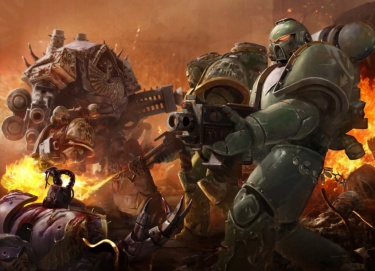

# 0806 叛乱后 军团战争 Legion War

精校状态：中文行文已逐段精校，部分术语仍为暂定

分类：时间线

原文来源：https://www.bilibili.com/opus/1207317892526243875

原作者：帝国神选罐头

原文时间：2026年05月28日 11:30

[返回分类目录](目录.md) · [全书目录](../../目录.md)

<!-- A0806-B0001 -->
**英文原文**

The Legion War, also known as the Eye of Terror Slave Wars, was waged shortly after the end of the Horus Heresy in the Eye of Terror. The conflicts lasted for centuries and greatly weakened the Traitor Legions.

<!-- /A0806-B0001 -->

<!-- A0806-B0002 -->

原译文

军团战争，也被称为恐惧之眼奴隶战争，是在荷鲁斯叛乱结束后不久的恐惧之眼发动的。冲突持续了几个世纪，极大地削弱了叛徒军团。

**校订译文**

军团战争，又称“恐惧之眼奴隶战争”，于荷鲁斯之乱结束后不久在恐惧之眼内爆发。冲突持续数百年，极大削弱了叛徒军团。

<!-- /A0806-B0002 -->

<!-- A0806-B0003 图片 -->

<!-- A0806-B0004 -->

原译文

The Sons of Horus battle the Emperor's Children 荷鲁斯之子与帝皇之子战斗

**校订译文**

The Sons of Horus battle the Emperor's Children 荷鲁斯之子与帝皇之子战斗

<!-- /A0806-B0004 -->

<!-- A0806-B0005 -->
## Wars 战争

<!-- /A0806-B0005 -->

<!-- A0806-B0006 -->
**英文原文**

The conflict saw the defeated Traitor Legions battle over slaves, resources, and worlds within the newly settled Eye. The Daemon Primarchs became increasingly withdrawn and concerned only with the affairs of the Warp and Great Game, making the Traitor Legion's leaderless and fractionalized. Hundreds of battles by scores of warbands were fought as most of the traitor legions lost any sense of cohesion. The Sons of Horus, having experienced a short-lived upsurge before the Legion War's outbreak, were particularily weakened by the fighting. Blamed for defeat in the Heresy as they were the first to retreat from Terra, the Sons were targeted the most by the other legions.

<!-- /A0806-B0006 -->

<!-- A0806-B0007 -->

原译文

在这场冲突中，战败的叛徒军团在新定居的恐惧之眼内争夺奴隶、资源和世界。恶魔原体变得越来越内向，只关心亚空间和伟大游戏的事务，使叛徒军团失去了领导者，变得四分五裂。由于大多数叛徒军团失去了凝聚力，数十个战帮进行了数百场战斗。荷鲁斯之子在军团战争爆发前经历了短暂的猛增，但战斗尤其削弱了他们。由于他们是第一个从泰拉撤退的人，因此被指责为叛乱的失败，而荷鲁斯之子是其他军团的主要目标。

**校订译文**

战败的叛徒军团在新近落脚的恐惧之眼内，为奴隶、资源和世界相互争战。恶魔原体日益疏远军团，只关注亚空间与伟大游戏，使麾下群龙无首、四分五裂。大多数军团失去凝聚力，数十个战帮展开数百场交战。荷鲁斯之子曾在战前短暂复兴，却在内斗中遭到格外沉重的打击。他们最先从泰拉撤退，被其他军团视为叛乱失败的罪魁，因而受到最猛烈的针对。

**校注：** withdrawn 在此指原体退出军团事务，不是性格内向；upsurge 是短暂复兴，未明确仅指兵员数量猛增。

<!-- /A0806-B0007 -->

<!-- A0806-B0008 -->
**英文原文**

Much of the fighting was waged by the Emperor's Children, as the traitor Legion's excesses grew more uncontrollable, their supply of slaves (mostly acquired from Terra and other Imperial worlds as they fled into the Eye) became exhausted. Though they initially launched raids into Imperial space to aquire new slaves, these operations did not provide sufficient numbers of slaves to satiate the sadistic legion. As a result, the Emperor's Children began to assault other Chaos Space Marine Legions within the Eye of Terror, plundering their slave stocks for use in their perverse excesses. At first, the Emperor's Children proved remarkedly successful; even though their Primarch Fulgrim had mostly retired from leadership, the legion possessed a capable commander in Fabius Bile. Under his guidance, the Emperor's Children destroyed the fortress of the Sons of Horus on Maeleum, leading to Fabius successfully cloning Horus.

<!-- /A0806-B0008 -->

<!-- A0806-B0009 -->

原译文

大部分战斗是由帝皇之子发动的，随着叛徒军团的暴行变得越来越无法控制，他们的奴隶供应（主要是从泰拉和其他帝国世界获得的，因为他们逃到了恐惧之眼内）已经耗尽。尽管他们最初向帝国空域发动突袭以获取新的奴隶，但这些行动并没有提供足够数量的奴隶来满足虐待狂军团的需求。因此，帝皇之子开始在恐惧之眼攻击其他混沌星际战士，掠夺他们的奴隶库存，用于他们的反常暴行。起初，帝皇之子取得了显著的成功；尽管他们的原体福格瑞姆大多时已经从领导层离开，但军团拥有一位有能力的指挥官法比乌斯·拜尔。在他的引导下，帝皇之子摧毁了玛勒姆上荷鲁斯之子的堡垒，导致法比乌斯成功克隆了荷鲁斯。

**校订译文**

大量战事由帝皇之子挑起。他们的放纵越来越失控，逃入恐惧之眼途中从泰拉等帝国世界掳来的奴隶也逐渐耗尽。军团最初仍出击帝国星域，捕捉新的奴隶，却远不足以满足虐待狂般的欲望，于是转而攻击眼内其他混沌星际战士军团，劫掠其奴隶。最初，帝皇之子战果显著：福格瑞姆虽已基本不问军务，法比乌斯·拜尔却是个能干的指挥者。在他的指引下，他们摧毁荷鲁斯之子位于玛勒姆的堡垒，法比乌斯也由此成功克隆荷鲁斯。

<!-- /A0806-B0009 -->

<!-- A0806-B0010 -->
**英文原文**

However, after the destruction of Maeleum, Abaddon formed the Black Legion from the shattered remnants of the Sons of Horus as well as other warbands. He assaulted and destroyed the main fortress of the Emperor's Children and killed the clone of Horus. Abaddon went on to become the new Warmaster. Afterwards, the other legions took revenge on the Emperor's Children. The resulting wars were long, terrible, and bloody. A known action by the Emperor's Children in the Eye of Terror during these wars was the Battle of Skalathrax that saw the World Eaters shattered as a unified legion. In the end, the dwindling Emperor's Children Legion faced their inevitable defeat at the hands of their enemy Chaos Legions, shattering as an organised legion and breaking up into disparate warbands. It is said by the enemies of Slaanesh that during the conflict, Fulgrim himself was killed, but the Emperor's Children themselves maintain he was given lordship by Slaanesh over a world of unending pleasure.

<!-- /A0806-B0010 -->

<!-- A0806-B0011 -->

原译文

然而，在玛勒姆被摧毁后，阿巴顿从荷鲁斯之子和其他战帮的残余中组建了黑色军团。他袭击并摧毁了帝皇之子的主要堡垒，并杀死了荷鲁斯的克隆人。阿巴顿后来成为了新的战帅。后来，其他军团对帝皇之子进行了报复。由此引发的战争漫长、可怕、血腥。在这些战争中，帝皇之子在恐惧之眼的一个已知行动是斯卡拉特拉克斯之战，这场战役使吞世者作为一个统一的军团破碎。最终，日渐衰落的帝皇之子军团在敌对混沌军团的手中面临着不可避免的失败，作为一个有组织的军团破碎，分裂成不同的战帮。色孽的敌人说，在冲突期间，福格瑞姆本人被杀，但帝皇之子自己坚持认为，色孽赋予了他对一个无尽欢乐世界的统治权。

**校订译文**

玛勒姆毁灭后，阿巴顿将荷鲁斯之子残部与其他战帮整合成黑色军团，进攻并摧毁帝皇之子的主要堡垒，杀死荷鲁斯克隆体，继而成为新战帅。其他军团也开始报复帝皇之子，漫长而血腥的战争接踵而至。其中一场已知战役是斯卡拉特拉克斯之战，它使吞世者彻底失去统一军团的组织。帝皇之子自身也在敌对混沌军团的打击下日渐衰落，最终溃败，瓦解为各自为战的战帮。色孽的敌人宣称福格瑞姆死于这些冲突，帝皇之子却坚持认为，色孽将一个永享欢愉的世界赐给原体统治。

**校注：** 福格瑞姆死亡为色孽敌人的说法，原文随后列出帝皇之子的相反说法，两者并存，不能当作原体确已阵亡。

<!-- /A0806-B0011 -->

<!-- A0806-B0012 -->
**英文原文**

However, the Legion Wars only truly came to an end when Abaddon and his new Black Legion managed to defeat their primary rival, Thagus Daravek of the Death Guard. In the closing days of the conflict, Abaddon shattered the world of the Death Guard warlord Xulgith Grawl and remade it into the colossal shipyard dubbed Basitar.

<!-- /A0806-B0012 -->

<!-- A0806-B0013 -->

原译文

然而，当阿巴顿和他的新黑色军团成功击败他们的主要对手、死亡守卫的塔古斯·达拉维克时，军团战争才真正结束。在冲突的最后几天，阿巴顿摧毁了死亡守卫军阀祖尔吉斯·格劳尔的世界，并将其改造成了名为巴希塔尔的巨大造船厂。

**校订译文**

直到阿巴顿与黑色军团击败主要对手、死亡守卫出身的塔古斯·达拉维克，军团战争才真正结束。战争末期，阿巴顿还击碎了死亡守卫军阀祖尔吉斯·格劳尔统治的世界，将其改造成名为巴希塔尔的巨型造船厂。

<!-- /A0806-B0013 -->

本篇核心术语与暂定项

以下列出本篇出现的英文原形及核心术语表用词。同形词可能指不同对象，具体词义以本篇正文和校注为准；单复数、别名和仅见于图注的名称可能尚未列入。完整候选见[术语表](../../术语表/双语术语候选.csv)。

| 英文 | 采用中文 | 状态 |
| --- | --- | --- |
| Death Guard | 死亡守卫 | 官方已核对 |
| World Eaters | 吞世者 | 官方已核对 |
| Horus Heresy | 荷鲁斯之乱 | 官方已核对 |
| Warp | 亚空间 | 官方已核对 |
| Eye of Terror | 恐惧之眼 | 官方已核对 |
| Emperor | 帝皇 | 官方已核对 |
| Primarch | 原体 | 官方已核对 |
| Black Legion | 黑色军团 | 暂定·官方待核 |
| Emperor's Children | 帝皇之子 | 官方已核对 |
| Slaanesh | 色孽 | 官方已核对 |
| Legion Wars | 军团战争 | 暂定·官方待核 |
| Terra | 泰拉 | 暂定·官方待核 |
| Horus | 荷鲁斯 | 暂定·官方待核 |
| Sons of Horus | 荷鲁斯之子 | 暂定·官方待核 |
| Fulgrim | 福格瑞姆 | 官方已核对 |
| Fabius Bile | 法比乌斯·拜尔 | 官方已核对 |
| Maeleum | 玛勒姆 | 暂定·官方待核 |
| Chaos Space Marine Legions | 混沌星际战士军团 | 暂定·官方待核 |
| Space Marine | 星际战士 | 暂定·官方待核 |
| Remnants | 残骸 | 暂定·官方待核 |
| Great Game | 伟大游戏 | 暂定·官方待核 |
| Thagus Daravek | 塔古斯·达拉维克 | 暂定·官方待核 |
| Legion War | 军团战争 | 暂定·官方待核 |
| Eye of Terror Slave Wars | 恐惧之眼奴隶战争 | 暂定·官方待核 |
| Xulgith Grawl | 祖尔吉斯·格劳尔 | 暂定·官方待核 |
| Basitar | 巴希塔尔 | 暂定·官方待核 |
| Skalathrax | 斯卡拉特拉克斯 | 暂定·官方待核 |

