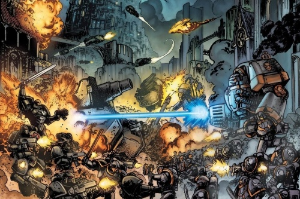

# 0808 015.M31-???.M31 大清洗 Great Scouring

精校状态：中文行文已逐段精校，部分术语仍为暂定

分类：时间线

原文来源：https://www.bilibili.com/opus/1064897558650814472

原作者：帝国神选罐头

原文时间：2025年05月09日 16:26

[返回分类目录](目录.md) · [全书目录](../../目录.md)

<!-- A0808-B0001 -->
**英文原文**

The Great Scouring was the Imperium's counter-offensive against the rebel armies of Horus, following the defeat of the Horus Heresy in c.M31. Horus's campaign to strike towards Terra to achieve a quick and decisive victory had ultimately been defeated. The rebels were broken and in retreat, and Imperial forces now had the job of reacquiring all the territory they had captured. The Great Scouring saw the first mass galaxy-wide purge carried out by the Imperium as it sought to erase the taint of Horus's treachery from its realm.

<!-- /A0808-B0001 -->

<!-- A0808-B0002 -->

原译文

大清洗是帝国在第31个千年击败荷鲁斯叛乱后对荷鲁斯叛军的反攻。荷鲁斯为迅速取得决定性胜利而向泰拉发起的进攻最终被击败。叛军被击溃并撤退，帝国军队现在的任务是夺回他们占领的所有领土。大清洗目睹了帝国进行的第一次大规模银河系净化，因为它试图从其领域中抹去荷鲁斯叛乱的污点。

**校订译文**

大清洗是帝国在第 31 千年平定荷鲁斯之乱后，对叛军展开的反攻。荷鲁斯直取泰拉、寻求迅速决胜的计划已经失败，残军溃退，帝国则必须收回其占据的全部领土。这也是帝国第一次在全银河范围内展开大规模清洗，试图从疆域中抹去荷鲁斯叛变留下的污染。

<!-- /A0808-B0002 -->

<!-- A0808-B0003 图片 -->

<!-- A0808-B0004 -->

原译文

The Dark Angels and Iron Warriors battle in the Battle of Exyrion during the Great Scouring 大清洗期间，黑暗天使和钢铁勇士在埃克西里昂之战中作战

**校订译文**

The Dark Angels and Iron Warriors battle in the Battle of Exyrion during the Great Scouring 大清洗期间，黑暗天使和钢铁勇士在埃克西里昂之战中作战

<!-- /A0808-B0004 -->

<!-- A0808-B0005 -->
**英文原文**

Conflict:Long War

<!-- /A0808-B0005 -->

<!-- A0808-B0006 -->

原译文

冲突：万古长战

**校订译文**

冲突：万古长战

<!-- /A0808-B0006 -->

<!-- A0808-B0007 -->
**英文原文**

Date:~015.M31-???.M31

<!-- /A0808-B0007 -->

<!-- A0808-B0008 -->

原译文

日期：~015.M31-???.M31

**校订译文**

日期：~015.M31-???.M31

<!-- /A0808-B0008 -->

<!-- A0808-B0009 -->
**英文原文**

Location:Imperium

<!-- /A0808-B0009 -->

<!-- A0808-B0010 -->

原译文

地点：帝国

**校订译文**

地点：帝国

<!-- /A0808-B0010 -->

<!-- A0808-B0011 -->
**英文原文**

Outcome:Loyalist Victory,-Imperial territory purged,-Traitor remnants flee

<!-- /A0808-B0011 -->

<!-- A0808-B0012 -->

原译文

结果：忠诚派胜利，帝国领土被净化，叛徒残余分子逃离

**校订译文**

结果：忠诚派胜利，帝国领土被净化，叛徒残余分子逃离

<!-- /A0808-B0012 -->

<!-- A0808-B0013 -->
**英文原文**

Combatants:Imperium/Traitor Legions

<!-- /A0808-B0013 -->

<!-- A0808-B0014 -->

原译文

作战人员：帝国/叛徒军团

**校订译文**

作战人员：帝国/叛徒军团

<!-- /A0808-B0014 -->

<!-- A0808-B0015 -->
**英文原文**

Commanders:Lord Commander Roboute Guilliman (WIA),Primarch Lion El'Jonson (WIA),Primarch Jaghatai Khan (MIA),Primarch Rogal Dorn (MIA),Primarch Corvus Corax,Primarch Vulkan,Primarch Leman Russ/First Captain Ezekyle Abaddon,Primarch Lorgar,Primarch Angron,Primarch Magnus,Primarch Fulgrim,Primarch Perturabo,Primarch Mortarion,Primarch Konrad Curze (KIA),Primarch Alpharius (KIA?)

<!-- /A0808-B0015 -->

<!-- A0808-B0016 -->

原译文

指挥官：领主指挥官罗伯特·基里曼（WIA），原体莱昂·艾尔庄森（WIA），原体察合台可汗（MIA），原体罗格·多恩（MIA），原体科沃斯·科拉克斯，原体沃坎，原体黎曼·鲁斯/第一连长以泽凯尔·阿巴顿，原体珞珈，原体安格隆，原体马格努斯，原体福格瑞姆，原体佩图拉博，原体莫塔里安，原体康拉德·科兹（KIA），原体阿尔法瑞斯（KIA?）

**校订译文**

指挥官：忠诚派——领主指挥官罗保特·基里曼（负伤），原体莱昂·艾尔’庄森（负伤），原体察合台可汗（失踪），原体罗格·多恩（失踪），原体科沃斯·科拉克斯，原体沃坎，原体黎曼·鲁斯；叛徒——第一连长以泽凯尔·阿巴顿，原体珞珈，原体安格隆，原体马格努斯，原体福格瑞姆，原体佩图拉博，原体莫塔里安，原体康拉德·科兹（阵亡），原体阿尔法瑞斯（阵亡？）。

<!-- /A0808-B0016 -->

<!-- A0808-B0017 -->
**英文原文**

Strength:Ultramarines,Dark Angels,Imperial Fists,Blood Angels,Space Wolves,Raven Guard,Salamanders,White Scars,Adeptus Mechanicus,Loyal Imperial Army,Officio Assassinorum/Sons of Horus,Word Bearers,World Eaters,Thousand Sons,Death Guard,Emperor's Children,Night Lords,Iron Warriors,Alpha Legion,Dark Mechanicum,Traitor Titan Legions,Daemons,Traitor Imperial Army,Cultists,Mutants

<!-- /A0808-B0017 -->

<!-- A0808-B0018 -->

原译文

力量：极限战士，黑暗天使，帝国之拳，圣血天使，太空野狼，暗鸦守卫，火蜥蜴，白色疤痕，机械神教，忠诚帝国军队，刺客庭/荷鲁斯之子，怀言者，吞世者，千子，死亡守卫，帝皇之子，午夜领主，钢铁勇士，阿尔法军团，黑暗机械教，叛徒泰坦军团，恶魔，叛徒帝国军队，邪教徒，变种人

**校订译文**

兵力：忠诚派——极限战士、黑暗天使、帝国之拳、圣血天使、太空野狼、暗鸦守卫、火蜥蜴、白疤、机械修会、忠诚帝国军、刺客庭；叛徒——荷鲁斯之子、怀言者、吞世者、千子、死亡守卫、帝皇之子、午夜领主、钢铁勇士、阿尔法军团、黑暗机械教、叛变泰坦军团、恶魔、叛变帝国军、邪教徒与变种人。

<!-- /A0808-B0018 -->

<!-- A0808-B0019 -->
## Overview 概述

<!-- /A0808-B0019 -->

<!-- A0808-B0020 -->
**英文原文**

Before actually being confined within the Golden Throne, the Emperor had pronounced judgment on the rebels: they were to be driven into the hellish region of the Eye of Terror, which would hold them for all eternity. All records and memory of the Traitor Legions were to be expunged from the Imperial archives. Worlds such as Isstvan V and Davin would be scoured and the Traitors' associated troops were to be destroyed or driven into the Eye. It would be as if the Traitor Legions never existed. Meanwhile since the death of Horus, the Traitor Legions had become splintered and dispersed.

<!-- /A0808-B0020 -->

<!-- A0808-B0021 -->

原译文

在实际被限制在黄金王座上之前，帝皇已经对叛军做出了判决：他们将被驱逐到恐惧之眼的地狱般的地区，这将永远控制他们。叛徒军团的所有记录和记忆都将从帝国档案中删除。像伊斯塔万五号和戴文这样的世界将被彻底搜查，叛徒的相关部队将被摧毁或驱逐到恐惧之眼。就好像叛徒军团从未存在过。与此同时，自荷鲁斯死亡以来，叛徒军团已经分裂和分散。

**校订译文**

依本段记载，帝皇在被安置于黄金王座前，已对叛军作出判决：他们将被逐入地狱般的恐惧之眼，永远囚禁其中。有关叛徒军团的一切记录与记忆，都须从帝国档案中抹除；伊斯塔万五号、戴文等世界将遭彻底清洗，附从叛徒的部队则必须被消灭，或同样逐入恐惧之眼，仿佛这些军团从未存在。与此同时，荷鲁斯死后，叛徒军团早已分裂、离散。

**校注：** 此处属于帝皇清醒颁布战后命令的叙述，与805末尾所列新小说中帝皇昏迷的版本不同，标明为本段记载并保留。scoured 为清洗、摧毁，不是彻底搜查。戴文毁灭的时间亦与801篇不同版本有张力，不改写时间。

<!-- /A0808-B0021 -->

<!-- A0808-B0022 -->
**英文原文**

Fighting continued for another seven years before the rebels were wholly destroyed or exiled. The Imperium fought not only the traitors but also Xenos that had taken advantage of the turmoil caused by the Heresy to plunder human worlds. Systems once thought unassailable to the Xenos threat were put under siege. During the campaign, loyalist forces realized the sheer scale of Chaos influence in the Imperium as world after world was discovered to have traitor presence. Many corrupted systems were cleansed and placed under the watch of the Inquisition. Horus's death had not ended the fighting, it had renewed the loyalists against the rebels. Many worlds during the Heresy had refused to commit their forces to either side, or seceded entirely. Such indecision was punished by loyalist and rebel alike. These forces were bled white attacking rebel strongholds. Meanwhile, the Legions destroyed at the Drop Site Massacre were slowly reestablished using what little gene-seed the survivors had managed to escape with.

<!-- /A0808-B0022 -->

<!-- A0808-B0023 -->

原译文

战斗又持续了七年，叛军才被彻底摧毁或放逐。帝国不仅与叛徒作战，还与利用叛乱造成的动荡掠夺人类世界的异型作战。曾经被认为对异型威胁无懈可击的星系被围困。在这场战役中，随着一个又一个世界被发现有叛徒的存在，忠诚的部队意识到了混沌在帝国中的巨大影响力。许多腐败的星系被清洗并置于审判庭的监视之下。荷鲁斯的死并没有结束战斗，它重新激起了反对叛军的忠诚者。叛乱时期的许多世界拒绝向任何一方派遣军队，或者完全脱离。这种优柔寡断受到了忠诚者和叛乱者的惩罚。这些部队在进攻叛军据点时流血牺牲。与此同时，在登陆点大屠杀中被摧毁的军团正利用设法逃脱的幸存者的一点基因种子慢慢重建。

**校订译文**

战斗又延续七年，叛军才被彻底消灭或流放。帝国同时还须对付趁乱掠夺人类世界的异形，一些原以为固若金汤的星系也遭围攻。忠诚派接连发现各地都有叛军活动，这才意识到混沌在帝国境内渗透之深。许多受污染的星系被清洗，交由审判庭监视。荷鲁斯之死没有结束战争，反而重新点燃了忠诚派清剿叛军的决心。许多世界曾在叛乱期间拒绝向任何一方出兵，或干脆脱离帝国；这种观望态度同时招致双方惩罚。这些世界的部队又在攻打叛军据点时耗尽鲜血。另一方面，登陆场大屠杀中几近覆灭的军团，正靠幸存者带出的少量基因种子逐步重建。

**校注：** 英文称战争又持续七年，与下列列入大清洗的事件跨度未必一致，照录概述的年数，不扩改为统一年表。bled white 表示兵力几乎耗尽，原译仅流血牺牲过轻。

<!-- /A0808-B0023 -->

<!-- A0808-B0024 -->
**英文原文**

With the Emperor confined to the Golden Throne and the Imperium leaderless but loosely organized under Roboute Guilliman, the forces of Chaos and all of the enemies of the Imperium swept down on the defenceless worlds which had been ravaged by the fighting during the Heresy. The light of the Great Crusade was gone to be replaced by a dark time in which death was far more prevalent and hope seemed far away. The forces of the Imperium were reorganised and redeployed and gradually the followers of Chaos were forced to flee west to the Eye of Terror. Eventually the Imperium succeeded in stabilising itself, but not without heavy losses of men and machinery.

<!-- /A0808-B0024 -->

<!-- A0808-B0025 -->

原译文

由于帝皇被限制在黄金王座上，帝国在罗伯特·基里曼的领导下，但组织松散，混沌的力量和帝国的所有敌人席卷了被叛乱战争蹂躏的手无寸铁的世界。大远征的光芒消失了，取而代之的是一个黑暗的时代，在这个时代，死亡更加普遍，希望似乎遥不可及。帝国的军队被重组和重新部署，混沌的追随者逐渐被迫向西逃往恐惧之眼。最终，帝国成功地实现了稳定，但并非没有大量人员和机械的损失。

**校订译文**

帝皇受困黄金王座，帝国缺少最高领袖，只能在罗保特·基里曼领导下松散维系。混沌与帝国其他敌人趁机横扫那些饱受叛乱摧残、无力自卫的世界。大远征的光辉消逝，黑暗时代接踵而至，死亡无处不在，希望遥不可及。帝国重组、重新部署军队，逐渐迫使混沌追随者向银河西部的恐惧之眼逃去。最终，局势恢复稳定，代价却是巨大的人员与装备损失。

<!-- /A0808-B0025 -->

<!-- A0808-B0026 -->
**英文原文**

The Ultramarines were a major factor in the success of the Imperium owing to their not taking part in the Siege of Terra due to fighting in the galactic east. Roboute Guilliman was the greatest military strategist alive and rallied the other Space Marine Legions to act as a bulwark against all enemies of the Imperium. The days following the Heresy were to be some of the darkest seen since the Emperor rose to power. Guilliman was said to have been everywhere during this period, rallying forces and reinforcing them with his Ultramarines before moving on to the next battle zone. Never once did the Space Marines take a step back, so strong was their faith in the Imperium and Guilliman's tactics.

<!-- /A0808-B0026 -->

<!-- A0808-B0027 -->

原译文

由于银河系东部的战斗，极限战士没有参加泰拉围城，因此他们是帝国成功的主要因素。罗伯特·基里曼是现存最伟大的军事战略家，他召集了其他星际战士军团，作为抵御帝国所有敌人的堡垒。叛乱之后的日子是帝皇掌权以来最黑暗的日子。据说基里曼在这段时间里无处不在，在前往下一个战区之前，他召集部队并用他的极限战士增援。星际战士从未后退一步，他们对帝国和基里曼战术的信心如此之强。

**校订译文**

极限战士此前在银河东部作战，未参与泰拉围城，因而成为帝国反攻的重要力量。罗保特·基里曼被视为当时最杰出的军事战略家，他号召其他星际战士军团共同抵御帝国的一切敌人。叛乱后的岁月，是帝皇崛起以来最黑暗的时期之一。据说，基里曼那时仿佛无处不在，在一处集结军队、派极限战士增援，便又赶往下一战区。星际战士对帝国与他的战术满怀信心，决不后退。

<!-- /A0808-B0027 -->

<!-- A0808-B0028 -->
**英文原文**

During the Scouring, great political changes were introduced into the Imperium, primarily overseen by Guilliman. The most significant of these was breaking apart the Space Marine Legions into Chapters as well as dividing the Imperial Army into the Imperial Guard and Imperial Navy. Both of these measures were intended to curb the power that any single man could wield in the Imperium, limiting the damage if another rebellion broke out.

<!-- /A0808-B0028 -->

<!-- A0808-B0029 -->

原译文

在大清洗期间，帝国发生了巨大的政治变革，主要由基里曼监督。其中最重要的是将星际战士分为战团，并将帝国陆军分为帝国卫队和帝国海军。这两项措施都是为了遏制任何一个人在帝国中可以行使的权力，限制另一场叛乱爆发时的损害。

**校订译文**

大清洗期间，基里曼主导了重大的政治改革。其中最重要的，是将星际战士军团拆分为战团，以及将帝国军分为帝国卫队和帝国海军。两项措施都旨在限制单一人物能够掌握的军事力量，减少再次爆发叛乱时可能造成的破坏。

**校注：** 必须保留 Army/Guard/Navy 三者区分：帝国军拆分为帝国卫队与帝国海军，不能把前后均译为帝国陆军。

<!-- /A0808-B0029 -->

<!-- A0808-B0030 -->
**英文原文**

The Great Scouring was followed by the period known as the Age of Rebirth.

<!-- /A0808-B0030 -->

<!-- A0808-B0031 -->

原译文

大清洗之后是被称为重生时代的时期。

**校订译文**

大清洗之后是被称为重生时代的时期。

**校注：** 本篇把重生时代置于大清洗之后；807篇却把大清洗列为重生时代事件。此为所给资料分期差异，两处保留，不能靠改译强行消除。

<!-- /A0808-B0031 -->

<!-- A0808-B0032 -->
### Notable events during the Great Scouring 大清洗期间的重大事件

<!-- /A0808-B0032 -->

<!-- A0808-B0033 -->
**英文原文**

Lion El'Jonson goes missing following the destruction of Caliban and the Dark Angels begin their hunt for the Fallen.

<!-- /A0808-B0033 -->

<!-- A0808-B0034 -->

原译文

卡利班被摧毁后，莱昂·艾尔庄森失踪，黑暗天使开始追捕堕天使。

**校订译文**

卡利班毁灭后，莱昂·艾尔’庄森失踪，黑暗天使开始追猎堕天使。

<!-- /A0808-B0034 -->

<!-- A0808-B0035 -->
**英文原文**

In a battle known as the Iron Cage, the Imperial Fists take heavy losses assaulting Perturabo's trap on Sebastus IV.

<!-- /A0808-B0035 -->

<!-- A0808-B0036 -->

原译文

在一场被称为“铁笼”的战斗中，帝国之拳在袭击佩图拉博在塞巴斯图斯四号的陷阱时遭受了重大损失。

**校订译文**

帝国之拳进攻塞巴斯图斯四号时，落入佩图拉博布下的陷阱，损失惨重；此战后来被称为“铁笼之战”。

<!-- /A0808-B0036 -->

<!-- A0808-B0037 -->
**英文原文**

Worlds associated with the Traitor forces are invaded and/or subjected to Exterminatus. These include Colchis, Barbarus, Cthonia, and Chemos.

<!-- /A0808-B0037 -->

<!-- A0808-B0038 -->

原译文

与叛徒势力相关的世界被入侵和/或遭受灭绝令。这些包括科尔基斯、巴巴鲁斯、科索尼亚和彻莫斯。

**校订译文**

与叛军有关的世界遭入侵、灭绝令，或两者兼施，包括科尔基斯、巴巴鲁斯、科索尼亚与彻莫斯。

**校注：** 巴巴鲁斯、彻莫斯等毁灭在804篇属于围城前天使前进，本篇列为大清洗，存在版本或归类差异，保留并提示。

<!-- /A0808-B0038 -->

<!-- A0808-B0039 -->
**英文原文**

Olympia, homeworld of the Iron Warriors, endures a two-year siege by the Ultramarines and Imperial Fists but ultimately falls. Rather than let the loyalists occupy their world, the Iron Warriors detonate their missile stockpiles and leave Olympia a barren wasteland.

<!-- /A0808-B0039 -->

<!-- A0808-B0040 -->

原译文

奥林匹亚是钢铁勇士的家园世界，遭受了极限战士和帝国之拳的两年围攻，但最终还是陷落了。钢铁勇士没有让忠诚者占领他们的世界，而是引爆了他们的导弹储备，让奥林匹亚变成了一片荒芜的荒地。

**校订译文**

钢铁勇士母星奥林匹亚遭极限战士与帝国之拳围攻两年，最终陷落。钢铁勇士不愿让忠诚派占领母星，引爆储备导弹，将其化为贫瘠荒原。

<!-- /A0808-B0040 -->

<!-- A0808-B0041 -->
**英文原文**

The Plague World Seption Prime is destroyed by Exterminatus.

<!-- /A0808-B0041 -->

<!-- A0808-B0042 -->

原译文

瘟疫世界塞普申主星被灭绝令摧毁。

**校订译文**

瘟疫世界塞普申主星被灭绝令摧毁。

<!-- /A0808-B0042 -->

<!-- A0808-B0043 -->
**英文原文**

The Salamanders under Vulkan himself attempt to hunt down Fabius Bile for his crimes.

<!-- /A0808-B0043 -->

<!-- A0808-B0044 -->

原译文

沃坎手下的火蜥蜴队试图追捕法比乌斯·拜耳为其罪行。

**校订译文**

沃坎亲率火蜥蜴追捕法比乌斯·拜尔，向他追讨罪行。

<!-- /A0808-B0044 -->

<!-- A0808-B0045 -->
**英文原文**

The Dark Angels and Blood Angels drive the forces of Chaos from the Cadian Sector.

<!-- /A0808-B0045 -->

<!-- A0808-B0046 -->

原译文

黑暗天使和圣血天使将混沌部队从卡迪亚星区驱逐出去。

**校订译文**

黑暗天使和圣血天使将混沌部队从卡迪亚星区驱逐出去。

<!-- /A0808-B0046 -->

<!-- A0808-B0047 -->
**英文原文**

Alpharius or Omegon is believed to be killed by Roboute Guilliman on Eskrador, but the twin Primarch's fate remains unclear.

<!-- /A0808-B0047 -->

<!-- A0808-B0048 -->

原译文

据信，阿尔法瑞斯或欧米岗在埃斯克拉多被罗伯特·基里曼杀死，但这对双胞胎原体的命运尚不清楚。

**校订译文**

据信，阿尔法瑞斯或欧米伽在埃斯卡多被罗保特·基里曼杀死，但双生原体的确切结局仍不明。

<!-- /A0808-B0048 -->

<!-- A0808-B0049 -->
**英文原文**

Jaghatai Khan is thought lost in the Webway during battles against Dark Eldar raiders in the Yasan Sector.

<!-- /A0808-B0049 -->

<!-- A0808-B0050 -->

原译文

察合台可汗被认为在亚桑星区与黑暗灵族袭击者的战斗中迷失在网道中。

**校订译文**

察合台可汗被认为在亚桑星区与黑暗灵族袭击者的战斗中迷失在网道中。

<!-- /A0808-B0050 -->

<!-- A0808-B0051 -->
**英文原文**

While leading a genocidal rampage across the Eastern Fringe, Konrad Curze is killed by an agent of the Officio Assassinorum.

<!-- /A0808-B0051 -->

<!-- A0808-B0052 -->

原译文

在东部边缘地带领导种族灭绝暴行时，康拉德·科兹被刺客庭的一名特工杀害。

**校订译文**

在东部边缘地带领导种族灭绝暴行时，康拉德·科兹被刺客庭的一名特工杀害。

<!-- /A0808-B0052 -->

<!-- A0808-B0053 -->
**英文原文**

The Night Lords launch numerous ambushes that take a high toll on their Imperial pursuers.

<!-- /A0808-B0053 -->

<!-- A0808-B0054 -->

原译文

午夜领主发动了多次伏击，对他们的帝国追捕者造成了巨大损失。

**校订译文**

午夜领主发动了多次伏击，对他们的帝国追捕者造成了巨大损失。

<!-- /A0808-B0054 -->

<!-- A0808-B0055 -->
**英文原文**

Roboute Guilliman is mortally wounded by Fulgrim during the Battle of Thessala and put into stasis.

<!-- /A0808-B0055 -->

<!-- A0808-B0056 -->

原译文

罗伯特·基里曼在赛萨拉之战中被福格瑞姆致命伤，并进入停滞状态。

**校订译文**

罗保特·基里曼在色萨拉之战中被福格瑞姆重创至濒死，随后被置于静滞状态。

<!-- /A0808-B0056 -->

<!-- A0808-B0057 -->
**英文原文**

An unknown force destroys much of the Nostramo Sector.

<!-- /A0808-B0057 -->

<!-- A0808-B0058 -->

原译文

一股未知的力量摧毁了诺斯特拉莫星区的大部分地区。

**校订译文**

一股未知的力量摧毁了诺斯特拉莫星区的大部分地区。

<!-- /A0808-B0058 -->

<!-- A0808-B0059 -->
**英文原文**

Rogal Dorn is thought killed in a Black Crusade.

<!-- /A0808-B0059 -->

<!-- A0808-B0060 -->

原译文

罗格·多恩被认为在一次黑色远征中牺牲。

**校订译文**

罗格·多恩被认为在一次黑色远征中牺牲。

<!-- /A0808-B0060 -->

<!-- A0808-B0061 -->
**英文原文**

The Battle of Exyrion between the Dark Angels and an alliance of Iron Warriors and Fallen.

<!-- /A0808-B0061 -->

<!-- A0808-B0062 -->

原译文

黑暗天使与钢铁勇士和堕天使联盟之间的埃克西里昂之战。

**校订译文**

黑暗天使与钢铁勇士和堕天使联盟之间的埃克西里昂之战。

<!-- /A0808-B0062 -->

本篇核心术语与暂定项

以下列出本篇出现的英文原形及核心术语表用词。同形词可能指不同对象，具体词义以本篇正文和校注为准；单复数、别名和仅见于图注的名称可能尚未列入。完整候选见[术语表](../../术语表/双语术语候选.csv)。

| 英文 | 采用中文 | 状态 |
| --- | --- | --- |
| Space Marines | 星际战士 | 官方已核对 |
| Blood Angels | 圣血天使 | 官方已核对 |
| Dark Angels | 黑暗天使 | 官方已核对 |
| Space Wolves | 太空野狼 | 官方已核对 |
| Adeptus Mechanicus | 机械修会 | 官方已核对 |
| Imperial Guard | 帝国卫队 | 暂定·语境区分 |
| Imperial Army | 帝国军 | 暂定·官方待核 |
| Death Guard | 死亡守卫 | 官方已核对 |
| Thousand Sons | 千子 | 官方已核对 |
| World Eaters | 吞世者 | 官方已核对 |
| Eldar | 灵族 | 暂定·语境区分 |
| Dark Eldar | 黑暗灵族 | 暂定·旧称对应 |
| Roboute Guilliman | 罗保特·基里曼 | 官方已核对 |
| Ultramarines | 极限战士 | 官方已核对 |
| Horus Heresy | 荷鲁斯之乱 | 官方已核对 |
| Inquisition | 审判庭 | 暂定 |
| Imperium | 帝国 | 暂定·简称 |
| Imperial Navy | 帝国海军 | 暂定 |
| Mechanicum | 机械教 | 暂定·历史称谓 |
| Dark Mechanicum | 黑暗机械教 | 暂定·官方待核 |
| Webway | 网道 | 暂定 |
| Eye of Terror | 恐惧之眼 | 官方已核对 |
| Imperial Fists | 帝国之拳 | 暂定 |
| Emperor | 帝皇 | 官方已核对 |
| Primarch | 原体 | 官方已核对 |
| Officio Assassinorum | 刺客庭 | 暂定·官方待核 |
| Word Bearers | 怀言者 | 暂定·官方待核 |
| Emperor's Children | 帝皇之子 | 官方已核对 |
| Iron Warriors | 钢铁勇士 | 暂定·官方待核 |
| Night Lords | 午夜领主 | 暂定·官方待核 |
| Great Crusade | 大远征 | 暂定·官方待核 |
| Mortarion | 莫塔里安 | 官方已核对 |
| Barbarus | 巴巴鲁斯 | 暂定·官方待核 |
| Terra | 泰拉 | 暂定·官方待核 |
| Horus | 荷鲁斯 | 暂定·官方待核 |
| Sons of Horus | 荷鲁斯之子 | 暂定·官方待核 |
| Lion El'Jonson | 莱昂·艾尔’庄森 | 官方已核对 |
| Fulgrim | 福格瑞姆 | 官方已核对 |
| Golden Throne | 黄金王座 | 暂定·官方待核 |
| Sector | 星区 | 暂定·官方待核 |
| Eastern Fringe | 东部边缘 | 暂定·官方待核 |
| Vulkan | 沃坎 | 暂定·官方待核 |
| Salamanders | 火蜥蜴 | 暂定·官方待核 |
| Konrad Curze | 康拉德·科兹 | 暂定·官方待核 |
| Nostramo | 诺斯特拉莫 | 暂定·官方待核 |
| Caliban | 卡利班 | 暂定·官方待核 |
| Olympia | 奥林匹亚 | 暂定·官方待核 |
| Davin | 戴文 | 暂定·官方待核 |
| Cthonia | 科索尼亚 | 暂定·官方待核 |
| Chemos | 彻莫斯 | 暂定·官方待核 |
| Titan | 泰坦 | 暂定·官方待核 |
| Fabius Bile | 法比乌斯·拜尔 | 官方已核对 |
| Long War | 万古长战 | 暂定·官方待核 |
| Lord Commander | 领主指挥官 | 暂定·官方待核 |
| White Scars | 白疤 | 官方已核 |
| Alpha Legion | 阿尔法军团 | 暂定·官方待核 |
| Raven Guard | 暗鸦守卫 | 官方已核 |
| Scars | 伤疤 | 暂定·官方待核 |
| Isstvan | 伊斯塔万 | 暂定·官方待核 |
| First Captain | 第一连长 | 暂定·官方待核 |
| Ezekyle Abaddon | 以泽凯尔·阿巴顿 | 暂定·官方待核 |
| Space Marine | 星际战士 | 暂定·官方待核 |
| Captain | 连长 | 暂定·官方待核 |
| Remnants | 残骸 | 暂定·官方待核 |
| Gene-seed | 基因种子 | 暂定·官方待核 |
| Lorgar | 珞珈 | 暂定·官方待核 |
| Colchis | 科尔基斯 | 暂定·官方待核 |
| Alpharius | 阿尔法瑞斯 | 暂定·官方待核 |
| Omegon | 欧米伽 | 暂定·官方待核 |
| Eskrador | 埃斯卡多 | 暂定·官方待核 |
| Xenos | 异形 | 暂定·官方待核 |
| Jaghatai Khan | 察合台可汗 | 暂定·官方待核 |
| Angron | 安格隆 | 官方已核对 |
| Great Scouring | 大清洗 | 暂定·官方待核 |
| Iron Cage | 铁笼 | 暂定·官方待核 |
| Thessala | 色萨拉 | 暂定·官方待核 |
| Bulwark | 壁垒号 | 暂定·官方待核 |
| Corvus Corax | 科沃斯·科拉克斯 | 暂定·官方待核 |
| Yasan Sector | 崖山星区 | 暂定·官方待核 |
| The Dark | 《黑暗》 | 暂定·官方待核 |
| Age of Rebirth | 重生时代 | 暂定·官方待核 |
| Titan Legions | 泰坦军团 | 暂定·官方待核 |
| Cadian Sector | 卡迪亚星区 | 暂定·官方待核 |

