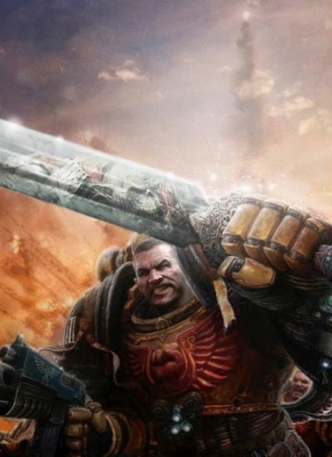

# 0811 544-546.M32 野兽战争 War of the Beast

精校状态：中文行文已逐段精校，部分术语仍为暂定

分类：时间线

原文来源：https://www.bilibili.com/opus/1131590382056898580

原作者：帝国神选罐头

原文时间：2025年11月05日 09:48

[返回分类目录](目录.md) · [全书目录](../../目录.md)

<!-- A0811-B0001 -->
**英文原文**

The War of the Beast, also known as Waaagh! The Beast, was an enormous Ork Waaagh! first encountered by the Imperium in 544.M32. Waged by the Warboss known only as The Beast after he succeeded in uniting much of the Ork race, his Waaagh! was the largest the Galaxy has ever seen and rampaged across the Imperium, eclipsing even the one Horus defeated during the Ullanor Crusade which earned him the title of Warmaster. The largest war fought by the Imperium since the Horus Heresy, humanity only halted his advance at great cost and desperate measure, devastating the Adeptus Astartes.

<!-- /A0811-B0001 -->

<!-- A0811-B0002 -->

原译文

野兽战争，也被称为野兽的Waaagh！，是一场帝国于544.M32年首次遇到的巨大的欧克 Waaagh！。在成功团结了大部分欧克种族后，被只被称为野兽的战争头目发动，他的Waaagh！是银河系有史以来最大的一次，在帝国中横冲直撞，甚至超过了在乌兰诺远征中被荷鲁斯击败的，这为他赢得了战帅的称号。这是自荷鲁斯叛乱以来帝国发动的最大规模的战争，人类付出了巨大的代价和绝望的措施才停止了前进，几乎摧毁了阿斯塔特修会。

**校订译文**

野兽战争又称“野兽的 Waaagh!”，是帝国于 544.M32 首次遭遇的一场规模空前的欧克蛮人战争。只以“野兽”之名为人所知的战争头目统一了欧克蛮人的大部分族群，随后发动这场 Waaagh!，席卷帝国。这是银河系有史以来规模最大的 Waaagh!，甚至超过了荷鲁斯在乌兰诺远征中击败的那一支——荷鲁斯正是凭借乌兰诺的胜利获封战帅。野兽战争也是荷鲁斯之乱后帝国经历的最大规模战争。人类付出惨重代价、动用种种孤注一掷的手段，才终于阻止野兽的攻势；阿斯塔特修会也因此元气大伤。

<!-- /A0811-B0002 -->

<!-- A0811-B0003 图片 -->

<!-- A0811-B0004 -->

原译文

Imperial Fists Captain Koorland battles on Ardamantua 帝国之拳第一连长库兰德在阿达曼图阿上战斗

**校订译文**

Imperial Fists Captain Koorland battles on Ardamantua 帝国之拳连长库兰德在阿达曼图阿作战

**校注：** 英文图注仅称 Captain；正文明确此时库兰德为第二连长，删除原图注无据添加的“第一”。英文图注完整保留。

<!-- /A0811-B0004 -->

<!-- A0811-B0005 -->
**英文原文**

Date:544-546.M32

<!-- /A0811-B0005 -->

<!-- A0811-B0006 -->

原译文

日期：544-546.M32

**校订译文**

日期：544-546.M32

<!-- /A0811-B0006 -->

<!-- A0811-B0007 -->
**英文原文**

Location:Galaxy-wide

<!-- /A0811-B0007 -->

<!-- A0811-B0008 -->

原译文

位置：银河系

**校订译文**

位置：银河系

<!-- /A0811-B0008 -->

<!-- A0811-B0009 -->
**英文原文**

Outcome:Imperial Pyrrhic victory

<!-- /A0811-B0009 -->

<!-- A0811-B0010 -->

原译文

结果：帝国惨胜

**校订译文**

结果：帝国惨胜

<!-- /A0811-B0010 -->

<!-- A0811-B0011 -->
**英文原文**

Combatants:Imperium, Iron Warriors/Orks

<!-- /A0811-B0011 -->

<!-- A0811-B0012 -->

原译文

作战人员：帝国，钢铁勇士/欧克

**校订译文**

交战方：帝国、钢铁勇士／欧克蛮人

<!-- /A0811-B0012 -->

<!-- A0811-B0013 -->
**英文原文**

Commanders:Primarch Vulkan (MIA), Lord Commander Udin Macht Udo, Lord Commander Koorland (KIA), Chapter Master Maximus Thane, Lord High Admiral Lansung, Grand Master Drakan Vangorich, Inquisitor Wienand, Lord Inquisitor Veritus, Lord Commander Militant Heth (KIA), Lord Commander Militant Verreault, Fabricator-General Kubik, Ecclesiarch Mesring (KIA), Grand Provost Marshal Vernor Zeck, Speaker Juskina Tull, Chapter Master Cassus Mirhen (KIA), High Marshal Bohemond, Marshal Magneric (KIA), Chapter Master Odaenathus (KIA), Chapter Master Alameda (KIA), Chapter Master Quesadra (KIA), Chapter Master Cuarrion, Chapter Master Vorkogun, Wolf Lord Asger Warfist, Chapter Master Malfons (KIA), Chapter Master Issachar, Chapter Master Euclydeas, First Captain Verpall, Grand Master Sachael, Magos Gerg Zhokuv, Knight Abyssal Kavalanera Brassanas, Warsmith Kalkator/The Beast (KIA)

<!-- /A0811-B0013 -->

<!-- A0811-B0014 -->

原译文

指挥官：原体沃坎（MIA），领主指挥官乌丁·马赫特·乌多，领主指挥官库兰德（KIA），战团长马克西姆斯·塞恩，领主至高海军上将兰松，大导师德拉坎·万戈里奇，审判官维南德，领主审判官维瑞图斯，军务领主指挥官赫斯（KIA），军务领主指挥官韦罗奥特，铸造将军库比克，教宗梅斯林（KIA），宪兵大元帅弗纳·泽克，发言人尤斯基娜·图尔，战团长卡苏斯·米尔亨（KIA），至高元帅博希蒙德，元帅玛格纳瑞克（KIA），战团长奥登纳图斯（KIA），战团长阿拉米达（KIA），战团长奎萨德拉（KIA），战团长夸里翁，战团长沃库贡，狼主阿斯格·战拳，战团长马尔方斯（KIA），战团长以萨迦，战团长欧克莱迪亚斯，第一连长维帕尔，大导师萨基尔，贤者格尔格·茹科夫，深渊骑士卡瓦莱涅菈·布拉桑那斯，战争铁匠卡尔卡托/野兽（KIA）

**校订译文**

指挥官：原体沃坎（失踪）、领主指挥官乌丁·马赫特·乌多、领主指挥官库兰德（阵亡）、战团长马克西姆斯·塞恩、海军至高上将兰松、大导师德拉坎·万戈里奇、审判官维南德、领主审判官维瑞图斯、军务领主指挥官赫斯（阵亡）、军务领主指挥官韦罗奥特、铸造将军库比克、教宗梅斯林（阵亡）、宪兵大元帅弗纳·泽克、代言人尤斯基娜·图尔、战团长卡苏斯·米尔亨（阵亡）、至高元帅博希蒙德、元帅玛格纳瑞克（阵亡）、战团长奥登纳图斯（阵亡）、战团长阿拉米达（阵亡）、战团长奎萨德拉（阵亡）、战团长夸里翁、战团长沃库贡、狼主阿斯格·战拳、战团长马尔方斯（阵亡）、战团长以萨迦、战团长欧克莱迪亚斯、第一连长维帕尔、大导师萨基尔、贤者格尔格·茹科夫、深渊骑士卡瓦莱涅菈·布拉桑那斯、战争铁匠卡尔卡托／野兽（阵亡）

<!-- /A0811-B0014 -->

<!-- A0811-B0015 -->
**英文原文**

Strength:Imperial Guard, Imperial Navy, Space Marines, Mechanicum, Frateris Templar, Sisters of Silence, Grand Company/Majority of the Ork race

<!-- /A0811-B0015 -->

<!-- A0811-B0016 -->

原译文

力量：帝国卫队、帝国海军、星际战帅、机械教、圣堂兄弟会、寂静修女、大连/多数兽人种族

**校订译文**

兵力：帝国卫队、帝国海军、星际战士、机械教、圣堂兄弟会、寂静修女、钢铁勇士大连／欧克蛮人的大部分族群

<!-- /A0811-B0016 -->

<!-- A0811-B0017 -->
**英文原文**

Casualties:Billions, Heavy for the Adeptus Astartes/Extremely heavy

<!-- /A0811-B0017 -->

<!-- A0811-B0018 -->

原译文

伤亡人数：数十亿，对阿斯塔特修会来说很重/极其沉重

**校订译文**

伤亡：数十亿，阿斯塔特修会损失惨重／极其惨重

<!-- /A0811-B0018 -->

<!-- A0811-B0019 -->
### Overview 概述

<!-- /A0811-B0019 -->

<!-- A0811-B0020 -->
### The Beast Arises 野兽崛起

原题：The Beast Arises 野兽出现

<!-- /A0811-B0020 -->

<!-- A0811-B0021 -->
**英文原文**

By mid-M32, the Imperium was in a state of relative peace and prosperity. Having recovered from the devastating Horus Heresy, the Traitor Legions were still reeling from their defeat inside the Eye of Terror, Xenos were relegated to the frontiers of Imperial space, and the stagnation and decay that would define the Imperium millennia later had not yet set in. Confident that humanity had endured its greatest challenge, the Orks in particular were underestimated and judged to have been removed as a threat since the Ullanor Crusade. Under the powerful Lord High Admiral of the Imperial Navy Lansung most of the Imperial Fleet was dispatched to humanity's borders, far from Terra.

<!-- /A0811-B0021 -->

<!-- A0811-B0022 -->

原译文

到M32中期，帝国处于相对和平与繁荣的状态。从毁灭性的荷鲁斯叛乱中恢复过来后，叛徒军团仍在恐惧之眼的失败中挣扎，异型被驱逐到帝国空域的边界，而数千年后定义帝国的停滞和衰落尚未开始。由于相信人类已经经历了最大的挑战，特别是欧克，他们被低估了，并被判断为自乌兰诺远征以来已不被视为威胁。在强大的帝国海军领主至高海军上将兰松的领导下，帝国舰队的大部分被派往远离泰拉的人类边境。

**校订译文**

至 M32 中期，帝国已从荷鲁斯之乱的浩劫中恢复过来，进入相对和平繁荣的时期。叛徒军团困守恐惧之眼，仍未从败局中恢复；异形被驱逐至帝国疆域的边缘；数千年后笼罩帝国的停滞与衰败，此时尚未出现。帝国确信人类已度过最严峻的考验，对欧克蛮人尤其缺乏警惕，认为乌兰诺远征早已消除了这一威胁。在权势显赫的海军至高上将兰松指挥下，帝国舰队的大部分兵力被调往远离泰拉的边疆。

<!-- /A0811-B0022 -->

<!-- A0811-B0023 -->
**英文原文**

This underestimation of the greenskins would prove to be disastrous upon the world of Ardamantua in Segmentum Solar, just an estimated six weeks Warp travel from Terra. There, the entire Imperial Fists Shield Company battled the Chromes, insectoid aliens seemingly in flight of another, worse threat. The planet soon became wracked by gravitational storms and geological disturbances as the Chromes made their last desperate attack on the Imperial lines. The Imperial Fists were soon decimated, their fleet lost, and Chapter Master Cassus Mirhen died at the hand of the Chromes in a desperate battle. Realizing the disaster facing Terra, a rescue operation led by Lord Commander Militant of the Imperial Guard Heth and the remaining Imperial Fists Chapter, including the 50 Wall Brothers, was dispatched. The source of the disturbances became clear when an enormous Ork planetoid began to materialize into Ardamantua's orbit, laying waste to the reinforcement fleet. On Ardamantua, the surviving Fists under First Captain Algerin, Second Captain Koorland/Slaughter, and Captain Sauber/Severance, with a handful of Guardsmen allies, waged a desperate struggle against the panicked Chromes and escalating gravity anomalies as the Greenskin planetoid seemed to phase in and out of reality as it drew closer to full materialization. Soon after, massive Orks began to land on the planet and killed the remaining Imperial forces, which had somehow arrived from what the Imperials would dub "Subspace". After dispatching a message that the Imperium faced a threat like none before, Heth's fleet was destroyed along with seemingly the entire Imperial Fists Chapter. The Imperium estimated that the Attack Moon would next move on Terra itself.

<!-- /A0811-B0023 -->

<!-- A0811-B0024 -->

原译文

这种对绿皮的低估将对太阳星域的阿达曼图阿世界造成灾难性的影响，距离泰拉只需大约六周的亚空间航行。在那里，整个帝国之拳连队与铬族作战，铬族是一种昆虫类异型，似乎在逃离另一个更糟糕的威胁。随着铬族对帝国战线进行最后一次绝望的攻击，这颗行星很快就受到了引力风暴和地质扰动的破坏。帝国之拳很快就被摧毁了，他们的舰队也损失了，战团长卡苏斯·米尔亨在一场绝望的战斗中死于铬族之手。意识到泰拉面临的灾难，派遣了由帝国卫队军务领主指挥官赫斯和剩余的帝国之拳战团（包括50个高墙兄弟）领导的救援行动。当一个巨大的欧克小行星开始出现在阿达曼图阿的轨道上，摧毁了增援舰队时，干扰的来源变得清晰起来。在阿达曼图阿，在第一连长阿尔杰林、第二队长库兰德/屠杀者和索伯/切断者的带领下，幸存的帝国之拳部队与少数卫队盟友，与惊慌失措的铬族和不断升级的重力异常进行了绝望的斗争，因为绿皮小行星似乎在接近完全物质化的过程中逐渐进入和退出现实。不久之后，巨大的欧克开始降落在这个行星上，并杀死了剩余的帝国军队，这些军队不知何故从帝国所谓的“子空间”抵达。在发出帝国面临前所未有的威胁的信息后，赫斯的舰队似乎连同整个帝国之拳战团都被摧毁了。帝国估计攻击月亮接下来将移动到泰拉上。

**校订译文**

这种对绿皮的轻视，最终在太阳星域的阿达曼图阿酿成灾难。这颗行星距泰拉据估计仅约六周的亚空间航程。帝国之拳整个盾连在那里与铬族交战；这些昆虫状异形似乎正逃避某种更可怕的威胁。铬族向帝国战线发动最后的绝望攻势时，引力风暴与地质异变也开始肆虐行星。帝国之拳损失惨重，舰队覆灭，战团长卡苏斯·米尔亨在苦战中死于铬族之手。帝国意识到泰拉正面临灾难，便派出救援部队，由帝国卫队军务领主指挥官赫斯统率，帝国之拳战团其余部队——包括五十名高墙兄弟——也随军出征。一颗巨大的欧克蛮人小行星开始在阿达曼图阿轨道上显现，摧毁了增援舰队；此时，众人才看清异常现象的根源。在行星表面，幸存的帝国之拳由第一连长阿尔杰林、第二连长库兰德（“屠杀者”）及索伯连长（“切断者”）率领，与少量帝国卫队并肩作战。他们既要抵挡惊慌失措的铬族，也要应对愈发严重的引力异常：那颗绿皮小行星在逐渐完全实体化的过程中，似乎不断出入现实空间。随后，体型硕大的欧克蛮人开始登陆，杀死帝国残军。这些欧克蛮人不知以何种方式，从帝国称作“子空间”的领域来到此地。赫斯发出了帝国正面临前所未有威胁的警报，随后舰队全军覆没；整个帝国之拳战团似乎也一同消失。帝国判断，这颗战斗月亮的下一个目标很可能就是泰拉。

**校注：** Shield Company 补为“盾连”；原译漏掉编制专名。原文 which 从句位置含混，按前后文指从 Subspace 抵达的欧克蛮人，而非被其杀死的帝国军队。

<!-- /A0811-B0024 -->

<!-- A0811-B0025 -->
### Disaster 灾难

<!-- /A0811-B0025 -->

<!-- A0811-B0026 -->
**英文原文**

In the months that followed, it became apparent that more than a single Ork Attack Moon existed. They spread swarms of unusually large and vicious Greenskins across Segmentum Solar, swallowing up at first entire Systems. Soon entire Sub-sectors, and then finally entire Sectors were overrun by the Greenskins and billions upon billions perished. The gravitational and psychic storms given off by the Waaagh! and their attack moons drove millions to madness, while other humans founded cults dedicated to worshiping the Beast himself, though in the end this did not save them. Faced with this unstoppable tide, the High Lords of Terra bickered among themselves and provided no leadership during the crisis. Lansung refused to cooperate with the Imperial Guard and instead gathered most of his fleet at the Glaucasian Gulf for an unknown reason. As the Grand Master of Assassins Drakan Vangorich attempted to counter High Admiral Lansung's influence in the Senatorum Imperialis and discover what the Mechanicum was hiding about the Greenskins, Black Templars Marshal Bohemond was undertaking a quest to reunite the scattered Successor Chapters of the Imperial Fists. Koorland, the last surviving Imperial Fist, ultimately enacted the "Last Wall" protocol which sought to reunite the Successor Chapters of the Fists into a Legion once more should Terra itself come under threat. This would be undertaken despite the wishes of the High Lords. This plan was solidified during a meeting in the Phall System between Koorland, the Black Templars, Crimson Fists, Fists Exemplar and Excoriators. The Iron Knights also responded to the call, while the Soul Drinkers could not be contacted.

<!-- /A0811-B0026 -->

<!-- A0811-B0027 -->

原译文

在接下来的几个月里，很明显，存在不止一个欧克攻击月亮。他们在太阳星域散布了一群异常大而凶猛的绿皮，起初吞噬了整个星系。很快，整个分区，最后是整个星区都被绿皮占领，数十亿人丧生。由Waaagh！和他们的攻击月亮的引力和灵能风暴和让数百万人疯狂，而其他人则建立了专门崇拜野兽的教派，尽管最终这并没有拯救他们。面对这股不可阻挡的浪潮，泰拉的高领主们相互争吵，在危机期间没有提供任何领导。兰松拒绝与帝国卫队合作，而是出于未知原因将他的大部分舰队聚集在格劳加西亚湾。当刺客大导师德拉坎·万戈里奇试图对抗至高海军上将兰松在帝国参议院的影响力，并发现机械教对关于绿皮隐瞒了什么时，黑色圣堂元帅博希蒙德正在寻求重新团结分散的帝国之拳子战团。库兰德是最后一个幸存的帝国之拳，最终发动了“最终高墙”协议，该协议试图在泰拉本身受到威胁的情况下，将帝国之拳的子战团重新团结成一个军团。即便违背高领主的意愿，此事也仍将推进。这个计划在库兰德、黑色圣堂、绯红之拳、典范之拳和责难者在法尔星系的一次会议上得到了巩固。钢铁骑士也响应了这一号召，但无法联系到饮魂者。

**校订译文**

接下来的几个月里，帝国逐渐发现：欧克蛮人的战斗月亮远不止一颗。它们将成群体型异常庞大、性情格外凶暴的绿皮撒向太阳星域。起初沦陷的是整个星系，很快便扩大到整个次星区，最终连整个星区也被吞没，数十亿乃至更多生命就此消逝。Waaagh! 与战斗月亮释放的引力及灵能风暴令数百万人陷入疯狂；还有些人组建了崇拜野兽的邪教，但这同样没能让他们逃过一劫。面对无法阻挡的敌潮，泰拉高领主只顾彼此争吵，未能在危机中发挥领导作用。兰松拒绝配合帝国卫队，反而不知出于何种目的，将大部分舰队集结在格劳加西亚湾。刺客大导师德拉坎·万戈里奇设法制衡兰松在帝国参议院中的势力，并查明机械教究竟隐瞒了哪些有关绿皮的情报；与此同时，黑色圣堂元帅博希蒙德则奔走于各地，试图重新集结分散的帝国之拳子战团。帝国之拳最后的幸存者库兰德最终启动“最终高墙”协议：一旦泰拉面临威胁，帝国之拳各子战团便重新合为军团。即使违背高领主的意愿，这一行动也必须执行。库兰德与黑色圣堂、绯红之拳、典范之拳、责难者在法尔星系举行会面，正式确定了计划。钢铁骑士也响应号召，但众人始终未能联系上饮魂者。

**校注：** Sub-sectors 与 Sectors 分别为“次星区／星区”；the Last Wall 协议沿全书“最终高墙”。

<!-- /A0811-B0027 -->

<!-- A0811-B0028 -->
### The Battle of Port Sanctus 圣港之战

<!-- /A0811-B0028 -->

<!-- A0811-B0029 -->
**英文原文**

Meanwhile, the High Lords infighting continued to hamper the war effort. Inquisitorial Representative Wienand ultimately forced Lord High Admiral Lansung to take action by having her agents exploit the rivalry between Admirals Price and Acharya. Exploiting the latter's lust for glory, Wienand's agents were somehow able to convince the latter to attempt to take his portion of Lansung's fleet anchored at Lepidus Prime to attempt to relieve the Ork siege of Port Sanctus. Not wishing to display an inability to command his own forces, Lansung departed with a segment of Battlefleet Solar to personally lead the attack. However after Lansung left, the Puritan Lord Inquisitor Veritus was able to launch a political coup within the Inquisition, forcing Wienand to fake her death and go into hiding. Becoming the new Inquisitorial Representative, Veritus became determined to force the High Lords into a subordinate role to the Inquisition. Despite a seeming conflicting agenda, Drakan Vangorich speculates that Veritus and Lansung are in league.

<!-- /A0811-B0029 -->

<!-- A0811-B0030 -->

原译文

与此同时，高领主的内斗继续阻碍着战争的进行。审判官代表维南德最终迫使领主至高海军上将兰松采取行动，让她的特工利用海军上将普莱斯和海军上将阿查里亚之间的竞争。利用后者对荣耀的渴望，维南德的特工设法说服后者试图将驻扎在勒庇多斯主星的兰松舰队的一部分带到那里，试图解除欧克对圣港的围困。兰松不想表现出无法指挥自己的部队，他带着一支太阳舰队的一部分离开，亲自领导这次袭击。然而，在兰松离开后，纯洁派领主审判官维瑞图斯在审判庭内部发动了一场政治政变，迫使维南德伪造死亡并躲藏起来。成为新的审判庭代表后，维瑞图斯决心迫使高领主从属于审判庭。尽管议程似乎相互矛盾，德拉坎·万戈里奇推测维瑞图斯和兰松是联盟。

**校订译文**

与此同时，高领主间的内斗仍在阻碍战事。审判庭代表维南德派出特工，利用普莱斯与阿查里亚两位海军上将之间的竞争，终于迫使海军至高上将兰松采取行动。特工抓住阿查里亚渴望建功的心理，设法说服他率领自己统辖的那部分舰队离开勒庇多斯主星，前往解除欧克蛮人对圣港的围困。兰松不愿显得连自己的部下都控制不住，只得率太阳战斗舰队的一部分兵力出发，亲自主持进攻。然而，兰松离开后，纯洁派领主审判官维瑞图斯在审判庭内发动政治政变，迫使维南德伪装身亡、转入地下。接任审判庭代表后，维瑞图斯决心让高领主听命于审判庭。尽管他与兰松的政治目标看似矛盾，德拉坎·万戈里奇仍怀疑两人暗中结盟。

<!-- /A0811-B0030 -->

<!-- A0811-B0031 -->
**英文原文**

At Port Sanctus, elements amounting to half a Segmentum Fleet rallied around Admirals Lansung, Acharya, and Price, launching a desperate attack against the Ork Attack Moon and accompanying fleet besieging the shipyards. After weeks of smashing through Ork asteroid forts and raiding craft ringing the Sanctus System, it became clear that the Imperial fleet was outmatched and would ultimately be defeated in a pitched battle. In particular, the Ork ability to have small raider-sized vessels rapidly teleport warriors aboard Imperial vessels even when they still had their Void Shields up proved troublesome. However, perhaps from a lack of discipline, the Greenskin fleet began to dissipate to pursue individual elements of the Imperial Navy. Sensing an opportunity to destroy the Attack Moon or die trying, the Imperial fleet launched a desperate final charge at the station.

<!-- /A0811-B0031 -->

<!-- A0811-B0032 -->

原译文

在圣港，半个星域舰队的成员聚集在兰松、阿查里亚和普莱斯海军上将周围，对欧克攻击月亮发动了绝望的攻击，并伴随舰队围攻了造船厂。经过数周对欧克小行星堡垒的粉碎和对圣地星系周围的飞行器的突袭，很明显帝国舰队已经被击败，最终将在一场激烈的战斗中被彻底击败。特别是，事实证明，即使他们仍然升着虚空盾，欧克也能让小型袭击者大小的船只快速传送战士跳帮到帝国战舰上，这很麻烦。然而，也许是由于缺乏纪律，绿皮舰队开始分散，追捕帝国海军的个别成员。帝国舰队感觉到有机会摧毁攻击月亮或尝试死亡，于是向基地发起了绝望的最后冲锋。

**校订译文**

在圣港，规模相当于半支星域舰队的兵力集结于兰松、阿查里亚与普莱斯麾下，向围攻造船厂的欧克蛮人战斗月亮及其伴随舰队发起殊死攻击。经过数周激战，帝国舰队一路摧毁环绕圣港星系的欧克蛮人小行星堡垒与袭击舰，却逐渐发现己方实力不济，若继续正面决战，最终必将败北。尤其棘手的是，绿皮的小型袭击舰竟能将战士迅速传送到帝国战舰内部，连正常运作的虚空盾也无法阻挡。可是，也许因为缺乏纪律，绿皮舰队逐渐分散，转而追逐帝国海军各支脱离的部队。帝国舰队看到一线机会，抱着摧毁战斗月亮、否则战死的决心，向这座太空堡垒发起最后的猛攻。

**校注：** accompanying fleet 是随战斗月亮围攻船厂的欧克舰队，非帝国随行舰队。outmatched 指实力不敌，并不表示当时已战败。

<!-- /A0811-B0032 -->

<!-- A0811-B0033 -->
**英文原文**

The near-suicidal charge against the Ork Attack Moon proved costly for the Imperial fleet, the station's Gravity Whip in particular destroying whole squadrons of Cruisers and Battleships with each volley. However, the repeated firing of the weapon degraded the Attack Moon's Void Shields, allowing for the Imperials to combine their firepower in conjunction with a suicidal run by Attack Craft directly inside the station. When the Moon's gravitic generators were destroyed, the entire structure exploded, though it took many of the surviving Imperial vessels with it. The siege of Port Sanctus was lifted and the first of the Ork Attack Moons was destroyed.

<!-- /A0811-B0033 -->

<!-- A0811-B0034 -->

原译文

事实证明，对欧克攻击月亮的近乎自杀的猛攻对帝国舰队来说代价高昂，该基地的重力鞭每次齐射都会摧毁整个巡洋舰和战列舰中队。然而，武器的反复射击削弱了攻击月亮的虚空盾，使帝国能够将他们的火力与攻击机直接在空间站内的自杀式奔袭相结合。当月亮的重力发生器被摧毁时，整个结构发生了爆炸，尽管它带走了许多幸存的帝国战舰。对圣港的围困被解除，第一艘奥尔克攻击月球被摧毁。

**校订译文**

这场近乎自杀的冲锋令帝国舰队付出惨重代价。战斗月亮上的重力鞭尤其可怕，每次开火都能摧毁整支巡洋舰或战列舰分队。然而，接连发射也削弱了月亮的虚空盾。帝国舰队于是集中火力，配合攻击机群的自杀式突击，直接杀入这座太空堡垒内部。重力发生器被摧毁后，整颗战斗月亮轰然爆炸，许多幸存的帝国战舰也被卷入毁灭。圣港之围终于解除，第一颗欧克蛮人战斗月亮就此被摧毁。

<!-- /A0811-B0034 -->

<!-- A0811-B0035 -->
**英文原文**

Lansung returned to Terra to a triumphant parade, but his victory was short lived as another Ork Attack Moon materialized directly over the capital of humanity.

<!-- /A0811-B0035 -->

<!-- A0811-B0036 -->

原译文

兰松回到泰拉参加了一场胜利的游行，但他的胜利是短暂的，因为另一个欧克攻击月亮直接出现在人类的首都上空。

**校订译文**

兰松返回泰拉，在凯旋游行中接受欢呼。然而，他的荣耀转瞬即逝：另一颗欧克蛮人战斗月亮直接出现在了人类首都上空。

<!-- /A0811-B0036 -->

<!-- A0811-B0037 -->
### The Proletarian Crusade 无产远征

<!-- /A0811-B0037 -->

<!-- A0811-B0038 -->
**英文原文**

At the same time, the Orks expanded their campaign onto a galactic scale. Every Segmentum of the Imperium saw heavy fighting. Prandium and Quintarn in Ultramar were invaded, forcing the Ultramarines and several of their Successor Chapters into a defensive role. While the Iron Hands sent three Companies towards Terra, the Space Wolves, Salamanders and Raven Guard all became too bogged down in fighting their own campaigns to come to aid. The Blood Angels were able to successfully destroy an Ork Attack Moon. The Ork attack even spread beyond the borders of the Imperium, the Iron Warriors world of Klostra near the Maelstrom was also assailed.

<!-- /A0811-B0038 -->

<!-- A0811-B0039 -->

原译文

与此同时，欧克将他们的活动扩展到银河系。帝国的每个星域都经历了激烈的战斗。奥特拉玛的普兰蒂姆和昆坦被入侵，迫使极限战士和他们的几个子战团发挥防御作用。当钢铁之手派三个连队前往泰拉时，太空野狼、火蜥蜴和暗鸦守卫都陷入了自己的战斗中，无法前来援助。圣血天使成功摧毁了一个兽人攻击月亮。欧克的攻击甚至蔓延到帝国的边界之外，大漩涡附近的克洛斯特拉世界的钢铁勇士也受到了攻击。

**校订译文**

与此同时，欧克蛮人将攻势扩大到整个银河。帝国每个星域都爆发了激战。奥特拉玛的普兰蒂姆与昆坦遭到入侵，迫使极限战士及其数个子战团转入防御。钢铁之手派出三个连队赶赴泰拉；太空野狼、火蜥蜴和暗鸦守卫却深陷各自战局，无力驰援。圣血天使成功摧毁了一颗战斗月亮。欧克蛮人的攻势甚至越过帝国边疆：大漩涡附近、属于钢铁勇士的克洛斯特拉也遭到了攻击。

<!-- /A0811-B0039 -->

<!-- A0811-B0040 -->
**英文原文**

Meanwhile on Terra, following the arrival of an Ork Attack Moon, panic erupted across the throneworld. All contact with Mars ceased as Fabricator-General Kubik refused to give Holy Terra any aid. The Adeptus Arbites struggled to contain the wave of riots, anarchy and disorder and thousands died. The High Lords had to be barricaded into secure areas of the Imperial Palace. With the majority of Battlefleet Solar deployed elsewhere or destroyed in the Battle of Port Sanctus, Terra was virtually defenseless and Lansung was disgraced and fell from power. In this moment, a joint plan by Speaker for the Chartist Captains Juskina Tull and Ecclesiarch Mesring was proposed. Announcing a "Proletarian Crusade", millions of Frateris Militia and civilian volunteers were to be transported by Tull's Merchant Fleet to the orbiting Attack Moon in a massive boarding operation. The largest civilian mobilization in Imperial history, the volunteers were to be supported by relatively small numbers of Imperial Guard and Arbites. Many of the High Lords, Vangorich, Veritus and Lansung included, all condemned the plan as madness but were overruled by the ascendant Tull and Mesring.

<!-- /A0811-B0040 -->

<!-- A0811-B0041 -->

原译文

与此同时，在泰拉上，随着欧克攻击月亮的到来，整个世界都爆发了恐慌。由于铸造将军库比克拒绝向神圣泰拉提供任何援助，与火星的所有联系都停止了。法务部努力遏制骚乱、无政府状态和混乱的浪潮，数千人死亡。高领主们不得不被封锁在帝国皇宫的安全区域。由于大部分太阳舰队部署在其他地方或在圣港战役中被摧毁，泰拉几乎毫无防御能力，兰松蒙羞并失去了权力。在这一刻，议长为宪章船长朱斯金娜·图尔和教宗梅斯林提出了一项联合计划。宣布“无产远征”后，数百万兄弟会民兵和平民志愿者将由图尔的商船队运送到轨道上的攻击月亮，进行大规模的跳帮行动。这是帝国历史上规模最大的平民动员，志愿者将得到相对较少的帝国卫队和仲裁员的支援。包括万戈里奇、维瑞图斯和兰松在内的许多高领主都谴责该计划是疯狂的，但被占支配地位的图尔和梅斯林推翻了。

**校订译文**

在泰拉，战斗月亮的出现令整个王座世界陷入恐慌。铸造将军库比克拒绝向神圣泰拉提供任何援助，与火星的一切联系随之中断。法务部竭力镇压骚乱、维持秩序，数千人死于混乱。高领主只能躲进帝国皇宫中设有严密防御的安全区域。太阳战斗舰队的大部分兵力不是远在他处，就是已毁于圣港之战，泰拉几乎不设防；兰松因此声名扫地，失去了权势。此时，特许舰长代言人尤斯基娜·图尔与教宗梅斯林联合提出一项计划，宣布发动“无产远征”：用图尔的商船队将数百万教会民兵和平民志愿者送往轨道上的战斗月亮，实施大规模跳帮登陆。这是帝国历史上最大的一次平民动员；志愿者只能得到相对少量的帝国卫队和法务部人员支援。包括万戈里奇、维瑞图斯与兰松在内的许多高领主都斥责这一计划疯狂至极，但他们的反对被声势正盛的图尔与梅斯林压了下去。

<!-- /A0811-B0041 -->

<!-- A0811-B0042 -->
**英文原文**

The Crusade commenced shortly after its announcement due to the very small amount of planning that went into it. Thousands of civilian craft from massive Mass Conveyors to tiny shuttles rushed towards the Attack Moon, carrying millions of crusaders, guardsmen and Arbites. Ork fighters and boarding parties took a heavy toll on the makeshift fleet, but due to its immense size many of the vessels got through. The Imperials were able to land millions of troops and even 100 Leman Russ Battle Tanks and 50 Chimeras and Hellhounds onto the surface of the moon, where they engaged in vicious battle with Ork mobs. In a part-tank part-melee battle, the Imperials were able to drive back the Orks through sheer numbers and brutal hand-to-hand fighting. However, as they were approaching a gate into the interior of the moon, the Orks manipulated the planetoid's surface and the entire invading army was crushed by enclosing mountains.

<!-- /A0811-B0042 -->

<!-- A0811-B0043 -->

原译文

由于所做的计划很少，远征在宣布后不久就开始了。数千艘民用船只，从大型弥撒运输车到小型航天飞机，载着数百万远征者、卫兵和仲裁员冲向攻击月亮。欧克战斗机和跳帮队对临时舰队造成了重大损失，但由于其巨大的规模，许多船只都通过了。帝国能够将数百万军队，甚至100辆黎曼鲁斯战斗坦克和50辆奇美拉和地狱犬降落在月亮表面，在那里他们与兽人暴徒进行了激烈的战斗。在一场半坦克半肉搏战中，帝国凭借庞大的兵力和残酷的肉搏战击退了欧克。然而，当他们接近进入月亮内部的大门时，欧克操纵了小行星的表面，整个入侵军队都被包围的山脉压垮了。

**校订译文**

远征几乎未经筹划，宣布后不久便仓促出发。数千艘民用飞船——从巨型运输船到小型穿梭机——载着数百万远征军、帝国卫队士兵及法务部人员，直扑战斗月亮。欧克蛮人战斗机与跳帮部队重创了这支临时拼凑的舰队，但庞大的船只数量仍使许多飞船成功突围。帝国向月面投下数百万兵员，甚至运上了一百辆黎曼鲁斯战斗坦克，以及五十辆奇美拉与地狱犬战车，在那里与成群的欧克蛮人展开恶战。在坦克战与近身搏杀交织的战场上，帝国依靠人数优势和残酷的肉搏击退敌人。然而，当他们逼近通向月亮内部的大门时，欧克蛮人操纵地表，使四周山体合拢，将整支登陆大军碾碎。

**校注：** Mass Conveyors 指大型运输飞船，Mass 不是宗教“弥撒”。“50 Chimeras and Hellhounds”未明确五十辆各型还是合计，按原文保留五十辆两类战车的合并措辞，不擅自翻倍。

<!-- /A0811-B0043 -->

<!-- A0811-B0044 -->
**英文原文**

Following the disastrous Proletarian Crusade, Terra seemed out of options. An astonishing incident took place where a surviving Crusade ship landed on Terra, carrying three Orks including an "ambassador". Identified as an entirely new sub-species of the hyper-evolving Beast Orks, the ambassador spoke Gothic and was able to arrange a meeting with the High Lords thanks to Vangorich and the disbelief of the Palace guards. The Ork ambassador, identifying himself as Bezhrak, demanded the surrender of Terra or face death. The High Lords were speechless, unable to give any coherent response. Disgusted by their cowardice and lack of resolve, the Ork ambassador left just as Eldar vessels appeared over the Imperial Palace.

<!-- /A0811-B0044 -->

<!-- A0811-B0045 -->

原译文

在灾难性的无产远征之后，泰拉似乎别无选择。发生了一件令人震惊的事件，一艘幸存的远征船降落在泰拉上，载有三只欧克，其中包括一名“大使”。大使被确定为高度进化的野兽欧克的一个全新亚种，他说哥特语，并能够安排与高领主的会面，这要归功于万戈里奇和皇宫守卫的怀疑。这位自称为贝兹阿克的欧克大使要求泰拉投降，否则将面临死亡。高领主无言以对，无法给出任何连贯的回应。欧克大使对他们的懦弱和缺乏决心感到厌恶，就在灵族战舰出现在帝国皇宫上空时离开了。

**校订译文**

无产远征惨败后，泰拉似乎已无计可施。紧接着，一件令人震惊的事发生了：一艘幸存的远征飞船降落在泰拉，船上竟有三名欧克蛮人，其中一名自称“大使”。这名大使被认定属于野兽麾下极速演化的欧克蛮人所形成的全新亚种；他能够说哥特语。在万戈里奇的安排下，加之皇宫守卫一时难以置信，他竟得以面见高领主。大使自称贝兹阿克，要求泰拉投降，否则唯有灭亡。高领主瞠目结舌，连一句像样的答复也说不出来。大使鄙夷他们的怯懦和优柔寡断，转身离去；就在此时，灵族战舰出现在帝国皇宫上空。

<!-- /A0811-B0045 -->

<!-- A0811-B0046 -->
### Battle for Terra 泰拉之战

<!-- /A0811-B0046 -->

<!-- A0811-B0047 -->
**英文原文**

Chaos further gripped the Imperial Palace as a small force of seven Harlequins led by Shadowseer Lhaerial Rey infiltrated the complex. The Eldar maintained that they had come in peace at the behest of Farseer Eldrad Ulthran, but massacred any who tried to stop their advance towards the Golden Throne. After brushing past Lucifer Blacks security, the xenos managed to reach the Inner Palace where they encountered hundreds of furious Custodes. In the end, the xenos attempt to reach the Emperor's throneroom failed and the last surviving Harlequin, Lhaerial, was captured by Custodes at the foot of the Eternity Gate. Though Captain-General Beyreuth ordered the execution of the Shadowseer, Grand Master of Assassins Drakan Vangorich and Inquisitorial Representative Veritus arrived and urged the Custodian to transfer the Eldar to their care for interrogation. Reluctantly, Beyreuth complied. After interrogation at the Inquisitorial Fortress of Terra, Lhaerial revealed that Eldrad had dispatched her on a mission to personally deliver a message to the Emperor himself. As proof of her message of peace, she revealed the tooth of a Nocturne drake that Vulkan had supposedly given Eldrad. Lhaerial went on to state that Ulthwe had managed to calm the Warp around Terra to aid the Imperial war effort against the Orks, but that the true threat was gathering.

<!-- /A0811-B0047 -->

<!-- A0811-B0048 -->

原译文

由暗影先知勒亚尔·雷伊领导的一支由七名丑角组成的小部队渗透进了皇宫，混乱进一步笼罩了帝国皇宫。灵族坚称，他们是应先知埃尔德拉德·乌斯兰的命令为和平前来的，但屠杀了任何试图阻止他们向黄金王座前进的人。在躲过路西法黑卫的安检后，这些异型设法到达了皇宫内部，在那里他们遇到了数百名愤怒的禁军。最后，异型试图到达帝皇的王座厅失败了，最后一个幸存的丑角勒亚尔在永恒之门脚下被禁军俘虏。尽管禁军元帅贝鲁斯下令处决暗影先知，但刺客大导师德拉坎·万戈里奇和审判官代表维瑞图斯赶到现场，敦促禁军将灵族交给他们审问。贝鲁斯不情愿地答应了。在泰拉的审判庭要塞接受审问后，勒亚尔透露埃尔德拉德派她去执行一项任务，亲自向帝皇本人传递信息。作为她和平信息的证明，她露出了沃坎据说送给埃尔德拉德的夜曲星火龙的牙齿。勒亚尔接着说，乌斯维已经设法平息了泰拉周围的亚空间，以帮助帝国对抗欧克的战争，但真正的威胁正在聚集。

**校订译文**

暗影先知勒亚尔·雷伊率领七名丑角潜入皇宫，使局势更加混乱。灵族声称，他们奉大先知艾尔德拉德·乌瑟兰之命，为和平而来，却杀死了一切阻挡他们接近黄金王座的人。他们突破路西法黑卫的警戒，闯入内宫，迎面遇上数百名愤怒的禁军。灵族最终未能抵达帝皇的王座厅，最后的幸存者勒亚尔在永恒之门前被俘。禁军元帅贝鲁斯下令处决这名暗影先知，但刺客大导师德拉坎·万戈里奇与审判庭代表维瑞图斯赶到，劝他将俘虏交由他们审问。贝鲁斯虽不情愿，还是同意了。在泰拉的审判庭要塞中，勒亚尔供称，艾尔德拉德派她亲自向帝皇传递讯息。为证明此行旨在和平，她出示了一颗夜曲星火龙的牙齿，据说那是沃坎送给艾尔德拉德的礼物。她还表示，乌斯维已设法平息泰拉周围的亚空间，协助帝国抵抗欧克蛮人；但真正的威胁仍在积聚。

**校注：** 原文 a small force of seven Harlequins led by 指由她率领的七人小队，不能确定七人是否含队长；保持原文计数口径。大先知姓名采用已核官方译名。

<!-- /A0811-B0048 -->

<!-- A0811-B0049 -->
**英文原文**

Shortly after the Eldar raid on Terra, the "Last Wall", the combined force of Imperial Fists Successors, finally arrived in the Sol System. 20 Battle Barges and Strike Cruisers carrying 2,800 Battle-Brothers from the Black Templars, Crimson Fists, Fists Exemplar and Excoriators emerged over the Ork Attack Moon plaguing Terra. They were led by High Marshal Bohemond and the last surviving Imperial Fist, Koorland. The Astartes were finally able to wrangle aid from Mars and Fabricator-General Kubik agreed to donate the fleet of the Basilikon Astra, 5 Skitarii Regiments and 7 Cybernetica cohorts.

<!-- /A0811-B0049 -->

<!-- A0811-B0050 -->

原译文

在灵族突袭泰拉后不久，帝国之拳子战团的联合部队“最终高墙”终于到达了太阳系。20艘战斗驳船和打击巡洋舰载着2800名来自黑色圣堂的战斗兄弟、绯红之拳、典范之拳和责难者出现在困扰泰拉的欧克攻击月亮上。他们由至高元帅博希蒙德和最后幸存的帝国之拳库兰德领导。阿斯塔特终于能够争取到火星的援助，铸造将军库比克同意捐赠星界君主舰队、5个护教军兵团和7个智控大队。

**校订译文**

灵族突袭后不久，帝国之拳子战团组成的“最终高墙”联军终于抵达太阳系。二十艘战斗驳船与打击巡洋舰，载着来自黑色圣堂、绯红之拳、典范之拳和责难者的二千八百名战斗兄弟，出现在威胁泰拉的战斗月亮上方。他们由至高元帅博希蒙德，以及帝国之拳最后的幸存者库兰德率领。阿斯塔特终于争取到了火星援助：铸造将军库比克答应派出星界君主舰队、五个护教军团和七个智控大队。

<!-- /A0811-B0050 -->

<!-- A0811-B0051 -->
**英文原文**

The Astartes and their Mechanicum allies struck at the Attack Moon, using Cyclonic Torpedos to disable most of its surface weapons stations. However, the station's gravitic whip was still active, and it inflicted heavy losses on the Imperial forces. Meanwhile, a massive landing operation was launched, hundreds of Terminators backed by Thunderhawk-borne battle tanks touched down on the moon alongside Skitarii and Battle-Automata, battling thousands upon thousands of Orks. The battle in space was slowly swinging in favor of the Orks thanks to the Moon's devastating gravitic whip, but the timely arrival of the Iron Knights turned the tide. Ultimately, the Astartes were successful in disabling the Moon's portal to prevent new reinforcements from emerging and, with two thirds of the moon's surface destroyed, the exhausted Imperials withdrew. In the closing stages of the battle, the Iron Knights Chapter Master Malfons died covering their escape against a massive Ork Warboss the size of a Dreadnought.

<!-- /A0811-B0051 -->

<!-- A0811-B0052 -->

原译文

阿斯塔特及其机械教盟友袭击了攻击月亮，使用旋风鱼雷摧毁了其大部分地面武器基地。然而，基地的重力鞭仍然活跃，给帝国军队造成了重大损失。与此同时，一场大规模的跳帮行动开始了，数百架由雷鹰携带的战斗坦克支援的终结者与护教军和战斗自动机兵一起降落在月亮上，与成千上万的欧克作战。由于月亮毁灭性的重力鞭，太空中的战斗慢慢向有利于欧克的方向发展，但钢铁骑士的及时到来扭转了局面。最终，阿斯塔特成功地摧毁了月亮的入口，以防止新的增援部队出现，在月亮表面三分之二被摧毁的情况下，精疲力尽的帝国军队撤退了。在战斗的最后阶段，钢铁骑士战团长马尔方斯在躲避一个无畏大小的巨大欧克战争头目时牺牲了。

**校订译文**

阿斯塔特及机械教盟军向战斗月亮发起攻击，以旋风鱼雷摧毁其表面大部分武器阵地。然而，重力鞭仍在运作，给帝国军队造成惨重损失。与此同时，大规模登陆行动展开：数百名终结者得到雷鹰运载的战斗坦克支援，与护教军及自动机兵一同降落月面，迎战成千上万的欧克蛮人。重力鞭的毁灭性打击使太空战局逐渐倒向敌方，幸而钢铁骑士及时赶到，扭转了局势。最终，阿斯塔特关闭了月亮的传送门，阻止敌军继续增援。待月面三分之二区域被摧毁后，精疲力尽的帝国部队开始撤退。战斗末尾，钢铁骑士战团长马尔方斯为掩护友军脱身，迎战一名体型堪比无畏机甲的巨型欧克蛮人战争头目，并在战斗中牺牲。

**校注：** 数百名是 Terminators 终结者人数，不是雷鹰所运坦克数量。covering their escape 是掩护友军撤退，原译误为自己躲避敌人。

<!-- /A0811-B0052 -->

<!-- A0811-B0053 -->
**英文原文**

In the aftermath of the battle, massive victory celebrations were broadcasted over the beleaguered Terra, and the High Lords led by Lord Commander Udin Macht Udo took credit for the victory. In a private meeting with the leaders of the Last Wall, (High Marshal Bohemond and Chapter Masters Quesadra, Koorland, Verpall, Maximus Thane and Issachar), Lord Commander Udo scolded the Astartes. He dubbed the unification of the Imperial Fists Successors borderline heretical, condemned them for arriving over Terra without warning, ordered their fleets be broken up immediately and demanded that the destruction of the Imperial Fists be kept from the public. Most ominous at all, he forbade any further fleet action against the heavily damaged Ork attack moon as Mechanicum Fabricator-General Kubik demanded it intact for an unknown purpose. Though the Astartes Masters were furious, Koorland ultimately swayed them to maintain the Emperor's vision and listen to the Chairman of the Senatorum.

<!-- /A0811-B0053 -->

<!-- A0811-B0054 -->

原译文

战斗结束后，在四面楚歌的泰拉上空播放了大规模的胜利庆祝活动，由领主指挥官乌丁·马赫特·乌多领导的高领主们为这场胜利感到自豪。在与最终高墙的领导人（至高元帅博希蒙德和战团长奎萨达拉、库兰德、维帕尔、马克西姆斯·塞恩和以萨迦）的一次私人会面中，领主指挥官乌多斥责了阿斯塔特。他称帝国之拳子战团的统一近乎异端，谴责他们毫无预警地抵达泰拉，命令立即解散他们的舰队，并要求不对公众公开帝国之拳的摧毁。最不祥的是，他禁止舰队对严重受损的欧克攻击月亮采取任何进一步行动，因为机械教铸造将军库比克出于未知目的要求它完好无损。尽管阿斯塔特大师们非常愤怒，但库兰德最终还是说服他们坚持帝皇的意愿，听从参议院的主席的意见。

**校订译文**

战后，胜利庆典的影像传遍饱受围困的泰拉；领主指挥官乌丁·马赫特·乌多领衔的高领主们将胜利归功于自己。私下面见最终高墙的领袖——至高元帅博希蒙德，以及奎萨德拉、库兰德、维帕尔、马克西姆斯·塞恩和以萨迦诸位战团长——时，乌多却严厉斥责阿斯塔特。他声称帝国之拳子战团重新合军近乎异端，谴责他们未经通报便抵达泰拉，命令立刻拆分舰队，并要求对外隐瞒帝国之拳战团覆灭一事。更令人不安的是，他禁止舰队继续攻击那颗严重受损的战斗月亮，因为机械教铸造将军库比克出于不明目的，要求将其保留下来。阿斯塔特领袖们怒不可遏，但库兰德最终说服众人维护帝皇的理想，服从帝国参议院主席的命令。

**校注：** took credit 是将功劳归于自身，不是“为胜利自豪”。本段原文把 Verpall 列入 Chapter Masters，开头列表却称 First Captain，保留原文各自职衔并标注差异。

<!-- /A0811-B0054 -->

<!-- A0811-B0055 -->
**英文原文**

Meanwhile, on Dzelenic IV, Black Templars led by Marshal Magneric and Warsmith Kalkator came to an uneasy truce in the face of a mutual Ork threat. For the first time in 1,500 years, sons of Rogal Dorn and Perturabo fought side by side.

<!-- /A0811-B0055 -->

<!-- A0811-B0056 -->

原译文

与此同时，在杰泽莱尼奇四号上，由元帅玛格纳瑞克领导的黑色圣堂和战争铁匠卡尔卡托在面对相互的欧克威胁时达成了不安的停战协议。1500年来，罗格·多恩和佩图拉博的子嗣首次并肩作战。

**校订译文**

与此同时，在杰泽莱尼奇四号，玛格纳瑞克元帅率领的黑色圣堂与战争铁匠卡尔卡托，面对共同的欧克蛮人威胁，勉强达成停战协议。时隔一千五百年，罗格·多恩与佩图拉博的子嗣再次并肩作战。

<!-- /A0811-B0056 -->

<!-- A0811-B0057 -->
**英文原文**

Ultimately, it became apparent to Koorland that the High Lords, Lord Commander Udo in particular, were proving too ineffectual to see victory. After Lord Commander Udo tried to ban the Inquisition from the Senatorum Imperialis, Koorland led a political coup with the cooperation of Drakan Vangorich, Veritus, Wienand and Vernor Zeck. Seeing the writing on the wall, all the other High Lords came to support Koorland and declared him the new Lord Commander of the Imperium.

<!-- /A0811-B0057 -->

<!-- A0811-B0058 -->

原译文

最终，库兰德清楚地看到，高领主，特别是领主指挥官乌多，被证明太无能了，看不到胜利。在领主指挥官乌多试图禁止审判庭所进入帝国参议院后，库兰德在德拉坎·万戈里奇、维里图斯、维南德和弗农·泽克的合作下领导了一场政治政变。看到墙上的文字，所有其他高领主都来支持库兰德，并宣布他为新的帝国领主指挥官。

**校订译文**

库兰德终于看清，高领主——尤其是领主指挥官乌多——如此无能，根本无法带领帝国赢得战争。乌多试图将审判庭逐出帝国参议院后，库兰德在德拉坎·万戈里奇、维瑞图斯、维南德与弗纳·泽克协助下发动政治政变。其余高领主见大势已定，纷纷转而支持库兰德，拥立他为新的帝国最高统帅。

**校注：** seeing the writing on the wall 是看清大势／败局已定的习语，不是看见墙上的字。全称 Lord Commander of the Imperium 沿核心“帝国最高统帅”。

<!-- /A0811-B0058 -->

<!-- A0811-B0059 -->
### Standoff with the Mechanicum 与机械教对峙

<!-- /A0811-B0059 -->

<!-- A0811-B0060 -->
**英文原文**

In his first move as Lord Commander, Koorland moved to curtail the scheming of the Martian Mechanicum. The Mechanicum had recently detained the Tech-Priest Eldon Urquidex, who had knowledge of the Beast's origins, and massacred an Officio Assassinorum investigation team under Vanus Assassin Clementina Yendl. The Assassin team had discovered the Mechanicum's secret experimentation with Ork technology to potentially teleport Mars from the Sol System. Under Koorland's orders, a force of Fists Exemplar under Chapter Master Thane and Master of the Forge Aloysian was dispatched to Mars to take Urquidex into custody, but upon landing on the planet's surface was confronted by a large force of Skitarii, Electro-Priests, and Legio Cybernetica under Argus Van Auken. The two sides engaged in a tense standoff as Thane continued to advance towards Urquidex's position on Pavonis Mons, being careful to not fire on the Mechanicum forces. Not wanting an armed conflict either, Auken attempted to physically block the Marines with his own Skitarii and ordered that they leave Mars at once.

<!-- /A0811-B0060 -->

<!-- A0811-B0061 -->

原译文

在他担任领主指挥官的第一步中，库兰德着手遏制火星机械教的阴谋。机械教最近拘留了技术神甫埃尔登·乌尔奎德克斯，他知道野兽的起源，并屠杀了瓦努斯刺客克莱门蒂娜·延德尔手下的刺客庭调查小队。刺客小队发现了机械教使用欧克技术进行的秘密实验，该实验有可能将火星从太阳系传送出去。在库兰德的命令下，一支由战团长塞恩和铸造大师阿洛西安领导的典范之拳部队被派往火星，将乌尔奎德克斯拘留，但在登陆火星表面时，遇到了阿格斯·范·奥肯领导的一支由护教军、电僧和智控军团组成的庞大部队。双方进行了紧张的对峙，塞恩继续向帕弗尼斯山脉的乌尔奎德克斯的阵地前进，小心不要向机械教部队开火。奥肯也不想发生武装冲突，他试图用自己的护教军物理封锁战士，并命令他们立即离开火星。

**校订译文**

就任后的第一步，库兰德便着手遏制火星机械教的阴谋。机械教刚刚扣押了掌握野兽起源情报的技术祭司埃尔登·乌尔奎德克斯，并屠杀了由瓦努斯刺客克莱门蒂娜·延德尔率领的刺客庭调查小队。这支小队发现，机械教正在秘密研究欧克蛮人的技术，试图将火星传送出太阳系。库兰德下令，派出战团长塞恩与铸造大师阿洛西安率领的典范之拳部队，前往火星接管乌尔奎德克斯。然而，部队刚登陆，便遭到阿格斯·范·奥肯统率的大批护教军、驭电祭司及智控军团部队阻拦。双方紧张对峙；塞恩继续向乌尔奎德克斯所在的帕弗尼斯山推进，谨慎避免向机械教开火。范·奥肯同样不愿爆发武装冲突，只以护教军挡住星际战士的去路，命令他们立即离开火星。

<!-- /A0811-B0061 -->

<!-- A0811-B0062 -->
**英文原文**

However, disaster struck when a warning shot from a Mechanicum Onager Dunecrawler accidentally hit an incoming Exemplar Drop Pod. Almost immediately after, both sides exchanged fire in a brief but vicious battle. It was only thanks to the efforts of Fabricator-General Kubik on Terra that complete disaster was averted. Moved by Koorland's pleas for unity in the face of the Green Menace, Kubik sent a unilateral ceasefire order to a panicked Van Auken on Mars, who quickly complied. The Fists Exemplar were able to take Urquidex into custody, and Kubik revealed the extent of his experimentation with Ork teleportation technology, which was able to teleport Phobos from one sides of Mars' orbit to the other. With the knowledge gained from the now half-Servitor Urquidex, Koorland and his allies discovered that The Beast's homeworld was Ullanor and immediately dispatched a call to allies across the Imperium to gather at Terra for a massive counteroffensive towards the mythical planet and finally deal with the crippled Attack Moon over humanity's throneworld. The Ultramarines, Dark Angels, Blood Angels and Space Wolves all answered the call and headed towards Terra.

<!-- /A0811-B0062 -->

<!-- A0811-B0063 -->

原译文

然而，当机械教野驴沙丘爬行者的警告射击意外击中即将到来的典范之拳空投舱时，灾难发生了。几乎紧接着，双方在一场短暂但激烈的战斗中交火。正是由于铸造将军库比克在泰拉上的努力，才避免了彻底的灾难。库比克被库兰德在绿皮威胁面前团结一致的呼吁所感动，向火星上惊慌失措的范·奥肯发出了单方面停火令，他很快就遵守了。典范之拳能够将乌尔奎德克斯拘留，库比克透露了他对欧克传送技术的实验程度，该技术能够将火卫一从火星轨道的一侧传送到另一侧。从现在半个机仆乌尔奎德克斯那里获得的知识，库兰德和他的盟友发现野兽的家园是乌兰诺，并立即向帝国各地的盟友发出呼吁，聚集在泰拉对这个神话里的行星进行大规模的反攻，最终处理人类王座世界上瘫痪的攻击月亮。极限战士、黑暗天使、圣血天使和太空野狼都响应了号召，朝泰拉方向前进。

**校订译文**

然而，一辆机械教沙丘爬行者鸣炮警告时，意外击中正在降落的典范之拳空降舱。双方几乎立刻交火，爆发了一场短暂而激烈的战斗。幸亏身在泰拉的铸造将军库比克出面，才避免局势彻底失控。库兰德呼吁各方在绿皮威胁面前保持团结，打动了库比克；他向火星上惊慌失措的范·奥肯下达单方面停火令，后者迅速照办。典范之拳得以接管乌尔奎德克斯，库比克也坦承其欧克蛮人传送技术试验已取得的进展：他们已能将火卫一从火星轨道的一侧传送到另一侧。乌尔奎德克斯此时已被改造成半个机仆，库兰德等人仍从他掌握的情报中得知，野兽的母星正是乌兰诺。库兰德立即召集帝国各地盟军前来泰拉，准备对这颗传说中的行星发动大规模反攻，同时彻底解决悬在王座世界上空、已被重创的战斗月亮。极限战士、黑暗天使、圣血天使与太空野狼纷纷响应，赶赴泰拉。

<!-- /A0811-B0063 -->

<!-- A0811-B0064 -->
### The Return of Vulkan 沃坎的回归

<!-- /A0811-B0064 -->

<!-- A0811-B0065 -->
**英文原文**

Koorland then received perhaps even more important information from Inquisitorial Representative Veritus, learning that the lost Primarch Vulkan had been spotted fighting openly on the Ork besieged world of Caldera. Koorland rushed a scattered force of combined Last Wall, Imperial Guard (primarily Lucifer Blacks but also Jupiter Storms, Orion Watch, and Granite Myrmidons), Imperial Navy, and Mechanicum forces from Terra to Caldera, knowing that recruiting a Primarch could be the key to victory. On Caldera, the task force found Vulkan holding back the Ork invasion almost single-handedly. With his regenerative capabilities and powerful new weapon Doomtremor, Vulkan would appear at firefights across the planet, massacring thousands of Orks and causing those remaining to pursue him instead of the Imperial defenders.

<!-- /A0811-B0065 -->

<!-- A0811-B0066 -->

原译文

库兰德随后从审判庭代表维瑞图斯那里收到了可能更重要的信息，得知失踪的原体沃坎被发现在被欧克围困的卡尔德拉世界公开作战。库兰德从泰拉向卡尔德拉派遣了一支分散的部队，由最终高墙、帝国卫队（主要是路西法黑卫，但也有木星风暴、猎户座看守和花岗岩密尔弥冬）、帝国海军和机械教部队组成，因为他知道招募一名原体可能是胜利的关键。在卡尔德拉上，特遣部队发现沃坎几乎独自一人阻止了欧克的入侵。凭借他的再生能力和强大的新武器毁灭震颤，沃坎出现在全球各地的交火中，屠杀数千名兽人，并导致剩下的人追捕他，而不是帝国守军。

**校订译文**

随后，审判庭代表维瑞图斯带来了或许更为重要的情报：失踪已久的原体沃坎现身卡尔德拉，正在这颗遭欧克蛮人围困的行星上公开作战。库兰德明白，争取到一位原体可能正是赢得战争的关键。他迅速从泰拉抽调分散的兵力，组成一支由最终高墙、帝国卫队、帝国海军和机械教部队构成的联军，赶赴卡尔德拉。卫队兵力以路西法黑卫为主，也包括木星风暴、猎户座看守和花岗岩密尔弥冬部队。抵达后，特遣部队发现沃坎几乎凭一己之力遏制着入侵。他依靠再生能力与强大的新武器“末日震颤”，出现在行星各处的交火地带，屠戮成千上万的欧克蛮人，再将其余敌人引向自己，使它们不再追击帝国守军。

**校注：**  Doomtremor 与第708篇同一沃坎战锤，统一“末日震颤”，原“毁灭震颤”见对照。

<!-- /A0811-B0066 -->

<!-- A0811-B0067 -->
**英文原文**

The Imperial task force discovered that despite the Primarch's best efforts, Caldera was ultimately doomed. The Orks were literally draining the planet's surface and core into orbit with a gravitic generator on the surface, creating a new Attack Moon. Koorland and his allies were able to finally meet Vulkan on the surface of Caldera, where the Primarch revealed that he had no interest in immediately withdrawing back to Terra. The Primarch had long ago pledged a vow to protect Caldera and would not leave until it was saved from the Greenskins. Forced to either leave in failure or battle to save the planet, Koorland chose the latter and, with the Primarch, they moved on the gravity generator as the Imperial Navy desperately sought to fend off the Ork vessels in orbit.

<!-- /A0811-B0067 -->

<!-- A0811-B0068 -->

原译文

帝国特遣部队发现，尽管原体尽了最大努力，卡尔德拉最终还是注定要毁灭。欧克实际上是用表面上的重力发生器将行星的表面和核心排入轨道，创造了一个新的攻击月亮。库兰德和他的盟友终于能够在卡尔德拉地表与沃坎会面，在那里，原体透露他无意立即撤退回泰拉。这位原体很久以前就发誓要保护卡尔德拉，在从绿皮手中救出卡尔德拉之前，他不会离开。库兰德被迫要么失败离开，要么为拯救行星而战，他选择了后者，并与原体一起，在帝国海军拼命试图抵御轨道上的欧克战舰时，他们开始使用重力发生器。

**校订译文**

特遣部队发现，即使沃坎竭尽全力，卡尔德拉仍难逃毁灭。欧克蛮人正利用地表的一台重力发生器，将行星表层与地核物质抽取至轨道，建造一颗新的战斗月亮。库兰德等人终于在地表见到了沃坎，后者却无意立即返回泰拉。他早已立誓守护卡尔德拉，未将其从绿皮手中解救之前，绝不离开。库兰德只能在无功而返与参战救援之间作出选择；他选择后者，与原体一同攻向重力发生器。与此同时，帝国海军拼死抵挡轨道上的欧克蛮人战舰。

**校注：** moved on the gravity generator 指向发生器进攻，原译“开始使用”颠倒行动目的。

<!-- /A0811-B0068 -->

<!-- A0811-B0069 -->
**英文原文**

The Imperial combined force of Space Marines, Guardsmen and Skitarii were able to reach the complex after a fierce battle but their advance began to falter at the gates of the generator in the face of Greenskin numbers and devastating weaponry. Ultimately, Vulkan threw himself in the gravitic beam draining the planet. While any other being would have been smashed into atoms by the force of the beam, Vulkan was able to endure long enough to throw his hammer into the generator's epicenter. Both the planet-side base and infant Attack Moon in orbit exploded. Vulkan reappeared shortly after, having fully regenerated.

<!-- /A0811-B0069 -->

<!-- A0811-B0070 -->

原译文

经过一场激烈的战斗，帝国星际战士、卫队和护教军的联合部队能够到达该综合体，但面对绿皮的人数和毁灭性的武器，他们的前进在发生器的门口开始步履蹒跚。最终，沃坎把自己投进了抽干行星的重力光束中。虽然任何其他生物都会被光束的力量撞成原子，但沃坎能够忍受足够长的时间，将锤子扔进发生器的中心。轨道上的行星侧基地和新生的攻击月亮都爆炸了。不久之后，沃坎重新出现，完全再生。

**校订译文**

星际战士、帝国卫队与护教军组成的联军经过激战，终于抵达设施外围。然而，数量众多的绿皮与其毁灭性武器使攻势在发生器大门前受阻。最终，沃坎纵身投入那道正在抽取行星物质的重力束流。换作其他生物，早已被其力量粉碎为原子，但沃坎坚持到足以将战锤掷入发生器核心。地表基地与轨道上尚未完工的战斗月亮同时爆炸。不久后，沃坎再度现身，身体已完全再生。

**校注：** planet-side base 在地表，infant Attack Moon 在轨道；原译把两者均置于轨道。

<!-- /A0811-B0070 -->

<!-- A0811-B0071 -->
**英文原文**

With Caldera saved, Vulkan journeyed with Koorland back to Terra. He found the Imperial host that will march on Ullanor waiting for him. Despite scolding the High Lords, Vulkan did not purge them for the sake of unity. He proclaimed that he would lead the might of the Imperium to Ullanor and slay The Beast once and for all.

<!-- /A0811-B0071 -->

<!-- A0811-B0072 -->

原译文

卡尔德拉获救后，沃坎与库兰德一起回到了泰拉。他发现将向乌兰诺进军的帝国军队正在等他。尽管斥责了高领主，但沃坎并没有为了团结而清洗他们。他宣称，他将带领帝国的力量前往乌兰诺，一劳永逸地杀死野兽。

**校订译文**

卡尔德拉获救后，沃坎随库兰德返回泰拉，准备进军乌兰诺的帝国大军正在等待他。沃坎斥责了高领主，却为了维持团结而没有将他们清洗。他宣布，自己将率领帝国大军前往乌兰诺，彻底消灭野兽。

<!-- /A0811-B0072 -->

<!-- A0811-B0073 -->
### Counterattack Ullanor 反击乌兰诺

<!-- /A0811-B0073 -->

<!-- A0811-B0074 -->
**英文原文**

With Vulkan at the forefront, the massive force that had now assembled at Terra set a path for Ullanor. A coalition of Black Templars, Crimson Fists, Fists Exemplar, Excoriators, Iron Knights, Ultramarines, Blood Angels, Space Wolves and Dark Angels made up the Space Marine contingent. They were accompanied by a sizable force of Imperial Guard and Imperial Navy as well as a Mechanicum force of Skitarii, Legio Cybernetica, House Taranis Knights and Titans of the Legio Ultima. While Vulkan remained the nominal commander of the force, he shut himself away inside the Fists Exemplar Battle Barge and acting Imperial command ship Alcazar Remembered and offered little advice. It was left to Lord Commander Koorland and Magos Dominus Gerg Zhokuv to oversee the specifics of the campaign. Through a communion of several Librarians that led to some becoming possessed by the Waagh spirit and having to be put down as they turned on their companions, it was deduced that the Beasts lair was in the "capital" of Ullanor, the city of Gorkogrod. At the center of Gorkogrod at the exact spot where the Emperor and Primarchs had assembled 1,500 years previous during the Ullanor Triumph, the Beast had his temple-palace. Meanwhile, Grand Master of Assassins Vangorich deployed Esad Wire on a secret mission to find and eliminate The Beast.

<!-- /A0811-B0074 -->

<!-- A0811-B0075 -->

原译文

随着沃坎站在最前线，现在聚集在泰拉的庞大部队为前往乌兰诺开辟了道路。一个由黑色圣堂、绯红之拳、典范之拳、责难者、钢铁骑士、极限战士、圣血天使、太空野狼和黑暗天使组成的联盟组成了星际战士联军。伴随着他们的是一支相当大的帝国卫队和帝国海军部队，以及一支由护教军、智控军团、塔兰尼斯家族骑士和极限军团泰坦组成的机械教部队。虽然沃坎仍然是部队的名义指挥官，但他把自己关在了典范之拳战斗驳船和代理帝国指挥舰阿尔卡萨之念号内，几乎没有提供任何建议。这是留给领主指挥官库兰德和统御贤者格尔格·茹科夫来监督战役的具体情况。通过几位智库的交流，导致一些人被Waagh精神所附，并在他们背叛同伴时不得不被放下，据推断，野兽的巢穴位于乌兰诺的“首都”戈尔科格罗德城。在戈尔科格罗德的中心，在1500年前乌兰诺大捷期间帝皇和原体聚集的确切地点，野兽有他的神庙宫殿。与此同时，刺客大导师万戈里奇部署埃斯德·威尔执行一项秘密任务，寻找并消灭野兽。

**校订译文**

在沃坎率领下，集结于泰拉的大军向乌兰诺进发。星际战士部队由黑色圣堂、绯红之拳、典范之拳、责难者、钢铁骑士、极限战士、圣血天使、太空野狼和黑暗天使组成，另有规模可观的帝国卫队及帝国海军随行。机械教则派出护教军、智控军团、塔兰尼斯家族骑士与极限军团的泰坦。沃坎虽是名义上的总指挥，却将自己关在典范之拳的战斗驳船阿尔卡萨之念号内，几乎不给出任何建议；该舰同时担任帝国联军的指挥舰。因此，战役的具体部署仍由领主指挥官库兰德与统御贤者格尔格·茹科夫负责。数名智库员尝试联手进行灵能感应，查明野兽的巢穴位于乌兰诺的“首都”搞哥庭院。但这一过程使其中一些人遭 Waaagh! 意志侵占、转而攻击同伴，其他人不得不将他们杀死。野兽的神庙宫殿就位于城中央，恰好是约一千五百年前乌兰诺大捷典礼上，帝皇与原体们集结的地点。与此同时，刺客大导师万戈里奇秘密派出埃斯德·威尔，寻找并刺杀野兽。

**校注：** battle barge 与 acting Imperial command ship 指同一艘阿尔卡萨之念号。put down 指被迫杀死遭侵占的智库员，不能直译“放下”。 Gorkogrod 与第708篇同一乌兰诺首都，统一“搞哥庭院”，原音译“戈尔科格罗德”见对照。

<!-- /A0811-B0075 -->

<!-- A0811-B0076 -->
**英文原文**

When the Imperial fleet arrived at Ullanor, they found the planet heavily colonized and covered almost completely by ramshackle but surprisingly organized Ork urban settlements. After the Blood Angels and Black Templars brushed past the thankfully lacking orbital defenses, the Mechanicum made their initial landings. As Gorkogrod was protected by an immense energy shield and fielded many surface-to-orbit missile batteries, orbital bombardment was largely ineffective and ground forces needed to move in directly. Though an Ork electromagnetic weapon decimated the first wave of Mechanicus ships, all the Imperial commanders were concerned by the disorganized and weak Ork resistance. The Imperials quickly pushed to the outer defenses of Gorkogrod and it was here that The Beast unleashed his first real resistance. The surface of Ullanor itself moved and it became clear that the Greenskins had converted the world into an "Attack Planet". Using the terrain to their advantage and drawing the Imperials into urban kill-zones, disciplined Orks put up tenacious resistance that took an atrociously heavy toll on the Imperial attackers. Exotic Ork weapons both gravitic and psychic in nature decimated waves of Imperial warriors. Seemingly endless numbers of Ork Gargants finally appeared, trading blows with Imperial Titans. Guard casualties approached 50% while one in every three Astartes warriors was lost in the drive into Gorkogrod. Nonetheless, through sheer attrition and determination and the direct intervention of Vulkan, the Imperials slowly advanced.

<!-- /A0811-B0076 -->

<!-- A0811-B0077 -->

原译文

当帝国舰队抵达乌兰诺时，他们发现这个行星被严重殖民化，几乎完全被摇摇欲坠但组织有序的欧克城市定居点所覆盖。在圣血天使和黑色圣堂掠过多亏缺乏的轨道防御后，机械教首次着陆。由于戈尔科格罗德受到巨大的能量盾的保护，并部署了许多地对轨道导弹阵列，轨道轰炸在很大程度上是无效的，地面部队需要直接进入。尽管欧克的电磁武器摧毁了第一波机械教船，但所有帝国指挥官都担心于欧克抵抗的混乱和薄弱。帝国迅速向戈尔科格罗德的外围防御推进，正是在这里，野兽发动了他的第一次真正抵抗。乌兰诺的表面发生了移动，很明显绿皮已经将世界变成了一个“攻击行星”。利用地形优势，将帝国军队拖入城市杀戮区，训练有素的欧克进行了顽强的抵抗，给帝国袭击者带来了惨重的损失。奇异的欧克武器，无论是重力武器还是灵能武器，都摧毁了帝国战士的浪潮。似乎无穷无尽的欧克加冈特终于出现了，与帝国泰坦进行了战斗。卫队伤亡率接近50%，每三名阿斯塔特战士中就有一人在进入戈尔科格罗德的过程中丧生。尽管如此，通过纯粹的消耗和决心，以及沃坎的直接干预，帝国缓慢前进。

**校订译文**

帝国舰队抵达乌兰诺后，发现欧克蛮人已遍布行星，几乎将整个地表改造成城市。建筑虽然杂乱破败，布局却出人意料地井然有序。所幸轨道防御薄弱，圣血天使与黑色圣堂顺利突破，机械教随即展开首轮登陆。搞哥庭院有巨大的能量护盾保护，还部署了大量对轨导弹阵地，轨道轰炸收效甚微，必须由地面部队直接攻入。欧克蛮人的一件电磁武器虽然重创了第一波机械修会飞船，但总体抵抗却松散而薄弱，反而令帝国指挥官们心生疑虑。帝国迅速推进至城市外围防线，野兽终于在这里展开真正的反击。乌兰诺的地表开始移动，众人这才发现，绿皮已将整个世界改造成一颗“战斗行星”。纪律严明的欧克蛮人利用地形，将帝国部队诱入城内的杀戮区，顽强抵抗并造成惨重伤亡。各种奇异的重力与灵能武器接连摧毁一波波帝国战士。随后，仿佛无穷无尽的加冈特登场，与帝国泰坦展开对轰。在向搞哥庭院推进的过程中，帝国卫队伤亡率接近一半，阿斯塔特也损失了约三分之一。然而，凭借持续消耗敌军的攻势、坚定意志与沃坎亲自参战，帝国部队仍在缓缓前进。

**校注：** 同段英文先用 Mechanicum、后用 Mechanicus ships，分别依全书定译处理，不擅自统一英文组织写法。Attack Planet 按此战设施名暂作“战斗行星”，区别普通遭攻击行星。

<!-- /A0811-B0077 -->

<!-- A0811-B0078 -->
**英文原文**

Meanwhile, Imperial Assassin Esad Wire managed to infiltrate the immense temple of Gork and Mork at the center of Gorkogrod believed to be The Beast's palace. Once inside, he found tens of thousands of Warboss-sized Mega Armoured Orks accompanied by a Mega Gargant being held in reserve. Esad Wire realized he could never get to The Beast with this force in the way, and perhaps more importantly had to warn the Imperials that they were falling into a trap. Wire managed to hijack an Ork flyer and reach Imperial lines, warning of what he had saw. With Vulkan's approval, Koorland ordered that the Imperials would instead strike at the Ork supply depots. The Orks in Gorkogrod were already experiencing food shortages and had started eating human slaves, Gretchin and even each other. The Imperials believed that with their remaining food storehouses in jeopardy, The Beast and his elite guard would be drawn out.

<!-- /A0811-B0078 -->

<!-- A0811-B0079 -->

原译文

与此同时，帝国刺客埃斯德·威尔设法潜入了位于戈尔科格罗德中心的巨大的搞哥和毛哥神庙，据信这是野兽的宫殿。进入后，他发现数万只战争头目大小的超重装欧克，以及一只储备的巨型加冈特。埃斯德·威尔意识到，以这种力量，他永远无法到达野兽，也许更重要的是，他不得不警告帝国，他们正陷入陷阱。威尔成功劫持了一架欧克飞行器，并抵达帝国防线，警告他所看到的一切。在沃坎的批准下，库兰德命令帝国转而袭击欧克补给站。戈尔科格罗德的欧克已经经历了粮食短缺，并开始吃人类奴隶、屁精甚至彼此。帝国认为，由于他们剩下的食物仓库处于危险之中，野兽和他的精锐卫队将被抽出。

**校订译文**

与此同时，帝国刺客埃斯德·威尔潜入搞哥庭院中央的搞哥与毛哥大神庙；那里被认为正是野兽的宫殿。他发现，庙内竟有数万名体型堪比战争头目的身穿超重型护甲的欧克蛮人，以及一台巨型加冈特，正作为预备队待命。威尔明白，有这支大军阻挡，自己绝不可能接近野兽；更要紧的是，他必须警告帝国部队，他们正在走入陷阱。威尔劫持了一架欧克蛮人飞行器，返回帝国阵地，将所见报告上去。得到沃坎同意后，库兰德下令转而攻击敌军补给仓库。搞哥庭院已出现粮食短缺，欧克蛮人开始吞食人类奴隶、屁精，甚至彼此残食。帝国判断，只要威胁到剩余粮仓，就能将野兽及其精锐卫队引出来。

<!-- /A0811-B0079 -->

<!-- A0811-B0080 -->
**英文原文**

The Imperial attack on the storehouses largely fulfilled their intended purposes. The center of Gorkogrod shook as it opened up and spat forth waves of massive Greenskins and Gargants. The Imperials managed to endure the attack, thanks in part to a hastily created Mechanicum Ordinatus assembled from a wrecked Capitol Imperialis and the Plasma Accelerator of a downed starship. However, as they finally reached the temple-palace of Ullanor, the massive structure came to life and revealed itself to be a Gargant beyond classification. The structure emitted psychic energy from its "eyes", raining death on the Imperials. Though the Imperials stood little chance against this superweapon, Vulkan led the last 3,000 Space Marines in a final airborne attack on it in hopes of reaching The Beast and slaying him once and for all. The Imperials were able to penetrate the temple-gargant's surface and reach the interior, finding Stompas inside defending it. The Astartes continued their advance before coming to a central chamber containing a power generator and a ten meter high metal statue of an Ork. When the statue began to move, the Space Marines realized that this was no mere idol but rather The Beast himself, entirely clad in a suit of armor.

<!-- /A0811-B0080 -->

<!-- A0811-B0081 -->

原译文

帝国对仓库的袭击在很大程度上实现了他们的预期目的。戈尔科格罗德的中心在它打开时震动了，喷出了巨大的绿皮和加冈特。帝国设法承受了这次袭击，部分原因是一个匆忙创建的机械教将军炮，由一艘毁坏的帝国大厦和一艘被击落的星际飞船的等离子加速器组装而成。然而，当他们最终到达乌兰诺神庙宫殿时，这座巨大的建筑变得栩栩如生，并显示出自己是一个无法归类的加冈特。这座建筑从它的“眼睛”中释放出灵能能量，将死亡倾泻在帝国身上。尽管帝国几乎没有机会对抗这种超级武器，但沃坎率领最后3000名星际炸死你对其进行了最后的空袭，希望能够到达野兽并一劳永逸地杀死他。帝国能够穿透神庙的表面并到达内部，发现里面有古巨圾在防守它。阿斯塔特继续前进，然后来到一个中央房间，里面有一台能量发生器和一尊十米高的兽人金属雕像。当雕像开始移动时，星际战士意识到这不是雕像，而是完全穿着盔甲的野兽本人。

**校订译文**

对粮仓的进攻基本达到了目的。搞哥庭院中央震动着裂开，一波波巨型绿皮与加冈特从中涌出。帝国顶住了攻势，一部分功劳来自机械教仓促拼装的百机战争机器：它由一辆毁坏的帝国大厦载具，以及一艘坠毁战舰的等离子加速器组合而成。然而，当部队终于抵达神庙宫殿时，庞大的建筑竟然动了起来——它本身就是一台超出既有分类的加冈特。其“双眼”释放灵能，将死亡倾泻在帝国军队头上。面对这件超级武器，帝国几乎毫无胜算；沃坎仍率领最后三千名星际战士，发动最后一次空降突击，企图直取野兽，将其彻底杀死。部队突破神殿加冈特的外壳，进入内部，却发现还有践踏巨机驻守。阿斯塔特继续推进，来到一间中央大厅，里面安放着能量发生器和一尊十米高的欧克蛮人金属像。金属像开始移动时，他们才意识到，那并非偶像，而是身披全套战甲的野兽本人。

**校注：** Capitol Imperialis 是大型地面载具“帝国大厦”，不是一艘船或普通建筑；Ordinatus 沿核心“百机战争机器”。“星际炸死你”系原译严重错字，英文为 Space Marines；Stompas 使用官译“践踏巨机”。

<!-- /A0811-B0081 -->

<!-- A0811-B0082 -->
**英文原文**

The Beast was a foe beyond any that the Astartes could face and it fell to Vulkan to confront him. After Crimson Fists and Ultramarines Chapter Masters Quesadra and Odaenathus were quickly killed and Blood Angels Captain Valefor was swatted away by The Beast like an insect, Koorland saw how little they could do against him. He then came to the realization that Vulkan intended to sacrifice himself to slay this creature. Despite the objections of Black Templars High Marshal Bohemond, Koorland led the Astartes in a retreat from the citadel as Vulkan fought The Beast alone. The ten meter high Warboss revealed he spoke perfect Imperial Gothic, gloating that humanity was on its knees and he would be its end. Vulkan tackled the Warboss and they both fell into the temple-gargant's power generator, where the Primarch became imbued with massive amounts of Waaagh! energies. Rather than be consumed by the energies as so many other men had, Vulkan used his primal and savage essence to become one with it and launch one last attack. He slammed Doomtremor into The Beast's face and detonated the generator, causing a chain reaction that shattered the temple-gargant and seemingly obliterating them both.

<!-- /A0811-B0082 -->

<!-- A0811-B0083 -->

原译文

野兽是阿斯塔特无法面对的敌人，它落在了沃坎的肩上。在绯红之拳和极限战士的战团长奎萨达拉和奥登纳图斯很快被杀，圣血天使连长华利弗被野兽像昆虫一样赶走后，库兰德看到他们对他无能为力。然后他意识到，沃坎打算牺牲自己来杀死这个生物。尽管黑色圣堂至高元帅博希蒙德反对，库兰德还是带领阿斯塔特从城堡撤退，因为沃坎独自与野兽作战。这位十米高的战争头目透露，他讲的是完美的帝国哥特语，幸灾乐祸地说，人类已经跪下，他将成为人类的终结。沃坎抓住了战争头目，两人都掉进了神庙加冈特的能量发生器里，在那里，原体被大量的Waaagh！能量灌输。沃坎没有像其他许多人那样被能量消耗，而是利用他原始而野蛮的本质与之融为一体，发动了最后一次攻击。他猛烈地将毁灭震颤砸向野兽的脸，并引爆了发生器，引发了连锁反应，粉碎了神庙加冈特，似乎将它们都消灭了。

**校订译文**

野兽的强大超出了阿斯塔特所能抗衡的极限，迎战他的重任落到了沃坎身上。绯红之拳战团长奎萨德拉与极限战士战团长奥登纳图斯接连被杀；圣血天使连长华利弗更像一只虫子般被拍飞。库兰德看清了众人的无能为力，也意识到沃坎打算牺牲自己，与这头怪物同归于尽。尽管黑色圣堂至高元帅博希蒙德反对，库兰德仍率阿斯塔特撤出堡垒，留下沃坎独战野兽。这名十米高的战争头目竟能说流利的帝国哥特语，得意地宣称人类已经屈膝，自己将为其带来终结。沃坎扑倒野兽，与他一同坠入神殿加冈特的能量发生器，海量 Waaagh! 能量随即涌入原体体内。沃坎没有像许多人那样被能量吞噬，反而凭借自身原始而狂野的本性与之融为一体，发起最后一击。他将末日震颤猛砸向野兽的面孔，引爆发生器；连锁爆炸撕碎了整台神殿加冈特，两者似乎都在其中灰飞烟灭。

<!-- /A0811-B0083 -->

<!-- A0811-B0084 -->
**英文原文**

With The Beast apparently dead, Ork resistance on Ullanor crumbled and the mauled Imperial expedition limped back to Terra. However, once they reached orbit over the throneworld, the Orkish chant "I am Slaughter! I am Slaughter! I am Slaughter" echoed across all their communications systems.

<!-- /A0811-B0084 -->

<!-- A0811-B0085 -->

原译文

野兽显然已经死了，欧克在乌兰诺的抵抗崩溃了，被重创的帝国远征队蹒跚地回到了泰拉。然而，他们一到达王座世界上空的轨道，欧克语的呼喊“我是屠杀者！我是杀戮者！我是大屠杀”在他们所有的通信系统中回荡。

**校订译文**

野兽似乎已死，乌兰诺上的欧克蛮人抵抗随之崩溃，伤亡惨重的帝国远征军艰难撤回泰拉。然而，他们刚进入王座世界轨道，所有通讯系统里便同时响起欧克蛮人的咆哮：“我即屠杀！我即屠杀！我即屠杀！”

**校注：** 英文连续三次重复同一句 I am Slaughter；中文也保持同句三次，不将同一口号改译为三种名称。

<!-- /A0811-B0085 -->

<!-- A0811-B0086 -->
### Rise of the Deathwatch 死亡守望的兴起

<!-- /A0811-B0086 -->

<!-- A0811-B0087 -->
**英文原文**

The Ork chanting dominated all communication systems for weeks, and it became apparent to Koorland that The Beast was not dead, or at the very least a new Warboss had taken control of his Waaagh!. With his forces too bled from the fighting on Ullanor and agreeing with Drakan Vangorich that a new change of tactic was apt, Koorland instead proposed forming elite Kill-Teams of Astartes to track down and eliminate the Ork leadership as well as key strategic targets. When Koorland revealed to the High Lords that these Kill-Teams would be drawn from multiple Chapters, exist purely under his command, and exist even after The Beast was defeated, he met bitter opposition led by Tobris Ekharth, who stated that it went against the foundations of the Post-Heresy Imperium and rulings of Roboute Guilliman, and Mesring, who repeatedly declared such actions as blasphemy in a manner that uneased the others. In the first Senatorum Election to create Koorland's new force, only Drakan Vangorich voted yes while Kubik and Veritus abstained.

<!-- /A0811-B0087 -->

<!-- A0811-B0088 -->

原译文

几周来，欧克的呼喊主宰了所有的通信系统，对库兰德来说很明显，野兽并没有死，或者至少有一个新的战争头目控制了他的Waaagh！。由于他的部队在乌兰诺之战中损失过多，同意德拉坎·万戈里奇的观点，即新的战术变化是恰当的，库兰德转而提议组建阿斯塔特精锐杀戮小队，以追踪和消灭欧克领导层以及关键战略目标。当库兰德向高领主透露，这些杀戮小队将来自多个战团，完全在他的指挥下存在，甚至在野兽被击败后仍然存在时，他遭到了托布里斯·埃克哈特的强烈反对，他表示这违背了叛乱后帝国的基础和罗伯特·基里曼的裁决，而梅斯林则一再宣称这种行为是亵渎神灵，使其他人感到不安。在第一次创建库兰德的新部队的参议院选举中，只有德拉坎·万戈里奇投了赞成票，而库比克和维里图斯弃权。

**校订译文**

欧克蛮人的咆哮占据所有通讯频道，持续了数周。库兰德逐渐意识到，野兽并未死去；即使他死了，也至少已有新的战争头目接掌这场 Waaagh!。乌兰诺一战让帝国部队失血过多，库兰德认同万戈里奇的判断，认为必须改变战术，遂提议组建阿斯塔特精锐杀戮小队，追踪并消灭欧克蛮人领袖，摧毁关键战略目标。他向高领主说明，这些小队将从多个战团选拔成员，只听命于自己，即使野兽被消灭也继续保留。这一提案遭到强烈反对。托布里斯·埃克哈特声称，此举违背叛乱后帝国的制度根基及罗保特·基里曼的规定；梅斯林则反复宣称这是亵渎，其激烈态度甚至令其他人不安。帝国参议院首次就组建新部队表决时，只有德拉坎·万戈里奇投下赞成票，库比克与维瑞图斯弃权。

<!-- /A0811-B0088 -->

<!-- A0811-B0089 -->
**英文原文**

However the situation soon changed dramatically when the Ork Attack Moon over Terra, long since thought derelict, reactivated. With its Sub-Space gate seemingly repaired, massive Ork reinforcements swarmed in to reinforce the Moon as The Beast himself announced on all frequencies that he would bring slaughter to humanity. Faced with this new threat, Koorland was able to convince most of the High Lords to approve the formation of his Kill-Teams. In the second vote, only Mesring voted no though Kubik and Veritus again abstained. Koorland quickly deployed his new force, 3 small squads of black-armored Space Marines drawn from multiple Chapters. They were dubbed the Deathwatch in memory of the fallen brothers of Ullanor.

<!-- /A0811-B0089 -->

<!-- A0811-B0090 -->

原译文

然而，当长期以来被认为被遗弃的泰拉上空的欧克攻击月亮重新激活时，情况很快发生了巨大变化。随着其分空间门似乎已经修复，巨大的欧克增援部队蜂拥而至，增援月亮，因为野兽本人在所有频率上宣布他将给人类带来大屠杀。面对这一新的威胁，库兰德说服了大多数高领主批准组建他的杀戮小队。在第二次投票中，只有梅斯林投了反对票，尽管库比克和维瑞图斯再次弃权。库兰德迅速部署了他的新部队，从多个战团抽调了3小队黑色装甲星际战士。他们被称为死亡守望，以纪念乌兰诺牺牲的兄弟。

**校订译文**

局势很快急转直下：悬在泰拉上空、早已被视为废弃的战斗月亮重新启动。它的子空间传送门似乎已被修复，大批欧克蛮人增援蜂拥而至；野兽本人也占据所有频道，宣布将屠戮人类。面对新威胁，库兰德终于说服大多数高领主批准组建杀戮小队。第二次表决中，仅梅斯林投反对票，库比克与维瑞图斯仍然弃权。库兰德迅速投入这支新部队：三支规模不大的小队，成员来自不同战团，身披黑色战甲。他们被命名为“死亡守望”，以纪念在乌兰诺阵亡的兄弟。

<!-- /A0811-B0090 -->

<!-- A0811-B0091 -->
**英文原文**

As the Deathwatch boarded the Attack Moon, the Imperial Navy desperately sought to hold back the new Ork fleet that were swarming from the vessel. They were able to hold the line enough for the Deathwatch to plant Mechanicum beacons reverse-engineered from Ork subspace technology onto the moon. The Imperials planned to teleport the entire Attack Moon out of the Sol System, but the Mechanicum was unable to master the potent Ork technologies. As a result, half the moon simply vanished while the other half shattered and blanketed Terra in a storm of debris. In the ensuing disaster, hundreds of millions died and much of the Imperial Palace itself was damaged.

<!-- /A0811-B0091 -->

<!-- A0811-B0092 -->

原译文

当死亡守望登上攻击月亮时，帝国海军拼命试图阻止从战舰蜂拥而至的新欧克舰队。他们能够守住足够的防线，让死亡守望将欧克分空间技术逆向工程的机械教信标植入月亮。帝国计划将整个攻击月亮从太阳系中传送出去，但机械教无法掌握强大的欧克技术。结果，月亮的一半完全消失了，而另一半则粉碎并覆盖了Terra，形成了一场碎片风暴。在随后的灾难中，数亿人死亡，皇宫本身的大部分遭到破坏。

**校订译文**

死亡守望登上战斗月亮时，帝国海军正竭力抵挡从中涌出的新一批欧克蛮人战舰。他们坚持得够久，使死亡守望得以在月亮上安装机械教信标；这些信标是逆向研究欧克蛮人子空间技术的产物。帝国原本打算将整颗战斗月亮传送出太阳系，但机械教尚未真正掌握这项强大的技术。结果，一半月亮直接消失，另一半却碎裂开来，化作残骸风暴砸向泰拉。数亿人在这场灾难中丧生，帝国皇宫的大量区域也遭到破坏。

<!-- /A0811-B0092 -->

<!-- A0811-B0093 -->
**英文原文**

Undeterred, Koorland planned his next move on The Beast. Realizing that they needed a counter to the potent Ork psychics, the Deathwatch followed a lead by Veritus to find the last remaining bastion of the Sisters of Silence. Koorland himself led the expedition to the far reaches of Segmentum Pacificus to try and find these lost Sisters, dealing with Ork forces along the way that were also hunting the psyker-killers out of fear. On Nadiries, the Deathwatch found the Sister's fortress under siege from an Ork army led by a massive Gargant. Koorland led the effort to lift the siege, and once inside was able to convince the reluctant Sisters to join him after revealing that he had the blessing of Vulkan himself.

<!-- /A0811-B0093 -->

<!-- A0811-B0094 -->

原译文

库兰德并没有被吓倒，他计划对野兽采取下一步行动。意识到他们需要一个对抗强大的欧克灵能者的方法，死亡守望跟随维里图斯的脚步，找到了寂静修女最后剩下的堡垒。库兰德亲自率领远征队前往太平星域的偏远地区，试图找到这些失踪的修女，沿途与因恐惧而追捕灵能者杀手的欧克部队打交道。在纳迪里斯，死亡守望发现修女的堡垒正被一个巨大加冈特率领的欧克军队围困。库兰德领导了解除围困的努力，一旦进入，他就能够说服不情愿的修女们加入他，因为他透露自己得到了沃坎的祝福。

**校订译文**

库兰德并未气馁，继续筹划对付野兽的下一步行动。众人意识到，必须找到制衡欧克蛮人强大灵能力量的办法。死亡守望循着维瑞图斯提供的线索，寻找寂静修女仅存的据点。库兰德亲率远征队深入太平星域边远地区，寻找这些失散的修女；途中不断与欧克蛮人交战——绿皮同样因为恐惧这些灵能者克星而四处追杀她们。在纳迪里斯，死亡守望发现修女堡垒正遭一支以巨型加冈特为先锋的欧克蛮人大军围攻。库兰德率部解围，进入堡垒后，说明自己得到了沃坎的认可，终于说服原本不愿出战的修女加入。

**校注：** a lead by Veritus 指维瑞图斯提供的线索，不是跟随他本人出行。blessing 此处指沃坎的认可与支持，不擅增具体灵能赐福。

<!-- /A0811-B0094 -->

<!-- A0811-B0095 -->
### Return to Ullanor 回归乌兰诺

<!-- /A0811-B0095 -->

<!-- A0811-B0096 -->
**英文原文**

With the Sisters of Silence in hand, Koorland devised a new plan to eliminate the Beast. They would capture an Ork psyker and using the anti-psychic nature of the Sisters of Silence, create a reverse Waaagh! effect through the Ork psyche. After Deathwatch efforts to capture Orks psykers on Plaeos, Eidolica, and Valhalla Koorland was able to successfully conduct a experiment of this plan on the world of Incus Maximal, devastating a localized Ork force.

<!-- /A0811-B0096 -->

<!-- A0811-B0097 -->

原译文

在寂静修女的帮助下，库兰德制定了一个新的计划来消灭野兽。他们将捕获一个欧克灵能者，并利用寂静修女的反灵能性质，创造一个反向的Waaagh！通过欧克心理产生影响。在死亡守望努力在普莱奥斯、艾多利卡和瓦尔哈拉捕获欧克灵能者之后，库兰德能够在坚固至尊世界成功地进行该计划的实验，摧毁了一支局部的欧克部队。

**校订译文**

有了寂静修女的支援，库兰德设计出消灭野兽的新方案：俘获一名欧克蛮人灵能者，利用修女的反灵能特性，经由欧克蛮人的精神联系制造一次反向 Waaagh! 效应。死亡守望先后前往普莱奥斯、艾多利卡与瓦尔哈拉捕捉欧克蛮人灵能者，随后库兰德在坚固至尊世界成功试验了这一方案，摧毁了当地一支敌军。

<!-- /A0811-B0097 -->

<!-- A0811-B0098 -->
**英文原文**

After the success on Incus Maximal, Koorland declared his intent to launch a second invasion of Ullanor to slay the Beast using his new weapon. As resources were exhausted from the first battle, the force invading Ullanor proved large but far smaller. It consisted of battered units of Space Marines from several Chapters (The Fists Exemplar, Iron Knights, Excoriators, Crimson Fists, Black Templars, Dark Angels, Ultramarines, Blood Angels, Aurora Chapter, Iron Snakes, Raven Guard, Storm Lords, Brazen Claws, and Space Wolves), the Deathwatch, Imperial Guard Regiments consisting of many veterans of the first campaign, Frateris Templar, Skitarii and Legio Cybernetica cohorts, Knights, several dozen Sisters of Silence, Inquisitorial Stormtroopers, and the remaining Titans of the Legio Ultima which consisted of only one Warlord Class and a Warhound Class. As the Imperial Navy was spread thin, much of the force was transported by Inquisitorial Black Ships provided by Wienand, who became the co-commander of the invasion phase of the plan alongside Maximus Thane. Meanwhile, Koorland prepared to personally lead an elite assassination force to find and slay the Beast. This unit consisted of himself, Black Templars High Marshal Bohemond, Chapter Master of the Deathwatch Asger Warfist, a Death Watch Kill-Team of 6 Marines led by Tyris, the Officio Assassinorum agent Beast Krule, the Skitarii Ranger Alpha 13-Jzzal, a squad of six Sisters of Silence led by Kavalanera Brassanas, Commissar Heliad Goss, and two Ogryns. Also accompanying the force were the Magi Phaeton Laurentis and Eldon Urquidex and four Servitors who escorted the bound Ork Psyker intended to be used as a sacrifice to slay the Beast.

<!-- /A0811-B0098 -->

<!-- A0811-B0099 -->

原译文

在坚固至尊取得成功后，库兰德宣布他打算对乌兰诺发动第二次入侵，用他的新武器杀死野兽。由于第一次战斗的资源耗尽，入侵乌兰诺的部队规模虽然很大，但要比预期小得多。它由来自多个战团的受重创的星际战士部队组成（典范之拳、钢铁骑士、责难者、绯红之拳、黑色圣堂、黑暗天使、极限战士、圣血天使、极光战团、铁蛇、暗鸦守卫、风暴领主、黄铜之爪和太空野狼），死亡守望，由第一次战役的许多老兵组成的帝国卫队，圣堂兄弟会、护教军和智控军团大队，骑士，几十个寂静修女，审判庭冲锋队，以及仅由一个军阀级和一个战犬级组成的极限军团的剩余泰坦。随着帝国海军的分散，大部分部队由维南德提供的审判庭黑船运输，维南德与马克西姆斯·塞恩一起成为该计划入侵阶段的联合指挥官。与此同时，库兰德准备亲自领导一支精英暗杀部队寻找并杀死野兽。这支部队由他自己、黑色圣堂至高元帅博希蒙德、死亡守望战团长阿斯格·战拳、由泰里斯领导的由6名战士组成的死亡守望杀戮小队、刺客厅特工野兽·克鲁尔、护教军游侠阿尔法13-杰扎尔、由卡瓦莱涅菈·布拉桑那斯领导的由六名寂静修女组成的小队、政委赫利亚德·戈斯和两名欧格林。陪同部队的还有圣贤士法顿·劳伦蒂斯和埃尔登·乌尔奎德克斯，以及四名机仆，他们护送着被捆绑的欧克灵能者，这是用来杀死野兽的祭品。

**校订译文**

坚固至尊的试验成功后，库兰德宣布再次进攻乌兰诺，以新武器杀死野兽。第一次远征已经耗尽大量资源，因此第二次远征军虽仍庞大，却远小于先前。星际战士来自典范之拳、钢铁骑士、责难者、绯红之拳、黑色圣堂、黑暗天使、极限战士、圣血天使、曙光女神、铁蛇、暗鸦守卫、风暴领主、黄铜之爪与太空野狼，许多单位都已遭受重创。其他兵力包括死亡守望、以首次远征老兵为骨干的帝国卫队各团、圣堂兄弟会、护教军、智控军团大队、骑士、数十名寂静修女，以及审判庭风暴兵。极限军团也派出了仅剩的两台泰坦：一台战将级与一台战犬级。帝国海军兵力捉襟见肘，大部分部队只能由维南德提供的审判庭黑船运送；入侵阶段由她与马克西姆斯·塞恩共同指挥。与此同时，库兰德准备亲率精锐刺杀队，寻找并杀死野兽。队员包括库兰德本人、黑色圣堂至高元帅博希蒙德、死亡守望战团长阿斯格·战拳、泰里斯率领的六人死亡守望杀戮小队、刺客庭特工“野兽”克鲁尔、护教军游侠阿尔法 13-杰扎尔、卡瓦莱涅菈·布拉桑那斯率领的六人寂静修女小队、政委赫利亚德·戈斯，以及两名欧格林。贤者法顿·劳伦蒂斯、埃尔登·乌尔奎德克斯与四名机仆也随队行动，押送那名被捆缚的欧克蛮人灵能者；他将被用作消灭野兽的牺牲品。

**校注：** far smaller 对比第一次远征军，原译“比预期小”无据。Chapter Master of the Deathwatch、审判庭黑船等均按本文用语保留，不据后世组织通例改写。刺客外号 Beast 与欧克领袖 The Beast 都是“野兽”，但为不同人物。

<!-- /A0811-B0099 -->

<!-- A0811-B0100 -->
**英文原文**

The second invasion of Ullanor began with the sacrifice of several damaged Imperial warships manned by skeleton crews, which plunged into the Ork energy shield protecting the worlds "capital" of Gorkogrod. Using this moment of opportunity, Koorland's assassination force was able to teleport into Gorkogrod's central palace. However as the Imperials landed, they met sparse resistance and it became apparent that the Beast was already aware to the Imperial plan, quickly reactivating the energy shield and diverting his forces towards the palace. In space, a large ork fleet suddenly appeared and ambushed the orbiting Imperial vessels. The Beast's trap had been set, but Koorland was desperate to succeed where Vulkan had failed.

<!-- /A0811-B0100 -->

<!-- A0811-B0101 -->

原译文

乌兰诺的第二次入侵始于牺牲了几艘由骨架船员驾驶的受损帝国战舰，这些战舰坠入了保护世界“首都”戈尔科格罗德的欧克能量盾。利用这一机会，库兰德的暗杀部队得以传送到戈尔科格罗德的中央宫殿。然而，当帝国登陆时，他们遇到了微弱的抵抗，很明显野兽已经意识到了帝国的计划，迅速重新激活了能量盾，并将他的部队转移到了宫殿。在太空中，一支庞大的欧克舰队突然出现，伏击了轨道上的帝国战舰。野兽的陷阱已经设置好了，但库兰德迫切希望在沃坎失败的地方取得成功。

**校订译文**

第二次乌兰诺攻势以数艘受损帝国战舰的牺牲拉开序幕。它们仅保留维持航行所必需的少量舰员，径直撞向保护“首都”搞哥庭院的能量护盾。库兰德的刺杀队抓住短暂窗口，传送至城中的中央宫殿。然而，登陆部队只遭遇零星抵抗，很快便发现野兽早已洞悉帝国的计划：护盾迅速重新启动，敌军则向宫殿集结。太空中，一支庞大的欧克蛮人舰队突然现身，伏击轨道上的帝国战舰。野兽的陷阱已经合拢，但库兰德仍决意完成沃坎未竟的使命。

**校注：** skeleton crews 指维持运作所需的最少舰员，不是“骨架船员”。

<!-- /A0811-B0101 -->

<!-- A0811-B0102 -->
**英文原文**

As the Imperial invaders fought for their lives, Koorland's force was eventually able to reach the Beast's throneroom. Inside were six thrones, six statues, and six banners. Seated in one of the thrones was a massive armored Ork nearer in size to a walker vehicle than any Greenskin. The Imperial assassins then became surrounded by an elite greenskin guard of massive hulking Orks and an army of Gargants all larger than a Reaver Titan. As the other members of the assassination party held off the Greenskin "Adeptus Custodes", Koorland and the Space Marines engaged The Beast, who was equipped with a gauntlet of two Battlecannons supplemented with Missile Launchers, Autocannons, Flamers, and other weapons. The Space Marines proved no match for the massive Ork creature, but they were able to hold him off long enough for Laurentis, Urquidex, and the Sisters of Silence to activate their ritual. Thanks to the Sisters of Silence's Pariah effect the Ork Psyker imploded, spreading a reverse-Waaagh! effect through the greenskin horde that swept across Ullanor. While the Beast's guards and vehicles were disabled, the Warboss himself was only momentarily disabled. This allowed for a desperate final attack by Koorland and the others that narrowly slew the creature.

<!-- /A0811-B0102 -->

<!-- A0811-B0103 -->

原译文

当帝国入侵者为他们的生命而战时，库兰德的部队最终能够到达野兽的王座厅。里面有六个王座、六个雕像和六个横幅。坐在其中一个王座上的是一个巨大的装甲欧克，它比任何绿皮都更接近步行者载具。帝国刺客随后被一支由庞大的兽人组成的精英绿皮卫队和一支比收割者泰坦还大的加冈特的军队包围。当暗杀小队的其他成员挡住了绿皮“禁军”时，库兰德和星际战士与野兽交战，野兽配备了两门战斗炮，并辅以导弹发射器、自动炮、火焰枪和其他武器。事实证明，星际战士无法与巨大的欧克生物匹敌，但他们能够让他停留足够长的时间，让劳伦蒂斯、乌尔奎德克斯和寂静修女们启动他们的仪式。由于寂静修女的被遗弃者效果，欧克灵能者内爆，传播了相反的Waaagh！影响穿过席卷乌兰诺的绿皮部落。虽然野兽的卫队和载具丧失能力，但战争头目本人只是暂时丧失能力。这使得库兰德和其他人进行了绝望的最后一次攻击，勉强杀死了该生物。

**校订译文**

帝国各部拼死作战时，库兰德一行终于抵达野兽的王座厅。厅内陈设着六座王座、六尊雕像与六面旗帜。其中一座王座上坐着身披重甲的巨型欧克蛮人，其体型与其说像绿皮，不如说更接近步行载具。刺杀队随即被一群魁梧的精锐绿皮卫士，以及多台尺寸超过掠夺者级泰坦的加冈特团团围住。其他队员挡住这群绿皮“禁军”，库兰德与星际战士则迎战野兽。野兽的臂铠装有两门战斗炮，另配导弹发射器、自动炮、火焰喷射器及其他武器。星际战士根本不是对手，却仍拖住了他，为劳伦蒂斯、乌尔奎德克斯与寂静修女完成仪式争取时间。修女的贱民反灵能效应使俘虏的欧克蛮人灵能者发生内爆，反向 Waaagh! 沿绿皮群体的精神联系扩散，席卷乌兰诺。野兽的卫队与载具纷纷瘫痪，而他本人也有片刻失去行动能力。库兰德等人抓住这一瞬间，拼死发动最后的攻击，终于将其杀死。

**校注：** Pariah 在此为寂静修女的贱民／反灵能特性，非“被遗弃者”。Reaver Titan 使用官译掠夺者级泰坦。

<!-- /A0811-B0103 -->

<!-- A0811-B0104 -->
**英文原文**

The Imperial victory however was short lived. A second, even larger Warboss entered the throneroom as soon as the first died. Koorland recognized it as the creature that had fought Vulkan in the first invasion, realizing at once that there was never a single Beast. looking across the throneroom, he realized that there were six "Prime-Orks", each a commander of a Greenskin "Legion". This new Beast and his reinforcements swept aside the Imperial assassins before he personally stomped on Koorland, killing the last son of Dorn. Faced with the death of their Lord Commander, the Imperials fled the planet with Koorland's body.

<!-- /A0811-B0104 -->

<!-- A0811-B0105 -->

原译文

然而，帝国的胜利是短暂的。第一个死去后，第二个更大的战争头目进入了王座厅。库兰德认出它是第一次入侵时与沃坎作战的生物，立刻意识到从来没有一只野兽。他望向王座厅，发现有六个“欧克之首”，每个人都是绿皮“军团”的指挥官。这个新野兽和他的援军在他亲自踩踏库兰德并杀死多恩的最后一个子嗣之前，将帝国刺客驱逐。面对他们的领主指挥官的死亡，帝国带着库兰德的尸体逃离了这个行星。

**校订译文**

然而，胜利转瞬即逝。第一名战争头目刚死，第二名体型更庞大的头目便走进王座厅。库兰德认出，那正是第一次进攻时与沃坎交战的怪物，这才顿悟：“野兽”从来就不止一个。他环顾厅内的陈设，明白共有六名“欧克之首”，各自统率一支绿皮“军团”。新出现的野兽及援军轻易击溃刺杀队，随后亲自将库兰德踩死；帝国之拳最后一名原有成员就此战死。最高统帅陨落后，帝国残军带着库兰德的遗体逃离行星。

**校注：** never a single Beast 指从来不只有一位野兽，原译“从来没有一只”漏失数量逻辑。last son of Dorn 就此段指原帝国之拳最后幸存者，不是所有多恩后裔；其他子战团显然仍在场。

<!-- /A0811-B0105 -->

<!-- A0811-B0106 -->
### One Final Effort 最后一次努力

<!-- /A0811-B0106 -->

<!-- A0811-B0107 -->
**英文原文**

In the aftermath of the death of Lord Commander Koorland, the High Lords of Terra stood indecisive. The coreworlds of Segmentum Solar were hit with a wave of renewed Ork attacks. The majority of Battlefleet Solar, paralyzed from a lack of orders, was annihilated by a Greenskin fleet of Space Hulks. Before his death the crazed Ecclesiarch Mesring had dispatched a message that worlds should throw their gates open to The Beast. This resulted in many Cardinal Worlds peacefully surrendering themselves, only to have their populations butchered. Drawn by some primal urge, the Space Wolves returned to Fenris while the Ultramarines and their successors became bogged down trying to defend key regions of Ultima Segmentum. With its leader dead, the Greenskins were ravaging the Imperium with impunity.

<!-- /A0811-B0107 -->

<!-- A0811-B0108 -->

原译文

在领主指挥官库兰德牺牲后，泰拉的高领主们犹豫不决。太阳星域的核心世界再次遭到了欧克的攻击。由于缺乏命令而瘫痪的太阳舰队的大部分被绿皮太空废船舰队歼灭。在他死亡之前，疯狂的教宗梅斯林发出了一条信息，即世界应该向野兽敞开大门。这导致许多红衣主教世界和平投降，结果他们的人口被屠杀。在某种原始冲动的驱使下，太空野狼回到了芬里斯，而极限战士及其子战团在保卫极限星域的关键区域时陷入了困境。随着其领袖的死亡，绿皮正在肆无忌惮地蹂躏帝国。

**校订译文**

库兰德死后，泰拉高领主再次陷入举棋不定的状态。欧克蛮人向太阳星域的核心世界发动新一轮攻势。太阳战斗舰队因得不到命令而陷入瘫痪，大部分兵力被绿皮的太空废船舰队歼灭。已经疯癫的教宗梅斯林在死前曾发布讯息，要求各个世界向野兽敞开大门。许多红衣主教世界因此不战而降，居民却遭到屠戮。太空野狼受某种原始冲动驱使，返回芬里斯；极限战士及其子战团则困于保卫极限星域关键地区的战事。帝国失去最高统帅，绿皮更加肆无忌惮地蹂躏其疆土。

**校注：** With its leader dead 指帝国失去库兰德，并非绿皮失去首领；据上下文明确施受关系。Cardinal Worlds 沿原译暂留世界类别，未与 Cardinal Gate“枢机之门”混同。

<!-- /A0811-B0108 -->

<!-- A0811-B0109 -->
**英文原文**

It was in this context that Chapter Master of the Fists Exemplar, Maximus Thane, decided to take decisive action while attending Koorland's funeral and the Feast of Blades on Inwit. Unlike Koorland and Vulkan, Thane had no intent to try and work with the High Lords and instead gathered key competent individuals around himself. Allying with Grand Master of Assassins Drakan Vangorich and Fabricator-General Kubik, Thane conspired a third push on Ullanor to try and snatch victory from the jaws of defeat. The first phase of his plan involved having the Chapter's of the Last Wall to each contribute a portion of their remaining strength to reestablish the Imperial Fists, which had been wiped out with the death of Koorland. Soon enough, 1,000 Battle-Brothers in Imperial Fists armor stood ready and Thane took their place as the new Chapter Master. The destruction of the original Imperial Fists was kept secret, and the citizens of Terra rejoiced to see their defenders on parade in full strength. However, the High Lords knew the truth and grew suspicious.

<!-- /A0811-B0109 -->

<!-- A0811-B0110 -->

原译文

正是在这样的背景下，典范之拳战团长马克西姆斯·塞恩决定在参加库兰德的葬礼和因威特的刀锋盛宴时采取果断行动。与库兰德和沃坎不同，塞恩无意尝试与高领主合作，而是将关键的有能力的人聚集在自己周围。塞恩与刺客大导师德拉坎·万戈里奇和铸造将军库比克结盟，密谋第三次向乌兰诺施压，试图从失败中夺取胜利。他的计划的第一阶段包括让最终高墙的战团各自贡献其剩余力量的一部分，以重建随着库兰德的死亡而被消灭的帝国之拳。很快，1000名身穿帝国之拳盔甲的战斗兄弟准备就绪，塞恩接替他们成为新的战团长。原初帝国之拳的毁灭是保密的，泰拉的公民很高兴看到他们的防御者全副武装地游行。然而，高领主们知道了真相，并开始怀疑。

**校订译文**

在此绝境下，典范之拳战团长马克西姆斯·塞恩前往因维特，参加库兰德的葬礼与刀锋盛宴，并决心采取行动。他不同于库兰德与沃坎，无意再设法与高领主们周旋，而是将真正有能力的关键人物聚集到自己身边。他与刺客大导师万戈里奇、铸造将军库比克结盟，谋划第三次进攻乌兰诺，企图挽败为胜。计划首先要求最终高墙各战团抽调部分残余兵力，重建随库兰德之死而彻底覆灭的帝国之拳。不久，一千名身披帝国之拳战甲的战斗兄弟集结待命，塞恩出任新战团长。原战团覆灭的消息继续保密，泰拉民众看到守护者满员列队游行，无不欢欣鼓舞。然而，高领主知道真相，也因此心生疑忌。

<!-- /A0811-B0110 -->

<!-- A0811-B0111 -->
**英文原文**

Using Vangorich to intimidate Imperial Guard Lord Commander Militant Verreault and Lord High Admiral Lansung into contributing resources to a renewed push on Ullanor, Thane intended to repeat the strategy Koorland devised to use a captured Ork Psyker in conjunction with the Sisters of Silence to create a reverse-Waaagh! effect to slay The Beast.

<!-- /A0811-B0111 -->

<!-- A0811-B0112 -->

原译文

塞恩利用万戈里奇恐吓帝国卫队军务领主指挥官韦罗奥特和领主至高海军上将兰松，要求他们为再次向乌兰诺推进提供资源，他打算重复库兰德设计的策略，即使用捕获的欧克灵能者与寂静修女一起制造反向Waaagh！杀死野兽的效果。

**校订译文**

塞恩借万戈里奇之手，迫使帝国卫队军务领主指挥官韦罗奥特与海军至高上将兰松，为再次进攻乌兰诺提供资源。他准备重用库兰德的战术：让寂静修女作用于俘获的欧克蛮人灵能者，制造反向 Waaagh! 效应，杀死野兽。

<!-- /A0811-B0112 -->

<!-- A0811-B0113 -->
**英文原文**

The third Imperial offensive on Ullanor differed in its unconventional tactics. Using Mechanicum technology, Thane redirected a wave of asteroids into the world, which was now teeming with trillions of Orks. However while the majority of the asteroids devastated the planet, its orbital defenses, or were intercepted, the bulk of Imperial troops landed aboard the modified rock 44 Thoosa. The controlled landing of the asteroid was nonetheless a devastating impact, wiping out much of Ullanor's capital of Gorkogrod. The Imperial invaders operated in five attack groups: the main strike force of the new Imperial Fists and Sisters of Silence led by Thane, a Mechanicum army led by Magos Gerg Zhokuv, a Last Wall army led by High Marshal Bohemond, the Deathwatch under Watch Commander Asger Warfist and Inquisitor Wienand, and the last operating in space. This was led by the Phalanx itself, manned by the 10th Company and two demi-Companies of Imperial Fists.

<!-- /A0811-B0113 -->

<!-- A0811-B0114 -->

原译文

帝国对乌兰诺的第三次进攻在非常规战术上有所不同。利用机械教技术，塞恩将一波小行星重新定向到世界上，现在这个世界上有数万亿的欧克。然而，尽管大多数小行星摧毁了行星的一部分，破坏了轨道防御或被拦截，但大部分帝国军队还是通过改造的岩石44图萨登陆。尽管如此，这颗小行星的受控着陆仍是一次毁灭性的撞击，摧毁了乌兰诺的首都戈尔科格罗德的大部分地区。帝国入侵者分为五个攻击小队：由塞恩领导的新帝国之拳和寂静修女的主要打击力量，由贤者格尔格·茹科夫领导的机械教军队，由至高元帅博希蒙德领导的最终高墙军队，由守望指挥官阿斯格·战拳和审判官维南德领导的死亡守望，以及最后一支在太空作战的军队。这是由山阵号本身领导的，由第10连队和两个帝国之拳半连组成。

**校订译文**

第三次乌兰诺攻势采用了非常规战术。塞恩借助机械教技术改变一群小行星的轨迹，使其撞向这颗已遍布数万亿欧克蛮人的世界。大多数小行星轰击地表或轨道防御设施，另一些则遭拦截；帝国主力却藏在经过改造的“44 图萨”小行星上，随之登陆。即便是受控着陆，撞击仍造成毁灭性后果，摧毁了首都搞哥庭院的大部分区域。帝国部队分为五个战斗群：塞恩率领的新帝国之拳与寂静修女主攻群；贤者格尔格·茹科夫率领的机械教大军；至高元帅博希蒙德率领的最终高墙联军；守望指挥官阿斯格·战拳与审判官维南德率领的死亡守望；以及在太空作战的第五群。太空战斗群以山阵号为核心，由帝国之拳第十连及另外两个半连负责操控。

**校注：** five attack groups 为大型战斗群，非五支小队；two demi-Companies 为另两个半连。

<!-- /A0811-B0114 -->

<!-- A0811-B0115 -->
**英文原文**

With much of the Ork settlements on Ullanor annihilated by the Imperial asteroid attack, the invaders faced a more straight forward but nonetheless desperate battle against massive Ork hordes. However the purpose of four of the five attack groups was to simply keep the Orks from overrunning the last led by Thane which was driving on The Beast's Gargant-palace at the center of Gorkogrod. The Imperial fists had three remaining captured Ork psykers, one of which was used to annihilate the Ork hordes remaining around the palace and another being lost during a firefight. In space, the Imperial forces also took heavy losses, and the Phalanx itself was boarded by Greenskins.

<!-- /A0811-B0115 -->

<!-- A0811-B0116 -->

原译文

由于帝国小行星袭击摧毁了乌兰诺上的大部分欧克定居点，入侵者面临着一场更直接但仍然绝望的与庞大的欧克部落的战斗。然而，五个攻击小队中有四个的目的只是为了防止欧克超越由塞恩领导的最后一个小队，后者当时正前往戈尔科格罗德中心的野兽的加冈特宫殿。帝国之拳还剩下三名被俘的欧克灵能者，其中一个被用来消灭宫殿周围的欧克部落，另一个在交火中丧生。在太空中，帝国军队也遭受了重大损失，山阵号本身也被绿皮登上了。

**校订译文**

小行星攻势摧毁了乌兰诺的大部分欧克蛮人聚居区，因此帝国接下来面对的是更直接、却依旧艰苦绝望的正面大战。五个战斗群中，有四个负责牵制绿皮，防止它们淹没塞恩率领的主攻群；后者正直扑搞哥庭院中央、野兽所在的加冈特宫殿。帝国之拳尚有三名欧克蛮人灵能者俘虏，其中一名被用于消灭宫殿周围的敌群，另一名则在交火中丧生。太空中的帝国部队同样损失惨重，连山阵号也遭绿皮跳帮。

<!-- /A0811-B0116 -->

<!-- A0811-B0117 -->
**英文原文**

After heavy fighting by long-exhausted units, Thane's forces were again able to penetrate the Palace and fight to its central throneroom, decorated with the thrones of the Six Beast Warbosses. Thane and the others were confronted by one of these monsters, which was speculated to be "The Beast of Beasts". After a desperate battle, the ritual on the final captured Ork Psyker led by Knight-Abyssal Kavalanera Brassanas succeeded in wiping out the Greenskins within the Gargant-Palace. The head of The Beast of Beasts exploded, just before it was about to kill Thane.

<!-- /A0811-B0117 -->

<!-- A0811-B0118 -->

原译文

经过长期疲惫的部队的激烈战斗，塞恩的部队再次能够渗透宫殿，并战斗到装饰着六个野兽战争头目王座的中央王座厅。塞恩和其他人遇到了其中一个怪物，据推测是“野兽中的野兽”。经过一场绝望的战斗，由深渊骑士卡瓦莱涅菈·布拉桑那斯领导的最后被俘的欧克灵能者的仪式成功地消灭了加冈特宫殿内的绿皮。野兽中的野兽的头在即将杀死塞恩之前爆炸了。

**校订译文**

早已疲惫不堪的部队历经恶战，终于再次突入宫殿，杀至陈列六名野兽战争头目王座的中央大厅。塞恩等人在这里遭遇了其中一头怪物，据推测正是“野兽之中的野兽”。一番殊死搏杀后，深渊骑士卡瓦莱涅菈·布拉桑那斯以最后一名灵能者俘虏为媒介，成功完成仪式，将加冈特宫殿内的绿皮尽数消灭。“野兽之中的野兽”正要杀死塞恩，头颅却在最后一刻炸裂。

<!-- /A0811-B0118 -->

<!-- A0811-B0119 -->
### Aftermath 余波

<!-- /A0811-B0119 -->

<!-- A0811-B0120 -->
**英文原文**

In the aftermath of the final effort on Ullanor, the Beast's Waaagh collapsed but thousands of systems remained under threat. Thane and his new Imperial Fists returned to Terra to give their final orders, setting the stage of the Fourth Founding of Space Marines. He named Drakan Vangorich Lord Protector of the Imperium before returning to the Phalanx to engage in a preemptive Crusade against the enemies of mankind for the next century. However after learning that the Mechanicum had disobeyed their order to enact Exterminatus on Ullanor in hopes of acquiring Greenskin technology, Vangorich had decided that the incompetent High Lords represented too severe a threat to the survival of mankind to be left to their own devices.

<!-- /A0811-B0120 -->

<!-- A0811-B0121 -->

原译文

在对乌兰诺的最后一次努力之后，野兽的Waaagh崩溃了，但数千个星系仍然受到威胁。塞恩和他的新帝国之拳回到泰拉下达最后的命令，为星际战士的第四次建军奠定了基础。他任命德拉坎·万戈里奇为帝国的护国公，然后回到山阵号，在下个世纪对人类之敌进行先发制人的远征。然而，在得知机械教为了获得绿皮技术而违反了他们在乌兰诺上执行灭绝令的命令后，万戈里奇决定，无能的高领主对人类的生存构成了太大的威胁，不能任其自生自灭。

**校订译文**

乌兰诺的最后一战结束后，野兽的 Waaagh! 土崩瓦解，但仍有数千个星系面临威胁。塞恩率重建的帝国之拳返回泰拉，下达离开前的最后指令，为星际战士第四次建军作出安排。他任命德拉坎·万戈里奇为帝国护国领主，随后返回山阵号，在接下来一个世纪中，对人类之敌发动先发制人的远征。然而，万戈里奇得知，机械教为夺取绿皮技术，竟违抗命令，没有对乌兰诺执行灭绝令。他由此认定，无能的高领主已经严重威胁人类存续，绝不能再放任他们妄为。

<!-- /A0811-B0121 -->

<!-- A0811-B0122 -->
**英文原文**

Thus the most immediate effect of the war was The Beheading, which saw Vangorich launch a coup that eliminated all of the High Lords save Wienand. For the next hundred years Vangorich ruled the Imperium as a tyrant, but one who was fairly effective in his role. Terra was refortified, new Space Marine chapters founded, and the last remnants of The Beast were swept away. However after 80 years of stable rule Vangorich began to go mad, which eventually forced Thane to lead a coalition of Space Marine Chapters to put him down.

<!-- /A0811-B0122 -->

<!-- A0811-B0123 -->

原译文

因此，战争最直接的影响是斩首，万戈里奇发动政变，消灭了除维南德之外的所有高领主。在接下来的一百年里，范戈里奇以暴君的身份统治着帝国，但他在这个角色上相当有效。泰拉被重新加固，新的星际战士战团成立，野兽的最后残余被一扫而空。然而，在80年的稳定统治之后，万戈里奇开始发疯，这最终迫使塞恩领导一个星际战士战团联盟将他打倒。

**校订译文**

因此，战争最直接的后果便是斩首事件：万戈里奇发动政变，清除了除维南德之外的所有高领主。此后一百年，他以暴君之姿统治帝国，却也颇有成效：泰拉防御得到重建，新的星际战士战团相继成立，野兽最后的残部被肃清。然而，在八十年相对稳定的统治之后，万戈里奇开始陷入疯狂，最终迫使塞恩率领多个星际战士战团前来将其铲除。

<!-- /A0811-B0123 -->

<!-- A0811-B0124 -->
**英文原文**

Many other structural reforms accompanied the end of the war. The Inquisition created the Ordo Xenos and Ordo Malleus, the Captain-General of the Adeptus Custodes joined the High Lords, and the position of Lord Commander of the Imperium abolished. The Imperial Fists no longer remained on Terra, instead committing themselves to a never-ending Crusade against the enemies of Man.

<!-- /A0811-B0124 -->

<!-- A0811-B0125 -->

原译文

许多其他结构性改革伴随着战争的结束。审判庭创建了攘外修会和圣锤修会，禁军修会的禁军元帅加入了高领主，帝国领主指挥官的职位被废除。帝国之拳不再留在泰拉上，而是致力于对人类之敌进行无休止的远征。

**校订译文**

战争结束还带来许多制度变革。审判庭成立异形审判庭与恶魔审判庭，禁军元帅跻身泰拉高领主之列，帝国最高统帅一职则被废除。帝国之拳也不再驻守泰拉，而是投身于对抗人类之敌、永无止境的远征。

**校注：** 恶魔审判庭的创立年代在全书其他来源另有叙述；本段按英文保留野兽战争后的制度变革说法，不无据改写历史。三大审判庭译名遵用户定案；原别名已于全书首次出现处说明，此处不再重复。

<!-- /A0811-B0125 -->

本篇核心术语与暂定项

以下列出本篇出现的英文原形及核心术语表用词。同形词可能指不同对象，具体词义以本篇正文和校注为准；单复数、别名和仅见于图注的名称可能尚未列入。完整候选见[术语表](../../术语表/双语术语候选.csv)。

| 英文 | 采用中文 | 状态 |
| --- | --- | --- |
| Space Marines | 星际战士 | 官方已核对 |
| Adeptus Astartes | 阿斯塔特修会 | 官方已核对 |
| Black Templars | 黑色圣堂 | 官方已核对 |
| Blood Angels | 圣血天使 | 官方已核对 |
| Dark Angels | 黑暗天使 | 官方已核对 |
| Deathwatch | 死亡守望 | 官方已核对 |
| Space Wolves | 太空野狼 | 官方已核对 |
| Adeptus Custodes | 帝皇禁军 | 官方已核对 |
| Imperial Guard | 帝国卫队 | 暂定·语境区分 |
| Eldar | 灵族 | 暂定·语境区分 |
| Orks | 欧克蛮人 | 官方已核对 |
| Psyker | 灵能者 | 官方已核对 |
| Commissar | 政委 | 官方已核对 |
| Roboute Guilliman | 罗保特·基里曼 | 官方已核对 |
| Ultramar | 奥特拉玛 | 官方已核对 |
| Ultramarines | 极限战士 | 官方已核对 |
| Horus Heresy | 荷鲁斯之乱 | 官方已核对 |
| Warp | 亚空间 | 官方已核对 |
| Inquisition | 审判庭 | 暂定 |
| Inquisitor | 审判官 | 官方已核对 |
| Imperium | 帝国 | 暂定·简称 |
| Imperial Navy | 帝国海军 | 暂定 |
| Mechanicum | 机械教 | 暂定·历史称谓 |
| Tech-Priest | 技术祭司 | 官方已核对 |
| Legio Cybernetica | 智控军团 | 暂定 |
| Servitor | 机仆 | 暂定 |
| Teleportation | 传送 | 暂定 |
| Farseer | 大先知 | 官方已核对 |
| Shadowseer | 暗影先知 | 官方已核对 |
| Harlequin | 丑角 | 暂定 |
| Waaagh! | Waaagh! | 暂定·保留原文 |
| History | 历史 | 编辑用语已统一 |
| Eye of Terror | 恐惧之眼 | 官方已核对 |
| Maelstrom | 大漩涡 | 官方已核对 |
| Ordo Malleus | 恶魔审判庭 | 用户指定 |
| Imperial Fists | 帝国之拳 | 暂定 |
| Phalanx | 山阵号 | 暂定 |
| Emperor | 帝皇 | 官方已核对 |
| Primarch | 原体 | 官方已核对 |
| Adeptus Arbites | 法务部 | 暂定 |
| Officio Assassinorum | 刺客庭 | 暂定·官方待核 |
| Imperial Fleet | 帝国舰队 | 暂定 |
| Battle Barge | 战斗驳船 | 暂定·官方待核 |
| Frateris Templar | 圣堂兄弟会 | 暂定·官方待核 |
| Iron Warriors | 钢铁勇士 | 暂定·官方待核 |
| Gretchin | 屁精 | 官方已核对 |
| Terra | 泰拉 | 暂定·官方待核 |
| Horus | 荷鲁斯 | 暂定·官方待核 |
| Iron Hands | 钢铁之手 | 暂定·官方待核 |
| High Lords of Terra | 泰拉高领主 | 暂定·官方待核 |
| Skitarii | 护教军 | 暂定·官方待核 |
| Sisters of Silence | 寂静修女 | 暂定·官方待核 |
| Lord Commander of the Imperium | 帝国最高统帅 | 暂定·官方待核 |
| Merchant Fleet | 商船队 | 暂定·官方待核 |
| Ordo Xenos | 异形审判庭 | 用户指定 |
| Golden Throne | 黄金王座 | 暂定·官方待核 |
| Inquisitorial Stormtroopers | 审判庭风暴兵 | 暂定·官方待核 |
| Inquisitorial Black Ships | 审判庭黑船 | 暂定·官方待核 |
| Frateris Militia | 教会民兵 | 暂定·官方待核 |
| Segmentum Solar | 太阳星域 | 暂定·官方待核 |
| Segmentum Pacificus | 太平星域 | 暂定·官方待核 |
| Ultima Segmentum | 极限星域 | 暂定·官方待核 |
| Segmentum | 星域 | 暂定·官方待核 |
| Vulkan | 沃坎 | 暂定·官方待核 |
| Protector | 守护者 | 暂定·官方待核 |
| Salamanders | 火蜥蜴 | 暂定·官方待核 |
| Mars | 火星 | 暂定·官方待核 |
| Jupiter | 木星 | 暂定·官方待核 |
| Quintarn | 昆坦 | 暂定·官方待核 |
| Valhalla | 瓦尔哈拉 | 暂定·官方待核 |
| Fenris | 芬里斯 | 暂定·官方待核 |
| Caldera | 卡尔德拉 | 暂定·官方待核 |
| Nocturne | 夜曲星 | 暂定·官方待核 |
| Port Sanctus | 圣港 | 暂定·官方待核 |
| Phobos | 火卫一 | 暂定·官方待核 |
| Titan | 泰坦 | 暂定·官方待核 |
| Eidolica | 艾多利卡 | 暂定·官方待核 |
| Cardinal Worlds | 红衣主教世界 | 暂定·官方待核 |
| Pariah | 贱民 | 暂定·官方待核 |
| Onager Dunecrawler | 沙丘爬行者 | 官方已核对 |
| Lord Protector | 护国领主 | 暂定·官方待核 |
| Warsmith | 战争铁匠 | 暂定·官方待核 |
| Imperial Gothic | 帝国哥特语 | 暂定·官方待核 |
| Tech | 技术语 | 暂定·官方待核 |
| Thrones | 王座币 | 暂定·官方待核 |
| Clear | 清明 | 暂定·官方待核 |
| Inquisitorial Representative | 审判庭代表 | 暂定 |
| Master | 导师（审判庭职衔）／舰务官（舰员职务） | 语境定译·官方待核 |
| Ecclesiarch | 教宗 | 暂定 |
| Cardinal | 红衣主教 | 暂定 |
| The Beheading | 斩首事件 | 暂定 |
| Mission | 教团／传教机构 | 暂定 |
| Master of the Forge | 铸造大师 | 暂定·官方待核 |
| Drop Pod | 空降舱 | 官方已核·中英对照 |
| Fabricator-General | 铸造将军 | 暂定·官方待核 |
| Speaker for the Chartist Captains | 特许舰长代言人 | 暂定·官方待核 |
| Magos Dominus | 统御贤者 | 暂定·官方待核 |
| Ordinatus | 百机战争机器 | 暂定·官方待核 |
| Grand Provost Marshal | 宪兵大元帅 | 暂定·官方待核 |
| Captain-General | 禁军元帅 | 暂定·官方待核 |
| Companions | 近侍 | 暂定·官方待核 |
| Beyreuth | 贝鲁斯 | 暂定·官方待核 |
| Grand Master of Assassins | 刺客庭大导师 | 暂定·官方待核 |
| Ullanor | 乌兰诺 | 暂定·官方待核 |
| Lord Commander | 领主指挥官 | 暂定·官方待核 |
| Raven Guard | 暗鸦守卫 | 官方已核 |
| Founding | 建军 | 暂定·官方待核 |
| Sol | 太阳系 | 暂定·官方待核 |
| The Phalanx | 山阵号 | 暂定·官方待核 |
| First Captain | 第一连长 | 暂定·官方待核 |
| Crimson Fists | 绯红之拳 | 暂定·官方待核 |
| Space Marine | 星际战士 | 暂定·官方待核 |
| Chapter | 战团 | 暂定·官方待核 |
| Chapter Master | 战团长 | 暂定·官方待核 |
| Captain | 连长 | 暂定·官方待核 |
| Terminators | 终结者 | 暂定·官方待核 |
| Excoriators | 责难者 | 暂定·官方待核 |
| Fists Exemplar | 典范之拳 | 暂定·官方待核 |
| Soul Drinkers | 饮魂者 | 暂定·官方待核 |
| Brazen Claws | 黄铜之爪 | 暂定·官方待核 |
| Aurora Chapter | 曙光女神 | 暂定·官方待核 |
| Iron Snakes | 铁蛇 | 暂定·官方待核 |
| Storm Lords | 风暴领主 | 暂定·官方待核 |
| Fourth Founding | 第四次建军 | 暂定·官方待核 |
| The Black Templars | 黑色圣堂 | 暂定·官方待核 |
| Crusaders | 十字军 | 暂定·官方待核 |
| Invaders | 侵略者 | 暂定·官方待核 |
| Iron Knights | 钢铁骑士 | 暂定·官方待核 |
| Remnants | 残骸 | 暂定·官方待核 |
| Missile Launchers | 导弹发射器 | 暂定·官方待核 |
| Lord Commander Militant | 军务领主指挥官 | 暂定·官方待核 |
| Host | 天军 | 暂定·官方待核 |
| Xenos | 异形 | 暂定·官方待核 |
| Flamers | 火妖（奸奇单位）／火焰喷射器（武器） | 语境定译·对应官译已核 |
| Eldrad Ulthran | 艾尔德拉德·乌瑟兰 | 官方已核对 |
| Horde | 部落 | 暂定·官方待核 |
| Prandium | 普兰蒂姆 | 暂定·官方待核 |
| Lhaerial Rey | 勒亚尔·雷伊 | 暂定·官方待核 |
| Raider | 掠袭者飞艇 | 官方已核对 |
| Warboss | 战争头目 | 官方已核对 |
| Gork | 搞哥 | 暂定·官方待核 |
| Mork | 毛哥 | 暂定·官方待核 |
| Gargant | 加冈特 | 暂定·官方待核 |
| The Beast | 野兽 | 暂定·官方待核 |
| Imperialis | 帝国徽记 | 暂定·官方待核 |
| Chromes | 铬族 | 暂定·官方待核 |
| Ardamantua | 阿达曼图阿 | 暂定·官方待核 |
| Koorland | 库兰德 | 暂定·官方待核 |
| Maximus Thane | 马克西姆斯·塞恩 | 暂定·官方待核 |
| Sanctus | 圣裁者 | 官方已核对 |
| Marshal | 元帅 | 官方已核对 |
| Dreadnought | 无畏机甲 | 暂定·官方待核 |
| Grand Master | 大导师 | 暂定·官方待核 |
| Reaver Titan | 掠夺者级泰坦 | 官方已核对 |
| The Weapon | 武器 | 暂定·官方待核 |
| The Key | 钥匙 | 暂定·官方待核 |
| Doomtremor | 末日震颤 | 暂定·官方待核 |
| Attack Moon | 战斗月亮 | 暂定·官方待核 |
| Alcazar Remembered | 阿尔卡萨之念号 | 暂定·官方待核 |
| Gorkogrod | 搞哥庭院 | 暂定·官方待核 |
| Temple-Gargant | 神殿加冈特 | 暂定·官方待核 |
| The Blood | 鲜血 | 暂定·官方待核 |
| Six Sisters | 六姐妹 | 暂定·官方待核 |
| Capitol Imperialis | 帝国大厦 | 暂定·官方待核 |
| Drakan Vangorich | 德拉坎·万戈里奇 | 暂定·官方待核 |
| Lord High Admiral | 海军至高上将 | 暂定·官方待核 |
| Lansung | 兰松 | 暂定·官方待核 |
| Udin Macht Udo | 乌丁·马赫特·乌多 | 暂定·官方待核 |
| Wienand | 维南德 | 暂定·官方待核 |
| Veritus | 维瑞图斯 | 暂定·官方待核 |
| Heth | 赫斯 | 暂定·官方待核 |
| Verreault | 韦罗奥特 | 暂定·官方待核 |
| Kubik | 库比克 | 暂定·官方待核 |
| Mesring | 梅斯林 | 暂定·官方待核 |
| Vernor Zeck | 弗纳·泽克 | 暂定·官方待核 |
| Juskina Tull | 尤斯基娜·图尔 | 暂定·官方待核 |
| Cassus Mirhen | 卡苏斯·米尔亨 | 暂定·官方待核 |
| Bohemond | 博希蒙德 | 暂定·官方待核 |
| Magneric | 玛格纳瑞克 | 暂定·官方待核 |
| Odaenathus | 奥登纳图斯 | 暂定·官方待核 |
| Alameda | 阿拉米达 | 暂定·官方待核 |
| Quesadra | 奎萨德拉 | 暂定·官方待核 |
| Cuarrion | 夸里翁 | 暂定·官方待核 |
| Vorkogun | 沃库贡 | 暂定·官方待核 |
| Asger Warfist | 阿斯格·战拳 | 暂定·官方待核 |
| Malfons | 马尔方斯 | 暂定·官方待核 |
| Issachar | 以萨迦 | 暂定·官方待核 |
| Euclydeas | 欧克莱迪亚斯 | 暂定·官方待核 |
| Verpall | 维帕尔 | 暂定·官方待核 |
| Sachael | 萨基尔 | 暂定·官方待核 |
| Gerg Zhokuv | 格尔格·茹科夫 | 暂定·官方待核 |
| Kavalanera Brassanas | 卡瓦莱涅菈·布拉桑那斯 | 暂定·官方待核 |
| Kalkator | 卡尔卡托 | 暂定·官方待核 |
| Algerin | 阿尔杰林 | 暂定·官方待核 |
| Shield Company | 盾连 | 暂定·官方待核 |
| Glaucasian Gulf | 格劳加西亚湾 | 暂定·官方待核 |
| Price | 普莱斯 | 暂定·官方待核 |
| Acharya | 阿查里亚 | 暂定·官方待核 |
| Lepidus Prime | 勒庇多斯主星 | 暂定·官方待核 |
| Proletarian Crusade | 无产远征 | 暂定·官方待核 |
| Klostra | 克洛斯特拉 | 暂定·官方待核 |
| Bezhrak | 贝兹阿克 | 暂定·官方待核 |
| Basilikon Astra | 星界君主舰队 | 暂定·官方待核 |
| Dzelenic IV | 杰泽莱尼奇四号 | 暂定·官方待核 |
| Eldon Urquidex | 埃尔登·乌尔奎德克斯 | 暂定·官方待核 |
| Clementina Yendl | 克莱门蒂娜·延德尔 | 暂定·官方待核 |
| Aloysian | 阿洛西安 | 暂定·官方待核 |
| Argus Van Auken | 阿格斯·范·奥肯 | 暂定·官方待核 |
| Pavonis Mons | 帕弗尼斯山 | 暂定·官方待核 |
| Jupiter Storms | 木星风暴 | 暂定·官方待核 |
| Orion Watch | 猎户座看守 | 暂定·官方待核 |
| Granite Myrmidons | 花岗岩密尔弥冬 | 暂定·官方待核 |
| Legio Ultima | 极限军团 | 暂定·官方待核 |
| Esad Wire | 埃斯德·威尔 | 暂定·官方待核 |
| Attack Planet | 战斗行星 | 暂定·官方待核 |
| Valefor | 华利弗 | 暂定·官方待核 |
| Tobris Ekharth | 托布里斯·埃克哈特 | 暂定·官方待核 |
| Nadiries | 纳迪里斯 | 暂定·官方待核 |
| Plaeos | 普莱奥斯 | 暂定·官方待核 |
| Incus Maximal | 坚固至尊 | 暂定·官方待核 |
| Tyris | 泰里斯 | 暂定·官方待核 |
| Beast Krule | “野兽”克鲁尔 | 暂定·官方待核 |
| 13-Jzzal | 13-杰扎尔 | 暂定·官方待核 |
| Heliad Goss | 赫利亚德·戈斯 | 暂定·官方待核 |
| Phaeton Laurentis | 法顿·劳伦蒂斯 | 暂定·官方待核 |
| Prime-Orks | 欧克之首 | 暂定·官方待核 |
| 44 Thoosa | 44 图萨 | 暂定·官方待核 |
| The Beast of Beasts | 野兽之中的野兽 | 暂定·官方待核 |
| System | 星系（恒星系统） | 暂定·官方待核 |
| Phaeton | 法厄同 | 暂定·官方待核 |
| Argus | 阿耳戈斯 | 暂定·官方待核 |
| Beast of Beasts | 野兽中的野兽 | 暂定·官方待核 |
| Ullanor Triumph | 乌兰诺凯旋式 | 暂定·官方待核 |
| Fabricator | 铸造师 | 暂定·待核官方 |
| Touched | 受触者 | 暂定·官方待核 |
| Feast of Blades | 刀锋盛宴 | 暂定·官方待核 |
| Plasma Accelerator | 等离子加速炮 | 暂定·官方待核 |
| Ascendant | 升腾星堡 | 暂定·官方待核 |
| Sol System | 太阳系 | 暂定·官方待核 |
| Inner Palace | 内殿 | 暂定·官方待核 |
| Eternity Gate | 永恒之门 | 暂定·官方待核 |
| Emperor's Throneroom | 帝皇的王座厅 | 暂定·官方待核 |

