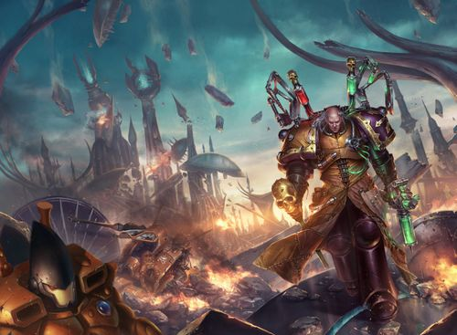

# 0812 764.M34 大粉碎 Shattering

精校状态：中文行文已逐段精校，部分术语仍为暂定

分类：时间线

原文来源：https://www.bilibili.com/opus/1107598063379152903

原作者：帝国神选罐头

原文时间：2025年09月01日 18:06

[返回分类目录](目录.md) · [全书目录](../../目录.md)

原篇名：765.M34 大粉碎 Shattering

<!-- A0812-B0001 -->
**英文原文**

The Shattering is a term used to refer to the attack by the Emperor's Children on the Eldar Craftworld Lugganath in 764.M34.

<!-- /A0812-B0001 -->

<!-- A0812-B0002 -->

原译文

大粉碎是一个术语，用来指764.M34帝皇之子们对灵族方舟世界拉格奈什的袭击。

**校订译文**

“大粉碎”指的是帝皇之子于 764.M34 对灵族方舟世界拉格奈什发动的袭击。

<!-- /A0812-B0002 -->

<!-- A0812-B0003 图片 -->

<!-- A0812-B0004 -->

原译文

The Shattering 粉碎

**校订译文**

The Shattering 大粉碎

<!-- /A0812-B0004 -->

<!-- A0812-B0005 -->
**英文原文**

Date:764.M34

<!-- /A0812-B0005 -->

<!-- A0812-B0006 -->

原译文

日期：765.M34

**校订译文**

日期：764.M34

**校注：** 英文开篇与日期表均为764.M34；原译日期表与篇题765.M34不符，统一按英文764.M34，英文原段不改。

<!-- /A0812-B0006 -->

<!-- A0812-B0007 -->
**英文原文**

Location:Craftworld Lugganath

<!-- /A0812-B0007 -->

<!-- A0812-B0008 -->

原译文

地点：方舟世界拉格奈什

**校订译文**

地点：方舟世界拉格奈什

<!-- /A0812-B0008 -->

<!-- A0812-B0009 -->
**英文原文**

Outcome:Pyrrhic Eldar victory

<!-- /A0812-B0009 -->

<!-- A0812-B0010 -->

原译文

结果：代价高昂灵族胜利

**校订译文**

结果：灵族惨胜

<!-- /A0812-B0010 -->

<!-- A0812-B0011 -->
**英文原文**

Combatants:Eldar/Chaos

<!-- /A0812-B0011 -->

<!-- A0812-B0012 -->

原译文

作战人员：灵族/混沌

**校订译文**

交战方：灵族／混沌

<!-- /A0812-B0012 -->

<!-- A0812-B0013 -->
**英文原文**

Commanders:Unknown/Radiant King(KIA), Fabius Bile, Keeper of Secrets, Oleander Koh, Tzimiskes Flay(KIA)

<!-- /A0812-B0013 -->

<!-- A0812-B0014 -->

原译文

指挥官：未知/光辉之王（KIA），法比乌斯·拜尔，守密者，欧利昂德·科赫，提兹米斯克·弗莱（KIA）

**校订译文**

指挥官：不详／光辉之王（阵亡）、法比乌斯·拜尔、守密者、欧利昂德·科赫、提兹米斯克·弗莱（阵亡）

<!-- /A0812-B0014 -->

<!-- A0812-B0015 -->
**英文原文**

Strength:Armies of Lugganath/12th Millennial, The Consortium, Fulgrim's Song, Slaaneshi Daemons, Cultists, Mutants, Pirates, Castellax Battle Automata,Enhanced Warriors

<!-- /A0812-B0015 -->

<!-- A0812-B0016 -->

原译文

力量：拉格奈什的军队/第十二千人队，联合体，福格瑞姆之子，色孽恶魔，邪教徒，变种人，海盗，堡星自动机兵，增强战士

**校订译文**

兵力：拉格奈什军队／第十二千人队、共同体、福格瑞姆之歌、色孽恶魔、邪教徒、变种人、海盗、堡星自动机兵、增强战士

**校注：** Fulgrim’s Song 为“福格瑞姆之歌”，原译“福格瑞姆之子”误读Song为Son；共同体沿全书The Consortium定译。

<!-- /A0812-B0016 -->

<!-- A0812-B0017 -->
**英文原文**

Casualties:Extremely heavy both civilian and military/heavy

<!-- /A0812-B0017 -->

<!-- A0812-B0018 -->

原译文

伤亡：平民和军队伤亡均极为严重/严重

**校订译文**

伤亡：平民和军队伤亡均极为严重/严重

<!-- /A0812-B0018 -->

<!-- A0812-B0019 -->
## Overview 概述

<!-- /A0812-B0019 -->

<!-- A0812-B0020 -->
**英文原文**

The events that would lead to the battle began when Sylandri Veilwalker secretly contacted the Emperor's Children Apothecary Oleander Koh and instructed him to make contact with Fabius Bile and together orchestrate an attack on Lugganath in concert with the powerful Chaos Lord known as the Radiant King. Veilwalker's reasons for doing this are unknown, save that she states that it would prevent many more Eldar deaths in the future. Oleander was successful in recruiting Bile, who wished to steal Eldar technology to unlock their secrets of immortality. The two were equally successful in convincing the twisted Radiant King to join their effort, for a Craftworld proved an irresistible prize and the Chaos Lord hoped its sacking could elevate him to Daemonhood.

<!-- /A0812-B0020 -->

<!-- A0812-B0021 -->

原译文

导致这场战斗的事件始于西兰德里·帷幕行者秘密联系了帝皇之子药剂师欧利昂德·科赫，并指示他与法比乌斯·拜尔联系，并与被称为光辉之王的强大混沌领主合作，共同策划对拉格奈什的攻击。帷幕行者这样做的原因尚不清楚，但她表示，这将防止未来更多的灵族死亡。欧利昂德成功招募了拜尔，拜尔希望窃取灵族的技术来解开他们不朽的秘密。两人同样成功地说服了扭曲的光辉之王加入他们的努力，因为一个方舟世界被证明是一个不可抗拒的奖品，混沌领主希望它的破坏能将他升格为恶魔王子。

**校订译文**

这场战役的起因，是西兰德里·帷幕行者秘密联系了帝皇之子药剂师欧利昂德·科赫。她指示科赫联络法比乌斯·拜尔，并与强大的混沌领主“光辉之王”合作，策划进攻拉格奈什。她的真正动机不得而知，只声称此举可以避免未来更多灵族丧命。科赫成功拉拢拜尔；后者希望窃取灵族技术，破解其长生的秘密。两人也说服了扭曲的光辉之王加入：一整个方舟世界是难以抗拒的猎物，而这名混沌领主希望借洗劫方舟的功绩升魔。

<!-- /A0812-B0021 -->

<!-- A0812-B0022 -->
**英文原文**

The Emperor's Children strikeforce consisted at first of the Radiant King's 12th Company and Fabius' own retinue, but soon grew far larger as Cultists, Pirates, and allied warbands rallied to his cause. Bile was able to track the Craftworld's location by stealing the memories of a captured Eldar Corsair using a mind-leech.

<!-- /A0812-B0022 -->

<!-- A0812-B0023 -->

原译文

帝皇之子们的突击队最初由光辉之王的第12连队和法比乌斯自己的随从组成，但随着邪教徒、海盗和盟盟友战帮集合起来支持他的事业，他们很快就变得更大了。拜尔能够通过使用心灵水蛭窃取被俘的灵族海盗的记忆来追踪方舟世界的位置。

**校订译文**

帝皇之子突击部队起初由光辉之王的第十二连和拜尔的随从组成。随着邪教徒、海盗及盟友战帮响应号召，兵力迅速扩张。拜尔利用一只心灵水蛭窃取了俘虏灵族海盗的记忆，由此确定方舟世界的位置。

**校注：** 开头兵力表称12th Millennial，本段则为12th Company；分别保留“第十二千人队／第十二连”，不擅自消除原文编制差异。

<!-- /A0812-B0023 -->

<!-- A0812-B0024 -->
**英文原文**

Psychically shielding their fleet with a Noise Marine song combined with Eldar technology devised by Fabius Bile, the Emperor's Children fleet was undetected by Lugganath in its approach. However once visually spotted, the escorting Eldar vessels managed to destroy the first wave of fighters, but the sheer number of Chaos Space Marine dropships forced a breach in the craftworld's hull. Thanks to the Word Bearers Diabolist Saqqara Ur-Damak Thresh, large numbers of Slaaneshi Daemons including a Keeper of Secrets were summoned into the Craftworld. The vile creatures wreaked havoc and caused panic among the Eldar wherever they appeared.

<!-- /A0812-B0024 -->

<!-- A0812-B0025 -->

原译文

通过噪音战士的歌曲，结合法比乌斯·拜尔设计的灵族技术，为他们的舰队提供灵能屏障，帝皇之子舰队在接近时没有被拉格奈什发现。然而，一进入视线范围，灵族护卫舰设法摧毁了第一波战斗机，但混沌星际战士的空降船数量之多导致方舟世界的船体破裂。多亏了怀言者恶魔学者萨卡拉·乌尔-达马克·斯雷什，包括一名守密者在内的大量色孽恶魔被召唤到了方舟世界。这些卑鄙的生物无论出现在哪里，都会在灵族中造成严重破坏和恐慌。

**校订译文**

帝皇之子将噪音战士的合唱，与拜尔利用灵族技术研制的装置相结合，为舰队施加灵能遮蔽，因此接近拉格奈什时未被察觉。待敌舰进入可视范围，灵族护航舰艇摧毁了第一波战斗机，但数量庞大的混沌星际战士登陆艇仍强行突破方舟世界的外壳。怀言者恶魔学者萨卡拉·乌尔-达马克·斯雷什随后召来大批色孽恶魔，其中包括一名守密者。这些邪恶生物所到之处，破坏与恐慌随之蔓延。

<!-- /A0812-B0025 -->

<!-- A0812-B0026 -->
**英文原文**

After a bitter series of further boarding actions, the Emperor's Children managed to establish a teleportation array in the Plaza of Reflection, resulting in more of the perverse Space Marines arriving in large numbers. The Eldar managed to seal the initial breach point, but they realized their foe's true intent too late. At the heart of the plaza, hundreds of Noise Marines combined their sonic weapons into a psychic explosion that ripped through the Craftworld's wraithbone architecture. The Craftworld's buildings crumbled down into the raging battle below.

<!-- /A0812-B0026 -->

<!-- A0812-B0027 -->

原译文

经过一系列痛苦的进一步跳帮行动，帝皇之子们设法在映像广场建立了一个传送阵列，导致更多扭曲的星际战士大量抵达。灵族设法封锁了最初的突破点，但他们意识到敌人的真实意图时为时已晚。在广场的中心，数百名噪音战帅将他们的音波武器组合成一场灵能爆炸，撕裂了方舟世界的灵骨建筑。方舟世界的建筑在下面的激烈战斗中倒塌了。

**校订译文**

经过一连串惨烈的跳帮战，帝皇之子在映像广场架起传送阵列，接引更多堕落战士涌入。灵族虽封住了最初的突破口，却太迟才看清敌人的真正企图：广场中央，数百名噪音战士将音波武器的力量汇聚成一场灵能爆炸，撕裂了方舟世界的灵骨建筑。大楼接连崩塌，砸向下方仍在厮杀的战场。

<!-- /A0812-B0027 -->

<!-- A0812-B0028 -->
**英文原文**

Seeing the terrible devastation, the Autarchs of Lugganath authorized the use of Hemlock Wraithfighters, eventually causing the Emperor's Children to retreat. During their withdrawal, they were pursued every step by vengeful Harlequins. The Harlequins and Lugganath Warlocks were able to surround and isolate the Radiant King, cutting him down before he could turn into a Daemon Prince after gorging on a great many Spirit Stones.

<!-- /A0812-B0028 -->

<!-- A0812-B0029 -->

原译文

看到可怕的破坏，拉格奈什的司战授权使用铁杉幽冥战士，最终导致帝皇之子撤退。在撤退过程中，他们每一步都被复仇的丑角追捕。丑角和拉格奈什战巫能够包围并独立光辉之王，在他狼吞虎咽地吞噬了很多魂石后变成恶魔王子之前就把他砍倒了。

**校订译文**

眼见毁灭不断扩大，拉格奈什的司战批准动用铁杉幽冥战机，终于迫使帝皇之子撤退。复仇的丑角一路紧追不舍。丑角与拉格奈什战巫合力包围并孤立了光辉之王；他虽已吞噬大量魂石，却还未来得及升格为恶魔王子，便被击杀。

**校注：** Hemlock Wraithfighter 是战机，原译“幽冥战士”误认单位类别；GW-09/GW-10第6页官方中英直接对应“铁杉幽冥战机”。

<!-- /A0812-B0029 -->

本篇核心术语与暂定项

以下列出本篇出现的英文原形及核心术语表用词。同形词可能指不同对象，具体词义以本篇正文和校注为准；单复数、别名和仅见于图注的名称可能尚未列入。完整候选见[术语表](../../术语表/双语术语候选.csv)。

| 英文 | 采用中文 | 状态 |
| --- | --- | --- |
| Space Marines | 星际战士 | 官方已核对 |
| Eldar | 灵族 | 暂定·语境区分 |
| Teleportation | 传送 | 暂定 |
| Craftworld | 方舟世界 | 官方已核对 |
| Emperor | 帝皇 | 官方已核对 |
| Word Bearers | 怀言者 | 暂定·官方待核 |
| Daemon Prince | 恶魔亲王 | 官方已核对 |
| Emperor's Children | 帝皇之子 | 官方已核对 |
| Noise Marine | 噪音战士 | 官方已核对 |
| Corsair | 海盗 | 暂定·官方待核 |
| Fulgrim | 福格瑞姆 | 官方已核对 |
| Apothecary | 药剂师 | 官方已核对 |
| Fabius Bile | 法比乌斯·拜尔 | 官方已核对 |
| Space Marine | 星际战士 | 暂定·官方待核 |
| Keeper of Secrets | 守密者 | 官方已核对 |
| Wraithbone | 灵骨 | 暂定·官方待核 |
| Lugganath | 拉格奈什 | 暂定·官方待核 |
| Sylandri Veilwalker | 西兰德里·帷幕行者 | 暂定·官方待核 |
| The Consortium | 共同体 | 暂定·官方待核 |
| Enhanced Warriors | 增强战士 | 暂定·官方待核 |
| Radiant King | 光辉之王 | 暂定·官方待核 |
| Oleander Koh | 欧利昂德·科赫 | 暂定·官方待核 |
| Tzimiskes Flay | 提兹米斯克·弗莱 | 暂定·官方待核 |
| mind-leech | 心灵水蛭 | 暂定·官方待核 |
| Saqqara Ur-Damak Thresh | 萨卡拉·乌尔-达马克·斯雷什 | 暂定·官方待核 |
| Plaza of Reflection | 映像广场 | 暂定·官方待核 |
| Sonic Weapons | 声波武器 | 暂定·官方待核 |

