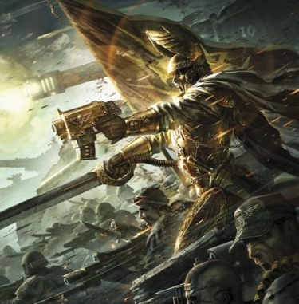
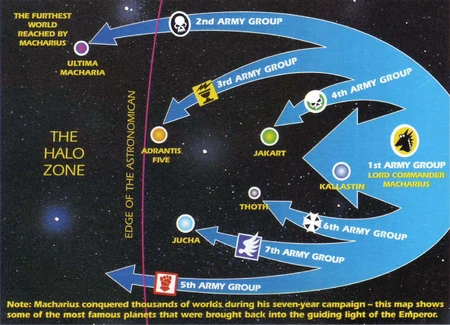
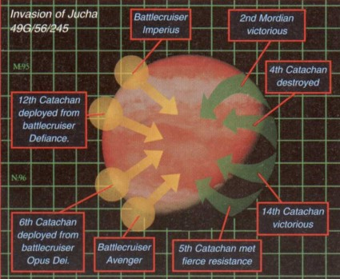
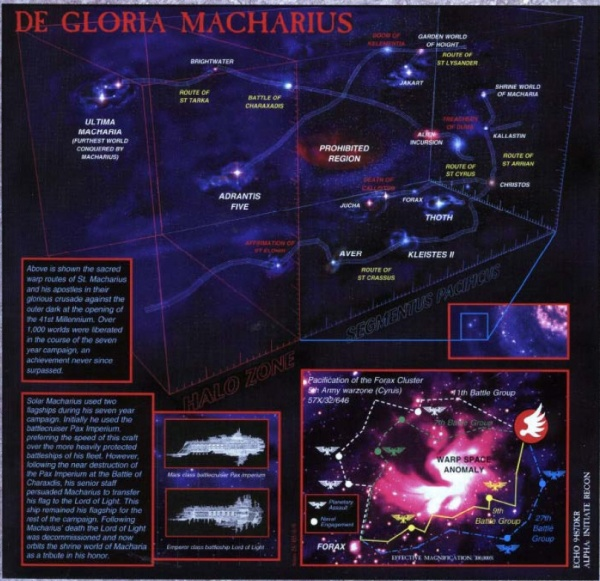

# 0820 392-399.M41 马卡里安远征 Macharian Crusade

精校状态：中文行文已逐段精校，部分术语仍为暂定

分类：时间线

原文来源：https://www.bilibili.com/opus/1133073842320703520

原作者：帝国神选罐头

原文时间：2025年11月09日 09:45

[返回分类目录](目录.md) · [全书目录](../../目录.md)

<!-- A0820-B0001 -->
**英文原文**

The Macharian Crusade (392-399.M41) was a seven-year Imperial military campaign (or Crusade) led by Lord Commander Solar Macharius. It took place on the far western edge of the galaxy, within the Segmentum Pacificus and leading into the Halo Zone. The campaign brought nearly one thousand worlds into the Imperium, and was one of the most successful crusades in its history.

<!-- /A0820-B0001 -->

<!-- A0820-B0002 -->

原译文

马卡里安远征（392-399.M41）是由太阳领主指挥官马卡里乌斯领导的一场为期七年的帝国军事行动。它发生在银河系的远西边缘，在太平星域内，并通向光环区域。这场战役将近千个世界带入了帝国，是帝国历史上最成功的远征之一。

**校订译文**

马卡里安远征（392—399.M41）由太阳领主指挥官马卡里乌斯率领，历时七年。战场位于银河遥远的西部边缘，从太平星域一路延伸至光环区。远征将近一千个世界纳入帝国，是帝国历史上最成功的远征之一。

<!-- /A0820-B0002 -->

<!-- A0820-B0003 图片 -->

<!-- A0820-B0004 -->

原译文

Lord Solar Macharius and his men on the Macharian Crusade 太阳领主马卡里乌斯和他的部下在马卡里安远征中

**校订译文**

Lord Solar Macharius and his men on the Macharian Crusade 太阳领主马卡里乌斯和他的部下在马卡里安远征中

<!-- /A0820-B0004 -->

<!-- A0820-B0005 -->
**英文原文**

Date:392-399.M41

<!-- /A0820-B0005 -->

<!-- A0820-B0006 -->

原译文

日期：392-399.M41

**校订译文**

日期：392-399.M41

<!-- /A0820-B0006 -->

<!-- A0820-B0007 -->
**英文原文**

Location:Segmentum Pacificus

<!-- /A0820-B0007 -->

<!-- A0820-B0008 -->

原译文

地点：太阳星域

**校订译文**

地点：太平星域

**校注：** Segmentum Pacificus 为太平星域；原中文写太阳星域，与英文不符。

<!-- /A0820-B0008 -->

<!-- A0820-B0009 -->
**英文原文**

Outcome:Imperium conquers wide swathes of previously lost territory, Macharian Heresy begins

<!-- /A0820-B0009 -->

<!-- A0820-B0010 -->

原译文

结果：帝国征服了大片以前失去的领土，马卡里安叛乱开始了

**校订译文**

结果：帝国收复大片失落疆土；马卡里安叛乱随后爆发

<!-- /A0820-B0010 -->

<!-- A0820-B0011 -->
**英文原文**

Combatants:Imperium/Anti-Imperial civilizations

<!-- /A0820-B0011 -->

<!-- A0820-B0012 -->

原译文

作战人员：帝国/反帝国文明

**校订译文**

交战方：帝国／反帝国文明

<!-- /A0820-B0012 -->

<!-- A0820-B0013 -->
**英文原文**

Commanders:Lord Solar Macharius, General Sejanus, General Tarka, General Lysander, General Borgen Crassus, General Arrian, General Cyrus, Great Wolf Ulrik Grimfang, Logan Grimnar, Captain Barus, Captain Al'rahem, Inquisitor Hyronimus Drake/ Richter (KIA), Changeling, Lord Ashterioth

<!-- /A0820-B0013 -->

<!-- A0820-B0014 -->

原译文

指挥官：太阳领主马卡里乌斯，将军塞扬努斯，将军塔尔卡，将军莱桑德，将军博尔根·克拉苏，将军阿里安，将军赛勒斯，头狼乌尔里克·冷牙，罗根·格里姆纳尔，连长巴鲁斯，连长阿尔·拉希姆，审判官希罗尼穆斯·德拉克/里希特（KIA），变化灵，领主阿什特利奥斯

**校订译文**

指挥官：太阳领主马卡里乌斯、塞扬努斯将军、塔尔卡将军、莱桑德将军、博尔根·克拉苏将军、阿里安将军、赛勒斯将军、头狼乌尔里克·冷牙、洛根·格里姆纳尔、巴鲁斯连长、阿尔·拉希姆连长、审判官海罗尼穆斯·德拉克／里希特（阵亡）、诡变灵、阿什特利奥斯领主

**校注：** Sejanus、Lysander、Cyrus 在此均为帝国将军，不强并同名荷鲁斯之子、帝国之拳或血鸦人物。Hyronimus Drake沿647；洛根与诡变灵用官译。

<!-- /A0820-B0014 -->

<!-- A0820-B0015 -->
**英文原文**

Strength:See Crusade Forces/Orks, Chaos Space Marines, Chaos Cultists, Traitor Guard, Witches of Thoth, Persepolis, Adrantis Five, Goranna, Jucha, Virida, Dark Eldar raiders

<!-- /A0820-B0015 -->

<!-- A0820-B0016 -->

原译文

力量：参见远征部队/欧克、混沌星际战士、混沌邪教徒、叛徒卫队、透特女巫、珀塞波利斯、阿德兰蒂斯五星、格拉纳、朱查、维里达、黑暗灵族袭击者

**校订译文**

兵力：见“远征部队”／欧克蛮人、混沌星际战士、混沌邪教徒、叛变卫队、透特女巫、珀塞波利斯、阿德兰提斯五号、格拉纳、朱查、维里达、黑暗灵族袭击者

<!-- /A0820-B0016 -->

<!-- A0820-B0017 -->
**英文原文**

Casualties:Heavy/At least 23 billion Orks, entire civilizations destroyed

<!-- /A0820-B0017 -->

<!-- A0820-B0018 -->

原译文

伤亡人数：沉重/至少230亿兽人，整个文明被摧毁

**校订译文**

伤亡：惨重／至少二百三十亿欧克蛮人，若干文明被彻底摧毁

<!-- /A0820-B0018 -->

<!-- A0820-B0019 -->
### History 历史

<!-- /A0820-B0019 -->

<!-- A0820-B0020 -->
**英文原文**

It all began on Donia which later became the Shrine World Macharia. Here, Macharius was born and began his rise in the ranks of the Imperial military. At his time, the Imperium was reeling from internal conflicts and civil war in Segmentum Solar, and he spent his early career mainly to overcoming various rebel and warlorde factions. Several of these he managed to convince to join him, and some former warlords would later become able commanders of his crusade. Eventually, Macharius rose to Lord Commander Solar; in this position, he petioned the High Lords of Terra for a new war of conquest in scale not seen since the Great Crusade. The High Lords agreed, and put the entire Astra Militarum at his disposal.

<!-- /A0820-B0020 -->

<!-- A0820-B0021 -->

原译文

这一切都始于多尼亚，后来成为了圣地世界马卡里亚。马卡里乌斯在这里出生，并开始在帝国军队中崛起。在他那个时代，帝国正受到太阳星域内部冲突和内战的困扰，他早期的职业生涯主要是为了克服各种叛乱和军阀派系。他设法说服其中几位加入他的行列，一些前军阀后来成为他远征的得力指挥官。最终，马卡里乌斯升任太阳领主指挥官；在这个职位上，他与泰拉高领主们展开了一场新的征服战争，其规模是自大远征以来从未见过的。高领主们同意了，并将整个星界军交由他支配。

**校订译文**

这一切始于多尼亚，也就是后来成为圣地世界的马卡里亚。马卡里乌斯出生于此，并从这里开始军旅生涯，逐步晋升。当时，太阳星域的内部冲突与内战令帝国动荡不安，他早年主要致力于击败各路叛军和军阀。他也说服其中一些势力归顺，若干昔日军阀后来成为远征中的得力将领。最终，马卡里乌斯升任太阳领主指挥官，并向泰拉高领主请愿，希望发动一场规模为大远征以来所未有的征服战争。高领主批准请求，将整个星界军交由他调遣。

<!-- /A0820-B0021 -->

<!-- A0820-B0022 -->
**英文原文**

Macharius set up seven great army groups for his grand campaign. He himself led the First Army Group. Eventually, he rallied his troops on Donia before boarding the waiting transports in orbit above the planet. Then they set off to conquer planets right out to the Galactic Rim, and even beyond the reach of the Astronomican. Many of the planets had been lost in the previous chaos of the Age of Apostasy.

<!-- /A0820-B0022 -->

<!-- A0820-B0023 -->

原译文

马卡里乌斯为他的大战役组建了七个庞大的集团军。他亲自领导了第一集团军。最终，他在多尼亚集结了部队，然后登上了在行星轨道上等待的运输船。然后，他们出发去征服银河系边缘的行星，甚至超越了星炬的范围。许多行星在叛教时代之前的混乱中失落了。

**校订译文**

马卡里乌斯为这场宏大远征组建了七个集团军群，亲自统率第一集团军群。他在多尼亚集结部队，随后让大军登上轨道中等候的运输舰，向银河边缘进军，甚至越过星炬光芒所及的范围。许多目标行星是在此前叛教时代的动乱中与帝国失去联系的。

**校注：** Army Group 标准层级为集团军群，原“集团军”少一层；本篇具体七大集群统一。previous chaos of the Age of Apostasy 是此前叛教时代中的混乱，非叛教时代之前。

<!-- /A0820-B0023 -->

<!-- A0820-B0024 -->
### Notable Battles 著名战斗

<!-- /A0820-B0024 -->

<!-- A0820-B0025 -->
**英文原文**

The first major battle of the crusade took place against the Cult of the Angel of Fire, which ruled over the Karsk System. Here the Cult was revealed to be a Tzeentchian front, and a wounded Macharius faced down a Lord of Change itself, rejecting its promises of power through Chaos and remaining pure. The Crusade ground on, and many alien and human civilizations were encountered. The most notable campaigns included:

<!-- /A0820-B0025 -->

<!-- A0820-B0026 -->

原译文

远征的第一场主要战役发生在与统治卡尔斯克星系的火焰天使教派的对抗中。在这里，教派被揭露为一个奸奇领导的，受伤的马卡里乌斯面对着万变魔君本身，拒绝了其通过混沌获得力量的承诺，保持纯洁。远征开始了，遇到了许多异型文明和人类文明。最引人注目的战役包括：

**校订译文**

远征的第一场大战，是对抗统治卡尔斯克星系的火焰天使教派。该教派被揭露为奸奇势力的伪装；负伤的马卡里乌斯甚至直面一名诡变领主，拒绝其以混沌力量为诱饵的许诺，守住了自身忠诚。远征继续推进，先后遭遇许多人类与异形文明。重要战役包括：

<!-- /A0820-B0026 -->

<!-- A0820-B0027 图片 -->

<!-- A0820-B0028 -->

原译文

The extent of Macharius' Crusade 马卡里乌斯的远征的范围

**校订译文**

The extent of Macharius' Crusade 马卡里乌斯的远征的范围

<!-- /A0820-B0028 -->

<!-- A0820-B0029 -->
**英文原文**

392.M41- The Hive World of Persepolis is re-contacted by the Imperium after 5,000 years. Macharius joins Sejanus's army while they fight across the deserts of Gedrosia. Macharius finds the tomb of the ancient explorer Indijona the Vagrant and takes his helm for himself.

<!-- /A0820-B0029 -->

<!-- A0820-B0030 -->

原译文

珀塞波利斯巢都世界在5000年后被帝国重新联系。马卡里乌斯加入了塞扬努斯的军队，他们在德洛西亚的沙漠中作战。马卡里乌斯发现了古代探索者流浪者因迪乔纳的坟墓，并取走了他的头盔。

**校订译文**

392.M41——帝国在五千年后重新与巢都世界珀塞波利斯建立联系。马卡里乌斯加入塞扬努斯的部队，征战德洛西亚沙漠。他发现古代探险家“流浪者”因迪乔纳的陵墓，并取走其头盔，自行佩戴。

<!-- /A0820-B0030 -->

<!-- A0820-B0031 -->
**英文原文**

393.M41 - A battle against Chaos Space Marines on the world of Zaga IV. During the fighting, a Bolter round embeds itself in Macharius's chest but fails to explode. The Confessors accompanying the Crusade declare it to be a miracle and sign of the Emperor's grace.

<!-- /A0820-B0031 -->

<!-- A0820-B0032 -->

原译文

在扎加四号世界上与混沌星际战士作战。在战斗中，一枚爆矢弹嵌入了马卡里乌斯的胸膛，但没有爆炸。伴随远征的告解者宣称这是一个奇迹，是帝皇恩典的象征。

**校订译文**

393.M41——扎加四号之战：帝国与混沌星际战士交锋。一发爆矢弹嵌入马卡里乌斯胸口，却未爆炸；随军告解者宣布这是神迹，彰显帝皇恩典。

<!-- /A0820-B0032 -->

<!-- A0820-B0033 -->
**英文原文**

395.M41 - The battle on Thoth. General Arrian takes the last enemy position on the planet after Macharius arrives with reinforcements.

<!-- /A0820-B0033 -->

<!-- A0820-B0034 -->

原译文

透特战役。在马卡里乌斯带着援军抵达后，阿里安将军占据了行星上最后一个敌人的阵地。

**校订译文**

395.M41——透特之战：马卡里乌斯率援军抵达后，阿里安将军夺取了行星上最后一处敌军阵地。

<!-- /A0820-B0034 -->

<!-- A0820-B0035 -->
**英文原文**

395-397.M41 - General Borgen Crassus's invasion of the highly advanced human civilization on the planet Adrantis Five. Adrantis Five and its advanced technology held Macharius at bay for two years, with General Crassus's Army Group losing 90% of its men in the fighting. In the end, the Warmaster only defeated Adrantis Five after re-directing a comet towards the world.

<!-- /A0820-B0035 -->

<!-- A0820-B0036 -->

原译文

博尔根·克拉苏将军入侵了阿德兰蒂斯五星上高度发达的人类文明。阿德兰蒂斯五星及其先进技术将马卡里乌斯围困了两年，克拉苏将军的集团军在战斗中损失了90%的士兵。最终，战帅在将一颗彗星重新导向世界后，才击败了阿德兰蒂斯五星。

**校订译文**

395—397.M41——博尔根·克拉苏将军进攻阿德兰提斯五号的先进人类文明。凭借高度发达的技术，该世界将马卡里乌斯挡住了两年，克拉苏的集团军群在战斗中损失九成兵员。最终，战帅改变一颗彗星的轨迹，使其撞向行星，才击败阿德兰提斯五号。

**校注：** held at bay 是阻挡攻势，不表示马卡里乌斯本人被围困。

<!-- /A0820-B0036 -->

<!-- A0820-B0037 -->
**英文原文**

399.M41 - In one of the final battles of the war, Macharius' forces become involved in a hellish war of attrition on the world of Loki against the traitor general Richter. Inquisitor Hyronimus Drake and Logan Grimnar of the Space Wolves lead the final attack on the citadel and slay the Heretic. In the aftermath of the battle, Imperial forces are completely demoralized.

<!-- /A0820-B0037 -->

<!-- A0820-B0038 -->

原译文

在战争的最后一场战斗中，马卡里乌斯的部队卷入了洛基世界与叛徒将军里希特之间的一场地狱般的消耗战。审判官希罗尼穆斯·德拉克和太空野狼的罗根·格里姆纳尔领导了对城堡的最后一次攻击，并杀死了异端。战斗结束后，帝国军队完全士气低落。

**校订译文**

399.M41——远征末期的一场战役中，马卡里乌斯的部队在洛基与叛徒将军里希特展开地狱般的消耗战。审判官海罗尼穆斯·德拉克与太空野狼的洛根·格里姆纳尔率领最后的堡垒攻势，杀死里希特。战役结束时，帝国部队的士气已彻底崩溃。

<!-- /A0820-B0038 -->

<!-- A0820-B0039 -->
**英文原文**

Date Unknown: Macharius' forces alongside the Space Wolves led by Ulrik Grimfang and Logan Grimnar attempt to acquire the Fist of Russ from the Dark Eldar first on Demetrius and then on Procrastes. The battle continued into the Webway after the Dark Eldar Lord Ashterioth attempted to flee and reach the ancient artifact Reality Engine. Macharius is able to personally kill the Xenos within the Webway.

<!-- /A0820-B0039 -->

<!-- A0820-B0040 -->

原译文

马卡里乌斯的部队与乌尔里克·冷牙和罗根·格里姆纳尔领导的太空野狼一起试图从黑暗灵族那里获得鲁斯之拳，先是在德米特里厄斯上，然后是在普罗克拉斯提斯上。在黑暗灵族领主阿什特利奥斯试图逃跑并到达古代神器现实引擎后，战斗继续进行到网道。马卡里乌斯能够亲自杀死网道内的异型。

**校订译文**

日期不详——马卡里乌斯的部队与乌尔里克·冷牙、洛根·格里姆纳尔率领的太空野狼一道，先在德米特里厄斯、后在普罗克拉斯提斯，试图从黑暗灵族手中夺回鲁斯之拳。黑暗灵族领主阿什特利奥斯企图逃往古代神器“现实引擎”所在处，战斗因此延伸至网道。马卡里乌斯亲手在网道内杀死了这名异形。

<!-- /A0820-B0040 -->

<!-- A0820-B0041 -->
**英文原文**

Date Unknown: The Crusade intercepts an Ork Waaagh!, whose Warboss inflicted debilitating injuries on the Warmaster himself.

<!-- /A0820-B0041 -->

<!-- A0820-B0042 -->

原译文

远征拦截了一个欧克Waaagh！，它的战争头目对战帅本人造成了令人衰弱的伤害。

**校订译文**

日期不详——远征军截击一支欧克蛮人 Waaagh!，其战争头目给战帅造成重伤，使他元气大损。

<!-- /A0820-B0042 -->

<!-- A0820-B0043 -->

原译文

Date Unknown: The invasion of Goranna 入侵格拉纳

**校订译文**

Date Unknown: The invasion of Goranna 入侵格拉纳

<!-- /A0820-B0043 -->

<!-- A0820-B0044 -->

原译文

Date Unknown: Battle of Charaxdis 查拉克迪斯之战

**校订译文**

Date Unknown: Battle of Charaxdis 查拉克迪斯之战

<!-- /A0820-B0044 -->

<!-- A0820-B0045 -->

原译文

Date Unknown: Invasion of Jucha 入侵朱查

**校订译文**

Date Unknown: Invasion of Jucha 入侵朱查

<!-- /A0820-B0045 -->

<!-- A0820-B0046 图片 -->

<!-- A0820-B0047 -->

原译文

Invasion of Jucha 入侵朱查

**校订译文**

Invasion of Jucha 入侵朱查

<!-- /A0820-B0047 -->

<!-- A0820-B0048 -->
**英文原文**

Date Unknown: Battle of Kallastin - Macharius defeats 23 billion Orks in one of his greatest victories.

<!-- /A0820-B0048 -->

<!-- A0820-B0049 -->

原译文

卡拉斯汀之战 - 马卡里乌斯在他最伟大的胜利之一中击败了230亿兽人。

**校订译文**

日期不详——卡拉斯汀之战：马卡里乌斯击败二百三十亿欧克蛮人，赢得其最伟大的胜利之一。

<!-- /A0820-B0049 -->

<!-- A0820-B0050 -->
**英文原文**

Date Unknown: The Star Phantoms lead a purge of Virida, a sentient Jungle World inhabited by tree-like aliens. The last surviving of the species are brought before Macharius in chains.

<!-- /A0820-B0050 -->

<!-- A0820-B0051 -->

原译文

星辰幻影领导了对维里达的净化，维里达是一个由树状异型居住的有感知力的丛林世界。最后一个幸存的物种被带到马卡里乌斯面前。

**校订译文**

日期不详——星辰幻影率军清洗维里达。这是一颗具有感知能力的丛林世界，栖居着树木状异形。该物种最后的幸存者被锁上镣铐，带到马卡里乌斯面前。

**校注：** surviving of the species 指该物种幸存个体，不是“最后一个幸存的物种”。sentient Jungle World按原文保留世界具感知能力的修饰，未擅改成仅居民有感知。

<!-- /A0820-B0051 -->

<!-- A0820-B0052 -->
**英文原文**

Date Unknown: The Battle of Arrian's Wrath. Zealous General Arrian oversees a wave of atrocities that results in a mutiny in his own forces. His subsequent slaughter of these rebels has become the thing of dark legend, and the region of space is now known as Arrian's Wrath.

<!-- /A0820-B0052 -->

<!-- A0820-B0053 -->

原译文

阿里亚之怒之战。狂热的阿里亚将军监督了一系列暴行，这些暴行导致他自己的部队发生叛乱。他随后对这些叛军的屠杀已成为黑暗传说，空域现在被称为阿里亚之怒。

**校订译文**

日期不详——阿里安之怒之战：狂热的阿里安将军主持一连串暴行，最终激起己方部队哗变。他随后对哗变者的屠杀成为令人恐惧的传说，这片空域也从此被称为“阿里安之怒”。

<!-- /A0820-B0053 -->

<!-- A0820-B0054 -->
**英文原文**

Date Unknown: Space Wolves Wolf Lord Ulrik Grimfang conquers the deadly Ice World of Jotungarth.

<!-- /A0820-B0054 -->

<!-- A0820-B0055 -->

原译文

太空野狼狼主乌尔里克·冷牙征服了致命的冰雪世界约顿加特。

**校订译文**

日期不详——太空野狼狼主乌尔里克·冷牙征服危机四伏的冰封世界约顿加特。

<!-- /A0820-B0055 -->

<!-- A0820-B0056 -->

原译文

Date Unknown: The war with the Hectacore. 与百核的战争。

**校订译文**

Date Unknown: The war with the Hectacore. 与百核的战争。

<!-- /A0820-B0056 -->

<!-- A0820-B0057 -->

原译文

Date Unknown: The war with the Hegemony of Iskander. 与伊斯坎德尔霸权的战争。

**校订译文**

Date Unknown: The war with the Hegemony of Iskander. 与伊斯坎德尔霸权的战争。

<!-- /A0820-B0057 -->

<!-- A0820-B0058 -->

原译文

Date Unknown: The war with the Elaric Combine. 与埃拉里克联合体的战争。

**校订译文**

Date Unknown: The war with the Elaric Combine. 与埃拉里克联合体的战争。

<!-- /A0820-B0058 -->

<!-- A0820-B0059 -->
### Strategic Overview 战略概述

<!-- /A0820-B0059 -->

<!-- A0820-B0060 -->
**英文原文**

Overall, in the first year of the Crusade, a hundred worlds fell. In the second year, three hundred fell. In the third, nearly seven hundred planets had fallen to Macharius' armies. Each of them was systematically wiped out or brought under the dominion of the Imperium, and in the wake of Macharius' conquering army came Missionaries of the Ecclesiarchy and Inquisitorial teams to reestablish the Imperial yoke on these reclaimed realms.

<!-- /A0820-B0060 -->

<!-- A0820-B0061 -->

原译文

总的来说，在远征的第一年，一百个世界沦陷。第二年，三百个倒下。第三年，近七百颗行星落入马卡里乌斯的军队手中。他们中的每一个都被系统地消灭或置于帝国的统治之下，在马卡里乌斯的征服军队之后，国教的传教士和审判庭团队来了，以在这些收复的领土上重建帝国的枷锁。

**校订译文**

远征第一年，一百个世界被攻克；第二年，三百个世界沦陷；到第三年，已有近七百颗行星落入马卡里乌斯之手。这些世界不是遭到系统性的毁灭，就是被纳入帝国统治。国教会传教士与审判庭队伍紧随征服大军而来，将帝国的枷锁重新套在收复的疆土之上。

**校注：** 第三年的 nearly seven hundred had fallen 用完成时，译“到第三年已有”；前两年各自或累计统计口径原文未充分说明，未相加生成总数。

<!-- /A0820-B0061 -->

<!-- A0820-B0062 -->
**英文原文**

By the end of the Crusade, Macharius' armies stood undefeated and at the edge of the Western Galaxy, facing the Halo Zone and the limits of the light of the Astronomican. The region beyond was cut off from the Imperium and the home to civilizations that knew not of the Emperor. At this point, Macharius's generals and troops wavered. They pleaded him to reconsider advancing into the Halo Stars. His fleet would be slowed due to the difficulty Navigators would have in Warp travel beyond the Astronomican, and his Astropaths would be beyond the range of communication back to Imperial space. Moreover, his armies had simply run out of energy after many long battles. Many of his troops were also fearful of what lay beyond, most scout teams sent into the Halo Zone never returned and those that did told of strange phenomenon, of haunted stars and entire worlds inhabited by ghosts. Faced with this refusal to advance, Macharius became furious and accused his men of betrayal and cowardice. He locked himself in his state room, drinking himself to a drunken stupor.

<!-- /A0820-B0062 -->

<!-- A0820-B0063 -->

原译文

远征结束时，马卡里乌斯的军队不败，站在银河系西部的边缘，面对光环区域和星炬之光的极限。更远的地区与帝国和不了解帝皇的文明的家园隔绝了。此时，马卡里乌斯的将军和军队犹豫不决。他们恳求他重新考虑进军光环群星。由于导航者在星炬之外的亚空间航行中遇到的困难，他的舰队减速，他的星域超出返回帝国空域的通信范围。此外，他的军队在经历了许多漫长的战斗后，已经耗尽了能量。他的许多部队也对未来感到恐惧，大多数被派往光环区域的侦察队再也没有回来，而那些回来的侦察队则讲述了奇怪的现象、闹鬼的恒星和整个鬼魂居住的世界。面对这种拒绝前进的态度，马卡里乌斯变得愤怒起来，指责他的部下背叛和懦弱。他把自己锁在会客厅里，喝得酩酊大醉。

**校订译文**

远征走到尽头时，马卡里乌斯的大军仍未尝败绩，已抵达银河西缘，面前便是光环区与星炬照耀范围的极限。更远处的疆域与帝国隔绝，栖居着从未听闻帝皇的文明。将领与士兵此时开始动摇，恳求他重新考虑进军光环群星的计划。超出星炬范围后，导航员将难以在亚空间领航，拖慢舰队；星语者也无法再与帝国疆域取得联系。更何况，大军经过长年苦战，早已精疲力竭。许多人还恐惧未知：派入光环区的侦察队大多有去无回，幸存者则讲述种种异象、闹鬼的恒星，以及遍布幽魂的世界。部下拒绝前进，令马卡里乌斯勃然大怒，斥责他们背叛、怯懦。他将自己锁在专舱中，借酒浇愁，烂醉不醒。

**校注：** Astropaths为星语者，不是原译“星域”；beyond was cut off ... and the home to ... 是两个并列判断。

<!-- /A0820-B0063 -->

<!-- A0820-B0064 -->
**英文原文**

When Macharius finally reappeared, he ordered his fleet to set course back to Imperial space. His soldiers cheered the Warmaster a hero, and his generals breathed a sigh of relief. However, Macharius was a broken man and his dreams of boundless conquests were shattered in the face of human frailty. His will broken, according to Imperial records on the return journey Macharius succumbed to a jungle fever he had contracted on Jucha in 400.M41. However this was just a coverup by Imperial authorities, and in truth an already-dying Macharius, riddled with plagues of Nurgle received battling the traitorous general Richter on the world of Loki, was killed by an agent of the Officio Assassinorum with cooperation of the Inquisitor Hyronimus Drake for unknown reasons. Despite their earlier refusal to continue the Crusade, Macharius's men deeply mourned the passing of their general and revered him as a god.

<!-- /A0820-B0064 -->

<!-- A0820-B0065 -->

原译文

当马卡里乌斯最终再次出现时，他命令他的舰队返回帝国空域。他的士兵们为战帅欢呼，称其为英雄，他的将军们松了一口气。然而，马卡里乌斯是一个破碎的人，面对人类的脆弱，他无限征服的梦想破灭了。根据帝国记录，马卡里乌斯在回程中死于400.M41在朱查感染的丛林热，他的愿望破碎了。然而，这只是帝国当局的掩盖，事实上，一个已经奄奄一息的马卡里乌斯，饱受纳垢瘟疫的折磨，在洛基世界与叛徒将军里希特作战，被刺客庭的一名特工在审判官希罗尼穆斯·德拉克的合作下杀害，原因不明。尽管他们早些时候拒绝继续远征，但马卡里乌斯的部下对将军的去世深感悲痛，并将他尊为神。

**校订译文**

马卡里乌斯终于再次露面时，下令舰队返回帝国疆域。士兵高呼战帅是英雄，将军们也松了口气。然而，他已心灰意冷：无限征服的梦想，终究被人类的软弱击碎。按照帝国官方记载，400.M41，意志消沉的马卡里乌斯在归途中死于此前在朱查感染的丛林热。但文中称，这只是当局的掩饰。真相是，他在洛基与叛徒将军里希特作战时染上纳垢瘟疫，早已命悬一线，最终又遭刺客庭特工杀害；审判官海罗尼穆斯·德拉克参与了这场行动，动机不明。尽管先前拒绝继续远征，部下仍深切哀悼其逝世，奉他为神。

**校注：** 400.M41结合return journey及战役年表解释为死亡年份；原译将其接在朱查感染日期之后易误导。官方死亡记载与文中揭示的暗杀说分开保留。

<!-- /A0820-B0065 -->

<!-- A0820-B0066 -->
**英文原文**

After his death, Macharius's body was returned to Doria, where the Crusade had originally began. A massive funeral took place, which was attended by Adepts, ministers of the Ecclesiarchy, Tech-priests, and many other important figures wishing to pay their respect. A million men led the funeral procession, and a hundred generals laid their swords on his ornate sarcophagus. To honor his deeds his homeworld was renamed to Macharia.

<!-- /A0820-B0066 -->

<!-- A0820-B0067 -->

原译文

马卡里乌斯死后，他的尸体被送回了远征最初开始的地方多里亚。举行了一场盛大的葬礼，出席葬礼的有专家、国教牧师、技术神甫和许多其他希望表达敬意的重要人物。一百万人率领葬礼队伍，一百名将军将剑放在他华丽的石棺上。为了纪念他的事迹，他的家园世界被重新命名为马卡里亚。

**校订译文**

马卡里乌斯的遗体被送回远征的起点多里亚。帝国为他举行盛大葬礼，官员、国教会教士、技术祭司及其他众多显要前来致敬。百万人走在送葬队伍前列，一百名将军将佩剑放上华美的石棺。为纪念其功绩，他的母星被改名为马卡里亚。

**校注：** 本段英文Doria与前文Donia不同，分别保留多里亚／多尼亚，注明疑似拼写不一；不擅改英文或隐去差异。

<!-- /A0820-B0067 -->

<!-- A0820-B0068 -->
### Aftermath 余波

<!-- /A0820-B0068 -->

<!-- A0820-B0069 -->
**英文原文**

After the death of Macharius himself his newly-forged conquests fell into anarchy in a seventy-year civil war known as the Macharian Heresy. In this civil war and subsequent centuries, many of the conquered worlds were lost again to the Imperium; either because they successfully rebelled or due to being completely destroyed.

<!-- /A0820-B0069 -->

<!-- A0820-B0070 -->

原译文

马卡里乌斯本人去世后，他新征服的领土在一场被称为马卡里安叛乱的70年内战中陷入了无政府状态。在这场内战和随后的几个世纪里，许多被征服的世界对于帝国再次失落；要么是因为他们反抗成功，要么是因为被彻底摧毁。

**校订译文**

马卡里乌斯死后，新征服的疆域很快陷入混乱，爆发了长达七十年的“马卡里安叛乱”。在这场内战及随后的数个世纪里，许多世界再次脱离帝国：有的成功反叛，有的则遭到彻底毁灭。

<!-- /A0820-B0070 -->

<!-- A0820-B0071 -->
**英文原文**

To honor those Imperial Knight Houses that served under Macharius, he issued the Banner of Macharius Triumphant, which was still given to Knights Seneschals even long after his death.

<!-- /A0820-B0071 -->

<!-- A0820-B0072 -->

原译文

为了纪念在马卡里乌斯下服务的帝国骑士家族，他发行了马卡里乌斯大捷之旗，即使在他去世很久之后，这面旗帜仍被赠送给骑士总管。

**校订译文**

为表彰麾下效力的帝国骑士家族，马卡里乌斯设立了马卡里亚凯旋旗。这一荣誉旗帜在他死后很久，仍继续授予骑士总管。

<!-- /A0820-B0072 -->

<!-- A0820-B0073 -->
**英文原文**

The Pilgrimage of Macharius was later established, which sees pilgrims travel the same space lanes that Lord Solar Macharius' armies did during the Macharian Crusade. Countless faithful of the Imperial Cult undertake it every year, but only a few pious souls ever finish the journey, as most die in the attempt.

<!-- /A0820-B0073 -->

<!-- A0820-B0074 -->

原译文

后来确立了马卡里乌斯朝圣，朝圣者沿着在马卡里安远征期间太阳领主马卡里乌斯的军队所走的太空路线航行。每年都有无数帝国教派的信徒参加，但只有少数虔诚的灵魂完成了这段旅程，因为大多数人都在尝试中死去。

**校订译文**

后来，人们设立了马卡里乌斯朝圣之旅，沿太阳领主远征军当年的航道前行。每年都有无数帝皇信仰的信众踏上这条路，但大多数人死于途中，只有少数虔诚者能够走完全程。

<!-- /A0820-B0074 -->

<!-- A0820-B0075 -->
### Crusade Forces 远征部队

<!-- /A0820-B0075 -->

<!-- A0820-B0076 -->
**英文原文**

Macharius' forces were divided into 7 Army Groups, collectively referred to as the Grand Army of Reconquest. Each army group was led by a General appointed by Macharius himself.

<!-- /A0820-B0076 -->

<!-- A0820-B0077 -->

原译文

马卡里乌斯的部队分为7个集团军，统称为再征服大军。每个集团军都由马卡里乌斯亲自任命的一名将军领导。

**校订译文**

马卡里乌斯的部队分为七个集团军群，统称“再征服大军”，各由他亲自任命的将军统率。

<!-- /A0820-B0077 -->

<!-- A0820-B0078 图片 -->

<!-- A0820-B0079 -->

原译文

Course of the Macharian Crusade 马卡里安远征的过程

**校订译文**

Course of the Macharian Crusade 马卡里安远征的过程

<!-- /A0820-B0079 -->

<!-- A0820-B0080 -->
**英文原文**

The 1st Army Group of Lord Solar Macharius himself

<!-- /A0820-B0080 -->

<!-- A0820-B0081 -->

原译文

太阳领主马卡里乌斯的第一集团军

**校订译文**

太阳领主马卡里乌斯亲自统率的第一集团军群

<!-- /A0820-B0081 -->

<!-- A0820-B0082 -->
**英文原文**

The 2nd Army Group of General Sejanus

<!-- /A0820-B0082 -->

<!-- A0820-B0083 -->

原译文

将军塞扬努斯的第二集团军

**校订译文**

塞扬努斯将军的第二集团军群

<!-- /A0820-B0083 -->

<!-- A0820-B0084 -->
**英文原文**

The 3rd Army Group of General Tarka

<!-- /A0820-B0084 -->

<!-- A0820-B0085 -->

原译文

将军塔尔卡的第三集团军

**校订译文**

塔尔卡将军的第三集团军群

<!-- /A0820-B0085 -->

<!-- A0820-B0086 -->
**英文原文**

The 4th Army Group of General Lysander

<!-- /A0820-B0086 -->

<!-- A0820-B0087 -->

原译文

将军莱桑德的第四集团军

**校订译文**

莱桑德将军的第四集团军群

<!-- /A0820-B0087 -->

<!-- A0820-B0088 -->
**英文原文**

The 5th Army Group of General Borgen Crassus

<!-- /A0820-B0088 -->

<!-- A0820-B0089 -->

原译文

将军博尔根·克拉苏的第五集团军

**校订译文**

博尔根·克拉苏将军的第五集团军群

<!-- /A0820-B0089 -->

<!-- A0820-B0090 -->
**英文原文**

The 6th Army Group of General Arrian

<!-- /A0820-B0090 -->

<!-- A0820-B0091 -->

原译文

将军阿里安的第六集团军

**校订译文**

阿里安将军的第六集团军群

<!-- /A0820-B0091 -->

<!-- A0820-B0092 -->
**英文原文**

The 7th Army Group of General Cyrus of Larrentine

<!-- /A0820-B0092 -->

<!-- A0820-B0093 -->

原译文

将军拉伦廷的赛勒斯的第七集团军

**校订译文**

来自拉伦廷的赛勒斯将军所率第七集团军群

<!-- /A0820-B0093 -->

<!-- A0820-B0094 -->
**英文原文**

Notable Officers under Macharius:

<!-- /A0820-B0094 -->

<!-- A0820-B0095 -->

原译文

马卡里乌斯之下的著名军官：

**校订译文**

马卡里乌斯麾下的著名军官：

<!-- /A0820-B0095 -->

<!-- A0820-B0096 -->

原译文

Space Marine Captain Barus 星际战士连长巴鲁斯

**校订译文**

Space Marine Captain Barus 星际战士连长巴鲁斯

<!-- /A0820-B0096 -->

<!-- A0820-B0097 -->

原译文

Captain Al'rahem 连长阿尔·拉希姆

**校订译文**

Captain Al'rahem 连长阿尔·拉希姆

<!-- /A0820-B0097 -->

<!-- A0820-B0098 -->
**英文原文**

Known Regiments that took part in the Macharian Crusade include:

<!-- /A0820-B0098 -->

<!-- A0820-B0099 -->

原译文

参加马卡里安远征的著名兵团包括：

**校订译文**

已知参加马卡里安远征的团级部队包括：

<!-- /A0820-B0099 -->

<!-- A0820-B0100 -->

原译文

Donian Imperial Guard 多尼亚帝国卫队

**校订译文**

Donian Imperial Guard 多尼亚帝国卫队

<!-- /A0820-B0100 -->

<!-- A0820-B0101 -->

原译文

7th Belial 彼列第七兵团

**校订译文**

7th Belial 彼列第七兵团

<!-- /A0820-B0101 -->

<!-- A0820-B0102 -->

原译文

4th Catachan 卡塔昌第四兵团

**校订译文**

4th Catachan 卡塔昌第四兵团

<!-- /A0820-B0102 -->

<!-- A0820-B0103 -->

原译文

5th Catachan 卡塔昌第五兵团

**校订译文**

5th Catachan 卡塔昌第五兵团

<!-- /A0820-B0103 -->

<!-- A0820-B0104 -->

原译文

6th Catachan 卡塔昌第六兵团

**校订译文**

6th Catachan 卡塔昌第六兵团

<!-- /A0820-B0104 -->

<!-- A0820-B0105 -->

原译文

12th Catachan 卡塔昌第12兵团

**校订译文**

12th Catachan 卡塔昌第12兵团

<!-- /A0820-B0105 -->

<!-- A0820-B0106 -->

原译文

14th Catachan 卡塔昌第14兵团

**校订译文**

14th Catachan 卡塔昌第14兵团

<!-- /A0820-B0106 -->

<!-- A0820-B0107 -->

原译文

2nd Mordian 莫迪安第二兵团

**校订译文**

2nd Mordian 莫迪安第二兵团

<!-- /A0820-B0107 -->

<!-- A0820-B0108 -->

原译文

3rd Tallarn "Desert Tigers" 塔兰第三兵团“沙漠之虎”

**校订译文**

3rd Tallarn "Desert Tigers" 塔兰第三兵团“沙漠之虎”

<!-- /A0820-B0108 -->

<!-- A0820-B0109 -->

原译文

4th Tallarn 塔兰第四兵团

**校订译文**

4th Tallarn 塔兰第四兵团

<!-- /A0820-B0109 -->

<!-- A0820-B0110 -->

原译文

5th Tallarn 塔兰第五兵团

**校订译文**

5th Tallarn 塔兰第五兵团

<!-- /A0820-B0110 -->

<!-- A0820-B0111 -->

原译文

17th Terrax Guard 第17特拉克斯卫队

**校订译文**

17th Terrax Guard 第17特拉克斯卫队

<!-- /A0820-B0111 -->

<!-- A0820-B0112 -->

原译文

9th Trask Hussars 第九特拉斯克轻骑兵

**校订译文**

9th Trask Hussars 特拉斯克第九骠骑兵团

<!-- /A0820-B0112 -->

<!-- A0820-B0113 -->
**英文原文**

Over 100 Regiments of the Cadian Shock Troopers

<!-- /A0820-B0113 -->

<!-- A0820-B0114 -->

原译文

超过一百个兵团的卡迪亚突击军

**校订译文**

超过一百个卡迪亚突击军团

<!-- /A0820-B0114 -->

<!-- A0820-B0115 -->

原译文

Grey Legions of Asterion 阿斯特里昂的灰色军团

**校订译文**

Grey Legions of Asterion 阿斯特里昂的灰色军团

<!-- /A0820-B0115 -->

<!-- A0820-B0116 -->

原译文

Tempestus Scion Regiments 暴风忠嗣兵团

**校订译文**

Tempestus Scion Regiments 风暴忠嗣军各团

<!-- /A0820-B0116 -->

<!-- A0820-B0117 -->
**英文原文**

Known Space Marine Chapters taking part in the Crusade included:

<!-- /A0820-B0117 -->

<!-- A0820-B0118 -->

原译文

参加远征的著名星际战士战团包括：

**校订译文**

已知参战的星际战士战团包括：

<!-- /A0820-B0118 -->

<!-- A0820-B0119 -->

原译文

Death Spectres 死亡之镰

**校订译文**

Death Spectres 死亡幽灵

<!-- /A0820-B0119 -->

<!-- A0820-B0120 -->

原译文

Doom Warriors 末日勇士

**校订译文**

Doom Warriors 末日勇士

<!-- /A0820-B0120 -->

<!-- A0820-B0121 -->

原译文

Inceptors 先驱者

**校订译文**

Inceptors 先驱者

<!-- /A0820-B0121 -->

<!-- A0820-B0122 -->

原译文

Marines Malevolent 恶意战士

**校订译文**

Marines Malevolent 恶意战士

<!-- /A0820-B0122 -->

<!-- A0820-B0123 -->

原译文

Space Wolves 太空野狼

**校订译文**

Space Wolves 太空野狼

<!-- /A0820-B0123 -->

<!-- A0820-B0124 -->

原译文

Star Phantoms 星辰幻影

**校订译文**

Star Phantoms 星辰幻影

<!-- /A0820-B0124 -->

<!-- A0820-B0125 -->

原译文

Swords Sanguine 圣血之剑

**校订译文**

Swords Sanguine 圣血之剑

<!-- /A0820-B0125 -->

<!-- A0820-B0126 -->
**英文原文**

White Scars - One Brotherhood

<!-- /A0820-B0126 -->

<!-- A0820-B0127 -->

原译文

白色伤疤 - 一个兄弟会

**校订译文**

白疤——一个兄弟会

<!-- /A0820-B0127 -->

<!-- A0820-B0128 -->
**英文原文**

Other Known Ground Forces:

<!-- /A0820-B0128 -->

<!-- A0820-B0129 -->

原译文

其他著名基础部队：

**校订译文**

其他已知地面部队：

<!-- /A0820-B0129 -->

<!-- A0820-B0130 -->

原译文

Adeptus Mechanicus 机械神教

**校订译文**

Adeptus Mechanicus 机械修会

<!-- /A0820-B0130 -->

<!-- A0820-B0131 -->

原译文

Armies of Mars 火星军队

**校订译文**

Armies of Mars 火星军队

<!-- /A0820-B0131 -->

<!-- A0820-B0132 -->

原译文

Armies of Graia 格拉亚军队

**校订译文**

Armies of Graia 格莱亚军队

<!-- /A0820-B0132 -->

<!-- A0820-B0133 -->

原译文

Armies of Gryphonne IV 格里芬四号军队

**校订译文**

Armies of Gryphonne IV 格里芬四号军队

<!-- /A0820-B0133 -->

<!-- A0820-B0134 -->

原译文

Collegia Titanica 泰坦修会

**校订译文**

Collegia Titanica 泰坦修会

<!-- /A0820-B0134 -->

<!-- A0820-B0135 -->

原译文

Warlord Battle Titan 军阀战斗泰坦

**校订译文**

Warlord Battle Titan 战将级战斗泰坦

**校注：** Warlord Battle Titan据已核Warlord Titan词根统一战将级，Battle补战斗；不沿早期未更新的军阀级。

<!-- /A0820-B0135 -->

<!-- A0820-B0136 -->

原译文

Reaver Battle Titan 掠夺者战斗泰坦

**校订译文**

Reaver Battle Titan 掠夺者级战斗泰坦

<!-- /A0820-B0136 -->

<!-- A0820-B0137 -->

原译文

Warhound Scout Titan 战犬侦察泰坦

**校订译文**

Warhound Scout Titan 战犬级侦察泰坦

<!-- /A0820-B0137 -->

<!-- A0820-B0138 -->

原译文

Imperial Knights 帝国骑士

**校订译文**

Imperial Knights 帝国骑士

<!-- /A0820-B0138 -->

<!-- A0820-B0139 -->

原译文

Retribution Incarnate 报应化身

**校订译文**

Retribution Incarnate 报应化身

<!-- /A0820-B0139 -->

<!-- A0820-B0140 -->

原译文

Inquisitorial Storm Troopers 审判庭风暴军

**校订译文**

Inquisitorial Storm Troopers 审判庭风暴兵

<!-- /A0820-B0140 -->

<!-- A0820-B0141 -->
**英文原文**

Known Imperial Navy assets in the Crusade included:

<!-- /A0820-B0141 -->

<!-- A0820-B0142 -->

原译文

远征中的著名帝国海军资产包括：

**校订译文**

已知参与远征的帝国海军舰艇包括：

<!-- /A0820-B0142 -->

<!-- A0820-B0143 -->
**英文原文**

Avenger - Battlecruiser

<!-- /A0820-B0143 -->

<!-- A0820-B0144 -->

原译文

复仇者 - 战列巡洋舰

**校订译文**

复仇者号——战列巡洋舰

**校注：** 此处为参战舰艇清单的单舰名；Avenger与同形舰级名称不机械合并。

<!-- /A0820-B0144 -->

<!-- A0820-B0145 -->
**英文原文**

Defiance - Battlecruiser

<!-- /A0820-B0145 -->

<!-- A0820-B0146 -->

原译文

反抗 - 战列巡洋舰

**校订译文**

反抗号——战列巡洋舰

<!-- /A0820-B0146 -->

<!-- A0820-B0147 -->
**英文原文**

Imperius - Battlecruiser

<!-- /A0820-B0147 -->

<!-- A0820-B0148 -->

原译文

英普瑞斯 - 战列巡洋舰

**校订译文**

英普瑞斯号——战列巡洋舰

<!-- /A0820-B0148 -->

<!-- A0820-B0149 -->
**英文原文**

Lord of Light - Emperor Class Battleship, flagship in the later part of the Crusade.

<!-- /A0820-B0149 -->

<!-- A0820-B0150 -->

原译文

光之领主 - 帝皇级战列舰，远征后期的旗舰

**校订译文**

光之领主号——帝皇级战列舰，远征后期的旗舰

<!-- /A0820-B0150 -->

<!-- A0820-B0151 -->
**英文原文**

Opus Dei - Battlecruiser

<!-- /A0820-B0151 -->

<!-- A0820-B0152 -->

原译文

天主之业 - 战列巡洋舰

**校订译文**

天主之业号——战列巡洋舰

<!-- /A0820-B0152 -->

<!-- A0820-B0153 -->
**英文原文**

Pax Imperium - Mars Class Battle Cruiser, flagship of the Crusade but destroyed at the Battle of Charaxdis.

<!-- /A0820-B0153 -->

<!-- A0820-B0154 -->

原译文

和平帝国 - 火星级战列巡洋舰，远征的旗舰，但在查拉克迪斯之战中被摧毁。

**校订译文**

和平帝国号——火星级战列巡洋舰，远征旗舰，于查拉克迪斯之战中被摧毁

<!-- /A0820-B0154 -->

本篇核心术语与暂定项

以下列出本篇出现的英文原形及核心术语表用词。同形词可能指不同对象，具体词义以本篇正文和校注为准；单复数、别名和仅见于图注的名称可能尚未列入。完整候选见[术语表](../../术语表/双语术语候选.csv)。

| 英文 | 采用中文 | 状态 |
| --- | --- | --- |
| Space Marines | 星际战士 | 官方已核对 |
| Space Wolves | 太空野狼 | 官方已核对 |
| Astra Militarum | 星界军 | 官方已核对 |
| Chaos Space Marines | 混沌星际战士 | 官方已核对 |
| Eldar | 灵族 | 暂定·语境区分 |
| Dark Eldar | 黑暗灵族 | 暂定·旧称对应 |
| Orks | 欧克蛮人 | 官方已核对 |
| Astronomican | 星炬 | 暂定 |
| Warp | 亚空间 | 官方已核对 |
| Inquisitor | 审判官 | 官方已核对 |
| Imperium | 帝国 | 暂定·简称 |
| Imperial Navy | 帝国海军 | 暂定 |
| Webway | 网道 | 暂定 |
| Nurgle | 纳垢 | 官方已核对 |
| Waaagh! | Waaagh! | 暂定·保留原文 |
| History | 历史 | 编辑用语已统一 |
| Emperor | 帝皇 | 官方已核对 |
| Ecclesiarchy | 国教会 | 暂定 |
| Officio Assassinorum | 刺客庭 | 暂定·官方待核 |
| Hive World | 巢都世界 | 暂定·官方待核 |
| Shrine World | 圣地世界 | 暂定·官方待核 |
| Age of Apostasy | 叛教时代 | 暂定·官方待核 |
| Great Crusade | 大远征 | 暂定·官方待核 |
| Terra | 泰拉 | 暂定·官方待核 |
| High Lords of Terra | 泰拉高领主 | 暂定·官方待核 |
| Navigators | 导航员 | 官方已核对 |
| Imperial Cult | 帝皇信仰 | 暂定·官方待核 |
| Segmentum Solar | 太阳星域 | 暂定·官方待核 |
| Segmentum Pacificus | 太平星域 | 暂定·官方待核 |
| Segmentum | 星域 | 暂定·官方待核 |
| Halo Zone | 光环区 | 暂定·官方待核 |
| Halo Stars | 光环群星 | 暂定·官方待核 |
| Adrantis Five | 阿德兰提斯五号 | 暂定·官方待核 |
| Brotherhood | 兄弟会 | 暂定·官方待核 |
| Mars | 火星 | 暂定·官方待核 |
| Loki | 洛基 | 暂定·官方待核 |
| Macharia | 马卡里亚 | 暂定·官方待核 |
| Tech | 技术语 | 暂定·官方待核 |
| Ancient | 旗手 | 官方已核对 |
| Banner of Macharius Triumphant | 马卡里亚凯旋旗 | 暂定·官方待核 |
| Lord Commander | 领主指挥官 | 暂定·官方待核 |
| White Scars | 白疤 | 官方已核 |
| Scars | 伤疤 | 暂定·官方待核 |
| Space Marine | 星际战士 | 暂定·官方待核 |
| Captain | 连长 | 暂定·官方待核 |
| Scout | 侦察兵 | 暂定·官方待核 |
| Logan Grimnar | 洛根·格里姆纳尔 | 官方已核 |
| The Angel | 天使 | 暂定·官方待核 |
| Star Phantoms | 星辰幻影 | 暂定·官方待核 |
| Emperor Class Battleship | 帝皇级战列舰 | 暂定·官方待核 |
| Dominion | 主天使 | 暂定·官方待核 |
| Lord Solar | 太阳领主 | 暂定·官方待核 |
| Xenos | 异形 | 暂定·官方待核 |
| Lord of Change | 诡变领主 | 官方已核对 |
| Warboss | 战争头目 | 官方已核对 |
| Hyronimus Drake | 海罗尼穆斯·德拉克 | 暂定·官方待核 |
| The Dark | 《黑暗》 | 暂定·官方待核 |
| Cyrus | 赛勒斯 | 暂定·官方待核 |
| System | 星系（恒星系统） | 暂定·官方待核 |
| Persepolis | 珀塞波利斯 | 暂定·官方待核 |
| Macharian Crusade | 马卡里安远征 | 暂定·官方待核 |
| Macharius | 马卡里乌斯 | 暂定·官方待核 |
| Lord Commander Solar | 太阳领主指挥官 | 暂定·官方待核 |
| Army Group | 集团军群 | 暂定·官方待核 |
| General Sejanus | 塞扬努斯将军 | 暂定·官方待核 |
| General Tarka | 塔尔卡将军 | 暂定·官方待核 |
| General Lysander | 莱桑德将军 | 暂定·官方待核 |
| Borgen Crassus | 博尔根·克拉苏 | 暂定·官方待核 |
| General Arrian | 阿里安将军 | 暂定·官方待核 |
| Cyrus of Larrentine | 来自拉伦廷的赛勒斯 | 暂定·官方待核 |
| Ulrik Grimfang | 乌尔里克·冷牙 | 暂定·官方待核 |
| Barus | 巴鲁斯 | 暂定·官方待核 |
| Richter | 里希特 | 暂定·官方待核 |
| Ashterioth | 阿什特利奥斯 | 暂定·官方待核 |
| Cult of the Angel of Fire | 火焰天使教派 | 暂定·官方待核 |
| Karsk System | 卡尔斯克星系 | 暂定·官方待核 |
| Gedrosia | 德洛西亚 | 暂定·官方待核 |
| Indijona the Vagrant | 流浪者因迪乔纳 | 暂定·官方待核 |
| Zaga IV | 扎加四号 | 暂定·官方待核 |
| Thoth | 透特 | 暂定·官方待核 |
| Demetrius | 德米特里厄斯 | 暂定·官方待核 |
| Procrastes | 普罗克拉斯提斯 | 暂定·官方待核 |
| Fist of Russ | 鲁斯之拳 | 暂定·官方待核 |
| Reality Engine | 现实引擎 | 暂定·官方待核 |
| Goranna | 格拉纳 | 暂定·官方待核 |
| Charaxdis | 查拉克迪斯 | 暂定·官方待核 |
| Jucha | 朱查 | 暂定·官方待核 |
| Kallastin | 卡拉斯汀 | 暂定·官方待核 |
| Virida | 维里达 | 暂定·官方待核 |
| Jotungarth | 约顿加特 | 暂定·官方待核 |
| Macharian Heresy | 马卡里安叛乱 | 暂定·官方待核 |
| Pilgrimage of Macharius | 马卡里乌斯朝圣之旅 | 暂定·官方待核 |
| Grand Army of Reconquest | 再征服大军 | 暂定·官方待核 |
| Avenger | 复仇者号 | 暂定·官方待核 |
| Defiance | 反抗号 | 暂定·官方待核 |
| Imperius | 英普瑞斯号 | 暂定·官方待核 |
| Lord of Light | 光之领主号 | 暂定·官方待核 |
| Opus Dei | 天主之业号 | 暂定·官方待核 |
| Pax Imperium | 和平帝国号 | 暂定·官方待核 |
| Cadian Shock Troopers | 卡迪亚突击军 | 暂定·官方待核 |
| Bolter | 爆矢枪 | 暂定·官方待核 |

