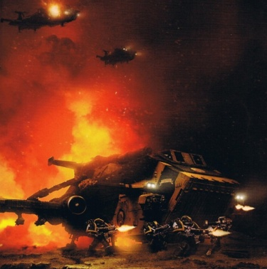
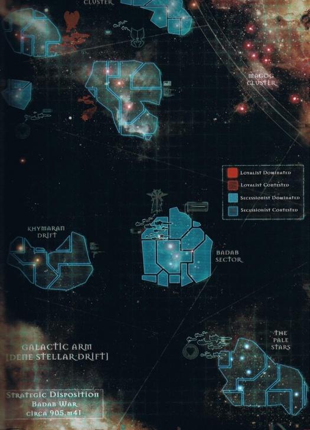
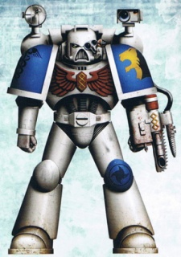

# 0826 901-912.M41 巴达布战争 Badab War

精校状态：中文行文已逐段精校，部分术语仍为暂定

分类：时间线

原文来源：https://www.bilibili.com/opus/1217723743600640033

原作者：帝国神选罐头

原文时间：编辑于 2026年07月04日 13:27

[返回分类目录](目录.md) · [全书目录](../../目录.md)

<!-- A0826-B0001 -->
**英文原文**

The Badab War is the name given to one of the most serious rebellions in recent Imperial history. While the conflict is named for a planet (or system of the same name), the war actually took place throughout the several sectors of Imperial space known as the Maelstrom Zone. The war saw four entire Space Marine Chapters secede and rebel against the Imperium.

<!-- /A0826-B0001 -->

<!-- A0826-B0002 -->

原译文

巴达布战争是近代帝国历史上最严重的叛乱之一。虽然这场冲突是以一颗行星（或同名星系）命名的，但战争实际上发生在帝国空域中被称为大漩涡区的几个星区。战争中，四个完整的星际战士战团脱离并反抗帝国。

**校订译文**

巴达布战争是帝国近代史上最严重的叛乱之一。战争虽以巴达布行星及其同名星系命名，实际却遍及统称“大漩涡区”的数个帝国星区。四个完整的星际战士战团在此脱离并反抗帝国。

<!-- /A0826-B0002 -->

<!-- A0826-B0003 -->
**英文原文**

The Badab War is notable for several reasons; the leader of the rebellious forces, Lugft Huron, would survive the end of the war and return to trouble Imperial space once more as the Chaos-aligned warlord known as Huron Blackheart, while the conflict itself involved a significant number of warring Space Marine Chapters as the primary participants.

<!-- /A0826-B0003 -->

<!-- A0826-B0004 -->

原译文

巴达布战争值得注意的原因有几个；叛乱部队的领袖鲁夫特·休伦将在战争结束后幸存下来，并作为与混沌结盟的军阀休伦·黑心再次回到帝国空域，而冲突本身涉及大量交战的星际战士战团作为主要参与者。

**校订译文**

这场战争有几处尤为特殊：交战主力是数量众多、彼此敌对的星际战士战团；叛军领袖鲁夫特·休伦则在战败后幸存，后来以投身混沌的军阀“休伦·黑心”之名，再次祸乱帝国。

<!-- /A0826-B0004 -->

<!-- A0826-B0005 -->
**英文原文**

While the war is officially reckoned to have lasted between 901 and 912.M41, outright warfare did not break out until 904, while the situation that led to the Badab War began much, much earlier.

<!-- /A0826-B0005 -->

<!-- A0826-B0006 -->

原译文

虽然官方估计这场战争持续从901至912.M41，直到904才爆发全面战争，而导致巴达布战争的局势开始得早得多。

**校订译文**

官方将巴达布战争定为 901—912.M41，但全面交战直到 904.M41 才爆发，而酿成战争的矛盾则积累得更早。

<!-- /A0826-B0006 -->

<!-- A0826-B0007 图片 -->

<!-- A0826-B0008 -->

原译文

Space Marine forces of the Red Scorpions advance during the Badab War 巴达布战争期间红蝎星际战士部队前进

**校订译文**

Space Marine forces of the Red Scorpions advance during the Badab War 巴达布战争期间红蝎星际战士部队前进

<!-- /A0826-B0008 -->

<!-- A0826-B0009 -->
**英文原文**

Date:901-912.M41

<!-- /A0826-B0009 -->

<!-- A0826-B0010 -->

原译文

日期：901-912.M41

**校订译文**

日期：901-912.M41

<!-- /A0826-B0010 -->

<!-- A0826-B0011 -->
**英文原文**

Location:The Maelstrom

<!-- /A0826-B0011 -->

<!-- A0826-B0012 -->

原译文

地点：大漩涡

**校订译文**

地点：大漩涡

<!-- /A0826-B0012 -->

<!-- A0826-B0013 -->
**英文原文**

Outcome:Imperial victory

<!-- /A0826-B0013 -->

<!-- A0826-B0014 -->

原译文

结果：帝国胜利

**校订译文**

结果：帝国胜利

<!-- /A0826-B0014 -->

<!-- A0826-B0015 -->
**英文原文**

Combatants:Badab Secessionists/Imperium

<!-- /A0826-B0015 -->

<!-- A0826-B0016 -->

原译文

作战方：巴达布分离主义者/帝国

**校订译文**

作战方：巴达布分离主义者/帝国

<!-- /A0826-B0016 -->

<!-- A0826-B0017 -->
**英文原文**

Commanders:Tyrant of Badab Lugft Huron (WIA), Chapter Master Yarvan Sartaq (KIA), Chapter Master Khoisan Neotera, Chief Librarian Ahazra Redth, Chapter Master Malakim Phoros (MIA), Chapter Master Arkash Hakkon, Reclusiarch Thulsa Kane/Lord Commander Verant Ortys (KIA), Legate-Inquisitor Jarndyce Frain, Commander Carab Culln, Commander Asterion Moloc, Commander Tyberos the Red Wake, Commander Lazaerek, Captain Pellas Mir'san, Reclusiarch Ivanus Enkomi, Captain Silas Alberec, Captain Zhrukal Androcles (KIA), Captain Vaylund Cal, Chapter Master Corwin Admatha (KIA)

<!-- /A0826-B0017 -->

<!-- A0826-B0018 -->

原译文

指挥官：巴达布暴君鲁夫特·休伦(WIA)，战团长亚尔文·萨尔塔克(KIA)，战团长科伊桑·尼奥特拉，首席智库阿哈兹拉·雷德斯，战团长马拉金·福罗斯(MIA)，战团长阿卡什·哈肯，隐修长图萨·凯恩/领主指挥官韦朗特·奥尔蒂斯(KIA)，使节审判官贾代斯·弗兰，指挥官卡拉布·库伦，指挥官阿斯特里昂·莫洛克，指挥官红色尾流泰伯鲁斯，指挥官拉扎雷克，连长佩拉斯·米尔'桑，隐修长伊万努斯·恩科米，连长西拉斯·阿尔伯莱克，连长兹鲁卡尔·安德罗克勒斯(KIA)，连长维伦德·卡尔，战团长科尔温·阿德玛塔(KIA)

**校订译文**

指挥官：巴达布暴君鲁夫特·休伦（负伤）、战团长亚尔文·萨尔塔克（阵亡）、战团长科伊桑·尼奥泰拉、首席智库员阿哈兹拉·雷德斯、战团长马拉金·福罗斯（失踪）、战团长阿卡什·哈肯、隐修长塔尔萨·凯恩／领主指挥官韦朗特·奥尔蒂斯（阵亡）、使节审判官贾代斯·弗兰、指挥官卡拉布·库伦、指挥官阿斯忒里昂·摩洛克、指挥官“红色尾流”泰伯鲁斯、指挥官拉扎雷克、佩拉斯·米尔’杉连长、隐修长伊万努斯·恩科米、西拉斯·阿尔伯莱克连长、兹鲁卡尔·安德罗克勒斯连长（阵亡）、维兰德·卡尔连长、战团长科尔温·阿德玛塔（阵亡）

<!-- /A0826-B0018 -->

<!-- A0826-B0019 -->
**英文原文**

Strength:Astral Claws, Lamenters, Executioners, Mantis Warriors, Tyrant's Legion, Battlefleet Maelstrom/Fire Hawks (Entire Chapter), Marines Errant (6 Companies), Red Scorpions (8 Companies), Raptors (4 Companies), Salamanders, Fire Angels (Entire Chapter), Novamarines (2 Companies), Howling Griffons (~250), Sons of Medusa (6 Companies), Exorcists (5 Companies), Minotaurs (Entire Chapter), Star Phantoms (Entire Chapter), Carcharodons, Battlefleet Karthargo, Battlefleet Solar Reserves, Inquisitiorial Stormtroopers, Ordo Hereticus

<!-- /A0826-B0019 -->

<!-- A0826-B0020 -->

原译文

力量：星辰之爪，恸哭者，处刑者，螳螂勇士，暴君军团，大漩涡战斗舰队/火鹰（整个战团），游侠战士（六个连队），红蝎（八个连队），猛禽（四个连队），火蜥蜴，火焰天使（整个战团），新星战士（两个连队），咆哮狮鹫（约250人），美杜莎之子（六个连队），驱魔者（五个连队），米诺陶（整个战团），星辰幻影（整个战团），噬人鲨，卡塔尔戈战斗舰队，太阳舰队预备队，审判庭风暴兵，讨逆修会

**校订译文**

兵力：星辰之爪、恸哭者、处刑者、螳螂勇士、暴君军团、大漩涡战斗舰队／火鹰全团、游侠战士六个连、红蝎八个连、猛禽四个连、火蜥蜴、火焰天使全团、新星战士两个连、咆哮狮鹫约二百五十人、美杜莎之子六个连、驱魔者五个连、米诺陶全团、星辰幻影全团、噬人鲨、卡尔塔戈战斗舰队、太阳战斗舰队预备队、审判庭风暴兵、异端审判庭

<!-- /A0826-B0020 -->

<!-- A0826-B0021 -->
**英文原文**

Casualties:Majority of Astral Claws, Heavy among Lamenters, Executioners & Mantis Warriors/Heavy

<!-- /A0826-B0021 -->

<!-- A0826-B0022 -->

原译文

伤亡：大部分星辰之爪，在恸哭者、处刑者和螳螂勇士中重大/重大

**校订译文**

伤亡：星辰之爪大部覆灭，恸哭者、处刑者与螳螂勇士损失惨重／惨重

<!-- /A0826-B0022 -->

<!-- A0826-B0023 -->
## History 历史

<!-- /A0826-B0023 -->

<!-- A0826-B0024 -->
**英文原文**

Imperial records of the Badab War are subject to an Edict of Obliteration and are therefore fragmentary and occasionally contradictory. Despite this, a large amount of information on the subject remains in existence, although principally concentrated in an assemblage held 'off the record' by the Ordo Hereticus.

<!-- /A0826-B0024 -->

<!-- A0826-B0025 -->

原译文

巴达布战争的帝国记录受灭迹法令的约束，因此是零碎的，偶尔是矛盾的。尽管如此，关于这个主题的大量信息仍然存在，尽管主要集中在讨逆修会“非公开”的集合中。

**校订译文**

巴达布战争的帝国档案受灭迹法令管制，因而残缺零散，偶尔互相矛盾。尽管如此，仍有大量资料留存，主要集中在异端审判庭秘密保有的一批不列入正式记录的档案中。

<!-- /A0826-B0025 -->

<!-- A0826-B0026 -->
## The Badab Schism 巴达布分裂

<!-- /A0826-B0026 -->

<!-- A0826-B0027 -->
**英文原文**

Badab's self-appointed planetary governor was Lugft Huron, holder of the self-given title "Tyrant of Badab". Huron had taken this role following a failed coup exacted against the previous ruler of the planet in the year 718.M41, appointing himself to ensure no further threat could manifest against the world. For Badab was not just an important world in its own right, it was also an Adeptus Astartes recruiting world of Huron's own chapter, the Astral Claws.

<!-- /A0826-B0027 -->

<!-- A0826-B0028 -->

原译文

巴达布自封的行星总督是鲁夫特·休伦，他自称“巴达布暴君”。休伦是在718.M41行星上的前任统治者发动政变失败后担任这一角色的，他任命自己来确保不会对世界构成进一步的威胁。因为巴达布不仅本身就是一个重要的世界，它也是休伦自己的星辰之爪战团的阿斯塔特修会招募世界。

**校订译文**

鲁夫特·休伦自任巴达布行星总督，自封“巴达布暴君”。718.M41，一场针对原统治者的政变失败后，他接管这一职务，声称要确保该世界不再遭受威胁。巴达布本就是重要世界，同时也是他所率星辰之爪战团的征兵地。

**校注：** failed coup ... against the previous ruler 指政变针对原统治者，原译错误地让原统治者成为发动政变者。

<!-- /A0826-B0028 -->

<!-- A0826-B0029 -->
**英文原文**

Not settling for assuming control of a single planet, Huron declared that the entire Badab sector was now his to govern "to better protect them in the glory of the Emperor." Such an event was not without precedent—the Ultramarines overlordship of the Ultramar sector being the most famous example—but it could still be considered questionable in some circles.

<!-- /A0826-B0029 -->

<!-- A0826-B0030 -->

原译文

休伦并不满足于控制一颗行星，他宣布整个巴达布星区现在都由他来管理，“为了在帝皇的荣耀中更好地保护他们”。这样的事件并非没有先例 — 奥特拉玛星区的极限战士霸权就是最著名的例子 — 但在一些圈子里，这仍然是值得怀疑的。

**校订译文**

休伦不满足于掌握一颗行星，进而宣布整个巴达布星区都归自己统治，理由是“在帝皇荣光下，更好地保护这些世界”。星际战士直接统辖星区并非没有先例——极限战士统治奥特拉玛便是最著名的例子——但某些帝国人士仍认为此举值得质疑。

<!-- /A0826-B0030 -->

<!-- A0826-B0031 -->
**英文原文**

However, Huron was at this point a famed Astartes commander, known throughout the Maelstrom Zone and even beyond as a highly capable warrior and leader determined to protect the region over which he watched. Huron and the Astral Claws were the preeminent part of an organisation created by the High Lords of Terra themselves: the Maelstrom Warders, a group of Space Marine chapters permanently assigned to the Maelstrom Zone as its guardians and protectors. As a result, Huron's role as the Tyrant of Badab was not in itself the cause of the war, although it was an indication of departures from behaviour normally expected of a Space Marine commander that would only grow worse.

<!-- /A0826-B0031 -->

<!-- A0826-B0032 -->

原译文

然而，在这一点上，休伦是一位著名的阿斯塔特指挥官，在整个大漩涡区甚至更远的地方都是一位非常有能力的战士和领导者，他决心保护他所监视的地区。休伦和星辰之爪是由泰拉高领主自己创建的一个组织的杰出组成部分：大漩涡看守者，这是一组永久分配给大漩涡区作为其守护者和保护者的星际战士战团。因此，休伦作为巴达布暴君的角色本身并不是战争的原因，尽管这表明星际战士指挥官的行为偏离了通常的预期，只会变得更糟。

**校订译文**

当时，休伦仍是声名显赫的阿斯塔特指挥官。大漩涡区内外都将他视为能力卓绝、决心守护辖境的战士与领袖。他与星辰之爪也是“大漩涡看守者”的核心力量：这一组织由泰拉高领主亲自设立，将数个星际战士战团永久派驻当地，承担守护职责。因此，自封巴达布暴君本身并非战争的直接起因，却表明休伦开始偏离通常对星际战士统帅的行为要求；这种偏离后来愈演愈烈。

<!-- /A0826-B0032 -->

<!-- A0826-B0033 -->
**英文原文**

Some Imperial records of the Badab War point to Huron's withholding of the gene-seed tithe to the Adeptus Mechanicus as the slow fuse that began the conflict. However, sequestered Inquisitorial records reveal that Huron withheld tithes not just from the Mechanicus: in 748.M41, he chose to begin retaining nearly all of the resources available to him. It has since become clear that this was a response to the refusal of Huron's proposal that the entire Maelstrom Zone be the subject of a Crusade planned, and presumably led, by himself. The High Lords dismissed Huron's plan because Imperial forces were needed elsewhere at that time. Determined to secure the entirety of the Maelstrom Zone and to raise the forces required to do it himself, Huron began to hoard not only the planetary tithes of the Badab sector, but to block or restrict trade routes throughout local space, citing security reasons as his motivation.

<!-- /A0826-B0033 -->

<!-- A0826-B0034 -->

原译文

一些关于巴达布战争的帝国记录指出，休伦将给机械神教的基因种子什一税扣留，是引发冲突的缓慢导火索。然而，被扣押的审判庭记录显示，休伦不仅向机械神教扣留了什一税：在748.M41，他选择开始保留几乎所有可用的资源。从那以后，很明显，这是对休伦的提议被拒绝的回应，休伦的建议是，整个大漩涡区都由他策划并领导可能的远征。高领主驳回了休伦的计划，因为当时其他地方需要帝国部队。为了确保整个大漩涡区的安全，并提高自己所需的兵力，休伦不仅开始囤积巴达布星区的行星什一税，还以安全为由，封锁或限制整个当地空域的贸易路线。

**校订译文**

部分帝国记录将休伦扣留应向机械修会缴纳的基因种子什一税，视为逐渐引燃战争的导火索。然而，封存的审判庭档案表明，他扣下的远不止这一项：748.M41，休伦开始截留几乎所有能掌握的资源。后来人们才明白，这是他对远征提案遭拒的回应。他原本计划对整个大漩涡区展开远征，并很可能由自己指挥，但高领主认为其他战场更需要兵力，驳回了请求。休伦决心凭一己之力肃清大漩涡区，组建所需大军，因此不仅囤积巴达布星区的行星什一税，还以安全为由封锁、限制本地贸易航路。

**校注：** sequestered records 为封存、隔离保管的档案，不必然是被扣押；presumably led by himself保留推测。

<!-- /A0826-B0034 -->

<!-- A0826-B0035 -->
**英文原文**

Huron's activity did not cause any great concern in the various senior Imperial circles for some time; Astartes' laxity in delivering their gene-seed tithes was not exactly a new occurrence, and seeing as Huron's tithes were delivered to the Administratum through the "middle-men" of the Karthago Sector, no-one in particular high authority was disturbed by the slackening off of Badab resources.

<!-- /A0826-B0035 -->

<!-- A0826-B0036 -->

原译文

休伦的活动在一段时间内没有引起帝国高层的太大关注；阿斯塔特在提供基因种子什一税方面的松懈并不是一个新现象，鉴于休伦的什一税是通过卡尔塔戈星区的“中间人”交付给内务部的，没有人特别对巴达布资源的减少感到不安。

**校订译文**

一段时间里，帝国高层并未特别在意休伦的举动。阿斯塔特拖延缴纳基因种子什一税，并不是什么新鲜事；巴达布的其他税款又需经卡尔塔戈星区这一“中间人”转交内政部，资源输送减少也就没有立即惊动最高层。

<!-- /A0826-B0036 -->

<!-- A0826-B0037 -->
**英文原文**

The trade lords of the Karthargo sector themselves, however, were most disturbed by the development. Holding the charter to receive and then distribute tithes and trade from the Maelstrom Zone, Huron's actions put them in both a growing economic vice and in danger of eventually incurring the ire of the Adminstratum Segmentum Procurator-General, who did not care about the reasons behind shortfall, only that there was a shortfall in the first place.

<!-- /A0826-B0037 -->

<!-- A0826-B0038 -->

原译文

然而，卡尔塔戈星区的贸易领主们自己对这一发展最为不安。休伦持有从大漩涡区接收和分配什一税和贸易的特许状，他的行为使他们陷入日益严重的经济困境，并有可能最终招致内务部星域总检察长的愤怒，他不关心短缺背后的原因，只关心首先存在短缺。

**校订译文**

卡尔塔戈的贸易领主们却深感不安。他们持有接收、分配大漩涡区什一税与贸易的特许权；休伦的行为既让他们日益陷入经济困境，也可能招致内政部星域总检察长的怒火。这名高官不在乎短缺的缘由，只在乎是否足额上缴。

**校注：** 持有特许状者是卡尔塔戈贸易领主，非休伦。Segmentum Procurator-General暂沿原“星域总检察长”，具体帝国职衔待核，不套现实官制认证。

<!-- /A0826-B0038 -->

<!-- A0826-B0039 -->
**英文原文**

Despite this, Huron suffered no particular censure from any Imperial body for almost the next 150 years.

<!-- /A0826-B0039 -->

<!-- A0826-B0040 -->

原译文

尽管如此，休伦在接下来的150年里几乎没有受到任何帝国机构的特别谴责。

**校订译文**

尽管如此，在随后近一百五十年里，休伦并未受到帝国机构的实质谴责。

<!-- /A0826-B0040 -->

<!-- A0826-B0041 -->
## Tithes, Pirates and Secession 什一税，海盗和分裂

<!-- /A0826-B0041 -->

<!-- A0826-B0042 -->
**英文原文**

It has been said that only two things in life are certain: death and taxes. In the Imperium of Man, these certainties are often unassailably linked. In the year 901.M41, Lugft Huron found the taxman at his door. A mixed Imperial Tithe Fleet, made up of Karthargan trade vessels and Mechanicus Magos Biologis ships as well as three Imperial cruisers, warped into the Badab system and summarily demanded their due. Refusing to meet the requests of the Badab Naval forces to heave-to at the edge of the system and proclaiming their Imperial authority, the Tithe Fleet powered in-system, and in circumstances not fully explained, was fired upon and completely destroyed.

<!-- /A0826-B0042 -->

<!-- A0826-B0043 -->

原译文

有人说，生活中只有两件事是确定的：死亡和纳税。在人类帝国中，这些确定性往往是无懈可击的。901.M41，鲁夫特·休伦在他门口发现了税务员。一支由卡尔塔甘贸易战舰和机械教生物贤者舰船以及三艘帝国巡洋舰组成的混合帝国什一税舰队，亚空间跳跃到巴达布星区，并立即要求得到他们应有的。拒绝满足巴达布海军部队在星系边缘的要求，并宣布他们的帝国权威，在没有充分解释的情况下，什一税舰队在星系中快速前进，遭到射击并完全被摧毁。

**校订译文**

俗话说，世上唯有死亡与纳税不可避免；在人类帝国，两者往往更是密不可分。901.M41，税官终于找上鲁夫特·休伦。一支由卡尔塔戈商船、机械修会生物贤者的舰船及三艘帝国巡洋舰组成的联合征税舰队，跃入巴达布星系，要求立即缴清欠税。巴达布海军命其在星系边缘停航，舰队却拒绝服从，宣称拥有帝国授权，继续向内推进。随后，在至今未完全查明的情况下，舰队遭到攻击，全军覆没。

**校注：** heave-to 是停航待命，引航要求不可漏；Badab system为星系，非星区。商船不是“贸易战舰”。

<!-- /A0826-B0043 -->

<!-- A0826-B0044 -->
**英文原文**

Huron maintained that the Tithe Fleet refused to follow pilot instructions and threatened him with violence and was therefore treated as a hostile force, as was his right. The Karthagans were outraged at this and at the laggardly speed at which the Adeptus Terra seemed to be moving to investigate the matter. They sent two punitive fleets into the Maelstrom Zone over the next two years, but both disappeared without trace. At roughly the same time raider and pirate attacks in the Zone increased, further disrupting trade, and it was onto these forces that the Karthargan losses were blamed.

<!-- /A0826-B0044 -->

<!-- A0826-B0045 -->

原译文

休伦坚称，什一税舰队拒绝听从领航员的指示，并以暴力威胁他，因此被视为敌对部队，这是他的权利。卡尔塔甘人对此感到愤怒，并对中央政务部似乎正在调查此事的缓慢速度感到愤怒。在接下来的两年里，他们向大漩涡区派遣了两支惩罚舰队，但都消失得无影无踪。大约在同一时间，区域的袭击者和海盗袭击事件增加，进一步扰乱了贸易，卡尔塔甘的损失被归咎于这些部队。

**校订译文**

休伦坚称，征税舰队不服从引航指令，还以武力威胁自己，因此他有权将其视为敌军。卡尔塔戈人怒不可遏，对中央政务部迟迟不肯迅速调查同样不满。接下来两年，他们派出两支惩戒舰队进入大漩涡区，却都消失得无影无踪。几乎同时，当地袭掠与海盗活动增多，贸易更加混乱；卡尔塔戈舰队的损失于是被归咎于这些袭击者。

<!-- /A0826-B0045 -->

<!-- A0826-B0046 -->
**英文原文**

Huron responded to the Karthagan attitude, along with the Mechanicus involvement in the initial Tithe Fleet, as though he were being persecuted. Calling a conclave with the other Maelstrom Warders, the Lamenters and Mantis Warriors Adeptus Astartes chapters, he created his Articles of Just Seccession, which laid out his intention to separate the Maelstrom Zone from any tie to neighbouring sectors of space. Complaining of the imposition made upon him and the Warders by the authorities of such sectors, he proclaimed that the Emperor-given rights of the Space Marines placed them beyond such concerns. Notably, Huron's document promised that he and the Warders would continue their holy work of guarding the Maelstrom Zone from anti-Imperial threats.

<!-- /A0826-B0046 -->

<!-- A0826-B0047 -->

原译文

休伦回应了卡尔塔甘的态度，以及机械教参与最初的什一税舰队，就好像他受到了迫害。他与其他大漩涡看守者、恸哭者和螳螂勇士阿斯塔特修会战团召开了一次秘密会议，并撰写了公正割据条款，阐明了他将大漩涡区与邻近太空区域的任何联系分开的意图。他抱怨这些星区的当局强加给他和看守者，宣称帝皇赋予星际战士的权利使他们无需担心。值得注意的是，休伦的文件承诺，他和看守者将继续他们的神圣工作，保护大漩涡区免受反帝国的威胁。

**校订译文**

面对卡尔塔戈人的敌意，以及机械修会参与先前征税舰队一事，休伦表现得仿佛自己受到迫害。他召集其余大漩涡看守者——恸哭者与螳螂勇士——举行会议，提出《公正割据条款》，宣布要切断大漩涡区与相邻星区之间的任何联系。他谴责邻区当局强加于看守者的负担，声称帝皇赋予星际战士的权利使他们不应受这些事务束缚。同时，文件承诺，他与看守者仍会履行神圣使命，保护大漩涡区免受反帝国势力侵害。

**校注：** 原文Just Seccession拼写有误，保留英文；中文沿原书《公正割据条款》。此时宣称割断邻区联系，未擅增已公开否认帝皇。

<!-- /A0826-B0047 -->

<!-- A0826-B0048 -->
**英文原文**

Absolutely incensed at Huron's actions, the Trade Lords of Karthargo began to complain about the affair to anyone who would listen. After being rebuffed by Ryza Naval Command and the Segmentum Procurator General, they eventually found the ear of the Fire Hawks Space Marine chapter, the only Imperial body prepared to get involved in what was to most still seen as an internal Administratum matter concerning the correct procedure for gathering the tithes of Badab.

<!-- /A0826-B0048 -->

<!-- A0826-B0049 -->

原译文

卡尔塔戈的贸易领主们对休伦的行为感到非常愤怒，开始向任何愿意倾听的人抱怨这件事。在遭到瑞扎海军指挥部和星域总检察长的拒绝后，他们最终找到了火鹰星际战士战团的耳朵，这是唯一一个准备参与的帝国机构，在大多数人看来，这仍然被视为一个关于收集巴达布什一税的正确程序的内务部内部事务。

**校订译文**

卡尔塔戈贸易领主四处控诉休伦的行为。在遭瑞扎海军指挥部与星域总检察长拒绝后，他们终于说动火鹰战团。大多数帝国机构仍把此事看作内政部内部关于巴达布税款征收程序的争执，只有火鹰愿意介入。

<!-- /A0826-B0049 -->

<!-- A0826-B0050 -->
## Flashpoint 导火索

原题：Flashpoint 闪点

<!-- /A0826-B0050 -->

<!-- A0826-B0051 -->
**英文原文**

In the year 904.M41, the Fire Hawks agreed to investigate the disappearance of the Kartagan punitive fleets earlier sent into the Maelstrom Zone. Shortly afterwards, a Fire Hawks vessel, the Red Harbinger, entered the Endymion Cluster, an area of the Zone controlled by the Mantis Warriors. Refusing to stand down and explain their presence when hailed by a Mantis Warriors naval force, the Red Harbinger was first crippled and then boarded by a detachment of the Mantis Warriors. The Fire Hawks refused to surrender themselves into the Mantis Warriors' authority and a fierce firefight broke out, resulting in defeat for the Fire Hawks.

<!-- /A0826-B0051 -->

<!-- A0826-B0052 -->

原译文

904.M41，火鹰同意调查早些时候派往大漩涡区的卡尔塔甘惩罚舰队的失踪事件。不久之后，一艘名为红色预兆号的火鹰战舰进入了由螳螂勇士控制的恩底弥翁星群。当受到螳螂勇士海军部队的招呼时，红色预兆号拒绝停下解释他们的存在，它先是被瘫痪，然后被螳螂勇士的一支分遣队跳帮。火鹰拒绝屈服于螳螂勇士的权威，爆发了激烈的交火，导致火鹰战败。

**校订译文**

904.M41，火鹰同意调查先前卡尔塔戈惩戒舰队失踪一事。不久，火鹰舰艇赤红先兆号进入螳螂勇士控制的恩底弥翁星群。螳螂勇士海军要求其停航、说明来意，赤红先兆号拒绝服从，随即被击伤瘫痪，并遭螳螂勇士分遣队跳帮。舰上火鹰拒绝接受对方管束，激战由此爆发，最终火鹰战败。

<!-- /A0826-B0052 -->

<!-- A0826-B0053 图片 -->

<!-- A0826-B0054 -->

原译文

The strategic situation during the Badab War 巴达布战争期间的战略形势

**校订译文**

The strategic situation during the Badab War 巴达布战争期间的战略形势

<!-- /A0826-B0054 -->

<!-- A0826-B0055 -->
**英文原文**

With this Astartes v. Astartes conflict, the Badab War had truly begun.

<!-- /A0826-B0055 -->

<!-- A0826-B0056 -->

原译文

随着这场阿斯塔特对战阿斯塔特的冲突，巴达布战争真正开始了

**校订译文**

阿斯塔特之间公开兵戎相见，巴达布战争至此真正爆发。

<!-- /A0826-B0056 -->

<!-- A0826-B0057 -->
## 904.M41

<!-- /A0826-B0057 -->

<!-- A0826-B0058 -->
**英文原文**

After a brief parley to return the Fire Hawks prisoners taken from the Red Harbinger, hostilities erupted in earnest. The Fire Hawks deployed their full chapter and fleet in an attempt to engage the Maelstrom Warders, but were regularly unable to bring the evasive Mantis Warriors to battle and simply did not have the strength to engage the system defences of Badab. Attempting to set a trap on the Mantis Warrior-protected world of Iblis III, the Fire Hawks were refused, with both the Mantis Warriors and the Astral Claws choosing instead to seize the border-world of Sagan III, securing resources and warp-routes further into the Zone. The disgusted Fire Hawks fire-bombed Iblis and destroyed the only Mars class battlecruiser of Battlefleet Maelstrom, the Sacred Tetrarch, in reply.

<!-- /A0826-B0058 -->

<!-- A0826-B0059 -->

原译文

在就归还从红色预兆号上俘获的火鹰战俘进行了短暂的谈判后，战争行动爆发了。火鹰部署了他们的整个战团和舰队，试图与大漩涡看守者交战，但经常无法将闪避的螳螂勇士带到战斗中，根本没有力量与巴达布的星系防御交战。火鹰试图在受螳螂勇士保护的伊布利斯三号世界设下陷阱，但遭到了拒绝，螳螂勇士和星辰之爪都选择夺取萨甘三号边境世界，以确保资源和进一步进入该区域的亚空间路线。作为回应，憎恶的火鹰对伊布利斯进行了轰炸，摧毁了大漩涡战斗舰队唯一的火星级战列巡洋舰神圣英杰号。

**校订译文**

双方曾短暂谈判，商议交还赤红先兆号上的火鹰俘虏，随后全面敌对行动展开。火鹰投入全战团与舰队，试图与大漩涡看守者决战，却始终难以迫使行踪灵活的螳螂勇士正面接战，又无力攻破巴达布星系防御。他们在螳螂勇士保护的伊布利斯三号设下陷阱，对方却不肯上钩；螳螂勇士与星辰之爪转而夺取边境世界萨甘三号，控制资源与通向大漩涡区深处的亚空间航路。恼怒的火鹰于是以燃烧弹轰炸伊布利斯，并摧毁大漩涡战斗舰队唯一的火星级战列巡洋舰神圣英杰号，作为报复。

**校注：** were refused 在此指对手不接战、不落入诱敌陷阱，并非正式拒绝某项请求。fire-bombed具体为燃烧轰炸。

<!-- /A0826-B0059 -->

<!-- A0826-B0060 -->
**英文原文**

The Fire Hawks were forced on the defensive, with the outnumbering Maelstrom Warders trying to oust the Fire Hawks from the Zone by main force. However, this was prevented when the Fire Hawks' request for aid was answered by the arrival of another Astartes chapter, the Marines Errant.

<!-- /A0826-B0060 -->

<!-- A0826-B0061 -->

原译文

火鹰被迫采取守势，压倒性人数的大漩涡看守者试图用主力将火鹰驱逐出该区域。然而，当火鹰的援助请求得到另一个阿斯塔特战团游侠战士的回应时，这种情况被阻止了。

**校订译文**

火鹰被迫转入守势，数量占优的大漩涡看守者企图以强攻将其逐出本区。幸而另一个阿斯塔特战团——游侠战士——响应求援赶到，才阻止了这一局面。

<!-- /A0826-B0061 -->

<!-- A0826-B0062 -->
**英文原文**

This reinforcement did not significantly change the fortunes of the Fire Hawks, as the Marines Errant, with their strong Strike Cruiser fleet elements, decided to use half of their forces to protect neutral Imperial shipping traveling through the Maelstrom Zone.

<!-- /A0826-B0062 -->

<!-- A0826-B0063 -->

原译文

这一增援并没有显著改变火鹰的命运，因为游侠战士及其强大的打击巡洋舰舰队成员决定使用一半的部队来保护穿越大漩涡区的中立帝国航运。

**校订译文**

然而，增援并未显著改善火鹰的处境。游侠战士拥有强大的打击巡洋舰编队，却决定将一半兵力用于保护穿行大漩涡区的中立帝国船只。

<!-- /A0826-B0063 -->

<!-- A0826-B0064 -->
**英文原文**

The impact of the Marines Errant was also blunted by their contacts with the similarly heavily fleet-based Lamenters; the Marines Errant and Lamenters were linked by honour-bonds forged in war as recently as the bitter Corinth Crusade of 698.M41 and were reluctant to fight each other. Both sides therefore satisfied themselves with desultory driving-off actions, much to the ire of their respective allies.

<!-- /A0826-B0064 -->

<!-- A0826-B0065 -->

原译文

游侠战士的影响也因他们与同样为舰基的恸哭者接触而减弱；游侠战士和恸哭者之间有着在698.M41年激烈的科林斯远征中建立的荣誉关系，他们不愿意相互战斗。因此，双方都满足于漫无目的的驱逐行动，这大大激怒了他们各自的盟友。

**校订译文**

游侠战士与同样依托舰队作战的恸哭者交锋时，也未能全力投入。两团曾在 698.M41 惨烈的科林斯远征等战役中结下荣誉之约，不愿彼此厮杀，因而都满足于零星驱逐行动，令各自盟友大为恼火。

**校注：** desultory为零星、缺乏持续性，不必然漫无目的；698.M41相对904相隔约两百年，原文as recently as的修辞未据此改动日期。

<!-- /A0826-B0065 -->

<!-- A0826-B0066 -->
**英文原文**

A further blow to the loyalist forces arrived not as a military force, but a piece of astropathic news; the Executioners chapter, blood-sworn to aid the Astral Claws in recognition of an earlier event, had elected to honour the debt, deciding to at least send a minimal but powerful force to the Zone.

<!-- /A0826-B0066 -->

<!-- A0826-B0067 -->

原译文

对忠诚派部队的进一步打击不是以军事部队的形式出现的，而是一条星语消息；处刑者战团，为了纪念早些时候的一件事，血誓帮助星辰之爪，选择履行债务，决定至少向该区域派遣一支最小但强大的部队。

**校订译文**

忠诚派随后又遭打击，这一次却来自星语消息：处刑者战团为报答星辰之爪过去的恩情，曾立下援助血誓，如今决定履约，至少派出一支规模虽小、战力却强的部队。

<!-- /A0826-B0067 -->

<!-- A0826-B0068 -->
**英文原文**

Towards the end of the year, Battlefleet Karthago and a small Marines Errant detachment was almost totally destroyed by a naval force of Astral Claws and Lamenters; the Star Jackal of the Marines Errant was the only capital ship that managed to escape. With the destruction of much of their fleet, the Trade Lords' active role in the Badab War was effectively over.

<!-- /A0826-B0068 -->

<!-- A0826-B0069 -->

原译文

到年底，卡尔塔戈战斗舰队和一支游侠战士小分遣队几乎完全被星辰之爪和恸哭者的海军部队摧毁；游侠战士的星辰豺狼号是唯一一艘成功逃脱的主力舰。随着他们舰队的大部分被摧毁，贸易领主在巴达布战争中的积极作用实际上已经结束。

**校订译文**

年底，卡尔塔戈战斗舰队与一支游侠战士小型分遣队，几乎被星辰之爪和恸哭者的联合舰队全歼。只有游侠战士的星辰豺狼号成功逃脱，是唯一幸存的主力舰。大部分舰艇被毁后，贸易领主已基本失去继续主动干预战争的能力。

<!-- /A0826-B0069 -->

<!-- A0826-B0070 -->
**英文原文**

The Marines Errant were further weakened when they were engaged by the Mantis Warriors upon the surface of Bellerophon's Fall, where the Mantis Warriors were able to surgically excise their command structure. With the deaths of their Chapter Master and two Company Captains, the Marines Errant went into retreat.

<!-- /A0826-B0070 -->

<!-- A0826-B0071 -->

原译文

当游侠战士在柏勒罗丰之陨的表面与螳螂勇士交战时，他们的力量进一步被削弱，螳螂勇士在那里能够通过手术打击切除他们的指挥结构。随着他们的战团长和两名连队连长的死亡，游侠战士撤退了。

**校订译文**

游侠战士随后在柏勒罗丰之陨地表遭遇螳螂勇士，实力再次受损。螳螂勇士以精准打击摧毁其指挥体系，杀死战团长与两名连长，迫使游侠战士撤退。

<!-- /A0826-B0071 -->

<!-- A0826-B0072 -->
## 905.M41

<!-- /A0826-B0072 -->

<!-- A0826-B0073 -->
**英文原文**

With Space Marines now fighting each other in open warfare, the High Lords of Terra finally deigned to notice the situation in the Maelstrom Zone. They responded by dispatching a sizable task-force of Naval vessels from the Segmentum Solar reserve, Administratum Auditors, and last but not least, envoys of the Inquisition. Determined to root out the cause of the fighting, this task-force first demanded that all participants cease fire and the Secessionists surrender for questioning. When this demand was rejected by Lugft Huron, the task-force declared that the Secessionist Chapter Masters were to be arrested and that their rights and resources were forfeit.

<!-- /A0826-B0073 -->

<!-- A0826-B0074 -->

原译文

随着星际战士现在在公开战争中相互作战，泰拉高领主终于屈尊注意到了大漩涡区的情况。作为回应，他们从太阳星域预备队派遣了一支庞大的海军战舰特遣部队、内务部审计员，以及最后但并非最不重要的审判庭代表。该特遣部队决心铲除战斗的根源，首先要求所有参与者停火，分离主义者投降接受询问。当这一要求被鲁夫特·休伦拒绝时，特遣部队宣布将逮捕分离主义战团长，并没收他们的权利和资源。

**校订译文**

星际战士公开互相交战，泰拉高领主终于肯正视大漩涡区的局势。他们从太阳星域预备队抽调海军舰艇，连同内政部审计员，以及至关重要的审判庭使节，组成规模可观的特遣队。特遣队决心查明冲突根源，先要求所有参战者停火，分离派缴械接受质询。休伦拒绝后，特遣队宣布逮捕分离派战团长，剥夺其权利，没收其资源。

<!-- /A0826-B0074 -->

<!-- A0826-B0075 -->
**英文原文**

The Terran Legates spent the best part of the year assembling the forces they deemed necessary to eliminate the Secessionist threat. Calling in the Astartes of the Red Scorpions, Raptors, Salamanders and Fire Angels chapters, a powerful retribution force was soon ready to take part in the war. The Marines Errant and the Fire Hawks were ordered to stand down for questioning, a process that would take the better part of a year, an order the Fire Hawks chose to follow only after they carried out the vindictive fire-bombing of Sacristan, a Mantis Warrior world in the Endymion Cluster.

<!-- /A0826-B0075 -->

<!-- A0826-B0076 -->

原译文

泰拉使节在一年中的大部分时间里都在集结他们认为消除分离主义威胁所必需的部队。在红蝎、猛禽、火蜥蜴和火焰天使的战团的阿斯塔特中，一支强大的惩罚部队很快就准备好参加战争。游侠战士和火鹰被命令退场接受询问，这一过程将花费一年多的时间，火鹰只有在对恩底弥翁星群中的螳螂勇士世界萨克里斯坦进行报复性火力轰炸后才选择遵循这一命令。

**校订译文**

泰拉使节用去这一年的大部分时间，集结足以消灭分离派的兵力。红蝎、猛禽、火蜥蜴与火焰天使应召而来，一支强大的惩戒大军随即成形。游侠战士与火鹰则奉命暂停作战、接受调查，这一过程又将耗去大半年的时间。火鹰却先对恩底弥翁星群中、由螳螂勇士保护的萨克里斯坦发动报复性燃烧轰炸，之后才服从命令。

**校注：** the better part of a year 是一年中的大部分时间，不是“一年多”。

<!-- /A0826-B0076 -->

<!-- A0826-B0077 -->
**英文原文**

As for the Trade Lords, a full Inquisitorial investigation found them guilty of multiple crimes and sentenced the entire population of their principal world to six generations of indentured servitude.

<!-- /A0826-B0077 -->

<!-- A0826-B0078 -->

原译文

至于贸易领主，一项全面的审判庭调查发现他们犯有多项罪行，并判处其主要世界的全体人口六代契约奴役。

**校订译文**

审判庭全面调查后，也认定贸易领主犯有多项罪行，并判处其首要世界的全体居民承受六代契约奴役。

<!-- /A0826-B0078 -->

<!-- A0826-B0079 -->
## 906.M41

<!-- /A0826-B0079 -->

<!-- A0826-B0080 -->
**英文原文**

The largest naval battle of the war so far, the Battle of Silent Reach, took place at the beginning of the year, when the combined fleets of the Red Scorpions and the Segmentum Solar Reserve met that of the Lamenters and Battlefleet Maelstrom. Despite the size of the clash, it led to relatively few destroyed vessels and was considered inconclusive. The only serious loss was the destruction of the Battlefleet Maelstrom flagship, the Oberon class Gauntlet of Wrath.

<!-- /A0826-B0080 -->

<!-- A0826-B0081 -->

原译文

到目前为止，这场战争中最大的海战，寂静河段之战，发生在年初，当时红蝎和太阳星域预备队的联合舰队与恸哭者和大漩涡战斗舰队相遇。尽管冲突规模很大，但被摧毁的战舰相对较少，被认为没有定论。唯一严重的损失是大漩涡战斗舰队旗舰，奥伯龙级愤怒臂铠号的摧毁。

**校订译文**

年初，红蝎与太阳星域预备队的联合舰队遭遇恸哭者及大漩涡战斗舰队，爆发了战争迄今最大规模的太空海战——寂静河段之战。尽管规模庞大，被毁舰艇却相对较少，双方未分胜负。唯一重大的损失，是大漩涡战斗舰队旗舰、天卫四级战列舰愤怒臂铠号被摧毁。

<!-- /A0826-B0081 -->

<!-- A0826-B0082 -->
**英文原文**

Following this, the appointed Imperial Commander of the loyalist force, Ortys of the Red Scorpions, led forces from his own chapter as well as from the Marines Errant and newly arrived Novamarines to assault the important world of Vyaniah. The loyalist forces were unexpectedly rebuffed by the defending Tyrant's Legion forces, although the kill ratio was estimated to be 178-to-1 in favour of the loyalists.

<!-- /A0826-B0082 -->

<!-- A0826-B0083 -->

原译文

在此之后，被任命为忠诚派部队的帝国指挥官，红蝎的奥尔蒂斯，率领他自己的部队以及游侠战士和新抵达的新星战士袭击了重要的维亚尼亚世界。忠诚派部队意外地遭到了防守的暴君军团部队的阻碍，尽管据估计，忠诚派的杀伤率为178:1。

**校订译文**

随后，获任忠诚派总指挥的红蝎指挥官奥尔蒂斯，率本战团、游侠战士及新抵达的新星战士，进攻重要世界维亚尼亚。尽管据估算，忠诚派与守军的杀敌交换比达到 178∶1，进攻仍意外地被防守的暴君军团击退。

**校注：** 178-to-1 in favour of loyalists 指每损失一人约击杀178名敌军；即便杀敌有利，仍被击退，保留原文反差。

<!-- /A0826-B0083 -->

<!-- A0826-B0084 -->
**英文原文**

A second blow at this time was the arrival of the long-expected Executioners, who proved adept at performing powerful hit-and-run attacks upon Imperial installations. However, the sudden surge of loyalist Astartes into the sector, as well as the return to active duty of the cleared Fire Hawks and Marines Errant, meant that despite their losses, the loyalists had secured a stalemate in the war for the Maelstrom Zone. The Minotaurs also fought at Vyaniah, making use of a drop pod assault.

<!-- /A0826-B0084 -->

<!-- A0826-B0085 -->

原译文

此时的第二个打击是期待已久的处刑者的到来，他们被证明擅长对帝国设施进行强大的跑打攻击。然而，忠诚派阿斯塔特突然涌入该星区，以及被清除的火鹰和游侠战士重返现役，意味着尽管他们遭受了损失，但忠诚派在大漩涡区的战争中仍陷入僵局。米诺陶也在维亚尼亚作战，使用空投舱突击。

**校订译文**

久候的处刑者此时抵达，给忠诚派带来第二记打击。他们擅长以猛烈的突袭攻击帝国设施，得手即撤。不过，大量忠诚派阿斯塔特涌入星区，加上洗清嫌疑的火鹰与游侠战士重返战场，终于使忠诚派虽有损失，仍能稳住局面，将战争拖入僵持。米诺陶也在维亚尼亚参战，以空降舱发动突击。

**校注：** cleared在接受审查后指洗清嫌疑，不是遭清除；hit-and-run为打了就走的袭扰战术。

<!-- /A0826-B0085 -->

<!-- A0826-B0086 -->
**英文原文**

An attempt to break the situation was made when Lugft Huron unexpectedly proposed parley. Agreeing to his terms, Commander Ortys agreed to meet with Huron and Chapter Master Sartaq of the Mantis Warriors aboard a run-down way-station in orbit of the planet Shadim in the Grief system. This event is known to the Loyalists as the Betrayal at Grief. In circumstances not fully understood, the parley was disrupted by a third party force of apparent Chaos origin and in the subsequent free-for-all combat both Loyalist Chapter Masters Ortys and Secessionist Chapter Master Sartaq were killed by Chaos forces.

<!-- /A0826-B0086 -->

<!-- A0826-B0087 -->

原译文

当鲁夫特·休伦出人意料地提出谈判时，有人试图打破这种局面。奥尔蒂斯指挥官同意了他的条件，同意在格里夫星系的沙迪姆行星轨道上的一个破败的中转站上会见休伦和螳螂勇士的战团长萨尔塔克。这一事件被忠诚派称为格里夫背叛。在尚不完全清楚的情况下，谈判被一支明显起源于混沌的第三方部队扰乱，在随后的混战中，忠诚派战团长奥尔蒂斯和分离主义战团长萨尔塔克都被混沌部队杀害。

**校订译文**

休伦出人意料地提出谈判，试图打破僵局。奥尔蒂斯接受条件，同意在格里夫星系沙迪姆行星轨道的一座破旧中转站，会见休伦与螳螂勇士战团长萨尔塔克。忠诚派后来将此事称为“格里夫背叛事件”。当时的具体情形仍不明朗：一支疑似来自混沌的第三方武装打断谈判，随后各方陷入混战；忠诚派战团长奥尔蒂斯与分离派战团长萨尔塔克均被混沌部队杀害。

<!-- /A0826-B0087 -->

<!-- A0826-B0088 -->
**英文原文**

The death of Ortys, while a tragic event, did not throw the Loyalists into disarray as might otherwise have been supposed. The arrival of further reinforcements in the form of the Howling Griffons and Sons of Medusa chapters as well as the elevation of the acclaimed Carab Culln to both mastery of the Red Scorpions and command of the loyalist forces in the Maelstrom Zone ensured morale remained high. Culln completed activation of Vengeance Station, a powerful forward base in the Zone. The Red Scorpions conducted raiding attacks on Astral Claws space lanes, while the Sons of Medusa and Novamarines interdicted the Endymion Cluster and the Sagan system respectively, beginning to pin down Secessionist forces.

<!-- /A0826-B0088 -->

<!-- A0826-B0089 -->

原译文

奥尔蒂斯的死虽然是一个悲剧事件，但并没有像人们想象的那样让忠诚派陷入混乱。以咆哮狮鹫和美杜莎之子战团的形式的进一步增援的到来，以及受到赞扬的卡拉布·库伦对红蝎的掌握和对大漩涡区忠诚派部队的指挥，确保了士气保持高涨。库伦完成了复仇空间站的激活，复仇空间站是该区域一个强大的前沿基地。红蝎对星辰之爪的太空航线进行了突袭，而美杜莎之子和新星战士分别拦截了恩底弥翁星群和萨甘星系，开始牵制分离主义部队。

**校订译文**

奥尔蒂斯之死虽是惨剧，却没有让忠诚派如预想般陷入混乱。咆哮狮鹫与美杜莎之子前来增援，声望卓著的卡拉布·库伦则接任红蝎战团长及大漩涡区忠诚派总指挥，军心依旧振奋。库伦完成复仇空间站的启用，使其成为强大的前进基地。红蝎袭扰星辰之爪航线，美杜莎之子与新星战士分别封锁恩底弥翁星群和萨甘星系，逐渐限制分离派的活动。

<!-- /A0826-B0089 -->

<!-- A0826-B0090 -->
**英文原文**

The battered Fire Hawks, who had been switched to rear duty by Commander Culln, proved that they were still committed to the campaign when a surprise attack fell upon the loyalist rear sectors. After a bloody naval battle, the Fire Hawks emerged the victors over the Lamenters. The loyalist supply lines remained secure.

<!-- /A0826-B0090 -->

<!-- A0826-B0091 -->

原译文

被库伦指挥官调任后方任务的受重创的火鹰证明，当一场突然袭击落在忠诚派后方时，他们仍然致力于这场战役。经过一场血腥的海战，火鹰战胜了恸哭者。忠诚派的补给线仍然安全。

**校订译文**

遭受重创的火鹰被库伦调往后方。忠诚派后方星区突然遭袭时，他们仍证明了自己的战斗决心：经过血腥太空战，火鹰击败恸哭者，守住了补给线。

<!-- /A0826-B0091 -->

<!-- A0826-B0092 -->
## 907.M41

<!-- /A0826-B0092 -->

<!-- A0826-B0093 -->
**英文原文**

The battle for Gangreatha III, begun the previous year, was concluded with victory for the forces of the Raptors, Salamanders and Fire Angels over the Astral Claws and Mantis Warriors. Another important victory came about when the Raptors and Salamanders relieved the besieged loyalist world of Surngraad. The Raptors, in particular, found much glory during this action.

<!-- /A0826-B0093 -->

<!-- A0826-B0094 -->

原译文

前一年开始的甘格瑞萨三号之战以猛禽、火蜥蜴和火焰天使战胜星辰之爪和螳螂勇士而告终。另一个重要的胜利是猛禽和火蜥蜴解救了被围困的忠诚派世界桑格拉德。尤其是猛禽，在这次行动中获得了极大的荣耀。

**校订译文**

前一年开始的甘格瑞萨三号之战，终于以猛禽、火蜥蜴及火焰天使击败星辰之爪与螳螂勇士告终。猛禽与火蜥蜴随后又为忠诚派世界桑格拉德解围，取得另一场重要胜利；猛禽尤其在此役赢得殊荣。

<!-- /A0826-B0094 -->

<!-- A0826-B0095 图片 -->

<!-- A0826-B0096 -->

原译文

Howling Griffons raid reaction force during the Khymarian Raids 咆哮狮鹫在凯玛瑞安突袭中突袭了反应部队

**校订译文**

Howling Griffons raid reaction force during the Khymarian Raids 凯玛瑞安袭扰战期间，咆哮狮鹫的反袭扰应急部队

**校注：** raid reaction force 是用于应对袭扰的部队，原译把名词raid错当谓语“突袭了反应部队”。英文图注完整保留。

<!-- /A0826-B0096 -->

<!-- A0826-B0097 -->
**英文原文**

The Marines Errant, having taken serious losses during the war, elected to retire from the campaign, much to the ire of the Fire Hawks. Their withdrawal coincided with the arrival of the rest of the Executioners chapter, come to reinforce the crew of the Night Hag. The Executioners fell in force upon the locations defended by the Howling Griffons and inflicted tremendous casualties upon that Loyalist chapter, so much so that it was suggested that the Griffons retire from the campaign, a suggestion they resisted until 909.M41.

<!-- /A0826-B0097 -->

<!-- A0826-B0098 -->

原译文

游侠战士在战争中遭受了严重损失，选择退出战役，这引起了火鹰的愤怒。他们的撤离恰逢处刑者战团其他成员的到来，他们来增援午夜恶女号的船员。处刑者在咆哮狮鹫防守的地方大举进攻，给忠诚派造成了巨大的伤亡，以至于有人建议狮鹫退出战役，他们一直抵抗到909.M41。

**校订译文**

损失惨重的游侠战士决定退出战役，令火鹰愤懑不已。恰在此时，处刑者其余部队抵达，增援午夜恶女号上的先遣军。他们大举攻击咆哮狮鹫驻守的阵地，造成极其惨重的伤亡，以至于有人建议后者退出战事；咆哮狮鹫却一直拒绝，直到 909.M41。

<!-- /A0826-B0098 -->

<!-- A0826-B0099 -->
**英文原文**

The Secessionists were suddenly distracted from following up this opportunity however, when the Mantis Warriors were forced to invade their own territory to oust an Ork invasion and the Astral Claws had to deal with degenerate daemon-worshipping cults springing up inside their own domain.

<!-- /A0826-B0099 -->

<!-- A0826-B0100 -->

原译文

然而，当螳螂勇士被迫入侵自己的领土以驱逐欧克的入侵时，分离主义者突然分心，无法跟进这一机会，星辰之爪不得不应对在他们自己的领地内出现的堕落的恶魔崇拜教派。

**校订译文**

分离派却未能乘胜追击。欧克蛮人入侵螳螂勇士领地，迫使他们回师清剿；星辰之爪辖境内也冒出堕落的恶魔崇拜教派，必须分兵应对。

**校注：** 原文invade their own territory指打回遭入侵的自身领地；译为回师清剿，不制造主动入侵自己领土的歧义。

<!-- /A0826-B0100 -->

<!-- A0826-B0101 -->
**英文原文**

A further blow to Huron's forces was suffered by the unexpected arrival of another Loyalist chapter, the Minotaurs. Charging directly into battle, the Minotaurs wiped out the entire Tyrant's Legion unit stationed on Kyro. While allying themselves with Culln's command tree, the Minotaurs kept to themselves, attacking with a ferocity unmatched in the Loyalist camp until the arrival of the Carcharodons some years later. One instance when the Minotaurs are on record as working with other Astartes is when they aided the Red Scorpions in finally conquering the world of Vyaniah.

<!-- /A0826-B0101 -->

<!-- A0826-B0102 -->

原译文

另一个忠诚派战团米诺陶的意外到来，进一步打击了休伦的部队。米诺陶直接冲入战斗，消灭了驻扎在凯罗的整个暴君军团。在与库伦的指挥树结盟的同时，米诺陶保持自我，以忠诚派阵营中无与伦比的凶猛攻击，直到几年后噬人鲨的到来。米诺陶与其他阿斯塔特合作的一个例子是，他们帮助红蝎最终征服了维亚尼亚世界。

**校订译文**

另一忠诚派战团米诺陶突然到来，进一步打击休伦的部队。他们直接投入战斗，将凯罗驻守的暴君军团部队尽数歼灭。米诺陶虽接受库伦的总体指挥，行动却保持独立，凶猛程度在忠诚派中无人能及，直到数年后噬人鲨到来才出现匹敌者。已知他们与其他阿斯塔特协作的事例之一，便是帮助红蝎最终攻下维亚尼亚。

**校注：** the entire Tyrant’s Legion unit 为驻当地的整个单位，非暴君军团整体被歼。此处将米诺陶抵达置于907，前段906又已提其在维亚尼亚作战，保留原来源时序差异。

<!-- /A0826-B0102 -->

<!-- A0826-B0103 -->
## 908.M41

<!-- /A0826-B0103 -->

<!-- A0826-B0104 -->
**英文原文**

Not long into the year a question that had been concerning Imperial tacticians was at last seemingly answered. The interrogation of a captured Astral Claws Apothecary, Iscario Seneca, took an unexpected turn when the prisoner revealed that he was in fact a member of the Tiger Claws, a Cursed Founding chapter long thought long lost. Further Inquisitorial research would eventually establish that the reasons Huron had withheld gene-seed for so long was that not only was he attempting to enlarge the size of the Astral Claws beyond Codex norms, he was attempting to secretly rebuild this successor chapter (formerly assumed extinct) by hiding extant members within their parent chapter. This explained why the Astral Claws appeared able to take losses but not lose fighting strength.

<!-- /A0826-B0104 -->

<!-- A0826-B0105 -->

原译文

年内不久，一个关于帝国战术家的问题似乎终于得到了回答。对被俘的星辰之爪药剂师伊斯卡里奥·塞内卡的审讯发生了意想不到的转折，俘虏透露他实际上是虎爪的成员，虎爪是一个诅咒建军战团，长期以来一直被认为已经失落。进一步的调查研究最终将确定，休伦长时间扣留基因种子的原因是，他不仅试图将星辰之爪的规模扩大到圣典规范之外，还试图通过将现存成员隐藏在其母战团中来秘密重建这个子战团（以前假定已消亡）。这就解释了为什么星辰之爪似乎能够承受损失，但不会失去战斗力量。

**校订译文**

年初，一直困扰帝国战术家的问题似乎终于有了答案。审讯被俘星辰之爪药剂师伊斯卡里奥·塞内卡时，事情突生转折：他自称实际属于虎爪，一个诞生于诅咒建军、早被认为已经消失的战团。审判庭进一步调查后认定，休伦长期截留基因种子，不仅为将星辰之爪扩充至超过圣典规定的规模，也为秘密重建这个被视为已灭亡的子战团。他将虎爪幸存者藏入母团之中，持续补充力量。这解释了为何星辰之爪不断伤亡，战力却似乎不减。

<!-- /A0826-B0105 -->

<!-- A0826-B0106 图片 -->

<!-- A0826-B0107 -->

原译文

Apothecary Iscario Seneca of the Tiger Claws, masquerading as an Astral Claw 伪装为星辰之爪的虎爪药剂师伊斯卡里奥·塞内卡

**校订译文**

Apothecary Iscario Seneca of the Tiger Claws, masquerading as an Astral Claw 伪装为星辰之爪的虎爪药剂师伊斯卡里奥·塞内卡

<!-- /A0826-B0107 -->

<!-- A0826-B0108 -->
**英文原文**

The Inquisition were also able to discover that the Astral Claws had allied themselves with a group of heretek scavengers in order to recover a buried weapons store on the world of Cygnax. The loyalists moved to intercept, the Sons of Medusa taking the lead backed up by the newly-arrived Exorcists chapter. The two chapters soon disagreed over the best way to prosecute the campaign, and the Exorcists were pulled out and added to the forces assembled for the Sagan offensive. This force also included heavy presence of the Red Scorpions and Fire Angels as well as squad support from the Salamanders, Raptors and Novamarines. This was a particularly intense battle, with the Astral Claws refusing to give up the planet; they eventually released Virus Bombs in an effort to defeat the loyalists.

<!-- /A0826-B0108 -->

<!-- A0826-B0109 -->

原译文

审判庭还发现，星辰之爪与一群异端拾荒者结盟，以在西格纳克斯世界上找到一个埋藏的武器储备。忠诚派开始拦截，美杜莎之子在新抵达的驱魔者战团的支援下带头。这两个战团很快就在参与这场战役的最佳方式上产生了分歧，驱魔者被撤出并加入了为进攻萨甘而集结的部队。这支部队还包括红蝎和火焰天使的大量存在，以及火蜥蜴、猛禽和新星战士的小队支援。这是一场特别激烈的战斗，星辰之爪拒绝放弃这个行星；他们最终释放了病毒炸弹，试图击败忠诚派。

**校订译文**

审判庭还查明，星辰之爪与一群技术异端拾荒者合作，准备取回西格纳克斯地下的一处武器储备。忠诚派随即拦截，由美杜莎之子主攻，新近抵达的驱魔者支援。两团很快对战役应如何展开产生分歧，驱魔者于是被调往萨甘攻势。进攻萨甘的部队还包括红蝎与火焰天使主力，以及火蜥蜴、猛禽、新星战士派出的小队。战斗极为惨烈，星辰之爪死守行星，最终甚至投放病毒炸弹，企图击败忠诚派。

<!-- /A0826-B0109 -->

<!-- A0826-B0110 -->
**英文原文**

While this attempt was unsuccessful, it did cause significant casualties amongst the Fire Angels, who bore the brunt of the fighting. Nevertheless, the world was taken by Loyalists. This was a significant step in the war, as holding Sagan effectively cut the Endymion Cluster off from Badab, more-or-less trapping the Mantis Warriors in their home territory and cutting off the ability of the Mantis Warriors and the Astral Claws to support each other easily.

<!-- /A0826-B0110 -->

<!-- A0826-B0111 -->

原译文

虽然这次尝试没有成功，但它确实在火焰天使中造成了重大伤亡，他们在战斗中首当其冲。然而，世界被忠诚派占领了。这是战争中的重要一步，因为控制萨甘有效地切断了恩底弥翁星群与巴达布的联系，或多或少地将螳螂勇士困在他们的家园，并切断了螳螂勇士和星辰之爪轻松相互支持的能力。

**校订译文**

病毒攻击未能挽回败局，却使承担主攻的火焰天使损失惨重。萨甘最终仍被忠诚派夺取。这一步极其关键：控制萨甘便切断了恩底弥翁星群与巴达布的联系，基本将螳螂勇士困在本土，也使其难以再与星辰之爪互相支援。

<!-- /A0826-B0111 -->

<!-- A0826-B0112 -->
**英文原文**

Around this time, and running into the new year, several chapters present in the Maelstrom Zone were dismissed from the campaign in stages by the Inquisition. The Novamarines, Raptors and the badly mauled Howling Griffons were all released from service, theoretically so that they could be available to combat an expected Waaagh! elsewhere in the segmentum but, according to Inquisitorial files at any rate, they were dismissed because it was felt that they were not "hard-line" enough to be fully trusted to be in at the kill of the Secessionists now the end of the war was felt to be in sight.

<!-- /A0826-B0112 -->

<!-- A0826-B0113 -->

原译文

大约在这个时候，进入新的一年，大漩涡区的几个战团被审判庭从战役阶段中解除。新星战士、猛禽和重伤的咆哮狮鹫都已退出，理论上他们可以用来对抗预期的Waaagh！但是，根据审判庭的文件，无论如何，他们被免职了，因为被认为他们不够“强硬”，不足以完全相信他们会在战争即将结束时杀死分离主义者。

**校订译文**

从这段时期延续到次年，审判庭陆续将数个战团调离战役。新星战士、猛禽及遭重创的咆哮狮鹫都获准离开，名义上是为了应对星域其他地区一场预计将至的 Waaagh!。但审判庭档案给出的理由是：战争似乎已接近尾声，这些战团却不够“强硬”，无法完全信任他们会参与对分离派的最后歼灭。

<!-- /A0826-B0113 -->

<!-- A0826-B0114 -->
**英文原文**

The Inquisition attempted to dismiss the Salamanders element present in the Zone for the same reason, but the marines of this influential First Founding chapter were able to resist the pressure to agree to reassignment.

<!-- /A0826-B0114 -->

<!-- A0826-B0115 -->

原译文

出于同样的原因，审判庭试图解散目前在区域的火蜥蜴成员，但这一有影响力的初次建军战团的战士能够抵抗同意重新分配的压力。

**校订译文**

审判庭也出于同样理由，试图将当地火蜥蜴部队调走；但这一影响深厚的初次建军战团顶住压力，拒绝改派。

**校注：** dismiss ... element 指调离参战部队，不是解散火蜥蜴战团。

<!-- /A0826-B0115 -->

<!-- A0826-B0116 -->
**英文原文**

An example of the kind of conduct the Inquisition wished to see performed by the loyalist chapters present can be seen in how the Minotaurs dealt with the Lamenters in this year. Tracking down their Chapter Barque, Mater Lachrymarum, they provoked the Lamenters into rushing to its defence and right into a trap. In a vicious close-quarters fleet action, replete with multiple boarding assaults, the Minotaurs were eventually able to totally crush the Lamenters' strength, forcing their remaining 300+ marines, most wounded, to surrender.

<!-- /A0826-B0116 -->

<!-- A0826-B0117 -->

原译文

审判庭希望看到在场的忠诚派战团表现出的行为的一个例子可以从米诺陶今年如何处理恸哭者之上看出。他们追踪他们的战团轻舰，眼泪之母号，激怒了恸哭者冲向防御并落入陷阱。在一场充满多次跳帮攻击的恶性近距离舰队行动中，米诺陶最终完全粉碎了恸哭者的力量，迫使他们剩下的300多名战士投降，其中大部分受伤。

**校订译文**

米诺陶当年对付恸哭者的手段，正是审判庭希望其他忠诚派效仿的作风。他们找到恸哭者的战团舰眼泪之母号，诱使对方匆忙前来救援，正中圈套。残酷的近距离舰队战伴随着多次跳帮，最终米诺陶彻底击溃恸哭者，迫使仅剩三百余名、且多数负伤的战士投降。

**校注：** Chapter Barque 在此指战团舰，并无轻型舰的含义；删除原“轻舰”。

<!-- /A0826-B0117 -->

<!-- A0826-B0118 -->
**英文原文**

This devastating blow to the Secessionists was swiftly followed by another. Discovering that the Astral Claws had an established materiel transfer site with a local Forge World, the Red Scorpions and Salamanders, in what would become known as the Angstrom Incident, ambushed the handover, destroying the cache of equipment and wrecking the possibility of any future materiel transfer between the Mechanicus of Angstrom and the Astral Claws.

<!-- /A0826-B0118 -->

<!-- A0826-B0119 -->

原译文

对分离主义者的这一毁灭性打击很快又发生了另一次。在后来被称为安斯特罗姆事件的事件中，红蝎和火蜥蜴发现星辰之爪有一个与当地铸造世界建立的物资转移基地，伏击了交接，摧毁了设备的藏匿处，破坏了安斯特罗姆机械教和星辰之爪之间未来物资转移的可能性。

**校订译文**

分离派紧接着又遭重创。红蝎与火蜥蜴查明，星辰之爪与当地铸造世界设有固定物资交接点，于是伏击交接行动，摧毁整批装备，断绝了埃格斯特朗机械修会今后继续向星辰之爪输送物资的可能。此事后来被称为“埃格斯特朗事件”。

**校注：** Mechanicus按机械修会；Angstrom依当前核心埃格斯特朗，原安斯特罗姆保留对照。与带编号Angstrom XIII是否同一对象，待跨篇核实，不擅合并。

<!-- /A0826-B0119 -->

<!-- A0826-B0120 -->
## 909.M41

<!-- /A0826-B0120 -->

<!-- A0826-B0121 -->
**英文原文**

With the Lamenters removed from the war, the worlds of Sagan III and Vyaniah in Loyalist hands and the Angstrom Mechanicus neutralised, the Secessionists were placed heavily on the back foot at the beginning of the year, a position they seemed unable to break out from. Despite this, the loyalists were largely unable to continue with their successes as they were heavily involved in reorganising their own forces for much of the year. Also, the Ork menace once again raised its green head in the Endymion cluster, a situation the Mantis Warriors took advantage of in order to inflict serious casualties on the already-battered Fire Angels.

<!-- /A0826-B0121 -->

<!-- A0826-B0122 -->

原译文

随着恸哭者从战争中撤出，萨甘三号和维亚尼亚世界落入忠诚派手中，安斯特罗姆机械教被中立，分离主义者在年初被置于不利位置，他们似乎无法摆脱这一位置。尽管如此，忠诚派在很大程度上无法继续取得成功，因为他们在一年中的大部分时间里都在大力参与重组自己的部队。此外，欧克的威胁再次在恩底弥翁星群中抬头，螳螂勇士利用这种情况对已经遭受重创的火焰天使造成了严重伤亡。

**校订译文**

年初，恸哭者已退出战争，萨甘三号与维亚尼亚落入忠诚派手中，埃格斯特朗机械修会的援助也被切断，分离派陷入难以摆脱的劣势。然而，忠诚派同样用去了大半年来重整兵力，无法充分扩大战果。恩底弥翁星群又一次出现欧克蛮人威胁，螳螂勇士趁机重创本已伤痕累累的火焰天使。

<!-- /A0826-B0122 -->

<!-- A0826-B0123 -->
**英文原文**

With the Astral Claws falling back to dig into the Badab system, most of their fleet elements having been destroyed or damaged, the only serious strikes made against the loyalists this year were by the roving Executioners chapter, whose base of operations in the Maelstrom Zone could not be pinned down.

<!-- /A0826-B0123 -->

<!-- A0826-B0124 -->

原译文

随着星辰之爪部队撤退到巴达布星系，他们的大部分舰队成员都被摧毁或损坏，今年对忠诚派发动的唯一严重打击是处刑者战团，他们在大漩涡区的行动基地无法确定。

**校订译文**

星辰之爪的大部分舰船已被摧毁或击伤，只能退守巴达布星系，构筑防线。这一年，对忠诚派造成重大打击的只剩四处游击的处刑者，而他们在大漩涡区的行动基地始终无法查明。

<!-- /A0826-B0124 -->

<!-- A0826-B0125 -->
## 910.M41

<!-- /A0826-B0125 -->

<!-- A0826-B0126 -->
**英文原文**

A relative lull in the hostilities met the new year, but this did not mean that both sides were idle. An invasion force composed of elements of the Sons of Medusa and forces of the Inquisition once more invaded the contested world of Galen VI, but this time met with success. Although the world was ultimately spared major damage, much of its population was forced into servitude as punishment for their transgressions, either through service in the penal legions, or deposited elsewhere in the Maelstrom zone to aid in rebuilding the shattered infrastructure of many other worlds that had felt the touch of the greater war.

<!-- /A0826-B0126 -->

<!-- A0826-B0127 -->

原译文

新的一年里，战争行动相对缓和，但这并不意味着双方都无所事事。由美杜莎之子和审判庭组成的入侵部队再次入侵了争夺的盖伦六号世界，但这次取得了成功。尽管世界最终没有受到重大破坏，但其大部分人口被迫成为奴隶，作为对其越轨行为的惩罚，要么通过在刑罚军团服役，要么被安置在大漩涡区的其他地方，以帮助重建许多其他世界遭受更大战争冲击的破碎基础设施。

**校订译文**

新年伊始，战事稍有缓和，但双方并未闲着。美杜莎之子与审判庭部队再次进攻盖伦六号，这一次终于攻克。行星虽未遭大规模破坏，大部分居民却因其所犯罪行被罚服劳役：一些人编入惩戒军团，另一些人被运往大漩涡区其他世界，重建战争摧毁的基础设施。

<!-- /A0826-B0127 -->

<!-- A0826-B0128 -->
**英文原文**

This year would also see the addition of a dark presence to the forces of the Loyalists in the form of the Carcharodons Astartes Chapter. Taking almost everyone by surprise, this mysterious force offered its service to the cause of the Imperium, and while Commander Culln had his own misgivings, he immediately sent the newcomers to work in subjugating the worlds of the Endymion Cluster. The Carcharodons took to this task with grim gusto, and in a campaign of systematic terror left entire populations slaughtered and worlds with nothing but ash. Eventually the Mantis Warriors, who made their home in the Tranquility system, were forced to intervene, but this played directly into the Carcharodons' plans. Eventually bereft of numbers and worn down by the brutal assaults of the Loyalist Chapter, the Mantis Warriors surrendered.

<!-- /A0826-B0128 -->

<!-- A0826-B0129 -->

原译文

今年还将看到一个黑暗存在以噬人鲨阿斯塔特战团的形式加入到忠诚派的部队中。几乎所有人都感到惊讶的是，这支神秘的部队为帝国事业提供了服役，虽然库伦指挥官有自己的疑虑，但他立即派新来者去征服恩底弥翁星群的世界。噬人鲨带着冷酷的热情接受了这项任务，在一场系统性的恐怖战役中，整个人口被屠杀，世界只剩下灰烬。最终，在宁静星系中安家的螳螂勇士被迫进行干预，但这直接影响了噬人鲨的计划。最终，由于失去了人数，并被忠诚派的残酷攻击所折磨，螳螂勇士投降了。

**校订译文**

这一年，忠诚派阵营又出现一支令人不安的力量：噬人鲨战团。他们突然现身，令几乎所有人吃惊，自愿为帝国效力。库伦虽心存疑虑，仍立即派其征服恩底弥翁星群。噬人鲨冷酷而热切地执行任务，系统地制造恐怖，屠尽整颗世界的居民，将行星化为灰烬。以宁静星系为家的螳螂勇士终于被迫出战，恰好落入噬人鲨的算计。在忠诚派的残酷猛攻下，螳螂勇士兵力耗尽、战力被不断磨损，最终投降。

**校注：** played directly into ... plans 指正中对方计划，不只是“影响计划”。

<!-- /A0826-B0129 -->

<!-- A0826-B0130 -->
**英文原文**

It was during this time that the Fire Angels, in part due to the heavy casualties it had suffered over the course of the war, and in part due to disgust over the Carcharodons' methods, elected to withdraw from the campaign. They returned to their home world in honour, and begun the painful process of rebuilding its strength.

<!-- /A0826-B0130 -->

<!-- A0826-B0131 -->

原译文

正是在这段时间里，火焰天使选择退出战役，部分原因是它在战争过程中遭受了重大伤亡，另一部分原因是对噬人鲨的方法的厌恶。他们光荣地回到了自己的家园世界，开始了重建力量的痛苦过程。

**校订译文**

与此同时，火焰天使决定退出战役。一方面，他们在历次交战中损失惨重；另一方面，他们厌恶噬人鲨的作战手段。战团带着荣誉返回母星，开始艰难地重建实力。

<!-- /A0826-B0131 -->

<!-- A0826-B0132 -->
## 911.M41

<!-- /A0826-B0132 -->

<!-- A0826-B0133 -->
**英文原文**

During this period the Loyalist and Secessionist forces entered a period of escalating engagements. A strike force composed of Salamanders and Minotaurs, led by Captain Pellas Mir'San, attacked the world of Shaprias, where their enemies were gradually amassing strong numbers. The lightning raid was a success, and yielded an additional bonus in the form of recovered Space Marine gene-seed, stolen from the Loyalist fallen by the Astral Claws Corpse Taker Apothecaries since the uprising started.

<!-- /A0826-B0133 -->

<!-- A0826-B0134 -->

原译文

在此期间，忠诚派和分离主义部队进入了交战升级时期。由佩拉斯·米尔'桑连长率领的由火蜥蜴和米诺陶组成的打击部队袭击了沙普里亚斯世界，他们的敌人在那里逐渐聚集了大量兵力。闪电突袭取得了成功，并以被回收的星际战士基因种子的形式获得了额外的奖励，这些种子是从叛乱开始以来被星辰之爪夺尸者药剂师从牺牲的忠诚派那里偷走的。

**校订译文**

这一时期，忠诚派与分离派的交锋不断升级。佩拉斯·米尔’杉连长率火蜥蜴与米诺陶组成的突击队，袭击敌军正在大举集结的沙普里亚斯。闪电突袭取得成功，还意外夺回一批星际战士基因种子：叛乱开始后，星辰之爪的夺尸者药剂师一直在忠诚派阵亡者身上盗取这些遗物。

<!-- /A0826-B0134 -->

<!-- A0826-B0135 -->
## Undated Battles of Badab War 日期未详的巴达布战争战役

原题：Undated Battles of Badab War 未注明日期巴达布战争的战斗

<!-- /A0826-B0135 -->

<!-- A0826-B0136 -->
**英文原文**

Bale Raid - Red Scorpions fought there. Also during this raid died Kargat - Dreadnought of this Chapter.

<!-- /A0826-B0136 -->

<!-- A0826-B0137 -->

原译文

贝尔突袭 - 红蝎在那里战斗。在这次突袭中，战团的无畏卡尔加特牺牲。

**校订译文**

贝尔突袭——红蝎参战，战团无畏机甲卡尔加特在此役战死。

<!-- /A0826-B0137 -->

<!-- A0826-B0138 -->
**英文原文**

Battle of Shaprais - Salamanders took part in it.

<!-- /A0826-B0138 -->

<!-- A0826-B0139 -->

原译文

沙普里亚斯之战 - 火蜥蜴也参与其中。

**校订译文**

沙普里亚斯之战——火蜥蜴参战。

**校注：** Shaprais与正文Shaprias拼写不一，中文沿沙普里亚斯，英文保留。

<!-- /A0826-B0139 -->

<!-- A0826-B0140 -->
**英文原文**

Battle of Shavra - Exorcists of the 9th Company fought there

<!-- /A0826-B0140 -->

<!-- A0826-B0141 -->

原译文

沙夫拉之战 - 驱魔者第九连队在那里战斗

**校订译文**

沙夫拉之战——驱魔者第九连参战。

<!-- /A0826-B0141 -->

<!-- A0826-B0142 -->
**英文原文**

Clash at Uzeal - there fought secessionist units of Executioners Chapter

<!-- /A0826-B0142 -->

<!-- A0826-B0143 -->

原译文

乌泽尔冲突 - 处刑者战团的分离主义单位在那里作战

**校订译文**

乌泽尔冲突——分离派处刑者战团部队参战。

<!-- /A0826-B0143 -->

<!-- A0826-B0144 -->
**英文原文**

Engagement on Fulcram IV/C - Carcharodons took part in it

<!-- /A0826-B0144 -->

<!-- A0826-B0145 -->

原译文

弗尔克拉姆IV/C交战 - 噬人鲨也参与其中

**校订译文**

弗尔克拉姆 IV/C 交战——噬人鲨参战。

<!-- /A0826-B0145 -->

<!-- A0826-B0146 -->
**英文原文**

Hallow's Point Incursion - 3rd Battle Company of Exorcists fought there.

<!-- /A0826-B0146 -->

<!-- A0826-B0147 -->

原译文

圣点入侵 — 驱魔者第三连队在那里作战。

**校订译文**

圣点入侵——驱魔者第三战斗连参战。

<!-- /A0826-B0147 -->

<!-- A0826-B0148 -->
**英文原文**

Invasion of Pireaus - there died brother Voral - Dreadnought of the Secessionist Astral Claws

<!-- /A0826-B0148 -->

<!-- A0826-B0149 -->

原译文

入侵比雷埃夫斯 - 分离主义星辰之爪的无畏沃拉尔兄弟在这里牺牲

**校订译文**

比雷埃夫斯入侵——分离派星辰之爪的无畏机甲沃拉尔兄弟在此战死。

<!-- /A0826-B0149 -->

<!-- A0826-B0150 -->
**英文原文**

Siege of Endymion Prime - Carcharodons and Fire Angels Chapter fought there with Secessionist Mantis Warriors.

<!-- /A0826-B0150 -->

<!-- A0826-B0151 -->

原译文

恩底弥翁一号围城 - 噬人鲨和火焰天使战团与分离主义的螳螂勇士在那里作战。

**校订译文**

恩底弥翁主星围城——噬人鲨与火焰天使在此迎战分离派螳螂勇士。

**校注：** Endymion Prime在行星围城语境暂作主星，区别主大陆地区Armageddon Prime；原“一号”并非英文编号。

<!-- /A0826-B0151 -->

<!-- A0826-B0152 -->
**英文原文**

Vyaniah War Zone assaults - there fought Novamarines including Dreadnought named Herulian.

<!-- /A0826-B0152 -->

<!-- A0826-B0153 -->

原译文

维亚尼亚战区突击 — 那里有包括名为赫鲁利安的无畏在内的新星战士。

**校订译文**

维亚尼亚战区攻势——新星战士参战，部队包括无畏机甲赫鲁里安。

<!-- /A0826-B0153 -->

<!-- A0826-B0154 -->
## The Palace of Thorns 荆棘宫殿

<!-- /A0826-B0154 -->

<!-- A0826-B0155 -->
**英文原文**

The final battle of the Badab War would be against the Astral Claws stronghold known as the Palace of Thorns located on the world of Badab itself. The assault was carried out primarily by the Star Phantoms Chapter. Almost impregnable to ground assault, the Star Phantoms instead assaulted the Palace via drop pods and thunderhawks under the cover of a colossal orbital bombardment. More then five hundred Space Marines from the seven full companies which participated in the assault survived their initial entry. A bitter struggle then erupted between the Astral Claws and Star Phantoms as they vied for control of the palace while the fleet in orbit traded fire with the defense lasers and missile silos of Huron's stronghold.

<!-- /A0826-B0155 -->

<!-- A0826-B0156 -->

原译文

巴达布战争的最后一场战斗将是对抗位于巴达布世界的被称为荆棘宫殿的星辰之爪要塞。这次袭击主要是由星辰幻影战团实施的。星辰幻影对地面的攻击几乎坚不可摧，而是在庞大的轨道轰炸的掩护下，通过空投舱和雷鹰攻击了宫殿。来自参与袭击的七个连队的500多名星际战士在最初的进入中幸存下来。随后，星辰之爪和星辰幻影之间爆发了激烈的斗争，他们争夺宫殿的控制权，而轨道上的舰队则与休伦的要塞的防御激光和导弹发射井交火。

**校订译文**

巴达布战争的最后一战，是进攻星辰之爪位于巴达布本土的荆棘宫殿。星辰幻影承担主攻。宫殿几乎无法从地面攻克，他们便在猛烈轨道轰炸掩护下，改由空降舱与雷鹰实施空降。投入突击的七个满编连中，有五百余名星际战士活过了最初的突入阶段。星辰之爪与星辰幻影随后在宫内展开惨烈争夺，轨道舰队则与堡垒的防御激光炮及导弹发射井对轰。

**校注：** almost impregnable to ground assault 修饰宫殿防御，不是星辰幻影本身坚不可摧。七个full companies为满编连。

<!-- /A0826-B0156 -->

<!-- A0826-B0157 -->
**英文原文**

Using their knowledge of the complex and operating from well-prepared positions, the Astral Claws would launch intricate ambushes against the attackers, holding back the Star Phantoms and even pushing them back for a time. Assault squads on both sides shed their jump packs in favour of stealth, whilst Assault Terminators spearheaded assaults. Hundreds of Space Marines - Loyalist and Renegade- were slaughtered as they battled through the Palace of Thorns. Teams of Star Phantoms equipped with meltabombs and specialized demolition charges infiltrated the sewer network beneath the palace until they finally reached the defence batteries that had kept the city safe from mass invasion. Destroying the power generators that supplied them, Badab's defence guns were finally silenced and legions of Ordo Hereticus Stormtroopers joined the Star Phantoms' offensive. The Astral Claws were finally thrown into a full retreat.

<!-- /A0826-B0157 -->

<!-- A0826-B0158 -->

原译文

利用他们对复杂情况的了解，并从准备充分的位置进行操作，星辰之爪将对攻击者发动复杂的伏击，阻挡星辰幻影，甚至将他们推回一段时间。双方的突击小队都脱下了跳跃背包，转而选择隐身，而突击终结者则率先发起攻击。数百名星际战士 — 忠诚者和叛徒 — 在荆棘宫殿作战时被屠杀。配备有热熔炸弹和专门拆毁装置的星辰幻影小队渗透到宫殿下方的下水道网络中，直到他们最终到达了保护城市免受大规模入侵的防御阵列。摧毁了为他们供电的发电机，巴达布的防御炮终于被压制，大批讨逆修会风暴兵加入了星辰幻影的进攻。星辰之爪最终被投入全面撤退。

**校订译文**

星辰之爪熟悉宫殿布局，依托预先构筑的阵地布设精密伏击，阻挡星辰幻影，一度甚至将其击退。双方突击小队都卸下跳跃背包，改以隐蔽行动，突击终结者则担任强攻先锋。数百名忠诚派与叛军星际战士在荆棘宫殿的厮杀中倒下。星辰幻影爆破小队携带热熔炸弹与专用爆破装药，潜入宫殿下方的排水网络，终于抵达阻挡大军入城的防御炮阵。供能设施被炸毁后，巴达布防御火炮彻底沉寂，大批异端审判庭风暴兵随即加入攻势，星辰之爪开始全面溃退。

**校注：** complex指建筑群而非复杂情况；stealth是隐蔽行动，不是具备隐身能力。

<!-- /A0826-B0158 -->

<!-- A0826-B0159 -->
**英文原文**

It was at this point when Captain Androcles of the Star Phantoms confronted Huron, ambushing him as the traitors fled to their landing craft. The Star Phantoms captain fired his combi-melta, critically injuring Huron and putting the remaining Astral Claws in flight. The Astral Claws managed to delay their pursuers by laying booby traps, and more than two hundred Astral Claws escaped the Palace of Thorns into the Maelstrom, the badly wounded Huron included.

<!-- /A0826-B0159 -->

<!-- A0826-B0160 -->

原译文

就在这一点上，星际幻影的安德罗克勒斯连长与休伦对峙，在叛徒逃往登陆艇时伏击了他。星辰幻影连长发射了他的复合热熔，造成休伦重伤，并使剩余的星辰之爪升空。星辰之爪通过设置陷阱成功地拖延了追捕者，200多名星爪逃离了荆棘宫殿，进入了大漩涡，包括重伤的休伦。

**校订译文**

叛军逃向登陆艇时，星辰幻影的安德罗克勒斯连长伏击了休伦。他用复合热熔武器开火，重创叛军首领，迫使其余星辰之爪逃窜。叛军布下诡雷，拖延追击，最终仍有二百余名星辰之爪逃出荆棘宫殿，遁入大漩涡，重伤的休伦也在其中。

**校注：** put ... in flight 指迫使逃跑，非让其升空；booby traps译诡雷陷阱。

<!-- /A0826-B0160 -->

<!-- A0826-B0161 -->
## Aftermath 余波

<!-- /A0826-B0161 -->

<!-- A0826-B0162 -->
**英文原文**

With the Astral Claws rebellion finally put down, one of the worst Space Marine rebellions was over. It ultimately fell to Inquisitor Jarndyce Frain and a council of Five loyalist Chapter Masters (including those from the Salamanders and Fire Hawks) to deliver the final judgement to those that had surrendered. The Mantis Warriors, Executioners, and Lamenters were shown mercy on the condition of a penitent Crusade. The normal men and women who had fought for Huron were instead given over to the Administratum, Adeptus Mechanicus, and Inquisition.

<!-- /A0826-B0162 -->

<!-- A0826-B0163 -->

原译文

随着星辰之爪叛乱最终平息，最严重的星际战士叛乱之一也结束了。最终，由审判官贾代斯·弗兰和五名忠诚派战团长（包括来自火蜥蜴和火鹰的战团长）组成的议会对投降者做出最终判决。螳螂勇士、处刑者和恸哭者在忏悔远征的条件下得到了怜悯。为休伦而战的普通男女被交给了内务部、机械神教和审判庭。

**校订译文**

星辰之爪叛乱终于被镇压，这场最严重的星际战士叛乱之一宣告结束。审判官贾代斯·弗兰与五名忠诚派战团长组成议会，裁决投降者的命运；成员包括火蜥蜴与火鹰的战团长。螳螂勇士、处刑者及恸哭者获准赎罪，以执行忏悔远征为条件免于更严厉处罚。为休伦作战的普通男女，则被交给内政部、机械修会与审判庭处置。

**校注：** 最终裁决包含处刑者，但本篇过程没有交代其何时投降；按英文保留结局，不另编撤离经过。

<!-- /A0826-B0163 -->

<!-- A0826-B0164 -->
**英文原文**

The remaining Astral Claws turned the Maelstrom into their new refuge. Huron would rename himself Huron Blackheart and now fully recovered from his wounds, renamed the chapter the Red Corsairs. Gradually delving into Chaos, the Red Corsairs have been joined by many other Space Marine renegades and are still among the most persistent problems for the Imperium along the Maelstrom Zone.

<!-- /A0826-B0164 -->

<!-- A0826-B0165 -->

原译文

剩下的星辰之爪将大漩涡变成了他们的新避难所。休伦将自己更名为休伦·黑心，现在已经完全从伤口中恢复过来，将战团更名为红海盗。随着对混沌的逐步深入，红海盗已经加入了许多其他星际战士变节者的行列，并且仍然是帝国在大漩涡区最持久的问题之一。

**校订译文**

星辰之爪残部以大漩涡为新避难所。休伦伤愈后改称休伦·黑心，将战团更名为红海盗。他们逐渐堕入混沌，吸纳了许多其他星际战士叛逃者，至今仍是帝国在大漩涡区最难以根除的祸患之一。

<!-- /A0826-B0165 -->

本篇核心术语与暂定项

以下列出本篇出现的英文原形及核心术语表用词。同形词可能指不同对象，具体词义以本篇正文和校注为准；单复数、别名和仅见于图注的名称可能尚未列入。完整候选见[术语表](../../术语表/双语术语候选.csv)。

| 英文 | 采用中文 | 状态 |
| --- | --- | --- |
| Space Marines | 星际战士 | 官方已核对 |
| Adeptus Astartes | 阿斯塔特修会 | 官方已核对 |
| Adeptus Mechanicus | 机械修会 | 官方已核对 |
| Librarian | 智库员 | 官方已核对 |
| Ultramar | 奥特拉玛 | 官方已核对 |
| Ultramarines | 极限战士 | 官方已核对 |
| Warp | 亚空间 | 官方已核对 |
| Inquisition | 审判庭 | 暂定 |
| Inquisitor | 审判官 | 官方已核对 |
| Imperium of Man | 人类帝国 | 官方已核对 |
| Imperium | 帝国 | 暂定·简称 |
| Waaagh! | Waaagh! | 暂定·保留原文 |
| History | 历史 | 编辑用语已统一 |
| Equipment | 装备 | 编辑用语已统一 |
| Administratum | 内政部 | 暂定 |
| Maelstrom | 大漩涡 | 官方已核对 |
| Emperor | 帝皇 | 官方已核对 |
| Adeptus Terra | 中央政务部 | 暂定 |
| Forge World | 铸造世界 | 暂定·官方待核 |
| Magos Biologis | 生物贤者 | 暂定·官方待核 |
| Terra | 泰拉 | 暂定·官方待核 |
| High Lords of Terra | 泰拉高领主 | 暂定·官方待核 |
| Ordo Hereticus | 异端审判庭 | 用户指定 |
| Segmentum Solar | 太阳星域 | 暂定·官方待核 |
| Segmentum | 星域 | 暂定·官方待核 |
| Sector | 星区 | 暂定·官方待核 |
| Salamanders | 火蜥蜴 | 暂定·官方待核 |
| Badab | 巴达布 | 暂定·官方待核 |
| Mars | 火星 | 暂定·官方待核 |
| Ryza | 瑞扎 | 暂定·官方待核 |
| Endymion Prime | 恩底弥翁主星 | 暂定·官方待核 |
| Medusa | 美杜莎 | 暂定·官方待核 |
| Imperial Tithe | 帝国什一税 | 暂定·官方待核 |
| Clear | 清明 | 暂定·官方待核 |
| Chief Librarian | 首席智库员 | 暂定·官方待核 |
| Master | 导师（审判庭职衔）／舰务官（舰员职务） | 语境定译·官方待核 |
| Reclusiarch | 隐修长 | 暂定·官方待核 |
| Ivanus Enkomi | 伊万努斯·恩科米 | 暂定·官方待核 |
| Minotaurs | 米诺陶 | 暂定·官方待核 |
| Thulsa Kane | 塔尔萨·凯恩 | 暂定·官方待核 |
| Apothecary | 药剂师 | 官方已核对 |
| Drop Pod | 空降舱 | 官方已核·中英对照 |
| Adept | 帝国任职者（广义）／文吏（行政语境） | 语境定译·官方待核 |
| Sacristan | 圣物保管者（骑士职务）／萨克里斯坦（世界） | 语境定译·官方待核 |
| Lord Commander | 领主指挥官 | 暂定·官方待核 |
| Penitent | 忏悔 | 暂定·官方待核 |
| Founding | 建军 | 暂定·官方待核 |
| Space Marine | 星际战士 | 暂定·官方待核 |
| Chapter | 战团 | 暂定·官方待核 |
| Chapter Master | 战团长 | 暂定·官方待核 |
| Captain | 连长 | 暂定·官方待核 |
| Terminators | 终结者 | 暂定·官方待核 |
| Brother | 修士 | 暂定·官方待核 |
| Red Scorpions | 红蝎 | 暂定·官方待核 |
| Carab Culln | 卡拉布·库伦 | 暂定·官方待核 |
| Asterion Moloc | 阿斯忒里昂·摩洛克 | 暂定·官方待核 |
| First Founding | 初次建军 | 暂定·官方待核 |
| Raptors | 猛禽 | 暂定·官方待核 |
| Novamarines | 新星战士 | 暂定·官方待核 |
| Executioners | 处刑者 | 语境定译·官方待核 |
| Mantis Warriors | 螳螂勇士 | 暂定·官方待核 |
| Exorcists | 驱魔者 | 暂定·官方待核 |
| Lamenters | 恸哭者 | 暂定·官方待核 |
| Fire Hawks | 火鹰 | 暂定·官方待核 |
| Marines Errant | 游侠战士 | 暂定·官方待核 |
| Star Phantoms | 星辰幻影 | 暂定·官方待核 |
| Fire Angels | 火焰天使 | 暂定·官方待核 |
| Assault Squads | 突击小队 | 暂定·官方待核 |
| Space Marine Commander | 星际战士指挥官 | 暂定·官方待核 |
| Carcharodons | 噬人鲨 | 暂定·官方待核 |
| Howling Griffons | 咆哮狮鹫 | 暂定·官方待核 |
| Sons of Medusa | 美杜莎之子 | 暂定·官方待核 |
| Victors | 胜利者 | 暂定·官方待核 |
| Gene-seed | 基因种子 | 暂定·官方待核 |
| Strike Cruiser | 打击巡洋舰 | 暂定·官方待核 |
| Landing Craft | 登陆艇 | 暂定·官方待核 |
| Khoisan Neotera | 科伊桑·尼奥泰拉 | 暂定·官方待核 |
| Grief | 格里夫 | 暂定·官方待核 |
| Procurator | 检察官 | 暂定·官方待核 |
| Red Harbinger | 赤红先兆号 | 暂定·官方待核 |
| Bale | 贝尔 | 暂定·官方待核 |
| Principal | 首席（史洛斯职衔） | 暂定·官方待核 |
| Tetrarch | 四方领主 | 暂定·官方待核 |
| Raider | 掠袭者飞艇 | 官方已核对 |
| Dreadnought | 无畏机甲 | 暂定·官方待核 |
| Vengeance | 复仇号 | 暂定·官方待核 |
| Vaylund Cal | 维兰德·卡尔 | 暂定·官方待核 |
| Herulian | 赫鲁里安 | 暂定·官方待核 |
| Pellas Mir'san | 佩拉斯·米尔’杉 | 暂定·官方待核 |
| Ferocity | 凶猛 | 暂定·官方待核 |
| Mercy | 仁慈 | 暂定·官方待核 |
| Betrayal at Grief | 格里夫背叛事件 | 暂定·官方待核 |
| System | 星系（恒星系统） | 暂定·官方待核 |
| Vyaniah | 维亚尼亚 | 暂定·官方待核 |
| Angstrom | 埃格斯特朗 | 暂定·官方待核 |
| Shaprias | 沙普里亚斯 | 暂定·官方待核 |
| Huron Blackheart | 休伦·黑心 | 官方已核对 |
| Lugft Huron | 鲁夫特·休伦 | 暂定·官方待核 |
| Maelstrom Warders | 大漩涡看守者 | 暂定·官方待核 |
| Astral Claws | 星辰之爪 | 暂定·官方待核 |
| Yarvan Sartaq | 亚尔文·萨尔塔克 | 暂定·官方待核 |
| Ahazra Redth | 阿哈兹拉·雷德斯 | 暂定·官方待核 |
| Malakim Phoros | 马拉金·福罗斯 | 暂定·官方待核 |
| Arkash Hakkon | 阿卡什·哈肯 | 暂定·官方待核 |
| Verant Ortys | 韦朗特·奥尔蒂斯 | 暂定·官方待核 |
| Jarndyce Frain | 贾代斯·弗兰 | 暂定·官方待核 |
| Tyberos the Red Wake | 红色尾流泰伯鲁斯 | 暂定·官方待核 |
| Lazaerek | 拉扎雷克 | 暂定·官方待核 |
| Silas Alberec | 西拉斯·阿尔伯莱克 | 暂定·官方待核 |
| Zhrukal Androcles | 兹鲁卡尔·安德罗克勒斯 | 暂定·官方待核 |
| Corwin Admatha | 科尔温·阿德玛塔 | 暂定·官方待核 |
| Edict of Obliteration | 灭迹法令 | 暂定·官方待核 |
| Segmentum Procurator-General | 星域总检察长 | 暂定·官方待核 |
| Articles of Just Seccession | 公正割据条款 | 暂定·官方待核 |
| Endymion Cluster | 恩底弥翁星群 | 暂定·官方待核 |
| Iblis III | 伊布利斯三号 | 暂定·官方待核 |
| Sagan III | 萨甘三号 | 暂定·官方待核 |
| Sacred Tetrarch | 神圣英杰号 | 暂定·官方待核 |
| Star Jackal | 星辰豺狼号 | 暂定·官方待核 |
| Battle of Silent Reach | 寂静河段之战 | 暂定·官方待核 |
| Gauntlet of Wrath | 愤怒臂铠号 | 暂定·官方待核 |
| Shadim | 沙迪姆 | 暂定·官方待核 |
| Vengeance Station | 复仇空间站 | 暂定·官方待核 |
| Gangreatha III | 甘格瑞萨三号 | 暂定·官方待核 |
| Surngraad | 桑格拉德 | 暂定·官方待核 |
| Night Hag | 午夜恶女号 | 暂定·官方待核 |
| Kyro | 凯罗 | 暂定·官方待核 |
| Iscario Seneca | 伊斯卡里奥·塞内卡 | 暂定·官方待核 |
| Tiger Claws | 虎爪 | 暂定·官方待核 |
| Cygnax | 西格纳克斯 | 暂定·官方待核 |
| Angstrom Incident | 埃格斯特朗事件 | 暂定·官方待核 |
| Mater Lachrymarum | 眼泪之母号 | 暂定·官方待核 |
| Galen VI | 盖伦六号 | 暂定·官方待核 |
| Tranquility system | 宁静星系 | 暂定·官方待核 |
| Corpse Taker | 夺尸者 | 暂定·官方待核 |
| Bale Raid | 贝尔突袭 | 暂定·官方待核 |
| Kargat | 卡尔加特 | 暂定·官方待核 |
| Shavra | 沙夫拉 | 暂定·官方待核 |
| Uzeal | 乌泽尔 | 暂定·官方待核 |
| Fulcram IV/C | 弗尔克拉姆 IV/C | 暂定·官方待核 |
| Pireaus | 比雷埃夫斯 | 暂定·官方待核 |
| Voral | 沃拉尔 | 暂定·官方待核 |
| Palace of Thorns | 荆棘宫殿 | 暂定·官方待核 |
| Combi-Melta | 复合热熔枪 | 暂定·官方待核 |
| Siege of Endymion Prime | 恩底弥翁主星围城战 | 暂定·官方待核 |
| Bellerophon | 贝勒罗丰 | 暂定·官方待核 |
| Galen | 加兰 | 暂定·官方待核 |

