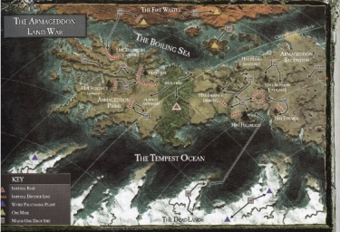
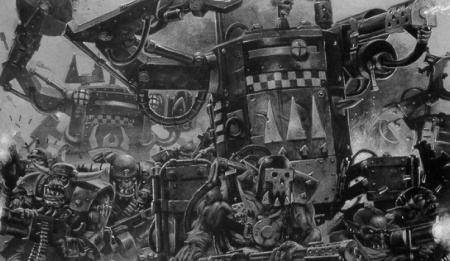
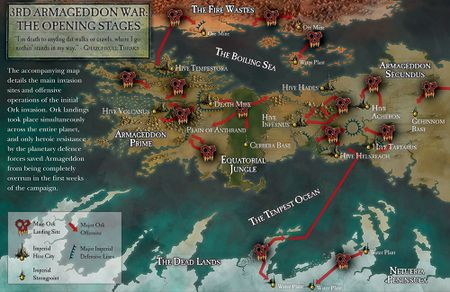

# 0827 998.M41- 第三次阿玛吉多顿战争 Third War for Armageddon

精校状态：中文行文已逐段精校，部分术语仍为暂定

分类：时间线

原文来源：https://www.bilibili.com/opus/1140120822753525777

原作者：帝国神选罐头

原文时间：2025年11月28日 09:31

[返回分类目录](目录.md) · [全书目录](../../目录.md)

<!-- A0827-B0001 -->
**英文原文**

The Third War for Armageddon was fought in the latter years of M41, fifty-seven years to the day after the Second War for Armageddon. Ghazghkull Thraka was again the leader of the invasion and he was faced by his old nemesis Commissar Yarrick, whom Ghazghkull had let go following his capture at the Battle of Golgotha to make the ensuing invasion more entertaining.

<!-- /A0827-B0001 -->

<!-- A0827-B0002 -->

原译文

第三次阿玛吉多顿战争发生在M41的最后几年，也就是第二次阿玛吉多顿战争后的第五十七年。碎骨者萨拉卡再次成为入侵的领导者，他面对的是他的老对手亚瑞克政委，碎骨者在各各他之战中俘虏亚瑞克后释放了他，以使随后的入侵更加有趣。

**校订译文**

第三次阿玛吉多顿战争爆发于 M41 末期，距第二次战争开始恰好五十七年。碎骨者·斯拉卡再次统率入侵大军，迎战的仍是宿敌雅瑞克政委。碎骨者曾在各各他之战俘获雅瑞克，却特意放他离去，好让下一场入侵更有趣。

<!-- /A0827-B0002 -->

<!-- A0827-B0003 图片 -->

<!-- A0827-B0004 -->

原译文

Map of the Third War for Armageddon 第三次阿玛吉多顿战争地图

**校订译文**

Map of the Third War for Armageddon 第三次阿玛吉多顿战争地图

<!-- /A0827-B0004 -->

<!-- A0827-B0005 -->
**英文原文**

Date:998.M41 - present

<!-- /A0827-B0005 -->

<!-- A0827-B0006 -->

原译文

日期：998.M41 - 当前

**校订译文**

日期：998.M41 至本文所述时期

**校注：** present指本文成稿时的叙述当代，不等于现实当前日期；未重新编写设定版本。

<!-- /A0827-B0006 -->

<!-- A0827-B0007 -->
**英文原文**

Location:Armageddon

<!-- /A0827-B0007 -->

<!-- A0827-B0008 -->

原译文

地点：阿玛吉多顿

**校订译文**

地点：阿玛吉多顿

<!-- /A0827-B0008 -->

<!-- A0827-B0009 -->
**英文原文**

Outcome:Ongoing

<!-- /A0827-B0009 -->

<!-- A0827-B0010 -->

原译文

结果：进行中

**校订译文**

结果：进行中

<!-- /A0827-B0010 -->

<!-- A0827-B0011 -->
**英文原文**

Necrons within ancient pyramid (Artifact XE3-36) remain largely in stasis

<!-- /A0827-B0011 -->

<!-- A0827-B0012 -->

原译文

古代金字塔（造物XE3-36）内的死灵大部分仍处于停滞状态

**校订译文**

古代金字塔（遗物 XE3-36）中的太空死灵大多仍处于静滞状态

<!-- /A0827-B0012 -->

<!-- A0827-B0013 -->
**英文原文**

Ghazghkull Thraka leaves Armageddon to launch Da Great Waaagh!

<!-- /A0827-B0013 -->

<!-- A0827-B0014 -->

原译文

碎骨者萨拉卡离开阿玛吉多顿，开始大Waaagh！

**校订译文**

碎骨者·斯拉卡离开阿玛吉多顿，发动大 Waaagh!

<!-- /A0827-B0014 -->

<!-- A0827-B0015 -->
**英文原文**

Herman von Strab assassinated by forces of 13th Penal Legion

<!-- /A0827-B0015 -->

<!-- A0827-B0016 -->

原译文

赫尔曼·冯·斯特拉布被第13刑罚军团部队暗杀

**校订译文**

赫尔曼·冯·斯特拉布被第十三惩戒军团部队刺杀

<!-- /A0827-B0016 -->

<!-- A0827-B0017 -->
**英文原文**

Ritual to re-summon daemon primarch Angron halted

<!-- /A0827-B0017 -->

<!-- A0827-B0018 -->

原译文

重新召唤恶魔原体安格隆的仪式停止了

**校订译文**

重新召唤恶魔原体安格隆的仪式被阻止

<!-- /A0827-B0018 -->

<!-- A0827-B0019 -->
**英文原文**

Half of Armageddon transformed into Daemon World following formation of the Great Rift

<!-- /A0827-B0019 -->

<!-- A0827-B0020 -->

原译文

大裂隙形成后，阿玛吉多顿的一半变成了恶魔世界

**校订译文**

大裂隙形成后，阿玛吉多顿的一半变成了恶魔世界

<!-- /A0827-B0020 -->

<!-- A0827-B0021 -->
**英文原文**

Chaos Daemons Continue to Pour From Red Angel's Gate, Foreboding the Return of Angron

<!-- /A0827-B0021 -->

<!-- A0827-B0022 -->

原译文

混沌恶魔继续从红天使之门倾泻而下，预示着安格隆的回归

**校订译文**

混沌恶魔继续从红天使之门倾泻而下，预示着安格隆的回归

<!-- /A0827-B0022 -->

<!-- A0827-B0023 -->
**英文原文**

Angron returns, leading to a renewed round of heavy fighting but is banished and the Red Angel's Gate sealed

<!-- /A0827-B0023 -->

<!-- A0827-B0024 -->

原译文

安格隆回来了，导致新一轮的激烈战斗，但被放逐，红天使之门被封锁

**校订译文**

安格隆返回，引发新一轮激战；随后再遭放逐，红天使之门被封印

<!-- /A0827-B0024 -->

<!-- A0827-B0025 -->
**英文原文**

Combatants:Orks, Armageddon Nobility/Imperium/Chaos/Necrons

<!-- /A0827-B0025 -->

<!-- A0827-B0026 -->

原译文

作战人员：欧克，阿玛吉多顿贵族/帝国/混沌/死灵

**校订译文**

交战方：欧克蛮人、阿玛吉多顿贵族／帝国／混沌／太空死灵

<!-- /A0827-B0026 -->

<!-- A0827-B0027 -->
**英文原文**

Commanders: Warlord Ghazghkull Mag Uruk Thraka, Great Despot of Dregruk, Overfiend of Octarius, Urgok the Unstoppable, Warboss Bullets, Warboss Grudbolg, Warboss Shazfrag, Warboss Snazdakka, Warboss Taktikus, Warboss Ugrak, Warboss Morkrull Grimskar, Herman von Strab/Commissar Sebastian Yarrick (KIA?), Lord General Kurov, Admiral Parol, Inquisitor Lichtenstein, High Marshal Helbrecht, Reclusiarch Grimaldus, Great Wolf Logan Grimnar, Grand Master Rothwyr Morvans (MIA), Chapter Master Tu'Shan, Captain Erasmus Tycho (KIA), Colonel Schaeffer/Angron, Hrothqar Furor (KIA), Eightbound Jarrok Skreel, Anskarra the Ensanguined/Unknown

<!-- /A0827-B0027 -->

<!-- A0827-B0028 -->

原译文

指挥官：军阀碎骨者马格·乌鲁克·萨拉卡，大暴君德列格鲁克，奥克塔琉斯的暴君，不可阻挡的乌尔高格，战争头目子弹，战争头目格鲁德博格，战争头目沙兹弗拉格，战争头目斯纳兹哒咔，战争头目塔克提库斯，战争头目乌格拉，战争头目莫尔克鲁尔·冷刃，赫尔曼·冯·斯特拉布/政委塞巴斯蒂安·亚瑞克（KIA?）,领主将军库罗夫，海军上将帕罗尔，审判官利希滕斯坦，至高元帅赫尔布雷希特，隐修长格瑞马度斯，头狼罗根·格里姆纳尔，大导师罗斯维尔·墨万斯（MIA），战团长图'杉，连长伊斯拉谟·第谷（KIA），上校谢弗/安格隆，赫罗克哈尔·弗勒尔（KIA），八缚者贾罗克·斯克里尔，染血者安斯卡拉/未知

**校订译文**

指挥官：军阀碎骨者·斯拉卡、德列格鲁克大暴君、奥克塔琉斯暴君、不可阻挡的乌尔戈克、战争头目子弹、战争头目格鲁德博格、战争头目沙兹弗拉格、战争头目斯纳兹哒咔、战争头目塔克提库斯、战争头目乌格拉、战争头目莫尔克鲁尔·冷刃、赫尔曼·冯·斯特拉布／政委塞巴斯蒂安·雅瑞克（阵亡？）、领主将军库罗夫、海军上将帕罗尔、审判官利希滕斯坦、至高元帅赫尔布雷彻、隐修长格里玛度斯、头狼洛根·格里姆纳尔、大导师罗斯维尔·墨万斯（失踪）、战团长图杉、伊拉斯谟·第谷连长（阵亡）、谢弗上校／安格隆、赫罗克哈尔·弗勒尔（阵亡）、八缚者贾罗克·斯克里尔、染血者安斯卡拉／不详

**校注：** 原文Yarrick标KIA?，保留阵亡疑问，未擅定死亡状态。Great Despot of Dregruk为地区所属头衔，非人物名“大暴君德列格鲁克”。

<!-- /A0827-B0028 -->

<!-- A0827-B0029 -->
**英文原文**

Losses/Survivors:Heavy/Heavy

<!-- /A0827-B0029 -->

<!-- A0827-B0030 -->

原译文

损失/幸存者：重/重

**校订译文**

伤亡：双方均惨重

**校注：** 英文误以Losses/Survivors为表头，却均填Heavy；依数值语义整理为双方伤亡惨重，原表头留对照。

<!-- /A0827-B0030 -->

<!-- A0827-B0031 -->
## Overview 概述

<!-- /A0827-B0031 -->

<!-- A0827-B0032 -->
### Prelude 序曲

<!-- /A0827-B0032 -->

<!-- A0827-B0033 -->
**英文原文**

Following his defeat in the Second War for Armageddon at the hands of Commissar Yarrick, Ghazghkull marshaled his forces, licked his wounds, and gathered his strength for a fresh offensive. The Warboss was not deterred in the slightest by his defeat and understood that "to destroy your foe you must first know him." For Ghazghkull, the war for Armageddon had been a way to learn how the Imperium would react and deal with a major invasion. At the same time, his headaches were growing worse and a malaise was manifesting itself. He debated what to do, and was goaded by Grotsnik into returning to Armageddon despite it apparently being a violation of the will of the Gods, who instead wished he take to the stars and unite the Greenskin race. In the end, even Makari tried to talk Ghazghkull out of invading Armageddon again but was (temporarily) killed for it. Ghazghkull decided to ignore the gods and set out his own destiny. Thus it went that Ghagzhkull began preparations for an even greater invasion of Armageddon.

<!-- /A0827-B0033 -->

<!-- A0827-B0034 -->

原译文

在第二次阿玛吉多顿战争中，碎骨者被亚瑞克政委击败后，他组织了部队，舔舐了伤口，为新的进攻积蓄了力量。战争头目丝毫没有被他的失败吓倒，他明白“要摧毁你的敌人，你必须先了解他。”对于碎骨者来说，阿玛吉多顿战争是学习帝国如何应对重大入侵的一种方式。与此同时，他的头痛越来越严重，一种不适正在显现。他争论着该怎么办，尽管这显然违反了神的意愿，但戈斯尼克还是怂恿他重返阿玛吉多顿，神希望他登上星空，团结绿皮种族。最后，就连马卡利也试图说服碎骨者不要再次入侵阿玛吉多顿，但（暂时）被杀了。碎骨者决定无视神，开始自己的命运。就这样，碎骨者开始为更大规模的阿玛吉多顿入侵做准备。

**校订译文**

第二次阿玛吉多顿战争败于雅瑞克后，碎骨者整顿部队、恢复元气，为新一轮进攻积蓄力量。失败丝毫未使他气馁；他懂得，“要消灭敌人，先要了解敌人”。对他而言，上一次战争正是观察帝国如何应对大规模入侵的试验。与此同时，他的头痛日益加剧，倦怠不适也随之而来。他犹豫该往何处，却受戈斯尼克怂恿，决定重返阿玛吉多顿，尽管这似乎违背诸神意愿——诸神希望他走向群星，统一绿皮族群。连马卡利也试图劝阻，却因此被他杀死了一回。碎骨者决意不顾神意，自行选择命运，开始筹备规模更大的入侵。

<!-- /A0827-B0034 -->

<!-- A0827-B0035 图片 -->

<!-- A0827-B0036 -->

原译文

Ork forces rampage on the fields of Armageddon 欧克部队在阿玛吉多顿的战场上横冲直撞

**校订译文**

Ork forces rampage on the fields of Armageddon 欧克蛮人部队肆虐阿玛吉多顿战场

<!-- /A0827-B0036 -->

<!-- A0827-B0037 -->
**英文原文**

Over the next few years, Ghazghkull allied with another prominent Ork Warboss, Nazdreg Ug Urdgrub, known for having the best Mekboyz in the galaxy in his employ. Nazdreg's Mekboyz were particularly well known for their tellyporta technology, something Ghazghkull coveted deeply. Thus Ghazghkull struck a deal with Nazdreg, helping him against the Dark Angels during the Battle of Piscina IV in exchange for the secrets of the Tellyporta.

<!-- /A0827-B0037 -->

<!-- A0827-B0038 -->

原译文

在接下来的几年里，碎骨者与另一位著名的欧克战争头目纳兹德拉格·乌格·乌尔德格鲁布结盟，后者以雇佣银河系最好的技师小子而闻名。纳兹德拉格的技师小子以他们的传送器技术而闻名，这是碎骨者梦寐以求的。因此，碎骨者与纳兹德拉格达成协议，在皮希纳四号之战中帮助他对抗黑暗天使，以换取传送器的秘密。

**校订译文**

此后数年，碎骨者与另一名显赫战争头目纳兹德雷格·乌骨·乌德格拉布结盟。后者麾下汇聚着据称银河最出色的技师小子，尤其以传送器技术闻名，令碎骨者垂涎。两人达成交易：碎骨者在皮希纳四号之战协助他对抗黑暗天使，换取传送技术的秘密。

<!-- /A0827-B0038 -->

<!-- A0827-B0039 -->
**英文原文**

Ghazghkull left Piscina for the Golgotha system, intending to seize the resource-rich world and convert it into a giant factory to fuel his second great Waaagh! However, he was unaware that Yarrick had located him and was in hot pursuit. Easily overrunning the planet's defenses, in the ensuing Battle of Golgotha Ghazghkull eventually crushed Yarrick when his forces arrived, capturing the Commissar himself. However in the end the Warboss decided to let his arch-rival go as he was "too much fun."

<!-- /A0827-B0039 -->

<!-- A0827-B0040 -->

原译文

碎骨者离开皮希纳前往各各他星系，打算夺取资源丰富的世界，并将其改造成一个巨大的工厂，为他的第二次大Waaagh！提供燃料。然而，他不知道亚瑞克已经找到了他，正在紧追不舍。在随后的各各他之战中，碎骨者轻易地突破了行星的防御，当他的部队到达时，他最终击败了亚瑞克，俘虏了政委本人。然而，最终，战争头目决定让他的死敌离开，因为他“太有趣了”

**校订译文**

碎骨者离开皮希纳，前往各各他星系，打算夺取当地资源丰富的世界，将其改造成巨型工厂，为第二场大 Waaagh! 提供物资。他却不知道，雅瑞克已发现其行踪，正紧追而来。碎骨者轻易突破行星防御；等雅瑞克率军赶到，又在随后的各各他之战中击溃帝国军，生擒政委。可到头来，他还是放走宿敌，因为对方“实在太有趣”。

**校注：** when his forces arrived结合追击语境指雅瑞克军队抵达，不是碎骨者已攻下行星后自己的部队才到。

<!-- /A0827-B0040 -->

<!-- A0827-B0041 -->
### Early Invasion 早期入侵

<!-- /A0827-B0041 -->

<!-- A0827-B0042 -->
**英文原文**

The invasion began with a massive Ork fleet arriving in the Armageddon Sector, a fleet which outnumbered the Imperial defenders six to one. Ork Kill Kroozers made suicidal rushes against the Imperial Navy blockade of the planet and despite their skill the Imperial ships found themselves unable to turn back the Orkish tide. Worse yet, monitor stations were warning that three more massive Ork fleets were inbound to the Armageddon system. The combined fleets of Ghazghkull and his allies soon constituted the largest fleet ever to assault a world of the Imperium and Battlefleet Armageddon found itself outnumbered six to one.

<!-- /A0827-B0042 -->

<!-- A0827-B0043 -->

原译文

入侵始于一支庞大的欧克舰队抵达阿玛吉多顿星区，这支舰队的数量是帝国守军的六倍。欧克杀戮巡洋舰对帝国海军对行星的封锁进行了自杀式的冲锋，尽管他们很有技巧，但帝国舰船发现自己无法扭转欧克的浪潮。更糟糕的是，监测站警告说，又有三支庞大的欧克舰队进入了阿玛吉多顿星系。碎骨者和他的盟友的联合舰队很快组成了有史以来攻击帝国世界的最大舰队，而阿玛吉多顿舰队发现自己的数量比是六比一。

**校订译文**

入侵以一支庞大欧克蛮人舰队抵达阿玛吉多顿星区开始，其舰船数量是帝国守军的六倍。杀戮巡洋舰近乎自杀地冲击海军封锁线，帝国舰员虽经验丰富，仍无法挡住绿皮洪流。更糟的是，监测站报告，还有三支庞大敌舰队正向星系驶来。碎骨者及盟友的联合舰队很快成为有史以来进攻帝国单一世界的最大舰队；文中再次将其与阿玛吉多顿战斗舰队的数量比记为六比一。

**校注：** 原文在最初舰队与额外三支舰队将至后均写六比一，统计口径不清，保留两次记录并显式标出，未计算新比例。

<!-- /A0827-B0043 -->

<!-- A0827-B0044 -->
**英文原文**

As the Ork fleet arrived in the Armageddon System, Imperial forces under Yarrick made frenzied preparations. Forces from the Imperial Guard, Collegia Titanica, Sisters of Battle, and more then twenty Space Marine Chapters reinforced the world.

<!-- /A0827-B0044 -->

<!-- A0827-B0045 -->

原译文

当欧克舰队抵达阿玛吉多顿星系时，亚瑞克率领的帝国军队进行了疯狂的准备。来自帝国卫队、泰坦修会、战斗修女和二十多个星际战士战团的部队增强了世界。

**校订译文**

敌舰队逼近时，雅瑞克统领的帝国军全力备战。帝国卫队、泰坦修会、战斗修女，以及二十余个星际战士战团前来增援。

<!-- /A0827-B0045 -->

<!-- A0827-B0046 -->
**英文原文**

Six weeks after arriving in the Armageddon System, hundreds of Ork Roks smashed into the surface of Armageddon. Millions were killed as Hades Hive - the site of Ghazghkull's previous defeat - was completely annihilated by an asteroid launched from an orbiting Ork Space Hulk in an act of vengeance against Yarrick. Soon after, wave after wave of Ork landers descended upon the world, and though Imperial Navy fighters and ground defense lasers took a terrible toll upon the invaders there were simply too many incoming Orks to stop. Massive amounts of Orks also besieged Hive Helsreach, where the Black Templars under Reclusiarch Grimaldus made a courageous defense, exacting a heavy toll on the greenskins for any ground taken.

<!-- /A0827-B0046 -->

<!-- A0827-B0047 -->

原译文

在到达阿玛吉多顿星系六周后，数百个欧克巨石撞上了阿玛吉多顿的表面。数百万人在哈迪斯巢都（碎骨者之前失败的地点）被一颗从轨道上的欧克太空废船发射的小行星彻底摧毁时丧生，这是对亚瑞克的报复行为。不久之后，一波又一波的欧克登陆器降落在世界上，尽管帝国海军战斗机和地面防御激光对入侵者造成了可怕的损失，但来的欧克太多了，无法阻止。大量的欧克也围攻了赫尔斯利奇巢都，在那里，由隐修长格瑞马度斯领导的黑色圣堂进行了勇敢的防御，对任何占地的绿皮都造成了沉重的损失。

**校订译文**

欧克蛮人舰队抵达六周后，数百座巨石堡垒砸向阿玛吉多顿地表。碎骨者为报复雅瑞克，从轨道太空废船投下一颗小行星，将自己昔日战败的哈迪斯巢都彻底摧毁，数百万人因此丧生。紧接着，欧克蛮人登陆艇一波接一波降下；帝国海军战斗机与地面激光防御虽造成惨重杀伤，仍挡不住如此庞大的入侵军。赫尔斯利奇巢都也遭大举围攻。隐修长格里玛度斯率黑色圣堂英勇坚守，让绿皮每前进一步都付出沉重代价。

<!-- /A0827-B0047 -->

<!-- A0827-B0048 -->
**英文原文**

Meanwhile, the true purpose of the descending Ork Roks became apparent. Slowing their descent with powerful force fields, the Roks landed on Armageddon and from them surged not only innumerable Orks but also an endless stream of heavy equipment teleported in directly from orbit. The plan was made possible only by Tellyporta technology designed by Mek Boy Orkimedes, whom Ghazghkull had in his employ. Soon Titans and Gargants beyond number were engaged in the action and took a bitter toll upon both sides in the fighting. In addition Feral Orks, born on the world shortly after the Second War for Armageddon, emerged from the equatorial jungles and spread like wildfire throughout the hives.

<!-- /A0827-B0048 -->

<!-- A0827-B0049 -->

原译文

与此同时，欧克下降的真正目的变得显而易见。巨石以强大的力场减缓了他们的下降速度，降落在阿玛吉多顿，从他们那里不仅涌现出无数的欧克，还涌现出源源不断的直接从轨道传送过来的重型设备。该计划只有在技师小子兽基米德设计的传送器技术下才得以实现，碎骨者雇佣了技师小子兽基米德。不久，无数的泰坦和加冈特参与了这场战斗，并在战斗中对双方造成了惨痛的损失。此外，第二次阿玛吉多顿战争后不久诞生在世界上的蛮荒欧克从赤道丛林中出现，像野火一样蔓延到整个巢都。

**校订译文**

巨石堡垒的真正用途很快显露。它们借强大力场减缓坠落，落地后不仅涌出无数欧克蛮人，还接收直接从轨道传送下来的重型装备。这一计划得以实现，全靠碎骨者麾下技师小子兽基米德设计的传送技术。无数泰坦与加冈特投入战场，使双方都付出惨烈代价。与此同时，第二次战争后在本土繁衍的蛮荒欧克涌出赤道丛林，如野火般冲向各座巢都。

<!-- /A0827-B0049 -->

<!-- A0827-B0050 -->
**英文原文**

Hive Acheron then fell to the Orks without warning, this time captured by treachery from within. It was soon revealed that the infamous war criminal Herman von Strab, the former Governor of Armageddon whose leadership during the Second War had proven so disastrously inept, had overthrown the hive in cooperation with Ghazghkll and now ruled it as its overlord.

<!-- /A0827-B0050 -->

<!-- A0827-B0051 -->

原译文

黄泉巢都随后毫无预警地落入了欧克之手，这次是被内部的背叛所俘虏。不久，臭名昭著的战犯赫尔曼·冯·斯特拉布被揭露，他是阿玛吉多顿的前总督，在第二次战争期间的领导被证明是如此的无能，他与碎骨者合作推翻了巢都，现在将其作为霸主统治。

**校订译文**

黄泉巢都随后突然沦陷，这次却源于内部背叛。人们很快查明，臭名昭著的战犯、前行星总督赫尔曼·冯·斯特拉布勾结碎骨者，夺取了巢都统治权。此人在第二次战争中的无能，早已给阿玛吉多顿带来灾难，如今又以巢都霸主自居。

<!-- /A0827-B0051 -->

<!-- A0827-B0052 -->
### Imperial Counter Attack 帝国反击

<!-- /A0827-B0052 -->

<!-- A0827-B0053 -->
**英文原文**

Again it was left to Commissar Yarrick to defend Armageddon from Ghazghkull's forces. He did this by forging the PDF and Armageddon Regiments into a perfectly disciplined fighting force, an 'unstoppable machine of iron and steel'. When Ghazghkull heard that his old nemesis was once again in the fray he redoubled his efforts and tried to break the back of Armageddon.

<!-- /A0827-B0053 -->

<!-- A0827-B0054 -->

原译文

再次，亚瑞克政委负责保卫阿玛吉多顿免受碎骨者部队的袭击。他通过将PDF和阿玛吉多顿兵团打造成一支纪律严明的战斗部队，一台“不可阻挡的钢铁机器”，做到了这一点。当碎骨者听说他的老对手再次加入战斗时，他加倍努力，试图打破阿玛吉多顿的阴影。

**校订译文**

保卫阿玛吉多顿的重任再次落到雅瑞克政委肩上。他将行星防御部队与阿玛吉多顿各团锻造成纪律严明的战斗力量，一部“不可阻挡的钢铁机器”。碎骨者得知宿敌再次参战，便加紧猛攻，企图彻底击垮阿玛吉多顿的抵抗。

<!-- /A0827-B0054 -->

<!-- A0827-B0055 图片 -->

<!-- A0827-B0056 -->

原译文

Opening stages of the Third War for Armageddon 第三次阿玛吉多顿战争的开端

**校订译文**

Opening stages of the Third War for Armageddon 第三次阿玛吉多顿战争的开端

<!-- /A0827-B0056 -->

<!-- A0827-B0057 -->
**英文原文**

Yarrick also received much help from various Space Marine Chapters, as they knew all too well the strategic value of Armageddon. The Space Marines began to establish battle lines and Von Strab was hunted down and killed by a unit of Penal Legion troopers known as the Last Chancers. The situation improved dramatically for the Imperial forces as the Season of Fire broke upon Armageddon. Temperatures outside the Hives soared until even the Orks were forced inside. Faced with this new situation, a stalemate has been reached.

<!-- /A0827-B0057 -->

<!-- A0827-B0058 -->

原译文

亚瑞克还得到了各星际战士战团的大力帮助，因为他们非常清楚阿玛吉多顿的战略价值。星际战士开始建立战线，冯·斯特拉布被一支被称为最后投机者的刑罚军团部队追捕并杀害。随着阿玛吉多顿的火季爆发，帝国部队的情况急剧改善。巢都的温度飙升，直到就连欧克也被迫进入。面对这种新形势，已经陷入僵局。

**校订译文**

各星际战士战团深知阿玛吉多顿的战略价值，给予雅瑞克有力援助。他们建立战线，而名为“最后机会”的惩戒军团部队则追上冯·斯特拉布，将其杀死。火季到来后，局势明显有利于帝国：巢都外气温暴涨，连欧克蛮人也不得不退入巢都躲避高温。双方因此陷入僵持。

**校注：** outside the Hives指巢都外气温，原译漏外造成躲避方向颠倒。Last Chancers沿核心最后机会，不用带贬义的投机者。

<!-- /A0827-B0058 -->

<!-- A0827-B0059 -->
### Warfare in the Equatorial Jungle 赤道丛林中的战争

<!-- /A0827-B0059 -->

<!-- A0827-B0060 -->
**英文原文**

In the Equatorial Jungle, various Imperial factions continued to fight against the Orks, attempting to contain them in the region so that they could not send more reinforcements to Ghazghkull's hordes. Though Armageddon Ork Hunter and Catachan regiments were able to purge or contain Ork forces in the western half of the jungle, the operations in the east were much less successful; from there, Feral Orks continued to pour into Armageddon Secundus.

<!-- /A0827-B0060 -->

<!-- A0827-B0061 -->

原译文

在赤道丛林中，帝国各派系继续与欧克作战，试图将他们控制在该地区，这样他们就无法向碎骨者的部落派遣更多的增援部队。尽管阿玛吉多顿欧克猎手和卡塔昌兵团能够清除或遏制丛林西半部的奥尔克部队，但东部的行动却不太成功；从那里，蛮荒欧克继续涌入阿玛吉多顿二号。

**校订译文**

赤道丛林中，帝国各部继续围堵欧克蛮人，阻止他们为碎骨者的大军输送援军。阿玛吉多顿欧克猎手与卡塔昌各团在丛林西半部成功清剿、遏制敌军，东部行动却收效甚微，蛮荒欧克仍源源不断地涌入塞孔杜斯地区。

<!-- /A0827-B0061 -->

<!-- A0827-B0062 -->
**英文原文**

However, while most Imperials fought in the jungles to contain the Ork threat, some Imperial factions pursued their own goals. Most notably, the Relictors Chapter chose to ignore requests for their assistance elsewhere on Armageddon and deployed all of their forces in the Equatorial Jungle. Assisted by Inquisitor Halstron, the Relictors were seeking Angron's Monolith, a Chaos object from the First War for Armageddon. At the same time, a force belonging to the Black Templar Solemnus Crusade pursued Ork Warboss Morkrull Grimskar into the Equatorial Jungle, where they encountered a group of Relictors led by Oberon Eurys. Though the Imperials were unable to kill Grimskar, they discovered a Chaos Warp Gate which had been opened by World Eaters during the First War. Together, the Black Templars and Relictors defeated the local Ork forces and time-displaced World Eaters led by Hrothqar Furor, closing the gate. When Eurys claimed a Chaos relic from the battle, horrifying the Black Templars, fighting erupted between the former allies.

<!-- /A0827-B0062 -->

<!-- A0827-B0063 -->

原译文

然而，当大多数帝国在丛林中作战以遏制欧克的威胁时，一些帝国派系却追求自己的目标。最值得注意的是，遗物战团选择无视他们在阿玛吉多顿其他地方的援助请求，并将所有部队部署在赤道丛林。在审判官霍尔斯特朗的协助下，遗物战团正在寻找安格隆的独石，这是第一次阿玛吉多顿战争中的混沌物体。与此同时，一支属于黑色圣堂庄严远征的部队将欧克战争头目莫尔克鲁尔·冷刃追击到赤道丛林，在那里他们遇到了由奥伯伦·欧里斯率领的一群遗物小队。虽然帝国无法杀死冷刃，但他们发现了一个在第一次战争期间被吞世者打开的混沌亚空间门。黑色圣堂和遗物战团一起击败了当地的欧克部队和由赫罗克哈尔·弗勒尔领导的时间转移的吞世者，关闭了大门。当欧里斯从战斗中夺取了混沌遗迹，吓坏了黑色圣堂时，前盟友之间爆发了战斗。

**校订译文**

大多数帝国部队忙于遏止绿皮时，也有势力追求自己的目标。遗物守护者战团尤其如此：他们无视其他战区的求援，将全部兵力投入赤道丛林，在审判官霍尔斯特朗协助下寻找第一次战争遗留的混沌造物——安格隆独石。与此同时，黑色圣堂庄严远征的一支部队追赶战争头目莫尔克鲁尔·冷刃进入丛林，遇上奥伯伦·欧里斯率领的遗物守护者。帝国部队虽未能杀死冷刃，却发现一座吞世者在第一次战争中开启的亚空间之门。两团合力击败当地欧克蛮人，以及穿越时间而来的、赫罗克哈尔·弗勒尔统率的吞世者，关闭传送门。然而，欧里斯将一件混沌遗物据为己有，令黑色圣堂大为震怒，昔日盟友随即交战。

<!-- /A0827-B0063 -->

<!-- A0827-B0064 -->
**英文原文**

Meanwhile, the main Relictors force found Angron's Monolith, where they intended to retrieve a fragment of an axe wielded by Angron himself during the First War for Armageddon. After obtaining what they came for, the Relictors departed Armageddon entirely.

<!-- /A0827-B0064 -->

<!-- A0827-B0065 -->

原译文

与此同时，主要的遗物部队发现了安格隆的独石，他们打算在那里取回安格隆在第一次阿玛吉多顿战争中挥舞的斧头碎片。在得到他们想要的东西后，遗物完全离开了阿玛吉多顿。

**校订译文**

与此同时，遗物守护者主力找到了安格隆独石，准备从中取走一块据称来自安格隆在第一次战争中所用战斧的碎片。得手后，他们便全部撤离阿玛吉多顿。

**校注：** 本段称安格隆第一次战争使用战斧，而821主战描写为Black Blade黑刃；未擅将武器改成同一件，保留来源差异。

<!-- /A0827-B0065 -->

<!-- A0827-B0066 -->

原译文

Ghattana Bay: The Battle for Gate IX 加塔纳湾：第九号门之战

**校订译文**

Ghattana Bay: The Battle for Gate IX 加塔纳湾：第九号门之战

<!-- /A0827-B0066 -->

<!-- A0827-B0067 -->
**英文原文**

It was at Ghattana Bay, the location of an important water processing plant, that saw the largest Dreadnought vs Dreadnought confrontation of the war. The Ork attack had by this point stalled and the Warboss Judrog Irontoof committed every Deff Dread and Killa Kan in his arsenal to a single attack against the Space Marine lines weakened by an earlier Kommando attack. As the defenders were battered by Ork weaponry, Judrog's Dreadnought charge breached the defenses around Ghattana Bay but as they approached Gate IX, they were surprised to find a line of seventeen Venerable Dreadnoughts armed with lascannons, autocannons, and missile launchers blocking their path. At their head was Brother Damos of the Angels Porphyr, who led a devastating first salvo against the first wave of Ork Dreads. Equipped with better weapons, the Ork machines initially took heavy losses but eventually reached the Space Marine lines, though the four hundred meter advance cost them seventeen Dreadnoughts. Nonetheless the Orks still came at the Space Marines, hurling themselves against Gate IX.

<!-- /A0827-B0067 -->

<!-- A0827-B0068 -->

原译文

在加塔纳湾，一个重要的水处理厂所在地，发生了战争中最大的无畏与无畏的对抗。到目前为止，欧克的进攻已经停滞，战争头目朱德罗格·铁牙将他军械库中的每一个恐惧无畏和杀戮铁罐都投入到对早先指挥部进攻削弱的星际战士战线的一次攻击中。当守军被欧克武器袭击时，朱德罗格的无畏冲锋突破了加塔纳湾周围的防御，但当他们接近九号门时，他们惊讶地发现一排17位配备激光炮、自动炮和导弹发射器的神圣无畏挡住了他们的去路。在他们的头上是斑岩天使的达莫斯兄弟，他领导了一场毁灭性的第一次齐射，对抗了第一波欧克恐惧无畏。配备了更好的武器，欧克机械最初损失惨重，但最终到达了星际战士战线，尽管四百米的推进让他们损失了十七架无畏。尽管如此，欧克仍然向星际战士发起攻击，冲向九号门。

**校订译文**

加塔纳湾坐落着一座重要的水处理厂，本次战争中规模最大的无畏机甲对决就在这里爆发。欧克蛮人的攻势此时已经停滞，战争头目朱德罗格·铁牙遂将手头所有死亡无畏机甲和杀戮机甲投入一次集中进攻，猛攻先前遭特种兵袭击而削弱的星际战士防线。在欧克火力的掩护下，这支机甲突击群突破了加塔纳湾外围防御；然而，接近第九号门时，它们赫然发现，十七台配备激光炮、自动炮和导弹发射器的神圣无畏机甲正列阵阻挡去路。率领它们的是斑岩天使的达莫斯兄弟，他指挥第一轮齐射，对最前方的欧克机甲造成了毁灭性打击。欧克机甲起初在强大的火力下损失惨重，最终仍冲到了星际战士阵前，但这四百米的推进已使它们损失十七台无畏机甲。余下的欧克依然向前，猛扑第九号门。

**校注：** Kommando 为欧克特种兵，非“指挥部”；Deff Dread、Killa Kans 据 GW-09 中文第 30 页／GW-10 英文第 29 页采用死亡无畏机甲、杀戮机甲。原文 Equipped with better weapons 构成悬垂修饰，紧接 Ork machines took heavy losses，按前述星际战士重火力仅译明欧克遭强大火力打击，不擅定更优武器属于欧克。两处十七台分别指星际战士列阵数量和欧克推进损失，保留区分。

<!-- /A0827-B0068 -->

<!-- A0827-B0069 -->
**英文原文**

Flight was not the plan however, Brother Damos and his Dreadnoughts were ready for Irontoof's Orks and poured heavy fire from their ramparts and decimating the tightly packed Ork Dreadnought formation. As the Ork dreadnoughts became bottlenecked, the Space Marine Dreadnoughts cut into them in an assault led by Brother Weylands. Though not a single Dreadnought fled, the Ork machines were ultimately destroyed. Judrog's bold but unsupported attack had failed. With his final reserves now destroyed, Judrog was forced to withdraw in the face of heavy Thunderhawk air attacks. But while the Space Marines had emerged victorious, they had lost seven of their seventeen ancient dreadnoughts.

<!-- /A0827-B0069 -->

<!-- A0827-B0070 -->

原译文

然而，躲避并不是计划，达莫斯兄弟和他的无畏已经准备好迎接铁牙的欧克，并从他们的城墙上猛烈开火，摧毁了拥挤的欧克无畏编队。随着欧克无畏陷入瓶颈，星际战士无畏在韦兰德兄弟领导的一次进攻中切入了他们。尽管没有一架无畏逃跑，欧克机械最终被摧毁。朱德罗格大胆但没有支援的攻击失败了。随着他最后的储备现在被摧毁，朱德罗格在雷鹰的猛烈空袭面前被迫撤退。但是，尽管星际战士取得了胜利，但他们失去了17位古代无畏中的7位。

**校订译文**

达莫斯兄弟和他的无畏机甲并不打算撤退。他们早已准备好迎战铁牙的部队，从壁垒上倾泻猛烈火力，重创密集的欧克机甲阵列。欧克机甲挤在狭窄通道中动弹不得，星际战士无畏机甲便由韦兰德兄弟率领，突入敌阵。没有一台欧克机甲逃跑，它们最终全部被摧毁。朱德罗格这场大胆却缺乏支援的进攻失败了，最后的预备队也已覆灭，他只得顶着雷鹰炮艇的猛烈空袭撤退。星际战士虽然获胜，十七台古老的无畏机甲也损失了七台。

<!-- /A0827-B0070 -->

<!-- A0827-B0071 -->
### The War Continues 战争仍在继续

<!-- /A0827-B0071 -->

<!-- A0827-B0072 -->
**英文原文**

Becoming bored by the growing stalemate, Ghazghkull quickly ran out of patience. He resurrected Makari once more, but this time spoke directly to the newly reincarnated Grot for the first time, stating that as a true Ork he wouldn't apologize but that he had been wrong about some things. He showed Makari the Holy War he had created on Armageddon, but admitted it could be so much greater. At that moment a Leman Russ Battle Tank appeared, blasting a hole in Ghazghkull's chest. Ghazghkull was saved by Makari, who crawled inside the tank to murder the crew within. Seeing the incident as a message from the gods, the recovering Ghazghkull admitted he had been wrong to both Makari and the Gork and Mork. He announced his attention to depart Armageddon and begin Da Great Waaagh!.

<!-- /A0827-B0072 -->

<!-- A0827-B0073 -->

原译文

由于对日益加剧的僵局感到厌倦，碎骨者很快失去了耐心。他再次复活了马卡利，但这一次他第一次直接与新转世的屁精说话，表示作为一个真正的欧克，他不会道歉，但他在某些事情上错了。他向马卡利展示了他在阿玛吉多顿创造的圣战，但承认它可能更大。就在那一刻，一辆黎曼鲁斯战斗坦克出现了，在碎骨者的胸膛上炸了一个洞。碎骨者被马卡利救了下来，马卡利爬进坦克里谋杀了里面的乘员。将这一事件视为神的信息，正在康复的碎骨者承认他对马卡利、搞哥和毛哥都错了。他宣布要离开阿玛吉多顿，开始大Waaagh！。

**校订译文**

战局逐渐陷入僵持，碎骨者感到厌倦，很快失去了耐心。他再次复活马卡利，并首次直接与这个新近转生的屁精交谈。他宣称，真正的欧克不会道歉，但自己确实在某些事情上错了。他向马卡利展示了自己在阿玛吉多顿掀起的圣战，却也承认，这场圣战本可以更加宏大。就在此时，一辆黎曼鲁斯战斗坦克出现，一炮在碎骨者胸口轰出一个洞。马卡利爬进坦克，杀死车组人员，救下了碎骨者。养伤期间，碎骨者将此事视为诸神的启示，向马卡利以及搞哥、毛哥承认了自己的错误。他宣布，将离开阿玛吉多顿，发动大 Waaagh!。

<!-- /A0827-B0073 -->

<!-- A0827-B0074 -->
**英文原文**

He left the conquest of Armageddon to his generals and went in search of something more entertaining. When word of this reached Yarrick he too left Armageddon with a strike force of Black Templars, determined to hunt down Ghazghkull and end things between them once and for all. Yarrick and the Black Templars were able to corner Ghazghkull at the Battle of Haunted Gulf, but the Warboss was able to elude his foes yet again.

<!-- /A0827-B0074 -->

<!-- A0827-B0075 -->

原译文

他把征服阿玛吉多顿的任务留给了他的将军们，转而寻找更有趣的东西。当这件事传到亚瑞克那里时，他也带着一支由黑色圣堂组成的打击部队离开了阿玛吉多顿，决心追捕碎骨者，一劳永逸地结束他们之间的联系。亚瑞克和黑色圣堂在闹鬼湾之战中成功将碎骨者逼入绝境，但战争头目再次躲过了他的敌人。

**校订译文**

碎骨者将征服阿玛吉多顿的任务交给麾下将领，自己去寻找更有趣的战斗。雅瑞克闻讯，也率一支黑色圣堂打击部队离开阿玛吉多顿，决意追杀碎骨者，彻底了结两人的宿怨。雅瑞克和黑色圣堂曾在闹鬼湾之战中将碎骨者逼入绝境，但这位战争头目再度逃脱。

<!-- /A0827-B0075 -->

<!-- A0827-B0076 -->
**英文原文**

However there were still countless Orks infesting Armageddon and the war raged. For the Orks, the war became known as the "Big Scrap"(also other name - "Ragnarork") and more Orks arrived to the system with each day as word spread. The cost of the war was measured in human lives, and the death toll spiraled towards the billions. The Imperials knew one thing, however: whatever the cost, Armageddon must not fall.

<!-- /A0827-B0076 -->

<!-- A0827-B0077 -->

原译文

然而，阿玛吉多顿仍有无数欧克出没，战争肆虐。对于欧克来说，这场战争被称为“大混战”（也称为“诸神黄昏”），随着消息的传播，每天都有更多的欧克来到这个星系。战争的代价是以人的生命来衡量的，死亡人数飙升至数十亿。然而，帝国知道一件事：无论付出什么代价，阿玛吉多顿都不能陷落。

**校订译文**

然而，无数欧克蛮人仍盘踞在阿玛吉多顿，战火丝毫未息。它们将这场战争称为“大混战”，也称“诸神黄昏”（Ragnarork）。消息不断传开，每天都有更多欧克涌入星系。战争的代价是人命，死亡人数不断攀升，逼近数十亿。帝国一方只确定一件事：无论代价多大，阿玛吉多顿都不能陷落。

**校注：** Ragnarork 是结合 Ragnarok 与 Ork 的拼词，沿原稿“诸神黄昏”并保留英文供追溯；不等同另一场独立战争。

<!-- /A0827-B0077 -->

<!-- A0827-B0078 -->
### Dark Imperium 黑暗帝国

<!-- /A0827-B0078 -->

<!-- A0827-B0079 -->
**英文原文**

The war raged into the period known as The Blackness, which severed nearly all the worlds of the Imperium from one another. Armageddon was isolated and reinforcements en route were sent into oblivion by the Great Rift. Daemonic legions soon erupted across the planet. Amazingly, Ork and Imperial defenders would often fight alongside one another in the face of the greater threat. However such ceasefires never lasted long. The legions of Khorne and Tzeentch soon battled one another on the plains of Armageddon, with the Orks and Humans taking shelter.

<!-- /A0827-B0079 -->

<!-- A0827-B0080 -->

原译文

这场战争一直持续到被称为黑暗的时期，这场战争几乎将帝国的所有世界都切断了。阿玛吉多顿被孤立，途中的增援部队被大裂隙遗忘。恶魔军团很快在行星上爆发。令人惊讶的是，面对更大的威胁，欧克和帝国守军经常并肩作战。然而，这种停火从未持续太久。恐虐和奸奇的军团很快在阿米吉多顿平原上相互作战，欧克和人类避难。

**校订译文**

战争一直延续到“黑暗期”。在这一时期，帝国几乎所有世界都与外界断绝了联系。阿玛吉多顿陷入孤立，赶往这里的增援部队则在大裂隙中覆灭。恶魔军团很快在行星各处涌现。令人惊讶的是，面对这一更大的威胁，欧克蛮人与帝国守军往往会并肩作战，不过这样的停火从未持续太久。恐虐与奸奇的军团随即在阿玛吉多顿平原上相互厮杀，欧克和人类则躲避战火。

**校注：** which severed 修饰黑暗期造成的隔绝，非这场战争；sent into oblivion 指覆灭，非被遗忘。

<!-- /A0827-B0080 -->

<!-- A0827-B0081 -->
**英文原文**

By the time the light of the Astronomican returned to Armageddon, the Imperial relief force arrived to find the landscape greatly changed. Fully half the planet had warped into something akin to a Daemon World, a hellish landscape merged over the top of what had once been a war-torn Hive World. The Imperial reinforcements, with elements from 9 Space Marine Chapters led by the Salamanders, succeeded in halting the ritual that would have brought Angron back to Armageddon. However, the Red Angel's Gate remained open, while the war for Armageddon became even more apocalyptic as before as World Eaters and other Khornate forces arrived from eight different directions in a massive Blood Crusade. With the slaughter reaching new heights, even more Orks travelled to the planet from Granica, Ruis, and Golotha in search of a good fight.

<!-- /A0827-B0081 -->

<!-- A0827-B0082 -->

原译文

当星炬的光芒回到阿玛吉多顿时，帝国救援部队到达时发现地貌发生了很大变化。整整一半的行星已经扭曲成类似于恶魔世界的东西，一个地狱般的地貌融合在曾经饱受战争蹂躏的巢都世界之上。帝国增援部队，由火蜥蜴率领的9个星际战士战团的成员，成功地阻止了将安格隆带回阿玛吉多顿的仪式。然而，红天使之门仍然敞开着，而阿玛吉多顿的战争变得更加像以前一样启示录，因为吞世者和其他恐虐部队在一场大规模的鲜血远征中从八个不同的方向抵达。随着屠杀达到新的高度，更多的欧克从格拉尼察、鲁伊斯和戈洛塔来到这个行星，寻求一场精彩的战斗。

**校订译文**

星炬之光重新照耀阿玛吉多顿时，抵达的帝国援军发现，这里的地貌已经面目全非。整整半颗行星扭曲成近似恶魔世界的模样，地狱般的景观覆盖、交融在原本饱受战火蹂躏的巢都世界之上。帝国援军中有来自九个星际战士战团的部队，由火蜥蜴率领；他们成功阻止了将安格隆带回阿玛吉多顿的仪式。然而，红天使之门依然敞开。吞世者及其他恐虐部队从八个方向涌入，发动规模庞大的鲜血远征，使阿玛吉多顿的战争比以往更具末日景象。屠杀愈演愈烈，更多欧克为寻求痛快厮杀，从格拉尼察、鲁伊斯和戈洛塔赶往这颗行星。

<!-- /A0827-B0082 -->

<!-- A0827-B0083 -->
**英文原文**

The arrival of Chaos forces only has seen the conflict drag on. A three-way war has emerged. Traitor warbands, Daemons, and Cults strike from the depths of space or the northern reaches of the planet while the Orks continue to harry Imperial reinforcements which are pouring in. The planet has become unstable and shudders under etheric forces. The instability is emanating from the Red Angel's Gate, and many claim Armageddon's final doom draws nigh. Over Armageddon itself a massive debris field has emerged, as countless broken spaceships and ork roks litter Armageddon's orbit. Human and Xenos pirates as well as naval forces of the different war factions all continue to battle within the chaotic debris field.

<!-- /A0827-B0083 -->

<!-- A0827-B0084 -->

原译文

混沌部队的到来只会让冲突持续下去。一场三方战争已经出现。叛徒战帮、恶魔和邪教从太空深处或行星北部发动袭击，而欧克继续骚扰涌入的帝国增援部队。行星在以太之力的作用下变得不稳定和颤抖。不稳定源于红天使之门，许多人声称阿玛吉多顿的毁灭结局即将到来。在阿玛吉多顿本身，一个巨大的碎片场已经出现，无数破碎的宇宙飞船和欧克巨石散落在阿玛吉多顿的轨道上。人类和异型海盗以及不同战争派别的海军部队都在混乱的碎片场中继续战斗。

**校订译文**

混沌部队的到来使战争进一步拖延，演变成三方混战。叛徒战帮、恶魔和邪教徒从深空或行星北部发动袭击，欧克则不断骚扰陆续抵达的帝国援军。行星在以太力量的冲击下震颤，愈发不稳定，而这一切都源自红天使之门。许多人宣称，阿玛吉多顿的末日已近。与此同时，行星轨道上形成了一片巨大的残骸带，无数破碎舰船和欧克巨石堡垒散落其中。人类与异形海盗，以及各参战势力的海军，都继续在这片混乱的残骸带中交战。

<!-- /A0827-B0084 -->

<!-- A0827-B0085 -->
### Season of Blood 血季

<!-- /A0827-B0085 -->

<!-- A0827-B0086 -->
**英文原文**

In the eastern reaches of Armageddon Secundus, Hive Thoraddis was assaulted by a combined force of Chaos Space Marines, Heretics, Daemons, and Traitor Titans. The defenders of the Hive fought with great bravery but were eventually driven back. Colonel Berkant of the 473rd Armageddon Steel Legion eventually took the measure of sabotaging Thoraddis' power cores, resulting in a catastrophic explosion that obliterated both sides. This however only fed the Red Angel's Gate, causing it to swell and alerting the faraway Conqueror to the warzone. The vessel plunged in the Warp with a trail of accompanying forces, gathering more and more armies of the Blood God to its side as it traveled towards Armageddon.

<!-- /A0827-B0086 -->

<!-- A0827-B0087 -->

原译文

在阿玛吉多顿二号的东部，索拉迪斯巢都遭到了混沌星际战士、异端、恶魔和叛徒泰坦的联合部队的袭击。巢都的守军英勇作战，但最终被击退。第473阿玛吉多顿钢铁军团的伯坎特上校最终采取了破坏托拉迪斯的动力核心的措施，导致灾难性的爆炸，双方都被摧毁。然而，这只为红天使之门提供了食物，导致它膨胀，并提醒遥远的征服者号进入战区。战舰带着一队随行部队坠入亚空间，在驶向阿玛吉多顿的途中，越来越多的血神的军队聚集在它旁边。

**校订译文**

阿玛吉多顿塞孔杜斯地区东部的索拉迪斯巢都，遭到混沌星际战士、异端、恶魔和叛徒泰坦联军袭击。守军奋勇抵抗，最终仍被逐步逼退。阿玛吉多顿钢铁军团第 473 团的伯坎特上校最终决定破坏索拉迪斯的动力核心。灾难性的爆炸将双方一并吞没，却反而为红天使之门提供了力量，使其继续膨胀，也让远方的征服者号感知到了这片战区。征服者号率随行部队驶入亚空间，在前往阿玛吉多顿的途中，不断吸引更多血神大军加入。

<!-- /A0827-B0087 -->

<!-- A0827-B0088 -->
**英文原文**

Angron eventually manifested on Armageddon through the Red Angel's Gate, beginning a new round of heavy fighting against newly arrived Grey Knights, Black Templars, Space Wolves, Mechanicum, and Imperial Guard forces. In the subsequent battles Angron was successfully pushed back through the Gate just as it was sealed. Armageddon was spared total corruption by Khorne, but fighting still continues.

<!-- /A0827-B0088 -->

<!-- A0827-B0089 -->

原译文

安格隆最终通过红天使之门出现在阿玛吉多顿，开始了新一轮与新来的灰骑士、黑色圣堂、太空野狼、机械教和帝国卫队的激烈战斗。在随后的战斗中，安格隆在门被封锁时被成功击退。免于让阿玛吉多顿完全腐化于恐虐，但战斗仍在继续。

**校订译文**

安格隆最终穿过红天使之门，在阿玛吉多顿显现，与新近抵达的灰骑士、黑色圣堂、太空野狼、机械教和帝国卫队展开新一轮激战。在后续战斗中，帝国部队成功将安格隆逼回门内，随即封印了大门。阿玛吉多顿因此免于被恐虐彻底腐化，但战火仍未平息。

**校注：** 原文明确使用 Mechanicum，译机械教，保留其与当代常称机械修会的用词差异；pushed back through the Gate 为被逼回门内。

<!-- /A0827-B0089 -->

<!-- A0827-B0090 -->
## Notes 注释

<!-- /A0827-B0090 -->

<!-- A0827-B0091 -->
**英文原文**

Note 1: As most knowledge of the First War for Armageddon was supressed by the Inquisition, many in the Imperium (including the citizens of Armageddon itself) know this conflict as the Second War for Armageddon.

<!-- /A0827-B0091 -->

<!-- A0827-B0092 -->

原译文

注1：由于审判庭压制了对第一次阿玛吉多顿战争的大部分知识，帝国中的许多人（包括阿玛吉多顿的公民本身）都只知道这场冲突是阿玛吉多顿的第二次战争。

**校订译文**

注 1：审判庭封锁了关于第一次阿玛吉多顿战争的大部分信息，因此帝国中的许多人，包括阿玛吉多顿本地居民，都将本文所述的第三次战争称为“第二次阿玛吉多顿战争”。

<!-- /A0827-B0092 -->

本篇核心术语与暂定项

以下列出本篇出现的英文原形及核心术语表用词。同形词可能指不同对象，具体词义以本篇正文和校注为准；单复数、别名和仅见于图注的名称可能尚未列入。完整候选见[术语表](../../术语表/双语术语候选.csv)。

| 英文 | 采用中文 | 状态 |
| --- | --- | --- |
| Space Marines | 星际战士 | 官方已核对 |
| Black Templars | 黑色圣堂 | 官方已核对 |
| Dark Angels | 黑暗天使 | 官方已核对 |
| Grey Knights | 灰骑士 | 官方已核对 |
| Space Wolves | 太空野狼 | 官方已核对 |
| Imperial Guard | 帝国卫队 | 暂定·语境区分 |
| Chaos Space Marines | 混沌星际战士 | 官方已核对 |
| World Eaters | 吞世者 | 官方已核对 |
| Chaos Daemons | 混沌恶魔 | 官方已核对 |
| Necrons | 太空死灵 | 官方已核对 |
| Orks | 欧克蛮人 | 官方已核对 |
| Commissar | 政委 | 官方已核对 |
| Astronomican | 星炬 | 暂定 |
| Warp | 亚空间 | 官方已核对 |
| Great Rift | 大裂隙 | 官方已核对 |
| Inquisition | 审判庭 | 暂定 |
| Inquisitor | 审判官 | 官方已核对 |
| Imperium | 帝国 | 暂定·简称 |
| Imperial Navy | 帝国海军 | 暂定 |
| Mechanicum | 机械教 | 暂定·历史称谓 |
| Khorne | 恐虐 | 官方已核对 |
| Tzeentch | 奸奇 | 官方已核对 |
| Waaagh! | Waaagh! | 暂定·保留原文 |
| Equipment | 装备 | 编辑用语已统一 |
| Primarch | 原体 | 官方已核对 |
| Hive World | 巢都世界 | 暂定·官方待核 |
| Murder | 谋杀 | 暂定·官方待核 |
| Collegia Titanica | 泰坦修会 | 暂定·官方待核 |
| Sisters of Battle | 战斗修女 | 暂定·官方待核 |
| Ghazghkull Thraka | 碎骨者·斯拉卡 | 官方已核对 |
| Ghazghkull Mag Uruk Thraka | 碎骨者·斯拉卡 | 暂定·官方短名对应 |
| Octarius | 奥克塔琉斯 | 暂定·官方待核 |
| Sector | 星区 | 暂定·官方待核 |
| Salamanders | 火蜥蜴 | 暂定·官方待核 |
| Armageddon | 阿玛吉多顿 | 暂定·官方待核 |
| Catachan | 卡塔昌 | 暂定·官方待核 |
| Solemnus | 庄严星 | 暂定·官方待核 |
| Piscina IV | 皮希纳四号 | 暂定·官方待核 |
| Acheron | 黄泉星 | 暂定·官方待核 |
| Master | 导师（审判庭职衔）／舰务官（舰员职务） | 语境定译·官方待核 |
| Reclusiarch | 隐修长 | 暂定·官方待核 |
| Ancient | 旗手 | 官方已核对 |
| Kommando | 特种兵 | 官方已核对 |
| Space Marine | 星际战士 | 暂定·官方待核 |
| Chapter | 战团 | 暂定·官方待核 |
| Chapter Master | 战团长 | 暂定·官方待核 |
| Captain | 连长 | 暂定·官方待核 |
| Brother | 修士 | 暂定·官方待核 |
| Logan Grimnar | 洛根·格里姆纳尔 | 官方已核 |
| Helbrecht | 赫尔布雷彻 | 暂定·官方待核 |
| Nemesis | 复仇女神 | 暂定·官方待核 |
| The Black Templars | 黑色圣堂 | 暂定·官方待核 |
| Overlord | 霸主 | 官方已核对 |
| Angels Porphyr | 斑岩天使 | 暂定·官方待核 |
| Invaders | 侵略者 | 暂定·官方待核 |
| Missile Launchers | 导弹发射器 | 暂定·官方待核 |
| Monitor | 监视者 | 暂定·官方待核 |
| Relictors | 遗物守护者 | 暂定·官方待核 |
| Tu'Shan | 图杉 | 暂定·官方待核 |
| Erasmus Tycho | 伊拉斯谟·第谷 | 暂定·官方待核 |
| High Marshal Helbrecht | 至高元帅赫尔布雷彻 | 官方已核 |
| Leman Russ Battle Tank | 黎曼鲁斯战斗坦克 | 官方已核对 |
| Xenos | 异形 | 暂定·官方待核 |
| Last Chancers | 最后机会 | 暂定·官方待核 |
| Mek | 蛮人技师 | 官方已核对 |
| Warboss | 战争头目 | 官方已核对 |
| Mekboyz | 技师小子 | 暂定·官方待核 |
| Feral Orks | 蛮荒欧克 | 暂定·官方待核 |
| Gork | 搞哥 | 暂定·官方待核 |
| Mork | 毛哥 | 暂定·官方待核 |
| Makari | 马卡利 | 暂定·官方待核 |
| Nazdreg Ug Urdgrub | 纳兹德雷格·乌骨·乌德格拉布 | 暂定·官方待核 |
| Da Great Waaagh! | 大 Waaagh! | 暂定·官方待核 |
| Haunted Gulf | 闹鬼湾 | 暂定·官方待核 |
| Commissar Yarrick | 雅瑞克政委 | 官方中文参考·英文对应待复核 |
| The Blackness | 黑暗期 | 暂定·官方待核 |
| Marshal | 元帅 | 官方已核对 |
| Angron | 安格隆 | 官方已核对 |
| Eightbound | 八缚者 | 官方已核对 |
| Dreadnought | 无畏机甲 | 暂定·官方待核 |
| Vengeance | 复仇号 | 暂定·官方待核 |
| Venerable Dreadnoughts | 神圣无畏机甲 | 暂定·官方待核 |
| Rothwyr Morvans | 罗斯维尔·墨万斯 | 暂定·官方待核 |
| Grand Master | 大导师 | 暂定·官方待核 |
| Lichtenstein | 利希滕斯坦 | 暂定·官方待核 |
| The Dark | 《黑暗》 | 暂定·官方待核 |
| The Blood | 鲜血 | 暂定·官方待核 |
| System | 星系（恒星系统） | 暂定·官方待核 |
| Piscina | 皮希纳 | 暂定·官方待核 |
| Grudbolg | 格鲁德博尔格 | 暂定·官方待核 |
| Shazfrag | 沙兹弗拉格 | 暂定·官方待核 |
| Snazdakka | 斯纳兹哒咔 | 暂定·官方待核 |
| Ugrak | 乌格拉克 | 暂定·官方待核 |
| Bullets | 子弹 | 暂定·官方待核 |
| Great Despot of Dregruk | 德列格鲁克大暴君 | 暂定·官方待核 |
| Urgok the Unstoppable | 不可阻挡的乌尔戈克 | 暂定·官方待核 |
| Taktikus | 塔克提库斯 | 暂定·官方待核 |
| Armageddon Secundus | 阿玛吉多顿塞孔杜斯地区 | 暂定·官方待核 |
| Equatorial Jungle | 赤道丛林 | 暂定·官方待核 |
| Hive Helsreach | 赫尔斯利奇巢都 | 暂定·官方待核 |
| Deff Dread | 死亡无畏机甲 | 官方已核 |
| Ghattana Bay | 加塔纳湾 | 暂定·官方待核 |
| Judrog Irontoof | 朱德罗格·铁牙 | 暂定·官方待核 |
| Damos | 达莫斯 | 暂定·官方待核 |
| Weylands | 韦兰德 | 暂定·官方待核 |
| Battle of Haunted Gulf | 闹鬼湾之战 | 暂定·官方待核 |
| Hive Thoraddis | 索拉迪斯巢都 | 暂定·官方待核 |
| Berkant | 伯坎特 | 暂定·官方待核 |
| Orkimedes | 兽基米德 | 暂定·官方待核 |
| Lord General Kurov | 领主将军库罗夫 | 暂定·官方待核 |
| Admiral Parol | 海军上将帕罗尔 | 暂定·官方待核 |
| Inquisitor Lichtenstein | 审判官利希滕斯坦 | 暂定·官方待核 |
| Schaeffer | 谢弗 | 暂定·官方待核 |
| Herman von Strab | 赫尔曼·冯·斯特拉布 | 暂定·官方待核 |
| Ragnarork | 诸神黄昏 | 暂定·官方待核 |
| Solemnus Crusade | 庄严远征 | 暂定·官方待核 |
| Halstron | 霍尔斯特朗 | 暂定·官方待核 |
| Oberon Eurys | 奥伯伦·欧里斯 | 暂定·官方待核 |
| Morkrull Grimskar | 莫尔克鲁尔·格里姆斯卡 | 暂定·官方待核 |
| Artifact XE3-36 | XE3-36造物 | 暂定·官方待核 |
| Corruption | 腐败 | 暂定·官方待核 |
| Monolith | 巨石堡垒 | 官方已核 |
| Armageddon Sector | 阿玛吉多顿星区 | 暂定·官方待核 |

