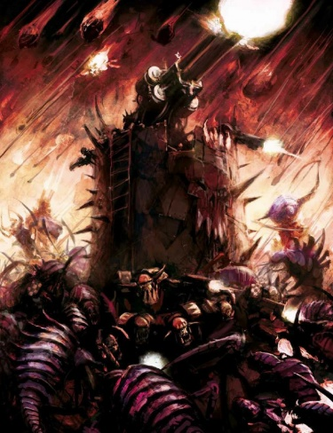
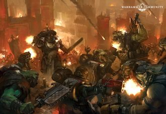
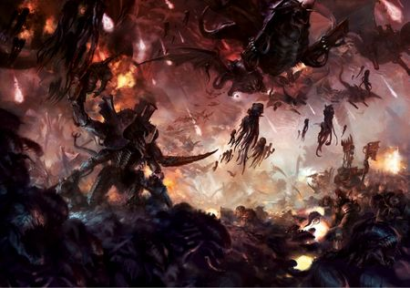

# 0828 999.M41- 奥克塔琉斯战争 Octarius War

精校状态：中文行文已逐段精校，部分术语仍为暂定

分类：时间线

原文来源：https://www.bilibili.com/opus/1142729164973932545

原作者：帝国神选罐头

原文时间：2025年12月05日 10:12

[返回分类目录](目录.md) · [全书目录](../../目录.md)

<!-- A0828-B0001 -->
**英文原文**

The Octarius War is a major conflict being waged between the Tyranid Hive Fleet Leviathan and the powerful Ork Empire of Octarius as well as tangential players such as the Imperium and Forces of Chaos.

<!-- /A0828-B0001 -->

<!-- A0828-B0002 -->

原译文

奥克塔琉斯战争是泰伦虫巢舰队利维坦与强大的奥克塔琉斯欧克帝国以及帝国和混沌部队等不相干的参与者之间正在进行的一场重大冲突。

**校订译文**

奥克塔琉斯战争主要发生在泰伦利维坦虫巢舰队与强大的奥克塔琉斯欧克帝国之间，帝国和混沌势力等也从旁卷入了这场重大冲突。

**校注：** tangential players 指外围参与、从旁卷入的势力，非与战争不相干。

<!-- /A0828-B0002 -->

<!-- A0828-B0003 图片 -->

<!-- A0828-B0004 -->

原译文

Ork and Tyranid forces battle on Ghorala 欧克和泰伦部队在戈拉勒作战

**校订译文**

Ork and Tyranid forces battle on Ghorala 欧克和泰伦部队在戈拉勒作战

<!-- /A0828-B0004 -->

<!-- A0828-B0005 -->
**英文原文**

Conflict:Tyrannic Wars/Noctis Aeterna

<!-- /A0828-B0005 -->

<!-- A0828-B0006 -->

原译文

冲突：泰伦战争/永恒之夜

**校订译文**

冲突：泰伦战争/永恒之夜

<!-- /A0828-B0006 -->

<!-- A0828-B0007 -->
**英文原文**

Date:999.M41 - Present

<!-- /A0828-B0007 -->

<!-- A0828-B0008 -->

原译文

日期：999.M41 - 现在

**校订译文**

日期：999.M41 至本文所述时期

<!-- /A0828-B0008 -->

<!-- A0828-B0009 -->
**英文原文**

Location:Octarius Sector

<!-- /A0828-B0009 -->

<!-- A0828-B0010 -->

原译文

地点：奥克塔琉斯星区

**校订译文**

地点：奥克塔琉斯星区

<!-- /A0828-B0010 -->

<!-- A0828-B0011 -->
**英文原文**

Outcome:Tyranids succeed in killing the Overfiend of Octarius and smashing his empire but scattered fighting continues, Cordon Impenetra stable

<!-- /A0828-B0011 -->

<!-- A0828-B0012 -->

原译文

结果：泰伦成功杀死了奥克塔琉斯的暴君，粉碎了他的帝国，但零星的战斗仍在继续，绝对封锁稳定

**校订译文**

结果：泰伦杀死奥克塔琉斯暴君，摧毁了他的帝国；零星战斗仍在继续，绝对封锁防线保持稳固

<!-- /A0828-B0012 -->

<!-- A0828-B0013 -->
**英文原文**

Combatants:Ork Empire of Octarius, Waaagh! Ghazghkull/Imperium, Eldar/Khorne/Tyranids

<!-- /A0828-B0013 -->

<!-- A0828-B0014 -->

原译文

作战人员：奥克塔琉斯的欧克帝国，碎骨者的Waaagh！/帝国，灵族/恐虐/泰伦

**校订译文**

交战方：奥克塔琉斯欧克帝国、碎骨者的 Waaagh!／帝国、灵族／恐虐／泰伦

<!-- /A0828-B0014 -->

<!-- A0828-B0015 -->
**英文原文**

Commanders: Overfiend of Octarius (KIA), Overfiend Blaktoof, Skarfang (KIA), Ghazghkull Mag Uruk Thraka, Zog Steeltoof, Warlord Magza da Kollossus (KIA), Kogfist Steelsnappa, Warboss Stugbrog da Facegrinda, Warboss Kagrit the Redtoof, Warboss Nabrot Stubfingers, Baddkrasha (KIA), Warboss Gibkrug, Warboss Zagrob, Warboss Ugul Ironboot, Warboss Tuskagrob Wurldkilla (KIA), Mekboss Da Meklord, Warboss Gragnatz Stompkrumpa, Speedboss Gurgruk/Inquisitor Nashir Sahansun, High Marshal Helbrecht. Fabricator-General Einrekh Phlagustok, Chapter Master Mezonyki Reio, Captain Krijeni Luceior, Watch Master Akrep Xie, Battle Leader Rakmeyr Bluewolf, Lord General Militant Arneld Heifaast, Governor Abrahoma Bentaal, Governor Helmghut Karst, Governor Zarkanay, General Rask, General Bartius, General Healen, General Reng, Fabricator-General Ezmeralda Brynlokh, Inquisitor Athocles Van Roth (KIA), Lord Admiral Janzig Danathios, High Admiral Herika Ajon, Baron Kaerlon, Barcelia Mung (KIA), Rogue Trader Eyva Phalomor, Autarch Balandiel (KIA), Farseer Yeltioc, Prince Lendathai, Warlock Entythras/Vodha Bloodprice/Hive Mind, Swarmlord

<!-- /A0828-B0015 -->

<!-- A0828-B0016 -->

原译文

指挥官：奥克塔琉斯的暴君（KIA），暴君黑牙，锐牙（KIA），碎骨者马格·乌鲁克·萨拉卡，佐格·钢牙，军阀巨像马格扎（KIA），齿拳·碎铁者，战争头目碎脸者斯塔格博格，战争头目红牙卡格里特，战争头目纳布罗特·粗指，坏粉碎者（KIA），战争头目吉布克鲁格，战争头目扎格罗布，战争头目乌古尔·铁靴，战争头目塔斯卡格罗布·世界杀手（KIA），技霸技师领主，战争头目格拉格纳茨·踏碎，极速头目古尔格鲁克/审判官纳夏·沙汉森，至高元帅赫尔布雷希特，铸造将军爱因雷赫·弗拉古斯托克，战团长梅佐基·雷奥，连长克里杰尼·卢西奥尔，守望大师阿克雷普·谢，战斗领袖拉克梅尔·蓝狼，军务领主将军阿内尔德·海法斯特，总督阿布拉马·本塔尔，总督赫尔姆古特·喀斯特，总督扎卡纳伊，将军拉斯克，将军巴蒂斯，将军希伦，将军伦格，铸造将军埃兹梅拉达·布林洛克，审判官阿托克利斯·范·罗斯（KIA），领主海军上将扬齐格·达纳西奥斯，至高海军上将赫里卡·阿琼，男爵凯尔隆，巴塞利亚·蒙格（KIA），行商浪人埃娃·法洛莫尔，司战巴兰迪尔（KIA），先知耶蒂奥克，王子伦达泰，战巫恩提斯拉斯/沃达·血价/虫巢思维，虫群领主

**校订译文**

指挥官：奥克塔琉斯暴君（阵亡）、暴君黑牙、锐牙（阵亡）、碎骨者·斯拉卡、佐格·钢牙、军阀巨像马格扎（阵亡）、齿拳·碎铁者、战争头目碎脸者斯塔格博格、战争头目红牙卡格里特、战争头目纳布罗特·粗指、坏粉碎者（阵亡）、战争头目吉布克鲁格、战争头目扎格罗布、战争头目乌古尔·铁靴、战争头目塔斯卡格罗布·世界杀手（阵亡）、技霸技师领主、战争头目格拉格纳茨·踏碎、极速头目古尔格鲁克／审判官纳夏·沙汉森、至高元帅赫尔布雷彻、铸造将军爱因雷赫·弗拉古斯托克、战团长梅佐基·雷奥、连长克里杰尼·卢西奥尔、守望堡主阿克雷普·谢、战斗领袖拉克梅尔·蓝狼、军务领主将军阿内尔德·海法斯特、总督阿布拉马·本塔尔、总督赫尔姆古特·喀斯特、总督扎卡纳伊、拉斯克将军、巴蒂斯将军、希伦将军、伦格将军、铸造将军埃兹梅拉达·布林洛克、审判官阿托克利斯·范·罗斯（阵亡）、海军领主上将扬齐格·达纳西奥斯、海军至高上将赫里卡·阿琼、凯尔隆男爵、巴塞利亚·蒙格（阵亡）、行商浪人埃娃·法洛莫尔、司战巴兰迪尔（阵亡）、大先知耶蒂奥克、王子伦达泰、战巫恩提斯拉斯／沃达·血价／虫巢意志、虫群领主

**校注：** 各人名暂沿现稿并统一已定词根。Lord Admiral 与 High Admiral 为原文不同头衔，分别海军领主上将／海军至高上将。伤亡状态仅按本文。

<!-- /A0828-B0016 -->

<!-- A0828-B0017 -->
**英文原文**

Losses/Survivors:Massive/Massive/Unknown/Heavy

<!-- /A0828-B0017 -->

<!-- A0828-B0018 -->

原译文

损失/幸存者：巨大/巨大/未知/沉重

**校订译文**

损失／幸存者：极其惨重／极其惨重／不详／惨重

<!-- /A0828-B0018 -->

<!-- A0828-B0019 -->
## History 历史

<!-- /A0828-B0019 -->

<!-- A0828-B0020 -->
**英文原文**

By the end of the 41st Millennium, the Imperium was beset by the third and mightiest Tyranid Hive Fleet, Leviathan. As the swarm rampaged throughout the southern plain of the galaxy, Inquisitor Kryptman desperately looked for an answer to the Tyranid threat. Looking to the Ork Empire of Octarius, Kryptman devised a plan to utilize mankind's old foe against the invading Tyranids and, in the best case scenario, kill two birds with one stone.

<!-- /A0828-B0020 -->

<!-- A0828-B0021 -->

原译文

到第41个千年末，帝国被第三支也是最强大的泰伦虫巢舰队利维坦所包围。当虫群在银河系南部平面肆虐时，审判官克雷普特曼拼命地寻找对泰伦威胁的答案。看着奥克塔留斯的欧克帝国，克雷普特曼设计了一个计划，利用人类的宿敌来对抗入侵的泰伦，在最好的情况下，一石二鸟。

**校订译文**

第 41 个千年末，第三支、也是最强大的泰伦虫巢舰队利维坦进犯帝国。虫群在银河南部肆虐，审判官克瑞普特曼急切地寻求应对之策。他将目光投向奥克塔琉斯欧克帝国，打算借助人类的宿敌对付来犯的泰伦。理想情况下，这一计划能够一石二鸟，同时消灭双方。

<!-- /A0828-B0021 -->

<!-- A0828-B0022 -->
**英文原文**

Kryptman led several specially equipped Deathwatch teams into the caverns of Carpathia to attempt to capture a brood of live Genestealers in a stasis field. The mission was successful, although Kryptman's force suffered heavy casualties. He then planted the brood on board the Perdition's Flame, a Space Hulk that emerged from the Warp in the path of Leviathan. As the Genestealers awoke, he destroyed the moon of Gheist in order to divert the hulk's trajectory directly towards the Octarius Empire.

<!-- /A0828-B0022 -->

<!-- A0828-B0023 -->

原译文

克雷普特曼带领几支装备精良的死亡守望小队进入卡柏菲亚号的洞穴，试图用一个静滞力场捕获一个族裔的活着的基因窃取者。尽管克雷普特曼的部队伤亡惨重，但任务还是成功了。然后，他将族裔安置在毁灭之火号上，这是一艘从亚空间中出现在利维坦路径上的太空废船。当基因窃取者醒来时，他摧毁了盖斯特的卫星，以便将船体的轨道直接转向奥克塔琉斯帝国。

**校订译文**

克瑞普特曼率数支配备专门装备的死亡守望小队进入卡柏菲亚的洞穴，试图用静滞力场活捉一群基因窃取者。任务获得成功，尽管他的部队付出了惨重伤亡。随后，他将这群基因窃取者安置在毁灭之火号上。这艘太空废船刚从亚空间中出现，正位于利维坦的前进路线之上。基因窃取者苏醒时，他摧毁名为盖斯特的卫星，借此改变废船航向，使它径直驶向奥克塔琉斯帝国。

**校注：** Carpathia 为洞穴所在地点，无证据是舰船，删误加“号”；moon of Gheist 按前文资料为盖斯特卫星本身，不是盖斯特所属另一颗卫星。

<!-- /A0828-B0023 -->

<!-- A0828-B0024 -->
**英文原文**

As the Space Hulk entered the Octarius Empire, it was boarded by Ork Lootaz seeking to plunder it, but they were quickly ambushed and impregnated by the Genestealers. They went on to spread the infestation across the entire Octarius Sector. After preliminary skirmishes with the invading Genestealers, Warbosses from the Blood Axes employed the services of Boss Zagstruk and his Vulcha Squad to intercept and destroy the infestation. Even though they were successful, a tendril of Leviathan changed course towards the psychic signal of the Genestealers and invaded the Empire. The Overfiend of Octarius, Blaktoof, launched a counter-invasion directly into the oncoming Hive Fleet. Despite the Orks' efforts, a dozen worlds in the Octarius Empire became infected by the Tyranids within weeks. Depending on the source, the date of Leviathan's invasion is either 989.M41 or 999.M41.

<!-- /A0828-B0024 -->

<!-- A0828-B0025 -->

原译文

当太空废船进入奥克塔琉斯帝国时，它被欧克流寇登上，试图掠夺它，但他们很快遭到了基因窃取者的伏击和遍布。他们继续将侵扰传播到整个奥克塔琉斯星区。在与入侵的基因窃取者发生初步小规模冲突后，血斧的战争头目雇佣了头目扎格斯特鲁克和他的秃鹫小队来拦截和摧毁侵扰。尽管他们取得了成功，但利维坦的卷须还是改变了方向，向基因窃取者发出了灵能信号，入侵了帝国。奥克塔琉斯的暴君，黑牙直接对即将到来的虫巢舰队发动了反击。尽管欧克做出了努力，但奥克塔琉斯帝国的十几个世界在几周内就被泰伦感染了。根据消息来源，利维坦入侵的日期是989.M41或999.M41。

**校订译文**

太空废船进入奥克塔琉斯帝国后，一群欧克蛮人拾荒者登船搜刮，却迅速遭到基因窃取者伏击，并被植入基因种子。它们随后将感染传播到整个奥克塔琉斯星区。与入侵的基因窃取者发生最初几场冲突后，血斧氏族的战争头目雇来头目祖格斯图卡及其秃鹫小队，截击并清除感染者。虽然清剿成功，利维坦的一支触须舰队还是受到基因窃取者灵能信号的吸引，转向入侵欧克帝国。奥克塔琉斯暴君黑牙直接向逼近的虫巢舰队发动反攻。尽管欧克奋力抵抗，短短数周内，帝国中仍有十二个世界遭泰伦感染。关于利维坦入侵的时间，不同来源分别记为 989.M41 或 999.M41。

**校注：** 基因窃取者发出信号、虫巢舰队受其吸引，原译倒置；沿原文明示两种入侵日期。

<!-- /A0828-B0025 -->

<!-- A0828-B0026 -->
### Orrok 奥罗克

<!-- /A0828-B0026 -->

<!-- A0828-B0027 -->
**英文原文**

On the former Imperial world of Orrok, the Orks reacted with puzzlement when the skies darkened with millions of incoming Mycetic Spores. The Orks rushed to their weapons and barely had time to man their defenses when waves of Gaunts crashed into the fortifications. The Orks counter-charged the oncoming swarm, and thousands died on both sides in only a matter of seconds. On every scale a fierce battle raged - Squigs and Rippers tore into each other underfoot as Gaunts and Ork Boyz hacked and slashed at each other; Ork Warbosses and Nobz fought against Tyranid Warriors and Carnifexes; mighty Squiggoths battled thunderously with huge Tyranid Bio-Titans; even on a microscopic level Tyranid Phage Cells consumed the aggressively spreading Orkoid Spores. Orrok was encumbered by total war on every scale. But slowly, the Orks realized they were outnumbered and surrounded. By nightfall every Ork on Orrok was killed and their corpses turned into bio-resources to feed the growing Tyranid swarm.

<!-- /A0828-B0027 -->

<!-- A0828-B0028 -->

原译文

在前帝国世界奥罗克，当天空被数百万即将到来的菌丝孢子笼罩时，欧克感到困惑。当兵虫冲进防御工事时，欧克冲向他们的武器，几乎没有时间防守。欧克对迎面而来的虫群进行了反击，在短短几秒钟内，双方都有数千人死亡。在每一个层面上，一场激烈的战斗都在肆虐 — 史古格和撕裂虫在脚下互相撕咬，兵虫和欧克小子互相砍杀；欧克战争头目和老大与泰伦战士和刽子手作战；强大的史古格巨兽与巨大的泰伦生物泰坦展开了雷鸣般的战斗；即使在微观水平上，泰伦噬菌体细胞也会吞噬积极扩散的欧克孢子。奥罗克被各种规模的全面战争所阻碍。但慢慢地，欧克意识到他们寡不敌众，被包围了。夜幕降临时，奥罗克上的每一只欧克都被杀死了，他们的尸体变成了生物资源，为不断增长的泰伦虫群提供食物。

**校订译文**

在曾属于帝国的奥罗克世界，数百万菌丝孢子从天而降，遮蔽天空，令欧克蛮人一时摸不着头脑。它们匆忙拿起武器，还来不及进入防御阵位，兵虫浪潮便已扑入工事。欧克迎着虫群反冲锋，短短数秒，双方就各有数千战死。战斗在每一种尺度上同时展开：脚下的史古革与撕裂虫相互撕咬，兵虫与蛮人小子挥刃厮杀；战争头目和强蛮人与泰伦武士、刽子手搏斗；巨大的史古革巨兽与泰伦生物泰坦轰然相撞。甚至在微观层面，泰伦噬菌体细胞也在吞噬疯狂扩散的欧克孢子。整个奥罗克陷入无所不在的全面战争。欧克逐渐意识到，自己已遭数量远胜于己的敌人包围。夜幕降临时，奥罗克上的欧克全数战死，尸体被转化为生物资源，供养不断壮大的泰伦虫群。

<!-- /A0828-B0028 -->

<!-- A0828-B0029 -->
### Ghorala 戈拉勒

<!-- /A0828-B0029 -->

<!-- A0828-B0030 -->
**英文原文**

Shortly after Orrok fell, Leviathan descended upon Ghorala, the base of Pirate-Warboss Skarfang and his dreaded Skar Fleet. When Leviathan arrived they were countered by every Ork vessel within a dozen light years, as well as extensive mine fields hidden amongst Ghorala's asteroid belt which tore bio-ships apart in cataclysmic explosions. Ork gunships assaulted the surviving vessels before they had time to react and the Tyranid fleet was all but destroyed under Skarfang's guns. However a single bio-ship managed to break through the Ork blockade and hurl itself at Ghorala, heedless of pain or injury. It launched thousands of Mycetic Spores onto the planet's equatorial planes. Skarfang, watching the planet from afar, realized that the space battle was over and the real fight was now on the planet's surface. The Orks made planetfall to chase their foe.

<!-- /A0828-B0030 -->

<!-- A0828-B0031 -->

原译文

奥罗克陷落后不久，利维坦突袭了海盗战争头目锐牙和他可怕的锐利舰队的基地戈拉勒。当利维坦到达时，他们被十几光年内的每一艘欧克飞船以及隐藏在戈拉勒小行星带中的广阔雷区所反击，这些雷区在灾难性的爆炸中撕裂了生物舰。欧克炮艇在幸存的战舰有时间作出反应之前袭击了它们，而泰伦舰队在锐牙的炮火下几乎被摧毁。然而，一艘生物舰不顾疼痛或伤害，设法突破了欧克封锁，向戈拉勒猛扑过去。它将数千枚菌丝孢子发射到行星的赤道平面上。锐牙从远处看着这颗行星，意识到太空战已经结束，真正的战斗现在在行星表面。欧克令行星坠落来追逐他们的敌人。

**校订译文**

奥罗克陷落后不久，利维坦便扑向戈拉勒——海盗战争头目锐牙及其凶名昭著的锐利舰队的基地。虫巢舰队抵达时，方圆十二光年内所有欧克舰艇都前来迎击；戈拉勒小行星带中还藏着大片雷区，接连爆炸，将生物舰撕得粉碎。幸存舰船尚未反应过来，欧克炮艇已发动突袭，泰伦舰队在锐牙的炮火下几乎全军覆没。然而，仍有一艘生物舰不顾疼痛与创伤，突破封锁，扑向戈拉勒，将数千枚菌丝孢子抛向行星赤道平原。锐牙在远处观察，意识到太空战已结束，真正的战斗转移到了地表。欧克于是登陆，追击敌人。

**校注：** made planetfall 为登陆，非使行星坠落；equatorial planes 按地表语境指赤道平原，原文可能为 plains 的误拼。

<!-- /A0828-B0031 -->

<!-- A0828-B0032 -->
**英文原文**

On the planet's surface the Tyranids were vastly outnumbered by Orks, for the first time since entering the Octarius Sector. Sensing that a war of attrition would end in their deaths, the Tyranid swarm adopted a tactic of stalking and attacking only isolated Ork patrols. But the Orks began traveling in mobs too large for the fledgling swarm to face. The Tyranids then adapted again and began aiming for maximum carnage by engaging the Orks in the open. Whenever the Tyranids were on the verge of being overrun, they would retreat in unison and shelter in caves or beneath the ground until nighttime, when the Tyranid Synapse creatures would re-gather the scattered beasts to the battlefield to feed on the corpses. Ork and Tyranid bodies alike would be devoured and brought to Digestion Pools secreted in the planet's rocky mesas. Slowly but surely the Tyranids gathered more bio-resources and increased their numbers. The growing swarm changed its tactics again to engage ever larger concentrations of Orks in order to win larger sources of bio-resources.

<!-- /A0828-B0032 -->

<!-- A0828-B0033 -->

原译文

在行星表面，欧克的数量远远超过了泰伦，这是自进入奥克塔留斯星区以来的第一次。意识到消耗战将以他们的死亡告终，泰伦的虫巢采取了只跟踪和攻击孤立的欧克巡逻队的战术。但欧克开始成群结队地前进，对于羽翼未丰的虫群来说太大了。泰伦随后再次适应，开始通过在开阔地与欧克交战来进行最大规模的屠杀。每当泰伦即将被征服时，他们都会一齐撤退，躲在洞穴或地下，直到晚上，泰伦的突触生物会将分散的野兽重新聚集到战场上，以尸体为食。欧克和泰伦的尸体都会被吞噬，并被带到藏匿在行星岩石台地上的消化池中。泰伦缓慢但坚定地收集了更多的生物资源，并增加了他们的数量。不断壮大的虫群再次改变了策略，与越来越聚集的欧克交战，以赢得更大的生物资源来源。

**校订译文**

在地表，泰伦的数量远少于欧克，这是它们进入奥克塔琉斯星区后首次陷入这种局面。虫群意识到，消耗战只会使自身覆灭，遂改为潜踪袭击落单的欧克巡逻队。然而，欧克开始大群结伴行动，其规模已超出这支新生虫群的对抗能力。泰伦再次调整战术，主动在开阔地交战，以求尽可能多地杀伤敌人。每当即将被欧克淹没，虫群便同时撤退，藏入洞穴或地下。夜幕降临后，突触生物重新召集分散的虫兽，返回战场吞食尸体。欧克与泰伦的遗骸一并被吞噬，送往隐藏在岩石台地中的消化池。虫群由此稳步积累生物资源，扩大数量，随后又调整战术，袭击规模更大的欧克集群，夺取更多生物资源。

<!-- /A0828-B0033 -->

<!-- A0828-B0034 -->
**英文原文**

Skarfang was soon attracted by all the violence and entered the ground war himself. His guttural war-cries encouraged Orks to turn the tide of battles in their favor. With the new battle-lust that Skarfang inspired, the Tyranids were slowly being pushed back. However in response, the Tyranids created Lictors with the purpose of assassinating Skarfang. But Squig-hounds foiled every one of their attempts to get close enough. The Tyranids cunningly lured Skarfang out by throwing tides of Hormagaunts at the Ork lines, and then withdrawing when the Orks roused in defence. Skarfang became infuriated as these feints were repeated from different directions but always withdrew before the Orks could fight back. On the tenth such attack, Skarfang ordered a pursuit. Battlewagons and Wartrukks bellowed after the swarm... directly into a trap. Broods of Venomthropes surrounded the Orks in a thick, toxic fog and the convey of Ork vehicles crashed into rocky outcrops or into each other. As the Orks began to choke to death in the fog, Skarfang stumbled across the Venomthropes and vented his anger on them. But when the fog receded, Skarfang found himself surrounded by Lictors. All his boyz had been killed off one at a time until he was the only Ork left. He managed to take two steps towards the enemy before a dozen claws tore him asunder.

<!-- /A0828-B0034 -->

<!-- A0828-B0035 -->

原译文

锐牙很快就被所有的暴力所吸引，自己也加入了地面战争。他喉咙里的战吼鼓励欧克扭转战局。随着锐牙激发的新的战斗欲望，泰伦正慢慢被击退。然而，作为回应，泰伦创造了利卡特，目的是暗杀锐牙。但史古格猎犬挫败了他们每一次靠近的尝试。泰伦狡猾地引诱锐牙离开，向欧克防线投掷刀虫潮，然后在欧克奋起防御时撤退。锐牙被激怒了，因为这些佯攻从不同的方向重复出现，但总是在欧克反击之前撤退。在第十次这样的攻击中，锐牙下令追击。战斗大卡和战争皮卡在虫群后咆哮… 直接落入陷阱。毒烟虫族裔在浓毒雾中包围了欧克，欧克的运输载具撞上了露头的岩石或相互碰撞。当欧克开始在雾中窒息而死时，锐牙偶然发现了毒烟虫，并向他们发泄了愤怒。但当雾退去时，锐牙发现自己被利卡特包围了。他所有的小子都一个接一个地被杀了，直到他成为唯一剩下的欧克。他设法朝敌人走了两步，但十几只爪子把他撕成了碎片。

**校订译文**

激烈的战斗很快引来锐牙，他亲自投入地面战场。低沉的战吼鼓舞欧克，扭转了战局。在他激发的旺盛战意下，泰伦逐渐后退。虫群随即培育刀斧虫，试图刺杀锐牙，但史古革猎犬一次次阻止它们接近。泰伦于是设下诱敌之计，派出刀虫浪潮冲击欧克阵线，又在对方奋起防御时退去。佯攻反复从不同方向发起，却总在欧克能够还击前撤离，令锐牙怒火中烧。第十次遭袭时，他终于下令追击。战斗堡垒与战争卡车轰鸣着追赶虫群，径直驶入陷阱。一群群毒烟虫用浓密毒雾包围欧克，车队不是撞上突出的岩石，就是彼此相撞。欧克接连窒息而死；锐牙踉跄着撞见毒烟虫，将怒火倾泻在它们身上。浓雾散去时，他却发现自己已被刀斧虫包围。麾下小子已被逐个杀死，场上只剩他一只欧克。他朝敌人迈出两步，便被十二只利爪撕碎。

<!-- /A0828-B0035 -->

<!-- A0828-B0036 -->
**英文原文**

With their leader dead, the Orks on Ghorala collapsed into infighting and became easy prey for the Tyranids. Each tribe was isolated and destroyed in quick succession until, within weeks, all the Orks on Ghorala had been killed. The bio-resources of the planet were turned into new bio-ships and the Tyranid infestation quickly spread to nearby Ork worlds.

<!-- /A0828-B0036 -->

<!-- A0828-B0037 -->

原译文

随着他们的领袖去世，戈拉勒的欧克陷入内斗，很容易成为泰伦的猎物。每个部落都被隔离并迅速连续摧毁，直到几周内，戈拉勒上的所有欧克都被杀死。行星上的生物资源被转化为新的生物舰，泰伦的侵扰迅速蔓延到附近的欧克世界。

**校订译文**

领袖死后，戈拉勒的欧克陷入内斗，成了泰伦轻易可得的猎物。各部落接连遭到孤立，继而覆灭。短短数周，行星上的欧克便被屠戮殆尽。虫群将这里的生物资源转化为新的生物舰，迅速向附近的欧克世界蔓延。

<!-- /A0828-B0037 -->

<!-- A0828-B0038 -->
### Octarius 奥克塔琉斯

<!-- /A0828-B0038 -->

<!-- A0828-B0039 -->
**英文原文**

On the central world of Octarius, the Overfiend of Octarius, after hearing about Orrok, marshaled the tribes and prepared the defenses. When the first wave of Mycetic Spores arrived at the planet days later, a great cheer went up from the gathered Ork hordes who were itching for a great fight. Much of the battle took place in the skies and so much ammunition was fired into the air by Ork Quad-guns and Flakka-Dakka Guns that the rain was thickened by chunks of falling Tyranid flesh. Then from the west, the black storm clouds drew closer and closer until they were revealed to be swarms of advancing Gargoyles. Ork Deffkoptas, Fighta-Bommers and Stormboyz roared into the air in a race to intercept the oncoming creatures. Dead Orks, burning wreckage, and hissing Tyranid ichor rained down everywhere.

<!-- /A0828-B0039 -->

<!-- A0828-B0040 -->

原译文

在奥克塔琉斯的中心世界，奥克塔琉斯的暴君在听说奥罗克后，组织了部落并准备了防御。几天后，当第一波菌丝孢子抵达行星时，聚集在一起的欧克部落欢呼雀跃，他们渴望进行一场伟大的战斗。大部分战斗发生在空中，欧克四联火炮和防空哒咔火炮向空中发射了如此多的弹药，以至于雨水被倒下的泰伦血肉加厚。然后从西边，黑色的风暴云越来越近，直到它们被发现是成群的前进的石像鬼。欧克死亡直升机、战斗轰炸机和风暴小子咆哮着冲向空中，争相拦截迎面而来的生物。死去的欧克、燃烧的残骸和嘶嘶作响的泰伦残骸到处都是。

**校订译文**

在帝国的核心世界奥克塔琉斯，暴君得知奥罗克陷落后，立即召集各部落，整备防御。数日后，第一波菌丝孢子降临，聚集的欧克大军爆发出欢呼——它们早已渴望一场痛快大战。大量战斗在天空中展开。欧克四联火炮和防空哒咔火炮疯狂倾泻弹药，被轰碎的泰伦血肉混入雨中，纷纷坠落。西方的漆黑风暴云不断逼近，欧克这才发现，那是大群石像鬼。死亡直升机、战斗轰炸机和风暴小子咆哮着冲上天空，争先恐后地拦截虫群。欧克尸体、燃烧的残骸和嘶嘶作响的泰伦体液如雨般洒落。

<!-- /A0828-B0040 -->

<!-- A0828-B0041 -->
**英文原文**

The Ork Boyz on the ground below began to climb the slopes, holding their Choppas high and intending to jump into the fray if only they could. Then suddenly the ground burst up and Genestealer broods flowed out of the tunnels. But the responding green tide of Orks quickly pushed them back into the crevasses and then plunged in after them. Meanwhile, Lictors scaled the mountainsides and stealthily silenced each Ork gun emplacement in turn. With the large guns down, the rain of Mycetic Spores doubled in ferocity and more and more Tyranids landed on the mountain passes to be met by equal numbers of Orks. Never before had Octarius seen such bloodshed, and the war soon spread from Octarius out to the entirety of the Octarius Sector.

<!-- /A0828-B0041 -->

<!-- A0828-B0042 -->

原译文

下面地面上的欧克小子开始爬上斜坡，高举他们的砍砍，如果可能的话，他们打算跳进战斗中。突然，地面裂开了，基因窃取者族裔从隧道里流了出来。但随之而来的绿潮很快将它们推回裂隙，然后又扑向他们。与此同时，利卡特爬上山坡，依次悄悄地压制了每个欧克炮台。随着大炮的放下，菌丝孢子的雨猛烈地翻了一番，越来越多的泰伦降落在山口，被同等数量的欧克迎接。奥克塔琉斯从未见过这样的流血事件，战争很快从奥克塔琉斯蔓延到整个奥克塔琉斯星区。

**校订译文**

地面的蛮人小子高举砍砍爬上山坡，恨不得一跃加入空中的厮杀。突然，大地裂开，成群基因窃取者从地道涌出。迎战的绿色浪潮迅速将它们逼回裂隙，随即追入地下。与此同时，刀斧虫攀上山坡，悄无声息地逐一拔除欧克炮位。重炮哑火后，菌丝孢子雨愈发猛烈，数量翻倍。越来越多的泰伦降落在山口，却又迎上同等数量的欧克。奥克塔琉斯从未经历过如此惨烈的杀戮，战火很快由这颗行星蔓延至整个奥克塔琉斯星区。

<!-- /A0828-B0042 -->

<!-- A0828-B0043 -->
### Escalating War 不断升级的战争

<!-- /A0828-B0043 -->

<!-- A0828-B0044 -->
**英文原文**

The Octarius war is continuing to escalate. In 997.M41 several Eldar warhosts entered the war, fighting against both Imperial and Ork forces. In 990999.M41 many Imperial Worlds were caught in the crossfire as the Saim-Hann Eldar entered the war, and the Raven Guard, White Scars and Salamanders Chapters united to defend the embattled planets. Recent reports indicate that the Tyranid Swarmlord has joined the assault on the Orks of Octarius.

<!-- /A0828-B0044 -->

<!-- A0828-B0045 -->

原译文

奥克塔琉斯战争仍在升级。997.M41，几名灵族战士参加了战争，与帝国和欧克部队作战。990999.M41，随着塞姆·罕灵族加入战争，许多帝国世界陷入了交火之中，暗鸦守卫、白色疤痕和火蜥蜴战团联合起来保卫四面楚歌的行星。最近的报告表明，泰伦虫群领主已经加入了对奥克塔琉斯欧克的袭击。

**校订译文**

奥克塔琉斯战争不断升级。997.M41，多支灵族战军参战，同时攻击帝国与欧克部队。至 990999.M41，塞姆罕灵族加入战争，许多帝国世界卷入战火。暗鸦守卫、白疤与火蜥蜴战团联手，保卫这些四面受敌的行星。本文所引的近期报告还称，泰伦虫群领主也已加入对奥克塔琉斯欧克的攻势。

**校注：** warhosts 指战军，非几名战士。990999.M41 是所给英文完整帝国纪年，按原文保留，不拆成990—999年。

<!-- /A0828-B0045 -->

<!-- A0828-B0046 -->
**英文原文**

Whether the Orks or the Tyranids win the war, the victor will emerge stronger than before. Orks from light-years around are flocking to Octarius, and are growing bigger and stronger on their diet of conflict. And every Ork devoured gives more biomass to the growing Tyranid swarm, which is constantly learning and adapting new ways to defeat their foes. Kryptman succeeded in luring Leviathan to the Octarius Empire, but rather than tricking both sides into destroying each other his plan has backfired into starting a series of events that is making the Imperium's enemies stronger.

<!-- /A0828-B0046 -->

<!-- A0828-B0047 -->

原译文

无论是欧克还是泰伦赢得战争，胜利者都会比以前更强大。来自附近光年的欧克正涌向奥克塔琉斯，在冲突的进食中变得越来越大、越来越强壮。每吞噬一只欧克，都会为不断增长的泰伦虫群提供更多的生物质，不断学习和适应击败敌人的新方法。克雷普特曼成功地将利维坦引诱到奥克塔琉斯帝国，但他的计划非但没有欺骗双方互相摧毁，反而适得其反，引发了一系列事件，使帝国的敌人更加强大。

**校订译文**

无论欧克还是泰伦获胜，胜者都将比战前更强。周围数光年范围内的欧克纷纷涌向奥克塔琉斯，在接连不断的战斗中长得更大、更强。虫群每吞食一只欧克，也会获得更多生物质；与此同时，它们不断学习、适应，寻找击败敌人的新办法。克瑞普特曼成功将利维坦引向奥克塔琉斯帝国，却未能使双方同归于尽。他的计划适得其反，引发连锁事态，反而壮大了帝国的敌人。

<!-- /A0828-B0047 -->

<!-- A0828-B0048 -->
### Ghazghkull's Arrival 碎骨者的到来

<!-- /A0828-B0048 -->

<!-- A0828-B0049 -->
**英文原文**

In 694999.M41, infamous Ork Warlord Ghazghkull Mag Uruk Thraka arrived in the Octarius Sector. He had grown bored of the Third War for Armageddon and proclaimed that he was beginning a new Great Waaagh!. By this point, the Ork forces in the sector were under the control of Zog Steeltoof, who had risen to power after Gorsnik Magash had joined the fighting on Armageddon. Seeing the opportunity for a good fight, Ghazghkull came to the aid of the Orks of Octarius and after slaying a mighty Mawloc, has rallied the Greenskins there to his cause.

<!-- /A0828-B0049 -->

<!-- A0828-B0050 -->

原译文

694999.M41，著名的欧克军阀碎骨者马格·乌鲁克·萨拉卡抵达奥克塔琉斯星区。他已经厌倦了第三次阿玛吉多顿战争，并宣布他正在开始一场新的大Waaagh！至此，该星区的欧克部队已被佐格·钢牙控制，佐格·钢牙是在戈斯尼克·马加什加入阿玛吉多顿的战斗后上台的。看到了一场好战斗的机会，碎骨者来到奥克塔琉斯的欧克的帮助下，在杀死了一名强大的沙蟒后，他召集了那里的绿皮支持他的事业。

**校订译文**

694999.M41，声名狼藉的欧克军阀碎骨者·斯拉卡抵达奥克塔琉斯星区。他已厌倦第三次阿玛吉多顿战争，宣称要发动新的大 Waaagh!。当时，星区内的欧克部队由佐格·钢牙统领——戈斯尼克·马加什前往阿玛吉多顿参战后，佐格便夺得了权力。碎骨者看中这里痛快厮杀的机会，前来援助奥克塔琉斯的欧克。他杀死一头强大的沙蟒后，将当地绿皮聚集到自己的旗帜之下。

<!-- /A0828-B0050 -->

<!-- A0828-B0051 -->
**英文原文**

After reorganizing and reinvigorating the Greenskin cause in Octarius, Ghazghkull departed and is now leading an armada of five million warships towards the Imperium.

<!-- /A0828-B0051 -->

<!-- A0828-B0052 -->

原译文

在奥克塔琉斯重组和重振绿皮事业后，碎骨者离开了，现在正率领一支由500万艘战舰组成的舰队前往帝国。

**校订译文**

重新组织并振奋奥克塔琉斯的绿皮后，碎骨者离开此地。据本文记述，他正率领一支拥有五百万艘战舰的庞大舰队，向帝国进发。

<!-- /A0828-B0052 -->

<!-- A0828-B0053 -->
### Skull Hunt 猎颅

<!-- /A0828-B0053 -->

<!-- A0828-B0054 -->
**英文原文**

After hearing about the Tyranids and Orks that clash there in an ever-escalating spiral of violence, The World Eaters warband known as the Skullhunt of Vodha Bloodprice invades the Octarius System. The World Eaters are not disappointed – within the space of a single year, over eight thousand skulls are offered to the Blood God, the smallest of which is the size of a boulder. Vodha ascends to daemonhood after slaying a Hierophant bio-titan with the greataxe of the fallen Ork Warboss Magza da Kollossus.

<!-- /A0828-B0054 -->

<!-- A0828-B0055 -->

原译文

在听说泰伦和欧克在那里以不断升级的暴力螺旋发生冲突后，被称为猎颅者的沃达·血价的吞世者战帮入侵了奥克塔琉斯星系。吞世者并不失望 — 在一年内，有8000多个颅骨被供奉给血神，其中最小的有一块巨石那么大。沃达在用倒下的欧克战争头目巨像马格扎的巨斧杀死了一名主教生物泰坦后，升格为恶魔王子。

**校订译文**

听说泰伦与欧克在此厮杀，暴力冲突不断升级，沃达·血价麾下名为“猎颅者”的吞世者战帮便入侵奥克塔琉斯星系。这里没有让他们失望：仅一年间，战帮便向血神献上八千余颗颅骨，最小的也有巨石般大小。沃达用阵亡的欧克战争头目巨像马格扎的巨斧，杀死一头圣师兽生物泰坦，随后升格成魔。

<!-- /A0828-B0055 -->

<!-- A0828-B0056 -->
### Da Maw 咽喉

<!-- /A0828-B0056 -->

<!-- A0828-B0057 -->
**英文原文**

After his ascension, Bloodprice organized an even greater warband from not only the Skullhunt but also the Bloodblessed, Bloody Dawn, Gorefists, and Harvest alongside hordes of Cultists, Beastmen, Chaos Knights, and Dark Mechanicum. He moved on to an Ork world dubbed "Da Maw" where horde after horde of Tyranids threw themselves into battle with Greenskins on a colossal scale. To Bloodprice, this war-strewn land was a paradise and blessing of Khorne. He used his flagship Goredrenched to lead his armada into the planet's orbit, smashing past Greenskin and Tyranid ships and aiming to land on the world to engage in total slaughter.

<!-- /A0828-B0057 -->

<!-- A0828-B0058 -->

原译文

升格后，血价组织了一个更大的战帮，不仅有猎颅者，还有鲜血赐福、血腥黎明队、凝血之拳和收割者，还有成群的邪教徒、野兽人、混沌骑士和黑暗机械教。他继续前往一个被称为“咽喉”的欧克世界，在那里，一群群的泰伦与绿皮展开了大规模的战斗。对血价来说，这片饱受战争蹂躏的土地是恐虐的天堂和赐福。他用他的旗舰浸血者带领他的舰队进入行星轨道，粉碎了绿皮和泰伦的船只，并打算降落在世界上进行彻底的屠杀。

**校订译文**

升格后，血价以猎颅者、鲜血赐福、血腥黎明、凝血之拳和收割者等战帮为基础，集结大批邪教徒、野兽人、混沌骑士与黑暗机械教部队，组成更庞大的军势。他随后前往一颗被称为“咽喉”的欧克世界；在那里，一波又一波泰伦正与绿皮展开规模惊人的会战。在血价眼中，这片战火遍布的土地正是天堂，是恐虐的赐福。他乘旗舰浸血者号，率舰队击破欧克与泰伦舰船的阻拦，突入行星轨道，准备登陆，投入无尽屠杀。

<!-- /A0828-B0058 -->

<!-- A0828-B0059 -->
### Imperial Involvement 帝国加入

<!-- /A0828-B0059 -->

<!-- A0828-B0060 -->
**英文原文**

Post-Great Rift, the Imperium had come to believe that Kryptmann's gambit had simply strengthened both sides and that the conflict would soon spill over into Imperial territory. As a result, Inquisitor Nashir Sahansun devised a plan dubbed the Cordon Impenetra. Drawing a sphere around the outer reaches of the space fought over by the Orks and Tyranids, he declared almost every Imperial world within the zone lost, and pushed hard for every sub-sector bordering it to bolster its defense. Many worlds joined the Cordon Impenetra. Efforts were made by the Imperials to destabilize the warring Xenos. However, ultimately, these actions proved to be in vain and the Xenos expanded outwards soon enough.

<!-- /A0828-B0060 -->

<!-- A0828-B0061 -->

原译文

大裂隙后，帝国开始相信克雷普特曼的策略只是加强了双方，冲突很快就会蔓延到帝国领土。因此，审判官纳夏·沙汉森设计了一个名为“绝对封锁”的计划。他在欧克和泰伦争夺的空域外围画了一个球体，宣布该区域内几乎所有的帝国世界都陷落了，并大力推动与之接壤的每个分区加强防御。许多世界加入了绝对封锁。帝国努力破坏交战的异型的稳定。然而，最终这些行动被证明是徒劳的，异型很快就向外扩张了。

**校订译文**

大裂隙形成后，帝国逐渐认定，克瑞普特曼的冒险之举只增强了交战双方，战火很快就会蔓延到帝国疆域。审判官纳夏·沙汉森因此提出“绝对封锁”计划：他围绕欧克与泰伦争夺的宙域划出一片球形区域，将其内几乎所有帝国世界都列为已失之地，并竭力推动所有毗邻次星区加强防御。许多世界加入这道封锁防线，帝国也设法削弱交战的异形势力。然而，这些努力最终未能阻止战火外溢，异形不久便开始向外扩张。

<!-- /A0828-B0061 -->

<!-- A0828-B0062 -->
### The Pankallis Sub-sector 潘卡利斯次星区

原题：The Pankallis Sub-sector 潘卡利斯分区

<!-- /A0828-B0062 -->

<!-- A0828-B0063 -->
**英文原文**

When the Pankallis Sub-sector was attacked, every invaded system dispatched pleas to aid. The Imperial worlds found themselves assailed by Genestealer Cult uprisings at Darkmont, Ahelmil, and Saint's Blessing. Meanwhile, the Orks of Stugbrog da Facegrinda attacked the worlds of the Semythis System, overwhelming the Feral World of Tylam and the Death World of Nazkah. The Fortress World of Kaist held out the longest, but the system was effectively conquered. The Orks next moved to the Kernak System, with the Deathskulls Warlord Nabrot Stubfingers fighting the Mechanicum of Kernak III and the Goff Kagrit the Redtoof conquering Kusolst. At the same time, Tyranids of Hive Fleet Leviathan descended upon the Systems of Anelanni, Bianzeer's Hollow, and Gydisk. The Xenos consumed their way through the ironbeech forests of Gydisk Tertius, the sauropod world of Gydisk Alpha, the Megafunghi caves of Gydisk Quartas, and the steam-powered kingdom-flotillas of Gydisk Betaris. Though elements of Imperial resistance remained, these worlds were effectively lost. Even the forces of Chaos appeared on a number of worlds, with remote tribes revealing themselves as followers of the Dark Gods. On Kherusk, full-scale Daemonic invasion erupted.

<!-- /A0828-B0063 -->

<!-- A0828-B0064 -->

原译文

当潘卡利斯分区遭到袭击时，每个入侵的星系都发出了援助请求。帝国世界发现自己受到了在达克蒙特、阿赫米尔和圣者之祝的基因窃取者教派叛乱的攻击。与此同时，碎脸者斯塔格博格的欧克攻击了塞米蒂斯星系的世界，压倒了泰拉姆蛮荒世界和纳斯卡死亡世界。凯斯特要塞世界坚持时间最长，但该星系实际上被征服了。欧克接下来转移到了克纳克星系，死颅军阀纳布罗特·粗指与克纳克三号的机械教和征服库索斯特的高夫的红牙卡格里特作战。与此同时，虫巢舰队利维坦的泰伦袭击了阿内兰尼、比安泽尔空洞和吉迪斯克星系。异型在吉迪斯克三号的铁山毛榉森林、吉迪斯克·阿尔法的蜥脚世界、吉迪斯克四号的大蘑菇洞穴和吉迪斯克·贝塔利斯的蒸汽动力王国船队中消耗了一条路。尽管帝国抵抗的成员仍然存在，但这些世界实际上已经陷落了。甚至混沌的部队也出现在许多世界上，偏远的部落也暴露出自己是黑暗诸神的追随者。在赫鲁斯克，大规模的恶魔入侵爆发了。

**校订译文**

潘卡利斯次星区遇袭后，每个受入侵的星系都发出了求援信号。达克蒙特、阿赫米尔和圣者之祝爆发基因窃取者教派叛乱。与此同时，碎脸者斯塔格博格率欧克攻击塞米蒂斯星系，攻陷泰拉姆蛮荒世界和纳斯卡死亡世界。凯斯特要塞世界坚持最久，但整个星系实际上已遭征服。欧克随后转向克纳克星系：死颅军阀纳布罗特·粗指与克纳克三号的机械教交战，高夫氏族的红牙卡格里特则征服了库索斯特。同一时期，利维坦虫巢舰队入侵阿内兰尼、比安泽尔空洞与吉迪斯克星系。虫群一路吞噬，扫过吉迪斯克三号的铁山毛榉林、吉迪斯克·阿尔法遍布蜥脚类巨兽的世界、吉迪斯克四号的巨型菌类洞穴，以及吉迪斯克·贝塔利斯以蒸汽驱动的船队王国。帝国虽仍有零星抵抗，这些世界实际上已经失陷。混沌势力也在多个世界现身，偏远部落暴露出黑暗诸神信徒的真面目；赫鲁斯克更爆发了全面恶魔入侵。

**校注：** 分别为纳布罗特对机械教、卡格里特征服库索斯特，原译错误连成纳布罗特同时与卡格里特交战。后文仍称库索斯特守住，是否前后时期不同未明，保留原文。

<!-- /A0828-B0064 -->

<!-- A0828-B0065 图片 -->

<!-- A0828-B0066 -->

原译文

The Black Templars battle Orks 黑色圣堂与欧克作战

**校订译文**

The Black Templars battle Orks 黑色圣堂与欧克作战

<!-- /A0828-B0066 -->

<!-- A0828-B0067 -->
**英文原文**

Amidst the carnage, Imperial forces rushed to aid. The Deathwatch from the Eye of Octos Watch Fortress, the Wolfspear, Atlantian Spears, Obsidian Jaguars, and Dark Krakens all responded. Dark Krakens Chapter Master Mezonyki Reio dispatched warriors to three planets in the Bianzeer's Hollow System, tasking 5th Company Captain Krijeni Luceior to combat the Tyranids on the world of Death of Bianzeer. Alongside Wolfspear Battle Leader Rakmeyr Bluewolf, Watch Master Akrep Xie, and Lord General Militant Arneld Heifaast, the Imperials coordinated their next plan of attack. The Space Marines were aided by the Mechanicum of Ryza and Estaban III, each dispatching thousands of macroclades and bringing Knight and Titan allies.

<!-- /A0828-B0067 -->

<!-- A0828-B0068 -->

原译文

在大屠杀中，帝国军队迅速赶来提供援助。奥克图斯之眼守望堡垒的死亡守望、狼矛、亚特兰蒂斯之矛、黑曜石美洲虎和黑暗克拉肯都做出了回应。黑暗克拉肯斯战团长梅佐基·雷奥派遣战士前往比安泽尔空洞星系的三颗行星，指派第五连队连长克里杰尼·卢西奥尔在比安泽尔死亡世界与泰伦作战。帝国与狼矛战斗领袖拉克梅尔·蓝狼、守望大师阿克雷普·谢和军务领主将军阿内尔德·海法斯特一起协调了他们的下一个进攻计划。星际战士得到了瑞扎和埃斯塔班三号的机械教协助，每个都派遣了数千个宏枝，并带来了骑士和泰坦盟友。

**校订译文**

惨烈战火中，帝国援军迅速赶到。奥克图斯之眼守望堡垒的死亡守望，以及狼矛、亚特兰蒂斯之矛、黑曜石美洲虎和黑暗海妖战团，都响应了求援。黑暗海妖战团长梅佐基·雷奥派兵前往比安泽尔空洞星系的三颗行星，并命第五连连长克里杰尼·卢西奥尔在“比安泽尔之死”世界迎战泰伦。他与狼矛战斗领袖拉克梅尔·蓝狼、守望堡主阿克雷普·谢，以及军务领主将军阿内尔德·海法斯特共同协调下一步攻势。瑞扎与埃斯塔班三号的机械教也来援助星际战士，各自派出数千个宏枝，并带来骑士与泰坦盟军。

<!-- /A0828-B0068 -->

<!-- A0828-B0069 -->
**英文原文**

The Wolfspear slaughtered a horde of Tyranids by creating an avalanche that drove all the creatures into the Mirror Sea, though the resulting tsunami destroyed Promethium rigs on the sea's bed. Locals on the Great Lakes of Peldathusa drove swarms of Tyranids onto the weakest part of the ice, sending countless of the Xenos into the freezing waters. However despite this apparent victory many Tyranids burst out, able to survive the extreme cold and continue to fight on. More ominously, troops from the PDF had observed Tyranids stalking packs of ursun-wolves in the world's equatorial permafrost for planned genetic assimilation into the swarm. These wolves were known to be highly intelligent pack-hunting alpha predators with an instinctive knowledge of the local terrain. Should their genetic material be absorbed, the war effort could go sour.

<!-- /A0828-B0069 -->

<!-- A0828-B0070 -->

原译文

狼矛制造了一场山崩，将所有生物都赶到了镜海，屠杀了一群泰伦，尽管由此引发的海啸摧毁了海床上的钷素钻井平台。佩达图萨大湖的当地人将成群的泰伦驱赶到冰层最薄弱的部分，将无数的异型送入冰冷的水中。然而，尽管取得了这场明显的胜利，许多泰伦还是突然出现，能够在极端寒冷中生存下来并继续战斗。更不祥的是，行星防御部队的部队观察到泰伦在世界赤道永久冻土中跟踪成群的厄孙狼，以便有计划地将基因同化到虫群中。众所周知，这些狼是高度智能的阿尔法狩猎队掠食者，对当地地形有着本能的了解。如果他们的遗传物质被吸收，战争的努力可能会失败。

**校订译文**

狼矛制造雪崩，将一支泰伦大军推入镜海，尽数歼灭，不过由此引发的海啸也摧毁了海底钷素开采设施。佩达图萨大湖区的居民将虫群诱往最薄的冰层，使无数异形坠入冰冷湖水。然而，这场看似成功的歼灭战并未彻底奏效：许多泰伦适应了严寒，重新冲出水面，继续战斗。更令人不安的是，行星防卫军发现，虫群正在赤道永久冻土区追踪成群厄孙狼，企图将其基因融入自身。厄孙狼是智慧极高、成群狩猎的顶级掠食者，对当地地形有着本能般的熟悉。若虫群吸收了它们的基因，战局可能急转直下。

<!-- /A0828-B0070 -->

<!-- A0828-B0071 -->
**英文原文**

Captain Luceior sent 5 squads under the command of Chaplain Talin and Codicier Ekko to the surface of the planet to engage the Tyranids of Herrdalo forest, driving them from the area to stop them from consuming the wolves. Success would also mean that they would push the xenos away from the world's methane pumps and relays beneath the Mirror Sea, ordering Lexicanium Paraon Uari and Techmarine Eroan in securing them alongside Deathwatch Kill-Teams under Akrep Xie. Lord General Heifaast also approved of the plan and committed dozens of Regiments to sweeping the forests clear while PDF militia increased patrols around the permafrost's industrial areas. Once deployed, the Imperial forces faced harsh conditions and had to deal with treacherous terrain and weather but this did not deter the Dark Krakens, who were used to such ordeals on Naktis and other battlefields. Incursors followed the tracks of xenos and wolf alike, leading Intercessors armed with Stalker Bolters into dens and nests as Reiver squads rappelled over the most arduous terrain whilst covered by Eliminators.

<!-- /A0828-B0071 -->

<!-- A0828-B0072 -->

原译文

卢西奥尔连长在塔林牧师和典记员艾克的指挥下派遣了5个小队前往行星表面，与赫达洛森林的泰伦交战，将他们赶出该地区，以阻止他们吞噬狼。成功也意味着他们将把异型从镜海的世界甲烷泵和下方中继器上推开，命令编修员帕拉翁·瓦里和技术军士埃罗安与阿克雷普·谢领导的死亡守望杀戮小队一起保护他们。领主将军海法斯特也批准了该计划，并承诺数十个兵团负责清理森林，而PDF民兵则加强了永久冻土工业区周围的巡逻。一旦部署，帝国部队就面临着恶劣的条件，不得不应对危险的地形和天气，但这并没有阻止黑暗克拉肯，他们已经习惯了在纳克提斯和其他战场上的这种磨难。入侵者跟随异型和狼的足迹，带领装备追猎者爆矢枪的仲裁者进入洞穴和巢穴，掠夺者小队在歼灭者的掩护下在最艰难的地形上进行了索降。

**校订译文**

卢西奥尔连长派出五个小队，由塔林教士与典记员艾克率领，前往地表清剿赫达洛森林中的泰伦，防止虫群吞噬厄孙狼。若能成功，也可将异形赶离行星的甲烷抽取设施及镜海下方的中继站。他命编修员帕拉翁·瓦里和科技战士埃罗安，与阿克雷普·谢麾下的死亡守望杀戮小队一同保护这些设施。海法斯特领主将军也批准该计划，投入数十个团扫荡森林；行星防卫军民兵则加强了冻土工业区周边的巡逻。部队展开后，面临恶劣天气与险峻地形，但黑暗海妖早已习惯在纳克提斯及其他战场应对这类考验。入侵者循着异形与狼群的踪迹，带领装备追猎者爆矢枪的仲裁者进入洞窟与巢穴；掠夺者小队则在歼灭者掩护下，沿最险峻的地形索降推进。

**校注：** under the command 修饰被派出的五队，非卢西奥尔受塔林指挥；依英文保留甲烷泵与镜海下中继站的定位。

<!-- /A0828-B0072 -->

<!-- A0828-B0073 -->
**英文原文**

Having come to admire the ursun-wolves, the Dark Krakens sought to actively protect them and even forbade Guardsmen from killing them. The wolves themselves cared little for this fact, and attacked the Imperials to defend their territory and claim prey. Such was their might that even several Dark Krakens were wounded and killed as Tyranid Hormagants launched ambushes from the snow alongside Lictors and Gargoyles. Dark Krakens and Tyranids fought bloody running battles through the forests as the xenos surged against the spread-out Space Marines. The campaign became increasingly protracted, forcing the Aeronautica Imperialis to launch continuous bombing runs with incendiary and burrowing delayed-fuse munitions. A war of attrition soon broke out as the Dark Krakens threw back a beast-surge in the Glonhil Valley, emerging bloody but victorious after five companies of 602nd Truskan Snowhounds vanished without a trace. It was many months before the first Imperial forces reached the forests northern boundaries, having finally pushed the Tyranids out. Even then, there was still much fighting to be done across other areas of the forest. Luceior would only declare the mission complete when every Tyranid was driven out, but was drawn away after word came from the Deathwatch of a Tyranid swarm descending on the half-complete Glacialx fortress which was protecting much of the populace. Akrep Xie immediately pulled his forces from the forest as Luceior himself also moved to defend it.

<!-- /A0828-B0073 -->

<!-- A0828-B0074 -->

原译文

在开始欣赏厄孙狼之后，黑暗克拉肯试图积极保护它们，甚至禁止卫兵杀死它们。狼群自己并不关心这一事实，而是攻击帝国以保卫他们的领土并夺取猎物。他们的力量如此之大，以至于在泰伦刀虫与利卡特和石像鬼一起从雪地里发起伏击时，甚至有几名黑暗克拉肯受伤或死亡。黑暗克拉肯和泰伦在森林中进行了血腥的奔跑战斗，异型则冲向分散的星际战士。这场战役变得越来越漫长，迫使帝国空航使用燃烧弹和挖掘延迟引信弹药进行连续轰炸。一场消耗战很快爆发了，因为黑暗克拉肯在格洛希尔山谷击退了一场兽潮，在第602特鲁斯卡雪猎犬的五个连队消失得无影无踪后，这场战争虽然血腥，但取得了胜利。几个月后，第一批帝国部队才到达森林北部边界，最终将泰伦赶出。即便如此，森林的其他地区仍有许多战斗要做。只有当所有泰伦都被驱逐时，卢西奥尔才宣布任务完成，在一个泰伦虫群降落在保护大部分民众的半成品格莱西克斯堡垒的死亡守望传来消息后，卢西奥尔才被撤回。阿克雷普·谢立即从森林中撤军，而卢西奥尔本人也采取行动保卫森林。

**校订译文**

黑暗海妖逐渐对厄孙狼心生敬意，主动保护狼群，甚至禁止卫兵猎杀它们。狼群却毫不领情，仍会为了保卫领地和捕获猎物而攻击帝国军。它们极为强悍，连数名黑暗海妖也因此负伤或战死。与此同时，泰伦刀虫、刀斧虫与石像鬼从积雪中发起伏击。异形扑向分散的星际战士，双方在林间展开血腥的追逐与运动战。战役日益拖延，帝国空航不得不持续投下燃烧弹与钻地延时引信弹药。一场消耗战由此展开。在格洛希尔山谷，第 602 特鲁斯卡雪猎犬团的五个连无声无息地消失后，黑暗海妖浴血击退虫兽浪潮，终于获胜。数月后，最先推进的帝国部队才抵达森林北缘，将当面的泰伦赶了出去，林区其他地带却仍有大量战斗。卢西奥尔原本坚持，要清除所有泰伦才能宣布任务完成，但死亡守望随后传来消息：一支虫群正扑向尚未完工的格莱西克斯堡垒，那里庇护着大批民众。阿克雷普·谢立即将部队撤出森林，卢西奥尔也转赴堡垒防守。

**校注：** would only declare 表示尚未达成的完成条件，并非已宣布完成；最后 moved to defend it 指转赴堡垒，不是保卫森林。

<!-- /A0828-B0074 -->

<!-- A0828-B0075 -->
**英文原文**

Despite the best efforts of the Imperials, the Gydisk and Semythis Systems were declared lost while many others were still under attack. At Kernak III, Orks under the world's old enemy Nabrot Stubfingers struck in search of loot. He utilized his captured Mechanicum cruisers and frigates crewed by Blood Axes and captured Humans to get close to the orbital defenses, which proved more hesitant to fire upon their former blessed machinery. The Blood Axes bought time by having their Human slaves request security codes and request permission to board. By the time the Mechanicum realized what was happening it was too late, and though the orbital defenses were able to destroy some enemy vessels they were destroyed by the furious impacts of the captured Imperial ships, whose Blood Axes evacuated at the last minute. At the same time, Stubfingers dispatched forces to attack Kernak IV and destroy its House Xiphos fortress known as the Xiphon. Ork ships stormed into Kernak IV's orbit, the Greenskins dropping in herds of Squiggoths, airborne Megafortresses, and Gorkanauts to crush the House. The Knights fought valiantly but were eventually overwhelmed and the walls of the Xiphon were breached.

<!-- /A0828-B0075 -->

<!-- A0828-B0076 -->

原译文

尽管帝国做出了最大的努力，但吉迪斯克和塞米蒂斯星系被宣布陷落，而许多其他星系仍在遭受攻击。在克纳克三号之战中，世界的宿敌纳布罗特·粗指率领的欧克发动袭击，寻找战利品。他利用缴获的机械教巡洋舰和护卫舰，由血斧和俘虏的人类组成，接近轨道防御，事实证明，轨道防御在向他们以前的受祝机械开火时更加犹豫。血斧通过让他们的人类奴隶请求安全码并请求登船许可来争取时间。当机械教意识到发生了什么时，已经太晚了，尽管轨道防御系统能够摧毁一些敌方战舰，但它们被缴获的帝国船只的猛烈撞击摧毁了，帝国船只的血斧在最后一刻撤离。与此同时，粗指派遣部队袭击了克纳克四号，摧毁了其被称为剑尾的希弗家族堡垒。欧克飞船冲进了克纳克四号的轨道，绿皮带着成群的史古格巨兽、空中的巨型要塞和搞哥金刚摧毁了这个家族。骑士们英勇作战，但最终被击溃，剑尾的城墙被攻破。

**校订译文**

尽管帝国竭尽全力，吉迪斯克与塞米蒂斯星系仍被宣布失陷，其他许多星系也继续遭受攻击。克纳克三号的宿敌纳布罗特·粗指率欧克前来劫掠。他将血斧战士与人类俘虏装上缴获的机械教巡洋舰和护卫舰，驶近轨道防御设施。守军不愿轻易向昔日受祝福的机械开火，血斧便令奴隶请求安全代码和登舰许可，借此拖延时间。机械教察觉真相时为时已晚，轨道防御虽击毁部分敌舰，仍被其余缴获舰船猛烈撞毁；舰上的血斧则在最后一刻撤离。粗指同时派兵攻击克纳克四号，企图摧毁希弗家族的堡垒剑尾。欧克舰船涌入轨道，将成群史古革巨兽、空中巨型要塞和格克机甲投入战场。骑士奋勇抵抗，最终仍寡不敌众，剑尾的城墙被攻破。

<!-- /A0828-B0076 -->

<!-- A0828-B0077 -->
**英文原文**

The Orks who attacked Kernak V met stiff resistance thanks to the efforts of Governor Abrahoma Bentaal, who had spent years amassing an arsenal of weapons and large garrison from the Cordon Impenetra. The Greenskins met division after division of Imperial Navy fighters and air defenses, while Imperial Guard artillery bombarded the Orks' positions before armored regiments rushed them. It was at this point that the armada of Stugbrog da Facegrinda ploughed into orbit, seeing a good fight to be had. Deploying tens of thousands of vehicles, the new arrivals swept across the planet and slaughtered Human and Ork alike. In a matter of months the Imperial garrison had been reduced to a fraction of its former strength while the Orks of Stubfinger's forces were absorbed into Stubrog. The bored Warboss moved on quickly in search of another fight, granting reprieve to the surviving Imperials. Governor Bentaal took the time to evacuate troops to Kernak II and the Suvardosha System with the aim of one day returning.

<!-- /A0828-B0077 -->

<!-- A0828-B0078 -->

原译文

由于总督阿布拉马·本塔尔的努力，袭击克纳克五号的欧克遭到了顽强的抵抗，他花了数年时间从绝对封锁积累了大量武器和大量驻军。绿皮一部分接一部分地遇见了帝国海军战斗机和防空部队，而帝国卫队火炮在装甲兵团赶到之前轰炸了欧克的阵地。就在这一点上，碎脸者斯塔格博格的舰队驶入轨道，看到了一场精彩的战斗。部署了数万辆载具，新来者席卷整个行星，屠杀了人类和欧克。在几个月的时间里，帝国驻军已经减少到以前兵力的一小部分，而粗指部队的欧克被吸收到斯塔格博格。无聊的战争头目迅速继续寻找另一场战斗，为幸存的帝国提供了喘息的机会。总督本塔尔抽出时间将部队疏散到克纳克二号和苏瓦多沙星系，目的是有一天返回。

**校订译文**

克纳克五号总督阿布拉马·本塔尔此前多年持续从绝对封锁防线获取军备、扩充驻军，因此来犯的欧克遭遇顽强抵抗。帝国海军战斗机与防空部队一批接一批迎击绿皮，帝国卫队炮兵轰击敌军阵地，随后装甲团发起突击。正当此时，碎脸者斯塔格博格的舰队驶入轨道——这里显然有场好仗可打。他投入数万辆载具，横扫行星，见人类便杀，见欧克也杀。数月内，帝国驻军已损失大半，只余原有兵力的一小部分，粗指麾下的欧克也被斯塔格博格吞并。战争头目很快觉得无聊，又赶往别处寻战，幸存的帝国军因此获得喘息。本塔尔趁机将部队撤至克纳克二号与苏瓦多沙星系，准备日后返回。

<!-- /A0828-B0078 -->

<!-- A0828-B0079 -->
**英文原文**

Stubrog meanwhile turned his eyes to Kernak III, using an armada of space hulks and crude vessels just as reinforcements from Ryza were arriving. Catching the Imperials off-guard, destroying the Ryza transports in orbit and wiping out swathes of Skitarii. Had it not been for the efforts of the Legio Crucius and anti-air Cadian regiments the principle landing zone used by the Ryzan forces would have been completely overrun with Skarboyz. The fighting then raged for many months, with the Legio Crucius and Legio Kopides dueling Mega-Gargants over the ruins of Fane-Shrine 21DF730. It was a testament to the skill of Fabricator-General Ezmeralda Brynlokh's skill that she maintained an ordered defense against two simultaneous Ork attacks, manipulating the Greenskins to often fight each other. However it was not enough, and billions of Orks were present on the planet and they looted large amounts of captured Imperial vehicles. The Orks looters were churning out vehicles at a race that outpaced Kernak III's own supply abilities. With the Greenskin rampage continuing, Brynlokh realized defeat was inevitable and made arrangement for withdrawal. She committed hundreds of Skitarii Macroclades to conduct a rear-guard action during the evacuation, with most going to the Kusolst System with the intent of regrouping and securing allies for a future counterattack.

<!-- /A0828-B0079 -->

<!-- A0828-B0080 -->

原译文

与此同时，斯塔格博格将目光转向了克纳克三号，在瑞扎的增援部队抵达之际，他使用了一支由太空废船和简陋战舰组成的舰队。让帝国措手不及，摧毁轨道上的瑞扎运输机，并摧毁大片护教军。如果没有十字军团和防空的卡迪亚兵团的努力，瑞扎部队使用的主要着陆区将完全被战疤小子占领。随后，战斗持续了数月，十字军团和短刀军团在21DF730神殿圣地的废墟上与巨型加冈特决斗。这证明了铸造将军埃兹梅拉达·布林洛克的技能，她对两次同时发生的欧克攻击保持了有序的防御，操纵绿皮经常相互战斗。然而，这还不够，行星上有数十亿的欧克，他们掠夺了大量缴获的帝国载具。欧克流寇在一场超过克纳克三号自身供应能力的角逐中大量生产载具。随着绿皮暴行的继续，布林洛克意识到失败是不可避免的，并安排了撤军。她派遣了数百个护教军宏枝在撤离期间进行后卫行动，其中大多数人前往库索斯特星系，目的是重新集结并保护盟友以备未来反击。

**校订译文**

斯塔格博格随后将目光转向克纳克三号。他率由太空废船与粗陋舰艇组成的舰队赶到，恰逢瑞扎援军抵达，打了帝国一个措手不及：轨道上的瑞扎运输舰被摧毁，大批护教军随之覆灭。若非十字军团与卡迪亚防空团奋力抵抗，瑞扎部队的主要登陆场便会被战疤小子完全淹没。战斗延续数月，十字军团与短刀军团在 21DF730 神殿圣地的废墟上，与巨型加冈特展开对决。铸造将军埃兹梅拉达·布林洛克指挥出色，在两支欧克大军同时进攻之下仍维持着有序防御，还时常诱使它们自相残杀。但这终究不够：数十亿欧克已踏上行星，大肆劫掠帝国载具。拾荒者不断拼装车辆，产出速度甚至超过克纳克三号自身的补给能力。绿皮攻势不止，布林洛克意识到败局已定，遂筹备撤退。她投入数百个护教军宏枝掩护撤离，大多数撤出部队前往库索斯特星系，准备重整旗鼓、争取盟友，日后反攻。

**校注：** race 依上下文为 rate 误拼，指载具生产速度。Kusolst 前文既称已被卡格里特征服，后文又作为集结地，原文未解释；照录并待核。

<!-- /A0828-B0080 -->

<!-- A0828-B0081 -->
**英文原文**

The Tyranids of Hive Fleet Leviathan attacked all of the Anelanni System's worlds at the same time, invading the Cardinal World of Phrankis, the Mausoleum World of Kherusk, and the Shrine World of Ahelmil which were under-defended and already riff with Genestealer Cult and Chaos uprisings. Phrankis was the site of a massive airborne battle between divisions of Imperial Navy fighters and air defenses and millions of Tyranid airborne organisms. Soebus was subjected to a weeks-long Spore Mine bombardment which rendered movement outside of the strongest fortifications suicidal. Eventually the bombardment ended, but despite the temporary relief of the defenders this only brought Tyranid landings. Biovore and Exocrine broods were used to deliver accurate fire to make it impossible for Imperial infantry to support the Knights of House Feurus. This made the Knights vulnerable, and they were overwhelmed by sheer weight of numbers

<!-- /A0828-B0081 -->

<!-- A0828-B0082 -->

原译文

虫巢舰队利维坦的泰伦同时攻击了阿内兰尼星系的所有世界，入侵了帕兰基斯红衣主教世界、赫尔斯克陵墓世界和阿赫米尔圣地世界，这些世界防御不足，已经与基因窃取者教派和混沌叛乱发生冲突。帕兰基斯是帝国海军战斗机和防空部队与数百万泰伦空中生物之间大规模空战的地点。索巴斯遭受了长达数周的孢子雷轰炸，这使得在最坚固的防御工事外移动无异于自杀。轰炸最终结束了，但尽管防御者暂时得到了缓解，但这只带来了泰伦的登陆。孢子虫和离子炮虫被用来提供精确的火力，使帝国步兵无法支持弗鲁斯家族的骑士。这使得骑士变得脆弱，他们被庞大的数量所淹没

**校订译文**

利维坦同时攻击阿内兰尼星系的所有世界，包括帕兰基斯红衣主教世界、赫鲁斯克陵墓世界和阿赫米尔圣地世界。这些地方防御薄弱，又已饱受基因窃取者教派与混沌叛乱侵扰。帕兰基斯爆发大规模空战，帝国海军战斗机与防空部队迎战数百万泰伦飞行生物。索巴斯则遭孢子雷连续轰炸数周，离开最坚固的工事几乎等于自杀。炮击终于停止，守军才稍感宽慰，却发现接踵而来的是泰伦登陆。孢子虫和离子炮兽以精准火力压制帝国步兵，使其无法支援弗鲁斯家族的骑士。失去掩护的骑士遂遭虫群凭数量优势淹没。

<!-- /A0828-B0082 -->

<!-- A0828-B0083 -->
**英文原文**

The powerful and well-garrisoned Fortress World of Vand was next. Void Shield generators made orbital bombardment futile, and the Tyranids instead landed at the inaccessible peaks of the Skypierce Mountains, deploying large amounts of Zoanthropes, Neurothropes, and Maleceptors. They attacked small defensive outposts using swarms of lesser Tyranids as shields and thanks to their psychic might, they caused the void shields to fizzle. In their wake came fresh waves of beasts that finished off the defenses and consumed all within. Leviathan landed swarm after swarm and turned its attention upon the remaining defenders.

<!-- /A0828-B0083 -->

<!-- A0828-B0084 -->

原译文

接下来是强大而防守严密的万德要塞世界。虚空盾发生器使轨道轰炸无效，泰伦转而降落在穿天山脉难以到达的山峰上，部署了大量的灵吸虫、兽化虫和灵脑兽。他们使用成群的小型泰伦作为盾牌攻击小型防御前哨，由于他们的灵能力量，他们使虚空盾失效。随之而来的是新一波的野兽，它们摧毁了防御工事，吞噬了里面的一切。利维坦一个虫群接一个虫群地登陆，把注意力转向了剩下的守军。

**校订译文**

接下来遭袭的是防御强大、驻军充足的万德要塞世界。虚空盾使轨道轰炸徒劳无功，泰伦便改在穿天山脉难以接近的峰顶登陆，投入大批脑虫、神经脑虫和灵脑兽。它们以低等虫兽为肉盾，袭击小型防御前哨，运用强大灵能力量使虚空盾失效。随后涌来的新一波虫兽摧毁工事，将其中一切吞噬。利维坦持续投放虫群，再将注意力转向剩余守军。

<!-- /A0828-B0084 -->

<!-- A0828-B0085 -->
**英文原文**

Despite its low population, Bianzeer's Hollow became one of the most strategically vital battlezones as it was home to Inquisitor Nashir Sahansun base of operations as well as shielding the Octos System. The Imperials were resolved to stand their ground and extensively prepared for the coming attack. On Saint's Blessing the miners mapped their tunnels extensively and baited areas with soiled clothing and parts of the dead. When Raveners and Termagants emerged, they triggered booby-traps which collapsed the entire tunnels. In return, the defenders suffered heavily, as the Tyranids soon adapted and tunneled around these traps to ambush Imperial forces. The desperate Imperial subterranean defenders soon earned the name 'Tunnel Devils' for their actions. On Holy Toil, the quarries demolition experts were organized into brigades which laced strategic passes with minefields. Using these tactics they killed many Tyranids in rock-slides and kill-zones. On Death of Bianzeer thousands of trackers mounted on ice-sleds pulled by Canids lured swarms of Tyranids into the frozen Great Lakes of Peldathusa. The Tyranids did not know the safe routes through the thin ice covering, and hundreds of thousands fell into the freezing waters. However, much to their horror, the Tyranids emerged from the waters unharmed and annihilated all in their path.

<!-- /A0828-B0085 -->

<!-- A0828-B0086 -->

原译文

尽管人口稀少，但比安泽尔空洞成为最具战略意义的战区之一，因为它是审判官纳夏·沙汉森行动基地的所在地，也是奥克图斯星系的屏障所在地。帝国决心坚守阵地，为即将到来的进攻做好充分准备。在圣者之祝上，矿工们广泛地绘制了他们的隧道，并用脏衣服和尸体的一部分作为诱饵。当蛇虫和枪虫出现时，他们触发了诱杀装置，导致整个隧道坍塌。作为回报，防御者遭受了沉重的打击，因为泰伦很快适应了这些陷阱，并在这些陷阱周围挖了隧道伏击帝国军队。绝望的帝国地下防御者很快因其行动而获得了“隧道魔鬼”的称号。在圣托伊尔，采石拆除专家被组织成伙，在战略要道上布设雷区。使用这些战术，他们在岩石滑坡和杀戮区杀死了许多泰伦。在比安泽尔之死，数千名安装在战犬拉的冰橇上的追踪者引诱成群的泰伦进入冰冻的佩达图萨大湖。泰伦不知道穿过薄冰的安全路线，数十万掉进了冰冷的水中。然而，令他们惊恐的是，泰伦毫发无损地从水中出来，并消灭了他们所经过的一切。

**校订译文**

比安泽尔空洞虽然人口稀少，却是最重要的战略战区之一：这里既设有审判官纳夏·沙汉森的行动基地，也屏护着奥克图斯星系。帝国决心坚守，为即将到来的攻势进行了周密准备。在圣者之祝，矿工仔细绘制地道图，并在指定区域放置脏衣与尸体残肢作饵。蛇虫和枪虫一旦出现，便会触发诡雷，导致整条地道坍塌。然而，守军也付出了惨重代价：泰伦很快适应，绕过陷阱掘进，反过来伏击帝国部队。这些拼死抵抗的地下守军很快赢得“隧道魔鬼”之名。在圣托伊尔，采石场爆破专家编成大队，在战略通道铺设雷区，借山崩与火力杀伤区消灭大量虫兽。在“比安泽尔之死”，数千名追踪者乘坐犬类牵引的冰橇，将虫群诱入结冰的佩达图萨大湖。泰伦不知道薄冰上的安全路径，数十万虫兽坠入冰水。然而，令守军恐惧的是，它们竟毫发无损地破水而出，消灭沿途一切。

**校注：** Canids 只泛指犬类，原译特加“战犬”缺乏依据；Holy Toil 沿现稿地名圣托伊尔，避免本章另造译名。

<!-- /A0828-B0086 -->

<!-- A0828-B0087 -->
**英文原文**

Four Deathwatch Watch Companies from the Eye of Octos fought in Bianzeer's Hollow, waging a valiant defence on Saint's Blessing's factory-spaceport centre. Using Malleus tactics, the Deathwatch struck down burrowing xenos and raced in battle tanks to wherever they reared their heads. After slaying the tunnelling organisms, the Deathwatch rushed along the Tyranid tunnels and collapsed them with explosives. In response, the Tyranids launched hundreds of tunnel raids simultaneously, slaughtering countless Guardsmen in the facility before eventually being driven away by more troops that had to be pulled off a major sallying effort. The Tyranids bombarded the defenders with barrages of Spore Mines, destroying defensive positions and inflicting horrific casualties. Despite the heavy fire, Deathwatch kill-teams calculated targeted telemetry for Imperial counter-battery fire that silenced the xenos gun-beasts, creating breathing space they needed to throw back the frontal and aerial assaults. The defenders held on and more Tyranids were drawn in, and without the Deathwatch's actions Bianzeer's Hollow would not have stood its ground against the Xenos. However the Imperials paid a heavy price, and while the Tyranid advance was eventually broken it would take years before surviving xenos were purged from the system completely.

<!-- /A0828-B0087 -->

<!-- A0828-B0088 -->

原译文

来自奥克图斯之眼的四个死亡守望连队在比安泽尔空洞战斗，对圣者之祝的工厂太空港中心进行了英勇的防御。使用圣锤战术，死亡守望击倒了穴居的异型，并乘坐战斗坦克冲向他们抬头的地方。在杀死隧道内的生物后，死亡守望沿着泰伦隧道迅速移动，并用炸药将其炸毁。作为回应，泰伦同时发动了数百次隧道袭击，屠杀了该设施中无数的卫兵，最终被更多的部队赶走，这些部队不得不进行大规模的突袭。泰伦用孢子雷轰炸了防御者，摧毁了防御阵地，造成了可怕的伤亡。尽管火力猛烈，死亡守望杀戮小队还是为帝国反炮阵火力计算了有针对性的遥测数据，这些数据使异型炮兽沉默，为他们提供了击退正面和空中攻击所需的喘息空间。守军坚持了下来，更多的泰伦被吸引了进来，如果没有死亡守望的行动，比安泽尔空洞就无法站出来对抗异型。然而，帝国付出了沉重的代价，虽然泰伦的进攻最终被打破，但幸存的异型需要数年时间才能完全从星系中净化。

**校订译文**

来自奥克图斯之眼的四个死亡守望连，在比安泽尔空洞的圣者之祝英勇保卫工厂与太空港中心。他们运用圣锤战术，歼灭掘地异形，驾驶战斗坦克赶往每一处虫群破土的位置；杀死掘进生物后，又沿泰伦地道突进，以炸药将其炸塌。泰伦随即同时发动数百次地下突袭，杀死设施内无数卫兵。帝国不得不从一场大规模出击中抽调更多部队，才终于将其赶走。随后，虫群以孢子雷密集轰击守军，摧毁阵地，造成惨重伤亡。死亡守望杀戮小队冒着炮火，计算目标测距数据，为帝国反炮兵射击提供引导，压制异形炮兽。这争取到的喘息时间，使守军得以击退正面与空中攻势。他们继续坚守，吸引越来越多泰伦投入战场。若无死亡守望，比安泽尔空洞便无法挡住异形。即使最终遏止了泰伦攻势，帝国仍付出沉重代价；要完全清除星系中的残余虫兽，尚需数年。

**校注：** pulled off a major sallying effort 指从原定大规模出击中抽调部队，原译反成这些部队另去突袭。

<!-- /A0828-B0088 -->

<!-- A0828-B0089 -->
**英文原文**

The Kusolst System became the site of the most vicious fighting in the Pankallis Sub-Sector. Governor Helmghut Karst of the manufacturing world of Kusolst Prime wasted little time in joining the Cordon Impenetra, upping its production quotas and forcing nearby worlds to constantly supply the capital. Despite plentiful garrisons and Imperial Navy flotillas, the first threat to the system came from internal uprisings. Driven by the Governor's brutal policies, heretical and Genestealer cults grew in strength and waged their own guerrilla war. The Imperials heavy-handed retribution only further fanned the flames of the rebels. Into this came the Tyranids and Orks of Kagrit the Redtoof. However Karst issued orders that Imperial forces were only to intervene in battles between the xenos only if they caused significant damage to each other, or if the battle risked escalating to a point where it became so large it was uncontrollable. It was a strategy that worked to great effect.

<!-- /A0828-B0089 -->

<!-- A0828-B0090 -->

原译文

库索斯特星系成为潘卡利斯分区最激烈战斗的地点。库索斯特一号制造世界的总督赫尔姆古特·喀斯特几乎没有浪费时间加入绝对封锁，提高了其生产配额，并迫使附近的世界不断供应资金。尽管有充足的驻军和帝国海军舰队，但该星系的第一个威胁来自内部叛乱。在总督残酷政策的推动下，异端和基因窃取者教派势力壮大，发动了自己的游击战争。帝国的高压报复只会进一步煽动叛军的火焰。泰伦和红牙卡格里特的欧克也加入了进来。然而，喀斯特发布命令，帝国军队只有在异型对彼此造成重大伤害，或者战斗有可能升级到无法控制的程度时，才能干预异型之间的战斗。这是一个效果显著的策略。

**校订译文**

库索斯特星系成为潘卡利斯次星区战斗最惨烈之处。制造世界库索斯特主星的总督赫尔姆古特·喀斯特很快加入绝对封锁防线，提高生产指标，强迫周边世界不断向首府输送物资。尽管当地驻军众多，又有帝国海军分舰队，最初的威胁却来自内部。残酷政策助长了异端与基因窃取者教派的势力，它们各自展开游击战，帝国的严厉报复又使叛乱愈演愈烈。随后，泰伦与红牙卡格里特的欧克也相继入侵。喀斯特下令，只有当异形相互消耗至严重受损，或战斗即将扩大到无法控制时，帝国部队才介入。这一策略成效显著。

**校注：** capital 在该句指首府，非资金；Kusolst Prime 暂译库索斯特主星，与源文同星系的其他行星分开。

<!-- /A0828-B0090 -->

<!-- A0828-B0091 -->
**英文原文**

On Darkmont, Genestealer Cults of the Shadowrock Coil dominated the mountain range known as The Spine. Imperial Guard Tangar Woad Warriors, Darkmontan Mountaineers, and Kusolst Prime Cannonors had been attempted to exterminate cultist activity for months, but to no avail. When Orks were observed approaching, the Imperials quietly withdrew and let the Greenskins engage the Genestealer Cultists. The war was tracked by Imperial reconnaissance, and as the xenos destroyed one another Humanity regrouped and rested. The Greenskins eventually won, and when they left the mountains they came up against fresh and well-supplied Imperial forces who badly mauled them. The Imperials still suffered great losses however, with Phundil's equatorial marshlands all but impossible to defend thanks to the intense heat and megafauna. On Gratu, as much Imperial forces were relieved by Tyranid forces consuming Genestealer Cultists and heretics, they were driven to near extinction by the xenos consumption of local livestock. Entire regiments were forced into quarantine after they were caught eating Tyranid corpses out of desperation. On Irnwald, a battle between Orks and Tyranids spiraled into vital factory-cities. Ultramar Auxilia super-heavy tanks duelled with mobs of Stompas and Bio-Titans as Visberg Heavytracks and Cadian armour clashed with speed mobs and Battlewagons. Hundreds of thousands of troops were committed to the effort, emerging victorious but seeing 90% of the factory district destroyed. Had it not been for constant uprisings, Imperial forces may have emerged victorious far more easily.

<!-- /A0828-B0091 -->

<!-- A0828-B0092 -->

原译文

在达克蒙特，基因窃取者教派的影石线圈统治着被称为脊椎的山脉。数月来，帝国卫队坦加尔菘蓝战士、达克蒙特登山者和库索斯特一号炮手一直试图消灭邪教徒活动，但无济于事。当观察到欧克接近时，帝国悄悄撤退，让绿皮与基因窃取教派组织交战。这场战争被帝国侦查所追踪，当异型互相摧毁时，人类重新集结并休息。绿皮最终获胜，当他们离开山脉时，他们遇到了补给充足的帝国部队，对他们进行了猛烈的攻击。然而，帝国仍然遭受了巨大的损失，由于高温和巨型动物，庞迪尔的赤道沼泽地几乎无法防御。在格拉图，由于泰伦部队消耗了基因窃取者邪教徒和异教徒，帝国部队得到了缓解，但他们被异型对当地牲畜的消耗推向了近乎灭绝的境地。在被发现因绝望而吃泰伦尸体后，整个兵团被迫隔离。在因瓦尔德，欧克和泰伦之间的战斗蔓延到重要的工厂城市。奥特拉玛辅助军超重型坦克与古巨圾和生物泰坦群决斗，维斯伯格重轨和卡迪亚装甲与极速暴徒和战斗大卡发生冲突。数十万军队致力于这一努力，取得了胜利，但看到90%的工厂区被摧毁。如果不是因为不断的叛乱，帝国军队可能会更容易取得胜利。

**校订译文**

在达克蒙特，基因窃取者教派“影石线圈”控制了名为“脊椎”的山脉。帝国卫队的坦加尔菘蓝战士、达克蒙特登山者与库索斯特主星炮手数月来不断清剿，却毫无成效。发现欧克逼近后，帝国悄然撤出，任由绿皮与教派交战。侦察部队持续监视战况；异形自相残杀之际，人类得以休整、重组。绿皮最终获胜，但走出群山时，面对的是精力充沛、补给充足的帝国军，很快遭到重创。不过，帝国在其他战场仍损失惨重。庞迪尔赤道沼泽酷热难耐，巨型动物横行，几乎无从防守。格拉图的帝国军一度因泰伦吞噬基因窃取者教派和异端而松了口气，却又因当地牲畜同遭吞噬，濒临饿死。部队走投无路，竟食用泰伦尸体，被发现后整团遭到隔离。在因瓦尔德，欧克与泰伦的战争蔓延至重要工业城市。奥特拉玛辅助军的超重型坦克与践踏巨机、生物泰坦激战，维斯伯格重轨部队和卡迪亚装甲部队则迎击极速战帮与战斗堡垒。数十万士兵投入会战，最终获胜，工业区却有九成被毁。若无持续叛乱掣肘，帝国原本可能更轻易地取胜。

<!-- /A0828-B0092 -->

<!-- A0828-B0093 -->
**英文原文**

Fighting on Kusolst Prime became long, drawn-out, and desperate. The Imperials absorbed waves of xenos attackers as the rest of the planet was devastated. However the Imperials were able to hold and eventually launch a counterattack, emerging victorious but weakened to the point of being able likely survive another invasion.

<!-- /A0828-B0093 -->

<!-- A0828-B0094 -->

原译文

库索斯特一号的战斗变得漫长、旷日持久、绝望。当行星的其他地区被摧毁时，帝国承受了一波又一波的异型袭击者。然而，帝国能够守住并最终发动反击，取得了胜利，但被削弱到可能在另一次入侵中无法幸存下来的程度。

**校订译文**

库索斯特主星的战斗漫长而绝望。帝国军承受异形一波波猛攻，行星其余地区则遭到摧毁。他们终于守住阵地，并发动反击取得胜利，但实力已严重削弱。关于能否承受下一次入侵，所给英文此处措辞残缺，结论待核。

**校注：** 英文 weakened to the point of being able likely survive another invasion 语法残缺，并与“削弱至……”的语气冲突；疑漏 un-/not，但不能无据将 able 改为 unable。原译直接断言不能幸存，现稿标出结论待核。

<!-- /A0828-B0094 -->

<!-- A0828-B0095 -->
**英文原文**

Such was the carnage in the Pankallis Battlefront that it became known as the Pankallis Cauldron. Scattered Imperial resistance remained in the Semythis, Kernak, Anelanni, and Gydisk Systems but they had otherwise all but fallen. Kusolst and Bianzeer's Hollow still held despite furious attacks but it was deemed inevitable that they would be attacked by renewed Xenos invaders.

<!-- /A0828-B0095 -->

<!-- A0828-B0096 -->

原译文

潘卡利斯前线的大屠杀就是这样，它被称为潘卡利斯坩埚。分散的帝国抵抗仍然存在于塞米蒂斯、克纳克、阿内兰尼和吉迪斯克星系，但除此之外，它们几乎都已沦陷。尽管遭到猛烈攻击，库索斯特和比安泽尔空洞仍被守住，但他们不可避免地会受到新的异型入侵者的攻击。

**校订译文**

潘卡利斯前线的杀戮如此惨烈，以至于被称为“潘卡利斯坩埚”。塞米蒂斯、克纳克、阿内兰尼与吉迪斯克星系仍有零星帝国抵抗，但总体已近乎完全沦陷。库索斯特和比安泽尔空洞顶住了猛烈攻势，却被认为迟早还会遭到新一轮异形入侵。

<!-- /A0828-B0096 -->

<!-- A0828-B0097 -->
### The Veloria Expedition 维洛里亚远征

<!-- /A0828-B0097 -->

<!-- A0828-B0098 -->
**英文原文**

The Veloria Expedition was organized after Inquisitor Athocles Van Roth grew concerned at the state of the Tyranid and Ork war. Deathwatch kill teams of the Eye of Octos discovered an Ork Mek invention by self-appointed King Mek Baddkrasha that disrupted the synaptic control signals of the Tyranids. The Deathwatch from Watch Company Secundus under Watch Captain Daox Glykas successfully seized the device, which was embedded into the King Mek's own skull as a crown. Glykas delivered the device to Van Roth, who sought to use it to turn the tide of the war. Van Roth eventually decided to experiment with the device in the Pctarius Belt, an area believed to have been decimated entirely by Saim-Hann and Biel-Tan Craftworlds. However at the Maiden World of Veloria Orks and Tyranids fought in isolation, making it a perfect testing ground. For the operation, Van Roth organized Deathwatch, numerous Imperial Guard regiments, Militarum Tempestus, and clades of Magos Biologis. He also acquired Freeblade Knights such as Impervious Rex, The Scarred, and the White Warden.

<!-- /A0828-B0098 -->

<!-- A0828-B0099 -->

原译文

维洛里亚远征是在审判官阿托克利斯·范·罗斯对泰伦和欧克战争的状态感到担忧后组织的。奥克图斯之眼的死亡守望杀戮小队发现了自封为王的技师坏粉碎者的欧克技师发明，该发明扰乱了泰伦的突触控制信号。守望连长道克斯·格利卡斯领导下的第二守望连队的死亡守望成功缴获了该装置，该装置作为王冠嵌入了王技师自己的头骨中。格利卡斯将该设备交给了范·罗斯，后者试图用它来扭转战争的局面。范·罗斯最终决定在派克塔留斯带试验该设备，据信该地区已被塞姆-罕和比耶-坦方舟世界完全摧毁。然而，在维洛里亚少女世界，欧克和泰伦孤立战斗，使其成为一个完美的试验场。为了这次行动，范·罗斯组织了死亡守望、众多帝国卫队兵团、暴风军和生物贤者的分支。他还获得了自由之刃骑士，如不渗之王、伤疤和白色守望者。

**校订译文**

审判官阿托克利斯·范·罗斯忧虑泰伦与欧克战争的走向，遂组织维洛里亚远征。奥克图斯之眼的死亡守望杀戮小队发现，自封“技师王”的坏粉碎者发明了一种装置，能够干扰泰伦的突触控制信号。守望连长道克斯·格莱卡斯率第二守望连成功夺取此物——它是一顶嵌在技师王头骨中的王冠。格莱卡斯将其交给范·罗斯，后者希望利用它扭转战局。审判官最终决定在派克塔留斯带展开试验；据称，该区域早已被塞姆罕与比耶坦方舟世界彻底扫荡。不过，在少女世界维洛里亚上，欧克与泰伦仍与外界隔绝，独自交战，恰好提供了理想试验场。范·罗斯为此调集死亡守望、大批帝国卫队团、暴风军及生物贤者编队，还征得不渗之王、伤疤和白色守望者等自由之刃骑士相助。

**校注：** 所给英文写 Pctarius Belt，保留原译派克塔留斯带，不无据改成 Octarius。装置只对原王冠及特定佩戴者有效，见后文。

<!-- /A0828-B0099 -->

<!-- A0828-B0100 -->
**英文原文**

Van Roth began field testing as soon as his forces arrived at Veloria, deploying units to capture live Tyranids and observing their behavior when in the presence of the Ork technology. He found the original crown was the only one that had any effect, and even then only when it was worn by captured Meks. After weeks of failure he received word of an Ork fleet arriving in orbit too fast to evacuate everyone. If the Imperials wanted to withdraw successfully, they needed to move to a new position so their ships could reach them without being destroyed in orbit. Van Roth planned to use Deathwatch elements to infiltrate areas of the large mountain range among whose foothills they had deployed, where there were a significant number of Tyranids. Their aim was to lure invading Orks into the Tyranids midst, using it as a distraction to withdraw. Meanwhile Van Roth and others would enter the ruined Haven Spire and destroy it, creating a detonation that would close the mountain path to any Greenskins that pursue. The other Imperial commanders such as Barcelia Mung and Daox Glykas were skeptical of the plan and advised abandoning the crown, but Van Roth refused.

<!-- /A0828-B0100 -->

<!-- A0828-B0101 -->

原译文

范·罗斯的部队一抵达维洛里亚就开始进行实地测试，部署部队抓捕活着的泰伦，并观察他们在欧克技术存在时的行为。他发现原来的王冠是唯一有任何效果的，即使在那时，也只有当被俘的技师戴上它时。在数周的失败之后，他收到消息称，欧克舰队到达轨道的速度太快，无法疏散所有人。如果帝国想成功撤军，他们需要移动到一个新的位置，这样他们的船只就可以在轨道上不被摧毁的情况下到达他们。范·罗斯计划使用死亡守望渗透到他们部署的山麓地区，那里有大量的泰伦。他们的目的是引诱入侵的欧克前往泰伦中心，以此作为撤退的分散注意。与此同时，范·罗斯和其他人将进入被毁的港口尖塔并将其摧毁，造成爆炸，将关闭任何绿皮追捕的山路。其他帝国指挥官，如巴塞利亚·蒙格和道克斯·格利卡斯，对该计划持怀疑态度，并建议放弃王冠，但范·罗斯拒绝了。

**校订译文**

部队一抵达维洛里亚，范·罗斯便开始实地测试，派兵活捉泰伦，观察它们靠近欧克装置时的行为。他发现，只有原本那顶王冠有效，而且必须由被俘的蛮人技师佩戴，才会生效。数周试验不断失败后，一支欧克舰队突然抵达轨道，留给帝国的时间已不足以撤出所有人员。若要成功脱离，他们必须转移到新的接应点，让舰船能够在不遭轨道火力击毁的情况下赶来接人。帝国当时驻扎在一片大山脉的山麓，山区内有大量泰伦。范·罗斯计划派死亡守望潜入山区，将登陆的欧克引向虫群，利用双方混战掩护撤退。他本人则率另一队进入港口尖塔残骸，设法将其炸毁，封堵绿皮追击的山路。巴塞利亚·蒙格和道克斯·格莱卡斯等指挥官对此持怀疑态度，建议丢弃王冠，但遭到拒绝。

<!-- /A0828-B0101 -->

<!-- A0828-B0102 -->
**英文原文**

Just as the Imperial plan was about to go underway, they found someone attempting to steal a transport. She claimed to be Inquisitor Avon Muir, and Van Roth met with her immediately. During the meeting the disturbed Inquisitor informed Van Roth that his plan to destroy the Haven Spire was doomed to fail as only the Eldar could hope to navigate its corridors in a short time-frame. She explained that some Eldar still lived on Velloria, and if Van Roth wanted to succeed he needed their help. With Muir's help the Imperials met with Eldar commanders from Biel-Tan, Saim-Hann, and Dragon Dancers Corsairs. In exchange for their help, the Eldar insisted on being given safe passage off-world. Van Roth reluctantly agreed to their terms. The Imperial-Eldar allied force split into three groups in hopes that at least one would reach the command center. Captain Glykas and Corsair Prince Lendathai led one group, Barcelia Mung and Farseer Yeltioc led another, and the third was led by Van Roth, Autarch Balandiel, and Warlock Entythras. Each group was accompanied by Deathwatch warriors and Van Roth's agents. However the Imperials were unaware that the Crown was drawing many Orks to the Imperial base.

<!-- /A0828-B0102 -->

<!-- A0828-B0103 -->

原译文

就在帝国计划即将开始时，他们发现有人试图偷一辆运输车。她自称是审判官埃文·缪尔，范·罗斯立即与她见面。在会议期间，这位心烦意乱的审判官告诉范·罗斯，他摧毁港口尖塔的计划注定要失败，因为只有灵族才能在短时间内穿过走廊。她解释说，一些灵族仍然住在维洛里亚，如果范·罗斯想成功，他需要他们的帮助。在缪尔的帮助下，帝国会见了来自比耶-坦、塞姆-罕和龙舞海盗的灵族指挥官。作为对他们帮助的交换，灵族坚持要安全离开世界。范·罗斯不情愿地同意了他们的条件。帝国-灵族盟军分为三个小队，希望至少有一个小队能够到达指挥中心。格利卡斯连长和海盗王子伦达泰领导了一个小队，巴塞利亚·蒙格和先知耶蒂奥克领导了另一个，第三个小队由范·罗斯、司战巴兰迪尔和战巫恩提斯拉斯领导。每队都有死亡守望战士和范·罗斯的特工陪同。然而，帝国并没有意识到，王冠正在将许多欧克吸引到帝国基地。

**校订译文**

计划即将执行时，帝国抓到一名试图偷走运输工具的女子。她自称审判官埃文·缪尔，范·罗斯立即与她会面。这位情绪不安的审判官表示，摧毁港口尖塔的计划注定失败：只有灵族才可能在如此短的时间内，穿过其中复杂的通道。她解释，维洛里亚仍有灵族居住，范·罗斯若想成功，就必须寻求他们帮助。在缪尔引见下，帝国与比耶坦、塞姆罕以及龙舞海盗的指挥官会面。灵族要求以安全离开行星作为协助条件，范·罗斯勉强接受。联军分成三组，希望至少一组能抵达控制中心：格莱卡斯连长与海盗王子伦达泰率一组，巴塞利亚·蒙格与大先知耶蒂奥克率一组，范·罗斯、司战巴兰迪尔和战巫恩提斯拉斯率第三组。每组都有死亡守望和审判官特工随行。然而，帝国并不知道，那顶王冠正在将大量欧克吸引到基地。

<!-- /A0828-B0103 -->

<!-- A0828-B0104 -->
**英文原文**

As Van Roth's forces and the Eldar explored the Haven Spire, they moved slowly. In the first hours there was no sign of the enemy, but eventually they came into contact with hostiles. Barcelia Mung's group voxxed for aid, but none came as Van Roth's group could not reach their position. He ordered his own forces move more quickly, but subsequently lost contact with their rearguard troops. Within minutes, fighting broke out as Eldar Corsairs, Tempestus Scions, and Inquisitor agents were ripped apart by Genestealers. It was only thanks to the intervention of the Deathwatch that the entire group was overwhelmed. Van Roth refused to retreat even as his own party was seemed doomed to destruction. After many running battles in its passageways, Van Roth exhausted and wounded survivors reached the crashed vessel's bridge. Autarch Balandiel had been slain while many of the Deathwatch had fallen and Barcelia Mung was soon discovered to be dead. There was no sign of Glykas and no word of his group. Nonetheless, Van Roth ordered Entythras to initiate the Haven Spire's self-destruct, something that took the xenos Psyker over a half an hour. During that time, he had to fend off several more Genestealer attacks. With the self-destruct initiated Van Roth decided to blast their way out through the hull rather than go through the dangerous paths they had arrived in. However after breaking out the Imperials and Eldar discovered that their Valkyrie transports were now flaming wrecks before a crashing Imperial Cruiser crashed straight towards the ground as the blast of the Haven Spire consumed them.

<!-- /A0828-B0104 -->

<!-- A0828-B0105 -->

原译文

当范·罗斯的部队和灵族探索港口尖塔时，他们行动缓慢。在最初的几个小时里，没有敌人的迹象，但最终他们与敌人接触。巴塞利亚·蒙格的团队呼唤援助，但由于范·罗斯的小队无法达到他们的位置，没有人来。他命令自己的部队加快行动，但随后与他们的后卫部队失去了联系。几分钟内，战斗爆发了，灵族海盗、暴风忠嗣和审判官特工被基因窃取者撕裂。正是由于死亡守望的干预，整个小队才至于不知所措。范·罗斯拒绝撤退，即使他自己的小队似乎注定要灭亡。在通道里进行了多次连续战斗后，范·罗斯筋疲力尽，受伤的幸存者到达了坠毁船只的舰桥。司战巴兰迪尔被杀，许多死亡守望也已经倒下，巴塞利亚·蒙格很快被发现已经死亡。没有格利卡斯的踪迹，也没有他的小队的消息。尽管如此，范·罗斯还是命令恩提斯拉斯启动港口尖塔的自毁，这花了异型灵能者半个多小时。在那段时间里，他不得不抵御几次基因窃取者的袭击。随着自毁装置的启动，范·罗斯决定通过爆炸船体，而不是通过穿过危险路径。然而，在帝国和灵族突围后，他们发现他们的瓦尔基里运输机现在是燃烧的残骸，然后一艘坠毁的帝国巡洋舰在港口尖塔的爆炸中直接撞向地面。

**校订译文**

范·罗斯的部队与灵族在港口尖塔内缓慢推进。起初数小时不见敌踪，随后却接连遇敌。巴塞利亚·蒙格一组通过通讯求援，范·罗斯的队伍无法抵达其位置，援救未能实现。他下令加快脚步，却又与后卫失去联系。几分钟内，战斗全面爆发，基因窃取者将灵族海盗、风暴忠嗣军和审判官特工撕得粉碎，死亡守望出手后，队伍才得以继续前进。尽管看似已无生路，范·罗斯仍拒绝撤退。穿过通道间连番厮杀后，他与筋疲力尽、伤痕累累的幸存者终于抵达坠毁舰船的舰桥。司战巴兰迪尔已经阵亡，多名死亡守望也已倒下，蒙格随后被发现死亡；格莱卡斯一组则毫无音讯。范·罗斯仍命恩提斯拉斯启动港口尖塔的自毁程序。异形灵能者花了半个多小时，其间他们又抵挡了数次基因窃取者袭击。自毁启动后，范·罗斯决定炸开舰体突围，避免再次穿越来路的危险通道。但众人逃出后才发现，女武神炮艇已化为燃烧残骸。一艘失事的帝国巡洋舰直坠地面，紧接着，港口尖塔的爆炸将他们吞没。

**校注：** 原文 only thanks to ... that the entire group was overwhelmed 与后续幸存者继续推进矛盾，疑漏 not。译文只写死亡守望介入、队伍继续推进这一可由后文明示的结果，不断言整个小队当场覆灭。港口尖塔后文明确为坠毁舰船；保留名称。

<!-- /A0828-B0105 -->

<!-- A0828-B0106 图片 -->

<!-- A0828-B0107 -->

原译文

The Tyranids invade 泰伦入侵

**校订译文**

The Tyranids invade 泰伦入侵

<!-- /A0828-B0107 -->

<!-- A0828-B0108 -->
**英文原文**

Meanwhile, the Deathwatch trusted with the crown successfully crossed the mountain range with limited opposition and set up a camp at the foot, ready to withdraw as soon as the xenos were fully established in battle. As they watched the Orks land, Tyranids were drawn in and fighting broke out between the two Xenos armies. Deathwatch Librarian Heathobar was satisfied that the two sides were totally occupied and ordered a withdrawal. The Deathwatch fought a literal uphill battle to escape against the increasing number of Xenos arrivals. However as he arrived he saw the destroyed transports and knew they were doomed.

<!-- /A0828-B0108 -->

<!-- A0828-B0109 -->

原译文

与此同时，期望王冠的死亡守望在有限的反抗下成功穿越了山脉，并在山脚下建立了一个营地，准备在战斗中完全建立后立即撤军。当他们看着欧克登陆时，泰伦被吸引进来，两支异型军队之间爆发了战斗。死亡守望智库希霍巴尔对双方完全被侵占感到满意，并下令撤军。死亡守望与越来越多的异型抵达者进行了一场真正的艰苦战斗。然而，当他到达时，他看到了被摧毁的运输机，知道他们注定要失败。

**校订译文**

与此同时，受托保管王冠的死亡守望仅遭轻微抵抗，便穿过山脉，在另一侧山脚建立营地，准备待异形全面交战后撤离。欧克登陆，吸引泰伦前来，双方很快打成一团。死亡守望智库员希霍巴尔确认两边已无暇他顾，遂下令撤退。然而，更多异形不断抵达，死亡守望不得不一边作战一边向山上突围。抵达接应地点时，他看见运输机的残骸，明白众人已无生路。

**校注：** trusted with 为受托保管，非期望；literal uphill battle 同时指向山上撤退和艰难战斗。

<!-- /A0828-B0109 -->

<!-- A0828-B0110 -->
### Operation Spinebreak 破脊行动

<!-- /A0828-B0110 -->

<!-- A0828-B0111 -->
**英文原文**

Operation Spinebreak was launched by the Imperium against the forces of the Ork Big Mek Kogfist Steelsnappa on the world of Fendatha. Carried out by hand-picked Death Korps of Krieg veterans, the operation sought to destabilize powerful Ork chieftains waging the Octarius War. After many weeks of training and preparation, the Krieg Kill-Teams were each given a primary target as well as secondary objectives. Thousands of Death Korps Guardsmen were deployed under cover of darkness miles from Kogfist's capital scrap-city before one force launched a suicidal distraction which allowed the others to infiltrate the Greenskin settlement. Not every Guardsmen reached Kogfist's City, many were set upon accidentally by roving Speed Freaks or slaughtered by Beast Snaggas. However the alarm was not raised, as the Orks had only recently conquered the planet and thought they had found survivors.

<!-- /A0828-B0111 -->

<!-- A0828-B0112 -->

原译文

破脊行动是由帝国在芬达塔世界对欧克大技霸齿拳·碎铁者的部队发起的。该行动由克里格死亡军团精心挑选的老兵执行，旨在动摇发动奥克塔琉斯战争的强大的奥克酋长的稳定。经过数周的训练和准备，克里格杀戮小队各有一个主要目标和次要目标。在距离齿拳首都废料城市数英里的黑暗掩护下，部署了数千名死亡军团卫兵，然后一支部队发动了自杀式的转移注意力的行动，让其他部队渗透到绿皮定居点。并不是每个卫兵都能到达齿拳的城市，许多人被四处游荡的极速怪胎意外袭击，或被兽霸屠杀。然而，警报并没有响起，因为欧克最近才征服了这个行星，并认为他们已经找到了幸存者。

**校订译文**

帝国在芬达塔世界对蛮人大技师齿拳·碎铁者的部队发动了“破脊行动”。执行任务的是精挑细选的克里格死亡军团老兵，目的是削弱奥克塔琉斯战争中强大的欧克头领。经过数周训练与准备，每支杀戮小队都领到主要目标和次要任务。数千名死亡军团卫兵借夜色掩护，部署在距齿拳的废料首都数英里外。一支部队发起自杀式佯攻，为其他队伍潜入争取机会。并非所有人都能抵达城市，许多卫兵意外撞上游荡的极速怪胎，或遭兽霸屠杀。但欧克并未拉响警报：它们刚征服此地，以为遇到的只是人类残兵。

<!-- /A0828-B0112 -->

<!-- A0828-B0113 -->
**英文原文**

In all, barely half of the Krieg kill teams reached the city, all exhausted and low on rations. Days later they finally infiltrated the Ork City proper after being pushed off course by Greenskin attacks.

<!-- /A0828-B0113 -->

<!-- A0828-B0114 -->

原译文

总之，克里格的杀戮小队中只有一半到达了这座城市，他们都筋疲力尽，口粮不足。几天后，他们被绿皮的袭击偏离轨道后，最终渗透到了奥克城市。

**校订译文**

最终，勉强半数克里格杀戮小队抵达城市外围，个个精疲力竭，口粮将尽。绿皮袭击使他们屡次偏离路线，又过了数日，才终于潜入城内。

<!-- /A0828-B0114 -->

<!-- A0828-B0115 -->
### Sigma-Ulstari 西格玛-乌斯塔利

<!-- /A0828-B0115 -->

<!-- A0828-B0116 -->
**英文原文**

Due to its industrial output, use as an Astropath relay post, and strategically important location, the Forge World of Sigma-Ulstari was the only System in the Cordon Impenetra to not be abandoned by Inquisitor Nashir Sahansun. Commanded by Fabricator-General Einrekh Phlagustok, its forces were formidable and included a vast fleet of Defence Monitors and thousands of macroclades of Skitarii. However millions of refugees now fled to the world, with many being used as slave labor by the callous Mechanicum. The rest were herded into camps on worlds such as Nyrrvahna, Abundantia, and Molasaxum or left to rot in their transport ships for months. As the refugee crisis swelled, the first sign of Tyranid Bio-Ships were discovered.

<!-- /A0828-B0116 -->

<!-- A0828-B0117 -->

原译文

由于其工业产出、作为星语中继站的用途以及具有战略重要性的位置， 西格玛-乌斯塔利铸造世界是绝对封锁中唯一没有被审判官纳夏·沙汉森放弃的星系。在铸造将军爱因雷赫·弗拉古斯托克的指挥下，其部队非常强大，包括一支庞大的监视防御舰队和数千个护教军宏枝。然而，现在有数百万难民逃往世界各地，其中许多人被冷酷无情的机械教用作奴隶。其余的人被赶到尼尔瓦纳、丰饶星和莫拉萨库姆等世界的营地，或者在运输舰上腐烂数月。随着难民危机的加剧，人们发现了泰伦生物舰的第一个迹象。

**校订译文**

西格玛-乌斯塔利拥有庞大工业产能，又是星语中继站，战略位置极其重要，因此成为纳夏·沙汉森划定的绝对封锁区域内唯一未被放弃的星系。铸造将军爱因雷赫·弗拉古斯托克统率的兵力强大，包括庞大的防御重炮舰舰队和数千个护教军宏枝。然而，数百万难民正涌向这颗铸造世界，许多人被冷酷的机械教当作奴工。其他人被赶入尼尔瓦纳、丰饶星和莫拉萨库姆等世界的营地，或被留在运输舰上，数月无人过问。难民危机日渐加剧时，泰伦生物舰的踪迹开始出现。

<!-- /A0828-B0117 -->

<!-- A0828-B0118 -->
**英文原文**

The Tyranids first struck at the Ocean World of Deuteria, deploying winged and oceanic organisms. The xenos were met by heavy anti-aircraft fire, barrage balloons, and minefields. This Tyranids were eventually defeated by an enormously risky operation that saw the majority of the Imperial hunting flotillas gathering one place and drawing in the Tyranids, only to unleash flights of gunships with atomic depth-charges. At Sigma-Ulstari itself, the defenders were aided by its vast toxic oceans. Genestealers and Lictors identified these as threats and put down warning-scents to make sure the Tyranids would avoid them, forcing the xenos into several bottlenecks. The Tyranids were met in these places by not only Skitarii but also Imperial Guard, Knights, and the Legio Ferocastrum. War raged for the upper reaches of the planet's forge-spires and radioactive plains as Imperial Navy and Basilikon Astra fleets engaged swarms of bioships. Such was the worlds might that they broke the xenos invaders, but took heavy casualties in the process. Moreover, millions of Tyranids survived on the world and needed to be purged.

<!-- /A0828-B0118 -->

<!-- A0828-B0119 -->

原译文

泰伦首先袭击了德特利亚海洋世界，部署了有翼生物和海洋生物。敌人遭到了猛烈的防空炮火、扩大弹幕和雷区的袭击。泰伦最终被一场极其危险的行动击败，在这次行动中，大多数帝国狩猎船队聚集在一个地方并吸引泰伦，结果却出动了携带原子深水炸弹的炮艇。在西格玛-乌斯塔利，防御者得到了其广阔有毒海洋的帮助。基因窃取者和利卡特将这些视为威胁，并发出警告气味，以确保泰伦会避开它们，迫使异型陷入几个瓶颈。泰伦不仅在这些地方遇到了护教军，还遇到了帝国卫队、骑士和凶堡军团。随着帝国海军和星界君主舰队与成群的生物舰交战，行星铸造尖塔和放射性平原的上游地区爆发了战争。这就是世界的力量，他们击败了异型侵略者，但在此过程中伤亡惨重。此外，数以百万计的泰伦在世界上幸存下来，需要被净化。

**校订译文**

泰伦首先攻击海洋世界德特利亚，投入飞行与水生虫兽，遭到猛烈防空火力、阻拦气球和雷区阻击。帝国最终以一次风险极高的行动击败敌人：大部分猎杀船队集中一处，诱来虫群，再派出搭载核深水炸弹的炮艇群轰炸。在西格玛-乌斯塔利本土，广阔的剧毒海洋帮助了守军。基因窃取者与刀斧虫识别出危险，留下警告气味，促使虫群绕行，却也使它们集中到少数狭窄通道。在那里，护教军、帝国卫队、骑士和凶堡军团共同迎敌。铸造尖塔上层与放射性平原战火纷飞，帝国海军和星界君主舰队则在太空迎战成群生物舰。凭借强大力量，这些世界击溃了入侵者，自身也伤亡惨重。铸造世界上仍残留数百万泰伦，必须继续清剿。

**校注：** barrage balloons 为阻拦气球，非扩大弹幕；核深水炸弹属于预设诱敌打击计划，并非意外结果。

<!-- /A0828-B0119 -->

<!-- A0828-B0120 -->
**英文原文**

Several months later, the Sigma-Ulstari System was attacked by Blood Axes Orks under Zagrob da Butcha. After arriving in-system, the Orks attacked the Quarry World of Molaxum where they fought the planet's heavily armed stone cartels and lumber syndicates. The Orks utilized camouflage and infiltrating abilities, using the forests to capture many of the lumber syndicates enormous logging ships and converting them into warmachines. The defenders used this to finally achieve victory by using such landships to lure Zagrob to a cliff riffed by explosives, detonating them and sending the Greenskins crashing below. The disorder caused by the Warboss' death allowed the Imperials to emerge victorious. Meanwhile, Sigma-Ulstari itself was attacked twice under Gibkrung Da Facekrumpa. The second occurred only weeks later, this time under Ugul Ironboot. As with the Tyranids, the Greenskins were forced to land on the Forge World's landmasses, but this time the Imperial defenders were exhausted from their previous war. This allowed the Orks to rapidly advance, and the Imperials only found sollace when the Greenskins engaged remaining Tyranids. Eventually, due to the sheer power and tenacity of the Forge World's defenses, the Orks were defeated but Fabricator-General Phlagustok knew they could not withstand another attack.

<!-- /A0828-B0120 -->

<!-- A0828-B0121 -->

原译文

几个月后，西格玛-乌斯塔利星系遭到屠夫扎格罗布领导的血斧欧克的攻击。进入星系后，欧克袭击了莫拉苏姆的采石世界，在那里他们与行星上全副武装的石头企业联盟和木材集团作战。欧克利用伪装和渗透能力，利用森林捕获了许多木材集团的大型伐木舰，并将其转化为战争机械。守军利用这一点最终取得了胜利，他们利用这样的陆地舰将扎格罗布引诱到被炸药炸飞的悬崖上，引爆炸药，并将绿皮压到下面。战争头目之死造成的混乱使帝国取得了胜利。与此同时，西格玛-乌斯塔利在碎脸者吉布克伦的指挥下两次遭到袭击。第二次发生在几周后，这次是在乌古尔·铁靴的领导下。与泰伦一样，绿皮被迫降落在铸造世界的陆地上，但这一次帝国守军因上次战争而筋疲力尽。这使得欧克能够迅速前进，而帝国只有在绿皮与剩下的泰伦交战时才找到了解决方案。最终，由于铸造世界防御的绝对力量和坚韧，欧克被击败了，但铸造将军弗拉古斯托克知道他们无法承受另一次攻击。

**校订译文**

数月后，屠夫扎格罗布率血斧欧克袭击西格玛-乌斯塔利星系，首先进攻采石世界莫拉苏姆，与当地重兵武装的石材卡特尔和木材集团交战。欧克擅长伪装渗透，利用森林掩护夺取大批巨型伐木陆行舰，改造成战争机械。守军最终反过来利用这些陆行舰，将扎格罗布诱至埋满炸药的悬崖，再引爆崖壁，令绿皮跌入深渊。战争头目之死使敌军陷入混乱，帝国因而获胜。与此同时，西格玛-乌斯塔利本土连续两度遇袭。原文先称袭击由碎脸者吉布克伦率领，又说明数周后的第二次由乌古尔·铁靴率领。与泰伦一样，绿皮被迫在铸造世界的陆地登陆；但守军此前已疲惫不堪，欧克因此迅速推进。直到绿皮与残余泰伦交战，帝国才稍获喘息。最终，依靠强大的防御力量和顽强抵抗，铸造世界击败了欧克。弗拉古斯托克却清楚，他们已无力再承受一次进攻。

**校注：** 原文先说 twice under Gibkrung，又说 second ... under Ugul，指挥者陈述不一致，明示保留；Molasaxum/Molaxum 原文名称不同，暂各沿原稿，是否同一世界待核。

<!-- /A0828-B0121 -->

<!-- A0828-B0122 -->
**英文原文**

The next invasion to strike at Sigma-Ulstari was larger than any before, coming in the form of a massive wave of Tyranids who had adapted to the chemicals of the Forge World's seas. Taking the Imperials by surprise, the Tyranids nearly gained a beachhead at Forge-Spire Thetis-Secundos but were foiled thanks to the efforts of Baron Kaerlon of House Galerius. Meanwhile, Imperial Navy aircraft of the 813th Division scrambled and saved Forge-Spire Phion-Primus from invasion. However more and more forge0spires came under attack as the Tyranids emerged, often appearing up through refuse tunnels and emerging in the spires underbellies. Hundreds of thousands of skitarii and Electro-Priest were lost in struggles to take down tunneling Ordinatus-sized Bio-Titans. The Imperial forces were now under immense strain, but the situation grew even worse when word of an enormous Ork invasion fleet arrived. The Greenskins appeared suddenly, brought by surprise Warp Storms that erupted within the Ork Empire of Octarius. They were led by Tuskagrob Wurldkilla, who led his Snakebite hordes down upon Sigma-Ulstari in search of new foes.

<!-- /A0828-B0122 -->

<!-- A0828-B0123 -->

原译文

下一次袭击西格玛-乌斯塔利的入侵比以往任何时候都要大，以适应铸造世界海洋化学物质的大规模泰伦浪潮的形式出现。令帝国措手不及的是，泰伦几乎在铸造尖塔忒提斯二号获得了滩头阵地，但由于加莱里乌斯家族的凯尔隆男爵的努力而被挫败。与此同时，帝国海军第813师的飞机紧急起飞，从入侵中拯救了铸造尖塔付龙一号。然而，随着泰伦的出现，越来越多的铸造尖塔遭到袭击，他们经常出现在垃圾隧道中，出现在尖塔下方。数十万护教军和电僧在拆除将军炮大小的生物泰坦隧道的斗争中丧生。帝国部队现在承受着巨大的压力，但当一支庞大的欧克入侵舰队的消息传来时，情况变得更加糟糕。在奥克塔琉斯的欧克帝国内部爆发的亚空间风暴的突袭下，绿皮突然出现了。他们由斯卡格罗布·世界杀手领导，他带领他的蛇咬部落袭击了西格玛-乌斯塔利，寻找新的敌人。

**校订译文**

下一次入侵规模远超以往：大批泰伦已经适应铸造世界海洋中的化学物质，从海中发动突袭。帝国措手不及，虫群险些在忒提斯二号铸造尖塔建立滩头，幸而加莱里乌斯家族的凯尔隆男爵将其阻止。帝国海军第 813 师的战机也紧急升空，保住了付龙一号铸造尖塔。然而，越来越多尖塔遭袭，虫群往往沿废弃物管道钻入，从塔底涌出。为击倒能够掘地、体型堪比将军炮的生物泰坦，数十万护教军与驭电祭司战死。帝国已经承受巨大压力，随后又传来庞大欧克舰队逼近的消息。奥克塔琉斯欧克帝国内骤然爆发亚空间风暴，将这些绿皮突然带到此地。塔斯卡格罗布·世界杀手率蛇咬氏族大军扑向西格玛-乌斯塔利，寻求新的敌手。

**校注：** tunneling Ordinatus-sized Bio-Titans 是会掘地、将军炮规模的生物泰坦，非将军炮大小的隧道；Electro-Priest 统一驭电祭司。

<!-- /A0828-B0123 -->

<!-- A0828-B0124 -->
**英文原文**

Wurldkilla's appearance took the Tyranids by surprise as much as it did the Imperials, forcing bioship armadas tasked with finishing off the remaining Imperial vessels to break off and intercept the Greenskin armada. On the surface, the Greenskins engaged Tyranids attacking Forge-Worlds and tripartite slaughter soon broke out. Wurldkilla himself targeted the capital of Sigma-Ulstari and Fabricator-General Phlagustok's own seat, the Forge-Spire of Alpha Primaros. The Warboss sent enormous hordes to attack both routes to the Forge-Spire. At Alpha-Tertius confused infantry combat erupted thanks to the presence of kilometer-high wreckage and mangled superstructures. Here, Kommandos hunted their foes while Battle Sisters purged chamber after chamber. In the end the Orks numbers, tenacity, and sheer enjoyment saw them victorious and push through. The fighting at the Cogwall went no betters for the Imperials, with not even Titans of the Legio Ferocastrum and Knights of House Sekuris powerful enough to stop a tide of Gargants and Squiggoths.

<!-- /A0828-B0124 -->

<!-- A0828-B0125 -->

原译文

世界杀手的出现让泰伦和帝国都感到惊讶，迫使负责终结剩余帝国战舰的生物舰队中断并拦截绿皮舰队。地表上，绿皮与攻击铸造世界的泰伦交战，很快爆发了三方屠杀。世界杀手自己的目标是西格玛-乌斯塔利的首都和铸造将军弗拉古斯托克的所在地，阿尔法一号的铸造尖塔。战争头目派遣了庞大的军队攻击通往铸造尖塔的两条路线。在阿尔法三号，由于千米高的残骸和受损的上层建筑的存在，混乱的步兵战斗爆发了。在这里，指挥者追捕他们的敌人，而战斗修女则一个接一个地清理房间。最后，欧克的数量、坚韧和纯粹的享受见证了他们的胜利和突破。齿轮之墙的战斗对帝国来说没有什么好处，甚至连凶堡军团的泰坦和塞库尔斯家族的骑士都没有强大到足以阻止加冈特和史古格巨兽的浪潮。

**校订译文**

世界杀手的到来同样出乎泰伦意料。本已奉命歼灭残余帝国舰船的生物舰队，被迫中断攻击，转而拦截绿皮舰队。地表上，欧克与进攻铸造设施的虫群交战，很快形成三方屠杀。世界杀手直指西格玛-乌斯塔利的首府、弗拉古斯托克的统治中心——阿尔法一号铸造尖塔。他派出庞大军势，攻击通往尖塔的两条路线。在阿尔法三号，千米高的残骸和扭曲建筑构架使步兵战混乱至极，欧克特种兵四处猎杀敌人，战斗修女逐室清剿。欧克最终凭借数量、韧性和乐在其中的战意突破防线。齿轮之墙的战况同样不利，即使凶堡军团的泰坦与塞库尔斯家族的骑士，也挡不住加冈特和史古革巨兽的浪潮。

**校注：** 此句英文 Forge-Worlds 在单一行星地表语境不合，结合上下文铸造尖塔暂按铸造设施理解，词形疑点保留。

<!-- /A0828-B0125 -->

<!-- A0828-B0126 -->
**英文原文**

Salvation for Sigma-Ulstari came in the form of the Rogue Trader Eyva Phalomor's Vengeance Class Grand Cruiser The Riches He Bestows. With it came the Retribution Class Battleship Faithbringer under High Admiral Herika Ajon and Indomitus Crusade Fleet Primus' Task Force V. However most imposing of all was the arrival of the Eternal Crusader, flagship of the Black Templars and commanded by High Marshal Helbrecht himself. The newly arrived Imperial forces wasted no time as the fleet broke up and set for different targets. Several Black Templars warships moved to reinforce other besieged worlds of the System as the rest raced for Sigma-Ulstari and smashed through the cordon of battling Ork and Tyranid ships. In a matter of hours the Imperials had broken through and were now arriving at Sigma-Ulstari itself, landing waves of troop transports with millions of troops, tanks, Knights, and Titans. Many of these landers were lost to marauding Ork aircraft, but many more landed and with them came Black Templars, Rift Praetors, and Axes of the Emperor Drop Pods and gunships which were deployed where the fighting was thickest.

<!-- /A0828-B0126 -->

<!-- A0828-B0127 -->

原译文

西格玛-乌斯塔利的救赎以行商浪人埃娃·法洛莫尔的复仇级大型巡洋舰他赐予的财富号的形式出现。随之而来的是赫里卡·阿琼至高海军上将率领的复仇级战列舰信仰使者号和不屈远征第一舰队第五特遣部队。然而，最令人印象深刻的是永恒远征号的到来，它是黑色圣堂的旗舰，由至高元帅赫尔布雷希特亲自指挥。新抵达的帝国部队没有浪费任何时间，因为舰队已经分散并开始瞄准不同的目标。几艘黑色圣堂战舰开始增援星系中其他被围困的世界，其余的战舰则冲向西格玛-乌斯塔利，冲破了与欧克和泰伦战舰作战的警戒线。在几个小时内，帝国突破了防线，现在正抵达西格玛-乌斯塔利本身，带着数百万部队、坦克、骑士和泰坦登陆了一波又一波的部队运输舰。这些登陆器中的许多都被掠夺性的欧克飞机摧毁了，但更多的登陆器降落了，随之而来的是黑色圣堂、裂隙执政和皇帝之斧的空投舱和炮艇，它们部署在战斗最激烈的地方。

**校订译文**

行商浪人埃娃·法洛莫尔的复仇级大型巡洋舰“他赐予的财富号”带来了救援。同行的还有海军至高上将赫里卡·阿琼指挥的复仇级战列舰信仰使者号，以及不屈远征第一舰队第五特遣部队。其中最引人瞩目的，是黑色圣堂旗舰永恒远征号，由至高元帅赫尔布雷彻亲自指挥。援军立即分头行动。部分黑色圣堂舰船赶去救援星系内其他受围世界，其余舰艇直奔西格玛-乌斯塔利，冲破欧克与泰伦舰船混战形成的包围圈。数小时内，舰队便突破阻拦，向行星投下接连不断的运输艇，运来数百万兵员，以及坦克、骑士和泰坦。许多登陆艇被游猎的欧克战机击毁，更多则成功落地。黑色圣堂、裂隙执政官与帝皇之斧的空降舱和炮艇也随之抵达，直扑战斗最激烈的地点。

**校注：** Vengeance 与 Retribution 为不同舰级，现稿均译复仇级，暂沿既有译名并以大型巡洋舰／战列舰区分；不将两舰级混为一类。

<!-- /A0828-B0127 -->

<!-- A0828-B0128 -->
**英文原文**

The Rift Praetors and Axes of the Emperor landed at Alpha-Tertius under heavy gunship support as Lances of Knights from House Derthos and House Mundast moved to relieve the Cogwall. However Wurldkilla would not be denied his prize, and continued to push through the Cogway towards Alpha-Primaros despite the new arrivals. Using six gigantic explosive-rigged battering rams pulled by Orkeosauruses, Wurldkilla was set to smash through the final wave of defenses as Helbrecht himself sought to intervene and prevent disaster. The ensuing battle became the most intense on the entire Forge World, with Aeronautica Imperialis fighters battling the Greenskins for aerial supremacy as Imperial Guard armored columns surged forward to intercept the ramshackle Greenskin vehicle armada. Helbrecht was frustrated by the inability of these attacks to stop the advance of the Orkeosauruses before realizing these creatures armored howdahs were unshielded and thus could be boarded. Black Templars and Archaeopters carrying Sicarian-class Skitarii raced towards the Orkeosauruses under heavy Fighta attack. Barely half of the Imperial aircraft reached their targets, but the Black Templars and Skitarii bravely boarded the Ork beasts nonetheless. Helbrecht himself landed upon the foremost Orkeosaurus, believed to be carrying Wurldkilla himself.

<!-- /A0828-B0128 -->

<!-- A0828-B0129 -->

原译文

当德尔托斯家族和蒙达斯特家族的骑士长枪采取行动解救齿轮之墙时，裂隙执政和帝皇之斧在重型炮艇的支援下降落在阿尔法三号。然而，世界杀手并没有被剥夺他的奖品，尽管有新来者，他还是继续穿过齿轮之路向阿尔法一号推进。在赫尔布雷希特本人试图干预和阻止灾难的同时，世界杀手使用了六只由欧克恐龙拉动的巨大爆炸装置击打攻城锤，准备冲破最后一道防御。随后的战斗成为整个铸造世界最激烈的战斗，帝国空航的战斗机与绿皮争夺空中霸权，帝国卫队的装甲纵队向前冲去拦截组织松散的绿皮车队。赫尔布雷希特对这些攻击无法阻止欧克恐龙的前进感到沮丧，然后才意识到这些装甲生物没有防护，因此可以跳帮。在战斗机的猛烈攻击下，携带黑色圣堂和短刃级护教军的始祖鸟冲向欧克恐龙。帝国飞机只有一半到达了目标，但黑色圣堂和护教军勇敢地登上了欧克野兽。赫尔布雷希特自己降落在最前面的欧克恐龙上，据信它也载着世界杀手。

**校订译文**

裂隙执政官与帝皇之斧在炮艇强力支援下登陆阿尔法三号，德尔托斯家族和蒙达斯特家族的骑士矛队则前往解围齿轮之墙。世界杀手不肯放弃战果，顶着援军沿齿轮之路继续逼近阿尔法一号。他用欧克恐龙牵引六具装满炸药的巨型攻城锤，准备撞破最后防线。赫尔布雷彻亲自出击，力图阻止灾难。随后的战斗成为整个铸造世界最惨烈的会战：帝国空航争夺制空权，帝国卫队装甲纵队迎击绿皮拼凑的车辆大军。这些攻击仍无法阻止欧克恐龙前进，令赫尔布雷彻深感挫败；随后他发现，巨兽背上的装甲战楼没有护盾，可以直接登上进攻。黑色圣堂的运输机，以及载着斯卡里亚型护教军的始祖鸟飞行器，冒着欧克战机的猛攻接近目标。勉强半数飞机抵达，但星际战士和护教军仍勇敢登上巨兽。赫尔布雷彻落在最前方一头欧克恐龙背上，世界杀手据称就在这里。

**校注：** unshielded 指战楼无护盾，不是巨兽没有装甲；原文未明确黑色圣堂也乘始祖鸟，因此分别表述。

<!-- /A0828-B0129 -->

<!-- A0828-B0130 -->
**英文原文**

Vicious battles erupted in the multi-story-tall howdahs of the Orkeosaurses as Helbrecht came face to face with Wurldkilla. In the ensuing deal, the Warboss countered every one of the High Marshal's attacks and a counter-strike snapped one of the Space Marines arms. Wurldkilla next punched Helbrecht in the face, cracking his skull and forcing him to one knee. As Wurldkilla positioned himself for the final blow Helbrecht fired his Combi-Melta Duty's Burden at point-blank, causing the Warboss to drop to the floor in pain and allowing the High Marshal to drive his sword through his head. With his foe finally slain, Helbrecht saw that the other boarding operations had also succeeded in boarding the Orkeosaurus' and stalling the attack.

<!-- /A0828-B0130 -->

<!-- A0828-B0131 -->

原译文

当赫尔布雷希特与世界杀手面对面时，欧克恐龙的多层高的轿中爆发了激烈的战斗。在随后的决斗中，战争头目反击了至高元帅的每一次攻击，一次反击摧毁了星际战士的一个武器。世界杀手接着一拳打在赫尔布雷希特的脸上，打碎了他的头骨，迫使他单膝跪地。当世界杀手为最后一击做好准备时，赫尔布雷希特近距离发射了他的复合热熔职责负担，导致战争头目痛苦地倒在地上，并让至高元帅将剑刺入他的头部。随着他的敌人最终被杀，赫尔布雷希特看到其他跳帮行动也成功登上了欧克恐龙并阻止了攻击。

**校订译文**

欧克恐龙背上数层楼高的战楼内爆发激战，赫尔布雷彻终于与世界杀手面对面。决斗中，战争头目挡下至高元帅的每一次攻击，又以一记反击折断了他的一条手臂。世界杀手接着重拳击中赫尔布雷彻面部，将其头骨打裂，迫使他单膝跪地。欧克正要施以致命一击，赫尔布雷彻却将复合热熔枪“职责负担”贴近敌人开火。战争头目痛苦倒地，至高元帅趁机将剑贯入其头颅。斩杀强敌后，他看到其他部队也已成功登上欧克恐龙，阻止了这轮攻势。

**校注：** arms 此处指赫尔布雷彻的手臂，非武器；cracking skull 为打裂头骨，非将其头颅击碎。

<!-- /A0828-B0131 -->

<!-- A0828-B0132 -->
### The Consumption of Octarius 奥克塔琉斯遭吞噬

原题：The Consumption of Octarius 奥克塔琉斯的消耗

<!-- /A0828-B0132 -->

<!-- A0828-B0133 -->
**英文原文**

The Swarmlord itself led the invasion of the Octarius System with billions of bioforms, isolating and besieging each individual Ork-held planet. The planet of Orruk fell in a matter of days while the orbital junka-port of Urmuk became the site of an enormous void battle between ramshackle vessels and titanic Bioships. The Big Mek's of the Supa-Rok Gork's Bonce rolled out increasingly bizarre weapons by the thousands, turning entire broods to dust with barrages of lightning or reducing them to puddles of goo with gravitational distortions. Much of the fighting at Urmuk and Gork's Bonce was done in narrow confines and choke points which were well known to the Ork defenders, allowing for many Blood Axe ambushes and infiltration boardings of Bioships. The Speed Freeks of Gurguk da Spleenrippa fought subterranean Tyranids on Dakkazot, causing cave-ins when the Greenskins rode over them. This only entertained the Orks more, who ran over any Tyranid that peaked its head through the surface. Meanwhile, the billions of Orks of Badsquig and thousands of Squigosaurs under Gragnatz Stompkrumpa enthusiastically engaged the Tyranids. Mobilizing every Ork upon its surface and declaring "Da Time of da Big-Kill", Stompkrumpa lost an arm, leg, and an eye in a failed attack to tame a captured Carnifex but merely viewed this as a setback.

<!-- /A0828-B0133 -->

<!-- A0828-B0134 -->

原译文

虫群领主自己领导了数十亿生物形态对奥克塔琉斯星系的入侵，分割并围攻了每一个由欧克控制的行星。奥尔鲁克行星在几天内陷落，而轨道废料港口乌尔穆克成为摇摇欲坠的战舰和泰坦生物舰之间巨大虚空战的地点。大技霸的超级巨石搞哥之颅推出了数千种越来越奇怪的武器，用闪电将整个族裔变成灰尘，或者用引力扭曲将它们变成一堆粘稠的水洼。乌尔穆克和搞哥之颅的大部分战斗都是在欧克守军熟知的狭窄范围和瓶颈内进行的，这使得许多血斧伏击和生物舰的渗透成为可能。撕脾者古尔古克的极速怪胎在哒咔佐特与地下的泰伦作战，当绿皮骑过他们时导致了塌方。这只会让欧克更开心，他们跑过任何把头伸过表面的泰伦。与此同时，坏史古格的数十亿欧克和格拉格纳茨·踏碎领导下的数千只史古格恐龙热情地与泰伦交战。踏碎动员了表面上的每一只欧克，并宣布“大杀戮时间”，在一次失败的攻击中失去了一只胳膊、一条腿和一只眼睛，试图驯服一只被俘的刽子手，但他只是认为这是一次挫折。

**校订译文**

虫群领主亲率数十亿虫兽入侵奥克塔琉斯星系，将欧克控制的各颗行星逐一隔离、围困。奥尔鲁克数日内沦陷，乌尔穆克轨道废料港则爆发大规模虚空战，欧克拼装舰艇与巨型生物舰相互厮杀。超级巨石堡垒“搞哥之颅”上的蛮人大技师不断推出数千件愈发怪异的武器，以闪电齐射将整群虫兽化为尘埃，或用重力畸变将它们压成黏液。乌尔穆克和搞哥之颅的战斗多发生在狭窄通道和要隘，这些地形为欧克所熟知，便于血斧伏击，或潜入生物舰跳帮。在哒咔佐特，撕脾者古尔古克的极速怪胎与地下泰伦交战，车辆驶过时往往压塌地道。欧克反而更觉有趣，看到任何探出地面的虫兽便冲过去碾压。与此同时，坏史古格上的数十亿欧克，以及格拉格纳茨·踏碎麾下数千只史古革恐龙，也兴高采烈地投入战斗。踏碎动员了全星球的欧克，宣布“大杀戮时间”到来。他试图驯服一只俘获的刽子手，失败后丢掉一臂、一腿和一眼，却只当这是小小挫折。

<!-- /A0828-B0134 -->

<!-- A0828-B0135 -->
**英文原文**

Even Octaria, capital of the Ork Empire and seat of the Overfiend of Octarius, came under renewed attack. Already the site of massive battles between Orks, Tyranids, and Khornate forces, the Swarmlord himself led a major push that sought to finally break the stalemate. The Swarmlords vast Bio-Fleets splintered off and attacked other worlds in an attempt to draw away Ork reinforcements and supplies. Orrok was quickly consumed and its resources dedicated to the coming push.

<!-- /A0828-B0135 -->

<!-- A0828-B0136 -->

原译文

就连欧克帝国的首都和奥克塔琉斯的暴君的所在地奥克塔里亚也再次受到攻击。在已经是欧克、泰伦和恐虐部队之间大规模战斗的地点，虫群领主领导了一场旨在最终打破僵局的重大攻势。虫群领主庞大的生物舰队分裂并袭击了其他行星，试图吸引欧克的增援和补给。奥罗克很快就被消耗殆尽，其资源专门用于即将到来的推进。

**校订译文**

欧克帝国首府、奥克塔琉斯暴君驻地奥克塔瑞亚，也再次遭到进攻。这里此前已是欧克、泰伦和恐虐势力大规模交战之地，如今虫群领主亲自发动猛攻，试图彻底打破僵局。它将庞大的生物舰队分出多支，攻击其他世界，牵走欧克的援军与补给。奥罗克迅速遭到吞噬，其资源被用于筹备下一轮攻势。

**校注：** 此处原文首府名为 Octaria（奥克塔瑞亚），前段另写 Octarius；以及 Orrok 与前述 Orruk 的异拼均保留，未擅自视作不同实体或统一英文。

<!-- /A0828-B0136 -->

<!-- A0828-B0137 -->
**英文原文**

At Badsquig, the Swarmlord saw that Stompkrumpa's Big-Kill was losing momentum. Most of his pet Squigosaurs had perished and his Beast Snaggas were finding themselves countered by the ever-adapting Tyranids. Orks were getting fewer and fewer kills, creating rising resentment that saw Stompkrumpa's authority challenged. The Warboss' own undoing came at the hands of a vast Bio-Titan that the Greenskins had never yet encountered. Equipped with fangs as tall as Orks and claws that could tear apart a Megafortress. Its piercing yellow eyes and fluorescent blue skin led to the Orks naming it Da Blue One, and it became the target of every ambitious Greenskin hunter Stompkrumpa included. He planned trap after trap against the creature, sacrificing thousands of his troops to no avail. Being lured even further into the Hive Mind's trap, the Warboss soon spent every moment searching for the creature until finding it at the center of a deep, dried lake-bed. Without thought, Stompkrumpa and his hordes launched an all-out attack before being surrounded by a Tyranid ambush and wiped out.

<!-- /A0828-B0137 -->

<!-- A0828-B0138 -->

原译文

在坏史古格，虫群领主看到踏碎的大杀戮正在失去动力。他的大多数宠物史古格恐龙已经死亡，他的兽霸发现自己被不断适应的泰伦所抵消。欧克的杀戮越来越少，引发了越来越多的怨恨，踏碎的权威受到了挑战。战争头目自己的毁灭来自于绿皮从未遇到过的巨大的生物泰坦。装备有与兽人一样高的尖牙和可以撕裂巨型堡垒的爪子。它锐利的黄色眼睛和荧光般的蓝色皮肤使欧克将其命名为蓝色者，它成为包括踏碎在内的每一位雄心勃勃的绿皮猎手的目标。他策划了一个又一个陷阱来对付这种生物，牺牲了部队的数千名，但无济于事。被进一步引诱到虫巢思维的陷阱中，战争头目很快花了每一刻时间寻找这个生物，直到在一个深而干燥的湖床中心找到它。踏碎和他的部落不假思索地发动了全面进攻，随后被泰伦伏击包围并被消灭。

**校订译文**

在坏史古格，虫群领主察觉踏碎的“大杀戮”正失去势头。他豢养的史古革恐龙大多已死，兽霸也越来越难以对付不断适应的泰伦。欧克能杀死的猎物越来越少，怨气随之滋长，战争头目的权威遭到挑战。最终，一头绿皮从未见过的巨型生物泰坦成为他的毁灭之因。这头巨兽獠牙高如欧克，利爪足以撕裂巨型要塞；锐利黄眼与泛着荧光的蓝色皮肤，使它被称为“蓝色者”。所有野心勃勃的绿皮猎手都想猎获它，踏碎也不例外。他接连布下陷阱，白白牺牲数千部下，却始终一无所获。战争头目愈陷愈深，落入虫巢意志的圈套，将全部时间花在追猎巨兽上。终于，他在一处深陷、干涸的湖床中央找到目标，立即率众全力扑上，旋即遭泰伦伏兵包围，全军覆没。

<!-- /A0828-B0138 -->

<!-- A0828-B0139 -->
**英文原文**

At Gork's Bonce, the Swarmlord surrounded the asteroid fortress and seeded it with tens of thousands of Genestealers to lie in wait for later instruction. The Tyranids next attacked from all directions as the Genestealers emerged to ambush Ork retreats and cutting off life-support systems and opening up breaches to the void which saw thousands of Orks and Xenos alike into the coldness of space. Despite taking heavy casualties, the Tyranids were systematically eradicating the Greenskins. At Dakkazot the Greenskins soon adapted to the subterranean Tyranids, using the tunnels as their own racing arenas, viewing the attacking xenos traps as obstacles in their contests. The fast-moving Orks proved difficult to pin down, and the Swarmlord next deployed hundreds of waves of winged organisms that unleashed nets of fire over swathes of territory and annihilating the Greenskins within. The Tyranids were also able to use cave-ins and Ork infighting to entrap the Greenskins, packing them in and slowly picking them off. At Urmuk, the Swarmlord had his Bioships launch hundreds of thousands of lamprey eel-like creatures to the flanks of the junka shipyards. These burrowed into the facilities, unleashing hundreds of Tyranid organisms that slaughtered the construction crews. With the Greenskins incapable of producing more ships, the Tyranids soon dominated its orbit and swiftly digested the planet.

<!-- /A0828-B0139 -->

<!-- A0828-B0140 -->

原译文

在搞哥之颅，虫群领主包围了小行星堡垒，并为其播种了数万名基因窃取者，等待稍后的指示，泰伦随后从各个方向发起攻击，因为基因窃取者出现伏击撤退的欧克，切断了生命维持系统，并打开了通向虚空的缺口，成千上万的欧克和异型都进入了寒冷的太空。尽管伤亡惨重，泰伦仍在有计划地消灭绿皮。在哒咔佐特，绿皮很快适应了地下的泰伦，将隧道作为自己的竞技场，将进攻的异型圈套视为比赛中的障碍。事实证明，快速移动的欧克很难被锁定，虫群领主接下来部署了数百波有翼生物，在大片领土上释放了火网，消灭了里面的绿皮。泰伦还能够利用塌方和欧克的内斗来诱捕绿皮，把他们关起来，慢慢地把他们抓起来。在乌尔穆克，虫群领主让他的生物舰将数十万条类似八目鳗的生物发射到废料造船厂的侧翼。它们钻入了这些设施，释放出数百种泰伦生物，屠杀了建造工人。由于绿皮无法生产更多的船只，泰伦很快就主宰了它的轨道，并迅速消化了这颗行星。

**校订译文**

在搞哥之颅，虫群领主包围小行星堡垒，预先渗入数万只基因窃取者，令其潜伏待命。泰伦随后从四面八方进攻，基因窃取者同时现身，伏击撤退的欧克，切断生命维持系统，并在堡垒上撕开通向真空的缺口，令数千欧克与泰伦一同暴露于冰冷太空。尽管伤亡惨重，虫群仍有条不紊地歼灭绿皮。在哒咔佐特，欧克很快适应地下战，将地道当作赛车场，把异形伏击当成比赛障碍。高速移动的绿皮难以截杀，虫群领主便连续投入数百波飞行虫兽，在大片区域铺开火网，消灭其中敌人。泰伦还利用塌方和欧克内斗，将绿皮围困在狭窄地带，逐步歼灭。在乌尔穆克，生物舰向废料船坞两侧发射数十万只类似七鳃鳗的生物。它们钻入设施，放出数百只泰伦虫兽，屠戮造船工。绿皮无法再造舰，泰伦很快控制轨道，并迅速吞噬了行星。

**校注：** 原文乌尔穆克先称轨道废料港，后又说吞噬其行星，保留这一地点层级变化；lamprey 为七鳃鳗，非八目鳗。picking off 是逐个歼灭，不是抓捕。

<!-- /A0828-B0140 -->

<!-- A0828-B0141 -->
**英文原文**

The Swarmlord next struck at Octaria itself, seeking to first cut it off from receiving any further reinforcements. Thousands of bioships moved to blockade the planet, battling waves of Ork defense ships and blockade runners. The Swarmlord next landed waves of vanguard organisms to wreak havoc behind the Greenskin lines. All of this bought time for the Tyranids already on Octaria to regroup for the next coming push as the Swarmlord himself sought to establish air superiority. Waves of Tyranid winged organisms battled Ork aircraft in fearsome aerial battles that saw the invaders eventually prevail thanks to their sheer numbers. With air superiority asserted and the ground situation stabilized, the Swarmlord next moved to clear landing zones as Bioships launched waves of Mycetic Spores which carried billions of Tyranids. However while the Tyranids advanced, they took grievous casualties to the mountain-fortresses and mega-weapons of the many Meks under the Overfiend's command. Miles of rock opened up into jaw-like mechanisms, swallowing the Tyranid hordes and cutting them to pieces within with rows of buzzsaws. Scrap cities moved and changed their topography to suit the Greenskins' needs and hinder the invaders. Enormous magnets picked up Tyranids and plunged them into furnaces as large as small towns.

<!-- /A0828-B0141 -->

<!-- A0828-B0142 -->

原译文

虫群领主接下来袭击了奥克塔利亚本身，试图首先切断它接收任何进一步增援的渠道。数千艘生物舰开始封锁行星，与欧克防御船和封锁突围者的浪潮作斗争。虫群领主接下来登陆了一波又一波的先锋生物，在绿皮防线后面造成了严重破坏。所有这些都为已经在奥克塔利亚的泰伦争取了时间，以便在虫群领主本人寻求建立空中优势时重新集结，为下一次进攻做好准备。泰伦有翼生物在可怕的空战中与欧克飞机作战，入侵者最终凭借其庞大的数量获胜。随着空中优势的确立和地面局势的稳定，虫群领主接下来转移到了明确的着陆区，因为生物舰发射了载有数十亿泰伦的菌丝孢子。然而，当泰伦前进时，他们被许多在暴君的指挥下的技师的山堡和巨型武器造成了严重伤亡。数英里的岩石张开成下巴状的机械，吞噬了泰伦部落，并用一排电锯将他们切成碎片。废料城市移动并改变了地形，以满足绿皮的需求并阻碍入侵者。巨大的磁体吸附了泰伦，并将他们扔进了像小城镇一样大的熔炉里。

**校订译文**

虫群领主随后直攻奥克塔瑞亚，首先阻断一切后续援军。数千艘生物舰封锁行星，迎战接连涌来的欧克防御舰与突围运输船。先锋虫兽一波波登陆，在绿皮阵线后方大肆破坏，给原已身处地表的泰伦争取了重整时间。虫群领主同时争夺制空权，大量飞行虫兽与欧克战机展开惨烈空战，最终凭数量优势获胜。空中与地面局势稳固后，泰伦清理登陆场，生物舰再投下接连不断的菌丝孢子，将数十亿虫兽送往地面。然而，暴君麾下蛮人技师建造的山地堡垒和巨型武器，使进攻者损失惨重。绵延数英里的岩层张开，露出巨颚般的机械，吞入虫潮，再用成排圆锯将其绞碎。废料城市不断移动，改变自身格局，为绿皮提供便利、阻碍敌人；巨型磁力装置将虫兽吸起，抛入小镇般巨大的熔炉。

**校注：** clear landing zones 为清理登陆场，非前往明确的着陆区。原文巨型磁铁能吸起泰伦的机制未说明，忠实保留，不代补金属装备。

<!-- /A0828-B0142 -->

<!-- A0828-B0143 -->
**英文原文**

However despite enormous losses and setbacks caused by the Ork machinery, the Swarmlord had ample reserves and used sheer numbers and attrition to grind away the Greenskin defenses. With each passing day, more and more Bioships arrived at Octaria to begin the consumption process. These ships fed upon areas captured by the Tyranids, producing waves of fresh reinforcements for the Octarian meat-grinder. Through all of this, the Swarmlord itself never appeared on the battlefield and instead waited for the right time to strike. Meanwhile the Overfiend himself was becoming more and more isolated, separated from his chief lieutenants who were picked off one by one. The Swarmlord judged that the time was ripe to finally slay the Greenskin ruler and summoned two megaswarms to him. The first was to surround the Overfiend's army and attack from all sides, while the second was to form a second circle around the battle and act as a blockade to both prevent escape and reinforcements from arriving. At the enormous scrap-city of "Megascrap", the Swarmlord committed hundreds of Bio-Titans to the attack.

<!-- /A0828-B0143 -->

<!-- A0828-B0144 -->

原译文

然而，尽管欧克机械造成了巨大的损失和挫折，但虫群领主拥有充足的储备，并利用纯粹的数量和消耗来削弱绿皮的防御。随着时间的推移，越来越多的生物舰抵达奥克塔利亚，开始消耗过程。这些船只以泰伦占领的地区为食，为奥克塔利亚绞肉机提供了一波又一波的新增援。在这一切中，虫群领主本身从未出现在战场上，而是等待合适的时机发动攻击。与此同时，暴君本人变得越来越孤立，他的主要副官一个接一个地被抓。虫群领主判断，最终杀死绿皮统治者的时机已经成熟，并召集了两个巨型虫群。第一个是包围暴君的军队，从四面八方进攻，第二个是围绕战斗形成第二个圆圈，作为封锁，防止逃跑和增援部队到达。在巨大的废料城市“巨型废料”，虫群领主派出数百名生物泰坦进行攻击。

**校订译文**

尽管欧克机械造成惊人损失，虫群领主仍拥有充足预备队，以数量和消耗战逐渐磨垮绿皮防线。每天都有更多生物舰抵达奥克塔瑞亚，吞噬泰伦已经占领的地区，转化出一波波新援军，投入这座血肉磨坊。整个过程中，虫群领主始终未亲临战场，只等待最佳时机。暴君则日益孤立，与主要副手失去联络，而后者正被逐一歼灭。虫群领主判断斩杀绿皮统治者的时机已到，召来两支巨型虫群：一支从四面围攻暴君大军，另一支在外围形成第二道包围圈，既阻逃亡，也截援军。在巨大的废料城“巨型废料”，数百头生物泰坦投入攻势。

<!-- /A0828-B0144 -->

<!-- A0828-B0145 -->
**英文原文**

In the ensuing battle, the Tyranid numbers were seemingly endless and the Orks found themselves overwhelmed and rapidly running out of ammunition and machinery. Such were the Tyranid numbers that Tyrant Guards and Mawlocs were expended as though they were mere Gaunts. The sheer number of Tyranid bodies caused Gargants to become bogged down and unable to maneuver while the Overfiend himself was at the center of the fighting, killing Tyranids beyond count but finding himself isolated from his entourage of Skarboyz. However the moment came when the Overfiend, slaying a Carnifex, suffered a deep wound in his thigh. The Swarmlord knew the time had finally come to make his move and appeared on the battlefield with hundreds of Tyranid Guards and Carnifexes. This force clashed with the Overfiend and his remaining Skarboyz, with the Tyrant Guard and Carnifexes largely being annihilated by sweeps of massive axes and the blades of Deff Dreads. However this just let the Swarmlord engage the Overfiend himself, the Xenos command beast allowing the Greenskin to expend his energy in a flurry of strikes. The Herald of the Great Devourer kept moving and parrying, using its multiple arms to its advantages.

<!-- /A0828-B0145 -->

<!-- A0828-B0146 -->

原译文

在随后的战斗中，泰伦的数量似乎无穷无尽，欧克发现自己不堪重负，弹药和机械迅速耗尽。泰伦的数量如此之多，以至于暴君卫队和沙蟒被消耗殆尽，仿佛他们只是兵虫。泰伦尸体的数量之多导致加冈特停滞不前，无法机动，而暴君本人则处于战斗的中心，杀死了无数泰伦，但发现自己与战疤小子随从隔绝了。然而，就在那一刻，暴君杀死了一只刽子手，大腿上受了重伤。虫群领主知道是时候采取行动了，他和数百名暴君卫队和刽子手一起出现在战场上。这支部队与暴君和他剩下的战疤小子发生了冲突，暴君卫队和刽子手在很大程度上被巨大的斧头和死亡恐惧的刀刃所摧毁。然而，这只会让虫群领主自己与暴君交战，异型指挥野兽让绿皮在一连串的攻击中消耗他的能量。大吞噬者的先驱一直在移动和躲避，利用其多臂优势。

**校订译文**

战斗中，泰伦仿佛无穷无尽，欧克渐渐难以支撑，弹药与战斗机械迅速消耗。虫群甚至将暴君卫队和沙蟒当作普通兵虫一般，毫不吝惜地投入消耗战。堆积如山的尸体使加冈特陷入泥沼，无法机动。暴君在战阵中央杀敌无数，却逐渐与战疤小子随从失散。他斩杀一只刽子手时，大腿遭到重创。虫群领主见时机成熟，率数百只暴君卫队和刽子手亲临战场。它们迎击暴君与剩余战疤小子，大多被巨斧和死亡无畏机甲的利刃斩碎，却成功为虫群领主争取到与暴君单独交锋的机会。它任由绿皮连续猛攻、消耗体力，自己不断移动、格挡，充分发挥多臂优势。

<!-- /A0828-B0146 -->

<!-- A0828-B0147 -->
**英文原文**

The Overfiend fought with unmatched ferocity, never once pausing or slowing down. But as he expended himself the Swarmlord slowly picked the Warboss apart, first severing one of the power cables to his Power Klaw. With its hydraulics cut, the Overfiend's claw became dead weight dragged at his side. The Swarmlord then abandoned its caution for unrelentingly fury, unleashing a furious attack on the Overfiend that saw its two Bone Blades smash open its head. Finally, the Swarmlord buried its maw within the Overfiend's open skull and consumed its brain. The Greenskin was truly dead, and victory was finally the Hive Mind's.

<!-- /A0828-B0147 -->

<!-- A0828-B0148 -->

原译文

暴君以无与伦比的凶猛战斗，从未停歇或放慢脚步。但当他耗尽自己的精力时，虫群领主慢慢地把战争头目拆开，首先切断了他的动力爪的一条电源线。液压系统被切断后，暴君的爪子变成了被拖在他身边的重物。然后，虫群领主放弃了对无情狂怒的谨慎，对暴君发动了猛烈的攻击，看到它的两片骨刃砸开了它的头。最后，虫群领主把它的喉咙埋在了暴君敞开的头骨里，吃掉了它的大脑。绿皮真的死了，胜利终于属于了虫巢思维。

**校订译文**

暴君凶猛无匹，攻击从未停歇或减缓。但随着体力耗尽，虫群领主逐渐瓦解他的战力，先切断动力爪的一根动力缆线。液压系统失灵，巨爪顿成拖在身侧的死重。虫群领主随即一改谨慎，发动狂暴猛攻，两柄骨刃劈开暴君头颅。最后，它将巨口探入裂开的头骨，吞食大脑。绿皮统治者彻底死亡，胜利终于属于虫巢意志。

**校注：** 原文先称 power cable、后称 hydraulics，供能与液压描述不一致，保留原文而不改造机械原理；maw 为巨口，非喉咙。

<!-- /A0828-B0148 -->

<!-- A0828-B0149 -->
**英文原文**

Despite the victory of Hive Fleet Leviathan against the Orks, Octarius remains a warzone. In the weeks following the Overfiends death, the Greenskins spread outwards from Octaria and infighting increased. No fewer than six Warlords have declared themselves the new Overfiend and are gathering forces to themselves. Already, the Tyranids are taking advantage of this and it is undoubtable that the Great Devourer has gained the upper hand. Meanwhile, the Imperials have stabilized the Sigma-Ulstari Front. However Fabricator-General Phlagustok is furious that Halbrecht and the relief force was not coordinated through him, and is now dedicating most of his forces to his own defense and needs.

<!-- /A0828-B0149 -->

<!-- A0828-B0150 -->

原译文

尽管虫巢舰队利维坦战胜了欧克，奥克塔琉斯仍然是一个战区。在暴君死亡后的几周内，绿皮从奥克塔利亚向外扩张，内斗加剧。至少有六个军阀宣布自己是新的暴君，并正在集结部队。泰伦已经在利用这一点，毫无疑问，大吞噬者已经占据了上风。与此同时，帝国已经稳定了西格玛-乌斯塔利阵线。然而，铸造将军弗拉古斯托克赫尔布雷希特和救援部队没有通过他进行协调感到愤怒，现在他将大部分部队用于自己的防御和需求。

**校订译文**

利维坦虽战胜欧克，奥克塔琉斯的战争却未结束。暴君死后的数周里，绿皮从奥克塔瑞亚向外散去，内斗愈发激烈。至少六名军阀自称新暴君，各自招兵聚众。泰伦正利用这一局面，毫无疑问，大吞噬者已占据上风。帝国方面，西格玛-乌斯塔利战线暂时稳定。然而，赫尔布雷彻与援军未经弗拉古斯托克协调便自行行动，令铸造将军十分恼怒。他如今将大部分兵力用于保护自身领地、满足自己的需求。

<!-- /A0828-B0150 -->

<!-- A0828-B0151 -->
## Order of Battle 参战序列

原题：Order of Battle 战斗组织

<!-- /A0828-B0151 -->

<!-- A0828-B0152 -->
## Imperial 帝国

<!-- /A0828-B0152 -->

<!-- A0828-B0153 -->
### Imperial Guard 帝国卫队

<!-- /A0828-B0153 -->

<!-- A0828-B0154 -->

原译文

Argovonian Foresters 阿尔贡林木工

**校订译文**

Argovonian Foresters 阿尔贡林木工

<!-- /A0828-B0154 -->

<!-- A0828-B0155 -->
**英文原文**

2nd Argovonian Foresters — Part of Inquisitor Van Roth's private army.

<!-- /A0828-B0155 -->

<!-- A0828-B0156 -->

原译文

第二阿尔贡林木工 — 审判官范·罗斯私人军队的一部分。

**校订译文**

阿尔贡林木工第 2 团——隶属审判官范·罗斯的私人军队。

<!-- /A0828-B0156 -->

<!-- A0828-B0157 -->

原译文

Armageddon Steel Legion 阿玛吉多顿钢铁军团

**校订译文**

Armageddon Steel Legion 阿玛吉多顿钢铁军团

<!-- /A0828-B0157 -->

<!-- A0828-B0158 -->
**英文原文**

302nd Armageddon Steel Legion — Part of Inquisitor Van Roth's private army.

<!-- /A0828-B0158 -->

<!-- A0828-B0159 -->

原译文

第302阿玛吉多顿钢铁军团 — 审判官范·罗斯私人军队的一部分。

**校订译文**

阿玛吉多顿钢铁军团第 302 团——隶属审判官范·罗斯的私人军队。

<!-- /A0828-B0159 -->

<!-- A0828-B0160 -->
**英文原文**

303rd Armageddon Steel Legion — Part of Inquisitor Van Roth's private army.

<!-- /A0828-B0160 -->

<!-- A0828-B0161 -->

原译文

第303阿玛吉多顿钢铁军团 — 审判官范·罗斯私人军队的一部分。

**校订译文**

阿玛吉多顿钢铁军团第 303 团——隶属审判官范·罗斯的私人军队。

<!-- /A0828-B0161 -->

<!-- A0828-B0162 -->

原译文

387th Barghentine Corps of Plains-rangers 第387巴尔根廷平原游侠

**校订译文**

387th Barghentine Corps of Plains-rangers 第387巴尔根廷平原游侠

<!-- /A0828-B0162 -->

<!-- A0828-B0163 -->

原译文

Cadian Shock Troopers 卡迪亚突击军

**校订译文**

Cadian Shock Troopers 卡迪亚突击军

<!-- /A0828-B0163 -->

<!-- A0828-B0164 -->
**英文原文**

Cadian 14th — Part of Inquisitor Van Roth's private army.

<!-- /A0828-B0164 -->

<!-- A0828-B0165 -->

原译文

卡迪亚第14团 — 审判官范·罗斯私人军队的一部分。

**校订译文**

卡迪亚第14团 — 审判官范·罗斯私人军队的一部分。

<!-- /A0828-B0165 -->

<!-- A0828-B0166 -->
**英文原文**

Cadian 179th, took in the survivors from the 432nd after it was disbanded.

<!-- /A0828-B0166 -->

<!-- A0828-B0167 -->

原译文

卡迪亚第179团，第432团解散后接收了幸存者。

**校订译文**

卡迪亚第179团，第432团解散后接收了幸存者。

<!-- /A0828-B0167 -->

<!-- A0828-B0168 -->
**英文原文**

Cadian 432nd, commanded by Colonel Drakon, disbanded due to losses.

<!-- /A0828-B0168 -->

<!-- A0828-B0169 -->

原译文

卡迪亚第432团，由德拉康上校指挥，因损失而解散。

**校订译文**

卡迪亚第 432 团，由德拉康上校指挥，因损失过重而解散。

<!-- /A0828-B0169 -->

<!-- A0828-B0170 -->
**英文原文**

Cadian 74th Armoured — Part of Inquisitor Van Roth's private army.

<!-- /A0828-B0170 -->

<!-- A0828-B0171 -->

原译文

卡迪亚第74装甲团 — 审判官范·罗斯私人军队的一部分。

**校订译文**

卡迪亚第74装甲团 — 审判官范·罗斯私人军队的一部分。

<!-- /A0828-B0171 -->

<!-- A0828-B0172 -->

原译文

Darkmontan Mountaineers 达克蒙特登山者

**校订译文**

Darkmontan Mountaineers 达克蒙特登山者

<!-- /A0828-B0172 -->

<!-- A0828-B0173 -->

原译文

Death Korps of Krieg 克里格死亡军团

**校订译文**

Death Korps of Krieg 克里格死亡军团

<!-- /A0828-B0173 -->

<!-- A0828-B0174 -->

原译文

Krieg 43rd Siege Regiment 克里格第43攻城兵团

**校订译文**

Krieg 43rd Siege Regiment 克里格第43攻城兵团

<!-- /A0828-B0174 -->

<!-- A0828-B0175 -->

原译文

47th Giklan Ogryn Auxilia 第47吉克兰欧格林辅助军

**校订译文**

47th Giklan Ogryn Auxilia 第47吉克兰欧格林辅助军

<!-- /A0828-B0175 -->

<!-- A0828-B0176 -->

原译文

Gydisk Tertius Maulers 吉迪斯第三猛击者

**校订译文**

Gydisk Tertius Maulers 吉迪斯克三号猛击者

<!-- /A0828-B0176 -->

<!-- A0828-B0177 -->

原译文

Irnwald Heavy Gunners 因瓦尔德重炮手

**校订译文**

Irnwald Heavy Gunners 因瓦尔德重炮手

<!-- /A0828-B0177 -->

<!-- A0828-B0178 -->

原译文

Kaistan Ordnancers 凯斯坦军械团

**校订译文**

Kaistan Ordnancers 凯斯坦军械团

<!-- /A0828-B0178 -->

<!-- A0828-B0179 -->

原译文

Kernak V Penitents 克纳克五号忏悔者

**校订译文**

Kernak V Penitents 克纳克五号忏悔者

<!-- /A0828-B0179 -->

<!-- A0828-B0180 -->

原译文

Kherusk Halberdiers 赫鲁斯克长戟兵

**校订译文**

Kherusk Halberdiers 赫鲁斯克长戟兵

<!-- /A0828-B0180 -->

<!-- A0828-B0181 -->

原译文

Kusolst Prime Cannonors 库索斯特一号炮手

**校订译文**

Kusolst Prime Cannonors 库索斯特主星炮手

<!-- /A0828-B0181 -->

<!-- A0828-B0182 -->

原译文

Nazkahan Rhinocerids 纳兹卡汉犀牛

**校订译文**

Nazkahan Rhinocerids 纳兹卡汉犀牛

<!-- /A0828-B0182 -->

<!-- A0828-B0183 -->

原译文

Nobayshan Bardiches 诺贝珊月刃斧

**校订译文**

Nobayshan Bardiches 诺贝珊月刃斧

<!-- /A0828-B0183 -->

<!-- A0828-B0184 -->

原译文

5th Orn's World Ratling Auxilia 第五奥兰世界莱特林辅助军

**校订译文**

5th Orn's World Ratling Auxilia 第五奥兰世界莱特林辅助军

<!-- /A0828-B0184 -->

<!-- A0828-B0185 -->

原译文

Sonasthi Royal Guns 索纳斯蒂高贵之枪

**校订译文**

Sonasthi Royal Guns 索纳斯蒂王家炮兵

<!-- /A0828-B0185 -->

<!-- A0828-B0186 -->

原译文

Tangar Woad Warriors 坦加尔菘蓝战士

**校订译文**

Tangar Woad Warriors 坦加尔菘蓝战士

<!-- /A0828-B0186 -->

<!-- A0828-B0187 -->

原译文

Ustenoran Gundogs 乌斯泰诺兰枪犬

**校订译文**

Ustenoran Gundogs 乌斯泰诺兰枪犬

<!-- /A0828-B0187 -->

<!-- A0828-B0188 -->

原译文

Vostroyan Firstborn 沃斯托尼亚长子团

**校订译文**

Vostroyan Firstborn 沃斯特洛亚长子团

<!-- /A0828-B0188 -->

<!-- A0828-B0189 -->
**英文原文**

1,635th Vostroyan Firstborn Mechanised — Part of Inquisitor Van Roth's private army.

<!-- /A0828-B0189 -->

<!-- A0828-B0190 -->

原译文

第1635沃斯托尼亚长子机械化团 — 审判官范·罗斯私人军队的一部分。

**校订译文**

沃斯特洛亚长子团第 1635 机械化团——隶属审判官范·罗斯的私人军队。

<!-- /A0828-B0190 -->

<!-- A0828-B0191 -->
### Tempestus Scions 风暴忠嗣军

原题：Tempestus Scions 暴风忠嗣

<!-- /A0828-B0191 -->

<!-- A0828-B0192 -->
**英文原文**

22nd Thetoid Gryphonnes — Part of Inquisitor Van Roth's private army.

<!-- /A0828-B0192 -->

<!-- A0828-B0193 -->

原译文

第22塞托伊德狮鹫 — 审判官范·罗斯私人军队的一部分。

**校订译文**

第22塞托伊德狮鹫 — 审判官范·罗斯私人军队的一部分。

<!-- /A0828-B0193 -->

<!-- A0828-B0194 -->
**英文原文**

55th Kappic Eagles — Part of Inquisitor Van Roth's private army.

<!-- /A0828-B0194 -->

<!-- A0828-B0195 -->

原译文

第55卡佩克之鹰 — 审判官范·罗斯私人军队的一部分。

**校订译文**

第55卡佩克之鹰 — 审判官范·罗斯私人军队的一部分。

<!-- /A0828-B0195 -->

<!-- A0828-B0196 -->
**英文原文**

17th Xien Pythons — Part of Inquisitor Van Roth's private army.

<!-- /A0828-B0196 -->

<!-- A0828-B0197 -->

原译文

第17希恩之蟒 — 审判官范·罗斯私人军队的一部分。

**校订译文**

第17希恩之蟒 — 审判官范·罗斯私人军队的一部分。

<!-- /A0828-B0197 -->

<!-- A0828-B0198 -->
**英文原文**

54th Psian Jackals — Part of Inquisitor Van Roth's private army.

<!-- /A0828-B0198 -->

<!-- A0828-B0199 -->

原译文

第54普西安豺狼 — 审判官范·罗斯私人军队的一部分。

**校订译文**

第54普西安豺狼 — 审判官范·罗斯私人军队的一部分。

<!-- /A0828-B0199 -->

<!-- A0828-B0200 -->

原译文

82nd Epsiloni Sabretooths 第82埃普西洛尼剑齿

**校订译文**

82nd Epsiloni Sabretooths 第82埃普西洛尼剑齿

<!-- /A0828-B0200 -->

<!-- A0828-B0201 -->
### Space Marines 星际战士

<!-- /A0828-B0201 -->

<!-- A0828-B0202 -->
### Dark Krakens 黑暗海妖

原题：Dark Krakens 黑暗克拉肯

<!-- /A0828-B0202 -->

<!-- A0828-B0203 -->
**英文原文**

350-350 Battle-Brothers from the 1st, 2nd, 5th, 8th, and 10th Companies

<!-- /A0828-B0203 -->

<!-- A0828-B0204 -->

原译文

300-350名战斗兄弟来自第1，2，5，8和10连队

**校订译文**

来自第 1、2、5、8、10 连的 350—350 名战斗兄弟（原文数字如此，待核）

**校注：** 英文原文 350-350，中文原稿 300-350，两者不符。以英文为基准保留 350—350 并标疑，不能自行猜定为300—350。

<!-- /A0828-B0204 -->

<!-- A0828-B0205 -->

原译文

5+ Librarians & 3+ Chaplains 5+名智库 & 3+名牧师

**校订译文**

5+ Librarians & 3+ Chaplains 至少 5 名智库员、至少 3 名教士

<!-- /A0828-B0205 -->

<!-- A0828-B0206 -->

原译文

86 armored vehicles 86辆装甲载具

**校订译文**

86 armored vehicles 86辆装甲载具

<!-- /A0828-B0206 -->

<!-- A0828-B0207 -->

原译文

Battle Barge Deep 战斗驳船深渊号

**校订译文**

Battle Barge Deep 战斗驳船深渊号

<!-- /A0828-B0207 -->

<!-- A0828-B0208 -->

原译文

Strike Cruisers Fathom and League 打击巡洋舰英寻与里格号

**校订译文**

Strike Cruisers Fathom and League 打击巡洋舰英寻与里格号

<!-- /A0828-B0208 -->

<!-- A0828-B0209 -->
**英文原文**

7 Gladius Class Frigates (Bakynawah, Ceirun, Cekaelius, Ikutursoe, Skyllae, Taniwha, Umibozu)

<!-- /A0828-B0209 -->

<!-- A0828-B0210 -->

原译文

七艘短剑级护卫舰（巴基纳瓦，塞伦，塞卡柳斯，伊库图尔索，斯基莱，坦尼瓦，海坊主）

**校订译文**

七艘短剑级护卫舰：巴基纳瓦号、塞伦号、塞卡柳斯号、伊库图尔索号、斯基莱号、坦尼瓦号、海坊主号。

<!-- /A0828-B0210 -->

<!-- A0828-B0211 -->
### Atlantian Spears 亚特兰蒂斯之矛

<!-- /A0828-B0211 -->

<!-- A0828-B0212 -->
**英文原文**

250-350 Battle-Brothers from the 1st, 2nd, 8th, 9th, and 10th Companies

<!-- /A0828-B0212 -->

<!-- A0828-B0213 -->

原译文

250-350名战斗兄弟来自第1，2，8，9和10连队

**校订译文**

250-350名战斗兄弟来自第1，2，8，9和10连队

<!-- /A0828-B0213 -->

<!-- A0828-B0214 -->

原译文

5+ Librarians 5+名智库

**校订译文**

5+ Librarians 至少 5 名智库员

<!-- /A0828-B0214 -->

<!-- A0828-B0215 -->

原译文

50 armored vehicles 50辆装甲载具

**校订译文**

50 armored vehicles 50辆装甲载具

<!-- /A0828-B0215 -->

<!-- A0828-B0216 -->
**英文原文**

2 Strike Cruisers (Aurelios and Senekha)

<!-- /A0828-B0216 -->

<!-- A0828-B0217 -->

原译文

两艘打击巡洋舰（奥雷利奥斯号和塞内卡号）

**校订译文**

两艘打击巡洋舰（奥雷利奥斯号和塞内卡号）

<!-- /A0828-B0217 -->

<!-- A0828-B0218 -->
**英文原文**

6 Gladius Frigates (Heartlance, Hoplon, Judgement, Spear of Wisdom, Stoikha, Trident)

<!-- /A0828-B0218 -->

<!-- A0828-B0219 -->

原译文

六艘短剑护卫舰（心脏长枪，圆盾，审判，智慧之矛，斯托伊哈，三叉戟）

**校订译文**

六艘短剑级护卫舰：心脏长枪号、圆盾号、审判号、智慧之矛号、斯托伊哈号、三叉戟号。

<!-- /A0828-B0219 -->

<!-- A0828-B0220 -->
### Obsidian Jaguars 黑曜石美洲虎

<!-- /A0828-B0220 -->

<!-- A0828-B0221 -->

原译文

6 Captains 六名连长

**校订译文**

6 Captains 六名连长

<!-- /A0828-B0221 -->

<!-- A0828-B0222 -->

原译文

5-10 Librarians 5-10名智库

**校订译文**

5-10 Librarians 5—10 名智库员

<!-- /A0828-B0222 -->

<!-- A0828-B0223 -->

原译文

5-10 Chaplains 5-10名牧师

**校订译文**

5-10 Chaplains 5—10 名教士

<!-- /A0828-B0223 -->

<!-- A0828-B0224 -->

原译文

15-20 Techmarines 15-20名技术军士

**校订译文**

15-20 Techmarines 15—20 名科技战士

<!-- /A0828-B0224 -->

<!-- A0828-B0225 -->
**英文原文**

400-500 Battle-Brothers from all 10 Companies

<!-- /A0828-B0225 -->

<!-- A0828-B0226 -->

原译文

400-500名战斗兄弟来自全部十个连队

**校订译文**

400-500名战斗兄弟来自全部十个连队

<!-- /A0828-B0226 -->

<!-- A0828-B0227 -->

原译文

150 armored vehicles 150辆装甲载具

**校订译文**

150 armored vehicles 150辆装甲载具

<!-- /A0828-B0227 -->

<!-- A0828-B0228 -->
**英文原文**

1 Battle Barge (Tlahtoan)

<!-- /A0828-B0228 -->

<!-- A0828-B0229 -->

原译文

一艘战斗驳船（特拉托安）

**校订译文**

一艘战斗驳船：特拉托安号。

<!-- /A0828-B0229 -->

<!-- A0828-B0230 -->
**英文原文**

3 Strike Cruisers (Ataquil, Khamazotz, Kizuic)

<!-- /A0828-B0230 -->

<!-- A0828-B0231 -->

原译文

三艘打击巡洋舰（阿塔奎尔，卡马佐茨，基祖伊克）

**校订译文**

三艘打击巡洋舰：阿塔奎尔号、卡马佐茨号、基祖伊克号。

<!-- /A0828-B0231 -->

<!-- A0828-B0232 -->
### Deathwatch 死亡守望

<!-- /A0828-B0232 -->

<!-- A0828-B0233 -->
**英文原文**

5 Watch Companies: Watch Master Vuur Yangin of Furor Shield

<!-- /A0828-B0233 -->

<!-- A0828-B0234 -->

原译文

五个守望连队：狂热之盾的守望大师武尔·扬金

**校订译文**

五个守望连：隶属狂热之盾守望堡主武尔·扬金。

<!-- /A0828-B0234 -->

<!-- A0828-B0235 -->
**英文原文**

3 Watch Companies: Watch Master Akrep Xie of Eye of Octos

<!-- /A0828-B0235 -->

<!-- A0828-B0236 -->

原译文

三个守望连队：奥克图斯之眼的守望大师阿克雷普·谢

**校订译文**

三个守望连：隶属奥克图斯之眼守望堡主阿克雷普·谢。

**校注：** 正文 B0087 称此地参战四个守望连，此处序列写三个；可能统计时间或范围不同，原文未解释，分别保留。

<!-- /A0828-B0236 -->

<!-- A0828-B0237 -->
**英文原文**

4 Watch Companies: Watch Master Aviddan Tagas of Doombreak

<!-- /A0828-B0237 -->

<!-- A0828-B0238 -->

原译文

四个守望连队：末日降临和守望大师阿维丹·塔加斯

**校订译文**

四个守望连：隶属末日降临守望堡主阿维丹·塔加斯。

<!-- /A0828-B0238 -->

<!-- A0828-B0239 -->
### Other Chapters 其他战团

<!-- /A0828-B0239 -->

<!-- A0828-B0240 -->

原译文

Axes of the Emperor 帝皇之斧

**校订译文**

Axes of the Emperor 帝皇之斧

<!-- /A0828-B0240 -->

<!-- A0828-B0241 -->

原译文

Black Templars 黑色圣堂

**校订译文**

Black Templars 黑色圣堂

<!-- /A0828-B0241 -->

<!-- A0828-B0242 -->

原译文

Brethren Esoteric 神秘同道

**校订译文**

Brethren Esoteric 神秘同道

<!-- /A0828-B0242 -->

<!-- A0828-B0243 -->

原译文

Celestial Guard 天界守卫

**校订译文**

Celestial Guard 天界守卫

<!-- /A0828-B0243 -->

<!-- A0828-B0244 -->

原译文

Crimson Raptors 深红猛禽

**校订译文**

Crimson Raptors 深红猛禽

<!-- /A0828-B0244 -->

<!-- A0828-B0245 -->

原译文

Dark Angels 黑暗天使

**校订译文**

Dark Angels 黑暗天使

<!-- /A0828-B0245 -->

<!-- A0828-B0246 -->

原译文

Darkspires 黑暗尖塔

**校订译文**

Darkspires 黑暗尖塔

<!-- /A0828-B0246 -->

<!-- A0828-B0247 -->

原译文

Death Strike 死亡打击

**校订译文**

Death Strike 死亡打击

<!-- /A0828-B0247 -->

<!-- A0828-B0248 -->

原译文

Fire Lords 火焰领主

**校订译文**

Fire Lords 火焰领主

<!-- /A0828-B0248 -->

<!-- A0828-B0249 -->

原译文

Firebreathers 龙息

**校订译文**

Firebreathers 龙息

<!-- /A0828-B0249 -->

<!-- A0828-B0250 -->

原译文

Forlorn Sons 凄凉之子

**校订译文**

Forlorn Sons 凄凉之子

<!-- /A0828-B0250 -->

<!-- A0828-B0251 -->

原译文

Knights of Abhorrence 憎恶骑士

**校订译文**

Knights of Abhorrence 憎恶骑士

<!-- /A0828-B0251 -->

<!-- A0828-B0252 -->

原译文

Rampagers 狂暴者

**校订译文**

Rampagers 狂暴者

<!-- /A0828-B0252 -->

<!-- A0828-B0253 -->

原译文

Raptors 猛禽

**校订译文**

Raptors 猛禽

<!-- /A0828-B0253 -->

<!-- A0828-B0254 -->

原译文

Red Scorpions 红蝎

**校订译文**

Red Scorpions 红蝎

<!-- /A0828-B0254 -->

<!-- A0828-B0255 -->

原译文

Rift Cobras 裂隙蝰蛇

**校订译文**

Rift Cobras 裂隙蝰蛇

<!-- /A0828-B0255 -->

<!-- A0828-B0256 -->

原译文

Rift Praetors 裂隙执政

**校订译文**

Rift Praetors 裂隙执政官

<!-- /A0828-B0256 -->

<!-- A0828-B0257 -->

原译文

Silver Templars 银色圣堂

**校订译文**

Silver Templars 银色圣堂

<!-- /A0828-B0257 -->

<!-- A0828-B0258 -->

原译文

Skull Bearers 承颅者

**校订译文**

Skull Bearers 承颅者

<!-- /A0828-B0258 -->

<!-- A0828-B0259 -->

原译文

Storm Lords 风暴领主

**校订译文**

Storm Lords 风暴领主

<!-- /A0828-B0259 -->

<!-- A0828-B0260 -->
**英文原文**

Ultramarines (including units of Ultramar Auxilia)

<!-- /A0828-B0260 -->

<!-- A0828-B0261 -->

原译文

极限战士（包括奥特拉玛辅助军的单位）

**校订译文**

极限战士（包括奥特拉玛辅助军的单位）

<!-- /A0828-B0261 -->

<!-- A0828-B0262 -->

原译文

White Panthers 白色美洲豹

**校订译文**

White Panthers 白色美洲豹

<!-- /A0828-B0262 -->

<!-- A0828-B0263 -->

原译文

White Scars 白色疤痕

**校订译文**

White Scars 白疤

<!-- /A0828-B0263 -->

<!-- A0828-B0264 -->

原译文

Wolfspear 狼矛

**校订译文**

Wolfspear 狼矛

<!-- /A0828-B0264 -->

<!-- A0828-B0265 -->
### Sisters of Battle 战斗修女

<!-- /A0828-B0265 -->

<!-- A0828-B0266 -->
**英文原文**

Order of the Ashen Shrine - 28 Preceptories under Canoness Preceptor Sabina Hildais.

<!-- /A0828-B0266 -->

<!-- A0828-B0267 -->

原译文

灰烬圣地修会 - 由教导大修女萨宾娜·希尔达斯领导的28个分殿

**校订译文**

灰烬圣地修会 - 由教导大修女萨宾娜·希尔达斯领导的28个分殿

<!-- /A0828-B0267 -->

<!-- A0828-B0268 -->
**英文原文**

Order of the Bloody Rose - 33 Preceptories under Canoness Preceptor Arabella Thrance.

<!-- /A0828-B0268 -->

<!-- A0828-B0269 -->

原译文

鲜血玫瑰修会 - 由教导大修女阿拉贝拉·特伦斯领导的33个分殿

**校订译文**

鲜血玫瑰修会 - 由教导大修女阿拉贝拉·特伦斯领导的33个分殿

<!-- /A0828-B0269 -->

<!-- A0828-B0270 -->
**英文原文**

Order of the Golden Light - 7 Commanderies under Canoness Preceptor Olicia Dylo.

<!-- /A0828-B0270 -->

<!-- A0828-B0271 -->

原译文

黄金圣光修会 - 由教导大修女奥莉西娅·戴洛领导的七个督所

**校订译文**

黄金圣光修会 - 由教导大修女奥莉西娅·戴洛领导的七个督所

<!-- /A0828-B0271 -->

<!-- A0828-B0272 -->
**英文原文**

Order of the Porphyran Veil - 24 Preceptories under Canoness Preceptor Lethuna Brenoris.

<!-- /A0828-B0272 -->

<!-- A0828-B0273 -->

原译文

紫色面纱修会 - 由教导大修女莱瑟娜·布雷诺里斯领导的24个分殿

**校订译文**

紫色面纱修会 - 由教导大修女莱瑟娜·布雷诺里斯领导的24个分殿

<!-- /A0828-B0273 -->

<!-- A0828-B0274 -->

原译文

Order of Our Martyred Lady 我们的殉教女士修会

**校订译文**

Order of Our Martyred Lady 殉教圣女修会

<!-- /A0828-B0274 -->

<!-- A0828-B0275 -->

原译文

Order of the August Pyre 庄严柴堆修会

**校订译文**

Order of the August Pyre 庄严柴堆修会

<!-- /A0828-B0275 -->

<!-- A0828-B0276 -->

原译文

Order of the Blessed Suffering 受祝苦难修会

**校订译文**

Order of the Blessed Suffering 受祝苦难修会

<!-- /A0828-B0276 -->

<!-- A0828-B0277 -->

原译文

Order of the Blue Robe 蓝袍修会

**校订译文**

Order of the Blue Robe 蓝袍修会

<!-- /A0828-B0277 -->

<!-- A0828-B0278 -->

原译文

Order of the Iron Veil 钢铁帷幕修会

**校订译文**

Order of the Iron Veil 钢铁帷幕修会

<!-- /A0828-B0278 -->

<!-- A0828-B0279 -->
### Adeptus Mechanicus 机械修会

原题：Adeptus Mechanicus 机械神教

<!-- /A0828-B0279 -->

<!-- A0828-B0280 -->

原译文

Thousands of Skitarii Macroclades 数千个护教军宏枝

**校订译文**

Thousands of Skitarii Macroclades 数千个护教军宏枝

<!-- /A0828-B0280 -->

<!-- A0828-B0281 -->

原译文

Ordinatus assets 将军炮资产

**校订译文**

Ordinatus assets 将军炮装备

<!-- /A0828-B0281 -->

<!-- A0828-B0282 -->

原译文

Legio Cybernetica assets 智控军团资产

**校订译文**

Legio Cybernetica assets 智控军团部队

<!-- /A0828-B0282 -->

<!-- A0828-B0283 -->
### Collegia Titanica 泰坦修会

<!-- /A0828-B0283 -->

<!-- A0828-B0284 -->
**英文原文**

Legio Crucius - 8 Titans and 6 Secutarii regiments. Allied to Ryza.

<!-- /A0828-B0284 -->

<!-- A0828-B0285 -->

原译文

十字军团 - 八架泰坦和六个泰坦禁卫兵团，与瑞扎结盟。

**校订译文**

十字军团 - 八架泰坦和六个泰坦禁卫兵团，与瑞扎结盟。

<!-- /A0828-B0285 -->

<!-- A0828-B0286 -->
**英文原文**

Legio Kopides - 32 Titans and 25 Secutarii regiments. Allied to Kernak III.

<!-- /A0828-B0286 -->

<!-- A0828-B0287 -->

原译文

短刀军团 - 32架泰坦和25个泰坦禁卫兵团，与克纳克三号结盟

**校订译文**

短刀军团 - 32架泰坦和25个泰坦禁卫兵团，与克纳克三号结盟

<!-- /A0828-B0287 -->

<!-- A0828-B0288 -->
**英文原文**

Legio Sagitarr - 6 Titans and 3 Secutarii regiments. Allied to Estaban III.

<!-- /A0828-B0288 -->

<!-- A0828-B0289 -->

原译文

萨吉塔尔军团 - 六架泰坦和三个泰坦禁卫兵团，与埃斯塔万三号结盟

**校订译文**

萨吉塔尔军团——六台泰坦及三个泰坦禁卫团，与埃斯塔班三号结盟。

<!-- /A0828-B0289 -->

<!-- A0828-B0290 -->
**英文原文**

Legio Tempestor - 7 Titans and 4 Secutarii regiments. Allied to Estaban III.

<!-- /A0828-B0290 -->

<!-- A0828-B0291 -->

原译文

暴风军团 - 七架泰坦和四个泰坦禁卫兵团，与埃斯塔万三号结盟

**校订译文**

暴风军团——七台泰坦及四个泰坦禁卫团，与埃斯塔班三号结盟。

<!-- /A0828-B0291 -->

<!-- A0828-B0292 -->

原译文

Legio Ferocastrum 凶堡军团

**校订译文**

Legio Ferocastrum 凶堡军团

<!-- /A0828-B0292 -->

<!-- A0828-B0293 -->
### Knight Houses 骑士家族

<!-- /A0828-B0293 -->

<!-- A0828-B0294 -->
**英文原文**

House Adamant - under Baron Forge Mistress Fortizia Pentir with 112 Knights, 9 cohorts of household Iron Guard, 942 Sacristans, and 7 macro-conveyor arks.

<!-- /A0828-B0294 -->

<!-- A0828-B0295 -->

原译文

阿达曼特家族 - 男爵铸造夫人福蒂齐亚·彭蒂尔率领112名骑士、9个家族铁卫大队、942名圣物保管者和7个大型运输方舟。

**校订译文**

阿达曼特家族——由铸造女主人、女男爵福蒂齐亚·彭蒂尔统率，拥有 112 台骑士机甲、9 个家族铁卫大队、942 名圣物保管者及 7 艘大型运输方舟。

<!-- /A0828-B0295 -->

<!-- A0828-B0296 -->
**英文原文**

House Feurus - under High King Yustus Krine with 622 Knights, 39 cohorts of Household Triarii, 3,376 Sacristans, and 12 macro-conveyor arks.

<!-- /A0828-B0296 -->

<!-- A0828-B0297 -->

原译文

弗鲁斯家族 - 在至高王尤斯图斯·克林的领导下，有622名骑士、39个家族三线军大队、3376名圣物保管者和12个大型运输方舟。

**校订译文**

弗鲁斯家族——由至高王尤斯图斯·克林统率，拥有 622 台骑士机甲、39 个家族三线军大队、3,376 名圣物保管者及 12 艘大型运输方舟。

<!-- /A0828-B0297 -->

<!-- A0828-B0298 -->
**英文原文**

House Miranor - under Baron Master of Vox Praesus Obitar with 157 Knights, 12 cohorts of Household techmoritors, 1,117 sacristans, and 9 macro-conveyor arks.

<!-- /A0828-B0298 -->

<!-- A0828-B0299 -->

原译文

米拉诺家族 - 在音阵大师普雷苏斯·奥比塔尔男爵的领导下，拥有157名骑士、12个家族技术大队、1117名圣物保管者和9个大型运输方舟。

**校订译文**

米拉诺家族——由音阵大师普雷苏斯·奥比塔尔男爵统率，拥有 157 台骑士机甲、12 个家族技术卫士大队、1,117 名圣物保管者及 9 艘大型运输方舟。

**校注：** techmoritors 为原文编制名，暂译技术卫士，区别泛指技术大队；未据此判定人员改造程度。

<!-- /A0828-B0299 -->

<!-- A0828-B0300 -->
**英文原文**

House Xiphos - under High Queen Desdemonah Thegrik with 673 Knight Suits, 4,627 Sacristans, and 11 macro-conveyor arks.

<!-- /A0828-B0300 -->

<!-- A0828-B0301 -->

原译文

希弗家族 - 在至高女王德斯德莫娜·塞格里克的领导下，673架骑士机甲、4627名圣物保管者和11个大型运输方舟。

**校订译文**

希弗家族——由至高女王德斯德莫娜·塞格里克统率，拥有 673 台骑士机甲、4,627 名圣物保管者及 11 艘大型运输方舟。

<!-- /A0828-B0301 -->

<!-- A0828-B0302 -->

原译文

House Cadmus 卡德摩斯家族

**校订译文**

House Cadmus 卡德摩斯家族

<!-- /A0828-B0302 -->

<!-- A0828-B0303 -->

原译文

House Derthos 德尔托斯家族

**校订译文**

House Derthos 德尔托斯家族

<!-- /A0828-B0303 -->

<!-- A0828-B0304 -->

原译文

House Galerius 加莱里乌斯家族

**校订译文**

House Galerius 加莱里乌斯家族

<!-- /A0828-B0304 -->

<!-- A0828-B0305 -->

原译文

House Morton 莫顿家族

**校订译文**

House Morton 莫顿家族

<!-- /A0828-B0305 -->

<!-- A0828-B0306 -->

原译文

House Mundast 蒙达斯特家族

**校订译文**

House Mundast 蒙达斯特家族

<!-- /A0828-B0306 -->

<!-- A0828-B0307 -->

原译文

House Sekuris 塞库尔斯家族

**校订译文**

House Sekuris 塞库尔斯家族

<!-- /A0828-B0307 -->

<!-- A0828-B0308 -->

原译文

House Terryn 泰林家族

**校订译文**

House Terryn 泰林家族

<!-- /A0828-B0308 -->

<!-- A0828-B0309 -->

原译文

House Vulker 武尔克家族

**校订译文**

House Vulker 武尔克家族

<!-- /A0828-B0309 -->

<!-- A0828-B0310 -->
**英文原文**

Freeblades — Including Baron Blood, the Cerulean Knight of Threxis, Lady Jarena Ninthborn, Prince Jarredhin the Last and the Killer of Beasts.

<!-- /A0828-B0310 -->

<!-- A0828-B0311 -->

原译文

自由之刃 — 包括鲜血男爵、三轴天蓝骑士、雅莲娜·宁伯恩女士、最后王子贾雷丁和野兽杀手。

**校订译文**

自由之刃——包括鲜血男爵、特雷克西斯的天蓝骑士、雅莲娜·宁伯恩女士、末代王子贾雷丁和野兽杀手。

**校注：** Threxis 为地名专名，原译三轴属误作词义，暂音译特雷克西斯；Ninthborn 作为人物别号或姓氏暂沿原稿宁伯恩，不无据断定出生排行。

<!-- /A0828-B0311 -->

<!-- A0828-B0312 -->
**英文原文**

Imperial Navy - Commanded by Lord Admiral Janzig Danathios

<!-- /A0828-B0312 -->

<!-- A0828-B0313 -->

原译文

帝国海军 - 由领主海军上将扬齐格·达纳西奥斯指挥

**校订译文**

帝国海军——由海军领主上将扬齐格·达纳西奥斯指挥。

<!-- /A0828-B0313 -->

<!-- A0828-B0314 -->

原译文

Sector Fleet Command 星区舰队指挥

**校订译文**

Sector Fleet Command 星区舰队司令部

<!-- /A0828-B0314 -->

<!-- A0828-B0315 -->
**英文原文**

2 Battleships (including the Victory Class Battleship Divine Right)

<!-- /A0828-B0315 -->

<!-- A0828-B0316 -->

原译文

两艘战列舰（包括胜利级战列舰君权神授号）

**校订译文**

两艘战列舰（包括胜利级战列舰君权神授号）

<!-- /A0828-B0316 -->

<!-- A0828-B0317 -->

原译文

12 Carriers 12艘航母

**校订译文**

12 Carriers 12艘航母

<!-- /A0828-B0317 -->

<!-- A0828-B0318 -->

原译文

42 Cruisers 42艘巡洋舰

**校订译文**

42 Cruisers 42艘巡洋舰

<!-- /A0828-B0318 -->

<!-- A0828-B0319 -->

原译文

163 Escorts 163艘护卫舰

**校订译文**

163 Escorts 163艘护卫舰

<!-- /A0828-B0319 -->

<!-- A0828-B0320 -->

原译文

Sub-Sector Battlegroups 分区战斗群

**校订译文**

Sub-Sector Battlegroups 次星区战斗群

<!-- /A0828-B0320 -->

<!-- A0828-B0321 -->

原译文

6 Battleships 六艘战列舰

**校订译文**

6 Battleships 六艘战列舰

<!-- /A0828-B0321 -->

<!-- A0828-B0322 -->

原译文

29 Carriers 29艘航母

**校订译文**

29 Carriers 29艘航母

<!-- /A0828-B0322 -->

<!-- A0828-B0323 -->

原译文

97 Cruisers 97艘巡洋舰

**校订译文**

97 Cruisers 97艘巡洋舰

<!-- /A0828-B0323 -->

<!-- A0828-B0324 -->

原译文

311 Escorts 311艘护卫舰

**校订译文**

311 Escorts 311艘护卫舰

<!-- /A0828-B0324 -->

<!-- A0828-B0325 -->
### Aeronautica Imperialis 帝国空航

<!-- /A0828-B0325 -->

<!-- A0828-B0326 -->

原译文

14th Sky Lions 第14天狮

**校订译文**

14th Sky Lions 第14天狮

<!-- /A0828-B0326 -->

<!-- A0828-B0327 -->

原译文

57th Wind Wardens 第57风之守望

**校订译文**

57th Wind Wardens 第57风之守望

<!-- /A0828-B0327 -->

<!-- A0828-B0328 -->

原译文

2nd Brazen Eagles 第二黄铜雄鹰

**校订译文**

2nd Brazen Eagles 第二黄铜雄鹰

<!-- /A0828-B0328 -->

<!-- A0828-B0329 -->

原译文

22nd Flame Falcons 第22火焰猎鹰

**校订译文**

22nd Flame Falcons 第22火焰猎鹰

<!-- /A0828-B0329 -->

<!-- A0828-B0330 -->
### Rogue Trader Fleet of Eyva Phalomor 埃娃·法洛莫尔的行商浪人舰队

<!-- /A0828-B0330 -->

<!-- A0828-B0331 -->
**英文原文**

1 Vengeance Class Grand Cruiser (The Riches He Bestows)

<!-- /A0828-B0331 -->

<!-- A0828-B0332 -->

原译文

一艘复仇级大型巡洋舰（他赐予的财富号）

**校订译文**

一艘复仇级大型巡洋舰（他赐予的财富号）

<!-- /A0828-B0332 -->

<!-- A0828-B0333 -->

原译文

12 Hareoth Class Privateers 12艘哈雷奥斯级私掠船

**校订译文**

12 Hareoth Class Privateers 12艘哈雷奥斯级私掠船

<!-- /A0828-B0333 -->

<!-- A0828-B0334 -->

原译文

9 Claymore Class Corvettes 九艘阔剑级轻型护卫舰

**校订译文**

9 Claymore Class Corvettes 九艘阔剑级轻型护卫舰

<!-- /A0828-B0334 -->

<!-- A0828-B0335 -->

原译文

31 Firestorm, Sword, and Havoc Frigates 31艘火风暴，剑和浩劫护卫舰

**校订译文**

31 Firestorm, Sword, and Havoc Frigates 共 31 艘火风暴级、剑级与浩劫级护卫舰

<!-- /A0828-B0335 -->

<!-- A0828-B0336 -->

原译文

15 Scorpion Class Heavy Gun Sloops 15艘蝎级重型炮舰

**校订译文**

15 Scorpion Class Heavy Gun Sloops 15艘蝎级重型炮舰

<!-- /A0828-B0336 -->

<!-- A0828-B0337 -->

原译文

27 armed freighters 27艘装甲货船

**校订译文**

27 armed freighters 27 艘武装货船

<!-- /A0828-B0337 -->

<!-- A0828-B0338 -->

原译文

4 Meritech-Shrike Class Raiders 四艘美瑞泰科-伯劳级突袭舰

**校订译文**

4 Meritech-Shrike Class Raiders 四艘美瑞泰科-伯劳级突袭舰

<!-- /A0828-B0338 -->

<!-- A0828-B0339 -->

原译文

8 Endeavour and Defiant Light Cruisers 八艘奋进和挑衅轻型巡洋舰

**校订译文**

8 Endeavour and Defiant Light Cruisers 共 8 艘奋进级与挑衅级轻型巡洋舰

<!-- /A0828-B0339 -->

<!-- A0828-B0340 -->
**英文原文**

Private armies equal to Imperial Guard Regiments in strength.

<!-- /A0828-B0340 -->

<!-- A0828-B0341 -->

原译文

私人军队的力量与帝国卫队兵团相当。

**校订译文**

私人军队，兵力相当于帝国卫队团级部队。

<!-- /A0828-B0341 -->

<!-- A0828-B0342 -->
## Orks 欧克蛮人

原题：Orks 欧克

<!-- /A0828-B0342 -->

<!-- A0828-B0343 -->
**英文原文**

Core Waaagh! - 126 Big Mobs

<!-- /A0828-B0343 -->

<!-- A0828-B0344 -->

原译文

核心Waaagh！- 126个大暴徒队

**校订译文**

核心 Waaagh!——126 个大型战帮

**校注：** 欧克参战序列的 Mobs/Big Mobs 是战帮数量，非成员或单台载具数量；Flights 为飞行分队，非27架战斗机。

<!-- /A0828-B0344 -->

<!-- A0828-B0345 -->
**英文原文**

Iron Mountains - Gargant Mob

<!-- /A0828-B0345 -->

<!-- A0828-B0346 -->

原译文

铁山 - 加冈特暴徒队

**校订译文**

铁山——加冈特战帮

<!-- /A0828-B0346 -->

<!-- A0828-B0347 -->
**英文原文**

Goffguard - 15 Big Mobs

<!-- /A0828-B0347 -->

<!-- A0828-B0348 -->

原译文

高夫守卫 - 15个大暴徒队

**校订译文**

高夫守卫——15 个大型战帮

<!-- /A0828-B0348 -->

<!-- A0828-B0349 -->
**英文原文**

Stompa Mobs - 6

<!-- /A0828-B0349 -->

<!-- A0828-B0350 -->

原译文

古巨圾暴徒队 - 6架

**校订译文**

践踏巨机战帮——6 个

<!-- /A0828-B0350 -->

<!-- A0828-B0351 -->
**英文原文**

Blitz Brigade - 33 Big Mobs

<!-- /A0828-B0351 -->

<!-- A0828-B0352 -->

原译文

闪电战队 - 33个大暴徒队

**校订译文**

闪电战队——33 个大型战帮

<!-- /A0828-B0352 -->

<!-- A0828-B0353 -->
**英文原文**

Freebooterz - 28 Big Mobs

<!-- /A0828-B0353 -->

<!-- A0828-B0354 -->

原译文

流寇 - 28个大暴徒队

**校订译文**

流寇——28 个大型战帮

<!-- /A0828-B0354 -->

<!-- A0828-B0355 -->
**英文原文**

Speed Freeks - 15 Big Mobs

<!-- /A0828-B0355 -->

<!-- A0828-B0356 -->

原译文

极速怪胎 - 15个大暴徒队

**校订译文**

极速怪胎——15 个大型战帮

<!-- /A0828-B0356 -->

<!-- A0828-B0357 -->
**英文原文**

Dread Mobs - 19

<!-- /A0828-B0357 -->

<!-- A0828-B0358 -->

原译文

恐惧暴徒队 - 19架

**校订译文**

无畏机甲战帮——19 个

**校注：** Dread Mobs 为无畏机甲类战帮，19计编队而非19台机甲；Stompa Mobs 同理。

<!-- /A0828-B0358 -->

<!-- A0828-B0359 -->
**英文原文**

Trukk Brigade - 15 Big Mobs

<!-- /A0828-B0359 -->

<!-- A0828-B0360 -->

原译文

卡车战队 - 15个大暴徒队

**校订译文**

卡车战队——15 个大型战帮

<!-- /A0828-B0360 -->

<!-- A0828-B0361 -->
**英文原文**

Goff Killmob - 12 Mobs

<!-- /A0828-B0361 -->

<!-- A0828-B0362 -->

原译文

高夫杀戮暴徒 - 12个暴徒队

**校订译文**

高夫杀戮战帮——12 个战帮

<!-- /A0828-B0362 -->

<!-- A0828-B0363 -->
**英文原文**

Air Skwardrons - 27 Flights

<!-- /A0828-B0363 -->

<!-- A0828-B0364 -->

原译文

航空中队 - 27架战斗机

**校订译文**

航空中队——27 个飞行分队

<!-- /A0828-B0364 -->

<!-- A0828-B0365 -->
**英文原文**

Grot Hordes - Lotz

<!-- /A0828-B0365 -->

<!-- A0828-B0366 -->

原译文

屁精部落 - 许多

**校订译文**

屁精大群——数量众多

<!-- /A0828-B0366 -->

<!-- A0828-B0367 -->
## Tyranids 泰伦虫族

原题：Tyranids 泰伦

<!-- /A0828-B0367 -->

<!-- A0828-B0368 -->

原译文

Hive Fleet Leviathan 虫巢舰队利维坦

**校订译文**

Hive Fleet Leviathan 虫巢舰队利维坦

<!-- /A0828-B0368 -->

<!-- A0828-B0369 -->

原译文

Genestealer Cults 基因窃取者教派

**校订译文**

Genestealer Cults 基因窃取者教派

<!-- /A0828-B0369 -->

<!-- A0828-B0370 -->
## Chaos 混沌

<!-- /A0828-B0370 -->

<!-- A0828-B0371 -->

原译文

Bloodblessed 鲜血赐福

**校订译文**

Bloodblessed 鲜血赐福

<!-- /A0828-B0371 -->

<!-- A0828-B0372 -->

原译文

Bloody Dawn 血腥黎明

**校订译文**

Bloody Dawn 血腥黎明

<!-- /A0828-B0372 -->

<!-- A0828-B0373 -->

原译文

Gorefists 凝血之拳

**校订译文**

Gorefists 凝血之拳

<!-- /A0828-B0373 -->

<!-- A0828-B0374 -->

原译文

Harvest 收割者

**校订译文**

Harvest 收割者

<!-- /A0828-B0374 -->

<!-- A0828-B0375 -->

原译文

Cultists 邪教徒

**校订译文**

Cultists 邪教徒

<!-- /A0828-B0375 -->

<!-- A0828-B0376 -->

原译文

Beastmen 野兽人

**校订译文**

Beastmen 野兽人

<!-- /A0828-B0376 -->

<!-- A0828-B0377 -->

原译文

Chaos Knights 混沌骑士

**校订译文**

Chaos Knights 混沌骑士

<!-- /A0828-B0377 -->

<!-- A0828-B0378 -->

原译文

Dark Mechanicum 黑暗机械教

**校订译文**

Dark Mechanicum 黑暗机械教

<!-- /A0828-B0378 -->

<!-- A0828-B0379 -->

原译文

Hive World gangs 巢都世界帮派

**校订译文**

Hive World gangs 巢都世界帮派

<!-- /A0828-B0379 -->

<!-- A0828-B0380 -->
## Other 其他

<!-- /A0828-B0380 -->

<!-- A0828-B0381 -->
**英文原文**

Eldar - Forces from Saim-Hann, Biel-Tan, and Dragon Dancers Eldar Corsairs

<!-- /A0828-B0381 -->

<!-- A0828-B0382 -->

原译文

灵族 - 塞姆-罕，比耶-坦和龙舞灵族海盗部队

**校订译文**

灵族——来自塞姆罕、比耶坦方舟世界，以及龙舞灵族海盗的部队。

<!-- /A0828-B0382 -->

<!-- A0828-B0383 -->

原译文

Dark Eldar 黑暗灵族

**校订译文**

Dark Eldar 黑暗灵族

<!-- /A0828-B0383 -->

本篇核心术语与暂定项

以下列出本篇出现的英文原形及核心术语表用词。同形词可能指不同对象，具体词义以本篇正文和校注为准；单复数、别名和仅见于图注的名称可能尚未列入。完整候选见[术语表](../../术语表/双语术语候选.csv)。

| 英文 | 采用中文 | 状态 |
| --- | --- | --- |
| Space Marines | 星际战士 | 官方已核对 |
| Black Templars | 黑色圣堂 | 官方已核对 |
| Deathwatch | 死亡守望 | 官方已核对 |
| Imperial Guard | 帝国卫队 | 暂定·语境区分 |
| World Eaters | 吞世者 | 官方已核对 |
| Eldar | 灵族 | 暂定·语境区分 |
| Tyranids | 泰伦虫族 | 官方已核对 |
| Genestealer Cults | 基因窃取者教派 | 官方已核对 |
| Orks | 欧克蛮人 | 官方已核对 |
| Psyker | 灵能者 | 官方已核对 |
| Astropath | 星语者 | 官方已核对 |
| Librarian | 智库员 | 官方已核对 |
| Ultramar | 奥特拉玛 | 官方已核对 |
| Ultramarines | 极限战士 | 官方已核对 |
| Warp | 亚空间 | 官方已核对 |
| Great Rift | 大裂隙 | 官方已核对 |
| Inquisitor | 审判官 | 官方已核对 |
| Imperium | 帝国 | 暂定·简称 |
| Imperial Navy | 帝国海军 | 暂定 |
| Mechanicum | 机械教 | 暂定·历史称谓 |
| Dark Mechanicum | 黑暗机械教 | 暂定·官方待核 |
| Khorne | 恐虐 | 官方已核对 |
| Warlock | 战巫 | 官方已核对 |
| Farseer | 大先知 | 官方已核对 |
| Waaagh! | Waaagh! | 暂定·保留原文 |
| Hive Mind | 虫巢意志 | 官方已核对 |
| Indomitus | 不屈学派 | 暂定·学派语境 |
| Rogue Trader | 行商浪人 | 暂定 |
| Techmarine | 科技战士 | 官方已核对 |
| Stompa | 践踏巨机 | 官方已核对 |
| Emperor | 帝皇 | 官方已核对 |
| Battle Barge | 战斗驳船 | 暂定·官方待核 |
| Shrine World | 圣地世界 | 暂定·官方待核 |
| Forge World | 铸造世界 | 暂定·官方待核 |
| Magos Biologis | 生物贤者 | 暂定·官方待核 |
| Maiden World | 少女世界 | 暂定·官方待核 |
| Corsair | 海盗 | 暂定·官方待核 |
| Corsair Prince | 海盗亲王 | 暂定·官方待核 |
| Squig | 史古格 | 暂定·官方待核 |
| Stalker | 追猎者 | 暂定·官方待核 |
| Skitarii | 护教军 | 暂定·官方待核 |
| Ghazghkull Mag Uruk Thraka | 碎骨者·斯拉卡 | 暂定·官方短名对应 |
| Indomitus Crusade | 不屈远征 | 暂定·官方待核 |
| Octarius | 奥克塔琉斯 | 暂定·官方待核 |
| Kryptman | 克瑞普特曼 | 暂定·官方待核 |
| Hive Fleet Leviathan | 利维坦虫巢舰队 | 暂定·官方待核 |
| Nashir Sahansun | 纳夏·沙汉森 | 暂定·官方待核 |
| Cordon Impenetra | 绝对封锁 | 暂定·官方待核 |
| Aeronautica Imperialis | 帝国海航 | 暂定·官方待核 |
| Sector | 星区 | 暂定·官方待核 |
| Salamanders | 火蜥蜴 | 暂定·官方待核 |
| Beastmen | 野兽人 | 暂定·官方待核 |
| Armageddon | 阿玛吉多顿 | 暂定·官方待核 |
| Ryza | 瑞扎 | 暂定·官方待核 |
| Titan | 泰坦 | 暂定·官方待核 |
| Blank | 空白者 | 暂定·官方待核 |
| Clear | 清明 | 暂定·官方待核 |
| Codicier | 典记员 | 暂定·官方待核 |
| Master | 导师（审判庭职衔）／舰务官（舰员职务） | 语境定译·官方待核 |
| Cardinal | 红衣主教 | 暂定 |
| Mission | 教团／传教机构 | 暂定 |
| Order of the Bloody Rose | 鲜血玫瑰修会 | 暂定 |
| Canoness | 大修女 | 官方已核对 |
| Lexicanium | 编修员 | 暂定·官方待核 |
| Carnifex | 刽子手 | 暂定·官方待核 |
| Chaplain | 教士 | 官方已核对 |
| Veil | 韦尔 | 暂定·官方待核 |
| Fabricator-General | 铸造将军 | 暂定·官方待核 |
| Electro-priest | 驭电祭司 | 暂定·官方待核 |
| Ordinatus | 百机战争机器 | 暂定·官方待核 |
| Militarum Tempestus | 暴风军 | 暂定·官方待核 |
| White Scars | 白疤 | 官方已核 |
| Raven Guard | 暗鸦守卫 | 官方已核 |
| Scars | 伤疤 | 暂定·官方待核 |
| Herald | 传令官 | 暂定·官方待核 |
| Chapter | 战团 | 暂定·官方待核 |
| Chapter Master | 战团长 | 暂定·官方待核 |
| Captain | 连长 | 暂定·官方待核 |
| Vanguard | 先锋 | 暂定·官方待核 |
| Reiver | 掠夺者 | 暂定·官方待核 |
| Helbrecht | 赫尔布雷彻 | 暂定·官方待核 |
| Dark Krakens | 黑暗海妖 | 暂定·官方待核 |
| Wolfspear | 狼矛 | 暂定·官方待核 |
| The Black Templars | 黑色圣堂 | 暂定·官方待核 |
| Predators | 掠食者 | 暂定·官方待核 |
| Firstborn | 长子 | 暂定·官方待核 |
| Atlantian Spears | 亚特兰蒂斯之矛 | 暂定·官方待核 |
| Axes of the Emperor | 帝皇之斧 | 暂定·官方待核 |
| Invaders | 侵略者 | 暂定·官方待核 |
| Obsidian Jaguars | 黑曜石美洲虎 | 暂定·官方待核 |
| Rift Praetors | 裂隙执政官 | 暂定·官方待核 |
| Vengeance Class Grand Cruiser | 复仇级大型巡洋舰 | 暂定·官方待核 |
| Battle Leader | 战斗领袖 | 暂定·官方待核 |
| High Marshal Helbrecht | 至高元帅赫尔布雷彻 | 官方已核 |
| Risen | 赦天使 | 暂定·官方待核 |
| Vostroyan Firstborn | 沃斯特洛亚长子团 | 暂定·官方待核 |
| Valkyrie | 女武神炮艇 | 官方已核对 |
| Death Korps of Krieg | 克里格死亡军团 | 官方已核对 |
| Tempestus Scions | 风暴忠嗣军 | 官方已核对 |
| Xenos | 异形 | 暂定·官方待核 |
| Initiate | 正式成员 | 暂定·官方待核 |
| Saim-Hann | 塞姆罕 | 暂定·官方待核 |
| Horde | 部落 | 暂定·官方待核 |
| Autarch | 司战 | 官方已核对 |
| Biel-Tan | 比耶坦 | 暂定·官方待核 |
| Big Mek | 蛮人大技师 | 官方已核对 |
| Boyz | 蛮人小子 | 官方已核对 |
| Kommandos | 特种兵 | 官方已核对 |
| Mek | 蛮人技师 | 官方已核对 |
| Nobz | 强蛮人 | 官方已核对 |
| Stormboyz | 风暴小子 | 官方已核对 |
| Warboss | 战争头目 | 官方已核对 |
| Tribe | 部落（欧克组织） | 暂定·官方待核 |
| Mob | 战群（欧克组织） | 暂定·官方待核 |
| Blood Axes | 血斧 | 暂定·官方待核 |
| Deathskulls | 死颅 | 暂定·官方待核 |
| Speed Freeks | 极速怪胎 | 暂定·官方待核 |
| Freebooterz | 流寇 | 暂定·官方待核 |
| Beast Snaggas | 兽霸 | 暂定·官方待核 |
| Gork | 搞哥 | 暂定·官方待核 |
| Gargant | 加冈特 | 暂定·官方待核 |
| The Overfiend of Octarius | 奥克塔琉斯暴君 | 暂定·官方待核 |
| Zagstruk | 祖格斯图卡 | 暂定·官方待核 |
| Imperialis | 帝国徽记 | 暂定·官方待核 |
| Octaria | 奥克塔瑞亚 | 暂定·官方待核 |
| Gorsnik Magash | 戈尔斯尼克·马加什 | 暂定·官方待核 |
| Zog Steeltoof | 佐格·钢牙 | 暂定·官方待核 |
| Mawloc | 沙蟒 | 官方已核对 |
| Ork Empire of Octarius | 奥克塔琉斯欧克帝国 | 暂定·官方待核 |
| Orrok | 奥罗克 | 暂定·官方待核 |
| Orruk | 奥鲁克 | 暂定·官方待核 |
| Urmuk | 乌尔穆克 | 暂定·官方待核 |
| Junka-Port | 废料港 | 暂定·官方待核 |
| Dakkazot | 哒咔佐特 | 暂定·官方待核 |
| Badsquig | 坏史古格 | 暂定·官方待核 |
| Ghorala | 戈拉勒 | 暂定·官方待核 |
| Darkmont | 达克蒙特 | 暂定·官方待核 |
| Phundil | 方迪尔 | 暂定·官方待核 |
| Fendatha | 芬达塔 | 暂定·官方待核 |
| Veloria | 维洛里亚 | 暂定·官方待核 |
| Speedboss | 极速头目 | 暂定·官方待核 |
| Mekboss | 技师头目 | 暂定·官方待核 |
| Power Klaw | 动力爪 | 暂定·官方待核 |
| The Swarmlord | 虫群领主 | 官方已核对 |
| Nightfall | 夜幕降临号 | 暂定·官方待核 |
| The Great Devourer | 大吞噬者 | 暂定·官方待核 |
| Mycetic Spores | 菌丝孢子 | 暂定·官方待核 |
| Carnifexes | 刽子手 | 官方已核对 |
| Exocrine | 离子炮兽 | 官方已核对 |
| Gargoyles | 石像鬼 | 官方已核对 |
| Hormagaunts | 刀虫 | 官方已核对 |
| Raveners | 蛇虫 | 官方已核对 |
| Spore Mines | 孢子雷 | 官方已核对 |
| Termagants | 枪虫 | 官方已核对 |
| Venomthropes | 毒烟虫 | 官方已核对 |
| Zoanthropes | 脑虫 | 官方已核对 |
| Tyranid Warriors | 泰伦武士 | 官方词根参考·通称待核 |
| Carpathia | 卡柏菲亚 | 暂定·官方待核 |
| Gheist | 盖斯特 | 暂定·官方待核 |
| Skarfang | 锐牙 | 暂定·官方待核 |
| Hierophant | 圣师兽（泰伦单位）／圣职者（职衔） | 语境定译·泰伦单位官译已核 |
| Primus | 领军 | 官方已核对 |
| Strain | 群系 | 暂定·官方待核 |
| Marshal | 元帅 | 官方已核对 |
| Vengeance | 复仇号 | 暂定·官方待核 |
| Aviddan Tagas | 阿维丹·塔加斯 | 暂定·官方待核 |
| Trident | 三叉戟号 | 暂定·官方待核 |
| Watch Master | 守望堡主 | 官方已核 |
| Watch Captain | 守望连长 | 暂定·官方待核 |
| Deathwatch Librarian | 死亡守望智库员 | 暂定·官方待核 |
| Daox Glykas | 道克斯·格莱卡斯 | 暂定·官方待核 |
| Einrekh Phlagustok | 爱因雷赫·弗拉古斯托克 | 暂定·官方待核 |
| Sigma-Ulstari | 西格玛-乌斯塔利 | 暂定·官方待核 |
| Sphere | 防御圈 | 暂定·官方待核 |
| Ferocity | 凶猛 | 暂定·官方待核 |
| Gun | 甘 | 暂定·官方待核 |
| The Dark | 《黑暗》 | 暂定·官方待核 |
| The Blood | 鲜血 | 暂定·官方待核 |
| Price | 普莱斯 | 暂定·官方待核 |
| Basilikon Astra | 星界君主舰队 | 暂定·官方待核 |
| System | 星系（恒星系统） | 暂定·官方待核 |
| Death World | 死亡世界 | 暂定·官方待核 |
| Krieg | 克里格 | 暂定·官方待核 |
| Estaban III | 埃斯塔班三号 | 暂定·官方待核 |
| Kernak III | 克纳克三号 | 暂定·官方待核 |
| Toil | 劳役星 | 暂定·官方待核 |
| Three Planets | 三星 | 暂定·官方待核 |
| Noctis Aeterna | 永恒之夜 | 暂定·官方待核 |
| Cardinal World | 红衣主教世界 | 暂定·官方待核 |
| Ashen | 灰白星 | 暂定·官方待核 |
| Feral World | 蛮荒世界 | 暂定·官方待核 |
| Fortress World | 堡垒世界 | 暂定·官方待核 |
| Quarry World | 采石世界 | 暂定·官方待核 |
| Combi-Melta | 复合热熔枪 | 暂定·官方待核 |
| Octarius War | 奥克塔琉斯战争 | 暂定·官方待核 |
| Kogfist Steelsnappa | 齿拳·碎铁者 | 暂定·官方待核 |
| Stugbrog da Facegrinda | 碎脸者斯塔格博格 | 暂定·官方待核 |
| Kagrit the Redtoof | 红牙卡格里特 | 暂定·官方待核 |
| Nabrot Stubfingers | 纳布罗特·粗指 | 暂定·官方待核 |
| Baddkrasha | 坏粉碎者 | 暂定·官方待核 |
| Mezonyki Reio | 梅佐基·雷奥 | 暂定·官方待核 |
| Krijeni Luceior | 克里杰尼·卢西奥尔 | 暂定·官方待核 |
| Akrep Xie | 阿克雷普·谢 | 暂定·官方待核 |
| Rakmeyr Bluewolf | 拉克梅尔·蓝狼 | 暂定·官方待核 |
| Arneld Heifaast | 阿内尔德·海法斯特 | 暂定·官方待核 |
| Abrahoma Bentaal | 阿布拉马·本塔尔 | 暂定·官方待核 |
| Helmghut Karst | 赫尔姆古特·喀斯特 | 暂定·官方待核 |
| Ezmeralda Brynlokh | 埃兹梅拉达·布林洛克 | 暂定·官方待核 |
| Athocles Van Roth | 阿托克利斯·范·罗斯 | 暂定·官方待核 |
| Janzig Danathios | 扬齐格·达纳西奥斯 | 暂定·官方待核 |
| Herika Ajon | 赫里卡·阿琼 | 暂定·官方待核 |
| Barcelia Mung | 巴塞利亚·蒙格 | 暂定·官方待核 |
| Eyva Phalomor | 埃娃·法洛莫尔 | 暂定·官方待核 |
| Balandiel | 巴兰迪尔 | 暂定·官方待核 |
| Yeltioc | 耶蒂奥克 | 暂定·官方待核 |
| Lendathai | 伦达泰 | 暂定·官方待核 |
| Entythras | 恩提斯拉斯 | 暂定·官方待核 |
| Vodha Bloodprice | 沃达·血价 | 暂定·官方待核 |
| Da Maw | 咽喉 | 暂定·官方待核 |
| Goredrenched | 浸血者号 | 暂定·官方待核 |
| Pankallis Sub-sector | 潘卡利斯次星区 | 暂定·官方待核 |
| Pankallis Cauldron | 潘卡利斯坩埚 | 暂定·官方待核 |
| Semythis System | 塞米蒂斯星系 | 暂定·官方待核 |
| Kernak | 克纳克 | 暂定·官方待核 |
| Anelanni | 阿内兰尼 | 暂定·官方待核 |
| Gydisk | 吉迪斯克 | 暂定·官方待核 |
| Kherusk | 赫鲁斯克 | 暂定·官方待核 |
| Death of Bianzeer | 比安泽尔之死 | 暂定·官方待核 |
| Holy Toil | 圣托伊尔 | 暂定·官方待核 |
| Eye of Octos | 奥克图斯之眼 | 暂定·官方待核 |
| Mirror Sea | 镜海 | 暂定·官方待核 |
| Great Lakes of Peldathusa | 佩达图萨大湖 | 暂定·官方待核 |
| ursun-wolves | 厄孙狼 | 暂定·官方待核 |
| Talin | 塔林 | 暂定·官方待核 |
| Ekko | 艾克 | 暂定·官方待核 |
| Paraon Uari | 帕拉翁·瓦里 | 暂定·官方待核 |
| Eroan | 埃罗安 | 暂定·官方待核 |
| Herrdalo | 赫达洛 | 暂定·官方待核 |
| Glonhil Valley | 格洛希尔山谷 | 暂定·官方待核 |
| Glacialx | 格莱西克斯 | 暂定·官方待核 |
| House Xiphos | 希弗家族 | 暂定·官方待核 |
| Xiphon | 剑尾 | 暂定·官方待核 |
| Kusolst Prime | 库索斯特主星 | 暂定·官方待核 |
| Pctarius Belt | 派克塔留斯带 | 暂定·官方待核 |
| Avon Muir | 埃文·缪尔 | 暂定·官方待核 |
| Haven Spire | 港口尖塔 | 暂定·官方待核 |
| Dragon Dancers | 龙舞 | 暂定·官方待核 |
| Heathobar | 希霍巴尔 | 暂定·官方待核 |
| Operation Spinebreak | 破脊行动 | 暂定·官方待核 |
| Deuteria | 德特利亚 | 暂定·官方待核 |
| Molasaxum | 莫拉萨库姆 | 暂定·官方待核 |
| Molaxum | 莫拉苏姆 | 暂定·官方待核 |
| Legio Ferocastrum | 凶堡军团 | 暂定·官方待核 |
| Legio Crucius | 十字军团 | 暂定·官方待核 |
| Legio Kopides | 短刀军团 | 暂定·官方待核 |
| Tuskagrob Wurldkilla | 塔斯卡格罗布·世界杀手 | 暂定·官方待核 |
| Alpha Primaros | 阿尔法一号 | 暂定·官方待核 |
| The Riches He Bestows | 他赐予的财富号 | 暂定·官方待核 |
| Faithbringer | 信仰使者号 | 暂定·官方待核 |
| Megascrap | 巨型废料 | 暂定·官方待核 |
| Gragnatz Stompkrumpa | 格拉格纳茨·踏碎 | 暂定·官方待核 |
| Da Blue One | 蓝色者 | 暂定·官方待核 |
| techmoritors | 技术卫士 | 暂定·官方待核 |
| Threxis | 特雷克西斯 | 暂定·官方待核 |
| Fabricator | 铸造师 | 暂定·待核官方 |
| Truskan Snowhounds | 图斯坎雪犬 | 暂定·官方待核 |
| claw | 利爪分队 | 暂定·官方待核 |
| Promethium | 钷素 | 暂定·官方待核 |
| Tempestor | 风暴忠嗣队长 | 官方已核对 |
| House Derthos | 德索斯家族 | 暂定·官方待核 |
| Retribution Class Battleship | 报复级战列舰 | 暂定·官方待核 |
| Victory Class Battleship | 胜利级战列舰 | 暂定·官方待核 |
| Scrap Cities | 废料城市 | 暂定·官方待核 |
| Deffkoptas | 死亡直升机 | 官方已核·中英对照 |

