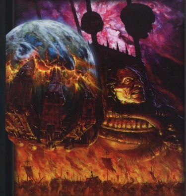
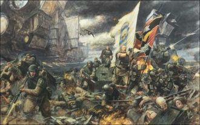
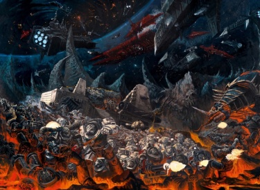
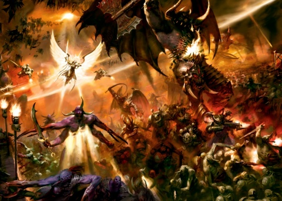
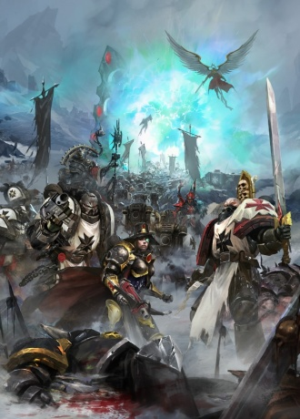

# 0829 999.M41 第十三次黑色远征 13th Black Crusade

精校状态：中文行文已逐段精校，部分术语仍为暂定

分类：时间线

原文来源：https://www.bilibili.com/opus/1133819878099124280

原作者：帝国神选罐头

原文时间：2025年11月11日 10:00

[返回分类目录](目录.md) · [全书目录](../../目录.md)

<!-- A0829-B0001 -->
**英文原文**

Thirteen times shall the Traitor King go forth. In the End Times the iron fortress shall be cast down. Its walls breached and its Gate forced open. Those that dwell beyond shall spill through it. The air shall burn and the ground shall melt, The Daemon shall lie down with the machine, Brother shall slay brother with fire and sword. And the sky-wound shall pour its malice forth. The Eye shall stare unblinking at its prize, and the Traitor King shall cross the bridge of stars. He shall return to finish the Warmonger's red work, Upon holy soil shall the fate of man be decided. - The Liber Malefact

<!-- /A0829-B0001 -->

<!-- A0829-B0002 -->

原译文

叛徒之王将行军十三次。在终结之刻，钢铁堡垒将被推倒。它的城墙被攻破，城门被迫打开。栖身远处的人将从中溢出。空气将燃烧，地面将融化，恶魔将与机械躺在一起，兄弟将用火和剑杀死兄弟。天空的伤口将倾泻出它的恶意。眼睛将不眨地盯着它的战利品，叛徒之王将穿过群星之桥。他将回来完成好战者的血红工作，在神圣之地上，人类的命运将被决定。- 《邪恶典籍》

**校订译文**

叛徒之王将十三度出征。末日来临之时，钢铁堡垒必将倾覆，城墙遭攻破，大门被撞开。门外栖居者将蜂拥而入。天空燃烧，大地熔化；恶魔将与机械结合，兄弟将以烈火与刀剑相残。苍穹的创口倾泻恶意，巨眼目不转睛地盯住猎物。叛徒之王将踏过群星之桥，归来完成战争贩子未竟的血腥事业。在神圣的土地上，人类的命运将见分晓。——《邪恶典籍》

**校注：** 预言性语言按比喻处理；lie down with the machine 指恶魔与机械结合，不是单纯并排躺下。未擅自指认Traitor King/Warmonger具体人物。

<!-- /A0829-B0002 -->

<!-- A0829-B0003 -->
**英文原文**

The 13th Black Crusade of Abaddon the Despoiler began in 999.M41, and resulted in the largest mobilisation of both Imperial and Chaotic forces seen since the Horus Heresy.

<!-- /A0829-B0003 -->

<!-- A0829-B0004 -->

原译文

掠夺者阿巴顿的第13次黑色远征始于999.M41，导致了自荷鲁斯叛乱以来最大规模的帝国和混沌部队的动员。

**校订译文**

掠夺者阿巴顿的第十三次黑色远征始于 999.M41，引发帝国与混沌双方自荷鲁斯之乱以来规模最大的军事动员。

<!-- /A0829-B0004 -->

<!-- A0829-B0005 -->
**英文原文**

Abaddon's strategy was based around the concept of The Crimson Path: by summoning enough Daemons to the surface of Cadia, he intended to overload the Pylons holding back the tides of the Warp on the planet. If he had succeeded, the Eye of Terror would have enveloped Cadia and transformed it into a hellish Daemon World, after which Abaddon would jump from planet to planet from the Segmentum Obscurus, expanding the Warp rift until Terra itself was swallowed up into the Eye.

<!-- /A0829-B0005 -->

<!-- A0829-B0006 -->

原译文

阿巴顿的战略是基于“深红之路”的概念：通过召集足够多的恶魔到卡迪亚表面，他打算让阻止行星上的亚空间潮的方尖碑超负荷。如果他成功了，恐惧之眼就会包围卡迪亚，把它变成一个地狱般的恶魔世界，之后阿巴顿会从一个行星跳到另一个行星，扩大亚空间裂隙，直到泰拉本身被吞噬在恐惧之眼中。

**校订译文**

阿巴顿的战略围绕“深红之路”展开：他打算向卡迪亚地表召来足够多的恶魔，使遏制亚空间潮汐的方尖碑超载。一旦成功，恐惧之眼便会吞没卡迪亚，将其化为地狱般的恶魔世界。此后，他将从朦胧星域开始，逐个向其他行星推进，不断扩大亚空间裂隙，直至泰拉也被恐惧之眼吞噬。

**校注：** 补回原译漏掉的 from the Segmentum Obscurus。

<!-- /A0829-B0006 -->

<!-- A0829-B0007 图片 -->

<!-- A0829-B0008 -->

原译文

Artwork depicting Abaddon the Despoiler and his legions spilling from the Eye of Terror on the 13th Black Crusade 描绘掠夺者阿巴顿和他的军团在第13次黑色远征中从恐惧之眼溢出的画作

**校订译文**

Artwork depicting Abaddon the Despoiler and his legions spilling from the Eye of Terror on the 13th Black Crusade 描绘掠夺者阿巴顿和他的军团在第13次黑色远征中从恐惧之眼溢出的画作

<!-- /A0829-B0008 -->

<!-- A0829-B0009 -->
**英文原文**

Date:999.M41

<!-- /A0829-B0009 -->

<!-- A0829-B0010 -->

原译文

日期：999.M41

**校订译文**

日期：999.M41

<!-- /A0829-B0010 -->

<!-- A0829-B0011 -->
**英文原文**

Location:Segmentum Obscurus

<!-- /A0829-B0011 -->

<!-- A0829-B0012 -->

原译文

地点：朦胧星域

**校订译文**

地点：朦胧星域

<!-- /A0829-B0012 -->

<!-- A0829-B0013 -->
**英文原文**

Outcome:Cadia destroyed

<!-- /A0829-B0013 -->

<!-- A0829-B0014 -->

原译文

结果：卡迪亚被毁

**校订译文**

结果：卡迪亚被毁

<!-- /A0829-B0014 -->

<!-- A0829-B0015 -->
**英文原文**

Combatants:Imperium of Man, Eldar, Necrons/Forces of Chaos

<!-- /A0829-B0015 -->

<!-- A0829-B0016 -->

原译文

作战人员：人类帝国，灵族，死灵/混沌部队

**校订译文**

交战方：人类帝国、灵族、太空死灵／混沌势力

<!-- /A0829-B0016 -->

<!-- A0829-B0017 -->
**英文原文**

Commanders: Lord Castellan Ursarkar E. Creed (MIA), Governor Primus Marus Porelska (KIA), Logistar-General Conskavan Raik, Supreme Commissar Audaria Zabine (MIA), Grand Admiral Kozchokan, Admiral Quarren(KIA), Admiral Dostov, Admiral Minzet, Admiral Venesca Catallia, Lord Marshal Attica, Great Wolf Logan Grimnar, Iron Father Kardan Stronos, Jarl Sven Bloodhowl (KIA), Jarl Orven Highfell (KIA), Master Korahael, Saint Celestine, Archmagos Dominus Belisarius Cawl, Inquisitor Talia Daverna (KIA), Inquisitor Katarinya Greyfax, Baroness Vardus (KIA), Captain Tor Garadon, Marshal Marius Amalrich, Eldrad Ulthran, Trazyn/Abaddon the Despoiler, Urkanthos (Banished), Devram Korda, Ygethmor the Deceiver, Zaraphiston, Zagthean the Broken, Druxus Bale, Krom Gat (KIA), Typhus the Traveller, Kossolax the Foresworn, Erebus, Ahriman, Lucius the Eternal, Tarraq Darkblood, Kranon the Relentless, Varan the Undefeatable (KIA), Daemon Primarchs (Rumored)

<!-- /A0829-B0017 -->

<!-- A0829-B0018 -->

原译文

指挥官：领主堡主乌萨卡·E·克里德（MIA），首席总督马鲁斯·珀勒斯卡（KIA），后勤将军康斯卡万·莱克，至高政委奥达利亚·扎比内（MIA），海军大将科兹乔坎，海军上将夸伦（KIA），海军上将陀思妥夫，海军上将明泽特，海军上将韦涅斯卡·卡塔莉亚，领主元帅阿提卡，头狼罗根·格里姆纳尔，铁父卡丹·斯特罗诺斯，狼主斯文·血嚎（KIA），狼主奥尔文·高落（KIA），导师科拉海尔，圣塞勒斯汀，统御大贤者贝利撒留·考尔，审判官塔莉娅·达韦尔纳（KIA），审判官卡塔琳娅·格雷法克斯，瓦杜斯女爵（KIA），连长托尔·加拉顿，元帅马里乌斯·阿马里奇，埃尔德拉德·乌斯兰，塔拉辛/掠夺者阿巴顿，乌尔坎托斯（被放逐），德夫拉姆·科尔达，欺诈者伊戈瑟默，扎拉菲斯顿，破灭者札格辛，德鲁克斯·贝尔，克罗姆·盖特（KIA），旅行者泰丰斯，背誓者科索拉克斯，艾瑞巴斯，阿里曼，永恒者卢修斯，塔拉克·暗血，无情者克拉能，无敌者瓦兰（KIA），恶魔原体（谣传）

**校订译文**

指挥官：堡主领主乌萨卡·E.克里德（失踪）、首席总督马鲁斯·珀勒斯卡（阵亡）、后勤总监康斯卡万·莱克、最高政委奥达利亚·扎比内（失踪）、海军大将科兹乔坎、海军上将夸伦（阵亡）、海军上将陀思妥夫、海军上将明泽特、海军上将韦涅斯卡·卡塔莉亚、领主元帅阿提卡、头狼洛根·格里姆纳尔、钢铁圣父卡丹·斯特罗诺斯、领主斯万·血吼（阵亡）、领主奥尔文·高落（阵亡）、大师科拉海尔、圣塞莱斯汀、统御大贤者贝利萨留斯·考尔、审判官塔莉娅·达韦尔纳（阵亡）、审判官卡塔琳娅·格雷法克斯、瓦杜斯女男爵（阵亡）、托尔·加拉顿连长、元帅马里乌斯·阿马尔里奇、艾尔德拉德·乌瑟兰、塔拉辛／掠夺者阿巴顿、乌尔坎托斯（被放逐）、德夫拉姆·科尔达、欺诈者伊戈瑟默、扎拉菲斯顿、破灭者札格辛、德鲁克斯·贝尔、克罗姆·盖特（阵亡）、行旅者泰弗斯、背誓者科索拉克斯、艾瑞巴斯、阿里曼、不灭者卢修斯、塔拉克·暗血、无情者克拉能、无敌者瓦兰（阵亡）、恶魔原体（传闻参战）

<!-- /A0829-B0018 -->

<!-- A0829-B0019 -->
**英文原文**

Casualties:Massive casualties, at least several trillion/Massive casualties

<!-- /A0829-B0019 -->

<!-- A0829-B0020 -->

原译文

伤亡人数：大规模伤亡，至少数万亿/大规模伤亡

**校订译文**

伤亡：帝国及其盟友伤亡极其惨重，至少数万亿／混沌伤亡极其惨重

<!-- /A0829-B0020 -->

<!-- A0829-B0021 -->
### Overview 概述

<!-- /A0829-B0021 -->

<!-- A0829-B0022 -->
### Prelude 序曲

<!-- /A0829-B0022 -->

<!-- A0829-B0023 -->
**英文原文**

As the end of M41 drew to a close, the first signs that Abaddon the Despoilers long-feared Thirteenth Black Crusade was imminent came in the form of numerous sightings of Space Hulks emerging from the Warp around the Cadian Sector. Though some were boarded by the Adeptus Astartes and others destroyed by orbital defenses, those that got by the Imperial blockade struck strategically important worlds and naval bases throughout the sector, crippling the region's naval forces. It was then that the dreaded Chaos vessel of Nurgle, Plagueclaw appeared in the outer reaches of the Urthwart system, further spreading pestilence wherever it went. Famed Imperial Admiral Quarren would launch a hunt for the vessel but soon encountered something far more terrible. Ambushed around the Frenerax Dust Cloud, Quarren discovered, to his horror, that the Chaos Fleet was led by the dreaded Terminus Est, flagship of Typhus of the Death Guard, Herald of Nurgle. Quarren's fleet barely managed to survive the trap and escape. The Battle of Frenerax had been a costly disaster, but there was worse to come.

<!-- /A0829-B0023 -->

<!-- A0829-B0024 -->

原译文

随着M41的结束，长期以来一直担心掠夺者阿巴顿的第十三次黑色远征即将到来的第一个迹象是，在卡迪安星区周围的亚空间中出现了许多太空废船的身影。尽管一些被阿斯塔特修会拦截，另一些被轨道防御摧毁，但那些被帝国封锁的人袭击了整个星区具有战略意义的世界和海军基地，削弱了该地区的海军力量。就在那时，可怕的纳垢混沌战舰瘟疫之爪号出现在厄斯里奇星系的外围，无论它走到哪里，瘟疫都会进一步传播。著名的帝国海军上将夸伦对这艘战舰展开追捕，但很快遇到了更可怕的事情。在弗兰尼莱克斯尘埃云周围埋伏时，夸伦惊恐地发现，混沌舰队是由可怕的终焉号领导的，终焉号是死亡守卫的泰丰斯的旗舰，也是纳垢的先驱。夸伦的舰队勉强从陷阱中逃脱。弗兰尼莱克斯之战是一场代价高昂的灾难，但更糟糕的事情还在后面。

**校订译文**

M41 行将结束时，大量太空废船从卡迪亚星区周边的亚空间涌现，成为人们长期担忧的第十三次黑色远征即将爆发的最早征兆。阿斯塔特修会对其中一部分展开跳帮，轨道防御也击毁了一些，但突破封锁的废船仍袭击了星区内战略要地和海军基地，使当地舰队遭到重创。随后，可怕的纳垢混沌战舰瘟疫之爪号出现在乌尔斯勒星系外围，所到之处疫病蔓延。著名海军上将夸伦出动追击，却遭遇更加可怕的敌人。他在弗兰尼莱克斯尘埃云附近中伏，惊恐地发现，混沌舰队的旗舰竟是终焉号——死亡守卫泰弗斯、纳垢先驱的座舰。夸伦舰队勉强挣脱陷阱。弗兰尼莱克斯之战已是一场代价惨重的灾难，更糟糕的事却还在后面。

**校注：** Ambushed 主体为遭伏击的夸伦，非夸伦设伏；Herald of Nurgle 为泰弗斯尊号而非其舰船；Urthwart 星系与后文同名行星统一乌尔斯勒。

<!-- /A0829-B0024 -->

<!-- A0829-B0025 -->
**英文原文**

Now operating with impunity, Typhus's Plague Fleet spread pestilence throughout the Sector and the Officio Medicae were helpless to stop it. As the epidemic spread, apocalyptic sects began appearing on worlds afflicted, preaching that the Emperor's wrath had descended upon them and was a punishment for their sins. In what became known as the Plague of Unbelief, Chaos spread throughout the sector as the fanatical sects rioted against Imperial authorities. To compound the Imperium's problems, Plague Zombies soon emerged from the bodies of those struck down by disease. The Hive World of Belis Corona in the Agripinaa Sector was particularly affected by both the Plague of Unbelief and an infestation of Plague Zombies, and by the time Typhus's Plague Fleet arrived in the system the world was completely unable to resist him.

<!-- /A0829-B0025 -->

<!-- A0829-B0026 -->

原译文

现在，泰丰斯的瘟疫舰队肆无忌惮地运作，将瘟疫传播到整个星区，而医疗部却无能为力。随着疫情的蔓延，末日教派开始出现在受影响的世界上，宣扬帝皇的愤怒已经降临到他们身上，是对他们罪行的惩罚。在后来被称为无信瘟疫的事件中，随着狂热的教派对帝国当局的暴乱，混乱蔓延到整个星区。为了加剧帝国的问题，瘟疫僵尸很快从那些被疾病击倒的人的身体中出现。阿格里皮纳星区的贝利斯·科罗纳巢都世界特别受到无信瘟疫和瘟疫僵尸侵扰的影响，当泰丰斯的瘟疫舰队到达星系时，世界完全无法抵抗他。

**校订译文**

泰弗斯的瘟疫舰队此后横行无阻，将疫病散播到整个星区，医疗部对此束手无策。随着瘟疫蔓延，受灾世界出现末日教派，宣称帝皇的怒火已经降临，惩罚世人的罪孽。狂热教派起而反抗帝国当局，使混乱席卷星区；这一灾难后来被称为“无信瘟疫”。更糟的是，病死者的尸体又化为瘟疫僵尸。阿格里皮娜星区的巢都世界贝利斯·卡罗纳尤其深受两重灾祸之苦。等到瘟疫舰队抵达时，整个世界已无力抵抗泰弗斯。

<!-- /A0829-B0026 -->

<!-- A0829-B0027 -->
**英文原文**

As Chaos swept through many Imperial worlds surrounding the Agripinaa, Cadian, and Belis Corona Sectors, cults preaching that the Imperium had forsaken the teachings of the Emperor grew in number. Imperial authorities, crippled by plague, could do little to stop the ensuing chaos and mob rule that these cults unleashed. Mysterious yet brutal raiders began to strike without warning throughout these sectors, annihilating small settlements and Agri Worlds. Meanwhile, Astropaths and the Emperor's Tarot consistently produced dire predictions. On Cadia itself, the worlds mysterious pylons erupted into life and vibrated intense psychic energy. The pylons appeared to be fighting to hold back the powers of the Warp that were pouring from the Eye of Terror at an unprecedented level but they were slowly destroying themselves in the process.

<!-- /A0829-B0027 -->

<!-- A0829-B0028 -->

原译文

随着混乱席卷了阿格里皮纳、卡迪安和贝利斯·科罗纳星区周围的许多帝国世界，宣扬帝国抛弃了帝皇教义的教派越来越多。被瘟疫摧毁的帝国当局几乎无法阻止这些教派引发的混乱和暴民统治。神秘而残酷的袭击者开始毫无预警地袭击这些星区，摧毁了小定居点和农业世界。与此同时，星语者和帝皇塔罗牌一直在做出可怕的预测。在卡迪亚本身，世界神秘的方尖碑爆发了生命，并激发了强烈的灵能能量。方尖碑似乎在努力阻止从恐惧之眼以前所未有的水平倾泻而出的亚空间力量，但在这个过程中，它们正在慢慢摧毁自己。

**校订译文**

阿格里皮娜、卡迪亚和贝利斯·卡罗纳星区周边的帝国世界纷纷陷入动乱。越来越多教派宣扬帝国已背弃帝皇教诲；当局受瘟疫重创，几乎无力制止随之而来的混乱与暴民统治。神秘而残忍的袭击者又在各星区出没，毫无预警地摧毁小型定居点和农业世界。与此同时，星语者与帝皇塔罗牌接连给出凶兆。卡迪亚本土的神秘方尖碑突然启动，强烈灵能在其中震荡。它们仿佛在竭力遏止恐惧之眼以前所未有的强度倾泻出的亚空间力量，却在过程中不断自毁。

**校注：** erupted into life 指方尖碑启动，非爆发生命。

<!-- /A0829-B0028 -->

<!-- A0829-B0029 -->
**英文原文**

Between the anarchy, plague, and vicious raids spreading throughout the Agripinaa sector, the Imperial Navy's Battlefleet Agripinaa was forced to retreat back to its bases. Yet an even greater disaster was in the making on the Imperial world of Lelithar where a powerful figure arouse amongst the raving cults and fanatics, proclaiming himself the Voice of the Emperor. The Voice of the Emperor's cult spread throughout nearby worlds and he encouraged rebellion against Imperial rule. Soon, vicious battles between the Voice of the Emperor's cult and the faithful followers of the Ecclesiarchy erupted on the streets of worlds such as Bar-El, Yayor, Amistel, and Albitern. Attempts by the Officio Assassinorum to dispose of the Voice of the Emperor proved unsuccessful.

<!-- /A0829-B0029 -->

<!-- A0829-B0030 -->

原译文

在无政府状态、瘟疫和遍布阿格里皮纳星区的恶性袭击之间，帝国海军的阿格里皮纳亚战斗舰队被迫撤退回基地。然而，一场更大的灾难正在莱利瑟帝国世界中酝酿，一位强大的人物在狂热的教派和狂热分子中觉醒，宣称自己是帝皇之声。帝皇之声教派传遍了附近的世界，他鼓励反抗帝国统治。很快，在巴-埃尔、亚约尔、阿米泰尔和阿尔比滕等世界的街道上，帝皇之声教派与国教忠实信徒之间爆发了激烈的战斗。刺客庭试图处理帝皇之声的尝试被证明是不成功的。

**校订译文**

无政府状态、瘟疫和残酷袭击席卷阿格里皮娜星区，迫使当地帝国海军战斗舰队退回基地。更大的灾难却正在帝国世界莱利瑟酝酿：一名强势人物在狂热教派中崛起，自称“帝皇之声”。他的教派扩散至周边世界，煽动人们反抗帝国统治。不久，巴-埃尔、亚约尔、阿米泰尔和阿尔比滕等世界街头爆发激战，帝皇之声的信徒与忠于国教会的人群相互厮杀。刺客庭数次试图除掉帝皇之声，均未成功。

<!-- /A0829-B0030 -->

<!-- A0829-B0031 -->
### Betrayal on Cadia 卡迪亚上的背叛

<!-- /A0829-B0031 -->

<!-- A0829-B0032 -->
**英文原文**

Despite the deteriorating security situation and internal strife in the Imperial territories surrounding the Eye of Terror, Cadia remained a beacon of stability. But in order to counter the increasing frequency and scale of Chaos activity around the Cadian sector, the Cadian High Command issued an order that every regiment of the Cadian Shock Troops were to muster on Cadia itself. As a result, hundreds of extra landing fields were assembled at Kasr Tyrok fields in preparation for the reinforcements. Millions of men had already been assembled when the Volscani Cataphracts regiment, considered by many to be the most hardened fighters in the sector, landed on Cadia. In honor of the reputation of the Volscani regiment, the Cadian High Command itself gathered at Tyrok Fields to personally greet the arriving forces. However this would prove to be a disastrous decision for Cadia, as the Volscani soon revealed their true colours.

<!-- /A0829-B0032 -->

<!-- A0829-B0033 -->

原译文

尽管恐惧之眼周围的帝国领土的安全局势不断恶化，内部冲突不断，但卡迪亚仍然是稳定的灯塔。但为了应对卡迪亚星区周围日益频繁和规模的混沌行动，卡迪亚最高指挥部发布了一项命令，要求卡迪亚突击军的每个兵团都在卡迪亚集结。因此，数百个额外的登陆场在提洛克堡野外集结，为增援做准备。当被许多人认为是该星区最坚硬的战士的沃斯卡尼铁骑兵团降落在卡迪亚时，数百万人已经集结。为了尊重沃斯卡尼铁骑兵团的声誉，卡迪亚最高司令部亲自聚集在提洛克野外迎接抵达的部队。然而，这对卡迪亚来说将是一个灾难性的决定，因为沃斯卡尼很快就暴露了他们的真实面目。

**校订译文**

恐惧之眼周边的帝国疆域治安日坏、内乱不断，卡迪亚却仍保持稳定。然而，面对卡迪亚星区周围愈发频繁、规模愈大的混沌活动，最高指挥部下令，所有卡迪亚突击军团返回母星集结。为迎接援军，提洛克堡原野上新建了数百处登陆场。沃斯卡尼铁骑团抵达时，已有数百万人在此集结。该团被誉为星区最身经百战的部队之一，卡迪亚最高指挥部遂亲赴提洛克原野迎接。这个决定却带来灾难，因为沃斯卡尼人很快便露出真面目。

<!-- /A0829-B0033 -->

<!-- A0829-B0034 -->
**英文原文**

Exchanging their Cadian and Imperial banners for those of Chaos, the Volscani forces opened fire on the Cadian assembly on Tyrok Fields and annihilated most of the Cadian High Command in one fell swoop. Only a skillful counterattack by Lord Castellan Ursarkar E. Creed, who managed to take control of the reeling Cadian forces, prevented further calamity. Now installed as Governor of Cadia due to the murder of the previous holder of the position, Creed ordered the Cadian forces to dig in as he dispatched requests for aid throughout the whole of the Imperium. The Administratum and Space Marines heeded the call, mobilizing the sector with unprecedented scale and pace. After an engagement with a raiding party of Night Lords led by the vicious Tarraq Darkblood, a unit of highly trained Kasrkin were dispatched into the Eye of Terror directly on a reconnaissance mission, desperate to find some kind of indication of where the first blow of the inevitable Chaos invasion would land. The reconnaissance mission proved a disaster when the force became stranded on the Daemon World of Urthwart and was subsequently destroyed by the dreaded ship Planet Killer. As Urthwart collapsed into itself, a Chaos fleet of hundreds of warships, Space Hulks, and transports emerged from the depths of the Eye of Terror. Accompanying them were not only the Plagueclaw and Terminus Est but also two captured Blackstone Fortresses. Imperial Admiral Pulaski mustered whatever ships he could in the Ormantep system, ready to fight and die to give the defenders of Cadia whatever time they could to prepare themselves. Though the Imperial fleet fought bravely, it was annihilated by the massive Chaos armada. Quarren, however, managed to escape with what remained of his fleet, but in doing so had left the way clear for a splinter Chaos Fleet to ravage the Agripinaa Sector.

<!-- /A0829-B0034 -->

<!-- A0829-B0035 -->

原译文

沃斯卡尼部队将他们的卡迪亚和帝国旗帜换成了混沌的旗帜，向提洛克野外的卡迪亚集会开火，一举歼灭了大部分卡迪亚最高指挥部。只有领主堡主乌萨卡·E·克里德的巧妙反击，才阻止了进一步的灾难，他成功地控制了摇摇欲坠的卡迪亚军队。由于前任职位持有者被谋杀，克里德现在被任命为卡迪亚总督，他命令卡迪亚部队在向整个帝国发出援助请求时进行阵地挖掘。内务部和星际战士响应了这一呼吁，以前所未有的规模和速度动员了该星区。在与邪恶的塔拉克·暗血领导的午夜领主突袭队交战后，一支训练有素的卡舍津部队被直接派往恐惧之眼执行侦察任务，迫切希望找到某种迹象，表明不可避免的混沌入侵的第一击将落在哪里。侦察任务被证明是一场灾难，因为部队被困在乌尔斯勒恶魔世界，随后被可怕的行星杀手摧毁。当乌尔斯勒自行坍塌时，一支由数百艘战舰、太空废船和运输舰组成的混沌舰队从恐惧之眼的深处出现。陪同他们的不仅是瘟疫之爪号和终焉号，还有两座被俘的黑石堡垒。帝国海军上将普拉斯基在奥尔曼泰普星系中召集了他所能召集的任何舰船，准备战斗和死亡，让卡迪亚的守军有足够的时间做好准备。尽管帝国舰队英勇作战，但被庞大的混沌舰队歼灭。然而，夸伦设法用剩下的舰队逃脱，但这样做为分裂的混沌舰队蹂躏阿格里皮纳星区扫清了道路。

**校订译文**

沃斯卡尼部队撤下卡迪亚和帝国旗帜，换上混沌旗，向提洛克原野的迎接人群开火，一举杀死卡迪亚最高指挥部的大部分成员。堡主领主乌萨卡·E.克里德及时掌握陷入混乱的部队，组织巧妙反击，才制止灾情进一步扩大。前任总督被杀后，克里德接任卡迪亚总督，命部队掘壕固守，并向整个帝国求援。内政部与星际战士迅速响应，以前所未有的规模和速度动员星区力量。在与塔拉克·暗血率领的午夜领主袭击队交战后，一支训练精良的卡舍津部队被直接派入恐惧之眼侦察，希望查明不可避免的混沌入侵将首先袭向何处。任务却酿成灾难：侦察队被困在恶魔世界乌尔斯勒，随后与行星一同遭行星杀手号摧毁。乌尔斯勒向内崩塌之际，数百艘战舰、太空废船和运输舰从恐惧之眼深处涌出，随行的除瘟疫之爪号、终焉号外，还有两座被俘的黑石堡垒。海军上将普拉斯基在奥尔曼泰普星系召集所有可用舰船，决意死战，为卡迪亚守军争取准备时间。帝国舰队奋勇抵抗，最终仍被庞大的混沌舰队歼灭。夸伦却带着残余舰艇成功撤出，但也因此让出航路，使一支混沌分舰队得以蹂躏阿格里皮娜星区。

**校注：** 源文先说普拉斯基集结且舰队被歼，又以Quarren however转述夸伦逃离，未解释两支舰队关联，保持人物区别，不自行换名。

<!-- /A0829-B0035 -->

<!-- A0829-B0036 图片 -->

<!-- A0829-B0037 -->

原译文

The Battle of Tyrok Fields 提洛克野外之战

**校订译文**

The Battle of Tyrok Fields 提洛克原野之战

<!-- /A0829-B0037 -->

<!-- A0829-B0038 -->
**英文原文**

Now virtually defenseless, the worlds of the Agripinaa Sector were ravaged by the Plague Fleet of Typhus and his legions of Death Guard and Daemons of Nurgle. Only an intervention by the Howling Griffons Space Marine Chapter, Jouran Dragoons Imperial Guard, and Legio Astorum Titan Legion prevented the total collapse of Imperial rule in the sector. The Imperial forces, further reinforced by the Death Spectres Chapter, even managed to lay siege the world of Lelithar, the original world of the Voice of the Emperor which had since been captured by Typhus's forces and legions of crazed cultists. However, the bloody siege has cost the lives of millions and is grinding mercilessly towards an uncertain conclusion.

<!-- /A0829-B0038 -->

<!-- A0829-B0039 -->

原译文

现在，阿格里皮纳星区的世界几乎毫无防御能力，被泰丰斯的瘟疫舰队、他的死亡守卫军团和纳垢的恶魔蹂躏。只有咆哮狮鹫星际战士战团、朱兰龙骑兵帝国卫队和星象军团泰坦军团的干预，才阻止了帝国在该星区的统治彻底崩溃。帝国军队在死亡幽灵战团的进一步加强下，甚至设法围攻了莱利萨世界，这是帝皇之声的起源世界，后来被泰丰斯的军队和疯狂的邪教徒军团占领。然而，血腥的围困已经夺去了数百万人的生命，并且正在无情地走向一个不确定的结局。

**校订译文**

阿格里皮娜星区几乎失去防御，各世界遭泰弗斯的瘟疫舰队、死亡守卫与纳垢恶魔蹂躏。幸而咆哮狮鹫战团、帝国卫队约兰龙骑兵及星象泰坦军团介入，才避免帝国统治全面崩溃。死亡幽灵战团随后来援，帝国甚至反攻并包围了帝皇之声最初崛起的莱利瑟——此时，该世界已被泰弗斯部队和狂热邪教徒占领。然而，围城战已夺去数百万条生命，血腥消耗仍在持续，结局未明。

<!-- /A0829-B0039 -->

<!-- A0829-B0040 -->
**英文原文**

Meanwhile the Emperor's Children, led by Lucius the Eternal, butchered the world of Belisar while warbands of Night Lords moved onto Scarus Sector, spreading terror and fear to the Imperial Populace. Cells of Alpha Legion revealed themselves across Segmentum Obscurus, badly delaying Space Marine reinforcements in protracted struggles. In the wake of the Traitor Marines came terrifying hordes of Chaos: Mutants, Chaos Cultists, and Daemons as well as the Traitor Titan Legions of the Dark Mechanicum. Soon, every world within a thousand light years of the Eye of Terror became embroiled in conflict.

<!-- /A0829-B0040 -->

<!-- A0829-B0041 -->

原译文

与此同时，由永恒者卢修斯领导的帝皇之子屠杀了贝利萨世界，而午夜领主的武装部队则进入了斯卡鲁斯星区，向帝国民众传播了恐怖和恐惧。阿尔法军团的小队在朦胧星域中现身，在漫长的战斗中严重拖延了星际战士的增援。在叛徒战士之后，出现了可怕的混沌部落：变种人、混沌邪教徒和恶魔，以及黑暗机械教的叛徒泰坦军团。不久，恐惧之眼一千光年范围内的每个世界都卷入了冲突。

**校订译文**

与此同时，不灭者卢修斯率帝皇之子屠戮贝利萨世界，午夜领主战帮则攻入斯卡鲁斯星区，向帝国民众散播恐惧。阿尔法军团的潜伏小组在朦胧星域各处现身，以旷日持久的战斗拖住星际战士援军。紧随叛徒星际战士的，是大批变种人、混沌邪教徒、恶魔，以及黑暗机械教的叛徒泰坦军团。不久，恐惧之眼周围一千光年内的每一个世界都卷入战火。

<!-- /A0829-B0041 -->

<!-- A0829-B0042 -->
**英文原文**

While hordes of Chaos forces ravaged the surrounding sectors, the main Chaos Fleet of Abaddon the Despoiler and the World Eaters Chaos Lord Kossolax the Foresworn pushed towards Cadia itself. The Chaos fleet quickly overwhelmed the defenses on the world of Solar Mariatus, the outermost planet of the Cadian System. Here, traitor forces established a forward base of operations to launch attacks throughout the entire system. Capturing the prison world of St. Josmane's Hope, the Violators Chaos Space Marine warband managed to capture its millions of inmates and use them as slaves or conscript them into its armies. Admiral Quarren had done what he could, but the overwhelming Chaos Fleet could not be stopped and after three days of hard fighting, the majority of the Imperial Fleet in the Cadian System had either been crippled or destroyed. After overrunning Cadia's orbital bases, the planet finally stood defenseless and Abaddon's long awaited invasion of Cadia had finally begun.

<!-- /A0829-B0042 -->

<!-- A0829-B0043 -->

原译文

当成群的混沌部队蹂躏周围星区时，掠夺者阿巴顿和吞世者混沌领主背誓者科索拉克斯的主要混沌舰队向卡迪亚本身推进。混沌舰队迅速突破了卡迪亚星系最外层行星索拉·玛丽亚图斯世界的防御。在这里，叛徒部队建立了一个前沿作战基地，在整个星系中发动攻击。在占领圣若斯曼之希望监狱世界后，违背者混沌星际战士战帮设法俘虏了数百万囚犯，并将他们用作奴隶或征召入伍。海军上将夸伦已经尽了最大努力，但压倒性的混沌舰队无法被阻止，经过三天的艰苦战斗，卡迪亚星系中的大部分帝国舰队要么被削弱，要么被摧毁。在占领了卡迪亚的轨道基地后，这颗行星终于毫无防备，阿巴顿期待已久的对卡迪亚的入侵终于开始了。

**校订译文**

混沌大军蹂躏周边星区之际，掠夺者阿巴顿与吞世者混沌领主背誓者科索拉克斯率主力舰队逼近卡迪亚。他们迅速击溃星系最外围的索拉·玛丽亚图斯，建立前进基地，向整个星系发起攻击。违背者战帮夺取监狱世界圣约斯曼之希望，将数百万囚犯掳为奴隶或强征入伍。夸伦上将竭尽所能，仍无力阻挡敌方舰队。经过三日苦战，卡迪亚星系的大部分帝国舰船不是被击毁，就是瘫痪。轨道基地随后被攻占，卡迪亚失去了来自太空的保护，阿巴顿蓄谋已久的地面入侵终于开始。

<!-- /A0829-B0043 -->

<!-- A0829-B0044 -->
### The Battle of Medusa 美杜莎之战

<!-- /A0829-B0044 -->

<!-- A0829-B0045 -->
**英文原文**

Meanwhile, Abaddon launched a massive assault on Medusa, homeworld of the Iron Hands Space Marine Chapter. As the Iron Hands recruited strictly from Medusa, the Marines were forced to defend it above all else. All ten of the immense Land Behemoth mobile Fortress-monasteries of the Chapter were mobilized along with the heavily armored Planetary Defense Forces of Medusa for the defense. Assaulted by armoured regiments of the Haradni 13th Traitor Guard, the ensuing armoured clash was one of the largest in the Imperium since the Battle of Tallarn during the Horus Heresy, with the Chaos forces fielding over ten thousand tanks. The ensuing battle raged for five days, with the Traitor forces gradually pushing towards the mobile fortresses of the Iron Hands. The Fortresses, each possessing the firepower of the mighty Ordinatus war machines of the Adeptus Mechanicus, decimated hundreds of tanks with each salvo.

<!-- /A0829-B0045 -->

<!-- A0829-B0046 -->

原译文

与此同时，阿巴顿对钢铁之手星际战士战团的家园世界美杜莎发动了大规模袭击。由于钢铁之手严格从美杜莎招募，战士被迫保卫它。战团所有十座巨大的陆地巨兽移动堡垒修道院都与全副武装的美杜莎行星防御部队一起动员起来进行防御。在哈拉德尼第13叛徒卫队装甲兵团的袭击下，随之而来的装甲冲突是荷鲁斯叛乱时期塔兰之战以来帝国最大的冲突之一，混沌部队部署了一万多辆坦克。随后的战斗持续了五天，叛徒部队逐渐向钢铁之手的移动堡垒推进。每座堡垒都拥有机械神教的强大将军炮战争机械的火力，每次齐射都摧毁了数百辆坦克。

**校订译文**

阿巴顿同时大举进攻钢铁之手母星美杜莎。战团只从这里征募新兵，因此必须优先保卫母星。十座巨大的“陆地巨兽”移动要塞修道院全部出动，与装甲力量雄厚的行星防卫军共同迎战。哈拉德尼第十三叛徒卫队装甲部队发动猛攻，混沌投入一万余辆坦克，形成荷鲁斯之乱中塔兰之战以来帝国规模最大的装甲会战之一。大战延续五天，叛军逐渐逼近移动要塞。每座要塞的火力都堪比机械修会强大的将军炮战争机械，一轮齐射便能摧毁数百辆坦克。

<!-- /A0829-B0046 -->

<!-- A0829-B0047 -->
**英文原文**

Using this support to finally break the Traitor lines, the Iron Hands were nonetheless outflanked by enemy armour, which began to pour fire into the vulnerable rear of their mobile fortresses. This forced the Iron Hands to launch a furious counter-attack led by Assault Squads, taking heavy casualties in the process but succeeding in stopping the traitor flanking maneuver and sending them into a disorderly retreat. The Iron Hands then used their Predator Annihilator tanks to decimate the retreating Traitor forces, securing Medusa at last.

<!-- /A0829-B0047 -->

<!-- A0829-B0048 -->

原译文

利用这种支援最终打破了叛徒的防线，钢铁之手仍然被敌人的装甲包围，敌人的装甲开始向他们移动堡垒的脆弱后方开火。这迫使钢铁之手在突击小队的带领下发动了猛烈的反击，在此过程中造成了重大伤亡，但成功阻止了叛徒的侧翼行动，使他们陷入混乱的撤退。钢铁之手随后使用他们的掠食者歼灭者坦克摧毁了撤退的叛徒部队，最终保护了美杜莎。

**校订译文**

钢铁之手借此火力支援终于突破叛军防线，敌方装甲部队却迂回至侧后，猛烈轰击移动要塞防护薄弱的后部。战团被迫以突击小队为先锋发动反攻，付出惨重伤亡，才阻止敌军包抄，迫其溃退。随后，歼灭者型掠食者战车追杀撤退的叛军，美杜莎终于转危为安。

**校注：** taking heavy casualties 指钢铁之手自身付出伤亡；outflanked 为侧翼迂回，非已被完整包围。

<!-- /A0829-B0048 -->

<!-- A0829-B0049 -->
### The Battle for the Cadian Gate 卡迪亚之门之战

<!-- /A0829-B0049 -->

<!-- A0829-B0050 -->
**英文原文**

Meanwhile, Abaddon began his long-awaited invasion of Cadia with a fierce orbital bombardment, one so powerful it shook even the vaunted Cadian Shock Troopers. Along with the bombardment came legions of Chaos Space Marines, the Lost and the Damned, Daemons, and Titans, who flooded the fortress world of Cadia in unprecedented numbers. The Cadian forces fought bravely and stubbornly, however, and were aided by the legendary Thirteenth Company of the Space Wolves.

<!-- /A0829-B0050 -->

<!-- A0829-B0051 -->

原译文

与此同时，阿巴顿以猛烈的轨道轰炸开始了他期待已久的对卡迪亚的入侵，这次轰炸如此强大，甚至震撼了被夸耀的卡迪亚突击军。伴随着轰炸而来的是混沌星际战士、迷失者和被诅咒者、恶魔和泰坦军团，他们以前所未有的数量淹没了卡迪亚堡垒世界。然而，卡迪亚军队英勇顽强地战斗，并得到了传奇的太空野狼第十三连队的帮助。

**校订译文**

阿巴顿以猛烈的轨道轰炸揭开卡迪亚入侵战的序幕。炮击之强，连声名卓著的卡迪亚突击军都为之震骇。随后，混沌星际战士、迷失者与被诅咒者、恶魔和泰坦，以前所未有的规模涌入这颗要塞世界。卡迪亚守军仍奋勇抵抗，寸土不让，并得到传奇的太空野狼第十三连援助。

<!-- /A0829-B0051 -->

<!-- A0829-B0052 图片 -->

<!-- A0829-B0053 -->

原译文

Space Marines and Chaos forces battle in the 13th Black Crusade 星际战士和混沌部队在第13次黑色远征中战斗

**校订译文**

Space Marines and Chaos forces battle in the 13th Black Crusade 星际战士和混沌部队在第13次黑色远征中战斗

<!-- /A0829-B0053 -->

<!-- A0829-B0054 -->
**英文原文**

Many Crone Worlds around the Eye of Terror would come under attack from Chaos forces and immortal Phoenix Lords would lead Eldar defenses in the Belial IV System, attempting to destroy a dark cathedral erected by the Word Bearers. The Eldar would also engage Ahriman of the Thousand Sons after the sorcerer managed to breach the Webway in a hunt for the mysterious Black Library.

<!-- /A0829-B0054 -->

<!-- A0829-B0055 -->

原译文

恐惧之眼周围的许多老妪世界受到混沌部队的攻击，不朽的凤凰领主将领导贝利亚四号星系中的灵族防御，试图摧毁怀言者建造的一座黑暗大教堂。在巫师设法突破网道寻找神秘的黑色图书馆后，灵族还与千子的阿里曼交战。

**校订译文**

恐惧之眼周边的多个老妪世界也遭混沌攻击。不朽的凤凰领主率灵族在贝利亚四号星系防守，试图摧毁怀言者建造的黑暗大教堂。千子巫师阿里曼为寻找神秘的黑色图书馆而突破网道后，灵族还与他展开交战。

<!-- /A0829-B0055 -->

<!-- A0829-B0056 -->
**英文原文**

Elsewhere, Lord Thybault Helican XXIII lead the defense of the Thracian Primaris system of Scarus Sector against a rising tide of deviant cultists. Many Astropaths died and the Lord Jiudiciary of the Adeptus Arbites of Thracian Primaris reported a 400% increased activity of deviant cults.

<!-- /A0829-B0056 -->

<!-- A0829-B0057 -->

原译文

在其他地方，领主蒂博·赫利肯23世领导了斯卡鲁斯星区色雷斯主星星系的防御，以抵御日益高涨的异常邪教徒。许多星语者死亡，色雷斯主星的法务部领主朱迪卡里报告说，异常教派的活动增加了400%。

**校订译文**

在斯卡鲁斯星区，蒂博·赫利肯二十三世领主组织色雷斯主星星系防御，抵挡日益猖獗的异端教派。大量星语者死亡；当地法务部的司法领主报告，异端教派活动增加了 400%。

**校注：** Lord Jiudiciary 疑为 Lord Judiciary 拼写错误，是法务部职衔而非人名朱迪卡里；暂译司法领主。increase by400%保留“增加400%”，不偷换为达到原400%。

<!-- /A0829-B0057 -->

<!-- A0829-B0058 -->
**英文原文**

While the forces of Cadia managed to hold off the Chaos armies in a bloody stalemate, the Imperial Navy would receive reinforcements from Cypra Mundi and launch a counterattack to drive Abaddon's forces back into the Cadian Gate. Using these resources to his advantage, Admiral Quarren managed to defeat Chaos fleets many times the size of his own, allowing a flood of Imperial reinforcements to break the Chaos blockades of Cadia and the Scelus Sector. In the Belis Corona System, the entirety of Battlefleet Gothic would storm into the fray. The Imperial Navy was staking everything on this final, sector-wide retaliation; if it were to fail, the whole of Battlefleet Obscurus would be so weakened it would have no hope of repelling Abaddon's invasion.

<!-- /A0829-B0058 -->

<!-- A0829-B0059 -->

原译文

卡迪亚的部队在血腥的僵局中成功击退了混沌军队，帝国海军从赛普拉·蒙迪那里得到增援，并发动反击，将阿巴顿的部队赶回卡迪亚之门。利用这些资源，夸伦海军上将成功击败了比他自己大很多倍的混沌舰队，让帝国增援部队大量涌入，打破了混沌对卡迪亚和斯凯鲁斯星区的封锁。在贝利斯·科罗纳星系中，整个哥特舰队都加入了战斗。帝国海军把一切都押在了这场最后的、全星区范围的报复行动上；如果它失败了，整个朦胧星域舰队将被削弱到无法击退阿巴顿的入侵。

**校订译文**

卡迪亚守军顶住混沌大军，战事陷入血腥僵局之际，帝国海军获得塞浦拉·蒙迪的增援，开始反攻，试图将阿巴顿部队赶回卡迪亚之门。夸伦上将充分利用援军，多次击败规模数倍于己的混沌舰队，使大量帝国援兵得以突破对卡迪亚和斯凯鲁斯星区的封锁。在贝利斯·卡罗纳星系，整支哥特战斗舰队投入战场。帝国海军将一切押在这场覆盖全星区的最后反攻上；若告失败，朦胧战斗舰队便会虚弱到无力阻挡阿巴顿。

**校注：** Cypra Mundi 为增援出发地而非人物；hold off/stalemate 是遏止进攻并僵持，不是已经击溃混沌。Scelus与Scarus为不同星区，此处分别斯凯鲁斯／斯卡鲁斯。

<!-- /A0829-B0059 -->

<!-- A0829-B0060 -->
**英文原文**

While the Imperial Navy reinforcements bolstered the defenses of Battlefleet Cadia, Abaddon would unveil the next step in his plan. The Word Bearers Legion, led by the Dark Apostle Erebus, would enact terrible rituals on the world they had captured, unleashing Warp Storms and hordes of Daemons across outlying sectors around the Eye of Terror such as Scelus and Caliban. Cut off from aid, these sectors were ravaged by the powers of Chaos. Imperial forces would not falter however, and a counterattack led by Creed and the White Scars Chapter was launched on and from Cadia, engaging Chaos forces throughout the sector in a surprise move of resolve. After holding out for many long weeks of stubborn resistance, the defenders of the Cadian Gate received further aid when reinforcements from dozens of Space Marine Chapters finally began to arrive. Among them were the Blood Angels, who assaulted the largest horde of World Eaters encountered in living memory on the world of Kasr Partox and defeated the forces of Kossolax and a Bloodthirster on Agripinaa. Meanwhile, the Dark Angels under Supreme Grand Master Azrael and the Space Wolves under Great Wolf Logan Grimnar engaged the forces of Typhus on Macharia, Korolis, and Kasr Sonnen, managing to put aside their past differences and bitter rivalry.

<!-- /A0829-B0060 -->

<!-- A0829-B0061 -->

原译文

虽然帝国海军增援部队加强了卡迪亚舰队的防御，但阿巴顿公布其计划的下一步。由黑暗使徒艾瑞巴斯领导的怀言者军团将在他们占领的世界上实施可怕的仪式，在恐惧之眼周围的偏远星区，如斯凯鲁斯和卡利班，释放亚空间风暴和成群的恶魔。这些星区与援助隔绝，被混沌部队蹂躏。然而，帝国军队并没有动摇，由克里德和白色伤疤战团领导的反击从卡迪亚发起，与整个星区的混沌部队进行了一次令人惊讶的决心行动。在坚持了数周的顽强抵抗后，当数十个星际战士战团的增援部队终于开始抵达时，卡迪亚之门的守军得到了进一步的援助。其中包括圣血天使，他们袭击了帕托克斯堡世界记忆中遇到的最大的吞世者部落，并在阿格里皮纳击败了科索拉克斯的军队和一个嗜血狂魔。与此同时，至高大导师阿兹瑞尔领导下的黑暗天使和头狼罗根·格里姆纳尔领导下的太空野狼在马卡里亚、克罗利斯和索宁堡与泰丰斯的部队交战，设法搁置了他们过去的分歧和激烈的竞争。

**校订译文**

海军增援加强了卡迪亚战斗舰队，阿巴顿却也开始执行下一步计划。黑暗使徒艾瑞巴斯率怀言者，在已占世界举行可怕仪式，使恐惧之眼外围的斯凯鲁斯、卡利班等星区爆发亚空间风暴，涌现大量恶魔。这些星区与援军隔绝，遭混沌蹂躏。帝国并未动摇：克里德与白疤战团在卡迪亚本土展开反击，并以此为基地向星区各处出击，令敌人措手不及，也展现出坚定抵抗的决心。顽抗数周后，数十个星际战士战团终于陆续抵达。其中，圣血天使在帕托克斯堡世界攻击了记忆所及规模最大的吞世者大军，又在阿格里皮娜击败科索拉克斯及一头嗜血狂魔。阿兹瑞尔至高大导师麾下的黑暗天使，以及头狼洛根·格里姆纳尔麾下的太空野狼，也暂时搁置分歧与宿怨，联手在马卡里亚、克罗利斯与索宁堡迎战泰弗斯。

<!-- /A0829-B0061 -->

<!-- A0829-B0062 -->
**英文原文**

Further reinforcements across the theatre of war included the Black Templars and Imperial Fists. Lord Inquisitor Torquemada Coteaz would also appear in the waves of reinforcements, leading strike forces of Grey Knights against Daemons in the Agripinnaa Sector as well as on Kasr Holn and Xersia. The White Scars under Khajog Khan also arrived, forcing Abaddon to lift the sieges of three Cadian Kasrs before being entrapped and destroyed in a bloody fight to the end. With so many of the legendary Space Marines arriving, the Imperium was at long last able to see a real chance of turning back Abaddon's Thirteenth Black Crusade.

<!-- /A0829-B0062 -->

<!-- A0829-B0063 -->

原译文

战场上的进一步增援包括黑色圣堂和帝国之拳。领主审判官托尔克马达·科特兹也将出现在增援部队的浪潮中，率领灰骑士打击阿格里皮纳星区以及霍林堡和瑟西亚的恶魔。哈乔格可汗领导下的白色伤疤也到达了，迫使阿巴顿解除了对三个卡迪亚堡垒的围困，然后在一场血腥的战斗中被困住并摧毁。随着如此多的传奇星际战士的到来，帝国终于看到了扭转阿巴顿第十三次黑色远征的真正机会。

**校订译文**

黑色圣堂与帝国之拳等部队也陆续增援各处战场。领主审判官托尔克马达·克提兹率灰骑士打击部队，清剿阿格里皮娜星区、霍林堡与瑟西亚的恶魔。哈乔格可汗统率的白疤解除了三座卡迪亚堡城之围，随后却遭敌军围困，血战至全军覆没。随着越来越多传奇般的星际战士参战，帝国终于看到了击退第十三次黑色远征的切实希望。

**校注：** being entrapped and destroyed 的主语为白疤部队，不是阿巴顿；原译施受关系不清。

<!-- /A0829-B0063 -->

<!-- A0829-B0064 -->
**英文原文**

However, the rituals of Erebus of the Word Bearers reached their peak shortly after the arrival of Space Marine reinforcements. Through the sacrifice of a million innocents, the entire region around the Eye of Terror was attacked by a Warp storm so intense that inter-system travel was rendered impossible and cutting the warzone off from further Imperial reinforcements. Taking advantage of this, Typhus would unleash the full strength of the Death Guard upon the Agripinaa Sector, which now was reduced to ruins. The most chilling development for the Imperium however was the slow encroachment of the Planet Killer upon Cadia itself as the war entered its final stages. The Imperium's problems were further compounded by xenos forces, even at this late stage in the war. A Tyranid splinter of Hive Fleet Leviathan began to encroach on Segmentum Obscurus and assault Belis Corona while warbands of Orks ravaged the Scarus Sector in what became known as the Green Krusade.

<!-- /A0829-B0064 -->

<!-- A0829-B0065 -->

原译文

然而，在星际战士增援部队抵达后不久，怀言者的艾瑞巴斯的仪式达到了顶峰。通过一百万无辜者的牺牲，恐惧之眼周围的整个地区都遭到了一场如此强烈的亚空间风暴的袭击，以至于星系间的航行变得不可能，并切断了战区与帝国进一步增援的联系。利用这一点，泰丰斯向阿格里皮纳星区释放死亡守卫的全部力量，该星区现在已沦为废墟。然而，帝国最令人不寒而栗的事态发展是，随着战争进入最后阶段，行星杀手对卡迪亚本身的缓慢入侵。即使在战争的后期，帝国的问题也因异型部队而进一步加剧。虫巢舰队利维坦的一支泰伦分支开始侵占朦胧星域并袭击贝利斯·科罗纳，而欧克的战帮则在后来被称为绿色远征的斯凯鲁斯星区肆虐。

**校订译文**

然而，星际战士援军抵达不久，艾瑞巴斯的仪式便达到顶点。一百万无辜者被献祭，恐惧之眼周围的整片宙域陷入极其猛烈的亚空间风暴，星系间航行无法进行，战区与后续增援完全隔绝。泰弗斯趁机将死亡守卫的全部力量投入阿格里皮娜星区，使其沦为废墟。战争进入最后阶段时，最令帝国恐惧的是，行星杀手号正一步步逼近卡迪亚本土。异形又令局势雪上加霜：利维坦的一支分裂舰队侵入朦胧星域，袭击贝利斯·卡罗纳；欧克战帮则在斯卡鲁斯星区肆虐，这场行动被称为“绿色远征”。

**校注：** Green Krusade 为欧克行动名称，不是斯卡鲁斯星区改名。

<!-- /A0829-B0065 -->

<!-- A0829-B0066 -->
**英文原文**

Rumors persisted among Imperial sources that the Daemon Primarchs have returned at the helm of the Crusade to herald in the End Times.

<!-- /A0829-B0066 -->

<!-- A0829-B0067 -->

原译文

帝国消息来源中一直有传言称，恶魔原体已经重新掌舵远征，预示着终结之刻的到来。

**校订译文**

帝国方面始终流传着一种说法：恶魔原体已经归来，统率远征，为末日揭幕。

<!-- /A0829-B0067 -->

<!-- A0829-B0068 -->
### Fall of Cadia 卡迪亚陨落

<!-- /A0829-B0068 -->

<!-- A0829-B0069 -->
**英文原文**

Though the Volscani attack and the wave of chaos that swept through Cadia after it caused much damage, after several months of fighting the Imperium had reestablished its hold on the Fortress World and many considered the worst of the crisis to have passed. Most of the major Kasr fortress-cities of Cadia had been retaken and Chaos fleets had been scattered across the Cadian Gate. Such was the confidence of many Imperials that victory celebrations were already being actively planned. However in truth, the attacks so far were merely the first wave in Abaddon’s grand campaign. Opposing him were the shattered remaining Imperial defenders consisting of Creed and the Cadian Shock Troops including the Cadian 8th, Space Wolves under Orven Highfell and Sven Bloodhowl, the Dark Angels 4th Company under Korahael, Black Templars of the Cruxis Crusade under Marshal Marius Amalrich, the Order of Our Martyred Lady under Eleanor and Genevieve, House Raven under Vardus, and various other hodgepodge surviving formations.

<!-- /A0829-B0069 -->

<!-- A0829-B0070 -->

原译文

尽管沃斯卡尼的袭击和席卷卡迪亚的混乱浪潮造成了巨大的破坏，但经过几个月的战斗，帝国重新建立了对要塞世界的控制，许多人认为这场危机最糟糕的时期已经过去。卡迪亚的大部分主要堡垒要塞城市已被夺回，混沌舰队分散在卡迪亚之门。这就是许多帝国人的信心，胜利庆典已经在积极策划中。然而，事实上，到目前为止，这些袭击只是阿巴顿的伟大战役的第一波。与他相对的是由克里德和卡迪亚突击军组成的残破帝国守军，包括卡迪亚第八兵团、奥尔文·高落和斯文·血嚎领导的太空野狼、科拉海尔领导的黑暗天使第四连队、马吕斯·阿马里奇元帅领导的黑色圣堂的克鲁西斯远征、埃莉诺和吉纳维芙领导的我们的殉教女士修会、瓦杜斯领导的渡鸦家族以及其他各种幸存者的大杂烩编队。

**校订译文**

沃斯卡尼叛变及其后的混沌攻势造成巨大破坏，但数月战斗后，帝国重新控制了卡迪亚。大多数主要堡城已被夺回，混沌舰队在卡迪亚之门遭到打散，许多人以为危机最严重的阶段已过，甚至开始筹备胜利庆典。然而，这些袭击其实只是阿巴顿整个战役的第一波。迎战他的帝国残军已支离破碎，包括克里德与卡迪亚第八团等突击军部队、奥尔文·高落和斯万·血吼率领的太空野狼、科拉海尔麾下黑暗天使第四连、马里乌斯·阿马尔里奇元帅率领的黑色圣堂克鲁西斯远征军、埃莉诺和吉纳维芙率领的殉教圣女修会、瓦杜斯指挥的渡鸦家族，以及临时拼凑的其他残部。

**校注：** 本篇前段旧版战役概述与下文新版卡迪亚陷落叙事并存，末尾明确2017年追溯改设定；不把两套细节当作完全连续且相互一致的记录。

<!-- /A0829-B0070 -->

<!-- A0829-B0071 -->
**英文原文**

The first indication that something was amiss was when a Imperial picket fleet under Admiral Quarren detected a massive Chaos armada exiting Warp space near the Cadian system. The Chaos fleet was of unparalleled size and included such infamous vessels as the Terminus Est. Worst of all however was a massive Blackstone Fortress, the Will of Eternity, aboard which Abaddon now made his command center. While Quarren led a valiant defense from the Emperor Class Battleship Might of the Faithful, the Imperials were annihilated after only 77 minutes.

<!-- /A0829-B0071 -->

<!-- A0829-B0072 -->

原译文

出现问题的第一个迹象是，夸伦上将率领的帝国警戒舰队发现一支庞大的混沌舰队正离开卡迪亚星系附近的亚空间空域。混沌舰队的规模无与伦比，包括终焉号等著名的战舰。然而，最糟糕的是一座巨大的黑石堡垒，永恒意志号，阿巴顿现在将其作为指挥中心。夸伦率领帝皇级战列舰忠实力量号进行了英勇的防御，帝国仅在77分钟后就被歼灭。

**校订译文**

夸伦上将麾下的帝国警戒舰队首先发现异状：一支规模空前的混沌舰队，正从卡迪亚星系附近的亚空间驶出。其中包括终焉号等臭名昭著的舰船，最可怕的则是庞大的黑石堡垒永恒意志号——阿巴顿已将它作为指挥中心。夸伦在帝皇级战列舰忠实力量号上指挥舰队奋勇抵抗，却仅坚持了七十七分钟，便全军覆没。

<!-- /A0829-B0072 -->

<!-- A0829-B0073 -->
**英文原文**

Creed, still the commanding officer on Cadia, responded to the disappearance of Quarren’s fleet by immediately holding a new council of war alongside the likes of Wolf Lord Sven Bloodhowl, Master Korahael, Inquisitor Talia Daverna, Canoness Eleanor of the Order of Our Martyred Lady, and Magos Klarn. However, despite Creed’s best efforts to create a unified command to counter the coming attack, the various Imperial factions present still proved too stubborn and rebellious. Creed lamented that he did not have one true army from which to defend Cadia, but many smaller independent forces with their own agendas.

<!-- /A0829-B0073 -->

<!-- A0829-B0074 -->

原译文

克里德仍然是卡迪亚的指挥官，他对夸伦舰队的失踪做出了回应，立即与狼主斯文·血嚎、科拉海尔导师、审判官塔莉娅·达韦尔纳、我们的殉教女士修会的大修女埃莉诺和贤者克拉恩等人成立了新的战争议会。然而，尽管克里德尽最大努力建立一个统一的指挥部来应对即将到来的袭击，但在场的各帝国派系仍然过于顽固和叛逆。克里德哀叹，他没有一支真正的军队来保卫卡迪亚，而是有许多有自己议程的较小的独立部队。

**校订译文**

仍担任卡迪亚指挥官的克里德在警戒舰队失联后，立即召集新一轮军事会议。与会者包括狼主斯万·血吼、大师科拉海尔、审判官塔莉娅·达韦尔纳、殉教圣女修会大修女埃莉诺和贤者克拉恩等。克里德竭力建立统一指挥体系，迎击即将到来的进攻，各派却仍固执己见，不肯服从。他哀叹，自己手中没有一支真正统一的军队，只有许多各行其是的小部队。

<!-- /A0829-B0074 -->

<!-- A0829-B0075 -->
**英文原文**

Meanwhile, Trazyn the Infinite's collection on Solemnace was devastated in upheavals. This provoked him into action, and using the Celestial Orrery he traced he disturbances to the Eye of Terror. Trazyn was moved to resolve the crisis by going to Cadia. At the same time, Mechanicum Magos Belisarius Cawl was instructed by the Harlequin Shadowseer Sylandri Veilwalker to investigate a long-abandoned planet devastated in the 4th Black Crusade. On the world he discovered the presence of Pylons much like Cadia and is then instructed by Veilwalker to head to Cadia. The Imperials also had reinforcements heading to Cadia in the form of the Phalanx, which had just defeated a Chaos invasion of its own.

<!-- /A0829-B0075 -->

<!-- A0829-B0076 -->

原译文

与此同时，无尽者塔拉辛在上的收藏在索勒纳姆斯的动荡中遭到破坏。这促使他采取行动，并利用璀璨星图将他的骚乱追溯到恐惧之眼。塔拉辛前往卡迪亚解决危机。与此同时，丑角暗影先知西兰德里·帷幕行者指示机械教贤者贝利撒留·考尔调查一颗在第四次黑色远征中被摧毁的长期被遗弃的星球。在这个世界上，他发现了与卡迪亚非常相似的方尖碑的存在，然后帷幕行者指示他前往卡迪亚。帝国还以山阵号的形式向卡迪亚增援，山阵号刚刚击败了对自己的混沌入侵。

**校订译文**

与此同时，索勒纳姆斯发生剧烈动荡，毁坏了无尽者塔拉辛的藏品。他因而采取行动，借璀璨星图将异变源头追溯至恐惧之眼，决定前往卡迪亚解决危机。同一时期，丑角暗影先知西兰德里·帷幕行者指引机械教贤者贝利萨留斯·考尔，调查一颗在第四次黑色远征中毁灭、已长期荒废的行星。他在那里发现了与卡迪亚相似的方尖碑，随后又受指引赶往卡迪亚。帝国也有新的援军在路上：山阵号刚击退自身遭受的混沌入侵，正赶来相助。

<!-- /A0829-B0076 -->

<!-- A0829-B0077 图片 -->

<!-- A0829-B0078 -->

原译文

Saint Celestine appears on the battlefield 圣塞勒斯汀出现在战场上

**校订译文**

Saint Celestine appears on the battlefield 圣塞莱斯汀现身战场

<!-- /A0829-B0078 -->

<!-- A0829-B0079 -->
**英文原文**

As Creed planned what move to make next on Cadia, Bloodhowl and his Firehowlers Great Company alongside many other Space Marine Chapters struck directly for the Will of Eternity itself and launched a bold boarding action. While the Marines were able to penetrate deep into the fortress and even attack Abaddon himself, they were no match for the Warmaster’s might and Bloodhowl was forced to lead a retreat. During the withdrawal, Bloodhowl’s boarding craft was shot down and plunged into the Blackstone Fortress.

<!-- /A0829-B0079 -->

<!-- A0829-B0080 -->

原译文

当克里德计划下一步在卡迪亚采取什么行动时，血嚎和他的火嚎大连以及许多其他星际战士战团直接与永恒意志号交战，并发起了大胆的跳帮行动。虽然星际战士能够深入堡垒，甚至攻击阿巴顿本人，但他们无法与战帅的力量相匹敌，血嚎被迫领导撤退。在撤退过程中，血嚎的跳帮艇被击落，坠入黑石要塞。

**校订译文**

克里德筹划卡迪亚的下一步行动时，血吼率火嚎大连，与多个星际战士战团直接突袭永恒意志号，展开大胆跳帮。他们深入堡垒，甚至向阿巴顿本人发起攻击，却不敌战帅之威，血吼只得下令撤退。撤离途中，他的跳帮艇被击落，坠入黑石堡垒内部。

<!-- /A0829-B0080 -->

<!-- A0829-B0081 -->
**英文原文**

After defeating the boarding attempt Bloodhowl, Abaddon immediately positioned the Will of Eternity over Cadia and prepared to use its massive Warp gun to destroy its many Kasr fortresses. He also acceded to the demands of his half-daemonic Khornate Chosen Urkrathos to be allowed to lead the Hounds of Abaddon in a surface assault. Their main objective was to disable the Pylons emitting null-fields around Kasr Kraf, which would interfere with the Warp Gun of the Will of Eternity. Urkrathos and his warriors slaughtered their way across a citadel of the Sisters of Battle near Kasr Kraf while the bulk of his army besieged the Dark Angels inside their own cruiser. Meanwhile, Krom Gat led an attack to pin the Imperial armies at Kasr Kraf in place, coming into direct conflict with the Iron Wolves Great Company.

<!-- /A0829-B0081 -->

<!-- A0829-B0082 -->

原译文

在击败了血嚎的跳帮尝试后，阿巴顿立即将永恒意志号定位在卡迪亚上空，并准备使用其巨大的亚空间炮摧毁其许多要塞堡垒。他还同意了半恶魔的恐虐神选厄奎索斯的要求，允许他带领阿巴顿的猎犬进行表面攻击。他们的主要目标是使在克拉夫堡周围发射虚无立场的方尖碑失效，这将干扰永恒意志号的亚空间炮。厄奎索斯和他的战士们屠杀了克拉夫堡附近的一座战斗修女城堡，而他的大部分军队则将黑暗天使围困在他们自己的巡洋舰内。与此同时，克罗姆·盖特率领进攻，将帝国军队固定在克拉夫堡，与铁狼大连发生直接冲突。

**校订译文**

击退血吼后，阿巴顿将永恒意志号移至卡迪亚上空，准备以巨大的亚空间炮摧毁各座堡城。他同时批准半恶魔化的恐虐亲选乌尔坎托斯率“阿巴顿的猎犬”发动地面进攻。他们的首要目标是破坏克拉夫堡周边产生反灵能力场的方尖碑，免其干扰堡垒主炮。乌尔坎托斯率亲兵杀入堡城附近一座战斗修女要塞，主力则将黑暗天使围困在后者自己的巡洋舰中。克罗姆·盖特与此同时进攻克拉夫堡，牵制帝国军，与铁狼大连正面交锋。

**校注：** 人物名单英文Urkanthos，正文Urkrathos；按同一恐虐亲选统一乌尔坎托斯，并保留英语异拼供核对。Null-field为反灵能力场，原虚无立场有错字与语义不清。

<!-- /A0829-B0082 -->

<!-- A0829-B0083 -->
**英文原文**

After hours of heavy fighting, Urkrathos pushed through the determined Ecclesiarchy defense and claimed the Sororitas Shrine. The act proved the final push to allow for the warrior of Khorne to ascend to Daemonhood, and he merged with his Daemonic familiar Artesia. The newly elevated Daemon of Khorne then led the final attack against the Sisters of Battle, grievously wounding the twin Cannonesses Genevieve and Eleanor. While the Chaos forces were successful in claiming the shrine and allowing the Will of Eternity to begin its bombardment, the Iron Warriors under Krom Gat were pushed back at Kasr Kraf by the Iron Wolves. It was now obvious that Kasr Kraf was Abaddon's chief target, and as a result most Imperial forces across Cadia began to congregate there. Urkrathos was undeterred, and led a massive offensive against Kasr Kraf.

<!-- /A0829-B0083 -->

<!-- A0829-B0084 -->

原译文

经过数小时的激烈战斗，厄奎索斯突破了坚定的教会的防御，并声称占领了修女会圣地。这一行为证明了最后一次推动，让恐虐的战士升格为恶魔王子，他与他熟悉的恶魔阿特西亚合体了。新晋升的恐虐恶魔随后领导了对战斗修女的最后一次进攻，重伤了双胞胎大修女吉纳维芙和埃莉诺。当混沌部队成功夺取圣地并允许永恒意志号开始轰炸时，克罗姆·盖特领导的钢铁勇士在克拉夫堡被铁狼击退。现在很明显，克拉夫堡是阿巴顿的主要目标，因此，卡迪亚各地的大多数帝国军队开始聚集在那里。厄奎索斯没有被吓倒，并领导了对卡拉夫堡的大规模进攻。

**校订译文**

苦战数小时后，乌尔坎托斯突破国教会守军，夺取修女圣地。这一战果使他终于跨过升魔门槛，与恶魔魔宠阿特西亚融合。新生的恐虐恶魔随即发动最后猛攻，重伤双胞胎大修女吉纳维芙与埃莉诺。混沌虽夺取圣地，使永恒意志号得以开始轰击，克罗姆·盖特麾下的钢铁勇士却在克拉夫堡被铁狼击退。阿巴顿的首要目标已显而易见，卡迪亚各处帝国军于是向克拉夫堡集中。乌尔坎托斯毫不气馁，继续发动大规模攻势。

**校注：** familiar 为魔宠，非熟悉的恶魔；claim 为夺取，非声称占领。

<!-- /A0829-B0084 -->

<!-- A0829-B0085 -->
**英文原文**

After many long grueling battles, the Black Legion-led assault finally reached the gates of Kasr Kraf. This was aided in no small part by Urkrathos, who raised his own dead and reinvigorated them as mindless blood-crazed warriors of Khorne. The Chaos forces took grievous losses in the faced of disciplined Kasrkin, but their sheer supernatural might allowed them to ultimately prevail. Meanwhile, Abaddon's intelligence chief Cacadius Siron consumed the brains of a recovered Cadian trooper, discovering that large amounts of Space Wolves remained aboard the Will of Eternity and were heading towards the vessels Void Shield generator region.

<!-- /A0829-B0085 -->

<!-- A0829-B0086 -->

原译文

经过许多漫长而艰苦的战斗，黑色军团领导的进攻终于到达了克拉夫堡的大门。这在很大程度上得到了厄奎索斯的帮助，他复活了自己的死者，并使他们重新成为恐虐无脑的嗜血战士。面对训练有素的卡舍津，混沌部队遭受了巨大的损失，但他们纯粹的超自然力量使他们最终获胜。与此同时，阿巴顿的首席情报官卡卡迪乌斯·西隆消耗了一名恢复的卡迪亚士兵的大脑，发现大量太空野狼仍留在永恒意志号上，正朝着战舰的虚空盾发生器区域前进。

**校订译文**

连番恶战后，黑色军团主导的攻势终于抵达克拉夫堡城门。乌尔坎托斯出力甚多：他将阵亡部下复活，化为丧失神智、只知嗜血的恐虐战士。纪律严明的卡舍津给敌军造成惨重伤亡，混沌仍凭超自然力量逐渐取得优势。与此同时，阿巴顿的情报主管卡卡迪乌斯·西隆吞食一名被带回的卡迪亚士兵的大脑，从中得知，大批太空野狼仍留在永恒意志号内，正向虚空盾发生器区推进。

**校注：** recovered trooper 未说明其已康复，故译被带回的士兵；consume brains 为吞食大脑获取信息，非消耗大脑。

<!-- /A0829-B0086 -->

<!-- A0829-B0087 -->
**英文原文**

By now, the Kasrkin at Kasr Kraf were killing one Berzerker for every thirty of their own, losses that were unacceptable to any Space Marine force. Even more problematic for the Chaos forces, more powerful Daemons like Bloodletters could not manifest so close to the Null-array. Urkrathos was thus only aided by Flesh Hounds when a counterattack by the Black Templars under Marshal Amalrich emerged from their defences. Covertly, Trazyn the Infinite had by this point landed on Cadia and was secretly aiding the Imperial defenders with his own Deathmarks. Trazyn and his warriors even disabled a Chaos Baneblade discreetly. Amid the chaotic fighting at the gates of Kasr Kraf, Eleanor and Genevieve reappeared to attack Urkrathos. In the ensuing battle, Urkrathos killed both of the Cannonesses. Meanwhile, aboard of the Will of Eternity, Abaddon's adoptive "daughter" Morkath led hunting parties to try and stop the Space Wolves.

<!-- /A0829-B0087 -->

<!-- A0829-B0088 -->

原译文

到目前为止，克拉夫堡的卡舍津每30人就杀死一名狂战士，这是任何星际战士都无法接受的损失。对于混沌部队来说，更大的问题是，像放血鬼这样更强大的恶魔无法在如此接近虚无阵列的地方出现。因此，当阿尔里奇元帅率领的黑色圣堂的反击从他们的防御中出现时，厄奎索斯只得到了血肉猎犬的帮助。此时，无限者塔拉辛已经秘密降落在卡迪亚，并用自己的死亡印记秘密协助帝国守军。塔拉辛和他的战士们甚至谨慎地残废了混沌毒刃。在克拉夫堡大门的混乱战斗中，埃莉诺和吉纳维芙再次出现，袭击了厄奎索斯。在随后的战斗中， 厄奎索斯杀死了两名大修女。与此同时，在永恒意志号上，阿巴顿收养的“女儿”莫卡斯带领狩猎队试图阻止太空野狼。

**校订译文**

此时，克拉夫堡卡舍津每阵亡三十人，便能杀死一名狂战士；对任何星际战士部队而言，这种战损都难以承受。混沌面临的另一个问题是，放血鬼等更强大的恶魔无法在如此接近反灵能阵列之处显现。因此，当阿马尔里奇元帅率黑色圣堂从阵地中反击时，乌尔坎托斯只能得到血肉猎犬相助。无尽者塔拉辛已秘密登陆卡迪亚，用麾下死印战士暗助守军，甚至悄然击瘫一辆混沌毒刃超重型坦克。城门前混战中，埃莉诺与吉纳维芙再次迎战乌尔坎托斯，却双双被杀。永恒意志号内，阿巴顿收养的“女儿”莫卡斯则率猎杀队追击太空野狼。

**校注：** 三十比一指卡舍津与狂战士阵亡交换比；源文明言这种比例对星际战士仍不可接受，保留其判断而不倒转数字。

<!-- /A0829-B0088 -->

<!-- A0829-B0089 -->
**英文原文**

By now, Urkrathos had finally reached the Null-Array of Kasr Kraf, slaughtering Mechanicum troops before him and destroying the infernal device which was poison to his Daemonic kin. Just then, Saint Celestine emerged to attack the Khornate warrior directly. While Urkrathos was defeated in the renewed attack led by Celestine, he welcomed his temporary banishment to the Warp as he knew Abaddon would soon open fire with the Warp Gun of the Will of Eternity and annihilate his killers.

<!-- /A0829-B0089 -->

<!-- A0829-B0090 -->

原译文

此时，厄奎索斯终于到达了克拉夫堡的虚空阵列，屠杀了他面前的机械教部队，摧毁了对他的恶魔裔有毒的炼狱装置。就在那时，圣塞勒斯汀出现了，直接攻击了恐虐战士。虽然厄奎索斯在塞勒斯汀领导的新一轮攻击中被击败，但他欢迎他暂时被放逐到亚空间，因为他知道阿巴顿很快就会用永恒意志号的亚空间炮开火并消灭他的杀害者。

**校订译文**

乌尔坎托斯终于冲到克拉夫堡的反灵能阵列，屠尽面前的机械教部队，摧毁了这件对恶魔如同剧毒的装置。就在此时，圣塞莱斯汀现身，直接向他发起攻击。恐虐战士最终败于圣女率领的新一轮反攻，却欣然接受暂被放逐回亚空间的结局：他知道，阿巴顿很快便会用永恒意志号主炮，将击败自己的人尽数抹去。

<!-- /A0829-B0090 -->

<!-- A0829-B0091 -->
**英文原文**

Meanwhile aboard the Blackstone Fortress itself, Morkath and Siron reached the Space Wolves but were shocked to find that the Legion of the Damned had arrived to aid them. The Chaos counterattack would have been pushed back had Abaddon not arrived, using his might to defeat even the ghostly warriors. Abaddon mortally wounded Sven Bloodhowl, but it soon became apparent that he had fallen into the Wolf Lord's trap as the Phalanx appeared and unleashed a punishing salvo at the Will of Eternity. Abaddon and his lieutenants were forced to teleport away. The Phalanx disabled the Will of Eternity and cleared Cadia's skies of hostile aircraft. While Kasr Kraf was secure for the time being, the Inquisition judged the situation doomed and recommended virus bombing Cadia to spare it from the Archenemy.

<!-- /A0829-B0091 -->

<!-- A0829-B0092 -->

原译文

与此同时，在黑石堡垒本体上，莫卡斯和西隆抵达了太空野狼，但震惊地发现咒缚军团已经到来帮助他们。如果阿巴顿没有到达，混沌的反击就会被击退，他利用自己的力量甚至击败了幽灵般的战士。阿巴顿致命地打伤了斯文·血嚎，但很快就发现，随着山阵号的出现，他掉进了狼主的陷阱，并对永恒意志号发动了一场惩罚性的齐射。阿巴顿和他的副官们被迫远程传送。山阵号摧毁了永恒意志号，清除了卡迪亚天空中的敌舰。虽然克拉夫堡暂时是安全的，但审判庭认为情况注定要失败，并建议对卡迪亚进行病毒轰炸，以使其免受大敌的攻击。

**校订译文**

黑石堡垒内部，莫卡斯与西隆追上太空野狼，却震惊地发现咒缚军团已前来助战。若非阿巴顿及时赶到，混沌反击便会失败；战帅凭强大力量，连这些幽魂般的战士也一并击退。他给予斯万·血吼致命一击，随后才发觉自己落入狼主的圈套：山阵号突然出现，向永恒意志号倾泻毁灭性齐射。阿巴顿与副手被迫传送撤离。山阵号击瘫黑石堡垒，并清除卡迪亚上空的敌机。克拉夫堡暂时安全，审判庭却认定战局已不可挽回，建议对母星实施病毒轰炸，免其落入大敌之手。

**校注：** disabled 为击瘫，非已经完全摧毁，这对随后把黑石堡垒撞向行星至关重要；hostile aircraft 原文指敌机，非舰船。

<!-- /A0829-B0092 -->

<!-- A0829-B0093 -->
**英文原文**

Creed held a new council, this time with new faces from the Phalanx present including Belisarius Cawl , Tor Garadon, Baroness Vardus of House Raven, Ruis Tracinto and his Crimson Fists, and now even Trazyn. Such was the desperate situation for the Imperium that they even agreed to a temporary alliance with the Xeno construct. Cawl laid out his plan to amplify the Cadian Pylons, pushing back the Chaos horde and perhaps even weakening the Eye of Terror itself. However as they made their preparations, Abaddon identified the position of the Imperial council and personally led an assault with his elite. As the Imperials desperately evacuated Creed via Valkyrie gunship, his faithful standard bearer Jarran Kell gave his life staying behind to hold back the enemy. The valiant Cadian fell personally battling Abaddon. The Chaos forces next drove towards where Cawl and Trazyn were working, forcing the two scientists to personally sweep aside the enemy as Creed arrived with fresh Vostroyan reinforcements to lead a counterattack.

<!-- /A0829-B0093 -->

<!-- A0829-B0094 -->

原译文

克里德举行了一次新的会议，这次有来自山阵号的新面孔出席，包括贝利撒留·考尔、托尔·加拉顿、渡鸦家族的瓦杜斯女爵、鲁伊斯·特拉辛托和他的绯红之拳，现在甚至还有塔拉辛。帝国的情况如此绝望，以至于他们甚至同意与异型结构建立临时联盟。考尔制定了他的计划，以增强卡迪亚方尖碑，击退混沌部落，甚至可能削弱恐惧之眼本身。然而，在他们做准备的时候，阿巴顿确定了帝国会议的位置，并亲自率领他的精英发动了进攻。当帝国通过瓦尔基里炮艇绝望地撤离克里德时，他忠实的旗手贾兰·凯尔献出了生命，留下来阻挡敌人。英勇的卡迪亚人亲自与阿巴顿作战。混沌部队随后向考尔和塔拉辛工作的地方冲去，迫使这两名科学家亲自将敌人扫地出门，随后克里德带着新的沃斯托尼亚增援部队抵达，领导反击。

**校订译文**

克里德再次召开会议。山阵号带来了贝利萨留斯·考尔、托尔·加拉顿、渡鸦家族女男爵瓦杜斯、鲁伊斯·特拉辛托及其绯红之拳部队，连塔拉辛也加入其中。帝国处境如此绝望，竟同意与这个异形机械生命暂时结盟。考尔提出增强卡迪亚方尖碑的计划，希望逼退混沌，甚至削弱恐惧之眼本身。准备过程中，阿巴顿查明会议地点，亲率精锐袭击。守军拼命掩护克里德登上女武神炮艇撤离，忠诚旗手贾兰·凯尔则留下阻敌，在亲自迎战阿巴顿时壮烈战死。混沌随后冲向考尔与塔拉辛的工作地点，两名研究者不得不亲自应敌；克里德率新到的沃斯特洛亚援军赶来反攻。

<!-- /A0829-B0094 -->

<!-- A0829-B0095 -->
**英文原文**

It was then that Abaddon emerged before Cawl and Trazyn, rapidly turning the tide of the battle in the favor of Chaos. Trazyn then used his many Tesseract Labyrinths to summon a whole army before him, including the Heresy-era Lieutenant Commander Cerantes of the Ultramarines. After being forced to kill Cerantes, Abaddon renewed his advance but found that Cawl and Trazyn had escaped. The Warmaster then was assailed by the combined might of what Creed had arrived with, including Kasrkin, Space Wolves accompanied by Wulfen, Black Templars led by the Emperor's Champion, and the Adeptus Custodes. Trazyn continued to summon new slaves from his collection, including the missing Inquisitor Katarinya Greyfax. Saint Celestine arrived at the head of a new Sororitas host, diving into battle against the Despoiler. Under this combined assault even Abaddon began to weaken and he took immense damage. Cawl and Trazyn were able to reactivate the Pylons, causing Abaddon's daemonic allies to vanish before its effects and also weakening Celestine, allowing Abaddon to finally best the Living Saint. Abaddon then moved next on his original target, Creed, and an unequal duel broke out. As Abaddon struck down Creed, a wounded Celestine stabbed the Warmaster through the back. The wound forced Abaddon to teleport away, knowing that soon the reactivated pylons would strand him on Cadia.

<!-- /A0829-B0095 -->

<!-- A0829-B0096 -->

原译文

就在那时，阿巴顿出现在考尔和塔拉辛面前，迅速扭转了战斗的局势，使其有利于混沌。然后，塔拉辛利用他的许多超立方体迷宫召集了一整支军队，其中包括叛乱时期的极限战士副指挥官卡兰提斯。在被迫杀死卡兰提斯后，阿巴顿再次推进，但发现考尔和塔拉辛已经逃脱。然后，战帅受到了克里德所带来的综合力量的攻击，包括卡舍津、狼人陪同的太空野狼、帝皇冠军领导的黑色圣堂和禁军。塔拉辛继续从他的收藏中召唤新的奴隶，包括失踪的审判官卡塔丽娜·格雷法克斯。圣塞勒斯汀率领新的修女会天军，深入与掠夺者的战斗中。在这次联合攻击下，甚至阿巴顿也开始衰弱，他受到了巨大的伤害。考尔和塔拉辛能够重新激活方尖碑，导致阿巴顿的恶魔盟友在其影响面前消失，也削弱了塞勒斯汀，使阿巴顿最终战胜了活圣人。阿巴顿随后向他的原初目标克里德移动，一场不平等的决斗爆发了。当阿巴顿击倒克里德时，受伤的塞勒斯汀从背后捅了战帅一刀。伤口迫使阿巴顿远程传送，因为他知道很快被重新激活的方尖碑就会把他困在卡迪亚。

**校订译文**

阿巴顿此时出现在考尔与塔拉辛面前，迅速将战局扳向混沌。塔拉辛启用多座超立方体迷宫，释放整支藏品军队，其中包括荷鲁斯之乱时代的极限战士副指挥官卡兰提斯。阿巴顿杀死卡兰提斯后继续进逼，却发现两人已脱身。克里德率来的联军随即围攻战帅，包括卡舍津、伴有狼人的太空野狼、帝皇勇士率领的黑色圣堂，以及禁军。塔拉辛不断释放新的藏品战士，失踪的审判官卡塔琳娅·格雷法克斯也在其中。圣塞莱斯汀率另一支修女大军赶到，亲身与掠夺者交战。面对联手猛攻，即使阿巴顿也开始力竭，身负重伤。考尔与塔拉辛终于重新启动方尖碑，使恶魔盟军消散，却也同时削弱了圣塞莱斯汀，让阿巴顿得以击败活圣人。他随即转向原本的目标克里德，展开力量悬殊的决斗。战帅将克里德击倒时，受伤的圣塞莱斯汀从背后以利刃刺穿阿巴顿。伤势迫使他传送撤走——他知道，再拖下去，重新启动的方尖碑便会将自己困死在卡迪亚。

<!-- /A0829-B0096 -->

<!-- A0829-B0097 -->
**英文原文**

Back aboard the Vengeful Spirit, Abaddon received word from Morkath aboard the Will of Eternity that she still lived and was preparing to use the Fortress to conquer Cadia and eventually Terra itself. However Abaddon had other plans, and betrayed his own creation by using the Vengeful Spirit to push the Will of Eternity into Cadia's gravitational pull. The Fortress smashed into Cadia, causing massive destruction and forcing many Imperials to begin to evacuate. The Imperial evacuation plans had been worked out at the time of the 2nd Black Crusade, however, and were often completely outdated, confused, and just not feasible. Furthermore, the Inquistion had secretly drafted the "Extremis Protocols", effectively forbidding an evacuation of Cadia due to the risks of corruption being spread by its overly Chaos-exposed defenders. Creed had covertly worked against the "Extremis Protocols", however, and augmented as well as updated the old evacuation plans which he triggered after the Will of Eternity's crash. An attempt by high-ranking Inquisitor Talia Daverna to prevent the entire evacuation was overruled by Greyfax, and Daverna was later shot by Cadians when she continued her blocking efforts.

<!-- /A0829-B0097 -->

<!-- A0829-B0098 -->

原译文

回到复仇之魂号上，阿巴顿收到了永恒意志号上莫卡斯的消息，她仍然活着，并准备利用要塞征服卡迪亚，最终征服泰拉本身。然而，阿巴顿另有计划，他利用复仇之魂号将永恒意志号推向卡迪亚的引力井，背叛了自己的造物。要塞猛攻卡迪亚，造成巨大破坏，迫使许多帝国军开始撤离。然而，帝国的疏散计划是在第二次黑色远征时制定的，而且往往完全过时、混乱，根本不可行。此外，审判庭还秘密起草了“极端协议”，有效地禁止了卡迪亚的撤离，因为其过度暴露于混沌的防御者有传播腐化的风险。然而，克里德曾秘密反对“极端协议”，并在永恒意志号崩溃后加强和更新了他触发的旧疏散计划。高级审判官塔莉娅·达韦尔纳阻止整个疏散的企图被格雷法克斯否决，达韦尔纳后来在继续封锁时被卡迪亚人枪杀。

**校订译文**

返回复仇之魂号后，阿巴顿收到莫卡斯的通讯：她仍活着，正准备利用永恒意志号征服卡迪亚，继而征服泰拉。阿巴顿却另有打算。他背叛了自己的造物，用复仇之魂号将黑石堡垒推入卡迪亚的引力范围。堡垒撞上行星，造成巨大毁灭，迫使帝国立即撤离。然而，原有撤离预案制定于第二次黑色远征时期，多已过时，安排混乱，甚至根本无法执行。审判庭又曾秘密制定“极端协议”，担心长期接触混沌的守军将腐化传播出去，实际上禁止卡迪亚撤离。克里德一直暗中抵制这一协议，事先扩充、更新旧预案，并在黑石堡垒撞击后启动。高级审判官塔莉娅·达韦尔纳企图阻止全面撤离，被格雷法克斯否决；她仍执意阻挠，最终遭卡迪亚士兵枪杀。

**校注：** 旧预案由克里德事先更新，撞击后启动，原译误作撞击后才修订；fortress smashed into 为堡垒坠撞行星，非主动猛攻。

<!-- /A0829-B0098 -->

<!-- A0829-B0099 图片 -->

<!-- A0829-B0100 -->

原译文

Cadia dies 卡迪亚毁灭

**校订译文**

Cadia dies 卡迪亚毁灭

<!-- /A0829-B0100 -->

<!-- A0829-B0101 -->
**英文原文**

Many Cadian units subsequently tried to follow the orders as well as they could, fighting through enemy lines to reach evacuation points. In the orbit, Imperial Navy ships desperately struggled to pick up survivors, even as they were beset by Chaos vessels and the expanding Warp due to the collapsing pylons. In contrast, the forces of Chaos simply abandoned most of their armies on Cadia, leaving millions of Traitor Guardsmen and cultists to die.

<!-- /A0829-B0101 -->

<!-- A0829-B0102 -->

原译文

许多卡迪亚部队随后试图尽可能地遵守命令，穿过敌人的防线到达疏散点。在轨道上，帝国海军舰艇拼命地营救幸存者，尽管他们被混沌战舰和因方尖碑倒塌而扩大的亚空间所包围。相比之下，混沌部队只是放弃了他们在卡迪亚的大部分军队，留下数百万叛徒卫队和邪教徒死亡。

**校订译文**

各支卡迪亚部队竭力执行命令，杀穿敌阵，赶往撤离点。轨道上的帝国海军一边抵御混沌舰船，一边在方尖碑崩溃、亚空间不断扩张的险境中拼命营救幸存者。混沌一方则抛弃了留在地表的大部分军队，任数百万叛徒卫兵和邪教徒自生自灭。

<!-- /A0829-B0102 -->

<!-- A0829-B0103 -->
**英文原文**

Meanwhile, with the pylons failing, Celestine was back at her maximum power and led a withdrawal of Imperial forces from doomed Cadia. As Creed and parts of his Cadian 8th held the line against the returned Daemonic legions, the Imperials fled Cadia as the planet was dragged into the Warp. The Phalanx led the surviving Imperial vessels out of the system. Aboard the Vengeful Spirit, Abaddon was told by one of his seers that Cawl has a precious artifact aboard his vessel. What the artifact was was not known, but Abaddon considered it of immense importance and he began an attempt to capture Cawl's ship. The Black Legion's warships assailed the Imperial evacuation fleet just as it was about to jump into the Warp. Cawl's ship was captured just as the Phalanx and Imperial warships jumped into the Immaterium. Aboard Cawl's vessel, the Magos and Inquisitor Greyfax were guided by Celestine's vision to seek salvation on the outer planet of the system, Kalisus. Fleeing the Black Legion fleet, they arrived on the prophesied world and landed on it with Cawl's artifact. Accompanying this force were Black Templars and Tempestus Scions.

<!-- /A0829-B0103 -->

<!-- A0829-B0104 -->

原译文

与此同时，随着方尖碑的失效，塞勒斯汀恢复了最大的力量，带领帝国军队从注定失败的卡迪亚撤军。当克里德和他的卡迪亚第八兵团的一部分守住了对抗返回的恶魔军团的防线时，帝国逃离了卡迪亚，因为这个行星被拖入了亚空间。山阵号带领幸存的帝国战舰离开了星系。在复仇之魂号上，阿巴顿的一位先知告诉他，考尔的战舰上有一件珍贵的圣物。这件圣物是什么尚不清楚，但阿巴顿认为它非常重要，他开始试图夺取考尔的船。黑色军团的战舰在帝国疏散舰队即将跳入亚空间时袭击了它。就在山阵号和帝国战舰跳入非物质界时，考尔的船被捕获。在考尔的船上，贤者和审判官格雷法克斯在塞勒斯汀的幻象指引下，在行星的外行星卡利苏斯寻求救赎。他们逃离了黑色军团舰队，抵达了预言中的世界，并带着考尔的造物降落在那里。与这支部队同行的是黑色圣堂和暴风忠嗣。

**校订译文**

方尖碑失效后，圣塞莱斯汀重获全盛力量，率领帝国军撤离注定毁灭的卡迪亚。克里德与卡迪亚第八团部分部队坚守阵线，抵挡重新显现的恶魔，掩护众人逃离正被拖入亚空间的母星。山阵号率幸存舰艇撤出星系。复仇之魂号上，一名先知告诉阿巴顿，考尔舰中藏有珍贵遗物。其性质尚不明确，阿巴顿却认为极其重要，立即试图夺取考尔座舰。黑色军团趁撤离舰队即将跃入亚空间时发动突袭。山阵号与其他战舰成功跳跃之际，考尔的舰船却被敌军夺取。舰内的贤者与格雷法克斯遵循圣塞莱斯汀的异象指引，前往星系外围的卡利苏斯寻求生路。他们逃脱黑色军团，携遗物登陆这颗预言中的行星，随行者包括黑色圣堂和风暴忠嗣军。

**校注：** 原文明言考尔舰船 captured，紧接众人逃往卡利苏斯，但未交代具体脱舰过程；忠实保留，不自行把captured改成被截住。

<!-- /A0829-B0104 -->

<!-- A0829-B0105 -->
**英文原文**

However the Imperials were followed by the Black Legion, and Cawl fled with his artifact as the Black Templars led by the Emperor's Champion fought a rearguard action. Just as the Imperials seemed doomed, Celestine led the Black Legion into an Eldar trap led by Eldrad Ulthran. Drawn from Ulthwé, Biel-Tan, and other Craftworlds as well as Wyches, the Black Legion was ultimately forced to retreat. After the Eldar saved the Imperials, they guided them into a Webway Portal.

<!-- /A0829-B0105 -->

<!-- A0829-B0106 -->

原译文

然而，帝国被黑色军团紧随其后，考尔带着他的造物逃跑了，帝皇冠军领导的黑色圣堂进行了后卫行动。正当帝国军似乎注定要灭亡时，塞勒斯汀带领黑色军团进入了埃尔德拉德·乌斯兰领导的灵族陷阱。被乌斯维，比耶-坦和其他方舟世界以及巫灵牵引，黑色军团最终被迫撤退。灵族拯救帝国军后，引导他们进入网道门户。

**校订译文**

黑色军团紧追而来。考尔携遗物撤退，帝皇勇士率黑色圣堂殿后。就在帝国众人看似无路可逃时，圣塞莱斯汀将追兵诱入艾尔德拉德·乌瑟兰布置的伏击圈。来自乌斯维、比耶坦及其他方舟世界的灵族，连同巫灵一道，将黑色军团击退。他们救下帝国幸存者，随后引其进入一道网道门户。

**校注：** Drawn from ... 为灵族援军的组成来源，原译错误变成黑色军团被方舟世界牵引。

<!-- /A0829-B0106 -->

<!-- A0829-B0107 图片 -->

<!-- A0829-B0108 -->

原译文

The surviving Imperial defenders are guided by the Eldar into the Webway 幸存的帝国守军在灵族的指引下进入网道

**校订译文**

The surviving Imperial defenders are guided by the Eldar into the Webway 幸存的帝国守军在灵族的指引下进入网道

<!-- /A0829-B0108 -->

<!-- A0829-B0109 -->
### Secondary Invasions 支线入侵

原题：Secondary Invasions 二次入侵

<!-- /A0829-B0109 -->

<!-- A0829-B0110 -->
**英文原文**

Although the majority of the 13th Black Crusade was fought near the Cadian Gate, the general chaos of the incursion allowed several splinter fleets to break off from the forces spilling from the Eye of Terror, and wreak havoc much farther afield.

<!-- /A0829-B0110 -->

<!-- A0829-B0111 -->

原译文

尽管第13次黑色远征的大部分是在卡迪亚之门附近进行的，但入侵的普遍混乱使几支分裂的舰队从恐惧之眼溢出的部队中脱离出来，并在更远的地方造成严重破坏。

**校订译文**

第十三次黑色远征的主要战事集中在卡迪亚之门附近，但入侵造成的普遍混乱，也使数支分舰队得以脱离从恐惧之眼涌出的主力，前往更远处大肆破坏。

<!-- /A0829-B0111 -->

<!-- A0829-B0112 -->
**英文原文**

One such splinter fleet, under the command of Warmaster Varan the Undefeatable, made for the planet Perlia, Varan having learned of the existence of the Shadowlight, an immensely powerful xenos artifact that could awaken the powers of latent psykers and, worse, could have triggered the expansion of the Eye of Terror that Abaddon sought. Varan came to the planet on the Despoiler's orders, having pledged to retrieve the artifact.

<!-- /A0829-B0112 -->

<!-- A0829-B0113 -->

原译文

一支这样的分裂舰队，在战帅无敌者瓦兰的指挥下，前往珀利亚行星，瓦兰得知了暗影之光的存在，这是一种非常强大的异型造物，可以唤醒潜在的灵能者的力量，更糟糕的是，可能会引发阿巴顿所寻求的恐惧之眼的扩张。瓦兰是在掠夺者的命令下来到这个行星的，他承诺要取回这件神器。

**校订译文**

其中一支由战帅无敌者瓦兰统率，直奔佩利亚。他获悉当地藏有“暗影之光”，这件极其强大的异形遗物能够唤醒潜在灵能者的力量，更可能使恐惧之眼扩张，实现阿巴顿的图谋。瓦兰奉掠夺者之命前来，誓要夺取遗物。

<!-- /A0829-B0113 -->

<!-- A0829-B0114 -->
**英文原文**

The artifact was being kept in a Mechanicus shrine under the joint control of the Mechanicus and the Ordo Xenos, but the planet as a whole was woefully undefended. However, at the center of the Imperial forces were the faculty of the Schola Progenium, which included battle-hardened veterans from the Imperial Navy, the Guard, the Celestians of the Adepta Sororitas, and, last but not least, the celebrated Hero of the Imperium, Commissar Ciaphas Cain. These veterans were able to muster the citizens of Perlia into a halfway competent PDF, and drilled their own students into a surprisingly effective fighting force, in conjunction with the Mechanicus and Inquisitorial soldiery at the shrine.

<!-- /A0829-B0114 -->

<!-- A0829-B0115 -->

原译文

这件造物被保存在一个由机械教和攘外修会共同控制的机械教圣地中，但整个行星都没有防御。然而，帝国军队的中心是忠嗣学院的教员，其中包括来自帝国海军、卫队、修女会的洁天使的久经沙场的老兵，以及最后但同样重要的是，著名的帝国英雄、政委凯法斯·凯恩。这些老兵能够将珀利亚的公民征召成一个半吊子的PDF，并与圣地的机械教和审判庭士兵一起，将自己的学生训练成一支令人惊讶的有效战斗力量。

**校订译文**

遗物存放在机械修会与异形审判庭共同控制的一座机械修会圣殿中，行星整体防御却十分薄弱。帝国守军的骨干是忠嗣学院教员：他们包括来自帝国海军、帝国卫队和修女会洁天使的百战老兵，更有著名的帝国英雄凯法斯·凯恩政委。教员们动员佩利亚居民，组成一支尚能作战的行星防卫军，又将学员训练成战力出人意料的部队，与圣殿内机械修会和审判庭的守军并肩抵抗。

**校注：** Mechanicus采用机械修会；Ordo Xenos依用户决定采用异形审判庭，不重复添加全书已有别名。halfway competent为尚具作战能力，非完全无能的半吊子。

<!-- /A0829-B0115 -->

<!-- A0829-B0116 -->
**英文原文**

During the final defense of the shrine, Cain and his aide, Ferik Jurgen, defeated Varan in hand-to-hand combat, and his force was annihilated by the surprise appearance of a Necron scouting force. The Imperial forces were able to evacuate before the Necrons arrived. Although the Shadowlight was lost to the Necrons, Inquisitor Amberley Vail conceded that this was preferable to the disastrous consequences of allowing Abaddon to possess it.

<!-- /A0829-B0116 -->

<!-- A0829-B0117 -->

原译文

在圣地的最后防御中，凯恩和他的副官费里克·尤根在肉搏战中击败了瓦兰，他的部队被死灵侦察部队的突然出现所歼灭。帝国军队能够在死灵到达之前撤离。尽管暗影之光陷给了亡灵，但审判官安伯利·维尔承认，这比允许阿巴顿拥有它的灾难性后果要好。

**校订译文**

保卫圣殿的最后一战中，凯恩与副官费里克·尤根在近战中击败瓦兰。随后，一支太空死灵侦察部队突然出现，歼灭了瓦兰军队；帝国一方则在死灵抵达前成功撤出。暗影之光虽落入太空死灵之手，审判官安伯利·维尔仍承认，这比让阿巴顿得到它、酿成更大灾难要好。

<!-- /A0829-B0117 -->

<!-- A0829-B0118 -->
**英文原文**

Another splinter fleet, under the command of Urkrathos, Chosen of Abaddon, was dispatched to the Dark Mechanicus Forge World of Chaeronia, to retrieve an ancient Castigator-class Titan, along with an army of lesser Titans, but these were destroyed first by a small strike group of the Grey Knights. Urkrathos razed most of the planet to the ground in fury, but was forced to withdraw empty-handed.

<!-- /A0829-B0118 -->

<!-- A0829-B0119 -->

原译文

另一支分裂的舰队，在阿巴顿亲选的厄奎索斯的指挥下，被派往喀罗尼亚的黑暗机械教铸造世界，与一支较小的泰坦军队一起夺回一个古老的惩戒者级泰坦，但这些泰坦首先被一小队灰骑士摧毁。厄奎索斯愤怒地将行星的大部分夷为平地，但被迫空手而归。

**校订译文**

另一支分舰队由阿巴顿亲选乌尔坎托斯指挥，被派往黑暗机械修会的铸造世界喀罗尼亚，夺取一台古老的惩戒者级泰坦，以及一整支体型较小的泰坦部队。但一支灰骑士打击小队抢先将这些泰坦摧毁。乌尔坎托斯愤怒地将行星大部分地区夷为平地，最终只能空手撤退。

**校注：** 原文retrieve ... along with an army的并列对象均是要夺取的泰坦，不是带着己方泰坦去取一台；Dark Mechanicus词形按机械修会处理，区别Dark Mechanicum。

<!-- /A0829-B0119 -->

<!-- A0829-B0120 -->
**英文原文**

Another major invasion took place in the Diamor System, where the Black Legion Sorcerer Xorphas led an invasion of the System in the intent to expand the Crimson Path.

<!-- /A0829-B0120 -->

<!-- A0829-B0121 -->

原译文

另一次重大入侵发生在迪马默星系，黑色军团巫师索法斯率领入侵该星系，意图扩大深红之路。

**校订译文**

另一场大规模入侵发生在迪亚莫尔星系：黑色军团巫师索法斯率军进攻，意在延伸深红之路。

<!-- /A0829-B0121 -->

<!-- A0829-B0122 -->
### Other Battles 其他战斗

<!-- /A0829-B0122 -->

<!-- A0829-B0123 -->
**英文原文**

Defence of the Basilica of St. Lysias — Dark Angels fought with the Traitors.

<!-- /A0829-B0123 -->

<!-- A0829-B0124 -->

原译文

保卫圣莱西亚斯大教堂 — 黑暗天使与叛徒作战。

**校订译文**

保卫圣莱西亚斯大教堂 — 黑暗天使与叛徒作战。

<!-- /A0829-B0124 -->

<!-- A0829-B0125 -->
**英文原文**

The Battle of the Boros Gate — Major Word Bearers attack shortly before the commencement of the Black Crusade.

<!-- /A0829-B0125 -->

<!-- A0829-B0126 -->

原译文

博罗斯之门之战 — 黑色远征开始前不久，主要怀言者发动袭击。

**校订译文**

博罗斯之门之战——怀言者在黑色远征正式开始前不久发动的大规模进攻。

<!-- /A0829-B0126 -->

<!-- A0829-B0127 -->

原译文

The Mendox Cataclysm 门多克斯大灾变

**校订译文**

The Mendox Cataclysm 门多克斯大灾变

<!-- /A0829-B0127 -->

<!-- A0829-B0128 -->
### Aftermath 余波

<!-- /A0829-B0128 -->

<!-- A0829-B0129 -->
**英文原文**

Of the population of Cadia, only around three million survived the planet's destruction and Lord Castellan Creed was missing and presumed dead. But far worse was the aftermath of Cadia's destruction. With the planet destroyed, the Pylons holding back the Eye of Terror faltered and the first step of Abaddon's Crimson Path apparently succeeded. This is one of the key theories for why the Great Rift formed and subsequently divided the galaxy in two with a series of massive Warp Rifts. After Cadia's destruction, the Black Legion continued to rampage across Imperial space, coming into conflict with Ultramar in the Ultramar Campaign. Black Legion forces collected the remains of Cadia's shattered Pylons and stored them aboard their warships, using the Warp-negating effects to try and cut off Warp travel to Terra by dropping them at strategic locations along the Throneworld's Warp routes. Nearly all the Warp routes to Terra were closed, but the Black Legion's plan was foiled by the Adeptus Custodes and Sisters of Silence at the Battle of Vorlese. As for the Despoiler himself, he was not seen again until the War of Beasts on Vigilus.

<!-- /A0829-B0129 -->

<!-- A0829-B0130 -->

原译文

在卡迪亚的人口中，只有大约300万人在行星的毁灭中幸存下来，领主堡主克里德失踪并被推定死亡。但更糟糕的是卡迪亚被摧毁的后果。随着行星的毁灭，遏制恐惧之眼的方尖碑衰退，阿巴顿深红之路的第一步显然取得了成功。这是解释为什么大裂隙形成并随后通过一系列巨大的亚空间将银河系一分为二的关键理论之一。卡迪亚被摧毁后，黑色军团继续在帝国空域横冲直撞，在奥特拉玛战役中与奥特拉玛发生冲突。黑色军团部队收集了卡迪亚破碎的方尖碑的残骸，并将其存放在他们的战舰上，利用其抵消亚空间的效果，试图通过将它们投放在王座世界亚空间路线沿线的战略位置来切断亚空间前往泰拉的航线。几乎所有通往泰拉的亚空间航线都被关闭了，但黑色军团的计划在沃勒斯之战中被禁军和寂静修女挫败了。至于掠夺者本人，直到警戒星的野兽战争才再次出现。

**校订译文**

卡迪亚全体居民中，仅约三百万人在行星毁灭后幸存，堡主领主克里德失踪，被推定死亡。更严重的后果随之而来：行星被毁，遏制恐惧之眼的方尖碑失效，阿巴顿深红之路的第一步似乎已告成功。这也是解释大裂隙何以形成、并以一连串庞大亚空间裂隙将银河一分为二的主要理论之一。黑色军团随后继续横扫帝国疆域，在奥特拉玛战役中进攻奥特拉玛。其部队收集卡迪亚方尖碑残骸，装载于战舰，利用它们抑制亚空间的能力，将残骸投放到通往泰拉的航路要冲，试图封锁王座世界。几乎所有航路都被切断，但禁军与寂静修女在沃勒斯之战中挫败了这一计划。阿巴顿本人则此后再未现身，直至警戒星的野兽之战。

<!-- /A0829-B0130 -->

<!-- A0829-B0131 -->
**英文原文**

Around the same time as Cadia's destruction, Roboute Guilliman was reborn thanks to the temporary alliance between Imperial forces and the Eldar. After the Terran Crusade, he returned to the Imperial Throneworld and resumed his duties as Lord Commander of the Imperium. The Great Rift created in the wake of the 13th Black Crusade ravaged the Galaxy, with even Terra itself coming under assault from Daemonic forces. The newly reappointed Lord Commander Guilliman organized the Indomitus Crusade to reclaim territory, particularly beyond the cut-off region of Imperial space now known as Imperium Nihilus. Belisarius Cawl and the new line of Primaris Space Marines were key in the Imperial counteroffensive.

<!-- /A0829-B0131 -->

<!-- A0829-B0132 -->

原译文

大约在卡迪亚被摧毁的同时，由于帝国军队和灵族之间的临时联盟，罗伯特·基里曼重生了。在泰拉远征之后，他回到了帝国王座世界，并恢复了帝国领主指挥官的职责。第13次黑色远征后形成的大裂隙蹂躏了银河系，甚至泰拉本身也受到了恶魔部队的攻击。新任命的领主指挥官基里曼组织了不屈远征，以夺回领土，特别是在现在被称为帝国暗面的帝国空域的禁区之外。贝利撒留·考尔和新的原铸星际战士是帝国反攻的关键。

**校订译文**

卡迪亚毁灭前后，帝国与灵族的暂时联盟促成罗保特·基里曼复生。他在泰拉远征后重返王座世界，恢复帝国最高统帅职务。第十三次黑色远征之后形成的大裂隙蹂躏银河，连泰拉本身都遭恶魔攻击。重新履职的基里曼遂组织不屈远征，收复失地，尤其关注被隔绝在裂隙另一侧、如今称为“帝国暗面”的疆域。贝利萨留斯·考尔和新一代原铸星际战士在反攻中发挥了关键作用。

**校注：** 原文 particularly beyond the cut-off region ... 介词关系欠清，按紧邻Imperium Nihilus解释为裂隙另一侧受隔绝疆域；不译为“禁区之外”。

<!-- /A0829-B0132 -->

<!-- A0829-B0133 -->
**英文原文**

The end of the 13th Black Crusade and the subsequent formation of the Great Rift were significant enough to herald a new age in Imperial history known as the Age of the Dark Imperium.

<!-- /A0829-B0133 -->

<!-- A0829-B0134 -->

原译文

第13次黑色远征的结束和随后大裂隙的形成具有重要意义，足以预示帝国历史上一个被称为黑暗帝国时代的新时代。

**校订译文**

第十三次黑色远征结束，大裂隙随之形成，其影响如此深远，标志着帝国历史进入新的黑暗帝国时代。

<!-- /A0829-B0134 -->

<!-- A0829-B0135 -->
### Background 背景

<!-- /A0829-B0135 -->

<!-- A0829-B0136 -->
**英文原文**

The Thirteenth Black Crusade was the background to the worldwide Warhammer 40,000 Eye of Terror Campaign, which resulted in a minor victory for the forces of Chaos and gave Abaddon a foothold in the Cadian Gate, though he suffered grievous losses to his fleet.

<!-- /A0829-B0136 -->

<!-- A0829-B0137 -->

原译文

第十三次黑色远征是全球战锤40000恐惧之眼战役的背景，这场战役使混沌部队取得了小小的胜利，并使阿巴顿在卡迪亚之门站稳了脚跟，尽管他的舰队遭受了严重损失。

**校订译文**

第十三次黑色远征曾是全球《战锤 40,000》“恐惧之眼”战役活动的背景。该活动的结果是混沌取得小胜，阿巴顿在卡迪亚之门建立立足点，但舰队损失惨重。

<!-- /A0829-B0137 -->

<!-- A0829-B0138 -->
**英文原文**

In 2017 Games Workshop released Gathering Storm: Fall of Cadia which retconned much of the lore and status of Cadia and the 13th Black Crusade as a whole. It established that Cadia was destroyed and the status of many of the characters and forces from the earlier campaign are left unresolved.

<!-- /A0829-B0138 -->

<!-- A0829-B0139 -->

原译文

2017年，GW发布了《风云际会：卡迪亚陷落》，讲述了卡迪亚和第13次黑色远征的大部分传说和状态。它确定卡迪亚被摧毁，早期战役中许多角色和部队的状态尚未得到解决。

**校订译文**

2017 年，Games Workshop 出版《风云际会：卡迪亚陷落》，追溯修订了卡迪亚及整个第十三次黑色远征的大量背景设定与结局。新版确立卡迪亚已被毁灭，而早期战役中许多人物和部队的下落仍未得到交代。

**校注：** retconned 为追溯修订既有设定，非单纯讲述；此句解释上文不同版本的结局差异。

<!-- /A0829-B0139 -->

本篇核心术语与暂定项

以下列出本篇出现的英文原形及核心术语表用词。同形词可能指不同对象，具体词义以本篇正文和校注为准；单复数、别名和仅见于图注的名称可能尚未列入。完整候选见[术语表](../../术语表/双语术语候选.csv)。

| 英文 | 采用中文 | 状态 |
| --- | --- | --- |
| Space Marines | 星际战士 | 官方已核对 |
| Adeptus Astartes | 阿斯塔特修会 | 官方已核对 |
| Black Templars | 黑色圣堂 | 官方已核对 |
| Blood Angels | 圣血天使 | 官方已核对 |
| Dark Angels | 黑暗天使 | 官方已核对 |
| Grey Knights | 灰骑士 | 官方已核对 |
| Space Wolves | 太空野狼 | 官方已核对 |
| Adepta Sororitas | 修女会 | 官方已核对 |
| Adeptus Custodes | 帝皇禁军 | 官方已核对 |
| Adeptus Mechanicus | 机械修会 | 官方已核对 |
| Imperial Guard | 帝国卫队 | 暂定·语境区分 |
| Chaos Space Marines | 混沌星际战士 | 官方已核对 |
| Death Guard | 死亡守卫 | 官方已核对 |
| Thousand Sons | 千子 | 官方已核对 |
| World Eaters | 吞世者 | 官方已核对 |
| Eldar | 灵族 | 暂定·语境区分 |
| Necrons | 太空死灵 | 官方已核对 |
| Orks | 欧克蛮人 | 官方已核对 |
| Commissar | 政委 | 官方已核对 |
| Roboute Guilliman | 罗保特·基里曼 | 官方已核对 |
| Ultramar | 奥特拉玛 | 官方已核对 |
| Ultramarines | 极限战士 | 官方已核对 |
| Horus Heresy | 荷鲁斯之乱 | 官方已核对 |
| Warp | 亚空间 | 官方已核对 |
| Great Rift | 大裂隙 | 官方已核对 |
| Inquisition | 审判庭 | 暂定 |
| Inquisitor | 审判官 | 官方已核对 |
| Imperium of Man | 人类帝国 | 官方已核对 |
| Imperium | 帝国 | 暂定·简称 |
| Imperial Navy | 帝国海军 | 暂定 |
| Mechanicum | 机械教 | 暂定·历史称谓 |
| Dark Mechanicum | 黑暗机械教 | 暂定·官方待核 |
| Webway | 网道 | 暂定 |
| Emperor's Tarot | 帝皇塔罗牌 | 暂定 |
| The Lost and the Damned | 迷失者与被诅咒者 | 暂定 |
| Sorcerer | 巫师 | 官方已核对 |
| Khorne | 恐虐 | 官方已核对 |
| Nurgle | 纳垢 | 官方已核对 |
| Ulthwé | 乌斯维 | 暂定 |
| Shadowseer | 暗影先知 | 官方已核对 |
| Harlequin | 丑角 | 暂定 |
| Trazyn the Infinite | 无尽者塔拉辛 | 官方已核对 |
| Indomitus | 不屈学派 | 暂定·学派语境 |
| History | 历史 | 编辑用语已统一 |
| Administratum | 内政部 | 暂定 |
| Eye of Terror | 恐惧之眼 | 官方已核对 |
| Imperial Fists | 帝国之拳 | 暂定 |
| Phalanx | 山阵号 | 暂定 |
| Emperor | 帝皇 | 官方已核对 |
| Ecclesiarchy | 国教会 | 暂定 |
| Adeptus Arbites | 法务部 | 暂定 |
| Officio Assassinorum | 刺客庭 | 暂定·官方待核 |
| Imperial Fleet | 帝国舰队 | 暂定 |
| Hive World | 巢都世界 | 暂定·官方待核 |
| Forge World | 铸造世界 | 暂定·官方待核 |
| Schola Progenium | 忠嗣学院 | 暂定·官方待核 |
| Word Bearers | 怀言者 | 暂定·官方待核 |
| Dark Apostle | 黑暗使徒 | 官方已核对 |
| Black Legion | 黑色军团 | 暂定·官方待核 |
| Emperor's Children | 帝皇之子 | 官方已核对 |
| Iron Warriors | 钢铁勇士 | 暂定·官方待核 |
| Night Lords | 午夜领主 | 暂定·官方待核 |
| The Order | 秩序 | 暂定·官方待核 |
| Terra | 泰拉 | 暂定·官方待核 |
| Murder | 谋杀 | 暂定·官方待核 |
| Horus | 荷鲁斯 | 暂定·官方待核 |
| Erebus | 艾瑞巴斯 | 暂定·官方待核 |
| Vengeful Spirit | 复仇之魂号 | 暂定·官方待核 |
| Iron Hands | 钢铁之手 | 暂定·官方待核 |
| Kasrkin | 卡舍津 | 官方已核对 |
| Sisters of Battle | 战斗修女 | 暂定·官方待核 |
| Sisters of Silence | 寂静修女 | 暂定·官方待核 |
| Planetary Defense Forces | 行星防卫军 | 暂定·官方待核 |
| Dark Imperium | 黑暗帝国 | 暂定·官方待核 |
| Imperium Nihilus | 帝国暗面 | 暂定·官方待核 |
| Indomitus Crusade | 不屈远征 | 暂定·官方待核 |
| War of Beasts | 野兽之战 | 暂定·官方待核 |
| Hive Fleet Leviathan | 利维坦虫巢舰队 | 暂定·官方待核 |
| Lord Commander of the Imperium | 帝国最高统帅 | 暂定·官方待核 |
| Officio Medicae | 医疗部 | 暂定·官方待核 |
| Ordo Xenos | 异形审判庭 | 用户指定 |
| Segmentum Obscurus | 朦胧星域 | 暂定·官方待核 |
| Segmentum | 星域 | 暂定·官方待核 |
| Sector | 星区 | 暂定·官方待核 |
| Agripinaa | 阿格里皮娜 | 暂定·官方待核 |
| Lucius | 卢修斯 | 暂定·官方待核 |
| Jouran | 约兰 | 暂定·官方待核 |
| Tallarn | 塔兰 | 暂定·官方待核 |
| Caliban | 卡利班 | 暂定·官方待核 |
| Cadia | 卡迪亚 | 暂定·官方待核 |
| Belis Corona | 贝利斯·卡罗纳 | 暂定·官方待核 |
| Cypra Mundi | 塞浦拉·蒙迪 | 暂定·官方待核 |
| Obscurus | 朦胧星 | 暂定·官方待核 |
| St. Josmane's Hope | 圣约斯曼之希望 | 暂定·官方待核 |
| Macharia | 马卡里亚 | 暂定·官方待核 |
| Medusa | 美杜莎 | 暂定·官方待核 |
| Titan | 泰坦 | 暂定·官方待核 |
| Vigilus | 警戒星 | 暂定·官方待核 |
| Ferik Jurgen | 费里克·尤根 | 暂定·官方待核 |
| Ciaphas Cain | 凯法斯·凯恩 | 暂定·官方待核 |
| Clear | 清明 | 暂定·官方待核 |
| Crash | 崩溃 | 暂定·官方待核 |
| Master | 导师（审判庭职衔）／舰务官（舰员职务） | 语境定译·官方待核 |
| Mission | 教团／传教机构 | 暂定 |
| Voice of the Emperor | 帝皇之声 | 暂定·官方待核 |
| Order of Our Martyred Lady | 殉教圣女修会 | 暂定 |
| Saint Celestine | 圣塞莱斯汀 | 官方已核对 |
| Canoness | 大修女 | 官方已核对 |
| Castigator | 惩戒者坦克 | 官方已核对 |
| Iron Father | 钢铁圣父 | 暂定·官方待核 |
| Ancient | 旗手 | 官方已核对 |
| Predator Annihilator | 歼灭者型掠食者战车 | 官方已核对 |
| Torquemada Coteaz | 托尔克马达·克提兹 | 官方词根参考·全名待核 |
| Belisarius Cawl | 贝利萨留斯·考尔 | 官方已核对 |
| Archmagos Dominus | 统御大贤者 | 暂定·官方待核 |
| Ordinatus | 百机战争机器 | 暂定·官方待核 |
| Lord Marshal | 领主元帅 | 暂定·官方待核 |
| Lord Commander | 领主指挥官 | 暂定·官方待核 |
| Lieutenant Commander | 副指挥官 | 暂定·官方待核 |
| Lieutenant | 副官 | 暂定·官方待核 |
| White Scars | 白疤 | 官方已核 |
| Alpha Legion | 阿尔法军团 | 暂定·官方待核 |
| Scars | 伤疤 | 暂定·官方待核 |
| The Phalanx | 山阵号 | 暂定·官方待核 |
| Crimson Fists | 绯红之拳 | 暂定·官方待核 |
| Champion | 冠军 | 暂定·官方待核 |
| Herald | 传令官 | 暂定·官方待核 |
| Warmonger | 好战者 | 暂定·官方待核 |
| Despoiler | 劫掠者 | 暂定·官方待核 |
| Space Marine | 星际战士 | 暂定·官方待核 |
| Chapter | 战团 | 暂定·官方待核 |
| Captain | 连长 | 暂定·官方待核 |
| Brother | 修士 | 暂定·官方待核 |
| Azrael | 阿兹瑞尔 | 官方已核 |
| Belial | 贝利亚 | 官方已核 |
| Logan Grimnar | 洛根·格里姆纳尔 | 官方已核 |
| Tor Garadon | 托尔·加拉顿 | 官方已核 |
| Kardan Stronos | 卡丹·斯特罗诺斯 | 暂定·官方待核 |
| Death Spectres | 死亡幽灵 | 暂定·官方待核 |
| The Black Templars | 黑色圣堂 | 暂定·官方待核 |
| Supreme Grand Master | 至高大导师 | 暂定·官方待核 |
| Assault Squads | 突击小队 | 暂定·官方待核 |
| Howling Griffons | 咆哮狮鹫 | 暂定·官方待核 |
| Iron Wolves | 铁狼 | 暂定·官方待核 |
| Legion of the Damned | 诅咒军团 | 暂定·官方待核 |
| Reborn | 复生者（战团）／重生者（死神军自称） | 语境定译·官方待核 |
| Emperor Class Battleship | 帝皇级战列舰 | 暂定·官方待核 |
| Medicae | 医疗工 | 暂定·官方待核 |
| Sven Bloodhowl | 斯万·血吼 | 暂定·官方待核 |
| Marius Amalrich | 马里乌斯·阿马尔里奇 | 暂定·官方待核 |
| Castellan | 堡主 | 官方已核对 |
| Diamor | 迪亚莫尔 | 暂定·官方待核 |
| Powers | 能天使 | 暂定·官方待核 |
| Bale | 贝尔 | 暂定·官方待核 |
| Cacadius Siron | 卡卡迪乌斯·西隆 | 暂定·官方待核 |
| Host | 天军 | 暂定·官方待核 |
| Korahael | 科拉海尔 | 暂定·官方待核 |
| Baneblade | 毒刃 | 官方已核对 |
| Cadian Shock Troops | 卡迪亚突击军 | 官方已核对 |
| Valkyrie | 女武神炮艇 | 官方已核对 |
| Standard Bearer | 军旗手 | 暂定·官方待核 |
| Tempestus Scions | 风暴忠嗣军 | 官方已核对 |
| Dark Mechanicus | 黑暗机械教 | 暂定·官方待核 |
| Malice | 恶意 | 暂定·官方待核 |
| Xenos | 异形 | 暂定·官方待核 |
| Bloodletters | 放血者 | 官方已核对 |
| Land Behemoth | 陆地巨兽 | 暂定·官方待核 |
| Blackstone Fortress | 黑石要塞 | 暂定·官方待核 |
| Crimson Path | 深红之路 | 暂定·官方待核 |
| Bloodthirster | 嗜血狂魔 | 官方已核对 |
| Flesh Hounds | 血肉猎犬 | 官方已核对 |
| Abaddon the Despoiler | 掠夺者阿巴顿 | 官方已核对 |
| Typhus | 泰弗斯 | 官方已核对 |
| Ursarkar E. Creed | 乌萨卡·E.克里德 | 暂定·官方待核 |
| Eldrad Ulthran | 艾尔德拉德·乌瑟兰 | 官方已核对 |
| Horde | 部落 | 暂定·官方待核 |
| Wulfen | 狼人 | 官方已核对 |
| Lucius the Eternal | 不灭者卢修斯 | 官方已核对 |
| Crone Worlds | 老妪世界 | 暂定·官方待核 |
| Biel-Tan | 比耶坦 | 暂定·官方待核 |
| Sylandri Veilwalker | 西兰德里·帷幕行者 | 暂定·官方待核 |
| Wyches | 巫灵 | 官方已核对 |
| Mob | 战群（欧克组织） | 暂定·官方待核 |
| Greet | 格利特 | 暂定·官方待核 |
| Primus | 领军 | 官方已核对 |
| Marshal | 元帅 | 官方已核对 |
| Kossolax | 科索拉克斯 | 暂定·官方待核 |
| Terminus Est | 终焉号 | 暂定·官方待核 |
| Celestial Orrery | 璀璨星图 | 暂定·官方待核 |
| Solemnace | 索勒纳姆斯 | 暂定·官方待核 |
| Deathmarks | 死印战士 | 官方已核对 |
| The Deceiver | 欺诈者 | 官方词根参考·单名待核 |
| Pylons | 方尖碑 | 暂定·官方待核 |
| Terminus | 终点站 | 暂定·官方待核 |
| Grand Master | 大导师 | 暂定·官方待核 |
| Kasr Kraf | 卡斯尔·克拉夫 | 暂定·官方待核 |
| Orven Highfell | 奥尔文·高落 | 暂定·官方待核 |
| Zaraphiston | 扎拉菲斯顿 | 暂定·官方待核 |
| Kalisus | 卡利苏斯 | 暂定·官方待核 |
| Inquisitor Greyfax | 审判官格雷法克斯 | 官方已核对 |
| The Key | 钥匙 | 暂定·官方待核 |
| Legio Astorum | 星象军团 | 暂定·官方待核 |
| Thracian Primaris | 色雷斯主星 | 暂定·官方待核 |
| Dwell | 德威尔 | 暂定·官方待核 |
| Lord Castellan | 堡主领主 | 暂定·官方待核 |
| Gun | 甘 | 暂定·官方待核 |
| The Dark | 《黑暗》 | 暂定·官方待核 |
| The Blood | 鲜血 | 暂定·官方待核 |
| Warp Storm | 亚空间风暴 | 暂定·官方待核 |
| System | 星系（恒星系统） | 暂定·官方待核 |
| Kin | 炉裔 | 暂定·官方待核 |
| Yayor | 雅约尔 | 暂定·官方待核 |
| Perlia | 佩利亚 | 暂定·官方待核 |
| Fortress World | 堡垒世界 | 暂定·官方待核 |
| House Raven | 渡鸦家族 | 暂定·官方待核 |
| Belis Corona System | 贝利斯·卡罗纳星系 | 暂定·官方待核 |
| Corruption | 腐败 | 暂定·官方待核 |
| Liber Malefact | 《邪恶典籍》 | 暂定·官方待核 |
| Logistar-General | 后勤总监 | 暂定·官方待核 |
| Conskavan Raik | 康斯卡万·莱克 | 暂定·官方待核 |
| Marus Porelska | 马鲁斯·珀勒斯卡 | 暂定·官方待核 |
| Audaria Zabine | 奥达利亚·扎比内 | 暂定·官方待核 |
| Kozchokan | 科兹乔坎 | 暂定·官方待核 |
| Quarren | 夸伦 | 暂定·官方待核 |
| Dostov | 陀思妥夫 | 暂定·官方待核 |
| Minzet | 明泽特 | 暂定·官方待核 |
| Venesca Catallia | 韦涅斯卡·卡塔莉亚 | 暂定·官方待核 |
| Attica | 阿提卡 | 暂定·官方待核 |
| Talia Daverna | 塔莉娅·达韦尔纳 | 暂定·官方待核 |
| Katarinya Greyfax | 卡塔琳娅·格雷法克斯 | 暂定·官方待核 |
| Vardus | 瓦杜斯 | 暂定·官方待核 |
| Devram Korda | 德夫拉姆·科尔达 | 暂定·官方待核 |
| Ygethmor the Deceiver | 欺诈者伊戈瑟默 | 暂定·官方待核 |
| Zagthean the Broken | 破灭者札格辛 | 暂定·官方待核 |
| Druxus Bale | 德鲁克斯·贝尔 | 暂定·官方待核 |
| Krom Gat | 克罗姆·盖特 | 暂定·官方待核 |
| Kossolax the Foresworn | 背誓者科索拉克斯 | 暂定·官方待核 |
| Tarraq Darkblood | 塔拉克·暗血 | 暂定·官方待核 |
| Kranon the Relentless | 无情者克拉能 | 暂定·官方待核 |
| Varan the Undefeatable | 无敌者瓦兰 | 暂定·官方待核 |
| Plagueclaw | 瘟疫之爪号 | 暂定·官方待核 |
| Urthwart | 乌尔斯勒 | 暂定·官方待核 |
| Frenerax Dust Cloud | 弗兰尼莱克斯尘埃云 | 暂定·官方待核 |
| Plague of Unbelief | 无信瘟疫 | 暂定·官方待核 |
| Lelithar | 莱利瑟 | 暂定·官方待核 |
| Volscani Cataphracts | 沃斯卡尼铁骑 | 暂定·官方待核 |
| Pulaski | 普拉斯基 | 暂定·官方待核 |
| Ormantep | 奥尔曼泰普 | 暂定·官方待核 |
| Solar Mariatus | 索拉·玛丽亚图斯 | 暂定·官方待核 |
| Thybault Helican XXIII | 蒂博·赫利肯二十三世 | 暂定·官方待核 |
| Scelus | 斯凯鲁斯 | 暂定·官方待核 |
| Khajog Khan | 哈乔格可汗 | 暂定·官方待核 |
| Green Krusade | 绿色远征 | 暂定·官方待核 |
| Cruxis Crusade | 克鲁西斯远征 | 暂定·官方待核 |
| Might of the Faithful | 忠实力量号 | 暂定·官方待核 |
| Will of Eternity | 永恒意志号 | 暂定·官方待核 |
| Eleanor | 埃莉诺 | 暂定·官方待核 |
| Genevieve | 吉纳维芙 | 暂定·官方待核 |
| Klarn | 克拉恩 | 暂定·官方待核 |
| Artesia | 阿特西亚 | 暂定·官方待核 |
| Morkath | 莫卡斯 | 暂定·官方待核 |
| Ruis Tracinto | 鲁伊斯·特拉辛托 | 暂定·官方待核 |
| Jarran Kell | 贾兰·凯尔 | 暂定·官方待核 |
| Cerantes | 卡兰提斯 | 暂定·官方待核 |
| Extremis Protocols | 极端协议 | 暂定·官方待核 |
| Null-Array | 反灵能阵列 | 暂定·官方待核 |
| Shadowlight | 暗影之光 | 暂定·官方待核 |
| Amberley Vail | 安伯利·维尔 | 暂定·官方待核 |
| Chaeronia | 喀罗尼亚 | 暂定·官方待核 |
| Xorphas | 索法斯 | 暂定·官方待核 |
| Battle of Vorlese | 沃勒斯之战 | 暂定·官方待核 |
| Basilica of St. Lysias | 圣莱西亚斯大教堂 | 暂定·官方待核 |
| Boros Gate | 博罗斯之门 | 暂定·官方待核 |
| Terran Crusade | 泰拉远征 | 暂定·官方待核 |
| Cadian Shock Troopers | 卡迪亚突击军 | 暂定·官方待核 |
| Hounds of Abaddon | 阿巴顿的猎犬 | 暂定·官方待核 |
| Gathering Storm | 风云际会 | 暂定·官方待核 |
| Black Library | 黑图书馆 | 暂定·官方待核 |
| Planet Killer | 行星杀手 | 暂定·官方待核 |
| Games Workshop | Games Workshop | 暂定·官方待核 |
| Titan Legions | 泰坦军团 | 暂定·官方待核 |
| Belial IV | 贝利亚四号 | 暂定·官方待核 |
| Cadian Sector | 卡迪亚星区 | 暂定·官方待核 |
| Scarus Sector | 斯卡鲁斯星区 | 暂定·官方待核 |
| Grand Admiral | 海军元帅 | 暂定·沿778同人职衔 |
| Governor Primus | 首席总督 | 暂定·官方待核 |
| Jouran Dragoons | 约兰龙骑兵 | 暂定·官方待核 |
| Vorlese | 沃勒斯 | 暂定·官方待核 |

