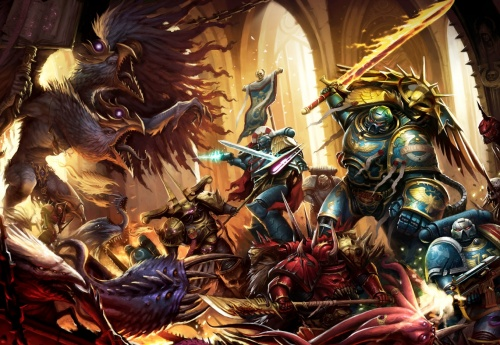
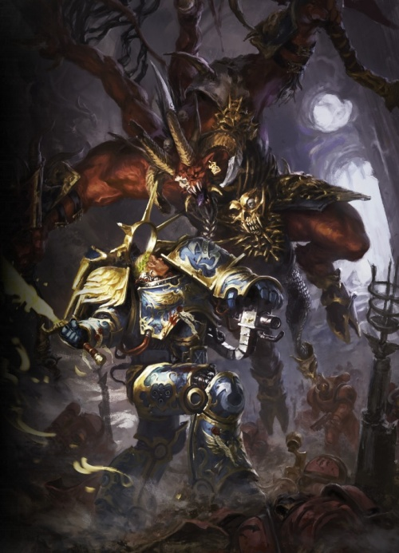
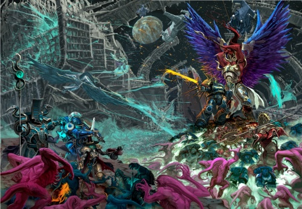

# 0831 -999.M41 泰拉远征 Terran Crusade

精校状态：中文行文已逐段精校，部分术语仍为暂定

分类：时间线

原文来源：https://www.bilibili.com/opus/1072639464840364057

原作者：帝国神选罐头

原文时间：2025年05月30日 13:08

[返回分类目录](目录.md) · [全书目录](../../目录.md)

<!-- A0831-B0001 -->
**英文原文**

The Terran Crusade was an Imperial Crusade fought shortly after the Thirteenth Black Crusade and the destruction of Cadia. It saw the resurrected Primarch Roboute Guilliman leave Ultramar on a pilgrimage to Terra.

<!-- /A0831-B0001 -->

<!-- A0831-B0002 -->

原译文

泰拉远征是在第十三次黑色远征和卡迪亚被摧毁后不久进行的帝国远征。复活的原体罗伯特·基里曼离开奥特拉玛前往泰拉朝圣。

**校订译文**

泰拉远征发生于第十三次黑色远征及卡迪亚毁灭后不久。复生的原体罗保特·基里曼离开奥特拉玛，率帝国大军前往泰拉朝圣。

<!-- /A0831-B0002 -->

<!-- A0831-B0003 图片 -->

<!-- A0831-B0004 -->

原译文

Roboute Guilliman and his forces battle Fateweaver 罗伯特·基里曼和他的部队与织命者作战

**校订译文**

Roboute Guilliman and his forces battle Fateweaver 罗保特·基里曼与麾下部队迎战织命者

<!-- /A0831-B0004 -->

<!-- A0831-B0005 -->
**英文原文**

Conflict:Long War

<!-- /A0831-B0005 -->

<!-- A0831-B0006 -->

原译文

冲突：万古长战

**校订译文**

冲突：万古长战

<!-- /A0831-B0006 -->

<!-- A0831-B0007 -->
**英文原文**

Date:~999.M41

<!-- /A0831-B0007 -->

<!-- A0831-B0008 -->

原译文

日期：~999.M41

**校订译文**

日期：~999.M41

<!-- /A0831-B0008 -->

<!-- A0831-B0009 -->
**英文原文**

Location:Ultramar, Maelstrom, Sol System

<!-- /A0831-B0009 -->

<!-- A0831-B0010 -->

原译文

地点：奥特拉玛、大漩涡、太阳系

**校订译文**

地点：奥特拉玛、大漩涡、太阳系

<!-- /A0831-B0010 -->

<!-- A0831-B0011 -->
**英文原文**

Outcome:Imperial victory

<!-- /A0831-B0011 -->

<!-- A0831-B0012 -->

原译文

结果：帝国胜利

**校订译文**

结果：帝国胜利

<!-- /A0831-B0012 -->

<!-- A0831-B0013 -->
**英文原文**

Combatants:Imperium,Eldar,Fallen/Forces of Chaos

<!-- /A0831-B0013 -->

<!-- A0831-B0014 -->

原译文

作战人员：帝国，灵族，堕天使/混沌部队

**校订译文**

交战方：帝国、灵族、堕天使／混沌势力

<!-- /A0831-B0014 -->

<!-- A0831-B0015 -->
**英文原文**

Commanders:Primarch Roboute Guilliman,Captain Cato Sicarius,Grand Master Voldus,Saint Celestine,Marshal Marius,Amalrich(KIA),Cypher,Sylandri Veilwalker/Magnus the Red,Kairos Fateweaver,Skarbrand,Verngar

<!-- /A0831-B0015 -->

<!-- A0831-B0016 -->

原译文

指挥官：原体罗伯特·基里曼，连长卡托·西卡留斯，大导师沃尔达斯，圣塞勒斯汀，马里乌斯，阿马里奇（KIA），塞弗，西兰德里·帷幕行者/赤红之马格努斯，织命者，斯卡布兰德，弗恩加尔

**校订译文**

指挥官：原体罗保特·基里曼、卡托·西卡留斯连长、沃尔达斯大导师、圣塞莱斯汀、元帅马里乌斯·阿马尔里奇（阵亡）、塞弗、西兰德里·帷幕行者／红魔马格努斯、凯洛斯·织命者、斯卡布兰德、弗恩加尔

**校注：** 英文名单Marshal Marius,Amalrich误用逗号拆成两人，按本篇与前篇同一元帅马里乌斯·阿马尔里奇合并，保留原英文作追溯。

<!-- /A0831-B0016 -->

<!-- A0831-B0017 -->
**英文原文**

Strength:Elements from the Ultramarines, Raven Guard, White Scars, Space Wolves, Dark Angels, Novamarines, Mortificators, and Black Templars,Harlequins,Later Imperial Fists, Custodes, Grey Knights, Sisters of Silence, and Battlefleet Solar elements/Thousand Sons,Red Corsairs,Daemonic Legions

<!-- /A0831-B0017 -->

<!-- A0831-B0018 -->

原译文

力量：部分极限战士，暗鸦守卫，白色伤疤，太空野狼，黑暗天使，新星战士，苦行者和黑色圣堂，丑角，后续为帝国之拳，禁军，灰骑士，寂静修女和部分太阳舰队/千子，红海盗，恶魔军团

**校订译文**

兵力：极限战士、暗鸦守卫、白疤、太空野狼、黑暗天使、新星战士、苦行者及黑色圣堂的部分部队，另有丑角；后续又有帝国之拳、禁军、灰骑士、寂静修女及太阳战斗舰队分遣部队加入／千子、红海盗、恶魔军团

<!-- /A0831-B0018 -->

<!-- A0831-B0019 -->
**英文原文**

Casualties:Unknown, presumably heavy/Unknown, presumably heavy

<!-- /A0831-B0019 -->

<!-- A0831-B0020 -->

原译文

伤亡情况：未知，可能很重/未知，可能很重

**校订译文**

伤亡：不详，推测惨重／不详，推测惨重

<!-- /A0831-B0020 -->

<!-- A0831-B0021 -->
## Overview 概述

<!-- /A0831-B0021 -->

<!-- A0831-B0022 -->
### Prelude 序曲

<!-- /A0831-B0022 -->

<!-- A0831-B0023 -->
**英文原文**

During the Ultramar Campaign, Belisarius Cawl and his Eldar allies managed to revive the wounded Ultramarines Primarch Roboute Guilliman as Ultramar was besieged by Abaddon the Despoiler's Chaos Space Marine forces. After driving out the Chaos invaders, Guilliman immediately ordered a war council and a debriefing on the situation. Disgusted by what he heard regarding the state of the Imperium, Guilliman entered his private chambers for four days along with Marneus Calgar, Tigurius, Voldus, Saint Celestine, Greyfax, and Belisarius Cawl. When he emerged, he declared his plan to reach Terra and manage the situation from there. After a massive parade on Macragge to unveil the reborn Primarch, Guilliman and his forces left on the Macragge's Honour for Terra. Soon enough, word of the Primarch's revival had spread throughout Ultima Segmentum and reinforcements from the Raven Guard, Space Wolves, White Scars, Dark Angels and other Chapters such as the Mortificators and Novamarines arrived to bolster Guilliman. These are later joined by fresh Imperial Guard and Imperial Navy, Mechanicus forces, Sisters of Battle, Knight Houses, and Titan Legions. Soon enough, Guilliman had a massive army for his journey to Terra.

<!-- /A0831-B0023 -->

<!-- A0831-B0024 -->

原译文

在奥特拉玛战役中，贝利撒留·考尔和他的灵族盟友设法救活了受伤的极限战士原体罗伯特·基里曼，因为奥特拉玛被掠夺者阿巴顿的混沌星际战士包围。在驱逐了混沌入侵者后，基里曼立即下令召开战争议会并听取有关局势的汇报。基里曼对他所听到的关于帝国状态的消息感到厌恶，他与马涅乌斯·卡尔加、狄格里斯、沃尔达斯、圣塞勒斯汀、格雷法克斯和贝利撒留·考尔一起进入了他的私人房间四天。当他出现时，他宣布了到达泰拉并从那里管理局势的计划。在马库拉格举行了盛大的游行，为重生的原体揭幕后，基里曼和他的部队乘坐马库拉格之耀号前往泰拉。很快，原体复活的消息传遍了极限星域，来自暗鸦守卫、太空野狼、白色伤疤、黑暗天使和其他战团的增援部队，如苦行者和新星战士，抵达以支持基里曼。后来，新的帝国卫队和帝国海军、机械教部队、战斗修女、骑士家族和泰坦军团也加入了进来。很快，基里曼就有了一支庞大的军队，准备前往泰拉。

**校订译文**

奥特拉玛战役期间，阿巴顿的混沌星际战士正围攻当地，贝利萨留斯·考尔与灵族盟友成功唤醒了身负重伤的极限战士原体罗保特·基里曼。赶走入侵者后，基里曼立即召开军事会议，听取局势汇报。帝国现状令他深感厌恶；他与马涅乌斯·卡尔加、狄格里斯、沃尔达斯、圣塞莱斯汀、格雷法克斯和考尔一同闭门商议四日。再次现身时，他宣布要前往泰拉，从那里统筹应对危局。马库拉格举行盛大阅兵，向世人展示归来的原体，随后基里曼率军乘马库拉格之耀号启程。复生的消息很快传遍极限星域，暗鸦守卫、太空野狼、白疤、黑暗天使，以及苦行者、新星战士等战团纷纷来援。帝国卫队、帝国海军、机械修会、战斗修女、骑士家族和泰坦军团也陆续加入，使这支前往泰拉的军势迅速壮大。

<!-- /A0831-B0024 -->

<!-- A0831-B0025 -->
**英文原文**

However, the rebirth of the Primarch drew the attention of the Chaos Gods, and the entire Warp was flung into disarray. The Great Game escalated in the Warp as hysterical Daemonic armies moved on their patron Gods' realms in renewed attacks. The collective result from these disturbances were a series of massive Warp Storms across the Galaxy on a scale not seen since the Age of Strife. Guilliman's journey to Terra was thus far more difficult than originally expected. The Dark Gods were not the only ones to sense his revival; Mortarion and Magnus both felt the resurrection of their brother and begin to plan for the future as well. Fulgrim possessed the Arch-Consul of Macragge and goaded the brother he had previously wounded 10,000 years ago.

<!-- /A0831-B0025 -->

<!-- A0831-B0026 -->

原译文

然而，原体的重生引起了混沌诸神的注意，整个亚空间陷入混乱。随着狂暴的恶魔军队在新的攻击中向他们的恶魔领域移动，伟大游戏在亚空间中升级。这些干扰的共同结果是，银河系发生了一系列大规模的亚空间风暴，其规模是自纷争时代以来从未见过的。基里曼前往泰拉的旅程比最初预期的要困难得多。黑暗诸神并不是唯一感觉到他复活的人；莫塔里安和马格努斯都感受到了他们兄弟的复活，并开始为未来做计划。福格瑞姆占据了马库拉格的总领事，并激怒了他在10000年前伤害过的兄弟。

**校订译文**

原体复生引起混沌诸神注意，整个亚空间陷入动荡。疯狂的恶魔大军围绕各自守护神的领域发动新一轮攻势，伟大游戏随之升级。这些异变汇聚成席卷银河的巨型亚空间风暴，规模为纷争时代以来所未见，使基里曼的旅途远比预想艰难。感知到复生的不止黑暗诸神：莫塔里安与马格努斯也察觉兄弟归来，开始筹谋未来。福格瑞姆则附身马库拉格首席执政官，嘲弄那位一万年前被自己重创的兄弟。

**校注：** moved on their patron Gods’ realms 原文对进攻目标的表述欠清，译为围绕各守护神领域发动攻势，不另编敌神归属；Arch-Consul沿核心首席执政官。

<!-- /A0831-B0026 -->

<!-- A0831-B0027 -->
### Pilgrimage 朝圣

<!-- /A0831-B0027 -->

<!-- A0831-B0028 -->
**英文原文**

For the next seven months, Guilliman moved through Ultima Segmentum and reclaimed worlds under Chaos assault. The surviving Chaos invaders from the Ultramar Campaign had set their sights on these defenseless worlds. Even worse is the spread of a new blindness-inducing disease that decimated Imperial warriors and civilians alike. It soon became clear that this plague is the product of Mortarion, who has summoned the powers of Nurgle in its creation. However, the mere presence of Guilliman is able to cure the afflicted, and the Primarch is forced to suspend his trip to Terra to journey across diseased planets and cure their populations. Guilliman's miracles caused further religious hysteria around his return. The Primarch speculated that this was a deliberate plan by the Gods of Chaos to delay his return to Terra.

<!-- /A0831-B0028 -->

<!-- A0831-B0029 -->

原译文

在接下来的七个月里，基里曼穿越了极限星域，并在混沌的攻击下夺回了世界。奥特拉玛战役中幸存的混沌入侵者将目光投向了这些毫无防备的世界。更糟糕的是一种新的致盲疾病的传播，这种疾病导致帝国战士和平民都大量死亡。很快人们就清楚，这场瘟疫是莫塔里安的产物，他在创造这场瘟疫时召唤了纳垢的力量。然而，基里曼的存在本身就能够治愈受折磨的人，而原体被迫暂停前往泰拉的航行，穿越患病的星球并治愈他们的人口。基里曼的奇迹在他回归后引发了进一步的宗教狂热。原体推测，这是混沌诸神故意拖延他返回泰拉的计划。

**校订译文**

此后七个月，基里曼穿越极限星域，收复遭混沌攻击的世界。奥特拉玛战役中逃脱的敌军将目标转向这些缺乏防护的行星，一种新的致盲疫病又开始蔓延，使军民大量死亡。人们很快发现，这是莫塔里安借纳垢之力制造的瘟疫。然而，只要基里曼亲临，患者就能痊愈。原体不得不暂缓泰拉之行，辗转疫区，救治居民。这些奇迹进一步激起围绕其归来的宗教狂热。基里曼怀疑，这正是混沌诸神刻意拖延他抵达泰拉的手段。

<!-- /A0831-B0029 -->

<!-- A0831-B0030 -->
**英文原文**

With the Warp in turmoil, Guilliman's fleet could only make short inaccurate jumps, and the journey took far longer than it otherwise would have. When the fleet arrived at the edge of the Maelstrom, they found themselves under a massive Thousand Sons ambush led by Magnus the Red himself. At its center was a colossal craft bearing the great pyramid of Tizca. Magnus had no desire to slay his brother yet, and instead conducted a psychic ritual that pulled the Imperial ships into the Maelstrom. Many of the vessels were destroyed during the ritual as they did not have time to raise their Gellar Fields. Once inside the Maelstrom, Guilliman's fleet came under a large scale Red Corsairs attack. The Imperials were able to defeat the Red Corsairs, but one of the surviving corsair Marines became possessed by Kairos Fateweaver, who declared that Guilliman will wander the Maelstrom forever.

<!-- /A0831-B0030 -->

<!-- A0831-B0031 -->

原译文

由于亚空间陷入混乱，基里曼的舰队只能进行短距离的不准确跳跃，而且航程比其他情况要长得多。当舰队到达大漩涡边缘时，他们发现自己遭到了由赤红之马格努斯亲自率领的千子的大规模伏击。它的中心是一艘巨大的飞船，上面有巨大的提兹卡金字塔。马格努斯还不想杀死他的兄弟，而是进行了一场灵能仪式，将帝国战舰拖入了大漩涡。许多战舰在仪式中被摧毁，因为他们没有时间开启盖勒力场。一进入大漩涡，基里曼的舰队就遭到了大规模的红海盗袭击。帝国军队成功击败了红海盗，但幸存的红海盗之一被卡洛斯·织命者附身，他宣布基里曼将永远在大漩涡中游荡。

**校订译文**

亚空间动荡迫使舰队只能作短距离、落点不准的跳跃，旅程远比正常情况漫长。舰队抵达大漩涡边缘时，遭到红魔马格努斯亲率的千子大军伏击。敌阵中央是一艘承载提兹卡大金字塔的巨舰。马格努斯暂不打算杀死兄弟，而是以灵能仪式将帝国舰船拖入大漩涡。许多舰船来不及升起盖勒力场，当场毁灭。进入其中后，帝国又遭红海盗大举攻击，虽然将其击败，一名幸存的红海盗星际战士却被凯洛斯·织命者附身，宣告基里曼将永远困于此地。

<!-- /A0831-B0031 -->

<!-- A0831-B0032 -->
**英文原文**

For a time, the Imperials did indeed wander the Maelstrom aimlessly. Time is inconsistent in the Maelstrom and it was not clear how long they are trapped here. To make matters worse, ambushes by Chaos Space Marines and Tzeentch Daemons took their toll on Guilliman's pilgrimage. Guided by the visions of a mysterious Eldar, the Imperials are eventually able to traverse the Maelstrom and arrive at a navigational point, finding a vast graveyard of ships linked together in a web of chains. This web stretched endlessly in all directions, trapping the Imperials. It is here that the Red Corsairs launched another ambush.

<!-- /A0831-B0032 -->

<!-- A0831-B0033 -->

原译文

有一段时间，帝国军队确实漫无目的地游荡在大漩涡中。时间在大漩涡中是不一致的，目前尚不清楚他们被困在这里多久。更糟糕的是，混沌星际战士和奸奇恶魔的伏击对基里曼的朝圣之旅造成了损失。在神秘灵族的幻象的指引下，帝国军队最终能够穿越大漩涡，到达一个导航点，发现一个巨大的战舰墓地，这些船只以链条的形式连接在一起。这张网无休止地向四面八方延伸，困住了帝国军队。正是在这里，红海盗发动了另一次伏击。

**校订译文**

帝国舰队确实一度在大漩涡中漫无目的地漂流。这里时间流速紊乱，无从判断他们究竟被困多久。混沌星际战士与奸奇恶魔不断伏击，更令远征损失累累。最终，一位神秘灵族带来的异象指引众人穿越漩涡，抵达一处导航点，却发现眼前是广袤舰船墓场。无数残骸被铁链连成巨网，向四面延伸，仿佛没有尽头，将舰队困住。红海盗在这里再次发起伏击。

<!-- /A0831-B0033 -->

<!-- A0831-B0034 -->
**英文原文**

The Red Corsairs launched a boarding operation of the Macragge's Honour and moved towards the bridge. These attackers were accompanied by Daemons of Tzeentch and Fateweaver himself. Quickly reaching the bridge, Guilliman and Fateweaver began to duel one another. The Lord of Change revealed that he has been implanting subtle doubt into the mind of Guilliman since he entered the Maelstrom, and now used that doubt as a ritualistic catalyst to finish him. Guilliman was forced to his knees by the negative emotion and became trapped in psychic crystal chains. Fateweaver ordered the Imperials to surrender themselves lest he execute their Primarch. Faced with no other option, the Imperials surrendered and were taken captive. Those that refused were forcibly taken or killed.

<!-- /A0831-B0034 -->

<!-- A0831-B0035 -->

原译文

红海盗启动了对马库拉格之耀号的跳帮行动，并向舰桥移动。这些袭击者由奸奇的恶魔和织命者陪同。基里曼和织命者迅速走到舰桥上，开始决斗。万变之主透露，自从基里曼进入大漩涡以来，他一直在基里曼的脑海中植入微妙的怀疑，现在用这种怀疑作为仪式催化剂来终结他。基里曼被负面情绪迫使跪下，被困在灵能水晶锁链中。织命者命令帝国军队投降，以免处决他们的原体。在别无选择的情况下，帝国军队投降并被俘。拒绝的人被强行带走或杀害。

**校订译文**

红海盗登上马库拉格之耀号，在奸奇恶魔和织命者伴随下直扑舰桥。抵达后，织命者与基里曼交锋。诡变领主透露，自原体进入大漩涡起，自己便不断在他心中埋下细微疑虑，如今正将这些疑虑用作仪式的催化剂，准备一举制服他。负面情绪迫使基里曼跪倒，灵能水晶锁链将其牢牢束缚。织命者以处决原体相威胁，命帝国军投降。众人别无选择，只得束手就擒；拒绝屈服者也被强行俘获或杀死。

<!-- /A0831-B0035 -->

<!-- A0831-B0036 -->
### Captivity 监禁

<!-- /A0831-B0036 -->

<!-- A0831-B0037 -->
**英文原文**

The Imperial captives were moved to a Blackstone Fortress that Abaddon had gifted to Huron Blackheart. Fateweaver refused to kill his prisoners, instead wishing to find some use for them in the future. This did not sit well with all the Chaos forces, and Skarbrand and his Khornate legions assailed the Fortress in search of the heads of Guilliman and his men. A massive battle erupted between the forces of Tzeentch and Khorne within the Blackstone Fortress.

<!-- /A0831-B0037 -->

<!-- A0831-B0038 -->

原译文

帝国俘虏被转移到阿巴顿送给休伦·黑心的黑石要塞。织命者拒绝杀害他的囚犯，而是希望在未来为他们找到一些用途。这并没有让所有的混沌势力都满意，斯卡布兰德和他的恐虐军团袭击了要塞，寻找基里曼和他的部下的首级。在黑石要塞内，奸奇和恐虐的军队爆发了一场大规模的战斗。

**校订译文**

俘虏被送入阿巴顿赠予休伦·黑心的黑石堡垒。织命者不愿杀死他们，打算留待日后利用。其他混沌势力并不都认同此举：斯卡布兰德率恐虐军团攻入堡垒，索要基里曼及其部下的头颅。奸奇与恐虐大军在堡垒内爆发激战。

<!-- /A0831-B0038 -->

<!-- A0831-B0039 -->
**英文原文**

Using this distraction to their advantage, an unseen force quietly slipped into the Blackstone Fortress and was able to free the Imperials from their cells. Revealing themselves as Fallen Angels led by Cypher himself, the freed Imperials had no choice but to trust this new ally. Cypher's Fallen were accompanied by Sylandri Veilwalker, who is revealed to be the source of the visions that had guided Guilliman in the Maelstrom. Reinvigorated, the freed Imperials went on to liberate the rest of their number throughout the Blackstone Fortress. They were also able to reacquire their ships and tanks that had been taken by the Red Corsairs. The Imperials took up these vehicles and made their way for the same Webway Portal that Cypher and Veilwalker had arrived through. The fleeing prisoners came under massive Daemonic assault as the forces of Khorne and Tzeentch temporarily put aside their battle in the face of new prey, but the arrival of the Legion of the Damned turned the tide.

<!-- /A0831-B0039 -->

<!-- A0831-B0040 -->

原译文

利用这种分散注意力的优势，一股看不见的力量悄悄溜进了黑石要塞，并将帝国军队从牢房中解放出来。解放者将自己暴露为由塞弗本人领导的堕天使，帝国军队别无选择，只能信任这个新的盟友。塞弗的堕天使由西兰德里·帷幕行者陪同，他被发现是指引基里曼在大漩涡中的幻象的来源。被解放的帝国军队重新振作起来，继续解放黑石要塞中的其余部分。他们还重新获得了被红海盗夺取的战舰和坦克。帝国军队使用这些载具，朝着塞弗和帷幕行者到达的同一个网道门户前进。逃离的囚犯受到了大规模的恶魔攻击，因为恐虐和奸奇的部队在面对新的猎物时暂时搁置了他们的战斗，但咒缚军团的到来扭转了局面。

**校订译文**

趁敌军内斗，一支未被察觉的部队悄然潜入堡垒，释放帝国俘虏。来者现身，竟是塞弗亲率的堕天使。获救众人别无选择，只能相信这位新盟友。西兰德里·帷幕行者也随堕天使而来，原来此前指引基里曼的异象正出自她。重获自由的帝国军振作精神，营救散布堡垒各处的同伴，并夺回被红海盗缴获的舰船与坦克。他们乘上这些载具，奔向塞弗和帷幕行者来时使用的网道门户。面对新猎物，恐虐与奸奇恶魔暂止内斗，大举围攻逃亡者，但咒缚军团出现，扭转战局。

**校注：** unseen 指未被敌人察觉，不证明隐形；liberate the rest of their number 为救出其余俘虏，非解放堡垒剩余区域。

<!-- /A0831-B0040 -->

<!-- A0831-B0041 -->
**英文原文**

As they reached the Webway Portal, Skarbrand himself attacked Guilliman. Guilliman was saved by the efforts of Black Templars Marshal Amalrich, who sacrificed himself to drive his sword through the Bloodthirster's heart. Guilliman hit this buried blade with his wrist-mounted Bolter, shredding apart the Bloodthirster. Having dealt with Skarebrand, Guilliman and the survivors made it through the Webway Portal.

<!-- /A0831-B0041 -->

<!-- A0831-B0042 -->

原译文

当他们到达网道门户时，斯卡布兰德亲自袭击了基里曼。基里曼在黑色圣堂元帅阿马里奇的努力下获救，阿马里奇牺牲了自己，用剑刺穿了嗜血狂魔的心脏。基里曼用手腕上的爆矢击中了这把深埋的刀刃，把嗜血狂魔撕碎了。在与斯卡布兰德打过交道后，基里曼和幸存者成功通过网道门户。

**校订译文**

众人抵达门户时，斯卡布兰德亲自袭向基里曼。黑色圣堂元帅阿马尔里奇舍命相救，将利剑刺入嗜血狂魔心脏。基里曼用腕载爆矢枪射击插在敌人体内的剑刃，将斯卡布兰德轰碎。解决强敌后，他率幸存者穿过网道门户。

**校注：** hit this buried blade with his wrist-mounted Bolter 原文明言以爆矢枪射中已刺入的剑刃，虽细节特殊仍保留，不自行改成直接打敌人。

<!-- /A0831-B0042 -->

<!-- A0831-B0043 图片 -->

<!-- A0831-B0044 -->

原译文

Guilliman battles Skarbrand 基里曼与斯卡布兰德战斗

**校订译文**

Guilliman battles Skarbrand 基里曼与斯卡布兰德战斗

<!-- /A0831-B0044 -->

<!-- A0831-B0045 -->
### The Battle of Luna 月球之战

<!-- /A0831-B0045 -->

<!-- A0831-B0046 -->
**英文原文**

Inside the Webway, the Imperials and their Eldar allies came under renewed Chaos Assault, this time from Magnus' Thousand Sons, who had foreseen their escape. Guilliman deduced that Magnus wanted the Eldar to open up the Webway Gate to Terra in order to allow his Thousand Sons to exploit the breach and invade the planet. Not wishing to play along with Magnus' scheme, Guilliman and Veilwalker instead moved for the Webway Portal to Luna. Despite being hounded by the Thousand Sons at every turn, the Imperials and Eldar eventually reached the portal to Luna.

<!-- /A0831-B0046 -->

<!-- A0831-B0047 -->

原译文

在网道内，帝国军队和他们的灵族盟友再次遭到混沌袭击，这次是来自马格努斯的千子，他们预见到了他们的逃跑。基里曼推断，马格努斯希望灵族打开通往泰拉的网道门，以便他的千子能够利用缺口入侵星球。基里曼和帷幕行者不想配合马格努斯的计划，而是移动到了通往月球的网道门户。尽管在每一个转折点都受到千子的追捕，帝国军队和灵族最终还是到达了月球的传送门。

**校订译文**

网道中，帝国与灵族盟军又遭混沌袭击。这次是早已预见他们脱逃的马格努斯及其千子。基里曼推断，马格努斯想迫使灵族打开直达泰拉的门户，好让千子借机入侵。原体不愿中计，便与帷幕行者改往通向月球的门户。尽管一路遭到追击，联军最终仍抵达目标。

<!-- /A0831-B0047 -->

<!-- A0831-B0048 -->
**英文原文**

On the other side of the Portal, Guilliman and the others arrived in the craters on Luna's surface. However, before Veilwalker could seal the gate, the Thousand Sons burst through, this time accompanied by Magnus himself. A vicious battle erupted as the Imperials and Eldar attempt to stop Magnus from capturing Terra's moon. Brothers once more engaged in a fateful duel as Guilliman battled Magnus. The Daemon Primarch's psychic powers overwhelmed Guilliman, but, before he could be defeated, Battlefleet Solar, Imperial Fists, Sisters of Silence, and the Adeptus Custodes arrived from Terra. The Thousand Sons were being pushed back, and the null-field created by the Silent Sisters negated some of Magnus' powers. This allowed Guilliman to drive his sword through the Daemon Primarch's back. Magnus was forced back through the Webway Portal as Veilwalker closed the gate. With the gate closed, the rest of the Thousand Sons, as well as the Eldar, simply vanished.

<!-- /A0831-B0048 -->

<!-- A0831-B0049 -->

原译文

在传送门的另一边，基里曼和其他人到达了月球表面的陨石坑。然而，在帷幕行者封锁门户之前，千子冲了进来，这次是由马格努斯本人陪同的。帝国军队和灵族试图阻止马格努斯夺取泰拉的卫星，爆发了一场激烈的战斗。基里曼与马格努斯作战时，兄弟俩再次进行了一场决定性的决斗。恶魔原体的灵能力量压倒了基里曼，但在他被击败之前，太阳舰队、帝国之拳、寂静修女和禁军从泰拉赶来。千子被击退，寂静修女创造的虚无立场否定了马格努斯的一些力量。这使得基里曼能够将他的剑穿过恶魔原体的背部。当帷幕行者关闭门户时，马格努斯被迫通过网道门户返回。随着门户的关闭，其余的千子以及灵族都消失了。

**校订译文**

穿过门户，基里曼与众人来到月球表面的陨石坑。帷幕行者尚未将门封闭，千子便紧随而出，马格努斯本人也已赶到。帝国与灵族奋战，阻止他占据泰拉的卫星；两位兄弟再度展开宿命般的决斗。恶魔原体以灵能力量压制基里曼，就在胜负将分之际，太阳战斗舰队、帝国之拳、寂静修女与禁军从泰拉来援。千子逐步被逼退，寂静修女的反灵能力场也削弱了马格努斯，使基里曼得以将剑贯入他的背部。马格努斯被逼回网道，帷幕行者随即关门。门户关闭后，余下的千子与灵族都消失了。

**校注：** 原文千子与灵族在门户关闭后消失，未说明是传送、隐匿还是离开月球，忠实保留；null-field为反灵能力场，非虚无立场。

<!-- /A0831-B0049 -->

<!-- A0831-B0050 图片 -->

<!-- A0831-B0051 -->

原译文

Guilliman and Magnus duel on Luna 基里曼与马格努斯在月球决斗

**校订译文**

Guilliman and Magnus duel on Luna 基里曼与马格努斯在月球决斗

<!-- /A0831-B0051 -->

<!-- A0831-B0052 -->
### Aftermath 余波

<!-- /A0831-B0052 -->

<!-- A0831-B0053 -->
**英文原文**

With the battle over, Guilliman and his forces landed at the Imperial Palace. The Primarch confronted Shield-Captain Adronitus and demanded entry past the Eternity Gate so he could confer with the Emperor himself. Hesitantly, Adronitus agreed, on the condition that Guilliman enter the chamber alone. As Guilliman entered the Emperor's throne room, the Custodes arrested Cypher and his Fallen.

<!-- /A0831-B0053 -->

<!-- A0831-B0054 -->

原译文

战斗结束后，基里曼和他的部队在皇宫登陆。原体与盾卫连长阿登罗尼图斯对峙，要求通过永恒之门进入，以便他可以亲自与帝皇商议。阿登罗尼图斯犹豫地同意了，条件是基里曼独自进入房间。当基里曼进入帝皇的王座厅时，禁军逮捕了塞弗和他的堕天使。

**校订译文**

战斗结束后，基里曼率军降落帝皇宫，面对盾卫连长阿登罗尼图斯，要求穿过永恒之门，亲自觐见帝皇。禁军迟疑后同意，条件是原体独自进入。基里曼走进王座厅时，禁军则逮捕了塞弗及其堕天使。

<!-- /A0831-B0054 -->

<!-- A0831-B0055 -->
**英文原文**

A day later, Guilliman stepped out from the Eternity Gate. What transpired before the Golden Throne is not known. However, he gathered all of the High Lords of Terra and declared himself the new Lord Commander of the Imperium. The Primarch stated that dark days are ahead, and that he would reorganize the Imperium and its fighting forces in order to confront it and ensure humanity's survival.

<!-- /A0831-B0055 -->

<!-- A0831-B0056 -->

原译文

一天后，基里曼走出永恒之门。黄金王座之前发生了什么尚不清楚。然而，他召集了泰拉的所有高领主，并宣布自己为新的帝国领主指挥官。原体表示，黑暗的日子即将到来，他将重组帝国及其战斗力量，以对抗它并确保人类的生存。

**校订译文**

一天后，基里曼走出永恒之门。他在黄金王座前经历了什么，无人知晓。他随即召集泰拉高领主，宣布就任帝国最高统帅。原体表示，黑暗时日仍在前方；他将重整帝国及其军队，迎接危机，确保人类存续。

<!-- /A0831-B0056 -->

本篇核心术语与暂定项

以下列出本篇出现的英文原形及核心术语表用词。同形词可能指不同对象，具体词义以本篇正文和校注为准；单复数、别名和仅见于图注的名称可能尚未列入。完整候选见[术语表](../../术语表/双语术语候选.csv)。

| 英文 | 采用中文 | 状态 |
| --- | --- | --- |
| Space Marines | 星际战士 | 官方已核对 |
| Black Templars | 黑色圣堂 | 官方已核对 |
| Dark Angels | 黑暗天使 | 官方已核对 |
| Grey Knights | 灰骑士 | 官方已核对 |
| Space Wolves | 太空野狼 | 官方已核对 |
| Adeptus Custodes | 帝皇禁军 | 官方已核对 |
| Imperial Guard | 帝国卫队 | 暂定·语境区分 |
| Chaos Space Marines | 混沌星际战士 | 官方已核对 |
| Thousand Sons | 千子 | 官方已核对 |
| Eldar | 灵族 | 暂定·语境区分 |
| Roboute Guilliman | 罗保特·基里曼 | 官方已核对 |
| Ultramar | 奥特拉玛 | 官方已核对 |
| Ultramarines | 极限战士 | 官方已核对 |
| Warp | 亚空间 | 官方已核对 |
| Imperium | 帝国 | 暂定·简称 |
| Imperial Navy | 帝国海军 | 暂定 |
| Webway | 网道 | 暂定 |
| Khorne | 恐虐 | 官方已核对 |
| Tzeentch | 奸奇 | 官方已核对 |
| Nurgle | 纳垢 | 官方已核对 |
| Maelstrom | 大漩涡 | 官方已核对 |
| Imperial Fists | 帝国之拳 | 暂定 |
| Emperor | 帝皇 | 官方已核对 |
| Primarch | 原体 | 官方已核对 |
| Corsair | 海盗 | 暂定·官方待核 |
| Mortarion | 莫塔里安 | 官方已核对 |
| Age of Strife | 纷争时代 | 暂定·官方待核 |
| Terra | 泰拉 | 暂定·官方待核 |
| Fulgrim | 福格瑞姆 | 官方已核对 |
| High Lords of Terra | 泰拉高领主 | 暂定·官方待核 |
| Sisters of Battle | 战斗修女 | 暂定·官方待核 |
| Sisters of Silence | 寂静修女 | 暂定·官方待核 |
| Magnus the Red | 红魔马格努斯 | 官方已核对 |
| Lord Commander of the Imperium | 帝国最高统帅 | 暂定·官方待核 |
| Golden Throne | 黄金王座 | 暂定·官方待核 |
| Ultima Segmentum | 极限星域 | 暂定·官方待核 |
| Segmentum | 星域 | 暂定·官方待核 |
| Cadia | 卡迪亚 | 暂定·官方待核 |
| Luna | 月球 | 暂定·官方待核 |
| Macragge | 马库拉格 | 暂定·官方待核 |
| Titan | 泰坦 | 暂定·官方待核 |
| Clear | 清明 | 暂定·官方待核 |
| Master | 导师（审判庭职衔）／舰务官（舰员职务） | 语境定译·官方待核 |
| Saint Celestine | 圣塞莱斯汀 | 官方已核对 |
| Shield-Captain | 盾卫连长 | 官方已核对 |
| Belisarius Cawl | 贝利萨留斯·考尔 | 官方已核对 |
| Long War | 万古长战 | 暂定·官方待核 |
| Lord Commander | 领主指挥官 | 暂定·官方待核 |
| White Scars | 白疤 | 官方已核 |
| Raven Guard | 暗鸦守卫 | 官方已核 |
| Scars | 伤疤 | 暂定·官方待核 |
| Sol | 太阳系 | 暂定·官方待核 |
| Consul | 领事 | 暂定·官方待核 |
| Despoiler | 劫掠者 | 暂定·官方待核 |
| Space Marine | 星际战士 | 暂定·官方待核 |
| Captain | 连长 | 暂定·官方待核 |
| Brother | 修士 | 暂定·官方待核 |
| Marneus Calgar | 马涅乌斯·卡尔加 | 暂定·官方待核 |
| Cato Sicarius | 卡托·西卡留斯 | 暂定·官方待核 |
| Novamarines | 新星战士 | 暂定·官方待核 |
| Invaders | 侵略者 | 暂定·官方待核 |
| Legion of the Damned | 诅咒军团 | 暂定·官方待核 |
| Reborn | 复生者（战团）／重生者（死神军自称） | 语境定译·官方待核 |
| Mortificators | 苦行者 | 暂定·官方待核 |
| Powers | 能天使 | 暂定·官方待核 |
| Cypher | 塞弗 | 官方已核对 |
| Great Game | 伟大游戏 | 暂定·官方待核 |
| Kairos Fateweaver | 凯洛斯·织命者 | 官方已核对 |
| Blackstone Fortress | 黑石要塞 | 暂定·官方待核 |
| Lord of Change | 诡变领主 | 官方已核对 |
| Bloodthirster | 嗜血狂魔 | 官方已核对 |
| Skarbrand | 斯卡布兰德 | 官方已核对 |
| Abaddon the Despoiler | 掠夺者阿巴顿 | 官方已核对 |
| Sylandri Veilwalker | 西兰德里·帷幕行者 | 暂定·官方待核 |
| Marshal | 元帅 | 官方已核对 |
| Grand Master Voldus | 沃尔达斯大导师 | 官方已核对 |
| Macragge's Honour | 马库拉格之耀号 | 暂定·官方待核 |
| Grand Master | 大导师 | 暂定·官方待核 |
| Arch-Consul | 首席执政官 | 暂定·官方待核 |
| The Dark | 《黑暗》 | 暂定·官方待核 |
| System | 星系（恒星系统） | 暂定·官方待核 |
| War Council | 战争议会 | 暂定·官方待核 |
| Huron Blackheart | 休伦·黑心 | 官方已核对 |
| Terran Crusade | 泰拉远征 | 暂定·官方待核 |
| Verngar | 弗恩加尔 | 暂定·官方待核 |
| Adronitus | 阿登罗尼图斯 | 暂定·官方待核 |
| Bolter | 爆矢枪 | 暂定·官方待核 |
| Tizca | 提兹卡 | 暂定·官方待核 |
| Titan Legions | 泰坦军团 | 暂定·官方待核 |
| Sol System | 太阳系 | 暂定·官方待核 |
| Eternity Gate | 永恒之门 | 暂定·官方待核 |

