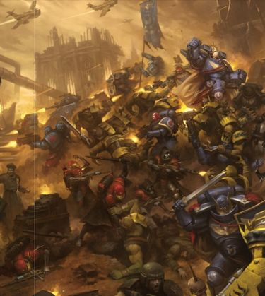
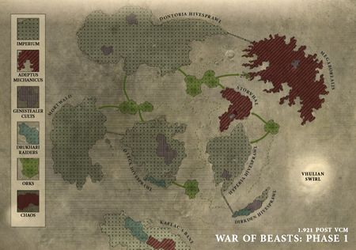
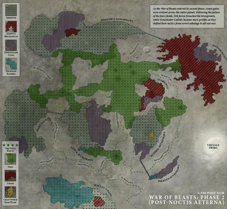
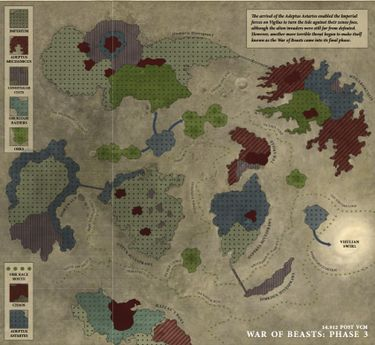
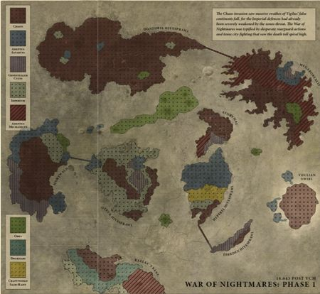
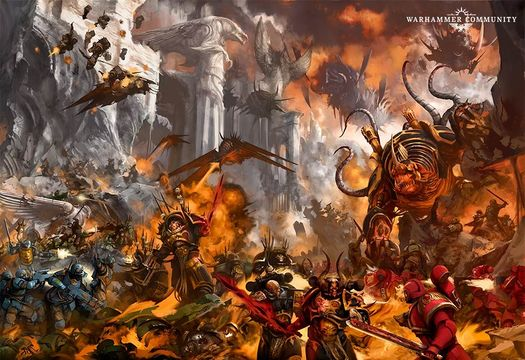
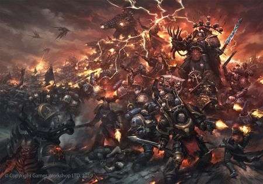

# 0833 001-025.M42 野兽之战（警戒星）上 War of Beasts

精校状态：中文行文已逐段精校，部分术语仍为暂定

分类：时间线

原文来源：https://www.bilibili.com/opus/1140526748697362451

原作者：帝国神选罐头

原文时间：2025年11月29日 11:46

[返回分类目录](目录.md) · [全书目录](../../目录.md)

原篇名：001-025.M42 野兽战争(警戒星)上 War of Beasts

<!-- A0833-B0001 -->
**英文原文**

The War of Beasts, later sometimes known as the War of Nightmares upon the arrival of Chaos forces, is the term for the ongoing conflict on the Imperial World of Vigilus.

<!-- /A0833-B0001 -->

<!-- A0833-B0002 -->

原译文

野兽之战，后来有时被称为混沌部队到来时的噩梦之战，是警戒星帝国世界持续冲突的术语。

**校订译文**

“野兽之战”指帝国世界警戒星上持续发生的战争。混沌势力加入后，这场战争有时也被称为“噩梦之战”。

<!-- /A0833-B0002 -->

<!-- A0833-B0003 图片 -->

<!-- A0833-B0004 -->

原译文

Marneus Calgar leads an attack against Orks on Vigilus 马涅乌斯·卡尔加在警戒星领导了对欧克的攻击

**校订译文**

Marneus Calgar leads an attack against Orks on Vigilus 马涅乌斯·卡尔加在警戒星领导了对欧克的攻击

<!-- /A0833-B0004 -->

<!-- A0833-B0005 -->
**英文原文**

Date:1.192.VCM - 25.141.VCM (New Style), 001-025.M42 (Old Style)

<!-- /A0833-B0005 -->

<!-- A0833-B0006 -->

原译文

日期：1.192.VCM - 25.141.VCM（新历），001-025.M42（旧历）

**校订译文**

日期：1.192.VCM - 25.141.VCM（新历），001-025.M42（旧历）

<!-- /A0833-B0006 -->

<!-- A0833-B0007 -->
**英文原文**

Location:Vigilus

<!-- /A0833-B0007 -->

<!-- A0833-B0008 -->

原译文

地点：警戒星

**校订译文**

地点：警戒星

<!-- /A0833-B0008 -->

<!-- A0833-B0009 -->
**英文原文**

Outcome:Ongoing, though fighting is beginning to wind down. Imperium continues to hold Vigilus, Greater Nachmund Rift War erupts

<!-- /A0833-B0009 -->

<!-- A0833-B0010 -->

原译文

结果：虽然战斗开始逐渐平息，但仍在继续。帝国继续控制警戒星，更大的纳克蒙德裂隙战争爆发

**校订译文**

结果：战事仍未结束，但已逐渐减弱；帝国继续控制警戒星，规模更大的纳克蒙德裂隙战争爆发

<!-- /A0833-B0010 -->

<!-- A0833-B0011 -->
**英文原文**

Combatants:Imperium, Eldar (Phase 3 Onwards)/Forces of Chaos;Orks/Unaligned Invaders, Genestealers, Eldar (Phases 1-2), Dark Eldar

<!-- /A0833-B0011 -->

<!-- A0833-B0012 -->

原译文

作战人员：帝国，灵族（第三阶段及之后）/混沌部队；欧克/未结盟的入侵者，基因窃取者，灵族（第一，二阶段），黑暗灵族

**校订译文**

交战方：帝国、灵族（第三阶段起）／混沌势力；欧克／未结盟的入侵者、基因窃取者、灵族（第一至第二阶段）、黑暗灵族

<!-- /A0833-B0012 -->

<!-- A0833-B0013 -->
**英文原文**

Commanders: Chapter Master Marneus Calgar (WIA), Saint Celestine, Inquisitor Cartavolnus, Chapter Master Kantor, Iron Father Stronos, Jarl Krom Dragongaze, Haldor Icepelt, Watch Master Acastian, Captain Jhermandes, Captain Dravastis Fane, Chapter Master Zandtus, Olujin Khan, Meneraeus, Lieutenant Kodden, Governor Lucienne Agamemnus IX (MIA), Arch-Commodore Hentzmann, General Deinos Agamemnus, Pontifex Slyne Galluck, Fabricator Vosch, Magos Dalathrust, Dominus Caldrike, Dominus Ipluvius XIV, Canoness Blaise, Canoness Hrethnar, Proctor Commander Venedar, Lord Commissar Dorst, Lord Commissar Asdan, Lord Commissar Lasko, Tempestor Prime Liocardus, Joren Vanaklimptas, Rogue Trader Delarique du Languille, Inquisitor Frenza, Farseer Keltoc (Phase 3+)/Abaddon the Despoiler, Haarken Worldclaimer, Ramaghan Savasdus, Gnorrel Cantus, Veshel Thanetis, Athmar Rivetheart, Kharrack, Gallus Herodicus, Varrus Hekatos, Korval the Nightspear, Omicron, Borgha the Red Hand, Veszrax, Xagramothis, Praxis Empyrealus, Ghordar Bann, Vex Machinator, Thorosgar Bear-fist, Zhune Tzang, Tzungdan, Zoculinsus, Osandus, Vannadan (KIA), Coven Triplicatus, Vodt Redtooth, Rotigus, Leiwa'quasca, Pale Stalker; Krooldakka (KIA), Dakkabad, Big Tanka, Zogbag, Ogrokk Bitespider, Drogzot, Murk, Gazrog, Tankskrappa, Bootstompa Ghalgutz/Genestealers: Patriarch Grandsire Wurm, Nemesis 9 Tyrantis, Primus Dethru Noan, Slynte, Eldar: Farseer Keltoc, Autarch Rhyloor (KIA), Spiritseer Qelanaris

<!-- /A0833-B0013 -->

<!-- A0833-B0014 -->

原译文

指挥官：战团长马涅乌斯·卡尔加（WIA），圣塞勒斯汀，审判官卡塔沃努斯，战团长坎托，铁父斯特罗诺斯，狼主克罗姆·龙瞪，哈尔多·霜皮，守望大师阿卡斯坦，连长杰赫曼德斯，连长德拉瓦蒂斯·费恩，战团长赞图斯，奥卢金可汗，梅内雷乌斯，副官科登，总督卢西安·阿伽门努斯九世（MIA），主领海军准将亨茨曼，将军迪诺斯·阿伽门努斯，大祭司斯莱恩·加卢克，铸造将军沃斯克，贤者达拉斯拉斯特，统御贤者卡卓克，统御贤者伊普路维厄斯14号，大修女布莱兹，大修女赫雷瑟娜，监督指挥官维尼达，领主政委多斯特，领主政委阿斯丹，领主政委拉斯科，暴风忠嗣首席利奥卡杜斯，乔伦·冯·阿克林普塔斯，行商浪人德拉芮珂·杜·朗顾伊，审判官弗伦扎，先知凯尔托克（阶段3+）/掠夺者阿巴顿，夺世者哈肯，拉马汉·萨瓦斯都，格诺雷尔·坎图斯，维谢尔·萨内蒂斯，阿斯玛尔·铆钉之心，卡拉克，加卢斯·希罗狄库斯，瓦鲁斯·赫卡托斯，夜矛科瓦尔，奥密克戎，红手博尔哈，威斯拉克斯，沙格拉莫西斯，普拉西斯·恩佩里亚卢斯，古尔达尔·班，维克斯·策划者，索罗斯加尔·熊拳，祝恩·张，曾丹，祖库林斯，奥桑多斯，瓦纳丹（KIA），三重集会，沃特·红齿，罗提古斯，莱瓦'夸斯卡，苍白追猎者；克鲁哒咔（KIA），坏哒咔，大坦咔，佐格巴格，欧格洛克·咬蛛，德罗格佐特，莫克，加兹罗格，坦克拉帕，踏靴加尔古兹/基因窃取者：族长祖尊乌尔姆，涅墨西斯九号泰伦，领军迪瑟鲁·诺安，斯莱特，灵族：先知凯尔托克，司战瑞洛尔（KIA），灵魂先知奎拉那瑞斯

**校订译文**

指挥官：战团长马涅乌斯·卡尔加（负伤）、圣塞莱斯汀、审判官卡塔沃努斯、战团长坎托、钢铁圣父斯特罗诺斯、领主克罗姆·龙瞪、哈尔多·霜皮、守望堡主阿卡斯坦、杰赫曼德斯连长、德拉瓦蒂斯·费恩连长、战团长赞图斯、奥卢金可汗、梅内雷乌斯、副官科登、总督卢西安·阿伽门努斯九世（失踪）、首席海军准将亨茨曼、迪诺斯·阿伽门努斯将军、大祭司斯莱恩·加卢克、铸造师沃斯克、贤者达拉斯拉斯特、统御贤者卡卓克、统御贤者伊普路维厄斯十四号、大修女布莱兹、大修女赫雷瑟娜、监督指挥官维尼达、领主政委多斯特、领主政委阿斯丹、领主政委拉斯科、风暴忠嗣统领利奥卡杜斯、乔伦·冯·阿克林普塔斯、行商浪人德拉芮珂·杜·朗顾伊、审判官弗伦扎、大先知凯尔托克（第三阶段起）／掠夺者阿巴顿、夺星者哈尔肯、拉马汉·萨瓦斯都、格诺雷尔·坎图斯、维谢尔·萨内蒂斯、阿斯玛尔·铆钉之心、卡拉克、加卢斯·希罗狄库斯、瓦鲁斯·赫卡托斯、夜矛科瓦尔、奥密克戎、红手博尔哈、威斯拉克斯、沙格拉莫西斯、普拉西斯·恩佩里亚卢斯、古尔达尔·班、维克斯·策划者、索罗斯加尔·熊拳、祝恩·张、曾丹、祖库林斯、奥桑多斯、瓦纳丹（阵亡）、三重集会、沃特·红齿、烂格斯、莱瓦’夸斯卡、苍白追猎者；克鲁哒咔（阵亡）、坏哒咔、大坦咔、佐格巴格、欧格洛克·咬蛛、德罗格佐特、莫克、加兹罗格、坦克拉帕、踏靴加尔古兹／基因窃取者：族长祖尊乌尔姆、涅墨西斯九号·泰兰提斯、领军迪瑟鲁·诺安、斯莱特；灵族：大先知凯尔托克、司战瑞洛尔（阵亡）、灵魂先知奎拉那瑞斯

**校注：** Fabricator 未带General，不自动提升为铸造将军，暂译铸造师；Dominus在本篇机械教人物头衔沿现稿统御贤者，完整职衔待核。Nemesis 9 Tyrantis 是角色专名，Tyrantis不可误省为泰伦种族，暂作涅墨西斯九号·泰兰提斯。

<!-- /A0833-B0014 -->

<!-- A0833-B0015 -->
**英文原文**

Losses/Survivors:At least several billion casualties (both military and civilian)/Heavy Chaos casualties/Heavy Ork casualties/Heavy Genestealer casualties, Heavy Eldar casualties, Unknown Dark Eldar casualties

<!-- /A0833-B0015 -->

<!-- A0833-B0016 -->

原译文

损失/幸存者：至少数十亿人伤亡（包括军事和平民）/严重混沌伤亡/严重欧克伤亡/严重基因窃取者伤亡，严重灵族伤亡，未知黑暗灵族人员伤亡

**校订译文**

损失／幸存者：帝国军民至少数十亿人伤亡／混沌伤亡惨重／欧克伤亡惨重／基因窃取者与灵族伤亡惨重，黑暗灵族伤亡不详

<!-- /A0833-B0016 -->

<!-- A0833-B0017 -->
## Overview 概述

<!-- /A0833-B0017 -->

<!-- A0833-B0018 -->
**英文原文**

Vigilus is a world situated within the Nachmund Gauntlet and one of the few passages through the Great Rift. As such, the planet has become strategically vital for the Imperium and has become a target for a wide number of its enemies.

<!-- /A0833-B0018 -->

<!-- A0833-B0019 -->

原译文

警戒星是一个位于纳克蒙德走廊内的世界，也是穿越大裂隙的少数通道之一。因此，这个行星对帝国来说具有战略重要性，并成为其众多敌人的目标。

**校订译文**

警戒星位于纳克蒙德走廊之中。这条走廊是少数能够穿越大裂隙的通道之一，因此警戒星对帝国具有至关重要的战略价值，也成为众多敌人争夺的目标。

**校注：** one of the few passages 修饰纳克蒙德走廊，并非行星本身就是一条航路。

<!-- /A0833-B0019 -->

<!-- A0833-B0020 -->
### Phase One of the War of Beasts 野兽之战第一阶段

原题：Phase One of the War of Beasts 野兽战争第一阶段

<!-- /A0833-B0020 -->

<!-- A0833-B0021 -->

原译文

The Speedwaaagh! 极速Waaagh！

**校订译文**

The Speedwaaagh! 极速Waaagh！

<!-- /A0833-B0021 -->

<!-- A0833-B0022 -->
**英文原文**

The first major threat to Vigilus came shortly after the formation of the Great Rift in the form of the Speedwaaagh!, a large Ork Waaagh! led by powerful Speed Freeks. The attack came as Vigilus itself was wracked by nightmares, riots, and bizarre celestial events all in association with the Rift's birth. The Ork fleet was literally spat out from the Rift seemingly at random and had not decided on any particular planet to conquer itself.

<!-- /A0833-B0022 -->

<!-- A0833-B0023 -->

原译文

警戒星面临的第一个重大威胁是在大裂隙形成后不久，以极速Waaagh！的形式出现的一个巨大的欧克Waaagh！由强大的极速怪胎领导。这次袭击发生之际，警戒星本身也被噩梦、骚乱和奇怪的天体事件所困扰，所有这些都与大裂隙的诞生有关。欧克舰队似乎是随机从大裂隙中吐出的，并没有决定在任何特定的行星上征服。

**校订译文**

大裂隙形成不久，警戒星便面临第一场重大入侵：强大的极速怪胎们率领一支庞大欧克军势，发动“极速 Waaagh!”。当时，噩梦、暴乱和怪异天象正折磨着当地，这一切都与大裂隙诞生有关。欧克舰队仿佛被裂隙随意吐出，原本并未选定任何特定行星作为征服目标。

<!-- /A0833-B0023 -->

<!-- A0833-B0024 图片 -->

<!-- A0833-B0025 -->

原译文

The First Phase of the War of Beasts on Vigilus 警戒星野兽战争的第一阶段

**校订译文**

The First Phase of the War of Beasts on Vigilus 警戒星野兽之战的第一阶段

<!-- /A0833-B0025 -->

<!-- A0833-B0026 -->
**英文原文**

With the rift scrambling the planet's Astropaths and Psykers no foresight of the disaster had been foreseen, and the Ork fleet easily punched through Vigilus' naval cordon then crash-landed its ships in the great deserts between Hivesprawls. Those that were protected by bubble-like forcefields survived, but many Ork ships simply crashed and burned. However these surviving ships became the heart of newly erected Ork scrap-cities from which the Greenskins have used to plague Vigilus since. Reeling from the formation of the Great Rift, the defenders of Vigilus did not act as these cities were being constructed. When all the preparations were complete, the Ork Speedboss Krooldakka emerged at the head of a massive armada of Bikes, Trukks, and Wagons.

<!-- /A0833-B0026 -->

<!-- A0833-B0027 -->

原译文

由于大裂隙扰乱了行星上的星语者和灵能者，人们没有预见到这场灾难的发生，欧克舰队很容易就突破了警戒星的海军警戒线，然后将其舰船迫降在巢都扩区之间的大沙漠中。那些受到气泡状力场保护的舰船幸存了下来，但许多欧克舰船只是坠毁并烧毁了。然而，这些幸存的舰船成为了新建立的欧克废料城市的中心，自那以后，绿皮一直在这些城市折磨警戒星。由于大裂隙的形成，警戒星的守军在这些城市建造时没有采取行动。当所有的准备工作完成后，欧克极速头目克鲁哒咔出现在一支庞大的自摩托、卡车和大卡的头上。

**校订译文**

大裂隙扰乱了星语者和灵能者，无人预见这场灾难。欧克舰队轻易突破海军封锁，将舰船直接撞落在各巢都扩区之间的广袤沙漠中。有泡状力场保护的舰船勉强幸存，其余许多则坠毁焚烧。幸存舰体成为新建废料城市的核心，绿皮自此以这些据点不断侵扰警戒星。守军尚未从大裂隙带来的打击中缓过神来，未能阻止城市建成。准备就绪后，极速头目克鲁哒咔率领庞大的摩托、卡车和战车队伍，轰然出动。

<!-- /A0833-B0027 -->

<!-- A0833-B0028 -->
**英文原文**

At first the Orks were stymied by the bastion-class force fields that surrounded each Vigilus hivesprawl, which resulted in the greenskins simply resorting to raiding caravans that braved the deserts or battling and racing one another in a vast dust storm known as the Vhulian Swirl. But after the Great Rift grew, Warp Storms washed over Vigilus that caused the force fields to fail. It took mere hours for the Orks to swarm into each city and were on the verge of overwhelming the Imperial Guard, Sister of Battle, and Mechanicum defenders. Even the bio-dome sprawl of Mortwald was overrun and its rejuvenat complexes and forests ransacked.

<!-- /A0833-B0028 -->

<!-- A0833-B0029 -->

原译文

起初，欧克被包围着每一条警戒星巢都扩区的堡垒级部队所阻碍，这导致绿皮只是常去突袭穿越沙漠的商队，或者在一场被称为维胡利安漩涡的巨大沙尘暴中相互战斗和竞争。但在大裂隙扩大后，亚空间风暴席卷了警戒星，导致力场失效。仅仅几个小时，欧克就涌入了每个城市，并即将压倒帝国卫队、战斗修女和机械教的防御者。甚至莫特瓦德的生物穹顶扩区也被淹没，其复原的建筑群和森林被洗劫一空。

**校订译文**

起初，各巢都扩区外围的堡垒级力场挡住了欧克。绿皮只好劫掠冒险穿越沙漠的商队，或在称为“维胡利安漩涡”的巨型沙尘暴中相互厮杀、竞速。大裂隙继续扩张后，亚空间风暴席卷警戒星，使力场失效。短短数小时，欧克便涌入各城，几乎压垮帝国卫队、战斗修女和机械教守军。连莫特瓦德的生态穹顶扩区也遭攻占，延寿治疗设施和林地被洗劫一空。

**校注：** bastion-class force fields 是堡垒级力场，不是堡垒级部队；rejuvenat complexes 指延寿治疗设施，非复原后的建筑。

<!-- /A0833-B0029 -->

<!-- A0833-B0030 -->
### The Pauper Princes 乞丐王子

<!-- /A0833-B0030 -->

<!-- A0833-B0031 -->
**英文原文**

In 210.33 pevio in the new Imperial dating system a clutch of Genestealers was sent from Chancer's Vale by the Genestealer Cult known as the Pauper Princes. Only one managed to make it to Vigilus, but it was able to secrete itself in the caverns beneath Megaborealis and spread its influence. Over the ensuing years it became a Genestealer Patriarch known as Grandsire Wurm as its cult grew in size and strength.

<!-- /A0833-B0031 -->

<!-- A0833-B0032 -->

原译文

在新的帝国纪年系统中的裂隙前210.33，，被称为乞丐王子的基因窃取者教派从投机者之谷派出了一群基因窃取者。只有一只设法到达警戒星，但它能够在大北极光地下的洞穴中秘密活动，并传播其影响力。在接下来的几年里，随着其教派的规模和力量的增长，它成为了一个被称为祖尊乌尔姆的基因窃取者族长。

**校订译文**

按新的帝国纪年，在 210.33 pevio，被称为“乞丐王子”的基因窃取者教派从投机者之谷派出一群基因窃取者。只有一只抵达警戒星，却成功藏入大北极光地下的洞穴，扩散影响。此后数年，教派逐渐壮大，它也成长为族长，被称作“祖尊乌尔姆”。

**校注：** 底稿日期写210.33 pevio，疑与previo一类前纪年标法相关；未提供此处日期换算依据，保留原式，不凭记忆确定为裂隙前多少年。

<!-- /A0833-B0032 -->

<!-- A0833-B0033 -->
**英文原文**

Centuries later when the Orks began to ravage Vigilus it triggered the Genestealer Cult into a premature uprising. The Cultists refused to see their years of subterfuge and infiltration wasted due to the reckless greenskins. They staged insurrections within every Hivesprawl of Vigilus and thanks to the coordination of Grandsire Wurm were able to conduct synchronized ambushes across the planet. In Dirkden's Hivesprawl, the Pauper Princes base of power, the Cultists outnumbered the faithful and had little problem establishing a power base and having their subverted PDF regiments gain access to Mechanicus controls that allowed them to shut down the sprawl's force field. The Imperium thought this to be a mere glitch, but panic nonetheless ensued and the Orks took the opportunity to attack Dirkden.

<!-- /A0833-B0033 -->

<!-- A0833-B0034 -->

原译文

几个世纪后，当欧克开始蹂躏警戒星时，它引发了基因窃取者教派过早的叛乱。教派拒绝看到他们多年的诡计和渗透因鲁莽的绿皮而付诸东流。他们在警戒星的每一个巢都扩区内都发动了叛乱，在祖尊乌尔姆的协调下，他们能够在整个行星上进行同步伏击。在德克登的巢都扩区，乞丐王子的力量基地，邪教徒的数量超过了忠诚者，建立力量基地并让他们被策反的PDF兵团获得机械教的控制权几乎没有问题，这使他们能够关闭扩区的力场。帝国认为这只是一个小故障，但恐慌随之而来，欧克趁机袭击了德克登。

**校订译文**

数百年后，欧克开始蹂躏警戒星，迫使基因窃取者教派提前起事。教派不愿多年潜伏渗透毁于鲁莽的绿皮之手，在祖尊乌尔姆统一协调下，于各巢都扩区同时发动叛乱和伏击。德克登是乞丐王子的主要据点，教派人数超过忠于帝国的居民，因此轻易站稳脚跟，又利用被策反的行星防卫军团接近机械修会控制系统，关闭扩区力场。帝国起初以为只是故障，民众却已陷入恐慌，欧克也乘机攻向德克登。

<!-- /A0833-B0034 -->

<!-- A0833-B0035 -->
**英文原文**

Using their pet officers and Guardsmen the Cult then manipulated 4,000 soldiers into marching into the wastes before some 15,000 Orks, assuring them they would be withdrawn once the force fields were back up. Simultaneously, the Cultists staged an uprising in Dirksden's primary Hive and defenseless the government easily fell. They subsequently raised the force fields suddenly, trapping the Guardsmen outside to meet their end at the hands of the Orks. Many of the untainted managed to flee Dirksden as it fell, unwittingly bringing many hidden Genestealer Cultists with them to nearby Hivesprawls. Meanwhile, at Oteck Hivesprawl, the Pauper Princes struck hard as the Cult desired its plentiful water. Despite bitter fighting, the Pauper Princes were able to seize control of Oteck's water supply and corrupted it with their genetic taint.

<!-- /A0833-B0035 -->

<!-- A0833-B0036 -->

原译文

然后，教派利用他们的特别军官和卫兵，操纵4000名士兵在大约15000名兽人之前进入荒地，向他们保证，一旦力场恢复，他们将被撤回。与此同时，教派在德克斯登的主巢都发动了叛乱，政府毫无防备，很容易就垮台了。随后，他们突然升起了力场，将卫兵困在外面，让他们在欧克手中终结。当德克斯登沦陷时，许多未受污染的人设法逃离了德克斯登，无意中将许多隐藏的基因窃取者邪教徒带到了附近的巢都扩区。与此同时，在奥特克巢都扩区，乞丐王子奋力出击，因为教派渴望要充足的水。尽管发生了激烈的战斗，但乞丐王子还是控制了奥特克的供水，并用他们的基因污染破坏了供水。

**校订译文**

教派随后利用受其操纵的军官和卫兵，将四千名士兵骗出城外，迎战荒原上的约一万五千名欧克，并保证力场恢复后就让他们撤回。与此同时，教派在德克登主巢都发动政变，防备空虚的政府迅速倒台。叛乱者突然重启力场，将卫兵关在外面，任其死于欧克之手。城市陷落时，许多未受感染的居民逃向附近扩区，却不知队伍中混有教派潜伏者。乞丐王子同时猛攻奥特克扩区，觊觎其充足水源。激战之后，教派夺取供水系统，将自身基因污染传播其中。

**校注：** Dirkden/Dirksden为所给英文同一扩区异拼，统一现稿德克登；pet officers指受控军官，非特别军官。

<!-- /A0833-B0036 -->

<!-- A0833-B0037 -->
**英文原文**

The response of the Imperial government on Vigilus to the Genestealer Uprising was slow, and they simply dismissed the attacks as the acts of criminals that would soon be dealt with by the Adeptus Arbites. Instead, they focused their attention on shoring up their defenses and reinforcing their own positions. This allowed Vigilus' industry to effectively grind to a halt due to the cessation of export and resource convoys, a problem compounded by constant Ork raids in the wastelands. During the Battle for the Seeping Delta a force of Mechanicus Skitarii battled in rivers of industrial runoff, with both sides inflicting millions of casualties on the other. The Mechanicum only won the battle when Fabricator Vosch set the delta alight with a 600-strong Kataphron Breachers attack, burning both sides.

<!-- /A0833-B0037 -->

<!-- A0833-B0038 -->

原译文

帝国政府对警戒星的回应是缓慢的，他们只是将这些袭击视为罪犯的行为，很快就会被法务部处理。相反，他们把注意力集中在加强防御和巩固自己的阵地上。这使得警戒星的工业由于出口和资源车队的停止而有效地陷入停顿，而欧克在荒地上的不断突袭加剧了这一问题。在渗透三角洲之战中，机械教护教军部队在工业废水河中作战，双方造成数百万人伤亡。机械教只有在铸造将军沃斯克用600人的铁甲破舱者攻击点燃三角洲，烧毁双方时才赢得了这场战斗。

**校订译文**

警戒星政府对基因窃取者起义反应迟缓，仅将袭击视为普通犯罪，认为法务部很快就能解决，自己则专注于加固防御、巩固据点。外运贸易和资源运输车队因此停摆，荒原上欧克不断劫掠，更使行星工业几乎全面瘫痪。在渗透三角洲之战中，机械修会护教军在工业废液汇成的河道里苦战，双方各给对方造成数百万伤亡。最终，铸造师沃斯克投入六百名铁甲攻坚者，点燃整个三角洲，将敌我一并卷入烈焰，机械教才赢得这场战斗。

**校注：** 本段英文首称Mechanicus、后称Mechanicum，分别保留机械修会／机械教，不擅改源文；600-strong为六百兵力，单位按已核铁甲攻坚者。

<!-- /A0833-B0038 -->

<!-- A0833-B0039 -->
**英文原文**

It was then that the first Space Marines arrived on Vigilus in the form of the Iron Hands and their Successor Chapter the Brazen Claws. Originally en route to the Stygius Crusade, they redirected their efforts after learning the crisis for their Mechanicum allies. The Iron Hands and Brazen Claws were led by Kardan Stronos, the de facto Chapter Master of the Iron Hands, who launched a Drop Pod landing in the fringe metropolitan zones of every remaining Imperial Hivesprawl but quickly making towards Megaborealis. Expecting to find Orks, instead they encountered mostly Genestealers. The Imperial Guard and Sister of Battle forces that had attempted to counter these incursions usually had their convoys swallowed by massive sinkholes before being torn apart by the Genestealer monstrosities below. With much of Vigilus' air support focused on the Orks, the Genestealers were able to gain a substantial foothold within many Hivesprawls.

<!-- /A0833-B0039 -->

<!-- A0833-B0040 -->

原译文

就在那时，第一批星际战士以钢铁之手和他们的子战团黄铜之爪的形式抵达警戒星。他们最初是在前往冥河远征的途中，在因他们的机械教盟友了解了这场危机后，他们重新调整了方向。钢铁之手和黄铜之爪由事实上的钢铁之手战团长卡丹·斯特罗诺斯领导，他在每一个剩余的帝国巢都扩区的边缘都市区发射了一个空降舱，但很快就向大北极光前进。他们本以为能找到欧克，结果却遇到了大量基因窃取者。试图对抗这些入侵的帝国卫队和战斗修女部队，通常会让他们的车队被巨大的灰岩坑吞噬，然后被下面的基因窃取者怪物撕裂。警戒星的大部分空中支援都集中在欧克身上，基因窃取者能够在许多巢都扩区内获得实质性的立足点。

**校订译文**

最早抵达的星际战士是钢铁之手及其子战团黄铜之爪。他们原本赶赴冥河远征，得知机械教盟友陷入危机后转向来援。钢铁之手事实上的战团长卡丹·斯特罗诺斯统率双方，以空降舱在各处尚存的帝国巢都扩区边缘登陆，随后迅速向大北极光推进。他们原以为主要敌人是欧克，实际遇到的却大多是基因窃取者。此前，帝国卫队和战斗修女试图反击，车队却往往被巨型地陷吞没，继而遭地下怪物撕碎。行星大部分空中支援正用于对付欧克，基因窃取者因此在多个扩区站稳了脚跟。

<!-- /A0833-B0040 -->

<!-- A0833-B0041 -->
**英文原文**

By this point, the Space Wolves under also Haldor Icepelt arrived on Vigilus several months after the Iron Hands and set about cleansing Oteck Hivesprawl of xenos infestation. The Wolves hardly communicated with the Iron Hands at all, and like the rest of the Space Marines didn't even bother to send representatives to speak with Vigilus' ruling council.

<!-- /A0833-B0041 -->

<!-- A0833-B0042 -->

原译文

此时，哈尔多·霜皮旗下的太空野狼在钢铁之手几个月后抵达警戒星，开始清理奥特克巢都扩区的异型侵扰。野狼几乎不与钢铁之手沟通，和其他星际战士一样，他们甚至懒得派代表与警戒星的统治议会交谈。

**校订译文**

钢铁之手抵达数月后，哈尔多·霜皮率太空野狼来援，开始清剿奥特克扩区的异形。野狼几乎不与钢铁之手协调；和其他星际战士一样，他们甚至没有派代表会见当地统治议会。

<!-- /A0833-B0042 -->

<!-- A0833-B0043 -->
### The Battle of Megaborealis 大北极光之战

原题：The Battle of Megaborealis 大北极星之战

<!-- /A0833-B0043 -->

<!-- A0833-B0044 -->
**英文原文**

At the Mechanicum Stronghold of Megaborealis, the commanding Magos Dominus of Hive Scelerus Ipluvius XIV was distracted by his studies and overly confident in his own defenses, allowing a team of Ork Kommandos to infiltrate and find a weak point in the Hivesprawl's force fields. What followed was a massive Ork Speedfreak attack. Ipluvius XIV's cogitator froze under the pressure and the leaderless Skitarii were assailed by not just the Orks but also by Genestealer Cultists of the Claw of the Thirsting Wyrm who simultaneously rose up under the leadership of Slygaxx the Prophet. The Cultists were able to steal Vortex Missiles and detonate them in the hivesprawl center, wiping out much of the assets of the defenders such as the Warlord Titan Dominus Rex. By now Archmagos Nesium Caldrike had Ipluvius XIV put into stasis and took his place. Proving a decisive commander, he was able to coordinate with the Iron Hands Kaargul Clan to stall the Genestealer momentum after bitter fighting.

<!-- /A0833-B0044 -->

<!-- A0833-B0045 -->

原译文

在大北极星的机械教要塞，巢都斯凯勒鲁斯的指挥官统御贤者伊普卢维乌斯十四号被他的研究分心，对自己的防御过于自信，允许欧克特战小队渗透并找到巢都扩区部队的薄弱环节。接下来是一场大规模的欧克极速怪胎攻击。伊普卢维乌斯十四号的沉思者在压力下冻结了，无领袖的护教军不仅受到了欧克的攻击，还受到了同时在预言者斯莱加克斯领导下崛起的渴龙之爪的基因窃取者教派的攻击。写教育能够窃取涡旋导弹并在巢都扩区中心引爆，摧毁了军阀泰坦统御之王等防御者的大部分资产。到目前为止，大贤者涅西姆·卡卓克已经将伊普卢维乌斯十四号置于停滞状态并取代了他的位置。作为一名果断的指挥官，他能够在激烈的战斗后与钢铁之手卡尔古氏族协调，阻止基因窃取者的势头。

**校订译文**

在机械教据点大北极光，斯凯勒鲁斯巢都的指挥官、统御贤者伊普路维厄斯十四号沉迷研究，又过度相信自身防御，使一队欧克特种兵得以渗入，找到扩区力场的薄弱处。极速怪胎大军随即猛攻。伊普路维厄斯的沉思者在重压下停摆，失去指挥的护教军不仅遭欧克袭击，还面对先知斯莱加克斯率“渴龙之爪”教派同时起事。教派盗取涡旋导弹，在扩区中央引爆，毁掉大量防御力量，包括战将级泰坦统御之王。大贤者涅西姆·卡卓克于是将伊普路维厄斯置入静滞状态，接掌指挥。他行事果断，与钢铁之手卡尔古氏族协调作战，历经苦战，终于遏止基因窃取者的攻势。

**校注：** 同一地名Megaborealis沿首次大北极光；force fields力场，原误为部队；cultists原译“写教育”为明显错字。伊普路维厄斯沿人物名单统一异译。

<!-- /A0833-B0045 -->

<!-- A0833-B0046 -->
**英文原文**

By now, the Imperial Guard had undertook a large scale counterattack in cooperation with Valkyrie and Vendetta squadrons of the Imperial Navy. Most of the missions involved escorting fuel and supply convoys to beleaguered outposts but were ultimately aiming to reinforce Megaborealis. The Guard armored convoys of Leman Russ Battle Tanks and Chimeras reaped a heavy toll on the Orks they met thanks to artillery support. However this served to only attract more Ork Speed Freaks and overwhelmned the Imperial Guard formations by weight of numbers. At the Battle of Mourning Gorge the 121st Goliath Armoured Battle Group was destroyed by the Ork Speedster Fragbad Squigbiter after he set off after he recklessly assailed a Deathstrike Missile with Stikkbombs. The battle ensured that nearby Storvhal would be encircled and a vital Imperial supply route was cut.

<!-- /A0833-B0046 -->

<!-- A0833-B0047 -->

原译文

到目前为止，帝国卫队已经与帝国海军的瓦尔基里和仇杀中队合作进行了大规模的反击。大多数任务都涉及护送燃料和补给车队前往被围困的前哨，但最终目的是增援大北极星。卫队装甲车队的黎曼鲁斯战斗坦克和奇美拉在火炮的支援下，对他们遇到的兽人造成了沉重的损失。然而，这只会吸引更多的欧克极速怪胎，并在人数上压倒了帝国卫队编队。在哀悼峡谷之战中，第121歌利亚装甲战斗群出发后，被欧克疾行者坏牙·咬人史古格鲁莽地用棍子炸弹攻击死亡打击导弹而摧毁。这场战斗造成了附近的斯托夫哈尔被包围，一条重要的帝国补给线被切断。

**校订译文**

帝国卫队此时已与海军的女武神炮艇与仇杀飞行中队协同，发动大规模反击。多数任务是护送燃料和补给车队前往被围前哨，最终目标则是增援大北极光。黎曼鲁斯战斗坦克与奇美拉组成装甲车队，借炮兵支援重创沿途欧克，却也吸引更多极速怪胎来袭，最终被数量优势压倒。在哀悼峡谷之战中，欧克疾行者坏牙·咬人史古格鲁莽地用棍子炸弹袭击一枚死亡打击导弹，将其引爆，连带摧毁第 121 歌利亚装甲战斗群。此战使附近斯托夫哈尔遭包围，一条重要补给线被切断。

**校注：** 原文 after he set off after he ... 重复残缺，依据assailed Deathstrike Missile with Stikkbombs及战斗群毁灭结果译为误引爆导弹；Fragbad Squigbiter沿原稿绰号，未另造人物。

<!-- /A0833-B0047 -->

<!-- A0833-B0048 -->
### New Landfalls 新登陆

<!-- /A0833-B0048 -->

<!-- A0833-B0049 -->
**英文原文**

By 2.230 post, the cramped slums of Hivesprawl Dontoria were already under the pressure of unknown raiders on its lowest depth (which would eventually be revealed as Dark Eldar). Compounding this problem, they received reports of an unknown vessel inbound. Despite being fired upon by the defending anti-aircraft batteries the ship managed to crash into Dontoria's center, unleashing the Gellerpox Infected into its overcrowded sprawls. However what followed next was even worse, as a detachment of Death Guard emerged in the Infected wake. Though the local Tempestus Scions of the 98th Lamdic Oxen and Arbitrators were able to contain the Infected, they were quickly overwhelmed by the Chaos Space Marine assault. Facing defeat the Tempestor Naiod ordered the lower levels fire-bombed within a two mile radius. The pitiless act seemed to work and the 98th withdrew. However shortly after a strange plague broke out across the districts of Dontoria, and it became clear that the Imperials had failed to contain Nurgle's followers. Despite the warnings of the Rogue Trader Delarique du Languille, who had experience with such plagues, the Aquilarian Council was slow to respond.

<!-- /A0833-B0049 -->

<!-- A0833-B0050 -->

原译文

到裂隙后2.230，多托瑞亚巢都扩区狭窄的贫民窟在其最深处（最终被揭示为黑暗灵族）受到未知袭击者的压力。更糟糕的是，他们收到了一艘未知战舰入境的报告。尽管遭到防御防空阵列的射击，这艘船还是设法撞上了多托瑞亚的中心，将盖勒铁瘟感染者释放到了过度拥挤的扩区中。然而，接下来的情况更糟，因为一支死亡守卫在受感染的人群中出现了。尽管当地的风暴忠嗣的第98莱姆狄克公牛和法务员能够控制感染者，但他们很快就被混沌星际战士的袭击所淹没。面对失败，风暴兵奈奥德下令在两英里半径内对下层进行火力轰炸。无情的行为似乎奏效了，第98团撤离。然而，不久之后，一场奇怪的瘟疫在多托瑞亚地区爆发，很明显，帝国未能遏制纳垢的追随者。尽管有过这种瘟疫经验的行商浪人德拉里克·杜·朗格伊尔发出了警告，但沉香议会的反应很慢。

**校订译文**

到 2.230 post，多托瑞亚巢都扩区最底层的拥挤贫民窟，已持续遭到身份不明的袭击者侵扰，后来才确认来者是黑暗灵族。此时，又有一艘不明舰船逼近。防空炮虽开火拦截，舰船仍撞入扩区中心，将盖勒瘟疫感染者释放到拥挤街区。紧接着，一支死亡守卫部队出现，使局势更加恶劣。第 98 莱姆狄克公牛风暴忠嗣军与法务员本已遏制感染者，却迅速被混沌星际战士击溃。面临败局，风暴忠嗣队长奈奥德下令，以燃烧弹轰炸半径两英里内的下层区域。残酷措施似乎奏效，第 98 部队随即撤出。然而不久，多托瑞亚各区爆发怪病，证明帝国未能遏止纳垢信徒。见识过类似瘟疫的行商浪人德拉芮珂·杜·朗顾伊发出警告，阿奎拉议会却迟迟未作反应。

**校注：** Aquilarian Council 原译沉香议会，疑混同植物属名Aquilaria；按组织专名暂音译阿奎拉议会，官方待核。Gellerpox Infected 暂盖勒瘟疫感染者，原铁瘟并无steel/iron词根。post纪年原式保留，不自行换算。

<!-- /A0833-B0050 -->

<!-- A0833-B0051 -->
**英文原文**

Meanwhile while en route to Vanatis IX, Marneus Calgar of the Ultramarines received a dream-vision from the astral projection of Chief Librarian Tigurius. The vision included an order from Roboute Guilliman that he could not allow Vigilus to fall under any circumstance. The trip to Vigilus proved arduous for the Ultramarines despite the mental guidance of Tigurius in place of Navigators who would have gone insane attempting to locate the world. Several Epistolaries with Tigurius nonetheless died during the ritual but it was successful in bringing the Ultramarines to Vigilus in a timely manner.

<!-- /A0833-B0051 -->

<!-- A0833-B0052 -->

原译文

与此同时，在前往瓦纳提斯九号的途中，极限战士的马涅乌斯·卡尔加从首席智库狄格里斯的星界投射中获得了梦境幻象。该幻象包括罗伯特·基里曼的命令，即他在任何情况下都不能允许警戒星陷落。尽管狄格里斯代替了试图定位世界时发疯的导航者进行灵能引导，但前往警戒星的航程对极限战士来说是艰巨的。尽管如此，狄格里斯的几名星语官在仪式中还是牺牲了，但它成功地及时将警戒星带到了警戒星。

**校订译文**

前往瓦纳提斯九号途中，马涅乌斯·卡尔加在梦中接到首席智库员狄格里斯的星界投影。异象传达了罗保特·基里曼的命令：无论如何，都不能让警戒星陷落。导航员若试图定位该世界，很可能精神崩溃，因此由狄格里斯以灵能引导航向；即便如此，旅途依然极其艰难。数名协助他的星语官在仪式中死亡，舰队最终仍得以及时抵达警戒星。

**校注：** Epistolaries 为智库职级星语官，区别Astropaths星语者；would have gone insane表示反事实风险，并非这些导航员已确认发疯。结尾主体是极限战士抵达警戒星。

<!-- /A0833-B0052 -->

<!-- A0833-B0053 -->
**英文原文**

The Ultramarines quickly landed throughout Vigilus, with Calgar himself making landfall at Saint Haven to meet with the Aquilarian Council. Upon entering the chamber Calgar immediately sensed many of the Imperial bureaucrats to be Genestealer Cultists and had his accompanying Marines swiftly execute them. Calgar disbanded the council and instead ushered in the Vigilus Senate in its place.

<!-- /A0833-B0053 -->

<!-- A0833-B0054 -->

原译文

极限战士迅速在警戒星全境登陆，卡尔加本人在圣者之港登陆，与沉香议会会面。进入会议室后，卡尔加立即感觉到许多帝国官僚都是基因窃取者教派，并让他的随行星际战士迅速处决了他们。卡尔加解散了该议会，取而代之的是警戒星参议院。

**校订译文**

极限战士迅速在警戒星各处登陆。卡尔加亲至圣者之港，会见阿奎拉议会。进入议事厅后，他立即察觉多名帝国官僚属于基因窃取者教派，命随行战士将其就地处决。随后，他解散议会，改设警戒星参议院。

<!-- /A0833-B0054 -->

<!-- A0833-B0055 -->
### Battle for Oteck Hivesprawl 奥特克巢都扩区之战

<!-- /A0833-B0055 -->

<!-- A0833-B0056 -->
**英文原文**

The Space Wolves were busy with their own engagement in Oteck Hivesprawl, attempting to regain control of the precious water supply from Genestealer forces. As they battled in the streets the 14th Vigilant 'Mourning Stars' Artillery Regiment turned upon the Space Wolves, revealing themselves to be under the control of the Genestealers. They toppled city-sized structures on top of the Wolves with demolition charges, trapping them with waves of Genestealer monstrosities. Though many were dead, the Wolves were not yet defeated and they used their keen hunting senses and wolf-like sense of smell to track the xenos leaders in the darkness. After a gruelling hunt bereft with many ambushes and traps, the Wolves cornered the Claws of the Thirsting Wyrm and assailed them with the Redemptor Dreadnought Asger the Frozen. As the Genestealers died they set off new explosives, but Haldor resolved to turn this into an advantage. He ordered to his brothers above to find caches of explosives and detonate them at a set time, collapsing vast chunks of the city below into the polluted water and preventing the spread of its infected taint.

<!-- /A0833-B0056 -->

<!-- A0833-B0057 -->

原译文

太空野狼正忙于奥特克巢都扩区的交战，试图从基因窃取者部队手中夺回宝贵的供水控制权。当他们在街上作战时，第14警戒星“哀悼群星”火炮兵团转向太空野狼，表明自己处于基因窃取者的控制之下。他们用爆破炸弹推倒了野狼头顶的城市大小的结构群，用基因窃取者怪物的浪潮困住了野狼。尽管许多人已经死亡，但野狼尚未被击败，他们利用敏锐的狩猎感官和狼般的嗅觉在黑暗中追踪着异型领袖。经过一场艰苦的狩猎，失去了许多伏击和陷阱，野狼将渴龙之爪逼到了角落，并用救赎者无畏冰冻者阿斯格尔袭击了他们。随着基因窃取者的死亡，他们引爆了新的炸药，但哈尔多决心将其转化为优势。他命令上面的兄弟们找到藏匿的炸药，并在规定的时间引爆，将下面的大片城市坍塌到被污染的水中，防止其受感染的污染传播。

**校订译文**

太空野狼正在奥特克苦战，试图从基因窃取者手中夺回供水系统。街巷激战中，第 14 警戒星“哀悼群星”炮兵团突然倒戈，暴露出已受教派控制。他们引爆炸药，将城市般庞大的建筑群推倒在野狼头顶，再放出成群异形怪物围攻。野狼伤亡惨重，却未屈服。他们凭敏锐的猎手感官和狼般嗅觉，在黑暗中追踪敌方头领。经过满布伏击与陷阱的艰苦追猎，他们终于围住渴龙之爪，以救赎者无畏机甲冰冻者阿斯格尔发动猛攻。垂死的教派成员又引爆炸药，哈尔多却决意反加利用。他命上方的战斗兄弟寻找更多炸药储藏点，定时引爆，将大片城区压入受污染的水体，阻止基因污秽继续扩散。

**校注：** bereft with many ambushes 疑误用，应为布满伏击的语境；不是野狼失去了伏击。

<!-- /A0833-B0057 -->

<!-- A0833-B0058 -->
### Phase Two of the War of Beasts 野兽之战第二阶段

原题：Phase Two of the War of Beasts 野兽战争第二阶段

<!-- /A0833-B0058 -->

<!-- A0833-B0059 -->
### Saim-Hann 塞姆罕

原题：Saim-Hann 塞姆-罕

<!-- /A0833-B0059 -->

<!-- A0833-B0060 -->
**英文原文**

Meanwhile on the Eldar Craftworld of Saim-Hann the Farseer Anvirr Keltoc convinced the Seer Council that the fate of Vigilus, which had some import to the future of the Eldar, could be shifted by the assassination of a single Tzeentchian Chaos Cult leader known as Vannadan the Firebrand. Keltoc foresaw his final plan, to trigger a magma eruption in Storvhal to cause a chain reaction under Saint's Haven, wiping out Vigilus' war council.

<!-- /A0833-B0060 -->

<!-- A0833-B0061 -->

原译文

与此同时，在塞姆-罕灵族方舟世界上，先知阿尼维尔·凯尔托克说服了先知议会，警戒星的命运对灵族的未来有一定的意义，可以通过暗杀一位被称为煽动者瓦纳丹的奸奇混沌邪教领袖来改变。凯尔托克预见到了他的最终计划，即在斯托夫哈尔引发岩浆喷发，在圣者之港引发连锁反应，消灭警戒星的战争议会。

**校订译文**

塞姆罕方舟世界的大先知阿尼维尔·凯尔托克说服先知议会：警戒星的命运关乎灵族未来，只要刺杀一名叫作“煽动者瓦纳丹”的奸奇邪教头领，便能改变其走向。凯尔托克预见，瓦纳丹计划在斯托夫哈尔引发岩浆喷发，继而在圣者之港地下造成连锁灾难，将警戒星军事议会一并消灭。

<!-- /A0833-B0061 -->

<!-- A0833-B0062 图片 -->

<!-- A0833-B0063 -->

原译文

The 2nd Phase of the War of Beasts on Vigilus 警戒星野兽战争的第二阶段

**校订译文**

The 2nd Phase of the War of Beasts on Vigilus 警戒星野兽之战的第二阶段

<!-- /A0833-B0063 -->

<!-- A0833-B0064 -->
**英文原文**

The Seer Council of Saim-Hann agreed to give Keltoc aid in the form of a strike force under Autarch Rhyloor and Spiritseer Qelanaris. Using divination to avoid the nearby Dark Eldar by Vigilus subterranean Webway Gate, the Eldar made haste for where Keltoc had foreseen Vannadan would be preaching. Striking swiftly and without mercy, Vannadan and his followers were massacred. But despite their swift action, the Imperials had received reports of the Eldar's arrival. Not knowing the situation, they assumed the xenos were the same Dark Eldar that had been raiding them throughout the war and were now engaged in open massacres of the citizenry. Within minutes of the Eldar attack, a strike team of the 47th Antrell Lions Stormtroopers were inbound.

<!-- /A0833-B0064 -->

<!-- A0833-B0065 -->

原译文

塞姆-罕的先知议会同意以司战瑞洛尔和灵魂先知奎拉那瑞斯领导的打击部队的形式向凯尔托克提供援助。灵族利用占卜避开附近警戒星地下网道门的黑暗灵族，急忙前往凯尔托克预见到瓦纳丹将要传教的地方。瓦纳丹和他的追随者们被迅速无情地发动袭击，遭到屠杀。但尽管他们迅速采取行动，帝国还是收到了灵族到来的报告。由于不知道情况，他们认为这些异型就是整个战争期间袭击他们的黑暗灵族，现在正在公开屠杀公民。灵族袭击发生后几分钟内，第47安特瑞尔之狮风暴兵的一支突击队就进入了现场。

**校订译文**

塞姆罕先知议会同意派出打击部队，由司战瑞洛尔和灵魂先知奎拉那瑞斯率领，援助凯尔托克。灵族借占卜避开警戒星地下网道门户附近的黑暗灵族，迅速赶往预言中瓦纳丹布道之处，以迅雷之势将他与信徒全部杀死。帝国却已收到异形登陆报告，不明内情的守军误以为，这仍是战争期间不断劫掠的黑暗灵族，如今正公开屠杀居民。袭击发生数分钟后，第 47 安特瑞尔之狮风暴兵突击队便赶来增援。

<!-- /A0833-B0065 -->

<!-- A0833-B0066 -->
**英文原文**

Upon arriving the Stormtroopers immediately attacked the Eldar despite attempts by Qelanaris to explain the situation. Autarch Rhyloor was swiftly struck down and Qelanaris and the survivors withdrew, vowing revenge. Qelanaris managed to retrieve Rhyloor and his fallen comrades Spirit Stones and upon his return to Saim-Hann had him imbued in a Wraithbone shells. When Qelanaris returned, he did so at an army of both living and dead Wraith Constructs.

<!-- /A0833-B0066 -->

<!-- A0833-B0067 -->

原译文

抵达后，尽管奎拉那瑞斯试图解释情况，但风暴兵立即袭击了灵族。司战瑞洛尔很快被击倒，奎拉那瑞斯和幸存者撤退，发誓要复仇。奎拉那瑞斯设法找回了瑞洛尔和他倒下的战友的魂石，并在他返回塞姆-罕时将他注入了灵骨躯壳中。当奎拉那瑞斯回归时，他是在一支由活着和死去的幽冥构造体组成的军队中这样做的。

**校订译文**

尽管奎拉那瑞斯试图说明情况，风暴兵抵达后仍立即开火。司战瑞洛尔很快战死，灵魂先知率幸存者撤退，誓要复仇。他设法收回瑞洛尔及其他阵亡战友的魂石，返回塞姆罕，将瑞洛尔的灵魂安置在灵骨躯壳中。再次来到警戒星时，他率领的是一支由生者与死者共同组成、拥有幽冥构造体的军队。

**校注：** 原文 both living and dead Wraith Constructs 修饰位置歧义；按上文活人指挥并唤醒死者灵魂，译为生者与死者共同组成、含幽冥构造体的军队，不另造“活着的幽冥构造体”类别。

<!-- /A0833-B0067 -->

<!-- A0833-B0068 -->
### Carnivals of Pain 痛苦狂欢

<!-- /A0833-B0068 -->

<!-- A0833-B0069 -->
**英文原文**

As the Imperial pursued the Craftworld Eldar, their Dark Eldar kin continued their hit-and-run raids across the planet. Their raids on Hyperia and Oteck hivesprawls were such harrowing and spectacular affairs that they became known as feared as the Carnivals of Pain. The Dark Eldar force included not just Kabalite troops but also Wych Cults and Haemonculi creations. At the head of the Dark Eldar force was the Haemonculi Coven of The Altered. The Altered were out for revenge against the sons of Ultramar after being defeated by Roboute Guilliman in a past engagement during the Indomitus Crusade. During their raids, the Dark Eldar managed to capture entire squads of Ultramarines and haul them off to Commorragh.

<!-- /A0833-B0069 -->

<!-- A0833-B0070 -->

原译文

当帝国追捕方舟灵族时，他们的黑暗灵族血亲继续在行星上进行袭击。他们对海珀利亚和奥特克巢都扩区的袭击是如此令人痛心和壮观，以至于他们被称为痛苦狂欢。黑暗灵族部队不仅包括阴谋团部队，还包括巫灵教派和血怜人造物。黑暗灵族部队的首领是血伶人集会的变化者。在过去的不屈远征中被罗伯特·基里曼击败后，变化者对奥特拉玛之子们进行了报复。在突袭中，黑暗灵族设法俘虏了整个极限战士小队，并将他们拖到了科摩罗。

**校订译文**

帝国追捕方舟灵族之际，黑暗灵族仍在行星各处打了就跑。他们对海珀利亚和奥特克扩区的袭击残酷而张扬，被惊恐的居民称为“痛苦狂欢”。敌军中既有阴谋团战士，也有巫灵教派和血伶人造物，由名为“变化者”的血伶人巫会主导。变化者曾在不屈远征中败于罗保特·基里曼，如今专来向奥特拉玛之子复仇。袭击中，黑暗灵族曾将整队极限战士俘获，拖入科摩罗。

<!-- /A0833-B0070 -->

<!-- A0833-B0071 -->
### Dontoria Firewall 多托瑞亚火墙

<!-- /A0833-B0071 -->

<!-- A0833-B0072 -->
**英文原文**

In Dontoria, the Primaris Space Marine Chapter Necropolis Hawks had arrived and were now working closely with Rogue Trader du Languille in trying to contain the Gellerpox infected. Meanwhile the Crimson Fists under Captain Jhermandes worked with the Iron Hands to construct the ultimate barrier against the plague. At the decommissioned Litmus Dock, the Necropolis Hawks and Crimson Fists fought through Chaos Mutant horrors. Following the Iron Hands instructions, the Crimson Fists used the Hellhounds of nearby Vigilant Guard to set fire to the Hivesprawl's promethium pipelines, creating a literal firewall around the infected zone.

<!-- /A0833-B0072 -->

<!-- A0833-B0073 -->

原译文

在多托瑞亚 ，原铸星际战士战团墓地雄鹰已经到达，现在正与行商浪人杜·朗格伊尔密切合作，试图控制盖勒铁瘟的感染。与此同时，杰赫曼德斯连长领导的绯红之拳与钢铁之手合作，建造了抵御瘟疫的终极屏障。在停止使用的石蕊码头，墓地雄鹰和绯红之拳在混沌变种人的恐怖中战斗。按照钢铁之手的指示，绯红之拳使用附近警戒卫队的地狱犬点燃了巢都扩区的钷素管道，在感染区周围建立了一道真正的火墙。

**校订译文**

墓地雄鹰原铸战团抵达多托瑞亚，与行商浪人杜·朗顾伊紧密合作，遏制盖勒瘟疫感染者。杰赫曼德斯连长麾下的绯红之拳，则同钢铁之手筹建阻断疫病的屏障。在停用的石蕊码头，墓地雄鹰与绯红之拳杀穿恐怖的混沌变种人群。依照钢铁之手指示，绯红之拳调用附近警戒星卫队的地狱犬坦克，点燃扩区钷素管线，在感染区周围筑起真正的烈火之墙。

<!-- /A0833-B0073 -->

<!-- A0833-B0074 -->
### Mortwald 莫特瓦德

原题：Mortwald 莫特瓦尔德

<!-- /A0833-B0074 -->

<!-- A0833-B0075 -->
**英文原文**

Since the fall of the Oteck Water supply, the precious resource was becoming even scarcer on Vigilus. Dontoria was now in danger of losing its own water supply, Lake Dontor, which was now under constant vigil due to threats of contamination. Even worse, Calgar's Vigilus Senate had still not yet rediscovered the Death Guard that had made planetfall. But water was not the only scarce resource, on the false continent of Mortwald much of the planet's food and medicine was produced but with the Orks and Genestealers now threatening it production was running dry and the common people were paying the price. However Mortwald was defended by scores of veteran Guardsmen from the Ventrillian Nobles to the Vostroyan Firstborn to even now-refugee Cadian Shock Troopers under the command of Deinos, the Governor's own brother.

<!-- /A0833-B0075 -->

<!-- A0833-B0076 -->

原译文

自从奥特克供水系统崩溃以来，警戒星的宝贵资源变得更加稀缺。多托瑞亚现在有失去自己的供水的危险，即多托尔湖，由于污染的威胁，该湖现在一直处于警戒状态。更糟糕的是，卡尔加的警戒星参议院还没有重新发现导致行星堕落的死亡守卫。但水并不是唯一的稀缺资源，在莫特瓦尔德这片人造的大陆上，行星上大部分的食物和药品都是在此生产出来的，但随着欧克和基因窃取者的威胁，生产正在枯竭，普通民众正在为此付出代价。然而，莫特瓦尔德得到了数十个经验丰富的卫队的防守，从文崔利安贵族军到沃斯托尼亚长子团，甚至现在的流亡者卡迪亚突击军，由总督自己的兄弟迪诺斯指挥。

**校订译文**

奥特克供水系统失守后，警戒星本已珍贵的水资源愈发紧缺。多托瑞亚的水源多托尔湖也面临污染威胁，只能严加监控。更糟的是，卡尔加的参议院始终未能重新找到那支已登陆的死亡守卫部队。稀缺的还不只是水：人造大陆莫特瓦德供应全星球大部分食品与药物，如今受欧克和基因窃取者威胁，产出濒临枯竭，普通民众深受其苦。当地守军中有数十名经验丰富的帝国卫队老兵，来自文崔利安贵族军、沃斯特洛亚长子团，乃至沦为流亡者的卡迪亚突击军，由总督的兄弟迪诺斯指挥。

**校注：** made planetfall为已登陆，非令行星堕落；scores of veteran Guardsmen原文确为数十名卫兵，虽与多团背景可能不协调，未擅改成数十个团。

<!-- /A0833-B0076 -->

<!-- A0833-B0077 -->
**英文原文**

Thus when the Mortwald came under attack, Deinos' trench network held fast and gunned down many Orks. Well-coordinated withdrawals and kill-zones further hindered the Greenskin advance. For weeks, the Orks could not penetrate Mortwald's defenses. The Guardsmen proved equally adept at handling Genestealer uprisings in the Ejecta Districts. Lord Deinos preached the mantra which now became the rallying cry of the defenders - Mortwald would not fall. The situation for the defenders improved drastically when the Imperial Fists 5th Company under Captain Dravastis Fane arrived via aircraft and improved upon its already formidable defensive network. Ork Stompas soon emerged by their hundreds, causing Fane to fallback to higher ground before counterattacking. Shortly after loyalist Knights from Dharrovar under Joren Vanaklimptas as well as those from House Terryn arrived to further reinforce Mortwald's defenders.

<!-- /A0833-B0077 -->

<!-- A0833-B0078 -->

原译文

因此，当莫特瓦尔德受到攻击时，迪诺斯的战壕网络紧紧困住并枪杀了许多欧克。协调良好的撤离和杀戮区进一步阻碍了绿皮的推进。几个星期以来，欧克无法突破莫特瓦尔德的防御。事实证明，卫队同样擅长处理弹射区的基因窃取者叛乱。迪诺斯领主宣扬了现在成为守军战斗口号的咒语 — 莫特瓦尔德不会倒下。当德拉瓦蒂斯·费恩连长率领的帝国之拳第五连队通过飞机抵达并增强了其已经强大的防御网络时，防御者的处境得到了极大的改善。欧克古巨圾很快出现了数百架，导致费恩在反击前撤退到高地。不久之后，乔伦·冯·阿克林普塔斯率领的来自达尔洛瓦尔的忠诚骑士以及泰林家族的骑士抵达，进一步增援莫特瓦尔德的守军。

**校订译文**

莫特瓦德遇袭时，迪诺斯的战壕网岿然不动，以猛烈射击杀死大批欧克。有序撤退与预设火力杀伤区进一步阻碍敌人，数周之内，绿皮始终无法破防。卫兵同样有效地镇压了弹射区的基因窃取者起义。迪诺斯不断宣告“莫特瓦德绝不陷落”，这句话成为守军战吼。德拉瓦蒂斯·费恩连长率帝国之拳第五连空降来援，进一步完善强大的防御网，使局势明显好转。然而，数百台践踏巨机随后投入战场，迫使费恩先退守高地，再谋反击。不久，乔伦·冯·阿克林普塔斯率达尔洛瓦尔忠诚骑士抵达，泰林家族骑士也来援助。

<!-- /A0833-B0078 -->

<!-- A0833-B0079 -->
**英文原文**

The charge that came next was the stuff of legends, with the Knights of Dharrovar and Terryn making a headlong attack into the Stompa horde. Deinos reinforced them further with the Reaver Titan Heresiums Bane. However just as the Orks broke the Imperials halted their attack despite the fanatical zeal of Joren's Knights, insisting that the people of Mortwald came first. What followed next was an Ork attack every few days which was quickly driven back. Yet with each passing week, these attacks grew more and more formidable and returned with larger and larger machines of war. Soon enough, the Orks were appearing at Mortwald with machines the size of Reaver Titans. It was then that Fane made his final decision and ordered that the Ork factories churning out these monstrosities be shut down. With that, Fane led a Knight and Titan assault into the wastelands to seek out the Greenskin factories.

<!-- /A0833-B0079 -->

<!-- A0833-B0080 -->

原译文

接下来的冲锋是传说中的事情，达尔洛瓦尔的和泰林的骑士对古巨圾部落发动了猛攻。迪诺斯用掠夺者泰坦异端之灾号进一步增强了他们。然而，就在欧克破碎之际，尽管乔伦的骑士狂热，帝国还是停止了进攻，坚持认为莫特瓦尔德的人民是第一位的。接下来，每隔几天就有一次欧克的袭击，但很快就被击退了。然而，随着时间的推移，这些攻击变得越来越可怕，并带回了越来越大的战争机器。很快，欧克带着收割者泰坦大小的机器出现在莫特瓦尔德。就在那时，冯做出了最后的决定，下令关闭生产这些怪物的欧克工厂。说完，费恩率领骑士和泰坦突击进入荒地，寻找绿皮工厂。

**校订译文**

随后的冲锋足以载入传奇：达尔洛瓦尔与泰林骑士正面撞入践踏巨机大军，迪诺斯又派出掠夺者级泰坦异端之灾号支援。欧克刚一溃败，帝国就停止追击，尽管乔伦麾下骑士依然狂热求战，其他指挥官仍坚持以保护莫特瓦德居民为先。此后，欧克每隔几天就来袭一次，起初总被迅速击退，但攻势逐周增强，投入的战争机械也越来越大，很快便出现掠夺者级泰坦规模的巨兽。费恩终于决定，必须摧毁制造这些机械的工厂。他率骑士与泰坦突入荒原，寻找绿皮生产基地。

**校注：** Fane为费恩，与同段Joren Vanaklimptas并非同一人，原译“冯做出决定”已修；两处Reaver Titan统一掠夺者级泰坦。

<!-- /A0833-B0080 -->

<!-- A0833-B0081 -->
**英文原文**

At the Battle of Tanka Spill, Dharrovar Knights assaulted a sizable Ork scrap city to the east of Mortwald, approaching from the nearby trench network and under the cover of a dust storm. Charging headlong into the Ork lines, the Knights confused the xenos with some wanting to engage the Knights now behind them and others now wanting to keep charging at the foes ahead. The accompanying Warhound Titans took advantage of this disarray to decimate the xenos. After destroying the identified Ork factories, the Knights and Titans were ordered by Fane to withdraw. However they refused the order, and instead took the fight further into the next scrap city. There they killed thousands of Orks before being encircled.

<!-- /A0833-B0081 -->

<!-- A0833-B0082 -->

原译文

在坦咔溢出之战中，达尔洛瓦尔骑士袭击了莫特瓦尔德以东一个相当大的欧克废料城市，该城市在沙尘暴的掩护下从附近的战壕网络逼近。骑士一头冲入欧克防线，将异型与一些现在想与他们身后的骑士交战的异型混淆，而另一些人现在想继续向前方的敌人冲锋。随行的战犬泰坦利用这一混乱局面大量消灭了异型。在摧毁了已确定的欧克工厂后，费恩命令骑士和泰坦撤退。然而，他们拒绝了命令，而是将战斗进一步推进到下一个废料城市。在那里，他们杀死了数千名兽人，然后被包围。

**校订译文**

坦咔溢出之战中，达尔洛瓦尔骑士利用附近战壕网接近目标，借沙尘暴掩护，突袭莫特瓦德以东一座大型废料城。他们直冲欧克阵线，将敌军搅得混乱不堪：部分绿皮想回身攻击已冲到后方的骑士，另一些仍想向前冲锋。随行战犬级泰坦抓住机会，大肆轰杀。已确认的工厂被毁后，费恩下令撤退，骑士与泰坦却拒绝服从，继续进攻下一座废料城。他们在那里杀死数千欧克，随后遭到包围。

**校注：** approaching ... under cover的主语是骑士，非城市；双向欲战导致欧克混乱的因果补明。

<!-- /A0833-B0082 -->

<!-- A0833-B0083 -->
### Battle for the Aqua Meteoris 流星之水之战

<!-- /A0833-B0083 -->

<!-- A0833-B0084 -->
**英文原文**

Back at Megaborealis, the Imperials were largely regaining control under Mechanicum and Space Marine assaults. The Astartes would spearhead the assaults, and the Mechanicum would follow in their wake and deal with what was left. The Mechanicus used xenos-identifying technology to find Genestealer nests and force the Pauper Princes to fallback. A month after the arrival of the Iron Hands, the Genestealer Cultists were now being forced to wage a guerrilla war.

<!-- /A0833-B0084 -->

<!-- A0833-B0085 -->

原译文

回到大北极星，帝国在机械教和星际战士的攻击下基本上重新获得了控制权。阿斯塔特带头进攻，机械教紧随其后，处理剩下的东西。机械教使用异型识别技术找到了基因窃取者的巢穴，并迫使乞丐王子撤退。钢铁之手到来一个月后，基因窃取者教派邪教徒现在被迫发动游击战。

**校订译文**

大北极光方面，在机械教与星际战士的反攻下，帝国已大致恢复控制。阿斯塔特充当矛头，机械教随后清理残敌。机械修会利用识别异形的技术找到基因窃取者巢穴，迫使乞丐王子撤退。钢铁之手抵达一个月后，教派已被迫转入游击战。

<!-- /A0833-B0085 -->

<!-- A0833-B0086 -->
**英文原文**

However the situation was different in the Stygian Spires region, where the Genestealer Primus Dethru Noan still had significant holdings and had devised a plan to attack the Stygian Spires which controlled the asteroid water mining operations of Megaborealis. Noan was a rationalist more than a fanatic, and knew that the Mechanicum could be starved of water without this source. Working with the Genestealer Magus Slynte, Noan was even able to secure the agreement of Grandsire Wurm, who agreed to lead the assault himself. In a devastating shock assault from the Spire's lowest levels led by the Genestealer Patriarch and swarms of purestrain Genestealers, the initial Skitarii defenders of Stygian Spires were quickly overwhelmed and overrun. Grandsire Wurm and his purestrain Genestealers then climbed through the water pipes of the spire for a full day, enduring the constant battering pressure to emerge on the other side. With most of the Skitarii below, the top levels of the water plant were quickly taken by the Patriarch.

<!-- /A0833-B0086 -->

<!-- A0833-B0087 -->

原译文

然而，黄泉尖塔地区的情况有所不同，基因窃取者领军迪瑟鲁·诺安仍然拥有大量土地，并制定了一项袭击黄泉尖塔的计划，控制着大北极星的小行星水采集作业。诺安是一个理性主义者，而不是狂热分子，他知道如果没有这个水源，机械教可能会缺水。与基因窃取者主教斯莱特合作，诺安甚至能够获得祖尊乌尔姆的同意，后者同意亲自领导这次袭击。在由基因窃取者族长和一群纯血基因窃取者领导的对尖塔最低层的毁灭性突袭中，黄泉尖塔的最初护教军防御者很快被淹没和压垮。然后，祖尊乌尔姆和他的纯血基因窃取者穿过尖塔的水管爬了一整天，忍受着不断的冲击压力，从另一边冒出来。由于大部分护教军都在下面，水厂的顶层很快就被族长占领了。

**校订译文**

黄泉尖塔地区却不同。领军迪瑟鲁·诺安仍掌握大量据点，计划夺取控制大北极光小行星采水作业的黄泉尖塔。他处事理性，并非一味狂热，知道切断这个水源便能使机械教陷入水荒。诺安与占星师斯莱特合作，说服祖尊乌尔姆亲自领军。族长率纯种基因窃取者从尖塔最底层突然猛攻，迅速击溃最初的护教军防线。随后，乌尔姆与纯种部下忍受不断冲击的水压，沿供水管道攀爬整整一天，抵达另一端。大部分护教军仍守在下方，水厂顶层因此迅速陷落。

**校注：** Stygian Spires自身控制采水作业，非诺安已控制；Magus按基因窃取者官译占星师，区别机械教贤者。

<!-- /A0833-B0087 -->

<!-- A0833-B0088 -->
### Phase Three of the War of Beasts 野兽之战第三阶段

原题：Phase Three of the War of Beasts 野兽战争第三阶段

<!-- /A0833-B0088 -->

<!-- A0833-B0089 -->
**英文原文**

The Space Marines did not leave the reckless Knights to their fate, with Fane leading an airborne assault alongside the White Scars under Olujin Khan and a Ravenwing strikeforce under Meneraeus. Supported by Imperial Navy bombers, the Space Marines quickly closed on the Knights location within the Scrap cities. Olujin's squadrons of Stormtalon Gunships mapped out approaches to the blind spots of Ork air defenses and strike into the heart of the settlement and destroyed their heavy artillery. Without artillery support, White Scars and Ravenwing bikers cut through the Ork ranks to aid the beleaguered Knights. It was at this point in the battle that the Ravenwing force broke off from the engagement and made straight for the Vhulian swirl. With half of their strike force gone in a matter of seconds, the White Scars found themselves on the verge of being overwhelmed by the growing Ork assault. Faced with no other option, Olujin Khan ordered a retreat. Unknown to all except the Unforgiven, the Dark Angels had abandoned the war effort for now to serve their own purpose.

<!-- /A0833-B0089 -->

<!-- A0833-B0090 -->

原译文

星际战士并没有让鲁莽的骑士们自生自灭，费恩在奥卢金可汗领导下的白色伤疤和梅内雷乌斯领导下的一支鸦翼打击部队一起领导了一次空降突击。在帝国海军轰炸机的支持下，星际战士迅速靠近了废料城市内的骑士。奥卢金的风暴爪炮艇中队绘制了通往欧克防空盲区的路线，并袭击了定居点的中心，摧毁了他们的重型火炮。在没有火炮支援的情况下，白色疤痕和鸦翼骑手穿过欧克的队伍，帮助陷入困境的骑士。正是在战斗的这一点上，鸦翼部队脱离了交战，径直朝维胡利安漩涡前进。随着他们一半的打击部队在几秒钟内消失，白色疤痕发现自己即将被越来越多的欧克的攻击所淹没。在别无选择的情况下，奥卢金可汗下令撤退。除了不可饶恕者之外，所有人都不知道，黑暗天使现在已经放弃了战争努力，为自己的目的服务。

**校订译文**

星际战士没有任由鲁莽的骑士自生自灭。费恩会同奥卢金可汗的白疤和梅内雷乌斯的鸦翼打击部队，发起空降救援。帝国海军轰炸机提供支援，众人迅速逼近废料城中的被围骑士。奥卢金的风暴爪炮艇摸清防空盲区的进入路线，突入城镇核心，摧毁欧克重炮。敌军失去炮兵支援，白疤与鸦翼摩托兵遂杀穿阵线，前往解围。然而此时，鸦翼突然脱离战斗，径直奔向维胡利安漩涡。打击部队一半兵力转眼离去，白疤险些被越来越多欧克淹没，奥卢金只得下令撤退。除了戴罪者自身，无人知道，黑暗天使为何暂弃共同战事，转而追求自己的目标。

**校注：** Without artillery support指欧克丧失重炮支援，非白疤没有支援；The Unforgiven统一戴罪者。

<!-- /A0833-B0090 -->

<!-- A0833-B0091 图片 -->

<!-- A0833-B0092 -->

原译文

The 3rd Phase of the War of Beasts on Vigilus 警戒星野兽战争第三阶段

**校订译文**

The 3rd Phase of the War of Beasts on Vigilus 警戒星野兽之战第三阶段

<!-- /A0833-B0092 -->

<!-- A0833-B0093 -->
**英文原文**

Despite the violence and bloodshed, Calgar's Vigilus Senate was largely managing the war effort on Vigilus well and the populace was beginning to feel as if they could win back the planet. This was in spite of Calgar's decision to abandon Dirkden after the Chapter Master had judged the situation there as currently unwinnable. He undertook a massive withdrawal of Dirkden's civilian populace, using the Crimson Fists as a screen to hold off Krooldakka's Orks.

<!-- /A0833-B0093 -->

<!-- A0833-B0094 -->

原译文

尽管发生了暴力和流血事件，卡尔加的警戒星参议院在很大程度上很好地管理了警戒星的战争努力，民众开始觉得他们可以夺回这个行星。尽管战团长卡尔加在判断那里的局势目前无法获胜后决定放弃德克登。他大规模撤出了德克登的平民，用绯红之拳作为掩护，击退了克鲁哒咔的兽人。

**校订译文**

尽管战火与流血不断，卡尔加的参议院总体上有效统筹了战争，民众也开始相信能够收复母星。即便卡尔加判定德克登暂时无法守住、下令放弃，整体信心仍未动摇。他组织当地平民大规模撤离，由绯红之拳掩护，阻挡克鲁哒咔的欧克。

<!-- /A0833-B0094 -->

<!-- A0833-B0095 -->

原译文

War of Nightmares: Phase One 噩梦战争：第一阶段

**校订译文**

War of Nightmares: Phase One 噩梦之战：第一阶段

<!-- /A0833-B0095 -->

<!-- A0833-B0096 -->
### A New Threat 新的威胁

<!-- /A0833-B0096 -->

<!-- A0833-B0097 -->
**英文原文**

The new enemy to threaten Vigilus was first seen in the form of strange Vox emissions and ghosts. The Great Rift above Vigilus seemed to blacken. Psykers reported that the Emperor's Tarot was reporting the same card every reading, that of the Daemonblade crossed with the Herald of Darkness and the Knight of the Abyss. Reports of abductions and bizarre monsters in the upper spires became abundant. Those sent to investigate the latter claim were never seen again. Only the Tzeentchian Chaos Cultists recognized these signs for what it truly was: that a Chaos invasion was imminent.

<!-- /A0833-B0097 -->

<!-- A0833-B0098 -->

原译文

威胁警戒星的新敌人最初是以奇怪的音阵发射和鬼魂的形式出现的。警戒星上方的大裂隙似乎变黑了。灵能者报告说，帝皇塔罗牌每次读数都是同一张牌，那是与黑暗先驱和深渊骑士交叉的恶魔之刃牌。关于上尖塔发生绑架和奇怪怪物的报道越来越多。那些被派去调查后一种说法的人再也没有见过。只有奸奇混沌邪教徒才意识到这些迹象的真实性：混沌入侵迫在眉睫。

**校订译文**

新威胁的征兆首先是异常通讯信号与幽灵。警戒星上方的大裂隙仿佛愈发漆黑，灵能者报告，帝皇塔罗每次占卜都显出同样的牌面：恶魔之刃与黑暗先驱、深渊骑士交叉出现。上层尖塔的绑架和怪物目击越来越多，前去调查怪物的人员再未返回。只有奸奇邪教徒明白，这些征兆意味着什么——混沌入侵即将到来。

<!-- /A0833-B0098 -->

<!-- A0833-B0099 图片 -->

<!-- A0833-B0100 -->

原译文

The War of Nightmares, Phase I map 噩梦战争，第一阶段地图

**校订译文**

The War of Nightmares, Phase I map 噩梦之战第一阶段地图

<!-- /A0833-B0100 -->

<!-- A0833-B0101 -->
**英文原文**

By this point the Vigilus Senate had grown alarmed by the increasing activity of aerial creatures in the highest spires of Vigilus. Inquisitor Frenza of the Ordo Malleus translated the mumbling of comatose Imperial Psykers confirmed that they spoke in the black tongue of Chaos, pronouncing the arrival of a Dark King. It soon became clear to Calgar that Chaos was emerging above Vigilus itself. Soon enough the foes above Vigilus were identified as Chaos Raptors, Heldrakes, and Warp Talons scouting ahead of their main force. The leader of this blasphemous army was none other than Haarken Worldclaimer, known as the Herald of the Apocalypse. Worldclaimer announced his arrival by broadcasting his daemon-linked box network across the entire planet, reaching the minds of every living soul on Vigilus. He proclaimed that Vigilus now belonged to Abaddon the Despoiler and he would soon be there to claim it in person. As Calgar gathered an emergency meeting of the Vigilus Senate to confront this new threat, a massive Heldrake crashed through the Senate spire's glass ceiling. Calgar was saved by his Victrix Guard.

<!-- /A0833-B0101 -->

<!-- A0833-B0102 -->

原译文

到目前为止，警戒星参议院已经对警戒星最高尖塔上空中生物活动的增加感到震惊。圣锤修会的审判官弗伦扎翻译了昏迷的帝国灵能者的喃喃自语，证实他们用混沌黑舌说话，宣布黑暗之王的到来。卡尔加很快意识到，混沌正在警戒星之上出现。很快，警戒星上方的敌人被确定为混沌猛禽、地狱飞龙和亚空间之爪，在主力部队前方侦察。这支渎神的军队的领导者正是被称为天启先驱的夺世者哈肯。夺世者通过在整个行星上广播他的恶魔连接的音阵网络来宣布他的到来，到达了警戒星上每个活着的灵魂的头脑。他宣称警戒星现在属于掠夺者阿巴顿，他很快就会亲自去那里认领。当卡尔加召开警戒星参议院紧急会议以应对这一新威胁时，一辆巨大的地狱飞龙撞破了参议院尖塔的玻璃天花板。卡尔加被他的常胜卫队救了出来。

**校订译文**

警戒星参议院愈发警惕：最高层尖塔附近的飞行生物活动日益频繁。恶魔审判庭审判官弗伦扎解读昏迷灵能者的呓语，确认他们以混沌黑暗语言宣告一位黑暗之王即将到来。卡尔加意识到，混沌已经出现在行星上空。敌人的身份很快查明：混沌猛禽、地狱魔龙与次元爪正在为主力侦察。这支亵渎大军由号称“天启先驱”的夺星者哈尔肯统率。他启用与恶魔相连的通讯网络，将宣言直接灌入全星球每个活物的心中：警戒星已归掠夺者阿巴顿所有，战帅即将亲临接收。卡尔加召集紧急会议商讨对策时，一头巨大的地狱魔龙撞穿议事尖塔的玻璃穹顶。常胜卫队救下了战团长。

**校注：** Ordo Malleus按用户决定恶魔审判庭；Heldrake地狱魔龙、Warp Talons次元爪，已直核GW09/GW10第15页。英文box network疑vox笔误，按通讯网络译。Dark King为本处预兆称呼，不无据等同其他篇特定神格。

<!-- /A0833-B0102 -->

<!-- A0833-B0103 -->
**英文原文**

Far to the south, Thousand Sons Rubicae squads were discovered among the ruins of Kaelac's Bane, infiltrating the Oteck Hivesprawl's force-field during a routine shutdown to cause havoc inside the Imperial lines. Under Lord Commissar Barthold Dorst led an armored assault to try and repel the Rubicae, but were unable to deal with their warpfire weaponry. Meanwhile at Mortwald, a new Gellerpox Outbreak erupted and the elites of of the Hivesprawl shut themselves inside their spires with all the food and water they could find. Abandoned and without food or drink, the workers of Mortwald slowly died over the ensuing months. The Chaos and Genestealer forces took advantage of this act, spurring the desperate workers into uprisings against Imperial authority. Amid all this, the vox traffic of Vigilus was overwhelmed by the cries and suffering of atrocities that were yet to pass but would soon be upon them. Haarken has claimed that he will conquer the planet in 80 days. And the worst has yet to come, as soon word that Abaddon the Despoiler himself was also inbound to Vigilus at the head of a massive Chaos armada.

<!-- /A0833-B0103 -->

<!-- A0833-B0104 -->

原译文

在遥远的南方，千子红字小队在凯拉克之灾的废墟中被发现，在例行关闭期间渗透到奥特克巢都扩区的力场，在帝国战线内造成严重破坏。在领主政委巴托尔德·多斯特的领导下，他率领装甲部队试图击退红字，但无法对付他们的魔焰武器。与此同时，在莫特瓦尔德，一场新的盖勒铁瘟爆发，巢都扩区的精英们把自己关在尖塔里，用他们能找到的所有食物和水。莫特瓦尔德的工人被遗弃，没有食物或水，在接下来的几个月里慢慢死去。混沌和基因窃取者部队利用了这一行动，促使绝望的工人叛乱反抗帝国当局。在这一切中，警戒星的音阵流被尚未过去但很快就会到来的暴行的哭声和痛苦所淹没。哈肯声称他将在80天内征服行星。最糟糕的事情还没有到来，有消息称掠夺者阿巴顿本人也率领一支庞大的混沌舰队前往警戒星。

**校订译文**

远在南方，千子红字小队出现在凯拉克之灾废墟中。它们趁奥特克扩区力场例行关闭之际潜入，大肆破坏帝国阵线。领主政委巴托尔德·多斯特率装甲部队反击，却无力应对其亚空间火焰武器。莫特瓦德同时再度爆发盖勒瘟疫，权贵囤起一切能找到的粮水，将自己锁进尖塔。工人遭到抛弃，缺粮断水，在随后数月间逐渐死去。混沌与基因窃取者乘机煽动绝望民众，反抗帝国当局。行星通讯中更充斥着尚未发生、却即将降临的暴行所引发的哭嚎与痛苦之声。哈尔肯宣称，八十天内必将征服警戒星。更坏的消息随后传来：阿巴顿本人正率庞大混沌舰队赶来。

<!-- /A0833-B0104 -->

<!-- A0833-B0105 -->
### Battle in the Void 虚空之战

<!-- /A0833-B0105 -->

<!-- A0833-B0106 -->
**英文原文**

Calgar was shaken by the news that the legendary Warmaster of Chaos but nonetheless responded decisively, deploying his greatest aerial assets to intercept the incoming Black Legion forces. However the Chaos Raptor hordes backed by Daemon Engines of Haarken were already on the surface of Vigilus and now broke their cover to openly attack the Imperial forces. Above Hyperia Hivesprawl Imperial and Chaos forces battled as the Alpha Legion initiatied an uprising by Cultists who had been previously disguised as loyalists of the Ecclesiarchy Mission Benevolent Hand. The Cadian 92nd Heavy Infantry attempted to prevent the Cultists from capturing a water shipment at Hub K-876. Though the Cadians destroyed the Benevolent Hand, they were badly mauled and the water deliver was ruined. This in turn triggered a worker revolt at the Magentine Arms facilities, disrupting weapons production. Worse still, the savaged Cadian forces were unable to hold back a shock assault by Alpha Legion kill-teams.

<!-- /A0833-B0106 -->

<!-- A0833-B0107 -->

原译文

卡尔加被传说中的混沌战帅的消息震惊了，但仍然果断地做出了回应，部署了他最大的空中资产来拦截即将到来的黑色军团部队。然而，由哈肯的恶魔引擎支援的混沌猛禽部落已经出现在警戒星的表面，现在打破了他们的掩护，公开攻击帝国军队。在海珀利亚巢都扩区上帝国和混沌部队战斗，阿尔法军团发起了一场由之前伪装成国教使团仁慈之手的忠诚者的邪教徒发起的叛乱。卡迪亚第92重步兵团试图阻止邪教徒在K-876枢纽夺取一艘水运船。尽管卡迪亚人摧毁了仁慈之手，但他们受到了严重的伤害，供水也被毁了。这反过来又引发了品红武器工厂的工人叛乱，扰乱了武器生产。更糟糕的是，凶猛的卡迪亚部队无法阻止阿尔法军团杀戮小队的突袭。

**校订译文**

传奇混沌战帅将至的消息令卡尔加震动，他仍果断投入最强空中力量拦截黑色军团。然而，哈尔肯麾下有恶魔引擎支援的猛禽早已登陆，此时纷纷现身，公开攻击帝国军。海珀利亚上空激战之际，阿尔法军团煽动邪教起义，参与者此前一直伪装成国教会“仁慈之手”传教团的忠诚信众。卡迪亚第 92 重步兵团试图阻止他们夺取 K-876 枢纽的一批运水物资。守军虽歼灭仁慈之手，却自身重创，水源运输也遭破坏。品红武器工厂随即爆发工人叛乱，打断军火生产。伤亡惨重的卡迪亚部队又无力抵挡阿尔法军团杀戮小队的突袭。

**校注：** water shipment只是一批运水货物，不必是一艘船；savaged Cadian指受重创，非凶猛。

<!-- /A0833-B0107 -->

<!-- A0833-B0108 -->
**英文原文**

As Vigilus reeled under Chaos assault, Calgar made his plan to leave the planet, leaving the defenses to Pedro Kantor of the Crimson Fists. Calgar sought to journey to Nemendghast aboard his flagship Laurels of Victory in order to discover what had befallen the the strike force he had dispatched there. After a weeks journey into the void to the location given by Vanguard Librarian Maltis, Calgar came across a Black Legion fleet led by the legendary Vengeful Spirit itself.

<!-- /A0833-B0108 -->

<!-- A0833-B0109 -->

原译文

当警戒星在混沌的攻击下摇摇欲坠时，卡尔加计划离开这个行星，把防御留给绯红之拳的佩德罗·坎托。卡尔加试图乘坐他的旗舰胜利桂冠号前往内门赫斯特，以了解他派往那里的打击部队发生了什么。在前往先锋智库马尔蒂斯提供的地点的虚空中航行了几周后，卡尔加遇到了由传说中的复仇之魂号本身领导的黑色军团舰队。

**校订译文**

混沌攻势使警戒星岌岌可危，卡尔加却决定暂时离开，将防务交给绯红之拳的佩德罗·坎托。他准备乘旗舰胜利桂冠号前往攫灵星，查明先前派去的打击部队遭遇了什么。沿先锋智库员马尔蒂斯提供的坐标航行一周后，舰队迎面遇上黑色军团，领头的正是传奇旗舰复仇之魂号。

**校注：** a weeks journey应为a week’s journey，单数一周，非数周；Nemendghast沿核心攫灵星。

<!-- /A0833-B0109 -->

<!-- A0833-B0110 -->
**英文原文**

Together with Arch-Commodore Hentzmann Calgar ordered his fleet to form a double cordon to intercept the Black Legion armada. Using a barrage of Torpedoes to box in the Chaos vessels, Abaddon's vessels nonetheless dove straight into the Imperial fleet. The Chaos forces were able to summon Daemons led by a Keeper of Secrets aboard the Laurels of Victory, an act of treachery that Calgar only survived thanks to his Victrix Guard. Though Calgar survived albeit wounded, there was word that similar boardings had taken place across the fleet. With Calgar wounded and under the care of his Apothecaries and the Imperial fleet reeling, Hentzmann was forced to order retreat back to Vigilus. With a single stroke, Abaddon had succeeded in opening the way to Vigilus.

<!-- /A0833-B0110 -->

<!-- A0833-B0111 -->

原译文

卡尔加与主领海军准将亨茨曼一起命令他的舰队组成双重警戒线，拦截黑色军团舰队。使用鱼雷弹幕轰击混沌战舰，但阿巴顿的战舰还是直接冲入了帝国舰队。混沌部队能够召唤由胜利桂冠号上的一名守密者领导的恶魔，这是一种背叛行为，卡尔加只有在他的常胜卫队的帮助下才幸存下来。虽然卡尔加虽然受伤但幸存下来，但有消息称，整个舰队都发生了类似的跳帮事件。卡尔加受伤，在他的药剂师和帝国舰队的照顾下摇摇欲坠，亨茨曼被迫下令撤退回警戒星。阿巴顿一下子就成功地为前往警戒星开辟了道路。

**校订译文**

卡尔加与首席海军准将亨茨曼命舰队布成双重封锁线，发射密集鱼雷，试图限制敌舰机动。然而，阿巴顿的舰船径直冲入帝国阵列。混沌又在胜利桂冠号内部召来守密者率领的恶魔，卡尔加靠常胜卫队保护才活下来，却已受伤。类似的跳帮袭击在全舰队多处发生，战团长接受药剂师救治，舰队陷入混乱。亨茨曼只得下令退回警戒星。阿巴顿一击便打通了前进航路。

<!-- /A0833-B0111 -->

<!-- A0833-B0112 -->
**英文原文**

Upon arriving back at Vigilus, Calgar abandoned Hive Dirkden to Genestealer Cultists and Kaelac's Bane to the Dark Eldar. Mortwald was still barely held against Orks in its lower levels and Chaos Raptors in its spires. Megaborealis was under heavy assault from the Pauper Princes, with the Omnissian Hoist water delivery relay already in Genestealer hands. Dontoria was tainted by the plagues of Nurgle and Oteck's Reservoirs was the site of an intense clash between the Pauper Princes, Raptor gangs, Space Wolves, Deathwatch, and Sisters of Battle.

<!-- /A0833-B0112 -->

<!-- A0833-B0113 -->

原译文

回到警戒星后，卡尔加将德克登巢都交给了基因窃取者邪教徒，并将凯拉克之灾交给了黑暗灵族。莫特瓦尔德在较低的层上仍然几乎无法对抗欧克，在尖塔上几乎无法对抗混沌猛禽。大北极星受到了乞丐王子的猛烈攻击，万机神升降机输水中继已经掌握在基因窃取者手中。多托瑞亚被纳垢的瘟疫所污染，奥特克的水库是乞丐王子、猛禽帮、太空野狼、死亡守望和战斗修女之间激烈冲突的地点。

**校订译文**

返回后，卡尔加放弃德克登，将其留给基因窃取者，又将凯拉克之灾让予黑暗灵族。莫特瓦德下层遭欧克猛攻，上层尖塔受混沌猛禽侵扰，只能勉强坚守。大北极光正遭乞丐王子猛攻，欧姆尼赛亚升降机输水中继站已经失守。多托瑞亚染上纳垢瘟疫，奥特克水库则成为乞丐王子、猛禽战帮、太空野狼、死亡守望与战斗修女混战的战场。

**校注：** Omnissian沿欧姆尼赛亚词根，原万机神升降机保留对照；并非独立不同设施。

<!-- /A0833-B0113 -->

<!-- A0833-B0114 -->
### The Fires of Storvhal 斯托夫哈尔之火

<!-- /A0833-B0114 -->

<!-- A0833-B0115 -->
**英文原文**

Haarken Worldclaimer meanwhile had taken control of many of the Pyroclastic Cults within Storvhal including the Sons of Vannadan. The Skitarii defenders were unable to contain the outbreak, and the Cultists conducted a great ritual on the top of Phaestos Mound. They opened a Warp Portal, from which poured Daemons of Tzeentch. Volcanoes across Storvhal began to erupt in fury, not with magma but with the multicolored flame and kaleidoscopic lightning of Tzeentch. If not for the quick action of Fabricator Vosch, the entire false continent would likely have fallen to empyric energies. Vosch used his tectonic fragdrills to redirect the pressure of the volcanic network into the Voschian Canal, causing a massive conventional eruption that annihilated both Mechanicum and Chaos forces. Though Vosch had denied Chaos their prize, Storvhal was still in Worldclaimers hands and the mountains of ash were obscuring the movements of his Raptor packs. It was clear that Vigilus on the brink of ruin and the arrival of Abaddon's armada would drive the situation over the edge.

<!-- /A0833-B0115 -->

<!-- A0833-B0116 -->

原译文

与此同时，夺世者哈肯控制了斯托夫哈尔内部的许多火山教派，包括瓦纳丹之子。护教军防御者无法控制疫情的爆发，邪教徒在费斯托斯山的顶部进行了一场盛大的仪式。他们打开了一个亚空间传送门，奸奇恶魔从那里倾泻而下。斯托夫哈尔的火山开始猛烈喷发，不是岩浆，而是奸奇的彩色火焰和万花筒般的闪电。如果不是铸造将军沃斯克的迅速行动，整个人造大陆很可能已经落入至高天能量之中。沃斯克使用他的构造碎片钻机将火山网络的压力重新导向沃斯吉安运河，导致大规模的常规喷发，消灭了机械教和混沌部队。尽管沃斯克否定了混沌的重要事物，但斯托夫哈尔仍在夺世者手中，火山灰掩盖了他的猛禽队的动作。很明显，警戒星濒临毁灭，阿巴顿舰队的到来将把局势推向边缘。

**校订译文**

哈尔肯此时已掌控斯托夫哈尔的多个火山教派，包括瓦纳丹之子。护教军无力平息叛乱，邪教徒在费斯托斯土丘顶举行大规模仪式，打开亚空间门户，放出奸奇恶魔。各处火山猛烈喷发，涌出的却是彩色魔焰与万花筒般变幻的闪电。若非铸造师沃斯克迅速应对，整个人造大陆恐已被至高天能量吞没。他利用地层破碎钻机，将火山体系的压力导向沃斯吉安运河，制造一次巨大的正常火山喷发，令机械教与混沌部队一同覆灭。沃斯克虽阻止了混沌达到目的，斯托夫哈尔仍掌握在哈尔肯手中，漫天火山灰也掩护了猛禽的行动。警戒星已濒临崩溃，阿巴顿舰队一旦抵达，局势将彻底失控。

**校注：** outbreak在此指邪教叛乱，而非疫病；常规喷发用于抵消超自然喷发，其杀伤双方的代价保留。

<!-- /A0833-B0116 -->

<!-- A0833-B0117 -->
### A Wolf At the Door 门边之狼

<!-- /A0833-B0117 -->

<!-- A0833-B0118 -->
**英文原文**

It was around this point that a Space Wolves force under Wolf Lord Krom Dragongaze arrived in orbit to reinforce Vigilus. Instead of immediately landing to receive orders from Marneus Calgar, Krom instead led an assault on the Ork Rocket-powered Space Hulk Worldsmasha. Space Wolves Battle Barges smashed a path through several smaller Ork Hulks, allowing Krom and his forces to teleport directly onto the Worldsmasha. Krom defeated the commanding Greenskin Big Mek and was able to escape the vessel before sending it plummeting into Ork settlements on Vigilus. Rather than be impressed by this exploit, Krom instead found himself scolded by Calgar for the aggressive recklessness. Before the two could come to blows, Krom heard of a renewed Ork assault on Hyperia and went to go deal with the threat.

<!-- /A0833-B0118 -->

<!-- A0833-B0119 -->

原译文

大约在这一点上，狼主克罗姆·龙瞪率领的太空野狼抵达轨道，增援警戒星。克罗姆没有立即降落以接受马涅乌斯·卡尔加的命令，而是领导了对欧克火箭动力的太空废船世界粉碎号的攻击。太空野狼战斗驳船在几个较小的欧克废船中开辟了一条道路，使克罗姆和他的部队能够直接传送到世界粉碎号。克罗姆击败了指挥绿皮的大技霸，并成功逃离该战舰，随后将其坠入警戒星的欧克定居点。克罗姆非但没有被这一应用行为所被钦佩，反而发现自己因咄咄逼人的鲁莽行为而受到卡尔加的责骂。在两人发生冲突之前，克罗姆听说欧克再次袭击了海珀利亚，并前去应对威胁。

**校订译文**

大约此时，狼主克罗姆·龙瞪率太空野狼抵达轨道。未等登陆接受卡尔加安排，他便向以火箭驱动的欧克太空废船世界粉碎号发动突袭。战斗驳船击破数艘较小废船，为克罗姆打开通路，使其部队直接传送登舰。他击败指挥敌军的蛮人大技师，随后脱离，将巨舰坠向警戒星的欧克聚落。然而，这番功绩未换来赞赏，卡尔加反而斥责其鲁莽好战。两人尚未动手，海珀利亚又遭欧克进攻的消息传来，克罗姆便赶去应战。

<!-- /A0833-B0119 -->

<!-- A0833-B0120 -->
### Dirkden Besieged 德克登围城

<!-- /A0833-B0120 -->

<!-- A0833-B0121 -->
**英文原文**

Despite Imperial propaganda pronouncing Calgar had returned victorious, the Chaos fleet arrived over Vigilus' orbit. The arrival caused mass chaos throughout the Imperial-held sprawls, with looting and rioting common. Large numbers of the despairing and maddened population took up the banner of Chaos or Broodmind. Others turned to the Imperial Cult and attended the Ecclesiarchy and Adepta Sororitas in great numbers. Fanatical Zealot hordes proved both an aid but often hindrance to Imperial forces. However Abaddon had not expected so many Xenos on the world. As Chaos forces attempted to capture the hivesprawls from the top-down, they encountered bolstered Genestealer forces of the Pauper Princes and Orks on every false continent. Forces to redeploy and revise their strategies, Haarken deployed the Night Lords and The Scourged under Ramaghan Savasdus and Vreanus to assault the Genestealer stronghold of Dirkden. When the Night Lords made planetfall, they slaughtered their way through the streets of Dirkden against common sinners and Genestealer Cultists alike. Resistance proved tougher than expected and the Heretic Astartes were soon fighting for their lives against Genestealer ambushes throughout the Hives under the command of Primus Hollun Desh. Though the Night Lords mowed down enormous numbers of Cultists, wave after wave assailed their lines. Ultimately a final assault led by Aberrants and Metamorphs was enough to break the Night Lords and Scourged and Dirkden remained in the hands of the Pauper Princes.

<!-- /A0833-B0121 -->

<!-- A0833-B0122 -->

原译文

尽管帝国的宣传宣称卡尔加已经胜利归来，但混沌舰队还是抵达了警戒星的轨道。这一抵达在帝国控制的扩区造成了大规模的混乱，抢劫和骚乱司空见惯。大量绝望和疯狂的民众高举混沌或族裔意志的旗帜。其他人转向了帝国教派，并大量加入了国教和修女会。狂热的狂热者部落对帝国军队既有帮助，也经常是阻碍。然而，阿巴顿并没有预料到世界上会有这么多异型。当混沌部队试图自上而下地夺取巢都扩区时，他们在每一个人造大陆上都遇到了乞丐王子的强化基因窃取者部队和欧克。为了重新部署和修改他们的战略，哈肯部署了拉马汉·萨瓦斯都和弗瑞安努斯率领的午夜领主和鞭挞者，袭击了德克登的基因窃取者据点。当午夜领主制造行星陷落时，他们在德克登的街道上屠杀了普通的罪人和基因窃取者邪教徒。事实证明，抵抗比预期的更为艰难，异端阿斯塔特很快在整个巢都地区与在领军霍伦·德什的指挥下基因窃取者伏击进行了殊死搏斗。尽管午夜领主铲除了大量的邪教徒，但一波又一波的浪潮袭击了他们的防线。最终，由畸变体和变异者领导的最后一次进攻足以打破午夜领主和负灾者，而德克登仍掌握在乞丐王子手中。

**校订译文**

帝国宣传声称卡尔加凯旋，混沌舰队却仍抵达了警戒星轨道。帝国控制区顿时大乱，劫掠与暴动四起，许多绝望或疯狂的居民投向混沌或族裔思维。另一些人更坚定地信奉帝皇，大批追随国教会与修女会。狂热信徒组成的人潮有时帮助守军，有时又妨碍作战。阿巴顿也未料到当地异形如此众多。混沌试图自上而下攻占巢都扩区，却在每个人造大陆遭遇实力雄厚的乞丐王子教派和欧克，被迫调整部署。哈尔肯遂派拉马汉·萨瓦斯都与弗瑞安努斯率午夜领主和天灾战帮进攻德克登。午夜领主登陆后，沿街屠杀普通罪民与教派成员，但抵抗远比预料强烈。在领军霍伦·德什指挥下，基因窃取者于巢都各处伏击，迫使异端阿斯塔特为生存苦战。尽管教徒死伤无数，攻击仍一波接一波。最终，畸变体与变异者率领的冲锋击溃午夜领主和天灾，德克登依然属于乞丐王子。

<!-- /A0833-B0122 -->

<!-- A0833-B0123 -->
**英文原文**

Beneath Dirkden, the Genestealers attempted to tunnel into Oteck to begin an uprising there. However they were confronted by forces of the Adepta Sororitas from the Order of the Last Prioress and the Order of the Argent Shroud. In the ensuing tunnel-fighting campaign, the Sisters discovered a vast underground network that extended towards not just Oteck but also Hyperia. Realizing that tens of thousands of miles of tunnel existed, Canoness Temperance Blaise eventually abandoned the venture for a last stand at Hyperia. Blaise would also contribute to the war effort by having forces of the Order of the Ebon Chalice and Orders Dialogus map the location of Ork Speedwaaagh! races. This allowed Imperial war and supply convoys to be well-prepared for any sudden Ork speedwaaagh! assaults. Frustrated, the Greenskins went out of their way to hunt down convoys under the protection of the Sisters of Battle.

<!-- /A0833-B0123 -->

<!-- A0833-B0124 -->

原译文

在德克登地下，基因窃取者试图通过隧道进入奥特克，在那里开始叛乱。然而，他们遇到了来自最后院长修会和银白寿衣修会的修女会的部队。在随后的隧道战中，修女们发现了一个巨大的地下网络，不仅延伸到奥特克，还延伸到了海珀利亚。意识到存在数万英里的隧道，大修女节制者布莱斯最终放弃了这一冒险，在海珀利亚进行了最后的抵抗。布莱斯还将通过让黑檀圣杯修会和交流修会的部队绘制欧克极速Waaagh！的位置来为战争努力做出贡献。这使得帝国的战争和补给车队能够为任何突然的欧克极速Waaagh！的袭击做好充分准备。沮丧之下，绿皮不遗余力地追捕在战斗姐妹会的保护下车队。

**校订译文**

德克登地下，基因窃取者试图掘道进入奥特克，策动新起义，却遭最后院长修会与银白寿衣修会截击。修女在地下战中发现，地道不仅通向奥特克，还延伸至海珀利亚，总长达数万英里。大修女节制者布莱兹最终放弃清剿整片网络，退守海珀利亚，准备决战。她还命黑檀圣杯修会与书记修会记录欧克极速 Waaagh! 的竞速地点，使帝国作战车队和补给队能预先防备突袭。屡屡受挫的绿皮于是特意追猎战斗修女护卫的车队。

**校注：** Temperance Blaise沿原稿译为节制者布莱兹，身份是否以Temperance为名字或称号待核；书记修会沿早期定译，非交流修会。

<!-- /A0833-B0124 -->

<!-- A0833-B0125 -->
### Retaking the Hoist 收复升降机

<!-- /A0833-B0125 -->

<!-- A0833-B0126 -->
**英文原文**

The Imperial forces were meanwhile preparing to retake the Omnissian Hoist, a vital water-delivery relay station that went into Vigilus' orbit. Megaborealis was already water-starved and the situation had become dire. The structure was held by Generstealer forces of the Pauper Princes, who earlier had attempted to use the Hoist to capture the orbital mining station Sacrus Tora Hawking. While attacking the Servitor defenders of Sacrus Tora Hawking, both sides came naval attack from Magma Hounds vessels. With Chaos Marines boarding the peak of the space elevator, and Genestealers coming from below, the Imperial defenders were annihilated. The Magma Hounds then came into conflict with the advancing Genestealers, forcing the Chaos Marines to detonate a clutch of Melta Bombs. The sudden depressurization blew them and the aliens both into space. Though many of the Magma Hounds were later recovered in the void of space, they failed to capture the Hoist and never reached Vigilus' surface.

<!-- /A0833-B0126 -->

<!-- A0833-B0127 -->

原译文

与此同时，帝国部队正准备夺回进入警戒星轨道的重要供水中继站万机神升降机。大北极星已经缺水，形势变得十分严峻。该结构由乞丐王子的基因窃取者部队控制，他们早些时候曾试图使用升降机占领轨道采矿站神圣谕示鹰猎。在攻击神圣谕示鹰猎的机仆防御者时，双方都遭到了岩浆猎犬战舰的海军攻击。随着混沌战士跳帮太空电梯的顶端，以及从下面来的基因窃取者，帝国守军被歼灭。岩浆猎犬随后与前进的基因窃取者发生冲突，迫使混沌战士引爆了一批热熔炸弹。突然的减压将他们和异型都吹进了太空。尽管许多岩浆猎犬后来在太空中被发现，但他们未能夺取升降机，也从未到达警戒星的表面。

**校订译文**

帝国正准备夺回欧姆尼赛亚升降机。这座输水中继设施直达轨道，大北极光已因失去它而严重缺水。控制设施的乞丐王子此前试图循升降机攻占轨道采矿站萨克鲁斯·托拉·霍金，正与守站机仆交战时，双方一并遭到岩浆猎犬舰船袭击。混沌星际战士从太空电梯顶端跳帮，基因窃取者自下方涌来，帝国守军全灭。岩浆猎犬随后又与虫群交战，被迫引爆多枚热熔炸弹。骤然失压将双方都抛入太空。许多岩浆猎犬战士后来获舰船回收，但他们未能夺取升降机，更未抵达警戒星地表。

**校注：** Sacrus Tora Hawking为轨道站专名，原神圣谕示鹰猎逐词意译欠依据，暂音译萨克鲁斯·托拉·霍金；不据Hawking推定历史人物纪念。recovered为救回／回收，不只是被发现。

<!-- /A0833-B0127 -->

<!-- A0833-B0128 -->
**英文原文**

Shortly after the battle for Sacrus Tora Hawking, the Imperial launched its main counterattack on the Hoist. The assault was led by Mechanicus and Iron Hands under Captain Galkraan. Battling through Ork and Genestealer forces alike, orbital bombardment from the Strike Cruiser Darkspear was able to blast a path through the Genestealer horde and allow Mechanicus Legio Cybernetica forces to roll through into the lower levels. Meanwhile, Skitarii forces were tasked with taking the upper levels from Purestrain Genestealers. The assault went well for the Imperials, and from the pipelines of the Hoist came Grandsire Wurm himself.

<!-- /A0833-B0128 -->

<!-- A0833-B0129 -->

原译文

神圣谕示鹰猎之战结束后不久，帝国对升降机发动了主要反击。这次袭击是由加尔克兰连长领导的钢铁之手和机械教领导的。在与欧克和基因窃取者部队的战斗中，来自打击巡洋舰暗矛号的轨道轰炸能够炸出一条穿过基因窃取者部落的路径，并允许机械教智控军团部队进入较低层。与此同时，护教军部队的任务是从纯血基因窃取者手中夺取上层。帝国的进攻进行得很顺利，祖尊乌尔姆亲自从升降机的管道中走了出来。

**校订译文**

采矿站之战后不久，帝国对升降机展开主力反攻，由机械修会与加尔克兰连长麾下钢铁之手领衔。部队同时迎战欧克和基因窃取者，打击巡洋舰暗矛号以轨道轰炸在虫潮中开路，智控军团得以推进至下层。护教军则负责从纯种基因窃取者手中夺回上层。攻势一度顺利，随后祖尊乌尔姆亲自从管道中现身。

<!-- /A0833-B0129 -->

<!-- A0833-B0130 -->
**英文原文**

The bloated monstrosity that was Grandsire Wurm reorganized the Genestealers and led a massive counterattack. The Genestealer Patriarch was able to seal himself within the primary control center of the hoist, but was assailed from Onager Dunecrawlers that had crawled up the structure without notice. Grandsire Wurm was wounded and forced to flee, and the Dunecrawler assault was able to cleanse the upper levels of Genestealers completely.

<!-- /A0833-B0130 -->

<!-- A0833-B0131 -->

原译文

臃肿的怪物，即祖尊乌尔姆，重组了基因窃取者并领导了大规模的反击。基因窃取者族长能够将自己封闭在升降机的主控制中心内，但遭到了野驴沙丘爬行者的攻击，在没有通知的情况下爬上了建筑。祖尊乌尔姆受伤并被迫逃离，沙丘爬行者的攻击能够彻底清除上层的基因窃取者。

**校订译文**

臃肿的祖尊乌尔姆重整教派，发动大规模反攻，并将自己封闭在升降机主控室内。但沙丘爬行者早已悄然攀上设施，突然向它开火。族长负伤逃走，爬行者部队随后彻底清除了上层的基因窃取者。

**校注：** Onager Dunecrawler整体官译沙丘爬行者，不额外加野驴；without notice指悄然行动，非没有通知手续。

<!-- /A0833-B0131 -->

<!-- A0833-B0132 -->
### Calgar's Fires 卡尔加之火

<!-- /A0833-B0132 -->

<!-- A0833-B0133 -->
**英文原文**

The Word Bearers had now begun an assault on Hyperia Hivesprawl with zealous fanaticism, backed up with Iron Warriors dropped onto its peaks by low-orbiting warships. The Word Bearers sought to erect a massive network of Noctilith Crowns from which to summon the powers of the Warp. The Iron Warriors were able to coordinate pinpoint fire against the Fortress of Redemption. The structure had held against the Orks for many years, but quickly fell to the Chaos Space Marine siege masters despite a counterattack by the Imperial Fists. The Word Bearers were effective in constructing a vast array of Noctilith Crowns, bringing large amounts of Daemonic reinforcements to Vigilus.

<!-- /A0833-B0133 -->

<!-- A0833-B0134 -->

原译文

带着狂热的狂热者，怀言者现在已经开始对海珀利亚巢都扩区发动攻击，并得到了低轨战舰空降至顶部的钢铁勇士的支援。怀言者试图建立一个庞大的夜石王冠网络，从中召唤亚空间的力量。钢铁勇士能够协调对救赎堡垒的精确火力。该建筑多年来一直抵御着欧克，但很快就落入了混沌星际战士的攻城大师手中，尽管遭到了帝国之拳的反击。怀言者有效地建造了大量的夜石王冠，为警戒星带来了大量的恶魔增援。

**校订译文**

怀言者狂热进攻海珀利亚扩区，钢铁勇士也由低轨舰船投放至尖塔顶部，予以支援。他们准备建成庞大的夜石魔冠网络，引来亚空间力量。钢铁勇士集中精准火力，轰击救赎堡垒。该堡垒曾抵御欧克多年，如今即使帝国之拳奋力反击，仍迅速败于混沌攻城专家之手。怀言者顺利建起大片魔冠阵列，召来大量恶魔援军。

<!-- /A0833-B0134 -->

<!-- A0833-B0135 -->
**英文原文**

Meanwhile, the Night Lords began another assault on Dirkden, this time targeting the Imperial Hyperia-Dirkden Fortwall in order to move into the regions south of Saint's Haven. The Black Legion Arch-Lord Discordant Vex Machinator led an assault into the water purification plants of the Lenkotz Chain and Dontoria was devastated by the Gellerpox.

<!-- /A0833-B0135 -->

<!-- A0833-B0136 -->

原译文

与此同时，午夜领主开始对德克登发动另一次袭击，这次袭击的目标是帝国海珀利亚-德克登堡垒，以进入圣者之港以南的地区。黑色军团大领主操纵者迪斯科丹特·维克斯领导了对伦科茨星链净水厂的袭击，多托瑞亚被盖勒铁瘟摧毁。

**校订译文**

午夜领主再次进攻德克登，这次瞄准海珀利亚—德克登堡垒防线，试图打入圣者之港以南。黑色军团大不谐领主维克斯·策划者同时袭击伦科茨链区的净水厂，多托瑞亚则继续遭盖勒瘟疫摧残。

**校注：** Arch-Lord Discordant为职衔，暂大不谐领主；Vex Machinator为名号，沿维克斯·策划者，原译将Discordant错作人名。Lenkotz Chain为行星地表净水设施区，不宜无据叫星链。

<!-- /A0833-B0136 -->

<!-- A0833-B0137 -->
**英文原文**

Left with little choice but to take extreme action, Calgar was convinced by Lucienne Agamemnus IX to start massive fires at the throat of each of the largest hive-sprawls. He reluctantly agreed to this scorched earth tactic, and Sisters of Battle fire teams set massive conflagrations that became known as Calgar's Fires. One by one, the spires of Vigilus burned.

<!-- /A0833-B0137 -->

<!-- A0833-B0138 -->

原译文

卡尔加别无选择，只能采取极端行动，他被卢西安·阿伽门努斯九世说服，在最大的巢都扩区的每个咽喉处点燃大火。他不情愿地同意了这种焦土战术，战斗修女火焰小队点燃了被称为卡尔加之火的大火。警戒星的尖塔一个接一个地被烧毁。

**校订译文**

卡尔加几乎只剩极端手段可用。卢西安·阿伽门努斯九世劝他在各大巢都扩区的咽喉地带放火，战团长不情愿地接受了这项焦土战术。战斗修女小队点燃熊熊烈焰，后世称之为“卡尔加之火”。警戒星的尖塔接连焚烧。

<!-- /A0833-B0138 -->

<!-- A0833-B0139 图片 -->

<!-- A0833-B0140 -->

原译文

Chaos and Imperial forces battle on Vigilus 混沌与帝国部队在警戒星交战

**校订译文**

Chaos and Imperial forces battle on Vigilus 混沌与帝国部队在警戒星交战

<!-- /A0833-B0140 -->

<!-- A0833-B0141 -->
**英文原文**

To make matters worse, at this point the Vengeful Spirit and its escorts finally arrived above Vigilus. The ancient vessel took up geosynchronous position above Storvhal, decimating any Imperial navy vessel that dared to try and oppose it. Ultimately the Admirals of the Imperial Navy were forced to abandon contesting the vessels presence altogether due to heavy losses.

<!-- /A0833-B0141 -->

<!-- A0833-B0142 -->

原译文

更糟糕的是，在这一点上，复仇之魂号及其护卫舰终于到达了警戒星上方。这艘古老的战舰在斯托夫哈尔上空占据了行星同步位置，摧毁了任何敢于试图反抗它的帝国海军战舰。最终，由于损失惨重，帝国海军的海军上将们被迫放弃对这些战舰存在的防守。

**校订译文**

更糟的是，复仇之魂号及其护航舰终于抵达行星上空。这艘古舰停驻在斯托夫哈尔上方的同步轨道，重创一切敢于阻拦的帝国舰船。海军损失惨重，最终被迫放弃争夺这片轨道空域。

<!-- /A0833-B0142 -->

<!-- A0833-B0143 -->

原译文

War of Nightmares: Phase Two 噩梦战争：第二阶段

**校订译文**

War of Nightmares: Phase Two 噩梦之战：第二阶段

<!-- /A0833-B0143 -->

<!-- A0833-B0144 -->
### Voidclaw 虚空爪

<!-- /A0833-B0144 -->

<!-- A0833-B0145 -->
**英文原文**

Inside the Vhulian Swirl, a massive storm that plagued the lands east of Hyperia Hivesprawl, was Abaddon's first objective. From the Vengeful Spirit, Abaddon and his Bringers of Despair teleported to an ancient construct at the center of the Swirl known as the Citadel Vigilant. The fortress was currently under the control of a warband of Fallen under the former Dark Angels Librarian Osandus. These Fallen had signed a pact with Abaddon since the war on Pandorax. At the spine of the Citadel was a massive ancient weapon known as the Voidclaw, and Abaddon desired its power. Using the extreme gravity capabilities of the weapon, the Warmaster sought to reshape the Nachmund Gauntlet by firing it into the space between Vigilus and its moon Neo-vellum.

<!-- /A0833-B0145 -->

<!-- A0833-B0146 -->

原译文

在维胡利安漩涡内，一场困扰海珀利亚巢都扩区以东土地的巨大风暴是阿巴顿的第一个目标。从复仇之魂号那里，阿巴顿和他的绝望使者传送到漩涡中心的一座古老建筑，即警戒堡。这座堡垒目前由前黑暗天使智库奥桑多斯领导的堕天使控制。自潘多拉克斯行星战争以来，这些堕天使与阿巴顿签署了一项协议。城堡的脊上有一件巨大的古代武器，被称为虚空爪，阿巴顿渴望它的力量。利用该武器的极端重力能力，战帅试图通过将其发射到警戒星与其卫星新维勒姆之间的空域来重塑纳克蒙德走廊。

**校订译文**

阿巴顿的首要目标藏在维胡利安漩涡内——这场巨型风暴始终笼罩着海珀利亚以东。他与绝望使者从复仇之魂号传送至风暴中心的古老警戒堡。堡垒由前黑暗天使智库员奥桑多斯率领的堕天使战帮控制，他们自潘多拉克斯战争以来便与阿巴顿订有契约。堡垒脊部架着古代巨型武器“虚空爪”，正是战帅渴求之物。他打算向警戒星与卫星新维勒姆之间的空域发射这件武器，利用极端重力效应重塑纳克蒙德走廊。

**校注：** 警戒堡此处指Citadel Vigilant行星地表堡垒，与Vigil空间站警戒堡同形异物；不因重名强并。

<!-- /A0833-B0146 -->

<!-- A0833-B0147 -->
**英文原文**

When unleashed, the Voidclaw had a disastrous effect on Vigilus. Everything on Vigilus was pulled towards the orbiting gravitic singularity, creating a level of global catastrophe known as the Vhulian Anomaly. The anomaly first struck the orbiting Imperial vessels, who were confused due to the sudden deployment of Chaos vessels. Though the Chaos ships were shifted to points where they could conteract the effects of the anomaly with their engines, the Imperial fleet was not prepared for what hit them and were crushed and scattered by the gravitic forces that assailed them. Planetside, anything not bolted down was drawn towards the Vhulian Swirl, a crisis which affected the ramshackle Greenskins most of all. The spires of Megaborealis, Hyperia, Dirkden, and Storvhal all tumbled and fell under such forces. The planets precious water supply was also affected, with much of it escaping those reservoirs still held by the Imperium and being reabsorbed into the surrounding landscape. On Vigilus' moon of Neo-vellum, the acidic swamps that had once been contained spilled across its surface and caused mass destruction. With one act, Abaddon had struck a blow against the Vigilus System that would be almost impossible to counter.

<!-- /A0833-B0147 -->

<!-- A0833-B0148 -->

原译文

当被释放时，虚空爪对警戒星产生了灾难性的影响。警戒星上的一切都被拉向轨道引力奇点，造成了一场被称为维胡利安异象的全球灾难。异象首先袭击了轨道上的帝国战舰，由于混沌战舰的突然部署，他们感到困惑。尽管混沌舰船被转移到可以用引擎对抗异象影响的地方，但帝国舰队并没有为袭击他们做好准备，而是被袭击他们的重力粉碎和分散。在行星一侧，任何未被栓住的东西都被吸引到了维胡利安漩涡，这场危机对摇摇欲坠的绿皮影响最大。大北极星、海珀利亚、德克登和斯托夫哈尔的尖塔都在这种力量下倒塌了。行星宝贵的水源也受到了影响，其中大部分水从帝国仍然拥有的水库中逃逸，并被重新吸收到周围的地貌中。在警戒星的卫星新维勒姆上，曾经被控制的酸性沼泽溢出地表，造成了大规模破坏。阿巴顿用一个行动打击了警戒星星系，这几乎是不可能反击的。

**校订译文**

虚空爪开火后，警戒星遭遇毁灭性灾难。行星上的一切都被拉向轨道中的引力奇点，这场全球剧变被称为“维胡利安异象”。首先遭殃的是轨道帝国舰船，它们还在疑惑混沌为何突然调动。敌舰早已转移到能以引擎抵消异常引力的位置，帝国却毫无准备，被巨力压碎、抛散。地表凡未牢固固定之物，都被拉向风暴，欧克粗陋拼凑的据点受害尤甚。大北极光、海珀利亚、德克登和斯托夫哈尔的尖塔纷纷倾覆。宝贵的水也从帝国仍掌握的水库溢出，重新渗入周边大地。新维勒姆上，原本局限于特定区域的酸性沼泽漫溢，造成广泛毁灭。阿巴顿只用一击，就给整个星系造成几乎无法挽回的打击。

<!-- /A0833-B0148 -->

<!-- A0833-B0149 -->
**英文原文**

At Oteck, site of the five great reservoirs of Vigilus, were large concentrations of Adeptus Arbites as well as Space Wolves and Sisters of Battle. Together with the Deathwatch, these forces had managed to contain the Genestealer Uprisings in Oteck. However, with the activation of the Voidclaw much of Oteck's water supply spilled over from gravitic forces. This effect was not only destructive; it also caused the desperate citizens of Oteck to race out and try and scoop up as much water as they could. Meanwhile, Tech-Priests within Oteck claimed the Turingsbane Datahives and analyzed its ancient data. They were able to identify the location of the Citadel Vigilant and transferred the information to the Dark Angels under order from Fabricator Vosch himself. The Tech-Priests hoped the Dark Angels could potentially destroy the Voidclaw. Later on in the war, around the same time as the Duel at Saint's Haven, the Dark Angels were eventually able to launch a strike on the Citadel Vigilant and shut down the Vhulian Anomaly.

<!-- /A0833-B0149 -->

<!-- A0833-B0150 -->

原译文

在警戒星的五大水库所在地奥特克，有大量的法务部、太空野狼和战斗修女。这些部队与死亡守望一起，成功地遏制了奥特克的基因窃取者叛乱。然而，随着虚空爪的激活，奥特克的大部分水源都因重力而溢出。这种影响不仅具有破坏性；这也导致绝望的奥特克市民跑出去，试图尽可能多地舀水。与此同时，奥特克内部的技术神甫索要图灵克星数据蜂巢，并分析了其古代数据。他们能够确定警戒堡的位置，并在铸造将军沃斯克本人的命令下将信息传递给黑暗天使。技术神甫希望黑暗天使有可能摧毁虚空爪。战争后期，大约在圣者之港的决斗的同时，黑暗天使最终能够对警戒堡发动袭击，并关闭了维胡利安异象。

**校订译文**

奥特克拥有警戒星五大水库，集结了大量法务部人员、太空野狼和战斗修女。他们与死亡守望合作，本已控制当地基因窃取者起义。虚空爪启动后，异常引力却使大批储水溢流。破坏之外，这还引得绝望居民蜂拥而出，拼命舀取能收集到的水。技术祭司与此同时控制图灵克星数据巢，分析其中古老资料，查明警戒堡位置，并遵铸造师沃斯克之命将情报交给黑暗天使，希望后者摧毁虚空爪。战争后期，约在圣者之港决斗发生之时，黑暗天使终于突袭堡垒，终止了维胡利安异象。

<!-- /A0833-B0150 -->

<!-- A0833-B0151 -->
### Calgar's Gambit 卡尔加的险招

原题：Calgar's Gambit 卡尔加的让棋

<!-- /A0833-B0151 -->

<!-- A0833-B0152 -->
**英文原文**

Using the catastrophe rolling across Vigilus to their advantage, the Word Bearers began constructing a vast amount of Noctilith Crowns in order to harness the power of the Great Rift blazing above. At the same time, the Death Guard spread their plagues across Dontoria and the Night Lords launched a renewed assault on Dirkden. At Mortwald, the Iron Warriors were eagerly engaging their own foes, the Imperial Fists and Knights. The World Eaters were content to slaughter the defenders of the Giants, a series of crenelated plateaus in northern Oteck. Others, such as the Alpha Legion, engaged in an array of covert actions.

<!-- /A0833-B0152 -->

<!-- A0833-B0153 -->

原译文

利用这场席卷警戒星的灾难，怀言者开始建造大量的夜石王冠，以利用上方燃烧的大裂隙的力量。与此同时，死亡守卫将瘟疫蔓延到多托瑞亚，午夜领主对德克登发动了新的进攻。在莫特瓦尔德，钢铁勇士正急切地与自己的敌人帝国之拳和骑士交战。吞世者满足于屠杀巨人的防御者，巨人是位于奥特克北部的一系列锯齿状高原。其他人，如阿尔法军团，参与了一系列秘密行动。

**校订译文**

怀言者利用席卷警戒星的灾难，大量建造夜石魔冠，汲取上方大裂隙之力。死亡守卫在多托瑞亚散播瘟疫，午夜领主再攻德克登；莫特瓦德的钢铁勇士则热衷于迎战帝国之拳和骑士。吞世者专注屠戮“巨人高地”的守军——那是奥特克北部一系列边缘如垛墙般起伏的高原。阿尔法军团等其他势力，则进行各种秘密行动。

<!-- /A0833-B0153 -->

<!-- A0833-B0154 -->
**英文原文**

However, the Chaos forces did not go unopposed. Though reeling, Calgar was able to wage a campaign of misdirection and entrapment. By manipulating the demeanors of their foes, the Imperial Forces sought to drive one enemy into another and obliterate them all in a tactic inspired by Kryptman's Gambit against Hive Fleet Leviathan. Calgar ordered several Space Marine Chapter Masters fighting the battle-hungry World Eaters, Crimson Slaughter, and Red Corsairs to mount a series of fighting retreats, drawing the Heretic Astartes out of the cities and into the streets. This drew the attention of the Orks of the Speedwaaagh! who drove into the mass of Chaos forces. The Space Marines were able to withdraw via Gunship and Bulk Landers. In the space of a few hours, even the World Eaters were hard-pressed on the open terrain by the crazed and fast-moving Speedwaaagh!.

<!-- /A0833-B0154 -->

<!-- A0833-B0155 -->

原译文

然而，混沌部队并非没有抵抗。尽管步履蹒跚，卡尔加还是发动了一场误导和诱捕战役。通过操纵敌人的行为，帝国部队试图将一个敌人驱赶到另一个敌人身上，并在克普特曼对抗虫巢舰队利维坦的让棋战术的启发下将他们全部消灭。卡尔加命令几名星际战士战团长与渴望战斗的吞世者、深红屠杀者和红海盗作战，进行一系列战斗撤退，让异端阿斯塔特离开城市，进入街道。这引起了欧克极速Waaagh！的注意，冲入了混沌部队的洪流。星际战士能够通过炮艇和大量登陆艇撤退。在几个小时的时间里，就连吞世者也在开阔的地形上被疯狂而快速移动的极速Waaagh！导致处境艰难。

**校订译文**

帝国并未束手待毙。尽管处境艰难，卡尔加仍以误导和诱敌之策反击，利用各支敌军的性情，将一方引向另一方，意图借相互厮杀消灭它们。这一思路来自克瑞普特曼对付利维坦的险招。卡尔加命数位正与吞世者、深红屠杀者和红海盗交战的战团长边战边退，将嗜战的异端阿斯塔特引出城区，进入开阔道路。极速 Waaagh! 很快注意到这场战斗，冲入混沌军阵；星际战士则乘炮艇和重型登陆艇撤离。短短数小时，连吞世者也被开阔地形上高速冲来的疯狂绿皮打得难以招架。

**校注：** 原文out of the cities and into the streets语义不顺，结合下一句开阔地形和欧克车队作战，暂译引出城区进入开阔道路；不改为另一个命名地点。Bulk Landers指重型／大载量登陆艇，非仅大量。

<!-- /A0833-B0155 -->

<!-- A0833-B0156 -->
### Megaborealis 大北极光

原题：Megaborealis 大北极星

<!-- /A0833-B0156 -->

<!-- A0833-B0157 -->
**英文原文**

At Megaborealis Thunder Sump, Abaddon sought to destroy the Blackstone deposits preciously guarded by the Mechanicum at Silo XV. Protected by a macro-grade Refractor Field, Abaddon deployed a vast host of Daemon Engines and Brazen Beasts to assail it. At the forefront of the assault was the half-living corrupted Brazen Beasts Battle Barge Cerberite. The mutated vessel pushed low into Vigilus' orbit and pushed through Silo XV's refractor field before uncoiling ridged pseudo-pods. Down these ramps came an entire host of Daemon Engines. In this impressive force were no fewer than three Lord of Skulls. Their numbers were such that even the well-maintained Mechanicum garrison was hard-pressed.

<!-- /A0833-B0157 -->

<!-- A0833-B0158 -->

原译文

在大北极星雷霆坑，阿巴顿试图摧毁由15号筒仓的机械教严密保护的黑石矿床。在宏级折射立场的保护下，阿巴顿部署了大量的恶魔引擎和黄铜野兽来攻击它。攻击的最前沿是半生命的腐化黄铜野兽战斗驳船三头犬号。变异战舰向警戒星的轨道推进，穿过15号筒仓的折射立场，然后展开脊状伪吊舱。沿着这些斜坡下来的是一大堆恶魔引擎。在这支令人印象深刻的部队中，至少有三名颅骨之主。他们的人数如此之多，以至于即使是维护良好的机械教部队也面临着巨大的压力。

**校订译文**

在大北极光雷霆坑，阿巴顿试图摧毁机械教严密守护的十五号筒仓黑石储藏。筒仓受宏型折射力场保护，战帅遂投入大批恶魔引擎与黄铜野兽战帮。领头的是已腐化成半活物的战斗驳船三头犬号。变异舰船压入低轨，穿透折射力场，展开带有脊棱的伪足，形成坡道，让恶魔引擎大军沿其涌下。仅颅骨之主就至少有三台。敌军规模如此庞大，连装备保养良好的机械教驻军也承受着巨大压力。

**校注：** Protected by ...的对象是筒仓，不是阿巴顿；pseudo-pods为伪足，非伪吊舱；Blackstone deposits在筒仓语境暂黑石储藏，不断定为地下天然矿床。

<!-- /A0833-B0158 -->

<!-- A0833-B0159 -->
**英文原文**

However the arrival of the Cerberite stirred an another foe: the Orks of Krooldakka that had now long plagued Megaborealis. The Speedboss sought to investigate the 'glowy thing' now hovering above Megaborealis. Soon enough, a massive horde of Battlewagons and Trukks carrying the creations of Big Tanka smashed past the overstretched Skitarii lines around Megaborealis and stormed into Thunder Sump. The sudden arrival of frenzied Greenskins hindered the Chaos advance and soon ground it to a halt.

<!-- /A0833-B0159 -->

<!-- A0833-B0160 -->

原译文

然而，三头犬号的到来激起了另一个敌人：长期困扰大北极星的克鲁哒咔的欧克。极速头目试图调查现在盘旋在大北极星上空的“发光物”。很快，一大群战斗大卡和卡车载着大坦卡的作品，冲破了大北极星周围过度扩张的护教军防线，冲进了雷霆坑。疯狂的绿皮的突然到来阻碍了混沌的推进，并很快使其停止。

**校订译文**

三头犬号也惊动了长期盘踞大北极光的克鲁哒咔。极速头目想弄清上空那个“发光东西”是什么，便率大量战斗堡垒和卡车，运着大坦咔的造物，冲破因防线过长而兵力分散的护教军，杀入雷霆坑。疯狂绿皮突然加入，使混沌攻势受阻，最终停顿。

<!-- /A0833-B0160 -->

<!-- A0833-B0161 -->
### Mortwald 莫特瓦德

原题：Mortwald 莫特瓦尔德

<!-- /A0833-B0161 -->

<!-- A0833-B0162 -->
**英文原文**

At Mortwald, the situation soon became dire. Vigilus had long depended on its archaeotech Bastion Force Fields to hold back the many threats to its Hivesprawls. However, they now had to contend with the Iron Warriors who themselves were masters of siegecraft. Iron Warriors Warpsmiths were able to use Scrapcode to disrupt the Bastion Fields operating systems, shutting down two-thirds of the networks. Into this disaster came an armored blitz of Iron Warriors, sweeping aside defense trenches on the flanks of Mortwald and Megaborealis. At Mortwald, The Iron Warriors were able to capture massive Tectonic Fragdrills, using them to breach whatever Trench Networks could stand against their initial assaults. Imperial Fists under Captain Dravastis Fane, backed by Knights, intervened and engaged in a vicious trench war with the Iron Warriors which resembled the legendary Iron Cage. Due to their simultaneous battles with Ork Scrap Cities in the West, the Fists did not have the manpower to hold back the Iron Warriors and were forced to withdraw to Hyperia, ceding the outer eastern, western, and northern defenses of Mortwald to Chaos. Meanwhile Deinos Agamemnus had dispatched many of his elite Ventrillian Nobles and Sonasthi Royal Guard Imperial Guard regiments to combat Genestealers in the south. Thus, when the Iron Warriors advanced to the Deinos Trench Line the Imperial defenders had little in the way to halt their advance. In typical fashion, the Iron Warriors besieged Mortwald.

<!-- /A0833-B0162 -->

<!-- A0833-B0163 -->

原译文

在莫特瓦尔德，情况很快变得很糟糕。警戒星长期以来一直依靠其考古科技堡垒力场来抵御对其巢都扩区的许多威胁。然而，他们现在不得不与钢铁勇士战斗，而钢铁勇士本身就是攻城技艺的大师。钢铁勇士的亚空间铁匠能够使用废码破坏堡垒力场的操作系统，关闭了三分之二的网络。在这场灾难中，钢铁勇士发动了一场装甲闪电战，横扫了莫特瓦尔德和大北极星侧翼的防御战壕。在莫特瓦尔德，钢铁勇士成功捕获了巨大的构造碎片钻头，利用它们突破了战壕网络在最初的攻击中所能抵御的一切。德拉瓦蒂斯·费恩连长率领的帝国之拳在骑士的支援下，介入并与钢铁勇士进行了一场类似于传说中的铁笼的恶性堑壕战。由于他们同时与西部的欧克废料城市作战，帝国之拳部队没有足够的人力来阻止钢铁勇士，被迫撤退到海珀利亚，将莫特瓦尔德的东部、西部和北部防御拱手让给了混沌。与此同时，迪诺斯·阿伽门努斯派遣了他的许多精英文崔利安贵族军和索纳斯蒂皇家卫队帝国卫队兵团在南部与基因窃取者作战。因此，当钢铁勇士前进到迪诺斯战壕战线时，帝国守军几乎没有办法阻止他们的前进。以典型的方式，钢铁勇士围攻莫特瓦尔德。

**校订译文**

莫特瓦德局势迅速恶化。警戒星长期依赖古代科技堡垒力场，保护巢都扩区，如今却遇到攻城专家钢铁勇士。次元铁匠用废码攻击控制系统，关闭了三分之二的力场网络，装甲闪击随即扫过莫特瓦德和大北极光侧翼。钢铁勇士夺取巨型地层破碎钻机，击穿仍能挡住初期攻势的战壕网。费恩率帝国之拳，在骑士支援下迎战，展开一场令人想起传奇铁笼之战的惨烈堑壕战。然而，他们同时还得在西面对付欧克废料城，兵力不足，只能退往海珀利亚，将莫特瓦德东、西、北面的外围防线让出。迪诺斯又已派大批文崔利安贵族军和索纳斯蒂王家卫队精锐南下清剿基因窃取者。钢铁勇士推进至迪诺斯战壕线时，守军几无力量阻拦；他们遂以惯常方式，围困莫特瓦德。

<!-- /A0833-B0163 -->

<!-- A0833-B0164 -->
**英文原文**

Inside Mortwald, the ruling and rich of the Hivesprawl reacted to the arrival of Chaos forces by stockpiling as much food and water as they could find. In Immortalis Spirehive, the elite had more food than they could consume in a hundred lifetimes. Soon enough, these gluttonous rulers were influenced by the touch of Slaanesh in the form of Cults of Luxury and Immortality. A wave of rioting also hit Mortwald, a situation which the Flawless Host used to its advantage. Arriving at Immortalis Spirehive, the Flawless Host sought to show Lord Deinos and his compatriots the meaning of true excess. Hordes of Daemonettes were summoned by the Master of Possession Zhune Tzang and each proud spire of Mortwald soon burned from within, its rotten heart exposed for all to see. With Mortwald in disarray, the Flawless Host finally achieved their true objective given to them by the Black Legion and shut down the Hivesprawls automated defenses. This allowed 1,000 Black Legion Marines under Terminator Lord Thorosgar Bear-Fist to bypass the Deinos Trench Network entirely and launch devastating attacks on Electros and Djodrolev Hives. At the same time, the starved common people of Mortwald launched their own bloody Revolution. Khorne took full advantage of this, reducing many of the insurgents into crazed Blood Cultists. By the time the Imperial Fists and Necropolis Hawks could respond, it was too late and the streets of Mortwald ran with blood.

<!-- /A0833-B0164 -->

<!-- A0833-B0165 -->

原译文

在莫特瓦尔德内部，巢都扩区的统治者和富人对混沌部队的到来做出了反应，尽可能多地储存食物和水。在不朽巢都尖塔中，精英们的食物比他们一百辈子都要多。很快，这些贪食的统治者就受到了色孽以奢侈和不朽教派形式的影响。莫特瓦尔德也遭遇了一波骚乱，无暇之主利用了这一局面。抵达不朽巢都尖塔，无瑕之主试图向迪诺斯领主和他的同胞们展示真正极乐的意义。恶魔部落被占据大师祝恩·张召集，莫特瓦尔德的每一座傲慢的尖塔很快从内部被烧毁，其腐烂的心暴露无遗。在莫特瓦尔德堕入混沌的情况下，无暇之主最终实现了黑色军团赋予他们的真正目标，并关闭了巢都扩区的自动防御系统。这使得终结者领主索罗斯加尔·熊拳领导的1000名黑色军团战士能够完全绕过迪诺斯的战壕网络，对电镀和乔卓列夫巢都发动毁灭性攻击。与此同时，饥饿的莫特瓦尔德平民发动了自己的血腥叛乱。恐虐充分利用了这一点，将许多叛乱分子变成了疯狂的鲜血邪教徒。当帝国之拳和墓地雄鹰能够回应时，已经太晚了，莫特瓦尔德的街道上满是鲜血。

**校订译文**

莫特瓦德内部，统治者与富人囤积尽可能多的粮水。不朽尖塔巢都的权贵储粮甚至足够吃上一百辈子。这些贪食者很快受到色孽影响，加入奢侈与永生教派。骚乱四起，无暇大军乘虚而入，要向迪诺斯及其同僚展示何为真正的无度纵欲。唤魔大师祝恩·张召来大群魅魔，傲立的尖塔一座接一座从内部燃烧，将腐烂内核暴露于世。趁当地大乱，无暇大军完成了黑色军团交付的真正任务：关闭扩区自动防御。终结者领主索罗斯加尔·熊拳麾下一千名黑色军团战士得以完全绕开战壕线，猛攻埃莱克特罗斯与乔卓列夫巢都。饥饿平民也发动血腥革命，恐虐乘机将众多起义者化为疯狂的鲜血教徒。帝国之拳与墓地雄鹰赶来应对时为时已晚，街道已血流成河。

**校注：** Master of Possession采用GW09/GW10第15页直接对应唤魔大师；Daemonettes按GW09/GW10第12页官译为魅魔，非泛指所有恶魔。Electros是巢都专名，原“电镀”不合词形，暂音译埃莱克特罗斯。

<!-- /A0833-B0165 -->

<!-- A0833-B0166 -->
### The Purge of Dontoria 多托瑞亚清剿战

原题：The Purge of Dontoria 多托瑞亚的净世疫军

**校注：** Purge此标题指清剿战，不是The Purge净世疫军战帮；下文出现战帮时另行区分。

<!-- /A0833-B0166 -->

<!-- A0833-B0167 -->
**英文原文**

At Dontoria's Pravdus Subsprawl region, the Death Guard under Plague Surgeon Zoculinsus struck. Years previous they had unleashed the Gellerpox into the area and sent many infected freighters into space despite the best efforts of Rogue Trader Delarique du Languille. Now with the Chaos invasion ad its peak, three of this infected freighters returned to bolster the armies of Nurgle. At the Litmus Dock, now held by the Death Guard, they landed and unleashed waves of Mutants of every size and description. However this drew the ire of The Purge, who in their quest to eradicate all impure biological life were disgusted by what they saw unleashed at Dontoria.

<!-- /A0833-B0167 -->

<!-- A0833-B0168 -->

原译文

在多托瑞亚的普拉维都斯分扩区地区，瘟疫军医祖库林斯手下的死亡守卫发动了袭击。几年前，尽管行商浪人德拉里克·杜·朗格伊尔尽了最大努力，他们还是将盖勒铁瘟释放到该地区，并将许多受感染的货船送入太空。现在，随着混沌入侵达到顶峰，其中三艘受感染的货船返回支援纳垢的军队。在现在由死亡守卫控制的石蕊码头，他们降落并释放了各种规模和类型的变种人。然而，这引起了净世疫军的愤怒，他们在寻求根除所有不洁生物生命的过程中，对他们在多托瑞亚看到的爆发感到厌恶。

**校订译文**

多托瑞亚的普拉维都斯分扩区遭到瘟疫军医祖库林斯麾下死亡守卫攻击。数年前，他们已在此释放盖勒瘟疫，并将大批染疫货船送往太空，行商浪人杜·朗顾伊竭力阻止仍未成功。如今混沌攻势正盛，其中三艘货船返回增援，在死亡守卫控制的石蕊码头降下，释放形貌各异、大小不一的变种人。净世疫军对此深恶痛绝——他们意在根除一切不洁生物，绝不愿见这种生命在当地蔓延。

<!-- /A0833-B0168 -->

<!-- A0833-B0169 图片 -->

<!-- A0833-B0170 -->

原译文

Abaddon and his forces on Vigilus 阿巴顿和他的部队在警戒星

**校订译文**

Abaddon and his forces on Vigilus 阿巴顿和他的部队在警戒星

<!-- /A0833-B0170 -->

<!-- A0833-B0171 -->
**英文原文**

The Purge made planetfall at the Great Choke and set to work slaughtering citizens and Gellerpox Infected alike, hurling the corpses into the Great Choke's Manufactorums. A foul industrial miasma from the dead was spewed from Tzimitria Subsprawl that suffocated all biological life it came across. Over the next few months they continued their heretical work, capturing entire districts and turning their furnances to the purpose of genocide. Their cloud of pollution grew, and soon enough Dontoria was a lifeless barren. However many of the Death Guard and Gellerpox were angered by The Purge's sudden interference, and infighting among the scions of Nurgle erupted across Dontoria. Though it was a stalemate not even Calgar sought to disrupt with his Space Marines deployed elsewhere, it was clear that Dontoria had fallen. The remaining Imperial Guard garrisons could not defeat the forces of the Warp, and the region was abandoned by the Imperium.

<!-- /A0833-B0171 -->

<!-- A0833-B0172 -->

原译文

净世疫军使大窒息的行星陷落，并开始屠杀公民和盖勒铁瘟感染者，将尸体扔进大窒息的制造厂。齐米特里亚分扩区喷出了一股恶臭的工业瘴气，窒息了它遇到的所有生物。在接下来的几个月里，他们继续他们的异端工作，占领了整个地区，并将他们的熔炉用于种族灭绝。他们的污染云越来越大，多托瑞亚很快就变成了一片死气沉沉的荒地。然而，许多死亡守卫和盖勒铁瘟对净世疫军的突然干预感到愤怒，纳垢之裔之间的内斗在多托瑞亚爆发。尽管这是一个僵局，即使是卡尔加也没有试图通过部署在其他地方的星际战士来打破，但很明显，多托瑞亚已经沦陷。剩余的帝国卫队驻军无法击败亚空间部队，该地区被帝国遗弃。

**校订译文**

净世疫军在“大窒息”登陆，屠杀居民与盖勒瘟疫感染者，将尸体投入当地制造厂。齐米特里亚分扩区随即喷出由死者化成的恶臭工业毒霾，窒息沿途一切生物。此后数月，他们继续占领街区，将熔炉用于灭绝生命。污染云不断扩大，多托瑞亚很快化为无生命的荒地。死亡守卫和感染者却愤怒于这种干涉，纳垢信徒随之全面内斗。卡尔加的星际战士部署在别处，他也不愿打破这场僵局；但多托瑞亚显然已失守。残余帝国卫队无力击败亚空间敌军，帝国最终放弃该地区。

**校注：** made planetfall at Great Choke 为在当地登陆，不是使一颗叫大窒息的行星陷落。

<!-- /A0833-B0172 -->

<!-- A0833-B0173 -->
**英文原文**

In the aftermath of the fall of Dontoria, one of the main sources of water for Vigilus, Lake Donotor, was forever corrupted by the servants of Nurgle. Many water-starved citizens ventured in the wastes, risking Ork attacks. In order to protect their quarantine, Space Marine and Imperial Guard teams were forced to kill these interlopers.

<!-- /A0833-B0173 -->

<!-- A0833-B0174 -->

原译文

多托瑞亚陷落后，警戒星的主要水源之一多诺托尔湖被纳垢的仆人永远腐化了。许多缺水的市民冒险进入荒地，冒着欧克袭击的风险。为了保护他们的隔离，星际战士和帝国卫队小队被迫杀死这些闯入者。

**校订译文**

多托瑞亚陷落后，主要水源之一多托尔湖被纳垢仆从永久污染。缺水居民冒着欧克袭击的危险逃入荒原。星际战士和帝国卫队为维持隔离防线，只得射杀这些闯入者。

**校注：** 原文后段Lake Donotor、前段Lake Dontor，统一现稿多托尔湖并保留英文异拼。隔离行动属于本书情节，不作为现实建议。

<!-- /A0833-B0174 -->

<!-- A0833-B0175 -->

原译文

War of Nightmares: Phase Three 噩梦战争：第三阶段

**校订译文**

War of Nightmares: Phase Three 噩梦之战：第三阶段

<!-- /A0833-B0175 -->

<!-- A0833-B0176 -->
### Unlikely Alliance 意外的联盟

原题：Unlikely Alliance 不太可能的联盟

<!-- /A0833-B0176 -->

<!-- A0833-B0177 -->
**英文原文**

It was now apparent that time was running out for Vigilus. Most Imperial forces had now congregated at Saint's Haven for a final last. The tide of Chaos was slowly crushing the Imperial defenders. Neo-vellum's surviving relay stations reported that the Great Rift itself was expanding towards Vigilus due to the slaughter. The entire Nachmund Gauntlet was now at risk of being closed by an influx of Chaos energy. It soon became clear that Abaddon's plan was to close the Gauntlet and trap the whole of Imperium Nihilus from Terra's aid. Faced with this grim prospect, the Vigilus Senate discussed abandonment and Exterminatus of the Vigilus Warzone. However Guilliman himself had ordered that Vigilus was too vital and could not be abandoned for any reason, and Calgar dismissed such plans. The Ultramarines warlord as well as Pedro Kantor pointed out that the Genestealers and Orks had taken a significant toll upon the Chaos forces. Some victories were still being reported, such as at Magentine Veils where the misguided Imperial Guard commander Nerrogh van Thrynn used Ork mercenaries. Though victorious, he was nonetheless executed by a Commissar for the heresy.

<!-- /A0833-B0177 -->

<!-- A0833-B0178 -->

原译文

现在很明显，警戒星的时间不多了。大多数帝国部队现在都聚集在圣者之港进行最后的战斗。混沌的浪潮正在慢慢地压垮帝国的守军。新维勒姆幸存的中继站报告说，由于屠杀，大裂隙本身正在向警戒星扩张。整个纳克蒙德走廊现在都面临着被混沌能量涌入而关闭的风险。很快，阿巴顿的计划就变得清晰起来，即关闭走廊，并从泰拉的援助中困住整个帝国暗面。面对这一严峻的前景，警戒星参议院讨论了放弃和消灭警戒星战区的问题。然而，基里曼本人命令警戒星过于重要，不能以任何理由放弃，卡尔加驳回了这样的计划。极限战士战争领主佩德罗·坎托指出，基因窃取者和欧克对混沌部队造成了重大损失。一些胜利仍在报告中，例如品红帷幕，误入歧途的帝国卫队指挥官内罗格·冯·斯里恩使用了欧克雇佣兵。虽然胜利了，但他还是因为异端被政委处决了。

**校订译文**

警戒星已无多少时间可用。帝国大部集中圣者之港，准备最后抵抗，混沌浪潮却在逐步压垮防线。新维勒姆的残存中继站报告，大规模杀戮正使大裂隙向行星扩张，整个纳克蒙德走廊都有被混沌能量封闭的危险。阿巴顿的意图终于明确：关闭通道，切断泰拉对帝国暗面的所有援助。参议院因此讨论放弃战区并实施灭绝令，但基里曼已明令警戒星绝不能失去，卡尔加遂否决提案。他与佩德罗·坎托都指出，基因窃取者与欧克也已重创混沌。部分战区仍有胜报，例如在品红帷幕，帝国卫队指挥官内罗格·冯·斯里恩雇用欧克获胜，却也因此被政委以异端罪处决。

**校注：** Ultramarines warlord as well as Pedro Kantor指卡尔加和坎托两人，原译将坎托错称极限战士领袖；Exterminatus使用定译灭绝令。

<!-- /A0833-B0178 -->

<!-- A0833-B0179 -->
**英文原文**

Though alliance with the Orks was out of the question, Calgar did consider the Aeldari that he had previously battled on Vigilus. At the Rings of Nothingness Calgar himself joined the fight. During a lull in fighting Calgar called for parley with the Xenos and was met by Saim-Hann Farseer Anvirr Keltoc. Though the Farseer was eager to avenge the death of Autarch Rhyloor, he had foreseen disaster for the Eldar race should Vigilus fall. However the Saim-Hann Eldar were not known for forgiveness, and Calgar still had much negotiating to do. How he won their alliance is unclear, but eventually the Ultramarines Master succeeded in bringing the Xenos into alliance with the Imperium through a secret pact that was never made public. Of the deal, three things are known. First, that Farseer Keltoc and his senior chieftains accompanied Calgar back to the Governor's Palace. Second, the doors of the Vigilus Senate were barred and guarded by the Victrix Guard. Thirdly, members of the Aquilarian Council who had presided over the death of Rhyloor were never seen again, Lucienne Agamemnus IX and Proctor Commander Venedar amongst them.

<!-- /A0833-B0179 -->

<!-- A0833-B0180 -->

原译文

虽然与欧克结盟是不可能的，但卡尔加确实考虑过他之前在警戒星与之作战的灵族。在虚无之环，卡尔加本人也加入了战斗。在战斗暂停期间，卡尔加呼吁与异型谈判，并得到了塞姆-罕恩先知安维尔·凯尔托克的接见。尽管先知渴望为司战瑞洛尔的死报仇，但他预见到如果警戒星陷落，灵族种族将面临灾难。然而，塞姆-罕灵族并不以宽恕而闻名，卡尔加仍有很多谈判要做。他是如何赢得他们的联盟的尚不清楚，但最终这位极限战士之主通过一项从未公开的秘密协议，成功地将异型与帝国结盟。关于这笔交易，有三件事是已知的。首先，先知凯尔托克和他的高级首领陪同卡尔加回到总督府。其次，警戒星参议院的大门被常胜卫队封锁和守卫。第三，曾主持瑞洛尔之死的沉香议会成员再也没有出现过，其中包括卢西安·阿伽门努斯九号和监督指挥官维尼达。

**校订译文**

与欧克结盟无从谈起，卡尔加却考虑争取此前与己方交战的灵族。他亲赴虚无之环战场，在战斗间歇要求和谈，见到了塞姆罕大先知阿尼维尔·凯尔托克。大先知渴望为瑞洛尔报仇，也预见警戒星失陷将给整个灵族带来灾难。塞姆罕并不轻易宽恕，谈判依然艰难。卡尔加究竟如何赢得联盟，外界无从得知，只知最终双方达成一份从未公开的秘密协议。有关此事，能确定的只有三点：凯尔托克与主要首领陪卡尔加返回总督府；参议院大门紧闭，由常胜卫队看守；曾主导袭杀瑞洛尔的阿奎拉议会成员此后再未现身，其中包括卢西安·阿伽门努斯九世和监督指挥官维尼达。

**校注：** 秘密协议仅有三项外在结果可知，未将推测的交易条件或死因擅写成事实。

<!-- /A0833-B0180 -->

<!-- A0833-B0181 -->
**英文原文**

With the stealthy Eldar vessel Vaul's Ghost now at his disposal, Calgar intended to use the craft to strike a blow against the Vengeful Spirit. To distract the Chaos forces to their true purpose, Saim-Hann Eldar were able to lead Orks at Hyperia into Chaos Space Marine strongpoints across the planet in a strategy known as the "Serpent's Lure". The Black Legion, Iron Warriors, and Traitor Titans of the Legio Decapitorum fell victim to these tactics. Of these many battles, only Calgar, Keltoc, and a select few Ultramarines commanders knew that only the battle at New Vitae Docks mattered in the long-term. The Mortwald Aerial base was sending every bulk lander it had into low orbit despite vicious attacks by the Iron Warriors. Though most of the craft contained nothing of consequence, six contained Deathstrike Missiles including two Vortex Missiles.

<!-- /A0833-B0181 -->

<!-- A0833-B0182 -->

原译文

随着隐秘的灵族飞船瓦尔幽灵号现在可供他使用，卡尔加打算用这艘飞船打击复仇之魂号。为了分散混沌部队的注意力，塞姆-罕灵族能够以一种被称为“毒蛇诱饵”的策略，带领海珀利亚的欧克进入行星各地的混沌星际战士据点。黑色军团、钢铁勇士和斩首者叛徒泰坦军团都成为了这些战术的受害者。在这些众多战斗中，只有卡尔加、凯尔托克和少数极限战士指挥官知道，从长远来看，只有新生命码头的战斗才是重要的。尽管遭到钢铁勇士的猛烈攻击，莫特瓦尔德空军基地仍将其所有的大量登陆艇送入低轨。虽然大部分飞船都没有任何结果，但其中六枚装有死亡打击导弹，包括两枚涡旋导弹。

**校订译文**

获得隐秘灵族舰船瓦尔幽灵号协助后，卡尔加打算用它袭击复仇之魂号。塞姆罕以“毒蛇诱饵”之策，将海珀利亚的欧克引向各地混沌据点，分散敌人注意，掩护真正目标。黑色军团、钢铁勇士及斩首者军团的叛徒泰坦纷纷中计。在众多战场中，只有卡尔加、凯尔托克与少数极限战士指挥官知道，新生命码头之战才真正关乎全局。莫特瓦德空军基地顶着钢铁勇士猛攻，将所有重型登陆艇送往低轨；多数艇上载荷无关紧要，但有六艘携带死亡打击导弹，其中两枚装有涡旋弹头。

**校注：** 原文six指六艘运载艇，后文明示共六枚Deathstrike导弹、其中两枚Vortex；两者不是六加二共八枚。

<!-- /A0833-B0182 -->

<!-- A0833-B0183 -->
**英文原文**

In orbit, the outmached Imperial fleet had been patched back together by Calgar and met the greater Chaos armada to put up a screen as to their true objective. Though 80% of the Imperial vessels were lost, the Vaul's Ghost managed to rendezvous with the vessels carrying Deathstrike Missiles. The Eldar vessel then made towards the Vengeful Spirit. The stealthy vessel was able to infiltrate the Chaos shiplines and crashed directly into the Vengeful Spirit. All six Deathstrike Missiles in its hold were detonated, creating a massive explosion that blasted a gaping hole in the side of the Gloriana Class Battleship.

<!-- /A0833-B0183 -->

<!-- A0833-B0184 -->

原译文

在轨道上，被包围的帝国舰队被卡尔加重新拼凑在一起，并遇到了更大的混沌舰队，以掩盖他们的真实目标。尽管80%的帝国战舰损失，但瓦尔幽灵号设法与携带死亡打击导弹的战舰会合。灵族战舰随后向复仇之魂号前进。这艘隐形飞船能够渗透到混沌舰队，直接撞上复仇之魂。其货舱内的六枚死亡打击导弹全部引爆，造成巨大爆炸，在荣光女王级战列舰侧面炸出一个大洞。

**校订译文**

轨道上，卡尔加将残破舰队重新整编，以劣势兵力迎战更强的混沌舰队，掩护秘密任务。帝国舰艇损失八成，瓦尔幽灵号仍成功与运弹船会合，随后驶向复仇之魂号。灵族舰船隐蔽穿过敌阵，径直撞上战帅旗舰，货舱内六枚死亡打击导弹同时引爆，在荣光女王级战列舰侧面轰出巨大缺口。

**校注：** outmatched为实力不敌，非已经被包围；stealthy指隐蔽性能，不无据声称必然完全隐形。

<!-- /A0833-B0184 -->

<!-- A0833-B0185 -->
### Duel at Saint's Haven 圣者之港的决斗

<!-- /A0833-B0185 -->

<!-- A0833-B0186 -->
**英文原文**

At the upper spires of Saint's Haven in a region known as the Eyrie of Reflection, Calgar openly challenged the Warmaster in person. Fighting through waves of Haarken Worldclaimers Raptors with his personal guards, he stood at its highest peak and goaded Abaddon through a Ecclesiarchy vox array. Though still at the Citadel Vigilant, Abaddon could not resist the urge to humiliate the Ultramarines Chapter Master. He and his Terminator and Possessed elite were able to teleport directly to Saint's Haven and came before Calgar and his retinue. Immediately, battle broke as the two sides charged into each other.

<!-- /A0833-B0186 -->

<!-- A0833-B0187 -->

原译文

在被称为折射鹰巢的圣者之港的上层尖塔，卡尔加亲自公开挑战战帅。他和他的个人卫队在夺世者哈肯的猛禽的浪潮中作战，站在最高峰，用国教音阵阵列刺激阿巴顿。尽管仍在警戒堡，阿巴顿还是忍不住想要羞辱这位极限战士战团长。他和他的终结者和附魔精英能够直接传送到圣者之港，并来到卡尔加和他的随从面前。双方一决胜负。

**校订译文**

圣者之港上层尖塔中，一处称为“折射鹰巢”的地区，成为卡尔加公开挑战战帅的地点。他率亲卫杀穿哈尔肯的猛禽群，登上最高处，通过国教会通讯阵列向阿巴顿叫阵。仍在警戒堡的战帅无法抗拒亲手羞辱极限战士战团长的诱惑，率终结者与附魔精锐直接传送而来。双方甫一照面，便展开激烈厮杀。

<!-- /A0833-B0187 -->

<!-- A0833-B0188 -->
**英文原文**

As their bodyguards clashed around them, Calgar and Abaddon engaged in a fateful duel. The Ultramarines Chapter Master sought to keep his distance from the Chaos Warmaster and instead sought to deliver Bolter strikes from afar. Abaddon responded in turn with Bolter fire from the Talon of Horus. As a flagstone gave way under the weight of Calgar, Abaddon lept towards Calgar and injured the Ultramarine's arm with his Talon. Calgar responded with an unarmored fist that cracked Abaddon's jaw before attacking with his other fully enclosed Power Fist that lifted the Warmaster from his fleet. Angered, Abaddon swung Drach'nyen at Calgar, severing two of Calgar's fingers and slashing open his armor and destroying his secondary heart.

<!-- /A0833-B0188 -->

<!-- A0833-B0189 -->

原译文

当他们的护卫在他们周围发生冲突时，卡尔加和阿巴顿进行了一场决定性的决斗。极限战士战团长试图与混沌战帅保持距离，而是试图从远处发动爆矢攻击。阿巴顿反过来用荷鲁斯之爪的爆矢枪开火回应。当一块石板在卡尔加的重量下坍塌时，阿巴顿向卡尔加猛扑过去，用他的爪击伤了极限战士的手臂。卡尔加用一只未穿盔甲的拳头回应，先是打碎了阿巴顿的下巴，然后用另一只全封闭的动力拳发动攻击，将战帅从他的舰队中移开。阿巴顿怒不可遏，向卡尔加挥舞着德拉科'尼恩，割断了卡尔加的两根手指，斩断了他的盔甲，摧毁了他的第二颗心脏。

**校订译文**

亲卫在周围混战，卡尔加与阿巴顿则展开宿命决斗。战团长竭力保持距离，以爆矢枪远射，战帅也用荷鲁斯之爪中的爆矢武器还击。一块地砖承受不住卡尔加重量，突然塌陷，阿巴顿趁隙扑上，以利爪伤其手臂。卡尔加挥出未覆装甲的一拳，打裂敌人下颌，继而以另一只完整动力拳将战帅击得双脚离地。阿巴顿盛怒之下挥动德拉科尼恩，斩去卡尔加两指，劈开护甲，毁掉其第二颗心脏。

**校注：** lifted ... from his fleet显系feet误拼，且场景为地表徒手交战，修为击得双脚离地；unarmored fist按原文保留，未补写装甲脱落原因。

<!-- /A0833-B0189 -->

<!-- A0833-B0190 -->
**英文原文**

As Calgar fell to the ground, Haarken Worldclaimer called to Abaddon across the Black Legion Vox. He stated that the Vengeful Spirit had been critically wounded and was near destruction. It was undertaking an emergency warp jump and had only moments before it vanished from the Vigilus System altogether. Drach'nyen screamed in fury as its prey was denied to it, but Abaddon was forced to withdraw back into orbit via teleportation before he could finish Calgar. However the Warmaster left several Possessed behind to finish Calgar. Calgar's fallen form was beset by these abominations. However at this moment Calgar's enhanced Primaris biology kicked in. His Belisarian Furnace triggered, pumping stimulants into his system to give him one last burst of energy before death claimed him. With a backhand blow, Calgar was able to slay a Greater Possessed that stood over him. Shortly after, the Victrix Guard managed to reach Calgar, who was evacuated by Stormraven Gunship. The wounded Ultramarine was narrowly saved by his Apothecaries, however has not been seen on the battlefield since. Equally, Abaddon was forced to deal with what had befallen the Vengeful Spirit and left the warzone.

<!-- /A0833-B0190 -->

<!-- A0833-B0191 -->

原译文

当卡尔加倒在地上时，夺世者哈肯隔着黑色军团音阵向阿巴顿喊道。他说，复仇之魂号受了重伤，濒临毁灭。它正在进行紧急亚空间跳跃，就在它完全从警戒星星系消失之前。当猎物被拒绝时，德拉科'尼恩愤怒地尖啸起来，但阿巴顿在能终结卡尔加之前，被迫通过传送返回轨道。然而，战帅留下了几个附魔战士来终结卡尔加。卡尔加倒下的身体被这些可憎的东西所困扰。然而，就在这一刻，卡尔加增强的原铸生理开始发挥作用。他的贝利撒留熔炉被触发，向他的系统中注入兴奋剂，在死亡之前给他最后一次爆发的能量。卡尔加反手一击，杀死了站在他身上的大附魔战士。不久之后，常胜卫队设法到达了被风暴鸦炮艇疏散的卡尔加。受伤的极限战士被他的药剂师勉强救出，但此后就再也没有在战场上出现过。同样，阿巴顿被迫应对复仇之魂号的遭遇，离开了战区。

**校订译文**

卡尔加倒地时，哈尔肯通过通讯呼叫阿巴顿：复仇之魂号已严重受损，濒临毁灭，正准备紧急亚空间跳跃，再过片刻就会离开星系。德拉科尼恩因猎物将脱逃而愤怒尖啸，战帅却只得在补上致命一击前传送返回轨道，留下数名附魔战士收尾。怪物扑向倒地的卡尔加，他的原铸强化生理却在此时启动。贝利萨留斯熔炉向体内灌入兴奋物质，使他在死亡临近前爆发最后力量，反手击杀头顶的大附魔战士。常胜卫队很快赶到，将其送上风暴鸦炮艇。药剂师勉强救回战团长性命，但自此至本文记述时，他未再出现在战场。阿巴顿也因必须处理旗舰重创而离开战区。

**校注：** 未再现身战场是本篇叙述时点，不是后世永久结论；Belisarian Furnace暂沿核心贝利撒留熔炉，是否随考尔官译词根更新待主审统一。 主审定案：Belisarian Furnace统一贝利萨留斯熔炉，参考考尔官译姓名词根；全称暂定，原稿贝利撒留熔炉保留对照。

<!-- /A0833-B0191 -->

<!-- A0833-B0192 -->
### Vigilus' Future 警戒星的未来

<!-- /A0833-B0192 -->

<!-- A0833-B0193 -->
**英文原文**

Though the departure of Abaddon and his elite created a sense of relief for many of the Imperial defenders, Vigilus is still beset by violence. But without Abaddon to unite them, many of the Chaos warbands have begun to undertake their own initiatives and even fight one another.

<!-- /A0833-B0193 -->

<!-- A0833-B0194 -->

原译文

尽管阿巴顿和他的精英们的离开让许多帝国守军松了一口气，但警戒星仍然受到暴力的困扰。但是，如果没有阿巴顿的联合，许多混沌战帮已经开始采取自己的行动，甚至相互争斗。

**校订译文**

阿巴顿与精锐撤离，使不少帝国守军松了口气，警戒星却依然战火不息。失去战帅统一约束后，许多混沌战帮开始各行其是，甚至互相交战。

<!-- /A0833-B0194 -->

<!-- A0833-B0195 -->
**英文原文**

At Megaborealis, the battle continued to rage. The Mechanicum defenders from Stygies VIII clashed with the World Eaters and disaster was only averted thanks to the Iron Hands, who undertook an artillery strike that slew every one of the crazed Chaos Space Marines. On the western side of Megaborealis, Silo XV was ravaged and much of its Blackstone reserves destroyed by the Black Legion. But the Mechanicum had hidden caches of Blackstone across the planet which the Chaos forces would never be able to discover. Together Vigilus' sister world of Sangua Terra, the Blackstone deposits were able to hold the Nachmund Gauntlet open. Abaddon still hopes to crush the Nachmund Gauntlet by deploying the dreaded Planet Killer to Sangua Terra. Though Hyperia was still contested, the hivesprawls of Oteck and Dirkden were officially classified as lost.

<!-- /A0833-B0195 -->

<!-- A0833-B0196 -->

原译文

在大北极星，战斗仍在激烈进行。黄泉八号的机械教防御者与吞世者发生了冲突，多亏了钢铁之手，灾难才得以避免，钢铁之手发动了一场炮击，杀死了所有疯狂的混沌星际战士。在大北极星的西侧，15号筒仓遭到破坏，其大部分黑石储备被黑色军团摧毁。但机械教在行星上隐藏了黑石的藏匿处，混沌部队永远无法发现。与警戒星的姐妹世界赤地星一起，黑石矿床能够保持纳克蒙德走廊的开放。阿巴顿仍然希望通过将可怕的行星杀手部署到赤地星来粉碎纳克蒙德走廊。尽管海珀利亚仍有争议，但奥特克和德克登的巢都扩区被正式列为失落。

**校订译文**

大北极光仍在激战。黄泉八号的机械教部队迎击吞世者，钢铁之手及时以炮击歼灭整支狂暴敌军，才避免灾难。西部十五号筒仓遭黑色军团摧残，大量黑石储备被毁；机械教却在全星球另设隐秘储藏点，混沌无法发现。警戒星与姊妹世界赤地星的黑石共同维持着纳克蒙德走廊。阿巴顿仍打算派行星杀手号攻击赤地星，彻底摧毁通道。海珀利亚继续争夺不休，奥特克与德克登则已正式被帝国列为失陷地区。

<!-- /A0833-B0196 -->

<!-- A0833-B0197 -->
**英文原文**

At Kaelac's Bane, the Dark Eldar battled the Thousand Sons around a hidden Webway Portal both sides utilized. The Drukhari utilized stolen terraforming technology at Quixotine Loop to summon blizzards against their enemies. The temperature around Kaelc's Bane plummeted well below zero. Though able to shrug off damage, the Rubicae of the Thousand Sons proved vulnerable to the extreme temperatures and became entombed in prisons of ice. The Sorcerers of the Thousand Sons were forced to abandon their Rubicae retinues and flee back into the Webway Portal. The confusion allowed them to transport hundreds of thousands of slaves back to Commorragh, including many Space Marines from the Necropolis Hawks. Meanwhile, with their task fulfilled and honor satisfied with the death of much of the Aquiliarn Council, the Eldar chose to withdraw.

<!-- /A0833-B0197 -->

<!-- A0833-B0198 -->

原译文

在凯拉克之灾，黑暗灵族在双方都使用的一个隐藏的网道门户周围与千子作战。杜鲁卡里在吉诃德环利用偷来的地球化技术召唤暴风雪对抗敌人。凯拉克之灾周围的温度骤降至零度以下。尽管千子的红字能够摆脱损坏，但事实证明它很容易受到极端温度的影响，并被埋葬在冰狱中。千子巫师被迫放弃他们的红字随从，逃回网道门户。混乱使他们能够将数十万奴隶运回科摩罗，其中包括许多来自墓地雄鹰的星际战士。与此同时，随着他们的任务完成，对沉香议会大部分成员的死亡感到满意，灵族选择撤军。

**校订译文**

凯拉克之灾附近，黑暗灵族与千子争夺双方共用的一道隐蔽网道门户。杜鲁卡里在吉诃德环启用盗来的行星环境改造技术，掀起暴风雪，气温骤降至冰点以下。千子红字虽能承受常规损伤，却抵挡不住极寒，纷纷被封入冰牢。巫师只得抛弃红字随从，退回网道。黑暗灵族趁乱将数十万奴隶运往科摩罗，其中包括不少墓地雄鹰星际战士。方舟灵族则因任务完成、阿奎拉议会多数成员之死使荣誉获得偿付，选择撤军。

**校注：** 能带奴隶回科摩罗的主体是黑暗灵族，非上一句撤退的千子巫师；terraforming为行星环境改造，不是把星球变成地球。

<!-- /A0833-B0198 -->

<!-- A0833-B0199 -->
**英文原文**

What became of Krooldakka's Speedwaaagh!, none could say. Krooldakka himself was killed during a bombardment of cyclonic torpedoes that obliterated Silo XV of Thunder Sump on Megaborealis. Though the Orks are considered to now be a spent force in the cities, they still are a plague across the wastelands of Vigilus. 2/3rds of their Scrap cities endure. Word of a fun fight has reached Orks across the galaxy, consuming additional worlds of the Nachmund Sub-Sector into violence.

<!-- /A0833-B0199 -->

<!-- A0833-B0200 -->

原译文

克鲁哒咔的极速Waaagh！后来怎么样了，没有人能说。克鲁哒咔本人在一次旋风鱼雷轰炸中丧生，该鱼雷摧毁了大北极星上雷霆坑的15号筒仓。尽管现在人们认为欧克在城市中已经是一支精疲力尽的部队，但他们仍然是警戒星荒地上的瘟疫。他们三分之二的废料城市得以存续。一场有趣的战斗的消息传到了整个银河系的欧克手中，将纳克蒙德分区的更多世界拖入了暴力之中。

**校订译文**

克鲁哒咔的极速 Waaagh! 最后变成何种规模，无人说得清。头目本人死于摧毁大北极光雷霆坑十五号筒仓的旋风鱼雷轰炸。欧克在城内虽被认为已无余力，在荒原上却仍横行，三分之二的废料城市保存至今。痛快大战的消息传遍银河，更多欧克赶来，使纳克蒙德次星区其他世界也陷入战火。

<!-- /A0833-B0200 -->

<!-- A0833-B0201 -->
**英文原文**

The Genestealer Princes of the Pauper Princes still infest Dirkden from top to bottom, but ultimately their plans on Vigilus are in tatters. The Xenos Cultists now desperately look to the void, hoping that a Tyranid Hive Fleet may arrive to bring them salvation from their fate.

<!-- /A0833-B0201 -->

<!-- A0833-B0202 -->

原译文

乞丐王子的基因窃取者仍然自上而下地侵扰着德克登，但最终他们对警戒星的计划破灭了。异型邪教徒现在拼命地寻找虚空，希望泰伦虫巢舰队能够到来，将他们从命运中拯救出来。

**校订译文**

乞丐王子的基因窃取者势力仍控制德克登上下各层，但在警戒星的整体计划已支离破碎。教徒绝望地仰望虚空，祈求一支泰伦虫巢舰队到来，将他们从困境中“拯救”出去。

<!-- /A0833-B0202 -->

<!-- A0833-B0203 -->
**英文原文**

Imperial propaganda now speaks of a war all but won, and how it was always darkest before the dawn. How accurate this truly is may be contested, but it is true that the long road to recovery on Vigilus has begun.

<!-- /A0833-B0203 -->

<!-- A0833-B0204 -->

原译文

帝国的宣传现在谈到了一场几乎获胜的战争，以及黎明前总是最黑暗的。这到底有多准确可能存在争议，但警戒星的漫长复苏之路确实已经开始。

**校订译文**

帝国宣传宣称战争几近全胜，黎明前总是最黑暗。这些说辞究竟多大程度属实，仍有争议；但警戒星漫长的恢复之路，确实已经开始。

<!-- /A0833-B0204 -->

本篇核心术语与暂定项

以下列出本篇出现的英文原形及核心术语表用词。同形词可能指不同对象，具体词义以本篇正文和校注为准；单复数、别名和仅见于图注的名称可能尚未列入。完整候选见[术语表](../../术语表/双语术语候选.csv)。

| 英文 | 采用中文 | 状态 |
| --- | --- | --- |
| Space Marines | 星际战士 | 官方已核对 |
| Dark Angels | 黑暗天使 | 官方已核对 |
| Deathwatch | 死亡守望 | 官方已核对 |
| Space Wolves | 太空野狼 | 官方已核对 |
| Adepta Sororitas | 修女会 | 官方已核对 |
| Imperial Guard | 帝国卫队 | 暂定·语境区分 |
| Chaos Space Marines | 混沌星际战士 | 官方已核对 |
| Death Guard | 死亡守卫 | 官方已核对 |
| Thousand Sons | 千子 | 官方已核对 |
| World Eaters | 吞世者 | 官方已核对 |
| Aeldari | 艾达灵族 | 官方已核对 |
| Eldar | 灵族 | 暂定·语境区分 |
| Drukhari | 黑暗灵族 | 官方已核对 |
| Dark Eldar | 黑暗灵族 | 暂定·旧称对应 |
| Orks | 欧克蛮人 | 官方已核对 |
| Librarian | 智库员 | 官方已核对 |
| Divination | 预知学派 | 官方已核对 |
| Terminator | 终结者 | 官方已核对 |
| Commissar | 政委 | 官方已核对 |
| Roboute Guilliman | 罗保特·基里曼 | 官方已核对 |
| Ultramar | 奥特拉玛 | 官方已核对 |
| Ultramarines | 极限战士 | 官方已核对 |
| Warp | 亚空间 | 官方已核对 |
| Great Rift | 大裂隙 | 官方已核对 |
| Inquisitor | 审判官 | 官方已核对 |
| Imperium | 帝国 | 暂定·简称 |
| Imperial Navy | 帝国海军 | 暂定 |
| Mechanicum | 机械教 | 暂定·历史称谓 |
| Legio Cybernetica | 智控军团 | 暂定 |
| Servitor | 机仆 | 暂定 |
| Warp Jump | 亚空间跳跃 | 暂定 |
| Webway | 网道 | 暂定 |
| Teleportation | 传送 | 暂定 |
| Emperor's Tarot | 帝皇塔罗牌 | 暂定 |
| Khorne | 恐虐 | 官方已核对 |
| Tzeentch | 奸奇 | 官方已核对 |
| Nurgle | 纳垢 | 官方已核对 |
| Spiritseer | 灵魂先知 | 官方已核对 |
| Farseer | 大先知 | 官方已核对 |
| Commorragh | 科摩罗 | 官方已核对 |
| Craftworld | 方舟世界 | 官方已核对 |
| Waaagh! | Waaagh! | 暂定·保留原文 |
| Genestealer Magus | 基因窃取者占星师 | 官方词根参考·全称待核 |
| Patriarch | 族长 | 官方已核对 |
| Indomitus | 不屈学派 | 暂定·学派语境 |
| Description | 描述 | 编辑用语已统一 |
| Rogue Trader | 行商浪人 | 暂定 |
| Ordo Malleus | 恶魔审判庭 | 用户指定 |
| Imperial Fists | 帝国之拳 | 暂定 |
| Stompa | 践踏巨机 | 官方已核对 |
| Emperor | 帝皇 | 官方已核对 |
| Ecclesiarchy | 国教会 | 暂定 |
| Adeptus Arbites | 法务部 | 暂定 |
| Imperial Fleet | 帝国舰队 | 暂定 |
| Battle Barge | 战斗驳船 | 暂定·官方待核 |
| Mutant | 变种人 | 暂定·官方待核 |
| Goliath | 歌利亚 | 暂定·官方待核 |
| Word Bearers | 怀言者 | 暂定·官方待核 |
| Black Legion | 黑色军团 | 暂定·官方待核 |
| Slaanesh | 色孽 | 官方已核对 |
| Iron Warriors | 钢铁勇士 | 暂定·官方待核 |
| Night Lords | 午夜领主 | 暂定·官方待核 |
| Wych | 巫灵 | 官方已核对 |
| The Order | 秩序 | 暂定·官方待核 |
| Terra | 泰拉 | 暂定·官方待核 |
| Horus | 荷鲁斯 | 暂定·官方待核 |
| Vengeful Spirit | 复仇之魂号 | 暂定·官方待核 |
| Iron Hands | 钢铁之手 | 暂定·官方待核 |
| Stalker | 追猎者 | 暂定·官方待核 |
| Skitarii | 护教军 | 暂定·官方待核 |
| Sisters of Battle | 战斗修女 | 暂定·官方待核 |
| Imperial Dating System | 帝国历法 | 暂定·官方待核 |
| Navigators | 导航员 | 官方已核对 |
| Imperial Cult | 帝皇信仰 | 暂定·官方待核 |
| Imperium Nihilus | 帝国暗面 | 暂定·官方待核 |
| Indomitus Crusade | 不屈远征 | 暂定·官方待核 |
| War of Beasts | 野兽之战 | 暂定·官方待核 |
| Nachmund Rift War | 纳克蒙德裂隙战争 | 暂定·官方待核 |
| Nachmund Gauntlet | 纳克蒙德走廊 | 暂定·官方待核 |
| Kryptman | 克瑞普特曼 | 暂定·官方待核 |
| Hive Fleet Leviathan | 利维坦虫巢舰队 | 暂定·官方待核 |
| Arbitrators | 仲裁官 | 暂定·官方待核 |
| Sector | 星区 | 暂定·官方待核 |
| Stygies VIII | 黄泉八号 | 暂定·官方待核 |
| Titan | 泰坦 | 暂定·官方待核 |
| Vigilus | 警戒星 | 暂定·官方待核 |
| Discordant | 失谐者 | 暂定·官方待核 |
| Tech | 技术语 | 暂定·官方待核 |
| Clear | 清明 | 暂定·官方待核 |
| Crash | 崩溃 | 暂定·官方待核 |
| Chief Librarian | 首席智库员 | 暂定·官方待核 |
| Master | 导师（审判庭职衔）／舰务官（舰员职务） | 语境定译·官方待核 |
| Mission | 教团／传教机构 | 暂定 |
| Prioress | 院长 | 暂定 |
| Orders Dialogus | 书记修会 | 暂定 |
| Saint Celestine | 圣塞莱斯汀 | 官方已核对 |
| Dialogus | 书记修女 | 官方已核对 |
| Canoness | 大修女 | 官方已核对 |
| Vanguard Librarian | 先锋智库员 | 暂定·官方待核 |
| Iron Father | 钢铁圣父 | 暂定·官方待核 |
| Unforgiven | 戴罪者 | 暂定·官方待核 |
| Ancient | 旗手 | 官方已核对 |
| Drop Pod | 空降舱 | 官方已核·中英对照 |
| Adept | 帝国任职者（广义）／文吏（行政语境） | 语境定译·官方待核 |
| Kataphron Breachers | 铁甲攻坚者 | 官方已核对 |
| Magos Dominus | 统御贤者 | 暂定·官方待核 |
| Vigil | 警戒团（静默修女编制）／警戒堡（红蝎空间站）／守夜星（行星） | 语境定译·官方待核 |
| Lieutenant | 副官 | 暂定·官方待核 |
| White Scars | 白疤 | 官方已核 |
| Alpha Legion | 阿尔法军团 | 暂定·官方待核 |
| Scars | 伤疤 | 暂定·官方待核 |
| Crimson Fists | 绯红之拳 | 暂定·官方待核 |
| Herald | 传令官 | 暂定·官方待核 |
| Refractor Field | 折射力场 | 暂定·官方待核 |
| Despoiler | 劫掠者 | 暂定·官方待核 |
| Red Hand | 血手 | 暂定·官方待核 |
| Space Marine | 星际战士 | 暂定·官方待核 |
| Chapter | 战团 | 暂定·官方待核 |
| Chapter Master | 战团长 | 暂定·官方待核 |
| Captain | 连长 | 暂定·官方待核 |
| Veteran | 老兵 | 暂定·官方待核 |
| Brother | 修士 | 暂定·官方待核 |
| Vanguard | 先锋 | 暂定·官方待核 |
| Primaris Space Marine | 原铸星际战士 | 暂定·官方待核 |
| Marneus Calgar | 马涅乌斯·卡尔加 | 暂定·官方待核 |
| Krom Dragongaze | 克罗姆·龙瞪 | 暂定·官方待核 |
| Kardan Stronos | 卡丹·斯特罗诺斯 | 暂定·官方待核 |
| Pedro Kantor | 佩德罗·坎托 | 官方已核 |
| Brazen Claws | 黄铜之爪 | 暂定·官方待核 |
| Raptors | 猛禽 | 暂定·官方待核 |
| Nemesis | 复仇女神 | 暂定·官方待核 |
| Necropolis Hawks | 墓地雄鹰 | 暂定·官方待核 |
| Firstborn | 长子 | 暂定·官方待核 |
| Redemptor Dreadnought | 救赎者无畏机甲 | 官方已核对 |
| Invaders | 侵略者 | 暂定·官方待核 |
| Gloriana Class Battleship | 荣光女王级战列舰 | 暂定·官方待核 |
| Strike Cruiser | 打击巡洋舰 | 暂定·官方待核 |
| Stormraven Gunship | 风暴鸦炮艇 | 官方已核 |
| Secondary Heart | 第二心脏 | 暂定·官方待核 |
| Belisarian Furnace | 贝利萨留斯熔炉 | 官方词根参考·全称待核 |
| Bringers of Despair | 绝望使者 | 暂定·官方待核 |
| Firebrand | 火焰烙印号（舰船）／纵火者（福格瑞姆的枪械） | 语境定译·官方待核 |
| Powers | 能天使 | 暂定·官方待核 |
| Host | 天军 | 暂定·官方待核 |
| Vostroyan Firstborn | 沃斯特洛亚长子团 | 暂定·官方待核 |
| Valkyrie | 女武神炮艇 | 官方已核对 |
| Tempestus Scions | 风暴忠嗣军 | 官方已核对 |
| Xenos | 异形 | 暂定·官方待核 |
| Keeper of Secrets | 守密者 | 官方已核对 |
| Daemonettes | 魅魔 | 官方已核对 |
| Rotigus | 烂格斯 | 官方已核对 |
| Abaddon the Despoiler | 掠夺者阿巴顿 | 官方已核对 |
| Plague Surgeon | 瘟疫军医 | 官方已核对 |
| The Purge | 净世疫军 | 暂定·官方待核 |
| Saim-Hann | 塞姆罕 | 暂定·官方待核 |
| Horde | 部落 | 暂定·官方待核 |
| Victrix Guard | 常胜卫队 | 暂定·官方待核 |
| The Flawless Host | 无暇大军 | 暂定·官方待核 |
| Autarch | 司战 | 官方已核对 |
| Vaul | 瓦尔 | 暂定·官方待核 |
| Wraithbone | 灵骨 | 暂定·官方待核 |
| Wych Cults | 巫灵教团 | 官方词根参考·组织全称待核 |
| Big Mek | 蛮人大技师 | 官方已核对 |
| Kommandos | 特种兵 | 官方已核对 |
| Mek | 蛮人技师 | 官方已核对 |
| Speed Freeks | 极速怪胎 | 暂定·官方待核 |
| Scrapcode | 废码 | 暂定·官方待核 |
| The Scourged | 天灾 | 暂定·官方待核 |
| Haarken Worldclaimer | 夺星者哈尔肯 | 官方已核对 |
| Heretic Astartes | 阿斯塔特叛军 | 官方词根参考·整名待核 |
| Speedboss | 极速头目 | 暂定·官方待核 |
| Ramaghan Savasdus | 拉马汉·萨瓦斯达斯 | 暂定·官方待核 |
| Broodmind | 族裔思维 | 暂定·官方待核 |
| Aberrants | 畸变体 | 官方已核对 |
| Magus | 占星师 | 官方已核对 |
| Primus | 领军 | 官方已核对 |
| Purestrain Genestealers | 纯种基因窃取者 | 官方已核对 |
| Prospect | 开拓团 | 暂定·官方待核 |
| Noctilith | 夜石 | 暂定·官方待核 |
| Dreadnought | 无畏机甲 | 暂定·官方待核 |
| Epistolaries | 星语官 | 暂定·官方待核 |
| Bikes | 摩托 | 暂定·官方待核 |
| Iron Cage | 铁笼 | 暂定·官方待核 |
| Laurels of Victory | 胜利桂冠号 | 暂定·官方待核 |
| Watch Master | 守望堡主 | 官方已核 |
| Vigilant | 维吉兰特 | 暂定·官方待核 |
| Dark King | 黑暗之王 | 暂定·官方待核 |
| Reaver Titan | 掠夺者级泰坦 | 官方已核对 |
| Voidclaw | 虚空爪 | 暂定·官方待核 |
| The Weapon | 武器 | 暂定·官方待核 |
| Warlord Titan | 战将级泰坦 | 官方已核对 |
| Bear | 熊 | 暂定·官方待核 |
| Worldsmasha | 世界粉碎者号 | 暂定·官方待核 |
| Dirkden Fortwall | 德克登堡垒防线 | 暂定·官方待核 |
| Mercy | 仁慈 | 暂定·官方待核 |
| Forgiveness | 宽恕 | 暂定·官方待核 |
| The Dark | 《黑暗》 | 暂定·官方待核 |
| Zero | 零世界 | 暂定·官方待核 |
| Price | 普莱斯 | 暂定·官方待核 |
| System | 星系（恒星系统） | 暂定·官方待核 |
| Kin | 炉裔 | 暂定·官方待核 |
| Shroud | 裹尸布 | 暂定·官方待核 |
| Sangua Terra | 赤地星 | 暂定·官方待核 |
| Greater Possessed | 强效附魔战士 | 暂定·官方待核 |
| Keltoc | 凯尔托克 | 暂定·官方待核 |
| Rhyloor | 瑞罗尔 | 暂定·官方待核 |
| Nemendghast | 攫灵星 | 暂定·官方待核 |
| Maltis | 马尔蒂斯 | 暂定·官方待核 |
| War Council | 战争议会 | 暂定·官方待核 |
| Nachmund Sub-Sector | 纳克蒙德次星区 | 暂定·官方待核 |
| Daemonblade | 恶魔之刃 | 暂定·官方待核 |
| Talon of Horus | 荷鲁斯之爪 | 暂定·官方待核 |
| Heldrake | 地狱魔龙 | 官方已核 |
| Warp Talons | 次元爪 | 官方已核 |
| Aquilarian Council | 阿奎拉议会 | 暂定·待核官方 |
| Megaborealis | 大北极光 | 暂定·官方待核 |
| Sacrus Tora Hawking | 萨克鲁斯·托拉·霍金 | 暂定·官方待核 |
| Arch-Lord Discordant | 大不谐领主 | 暂定·待核官方 |
| Vex Machinator | 维克斯·策划者 | 暂定·待核官方 |
| Electros | 埃莱克特罗斯 | 暂定·待核官方 |
| Fabricator | 铸造师 | 暂定·待核官方 |
| Arch-Commodore | 首席海军准将 | 暂定·待核官方 |
| Nemesis 9 Tyrantis | 涅墨西斯九号·泰兰提斯 | 暂定·待核官方 |
| Temperance Blaise | 节制者布莱兹 | 暂定·待核官方 |
| Mortwald | 莫特瓦德 | 暂定·官方待核 |
| Omnissian Hoist | 欧姆尼赛亚升降机 | 暂定·官方待核 |
| Citadel Vigilant | 警戒堡 | 暂定·待核官方 |
| The Giants | 巨人高地 | 暂定·待核官方 |
| Gellerpox Infected | 盖勒瘟疫感染者 | 暂定·待核官方 |
| Gellerpox | 盖勒瘟疫 | 暂定·待核官方 |
| Claw of the Thirsting Wyrm | 渴龙之爪 | 暂定·待核官方 |
| Lenkotz Chain | 伦科茨链区 | 暂定·待核官方 |
| Order of the Last Prioress | 最后院长修会 | 暂定·待核官方 |
| Vhulian Swirl | 维胡利安漩涡 | 暂定·官方待核 |
| Vhulian Anomaly | 维胡利安异象 | 暂定·待核官方 |
| Phaestos Mound | 费斯托斯土丘 | 暂定·官方待核 |
| Turingsbane Datahives | 图灵克星数据巢 | 暂定·官方待核 |
| Magentine Veils | 品红帷幕 | 暂定·官方待核 |
| Magentine Arms | 品红武器厂 | 暂定·待核官方 |
| Eyrie of Reflection | 折射鹰巢 | 暂定·待核官方 |
| Lucienne Agamemnus IX | 卢西安·阿伽门努斯九世 | 暂定·待核官方 |
| Deinos Agamemnus | 迪诺斯·阿伽门努斯 | 暂定·待核官方 |
| Slygaxx the Prophet | 先知斯莱加克斯 | 暂定·待核官方 |
| Grandsire Wurm | 祖尊乌尔姆 | 暂定·待核官方 |
| Dethru Noan | 迪瑟鲁·诺安 | 暂定·待核官方 |
| Delarique du Languille | 德拉芮珂·杜·朗顾伊 | 暂定·待核官方 |
| Nesium Caldrike | 涅西姆·卡卓克 | 暂定·待核官方 |
| Zhune Tzang | 祝恩·张 | 暂定·待核官方 |
| Thorosgar Bear-Fist | 索罗斯加尔·熊拳 | 暂定·待核官方 |
| Nerrogh van Thrynn | 内罗格·冯·斯里恩 | 暂定·待核官方 |
| Joren Vanaklimptas | 乔伦·冯·阿克林普塔斯 | 暂定·待核官方 |
| Zoculinsus | 祖库林斯 | 暂定·待核官方 |
| Master of Possession | 唤魔大师 | 官方已核 |
| Sonasthi Royal Guard | 索纳斯蒂皇家卫队 | 暂定·官方待核 |
| Vigilant Guard | 警戒卫队 | 暂定·官方待核 |
| Cadian Shock Troopers | 卡迪亚突击军 | 暂定·官方待核 |
| Ventrillian Nobles | 文崔利安贵族 | 暂定·官方待核 |
| Order of the Ebon Chalice | 乌木圣杯修会 | 暂定·官方待核 |
| Order of the Argent Shroud | 银白寿衣修会 | 暂定·官方待核 |
| Tanka Spill | 坦咔溢出 | 暂定·官方待核 |
| The Thirsting Wyrm | 渴龙 | 暂定·官方待核 |
| Pitiless | 无情者 | 暂定·官方待核 |
| The Altered | 变化者 | 暂定·官方待核 |
| claw | 利爪分队 | 暂定·官方待核 |
| Lord Discordant | 不谐领主 | 官方词根参考·简称待核 |
| Promethium | 钷素 | 暂定·官方待核 |
| Bolter | 爆矢枪 | 暂定·官方待核 |
| House Terryn | 泰林家族 | 暂定·官方待核 |
| Scorched Earth | 焦土 | 暂定·官方待核 |
| Tempestor | 风暴忠嗣队长 | 官方已核对 |
| Tempestor Prime | 风暴忠嗣统领 | 官方已核对 |
| Power fist | 动力拳 | 官方已核对 |
| Argent | 圣银权杖 | 暂定·官方待核 |
| Deathstrike | 死亡直击导弹车 | 官方已核对 |
| Deathstrike Missile | 死亡直击导弹 | 官方已核对 |
| Vaul's Ghost | 瓦尔幽灵号 | 暂定·官方待核 |
| Planet Killer | 行星杀手 | 暂定·官方待核 |
| Hyperia Hivesprawl | 海珀利亚巢都扩区 | 暂定·官方待核 |
| Saint's Haven | 圣者之港 | 暂定·官方待核 |
| Scelerus | 斯凯勒斯 | 暂定·官方待核 |
| New Vitae Docks | 新维塔码头 | 暂定·官方待核 |
| Deinos Trench Network | 迪诺斯壕沟网络 | 暂定·官方待核 |
| Oteck Hivesprawl | 奥特克巢都扩区 | 暂定·官方待核 |
| Kaelac's Bane | 凯拉克之灾 | 暂定·官方待核 |
| Hyperia | 海珀利亚 | 暂定·官方待核 |
| Quixotine Loop | 奎克索汀回路 | 暂定·官方待核 |
| Lake Dontor | 多托尔湖 | 暂定·官方待核 |
| Storvhal | 斯托夫哈尔 | 暂定·官方待核 |
| The Wastes | 大荒地 | 暂定·官方待核 |
| Scrap Cities | 废料城市 | 暂定·官方待核 |
| Stygius Crusade | 冥河远征 | 暂定·官方待核 |
| Skitarii Forces | 护教军部队 | 暂定·官方待核 |

