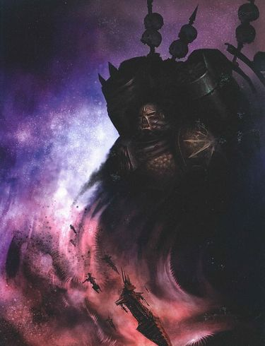
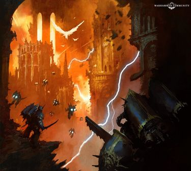

# 0835 M42 纳克蒙德裂隙战争 Nachmund Rift War

精校状态：中文行文已逐段精校，部分术语仍为暂定

分类：时间线

原文来源：https://www.bilibili.com/opus/1138287730716835876

原作者：帝国神选罐头

原文时间：2025年11月23日 10:57

[返回分类目录](目录.md) · [全书目录](../../目录.md)

<!-- A0835-B0001 -->
**英文原文**

The Nachmund Rift War is an ongoing conflict being waged by the Imperium in the Nachmund Sub-Sector.

<!-- /A0835-B0001 -->

<!-- A0835-B0002 -->

原译文

纳克蒙德裂隙战争是帝国在纳克蒙德分区发动的一场持续冲突。

**校订译文**

纳克蒙德裂隙战争，是帝国在纳克蒙德次星区持续进行的一场冲突。

<!-- /A0835-B0002 -->

<!-- A0835-B0003 -->
**英文原文**

Closely connected to the War of Beasts and War of Nightmares on Vigilus, while the Fortress World itself continues to remain largely in Imperial hands the greater Nachmund Gauntlet finds itself besieged by the Forces of Chaos.

<!-- /A0835-B0003 -->

<!-- A0835-B0004 -->

原译文

与警戒星的野兽战争和噩梦战争密切相关，而堡垒世界本身在很大程度上仍然掌握在帝国手中，更大的纳克蒙德走廊发现自己被混沌部队围困。

**校订译文**

这场战争与警戒星的野兽之战和噩梦之战紧密相连。警戒星这座堡垒世界本身仍大体掌握在帝国手中，范围更广的纳克蒙德走廊却遭到了混沌军队的围攻。

<!-- /A0835-B0004 -->

<!-- A0835-B0005 图片 -->

<!-- A0835-B0006 -->

原译文

The forces of Haarken Worldclaimer are unleashed 夺世者哈肯的部队被释放

**校订译文**

The forces of Haarken Worldclaimer are unleashed 夺星者哈尔肯的军队倾巢出动

<!-- /A0835-B0006 -->

<!-- A0835-B0007 -->
**英文原文**

Conflict:Long War

<!-- /A0835-B0007 -->

<!-- A0835-B0008 -->

原译文

冲突：万古长战

**校订译文**

冲突：万古长战

<!-- /A0835-B0008 -->

<!-- A0835-B0009 -->
**英文原文**

Date:M42

<!-- /A0835-B0009 -->

<!-- A0835-B0010 -->

原译文

日期：M42

**校订译文**

日期：M42

<!-- /A0835-B0010 -->

<!-- A0835-B0011 -->
**英文原文**

Location:Nachmund Gauntlet

<!-- /A0835-B0011 -->

<!-- A0835-B0012 -->

原译文

地点：纳克蒙德走廊

**校订译文**

地点：纳克蒙德走廊

<!-- /A0835-B0012 -->

<!-- A0835-B0013 -->
**英文原文**

Outcome:Chaos gains control of much of the Nachmund Gauntlet, Most of Sangua Terra falls

<!-- /A0835-B0013 -->

<!-- A0835-B0014 -->

原译文

结果：混沌控制了纳克蒙德走廊的大部分地区，赤地星大部分地区沦陷

**校订译文**

结果：混沌控制了纳克蒙德走廊的大部分地区，赤地星大部分地区沦陷

<!-- /A0835-B0014 -->

<!-- A0835-B0015 -->
**英文原文**

Combatants:Imperium/Chaos/Various unaligned Xenos

<!-- /A0835-B0015 -->

<!-- A0835-B0016 -->

原译文

作战人员：帝国/混沌/各种未结盟的异型

**校订译文**

参战方：帝国／混沌／多支不隶属双方的异形势力

<!-- /A0835-B0016 -->

<!-- A0835-B0017 -->
**英文原文**

Commanders: Sangua-Terran War Council, Commander Kalendela Tol, Chapter Master Ba'stien Grix, Captain Badron Aqhat, Captain Julianis Mikon, Captain Miloni Takta, Windcaptain Dogodis Eg'oi, Master Arven Nahrdeth, Captain Fulvian, Saint Celestine, Canoness Superior Junith Eruita, Canoness Yozelin Tabat, Canoness Kessola Amael, High Admiral Rowlan Abery Wolston XIV, Lord Castellan Alibet Ayaneva, Lord Admiral Quirin Prisca (MIA), Admiral Yelgaratir, Rear Admiral Borqil, Archmagos Arkimede Thron, Magos Omekron Vrekh, Magos Solomonh Voloros, Cardinal Theodesus Doi, Princeps Horaxil S'Taeffan Drentor LI (KIA), Sanctus Entente, Inquisitor Erasmus Cartavolnus, Rogue Trader Kyprian Tellanarosea/Haarken Worldclaimer, Emerys Varran, Szerhan Nethar, Tchorr'Kan, High King Kaligius, High Queen Kaligia, Baron Torian Kommodar, Fabricator-General Astamorkhus Grine-Theta, Skarrovectis,Tyros Akylla/Urien Rakarth, Gragutz Ship Smasha, Zargbrog

<!-- /A0835-B0017 -->

<!-- A0835-B0018 -->

原译文

指挥官：赤地星战争议会，指挥官卡伦德拉·托尔，战团长巴'提恩·格里克斯，连长巴德伦·阿克哈特，连长朱利安尼斯·米肯，连长米洛尼·塔克塔，风连长多戈迪斯·埃'戈伊，导师阿尔文·纳尔戴斯，连长弗尔维安，圣塞勒斯汀，至高大修女朱尼斯·埃瑞塔，大修女约泽林·塔巴特，大修女凯索拉·阿梅尔，至高海军上将罗兰·阿伯里·沃尔斯顿十四世。领主堡主阿里贝特·阿亚内瓦，领主海军上将奎林·普里斯卡（MIA），海军上将叶尔加拉蒂尔，海军少将博尔奇尔，大贤者阿基米德·斯罗恩，贤者奥梅克龙·弗雷赫，贤者索洛蒙·沃洛罗斯，红衣主教西奥德苏斯·多伊，首席霍拉希尔·斯'泰凡·德伦托尔·李（KIA），圣洁协约，审判官伊斯拉莫·卡塔沃努斯，行商浪人基普里安·特兰纳罗萨/夺世者哈肯，埃默里斯·瓦兰，施尔汉·内塔尔，乔尔'坎，至高王卡利吉斯，至高女王卡莉嘉，托里安·科莫达尔男爵，铸造将军阿斯塔莫尔克斯·格林-西塔，斯卡罗维克提斯，泰罗斯·阿克拉/乌林·拉卡斯，碎船者格拉古兹，扎格布洛格

**校订译文**

指挥官：帝国——赤地星战争议会；指挥官卡伦德拉·托尔；战团长巴'斯提恩·格里克斯；连长巴德伦·阿克哈特、朱利安尼斯·米肯、米洛尼·塔克塔；风连长多戈迪斯·埃·戈伊；大师阿尔文·纳尔戴斯；连长弗尔维安；圣塞莱斯汀；至高大修女茱妮丝·伊瑞塔；大修女约泽林·塔巴特、凯索拉·阿梅尔；海军至高上将罗兰·阿伯里·沃尔斯顿十四世；堡主领主阿里贝特·阿亚内瓦；海军领主上将奎林·普里斯卡（失踪）；海军上将叶尔加拉蒂尔；海军少将博尔奇尔；大贤者阿基米德·斯罗恩；贤者奥梅克龙·弗雷赫、索洛蒙·沃洛罗斯；红衣主教西奥德苏斯·多伊；首席霍拉希尔·斯·泰凡·德伦托尔五十一世（阵亡）；神圣协约；审判官伊拉斯谟·卡塔沃努斯；行商浪人基普里安·特兰纳罗萨。混沌——夺星者哈尔肯；埃默里斯·瓦兰；施尔汉·内塔尔；乔尔·坎；至高王卡利吉斯；至高女王卡莉嘉；托里安·科莫达尔男爵；铸造将军阿斯塔莫尔克斯·格林-西塔；斯卡罗维克提斯；泰罗斯·阿克拉。其他势力——乌瑞恩·拉卡斯；碎船者格拉古兹；扎格布洛格。

**校注：** LI为罗马数字51，与同列IX、XIV等序数写法一致，原误音译为李；全名暂按现稿音译统一。Master为星际战士职衔，不套审判庭导师义。

<!-- /A0835-B0018 -->

<!-- A0835-B0019 -->
**英文原文**

Losses/Survivors:Extremely Heavy/Heavy/Unknown

<!-- /A0835-B0019 -->

<!-- A0835-B0020 -->

原译文

损失/幸存者：极其严重/严重/未知

**校订译文**

损失／幸存情况：帝国损失极其惨重／混沌损失惨重／其他势力不详

<!-- /A0835-B0020 -->

<!-- A0835-B0021 -->
## Overview 概述

<!-- /A0835-B0021 -->

<!-- A0835-B0022 -->

原译文

Part 1: The Conquest of the Rift 第一部分：征服裂隙

**校订译文**

Part 1: The Conquest of the Rift 第一部分：征服裂隙

<!-- /A0835-B0022 -->

<!-- A0835-B0023 -->
### The Siege of Dharrovar 达尔洛瓦尔围攻战

原题：The Siege of Dharrovar 达尔罗瓦尔围城

<!-- /A0835-B0023 -->

<!-- A0835-B0024 -->
**英文原文**

Ever since its fall to Chaos Knight forces, the reclamation of Dharrovar had become a priority to Lord Commander Roboute Guilliman. The Wardens of the Gauntlet answered the call to arms, though their brotherhood was overstretched from the war on Vigilus. They were joined by forces of Battle Sisters, Imperial Guard, Knights, and Imperial Navy warships. But even with this imposing army, besieging Dharrovar would prove difficult.

<!-- /A0835-B0024 -->

<!-- A0835-B0025 -->

原译文

自从达尔罗瓦尔落入混沌骑士部队之手以来，收复达尔罗瓦尔就成为了领主指挥官罗伯特·基里曼的首要任务。走廊守望者响应了号召，尽管他们的兄弟会因警戒星战争而捉襟见肘。战斗修女、帝国卫队、骑士和帝国海军战舰的部队加入了他们。但即使有这支强大的军队，围攻达尔罗瓦尔也会很困难。

**校订译文**

自达尔洛瓦尔落入混沌骑士之手，收复这颗星球就成为帝国最高统帅罗保特·基里曼的优先目标。走廊守望者响应征召，尽管这个兄弟会在警戒星战事中已兵力吃紧。战斗修女、帝国卫队、骑士和帝国海军舰艇也加入了行动。然而，即使集结起这支强大军队，围攻达尔洛瓦尔仍绝非易事。

<!-- /A0835-B0025 -->

<!-- A0835-B0026 -->
**英文原文**

One of the greatest threat to the invaders were the powerful and seemingly random Warp surges around the Chaos Knight World, making surrounding the world almost impossible. The world was rendered even harder to access thanks to a debris field collected in the planet’s near and distant orbits. This debris field, made up of Warp hulks or House Mandrakor ships, was now home to various renegades, xenos, and Cultists. The nearby Forge Moon of Omega-Threx also lay in the system and was ruled by the Dark Mechanicus. There was only one real route the attackers could move on Dharrovar in force. Chapter Master Ba'stien Grix of the Castellans of the Rift ordered the main assault be launched as quickly as possible, using his largest warships as the tip of the spear to smash aside any resistance while transports followed closely behind. As the Imperial fleet moved towards its target, more warships formed a cordon against any enemy forces that might pour from the debris fields, ensuring the transports reached Dharrovar unmolested.

<!-- /A0835-B0026 -->

<!-- A0835-B0027 -->

原译文

入侵者面临的最大威胁之一是混沌骑士世界周围强大而看似随机的亚空间浪涌，这使得包围世界几乎是不可能的。由于在行星的近轨和远轨上收集的残骸场地，世界变得更加难以进入。这个由亚空间废船或曼德拉科家族舰船组成的残骸场地现在是各种叛徒、异型和邪教徒的家园。附近的欧米伽·特雷克斯的铸造卫星也位于该星系中，由黑暗机械教统治。袭击者只有一条真正的路线可以向达尔罗瓦尔大举进攻。裂隙堡主的战团长巴'提恩·格里克斯命令尽快发动主要进攻，用他最大的战舰作为矛尖，粉碎任何抵抗，而运输舰紧随其后。随着帝国舰队向目标移动，更多的战舰组成了警戒线，以防止任何可能从残骸场地中涌出的敌军，确保运输舰不受干扰地到达达尔罗瓦尔。

**校订译文**

进攻者面临的一大威胁，是这颗混沌骑士世界周围猛烈而似乎毫无规律的亚空间涌流，几乎不可能完成合围。行星近轨和远轨还散布着大片残骸，使其更加难以接近。这些由亚空间废船或曼德拉科家族舰船构成的残骸区，如今盘踞着形形色色的叛逆者、异形和邪教徒。附近的铸造卫星欧米伽·特雷克斯同样位于星系内，由黑暗机械教统治。进攻方实际上只有一条路线能够向达尔洛瓦尔投入大军。裂隙堡主战团长巴'斯提恩·格里克斯下令尽快发动主攻，以最大的战舰充当先锋，扫清抵抗，运输舰紧随其后。舰队向目标推进时，其他战舰组成警戒线，阻挡可能从残骸区涌出的敌军，确保运输舰顺利抵达。

<!-- /A0835-B0027 -->

<!-- A0835-B0028 -->
**英文原文**

The Imperial fleet movements were accompanied by Space Marine and Tempestus Scion surgical strikes, knocking out key enemy bases in the debris fields. Grix finally established another force of elite troops and assigned them to a flanking mission around Dharrovar, between the western debris field and the warp anomaly named Portus Diabolis. Its task was to launch secondary attacks against Dharrovar but primarily intercept supply convoys heading to the planet Omega-Threx. The Imperials faced not only Chaos Knights however. Dharrovar was also home to warbands of Chaos Space Marines, Renegade Militia, and Dark Mechanicum Daemon Engines.

<!-- /A0835-B0028 -->

<!-- A0835-B0029 -->

原译文

帝国舰队的行动伴随着星际战士和暴风忠嗣的外科手术式打击，摧毁了残骸场地中的关键敌方基地。格里克斯最终建立了另一支精锐部队，并将其分配到达尔罗瓦尔周围的侧翼任务，该任务位于西部残骸场地和名为波图斯·迪亚波利斯的亚空间异常之间。它的任务是对达尔罗瓦尔发动二次攻击，但主要拦截前往欧米伽·特雷克斯行星的补给队。然而，帝国不仅面对混沌骑士。达尔罗瓦尔也是混沌星际战士战帮、变节民兵和黑暗机械教恶魔引擎的所在地。

**校订译文**

帝国舰队推进的同时，星际战士和风暴忠嗣军实施精确突击，摧毁残骸区内的关键敌方基地。格里克斯另组一支精锐，派其前往达尔洛瓦尔侧翼，在西部残骸区与名为波图斯·迪亚波利斯的亚空间异常之间行动。这支部队负责对达尔洛瓦尔发动辅助攻势，但首要任务是截击驶向欧米伽·特雷克斯的补给船队。然而，帝国面对的并不只有混沌骑士。达尔洛瓦尔还驻有混沌星际战士战帮、变节民兵，以及黑暗机械教的恶魔引擎。

**校注：** 前段称Omega-Threx铸造卫星，本段却称planet；中文此处不强加天体类型，并保留英文矛盾。

<!-- /A0835-B0029 -->

<!-- A0835-B0030 -->
**英文原文**

After Grix launched his ground assault, his troops initially made gains and secured landing sites. But not long after this, they met fierce opposition. Dharrovar’s harsh terrain and heavy defensive preparations by House Mandrakor made progress grueling for the invaders. The cave networks utilized by the traitors were extensive, allowing the defenders to move into one and emerge from dozens of others. It became impossible to tell where one fortress ended and the next began. Every inch of ground seized by the Imperial forces was paid for in blood, and often cave-networks became active warzones once again just days or even hours after being declared secure. Soon enough, the war became a bloody stalemate. However, the stalemate would soon be broken, must to the shock of both sides. Abaddon’s trusted lieutenant Haarken Worldclaimer arrived with a Black Legion army to lift the siege. Abaddon saw value in securing Dharrovar not just for its strategic placement, but in order to smash what was now the largest single concentration of Imperial military might in the Nachmund Gauntlet.

<!-- /A0835-B0030 -->

<!-- A0835-B0031 -->

原译文

格里克斯发动地面进攻后，他的部队最初取得了进展，并占领了登陆点。但不久之后，他们遭到了激烈的反抗。达尔罗瓦尔崎岖的地形和曼德拉科家族的繁重防御准备使入侵者取得了艰难的进展。叛徒使用的洞穴网络非常广，使防御者能够进入一个洞穴，并从几十个其他的洞穴出现。无法分辨一个堡垒的终点和下一个的起点。帝国部队占领的每一寸土地都是用鲜血换来的，洞穴网络往往在宣布安全几天甚至几小时后再次成为活跃的战区。很快，战争就陷入了血腥的僵局。然而，僵局很快就会被打破，让双方都感到震惊。阿巴顿信任的副官夺世者哈肯带着一支黑色军团军队抵达，解除了围困。阿巴顿认为，确保达尔罗瓦尔的安全不仅对其战略地位有价值，而且对粉碎现在帝国军事力量在纳克蒙德走廊中最大的单一聚集也有价值。

**校订译文**

格里克斯发起地面进攻后，部队起初取得进展，控制了登陆地点，随后便遇到激烈抵抗。达尔洛瓦尔的险恶地形和曼德拉科家族周密的防御部署，使进攻者步履维艰。叛徒利用规模庞大的洞穴网络，可以从一个入口进入，再从数十个其他出口现身；一座要塞与下一座要塞之间几乎没有明确界限。帝国军每夺取一寸土地，都要付出鲜血，刚宣布肃清的洞穴往往几天、甚至几小时后就再度爆发战斗。战争很快陷入血腥僵局。然而，打破僵局的一幕让双方都感到震惊：阿巴顿信任的副官夺星者哈尔肯率领一支黑色军团大军抵达，准备解除围攻。阿巴顿看重达尔洛瓦尔，既因为其战略位置，也因为这里汇集了纳克蒙德走廊内规模最大的单支帝国军队，值得一举摧毁。

<!-- /A0835-B0031 -->

<!-- A0835-B0032 -->
**英文原文**

Haarken initially set his Chaos Space Marine, Cultist, and Traitor Guard forces upon any Imperial outposts between him and Dharrovar. These forces soon seized the arsenal fortress of Holden from the Castellans of the Rift as well as the Inquisitorial Fortress of Agrofar. The Astropathic Relay Station of Hazrine Gap also fell to the Black Legion, with its Astropaths brutally tortured for information before being executed. Haarken next organized three vanguard forces dubbed the Bringers of Plague, Bringers of Terror, and Bringers of Doubt to wreak havoc ahead of his primary advance. Acting independently, they slaughtered, killed, enslaved, and harried any they came across. In addition to these forces, he sent out agents and fifth columnists to further undermine Imperial rule. His plan was that by the time his forces pushed down the Gauntlet, the Imperials would quickly fold. With his plan in motion, Haarken made for Dharrovar with thousands of ships and tens of millions of fighters.

<!-- /A0835-B0032 -->

<!-- A0835-B0033 -->

原译文

哈肯最初将他的混沌星际战士、邪教徒和叛徒卫队部署在他和达尔罗瓦尔之间的任何帝国前哨。这些部队很快从裂隙堡主手中夺取了霍尔顿的军械堡垒以及阿格罗法尔的审判庭堡垒。哈兹林裂口的星语中继站也落入了黑色军团之手，其星语者在被处决前被残酷地折磨以获取信息。哈肯接下来组织了三支先锋部队，分别被称为瘟疫使者、恐怖使者和怀疑使者，在他的主要推进之前造成严重浩劫。他们独立行动，屠杀、杀戮、奴役和骚扰他们遇到的任何人。除了这些部队，他还派出特工和第五纵队进一步破坏帝国统治。他的计划是，当他的部队推倒裂隙时，帝国会很快屈服。随着他的计划的实施，哈肯率领数千艘舰船和数千万战斗机前往达尔罗瓦尔。

**校订译文**

哈尔肯首先派出混沌星际战士、邪教徒和叛徒卫队，进攻他与达尔洛瓦尔之间的帝国前哨。他们很快从裂隙堡主手中夺取霍尔顿军械要塞，并攻下阿格罗法尔审判庭要塞。哈兹林裂口星语中继站也落入黑色军团之手；星语者被酷刑逼问情报，随后遭到处决。哈尔肯又组织了瘟疫使者、恐怖使者和怀疑使者三支先锋，在主力到来前制造浩劫。他们各自行动，见人便杀戮、奴役或袭扰。他还派出特工和内应，进一步瓦解帝国统治。他打算让帝国在主力沿走廊推进时迅速崩溃。计划展开后，哈尔肯率数千艘舰船和数千万战斗人员驶向达尔洛瓦尔。

**校注：** fighters指战斗人员，原数千万战斗机误读。push down the Gauntlet为沿纳克蒙德走廊推进，不是推倒裂隙。

<!-- /A0835-B0033 -->

<!-- A0835-B0034 -->
**英文原文**

By the time Haarken’s ships first entered the Dharrovar System, the siege had already raged on for months and both sides had taken tremendous casualties. At the Mandeville Point, the Chaos ships struck at the Imperial rearguard fleet sent to monitor any encroachment on the System. At the forefront of this assault were his Khornate worshipers alongside an armada of Daemonships. As the Imperial Fleet was largely supporting operations on Dharrovar, this rearguard was quickly overwhelmned, with the Imperial Navy losing the Mercury Class Battlecruiser Righteous Might as well as the Dominator Class Cruiser Defender of His Stars. At the forefront of the Chaos fleet was the World Eater Battleship Gore Drenched, which harpooned Imperial vessels and allowed its warriors to board it at close range. The Night Lords Battle Barge Horror of Garselil tortured hundreds of their slaves to death, psychically broadcasting their screams across the system to weaken Imperial morale and jam their communications. Within hours almost half of the Imperial rearguard fleet had been destroyed or crippled, and Vice Admiral Herena Egless ordered a retreat. The Nemesis Class Carrier Harrier of the Heavens advanced into the tides of the Chaos vessels as its Captain, Jakila Rovacov, sought to sacrifice herself to cover the retreat. Once the Imperial survivors were clear Rovacov detonated her vessels warp drive, taking out over a dozen enemy vessels.

<!-- /A0835-B0034 -->

<!-- A0835-B0035 -->

原译文

当哈肯的舰船首次进入达尔罗瓦尔星系时，围攻已经持续了几个月，双方都造成了巨大的伤亡。在曼德维尔角，混沌战舰袭击了被派去监视星系任何入侵的帝国后卫舰队。这次袭击的最前线是他的恐虐崇拜者，以及一支恶魔舰队。由于帝国舰队在很大程度上支援达尔罗瓦尔的行动，这支后卫部队很快就被淹没了，帝国海军失去了水星级战列巡洋舰正义力量号和统御级巡洋舰他的群星守护者号。位于混沌舰队最前沿的是浸血号吞世者战列舰，它用叉矛攻击帝国战舰，并允许其战士近距离跳帮。加塞利尔之惧号午夜领主战斗驳船折磨了数百名奴隶致死，从灵能上在整个星系中广播他们的尖啸声，以削弱帝国的士气并干扰他们的通信。在几个小时内，几乎一半的帝国后卫舰队被摧毁或瘫痪，海军中将赫雷娜·埃格利斯下令撤退。复仇女神级航母天堂之鹞号在船长雅基拉·罗瓦科夫试图牺牲自己以掩护撤退时，驶入了混沌战舰的潮汐中。帝国幸存者一清空，罗瓦科夫引爆了她的战舰亚空间驱动，摧毁了十几艘敌舰。

**校订译文**

哈尔肯的舰船进入达尔洛瓦尔星系时，围攻已持续数月，双方都伤亡惨重。混沌舰队在曼德维尔点攻击帝国后卫舰队；后者奉命监视外来舰船闯入星系。恐虐信徒和一支恶魔舰队冲在最前方。帝国舰队主力正支援达尔洛瓦尔地面作战，后卫很快被击溃，水星级战列巡洋舰正义力量号及统御者级巡洋舰他的群星守护者号相继损失。混沌先锋中的吞世者战列舰浸血号以捕船叉钩住帝国舰艇，让战士近距离跳帮。午夜领主战斗驳船加塞利尔之惧号则将数百名奴隶折磨至死，用灵能把惨叫传播到整个星系，摧毁帝国军士气并干扰通信。短短数小时，帝国后卫舰队近半数舰艇被击毁或瘫痪，海军中将赫雷娜·埃格利斯下令撤退。复仇女神级航母天堂之鹞号迎着混沌舰潮前进，舰长雅基拉·罗瓦科夫决意牺牲自己，为同袍掩护。幸存帝国舰艇脱离危险后，她引爆本舰亚空间引擎，与十余艘敌舰同归于尽。

**校注：** Nemesis级航母沿本稿级名，不与同名泰坦或人物合并；harpooned指以捕船叉钩住舰艇，非单纯投矛攻击。

<!-- /A0835-B0035 -->

<!-- A0835-B0036 -->
**英文原文**

With the Mandeville Point secured, hundreds more Chaos vessels arrived as Haarken had them pursue surviving Imperial Navy and Basilikon Astra warships. With the debris fields left unprotected, Worldclaimer diverted some of his forces into them, where they often came into fighting with Renegades and Cultists who refused to bow before his authority. Haarken next turned his attention to Dharrovar, and Ba’stien Grix quickly agreed with his commanders Yozelin Tabat of the Order of the Silver Lilly, Kessola Amael of the Order of the Crimson Chalice, and Admiral Yelgaratir that to stay on the world’s surface was suicide. The Imperial mission now became one of escape in order to return and fight another day. With no time to spare, they ordered much of their ground forces to retreat to the various plateaus and landing zones where they had first arrived. Not all would be so lucky however, as many more remained at the front to cover the retreat with their lives. Mostly consisting of those already fighting on the frontlines, these warriors bravely fought to the end and destroyed their own equipment when defeat inevitably came. Space Marines were amongst the last to leave, and Captains Nikkal Arishat of the Sons of the Phoenix, Miloni Takta of the Necropolis Hawks, and Julianis Mikon of the Void Tridents all vowed to stay and buy their allies time.

<!-- /A0835-B0036 -->

<!-- A0835-B0037 -->

原译文

随着曼德维尔角的安全，数百艘混沌战舰抵达，哈肯让他们追击幸存的帝国海军和星界君主的战舰。由于残骸场地没有受到保护，夺世者将他的一些部队转移到了那里，在那里他们经常与拒绝向他的权威鞠躬的变节者和邪教徒作战。哈肯随后将注意力转向了达尔罗瓦尔，巴'提恩·格里克斯很快同意了他的指挥官银色百合修会的约泽林·塔巴特、深红圣杯修会的凯索拉·阿梅尔和海军上将叶尔加拉蒂尔的观点，即留在世界表面就是自杀。帝国的任务现在变成了撤离，以便在另一天返回战斗。由于没有多余的时间，他们命令大部分地面部队撤退到他们最初到达的各个高原和着陆区。然而，并非所有人都如此幸运，因为还有更多的人留在前线，用他们的生命来掩护撤退。这些战士大多由已经在前线作战的人组成，他们勇敢地战斗到最后，在不可避免的失败中摧毁了自己的装备。星际战士是最后离开的人之一，凤凰之子的尼加尔·阿里沙特、墓地雄鹰的米洛尼·塔克塔和虚空三叉戟的朱莉安尼斯·米肯连长都发誓要留下来，为盟友争取时间。

**校订译文**

混沌军控制曼德维尔点后，又有数百艘舰船抵达。哈尔肯命令它们追击幸存的帝国海军及星界君主舰队舰艇。残骸区失去守卫后，他也分兵进入其中，频繁与不愿臣服的变节者和邪教徒交战。随后，他把注意力转向达尔洛瓦尔。巴'斯提恩·格里克斯很快与银色百合修会的约泽林·塔巴特、深红圣杯修会的凯索拉·阿梅尔及海军上将叶尔加拉蒂尔达成共识：继续留在地表无异于自杀。帝国军的任务变成撤离，保存兵力以待再战。他们立即命令地面主力退往最初登陆的高原和着陆区。但许多战士只能留在前线，以生命掩护撤退。这些本已身处火线的部队英勇战至最后，在败局无法挽回时自行摧毁装备。星际战士是最后撤走的一批；凤凰之子连长尼加尔·阿里沙特、墓地雄鹰连长米洛尼·塔克塔和虚空三叉戟连长朱利安尼斯·米肯，都发誓留下来为盟军争取时间。

<!-- /A0835-B0037 -->

<!-- A0835-B0038 -->
**英文原文**

As the Imperials retreated over ground they had fought bloodily to take for months, some like the 18th Megorin Jackals took to the caves to fight a guerrilla war of their own, proving stubbornly effective in the process. They were not alone, as isolated Space Marine and Tempestus Scion squads also undertook such unconventional actions. In one mission, Scions from the 33rd Kappic Raptors caused a landslade which destroyed a 100 traitor tanks, while the 82nd Lambdan Tygers infiltrated a traitor anti-aircraft battery, captured its guns, and turned them on the enemy landers. In the end however, all of these forces were wiped out by vengeful Black Legionnaires. In the final stages of the retreat the 356th Larzen Warheads, 43rd Gephlyean Geardogs, and 299th Dactaalis Furies all made desperate last stands to slow the advancing hordes until they were annihilated. Hundreds of Battle Sisters of the Order of the Sublime Adoration and Order of the Burning Light were surrounded and annihilated. Ba’stien Grix himself found himself in such a situation, having to cut his way through Black Legion Space Marines to rejoin the Imperials while losing half his warriors in the process. As the Imperials took the skies, they came into battle with swarms of enemy fighters, gunships, and winged daemon engines.

<!-- /A0835-B0038 -->

<!-- A0835-B0039 -->

原译文

当帝国撤退到他们血腥战斗了几个月的地面上时，一些人，如第18梅戈林豺狼，来到洞穴里打游击战，证明在这个过程中非常有效。他们并不孤单，因为孤立的星际战士和暴风忠嗣小队也采取了这种非常规行动。在一次任务中，来自第33卡佩克猛禽的忠嗣发动了一场山体滑坡，摧毁了100辆叛徒坦克，而第82兰布丹之虎则渗透到叛徒防空炮中，缴获了它的火炮，并将其对准了敌人的登陆舰。然而，最终，所有这些部队都被复仇的黑色军团消灭了。在撤退的最后阶段，第356拉森弹头、第43格夫利安齿轮犬和第299达克塔利斯之怒都进行了绝望的最后抵抗，以减缓前进的部落，直到他们被消灭。数百名崇高赞美修会和燃烧之光修会的战斗修女被包围并歼灭。巴'提恩·格里克斯自己也发现了这种情况，他不得不穿过黑色军团星际战士重新加入帝国，同时在此过程中失去了一半的战士。当帝国占领天空时，他们与成群的敌方战斗机、炮艇和带翼的恶魔引擎作战。

**校订译文**

帝国军踏着数月浴血争来的土地后撤，一些部队——例如梅戈林豺狼第 18 团——转入洞穴进行游击战，顽强而有效地抵抗。被隔绝的星际战士和风暴忠嗣军小队也采取了类似行动。卡佩克猛禽第 33 团的风暴忠嗣军在一次任务中引发山体滑坡，摧毁 100 辆叛军坦克；兰布丹之虎第 82 团则潜入敌方防空炮阵地，夺炮射击敌方登陆艇。然而，这些部队最终全被复仇心切的黑色军团消灭。撤离的最后阶段，拉森弹头第 356 团、格夫利安齿轮犬第 43 团和达克塔利斯之怒第 299 团拼死断后，迟滞敌军，直至全军覆没。崇高赞美修会与燃烧之光修会的数百名战斗修女遭到合围歼灭。格里克斯本人也陷入重围，不得不杀穿黑色军团战士的包围，才得以归队，为此损失了半数部下。帝国军升空撤离时，又遭到大群敌方战斗机、炮艇和飞翼恶魔引擎拦截。

<!-- /A0835-B0039 -->

<!-- A0835-B0040 -->
**英文原文**

Eventually, the Imperials only held onto their initial landing zones. Despite their best efforts, not all of these held until the evacuations were complete and at the Anak Plateau Black Legion and House Mandrakor forces were able to capture the site and shoot down several dropships as they left. Disorder soon erupted, and some ships left while only half-full as some were so overloaded they fell back to the surface. Eventually, every Imperial warrior on Dharrovar either fled, was killed, or captured and enslaved.

<!-- /A0835-B0040 -->

<!-- A0835-B0041 -->

原译文

最终，帝国只保住了最初的登陆区。尽管他们做出了最大的努力，但并非所有这些行动都得到了控制，直到疏散完成，在阿纳克高原，黑色军团和曼德拉科家族的部队能够占领该地点，并在离开时击落了几艘空降船。混乱很快爆发了，一些船只在只有半满的情况下离开了，因为有些船只超载严重，又落回了表面。最终，达尔罗瓦尔的每一位帝国战士要么逃跑，要么被杀，要么被俘并被奴役。

**校订译文**

最终，帝国军只剩最初的登陆区仍在手中。尽管守军竭力支撑，并非所有地点都能守到撤离完成。在阿纳克高原，黑色军团和曼德拉科家族攻占着陆场，击落了数艘正在起飞的登陆艇。混乱随即爆发：有些船只半空着就离去，有些则超载严重，坠回地面。最终，达尔洛瓦尔上的帝国战士要么逃离，要么战死，要么被俘为奴。

<!-- /A0835-B0041 -->

<!-- A0835-B0042 -->
### Storming the Gauntlet 猛攻走廊

原题：Storming the Gauntlet 走廊震荡

<!-- /A0835-B0042 -->

<!-- A0835-B0043 -->
**英文原文**

The devastated Imperial forces left Dharrovar with barely a fifth of their original number. Some made for Vigilus while others made for Sangua Terra. Many of the vessels contained mixed compliments of Space Marines, Battle Sisters, and Guardsmen, further confusing the situation and seeing many scattered across different regions of space. However problems for the Imperials were far from over, as Haarken’s vanguard forces soon struck throughout the region.

<!-- /A0835-B0043 -->

<!-- A0835-B0044 -->

原译文

被摧毁的帝国部队只剩下达尔罗瓦尔原来人数的五分之一。一些是警戒星的，而另一些是赤地星的。许多战舰包含了星际战士、战斗修女和卫队的混合致意，进一步混淆了情况，并许多分散在不同的太空地区。然而，帝国的问题远未结束，哈肯的先锋队很快就袭击了整个地区。

**校订译文**

离开达尔洛瓦尔的帝国残军，人数已不足原来的五分之一。一部分驶向警戒星，另一部分驶向赤地星。许多舰船混载着星际战士、战斗修女与卫队士兵，令部队组织更加混乱，大批人员被分散到不同星域。帝国的苦难却远未结束，哈尔肯的先锋很快开始在整个地区发动袭击。

**校注：** compliments为源文疑似complements误拼，这里显然指舰上混合人员，不是混合致意。

<!-- /A0835-B0044 -->

<!-- A0835-B0045 -->
**英文原文**

Haarken’s vanguard consisted of elite forces hand-picked by the Chaos Lord himself. Amongst them were warbands from The Purge, Shrouded Hand, and Terror Lords as well as Black Legion units such as the Ebon Fist. These Black Legionnaires moved on the astropathic relay station of 837A, while the Iron Warriors warband known as the Scions of Medrengard destroyed the Castellans of the Rift arsenal at Forennis. The Bringers of True Light, a renegade force that had turned traitor a mere century prior, infiltrated the six space station network situated at the crux of several warp routes known as the Hexagatos and nurtured cults there. The Thousand Sons thrallband known as the Reflective Ones captured the Choralis Immaterium Surge Station, sabotaging it and letting the tides of the Warp spill forward. These actions served to isolate the Bastion World of Kherik III, which was Haarken’s true plan all along. Kherik III was soon drowned in tsunamis of warp power, and billions of Daemons poured over the surface as millions of citizens were turned into gibbering Chaos Spawns.

<!-- /A0835-B0045 -->

<!-- A0835-B0046 -->

原译文

哈肯的先锋由混沌领主亲自挑选的精英部队组成。其中包括来自净世疫军、笼罩之手和恐惧领主战帮，以及黑檀之拳等黑色军团士兵。这些黑色军团在837A星语中继站上移动，而被称为梅德林加德之裔的钢铁勇士战帮在弗伦尼斯摧毁了裂隙堡主的军械。真光使者是一支仅在一个世纪前就叛变的变节部队，他们渗透到位于被称为赫克萨加托斯的几条亚空间路线关键处的六个空间站网络中，并在那里扶持了邪教。被称为反射众的千子战帮占领了克拉里斯非物质界浪涌站，破坏了它，让亚空间的潮汐向前蔓延。这些行动有助于孤立赫里克三号堡垒世界，这一直是哈肯的真正计划。赫里克三号很快就被亚空间力量的海啸淹没，数十亿的恶魔涌向地表，数百万公民变成了喋喋不休的混沌卵。

**校订译文**

哈尔肯的先锋都是他亲自挑选的精锐，包括净世疫军、笼罩之手、恐惧领主等战帮，以及黑檀之拳等黑色军团部队。这些黑色军团战士进攻 837A 星语中继站；钢铁勇士的梅德林加德之裔战帮则摧毁了裂隙堡主位于弗伦尼斯的军械库。百年前才叛变的真光使者渗透进赫克萨加托斯，在当地扶植邪教。这是由六座空间站构成的网络，坐落于数条亚空间航道的交汇处。千子的倒影众奴仆战帮夺取并破坏了克拉里斯非物质界涌流站，使亚空间潮汐向前涌出。这些行动切断了堡垒世界赫里克三号与外界的联系，而这正是哈尔肯的真正目标。很快，亚空间力量如海啸般吞没赫里克三号，数十亿恶魔涌上地表，数百万居民变成了胡言乱语的混沌魔物。

**校注：** Hexagatos指六座空间站组成的网络，非几条航道的名字。Chaos Spawn采用官方混沌魔物。

<!-- /A0835-B0046 -->

<!-- A0835-B0047 -->
**英文原文**

At Sangua Terra, the Imperials sought to organize a defensive network collectively known as the Sanctus Wall. This consisted of systems that had previously served as Indomitus Crusade supply hubs which were quickly fortified in their own right. Imperial forces mustered all along the Sanctus Wall but knew they were not enough to withstand the incoming attack. Making a painful decision, the Imperials drew a line across the Nachmund Gauntlet at the point where the Shrine World of Centor’s Landing sat. All Imperial holdings beyond that, in the half closest to Vigilus, were to weather the storm the best they could. All Imperial holdings south of the line evacuated their populace for the Sanctus Wall, with priority given to military forces. With the way paved for him, Haarken Worldclaimer left Dharrovar at the head of his fleet.

<!-- /A0835-B0047 -->

<!-- A0835-B0048 -->

原译文

在赤地星，帝国试图组织一个防御网络，统称为圣墙。这包括以前作为不屈远征补给中心的星系，这些星系本身很快就得到了增强。帝国军队沿着圣墙集结，但知道他们不足以抵御即将到来的攻击。帝国做出了一个痛苦的决定，在森托尔之落圣地世界所在的地方划了一条线穿过纳克蒙德走廊。除此之外，在离警戒星最近的一半，所有帝国领地都是为了尽可能地度过这场风暴。防线以南的所有帝国领地都疏散了民众前往圣墙，优先考虑军事部队。为他铺平了道路后，夺世者哈肯离开了达尔罗瓦尔，率领他的舰队。

**校订译文**

帝国以赤地星为中心，着手组建统称“圣墙防线”的防御网络。这些星系原本是不屈远征的补给枢纽，如今迅速加强各自的工事。帝国军沿线集结，却明白现有兵力不足以挡住来敌。指挥层不得不作出艰难决定：以圣地世界森托登陆地为界，在纳克蒙德走廊划出一道分界。界线之外、靠近警戒星的那一半帝国领地，只能尽力自守；界线以南的帝国领地则将人口撤往圣墙防线，优先转移军事人员。先锋已经开辟道路，夺星者哈尔肯率舰队离开达尔洛瓦尔。

**校注：** 原文同时说界线外靠警戒星的一半自守、界线以南撤离，后文又说其以南资源抽调；地理方向与叙述范围按源文保留，不凭推测重排南北。

<!-- /A0835-B0048 -->

<!-- A0835-B0049 -->
**英文原文**

The Chaos forces wrought devastation as they surged forward, and they faced credible resistance in few places. In some places the Chaos armada “liberated” Imperial worlds from xenos or renegade invasions, and the remaining population quickly joined with the traitors. As they moved forward, they absorbed various pirate and mutant warbands as well as capturing large stores of weapons and material, growing stronger and stronger. Many other outposts however were ignored, for time was essential and Haarken bypassed locations not deemed essential. One example was the pirate-infested realm known as the Choraplex, which was bypassed entirely. Despite Haarken’s best effort, moving such a large invasion fleet forward over such a broad front took many months and without Abaddon’s might juggling the coalition of Chaos warbands proved difficult. In addition, they faced setbacks in the from of Ork Freebooter attacks under Grand-hat Admiral Gragutz Ship Smasha, Kaptin Zargbrog da Iron Ork, Eldar from Saim-Hann, Ulthwe, and Kinshara, as well as various Harlequin masques. Dark Eldar marauders struck on slave raids and even other Chaos warbands such as the Oath-Broken and Warriors of Mayhem struck at Haarken’s armada. Lastly, they faced sporadic guerrilla actions from surviving Imperial forces who used decoy vessels to lure in unsuspecting raiders.

<!-- /A0835-B0049 -->

<!-- A0835-B0050 -->

原译文

混沌部队在向前推进时造成了破坏，他们在少数地方面临着可接受的抵抗。在一些地方，混沌舰队将帝国世界从异型或变节者的入侵中“解放”出来，剩下的人口很快加入了叛徒的行列。随着他们的前进，他们吸收了各种海盗和变种人战帮，并缴获了大量武器和物资，变得越来越强大。然而，许多其他前哨被忽视了，因为时间很重要，哈肯绕过了不被认为重要的地点。一个例子是被称为乔拉普莱斯的海盗出没的领域，它被完全绕过了。尽管哈肯尽了最大努力，但在如此广阔的战线上向前移动如此庞大的入侵舰队需要几个月的时间，而且没有阿巴顿的力量，很难驾驭混沌战帮的联盟。此外，来自塞姆-罕、乌斯维和金萨拉以及各个丑角假面的灵族，在大帽海军上将碎船者格拉古兹、船长扎格布洛格的铁欧克的欧克流寇的攻击中遭遇了挫折。黑暗灵族掠夺者袭击了奴隶袭击，甚至其他混沌战帮，如破碎誓言和纷乱战士，也袭击了哈肯的舰队。最后，他们面临着幸存的帝国部队的零星游击行动，他们使用诱饵船引诱毫无戒心的袭击者。

**校订译文**

混沌大军一路推进，所过之处尽成废墟，只有少数地区能进行有效抵抗。有时，混沌舰队甚至从异形或变节军手中“解放”帝国世界，幸存居民随即倒向叛军。沿途吸收海盗、变种人战帮，缴获大批武器物资后，混沌军愈发强大。不过，时间紧迫，哈尔肯也绕过许多无关紧要的据点，例如海盗盘踞的乔拉普莱斯。即便他竭尽全力，在如此宽广的战线上推进如此庞大的舰队，仍耗费数月；没有阿巴顿亲自镇压，维系混沌战帮联盟也十分困难。他们还受到欧克流寇袭扰，其中有大帽海军上将“碎船者”格拉古兹和“钢铁欧克”船长扎格布洛格；来自塞姆罕、乌斯维、金萨拉的灵族以及多个丑角剧团，同样发动袭击。黑暗灵族前来掳掠奴隶，破碎誓言和纷乱战士等其他混沌战帮也攻击哈尔肯的舰队。此外，幸存的帝国军持续进行零星游击战，以诱饵船引来毫无戒心的袭击者。

**校注：** 原译误把欧克袭击、灵族袭击粘成灵族遭欧克攻击；英文并列列举哈尔肯的敌人。credible resistance为有效抵抗，而非可接受的抵抗。

<!-- /A0835-B0050 -->

<!-- A0835-B0051 -->
**英文原文**

Meanwhile, the Wardens of the Gauntlet were a thorn in the Worldclaimer’s side. Space Marine from dozens of Chapters including the Black Templars, Angels of Defiance, Silver Skulls, and Solar Hawks launched daring raids and ambushes. However Haarken’s armada was so enormous that these could not stop the coming attack at the southern end of the gauntlet. Refugees began arriving at the Sanctus, bringing word of terror and ruin. However the Imperial morale was partially relieved when reinforcements arrived in the form of Battle Group Lambdax of Indomitus Crusade Fleet Secundus. Seeing some of their forces freed up, Lord Admiral Quirin Prisca proposed leading as many ships into the Gauntlet as possible, heading to the Grakiloid Narrow to intercept the Chaos fleet there in an attempt to slow them down. The plan was eventually approved, and her Imperial Navy armada was soon joined by vessels from the Space Marines, Sisters of Battle, and Militarum Tempestus. Most knew they would never return.

<!-- /A0835-B0051 -->

<!-- A0835-B0052 -->

原译文

与此同时，走廊守望者是夺世者的眼中钉。来自包括黑色圣堂、反抗天使、银色颅骨和日鹰在内的数十个战团的星际战士发动了大胆的突袭和伏击。然而，哈肯的舰队规模如此之大，以至于无法阻止走廊南端即将到来的袭击。难民开始抵达圣所，带来了恐怖和毁灭的消息。然而，当以不屈远征第二舰队兰布达斯战斗群的形式增援时，帝国的士气得到了部分缓解。看到他们的一些部队被解放，领主海军上将奎林·普里斯卡提议率领尽可能多的舰船进入走廊，前往格拉基罗德海峡拦截那里的混沌舰队，试图减缓他们的速度。该计划最终获得批准，她的帝国海军舰队很快就加入了来自星际战士、战斗修女和风暴军的战舰。大多数人都知道他们再也不会回来了。

**校订译文**

走廊守望者始终是哈尔肯的眼中钉。黑色圣堂、反抗天使、银色颅骨、太阳雄鹰等数十个战团不断实施大胆突袭和伏击。然而，他的舰队太过庞大，这些行动仍不足以阻止其进攻走廊南端。难民涌入帝国圣疆，带来恐怖与毁灭的消息。直到不屈远征第二舰队的兰布达斯战斗群抵达，帝国士气才稍有恢复。有了援军接防，海军领主上将奎林·普里斯卡提议尽可能多地率舰深入走廊，在格拉基罗德狭道截击混沌舰队，延缓其推进。计划最终获准，她的帝国海军舰队很快又获得星际战士、战斗修女和暴风军舰船增援。多数参战者明白，此去很可能再无归期。

**校注：** Sanctus此处按与Imperium Nihilus相对的帝国圣疆理解，不与圣所星、圣港星系混为一处。

<!-- /A0835-B0052 -->

<!-- A0835-B0053 -->
### The Sanctus Wall 圣墙防线

原题：The Sanctus Wall 圣墙

<!-- /A0835-B0053 -->

<!-- A0835-B0054 -->
**英文原文**

Despite the arrival of reinforcements, the systems of the Sanctus Wall found themselves under-prepared for the coming attack. Supplies and arms were stockpiled, food and water rations enacted, and nearly every able-bodied citizen was conscripted into service. Many incoming refugees were given the option of a “Lasgun or a shovel” before even setting foot on their new world. From the Cardinal World of Orori, propaganda broadcasts sought to firm up morale. Yet, these did not stop riots and civil strife on worlds such as Moroch and Marhdukk. In the Jaghaal System, Space Marines were required to put down the disturbances. Many worlds south of the Sanctus Wall were stripped of resources, leaving them vulnerable. Such was the case in the Ridaeg System, which came under Ork attack from Waaagh! Guzkrog after 95% of its Imperial Guard compliment had been moved north. At GD-38-B so many weapons were taken that a Genestealer Cult uprising was initiated out of fear of losing “their” precious materials. At the asteroid mining field of Giara's Necklace, Kroot, Gnostari, Dark Eldar, and Dvorgite raiders struck when the Imperial Navy flotilla left.

<!-- /A0835-B0054 -->

<!-- A0835-B0055 -->

原译文

尽管增援部队已经到来，但圣墙的星系发现自己对即将到来的袭击准备不足。物资和武器被储存起来，食物和水配给被颁布，几乎每个身体健全的公民都被征召入伍。许多新来的难民在踏上他们的新世界之前，就可以选择“激光枪或铲子”。来自奥罗里红衣主教世界的宣传广播试图提振士气。然而，这些并没有阻止莫洛克和马赫德克等世界的骚乱和内乱。在贾格哈尔星系中，星际战士被要求平息动乱。圣墙以南的许多世界被剥夺了资源，使它们变得脆弱。里达格星系就是这种情况，它受到了来自古兹克罗格的Waaagh！的欧克攻击在95%的帝国卫队向北转移后。在GD-38-B，许多武器被夺走，以至于出于对失去“他们的”珍贵材料的恐惧，基因窃取者教派发动了叛乱。在基亚拉项链小行星采矿场，帝国海军舰队离开时，克鲁特、诺斯塔利、黑暗灵族和德沃吉特袭击者发动了袭击。

**校订译文**

尽管援军抵达，圣墙防线各星系对即将到来的进攻仍准备不足。各地囤积武器物资，实行食物与饮水配给，几乎所有身体健全的居民都被征召。许多难民尚未踏上新世界，就得在“拿激光枪”和“拿铲子”之间选择。奥罗里红衣主教世界的宣传广播试图稳定士气，却未能阻止莫洛克、马赫德克等世界的骚乱。贾格哈尔星系甚至必须出动星际战士平乱。圣墙防线以南的许多世界资源被抽空，因而十分脆弱。里达格星系在 95% 的帝国卫队驻军被调往北方后，遭到古兹克罗格领导的 Waaagh! 袭击。GD-38-B 的武器被抽走过多，基因窃取者教派担心失去“自己的”宝贵物资，竟因此发动叛乱。基亚拉项链小行星矿区的帝国海军分舰队一离开，克鲁特、诺斯塔利、黑暗灵族和德沃吉特掠夺者便乘虚而入。

<!-- /A0835-B0055 -->

<!-- A0835-B0056 -->
**英文原文**

Meanwhile, Abaddon was well aware that the Sanctus Wall would pose a major threat if it were completed. Even as Haarken’s fleet moved forward, Abaddon’s agents were already at work to undermine the Imperial effort to solidify the Sanctus Wall alongside cells of Alpha Legion and Word Bearers. This led to all-out war in the Leopolde System as entire Regiments turned traitor and attacked their former allies. Many more Regiments pledged themselves to Chaos in secret and waited for the right opportunity to strike. Many more traitors deliberately left weak points in the defenses for Chaos armies to later exploit, sabotaged supply and communication lines, and even conduct dark rituals. Not all of these actions went unnoticed, and Inquisition teams were able to round up many of the subversives, many on key locations such as Sangua Terra itself. These Inquisitorial units were organized into the Sanctus Entente under Derelei Melcho, Okal Nusa, and Atuwe Kikiya of the Ordo Militarum as well as Bataivah of the Ordo Hereticus. A second such alliance, known as the Septagrammaton Sanguis, included seven Inquisitors from the Ordos Hereticus, Malleus, Aegis, Astartes, Maledictum, and Scriptorum.

<!-- /A0835-B0056 -->

<!-- A0835-B0057 -->

原译文

与此同时，阿巴顿非常清楚，如果圣墙建成，将构成重大威胁。就在哈肯的舰队前进之际，阿巴顿的特工已经在破坏帝国加强圣墙的努力，并与阿尔法军团和怀言者一起行动。这导致了利奥波德星系的全面战争，因为整个兵团都叛变了，并攻击了他们的前盟友。更多的兵团秘密承诺加入混沌，等待合适的机会发动攻击。更多的叛徒故意在对混沌军队的防御中留下弱点，以便后来利用、破坏补给和通信线路，甚至进行黑暗仪式。并非所有这些行动都没有被注意到，审判庭小队能够围捕许多颠覆分子，其中许多人在赤地星等关键地点。这些审判庭单位被组织成神圣协约，由军事修会的德雷莱伊·梅尔乔、奥卡·努沙和阿图韦·基基亚以及讨逆修会的巴塔伊瓦领导。第二个这样的联盟，被称为七芒星圣血，包括来自讨逆，圣锤，宙斯盾，阿斯塔特战团，诅咒和抄译修会的七名审判官。

**校订译文**

阿巴顿清楚，圣墙防线一旦建成，便会构成重大威胁。哈尔肯舰队尚在推进时，他的特工已与阿尔法军团、怀言者潜伏小组合作，破坏帝国加固防线的行动。利奥波德星系因而爆发全面战争：帝国卫队整团叛变，反攻昔日盟友。更多团暗中投靠混沌，等待出手时机。叛徒蓄意在工事中留下弱点，供混沌大军利用；他们还破坏补给与通信线路，甚至举行黑暗仪式。审判庭并非毫无察觉，调查小组在赤地星等关键地点搜捕了大批颠覆分子。这些审判庭力量组成“神圣协约”，由军事审判庭的德雷莱伊·梅尔乔、奥卡·努沙、阿图韦·基基亚，以及异端审判庭的巴塔伊瓦领导。另一个名为“七芒星圣血”的联盟，则由来自异端审判庭、恶魔审判庭、神盾审判庭、阿斯塔特审判庭、诅咒审判庭与抄译审判庭的七名审判官组成。

**校注：** 末句七名审判官来自六个列出的分庭，并不矛盾；不得为凑人数虚增第七分庭。Ordo后缀按统一决定全部审判庭。

<!-- /A0835-B0057 -->

<!-- A0835-B0058 -->
### The Fate of Bade 巴德的命运

<!-- /A0835-B0058 -->

<!-- A0835-B0059 -->
**英文原文**

Chaos forces were not the only ones active in the Nachmund Gauntlet. Master Haemonculus Urien Rakarth led forces against the Imperial world of 20 billion people dubbed Bade. He chose his prey carefully, knowing it was far away to ensure neither Imperial nor Chaos forces would be able to interfere in time. In preparation for his invasion, Rakarth sent lesser Haemonculi to Bade to ensure it was kept free from outside influence and null-absorber Pain Engines were erected to jam all communications. Acting outside of standard Drukhari slave raids, Rakarth sought to conduct a grand spectacle that would see the entire world willingly flock to his banner.

<!-- /A0835-B0059 -->

<!-- A0835-B0060 -->

原译文

混沌部队并不是纳克蒙德走廊中唯一活跃的。血伶人大师乌林·拉卡斯率领军队对抗被称为巴德的200亿人的帝国世界。他小心地选择了猎物，因为他知道猎物离得很远，以确保帝国和混沌部队都无法及时干预。为了准备入侵，拉卡斯向巴德派遣了较少的血伶人，以确保其不受外界影响，并安装了虚无吸收者痛苦引擎来干扰所有通信。在标准的杜鲁卡里奴隶袭击之外，拉卡斯试图进行一场盛大的表演，让全世界都愿意涌向他的旗帜。

**校订译文**

纳克蒙德走廊内活跃的并不只有混沌。血伶人大师乌瑞恩·拉卡斯也率军盯上了拥有 200 亿人口的帝国世界巴德。他精心挑选这处猎场，正因为其位置偏远，帝国与混沌都来不及干预。入侵前，他派遣下级血伶人前往巴德，阻断外界干涉，并架设虚无吸收型痛苦引擎，干扰全部通信。这次行动超出了黑暗灵族惯常的劫奴袭击：拉卡斯要上演一场大戏，令整个世界心甘情愿地投到自己旗下。

**校注：** lesser为阶位较低的血伶人，非数量较少；控制通信旨在隔绝巴德。

<!-- /A0835-B0060 -->

<!-- A0835-B0061 -->
**英文原文**

Soon enough, Rakharth executed his plan. He had his agents lure a nearby Ork fleet to Bade, and soon enough they assailed the Human world. As Bade sent out desperate pleas for aid, and Rakarth’s armies watched the unfolding carnage with glee for many weeks. When salvation came however, it was not the Imperium but the Dark Eldar who came to the rescue. Rakarth had the Prophets of Flesh and allied Covens, Kabals, and Wych Cults assault the Greenskins as they besieged Bade’s capital. Thousands of Orks were butchered in hit-and-run attacks, but the Dark Eldar took substantial losses of their own. Most of the Dark Eldar casualties were allies who Rakharth had little trust for. The Dark Eldar were soon aided by the Imperials, and together the two drove back the Orks.

<!-- /A0835-B0061 -->

<!-- A0835-B0062 -->

原译文

很快，拉卡斯执行了他的计划。他让他的特工引诱附近的欧克舰队前往巴德，很快他们就袭击了人类世界。当巴德发出绝望的援助请求时，拉卡斯的军队高兴地看着这场大屠杀持续了好几个星期。然而，当救赎到来时，前来救援的不是帝国，而是黑暗灵族。拉卡斯让血肉先知及其盟友集会、阴谋团和巫灵教派在绿皮围攻巴德首都时袭击了他们。成千上万的兽人在跑打攻击中被屠杀，但黑暗灵族也遭受了巨大的损失。大多数黑暗灵族的伤亡者都是拉卡斯几乎不信任的盟友。黑暗灵族很快得到了帝国的援助，他们一起击退了兽人。

**校订译文**

拉卡斯很快付诸行动。他命特工将附近一支欧克舰队引向巴德，欧克随即进攻这颗人类星球。巴德拼命求援，拉卡斯的军队却幸灾乐祸地旁观了数周屠杀。终于前来“救援”的，并非帝国，而是黑暗灵族。绿皮包围首府时，拉卡斯派出血肉先知及结盟的血伶人巫会、阴谋团和巫灵教派发动突袭。他们以打了就跑的战术杀死数千欧克，自身也付出不小代价；不过，死伤的大多是拉卡斯并不信任的盟友。帝国守军随后协助黑暗灵族，双方一同击退欧克。

<!-- /A0835-B0062 -->

<!-- A0835-B0063 -->
**英文原文**

In a grand celebration, the Governor of Bade held a victory celebration for the Dark Eldar. Rakharth took advantage of the isolated state of Bade, whose government did not know if the wider Imperium even existed. He gave the Governor an invitation to move the populace to his own homeworld, which he assured was a safe sanctuary. The Governor hastily agreed, and over months billions were transported to Commoragh. Once in the Dark City, all pretense of friendship was dropped and great horrors were enacted upon the hapless Human refugees. Meanwhile, Bade itself was overrun by a new wave of Orks.

<!-- /A0835-B0063 -->

<!-- A0835-B0064 -->

原译文

在盛大的庆祝活动中，巴德总督为黑暗灵族举行了胜利庆典。拉卡斯利用了巴德的孤立状况，政府甚至不知道更广泛的帝国是否存在。他邀请总督将民众转移到他自己的家园世界，他保证那里是一个安全的避难所。总督匆忙同意了，几个月后，数十亿人被运往科摩罗。一进入黑暗之城，所有伪装的友谊都被抛弃了，不幸的人类难民遭受了巨大的恐怖。与此同时，巴德本身也被新一波的欧克所淹没。

**校订译文**

巴德总督为黑暗灵族举办盛大庆功典礼。此时巴德与外界隔绝，当地政府甚至不确定帝国其余部分是否仍然存在，拉卡斯便利用这一点，邀请总督将全体居民迁往他的故乡，保证那是一处安全的避难所。总督急忙答应，接下来数月间，数十亿人被运往科摩罗。一进入黑暗之城，伪装的友谊便荡然无存，无助的人类难民遭受了难以想象的折磨。巴德本身则又被新一波欧克攻陷。

<!-- /A0835-B0064 -->

<!-- A0835-B0065 -->
### Battle of the Narrow 狭道之战

原题：Battle of the Narrow 海峡之战

<!-- /A0835-B0065 -->

<!-- A0835-B0066 -->
**英文原文**

Meanwhile, Lord Admiral Prisca’s force soon arrived at the Grakiliod Narrow, a location that Haarken’s fleet could not bypass. At first there was no sign of any enemy forces, allowing Prisca to organize her fleet in defensive formations. Every vessel commander was given a sealed message to only be opened at her command. The Imperials waited for days, on edge and waiting to respond at the first second of enemy contact. After more grueling days of warning, contact was first made with Haarken’s own flagship, the Herald of Damnation. The first wave of Chaos vessels were caught in mine fields or ambushes by outrider vessels, whilst null-amplifiers and vox disruptors made communication between them impossible. As more and more of the enemy fleet arrived, they found themselves adrift in complete anarchy.

<!-- /A0835-B0066 -->

<!-- A0835-B0067 -->

原译文

与此同时，领主海军上将普里斯卡的部队很快抵达了格拉基里奥德海峡，这是哈肯的舰队无法绕过的地方。起初，没有任何敌军的迹象，普里斯卡得以将舰队组织成防御编队。每位舰长都收到了一条密封的信息，只能在她的命令下打开。帝国等了好几天，紧张不安，等着在接触敌人的第一秒做出回应。经过更艰苦的几天警戒，首先与哈肯自己的旗舰诅咒先驱号取得了联系。混沌的第一波战舰在雷区或被外部战舰伏击，而虚无放大器和音阵干扰器使它们之间无法进行通信。随着越来越多的敌方舰队抵达，他们发现自己陷入了完全的混乱状态。

**校订译文**

海军领主上将普里斯卡的舰队抵达格拉基罗德狭道，这是哈尔肯舰队无法绕过的必经之地。起初未见敌踪，她得以布置防御阵形。每位舰长都收到一道密封命令，只有她下令时才能拆阅。帝国军高度戒备，等待数日，准备一发现敌人便立即行动。漫长的警戒终于结束，最先接触到的敌舰是哈尔肯的旗舰诅咒先驱号。首波混沌舰艇陷入雷区或遭到前哨舰伏击，虚无放大器和音阵干扰器又使其无法彼此通信。越来越多敌舰抵达，却全部陷入混乱。

**校注：** Grakiloid/Grakiliod原稿异拼按同一狭道处理。warning疑waiting误拼，按前后等待与警戒情境译；原英文保留。

<!-- /A0835-B0067 -->

<!-- A0835-B0068 -->
**英文原文**

However as more and more Chaos ships arrived with each minute, many Captains lost their cool and attempted a retreat. Prisca for her part kept her cool, organizing her forces in a long, thin, diamond-shaped wedge. Her largest ships formed each edge, the smaller vessels and converted carriers in the center. She then ordered a charge at full speed into the front of the slowly forming right wing of the Chaos armada. At the head was Prisca’s own flagship, the Battleship Hammer of the Emperor. She was able to punch her fleet through the gap created by the destruction of the Chaos vessel Blood of the Eight, moving in at close range with the Chaos fleet to ensure Haarken’s ships couldn’t target her. As the Imperial fleet surged forward, they destroyed or crippled the Black Legion escorts Goredog, Poxcrow, and Changefire, the Cruiser Doombringer, and the light escorts Dark Fang and Black Venom. However despite these successes, the Imperials took substantial losses of their own. Many Imperial escorts were outflanked and destroyed, while larger ships were boarded and captured by Chaos Terminators. Most notable of these were the Destroyers Strike Cruiser Glorious Hunt and the Victory Class Battleship Triumph.

<!-- /A0835-B0068 -->

<!-- A0835-B0069 -->

原译文

然而，随着越来越多的混沌飞船每分钟到达，许多船长失去了冷静，试图撤退。普里斯卡则保持冷静，将她的部队组织成一个细长的菱形楔形。她最大的船只形成了每条边缘，较小的船只和改装的航母位于中心。然后，她命令全速冲向混沌舰队缓慢形成的右翼前方。最前面是普里斯卡自己的旗舰，帝皇之锤号战列舰。她能够将自己的舰队打穿混沌战舰八血号被摧毁所造成的缺口，与混沌舰队近距离移动，以确保哈肯的船只无法瞄准她。当帝国舰队向前冲去时，他们摧毁或削弱了黑色军团护卫舰流血犬号、毒疹乌鸦号和变化之火号、巡洋舰末日使者号，以及轻型护卫舰黑牙号和黑毒号。然而，尽管取得了这些成功，帝国也遭受了巨大的损失。许多帝国护卫舰被包抄并摧毁，而更大的船只则被混沌终结者跳帮并俘虏。其中最引人注目的是毁灭者打击巡洋舰辉煌狩猎号和胜利级战列舰大捷号。

**校订译文**

然而，混沌舰船每分每秒都在增加，许多帝国舰长失去镇定，试图撤退。普里斯卡仍然冷静，将舰队组织成狭长的菱形楔阵：最大舰艇列于边缘，小型舰艇和改装航母居中。她随即下令全速冲击尚未成形的混沌右翼。旗舰帝皇之锤号战列舰一马当先；混沌舰艇八血号被摧毁后，帝国军穿过留下的缺口，与敌舰近距离交错，使哈尔肯舰队难以瞄准射击。突进途中，他们击毁或重创黑色军团护航舰流血犬号、毒疹乌鸦号和变化之火号，巡洋舰末日使者号，以及轻型护航舰黑牙号和黑毒号。然而帝国自身同样损失惨重：许多护航舰遭包抄击毁，大型舰艇则被混沌终结者跳帮夺取，其中包括毁灭者战团的打击巡洋舰辉煌狩猎号和胜利级战列舰大捷号。

**校注：** Destroyers为参战的毁灭者战团，不能当驱逐舰种类；其舰艇为打击巡洋舰。

<!-- /A0835-B0069 -->

<!-- A0835-B0070 -->
**英文原文**

Despite these losses, Prisca’s fleet maintained enough momentum to break through Worldclaimer’s formation and burst through it on the other side. As the ships broke through, they peeled off left and right, unleashing waves of attack craft as they attacked the rear of the Chaos fleet as it was changing position. The Space Marines who made up Prisca’s armada proved particularly helpful, launching daring rescues of Imperial ships that had become isolated. Worldclaimer himself reasserted order as Prisca sought to delay the Chaos fleet for as long as possible. After many hours of fighting, Haarken had reorganized his fleet in a jaw-like formation ready to close on the Imperials. With his final order, hundreds of ships bore down on the Imperial armada. They were led by the World Eaters Battle Barge Fury of Khorne, heading straight for the Castellans of the Rift Battle Barge Bulwark. The exhausted loyalist Space Marines onboard stood little chance and were overwhelmed. Despite a brave final stand, the Imperial fleet was eventually annihilated.

<!-- /A0835-B0070 -->

<!-- A0835-B0071 -->

原译文

尽管遭受了这些损失，普里斯卡的舰队仍保持了足够的势头，突破了夺世者的编队，并在另一边突破了它。当船只突破时，它们左右分离，在混沌舰队改变位置时，向其后方发起攻击，并释放出一波又一波的攻击机。事实证明，组成普里斯卡舰队的星际战士特别有帮助，他们大胆地营救了被孤立的帝国船只。当普里斯卡试图尽可能长时间地拖延混沌舰队时，夺世者自己重新确立了秩序。经过数小时的战斗，哈肯已经将他的舰队重组成一个下巴状的编队，准备向帝国逼近。随着他的最后命令，数百艘船只向帝国舰队逼近。他们由吞世者的战斗驳船恐虐之怒号率领，直奔裂隙堡主战斗驳船堡垒号。舰上的疲惫的忠诚星际战士几乎没有机会，被压倒了。尽管进行了英勇的最后抵抗，帝国舰队最终还是被歼灭了。

**校订译文**

尽管损失惨重，普里斯卡舰队仍保持冲势，贯穿哈尔肯的阵形，从另一侧突围而出。舰船随即向左右分散，放出一波波攻击机，趁混沌舰队转向时攻击其后方。星际战士尤其发挥了作用，大胆营救被孤立的帝国舰船。普里斯卡力求尽可能拖延敌人，哈尔肯则亲自恢复指挥秩序。数小时后，他将舰队重组为如巨颚般的钳形阵势，准备合拢包围帝国军。最后一道命令下达，数百艘舰船压向帝国舰队。吞世者战斗驳船恐虐之怒号带头冲锋，直扑裂隙堡主战斗驳船堡垒号。舰上疲惫的忠诚派星际战士无力抵挡，很快被击溃。帝国舰队虽英勇死战，最终仍被歼灭。

**校注：** jaw-like为巨颚般包抄阵形，非人体下巴形状。末句annihilated后文又列少量生还，保留原叙述，不强行断言一个不剩。

<!-- /A0835-B0071 -->

<!-- A0835-B0072 -->
**英文原文**

Only a fraction of the Imperial fleet survived the battle to limp back to the Sanctus Wall. Prisca herself was thought dead, and her plan had achieved questionable results. So many Imperial ships had been captured that the Chaos fleet would likely be able to quickly replace their losses, but her delaying action had bought enough time for the Indomitus Crusade reinforcements to be distributed throughout the Sanctus Wall. The Imperial commanders at the Sanctus Wall, Lord Castellan Alibet Ayaneva and High Admiral Rowlan Abery Wolston XIV, were disturbed by reports of the scale of the incoming Chaos armada. Meanwhile, the Inquisition continued to battle cults and hidden agents of Chaos within the worlds of the Sanctus Wall itself. Indeed, Sangua Terra, linchpin of the Sanctus Wall, is currently under mass invasion by Daemons.

<!-- /A0835-B0072 -->

<!-- A0835-B0073 -->

原译文

只有一小部分帝国舰队在战斗中幸存下来，一瘸一拐地回到了圣墙。普里斯卡本人被认为已经死了，她的计划取得了可疑的结果。如此多的帝国船只被俘虏，混沌舰队可能能够迅速弥补损失，但她的拖延行动为不屈远征的增援部队赢得了足够的时间，可以分布在整个圣墙。圣墙的帝国指挥官领主堡主阿里贝特·阿亚内瓦和至高海军上将罗兰·阿伯里·沃尔斯顿十四世对即将到来的混沌舰队规模的报告感到不安。与此同时，审判庭继续在圣墙本身的世界中与邪教和隐藏的混沌特工作斗争。事实上，圣墙的关键赤地星目前正遭受恶魔的大规模入侵。

**校订译文**

仅有一小部分帝国舰艇幸存，拖着残破舰体返回圣墙防线。普里斯卡本人被认为已经阵亡，她的计划成效也难以定论。帝国被俘舰艇太多，混沌很可能迅速填补战损；但这场迟滞战确实争取到了时间，让不屈远征援军得以部署到圣墙防线各处。堡主领主阿里贝特·阿亚内瓦与海军至高上将罗兰·阿伯里·沃尔斯顿十四世获悉来袭舰队规模后，深感不安。审判庭仍在防线内部的各个世界，对抗邪教与混沌潜伏特工。事实上，防线枢纽赤地星此时已遭到恶魔的大规模入侵。

**校注：** 原文currently是底稿当时叙述，不等于现实当前日期。

<!-- /A0835-B0073 -->

<!-- A0835-B0074 -->
**英文原文**

For his part, Haarken Worldclaimer left several of his champions behind to salvage what could be saved from the site of the Battle of the Narrows. Many Imperial ships were captured, with much of their crews either enslaved or sacrificed by Dark Apostles. Haarken himself continued to organize his armada for the inevitable push on the Sanctus Wall. Remaining Space Marine forces behind the Chaos lines have continued to wage a guerrilla war.

<!-- /A0835-B0074 -->

<!-- A0835-B0075 -->

原译文

就他而言，夺世者哈肯留下了他的几名冠军，以挽救可以从海峡之战现场挽救的东西。许多帝国船只被俘虏，其中大部分船员要么被黑暗使徒奴役，要么被献祭。哈肯本人继续组织他的舰队，不可避免地向圣墙推进。混沌战线后面的剩余星际战士继续进行游击战。

**校订译文**

哈尔肯留下数名冠军勇士，打捞狭道之战现场可利用的残骸。他们俘获了许多帝国舰船，大批船员被奴役，或被黑暗使徒献祭。哈尔肯本人继续整顿舰队，准备向圣墙防线发动势在必行的进攻。留在混沌战线后方的星际战士残部则继续进行游击战。

<!-- /A0835-B0075 -->

<!-- A0835-B0076 -->

原译文

Part 2: The Sangua Terran War 第二部分：赤地星战争

**校订译文**

Part 2: The Sangua Terran War 第二部分：赤地星战争

<!-- /A0835-B0076 -->

<!-- A0835-B0077 -->
### The Invasion Begins 入侵开始

<!-- /A0835-B0077 -->

<!-- A0835-B0078 -->
**英文原文**

With most of the northern Nachmund Gauntlet in Haarken's hands, the time had come for him to move on Sangua Terra, lynchpin of the Sanctus Wall. The Sangua Terran War Council had initially spread their warships thinly across the System, hoping to quickly respond to any arrival by Chaos forces. Only when Canoness Junith Eruita and her War of Faith arrived did things change. Backed by veteran Rear Admiral Borqil, the Imperials instead pulled back their largest warships to the Mandeville Point in order to quickly respond to the main enemy thrust when it inevitably came. At the same time, small numbers of vessels continued to engage in regular system patrols, which mostly processed the large numbers of arriving refugee ships.

<!-- /A0835-B0078 -->

<!-- A0835-B0079 -->

原译文

由于哈肯手中掌握着大部分北部的纳克蒙德走廊，现在是他前往圣墙的关键所在赤地星的时候了。赤地星战争议会最初将他们的战舰分散在整个星系中，希望对混沌部队的任何到来做出快速反应。只有当大修女朱尼斯·埃瑞塔和她的信仰战争到来时，情况才发生了变化。在经验丰富的海军少将博尔奇尔的支援下，帝国将他们最大的战舰撤回曼德维尔角，以便在不可避免的情况下迅速应对敌人的主要进攻。与此同时，少数战舰继续进行定期星系巡逻，这些巡逻主要处理大量抵达的难民船。

**校订译文**

哈尔肯已控制纳克蒙德走廊北部大半地区，进攻圣墙防线枢纽赤地星的时机终于到来。赤地星战争议会起初将战舰分散部署于整个星系，希望能迅速应对混沌军从任何方向来袭。直到大修女茱妮丝·伊瑞塔率领信仰战争大军抵达，部署才发生改变。在老练的海军少将博尔奇尔支持下，帝国将最大的战舰收回曼德维尔点，以便及时迎击敌军不可避免的主攻。同时，少量舰艇继续进行例行星系巡逻，主要负责检查和处置大量涌入的难民船。

<!-- /A0835-B0079 -->

<!-- A0835-B0080 -->
**英文原文**

When the Chaos invasion finally came, it arrived in an unexpected form. Rather than an armada of warp-corrupted warships, Haarken instead sent in waves of captured Imperial vessels slaved to Servitor skeleton crews provided by the Dark Mechanicum. Arriving at a dozen different individual Mandeville Points, these decoy ships were able to temporarily distract or shield the primary Chaos warships from patrols, allowing them to launch surprise attacks on their targets. Roughly half of the Imperial patrol squadrons were destroyed in this manner, though the other half were able to power down and avoid detection while they headed towards Sangua Terra. The Chaos fleet was still days away from Sangua Terra traveling with their conventional Plasma Drives. Despite the Chaos attempts to conceal their movements, Imperial patrols Uralix-II and Bhostar-XI managed to dispatch warnings to the Praefectus Bastion on Sangua Terra.

<!-- /A0835-B0080 -->

<!-- A0835-B0081 -->

原译文

当混沌入侵最终到来时，它以一种意想不到的形式到来。哈肯没有派出一支由亚空间腐化的战舰组成的舰队，而是派出了一批被占领的帝国战舰，被奴役给黑暗机械教提供的机仆骷髅船员。到达十几个不同的曼德维尔点后，这些诱饵船能够暂时分散或保护主要的混沌战舰免受巡逻，使它们能够对目标发动突然袭击。大约一半的帝国巡逻中队以这种方式被摧毁，尽管另一半在前往赤地星时能够断能并避免被发现。混沌舰队距离赤地星还有几天的时间，他们带着传统的等离子驱动器航行。尽管混沌试图掩盖他们的行动，但帝国巡逻队乌拉利克斯二号和博斯塔11号还是向赤地星的总长堡垒发出了警告。

**校订译文**

混沌最终以意想不到的方式入侵。哈尔肯首先送来的，是一波波俘获的帝国舰艇，由黑暗机械教提供的少量机仆船员操纵。诱饵舰从 12 个不同的曼德维尔点出现，暂时引开巡逻队注意，或掩护混沌主力舰避开侦测，令其能够出其不意地袭击目标。约半数帝国巡逻中队因此被毁，另一半则关闭动力等系统以隐藏踪迹，向赤地星撤回。混沌舰队依靠常规等离子引擎航行，距赤地星仍有数日航程。尽管敌军企图隐蔽行动，乌拉利克斯二号和博斯塔十一号帝国巡逻队仍向赤地星的总长堡垒发出了警报。

**校注：** skeleton crew指维持舰船运转的最低员额船员，原骷髅船员错误；dozen准确为12。slaved指舰船受机仆操控。

<!-- /A0835-B0081 -->

<!-- A0835-B0082 -->
**英文原文**

Acting quickly, Rear Admiral Borqil sought to send the bulk of his core fleet assets at the Chaos fleet dubbed Lamdau. Lagging behind the other traitor armada, he dispatched over half of his vessels under Sons of Medusa Captain Fulvian to target this seemingly weakened traitor force. The remaining Imperial vessels were kept in the Sanguis System to defend Sangua Terra under the command of Canoness Eruita herself as well as the Rogue Trader Kyprian Tellanarosea. Over the subsequent four hour battle, the Imperial flotilla attacking Heretic Fleet Group Lamdau were able to get within teleportation and Boarding Torpedo distance and allow Space Marine strike forces to board the enemy vessels. After inflicting heavy damage on the Chaos armada, Fulvian chose to withdraw rather than face destruction as over 50 more Chaos fleets began to arrive towards their position. 2/3rds of the Imperial flotilla was lost in the engagement and their retreat to the System's edge, but they had bloodied the nose of at least one Chaos fleet.

<!-- /A0835-B0082 -->

<!-- A0835-B0083 -->

原译文

海军少将博尔奇尔迅速采取行动，试图将其大部分核心舰队资产派往名为拉姆道的混沌舰队。落后于其他叛徒舰队，他派遣了一半以上的战舰，由美杜莎之子连长弗尔维安率领，瞄准这支看似虚弱的叛徒部队。其余的帝国战舰被保存在鲜血星系中，在大修女埃瑞塔本人以及行商浪人基普里安·特兰纳罗萨的指挥下保卫赤地星。在随后的四个小时的战斗中，攻击异端舰队群拉姆道的帝国舰队能够进入传送和跳帮鱼雷的距离，并允许星际战士打击部队登上敌方战舰。在对混沌舰队造成严重破坏后，弗尔维安选择撤退，而不是面对毁灭，因为50多支混沌舰队开始向他们的阵地逼近。帝国舰队的2/3在交战中损失，并撤退到星系边缘，但他们至少重创了一支混沌舰队。

**校订译文**

海军少将博尔奇尔迅速行动，决定集中核心舰队主力，打击落在其余叛军舰队后方的“拉姆道”混沌舰队。他派出过半舰艇，由美杜莎之子连长弗尔维安指挥，进攻这支看似薄弱的敌军。其余帝国舰艇留在赤血星系，由伊瑞塔和行商浪人基普里安·特兰纳罗萨指挥，保卫赤地星。随后的四小时战斗中，进攻拉姆道异端舰队群的帝国分舰队逼近到传送与跳帮鱼雷的射程内，将星际战士突击队送上敌舰。他们重创敌军后，又有超过 50 支混沌舰队向其位置赶来，弗尔维安因此选择撤离，以免覆灭。帝国分舰队在交战及撤向星系边缘的途中损失了三分之二舰艇，但至少重创了一支混沌舰队。

**校注：** 落后于主舰队的是拉姆道敌方舰队，不是博尔奇尔。原文明确over 50 more Chaos fleets，数量虽大仍按超过50支舰队保留，不擅改成50艘。

<!-- /A0835-B0083 -->

<!-- A0835-B0084 -->
**英文原文**

In the days following this initial engagement, Haarken's remaining fleet surrounded Sangua Terra from all directions and swept aside orbital defense stations and satellites. Half of Haarken's fleet settled into geostationary orbits over dozens of targets across Sangua Terra's surface, while the other broke up into picket positions in higher orbits. The infamous Black Legion Battleship Planet Killer lumbered into position after all others were in place, moving into an anchorage between Sangua Terra and its moon, Sigil. Before ordering his attack, Haarken had a cabal of Sorcerers aboard Planet Killer contact the Daemon Prince ruler of Sigil, Tchorr'Kan. The Black Legion warlord was able to strike a pact with the Daemon, causing his greatest champions to bear a new Mark of Chaos that strengthened their already formidable powers. As soon as the Daemon had left Planet Killer, Haarken began his attack.

<!-- /A0835-B0084 -->

<!-- A0835-B0085 -->

原译文

在最初交战后的几天里，哈肯的剩余舰队从各个方向包围了赤地星，并摧毁了轨道防御站和卫星。哈肯的一半舰队在赤地星表面的数十个目标上空进入行星静止轨道，而另一半则在更高的轨道上进入哨兵位置。臭名昭著的黑色军团战列舰行星杀手在所有其他战舰就位后缓慢就位，驶入赤地星和它的卫星西格尔之间的锚地。在下令进攻之前，哈肯让行星杀手上的一群巫师联系了西格尔的恶魔王子统治者乔尔'坎。这位黑色军团军阀能够与恶魔达成协议，使他最伟大的冠军身上带有一种新的混沌印记，加强了他们本已强大的力量。恶魔一离开行星杀手，哈肯就开始了他的攻击。

**校订译文**

首次交战后的几天里，哈尔肯其余舰队从四面包围赤地星，扫清轨道防御站和卫星。一半舰艇进入地表数十个目标上空的同步轨道，另一半则散布于更高轨道，形成警戒屏障。其他舰艇全部就位后，臭名昭著的黑色军团战列舰行星杀手号才缓缓驶入赤地星与其卫星西格尔之间的泊位。进攻前，哈尔肯命舰上的巫师团联系统治西格尔的恶魔王子乔尔·坎，并与它订立契约。他麾下最强大的冠军勇士因此获得新的混沌印记，实力更进一步。恶魔离开行星杀手号后，哈尔肯开始进攻。

<!-- /A0835-B0085 -->

<!-- A0835-B0086 -->
### Planetfall 登陆

原题：Planetfall 行星陨落

**校注：** Planetfall在此为部队登陆行星，原行星陨落错误。

<!-- /A0835-B0086 -->

<!-- A0835-B0087 -->
**英文原文**

The Chaos assault began with a massive opening bombardment targeting all key areas of Sangua Terra, though the capital Urbanosprawl Alpha was his primary target. While many locations were devastated in these salvoes, others were left intact in order for the Black Legion to use them later against the Imperium. In the wake of the torrents of fire came waves of Chaos Space Marines. The Emperor's Children of the Vibrant Choristry were able to capture the silicate processing macro-plants at Greffendeep while the Shadowflight captured the Grey Pinnacle at Drexus Landing Fields. The Runic Blazon and Crowfeast of Xenorak warbands engulfed the soldiers at Taythark Barracks beneath sorcerous darkness in which the traitors butchered the defenders over three days. Haarken's most trusted lieutenants were gifted by the mark of Tchorr'kan, making them nigh-unstoppable to mortal foes. Amongst those missing the mark was the powerful Night Lords warband leader Szerhan Nethar, who claimed the Warp-infused magic to be a sign of weakness.

<!-- /A0835-B0087 -->

<!-- A0835-B0088 -->

原译文

混沌的进攻始于对赤地星所有关键地区的大规模开放式轰炸，尽管首都乌尔巴诺扩区阿尔法是他的主要目标。虽然许多地方在这些齐射中被摧毁，但其他地方则完好无损，以便黑色军团后来用它们来对抗帝国。在火焰的洪流之后，混沌星际战士掀起了一波又一波的浪潮。生机合唱团的帝皇之子成功攻占了格雷芬深坑的硅酸盐加工大型工厂，而暗影飞行则攻占了德雷克斯着陆场的灰顶。如尼纹章和泽诺拉克鸦宴战帮在魔法般的黑暗中吞噬泰瑟克军营的士兵，叛徒在三天内屠杀了守军。哈肯最信任的副官们被乔尔'坎的印记所赋予，使他们成为几乎无法阻挡致命的敌人。在那些没有印记的人中，有强大的午夜领主战帮领袖瑟汉·内斯塔，他声称亚空间注入的魔法是软弱的标志。

**校订译文**

混沌首先大规模轰击赤地星各处要地，其中以首府阿尔法城市扩区为主要目标。许多地区被炮火摧毁，另一些则有意保留，供黑色军团日后利用。炮火洪流之后，一波波混沌星际战士接踵登陆。帝皇之子的生机合唱团夺取了格雷芬深坑的巨型硅酸盐加工厂，暗影飞行战帮则夺下德雷克斯着陆场的灰顶。符文纹章和泽诺拉克鸦宴以巫术黑暗笼罩泰瑟克军营，在三天内屠杀了其中守军。哈尔肯最信任的副官获得乔尔·坎印记后，几乎无人类凡人能够阻挡。强大的午夜领主战帮首领施尔汉·内塔尔却没有接受印记；他声称，依赖亚空间魔力是软弱的表现。

**校注：** opening bombardment为进攻开场炮击，非开放式轰炸；mortal foes指凡人敌手，非致命的敌人。Szerhan Nethar前后异译统一施尔汉·内塔尔。

<!-- /A0835-B0088 -->

<!-- A0835-B0089 -->
**英文原文**

The remaining Chaos commanders were expected to prove their worth in order to earn the mark of Tchorr'Kan by attacking the most heavily defended targets. Skarrovectis, Daemon Prince of the Death Guard, assailed Pyroxis Plaza with an attempt to unleash plague-infected Cultists into its depth. However the attempt had failed, and the Cultists were discovered and fled deep into the bowels of a hab-complex. With the element of surprise lost, Skarrovectis' force took almost a day to force a path through the subterranean districts while battling through Imperial Guardsmen and Space Marines. Soon enough the battle turned into a grinding stalemate as the Death Guard paid dearly for every inch of ground taken. Similar mishaps befell Chaos forces across the planet as Imperial defenders were able to recover from the initial shock and bolster their defenses. The Whispering Shadow failed to receive fire support from the Iron Warriors of the Anathraxis Warhost after their gunships were shot down, while the Black Legionnaires of the Crimson Claws were pinned down at Askarlion Summit between a force of Ultramarines and Tempestus Scions.

<!-- /A0835-B0089 -->

<!-- A0835-B0090 -->

原译文

剩下的混沌指挥官被期望通过攻击防御最严密的目标来证明自己的价值，以赢得乔尔'坎的印记。死亡守卫的恶魔王子斯卡罗维克提斯袭击了罗盘广场，试图将感染瘟疫的邪教徒释放到其深处。然而，这次尝试失败了，邪教徒被发现并逃到了一个港口综合体的深处。由于失去了出其不意的元素，斯卡罗维克提斯的部队花了将近一天的时间强行穿过地下地区，同时与帝国卫队和星际战士作战。很快，这场战斗就变成了一场残酷的僵局，因为死亡守卫为每一寸土地付出了高昂的代价。随着帝国守军能够从最初的冲击中恢复过来并加强防御，类似的灾难也降临到了世界各地的混沌部队身上。在他们的炮艇被击落后，低语阴影未能得到阿纳瑟拉斯战群钢铁勇士的火力支援，而深红之爪的黑色军团士兵在阿斯卡利翁峰被极限战士和暴风忠嗣部队牵制。

**校订译文**

其余混沌指挥官必须攻击防御最严密的目标，证明自己值得获得乔尔·坎的印记。死亡守卫恶魔王子斯卡罗维克提斯进攻派罗克西斯广场，企图将染疫邪教徒送入其腹地。然而，教徒遭人识破，被迫逃入住宅建筑群深处。奇袭失败后，斯卡罗维克提斯的军队耗费近一天，才一边与帝国卫队、星际战士厮杀，一边杀穿地下街区。战斗很快陷入消耗僵局，死亡守卫每夺取一寸土地都付出沉重代价。帝国守军从最初的震惊中恢复，强化防御，类似挫折也出现在其他混沌军队身上。阿纳瑟拉斯大军的钢铁勇士炮艇被击落，低语阴影因此得不到他们的火力支援；深红之爪的黑色军团战士则在阿斯卡利翁峰，被极限战士和风暴忠嗣军夹击牵制。

**校注：** Pyroxis为专名，原罗盘可能误套pyxis，暂音译派罗克西斯；hab-complex为居住建筑群，非港口。

<!-- /A0835-B0090 -->

<!-- A0835-B0091 -->
**英文原文**

Despite these delays, most of the Chaos armies were able to achieve their objectives. Multiple beachheads were secured, while Imperial supply and communications lines were severed from the Shangarro Uplands to the Fer Nural Peninsula. Imperial responses were swift, sending their remaining reserves to these points to counter attack. However they often fell victim to enemy fire or Daemonic hordes in the open wastes between Hivesprawls. With Urbanosprawl Alpha weakened, Haarken ordered the assault on the capital from Planet Killer. The Worldclaimer himself led his Gloomtalons warband in the invasion of Accrandor Spaceport while Szerhan Nethar's Fear Rakers and Torian Kommodar's Chaos Knights launched their own assaults on the Astropathic Choir Tower of Murmuration and the Emperor's Voice Grand Battery respectively. The attack was precipitated by waves of Chaos Cult uprisings within the capital complex.

<!-- /A0835-B0091 -->

<!-- A0835-B0092 -->

原译文

尽管有这些延误，大多数混沌军队还是实现了他们的目标。多个滩头阵地得到了保护，而从尚加洛高地到费尔·努拉尔半岛的帝国补给和通信线路被切断。帝国迅速作出反应，将剩余的预备部队派往这些地点进行反击。然而，他们经常在巢都扩区之间的开阔荒地上成为敌人火力或恶魔部落的牺牲品。随着乌尔巴诺扩区阿尔法的虚弱，哈肯命令行星杀手袭击首都。夺世者亲自率领他的幽暗之爪战帮入侵了阿克兰多星港，而瑟汉·内斯塔的恐惧之耙和托里安·科莫达尔的混沌骑士分别对默摩瑞申的星语唱诗班塔和帝皇之声大炮台发动了攻击。这次袭击是由首都综合体内的混沌教派叛乱浪潮引发的。

**校订译文**

尽管有所延误，多数混沌军队仍达成了目标。他们建立多个登陆场，切断了从尚加洛高地到费尔·努拉尔半岛的帝国补给和通信线路。帝国迅速派出剩余预备队反击，但部队往往在巢都扩区之间的开阔荒原上，遭敌军炮火和恶魔大军截杀。阿尔法城市扩区防御削弱后，哈尔肯从行星杀手号上下令攻打首府。他亲率幽暗之爪战帮入侵阿克兰多星港；施尔汉·内塔尔的恐惧之耙和托里安·科莫达尔的混沌骑士，则分别攻击默摩瑞申星语唱诗班塔和帝皇之声大炮台。首府建筑群内接连爆发的混沌教派起义，为攻势拉开序幕。

**校注：** from Planet Killer表示哈尔肯在舰上发号施令，原命令舰艇袭击首都改变了施令关系。

<!-- /A0835-B0092 -->

<!-- A0835-B0093 -->
**英文原文**

In the subsequent battle, Praefectus Bastion remained unbreached thanks to the 5th Prceptory of the Order of Our Martyred Lady under Canoness Preceptor Viridine despite attempts by Chaos Space Marines to infiltrate its interior. Hasphur Docklands fell to Cultists amongst the stevedore clans, forcing 7 Imperial Guard Regiments to retake the ports over the next 3 days. Junith Eruita commanded the defenses from the heart of Praefectus Bastion Officio Militarum's fortress. To the northeast of the bastion, the Fortis Maniple of the Legio Tempestor Titan Legion stood ready to respond while Demi-Company Vrol under Princeps Drentor and the Guardians of the Covenant under Master Arven Nahrdeth had taken position at the Emperor's Voice Grand Battery to defending it from hordes of manifesting Daemons. Meanwhile, the Ordo Malleus Inquisitor Erasmus Cartavolnus declared that he and his Black Iconoclists Guardsmen would secure the Tower of Murmation. Covertly, Cartavolnus secretly judged the war effort hopeless and sought only to minimize the damage to Imperium Sanctus by somehow closing the Nachmund Gauntlet.

<!-- /A0835-B0093 -->

<!-- A0835-B0094 -->

原译文

在随后的战斗中，尽管混沌星际战士试图渗透到堡垒内部，但由于我们的殉教女士修会第五分殿在教导大修女维里汀的指挥下，总长堡垒仍未被攻破。哈斯弗码头区落入装卸工人氏族中的邪教徒手中，迫使7个帝国卫队兵团在接下来的3天内夺回港口。朱尼斯·埃瑞塔从总长堡垒军务部堡垒的中心指挥防御。在堡垒的东北部，暴风军团泰坦军团的精锐支队随时准备回应，而首席德雷托领导的沃罗尔半连队和阿尔文·纳尔戴斯导师领导的圣约守卫者则在帝皇之声大炮台就位，保卫它免受成群结队的显现恶魔的攻击。与此同时，圣锤修会审判官伊斯拉莫·卡塔沃努斯宣布，他和他的黑色破信者卫兵将保护默摩瑞申之塔。卡塔沃努斯暗中判断战争毫无希望，并试图通过某种方式关闭纳克蒙德走廊来尽量减少对帝国圣疆的损害。

**校订译文**

随后的战斗中，混沌星际战士虽试图潜入总长堡垒，却未能攻破由教导大修女维里汀率领的殉教圣女修会第五分殿。哈斯弗码头区落入装卸工氏族内的邪教徒之手，帝国卫队不得不投入 7 个团，在三天内重新夺回港口。茱妮丝·伊瑞塔在总长堡垒内军事局要塞的核心指挥防御。东北方，暴风泰坦军团的福蒂斯支队整装待命；首席德伦托尔的沃罗尔半连和大师阿尔文·纳尔戴斯指挥的圣约守卫者，则已部署于帝皇之声大炮台，抵挡大群现形恶魔。恶魔审判庭审判官伊拉斯谟·卡塔沃努斯同时宣布，他将带领黑色破信者卫队守住默摩瑞申之塔。但私下里，他已判断战局无望，只求设法关闭纳克蒙德走廊，尽量减轻帝国圣疆将受的损害。

**校注：** Officio Militarum沿上下文暂译军事局，不将其无据改作Departmento Munitorum军务部；Fortis为支队专名，暂音译福蒂斯。

<!-- /A0835-B0094 -->

<!-- A0835-B0095 -->
**英文原文**

Haarken's forces slammed down on the capital region in unison. Baron Kommodar and his Knights made planetfall in the far east of the Vectorum District, seeking to destroy the Emperor's Voice Grand Battery. Marching into the Munitorum District, he hoped to trap the Guardians of the Covenant, attacking from their rear as Tchorr'Kan's Daemonic legions tore them apart. Meanwhile, Szerhan Nethar and his Night Lords deployed from gunships above Viridian District and the Tower of Murmation. Nethar and his Raptors and Warp Talons descended as he detonated several of his infamous Dread Missiles. A seething mass of psychoclastic shadow billowed down from the airburst detonation of the missiles, spreading a wave of madness and terror across the Imperial Guard positions below that allowed the Chaos Space Marines to advance without much opposition. Sweeping aside even the elite Black Iconoclasts, Nethar and his Night Lords overran the outer defenses of the Tower of Murmation and Cartavolnus narrowly escaped with his life as the Astropathic Choir in the Tower itself imploded due to the maddening effect of the Dread Missiles. The Inquisitor and remaining companies of Black Iconoclasts abandoned the remaining Guardsmen to the Night Lords.

<!-- /A0835-B0095 -->

<!-- A0835-B0096 -->

原译文

哈肯的部队齐声猛攻首都地区。科莫达尔男爵和他的骑士在交通区的远东地区降下了行星，试图摧毁帝皇之声大炮台。在进军军务区时，他希望诱捕圣约守卫者，在乔尔'坎的恶魔军团将他们撕裂时从他们的后方发动攻击。与此同时，瑟汉·内斯塔和他的午夜领主从翠绿区和默摩瑞申之塔上方的炮艇上部署。当他引爆了几枚臭名昭著的恐惧导弹时，内斯塔和他的猛禽和次元爪下降了。一团沸腾的灵能碎片阴影从导弹的空中爆炸中滚滚而下，在下面的帝国卫队阵地上传播了一股疯狂和恐惧的浪潮，使混沌星际战士能够毫无阻力地前进。内斯塔和他的午夜领主甚至将精英的黑色破信者扫地出门，占领了默摩瑞申之塔的外部防御，卡塔沃努斯侥幸逃脱，因为塔中的星语唱诗班本身因恐惧导弹的疯狂影响而崩溃。审判官和其余的黑色破信者连队将剩下的守卫遗弃给了午夜领主。

**校订译文**

哈尔肯的军队同时猛攻首府地区。科莫达尔男爵和骑士们在维克托鲁姆区最东端登陆，准备摧毁帝皇之声大炮台。他向军务区推进，企图趁乔尔·坎的恶魔正面撕扯圣约守卫者时，从背后夹击。施尔汉·内塔尔及午夜领主则乘炮艇抵达翠绿区与默摩瑞申之塔上空。他引爆数枚臭名昭著的恐惧导弹，率猛禽和次元爪下降。导弹凌空炸开，滚滚降下能摧毁心智的黑暗，在下方帝国卫队阵地扩散疯狂与恐惧，使混沌星际战士几乎不受阻碍地推进。内塔尔的午夜领主甚至扫除了黑色破信者精锐，突破巨塔外围防线。塔内星语唱诗班在恐惧导弹引发的疯狂中内爆崩毁，卡塔沃努斯险些丧命。他和残存的黑色破信者各连随即撤走，将其余卫队士兵抛给午夜领主。

**校注：** psychoclastic表示摧折心智，非灵能碎片；Vectorum地名暂音译维克托鲁姆，不凭词源改成交通区。

<!-- /A0835-B0096 -->

<!-- A0835-B0097 -->
**英文原文**

The Dread Missiles had overpowered local Vox networks with scream-filled cyber static, further adding to the Imperial confusion. Haarken's assault on the Accrandor Spaceport had been equally merciless, as fighters and bombers launched from the Planet Killer obliterated its anti-aircraft defenses. Black Legion gunships came in their wake, delivering Haarken and his favored Raptors into the battle alongside forces of Chaos Terminators. Haarken Worldclaimer only paused to plunge his spear into the corpse of the port comptroller and claim the planet for the Black Legion. His next target was the Praefectus Bastion.

<!-- /A0835-B0097 -->

<!-- A0835-B0098 -->

原译文

恐惧导弹以充满尖啸的网络静态压制了当地的音阵网络，进一步加剧了帝国的混乱。哈肯对阿克兰多星港的攻击同样无情，因为从行星杀手发射的战斗机和轰炸机摧毁了其防空防御系统。黑色军团炮艇紧随其后，将哈肯和他最喜欢的猛禽与混沌终结者部队一起投入战斗。夺世者哈肯只是停下来把他的长矛刺进了港口审计员的尸体，并为黑色军团夺取了这个星球。他的下一个目标是总长堡垒。

**校订译文**

恐惧导弹还以夹杂惨叫的电子噪声淹没当地音阵网络，进一步加剧帝国军的混乱。哈尔肯对阿克兰多星港的攻击同样残酷。行星杀手号放出的战斗机与轰炸机摧毁了星港防空设施，黑色军团炮艇随后将哈尔肯、他宠信的猛禽，以及混沌终结者投入战场。夺星者只短暂停留，将长矛插进星港主管的尸体，宣告这颗星球归黑色军团所有。接下来，他要攻打总长堡垒。

**校注：** static是电子噪声或杂音，非静态；claim是宣告占有，不代表已征服整颗星球，后文仍有大量战斗。

<!-- /A0835-B0098 -->

<!-- A0835-B0099 -->
### War of Angels 天使之战

<!-- /A0835-B0099 -->

<!-- A0835-B0100 -->
**英文原文**

Soon enough, Haarken's forces converged on the northern lines of the Praefectus Bastion, coming into contact with the Battle Sisters of the Order of Our Martyred Lady under the command of Junith Eruita. In the wake of exfiltrating Raptor spearheads came waves of Heldrakes, Predator squadrons, and Rhino-embarked Chaos Space Marine squads. Only around Eruita herself at the Pulpit of St. Holline's Basilica did Haarken's spearheads fail to reap the tally of souls they had elsewhere, with the Canoness skillfully using her quads of Dominions and Retributors to blunt their assaults. Against the incoming wave of terror spread by Dread Missiles, Eruita deployed lines of Flamer-wielding Battle Sisters which against all reason somehow cleansed the air of the warp-taint. Into this inferno emerged Saint Celestine herself, returning from her previous appearance during the War of Nightmares. Her very presence spurred on the firestorm, purifying the wave of flame to consume the nearby Night Lords and Gloomtalons. Seraphim and Zephyrim followed in Celestine's wake, clearing the skies of traitor jump infantry and Daemon Engines.

<!-- /A0835-B0100 -->

<!-- A0835-B0101 -->

原译文

很快，哈肯的部队聚集在总长堡垒的北部战线，与朱尼斯·埃瑞塔指挥的我们的殉教女士修会接触。在猛禽先头部队撤离后，一波又一波的地狱飞龙、掠食者中队和犀牛加入了混沌星际战士。只有在圣霍林大教堂的讲道台附近，哈肯的矛头才未能获得他们在其他地方拥有的灵魂数量，大修女巧妙地利用她的四分之一的主天使和仇天使来削弱他们的攻击。为了对抗由恐惧导弹传播的恐怖浪潮，埃瑞塔部署了挥舞火焰枪的战斗修女，她们毫无理由地净化了空气中的亚空间污染。圣塞勒斯汀自己从噩梦战争中回来，走进了这片地狱。她的出现引发了这场大火，净化火焰的浪潮吞噬了附近的午夜领主和幽暗之爪。炽天使和风天使紧随塞勒斯汀之后，清除了天空的叛徒跳跃步兵和恶魔引擎。

**校订译文**

哈尔肯部队很快汇集到总长堡垒北线，与茱妮丝·伊瑞塔指挥的殉教圣女修会交战。猛禽先头部队撤出后，一波波地狱魔龙、掠食者坦克中队，以及乘犀牛运兵车的混沌星际战士接续而至。只有在圣霍林大教堂讲道台附近、伊瑞塔亲自指挥的地方，敌军才没能像其他战场那样收割大量灵魂；她巧妙运用御天使和仇天使小队，挫败敌军突击。面对恐惧导弹掀起的恐怖浪潮，她部署手持火焰喷射器的战斗修女；不可思议的是，烈焰竟净化了空气中的亚空间污染。圣塞莱斯汀此时亲自从火海中现身——这是她继噩梦之战后再次出现。她的降临使火势更盛，净化烈焰吞噬了附近的午夜领主与幽暗之爪。炽天使和风天使追随她出击，将叛徒跳跃步兵和恶魔引擎从天空中扫除。

**校注：** 英文exfiltrating直义为撤出，照留并待核其是否本应为infiltrating；quads疑squads误拼，不译四分之一。Dominions此处修女单位御天使，非圣血天使军团职衔主天使。

<!-- /A0835-B0101 -->

<!-- A0835-B0102 图片 -->

<!-- A0835-B0103 -->

原译文

Night Lords battle the Sisters of Battle on Sangua Terra 午夜领主在赤地星与战斗修女战斗

**校订译文**

Night Lords battle the Sisters of Battle on Sangua Terra 午夜领主在赤地星与战斗修女战斗

<!-- /A0835-B0103 -->

<!-- A0835-B0104 -->
**英文原文**

To the northeast in the Munitorum District, the fight for the Emperor's Voice Grand Battery ground on. Striding to the aid of the Guardians of the Covenant, Princeps Drentor's Titan maniple of 1 Warlord and two Reavers engaged the House Mandrakor rearguard. Against the enormous firepower of Titans not even the Ion Shielding of Chaos Knights could last for long. Meanwhile, the Guardians of the Covenant under Nahrdeth and Interrogator-Chaplain Soreon launched a Storm Speeder, Outrider, and Predator attack around the Chaos Knights' southern flank. But while the Chaos Knights were slowed, Baron Kommodar and Countess Kaliganus were able to maintain the momentum and move on the Guardians rearguard infantry position. The defenders at the Grand Battery under Demi-Company commander Vrol fought desperately against a swarm of Daemons of Tchorr'Kan. Master Nahrdeth fought like a mythic knight within the heart of the grand battery's support structures, bringing down infernal entities. Faced with a quintet of Soul Grinders and another breach of Chaos Knights, Nahrdeth saw the situation was hopeless and ordered a withdrawal. Behind them, what was left of the Grand Battery burned.

<!-- /A0835-B0104 -->

<!-- A0835-B0105 -->

原译文

在军务区的东北部，争夺帝皇之声大炮台的战斗开始了。在圣约守卫者的帮助下，首席德雷托的由1名军阀和2名掠夺者组成的泰坦支队与曼德拉科家族的后卫交战。面对泰坦的巨大火力，即使是混沌骑士的离子盾也无法持久。与此同时，纳尔戴斯和审讯牧师索伦领导的圣约守卫者在混沌骑士的南翼周围发动了风暴速攻艇、先驱者和掠食者的攻击。但是，尽管混沌骑士行动迟缓，科莫达尔男爵和卡利加努斯女伯爵仍能保持势头，向护卫队后卫步兵阵地前进。半连队指挥官沃罗尔率领的大炮台防御者拼命对抗一群乔尔'坎的恶魔。纳尔戴斯导师在大炮台支撑结构的中心像神话中的骑士一样战斗，摧毁了炼狱实体。面对五重灵魂研磨者和混沌骑士的另一次突破，纳尔戴斯看到情况已经无望，下令撤军。在他们身后，大炮台的残骸被烧毁了。

**校订译文**

东北方军务区内，帝皇之声大炮台的争夺战仍在持续。首席德伦托尔的泰坦支队由 1 台战将级和 2 台掠夺者级组成，大步前去支援圣约守卫者，攻击曼德拉科家族后卫。即便混沌骑士的离子护盾，也无法长久抵挡泰坦的恐怖火力。纳尔戴斯与审讯教士索伦率领的圣约守卫者，则以风暴速攻艇、摩托警卫和掠食者坦克攻击混沌骑士南翼。然而，科莫达尔男爵与卡利加努斯女伯爵虽被迟滞，仍保持攻势，逼近圣约守卫者后方步兵阵地。半连指挥官沃罗尔带领大炮台守军，拼死抵抗乔尔·坎的恶魔群。大师纳尔戴斯在炮台支撑建筑的核心奋战，如传说中的骑士般斩杀地狱邪物。但当 5 台磨魂者逼近、混沌骑士又打开一处突破口时，他意识到已无力回天，下令撤退。身后，大炮台残部陷入火海。

**校注：** 原句是泰坦去支援圣约守卫者，原译反转；Warlord/Reaver为泰坦型号，不是军阀及步兵掠夺者。此处Outrider依据官方小队词根译摩托警卫。

<!-- /A0835-B0105 -->

<!-- A0835-B0106 -->
### Fallback 撤退

原题：Fallback 回退

<!-- /A0835-B0106 -->

<!-- A0835-B0107 -->
**英文原文**

At the same time, Celestine, the Geminae Superia, and her Zephyrim honour guard fought on to protect the Praefectus Bastion. Speeding across the ruined remnants of the Black Legion attack force swept up by her firestorm, Celestine reached the edge of Eruita's defensive line as they held back one brutal assault after another. Haarken's capture of the spaceport allowed him to land heavier assault elements, including wave after wave of heavy infantry and armor from a variety of Chaos Space Marine warbands outside of the Black Legion or Night Lords. These he hurled at the Sisters of Battle lines without pause, pinning the defenders in place. Moreover, Haarken gambled on his foes fanaticism to keep them at their positions, hopefully allowing them to be flanked and encircled. When Celestine arrived, scolded Eruita for her seeming willingness to fight to the end. Their deaths would not be today, the Saint claimed, and they must live to fight another day to best serve the Emperor. These words coming from the lips of a Saint convinced Eruita to call in extraction. A small number of Sororitas and Ecclesiarchy defenders under Celestine remained behind to hold back the enemy as they evacuated.

<!-- /A0835-B0107 -->

<!-- A0835-B0108 -->

原译文

与此同时，塞勒斯汀、超凡双子和她的风天使荣誉卫队继续战斗，保护总长堡垒。塞勒斯汀加速穿过被她的大火席卷的黑色军团攻击部队的残骸，到达了埃瑞塔防线的边缘，他们一次又一次地击退了野蛮的攻击。哈肯占领了太空港，使他能够降落更重的突击部队，包括来自黑色军团或午夜领主之外的各种混沌星际战士的重型步兵和装甲部队。他毫不犹豫地向战斗修女阵线投掷这些武器，将守军固定在原地。此外，哈肯赌他的敌人狂热，让他们保持在自己的位置上，希望他们能被侧翼包围。当塞勒斯汀到达时，她斥责埃瑞塔似乎愿意战斗到底。圣人声称，他们的死亡不会发生在今天，他们必须活着再战斗一天，才能最好地为帝皇服务。这些话出自一位圣人的口中，说服了埃瑞塔回退。塞勒斯汀领导下的少数修女会和国教守军留在后方，在敌人撤离时挡住了他们。

**校订译文**

与此同时，圣塞莱斯汀、超凡双子及风天使荣誉卫队继续奋战，保卫总长堡垒。她迅速穿过被烈焰席卷后的黑色军团残阵，抵达伊瑞塔防线边缘，守军正在那里连续击退猛烈进攻。哈尔肯夺取星港后，得以运来更重型的突击部队，其中包括黑色军团和午夜领主以外各个战帮的一波波重装步兵与装甲单位。他不断将这些部队投入修女防线，把守军钉死在阵地上。他还赌敌人的狂热信仰会使其坚守不退，从而有机会迂回包围。圣塞莱斯汀抵达后，责备伊瑞塔似乎一心准备战死。圣人表示，她们的死期不是今天；要继续为帝皇效力，就必须活下来，以待再战。出自圣人之口的劝告终于说服伊瑞塔呼叫撤离。圣塞莱斯汀率少量战斗修女和国教会守军留下断后，掩护其他人撤走。

**校注：** 原句撤离者为帝国友军，原译在敌人撤离时挡住他们错误。

<!-- /A0835-B0108 -->

<!-- A0835-B0109 -->
**英文原文**

At the same time, the Guardians of the Covenant under Nahrdeth oversaw their own retreat, pursued by Chaos Knights by reaping a heavy toll on over-zealous pursuing War Dogs. Tchorr'Kan's Daemonic legions had by now overrun the remnants of the orbital guns, but were still in battle with elements of Princeps Drentor's Titan maniple. The Princeps let loose a deafening challenge from the horn on his Warlord Titan Thunderlord Lyxades as they unleashed their entire arsenal upon the incoming Daemons and Chaos Knights.

<!-- /A0835-B0109 -->

<!-- A0835-B0110 -->

原译文

与此同时，纳尔戴斯领导下的圣约守卫者监督了他们自己的撤退，对狂热的战争之犬进行了沉重的打击，同时遭到混沌骑士的追击。乔尔'坎的恶魔军团现在已经越过了轨道炮的残骸，但仍在与首席德雷托的泰坦支队部队作战。首席从号角发出震耳欲聋的挑战，他的军阀泰坦雷霆领主莱克塞德向即将到来的恶魔和混沌骑士释放了全部军械。

**校订译文**

纳尔戴斯也组织圣约守卫者撤退，在混沌骑士追击中，重创追得过猛的战犬。乔尔·坎的恶魔军团此时已占领对轨道炮阵地残部，却仍与德伦托尔泰坦支队的部分机体交战。首席操纵战将级泰坦雷霆领主莱克塞德，鸣响震耳欲聋的号角，向敌军发出挑战，并以全部武器轰击逼近的恶魔和混沌骑士。

**校注：** War Dogs为混沌骑士战犬，区别后段Warhound Titan战犬级泰坦；orbital guns是打击轨道目标的大炮，不是此处位于太空轨道上的火炮。

<!-- /A0835-B0110 -->

<!-- A0835-B0111 -->
**英文原文**

The Imperials chose the Western Scriptorum District as their planned evacuation site. As they fell back, Haarken unleashed hunting formations to pursue Eruita and her forces. Most of the Night Lords peeled off their main attack when they observed the retreat, eager to cut down fleeing foes and competing with the Black Legion for the most kills. The Chaos forces could have easily caught and overwhelmed the Imperials had it not been for Celestine and her rearguard of fanatical Battle Sisters, which fought against all odds to hold back the Chaos forces for as long as they could. Though badly wounded, Celestine continued to serve as a beacon to maintain the zeal of the Imperial defenders. To the north, the Titans of the Legio Tempestor were overwhelmed and would not reach the evacuation site. Princeps Drentor instead sought a noble death, fighting long enough for a Bloodthirster to smash into the head section of the Thunderlord Lyxades. Rather than see his god-engine fall to the enemy, Drentor instead overloaded its Plasma Reactor in a final cataclysmic explosion.

<!-- /A0835-B0111 -->

<!-- A0835-B0112 -->

原译文

帝国选择了西抄译区作为他们计划的疏散地点。当他们撤退时，哈肯释放了狩猎编队来追捕埃瑞塔和她的部队。当他们观察到撤退时，大多数午夜领主都放弃了他们的主要攻击，渴望消灭逃跑的敌人，并与黑色军团争夺最多的杀戮。如果不是塞勒斯汀和她狂热的战斗修女后卫，混沌部队本可以很容易地抓住并击败帝国，她们不顾一切地尽可能长时间地击退混沌部队。尽管身受重伤，塞勒斯汀仍继续充当灯塔，以保持帝国守军的狂热。在北部，暴风军团的泰坦被淹没，无法到达疏散地点。德雷托首席转而寻求崇高的死亡，战斗了足够长的时间，嗜血狂魔砸向雷霆领主莱克塞德的头部。德雷托没有看到他的神之引擎落入敌人手中，而是在最后的灾难性爆炸中超载了等离子反应堆。

**校订译文**

帝国选定西抄译区为撤离地点。哈尔肯派出狩猎编队，追击伊瑞塔及其部队。多数午夜领主看见敌人撤退，便脱离主攻队伍，急于屠杀败军，并与黑色军团比拼杀敌数量。若非圣塞莱斯汀与狂热修女后卫竭力阻击，混沌军本可轻易追上并消灭帝国残军。圣人虽身负重伤，仍如明灯般维持守军斗志。北方，暴风泰坦军团已被压倒，无法抵达撤离地点。德伦托尔因此选择光荣战死。他一直战斗到一头嗜血狂魔撞入雷霆领主莱克塞德的头部，随即令等离子反应堆过载，以毁天灭地的爆炸终结战斗，不让神之引擎落入敌手。

<!-- /A0835-B0112 -->

<!-- A0835-B0113 -->
**英文原文**

On both flanks of the Flare Scar, Imperial dropships in many forms extracted whatever assets could make it to the evacuation site. These managed to extract the majority of Battle Sisters, Guardians of the Covenant, and even most of the Imperial Guardsmen defending the Praefectus Bastion. The last to leave were Celestine and Eruita themselves. Though they fled today, both knew that the battle was not yet done.

<!-- /A0835-B0113 -->

<!-- A0835-B0114 -->

原译文

在耀斑疤痕的两侧，帝国的各种形式的空降船提取了任何可以到达疏散地点的资产。这些人设法救出了大多数战斗修女、圣约守卫者，甚至是保卫总长堡垒的大多数帝国卫队。最后离开的是塞勒斯汀和埃瑞塔自己。虽然他们今天逃跑了，但两人都知道战斗还没有结束。

**校订译文**

在耀斑之痕两侧，各型帝国登陆艇尽力接走所有抵达撤离区的人与物。他们救出了大多数战斗修女、圣约守卫者，甚至保卫总长堡垒的绝大部分帝国卫队官兵。圣塞莱斯汀和伊瑞塔最后离去。两人都清楚，今天虽已撤退，战争却尚未结束。

<!-- /A0835-B0114 -->

<!-- A0835-B0115 -->
**英文原文**

In the aftermath of the Imperial retreat, Haarken Worldclaimder and Nethar the Chainflayer surveyed the remains of the Praefectus command center. Thanks to his Warpsmiths and Dark Mechanicus Magi, the majority of the systems could be restored and given over to the service of the Black Legion. Addressing his assembled commanders, Haarken proclaimed that the world now belonged to Abaddon and would only be destroyed when the Warmaster himself gave the order. He also revealed that the commanders who bore the mark of Tchorr'Kan now belonged to the Daemon and had become hideously mutilated when they had disobeyed his orders. Ignoring Nethar's outrage, Haarken instead moved to other matters, explaining his plans to establish a new front for the invasion across the Kurallis Delta and the southern hemisphere of Sangua Terra. He then turned his attention to the horrifically mutated body of Lord Admiral Quirin Prisca, who was now fused with the command systems of the Praefectus Bastion. Haarken proclaimed that the Admiral would help him fully capture the remains of Sangua Terra and with it the remainder of the Nachmund Gauntlet.

<!-- /A0835-B0115 -->

<!-- A0835-B0116 -->

原译文

帝国撤退后，夺世者哈肯和链锯剥皮者内斯塔调查了总长指挥中心的遗迹。多亏了他的次元铁匠和黑暗机械教贤者，大部分星系都可以恢复并交给黑色军团使用。哈肯在向聚集在一起的指挥官发表讲话时宣布，世界现在属于阿巴顿，只有当战帅亲自下达命令时，世界才会被摧毁。他还透露，带有乔尔'坎印记的指挥官现在属于恶魔，当他们不服从他的命令时，他们将被严重肢解。哈肯无视内斯塔的愤怒，转而转向其他事务，解释了他为跨越库拉利斯三角洲和赤地星南半球的入侵建立新战线的计划。然后，他将注意力转向了奎林·普里斯卡领主海军上将的可怕变异的身体，他现在与总长堡垒的指挥系统融为一体。哈肯宣称，海军上将将帮助他完全占领赤地星的废墟，以及纳克蒙德走廊的剩余部分。

**校订译文**

帝国撤退后，夺星者哈尔肯与“锁链剥皮者”内塔尔巡视总长指挥中心的废墟。在次元铁匠和黑暗机械教贤者协助下，大部分设备系统都能修复，供黑色军团使用。哈尔肯向集结的指挥官宣布，这颗星球现在属于阿巴顿，唯有战帅亲自下令，才会将其毁灭。他又透露，获得乔尔·坎印记的指挥官如今已属于这个恶魔；违抗命令者已经遭到可怕的肢体摧残。他无视内塔尔的愤怒，转而说明下一步计划：跨过库拉利斯三角洲，向赤地星南半球开辟新战线。随后，他望向海军领主上将奎林·普里斯卡严重变异的躯体——她已与总长堡垒指挥系统融合。哈尔肯宣称，这位海军将领将帮助他彻底征服赤地星，并进一步拿下纳克蒙德走廊的其余地区。

**校注：** systems指设施系统，原大部分星系错误；Chainflayer是锁链剥皮者，英文无链锯。原文had become表示已遭残害，非单纯未来威胁。普里斯卡为女性，前段以为阵亡与此处出现依叙事先后保留。

<!-- /A0835-B0116 -->

<!-- A0835-B0117 -->
## Order of Battle 参战序列

原题：Order of Battle 战斗组织

<!-- /A0835-B0117 -->

<!-- A0835-B0118 -->

原译文

Part 1: Conquest of the Rift 第一部分：裂隙征服

**校订译文**

Part 1: Conquest of the Rift 第一部分：裂隙征服

<!-- /A0835-B0118 -->

<!-- A0835-B0119 -->
### Imperium 帝国

<!-- /A0835-B0119 -->

<!-- A0835-B0120 -->
### At Dharrovar 达尔洛瓦尔战场

原题：At Dharrovar 达尔罗瓦尔

<!-- /A0835-B0120 -->

<!-- A0835-B0121 -->

原译文

Wardens of the Gauntlet 走廊守望者

**校订译文**

Wardens of the Gauntlet 走廊守望者

<!-- /A0835-B0121 -->

<!-- A0835-B0122 -->

原译文

Castellans of the Rift 裂隙堡主

**校订译文**

Castellans of the Rift 裂隙堡主

<!-- /A0835-B0122 -->

<!-- A0835-B0123 -->
**英文原文**

3 Officers, 3 Librarians, 2 Chaplains, 250-300 Battle-Brothers, from the 1st, 2nd, 5th, and 9th Companies. 67 armoured vehicles.

<!-- /A0835-B0123 -->

<!-- A0835-B0124 -->

原译文

三名军官，三名智库，两名牧师，250-300名战斗兄弟，来自第一，第二，第五和第九连队，67辆装甲载具

**校订译文**

第一、第二、第五和第九连的兵力：3 名军官、3 名智库员、2 名教士，以及 250—300 名战斗兄弟；另有 67 辆装甲载具。

<!-- /A0835-B0124 -->

<!-- A0835-B0125 -->
**英文原文**

1 Battle Barge (Eternal Watchman), 2 Strike Cruisers (Night Guard and Twilight Sentinel), 6 Gladius Class Escorts (Bizarme, Fauchard, Glaive, Halberd, Poleaxe, Voulge)

<!-- /A0835-B0125 -->

<!-- A0835-B0126 -->

原译文

一艘战斗驳船（永恒看守者号），两艘打击巡洋舰（午夜守卫号和暮光哨兵号）。六艘短剑级护卫舰（比扎姆号，镰刃号，长柄刀号，长戟号，长柄斧号，长镰号）

**校订译文**

1 艘战斗驳船（永恒守望者号）；2 艘打击巡洋舰（午夜守卫号、黄昏哨兵号）；6 艘短剑级护航舰（比扎姆号、战镰号、长刀号、长戟号、长斧号、斧枪号）。

<!-- /A0835-B0126 -->

<!-- A0835-B0127 -->

原译文

Sons of the Phoenix 凤凰之子

**校订译文**

Sons of the Phoenix 凤凰之子

<!-- /A0835-B0127 -->

<!-- A0835-B0128 -->
**英文原文**

3 Officers, 3 Chaplains, 1 Lexicanium, 180-250 Battle-Brothers from the 3rd, 4th, and 6th Companies. 42 armoured vehicles.

<!-- /A0835-B0128 -->

<!-- A0835-B0129 -->

原译文

三名军官，三名牧师，一名编修员，180-250名战斗兄弟，来自第三，第四和第六连队，42辆装甲载具

**校订译文**

第三、第四和第六连的兵力：3 名军官、3 名教士、1 名编修员，以及 180—250 名战斗兄弟；另有 42 辆装甲载具。

<!-- /A0835-B0129 -->

<!-- A0835-B0130 -->
**英文原文**

2 Strike Cruisers (Karth Victoris, Lattachia Triumphan)

<!-- /A0835-B0130 -->

<!-- A0835-B0131 -->

原译文

两艘打击巡洋舰（卡尔斯胜利号，拉塔基亚号，大胜号）

**校订译文**

2 艘打击巡洋舰：卡尔斯胜利号、拉塔基亚凯旋号。

**校注：** Lattachia Triumphan是一艘完整舰名，原拆成拉塔基亚号、大胜号，导致两艘舰列出三个名字。

<!-- /A0835-B0131 -->

<!-- A0835-B0132 -->
**英文原文**

4 Gladius Class Escorts (Ash, Blaze, Cinder, Ember)

<!-- /A0835-B0132 -->

<!-- A0835-B0133 -->

原译文

四艘短剑级护卫舰（灰烬号，火焰号，炉渣号，余烬号）

**校订译文**

四艘短剑级护卫舰（灰烬号，火焰号，炉渣号，余烬号）

<!-- /A0835-B0133 -->

<!-- A0835-B0134 -->

原译文

Void Tridents 虚空三叉戟

**校订译文**

Void Tridents 虚空三叉戟

<!-- /A0835-B0134 -->

<!-- A0835-B0135 -->
**英文原文**

3 Officers, 90 Battle-Brothers from the 5th & 7th Companies. 15 armoured vehicles.

<!-- /A0835-B0135 -->

<!-- A0835-B0136 -->

原译文

三名军官，90名战斗兄弟，来自第五&第七连队，15辆装甲载具

**校订译文**

第五和第七连的兵力：3 名军官、90 名战斗兄弟；另有 15 辆装甲载具。

<!-- /A0835-B0136 -->

<!-- A0835-B0137 -->
**英文原文**

1 Strike Cruiser (Spear of Glaudor)

<!-- /A0835-B0137 -->

<!-- A0835-B0138 -->

原译文

一艘打击巡洋舰（格洛多尔之矛号）

**校订译文**

一艘打击巡洋舰（格洛多尔之矛号）

<!-- /A0835-B0138 -->

<!-- A0835-B0139 -->

原译文

Necropolis Hawks 墓地雄鹰

**校订译文**

Necropolis Hawks 墓地雄鹰

<!-- /A0835-B0139 -->

<!-- A0835-B0140 -->
**英文原文**

4 Officers, 130 Battle-Brothers from the 2nd, 4th & 6th Companies. 19 armoured vehicles.

<!-- /A0835-B0140 -->

<!-- A0835-B0141 -->

原译文

四名军官，130名战斗兄弟，来自第二，第四&第六连队，19辆装甲载具

**校订译文**

第二、第四和第六连的兵力：4 名军官、130 名战斗兄弟；另有 19 辆装甲载具。

<!-- /A0835-B0141 -->

<!-- A0835-B0142 -->
**英文原文**

1 Strike Cruiser (Death Talon)

<!-- /A0835-B0142 -->

<!-- A0835-B0143 -->

原译文

一艘打击巡洋舰（死亡之爪号）

**校订译文**

一艘打击巡洋舰（死亡之爪号）

<!-- /A0835-B0143 -->

<!-- A0835-B0144 -->

原译文

Wrathhost 愤怒天军

**校订译文**

Wrathhost 愤怒天军

<!-- /A0835-B0144 -->

<!-- A0835-B0145 -->
**英文原文**

2 Officers, 5 Librarians, 4 Chaplains, 220-330 Battle Brothers from the 1st, 3rd, 4th, 7th, 9th, and 10th Companies. 110 Armoured Vehicles

<!-- /A0835-B0145 -->

<!-- A0835-B0146 -->

原译文

两名军官，五名智库，四名牧师，220-330名战斗兄弟，来自第一，第三，第四，第七，第九和第十连队，110辆装甲载具

**校订译文**

第一、第三、第四、第七、第九和第十连的兵力：2 名军官、5 名智库员、4 名教士，以及 220—330 名战斗兄弟；另有 110 辆装甲载具。

<!-- /A0835-B0146 -->

<!-- A0835-B0147 -->
**英文原文**

2 Strike Cruisers (Gale, Gust)

<!-- /A0835-B0147 -->

<!-- A0835-B0148 -->

原译文

两艘打击巡洋舰（烈风号，阵风号）

**校订译文**

两艘打击巡洋舰（烈风号，阵风号）

<!-- /A0835-B0148 -->

<!-- A0835-B0149 -->
**英文原文**

6 Gladius Class Escorts (Galloping Horse, Great Stag, Howling Wolf, Mauling Bear, Soaring Raptor, Striking Cobra)

<!-- /A0835-B0149 -->

<!-- A0835-B0150 -->

原译文

六艘短剑级护卫舰（奔马号，大雄鹿号，嚎叫之狼号，撕咬之熊号，翱翔猛禽号，惊人眼镜蛇号）

**校订译文**

6 艘短剑级护航舰：奔马号、大雄鹿号、嚎叫之狼号、撕咬之熊号、翱翔猛禽号、突击眼镜蛇号。

**校注：** Striking Cobra的striking为发起攻击，原惊人误读。

<!-- /A0835-B0150 -->

<!-- A0835-B0151 -->
**英文原文**

Other Space Marine Chapters including elements from the Angels of Defiance, Angels of Redemption, Black Templars, Blades of Vengeance, Brazen Claws, Colossi of Kronos, Consecrators, Crimson Fists, Genesis Chapter, Hawk Lords, Howling Griffons, Iron Hands, Minotaurs, Novamarines, Praetors of Orpheus, Rift Stalkers, Sable Knights, Salamanders, Silver Skulls, Silver Templars, Silvered Blades, Sons of Medusa, Space Wolves, Storm Reapers, Ultramarines, White Consuls and White Scars.

<!-- /A0835-B0151 -->

<!-- A0835-B0152 -->

原译文

其他星际战士战团包括反抗天使，救赎天使，黑色圣堂，复仇之刃，黄铜之爪，克罗诺斯巨像，奉献者，绯红之拳，起源战团，天鹰领主，咆哮狮鹫，钢铁之手，米诺陶，新星战士，俄耳甫斯执政官，裂隙追猎者，阴暗骑士，火蜥蜴，银色颅骨，银色圣堂，银白之刃，美杜莎之子，太空野狼，风暴收割者，极限战士，白色执政官和白色疤痕的成员

**校订译文**

其他参战星际战士战团包括：反抗天使、救赎天使、黑色圣堂、复仇之刃、黄铜之爪、克洛诺斯巨像、奉献者、绯红之拳、起源战团、雄鹰领主、咆哮狮鹫、钢铁之手、米诺陶、新星战士、俄耳甫斯执政官、裂隙追猎者、阴暗骑士、火蜥蜴、银色颅骨、银色圣堂、银白之刃、美杜莎之子、太空野狼、风暴收割者、极限战士、白色执政官及白疤，各有部分兵力投入。

<!-- /A0835-B0152 -->

<!-- A0835-B0153 -->
**英文原文**

Imperial Guard – Scores of Regiments, including forces from the

<!-- /A0835-B0153 -->

<!-- A0835-B0154 -->

原译文

帝国卫队 — 数十个兵团，包括部队来自

**校订译文**

帝国卫队——数十个团，部队来自以下编制：

<!-- /A0835-B0154 -->

<!-- A0835-B0155 -->

原译文

Argolishan Creedsmen 阿尔戈利沙信徒

**校订译文**

Argolishan Creedsmen 阿尔戈利沙信徒

<!-- /A0835-B0155 -->

<!-- A0835-B0156 -->

原译文

Dactaalis Furies 达克塔利斯之怒

**校订译文**

Dactaalis Furies 达克塔利斯之怒

<!-- /A0835-B0156 -->

<!-- A0835-B0157 -->

原译文

Gehennun Silents 盖亨农寂静军

**校订译文**

Gehennun Silents 盖亨农寂静军

<!-- /A0835-B0157 -->

<!-- A0835-B0158 -->

原译文

Gephlyean Geardogs 格夫利安齿轮犬

**校订译文**

Gephlyean Geardogs 格夫利安齿轮犬

<!-- /A0835-B0158 -->

<!-- A0835-B0159 -->

原译文

Gobiske Dustcowls 戈比斯克防尘罩

**校订译文**

Gobiske Dustcowls 戈比斯克尘兜军

<!-- /A0835-B0159 -->

<!-- A0835-B0160 -->

原译文

Harakoni Warhawks 哈拉考尼战鹰

**校订译文**

Harakoni Warhawks 哈拉考尼战鹰

<!-- /A0835-B0160 -->

<!-- A0835-B0161 -->

原译文

Ka'rath'ras Bushmen 卡'拉特'拉斯野人

**校订译文**

Ka'rath'ras Bushmen 卡'拉特'拉斯野人

<!-- /A0835-B0161 -->

<!-- A0835-B0162 -->

原译文

Kaddaghan Ballistae 卡达甘弩炮

**校订译文**

Kaddaghan Ballistae 卡达甘弩炮

<!-- /A0835-B0162 -->

<!-- A0835-B0163 -->

原译文

Larzen Warheads 拉森弹头

**校订译文**

Larzen Warheads 拉森弹头

<!-- /A0835-B0163 -->

<!-- A0835-B0164 -->

原译文

Lorgan Berserkers 洛甘狂战士

**校订译文**

Lorgan Berserkers 洛甘狂战士

<!-- /A0835-B0164 -->

<!-- A0835-B0165 -->

原译文

Megorin Jackals 梅戈林豺狼

**校订译文**

Megorin Jackals 梅戈林豺狼

<!-- /A0835-B0165 -->

<!-- A0835-B0166 -->

原译文

Pallatanian Bluebloods 帕拉坦贵族

**校订译文**

Pallatanian Bluebloods 帕拉坦贵族

<!-- /A0835-B0166 -->

<!-- A0835-B0167 -->

原译文

Tempestus Scion elements 暴风忠嗣成员

**校订译文**

Tempestus Scion elements 风暴忠嗣军部队

<!-- /A0835-B0167 -->

<!-- A0835-B0168 -->

原译文

88th Lambdan Pythons 第88兰布丹蟒蛇

**校订译文**

88th Lambdan Pythons 第88兰布丹蟒蛇

<!-- /A0835-B0168 -->

<!-- A0835-B0169 -->

原译文

101st Thetan Gargoyles 第101希坦石像鬼

**校订译文**

101st Thetan Gargoyles 第101希坦石像鬼

<!-- /A0835-B0169 -->

<!-- A0835-B0170 -->

原译文

33rd Kappic Raptors 第33卡佩克猛禽

**校订译文**

33rd Kappic Raptors 第33卡佩克猛禽

<!-- /A0835-B0170 -->

<!-- A0835-B0171 -->

原译文

82nd Lambdan Tygers 第82兰布丹之虎

**校订译文**

82nd Lambdan Tygers 第82兰布丹之虎

<!-- /A0835-B0171 -->

<!-- A0835-B0172 -->

原译文

4th Psian Wolverines 第四普西亚恩狼獾

**校订译文**

4th Psian Wolverines 第四普西亚恩狼獾

<!-- /A0835-B0172 -->

<!-- A0835-B0173 -->

原译文

Sisters of Battle 战斗修女

**校订译文**

Sisters of Battle 战斗修女

<!-- /A0835-B0173 -->

<!-- A0835-B0174 -->
**英文原文**

Order of Our Martyred Lady – 6 preceptories

<!-- /A0835-B0174 -->

<!-- A0835-B0175 -->

原译文

我们的殉教女士修会 - 六个分殿

**校订译文**

殉教圣女修会 — 6 个分殿

<!-- /A0835-B0175 -->

<!-- A0835-B0176 -->
**英文原文**

Order of the Adamant Halo – 7 preceptories

<!-- /A0835-B0176 -->

<!-- A0835-B0177 -->

原译文

坚决光环修会 - 七个分殿

**校订译文**

坚毅光环修会 — 7 个分殿

<!-- /A0835-B0177 -->

<!-- A0835-B0178 -->
**英文原文**

Order of the Ermine Mantle – 5 preceptories

<!-- /A0835-B0178 -->

<!-- A0835-B0179 -->

原译文

白鼬斗篷修会 - 五个分殿

**校订译文**

白鼬斗篷修会 - 五个分殿

<!-- /A0835-B0179 -->

<!-- A0835-B0180 -->
**英文原文**

Order of the Silver Lilly – 8 preceptories

<!-- /A0835-B0180 -->

<!-- A0835-B0181 -->

原译文

银色百合修会 - 八个分殿

**校订译文**

银色百合修会 - 八个分殿

<!-- /A0835-B0181 -->

<!-- A0835-B0182 -->
**英文原文**

Order of the Bloody Rose – 11 preceptories

<!-- /A0835-B0182 -->

<!-- A0835-B0183 -->

原译文

鲜血玫瑰修会 - 11个分殿

**校订译文**

鲜血玫瑰修会 - 11个分殿

<!-- /A0835-B0183 -->

<!-- A0835-B0184 -->
**英文原文**

Order of the Stoic Countenance – 4 preceptories

<!-- /A0835-B0184 -->

<!-- A0835-B0185 -->

原译文

坚忍面容修会 - 四个分殿

**校订译文**

坚忍面容修会 - 四个分殿

<!-- /A0835-B0185 -->

<!-- A0835-B0186 -->
**英文原文**

Smaller Forces from the Order of the August Pyre, Order of the Blessed Martyr, Order of the Blessed Suffering, Order of the Crimson Chalice, Order of the Divine Lamentation, Order of the Ivory Blade, Order of the Sable Robe, Order of the Silver Veil, and Order of the Sublime Adoration

<!-- /A0835-B0186 -->

<!-- A0835-B0187 -->

原译文

更小的部队来自八月柴堆修会，赐福殉教修会，赐福苦难修会，深红圣杯修会，神圣哀悼修会，象牙之刃修会，黒貂长袍修会，银色面纱修会和崇高赞美修会

**校订译文**

另有规模较小的部队，来自庄严柴堆修会、赐福殉教修会、赐福苦难修会、深红圣杯修会、神圣哀悼修会、象牙之刃修会、黑貂长袍修会、银色面纱修会及崇高赞美修会。

**校注：** August作形容词为庄严、尊崇，并非月份八月。

<!-- /A0835-B0187 -->

<!-- A0835-B0188 -->

原译文

Imperial Knights 帝国骑士

**校订译文**

Imperial Knights 帝国骑士

<!-- /A0835-B0188 -->

<!-- A0835-B0189 -->
**英文原文**

House Hawkshroud – 7 Knights, 1 Household Yeomen Following, 52 Sacristans

<!-- /A0835-B0189 -->

<!-- A0835-B0190 -->

原译文

鹰覆家族 - 七名骑士，一名约曼家族追随者，52名圣物保管者

**校订译文**

覆隼家族 — 7 台骑士机甲、1 支家族自耕民随从队、52 名圣物保管者

**校注：** Household Yeomen Following是一支家族随从队，不是一名叫约曼的家族追随者。

<!-- /A0835-B0190 -->

<!-- A0835-B0191 -->
**英文原文**

House Barragon – 47 Knights, 5 Cohort of Household Palatial Guard, 305 Sacristans

<!-- /A0835-B0191 -->

<!-- A0835-B0192 -->

原译文

巴拉贡家族 - 47名骑士，五个家族宫殿守卫大队，305名圣物保管者

**校订译文**

巴拉贡家族 — 47 台骑士机甲、5 个家族宫廷卫队大队、305 名圣物保管者

<!-- /A0835-B0192 -->

<!-- A0835-B0193 -->
**英文原文**

House Callivant – 62 Knights, 7 Vigils Household Joviann Watchmen, 400 Sacristans

<!-- /A0835-B0193 -->

<!-- A0835-B0194 -->

原译文

卡利万特家族 - 62名骑士，七个乔维亚恩家族守望者守夜人，400名圣物保管者

**校订译文**

卡利万特家族 — 62 台骑士机甲、7 支家族乔维亚恩守望者警戒队、400 名圣物保管者

**校注：** 本处Vigil为骑士家族警戒编组，与寂静修女警戒团、空间站警戒堡各按语境区别。

<!-- /A0835-B0194 -->

<!-- A0835-B0195 -->
**英文原文**

House Hasburg – 30 Knights, 3 Squadrons of Household Netsmen, 305 Sacristans、

<!-- /A0835-B0195 -->

<!-- A0835-B0196 -->

原译文

哈斯堡家族 - 30名骑士，三个内茨曼家族中队，305名圣物保管者

**校订译文**

哈斯堡家族 — 30 台骑士机甲、3 个家族捕网者中队、305 名圣物保管者

<!-- /A0835-B0196 -->

<!-- A0835-B0197 -->
**英文原文**

House Khord – 51 Knights, 5 Births of Household Genebound, 389 Sacristan

<!-- /A0835-B0197 -->

<!-- A0835-B0198 -->

原译文

霍尔德家族 - 51名骑士，五个吉尼邦德家族诞群，389名圣物保管者

**校订译文**

霍尔德家族 — 51 台骑士机甲、5 个家族基因束缚者诞群、389 名圣物保管者

**校注：** Household修饰家族所属人员；Genebound按基因束缚义暂译，Births保留特殊诞群编制，不误作吉尼邦德家族。

<!-- /A0835-B0198 -->

<!-- A0835-B0199 -->

原译文

Freeblades 自由之刃

**校订译文**

Freeblades 自由之刃

<!-- /A0835-B0199 -->

<!-- A0835-B0200 -->
**英文原文**

Adeptus Mechanicus – Naval and surface assets from Stygies VIII, Voss Prime, and Mars including Skitarii, Legio Cybernetica, Titans, and Basilikon Astra.

<!-- /A0835-B0200 -->

<!-- A0835-B0201 -->

原译文

机械神教 - 来自黄泉八号、沃斯主星和火星的海军和表面资产，包括护教军、智控军团、泰坦和星界君王。

**校订译文**

机械修会 — 来自黄泉八号、沃斯主星和火星的太空与地面部队，包括护教军、智控军团、泰坦和星界君主舰队。

<!-- /A0835-B0201 -->

<!-- A0835-B0202 -->

原译文

Imperial Navy 帝国海军

**校订译文**

Imperial Navy 帝国海军

<!-- /A0835-B0202 -->

<!-- A0835-B0203 -->
**英文原文**

1 Emperor Class Battleship (Foesmite)

<!-- /A0835-B0203 -->

<!-- A0835-B0204 -->

原译文

一艘帝皇级战列舰（击敌号）

**校订译文**

一艘帝皇级战列舰（击敌号）

<!-- /A0835-B0204 -->

<!-- A0835-B0205 -->
**英文原文**

5 Carriers (Nemesis Class and Retribution Class)

<!-- /A0835-B0205 -->

<!-- A0835-B0206 -->

原译文

五艘航母（复仇女神级和报应级）

**校订译文**

5 艘航母（复仇女神级与复仇级；源文舰种待核）

**校注：** 源文将Retribution列入Carriers航母，而全书其他条目舰种有差异。此处保持源文分类并标疑，不替作者改写。级名沿核心复仇级。

<!-- /A0835-B0206 -->

<!-- A0835-B0207 -->
**英文原文**

7 Battlecruisers (Dominion Class and Mercury Class)

<!-- /A0835-B0207 -->

<!-- A0835-B0208 -->

原译文

七艘战列巡洋舰（统御级和水星级）

**校订译文**

七艘战列巡洋舰（统御级和水星级）

<!-- /A0835-B0208 -->

<!-- A0835-B0209 -->
**英文原文**

15 Cruisers (Gothic Class, Dictator Class, and Dominator Class

<!-- /A0835-B0209 -->

<!-- A0835-B0210 -->

原译文

15艘巡洋舰（哥特级，独裁者级和统御者级）

**校订译文**

15艘巡洋舰（哥特级，独裁者级和统御者级）

<!-- /A0835-B0210 -->

<!-- A0835-B0211 -->
**英文原文**

16 Light Cruisers (Dauntless Class, Defiant Class, and Stygies Class)

<!-- /A0835-B0211 -->

<!-- A0835-B0212 -->

原译文

16艘轻型巡洋舰（无畏级，挑衅级和冥河级）

**校订译文**

16艘轻型巡洋舰（无畏级，挑衅级和冥河级）

<!-- /A0835-B0212 -->

<!-- A0835-B0213 -->
**英文原文**

22 Heavy Frigates (Turbulent Class)

<!-- /A0835-B0213 -->

<!-- A0835-B0214 -->

原译文

22艘重型护卫舰（湍流级）

**校订译文**

22艘重型护卫舰（湍流级）

<!-- /A0835-B0214 -->

<!-- A0835-B0215 -->
**英文原文**

73 Frigates (Firestorm Class, Sword Class, and Tempest Class

<!-- /A0835-B0215 -->

<!-- A0835-B0216 -->

原译文

73艘护卫舰（火风暴级，剑级和暴风级）

**校订译文**

73艘护卫舰（火风暴级，剑级和暴风级）

<!-- /A0835-B0216 -->

<!-- A0835-B0217 -->
**英文原文**

61 Destroyers (Cobra Class and Viper Class)

<!-- /A0835-B0217 -->

<!-- A0835-B0218 -->

原译文

61艘驱逐舰（眼镜蛇级和蝰蛇级）

**校订译文**

61艘驱逐舰（眼镜蛇级和蝰蛇级）

<!-- /A0835-B0218 -->

<!-- A0835-B0219 -->

原译文

208 Support/Logistical Vessels 208艘支援/后勤战舰

**校订译文**

208 Support/Logistical Vessels 208 艘支援与后勤舰船

<!-- /A0835-B0219 -->

<!-- A0835-B0220 -->

原译文

100+ Aeronautica Imperialis Divisions 100+帝国空航分部

**校订译文**

100+ Aeronautica Imperialis Divisions 100 多个帝国海航师

<!-- /A0835-B0220 -->

<!-- A0835-B0221 -->
### Fleet of the Grakiliod Narrow 格拉基罗德狭道舰队

原题：Fleet of the Grakiliod Narrow 格拉基里奥德海峡的舰队

<!-- /A0835-B0221 -->

<!-- A0835-B0222 -->

原译文

Imperial Navy 帝国海军

**校订译文**

Imperial Navy 帝国海军

<!-- /A0835-B0222 -->

<!-- A0835-B0223 -->
**英文原文**

1 Graia Class Battleship (Hammer of the Emperor) (Command Ship)

<!-- /A0835-B0223 -->

<!-- A0835-B0224 -->

原译文

一艘格拉亚级战列舰（帝皇之锤号）（指挥舰）

**校订译文**

一艘格拉亚级战列舰（帝皇之锤号）（指挥舰）

<!-- /A0835-B0224 -->

<!-- A0835-B0225 -->
**英文原文**

1 Furious Class Grand Cruiser (Knight Aeterna) (Secondary Command Ship)

<!-- /A0835-B0225 -->

<!-- A0835-B0226 -->

原译文

一艘狂怒级大型巡洋舰（永恒骑士号）（次级指挥舰）

**校订译文**

一艘狂怒级大型巡洋舰（永恒骑士号）（次级指挥舰）

<!-- /A0835-B0226 -->

<!-- A0835-B0227 -->
**英文原文**

1 Exorcist Class Grand Cruiser (Holy Light) (Third Command Ship)

<!-- /A0835-B0227 -->

<!-- A0835-B0228 -->

原译文

一艘驱魔者级大型巡洋舰（神圣之光号）（第三指挥舰）

**校订译文**

一艘驱魔者级大型巡洋舰（神圣之光号）（第三指挥舰）

<!-- /A0835-B0228 -->

<!-- A0835-B0229 -->
**英文原文**

3 Battleships (Victory Class)

<!-- /A0835-B0229 -->

<!-- A0835-B0230 -->

原译文

三艘战列舰（胜利级）

**校订译文**

三艘战列舰（胜利级）

<!-- /A0835-B0230 -->

<!-- A0835-B0231 -->
**英文原文**

10 Battlecruisers (Armageddon Class and Overlord Class)

<!-- /A0835-B0231 -->

<!-- A0835-B0232 -->

原译文

十艘战列巡洋舰（世界末日级和霸主级）

**校订译文**

10 艘战列巡洋舰（阿玛吉多顿级与霸主级）

<!-- /A0835-B0232 -->

<!-- A0835-B0233 -->
**英文原文**

36 Cruisers (Cardinal Class, Dominator Class, Tyrant Class)

<!-- /A0835-B0233 -->

<!-- A0835-B0234 -->

原译文

36艘巡洋舰（红衣主教级，统御者级，暴君级）

**校订译文**

36艘巡洋舰（红衣主教级，统御者级，暴君级）

<!-- /A0835-B0234 -->

<!-- A0835-B0235 -->
**英文原文**

51 Light Cruisers (Dauntless Class, Enforcer Class, Siluria Class)

<!-- /A0835-B0235 -->

<!-- A0835-B0236 -->

原译文

51艘轻型巡洋舰（无畏级，执行者级，志留级）

**校订译文**

51艘轻型巡洋舰（无畏级，执行者级，志留级）

<!-- /A0835-B0236 -->

<!-- A0835-B0237 -->
**英文原文**

25 Heavy Frigates (Inexorable Class and Invictor Class)

<!-- /A0835-B0237 -->

<!-- A0835-B0238 -->

原译文

25艘重型护卫舰（无情级和不败级）

**校订译文**

25艘重型护卫舰（无情级和不败级）

<!-- /A0835-B0238 -->

<!-- A0835-B0239 -->
**英文原文**

103 Frigates (Falchion Class, Sword Class, Havoc Class)

<!-- /A0835-B0239 -->

<!-- A0835-B0240 -->

原译文

103艘护卫舰（猎鹰级，剑级，浩劫级）

**校订译文**

103 艘护卫舰（弯刀级、剑级与浩劫级）

**校注：** Falchion为弯刀，非Falcon猎鹰。

<!-- /A0835-B0240 -->

<!-- A0835-B0241 -->
**英文原文**

152 Destroyers (Cobra Class, Viper Class, Constrictor Class)

<!-- /A0835-B0241 -->

<!-- A0835-B0242 -->

原译文

152艘驱逐舰（眼镜蛇级，蝰蛇级，蟒蛇级）

**校订译文**

152艘驱逐舰（眼镜蛇级，蝰蛇级，蟒蛇级）

<!-- /A0835-B0242 -->

<!-- A0835-B0243 -->
**英文原文**

10 Targeters (Constellation Class)

<!-- /A0835-B0243 -->

<!-- A0835-B0244 -->

原译文

十艘目标舰（星座级）

**校订译文**

10 艘目标指示舰（星座级）

**校注：** Targeter暂译目标指示舰，指此类舰艇的职能，不是被攻击的目标舰。

<!-- /A0835-B0244 -->

<!-- A0835-B0245 -->

原译文

100+ Aeronautica Imperialis Divisions 100+帝国空航分部

**校订译文**

100+ Aeronautica Imperialis Divisions 100 多个帝国海航师

<!-- /A0835-B0245 -->

<!-- A0835-B0246 -->

原译文

Space Marine Naval Force 星际战士海军部队

**校订译文**

Space Marine Naval Force 星际战士海军部队

<!-- /A0835-B0246 -->

<!-- A0835-B0247 -->
**英文原文**

Minotaurs Battle Barge Fidelitas Omicron

<!-- /A0835-B0247 -->

<!-- A0835-B0248 -->

原译文

米诺陶战斗驳船忠诚O号

**校订译文**

米诺陶战斗驳船忠诚奥密克戎号

**校注：** Omicron为专名组成部分，原简写O易与拉丁字母或数字0混淆，暂音译。

<!-- /A0835-B0248 -->

<!-- A0835-B0249 -->
**英文原文**

Castellans of the Rift Battle Barge Bulwark

<!-- /A0835-B0249 -->

<!-- A0835-B0250 -->

原译文

裂隙堡主战斗驳船堡垒号

**校订译文**

裂隙堡主战斗驳船堡垒号

<!-- /A0835-B0250 -->

<!-- A0835-B0251 -->
**英文原文**

Wrathhost Battle Barge Fury of the Seven Winds

<!-- /A0835-B0251 -->

<!-- A0835-B0252 -->

原译文

愤怒天军战斗驳船七风之怒号

**校订译文**

愤怒天军战斗驳船七风之怒号

<!-- /A0835-B0252 -->

<!-- A0835-B0253 -->
**英文原文**

Destroyers Strike Cruiser Glorious Hunt

<!-- /A0835-B0253 -->

<!-- A0835-B0254 -->

原译文

毁灭者打击巡洋舰辉煌狩猎号

**校订译文**

毁灭者战团的打击巡洋舰辉煌狩猎号

<!-- /A0835-B0254 -->

<!-- A0835-B0255 -->
**英文原文**

Storm Reapers Strike Cruiser Howl of the Tempest

<!-- /A0835-B0255 -->

<!-- A0835-B0256 -->

原译文

风暴收割者打击巡洋舰暴风嚎叫号

**校订译文**

风暴收割者打击巡洋舰暴风嚎叫号

<!-- /A0835-B0256 -->

<!-- A0835-B0257 -->
**英文原文**

Hawk Lords Strike Cruiser Irontalon

<!-- /A0835-B0257 -->

<!-- A0835-B0258 -->

原译文

天鹰领主打击巡洋舰铁爪号

**校订译文**

雄鹰领主打击巡洋舰铁爪号

<!-- /A0835-B0258 -->

<!-- A0835-B0259 -->
**英文原文**

White Consuls Strike Cruiser Hero of Sabatine

<!-- /A0835-B0259 -->

<!-- A0835-B0260 -->

原译文

白色执政官打击巡洋舰萨巴蒂尼英雄号

**校订译文**

白色执政官打击巡洋舰萨巴蒂尼英雄号

<!-- /A0835-B0260 -->

<!-- A0835-B0261 -->
**英文原文**

Mortificators Strike Cruiser Headtaker

<!-- /A0835-B0261 -->

<!-- A0835-B0262 -->

原译文

苦行者打击巡洋舰夺首者

**校订译文**

苦行者打击巡洋舰夺首者号

**校注：** Mortificators为本稿Mortifactors的疑似异拼，按同一苦行者战团沿译；舰名补号。

<!-- /A0835-B0262 -->

<!-- A0835-B0263 -->
### Chaos 混沌

<!-- /A0835-B0263 -->

<!-- A0835-B0264 -->
### Forces of Haarken Worldclaimer 夺星者哈尔肯的部队

原题：Forces of Haarken Worldclaimer 夺世者哈肯的部队

<!-- /A0835-B0264 -->

<!-- A0835-B0265 -->

原译文

Chaos Space Marines 混沌星际战士

**校订译文**

Chaos Space Marines 混沌星际战士

<!-- /A0835-B0265 -->

<!-- A0835-B0266 -->
**英文原文**

Black Legion - Forces from the Athkor's Destroyers, Black Brethren of Ayreas, Children of Torment, Corpsemakers, Crimson Claws, Crimson Hurricane, Drakkoth's Destroyers, Heralds of the Inevitable End, Hounds of Abaddon, Ironspines, Lord Kadros' Champions, The Oathed, Sarissan Iron Pact, Sixth Rapture, Skull-eaters, Sons of Carnage, Sons of the Cyclops, Vehement Chorus, and Thaskor's Chosen warbands

<!-- /A0835-B0266 -->

<!-- A0835-B0267 -->

原译文

黑色军团 - 来自阿斯科尔的毁灭者，阿雷亚斯的黑色兄弟，折磨之子，尸体制造者，深红之爪，深红飓风，德拉科斯的毁灭者，无免之终先驱，阿巴顿的猎犬，铁脊，卡德罗斯领主的冠军，誓言，萨里桑铁条约，第六狂喜，吞颅者，屠杀之子，独眼巨人之子，激昂合唱团和萨斯科尔亲选战帮的部队

**校订译文**

黑色军团——来自阿斯科尔的毁灭者、阿雷亚斯的黑色兄弟、折磨之子、尸体制造者、深红之爪、深红飓风、德拉科斯的毁灭者、必然终局先驱、阿巴顿的猎犬、铁脊、卡德罗领主的冠军勇士、誓言者、萨里桑钢铁盟约、第六狂喜、吞颅者、屠杀之子、独眼巨人之子、激昂合唱团及萨斯科亲选等战帮的部队。

<!-- /A0835-B0267 -->

<!-- A0835-B0268 -->

原译文

Vanguard: 先锋：

**校订译文**

Vanguard: 先锋：

<!-- /A0835-B0268 -->

<!-- A0835-B0269 -->
**英文原文**

Bringers of Plague - Forces from The Purge and Death Guard elements (the Poisoned Chalice, the Sons of the Maggot, and The Tainted)

<!-- /A0835-B0269 -->

<!-- A0835-B0270 -->

原译文

瘟疫使者 - 来自净世疫军和死亡守卫成员（剧毒圣杯，蛆虫之子和污染者）的部队

**校订译文**

瘟疫使者 - 来自净世疫军和死亡守卫成员（剧毒圣杯，蛆虫之子和污染者）的部队

<!-- /A0835-B0270 -->

<!-- A0835-B0271 -->
**英文原文**

Bringers of Terror - Forces from the Nightwing, Sanctified, Sensorians, Terror Lords, Night Lords, and World Eaters

<!-- /A0835-B0271 -->

<!-- A0835-B0272 -->

原译文

恐惧使者 - 来自午夜之翼，神圣者，感知者，恐惧领主，午夜领主和吞世者的部队

**校订译文**

恐怖使者 — 由午夜之翼、神圣者、感知者、恐惧领主、午夜领主及吞世者部队组成

**校注：** Bringers of Terror本篇前段恐怖使者，后段恐惧使者统一；Terror Lords仍按战帮名恐惧领主。

<!-- /A0835-B0272 -->

<!-- A0835-B0273 -->
**英文原文**

Bringers of Doubt - Forces from the Oracles of Change, Shrouded Hand, Invocators, Word Bearers, Thousand Sons, Alpha Legion

<!-- /A0835-B0273 -->

<!-- A0835-B0274 -->

原译文

怀疑使者 - 来自万变神谕，笼罩之手，召唤者，怀言者，千子，阿尔法军团

**校订译文**

怀疑使者 - 来自万变神谕，笼罩之手，召唤者，怀言者，千子，阿尔法军团

<!-- /A0835-B0274 -->

<!-- A0835-B0275 -->

原译文

Allied Hosts: 盟友天军

**校订译文**

Allied Hosts: 盟军：

<!-- /A0835-B0275 -->

<!-- A0835-B0276 -->
**英文原文**

Word Bearers - Forces from the Bringers of Enlightenment, Holy Sons of Lorgar, Iconoclastic Brotherhood, Ivory Fang, Runic Blazon, Screaming Mind, and Sons of Damnation

<!-- /A0835-B0276 -->

<!-- A0835-B0277 -->

原译文

怀言者 - 来自启蒙使者，珞珈的神圣之子，破像兄弟会，乳白长牙，如尼纹章，尖啸思维和诅咒之子的部队

**校订译文**

怀言者 — 来自启蒙使者、珞珈的神圣之子、破像兄弟会、乳白长牙、符文纹章、尖啸思维与诅咒之子的部队

<!-- /A0835-B0277 -->

<!-- A0835-B0278 -->
**英文原文**

Iron Warriors - Forces from the Anathraxis Warhost, Hammers Relentless, Metal Claw, Pitiless, Scions of Medrengard, and Siege-Masters Olympian.

<!-- /A0835-B0278 -->

<!-- A0835-B0279 -->

原译文

钢铁勇士 - 来自阿纳瑟拉斯战群，无情铁锤，金属之爪，无情者，梅德林加德之裔和奥林匹亚攻城大师的部队

**校订译文**

钢铁勇士 — 来自阿纳瑟拉斯大军、无情铁锤、金属之爪、无情者、梅德林加德之裔及奥林匹亚攻城大师的部队

<!-- /A0835-B0279 -->

<!-- A0835-B0280 -->
**英文原文**

Death Guard - Forces from the Apostles of Contagion, the Bilious Ones, the Bringers of Putrid Salvation, the Brotherhood of Reaping, the Carrion Hounds, the Festerlung Brotherhood, the Filthfavoured, the Prophets of the Seven, the Putrid Brotherhood, the Putrid Choir, Selminster's Curse, the Sons of the Maggot, and The Tainted

<!-- /A0835-B0280 -->

<!-- A0835-B0281 -->

原译文

死亡守卫 - 来自传染使徒，胆汁众，腐烂救赎使者，收割兄弟会，腐肉猎犬，溃烂之肺兄弟会，污秽偏爱，七人先知，腐烂兄弟会，腐烂唱诗班，塞尔明斯特的诅咒，蛆虫之子，污染者的部队

**校订译文**

死亡守卫 — 来自传染使徒、胆汁众、腐烂救赎使者、收割兄弟会、腐肉猎犬、溃烂之肺兄弟会、污秽宠眷者、七之先知、腐烂兄弟会、腐烂唱诗班、塞尔明斯特的诅咒、蛆虫之子与污染者的部队

<!-- /A0835-B0281 -->

<!-- A0835-B0282 -->
**英文原文**

World Eaters - Forces from Angron's Chosen, the Bonescar, the Crushers of Bone, Dhorngar's Goredrinkers, The Foresworn, Gladiator Group 138, the Gorehunters, Pistonhand's Daemoniforge, and The Sanctified.

<!-- /A0835-B0282 -->

<!-- A0835-B0283 -->

原译文

吞世者 - 来自安格隆亲选，骨疤，碎骨者，霍恩加尔的饮血者，背誓者，角斗士小队138，凝血猎手，活塞之手的恶魔熔炉，神圣者的部队

**校订译文**

吞世者 — 来自安格隆亲选、骨疤、碎骨者、霍恩加尔的饮血者、背誓者、第 138 角斗士战群、凝血猎手、活塞之手的恶魔熔炉与神圣者的部队

<!-- /A0835-B0283 -->

<!-- A0835-B0284 -->
**英文原文**

Emperor's Children - Forces from the Thirsting Brethren, Ripping Nails, Flickering Blades, Mirrorhost, and Hex-Clawed Phoenix.

<!-- /A0835-B0284 -->

<!-- A0835-B0285 -->

原译文

帝皇之子 - 来自饥渴兄弟，撕裂之钉，闪烁之刃，镜之主和六爪凤凰的部队

**校订译文**

帝皇之子 — 来自饥渴兄弟、撕裂之钉、闪烁之刃、镜像大军与六爪凤凰的部队

<!-- /A0835-B0285 -->

<!-- A0835-B0286 -->
**英文原文**

Night Lords - Forces from the Baleful Eye, Blades of Savasdus, Bleak Claw, Whispering Shadow, Vreanus' Killers, the Darkblood

<!-- /A0835-B0286 -->

<!-- A0835-B0287 -->

原译文

午夜领主 - 来自恶意之眼，萨瓦斯达斯之刃，荒凉之爪，低语暗影，弗瑞安努斯的杀手，暗血的部队

**校订译文**

午夜领主 — 来自恶意之眼、萨瓦斯都之刃、荒凉之爪、低语阴影、弗瑞安努斯的杀手及暗血的部队

<!-- /A0835-B0287 -->

<!-- A0835-B0288 -->
**英文原文**

Thousand Sons - Forces from the Reflected Ones, Brothers of Retaliation, Fractal Blades, Masters of Magnus' Will, Scions of the Great Architect, Xenash Capensis' Rubric Phalanx

<!-- /A0835-B0288 -->

<!-- A0835-B0289 -->

原译文

千子 - 来自倒影之人，复仇兄弟，分型之刃，马格努斯意志之主，大创造者之裔，克萨纳什·卡彭西斯的红字方阵的部队

**校订译文**

千子 — 来自倒影众、复仇兄弟、分形之刃、马格努斯意志之主、伟大建筑师之裔与克萨纳什·卡彭西斯红字方阵的部队

**校注：** Reflected Ones与前文Reflective Ones疑同一千子战帮的异称，中文统一倒影众并保留英文；不是凭此确认其官方英文标准拼写。

<!-- /A0835-B0289 -->

<!-- A0835-B0290 -->
**英文原文**

Alpha Legion - Forces from the Sons of Deception, 20th Alpharians, Armoured Serpents, Ironhydras, and Scaled Fang.

<!-- /A0835-B0290 -->

<!-- A0835-B0291 -->

原译文

阿尔法军团 - 来自欺骗之子，第20阿尔法，装甲巨蛇，钢铁九头蛇和鳞片尖牙的部队

**校订译文**

阿尔法军团 - 来自欺骗之子，第20阿尔法，装甲巨蛇，钢铁九头蛇和鳞片尖牙的部队

<!-- /A0835-B0291 -->

<!-- A0835-B0292 -->
**英文原文**

Other Warbands: Steel Brethren, Flawless Host, Crimson Slaughter, Brazen Beasts.

<!-- /A0835-B0292 -->

<!-- A0835-B0293 -->

原译文

其他战帮：钢铁兄弟，无暇之主，深红屠杀者，黄铜野兽

**校订译文**

其他战帮：钢铁兄弟、无暇大军、深红屠杀者、黄铜野兽。

<!-- /A0835-B0293 -->

<!-- A0835-B0294 -->

原译文

Chaos Knights 混沌骑士

**校订译文**

Chaos Knights 混沌骑士

<!-- /A0835-B0294 -->

<!-- A0835-B0295 -->
**英文原文**

House Khomentis - 17 Knights, 12 Chains of Indentured Militia, 803 Idolators

<!-- /A0835-B0295 -->

<!-- A0835-B0296 -->

原译文

科门蒂斯家族 - 17名骑士，12个契约民兵之链，803名偶像崇拜者

**校订译文**

科门蒂斯家族 — 17 台骑士机甲、12 支契约民兵锁链队、803 名偶像崇拜者

<!-- /A0835-B0296 -->

<!-- A0835-B0297 -->
**英文原文**

House Khymere - 214 Knights, 40 Regiments of Iron Guard, 917 Idolators

<!-- /A0835-B0297 -->

<!-- A0835-B0298 -->

原译文

凯米尔家族 - 214名骑士，40个钢铁守卫的兵团，917名偶像崇拜者

**校订译文**

凯米尔家族 — 214 台骑士机甲、40 个钢铁卫队团、917 名偶像崇拜者

**校注：** 此处钢铁卫队是凯米尔家族下属编制，不等同莫迪安铁卫。

<!-- /A0835-B0298 -->

<!-- A0835-B0299 -->
**英文原文**

House Lucaris - 252 Knights, 35 Fangs of Wyrm-Guard, 1,128 Idolators

<!-- /A0835-B0299 -->

<!-- A0835-B0300 -->

原译文

卢卡里斯家族 - 252名骑士，35个龙卫的獠牙，1128名偶像崇拜者

**校订译文**

卢卡里斯家族 — 252 台骑士机甲、35 支龙卫獠牙队、1,128 名偶像崇拜者

<!-- /A0835-B0300 -->

<!-- A0835-B0301 -->
**英文原文**

House Black - 411 Knights, 28 Phalanxes of Night Watchmen, 2,914 Idolators

<!-- /A0835-B0301 -->

<!-- A0835-B0302 -->

原译文

布莱克家族 - 411名骑士，28个午夜守望者的方阵，2914名偶像崇拜者

**校订译文**

布莱克家族 — 411 台骑士机甲、28 个夜间守望者方阵、2,914 名偶像崇拜者

<!-- /A0835-B0302 -->

<!-- A0835-B0303 -->
**英文原文**

Other: Lances from House Drakon, House Drear, House Ghast, House Iattol, House Mesmr, House Mykorphas, House Thryn, House Vrachul, and dozens of Dreadblades

<!-- /A0835-B0303 -->

<!-- A0835-B0304 -->

原译文

其他：来自德拉孔家族，德里尔家族，恶魂家族，伊阿托尔家族，梅斯默家族，米科尔法斯家族，斯林家族，弗拉楚尔家族的长枪和几十名恐惧之刃

**校订译文**

其他兵力：德拉孔、德里尔、恶魂、伊阿托尔、梅斯默、米科尔法斯、斯林和弗拉楚尔诸家族的骑士矛阵，以及数十名恐惧之刃。

<!-- /A0835-B0304 -->

<!-- A0835-B0305 -->

原译文

Dark Mechanicum 黑暗机械教

**校订译文**

Dark Mechanicum 黑暗机械教

<!-- /A0835-B0305 -->

<!-- A0835-B0306 -->
**英文原文**

Thousands of Dark Magi, legions of slaves, cyborgs, and Daemon Engines

<!-- /A0835-B0306 -->

<!-- A0835-B0307 -->

原译文

数千名黑暗贤者、大批奴隶、半机械人和恶魔引擎

**校订译文**

数千名黑暗贤者、大批奴隶、半机械人和恶魔引擎

<!-- /A0835-B0307 -->

<!-- A0835-B0308 -->
**英文原文**

Traitor Titan Legions - Elements from the Legio Abhorrax, Legio Damnosus, Legio Decapitorum, Legio Fureans, Legio Lacrymea, Legio Mortis, Legio Suturvora, Legio Vulcanum, Legio Vulcanum II

<!-- /A0835-B0308 -->

<!-- A0835-B0309 -->

原译文

叛徒泰坦军团 - 来自憎恶军团、致害军团、斩首军团、狂热者军团、拉克里米亚军团、死亡军团、苏图沃拉军团、火神军团、火神二号军团的成员

**校订译文**

叛徒泰坦军团 — 来自憎恶军团、致害军团、斩首者军团、愤怒者军团、拉克里米亚军团、死亡军团、苏图沃拉军团、火神军团及火神第二军团的部队

**校注：** Legio Fureans按已校776愤怒者军团；Legio Decapitorum按已校834斩首者军团。

<!-- /A0835-B0309 -->

<!-- A0835-B0310 -->

原译文

The Lost and the Damned 迷失者与被诅咒者

**校订译文**

The Lost and the Damned 迷失者与被诅咒者

<!-- /A0835-B0310 -->

<!-- A0835-B0311 -->
**英文原文**

Traitor Guard - Jenen Ironclads, Feresk Truthsayers, Antivigil Bloodcorps, Hazakh Plaguetakers, Vanitine Hedonites, Kardone Changeseekers, Gagrik Ironspines, 64th Deivan Heavy Infantry, 99th Borgalen Armoured, Styxx 777th Warwolves, and numerous others

<!-- /A0835-B0311 -->

<!-- A0835-B0312 -->

原译文

叛徒卫队 - 耶南铁甲军、弗瑞斯克真言者、安蒂维格尔鲜血军团、哈扎赫瘟疫携带者、瓦尼廷纵欲者、卡多恩寻变者、加格里克铁脊军、第64德万重步兵、第99博尔加伦装甲军、冥河第777战狼以及其他许多人

**校订译文**

叛徒卫队 — 耶拿铁甲、弗瑞斯克真言者、反警戒鲜血军团、哈扎赫瘟疫携带者、瓦尼廷纵欲者、卡多恩寻变者、加格里克铁脊军、德万第 64 重步兵团、博尔加伦第 99 装甲团、斯蒂克斯第 777 战狼团，以及大量其他部队

**校注：** Antivigil Bloodcorps沿834反警戒鲜血军团；Styxx专名不与Stygies、Styx等冥河词根的其他实体合并。

<!-- /A0835-B0312 -->

<!-- A0835-B0313 -->

原译文

Cultists 邪教徒

**校订译文**

Cultists 邪教徒

<!-- /A0835-B0313 -->

<!-- A0835-B0314 -->

原译文

Mutant Bands 变种人帮派

**校订译文**

Mutant Bands 变种人帮派

<!-- /A0835-B0314 -->

<!-- A0835-B0315 -->

原译文

Chaos Fleet 混沌舰队

**校订译文**

Chaos Fleet 混沌舰队

<!-- /A0835-B0315 -->

<!-- A0835-B0316 -->

原译文

18 Battle Barges 18艘战斗驳船

**校订译文**

18 Battle Barges 18艘战斗驳船

<!-- /A0835-B0316 -->

<!-- A0835-B0317 -->

原译文

37 Battleships 37艘战列舰

**校订译文**

37 Battleships 37艘战列舰

<!-- /A0835-B0317 -->

<!-- A0835-B0318 -->

原译文

200-300 Heavy Cruisers 200~300艘重型巡洋舰

**校订译文**

200-300 Heavy Cruisers 200~300艘重型巡洋舰

<!-- /A0835-B0318 -->

<!-- A0835-B0319 -->

原译文

67 Strike Cruisers 67艘打击巡洋舰

**校订译文**

67 Strike Cruisers 67艘打击巡洋舰

<!-- /A0835-B0319 -->

<!-- A0835-B0320 -->

原译文

120-150 Light Cruiser squadrons 120-150个轻型巡洋舰中队

**校订译文**

120-150 Light Cruiser squadrons 120-150个轻型巡洋舰中队

<!-- /A0835-B0320 -->

<!-- A0835-B0321 -->

原译文

114 Chaos Space Marine Escorts 144艘混沌星际战士护卫舰

**校订译文**

114 Chaos Space Marine Escorts 114 艘混沌星际战士护航舰

**校注：** 原英文114，中文误抄144，已更正，保留原英文。

<!-- /A0835-B0321 -->

<!-- A0835-B0322 -->

原译文

400-600 Escort Squadrons 400-600个护卫舰中队

**校订译文**

400-600 Escort Squadrons 400-600个护卫舰中队

<!-- /A0835-B0322 -->

<!-- A0835-B0323 -->
**英文原文**

1,000+ Transport, Logistical, and Support vessels

<!-- /A0835-B0323 -->

<!-- A0835-B0324 -->

原译文

1000+运输，后勤，支援战舰

**校订译文**

1,000 多艘运输、后勤与支援舰船

<!-- /A0835-B0324 -->

<!-- A0835-B0325 -->

原译文

6 Silver Towers 6座银塔

**校订译文**

6 Silver Towers 6座银塔

<!-- /A0835-B0325 -->

<!-- A0835-B0326 -->

原译文

3 Space Hulks 3艘太空废船

**校订译文**

3 Space Hulks 3艘太空废船

<!-- /A0835-B0326 -->

<!-- A0835-B0327 -->

原译文

Daemons 恶魔

**校订译文**

Daemons 恶魔

<!-- /A0835-B0327 -->

<!-- A0835-B0328 -->
### Forces on Dharrovar 达尔洛瓦尔驻军

原题：Forces on Dharrovar 达尔罗瓦尔上的部队

<!-- /A0835-B0328 -->

<!-- A0835-B0329 -->
**英文原文**

House Mandrakor - 600-700 Knights, 58 Battalions of Household Immportals, 6,234 Idolators, Millions of indentured serf militia

<!-- /A0835-B0329 -->

<!-- A0835-B0330 -->

原译文

曼德拉科家族 - 600-700名骑士，58个不朽家族的营，6234名偶像崇拜者，数百万契约农奴民兵

**校订译文**

曼德拉科家族 — 600—700 台骑士机甲、58 个家族不朽者营、6,234 名偶像崇拜者，以及数百万契约农奴民兵

**校注：** Immportals是源文疑似Immortals拼写错误；Household Immortals指家族不朽者，不是不朽家族。

<!-- /A0835-B0330 -->

<!-- A0835-B0331 -->
**英文原文**

Dreadblades - 15-30

<!-- /A0835-B0331 -->

<!-- A0835-B0332 -->

原译文

恐惧之刃 - 15-30

**校订译文**

恐惧之刃 - 15-30

<!-- /A0835-B0332 -->

<!-- A0835-B0333 -->
**英文原文**

Chaos Space Marines - Forces from the Nightkillers, Silver Guards, The Pyre, and Rotworm Brotherhood warbands equaling at least 1,000 Marines

<!-- /A0835-B0333 -->

<!-- A0835-B0334 -->

原译文

混沌星际战士 - 来自午夜杀手，银色守卫，柴薪，腐虫兄弟会战帮相当于至少1000名星际战士的部队

**校订译文**

混沌星际战士 — 午夜杀手、银色守卫、柴薪与腐虫兄弟会等战帮，总计至少 1,000 名星际战士

<!-- /A0835-B0334 -->

<!-- A0835-B0335 -->

原译文

Dark Mechanicum 黑暗机械教

**校订译文**

Dark Mechanicum 黑暗机械教

<!-- /A0835-B0335 -->

<!-- A0835-B0336 -->
### Xenos 异形

原题：Xenos 异型

<!-- /A0835-B0336 -->

<!-- A0835-B0337 -->

原译文

Dark Eldar 黑暗灵族

**校订译文**

Dark Eldar 黑暗灵族

<!-- /A0835-B0337 -->

<!-- A0835-B0338 -->

原译文

Prophets of Flesh and other allied Covens 血肉先知和其他联盟的集会

**校订译文**

Prophets of Flesh and other allied Covens 血肉先知及其他结盟血伶人巫会

<!-- /A0835-B0338 -->

<!-- A0835-B0339 -->

原译文

Various Kabals 各个阴谋团

**校订译文**

Various Kabals 各个阴谋团

<!-- /A0835-B0339 -->

<!-- A0835-B0340 -->

原译文

Wych Cults 巫灵教派

**校订译文**

Wych Cults 巫灵教派

<!-- /A0835-B0340 -->

<!-- A0835-B0341 -->
**英文原文**

Craftworld Eldar - Forces from Saim-Hann, Ulthwe, and Kinshara

<!-- /A0835-B0341 -->

<!-- A0835-B0342 -->

原译文

方舟世界灵族 - 来自塞姆-罕，乌斯维和金萨拉的部队

**校订译文**

方舟世界灵族 - 来自塞姆罕，乌斯维和金萨拉的部队

<!-- /A0835-B0342 -->

<!-- A0835-B0343 -->
**英文原文**

Harlequins - Several Masques

<!-- /A0835-B0343 -->

<!-- A0835-B0344 -->

原译文

丑角 - 几个假面舞会

**校订译文**

丑角 — 数个剧团

<!-- /A0835-B0344 -->

<!-- A0835-B0345 -->

原译文

Orks 欧克

**校订译文**

Orks 欧克蛮人

<!-- /A0835-B0345 -->

<!-- A0835-B0346 -->
**英文原文**

Freebooterz led by Gragutz Ship Smasha and Zargbrog

<!-- /A0835-B0346 -->

<!-- A0835-B0347 -->

原译文

碎船者格拉古兹和扎格布洛格领导的流寇

**校订译文**

碎船者格拉古兹和扎格布洛格领导的流寇

<!-- /A0835-B0347 -->

<!-- A0835-B0348 -->

原译文

Kroot 克鲁特

**校订译文**

Kroot 克鲁特

<!-- /A0835-B0348 -->

<!-- A0835-B0349 -->

原译文

Gnostari 诺斯塔利

**校订译文**

Gnostari 诺斯塔利

<!-- /A0835-B0349 -->

<!-- A0835-B0350 -->

原译文

Dvorgite 德沃吉特

**校订译文**

Dvorgite 德沃吉特

<!-- /A0835-B0350 -->

<!-- A0835-B0351 -->

原译文

Part 2: The Sangua Terran War 第二阶段：赤地星战争

**校订译文**

Part 2: The Sangua Terran War 第二阶段：赤地星战争

<!-- /A0835-B0351 -->

<!-- A0835-B0352 -->
### Imperium 帝国

<!-- /A0835-B0352 -->

<!-- A0835-B0353 -->
**英文原文**

Ecclesiarchy - War of Faith overseen by Cardinal Astra Theodesus Doi

<!-- /A0835-B0353 -->

<!-- A0835-B0354 -->

原译文

国教 - 由星界红衣主教西奥德苏斯·多伊监督的信仰战争

**校订译文**

国教会 — 由星界红衣主教西奥德苏斯·多伊主持的信仰战争

<!-- /A0835-B0354 -->

<!-- A0835-B0355 -->
**英文原文**

Order of Our Martyred Lady - 7 Preceptories under Canoness Superior Junith Eruita

<!-- /A0835-B0355 -->

<!-- A0835-B0356 -->

原译文

我们的殉教女士修会 - 至高大修女朱尼斯·埃瑞塔手下的七个分殿

**校订译文**

殉教圣女修会 — 至高大修女茱妮丝·伊瑞塔统率的 7 个分殿

<!-- /A0835-B0356 -->

<!-- A0835-B0357 -->
**英文原文**

Order of the Bloody Rose - 2 Preceptories under Canoness Preceptor Zaran Brayg

<!-- /A0835-B0357 -->

<!-- A0835-B0358 -->

原译文

鲜血玫瑰修会 - 教导大修女扎兰·布雷格手下的两个分殿

**校订译文**

鲜血玫瑰修会 - 教导大修女扎兰·布雷格手下的两个分殿

<!-- /A0835-B0358 -->

<!-- A0835-B0359 -->
**英文原文**

Order of the Porphyran Veil - 1 Haloed Mission under Canoness Preceptor Thilomena Arventus

<!-- /A0835-B0359 -->

<!-- A0835-B0360 -->

原译文

紫色面纱修会 - 教导大修女西洛梅娜·阿文图斯手下的一个光环教团

**校订译文**

紫色面纱修会 — 教导大修女西洛梅娜·阿文图斯统率的 1 个光环教团

<!-- /A0835-B0360 -->

<!-- A0835-B0361 -->
**英文原文**

Order of the Argent Shroud -2 Commanderies

<!-- /A0835-B0361 -->

<!-- A0835-B0362 -->

原译文

银白寿衣修会 - 两个督所

**校订译文**

银白寿衣修会 - 两个督所

<!-- /A0835-B0362 -->

<!-- A0835-B0363 -->
**英文原文**

Order of the Adamant Halo - 6 Missions

<!-- /A0835-B0363 -->

<!-- A0835-B0364 -->

原译文

坚决光环修会 - 六个教团

**校订译文**

坚毅光环修会 — 6 个教团

<!-- /A0835-B0364 -->

<!-- A0835-B0365 -->
**英文原文**

Order of Serenity - 13 surgical commandries

<!-- /A0835-B0365 -->

<!-- A0835-B0366 -->

原译文

宁静修会 - 13个外科手术督所

**校订译文**

宁静修会 — 13 个外科医疗督所

<!-- /A0835-B0366 -->

<!-- A0835-B0367 -->
**英文原文**

Order of the Briar - 4 apocrisal preceptories

<!-- /A0835-B0367 -->

<!-- A0835-B0368 -->

原译文

石楠修会 - 四个回复分殿

**校订译文**

石楠修会 — 4 个应答分殿（apocrisal，具体职能待核）

**校注：** apocrisal的具体机构职能缺乏本段证据，暂按应答义保留待核，不声称官方分殿名。

<!-- /A0835-B0368 -->

<!-- A0835-B0369 -->
**英文原文**

Fleet Elements including the Mars Class Battlecruiser God-Emperor's Mantle

<!-- /A0835-B0369 -->

<!-- A0835-B0370 -->

原译文

舰队成员包括火星级战列巡洋舰神皇披风号

**校订译文**

舰队部队，包括火星级战列巡洋舰神皇披风号

<!-- /A0835-B0370 -->

<!-- A0835-B0371 -->
**英文原文**

Large numbers of Frateris Militia and Battle-Conclave elements including Zealots, Priests, Death Cult Assassins, etc.

<!-- /A0835-B0371 -->

<!-- A0835-B0372 -->

原译文

大量兄弟会民兵和战斗秘会成员，包括狂热者、牧师、死亡教派刺客等。

**校订译文**

大量教会民兵与战斗秘会部队，包括狂信徒、牧师和死亡教派刺客等。

**校注：** 源文此处只是Priests，保留牧师；不把所有Priest强行改为官方完整单位Ministorum Priest教廷牧师。

<!-- /A0835-B0372 -->

<!-- A0835-B0373 -->

原译文

Space Marines 星际战士

**校订译文**

Space Marines 星际战士

<!-- /A0835-B0373 -->

<!-- A0835-B0374 -->
**英文原文**

Guardians of the Covenant - Commanded by Master Arven Nahrdeth, Interrogator-Chaplain Soreon, and Lieutenant Duriel Haethan

<!-- /A0835-B0374 -->

<!-- A0835-B0375 -->

原译文

圣约守卫者 - 由阿尔文·纳尔戴斯导师、审讯牧师索伦和杜瑞尔·海坦副官指挥

**校订译文**

圣约守卫者 — 由大师阿尔文·纳尔戴斯、审讯教士索伦与副官杜瑞尔·海坦指挥

<!-- /A0835-B0375 -->

<!-- A0835-B0376 -->
**英文原文**

18 1st Company Battle-Brothers of the Secret Order

<!-- /A0835-B0376 -->

<!-- A0835-B0377 -->

原译文

18名秘密骑士团的第一连队战斗兄弟

**校订译文**

18名秘密骑士团的第一连队战斗兄弟

<!-- /A0835-B0377 -->

<!-- A0835-B0378 -->
**英文原文**

219 Battle Brothers of the 3rd, 4th, and 7th Companies

<!-- /A0835-B0378 -->

<!-- A0835-B0379 -->

原译文

219名第三，第四和第七连队的战斗兄弟

**校订译文**

219名第三，第四和第七连队的战斗兄弟

<!-- /A0835-B0379 -->

<!-- A0835-B0380 -->

原译文

34 armored vehicles 34辆装甲载具

**校订译文**

34 armored vehicles 34辆装甲载具

<!-- /A0835-B0380 -->

<!-- A0835-B0381 -->
**英文原文**

Strike Cruiser Fires of Septus as well as 5 Gladius Frigates and 11 Hunter Destroyers

<!-- /A0835-B0381 -->

<!-- A0835-B0382 -->

原译文

打击巡洋舰塞普图斯之火号以及五艘短剑级护卫舰和11艘猎手级驱逐舰

**校订译文**

打击巡洋舰塞普图斯之火号以及五艘短剑级护卫舰和11艘猎手级驱逐舰

<!-- /A0835-B0382 -->

<!-- A0835-B0383 -->
**英文原文**

Ultramarines - Strike Force Consillus

<!-- /A0835-B0383 -->

<!-- A0835-B0384 -->

原译文

极限战士 - 康西里斯打击部队

**校订译文**

极限战士 - 康西里斯打击部队

<!-- /A0835-B0384 -->

<!-- A0835-B0385 -->
**英文原文**

Sons of Medusa - Strike Force Gorgon's Wrath

<!-- /A0835-B0385 -->

<!-- A0835-B0386 -->

原译文

美杜莎之子 - 戈尔贡之怒打击部队

**校订译文**

美杜莎之子 - 戈尔贡之怒打击部队

<!-- /A0835-B0386 -->

<!-- A0835-B0387 -->
**英文原文**

Blood Angels - Strike Force Morael

<!-- /A0835-B0387 -->

<!-- A0835-B0388 -->

原译文

圣血天使 - 莫瑞尔打击部队

**校订译文**

圣血天使 - 莫瑞尔打击部队

<!-- /A0835-B0388 -->

<!-- A0835-B0389 -->
**英文原文**

Fulminators - Strike Force Jerroth

<!-- /A0835-B0389 -->

<!-- A0835-B0390 -->

原译文

雷鸣者 - 杰罗斯打击部队

**校订译文**

雷鸣者 - 杰罗斯打击部队

<!-- /A0835-B0390 -->

<!-- A0835-B0391 -->
**英文原文**

Colossi of Kronos - Strike Force Dalvor

<!-- /A0835-B0391 -->

<!-- A0835-B0392 -->

原译文

克罗诺斯巨像 - 达尔沃打击部队

**校订译文**

克洛诺斯巨像 — 达尔沃打击部队

<!-- /A0835-B0392 -->

<!-- A0835-B0393 -->
**英文原文**

Wolfspear - Drengr's Brethren

<!-- /A0835-B0393 -->

<!-- A0835-B0394 -->

原译文

狼矛 - 勇者的兄弟

**校订译文**

狼矛 — 德伦格尔兄弟队

**校注：** Drengr这里带所有格，可能为指挥者专名或芬里斯文化称号；暂音译德伦格尔，保留原勇者解释于对照，待核。

<!-- /A0835-B0394 -->

<!-- A0835-B0395 -->

原译文

Imperial Guard and PDF 帝国卫队和行星防御部队

**校订译文**

Imperial Guard and PDF 帝国卫队和行星防御部队

<!-- /A0835-B0395 -->

<!-- A0835-B0396 -->
**英文原文**

Cadian Shock Troopers - 203 Regiments

<!-- /A0835-B0396 -->

<!-- A0835-B0397 -->

原译文

卡迪亚突击军 - 203个兵团

**校订译文**

卡迪亚突击军 - 203个兵团

<!-- /A0835-B0397 -->

<!-- A0835-B0398 -->
**英文原文**

Gehennun Silents - 72 regiments

<!-- /A0835-B0398 -->

<!-- A0835-B0399 -->

原译文

盖亨农寂静军 - 72个兵团

**校订译文**

盖亨农寂静军 - 72个兵团

<!-- /A0835-B0399 -->

<!-- A0835-B0400 -->
**英文原文**

Nutine Mobile Artillery - 34 batteries

<!-- /A0835-B0400 -->

<!-- A0835-B0401 -->

原译文

努廷机动火炮 - 34个炮组

**校订译文**

努廷机动火炮 - 34个炮组

<!-- /A0835-B0401 -->

<!-- A0835-B0402 -->
**英文原文**

Death Korps of Krieg - 125 regiments

<!-- /A0835-B0402 -->

<!-- A0835-B0403 -->

原译文

克里格死亡军团 - 125个兵团

**校订译文**

克里格死亡军团 - 125个兵团

<!-- /A0835-B0403 -->

<!-- A0835-B0404 -->
**英文原文**

Oodine Jade Guard - 46 reinforced battalions

<!-- /A0835-B0404 -->

<!-- A0835-B0405 -->

原译文

乌丁翡翠卫队 - 46个增援营

**校订译文**

乌丁翡翠卫队 — 46 个加强营

**校注：** reinforced battalions为加强营，并非前来增援的营。

<!-- /A0835-B0405 -->

<!-- A0835-B0406 -->
**英文原文**

Yantish Firelances - 12 armoured companies

<!-- /A0835-B0406 -->

<!-- A0835-B0407 -->

原译文

扬蒂什火焰长枪 - 12个装甲连队

**校订译文**

扬蒂什火焰长枪 - 12个装甲连队

<!-- /A0835-B0407 -->

<!-- A0835-B0408 -->
**英文原文**

Scorlan Brigantines - 4 regiments

<!-- /A0835-B0408 -->

<!-- A0835-B0409 -->

原译文

斯科兰双桅横帆船 - 四个兵团

**校订译文**

斯科兰布里甘丁军 — 4 个团

**校注：** Brigantines在人类军团名中暂音译布里甘丁，不把整团直译成双桅帆船；词源可指船或甲胄但原文未说明。

<!-- /A0835-B0409 -->

<!-- A0835-B0410 -->
**英文原文**

Kernak V Penitents - 16 absolved phalanxes

<!-- /A0835-B0410 -->

<!-- A0835-B0411 -->

原译文

克纳克五号忏悔者 - 16个赦免方阵

**校订译文**

克纳克五号忏悔者 - 16个赦免方阵

<!-- /A0835-B0411 -->

<!-- A0835-B0412 -->

原译文

Sangua Terra PDF and Militia 赤地星行星防御部队和民兵

**校订译文**

Sangua Terra PDF and Militia 赤地星行星防御部队和民兵

<!-- /A0835-B0412 -->

<!-- A0835-B0413 -->
**英文原文**

Thestian Heavy Gunners - 71 demi-brigades

<!-- /A0835-B0413 -->

<!-- A0835-B0414 -->

原译文

塞斯蒂安重炮手 - 71个半旅团

**校订译文**

塞斯蒂安重炮手 - 71个半旅团

<!-- /A0835-B0414 -->

<!-- A0835-B0415 -->
**英文原文**

38.1 Labour Corps Wards - 13 sentinel details

<!-- /A0835-B0415 -->

<!-- A0835-B0416 -->

原译文

38.1劳工军团守卫 - 13个哨兵次队

**校订译文**

38.1 劳工军团守卫 — 13 支哨戒分队

<!-- /A0835-B0416 -->

<!-- A0835-B0417 -->
**英文原文**

Shantaxine Tithe Companies - 17 companies

<!-- /A0835-B0417 -->

<!-- A0835-B0418 -->

原译文

尚塔克辛什一连队 - 17个连队

**校订译文**

尚塔克辛什一连队 - 17个连队

<!-- /A0835-B0418 -->

<!-- A0835-B0419 -->
**英文原文**

Shimurran Marcher Guardians - 24 arcosect assets

<!-- /A0835-B0419 -->

<!-- A0835-B0420 -->

原译文

希穆兰游行守护者 - 24个阿尔科塞克特资产

**校订译文**

希穆兰边境守护者 — 24 支阿尔科塞克特部队（arcosect assets，编制待核）

**校注：** Marcher指边境驻守者，原游行错误；arcosect是具体编制或地区词，暂保留待核。

<!-- /A0835-B0420 -->

<!-- A0835-B0421 -->
**英文原文**

Kon-Sprawl Irregulars - Unknown

<!-- /A0835-B0421 -->

<!-- A0835-B0422 -->

原译文

科恩扩区非正规军 - 未知

**校订译文**

科恩扩区非正规军 - 未知

<!-- /A0835-B0422 -->

<!-- A0835-B0423 -->
**英文原文**

Alpha Urbanex Militia - 114 district cells

<!-- /A0835-B0423 -->

<!-- A0835-B0424 -->

原译文

阿尔法·厄本克斯民兵 - 114个区域组织

**校订译文**

阿尔法·厄本克斯民兵 - 114个区域组织

<!-- /A0835-B0424 -->

<!-- A0835-B0425 -->

原译文

Adeptus Mechanicus 机械神教

**校订译文**

Adeptus Mechanicus 机械修会

<!-- /A0835-B0425 -->

<!-- A0835-B0426 -->
**英文原文**

Large numbers of Skitarii cohorts and Cult Mechanicus Battle Conclaves from Voss Prime, Gorvallon, and Eontar under Logis-Maximus Phrengestus Kane

<!-- /A0835-B0426 -->

<!-- A0835-B0427 -->

原译文

来自沃斯主星、戈尔瓦隆和永塔尔的大量护教军大队和机械教派战斗秘会，由最大逻辑士普伦格斯图斯·凯恩指挥

**校订译文**

来自沃斯主星、戈尔瓦隆和永塔尔的大量护教军大队与机械教派战斗秘会，由最高逻辑士普伦格斯图斯·凯恩指挥。

**校注：** Logis-Maximus为最高级逻辑士职衔，非尺寸最大的逻辑士。

<!-- /A0835-B0427 -->

<!-- A0835-B0428 -->

原译文

Collegia Titanica 泰坦修会

**校订译文**

Collegia Titanica 泰坦修会

<!-- /A0835-B0428 -->

<!-- A0835-B0429 -->
**英文原文**

Legio Tempestus - at least 1 Warlord Titan Thunderlord Lyxades and 2 Reaver Titans (Cerulean Stride and Jogozh) under Princeps Horaxil S'Taeffan Drentor LI

<!-- /A0835-B0429 -->

<!-- A0835-B0430 -->

原译文

暴风军团 - 至少1名军阀泰坦雷霆领主莱克塞德和2名收割者泰坦（天蓝阔步和乔戈日），由霍拉希尔·斯'泰凡·德雷托·李指挥

**校订译文**

暴风军团 — 由首席霍拉希尔·斯·泰凡·德伦托尔五十一世指挥，至少包括战将级泰坦雷霆领主莱克塞德，以及掠夺者级泰坦天蓝阔步与乔戈日。

**校注：** 与前段Legio Tempestor的拼写差异保留英文，两处中文沿暴风军团。两台Reaver沿官方掠夺者级，不是收割者。

<!-- /A0835-B0430 -->

<!-- A0835-B0431 -->
**英文原文**

Legio Invigilata - Axiom Maniple Glorifactum

<!-- /A0835-B0431 -->

<!-- A0835-B0432 -->

原译文

守望军团 - 公理支队荣铸之物

**校订译文**

守望军团 - 公理支队荣铸之物

<!-- /A0835-B0432 -->

<!-- A0835-B0433 -->
**英文原文**

Legio Metallica - Myrmidon Maniple Uresh

<!-- /A0835-B0433 -->

<!-- A0835-B0434 -->

原译文

金属军团 - 密尔弥冬支队乌雷什

**校订译文**

金属军团 - 密尔弥冬支队乌雷什

<!-- /A0835-B0434 -->

<!-- A0835-B0435 -->

原译文

Knights 骑士

**校订译文**

Knights 骑士

<!-- /A0835-B0435 -->

<!-- A0835-B0436 -->
**英文原文**

House Terryn - 4 lances

<!-- /A0835-B0436 -->

<!-- A0835-B0437 -->

原译文

泰林家族 - 四个长枪

**校订译文**

泰林家族 — 4 个骑士矛阵

<!-- /A0835-B0437 -->

<!-- A0835-B0438 -->
**英文原文**

House Dorath - 2 lances

<!-- /A0835-B0438 -->

<!-- A0835-B0439 -->

原译文

多拉斯家族 - 两个长枪

**校订译文**

多拉斯家族 — 2 个骑士矛阵

<!-- /A0835-B0439 -->

<!-- A0835-B0440 -->
**英文原文**

House Krast - 5 lances

<!-- /A0835-B0440 -->

<!-- A0835-B0441 -->

原译文

喀斯特家族 - 五个长枪

**校订译文**

喀斯特家族 — 5 个骑士矛阵

<!-- /A0835-B0441 -->

<!-- A0835-B0442 -->
**英文原文**

House Minotos - 3 lances

<!-- /A0835-B0442 -->

<!-- A0835-B0443 -->

原译文

米诺托斯家族 - 三个长枪

**校订译文**

米诺托斯家族 — 3 个骑士矛阵

<!-- /A0835-B0443 -->

<!-- A0835-B0444 -->
**英文原文**

House Taranis - 6 lances

<!-- /A0835-B0444 -->

<!-- A0835-B0445 -->

原译文

塔拉尼斯家族 - 六个长枪

**校订译文**

塔拉尼斯家族 — 6 个骑士矛阵

<!-- /A0835-B0445 -->

<!-- A0835-B0446 -->
**英文原文**

House Oko'norest - 3 lances

<!-- /A0835-B0446 -->

<!-- A0835-B0447 -->

原译文

奥科'诺雷斯特家族 - 三个长枪

**校订译文**

奥科·诺雷斯特家族 — 3 个骑士矛阵

<!-- /A0835-B0447 -->

<!-- A0835-B0448 -->
**英文原文**

Freeblades - 14

<!-- /A0835-B0448 -->

<!-- A0835-B0449 -->

原译文

自由之刃 - 14

**校订译文**

自由之刃 - 14

<!-- /A0835-B0449 -->

<!-- A0835-B0450 -->

原译文

Fleet elements 舰队成员

**校订译文**

Fleet elements 舰队部队

<!-- /A0835-B0450 -->

<!-- A0835-B0451 -->
**英文原文**

Battlefleet Gorandahl - Commanded by Captain Fulvian of the Sons of Medusa

<!-- /A0835-B0451 -->

<!-- A0835-B0452 -->

原译文

戈兰达尔舰队 - 由美杜莎之子的弗尔维安连长指挥

**校订译文**

戈兰达尔舰队 - 由美杜莎之子的弗尔维安连长指挥

<!-- /A0835-B0452 -->

<!-- A0835-B0453 -->
**英文原文**

Sons of Medusa Strike Cruiser Judgement of Mageara

<!-- /A0835-B0453 -->

<!-- A0835-B0454 -->

原译文

美杜莎之子打击巡洋舰马盖拉的审判号

**校订译文**

美杜莎之子打击巡洋舰马盖拉的审判号

<!-- /A0835-B0454 -->

<!-- A0835-B0455 -->

原译文

7 Capital ships 7艘主力舰

**校订译文**

7 Capital ships 7艘主力舰

<!-- /A0835-B0455 -->

<!-- A0835-B0456 -->

原译文

28 escorts 28艘护卫舰

**校订译文**

28 escorts 28艘护卫舰

<!-- /A0835-B0456 -->

<!-- A0835-B0457 -->

原译文

12 System Defence Monitors 12个星系防御监视器

**校订译文**

12 System Defence Monitors 12 艘星系防御重炮舰

**校注：** Monitor是舰种，不是电子监视器；结合星系防御职能暂译防御重炮舰，舰种通用译名待核。

<!-- /A0835-B0457 -->

<!-- A0835-B0458 -->

原译文

Battlefleet Nachmund 纳克蒙德舰队

**校订译文**

Battlefleet Nachmund 纳克蒙德舰队

<!-- /A0835-B0458 -->

<!-- A0835-B0459 -->

原译文

14 Escorts 14艘护卫舰

**校订译文**

14 Escorts 14艘护卫舰

<!-- /A0835-B0459 -->

<!-- A0835-B0460 -->

原译文

19 Merchant Fleet vessels 19艘商船舰队战舰

**校订译文**

19 Merchant Fleet vessels 商船舰队的 19 艘舰船

<!-- /A0835-B0460 -->

<!-- A0835-B0461 -->
**英文原文**

Rogue Trader fleet elements under Kyprian Tellanarosea

<!-- /A0835-B0461 -->

<!-- A0835-B0462 -->

原译文

基普里安·特兰纳罗萨手下的行商浪人舰队成员

**校订译文**

基普里安·特兰纳罗萨麾下的行商浪人舰队部队

<!-- /A0835-B0462 -->

<!-- A0835-B0463 -->
### Chaos 混沌

<!-- /A0835-B0463 -->

<!-- A0835-B0464 -->
**英文原文**

Black Legion - Commanded by Haarken Worldclaimer

<!-- /A0835-B0464 -->

<!-- A0835-B0465 -->

原译文

黑色军团 - 由夺世者哈肯指挥

**校订译文**

黑色军团 — 由夺星者哈尔肯指挥

<!-- /A0835-B0465 -->

<!-- A0835-B0466 -->

原译文

Gloomtalons 幽暗之爪

**校订译文**

Gloomtalons 幽暗之爪

<!-- /A0835-B0466 -->

<!-- A0835-B0467 -->

原译文

Black Brethren of Eyreas 阿雷亚斯的黑色兄弟

**校订译文**

Black Brethren of Eyreas 阿雷亚斯的黑色兄弟

<!-- /A0835-B0467 -->

<!-- A0835-B0468 -->

原译文

Crimson Claws 深红之爪

**校订译文**

Crimson Claws 深红之爪

<!-- /A0835-B0468 -->

<!-- A0835-B0469 -->

原译文

Zkolar's Graven Lords 兹科拉尔的雕刻领主

**校订译文**

Zkolar's Graven Lords 兹科拉尔的雕刻领主

<!-- /A0835-B0469 -->

<!-- A0835-B0470 -->

原译文

Sons of Carnage 屠杀之子

**校订译文**

Sons of Carnage 屠杀之子

<!-- /A0835-B0470 -->

<!-- A0835-B0471 -->

原译文

Shadowflight 阴影飞行

**校订译文**

Shadowflight 暗影飞行

<!-- /A0835-B0471 -->

<!-- A0835-B0472 -->

原译文

Ironspines 铁脊

**校订译文**

Ironspines 铁脊

<!-- /A0835-B0472 -->

<!-- A0835-B0473 -->

原译文

Vehement Chorus 激昂合唱团

**校订译文**

Vehement Chorus 激昂合唱团

<!-- /A0835-B0473 -->

<!-- A0835-B0474 -->

原译文

7+ unidentified warbands 7+未确认的战帮

**校订译文**

7+ unidentified warbands 7+未确认的战帮

<!-- /A0835-B0474 -->

<!-- A0835-B0475 -->

原译文

Fleet elements 舰队成员

**校订译文**

Fleet elements 舰队部队

<!-- /A0835-B0475 -->

<!-- A0835-B0476 -->

原译文

Planet Killer 行星杀手

**校订译文**

Planet Killer 行星杀手号

<!-- /A0835-B0476 -->

<!-- A0835-B0477 -->

原译文

28 capital ships 28艘主力舰

**校订译文**

28 capital ships 28艘主力舰

<!-- /A0835-B0477 -->

<!-- A0835-B0478 -->

原译文

57 escorts 57艘护卫舰

**校订译文**

57 escorts 57艘护卫舰

<!-- /A0835-B0478 -->

<!-- A0835-B0479 -->

原译文

30+ misc. vessels 30+杂项战舰

**校订译文**

30+ misc. vessels 30 多艘其他舰船

<!-- /A0835-B0479 -->

<!-- A0835-B0480 -->
**英文原文**

400+ dropships and super-heavy lifter barges

<!-- /A0835-B0480 -->

<!-- A0835-B0481 -->

原译文

400+空降舰和超重型升降驳船

**校订译文**

400 多艘登陆艇和超重型运载驳船

<!-- /A0835-B0481 -->

<!-- A0835-B0482 -->
**英文原文**

Night Lords - Commanded by Szerhan Nethar

<!-- /A0835-B0482 -->

<!-- A0835-B0483 -->

原译文

午夜领主 - 由瑟汉·内斯塔指挥

**校订译文**

午夜领主 — 由施尔汉·内塔尔指挥

<!-- /A0835-B0483 -->

<!-- A0835-B0484 -->

原译文

Fear Rakers 恐惧之耙

**校订译文**

Fear Rakers 恐惧之耙

<!-- /A0835-B0484 -->

<!-- A0835-B0485 -->

原译文

Whispering Shadow 低语阴影

**校订译文**

Whispering Shadow 低语阴影

<!-- /A0835-B0485 -->

<!-- A0835-B0486 -->

原译文

Bleak Claw 荒凉之爪

**校订译文**

Bleak Claw 荒凉之爪

<!-- /A0835-B0486 -->

<!-- A0835-B0487 -->

原译文

Crowfeast of Xenorak 泽诺拉克鸦宴

**校订译文**

Crowfeast of Xenorak 泽诺拉克鸦宴

<!-- /A0835-B0487 -->

<!-- A0835-B0488 -->

原译文

Goreshades 血影

**校订译文**

Goreshades 血影

<!-- /A0835-B0488 -->

<!-- A0835-B0489 -->

原译文

Fleet Elements 舰队成员

**校订译文**

Fleet Elements 舰队部队

<!-- /A0835-B0489 -->

<!-- A0835-B0490 -->

原译文

17 capital ships 17艘主力舰

**校订译文**

17 capital ships 17艘主力舰

<!-- /A0835-B0490 -->

<!-- A0835-B0491 -->

原译文

84 escorts 84艘护卫舰

**校订译文**

84 escorts 84艘护卫舰

<!-- /A0835-B0491 -->

<!-- A0835-B0492 -->

原译文

350+ dropships 350+空降舰

**校订译文**

350+ dropships 350+空降舰

<!-- /A0835-B0492 -->

<!-- A0835-B0493 -->

原译文

Other Chaos Space Marine elements: 其他混沌星际战士成员

**校订译文**

Other Chaos Space Marine elements: 其他混沌星际战士部队：

<!-- /A0835-B0493 -->

<!-- A0835-B0494 -->
**英文原文**

Emperor's Children - Vibrant Choristry, Terra's Caress, and Mirrorhost warbands

<!-- /A0835-B0494 -->

<!-- A0835-B0495 -->

原译文

帝皇之子 - 生机合唱团，泰拉爱抚和镜之主战帮

**校订译文**

帝皇之子 — 生机合唱团、泰拉爱抚与镜像大军战帮

<!-- /A0835-B0495 -->

<!-- A0835-B0496 -->
**英文原文**

Iron Warriors - Anathraxis Warhost and Deathmaul warbands

<!-- /A0835-B0496 -->

<!-- A0835-B0497 -->

原译文

钢铁勇士 - 阿纳瑟拉斯战群和死亡之槌战帮

**校订译文**

钢铁勇士 — 阿纳瑟拉斯大军与死亡之槌战帮

<!-- /A0835-B0497 -->

<!-- A0835-B0498 -->
**英文原文**

Death Guard elements under Skarrovectis

<!-- /A0835-B0498 -->

<!-- A0835-B0499 -->

原译文

斯卡罗维克提斯手下的死亡守卫成员

**校订译文**

斯卡罗维克提斯麾下的死亡守卫部队

<!-- /A0835-B0499 -->

<!-- A0835-B0500 -->
**英文原文**

Word Bearers - Eightfold Architects and Runic Blazon warbands

<!-- /A0835-B0500 -->

<!-- A0835-B0501 -->

原译文

怀言者 - 八重设计师和如尼纹章战帮

**校订译文**

怀言者 — 八重建筑师与符文纹章战帮

<!-- /A0835-B0501 -->

<!-- A0835-B0502 -->
**英文原文**

Thousand Sons - Reflected Ones and Illogisticarae warbands

<!-- /A0835-B0502 -->

<!-- A0835-B0503 -->

原译文

千子 - 倒影之人和无逻辑者战帮

**校订译文**

千子 — 倒影众与无逻辑者战帮

<!-- /A0835-B0503 -->

<!-- A0835-B0504 -->

原译文

The Ineluctable 无免者

**校订译文**

The Ineluctable 无可逃避者

<!-- /A0835-B0504 -->

<!-- A0835-B0505 -->

原译文

Combined 76 warships 联合的76艘战舰

**校订译文**

Combined 76 warships 总计 76 艘战舰

<!-- /A0835-B0505 -->

<!-- A0835-B0506 -->

原译文

Bringers of Plague Vanguard Fleet 瘟疫使者先锋舰队

**校订译文**

Bringers of Plague Vanguard Fleet 瘟疫使者先锋舰队

<!-- /A0835-B0506 -->

<!-- A0835-B0507 -->

原译文

The Purge 净世疫军

**校订译文**

The Purge 净世疫军

<!-- /A0835-B0507 -->

<!-- A0835-B0508 -->

原译文

Cult of the Dirge 挽歌教派

**校订译文**

Cult of the Dirge 挽歌教派

<!-- /A0835-B0508 -->

<!-- A0835-B0509 -->

原译文

Fluxborne Covenant 通量承载秘会

**校订译文**

Fluxborne Covenant 通量承载秘会

<!-- /A0835-B0509 -->

<!-- A0835-B0510 -->

原译文

Bringers of Terror Vanguard Fleet 恐惧使者先锋舰队

**校订译文**

Bringers of Terror Vanguard Fleet 恐怖使者先锋舰队

<!-- /A0835-B0510 -->

<!-- A0835-B0511 -->
**英文原文**

World Eaters kill-teams from the Voidbutchers

<!-- /A0835-B0511 -->

<!-- A0835-B0512 -->

原译文

来自虚空屠夫的吞世者杀戮小队

**校订译文**

来自虚空屠夫的吞世者杀戮小队

<!-- /A0835-B0512 -->

<!-- A0835-B0513 -->

原译文

Axes of the Forge 锻造之斧

**校订译文**

Axes of the Forge 锻造之斧

<!-- /A0835-B0513 -->

<!-- A0835-B0514 -->

原译文

Bringers of Doubt Vanguard Fleet 怀疑使者先锋舰队

**校订译文**

Bringers of Doubt Vanguard Fleet 怀疑使者先锋舰队

<!-- /A0835-B0514 -->

<!-- A0835-B0515 -->
**英文原文**

Thousand Sons and Alpha Legion elements

<!-- /A0835-B0515 -->

<!-- A0835-B0516 -->

原译文

千子和阿尔法军团成员

**校订译文**

千子与阿尔法军团部队

<!-- /A0835-B0516 -->

<!-- A0835-B0517 -->

原译文

The Lost and the Damned 迷失者与被诅咒者

**校订译文**

The Lost and the Damned 迷失者与被诅咒者

<!-- /A0835-B0517 -->

<!-- A0835-B0518 -->
**英文原文**

Massive numbers of Chaos Cults from the Word Bearers, Black Legion, and Iron Warriors

<!-- /A0835-B0518 -->

<!-- A0835-B0519 -->

原译文

来自怀言者、黑色军团和钢铁勇士的大量混沌教派成员

**校订译文**

来自怀言者、黑色军团和钢铁勇士的大量混沌教派成员

<!-- /A0835-B0519 -->

<!-- A0835-B0520 -->

原译文

Traitor Guard 叛徒卫队

**校订译文**

Traitor Guard 叛徒卫队

<!-- /A0835-B0520 -->

<!-- A0835-B0521 -->

原译文

64th Deivan Heavy Infantry 第64戴万重步兵

**校订译文**

64th Deivan Heavy Infantry 德万第 64 重步兵团

<!-- /A0835-B0521 -->

<!-- A0835-B0522 -->

原译文

Felthorn Free Surgeons 费尔索恩自由军医

**校订译文**

Felthorn Free Surgeons 费尔索恩自由军医

<!-- /A0835-B0522 -->

<!-- A0835-B0523 -->

原译文

Styxx 777th Warwolves 冥河第777战狼

**校订译文**

Styxx 777th Warwolves 斯蒂克斯第 777 战狼团

<!-- /A0835-B0523 -->

<!-- A0835-B0524 -->

原译文

Mutant and Chaos Spawn packs 变种人和混沌乱队

**校订译文**

Mutant and Chaos Spawn packs 变种人与混沌魔物群

**校注：** Chaos Spawn按官方混沌魔物，原混沌乱为错字。

<!-- /A0835-B0524 -->

<!-- A0835-B0525 -->

原译文

Chaos Knights 混沌骑士

**校订译文**

Chaos Knights 混沌骑士

<!-- /A0835-B0525 -->

<!-- A0835-B0526 -->
**英文原文**

House Mandrakor - Commanded by Baron Torian Kommodar,

<!-- /A0835-B0526 -->

<!-- A0835-B0527 -->

原译文

曼德拉科家族 - 由托里安·科莫达尔男爵指挥

**校订译文**

曼德拉科家族 - 由托里安·科莫达尔男爵指挥

<!-- /A0835-B0527 -->

<!-- A0835-B0528 -->
**英文原文**

103 Chaos Knights divided in 8 talons

<!-- /A0835-B0528 -->

<!-- A0835-B0529 -->

原译文

103名混沌骑士分为8个利爪

**校订译文**

103 台混沌骑士机甲，编为 8 个利爪队

**校注：** talons为混沌骑士编制，不与基因窃取者claws或个体爪器合并。

<!-- /A0835-B0529 -->

<!-- A0835-B0530 -->
**英文原文**

16 Knight Household Guard Brigades of the Mandrakorian Bonds

<!-- /A0835-B0530 -->

<!-- A0835-B0531 -->

原译文

16个曼德拉科契约的骑士家族卫队旅

**校订译文**

16个曼德拉科契约的骑士家族卫队旅

<!-- /A0835-B0531 -->

<!-- A0835-B0532 -->

原译文

944 Idolator teams 944个偶像崇拜者小队

**校订译文**

944 Idolator teams 944个偶像崇拜者小队

<!-- /A0835-B0532 -->

<!-- A0835-B0533 -->
**英文原文**

Daemon Engines from Omega-Threx

<!-- /A0835-B0533 -->

<!-- A0835-B0534 -->

原译文

欧米伽-斯瑞克斯的恶魔引擎

**校订译文**

来自欧米伽·特雷克斯的恶魔引擎

<!-- /A0835-B0534 -->

<!-- A0835-B0535 -->

原译文

3 Macro-Conveyor Arks 三艘宏运输方舟

**校订译文**

3 Macro-Conveyor Arks 三艘宏运输方舟

<!-- /A0835-B0535 -->

<!-- A0835-B0536 -->

原译文

11 Escorts 11艘护卫舰

**校订译文**

11 Escorts 11艘护卫舰

<!-- /A0835-B0536 -->

<!-- A0835-B0537 -->

原译文

Daemons 恶魔

**校订译文**

Daemons 恶魔

<!-- /A0835-B0537 -->

<!-- A0835-B0538 -->

原译文

Legions of Tchorr'Kan 乔尔'坎的军团

**校订译文**

Legions of Tchorr'Kan 乔尔·坎的军团

<!-- /A0835-B0538 -->

本篇核心术语与暂定项

以下列出本篇出现的英文原形及核心术语表用词。同形词可能指不同对象，具体词义以本篇正文和校注为准；单复数、别名和仅见于图注的名称可能尚未列入。完整候选见[术语表](../../术语表/双语术语候选.csv)。

| 英文 | 采用中文 | 状态 |
| --- | --- | --- |
| Space Marines | 星际战士 | 官方已核对 |
| Black Templars | 黑色圣堂 | 官方已核对 |
| Blood Angels | 圣血天使 | 官方已核对 |
| Space Wolves | 太空野狼 | 官方已核对 |
| Adeptus Mechanicus | 机械修会 | 官方已核对 |
| Imperial Guard | 帝国卫队 | 暂定·语境区分 |
| Chaos Space Marines | 混沌星际战士 | 官方已核对 |
| Death Guard | 死亡守卫 | 官方已核对 |
| Thousand Sons | 千子 | 官方已核对 |
| World Eaters | 吞世者 | 官方已核对 |
| Eldar | 灵族 | 暂定·语境区分 |
| Drukhari | 黑暗灵族 | 官方已核对 |
| Dark Eldar | 黑暗灵族 | 暂定·旧称对应 |
| Orks | 欧克蛮人 | 官方已核对 |
| Roboute Guilliman | 罗保特·基里曼 | 官方已核对 |
| Ultramarines | 极限战士 | 官方已核对 |
| Warp | 亚空间 | 官方已核对 |
| Inquisition | 审判庭 | 暂定 |
| Inquisitor | 审判官 | 官方已核对 |
| Imperium | 帝国 | 暂定·简称 |
| Imperial Navy | 帝国海军 | 暂定 |
| Mechanicum | 机械教 | 暂定·历史称谓 |
| Cult Mechanicus | 机械教派 | 暂定·概念区分 |
| Legio Cybernetica | 智控军团 | 暂定 |
| Dark Mechanicum | 黑暗机械教 | 暂定·官方待核 |
| Servitor | 机仆 | 暂定 |
| Warp Drive | 亚空间驱动装置 | 暂定 |
| Mandeville Point | 曼德维尔点 | 暂定 |
| Teleportation | 传送 | 暂定 |
| Khorne | 恐虐 | 官方已核对 |
| Craftworld | 方舟世界 | 官方已核对 |
| Harlequin | 丑角 | 暂定 |
| Waaagh! | Waaagh! | 暂定·保留原文 |
| Kroot | 克鲁特 | 暂定 |
| Indomitus | 不屈学派 | 暂定·学派语境 |
| Equipment | 装备 | 编辑用语已统一 |
| Rogue Trader | 行商浪人 | 暂定 |
| Ordo Malleus | 恶魔审判庭 | 用户指定 |
| Phalanx | 山阵号 | 暂定 |
| Emperor | 帝皇 | 官方已核对 |
| Ecclesiarchy | 国教会 | 暂定 |
| Imperial Fleet | 帝国舰队 | 暂定 |
| Battle Barge | 战斗驳船 | 暂定·官方待核 |
| Shrine World | 圣地世界 | 暂定·官方待核 |
| Mutant | 变种人 | 暂定·官方待核 |
| Word Bearers | 怀言者 | 暂定·官方待核 |
| Daemon Prince | 恶魔亲王 | 官方已核对 |
| Black Legion | 黑色军团 | 暂定·官方待核 |
| Emperor's Children | 帝皇之子 | 官方已核对 |
| Iron Warriors | 钢铁勇士 | 暂定·官方待核 |
| Night Lords | 午夜领主 | 暂定·官方待核 |
| Wych | 巫灵 | 官方已核对 |
| Haemonculus | 血伶人 | 官方已核对 |
| Freebooter | 流寇 | 暂定·官方待核 |
| The Order | 秩序 | 暂定·官方待核 |
| Terra | 泰拉 | 暂定·官方待核 |
| The Brotherhood | 兄弟会 | 暂定·官方待核 |
| Iron Hands | 钢铁之手 | 暂定·官方待核 |
| Skitarii | 护教军 | 暂定·官方待核 |
| Sisters of Battle | 战斗修女 | 暂定·官方待核 |
| Imperium Sanctus | 帝国圣疆 | 暂定·官方待核 |
| Indomitus Crusade | 不屈远征 | 暂定·官方待核 |
| War of Beasts | 野兽之战 | 暂定·官方待核 |
| Nachmund Rift War | 纳克蒙德裂隙战争 | 暂定·官方待核 |
| Nachmund Gauntlet | 纳克蒙德走廊 | 暂定·官方待核 |
| Ordo Hereticus | 异端审判庭 | 用户指定 |
| Knight Household Guard | 骑士家族卫队 | 暂定·官方待核 |
| Frateris Militia | 教会民兵 | 暂定·官方待核 |
| Sector | 星区 | 暂定·官方待核 |
| Cabal | 密教 | 暂定·官方待核 |
| Salamanders | 火蜥蜴 | 暂定·官方待核 |
| Brotherhood | 兄弟会 | 暂定·官方待核 |
| Armageddon | 阿玛吉多顿 | 暂定·官方待核 |
| Mars | 火星 | 暂定·官方待核 |
| Graia | 格莱亚 | 暂定·官方待核 |
| Voss Prime | 沃斯主星 | 暂定·官方待核 |
| Stygies VIII | 黄泉八号 | 暂定·官方待核 |
| Mercury | 水星 | 暂定·官方待核 |
| Rapture | 狂喜星 | 暂定·官方待核 |
| Medusa | 美杜莎 | 暂定·官方待核 |
| Titan | 泰坦 | 暂定·官方待核 |
| Vigilus | 警戒星 | 暂定·官方待核 |
| Ghast | 恶魂 | 暂定·官方待核 |
| Clear | 清明 | 暂定·官方待核 |
| War of Faith | 信仰战争 | 暂定·官方待核 |
| Master | 导师（审判庭职衔）／舰务官（舰员职务） | 语境定译·官方待核 |
| Cardinal | 红衣主教 | 暂定 |
| Mission | 教团／传教机构 | 暂定 |
| Order of Our Martyred Lady | 殉教圣女修会 | 暂定 |
| Order of the Bloody Rose | 鲜血玫瑰修会 | 暂定 |
| Junith Eruita | 茱妮丝·伊瑞塔 | 官方已核对 |
| Saint Celestine | 圣塞莱斯汀 | 官方已核对 |
| Canoness | 大修女 | 官方已核对 |
| Exorcist | 驱魔人导弹车（载具）／驱魔者（舰级或职衔） | 语境定译·载具官译已核 |
| Lexicanium | 编修员 | 暂定·官方待核 |
| Minotaurs | 米诺陶 | 暂定·官方待核 |
| Interrogator-Chaplain | 审讯教士 | 暂定·官方待核 |
| Chaplain | 教士 | 官方已核对 |
| Rhino | 犀牛战车 | 官方已核对 |
| Veil | 韦尔 | 暂定·官方待核 |
| Fabricator-General | 铸造将军 | 暂定·官方待核 |
| Erasmus Cartavolnus | 埃拉斯姆斯·卡塔沃努斯 | 暂定·官方待核 |
| Ordo Militarum | 军事审判庭 | 暂定·官方待核 |
| Logis | 逻辑士 | 暂定·官方待核 |
| Princeps | 首席 | 暂定·官方待核 |
| Sacristan | 圣物保管者（骑士职务）／萨克里斯坦（世界） | 语境定译·官方待核 |
| House Hawkshroud | 覆隼家族 | 暂定·官方待核 |
| Genebound | 基因缚誓者 | 暂定·官方待核 |
| Joviann Watchmen | 乔维安守望者 | 暂定·官方待核 |
| Astropathic Choir | 星语唱诗团 | 暂定·官方待核 |
| Astropathic Relay | 星语中继站 | 暂定·官方待核 |
| Militarum Tempestus | 暴风军 | 暂定·官方待核 |
| Long War | 万古长战 | 暂定·官方待核 |
| Baleful Eye | 恶意之眼号 | 暂定·官方待核 |
| Honour Guard | 荣誉卫队 | 暂定·官方待核 |
| Lord Commander | 领主指挥官 | 暂定·官方待核 |
| Lieutenant | 副官 | 暂定·官方待核 |
| White Scars | 白疤 | 官方已核 |
| Alpha Legion | 阿尔法军团 | 暂定·官方待核 |
| Scars | 伤疤 | 暂定·官方待核 |
| Crimson Fists | 绯红之拳 | 暂定·官方待核 |
| Silver Skulls | 银色颅骨 | 暂定·官方待核 |
| Herald | 传令官 | 暂定·官方待核 |
| Outrider | 先遣者 | 暂定·官方待核 |
| Space Marine | 星际战士 | 暂定·官方待核 |
| Chapter | 战团 | 暂定·官方待核 |
| Chapter Master | 战团长 | 暂定·官方待核 |
| Captain | 连长 | 暂定·官方待核 |
| Veteran | 老兵 | 暂定·官方待核 |
| Terminators | 终结者 | 暂定·官方待核 |
| Vanguard | 先锋 | 暂定·官方待核 |
| Angels of Redemption | 救赎天使 | 暂定·官方待核 |
| Brazen Claws | 黄铜之爪 | 暂定·官方待核 |
| Raptors | 猛禽 | 暂定·官方待核 |
| Genesis Chapter | 起源战团 | 暂定·官方待核 |
| Nemesis | 复仇女神 | 暂定·官方待核 |
| Novamarines | 新星战士 | 暂定·官方待核 |
| Praetors of Orpheus | 俄耳甫斯执政官 | 暂定·官方待核 |
| White Consuls | 白色执政官 | 暂定·官方待核 |
| Destroyers | 毁灭者 | 暂定·官方待核 |
| Marauders | 掠夺者 | 暂定·官方待核 |
| Angels of Defiance | 反抗天使 | 暂定·官方待核 |
| Blades of Vengeance | 复仇之刃 | 暂定·官方待核 |
| Sons of the Phoenix | 凤凰之子 | 暂定·官方待核 |
| Necropolis Hawks | 墓地雄鹰 | 暂定·官方待核 |
| Rift Stalkers | 裂隙追猎者 | 暂定·官方待核 |
| Wolfspear | 狼矛 | 暂定·官方待核 |
| Castellans of the Rift | 裂隙堡主 | 暂定·官方待核 |
| Fulminators | 雷鸣者 | 暂定·官方待核 |
| Silver Templars | 银色圣堂 | 暂定·官方待核 |
| Void Tridents | 虚空三叉戟 | 暂定·官方待核 |
| Storm Reapers | 风暴收割者 | 暂定·官方待核 |
| The Black Templars | 黑色圣堂 | 暂定·官方待核 |
| Storm Speeder | 风暴速攻艇 | 暂定·官方待核 |
| Gladiator | 角斗士坦克 | 暂定·官方待核 |
| Overlord | 霸主 | 官方已核对 |
| Colossi of Kronos | 克洛诺斯巨像 | 暂定·官方待核 |
| Consecrators | 奉献者 | 暂定·官方待核 |
| Guardians of the Covenant | 圣约守卫者 | 暂定·官方待核 |
| Hawk Lords | 雄鹰领主 | 暂定·官方待核 |
| Howling Griffons | 咆哮狮鹫 | 暂定·官方待核 |
| Invaders | 侵略者 | 暂定·官方待核 |
| Penitents | 忏悔者 | 暂定·官方待核 |
| Remnants | 残骸 | 暂定·官方待核 |
| Retributors | 天罚行者 | 暂定·官方待核 |
| Sable Knights | 阴暗骑士 | 暂定·官方待核 |
| Silvered Blades | 银白之刃 | 暂定·官方待核 |
| Solar Hawks | 日鹰 | 暂定·官方待核 |
| Sons of Medusa | 美杜莎之子 | 暂定·官方待核 |
| Wrathhost | 愤怒天军 | 暂定·官方待核 |
| Mortificators | 苦行者 | 暂定·官方待核 |
| Emperor Class Battleship | 帝皇级战列舰 | 暂定·官方待核 |
| Strike Cruiser | 打击巡洋舰 | 暂定·官方待核 |
| Torpedo | 鱼雷 | 暂定·官方待核 |
| Monitor | 监视者 | 暂定·官方待核 |
| Mortal | 凡人 | 暂定·官方待核 |
| Castellan | 堡主 | 官方已核对 |
| Cohort | 大队 | 暂定·官方待核 |
| Lorgar | 珞珈 | 暂定·官方待核 |
| Iconoclasts | 圣像破坏者 | 暂定·官方待核 |
| Powers | 能天使 | 暂定·官方待核 |
| Dominion | 主天使 | 暂定·官方待核 |
| Scaled Fang | 鳞牙 | 暂定·官方待核 |
| Shrouded Hand | 蔽影之手 | 暂定·官方待核 |
| Sons of Deception | 欺骗之子 | 暂定·官方待核 |
| Host | 天军 | 暂定·官方待核 |
| Death Korps of Krieg | 克里格死亡军团 | 官方已核对 |
| Tempestus Scions | 风暴忠嗣军 | 官方已核对 |
| Dark Mechanicus | 黑暗机械教 | 暂定·官方待核 |
| Xenos | 异形 | 暂定·官方待核 |
| Bloodthirster | 嗜血狂魔 | 官方已核对 |
| Rotworm Brotherhood | 腐虫兄弟会 | 暂定·官方待核 |
| Contagion | 传播者 | 暂定·官方待核 |
| Apostles of Contagion | 传染使徒 | 暂定·官方待核 |
| Bilious Ones | 胆汁众 | 暂定·官方待核 |
| Bringers of Putrid Salvation | 腐烂救赎使者 | 暂定·官方待核 |
| Brotherhood of Reaping | 收割兄弟会 | 暂定·官方待核 |
| Carrion Hounds | 腐肉猎犬 | 暂定·官方待核 |
| Corpsemakers | 尸体制造者 | 暂定·官方待核 |
| Festerlung Brotherhood | 烂肺兄弟会 | 暂定·官方待核 |
| Filthfavoured | 污秽眷者 | 暂定·官方待核 |
| Poisoned Chalice | 剧毒圣杯 | 暂定·官方待核 |
| Prophets of the Seven | 七之先知 | 暂定·官方待核 |
| Putrid Choir | 腐烂唱诗班 | 暂定·官方待核 |
| Selminster's Curse | 塞尔明斯特的诅咒 | 暂定·官方待核 |
| Sons of the Maggot | 蛆虫之子 | 暂定·官方待核 |
| The Tainted | 污染者 | 暂定·官方待核 |
| The Purge | 净世疫军 | 暂定·官方待核 |
| Hazakh Plaguetakers | 哈扎克瘟疫接受者 | 暂定·官方待核 |
| House Drear | 德里尔家族 | 暂定·官方待核 |
| Saim-Hann | 塞姆罕 | 暂定·官方待核 |
| Gladiator Group 138 | 第 138 角斗士群 | 暂定·官方待核 |
| Urien Rakarth | 乌瑞恩·拉卡斯 | 暂定·官方待核 |
| Wych Cults | 巫灵教团 | 官方词根参考·组织全称待核 |
| Prophets of Flesh | 血肉先知 | 暂定·官方待核 |
| Reavers | 劫掠者 | 官方已核对 |
| Venom | 毒液飞艇 | 官方已核对 |
| Freebooterz | 流寇 | 暂定·官方待核 |
| Oracles of Change | 变革神谕 | 暂定·官方待核 |
| Medrengard | 梅林德加德 | 暂定·官方待核 |
| Haarken Worldclaimer | 夺星者哈尔肯 | 官方已核对 |
| Mirrorhost | 镜像大军 | 暂定·官方待核 |
| Kaptin | 船长（欧克称号） | 暂定·官方待核 |
| Duriel | 杜里尔 | 暂定·官方待核 |
| Sanctus | 圣裁者 | 官方已核对 |
| Hex | 施法号 | 暂定·官方待核 |
| Angron | 安格隆 | 官方已核对 |
| Fractal Blades | 分形之刃 | 暂定·官方待核 |
| Legio Fureans | 愤怒者军团 | 暂定·官方待核 |
| Merciless | 无情号 | 暂定·官方待核 |
| Vengeance | 复仇号 | 暂定·官方待核 |
| Chaplains | 教士 | 暂定·官方待核 |
| Hero of Sabatine | 萨巴蒂尼英雄号 | 暂定·官方待核 |
| Bulwark | 壁垒号 | 暂定·官方待核 |
| Eternal Watchman | 永恒守望者号 | 暂定·官方待核 |
| Night Guard | 午夜守卫号 | 暂定·官方待核 |
| Twilight Sentinel | 黄昏哨兵号 | 暂定·官方待核 |
| Bizarme | 比扎姆号 | 暂定·官方待核 |
| Fauchard | 战镰号 | 暂定·官方待核 |
| Glaive | 长刀号（舰船）／飞刃（坦克） | 语境定译·官方待核 |
| Halberd | 长戟号 | 暂定·官方待核 |
| Poleaxe | 长斧号 | 暂定·官方待核 |
| Voulge | 斧枪号 | 暂定·官方待核 |
| Ba'stien Grix | 巴'斯提恩·格里克斯 | 暂定·官方待核 |
| Thrallband | 束缚小队 | 暂定·官方待核 |
| Sable | 暗夜星 | 暂定·官方待核 |
| Geminae Superia | 超凡双子 | 暂定·官方待核 |
| Cardinal Astra | 星界红衣主教 | 暂定·官方待核 |
| Wrought | 锻造秘库 | 暂定·官方待核 |
| Warlord Titan | 战将级泰坦 | 官方已核对 |
| Bear | 熊 | 暂定·官方待核 |
| Nightwing | 夜翼 | 暂定·官方待核 |
| Lord Castellan | 堡主领主 | 暂定·官方待核 |
| The Dark | 《黑暗》 | 暂定·官方待核 |
| Maledictum | 诅咒之印 | 暂定·官方待核 |
| Basilikon Astra | 星界君主舰队 | 暂定·官方待核 |
| System | 星系（恒星系统） | 暂定·官方待核 |
| Krieg | 克里格 | 暂定·官方待核 |
| Shroud | 裹尸布 | 暂定·官方待核 |
| Eontar | 埃昂塔尔 | 暂定·官方待核 |
| Gorvallon | 戈尔瓦隆 | 暂定·官方待核 |
| Voss | 沃斯 | 暂定·官方待核 |
| Torian | 托里安 | 暂定·官方待核 |
| Cardinal World | 红衣主教世界 | 暂定·官方待核 |
| Crux | 南十字 | 暂定·官方待核 |
| Fortress World | 堡垒世界 | 暂定·官方待核 |
| Sanctus Wall | 圣墙防线 | 暂定·官方待核 |
| Sangua Terra | 赤地星 | 暂定·官方待核 |
| Knight World | 骑士世界 | 暂定·官方待核 |
| Bastion World | 堡垒世界（哨兵世界别称） | 暂定·官方待核 |
| Gorgon's Wrath | 戈尔贡之怒 | 暂定·官方待核 |
| War Council | 战争议会 | 暂定·官方待核 |
| Legio Mortis | 死亡军团 | 暂定·官方待核 |
| Defiance | 反抗号 | 暂定·官方待核 |
| Legio Vulcanum II | 火神二号军团 | 暂定·官方待核 |
| Nachmund Sub-Sector | 纳克蒙德次星区 | 暂定·官方待核 |
| Immaterium Surge Station | 非物质界涌动站 | 暂定·官方待核 |
| Sanguis System | 赤血星系 | 暂定·官方待核 |
| Kernak | 克纳克 | 暂定·官方待核 |
| Warp Talons | 次元爪 | 官方已核 |
| Boarding Torpedo | 跳帮鱼雷 | 暂定·官方待核 |
| Fabricator | 铸造师 | 暂定·待核官方 |
| Cadian Shock Troopers | 卡迪亚突击军 | 暂定·官方待核 |
| Order of the Argent Shroud | 银白寿衣修会 | 暂定·官方待核 |
| Hounds of Abaddon | 阿巴顿的猎犬 | 暂定·官方待核 |
| Lord Kadros' Champions | 卡德罗领主的冠军勇士 | 暂定·官方待核 |
| Drakkoth's Destroyers | 德拉科斯的毁灭者 | 暂定·官方待核 |
| Skull-eaters | 吞颅者 | 暂定·官方待核 |
| Crimson Hurricane | 深红飓风 | 暂定·官方待核 |
| Thaskor's Chosen | 萨斯科亲选 | 暂定·官方待核 |
| Sons of the Cyclops | 独眼巨人之子 | 暂定·官方待核 |
| Heralds of the Inevitable End | 必然终局先驱 | 暂定·官方待核 |
| Sixth Rapture | 第六狂喜 | 暂定·官方待核 |
| Ironspines | 铁脊 | 暂定·官方待核 |
| Oathed | 誓言者 | 暂定·官方待核 |
| Dhorngar's Goredrinkers | 霍恩加尔的饮血者 | 暂定·官方待核 |
| Crushers of Bone | 碎骨者 | 暂定·官方待核 |
| Pistonhand's Daemoniforge | 活塞之手的恶魔熔炉 | 暂定·官方待核 |
| Xenash Capensis' Rubric Phalanx | 克萨纳什·卡彭西斯的红字方阵 | 暂定·官方待核 |
| Masters of Magnus' Will | 马格努斯意志之主 | 暂定·官方待核 |
| Scions of the Great Architect | 伟大建筑师之裔 | 暂定·官方待核 |
| Anathraxis Warhost | 阿纳瑟拉斯大军 | 暂定·官方待核 |
| Pitiless | 无情者 | 暂定·官方待核 |
| Hammers Relentless | 无情铁锤 | 暂定·官方待核 |
| Siege-masters Olympian | 奥林匹亚攻城大师 | 暂定·官方待核 |
| Holy Sons of Lorgar | 珞珈的神圣之子 | 暂定·官方待核 |
| Runic Blazon | 符文纹章 | 暂定·官方待核 |
| 20th Alpharians | 第20阿尔法 | 暂定·官方待核 |
| Armoured Serpents | 装甲巨蛇 | 暂定·官方待核 |
| Blades of Savasdus | 萨瓦斯都之刃 | 暂定·官方待核 |
| Bleak Claw | 荒凉之爪 | 暂定·官方待核 |
| Vreanus' Killers | 弗瑞安努斯杀手 | 暂定·官方待核 |
| Jenen Ironclads | 耶拿铁甲 | 暂定·官方待核 |
| Feresk Truthsayers | 弗瑞斯克真言者 | 暂定·官方待核 |
| Antivigil Bloodcorps | 反警戒鲜血军团 | 暂定·官方待核 |
| Black Iconoclasts | 黑色破信者 | 暂定·官方待核 |
| claw | 利爪分队 | 暂定·官方待核 |
| Legio Invigilata | 监戒军团 | 暂定·官方待核 |
| Flamer | 火焰喷射器（武器）／火妖（奸奇单位） | 语境定译·对应官译已核 |
| Szerhan Nethar | 施尔汉·内塔尔 | 暂定·官方待核 |
| Nethar the Chainflayer | 锁链剥皮者内塔尔 | 暂定·官方待核 |
| Sanctus Entente | 神圣协约 | 暂定·官方待核 |
| Septagrammaton Sanguis | 七芒星圣血 | 暂定·官方待核 |
| Urbanosprawl Alpha | 阿尔法城市扩区 | 暂定·官方待核 |
| Pyroxis Plaza | 派罗克西斯广场 | 暂定·官方待核 |
| Vectorum District | 维克托鲁姆区 | 暂定·官方待核 |
| Fortis Maniple | 福蒂斯支队 | 暂定·官方待核 |
| Officio Militarum | 军事局 | 暂定·官方待核 |
| Logis-Maximus | 最高逻辑士 | 暂定·官方待核 |
| Phrengestus Kane | 普伦格斯图斯·凯恩 | 暂定·官方待核 |
| Horaxil S'Taeffan Drentor LI | 霍拉希尔·斯·泰凡·德伦托尔五十一世 | 暂定·官方待核 |
| Thunderlord Lyxades | 雷霆领主莱克塞德 | 暂定·官方待核 |
| Cerulean Stride | 天蓝阔步 | 暂定·官方待核 |
| Jogozh | 乔戈日 | 暂定·官方待核 |
| Quirin Prisca | 奎林·普里斯卡 | 暂定·官方待核 |
| Rowlan Abery Wolston XIV | 罗兰·阿伯里·沃尔斯顿十四世 | 暂定·官方待核 |
| Alibet Ayaneva | 阿里贝特·阿亚内瓦 | 暂定·官方待核 |
| Kalendela Tol | 卡伦德拉·托尔 | 暂定·官方待核 |
| Badron Aqhat | 巴德伦·阿克哈特 | 暂定·官方待核 |
| Julianis Mikon | 朱利安尼斯·米肯 | 暂定·官方待核 |
| Miloni Takta | 米洛尼·塔克塔 | 暂定·官方待核 |
| Dogodis Eg'oi | 多戈迪斯·埃·戈伊 | 暂定·官方待核 |
| Arven Nahrdeth | 阿尔文·纳尔戴斯 | 暂定·官方待核 |
| Fulvian | 弗尔维安 | 暂定·官方待核 |
| Yozelin Tabat | 约泽林·塔巴特 | 暂定·官方待核 |
| Kessola Amael | 凯索拉·阿梅尔 | 暂定·官方待核 |
| Yelgaratir | 叶尔加拉蒂尔 | 暂定·官方待核 |
| Borqil | 博尔奇尔 | 暂定·官方待核 |
| Arkimede Thron | 阿基米德·斯罗恩 | 暂定·官方待核 |
| Omekron Vrekh | 奥梅克龙·弗雷赫 | 暂定·官方待核 |
| Solomonh Voloros | 索洛蒙·沃洛罗斯 | 暂定·官方待核 |
| Theodesus Doi | 西奥德苏斯·多伊 | 暂定·官方待核 |
| Kyprian Tellanarosea | 基普里安·特兰纳罗萨 | 暂定·官方待核 |
| Emerys Varran | 埃默里斯·瓦兰 | 暂定·官方待核 |
| Tchorr'Kan | 乔尔·坎 | 暂定·官方待核 |
| Kaligius | 卡利吉斯 | 暂定·官方待核 |
| Kaligia | 卡莉嘉 | 暂定·官方待核 |
| Torian Kommodar | 托里安·科莫达尔 | 暂定·官方待核 |
| Astamorkhus Grine-Theta | 阿斯塔莫尔克斯·格林-西塔 | 暂定·官方待核 |
| Skarrovectis | 斯卡罗维克提斯 | 暂定·官方待核 |
| Tyros Akylla | 泰罗斯·阿克拉 | 暂定·官方待核 |
| Gragutz Ship Smasha | 碎船者格拉古兹 | 暂定·官方待核 |
| Zargbrog da Iron Ork | 钢铁欧克扎格布洛格 | 暂定·官方待核 |
| Bringers of Plague | 瘟疫使者 | 暂定·官方待核 |
| Bringers of Terror | 恐怖使者 | 暂定·官方待核 |
| Bringers of Doubt | 怀疑使者 | 暂定·官方待核 |
| Order of the August Pyre | 庄严柴堆修会 | 暂定·官方待核 |
| Order of the Adamant Halo | 坚毅光环修会 | 暂定·官方待核 |
| Lattachia Triumphan | 拉塔基亚凯旋号 | 暂定·官方待核 |
| Karth Victoris | 卡尔斯胜利号 | 暂定·官方待核 |
| Fidelitas Omicron | 忠诚奥密克戎号 | 暂定·官方待核 |
| Striking Cobra | 突击眼镜蛇号 | 暂定·官方待核 |
| Household Yeomen Following | 家族自耕民随从队 | 暂定·官方待核 |
| Household Genebound | 家族基因束缚者 | 暂定·官方待核 |
| Styxx 777th Warwolves | 斯蒂克斯第777战狼团 | 暂定·官方待核 |
| Scorlan Brigantines | 斯科兰布里甘丁军 | 暂定·官方待核 |
| Drengr's Brethren | 德伦格尔兄弟队 | 暂定·官方待核 |
| Flare Scar | 耀斑之痕 | 暂定·官方待核 |
| Praefectus Bastion | 总长堡垒 | 暂定·官方待核 |
| Omega-Threx | 欧米伽·特雷克斯 | 暂定·官方待核 |
| House Terryn | 泰林家族 | 暂定·官方待核 |
| Tempestor | 风暴忠嗣队长 | 官方已核对 |
| Order of the Silver Veil | 银色面纱修会 | 暂定·官方待核 |
| Order of the Blessed Martyr | 受祝殉教者修会 | 暂定·官方待核 |
| Invocators | 祈求者 | 暂定·官方待核 |
| Argent | 圣银权杖 | 暂定·官方待核 |
| Colossi | 巨像 | 暂定·官方待核 |
| Victory Class Battleship | 胜利级战列舰 | 暂定·官方待核 |
| Graia Class Battleship | 格拉亚级战列舰 | 暂定·官方待核 |
| Planet Killer | 行星杀手 | 暂定·官方待核 |
| Titan Legions | 泰坦军团 | 暂定·官方待核 |
| Gorgon | 戈尔贡 | 暂定·官方待核 |
| Sublime | 极端星 | 暂定·官方待核 |
| Goredrinkers | 饮血者 | 暂定·官方待核 |

