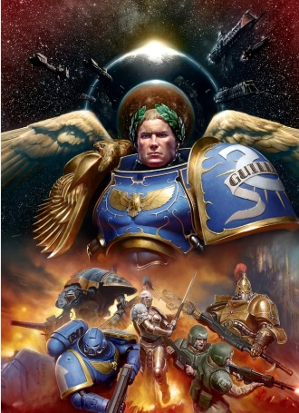
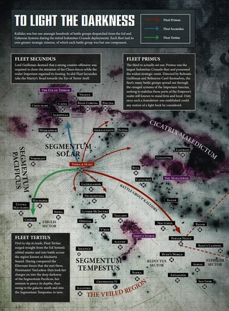
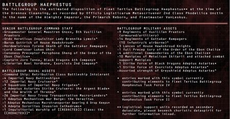

# 0836 不屈远征 Indomitus Crusade

精校状态：中文行文已逐段精校，部分术语仍为暂定

分类：时间线

原文来源：https://www.bilibili.com/opus/1132326925992198153

原作者：帝国神选罐头

原文时间：2025年11月07日 09:26

[返回分类目录](目录.md) · [全书目录](../../目录.md)

<!-- A0836-B0001 -->
**英文原文**

The Indomitus Crusade is a Crusade that was launched by the resurrected Primarch Roboute Guilliman, after he declared himself Lord Commander of the Imperium's armies during the Thirteenth Black Crusade. The main aim of the Crusade is one of reconquest, as Guilliman intends to liberate those Imperial worlds embattled by the forces of Chaos following the creation of the Great Rift, which has divided his Father's Empire in half. The undertaking of Indomitus Crusade was so grand that it echoed the Great Crusade of old.

<!-- /A0836-B0001 -->

<!-- A0836-B0002 -->

原译文

不屈远征是由复活的原体罗伯特·基里曼发起的远征，他在第十三次黑色远征期间宣布自己为帝国军队的领主指挥官。远征的主要目的是重新征服，因为吉利曼打算解放那些在大裂隙形成后被混沌部队围困的帝国世界，大裂隙将他父亲的帝国一分为二。不屈远征的规模如此之大，以至于它与古代的大远征相呼应。

**校订译文**

不屈远征由复活的原体罗保特·基里曼发起。他在第十三次黑色远征期间宣布自己出任帝国军队最高统帅，随后发动这场以收复失地为主要目标的远征。大裂隙将父亲的帝国一分为二，他决意解救那些因裂隙出现而遭混沌围攻的帝国世界。远征规模如此宏大，令人想起古老的大远征。

<!-- /A0836-B0002 -->

<!-- A0836-B0003 图片 -->

<!-- A0836-B0004 -->

原译文

The Indomitus Crusade 不屈远征

**校订译文**

The Indomitus Crusade 不屈远征

<!-- /A0836-B0004 -->

<!-- A0836-B0005 -->
## History 历史

<!-- /A0836-B0005 -->

<!-- A0836-B0006 -->
### Opening Moves 初期行动

原题：Opening Moves 开幕

<!-- /A0836-B0006 -->

<!-- A0836-B0007 -->
**英文原文**

It was not until Guilliman departed from the Throneroom of the Imperial Palace after meeting with the Emperor that he declared the need for the Indomitus Crusade, leaving some to speculate it was the Emperor's will as opposed to his own. Resources for the Crusade Fleets' muster came from many worlds capable of producing vast material output. Terra, Mars, Jupiter, Armageddon, Bastrophol and Shenjin are known to have taken part in this endeavor. Military forces meanwhile, were garnered through withdrawing forces from Imperium Sanctus Systems left untenable due to the impact of the Great Rift. This process spawned a great deal of resentment, however, and several mutinies were done by forces unwilling to abandon their posts. In the end though, the withdrawals succeeded in providing vast numbers of warriors and war machines, for the growing Crusade fleets. These fleets would take shape in several Systems, including Sol and Gehenna.

<!-- /A0836-B0007 -->

<!-- A0836-B0008 -->

原译文

直到基里曼在与帝皇会面后离开帝国皇宫的王座厅，他才宣布需要进行不屈远征，这让一些人猜测这是帝皇的意愿，而不是他自己的意愿。远征舰队所需的资源来自许多能够产生大量物资产出的世界。众所周知，泰拉、火星、木星、阿玛吉多顿、巴斯特罗波尔和申津都参与了这项努力。与此同时，军事力量是通过从因大裂隙的影响而无法维持的帝国圣疆星系撤军而获得的。然而，这一过程引发了大量的怨恨，几次叛乱是由不愿放弃岗位的部队造成的。然而，最终撤军成功地为不断壮大的远征舰队提供了大量的战士和战争机械。这些舰队将在几个星系中形成，包括太阳系和地狱星系。

**校订译文**

基里曼与帝皇会面、离开帝国皇宫王座厅后，才宣布必须发动不屈远征。因此，有人猜测这场远征出自帝皇的意志，而非他自己的决定。集结远征舰队所需的物资，来自许多产能巨大的世界；已知参与者有泰拉、火星、木星、阿玛吉多顿、巴斯特罗波尔和申津。兵力则通过撤出帝国圣疆内那些因大裂隙影响而无法继续坚守的星系来筹集。这一过程招致强烈怨愤，一些不愿放弃岗位的部队甚至发动兵变。不过，撤军最终仍为不断壮大的远征舰队提供了大量战士与战争机械。舰队在太阳系、欣嫩子谷星系等数处集结成军。

**校注：** Gehenna是地名，沿核心Gehenna Prime欣嫩子谷主星的词根，不以地狱泛称另造实体；本句仍保留星系层级，未宣称同一颗行星。

<!-- /A0836-B0008 -->

<!-- A0836-B0009 -->
**英文原文**

Guilliman's forces consist of troops from over a dozen Space Marine Chapters led by the Imperial Fists. These are joined by Imperial Guard, Mechanicum, Custodes, Sisters of Battle, Imperial Navy, Skitarii, Legio Cybernetica, Collegia Titanica, Knights, a small contingent of Sisters of Silence, and the newly created Primaris Space Marines created by Archmagos Belisarius Cawl. With the Astronomican in a state of disarray due to the formation of the Great Rift, the Indomitus Crusade risked only short jumps through the warp. One of the earliest known actions saw the Grey Knights cleanse Jupiter's moon of Ganymede of Daemonic taint, subsequently transforming it into a major Hub-Fortress for the Crusade. The earliest goal of the Imperials in the first months of the Crusade was the recapture of Warp Nexuses around Terra, such as those at Vorlese. Eight of these Nexuses were assailed by the forces of Abaddon, who sought to isolate the Throneworld. As the Imperials struggled to retake the nexues, the Crusade was forced to instead take more dangerous and time-consuming warp routes.

<!-- /A0836-B0009 -->

<!-- A0836-B0010 -->

原译文

基里曼的部队由帝国之拳领导的十几个星际战士战团组成。帝国卫队、机械教、禁军、战斗修女、帝国海军、护教军、智控军团、泰坦修会、骑士、一小队寂静修女，以及由大贤者贝利撒留·考尔创建的新成立的原铸星际战士。由于大裂隙的形成，星炬处于混乱状态，不屈远征只能冒着穿越亚空间的短跳风险。已知最早的行动之一是，灰骑士清除了木星的卫星木卫三的恶魔污染，随后将其改造成远征的主要枢纽堡垒。远征头几个月，帝国的最早目标是夺回泰拉周围的亚空间枢纽，如沃勒斯。其中八个枢纽遭到了试图孤立王座世界的阿巴顿部队的攻击。当帝国努力夺回枢纽时，远征被迫采取更危险、更耗时的亚空间路线。

**校订译文**

基里曼的军队包括以帝国之拳为首、来自十余个星际战士战团的部队，另有帝国卫队、机械教、禁军、战斗修女、帝国海军、护教军、智控军团、泰坦修会、骑士、一小支寂静修女部队，以及大贤者贝利萨留斯·考尔新创造的原铸星际战士。大裂隙使星炬陷入紊乱，远征军只敢尝试短距离亚空间跃迁。已知最早的行动之一，是灰骑士清除木卫三的恶魔污染，并将其改建为远征的重要枢纽堡垒。远征最初几个月，帝国优先争夺泰拉周围的亚空间航路枢纽，例如沃勒斯。阿巴顿为孤立王座世界而攻击其中八处枢纽，帝国军迟迟未能夺回，只得绕行更危险、更耗时的航路。

**校注：** only short jumps说明只敢进行短程跃迁，不是短程本身比长程更危险。Custodes与后面的新原铸为并列援军，补足原译缺谓语问题。

<!-- /A0836-B0010 -->

<!-- A0836-B0011 -->
**英文原文**

Guilliman's initial plan called for Fleet Tertius under Fleetmaster Cassandra VanLeskus to capture the world of Olmec in Segmentum Solar while Fleet Quintus under Fleetmaster Tronion Prasorius moved into southern Segmentum Solar towards Lessira. Meanwhile, Fleet Secundus would direct itself towards the Eye of Terror and the remains of Cadia. The primary mission of this campaign was to distract the forces of Abaddon while Fleets Tertius and Quintus undertook their own objectives. Only when Quintus had retaken Lessira and Tertius Olmec would Guilliman deploy his own personal Primus towards the embattled world of Gathalamor. However this plan rapidly fell apart as Fleet Quintus became plagued by logistical issues, disease, and sabotage. Moreover Chaos forces emerged from the Eye of Terror to attack the vital world of Hydraphur, forcing Fleet Tertius to divert course from Olmec and instead aid the Segmentum Fortress. Guilliman was rapidly forced to rewrite his entire strategy.

<!-- /A0836-B0011 -->

<!-- A0836-B0012 -->

原译文

基里曼最初的计划要求舰队司令卡桑德拉·凡·莱斯库斯率领的第三舰队在太阳星域占领奥尔梅克世界，而舰队司令特罗尼奥·普拉索里乌斯率领的第五舰队则进入太阳星域南部，前往莱斯拉。与此同时，第二舰队将驶向恐惧之眼和卡迪亚的残骸。这场战役的主要任务是分散阿巴顿部队的注意力，而第三舰队和第四舰队则实现了自己的目标。只有当第五舰队和第三舰队夺回莱西拉和奥尔梅克时，基里曼才向四面楚歌的加塔拉莫世界部署自己的第一舰队。然而，随着第五舰队受到后勤问题、疾病和破坏的困扰，这一计划迅速瓦解。此外，混沌部队从恐惧之眼出现，袭击了重要的希德拉弗世界，迫使第三舰队改道奥尔梅克，转而援助星域堡垒。基里曼很快被迫重写他的整个战略。

**校订译文**

基里曼最初计划，由舰队司令卡桑德拉·凡·莱斯库斯指挥第三舰队，夺取太阳星域的奥尔梅克；舰队司令特罗尼奥·普拉索里乌斯则率第五舰队向太阳星域南部的莱西拉推进。第二舰队同时驶向恐惧之眼和卡迪亚残骸，主要任务是牵制阿巴顿，为第三、第五舰队争取行动空间。等第五舰队夺回莱西拉、第三舰队收复奥尔梅克，基里曼才会亲率第一舰队奔赴危急的加塔拉莫。然而，第五舰队很快受后勤困难、疫病和破坏活动困扰，计划迅速失效。混沌又从恐惧之眼出击，攻击战略要地海德拉弗，迫使第三舰队放弃原定前往奥尔梅克的航线，改去支援这座星域堡垒。基里曼不得不全面调整战略。

**校注：** 源文明确Fleet Tertius and Quintus，原第三与第四舰队抄错；divert course from Olmec是改离原定奥尔梅克航线，原改道奥尔梅克方向相反。

<!-- /A0836-B0012 -->

<!-- A0836-B0013 -->
### The Crusade Underway 正在进行的远征

<!-- /A0836-B0013 -->

<!-- A0836-B0014 -->
**英文原文**

In the revised plan the first fleet to see action was Fleet Tertius under Fleetmaster Cassandra VanLeskus, which took Olmec and battled the Khornate Crusade of Slaughter in the Sol System. The fleet continued on into Segmentum Pacificus and then arced into Segmentum Tempestus. Fleet Secundus set out next, its ranks spearheaded by the Battle Sisters of the Order of the Ebon Chalice and the Order of Our Martyred Lady and engaged the forces of Chaos in Segmentum Obscurus in a campaign dubbed the Road of Martyrs. Fleet Primus under Guilliman himself left the Sol System third, taking with it the largest compliment of Ultima Founding Primaris Space Marines of the Greyshields as well as Belisarius Cawl aboard the Zar Quaesitor. It set out not upon a single heading but instead diverged into several spearheads that further fractured as they spread out from Terra. Wherever the Battlegroups of Fleet Primus surged into the fight they drove back the hordes of heretics and xenos that threatened to overrun Mankind. The first major victory of Fleet Primus would come at the Battle of Gathalamor, though they soon became bogged down for several years clearing out the Word Bearers from Segmentum Solar. Fleet Quintus was eventually able to depart, but was beaten to the prize of Lessira by the lead elements of Fleet Tertius.

<!-- /A0836-B0014 -->

<!-- A0836-B0015 -->

原译文

在修订后的计划中，第一支被看到行动的舰队是舰队司令卡桑德拉·凡·莱斯库斯领导的第三舰队，该舰队占领了奥尔梅克，并在太阳系与恐虐屠杀者远征作战。舰队继续前进至太平星域，然后弧形前进至暴风星域。接下来，第二舰队出发，其队伍由乌木圣杯修会和我们的殉教女士修会的战斗修女率领，在朦胧星域与混沌部队交战，展开了一场名为“殉道者之路”的战役。基里曼亲自率领的第一舰队第三个离开太阳系，并获得了极限建军的灰盾原铸星际战士以及探索者之王号上的贝利撒留·考尔的最大致意。它不是朝着一个方向出发，而是分叉成几个矛头，当它们从泰拉散开时，矛头进一步断裂。无论第一舰队的战斗群在哪里投入战斗，他们都会击退威胁要征服人类的异端和异型。第一舰队的第一次重大胜利将在加拉塔莫之战中取得，尽管他们很快陷入了几年的困境，从太阳星域清除了怀言者。第五舰队最终得以离开，但最终还是被第三舰队的先头部队抢先一步取得莱西拉。

**校订译文**

在修订后的计划中，最先投入行动的是卡桑德拉·凡·莱斯库斯统率的第三舰队。它夺取奥尔梅克，并在太阳系对抗恐虐的屠杀者远征，随后进入太平星域，再折向暴风星域。第二舰队接着出发，以乌木圣杯修会和殉教圣女修会的战斗修女为先锋，在朦胧星域对抗混沌，展开名为“殉道者之路”的战役。基里曼亲率的第一舰队第三个驶离太阳系，带走数量最多的极限建军灰盾原铸星际战士；贝利萨留斯·考尔也乘探索者之王号随行。第一舰队没有沿单一方向前进，而是分成数路先锋，离泰拉越远，又继续拆分出更多支队。其战斗群投入各地战斗，击退威胁人类的异端和异形。第一舰队在加塔拉莫之战取得首次重大胜利，却很快因清剿太阳星域的怀言者而被拖住数年。第五舰队最终启航时，第三舰队先锋已抢先夺下莱西拉。

**校注：** compliment为源文疑似complement拼写错误，指兵员规模，非最大致意。此段称第三舰队取奥尔梅克，前段说其被迫改道，按计划修订后的叙事保留。

<!-- /A0836-B0015 -->

<!-- A0836-B0016 -->
**英文原文**

Of all the Indomitus Crusade Fleets, Fleet Septimus (the 7th) alone was commanded to gather far from the Sol System. The exact location of its mustering point was kept a heavily guarded secret, known only to Roboute Guilliman himself and his inner circle. How large or small those battlegroups were, what forces were assigned to them, and what Fleet Septimus’ veiled purpose might be, none could be sure. Those assigned to the seventh fleet simply vanished, leaving nothing behind them but dark speculation and persistent rumors of onyx-chased servo skulls that drifted through the shadows clutching high level-clearance data scrolls in their metallic claws.

<!-- /A0836-B0016 -->

<!-- A0836-B0017 -->

原译文

在所有的不屈远征舰队中，只有第七舰队（第七）被命令在远离太阳系的地方集结。其集结点的确切位置被严格保密，只有罗伯特基里曼本人和他的核心圈知道。这些战斗群有多大或多小，分配给他们的部队是什么，以及第七舰队隐藏的目的是什么，没有人能确定。那些被分配到第七舰队的人只是消失了，什么也没留下，只留下黑暗的猜测和关于玛瑙纹饰伺服头骨的持续谣言，这些头骨在阴影中漂浮，用金属爪抓着高级别的许可数据卷轴。

**校订译文**

所有不屈远征舰队中，只有第七舰队奉命在远离太阳系的地方集结。具体地点被严密保守，只有罗保特·基里曼及其亲信知晓。各战斗群规模多大、配属何种部队，以及这支舰队究竟肩负什么秘密使命，无人能够确定。被调往第七舰队的人就此消失，只留下阴暗猜测，以及一类反复出现的传闻：镶饰缟玛瑙的伺服颅骨在阴影中漂浮，金属爪中握着只有极高权限才能读取的数据卷轴。

<!-- /A0836-B0017 -->

<!-- A0836-B0018 -->
**英文原文**

Gaining momentum, the Indomitus Crusade pushed a path through system after system. Daemon hordes were driven back from Gathalamor, the Drogos System and Tallarn. In the Lhorm Reaches, the Brass Tyrant was defeated. The entire population of Ophelia VII was freed from the enslavement of the Tyrant of Blueflame, although the Greater Daemon escaped. Word of the crusade's approach alone was enough to quell the rebellion on Necromunda. By the time the Crusade reached Catachan, all of the Chaos forces had already been defeated by the local Catachan Jungle Fighters Regiments. At Catachan, the Crusade halted for reinforcement and resupply and, despite heavy losses, the Indomitus fleet was larger when it departed Catachan than it had been when it first left Terra. As the Indomitus Crusade worked its way outwards from Terra, the worst effects of the Great Rift were already lifting across many sectors. Although warp storms still drifted out of the Great Rift, the Astronomican was slowly burning away the taint of the warp throughout the galactic south. Many citizens that survived the cruel oppression of daemonic hordes saw divine correlation between the two events. Those that glimpsed the Primarch firsthand whispered that they had seen the Emperor himself. Word of the Primarch erupted across the galaxy, revitalizing the Imperium's morale.

<!-- /A0836-B0018 -->

<!-- A0836-B0019 -->

原译文

随着势头的增强，不屈远征在一个又一个星系中开辟了一条道路。恶魔部落从加拉塔莫、德罗戈斯星系和塔兰被击退。在洛尔姆河段，黄铜暴君被击败。奥非利亚七号的全体居民从蓝焰暴君的奴役中解放出来，尽管大魔逃脱了。仅远征的消息就足以平息涅克罗蒙达的叛乱。当远征到达卡塔昌时，所有的混沌部队已经被当地的卡塔昌丛林战士兵团击败。在卡塔昌，远征停止了增援和补给，尽管损失惨重，但不屈舰队离开卡塔昌时比第一次离开泰拉时规模更大。随着不屈远征从泰拉向外推进，大裂隙的最严重影响已经在许多地区蔓延。尽管亚空间风暴仍然从大裂隙中漂移出来，但星炬正在慢慢地燃烧整个银河系南部亚空间的污染。许多在恶魔部落的残酷压迫下幸存下来的公民看到了这两件事之间的神圣联系。那些第一眼看到原体的人低声说，他们看到了帝皇本人。原体的消息传遍了整个银河系，重振了帝国的士气。

**校订译文**

不屈远征声势渐盛，在一个又一个星系杀出道路。加塔拉莫、德罗戈斯星系和塔兰的恶魔大军被击退，洛尔姆疆域的黄铜暴君遭到击败。奥菲利亚七号全体居民摆脱了蓝焰暴君的奴役，尽管那头大魔逃脱了。仅仅听闻远征军即将抵达，就足以让涅克罗蒙达的叛乱平息。等远征军到达卡塔昌，当地丛林战士各团已经击败全部混沌部队。舰队在此停留，接收增援和补给；纵然一路损失惨重，离开卡塔昌时的规模仍超过最初离开泰拉之时。随着远征向外推进，大裂隙造成的最严重影响也开始在许多星区消退。虽仍有亚空间风暴从裂隙涌出，星炬的光芒却逐渐烧尽银河南部的亚空间污染。许多从恶魔残酷统治下生还的居民，将两者视为神意相连。亲眼见过原体的人甚至低声传言，自己看到了帝皇。原体归来的消息传遍银河，重振了帝国士气。

**校注：** halted for reinforcement and resupply为停留接受增援补给，原停止增援补给意思相反；worst effects were lifting为最严重影响消退，原蔓延颠倒。Lhorm Reaches是空间疆域，不是河段。

<!-- /A0836-B0019 -->

<!-- A0836-B0020 -->
**英文原文**

However, the crusade came to many worlds that were beyond saving and suffered setbacks. Where there was no hope, Guilliman sought instead to bring vengeance and Exterminatus, as was the case with the Hive World Bhundar and the Daemonic-corrupted Cardinal World of Gloriphia. At Terra Secundus, the Crusade fleet suffered ambushes and catastrophic malfunctions, having been lured into a terrible trap by the Alpha Legion. Although it pained him to do so, Guilliman made the difficult decision to pull back, skirting the whole Primagenesis System, as he could not afford to become bogged down in a long war of attrition. The crusade's journey later saw it encounter dozens of systems in which countless Imperial citizens were left in thrall to the Chaos Gods. This was a bitter reality for Roboute Guilliman and his forces.

<!-- /A0836-B0020 -->

<!-- A0836-B0021 -->

原译文

然而，远征来到了许多无法挽救的世界，并遭受了挫折。在没有希望的地方，基里曼转而寻求复仇和灭绝，就像巢都世界布恩达尔和被恶魔腐化的格洛里菲亚红衣主教世界一样。在第二泰拉，远征舰队遭到伏击和灾难性故障，被阿尔法军团引诱到一个可怕的陷阱中。尽管这样做让他很痛苦，但基里曼还是做出了艰难的决定，避开了整个原初起源星系，因为他不能陷入长期的消耗战。远征的旅程后来遇到了数十个星系，在这些星系中，无数帝国公民被混沌诸神所奴役。这对罗伯特·基里曼和他的部队来说是一个痛苦的现实。

**校订译文**

远征军也遇到许多已经无可挽救的世界，并遭受挫折。对毫无希望的地方，基里曼选择以复仇和灭绝令回应，例如巢都世界布恩达尔，以及遭恶魔腐化的红衣主教世界格洛里菲亚。在第二泰拉，舰队落入阿尔法军团布置的可怕陷阱，接连遭受伏击和灾难性故障。基里曼虽心有不甘，却承受不起长期消耗战，只能艰难决定撤离，绕开整个原初起源星系。此后，远征又经过数十个星系，见到无数帝国子民仍被混沌诸神奴役。这是他和部下不得不面对的苦涩现实。

**校注：** Exterminatus为灭绝令；不可简单译成未说明制度性质的灭绝行为。

<!-- /A0836-B0021 -->

<!-- A0836-B0022 图片 -->

<!-- A0836-B0023 -->

原译文

Three Indomitus Crusade Fleets and their course 三支不屈远征舰队及其航线

**校订译文**

Three Indomitus Crusade Fleets and their course 三支不屈远征舰队及其航线

<!-- /A0836-B0023 -->

<!-- A0836-B0024 -->
**英文原文**

Less than four years after the Battle of Gathalamor Guilliman sent out a Torchbearer ship to Fenris ahead of Fleet Primus. Guilliman ultimately sought to push on into Imperium Nihilus, but sought the cooperation of the Space Wolves to protect the way to Terra from emerging Ork forces. After Guilliman’s arrival on Fenris and a meeting with a distrustful Logan Grimnar himself on Fenris the initially reluctant Space Wolves agreed to battle the Orks to the Crusade's rear and receive Primaris Space Marine reinforcements as Guilliman sought to push into the Dark Imperium.

<!-- /A0836-B0024 -->

<!-- A0836-B0025 -->

原译文

加塔拉莫之战后不到四年，基里曼就在第一舰队之前向芬里斯派遣了一艘火炬手舰。基里曼最终试图推进帝国暗面，但寻求太空野狼的合作，以保护通往泰拉的道路免受新兴的欧克势力的攻击。基里曼抵达芬里斯，并在芬里斯与不信任的罗根·格里姆纳尔本人会面后，最初不情愿的太空野狼同意与远征后方的欧克作战，并在基里曼试图推进黑暗帝国时接受原铸星际战士的增援。

**校订译文**

加塔拉莫之战后不到四年，基里曼派一艘持炬舰先于第一舰队驶往芬里斯。他最终希望深入帝国暗面，但需要太空野狼协助阻挡新出现的欧克部队，保护通往泰拉的航路。抵达芬里斯后，他与心怀疑虑的洛根·格里姆纳尔面谈。原本不情愿的太空野狼终于答应，在远征军后方对抗欧克，并接受原铸星际战士增援，让基里曼得以继续向黑暗帝国推进。

<!-- /A0836-B0025 -->

<!-- A0836-B0026 -->
**英文原文**

As the Indomitus Crusade penetrated deeper into the galaxy, Archmagos Cawl kept his automaton workers on overdrive to create new Primaris Marines and the weapons for them. Aboard the massive vessel Zar-Quaesitor, thousands of Primaris Space Marines – some comprising entirely new Chapters and others designated as reinforcements for existing ones – were awakened out of stasis and made ready to join the fray. On Rynn's World, the arrival of the Indomitus Crusade broke the daemonic legions of the Daemon Prince Rhaxor. After the battle, the stunned Crimson Fists were given reinforcements of Primaris Marines. For his raw material, Cawl had selected warriors of Terra, and had taken them only a few generations after the original Imperial Fists had been created by the Emperor. Indeed, some had been held in stasis since the days of the Great Crusade; a few of the Primaris Space Marines could recall having seen Rogal Dorn himself. Such reunions were repeated on Baal, Chogoris, and throughout Ultramar.

<!-- /A0836-B0026 -->

<!-- A0836-B0027 -->

原译文

随着不屈远征深入银河系，大贤者考尔让他的机兵工人超速运转，为他们创造新的原铸战士和武器。在巨大的探索者之王号战舰上，数千名原铸星际战士 — 其中一些由全新的战团组成，另一些则被指定为现有战团的增援 — 从停滞状态中醒来，准备加入战斗。在林恩世界里，不屈远征的到来打破了恶魔王子拉克瑟尔的恶魔军团。战斗结束后，震惊的绯红之拳得到了原铸星际战士的增援。考尔选择了泰拉的战士作为他的原材料，并在帝皇创造了最初的帝国之拳后几代人就带走了他们。事实上，自大远征以来，一些人一直处于停滞状态；一些原铸星际战士还记得见过罗格·多恩本人。这样的团聚在巴尔、乔高里斯和整个奥特拉玛都重演了。

**校订译文**

远征深入银河时，考尔大贤者让自动机工人全力运转，制造更多原铸星际战士及配套武器。在庞大的探索者之王号上，数千名原铸战士从静滞中苏醒，准备投入战斗；一部分将组成全新战团，另一部分则补充现有战团。远征军抵达瑞恩世界，击溃恶魔王子拉克瑟尔的大军后，将原铸援军交给震惊的绯红之拳。考尔当初选取的改造对象来自泰拉，在帝皇最初创造帝国之拳后的几代人内就被带走。其中一些人自大远征时代便一直处于静滞，甚至仍记得亲眼见过罗格·多恩。类似的重逢也发生在巴尔、乔高里斯和奥特拉玛各地。

**校注：** some comprising entirely new Chapters是部分战士组成新战团，原一些战士由战团组成倒置。Rynn’s World沿核心瑞恩世界。

<!-- /A0836-B0027 -->

<!-- A0836-B0028 -->
**英文原文**

By the 5th year of the Indomitus Crusade the impetus of the earlier struggle had bled away and many Battle Groups now found themselves mired in expanding warzones. With each new threat that was extinguished, several more took their place. The slow reconquest was not universal, but nonetheless large areas of the Imperium in the galactic south were now outright safe is not safeguarded by the presence of Guilliman's armada. Battle Group Thetera of Fleet Octus was able to cross the Veiled Region and relieve Bakka. By this point, the Nephilim Sector and the Necron Pariah Nexus had become a major problem for the Imperium and subsequently became a major area of fighting. Several other major war zones erupted, such as the Plague Wars in Ultramar, the Word Bearers uprisings in Segmentum Solar, increased Ork activity in Segmentum Tempestus, the Tau Fifth Sphere of Expansion, the Charadon Campaign, and the Nachmund Rift War. While the feared Chaos assault on Terra never came, the Traitor Legions became more active and unified then ever, often with Daemon Primarchs at their head. Besides the usual Xenos and Chaos threats, within Imperium Nihilus Humanity faced renewed attacks by more esoteric enemies such as the Hrud and Enslavers. There were even reports of breakout attempts by the infamous Barghesi.

<!-- /A0836-B0028 -->

<!-- A0836-B0029 -->

原译文

到不屈远征的第五年，早期斗争的动力已经耗尽，许多战斗群现在发现自己陷入了不断扩大的战区。随着每一个新的威胁被消除，又有几个威胁取而代之。缓慢的重新征服并不是普遍的，但尽管如此，银河系南部帝国的大片地区现在已经完全安全，基里曼舰队的存在并没有得到保障。第八舰队的西特拉战斗群能够穿越帷幕地区并解救巴卡。到目前为止，涅非利姆星区和死灵的驱灵死域已经成为帝国的一个主要问题，随后成为主要的战区。其他几个主要战区爆发了，如奥特拉玛的瘟疫战争、太阳星域的怀言者叛乱、暴风星域的欧克活动增加、钛的第五界扩张、查拉顿战役和纳克蒙德裂隙战争。虽然令人恐惧的混沌对泰拉的攻击从未到来，但叛徒军团变得比以往任何时候都更加活跃和统一，通常由恶魔原体领导。除了通常的异型和混沌威胁外，在帝国暗面内，人类还面临着更隐秘的敌人，如赫鲁德和奴役者的新攻击。甚至有报告称臭名昭著的巴尔盖西试图突破。

**校订译文**

到远征第五年，初期锐气逐渐消耗，许多战斗群陷入不断扩大的战区。每消灭一个威胁，又会有数个新威胁出现。收复失地的进展缓慢，也并非处处顺利；不过，在银河南部，帝国已有大片地区恢复安全，或受到基里曼舰队的保护。第八舰队的西特拉战斗群穿越帷幕地区，为巴卡解围。此时，拿非利星区和太空死灵的驱灵死域成为帝国面临的重大问题，继而化为主要战场。其他战事也不断爆发：奥特拉玛的瘟疫战争、太阳星域的怀言者起义、暴风星域日益频繁的欧克活动、钛帝国第五次扩张、查拉顿战役，以及纳克蒙德裂隙战争。尽管令人忧惧的混沌对泰拉总攻始终没有到来，叛变军团却比以往更加活跃、更加团结，并经常由恶魔原体亲自统率。帝国暗面的人类除了应付常见的异形和混沌，还面临赫鲁德、奴役者等更罕见敌人的新一轮进攻，甚至有报告称臭名昭著的巴尔盖西正企图突破封锁。

**校注：** 源文safe is not safeguarded语法有误，疑if not，但不可据此译成未得到保护；按周边语境保留恢复安全或受舰队庇护两层意思。第五次扩张沿830/核心。

<!-- /A0836-B0029 -->

<!-- A0836-B0030 -->
**英文原文**

Around this same time, supply became a major issue for the Indomitus Crusade. Despite the network of Hub-Fortresses and the formation of the Officio Logisticarum, supplying the many Crusade Battlegroups proved beyond even Guilliman's logistical mastery. In desperate need of men and material, Crusade fleets were often forced to requisition supplies from newly liberated worlds. This sometimes created local discontent, as was infamously the case in the Ironhold Protectorate.

<!-- /A0836-B0030 -->

<!-- A0836-B0031 -->

原译文

大约在同一时间，供应成为不屈远征的一个主要问题。尽管有枢纽要塞网络和后勤部的形成，但为许多远征战斗群提供物资甚至超出了基里曼的后勤控制能力。由于急需人员和物资，远征舰队经常被迫从新解放的世界征用物资。这有时会引起当地人的不满，正如铁堡保护国臭名昭著的情况那样。

**校订译文**

同一时期，补给也成为远征军的重大难题。即使已经建立枢纽堡垒网络，并成立后勤部，要为如此众多的战斗群供给物资，仍超出了基里曼高超的后勤统筹能力。舰队急需人员与物资，经常被迫向刚刚解放的世界征调。这有时激起当地不满，铁堡保护国的事件就是一个恶名昭彰的例子。

<!-- /A0836-B0031 -->

<!-- A0836-B0032 -->
### Transition 过渡

<!-- /A0836-B0032 -->

<!-- A0836-B0033 -->
**英文原文**

After around 12 years, the first phase Indomitus Crusade began to end and the Unnumbered Sons were finally broken up. When the vast holds of the Zar-Quaesitor were emptied, Archmagos Cawl departed, for he had many more secret vaults to activate in order to complete the Ultima Founding. Once deployed, new Chapters remained after the initial conflicts were won, seeking to consolidate the crusade's gains. In many cases, they did this by establishing their own new Chapter planets. In this way, the crusade not only freed worlds from the tyranny of the Dark Gods, but also strengthened their defenses against further attacks that were sure to come. After hearing of serious developments in the Plague Wars of Ultramar, Guilliman could no longer ignore his home and decided to return to Ultramar. After the Battle of Raukos Guilliman held a great Triumph and announced the dispersion of the Crusade throughout the Imperium.

<!-- /A0836-B0033 -->

<!-- A0836-B0034 -->

原译文

大约12年后，第一阶段的不屈远征开始结束，未计之子最终被拆散。当探索者之王号的巨大货仓被清空时，大贤者考尔离开了，因为他有更多的秘库需要激活，以完成极限建军。一旦部署，新的战团在最初的冲突获胜后仍然存在，寻求巩固远征的成果。在许多情况下，他们通过建立自己的新战团行星来做到这一点。通过这种方式，远征不仅将世界从黑暗诸神的暴政中解放出来，还加强了他们对必然会到来的进一步攻击的防御。在听说奥特拉玛瘟疫战争的严峻进展后，基里曼再也不能忽视他的家，决定回到奥特拉玛。劳科斯之战后，基里曼取得了巨大的胜利，并宣布远征将分散到整个帝国。

**校订译文**

约十二年后，不屈远征第一阶段接近尾声，未计之子最终拆编。探索者之王号巨大的舱室被陆续腾空后，考尔大贤者离开舰队，前往启用其他秘密储藏库，以完成极限建军。新战团在赢得初期战斗后留守当地，巩固远征战果，许多战团为此建立了自己的新母星。远征因而不仅使世界摆脱黑暗诸神的统治，也加强了它们抵御后续进攻的能力。听闻奥特拉玛瘟疫战争形势严重，基里曼无法再置故乡于不顾，决定返回。劳科斯之战后，他举行盛大的凯旋典礼，宣布远征军将分散至帝国各地行动。

**校注：** held a great Triumph为举行凯旋典礼，不是又取得一场巨大的战斗胜利；分散部署不等于整个远征结束。

<!-- /A0836-B0034 -->

<!-- A0836-B0035 -->
**英文原文**

After the conclusion of the Plague Wars in Ultramar, Guilliman announced his intention to venture into the Imperium Nihilus at long last in order to reassert Imperial rule there. Guilliman eventually succeeded in making it into Imperium Nihilus. He arrived at Baal as it was beset by both Tyranids and Chaos and helped save the Blood Angels and their Successor Chapters from destruction. After the battle Guilliman met with Dante, who he appointed as Regent of Imperium Nihilus and gave the resources to bring some semblance of order to the besieged realm. He then returned to the Imperium Sanctus to continue his work.

<!-- /A0836-B0035 -->

<!-- A0836-B0036 -->

原译文

在奥特拉玛的瘟疫战争结束后，基里曼终于宣布他打算冒险进入帝国暗面，以重申那里的帝国统治。基里曼最终成功地进入帝国暗面。当巴尔被泰伦和混沌围困时，他抵达了巴尔，并帮助拯救了圣血天使及其子战团免于毁灭。战斗结束后，基里曼会见了但丁，他任命但丁为帝国暗面摄政，并提供了资源，为被围困的领域带来了一些表面的秩序。然后，他回到帝国圣疆继续他的工作。

**校订译文**

奥特拉玛瘟疫战争结束后，基里曼宣布终于要深入帝国暗面，重建帝国在当地的统治。他最终成功进入那里，在巴尔遭泰伦与混沌围攻时抵达，协助圣血天使及其子战团免于覆灭。战后，他会见但丁，任命他为帝国暗面摄政，并提供资源，帮助这个四面受敌的区域恢复起码的秩序。随后，基里曼返回帝国圣疆，继续自己的事业。

**校注：** 本段将巴尔救援置于瘟疫战争后，与其他篇目/旧版时间线可能不一致；按本英文顺序保留，配合末尾版本修订说明阅读。some semblance of order指起码秩序，非假装秩序。

<!-- /A0836-B0036 -->

<!-- A0836-B0037 -->
**英文原文**

Sometime after the Devastation of Baal Abaddon and Vashtorr launched their Arks of Omen Campaign. During the subsequent wars, the entire Indomitus Crusade Fleet Tertius was corrupted or destroyed by a vast Khornate horde led by Angron.

<!-- /A0836-B0037 -->

<!-- A0836-B0038 -->

原译文

在巴尔毁灭之后的某个时候，阿巴顿和瓦什托尔发动了他们的噩兆方舟战役。在随后的战争中，整个不屈远征第三舰队被安格隆领导的庞大的恐虐部落破坏或摧毁。

**校订译文**

巴尔之毁后的一段时间，阿巴顿和瓦什托尔发动噩兆方舟战役。在随后的战争中，原文称不屈远征第三舰队被安格隆率领的庞大恐虐军势全数腐化或摧毁。

**校注：** 本段英文Fleet Tertius第三舰队，与本篇B0077明确Fleet Quartus第四舰队及B0094绝罚记录冲突；两处依英文分别保留，待原始出版物核定，未擅自统一。

<!-- /A0836-B0038 -->

<!-- A0836-B0039 -->
### Notable Battles of the Indomitus Crusade 不屈远征的著名战斗

<!-- /A0836-B0039 -->

<!-- A0836-B0040 -->

原译文

The cleansing of Ganymede 木卫三清洗

**校订译文**

The cleansing of Ganymede 木卫三清洗

<!-- /A0836-B0040 -->

<!-- A0836-B0041 -->

原译文

The Crusade of Slaughter 屠杀者远征

**校订译文**

The Crusade of Slaughter 屠杀者远征

<!-- /A0836-B0041 -->

<!-- A0836-B0042 -->
**英文原文**

The Battle of Machorta Sound - First major victory of the Crusade

<!-- /A0836-B0042 -->

<!-- A0836-B0043 -->

原译文

马乔塔海峡之战 - 远征的第一次主要胜利

**校订译文**

马乔塔海峡之战 - 远征的第一次主要胜利

<!-- /A0836-B0043 -->

<!-- A0836-B0044 -->

原译文

The Road of Martyrs 殉道者之路

**校订译文**

The Road of Martyrs 殉道者之路

<!-- /A0836-B0044 -->

<!-- A0836-B0045 -->

原译文

The Battle of Gathalamor 加拉塔莫之战

**校订译文**

The Battle of Gathalamor 加塔拉莫之战

<!-- /A0836-B0045 -->

<!-- A0836-B0046 -->

原译文

The Solar Incursion 入侵太阳系

**校订译文**

The Solar Incursion 入侵太阳系

<!-- /A0836-B0046 -->

<!-- A0836-B0047 -->

原译文

The battle for Sycorax 天卫十七之战

**校订译文**

The battle for Sycorax 赛科拉克斯之战

**校注：** 此处Sycorax按核心赛科拉克斯行星名，不因现实同名卫星就译天卫十七。

<!-- /A0836-B0047 -->

<!-- A0836-B0048 -->

原译文

The battle for Feldros 费尔德罗斯之战

**校订译文**

The battle for Feldros 费尔德罗斯之战

<!-- /A0836-B0048 -->

<!-- A0836-B0049 -->

原译文

The Liberation of Ophelia VII 解放奥菲利亚七号

**校订译文**

The Liberation of Ophelia VII 解放奥菲利亚七号

<!-- /A0836-B0049 -->

<!-- A0836-B0050 -->

原译文

The Battle of Vorlese 沃勒斯之战

**校订译文**

The Battle of Vorlese 沃勒斯之战

<!-- /A0836-B0050 -->

<!-- A0836-B0051 -->

原译文

The Keprian Reclamation 收复凯普里安

**校订译文**

The Keprian Reclamation 收复凯普里安

<!-- /A0836-B0051 -->

<!-- A0836-B0052 -->

原译文

Battle for Terra Secundus 第二泰拉之战

**校订译文**

Battle for Terra Secundus 第二泰拉之战

<!-- /A0836-B0052 -->

<!-- A0836-B0053 -->

原译文

The Battle of Manask 马纳斯克之战

**校订译文**

The Battle of Manask 马纳斯克之战

<!-- /A0836-B0053 -->

<!-- A0836-B0054 -->

原译文

The Battle of Quradim 库拉迪姆之战

**校订译文**

The Battle of Quradim 库拉迪姆之战

<!-- /A0836-B0054 -->

<!-- A0836-B0055 -->

原译文

The Battle for the Orestes System 俄瑞斯忒斯星系之战

**校订译文**

The Battle for the Orestes System 俄瑞斯忒斯星系之战

<!-- /A0836-B0055 -->

<!-- A0836-B0056 -->

原译文

The Invasion of the Odoacer System 入侵奥多埃塞星系

**校订译文**

The Invasion of the Odoacer System 入侵奥多埃塞星系

<!-- /A0836-B0056 -->

<!-- A0836-B0057 -->

原译文

The War of Beasts on Vigilus 警戒星野兽战争

**校订译文**

The War of Beasts on Vigilus 警戒星野兽之战

<!-- /A0836-B0057 -->

<!-- A0836-B0058 -->

原译文

The Pariah Crusade 帕里亚远征

**校订译文**

The Pariah Crusade 被遗弃者远征

<!-- /A0836-B0058 -->

<!-- A0836-B0059 -->

原译文

The Argovon Campaign 阿尔戈冯战役

**校订译文**

The Argovon Campaign 阿尔戈冯战役

<!-- /A0836-B0059 -->

<!-- A0836-B0060 -->

原译文

The Battle for Budor V 比多尔五号之战

**校订译文**

The Battle for Budor V 比多尔五号之战

<!-- /A0836-B0060 -->

<!-- A0836-B0061 -->

原译文

The Battle for Mundus di Venn 维恩世界之战

**校订译文**

The Battle for Mundus di Venn 维恩世界之战

<!-- /A0836-B0061 -->

<!-- A0836-B0062 -->

原译文

Battles against Grukk Face-Rippa 对抗撕脸者格鲁克之战

**校订译文**

Battles against Grukk Face-Rippa 对抗撕脸者格鲁克之战

<!-- /A0836-B0062 -->

<!-- A0836-B0063 -->

原译文

Battles against Warboss Zorg 对抗战争头目佐尔格之战

**校订译文**

Battles against Warboss Zorg 对抗战争头目佐尔格之战

<!-- /A0836-B0063 -->

<!-- A0836-B0064 -->

原译文

The Battle of Srinagar 斯利那加之战

**校订译文**

The Battle of Srinagar 斯利那加之战

<!-- /A0836-B0064 -->

<!-- A0836-B0065 -->

原译文

The Cleansing of Pyros 派罗斯清洗

**校订译文**

The Cleansing of Pyros 派罗斯清洗

<!-- /A0836-B0065 -->

<!-- A0836-B0066 -->

原译文

The Battle of Garrovire 加洛韦之战

**校订译文**

The Battle of Garrovire 加洛韦之战

<!-- /A0836-B0066 -->

<!-- A0836-B0067 -->

原译文

The Battle of the Stygius Gilt 镀金冥河之战

**校订译文**

The Battle of the Stygius Gilt 镀金冥河之战

<!-- /A0836-B0067 -->

<!-- A0836-B0068 -->

原译文

The Battle of Raukos 劳科斯之战

**校订译文**

The Battle of Raukos 劳科斯之战

<!-- /A0836-B0068 -->

<!-- A0836-B0069 -->

原译文

The Plague Wars 瘟疫战争

**校订译文**

The Plague Wars 瘟疫战争

<!-- /A0836-B0069 -->

<!-- A0836-B0070 -->

原译文

The Devastation of Baal 巴尔的毁灭

**校订译文**

The Devastation of Baal 巴尔之毁

<!-- /A0836-B0070 -->

<!-- A0836-B0071 -->
**英文原文**

Invasion of the Chaos-held Forge World Driantum

<!-- /A0836-B0071 -->

<!-- A0836-B0072 -->

原译文

入侵混沌控制的铸造世界德里安图姆

**校订译文**

入侵混沌控制的铸造世界德里安图姆

<!-- /A0836-B0072 -->

<!-- A0836-B0073 -->
**英文原文**

Invasion of the Chaos-held world Braxar Tertia‎

<!-- /A0836-B0073 -->

<!-- A0836-B0074 -->

原译文

入侵混沌控制的世界布拉克萨三号

**校订译文**

入侵混沌控制的世界布拉克萨三号

<!-- /A0836-B0074 -->

<!-- A0836-B0075 -->
**英文原文**

The Battle of Eight Pillars, against the Fleshreavers Warband.

<!-- /A0836-B0075 -->

<!-- A0836-B0076 -->

原译文

八柱之战，对抗血肉掠夺者战帮。

**校订译文**

八柱之战，对抗血肉掠夺者战帮。

<!-- /A0836-B0076 -->

<!-- A0836-B0077 -->
**英文原文**

The Battle of Malak during the Arks of Omen Campaign. 80% of Fleet Quartus is destroyed or corrupted by Khorne after Angron assaults Malakbael and destroys the Choral Engine.

<!-- /A0836-B0077 -->

<!-- A0836-B0078 -->

原译文

噩兆方舟战役中的马拉克战役。安格隆攻击马拉克贝尔并摧毁圣歌引擎后，80%的第四舰队被恐虐摧毁或腐化。

**校订译文**

噩兆方舟战役中的马拉克之战：安格隆攻击马拉克巴力并摧毁圣歌引擎后，第四舰队的 80% 被恐虐摧毁或腐化。

**校注：** 与本篇B0037第三舰队全数受损的说法不一致；这里按英文保留第四舰队80%，马拉克巴力沿540。

<!-- /A0836-B0078 -->

<!-- A0836-B0079 -->
## Organization 组织

<!-- /A0836-B0079 -->

<!-- A0836-B0080 -->
**英文原文**

Despite being under the overall command of Roboute Guilliman, the Indomitus Crusade did not operate as a single force. Rather, it was a massive ever-growing fleet divided into many formations that varied greatly in size and makeup. Each of these Fleets had their own Space Marine, Imperial Guard, Imperial Navy, Adeptus Mechanicus, Sisters of Battle, Sisters of Silence, and Adeptus Custodes detachments. Supporting these were support groups from the Adeptus Arbites, Inquisition, Officio Assassinorum, and Ecclesiarchy. The Fleets were identified by number, such as Fleet Primus, Fleet Secundus, Fleet Tertius, and so on and fell under the command of a Fleetmaster. There are currently 10 known Battlefleets, each of which is massive. The size of Fleet Primus alone surpasses that of all Imperial forces gathered in the Macharian Crusade.

<!-- /A0836-B0080 -->

<!-- A0836-B0081 -->

原译文

尽管在罗伯特·基里曼的全面指挥下，不屈远征并没有作为一支部队行动。相反，它是一支庞大的、不断壮大的舰队，分为许多编队，规模和组成差异很大。这些舰队中的每一支都有自己的星际战士、帝国卫队、帝国海军、机械神教、战斗修女、寂静修女和禁军分队。支援这些人的是来自法务部、审判庭、刺客庭和国教的支援团体。舰队由编号标识，如第一舰队、第二舰队、第三舰队等，并由一名舰队司令指挥。目前已知有10支战斗舰队，每支都很庞大。仅第一舰队的规模就超过了马卡里安远征中聚集的所有帝国军队。

**校订译文**

不屈远征由罗保特·基里曼统一指挥，却并非整支军队始终一同行动。它由不断扩充的庞大舰队构成，分为规模和兵力组成差异悬殊的许多编队。每支舰队都配有各自的星际战士、帝国卫队、帝国海军、机械修会、战斗修女、寂静修女和禁军分遣队，并由法务部、审判庭、刺客庭及国教会的人员提供支援。舰队依序编号，如第一、第二、第三舰队等，各由一名舰队司令指挥。底稿记载已知有十支规模巨大的战斗舰队；仅第一舰队，就超过马卡里安远征集结的全部帝国兵力。

<!-- /A0836-B0081 -->

<!-- A0836-B0082 图片 -->

<!-- A0836-B0083 -->

原译文

Organization of a typical Indomitus Crusade Battlegroup 典型的不屈远征战斗群的组织

**校订译文**

Organization of a typical Indomitus Crusade Battlegroup 典型的不屈远征战斗群的组织

<!-- /A0836-B0083 -->

<!-- A0836-B0084 -->
**英文原文**

Each of these fleets was in turn divided into a number of Battlegroups, identified as Battlegroup Alphus, Battlegroup Betaris, Battlegroup Cerastus, etc. each under the command of a Groupmaster. How many Battlegroups each fleet has is unknown, though it is stated that Fleet Tertius consisted of 16. Though each battlegroup was part of a greater fleet, they were designed to be independent and self-sufficient. Battlegroups would answer to their corresponding Fleetmaster for strategic direction, but otherwise investigated and initiated their own campaigns. The third level of the Crusade was the Task Force, which were specialized military groupings that were assembled on the order of a Groupmaster. They were intended to achieve the conquest of specific worlds or defense platforms, the couriering of vital messages through the vastness of space, the destruction of specific enemies who had been marked for death, and whatever other important tasks had to be achieved. Each Task Force had within it a specialized force known as Torchbearers. This consisted of Sisters of Silence, 1 squad of Custodes, and a conclave of Magos Biologis. These acted as the direct emissaries of Guilliman and would transfer new Primaris Space Marine technology and Gene-Seed to cutoff Space Marine Chapters.

<!-- /A0836-B0084 -->

<!-- A0836-B0085 -->

原译文

这些舰队中的每一个又分为多个战斗群，分别称为阿尔弗斯战斗群、贝塔利斯战斗群、塞拉斯图斯战斗群等，每个战斗群都由一名集群司令指挥。每个舰队有多少个战斗群尚不清楚，但据说第三舰队由16个战斗群组成。虽然每个战斗群都是更大舰队的一部分，但它们的设计是独立和自给自足的。战斗群将向相应的舰队司令负责战略方向，但也会进行调查并发起自己的战役。远征的第三级是特遣部队，这是根据集群司令的命令组建的专门军事队伍。它们旨在征服特定的世界或防御平台，在浩瀚的太空中传递重要信息，摧毁被标记为死亡的特定敌人，以及必须完成的任何其他重要任务。每个特遣部队都有一支被称为火炬手的专门部队。这包括寂静修女、1个禁军小队和一个生物贤者秘会。这些人充当了基里曼的直接使者，将把新的原铸星际战士技术和基因种子转移到遥远的星际战士战团。

**校订译文**

每支舰队进一步划分为多个战斗群，例如阿尔弗斯、贝塔利斯、塞拉斯图斯战斗群，各由一名集群司令统率。各舰队下辖多少战斗群尚不清楚，但据称第三舰队有 16 个。战斗群虽隶属更大的舰队，却具备独立行动和自给自足的能力；它们接受所属舰队司令的战略指导，具体侦察与战役行动则可自行展开。第三级编制为特遣部队，由集群司令按任务需要组建，负责夺取指定世界或防御平台、穿越辽阔星空传递重要消息、消灭指定目标，以及其他重要任务。每支特遣部队中还有名为持炬者的专门力量，由寂静修女、一个禁军小队及生物贤者秘会组成。他们作为基里曼的直接使者，将原铸星际战士技术与基因种子送交失联战团。

**校注：** cutoff为被隔绝、失联，不仅是地理遥远；Torchbearers与持炬舰队词根统一。

<!-- /A0836-B0085 -->

<!-- A0836-B0086 -->
**英文原文**

Each Indomitus Crusade Fleet was initially organised right down to a regimental level by Roboute Guilliman. However, the Primarch had to accept that his painstaking organisational work would not long survive contact with the war-torn galaxy. He thus provided fleetmasters and groupmasters alike with powers of requisition to rival those of even the most domineering Lord Inquisitor. To facilitate and resupply this great undertaking, Guilliman created the Officio Logisticarum. The Officio Logisticarum itself is based out of Hub-Fortresses, which are periodically established on worlds in the wake of the Crusade.

<!-- /A0836-B0086 -->

<!-- A0836-B0087 -->

原译文

每个不屈远征舰队最初都是由罗伯特·基里曼组织到兵团级的。然而，原体不得不接受，他艰苦的组织工作在与饱受战争蹂躏的星系接触后将无法长久。因此，他为舰队司令和集群司令提供了征用权，甚至可以与最专横的审判官相媲美。为了促进和补给这项伟大的事业，基里曼创建了后勤部。后勤部本身以枢纽堡垒为基地，在远征之后，定期在各个世界上建立。

**校订译文**

远征开始时，基里曼为各舰队制定的编制细致到了团级。但他不得不承认，精心规划的组织一旦进入战火纷飞的银河，便难以长久维持。因此，他赋予舰队司令和集群司令强大的征调权，堪比最专横的领主审判官。为支持远征、补充供给，他成立了后勤部。该机构依托枢纽堡垒运作；这些堡垒随着远征推进，不断在后方各个世界建立。

<!-- /A0836-B0087 -->

<!-- A0836-B0088 -->
### Known Crusade Fleets 已知远征舰队

原题：Known Crusade Fleets 著名远征舰队

<!-- /A0836-B0088 -->

<!-- A0836-B0089 -->
**英文原文**

Ten Crusade Fleets are known to exist, given the designation:

<!-- /A0836-B0089 -->

<!-- A0836-B0090 -->

原译文

已知存在十支远征舰队，其名称如下：

**校订译文**

已知存在十支远征舰队，其名称如下：

<!-- /A0836-B0090 -->

<!-- A0836-B0091 -->

原译文

Indomitus Crusade Fleet Primus 不屈远征第一舰队

**校订译文**

Indomitus Crusade Fleet Primus 不屈远征第一舰队

<!-- /A0836-B0091 -->

<!-- A0836-B0092 -->

原译文

Indomitus Crusade Fleet Secundus 不屈远征第二舰队

**校订译文**

Indomitus Crusade Fleet Secundus 不屈远征第二舰队

<!-- /A0836-B0092 -->

<!-- A0836-B0093 -->

原译文

Indomitus Crusade Fleet Tertius 不屈远征第三舰队

**校订译文**

Indomitus Crusade Fleet Tertius 不屈远征第三舰队

<!-- /A0836-B0093 -->

<!-- A0836-B0094 -->
**英文原文**

Indomitus Crusade Fleet Quartus (Excommunicate Traitoris)

<!-- /A0836-B0094 -->

<!-- A0836-B0095 -->

原译文

不屈远征第四舰队（绝罚叛徒）

**校订译文**

不屈远征第四舰队（绝罚叛徒）

**校注：** 本清单记第四舰队为Excommunicate Traitoris；与B0037第三舰队的灾难说法分别保留。

<!-- /A0836-B0095 -->

<!-- A0836-B0096 -->

原译文

Indomitus Crusade Fleet Quintus 不屈远征第五舰队

**校订译文**

Indomitus Crusade Fleet Quintus 不屈远征第五舰队

<!-- /A0836-B0096 -->

<!-- A0836-B0097 -->

原译文

Indomitus Crusade Fleet Sextus 不屈远征第六舰队

**校订译文**

Indomitus Crusade Fleet Sextus 不屈远征第六舰队

<!-- /A0836-B0097 -->

<!-- A0836-B0098 -->

原译文

Indomitus Crusade Fleet Septimus 不屈远征第七舰队

**校订译文**

Indomitus Crusade Fleet Septimus 不屈远征第七舰队

<!-- /A0836-B0098 -->

<!-- A0836-B0099 -->

原译文

Indomitus Crusade Fleet Octus 不屈远征第八舰队

**校订译文**

Indomitus Crusade Fleet Octus 不屈远征第八舰队

<!-- /A0836-B0099 -->

<!-- A0836-B0100 -->

原译文

Indomitus Crusade Fleet Decius 不屈远征德西乌斯舰队

**校订译文**

Indomitus Crusade Fleet Decius 不屈远征德西乌斯舰队

**校注：** 正文称十支舰队，本清单实际仅列九项（第一至第八及Decius），且未明确Decius对应编号；不擅自补出失落第九项或改动英文。

<!-- /A0836-B0100 -->

<!-- A0836-B0101 -->
## High Ranking Members of the Indomitus Crusade 不屈远征的高级成员

<!-- /A0836-B0101 -->

<!-- A0836-B0102 -->
### Military Commanders 军事指挥官

<!-- /A0836-B0102 -->

<!-- A0836-B0103 -->

原译文

Lord Commander Roboute Guilliman 领主指挥官罗伯特·基里曼

**校订译文**

Lord Commander Roboute Guilliman 帝国最高统帅罗保特·基里曼

<!-- /A0836-B0103 -->

<!-- A0836-B0104 -->

原译文

Archmagos Dominus Belisarius Cawl 统御大贤者贝利撒留·考尔

**校订译文**

Archmagos Dominus Belisarius Cawl 统御大贤者贝利萨留斯·考尔

<!-- /A0836-B0104 -->

<!-- A0836-B0105 -->

原译文

High Lord Morvenn Vahl 高领主莫文·瓦尔

**校订译文**

High Lord Morvenn Vahl 高领主莫雯·瓦尔

<!-- /A0836-B0105 -->

<!-- A0836-B0106 -->

原译文

Fleetmaster Cassandra VanLeskus 舰队司令卡桑德拉·凡·莱斯库斯

**校订译文**

Fleetmaster Cassandra VanLeskus 舰队司令卡桑德拉·凡·莱斯库斯

<!-- /A0836-B0106 -->

<!-- A0836-B0107 -->
**英文原文**

Fleetmaster Rasmatin Olythaddeus Samil

<!-- /A0836-B0107 -->

<!-- A0836-B0108 -->

原译文

舰队司令拉斯马丁·奥利萨迪乌斯·萨米尔

**校订译文**

舰队司令拉斯马丁·奥利萨迪乌斯·萨米尔

<!-- /A0836-B0108 -->

<!-- A0836-B0109 -->

原译文

Fleetmaster Prasorius 舰队司令普拉索里乌斯

**校订译文**

Fleetmaster Prasorius 舰队司令普拉索里乌斯

<!-- /A0836-B0109 -->

<!-- A0836-B0110 -->

原译文

Fleetmaster Aswan Relmay 舰队司令阿斯旺·雷尔梅

**校订译文**

Fleetmaster Aswan Relmay 舰队司令阿斯旺·雷尔梅

<!-- /A0836-B0110 -->

<!-- A0836-B0111 -->

原译文

Fleetmaster Trincus Abconcis 舰队司令特林库斯·阿布康西斯

**校订译文**

Fleetmaster Trincus Abconcis 舰队司令特林库斯·阿布康西斯

<!-- /A0836-B0111 -->

<!-- A0836-B0112 -->

原译文

Fleetmaster Tronion Prasorius 舰队司令特罗尼奥·普拉索里乌斯

**校订译文**

Fleetmaster Tronion Prasorius 舰队司令特罗尼奥·普拉索里乌斯

<!-- /A0836-B0112 -->

<!-- A0836-B0113 -->

原译文

Fleetmaster Kaosholay 舰队司令考肖莱

**校订译文**

Fleetmaster Kaosholay 舰队司令考肖莱

<!-- /A0836-B0113 -->

<!-- A0836-B0114 -->

原译文

Ultramarines Captain Cato Sicarius 极限战士连长卡托·西卡留斯

**校订译文**

Ultramarines Captain Cato Sicarius 极限战士连长卡托·西卡留斯

<!-- /A0836-B0114 -->

<!-- A0836-B0115 -->
**英文原文**

Ultramarines Captain Decimus Felix - Guilliman's Equerry

<!-- /A0836-B0115 -->

<!-- A0836-B0116 -->

原译文

极限战士连长德西穆斯·菲利克斯 - 基里曼的侍从官

**校订译文**

极限战士连长德西穆斯·菲利克斯 - 基里曼的侍从官

<!-- /A0836-B0116 -->

<!-- A0836-B0117 -->
**英文原文**

Aurora Chapter Codicier Donas Maxim - Leader of Guilliman's Concilia Psykana.

<!-- /A0836-B0117 -->

<!-- A0836-B0118 -->

原译文

极光战团典记员多纳斯·马克西姆 - 基里曼的灵能议会的领袖

**校订译文**

极光战团典记员多纳斯·马克西姆——基里曼灵能议会的领袖。

<!-- /A0836-B0118 -->

<!-- A0836-B0119 -->

原译文

Adeptus Custodes Tribune Maldovar Colquan 禁军保民官马尔多瓦·科尔泉

**校订译文**

Adeptus Custodes Tribune Maldovar Colquan 禁军护民官马尔多瓦·科尔泉

<!-- /A0836-B0119 -->

<!-- A0836-B0120 -->

原译文

Sisters of Silence Commander Aphone 寂静修女指挥官阿丰

**校订译文**

Sisters of Silence Commander Aphone 寂静修女指挥官阿芙恩

<!-- /A0836-B0120 -->

<!-- A0836-B0121 -->
### Bureaucrats 官僚

<!-- /A0836-B0121 -->

<!-- A0836-B0122 -->
**英文原文**

The Council Exterra - Representatives of the High Lords of Terra to the Crusade, consisting of:

<!-- /A0836-B0122 -->

<!-- A0836-B0123 -->

原译文

泰拉外议会 - 远征的泰拉高领主代表，由以下成员组成：

**校订译文**

泰拉外议会 - 远征的泰拉高领主代表，由以下成员组成：

<!-- /A0836-B0123 -->

<!-- A0836-B0124 -->
**英文原文**

Geesan - Militant-Apostolic representing the Adeptus Ministorum (later replaced by Mathieu).

<!-- /A0836-B0124 -->

<!-- A0836-B0125 -->

原译文

吉桑 - 代表国教教会的战争使徒（后来被马蒂厄取代）。

**校订译文**

吉桑——代表国教会的战争使徒，后来由马蒂厄接任。

<!-- /A0836-B0125 -->

<!-- A0836-B0126 -->
**英文原文**

Andiramus - Provost representing the Adeptus Arbites

<!-- /A0836-B0126 -->

<!-- A0836-B0127 -->

原译文

安迪拉穆斯 - 代表法务部的教长

**校订译文**

安迪拉穆斯——代表法务部的监督官。

**校注：** Provost在法务部语境为监督或执法职衔，原教长误作宗教人员；具体职衔暂定。

<!-- /A0836-B0127 -->

<!-- A0836-B0128 -->
**英文原文**

Luthian Xhyle - Chiliarch representing the Imperial Guard

<!-- /A0836-B0128 -->

<!-- A0836-B0129 -->

原译文

卢提安·希勒 - 代表帝国卫队的千夫长

**校订译文**

卢提安·希勒 - 代表帝国卫队的千夫长

<!-- /A0836-B0129 -->

<!-- A0836-B0130 -->
**英文原文**

Filomensya Blaaz - Primaris Psyker representing the Adeptus Astra Telepathica

<!-- /A0836-B0130 -->

<!-- A0836-B0131 -->

原译文

菲洛门希娅·布拉兹 - 代表星语庭的首席灵能者

**校订译文**

菲洛门希娅·布拉兹——代表星语庭的灵能导师。

**校注：** Primaris Psyker已有直接官译灵能导师，不是首席灵能者，也与原铸星际战士不同。

<!-- /A0836-B0131 -->

<!-- A0836-B0132 -->
**英文原文**

Arfon Hoiditma - Inquisitor representing the Inquisition

<!-- /A0836-B0132 -->

<!-- A0836-B0133 -->

原译文

阿尔丰·霍迪蒂特玛 - 代表审判庭的审判官

**校订译文**

阿尔丰·霍迪蒂特玛 - 代表审判庭的审判官

<!-- /A0836-B0133 -->

<!-- A0836-B0134 -->
**英文原文**

Belisarius Cawl - Archmagos representing the Adeptus Mechanicus

<!-- /A0836-B0134 -->

<!-- A0836-B0135 -->

原译文

贝利撒留·考尔 - 代表机械神教的大贤者

**校订译文**

贝利萨留斯·考尔——代表机械修会的大贤者。

<!-- /A0836-B0135 -->

<!-- A0836-B0136 -->
**英文原文**

Dho Gan Mey - Rear Admiral representing the Imperial Navy

<!-- /A0836-B0136 -->

<!-- A0836-B0137 -->

原译文

多甘梅 - 代表帝国海军的海军中将

**校订译文**

多甘梅——代表帝国海军的海军少将。

**校注：** Rear Admiral为海军少将，原中将错误。

<!-- /A0836-B0137 -->

<!-- A0836-B0138 -->
## Notes on Chronology 年表注释

<!-- /A0836-B0138 -->

<!-- A0836-B0139 -->
**英文原文**

Originally as outlined in the Dark Imperium novel series, the Indomitus Crusade lasted roughly 100 years and ended with the Plague Wars. However in 2021 Black Library retconned the events of the novels to take place only 12 years after the Crusade had begun and no known end-date is currently set.

<!-- /A0836-B0139 -->

<!-- A0836-B0140 -->

原译文

最初，正如《黑暗帝国》系列小说所述，不屈远征持续了大约100年，以瘟疫战争告终。然而，在2021年，黑色图书馆将小说中的事件改为发生在远征开始12年后，目前还没有确定结束日期。

**校订译文**

《黑暗帝国》小说系列最初将不屈远征写为持续约一百年，并以瘟疫战争结束。黑色图书馆在 2021 年追溯修订时间线，将小说事件调整至远征开始后的第十二年；底稿撰写时，远征仍没有已知的确定结束日期。

**校注：** 明确2021年的追溯修订，并将currently限定为底稿撰写时，未以旧稿断言现实当前出版状态。

<!-- /A0836-B0140 -->

本篇核心术语与暂定项

以下列出本篇出现的英文原形及核心术语表用词。同形词可能指不同对象，具体词义以本篇正文和校注为准；单复数、别名和仅见于图注的名称可能尚未列入。完整候选见[术语表](../../术语表/双语术语候选.csv)。

| 英文 | 采用中文 | 状态 |
| --- | --- | --- |
| Space Marines | 星际战士 | 官方已核对 |
| Blood Angels | 圣血天使 | 官方已核对 |
| Grey Knights | 灰骑士 | 官方已核对 |
| Space Wolves | 太空野狼 | 官方已核对 |
| Adeptus Custodes | 帝皇禁军 | 官方已核对 |
| Adeptus Mechanicus | 机械修会 | 官方已核对 |
| Imperial Guard | 帝国卫队 | 暂定·语境区分 |
| Tyranids | 泰伦虫族 | 官方已核对 |
| Orks | 欧克蛮人 | 官方已核对 |
| Psyker | 灵能者 | 官方已核对 |
| Primaris Psyker | 灵能导师 | 官方已核对 |
| Roboute Guilliman | 罗保特·基里曼 | 官方已核对 |
| Ultramar | 奥特拉玛 | 官方已核对 |
| Ultramarines | 极限战士 | 官方已核对 |
| Astronomican | 星炬 | 暂定 |
| Adeptus Astra Telepathica | 星语庭 | 暂定 |
| Warp | 亚空间 | 官方已核对 |
| Great Rift | 大裂隙 | 官方已核对 |
| Inquisition | 审判庭 | 暂定 |
| Inquisitor | 审判官 | 官方已核对 |
| Imperium | 帝国 | 暂定·简称 |
| Imperial Navy | 帝国海军 | 暂定 |
| Mechanicum | 机械教 | 暂定·历史称谓 |
| Legio Cybernetica | 智控军团 | 暂定 |
| Khorne | 恐虐 | 官方已核对 |
| Indomitus | 不屈学派 | 暂定·学派语境 |
| Eye of Terror | 恐惧之眼 | 官方已核对 |
| Imperial Fists | 帝国之拳 | 暂定 |
| Emperor | 帝皇 | 官方已核对 |
| Primarch | 原体 | 官方已核对 |
| Adeptus Ministorum | 国教会 | 暂定 |
| Ecclesiarchy | 国教会 | 暂定 |
| Adeptus Arbites | 法务部 | 暂定 |
| Officio Assassinorum | 刺客庭 | 暂定·官方待核 |
| Hive World | 巢都世界 | 暂定·官方待核 |
| Forge World | 铸造世界 | 暂定·官方待核 |
| Necromunda | 涅克罗蒙达 | 暂定·官方待核 |
| Magos Biologis | 生物贤者 | 暂定·官方待核 |
| Word Bearers | 怀言者 | 暂定·官方待核 |
| Daemon Prince | 恶魔亲王 | 官方已核对 |
| The Order | 秩序 | 暂定·官方待核 |
| Great Crusade | 大远征 | 暂定·官方待核 |
| Terra | 泰拉 | 暂定·官方待核 |
| High Lords of Terra | 泰拉高领主 | 暂定·官方待核 |
| Collegia Titanica | 泰坦修会 | 暂定·官方待核 |
| Skitarii | 护教军 | 暂定·官方待核 |
| Sisters of Battle | 战斗修女 | 暂定·官方待核 |
| Sisters of Silence | 寂静修女 | 暂定·官方待核 |
| Dark Imperium | 黑暗帝国 | 暂定·官方待核 |
| Imperium Nihilus | 帝国暗面 | 暂定·官方待核 |
| Imperium Sanctus | 帝国圣疆 | 暂定·官方待核 |
| Indomitus Crusade | 不屈远征 | 暂定·官方待核 |
| Nachmund Rift War | 纳克蒙德裂隙战争 | 暂定·官方待核 |
| Devastation of Baal | 巴尔之毁 | 暂定·官方待核 |
| Plague Wars | 瘟疫战争 | 暂定·官方待核 |
| Nephilim Sector | 拿非利星区 | 暂定·官方待核 |
| Pariah Nexus | 驱灵死域 | 暂定·官方待核 |
| Fifth Sphere of Expansion | 第五次扩张 | 暂定·官方待核 |
| Lord Commander of the Imperium | 帝国最高统帅 | 暂定·官方待核 |
| Officio Logisticarum | 后勤部 | 暂定·官方待核 |
| Segmentum Solar | 太阳星域 | 暂定·官方待核 |
| Segmentum Pacificus | 太平星域 | 暂定·官方待核 |
| Segmentum Obscurus | 朦胧星域 | 暂定·官方待核 |
| Segmentum Tempestus | 暴风星域 | 暂定·官方待核 |
| Segmentum | 星域 | 暂定·官方待核 |
| Sector | 星区 | 暂定·官方待核 |
| Veiled Region | 帷幕地区 | 暂定·官方待核 |
| Deeper | 深人 | 暂定·官方待核 |
| Armageddon | 阿玛吉多顿 | 暂定·官方待核 |
| Mars | 火星 | 暂定·官方待核 |
| Jupiter | 木星 | 暂定·官方待核 |
| Rynn's World | 瑞恩世界 | 暂定·官方待核 |
| Gathalamor | 加塔拉莫 | 暂定·官方待核 |
| Ophelia VII | 奥菲利亚七号 | 暂定·官方待核 |
| Tallarn | 塔兰 | 暂定·官方待核 |
| Catachan | 卡塔昌 | 暂定·官方待核 |
| Fenris | 芬里斯 | 暂定·官方待核 |
| Baal | 巴尔 | 暂定·官方待核 |
| Chogoris | 乔高里斯 | 暂定·官方待核 |
| Cadia | 卡迪亚 | 暂定·官方待核 |
| Bakka | 巴卡 | 暂定·官方待核 |
| Hydraphur | 海德拉弗 | 暂定·官方待核 |
| Obscurus | 朦胧星 | 暂定·官方待核 |
| Pariah | 贱民 | 暂定·官方待核 |
| Codicier | 典记员 | 暂定·官方待核 |
| Cardinal | 红衣主教 | 暂定 |
| Militant-Apostolic | 战争使徒 | 暂定 |
| Mission | 教团／传教机构 | 暂定 |
| Order of Our Martyred Lady | 殉教圣女修会 | 暂定 |
| Indomitus Crusade Fleet Tertius | 不屈远征第三舰队 | 暂定·官方待核 |
| Belisarius Cawl | 贝利萨留斯·考尔 | 官方已核对 |
| Long War | 万古长战 | 暂定·官方待核 |
| Lord Commander | 领主指挥官 | 暂定·官方待核 |
| Alpha Legion | 阿尔法军团 | 暂定·官方待核 |
| Founding | 建军 | 暂定·官方待核 |
| Sol | 太阳系 | 暂定·官方待核 |
| Crimson Fists | 绯红之拳 | 暂定·官方待核 |
| Space Marine | 星际战士 | 暂定·官方待核 |
| Chapter | 战团 | 暂定·官方待核 |
| Captain | 连长 | 暂定·官方待核 |
| Primaris Space Marine | 原铸星际战士 | 暂定·官方待核 |
| Logan Grimnar | 洛根·格里姆纳尔 | 官方已核 |
| Dante | 但丁 | 暂定·官方待核 |
| Aurora Chapter | 曙光女神 | 暂定·官方待核 |
| Ultima Founding | 极限建军 | 暂定·官方待核 |
| Decimus Felix | 德西穆斯·菲利克斯 | 暂定·官方待核 |
| Gene-seed | 基因种子 | 暂定·官方待核 |
| Equerry | 近侍 | 暂定·官方待核 |
| Unnumbered Sons | 未计之子 | 暂定·官方待核 |
| Malak | 马拉克 | 暂定·官方待核 |
| Powers | 能天使 | 暂定·官方待核 |
| Catachan Jungle Fighters | 卡塔昌丛林斗士 | 官方已核对 |
| Xenos | 异形 | 暂定·官方待核 |
| Hrud | 赫鲁德 | 暂定·官方待核 |
| Horde | 部落 | 暂定·官方待核 |
| Charadon | 查拉顿 | 暂定·官方待核 |
| Primus | 领军 | 官方已核对 |
| Sanctus | 圣裁者 | 官方已核对 |
| Fleet Quartus | 第四舰队 | 暂定·官方待核 |
| Malakbael | 马拉克巴力 | 暂定·官方待核 |
| Angron | 安格隆 | 官方已核对 |
| Zar-Quaesitor | 探索者之王号 | 暂定·官方待核 |
| Vengeance | 复仇号 | 暂定·官方待核 |
| Battle of Malak | 马拉克之战 | 暂定·官方待核 |
| Emperor's Will | 帝皇意志号 | 暂定·官方待核 |
| Mathieu | 马蒂厄 | 暂定·官方待核 |
| Sphere | 防御圈 | 暂定·官方待核 |
| The Dark | 《黑暗》 | 暂定·官方待核 |
| The Blood | 鲜血 | 暂定·官方待核 |
| Quintus | 昆图斯 | 暂定·官方待核 |
| Segmentum Fortress | 星域堡垒 | 暂定·官方待核 |
| System | 星系（恒星系统） | 暂定·官方待核 |
| Driantum | 德里安图姆 | 暂定·官方待核 |
| Cardinal World | 红衣主教世界 | 暂定·官方待核 |
| Hub-Fortress | 枢纽堡垒 | 暂定·官方待核 |
| Choral Engine | 圣歌引擎 | 暂定·官方待核 |
| Raukos | 劳科斯 | 暂定·官方待核 |
| Macharian Crusade | 马卡里安远征 | 暂定·官方待核 |
| Machorta Sound | 马乔塔海峡 | 暂定·官方待核 |
| Omen | 预兆号 | 暂定·官方待核 |
| Order of the Ebon Chalice | 乌木圣杯修会 | 暂定·官方待核 |
| Bastrophol | 巴斯特罗波尔 | 暂定·官方待核 |
| Shenjin | 申津 | 暂定·官方待核 |
| Olmec | 奥尔梅克 | 暂定·官方待核 |
| Lessira | 莱西拉 | 暂定·官方待核 |
| Tronion Prasorius | 特罗尼奥·普拉索里乌斯 | 暂定·官方待核 |
| Greyshields | 灰盾 | 暂定·官方待核 |
| Lhorm Reaches | 洛尔姆疆域 | 暂定·官方待核 |
| Brass Tyrant | 黄铜暴君 | 暂定·官方待核 |
| Tyrant of Blueflame | 蓝焰暴君 | 暂定·官方待核 |
| Bhundar | 布恩达尔 | 暂定·官方待核 |
| Gloriphia | 格洛里菲亚 | 暂定·官方待核 |
| Primagenesis System | 原初起源星系 | 暂定·官方待核 |
| Rhaxor | 拉克瑟尔 | 暂定·官方待核 |
| Battle Group Thetera | 西特拉战斗群 | 暂定·官方待核 |
| Ironhold Protectorate | 铁堡保护国 | 暂定·官方待核 |
| Groupmaster | 集群司令 | 暂定·官方待核 |
| Torchbearers | 持炬者 | 暂定·官方待核 |
| Fleetmaster | 舰队司令 | 暂定·官方待核 |
| Battlegroup Betaris | 贝塔利斯战斗群 | 暂定·官方待核 |
| Battlegroup Cerastus | 塞拉斯图斯战斗群 | 暂定·官方待核 |
| Rasmatin Olythaddeus Samil | 拉斯马丁·奥利萨迪乌斯·萨米尔 | 暂定·官方待核 |
| Donas Maxim | 多纳斯·马克西姆 | 暂定·官方待核 |
| Concilia Psykana | 灵能议会 | 暂定·官方待核 |
| Council Exterra | 泰拉外议会 | 暂定·官方待核 |
| Geesan | 吉桑 | 暂定·官方待核 |
| Andiramus | 安迪拉穆斯 | 暂定·官方待核 |
| Luthian Xhyle | 卢提安·希勒 | 暂定·官方待核 |
| Filomensya Blaaz | 菲洛门希娅·布拉兹 | 暂定·官方待核 |
| Arfon Hoiditma | 阿尔丰·霍迪蒂特玛 | 暂定·官方待核 |
| Dho Gan Mey | 多甘梅 | 暂定·官方待核 |
| Black Library | 黑图书馆 | 暂定·官方待核 |
| Vorlese | 沃勒斯 | 暂定·官方待核 |
| Sol System | 太阳系 | 暂定·官方待核 |

