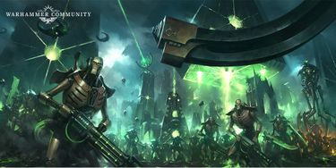
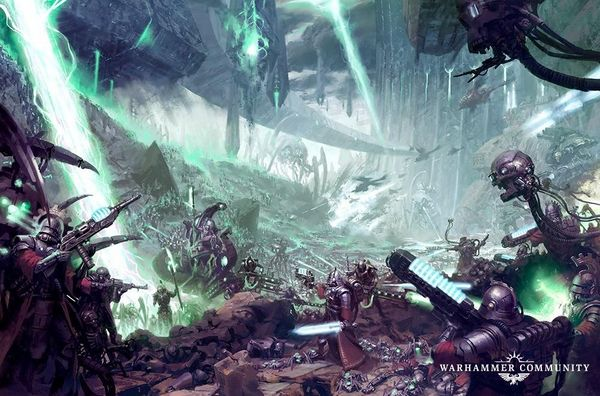

# 0837 -005.M42 被遗弃者远征 Pariah Crusade

精校状态：中文行文已逐段精校，部分术语仍为暂定

分类：时间线

原文来源：https://www.bilibili.com/opus/1138728583365132313

原作者：帝国神选罐头

原文时间：2025年11月24日 15:28

[返回分类目录](目录.md) · [全书目录](../../目录.md)

<!-- A0837-B0001 -->
**英文原文**

The Pariah Crusade or Nephilim War is a campaign of the Psychic Awakening and Indomitus Crusade. While initially a standard Imperial expedition to investigate the fate of the Nephilim Sector, it has since escalated into a four-way conflict involving Humanity, Chaos, and two differing Necron factions.

<!-- /A0837-B0001 -->

<!-- A0837-B0002 -->

原译文

被遗弃者远征或拿非利战争是灵能觉醒和不屈远征的一场战役。虽然最初是一次标准的帝国远征，旨在调查拿非利星区的命运，但后来升级为一场涉及人类、混沌和两个不同的亡灵派系的四方冲突。

**校订译文**

被遗弃者远征，又称拿非利战争，是灵能觉醒与不屈远征期间的一场战役。它最初只是帝国为查明拿非利星区状况而派出的常规远征，后来却升级为人类、混沌，以及两个相互对立的太空死灵阵营之间的四方战争。

<!-- /A0837-B0002 -->

<!-- A0837-B0003 图片 -->

<!-- A0837-B0004 -->

原译文

The Necrons rise 死灵崛起

**校订译文**

The Necrons rise 死灵崛起

<!-- /A0837-B0004 -->

<!-- A0837-B0005 -->
**英文原文**

Conflict:Psychic Awakening/Indomitus Crusade

<!-- /A0837-B0005 -->

<!-- A0837-B0006 -->

原译文

冲突：灵能觉醒/不屈远征

**校订译文**

冲突：灵能觉醒/不屈远征

<!-- /A0837-B0006 -->

<!-- A0837-B0007 -->
**英文原文**

Date:~005.M42

<!-- /A0837-B0007 -->

<!-- A0837-B0008 -->

原译文

日期：~005.M42

**校订译文**

日期：~005.M42

<!-- /A0837-B0008 -->

<!-- A0837-B0009 -->
**英文原文**

Location:Nephilim Sector

<!-- /A0837-B0009 -->

<!-- A0837-B0010 -->

原译文

地点：拿非利星区

**校订译文**

地点：拿非利星区

<!-- /A0837-B0010 -->

<!-- A0837-B0011 -->
**英文原文**

Outcome:Ongoing

<!-- /A0837-B0011 -->

<!-- A0837-B0012 -->

原译文

结果：进行中

**校订译文**

结果：进行中

<!-- /A0837-B0012 -->

<!-- A0837-B0013 -->
**英文原文**

Combatants:Imperium/Necrons loyal to Szarekh; Necrons loyal to Imotekh/Chaos

<!-- /A0837-B0013 -->

<!-- A0837-B0014 -->

原译文

作战人员：帝国/忠于斯扎拉克的死灵：忠于伊莫泰克的死灵/混沌

**校订译文**

参战方：帝国／效忠斯扎拉克的太空死灵；效忠伊摩特克的太空死灵／混沌

<!-- /A0837-B0014 -->

<!-- A0837-B0015 -->
**英文原文**

Commanders:Lord Commander Roboute Guilliman, Archmagos Belisarius Cawl, Fleetmaster Isaiah Khestrin, Fleetmaster Cassandra VanLeskus (KIA), Groupmaster Eloise Athagey (POW), Groupmaster Marran (MIA), Groupmaster Vikraen, Inquisitor Draxus (AWOL), Captain Vitrian Messinius, Tribune Colquan, Ephrael Stern, Marshal Reikert Arnulf (MIA), Marshal Kurtz, Captain Galeron, Lieutenant Horgek Stornvor (MIA), Canoness Gracia Emmanuelle (KIA), Magos Einvahld Veridian, Magos Ghelf (KIA), Magos Behzt Oradi/Silent King Szarekh, Hapthatra the Radiant, Illuminor Szeras, Orikan the Diviner, Phaeron Shemvokh (WIA), Phaeron Nektarrik, Phaeron Vordreska, Overlord Neshkafar, Overlord Khutmecc, Lord Karifar Lakshmet, Lord Khepra'nek, Lord Menhotok, Nemesor Uthmek; Imotekh the Stormlord/Vashtorr the Arkifane, Lord Draix, Dark Apostle Zakkis Armon, Lord Suleyman Khefre, Fabius Bile

<!-- /A0837-B0015 -->

<!-- A0837-B0016 -->

原译文

指挥官：领主指挥官罗伯特·基里曼，大贤者贝利撒留·考尔，舰队司令以赛亚·凯斯特琳，舰队司令卡桑德拉·凡·莱斯库斯（KIA），集群司令埃洛伊斯·阿塔吉（POW），集群司令马兰（MIA），集群司令维克莱恩，审判官德拉克斯（AWOL），连长维特里安·梅西尼乌斯，保民官柯肯，埃弗雷尔·斯特恩，元帅赖克特·阿尔努夫（MIA），元帅库尔茨，连长加勒隆，副官霍尔格克·斯托恩沃（MIA），大修女格拉西娅·埃玛纽埃尔（KIA），贤者艾因瓦尔德·维里迪安，贤者格尔夫（KIA），贤者贝赫特·奥拉迪/寂静王斯扎拉克，光辉者哈普塔拉，启明者泽拉斯，占星者欧瑞坎，法皇舍姆沃克（WIA），法皇内克塔里克，法皇沃尔德雷斯卡，霸主内什卡法尔，霸主库特梅克，领主卡里法·拉克什梅特，领主凯普拉'内克，领主蒙霍托克，内梅索尔·乌特梅克；风暴王伊莫泰克/造物者瓦什托尔，领主德雷克斯，黑暗使徒扎基斯·阿蒙，领主苏莱曼·凯夫雷，法比乌斯·拜尔

**校订译文**

指挥官：帝国——帝国最高统帅罗保特·基里曼；大贤者贝利萨留斯·考尔；舰队司令以赛亚·凯斯特琳；舰队司令卡桑德拉·凡·莱斯库斯（阵亡）；集群司令埃洛伊斯·阿塔吉（被俘）、马兰（失踪）、维克莱恩；审判官德拉克瑟斯（擅离职守）；连长维特里安·梅西尼乌斯；保民官科尔泉；埃弗雷尔·斯特恩；元帅赖克特·阿尔努夫（失踪）、库尔茨；连长加勒隆；副官霍尔格克·斯托恩沃（失踪）；大修女格拉西娅·埃玛纽埃尔（阵亡）；贤者艾因瓦尔德·维里迪安、格尔夫（阵亡）、贝赫特·奥拉迪。斯扎拉克阵营——寂静王斯扎拉克；光辉者哈普塔拉；光耀者泽拉斯；占卜者欧瑞肯；法皇舍姆沃克（负伤）、内克塔里克、沃尔德雷斯卡；霸主内什卡法尔、库特梅克；领主卡里法·拉克什梅特、凯普拉·内克、蒙霍托克；戴冠者乌特梅克。另一太空死灵阵营——风暴王伊摩特克。混沌——造物者瓦什托尔；领主德雷克斯；黑暗使徒扎基斯·阿蒙；领主苏莱曼·凯夫雷；法比乌斯·拜尔。

**校注：** Draxus沿本次GW09/GW10第24页直接官译德拉克瑟斯；全名凯莉娅部分仍暂定。Nemesor为太空死灵职衔，沿本稿Nemesor Zahndrekh戴冠者词根，未误并为姓名内梅索尔。Colquan沿836全名科尔泉。

<!-- /A0837-B0016 -->

<!-- A0837-B0017 -->
**英文原文**

Strength:Elements from Fleet Primus and Fleet Tertius including: Battle Group Orphaeus, Battle Group Kallides, Battle Group Hephaestus, Battle Group Iolus/Szarekhan Dynasty and allies including: Oruskh Dynasty, Nihilakh Dynasty, Novokh Dynasty, Thokt Dynasty; Sautekh Dynasty and allies/Cult of the Arkifane, Soul Eaters, Word Bearers, Thousand Sons, Creations of Bile, Flawless Host, Other Allied Chaos Space Marines, Allied Dark Mechanicus

<!-- /A0837-B0017 -->

<!-- A0837-B0018 -->

原译文

力量：第一和第三舰队的成员包括：俄耳甫斯战斗群、卡利德斯战斗群、赫菲斯托斯战斗群、伊奥劳斯战斗群/斯扎拉坎王朝及其盟友包括：奥鲁斯赫王朝、尼希拉赫王朝、诺沃赫王朝、托克特王朝；索泰克王朝及其盟友/造物者教派，吞魂者，吞世者，千子，拜尔造物，无暇之主，其他盟友混沌星际战士，盟友黑暗机械教

**校订译文**

兵力：帝国——第一、第三舰队部分兵力，包括俄耳甫斯、卡利德斯、赫菲斯托斯和伊奥劳斯战斗群。斯扎拉克阵营——斯扎拉坎王朝及奥鲁斯赫、尼希拉克、诺沃赫、索科特等王朝盟军。另一太空死灵阵营——索泰克王朝及盟友。混沌——造物者教派、吞魂者、怀言者、千子、拜尔造物、无暇大军、其他混沌星际战士盟军及黑暗机械教盟军。

**校注：** Word Bearers为怀言者，原误写吞世者；与World Eaters严格区别。尼希拉克、索科特沿核心王朝名。

<!-- /A0837-B0018 -->

<!-- A0837-B0019 -->
**英文原文**

Losses/Survivors:Heavy, Battle Groups Kallides and Orphaeus largely annihilated/Unknown, presumably heavy

<!-- /A0837-B0019 -->

<!-- A0837-B0020 -->

原译文

损失/幸存者：沉重，卡利德斯和俄耳甫斯战斗群基本被歼灭/未知，推测沉重

**校订译文**

损失／幸存情况：帝国损失惨重，卡利德斯与俄耳甫斯战斗群基本覆灭；其余损失不详，推测同样惨重。

<!-- /A0837-B0020 -->

<!-- A0837-B0021 -->
## Overview 概述

<!-- /A0837-B0021 -->

<!-- A0837-B0022 -->
### Initial Imperial Expedition 首次帝国远征

<!-- /A0837-B0022 -->

<!-- A0837-B0023 -->
### Prelude 序曲

<!-- /A0837-B0023 -->

<!-- A0837-B0024 -->
**英文原文**

Shortly after his Return to Terra, the reborn Roboute Guilliman learned of the beginnings of what would become the Necron Pariah Nexus. Advised by Belisarius Cawl as to the scale of the threat, Guilliman decided to first investigate the extent of the Necron network and then launch an expedition to destroy it. A great council of war including representatives from all major Imperial factions was held aboard the Dawn of Fire where Guilliman outlined his strategy. During the council Guilliman declared that Battle Group Kallides was dispatched to first conduct a reconnaissance-in-force of the Nephilim Sector and investigate the threat. Commanded by Groupmaster Kaspar Marius Todoric Marran, the Imperial forces consisted of Imperial Guard, Imperial Navy, Mechanicum, House Terryn, House Mortan, Ultramarines, Black Templars, Sisters of Battle, and Legio Castigatum. Also present were Ordo Xenos detachments under Lord Inquisitor Kyria Draxus. Once this force had assessed the situation in the sector, Guilliman would personally lead Fleet Primus with support from Fleet Tertius to destroy the Pariah Nexus. Cawl outlined how destroying the Necron "keystone" Pylon at Mesmoch in the Zeidos System would severely disrupt the network. Unknown to most of the Imperials, Cawl's true target was Planet 7/2, with the attack on Mesmoch as well as a fleet incursion in the Paradyce System meant as a diversion to draw away the Necrons.

<!-- /A0837-B0024 -->

<!-- A0837-B0025 -->

原译文

在重生的罗伯特·基里曼回到泰拉后不久，得知了后来成为死灵驱灵死域的开始。在贝利撒留·考尔关于威胁规模的建议下，基里曼决定首先调查司令网络的范围，然后发起一次远征来摧毁它。在黎明之火号上举行了一次包括所有主要帝国派系代表在内的大战争会议，基里曼在会议上概述了他的战略。在会议期间，基里曼宣布，卡利德斯战斗群被派遣首先对拿非利星区进行侦察，并调查威胁。帝国部队由集群司令卡斯帕·马里乌斯·托多里奇·马兰指挥，由帝国卫队、帝国海军、机械教、泰林家族、莫坦家族、极限战士、黑色圣堂、战斗修女和智控军团组成。出席会议的还有领主审判官凯莉娅·德拉克斯率领的攘外修会分遣队。一旦这支部队评估了该星区的局势，基里曼将亲自率领第一舰队在第三舰队的支援下摧毁驱灵死域。考尔概述了摧毁泽多斯星系中梅斯莫赫的死灵“钥石”方尖碑将如何严重破坏网络。大多数帝国人都不知道，考尔的真正目标是7/2行星，对梅斯莫赫进行攻击以及舰队入侵帕拉迪斯星系意味着转移注意力以吸引死灵。

**校订译文**

复活后的罗保特·基里曼返回泰拉不久，便得知了后来被称为太空死灵驱灵死域的网络正在形成。考尔向他说明威胁规模后，他决定先查明这个网络的范围，再派军摧毁。在黎明之火号上，他召集帝国各大势力代表举行军事会议，说明战略：先派卡利德斯战斗群对拿非利星区实施武装侦察，评估威胁。该部由集群司令卡斯帕·马里乌斯·托多里奇·马兰统率，包括帝国卫队、帝国海军、机械教、泰林家族、莫坦家族、极限战士、黑色圣堂、战斗修女和惩戒泰坦军团；领主审判官凯里亚·德拉克瑟斯也率异形审判庭分遣队参加。待侦察部队查明局势，基里曼便将亲率第一舰队，在第三舰队支援下摧毁驱灵死域。考尔表示，泽多斯星系梅斯莫赫上的一座太空死灵“钥石”方尖碑一旦被毁，网络便会严重紊乱。然而，大多数帝国人并不知道，他的真正目标是 7/2 号行星；梅斯莫赫攻势和帕拉迪斯星系的舰队突入，都是为引开太空死灵而安排的佯攻。

**校注：** 原司令网络为死灵网络错字；reconnaissance-in-force为武装侦察。Legio Castigatum是泰坦军团，原智控军团对应Legio Cybernetica，不能混同，暂译惩戒泰坦军团。

<!-- /A0837-B0025 -->

<!-- A0837-B0026 图片 -->

<!-- A0837-B0027 -->

原译文

The Pariah Nexus 驱灵死域

**校订译文**

The Pariah Nexus 驱灵死域

<!-- /A0837-B0027 -->

<!-- A0837-B0028 -->
**英文原文**

Moving into the Nephilim Sector, Battlegroup Kallides soon found the effects of the Pariah Nexus to be malign, with Imperial Guard forces that landed on worlds in the region often abandoning their posts, falling into panic, or simply becoming unresponsive. Space Marines and servants of the Omnissiah complained about headaches. Void-traffic was non-existent and communication all but impossible. Cities and worlds were found nearly entirely depopulated. The effects of the nexus only did not seem to effect the Adepta Sororitas. In time the Imperials dubbed this effect the "Stilling".

<!-- /A0837-B0028 -->

<!-- A0837-B0029 -->

原译文

进入拿非利星区后，卡利德斯战斗群很快发现驱灵死域的影响是恶性的，登陆该地区世界的帝国卫队部队经常放弃阵地，陷入恐慌，或者只是变得没有反应。星际战士和欧姆尼赛亚的仆人抱怨头痛。虚空航行是不存在的，沟通几乎是不可能的。城市和世界几乎完全人口减少。死域的影响似乎并没有影响到修女会。随着时间的推移，帝国将这种影响称为“停滞”。

**校订译文**

卡利德斯战斗群进入拿非利星区后，很快领教到驱灵死域的恶毒影响。登陆各地的帝国卫队常常擅离岗位、惊慌失措，或变得毫无反应；星际战士与欧姆尼赛亚的仆从也纷纷头痛。当地看不到任何太空交通，通信几乎无法维持，城市乃至整颗星球几乎空无一人。唯独战斗修女似乎不受影响。帝国后来将这种现象称为“沉寂效应”。

<!-- /A0837-B0029 -->

<!-- A0837-B0030 -->
**英文原文**

As Imperial forces pushed on, they were unaware that they were being observed by the Necrons under the command of the Cryptek Szeras.

<!-- /A0837-B0030 -->

<!-- A0837-B0031 -->

原译文

随着帝国部队的推进，他们没有意识到自己正被墓穴技师泽拉斯指挥下的死灵观察到。

**校订译文**

帝国军继续推进，却不知道墓穴技师泽拉斯麾下的太空死灵正监视着他们。

<!-- /A0837-B0031 -->

<!-- A0837-B0032 -->
### The Mesmoch Deception 梅斯莫赫骗局

<!-- /A0837-B0032 -->

<!-- A0837-B0033 -->
**英文原文**

The assault on the Zeidos System was conducted by Fleet Primus under Fleetmaster Isaiah Khestrin as Fleet Tertius Battle Group Iolus under Fleetmaster VanLeskus and Groupmaster Eloise Athagey moved towards the Paradyce System. VanLeskus was able to quickly destroy a Necron Cruiser through sheer numbers and land Sisters of Battle of the Order of the Argent Shroud under Canoness Gracia Emmanuelle and Frateris Militia under Shanni Saintsgift upon Paradyce II. Taking heavy losses to the Necrons, the Ecclesiarchy troops were able to mitigate some of the effects of the Pariah Nexus through sheer faith and zeal.

<!-- /A0837-B0033 -->

<!-- A0837-B0034 -->

原译文

对泽多斯星系的攻击是由舰队司令以赛亚·凯斯特琳指挥的第一舰队进行的，当时舰队司令凡·莱斯库斯和舰队司令埃洛伊斯·阿塔吉指挥的第三舰队伊奥劳斯战斗群向帕拉迪斯星系移动。凡·莱斯库斯凭借其庞大的兵力迅速摧毁了一艘死灵巡洋舰，并在帕拉迪斯二号上登陆了格拉西娅·埃玛纽埃尔指挥的银白寿衣修会的战斗和珊妮·圣礼指挥的兄弟会民兵。国教部队给死灵带来了巨大的损失，他们能够通过纯粹的信仰和狂热来减轻驱灵死域的一些影响。

**校订译文**

舰队司令以赛亚·凯斯特琳率第一舰队攻击泽多斯星系；同时，舰队司令凡·莱斯库斯与集群司令埃洛伊斯·阿塔吉率第三舰队伊奥劳斯战斗群，向帕拉迪斯星系推进。凡·莱斯库斯凭数量优势迅速摧毁一艘太空死灵巡洋舰，将大修女格拉西娅·埃玛纽埃尔统率的银白寿衣修会，以及珊妮·圣礼指挥的教会民兵送上帕拉迪斯二号。这些国教会部队在太空死灵进攻下损失惨重，却凭坚定信仰和狂热，减轻了部分驱灵死域效应。

**校注：** Taking heavy losses主语是国教会军队，原译使死灵损失巨大完全倒置；Athagey为集群司令，非与VanLeskus同一级舰队司令。

<!-- /A0837-B0034 -->

<!-- A0837-B0035 -->
**英文原文**

Despite the headway made by Imperial forces at Paradyce, Cawl's diversion had paid off and thus a massive fleet of Necron reinforcements arrived with a colossal Pylon Ship at its head. Athagey ordered a desperate retreat as she sought to personally engage the Necron pylon ship to buy the fleet time. Just as Fleetmaster VanLeskus' own flagship Precept Magnificat was destroyed by the superior Necron fleet, Athagay arrives and rammed her own vessel Saint Aster into the pylon ship and unleashed its torpedo compliment at point-blank range. This allows for a fraction of the Imperium fleet to escape as on the ground the Sisters and Frateris Militia fought to the end against the Necrons.

<!-- /A0837-B0035 -->

<!-- A0837-B0036 -->

原译文

尽管帝国部队在帕拉迪斯取得了进展，考尔的改道取得了成效，因此，一支庞大的死灵增援舰队带着一艘巨大的方尖碑舰抵达。阿塔吉绝望的命令撤退，她试图亲自与死灵方尖碑舰交战，以争取舰队的时间。就在舰队司令凡·莱斯库斯自己的旗舰崇高戒律号被上级死灵舰队摧毁时，阿塔吉到达并将自己的战舰圣阿斯特号撞向方尖碑舰，并在近距离发射了鱼雷。这使得帝国舰队的一小部分得以逃脱，修女和兄弟会民兵在地面上与死灵战斗到底。

**校订译文**

帝国军虽在帕拉迪斯取得进展，考尔的佯攻也确实引来了敌人：一支庞大太空死灵援军舰队抵达，以巨型方尖碑舰为先锋。阿塔吉急令撤退，决定亲自迎击方尖碑舰，为其他舰艇争取时间。凡·莱斯库斯的旗舰崇高戒律号刚被占据优势的敌舰摧毁，阿塔吉便驾驶圣阿斯特号撞向方尖碑舰，近距离齐射全部鱼雷。帝国舰队因此有一小部分得以逃脱，地面上的修女和教会民兵则与太空死灵战至最后。

**校注：** diversion为佯攻吸引敌军，非舰队改道；superior为实力优势，非上级舰队；compliment疑complement，指全部鱼雷。

<!-- /A0837-B0036 -->

<!-- A0837-B0037 -->
**英文原文**

On Mesmoch, an Ultramarines Vanguard force discovered the towering Pylon wrought from Blackstone which was several miles in circumference as Guilliman ordered the world be subject to Exterminatus through mass orbital bombardment. The assault upon the Mesmoch Pylon went poorly from the start. Warp Drive failures and stilled crews meant that only two-thirds of the requested warships and troop transports reached Groupmaster Marran's mustering point in time. Many Imperial ships were destroyed by the time Marran's forces reached Mesmoch, either by the Necron warships or orbital defenses. Imperial carriers disgorged waves of infantry onto Mesmoch's surface. The Ultramarines. Black Templars, and Deathwatch led the attack, establishing beachheads to the north and east of the Pylon. Six entire Imperial Guard Regiments followed while the Warlord Titan Deus Redemptor was landed from orbit.

<!-- /A0837-B0037 -->

<!-- A0837-B0038 -->

原译文

在梅斯莫赫，一支极限战士先锋部队发现了由黑石制成的高耸的方尖碑，周长几英里，因为基里曼下令通过大规模轨道轰炸将世界置于灭绝令之下。对梅斯莫赫的攻击从一开始就很糟糕。亚空间驱动器失效和船员的停滞意味着，只有三分之二的战舰和部队运输舰到达了集群司令马兰的集结点。当马兰的部队到达梅斯莫赫时，许多帝国舰船被死灵战舰或轨道防御摧毁。帝国航母将一波又一波的步兵投到梅斯莫赫的表面。极限战士，黑色圣堂和死亡守望领导了这次袭击，在方尖碑的北部和东部建立了滩头阵地。六个完整的帝国卫队兵团紧随其后，而军阀泰坦神救赎者从轨道上着陆。

**校订译文**

在梅斯莫赫，极限战士先锋发现一座高耸的黑石方尖碑，周长达数英里。基里曼下令以大规模轨道轰炸对行星执行灭绝令，然而攻打方尖碑的行动从一开始就不顺利。亚空间引擎故障，加上船员陷入沉寂效应，使应召舰艇与运兵船只有三分之二准时抵达马兰的集结点。其部队驶近梅斯莫赫时，已有许多帝国舰船被太空死灵战舰或轨道防御摧毁。帝国航母将一波波步兵送上地表，极限战士、黑色圣堂和死亡守望领头，在方尖碑北面与东面建立登陆场。六个完整的帝国卫队团随后投入，一台战将级泰坦神救赎者也从轨道运抵地面。

**校注：** 数英里为方尖碑周长，并非高度；Warlord为战将级泰坦，非军阀。灭绝令与随后地面攻击的特殊部署按原文保留，不补动机。

<!-- /A0837-B0038 -->

<!-- A0837-B0039 -->
**英文原文**

Necron phalanxes marched out to oppose the attack as the Imperial Battleship Triumph unleashed an orbital bombardment on the Pylon itself. Despite a massive Lance attack, the pylon was undamaged due to Quantum Shielding. Ground attack thus became the only option to destroy the Pylon, but while the Space Marines had carved a path within a half-mile of the Pylon's base, the Imperial Guard were faltering due to its effects. The Necrons struck with Monoliths and Doomsday Arks at this weak point in the Imperial attack and damaged the Deus Redemptor. Only the Space Marines were able to prevent the defeat from becoming a full rout. Squad by squad they staged a fighting retreat, providing rearguard cover as Imperial forces limped back to their extraction zones. The Deathwatch Kill Teams Amaeus and Thannyr died to the last holding the Necrons back. A ferocious counterattack led by Marshal Ghehart of the Black Templars repulsed the Necron forces seeking to finish off the Deus Redemptor and saw horrible casualties on both sides. Evacuating Imperial transports were mauled by Doom Scythes and Tomb Blades. The attack on the Pylon had been a humiliating defeat.

<!-- /A0837-B0039 -->

<!-- A0837-B0040 -->

原译文

当帝国战舰凯旋号对方尖碑本身进行轨道轰炸时，死灵方阵出动抵抗袭击。尽管发动了大规模光矛攻击，但由于量子盾，方尖碑没有受损。因此，地面攻击成为摧毁方尖碑的唯一选择，但当星际战士在方尖碑基座半英里范围内开辟了一条道路时，帝国卫队却因其影响而步履蹒跚。死灵在帝国进攻的这个薄弱环节用巨石和末日方舟发动攻击，并击伤了神救赎者。只有星际战士能够防止失败变成全面溃败。他们一小队一小队地进行战斗撤退，在帝国部队步履蹒跚地返回撤离区时提供后卫掩护。死亡守望杀戮小队阿玛尤斯和坦尼尔死在最后，阻止了死灵。由黑色圣堂元帅盖哈特领导的猛烈反击击退了试图消灭神救赎者的死灵部队，双方伤亡惨重。撤离的帝国运输舰被末日镰刀和墓穴之刃伤害。对方尖碑的攻击是一次耻辱性的失败。

**校订译文**

太空死灵方阵出列迎击，帝国战列舰大捷号则直接轰击方尖碑。然而，即使是大规模光矛炮击，也无法突破量子护盾，方尖碑毫发无损。地面进攻成了唯一选择。星际战士已杀至距基座半英里处，帝国卫队却因方尖碑的效应而攻势衰竭。太空死灵以巨石堡垒和末日方舟攻击这个薄弱点，并击伤神救赎者。星际战士勉强防止败退演变成溃逃，各小队轮流边打边撤，为步履维艰地退向撤离区的友军断后。死亡守望阿玛尤斯与坦尼尔杀戮小队为阻击敌军，战至最后一人。黑色圣堂元帅盖哈特组织猛烈反击，击退企图彻底摧毁神救赎者的太空死灵，双方死伤惨重。撤离运输舰又遭毁灭之镰和墓穴之刃重创。这场对方尖碑的进攻，以惨败告终。

**校注：** Triumph沿835大捷号既有舰名，不以此推定其是否确为同一舰。Monolith、Doom Scythe依官方巨石堡垒、毁灭之镰；died to the last为全员战死，非最后才死。

<!-- /A0837-B0040 -->

<!-- A0837-B0041 -->
**英文原文**

By now, a massive fleet of Necron warships under Triarch and Szarekh's proxy Hapthatra the Radiant swept from the void to oppose the Imperial attack on Mesmoch, drawn by the Imperial deception. Speaking through Hapthatra, Szarekh demanded the Imperial surrender and proclaimed the galaxy as the Necron's domain. Guilliman unsurprisingly refused the Necron demands and ordered a fighting withdrawal aiming to keep the xenos occupied while Cawl completed his mission at Planet 7/2. It soon became apparent that the Necrons intended to capture, not destroy, the Imperials in hopes of perhaps gaining Guilliman. Ordering the evacuation of the Dawn of Fire, Guilliman stayed on board with a force of Custodes under Colquan to draw the Necron's attention. The Dawn of Fire was quickly disabled by the Necrons, who boarded the vessel with troops as Guilliman and his entourage finally begin to attempt to withdraw. Cato Sicarius, commander of the Victrix Guard, is able to destroy a Necron Lord to clear a path for Guilliman to flee as a gateway opens, revealing the Silent King Szarekh personally. Guilliman drew the Emperor's Sword and prepared for a fight, but was foiled by Illiyanne Natasé, who closed the portal and allowed the group to escape as the Dawn of Fire is destroyed.

<!-- /A0837-B0041 -->

<!-- A0837-B0042 -->

原译文

到目前为止，在三圣和斯扎拉克的代理人光辉者哈普塔拉的带领下，一支庞大的死灵战舰舰队从虚空中席卷而来，对抗帝国对梅斯莫赫的攻击，被帝国的欺骗所吸引。通过哈普塔拉，斯扎拉克要求帝国投降，并宣布银河系为死灵的领地。基里曼毫不奇怪地拒绝了死灵的要求，并下令撤军，目的是在考尔完成他在7/2行星的任务时，让死灵继续占领。很快，很明显，死灵打算俘虏而不是摧毁帝国，希望也许能获得基里曼。基里曼命令撤离黎明之火号，他带着柯肯手下的一支禁军部队留在船上，以引起死灵的注意。黎明之火号很快就被死灵击残，当基里曼和他的随行人员终于开始试图撤退时，它们带着部队登上了这艘战舰。常胜卫队指挥官卡托·西卡留斯能够摧毁一位死灵领主，为基里曼的撤离扫清道路，因为大门打开，寂静王斯扎拉克亲自现身。基里曼拔出了帝皇之剑，准备战斗，但被伊莉安·纳塔瑟挫败，后者关闭了大门，让这群人在黎明之火被摧毁时逃脱。

**校订译文**

帝国的佯攻也吸引了一支庞大太空死灵舰队，由三圣成员、斯扎拉克的代理人“光辉者”哈普塔拉率领，从虚空杀来，阻止帝国攻击梅斯莫赫。斯扎拉克通过哈普塔拉发话，要求帝国投降，并宣称银河属于太空死灵。基里曼自然拒绝，命令边打边撤，继续牵制异形，为考尔完成 7/2 号行星的任务争取时间。很快，敌军意图便显露出来：他们希望俘获帝国人，而不是将其消灭，或许更想抓住基里曼。基里曼命令黎明之火号撤员，自己则与科尔泉率领的禁军留下，吸引敌军注意。太空死灵很快击瘫战舰并跳帮，基里曼一行这才开始撤离。常胜卫队统领卡托·西卡留斯杀死一位太空死灵领主，打开退路；此时，一道传送门开启，寂静王斯扎拉克亲自现身。基里曼拔出帝皇之剑准备迎战，伊利亚恩·纳塔塞却关闭传送门，阻止决斗，使众人在黎明之火号被毁前得以逃走。

**校注：** Triarch此处修饰Hapthatra，指三圣成员，不是三圣集体与哈普塔拉两方。keep occupied为牵制敌军，非让其继续占领。纳塔塞阻止的是决斗，不是背叛袭击基里曼。

<!-- /A0837-B0042 -->

<!-- A0837-B0043 -->
**英文原文**

Meanwhile, Cawl oversaw the true Imperial objective: accompanying White Consuls Captain Vitrian Messinius and 150 recently-christened White Consuls Greyshields to Planet 7/2 with cloaking devices. Landing via Drop Pod undetected to the surface, even the Space Marines were affected by the properties of the Nexus but nonetheless were able to move towards the central Necron control pyramid. Fighting their way inside the pyramid against swarms of Canoptek Constructs, Cawl personally interfaced with the pyramid in a bid to shut down the local pylon network and flood it with dataphages. Cawl was eventually successful in completing his task as the Space Marines took heavy casualties, but the pariah veil lifted across Imperial forces in the region. Cawl revealed that the pyramid was actually a Pharos device, and used it to teleport himself and the surviving Space Marines to their nearby Strike Cruiser. Cawl's mission had been successful in disrupting the Nexus, but the losses to the Imperials at Mesmoch and Paradyce had been devastating.

<!-- /A0837-B0043 -->

<!-- A0837-B0044 -->

原译文

与此同时，考尔监督了帝国的真正目标：用隐形装置陪同白色执政官连长维特里安·梅西尼乌斯和150名最近被成为白色执政官的灰盾的人前往7/2行星。通过空投舱着陆，未被探测到表面，即使是星际战士也受到了死域特性的影响，但仍然能够向中央死灵控制的金字塔移动。考尔在金字塔内与成群的冥工构造体作战，亲自与金字塔对接，试图关闭当地的方尖碑网络，并用数据噬菌体淹没它。考尔最终成功地完成了任务，因为星际战士伤亡惨重，但该地区的帝国军队却蒙上了被遗弃者的帷幕。考尔透露，金字塔实际上是一个灯塔装置，并用它将自己和幸存的星际战士传送到附近的打击巡洋舰。考尔的任务成功地干扰了死域，但帝国在梅斯莫赫和帕拉迪斯的损失是毁灭性的。

**校订译文**

与此同时，考尔执行真正的任务。他与白色执政官连长维特里安·梅西尼乌斯，以及 150 名刚获编入白色执政官的灰盾战士，携带隐蔽装置前往 7/2 号行星。众人乘空降舱秘密着陆。就连星际战士也受驱灵死域影响，但仍向太空死灵中央控制金字塔推进。他们突破成群冥工构造体，杀进塔内；考尔亲自接入其系统，试图关闭当地的方尖碑网络，并注入大量噬数据体。星际战士付出惨重伤亡后，考尔终于完成任务，笼罩当地帝国军的驱灵帷幕随之解除。他透露，这座金字塔实际上是一台灯塔装置，并借它把自己和幸存战士传送到附近的打击巡洋舰。任务成功干扰了驱灵死域，但梅斯莫赫和帕拉迪斯的帝国军却付出了毁灭性的代价。

**校注：** recently-christened White Consuls意为新获编入该团，不是150名叫白色执政官的人。veil lifted为驱灵帷幕解除，原蒙上帷幕颠倒。dataphages为数据攻击构造/程序，暂译噬数据体，不误作生物噬菌体。

<!-- /A0837-B0044 -->

<!-- A0837-B0045 -->
### Vie Almus Majoria Counterpush 神圣大道反击

<!-- /A0837-B0045 -->

<!-- A0837-B0046 -->
**英文原文**

In the wake of the disaster at Mesmoch. Battle Group Kallides reeled as it attempted to investigate the Pariah Nexus. Battle Group Kallides, lead by Field Marshal Bigelis Thao, struggled to gain a foothold on the world of Vie Almus Majora, with a disastrous initial defeat at the Battle of Ishlarn Thermokarst, wherein 20 armoured regiments and 10 Infantry Regiments were encircled and nearly destroyed - these regiments included; Chancyllian Ironclads, Gabikhan Thunderers, Pteroni Highryders, and the Gelzoan Light Infantry. Imperial forces were eventually pushed back over a number of months to a small region. Only after the victory on Cherist, and the realisation that Faith could prevent the Stilling, did the Counterpush begin to succeed. The Marshal's plan for a counterattack won approval from the supporting Darkspires, Sons of Orar, and Harrowers Chapters. A breakout, assisted by Space Marines lighting strikes, was successful.

<!-- /A0837-B0046 -->

<!-- A0837-B0047 -->

原译文

在梅斯莫赫发生灾难之后。卡利德斯战斗群在试图调查驱灵死域时步履蹒跚。由陆军元帅比杰伦斯·塔奥领导的卡利德斯战斗群努力在神圣大道世界站稳脚跟，在伊什拉恩·瑟莫卡斯特之战中惨败，其中20个装甲兵团和10个步兵团被包围并几乎被摧毁，这些兵团包括；昌西莲铁甲军、加比汗雷霆军、普特罗尼高骑士和格尔佐安轻步兵。帝国部队最终在几个月内被推回一个小地区。只有在切里斯特的胜利，并意识到信仰可以防止停滞之后，反击才开始取得成功。元帅的反击计划获得了黑暗尖塔、奥拉尔之子和苦痛者战团的支援批准。在星际战士闪电打击的协助下，突破取得了成功。

**校订译文**

梅斯莫赫惨败后，卡利德斯战斗群仍在挣扎着调查驱灵死域。在陆军元帅比杰利斯·塔奥率领下，他们试图在神圣大道世界建立据点，却先在伊什拉恩热融洼地之战中遭到惨败：20 个装甲团和 10 个步兵团被合围，几乎全灭，其中包括昌西莲铁甲军、加比汗雷霆军、普特罗尼高骑兵与格尔佐安轻步兵。数月后，帝国军被挤压到一小片地区。直到切里斯特获胜，并发现信仰能够抵御沉寂效应，反攻才开始奏效。元帅的反击计划得到前来支援的黑暗尖塔、奥拉尔之子和苦痛者战团认可；在星际战士闪击配合下，帝国军成功突围。

**校注：** Vie Almus Majora／Majoria、后文Vic Almnus Majora为同一地点不同原拼，先沿神圣大道，统一注待核，不臆定其他行星。thermokarst为热融地貌，非第二个人名。Bigelis原比杰伦斯多出伦，暂比杰利斯。

<!-- /A0837-B0047 -->

<!-- A0837-B0048 -->
### Kalliphor Engagement 卡利普尔交战

<!-- /A0837-B0048 -->

<!-- A0837-B0049 -->
**英文原文**

The battles for, around, and on, Kalliphor were so brutal and disastrous that the losses shaped the rest of the Pariah Nexus Campaign. Losses included 30-40 Million Dead, or Stilled. 373 starships of the Imperial Fleet and their crews were lost, including the Naval vessels His Imperial Majesty, and His Divine Purpose.

<!-- /A0837-B0049 -->

<!-- A0837-B0050 -->

原译文

围绕卡利普尔的战斗是如此残酷和灾难性，以至于损失塑造了驱灵死域战役的其余部分。损失包括3000万至4000万人死亡或停滞。帝国舰队的373艘星舰及其船员失踪，其中包括海军战舰帝皇陛下号和他的神圣使命号。

**校订译文**

围绕卡利普尔、以及在其地表展开的战斗极为惨烈，损失之大，影响了此后整个驱灵死域战役。约 3,000 万至 4,000 万人战死或陷入沉寂，帝国舰队损失 373 艘星舰及舰员，其中包括帝皇陛下号和他的神圣使命号。

**校注：** lost涵盖舰船及船员损失，原统一失踪过度限定状态。

<!-- /A0837-B0050 -->

<!-- A0837-B0051 -->
**英文原文**

Events resulting in such casualties include the deaths of 2 million men and women of the Kalliphorian Free Companies in the bunkers beneath the Glastojun Mountains due to assault by tens of thousands of Flayed Ones.

<!-- /A0837-B0051 -->

<!-- A0837-B0052 -->

原译文

造成此类伤亡的事件包括，由于数万名剥皮者的袭击，卡利波里安自由连队的200万名男女在格拉斯托金山脉下的掩体中死亡。

**校订译文**

这些伤亡中，有 200 万名卡利普尔自由连的男女官兵。他们在格拉斯托金山脉下的掩体内，遭数万剥皮者袭击而丧生。

<!-- /A0837-B0052 -->

<!-- A0837-B0053 -->
**英文原文**

Alongside the many deaths, there were great victories. These include: The Charge of the Heskian Light Dragoons, and the Siege of Traanaxis Hive, where the ratlings of the 337th Abhuman Auxiliaries allegedly assassinated hundred of high-ranking Necrons - holding the Hive long enough for the Heskian Light Dragoons to relieve them.

<!-- /A0837-B0053 -->

<!-- A0837-B0054 -->

原译文

除了许多死亡，还有伟大的胜利。其中包括：赫斯基安轻龙骑兵的冲锋，以及特拉纳西斯巢都的围攻，据称第337亚人辅助军的莱特林暗杀了数百名高级死灵，他们控制巢都的时间足以让赫斯基安轻龙骑兵解救他们。

**校订译文**

惨重牺牲之外，帝国也取得过重大胜利，例如赫斯基安轻龙骑兵冲锋，以及特拉纳西斯巢都围攻战。据称，第 337 亚人类辅助军的莱特林刺杀了数百名太空死灵高层，守住巢都，直到赫斯基安轻龙骑兵前来解围。

<!-- /A0837-B0054 -->

<!-- A0837-B0055 -->
**英文原文**

The sabotaging actions of the Haephosian Tritons resulted in the collapse of a Tomb Complex into the Tranzpasian Ocean, preventing the 78th Division of the Aeronautica Imperialis - the 'Fire Jackals' - from being overwhelmed by the Necron air/space forces deployed from the complex.

<!-- /A0837-B0055 -->

<!-- A0837-B0056 -->

原译文

海弗西亚海神军的破坏行动导致一个墓穴群坍塌到特兰兹普西亚洋中，阻止了帝国空航第78师-“火焰豺狼”-被从该建筑群部署的死灵空中/太空部队压倒。

**校订译文**

海弗西亚海神军的破坏行动使一座墓穴建筑群坍塌，沉入特兰兹普西亚洋，从而救下帝国海航第 78 师“火焰豺狼”。若非如此，该师几乎就要被从墓穴出动的太空死灵空天部队击溃。

<!-- /A0837-B0056 -->

<!-- A0837-B0057 -->
### Battle of the Gates 门之战

<!-- /A0837-B0057 -->

<!-- A0837-B0058 -->
**英文原文**

As Imperial forces faced collapse, Groupmaster Marran mobilized his reserves and tried to recall the more far-flung of his task forces; however, due to the effects of the Pariah Nexus, Astropathic communication were largely ineffective. Faced with this, he deployed swift messenger ships but there was doubt over whether Navigators could guide the ships to their destinations due to the warp nullification field of the region. On Paradyce IV and Kalliphor Imperial forces suffered further defeats at the hands of the Necrons. Amidst the panic, the Sister of Battle Ephrael Stern came before Groupmaster Marran. The Daemonifuge requested a chance to restore Imperial spirits by leading a counterattack. Stern chose the world of Cherist, a major Necron transportation hub based around three Dolmen Gates as her target. Marran put his faith in Stern and approved the plan.

<!-- /A0837-B0058 -->

<!-- A0837-B0059 -->

原译文

当帝国部队面临崩溃时，集群司令马兰动员了他的预备队，并试图召回更遥远的特遣部队；然而，由于驱灵死域的影响，星语的沟通在很大程度上是无效的。面对这种情况，他部署了快速信使舰，但由于该地区的亚空间无效立场，人们怀疑导航者能否引导这些舰船到达目的地。在帕拉迪斯四号和卡利弗尔，帝国部队在死灵手中遭受了进一步的失败。在一片恐慌中，战斗修女埃弗雷尔·斯特恩来到了集群司令马兰面前。除魔者要求有机会通过领导反击来恢复帝国士气。斯特恩选择了切里斯特世界作为她的目标，切里斯特是一个主要的死灵交通枢纽，围绕着三个墓石之门。马兰信任斯特恩并批准了该计划。

**校订译文**

帝国军濒临崩溃时，集群司令马兰动员预备队，并试图召回分散远方的特遣部队。然而，驱灵死域使星语通信基本失效。他改派快速信使舰传令，但当地压制亚空间的力场也令人怀疑导航员能否找到航路。帕拉迪斯四号与卡利普尔的帝国军又接连战败。恐慌之中，战斗修女埃弗雷尔·斯特恩前来面见马兰。这位除魔者请求亲自率军反击，振奋帝国军心。她选择切里斯特为目标：这里以三座墓石之门为核心，是太空死灵的重要交通枢纽。马兰信任她，批准了计划。

<!-- /A0837-B0059 -->

<!-- A0837-B0060 -->
**英文原文**

The Imperials found Cherist to be a vicious Ice World, though the climate effected the Necrons little. Yet the Imperials did not balk and forces from the Order of Our Martyred Lady and the Order of the Bloody Rose swept down onto the planet from Invasion Cathedrums. Stern herself led the invasion against the Dolmen Gates complex located at Cherist's south pole. They were supported by Imperial Guard and Knights of House Mortan. Due to Quantum Shielding, orbital bombardment was impossible and the only viable route for the Imperials was up a wide valley dotted with destroyed Human structures. The Imperial attack began with a ferocious barrage from the Invasion Cathedrums. Unshielded Necron structures were pummelled into ruin but thanks to their quantum shielding the core structures remained unharmed. The Necrons themselves responded with salvos of weapons Pylons which destroyed one of the landing craft of House Mortan.

<!-- /A0837-B0060 -->

<!-- A0837-B0061 -->

原译文

帝国发现切里斯特是一个残酷的冰雪世界，尽管气候对死灵的影响很小。然而，帝国并没有退缩，我们的殉教女士修会和鲜血玫瑰修会的军队从入侵大教堂席卷而来。斯特恩亲自领导了对位于切里斯特南极的墓石之门建筑群的入侵。他们得到了帝国卫队和莫坦家族骑士的支持。由于量子盾，轨道轰炸是不可能的，帝国唯一可行的路线是沿着一个散布着被摧毁的人类建筑的宽阔山谷前进。帝国的进攻始于入侵大教堂的猛烈炮击。没有护盾的死灵建筑被摧毁，但由于它们的量子盾，核心结构没有受到伤害。死灵用武器齐射，摧毁了莫坦家族的一艘登陆舰。

**校订译文**

切里斯特是一颗环境凶险的冰雪世界，严寒对太空死灵却几乎没有影响。帝国军没有退缩，殉教圣女修会和鲜血玫瑰修会从入侵大教堂舰出击，降向地面。斯特恩亲自带领进攻行星南极的墓石之门建筑群，帝国卫队和莫坦家族骑士提供支援。量子护盾使轨道轰炸难以奏效，唯一可行的进攻路线，是穿过一条遍布人类建筑废墟的宽阔山谷。入侵大教堂舰以猛烈炮火为攻势开路，摧毁无护盾的太空死灵建筑，但核心设施仍受到量子护盾保护。敌人以武器方尖碑齐射还击，击毁了莫坦家族一艘登陆艇。

**校注：** 原文最后salvos of weapons Pylons为武器方尖碑齐射，原漏方尖碑；量子护盾令轰炸无效，并非舰船物理上不能开火。

<!-- /A0837-B0061 -->

<!-- A0837-B0062 -->
**英文原文**

The Imperial forces were able to establish a beachhead under heavy fire. The Sororitas Invasion Cathedrums unleashed two dozen squads of Seraphim and Zephyrim. Meanwhile Stern herself descended from dropships and marched at the head of more than 2,000 Sisters. They advanced into the ice shard storms under ferocious fire alongside several thousand Guardsmen and supporting tanks. However Phaeron Shemvokh of the Nihilakh Dynasty was unconcerned and organized a counterattack down the valley aboard his Catacomb Command Barge. As Necron Warriors marched forward, Tomb Blades rained death down onto Imperial tanks and artillery. Heavier Necron war engines drifted in their wake, annihilating entire squads of Guardsmen and Battle Sisters. Phaeron Shemvokh and his Lychguard intended to lead their own attack to split the Imperial lines in two.

<!-- /A0837-B0062 -->

<!-- A0837-B0063 -->

原译文

帝国部队在猛烈的炮火下建立了滩头阵地。修女会入侵大教堂释放了二十多支炽天使和风天使小队。与此同时，斯特恩本人从空降舰上下来，率领2000多名修女行军。她们在猛烈的炮火下，与数千名卫队和支援坦克一起进入了冰碎片风暴。然而，尼希拉赫王朝的法皇舍姆沃克并不在意，他乘坐他的地下墓穴指挥驳船在山谷中组织了一次反击。当死灵战士前进时，墓穴之刃将死亡倾泻到帝国坦克和火炮上。更重的死灵战争引擎在他们身后漂移，摧毁了整个卫队和战斗修女小队。法皇舍姆沃克和他的巫妖卫队打算领导自己的进攻，将帝国的战线一分为二。

**校订译文**

帝国军顶着猛烈炮火建立登陆场，修女的入侵大教堂舰放出 24 支炽天使和风天使小队。斯特恩乘登陆艇着陆，亲率两千多名修女，与数千帝国卫队官兵和支援坦克并肩，冒着炮火走入冰屑风暴。尼希拉克王朝法皇舍姆沃克却并不担忧，乘墓穴指挥舰沿山谷组织反击。太空死灵武士向前列阵，墓穴之刃则将死亡倾泻到帝国坦克和炮兵头上。更重型的战争机械随后漂来，整队整队地消灭卫队和战斗修女。舍姆沃克准备亲率巫妖卫士突击，将帝国战线截成两段。

**校注：** two dozen严格为24，原二十多不准确。Catacomb Command Barge、Necron Warriors、Lychguard按本次官方墓穴指挥舰、太空死灵武士、巫妖卫士。

<!-- /A0837-B0063 -->

<!-- A0837-B0064 -->
**英文原文**

Stern for her part was assured that Kyganil would bring the might of the Ynnari to aid the Imperials. Yet to her horror it was not Eldar who emerged from a nearby Webway Portal but rather Necron reinforcements. Yet it was at this moment that the centermost Dolem Gate exploded thanks to the efforts of the Seraphim and Zephyrim. The act improved Imperial morale and Stern redoubled her efforts. Stern was able to unleash her full power, transforming fully into the Daemonifuge. The Necrons were shocked, as the Pariah Nexus should have suppressed such warp activity. Yet he was ignorant that this power was motivated by pure faith, not Warp-spawned energy. Imperial Knights stormed down from the high ground to hit the Necrons from both sides while at the same moment Stern swept down upon Phaeron Shemvokh. The duel that erupted was ferocious, but ultimately Shemvokh and his Lychguard could not hold back Stern's fury. One by one the Lychguard fell and in the last moment Shemvokh's Barge was blasted from the sky, reducing his body to wreckage. The fighting raged on for another hour, but the outcome was clear. By the time the last of the Dolmen Gates was smashed the Necron defenders were in tatters.

<!-- /A0837-B0064 -->

<!-- A0837-B0065 -->

原译文

斯特恩得到保证，基加尼尔将带来死神军的力量来帮助帝国。然而，令她震惊的是，从附近的网道传送门中出来的不是灵族，而是死灵的增援部队。然而，正是在这一刻，由于炽天使和风天使的努力，最中心的墓石之门爆炸了。该行动提高了帝国的士气，斯特恩加倍努力。斯特恩能够释放出她的全部力量，完全转变为除魔者。死灵感到震惊，因为驱灵死域本应抑制这种亚空间活动。然而，他并不知道这种力量是由纯粹的信仰驱动的，而不是由亚空间产生的能量。帝国骑士从高地冲下来，从两边袭击了死灵，而与此同时，斯特恩横扫了法皇舍姆沃克。爆发的决斗非常激烈，但最终舍姆沃赫和他的巫妖卫队无法抑制斯特恩的愤怒。巫妖卫队一个接一个地倒下了，在最后一刻，舍姆沃赫的驳船被炸飞，他的身体变成了残骸。战斗又持续了一个小时，但结果很明显。当最后一道墓石之门被摧毁时，死灵的守军已经支离破碎。

**校订译文**

斯特恩原本相信，基加尼尔会带领死神军前来支援。然而，附近网道传送门中涌出的竟是太空死灵援军，令她大惊失色。就在这时，炽天使与风天使成功炸毁了中央墓石之门，帝国军士气大振。斯特恩奋起释放全部力量，完全展现出除魔者之姿。太空死灵震惊不已：驱灵死域本应压制这类亚空间活动，但他们不知道，她的力量来自纯粹信仰，而非亚空间产生的能量。帝国骑士同时从高地冲下，夹攻太空死灵两翼；斯特恩也扑向舍姆沃克。决斗激烈异常，但法皇与巫妖卫士终究挡不住她的怒火。卫士接连倒下，最后连舍姆沃克的指挥舰也被轰下天空，他的躯体化为残骸。战斗又持续一小时，结局却已分明：最后一座墓石之门被毁时，守军也已溃不成军。

**校注：** 源文声称信仰力量不同于亚空间能量，虽可能与其他设定讨论有张力，此处忠实保留，不自行改写解释。Dolem/Dolmen异拼指同一门。

<!-- /A0837-B0065 -->

<!-- A0837-B0066 -->
### Tredica Expedition 特雷迪卡远征

<!-- /A0837-B0066 -->

<!-- A0837-B0067 -->
**英文原文**

Szeras was intrigued by the Human "miracle", studying its effects diligently. As Szeras and his Crypteks plied their science, the war raged on - the Vic Almnus Majora counterattack, the Death March on Paradyce II, the Battle of Vorlian Wash - each conflict saw the Imperial forces resurgent. The effects of the Pariah Nexus started to lessen due to the Imperial power of faith. Yet the Imperials had yet to destroy a single Pylon and were no closer to understanding the Nexus' purpose. They were simply holding the Necrons at bay. It fell to Lord Inquisitor Kyria Draxus to rectify this. Draxus settled upon the Tredica System as her target. Located deep within the Nexus, it had been scouted by a squad of Tempestus Scions. The survivors brought with them a trove of information and details of the interiors of several Necron Tombs. Identify the most significant structure in the Nexus yet encountered, Draxus wished to plunder its secrets. Draxus hand-piked her expedition, designated Task Force XIV. It was comprised of Deathwatch, Black Templars, Sisters of Battle, Tempestus Scions, and a conclave of Tech-Priests from Stygies VIII. They would go to Tredica, not to destroy the Pylon but rather to gain intelligence.

<!-- /A0837-B0067 -->

<!-- A0837-B0068 -->

原译文

泽拉斯对人类的“奇迹”很感兴趣，努力研究它的影响。随着泽拉斯和他的墓穴技师运用他们的科学，战争继续肆虐 — 神圣大道反击反击、帕拉迪斯二号的死亡行军、沃利亚恩·沃什之战 — 每一场冲突都见证了帝国部队的复兴。由于帝国的信仰力量，驱灵死域的影响开始减弱。然而，帝国还没有摧毁一座方尖碑，也没有更接近理解死域的目的。他们只是把死灵拒之门外。领主审判官凯莉娅·德拉克斯负责纠正这一点。德拉克斯决定将特雷迪卡星系作为她的目标。它位于死域深处，曾被一队暴风忠嗣侦察过。幸存者带来了大量信息和几个死灵墓穴内部的细节。确定死域中迄今为止遇到的最重要的结构，德拉克斯希望掠夺它的秘密。德拉克斯挑选她的远征，指定为第十四特遣部队。它由死亡守望、黑色圣堂、战斗修女、暴风忠嗣和黄泉八号的技术神甫秘会组成。他们会去特雷迪卡，不是为了摧毁方尖碑，而是为了获取情报。

**校订译文**

泽拉斯对人类的“奇迹”产生浓厚兴趣，仔细研究其效应。他与其他墓穴技师钻研其中原理时，战争仍在继续。神圣大道反攻、帕拉迪斯二号死亡行军、沃利亚恩·沃什之战，每一场都显示出帝国军重新振作。信仰的力量开始减轻驱灵死域的影响，但帝国还未摧毁任何一座方尖碑，也没有更接近查明整个网络的目的，只是勉强遏制敌军。领主审判官凯里亚·德拉克瑟斯决意改变这一局面，将目标定为驱灵死域深处的特雷迪卡星系。一支风暴忠嗣军小队曾侦察那里，生还者带回大量情报，包括数座太空死灵墓穴的内部细节。德拉克瑟斯从中辨认出迄今最重要的一处设施，打算夺取其秘密。她亲自选拔人员，组建第十四特遣部队，成员包括死亡守望、黑色圣堂、战斗修女、风暴忠嗣军，以及黄泉八号技术祭司秘会。这次赴特雷迪卡，首要任务是获取情报，而非摧毁方尖碑。

**校注：** 源文叙事已在早段描写方尖碑网络被关闭，此处说尚未摧毁单个方尖碑；区别关闭/干扰与物理摧毁，未擅抹平时间线。

<!-- /A0837-B0068 -->

<!-- A0837-B0069 -->
**英文原文**

In truth, the Tempestus Scion scouts had been allowed to escape by Szeras, who had implanted them with Mindshackle Scarabs. Yet at the same time Draxus had recognized the signs of Scarab influence and knew of the Necron trap. To counter this, she brought Epharel Stern with them as she was a force that the Necrons had yet been unable to counter.

<!-- /A0837-B0069 -->

<!-- A0837-B0070 -->

原译文

事实上，暴风忠嗣侦察兵被泽拉斯允许逃跑，泽拉斯给他们植入了锁心圣甲虫。然而，与此同时，德拉克斯已经认识到了泽拉斯影响的迹象，并知道了死灵陷阱。为了应对这种情况，她带上了埃弗雷尔·斯特恩，因为她是一支死灵尚无法对抗的部队。

**校订译文**

事实上，这些风暴忠嗣军侦察兵是泽拉斯故意放走的；他已在他们体内植入锁心圣甲虫。但德拉克瑟斯也识破了圣甲虫控制的迹象，知道这是一场陷阱。因此，她带上埃弗雷尔·斯特恩——太空死灵至今尚未找到能够对付她的办法。

**校注：** Epharel为Ephrael同人源文异拼；她是战斗个体，不是“一支部队”。

<!-- /A0837-B0070 -->

<!-- A0837-B0071 -->
**英文原文**

By the time Task Force XIV reached the Tredica System they had lost one of their ships to becalmed Warp tides and had fought several skirmishes with Necron forces. Regardless, they immediately swept into action. Marshal Kurtz of the Black Templars led a divisionary raid against the world of Tredica Decitor while a combined strike of Battle Sisters and Tempestus Scions fell upon the xenos platforms orbiting Tredica Fortis. Draxus led her own force in the true strike at the former prosperous Hive World of Tredica Ardaxis. This was the largest of the three worlds slaved to the Necron void-obelisk initially encountered. It was this world that gave off the strongest energy signatures in the system, and from here that the scarab-enslaved Scions had "escaped". Three colossal Pylons rose from the planet's surface; one from the frozen night side, another from the scorched day side, and the third and largest from the hazy band of the planet's time-locked terminator. It was towards this pylon that Draxus' Inquisitorial Cruiser Paladin's Shadow moved.

<!-- /A0837-B0071 -->

<!-- A0837-B0072 -->

原译文

当第十四特遣部队到达特雷迪卡星系时，他们已经失去了一艘船只，以平息亚空间潮汐，并与死灵部队发生了几次小规模战斗。不管怎样，他们立即采取了行动。黑色圣堂元帅库尔茨领导了一场针对特雷迪卡世界欺骗的分裂突袭，而战斗修女和暴风忠嗣的联合袭击则落在了围绕特雷迪卡堡垒运行的异型平台上。德拉克斯带领自己的部队对曾经繁荣的特雷迪卡·阿达克斯巢都世界进行了真正的打击。这是最初遇到的死灵虚空方尖碑所奴役的三个世界中最大的一个。正是这个世界发出了星系中最强的能量信号，被圣甲虫奴役的忠嗣从这里“逃脱”了。三座巨大的方尖碑从行星表面升起；一个来自寒夜一侧，另一个来自灼日一侧，第三个也是最大的一个来自行星的时间锁定的终结者的朦胧地带。德拉克斯的审判官巡洋舰圣骑之影正是朝着这个方尖碑移动的。

**校订译文**

抵达特雷迪卡星系前，第十四特遣部队已因亚空间潮汐沉寂而折损一艘舰船，并与太空死灵交战数次。他们仍立即展开行动。黑色圣堂元帅库尔茨袭击特雷迪卡·德西托尔进行牵制，战斗修女和风暴忠嗣军则联合进攻特雷迪卡·福蒂斯轨道上的异形平台。德拉克瑟斯亲率主攻，扑向昔日繁荣的巢都世界特雷迪卡·阿达克斯。最初发现的太空死灵虚空方尖碑控制着三个世界，阿达克斯是其中最大的一个，也是星系内能量信号最强之处；被圣甲虫奴役的侦察兵正是从这里“逃出”。行星地表竖立着三座巨型方尖碑：一座位于冰封的永夜面，一座位于焦灼的白昼面，最大的一座则耸立在昼夜分界线静止不移的朦胧地带。德拉克瑟斯的审判庭巡洋舰圣骑之影号，径直驶向第三座。

**校注：** lost to becalmed Warp tides指因潮汐平息而损失舰船，非牺牲一舰以平息潮汐；divisionary raid疑diversionary牵制袭击。Decitor、Fortis为地名组成，暂音译，不逐词改为欺骗、堡垒。terminator为昼夜分界线，非终结者。time-locked照原文描述，不擅补潮汐锁定机制。

<!-- /A0837-B0072 -->

<!-- A0837-B0073 -->
**英文原文**

Thanks to the cruisers Eldar technology, it was able to approach seemingly undetected to the planet's orbit and unleash gunships down towards the tomb structures. There was no sign of the foe as the gunships touched down and delivered their compliment of Deathwatch Space Marines, Battle Sisters, and Tech-Priests. However as the gunships left, Szeras sprang his trap. Green Dolmen Gates opened up which disgorged flights of Doom Scythes and Night Scythes. The former shot through towards the retreating gunships while the Night Scythes launched strafing attacks on the Imperial forces. Next marched forward an elite force of Necron Immortals and Lychguard, Szeras at their head. Refusing the Crypteks order to surrender, Draxus immediately employed the knowledge she had gleaned from the Scions helm-vids in combination with forbidden knowledge provided by Xenarite Tech-Priests. Rather than panic as the Necrons expected, Draxus instead had her force smash through the Necron cordon towards the nearest teleportation gate.

<!-- /A0837-B0073 -->

<!-- A0837-B0074 -->

原译文

多亏了灵族巡洋舰的技术，它能够看似不被发现地接近行星的轨道，并向墓穴群发射炮艇。当炮艇降落并向死亡守望星际战士、战斗修女和技术神甫致敬时，没有敌人的迹象。然而，当炮艇离开时，泽拉斯跳出了陷阱。绿色墓石之门打开，吐出了末日之镰和午夜之镰。前者向撤退的炮艇射击，而午夜之镰则对帝国部队发动扫射。接下来，由死灵不朽者和巫妖守卫组成的精英部队向前行进，泽拉斯在他们的头上。德拉克斯拒绝了墓穴技师投降的命令，立即将她从忠嗣头盔视频中收集到的知识与异务派技术神甫提供的禁忌知识相结合。德拉克斯并没有像死灵预期的那样惊慌失措，而是让她的部队冲破死灵封锁线，朝最近的传送门冲去。

**校订译文**

巡洋舰借助舰载灵族技术，看似避开了侦测，进入行星轨道，派炮艇飞向墓穴建筑群。炮艇降下死亡守望星际战士、战斗修女和技术祭司时，仍未见敌踪；但它们刚起飞，泽拉斯便发动伏击。绿色墓石之门打开，飞出一队队毁灭之镰和暗夜之镰。前者追击撤走的炮艇，后者扫射地面帝国军。泽拉斯亲率不朽者与巫妖卫士精锐向前推进，命令人类投降。德拉克瑟斯拒绝，立即将侦察兵头盔录像提供的信息，与异技派技术祭司交出的禁忌知识结合起来。她没有按太空死灵预料陷入恐慌，反而率军冲破包围线，扑向最近的传送门。

**校注：** 这是使用灵族技术的帝国审判庭巡洋舰，原“灵族巡洋舰”改变归属。compliment再次疑complement，指运载部队，非向他们致敬。Night Scythe按官方暗夜之镰。

<!-- /A0837-B0074 -->

<!-- A0837-B0075 -->
**英文原文**

Though they suffered heavy casualties, the Imperial forces were able to reach the gate and the Xenarite Priests Draxus had brought with her did their work to suborn its Machine Spirit. Before the Necrons could overrun the defenders the Tech-Priests prevailed and the Imperial forces suddenly vanished. Szeras turned from irritation to rage as the other portals exploded thanks to the efforts of the Deathwatch, foiling any pursuit. Within the gate, the Imperials found themselves deep within the Pylon's base. They sought the device the Xenarites described as Mnemetic Crystals which they could plunder for information. The Imperials had to fight through both Necron Warriors and Canoptek constructs with every step they took. With their numbers dwindling, Stern led them to their destination. Letting the Emperor guide her steps, the Daemonifuge led the way to a vast chamber in which immense stalactites and stalagmites of Necron machinery glowed. At its heart was a imprisoned C'tan Shard, powering the entire structure. The Imperial forces found the Necron crystals nearby and the Xenarites labored to extract knowledge from them.

<!-- /A0837-B0075 -->

<!-- A0837-B0076 -->

原译文

尽管他们遭受了重大伤亡，但帝国部队还是能够到达门，德拉克斯带来的异务派神甫做了他们的工作，收买了它的机魂。在死灵能够击败防御者之前，技术神甫占了上风，帝国部队突然消失了。由于死亡守望的努力，其他传送门爆炸，挫败了任何追捕，泽拉斯从气恼变成了愤怒。在门内，帝国发现自己深入了方尖碑的基座。他们寻找异务派描述为记忆晶体的装置，他们可以掠夺这些装置以获取信息。帝国每走一步都必须通过与死灵战士和冥工构造体进行战斗。随着他们人数的减少，斯特恩带领他们到达了目的地。让帝皇指引她的脚步，除魔者领着她来到一个巨大的房间，里面有死灵机械生长巨大的钟乳石和石笋。它的核心是一个被囚禁的星神碎片，为整个建筑提供能源。帝国部队在附近发现了死灵水晶，异务派努力从中提取知识。

**校订译文**

帝国军付出惨重伤亡，终于抵达传送门；德拉克瑟斯带来的异技派祭司随即着手夺取其机魂控制权。就在守军即将被太空死灵压垮之际，技术祭司成功了，帝国部队瞬间消失。死亡守望又炸毁其他传送门，阻断追击，令泽拉斯从恼怒转为暴怒。穿门之后，帝国军发现自己已深入方尖碑基座。他们寻找异技派所说的“记忆晶体”，准备从中获取情报。每前进一步，都要与太空死灵武士和冥工构造体搏杀，人数不断减少。斯特恩让帝皇指引自己的脚步，带众人来到目标所在的巨型大厅。形似钟乳石与石笋的庞大太空死灵机械在其中发光，中央则囚禁着一枚星神碎片，为整座设施供能。附近就有他们寻找的晶体，异技派立即开始提取知识。

**校注：** Xenarites按核心异技派；suborn Machine Spirit为侵夺操控权，非字面用钱收买。钟乳石/石笋是机械形状比拟，非天然地质生长。

<!-- /A0837-B0076 -->

<!-- A0837-B0077 -->
**英文原文**

Wave upon wave of Necrons fell upon the shrinking Imperial cordon. Stern led the defense against seemingly endless waves of Necrons while Kyganil wove amongst their ranks. Szeras soon reappeared with an arsenal of Triarch Stalkers and Doomsday Arks in tow. The Sisters and Space Marines began to die to the last, taking as many enemies as they could with them. Yet it was at this moment that Draxus cried out in triumph, finally extracting what she sought from the Necron crystals though it had cost four of the priests lives. Upon realizing that the Imperials were surrounded and soon to be overrun, Draxus smashed the machinery holding the C'tan shard. The C'tan Shard exploded from its bindings, viciously exacting vengeance onto those who had bound it. The few surviving Imperials were able to use this as cover to escape from the structure. Szeras immediately forgot about the Human intruders, instead seeking to contain the enraged Star God. Amazingly enough, the apparently grateful C'tan teleported the Imperials to safety back into their orbiting ships. With what they sought acquired, the Imperials left orbit.

<!-- /A0837-B0077 -->

<!-- A0837-B0078 -->

原译文

一波又一波的死灵落在不断缩小的帝国封锁线上。斯特恩领导了对看似无休止的死灵浪潮的防御，而基加尼尔则在他们的队伍中编织。泽拉斯很快又出现了，带着一个三圣追猎者和末日方舟的军械。修女和星际战士开始死到最后，带着尽可能多的敌人。然而，就在这一刻，德拉克斯喊道胜利，最终从死灵水晶中提取了她想要的东西，尽管这已经让四名神甫牺牲。在意识到帝国被包围并很快被肆虐后，德拉克斯砸碎了困着星神碎片的机器。星神碎片从束缚中爆炸，恶毒地报复那些束缚它的人。少数幸存的帝国人能够以此为掩护逃离这座建筑。泽拉斯立即忘记了人类入侵者，而是试图控制愤怒的星神。令人惊讶的是，显然心存感激的星神将帝国安全地传送回他们的轨道舰上。随着他们所寻求的东西被获得，帝国离开了轨道。

**校订译文**

一波波太空死灵冲击不断收缩的帝国防线。斯特恩主持防御，基加尼尔则在敌阵间穿梭。泽拉斯很快带着大批三圣追猎者和末日方舟再次出现。修女与星际战士接连战死，尽力与更多敌人同归于尽。就在此时，德拉克瑟斯发出胜利的呼喊：四名技术祭司为此丧命，他们终于从晶体中取出了所需信息。眼见敌军包围、覆灭在即，她砸毁束缚星神碎片的机器。星神猛然挣脱囚笼，向囚禁自己的太空死灵疯狂复仇。仅存的帝国军趁乱逃出设施，泽拉斯也顾不上人类，转而控制暴怒的星神。令人惊异的是，那枚碎片似乎心怀感激，竟把帝国生还者安全传送回轨道舰艇。情报到手，帝国军随即离开。

**校注：** was in tow是随行，不表示只有一件军械；weave为穿梭，非编织。原文仍有生还者，未把began to die to the last译成全员已死。星神似有感激属原文推测语气。

<!-- /A0837-B0078 -->

<!-- A0837-B0079 -->
### Arrival of the Silent King 寂静王的到来

<!-- /A0837-B0079 -->

<!-- A0837-B0080 -->
**英文原文**

After an extended period of fighting, the Silent King himself arrived on the Tomb World of Xendu to inspect progress on the Pariah Nexus as well as the defense against the Human. Szarekh was met by Szeras, other assembled Necron Overlords, and 3,000 Triarch Praetorians who offered him captured Human Blanks for experimentation. With Szarekh's arrival, the Necron armies that had been held back under Szeras were mobilized for a massive counteroffensive which involved millions of warriors. Szarekh appeared at the front of a number of these battles to repulse the Humans, offering his foes a chance to surrender but much to his grudging admiration never receiving such supplication.

<!-- /A0837-B0080 -->

<!-- A0837-B0081 -->

原译文

经过长时间的战斗，寂静王亲自来到森杜的墓穴世界，检查驱灵死域的进展以及对人类的防御。斯扎拉克遇到了泽拉斯、其他聚集的死灵霸主和3000名三圣禁卫，他们向他提供了捕获的人类空白者进行实验。随着斯扎拉克的到来，被泽拉斯控制的死灵军队被动员起来，进行大规模的反攻，涉及数百万战士。斯扎拉克出现在许多这些战斗的前线，击退了人类，为他的敌人提供了投降的机会，但令他勉强钦佩的是，他从未收到过这样的恳求。

**校订译文**

久战之后，寂静王亲临墓穴世界森杜，视察驱灵死域工程与抵抗人类的进展。泽拉斯、集结的太空死灵霸主及 3,000 名三圣禁卫迎接他，并奉上被俘的人类空白者，供其试验。斯扎拉克到来后，泽拉斯原先保留的兵力也被动员，数百万战士投入大规模反攻。寂静王多次现身前线，击退人类，并给予敌人投降机会。然而，从未有人向他求饶，这让他虽不情愿，却也暗生敬意。

**校注：** held back为保留未投入的部队，不是仅仅被泽拉斯控制。

<!-- /A0837-B0081 -->

<!-- A0837-B0082 -->
**英文原文**

On Rorgaestis III, an army of Barghentine Plains-Rangers and Holassi Sky Commandos Imperial Guard attempted to breakout. The Silent King allowed some to eventually reach their landing craft and evacuate before unleashing five C'tan Shards and a massive force of Annihilation Barges and Canoptek Wraiths to annihilate them. At Bhorsis, he used Crypteks to unleash a trillion Scarabs, tearing apart the besieged Imperials. Meanwhile the Necron Overlord Karep'ta halted his advance on Bhorsis' moon in order to meet the challenge of a Space Marine Captain. This halt was met with Imperial counterattack, an insult to Karep'ta's honour duel that Szarekh reacted to furiously. After evacuating his own forces he deployed his personal warship Song of Oblivion in an attack which split the moon apart.

<!-- /A0837-B0082 -->

<!-- A0837-B0083 -->

原译文

在罗盖斯提斯三号，巴尔根廷平原游骑兵和霍拉西天空突击队帝国卫队试图突围。寂静王允许一些人最终到达他们的登陆舰并撤离，然后释放了五枚星神碎片和一支庞大的歼灭驳船和冥工幽魂部队来消灭他们。在博里斯，他利用墓穴技师释放了一万亿圣甲虫，撕裂了被围困的帝国。与此同时，死灵霸王卡雷普'塔为了迎接星际战士连长的挑战，停止了在博里斯卫星上的前进。这一停顿遭到了帝国的反击，这是对卡雷普'塔荣誉决斗的侮辱，斯扎拉克对此反应激烈。在撤离自己的部队后，他部署了自己的个人战舰遗忘之歌号，发动了一次将卫星撕裂的攻击。

**校订译文**

在罗盖斯提斯三号，巴尔根廷平原游骑兵与霍拉西天空突击队的帝国卫队试图突围。寂静王先放任部分人抵达登陆艇撤离，随后放出五枚星神碎片，以及大批毁灭炮艇和冥工幽魂，将其歼灭。在博里斯，他命墓穴技师释放一万亿只圣甲虫，撕碎被围的帝国军。与此同时，霸主卡雷普·塔为回应一名星际战士连长的挑战，暂停了在博里斯卫星上的攻势。帝国军趁此反击，破坏了这场荣誉决斗，令斯扎拉克勃然大怒。他撤出己方部队，再命座舰遗忘之歌号开火，将整颗卫星击碎。

<!-- /A0837-B0083 -->

<!-- A0837-B0084 -->
**英文原文**

Meanwhile Phaeron Shemvokh was regenerating from his prior destruction, but enacted his will through lesser Necron Lords. His forces devastated an Imperial fleet at the Gebn Nebula before exterminating its Human population. Orikan the Diviner and his Crypteks led a mixed dynastic army of Szarekhan, Oruskh, and Urtep forces against a Sisters of Battle fortress at Vantis III.

<!-- /A0837-B0084 -->

<!-- A0837-B0085 -->

原译文

与此同时，法皇舍姆沃赫正在从之前的毁灭中重生，但通过低级的死灵领主颁布了他的遗嘱。他的部队摧毁了吉本星云的帝国舰队，然后消灭了那里的人口。占星者欧瑞坎和他的墓穴技师领导了一支由斯扎拉坎、奥鲁斯赫和厄特普部队组成的混合王朝军队，对抗万提斯三号的战斗修女堡垒。

**校订译文**

舍姆沃克法皇仍在修复此前被毁的躯体，却通过下级领主贯彻自己的意志。他的部队先重创吉本星云的帝国舰队，再灭绝当地人类。占卜者欧瑞肯与墓穴技师则率斯扎拉坎、奥鲁斯赫和厄特普诸王朝的混编军队，进攻万提斯三号上的战斗修女要塞。

**校注：** enacted his will表示贯彻意志，原遗嘱错义；舍姆沃克与舍姆沃赫统一前者。

<!-- /A0837-B0085 -->

<!-- A0837-B0086 -->
**英文原文**

Despite many loyal vassals fighting for him, Szarekh also faced internal squabblings and agendas of the Necrons of the Nephilim Sector. Trazyn the Infinite revealed the location of the Necrons presence in a System by unleashing forces to kidnap the crew of a single Human ship for his own ends. This caused a bloody void battle that forced the loyal Overlord Neshkafar to sacrifice a portion of his fleet needlessly. The ruling Overlord of the Oruskh Dynasty withheld his legions while Oruskh Lord Karifar Lakshmet led 50,000 warriors as part of a struggle to gain favor with the Silent King. While the Smaller Dnyasties of the region such as the Phet'zesh, Uretp, and Mefhamnet often used the war as a stage to settle their own squabbles, with the Mefhamnet annexing neighboring dynasties territories. The Phet'zesh even clashed with the Nihilakh Dynasty legions loyal to the Silent King. Phaeron Vordreska was entirely fixated on getting revenge against Orks of the galactic southeast.

<!-- /A0837-B0086 -->

<!-- A0837-B0087 -->

原译文

尽管有许多忠诚的战舰为他而战，但斯扎拉克也面临着拿非利星区死灵的内部争吵和议程。无限者塔拉辛通过释放力量绑架一艘人类飞船的船员来达到自己的目的，揭示了死灵在星系中的位置。这导致了一场血腥的虚空战，迫使忠诚的霸主内什卡法尔不必要地牺牲了他的一部分舰队。统治奥鲁斯赫王朝的霸主扣留了他的军团，而奥鲁斯赫领主卡里法·拉克什梅特领导了5万名战士，作为赢得寂静王青睐的努力的一部分。而该地区较小的王朝，如费特'泽什、厄特普和梅法姆内特，经常将战争作为解决自己争端的舞台，梅法姆内特吞并了邻近王朝的领土。费特'泽什甚至与忠于寂静王的尼希拉赫王朝军团发生冲突。法皇沃尔德雷斯卡一心想报复银河系东南部的欧克。

**校订译文**

虽然众多忠诚附庸为斯扎拉克作战，拿非利星区的太空死灵内部仍争执不休，各怀打算。无尽者塔拉辛为满足自己的目的，派兵绑走一艘人类舰船的船员，暴露了太空死灵在该星系的部署。这引发血腥太空战，迫使忠诚霸主内什卡法尔白白牺牲部分舰队。奥鲁斯赫王朝的统治霸主按兵不动，领主卡里法·拉克什梅特却率五万战士出征，争取寂静王的青睐。当地较小的费特·泽什、厄特普和梅法姆内特王朝，则常借战争清算私怨；梅法姆内特吞并邻朝领土，费特·泽什甚至与忠于寂静王的尼希拉克军团交战。法皇沃尔德雷斯卡一心只想报复银河东南部的欧克。

**校注：** vassals为附庸，不是vessels舰船。Urtep/Uretp源文异拼暂同作厄特普。

<!-- /A0837-B0087 -->

<!-- A0837-B0088 -->
### Imperial Counterattack and Reinforcements 帝国反击和增援

<!-- /A0837-B0088 -->

<!-- A0837-B0089 -->
**英文原文**

As the Silent King consolidated his forces in the Pariah Nexus, the Space Marines under Black Templars Marshal Reikert Arnulf and Imperial Fists Lieutenant Horgek Stornvor launched a counterattack despite advisors to Groupmaster Marran advocating a withdrawal. As the Imperials surged forward and scored many victories, Imperial psykers on Cherist enacted a psychic ritual that while seeing the death of many psykers resulted in a temporary breaking of the Pariah Nexus' effects on the world. Cherist was able to reestablish contact with Imperium Sanctus and there was a hope that reinforcements may be inbound.

<!-- /A0837-B0089 -->

<!-- A0837-B0090 -->

原译文

当寂静王巩固了他在驱灵死域的部队时，尽管集群司令马兰的顾问主张撤军，但黑圣色圣堂元帅赖克特·阿尔努夫和帝国之拳副官霍尔格克·斯托恩沃领导的星际战士发动了反击。随着帝国向前冲去并取得了许多胜利，切里斯特上的帝国灵能者制定了一项灵能仪式，在造成许多灵能者死亡的同时，导致驱灵死域对世界的影响暂时中断。切里斯特能够重建与帝国圣疆的联系，并且有希望增援部队可能会到来。

**校订译文**

寂静王整合驱灵死域兵力时，黑色圣堂元帅赖克特·阿尔努夫与帝国之拳副官霍尔格克·斯托恩沃率星际战士发动反击，没有采纳马兰顾问们主张撤退的意见。帝国军连续取胜之际，切里斯特的灵能者举行仪式，以众多同袍的生命为代价，暂时打破驱灵死域对行星的影响。切里斯特得以重新联系帝国圣疆，守军终于看到了援军到来的希望。

<!-- /A0837-B0090 -->

<!-- A0837-B0091 -->
**英文原文**

As the Imperials scored several victories on Tredica, Ig, and Gornal, they nonetheless suffered exhaustion and supply shortages due to attrition while the effects of the Pariah Nexus took a toll on their mental strength. Soon enough, the Imperial attacks were blunted in the face of new Necron counterattacks the deeper they moved into the Pariah Nexus. Using their superior technology and immunity to the Pariah Nexus' effects, the Necrons were able to rapidly outmanoeuvre incoming Imperial forces and swiftly move forces to confront them. Despite this, the Imperium were not the only foes for the forces of the Silent King. Some rogue Necrons like Trazyn and Phaeron Vordeska were accused of pursuing their own agendas in the region.

<!-- /A0837-B0091 -->

<!-- A0837-B0092 -->

原译文

尽管帝国在特雷迪卡、伊格和戈纳尔取得了几场胜利，但由于消耗，他们仍然感到疲惫和物资短缺，而驱灵死域的影响对他们的精神力造成了损害。很快，帝国的攻击在面对新的死灵反击时就减弱了，他们越深入驱灵死域。凭借其卓越的技术和对驱灵死域效果的免疫，死灵能够迅速击败来袭的帝国部队，并迅速调动部队与他们对抗。尽管如此，帝国并不是寂静王军队的唯一敌人。一些离群的死灵，如塔拉辛和法皇沃尔德雷斯卡，被指控在该地区推行自己的议程。

**校订译文**

帝国军虽在特雷迪卡、伊格和戈纳尔取得数次胜利，却因持续消耗而疲惫缺粮，驱灵死域也不断侵蚀他们的精神力量。越向深处推进，新一轮太空死灵反击就越使其攻势受挫。敌军凭借先进技术，且自身不受死域影响，能够迅速机动、调集兵力，抢占优势。不过，寂静王的敌人并不只有帝国；塔拉辛、法皇沃尔德雷斯卡等自行其是的太空死灵，也因在当地追逐私利而受到指责。

<!-- /A0837-B0092 -->

<!-- A0837-B0093 -->
**英文原文**

Soon enough, the Necrons had reversed most of the Imperial gains and were launching increasing attacks on the Argovon System, Zeta IIX Hespus, and Vertigus System. At the Myrtika System, Imperial forces were completely routed. Imperial defenders quickly found themselves isolated on their own garrison worlds, facing a steady siege of surging Necrons.

<!-- /A0837-B0093 -->

<!-- A0837-B0094 -->

原译文

很快，死灵就逆转了帝国的大部分胜利，并对阿尔戈冯星系、泽塔八号赫斯普斯星系和维提戈斯星系发动了越来越多的攻击。在迈尔提卡星系中，帝国部队完全溃败。帝国守军很快发现自己被孤立在自己的驻军世界里，面临着汹涌的死灵的持续围攻。

**校订译文**

太空死灵很快夺回帝国大部分战果，不断加强对阿尔戈冯星系、泽塔 IIX 赫斯普斯和维提戈斯星系的攻势。在迈尔提卡星系，帝国军彻底溃败。各地守军发现自己被隔绝在驻防世界上，只能承受源源不断的太空死灵围攻。

**校注：** Zeta IIX Hespus保留源文不规范罗马数字IIX，原八号是否为正确解释待核；英文未明确此项一定也是System，不补星系后缀。

<!-- /A0837-B0094 -->

<!-- A0837-B0095 -->
**英文原文**

As the war once again turned against the Imperium, reinforcements that had heard the message from Cherist arrive. Roboute Guilliman himself had received the report, and dispatched Battle Group Hephaestus of Indomitus Crusade Fleet Primus under Groupmaster Vikraen to reinforce the Nephilim Sector. This force was further augmented by Mechanicus forces led by Belisarius Cawl himself. Cawl utilized a number of technological innovations to circumvent the dangers of the Pariah Nexus, such as utilizing ancient Archaeotech and combining both psychic and technological. The Archmagos introduced the Noctilith Decree, which ordered that all captured Noctilith was to be used to assemble large devices of Cawl's own design dubbed Liminal Abraisers. Hauled by grav-tethers from ships, they utilized a warp-positive charge to counteract the warp-negative charge of the Necron Pylons and wear away the barrier of the Pariah Nexus' effects. No such precedent or record for the design of Liminal Abraisers existed, leading to much suspicion as to where Cawl had gotten the concept. To ensure rapid progress, enormous mobile ship-forges were set to accompany the fleet to assemble these devices. Cawl hoped to secure the region before Indomitus Crusade Fleet Primus under Guilliman himself arrived.

<!-- /A0837-B0095 -->

<!-- A0837-B0096 -->

原译文

随着战争再次转向帝国，听到切里斯特信息的增援部队到达了。罗伯特·基里曼本人也收到了报告，并派遣集群司令维克莱恩领导的不屈远征第一舰队的赫菲斯托斯战斗群增援拿非利星区。贝利撒留·考尔亲自领导的机械教部队进一步增强了这支部队。考尔利用了许多技术创新来规避驱灵死域的危险，例如利用古代考古技术并将灵能和技术相结合。大贤者引入了夜石法令，该法令命令所有捕获的夜石都将用于组装考尔自己设计的大型装置，称为阈限激活。他们用反重力系绳从船上拖出，利用正亚空间来抵消死灵方尖碑的负亚空间，并磨损驱灵死域效果的阵列。阈限激活的设计没有这样的先例或记录，这导致人们从考尔从哪里得到这个概念产生了很多怀疑。为了确保快速进展，巨大的移动铸造舰将陪同舰队组装这些设备。考尔希望在基里曼亲自率领的不屈远征第一舰队抵达之前确保该地区的安全。

**校订译文**

战局再次对帝国不利时，收到切里斯特求援信号的援军终于赶到。基里曼本人获悉报告，派集群司令维克莱恩率不屈远征第一舰队赫菲斯托斯战斗群，增援拿非利星区；考尔又亲自带来机械修会军队，加强其兵力。他运用多项创新技术，结合古代科技遗产、灵能与技术手段，规避驱灵死域的危险。他颁布“夜石法令”，要求用缴获的全部夜石制造自己设计的大型“阈限消蚀器”。这些装置由舰船以重力牵索拖曳，利用具有正向亚空间效应的能荷，抵消方尖碑的负向效应，逐渐削弱死域屏障。阈限消蚀器从无先例，也找不到既往设计记录，令人怀疑考尔究竟从何得到构想。为了加快制造，他安排庞大的移动铸造舰随行组装。他希望在基里曼率第一舰队主力抵达前，稳住这个地区。

**校注：** Liminal Abraisers为无官方对应的装置名，依削弱屏障用途暂译阈限消蚀器；原阈限激活遗漏器具性质。正/负指对亚空间的效应极性，不是两个不同亚空间。Archaeotech为古代科技遗产，不是考古学技术。

<!-- /A0837-B0096 -->

<!-- A0837-B0097 -->
**英文原文**

Despite all these precautions, the Imperials could not fully nullify the Pariah Nexus and thus many ships of Battlegroup Hephaestus were scattered upon entry into the Nephilim Sector. Many of these were under the command of rival Magi, who would pursue their own designs with regards to captured Blackstone and Necron technology as opposed to deferring to Cawl. Cawl had predicted this would become a problem, and different Mechanicum sects within Hephaestus soon began to schism and pursue wildly differing agendas, some of which went entirely against the goal to utilize Noctilith. While many Mechanicum forces sought out blackstone, the Space Marine, Sisters of Battle, and Imperial Guard contingents with Hephaestus sought out surviving Imperial garrisons to relieve and reinforce.

<!-- /A0837-B0097 -->

<!-- A0837-B0098 -->

原译文

尽管采取了所有这些预防措施，帝国仍无法完全抵消驱灵死域，因此赫菲斯托斯战斗群的许多船只在进入拿非利星区时分散了。其中许多是在竞争的贤者的指挥下，他们在捕获的黑石和死灵技术方面追求自己的设计，而不是服从考尔。考尔预测这将成为一个问题，赫菲斯托斯内部的不同机械教派很快开始分裂，追求截然不同的议程，其中一些完全违背了利用夜石的目标。当许多机械教部队寻找黑石时，星际战士、战斗修女和赫菲斯托斯率领的帝国卫队特遣队寻找幸存的帝国驻军进行救援和增援。

**校订译文**

即使如此，帝国仍无法完全消除驱灵死域的影响，赫菲斯托斯战斗群许多舰船刚进入拿非利星区就失散了。其中不少由与考尔竞争的贤者指挥；这些人打算自行利用缴获的黑石和太空死灵技术，不肯服从他的安排。考尔早就料到这会成为问题。战斗群内各机械教派别很快分裂，各行其是，有些目标甚至与利用夜石的计划完全相悖。机械教各部四处寻找黑石时，同属赫菲斯托斯的星际战士、战斗修女和帝国卫队则搜寻仍在抵抗的驻军，为其解围、补充兵力。

<!-- /A0837-B0098 -->

<!-- A0837-B0099 -->
### Necron Schism 死灵分裂

<!-- /A0837-B0099 -->

<!-- A0837-B0100 -->
**英文原文**

Hephaestus elements under Magos first encountered large amounts of Imperial survivors on Paradyce. There, they found a mix of Imperial Guard and Ecclesiarchy elements battling besieging Necrons. The first act of the arriving Imperials was to drive away the Necron Tomb Ships in orbit, Psolt ordered that relief forces be sent to the surface to destroy the remaining xenos constructs. Similar actions repeated throughout the region, and all but the rescued Space Marines showed extreme exhaustion.

<!-- /A0837-B0100 -->

<!-- A0837-B0101 -->

原译文

贤者普索尔特率领的赫菲斯托斯成员首先在帕拉迪斯遇到了大量帝国幸存者。在那里，他们发现了帝国卫队和国教成员正在与围攻的死灵作战。抵达的帝国的第一个行动是赶走轨道上的死灵墓穴舰，普索尔特命令派遣救援部队到地面摧毁剩余的异型建筑。类似的行动在整个地区反复发生，除了获救的星际战士外，所有人都表现出极度疲惫。

**校订译文**

贤者普索尔特率领的赫菲斯托斯部队首先在帕拉迪斯发现大批帝国生还者：帝国卫队与国教会军队仍在对抗围攻的太空死灵。援军先驱逐轨道上的墓穴舰，普索尔特随即命部队登陆，摧毁残存异形构造体。类似救援在各地反复上演，获救者除了星际战士，几乎全都疲惫到了极点。

**校注：** 首句under Magos后缺姓名，后句明确Psolt发布命令，因此按同段上下文补普索尔特；原英文不改。constructs不限建筑物，可含冥工机械。

<!-- /A0837-B0101 -->

<!-- A0837-B0102 -->
**英文原文**

It was then, as the Imperials battled Necrons from various dynasties, that the forces of the Sautekh Dynasty under Imotekh the Stormlord struck. The Stormlord had long been apprehensive at the return of the Silent King. Imotekh considered the Necron machine-forms to be perfection, and opposed the Silent King's plans to reverse Biotransference. Thus, Imotekh sought to foil Szarekh's plans at their earliest phase. So it was that across the warzone of Hephaestus Necron forces engaging the Imperials would suddenly withdraw, sabotage others, and in some cases even turn on themselves as Sautekh and Sautekh loyalist armies made their move. Imperial commanders were beleaguered at this sudden development. At Vertigus II, Cawl himself was commanding Mechanicum, Iron Hands, and House Taranis forces against the Necrons when suddenly another Necron army arrived to ignore the Imperials and assault their own. Cawl was able to rapidly determine that a civil war had erupted amongst the Necron race as soon enough all the aliens on Vertigus II had been destroyed or disappeared.

<!-- /A0837-B0102 -->

<!-- A0837-B0103 -->

原译文

就在那时，当帝国与各个王朝的死灵作战时，风暴王伊莫泰克领导的索特克王朝的军队发动了袭击。风暴王长期以来一直对寂静王的归来感到担忧。伊莫泰克认为死灵的机械形态是完美的，并反对寂静王逆转生体转化的计划。因此，伊莫泰克试图在斯扎拉克的计划最早阶段就加以挫败。因此，在赫菲斯托斯的战区，与帝国交战的死灵部队会突然撤退，破坏其他人，在某些情况下，甚至在索特克和忠于索特克的军队采取行动时转向自己。帝国指挥官被这一突然的事态发展所困扰。在维提戈斯二号，考尔本人正在指挥机械教、钢铁之手和塔兰尼斯家族的部队对抗死灵，突然另一支死灵军队到来，无视帝国，攻击他们自己的军队。考尔能够迅速确定，只要维提戈斯二号上的所有异型都被摧毁或消失，死灵种族之间就爆发了内战。

**校订译文**

帝国与各王朝的太空死灵交战时，风暴王伊摩特克率索泰克王朝出手。伊摩特克一直忌惮寂静王归来，认为机械躯体已是完美形态，反对斯扎拉克逆转生体转化的计划，因而要趁其尚在早期便加以破坏。索泰克及其附庸发动行动后，赫菲斯托斯战区各地与帝国交战的太空死灵突然撤离，互相破坏，甚至自相残杀，令帝国指挥官措手不及。在维提戈斯二号，考尔正率机械教、钢铁之手与塔拉尼斯家族对抗敌军，另一支太空死灵军队却突然到来，完全不理帝国，直接攻击同族。考尔很快判断太空死灵已爆发内战；不久后，星球上的异形不是被毁，便是消失无踪。

**校注：** 后句as soon enough说明内战判断后不久的结果，不是“只要全部异形消失，内战就爆发”的条件句。

<!-- /A0837-B0103 -->

<!-- A0837-B0104 -->
**英文原文**

The Necron schism allowed the Imperials to contact most of the surviving elements of Battle Group Kallides within the Pariah Nexus. It was said that Groupmaster Marran himself had fallen during a desperate defensive action on Cherist, though his body was never recovered and he was posthumously declared a Imperial Saint. There was similarly no signs of Arnulf or Stornvor, though it was said that they had pushed through Necron lines and continued towards the heart of the Nephilim Sector. Whatever the case, command of Imperial forces within the Pariah Nexus effectively transferred to Cawl and Groupmaster Vikraen, who were able to establish a solid foothold throughout the northern Nephilim Sector. Despite this, the production of Cawl's Liminal Abraisers met with little success due to low noctilith harvesting quotas and Mechanicum division. It was then that Inquisitor Draxus reemerged, boarding the Zar-Quaesitor to meet with Cawl and reveal she had feigned her own retreat. Draxus was certain she now had the secret to bringing down the entire Pariah Nexus.

<!-- /A0837-B0104 -->

<!-- A0837-B0105 -->

原译文

死灵分裂使帝国能够接触到驱灵死域内卡利德斯战斗群的大部分幸存成员。据说，集群司令马兰本人在对切里斯特的绝望防御行动中倒下了，尽管他的尸体从未被找到，他死后被宣布为帝国圣人。同样，也没有阿尔努夫或斯托恩沃的迹象，尽管据说他们已经穿过了死灵战线，继续向拿非利星区的中心前进。无论如何，驱灵死域内帝国军队的指挥权有效地转移到了考尔和集群司令维克莱恩，他们能够在整个拿非利星区北部建立稳固的立足点。尽管如此，由于夜石收获配额较低和机械教分歧，考尔的阈限激活的制造收效甚微。就在那时，审判官德拉克斯重新出现，登上探索者之王号与考尔会面，并透露她假装自己撤退了。德拉克斯确信她现在有了摧毁整个驱灵死域的秘密。

**校订译文**

太空死灵分裂，使帝国得以联系上驱灵死域内卡利德斯战斗群大部分残军。据说马兰集群司令已在切里斯特一场绝望的防御战中阵亡；尸体虽未寻获，他仍被追封为帝国圣人。阿尔努夫与斯托恩沃同样下落不明，有传言称两人已穿过敌线，继续深入星区腹地。无论真相如何，当地帝国军的实际指挥权转到考尔和维克莱恩手中，他们在拿非利星区北部建立稳固据点。然而，夜石采集配额不足，加上机械教内部纷争，使阈限消蚀器的制造进展甚微。此时德拉克瑟斯再次现身，登上探索者之王号面见考尔，透露自己此前只是佯装撤退。她确信，自己如今已掌握摧毁整个驱灵死域的关键。

<!-- /A0837-B0105 -->

<!-- A0837-B0106 -->
### Silence and Storm 寂静与风暴

<!-- /A0837-B0106 -->

<!-- A0837-B0107 -->
**英文原文**

Szarekh quickly sought to utilize Orikan the Diviner to figure out Imotekh's next move, but the Diviner rebuked an audience and instead pursued his own agenda. Meanwhile, Imotekh's forces managed to capture three full systems in the northeastern Pariah Nexus while exhausting a Nephrekh Dynasty attack through attrition. He then used a Dolmen Gate to personally lead an attack on the distant Myrtika System. His target was the valuable world of Vergoyz Alphic, which hosted a significant Pylon cluster necessary to maintain the Pariah Nexus. Szarekh charged Nemesor Uthmek with repelling Imotekh's coming attack. The Silent King required absolute victory, not only for his designs on the Pariah Nexus but also to ensure more Dynasties do not flock to the Stormlord's banner.

<!-- /A0837-B0107 -->

<!-- A0837-B0108 -->

原译文

斯扎拉克很快试图利用占星者欧瑞坎来找出伊莫泰克的下一步行动，但占星者斥责了觐见，转而追求自己的议程。与此同时，伊莫特克的部队设法占领了驱灵死域东北部的三个完整星系，同时通过消耗耗尽了涅菲莱克王朝的攻击。然后，他使用墓石之门亲自领导了对遥远的迈尔提卡星系的攻击。他的目标是有价值的韦尔戈伊兹·阿尔法克世界，那里有一个维护驱灵死域所必需的重要的方尖碑集群。斯扎拉克要求内梅索尔·乌特梅克击退伊莫泰克即将到来的进攻。寂静王需要绝对的胜利，这不仅是因为他对驱灵死域的设计，也是为了确保更多的王朝不会涌向风暴王的旗帜。

**校订译文**

斯扎拉克试图借占卜者欧瑞肯之力，查明伊摩特克下一步行动，但欧瑞肯拒绝觐见，继续自己的计划。伊摩特克已夺取驱灵死域东北部整整三个星系，又以消耗战瓦解涅菲莱克王朝的进攻。随后，他通过墓石之门，亲率部队攻击遥远的迈尔提卡星系，目标是韦尔戈伊兹·阿尔法克。那里拥有维持驱灵死域所必需的重要方尖碑群。寂静王命戴冠者乌特梅克击退来敌，并要求绝对胜利：既要保全网络，也要阻止更多王朝投向风暴王。

**校注：** refused/rebuked an audience在此是拒绝觐见，不是斥责一次觐见。Nemesor按职衔戴冠者使用，全称仍暂定。

<!-- /A0837-B0108 -->

<!-- A0837-B0109 -->
**英文原文**

The sparse Imperial forces present on Vergoyz Alphic were quickly crushed between the two opposing alien armies, though the overall Imperial commander Magos Lundkest watched the battle safely afar in his command ship. It was at this point that a flotilla under Inquisitor Draxus arrived in-System, leading an elite host of Martian Skitarii and Deathwatch Space Marines. With Uthmek's forces bogged down fighting Imotekh's forces, only a sparse garrison remained in the Pylon complex. This was Draxus' target, and the Pylons were swiftly captured as her and Lundkest's reinforcements established a defensive perimeter around the complex. Uthmek's forces quickly turned face to meet the Imperials, and for his part Imotekh quickly retreated through the Dolmen Gate that he had opened. As the Imperials held the perimeter, Draxus and her entourage journeyed inside the Pylon complex and were able to cause the entire structure to begin to implode. Though much of the Imperial host managed to flee, Vergoyz Alphic suffered a devastating blast that wiped out most of Uthmek's remaining army. Draxus quickly disappeared after the engagement, her objective achieved.

<!-- /A0837-B0109 -->

<!-- A0837-B0110 -->

原译文

尽管帝国总司令贤者伦德克斯特在他的指挥舰上远远地安全地观看了这场战斗，但韦尔戈伊兹·阿尔法克上稀疏的帝国军队很快就被两支敌对的异型军队压垮了。正是在这一点上，由审判官德拉克斯率领的一支舰队抵达了星系，带领着火星护教军和死亡守望星际战士的精英天军。由于乌特梅克的部队在与伊莫泰克的部队的战斗中陷入困境，在方尖碑建筑群中只剩下稀疏的驻军。这是德拉克斯的目标，当她和伦德克斯特的增援部队在建筑群周围建立防御圈时，方尖碑很快就被占领了。乌特梅克的部队迅速转身迎战帝国，伊莫泰克则迅速从他打开的墓石之门撤退。当帝国控制了周边地区时，德拉克斯和她的随行人员进入了方尖碑建筑群，并能够使整个建筑开始内爆。尽管大部分帝国天军设法逃离，但韦尔戈伊兹·阿尔法克遭受了毁灭性的爆炸，摧毁了乌特梅克剩下的大部分军队。德拉克斯在交战之后很快消失了，她的目标实现了。

**校订译文**

韦尔戈伊兹·阿尔法克少量帝国部队很快被两支异形军队夹在中间消灭；帝国总指挥贤者伦德克斯特却安全地待在远处指挥舰上，旁观战斗。这时，德拉克瑟斯率分舰队抵达，带来火星护教军和死亡守望精锐。乌特梅克主力深陷与伊摩特克的战斗，方尖碑群只剩少量驻军，这正是她要攻击的目标。帝国军迅速夺取方尖碑，并与伦德克斯特派来的援军建立外围防线。乌特梅克转而攻击帝国，伊摩特克则迅速从自己开启的墓石之门撤退。外部守军维持防线时，德拉克瑟斯与随从进入设施，使整个结构开始内爆。多数帝国兵力及时逃离，毁灭性爆炸却重创这颗星球，并消灭乌特梅克大部分残军。目标达成后，德拉克瑟斯随即销声匿迹。

<!-- /A0837-B0110 -->

<!-- A0837-B0111 -->
### Escalating War 不断升级的战争

<!-- /A0837-B0111 -->

<!-- A0837-B0112 -->
**英文原文**

While Draxus had achieved her objective, her actions represented a major escalation to the Pariah War. Until this moment, the Silent King had been content to treat these Human interlopers as a minor nuisance and even a degree of honor. However he now saw them as lacking any honor or respect due to their actions against the Pariah Nexus. The Silent King's full fury was unleashed and he vowed to annihilate every Human within the Nephilim Sector. Meanwhile, Cawl's fleet slowly attempted to build his Liminal Abraisers but found themselves compounded by the differing agendas within his own Mechanicum forces. Many of the Mechanicum Magi were searching the region for Archaeotech, discovering not only forbidden weaponry and even Ordinatus engines but also sinister technology with terms such as the Yoctoparticulate Crucible, Dvorel's Necrocastigatrix, and the Cyclophox Determination.

<!-- /A0837-B0112 -->

<!-- A0837-B0113 -->

原译文

虽然德拉克斯已经实现了她的目标，但她的行动代表了被遗弃者战争的重大升级。直到这一刻，寂静王一直满足于把这些闯入者当作一个小麻烦，甚至是一种荣誉。然而，由于他们对驱灵死域的行为，他现在认为他们缺乏任何荣誉或尊重。寂静王的全部愤怒被释放出来，他发誓要消灭拿非利星区的每一个人。与此同时，考尔的舰队慢慢试图建造他的阈限激活，但发现自己被自己的机械教部队内部不同的议程所困扰。许多机械教贤者在该地区寻找考古技术，不仅发现了禁忌的武器，甚至发现了将军炮引擎，还发现了诸如幺科粒子熔炉、德沃雷尔的死灵惩戒者和环迅决断等险恶技术。

**校订译文**

德拉克瑟斯虽然达成了目标，她的行动却使被遗弃者战争大幅升级。在此之前，寂静王只把这些闯入的人类视为小麻烦，甚至还在一定程度上以礼相待。然而，人类对驱灵死域的破坏让他认定，这些人毫无荣誉，也不懂敬畏。寂静王勃然大怒，发誓要消灭拿非利星区内的每一个人类。与此同时，考尔的舰队正缓慢推进阈限消蚀器的建造，但麾下机械教部队各有打算，阻碍了工程。许多机械教贤者在这一地区搜寻古代科技遗产，不仅发现了禁忌武器乃至百机战争机器，还找到了幺科粒子熔炉、德沃雷尔的死灵惩戒者、环迅决断等凶险的技术造物。

<!-- /A0837-B0113 -->

<!-- A0837-B0114 图片 -->

<!-- A0837-B0115 -->

原译文

Mechanicum forces battle Necrons 机械教部队与死灵战斗

**校订译文**

Mechanicum forces battle Necrons 机械教部队与太空死灵交战

<!-- /A0837-B0115 -->

<!-- A0837-B0116 -->
**英文原文**

The Silent King's first act of this new extermination campaign was to order Phaeron Nektarrik of the Thokt Dynasty to assault the Lomorr System. Nektarrik's armies were further augmented by the technological horrors of a trio of Technomandrites known as the Eyes of the Void. Steering clear of Cherist's formidable defences, Nektarrik instead struck at the neighbouring world of Torantis. Unleashing a massive army of war engines, not even the Warlord Titan Dracos Apocalystor could stand before her. As the world was overrun, two aegis fleets under the Magos Oradi and Manipulus-Prime Behzt arrived to meet the Necrons. Oradi wielded an ancient weapon dubbed the Ark of Oblivion, which was fired like a missile from his flagship ExMachinus. The device exploded amidst the Necron fleet in orbit, unleashing a huge contramolecular shockwave which vibrated three Tomb Ships into slurry. While a considerable number of Imperials were caught in the crossfire, the weapon decisively turned the battle in the Imperium's favor.

<!-- /A0837-B0116 -->

<!-- A0837-B0117 -->

原译文

寂静王在这场新的灭绝战役中的第一个行动是命令托克特王朝的法皇内克塔里克攻击洛莫尔星系。内克塔里克的军队因三个被称为虚空之眼的技术牧首的技术恐怖而进一步增强。内克塔里克避开了切里斯特的强大防御，转而攻击了邻近的托兰蒂斯世界。释放出一支庞大的战争引擎大军，即使是军阀泰坦天龙启示也无法站在她面前。当世界被征服时，由贤者奥拉迪和主随军神甫贝赫特率领的两支神盾舰队抵达，面对死灵。奥拉迪挥舞着一种被称为遗忘方舟的古老武器，它像导弹一样从他的旗舰极限机械号发射。该装置在轨道上的死灵舰队中爆炸，释放出巨大的反分子冲击波，使三艘墓穴舰振动成泥浆。虽然相当多的帝国军被困在交火中，但该武器决定性地使战斗对帝国有利。

**校订译文**

寂静王在这场新灭绝战役中的第一个举措，是命令索科特王朝的法皇内克塔里克进攻洛莫尔星系。三位被称为“虚空之眼”的技术牧首带来了骇人的技术造物，使她的军队如虎添翼。内克塔里克避开切里斯特的坚固防线，转而攻击邻近的托兰蒂斯。她投入了大批战争机器，就连战将级泰坦“天龙启示”也无法抵挡。就在这个世界即将陷落时，贤者奥拉迪和首席操纵祭司贝赫特率领两支神盾舰队赶来迎战太空死灵。奥拉迪动用了名为“遗忘方舟”的古老武器，将其像导弹一样从旗舰极限机械号上发射出去。这件装置在轨道上的太空死灵舰队中爆炸，释放出巨大的反分子冲击波，将三艘墓穴舰震成了浆液。虽然也有大量帝国部队遭到波及，这一击仍使战局决定性地转向了帝国一方。

**校注：** Manipulus-Prime 暂译“首席操纵祭司”，职衔词根参考 GW-09／GW-10 第 4 页 Tech-Priest Manipulus“技术祭司操纵者”，完整职衔未有直接官译。正文明确将 Oradi 与 Behzt 作为两人，且下段以 her 指 Behzt；本篇列表的 Magos Behzt Oradi 则写成一名人物，源文自身不一致，未擅自合并。

<!-- /A0837-B0117 -->

<!-- A0837-B0118 -->
**英文原文**

Outraged by such reckless use of advanced weaponry, the Eyes of the Void unleashed their own terrible device in the form of a C'tan Shard of Iash'Uddra. Binding its fragments into thousands of Canoptek constructs, the ravening swarm overran several entire Imperial Guard regiments before sweeping down upon Behzt's landing parties. Utilizing the horror of the C'tan, the Canoptek Swarm reduced the Skitarii forces to fighting one another as their minds were fractured by the Endless Swarm. Vowing not to suffer the same fate as her soldiers, Behzt activated her own final hidden weapon of unknown origin. A dark orb crew around her landing party, then hundred of miles across Torantis' surface. Humans and Necrons alike died in the bubble, which consumed a full third of Torantis' mass along with countless billions. In its wake left a shattered world tumbling out of its orbit, denying the planet to both sides.

<!-- /A0837-B0118 -->

<!-- A0837-B0119 -->

原译文

虚空之眼对如此鲁莽地使用先进武器感到愤怒，以亚什’乌德拉的星神碎片的形式释放了他们自己的可怕装置。将其碎片束缚成数千个冥工构造体，凶猛的虫群肆虐了几个完整的帝国卫队兵团，然后席卷了贝赫特的登陆队。利用星神的恐怖，冥工虫群减少了护教军部队让他们互相战斗，因为他们的思想被无尽的虫群撕裂了。贝赫特发誓不会遭受与她的士兵相同的命运，她激活了自己最后一件来源不明的隐藏武器。一个黑暗的球体群围绕着她的登陆队，然后穿越托兰蒂斯的表面数百英里。人类和死灵生物都死于这个气泡中，这个气泡吞噬了托兰蒂斯整整三分之一的质量，以及无数亿。在它之后，一个破碎的世界从它的轨道上滚了出来，双方都放弃了这个行星。

**校订译文**

虚空之眼对敌人如此鲁莽地使用先进武器感到愤怒，随即动用了自己的恐怖手段：亚什·乌德拉的星神碎片。他们将其碎片分别束缚进数千具冥工构造体中。这支凶暴的机械虫群吞没了整整几个帝国卫队团，继而扑向贝赫特的登陆部队。冥工虫群借助星神的恐怖力量撕裂护教军的心智，使这些士兵受“无尽虫群”影响而自相残杀。贝赫特不愿步部下的后尘，启动了自己最后一件隐藏的武器，其来源无人知晓。一个黑暗球体从她的登陆部队周围膨胀开来，扩展到托兰蒂斯表面数百英里的范围。球体内的人类和太空死灵尽数死去，它吞噬了托兰蒂斯整整三分之一的质量，以及数以十亿计的生命。留下的残破世界翻滚着脱离原有轨道，双方都再也无法占有这颗行星。

**校注：** 原文 crew around 按上下文应为 grew around：黑暗球体膨胀，而非一群球体移动。denying the planet to both sides 指行星毁坏使双方都无法占据，并非双方主动放弃。

<!-- /A0837-B0119 -->

<!-- A0837-B0120 -->
**英文原文**

The nightmarish conclusion to the Torantian Campaign repeated in myriad forms across the Nephilim Sector. Apocalyptic reprisals and technological atrocities were unleashed by both sides in escalating insanity. On Thalcifer, Einvahld Veridian unleashed Mohrgar Fex's Hyper-Alembic upon the Oruskh Dynasty legions of Overlord Khutmecc. Necron and Imperial forces alike were both reduced to bubbling slime. In the Zann System, an Imperial push upon a voidborne Necron Pylon triggered a massive naval engagement which was thrown into chaos by a cabal of Szarekhan Dynasty Plasmancers. The Necron scientists bound a dwarf star and propelled it into the Imperial naval formations around the System with devastating consequences, killing billions within minutes. However thanks to the ramming sacrifice of the Chalice Cruiser Silence in Suffering, one of the stellar shackles containing the star's power was destroyed and the Zann Pylon was badly damaged. Cawl learned of the spreading madness soon enough, and issued an immediate decree that forbid the use of any recovered ancient weaponry without proper understanding and approval. However his orders were slow to spread, and many Magi ignored the decree even after they had received it.

<!-- /A0837-B0120 -->

<!-- A0837-B0121 -->

原译文

托兰蒂斯战役的噩梦般的结局在拿非利星区以各种形式反复出现。双方都在不断升级的疯狂中发动了灾难性的报复和技术暴行。在塔尔西菲尔上，艾因瓦尔德·维里迪安释放了莫尔加·费克斯的超蒸馏器，攻击了奥鲁斯赫王朝的霸主库特梅克的军团。死灵和帝国部队都沦为沸腾的黏液。在赞恩星系中，帝国对虚空承载的死灵方尖碑的推进引发了一场大规模的海军交战，这场交战被斯扎拉坎王朝的离子技师阴谋集团陷入混乱。死灵的科学家们束缚了一颗白矮星，并将其推进到星系周围的帝国海军编队中，造成了毁灭性的后果，在几分钟内杀死了数十亿人。然而，由于圣杯巡洋舰苦难沉默号的撞击牺牲，一个包含恒星力量的恒星枷锁被摧毁，赞恩方尖碑严重受损。考尔很快就知道了疯狂的蔓延，并立即颁布法令，禁止在没有适当理解和批准的情况下使用任何回收的古代武器。然而，他的命令传播缓慢，许多贤者甚至在收到法令后也无视了法令。

**校订译文**

托兰蒂斯战役噩梦般的结局，以不同形式在拿非利星区各处重演。双方愈发疯狂，不断动用灭世级报复手段，凭借技术制造骇人的暴行。在塔尔西菲尔，艾因瓦尔德·维里迪安对霸主库特梅克麾下的奥鲁斯赫王朝军团使用了“莫尔加·费克斯的超蒸馏器”，使太空死灵和帝国部队一起化为冒泡的黏液。在赞恩星系，帝国对太空中一座太空死灵方尖碑的进攻引发了大规模舰队交战，而斯扎拉坎王朝的一群等离子技师又将战场搅得天翻地覆。这些太空死灵科学家束缚了一颗矮星，将其推向星系各处的帝国海军编队，造成毁灭性的损失，几分钟内便杀死了数十亿人。不过，圣杯级巡洋舰苦难沉默号发动了同归于尽的撞击，摧毁了一道束缚恒星力量的枷锁，连带重创了赞恩方尖碑。考尔不久便得知这种疯狂行为正在蔓延，立即下令：未经充分研究并获得批准，不得使用任何发掘出的古代武器。然而，命令传播缓慢，许多贤者即使收到命令，也照样置之不理。

**校注：** dwarf star 仅称矮星，未限定 white dwarf，删去原译无据添加的“白”。Plasmancers 按官方单位名统一“等离子技师”。

<!-- /A0837-B0121 -->

<!-- A0837-B0122 -->
**英文原文**

The Silent King watched the developing war with disquiet. Imotekh was making steady gains in the north and eastern Nephilim Sector, while two full Pylons had been destroyed. His "waste" of ancient weaponry and setbacks further agitated his Technomandrites, whose discontent was becoming impossible to ignore. Szarekh knew he needed a clear decisive victory to improve his political and strategic position. To that end, he sought to advance on every Imperial-held system compromising Stornvor's fortress network. Szarekhan, Nihilakh, and Oruskh Dynasty armies intercepted far-ranging Imperial fleets and the Myrtika and Shen'Tai Systems were invaded once again. Crypteks were ordered to use their talents and arcane weapons to swiftly annihilate the Humans, regardless of the collateral cost. At Zeta IIX Hespus, Crypteks of the Nihilakh Dynasty unleashed ten full C'tan Shards in a single warzone. While some Necron warlords pursued their own agendas, only Imotekh's armies did not join the Silent King's new offensive.

<!-- /A0837-B0122 -->

<!-- A0837-B0123 -->

原译文

寂静王不安地看着战争的发展。伊莫泰克在拿非利星区的北部和东部取得了稳步的进展，而两座完整的方尖碑已被摧毁。他对古代武器的“浪费”和挫折进一步激怒了他的技术牧首，他们的不满情绪变得不容忽视。斯扎拉克知道他需要一场明确的决定性胜利来改善他的政治和战略地位。为此，他试图推进每一个帝国控制的星系，破坏斯托恩沃的堡垒网络。斯扎拉坎、尼希拉赫和奥鲁斯赫王朝的军队拦截了远距离的帝国舰队，迈尔提卡和申'泰星系再次遭到入侵。墓穴技师被命令使用他们的天赋和神秘武器迅速消灭人类，而不管附带成本如何。在泽塔八号赫斯普斯，尼希拉赫王朝的墓穴技师在一个战区释放了十枚完整的星神碎片。虽然一些死灵军阀追求自己的议程，但只有伊莫泰克的军队没有加入寂静王的新攻势。

**校订译文**

寂静王不安地注视着战局。伊摩特克在拿非利星区北部和东部稳步推进，而已有两座方尖碑被彻底摧毁。寂静王对古代武器的“浪费”以及接连遭遇的挫折，进一步激怒了麾下的技术牧首，他们的不满已经无法忽视。斯扎拉克知道，自己需要一场明确的决定性胜利来改善政治和战略处境。为此，他准备进攻斯托恩沃堡垒网络中的每一个帝国控制星系。斯扎拉坎、尼希拉克和奥鲁斯赫王朝的军队拦截四处活动的帝国舰队，迈尔提卡和申·泰星系也再次遭到入侵。墓穴技师奉命运用自身才智和神秘武器，迅速歼灭人类，不惜造成任何连带损失。在泽塔 IIX 赫斯普斯，尼希拉克王朝的墓穴技师在同一个战区释放了整整十枚星神碎片。尽管一些太空死灵军阀各有打算，但只有伊摩特克的军队没有参加寂静王的新一轮攻势。

**校注：** 原文 compromising Stornvor’s fortress network 语法和逻辑欠顺，疑为 comprising。此处据整句关系译为“堡垒网络中的”星系，保留英文以待核。

<!-- /A0837-B0123 -->

<!-- A0837-B0124 -->
### Chaos Strikes 混沌袭击

<!-- /A0837-B0124 -->

<!-- A0837-B0125 -->
### The Skahren Breach 斯卡伦裂口

原题：The Skahren Breach 斯卡伦破裂

<!-- /A0837-B0125 -->

<!-- A0837-B0126 -->
**英文原文**

While the new Necron attacks were highly coordinated, Imperial commanders often fought alone due to difficulties in communication. Cawl turned ever towards superweapons, while conventional Imperial Battlegroups were worn down by attrition and the effects of the Pariah Nexus. Matters finally came to a head in the Skahren System, where early in the campaign Battle Group Hephaestus under Dominus Ghelf had successfully driven back Necron forces. The Mechanicum had since set up giant mining engines on the Feral World of Santis-Magna to uncover Noctilith as part of Cawl's attempts to utilize it against the Necron Pylons. However the Imperials were compounded by a near-indestructible Necron Pylon nearby, which took an ever-escalating toll on the miners and soldiers below. To try and protect himself from the many malfunctions and ill-effects of the Pylon, Ghelf sequestered himself in his personal sanctum in the form of an ancient unidentified weapons complex dubbed Shivarik's Constellation.

<!-- /A0837-B0126 -->

<!-- A0837-B0127 -->

原译文

虽然新的死灵攻击是高度协调的，但由于沟通困难，帝国指挥官经常独自作战。考尔逐渐转向超级武器，而传统的帝国战斗群则因消耗和驱灵死域的影响而疲惫不堪。斯卡伦星系的问题终于到了紧要关头，在战役早期，统御贤者格尔夫领导的赫菲斯托斯战斗群成功击退了死灵部队。此后，机械教在桑蒂斯·马格纳的蛮荒世界上建立了巨大的采矿引擎，以发现夜石，这是考尔试图利用它对抗死灵方尖碑的一部分。然而，附近一座几乎坚不可摧的死灵方尖碑使帝国更加恶化，这对下面的矿工和士兵造成了越来越大的伤亡。为了保护自己免受方尖碑的许多故障和不良影响，格尔夫以一个被称为希瓦里克的星座的古代不明武器建筑群的形式将自己隔离在自己的个人庇护所中。

**校订译文**

太空死灵的新一轮进攻配合紧密，帝国指挥官却因通信困难，往往只能各自为战。考尔越来越依赖超级武器，而帝国的常规战斗群则在消耗战和驱灵死域的影响下日益衰弱。局势最终在斯卡伦星系到达临界点。战役初期，统御贤者格尔夫率领的赫菲斯托斯战斗群曾在这里成功击退太空死灵。此后，机械教在蛮荒世界桑蒂斯·马格纳部署了巨型采矿设备，开采夜石，以配合考尔利用夜石对抗太空死灵方尖碑的计划。然而，附近一座几乎无法摧毁的太空死灵方尖碑，不断加重下方矿工和士兵承受的危害。为躲避方尖碑引起的种种故障和不良影响，格尔夫将自己封闭在私人密室里；这处密室位于一座尚未查明底细的古代武器设施中，设施名为“希瓦里克星座”。

<!-- /A0837-B0127 -->

<!-- A0837-B0128 -->
**英文原文**

It was into this context that a massive Necron invasion fleet appeared in the Skahren System. Boasting armies from the Szarekhan, Oruscar, and Nihilakh Dynasties, it was a terrifyingly powerful host sufficient to crush the Imperials several times over. Almost immediately, Strike Cruisers belonging to the Silver Templars and Hawk Lords powered out to meet the foremost enemy warships, but these were outflanked by a force of Necron vessels that immediately arrived in high orbit above Santis-Magna. These ships unleashed a punishing bombardment upon the planets surface, and while they took losses in the face of Imperial defenses they managed to land substantial amounts of Necron ground forces. As violence raged, the growingly paranoid Ghelf sought to unlock the truths of Shivarik's Constellation.

<!-- /A0837-B0128 -->

<!-- A0837-B0129 -->

原译文

正是在这种背景下，斯卡伦星系出现了一支庞大的死灵入侵舰队。它拥有斯扎拉坎、奥鲁斯赫和尼希拉赫王朝的军队，是一个强大得可怕的天军，足以多次粉碎帝国。几乎立刻，属于银色圣堂和天鹰领主的打击巡洋舰出动，与最前面的敌方战舰交战，但这些战舰被一支立即抵达桑蒂斯·马格纳上空高轨的死灵舰队包抄。这些船只对行星表面进行了猛烈的轰炸，在帝国防御面前遭受损失的同时，他们设法降落了大量的死灵地面部队。随着暴力的肆虐，越来越偏执的格尔夫试图揭开希瓦里克的星座的真相。

**校订译文**

就在此时，一支庞大的太空死灵入侵舰队出现在斯卡伦星系。它集结了斯扎拉坎、奥鲁斯卡和尼希拉克王朝的军队，兵力之强足以将帝国守军碾碎好几遍。银色圣堂和雄鹰领主的打击巡洋舰几乎立刻出击，迎战最前列的敌舰；另一支太空死灵舰队却绕过它们，直接抵达桑蒂斯·马格纳上空的高轨道。这些敌舰猛烈轰炸行星表面，虽在帝国防御火力下蒙受损失，却仍成功投下大批太空死灵地面部队。战火越烧越烈，格尔夫也越来越偏执，一心想解开希瓦里克星座的秘密。

**校注：** 此处英语为 Oruscar，而前文多处为 Oruskh；分别暂译奥鲁斯卡／奥鲁斯赫，不因原译相同就合并两个王朝。

<!-- /A0837-B0129 -->

<!-- A0837-B0130 -->
**英文原文**

Ghelf was convinced by deranged voices in his own mind to disable the complex's safety regulators, and deep in the void 25 satellites dating back to the Dark Age of Technology suddenly overcharged and prepared to fire. As Ghelf unleashed the ancient weapon, ships on both sides died with every volley of satellite fire. What followed next was a very rupture in reality as the satellites detonated one after another. Their feedback was so intense that even Ghelf's brain exploded within his personal sanctum, and a Warp Breach followed where the satellites once were. Through this breach came the dreaded Wyrmwood, commanded by the Daemon-Smith Vashtorr himself. In the wake of the Wyrmwood came a massive fleet of Chaos Space Marine and Dark Mechanicum vessels.

<!-- /A0837-B0130 -->

<!-- A0837-B0131 -->

原译文

格尔夫被自己头脑中疯狂的声音说服，关闭了该建筑群的安全监管机构，在虚空深处，25颗可追溯到黑暗技术时代的卫星突然被过度充能并准备发射。当格尔夫释放这种古老的武器时，双方的船只都死于每一轮卫星火力。接下来，随着卫星一个接一个地引爆，现实中发生了很大的破裂。他们的反馈是如此强烈，以至于即使是格尔夫的大脑也在他的个人密室里爆炸了，卫星曾经所在的地方也发生了亚空间破裂。通过这次破裂，可怕的龙林星出现了，由恶魔铁匠瓦什托尔亲自指挥。在龙林星之后，出现了一支庞大的混沌星际战士和黑暗机械教战舰舰队。

**校订译文**

格尔夫听信脑海中疯狂声音的蛊惑，关闭了设施的安全调节装置。虚空深处，25 颗可追溯至科技黑暗时代的卫星突然开始超负荷充能，准备开火。格尔夫启动了这套古代武器，卫星每轮齐射都在摧毁双方舰船。随后，卫星接连爆炸，现实本身也随之破裂。反馈如此强烈，格尔夫身处密室中的大脑都炸裂了；卫星原本所在的位置则撕开了一道亚空间裂口。令人恐惧的龙林星穿过裂口而来，由恶魔铁匠瓦什托尔亲自驾驭。紧随其后的，是一支由混沌星际战士和黑暗机械教舰船组成的庞大舰队。

<!-- /A0837-B0131 -->

<!-- A0837-B0132 -->
**英文原文**

After witnessing the death of Santis-Magna, Vashtorr set his sights on the region. Cawl viewed these new developments with frustration, further compounded by the fact that many of his own Magi continued to ignore his orders and pursue their own agendas. He could not help but wonder what Guilliman himself would think of the situation when he arrived. Szarekhan was forced to deal with yet another setback, and funneled new reinforcements towards these new warp-born foes. While the Imperial and Chaos armies did not know it, Szarekh had little political capital left to maintain an offensive posture and would soon be forced into a defensive position. Orikan had now appeared in the Silent King's inner circle, his mind apparently changed by some sort of new grim vision of the future.

<!-- /A0837-B0132 -->

<!-- A0837-B0133 -->

原译文

在目睹了桑蒂斯·马格纳的死亡后，瓦什托尔将目光投向了该地区。考尔对这些新的事态发展感到沮丧，而他自己的许多贤者继续无视他的命令，追求自己的议程，这一事实更是加剧了这种沮丧。他不禁想知道，当基里曼到达时，他自己会怎么想。斯扎拉克被迫应对又一次挫折，并向这些新的亚空间诞生的敌人输送了新的增援部队。虽然帝国和混沌军队不知道，但斯扎拉克几乎没有政治资本来维持进攻态势，很快就会被迫进入防御姿态。欧瑞坎现在出现在寂静王的内环里，他的思想显然被某种新的严峻的未来幻象所改变。

**校订译文**

目睹桑蒂斯·马格纳的毁灭后，瓦什托尔将目光投向了整片地区。考尔对这一新变故深感沮丧，而麾下许多贤者仍然无视他的命令，各行其是，更让他焦头烂额。他不禁担心，基里曼抵达后会如何看待这一切。斯扎拉坎王朝被迫应对又一次挫折，向这些新出现的亚空间敌人所在的战场投入增援。帝国和混沌军队都不知道，斯扎拉克已没有多少政治资本来维持攻势，很快就会被迫转入防御。此时，欧瑞肯出现在了寂静王的核心圈子中；某种有关未来的全新凶兆，似乎改变了他的立场。

**校注：** 本段原文首次写 Szarekhan（王朝名），后文写 Szarekh（寂静王个人名）；前者可能是原文误拼，此处仍按王朝名译出并标记待核，未无声改写成个人。

<!-- /A0837-B0133 -->

<!-- A0837-B0134 -->
### New Arrivals 新势力加入

原题：New Arrivals 新到达者

<!-- /A0837-B0134 -->

<!-- A0837-B0135 -->
**英文原文**

While Abaddon is not personally involved in the Chaos invasion of the Pariah Nexus, he has nonetheless provided aid to Vashtorr in the form of the Soul Eaters, a Black Legion warband commanded by Draix. While ostensibly allies to Vashtorr, the Soul Eaters forces aboard the Wyrmwood are also acting as Abaddon's spies to monitor the Daemon. Additional aid to Vashtorr has arrived in the form of Word Bearers under Dark Apostle Zakkis Armon, who has ravaged the Ecclesiarchy-held world of Calathir and erected a shrine to the Dark Gods there. The act served to disrupt the Pariah Nexus, infuriating the Silent King and drawing the Necrons into conflict with the Word Bearers.

<!-- /A0837-B0135 -->

<!-- A0837-B0136 -->

原译文

虽然阿巴顿没有亲自参与对驱灵死域的混沌入侵，但他还是以吞魂者的形式向瓦什托尔提供了援助，吞魂者是德莱克斯指挥的一支黑色军团战帮。虽然表面上是瓦什托尔的盟友，但龙林星上的吞魂者部队也充当了阿巴顿的间谍，监视恶魔。对瓦什托尔的额外援助已经以黑暗使徒扎基斯·阿蒙的怀言者的形式到来，他蹂躏了国教控制的卡拉蒂尔世界，并在那里为黑暗诸神建造了一座神殿。这一行为扰乱了驱灵死域，激怒了寂静王，并使死灵与怀言者发生冲突。

**校订译文**

阿巴顿虽然没有亲自参与对驱灵死域的入侵，却派出了德雷克斯指挥的黑色军团战帮“吞魂者”，为瓦什托尔提供支援。驻扎在龙林星上的吞魂者表面上是瓦什托尔的盟友，实际上也替阿巴顿监视着这名恶魔。此外，黑暗使徒扎基斯·阿蒙率领的怀言者也前来支援瓦什托尔。阿蒙蹂躏了国教控制的卡拉蒂尔世界，并在那里建起一座供奉黑暗诸神的神殿。这一行为干扰了驱灵死域，激怒了寂静王，使太空死灵与怀言者爆发冲突。

<!-- /A0837-B0136 -->

<!-- A0837-B0137 -->
**英文原文**

Magnus' eye has also turned towards the Pariah Nexus. Having foreseen at least one future where Vashtorr actually succeeds in his goal of becoming a true God of Chaos, he and the Cult of Prophecy have initiated a plan to halt the Arkifane's possible ascension. However operating within the Nexus is particularly painful to the Sorcerers of the Thousand Sons, and thus they have primarily deployed ancient pre-Heresy Automata and other robotic thralls from beneath Sortiarius. These forces are led by Suleyman Khefre of the Cult of Knowledge, who has invaded the Forzare System in search of Blackstone. He has since begun plundering the vaults of the Mechanicum in the region, coming into battle with the Imperium's own robotic terrors.

<!-- /A0837-B0137 -->

<!-- A0837-B0138 -->

原译文

马格努斯的目光也转向了驱灵死域。在预见到至少一个未来，瓦什托尔实际上成功地实现了成为真正的混沌之神的目标后，他和预言学派发起了一项计划，以阻止造物者可能的升格。然而，在死域内操作对千子巫师来说尤其痛苦，因此他们主要从索提尔瑞斯下部署了古代叛乱前的自动机兵和其他机兵奴隶。这些部队由知识学派的苏莱曼·赫夫雷领导，他入侵弗扎雷星系寻找黑石。此后，他开始掠夺该地区机械教的秘库，与帝国自己的恐怖机兵作战。

**校订译文**

马格努斯也将目光投向了驱灵死域。他预见了至少一种未来：瓦什托尔成功达成目标，成为真正的混沌神。因此，他与预言学派开始实施一项计划，阻止造物者可能的升神。然而，千子巫师在死域内行动时会承受格外强烈的痛苦，所以他们主要从索提尔瑞斯地下调来古老的、荷鲁斯之乱前的自动机兵，以及其他机械奴仆。这些部队由知识学派的苏莱曼·凯夫雷统领。他为寻找黑石入侵了弗扎雷星系，此后开始劫掠当地机械教的秘库，与帝国麾下同样可怖的机械部队交战。

<!-- /A0837-B0138 -->

<!-- A0837-B0139 -->
**英文原文**

The Pariah Nexus also piqued the curiosity of Fabius Bile. Seeing an opportunity to capture large amounts of new test subjects, he allied with the Flawless Host and struck at Restitution, the homeworld of the Gilded Sons Space Marine Chapter. The exhausted Gilded Sons had already repulsed several Necron assaults, and were thus overwhelmed by Bile's sudden Terata-led invasion. Bile was able to plunder the Gilded Sons Gene-Seed vault and escape, and his forces still haunt the fringes of the Nephilim Sector.

<!-- /A0837-B0139 -->

<!-- A0837-B0140 -->

原译文

驱灵死域也激起了法比乌斯·拜尔的好奇心。看到有机会捕捉到大量新的测试对象，他与无暇之主结盟，在镀金之子星际战士战团的家园世界归还星进行了打击。精疲力尽的镀金之子已经击退了几次死灵的进攻，因此被拜尔突然领导的特拉塔入侵所淹没。拜尔成功掠夺了镀金之子的基因种子库并逃脱，他的部队仍然徘徊在拿非利星区的边缘。

**校订译文**

驱灵死域也引起了法比乌斯·拜尔的兴趣。他发现有机会获取大量新的实验对象，便与无暇大军结盟，袭击了镀金之子星际战士战团的母星归还星。镀金之子此前已击退数轮太空死灵进攻，疲惫不堪，因而无力抵挡拜尔突然发动、由特拉塔率先展开的入侵。拜尔洗劫了镀金之子的基因种子库后成功逃脱，他的部队仍在拿非利星区边缘出没。

**校注：** Terata-led 修饰入侵部队，不能译成拜尔本人率领的“特拉塔入侵”。Flawless Host 按既定战帮名统一无暇大军。

<!-- /A0837-B0140 -->

本篇核心术语与暂定项

以下列出本篇出现的英文原形及核心术语表用词。同形词可能指不同对象，具体词义以本篇正文和校注为准；单复数、别名和仅见于图注的名称可能尚未列入。完整候选见[术语表](../../术语表/双语术语候选.csv)。

| 英文 | 采用中文 | 状态 |
| --- | --- | --- |
| Space Marines | 星际战士 | 官方已核对 |
| Black Templars | 黑色圣堂 | 官方已核对 |
| Deathwatch | 死亡守望 | 官方已核对 |
| Adepta Sororitas | 修女会 | 官方已核对 |
| Imperial Guard | 帝国卫队 | 暂定·语境区分 |
| Chaos Space Marines | 混沌星际战士 | 官方已核对 |
| Thousand Sons | 千子 | 官方已核对 |
| Eldar | 灵族 | 暂定·语境区分 |
| Necrons | 太空死灵 | 官方已核对 |
| Orks | 欧克蛮人 | 官方已核对 |
| Terminator | 终结者 | 官方已核对 |
| Roboute Guilliman | 罗保特·基里曼 | 官方已核对 |
| Ultramarines | 极限战士 | 官方已核对 |
| Warp | 亚空间 | 官方已核对 |
| Inquisitor | 审判官 | 官方已核对 |
| Imperium | 帝国 | 暂定·简称 |
| Imperial Navy | 帝国海军 | 暂定 |
| Mechanicum | 机械教 | 暂定·历史称谓 |
| Dark Mechanicum | 黑暗机械教 | 暂定·官方待核 |
| Dark Age of Technology | 黑暗科技时代 | 暂定 |
| Warp Drive | 亚空间驱动装置 | 暂定 |
| Webway | 网道 | 暂定 |
| Dolmen Gate | 墓石之门 | 暂定 |
| Teleportation | 传送 | 暂定 |
| Cryptek | 墓穴技师 | 暂定 |
| Trazyn the Infinite | 无尽者塔拉辛 | 官方已核对 |
| Indomitus | 不屈学派 | 暂定·学派语境 |
| Imperial Fists | 帝国之拳 | 暂定 |
| Emperor | 帝皇 | 官方已核对 |
| Ecclesiarchy | 国教会 | 暂定 |
| Imperial Fleet | 帝国舰队 | 暂定 |
| Hive World | 巢都世界 | 暂定·官方待核 |
| Abhuman | 亚人 | 暂定·官方待核 |
| Word Bearers | 怀言者 | 暂定·官方待核 |
| Dark Apostle | 黑暗使徒 | 官方已核对 |
| Black Legion | 黑色军团 | 暂定·官方待核 |
| Szarekhan Dynasty | 斯扎拉坎王朝 | 暂定·官方待核 |
| Sautekh Dynasty | 索泰克王朝 | 暂定·官方待核 |
| The Order | 秩序 | 暂定·官方待核 |
| Terra | 泰拉 | 暂定·官方待核 |
| Iron Hands | 钢铁之手 | 暂定·官方待核 |
| Skitarii | 护教军 | 暂定·官方待核 |
| Sisters of Battle | 战斗修女 | 暂定·官方待核 |
| Navigators | 导航员 | 官方已核对 |
| Imperium Sanctus | 帝国圣疆 | 暂定·官方待核 |
| Indomitus Crusade | 不屈远征 | 暂定·官方待核 |
| Nephilim Sector | 拿非利星区 | 暂定·官方待核 |
| Pariah Nexus | 驱灵死域 | 暂定·官方待核 |
| Ordo Xenos | 异形审判庭 | 用户指定 |
| Aeronautica Imperialis | 帝国海航 | 暂定·官方待核 |
| Frateris Militia | 教会民兵 | 暂定·官方待核 |
| Sector | 星区 | 暂定·官方待核 |
| Omnissiah | 欧姆尼赛亚 | 暂定·官方待核 |
| Cabal | 密教 | 暂定·官方待核 |
| Deeper | 深人 | 暂定·官方待核 |
| Stygies VIII | 黄泉八号 | 暂定·官方待核 |
| Titan | 泰坦 | 暂定·官方待核 |
| Blank | 空白者 | 暂定·官方待核 |
| Pariah | 贱民 | 暂定·官方待核 |
| Pharos | 灯塔 | 暂定·官方待核 |
| Tech | 技术语 | 暂定·官方待核 |
| Clear | 清明 | 暂定·官方待核 |
| Mission | 教团／传教机构 | 暂定 |
| Order of Our Martyred Lady | 殉教圣女修会 | 暂定 |
| Order of the Bloody Rose | 鲜血玫瑰修会 | 暂定 |
| Canoness | 大修女 | 官方已核对 |
| Fabius Bile | 法比乌斯·拜尔 | 官方已核对 |
| Ancient | 旗手 | 官方已核对 |
| Drop Pod | 空降舱 | 官方已核·中英对照 |
| Veil | 韦尔 | 暂定·官方待核 |
| Vitrian Messinius | 维特里安·梅西尼乌斯 | 暂定·官方待核 |
| Belisarius Cawl | 贝利萨留斯·考尔 | 官方已核对 |
| Xenarites | 异技派 | 暂定·官方待核 |
| Ordinatus | 百机战争机器 | 暂定·官方待核 |
| Lance | 骑士矛阵 | 暂定·官方待核 |
| Tribune | 护民官 | 暂定·官方待核 |
| Lord Commander | 领主指挥官 | 暂定·官方待核 |
| Lieutenant | 副官 | 暂定·官方待核 |
| Space Marine | 星际战士 | 暂定·官方待核 |
| Chapter | 战团 | 暂定·官方待核 |
| Captain | 连长 | 暂定·官方待核 |
| Vanguard | 先锋 | 暂定·官方待核 |
| Cato Sicarius | 卡托·西卡留斯 | 暂定·官方待核 |
| White Consuls | 白色执政官 | 暂定·官方待核 |
| Silver Templars | 银色圣堂 | 暂定·官方待核 |
| The Black Templars | 黑色圣堂 | 暂定·官方待核 |
| Overlord | 霸主 | 官方已核对 |
| Darkspires | 黑暗尖塔 | 暂定·官方待核 |
| Gilded Sons | 镀金之子 | 暂定·官方待核 |
| Harrowers | 苦痛者 | 暂定·官方待核 |
| Hawk Lords | 雄鹰领主 | 暂定·官方待核 |
| Reborn | 复生者（战团）／重生者（死神军自称） | 语境定译·官方待核 |
| Sons of Orar | 奥拉尔之子 | 暂定·官方待核 |
| Gene-seed | 基因种子 | 暂定·官方待核 |
| Strike Cruiser | 打击巡洋舰 | 暂定·官方待核 |
| Landing Craft | 登陆艇 | 暂定·官方待核 |
| Torpedo | 鱼雷 | 暂定·官方待核 |
| Magnificat | 圣颂垂体 | 暂定·官方待核 |
| Monitor | 监视者 | 暂定·官方待核 |
| Absolute | 绝对号 | 暂定·官方待核 |
| Host | 天军 | 暂定·官方待核 |
| Tempestus Scions | 风暴忠嗣军 | 官方已核对 |
| Dark Mechanicus | 黑暗机械教 | 暂定·官方待核 |
| Xenos | 异形 | 暂定·官方待核 |
| Triarch | 三圣（太空死灵统治议会）／三叉戟成员（钢铁勇士职衔） | 语境定译·官方待核 |
| C'tan | 星神 | 暂定·官方待核 |
| Szarekh | 斯扎拉克 | 暂定·官方待核 |
| Vashtorr the Arkifane | 造物者瓦什托尔 | 官方已核对 |
| Victrix Guard | 常胜卫队 | 暂定·官方待核 |
| The Flawless Host | 无暇大军 | 暂定·官方待核 |
| Rangers | 游侠 | 官方已核对 |
| Ynnari | 死神军 | 暂定·官方待核 |
| Kyganil | 基加尼尔 | 暂定·官方待核 |
| Ephrael Stern | 埃弗雷尔·斯特恩 | 暂定·官方待核 |
| Illiyanne Natasé | 伊利亚恩·纳塔塞 | 暂定·官方待核 |
| Imperialis | 帝国徽记 | 暂定·官方待核 |
| Sortiarius | 索提尔瑞斯 | 暂定·官方待核 |
| Sanctum | 圣所星 | 暂定·官方待核 |
| Primus | 领军 | 官方已核对 |
| Sanctus | 圣裁者 | 官方已核对 |
| Marshal | 元帅 | 官方已核对 |
| Pariah Crusade | 被遗弃者远征 | 暂定·官方待核 |
| Biotransference | 生体转化 | 暂定·官方待核 |
| Phaeron | 法皇 | 暂定·官方待核 |
| Necron Lord | 死灵领主 | 暂定·官方待核 |
| Dolmen Gates | 墓石之门 | 暂定·官方待核 |
| Thokt Dynasty | 索科特王朝 | 暂定·官方待核 |
| Imotekh the Stormlord | 风暴王伊摩特克 | 官方已核对 |
| Orikan the Diviner | 占卜者欧瑞肯 | 官方已核对 |
| Illuminor Szeras | 光耀者泽拉斯 | 官方已核对 |
| The Silent King | 寂静王 | 官方已核对 |
| Necron Warriors | 太空死灵武士 | 官方已核对 |
| Immortals | 不朽者 | 官方已核对 |
| Flayed Ones | 剥皮者 | 官方已核对 |
| Triarch Praetorians | 三圣禁卫 | 官方已核对 |
| Imotekh | 伊摩特克 | 官方词根参考·单名待核 |
| Orikan | 欧瑞肯 | 官方词根参考·单名待核 |
| Zar-Quaesitor | 探索者之王号 | 暂定·官方待核 |
| Pylons | 方尖碑 | 暂定·官方待核 |
| Noctilith | 夜石 | 暂定·官方待核 |
| Pylon Ship | 方尖碑舰 | 暂定·官方待核 |
| Mesmoch | 梅斯莫克 | 暂定·官方待核 |
| The Stilling | 沉寂效应 | 暂定·官方待核 |
| Battlegroup Kallides | 卡利德斯战斗群 | 暂定·官方待核 |
| Battle Group Hephaestus | 赫菲斯托斯战斗群 | 暂定·官方待核 |
| Vengeance | 复仇号 | 暂定·官方待核 |
| Cult of Knowledge | 知识学派 | 暂定·官方待核 |
| Cult of Prophecy | 预言学派 | 暂定·官方待核 |
| The Weapon | 武器 | 暂定·官方待核 |
| Crucible | 熔炉星 | 暂定·官方待核 |
| Wrought | 锻造秘库 | 暂定·官方待核 |
| Terata | 特拉塔 | 暂定·官方待核 |
| Warlord Titan | 战将级泰坦 | 官方已核对 |
| The Dark | 《黑暗》 | 暂定·官方待核 |
| System | 星系（恒星系统） | 暂定·官方待核 |
| Orar | 奥拉尔 | 暂定·官方待核 |
| Shroud | 裹尸布 | 暂定·官方待核 |
| Feral World | 蛮荒世界 | 暂定·官方待核 |
| Nihilakh Dynasty | 尼希拉克王朝 | 暂定·官方待核 |
| Hephaestus | 赫菲斯托斯 | 暂定·官方待核 |
| Emperor's Sword | 帝皇之剑 | 暂定·官方待核 |
| Battle Group Iolus | 伊奥劳斯战斗群 | 暂定·官方待核 |
| Order of the Argent Shroud | 银白寿衣修会 | 暂定·官方待核 |
| Touched | 受触者 | 暂定·官方待核 |
| Kyria Draxus | 凯里亚·德拉克瑟斯 | 官方词根参考·全名待核 |
| Greyshields | 灰盾 | 暂定·官方待核 |
| Groupmaster | 集群司令 | 暂定·官方待核 |
| Fleetmaster | 舰队司令 | 暂定·官方待核 |
| Inquisitor Draxus | 审判官德拉克瑟斯 | 官方已核 |
| Canoptek Wraiths | 冥工幽魂 | 官方已核 |
| Catacomb Command Barge | 墓穴指挥舰 | 官方已核 |
| Lychguard | 巫妖卫士 | 官方已核 |
| Obelisk | 方尖碑 | 官方已核·中英对照 |
| Tomb Blades | 墓穴之刃 | 官方已核 |
| Novokh Dynasty | 诺沃赫王朝 | 暂定·官方待核 |
| House Terryn | 泰林家族 | 暂定·官方待核 |
| Draxus | 德拉克瑟斯 | 官方词根参考·简称 |
| Oruskh Dynasty | 奥鲁斯赫王朝 | 暂定·官方待核 |
| Liminal Abraisers | 阈限消蚀器 | 暂定·官方待核 |
| Orphaeus | 俄耳甫斯 | 暂定·官方待核 |
| Iolus | 伊奥劳斯 | 暂定·官方待核 |
| Draix | 德雷克斯 | 暂定·官方待核 |
| Suleyman Khefre | 苏莱曼·凯夫雷 | 暂定·官方待核 |
| Nektarrik | 内克塔里克 | 暂定·官方待核 |
| Shemvokh | 舍姆沃克 | 暂定·官方待核 |
| Vordreska | 沃尔德雷斯卡 | 暂定·官方待核 |
| Urtep | 厄特普 | 暂定·官方待核 |
| Kaspar Marius Todoric Marran | 卡斯帕·马里乌斯·托多里奇·马兰 | 暂定·官方待核 |
| Legio Castigatum | 惩戒泰坦军团 | 暂定·官方待核 |
| Precept Magnificat | 崇高戒律号 | 暂定·官方待核 |
| Saint Aster | 圣阿斯特号 | 暂定·官方待核 |
| Deus Redemptor | 神救赎者 | 暂定·官方待核 |
| dataphages | 噬数据体 | 暂定·官方待核 |
| Vie Almus Majora | 神圣大道 | 暂定·官方待核 |
| Bigelis Thao | 比杰利斯·塔奥 | 暂定·官方待核 |
| Ishlarn Thermokarst | 伊什拉恩热融洼地 | 暂定·官方待核 |
| Kalliphor | 卡利普尔 | 暂定·官方待核 |
| Tredica | 特雷迪卡 | 暂定·官方待核 |
| Tredica Decitor | 特雷迪卡·德西托尔 | 暂定·官方待核 |
| Tredica Fortis | 特雷迪卡·福蒂斯 | 暂定·官方待核 |
| Tredica Ardaxis | 特雷迪卡·阿达克斯 | 暂定·官方待核 |
| Mnemetic Crystals | 记忆晶体 | 暂定·官方待核 |
| Song of Oblivion | 遗忘之歌号 | 暂定·官方待核 |
| Zeta IIX Hespus | 泽塔 IIX 赫斯普斯 | 暂定·官方待核 |
| Noctilith Decree | 夜石法令 | 暂定·官方待核 |
| Psolt | 普索尔特 | 暂定·官方待核 |
| Vergoyz Alphic | 韦尔戈伊兹·阿尔法克 | 暂定·官方待核 |
| Lundkest | 伦德克斯特 | 暂定·官方待核 |
| Yoctoparticulate Crucible | 幺科粒子熔炉 | 暂定·官方待核 |
| Cyclophox Determination | 环迅决断 | 暂定·官方待核 |
| Eyes of the Void | 虚空之眼 | 暂定·官方待核 |
| Lomorr System | 洛莫尔星系 | 暂定·官方待核 |
| Torantis | 托兰蒂斯 | 暂定·官方待核 |
| Dracos Apocalystor | 天龙启示 | 暂定·官方待核 |
| Oradi | 奥拉迪 | 暂定·官方待核 |
| Behzt | 贝赫特 | 暂定·官方待核 |
| Manipulus-Prime | 首席操纵祭司 | 官方词根参考·全称待核 |
| Ark of Oblivion | 遗忘方舟 | 暂定·官方待核 |
| ExMachinus | 极限机械号 | 暂定·官方待核 |
| Endless Swarm | 无尽虫群 | 暂定·官方待核 |
| Thalcifer | 塔尔西菲尔 | 暂定·官方待核 |
| Silence in Suffering | 苦难沉默号 | 暂定·官方待核 |
| Skahren | 斯卡伦 | 暂定·官方待核 |
| Santis-Magna | 桑蒂斯·马格纳 | 暂定·官方待核 |
| Ghelf | 格尔夫 | 暂定·官方待核 |
| Wyrmwood | 龙林星 | 暂定·官方待核 |
| Zakkis Armon | 扎基斯·阿蒙 | 暂定·官方待核 |
| Calathir | 卡拉蒂尔 | 暂定·官方待核 |
| Forzare | 弗扎雷 | 暂定·官方待核 |
| Restitution | 归还星 | 暂定·官方待核 |
| Cult of the Arkifane | 造物者教派 | 暂定·官方待核 |
| Argovon System | 阿尔戈冯星系 | 暂定·官方待核 |
| Myrtika System | 迈尔提卡星系 | 暂定·官方待核 |
| Paradyce System | 帕拉迪斯星系 | 暂定·官方待核 |
| Skahren System | 斯卡伦星系 | 暂定·官方待核 |
| Tredica System | 特雷迪卡星系 | 暂定·官方待核 |
| Zeidos System | 泽多斯星系 | 暂定·官方待核 |
| Vertigus II | 维提戈斯二号 | 暂定·官方待核 |
| Argent | 圣银权杖 | 暂定·官方待核 |
| Inquisitorial Cruiser | 审判庭巡洋舰 | 暂定·官方待核 |
| Skitarii Forces | 护教军部队 | 暂定·官方待核 |

