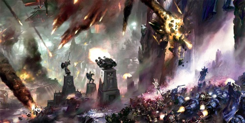
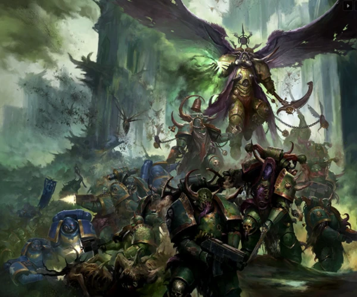
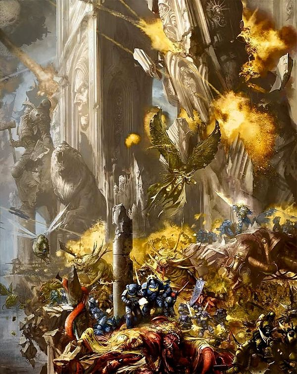
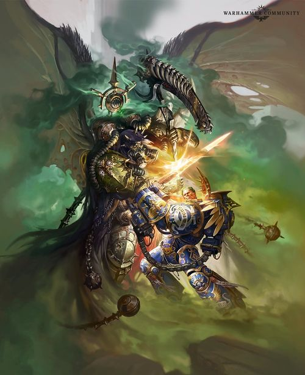

# 0838 -012.M42 瘟疫战争 Plague Wars

精校状态：中文行文已逐段精校，部分术语仍为暂定

分类：时间线

原文来源：https://www.bilibili.com/opus/1074828257464942597

原作者：帝国神选罐头

原文时间：编辑于 2025年11月06日 09:27

[返回分类目录](目录.md) · [全书目录](../../目录.md)

<!-- A0838-B0001 -->
**英文原文**

"‘Let them flee beneath cover of their virus bomb. By the Emperor, they shall be repaid tenfold for the evils they have wrought upon Ultramar.’"

<!-- /A0838-B0001 -->

<!-- A0838-B0002 -->

原译文

“让他们躲在病毒炸弹的掩护下逃跑。帝皇会让他们对奥特拉玛造成的邪恶付出十倍的代价。”

**校订译文**

“让他们借着病毒炸弹的掩护逃吧。我以帝皇之名起誓，他们给奥特拉玛带来的罪恶，必将十倍奉还。”

<!-- /A0838-B0002 -->

<!-- A0838-B0003 -->
**英文原文**

Roboute Guilliman, at the end of the Plague Wars.

<!-- /A0838-B0003 -->

<!-- A0838-B0004 -->

原译文

罗伯特·基里曼，瘟疫战争结束时。

**校订译文**

——罗保特·基里曼，瘟疫战争结束时。

<!-- /A0838-B0004 -->

<!-- A0838-B0005 -->
**英文原文**

The Plague Wars were a series of battles that occurred within the Realm of Ultramar between the forces of the Chaos God Nurgle and the Imperium at the end of the first phase of the Indomitus Crusade.

<!-- /A0838-B0005 -->

<!-- A0838-B0006 -->

原译文

瘟疫战争是在不屈远征第一阶段结束时，混沌之神纳垢和帝国之间在奥特拉玛领域发生的一系列战斗。

**校订译文**

瘟疫战争是不屈远征第一阶段末期，混沌神纳垢的军队与帝国军队在奥特拉玛境内进行的一系列战斗。

<!-- /A0838-B0006 -->

<!-- A0838-B0007 图片 -->

<!-- A0838-B0008 -->

原译文

Battlefield Ultramar 奥特拉玛战场

**校订译文**

Battlefield Ultramar 奥特拉玛战场

<!-- /A0838-B0008 -->

<!-- A0838-B0009 -->
**英文原文**

Conflict:Black Crusades

<!-- /A0838-B0009 -->

<!-- A0838-B0010 -->

原译文

冲突：黑色远征

**校订译文**

冲突：黑色远征

<!-- /A0838-B0010 -->

<!-- A0838-B0011 -->
**英文原文**

Date:~012.M42

<!-- /A0838-B0011 -->

<!-- A0838-B0012 -->

原译文

日期：~012.M42

**校订译文**

日期：~012.M42

<!-- /A0838-B0012 -->

<!-- A0838-B0013 -->
**英文原文**

Location:Ultramar

<!-- /A0838-B0013 -->

<!-- A0838-B0014 -->

原译文

位置：奥特拉玛

**校订译文**

位置：奥特拉玛

<!-- /A0838-B0014 -->

<!-- A0838-B0015 -->
**英文原文**

Outcome:Overall Imperial Victory,Nurgle thwarted,Death Guard retreat,War for the Scourge Stars begins

<!-- /A0838-B0015 -->

<!-- A0838-B0016 -->

原译文

结果：帝国总体胜利，纳垢受挫，死亡卫队撤退，天灾群星战争开始

**校订译文**

结果：帝国总体胜利，纳垢受挫，死亡卫队撤退，天灾群星战争开始

<!-- /A0838-B0016 -->

<!-- A0838-B0017 -->
**英文原文**

Combatants:Imperium/Nurgle

<!-- /A0838-B0017 -->

<!-- A0838-B0018 -->

原译文

战斗人员：帝国/纳垢

**校订译文**

交战双方：帝国／纳垢势力

<!-- /A0838-B0018 -->

<!-- A0838-B0019 -->
**英文原文**

Commanders:Primarch Roboute Guilliman,Lord Marneus Calgar,Tetrarch Decimus Felix,Tribune Actuarius Maldovar Colquan,Fleetmaster Isaish Khestrin,Chapter Master Eorloid,Chapter Master Bardan Dovaro (KIA),Lieutenant Edermo,Brother-Captain Ionan Grud,Militant-Apostolic Mathieu (KIA),Colonel Odrameyer (KIA)/Daemon Primarch Mortarion (banished),Typhus the Traveller (AWOL),Ku'Gath the Plaguefather (banished),Epidemius,Septicus Seven (KIA),Qaramar (KIA)

<!-- /A0838-B0019 -->

<!-- A0838-B0020 -->

原译文

指挥官：原体罗伯特·基里曼，领主马涅乌斯·卡尔加，英杰德西穆斯·菲利克斯，保民官马尔多瓦·柯肯，舰队之主以赛亚·赫斯特林，战团长厄洛莱德，战团长巴丹·杜瓦若（KIA），副官埃德莫，兄弟连长伊奥南·格鲁德，战争使徒马蒂厄（KIA），上校奥德拉梅耶（KIA）/恶魔原体莫塔里安（被放逐），旅者泰丰斯（擅离职守），库噶斯·瘟父（被放逐），埃皮德米乌斯，塞普提克斯·赛文（KIA），卡兰玛尔（KIA）

**校订译文**

指挥官：原体罗保特·基里曼，马涅乌斯·卡尔加领主，四方领主德西穆斯·菲利克斯，代理护民官马尔多瓦·科尔泉，舰队司令以赛亚·赫斯特林，战团长厄洛莱德，战团长巴丹·多瓦罗（阵亡），副官埃德莫，兄弟会连长伊奥南·格鲁德，战争使徒马蒂厄（阵亡），奥德拉梅耶上校（阵亡）／恶魔原体莫塔里安（遭放逐），旅者提丰（擅离职守），瘟父库噶斯（遭放逐），传疫魔，塞普提克斯·赛文（被杀），卡兰玛尔（被杀）

**校注：** Tribune Actuarius 沿第 836 篇“代理护民官”；Epidemius、Typhus 采用已核官译传疫魔、提丰。

<!-- /A0838-B0020 -->

<!-- A0838-B0021 -->
**英文原文**

Casualties:Heavy/Heavy

<!-- /A0838-B0021 -->

<!-- A0838-B0022 -->

原译文

伤亡：重/重

**校订译文**

伤亡：惨重／惨重

<!-- /A0838-B0022 -->

<!-- A0838-B0023 -->
## Overview 概述

<!-- /A0838-B0023 -->

<!-- A0838-B0024 -->
### Beginnings 起源

<!-- /A0838-B0024 -->

<!-- A0838-B0025 -->
**英文原文**

The seeds of the conflict were planted by Nurgle sometime before the latest Black Crusade began, when he decided he wanted to annex the prosperous worlds of Ultramar into his Garden. In order to do this he commanded his forces to create Cults of Corruption and began spreading various diseases throughout three nearby Imperial systems, located to the galactic north of Ultramar. These systems are now known as the Scourge Stars. Controlled by the forces of Nurgle, they were used to launch fresh attacks against the Realm of Ultramar, in order to add its worlds to the Plague Father's Garden. These diseases devastated many worlds, but it was only with the creation of the Great Rift, during the Thirteenth Black Crusade, that Nurgle decided to fully act on his plans.

<!-- /A0838-B0025 -->

<!-- A0838-B0026 -->

原译文

冲突的种子是由纳垢在最近一次黑色远征开始前的某个时候播下的，当时他决定将奥特拉玛的繁荣世界并入他的花园。为了做到这一点，他命令他的部队创建腐败邪教，并开始在位于银河系以北的奥特拉玛的三个附近的帝国星系传播各种疾病。这些星系现在被称为天灾群星。在纳垢部队的控制下，他们被用来对奥特拉玛领域发动新的攻击，以便将其世界添加到瘟疫之父的花园中。这些疾病摧毁了许多世界，但直到第十三次黑色远征期间大裂隙的形成，纳垢才决定全面实施他的计划。

**校订译文**

这场冲突的种子，在最近一次黑色远征开始前就已由纳垢埋下：他决意将奥特拉玛的繁荣世界并入自己的花园。为此，他命令麾下势力建立腐化教派，在奥特拉玛银河北侧附近的三个帝国星系中传播各种疾病。这些星系后来被称为天灾群星。纳垢的军队控制了它们，并以此为基地，不断进攻奥特拉玛，企图将那里的世界纳入瘟父花园。疾病摧残了许多世界，但直到第十三次黑色远征期间大裂隙形成，纳垢才决定全面实施计划。

<!-- /A0838-B0026 -->

<!-- A0838-B0027 -->
**英文原文**

Most prominent of these servants of Nurgle were the Death Guard, which launched a massive invasion of Ultramar led personally by Mortarion who gathered an enormous invasion fleet around him. In attacking Ultramar, Mortarion was not alone, however; two other commanders led massive armies out from the Scourge Stars, each seeking to win the contaminated glory of Nurgle's favour. Typhus, First Captain of the Death Guard, commanded the Plague Fleet, a dilapidated rot-armada packed with Renegades, cultists and his own loyal Death Guard. A third major force, this time a host of Daemons, was led by the Great Unclean One Ku'gath.. The Plaguefather and his demonic legions ravaged the Tartella System, which lay between the Scourge Stars and Ultramar, before manifesting on the garden world of Iax, an ideal place to nurture new diseases.

<!-- /A0838-B0027 -->

<!-- A0838-B0028 -->

原译文

纳垢的这些仆人中最突出的是死亡守卫，他们发动了由莫塔里安亲自领导的对奥特拉玛的大规模入侵，莫塔里安在他周围聚集了一支庞大的入侵舰队。然而，在攻击奥特拉玛时，莫塔里安并不孤单；另外两名指挥官率领庞大的军队从天灾群星出发，每个人都试图赢得纳垢的青睐和污染的荣耀。泰丰斯是死亡守卫的第一连长，他指挥着瘟疫舰队，这是一支破败的舰队，里面挤满了叛徒、信徒和他自己忠诚的死亡守卫。第三支主要力量，这次是一大群恶魔，由伟大的大不净者库噶斯领导。瘟父和他的恶魔军团摧毁了位于天灾群星和奥特拉玛之间的塔尔泰拉星系，然后出现在艾克斯的花园世界，这是滋生新疾病的理想场所。

**校订译文**

这些纳垢仆从中最显眼的是死亡守卫。莫塔里安集结了一支庞大的入侵舰队，亲自率军大举进攻奥特拉玛。但他并非独自行动：另有两名统帅也从天灾群星率领大军出征，竞相争夺纳垢恩宠所带来的污秽荣耀。死亡守卫第一连长提丰指挥着瘟疫舰队，这是一支破败腐朽的舰队，载满叛逆者、教徒和效忠于他的死亡守卫。第三支主力则是大不净者库噶斯率领的恶魔大军。瘟父及其恶魔军团蹂躏了天灾群星与奥特拉玛之间的塔尔泰拉星系，随后降临花园世界艾克斯——那里是培育新疾病的理想场所。

<!-- /A0838-B0028 -->

<!-- A0838-B0029 图片 -->

<!-- A0838-B0030 -->

原译文

Mortarion leads the Death Guard invasion 莫塔里安领导死亡守卫入侵

**校订译文**

Mortarion leads the Death Guard invasion 莫塔里安领导死亡守卫入侵

<!-- /A0838-B0030 -->

<!-- A0838-B0031 -->
**英文原文**

The invasion force was too large for the defenders to engage directly but still too small to attack Macragge itself. Nonetheless, Mortarion launched many probing attacks on Macragge, often with Plague Drones and Cultists, in order to drain Ultramar's resources and morale. Meanwhile, Mortarion moved on smaller more poorly defended worlds, slaughtering the populace in an attempt to goad Guilliman to battle. As Espandor, and Ardium fell under siege, Mortarion had a secondary fleet under Typhus terrorize the outer regions of Ultramar, destroying three of the six major Star Forts overseeing Ultramar's shipping lanes. On Iax, a group of refugee Imperial Guard carried Nurgle's taint with them, transforming into Plaguebearers and allowing a cohort of Great Unclean Ones to manifest.

<!-- /A0838-B0031 -->

<!-- A0838-B0032 -->

原译文

入侵部队太大，守军无法直接交战，但仍然太小，无法攻击马库拉格本身。尽管如此，莫塔里安还是对马库拉格发动了许多试探攻击，通常是瘟疫蜂群和邪教徒，以耗尽奥特拉玛的资源和士气。与此同时，莫塔里安转向了防御较差的较小世界，屠杀民众，试图怂恿基里曼作战。随着埃斯潘多和阿尔迪姆被围困，莫塔里安有一支二级舰队在泰丰斯的指挥下，对奥特拉玛的外围地区进行恐吓，摧毁了监督奥特拉玛航线的六个主要星堡中的三个。在拉克丝，一群帝国卫队流亡者带着纳垢的污染，变成了瘟疫携带者，并允许一群大不净者显现。

**校订译文**

这支入侵部队强大到守军无法正面对抗，却仍不足以直接攻下马库拉格。尽管如此，莫塔里安还是频繁派出瘟疫蜂兵和邪教徒等部队，试探性地攻击马库拉格，消耗奥特拉玛的资源和士气。同时，他转而进攻较小、守备薄弱的世界，屠杀当地居民，试图以此逼基里曼出战。埃斯潘多和阿尔迪姆遭到围攻之际，莫塔里安又派提丰率领另一支舰队袭扰奥特拉玛外围，摧毁了守护当地航线的六座主要星堡中的三座。在艾克斯，一群前来避难的帝国卫队士兵带来了纳垢的污染；他们变成瘟疫使，使一群大不净者得以显现。

<!-- /A0838-B0032 -->

<!-- A0838-B0033 -->
**英文原文**

The Imperium would go to the Realm of Ultramar's aid and the fierce battles that followed were called the Plague Wars, by the Empire of Mankind.

<!-- /A0838-B0033 -->

<!-- A0838-B0034 -->

原译文

帝国将前往奥特拉玛领域提供援助，随后的激烈战斗被人类帝国称为瘟疫战争。

**校订译文**

帝国出兵援救奥特拉玛，随后爆发的激战被人类帝国称为“瘟疫战争”。

<!-- /A0838-B0034 -->

<!-- A0838-B0035 -->
### Return of Guilliman 基里曼回归

<!-- /A0838-B0035 -->

<!-- A0838-B0036 -->
**英文原文**

Guilliman, having just concluded the Indomitus Crusade, eventually arrived with reinforcements to save the beleaguered Ultramar. First, he cleansed the Hive World of Ardium in the Macragge System of its Death Guard occupiers. It was here that he learned Mortarion was using the ancient artefact known as the Hand of Darkness to craft Plague Engines that were re-animating the dead and turning them into Plague Zombies. Guilliman destroyed the Plague Engine on Ardium and freed the world from the influence of Nurgle.

<!-- /A0838-B0036 -->

<!-- A0838-B0037 -->

原译文

基里曼刚刚结束不屈远征，最终带着援军抵达，拯救了陷入困境的奥特拉玛。首先，他清除了马库拉格星系中阿尔迪姆巢都世界的死亡守卫占领者。正是在这里，他了解到莫塔里安正在使用被称为“黑暗之手”的古代造物来制作瘟疫引擎，这些引擎正在为复活死者，并将他们变成瘟疫僵尸。基里曼摧毁了阿尔迪姆的瘟疫引擎，使世界摆脱了纳垢的影响。

**校订译文**

刚刚结束不屈远征的基里曼最终率援军抵达，前来解救危机中的奥特拉玛。他首先清除了占据马库拉格星系巢都世界阿尔迪姆的死亡守卫。在这里，他得知莫塔里安正在用名为“黑暗之手”的古代遗物制造瘟疫引擎，使死者复活为瘟疫僵尸。基里曼摧毁了阿尔迪姆上的瘟疫引擎，使这颗星球摆脱了纳垢的影响。

**校注：** 此段原文称不屈远征已经结束，与本篇开头“第一阶段结束”及末尾年表修订说明不完全一致；按所给段落保留旧叙述，并在此标出版本差异。

<!-- /A0838-B0037 -->

<!-- A0838-B0038 -->
### Invasion of Konor 康诺入侵战

原题：Invasion of Konor 康诺入侵

<!-- /A0838-B0038 -->

<!-- A0838-B0039 -->
**英文原文**

Mortarion learned of Guilliman's arrival and, intent on preventing the loyalist Primarch and his reinforcements from turning the tide of his campaign, attempted to trap Guilliman and his forces on Macragge. To this end, he launched the Invasion of Konor, hoping to use the system as a stepping stone for a full-scale assault on the Ultramarines' homeworld. Ultimately this ploy would fail as the Imperial defence and subsequent counterattack in the system prevented him from achieving his objective. Though the Death Guard and their allies managed to despoil the Konor system's Astropathic Relay station and Aeronautica Imperialis training world, all three of the core planets remained firmly in loyalist hands. Perhaps most importantly, the heavily corrupted Death World of Loebos, Mortarion's ultimate means of taking the system, was destroyed in a near-suicidal Imperial landing operation.

<!-- /A0838-B0039 -->

<!-- A0838-B0040 -->

原译文

莫塔里安得知基里曼的到来，并打算阻止忠诚的原体和他的增援部队扭转他的战役，试图将基里曼和他的部队困在马库拉格。为此，他发动了康诺入侵，希望利用该星系作为对极限战士家园世界进行全面攻击的垫脚石。最终，这一策略失败，因为帝国的防御和随后在星系中的反击阻止了他实现目标。尽管死亡守卫和他们的盟友设法摧毁了康诺星系的星语中继站和帝国海航训练世界，但所有三颗核心行星都牢牢掌握在忠诚者手中。也许最重要的是，严重腐化的勒博斯死亡世界，莫塔里安夺取星系的最终手段，在一次近乎自杀的帝国登陆行动中被摧毁。

**校订译文**

莫塔里安得知基里曼抵达后，试图将这位忠诚派原体及其援军困在马库拉格，阻止他们扭转战局。为此，他发动了康诺入侵战，希望以这个星系为跳板，全面进攻极限战士的母星。最终，帝国在康诺星系的防御和随后的反击挫败了这一计划。死亡守卫及其盟军虽蹂躏了当地的星语中继站和帝国航空兵训练世界，但三颗核心行星始终掌握在忠诚派手中。最关键的或许是，莫塔里安打算用来夺取整个星系的最后手段——遭到严重腐化的死亡世界洛博斯——被帝国在一次近乎自杀的登陆行动中摧毁。

<!-- /A0838-B0040 -->

<!-- A0838-B0041 -->
### Imperial Counterattack 帝国反击

<!-- /A0838-B0041 -->

<!-- A0838-B0042 -->
**英文原文**

Even with Guilliman's arrival, the attacks across Ultramar were still too many to contain. However, timely arrival of Ultramarines Successor Chapters and reinforcements from Forge Worlds allowed Guilliman to take the initiative. On Espandor, Guilliman launched the Spear of Espandor counterattack that halted the Chaos advance and resulted in stalemate. The focus of this campaign was also to cut off the Death Guard from the Scourge Stars that were supplying Mortarion with an endless stream of reinforcements. The Ultramarines and their allies not only retook each of the lost worlds in the Espandor system but also destroyed the Plague Engines that were raising the endless tide of Plague Zombies on each of its worlds. After a ferocious battle in which the Ultramarines Chapter found itself fighting side-by-side with their Primaris Astartes brethren for the first time, the forces of Nurgle were routed from Espandor. Guilliman decisively ended the battle by slaying the Great Unclean One Qaramar with the Emperor's Sword and destroying the last Plague Engine in the system. The Espandor System had been cleansed of the taint of the Plague God and the forces of Nurgle were now cut off from their base in the Scourge Stars. With Espandor contained, Guilliman launched a series of system-wide counterattacks.

<!-- /A0838-B0042 -->

<!-- A0838-B0043 -->

原译文

即使基里曼到达，奥特拉玛各地的袭击仍然太多，无法控制。然而，极限战士子战团和铸造世界增援部队的及时抵达使基里曼得以采取主动。在埃斯潘多，基里曼发动了埃斯潘多之矛反击，阻止了混沌的推进，导致僵局。这场战役的重点也是切断死亡守卫与天灾群星的联系，因为天灾群星正在源源不断地向莫塔里安提供增援。极限战士和他们的盟友不仅夺回了埃斯潘多星系中每个失落的世界，还摧毁了在每个世界上引发无尽瘟疫僵尸浪潮的瘟疫引擎。在一场激烈的战斗中，极限战士战团第一次与他们的原铸阿斯塔特兄弟并肩作战，纳垢的部队从埃斯潘多被击溃。基里曼果断地结束了这场战斗，用帝皇之剑杀死了大不净者卡兰马尔，摧毁了星系中最后一个瘟疫引擎。埃斯潘多星系已经清除了瘟疫之神的污染，纳垢的部队现在与他们在天灾群星的基地被切断了联系。在埃斯潘多被遏制后，基里曼发动了一系列全星系的反击。

**校订译文**

即使基里曼已经抵达，奥特拉玛遭袭的地点仍多得难以兼顾。不过，极限战士子战团及铸造世界援军的及时到来，让他得以夺回主动权。基里曼在埃斯潘多发动“埃斯潘多之矛”反击，阻止了混沌的推进，使战局陷入僵持。这场行动的另一个重点，是切断死亡守卫与天灾群星的联系；莫塔里安的援军正从那里源源不断地涌来。极限战士及盟军不但夺回埃斯潘多星系的所有失陷世界，还摧毁了各地不断复活瘟疫僵尸的瘟疫引擎。在激烈交战中，极限战士战团首次与原铸阿斯塔特兄弟并肩作战，最终将纳垢军队逐出埃斯潘多。基里曼用帝皇之剑斩杀大不净者卡兰玛尔，摧毁星系内最后一台瘟疫引擎，为战斗画上句号。埃斯潘多星系清除了瘟疫之神的污染，纳垢军队也与天灾群星的基地断了联系。稳住埃斯潘多局势后，基里曼又展开了一系列遍及星系的反击。

<!-- /A0838-B0043 -->

<!-- A0838-B0044 -->
**英文原文**

With Mortarion's main attack on Espandor halted, the Daemon Primarch shifted his focus and joined with Ku'gath. Their supply lines to the Scourge Stars cut, their Plague Engines disappearing (which was slowly eliminating the constant tide of undead reinforcements), and more Imperial reinforcements incoming, the leaders of the invasion force would decide to throw the bulk of their forces against the world of Parmenio. On Parmenio, the largest armored and Titan battle of the war took place over the Plains of Hecatone. At the battle's height, Guilliman struck Ku'gath's vanguard and slew his Lieutenant, Septicus. In space, the Star Fort Galatan attempted to provide support, but was boarded by the Plague Fleet and massive casualties ensued, including the loss of the Novamarines Chapter Master Bardan Dovaro. Nonetheless, the Ultramarines and their allies made gains on Parmenio and Guilliman led a relief force to Iax.

<!-- /A0838-B0044 -->

<!-- A0838-B0045 -->

原译文

随着莫塔里安对埃斯潘多的主要攻击停止，恶魔原体转移了注意力，加入了库噶斯。他们与天灾群星的补给线被切断，瘟疫引擎被摧毁（这正在慢慢消除不断涌入的亡灵援军），更多的帝国援军到来，入侵部队的领导人将决定将大部分部队投入帕尔梅尼奥世界。在帕尔梅尼奥，战争中最大的装甲和泰坦之战发生在赫卡顿平原。在战斗最激烈的时候，基里曼袭击了库噶斯的先锋队，杀死了他的副官塞普提克斯。在太空中，加拉坦星堡试图提供支援，但被瘟疫舰队登上，随后造成了巨大的伤亡，包括新星战士战团长巴丹·杜瓦若的牺牲。尽管如此，极限战士及其盟友在帕尔梅尼奥取得了进展，基里曼率领救援部队前往艾克斯。

**校订译文**

对埃斯潘多的主攻受阻后，莫塔里安转移目标，与库噶斯会合。通往天灾群星的补给线已经被切断，瘟疫引擎不断遭到摧毁，源源不绝的亡灵援军因此逐渐减少，而帝国援军仍在陆续抵达。入侵军的统帅们决定将主力投入帕尔梅尼奥。在那里的赫卡顿平原上，爆发了整场战争中规模最大的装甲与泰坦会战。战斗最激烈时，基里曼突击库噶斯的先锋，杀死其副将塞普提克斯。太空中的加拉坦星堡试图提供支援，却被瘟疫舰队登舰强攻，造成重大伤亡，新星战士战团长巴丹·多瓦罗也因此阵亡。尽管如此，极限战士及其盟军仍在帕尔梅尼奥取得进展，基里曼则率领一支救援部队前往艾克斯。

**校注：** 本段称基里曼由帕尔梅尼奥前往艾克斯，下段又叙述他在帕尔梅尼奥中伏；源文叙事顺序存在跳接，未擅自移动段落或补造往返过程。

<!-- /A0838-B0045 -->

<!-- A0838-B0046 -->
**英文原文**

Seeking to foil Guilliman, the Primarch was drawn to Parmenio where a trap was sprung by Mortarion, Typhus, and Ku'Gath. Faced with the combined might of Mortarion and Ku'Gath, Guilliman was nearly slain but was saved by what appeared to be a Living Saint in the form of a young girl. The girl burned with the power of the Emperor and drove the forces of Nurgle back.

<!-- /A0838-B0046 -->

<!-- A0838-B0047 -->

原译文

为了挫败基里曼，原体被吸引到帕尔梅尼奥，在那里，莫塔里安、泰丰斯和库噶斯设下了陷阱。面对莫塔里安和库噶斯的联合部队，基里曼差点被杀，但被一个年轻活圣人女孩救了出来。这个女孩被帝皇的力量烧死了，把纳垢的军队赶了回去。

**校订译文**

为挫败基里曼，莫塔里安、提丰和库噶斯设下圈套，将他诱至帕尔梅尼奥。面对莫塔里安与库噶斯的合力进攻，基里曼险些丧命，却被一名似乎是活圣人的年轻女孩救下。女孩周身燃烧着帝皇的力量，将纳垢军队逼退。

**校注：** burned with the power 表示帝皇力量在女孩身上燃烧，并未在这句话中说她“被烧死”。保留 appeared to be 对其活圣人身份的限定。

<!-- /A0838-B0047 -->

<!-- A0838-B0048 -->
### Iax 艾克斯

<!-- /A0838-B0048 -->

<!-- A0838-B0049 -->
**英文原文**

The final battle of the Plague Wars would come on Iax, where Mortarion and Ku'gath conspired to lure Guilliman into a deadly trap to kill him with a disease known as the Godblight. However their forces experienced a significant setback due to the outbreak of the War in the Rift, and Nurgle recalled many of his Daemons while Typhus moved to defend the Scourge Stars with a large compliment of the Death Guard. Despite this, Mortarion and Ku'gath violated Nurgle's orders and insisted on going through the plans to kill Guilliman and turn Ultramar into an expansion of the Garden of Nurgle.

<!-- /A0838-B0049 -->

<!-- A0838-B0050 -->

原译文

瘟疫战争的最后一场战斗将在艾克斯爆发，莫塔里安和库噶斯密谋将基里曼引诱到一个致命的陷阱中，用一种名为神瘟的疾病杀死他。然而，由于大裂隙战争的爆发，他们的部队经历了重大挫折，纳垢召回了他的许多恶魔，而泰丰斯在死亡守卫的大力赞扬下保卫了天灾群星。尽管如此，莫塔里安和库噶斯违反了纳垢的命令，坚持执行杀死基里曼并将奥特拉玛变成纳垢花园的扩张计划。

**校订译文**

瘟疫战争的最后一战发生在艾克斯。莫塔里安与库噶斯密谋将基里曼诱入死局，用名为“神瘟”的疾病杀死他。然而，裂隙战争的爆发使他们遭遇重大挫折：纳垢召回了许多恶魔，提丰也带着大批死亡守卫前去保卫天灾群星。尽管如此，莫塔里安与库噶斯仍违抗纳垢的命令，坚持执行计划，企图杀死基里曼，将奥特拉玛变成纳垢花园的延伸。

**校注：** 原文 compliment 疑为 complement，此处指提丰带走大批死亡守卫，绝非得到死亡守卫的“大力赞扬”。

<!-- /A0838-B0050 -->

<!-- A0838-B0051 -->
**英文原文**

Guilliman knew he was walking into a possible trap, but knew that Mortarion must be confronted in order to save Iax. To that end Indomitus Crusade Fleet Primus launched an invasion of the world, battling first Nurgle daemons and then the Death Guard remaining with Mortarion. As Guilliman and Mortarion met each other in a fateful duel, Space Marine and Cadian forces sought to destroy Ku'Gaths fragment of the Cauldron of Nurgle powering the forces of Chaos in the Sector. In a desperate struggle, 7 Space Marines led by Edermo, Justinian Parris, and Colonel Odrameyer were able to bring down Ku'Gath thanks to the support of Militant-Apostolic Mathieu, who became a Living Saint channeling the power of the Emperor. Odrameyer gave his life to kill Ku'Gath while Mathieu was able to destroy the Cauldron. Meanwhile, Mortarion was able to best Guilliman in their struggle thanks to his Warp-enhanced strength and resilience. After pinning Guilliman to the ground, he administered the Godblight to the Primarch and the last loyalist Primarch seemed to die.

<!-- /A0838-B0051 -->

<!-- A0838-B0052 -->

原译文

基里曼知道他正走进一个可能的陷阱，但他知道为了救援艾克斯，必须面对莫塔里安。为此，不屈远征主舰队发动了对世界的入侵，首先与纳垢恶魔作战，然后与莫塔里安的死亡守卫作战。当基里曼和莫塔里安在一场决定性的决斗中相遇时，星际战士和卡迪安部队试图摧毁纳垢大锅的库噶斯碎片，它为该地区的混沌势力提供力量。在一场绝望的斗争中，由埃德莫、查士丁尼·帕里斯和奥德拉梅耶上校领导的7名星际战士在战争使徒马蒂厄的支援下，成功击败了库噶斯，马蒂厄成为了引导帝皇力量的活圣人。奥德拉梅耶为了杀死库噶斯献出了自己的生命，而马蒂厄则摧毁了大锅。与此同时，莫塔里安能在他们的战斗中击败基里曼，这要归功于他的增强的亚空间力量和韧性。在把基里曼钉在地上之后，他给原体施了神瘟，最后一位忠诚的原体似乎死了。

**校订译文**

基里曼知道前方可能是陷阱，却也明白，要救下艾克斯就必须面对莫塔里安。不屈远征第一舰队于是向这颗星球发起进攻，先后与纳垢恶魔以及留在莫塔里安身边的死亡守卫交战。当两位原体展开宿命般的决斗时，星际战士与卡迪安部队则试图摧毁库噶斯持有的纳垢巨釜碎片——它正为这一星区的混沌军队提供力量。在殊死搏斗中，埃德莫、查士丁尼·帕里斯和奥德拉梅耶上校带领的七名星际战士，在战争使徒马蒂厄的支援下击败了库噶斯。马蒂厄已化身活圣人，引导着帝皇的力量。奥德拉梅耶以自己的生命换来了库噶斯的败亡，马蒂厄则摧毁了巨釜。另一边，莫塔里安凭借亚空间强化的力量与耐力压倒基里曼，将他钉在地上，再施以神瘟。这位最后的忠诚派原体似乎就此死去。

**校注：** 原文将埃德莫、查士丁尼·帕里斯和奥德拉梅耶上校并列于带领七名星际战士的结构中；保留原文关系，不将上校改成星际战士。“最后的忠诚派原体”是本段所属叙事时期的表述，不据后续剧情改写。

<!-- /A0838-B0052 -->

<!-- A0838-B0053 图片 -->

<!-- A0838-B0054 -->

原译文

Guilliman faces Mortarion on Iax 基里曼在艾克斯上面对莫塔里安

**校订译文**

Guilliman faces Mortarion on Iax 基里曼在艾克斯上面对莫塔里安

<!-- /A0838-B0054 -->

<!-- A0838-B0055 -->
**英文原文**

Between life and death, Guilliman experienced a surreal vision of his meeting with the Emperor shortly after the Terran Crusade. Suddenly infused with holy energies, he resurrected and was able to channel the Emperor directly in order to strike a grievous blow to the Garden of Nurgle itself. Defeated, Mortarion fled with the remainder of his forces. Adeptus Custodes Tribune Colquan was able to evacuate Guilliman, Mathieu, and many other Imperial warriors from Iax before Fleet Primus enacted Exterminatus until the blighted world. With the Chaos plot on Iax foiled, the Plague Wars effectively ended.

<!-- /A0838-B0055 -->

<!-- A0838-B0056 -->

原译文

在生与死之间，基里曼在泰拉远征后不久就经历了与帝皇会面的超现实主义景象。突然间，他被注入了神圣的能量，复活了，并能够直接引导帝皇，对纳垢花园本身造成严重打击。失败后，莫塔里安带着其余的部队逃跑了。禁军保民官柯肯能够在主舰队发射灭绝令之前从艾克斯撤离基里曼、马蒂厄和许多其他帝国战士，直到世界毁灭。随着艾克斯上的混沌阴谋被挫败，瘟疫战争实际上结束了。

**校订译文**

在生死之间，基里曼经历了一场超现实的幻象，重现了泰拉远征结束后不久他与帝皇会面的情景。神圣能量骤然涌入他的身体，使他复活；帝皇的力量得以直接通过他施展，重创了纳垢花园本身。莫塔里安战败，率残部逃离。禁军护民官科尔泉在第一舰队对染疫的艾克斯执行灭绝令之前，将基里曼、马蒂厄和许多帝国战士撤出星球。艾克斯上的混沌阴谋遭到挫败，瘟疫战争也就此基本结束。

**校注：** until the blighted world 语法有误，按上下文应为对染疫世界执行灭绝令；并非“撤离直到世界毁灭”。前半句所述为当下幻象重现旧时会面，原译把幻象发生时间错移到泰拉远征后。

<!-- /A0838-B0056 -->

<!-- A0838-B0057 图片 -->

<!-- A0838-B0058 -->

原译文

Mortarion and Roboute Guilliman battle 莫塔里安与基里曼战斗

**校订译文**

Mortarion and Roboute Guilliman battle 莫塔里安与基里曼战斗

<!-- /A0838-B0058 -->

<!-- A0838-B0059 -->
### Aftermath 余波

<!-- /A0838-B0059 -->

<!-- A0838-B0060 -->
**英文原文**

In a brief respite, Guilliman oversaw the rebuilding and decontamination of Ultramar, as well as the establishment of new procedures for creating further Primaris Space Marines within the Ultramarines. It was not long before new crusades called the Lord Commander of the Imperium away from Ultramar and back out into the galaxy.

<!-- /A0838-B0060 -->

<!-- A0838-B0061 -->

原译文

在短暂的喘息中，基里曼监督了奥特拉玛的重建和净化工作，并制定了在极限战士内创建更多原铸星际战士的新程序。不久之后，新的远征将帝国的领主指挥官从奥特拉玛召回银河系。

**校订译文**

趁着短暂的喘息，基里曼监督奥特拉玛的重建与污染清除工作，并建立新的流程，使极限战士能够继续培育更多原铸星际战士。不久，新的远征又将这位帝国领主指挥官从奥特拉玛召走，让他重新奔赴银河各处。

<!-- /A0838-B0061 -->

<!-- A0838-B0062 -->
**英文原文**

The Ultramarines would then launch the Vengeance Campaigns where they led a coalition of their Successor Chapters and Knight Houses across neighboring star systems of Ultramar, that had been overrun by the forces of Nurgle early on during the Plague Wars. This included the attempts by Marneus Calgar to liberate the worlds of the Tartella System.

<!-- /A0838-B0062 -->

<!-- A0838-B0063 -->

原译文

极限战士随后发起复仇运动，在那里他们领导了一个由其子战团和骑士家族组成的联盟，横跨奥特拉玛的邻近星系，星系在瘟疫战争早期被纳垢部队占领。这包括马涅乌斯·卡尔加试图解放的塔尔泰拉星系的世界。

**校订译文**

此后，极限战士发动了复仇战役，率领子战团与骑士家族组成的联军，征讨奥特拉玛邻近的星系。这些星系在瘟疫战争初期便已被纳垢军队占领；其中也包括马涅乌斯·卡尔加为解放塔尔泰拉星系各世界而进行的行动。

<!-- /A0838-B0063 -->

<!-- A0838-B0064 -->
**英文原文**

For the Forces of Nurgle, the war represented a significant setback. The War in the Rift saw Nurgle's domain assailed by rival Gods, while the Plaguefather's Garden was struck a grievous blow that revorborate throughout the warp. Moreover, Mortarion and Ku'Gath lost Nurgle's favor due to their insubordation in refusing to withdraw to the Scourge Stars when ordered.

<!-- /A0838-B0064 -->

<!-- A0838-B0065 -->

原译文

对于纳垢部队来说，这场战争是一次重大挫折。在大裂隙战争中，纳垢的领地遭到了敌对诸神的攻击，而瘟疫之父的花园则受到了严重的打击，整个亚空间都发生了回响。此外，莫塔里安和库噶斯失去了纳垢的青睐，因为他们拒绝在接到命令时撤退到天灾群星。

**校订译文**

对纳垢势力而言，这场战争是一次重大挫败。裂隙战争中，敌对诸神进攻了纳垢的领地；与此同时，瘟父花园遭到的重创在整个亚空间中激起回响。莫塔里安和库噶斯则因违抗撤回天灾群星的命令，失去了纳垢的恩宠。

<!-- /A0838-B0065 -->

<!-- A0838-B0066 -->
## Order of Battle 战斗序列

<!-- /A0838-B0066 -->

<!-- A0838-B0067 -->
### Imperial 帝国

<!-- /A0838-B0067 -->

<!-- A0838-B0068 -->
### On Espandor 埃斯潘多

<!-- /A0838-B0068 -->

<!-- A0838-B0069 -->
**英文原文**

Ultramarines - 7 Companies

<!-- /A0838-B0069 -->

<!-- A0838-B0070 -->

原译文

极限战士 - 七个连队

**校订译文**

极限战士 - 七个连队

<!-- /A0838-B0070 -->

<!-- A0838-B0071 -->
**英文原文**

Genesis Chapter - 6 Companies

<!-- /A0838-B0071 -->

<!-- A0838-B0072 -->

原译文

起源战团 - 六个连队

**校订译文**

起源战团 - 六个连队

<!-- /A0838-B0072 -->

<!-- A0838-B0073 -->
**英文原文**

Aurora Chapter - 5 Companies

<!-- /A0838-B0073 -->

<!-- A0838-B0074 -->

原译文

曙光女神 - 五个连队

**校订译文**

曙光女神 - 五个连队

<!-- /A0838-B0074 -->

<!-- A0838-B0075 -->
**英文原文**

Silver Eagles - 5 Companies

<!-- /A0838-B0075 -->

<!-- A0838-B0076 -->

原译文

银色天鹰 - 五个连队

**校订译文**

银色天鹰 - 五个连队

<!-- /A0838-B0076 -->

<!-- A0838-B0077 -->
**英文原文**

Sons of Orar - 3 Companies

<!-- /A0838-B0077 -->

<!-- A0838-B0078 -->

原译文

奥拉尔之子 - 三个连队

**校订译文**

奥拉尔之子 - 三个连队

<!-- /A0838-B0078 -->

<!-- A0838-B0079 -->
**英文原文**

Mortifactors - 3 Companies

<!-- /A0838-B0079 -->

<!-- A0838-B0080 -->

原译文

苦行者 - 三个连队

**校订译文**

苦行者 - 三个连队

<!-- /A0838-B0080 -->

<!-- A0838-B0081 -->
**英文原文**

Knights Cerulean - 3 Companies

<!-- /A0838-B0081 -->

<!-- A0838-B0082 -->

原译文

蔚蓝骑士 - 三个连队

**校订译文**

蔚蓝骑士 - 三个连队

<!-- /A0838-B0082 -->

<!-- A0838-B0083 -->
**英文原文**

Grey Knights - 7th Brotherhood

<!-- /A0838-B0083 -->

<!-- A0838-B0084 -->

原译文

灰骑士 - 第七兄弟会

**校订译文**

灰骑士 - 第七兄弟会

<!-- /A0838-B0084 -->

<!-- A0838-B0085 -->
**英文原文**

Miscellaneous Chapters - 14 Companies

<!-- /A0838-B0085 -->

<!-- A0838-B0086 -->

原译文

混杂的战团 - 14个连队

**校订译文**

其他战团合计——14 个连

<!-- /A0838-B0086 -->

<!-- A0838-B0087 -->

原译文

Imperial Guard 帝国卫队

**校订译文**

Imperial Guard 帝国卫队

<!-- /A0838-B0087 -->

<!-- A0838-B0088 -->
**英文原文**

Ultramar Auxilia - 9 Regiments

<!-- /A0838-B0088 -->

<!-- A0838-B0089 -->

原译文

奥特拉玛辅助军 - 九个兵团

**校订译文**

奥特拉玛辅助军——9 个团

<!-- /A0838-B0089 -->

<!-- A0838-B0090 -->

原译文

Sisters of Battle 战斗修女

**校订译文**

Sisters of Battle 战斗修女

<!-- /A0838-B0090 -->

<!-- A0838-B0091 -->
**英文原文**

Order of the Valorous Heart - 2 Preceptories

<!-- /A0838-B0091 -->

<!-- A0838-B0092 -->

原译文

英勇之心修会 - 两个分殿

**校订译文**

勇毅之心修会——2 个分殿

<!-- /A0838-B0092 -->

<!-- A0838-B0093 -->
**英文原文**

Sisters of Silence - Unknown

<!-- /A0838-B0093 -->

<!-- A0838-B0094 -->

原译文

寂静修女 - 未知

**校订译文**

寂静修女 - 未知

<!-- /A0838-B0094 -->

<!-- A0838-B0095 -->
### On Parmenio 帕尔梅尼奥

<!-- /A0838-B0095 -->

<!-- A0838-B0096 -->
### Space Marines 星际战士

<!-- /A0838-B0096 -->

<!-- A0838-B0097 -->
**英文原文**

Ultramarines - 3 Companies

<!-- /A0838-B0097 -->

<!-- A0838-B0098 -->

原译文

极限战士 - 三个连队

**校订译文**

极限战士 - 三个连队

<!-- /A0838-B0098 -->

<!-- A0838-B0099 -->
**英文原文**

Neophytes - Unknown

<!-- /A0838-B0099 -->

<!-- A0838-B0100 -->

原译文

新进者 - 未知

**校订译文**

新兵——数量不详

<!-- /A0838-B0100 -->

<!-- A0838-B0101 -->
**英文原文**

White Scars - 3 Companies

<!-- /A0838-B0101 -->

<!-- A0838-B0102 -->

原译文

白色伤疤 - 三个连队

**校订译文**

白疤——3 个连

<!-- /A0838-B0102 -->

<!-- A0838-B0103 -->

原译文

Imperial Guard 帝国卫队

**校订译文**

Imperial Guard 帝国卫队

<!-- /A0838-B0103 -->

<!-- A0838-B0104 -->
**英文原文**

Ultramar Auxilia - 21 Regiments

<!-- /A0838-B0104 -->

<!-- A0838-B0105 -->

原译文

奥特拉玛辅助军 - 21个兵团

**校订译文**

奥特拉玛辅助军——21 个团

<!-- /A0838-B0105 -->

<!-- A0838-B0106 -->
**英文原文**

Ultramar Super-heavy Armour - 3 Regiments

<!-- /A0838-B0106 -->

<!-- A0838-B0107 -->

原译文

奥特拉玛超重型装甲团 - 3个兵团

**校订译文**

奥特拉玛超重型装甲部队——3 个团

<!-- /A0838-B0107 -->

<!-- A0838-B0108 -->
**英文原文**

Miscellaneous Imperial Guard - 18 Regiments

<!-- /A0838-B0108 -->

<!-- A0838-B0109 -->

原译文

混杂的帝国卫队 - 18个军团

**校订译文**

其他帝国卫队部队——18 个团

<!-- /A0838-B0109 -->

<!-- A0838-B0110 -->

原译文

Adeptus Mechanicus 机械神教

**校订译文**

Adeptus Mechanicus 机械修会

<!-- /A0838-B0110 -->

<!-- A0838-B0111 -->
**英文原文**

Legio Oberon - Demi-Legion

<!-- /A0838-B0111 -->

<!-- A0838-B0112 -->

原译文

奥伯龙军团 - 半个军团

**校订译文**

仙王军团——半个军团

<!-- /A0838-B0112 -->

<!-- A0838-B0113 -->
**英文原文**

Legio Atarus - Demi-Legion

<!-- /A0838-B0113 -->

<!-- A0838-B0114 -->

原译文

炎纹军团 - 半个军团

**校订译文**

炎纹军团 - 半个军团

<!-- /A0838-B0114 -->

<!-- A0838-B0115 -->
**英文原文**

Legio Fortis - Demi-Legion

<!-- /A0838-B0115 -->

<!-- A0838-B0116 -->

原译文

勇壮军团 - 半个军团

**校订译文**

勇壮军团 - 半个军团

<!-- /A0838-B0116 -->

<!-- A0838-B0117 -->
**英文原文**

House Terryn - 3 Households

<!-- /A0838-B0117 -->

<!-- A0838-B0118 -->

原译文

泰林家族 - 三个家族

**校订译文**

泰林家族——3 支家族战斗群

**校注：** Household 此处是单一家族投入的战斗编组，暂译家族战斗群；不解释成三个独立骑士家族，也不凭数字推断机甲数量。

<!-- /A0838-B0118 -->

<!-- A0838-B0119 -->
**英文原文**

House Hawkshroud - 2 Households

<!-- /A0838-B0119 -->

<!-- A0838-B0120 -->

原译文

覆隼家族 - 两个家族

**校订译文**

覆隼家族——2 支家族战斗群

<!-- /A0838-B0120 -->

<!-- A0838-B0121 -->
**英文原文**

House Konor - 2 Households

<!-- /A0838-B0121 -->

<!-- A0838-B0122 -->

原译文

康诺家族 - 两个家族

**校订译文**

康诺家族——2 支家族战斗群

<!-- /A0838-B0122 -->

<!-- A0838-B0123 -->
**英文原文**

Skitarii - 5 Legions

<!-- /A0838-B0123 -->

<!-- A0838-B0124 -->

原译文

护教军 - 五个军团

**校订译文**

护教军 - 五个军团

<!-- /A0838-B0124 -->

<!-- A0838-B0125 -->
**英文原文**

Legio Cybernetica - 3 Cohorts

<!-- /A0838-B0125 -->

<!-- A0838-B0126 -->

原译文

智控军团 - 三个大队

**校订译文**

智控军团 - 三个大队

<!-- /A0838-B0126 -->

<!-- A0838-B0127 -->

原译文

On the Star Fort Galatan 星堡加拉坦

**校订译文**

On the Star Fort Galatan 星堡加拉坦

<!-- /A0838-B0127 -->

<!-- A0838-B0128 -->
**英文原文**

Novamarines - 5 Companies

<!-- /A0838-B0128 -->

<!-- A0838-B0129 -->

原译文

新星战士 - 五个连队

**校订译文**

新星战士 - 五个连队

<!-- /A0838-B0129 -->

<!-- A0838-B0130 -->
**英文原文**

Deathwatch - 21 Kill Teams

<!-- /A0838-B0130 -->

<!-- A0838-B0131 -->

原译文

死亡守望 - 21个杀戮小队

**校订译文**

死亡守望 - 21个杀戮小队

<!-- /A0838-B0131 -->

<!-- A0838-B0132 -->
**英文原文**

Grey Knights - 7th Brotherhood

<!-- /A0838-B0132 -->

<!-- A0838-B0133 -->

原译文

灰骑士 - 第七兄弟会

**校订译文**

灰骑士 - 第七兄弟会

<!-- /A0838-B0133 -->

<!-- A0838-B0134 -->
**英文原文**

Ultramar Auxilia - 12 Regiments

<!-- /A0838-B0134 -->

<!-- A0838-B0135 -->

原译文

奥特拉玛辅助军 - 12个兵团

**校订译文**

奥特拉玛辅助军——12 个团

<!-- /A0838-B0135 -->

<!-- A0838-B0136 -->
### On Iax (occurred later in the war) 艾克斯（发生在战争后期）

<!-- /A0838-B0136 -->

<!-- A0838-B0137 -->

原译文

Space Marines 星际战士

**校订译文**

Space Marines 星际战士

<!-- /A0838-B0137 -->

<!-- A0838-B0138 -->
**英文原文**

Ultramarines - 8 Companies

<!-- /A0838-B0138 -->

<!-- A0838-B0139 -->

原译文

极限战士 - 八个连队

**校订译文**

极限战士 - 八个连队

<!-- /A0838-B0139 -->

<!-- A0838-B0140 -->
**英文原文**

Novamarines - 3 Companies

<!-- /A0838-B0140 -->

<!-- A0838-B0141 -->

原译文

新星战士 - 三个连队

**校订译文**

新星战士 - 三个连队

<!-- /A0838-B0141 -->

<!-- A0838-B0142 -->
**英文原文**

Silver Eagles - 3 Companies

<!-- /A0838-B0142 -->

<!-- A0838-B0143 -->

原译文

银色天鹰 - 三个连队

**校订译文**

银色天鹰 - 三个连队

<!-- /A0838-B0143 -->

<!-- A0838-B0144 -->
**英文原文**

Howling Griffons - 6 Companies

<!-- /A0838-B0144 -->

<!-- A0838-B0145 -->

原译文

咆哮狮鹫 - 六个连队

**校订译文**

咆哮狮鹫 - 六个连队

<!-- /A0838-B0145 -->

<!-- A0838-B0146 -->
**英文原文**

Libators - 2 Companies

<!-- /A0838-B0146 -->

<!-- A0838-B0147 -->

原译文

献祭者 - 两个连队

**校订译文**

献祭者 - 两个连队

<!-- /A0838-B0147 -->

<!-- A0838-B0148 -->

原译文

Imperial Guard 帝国卫队

**校订译文**

Imperial Guard 帝国卫队

<!-- /A0838-B0148 -->

<!-- A0838-B0149 -->
**英文原文**

Ultramar Auxilia - 21 Regiments

<!-- /A0838-B0149 -->

<!-- A0838-B0150 -->

原译文

奥特拉玛辅助军 - 21个兵团

**校订译文**

奥特拉玛辅助军——21 个团

<!-- /A0838-B0150 -->

<!-- A0838-B0151 -->
**英文原文**

Miscellaneous Regiments - 15 Regiments

<!-- /A0838-B0151 -->

<!-- A0838-B0152 -->

原译文

混杂的兵团 - 15个兵团

**校订译文**

其他部队——15 个团

<!-- /A0838-B0152 -->

<!-- A0838-B0153 -->

原译文

Adeptus Mechanicus 机械神教

**校订译文**

Adeptus Mechanicus 机械修会

<!-- /A0838-B0153 -->

<!-- A0838-B0154 -->
**英文原文**

Legio Praetor - Demi-Legion

<!-- /A0838-B0154 -->

<!-- A0838-B0155 -->

原译文

执政官军团 - 半个军团

**校订译文**

执政官军团 - 半个军团

<!-- /A0838-B0155 -->

<!-- A0838-B0156 -->
**英文原文**

Skitarii - 5 Legions

<!-- /A0838-B0156 -->

<!-- A0838-B0157 -->

原译文

护教军 - 五个军团

**校订译文**

护教军 - 五个军团

<!-- /A0838-B0157 -->

<!-- A0838-B0158 -->

原译文

Other: 其他

**校订译文**

Other: 其他

<!-- /A0838-B0158 -->

<!-- A0838-B0159 -->
**英文原文**

Silver Templars - 3 Companies

<!-- /A0838-B0159 -->

<!-- A0838-B0160 -->

原译文

银色圣堂 - 三个连队

**校订译文**

银色圣堂 - 三个连队

<!-- /A0838-B0160 -->

<!-- A0838-B0161 -->
### Chaos 混沌

<!-- /A0838-B0161 -->

<!-- A0838-B0162 -->
**英文原文**

On Iax, commanded by Ku'gath and Septicus

<!-- /A0838-B0162 -->

<!-- A0838-B0163 -->

原译文

在艾克斯上，由库噶斯和塞普提克斯指挥

**校订译文**

在艾克斯上，由库噶斯和塞普提克斯指挥

<!-- /A0838-B0163 -->

<!-- A0838-B0164 -->

原译文

Daemons 恶魔

**校订译文**

Daemons 恶魔

<!-- /A0838-B0164 -->

<!-- A0838-B0165 -->
**英文原文**

Plague Guard - 1 Legion

<!-- /A0838-B0165 -->

<!-- A0838-B0166 -->

原译文

瘟疫守卫 - 一个军团

**校订译文**

瘟疫守卫 - 一个军团

<!-- /A0838-B0166 -->

<!-- A0838-B0167 -->
**英文原文**

Legions of the Three-Eyed Fly - 7 Legions

<!-- /A0838-B0167 -->

<!-- A0838-B0168 -->

原译文

三眼之蝇军团 - 七个军团

**校订译文**

三眼之蝇军团 - 七个军团

<!-- /A0838-B0168 -->

<!-- A0838-B0169 -->
**英文原文**

Poxdroners - 7 Legions

<!-- /A0838-B0169 -->

<!-- A0838-B0170 -->

原译文

瘟疫无人机群 - 七个军团

**校订译文**

瘟疫蜂鸣者——7 个军团

**校注：** Poxdroners 是恶魔军团名称，暂译瘟疫蜂鸣者；不把 drone 直接套译为无人机。

<!-- /A0838-B0170 -->

<!-- A0838-B0171 -->
**英文原文**

Bouncing Tide - Nurgling Horde

<!-- /A0838-B0171 -->

<!-- A0838-B0172 -->

原译文

跃动潮汐 - 纳垢部落

**校订译文**

跃动潮汐——纳垢灵大群

<!-- /A0838-B0172 -->

<!-- A0838-B0173 -->
**英文原文**

Slimepack - Beast of Nurgle warband

<!-- /A0838-B0173 -->

<!-- A0838-B0174 -->

原译文

粘液之群 - 纳垢战帮的野兽人

**校订译文**

黏液之群——纳垢野兽战帮

<!-- /A0838-B0174 -->

<!-- A0838-B0175 -->
**英文原文**

Sporewalker - Colossal beast

<!-- /A0838-B0175 -->

<!-- A0838-B0176 -->

原译文

孢子步行者 - 巨兽

**校订译文**

孢子步行者 - 巨兽

<!-- /A0838-B0176 -->

<!-- A0838-B0177 -->

原译文

Chaos Cults 混沌教派

**校订译文**

Chaos Cults 混沌教派

<!-- /A0838-B0177 -->

<!-- A0838-B0178 -->

原译文

Cult of Renewal 重生教派

**校订译文**

Cult of Renewal 重生教派

<!-- /A0838-B0178 -->

<!-- A0838-B0179 -->

原译文

Cult of Blessed Protrusion 受祝凸起教派

**校订译文**

Cult of Blessed Protrusion 受祝凸起教派

<!-- /A0838-B0179 -->

<!-- A0838-B0180 -->
### On Ardium 阿尔迪姆

<!-- /A0838-B0180 -->

<!-- A0838-B0181 -->
**英文原文**

Poxguard - 7 Companies

<!-- /A0838-B0181 -->

<!-- A0838-B0182 -->

原译文

毒疹守卫 - 七个连队

**校订译文**

毒疹守卫 - 七个连队

<!-- /A0838-B0182 -->

<!-- A0838-B0183 -->
**英文原文**

Dontorian Heavy Artillery - 4 Batteries

<!-- /A0838-B0183 -->

<!-- A0838-B0184 -->

原译文

东托利亚重型火炮团 - 四个炮群

**校订译文**

东托利亚重型火炮部队——4 个炮兵连

<!-- /A0838-B0184 -->

<!-- A0838-B0185 -->
**英文原文**

Chem Squads - 3 Companies

<!-- /A0838-B0185 -->

<!-- A0838-B0186 -->

原译文

化学小队 - 三个连队

**校订译文**

化学小队 - 三个连队

<!-- /A0838-B0186 -->

<!-- A0838-B0187 -->
**英文原文**

Contamination Corp - 2 Companies

<!-- /A0838-B0187 -->

<!-- A0838-B0188 -->

原译文

污染之团 - 两个连队

**校订译文**

污染之团——2 个连

<!-- /A0838-B0188 -->

<!-- A0838-B0189 -->
**英文原文**

Dark Magi - 1 Coven

<!-- /A0838-B0189 -->

<!-- A0838-B0190 -->

原译文

黑暗贤者 - 一个集会

**校订译文**

黑暗贤者 - 一个集会

<!-- /A0838-B0190 -->

<!-- A0838-B0191 -->
**英文原文**

Legio Pestis - Demi Legion

<!-- /A0838-B0191 -->

<!-- A0838-B0192 -->

原译文

瘟疫军团 - 半个军团

**校订译文**

瘟疫军团 - 半个军团

<!-- /A0838-B0192 -->

<!-- A0838-B0193 -->
**英文原文**

Infernal Devices - 3 Engines

<!-- /A0838-B0193 -->

<!-- A0838-B0194 -->

原译文

炼狱装置 - 三个引擎

**校订译文**

炼狱装置——3 台战争机器

<!-- /A0838-B0194 -->

<!-- A0838-B0195 -->

原译文

Plague Zombies 瘟疫僵尸

**校订译文**

Plague Zombies 瘟疫僵尸

<!-- /A0838-B0195 -->

<!-- A0838-B0196 -->
### War of Flies Campaign 苍蝇战争战役

<!-- /A0838-B0196 -->

<!-- A0838-B0197 -->
**英文原文**

Death Guard - 5 Plague Companies

<!-- /A0838-B0197 -->

<!-- A0838-B0198 -->

原译文

死亡守卫 - 五个瘟疫连队

**校订译文**

死亡守卫 - 五个瘟疫连队

<!-- /A0838-B0198 -->

<!-- A0838-B0199 -->
**英文原文**

Drudgewalkers - 7 Plaguebearer Legions

<!-- /A0838-B0199 -->

<!-- A0838-B0200 -->

原译文

苦工步行者 - 七个瘟疫携带者军团

**校订译文**

苦工步行者——7 个瘟疫使军团

<!-- /A0838-B0200 -->

<!-- A0838-B0201 -->
**英文原文**

Zzzzartap's Circus - 7 Drone Wings

<!-- /A0838-B0201 -->

<!-- A0838-B0202 -->

原译文

滋阿塔普之环 - 七翼蜂群

**校订译文**

滋阿塔普马戏团——7 支蜂兵联队

**校注：** Circus 为马戏团，原译“之环”不合词义；Drone Wings 为蜂兵联队编制，非七只翅膀。

<!-- /A0838-B0202 -->

<!-- A0838-B0203 -->
**英文原文**

Flylords - 4 Companies

<!-- /A0838-B0203 -->

<!-- A0838-B0204 -->

原译文

苍蝇领主 - 四个连队

**校订译文**

苍蝇领主 - 四个连队

<!-- /A0838-B0204 -->

<!-- A0838-B0205 -->
**英文原文**

Winged Rotflies - Mutated fly swarm

<!-- /A0838-B0205 -->

<!-- A0838-B0206 -->

原译文

带翼腐蝇 - 突变蝇群

**校订译文**

带翼腐蝇 - 突变蝇群

<!-- /A0838-B0206 -->

<!-- A0838-B0207 -->
### On Parmenio 帕尔梅尼奥

<!-- /A0838-B0207 -->

<!-- A0838-B0208 -->
**英文原文**

Death Guard - 4 Plague Companies

<!-- /A0838-B0208 -->

<!-- A0838-B0209 -->

原译文

死亡守卫 - 四个瘟疫连队

**校订译文**

死亡守卫 - 四个瘟疫连队

<!-- /A0838-B0209 -->

<!-- A0838-B0210 -->
**英文原文**

Children of Blight - 12 Companies

<!-- /A0838-B0210 -->

<!-- A0838-B0211 -->

原译文

枯萎之子 - 12个连队

**校订译文**

枯萎之子 - 12个连队

<!-- /A0838-B0211 -->

<!-- A0838-B0212 -->
**英文原文**

Befoulers - 7 Claw Corps

<!-- /A0838-B0212 -->

<!-- A0838-B0213 -->

原译文

污染者 - 七爪兵团

**校订译文**

污染者——7 个利爪军

<!-- /A0838-B0213 -->

<!-- A0838-B0214 -->
**英文原文**

Rot Reapers - 4 Companies

<!-- /A0838-B0214 -->

<!-- A0838-B0215 -->

原译文

腐烂收割者 - 四个连队

**校订译文**

腐烂收割者 - 四个连队

<!-- /A0838-B0215 -->

<!-- A0838-B0216 -->
**英文原文**

Blight Guard - 14 Regiments

<!-- /A0838-B0216 -->

<!-- A0838-B0217 -->

原译文

枯萎守卫 - 14个兵团

**校订译文**

枯萎守卫——14 个团

<!-- /A0838-B0217 -->

<!-- A0838-B0218 -->
**英文原文**

Filth Engines - 7 Regiments

<!-- /A0838-B0218 -->

<!-- A0838-B0219 -->

原译文

污秽引擎 - 七个兵团

**校订译文**

污秽引擎——7 个团

<!-- /A0838-B0219 -->

<!-- A0838-B0220 -->
**英文原文**

Steel Tide - 15 Companies

<!-- /A0838-B0220 -->

<!-- A0838-B0221 -->

原译文

钢铁潮汐 - 15个连队

**校订译文**

钢铁潮汐 - 15个连队

<!-- /A0838-B0221 -->

<!-- A0838-B0222 -->
**英文原文**

Ironhulks - 12 Regiments

<!-- /A0838-B0222 -->

<!-- A0838-B0223 -->

原译文

钢铁废船 - 12个兵团

**校订译文**

钢铁巨躯——12 个团

**校注：** Ironhulks 此处为陆战部队名，暂译钢铁巨躯；hulk 不足以认定为太空废船。

<!-- /A0838-B0223 -->

<!-- A0838-B0224 -->
**英文原文**

Plaguereapers - 3 Companies

<!-- /A0838-B0224 -->

<!-- A0838-B0225 -->

原译文

瘟疫传播者 - 三个连队

**校订译文**

瘟疫收割者——3 个连

<!-- /A0838-B0225 -->

<!-- A0838-B0226 -->
**英文原文**

Dontorian Heavy Artillery - 2 Batteries

<!-- /A0838-B0226 -->

<!-- A0838-B0227 -->

原译文

东托利亚重型火炮团 - 四个炮群

**校订译文**

东托利亚重型火炮部队——2 个炮兵连

**校注：** 此处英文明确是 2 Batteries；原译错误复用了前段的四个。

<!-- /A0838-B0227 -->

<!-- A0838-B0228 -->
**英文原文**

Seven Blights - 7 Blight Towers

<!-- /A0838-B0228 -->

<!-- A0838-B0229 -->

原译文

七之枯萎 - 七个枯萎之塔

**校订译文**

七重枯萎——7 座枯萎之塔

<!-- /A0838-B0229 -->

<!-- A0838-B0230 -->
**英文原文**

Legio Mortis - Demi-Legion

<!-- /A0838-B0230 -->

<!-- A0838-B0231 -->

原译文

死亡军团 - 半个军团

**校订译文**

死亡军团 - 半个军团

<!-- /A0838-B0231 -->

<!-- A0838-B0232 -->
**英文原文**

House Slughorn - 3 Households

<!-- /A0838-B0232 -->

<!-- A0838-B0233 -->

原译文

蛞蝓犄角家族 - 三个家族

**校订译文**

斯拉格霍恩家族——3 支家族战斗群

<!-- /A0838-B0233 -->

<!-- A0838-B0234 -->
**英文原文**

Final Battle on Iax, commanded by Mortarion and Epidemius

<!-- /A0838-B0234 -->

<!-- A0838-B0235 -->

原译文

由莫塔里安和埃皮德米乌斯指挥的艾克斯的最后一战

**校订译文**

艾克斯最终决战，由莫塔里安和传疫魔指挥

<!-- /A0838-B0235 -->

<!-- A0838-B0236 -->
**英文原文**

Death Guard - Bulk of Legion

<!-- /A0838-B0236 -->

<!-- A0838-B0237 -->

原译文

死亡守卫 - 大量军团

**校订译文**

死亡守卫——军团主力

<!-- /A0838-B0237 -->

<!-- A0838-B0238 -->
**英文原文**

The Scabbed - Chapter

<!-- /A0838-B0238 -->

<!-- A0838-B0239 -->

原译文

有疤者 - 战团

**校订译文**

结痂者——1 个战团

<!-- /A0838-B0239 -->

<!-- A0838-B0240 -->
**英文原文**

Heltrenchers - 5 Companies

<!-- /A0838-B0240 -->

<!-- A0838-B0241 -->

原译文

地狱掘壕者 - 五个连队

**校订译文**

地狱掘壕者 - 五个连队

<!-- /A0838-B0241 -->

<!-- A0838-B0242 -->
**英文原文**

Sloughskins - 7 Plaguebearer Legions

<!-- /A0838-B0242 -->

<!-- A0838-B0243 -->

原译文

蜕皮者 - 七个瘟疫携带者军团

**校订译文**

蜕皮者——7 个瘟疫使军团

<!-- /A0838-B0243 -->

<!-- A0838-B0244 -->
**英文原文**

Carrion Legion - 7 Plaguebearer Legions

<!-- /A0838-B0244 -->

<!-- A0838-B0245 -->

原译文

腐尸军团 - 七个瘟疫携带者军团

**校订译文**

腐尸军团——7 个瘟疫使军团

<!-- /A0838-B0245 -->

<!-- A0838-B0246 -->
**英文原文**

Talliers of the Dead - 7 Plaguebearer Legions

<!-- /A0838-B0246 -->

<!-- A0838-B0247 -->

原译文

记死者 - 七个瘟疫携带者军团

**校订译文**

记死者——7 个瘟疫使军团

<!-- /A0838-B0247 -->

<!-- A0838-B0248 -->
**英文原文**

House Drear - 3 Households

<!-- /A0838-B0248 -->

<!-- A0838-B0249 -->

原译文

德瑞尔家族 - 三个家族

**校订译文**

德瑞尔家族——3 支家族战斗群

<!-- /A0838-B0249 -->

<!-- A0838-B0250 -->
**英文原文**

The Anointed - Chaos Cult

<!-- /A0838-B0250 -->

<!-- A0838-B0251 -->

原译文

受膏者 - 混沌教派

**校订译文**

受膏者 - 混沌教派

<!-- /A0838-B0251 -->

<!-- A0838-B0252 -->
**英文原文**

Keepers of the Cauldron - Sorcerer Cult

<!-- /A0838-B0252 -->

<!-- A0838-B0253 -->

原译文

坩埚守卫 - 巫师教派

**校订译文**

巨釜守卫——巫师教派

<!-- /A0838-B0253 -->

<!-- A0838-B0254 -->
**英文原文**

Infumers - 3 Chem Legions

<!-- /A0838-B0254 -->

<!-- A0838-B0255 -->

原译文

焚香者 - 三个化学军团

**校订译文**

焚香者 - 三个化学军团

<!-- /A0838-B0255 -->

<!-- A0838-B0256 -->
**英文原文**

Slimehorn Legions - 7 Pestigor Legions

<!-- /A0838-B0256 -->

<!-- A0838-B0257 -->

原译文

粘液犄角军团 - 七个瘟角兽军团

**校订译文**

黏液犄角军团——7 个瘟角兽军团

<!-- /A0838-B0257 -->

<!-- A0838-B0258 -->
## Trivia 琐事

<!-- /A0838-B0258 -->

<!-- A0838-B0259 -->
### Notes on Chronology 年表注释

<!-- /A0838-B0259 -->

<!-- A0838-B0260 -->
**英文原文**

Originally as outlined in the Dark Imperium novel series, the Indomitus Crusade lasted roughly 100 years and ended with the Plague Wars. However in 2021 Black Library retconned the events of the novels to take place only 12 years after the Crusade had begun with no end-date set. This pushes back the start of the Plague Wars to around 012.M42.

<!-- /A0838-B0260 -->

<!-- A0838-B0261 -->

原译文

最初，正如 黑暗帝国 系列小说所述，不屈远征持续了大约100年，以瘟疫战争告终。然而，在2021年，黑色图书馆将小说中的事件重新安排在远征开始12年后，没有确定结束日期。这将瘟疫战争的开始时间推迟到012.M42左右。

**校订译文**

最初，《黑暗帝国》系列小说将不屈远征设定为持续约一百年，并以瘟疫战争收尾。2021 年，黑色图书馆修订了这一设定，将小说中的事件改为发生在远征开始约十二年后，同时不再设定远征的结束时间。按这一修订，瘟疫战争的开端被提前到约 012.M42。

**校注：** 由约一百年改为约十二年应为将战争时间提前，原译“推迟”方向相反。此处记述底稿所载 2021 年修订，不以它代替对当前出版状态的核验。

<!-- /A0838-B0261 -->

本篇核心术语与暂定项

以下列出本篇出现的英文原形及核心术语表用词。同形词可能指不同对象，具体词义以本篇正文和校注为准；单复数、别名和仅见于图注的名称可能尚未列入。完整候选见[术语表](../../术语表/双语术语候选.csv)。

| 英文 | 采用中文 | 状态 |
| --- | --- | --- |
| Space Marines | 星际战士 | 官方已核对 |
| Deathwatch | 死亡守望 | 官方已核对 |
| Grey Knights | 灰骑士 | 官方已核对 |
| Adeptus Custodes | 帝皇禁军 | 官方已核对 |
| Imperial Guard | 帝国卫队 | 暂定·语境区分 |
| Death Guard | 死亡守卫 | 官方已核对 |
| Roboute Guilliman | 罗保特·基里曼 | 官方已核对 |
| Ultramar | 奥特拉玛 | 官方已核对 |
| Ultramarines | 极限战士 | 官方已核对 |
| Warp | 亚空间 | 官方已核对 |
| Great Rift | 大裂隙 | 官方已核对 |
| Imperium | 帝国 | 暂定·简称 |
| Legio Cybernetica | 智控军团 | 暂定 |
| Sorcerer | 巫师 | 官方已核对 |
| Nurgle | 纳垢 | 官方已核对 |
| Indomitus | 不屈学派 | 暂定·学派语境 |
| Emperor | 帝皇 | 官方已核对 |
| Primarch | 原体 | 官方已核对 |
| Hive World | 巢都世界 | 暂定·官方待核 |
| Mortarion | 莫塔里安 | 官方已核对 |
| Skitarii | 护教军 | 暂定·官方待核 |
| Sisters of Silence | 寂静修女 | 暂定·官方待核 |
| Dark Imperium | 黑暗帝国 | 暂定·官方待核 |
| Indomitus Crusade | 不屈远征 | 暂定·官方待核 |
| Plague Wars | 瘟疫战争 | 暂定·官方待核 |
| Lord Commander of the Imperium | 帝国最高统帅 | 暂定·官方待核 |
| Aeronautica Imperialis | 帝国海航 | 暂定·官方待核 |
| Sector | 星区 | 暂定·官方待核 |
| Brotherhood | 兄弟会 | 暂定·官方待核 |
| Konor | 康诺 | 暂定·官方待核 |
| Iax | 艾克斯 | 暂定·官方待核 |
| Espandor | 埃斯潘多 | 暂定·官方待核 |
| Macragge | 马库拉格 | 暂定·官方待核 |
| Titan | 泰坦 | 暂定·官方待核 |
| Master | 导师（审判庭职衔）／舰务官（舰员职务） | 语境定译·官方待核 |
| Militant-Apostolic | 战争使徒 | 暂定 |
| Order of the Valorous Heart | 勇毅之心修会 | 暂定 |
| Ancient | 旗手 | 官方已核对 |
| House Hawkshroud | 覆隼家族 | 暂定·官方待核 |
| Astropathic Relay | 星语中继站 | 暂定·官方待核 |
| Tribune | 护民官 | 暂定·官方待核 |
| Lord Commander | 领主指挥官 | 暂定·官方待核 |
| Lieutenant | 副官 | 暂定·官方待核 |
| White Scars | 白疤 | 官方已核 |
| Scars | 伤疤 | 暂定·官方待核 |
| First Captain | 第一连长 | 暂定·官方待核 |
| Praetor | 执政官 | 暂定·官方待核 |
| Space Marine | 星际战士 | 暂定·官方待核 |
| Chapter | 战团 | 暂定·官方待核 |
| Chapter Master | 战团长 | 暂定·官方待核 |
| Captain | 连长 | 暂定·官方待核 |
| Brother | 修士 | 暂定·官方待核 |
| Vanguard | 先锋 | 暂定·官方待核 |
| Marneus Calgar | 马涅乌斯·卡尔加 | 暂定·官方待核 |
| Aurora Chapter | 曙光女神 | 暂定·官方待核 |
| Genesis Chapter | 起源战团 | 暂定·官方待核 |
| Libators | 献祭者 | 暂定·官方待核 |
| Mortifactors | 苦行者 | 暂定·官方待核 |
| Novamarines | 新星战士 | 暂定·官方待核 |
| Silver Eagles | 银鹰 | 暂定·官方待核 |
| Knights Cerulean | 蔚蓝骑士 | 暂定·官方待核 |
| Silver Templars | 银色圣堂 | 暂定·官方待核 |
| Decimus Felix | 德西穆斯·菲利克斯 | 暂定·官方待核 |
| Justinian Parris | 查士丁尼·帕里斯 | 暂定·官方待核 |
| Howling Griffons | 咆哮狮鹫 | 暂定·官方待核 |
| Sons of Orar | 奥拉尔之子 | 暂定·官方待核 |
| Virus Bomb | 病毒炸弹 | 暂定·官方待核 |
| Cohort | 大队 | 暂定·官方待核 |
| Brother-Captain | 兄弟会连长（灰骑士）／兄弟连长（通称） | 语境定译·灰骑士职衔官译已核 |
| Anointed | 受膏者 | 暂定·官方待核 |
| Host | 天军 | 暂定·官方待核 |
| Great Unclean One | 大不净者 | 官方已核对 |
| Epidemius | 传疫魔 | 官方已核对 |
| Plague Drones | 瘟疫蜂兵 | 官方已核对 |
| Plaguebearers | 瘟疫使 | 官方已核对 |
| Typhus | 泰弗斯 | 官方已核对 |
| Plague Guard | 瘟疫守卫 | 暂定·官方待核 |
| Legio Pestis | 瘟疫军团 | 暂定·官方待核 |
| House Drear | 德里尔家族 | 暂定·官方待核 |
| House Slughorn | 斯拉格霍恩家族 | 暂定·官方待核 |
| Horde | 部落 | 暂定·官方待核 |
| Tetrarch | 四方领主 | 暂定·官方待核 |
| Ardium | 阿尔蒂姆 | 暂定·官方待核 |
| Parmenio | 帕尔梅尼奥 | 暂定·官方待核 |
| Imperialis | 帝国徽记 | 暂定·官方待核 |
| Primus | 领军 | 官方已核对 |
| Vengeance | 复仇号 | 暂定·官方待核 |
| Realm of Ultramar | 奥特拉玛领地 | 暂定·官方待核 |
| Macragge System | 马库拉格星系 | 暂定·官方待核 |
| Konor System | 康诺星系 | 暂定·官方待核 |
| Loebos | 洛博斯 | 暂定·官方待核 |
| Bardan Dovaro | 巴丹·多瓦罗 | 暂定·官方待核 |
| Edermo | 埃德莫 | 暂定·官方待核 |
| Ionan Grud | 伊奥南·格鲁德 | 暂定·官方待核 |
| Mathieu | 马蒂厄 | 暂定·官方待核 |
| Godblight | 神瘟 | 暂定·官方待核 |
| Cauldron of Nurgle | 纳垢巨釜 | 暂定·官方待核 |
| Hand of Darkness | 黑暗之手 | 暂定·官方待核 |
| Legio Atarus | 炎纹军团 | 暂定·官方待核 |
| Legio Oberon | 仙王军团 | 暂定·官方待核 |
| Wrought | 锻造秘库 | 暂定·官方待核 |
| The Dark | 《黑暗》 | 暂定·官方待核 |
| War in the Rift | 裂隙战争 | 暂定·官方待核 |
| System | 星系（恒星系统） | 暂定·官方待核 |
| Death World | 死亡世界 | 暂定·官方待核 |
| Orar | 奥拉尔 | 暂定·官方待核 |
| Garden World | 花园世界 | 暂定·官方待核 |
| Scourge Stars | 天灾群星 | 暂定·官方待核 |
| Legio Mortis | 死亡军团 | 暂定·官方待核 |
| Corruption | 腐败 | 暂定·官方待核 |
| Emperor's Sword | 帝皇之剑 | 暂定·官方待核 |
| Qaramar | 卡兰玛尔 | 暂定·官方待核 |
| Terran Crusade | 泰拉远征 | 暂定·官方待核 |
| claw | 利爪分队 | 暂定·官方待核 |
| Fleetmaster | 舰队司令 | 暂定·官方待核 |
| Maldovar Colquan | 马尔多瓦·科尔泉 | 暂定·官方待核 |
| House Terryn | 泰林家族 | 暂定·官方待核 |
| Isaish Khestrin | 以赛亚·赫斯特林 | 暂定·官方待核 |
| Eorloid | 厄洛莱德 | 暂定·官方待核 |
| Odrameyer | 奥德拉梅耶 | 暂定·官方待核 |
| Septicus Seven | 塞普提克斯·赛文 | 暂定·官方待核 |
| Septicus | 塞普提克斯 | 暂定·官方待核 |
| Tartella System | 塔尔泰拉星系 | 暂定·官方待核 |
| Spear of Espandor | 埃斯潘多之矛 | 暂定·官方待核 |
| Plains of Hecatone | 赫卡顿平原 | 暂定·官方待核 |
| Vengeance Campaigns | 复仇战役 | 暂定·官方待核 |
| Legio Fortis | 勇壮军团 | 暂定·官方待核 |
| House Konor | 康诺家族 | 暂定·官方待核 |
| Legions of the Three-Eyed Fly | 三眼之蝇军团 | 暂定·官方待核 |
| Poxdroners | 瘟疫蜂鸣者 | 暂定·官方待核 |
| Bouncing Tide | 跃动潮汐 | 暂定·官方待核 |
| Slimepack | 黏液之群 | 暂定·官方待核 |
| Sporewalker | 孢子步行者 | 暂定·官方待核 |
| Poxguard | 毒疹守卫 | 暂定·官方待核 |
| Dontorian Heavy Artillery | 东托利亚重型火炮部队 | 暂定·官方待核 |
| Chem Squads | 化学小队 | 暂定·官方待核 |
| Contamination Corp | 污染之团 | 暂定·官方待核 |
| Infernal Devices | 炼狱装置 | 暂定·官方待核 |
| Drudgewalkers | 苦工步行者 | 暂定·官方待核 |
| Flylords | 苍蝇领主 | 暂定·官方待核 |
| Winged Rotflies | 带翼腐蝇 | 暂定·官方待核 |
| Children of Blight | 枯萎之子 | 暂定·官方待核 |
| Befoulers | 污染者 | 暂定·官方待核 |
| Claw Corps | 利爪军 | 暂定·官方待核 |
| Rot Reapers | 腐烂收割者 | 暂定·官方待核 |
| Blight Guard | 枯萎守卫 | 暂定·官方待核 |
| Filth Engines | 污秽引擎 | 暂定·官方待核 |
| Steel Tide | 钢铁潮汐 | 暂定·官方待核 |
| Ironhulks | 钢铁巨躯 | 暂定·官方待核 |
| Seven Blights | 七重枯萎 | 暂定·官方待核 |
| The Scabbed | 结痂者 | 暂定·官方待核 |
| Heltrenchers | 地狱掘壕者 | 暂定·官方待核 |
| Sloughskins | 蜕皮者 | 暂定·官方待核 |
| Carrion Legion | 腐尸军团 | 暂定·官方待核 |
| Talliers of the Dead | 记死者 | 暂定·官方待核 |
| Keepers of the Cauldron | 巨釜守卫 | 暂定·官方待核 |
| Infumers | 焚香者 | 暂定·官方待核 |
| Slimehorn Legions | 黏液犄角军团 | 暂定·官方待核 |
| Black Library | 黑图书馆 | 暂定·官方待核 |
| Invasion of Ultramar | 入侵奥特拉玛 | 暂定·官方待核 |
| The Loss | 失落 | 暂定·官方待核 |

