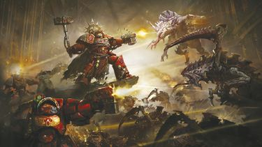
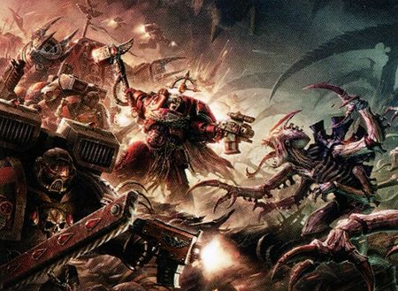

# 0840 M42早期 巴尔的毁灭 Devastation of Baal

精校状态：中文行文已逐段精校，部分术语仍为暂定

分类：时间线

原文来源：https://www.bilibili.com/opus/1138674702976286744

原作者：帝国神选罐头

原文时间：2025年11月24日 11:59

[返回分类目录](目录.md) · [全书目录](../../目录.md)

<!-- A0840-B0001 -->
**英文原文**

The Devastation of Baal (also known as the Battle of Baal) was part of the Third Tyrannic War, taking place during the devastating period known as the Blackness.

<!-- /A0840-B0001 -->

<!-- A0840-B0002 -->

原译文

巴尔的毁灭（也称为巴尔之战）是第三次泰伦战争的一部分，发生在被称为黑暗的毁灭性时期。

**校订译文**

巴尔的毁灭，又称巴尔之战，是第三次泰伦战争的一部分，发生在被称为“黑暗期”的灾难性时期。

<!-- /A0840-B0002 -->

<!-- A0840-B0003 图片 -->

<!-- A0840-B0004 -->

原译文

The battle for the Dome of Angels 天使穹顶之战

**校订译文**

The battle for the Dome of Angels 天使穹顶之战

<!-- /A0840-B0004 -->

<!-- A0840-B0005 -->
**英文原文**

Conflict:Tyrannic Wars

<!-- /A0840-B0005 -->

<!-- A0840-B0006 -->

原译文

冲突：泰伦战争

**校订译文**

冲突：泰伦战争

<!-- /A0840-B0006 -->

<!-- A0840-B0007 -->
**英文原文**

Date:Early M42

<!-- /A0840-B0007 -->

<!-- A0840-B0008 -->

原译文

日期：M42早期

**校订译文**

日期：M42早期

<!-- /A0840-B0008 -->

<!-- A0840-B0009 -->
**英文原文**

Location:Baal

<!-- /A0840-B0009 -->

<!-- A0840-B0010 -->

原译文

地点：巴尔

**校订译文**

地点：巴尔

<!-- /A0840-B0010 -->

<!-- A0840-B0011 -->
**英文原文**

Outcome:Imperial Pyrrhic victory, Hive Fleet Leviathan still active throughout Baal region

<!-- /A0840-B0011 -->

<!-- A0840-B0012 -->

原译文

结果：帝国取得了惨痛的胜利，虫巢舰队利维坦仍在巴尔地区活动

**校订译文**

结果：帝国取得了惨痛的胜利，虫巢舰队利维坦仍在巴尔地区活动

<!-- /A0840-B0012 -->

<!-- A0840-B0013 -->
**英文原文**

Combatants:Imperium/Tyranids/Chaos (Late conflict)

<!-- /A0840-B0013 -->

<!-- A0840-B0014 -->

原译文

作战人员：帝国/泰伦/混沌（后期冲突）

**校订译文**

交战双方：帝国／泰伦／混沌（战事后期介入）

<!-- /A0840-B0014 -->

<!-- A0840-B0015 -->
**英文原文**

Commanders:Commander Dante (WIA), Chapter Master Gabriel Seth, Chapter Master Ercon, Chapter Master Follordark (KIA), Firstblade Sentor Jool (KIA), Firstblood Kaan (KIA), Castellan Zargo (KIA), Captain Karlaen, Captain Raxiatel (KIA), Captain Zedrenael (KIA), Captain Sendroth (KIA), Captain Asante (KIA), Captain Erwin (KIA), Captain Cantar, Chaplain Fen, Chief Librarian Mephiston, Chief Librarian Scaraban, Forge Master Quaeston, Sergeant Hajjin, The Sanguinor, Lord Commander Roboute Guilliman (Later)/Hive Mind, Swarmlord (KIA)/Ka'Bandha

<!-- /A0840-B0015 -->

<!-- A0840-B0016 -->

原译文

指挥官：指挥官但丁（WIA），战团长加百列·赛斯，战团长埃尔康，战团长弗洛达克（KIA），第一之刃森托·约尔（KIA），第一之血卡安（KIA），堡主扎戈（KIA），连长卡拉恩，连长拉夏泰尔（KIA），连长塞德纳尔（KIA），连长森德罗斯（KIA），连长阿桑特（KIA），连长埃尔温（KIA），连长坎塔尔，牧师芬恩，首席智库墨菲斯顿，首席智库斯卡拉班，铸造大师奎斯顿，军士哈金，圣吉列诺，领主指挥官罗伯特·基里曼（后期）/虫巢思维，虫群领主（KIA）/卡'班哈

**校订译文**

指挥官：但丁指挥官（负伤），战团长加百列·赛斯，战团长埃尔康，战团长弗洛达克（阵亡），第一之刃森托·约尔（阵亡），第一之血卡安（阵亡），堡主扎戈（阵亡），连长卡莱恩，连长拉夏泰尔（阵亡），连长塞德纳尔（阵亡），连长森德罗斯（阵亡），连长阿桑特（阵亡），连长埃尔温（阵亡），连长坎塔尔，教士芬恩，首席智库员墨菲斯顿，首席智库员斯卡拉班，铸造大师奎斯顿，军士哈金，圣血者，帝国领主指挥官罗保特·基里曼（后期抵达）／虫巢意志，虫群领主（被杀）／卡’班哈

<!-- /A0840-B0016 -->

<!-- A0840-B0017 -->
**英文原文**

Strength:29,000 Space Marines Total, 21 Battle Barges, 94 Strike Cruisers, Hundreds of smaller spacecraft, Blood Thralls, Later forces from the Indomitus Crusade/Hive Fleet Leviathan consisting of hundreds of thousands of Bio-Ships/Daemonic hordes

<!-- /A0840-B0017 -->

<!-- A0840-B0018 -->

原译文

力量：29000名星际战士，21艘战斗驳船，94艘打击巡洋舰，数百艘小型宇宙飞船，血奴，后来的不屈远征部队/虫巢舰队利维坦，由数十万艘生物舰组成/恶魔部落

**校订译文**

兵力：共 29,000 名星际战士，21 艘战斗驳船，94 艘打击巡洋舰，数百艘较小舰船，血奴，以及后期抵达的不屈远征军／利维坦虫巢舰队，包含数十万艘生物舰／恶魔大军

**校注：** 此处统计称数十万艘生物舰，正文首次接敌写五万余艘、第二舰队数万艘；可能是总兵力与分批接敌数量不同，保留各自数字，不强行改成同一统计。

<!-- /A0840-B0018 -->

<!-- A0840-B0019 -->
**英文原文**

Losses/Survivors:At least twelve Chapter Masters killed, Angels Excelsis, Burning Blood, Brothers of Jarad, Angels Glorious, and 4 other Chapters destroyed, 6 more Chapters almost wiped out, Remaining Chapters/contingents reduced to less than half of their number, All but 1 of the Sanguinary Guard killed./Near total destruction/All killed or moved back into the Warp

<!-- /A0840-B0019 -->

<!-- A0840-B0020 -->

原译文

损失/幸存者：至少有12个战团长被杀，精益天使，燃烧之血，雅拉修士，荣光天使，以及其他四个战团被摧毁，还有六个战团几乎被消灭，剩余的战团/特遣队人数减少到不到一半，除1人外，所有的圣血卫队都被杀。/几乎完全毁灭/所有被杀或回到亚空间

**校订译文**

损失／幸存情况：至少 12 名战团长阵亡；精益天使、燃烧之血、雅拉德修士、荣光天使及另外 4 个战团被歼灭，另有 6 个战团几乎全军覆没；其余战团或参战分队的兵力均折损过半；圣血守卫仅 1 人幸存／几乎全灭／全部被杀或返回亚空间

**校注：** Angels Excelsis 暂沿本篇精益天使；第 403 篇 Angels of Excelsis 核心采用崇高天使，且原文曾并列两名称，现阶段不强行合并实体。精益一名的词源适切性仍待核。

<!-- /A0840-B0020 -->

<!-- A0840-B0021 -->
### Overview 概述

<!-- /A0840-B0021 -->

<!-- A0840-B0022 -->
**英文原文**

After sacrificing many worlds of the Cryptus System to fend off the earliest advances of the Tyranids, the planet Baal itself was assailed by the xenos. The Tyranid fleet from Hive Fleet Leviathan was of such mass that even after its considerable losses it blotted out the stars from the skies. Commander Dante bolstered the defenses of the Blood Angels homeworld and waited for the storm to fall. Dante nonetheless did use some proactive means of defense, launching preemptive strikes to delay, mislead, and whittle down the Tyranid armada. Hundreds of splinter fleets were defeated in this fashion.

<!-- /A0840-B0022 -->

<!-- A0840-B0023 -->

原译文

在牺牲了冥府星系的许多世界来抵御泰伦的最早进攻后，巴尔行星本身也遭到了异型的攻击。来自虫巢舰队利维坦的泰伦舰队规模如此之大，以至于即使在损失惨重之后，它也会从天空中抹去群星。但丁指挥官加强了圣血天使家园世界的防御，等待风暴降临。尽管如此，但丁还是使用了一些积极的防御手段，发动先发制人的打击来拖延、误导和削弱泰伦的舰队。数百支分裂舰队以这种方式被击败。

**校订译文**

帝国牺牲冥府星系的许多世界，阻挡了泰伦的最初攻势，但异形最终仍袭向巴尔本身。来袭的利维坦虫巢舰队规模如此庞大，即使已蒙受惨重损失，仍能遮蔽天空中的群星。但丁指挥官加强了圣血天使母星的防御，等待风暴降临。他也采取了主动防御措施，抢先出击，以拖延、误导并逐步削弱泰伦舰队；数百支碎片舰队就这样被击败。

<!-- /A0840-B0023 -->

<!-- A0840-B0024 -->
**英文原文**

Fortunately for the Blood Angels, they were aided by multiple Successor Chapters such as the Flesh Tearers, Blood Drinkers, Carmine Blades, and the Knights of Blood. Gathering the largest force of Sanguinius' bloodline since the Horus Heresy, nearly 30,000 Space Marines were gathered for the battle. These included 12,000 on Baal, 6,000 on Baal Secundus, 5,000 on Baal Primus, and 6,000 in space aboard warships and orbital defense stations.

<!-- /A0840-B0024 -->

<!-- A0840-B0025 -->

原译文

幸运的是，对于圣血天使来说，他们得到了多个子战团的帮助，如撕肉者、饮血者、猩红之刃和血骑士。自荷鲁斯叛乱以来，近3万名星际战士聚集在一起参加战斗，这是圣吉列斯的血统最大的一支部队。其中包括巴尔上的12000人，巴尔二号上的6000人，巴尔一号上的5000人，以及在太空中的战舰和轨道防御站上的6000人。

**校订译文**

圣血天使幸运地得到了多个子战团的援助，包括撕肉者、饮血者、猩红之刃和血骑士。这是荷鲁斯之乱以来圣吉列斯血裔最大规模的一次集结，近三万名星际战士为此战齐聚一堂。其中，12,000 人驻守巴尔，6,000 人驻守巴尔二号，5,000 人驻守巴尔一号，另有 6,000 人部署在太空中的舰船与轨道防御站上。

<!-- /A0840-B0025 -->

<!-- A0840-B0026 -->
**英文原文**

Great seismic and psychic disturbances known as the Shadow in the Warp heralded the arrival of the Tyranids. The xenos first had to contend with the great Space Marine fleet defending Baal, which consisted of 21 Battle Barges, 94 Strike Cruisers, and hundreds of smaller vessels divided into four battlegroups under Blood Angels Master of the Fleet Bellerophon. However while this armada was mighty, the number of Tyranid Bio-Ships were in excess of 50,000. The sky above Baal erupted in a firestorm as the vessels of the Space Marines slammed their way into the midst of the approaching Tyranids, launching storms of nuclear-tipped warheads. The Tyranid fleet took grievous losses amounting to over 300 Hive Ships and an untold number of lesser vessels. As impressive as this naval action was, it was hopeless. One by one, Space Marine Battle Barges and Cruisers were isolated and overwhelmed, battered by organic missiles and enveloped by swarms of smaller bio-ships. The entire Angels Excelsis Chapter was wiped out, and a second Tyranid fleet of tens of thousands of more bio-ships revealed itself from behind Balor. The remnant of the Astartes fleet was helpless as this force began landings on Baal and its two moons.

<!-- /A0840-B0026 -->

<!-- A0840-B0027 -->

原译文

被称为亚空间阴影的巨大影响和灵能干扰预示着泰伦的到来。异型首先不得不与保卫巴尔的庞大的星际战士舰队作战，该舰队由21艘战列舰、94艘打击巡洋舰和数百艘小型战舰组成，分为四个战斗群，由圣血天使舰队之主贝勒罗丰指挥。然而，虽然这支舰队很强大，但泰伦生物舰的数量超过了50000艘。巴尔上方的天空爆发了一场火焰风暴，星际战士的战舰猛烈地撞向了正在逼近的泰伦，发射了核弹头的风暴。泰伦舰队遭受了严重损失，损失了300多艘虫巢舰和无数艘较小的生物舰。尽管这次海军行动令人印象深刻，但毫无希望。星际战士战斗驳船和巡洋舰一艘接一艘地被孤立和淹没，被有机导弹袭击，被成群的小型生物舰包围。整个精益天使战团被消灭了，第二支由数万艘生物舰组成的泰伦舰队从巴罗尔之后现身。当这支部队开始在巴尔及其两个卫星上登陆时，阿斯塔特舰队的残余无能为力。

**校订译文**

剧烈的地震和灵能扰动预示着泰伦的到来，原文将这些异象统称为“亚空间阴影”。异形首先面对的是保卫巴尔的庞大星际战士舰队：21 艘战斗驳船、94 艘打击巡洋舰和数百艘小型舰船，分为四个战斗群，由圣血天使舰队之主贝勒罗丰指挥。然而，泰伦生物舰的数量超过五万艘。星际战士舰船冲入逼近的泰伦舰群，倾泻携带核弹头的导弹，让巴尔上空化作火海。泰伦损失惨重，三百多艘虫巢舰和难以计数的小型舰船被摧毁。这一战果虽惊人，却仍无力挽回败局。星际战士的战斗驳船和巡洋舰接连遭到孤立，在有机导弹的轰击和小型生物舰群的围攻下被吞没。精益天使战团全军覆没；此时，第二支拥有数万艘生物舰的泰伦舰队又从巴罗尔后方现身。它开始向巴尔及其两颗卫星投放登陆部队，残存的阿斯塔特舰队已无力阻止。

**校注：** seismic 指地震或震动，不是泛泛的巨大影响；源文将其与 psychic disturbances 一并称为 Shadow in the Warp，此处照录并保留英文，未据外部知识更改设定。Battle Barges 是战斗驳船，非战列舰。

<!-- /A0840-B0027 -->

<!-- A0840-B0028 -->
**英文原文**

The Imperials constructed a 3-layer defensive line consisting of not only Space Marines and heavy cannon batteries but also a moat of Thirst Water and large amounts of Baalite Conscripts brutally held in place by Chaplains. The first nineteen waves, each larger than the last, were driven off at great loss by the Imperial forces. However the Imperials held firm, in large part because of the Arx Angelicum's Void Shield array which protected them from heavy artillery and flyer organisms. The Tyranids countered the Thirst Water moat by filling it with their own bodies, allowing for larger Tyranid Warriors, Carnifex's, and Exocrines to cross. This allowed the first line to fall, and the Space Marines covered the retreat of the mortal conscripts back to the Arx Angelicum. However the Tyranids were still unable to penetrate the Void Shield, and the Hive Mind quickly adapted. A Lictor behind Imperial lines identified a derelict tunnel deep beneath the Fortress-Monastery which Trygons tore open. The Lictor along with a large amount of Genestealers infiltrated the depths of the Fortress, with the latter launching themselves at the hall containing the sarcophagi of Neophytes undergoing Insanguination. This enraged the Space Marines, and Dante himself led the counterattack to save their next-generation of warriors. However the Hive Mind had counted on this diversion, and in the meantime the Lictor disabled the Void Shield generator. The Imperial position reversed dramatically as the Tyranids began overrunning the Fortress. Five Chapter Masters died in the desperate battle, including three in the Dome of Angels alone.

<!-- /A0840-B0028 -->

<!-- A0840-B0029 -->

原译文

帝国建造了一条三层防线，不仅包括星际战士和重炮，还包括一条渴水护城河和大量被牧师残酷关押的巴尔征召兵。前十九波，每波都比上一波大，被帝国部队以巨大的损失击退。然而，帝国坚持了下来，这在很大程度上是因为天使堡的虚空盾阵列保护他们免受重型火炮和飞行生物的攻击。泰伦通过用自己的身体填满渴水护城河来对抗它，允许更大的泰伦战士、刽子手和离子炮虫穿过。这使得第一条防线陷落，星际战士掩护了凡人征召兵撤退回天使堡。然而，泰伦仍然无法穿透虚空盾，虫巢思维很快适应了。帝国防线后的一只利卡特发现了要塞修道院深处的一条废弃隧道，掘蟒将其撕开。利卡特和大量的基因窃取者潜入了堡垒的深处，后者在装有接受染血的新进者石棺的大厅里发动了攻击。这激怒了星际战士，但丁亲自领导了反击，以拯救他们的下一代战士。然而，虫巢思维已经算入了这种转移，与此同时，利卡特禁用了虚空盾生成器。随着泰伦开始占领要塞，帝国的位置发生了戏剧性的逆转。五位战团长在这场绝望的战斗中牺牲，其中包括三位独自在天使穹顶中牺牲。

**校订译文**

帝国建立了三重防线，除星际战士和重炮阵地外，还布置了盛满渴水的壕沟，以及大批巴尔征召兵；教士以残酷手段强迫后者坚守岗位。前十九波攻势一波比一波庞大，帝国守军在惨烈交锋中将其逐一击退。防线能够坚持，很大程度上有赖于天使堡的虚空盾阵列，它阻挡了重炮轰击和飞行生物。泰伦以自身的尸体填满渴水壕沟，让体型更大的泰伦武士、刽子手和离子炮兽得以通过。第一重防线由此失守，星际战士掩护凡人征召兵撤回天使堡。然而，泰伦仍无法突破虚空盾，虫巢意志迅速作出调整。一只潜入帝国防线后方的刀斧虫发现了要塞修道院深处的一条废弃隧道，掘蟒随即将其挖开。刀斧虫与大批基因窃取者由此潜入要塞深处。基因窃取者袭击了一座大厅，其中的石棺容纳着正在接受染血过程的新兵。星际战士被激怒，但丁亲自率领反击，抢救未来的战士。虫巢意志早已料到这一调虎离山之计会奏效；就在此时，刀斧虫破坏了虚空盾发生器。泰伦开始涌入要塞，帝国守军的处境急转直下。五位战团长在绝望的战斗中阵亡，仅天使穹顶一处就牺牲了三位。

**校注：** held in place 指强迫征召兵坚守防线，不是关押；three in the Dome ... alone 指仅该处就有三位战团长阵亡，并非三位独自战死。染血段落按核心统一，虚空盾被毁为虫巢意志以基因窃取者佯攻诱开守军后的结果。

<!-- /A0840-B0029 -->

<!-- A0840-B0030 -->
**英文原文**

On Baal Secundus, Gabriel Seth and his Flesh Tearers initially held the Blood Angels Aspirant training facilities while the Carmine Blades held the Astropathic Station. The Space Marines initially held their own thanks to formidable recommissioned Horus Heresy-era fortifications and weaponry, but the presence of the Swarmlord himself turned the tide in favor of the Xenos. Dante managed to slay the Swarmlord, but was badly wounded in the process. As Baal was overwhelmed, the Tyranids began the process of draining the world and her moons, absorbing even the rad-poisoned desert of Baal Secundus. With the defenses smashed, the defenders retreated to the Blood Angels' Fortress-Monastery. Despite the intervention of the Sanguinor, Baal was ready to fall.

<!-- /A0840-B0030 -->

<!-- A0840-B0031 -->

原译文

在巴尔二号，加百列·赛斯和他的撕肉者最初控制着圣血天使有志者训练设施，而猩红之刃则控制着星语空间站。星际战士最初依靠强大的荷鲁斯叛乱时期重新启用的防御工事和武器保持了自己的位置，但虫群领主的存在扭转了局势，有利于异型。但丁设法杀死了虫群领主，但在此过程中受了重伤。当巴尔被淹没时，泰伦开始消耗世界和她的卫星，甚至吸收了巴尔二号的放射性沙漠。防御工事被摧毁后，守军撤退到圣血天使的要塞修道院。尽管圣吉列诺进行了干预，巴尔还是将要陷落。

**校订译文**

在巴尔二号，加百列·赛斯及其撕肉者最初守卫着圣血天使候选者训练设施，猩红之刃则负责守卫星语站。星际战士重新启用荷鲁斯之乱时期的坚固工事与武器，起初尚能守住阵地；但虫群领主的亲临让战局倒向异形。但丁成功杀死虫群领主，自己也身受重伤。随着巴尔防线崩溃，泰伦开始吸干这颗行星及其卫星，连巴尔二号受辐射污染的沙漠也不放过。防御被击破后，守军撤回圣血天使的要塞修道院。尽管圣血者出手相助，巴尔仍已濒临陷落。

**校注：** 本段从巴尔二号的赛斯部队跳接到但丁对虫群领主的战斗，再转入巴尔要塞，源文没有明确标出地点切换；保留段序，不据剧情记忆搬移人物。

<!-- /A0840-B0031 -->

<!-- A0840-B0032 -->
**英文原文**

It was then that the Great Rift formed across the greater Galaxy. The Baal System was overcome by the powers of the Warp and Daemons battled the Tyranids. The Daemons were led by the vicious Bloodthirster Ka'Bandha, arch-foe of the Blood Angels and Sanguinius. Ka'Bandha declared that none would have the right to destroy the Blood Angels but him. The arrival of the Great Rift and Daemons prevented additional Tyranids from arriving, but killed every defender upon Baal Prime. With Baal itself cut off from the greater Imperium, Chapter Masters Dante and Gabriel Seth of the Flesh Tearers, fell back, harried on all sides. Only the sacrifice of the Knights of Blood, an excommunicated Successor Chapter who had nonetheless been accepted as allies by Chapter Master Dante, allowed the survivors to board their vessels and escape, as Baal Prime was overwhelmed by warp-spawned monstrosities. As Seth’s forces retreated, they caught one last glimpse of the Knights of Blood, hurling themselves into the thick of close combat with mindless ferocity, fully enveloped by the madness of the Black Rage.

<!-- /A0840-B0032 -->

<!-- A0840-B0033 -->

原译文

就在那时，大裂隙在整个银河系中形成。巴尔星系被亚空间的力量所征服，恶魔与泰伦作战。恶魔由凶猛的嗜血狂魔卡'班哈领导，他是圣血天使和圣吉列斯的死敌。卡'班哈宣称，除了他，没有人有权摧毁圣血天使。大裂隙和恶魔的到来阻止了更多的泰伦的到来，但杀死了巴尔一号的所有防御者。随着巴尔本身与更大的帝国隔绝，战团长但丁和撕肉者的加百列·赛斯退缩了，四面楚歌。只有血骑士的牺牲，一个被绝罚的子战团，被战团长但丁接受为盟友，允许幸存者登上他们的战舰逃跑，因为巴尔一号被亚空间生成的怪物淹没了。当赛斯的部队撤退时，他们最后一次瞥见了血骑士，他们以盲目的凶猛投入了激烈的近战，完全被黑怒的疯狂所笼罩。

**校订译文**

就在此时，大裂隙在银河中形成。亚空间力量席卷巴尔星系，恶魔开始与泰伦交战。率领恶魔的是凶暴的嗜血狂魔卡’班哈——圣血天使与圣吉列斯的死敌。他宣称，只有自己才有权毁灭圣血天使。大裂隙及恶魔的到来阻止了更多泰伦抵达，却也杀死了巴尔一号上的所有守军。巴尔与帝国其余地区失去联系，但丁和撕肉者战团长加百列·赛斯在四面围攻中节节后退。巴尔一号正被亚空间怪物吞没，幸存者能够登舰逃离，全靠血骑士牺牲自己掩护。这支子战团虽已遭到绝罚，但丁仍接纳他们为盟友。赛斯的部队撤离时，最后看见血骑士彻底陷入黑怒，以失去理智的狂暴冲入最激烈的近战。

**校注：** 源文先称巴尔一号全部守军死亡，随后又叙述幸存者撤离，并将但丁与赛斯并提；原文内部存在时序或地理省略，未擅自修成确切战斗路线。Baal Prime 与此前 Baal Primus 此处均沿本稿巴尔一号，保留英文异形。

<!-- /A0840-B0033 -->

<!-- A0840-B0034 -->
**英文原文**

However, as all seemed lost, the fleet of the Indomitus Crusade arrived, led by the reborn Roboute Guilliman himself. Guilliman and his newly arrived forces fought a great many battles, liberating Baal. Hive Fleet Leviathan was largely destroyed, though it is a mystery as to what exactly happened to it. A clue lies on the now-barren Baal Prime, where the symbol of Ka'Bandha was formed with the skulls of dead Tyranid organisms. As for Baal, most of the planet and its moons lay devastated. Guilliman oversaw a rapid rebuilding process for the Blood Angels and their homeworlds, for they were desperately needed elsewhere. In the aftermath of the battle the Blood Angels have led a renewed counteroffensive against the Tyranid forces rampaging throughout the Imperium Nihilus.

<!-- /A0840-B0034 -->

<!-- A0840-B0035 -->

原译文

然而，当一切似乎都失去了时，由重生的罗伯特·基里曼本人率领的不屈远征舰队到达了。基里曼和他新到达的部队打了很多仗，解放了巴尔。虫巢舰队利维坦基本上被摧毁了，尽管它到底发生了什么仍然是个谜。线索在于现在贫瘠的巴尔一号，在那里，卡'班哈的记号是由死去的泰伦生物的头骨形成的。至于巴尔，行星及其卫星的大部分地区都被摧毁了。基里曼监督了对圣血天使及其家园世界的快速重建过程，因为其他地方迫切需要他们。战斗结束后，圣血天使对在帝国暗面肆虐的泰伦军队发动了新的反攻。

**校订译文**

然而，正当一切看似无可挽回之际，复生的罗保特·基里曼亲自率领不屈远征舰队抵达。基里曼及新抵达的援军经过多场战斗，解放了巴尔。利维坦虫巢舰队遭到大规模毁灭，但其具体遭遇仍是谜团。如今荒芜的巴尔一号提供了一条线索：无数泰伦生物的头骨在那里堆成了卡’班哈的符号。巴尔及其卫星的大部分地区已经化为废墟。由于其他战场急需圣血天使，基里曼亲自督促战团及其家园迅速重建。此战过后，圣血天使率军重新发起反攻，迎战在帝国暗面各处肆虐的泰伦。

**校注：** 源文此处泛称 Hive Fleet Leviathan 遭到大规模毁灭，而资料栏明确说它仍在巴尔地区活动。未将本战损失夸为整个利维坦虫巢舰队在银河中永久消灭。

<!-- /A0840-B0035 -->

<!-- A0840-B0036 图片 -->

<!-- A0840-B0037 -->

原译文

The Hour of Reckoning of the Battle of Baal 巴尔之战的清算时刻

**校订译文**

The Hour of Reckoning of the Battle of Baal 巴尔之战的清算时刻

<!-- /A0840-B0037 -->

<!-- A0840-B0038 -->
### Known Contributing Chapters 已知援助战团

<!-- /A0840-B0038 -->

<!-- A0840-B0039 -->
**英文原文**

The battle saw the largest gathering of the Sons of Sanguinius since the ending of the Horus Heresy.

<!-- /A0840-B0039 -->

<!-- A0840-B0040 -->

原译文

这场战斗见证了自荷鲁斯叛乱结束以来最大规模的圣吉列斯之子的聚集。

**校订译文**

此战集结的圣吉列斯血裔，是荷鲁斯之乱结束以来规模最大的一支大军。

<!-- /A0840-B0040 -->

<!-- A0840-B0041 -->

原译文

Blood Angels 圣血天使

**校订译文**

Blood Angels 圣血天使

<!-- /A0840-B0041 -->

<!-- A0840-B0042 -->

原译文

Angels Encarmine 赤红天使

**校订译文**

Angels Encarmine 赤红天使

<!-- /A0840-B0042 -->

<!-- A0840-B0043 -->
**英文原文**

Angels Excelsis (Destroyed)

<!-- /A0840-B0043 -->

<!-- A0840-B0044 -->

原译文

精益天使（毁灭）

**校订译文**

精益天使（毁灭）

<!-- /A0840-B0044 -->

<!-- A0840-B0045 -->
**英文原文**

Angels Glorious (Destroyed)

<!-- /A0840-B0045 -->

<!-- A0840-B0046 -->

原译文

荣光天使（毁灭）

**校订译文**

荣光天使（毁灭）

<!-- /A0840-B0046 -->

<!-- A0840-B0047 -->

原译文

Angels of Light 光明天使

**校订译文**

Angels of Light 光明天使

<!-- /A0840-B0047 -->

<!-- A0840-B0048 -->

原译文

Angels Penitent 悔罪天使

**校订译文**

Angels Penitent 悔罪天使

<!-- /A0840-B0048 -->

<!-- A0840-B0049 -->

原译文

Angels Numinous 神圣天使

**校订译文**

Angels Numinous 神圣天使

<!-- /A0840-B0049 -->

<!-- A0840-B0050 -->

原译文

Angels Sanguine 血红天使

**校订译文**

Angels Sanguine 血红天使

<!-- /A0840-B0050 -->

<!-- A0840-B0051 -->

原译文

Angels Vermillion 朱红天使

**校订译文**

Angels Vermillion 朱红天使

<!-- /A0840-B0051 -->

<!-- A0840-B0052 -->

原译文

Blood Drinkers 饮血者

**校订译文**

Blood Drinkers 饮血者

<!-- /A0840-B0052 -->

<!-- A0840-B0053 -->

原译文

Blood Swords 鲜血之剑

**校订译文**

Blood Swords 鲜血之剑

<!-- /A0840-B0053 -->

<!-- A0840-B0054 -->
**英文原文**

Blood Wings (Destroyed)

<!-- /A0840-B0054 -->

<!-- A0840-B0055 -->

原译文

血翼（毁灭）

**校订译文**

血翼（毁灭）

<!-- /A0840-B0055 -->

<!-- A0840-B0056 -->
**英文原文**

Brothers of Jarad (Destroyed)

<!-- /A0840-B0056 -->

<!-- A0840-B0057 -->

原译文

雅拉修士（毁灭）

**校订译文**

雅拉德修士（覆灭）

<!-- /A0840-B0057 -->

<!-- A0840-B0058 -->

原译文

Brothers of the Red 血红兄弟

**校订译文**

Brothers of the Red 血红兄弟

<!-- /A0840-B0058 -->

<!-- A0840-B0059 -->
**英文原文**

Burning Blood (Destroyed)

<!-- /A0840-B0059 -->

<!-- A0840-B0060 -->

原译文

燃烧之血（毁灭）

**校订译文**

燃烧之血（毁灭）

<!-- /A0840-B0060 -->

<!-- A0840-B0061 -->

原译文

Carmine Blades 猩红之刃

**校订译文**

Carmine Blades 猩红之刃

<!-- /A0840-B0061 -->

<!-- A0840-B0062 -->

原译文

Charnel Guard 墓葬守卫

**校订译文**

Charnel Guard 墓葬守卫

<!-- /A0840-B0062 -->

<!-- A0840-B0063 -->

原译文

Disciples of Blood 鲜血使徒

**校订译文**

Disciples of Blood 鲜血使徒

<!-- /A0840-B0063 -->

<!-- A0840-B0064 -->

原译文

Exsanguinators 放血者

**校订译文**

Exsanguinators 放血者

<!-- /A0840-B0064 -->

<!-- A0840-B0065 -->

原译文

Flesh Eaters 食肉者

**校订译文**

Flesh Eaters 食肉者

<!-- /A0840-B0065 -->

<!-- A0840-B0066 -->

原译文

Flesh Tearers 撕肉者

**校订译文**

Flesh Tearers 撕肉者

<!-- /A0840-B0066 -->

<!-- A0840-B0067 -->
**英文原文**

Golden Sons (Destroyed but subsequently rebuilt)

<!-- /A0840-B0067 -->

<!-- A0840-B0068 -->

原译文

黄金之子（毁灭，但随后重建）

**校订译文**

黄金之子（毁灭，但随后重建）

<!-- /A0840-B0068 -->

<!-- A0840-B0069 -->
**英文原文**

Knights of Blood (Destroyed)

<!-- /A0840-B0069 -->

<!-- A0840-B0070 -->

原译文

血骑士（毁灭）

**校订译文**

血骑士（毁灭）

<!-- /A0840-B0070 -->

<!-- A0840-B0071 -->

原译文

Red Knights 红骑士

**校订译文**

Red Knights 红骑士

<!-- /A0840-B0071 -->

<!-- A0840-B0072 -->
**英文原文**

Red Wings (Destroyed but subsequently rebuilt)

<!-- /A0840-B0072 -->

<!-- A0840-B0073 -->

原译文

红翼（毁灭，但随后重建）

**校订译文**

红翼（毁灭，但随后重建）

<!-- /A0840-B0073 -->

<!-- A0840-B0074 -->

原译文

Sable Brotherhood 阴暗兄弟会

**校订译文**

Sable Brotherhood 阴暗兄弟会

<!-- /A0840-B0074 -->

<!-- A0840-B0075 -->

原译文

Sanguine Host 圣血天军

**校订译文**

Sanguine Host 圣血天军

<!-- /A0840-B0075 -->

<!-- A0840-B0076 -->
**英文原文**

Legion of the Damned - Only appeared later to fight the forces of Chaos

<!-- /A0840-B0076 -->

<!-- A0840-B0077 -->

原译文

咒缚军团 - 后来才出现与混沌部队作战

**校订译文**

咒缚军团 - 后来才出现与混沌部队作战

<!-- /A0840-B0077 -->

本篇核心术语与暂定项

以下列出本篇出现的英文原形及核心术语表用词。同形词可能指不同对象，具体词义以本篇正文和校注为准；单复数、别名和仅见于图注的名称可能尚未列入。完整候选见[术语表](../../术语表/双语术语候选.csv)。

| 英文 | 采用中文 | 状态 |
| --- | --- | --- |
| Space Marines | 星际战士 | 官方已核对 |
| Blood Angels | 圣血天使 | 官方已核对 |
| Tyranids | 泰伦虫族 | 官方已核对 |
| Librarian | 智库员 | 官方已核对 |
| Roboute Guilliman | 罗保特·基里曼 | 官方已核对 |
| Horus Heresy | 荷鲁斯之乱 | 官方已核对 |
| Warp | 亚空间 | 官方已核对 |
| Great Rift | 大裂隙 | 官方已核对 |
| Imperium | 帝国 | 暂定·简称 |
| Hive Mind | 虫巢意志 | 官方已核对 |
| Sanguinary | 圣血学派 | 暂定·学派语境 |
| Indomitus | 不屈学派 | 暂定·学派语境 |
| Shadow in the Warp | 亚空间之影 | 暂定 |
| Horus | 荷鲁斯 | 暂定·官方待核 |
| Imperium Nihilus | 帝国暗面 | 暂定·官方待核 |
| Indomitus Crusade | 不屈远征 | 暂定·官方待核 |
| Devastation of Baal | 巴尔之毁 | 暂定·官方待核 |
| Hive Fleet Leviathan | 利维坦虫巢舰队 | 暂定·官方待核 |
| Baal | 巴尔 | 暂定·官方待核 |
| Chief Librarian | 首席智库员 | 暂定·官方待核 |
| Master | 导师（审判庭职衔）／舰务官（舰员职务） | 语境定译·官方待核 |
| Carnifex | 刽子手 | 暂定·官方待核 |
| Master of the Fleet | 舰队大师 | 暂定·官方待核 |
| Chaplain | 教士 | 官方已核对 |
| Sanguinary Guard | 圣血守卫 | 官方已核对 |
| Aspirant | 候补骑士 | 暂定·官方待核 |
| Lord Commander | 领主指挥官 | 暂定·官方待核 |
| Space Marine | 星际战士 | 暂定·官方待核 |
| Chapter | 战团 | 暂定·官方待核 |
| Fortress-monastery | 要塞修道院 | 暂定·官方待核 |
| Chapter Master | 战团长 | 暂定·官方待核 |
| Captain | 连长 | 暂定·官方待核 |
| Sergeant | 军士 | 暂定·官方待核 |
| Dante | 但丁 | 暂定·官方待核 |
| Mephiston | 墨菲斯顿 | 暂定·官方待核 |
| Karlaen | 卡莱恩 | 暂定·官方待核 |
| Flesh Tearers | 撕肉者 | 暂定·官方待核 |
| Gabriel Seth | 加百列·赛斯 | 暂定·官方待核 |
| Blood Drinkers | 饮血者 | 暂定·官方待核 |
| Angels Glorious | 荣光天使 | 暂定·官方待核 |
| Blood Wings | 血翼 | 暂定·官方待核 |
| Brothers of Jarad | 雅拉德修士 | 暂定·官方待核 |
| Burning Blood | 燃烧之血 | 暂定·官方待核 |
| Carmine Blades | 猩红之刃 | 暂定·官方待核 |
| Golden Sons | 黄金之子 | 暂定·官方待核 |
| Legion of the Damned | 诅咒军团 | 暂定·官方待核 |
| Reborn | 复生者（战团）／重生者（死神军自称） | 语境定译·官方待核 |
| Red Wings | 红翼 | 暂定·官方待核 |
| Sons of Sanguinius | 圣吉列斯之子 | 暂定·官方待核 |
| Space Marine Fleet | 星际战士舰队 | 暂定·官方待核 |
| Insanguination | 染血 | 暂定·官方待核 |
| Mortal | 凡人 | 暂定·官方待核 |
| Zargo | 扎戈 | 暂定·官方待核 |
| Castellan | 堡主 | 官方已核对 |
| Chief Librarian Mephiston | 首席智库员墨菲斯顿 | 官方已核 |
| Cryptus | 冥府 | 暂定·官方待核 |
| Powers | 能天使 | 暂定·官方待核 |
| The Sanguinor | 圣血者 | 官方已核 |
| Xenos | 异形 | 暂定·官方待核 |
| Quaeston | 奎斯顿 | 暂定·官方待核 |
| Bloodthirster | 嗜血狂魔 | 官方已核对 |
| The Thirst | 饥渴（黑暗灵族灵魂饥渴） | 暂定·官方待核 |
| The Swarmlord | 虫群领主 | 官方已核对 |
| The Blackness | 黑暗期 | 暂定·官方待核 |
| Lictor | 刀斧虫（泰伦单位）／侍从官（禁军职衔） | 语境定译·泰伦单位官译已核 |
| Tyranid Warriors | 泰伦武士 | 官方词根参考·通称待核 |
| Primus | 领军 | 官方已核对 |
| Zedrenael | 塞德纳尔 | 暂定·官方待核 |
| Scaraban | 斯卡拉班 | 暂定·官方待核 |
| Chaplains | 教士 | 暂定·官方待核 |
| Forge Master | 铸造大师 | 暂定·官方待核 |
| Ferocity | 凶猛 | 暂定·官方待核 |
| The Blood | 鲜血 | 暂定·官方待核 |
| System | 星系（恒星系统） | 暂定·官方待核 |
| Baal Secundus | 巴尔二号 | 暂定·官方待核 |
| The Remnant | 遗存者 | 暂定·官方待核 |
| Dome of Angels | 天使穹顶 | 暂定·官方待核 |
| Angels Excelsis | 精益天使 | 暂定·官方待核 |
| Ercon | 埃尔康 | 暂定·官方待核 |
| Follordark | 弗洛达克 | 暂定·官方待核 |
| Sentor Jool | 森托·约尔 | 暂定·官方待核 |
| Firstblade | 第一之刃 | 暂定·官方待核 |
| Firstblood | 第一之血 | 暂定·官方待核 |
| Kaan | 卡安 | 暂定·官方待核 |
| Raxiatel | 拉夏泰尔 | 暂定·官方待核 |
| Sendroth | 森德罗斯 | 暂定·官方待核 |
| Asante | 阿桑特 | 暂定·官方待核 |
| Erwin | 埃尔温 | 暂定·官方待核 |
| Cantar | 坎塔尔 | 暂定·官方待核 |
| Fen | 芬恩 | 暂定·官方待核 |
| Hajjin | 哈金 | 暂定·官方待核 |
| Bellerophon | 贝勒罗丰 | 暂定·官方待核 |
| Thirst Water | 渴水 | 暂定·官方待核 |
| Arx Angelicum | 天使堡 | 暂定·官方待核 |
| Baal Primus | 巴尔一号 | 暂定·官方待核 |

